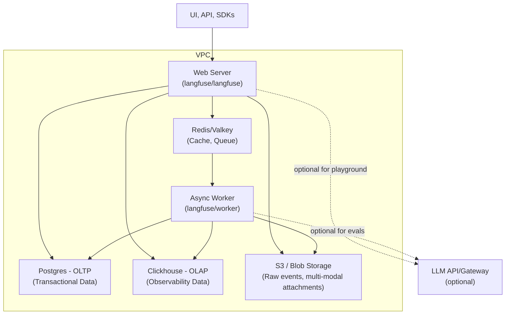

# Repository semantic capsule: langfuse/langfuse

- Commit: `6d298ec5d618ab236d8aacb6e59fa9daf59bb3a0`
- Default branch: `main`
- Description: Langfuse
- Selected evidence files: 6 of 21 files observed
- Interpretation: maintainer documentation and static repository evidence; runtime behavior is not proven.


## `README.md`


<div align="center">
   <div>
      <h3>
         <a href="https://cloud.langfuse.com">
            <strong>Langfuse Cloud</strong>
         </a> · 
         <a href="https://langfuse.com/docs/deployment/self-host">
            <strong>Self Host</strong>
         </a> · 
         <a href="https://langfuse.com/demo">
            <strong>Demo</strong>
         </a>
      </h3>
   </div>

   <div>
      <a href="https://langfuse.com/docs"><strong>Docs</strong></a> ·
      <a href="https://langfuse.com/issues"><strong>Report Bug</strong></a> ·
      <a href="https://langfuse.com/ideas"><strong>Feature Request</strong></a> ·
      <a href="https://langfuse.com/changelog"><strong>Changelog</strong></a> ·
      <a href="https://langfuse.com/roadmap"><strong>Roadmap</strong></a> ·
   </div>
   <br/>
   <div>
   </div>
</div>

<p align="center">
   <a href="https://github.com/langfuse/langfuse/blob/main/LICENSE">
   
   </a>
   <a href="https://www.ycombinator.com/companies/langfuse"></a>
   <a href="https://hub.docker.com/u/langfuse" target="_blank">
   </a>
   <a href="https://pypi.python.org/pypi/langfuse"></a>
   <a href="https://www.npmjs.com/package/langfuse"></a>
   <br/>
   <a href="https://discord.com/invite/7NXusRtqYU" target="_blank">
   </a>
   <a href="https://twitter.com/intent/follow?screen_name=langfuse" target="_blank">
   </a>
   <a href="https://www.linkedin.com/company/langfuse/" target="_blank">
   </a>
   <a href="https://github.com/langfuse/langfuse/graphs/commit-activity" target="_blank">
   </a>
   <a href="https://github.com/langfuse/langfuse/" target="_blank">
   </a>
   <a href="https://github.com/langfuse/langfuse/discussions/" target="_blank">
   </a>
</p>

<p align="center">
  <a href="./README.md"></a>
  <a href="./README.cn.md"></a>
  <a href="./README.ja.md"></a>
  <a href="./README.kr.md"></a>
</p>

Langfuse is an **open source LLM engineering** platform. It helps teams collaboratively
**develop, monitor, evaluate,** and **debug** AI applications. Langfuse can be **self-hosted in minutes** and is **battle-tested**. Proudly made with [ClickHouse open source database](https://github.com/ClickHouse/ClickHouse).

> ### 🧑‍💻 We're hiring
>
> Langfuse is growing fast (we doubled the team in the last 6 months) - since January 2026 we're part of ClickHouse, we're hiring engineering hybrid across the EU.
> We hire engineers who love open source and great developer experiences.
> **[See open roles →](https://langfuse.com/careers?utm_source=github&utm_medium=readme&utm_campaign=hiring&utm_content=langfuse)**


## ✨ Core Features


- [LLM Application Observability](https://langfuse.com/docs/tracing): Instrument your app and start ingesting traces to Langfuse, thereby tracking LLM calls and other relevant logic in your app such as retrieval, embedding, or agent actions. Inspect and debug complex logs and user sessions. Try the interactive [demo](https://langfuse.com/docs/demo) to see this in action.

- [Prompt Management](https://langfuse.com/docs/prompt-management/get-started) helps you centrally manage, version control, and collaboratively iterate on your prompts. Thanks to strong caching on server and client side, you can iterate on prompts without adding latency to your application.

- [Evaluations](https://langfuse.com/docs/evaluation/overview) are key to the LLM application development workflow, and Langfuse adapts to your needs. It supports LLM-as-a-judge, Code evaluators, user feedback collection, manual labeling, and custom evaluation pipelines via APIs/SDKs.

- [Datasets](https://langfuse.com/docs/evaluation/dataset-runs/datasets) enable test sets and benchmarks for evaluating your LLM application. They support continuous improvement, pre-deployment testing, structured experiments, flexible evaluation, and seamless integration with frameworks like LangChain and LlamaIndex.

- [LLM Playground](https://langfuse.com/docs/playground) is a tool for testing and iterating on your prompts and model configurations, shortening the feedback loop and accelerating development. When you see a bad result in tracing, you can directly jump to the playground to iterate on it.

- [Comprehensive API](https://langfuse.com/docs/api): Langfuse is frequently used to power bespoke LLMOps workflows while using the building blocks provided by Langfuse via the API. OpenAPI spec, Postman collection, and typed SDKs for Python, JS/TS are available.

## 📦 Deploy Langfuse


### Langfuse Cloud

Managed deployment by the Langfuse team, generous free-tier, no credit card required.

<div align="center">
    <a href="https://cloud.langfuse.com" target="_blank">
        
    </a>
</div>

### Self-Host Langfuse

Run Langfuse on your own infrastructure:

- [Local (docker compose)](https://langfuse.com/self-hosting/local): Run Langfuse on your own machine in 5 minutes using Docker Compose.

  ```bash
  # Get a copy of the latest Langfuse repository
  git clone --depth=1 https://github.com/langfuse/langfuse.git
  cd langfuse

  # Run the langfuse docker compose
  docker compose up
  ```

- [VM](https://langfuse.com/self-hosting/docker-compose): Run Langfuse on a single Virtual Machine using Docker Compose.
- [Kubernetes (Helm)](https://langfuse.com/self-hosting/kubernetes-helm): Run Langfuse on a Kubernetes cluster using Helm. This is the preferred production deployment.
- Terraform Templates: [AWS](https://langfuse.com/self-hosting/aws), [Azure](https://langfuse.com/self-hosting/azure), [GCP](https://langfuse.com/self-hosting/gcp)

See [self-hosting documentation](https://langfuse.com/self-hosting) to learn more about architecture and configuration options.

> [!TIP]
> **Self-hosting Langfuse?** Subscribe to the [self-hosting update list](https://langfuse.com/self-hosting#subscribe) to get an email about important features and new releases for open source Langfuse — self-hosting updates only, no marketing.

## 🔌 Integrations


### Main Integrations:

| Integration                                                                  | Supports                   | Description                                                                                                                                      |
| ---------------------------------------------------------------------------- | -------------------------- | ------------------------------------------------------------------------------------------------------------------------------------------------ |
| [SDK](https://langfuse.com/docs/sdk)                                         | Python, JS/TS              | Manual instrumentation using the SDKs for full flexibility.                                                                                      |
| [OpenAI](https://langfuse.com/integrations/model-providers/openai-py)        | Python, JS/TS              | Automated instrumentation using drop-in replacement of OpenAI SDK.                                                                               |
| [Langchain](https://langfuse.com/docs/integrations/langchain)                | Python, JS/TS              | Automated instrumentation by passing callback handler to Langchain application.                                                                  |
| [LlamaIndex](https://langfuse.com/docs/integrations/llama-index/get-started) | Python                     | Automated instrumentation via LlamaIndex callback system.                                                                                        |
| [Haystack](https://langfuse.com/docs/integrations/haystack)                  | Python                     | Automated instrumentation via Haystack content tracing system.                                                                                   |
| [LiteLLM](https://langfuse.com/docs/integrations/litellm)                    | Python, JS/TS (proxy only) | Use any LLM as a drop in replacement for GPT. Use Azure, OpenAI, Cohere, Anthropic, Ollama, VLLM, Sagemaker, HuggingFace, Replicate (100+ LLMs). |
| [Vercel AI SDK](https://langfuse.com/docs/integrations/vercel-ai-sdk)        | JS/TS                      | TypeScript toolkit designed to help developers build AI-powered applications with React, Next.js, Vue, Svelte, Node.js.                          |
| [Mastra](https://langfuse.com/docs/integrations/mastra)                      | JS/TS                      | Open source framework for building AI agents and multi-agent systems.                                                                            |
| [API](https://langfuse.com/docs/api)                                         |                            | Directly call the public API. OpenAPI spec available.                                                                                            |

### Packages integrated with Langfuse:

| Name                                                                    | Type               | Description                                                                                                             |
| ----------------------------------------------------------------------- | ------------------ | ----------------------------------------------------------------------------------------------------------------------- |
| [Instructor](https://langfuse.com/docs/integrations/instructor)         | Library            | Library to get structured LLM outputs (JSON, Pydantic)                                                                  |
| [DSPy](https://langfuse.com/docs/integrations/dspy)                     | Library            | Framework that systematically optimizes language model prompts and weights                                              |
| [Mirascope](https://langfuse.com/docs/integrations/mirascope)           | Library            | Python toolkit for building LLM applications.                                                                           |
| [Ollama](https://langfuse.com/docs/integrations/ollama)                 | Model (local)      | Easily run open source LLMs on your own machine.                                                                        |
| [Amazon Bedrock](https://langfuse.com/docs/integrations/amazon-bedrock) | Model              | Run foundation and fine-tuned models on AWS.                                                                            |
| [AutoGen](https://langfuse.com/docs/integrations/autogen)               | Agent Framework    | Open source LLM platform for building distributed agents.                                                               |
| [Flowise](https://langfuse.com/docs/integrations/flowise)               | Chat/Agent&nbsp;UI | JS/TS no-code builder for customized LLM flows.                                                                         |
| [Langflow](https://langfuse.com/docs/integrations/langflow)             | Chat/Agent&nbsp;UI | Python-based UI for LangChain, designed with react-flow to provide an effortless way to experiment and prototype flows. |
| [Dify](https://langfuse.com/docs/integrations/dify)                     | Chat/Agent&nbsp;UI | Open source LLM app development platform with no-code builder.                                                          |
| [OpenWebUI](https://langfuse.com/docs/integrations/openwebui)           | Chat/Agent&nbsp;UI | Self-hosted LLM Chat web ui supporting various LLM runners including self-hosted and local models.                      |
| [Promptfoo](https://langfuse.com/docs/integrations/promptfoo)           | Tool               | Open source LLM testing platform.                                                                                       |
| [LobeChat](https://langfuse.com/docs/integrations/lobechat)             | Chat/Agent&nbsp;UI | Open source chatbot platform.                                                                                           |
| [Vapi](https://langfuse.com/docs/integrations/vapi)                     | Platform           | Open source voice AI platform.                                                                                          |
| [Inferable](https://langfuse.com/docs/integrations/other/inferable)     | Agents             | Open source LLM platform for building distributed agents.                                                               |
| [Gradio](https://langfuse.com/docs/integrations/other/gradio)           | Chat/Agent&nbsp;UI | Open source Python library to build web interfaces like Chat UI.                                                        |
| [Goose](https://langfuse.com/docs/integrations/goose)                   | Agents             | Open source LLM platform for building distributed agents.                                                               |
| [smolagents](https://langfuse.com/docs/integrations/smolagents)         | Agents             | Open source AI agents framework.                                                                                        |
| [CrewAI](https://langfuse.com/docs/integrations/crewai)                 | Agents             | Multi agent framework for agent collaboration and tool use.                                                             |

## 🚀 Quickstart

Instrument your app and start ingesting traces to Langfuse, thereby tracking LLM calls and other relevant logic in your app such as retrieval, embedding, or agent actions. Inspect and debug complex logs and user sessions.

### 1️⃣ Create new project

1.  [Create Langfuse account](https://cloud.langfuse.com/auth/sign-up) or [self-host](https://langfuse.com/self-hosting)
2.  Create a new project
3.  Create new API credentials in the project settings

### 2️⃣ Log your first LLM call

The [`@observe()` decorator](https://langfuse.com/docs/sdk/python/decorators) makes it easy to trace any Python LLM application. In this quickstart we also use the Langfuse [OpenAI integration](https://langfuse.com/integrations/model-providers/openai-py) to automatically capture all model parameters.

> [!TIP]
> Not using OpenAI? Visit [our documentation](https://langfuse.com/docs/get-started#log-your-first-llm-call-to-langfuse) to learn how to log other models and frameworks.

```bash
pip install langfuse openai
```

```bash filename=".env"
LANGFUSE_SECRET_KEY="sk-lf-..."
LANGFUSE_PUBLIC_KEY="pk-lf-..."
LANGFUSE_BASE_URL="https://cloud.langfuse.com" # 🇪🇺 EU region
# LANGFUSE_BASE_URL="https://us.cloud.langfuse.com" # 🇺🇸 US region
```

```python /@observe()/ /from langfuse.openai import openai/ filename="main.py"
from langfuse import observe
from langfuse.openai import openai # OpenAI integration

@observe()
def story():
    return openai.chat.completions.create(
        model="gpt-4o",
        messages=[{"role": "user", "content": "What is Langfuse?"}],
    ).choices[0].message.content

@observe()
def main():
    return story()

main()
```

### 3️⃣ See traces in Langfuse

See your language model calls and other application logic in Langfuse.


## `AGENTS.md`

.agents/AGENTS.md

## `CLAUDE.md`

AGENTS.md

## `CONTRIBUTING.md`


> ### 🧑‍💻 We're hiring
>
> Langfuse is growing fast (we doubled the team in the last 6 months) - since January 2026 we're part of ClickHouse, we're hiring engineering hybrid across the EU.
> We hire engineers who love open source and great developer experiences.
> **[See open roles →](https://langfuse.com/careers?utm_source=github&utm_medium=readme&utm_campaign=hiring&utm_content=langfuse)**

# Contributing to Langfuse

First off, thanks for taking the time to contribute! ❤️

The best ways to contribute to Langfuse:

- Submit and vote on [Ideas](https://github.com/orgs/langfuse/discussions/categories/ideas)
- Create and comment on [Issues](https://github.com/langfuse/langfuse/issues)
- Open a PR.

We welcome contributions through GitHub pull requests. This document outlines our conventions regarding development workflow, commit message formatting, contact points, and other resources. Our goal is to simplify the process and ensure that your contributions are easily accepted.

We gratefully welcome improvements to documentation ([docs repo](https://github.com/langfuse/langfuse-docs)), the core application (this repo) and the SDKs ([Python](https://github.com/langfuse/langfuse-python), [JS](https://github.com/langfuse/langfuse-js)).

The maintainers are available on [Discord](https://langfuse.com/discord) in case you have any questions.

> And if you like the project, but just don't have time to contribute code, that's fine. There are other easy ways to support the project and show your appreciation, which we would also be very happy about:
>
> - Star the project;
> - Tweet about it;
> - Refer to this project in your project's readme;
> - Submit and vote on [Ideas](https://github.com/orgs/langfuse/discussions/categories/ideas);
> - Create and comment on [Issues](https://github.com/langfuse/langfuse/issues);
> - Mention the project at local meetups and tell your friends/colleagues.

## Making a change

_Before making any significant changes, please [open an issue](https://github.com/langfuse/langfuse/issues)._ Discussing your proposed changes ahead of time will make the contribution process smooth for everyone. Changes that were not discussed in an issue may be rejected.

Once we've discussed your changes and you've got your code ready, make sure that tests are passing and open your pull request.

Four checks gate every pull request and are cheaper to run before you open it than to discover in CI:

```bash
pnpm run lint        # eslint; every package runs with --max-warnings 0, so a warning fails
pnpm tc              # typecheck all packages
pnpm exec knip       # unused files, exports and dependencies
pnpm run test        # see "Running Unit Tests" below for the setup this needs
```

`lint` and `typecheck` are cached, so a pass can be a replay of an earlier run. Read turbo's `Cached:` line as well as its `Tasks:` line, and re-run with `pnpm exec turbo run lint --force` if you need to be sure it executed. For a user-visible change, also open the affected screen in a browser and check it — every pull request gets a full preview deployment at `pr-<N>.preview.langfuse.com`.

If a change is too large to review in one pull request, split it into a chained stack of small PRs rather than widening one.

A good first step is to search for open [issues](https://github.com/langfuse/langfuse/issues). Issues are labeled, and some good issues to start with are labeled: [good first issue](https://github.com/langfuse/langfuse/issues?q=is%3Aissue+is%3Aopen+label%3A%22good+first+issue%22).

## Project Overview

We recommend checking out DeepWiki to familiarize yourself with the project:

[](https://deepwiki.com/langfuse/langfuse)

### Technologies we use

- Application (this repository)
  - NextJS 14, pages router
  - NextAuth.js / Auth.js
  - tRPC: Frontend APIs
  - Prisma ORM
  - Zod v4
  - Tailwind CSS
  - shadcn/ui tailwind components (using Radix and tanstack)
  - Fern: generate OpenAPI spec and Pydantic models
- JS SDK ([langfuse/langfuse-js](https://github.com/langfuse/langfuse-js))
  - openapi-typescript to generated types based on OpenAPI spec
- Python SDK ([langfuse/langfuse-python](https://github.com/langfuse/langfuse-python))
  - Pydantic for input validation, models generated by fern

### Architecture Overview

See this [diagram](https://langfuse.com/self-hosting#architecture) for an overview of the architecture.

### Network Overview



### Database Overview

The diagram below may not show all relationships if the foreign key is not defined in the database schema. For instance, `trace_id` in the `observation` table is not defined as a foreign key to the `trace` table to allow unordered ingestion of these objects, but it is still a foreign key in the application code.

Full database schema: [packages/shared/prisma/schema.prisma](packages/shared/prisma/schema.prisma)

## Repository Structure

We built a monorepo using [pnpm](https://pnpm.io/motivation) and [turbo](https://turbo.build/repo/docs) to manage the dependencies and build process. The monorepo contains the following packages:

- `web`: is the main application package providing Frontend and Backend APIs for Langfuse.
- `worker`: contains an application for asynchronous processing of tasks.
- `packages`:
  - `shared`: contains shared code between the above packages.
  - `config-eslint`: contains eslint configurations which are shared between the above packages.
  - `config-typescript`: contains typescript configurations which are shared between the above packages.
- `ee`: contains all enterprise features. See [EE README](ee/README.md) for more details.

## Development Setup

Requirements

- Node.js 24 as specified in the [.nvmrc](.nvmrc)
- [Rust via rustup](https://rust-lang.org/tools/install/) and a native compiler/linker for the AI gateway, which starts with `pnpm dev`. See [gateway setup](ai-gateway/README.md#run-locally).
- pnpm 12.3.1 as specified in `package.json`
- Docker to run the database locally
- Clickhouse client

**Note:** You can also simply run Langfuse in a **GitHub Codespace** via the provided devcontainer. To do this, click on the green "Code" button in the top right corner of the repository and select "Open with Codespaces".

### Codex Cloud Setup

You can also attach this repository to an OpenAI Codex cloud environment. The
cloud environment itself is configured in the Codex UI, while the repo-owned
bootstrap is versioned in:

- `scripts/codex/setup.sh`
- `scripts/codex/maintenance.sh`

Recommended Codex UI configuration:

1. Create a new cloud environment for this repository in the Codex UI.
2. Choose a base environment with Node.js 24 support.
3. Set the setup script to:

   ```bash
   bash scripts/codex/setup.sh
   ```

4. Set the maintenance script to:

   ```bash
   bash scripts/codex/maintenance.sh
   ```

5. Keep internet access disabled by default, or only allow the minimum domains
   needed for your task.
6. Add secrets and environment variables in the Codex UI instead of committing
   them to the repository.

Notes:

- This Codex setup is intended for repository tasks such as code changes,
  linting, typechecking, and targeted tests.
- It does **not** start the full Langfuse stack. Local development still uses
  Docker and `pnpm run dx` / `pnpm run dev`.
- Running the full application inside Codex requires external services for
  PostgreSQL, Redis, ClickHouse, and object storage, plus matching environment
  variables in the Codex UI.

### Cursor Cloud Setup

Cursor Cloud Agents use the committed `.cursor/environment.json` and
`.cursor/Dockerfile`. The environment build runs the shared setup script, and
each agent run starts a branch-built six-service Docker Compose stack:

```bash
bash scripts/agents/setup.sh
bash scripts/agents/start-cursor-cloud.sh
```

The start command waits for web, worker, PostgreSQL, ClickHouse, Redis, and
MinIO, then seeds the synthetic demo project and checks both application health
endpoints. Cursor team administrators separately configure the read-only MCP
catalog described in `.agents/README.md`; credentials and OAuth grants belong
in Cursor, never in repository files. Maintainers who need the issue tracker
inside Cloud should also set secret `LINEAR_API_KEY` (personal Linear API key)
in the Cloud Agents dashboard; Linear MCP OAuth does not complete in Cloud.

After local verification, a Cursor agent should open a same-repo reviewable
PR (not a draft), apply the GitHub `cursor` label, and test its
`pr-<N>.preview.langfuse.com` deployment.
Use Linear's git branch name (`lfe-XXXX-short-title`), not a `cursor/` prefix.
When handing work to a human, give a one-sentence TL;DR, a preview URL with
exact test steps (including how to seed or hit the same path on
`http://localhost:3000`), and proof of the fix for user-visible changes
posted on the GitHub PR (screenshot, video, or before/after — not only in
chat). Cursor agents that comment as Cursor may also leave one PR comment
with that proof plus what a reviewer should doubt; Claude Code and other
tools that comment as the human author must not.
Prefer one or two human actions at a time; if you need more, keep each
point simple and super readable. Preview data and any attached artifacts
must remain synthetic. Previews normally run Mon-Fri 08:00-24:00
Europe/Berlin and are not woken with Cursor credentials.

### Shared Agent Setup

This repository keeps the shared agent setup in source control so developers
using different tools can work against the same instructions, bootstrap, and
MCP server catalog.


## `SECURITY.md`

## Security Policy
We strongly recommend using the latest version of Langfuse to receive all security updates.

For more information, please refer to the [Data Security & Privacy](https://langfuse.com/docs/data-security-privacy) page in the documentation or contact security@langfuse.com.

## `package.json`

{
  "name": "langfuse",
  "version": "4.35.0",
  "author": "engineering@langfuse.com",
  "license": "MIT",
  "private": true,
  "engines": {
    "node": "24",
    "pnpm": "12.3.1"
  },
  "scripts": {
    "agents:check": "node scripts/agents/sync-agent-shims.mjs --check --check-paths",
    "agents:sync": "node scripts/agents/sync-agent-shims.mjs",
    "postinstall": "node -e \"const fs = require('node:fs'); const cp = require('node:child_process'); if (!fs.existsSync('scripts/postinstall.sh')) { console.log('Skipping repo postinstall helper: scripts/postinstall.sh is not present in this install context.'); process.exit(0); } cp.execSync('bash scripts/postinstall.sh', { stdio: 'inherit' });\"",
    "preinstall": "npx only-allow pnpm",
    "infra:dev:up": "docker compose -f ./docker-compose.dev.yml up -d --wait",
    "infra:dev:down": "docker compose -f ./docker-compose.dev.yml down",
    "infra:dev:prune": "docker compose -f ./docker-compose.dev.yml down -v",
    "db:generate": "turbo run db:generate",
    "db:migrate": "turbo run db:migrate",
    "db:seed": "turbo run db:seed",
    "db:seed:examples": "turbo run db:seed:examples",
    "ch:migrations:materialize": "pnpm --filter @langfuse/shared run ch:migrations:materialize",
    "ch:migrations:clean": "pnpm --filter @langfuse/shared run ch:migrations:clean",
    "nuke": "bash ./scripts/nuke.sh",
    "scan:client-bundle": "node scripts/scan-client-bundle.mjs web/.next/static",
    "seed": "pnpm --filter=shared run seed:scenario",
    "dx": "pnpm i && pnpm run infra:dev:prune && pnpm run infra:dev:up --pull always && pnpm --filter=shared run db:reset:test && pnpm --filter=shared run db:reset && pnpm --filter=shared run ch:reset && pnpm --filter=shared run db:seed:examples && pnpm run dev",
    "dx-f": "pnpm i && pnpm run infra:dev:prune && pnpm run infra:dev:up --pull always && pnpm --filter=shared run db:reset:test && pnpm --filter=shared run db:reset -f && SKIP_CONFIRM=1 pnpm --filter=shared run ch:reset && pnpm --filter=shared run db:seed:examples && pnpm run dev",
    "dx:skip-infra": "pnpm i && pnpm --filter=shared run db:reset:test && pnpm --filter=shared run db:reset && pnpm --filter=shared run ch:reset && pnpm --filter=shared run db:seed:examples && pnpm run dev",
    "build": "turbo run build",
    "build:check": "turbo run build:check",
    "typecheck": "turbo run typecheck",
    "tc": "turbo run typecheck",
    "start": "turbo run start",
    "dev": "turbo watch dev",
    "dev:worker": "turbo run dev --filter=worker",
    "dev:web": "turbo run dev --filter=web",
    "dev:web-webpack": "turbo run dev --filter=web -- --webpack",
    "lint": "turbo run lint",
    "format": "prettier --write \"**/*.{js,jsx,ts,tsx,css}\" --experimental-cli",
    "format:check": "prettier --check \"**/*.{js,jsx,ts,tsx,css}\" --experimental-cli",
    "playwright:install": "pnpm --filter web exec playwright install chromium",
    "openapi:export": "npx fern-api export --api server web/public/generated/api/openapi.yml && pnpm --filter web exec tsx scripts/openapi/postprocess-openapi.ts && npx fern-api export --api client web/public/generated/api-client/openapi.yml && npx fern-api export --api organizations web/public/generated/organizations-api/openapi.yml",
    "openapi:check": "pnpm run openapi:export && bash scripts/openapi/assert-generated-current.sh",
    "storybook": "pnpm --filter web run storybook",
    "test": "turbo run test",
    "release": "bash ./scripts/release-preflight.sh && dotenv -e ../.env -- release-it",
    "release:cloud": "bash ./scripts/release-cloud.sh",
    "prepare": "husky"
  },
  "devDependencies": {
    "@release-it/bumper": "^7.0.6",
    "dotenv-cli": "^7.4.4",
    "eslint-scope": "^9.1.2",
    "espree": "^11.2.0",
    "globals": "^16.5.0",
    "husky": "^9.1.7",
    "knip": "^6.22.0",
    "prettier": "^3.8.3",
    "release-it": "^20.2.0",
    "ts7": "npm:typescript@^7.0.2",
    "turbo": "2.10.5"
  },
  "release-it": {
    "git": {
      "commitMessage": "chore: release v${version}",
      "tagName": "v${version}",
      "commitArgs": [
        "--no-verify"
      ],
      "pushArgs": [
        "--no-verify"
      ]
    },
    "plugins": {
      "@release-it/bumper": {
        "out": [
          {
            "file": "./packages/shared/src/constants/VERSION.ts",
            "type": "application/typescript"
          },
          {
            "file": "./web/src/constants/VERSION.ts",
            "type": "application/typescript"
          },
          {
            "file": "./worker/src/constants/VERSION.ts",
            "type": "application/typescript"
          },
          {
            "file": "./web/package.json"
          },
          {
            "file": "./worker/package.json"
          }
        ]
      }
    },
    "github": {
      "release": true,
      "web": true,
      "autoGenerate": true,
      "releaseName": "v${version}",
      "comments": {
        "submit": true,
        "issue": ":rocket: _This issue has been resolved in v${version}. See [${releaseName}](${releaseUrl}) for release notes._",
        "pr": ":rocket: _This pull request is included in v${version}. See [${releaseName}](${releaseUrl}) for release notes._"
      }
    }
  },
  "packageManager": "pnpm@12.3.1"
}
