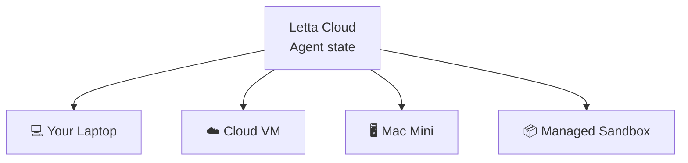

# Repository semantic capsule: letta-ai/letta-code

- Commit: `1ec6a43ff4a799217dd2114f0d49d9d7b33b6339`
- Default branch: `main`
- Description: letta-ai/letta-code
- Selected evidence files: 5 of 21 files observed
- Interpretation: maintainer documentation and static repository evidence; runtime behavior is not proven.


## `README.md`

# Letta Code

[](https://www.npmjs.com/package/@letta-ai/letta-code) [](https://discord.gg/letta)

Letta Code is a stateful agent harness for creating agents that are more like people than tools. Letta Code agents have memory, identity, and a sense of experience over time. They learn and evolve over long horizons through rewriting their own memory, skills, prompts, and even the harness itself (through mods). 

Letta Code can be used interactively, or to power always-on agents that work proactively. Interact with agents through:
* A local [**CLI**](https://docs.letta.com/letta-code/cli)
* The [**desktop app**](https://docs.letta.com/letta-code/desktop-app) for macOS, Windows, and Linux
* Your browser, including [mobile](https://docs.letta.com/letta-code/remote-mobile), at [chat.letta.com](https://chat.letta.com)
* Messaging integrations, including [Telegram](https://docs.letta.com/letta-code/channels#telegram-cli), [Slack](https://docs.letta.com/letta-code/channels#slack-cli), [Discord](https://docs.letta.com/letta-code/channels#discord-cli), and [custom channels](https://github.com/letta-ai/letta-code/blob/main/src/channels/README.md)


## Feature Overview

> [!TIP]
> Letta Code agents are designed to be self-configuring. If you want to configure something (e.g. skills, behavior, hooks, permissions), try asking your agent to do it for you.

| Feature | Description |
|---|---|
| [Self-improvement & Learning](https://docs.letta.com/letta-code/memory) | Agents programmatically rewrite their context to improve and adapt over time, including system prompt learning (through [memory blocks](https://www.letta.com/blog/memory-blocks)) and [skill learning](https://www.letta.com/blog/skill-learning). Configure periodic dreaming with `/sleeptime`, investigate agent behavior with `/doctor [symptom]`, and view memory with `/palace` |
| [Message search](https://docs.letta.com/letta-code/slash-commands) | Search across all messages and agents with `/search`. Agent can also search their own conversations or the conversations of other agents |
| [MemFS](https://docs.letta.com/letta-code/memfs) | All context (including memory blocks) is tracked via git. Sync context to a custom GitHub repository by setting `/memory-repository set git@github.com:...` |
| [Skills](https://docs.letta.com/letta-code/skills) | Loads global skills (`~/.letta`), project-scoped skills (`.agents/skills`), and agent-scoped skills (stored in MemFS). View skills with `/skills` and create with `/skill-creator` |
| [Subagents & Multi-agent](https://docs.letta.com/letta-code/subagents) | Call built-in subagents (general-purpose, forked, recall, history-analyzer) in the background. Agents can call any other agent (including themselves) as subagents |
| [Messaging Integrations](https://docs.letta.com/letta-code/channels) | Chat with the same agent from Slack, Telegram, your browser (chat.letta.com) including mobile, and through [custom channels](https://github.com/letta-ai/skills/blob/main/letta/creating-letta-code-channels/SKILL.md) |
| [Hooks](https://docs.letta.com/letta-code/hooks) | Run custom scripts at key points of agent execution to automate workflows |
| [Permissions](https://docs.letta.com/letta-code/permissions) | Set permission modes and customize what actions are auto-approved or auto-denied |
| [Crons & Schedules](https://docs.letta.com/letta-code/scheduling) | Configure heartbeats and crons, and let agents work across time with self-managed schedules |
| [Remote computers](https://docs.letta.com/platform/computers/byom) (requires signing in with Letta) | Agents work across multiple computers. Connect any machine by running `letta server --computer-name "..."` |
| [Secrets](https://docs.letta.com/letta-code/secrets) (requires signing in with Letta) | Make secrets available as environment variables (across machines) while obfuscating their values from context |

See the full list of slash commands in our [documentation](https://docs.letta.com/letta-code/slash-commands).

## Get started

Install the package via [npm](https://docs.npmjs.com/downloading-and-installing-node-js-and-npm):

```bash
npm install -g @letta-ai/letta-code
```

Navigate to your project directory and run `letta` (see command-line options [in the docs](https://docs.letta.com/letta-code/commands)). You can also run the tutorial agent with: 
```
letta --new-agent --personality tutorial
```

Run `/connect` to configure your own LLM API keys (OpenAI / ChatGPT, Anthropic, Z.ai coding plan, etc.), and use `/model` to swap models.

You can also download the [**desktop app**](https://docs.letta.com/letta-code/desktop-app) for macOS, Windows, and Linux. Agents created in the CLI are available via the desktop app, and vice versa.

## Letta Cloud

Agents stored in Letta Cloud keep their memory, identity, and conversations there while the Letta Code harness can run on any connected computer: your laptop, [GitHub Actions](https://github.com/letta-ai/letta-code-action), a managed cloud sandbox, a remote VM, or a Mac Mini. You can chat with the same agents through [chat.letta.com](https://chat.letta.com/) or the desktop app.



Run `/login` from the CLI or sign in through the desktop app to access agents in your Letta account.

### Remote computers
Agents stored in Letta Cloud can run across multiple machines. Connect any machine by running:
```bash
letta server
letta server --computer-name "work-laptop"
```
List discoverable computers from the CLI:
```bash
letta computers list --online-only
```
Get the current computer connection for routing another agent onto this same machine:
```bash
letta computers current
```
Route a headless message through a specific computer:
```bash
letta -p --agent <agent-id> --computer "work-laptop" "hello from that machine"
```
Use `--computer cloud` to start or reuse the target agent's cloud sandbox.
Agent-to-agent headless messages without `--computer` run on the same computer.
See our guides for using [Railway](https://docs.letta.com/letta-code/remote#railway), [DigitalOcean](https://docs.letta.com/letta-code/remote#digitalocean), and [Fly.io](https://docs.letta.com/letta-code/remote#flyio) as remote computers.

The previous `environments`/`envs`, `--environment`/`--env`, and `--env-name`
spellings remain available for backwards compatibility.

## AgentFile deprecation

AgentFile (`.af`) export and import are deprecated and have been removed from Letta Code. The `/export` and `/download` slash commands and the `--import` and `--from-af` CLI flags are no longer supported, including imports from the agent registry.

This does not affect memory import/export or conversation transcript export.

## Installing external skills

Install skills into a specific agent's memory with `letta skills install <skill>`: 

| Source | Example |
|---|---|
| GitHub | `letta skills install https://github.com/owner/repo`<br>`letta skills install https://github.com/owner/repo/tree/main/path/to/skill`<br>`letta skills install https://github.com/owner/repo/blob/main/path/to/skill/SKILL.md` |
| [ClawHub](https://clawhub.ai/) | `openclaw skills install <skill-slug>` → `letta skills install <skill-slug>` |
| [Hermes Skills Hub](https://hermes-agent.nousresearch.com/docs/skills/) | `hermes skills install <skill-path>` → `letta skills install <skill-path>` |

To view skills run `letta skills list --agent <agent-id>`, and delete skills with `letta skills delete <skill-name> --agent <agent-id>`.

## Research

Letta Code is developed by the creators of [MemGPT](https://arxiv.org/abs/2310.08560) and [sleep-time compute](https://arxiv.org/abs/2504.13171) (now called "dreaming"), and driven by our [research](https://www.letta.com/research) in AI memory and continual learning.

## Other

Community maintained packages are available for Arch Linux users on the [AUR](https://aur.archlinux.org/packages/letta-code):

```bash
yay -S letta-code # release
yay -S letta-code-git # nightly
```

Nix users can run or install Letta Code through the repository flake:
```bash
nix run github:letta-ai/letta-code
nix profile install github:letta-ai/letta-code
```

See [docs/nix.md](docs/nix.md) for Home Manager and NixOS service examples.

---

Made with 💜 in San Francisco


## `AGENTS.md`

# letta-code — Agent Guide

This file explains how to work effectively in this repo. It covers the rules enforced by CI, **why each rule exists**, and the workflow conventions that keep the codebase healthy and agent-navigable.

---

## Workflow

1. **Create a worktree** for any non-trivial change — especially if another agent may be working concurrently.
2. **Make your change**, then run `bun run check` and fix all failures before opening a PR.
3. **One PR per logical change.** Don't bundle unrelated changes — harder to revert if something breaks.
4. **Never amend commits.** Always create a new commit.
5. **Check the current branch** before editing files. If in doubt, ask.

---

## Runtime Validation

Development and distribution use different runtimes. `bun run dev` runs the
TypeScript source with Bun, while the published package exposes a Node-targeted
`letta.js` bundle and requires Node 22.19 or newer. When behavior depends on the
runtime, test both the Bun source path and the built Node artifact.

The interactive TUI, headless mode, and websocket listener also have separate
orchestration paths. Changes to shared turn, tool, approval, permission, or
transcript behavior must identify and run the focused tests for every affected
path. `bun run check` is always required, but it does not replace those behavior
tests.

---

## Rules and Why They Exist

These are the rules enforced by CI and the pre-commit hook, with the reasoning behind each. Understanding the *why* lets you make good decisions in ambiguous cases the rules don't explicitly cover.

### No `../` parent imports — use `@/`

**Rule:** All cross-directory imports must use the `@/` alias (`@/` maps to `src/`). Relative parent paths (`../`) are banned and blocked by pre-commit.

**Why:** Agents navigate codebases by searching. `import { getBackend } from "@/backend"` is immediately grep-discoverable anywhere in the repo. `import { getBackend } from "../../backend"` requires resolving the path from the current file's location — fragile to moves and opaque to search. Consistent absolute paths also make codemods reliable: a rename script can find all import sites with a simple grep.

```ts
// correct
import { getBackend } from "@/backend";
import { isDebugEnabled } from "@/utils/debug";

// wrong — blocked by pre-commit hook
import { getBackend } from "../../backend";
```

**Four files are exempt** (they legitimately live above `src/`): `src/version.ts`, `src/index.ts`, `src/cli/cli.ts`, `src/cli/app/App.tsx`. Same-directory `./` imports are always fine.

---

### Kebab-case `.ts` filenames, PascalCase `.tsx`

**Rule:** `.ts` source files use kebab-case (`local-store.ts`). `.tsx` component files use PascalCase (`AgentSelector.tsx`). Enforced by `scripts/check-filename-casing.js` in pre-commit and CI.

**Why:** Agents evaluate code quality by how searchable a codebase is. Inconsistent casing (`localStore.ts`, `LocalStore.ts`, `local-store.ts`) means a grep pattern that works for one file fails for another. macOS's case-insensitive filesystem makes this worse — `existsSync("bash.ts")` returns `true` when `Bash.ts` exists, silently breaking rename scripts. Kebab-case `.ts` is also consistent with how Node/Bun resolves modules on Linux CI (case-sensitive).

---

### Named exports everywhere — no default exports

**Rule:** All exports must be named. Default exports are banned (`style/noDefaultExport` biome rule).

**Why:** `grep 'export function AgentSelector'` finds the definition in one shot. With a default export, `export default function` tells you nothing about what the consumer will call it — each import site can rename it arbitrarily, making codebase-wide search unreliable.

---

### `export function` over `export const fn = () =>`

**Rule:** Exported functions must use the `export function` declaration form. `export const fn = () =>` is flagged by `scripts/check-exported-functions.js`. Exception: `.tsx` files wrapping `React.memo()`.

**Why:** Same grep-discoverability principle. `grep 'export function foo'` finds every exported function definition in one query. `export const` mixes function declarations with value exports — agents can't distinguish them without reading the right-hand side. `export function` is also hoisted, making it order-independent.

```ts
// correct
export function computeThing(x: string): number { ... }

// wrong — flagged by check-exported-functions.js
export const computeThing = (x: string): number => { ... }
```

---

### No circular dependencies

**Rule:** Zero circular imports. Enforced by madge (`check:cycles`) in pre-commit and CI. The current baseline is exactly 0.

**Why:** Circular imports cause subtle initialization-order bugs (module A's top-level code runs before module B has finished initializing, even though A imports from B). They also make the dependency graph impossible to reason about — you can't understand a file in isolation if its transitive dependencies loop back to it. The layer map below only has meaning if the graph is acyclic.

---

### Source files stay below 1,000 lines

**Rule:** New source and test files must not exceed 1,000 lines. Existing
oversized files are pinned in `scripts/source-file-size-baseline.json`: they may
shrink, but they may not grow. Lower the baseline in the same change whenever an
oversized file gets smaller, and remove its entry once it reaches the limit.

**Why:** Agents commonly inspect large files in slices and miss distant state,
cleanup, or fallback paths. Responsibility-sized modules make the whole behavior
readable in one pass and give tests an obvious home.

---

### Import from the owner, not an implementation barrel

**Rule:** Import a symbol from the module that defines it. Do not turn concrete
implementation entrypoints such as channel adapters into convenience barrels.
Scoped ownership rules are enforced by `scripts/check-module-ownership.js`.

**Why:** Forwarding exports hide where behavior lives, inflate dependency graphs,
and make agents open orchestration files when they need a small helper. Public
package entrypoints may still re-export their intentional API surface.

---

### Layer boundaries — no upward imports

**Rule:** Files may only import from the same layer or layers below them. Violations are caught by `scripts/check-layer-boundaries.js` in pre-commit and CI.

**Why:** Coupling a lower layer to a higher layer collapses the abstraction. If `backend/` imports from `cli/`, you can no longer use the backend without the UI — tests become harder to write, and changes to the UI risk breaking storage logic. The boundary rules make each layer independently testable and make it safe to change or swap implementations.

```
cli/           ← Ink UI, commands, overlays
websocket/     ← WS listener, session management
agent/         ← domain: conversation, approval, context
tools/         ← tool implementations
backend/       ← API/storage abstraction
providers/     ← LLM adapters (Anthropic, OpenAI)
permissions/   ← pure permission rules (no UI deps)
telemetry/     ← leaf: observability
cron/          ← leaf: scheduler
channels/      ← leaf: integrations
utils/         ← bottom: no domain deps
```

**Enforced rules:**
- `tools/` cannot import from `cli/`
- `backend/` cannot import from `cli/` or `websocket/`
- `providers/` cannot import from `agent/` or `cli/`
- `websocket/listener/` cannot import `backend/api/client` or `backend/api/conversations` directly
- `cli/app/` cannot import `backend/api/conversations` directly

**When adding a new file:** put it in the lowest layer whose dependencies it needs. If you find yourself importing from a higher layer, extract the shared logic into a lower one instead.

---

### Unused locals and parameters are errors

**Rule:** `noUnusedLocals` and `noUnusedParameters` are enabled in `tsconfig.json`. `tsc --noEmit` runs on every commit.

**Why:** Unused symbols mislead agents into thinking something is needed when it isn't. Dead code is the most common source of incorrect assumptions when exploring an unfamiliar codebase. Keeping the signal-to-noise ratio high makes grep results meaningful.

- Use `_prefix` for intentionally unused parameters (`_event`, `_index`).
- Use `void x` to discard a value without creating a binding.
- TypeScript exempts `_`-prefixed names from the check, but NOT function declarations (`function _foo()` is still flagged — use `void` instead).

---

### Test mock isolation

**Rule:** `mock.module()` calls must follow isolation patterns checked by `scripts/check-test-mock-isolation.js`.

**Why:** In Bun, `mock.module()` is applied to the **global module registry** of the worker process — not scoped to the current test file. Mocks leak to all other test files running in the same worker. A mock set in `foo.test.ts` can silently affect `bar.test.ts` if they share a worker, even though `bar.test.ts` never asked for it. This produces failures that only appear in the full test suite, not in isolation.

Practical rules:
- Prefer dependency injection or object-level stubbing over module-level mocking.
- Don't mock broad shared modules (`settings-manager`, telemetry, etc.).
- If a test file must use `mock.module()`, register it with a reason in `scripts/isolated-unit-tests.json`; `scripts/run-unit-tests.cjs` will run it in a standalone Bun process, and the mock-isolation check rejects unregistered top-level mocks.
- If a test passes alone but fails in `bun test src/`, suspect mock leakage first.

---

## Directory Guides

Some directories carry their own binding `AGENTS.md` with rules that override
generic instincts. Read the local guide before changing code there:

- `src/cli/AGENTS.md` — Ink rendering, approvals, and interactive input rules
  for the TUI.
- `src/websocket/listener/AGENTS.md` — turn lifecycle, leases, approvals, queue
  gating, and where listener tests belong.
- `src/channels/AGENTS.md` — gateway policy placement and the pure-logic
  package subpaths shared with remote hosts.
- `src/channels/slack/AGENTS.md` — Slack module ownership, the progress
  contract, and live verification requirements.

---

## Placing New Files

| What you're adding | Where it goes |
|--------------------|---------------|
| Ink component (UI only) | `src/cli/components/` |
| Command handler | `src/cli/commands/` |
| Hook used in App | `src/cli/app/` or `src/cli/hooks/` |
| WS listener logic | `src/websocket/listener/` |
| Agent/conversation domain logic | `src/agent/` |
| Tool implementation | `src/tools/impl/` |
| Backend abstraction | `src/backend/` |
| LLM provider adapter | `src/providers/` |
| Pure utility (no domain deps) | `src/utils/` |
| Shared test helpers | `src/test-utils/` |
| Build/lint scripts | `scripts/` |

Test files live **next to their source** (`local-store.test.ts` next to `local-store.ts`), not in a separate `tests/` directory.

---

## Reference

### Commands

| Task | Command |
|------|---------|
| Install deps | `bun install` |
| Full check suite | `bun run check` |

## `CLAUDE.md`

AGENTS.md

## `CONTRIBUTING.md`

# Contributing to Letta Code

## AI Usage Policy

All issues and pull requests must comply with the [AI Usage Policy](AI_POLICY.md). Disclose every AI tool used and ensure a human has reviewed, verified, and understands the complete submission. Noncompliant contributions are automatically closed unless the author is a trusted contributor or Letta maintainer.

## Fork the repo

Fork the repository on GitHub by [clicking this link](https://github.com/letta-ai/letta-code/fork), then clone your fork:

```bash
git clone https://github.com/your-username/letta-code.git
cd letta-code
```

## Installing from source

Requirements:
* [Bun](https://bun.com/docs/installation) v1.2.20+ (run `bun upgrade` if needed; older versions have TUI input issues)

### Run directly from source (dev workflow)
```bash
# install deps
bun install

# run the CLI from TypeScript sources (pick up changes immediately)
bun run dev
bun run dev -- -p "Hello world"  # example with args
```

### Build + link the standalone binary
```bash
# build bin/letta (includes prompts + schemas)
bun run build

# expose the binary globally (adjust to your preference)
bun link

# now you can run the compiled CLI
letta
```

Whenever you change source files, rerun `bun run build` before using the linked `letta` binary so it picks up your edits.

## `package.json`

{
  "name": "@letta-ai/letta-code",
  "version": "0.32.6",
  "lettaStartupLogProtocol": 1,
  "description": "Letta Code is a CLI tool for interacting with stateful Letta agents from the terminal.",
  "type": "module",
  "packageManager": "bun@1.3.14",
  "bin": {
    "letta": "letta.js"
  },
  "files": [
    "LICENSE",
    "README.md",
    "letta.js",
    "image-resize-worker.js",
    "assets/tutor-profile.png",
    "scripts",
    "skills",
    "vendor",
    "dist/app-server-client.js",
    "dist/app-server-client.js.map",
    "dist/app-server-client.cjs",
    "dist/app-server-client.cjs.map",
    "dist/memory-confinement.js",
    "dist/memory-confinement.js.map",
    "dist/memory-constraints.js",
    "dist/memory-constraints.js.map",
    "dist/mcp-client.js",
    "dist/mcp-client.js.map",
    "dist/agent-presets.js",
    "dist/agent-presets.js.map",
    "dist/schedules.js",
    "dist/schedules.js.map",
    "dist/channels-public.js",
    "dist/channels-public.js.map",
    "dist/gateway-core.js",
    "dist/gateway-core.js.map",
    "dist/channels-slack.js",
    "dist/channels-slack.js.map",
    "dist/channels-telegram.js",
    "dist/channels-telegram.js.map",
    "dist/types",
    "docs",
    "dist/agent-presets-*.js",
    "dist/agent-presets-*.js.map"
  ],
  "exports": {
    ".": "./letta.js",
    "./app-server-protocol": {
      "types": "./dist/types/types/app-server-protocol.d.ts"
    },
    "./app-server-client": {
      "types": "./dist/types/app-server-client.d.ts",
      "browser": "./dist/app-server-client.js",
      "import": "./dist/app-server-client.js",
      "require": "./dist/app-server-client.cjs",
      "default": "./dist/app-server-client.js"
    },
    "./memory-confinement": {
      "types": "./dist/types/memory-confinement.d.ts",
      "import": "./dist/memory-confinement.js",
      "default": "./dist/memory-confinement.js"
    },
    "./memory-constraints": {
      "types": "./dist/types/memory-constraints.d.ts",
      "import": "./dist/memory-constraints.js",
      "default": "./dist/memory-constraints.js"
    },
    "./mcp-client": {
      "types": "./dist/types/mcp-client.d.ts",
      "import": "./dist/mcp-client.js",
      "default": "./dist/mcp-client.js"
    },
    "./protocol": {
      "types": "./dist/types/types/protocol.d.ts"
    },
    "./agent-presets": {
      "types": "./dist/types/agent-presets.d.ts",
      "browser": "./dist/agent-presets.js",
      "import": "./dist/agent-presets.js",
      "default": "./dist/agent-presets.js"
    },
    "./dist/agent-presets.js": {
      "types": "./dist/types/agent-presets.d.ts",
      "browser": "./dist/agent-presets.js",
      "import": "./dist/agent-presets.js",
      "default": "./dist/agent-presets.js"
    },
    "./schedules": {
      "types": "./dist/types/schedules.d.ts",
      "browser": "./dist/schedules.js",
      "import": "./dist/schedules.js",
      "default": "./dist/schedules.js"
    },
    "./channels": {
      "types": "./dist/types/channels-public.d.ts",
      "browser": "./dist/channels-public.js",
      "import": "./dist/channels-public.js",
      "default": "./dist/channels-public.js"
    },
    "./gateway-core": {
      "types": "./dist/types/gateway-core.d.ts",
      "browser": "./dist/gateway-core.js",
      "import": "./dist/gateway-core.js",
      "default": "./dist/gateway-core.js"
    },
    "./channels/slack": {
      "types": "./dist/types/channels-slack.d.ts",
      "browser": "./dist/channels-slack.js",
      "import": "./dist/channels-slack.js",
      "default": "./dist/channels-slack.js"
    },
    "./channels/telegram": {
      "types": "./dist/types/channels-telegram.d.ts",
      "browser": "./dist/channels-telegram.js",
      "import": "./dist/channels-telegram.js",
      "default": "./dist/channels-telegram.js"
    }
  },
  "repository": {
    "type": "git",
    "url": "https://github.com/letta-ai/letta-code.git"
  },
  "license": "Apache-2.0",
  "engines": {
    "bun": ">=1.3.2",
    "node": ">=22.19.0"
  },
  "publishConfig": {
    "access": "public"
  },
  "dependencies": {
    "@earendil-works/pi-ai": "^0.85.1",
    "@janhapke/sharp-electron": "0.35.3-electron.1",
    "@letta-ai/letta-client": "^1.10.2",
    "@letta-ai/trajectory": "0.2.0",
    "@modelcontextprotocol/sdk": "1.30.0",
    "@pierre/diffs": "1.2.2",
    "@scarf/scarf": "^1.4.0",
    "cron-parser": "^5.6.1",
    "cross-spawn": "^7.0.6",
    "glob": "^13.0.0",
    "ink-link": "^5.0.0",
    "node-pty": "^1.1.0",
    "open": "^10.2.0",
    "react": "18.2.0",
    "sharp": "^0.34.5",
    "shiki": "^4.0.2",
    "strip-ansi": "^7.2.0",
    "ws": "^8.19.0"
  },
  "optionalDependencies": {
    "@vscode/ripgrep": "^1.17.0"
  },
  "devDependencies": {
    "@modelcontextprotocol/server-everything": "^2026.7.4",
    "@slack/bolt": "^4.7.0",
    "@types/bun": "^1.3.7",
    "@types/cross-spawn": "^6.0.6",
    "@types/diff": "^8.0.0",
    "@types/picomatch": "^4.0.2",
    "@types/react": "^19.2.9",
    "@types/ws": "^8.18.1",
    "diff": "^8.0.2",
    "grammy": "^1.42.0",
    "husky": "9.1.7",
    "ink": "^5.0.0",
    "ink-spinner": "^5.0.0",
    "ink-text-input": "^5.0.0",
    "lint-staged": "16.2.4",
    "madge": "^8.0.0",
    "minimatch": "^10.0.3",
    "openai": "^6.48.0",
    "picomatch": "^2.3.1",
    "typescript": "^5.0.0"
  },
  "scripts": {
    "prepare": "node .husky/install.mjs",
    "lint": "bunx --bun @biomejs/biome@2.2.5 check src",
    "fix": "bunx --bun @biomejs/biome@2.2.5 check --write src",
    "typecheck": "tsc --noEmit",
    "check:cycles": "madge --circular --extensions ts,tsx src/",
    "check:boundaries": "node scripts/check-layer-boundaries.js",
    "check:exported-functions": "node scripts/check-exported-functions.js",
    "check:filename-casing": "node scripts/check-filename-casing.js",
    "check:file-size": "node scripts/check-source-file-size.js",
    "check:module-ownership": "node scripts/check-module-ownership.js",
    "check:test-mock-isolation": "bun run scripts/check-test-mock-isolation.js",
    "check:test-coverage": "node scripts/check-test-coverage.cjs",
    "check:skill-frontmatter": "node scripts/check-skill-frontmatter.js",
    "check:bundled-skill-scripts": "node scripts/check-bundled-skill-scripts.js",
    "check": "bun run scripts/check.js",
    "dev": "node scripts/dev.cjs",
    "build": "node scripts/postinstall-patches.js && bun run build.js",
    "test:update-chain:manual": "bun run src/test-utils/update-chain-smoke.ts --mode manual",
    "test:update-chain:startup": "bun run src/test-utils/update-chain-smoke.ts --mode startup",
    "prepublishOnly": "bun run build",
    "postinstall": "node scripts/postinstall-patches.js || echo letta: vendor patches skipped && node -e \"try{require('fs').chmodSync(require('path').join(require.resolve('node-pty/package.json'),'../prebuilds/darwin-arm64/spawn-helper'),0o755)}catch(e){}\" || true",
    "mod-learning:memory-citations": "bun scripts/mod-learning/learn-mod.ts --env docs/examples/mods/learning/memory-citations.env.json"
  },
  "lint-staged": {
    "*.{ts,tsx,js,jsx,json}": [
      "bunx --bun @biomejs/biome@2.2.5 check --write"
    ]
  },
  "typesVersions": {
    "*": {
      "agent-presets": [
        "./dist/types/agent-presets.d.ts"
      ],
      "schedules": [
        "./dist/types/schedules.d.ts"
      ],
      "app-server-protocol": [
        "./dist/types/types/app-server-protocol.d.ts"
      ],
      "app-server-client": [
        "./dist/types/app-server-client.d.ts"
      ],
      "memory-confinement": [
