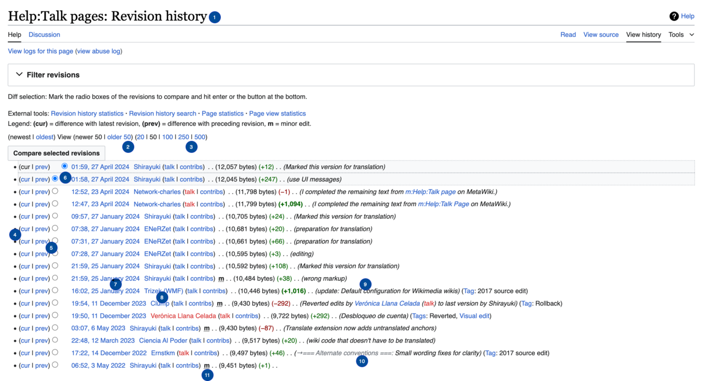
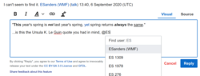

# Retained wiki page revision set (collector assembly)

> This consumer Markdown assembles the explicitly retained originals in declared order. Source labels, line anchors and local href rewrites are collector additions; HTML is represented as structural text with ordered table cells and preserved code, without running source scripts.

> Collector representation: declared cell spans are annotations, not an expanded table grid; code br line breaks and NBSP are retained, and image-label whitespace is normalized without dropping label words.

> Collector snapshot limitation: oldid identifies each page revision, not all transcluded templates or skin dependencies. The saved rendered HTML responses are the offline originals; source scripts are not executed.

Original HTML: [help-history.html](../source/help-history.html#L1-L1082).

> Collector page identity: Help:History; [fixed page revision](https://www.mediawiki.org/w/index.php?title=Help%3AHistory&oldid=8524540).

<a id="help-history-L1"></a>
-  | Note: When you edit this page, you agree to release your contribution under the [CC0](https://creativecommons.org/publicdomain/zero/1.0/). See [Public Domain Help Pages](https://www.mediawiki.org/wiki/Special:MyLanguage/Project:PD_help) for more info. | 

 

The revision history of a page is viewed by clicking on the `View history` tab. One can then select any two revisions and click `Compare selected revisions` to view the [diff](https://www.mediawiki.org/wiki/Special:MyLanguage/Help:Diff). Contents of [deleted revisions](https://www.mediawiki.org/wiki/Special:MyLanguage/Manual:RevisionDelete) will not be accessible to users lacking the necessary [user rights](https://www.mediawiki.org/wiki/Special:MyLanguage/Manual:User_rights).

<a id="help-history-L798"></a>
<a id="help-history-Summary"></a>
<a id="help-history-h-Summary"></a>
## Summary


 


- The page shows the newest changes first, followed by older ones.

 

- To view a specific version, click its date.

 

- Click `cur` to compare an old version with a current one.

 

- Click `prev` to compare a version with its predecessor.

 

- To compare two versions, select the left button for the older version and the right button for the newer one. Afterward, click the `Compare selected revisions` button.

 

- A minor edit is indicated with `m`.

<a id="help-history-L805"></a>
<a id="help-history-Searching_for_a_revision"></a>
<a id="help-history-h-Searching_for_a_revision"></a>
## Searching for a revision


 

Users can use the [Wikiblame](http://wikipedia.ramselehof.de/wikiblame.php) tool to search for revisions from a specific author, or character strings in the page of any revision.

<a id="help-history-L808"></a>
<a id="help-history-Navigating_the_revision_history_page"></a>
<a id="help-history-h-Navigating_the_revision_history_page"></a>
## Navigating the revision history page


 

Here's what a page history looks like in the default skin. 

 

[](https://www.mediawiki.org/wiki/File:HelpHistory.png)


 

Let's examine each labeled function: 

 


1. "Revision history" is suffixed to the page name.

 

2. This displays the last 50 edits after the ones listed currently.

 

3. These numbers tell you how many changes you can see listed on a page: 20, 50, 100, 250, or 500.

 

4. The `cur` option links to a page showing the changes made between the selected version and the current version of the page.

 

5. The `prev` option links to a page showing the difference between the selected version and the version just below it.

 

6. You can compare two versions of a page using [radio buttons](https://en.wikipedia.org/wiki/Radio_button). The left button links to the previous, and the right button links to the latter. Just select any versions you want, then click `Compare selected revisions`.

 

7. This displays when edits were made, in the [format and time zone selected in preferences](https://www.mediawiki.org/wiki/Special:MyLanguage/Help:Preferences#Date_format_and_time_offset)[](https://www.mediawiki.org/wiki/Help:Preferences#Date_format_and_time_offset) for logged-in users, or configured in `$wgDefaultUserOptions['date'] ` and `$wgLocaltimezone ` for logged-out users. Clicking the date and time links you to the version from that moment, which may differ from the current one.

 

8. This shows the contributor's username or IP address.

 

9. This is the [edit summary](https://www.mediawiki.org/wiki/Special:MyLanguage/Help:Edit_summary)[](https://www.mediawiki.org/wiki/Help:Edit_summary), users write into the box before submitting an edit.

 

10. When an edit summary begins with a grey text and an arrow link, it means the user only edited the section mentioned in the grey text. This is added automatically when editing a section.

 

11. `m` signifies a [minor edit](https://www.mediawiki.org/wiki/Special:MyLanguage/Help:Minor_edit)[](https://www.mediawiki.org/wiki/Help:Minor_edit) to a page, like fixing a spelling mistake.


 

When a page's name is changed using the [move](https://www.mediawiki.org/wiki/Special:MyLanguage/Help:Moving_a_page)[](https://www.mediawiki.org/wiki/Help:Moving_a_page) feature, its full edit history which includes a before and after the change is shown on the new page name. The old name optionally becomes a redirect with only its initial history. 


When two pages are [history merged](https://www.mediawiki.org/wiki/Special:MyLanguage/Help:Merge_history)[](https://www.mediawiki.org/wiki/Help:Merge_history), one becomes a redirect with no edit history, while the other contains the full edit history of both pages.

<a id="help-history-L828"></a>
<a id="help-history-URLs"></a>
<a id="help-history-h-URLs-Navigating_the_revision_history_page"></a>
### URLs


 

Use this URL format to display edits made before a certain [UTC](https://en.wikipedia.org/wiki/UTC) date or to limit the number of edits shown: 

 


- [https://www.mediawiki.org/w/index.php?title=Help:Templates&action=history&date-range-to=2017-10-29&tagfilter=&offset=&limit=20](https://www.mediawiki.org/w/index.php?title=Help:Templates&action=history&date-range-to=2017-10-29&tagfilter=&offset=&limit=20)


 

Or for an earlier date and time specified in UTC: 

 


- [https://www.mediawiki.org/w/index.php?offset=20171029030000&title=Help%3ATemplate&limit=20&action=history](https://www.mediawiki.org/w/index.php?offset=20171029030000&title=Help%3ATemplate&limit=20&action=history)


 

The second one is in [timestamp](https://www.mediawiki.org/wiki/Special:MyLanguage/Manual:timestamp)[](https://www.mediawiki.org/wiki/Manual:Timestamp) format.

<a id="help-history-L837"></a>
<a id="help-history-Watched_pages"></a>
<a id="help-history-h-Watched_pages-Navigating_the_revision_history_page"></a>
### Watched pages


 If you check the history of a [watched page](https://www.mediawiki.org/wiki/Special:MyLanguage/Help:Watching_pages)[](https://www.mediawiki.org/wiki/Help:Watching_pages) without looking at the page itself first, the latest edit might have a marker saying 


updated since your last visit

 

This happens if someone else made the edit and you haven't seen the page since.

<a id="help-history-L841"></a>
<a id="help-history-Web_feeds"></a>
<a id="help-history-h-Web_feeds-Navigating_the_revision_history_page"></a>
### Web feeds


 

To get [Web feeds](https://en.wikipedia.org/wiki/Web_feed) ([RSS](https://en.wikipedia.org/wiki/RSS) and [Atom](https://en.wikipedia.org/wiki/Atom)) for a page's history, you can add "&feed=rss" or "&feed=atom" to the URL of the history page. This will show the last 10 edits with links to the full diff page in XML format. Some browsers may offer options like sorting by author (see [Syndication](https://en.wikipedia.org/wiki/Syndication)).

<a id="help-history-L845"></a>
<a id="help-history-The_number_of_revisions"></a>
<a id="help-history-h-The_number_of_revisions-Navigating_the_revision_history_page"></a>
### The number of revisions


 

On a history page list, go to any revision after the second one and click on (`cur`) for the latest edit. This will show you the changes between that revision edit and the most recent one. Look above the difference table to find the number of intermediate revisions. Add 2 to that number, and you'll have the total number of revisions in the history.

<a id="help-history-L851"></a>
<a id="help-history-Deleting_a_page"></a>
<a id="help-history-h-Deleting_a_page"></a>
## Deleting a page


 

[Deleting a page](https://www.mediawiki.org/wiki/Special:MyLanguage/Help:Deletion_and_undeletion)[](https://www.mediawiki.org/wiki/Help:Deletion_and_undeletion) is more extreme than just removing content or redirecting the page. When a page is deleted, regular users can't access its history anymore. Consequently, if content has been moved or copied with proper attribution, that attribution is lost when the original page is deleted. 


If someone edits a page that gets deleted, their edits won't show up in their usual [User contributions](https://www.mediawiki.org/wiki/Special:MyLanguage/Help:User_contributions)[](https://www.mediawiki.org/wiki/Help:User_contributions) list. Administrators can still see those edits and restore the deleted page if needed (see [w:Wikipedia:Viewing and restoring deleted pages](https://en.wikipedia.org/wiki/Wikipedia:Viewing_and_restoring_deleted_pages)). 


Sometimes, when a page is deleted, it's important to decide whether to keep its revision history. If the history should be kept: 

 


- Turn the page into a redirect, or rename it to a more fitting redirect if needed.

 

- If a redirect isn't appropriate, archive the page. If the content isn't suitable for a current version or an archive, replace it with a note explaining the archive's purpose.

<a id="help-history-L861"></a>
<a id="help-history-Composite_pages_(transclusion)"></a>
<a id="help-history-Composite_pages_.28transclusion.29"></a>
<a id="help-history-h-Composite_pages_(transclusion)"></a>
## Composite pages (transclusion)


 

A [section](https://www.mediawiki.org/wiki/Special:MyLanguage/Help:Section)[](https://www.mediawiki.org/wiki/Help:Section) of a page may be an included separate page (via a method known as [Transclusion](https://www.mediawiki.org/wiki/Special:MyLanguage/transclusion)[](https://www.mediawiki.org/wiki/Transclusion)), see [Possible uses of templates](https://www.mediawiki.org/wiki/Special:MyLanguage/Help:Template#Possible_uses_of_templates)[](https://www.mediawiki.org/wiki/Help:Template#Possible_uses_of_templates). A separate edit history is provided for the section, and this transcluded page must be [watched](https://www.mediawiki.org/wiki/Special:MyLanguage/Help:Watching_pages)[](https://www.mediawiki.org/wiki/Help:Watching_pages) separately. See [Help:Transclusion](https://www.mediawiki.org/wiki/Special:MyLanguage/Help:Transclusion)[](https://www.mediawiki.org/wiki/Help:Transclusion).

<a id="help-history-L866"></a>
<a id="help-history-Image_history"></a>
<a id="help-history-h-Image_history"></a>
## Image history


 

You can change or edit an image file by uploading a new one with the same name. All versions of the image are saved, and you can see the history of changes on the [image description page](https://www.mediawiki.org/wiki/Help:Managing_files#File_description_page).

<a id="help-history-L870"></a>
<a id="help-history-Linking_to_a_particular_version_of_a_page"></a>
<a id="help-history-h-Linking_to_a_particular_version_of_a_page"></a>
## Linking to a particular version of a page


 

Sometimes it's helpful to provide a direct link to a particular version of a page. This might be necessary, for instance, if someone has reviewed a Wikipedia article and wants to specify which exact version they reviewed. 


You can use the page history to see old versions of a page if it's not the current version. The URL of the old version in the browser's location bar can be used as a permanent reference for that version. 


See also [Old versions of pages](https://www.mediawiki.org/wiki/Special:MyLanguage/Help:URL#Old_versions_of_pages)[](https://www.mediawiki.org/wiki/Help:URL#Old_versions_of_pages). 


Change history to the wikitext aren't the same as change history to the rendered page: 

 


- If a page has a time-based variable, what you see on it changes with time. For example, {{CURRENTTIME}} shows the current time when you view the page, while {{subst:CURRENTTIME}} shows the time when that version of the page was saved. However, there's no variable for the time when a specific version was saved. 


    - Templates and images might change based on time-related variables in the expressions used to refer to them.


 

- You can only use the current versions of templates and images unless you rename old versions. Keep in mind that templates within these templates might also have been updated.

 

- [Wikidata](https://www.mediawiki.org/wiki/Special:MyLanguage/Wikidata)[](https://www.mediawiki.org/wiki/Wikidata)'s current interwiki links are used.


 

To create a permanent link, save the webpage as an HTML file and provide the URL. This HTML file includes all the template content, so changes or removals of templates won't affect it. However, if images are deleted, it will impact the HTML file. 


To create wikitext that doesn't rely on templates, use "[subst](https://www.mediawiki.org/wiki/Special:MyLanguage/Help:Template#subst)[](https://www.mediawiki.org/wiki/Help:Template#subst):" and repeat if needed, or [Special:ExpandTemplates](https://www.mediawiki.org/wiki/Special:ExpandTemplates) 


See also [Help:Downloading pages](https://www.mediawiki.org/wiki/Special:MyLanguage/Help:Downloading_pages)[](https://www.mediawiki.org/wiki/Help:Downloading_pages).

<a id="help-history-L888"></a>
<a id="help-history-Special:Export"></a>
<a id="help-history-h-Special:Export"></a>
## Special:Export


 

[Special:Export](https://www.mediawiki.org/wiki/Special:Export) creates an [XML](https://en.wikipedia.org/wiki/XML) file containing the wikitext of one or more chosen pages, along with details like date, time, user, and edit summary. How it appears depends on the browser; some may show links to expand or collapse sections. You can also view the XML source directly in your browser or with any program after saving the file locally. 


The feature lets you search for text across multiple specified pages. See [XML export](https://www.mediawiki.org/wiki/Special:MyLanguage/Help:Export)[](https://www.mediawiki.org/wiki/Help:Export).

<a id="help-history-L895"></a>
<a id="help-history-Reverting_changes_to_a_page"></a>
<a id="help-history-h-Reverting_changes_to_a_page"></a>
## Reverting changes to a page


 

If you don't like the changes you made to your new pages, don't worry. You can [revert](https://www.mediawiki.org/wiki/Special:MyLanguage/Help:Reverting) to any earlier version of the page.

<a id="help-history-L899"></a>
<a id="help-history-See_also"></a>
<a id="help-history-h-See_also"></a>
## See also


 


- [Manual:Parameters to index.php#History](https://www.mediawiki.org/wiki/Special:MyLanguage/Manual:Parameters_to_index.php#History)

 

- [XTools](https://www.mediawiki.org/wiki/Special:MyLanguage/XTools)[](https://www.mediawiki.org/wiki/XTools) - A tool to do the following on a revision history page: 


    - Organize the page history according to the editor.

 

    - Determine the edit count for each editor.


 

<dl>


<dd>
The program works on various Wikimedia sites and can be downloaded for use on other MediaWiki platforms with necessary tweaks.
</dd>


</dl>

Original HTML: [help-talk-pages.html](../source/help-talk-pages.html#L1-L1074).

> Collector page identity: Help:Talk pages; [fixed page revision](https://www.mediawiki.org/w/index.php?title=Help%3ATalk_pages&oldid=8374334).

<a id="help-talk-pages-L1"></a>
-  | Note: When you edit this page, you agree to release your contribution under the [CC0](https://creativecommons.org/publicdomain/zero/1.0/). See [Public Domain Help Pages](https://www.mediawiki.org/wiki/Special:MyLanguage/Project:PD_help) for more info. | 

   

Every wiki page except for those in the Special: [namespace](https://www.mediawiki.org/wiki/Special:MyLanguage/Help:Namespaces)[](https://www.mediawiki.org/wiki/Help:Namespaces) has an associated talk page, which can be used for discussion and communicating with other users. Talk pages can be accessed by clicking the "discussion" [tab](https://www.mediawiki.org/wiki/Special:MyLanguage/Help:Navigation#Page_Tabs) at the top of the page. Simply edit the page as normal to add your comment. A talk page is very similar to any other wiki page, but it is in the "Talk" namespace, to keep it separate from the articles in the `(Main)` namespace (See [Help:Namespaces](https://www.mediawiki.org/wiki/Special:MyLanguage/Help:Namespaces)[](https://www.mediawiki.org/wiki/Help:Namespaces)). As with any wiki page, you can edit it, link to it, and view the editing history. 


For new beginners, talk pages may be confusing. Fortunately, some extensions are used to enhance talk pages. The [DiscussionTools](https://www.mediawiki.org/wiki/Special:MyLanguage/Extension:DiscussionTools)[](https://www.mediawiki.org/wiki/Extension:DiscussionTools) extension can make it easier to create and reply talk pages, and automatically sign your comments.

<a id="help-talk-pages-L799"></a>
<a id="help-talk-pages-Editing_conventions_on_talk_pages"></a>
<a id="help-talk-pages-h-Editing_conventions_on_talk_pages-1991-08-26T18:07:00.000Z"></a>
## Editing conventions on talk pages

<a id="help-talk-pages-L800"></a>
<a id="help-talk-pages-Default_configuration_for_Wikimedia_wikis"></a>
<a id="help-talk-pages-h-Default_configuration_for_Wikimedia_wikis-Editing_conventions_on_talk_pages"></a>
### Default configuration for Wikimedia wikis


 

[](https://www.mediawiki.org/wiki/File:Reply_tool_version_2b_screenshot.png)

Screenshot of the default talk pages experience


 

Wikimedia wikis use [discussion tools](https://www.mediawiki.org/wiki/Special:MyLanguage/Help:DiscussionTools)[](https://www.mediawiki.org/wiki/Help:DiscussionTools) as a default feature for talk pages. This tool allows users to start a topic and respond to comments in both visual and wikitext editing modes. 


Pages in the main namespace have the prefix `Talk:` added at the beginning of its talk page title. For example, [Talk:Download](https://www.mediawiki.org/wiki/Talk:Download), [Talk:Hosting services](https://www.mediawiki.org/wiki/Talk:Hosting_services), etc. While pages in other namespaces start with the name of the namespace, then `Talk:`, before the pages title name. For example, [User:Network-charles](https://www.mediawiki.org/wiki/User:Network-charles) becomes [User talk:Network-charles](https://www.mediawiki.org/wiki/User_talk:Network-charles), [Project:Sandbox](https://www.mediawiki.org/wiki/Project:Sandbox) becomes [Project talk:Sandbox](https://www.mediawiki.org/wiki/Project_talk:Sandbox), etc. 


Add a new topic by going to the discussion page and clicking on the box saying `Start a new topic`. If the talk page is empty, an `Add topic` button at the top right corner of the page is used to create a topic. 


Reply to a comment by clicking on `Reply` after the comment. 


When adding a new topic, or responding to a given message, you can switch between "visual" and "wikitext" modes. 


This tool automatically signs your messages. 


You can also edit the wikitext of the page, as described below.

<a id="help-talk-pages-L815"></a>
<a id="help-talk-pages-When_using_wikitext_on_talk_pages"></a>
<a id="help-talk-pages-h-When_using_wikitext_on_talk_pages-Editing_conventions_on_talk_pages"></a>
### When using wikitext on talk pages


 

Having discussions on a free-form wiki page will seem strange at first. It helps if everyone follows some simple editing conventions: 

 


- Always sign your name after your comments. Use the four tildes "`~~~~`" wiki syntax (or the signature button [](https://www.mediawiki.org/wiki/File:Insert-signature2.svg) in the toolbar above the editing textbox). For more information see [Help:Signatures](https://www.mediawiki.org/wiki/Special:MyLanguage/Help:Signatures)[](https://www.mediawiki.org/wiki/Help:Signatures).

 

- Start a new discussion with a `== level 2 heading ==` at the bottom of the page (or use the `Add topic` button at the top right corner of the page).

 

- Indent replies with colons (`:`) at the beginning of the line.

<a id="help-talk-pages-L821"></a>
<a id="help-talk-pages-Example"></a>
<a id="help-talk-pages-h-Example-Editing_conventions_on_talk_pages-1991-08-26T18:07:00.000Z"></a>
### Example


 


<a id="help-talk-pages-c-Example-1991-08-26T18:07:00.000Z-Example"></a>
Here is an example discussion, following the talk page conventions: 

 

- Wiki text | Rendered talk page

> Collector table row: cell blocks remain in original order.

> Collector cell 1 of 2:

```
== Soup ==

How's the soup? --[[User:Example|Bob]] 18:07, 26 August 1991 (UTC)

: It's great!! --[[User:Example|Simon]] 11:21, 28 August 1991 (UTC)

:: I made it myself! -- [[User:Example|Bob]] 14:11, 3 September 1991 (UTC)

I think the soup-discussion should be moved to [[Talk:Soup]]. -- [[User:Example|Lisa]] 21:55, 3 September 1991 (UTC)
```

> Collector cell 2 of 2:

Soup[[edit](#help-talk-pages-Example)] How's the soup? --[Bob](https://www.mediawiki.org/wiki/User:Example) [18:07, 26 August 1991 (UTC)](https://www.mediawiki.org/wiki/Help:Talk_pages#c-Example-1991-08-26T18:07:00.000Z-Example)  

<dl>


<dd>

<a id="help-talk-pages-c-Example-1991-08-28T11:21:00.000Z-Example-1991-08-26T18:07:00.000Z"></a>
It's great!! --[Simon](https://www.mediawiki.org/wiki/User:Example) [11:21, 28 August 1991 (UTC)](https://www.mediawiki.org/wiki/Help:Talk_pages#c-Example-1991-08-28T11:21:00.000Z-Example-1991-08-26T18:07:00.000Z)
</dd>


</dl>

 

<dl>


<dd>


<dl>


<dd>

<a id="help-talk-pages-c-Example-1991-09-03T14:11:00.000Z-Example-1991-08-28T11:21:00.000Z"></a>
I made it myself! -- [Bob](https://www.mediawiki.org/wiki/User:Example) [14:11, 3 September 1991 (UTC)](https://www.mediawiki.org/wiki/Help:Talk_pages#c-Example-1991-09-03T14:11:00.000Z-Example-1991-08-28T11:21:00.000Z)
</dd>


</dl>


</dd>


</dl>

 
<a id="help-talk-pages-c-Example-1991-09-03T21:55:00.000Z-Example"></a>
I think the soup-discussion should be moved to [Talk:Soup](https://www.mediawiki.org/w/index.php?title=Talk:Soup&action=edit&redlink=1). -- [Lisa](https://www.mediawiki.org/wiki/User:Example) [21:55, 3 September 1991 (UTC)](https://www.mediawiki.org/wiki/Help:Talk_pages#c-Example-1991-09-03T21:55:00.000Z-Example)

<a id="help-talk-pages-L851"></a>
<a id="help-talk-pages-When_using_talk_pages"></a>
<a id="help-talk-pages-h-When_using_talk_pages-Editing_conventions_on_talk_pages"></a>
### When using talk pages


 


- On a talk page, when contributors are discussing and mention "this page", they usually mean the main page it's connected to. If they mean the talk page itself, they'll say "this talk page" instead.

 

- Always refer to the current page name when debating its title or discussing merging it with another page. This prevents ambiguity when the page is renamed (moved), as references to "this page name" would otherwise be unclear.

 

- Spamming, which involves sending lots of similar messages to multiple users' talk pages to ask for something is not recommended.

<a id="help-talk-pages-L855"></a>
<a id="help-talk-pages-Alternate_conventions"></a>
<a id="help-talk-pages-h-Alternate_conventions-Editing_conventions_on_talk_pages"></a>
### Alternate conventions


 

Tracked in [Phabricator](https://phabricator.wikimedia.org/)
[Task T230683](https://phabricator.wikimedia.org/T230683)


 

We are aware that this most widespread convention is problematic for many reasons: 

 


- It generates invalid HTML structure by appropriation of the definition-list syntax;

 

- It is fragile against table insertions;

 

- There are no real paragraphs.


 

Some wikis are known to use `*` instead for the first problem mentioned above. Follow your local rules. 


To avoid breaking complex formatting when replying, match what the comment you are replying to uses to indent, prepending one additional `:` or `*`.

<a id="help-talk-pages-L865"></a>
<a id="help-talk-pages-Editing_discussions"></a>
<a id="help-talk-pages-h-Editing_discussions"></a>
## Editing discussions


 

Having discussions on a free-form wiki page will seem strange at first. It has some advantages over the conventional rigid forum format, but it can get a little messy. As with other wiki pages, anyone can help with tidying up discussions, to conform to the editing conventions, e.g., add signatures and headings where they are missing. 


Clearly, we also have the opportunity to edit other people's comments. It is generally bad etiquette to modify somebody else's wording. (Better to just add your own comment with your corrections.) But it can be acceptable to ... 

 

<dl>


<dt>
Modify discussion headings
</dt>

 

<dd>
Change wording or append words to the discussion headings, to better describe the topic of discussion. Note that good descriptive headings become important when many discussions start to fill the page.
</dd>


</dl>

 

<dl>


<dt>
Move discussions to a different page
</dt>

 

<dd>
If discussions are put in the wrong place on the wiki, and are better associated with different talk pages, then you could just move the discussion by cut & paste. This is potentially confusing for the people posting, but it can be important for keeping things tidy. You could leave the discussion in the wrong place for a few days/weeks of grace before tidying it. You could leave a link behind explaining that a discussion was moved, or if not, you should link within the edit summary.
</dd>


</dl>

 

<dl>


<dt>
Delete discussions when they are out-of-date
</dt>

 

<dd>
Discussions can often get left lying around on a talk page long after the issue is no longer relevant. It's usually a good idea to reply to saying "I think this is now resolved", but sooner or later it's time to just blow away the old discussions (they are of course preserved in the editing history).
</dd>


</dl>

 

<dl>


<dt>
Split a post into several discussions
</dt>

 

<dd>
It may be appropriate to do this if somebody has raised several points that need to be answered separately. However, you should always be respectful of other people's words. Does their post still make sense if you split it up?
</dd>


</dl>

<a id="help-talk-pages-L877"></a>
<a id="help-talk-pages-Building_articles_-_Discussing_articles"></a>
<a id="help-talk-pages-h-Building_articles_-_Discussing_articles"></a>
## Building articles - Discussing articles


 

It is usually best to keep focused on the task of building a wiki article and use discussion pages only to support this process. The topic of conversation should generally revolve around what needs to be done to make the associated article better. Remember that editing the article itself is often a more effective means of communicating. It can be more difficult, requiring you to balance your views alongside those of others, but it can also be more rewarding. This is how the community of wiki editors will make progress. Often it will feel more natural to engage in a heated debate on a talk page (or indeed any other contact channel) but in fact, the wiki article itself can offer a powerful means of reaching middle-ground. Think about how to portray both sides of the argument (e.g., listing advantages and disadvantages) and you may find the debate evaporates.

<a id="help-talk-pages-L886"></a>
<a id="help-talk-pages-User_talk_pages"></a>
<a id="help-talk-pages-h-User_talk_pages"></a>
## User talk pages


 

A "User talk page" is a talk page associated with somebody's "User page" (See [Help:User page](https://www.mediawiki.org/wiki/Special:MyLanguage/Help:User_page)[](https://www.mediawiki.org/wiki/Help:User_page).) This is a place to leave messages for a particular wiki user. 


This can function as a kind of messaging system. Users receive the following prominent notification when new messages have been left on their talk page: 

 

You have [a new message](https://www.mediawiki.org/w/index.php?title=User_talk:User&action=edit&redlink=1) ([last change](https://www.mediawiki.org/w/index.php?title=User_talk:User&diff=cur)).

 

The message will continue to be displayed on all pages until users visit their talk page. 


They may be notified by email as well, although this cannot always be relied upon (since the email notification feature must be activated by supplying a valid email address, and clicking a confirmation link). If you don't get a response to your user talk page message, try looking for other contact details that they may have supplied on their user page. 


Note that the messages are not private, and others can join in the conversation.

<a id="help-talk-pages-L895"></a>
<a id="help-talk-pages-See_also"></a>
<a id="help-talk-pages-h-See_also"></a>
## See also


 


- [MessageBox](https://meatballwiki.org/wiki/MessageBox) on Meatball Wiki


<!-- materialization-redistribution-notice -->
## Redistribution notice

## 文档归属与版本（attribution and revision）

作者／贡献者：MediaWiki contributors。依照 Wikimedia Terms of Use §7，以下原页、固定版本与历史页面提供全部贡献者的署名入口；不把最后一次编辑者称为唯一作者。

| 文档与本地原件 | 固定 revision／时间 | 原页与署名历史 |
| --- | --- | --- |
| Help:History — `source/help-history.html` | [8524540](https://www.mediawiki.org/w/index.php?title=Help%3AHistory&oldid=8524540)；2026-07-25T03:29:55Z | [原页](https://www.mediawiki.org/wiki/Help:History)；[贡献历史](https://www.mediawiki.org/w/index.php?title=Help%3AHistory&action=history) |
| Help:Talk pages — `source/help-talk-pages.html` | [8374334](https://www.mediawiki.org/w/index.php?title=Help%3ATalk_pages&oldid=8374334)；2026-05-14T21:02:40Z | [原页](https://www.mediawiki.org/wiki/Help:Talk_pages)；[贡献历史](https://www.mediawiki.org/w/index.php?title=Help%3ATalk_pages&action=history) |

帮助正文贡献及本仓库对此文字的派生贡献采用 CC0-1.0；独立图片分别按下表许可，不把组合整体或软件代码宣称为 CC0。

逐页许可依据来自保存原 HTML 的可见正文 notice／footer，而不是域名推断。Help 两页各自明确帮助贡献 CC0；其他页各自 footer 明确文档文字 CC BY-SA4。原页保留的可见声明、引用、来源链接与作者信用继续保留；参考链接不表示其所指作品已另行复制。

## 正文图片（separate media attribution）

下列文件是该页面原始 `img src` 显示表示的未改字节副本，可能是上游生成的 PNG/JPG 缩略表示；不是 SVG 母版、不是独立的原始高分辨率摄影／绘画扫描。我们不裁剪、不重绘，也不将 PNG 标为 SVG。

| 本地文件／原作标题 | 作者／指定归属 | 许可与文件说明 |
| --- | --- | --- |
| `source/assets/help-history.png` — HelpHistory.png | Network-charles | CC0-1.0; preserve depicted MediaWiki GPL-2.0-or-later screenshot notice；[具体文件说明](https://www.mediawiki.org/wiki/File:HelpHistory.png)；[实际图片响应](https://thumb.wikimedia.org/wikipedia/commons/thumb/4/46/HelpHistory.png/1280px-HelpHistory.png?utm_source=www.mediawiki.org&utm_campaign=parser&utm_content=thumbnail) |
| `source/assets/reply-tool.png` — Reply tool version 2b screenshot.png | ESanders (WMF) | CC-BY-SA-4.0；[具体文件说明](https://www.mediawiki.org/wiki/File:Reply_tool_version_2b_screenshot.png)；[实际图片响应](https://thumb.wikimedia.org/wikipedia/commons/thumb/3/3b/Reply_tool_version_2b_screenshot.png/250px-Reply_tool_version_2b_screenshot.png?utm_source=www.mediawiki.org&utm_campaign=parser&utm_content=thumbnail) |
| `source/assets/insert-signature.png` — Insert-signature2.svg | I, Perhelion | CC-BY-SA-4.0 selected from offered alternatives；[具体文件说明](https://www.mediawiki.org/wiki/File:Insert-signature2.svg)；[实际图片响应](https://thumb.wikimedia.org/wikipedia/commons/thumb/2/2d/Insert-signature2.svg/40px-Insert-signature2.svg.png?utm_source=www.mediawiki.org&utm_campaign=parser&utm_content=thumbnail) |

Changes: 原 HTML 与原生图片保持实际响应 bytes，不改写、不裁剪、不重绘、不重导。仅对副本选取 #mw-content-text .mw-parser-output 并执行逐 source 明示的有限 DOM 排除；保留实质状态/警告、表/列表/例子、原生代码、署名引用和末尾。HTML→Markdown 的 collector assembly 添加各源题名、来源 anchors、真实源范围 selectors 与有限本地图链接，末尾追加唯一归属/修改/范围附注及 ../NOTICE.md。文本状态、正文质量与具体限制以 manifest 为准；原件 complete 不表示图内文字、空间关系或原生排版无损。本次采集和派生未执行来源脚本/表单/示例，这是处理过程说明，不对相应许可证许可的下游用途增加限制。旧 root document/selectors 不改，完整旧 manifest 原样保存在 historical_acquisition。

Scope: 仅 methodology:mediawiki-revision-discussion 的 2 份列明固定 revision HTML（255055 bytes）与 3 份已逐件审阅的实际正文图表示（1051564 bytes），以及由这些原件形成的 normalized/document.md、normalized/selectors.jsonl、来源/转换说明和完整 NOTICE；selected version 为 Wikimedia page snapshot at 2026-09-17T00:47:39Z，每页身份/permalink/revision/timestamp/真实 HTML bytes 按 source_bindings 一对一有序绑定。Help:History 和 Help:Talk pages 的帮助贡献文字及文字派生为 CC0；HelpHistory 由 Network-charles 声明 CC0，同时保留画面 MediaWiki GPL v2-or-later/独立非程序产物提示；Reply tool screenshot 和 I, Perhelion 的 Signature 图片分别选 BY-SA4。复合 SPDX 表达组件集合，不把组合所有元素统一 CC0，不借截图提示分发软件代码。 原始图片只保留主文实际 src 的表示，各图作者/原作品/实际 URL/许可条件详见本包 attribution 与 NOTICE；原已引用的外部短段仅保持政策/帮助文的实际语境，不许可所指完整外部作品。文档文字及对应派生/摘录的 ShareAlike 依各自许可传播，不被仓库代码或元数据许可覆盖；不增加限制许可权利的额外条款/技术措施。不包含整站、翻译、真实用户 talk thread、所有 revision、模板/skin/JS/CSS/高分辨率母版、外链工具/实体库/数据/代码/引用作品或任意商标、人格、隐私、专利权利。Wikimedia/Wikipedia及相关标志仅在原文解释研究语境保留，不用于本库品牌/封面/宣传、不暗示背书；本 UID 未列的作品或媒体不在本包，不声称无限法律保证。旧摘录和 43 个 root selectors 及完整旧 acquisition/rights/history 事实保全，本 grant 不改写旧历史，不提升知识准入。

Full license and original rights links: [NOTICE.md](../NOTICE.md).
