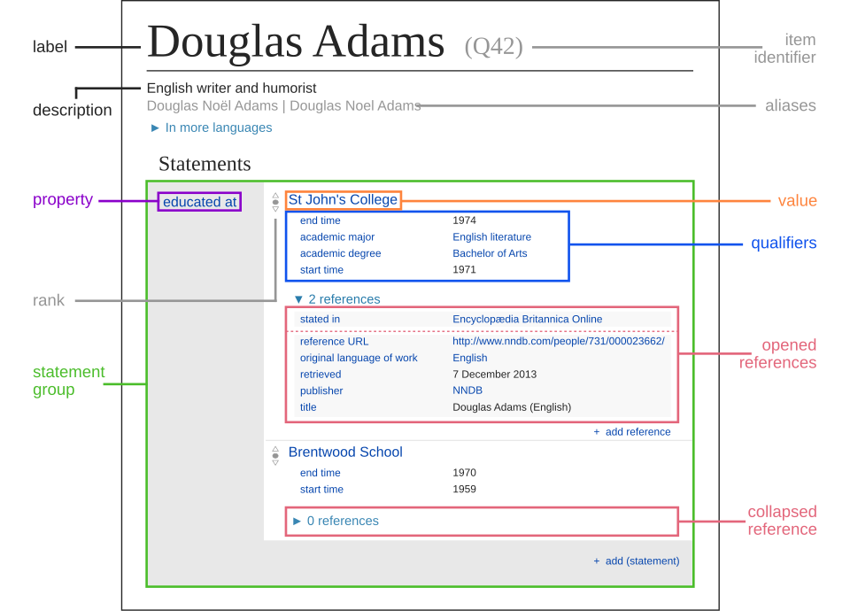

# Retained wiki page revision set (collector assembly)

> This consumer Markdown assembles the explicitly retained originals in declared order. Source labels, line anchors and local href rewrites are collector additions; HTML is represented as structural text with ordered table cells and preserved code, without running source scripts.

> Collector representation: declared cell spans are annotations, not an expanded table grid; code br line breaks and NBSP are retained, and image-label whitespace is normalized without dropping label words.

> Collector snapshot limitation: oldid identifies each page revision, not all transcluded templates or skin dependencies. The saved rendered HTML responses are the offline originals; source scripts are not executed.

Original HTML: [wikidata-data-model.html](../source/wikidata-data-model.html#L1-L1278).

> Collector page identity: Wikidata:Data model; [fixed page revision](https://www.wikidata.org/w/index.php?title=Wikidata%3AData_model&oldid=2518329379).

-  | This is an information page.
It is not one of [Wikidata's policies or guidelines](https://www.wikidata.org/wiki/Special:MyLanguage/Wikidata:List_of_policies_and_guidelines), but rather intends to describe some aspect(s) of Wikidata's norms, customs, technicalities, or practices. It may reflect varying levels of consensus and vetting. | 

 

Wikidata represents [entities](https://hub.toolforge.org/Q35120?lang=en) as data items

 (e.g. [Tim Berners-Lee (Q80)](https://www.wikidata.org/wiki/Q80) and [CERN (Q42944)](https://www.wikidata.org/wiki/Q42944) are data items). Knowledge about data items is represented via statements

, whose basic structure consists of a subject, a predicate and an object. 

For example: [Tim Berners-Lee (Q80)](https://www.wikidata.org/wiki/Q80)[employer (P108)](https://www.wikidata.org/wiki/Property:P108)[CERN (Q42944)](https://www.wikidata.org/wiki/Q42944) 

 

- The subject of a statement is usually a data item — in this case, [Tim Berners-Lee (Q80)](https://www.wikidata.org/wiki/Q80).

 

- The predicate of a statement is always a property — in this case, [employer (P108)](https://www.wikidata.org/wiki/Property:P108).

 

- The object of a statement is a value of the data type of the property — in this case, an item, [CERN (Q42944)](https://www.wikidata.org/wiki/Q42944).

 

The property used in a statement determines both the meaning of the statement (i.e. the nature of the relationship between the subject and the object), as well as which values may be used, as specified by its data type. 

For example, in the example above we used the property [employer (P108)](https://www.wikidata.org/wiki/Property:P108), whose values must have the data type [Item](https://www.wikidata.org/wiki/Special:MyLanguage/Help:Data_type#wikibase-item), allowing a data item to be set as the object of the statement (in the case of our example, [CERN (Q42944)](https://www.wikidata.org/wiki/Q42944)). 

An example of a property with a different data type is [start time (P580)](https://www.wikidata.org/wiki/Property:P580), whose values must be of data type [Point in time](https://www.wikidata.org/wiki/Special:MyLanguage/Help:Data_type#time), so it can only be used to state a point in time. 

 Wikidata also allows statements to be qualified with further properties, which are called [qualifiers](https://www.wikidata.org/wiki/Special:MyLanguage/Help:Qualifiers). For example, we might state [Tim Berners-Lee (Q80)](https://www.wikidata.org/wiki/Q80)[employer (P108)](https://www.wikidata.org/wiki/Property:P108)[CERN (Q42944)](https://www.wikidata.org/wiki/Q42944)[start time (P580)](https://www.wikidata.org/wiki/Property:P580)June 1980[end time (P582)](https://www.wikidata.org/wiki/Property:P582)December 1980. 

The information on this page is not required to contribute to Wikidata or to consume Wikidata. To learn about contributing/consuming Wikidata, please refer to the pages [Wikidata:Introduction](https://www.wikidata.org/wiki/Special:MyLanguage/Wikidata:Introduction) and [Wikidata:Data access](https://www.wikidata.org/wiki/Special:MyLanguage/Wikidata:Data_access) respectively.

## Three levels of data models

 

Wikidata is powered by the [Wikibase](https://www.wikidata.org/wiki/Special:MyLanguage/Wikidata:Wikibase) software. While Wikibase defines 12 data types by default, it does not come with any [property](https://www.wikidata.org/wiki/Special:MyLanguage/Help:Properties) out of the box. Wikidata, however, has [13,904 properties](https://www.wikidata.org/wiki/Special:ListProperties), which have all been created specifically for Wikidata and are defined within Wikidata itself. (Don't worry about that large number, 76% of these properties are just [external identifiers](https://www.wikidata.org/wiki/Special:MyLanguage/Help:Data_type#external-id), i.e. links to items in other databases.) 

When we speak of a "[data model](https://hub.toolforge.org/Q1172480?lang=en)" in the context of Wikidata, it can actually refer to one of three things: 

 

- the data model of the Wikibase software actually more elaborated than just semantic triples 

[[1]](#wikidata-data-model-cite_note-1)

 

- the fundamental data model that Wikidata establishes on top of the Wikibase model, which includes the core properties such as [instance of (P31)](https://www.wikidata.org/wiki/Property:P31), [subclass of (P279)](https://www.wikidata.org/wiki/Property:P279) and [subproperty of (P1647)](https://www.wikidata.org/wiki/Property:P1647)

 

- any of the topic-specific data models (e.g. for instances of [television series (Q5398426)](https://www.wikidata.org/wiki/Q5398426), there are the properties [number of episodes (P1113)](https://www.wikidata.org/wiki/Property:P1113) and [number of seasons (P2437)](https://www.wikidata.org/wiki/Property:P2437))

 

All of these different data models are described on different pages: 

 

- the data model of the Wikibase software is described on mediawiki.org very technically in [the specification](https://www.mediawiki.org/wiki/Special:MyLanguage/Wikibase/DataModel) and more accessibly in the [primer to the Wikibase data model](https://www.mediawiki.org/wiki/Special:MyLanguage/Wikibase/DataModel/Primer)

 

- the fundamental data model of Wikidata is not strictly defined, nonetheless this page attempts to describe it

 

- the various topic-specific data models are loosely described via [properties for this type (P1963)](https://www.wikidata.org/wiki/Property:P1963) and more formally via [entity schemas](#wikidata-data-model-Entity_schemas).

 

Note that Wikidata has no central authority that decides how data should be modeled, instead that question is decided collaboratively by [the community](https://www.wikidata.org/wiki/Special:MyLanguage/Wikidata:Community) through public discussion. The data model of Wikidata has evolved over time and is very much still evolving: new data types can be introduced, new properties are being proposed and created, problematic properties get deprecated and there is an ongoing effort to better describe how properties are meant to be used via property constraints and entity schemas. 

## Data model of Wikibase

 

- Built-in data types
- Data type | Number of
properties
- [External identifier](https://www.wikidata.org/wiki/Special:MyLanguage/Help:Data_type#external-id) | [10,583](https://www.wikidata.org/wiki/Special:ListProperties/external-id)
- [Item](https://www.wikidata.org/wiki/Special:MyLanguage/Help:Data_type#wikibase-item) | [1,782](https://www.wikidata.org/wiki/Special:ListProperties/wikibase-item)
- [Quantity](https://www.wikidata.org/wiki/Special:MyLanguage/Help:Data_type#quantity) | [695](https://www.wikidata.org/wiki/Special:ListProperties/quantity)
- [String](https://www.wikidata.org/wiki/Special:MyLanguage/Help:Data_type#string) | [354](https://www.wikidata.org/wiki/Special:ListProperties/string)
- [URL](https://www.wikidata.org/wiki/Special:MyLanguage/Help:Data_type#url) | [124](https://www.wikidata.org/wiki/Special:ListProperties/url)
- [Commons media file](https://www.wikidata.org/wiki/Special:MyLanguage/Help:Data_type#commonsMedia) | [93](https://www.wikidata.org/wiki/Special:ListProperties/commonsMedia)
- [Point in time](https://www.wikidata.org/wiki/Special:MyLanguage/Help:Data_type#time) | [70](https://www.wikidata.org/wiki/Special:ListProperties/time)
- [Monolingual text](https://www.wikidata.org/wiki/Special:MyLanguage/Help:Data_type#monolingualtext) | [67](https://www.wikidata.org/wiki/Special:ListProperties/monolingualtext)
- [Property](https://www.wikidata.org/wiki/Special:MyLanguage/Help:Data_type#wikibase-property) | [22](https://www.wikidata.org/wiki/Special:ListProperties/wikibase-property)
- [Geographic coordinates](https://www.wikidata.org/wiki/Special:MyLanguage/Help:Data_type#globe-coordinate) | [10](https://www.wikidata.org/wiki/Special:ListProperties/globe-coordinate)
- [Tabular data](https://www.wikidata.org/wiki/Special:MyLanguage/Help:Data_type#tabular-data) | [7](https://www.wikidata.org/wiki/Special:ListProperties/tabular-data)
- [Geographic shape](https://www.wikidata.org/wiki/Special:MyLanguage/Help:Data_type#geo-shape) | [3](https://www.wikidata.org/wiki/Special:ListProperties/geo-shape)

- Extra data types
- Data type | Number of
properties
- [Mathematical expression](https://www.wikidata.org/wiki/Special:MyLanguage/Help:Data_type#math) | [36](https://www.wikidata.org/wiki/Special:ListProperties/math)
- [Sense](https://www.wikidata.org/wiki/Special:MyLanguage/Help:Data_type#wikibase-sense) | [19](https://www.wikidata.org/wiki/Special:ListProperties/wikibase-sense)
- [Lexeme](https://www.wikidata.org/wiki/Special:MyLanguage/Help:Data_type#wikibase-lexeme) | [16](https://www.wikidata.org/wiki/Special:ListProperties/wikibase-lexeme)
- [Form](https://www.wikidata.org/wiki/Special:MyLanguage/Help:Data_type#wikibase-form) | [10](https://www.wikidata.org/wiki/Special:ListProperties/wikibase-form)
- [Musical Notation](https://www.wikidata.org/wiki/Special:MyLanguage/Help:Data_type#musical-notation) | [6](https://www.wikidata.org/wiki/Special:ListProperties/musical-notation)

 

The data model of Wikidata is based on the data model of [Wikibase](https://www.wikidata.org/wiki/Special:MyLanguage/Wikidata:Wikibase), which is described very technically in [the specification](https://www.mediawiki.org/wiki/Special:MyLanguage/Wikibase/DataModel) and more accessibly in the [primer to the Wikibase data model](https://www.mediawiki.org/wiki/Special:MyLanguage/Wikibase/DataModel/Primer). 

Wikidata extends the Wikibase data model via extensions. Most notably [WikibaseLexeme](https://www.mediawiki.org/wiki/Special:MyLanguage/Extension:WikibaseLexeme) adds three entity types for [lexicographical data](https://www.wikidata.org/wiki/Special:MyLanguage/Wikidata:Lexicographical_data) (Lexeme, Form and Sense), as described in the [WikibaseLexeme data model](https://www.mediawiki.org/wiki/Special:MyLanguage/Extension:WikibaseLexeme/Data_Model). Wikidata uses several extensions to add more data types to Wikibase, as described in [Data types](#wikidata-data-model-Data_types).

### Data types

 

The data types of Wikidata are described at [Help:Data type](https://www.wikidata.org/wiki/Special:MyLanguage/Help:Data_type) and listed at [Special:ListDatatypes](https://www.wikidata.org/wiki/Special:ListDatatypes). Wikidata extends the [data types of Wikibase](https://www.mediawiki.org/wiki/Special:MyLanguage/Wikibase/DataModel#Datatypes_and_their_Values) via the following three extensions: 

 

- [WikibaseLexeme](https://www.mediawiki.org/wiki/Special:MyLanguage/Extension:WikibaseLexeme) adds the [Lexeme](https://www.wikidata.org/wiki/Special:MyLanguage/Help:Data_type#wikibase-lexeme), [Sense](https://www.wikidata.org/wiki/Special:MyLanguage/Help:Data_type#wikibase-sense) and [Form](https://www.wikidata.org/wiki/Special:MyLanguage/Help:Data_type#wikibase-form) data types to refer to its introduced entity types

 

- [Math](https://www.mediawiki.org/wiki/Special:MyLanguage/Extension:Math) adds the [Mathematical expression data type](https://www.wikidata.org/wiki/Special:MyLanguage/Help:Data_type#math)

 

- [Score](https://www.mediawiki.org/wiki/Special:MyLanguage/Extension:Score) adds the [Musical Notation data type](https://www.wikidata.org/wiki/Special:MyLanguage/Help:Data_type#musical-notation)

 

This is possible because the data types of Wikibase [are extensible](https://www.mediawiki.org/wiki/Special:MyLanguage/Wikibase/Developing_extensions#new-datatype). The introduction of more data types can be [proposed on Phabricator](https://phabricator.wikimedia.org/tag/datatypes/). 

The Wikibase data model has a [canonical representation in JSON](https://doc.wikimedia.org/Wikibase/master/php/docs_topics_json.html), which is further described at [Wikidata:JSON format](https://www.wikidata.org/wiki/Special:MyLanguage/Wikidata:JSON_format). 

Note that several data types have limitations, which are listed at [Help:Data type](https://www.wikidata.org/wiki/Special:MyLanguage/Help:Data_type#limitations). 

Also note that there is no clear semantical difference between [String](https://www.wikidata.org/wiki/Special:MyLanguage/Help:Data_type#string) and [External identifier](https://www.wikidata.org/wiki/Special:MyLanguage/Help:Data_type#external-id) ... several string properties are external identifiers and [formatter URL (P1630)](https://www.wikidata.org/wiki/Property:P1630) works for both.

### Ranks

 

Every statement in Wikibase has one of three ranks (normal, deprecated or preferred). For the semantics of these ranks please refer to [Help:Ranking#Usage](https://www.wikidata.org/wiki/Special:MyLanguage/Help:Ranking#Usage).

### No value and unknown value

 

See also: [Help:Statements#Unknown or no values](https://www.wikidata.org/wiki/Help:Statements#Unknown_or_no_values)

 

- SPno value  means that no such value exists (≡ ¬∃ X (SPX))

 

- SPunknown value can mean any of the following: 

    - the value was once known but has been lost to time (e.g. [Paolo Baronni (Q7132144)](https://www.wikidata.org/wiki/Q7132144)[date of birth (P569)](https://www.wikidata.org/wiki/Property:P569)unknown value)

 

    - the exact value has never been known and might not ever be known (e.g. [star (Q523)](https://www.wikidata.org/wiki/Q523)[quantity (P1114)](https://www.wikidata.org/wiki/Property:P1114)unknown value)

 

    - the Wikidata contributor who made the statement knows the value exists but doesn't know it personally

 

    - the value is a known object, but there's no Wikidata item about the object (perhaps because it's not notable).

### Order of values

 

While Wikibase always stores values in a specific order (insertion order by default), the order of values generally does not imply any semantics. Semantic order is instead expressed via qualifiers, for example: 

 

- [series ordinal (P1545)](https://www.wikidata.org/wiki/Property:P1545) to qualify the order of [has part(s) (P527)](https://www.wikidata.org/wiki/Property:P527) values, e.g. [United States Constitution (Q11698)](https://www.wikidata.org/wiki/Q11698)[has part(s) (P527)](https://www.wikidata.org/wiki/Property:P527)[Article One of the United States Constitution (Q48416)](https://www.wikidata.org/wiki/Q48416)[series ordinal (P1545)](https://www.wikidata.org/wiki/Property:P1545)1

 

- or time-based qualifiers like [publication date (P577)](https://www.wikidata.org/wiki/Property:P577) to qualify [software version identifier (P348)](https://www.wikidata.org/wiki/Property:P348) values

 

Note that the order expressed via qualifiers does not necessarily match the order of values in the user interface or the API because these interfaces simply return values in the serialization order, which may or may not match the semantic order expressed by the qualifiers. 

[[2]](#wikidata-data-model-cite_note-2) 

## Fundamental entities

 

The [fundamental properties](#wikidata-data-model-Fundamental_properties) of Wikidata are described in dedicated section. 

For more information and people interested in the [ontology](https://hub.toolforge.org/Q324254?lang=en) of Wikidata, please refer to the [Ontology WikiProject](https://www.wikidata.org/wiki/Special:MyLanguage/Wikidata:WikiProject_Ontology).

### Fundamental properties

 

Note: This section assumes that you are familiar with [logical operators](https://hub.toolforge.org/Q211790?lang=en), for a less technical explanation please refer to [Help:Basic membership properties](https://www.wikidata.org/wiki/Special:MyLanguage/Help:Basic_membership_properties). 

The three arguably most important properties of Wikidata are based on [RDF Schema](https://hub.toolforge.org/Q1751819?lang=en), which is described in the [RDF Schema specification](https://www.w3.org/TR/rdf-schema/). 

 

- [instance of (P31)](https://www.wikidata.org/wiki/Property:P31) is equivalent to [rdf:type](https://www.w3.org/TR/rdf-schema/#ch_type)

 

- [subclass of (P279)](https://www.wikidata.org/wiki/Property:P279) is equivalent to [rdfs:subClassOf](https://www.w3.org/TR/rdf-schema/#ch_subclassof)

 

- [subproperty of (P1647)](https://www.wikidata.org/wiki/Property:P1647) is equivalent to [rdfs:subPropertyOf](https://www.w3.org/TR/rdf-schema/#ch_subpropertyof)

 

These properties have the following semantics: 

 

- A[instance of (P31)](https://www.wikidata.org/wiki/Property:P31)B ∧ B[subclass of (P279)](https://www.wikidata.org/wiki/Property:P279)C ⇒ A[instance of (P31)](https://www.wikidata.org/wiki/Property:P31)C

 

- P1[subproperty of (P1647)](https://www.wikidata.org/wiki/Property:P1647)P2 ∧ AP1B ⇒ AP2B

 

Please note that [subclass of (P279)](https://www.wikidata.org/wiki/Property:P279) and [subproperty of (P1647)](https://www.wikidata.org/wiki/Property:P1647) are both transitive properties: 

 

- P[instance of (P31)](https://www.wikidata.org/wiki/Property:P31)[transitive property (Q18647515)](https://www.wikidata.org/wiki/Q18647515) ∧ APB ∧ BPC ⇒ APC

 

-  | [Wikidata has subproperties](https://www.wikidata.org/wiki/Wikidata_talk:Data_model#Subproperties_of_P31_and_P279) of [instance of (P31)](https://www.wikidata.org/wiki/Property:P31) and [subclass of (P279)](https://www.wikidata.org/wiki/Property:P279).  So don't forget to take that into account when consuming data from Wikidata. See [subproperties of instance of](https://query.wikidata.org/embed.html#SELECT%20%3Fproperty%20%3FpropertyLabel%20%3FpropertyDescription%20WHERE%20%7B%0A%20%20%20%20%3Fproperty%20wdt%3AP1647%20wd%3AP31%0A%20%20%20%20SERVICE%20wikibase%3Alabel%20%7B%20bd%3AserviceParam%20wikibase%3Alanguage%20%22%5BAUTO_LANGUAGE%5D%2Cen%22.%20%7D%0A%7D) and [subproperties of subclass of](https://query.wikidata.org/embed.html#SELECT%20%3Fproperty%20%3FpropertyLabel%20%3FpropertyDescription%20WHERE%20%7B%0A%20%20%20%20%3Fproperty%20wdt%3AP1647%20wd%3AP279%0A%20%20%20%20SERVICE%20wikibase%3Alabel%20%7B%20bd%3AserviceParam%20wikibase%3Alanguage%20%22%5BAUTO_LANGUAGE%5D%2Cen%22.%20%7D%0A%7D).

 

Another important property is [inverse property (P1696)](https://www.wikidata.org/wiki/Property:P1696), which is equivalent to [owl:inverseOf](https://www.w3.org/TR/owl-ref/#inverseOf-def) and carries the following semantics: 

 

- P1[inverse property (P1696)](https://www.wikidata.org/wiki/Property:P1696)P2 ∧ AP1B ⇒ BP2A

 

#### Restrictiveness of qualifiers

 

[Qualifiers](https://www.wikidata.org/wiki/Special:MyLanguage/Wikidata:Data_model#qualifiers) can be either restrictive or non-restrictive. Restrictive qualifiers change the meaning or scope of a statement, they have to be taken into account by data consumers that want to correctly interpret Wikidata statements. Non-restrictive qualifiers on the other hand just add additional information that can be safely disregarded without changing the meaning or scope of the statement. 

Examples for restrictive qualifiers are: 

 

- qualifiers that restrict where a statement applies (e.g. [applies to jurisdiction (P1001)](https://www.wikidata.org/wiki/Property:P1001) and [valid in place (P3005)](https://www.wikidata.org/wiki/Property:P3005))

 

- qualifiers that restrict [when a statement applies](https://query.wikidata.org/embed.html#SELECT%20%3Fproperty%20%3FpropertyLabel%20%3FpropertyDescription%20WHERE%20%7B%0A%20%20%20%20%3Fproperty%20wdt%3AP31%20wd%3AQ115429021%0A%20%20%20%20SERVICE%20wikibase%3Alabel%20%7B%20bd%3AserviceParam%20wikibase%3Alanguage%20%22%5BAUTO_LANGUAGE%5D%2Cen%22.%20%7D%0A%7D) (e.g. [start time (P580)](https://www.wikidata.org/wiki/Property:P580) and [end time (P582)](https://www.wikidata.org/wiki/Property:P582))

 

- qualifiers that limit how universally a statement applies (e.g. [nature of statement (P5102)](https://www.wikidata.org/wiki/Property:P5102)[sometimes (Q110143752)](https://www.wikidata.org/wiki/Q110143752))

 

The restrictiveness of properties when used as a qualifier is currently modeled via [instance of (P31)](https://www.wikidata.org/wiki/Property:P31)[restrictive qualifier (Q61719275)](https://www.wikidata.org/wiki/Q61719275) and [instance of (P31)](https://www.wikidata.org/wiki/Property:P31)[non-restrictive qualifier (Q61719274)](https://www.wikidata.org/wiki/Q61719274) (note that you as always have to take the transitivity of [instance of (P31)](https://www.wikidata.org/wiki/Property:P31) into account). 

Unfortunately some properties aren't clear-cut and can be both restrictive as well as non-restrictive when used as a qualifier, so we can group qualifier properties into four categories: 

 

- [properties that are clearly restrictive](https://query.wikidata.org/embed.html#SELECT%20%3Fprop%20%3FpropLabel%20%3FpropDescription%20WHERE%20%7B%0A%20%20%20%20%3Fprop%20wdt%3AP31%2Fwdt%3AP279%2A%20wd%3AQ61719275%20FILTER%20NOT%20EXISTS%20%7B%20%3Fprop%20wdt%3AP31%2Fwdt%3AP279%2A%20wd%3AQ61719274%20%7D%0A%20%20%20%20SERVICE%20wikibase%3Alabel%20%7B%20bd%3AserviceParam%20wikibase%3Alanguage%20%22%5BAUTO_LANGUAGE%5D%2Cen%22.%20%7D%0A%7D) when used as a qualifier

 

- [properties that are clearly non-restrictive](https://query.wikidata.org/embed.html#SELECT%20%3Fprop%20%3FpropLabel%20%3FpropDescription%20WHERE%20%7B%0A%20%20%20%20%3Fprop%20wdt%3AP31%2Fwdt%3AP279%2A%20wd%3AQ61719274%20FILTER%20NOT%20EXISTS%20%7B%20%3Fprop%20wdt%3AP31%2Fwdt%3AP279%2A%20wd%3AQ61719275%20%7D%0A%20%20%20%20SERVICE%20wikibase%3Alabel%20%7B%20bd%3AserviceParam%20wikibase%3Alanguage%20%22%5BAUTO_LANGUAGE%5D%2Cen%22.%20%7D%0A%7D) when used as a qualifier

 

- [properties that can be both restrictive and non-restrictive](https://query.wikidata.org/embed.html#SELECT%20%3Fprop%20%3FpropLabel%20%3FpropDescription%20WHERE%20%7B%0A%20%20%20%20%3Fprop%20wdt%3AP31%2Fwdt%3AP279%2A%20wd%3AQ61719274%20.%20%3Fprop%20wdt%3AP31%2Fwdt%3AP279%2A%20wd%3AQ61719275%0A%20%20%20%20SERVICE%20wikibase%3Alabel%20%7B%20bd%3AserviceParam%20wikibase%3Alanguage%20%22%5BAUTO_LANGUAGE%5D%2Cen%22.%20%7D%0A%7D) when used as a qualifier

 

- [properties that have not been classified at all regarding their restrictiveness](https://query.wikidata.org/embed.html#SELECT%20DISTINCT%20%3Fprop%20%3FpropLabel%20%3FpropDescription%20WHERE%20%7B%0A%20%20%20%20%7B%20%3Fprop%20wdt%3AP31%2Fwdt%3AP279%2A%20wd%3AQ15720608%20%7D%0A%20%20%20%20UNION%20%7B%20%3Fprop%20p%3AP2302%20%5B%20ps%3AP2302%20wd%3AQ53869507%3B%20pq%3AP5314%20wd%3AQ54828449%20%5D%20%7D%0A%20%20%20%20FILTER%20NOT%20EXISTS%20%7B%20%3Fprop%20wdt%3AP31%2Fwdt%3AP279%2A%20wd%3AQ61719274%20%7D%0A%20%20%20%20FILTER%20NOT%20EXISTS%20%7B%20%3Fprop%20wdt%3AP31%2Fwdt%3AP279%2A%20wd%3AQ61719275%20%7D%0A%20%20%20%20SERVICE%20wikibase%3Alabel%20%7B%20bd%3AserviceParam%20wikibase%3Alanguage%20%22%5BAUTO_LANGUAGE%5D%2Cen%22.%20%7D%0A%7D) when used as a qualifier

 

#### Negation

 

Wikibase does not have built-in support for [negation](https://hub.toolforge.org/Q190558?lang=en), negation therefore has to be modeled with separate properties. For example [has part(s) (P527)](https://www.wikidata.org/wiki/Property:P527) can be negated with [does not have part (P3113)](https://www.wikidata.org/wiki/Property:P3113). Such negating properties only exist for [...insert here how many properties...](https://query.wikidata.org/embed.html#SELECT%20%3Fprop%20%3FpropLabel%20%3Fother%20%3FotherLabel%20WHERE%20%7B%0A%20%20%20%20%3Fprop%20wdt%3AP11317%20%3Fother%20FILTER%20NOT%20EXISTS%20%7B%20%3Fprop%20wdt%3AP31%20wd%3AQ115449020%20%7D%0A%20%20%20%20SERVICE%20wikibase%3Alabel%20%7B%20bd%3AserviceParam%20wikibase%3Alanguage%20%22%5BAUTO_LANGUAGE%5D%2Cen%22.%20%7D%0A%7D). When the need for a new negating property arises, it [may be proposed](https://www.wikidata.org/wiki/Special:MyLanguage/Wikidata:Property_proposal). 

The semantics of negating properties are modeled via [negates property (P11317)](https://www.wikidata.org/wiki/Property:P11317), as follows: 

 

- P1[negates property (P11317)](https://www.wikidata.org/wiki/Property:P11317)P2 ∧ AP1B ⇒ ¬∃ AP2B if both statements have none or the same [restrictive qualifiers](https://www.wikidata.org/wiki/Special:MyLanguage/#restrictiveness-of-qualifiers).

 

- P1[negates property (P11317)](https://www.wikidata.org/wiki/Property:P11317)P2 ⇒ P2[negates property (P11317)](https://www.wikidata.org/wiki/Property:P11317)P1 ([negates property (P11317)](https://www.wikidata.org/wiki/Property:P11317) is a symmetric property)

 

Whether or not a property expresses the absence of something is currently modeled via [instance of (P31)](https://www.wikidata.org/wiki/Property:P31)[Wikidata property to express the absence of something (Q115449020)](https://www.wikidata.org/wiki/Q115449020).

#### Differences from OOP

 

Contrary to [object-oriented programming](https://hub.toolforge.org/Q79872?lang=en) there is nothing preventing an entity from being both an instance as well as a class. 

Furthermore an entity can be an instance of multiple classes, as well as a subclass of multiple classes. 

Lastly you might expect that an instance automatically inherits all statements from its parent classes, however that is explicitly not the case, as explained in [Wikidata:Data model#Inheritance](https://www.wikidata.org/wiki/Special:MyLanguage/Wikidata:Data_model#Inheritance).

#### Inferring classes

 

Properties may specify [class of non-item property value (P10726)](https://www.wikidata.org/wiki/Property:P10726) which has the semantics: 

 

- P[class of non-item property value (P10726)](https://www.wikidata.org/wiki/Property:P10726)C ∧ APB ⇒ B[instance of (P31)](https://www.wikidata.org/wiki/Property:P31)C

 

Classes can be defined to be a [union](https://hub.toolforge.org/Q185359?lang=en) or a [disjoint union](https://hub.toolforge.org/Q842620?lang=en) of other classes with [union of (P2737)](https://www.wikidata.org/wiki/Property:P2737) and [disjoint union of (P2738)](https://www.wikidata.org/wiki/Property:P2738) respectively. Their concrete semantics are as follows: 

Let's define classesOf(X):={C∣X is an instance of C}. 

Classes may specify [union of (P2737)](https://www.wikidata.org/wiki/Property:P2737) which has the semantics: 

 

- C[union of (P2737)](https://www.wikidata.org/wiki/Property:P2737)[list of values as qualifiers (Q23766486)](https://www.wikidata.org/wiki/Q23766486)[list item (P11260)](https://www.wikidata.org/wiki/Property:P11260)S1[list item (P11260)](https://www.wikidata.org/wiki/Property:P11260)S2[list item (P11260)](https://www.wikidata.org/wiki/Property:P11260)S...[list item (P11260)](https://www.wikidata.org/wiki/Property:P11260)SN ∧ X[instance of (P31)](https://www.wikidata.org/wiki/Property:P31)C ⇒ classesOf(X) ∩ {S1, S2, ..., SN}| ≠ {}

 

Classes may specify [disjoint union of (P2738)](https://www.wikidata.org/wiki/Property:P2738) which has the semantics: 

 

- C[disjoint union of (P2738)](https://www.wikidata.org/wiki/Property:P2738)[list of values as qualifiers (Q23766486)](https://www.wikidata.org/wiki/Q23766486)[list item (P11260)](https://www.wikidata.org/wiki/Property:P11260)S1[list item (P11260)](https://www.wikidata.org/wiki/Property:P11260)S2[list item (P11260)](https://www.wikidata.org/wiki/Property:P11260)S...[list item (P11260)](https://www.wikidata.org/wiki/Property:P11260)SN ∧ X[instance of (P31)](https://www.wikidata.org/wiki/Property:P31)C ⇒ |classesOf(X) ∩ {S1, S2, ..., SN}| = 1

 

### Inheritance

 

If you are familiar with [object-oriented programming](https://hub.toolforge.org/Q79872?lang=en), you might expect that instances of a class inherit the statements of a class. This is generally not the case. For example just because [horse (Q726)](https://www.wikidata.org/wiki/Q726)[studied by (P2579)](https://www.wikidata.org/wiki/Property:P2579)[hippology (Q1157006)](https://www.wikidata.org/wiki/Q1157006) and [Apology (Q4780432)](https://www.wikidata.org/wiki/Q4780432)[instance of (P31)](https://www.wikidata.org/wiki/Property:P31)[horse (Q726)](https://www.wikidata.org/wiki/Q726) does not mean that [Apology (Q4780432)](https://www.wikidata.org/wiki/Q4780432)[studied by (P2579)](https://www.wikidata.org/wiki/Property:P2579)[hippology (Q1157006)](https://www.wikidata.org/wiki/Q1157006). However there are some properties that are likely to be inherited: 

 

- Property | Inverse property
- [has part(s) (P527)](https://www.wikidata.org/wiki/Property:P527) | [part of (P361)](https://www.wikidata.org/wiki/Property:P361)
- [has characteristic (P1552)](https://www.wikidata.org/wiki/Property:P1552) | none
- [has cause (P828)](https://www.wikidata.org/wiki/Property:P828) | [has effect (P1542)](https://www.wikidata.org/wiki/Property:P1542)
- [uses (P2283)](https://www.wikidata.org/wiki/Property:P2283) | [used by (P1535)](https://www.wikidata.org/wiki/Property:P1535)

 

For example [public website (Q115449506)](https://www.wikidata.org/wiki/Q115449506)[part of (P361)](https://www.wikidata.org/wiki/Property:P361)[World Wide Web (Q466)](https://www.wikidata.org/wiki/Q466) and [YouTube (Q866)](https://www.wikidata.org/wiki/Q866)[instance of (P31)](https://www.wikidata.org/wiki/Property:P31)[public website (Q115449506)](https://www.wikidata.org/wiki/Q115449506) can be used to correctly infer [YouTube (Q866)](https://www.wikidata.org/wiki/Q866)[part of (P361)](https://www.wikidata.org/wiki/Property:P361)[World Wide Web (Q466)](https://www.wikidata.org/wiki/Q466). 

When attempting to make such inferences don't forget to take ranks, [restrictive qualifiers](https://www.wikidata.org/wiki/Special:MyLanguage/#restrictiveness-of-qualifiers) and negation into account, as explained in [Wikidata:Data model#Does a statement apply?](https://www.wikidata.org/wiki/Special:MyLanguage/Wikidata:Data_model#Does_a_statement_apply?).

### Does a statement apply?

 

The following is an attempt at outlining a strategy to decide whether a particular statement applies to a given entity: 

 

1. Statements [ranked as deprecated](https://www.wikidata.org/wiki/Special:MyLanguage/Help:Deprecation) have been superseded and therefore no longer apply.

 

2. Statements with a [restrictive qualifier](https://www.wikidata.org/wiki/Special:MyLanguage/#restrictiveness-of-qualifiers) only apply with regards to the respective qualifier.

 

3. Statements of certain properties are likely to be inherited (see [inheritance](https://www.wikidata.org/wiki/Special:MyLanguage/#Inheritance)). Note however that instances or intermediary classes may negate statements inherited from a parent class, as described in [negation](#wikidata-data-model-Negation).

### Reflexive statements

 

APA has unclear semantics if A is a class, it could mean: 

 

1. an instance of A has a relation P to another instance of A (which may or may not be the same instance)

 

2. an instance of A has a relation P to a different instance of A (which cannot be the same instance)

 

3. an instance of A has a relation P to itself

 

See [object is](https://www.wikidata.org/wiki/Wikidata:Property_proposal/object_is) for a proposal to introduce a qualifier property to differentiate these cases.

### Format string properties

 

Wikidata has several format string properties, such as [formatter URL (P1630)](https://www.wikidata.org/wiki/Property:P1630), [DOI formatter (P8404)](https://www.wikidata.org/wiki/Property:P8404) and [URN formatter (P7470)](https://www.wikidata.org/wiki/Property:P7470). 

The formatting mechanism of these properties and what kind of values they produce is currently not stated in a machine-readable manner, however that might change with the introduction of the proposed [format string](https://www.wikidata.org/wiki/Wikidata:Property_proposal/format_string) properties.

## Property constraints

 

Wikidata employs [property constraints](https://www.wikidata.org/wiki/Special:MyLanguage/Help:Property_constraints_portal) to combat property misuse. Property constraints are implemented by [Extension:WikibaseQualityConstraints](https://www.mediawiki.org/wiki/Special:MyLanguage/Extension:WikibaseQualityConstraints) and are stated on properties via [property constraint (P2302)](https://www.wikidata.org/wiki/Property:P2302) since 2017. 

[[3]](#wikidata-data-model-cite_note-3) The violation of such property constraints is directly displayed in the Wikidata user interface. 

More complex property constraints can be implemented as [SPARQL](https://www.wikidata.org/wiki/Special:MyLanguage/Wikidata:SPARQL_query_service) queries and placed with `{{Complex constraint}}` on property talk pages. The violation of such complex constraints is periodically reported by a bot on pages within the [Category:Complex constraint violation reports](https://www.wikidata.org/wiki/Category:Complex_constraint_violation_reports) category. 

For more information about property constraints, please refer to [the help portal](https://www.wikidata.org/wiki/Special:MyLanguage/Help:Property_constraints_portal) and the [property constraints WikiProject](https://www.wikidata.org/wiki/Special:MyLanguage/Wikidata:WikiProject_property_constraints). 

## Topic-specific data models

 

Wikidata covers many topics, such as art, biology, countries, cities, monuments, movies, people, software, websites, writings, etc. All entities of these topics that are [notable](https://www.wikidata.org/wiki/Special:MyLanguage/Wikidata:Notability) somehow need to be represented as [data items](https://www.wikidata.org/wiki/Special:MyLanguage/#item) with [statements](https://www.wikidata.org/wiki/Special:MyLanguage/#statement). So which statements should be made for a specific entity type and which properties should be used for these statements? The answers to these questions are subject to the topic-specific data model that should be used for the specific topic. So, which data model should be used for a given topic? That is decided collaboratively by the Wikidata community through public discussion. The discussions and efforts about a specific topic in Wikidata are organized via [WikiProjects](https://www.wikidata.org/wiki/Special:MyLanguage/Wikidata:WikiProjects). 

Where can you find topic-specific data models? 

 

- [properties for this type (P1963)](https://www.wikidata.org/wiki/Property:P1963) statements on data items
For example [television series (Q5398426)](https://www.wikidata.org/wiki/Q5398426)[properties for this type (P1963)](https://www.wikidata.org/wiki/Property:P1963)[number of episodes (P1113)](https://www.wikidata.org/wiki/Property:P1113) expresses that instances of [television series (Q5398426)](https://www.wikidata.org/wiki/Q5398426) usually have a statement with the [number of episodes (P1113)](https://www.wikidata.org/wiki/Property:P1113) property.

 

- all pages about data model(s) (sometimes called data structure or item structure or simply model(s)) can be found in [this category](https://www.wikidata.org/wiki/Category:Data_models) and in [this template](https://www.wikidata.org/wiki/Template:Topic-specific_data_models). 

[[4]](#wikidata-data-model-cite_note-4)

 

- [subpages of WikiProject pages](https://www.wikidata.org/w/index.php?title=Special:Search&search=intitle%3A%2F(data%20models%3F%7C\%2Fproperties)%2Fi&ns4=1&prefix=Wikidata%3AWikiProject), e.g. [Wikidata:WikiProject Movies/Properties](https://www.wikidata.org/wiki/Special:MyLanguage/Wikidata:WikiProject_Movies/Properties)

 

- [entity schemas](https://www.wikidata.org/wiki/Special:MyLanguage/Wikidata:WikiProject_Schemas) can be found in the [EntitySchema directory](https://www.wikidata.org/wiki/Special:MyLanguage/Wikidata:Database_reports/EntitySchema_directory), e.g. [E17](https://www.wikidata.org/wiki/EntitySchema:E17)

### Entity schemas

 

An alternative approach to property constraints is using the [Shape Expressions](https://hub.toolforge.org/Q29377880?lang=en) data modelling language. For Wikidata such schemas can be stored within the `EntitySchema:*` namespace on the wikidata.org wiki (which is enabled by the [EntitySchema](https://www.mediawiki.org/wiki/Special:MyLanguage/Extension:EntitySchema) MediaWiki extension). Note that the effort to establish such schemas for Wikidata is very much ongoing: the [Shape Expression for class](https://www.wikidata.org/wiki/Wikidata:Property_proposal/Shape_Expression_for_class) property proposal is currently on hold because the EntitySchema data type is not yet implemented. 

[[5]](#wikidata-data-model-cite_note-5) 

For more information about Wikidata Schemas, please refer to the [Schemas WikiProject](https://www.wikidata.org/wiki/Special:MyLanguage/Wikidata:WikiProject_Schemas).

## See also

 

- [Wikidata in Wikidata](https://www.wikidata.org/wiki/Special:MyLanguage/Wikidata:Topics/Wikidata)

 

- [Wikidata:Data access](https://www.wikidata.org/wiki/Special:MyLanguage/Wikidata:Data_access)

 

- [Wikidata:Coverage](https://www.wikidata.org/wiki/Special:MyLanguage/Wikidata:Coverage)

## References

 

 

1. [↑](#wikidata-data-model-cite_ref-1) Items can have labels, descriptions, aliases and sitelinks, statements have a rank and can have qualifiers and references, and values can also be specified as no value or unknown value. 

 

2. [↑](#wikidata-data-model-cite_ref-2) [Phabricator task T173432: Sort claims of a property in meaningful way](https://phabricator.wikimedia.org/T173432) 

 

3. [↑](#wikidata-data-model-cite_ref-3) [Phabricator task T102759: Migrate constraints from property talk pages to statements on properties](https://phabricator.wikimedia.org/T102759) 

 

4. [↑](#wikidata-data-model-cite_ref-4) it is possible that such variety will be standardized in the future 

 

5. [↑](#wikidata-data-model-cite_ref-5) [Phabricator task T214884: linking Schemas in statements](https://phabricator.wikimedia.org/T214884)

Original HTML: [wikibase-datamodel-primer.html](../source/wikibase-datamodel-primer.html#L1-L1097).

> Collector page identity: Wikibase/DataModel/Primer; [fixed page revision](https://www.mediawiki.org/w/index.php?title=Wikibase%2FDataModel%2FPrimer&oldid=8399774).

This is a primer to the Wikibase data model. For a more technical specification please check [the data model specification](https://www.mediawiki.org/wiki/Special:MyLanguage/Wikibase/DataModel).

## Summary of the data model

 

Wikibase knowledge base content can be summarised as follows: 

A Wikibase knowledge base is a collection of Entities. Entities are the basic elements of the knowledge base, which can be described and referenced using the Wikibase data model. There are two predefined kinds of Entities: Items and Properties. Wikibase may be extended to support additional types of Entities. 

The description of Items and Properties are structured as follows. 

 

1. Item 

    1. Item identifier (number prefixed with Q)

 

    2. Fingerprint, consisting of: 

        1. Multilingual label*

 

        2. Multilingual description*

 

        3. Multilingual aliases

 

    3. Statements, each consisting of: 

        1. Claim, consisting of: 

            1. Property

 

            2. Value

 

            3. Qualifiers (additional property-value pairs)

 

        2. References (each consisting of one or more property-value pairs)

 

        3. Rank

 

    4. Site links

 

2. Property 

    1. Property identifier (number prefixed with P)

 

    2. Fingerprint, consisting of: 

        1. Multilingual label*

 

        2. Multilingual description*

 

        3. Multilingual aliases

 

    3. Statements, each consisting of: 

        1. Claim, consisting of: 

            1. Property

 

            2. Value

 

            3. Qualifiers (additional property-value pairs)

 

        2. References (each consisting of one or more property-value pairs)

 

        3. Rank

 

    4. Datatype

 

(*) Unless label and/or description of an entity are not empty, within the scope of an entity type, an entity's combination of label and description in a certain language must be unique.

## Items

 

One page in Wikibase describes one item. Items are the way Wikibase refers to anything of interest, and usually are the things that Wikipedia articles are about. So in Wikibase we will have an item for Berlin, and what we mean with this item is the topic of the Wikipedia articles linked to this item in the different languages. The Wikipedia articles identify the meaning of an item. 

Every item has a label (a name) and a description in each language of Wikibase. Just the label would not be enough as it may be ambiguous: Berlin could refer to the [capital of Germany](https://en.wikipedia.org/wiki/Berlin), one of more than a dozen cities in the US, a [Lou Reed album](https://en.wikipedia.org/wiki/Berlin_(Lou_Reed_album)), an [American new wave band](https://en.wikipedia.org/wiki/Berlin_(band)), or [many other things](https://en.wikipedia.org/wiki/Berlin_(disambiguation)). The label and the description together should identify the meaning of an item, e.g. the label "Berlin" and the description "A city in Germany" should be uniquely identifying in each language. 

In addition to labels, items can have aliases which provide alternative names for an item to be found. "[George H. W. Bush](https://en.wikipedia.org/wiki/George_H._W._Bush)" might also be found under "George Bush", and so might his son. Aliases are meant to offer the user search convenience, much like redirects on Wikipedia, and thus even popular misspellings may be used as aliases.

### The symbol grounding problem

 

If you are following carefully you will notice that both the Wikipedia links and label plus description identify the meaning of an item. And not only that: they do that in all languages! It can thus happen that these identifiers get out of sync: the German Wikipedia link might point to [Berlin, Kentucky](https://de.wikipedia.org/wiki/Berlin_(Kentucky)) and the English description might say "Capital of Germany". This is true, and there is nothing implemented in the system to prevent it: no language and no identifying mechanism has precedence over the other. Here we are running into the [symbol grounding problem](https://en.wikipedia.org/wiki/Symbol_grounding). The path we are taking in Wikibase to address this problem is by deliberatively providing multiple ways to identify the meaning of an item and trust that Wikibase editors will come up with a socio-technical mechanism to solve it well enough for the Wikibase use cases.

## Statements

 

Overview of a Wikibase statement

 

One of the [requirements](https://www.mediawiki.org/w/index.php?title=Wikibase/Notes/Requirements&action=edit&redlink=1) is that "Wikibase will not be about the truth, but about statements and their references." This means that in Wikibase we do not actually model the items themselves, but statements about them. We do not say that Berlin has a population of 3,5 M, we say that there is this statement about Berlin's population being 3,5 M as of 2011 according to the German statistical office. 

A statement may consist of 

 

- one property (in the example, "population")

 

- one value (3,5 M)

 

- optionally one or more qualifiers (in this example, "as of 2011" is one of the qualifiers)

 

- optionally one or more references (the German statistical office)

 

The property, value, and qualifiers together are also called the claim, which together with any source references forms a statement. 

There can be several statements about the same property: people can have several children, books might have several authors. Also, there might be diverging points of view on the population of a city -- official numbers and UN estimates, for example. Or there might be values with different qualifiers, like points in time or measurement methods. For a few examples, see below. 

Properties are described on their own wiki pages in Wikibase. Properties also have labels and descriptions, and additionally to that they also have a data type associated with them and perhaps additional properties. The data type defines the type of the value used with this property. The set of properties is created and maintained by the Wikibase editors. 

Values themselves can be either very simple -- another item or just a string -- or quite complex beasts, like a geographic shape, a measurement with a unit and an accuracy, or a time period. We will describe values in more detail in their own page in the future. The set of data types is (mostly) predefined. 

 There are two special values, mostly regardless of their data type: none and unknown. None means that we know that the given property has no value, e.g., [Elizabeth I of England](https://en.wikipedia.org/wiki/Elizabeth_I_of_England) had no spouse. Unknown means that the property has a value, but it is unknown which one -- e.g., [Pope Linus](https://en.wikipedia.org/wiki/Pope_Linus) certainly had a year of birth, but it is unknown to us. This should not be mixed up with the notion that it is unknown whether an item has a value for a specific property, e.g., if a person had children. Both none and unknown are also not to be confused with the respective string: having the name "unknown" is different from having an unknown name (which is again different from it being unknown whether the entity has a name). 

References offer a source that supports the given claim. There can be several references given for a statement. We are still working on how to further structure a reference, but in general they will point to a source (which would be a Wikibase item in its own right: a book, a website, etc.) and have further information, like the page where the claim is supported. A claim without references is not necessarily wrong, nor is a claim with references true. It is still up to the reader of the statement to decide if they want to trust the claim. We will describe references in more detail in their own page in the future.

### Example statements

#### Two statements without qualifiers

 

 

Berlin 

  

- Area | 891.85 km² | [1 source]

 

- Mayor | [Michael Müller](https://en.wikipedia.org/wiki/Michael_M%C3%BCller_(politician)) | [no sources]

#### One statement with two qualifiers

 

 

Germany 

  

 

- Chancellor | [Angela Merkel](https://en.wikipedia.org/wiki/Angela_Merkel) | [2 sources]
-  | since 2005 | 
-  | Party [CDU](https://en.wikipedia.org/wiki/CDU) |

#### Two statements with the same property, each with one qualifier

 

 

Berlin 

  

 

 

- Population | 3,500,000 | [no sources]
-  | as of 2012 | 

 

 

 

-  | 8,000 | [1 source]
-  | as of 15th century |

### Qualifiers

 

Qualifiers are used to further describe or refine the value of a property given in a statement. They consist of a property and a value, which are the same as for statements. 

While it would be convenient if we could express all the data we need for the use cases of Wikibase with simple property-value pairs, this is unfortunately not the case. Many statements require further qualifiers in order to be expressed. In order to reduce the number of properties to a manageable size, qualifiers are used to further specify the statement in some way. Qualifiers can be used in a number of ways, as shown by the following examples. 

A qualifier can modify what the item means ("France: Area 213,010 sq mi - excluding Adélie Land"), the property ("Berlin: Population 3,500,000 - method Estimation"), constrain the validity of the value ("Germany: Population 80,000,000 - as of 2011"), or offer further details ("Austria: Religion Catholic - Percentage 64,8%" or "Goldfinger: Actor Sean Connery - Role James Bond"), etc. A catch-all qualifier is expected to be "annotation" or something similar. 

It is open to the Wikibase community to maintain and use qualifiers in a way that makes sense to them and for their use cases. The qualifier is an integral part of the statement: take away the qualifier, and the meaning of the statement is changed. This is far less true for the references.

### Ranks

 

As there are potentially many different statements for a given item and property, we need to select which ones to return when Wikibase gets asked. In order to facilitate this, three ranks of statements are introduced. There can be any number of statements in each rank, but within each rank, their order is not significant. 

 

- Preferred statements: if preferred statements exist, these statements are returned in response to a query. They would, e.g. for a population contain the most recent one as long as it is regarded as sufficiently reliable. Wikibase editors might decide to mark several statements as preferred: this may be used to indicate disagreement, reflecting the knowledge diversity on the issue, or it may be used to express the notion of actually having multiple values (in case of properties like "children").

 

- Normal statements: if there are no preferred statements (or the query explicitly says to include normal statements too), these statements are returned. Historical values, like the population of a country in the past, might be here, as well as less representative sources which are still considered relevant.

 

- Deprecated statements: for statements that are being discussed, or known to be erroneous, but still listed for the sake of completion or in order to prevent them being constantly added and removed. Deprecated statements only appear in search results if they are explicitly added or if they are selected based on their source. A footnote qualifier should usually accompany other-ranked statements.

 

Within Wikibase, the ranks are also used to make the display cleaner. Only the preferred statements are displayed by default, and the reader has to click on a link like "more values" in order to see the normal-ranked statements.

<!-- materialization-redistribution-notice -->
## Redistribution notice

## 文档归属与版本（attribution and revision）

作者／贡献者：Wikidata contributors；MediaWiki / Wikibase contributors。依照 Wikimedia Terms of Use §7，以下原页、固定版本与历史页面提供全部贡献者的署名入口；不把最后一次编辑者称为唯一作者。

| 文档与本地原件 | 固定 revision／时间 | 原页与署名历史 |
| --- | --- | --- |
| Wikidata:Data model — `source/wikidata-data-model.html` | [2518329379](https://www.wikidata.org/w/index.php?title=Wikidata%3AData_model&oldid=2518329379)；2026-07-16T20:34:20Z | [原页](https://www.wikidata.org/wiki/Wikidata:Data_model)；[贡献历史](https://www.wikidata.org/w/index.php?title=Wikidata%3AData_model&action=history) |
| Wikibase/DataModel/Primer — `source/wikibase-datamodel-primer.html` | [8399774](https://www.mediawiki.org/w/index.php?title=Wikibase%2FDataModel%2FPrimer&oldid=8399774)；2026-05-31T05:57:04Z | [原页](https://www.mediawiki.org/wiki/Wikibase/DataModel/Primer)；[贡献历史](https://www.mediawiki.org/w/index.php?title=Wikibase%2FDataModel%2FPrimer&action=history) |

两篇文档文字及本仓库派生 Markdown／selector 中的文字改编采用 CC-BY-SA-4.0；结构图为独立 CC0-1.0 作品。Wikidata 实体数据的 CC0 不适用于本批 namespace=4 的文档文字。

逐页许可依据来自保存原 HTML 的可见正文 notice／footer，而不是域名推断。Help 两页各自明确帮助贡献 CC0；其他页各自 footer 明确文档文字 CC BY-SA4。原页保留的可见声明、引用、来源链接与作者信用继续保留；参考链接不表示其所指作品已另行复制。

## 正文图片（separate media attribution）

下列文件是该页面原始 `img src` 显示表示的未改字节副本，可能是上游生成的 PNG/JPG 缩略表示；不是 SVG 母版、不是独立的原始高分辨率摄影／绘画扫描。我们不裁剪、不重绘，也不将 PNG 标为 SVG。

| 本地文件／原作标题 | 作者／指定归属 | 许可与文件说明 |
| --- | --- | --- |
| `source/assets/wikidata-datamodel.png` — Datamodel in Wikidata.svg | Charlie Kritschmar (WMDE) | CC0-1.0；[具体文件说明](https://www.mediawiki.org/wiki/File:Datamodel_in_Wikidata.svg)；[实际图片响应](https://thumb.wikimedia.org/wikipedia/commons/thumb/a/ae/Datamodel_in_Wikidata.svg/960px-Datamodel_in_Wikidata.svg.png?utm_source=www.mediawiki.org&utm_campaign=parser&utm_content=thumbnail) |

Changes: 原 HTML 与原生图片保持实际响应 bytes，不改写、不裁剪、不重绘、不重导。仅对副本选取 #mw-content-text .mw-parser-output 并执行逐 source 明示的有限 DOM 排除；保留实质状态/警告、表/列表/例子、原生代码、署名引用和末尾。HTML→Markdown 的 collector assembly 添加各源题名、来源 anchors、真实源范围 selectors 与有限本地图链接，末尾追加唯一归属/修改/范围附注及 ../NOTICE.md。文本状态、正文质量与具体限制以 manifest 为准；原件 complete 不表示图内文字、空间关系或原生排版无损。本次采集和派生未执行来源脚本/表单/示例，这是处理过程说明，不对相应许可证许可的下游用途增加限制。旧 root document/selectors 不改，完整旧 manifest 原样保存在 historical_acquisition。

Scope: 仅 methodology:wikidata-statement-model 的 2 份列明固定 revision HTML（224829 bytes）与 1 份已逐件审阅的实际正文图表示（113221 bytes），以及由这些原件形成的 normalized/document.md、normalized/selectors.jsonl、来源/转换说明和完整 NOTICE；selected version 为 Wikimedia page snapshot at 2026-09-17T00:47:39Z，每页身份/permalink/revision/timestamp/真实 HTML bytes 按 source_bindings 一对一有序绑定。Wikidata:Data model 与 Wikibase/DataModel/Primer 的文档文字及文字改编/selector 摘录为 BY-SA4，Charlie Kritschmar (WMDE) 的 Datamodel in Wikidata 图独立 CC0。复合 SPDX 表达组件集合，实体数据的 CC0 不外推文档文字，图 CC0 不覆盖文档 SA 条件。 原始图片只保留主文实际 src 的表示，各图作者/原作品/实际 URL/许可条件详见本包 attribution 与 NOTICE；原已引用的外部短段仅保持政策/帮助文的实际语境，不许可所指完整外部作品。文档文字及对应派生/摘录的 ShareAlike 依各自许可传播，不被仓库代码或元数据许可覆盖；不增加限制许可权利的额外条款/技术措施。不包含整站、翻译、真实用户 talk thread、所有 revision、模板/skin/JS/CSS/高分辨率母版、外链工具/实体库/数据/代码/引用作品或任意商标、人格、隐私、专利权利。Wikimedia/Wikipedia及相关标志仅在原文解释研究语境保留，不用于本库品牌/封面/宣传、不暗示背书；本 UID 未列的作品或媒体不在本包，不声称无限法律保证。旧摘录和 20 个 root selectors 及完整旧 acquisition/rights/history 事实保全，本 grant 不改写旧历史，不提升知识准入。

Full license and original rights links: [NOTICE.md](../NOTICE.md).
