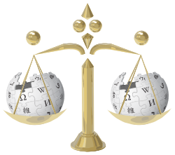
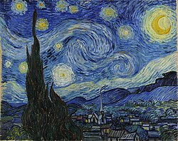
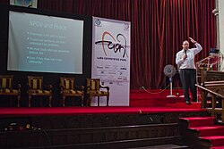

# Retained wiki page revision set (collector assembly)

> This consumer Markdown assembles the explicitly retained originals in declared order. Source labels, line anchors and local href rewrites are collector additions; HTML is represented as structural text with ordered table cells and preserved code, without running source scripts.

> Collector representation: declared cell spans are annotations, not an expanded table grid; code br line breaks and NBSP are retained, and image-label whitespace is normalized without dropping label words.

> Collector snapshot limitation: oldid identifies each page revision, not all transcluded templates or skin dependencies. The saved rendered HTML responses are the offline originals; source scripts are not executed.

> Collector image-alt representation: explicitly declared semantic-marker images are represented by their exact source alt and original links, not OCR or model-supplied text; those marker image bytes are not retained locally. Original Y/N fallback and surrounding examples remain source text.

Original HTML: [verifiability.html](../source/verifiability.html#L1-L1622).

> Collector page identity: Wikipedia:Verifiability; [fixed page revision](https://en.wikipedia.org/w/index.php?title=Wikipedia%3AVerifiability&oldid=1373569010).

Wikipedia policy on verifiability of information

 

> Collector source role: hatnote (original text and links follow).
> "WP:V" and "WP:PROOF" redirect here. For discussing particular sources, see [Wikipedia:Reliable sources/Noticeboard](https://en.wikipedia.org/wiki/Wikipedia:Reliable_sources/Noticeboard). For the policy on vandalism, see [Wikipedia:Vandalism](https://en.wikipedia.org/wiki/Wikipedia:Vandalism). For advice on the use of mathematical proofs, see [Wikipedia:WikiProject Mathematics/Proofs](https://en.wikipedia.org/wiki/Wikipedia:WikiProject_Mathematics/Proofs).

 

 

-  | This page documents an English Wikipedia [policy](https://en.wikipedia.org/wiki/Wikipedia:Policies_and_guidelines).It describes a widely accepted standard that all editors should [normally](https://en.wikipedia.org/wiki/Wikipedia:Ignore_all_rules) follow. Substantive edits to this page [should reflect consensus](https://en.wikipedia.org/wiki/Wikipedia:PGCHANGE). | 
[Shortcut](https://en.wikipedia.org/wiki/Wikipedia:Shortcut)[WP:V](https://en.wikipedia.org/w/index.php?title=Wikipedia:V&redirect=no)[WP:V](https://en.wikipedia.org/wiki/Wikipedia:V)

 

-  | This page in a nutshell: People must be able to check that facts and claims in Wikipedia articles are not just made up. This means each fact or claim must be attributable to reliable, published sources. Additionally, quotations and any facts or claims challenged or likely to be challenged must be supported by [inline citations](https://en.wikipedia.org/wiki/Wikipedia:INCITE).

 

 

In the 

[English Wikipedia](https://en.wikipedia.org/wiki/English_Wikipedia), 

verifiability means that people can check that facts or claims correspond to 

[reliable sources](https://en.wikipedia.org/wiki/Wikipedia:Reliable_sources). Wikipedia's content is determined by published information rather than editors' beliefs, experiences, or 

[previously unpublished ideas or information](https://en.wikipedia.org/wiki/Wikipedia:No_original_research). Even if you are sure something is true, it must have been published in a reliable source before you can add it.

[

[a

]](#verifiability-cite_note-1) If reliable sources disagree with each other, then maintain a 

[neutral point of view](https://en.wikipedia.org/wiki/Wikipedia:Neutral_point_of_view) and present what the various sources say, giving each side its 

[due weight](https://en.wikipedia.org/wiki/Wikipedia:Neutral_point_of_view#Undue_weight).

 

Each fact or claim in an article must be verifiable. All quotations, and any material whose verifiability has been challenged or is likely to be challenged, must include an 

[inline citation](https://en.wikipedia.org/wiki/Wikipedia:INCITE) to a reliable source that directly supports

[

[b

]](#verifiability-cite_note-directly_supports-2) the material. Any material that needs an inline citation but does not have one may be removed. Please immediately remove contentious material 

[about living people](https://en.wikipedia.org/wiki/Wikipedia:Biographies_of_living_persons) that is unsourced or poorly sourced.

 

When material that needs an inline citation appears in two or more articles, an inline citation is needed in each.

 

For how to write citations, see 

[citing sources](https://en.wikipedia.org/wiki/Wikipedia:Citing_sources). Verifiability, 

[no original research](https://en.wikipedia.org/wiki/Wikipedia:No_original_research), and 

[neutral point of view](https://en.wikipedia.org/wiki/Wikipedia:Neutral_point_of_view) are Wikipedia's 

[core content policies](https://en.wikipedia.org/wiki/Wikipedia:Core_content_policies). They work together to determine content, so editors should understand the key points of all three. Articles must also comply with the 

[copyright policy](https://en.wikipedia.org/wiki/Wikipedia:Copyrights).

 

 

## Responsibility for providing citations

 

[Shortcut](https://en.wikipedia.org/wiki/Wikipedia:Shortcut)

- [WP:BURDEN](https://en.wikipedia.org/w/index.php?title=Wikipedia:BURDEN&redirect=no)[WP:BURDEN](https://en.wikipedia.org/wiki/Wikipedia:BURDEN)

 

> Collector source role: hatnote (original text and links follow).
> "WP:PROVEIT" redirects here. For the editing tool, see [Wikipedia:ProveIt](https://en.wikipedia.org/wiki/Wikipedia:ProveIt).

 

> Collector source role: hatnote (original text and links follow).
> "WP:CHALLENGE" redirects here. For challenging closes, see [Wikipedia:Closing discussions § Challenging a closure](https://en.wikipedia.org/wiki/Wikipedia:Closing_discussions#Challenging_a_closure). For Bilorv's Challenges, see [Wikipedia:Bilorv's Challenges](https://en.wikipedia.org/wiki/Wikipedia:Bilorv's_Challenges).

 

> Collector source role: hatnote (original text and links follow).
> "WP:UNSOURCED" redirects here. For argument, see [Wikipedia:Arguments to avoid in deletion discussions § It's unsourced](https://en.wikipedia.org/wiki/Wikipedia:Arguments_to_avoid_in_deletion_discussions#It's_unsourced).

 

> Collector source role: hatnote (original text and links follow).
> See also: [Wikipedia:Editing policy § Try to fix problems](https://en.wikipedia.org/wiki/Wikipedia:Editing_policy#Try_to_fix_problems)

 

All content must be verifiable. A fact or claim is "verifiable" if a 

[reliable source](https://en.wikipedia.org/wiki/Wikipedia:Reliable_sources) that supports it could be cited, even if there is no citation for it in the article at the moment. 

The burden to demonstrate verifiability lies with the editor who adds or restores material, and it is satisfied by providing one 

[inline citation](https://en.wikipedia.org/wiki/Wikipedia:Inline_citation) to a reliable source that directly supports

[

[b

]](#verifiability-cite_note-directly_supports-2) the contribution.

[

[c

]](#verifiability-cite_note-3)

 

The cited source must clearly support the material as presented in the article. Cite the source clearly, ideally giving page number(s)

—though sometimes a section, chapter, or other division is appropriate instead; see 

[Wikipedia:Citing sources](https://en.wikipedia.org/wiki/Wikipedia:Citing_sources) for details of how to do this.

 

Facts or claims without an inline citation to a reliable source that directly supports

[

[b

]](#verifiability-cite_note-directly_supports-2) them may be removed. They should not be restored without an inline citation to a reliable source.

 

[Shortcut](https://en.wikipedia.org/wiki/Wikipedia:Shortcut)

- [WP:BURDENWAIT](https://en.wikipedia.org/w/index.php?title=Wikipedia:BURDENWAIT&redirect=no)[WP:BURDENWAIT](https://en.wikipedia.org/wiki/Wikipedia:BURDENWAIT)

 

Whether or how quickly material should be removed for lacking an inline citation to a reliable source depends on the material and the overall state of the article. Consider adding a [citation needed](https://en.wikipedia.org/wiki/Wikipedia:Citation_needed) tag as an interim step to removing unsourced material, to allow references to be added.

[

[d

]](#verifiability-cite_note-4) When tagging or removing material for lacking an inline citation, state your concern that it may not be possible to find a published reliable source, and the material therefore may not be verifiable.

[

[e

]](#verifiability-cite_note-5) If you think the material is verifiable, [you are encouraged to provide an inline citation yourself](https://en.wikipedia.org/wiki/Wikipedia:PRESERVE) before removing or tagging it.

 

Do 

not leave unsourced or poorly sourced material in an article if it might damage the reputation of living people or existing groups, and do not move it to the talk page, per Wikipedia's 

[biographies of living persons policy](https://en.wikipedia.org/wiki/Wikipedia:Biographies_of_living_persons) (common shortcut: 

[WP:BLP](https://en.wikipedia.org/wiki/Wikipedia:BLP)). The latter policy also 

[applies to some groups](https://en.wikipedia.org/wiki/Wikipedia:Biographies_of_living_persons#Legal_persons_and_groups).

 

## Reliable sources

  

[Shortcut](https://en.wikipedia.org/wiki/Wikipedia:Shortcut)

- [WP:SOURCE](https://en.wikipedia.org/w/index.php?title=Wikipedia:SOURCE&redirect=no)[WP:SOURCE](https://en.wikipedia.org/wiki/Wikipedia:SOURCE)

 

> Collector source role: hatnote (original text and links follow).
> "WP:SOURCE" redirects here. For how to reference sources, see [Help:Referencing for beginners](https://en.wikipedia.org/wiki/Help:Referencing_for_beginners).

 

### What counts as a reliable source

 

> Collector source role: hatnote (original text and links follow).
> Further information: [Wikipedia:Reliable sources](https://en.wikipedia.org/wiki/Wikipedia:Reliable_sources)

 

A 

cited source on Wikipedia is often a specific portion of text (such as a short article or a page in a book). But when editors discuss sources (for example, to debate their appropriateness or reliability) they are usually talking about one or more related characteristics:

 

- 

The work itself (the article, book) and works like it ("An obituary can be a useful biographical source", "A recent source is better than an old one")

 

- 

The creator of the work (the writer, journalist: "What do we know about that source's reputation?") and people like them ("A medical researcher is a better source than a journalist for medical claims").

 

- 

The publication (for example, the newspaper, journal, magazine: "That source covers the arts.") and publications like them ("A newspaper is not a reliable source for medical claims").

 

- 

The publisher of the work (for example, 

[Cambridge University Press](https://en.wikipedia.org/wiki/Cambridge_University_Press): "That source publishes reference works.") and publishers like them ("An academic publisher is a good source of reference works").

 

All four can affect reliability.

 

Base articles on reliable, 

[independent](https://en.wikipedia.org/wiki/Wikipedia:Independent_sources), published sources with a reputation for fact-checking and accuracy. Source material must be 

published, on Wikipedia meaning 

made available to the public in some form.

[

[f

]](#verifiability-cite_note-6) 

Unpublished material is not considered reliable. Use sources that directly support the material presented in an article and are appropriate to the claims made. The appropriateness of any source depends on the context. Be especially careful when sourcing 

[content related to living people](https://en.wikipedia.org/wiki/Wikipedia:Biographies_of_living_persons) or 

[medicine](https://en.wikipedia.org/wiki/Wikipedia:Identifying_reliable_sources_(medicine)).

 

If available, academic and 

[peer-reviewed](https://en.wikipedia.org/wiki/Peer-reviewed) publications are usually the most reliable sources on topics such as history, medicine, and science.

 

Editors may also use material from reliable non-academic sources, particularly if it appears in respected 

[mainstream](https://en.wikipedia.org/wiki/Wikipedia:MAINSTREAM) publications. Other reliable sources include:

 

- University-level textbooks

 

- Books published by respected 

[publishing houses](https://en.wikipedia.org/wiki/Publishing_houses)

 

- Mainstream (

[non-fringe](https://en.wikipedia.org/wiki/Wikipedia:FRINGE)) magazines, including specialty ones

 

- Reputable newspapers

 

Editors may also use electronic media, subject to the same criteria (see details in 

[Wikipedia:Identifying reliable sources](https://en.wikipedia.org/wiki/Wikipedia:Identifying_reliable_sources)).

 

#### Best sources

 

The 

[best sources](https://en.wikipedia.org/wiki/Wikipedia:BESTSOURCES) have a professional structure for checking or analyzing facts, legal issues, evidence, and arguments. The greater the degree of scrutiny given to these issues, the more reliable the source.

 

### Newspaper and magazine blogs

 

[Shortcut](https://en.wikipedia.org/wiki/Wikipedia:Shortcut)

- [WP:NEWSBLOG](https://en.wikipedia.org/w/index.php?title=Wikipedia:NEWSBLOG&redirect=no)[WP:NEWSBLOG](https://en.wikipedia.org/wiki/Wikipedia:NEWSBLOG)

 

> Collector source role: hatnote (original text and links follow).
> "WP:CONTRIBUTORS" redirects here. For Wikipedia contributors, see [Wikipedia:Wikipedians](https://en.wikipedia.org/wiki/Wikipedia:Wikipedians).

 

Some newspapers, magazines, and other news organizations host online 

[pages or columns](https://en.wikipedia.org/wiki/Wikipedia:PRIMARY) they call 

[blogs](https://en.wikipedia.org/wiki/Blog). These may be acceptable sources if the writers are professionals, but use them with caution because blogs may not be subject to the news organization's normal fact-checking process.

[

[g

]](#verifiability-cite_note-EXCEPTIONAL-7) If a news organization publishes an 

[opinion piece](https://en.wikipedia.org/wiki/Wikipedia:PRIMARY) in a blog, attribute the statement to the writer, e.g. "Jane Smith wrote

 ..." Never use the blog comments that are left by the readers as sources. For personal or group blogs that are 

not reliable sources, see 

[§ Self-published sources](#verifiability-Self-published_sources) below.

 

### Reliable sources noticeboard and guideline

 

> Collector source role: hatnote (original text and links follow).
> Further information: [Wikipedia:Reliable sources](https://en.wikipedia.org/wiki/Wikipedia:Reliable_sources) and [Wikipedia:Reliable sources/Noticeboard](https://en.wikipedia.org/wiki/Wikipedia:Reliable_sources/Noticeboard)

 

To discuss the reliability of a specific source for a particular statement, consult 

[Wikipedia:Reliable sources/Noticeboard](https://en.wikipedia.org/wiki/Wikipedia:Reliable_sources/Noticeboard), which seeks to apply this policy to particular cases. For a guideline discussing the reliability of particular 

types of sources, see 

[Wikipedia:Reliable sources](https://en.wikipedia.org/wiki/Wikipedia:Reliable_sources). In case of conflict between this policy and the 

[Wikipedia:Reliable sources](https://en.wikipedia.org/wiki/Wikipedia:Reliable_sources) guideline, or any other guideline related to sourcing, this policy has priority.

 

## Sources that are usually not reliable

 

[Shortcut](https://en.wikipedia.org/wiki/Wikipedia:Shortcut)

- [WP:NOTRS](https://en.wikipedia.org/w/index.php?title=Wikipedia:NOTRS&redirect=no)[WP:NOTRS](https://en.wikipedia.org/wiki/Wikipedia:NOTRS)

> Collector source role: hatnote (original text and links follow).
> "WP:NOTRELIABLE" redirects here. For Wikipedia's own reliability, see [Wikipedia:Don't cite Wikipedia on Wikipedia](https://en.wikipedia.org/wiki/Wikipedia:Don't_cite_Wikipedia_on_Wikipedia).

 

> Collector source role: hatnote (original text and links follow).
> See also: [Wikipedia:Reliable sources § Questionable and self-published sources](https://en.wikipedia.org/wiki/Wikipedia:Reliable_sources#Questionable_and_self-published_sources), and [Wikipedia:Reliable sources/Perennial sources](https://en.wikipedia.org/wiki/Wikipedia:Reliable_sources/Perennial_sources)

 

### Questionable sources

 

Questionable sources are those that have a poor reputation for checking the facts, lack meaningful editorial oversight, or 

[have an apparent conflict of interest](https://en.wikipedia.org/wiki/Wikipedia:COISOURCE).

 

Such sources include websites and publications expressing views widely considered by other sources to be promotional, extremist, or that rely heavily on unsubstantiated gossip, rumor, or personal opinion. Questionable sources should be used only as sources for material on 

themselves, such as in articles about themselves; see 

[below](#verifiability-Self-published_and_questionable_sources_as_sources_on_themselves). They are not suitable sources for contentious claims.

 

[Predatory open access](https://en.wikipedia.org/wiki/Predatory_open_access) journals are questionable due to the absence of quality control in the peer-review process.

 

### Self-published sources

   

[Shortcuts](https://en.wikipedia.org/wiki/Wikipedia:Shortcut)

- [WP:SELFPUBLISH](https://en.wikipedia.org/w/index.php?title=Wikipedia:SELFPUBLISH&redirect=no)[WP:SELFPUBLISH](https://en.wikipedia.org/wiki/Wikipedia:SELFPUBLISH)

- [WP:SPS](https://en.wikipedia.org/w/index.php?title=Wikipedia:SPS&redirect=no)[WP:SPS](https://en.wikipedia.org/wiki/Wikipedia:SPS)

- [WP:SELFPUB](https://en.wikipedia.org/w/index.php?title=Wikipedia:SELFPUB&redirect=no)[WP:SELFPUB](https://en.wikipedia.org/wiki/Wikipedia:SELFPUB)

 

> Collector source role: hatnote (original text and links follow).
> Further information: [Wikipedia:Biographies of living persons § Avoid self-published sources](https://en.wikipedia.org/wiki/Wikipedia:Biographies_of_living_persons#Avoid_self-published_sources), [Wikipedia:List of companies engaged in the self-publishing business](https://en.wikipedia.org/wiki/Wikipedia:List_of_companies_engaged_in_the_self-publishing_business), and [Wikipedia:Identifying and using self-published works](https://en.wikipedia.org/wiki/Wikipedia:Identifying_and_using_self-published_works)

 

> Collector source role: hatnote (original text and links follow).
> "WP:BLOG" redirects here. For using someone's blog as a source for themselves, see [WP:Biographies of living persons § Using the subject as a self-published source](https://en.wikipedia.org/wiki/Wikipedia:Biographies_of_living_persons#Using_the_subject_as_a_self-published_source). For linking someone's blog in their article, see [WP:External links § Official links](https://en.wikipedia.org/wiki/Wikipedia:External_links#Official_links).

 

> Collector source role: hatnote (original text and links follow).
> "WP:WORDPRESS" redirects here. For the use of Wordpress as a source, see [Wikipedia:Reliable sources/Perennial sources § WordPress.com](https://en.wikipedia.org/wiki/Wikipedia:Reliable_sources/Perennial_sources#WordPress.com).

 

Anyone can create a 

[personal web page](https://en.wikipedia.org/wiki/Personal_web_page), 

[self-publish](https://en.wikipedia.org/wiki/Self-publishing) a book, or 

[claim to be an expert](https://en.wikipedia.org/wiki/Wikipedia:Expert_editors). Self-published material, such as books, newsletters, personal websites, open 

[wikis](https://en.wikipedia.org/wiki/Wiki), personal or 

[group](https://en.wikipedia.org/wiki/Group_blog) blogs (as distinguished from 

[newsblogs](#verifiability-Newspaper_and_magazine_blogs)), 

[content farms](https://en.wikipedia.org/wiki/Content_farm), 

[podcasts](https://en.wikipedia.org/wiki/Podcast), 

[Internet forum](https://en.wikipedia.org/wiki/Internet_forum) posts, and 

[social media](https://en.wikipedia.org/wiki/Social_media) posts, are largely not acceptable as sources. Patents, despite undergoing a patent review process, are treated as self-published.

 

Self-published sources may be considered reliable if published by an established 

[subject-matter expert](https://en.wikipedia.org/wiki/Subject-matter_expert), whose work 

in the relevant field has previously been published by 

[reliable](https://en.wikipedia.org/wiki/Wikipedia:RS), independent publications.

[

[g

]](#verifiability-cite_note-EXCEPTIONAL-7) Be careful when using such sources: if the information in question is suitable for inclusion, someone else will likely have published it in independent, reliable sources.

[

[1

]](#verifiability-cite_note-8) 

Never use a self-published source as a 

[third-party source](https://en.wikipedia.org/wiki/Wikipedia:Independent_sources) about living people, even if the author is an expert, well-known professional researcher, or writer.

 

### Self-published or questionable sources as sources on themselves

  

[Shortcut](https://en.wikipedia.org/wiki/Wikipedia:Shortcut)

- [WP:ABOUTSELF](https://en.wikipedia.org/w/index.php?title=Wikipedia:ABOUTSELF&redirect=no)[WP:ABOUTSELF](https://en.wikipedia.org/wiki/Wikipedia:ABOUTSELF)

 

> Collector source role: hatnote (original text and links follow).
> "WP:SOCIALMEDIA" redirects here. For the policy, see [Wikipedia:What Wikipedia is not § Wikipedia is not a blog, web hosting service, social networking service, or memorial site](https://en.wikipedia.org/wiki/Wikipedia:What_Wikipedia_is_not#Wikipedia_is_not_a_blog,_web_hosting_service,_social_networking_service,_or_memorial_site).

 

> Collector source role: hatnote (original text and links follow).
> "WP:TWITTER" redirects here. For the external links essay, see [Wikipedia:External links/Perennial websites § X (formerly Twitter)](https://en.wikipedia.org/wiki/Wikipedia:External_links/Perennial_websites#X_(formerly_Twitter)). For a template used for citing tweets, see [Template:Cite tweet](https://en.wikipedia.org/wiki/Template:Cite_tweet). For community evaluation of X (formerly Twitter) as a source, see [Wikipedia:Reliable sources/Perennial sources § X](https://en.wikipedia.org/wiki/Wikipedia:Reliable_sources/Perennial_sources#X).

 

> Collector source role: hatnote (original text and links follow).
> See also: [Wikipedia:Reliable sources § Statements of opinion](https://en.wikipedia.org/wiki/Wikipedia:Reliable_sources#Statements_of_opinion)

 

Self-published and questionable sources may be used as sources of information 

about themselves, usually in articles about themselves or their activities, without the self-published source requirement that they are established experts in the field, so long as:

 

1. The material is neither unduly self-serving nor an 

[exceptional claim](#verifiability-Exceptional_claims_require_exceptional_sources);

 

2. It does not involve claims about third parties;

 

3. It does not involve claims about events not directly related to the source;

 

4. There is no reasonable doubt as to its authenticity; and

 

5. The article is not based primarily on such sources.

 

This policy also applies to material made public by the source on social networking websites such as 

[X](https://en.wikipedia.org/wiki/X_(social_network)) (formerly Twitter), 

[Tumblr](https://en.wikipedia.org/wiki/Tumblr), 

[LinkedIn](https://en.wikipedia.org/wiki/LinkedIn), 

[Reddit](https://en.wikipedia.org/wiki/Reddit), 

[Instagram](https://en.wikipedia.org/wiki/Instagram) and 

[Facebook](https://en.wikipedia.org/wiki/Facebook).

 

### Wikipedia and sources that mirror or use it

 

[Shortcuts](https://en.wikipedia.org/wiki/Wikipedia:Shortcut)

- [WP:CIRCULAR](https://en.wikipedia.org/w/index.php?title=Wikipedia:CIRCULAR&redirect=no)[WP:CIRCULAR](https://en.wikipedia.org/wiki/Wikipedia:CIRCULAR)

- [WP:CIRC](https://en.wikipedia.org/w/index.php?title=Wikipedia:CIRC&redirect=no)[WP:CIRC](https://en.wikipedia.org/wiki/Wikipedia:CIRC)

 

> Collector source role: hatnote (original text and links follow).
> "WP:CIRCULAR" redirects here. For links on a page that redirect back to the same page, see [Wikipedia:Manual of Style/Linking § Circular](https://en.wikipedia.org/wiki/Wikipedia:Manual_of_Style/Linking#Circular).

 

> Collector source role: hatnote (original text and links follow).
> See also: [Wikipedia:List of citogenesis incidents](https://en.wikipedia.org/wiki/Wikipedia:List_of_citogenesis_incidents), [Wikipedia:Citing Wikipedia](https://en.wikipedia.org/wiki/Wikipedia:Citing_Wikipedia), and [Wikipedia:Don't cite Wikipedia on Wikipedia](https://en.wikipedia.org/wiki/Wikipedia:Don't_cite_Wikipedia_on_Wikipedia)

 

Do not use articles from Wikipedia (whether English Wikipedia or Wikipedias in other languages) as sources, since Wikipedia is a 

[user-generated source](https://en.wikipedia.org/wiki/Wikipedia:UGC). Do not use websites 

[mirroring Wikipedia content](https://en.wikipedia.org/wiki/Wikipedia:Mirrors_and_forks) or publications relying on material from Wikipedia as sources. Content from a Wikipedia article is not considered reliable unless it is backed up by citing 

[reliable sources](https://en.wikipedia.org/wiki/Wikipedia:Identifying_reliable_sources). Confirm that these sources support the content, then use them directly.

[

[2

]](#verifiability-cite_note-9)

 

An exception is allowed when Wikipedia itself is being discussed in the article. These may cite content from Wikipedia or a sister project to support a statement about Wikipedia. Wikipedia or the sister project is a 

[primary source](https://en.wikipedia.org/wiki/Primary_source) in this case and may be used following the 

[policy for primary sources](https://en.wikipedia.org/wiki/Wikipedia:PRIMARY). Any such use should avoid 

[original research](https://en.wikipedia.org/wiki/Wikipedia:OR), 

[undue emphasis](https://en.wikipedia.org/wiki/Wikipedia:UNDUE) on Wikipedia's role or views, and 

[inappropriate self-reference](https://en.wikipedia.org/wiki/Wikipedia:Manual_of_Style/Self-references_to_avoid). The article text should say that the material is sourced from Wikipedia.

 

## Accessibility

 

### Access to sources

 

[Shortcut](https://en.wikipedia.org/wiki/Wikipedia:Shortcut)

- [WP:PAYWALL](https://en.wikipedia.org/w/index.php?title=Wikipedia:PAYWALL&redirect=no)[WP:PAYWALL](https://en.wikipedia.org/wiki/Wikipedia:PAYWALL)

 

> Collector source role: hatnote (original text and links follow).
> See also: [Wikipedia:Offline sources](https://en.wikipedia.org/wiki/Wikipedia:Offline_sources) and [Wikipedia:Reliable sources/Cost](https://en.wikipedia.org/wiki/Wikipedia:Reliable_sources/Cost)

 

Do not reject reliable sources just because they are difficult or costly to access. Some reliable sources are not easily accessible. For example, an online source may require payment or otherwise be hidden behind a 

[paywall](https://en.wikipedia.org/wiki/Paywall), and a print-only source may be available only through libraries. Rare historical sources may even be available only in special museum collections and archives. If you have trouble accessing a source, others might do so for you (see 

[WikiProject Resource Exchange](https://en.wikipedia.org/wiki/Wikipedia:WikiProject_Resource_Exchange/Resource_Request)).

[

[h

]](#verifiability-cite_note-Courtesy-10) (See 

[Template:Request quotation](https://en.wikipedia.org/wiki/Template:Request_quotation).)

 

### Non-English sources

 

[Shortcut](https://en.wikipedia.org/wiki/Wikipedia:Shortcut)

- [WP:NONENG](https://en.wikipedia.org/w/index.php?title=Wikipedia:NONENG&redirect=no)[WP:NONENG](https://en.wikipedia.org/wiki/Wikipedia:NONENG)

 

> Collector source role: hatnote (original text and links follow).
> See also: [Wikipedia:Translators available](https://en.wikipedia.org/wiki/Wikipedia:Translators_available) and [Wikipedia:No original research § Translations and transcriptions](https://en.wikipedia.org/wiki/Wikipedia:No_original_research#Translations_and_transcriptions)

 

#### Citing

 

[Citations](https://en.wikipedia.org/wiki/Wikipedia:Citing_sources) to non-English reliable sources are allowed on the 

[English Wikipedia](https://en.wikipedia.org/wiki/English_Wikipedia). However, because this project is in English, English-language sources are preferred over non-English ones when available, relevant, and of equal quality. In a dispute about a citation to a non-English source, editors can ask for a quotation of relevant portions of the source, either in text, in a footnote, or on the article talk page.

[

[h

]](#verifiability-cite_note-Courtesy-10) (See 

[Template:Request quotation](https://en.wikipedia.org/wiki/Template:Request_quotation).)

 

#### Quoting

 

If you quote a non-English reliable source (whether in the main text or in a footnote), 

[a translation into English should accompany the quote](https://en.wikipedia.org/wiki/MOS:FOREIGNQUOTE). Translations published by reliable sources are preferred over translations by Wikipedians, but translations by Wikipedians are preferred over machine translations. When using a machine translation of source material, editors should be reasonably certain that the translation is accurate and the source is appropriate. Editors should not rely upon machine translations of non-English sources in contentious articles or biographies of living people. If needed, ask 

[an editor who can translate it](https://en.wikipedia.org/wiki/Wikipedia:Translators_available) for you.

 

The original text is usually included with the translated text in articles when translated by Wikipedians, and the translating editor is usually not cited. When quoting any material, whether in English or in some other language, be careful not to 

[violate copyright](https://en.wikipedia.org/wiki/Wikipedia:Copyright_violations); see the 

[fair-use guideline](https://en.wikipedia.org/wiki/Wikipedia:Fair_use#Text).

 

## Other issues

 

### Verifiability does not guarantee inclusion

 

[Shortcut](https://en.wikipedia.org/wiki/Wikipedia:Shortcut)

- [WP:VNOT](https://en.wikipedia.org/w/index.php?title=Wikipedia:VNOT&redirect=no)[WP:VNOT](https://en.wikipedia.org/wiki/Wikipedia:VNOT)

 

> Collector source role: hatnote (original text and links follow).
> Main page: [Wikipedia:What Wikipedia is not § Encyclopedic content](https://en.wikipedia.org/wiki/Wikipedia:What_Wikipedia_is_not#Encyclopedic_content)

 

> Collector source role: hatnote (original text and links follow).
> See also: [Wikipedia:Neutral point of view](https://en.wikipedia.org/wiki/Wikipedia:Neutral_point_of_view), [Wikipedia:Notability § Whether to create standalone pages](https://en.wikipedia.org/wiki/Wikipedia:Notability#Whether_to_create_standalone_pages), [Wikipedia:Summary style](https://en.wikipedia.org/wiki/Wikipedia:Summary_style), and [Wikipedia:What Wikipedia is not § Wikipedia is not an indiscriminate collection of information](https://en.wikipedia.org/wiki/Wikipedia:What_Wikipedia_is_not#Wikipedia_is_not_an_indiscriminate_collection_of_information)

 

While information must be verifiable for inclusion in an 

[article](https://en.wikipedia.org/wiki/Wikipedia:ARTICLE), not all verifiable information must be included. Through the 

[consensus](https://en.wikipedia.org/wiki/Wikipedia:Consensus) process, editors may determine that inclusion of a verifiable fact or claim does not improve an article, and other policies may indicate that the material is inappropriate. Such information should be omitted or 

[used instead in a different article](https://en.wikipedia.org/wiki/Wikipedia:PRESERVE).

 

### Build consensus

 

[Shortcut](https://en.wikipedia.org/wiki/Wikipedia:Shortcut)

- [WP:ONUS](https://en.wikipedia.org/w/index.php?title=Wikipedia:ONUS&redirect=no)[WP:ONUS](https://en.wikipedia.org/wiki/Wikipedia:ONUS)

 

> Collector source role: hatnote (original text and links follow).
> "WP:ONUS" redirects here. For demonstrating verifiability, see [Wikipedia:Verifiability § Responsibility for providing citations](#verifiability-Responsibility_for_providing_citations). For a history of this section, see [Wikipedia:Verifiability/Onus](https://en.wikipedia.org/wiki/Wikipedia:Verifiability/Onus).

 

> Collector source role: hatnote (original text and links follow).
> For an explanatory essay about apparent conflicts with this subsection, see [Wikipedia:What ONUS means](https://en.wikipedia.org/wiki/Wikipedia:What_ONUS_means).

 

The responsibility for achieving consensus for inclusion is on editors seeking to include disputed content.

 

### Tagging a sentence, section, or article

 

> Collector source role: hatnote (original text and links follow).
> Further information: [Wikipedia:Citation needed](https://en.wikipedia.org/wiki/Wikipedia:Citation_needed) and [Wikipedia:Template index/Sources of articles](https://en.wikipedia.org/wiki/Wikipedia:Template_index/Sources_of_articles)

 

If you want to request an inline citation for an unsourced statement, you can tag a sentence with the 

{{[citation needed](https://en.wikipedia.org/wiki/Template:Citation_needed)

}} template. You can also ask for a source on the 

[talk page](https://en.wikipedia.org/wiki/Help:Talk_page). To request verification that a reference supports the text, tag it with 

{{[verification needed](https://en.wikipedia.org/wiki/Template:Verification_needed)

}}. Material that fails verification may be tagged with 

{{[failed verification](https://en.wikipedia.org/wiki/Template:Failed_verification)

}} or removed. Please explain why you added the template in your edit summary or on the talk page.

 

Take special care with contentious 

[material about living and recently deceased people](https://en.wikipedia.org/wiki/Wikipedia:Biographies_of_living_persons). Unsourced or poorly sourced material that is contentious, especially text that is negative, derogatory, or potentially damaging, should be removed immediately rather than tagged or moved to the talk page.

 

### Exceptional claims require exceptional sourcing

 

[Shortcuts](https://en.wikipedia.org/wiki/Wikipedia:Shortcut)

- [WP:ECREE](https://en.wikipedia.org/w/index.php?title=Wikipedia:ECREE&redirect=no)[WP:ECREE](https://en.wikipedia.org/wiki/Wikipedia:ECREE)

- [WP:REDFLAG](https://en.wikipedia.org/w/index.php?title=Wikipedia:REDFLAG&redirect=no)[WP:REDFLAG](https://en.wikipedia.org/wiki/Wikipedia:REDFLAG)

- [WP:EXCEPTIONAL](https://en.wikipedia.org/w/index.php?title=Wikipedia:EXCEPTIONAL&redirect=no)[WP:EXCEPTIONAL](https://en.wikipedia.org/wiki/Wikipedia:EXCEPTIONAL)

 

> Collector source role: hatnote (original text and links follow).
> See also: [Wikipedia:Fringe theories](https://en.wikipedia.org/wiki/Wikipedia:Fringe_theories)

 

Any exceptional claim requires 

multiple high-quality sources.

[

[3

]](#verifiability-cite_note-11) Warnings (red flags) that should prompt extra caution include:

 

- Surprising or apparently important claims not covered by multiple mainstream sources;

 

- Challenged claims that are supported purely by 

[primary](https://en.wikipedia.org/wiki/Wikipedia:Primary) or self-published sources or those with an apparent conflict of interest;

 

- Reports of a statement by someone that seems out of character or against an interest they had previously defended;

 

- Claims contradicted by the prevailing view within the relevant community or that would significantly alter mainstream assumptions—especially in science, medicine, history, politics, and biographies of living and recently deceased people. This is especially true when proponents say there is a 

[conspiracy](https://en.wikipedia.org/wiki/Conspiracy_theory) to silence them.

 

## Verifiability and other principles

 

### Copyright and plagiarism

 

[Shortcut](https://en.wikipedia.org/wiki/Wikipedia:Shortcut)

- [WP:OWNWORDS](https://en.wikipedia.org/w/index.php?title=Wikipedia:OWNWORDS&redirect=no)[WP:OWNWORDS](https://en.wikipedia.org/wiki/Wikipedia:OWNWORDS)

 

> Collector source role: hatnote (original text and links follow).
> Further information: [Wikipedia:Copyright](https://en.wikipedia.org/wiki/Wikipedia:Copyright), [Wikipedia:Plagiarism](https://en.wikipedia.org/wiki/Wikipedia:Plagiarism), [Wikipedia:Copying within Wikipedia](https://en.wikipedia.org/wiki/Wikipedia:Copying_within_Wikipedia), [Wikipedia:Manual of Style § Attribution](https://en.wikipedia.org/wiki/Wikipedia:Manual_of_Style#Attribution), and [Wikipedia:Citing sources § In-text attribution](https://en.wikipedia.org/wiki/Wikipedia:Citing_sources#In-text_attribution)

 

Do not plagiarize or breach copyright when using sources. Summarize source material in your own words. Avoid 

[close paraphrasing](https://en.wikipedia.org/wiki/Wikipedia:CLOP). When you 

[can't avoid close paraphrasing](https://en.wikipedia.org/wiki/Wikipedia:Close_paraphrasing#When_is_close_paraphrasing_permitted?), or when quoting, use an 

[inline citation](https://en.wikipedia.org/wiki/Wikipedia:INCITE) and consider 

[in-text attribution](https://en.wikipedia.org/wiki/Wikipedia:INTEXT).

 

[Never link to any source that violates the copyrights of others](https://en.wikipedia.org/wiki/Wikipedia:LINKVIO). You can link to websites that display copyrighted works as long as the website has licensed the work or uses the work in a way compliant with fair use. Knowingly directing others to material that violates copyright may be considered 

[contributory copyright infringement](https://en.wikipedia.org/wiki/Contributory_copyright_infringement). If there is reason to think a source violates copyright, do not cite it. 

This is particularly relevant when linking to sites such as 

[Scribd](https://en.wikipedia.org/wiki/Scribd) or 

[YouTube](https://en.wikipedia.org/wiki/YouTube), where due care should be taken to avoid linking to material violating copyright.

 

### Neutrality

 

[Shortcut](https://en.wikipedia.org/wiki/Wikipedia:Shortcut)

- [WP:SOURCESDIFFER](https://en.wikipedia.org/w/index.php?title=Wikipedia:SOURCESDIFFER&redirect=no)[WP:SOURCESDIFFER](https://en.wikipedia.org/wiki/Wikipedia:SOURCESDIFFER)

 

> Collector source role: hatnote (original text and links follow).
> Further information: [Wikipedia:Neutral point of view](https://en.wikipedia.org/wiki/Wikipedia:Neutral_point_of_view)

 

Even when information is cited to 

[reliable sources](https://en.wikipedia.org/wiki/Wikipedia:RS), you must present it with a 

[neutral point of view](https://en.wikipedia.org/wiki/Wikipedia:NPOV) (NPOV). Articles should be based on 

[thorough research of sources](https://en.wikipedia.org/wiki/Wikipedia:BESTSOURCES). All articles must adhere to NPOV, fairly representing all majority and significant-minority viewpoints published by reliable sources, in 

[rough proportion](https://en.wikipedia.org/wiki/Wikipedia:UNDUE) to the prominence of each view. Tiny-minority views need not be included, except in articles devoted to them. If there is a disagreement between sources, use 

[in-text attribution](https://en.wikipedia.org/wiki/Wikipedia:INTEXT): "John Smith argues X, while Paul Jones maintains Y," followed by an 

[inline citation](https://en.wikipedia.org/wiki/Wikipedia:INCITE). Sources themselves do not need to maintain a neutral point of view. Indeed, many reliable sources are 

not neutral. Our job as editors is simply to summarize what reliable sources say.

 

### Notability

 

> Collector source role: hatnote (original text and links follow).
> Further information: [Wikipedia:Notability](https://en.wikipedia.org/wiki/Wikipedia:Notability)

 

If no 

[reliable](https://en.wikipedia.org/wiki/Wikipedia:Reliable_sources), 

[independent](https://en.wikipedia.org/wiki/Wikipedia:Independent_sources) sources can be found on a topic, Wikipedia should not have an article on it (i.e., the topic is not 

[notable](https://en.wikipedia.org/wiki/Wikipedia:Notability)). However, notability is 

[based on the 

existence of suitable sources](https://en.wikipedia.org/wiki/Wikipedia:Notability#Notability_is_based_on_the_existence_of_suitable_sources,_not_on_the_state_of_sourcing_in_an_article), not on the state of sourcing in an article.

 

### Original research

 

> Collector source role: hatnote (original text and links follow).
> Further information: [Wikipedia:No original research](https://en.wikipedia.org/wiki/Wikipedia:No_original_research)

 

The 

[no original research](https://en.wikipedia.org/wiki/Wikipedia:NOR) policy (NOR) is closely related to the Verifiability policy. Among its requirements are:

 

1. All material in Wikipedia articles must be verifiable in a reliable published source. This means a reliable published source must exist for it, whether or not it is cited in the article.

 

2. Sources must support the material clearly and directly: 

[drawing inferences from multiple sources to advance a novel position](https://en.wikipedia.org/wiki/Wikipedia:SYN) is prohibited by the NOR policy.

[

[h

]](#verifiability-cite_note-Courtesy-10)

 

3. Base articles largely on reliable 

[secondary sources](https://en.wikipedia.org/wiki/Secondary_source). While 

[primary sources](https://en.wikipedia.org/wiki/Primary_source) are appropriate in some cases, relying on them can be problematic. For more information, see the 

[Primary, secondary, and tertiary sources](https://en.wikipedia.org/wiki/Wikipedia:No_original_research#Primary,_secondary_and_tertiary_sources) section of the NOR policy, and the 

[Misuse of primary sources](https://en.wikipedia.org/wiki/Wikipedia:BLP#Misuse_of_primary_sources) section of the BLP policy.

 

## See also

  

### Guidelines

 

- 

[Reliable sources](https://en.wikipedia.org/wiki/Wikipedia:Reliable_sources)

 

- 

[Identifying reliable sources (medicine)](https://en.wikipedia.org/wiki/Wikipedia:Identifying_reliable_sources_(medicine))

 

### Information pages

 

 

- [Don't cite Wikipedia on Wikipedia](https://en.wikipedia.org/wiki/Wikipedia:Don't_cite_Wikipedia_on_Wikipedia)

 

- [How to mine a source](https://en.wikipedia.org/wiki/Help:How_to_mine_a_source)

 

- [Independent sources](https://en.wikipedia.org/wiki/Wikipedia:Independent_sources)

 

- [Identifying and using primary sources](https://en.wikipedia.org/wiki/Wikipedia:Identifying_and_using_primary_sources)

 

- [Identifying and using self-published works](https://en.wikipedia.org/wiki/Wikipedia:Identifying_and_using_self-published_works)

 

- [Video links](https://en.wikipedia.org/wiki/Wikipedia:Video_links)

 

- [When to cite](https://en.wikipedia.org/wiki/Wikipedia:When_to_cite)

 

 

### Resources

 

- 

[Backlog](https://en.wikipedia.org/wiki/Wikipedia:Backlog#Lacking_references) – links to articles that need citations added

 

- 

[Template index/Sources of articles](https://en.wikipedia.org/wiki/Wikipedia:Template_index/Sources_of_articles) – maintenance templates for articles with sourcing problems

 

- 

[The Wikipedia Library](https://en.wikipedia.org/wiki/Wikipedia:The_Wikipedia_Library) – free access to newspapers, journals, and magazines for experienced editors

 

- 

[WikiProject Resource Exchange](https://en.wikipedia.org/wiki/Wikipedia:WikiProject_Resource_Exchange) – where you can ask for help with checking an individual source

 

### Essays

 

 

- [Citation overkill](https://en.wikipedia.org/wiki/Wikipedia:Citation_overkill)

 

- [Identifying and using tertiary sources](https://en.wikipedia.org/wiki/Wikipedia:Identifying_and_using_tertiary_sources)

 

- [Verifiability does not guarantee inclusion](https://en.wikipedia.org/wiki/Wikipedia:Verifiability_does_not_guarantee_inclusion)

 

- [Verifiability, not truth](https://en.wikipedia.org/wiki/Wikipedia:Verifiability,_not_truth)

 

- [You are not a reliable source](https://en.wikipedia.org/wiki/Wikipedia:You_are_not_a_reliable_source)

 

 

## Notes

 

 

1. 

[
↑](#verifiability-cite_ref-1) 

This principle was historically expressed as "the threshold for inclusion is 

verifiability, not truth". See the essay, 

[Wikipedia:Verifiability, not truth](https://en.wikipedia.org/wiki/Wikipedia:Verifiability,_not_truth).

 

2. 

[
1](#verifiability-cite_ref-directly_supports_2-0) 

[
2](#verifiability-cite_ref-directly_supports_2-1) 

[
3](#verifiability-cite_ref-directly_supports_2-2) 

A source "directly supports" a given piece of material if the information is present 

explicitly in the source, so that using this source to support the material is not a violation of 

[Wikipedia:No original research](https://en.wikipedia.org/wiki/Wikipedia:No_original_research). The location of any citation—including whether one is present in the article at all—is unrelated to whether a source directly supports the material. For questions about where and how to place citations, see 

[Wikipedia:Citing sources](https://en.wikipedia.org/wiki/Wikipedia:Citing_sources), 

[Wikipedia:Manual of Style/Lead section §

 Citations](https://en.wikipedia.org/wiki/Wikipedia:Manual_of_Style/Lead_section#Citations), etc.

 

3. 

[
↑](#verifiability-cite_ref-3) 

Once an editor has provided any source they believe, in good faith, to be sufficient, then any editor who later removes the material must articulate specific problems that would justify its exclusion from Wikipedia (e.g., why the source is unreliable; the source does not support the claim; 

[undue emphasis](https://en.wikipedia.org/wiki/Wikipedia:DUE); 

[unencyclopedic content](https://en.wikipedia.org/wiki/Wikipedia:NOT); etc.). If necessary, all editors are then expected to help achieve 

[consensus](https://en.wikipedia.org/wiki/Wikipedia:Consensus), and any problems with the text or sourcing should be fixed before the material is added back.

 

4. 

[
↑](#verifiability-cite_ref-4) 

When an article contains a lot of 

[uncited](https://en.wikipedia.org/wiki/Wikipedia:Glossary#uncited) information, it may be impractical to add specific 

{

{

[citation needed](https://en.wikipedia.org/wiki/Template:Citation_needed)

}

} tags. Consider then 

[tagging](https://en.wikipedia.org/wiki/Wikipedia:TAG) a section with 

{

{

[unreferenced section](https://en.wikipedia.org/wiki/Template:Unreferenced_section)

}

}, or the article with the applicable of either 

{

{

[unreferenced](https://en.wikipedia.org/wiki/Template:Unreferenced)

}

} or 

{

{

[more citations needed](https://en.wikipedia.org/wiki/Template:More_citations_needed)

}

}. For a disputed category, you may use 

{

{

[unreferenced category](https://en.wikipedia.org/wiki/Template:Unreferenced_category)

}

}. For a disambiguation page, consider asking for a citation on the talk page.

 

5. 

[
↑](#verifiability-cite_ref-5) 

When tagging or removing such material, please communicate your reasons why. Some editors object to others making frequent and large-scale deletions of unsourced information, especially if unaccompanied by other efforts to improve the material. Do not concentrate only on material of a particular point of view, as that may appear to be a contravention of 

[Wikipedia:Neutral point of view](https://en.wikipedia.org/wiki/Wikipedia:Neutral_point_of_view). Also, check to see whether the material is sourced to a citation elsewhere on the page. For all these reasons, it is advisable to clearly communicate that you have a considered reason to believe the material in question cannot be verified.

 

6. 

[
↑](#verifiability-cite_ref-6) 

This includes material such as documents in publicly accessible archives as well as inscriptions in plain sight, e.g. tombstones.

 

7. 

[
1](#verifiability-cite_ref-EXCEPTIONAL_7-0) 

[
2](#verifiability-cite_ref-EXCEPTIONAL_7-1) 

Note that any exceptional claim would require 

[exceptional sources](#verifiability-Exceptional_claims_require_exceptional_sources).

 

8. 

[
1](#verifiability-cite_ref-Courtesy_10-0) 

[
2](#verifiability-cite_ref-Courtesy_10-1) 

[
3](#verifiability-cite_ref-Courtesy_10-2) 

When there is a dispute as to whether a piece of text is fully supported by a given source, direct quotes and other relevant details from the source should be provided to other editors as a courtesy. Do not violate the source's copyright when doing so.

 

 

## References

 

 

1. 

[
↑](#verifiability-cite_ref-8) 

Self-published material is characterized by the 

lack of independent reviewers (those without a conflict of interest) validating the reliability of the content. Further examples of self-published sources include press releases, the material contained within company websites, advertising campaigns, material published in media by the owner(s)/publisher(s) of the media group, self-released music albums, and electoral 

[manifestos](https://en.wikipedia.org/wiki/Manifesto): 

    - The 

[University of California, Berkeley, library](https://web.archive.org/web/20160510203400/https://www.lib.berkeley.edu/TeachingLib/Guides/Internet/Evaluate.html) states: "Most pages found in general search engines for the web are self-published or published by businesses small and large with motives to get you to buy something or believe a point of view. Even within university and library web sites, there can be many pages that the institution does not try to oversee."

 

    - 

[Princeton University](https://web.archive.org/web/20111005165358/http://www.princeton.edu/pr/pub/integrity/pages/other/) offers this understanding in its publication, 

Academic Integrity at Princeton (2011): "Unlike most books and journal articles, which undergo strict editorial review before publication, much of the information on the Web is self-published. To be sure, there are many websites in which you can have confidence: mainstream newspapers, refereed electronic journals, and university, library, and government collections of data. But for vast amounts of Web-based information, no impartial reviewers have evaluated the accuracy or fairness of such material before it's made instantly available across the globe."

 

    - The 

["College of St. Catherine Libraries Guide to Chicago Manual of Style"](https://web.archive.org/web/20060907142339/http://library.stkate.edu/pdf/citeChicago.pdf) (DEKloiber, December 1, 2003) states, "Any site that does not have a specific publisher or sponsoring body should be treated as unpublished or self-published work."

 

2. 

[
↑](#verifiability-cite_ref-9) 

Rekdal, Ole Bjørn (1 August 2014). 

["Academic urban legends"](https://www.ncbi.nlm.nih.gov/pmc/articles/PMC4232290). 

[Social Studies of Science](https://en.wikipedia.org/wiki/Social_Studies_of_Science). 

44 (4): 

638–654. 

[doi](https://en.wikipedia.org/wiki/Doi_(identifier)):

[10.1177/0306312714535679](https://doi.org/10.1177%2F0306312714535679). 

[ISSN](https://en.wikipedia.org/wiki/ISSN_(identifier))

 

[0306-3127](https://search.worldcat.org/issn/0306-3127). 

[PMC](https://en.wikipedia.org/wiki/PMC_(identifier))

 

[4232290](https://www.ncbi.nlm.nih.gov/pmc/articles/PMC4232290). 

[PMID](https://en.wikipedia.org/wiki/PMID_(identifier))

 

[25272616](https://pubmed.ncbi.nlm.nih.gov/25272616).

 

3. 

[
↑](#verifiability-cite_ref-11) 

See 

[Extraordinary claims require extraordinary evidence](https://en.wikipedia.org/wiki/Extraordinary_claims_require_extraordinary_evidence)

 

 

## Further reading

 

- Wales, Jimmy. 

["Insist on sources"](https://lists.wikimedia.org/pipermail/wikien-l/2006-July/050773.html), WikiEN-l, July 19, 2006: "I really want to encourage a much stronger culture which says: it is better to have no information, than to have information like this, with no sources."—referring to a rather unlikely statement about the founders of Google throwing pies at each other.

 

 

 

Original HTML: [neutral-point-of-view.html](../source/neutral-point-of-view.html#L1-L1646).

> Collector page identity: Wikipedia:Neutral point of view; [fixed page revision](https://en.wikipedia.org/w/index.php?title=Wikipedia%3ANeutral_point_of_view&oldid=1370393267).

Wikipedia policy

 

> Collector source role: hatnote (original text and links follow).
> For raising issues with specific articles, see [Wikipedia:Neutral point of view/Noticeboard](https://en.wikipedia.org/wiki/Wikipedia:Neutral_point_of_view/Noticeboard). For advice on applying this policy, see [Wikipedia:NPOV tutorial](https://en.wikipedia.org/wiki/Wikipedia:NPOV_tutorial). For frequent critiques and responses, see [Wikipedia:Neutral point of view/FAQ](https://en.wikipedia.org/wiki/Wikipedia:Neutral_point_of_view/FAQ).

 

 

-  | This page documents an English Wikipedia [policy](https://en.wikipedia.org/wiki/Wikipedia:Policies_and_guidelines).It describes a widely accepted standard that all editors should [normally](https://en.wikipedia.org/wiki/Wikipedia:Ignore_all_rules) follow. Substantive edits to this page [should reflect consensus](https://en.wikipedia.org/wiki/Wikipedia:PGCHANGE). | 

[Shortcuts](https://en.wikipedia.org/wiki/Wikipedia:Shortcut)[WP:NPOV](https://en.wikipedia.org/w/index.php?title=Wikipedia:NPOV&redirect=no)[WP:NPOV](https://en.wikipedia.org/wiki/Wikipedia:NPOV)[WP:NPV](https://en.wikipedia.org/w/index.php?title=Wikipedia:NPV&redirect=no)[WP:NPV](https://en.wikipedia.org/wiki/Wikipedia:NPV)

 

-  | This page in a nutshell: Articles must not take sides, but should explain the sides, fairly and without editorial [bias](https://en.wikipedia.org/wiki/Bias). This applies to both what you say and how you say it.

 

 

 

All encyclopedic content on 

[Wikipedia](https://en.wikipedia.org/wiki/Wikipedia) must be written from a 

neutral point of view (

NPOV), which means representing fairly, proportionately, and, as far as possible, without editorial bias, all the significant 

[views](https://en.wikipedia.org/wiki/Point_of_view_(philosophy)) that have been 

[published by reliable sources](https://en.wikipedia.org/wiki/Wikipedia:Verifiability) on a topic.

 

NPOV is a 

[fundamental principle of Wikipedia](https://en.wikipedia.org/wiki/Wikipedia:Five_pillars) and of 

[other Wikimedia projects](https://meta.wikimedia.org/wiki/Founding%20principles). It is also one of Wikipedia's three core content policies; the other two are "

[Verifiability](https://en.wikipedia.org/wiki/Wikipedia:Verifiability)" and "

[No original research](https://en.wikipedia.org/wiki/Wikipedia:No_original_research)". These policies jointly determine the type and quality of material acceptable in Wikipedia articles, and because they work in harmony, they cannot be interpreted in isolation from one another.

 

This policy is 

non-negotiable, and the principles upon which it is based cannot be superseded by other 

[policies or guidelines](https://en.wikipedia.org/wiki/Wikipedia:Policies_and_guidelines), nor by 

[editor consensus](https://en.wikipedia.org/wiki/Wikipedia:Consensus).

 

## Explanation

 

[Shortcuts](https://en.wikipedia.org/wiki/Wikipedia:Shortcut)

- [WP:YESPOV](https://en.wikipedia.org/w/index.php?title=Wikipedia:YESPOV&redirect=no)[WP:YESPOV](https://en.wikipedia.org/wiki/Wikipedia:YESPOV)

- [WP:WIKIVOICE](https://en.wikipedia.org/w/index.php?title=Wikipedia:WIKIVOICE&redirect=no)[WP:WIKIVOICE](https://en.wikipedia.org/wiki/Wikipedia:WIKIVOICE)

- [WP:VOICE](https://en.wikipedia.org/w/index.php?title=Wikipedia:VOICE&redirect=no)[WP:VOICE](https://en.wikipedia.org/wiki/Wikipedia:VOICE)

 

> Collector source role: hatnote (original text and links follow).
> "WP:VOICE" redirects here. For the project about voice intros in articles, see [Wikipedia:Voice intro project](https://en.wikipedia.org/wiki/Wikipedia:Voice_intro_project).

 

> Collector source role: hatnote (original text and links follow).
> See also: [Wikipedia:Neutral point of view/FAQ](https://en.wikipedia.org/wiki/Wikipedia:Neutral_point_of_view/FAQ) and [Wikipedia:What Wikipedia is not § Wikipedia is not a soapbox or means of promotion](https://en.wikipedia.org/wiki/Wikipedia:What_Wikipedia_is_not#Wikipedia_is_not_a_soapbox_or_means_of_promotion)

 

> Collector source role: hatnote (original text and links follow).
> Further information: [Wikipedia:Advocacy](https://en.wikipedia.org/wiki/Wikipedia:Advocacy)

 

Achieving what the 

[Wikipedia community](https://en.wikipedia.org/wiki/Wikipedia_community) understands as 

[neutrality](https://en.wikipedia.org/wiki/Neutrality_(philosophy)) means carefully and critically analyzing a variety of 

[reliable sources](https://en.wikipedia.org/wiki/Wikipedia:Verifiability#Reliable_sources) and then attempting to convey to the reader the information contained in them fairly, proportionately, and as far as possible without editorial bias. Wikipedia aims to 

describe disputes, but not engage in them. The aim is to inform, not influence. Editors, while naturally having their own 

[points of view](https://en.wikipedia.org/wiki/Point_of_view_(philosophy)), should strive in 

[good faith](https://en.wikipedia.org/wiki/Wikipedia:DGF) to provide complete information and not to promote one particular point of view over another. The neutral point of view does not mean the exclusion of certain points of view; rather, it means including all verifiable points of view which have sufficient due 

[weight](#neutral-point-of-view-Due_and_undue_weight). Observe the following principles to help achieve the level of neutrality that is appropriate for an encyclopedia:

 

[Shortcut](https://en.wikipedia.org/wiki/Wikipedia:Shortcut)

- [WP:OPINION](https://en.wikipedia.org/w/index.php?title=Wikipedia:OPINION&redirect=no)[WP:OPINION](https://en.wikipedia.org/wiki/Wikipedia:OPINION)

 

- 

Avoid stating 

[opinions](https://en.wikipedia.org/wiki/Opinion) as 

[facts](https://en.wikipedia.org/wiki/Fact). Usually, articles will contain information about the 

[significant](https://en.wikipedia.org/wiki/Importance) 

[opinions](https://en.wikipedia.org/wiki/Point_of_view_(philosophy)) that have been expressed in 

[reliable sources](https://en.wikipedia.org/wiki/Wikipedia:Reliable_sources) about their subjects. However, these opinions should not be stated in Wikipedia's voice. Rather, they should be 

[attributed in the text to particular sources](https://en.wikipedia.org/wiki/Wikipedia:INTEXT), or where justified, described as widespread views, etc. For example, an article should not state that 

[genocide](https://en.wikipedia.org/wiki/Genocide) is an evil action but may state that 

genocide has been described by John So-and-so as the epitome of human evil.

 

- 

[Shortcut](https://en.wikipedia.org/wiki/Wikipedia:Shortcut)

    - [WP:SERIOUSLYCONTESTED](https://en.wikipedia.org/w/index.php?title=Wikipedia:SERIOUSLYCONTESTED&redirect=no)[WP:SERIOUSLYCONTESTED](https://en.wikipedia.org/wiki/Wikipedia:SERIOUSLYCONTESTED)

Avoid stating seriously contested assertions as facts. If different reliable sources make conflicting assertions about a matter, treat these assertions as opinions rather than facts, and do not present them as direct statements in wikivoice.

 

- 

Avoid stating facts as opinions. Uncontested and uncontroversial factual assertions made by reliable sources should normally be directly stated in Wikipedia's voice, for example 

the sky is blue not 

[name of source] believes [the sky is blue](https://en.wikipedia.org/wiki/Wikipedia:SKYBLUE). Unless a topic specifically deals with a disagreement over otherwise uncontested information, there is no need for specific attribution for the assertion, although it is helpful to add a reference link to the source in support of 

[verifiability](https://en.wikipedia.org/wiki/Wikipedia:Verifiability). Further, the passage should not be worded in any way that makes it appear to be contested.

 

- 

Prefer nonjudgmental language. A neutral point of view neither sympathizes with nor disparages its subject (or what reliable sources say about the subject), although this must sometimes be balanced against clarity. Present opinions and conflicting findings in a disinterested tone. 

[Do not editorialize](https://en.wikipedia.org/wiki/Wikipedia:EDITORIAL). When editorial bias towards one particular point of view can be detected the article needs to be fixed. The only bias that should be evident is the bias attributed to the source.

 

- 

Indicate the relative prominence of opposing views. Ensure that the reporting of different views on a subject adequately reflects the relative levels of support for those views and that it does not give a false impression of parity, or give 

[undue weight](#neutral-point-of-view-Due_and_undue_weight) to a particular view. For example, to state that 

According to [Simon Wiesenthal](https://en.wikipedia.org/wiki/Simon_Wiesenthal), the Holocaust was a program of extermination of the Jewish people in Germany, but [David Irving](https://en.wikipedia.org/wiki/David_Irving) disputes this analysis would be to give apparent parity between the supermajority view and a tiny minority view by assigning each to a single activist in the field.

 

## What to include and exclude

 

[Shortcuts](https://en.wikipedia.org/wiki/Wikipedia:Shortcut)

- [WP:NPOVHOW](https://en.wikipedia.org/w/index.php?title=Wikipedia:NPOVHOW&redirect=no)[WP:NPOVHOW](https://en.wikipedia.org/wiki/Wikipedia:NPOVHOW)

- [WP:ACHIEVE NPOV](https://en.wikipedia.org/w/index.php?title=Wikipedia:ACHIEVE_NPOV&redirect=no)[WP:ACHIEVE NPOV](https://en.wikipedia.org/wiki/Wikipedia:ACHIEVE_NPOV)

 

> Collector source role: hatnote (original text and links follow).
> See the [NPOV tutorial](https://en.wikipedia.org/wiki/Wikipedia:NPOV_tutorial) and [NPOV examples](https://en.wikipedia.org/wiki/Wikipedia:Neutral_point_of_view/Examples).

 

Generally, 

[do not remove sourced information from the encyclopedia](https://en.wikipedia.org/wiki/Wikipedia:PRESERVE) solely because it seems biased. Instead, try to rewrite the passage or section to achieve a more neutral tone. Biased information can usually be balanced with material cited to other sources to produce a more neutral perspective, so such problems should be fixed when possible through the 

[normal editing process](https://en.wikipedia.org/wiki/Wikipedia:Editing_policy). Remove material when you have a good reason to believe it misinforms or misleads readers in ways that cannot be addressed by rewriting the passage. The sections below offer specific guidance on common problems.

 

### Article structure

 

[Shortcut](https://en.wikipedia.org/wiki/Wikipedia:Shortcut)

- [WP:STRUCTURE](https://en.wikipedia.org/w/index.php?title=Wikipedia:STRUCTURE&redirect=no)[WP:STRUCTURE](https://en.wikipedia.org/wiki/Wikipedia:STRUCTURE)

 

> Collector source role: hatnote (original text and links follow).
> Further information: [Wikipedia:Manual of Style/Layout](https://en.wikipedia.org/wiki/Wikipedia:Manual_of_Style/Layout)

 

The internal structure of an article may require additional attention to protect neutrality and to avoid problems like 

[POV forking](#neutral-point-of-view-Point_of_view_forks) and 

[undue weight](#neutral-point-of-view-Due_and_undue_weight). Although specific article structures are not, as a rule, prohibited, care must be taken to ensure that the overall presentation is broadly neutral.

 

Segregation of text or other content into different regions or subsections, based solely on the apparent POV of the content itself, may result in an unencyclopedic structure, such as a back-and-forth dialogue between proponents and opponents.

[

[a

]](#neutral-point-of-view-cite_note-1) It may also create an apparent hierarchy of fact where details in the main passage appear true and undisputed, whereas other segregated material is deemed controversial and therefore more likely to be false. Try to achieve a more neutral text by folding debates into the narrative, rather than isolating them into sections that ignore or fight against each other.

 

Pay attention to headers, footnotes, or other formatting elements that might unduly favor one point of view or one aspect of the subject. Watch out for structural or stylistic aspects that make it difficult for a reader to fairly and equally assess the credibility of all relevant and related viewpoints.

[

[b

]](#neutral-point-of-view-cite_note-2)

 

### Due and undue weight

 

> Collector source role: hatnote (original text and links follow).
> "Wikipedia:DUE" and "Wikipedia:UNDUE" redirect here. For guidance on balancing different aspects of a topic, see [§ Balancing aspects](#neutral-point-of-view-Balancing_aspects).

 

> Collector source role: hatnote (original text and links follow).
> For an explanatory essay about how other policies interacts with this subsection, see [Wikipedia:What ONUS means](https://en.wikipedia.org/wiki/Wikipedia:What_ONUS_means).

 

[Shortcuts](https://en.wikipedia.org/wiki/Wikipedia:Shortcut)

- [WP:WEIGHT](https://en.wikipedia.org/w/index.php?title=Wikipedia:WEIGHT&redirect=no)[WP:WEIGHT](https://en.wikipedia.org/wiki/Wikipedia:WEIGHT)

- [WP:DUE](https://en.wikipedia.org/w/index.php?title=Wikipedia:DUE&redirect=no)[WP:DUE](https://en.wikipedia.org/wiki/Wikipedia:DUE)

- [WP:UNDUE](https://en.wikipedia.org/w/index.php?title=Wikipedia:UNDUE&redirect=no)[WP:UNDUE](https://en.wikipedia.org/wiki/Wikipedia:UNDUE)

 

Neutrality requires that 

[mainspace](https://en.wikipedia.org/wiki/Wikipedia:What_is_an_article%3F#Namespace) articles and pages fairly represent 

all significant viewpoints that have been published by 

[reliable sources](https://en.wikipedia.org/wiki/Wikipedia:Verifiability#What_counts_as_a_reliable_source), in proportion to the prominence of each viewpoint in those sources. Giving 

due weight and avoiding giving 

undue weight means articles should not give minority views or aspects as much of or as detailed a description as more widely held views or widely supported aspects. Generally, the views of tiny minorities should not be included at all, except perhaps in a "

[See also](https://en.wikipedia.org/wiki/Wikipedia:SEEALSO)" to an article about those specific views. For example, the article on the 

[Earth](https://en.wikipedia.org/wiki/Earth) does not directly mention modern support for the 

[flat Earth](https://en.wikipedia.org/wiki/Flat_Earth) concept, the view of a distinct (and minuscule) minority; to do so would give undue weight to it.

 

Undue weight can be given in several ways, including but not limited to the depth of detail, quantity of text, prominence of placement, juxtaposition of statements, and 

[use of imagery](https://en.wikipedia.org/wiki/MOS:IMAGERELEVANCE). In articles specifically relating to a minority viewpoint, such views may receive more attention and space. However, these pages should still appropriately reference the majority viewpoint wherever relevant and must not represent content strictly from the minority view's perspective. Specifically, it should always be clear which parts of the text describe the minority view. In addition, the majority view should be explained sufficiently to let the reader understand how the minority view differs from it, and controversies regarding aspects of the minority view should be clearly identified and explained. How much detail is required depends on the subject. For instance, articles on historical views such as flat Earth, with few or no modern proponents, may briefly state the modern position and then discuss the history of the idea in great detail, neutrally presenting the history of a now-discredited belief. Other minority views may require a much more extensive description of the majority view to avoid misleading the reader. See 

[fringe theories guideline](https://en.wikipedia.org/wiki/Wikipedia:Fringe_theories) and the 

[NPOV FAQ](https://en.wikipedia.org/wiki/Wikipedia:Neutral_point_of_view/FAQ).

 

Wikipedia should not present a dispute as if a view held by a small minority is as significant as the majority view. Views held by a tiny minority should not be represented except in articles devoted to those views (such as the flat Earth). Giving undue weight to the view of a significant minority or including that of a tiny minority might be misleading as to the shape of the dispute. Wikipedia aims to present competing views 

in proportion to their representation in reliable sources on the subject. This rule applies not only to article text but to images, wikilinks, external links, categories, templates, and all other material as well.

 

 

- If a viewpoint is in the majority, then it should be easy to substantiate it with references to commonly accepted reference texts;

 

- If a viewpoint is held by a significant minority, then it should be easy to name [prominent](https://en.wiktionary.org/wiki/prominent) adherents;

 

- If a viewpoint is held by an extremely small minority, it does not belong on Wikipedia, regardless of whether it is true, or you can prove it, except perhaps in some ancillary article.

— [Jimbo Wales](https://en.wikipedia.org/wiki/Jimmy_Wales), paraphrase of a [September 2003 post on the WikiEN-l mailing list](https://lists.wikimedia.org/pipermail/wikien-l/2003-September/006715.html)

 

Keep in mind that, in determining proper weight, we consider a viewpoint's prevalence in reliable sources, 

not its prevalence among Wikipedia editors or the general public.

 

If you can prove a theory that few or none believe, Wikipedia is not the place to present such proof. Once it has been presented and discussed in 

[sources that are reliable](https://en.wikipedia.org/wiki/Wikipedia:Reliable_sources), it may be appropriately included. See "

[No original research](https://en.wikipedia.org/wiki/Wikipedia:No_original_research)" and "

[Verifiability](https://en.wikipedia.org/wiki/Wikipedia:Verifiability)".

 

### Balance

 

[Shortcut](https://en.wikipedia.org/wiki/Wikipedia:Shortcut)

- [WP:BALANCE](https://en.wikipedia.org/w/index.php?title=Wikipedia:BALANCE&redirect=no)[WP:BALANCE](https://en.wikipedia.org/wiki/Wikipedia:BALANCE)

 

> Collector source role: hatnote (original text and links follow).
> "WP:BALANCE" redirects here. For balance regarding the "In the news" section, see [WP:ITNBALANCE](https://en.wikipedia.org/wiki/Wikipedia:ITNBALANCE). For the "balanced editing restriction", see [WP:BER](https://en.wikipedia.org/wiki/Wikipedia:BER).

 

Neutrality assigns 

[weight](#neutral-point-of-view-Due_and_undue_weight) to viewpoints in proportion to their prominence in reliable sources. However, when reputable sources contradict one another 

and are relatively equal in prominence, describe both points of view and work for balance. This involves describing the opposing views clearly, drawing on secondary or tertiary sources that describe the disagreement from a disinterested viewpoint.

 

#### Giving "equal validity" can create a false balance

 

[Shortcut](https://en.wikipedia.org/wiki/Wikipedia:Shortcut)

- [WP:FALSEBALANCE](https://en.wikipedia.org/w/index.php?title=Wikipedia:FALSEBALANCE&redirect=no)[WP:FALSEBALANCE](https://en.wikipedia.org/wiki/Wikipedia:FALSEBALANCE)

 

> Collector source role: hatnote (original text and links follow).
> See also: [False balance](https://en.wikipedia.org/wiki/False_balance)

 

 

 

When considering "due impartiality" ... [we are] careful when reporting on science to make a distinction between an opinion and a fact. When there is a consensus of opinion on scientific matters, providing an opposite view without consideration of "due weight" can lead to "false balance", meaning that viewers might perceive an issue to be more controversial than it actually is. This does not mean that scientists cannot be questioned or challenged, but that their contributions must be properly scrutinised. Including an opposite view may well be appropriate, but [it] must clearly communicate the degree of credibility that the view carries.

 

 

— [BBC Trust](https://en.wikipedia.org/wiki/BBC_Trust)'s policy on science reporting 2011

[

[1

]](#neutral-point-of-view-cite_note-3)
See updated report from 2014.

[

[2

]](#neutral-point-of-view-cite_note-4)

 

 

While it is important to account for all significant viewpoints on any topic, Wikipedia policy does not state or imply that every minority view, 

[fringe theory](https://en.wikipedia.org/wiki/Wikipedia:Fringe_theories), or 

[extraordinary claim](https://en.wikipedia.org/wiki/Wikipedia:ECREE) needs to be presented along with commonly accepted mainstream scholarship as if they were of equal validity. There are many such beliefs in the world, some popular and some little-known: claims that the 

[Earth is flat](https://en.wikipedia.org/wiki/Modern_flat_Earth_societies), that the 

[Knights Templar](https://en.wikipedia.org/wiki/Knights_Templar) possessed the 

[Holy Grail](https://en.wikipedia.org/wiki/Holy_Grail), that the 

[Apollo Moon landings were a hoax](https://en.wikipedia.org/wiki/Moon_landing_conspiracy_theories), and similar ones. 

[Conspiracy theories](https://en.wikipedia.org/wiki/Conspiracy_theories), 

[pseudoscience](https://en.wikipedia.org/wiki/Pseudoscience), 

[speculative history](https://en.wikipedia.org/wiki/Pseudohistory), or plausible but unaccepted theories should not be legitimized through comparison to accepted academic scholarship. We do not take a stand on these issues as encyclopedia writers, for or against; we merely omit this information where including it would unduly legitimize it, and otherwise include and describe these ideas in their proper context concerning established scholarship and the beliefs of the wider world.

 

### Balancing aspects

 

[Shortcuts](https://en.wikipedia.org/wiki/Wikipedia:Shortcut)

- [WP:PROPORTION](https://en.wikipedia.org/w/index.php?title=Wikipedia:PROPORTION&redirect=no)[WP:PROPORTION](https://en.wikipedia.org/wiki/Wikipedia:PROPORTION)

- [WP:BALASP](https://en.wikipedia.org/w/index.php?title=Wikipedia:BALASP&redirect=no)[WP:BALASP](https://en.wikipedia.org/wiki/Wikipedia:BALASP)

- [WP:ASPECT](https://en.wikipedia.org/w/index.php?title=Wikipedia:ASPECT&redirect=no)[WP:ASPECT](https://en.wikipedia.org/wiki/Wikipedia:ASPECT)

 

An article should not give undue weight to minor aspects of its subject but should strive to treat each aspect with a weight proportional to its treatment in the body of reliable, published material on the subject. For example, a description of isolated events, quotes, criticisms, or news reports related to one subject may be 

[verifiable](https://en.wikipedia.org/wiki/Wikipedia:Verifiability) and impartial, but still disproportionate to their overall significance to the article topic. This is a concern especially for 

[recent events](https://en.wikipedia.org/wiki/Wikipedia:Recentism) that may be in the 

[news](https://en.wikipedia.org/wiki/Wikipedia:What_Wikipedia_is_not#Wikipedia_is_not_a_newspaper).

 

In addition to describing why the subject is notable (e.g., "is an author", "biggest employer in the region"), encyclopedia articles should 

[place the subject in context](https://en.wikipedia.org/wiki/Wikipedia:Establish_context). For example, an article about a person should always indicate, at least in a general way, when and where they lived (e.g., "17th-century Spanish writer", "born c. 1907 in Japan"), and an article about a business should always indicate the nature of its business (e.g., "manufactures widgets", "shipping and logistics company").

 

### Making necessary assumptions

 

[Shortcut](https://en.wikipedia.org/wiki/Wikipedia:Shortcut)

- [WP:MNA](https://en.wikipedia.org/w/index.php?title=Wikipedia:MNA&redirect=no)[WP:MNA](https://en.wikipedia.org/wiki/Wikipedia:MNA)

 

When writing articles, there may be cases where making some assumptions is necessary to get through a topic. For example, in writing about evolution, it is not helpful to hash out the creation-evolution controversy on every page. There are virtually no topics that could proceed without making some assumptions that 

someone would find controversial. This is true not only in evolutionary biology but also in philosophy, history, physics, art, nutrition, etc.

 

It is difficult to draw up a rule, but the following principle may help: there is probably not a good reason to discuss some assumption on a given page if that assumption is best discussed in depth on some 

other page. However, a brief, unobtrusive pointer or wikilink might be appropriate.

 

### Selecting sources

 

> Collector source role: hatnote (original text and links follow).
> Further information: [Wikipedia:Reliable sources § Some types of sources](https://en.wikipedia.org/wiki/Wikipedia:Reliable_sources#Some_types_of_sources)

 

[Shortcut](https://en.wikipedia.org/wiki/Wikipedia:Shortcut)

- [WP:BESTSOURCES](https://en.wikipedia.org/w/index.php?title=Wikipedia:BESTSOURCES&redirect=no)[WP:BESTSOURCES](https://en.wikipedia.org/wiki/Wikipedia:BESTSOURCES)

 

In principle, all articles should be 

[based](https://en.wikipedia.org/wiki/Wikipedia:Based_upon) on 

[reliable](https://en.wikipedia.org/wiki/Wikipedia:Reliable_sources), 

[independent](https://en.wikipedia.org/wiki/Wikipedia:Independent_sources), 

[secondary](https://en.wikipedia.org/wiki/Wikipedia:SECONDARY) published sources with a reputation for fact-checking and accuracy. When writing about a topic, basing content on the best respected and most authoritative reliable sources helps to prevent bias, undue weight, and other NPOV issues. 

 

If you need help finding high-quality sources, see 

[Wikipedia:Find your source](https://en.wikipedia.org/wiki/Wikipedia:Find_your_source). Experienced editors can access some 

[paywalled sources](https://en.wikipedia.org/wiki/Wikipedia:PAYWALLED) at no cost through the 

[Wikipedia:The Wikipedia Library](https://en.wikipedia.org/wiki/Wikipedia:The_Wikipedia_Library). You can also ask other editors on the 

[talk page](https://en.wikipedia.org/wiki/Help:Talk_pages) of the article you are working on, or ask at 

[the reference desk](https://en.wikipedia.org/wiki/Wikipedia:Reference_desk).

 

#### Bias in sources

 

[Shortcut](https://en.wikipedia.org/wiki/Wikipedia:Shortcut)

- [WP:SOURCEBIAS](https://en.wikipedia.org/w/index.php?title=Wikipedia:SOURCEBIAS&redirect=no)[WP:SOURCEBIAS](https://en.wikipedia.org/wiki/Wikipedia:SOURCEBIAS)

 

> Collector source role: hatnote (original text and links follow).
> See also: [Wikipedia:Reliable sources § Biased or opinionated sources](https://en.wikipedia.org/wiki/Wikipedia:Reliable_sources#Biased_or_opinionated_sources)

 

A common argument in a dispute about reliable sources is that one source is biased, meaning another source should be given preference. Some editors argue that biased sources should not be used because they introduce improper POV to an article. However, biased sources are not inherently disallowed based on bias alone, although other aspects of the source may make it invalid. A neutral point of view should be achieved by balancing the bias in sources based on the weight of the opinion in reliable sources and not by excluding sources that do not conform to the editor's point of view. This does not mean any biased source 

must be used; it may well serve an article better 

[to exclude the material altogether](https://en.wikipedia.org/wiki/Wikipedia:VNOT).

 

### Controversial subjects

 

[Shortcut](https://en.wikipedia.org/wiki/Wikipedia:Shortcut)

- [WP:SNPOV](https://en.wikipedia.org/w/index.php?title=Wikipedia:SNPOV&redirect=no)[WP:SNPOV](https://en.wikipedia.org/wiki/Wikipedia:SNPOV)

 

Wikipedia deals with numerous areas that are frequently subjects of intense debate both in the real world and among editors of the encyclopedia. A proper understanding and application of NPOV is sought in all areas of Wikipedia, but it is often needed most in these.

 

#### Fringe theories and pseudoscience

 

[Shortcuts](https://en.wikipedia.org/wiki/Wikipedia:Shortcut)

- [WP:PSCI](https://en.wikipedia.org/w/index.php?title=Wikipedia:PSCI&redirect=no)[WP:PSCI](https://en.wikipedia.org/wiki/Wikipedia:PSCI)

- [WP:PSEUDOSCIENCE](https://en.wikipedia.org/w/index.php?title=Wikipedia:PSEUDOSCIENCE&redirect=no)[WP:PSEUDOSCIENCE](https://en.wikipedia.org/wiki/Wikipedia:PSEUDOSCIENCE)

- [WP:FRINGESUBJECTS](https://en.wikipedia.org/w/index.php?title=Wikipedia:FRINGESUBJECTS&redirect=no)[WP:FRINGESUBJECTS](https://en.wikipedia.org/wiki/Wikipedia:FRINGESUBJECTS)

 

> Collector source role: hatnote (original text and links follow).
> Further information: [Wikipedia:Fringe theories](https://en.wikipedia.org/wiki/Wikipedia:Fringe_theories) and [§ Due and undue weight](#neutral-point-of-view-Due_and_undue_weight)

 

[Pseudoscientific](https://en.wikipedia.org/wiki/Pseudoscience) theories are presented by proponents as science but characteristically fail to adhere to 

[scientific standards and methods](https://en.wikipedia.org/wiki/Scientific_method). Conversely, by its very nature, 

[scientific consensus](https://en.wikipedia.org/wiki/Scientific_consensus) is the majority viewpoint of scientists towards a topic. Thus, when talking about 

[pseudoscientific topics](https://en.wikipedia.org/wiki/Category:Pseudoscience), we should not describe these two opposing viewpoints as being equal to each other. While pseudoscience may in some cases be significant to an article, it should not 

[obfuscate](https://en.wiktionary.org/wiki/obfuscate#Verb) the description of the mainstream views of the 

[scientific community](https://en.wikipedia.org/wiki/Scientific_community).

 

Any inclusion of 

[fringe](https://en.wikipedia.org/wiki/Wikipedia:Fringe_theories) or pseudoscientific views should not give them 

[undue weight](#neutral-point-of-view-Due_and_undue_weight). The fringe or pseudoscientific view should be clearly described as such. An explanation of how experts in the relevant field have reacted to such views should be prominently included. This helps us to describe differing views fairly. This applies to all types of fringe subjects, for instance, forms of 

[historical negationism](https://en.wikipedia.org/wiki/Historical_negationism) that are considered by 

[more reliable sources](https://en.wikipedia.org/wiki/Wikipedia:Reliable_sources) to either lack evidence or actively ignore evidence, such as claims that 

[Pope John Paul

 I was murdered](https://en.wikipedia.org/wiki/Pope_John_Paul_I_conspiracy_theories), or that 

[the Apollo Moon landings were faked](https://en.wikipedia.org/wiki/Moon_landing_conspiracy_theories).

 

See Wikipedia's established 

[pseudoscience guidelines](https://en.wikipedia.org/wiki/Wikipedia:Fringe_theories#Spectrum_of_fringe_theories) to help decide whether a topic is appropriately classified as pseudoscience.

 

#### Religion

 

> Collector source role: hatnote (original text and links follow).
> "WP:RNPOV" redirects here. For neutrality of redirects, see [Wikipedia:Redirect § Neutrality of redirects](https://en.wikipedia.org/wiki/Wikipedia:Redirect#Neutrality_of_redirects).

 

[Shortcut](https://en.wikipedia.org/wiki/Wikipedia:Shortcut)

- [WP:RNPOV](https://en.wikipedia.org/w/index.php?title=Wikipedia:RNPOV&redirect=no)[WP:RNPOV](https://en.wikipedia.org/wiki/Wikipedia:RNPOV)

 

In the case of beliefs and practices, Wikipedia content should not only encompass what motivates individuals who hold these beliefs and practices but also account for how such beliefs and practices developed. Wikipedia articles on history and religion draw from religion's sacred texts as 

[primary sources](https://en.wikipedia.org/wiki/Wikipedia:Primary) and modern archaeological, historical, and scientific works as 

[secondary](https://en.wikipedia.org/wiki/Wikipedia:Secondary) and 

[tertiary](https://en.wikipedia.org/wiki/Wikipedia:Tertiary) sources.

 

Some adherents of a religion might object to a critical historical treatment of their own faith because in their view such analysis discriminates against their religious beliefs. Their point of view can be mentioned if it can be documented by relevant, reliable sources. There is no contradiction. NPOV policy means Wikipedia editors ought to try to write sentences like this: "Certain Frisbeetarianists (such as the Rev. Goodcatch) believe This and That and consider those to have been tenets of Frisbeetarianism from its earliest days. Certain sects who call themselves 

Ultimate Frisbeetarianists—influenced by the findings of modern historians and archaeologists (such as Dr. Investigate's textual analysis and Prof. Iconoclast's carbon-dating work)—still believe This, but no longer believe That, and instead believe Something Else."

 

Several words that have very specific meanings in studies of religion have different meanings in less formal contexts, e.g., 

[fundamentalism](https://en.wikipedia.org/wiki/Fundamentalism), 

[mythology](https://en.wikipedia.org/wiki/Mythology), and (as in the prior paragraph) 

critical. Wikipedia articles about religious topics should take care to use these words only in their formal senses to avoid causing unnecessary offence or misleading the reader. Conversely, editors should not avoid using terminology that has been established by the majority of the current reliable and relevant sources on a topic out of sympathy for a particular point of view or concern that readers may confuse the formal and informal meanings. Details about particular terms can be found at 

[Wikipedia:Manual of Style/Words to watch](https://en.wikipedia.org/wiki/Wikipedia:Manual_of_Style/Words_to_watch).

 

### Point-of-view forks

 

[Shortcut](https://en.wikipedia.org/wiki/Wikipedia:Shortcut)

- [WP:NPOVFORK](https://en.wikipedia.org/w/index.php?title=Wikipedia:NPOVFORK&redirect=no)[WP:NPOVFORK](https://en.wikipedia.org/wiki/Wikipedia:NPOVFORK)

 

> Collector source role: hatnote (original text and links follow).
> See also: [Wikipedia:Content forks](https://en.wikipedia.org/wiki/Wikipedia:Content_forks)

 

A 

POV fork is an attempt to evade the neutrality policy by creating a new article about a subject that is already treated in an article, often to avoid or highlight negative or positive viewpoints or facts. POV forks are not permitted on Wikipedia.

 

All facts and significant points of view on a given subject should be treated in one article except in the case of a 

[spinoff sub-article](https://en.wikipedia.org/wiki/Wikipedia:SPINOFF). Some topics are so large that one article cannot reasonably cover all facets of the topic, so a spinoff sub-article is created. For example, 

[Evolution as fact and theory](https://en.wikipedia.org/wiki/Evolution_as_fact_and_theory) is a sub-article of 

[Evolution](https://en.wikipedia.org/wiki/Evolution), and 

[Creation–evolution controversy](https://en.wikipedia.org/wiki/Creation–evolution_controversy) is a sub-article of 

[Creationism](https://en.wikipedia.org/wiki/Creationism). This type of split is permissible only if written from a neutral point of view and must not be an attempt to evade the consensus process at another article.

 

## How to write neutrally

 

### Naming

 

[Shortcut](https://en.wikipedia.org/wiki/Wikipedia:Shortcut)

- [WP:POVNAMING](https://en.wikipedia.org/w/index.php?title=Wikipedia:POVNAMING&redirect=no)[WP:POVNAMING](https://en.wikipedia.org/wiki/Wikipedia:POVNAMING)

 

> Collector source role: hatnote (original text and links follow).
> See also: [Wikipedia:Article titles § Neutrality in article titles](https://en.wikipedia.org/wiki/Wikipedia:Article_titles#Neutrality_in_article_titles)

 

In some cases, the name chosen for a topic can give an appearance of bias. Although neutral terms are generally preferable, name choice must be balanced against clarity. Thus, if a name is widely used in reliable sources (particularly those written in English) and is therefore likely to be well recognized by readers, it may be used even though some could regard it as biased. For example, the widely used names "

[Boston Massacre](https://en.wikipedia.org/wiki/Boston_Massacre)", "

[Teapot Dome scandal](https://en.wikipedia.org/wiki/Teapot_Dome_scandal)", and "

[Jack the Ripper](https://en.wikipedia.org/wiki/Jack_the_Ripper)" are legitimate ways of referring to the subjects in question despite appearing to pass judgment. The best name to use for a topic may depend on the context in which it is mentioned. It may be appropriate to mention alternative names and the controversies over their use, particularly when the topic in question is itself the main topic being discussed.

 

This advice especially applies to article titles. Although multiple terms may be in common usage, a single name should be chosen as the article title, in line with the 

[article titling policy](https://en.wikipedia.org/wiki/Wikipedia:Article_titles) (and relevant guidelines such as on 

[geographical names](https://en.wikipedia.org/wiki/Wikipedia:Naming_conventions_(geographic_names))).

 

Article titles that combine alternative names are discouraged. For example, names such as "Derry/Londonderry" or "Flat Earth (Round Earth)" should not be used. Instead, alternative names should be given their due prominence within the article itself, and 

[redirects](https://en.wikipedia.org/wiki/Wikipedia:Redirect) created as appropriate.

 

Some article titles are descriptive rather than being an actual name. Descriptive titles should be worded neutrally, so as not to suggest a viewpoint 

for or 

against a topic, or to confine the content of the article to views on a particular side of an issue (for example, an article titled "Criticisms of X" might be better renamed "Societal views on X"). Neutral titles encourage multiple viewpoints and responsible article writing.

 

### Impartial tone

 

[Shortcut](https://en.wikipedia.org/wiki/Wikipedia:Shortcut)

- [WP:IMPARTIAL](https://en.wikipedia.org/w/index.php?title=Wikipedia:IMPARTIAL&redirect=no)[WP:IMPARTIAL](https://en.wikipedia.org/wiki/Wikipedia:IMPARTIAL)

 

> Collector source role: hatnote (original text and links follow).
> See also: [Wikipedia:Writing better articles § Information style and tone](https://en.wikipedia.org/wiki/Wikipedia:Writing_better_articles#Information_style_and_tone)

 

Wikipedia 

describes disputes, but does not 

engage in them. A neutral characterization of disputes requires presenting viewpoints with a consistently impartial tone; otherwise, articles end up as partisan commentaries 

even while presenting all relevant points of view. Even where a topic is presented in terms of facts rather than opinions, inappropriate tones can be introduced through how facts are selected, presented, or organized. Neutral articles are written with a tone that provides an unbiased, accurate, and proportionate representation of all positions included in the article.

 

The tone of Wikipedia articles should be impartial, neither endorsing nor rejecting a particular point of view. Try not to quote directly from participants engaged in a heated dispute; instead, summarize and present the arguments in an impartial, formal tone.

 

### Describing aesthetic opinions and reputations

 

[Shortcuts](https://en.wikipedia.org/wiki/Wikipedia:Shortcut)

- [WP:AESTHETIC](https://en.wikipedia.org/w/index.php?title=Wikipedia:AESTHETIC&redirect=no)[WP:AESTHETIC](https://en.wikipedia.org/wiki/Wikipedia:AESTHETIC)

- [WP:SUBJECTIVE](https://en.wikipedia.org/w/index.php?title=Wikipedia:SUBJECTIVE&redirect=no)[WP:SUBJECTIVE](https://en.wikipedia.org/wiki/Wikipedia:SUBJECTIVE)

 

[The Starry Night](https://en.wikipedia.org/wiki/The_Starry_Night) 

–good painting or bad painting? That's not for us to decide, but we note what others say.

 

Wikipedia articles about art and other creative topics (e.g., musicians, actors, books, etc.) have a tendency to become 

[effusive](https://en.wikipedia.org/wiki/Wikipedia:PEACOCK). This is out of place in an encyclopedia. Aesthetic opinions are diverse and subjective—we might not all agree about who the world's greatest soprano is. However, it is appropriate to note how an artist or a work has been received by prominent experts, critics, and the general public. For instance, the article on Shakespeare should note that he is widely considered one of the greatest authors in the English language by both scholars and the general public. It should not, however, state that Shakespeare is the greatest author in the English language. More generally, it is sometimes permissible to note a subject's reputation when that reputation is widespread and potentially informative or of interest to readers. Articles on creative works should provide an overview of their common interpretations, preferably with citations to experts holding those interpretations. Verifiable public and scholarly critiques provide a useful context for works of art.

 

### Attributing and specifying biased statements

 

[Shortcuts](https://en.wikipedia.org/wiki/Wikipedia:Shortcut)

- [WP:SUBSTANTIATE](https://en.wikipedia.org/w/index.php?title=Wikipedia:SUBSTANTIATE&redirect=no)[WP:SUBSTANTIATE](https://en.wikipedia.org/wiki/Wikipedia:SUBSTANTIATE)

- [WP:ATTRIBUTEPOV](https://en.wikipedia.org/w/index.php?title=Wikipedia:ATTRIBUTEPOV&redirect=no)[WP:ATTRIBUTEPOV](https://en.wikipedia.org/wiki/Wikipedia:ATTRIBUTEPOV)

 

> Collector source role: hatnote (original text and links follow).
> Further information: [Wikipedia:Manual of Style § Point of view](https://en.wikipedia.org/wiki/Wikipedia:Manual_of_Style#Point_of_view)

 

Biased statements of opinion can be presented only with 

[in-text attribution](https://en.wikipedia.org/wiki/Wikipedia:INTEXT). For instance, "John Doe is the best baseball player" expresses an opinion and must not be asserted in Wikipedia as if it were a fact. It can be included as a factual statement about the opinion: "John Doe's baseball skills have been praised by baseball insiders such as Al Kaline and Joe Torre." Opinions must still be 

[verifiable](https://en.wikipedia.org/wiki/Wikipedia:Verifiability) and appropriately 

[cited](https://en.wikipedia.org/wiki/Wikipedia:Citing_sources).

 

Another approach is to 

specify or 

substantiate the statement, by giving those details that actually are factual. For example: "John Doe had the highest batting average in the major leagues from 2003 through 2006." People may still argue over whether he was the best baseball player, but they will not argue over this.

 

Avoid the temptation to rephrase biased or opinion statements with 

[weasel words](https://en.wikipedia.org/wiki/Wikipedia:WEASEL), for example, "Many people think John Doe is the best baseball player." 

Which people? 

How many? ("Most people think" is acceptable only when supported by at least one high-quality source indicating this directly.)

 

### Words to watch

 

> Collector source role: hatnote (original text and links follow).
> Main page: [Wikipedia:Manual of Style/Words to watch](https://en.wikipedia.org/wiki/Wikipedia:Manual_of_Style/Words_to_watch)

 

There are no forbidden words or expressions on Wikipedia, but certain expressions should be used with care, because they may introduce bias. For example, the word 

claim, as in "Jim 

claimed he paid for the sandwich", could 

[imply a lack of credibility](https://en.wikipedia.org/wiki/Wikipedia:CLAIM). Using this or other 

[expressions of doubt](https://en.wikipedia.org/wiki/Wikipedia:ALLEGED) may make an article appear to promote one position over another. Try to state the facts more simply without using such 

[loaded words](https://en.wikipedia.org/wiki/Loaded_words); for example, "Jim 

said he paid for the sandwich". Strive to eliminate 

[expressions that are flattering](https://en.wikipedia.org/wiki/Wikipedia:PEACOCK), disparaging, vague, or clichéd, or that endorse a particular point of view (unless those expressions are part of a quote from a noteworthy source).

 

## Common objections and clarifications

 

> Collector source role: hatnote (original text and links follow).
> For answers and clarifications on the issues raised in this section, see [Wikipedia:Neutral point of view/FAQ](https://en.wikipedia.org/wiki/Wikipedia:Neutral_point_of_view/FAQ).

 

Wikipedia co-founder 

[Jimmy Wales](https://en.wikipedia.org/wiki/Jimmy_Wales) talks about NPOV at 

[WikiConference India](https://en.wikipedia.org/wiki/WikiConference_India)

 

Common objections or concerns raised to Wikipedia's NPOV policy are summarized in the subheadings below. Since the NPOV policy is often unfamiliar to newcomers—and is so central to Wikipedia's approach—many issues surrounding it have been covered before very extensively. If you have some new contribution to make to the debate, you could try the 

[policy talk page](https://en.wikipedia.org/wiki/Wikipedia_talk:Neutral_point_of_view). Before asking, please review the links below.

 

### Being neutral

 

<dl>

<dt>

["There's no such thing as objectivity"](https://en.wikipedia.org/wiki/Wikipedia:Neutral_point_of_view/FAQ#There's_no_such_thing_as_objectivity)
</dt>

 

<dd>
Everybody with any philosophical sophistication knows we all have biases. So, how can we take the NPOV policy seriously?
</dd>

 

<dt>

[Lack of neutrality as an excuse to delete](https://en.wikipedia.org/wiki/Wikipedia:Neutral_point_of_view/FAQ#Lack_of_neutrality_as_an_excuse_to_delete)
</dt>

 

<dd>
The NPOV policy is sometimes used as an excuse to delete texts that are perceived as biased. Isn't this a problem?
</dd>

 

<dt>

[A simple formulation—what does it mean?](https://en.wikipedia.org/wiki/Wikipedia:Neutral_point_of_view/FAQ#Assert_facts,_not_opinions)
</dt>

 

<dd>
A former section of this policy called "A simple formulation" said, "Assert facts, including facts about opinions—but don't assert opinions themselves." What does this mean?
</dd>

</dl>

 

### Balancing different views

 

<dl>

<dt>

[Writing for the opponent](https://en.wikipedia.org/wiki/Wikipedia:Neutral_point_of_view/FAQ#Writing_for_the_opponent)
</dt>

 

<dd>
I'm not convinced by what you say about "writing for the opponent". I don't want to write for the opponents. Most of them rely on stating as fact many demonstrably false statements. Are you saying that to be neutral in writing an article, I must 

lie to represent the view I disagree with?
</dd>

 

<dt>

[Morally offensive views](https://en.wikipedia.org/wiki/Wikipedia:Neutral_point_of_view/FAQ#Morally_offensive_views)
</dt>

 

<dd>
What about views that are morally offensive to most readers, such as Holocaust denial, that some people actually hold? Surely we are not to be neutral about 

them?
</dd>

</dl>

 

### Editor disputes

 

<dl>

<dt>

[Dealing with biased contributors](https://en.wikipedia.org/wiki/Wikipedia:Neutral_point_of_view/FAQ#Dealing_with_biased_contributors)
</dt>

 

<dd>
I agree with the nonbias policy, but there are some here who seem completely, irremediably biased. I have to go around and clean up after them. What do I do?
</dd>

 

<dt>

[Avoiding constant disputes](https://en.wikipedia.org/wiki/Wikipedia:Neutral_point_of_view/FAQ#Avoiding_constant_disputes)
</dt>

 

<dd>
How can we avoid constant and endless warfare over neutrality issues?
</dd>

</dl>

 

### Other objections

 

<dl>

<dt>

[Anglo-American focus](https://en.wikipedia.org/wiki/Wikipedia:Neutral_point_of_view/FAQ#Anglo-American_focus)
</dt>

 

<dd>
The English Wikipedia seems to have an Anglo-American focus. Is this contrary to NPOV?
</dd>

 

<dt>

[Not answered here](https://en.wikipedia.org/wiki/Wikipedia:Neutral_point_of_view/FAQ#Not_answered_here)
</dt>

 

<dd>
I have some other objection—where should I complain?
</dd>

</dl>

 

## History

 

> Collector source role: hatnote (original text and links follow).
> Main page: [Wikipedia:Core content policies](https://en.wikipedia.org/wiki/Wikipedia:Core_content_policies)

 

"Neutral Point Of View" is one of the oldest governing concepts on Wikipedia. Originally appearing within 

[Nupedia](https://en.wikipedia.org/wiki/Nupedia) titled "

[Non-bias policy](https://web.archive.org/web/20001205000200/http://www.nupedia.com/policy.shtml#III)", it was drafted by 

[Larry Sanger](https://en.wikipedia.org/wiki/Larry_Sanger) in 2000. In 2001, Sanger suggested that avoiding bias as one of Wikipedia's 

["rules to consider"](https://web.archive.org/web/20010416035716/www.wikipedia.com/wiki/RulesToConsider). This 

[was codified](http://cyber.law.harvard.edu/~reagle/wp-redux/NeutralPointOfView/982358834.html) with the objective of the NPOV policy to produce an unbiased encyclopedia. The 

[original NPOV policy statement on Wikipedia](https://en.wikipedia.org/wiki/Special:PermanentLink/270453) was added by Sanger on December 26, 2001. 

[Jimmy Wales](https://en.wikipedia.org/wiki/Jimmy_Wales) has qualified NPOV as "non-negotiable", consistently, throughout various discussions: 

[2001 statement](https://web.archive.org/web/20010416035757/http://www.wikipedia.com/wiki/NeutralPointOfView), 

[November 2003](https://web.archive.org/web/20110406110157/http://lists.wikimedia.org/pipermail/wikien-l/2003-November/008096.html), 

[April 2006](https://lists.wikimedia.org/pipermail/wikien-l/2006-April/044386.html), 

[March 2008](https://web.archive.org/web/20110217075343/http://www.gossamer-threads.com/lists/wiki/foundation/123928#123928).

 

[No original research](https://en.wikipedia.org/wiki/Wikipedia:No_original_research) (NOR) and 

[verifiability](https://en.wikipedia.org/wiki/Wikipedia:Verifiability) (V) have their origins in the NPOV policy and the problem of dealing with 

[undue weight](#neutral-point-of-view-Due_and_undue_weight) and 

[fringe theories](https://en.wikipedia.org/wiki/Wikipedia:Fringe_theories). The 

[NOR policy was established in 2003](https://en.wikipedia.org/wiki/Special:PermanentLink/2014449) to address problematic uses of sources. The 

[verifiability policy was established in 2003](https://en.wikipedia.org/wiki/Special:PermanentLink/1339095) to ensure the accuracy of articles by encouraging editors to cite sources. Development of the undue-weight section also started in 2003, for which a 

[mailing-list post](https://mail.wikipedia.org/pipermail/wikien-l/2003-September/006715.html) by Jimmy Wales in September was instrumental.

 

## See also

 

### Policies and guidelines

 

- 

[Conflict of interest](https://en.wikipedia.org/wiki/Wikipedia:Conflict_of_interest)

 

- 

[Fringe theories](https://en.wikipedia.org/wiki/Wikipedia:Fringe_theories)

 

- 

[Words to watch](https://en.wikipedia.org/wiki/Wikipedia:Manual_of_Style/Words_to_watch)

 

- 

[No original research](https://en.wikipedia.org/wiki/Wikipedia:No_original_research)

 

- 

[Verifiability](https://en.wikipedia.org/wiki/Wikipedia:Verifiability)

 

### Noticeboards

 

- 

[NPOV noticeboard](https://en.wikipedia.org/wiki/Wikipedia:Neutral_point_of_view/Noticeboard)

 

### Information pages

 

 

- [Describing points of view](https://en.wikipedia.org/wiki/Wikipedia:Describing_points_of_view)

 

- [List of controversial issues](https://en.wikipedia.org/wiki/Wikipedia:List_of_controversial_issues)

 

- [NPOV dispute](https://en.wikipedia.org/wiki/Wikipedia:NPOV_dispute)

 

- [NPOV FAQ](https://en.wikipedia.org/wiki/Wikipedia:Neutral_point_of_view/FAQ)

 

- [NPOV quiz](https://en.wikipedia.org/wiki/Help:Introduction_to_policies_and_guidelines/neutrality_quiz)

 

- [Recentism](https://en.wikipedia.org/wiki/Wikipedia:Recentism)

 

- [Positive tone](https://meta.wikimedia.org/wiki/Positive%20tone) (historical Meta policy)

 

- [Understand bias](https://meta.wikimedia.org/wiki/Responses%20to%20How%20to%20Build%20Wikipedia,%20Understand%20Bias) (historical Meta policy)

 

 

### Essays

 

 

- [Academic bias](https://en.wikipedia.org/wiki/Wikipedia:Academic_bias)

 

- [Be neutral in form](https://en.wikipedia.org/wiki/Wikipedia:Be_neutral_in_form)

 

- [Blind men and an elephant](https://en.wikipedia.org/wiki/Wikipedia:Blind_men_and_an_elephant)

 

- [Cherrypicking](https://en.wikipedia.org/wiki/Wikipedia:Cherrypicking)

 

- [Civil POV pushing](https://en.wikipedia.org/wiki/Wikipedia:Civil_POV_pushing)

 

- [Coatrack articles](https://en.wikipedia.org/wiki/Wikipedia:Coatrack_articles)

 

- [Conflicting sources](https://en.wikipedia.org/wiki/Wikipedia:Conflicting_sources)

 

- [Controversial articles](https://en.wikipedia.org/wiki/Wikipedia:Controversial_articles)

 

- [Criticism sections](https://en.wikipedia.org/wiki/Wikipedia:Criticism)

 

- [Describing points of view](https://en.wikipedia.org/wiki/Wikipedia:Describing_points_of_view)

 

- [Don't "teach the controversy"](https://en.wikipedia.org/wiki/Wikipedia:Don't_"teach_the_controversy")

 

- [Let the facts speak for themselves](https://en.wikipedia.org/wiki/Wikipedia:Let_the_facts_speak_for_themselves)

 

- [Let the reader decide](https://en.wikipedia.org/wiki/Wikipedia:Let_the_reader_decide)

 

- [Myth versus fiction](https://en.wikipedia.org/wiki/Wikipedia:Myth_versus_fiction)

 

- [NPOV means neutral editing, not neutral content](https://en.wikipedia.org/wiki/Wikipedia:NPOV_means_neutral_editing,_not_neutral_content)

 

- [NPOV tutorial](https://en.wikipedia.org/wiki/Wikipedia:NPOV_tutorial)

 

- [POV and OR from editors, sources, and fields](https://en.wikipedia.org/wiki/Wikipedia:POV_and_OR_from_editors,_sources,_and_fields)

 

- [Presentism](https://en.wikipedia.org/wiki/Wikipedia:Presentism)

 

- [Scientific consensus](https://en.wikipedia.org/wiki/Wikipedia:Scientific_consensus)

 

- [Scientific point of view](https://en.wikipedia.org/wiki/Wikipedia:Scientific_point_of_view)

 

- [Systemic bias](https://en.wikipedia.org/wiki/Wikipedia:Systemic_bias)

 

- [Why NPOV?](https://en.wikipedia.org/wiki/Wikipedia:Why_NPOV%3F)

 

- [Wikipedia only reports what the sources say](https://en.wikipedia.org/wiki/Wikipedia:Wikipedia_only_reports_what_the_sources_say)

 

- [Ye shall know them by their sources](https://en.wikipedia.org/wiki/Wikipedia:Ye_shall_know_them_by_their_sources)

 

 

### Articles

 

 

- [Criticism of Wikipedia § Neutral point of view and conflicts of interest](https://en.wikipedia.org/wiki/Criticism_of_Wikipedia#Neutral_point_of_view_and_conflicts_of_interest)

 

- [Consensus reality](https://en.wikipedia.org/wiki/Consensus_reality)

 

- [Journalistic objectivity](https://en.wikipedia.org/wiki/Journalistic_objectivity)

 

- [One-sided argument](https://en.wikipedia.org/wiki/One-sided_argument)

 

 

### Templates

 

- General NPOV templates: 

    - 

{{[POV](https://en.wikipedia.org/wiki/Template:POV)

}}—message used to attract other editors to assess and fix neutrality problems

 

    - 

{{[POV section](https://en.wikipedia.org/wiki/Template:POV_section)

}}—message that tags only a single section as disputed

 

    - 

{{[POV statement](https://en.wikipedia.org/wiki/Template:POV_statement)

}}—message when only one sentence is questionable

 

    - 

{{[NPOV language](https://en.wikipedia.org/wiki/Template:NPOV_language)

}}—message used when the neutrality of the style of writing is questioned

 

    - 

{{[Political POV](https://en.wikipedia.org/wiki/Template:Political_POV)

}}—message when the political neutrality of an article is questioned

 

    - 

{{[Fact or opinion](https://en.wikipedia.org/wiki/Template:Fact_or_opinion)

}}—message when a sentence may or may not require 

[in-text attribution](https://en.wikipedia.org/wiki/Wikipedia:INTEXT) (e.g., "

[Jimmy Wales](https://en.wikipedia.org/wiki/Jimmy_Wales) says")

 

    - 

{{[Attribution needed](https://en.wikipedia.org/wiki/Template:Attribution_needed)

}}—when in-text attribution should be added

 

- Undue-weight templates: 

    - 

{{[Undue weight](https://en.wikipedia.org/wiki/Template:Undue_weight)

}}—message used to warn that a part of an article lends undue weight to certain ideas relative to the article as a whole

 

    - 

{{[Undue weight section](https://en.wikipedia.org/wiki/Template:Undue_weight_section)

}}—same as above but to tag a section only

 

    - 

{{[Undue weight inline](https://en.wikipedia.org/wiki/Template:Undue_weight_inline)

}}—same as above but to tag a sentence or paragraph only

 

## Notes

 

 

1. 

[
↑](#neutral-point-of-view-cite_ref-1) 

Article sections devoted solely to criticism, and pro-and-con sections within articles, are two commonly cited examples. There are varying views on whether and to what extent such structures are appropriate; see advice on 

[thread mode](https://en.wikipedia.org/wiki/Wikipedia:Avoid_thread_mode), 

[criticism](https://en.wikipedia.org/wiki/Wikipedia:Criticism), 

[pro-and-con lists](https://en.wikipedia.org/wiki/Wikipedia:Pro_and_con_lists), and the 

[criticism template](https://en.wikipedia.org/wiki/Template:Criticism-section).

 

2. 

[
↑](#neutral-point-of-view-cite_ref-2) 

Commonly cited examples include articles that read too much like a debate and content structured like a resume. See also the 

[guide to layout](https://en.wikipedia.org/wiki/Wikipedia:Guide_to_layout), 

[formatting of criticism](https://en.wikipedia.org/wiki/Wikipedia:Criticism#Formatting_criticism), 

[edit warring](https://en.wikipedia.org/wiki/Wikipedia:Edit_war), 

[cleanup templates](https://en.wikipedia.org/wiki/Wikipedia:Template_messages/Cleanup#Contradiction_and_confusion), and the 

[unbalanced-opinion template](https://en.wikipedia.org/wiki/Template:Lopsided).

 

 

## References

 

 

1. 

[
↑](#neutral-point-of-view-cite_ref-3) 

["BBC Trust—BBC science coverage given "vote of confidence" by independent report. 2011"](https://www.bbc.co.uk/bbctrust/news/press_releases/2011/science_impartiality.html). 20 July 2011. 

[Archived](https://web.archive.org/web/20121221081200/http://www.bbc.co.uk/bbctrust/news/press_releases/2011/science_impartiality.html) from the original on 21 December 2012

. Retrieved 

14 August 2011.

 

2. 

[
↑](#neutral-point-of-view-cite_ref-4) 

["Trust Conclusions on the Executive Report on Science Impartiality Review Actions. 2014"](http://downloads.bbc.co.uk/bbctrust/assets/files/pdf/our_work/science_impartiality/trust_conclusions.pdf) 

(PDF). July 2014. 

[Archived](https://web.archive.org/web/20140707232459/http://downloads.bbc.co.uk/bbctrust/assets/files/pdf/our_work/science_impartiality/trust_conclusions.pdf) 

(PDF) from the original on 7 July 2014

. Retrieved 

7 July 2014.

 

 

 

 

 

 

Original HTML: [no-original-research.html](../source/no-original-research.html#L1-L1448).

> Collector page identity: Wikipedia:No original research; [fixed page revision](https://en.wikipedia.org/w/index.php?title=Wikipedia%3ANo_original_research&oldid=1374682589).

Wikipedia policy page

 

> Collector source role: hatnote (original text and links follow).
> "WP:NOR" and "WP:OR" redirect here. For the explanatory essay, see [Wikipedia:These are not original research](https://en.wikipedia.org/wiki/Wikipedia:These_are_not_original_research). For the geography WikiProjects, see [Wikipedia:WikiProject Norway](https://en.wikipedia.org/wiki/Wikipedia:WikiProject_Norway) and [Wikipedia:WikiProject Oregon](https://en.wikipedia.org/wiki/Wikipedia:WikiProject_Oregon).

 

> Collector source role: hatnote (original text and links follow).
> For raising issues with specific articles, see [Wikipedia:No original research/Noticeboard](https://en.wikipedia.org/wiki/Wikipedia:No_original_research/Noticeboard).

 

 

 

-  | This page documents an English Wikipedia [policy](https://en.wikipedia.org/wiki/Wikipedia:Policies_and_guidelines).It describes a widely accepted standard that all editors should [normally](https://en.wikipedia.org/wiki/Wikipedia:Ignore_all_rules) follow. Substantive edits to this page [should reflect consensus](https://en.wikipedia.org/wiki/Wikipedia:PGCHANGE). | 

[Shortcuts](https://en.wikipedia.org/wiki/Wikipedia:Shortcut)[WP:OR](https://en.wikipedia.org/w/index.php?title=Wikipedia:OR&redirect=no)[WP:OR](https://en.wikipedia.org/wiki/Wikipedia:OR)[WP:NOR](https://en.wikipedia.org/w/index.php?title=Wikipedia:NOR&redirect=no)[WP:NOR](https://en.wikipedia.org/wiki/Wikipedia:NOR)

 

-  | This page in a nutshell: Wikipedia [does not publish original thought](https://en.wikipedia.org/wiki/Wikipedia:ORIGINALITY). All material in Wikipedia must be [attributable](https://en.wikipedia.org/wiki/Wikipedia:Verifiability) to a [reliable, published source](https://en.wikipedia.org/wiki/Wikipedia:RS). Articles must not contain any new analysis or synthesis of published material that reaches or implies a conclusion not clearly stated by the sources themselves. Simple calculations are not original research, see [§ Routine calculations](#no-original-research-Routine_calculations).

 

 

Outside Wikipedia, original research is a key part of scholarly work. However, Wikipedia editors must base their contributions on reliable, published sources, not their 

own original research.

 

Wikipedia articles must not contain original research. On 

[Wikipedia](https://en.wikipedia.org/wiki/Wikipedia), 

original research means material—such as facts, allegations, and ideas—for which no 

[reliable source](https://en.wikipedia.org/wiki/Wikipedia:Verifiability#Reliable_sources) has ever been published. By this, the community means that the reliable source must 

[have been published and still exist](https://en.wikipedia.org/wiki/Wikipedia:Published)—somewhere in the world, in any language, whether or not it is reachable online—even if no source is currently named in the article. Articles that currently name zero references of any type may be fully compliant with this policy—so long as there is a 

reasonable expectation that editors could 

find a published, reliable source to support every bit of material. The definition of original research includes any analysis or synthesis of published material that 

[reaches or implies a conclusion not stated by the sources](#no-original-research-Synthesis_of_published_material). To demonstrate that one is not adding original research, one must be able to cite – even if not yet expressly cited – reliable, published sources that are 

directly related to the topic of the article and 

directly support

[

[a

]](#no-original-research-cite_note-1) the material being presented.

 

The prohibition against original research means that it must be possible for editors to 

find a reliable, 

[published](https://en.wikipedia.org/wiki/Wikipedia:Published) source that 

[directly supports](https://en.wikipedia.org/wiki/Wikipedia:Directly_supports) any given bit of material. Uncited material does not automatically violate this policy because it can be 

[
verifi

able](https://en.wikipedia.org/wiki/Wikipedia:Glossary#verifiable) even though it is not 

[cited](https://en.wikipedia.org/wiki/Wikipedia:Glossary#cited). For example, the statement "the capital of France is Paris" 

[does not require a source to be cited](https://en.wikipedia.org/wiki/Wikipedia:You_don't_need_to_cite_that_the_sky_is_blue), nor is it original research, because editors could 

find a reliable source that directly supports this sentence if they tried to. 

 

Despite the need for reliable sources, one must not 

[plagiarize](https://en.wikipedia.org/wiki/Wikipedia:Plagiarism) them or 

[violate their copyrights](https://en.wikipedia.org/wiki/Wikipedia:Copyright_violations). Rewriting source material in one's own words while retaining the substance is not considered original research.

 

"No original research" (NOR) is one of three core content policies that, along with 

[Neutral point of view](https://en.wikipedia.org/wiki/Wikipedia:Neutral_point_of_view) and 

[Verifiability](https://en.wikipedia.org/wiki/Wikipedia:Verifiability), determine the type and quality of material acceptable in articles. Because these policies work in harmony, they should not be interpreted in isolation from one another, and editors should familiarize themselves with all three. For questions about whether any particular edit constitutes original research, see the 

[No original research noticeboard](https://en.wikipedia.org/wiki/Wikipedia:NORN).

 

This policy does not apply to [talk pages](https://en.wikipedia.org/wiki/Help:Using_talk_pages) and other pages which evaluate article content and sources, such as deletion discussions or policy noticeboards.

 

## Using sources

 

[Shortcut](https://en.wikipedia.org/wiki/Wikipedia:Shortcut)

- [WP:STICKTOTHESOURCE](https://en.wikipedia.org/w/index.php?title=Wikipedia:STICKTOTHESOURCE&redirect=no)[WP:STICKTOTHESOURCE](https://en.wikipedia.org/wiki/Wikipedia:STICKTOTHESOURCE)

 

Wikipedia is fundamentally built on research that has been collected and organized from 

[reliable sources](https://en.wikipedia.org/wiki/Wikipedia:Reliable_sources), as described in content policies such as this one. If no reliable 

[independent sources](https://en.wikipedia.org/wiki/Wikipedia:Independent_sources) can be found on a topic, Wikipedia should not have an article about it. If a user discovers something new, Wikipedia is not the place to announce such a discovery.

 

The best practice is to research the most reliable sources on the topic and summarize what they say 

[in one's own words](https://en.wikipedia.org/wiki/Wikipedia:Use_our_own_words), with each statement in the article being verifiable in a source that makes that statement explicitly. Source material should be carefully summarized or rephrased without changing its meaning or implication, going beyond what the sources express, or using them in ways inconsistent with the intention of the source, such as using material 

[out of context](https://en.wikipedia.org/wiki/Out_of_context). In short, one must 

stick to the sources.

 

### Reliable sources

 

> Collector source role: hatnote (original text and links follow).
> Further information: [Wikipedia:Verifiability](https://en.wikipedia.org/wiki/Wikipedia:Verifiability) and [Wikipedia:Reliable sources](https://en.wikipedia.org/wiki/Wikipedia:Reliable_sources)

 

Material for which no reliable source can be found is considered original research. The only way one can show that an edit is not original research is to cite a reliable published source that contains the same material. Even with well-sourced material, if one uses it out of context, or to state or imply a conclusion not 

directly and explicitly supported by the source, one is engaging in original research, 

[which see](https://en.wikipedia.org/wiki/Quod_vide) 

[below](#no-original-research-Synthesis_of_published_material).

 

Information in an article must be 

[verifiable](https://en.wikipedia.org/wiki/Wikipedia:Verifiability) in the references cited. In general, article statements should not rely on unclear or inconsistent passages or on passing comments. Any passages open to multiple interpretations should be precisely cited or avoided. A summary of extensive discussion should reflect the conclusions of the source. Conclusions which are not evident in the source are original research regardless of the type of source. Sources must be cited in context and on topic.

 

### Primary, secondary and tertiary sources

 

[Shortcut](https://en.wikipedia.org/wiki/Wikipedia:Shortcut)

- [WP:PSTS](https://en.wikipedia.org/w/index.php?title=Wikipedia:PSTS&redirect=no)[WP:PSTS](https://en.wikipedia.org/wiki/Wikipedia:PSTS)

 

> Collector source role: hatnote (original text and links follow).
> Further information: [Wikipedia:Identifying and using primary sources](https://en.wikipedia.org/wiki/Wikipedia:Identifying_and_using_primary_sources), [Wikipedia:Based upon](https://en.wikipedia.org/wiki/Wikipedia:Based_upon), and [Wikipedia:Published](https://en.wikipedia.org/wiki/Wikipedia:Published)

 

Wikipedia articles should be based on 

[reliable](https://en.wikipedia.org/wiki/Wikipedia:Reliable_sources), published 

[secondary sources](https://en.wikipedia.org/wiki/Secondary_source), and to a lesser extent, on 

[tertiary sources](https://en.wikipedia.org/wiki/Tertiary_source) and 

[primary sources](https://en.wikipedia.org/wiki/Primary_source). Secondary or tertiary sources are needed to establish the topic's 

[notability](https://en.wikipedia.org/wiki/Wikipedia:N) and avoid novel interpretations of primary sources. All analyses and interpretive or synthetic claims about primary sources must be referenced to a secondary or tertiary source and must not be an original analysis of the primary-source material by Wikipedia editors.

 

Appropriate sourcing can be a complicated issue, and these are general rules. 

Deciding whether primary, secondary, or tertiary sources are appropriate in any given instance is a matter of good editorial judgment and [common sense](https://en.wikipedia.org/wiki/Wikipedia:COMMONSENSE), and should be discussed on article talk pages. A source may be considered primary for one statement but secondary for a different one. Even a given source can contain both primary and secondary source material for one particular statement. For this policy, primary, secondary and tertiary sources are defined as follows:

[

[b

]](#no-original-research-cite_note-3)

 

[Shortcut](https://en.wikipedia.org/wiki/Wikipedia:Shortcut)

- [WP:PRIMARY](https://en.wikipedia.org/w/index.php?title=Wikipedia:PRIMARY&redirect=no)[WP:PRIMARY](https://en.wikipedia.org/wiki/Wikipedia:PRIMARY)

 

> Collector source role: hatnote (original text and links follow).
> "WP:PRIMARY" redirects here. For the article naming guideline, see [Wikipedia:Disambiguation § Is there a primary topic?](https://en.wikipedia.org/wiki/Wikipedia:Disambiguation#Is_there_a_primary_topic?)

 

- 

[Primary sources](https://en.wikipedia.org/wiki/Primary_source) are original materials that are close to an event, and are often accounts written by people who are directly involved. They offer an insider's view of an event, a period of history, a work of art, a political decision, and so on. Primary sources may or may not be 

[independent sources](https://en.wikipedia.org/wiki/Wikipedia:Independent_sources). An account of a traffic incident written by a witness is a primary source of information about the event; similarly, a scientific paper documenting a new experiment conducted by the author is a primary source for the outcome of that experiment. For Wikipedia's purposes, breaking news stories are also 

[considered](https://en.wikipedia.org/wiki/Wikipedia:Reliable_sources#Breaking_news) to be primary sources.

[

[c

]](#no-original-research-cite_note-7) 

<dl>

<dd>

Policy: Unless restricted by another policy, 

Primary sources that have been 

[reputably published](https://en.wikipedia.org/wiki/Wikipedia:RS) may be used in Wikipedia, but only with care, because it is easy to misuse them.

[

[d

]](#no-original-research-cite_note-8) 

Any 

interpretation 

of primary source material requires a reliable secondary source for that interpretation. While a primary source is generally the best source for its own contents, even over a summary of the primary source elsewhere, do not put [undue weight](https://en.wikipedia.org/wiki/Wikipedia:UNDUE) on its contents. 

A primary source may be used on Wikipedia only to make straightforward, descriptive 

statements of facts that can be 

verified by any educated person with access to the primary source but without further, specialized knowledge. For example, an article about a musician may cite discographies and track listings published by the record label, and an article about a novel may cite passages to 

[describe the plot](https://en.wikipedia.org/wiki/Wikipedia:PLOTREF), but any interpretation needs a secondary source. 

Do not 

analyze, evaluate, interpret, or synthesize material found in a primary source yourself; instead, refer to reliable secondary sources that do so. 

Do not base an entire article on primary sources, and be cautious about basing large passages on them. 

Do not add unsourced material from your personal experience, because that would make Wikipedia a primary source of that material. 

Use 

extra caution when handling primary sources about 

living people; see 

[WP:Biographies of living persons § Avoid misuse of primary sources](https://en.wikipedia.org/wiki/Wikipedia:Biographies_of_living_persons#Avoid_misuse_of_primary_sources).
</dd>

</dl>

 

[Shortcut](https://en.wikipedia.org/wiki/Wikipedia:Shortcut)

- [WP:SECONDARY](https://en.wikipedia.org/w/index.php?title=Wikipedia:SECONDARY&redirect=no)[WP:SECONDARY](https://en.wikipedia.org/wiki/Wikipedia:SECONDARY)

 

- A 

[secondary source](https://en.wikipedia.org/wiki/Secondary_source) provides thought and reflection based on primary sources, generally at least one step removed from an event. It contains 

analysis, evaluation, interpretation, or synthesis of the facts, evidence, concepts, and ideas taken from primary sources. 

[Secondary sources are not necessarily independent sources](https://en.wikipedia.org/wiki/Wikipedia:Secondary_does_not_mean_independent). They rely on primary sources for their material, making analytic or evaluative claims about them.

[

[e

]](#no-original-research-cite_note-9) For example, a review article that analyzes research papers in a field is a secondary source for the research.

[

[f

]](#no-original-research-cite_note-11) Whether a source is primary or secondary depends on context. A book by a military historian about the Second World War might be a secondary source about the war, but where it includes details of the author's own war experiences, it would be a primary source about those experiences. A book review too can be an opinion, summary, or scholarly review.

[

[g

]](#no-original-research-cite_note-14) 

<dl>

<dd>

Policy: Wikipedia articles usually rely on material from reliable secondary sources. Articles may make an analytic, evaluative, interpretive, or synthetic claim 

only if it has been published by a reliable secondary source.
</dd>

</dl>

 

[Shortcut](https://en.wikipedia.org/wiki/Wikipedia:Shortcut)

- [WP:TERTIARY](https://en.wikipedia.org/w/index.php?title=Wikipedia:TERTIARY&redirect=no)[WP:TERTIARY](https://en.wikipedia.org/wiki/Wikipedia:TERTIARY)

 

- 

[Tertiary sources](https://en.wikipedia.org/wiki/Tertiary_source) are publications such as encyclopedias and other 

[compendia](https://en.wikipedia.org/wiki/Compendium) that summarize, and often quote, primary and secondary sources. Wikipedia is considered to be a tertiary source.

[

[h

]](#no-original-research-cite_note-15) Many introductory undergraduate-level textbooks are regarded as tertiary sources because they sum up multiple secondary sources. 

<dl>

<dd>

Policy: Reliable tertiary sources can help provide broad summaries of topics that involve many primary and secondary sources and may help evaluate 

[due weight](https://en.wikipedia.org/wiki/Wikipedia:DUE), especially when primary or secondary sources contradict each other. Some tertiary sources are more reliable than others. Within any given tertiary source, some entries may be more reliable than others. Wikipedia articles may not be used as tertiary sources in other Wikipedia articles, but are sometimes used as primary sources in articles about Wikipedia itself (see 

[Category:Wikipedia](https://en.wikipedia.org/wiki/Category:Wikipedia) and 

[Category:WikiProject Wikipedia articles](https://en.wikipedia.org/wiki/Category:WikiProject_Wikipedia_articles)).
</dd>

</dl>

 

## Synthesis of published material

 

 

[Shortcut](https://en.wikipedia.org/wiki/Wikipedia:Shortcut)

- [WP:SYNTH](https://en.wikipedia.org/w/index.php?title=Wikipedia:SYNTH&redirect=no)[WP:SYNTH](https://en.wikipedia.org/wiki/Wikipedia:SYNTH)

 

> Collector source role: hatnote (original text and links follow).
> See also: [Wikipedia:What SYNTH is not](https://en.wikipedia.org/wiki/Wikipedia:What_SYNTH_is_not), [Wikipedia:Combining sources](https://en.wikipedia.org/wiki/Wikipedia:Combining_sources), and [Wikipedia:Citing sources § Text–source integrity](https://en.wikipedia.org/wiki/Wikipedia:Citing_sources#Text–source_integrity)

 

Do not synthesize meaning from multiple sources to state or imply a conclusion not explicitly stated by any of those sources. Similarly, do not combine different parts of one source to state or imply a conclusion not explicitly stated by that source. If one reliable source says A and another reliable source says B, do not join A and B together to imply a conclusion C not mentioned by either of the sources. This would be an improper editorial 

synthesis of published material to imply a new conclusion, which is 

not allowed.

[

[i

]](#no-original-research-cite_note-16)

[

[j

]](#no-original-research-cite_note-18) "A and B, therefore, C" is acceptable 

only if a 

[reliable source](https://en.wikipedia.org/wiki/Wikipedia:RS) has published the same argument concerning the topic of the article. If a single source says "A" in one context, and "B" in another, without connecting them, and does not provide an argument of "therefore C", then "therefore C" cannot be used in any article.

 

Here are two sentences showing simple examples of improper editorial synthesis. Both halves of the first sentence may be reliably sourced but are combined to imply that the UN has failed to maintain world peace. 

If no reliable source has combined the material in this way, it is original research.

 

 

 

[Collector-rendered source image alt: X mark](https://thumb.wikimedia.org/wikipedia/commons/thumb/a/a2/X_mark.svg/20px-X_mark.svg.png?utm_source=en.wikipedia.org&utm_campaign=parser&utm_content=thumbnail)N The United Nations' stated objective is to maintain international peace and security, but since its creation there have been 160 wars throughout the world.

 

 

 

In this second sentence, the opposite is implied using the same material, illustrating how easily such material can be manipulated when the sources are not adhered to:

 

 

 

[Collector-rendered source image alt: X mark](https://thumb.wikimedia.org/wikipedia/commons/thumb/a/a2/X_mark.svg/20px-X_mark.svg.png?utm_source=en.wikipedia.org&utm_campaign=parser&utm_content=thumbnail)N The United Nations' stated objective is to maintain international peace and security, and since its creation there have been only 160 wars throughout the world.

 

 

 

Here are two paragraphs showing more complex examples of editorial synthesis. They are based on an actual Wikipedia article about a dispute between two authors, here called Smith and Jones. This first paragraph is fine because each of the sentences is carefully sourced, using a source that refers to the same dispute:

 

 

 

[Collector-rendered source image alt: check](https://thumb.wikimedia.org/wikipedia/en/thumb/f/fb/Yes_check.svg/20px-Yes_check.svg.png?utm_source=en.wikipedia.org&utm_campaign=parser&utm_content=thumbnail)Y Smith stated that Jones committed plagiarism by copying references from another author's book. Jones responded that it is acceptable scholarly practice to use other people's books to find new references.

 

 

 

This second paragraph demonstrates improper editorial synthesis:

 

 

 

[Collector-rendered source image alt: X mark](https://thumb.wikimedia.org/wikipedia/commons/thumb/a/a2/X_mark.svg/20px-X_mark.svg.png?utm_source=en.wikipedia.org&utm_campaign=parser&utm_content=thumbnail)N If Jones did not consult the original sources, this would be contrary to the practice recommended in the Harvard Writing with Sources manual, which requires citation of the source actually consulted. The Harvard manual does not call violating this rule "plagiarism". Instead, plagiarism is defined as using a source's information, ideas, words, or structure without citing them.

 

 

 

The second paragraph is original research because it expresses a Wikipedia editor's opinion that, given the Harvard manual's definition of plagiarism, Jones did not commit it. Making the second paragraph policy-compliant would require a reliable source 

specifically commenting on the Smith and Jones dispute and making the same point about the Harvard manual and plagiarism. In other words, that precise analysis must have been published by a reliable source concerning the topic before it can be published on Wikipedia.

 

## What is not original research

 

[Shortcut](https://en.wikipedia.org/wiki/Wikipedia:Shortcut)

- [WP:WINOR](https://en.wikipedia.org/w/index.php?title=Wikipedia:WINOR&redirect=no)[WP:WINOR](https://en.wikipedia.org/wiki/Wikipedia:WINOR)

 

> Collector source role: hatnote (original text and links follow).
> For a related essay, see [Wikipedia:These are not original research](https://en.wikipedia.org/wiki/Wikipedia:These_are_not_original_research).

 

### Using own words

 

[Shortcut](https://en.wikipedia.org/wiki/Wikipedia:Shortcut)

- [WP:OWNWORDSNOR](https://en.wikipedia.org/w/index.php?title=Wikipedia:OWNWORDSNOR&redirect=no)[WP:OWNWORDSNOR](https://en.wikipedia.org/wiki/Wikipedia:OWNWORDSNOR)

 

> Collector source role: hatnote (original text and links follow).
> See also: [Wikipedia:Editing policy § Copyright](https://en.wikipedia.org/wiki/Wikipedia:Editing_policy#Copyright), and [Wikipedia:Verifiability § Copyright and plagiarism](https://en.wikipedia.org/wiki/Wikipedia:Verifiability#Copyright_and_plagiarism)

 

Describing the information from cited material in one's own words while retaining the substance (i.e., not introducing ideas or arguments absent from the source) is not original research. In fact, writing in your own words is strongly encouraged to avoid 

[plagiarism](https://en.wikipedia.org/wiki/Wikipedia:Plagiarism#Avoiding_plagiarism), 

[close paraphrasing](https://en.wikipedia.org/wiki/Wikipedia:Close_paraphrasing), and 

[copyright violations](https://en.wikipedia.org/wiki/Wikipedia:Copyright_violations).

 

### Translations and transcriptions

 

[Shortcut](https://en.wikipedia.org/wiki/Wikipedia:Shortcut)

- [WP:TRANSCRIPTION](https://en.wikipedia.org/w/index.php?title=Wikipedia:TRANSCRIPTION&redirect=no)[WP:TRANSCRIPTION](https://en.wikipedia.org/wiki/Wikipedia:TRANSCRIPTION)

 

> Collector source role: hatnote (original text and links follow).
> See also: [Wikipedia:Translation](https://en.wikipedia.org/wiki/Wikipedia:Translation)

 

Faithfully translating sourced material into English, or transcribing spoken words from audio or video sources, is not considered original research. For information on how to handle sources that require translation, see 

[WP:Verifiability § Non-English sources](https://en.wikipedia.org/wiki/Wikipedia:Verifiability#Non-English_sources).

 

[Transliteration](https://en.wikipedia.org/wiki/Transliteration) is not considered original research. See 

[Wikipedia:Romanization](https://en.wikipedia.org/wiki/Wikipedia:Romanization) for links to language-specific advice.

 

### Routine calculations

 

[Shortcuts](https://en.wikipedia.org/wiki/Wikipedia:Shortcut)

- [WP:CALC](https://en.wikipedia.org/w/index.php?title=Wikipedia:CALC&redirect=no)[WP:CALC](https://en.wikipedia.org/wiki/Wikipedia:CALC)

- [WP:BASICMATH](https://en.wikipedia.org/w/index.php?title=Wikipedia:BASICMATH&redirect=no)[WP:BASICMATH](https://en.wikipedia.org/wiki/Wikipedia:BASICMATH)

 

Routine calculations do not count as original research, provided there is consensus that the results of the calculations are correct, and a meaningful reflection of the 

[sources](https://en.wikipedia.org/wiki/Wikipedia:Verifiability#Reliable_sources). 

[Basic arithmetic](https://en.wikipedia.org/wiki/Basic_arithmetic), such as adding numbers, converting units, or calculating a person's age, is almost always permissible. See also 

[Category:Conversion templates](https://en.wikipedia.org/wiki/Category:Conversion_templates).

 

Numeracy might be necessary to follow a "routine" calculation, particularly for articles on mathematics or in the 

[hard sciences](https://en.wikipedia.org/wiki/Hard_science). Consider showing your work in a 

[footnote](https://en.wikipedia.org/wiki/Wikipedia:Explanatory_notes).

 

Comparisons of statistics present particular difficulties. Do not compare statistics from sources that use different methodologies.

 

### Acceptable media

 

[Shortcut](https://en.wikipedia.org/wiki/Wikipedia:Shortcut)

- [WP:ORMEDIA](https://en.wikipedia.org/w/index.php?title=Wikipedia:ORMEDIA&redirect=no)[WP:ORMEDIA](https://en.wikipedia.org/wiki/Wikipedia:ORMEDIA)

 

Source information does not need to be in 

[prose](https://en.wikipedia.org/wiki/Prose) form: Any form of information, such as maps, charts, graphs, and tables may be used to provide source information. Any straightforward reading of such media is not original research provided that there is 

[consensus](https://en.wikipedia.org/wiki/Wikipedia:Consensus) among editors that the techniques used are correctly applied and a meaningful reflection of the sources.

 

### Original images

 

[Shortcuts](https://en.wikipedia.org/wiki/Wikipedia:Shortcut)

- [WP:OI](https://en.wikipedia.org/w/index.php?title=Wikipedia:OI&redirect=no)[WP:OI](https://en.wikipedia.org/wiki/Wikipedia:OI)

- [WP:IMAGEOR](https://en.wikipedia.org/w/index.php?title=Wikipedia:IMAGEOR&redirect=no)[WP:IMAGEOR](https://en.wikipedia.org/wiki/Wikipedia:IMAGEOR)

 

> Collector source role: hatnote (original text and links follow).
> See also: [WP:Image use policy § Diagrams and other images](https://en.wikipedia.org/wiki/Wikipedia:Image_use_policy#Diagrams_and_other_images), and [WP:Manual of Style/Images § Pertinence and encyclopedic nature](https://en.wikipedia.org/wiki/Wikipedia:Manual_of_Style/Images#Pertinence_and_encyclopedic_nature)

 

Because of copyright laws in several countries, there may be relatively few images available for use on Wikipedia. Editors are therefore encouraged to upload their own images, releasing them under appropriate 

[Creative Commons licenses](https://en.wikipedia.org/wiki/Creative_Commons_license) or other free licenses. Original images created by a Wikimedian are not considered original research, so long as they, or their captions, 

do not illustrate or introduce unpublished ideas or arguments. Examples of 

not fulfilling this requirement include:

 

- using 

[photo manipulation](https://en.wikipedia.org/wiki/Photo_manipulation) to distort the facts or position illustrated by an image; see 

[clause in WP:Image use policy](https://en.wikipedia.org/wiki/Wikipedia:Image_use_policy#NOPHOTOMANIPULATION)

 

- presenting living persons in a false or disparaging light; see 

[WP:Biographies of living persons § Images](https://en.wikipedia.org/wiki/Wikipedia:Biographies_of_living_persons#Images)

 

- using AI to wholly generate the image (in most cases); see 

[WP:Image use policy § AI-generated images](https://en.wikipedia.org/wiki/Wikipedia:Image_use_policy#AI-generated_images)

 

## Related policies

 

### Verifiability

 

> Collector source role: hatnote (original text and links follow).
> Main page: [Wikipedia:Verifiability](https://en.wikipedia.org/wiki/Wikipedia:Verifiability)

 

[Shortcut](https://en.wikipedia.org/wiki/Wikipedia:Shortcut)

- [WP:VERIFYOR](https://en.wikipedia.org/w/index.php?title=Wikipedia:VERIFYOR&redirect=no)[WP:VERIFYOR](https://en.wikipedia.org/wiki/Wikipedia:VERIFYOR)

 

Wikipedia's content is determined by 

previously published information rather than by the personal beliefs or experiences of its editors. Even if you're sure something is 

true, it 

must be verifiable before you can add it. The policy says that all challenged or likely to be challenged material and all quotations need a reliable source; what counts as a reliable source is described at 

[WP:Verifiability § Reliable sources](https://en.wikipedia.org/wiki/Wikipedia:Verifiability#Reliable_sources).

 

### Neutral point of view

 

[Shortcut](https://en.wikipedia.org/wiki/Wikipedia:Shortcut)

- [WP:NPOVOR](https://en.wikipedia.org/w/index.php?title=Wikipedia:NPOVOR&redirect=no)[WP:NPOVOR](https://en.wikipedia.org/wiki/Wikipedia:NPOVOR)

 

> Collector source role: hatnote (original text and links follow).
> Main page: [Wikipedia:Neutral point of view](https://en.wikipedia.org/wiki/Wikipedia:Neutral_point_of_view)

 

The prohibition against original research limits the extent to which editors may present their own points of view in articles. By reinforcing the importance of including verifiable research produced by others, this policy promotes the inclusion of multiple points of view. Consequently, this policy reinforces our neutrality policy. In many cases, there are multiple established views of any given topic. In such cases, no single position, no matter how well researched, is authoritative. It is not the responsibility of any individual editor to research 

all points of view. But when incorporating research into an article, editors must provide context for this point of view by indicating how prevalent the position is and whether it is held by a majority or minority.

 

The inclusion of a view that is held by only a tiny minority may constitute original research. 

[Jimbo Wales](https://en.wikipedia.org/wiki/Jimmy_Wales) has said of this:

 

- If your viewpoint is in the majority, then it should be easy to substantiate it with references to commonly accepted reference texts;

 

- If your viewpoint is held by a significant minority, then it should be easy to name prominent adherents;

 

- If your viewpoint is held by an extremely small minority, then—whether it's true or not, whether you can prove it, or not—it doesn't belong in Wikipedia, except perhaps in some ancillary article. Wikipedia is not the place for original research.

[

[9

]](#no-original-research-cite_note-19)

 

## See also

 

 

 

 

[Wikiversity](https://en.wikipedia.org/wiki/Wikiversity) allows [original research](https://en.wikiversity.org/wiki/Wikiversity:What%20is%20Wikiversity%3F#Wikiversity_for_researching).

 

 

### Guidelines

 

- 

[Citing sources](https://en.wikipedia.org/wiki/Wikipedia:Citing_sources)

 

- 

[Conflict of interest § Citing yourself](https://en.wikipedia.org/wiki/Wikipedia:Conflict_of_interest#Citing_yourself)

 

- 

[No original research examples](https://en.wikipedia.org/wiki/Wikipedia:No_original_research/Examples)

 

- 

[No original research noticeboard](https://en.wikipedia.org/wiki/Wikipedia:No_original_research/Noticeboard)

—discussions of specific article content suspected of being OR

 

- 

[Wikipedia is not for things made up one day](https://en.wikipedia.org/wiki/Wikipedia:Wikipedia_is_not_for_things_made_up_one_day)

 

### Templates

 

 

- {{[Original research](https://en.wikipedia.org/wiki/Template:Original_research)}}—used to warn of original research

 

- {{[Original research section](https://en.wikipedia.org/wiki/Template:Original_research_section)}}—to warn of original research in an article section

 

- {{[OR](https://en.wikipedia.org/wiki/Template:OR)}}—inline tag used to warn of original research

 

- {{[Synthesis](https://en.wikipedia.org/wiki/Template:Synthesis)}}—used to warn of unpublished synthesis

 

- {{[AEIS](https://en.wikipedia.org/wiki/Template:AEIS)}}—used in talk/noticeboards to remind that analytic, evaluative, interpretive, or synthetic claims require secondary sources

 

- [Template messages/Disputes](https://en.wikipedia.org/wiki/Wikipedia:Template_messages/Disputes)—lists other warning templates related to OR, among others

 

 

### Supplemental pages

 

 

- [Core content policies § History](https://en.wikipedia.org/wiki/Wikipedia:Core_content_policies#History), an overview of the origin of this policy

 

- [Identifying and using independent sources](https://en.wikipedia.org/wiki/Wikipedia:Identifying_and_using_independent_sources)

 

- [Identifying and using primary sources](https://en.wikipedia.org/wiki/Wikipedia:Identifying_and_using_primary_sources)

 

- [These are not original research](https://en.wikipedia.org/wiki/Wikipedia:These_are_not_original_research)

 

- [What SYNTH is not](https://en.wikipedia.org/wiki/Wikipedia:What_SYNTH_is_not)

 

- [When to cite § When a source or citation may not be needed](https://en.wikipedia.org/wiki/Wikipedia:When_to_cite#When_a_source_or_citation_may_not_be_needed)

 

 

### Essays

 

 

- [Cherrypicking](https://en.wikipedia.org/wiki/Wikipedia:Cherrypicking)

 

- [Dictionaries as sources](https://en.wikipedia.org/wiki/Wikipedia:Dictionaries_as_sources)

 

- [Identifying and using style guides](https://en.wikipedia.org/wiki/Wikipedia:Identifying_and_using_style_guides)

 

- [Identifying and using tertiary sources](https://en.wikipedia.org/wiki/Wikipedia:Identifying_and_using_tertiary_sources)

 

- [Party and person](https://en.wikipedia.org/wiki/Wikipedia:Party_and_person)

 

- [POV and OR from editors, sources, and fields](https://en.wikipedia.org/wiki/Wikipedia:POV_and_OR_from_editors,_sources,_and_fields)

 

- [Using maps and similar sources in Wikipedia articles](https://en.wikipedia.org/wiki/Wikipedia:Using_maps_and_similar_sources_in_Wikipedia_articles)

 

- [1.5 sources](https://en.wikipedia.org/wiki/Wikipedia:1.5_sources)

 

- [You don't need to cite that the sky is blue](https://en.wikipedia.org/wiki/Wikipedia:You_don't_need_to_cite_that_the_sky_is_blue)

 

 

### Research help

 

 

- [WikiProject Resource Exchange/Resource Request](https://en.wikipedia.org/wiki/Wikipedia:WikiProject_Resource_Exchange/Resource_Request)

 

- [The Wikipedia Library](https://en.wikipedia.org/wiki/Wikipedia:The_Wikipedia_Library)

 

 

## Notes

 

 

1. 

[
↑](#no-original-research-cite_ref-1) 

A source "directly supports" a given piece of material if the information is present 

explicitly in the source so that using this source to support the material is not a violation of this policy. For questions about where and how to place citations, see 

[Wikipedia:Citing sources](https://en.wikipedia.org/wiki/Wikipedia:Citing_sources), 

[Wikipedia:Manual of Style/Lead section §

 Citations](https://en.wikipedia.org/wiki/Wikipedia:Manual_of_Style/Lead_section#Citations), etc.

 

2. 

[
↑](#no-original-research-cite_ref-3) 

The 

[University of Maryland Libraries](https://en.wikipedia.org/wiki/University_of_Maryland_Libraries) provides typical examples of primary, secondary and tertiary sources.

[

[1

]](#no-original-research-cite_note-2)

 

3. 

[
↑](#no-original-research-cite_ref-7) 

 

Further examples of primary sources include: diaries; archeological artifacts; census results; video or transcripts of surveillance, public hearings, etc.; investigative reports; trial/litigation in any country (including material—which relates to either the trial or to any of the parties involved in the trial—published/authored by any involved party, before, during or after the trial); editorials, op-eds, columns, blogs, and other opinion pieces, including (depending on context) reviews and interviews 

> Collector source role: hatnote (original text and links follow).
> (see 
> 
> [Wikipedia:Reliable sources §
> 
>  News organizations](https://en.wikipedia.org/wiki/Wikipedia:Reliable_sources#News_organizations))

; tabulated results of surveys or questionnaires; original philosophical works; religious scripture; medieval and ancient works, even if they cite earlier known or lost writings; tomb plaques and gravestones; and artistic and fictional works such as poems, scripts, screenplays, novels, motion pictures, videos, and television programs. For definitions of primary sources: 

    - The 

[University of Nevada, Reno](https://en.wikipedia.org/wiki/University_of_Nevada,_Reno) Libraries define primary sources as providing "an inside view of a particular event". They offer as examples: 

original documents, such as autobiographies, diaries, e-mail, interviews, letters, minutes, news film footage, official records, photographs, raw research data, and speeches; 

creative works, such as art, drama, films, music, novels, and poetry; and 

relics or artifacts, such as buildings, clothing, DNA, furniture, jewelry, and pottery.

[

[2

]](#no-original-research-cite_note-4)

    - The 

[University of California, Berkeley Libraries](https://en.wikipedia.org/wiki/University_of_California,_Berkeley_Libraries) offers this definition: "Primary sources were either created during the time period being studied or were created at a later date by a participant in the events being studied (as in the case of memoirs). They reflect the individual viewpoint of a participant or observer. Primary sources enable the researcher to get as close as possible to what actually happened during an historical event or time period".

[

[3

]](#no-original-research-cite_note-Berkeley-5)

    - 

[Duke University Libraries](https://en.wikipedia.org/wiki/Duke_University_Libraries) offers this definition: "A primary source is a first-hand account of an event. Primary sources may include newspaper articles, letters, diaries, interviews, laws, reports of government commissions, and many other types of documents."

[

[4

]](#no-original-research-cite_note-6)

 

4. 

[
↑](#no-original-research-cite_ref-8) 

Any exceptional claim would require 

[exceptional sources](https://en.wikipedia.org/wiki/Wikipedia:Verifiability#Exceptional_claims_require_exceptional_sources).

 

5. 

[
↑](#no-original-research-cite_ref-9) 

The 

[University of California, Berkeley Libraries](https://en.wikipedia.org/wiki/University_of_California,_Berkeley_Libraries) defines "secondary source" as "a work that interprets or analyzes an historical event or phenomenon. It is generally at least one step removed from the event".

[

[3

]](#no-original-research-cite_note-Berkeley-5)

 

6. 

[
↑](#no-original-research-cite_ref-11) 

The Ithaca College Library's page on primary and secondary sources compares research articles to review articles.

[

[5

]](#no-original-research-cite_note-10) Be aware that either type of article can be both a primary and secondary source, although research articles tend to be more useful as primary sources and review articles as secondary sources.

 

7. 

[
↑](#no-original-research-cite_ref-14) 

Book reviews may be found listed under separate sections within a news source or might be embedded within larger news reports. Having multiple coverages in book reviews is considered one of the 

[notability criteria for books](https://en.wikipedia.org/wiki/Wikipedia:Notability_(books)); book reviews should be considered as supporting sources in articles about books. Avoid using book reviews as reliable sources for the topics covered in the book. A book review is intended to be an independent review of the book, the author, and related writing issues, not a secondary source for the topics covered within the book. For definitions of book reviews: 

    - Princeton's Wordnet 2011 defines book review as "a critical review of a book (usually, [of] a recently published book)".

[

[6

]](#no-original-research-cite_note-12)

    - Virginia Tech University Libraries provides the following definition: "A book review is an article that is published in a newspaper, magazine, or scholarly work that describes and evaluates a book.

 ... Reviews differ from literary critiques of books. Critiques explore the style and themes used by an author or genre."

[

[7

]](#no-original-research-cite_note-13)

 

8. 

[
↑](#no-original-research-cite_ref-15) 

While it is a tertiary source, Wikipedia is not considered a reliable source for Wikipedia articles; see 

[WP:Verifiability §

 Wikipedia and sources that mirror or use it](https://en.wikipedia.org/wiki/Wikipedia:Verifiability#Wikipedia_and_sources_that_mirror_or_use_it), and 

[WP:Reliable sources §

 User-generated content](https://en.wikipedia.org/wiki/Wikipedia:Reliable_sources#User-generated_content).

 

9. 

[
↑](#no-original-research-cite_ref-16) 

Synthesis often constitutes original research, as defined in this policy. Even in cases where it does not, it is a form of misuse of the cited source(s) and is disallowed anyway.

 

10. 

[
↑](#no-original-research-cite_ref-18) 

Jimmy Wales has said of synthesized historical theories: "Some who completely understand why Wikipedia ought not create novel theories of physics by citing the results of experiments and so on and synthesizing them into something new, may fail to see how the same thing applies to history."

[

[8

]](#no-original-research-cite_note-17)

 

 

## References

 

 

1. 

[
↑](#no-original-research-cite_ref-2) 

["Primary, Secondary and Tertiary Sources"](https://web.archive.org/web/20130201122612/http://www.lib.umd.edu/ues/guides/primary-sources). University of Maryland Libraries. Archived from 

[the original](http://www.lib.umd.edu/ues/guides/primary-sources) on 1 February 2013.

 

2. 

[
↑](#no-original-research-cite_ref-4) 

["What is a Primary Source?"](https://web.archive.org/web/20070209235512/http://www.library.unr.edu/instruction/help/primary.html). University of Nevada, Reno Libraries. Archived from 

[the original](http://www.library.unr.edu/instruction/help/primary.html) on 9 February 2007.

 

3. 

[
1](#no-original-research-cite_ref-Berkeley_5-0) 

[
2](#no-original-research-cite_ref-Berkeley_5-1) 

["Finding Historical Primary Sources"](https://web.archive.org/web/20120702201241/http://www.lib.berkeley.edu/instruct/guides/primarysources.html). University of California, Berkeley Libraries. Archived from 

[the original](http://www.lib.berkeley.edu/instruct/guides/primarysources.html) on 2 July 2012.

 

4. 

[
↑](#no-original-research-cite_ref-6) 

["How to Find Primary Sources"](https://web.archive.org/web/20120313082729/http://library.duke.edu/research/finding/primarysource.html). Duke University Libraries. Archived from 

[the original](http://library.duke.edu/research/finding/primarysource.html) on 13 March 2012.

 

5. 

[
↑](#no-original-research-cite_ref-10) 

["Primary and secondary sources"](https://web.archive.org/web/20131006053234/http://www.ithacalibrary.com/sp/subjects/primary). Ithaca College Library. Archived from 

[the original](http://www.ithacalibrary.com/sp/subjects/primary) on 6 October 2013.

 

6. 

[
↑](#no-original-research-cite_ref-12) 

["book review"](http://wordnetweb.princeton.edu/perl/webwn?s=book%20review). 

WordNet Search 3.1. Princeton University. 

[Archived](https://web.archive.org/web/20111105055403/http://wordnetweb.princeton.edu/perl/webwn?s=book%20review) from the original on 2011-11-05

. Retrieved 

2011-09-22.

 

7. 

[
↑](#no-original-research-cite_ref-13) 

["Book Reviews"](https://web.archive.org/web/20130105100902/http://www.lib.vt.edu/find/byformat/bookreviews.html). Virginia Tech University Libraries. Archived from 

[the original](http://www.lib.vt.edu/find/byformat/bookreviews.html) on 5 January 2013.

 

8. 

[
↑](#no-original-research-cite_ref-17) 

Wales, Jimmy (6 December 2004). 

["Original research"](https://lists.wikimedia.org/hyperkitty/list/wikien-l@lists.wikimedia.org/message/ZMPYZNORFFA7QOPXZDJIVT5Q6B4RJQNE/). 

WikiEN-l Mailing List. Wikimedia Foundation.

 

9. 

[
↑](#no-original-research-cite_ref-19) 

Wales, Jimmy (29 September 2003). 

["roy_q_royce@hotmail.com: --A Request RE a WIKIArticle--"](https://mail.wikipedia.org/pipermail/wikien-l/2003-September/006715.html). 

WikiEN-l Mailing List. Wikimedia Foundation. 

[Archived](https://web.archive.org/web/20040922204751/http://mail.wikipedia.org/pipermail/wikien-l/2003-September/006715.html) from the original on 22 September 2004

. Retrieved 

17 September 2006.

 

 

## Further reading

 

 

- Wales, Jimmy. [Crackpot articles](https://mail.wikipedia.org/pipermail/wikien-l/2003-July/005288.html), mailing list, July 12, 2003.

 

- Wales, Jimmy. ["NPOV and 'new physics'"](https://lists.wikimedia.org/hyperkitty/list/wikien-l@lists.wikimedia.org/message/WGCTIJNSFHVWGTV5IZCR3LBGXKNHZXQO/), mailing list, September 26, 2003.

 

- Wales, Jimmy. ["NPOV and 'new physics'"](https://lists.wikimedia.org/hyperkitty/list/wikien-l@lists.wikimedia.org/message/QITEOZ47CS3YU2ELEYVHDDDNH64IDSIG/), mailing list, September 26, 2003 (followup to above)

 

- Wales, Jimmy. ["Original research"](https://lists.wikimedia.org/hyperkitty/list/wikien-l@lists.wikimedia.org/message/J5YNBK754O43GRXCB47MKAH4OTJW4P6A/), mailing list, December 3, 2004

 

 

## External links

 

- 

[YouTube video demonstrating the dangers of original research](https://www.youtube.com/watch?v=0mlGDZ1ZDFI)

 

 

 

Original HTML: [consensus.html](../source/consensus.html#L1-L1371).

> Collector page identity: Wikipedia:Consensus; [fixed page revision](https://en.wikipedia.org/w/index.php?title=Wikipedia%3AConsensus&oldid=1370677546).

Wikipedia policy

 

 

 

> Collector source role: hatnote (original text and links follow).
> "WP:CON" redirects here. For other uses, see [WP:CON (disambiguation)](https://en.wikipedia.org/wiki/Wikipedia:CON_(disambiguation)).

 

-  | This page documents an English Wikipedia [policy](https://en.wikipedia.org/wiki/Wikipedia:Policies_and_guidelines).It describes a widely accepted standard that all editors should [normally](https://en.wikipedia.org/wiki/Wikipedia:Ignore_all_rules) follow. Substantive edits to this page [should reflect consensus](https://en.wikipedia.org/wiki/Wikipedia:PGCHANGE). | 
[Shortcut](https://en.wikipedia.org/wiki/Wikipedia:Shortcut)[WP:CON](https://en.wikipedia.org/w/index.php?title=Wikipedia:CON&redirect=no)[WP:CON](https://en.wikipedia.org/wiki/Wikipedia:CON)

 

-  | This page in a nutshell: This policy describes how consensus is understood on Wikipedia, how to determine whether it has been achieved (and how to proceed if it has not), and describes exceptions to the principle that all decisions are made by consensus.

 

 

Consensus is Wikipedia's fundamental method of decision-making. It involves an effort to address editors' legitimate concerns through a process of compromise while following Wikipedia's 

[policies and guidelines](https://en.wikipedia.org/wiki/Wikipedia:Policies_and_guidelines). It is accepted as the best method to achieve the 

[Five Pillars](https://en.wikipedia.org/wiki/Wikipedia:Five_Pillars)

—Wikipedia's goals. 

[Consensus](https://en.wikipedia.org/wiki/Consensus_decision_making) on Wikipedia does not require unanimity (which is ideal but rarely achievable), nor is it the result of a 

[vote](https://en.wikipedia.org/wiki/Wikipedia:Polling_is_not_a_substitute_for_discussion).

 

## Achieving consensus

 

[Shortcut](https://en.wikipedia.org/wiki/Wikipedia:Shortcut)

- [WP:CONACHIEVE](https://en.wikipedia.org/w/index.php?title=Wikipedia:CONACHIEVE&redirect=no)[WP:CONACHIEVE](https://en.wikipedia.org/wiki/Wikipedia:CONACHIEVE)

 

Editors usually reach consensus as a natural process. After one editor changes a page, others who read it can choose whether or not to further edit. When editors do not reach agreement by editing, discussion on the associated 

[talk pages](https://en.wikipedia.org/wiki/Help:Using_talk_pages) continues the process toward consensus.

 

A consensus decision takes into account all of the proper concerns raised. Ideally, it arrives with an absence of objections, but often, we must settle for as wide an agreement as can be reached. When there is no wide agreement, consensus-building involves adapting the proposal to bring in dissenters without losing those who accepted the initial proposal.

 

### Through editing

 

[Shortcuts](https://en.wikipedia.org/wiki/Wikipedia:Shortcut)

- [WP:EDITCON](https://en.wikipedia.org/w/index.php?title=Wikipedia:EDITCON&redirect=no)[WP:EDITCON](https://en.wikipedia.org/wiki/Wikipedia:EDITCON)

- [WP:EDITCONSENSUS](https://en.wikipedia.org/w/index.php?title=Wikipedia:EDITCONSENSUS&redirect=no)[WP:EDITCONSENSUS](https://en.wikipedia.org/wiki/Wikipedia:EDITCONSENSUS)

- [WP:IMPLICITCONSENSUS](https://en.wikipedia.org/w/index.php?title=Wikipedia:IMPLICITCONSENSUS&redirect=no)[WP:IMPLICITCONSENSUS](https://en.wikipedia.org/wiki/Wikipedia:IMPLICITCONSENSUS)

 

> Collector source role: hatnote (original text and links follow).
> "WP:EDITCON" redirects here; not to be confused with [Help:Edit conflict](https://en.wikipedia.org/wiki/Help:Edit_conflict).

 

> Collector source role: hatnote (original text and links follow).
> Further information: [Wikipedia:Editing policy](https://en.wikipedia.org/wiki/Wikipedia:Editing_policy) and [Wikipedia:Be bold](https://en.wikipedia.org/wiki/Wikipedia:Be_bold)

 

A simplified 

[flowchart](https://en.wikipedia.org/wiki/Flowchart) of how consensus is reached. When an edit is made, other editors may either accept it, change it, or 

[revert](https://en.wikipedia.org/wiki/Help:Reverting) it. 

Seek a compromise means "attempt to find a generally acceptable solution", either through continued editing or through discussion.

 

Wikipedia consensus usually occurs implicitly. An edit has 

[presumed consensus](https://en.wikipedia.org/wiki/Wikipedia:Silence_and_consensus) until it is disputed or reverted. Should another editor revise that edit, the new edit will have presumed consensus until it meets with disagreement. In this way, the 

[encyclopedia gradually improves over time](https://en.wikipedia.org/wiki/Wikipedia:Editing_policy#Wikipedia_is_a_work_in_progress:_perfection_is_not_required).

 

All edits should be explained (unless the reason for them is obvious)—either by clear 

[edit summaries](https://en.wikipedia.org/wiki/Wikipedia:Edit_summary), or by discussion on the associated talk page. Substantive, informative explanations indicate what issues must be addressed in subsequent efforts to reach consensus. Explanations are especially important when 

[reverting](https://en.wikipedia.org/wiki/Wikipedia:Reverting) another editor's 

[good-faith](https://en.wikipedia.org/wiki/Wikipedia:Assume_good_faith) work.

 

Except in cases affected by content 

[policies or guidelines](https://en.wikipedia.org/wiki/Wikipedia:Policies_and_guidelines), most disputes over content may be resolved through small changes rather than taking an all-or-nothing position. If your first edit is reverted, try to come up with a compromise solution that addresses the other editor's concerns. If you can't, or if you do and your second edit is reverted, discuss the dispute on the talk page.

 

[Be bold](https://en.wikipedia.org/wiki/Wikipedia:Be_bold), but not rash. Whether changes come through editing or through discussion, the encyclopedia is best improved through 

[collaboration](https://en.wikipedia.org/wiki/Collaboration) and 

[consensus](https://en.wikipedia.org/wiki/Consensus_decision-making), not combat and capitulation. Repeated reversions are contrary to Wikipedia policy under 

[edit warring](https://en.wikipedia.org/wiki/Wikipedia:Edit_warring), except for specific policy-based material (such as 

[BLP](https://en.wikipedia.org/wiki/Wikipedia:BLP) exceptions) and reversions of 

[vandalism](https://en.wikipedia.org/wiki/Wikipedia:Vandalism). This is true even if editors are using edit summaries to "discuss" the dispute every time they revert.

 

### Through discussion

 

[Shortcut](https://en.wikipedia.org/wiki/Wikipedia:Shortcut)

- [WP:DISCUSSCONSENSUS](https://en.wikipedia.org/w/index.php?title=Wikipedia:DISCUSSCONSENSUS&redirect=no)[WP:DISCUSSCONSENSUS](https://en.wikipedia.org/wiki/Wikipedia:DISCUSSCONSENSUS)

 

> Collector source role: hatnote (original text and links follow).
> See also: [Wikipedia:BOLD, revert, discuss cycle](https://en.wikipedia.org/wiki/Wikipedia:BOLD,_revert,_discuss_cycle)

 

When agreement cannot be reached through editing alone, the consensus-forming process becomes more explicit: editors open a section on the associated 

[talk page](https://en.wikipedia.org/wiki/Wikipedia:Talk_page_guidelines) and try to work out the dispute through discussion, using 

reasons based in common sense, sources, and relevant Wikipedia policies or guidelines; they can also suggest alternative solutions or compromises that may satisfy all concerns. The result might be an agreement that may not satisfy everyone completely, but indicates the overall concurrence of the group. Consensus is an ongoing process on Wikipedia; it is often better to accept a less-than-perfect compromise—with the understanding that the page is gradually improving—than to try to fight to implement a particular preferred version immediately.

 

When editors have a particularly difficult time reaching a consensus, several processes are available for consensus-building (

[third opinions](https://en.wikipedia.org/wiki/Wikipedia:Third_opinion), 

[dispute resolution noticeboard](https://en.wikipedia.org/wiki/Wikipedia:DRN), 

[requests for comment](https://en.wikipedia.org/wiki/Wikipedia:Requests_for_comment)), and even more extreme processes that will take authoritative steps to end the dispute (

[administrator intervention](https://en.wikipedia.org/wiki/Wikipedia:Administrators'_noticeboard/Incidents), 

[arbitration](https://en.wikipedia.org/wiki/Wikipedia:Arbitration)). Keep in mind, however, that administrators are primarily concerned with policy and editor behavior (e.g., 

[edit warring](https://en.wikipedia.org/wiki/Wikipedia:Edit_warring)) and will not decide content issues (e.g., which words to use in the first sentence) authoritatively. They may block editors for behaviors that interfere with the consensus process (such as 

[abuse of multiple accounts](https://en.wikipedia.org/wiki/Wikipedia:Sock_puppetry) or a lack of 

[civility](https://en.wikipedia.org/wiki/Wikipedia:Civility)). They may also make decisions about whether edits are or are not allowable under policy, but will not usually go beyond such actions.

 

### Consensus-building

 

[Shortcut](https://en.wikipedia.org/wiki/Wikipedia:Shortcut)

- [WP:CONBUILD](https://en.wikipedia.org/w/index.php?title=Wikipedia:CONBUILD&redirect=no)[WP:CONBUILD](https://en.wikipedia.org/wiki/Wikipedia:CONBUILD)

 

> Collector source role: hatnote (original text and links follow).
> Further information: [Wikipedia:Dispute resolution](https://en.wikipedia.org/wiki/Wikipedia:Dispute_resolution)

 

Editors who maintain a neutral, detached, and civil attitude can usually reach consensus on an article through the process described above. They may still occasionally find themselves at an impasse, either because they cannot find rational grounds to settle a dispute or because one or both sides of the discussion become emotionally or ideologically invested in 

winning an argument. What follows are suggestions for resolving intractable disputes, along with descriptions of several formal and informal processes that may help.

 

#### In talk pages

 

[Shortcut](https://en.wikipedia.org/wiki/Wikipedia:Shortcut)

- [WP:TALKDONTREVERT](https://en.wikipedia.org/w/index.php?title=Wikipedia:TALKDONTREVERT&redirect=no)[WP:TALKDONTREVERT](https://en.wikipedia.org/wiki/Wikipedia:TALKDONTREVERT)

 

> Collector source role: hatnote (original text and links follow).
> See also: [Wikipedia:Talk page guidelines](https://en.wikipedia.org/wiki/Wikipedia:Talk_page_guidelines)

 

In determining consensus, consider the quality of the arguments, the history of how they came about, the objections of those who disagree, and existing policies and guidelines. The quality of an argument is more important than whether it represents a minority or a majority view. The arguments "I just don't like it" and "I just like it" usually carry no weight whatsoever.

 

Limit article talk page discussions to discussion of sources, article focus, and policy. If an edit is challenged, or is likely to be challenged, editors should use talk pages to explain why an addition, change, or removal improves the article, and hence the encyclopedia. Consensus can be assumed if no editors object to a change. Editors who ignore talk page discussions yet continue to edit in or revert disputed material, or who 

[stonewall](https://en.wikipedia.org/wiki/Wikipedia:STONEWALL) discussions, may be guilty of 

[disruptive editing](https://en.wikipedia.org/wiki/Wikipedia:Disruptive_editing) and incur sanctions. Consensus cannot always be assumed simply because editors stop responding to talk page discussions in which they have already participated.

 

The goal of a consensus-building discussion is to resolve disputes in a way that reflects Wikipedia's goals and policies while angering as few editors as possible. Editors with 

[good social skills](https://en.wikipedia.org/wiki/Wikipedia:Competence_is_required) and 

[good negotiation skills](https://en.wikipedia.org/wiki/Wikipedia:Negotiation) are more likely to be successful than those who are less than civil to others.

 

#### By soliciting outside opinions

 

When talk page discussions fail—generally because two editors (or two groups of editors) simply cannot see eye to eye on an issue—Wikipedia has several established processes to attract outside editors to offer opinions. This is often useful to break simple, good-faith deadlocks, because editors uninvolved in the discussion can bring in fresh perspectives, and can help involved editors see middle ground that they cannot see for themselves. The main resources for this are as follows:

 

<dl>

<dt>

[Third opinion](https://en.wikipedia.org/wiki/Wikipedia:Third_Opinion) (3O)
</dt>

<dd>
A neutral third party will give non-binding advice on the dispute. Reserved for cases where exactly two editors are in dispute.
</dd>

 

<dt>

[Noticeboards](https://en.wikipedia.org/wiki/Wikipedia:Noticeboards)
</dt>

<dd>
Most policy and guideline pages, and many 

[wikiprojects](https://en.wikipedia.org/wiki/Wikipedia:WikiProject), have noticeboards for interested editors. Posting a neutrally worded notice of the dispute on applicable noticeboards (or in some cases only their talk pages) will make the dispute more visible to other editors who may have worthwhile opinions.
</dd>

 

<dt>

[Dispute resolution noticeboard](https://en.wikipedia.org/wiki/Wikipedia:Dispute_resolution_noticeboard) (DRN)
</dt>

<dd>
For disputes involving more than two parties, moderators help the parties come to consensus by suggesting analysis, critiques, compromises, or mediation, but generally limited to simple disputes which can quickly be resolved.
</dd>

 

<dt>

[Requests for comment](https://en.wikipedia.org/wiki/Wikipedia:Requests_for_comment) (RfC)
</dt>

<dd>
Placement of a formal neutrally worded notice on the article talk page inviting others to participate which is posted on 

[the RfC noticeboards](https://en.wikipedia.org/wiki/Wikipedia:Requests_for_comment/All).
</dd>

 

<dt>

[Village pump](https://en.wikipedia.org/wiki/Wikipedia:Village_pump)
</dt>

<dd>
Neutrally worded notification of a dispute here also may bring in additional editors who may help.
</dd>

</dl>

 

Many of these discussions will involve 

[polls](https://en.wikipedia.org/wiki/Wikipedia:Polling_is_not_a_substitute_for_discussion) of one sort or another; but as consensus is determined by the quality of arguments (not by a simple counted majority), polls should be regarded as structured discussions rather than 

[voting](https://en.wikipedia.org/wiki/Wikipedia:!VOTE). Responses indicating individual explanations of positions using Wikipedia policies and guidelines are given the highest weight.

 

#### Administrative or community intervention

 

[Shortcut](https://en.wikipedia.org/wiki/Wikipedia:Shortcut)

- [WP:CONADMIN](https://en.wikipedia.org/w/index.php?title=Wikipedia:CONADMIN&redirect=no)[WP:CONADMIN](https://en.wikipedia.org/wiki/Wikipedia:CONADMIN)

 

In some cases, disputes are personal or ideological rather than mere disagreements about content, and these may require the intervention of administrators or the community as a whole. Sysops will not rule on content, but may intervene to enforce policy (such as 

[WP:Biographies of living persons](https://en.wikipedia.org/wiki/Wikipedia:Biographies_of_living_persons)) or to impose sanctions on editors who are disrupting the consensus process. Sometimes merely asking for an administrator's attention on a talk page will suffice; as a rule, sysops have large numbers of pages watchlisted, and there is a likelihood that someone will see it and respond. However, there are established resources for working with intransigent editors, as follows:

 

<dl>

<dt>
Noticeboards
</dt>

 

<dd>
As noted previously, policy pages generally have noticeboards, and many administrators watch them.
</dd>

 

<dt>

[Administrators' noticeboard of incidents](https://en.wikipedia.org/wiki/Wikipedia:Administrators'_noticeboard/Incidents) and general 

[Administrators' noticeboard](https://en.wikipedia.org/wiki/Wikipedia:Administrators'_noticeboard)
</dt>

 

<dd>
These are noticeboards for administrators. They are high-volume noticeboards and should be used sparingly. Use AN for issues that need eyes but may not need immediate action; use ANI for more pressing issues. Do not use either except at need.
</dd>

 

<dt>

[Requests for arbitration](https://en.wikipedia.org/wiki/Wikipedia:Requests_for_arbitration)
</dt>

 

<dd>
The final step for intractable disputes. The 

[Arbitration Committee](https://en.wikipedia.org/wiki/Wikipedia:Arbitration_Committee) (ArbCom) may rule on almost any behavioral or policy-interpretation aspect of a dispute, and has broad powers in its decisions. ArbCom does not settle 

[content disputes](https://en.wikipedia.org/wiki/Wikipedia:Dispute_resolution#Resolving_content_disputes) or change policy.
</dd>

</dl>

 

#### Pitfalls and errors

 

The following are common mistakes made by editors when trying to build consensus:

 

- 

Off-wiki discussions. Consensus is reached through on-wiki discussion or by editing. Discussions elsewhere are not taken into account. In some cases, such off-wiki communication may generate suspicion and mistrust.

 

- 

[Canvassing](https://en.wikipedia.org/wiki/Wikipedia:Canvassing), 

[sock puppetry](https://en.wikipedia.org/wiki/Wikipedia:Sock_puppetry), and 

[meat puppetry](https://en.wikipedia.org/wiki/Wikipedia:Sock_puppetry#Meatpuppetry). Any effort to gather participants to a community discussion that has the effect of biasing that discussion is unacceptable. While it is 

[fine](https://en.wikipedia.org/wiki/Wikipedia:Canvassing#Friendly_notices)—even encouraged—to invite people into a discussion to obtain new insights and arguments, it is 

[not acceptable](https://en.wikipedia.org/wiki/Wikipedia:Canvassing#Inappropriate_notification) to invite only people favorable to a particular point of view, or to invite people in a way that will prejudice their opinions on the matter. Using an alternative persona ("sock puppet", or "sock") to influence consensus is absolutely forbidden. Neutral, informative messages to Wikipedia 

[noticeboards](https://en.wikipedia.org/wiki/Wikipedia:Noticeboards), 

[wikiprojects](https://en.wikipedia.org/wiki/Wikipedia:WikiProject), or editors are permitted; but actions that could reasonably be interpreted as an attempt to "stuff the ballot box" or otherwise compromise the consensus-building process are considered disruptive.

 

- 

[Tendentious editing](https://en.wikipedia.org/wiki/Wikipedia:Tendentious_editing). The continuous, aggressive pursuit of an editorial goal is considered disruptive, and should be avoided. Editors should 

[listen](https://en.wikipedia.org/wiki/Wikipedia:Disruptive_editing#Failure_or_refusal_to_"get_the_point"), respond, and cooperate to build a better article. Editors who refuse to allow any consensus except the one they insist on, and who 

[filibuster](https://en.wikipedia.org/wiki/Filibuster) indefinitely to attain that goal, risk damaging the consensus process.

 

- 

[Shortcut](https://en.wikipedia.org/wiki/Wikipedia:Shortcut)

    - [WP:FORUMSHOP](https://en.wikipedia.org/w/index.php?title=Wikipedia:FORUMSHOP&redirect=no)[WP:FORUMSHOP](https://en.wikipedia.org/wiki/Wikipedia:FORUMSHOP)

 

Forum shopping and admin shopping. Raising essentially the same issue on multiple noticeboards and talk pages, or to multiple administrators or reviewers, or any one of these repetitively, is unhelpful to finding and achieving consensus. It does not help develop consensus to try different forums in the hope of finding one where you get the answer you 

want. (This is also known as "asking the other parent".) Where multiple issues do exist, then the raising of the individual issues on the correct pages may be reasonable, but in that case, it is normally best to give links to show where else you have raised the question.

 

- 

Spin-doctoring. Queries placed on noticeboards and talk pages should be phrased as neutrally as possible, in order to get uninvolved and neutral additional opinions.

 

## Determining consensus

 

[Shortcuts](https://en.wikipedia.org/wiki/Wikipedia:Shortcut)

- [WP:DCON](https://en.wikipedia.org/w/index.php?title=Wikipedia:DCON&redirect=no)[WP:DCON](https://en.wikipedia.org/wiki/Wikipedia:DCON)

- [WP:DETCON](https://en.wikipedia.org/w/index.php?title=Wikipedia:DETCON&redirect=no)[WP:DETCON](https://en.wikipedia.org/wiki/Wikipedia:DETCON)

 

> Collector source role: hatnote (original text and links follow).
> "WP:DCON" redirects here; not to be confused with [Wikipedia:Deletion process § Determining consensus](https://en.wikipedia.org/wiki/Wikipedia:Deletion_process#Determining_consensus).

 

> Collector source role: hatnote (original text and links follow).
> See also: [Wikipedia:Closing discussions](https://en.wikipedia.org/wiki/Wikipedia:Closing_discussions)

 

Consensus is ascertained by the quality of the arguments given on the various sides of an issue, as viewed through the lens of Wikipedia policy.

 

### Levels of consensus

 

[Shortcuts](https://en.wikipedia.org/wiki/Wikipedia:Shortcut)

- [WP:CONLEVEL](https://en.wikipedia.org/w/index.php?title=Wikipedia:CONLEVEL&redirect=no)[WP:CONLEVEL](https://en.wikipedia.org/wiki/Wikipedia:CONLEVEL)

- [WP:LOCALCONSENSUS](https://en.wikipedia.org/w/index.php?title=Wikipedia:LOCALCONSENSUS&redirect=no)[WP:LOCALCONSENSUS](https://en.wikipedia.org/wiki/Wikipedia:LOCALCONSENSUS)

 

> Collector source role: hatnote (original text and links follow).
> See also: The [Arbitration Committee](https://en.wikipedia.org/wiki/Wikipedia:Arbitration_Committee)'s [statement of principles on levels of consensus](https://en.wikipedia.org/wiki/Wikipedia:Arbitration/Requests/Case/Infoboxes#Levels_of_consensus)

 

> Collector source role: hatnote (original text and links follow).
> For ordinary, consensus-oriented discussions on talk pages, see [Wikipedia:Consensus § Through discussion](#consensus-Through_discussion).

 

Consensus among a limited group of editors, at one place and time, cannot override community consensus on a wider scale. For instance, unless they can convince the broader community that such action is right, participants in a 

[WikiProject](https://en.wikipedia.org/wiki/Wikipedia:WikiProject) cannot decide that some generally accepted 

[policy or guideline](https://en.wikipedia.org/wiki/Wikipedia:POLICY) does not apply to articles within its scope. 

 

[WikiProject advice pages](https://en.wikipedia.org/wiki/Wikipedia:WikiProject_Council/Guide#Advice_pages), 

[how-to and information pages](https://en.wikipedia.org/wiki/Wikipedia:Project_namespace#How-to_and_information_pages), 

[template documentation pages](https://en.wikipedia.org/wiki/Wikipedia:Template_documentation), and 

[essays](https://en.wikipedia.org/wiki/Wikipedia:Essays) have not gone through the 

[policy and guideline proposal process](https://en.wikipedia.org/wiki/Wikipedia:PROPOSAL) and may or may not represent a broad community consensus.

 

- 

[Collector-rendered source image alt: check](https://thumb.wikimedia.org/wikipedia/en/thumb/f/fb/Yes_check.svg/20px-Yes_check.svg.png?utm_source=en.wikipedia.org&utm_campaign=parser&utm_content=thumbnail)

Y 

Desired outcome: A small number of editors arrive at an agreement about how to best apply sitewide policies and guidelines to a given Wikipedia article.

 

- 

[Collector-rendered source image alt: check](https://thumb.wikimedia.org/wikipedia/en/thumb/f/fb/Yes_check.svg/20px-Yes_check.svg.png?utm_source=en.wikipedia.org&utm_campaign=parser&utm_content=thumbnail)

Y 

Desired outcome: Editors determine that a particular sitewide policy or guideline is not relevant to a given situation (e.g., that 

[Wikipedia:Biographies of living persons](https://en.wikipedia.org/wiki/Wikipedia:Biographies_of_living_persons) does not apply because the person died years ago, or that 

[Wikipedia:Non-free content criteria](https://en.wikipedia.org/wiki/Wikipedia:Non-free_content_criteria) are irrelevant because the content is in the 

[public domain](https://en.wikipedia.org/wiki/Public_domain)).

 

- 

[Collector-rendered source image alt: X mark](https://thumb.wikimedia.org/wikipedia/commons/thumb/a/a2/X_mark.svg/20px-X_mark.svg.png?utm_source=en.wikipedia.org&utm_campaign=parser&utm_content=thumbnail)

N 

Impermissible: A group of editors (whether or not a 

[WikiProject](https://en.wikipedia.org/wiki/Wikipedia:WikiProject)) decides that relevant sitewide policies and guidelines should not apply to particular articles.

 

Wikipedia has a standard of participation and consensus for changes to 

[policies and guidelines](https://en.wikipedia.org/wiki/Wikipedia:Policies_and_guidelines). Their stability and consistency are important to the community. Accordingly, editors often propose substantive changes on the talk page first to permit discussion before implementing the change. 

[Undiscussed bold](https://en.wikipedia.org/wiki/Wikipedia:PGBOLD) changes are permitted but rarely welcome on policy pages. Improvements to policy are best made slowly and conservatively, with active efforts to seek out input and agreement from others.

 

### No consensus after discussion

 

[Shortcuts](https://en.wikipedia.org/wiki/Wikipedia:Shortcut)

- [WP:NOCON](https://en.wikipedia.org/w/index.php?title=Wikipedia:NOCON&redirect=no)[WP:NOCON](https://en.wikipedia.org/wiki/Wikipedia:NOCON)

- [WP:NOCONSENSUS](https://en.wikipedia.org/w/index.php?title=Wikipedia:NOCONSENSUS&redirect=no)[WP:NOCONSENSUS](https://en.wikipedia.org/wiki/Wikipedia:NOCONSENSUS)

 

> Collector source role: hatnote (original text and links follow).
> For an essay recommending a best practice during discussion of contested material, see [WP:QUO](https://en.wikipedia.org/wiki/Wikipedia:QUO).

 

> Collector source role: hatnote (original text and links follow).
> For an explanatory essay about apparent conflicts with this subsection, see [Wikipedia:What ONUS means](https://en.wikipedia.org/wiki/Wikipedia:What_ONUS_means).

  

A "No consensus" result is when a discussion results in no agreement either 

for or 

against a proposal. It differs from a "consensus against" outcome, though some editors use the phrase 

no consensus as a softer way to describe a rejected proposal. No consensus can arise when many ideas are discussed but none gain traction, or when responses to a proposal are evenly divided. Sometimes there is a consensus for change, but no consensus on which change to make, or which action to take.

 

What happens when a 

[good-faith discussion](https://en.wikipedia.org/wiki/Wikipedia:DGF) concludes with no agreement to take or not take an action? It depends on the context:

 

- When discussions of 

proposals to add, modify, or remove material in articles end without consensus, the common result is to retain the version of the article as it was prior to the proposal or bold edit. However: 

    - 

Living people. In discussions related to 

[living people](https://en.wikipedia.org/wiki/Wikipedia:BLP#Restoring_deleted_content), a lack of consensus often results in the removal of the contentious matter, regardless of whether the proposal was to add, modify, or remove it.

 

    - 

Copyright violation. When the material in question is a suspected 

[copyright violation](https://en.wikipedia.org/wiki/Wikipedia:Copyright_violations), it must be removed immediately and not restored when a discussion ends without consensus.

 

    - 

External links. In disputes over 

[external links](https://en.wikipedia.org/wiki/Wikipedia:External_links#Handling_disputes), disputed links are removed unless and until there is a consensus to include them.

 

- When an 

[article title](https://en.wikipedia.org/wiki/Wikipedia:NC) discussion ends without consensus, the 

[applicable policy](https://en.wikipedia.org/wiki/Wikipedia:TITLECHANGES) preserves the most recent stable title. If there is no prior stable title, then the default is the title used by the first major contributor after the article ceased to be a 

[stub](https://en.wikipedia.org/wiki/Wikipedia:Stub).

 

- When a 

[deletion discussion](https://en.wikipedia.org/wiki/Wikipedia:XFD) ends without consensus, then the result of the discussion is to maintain the 

"

[status quo](https://en.wikipedia.org/wiki/Status_quo)", generally with the content being kept. See 

[Wikipedia:Deletion process#No consensus](https://en.wikipedia.org/wiki/Wikipedia:Deletion_process#No_consensus) for more specific information.

 

## Consensus can change

 

[Shortcut](https://en.wikipedia.org/wiki/Wikipedia:Shortcut)

- [WP:CCC](https://en.wikipedia.org/w/index.php?title=Wikipedia:CCC&redirect=no)[WP:CCC](https://en.wikipedia.org/wiki/Wikipedia:CCC)

 

Editors may propose a change to current consensus, especially to raise previously unconsidered arguments or circumstances. On the other hand, proposing to change a recently established consensus can be disruptive. 

 

Editors may propose a consensus change by 

[discussion](#consensus-Through_discussion) or 

[editing](#consensus-Through_editing). That said, in most cases, an editor who knows a proposed change will modify a matter resolved by past discussion should propose that change by discussion. Editors who revert a change proposed by an edit should avoid terse explanations (such as "against consensus") which provide little guidance to the proposing editor (or, if you do use such terse explanations, it is helpful to 

also include a link to the discussion where the consensus was formed).

 

## Decisions not subject to consensus of editors

 

[Shortcut](https://en.wikipedia.org/wiki/Wikipedia:Shortcut)

- [WP:CONEXCEPT](https://en.wikipedia.org/w/index.php?title=Wikipedia:CONEXCEPT&redirect=no)[WP:CONEXCEPT](https://en.wikipedia.org/wiki/Wikipedia:CONEXCEPT)

 

Certain policies and decisions made by the Wikimedia Foundation (WMF), its officers, and the 

[Arbitration Committee](https://en.wikipedia.org/wiki/Wikipedia:Arbitration_Committee) of Wikipedia are outside the purview of editor consensus. This does not constitute an exhaustive list as much as a reminder that the decisions taken under this project apply only to the workings of the self-governing community of English Wikipedia.

 

- The WMF has legal control over, and liability for, Wikipedia. Decisions, rulings, and acts of the WMF Board and its duly appointed designees take precedence over, and preempt, consensus. A consensus among editors that any such decision, ruling, or act violates 

[Wikimedia Foundation policies](https://foundation.wikimedia.org/wiki/Policies) may be communicated to the WMF in writing.

 

- 

[Office actions](https://en.wikipedia.org/wiki/Wikipedia:Office_actions) are not permitted to be reversed by editors except by prior explicit office permission.

 

- The English Wikipedia Arbitration Committee may issue binding decisions, within its 

[scope and responsibilities](https://en.wikipedia.org/wiki/Wikipedia:Arbitration/Policy#Scope_and_responsibilities), that override consensus. The committee has a noticeboard, 

[Wikipedia:Arbitration/Requests/Clarification and Amendment](https://en.wikipedia.org/wiki/Wikipedia:Arbitration/Requests/Clarification_and_Amendment), for requests that such decisions be amended, and may amend such decisions at any time.

 

- Some matters that may seem subject to the consensus of the community at the English-language Wikipedia (

en.wikipedia.org) are in a separate domain. In particular, the community of 

[MediaWiki](https://en.wikipedia.org/wiki/MediaWiki) software developers, including both paid Wikimedia Foundation staff and volunteers, and 

[the sister wikis](https://en.wikipedia.org/wiki/Wikipedia:Wikimedia_sister_projects), are largely separate entities. These independent, co-equal communities operate however they deem necessary or appropriate, such as adding, removing, or changing software features 

> Collector source role: hatnote (original text and links follow).
> (see [meta:Limits to configuration changes](https://meta.wikimedia.org/wiki/Limits%20to%20configuration%20changes))

, or accepting or rejecting some contributions, even if their actions are not endorsed by editors here.

 

## See also

 

 

 

This page is referenced in the [Wikipedia Glossary](https://en.wikipedia.org/wiki/Wikipedia:Glossary).

 

 

 

For a listing of ongoing discussions and current requests, see the 

[dashboard](https://en.wikipedia.org/wiki/Wikipedia:Dashboard). 

 

[Information pages](https://en.wikipedia.org/wiki/Wikipedia:Project_namespace#How-to_and_information_pages) and 

[Wikipedia essays](https://en.wikipedia.org/wiki/Wikipedia:Essays) concerning consensus:

 

- 

[Wikipedia:Essay directory § Discussions and consensus](https://en.wikipedia.org/wiki/Wikipedia:Essay_directory#Discussions_and_consensus)

 

- 

[Wikipedia:Consensus dos and don'ts](https://en.wikipedia.org/wiki/Wikipedia:Consensus_dos_and_don'ts)

 

- 

[Wikipedia:Closing discussions](https://en.wikipedia.org/wiki/Wikipedia:Closing_discussions)

 

- 

[Wikipedia:Don't ignore community consensus](https://en.wikipedia.org/wiki/Wikipedia:Don't_ignore_community_consensus)

 

- 

[Wikipedia:Don't revert due solely to "no consensus"](https://en.wikipedia.org/wiki/Wikipedia:Don't_revert_due_solely_to_"no_consensus")

 

- 

[Wikipedia:Revert only when necessary](https://en.wikipedia.org/wiki/Wikipedia:Revert_only_when_necessary)

 

- 

[Wikipedia:How to contribute to Wikipedia guidance](https://en.wikipedia.org/wiki/Wikipedia:How_to_contribute_to_Wikipedia_guidance)

 

- 

[Wikipedia:Silence does not imply consent when drafting new policies](https://en.wikipedia.org/wiki/Wikipedia:Silence_does_not_imply_consent_when_drafting_new_policies)

 

- 

[Wikipedia:Levels of consensus](https://en.wikipedia.org/wiki/Wikipedia:Levels_of_consensus)

 

Articles concerning consensus:

 

- 

[Consensus decision-making](https://en.wikipedia.org/wiki/Consensus_decision-making)

 

- 

[False-consensus effect](https://en.wikipedia.org/wiki/False-consensus_effect)

 

- 

[Truth by consensus](https://en.wikipedia.org/wiki/Truth_by_consensus)

 

 

 

 

 

<!-- materialization-redistribution-notice -->
## Redistribution notice

## 文档归属与版本（attribution and revision）

作者／贡献者：English Wikipedia contributors。依照 Wikimedia Terms of Use §7，以下原页、固定版本与历史页面提供全部贡献者的署名入口；不把最后一次编辑者称为唯一作者。

| 文档与本地原件 | 固定 revision／时间 | 原页与署名历史 |
| --- | --- | --- |
| Wikipedia:Verifiability — `source/verifiability.html` | [1373569010](https://en.wikipedia.org/w/index.php?title=Wikipedia%3AVerifiability&oldid=1373569010)；2026-09-06T17:54:43Z | [原页](https://en.wikipedia.org/wiki/Wikipedia:Verifiability)；[贡献历史](https://en.wikipedia.org/w/index.php?title=Wikipedia%3AVerifiability&action=history) |
| Wikipedia:Neutral point of view — `source/neutral-point-of-view.html` | [1370393267](https://en.wikipedia.org/w/index.php?title=Wikipedia%3ANeutral_point_of_view&oldid=1370393267)；2026-08-20T21:44:45Z | [原页](https://en.wikipedia.org/wiki/Wikipedia:Neutral_point_of_view)；[贡献历史](https://en.wikipedia.org/w/index.php?title=Wikipedia%3ANeutral_point_of_view&action=history) |
| Wikipedia:No original research — `source/no-original-research.html` | [1374682589](https://en.wikipedia.org/w/index.php?title=Wikipedia%3ANo_original_research&oldid=1374682589)；2026-09-13T14:12:28Z | [原页](https://en.wikipedia.org/wiki/Wikipedia:No_original_research)；[贡献历史](https://en.wikipedia.org/w/index.php?title=Wikipedia%3ANo_original_research&action=history) |
| Wikipedia:Consensus — `source/consensus.html` | [1370677546](https://en.wikipedia.org/w/index.php?title=Wikipedia%3AConsensus&oldid=1370677546)；2026-08-22T13:26:30Z | [原页](https://en.wikipedia.org/wiki/Wikipedia:Consensus)；[贡献历史](https://en.wikipedia.org/w/index.php?title=Wikipedia%3AConsensus&action=history) |

四篇政策文字及本仓库派生 Markdown／selector 中的文字改编采用 CC-BY-SA-4.0；独立图片的 BY-SA3／公有领域状态分别保留，不统一重新许可或以文档许可证覆盖图片。

逐页许可依据来自保存原 HTML 的可见正文 notice／footer，而不是域名推断。Help 两页各自明确帮助贡献 CC0；其他页各自 footer 明确文档文字 CC BY-SA4。原页保留的可见声明、引用、来源链接与作者信用继续保留；参考链接不表示其所指作品已另行复制。

## 正文图片（separate media attribution）

下列文件是该页面原始 `img src` 显示表示的未改字节副本，可能是上游生成的 PNG/JPG 缩略表示；不是 SVG 母版、不是独立的原始高分辨率摄影／绘画扫描。我们不裁剪、不重绘，也不将 PNG 标为 SVG。

| 本地文件／原作标题 | 作者／指定归属 | 许可与文件说明 |
| --- | --- | --- |
| `source/assets/consensus-flowchart.png` — Consensus Flowchart.svg | Locke Cole; based upon CCC Flowchart 6.jpg by Kevin Murray | CC-BY-SA-3.0 selected from dual license；[具体文件说明](https://en.wikipedia.org/wiki/File:Consensus_Flowchart.svg)；[实际图片响应](https://thumb.wikimedia.org/wikipedia/en/thumb/5/5f/Consensus_Flowchart.svg/330px-Consensus_Flowchart.svg.png?utm_source=en.wikipedia.org&utm_campaign=parser&utm_content=thumbnail) |
| `source/assets/wikipedia-scale-of-justice.png` — Wikipedia scale of justice.svg | Mrmw (vectorization); referenced logo/scale components retained by attribution link | CC-BY-SA-3.0; Wikimedia trademarks reserved; contextual policy illustration only；[具体文件说明](https://en.wikipedia.org/wiki/File:Wikipedia_scale_of_justice.svg)；[实际图片响应](https://thumb.wikimedia.org/wikipedia/commons/thumb/e/ed/Wikipedia_scale_of_justice.svg/250px-Wikipedia_scale_of_justice.svg.png?utm_source=en.wikipedia.org&utm_campaign=parser&utm_content=thumbnail) |
| `source/assets/starry-night.jpg` — Van Gogh - Starry Night - Google Art Project.jpg | Vincent van Gogh; Google Arts & Culture reproduction; Museum of Modern Art | Public domain / PD-Art / PDM1.0; retain jurisdiction caveat；[具体文件说明](https://en.wikipedia.org/wiki/File:Van_Gogh_-_Starry_Night_-_Google_Art_Project.jpg)；[实际图片响应](https://thumb.wikimedia.org/wikipedia/commons/thumb/e/ea/Van_Gogh_-_Starry_Night_-_Google_Art_Project.jpg/250px-Van_Gogh_-_Starry_Night_-_Google_Art_Project.jpg?utm_source=en.wikipedia.org&utm_campaign=parser&utm_content=thumbnail) |
| `source/assets/jimmy-wales4.jpg` — WikiConference India 2011 Jimmy Wales 4.jpg | Victorgrigas | CC-BY-SA-3.0；[具体文件说明](https://en.wikipedia.org/wiki/File:WikiConference_India_2011_Jimmy_Wales_4.jpg)；[实际图片响应](https://thumb.wikimedia.org/wikipedia/commons/thumb/a/a9/WikiConference_India_2011_Jimmy_Wales_4.jpg/250px-WikiConference_India_2011_Jimmy_Wales_4.jpg?utm_source=en.wikipedia.org&utm_campaign=parser&utm_content=thumbnail) |
| `source/assets/manusingmicroscope.jpg` — Manusingmicroscope.jpg | USDA Agricultural Research Service; photographer not supplied; Quadell original upload / Maksim transfer | Public domain US federal government work; jurisdiction caveat；[具体文件说明](https://en.wikipedia.org/wiki/File:Manusingmicroscope.jpg)；[实际图片响应](https://upload.wikimedia.org/wikipedia/commons/b/b8/Manusingmicroscope.jpg?utm_source=en.wikipedia.org&utm_campaign=parser&utm_content=thumbnail_unscaled) |

Changes: 原 HTML 与原生图片保持实际响应 bytes，不改写、不裁剪、不重绘、不重导。仅对副本选取 #mw-content-text .mw-parser-output 并执行逐 source 明示的有限 DOM 排除；保留实质状态/警告、表/列表/例子、原生代码、署名引用和末尾。HTML→Markdown 的 collector assembly 添加各源题名、来源 anchors、真实源范围 selectors 与有限本地图链接，末尾追加唯一归属/修改/范围附注及 ../NOTICE.md。NOR/Consensus 仅在原 alt 为 check/X mark 的七次图节点上输出原生语义词，不获取图 bytes、不改原 HTML。文本状态、正文质量与具体限制以 manifest 为准；原件 complete 不表示图内文字、空间关系或原生排版无损。本次采集和派生未执行来源脚本/表单/示例，这是处理过程说明，不对相应许可证许可的下游用途增加限制。旧 root document/selectors 不改，完整旧 manifest 原样保存在 historical_acquisition。

Scope: 仅 methodology:wikipedia-editorial-governance 的 4 份列明固定 revision HTML（1382512 bytes）与 5 份已逐件审阅的实际正文图表示（138658 bytes），以及由这些原件形成的 normalized/document.md、normalized/selectors.jsonl、来源/转换说明和完整 NOTICE；selected version 为 Wikimedia page snapshot at 2026-09-17T00:47:39Z，每页身份/permalink/revision/timestamp/真实 HTML bytes 按 source_bindings 一对一有序绑定。四政策文字及文字改编/selector 摘录为 BY-SA4；Consensus（Locke Cole/所据 Kevin Murray）、Scale（Mrmw 和组件来源）、Wales 照片（Victorgrigas）分别选独立 BY-SA3。《星夜》的 Van Gogh/Google Arts & Culture/MoMA 为文件页 PD-Art/PDM1.0 声明，显微镜图为 USDA-ARS 美国政府作品，均保留辖区说明，PDM不是CC0或保证。复合 SPDX 不统一重许可，Wikimedia/Wikipedia 商标及人物权利不由版权许可授予。 原始图片只保留主文实际 src 的表示，各图作者/原作品/实际 URL/许可条件详见本包 attribution 与 NOTICE；原已引用的外部短段仅保持政策/帮助文的实际语境，不许可所指完整外部作品。文档文字及对应派生/摘录的 ShareAlike 依各自许可传播，不被仓库代码或元数据许可覆盖；不增加限制许可权利的额外条款/技术措施。不包含整站、翻译、真实用户 talk thread、所有 revision、模板/skin/JS/CSS/高分辨率母版、外链工具/实体库/数据/代码/引用作品或任意商标、人格、隐私、专利权利。Wikimedia/Wikipedia及相关标志仅在原文解释研究语境保留，不用于本库品牌/封面/宣传、不暗示背书；《星夜》和政府作品的公有领域声明保留相应辖区范围，不声称无限法律保证。旧摘录和 120 个 root selectors 及完整旧 acquisition/rights/history 事实保全，本 grant 不改写旧历史，不提升知识准入。

Full license and original rights links: [NOTICE.md](../NOTICE.md).
