# Retained specification text (collector assembly)

This consumer Markdown assembles the explicitly retained originals in declared order. Source labels, line anchors and local href rewrites are collector additions; HTML is represented as structural text with ordered table cells and preserved code, without running source scripts.

Original HTML: [dpv.html](../source/2.3/dpv/dpv.html#L1-L6533).

<a id="dpv-L1"></a>
Contributors: (ordered alphabetically) [Arthit Suriyawongkul](https://orcid.org/0000-0002-9698-1899)  (ADAPT Centre, Trinity College Dublin), Axel Polleres  (Vienna University of Economics and Business), [Beatriz Esteves](https://w3id.org/people/besteves)  (IDLab, IMEC, Ghent University), Bud Bruegger  (Unabhängige Landeszentrum für Datenschutz Schleswig-Holstein), Damien Desfontaines  (No affiliation provided), Danielle Welter  (University of Luxembourg), David Hickey  (Dublin City University), [Delaram Golpayegani](https://orcid.org/0000-0002-1208-186X)  (ADAPT Centre, Trinity College Dublin), Elmar Kiesling  (Vienna University of Technology), Fajar Ekaputra  (Vienna University of Technology), [Georg P. Krog](https://www.linkedin.com/in/georg-philip-krog-a2a278104/)  (Signatu AS), [Harshvardhan J. Pandit](https://harshp.com/)  (AI Accountability Lab (AIAL), Trinity College Dublin), Iain Henderson  (JLINC Labs), Javier Fernández  (Vienna University of Economics and Business), [Julian Flake](https://orcid.org/0009-0006-4623-1463)  (University of Koblenz), Julio Hernandez  (Dublin City University), Mark Lizar  (OpenConsent/Kantara Initiative), Maya Borges  (Danish Agency for Digitisation), [Paul Ryan](https://orcid.org/0000-0003-0770-2737)  (Uniphar PLC), Piero Bonatti  (Università di Napoli Federico II), Rana Saniei  (Universidad Politécnica de Madrid), [Rob Brennan](https://orcid.org/0000-0001-8236-362X)  (University College Dublin), Rudy Jacob  (Proximus), Simon Steyskal  (Siemens), Steve Hickman  (Epistimis LLC), Tytti Rintamaki  (ADAPT Centre, Dublin City University). NOTE: The affiliations are informative, do not represent formal endorsements, and may be outdated as this list is generated automatically from existing data.

  
<a id="dpv-abstract"></a>


 

The Data Privacy Vocabulary [[DPV]] enables expressing machine-readable metadata about the use and processing of (personal or otherwise) data and technologies, and supports legislative requirements such as the General Data Protection Regulation [[GDPR]]. This document describes the DPV specification along with its data model. The canonical URL for DPV is [https://w3id.org/dpv](https://w3id.org/dpv) which contains (this) specification. The namespace for DPV terms is [`https://w3id.org/dpv#`](https://w3id.org/dpv#), the suggested prefix is `dpv`, and this document along with source and releases are available at [https://github.com/w3c/dpv](https://github.com/w3c/dpv). A changelog this version is provided in the [appendix](#dpv-changelog).

 

 
<a id="dpv-dpv-document-family"></a>


 

DPV Specifications: The [[DPV]] is the core specification that is extended by specific extensions. A [[PRIMER]] introduces the concepts and modelling of DPV specifications, and [[GUIDES]] describe application of DPV for specific applications and use-cases. The [Search Index](https://w3id.org/dpv/2.3/search) page provides a searchable hierarchy of all concepts. The [Data Privacy Vocabularies and Controls Community Group (DPVCG)](https://www.w3.org/community/dpvcg/) develops and manages these specifications through [GitHub](https://github.com/w3c/dpv/releases). For meetings, see the [DPVCG calendar](https://www.w3.org/groups/cg/dpvcg/calendar).

 

The peer-reviewed article "[Data Privacy Vocabulary (DPV) - Version 2.0](https://doi.org/10.1007/978-3-031-77847-6_10)" (2024) describes the current state of DPV and extensions from version 2.0 onwards, with an [earlier article](https://link.springer.com/chapter/10.1007%2F978-3-030-33246-4_44) (2019) covering how the DPV was developed (open access versions [here](http://hdl.handle.net/2262/91581), [here](http://doras.dcu.ie/23801/), and [here](https://aic.ai.wu.ac.at/~polleres/publications/pand-etal-2019ODBASE.pdf)). 

Contributing: The DPVCG welcomes participation to improve the DPV and associated resources, including expansion or refinement of concepts, requesting information and applications, and addressing open issues. [See contributing guide](https://github.com/w3c/dpv/wiki/Contribution-Guide) for further information.

 


 
<a id="dpv-sotd"></a>


 

 
<a id="dpv-introduction"></a>

<a id="dpv-L693"></a>
## Introduction
  

This document assumes the reader is familiar with DPV through the [[[PRIMER]]], and thus focuses on providing a topically structured documentation of concepts defined by DPV.

  

The motivation of DPV is to provide a 'data model' or an 'ontology' of concepts for interoperable representation and exchange of information about processing of (personal) data and the use of technologies. For this, the DPV specification defines concepts and relationships using the [[RDF]] standard, and which can additionally be implemented and applied using technologies appropriate to a use-case's specific requirements.

 

The DPV specification contains several distinct groups of concepts, some of which are provided with a taxonomy of concepts to support practical use-cases. In addition to these, 'extensions' to the DPV are also provided which further extend one or more DPV concepts or enable separation of concepts - such as for distinguishing between different jurisdictions and laws. The figure below shows an overview of the DPV concepts along with its extensions.

 
<a id="dpv-overview-2"></a>


 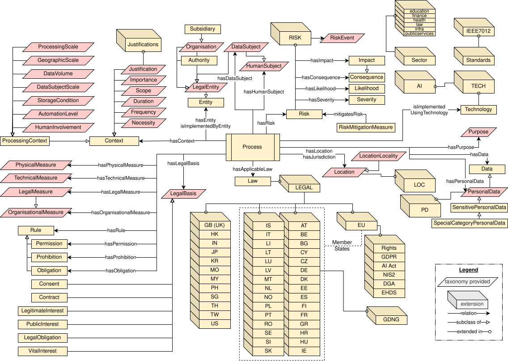 

Overview showing core concepts and relations in DPV with their further expansion as taxonomies and as extensions

 

 

DPV and its extensions (collectively DPV vocabularies) consists of certain 'core concepts' that are intended to be independent representations of specific information, and are distinct from other core concepts. For example, the [=Purpose=] refers only to the purpose of why personal data is processed and is independent as a concept from the other concepts (e.g. [=PersonalData=] or [=LegalBasis=]). The structuring of DPV is based on providing rich and comprehensive taxonomies that group concepts together based on each core concept, e.g. taxonomy of purposes, taxonomy of legal basis. 'Extensions' are a separate group of concepts that expand the 'core' vocabulary or provide concepts focused on a particular topic e.g. [[PD]] for personal data categories and [[RISK]] for risk management. Extensions allow allow modelling legally relevant but jurisdictionally applicable concepts e.g. [[EU-GDPR]] for concepts from EU's GDPR.

<a id="dpv-L709"></a>
## DPV
  

This document assumes the reader is familiar with DPV through the [[[PRIMER]]], and focuses on providing an overview of the DPV and its extensions.

  

The Data Privacy Vocabulary (DPV) provides the following core concepts which have been grouped into 'modules'. Each module has its own documentation page which provides the full definition for involved concepts, provides guidance and examples, and illustrates ongoing discussions on future additions and changes. The modules in DPV are:

 

 

- [Purposes](#purposes-L1) that justify the (end) goal for which data is processed or technologies are used

 

- [Data and Personal Data](#personal_data-L1) categories

 

- [Processing](#processing-L1) operations over data

 

- [Entities](#entities-L1) for actors and the roles they can take

 

- [Legal Basis](#legal_basis-L1) such as consent or contract that justify the process

 

- [Risk](#risk-L1) for assessment and management of risks and impacts

 

- [Technical & Organisational Measures](#TOM-L1)

 

- [Rights](#rights-L1)

 

- [Contextual information](#context-L1) such as location and automation

 

- [Rules](#rules-L1) such as permissions and prohibitions

 

- [Process](#process-L1) to describe organsiation of concepts into a logical and coherent unit to represent business processes and services

 

 
<a id="dpv-extensions"></a>

<a id="dpv-L729"></a>
### Extensions
 

Extensions reflect additional concepts that extend the core concepts present in DPV and also provide a way to group related concepts that relate to the same topic. Currently, the following extensions are provided. A 'draft' status represents evolving modelling and concepts as they are actively being refined.

 

[[[PD]]] ([[PD]]) provides additional concepts that extend the DPV's personal data taxonomy based on an opinionated structure contributed by R. Jason Cronk from [EnterPrivacy](https://enterprivacy.com/). This separation is to enable adopters to decide whether the extension's concepts are useful to them, or to use other external vocabularies, or define their own.

 

[[[LOC]]] ([[LOC]]) provides additional concepts regarding locations such as countries and regions based on the ISO 3166 standards.

 

[[[RISK]]] ([[RISK]]) extends [[DPV]]'s risk assessment concepts based on ISO standards and provides taxonomies relevant to impact assessments.

 

[[[TECH]]] ([[TECH]]) extends the DPV's terms to represent further specific details regarding technologies, their management, and relevance to actual real-world tools and systems. The [[[AI]]] ([[AI]]) extension further extends [[TECH]] to provide concepts specifically regarding AI techniques, capabilities, risks, data and documentation.

 

[[[JUSTIFICATIONS]]] ([[JUSTIFICATIONS]]) provides concepts for use as 'justifications' with DPV. For example, where a right cannot be fulfilled, a justification such as 'identity could not be verified' is represented using a specific concept.

 

[[[LEGAL]]] ([[LEGAL]]) provides concepts to represent laws, authorities, and other legal concepts in various jurisdictions. It is structured to create a separate namespace for each country or jurisdiction by using the ISO 3166-2 code, for example `IE` represents Ireland and `EU` represents the European Union. Within this namespace, the specific laws and authorities for that jurisdiction are defined.

 

Within [[LEGAL]], the following Members States of the European Union are defined in their individual namespaces, with [[LEGAL-EU]] as an additional namespace for representing laws and concepts at EU-level: [[LEGAL-AT]] for Austria, [[LEGAL-BE]] for Belgium, [[LEGAL-BG]] for Bulgaria, [[LEGAL-CY]] for Cyprus, [[LEGAL-CZ]] for Czech Republic, [[LEGAL-DE]] for Germany, [[LEGAL-DK]] for Denmark, [[LEGAL-EE]] for Estonia, [[LEGAL-ES]] for Spain, [[LEGAL-FI]] for Finland, [[LEGAL-FR]] for France, [[LEGAL-GR]] for Greece, [[LEGAL-HR]] for Croatia, [[LEGAL-HU]] for Hungary, [[LEGAL-IE]] for Ireland, [[LEGAL-IS]] for Iceland, [[LEGAL-IT]] for Italy, [[LEGAL-LI]] for Liechtenstein, [[LEGAL-LT]] for Lithuania, [[LEGAL-LU]] for Luxembourg, [[LEGAL-LV]] for Latvia, [[LEGAL-MT]] for Malta, [[LEGAL-NL]] for Netherlands, [[LEGAL-NO]] for Norway, [[LEGAL-PL]] for Poland, [[LEGAL-PT]] for Portugal, [[LEGAL-RO]] for Romania, [[LEGAL-SE]] for Sweden, [[LEGAL-SI]] for Slovenia, [[LEGAL-SK]] for Slovakia. [[LEGAL]] also contains the following jurisdictions: [[LEGAL-GB]] for Great Britain and Northern Ireland, [[LEGAL-HK]] for Hong Kong, [[LEGAL-IN]] for India, [[LEGAL-JP]] for Japan, [[LEGAL-KR]] for Republic of Korea, [[LEGAL-MO]] for Macao, [[LEGAL-MY]] for Malaysia, [[LEGAL-PH]] for the Philippines, [[LEGAL-SG]] for Singapore, [[LEGAL-TH]] for Thailand, [[LEGAL-TW]] for Taiwan, [[LEGAL-US]] for United States of America. 

 

Laws are modelled as extensions within the namespace of their respective jurisdictions. The following are extensions part of [[LEGAL-EU]]: [[[EU-GDPR]]] ([[EU-GDPR]]), [[[EU-DGA]]] ([[EU-DGA]]), [[[EU-NIS2]]] ([[EU-NIS2]]), [[[EU-AIAct]]] ([[EU-AIAct]]), [[[EU-EHDS]]] ([[EU-EHDS]]), [[[EU-RIGHTS]]] ([[EU-RIGHTS]]). 

 

[[SECTOR]] provides extensions modelling specific sectors by using those sector-specific concepts, terms, and modelling which extends the concepts in other DPV extensions. These extensions include: [[SECTOR-EDUCATION]] for Education Sector, [[SECTOR-FINANCE]] for Finance Sector, [[SECTOR-HEALTH]] for Health Sector, [[SECTOR-INFRA]] for (Critical) Infrastructure Sector, [[SECTOR-LAW]] for Law Enforcement & Justice Sector, [[SECTOR-PUBLICSERVICES]] for Public Services Sector. 

 

The STANDARDS extensions model the core terminologies defined and used within specific forums such as ISO, CEN/CENELEC, NIST, and IEEE so that they can be used with DPV. Currently it provides the extension [[STANDARD-IEEE-7012]] to support the implementation of [[[IEEE-7012]]].

 

 

 
<a id="dpv-guide-applications"></a>

<a id="dpv-L771"></a>
## Guidance

<a id="dpv-L773"></a>
### Guides
 

The [[[GUIDE-Consent-27560]]] [[GUIDE-Consent-27560]] provides implementation of machine-readable consent records and receipts as defined in [[ISO-27560]] by using the [Data Privacy Vocabulary (DPV)](https://w3id.org/dpv). Additionally, it also provides guidance on using [[ISO-27560]] for meeting [[GDPR]] requirements regarding consent.

 

As the default semantics in DPV use RDFS and SKOS, the [[[GUIDE-OWL2]]] [[GUIDE-OWL2]] provides guidance for the use of DPV as an OWL2 ontology, and explains how DPV can be easily encoded in a low-complexity profile of OWL2 called OWL2-PL to perform efficient semantic reasoning.

 

Planned guides in the near future include: ISO-29184 Privacy Notices, GDPR Record of Processing Activities (ROPA), GDPR Data Protection Impact Assessment (DPIA), Data Breach Records and Notifications, Rights Management. Also planned is the [[GUIDE-ODRL]] to provide guidance for the use of DPV concepts with [[[ODRL-MODEL]]] and [[[ODRL-VOCAB]]] which are W3C standards for machine-readable representations of policies and agreements.

<a id="dpv-L779"></a>
### Applications
 

This section provides brief examples of how various DPV concepts and extensions are relevant to specific applications.

 

 

- Legal Compliance: In addition to [[DPV]], specific extensions such as the [[EU-GDPR]] for GDPR and [[EU-AIAct]] for the AI Act provides concepts related to the law. The implementation details may require additional extensions such as [[PD]] for personal data categories, [[RISK]] for risk and impact assessments, and [[TECH]] and [[AI]] extensions to model the technologies.

 

- Consent Management For consent management, the [[DPV]] extension provides key concepts concerning informed consent such as the purposes and data categories, as well as to represent its states (e.g. given). The [[PD]] extension may be relevant to express specific personal data categories, the [[TECH]] extension to denote which technologies might be relevant, and [[RISK]] extensions to specify involved risks. If the consent should meet requirements from a specific law, then the relevant extension should be used for these additional concepts e.g. consent as a legal basis under the GDPR is represented in [[EU-GDPR]] extension.

 

- Rights Management: [[DPV]] defines the core concept for rights, including those related to exercise and records. Additional concepts require jurisdictional extensions, such as [[EU-GDPR]] for GDPR provided rights, or the [[EU-RIGHTS]] extension for the EU Charter of Fundamental Rights.

 

- Security & Risk Management: The [[DPV]] provides core concepts regarding risk management, including technical and organisational measures. The [[RISK]] extension provides a larger set of concepts for risk management. Additional risk management concepts may be required based on the use-cases, for example as part of impact assessments required by laws such as [[EU-GDPR]], or to model risk concepts specific to a sector such as [[SECTOR-HEALTH]] for health.

 

- AI Training and Governance: The [[AI]] extension provides AI-specific concepts, and additionally the [[TECH]] extension provides concepts to represent how technology is provisioned and used. These can be combined with [[DPV]] concepts such as purposes, location, or measures to represent the necessary information.

 

- Health Data Management: The [[SECTOR-HEALTH]] extension provides concepts focused on Health sector by extending the core concepts defined in [[DPV]]. In addition, jurisdiction-specific concepts are also present which model health-specific requirements, such as the [[EU-EHDS]] extension for EU's Health Data Spaces. Depending on the use-case, core concepts may be chosen from [[DPV]] such as high-level purposes or technical measures, or from [[SECTOR-HEALTH]] such as medical purposes, or concepts defined in laws such as [[EU-EHDS]].

 

 

 

 
<a id="dpv-vocabulary"></a>

<a id="dpv-L793"></a>
## Vocabulary Index
 
<a id="dpv-concept-index"></a>


 
<a id="dpv-AcademicResearch"></a>


 AcademicResearch Purposes associated with conducting or assisting with research conducted in an academic context e.g. within universities. See [full definition](#purposes-AcademicResearch) in [purposes](#purposes-L1) module 

 
<a id="dpv-AcademicScientificOrganisation"></a>


 AcademicScientificOrganisation Organisations related to academia or scientific pursuits e.g. Universities, Schools, Research Bodies. See [full definition](#entities-AcademicScientificOrganisation) in [entities](#entities-L1) module 

 
<a id="dpv-AcceptableRule"></a>


 AcceptableRule A rule that is acceptable where it is either desirable if it occurs or it is not unacceptable if it does. See [full definition](#rules-AcceptableRule) in [rules](#rules-L1) module 

 
<a id="dpv-AcceptableUsePolicy"></a>


 AcceptableUsePolicy Acceptable Use Policy (AUP) refers to conditions, contexts, or uses which are considered acceptable with the implication that those not covered by such a policy are to be considered unacceptable. See [full definition](#TOM-AcceptableUsePolicy) in [TOM](#TOM-L1) module 

 
<a id="dpv-AcceptContract"></a>


 AcceptContract Control for accepting a contract. See [full definition](#legal_basis-AcceptContract) in [legal_basis](#legal_basis-L1) module 

 
<a id="dpv-Access"></a>


 Access to access data. See [full definition](#processing-Access) in [processing](#processing-L1) module 

 
<a id="dpv-AccessControlMethod"></a>


 AccessControlMethod Methods which restrict access to a place or resource. See [full definition](#TOM-AccessControlMethod) in [TOM](#TOM-L1) module 

 
<a id="dpv-AccountManagement"></a>


 AccountManagement Account Management refers to purposes associated with account management, such as to create, provide, maintain, and manage accounts. See [full definition](#purposes-AccountManagement) in [purposes](#purposes-L1) module 

 
<a id="dpv-Acquire"></a>


 Acquire to come into possession or control of the data. See [full definition](#processing-Acquire) in [processing](#processing-L1) module 

 
<a id="dpv-ActivelyInvolved"></a>


 ActivelyInvolved Status indicating the specified context is 'actively' involved. See [full definition](#context-ActivelyInvolved) in [context](#context-L1) module 

 
<a id="dpv-ActiveRight"></a>


 ActiveRight The right(s) applicable, provided, or expected that need to be (actively) exercised. See [full definition](#rights-ActiveRight) in [rights](#rights-L1) module 

 
<a id="dpv-ActivityCompleted"></a>


 ActivityCompleted State of an activity that has completed i.e. is fully in the past. See [full definition](#context-ActivityCompleted) in [context](#context-L1) module 

 
<a id="dpv-ActivityHalted"></a>


 ActivityHalted State of an activity that was occurring in the past, and has been halted or paused or stopped. See [full definition](#context-ActivityHalted) in [context](#context-L1) module 

 
<a id="dpv-ActivityMonitoring"></a>


 ActivityMonitoring Monitoring of activities including assessing whether they have been successfully initiated and completed. See [full definition](#TOM-ActivityMonitoring) in [TOM](#TOM-L1) module 

 
<a id="dpv-ActivityNotCompleted"></a>


 ActivityNotCompleted State of an activity that could not be completed, but has reached some end state. See [full definition](#context-ActivityNotCompleted) in [context](#context-L1) module 

 
<a id="dpv-ActivityOngoing"></a>


 ActivityOngoing State of an activity occurring in continuation i.e. currently ongoing. See [full definition](#context-ActivityOngoing) in [context](#context-L1) module 

 
<a id="dpv-ActivityPlanned"></a>


 ActivityPlanned State of an activity being planned with concrete plans for implementation. See [full definition](#context-ActivityPlanned) in [context](#context-L1) module 

 
<a id="dpv-ActivityProposed"></a>


 ActivityProposed State of an activity being proposed without any concrete plans for implementation. See [full definition](#context-ActivityProposed) in [context](#context-L1) module 

 
<a id="dpv-ActivityStatus"></a>


 ActivityStatus Status associated with activity operations and lifecycles. See [full definition](#context-ActivityStatus) in [context](#context-L1) module 

 
<a id="dpv-Adapt"></a>


 Adapt to modify the data, often rewritten into a new form for a new use. See [full definition](#processing-Adapt) in [processing](#processing-L1) module 

 
<a id="dpv-Adult"></a>


 Adult A natural person that is not a child i.e. has attained some legally specified age of adulthood. See [full definition](#entities-Adult) in [entities](#entities-L1) module 

 
<a id="dpv-Advertising"></a>


 Advertising Purposes associated with conducting advertising i.e. process or artefact used to call attention to a product, service, etc. through announcements, notices, or other forms of communication. See [full definition](#purposes-Advertising) in [purposes](#purposes-L1) module 

 
<a id="dpv-Agent"></a>


 Agent An Agent is a dpv:Entity that is (a) acting on behalf of another Entity; and (b) is authorised to do so by that Entity. See [full definition](#entities-Agent) in [entities](#entities-L1) module 

 
<a id="dpv-AgeVerification"></a>


 AgeVerification Purposes associated with verifying or authenticating age or age related information as a form of security. See [full definition](#purposes-AgeVerification) in [purposes](#purposes-L1) module 

 
<a id="dpv-Aggregate"></a>


 Aggregate to aggregate data. See [full definition](#processing-Aggregate) in [processing](#processing-L1) module 

 
<a id="dpv-AIGovernance"></a>


 AIGovernance Procedures related to governance of AI, including its procurement, development, deployment, and assessments. See [full definition](#TOM-AIGovernance) in [TOM](#TOM-L1) module 

 
<a id="dpv-AILiteracy"></a>


 AILiteracy Providing skills, knowledge, and understanding to enable reading, writing, analysing, reasoning, and communicating regarding AI. See [full definition](#TOM-AILiteracy) in [TOM](#TOM-L1) module 

 
<a id="dpv-AINotice"></a>


 AINotice A notice providing information regarding the particulars of an AI system such as its intended purpose and proper use. See [full definition](#TOM-AINotice) in [TOM](#TOM-L1) module 

 
<a id="dpv-AlgorithmicLogic"></a>


 AlgorithmicLogic The algorithmic logic applied or used. See [full definition](#processing-AlgorithmicLogic) in [processing](#processing-L1) module 

 
<a id="dpv-Align"></a>


 Align to adjust the data to be in relation to another data. See [full definition](#processing-Align) in [processing](#processing-L1) module 

 
<a id="dpv-Alter"></a>


 Alter to change the data without changing it into something else. See [full definition](#processing-Alter) in [processing](#processing-L1) module 

 
<a id="dpv-AmbulanceProvider"></a>


 AmbulanceProvider An organisation that that offers transportation and medical care to patients requiring urgent medical attention. See [full definition](#entities-AmbulanceProvider) in [entities](#entities-L1) module 

 
<a id="dpv-Analyse"></a>


 Analyse to study or examine the data in detail. See [full definition](#processing-Analyse) in [processing](#processing-L1) module 

 
<a id="dpv-Anonymisation"></a>


 Anonymisation Anonymisation is the process by which data is irreversibly altered in such a way that a data subject can no longer be identified directly or indirectly, either by the entity holding the data alone or in collaboration with other entities and information sources. See [full definition](#TOM-Anonymisation) in [TOM](#TOM-L1) module 

 
<a id="dpv-Anonymise"></a>


 Anonymise to irreversibly alter personal data in such a way that an unique data subject can no longer be identified directly or indirectly or in combination with other data. See [full definition](#processing-Anonymise) in [processing](#processing-L1) module 

 
<a id="dpv-AnonymisedData"></a>


 AnonymisedData Personal Data that has been (fully and completely) anonymised so that it is no longer considered Personal Data. See [full definition](#personal_data-AnonymisedData) in [personal_data](#personal_data-L1) module 

 
<a id="dpv-Applicability"></a>


 Applicability Concept provided to represent indication of cases where the information or context is not applicable (N/A) or not available or this is not known or determined yet. If the information is applicable and available, this concept should not be used.. See [full definition](#context-Applicability) in [context](#context-L1) module 

 
<a id="dpv-Applicant"></a>


 Applicant Humans that are applicants in some context. See [full definition](#entities-Applicant) in [entities](#entities-L1) module 

 
<a id="dpv-ApprovalProcedure"></a>


 ApprovalProcedure A procedure or process for determining and managing approvals for activities as part of governance. See [full definition](#TOM-ApprovalProcedure) in [TOM](#TOM-L1) module 

 
<a id="dpv-Assess"></a>


 Assess to assess data for some criteria. See [full definition](#processing-Assess) in [processing](#processing-L1) module 

 
<a id="dpv-Assessment"></a>


 Assessment The document, plan, or process for assessment or determination towards a purpose e.g. assessment of legality or impact assessments. See [full definition](#TOM-Assessment) in [TOM](#TOM-L1) module 

 
<a id="dpv-AssetManagementProcedures"></a>


 AssetManagementProcedures Procedures related to management of assets. See [full definition](#TOM-AssetManagementProcedures) in [TOM](#TOM-L1) module 

 
<a id="dpv-AssistiveAutomation"></a>


 AssistiveAutomation Level of automation corresponding to Level 1 in ISO/IEC 22989:2022 where automation is limited to parts of the system or a specific part of the system in a manner that does not change the control of the human in using/driving the system. See [full definition](#processing-AssistiveAutomation) in [processing](#processing-L1) module 

 
<a id="dpv-AsylumSeeker"></a>


 AsylumSeeker Humans that are asylum seekers. See [full definition](#entities-AsylumSeeker) in [entities](#entities-L1) module 

 
<a id="dpv-AsymmetricCryptography"></a>


 AsymmetricCryptography Use of public-key cryptography or asymmetric cryptography involving a public and private pair of keys. See [full definition](#TOM-AsymmetricCryptography) in [TOM](#TOM-L1) module 

 
<a id="dpv-AsymmetricEncryption"></a>


 AsymmetricEncryption Use of asymmetric cryptography to encrypt data. See [full definition](#TOM-AsymmetricEncryption) in [TOM](#TOM-L1) module 

 
<a id="dpv-Audit"></a>


 Audit An audit is a systematic examination or evaluation of records, processes, or systems towards a specific objective such as to assess accuracy, compliance, effectiveness, or performance. See [full definition](#TOM-Audit) in [TOM](#TOM-L1) module 

 
<a id="dpv-AuditApproved"></a>


 AuditApproved State of being approved through the audit. See [full definition](#context-AuditApproved) in [context](#context-L1) module 

 
<a id="dpv-AuditConditionallyApproved"></a>


 AuditConditionallyApproved State of being conditionally approved through the audit. See [full definition](#context-AuditConditionallyApproved) in [context](#context-L1) module 

 
<a id="dpv-AuditNotRequired"></a>


 AuditNotRequired State where an audit is determined as not being required. See [full definition](#context-AuditNotRequired) in [context](#context-L1) module 

 
<a id="dpv-AuditRejected"></a>


 AuditRejected State of not being approved or being rejected through the audit. See [full definition](#context-AuditRejected) in [context](#context-L1) module 

 
<a id="dpv-AuditRequested"></a>


 AuditRequested State of an audit being requested whose outcome is not yet known. See [full definition](#context-AuditRequested) in [context](#context-L1) module 

 
<a id="dpv-AuditRequired"></a>


 AuditRequired State where an audit is determined as being required but has not been conducted. See [full definition](#context-AuditRequired) in [context](#context-L1) module 

 
<a id="dpv-AuditStatus"></a>


 AuditStatus Status associated with Auditing or Investigation. See [full definition](#context-AuditStatus) in [context](#context-L1) module 

 
<a id="dpv-Authentication-ABC"></a>


 Authentication-ABC Use of Attribute Based Credentials (ABC) to perform and manage authentication. See [full definition](#TOM-Authentication-ABC) in [TOM](#TOM-L1) module 

 
<a id="dpv-Authentication-PABC"></a>


 Authentication-PABC Use of Privacy-enhancing Attribute Based Credentials (ABC) to perform and manage authentication. See [full definition](#TOM-Authentication-PABC) in [TOM](#TOM-L1) module 

 
<a id="dpv-AuthenticationProtocols"></a>


 AuthenticationProtocols Protocols involving validation of identity i.e. authentication of a person or information. See [full definition](#TOM-AuthenticationProtocols) in [TOM](#TOM-L1) module 

 
<a id="dpv-AuthorisationProcedure"></a>


 AuthorisationProcedure Procedures for determining authorisation through permission or authority. See [full definition](#TOM-AuthorisationProcedure) in [TOM](#TOM-L1) module 

 
<a id="dpv-AuthorisationProtocols"></a>


 AuthorisationProtocols Protocols involving authorisation of roles or profiles to determine permission, rights, or privileges. See [full definition](#TOM-AuthorisationProtocols) in [TOM](#TOM-L1) module 

 
<a id="dpv-Authority"></a>


 Authority An authority with the power to create or enforce laws, or determine their compliance.. See [full definition](#entities-Authority) in [entities](#entities-L1) module 

 
<a id="dpv-AuthorityInformed"></a>


 AuthorityInformed Status indicating Authority has been informed about the specified context. See [full definition](#context-AuthorityInformed) in [context](#context-L1) module 

 
<a id="dpv-AuthorityUninformed"></a>


 AuthorityUninformed Status indicating Authority is uninformed i.e. has not been informed about the specified context. See [full definition](#context-AuthorityUninformed) in [context](#context-L1) module 

 
<a id="dpv-AutomatedDecisionMaking"></a>


 AutomatedDecisionMaking Processing that involves automated decision making. See [full definition](#processing-AutomatedDecisionMaking) in [processing](#processing-L1) module 

 
<a id="dpv-AutomatedScoringOfIndividuals"></a>


 AutomatedScoringOfIndividuals Processing that involves automated scoring of individuals. See [full definition](#processing-AutomatedScoringOfIndividuals) in [processing](#processing-L1) module 

 
<a id="dpv-AutomationLevel"></a>


 AutomationLevel Indication of degree or level of automation associated with specified context. See [full definition](#processing-AutomationLevel) in [processing](#processing-L1) module 

 
<a id="dpv-Autonomous"></a>


 Autonomous Level of automation corresponding to Level 6 in ISO/IEC 22989:2022 where the automation in system is capable of modifying its operation domain or its goals without external intervention, control or oversight. See [full definition](#processing-Autonomous) in [processing](#processing-L1) module 

 
<a id="dpv-B2B2CContract"></a>


 B2B2CContract A contract between two businesses who partner together to provide services to a consumer. See [full definition](#legal_basis-B2B2CContract) in [legal_basis](#legal_basis-L1) module 

 
<a id="dpv-B2BContract"></a>


 B2BContract A contract between two businesses. See [full definition](#legal_basis-B2BContract) in [legal_basis](#legal_basis-L1) module 

 
<a id="dpv-B2CContract"></a>


 B2CContract A contract between a business and a consumer where the business provides goods or services to the consumer. See [full definition](#legal_basis-B2CContract) in [legal_basis](#legal_basis-L1) module 

 
<a id="dpv-BackgroundChecks"></a>


 BackgroundChecks Procedure where the background of an entity is assessed to identity vulnerabilities and threats due to their current or intended role. See [full definition](#TOM-BackgroundChecks) in [TOM](#TOM-L1) module 

 
<a id="dpv-BiometricAuthentication"></a>


 BiometricAuthentication Use of biometric data for authentication. See [full definition](#TOM-BiometricAuthentication) in [TOM](#TOM-L1) module 

 
<a id="dpv-C2BContract"></a>


 C2BContract A contract between a consumer and a business where the business purchases goods or services from the consumer. See [full definition](#legal_basis-C2BContract) in [legal_basis](#legal_basis-L1) module 

 
<a id="dpv-C2CContract"></a>


 C2CContract A contract between two consumers. See [full definition](#legal_basis-C2CContract) in [legal_basis](#legal_basis-L1) module 

 
<a id="dpv-CannotChallengeProcess"></a>


 CannotChallengeProcess Involvement where entity cannot challenge the process of specified context. See [full definition](#processing-CannotChallengeProcess) in [processing](#processing-L1) module 

 
<a id="dpv-CannotChallengeProcessInput"></a>


 CannotChallengeProcessInput Involvement where entity cannot challenge input of specified context. See [full definition](#processing-CannotChallengeProcessInput) in [processing](#processing-L1) module 

 
<a id="dpv-CannotChallengeProcessOutput"></a>


 CannotChallengeProcessOutput Involvement where entity cannot challenge the output of specified context. See [full definition](#processing-CannotChallengeProcessOutput) in [processing](#processing-L1) module 

 
<a id="dpv-CannotCorrectProcess"></a>


 CannotCorrectProcess Involvement where entity cannot correct the process of specified context. See [full definition](#processing-CannotCorrectProcess) in [processing](#processing-L1) module 

 
<a id="dpv-CannotCorrectProcessInput"></a>


 CannotCorrectProcessInput Involvement where entity cannot correct input of specified context. See [full definition](#processing-CannotCorrectProcessInput) in [processing](#processing-L1) module 

 
<a id="dpv-CannotCorrectProcessOutput"></a>


 CannotCorrectProcessOutput Involvement where entity cannot correct the output of specified context. See [full definition](#processing-CannotCorrectProcessOutput) in [processing](#processing-L1) module 

 
<a id="dpv-CannotObjectToProcess"></a>


 CannotObjectToProcess Involvement where entity cannot object to process of specified context. See [full definition](#processing-CannotObjectToProcess) in [processing](#processing-L1) module 

 
<a id="dpv-CannotOptInToProcess"></a>


 CannotOptInToProcess Involvement where entity cannot opt-in to specified context. See [full definition](#processing-CannotOptInToProcess) in [processing](#processing-L1) module 

 
<a id="dpv-CannotOptOutFromProcess"></a>


 CannotOptOutFromProcess Involvement where entity cannot opt-out from specified context. See [full definition](#processing-CannotOptOutFromProcess) in [processing](#processing-L1) module 

 
<a id="dpv-CannotReverseProcessEffects"></a>


 CannotReverseProcessEffects Involvement where entity cannot reverse effects of specified context. See [full definition](#processing-CannotReverseProcessEffects) in [processing](#processing-L1) module 

 
<a id="dpv-CannotReverseProcessInput"></a>


 CannotReverseProcessInput Involvement where entity cannot reverse input of specified context. See [full definition](#processing-CannotReverseProcessInput) in [processing](#processing-L1) module 

 
<a id="dpv-CannotReverseProcessOutput"></a>


 CannotReverseProcessOutput Involvement where entity cannot reverse output of specified context. See [full definition](#processing-CannotReverseProcessOutput) in [processing](#processing-L1) module 

 
<a id="dpv-CannotWithdrawFromProcess"></a>


 CannotWithdrawFromProcess Involvement where entity cannot withdraw a previously given assent from specified context. See [full definition](#processing-CannotWithdrawFromProcess) in [processing](#processing-L1) module 

 
<a id="dpv-Certification"></a>


 Certification Certification mechanisms, seals, and marks for the purpose of demonstrating compliance. See [full definition](#TOM-Certification) in [TOM](#TOM-L1) module 

 
<a id="dpv-CertificationSeal"></a>


 CertificationSeal Certifications, seals, and marks indicating compliance to regulations or practices. See [full definition](#TOM-CertificationSeal) in [TOM](#TOM-L1) module 

 
<a id="dpv-ChallengingProcess"></a>


 ChallengingProcess Involvement where entity can challenge the process of specified context. See [full definition](#processing-ChallengingProcess) in [processing](#processing-L1) module 

 
<a id="dpv-ChallengingProcessInput"></a>


 ChallengingProcessInput Involvement where entity can challenge input of specified context. See [full definition](#processing-ChallengingProcessInput) in [processing](#processing-L1) module 

 
<a id="dpv-ChallengingProcessOutput"></a>


 ChallengingProcessOutput Involvement where entity can challenge the output of specified context. See [full definition](#processing-ChallengingProcessOutput) in [processing](#processing-L1) module 

 
<a id="dpv-CharityOrganisation"></a>


 CharityOrganisation A nonprofit entity dedicated to providing assistance or raising funds for social, educational, religious, or other philanthropic purposes. See [full definition](#entities-CharityOrganisation) in [entities](#entities-L1) module 

 
<a id="dpv-Child"></a>


 Child A 'child' is a natural legal person who is below a certain legal age depending on the legal jurisdiction.. See [full definition](#entities-Child) in [entities](#entities-L1) module 

 
<a id="dpv-Citizen"></a>


 Citizen Humans that are citizens (for a jurisdiction). See [full definition](#entities-Citizen) in [entities](#entities-L1) module 

 
<a id="dpv-City"></a>


 City A region consisting of urban population and commerce. See [full definition](#context-City) in [context](#context-L1) module 

 
<a id="dpv-Client"></a>


 Client Humans that are clients or recipients of services. See [full definition](#entities-Client) in [entities](#entities-L1) module 

 
<a id="dpv-Clinic"></a>


 Clinic An organisation that is a smaller healthcare facility offering outpatient medical services for diagnosis and treatment. See [full definition](#entities-Clinic) in [entities](#entities-L1) module 

 
<a id="dpv-CloudLocation"></a>


 CloudLocation Location that is in the 'cloud' i.e. a logical location operated over the internet. See [full definition](#context-CloudLocation) in [context](#context-L1) module 

 
<a id="dpv-CodeOfConduct"></a>


 CodeOfConduct A set of rules or procedures outlining the norms and practices for conducting activities. See [full definition](#TOM-CodeOfConduct) in [TOM](#TOM-L1) module 

 
<a id="dpv-Collect"></a>


 Collect to gather data from someone. See [full definition](#processing-Collect) in [processing](#processing-L1) module 

 
<a id="dpv-CollectedData"></a>


 CollectedData Data that has been obtained by collecting it from a source. See [full definition](#personal_data-CollectedData) in [personal_data](#personal_data-L1) module 

 
<a id="dpv-CollectedPersonalData"></a>


 CollectedPersonalData Personal Data that has been collected from another source such as the Data Subject. See [full definition](#personal_data-CollectedPersonalData) in [personal_data](#personal_data-L1) module 

 
<a id="dpv-CombatClimateChange"></a>


 CombatClimateChange Purposes associated with combating the causes and consequences of climate change, including reducing gas emissions and fighting emergencies such as floods or wildfires. See [full definition](#purposes-CombatClimateChange) in [purposes](#purposes-L1) module 

 
<a id="dpv-Combine"></a>


 Combine to join or merge data. See [full definition](#processing-Combine) in [processing](#processing-L1) module 

 
<a id="dpv-CommerciallyConfidentialData"></a>


 CommerciallyConfidentialData Data that is considered confidential due to business/trade secrets, confidentiality agreements, or company secrets. See [full definition](#personal_data-CommerciallyConfidentialData) in [personal_data](#personal_data-L1) module 

 
<a id="dpv-CommercialPurpose"></a>


 CommercialPurpose Purposes associated with processing activities performed in a commercial setting or with intention to commercialise. See [full definition](#purposes-CommercialPurpose) in [purposes](#purposes-L1) module 

 
<a id="dpv-CommercialResearch"></a>


 CommercialResearch Purposes associated with conducting research in a commercial setting or with intention to commercialise e.g. in a company or sponsored by a company. See [full definition](#purposes-CommercialResearch) in [purposes](#purposes-L1) module 

 
<a id="dpv-CommunicationForCustomerCare"></a>


 CommunicationForCustomerCare Customer Care Communication refers to purposes associated with communicating with customers for assisting them, resolving issues, ensuring satisfaction, etc. in relation to services provided. See [full definition](#purposes-CommunicationForCustomerCare) in [purposes](#purposes-L1) module 

 
<a id="dpv-CommunicationManagement"></a>


 CommunicationManagement Communication Management refers to purposes associated with providing or managing communication activities e.g. to send an email for notifying some information. See [full definition](#purposes-CommunicationManagement) in [purposes](#purposes-L1) module 

 
<a id="dpv-CompatibilityUnknown"></a>


 CompatibilityUnknown Status indicating the compatibility of the context with an earlier context is currently unknown. See [full definition](#context-CompatibilityUnknown) in [context](#context-L1) module 

 
<a id="dpv-ComplianceAssessment"></a>


 ComplianceAssessment Assessment regarding compliance (e.g. internal policy, regulations). See [full definition](#TOM-ComplianceAssessment) in [TOM](#TOM-L1) module 

 
<a id="dpv-ComplianceIndeterminate"></a>


 ComplianceIndeterminate State where the status of compliance has not been fully assessed, evaluated, or determined. See [full definition](#context-ComplianceIndeterminate) in [context](#context-L1) module 

 
<a id="dpv-ComplianceMonitoring"></a>


 ComplianceMonitoring Monitoring of compliance (e.g. internal policy, regulations). See [full definition](#TOM-ComplianceMonitoring) in [TOM](#TOM-L1) module 

 
<a id="dpv-ComplianceStatus"></a>


 ComplianceStatus Status associated with Compliance with some norms, objectives, or requirements. See [full definition](#context-ComplianceStatus) in [context](#context-L1) module 

 
<a id="dpv-ComplianceUnknown"></a>


 ComplianceUnknown State where the status of compliance is unknown. See [full definition](#context-ComplianceUnknown) in [context](#context-L1) module 

 
<a id="dpv-ComplianceViolation"></a>


 ComplianceViolation State where compliance cannot be achieved due to requirements being violated. See [full definition](#context-ComplianceViolation) in [context](#context-L1) module 

 
<a id="dpv-Compliant"></a>


 Compliant State of being fully compliant. See [full definition](#context-Compliant) in [context](#context-L1) module 

 
<a id="dpv-ConditionalAutomation"></a>


 ConditionalAutomation Level of automation corresponding to Level 3 in ISO/IEC 22989:2022 where the automation is sufficient to perform most tasks of the system with the human present to take over where necessary. See [full definition](#processing-ConditionalAutomation) in [processing](#processing-L1) module 

 
<a id="dpv-ConfidentialData"></a>


 ConfidentialData Data deemed confidential. See [full definition](#personal_data-ConfidentialData) in [personal_data](#personal_data-L1) module 

 
<a id="dpv-ConfidentialityAgreement"></a>


 ConfidentialityAgreement Agreements that enforce confidentiality for e.g. to protect business, professional, or company secrets. See [full definition](#TOM-ConfidentialityAgreement) in [TOM](#TOM-L1) module 

 
<a id="dpv-ConformanceAssessment"></a>


 ConformanceAssessment Assessment regarding conformance with standards or norms or guidelines or similar instruments. See [full definition](#TOM-ConformanceAssessment) in [TOM](#TOM-L1) module 

 
<a id="dpv-ConformanceStatus"></a>


 ConformanceStatus Status associated with conformance to a standard, guideline, code, or recommendation. See [full definition](#context-ConformanceStatus) in [context](#context-L1) module 

 
<a id="dpv-Conformant"></a>


 Conformant State of being conformant. See [full definition](#context-Conformant) in [context](#context-L1) module 

 
<a id="dpv-Consent"></a>


 Consent Consent of the Data Subject for specified process or activity. See [full definition](#legal_basis-Consent) in [legal_basis](#legal_basis-L1) module 

 
<a id="dpv-ConsentControl"></a>


 ConsentControl The control or activity associated with obtaining, providing, withdrawing, or reaffirming consent. See [full definition](#legal_basis-ConsentControl) in [legal_basis](#legal_basis-L1) module 

 
<a id="dpv-ConsentExpired"></a>


 ConsentExpired The state where the temporal or contextual validity of consent has 'expired'. See [full definition](#legal_basis-ConsentExpired) in [legal_basis](#legal_basis-L1) module 

 
<a id="dpv-ConsentGiven"></a>


 ConsentGiven The state where consent has been given. See [full definition](#legal_basis-ConsentGiven) in [legal_basis](#legal_basis-L1) module 

 
<a id="dpv-ConsentInvalidated"></a>


 ConsentInvalidated The state where consent has been deemed to be invalid. See [full definition](#legal_basis-ConsentInvalidated) in [legal_basis](#legal_basis-L1) module 

 
<a id="dpv-ConsentManagement"></a>


 ConsentManagement Methods to obtain, provide, modify, and withdraw consent along with maintaining a record of consent, retrieving records, and processing changes in consent states. See [full definition](#TOM-ConsentManagement) in [TOM](#TOM-L1) module 

 
<a id="dpv-ConsentNotice"></a>


 ConsentNotice A Notice for information provision associated with Consent. See [full definition](#TOM-ConsentNotice) in [TOM](#TOM-L1) module 

 
<a id="dpv-ConsentReceipt"></a>


 ConsentReceipt A record of consent or consent related activities that is provided to another entity. See [full definition](#TOM-ConsentReceipt) in [TOM](#TOM-L1) module 

 
<a id="dpv-ConsentRecord"></a>


 ConsentRecord A Record of Consent or Consent related activities. See [full definition](#TOM-ConsentRecord) in [TOM](#TOM-L1) module 

 
<a id="dpv-ConsentRefused"></a>


 ConsentRefused The state where consent has been refused. See [full definition](#legal_basis-ConsentRefused) in [legal_basis](#legal_basis-L1) module 

 
<a id="dpv-ConsentRequestDeferred"></a>


 ConsentRequestDeferred State where a request for consent has been deferred without a decision. See [full definition](#legal_basis-ConsentRequestDeferred) in [legal_basis](#legal_basis-L1) module 

 
<a id="dpv-ConsentRequested"></a>


 ConsentRequested State where a request for consent has been made and is awaiting a decision. See [full definition](#legal_basis-ConsentRequested) in [legal_basis](#legal_basis-L1) module 

 
<a id="dpv-ConsentRevoked"></a>


 ConsentRevoked The state where the consent is revoked by an entity other than the data subject and which prevents it from being further used as a valid state. See [full definition](#legal_basis-ConsentRevoked) in [legal_basis](#legal_basis-L1) module 

 
<a id="dpv-ConsentStatus"></a>


 ConsentStatus The state or status of 'consent' that provides information reflecting its operational status and validity for processing data. See [full definition](#legal_basis-ConsentStatus) in [legal_basis](#legal_basis-L1) module 

 
<a id="dpv-ConsentStatusInvalidForProcessing"></a>


 ConsentStatusInvalidForProcessing States of consent that cannot be used as valid justifications for processing data. See [full definition](#legal_basis-ConsentStatusInvalidForProcessing) in [legal_basis](#legal_basis-L1) module 

 
<a id="dpv-ConsentStatusValidForProcessing"></a>


 ConsentStatusValidForProcessing States of consent that can be used as valid justifications for processing data. See [full definition](#legal_basis-ConsentStatusValidForProcessing) in [legal_basis](#legal_basis-L1) module 

 
<a id="dpv-ConsentUnknown"></a>


 ConsentUnknown State where information about consent is not available or is unknown. See [full definition](#legal_basis-ConsentUnknown) in [legal_basis](#legal_basis-L1) module 

 
<a id="dpv-ConsentWithdrawn"></a>


 ConsentWithdrawn The state where the consent is withdrawn or revoked specifically by the data subject and which prevents it from being further used as a valid state. See [full definition](#legal_basis-ConsentWithdrawn) in [legal_basis](#legal_basis-L1) module 

 
<a id="dpv-Consequence"></a>


 Consequence The consequence(s) possible or arising from specified context. See [full definition](#risk-Consequence) in [risk](#risk-L1) module 

 
<a id="dpv-ConsequenceAsSideEffect"></a>


 ConsequenceAsSideEffect The consequence(s) possible or arising as a side-effect of specified context. See [full definition](#risk-ConsequenceAsSideEffect) in [risk](#risk-L1) module 

 
<a id="dpv-ConsequenceOfFailure"></a>


 ConsequenceOfFailure The consequence(s) possible or arising from failure of specified context. See [full definition](#risk-ConsequenceOfFailure) in [risk](#risk-L1) module 

 
<a id="dpv-ConsequenceOfSuccess"></a>


 ConsequenceOfSuccess The consequence(s) possible or arising from success of specified context. See [full definition](#risk-ConsequenceOfSuccess) in [risk](#risk-L1) module 

 
<a id="dpv-Consult"></a>


 Consult to consult or query data. See [full definition](#processing-Consult) in [processing](#processing-L1) module 

 
<a id="dpv-Consultation"></a>


 Consultation Consultation is a process of receiving feedback, advice, or opinion from an external agency. See [full definition](#TOM-Consultation) in [TOM](#TOM-L1) module 

 
<a id="dpv-ConsultationWithAuthority"></a>


 ConsultationWithAuthority Consultation with an authority or authoritative entity. See [full definition](#TOM-ConsultationWithAuthority) in [TOM](#TOM-L1) module 

 
<a id="dpv-ConsultationWithDataSubject"></a>


 ConsultationWithDataSubject Consultation with data subject(s) or their representative(s). See [full definition](#TOM-ConsultationWithDataSubject) in [TOM](#TOM-L1) module 

 
<a id="dpv-ConsultationWithDataSubjectRepresentative"></a>


 ConsultationWithDataSubjectRepresentative Consultation with representative of data subject(s). See [full definition](#TOM-ConsultationWithDataSubjectRepresentative) in [TOM](#TOM-L1) module 

 
<a id="dpv-ConsultationWithDPO"></a>


 ConsultationWithDPO Consultation with Data Protection Officer(s). See [full definition](#TOM-ConsultationWithDPO) in [TOM](#TOM-L1) module 

 
<a id="dpv-Consumer"></a>


 Consumer Humans that consume goods or services for direct use. See [full definition](#entities-Consumer) in [entities](#entities-L1) module 

 
<a id="dpv-ConsumerStandardFormContract"></a>


 ConsumerStandardFormContract A contract where the terms and conditions are determined by parties in the role of a 'consumer' - whether an entity or an individual, and the other parties have negligible or no ability to negotiate the terms and conditions. See [full definition](#legal_basis-ConsumerStandardFormContract) in [legal_basis](#legal_basis-L1) module 

 
<a id="dpv-Context"></a>


 Context Contextually relevant information. See [full definition](#context-Context) in [context](#context-L1) module 

 
<a id="dpv-ContextuallyAnonymisedData"></a>


 ContextuallyAnonymisedData Data that can be considered as being fully anonymised within the context but in actuality is not fully anonymised and is still personal data as it can be de-anonymised outside that context. See [full definition](#personal_data-ContextuallyAnonymisedData) in [personal_data](#personal_data-L1) module 

 
<a id="dpv-ContinuousFrequency"></a>


 ContinuousFrequency Frequency where occurrences are continuous. See [full definition](#context-ContinuousFrequency) in [context](#context-L1) module 

 
<a id="dpv-Contract"></a>


 Contract Creation, completion, fulfilment, or performance of a contract involving specified processing of data or technologies. See [full definition](#legal_basis-Contract) in [legal_basis](#legal_basis-L1) module 

 
<a id="dpv-ContractActivationStatus"></a>


 ContractActivationStatus Status associated with activation of a contract i.e. whether its terms are active and are required to be performed. See [full definition](#legal_basis-ContractActivationStatus) in [legal_basis](#legal_basis-L1) module 

 
<a id="dpv-ContractActive"></a>


 ContractActive Status representing contract that has been fully executed and whose terms are considered active i.e. they are applicable and are required to be performed. See [full definition](#legal_basis-ContractActive) in [legal_basis](#legal_basis-L1) module 

 
<a id="dpv-ContractAmended"></a>


 ContractAmended Status representing contract that has been fully executed and whose terms have been amended through mutual agreement or other means such that the contract is still required to be performed. See [full definition](#legal_basis-ContractAmended) in [legal_basis](#legal_basis-L1) module 

 
<a id="dpv-ContractAmendmentClause"></a>


 ContractAmendmentClause A provision describing how changes or modifications to the contract can be made and the process for implementing them. See [full definition](#legal_basis-ContractAmendmentClause) in [legal_basis](#legal_basis-L1) module 

 
<a id="dpv-ContractApproved"></a>


 ContractApproved Status representing contract has been approved and can be used for signing. See [full definition](#legal_basis-ContractApproved) in [legal_basis](#legal_basis-L1) module 

 
<a id="dpv-ContractBeingPerformed"></a>


 ContractBeingPerformed Status representing contract that has been fully executed and whose terms are being carried out i.e. the contract is being performed. See [full definition](#legal_basis-ContractBeingPerformed) in [legal_basis](#legal_basis-L1) module 

 
<a id="dpv-ContractBreached"></a>


 ContractBreached Status representing contract being breached where its terms are not fulfilled or are violated with legal consequences. See [full definition](#legal_basis-ContractBreached) in [legal_basis](#legal_basis-L1) module 

 
<a id="dpv-ContractByDomain"></a>


 ContractByDomain A generic concept representing contracts categorised by specific domains which dictate the drafting and interpretation of contracts. See [full definition](#legal_basis-ContractByDomain) in [legal_basis](#legal_basis-L1) module 

 
<a id="dpv-ContractByEntityType"></a>


 ContractByEntityType A generic concept representing contracts categorised by the type of entities involved - such as Businesses (B), Consumers (C), and Governments (G). See [full definition](#legal_basis-ContractByEntityType) in [legal_basis](#legal_basis-L1) module 

 
<a id="dpv-ContractByNegotiationType"></a>


 ContractByNegotiationType A generic concept representing contracts categorised based on their use or absence of negotiation in the contract forming process. See [full definition](#legal_basis-ContractByNegotiationType) in [legal_basis](#legal_basis-L1) module 

 
<a id="dpv-ContractConfidentialityClause"></a>


 ContractConfidentialityClause A provision requiring parties to keep certain information confidential and not disclose it to third parties. See [full definition](#legal_basis-ContractConfidentialityClause) in [legal_basis](#legal_basis-L1) module 

 
<a id="dpv-ContractControl"></a>


 ContractControl The control or activity associated with accepting, refusing, and other actions associated with a contract. See [full definition](#legal_basis-ContractControl) in [legal_basis](#legal_basis-L1) module 

 
<a id="dpv-ContractDefinitions"></a>


 ContractDefinitions A section specifying the meanings of key terms and phrases used throughout the contract. See [full definition](#legal_basis-ContractDefinitions) in [legal_basis](#legal_basis-L1) module 

 
<a id="dpv-ContractDisputed"></a>


 ContractDisputed Status representing contract being disputed where one or more parties have an issue regarding the interpretation and performance of the contract. See [full definition](#legal_basis-ContractDisputed) in [legal_basis](#legal_basis-L1) module 

 
<a id="dpv-ContractDisputeResolutionClause"></a>


 ContractDisputeResolutionClause A provision detailing the methods and procedures for resolving disagreements or conflicts arising from the contract. See [full definition](#legal_basis-ContractDisputeResolutionClause) in [legal_basis](#legal_basis-L1) module 

 
<a id="dpv-ContractDrafted"></a>


 ContractDrafted Status representing the drafting of contract text has been completed and it can now be offered for signing. See [full definition](#legal_basis-ContractDrafted) in [legal_basis](#legal_basis-L1) module 

 
<a id="dpv-ContractExecutionStatus"></a>


 ContractExecutionStatus Status associated with execution of a contract (i.e. signing and procedural aspects before the contract terms come in to effect). See [full definition](#legal_basis-ContractExecutionStatus) in [legal_basis](#legal_basis-L1) module 

 
<a id="dpv-ContractExpired"></a>


 ContractExpired Status representing reaching the expiry defined in the contract, such as when the stated duration or the stated obligations have been completed. See [full definition](#legal_basis-ContractExpired) in [legal_basis](#legal_basis-L1) module 

 
<a id="dpv-ContractExtended"></a>


 ContractExtended Status representing the duration associated with a contract being extended through mutual agreement or by a party. See [full definition](#legal_basis-ContractExtended) in [legal_basis](#legal_basis-L1) module 

 
<a id="dpv-ContractFulfilled"></a>


 ContractFulfilled Status representing contract where all its terms have been fulfilled in a manner that does not constitute a violation or breach of the contract. See [full definition](#legal_basis-ContractFulfilled) in [legal_basis](#legal_basis-L1) module 

 
<a id="dpv-ContractFulfilmentStatus"></a>


 ContractFulfilmentStatus Status associated with fulfilment of a contract. See [full definition](#legal_basis-ContractFulfilmentStatus) in [legal_basis](#legal_basis-L1) module 

 
<a id="dpv-ContractFullyExecuted"></a>


 ContractFullyExecuted Status representing contract has been fully executed i.e. it has been signed by all parties and all other procedural aspects such as exchange of signed contract copies have been completed. See [full definition](#legal_basis-ContractFullyExecuted) in [legal_basis](#legal_basis-L1) module 

 
<a id="dpv-ContractFullySigned"></a>


 ContractFullySigned Status representing contract has been signed by all concerned parties. See [full definition](#legal_basis-ContractFullySigned) in [legal_basis](#legal_basis-L1) module 

 
<a id="dpv-ContractInactive"></a>


 ContractInactive Status representing contract that has been fully executed and whose terms are not yet active i.e. they need to be performed at a later time. See [full definition](#legal_basis-ContractInactive) in [legal_basis](#legal_basis-L1) module 

 
<a id="dpv-ContractJurisdictionClause"></a>


 ContractJurisdictionClause A provision specifying the legal jurisdiction or court where disputes related to the contract will be resolved. See [full definition](#legal_basis-ContractJurisdictionClause) in [legal_basis](#legal_basis-L1) module 

 
<a id="dpv-ContractNegotiated"></a>


 ContractNegotiated Status representing contract has been successfully negotiated by involved parties. See [full definition](#legal_basis-ContractNegotiated) in [legal_basis](#legal_basis-L1) module 

 
<a id="dpv-ContractNotFulfilled"></a>


 ContractNotFulfilled Status representing contract where none of its terms have been fulfilled in a manner that does not constitute a violation or breach of the contract i.e. there is still time and opportunity to complete the terms. See [full definition](#legal_basis-ContractNotFulfilled) in [legal_basis](#legal_basis-L1) module 

 
<a id="dpv-ContractOffered"></a>


 ContractOffered Status representing contract has been offered to a party or to parties for reviewing and signing. See [full definition](#legal_basis-ContractOffered) in [legal_basis](#legal_basis-L1) module 

 
<a id="dpv-ContractPartiallyFulfilled"></a>


 ContractPartiallyFulfilled Status representing contract where some of its terms have been fulfilled, and others are yet to be fulfilled in a manner that does not constitute a violation or breach of the contract i.e. there is still time and opportunity to complete the terms. See [full definition](#legal_basis-ContractPartiallyFulfilled) in [legal_basis](#legal_basis-L1) module 

 
<a id="dpv-ContractPartiallySigned"></a>


 ContractPartiallySigned Status representing contract has been partially signed by parties i.e. some parties have signed the contract and others are yet to make a decision to sign it. See [full definition](#legal_basis-ContractPartiallySigned) in [legal_basis](#legal_basis-L1) module 

 
<a id="dpv-ContractPerformance"></a>


 ContractPerformance Fulfilment or performance of a contract involving specified processing of data or technologies. See [full definition](#legal_basis-ContractPerformance) in [legal_basis](#legal_basis-L1) module 

 
<a id="dpv-ContractPerformanceStatus"></a>


 ContractPerformanceStatus Status associated with performance of a contract. See [full definition](#legal_basis-ContractPerformanceStatus) in [legal_basis](#legal_basis-L1) module 

 
<a id="dpv-ContractPreamble"></a>


 ContractPreamble An introductory section outlining the background, context, and purpose of the contract. See [full definition](#legal_basis-ContractPreamble) in [legal_basis](#legal_basis-L1) module 

 
<a id="dpv-ContractPreparationStatus"></a>


 ContractPreparationStatus Status associated with preparation of contracts before they are signed or accepted or executed. See [full definition](#legal_basis-ContractPreparationStatus) in [legal_basis](#legal_basis-L1) module 

 
<a id="dpv-ContractRejected"></a>


 ContractRejected Status representing contract has been rejected and cannot be used for signing. See [full definition](#legal_basis-ContractRejected) in [legal_basis](#legal_basis-L1) module 

 
<a id="dpv-ContractRenewed"></a>


 ContractRenewed Status representing contract being renewed with new duration and/or applicability where the contract has been fully executed in the past. See [full definition](#legal_basis-ContractRenewed) in [legal_basis](#legal_basis-L1) module 

 
<a id="dpv-ContractSignedByParty"></a>


 ContractSignedByParty Status representing contract has been signed by the indicated signing party. See [full definition](#legal_basis-ContractSignedByParty) in [legal_basis](#legal_basis-L1) module 

 
<a id="dpv-ContractStatus"></a>


 ContractStatus Status associated with a contract. See [full definition](#legal_basis-ContractStatus) in [legal_basis](#legal_basis-L1) module 

 
<a id="dpv-ContractTemporarilySuspended"></a>


 ContractTemporarilySuspended Status representing contract that has been temporarily suspended through mutual agreement or by some parties. See [full definition](#legal_basis-ContractTemporarilySuspended) in [legal_basis](#legal_basis-L1) module 

 
<a id="dpv-ContractTerminated"></a>


 ContractTerminated Status representing contract being terminated by one or more parties. See [full definition](#legal_basis-ContractTerminated) in [legal_basis](#legal_basis-L1) module 

 
<a id="dpv-ContractTerminationClause"></a>


 ContractTerminationClause A provision outlining the conditions under which the contract can be terminated before its completion, including any penalties or obligations. See [full definition](#legal_basis-ContractTerminationClause) in [legal_basis](#legal_basis-L1) module 

 
<a id="dpv-ContractTerminationStatus"></a>


 ContractTerminationStatus Status associated with termination of a contract. See [full definition](#legal_basis-ContractTerminationStatus) in [legal_basis](#legal_basis-L1) module 

 
<a id="dpv-ContractualClause"></a>


 ContractualClause A part or component within a contract that outlines its specifics. See [full definition](#legal_basis-ContractualClause) in [legal_basis](#legal_basis-L1) module 

 
<a id="dpv-ContractualClauseFulfilled"></a>


 ContractualClauseFulfilled Status indicating the terms of the contractual clause are fulfilled i.e. they have been successfully completed without violation. See [full definition](#legal_basis-ContractualClauseFulfilled) in [legal_basis](#legal_basis-L1) module 

 
<a id="dpv-ContractualClauseFulfilmentStatus"></a>


 ContractualClauseFulfilmentStatus Status associated with fulfilment of a contractual clause. See [full definition](#legal_basis-ContractualClauseFulfilmentStatus) in [legal_basis](#legal_basis-L1) module 

 
<a id="dpv-ContractualClauseNotFulfilled"></a>


 ContractualClauseNotFulfilled Status indicating the terms of the contractual clause have not yet been fulfilled in a manner that does not constitute a violation i.e. there is still an opportunity to complete them. See [full definition](#legal_basis-ContractualClauseNotFulfilled) in [legal_basis](#legal_basis-L1) module 

 
<a id="dpv-ContractualClausePartiallyFulfilled"></a>


 ContractualClausePartiallyFulfilled Status indicating some of the terms of the contractual clause have been fulfilled, and others have not yet been fulfilled in a manner that does not constitute a violation i.e. there is still an opportunity to complete them. See [full definition](#legal_basis-ContractualClausePartiallyFulfilled) in [legal_basis](#legal_basis-L1) module 

 
<a id="dpv-ContractualClauseViolated"></a>


 ContractualClauseViolated Status indicating the terms of the contractual clause have been violated. See [full definition](#legal_basis-ContractualClauseViolated) in [legal_basis](#legal_basis-L1) module 

 
<a id="dpv-ContractualTerms"></a>


 ContractualTerms Contractual terms governing data handling within or with an entity. See [full definition](#TOM-ContractualTerms) in [TOM](#TOM-L1) module 

 
<a id="dpv-ContractUnderNegotiation"></a>


 ContractUnderNegotiation Status representing contract is under negotiation between parties. See [full definition](#legal_basis-ContractUnderNegotiation) in [legal_basis](#legal_basis-L1) module 

 
<a id="dpv-ContractUnderReview"></a>


 ContractUnderReview Status representing contract is under review and is being considered for signing. See [full definition](#legal_basis-ContractUnderReview) in [legal_basis](#legal_basis-L1) module 

 
<a id="dpv-ContractViolated"></a>


 ContractViolated Status representing contract where one or more terms have not been fulfilled or have been fulfilled, where either is considered a violation of the terms. See [full definition](#legal_basis-ContractViolated) in [legal_basis](#legal_basis-L1) module 

 
<a id="dpv-ControllerDataSubjectAgreement"></a>


 ControllerDataSubjectAgreement An agreement outlining conditions, criteria, obligations, responsibilities, and specifics for carrying out processing of data between a Data Controller and a Data Subject. See [full definition](#legal_basis-ControllerDataSubjectAgreement) in [legal_basis](#legal_basis-L1) module 

 
<a id="dpv-ControllerInformed"></a>


 ControllerInformed Status indicating Controller has been informed about the specified context. See [full definition](#context-ControllerInformed) in [context](#context-L1) module 

 
<a id="dpv-ControllerProcessorAgreement"></a>


 ControllerProcessorAgreement An agreement outlining conditions, criteria, obligations, responsibilities, and specifics for carrying out processing of data between a Data Controller and a Data Processor. See [full definition](#legal_basis-ControllerProcessorAgreement) in [legal_basis](#legal_basis-L1) module 

 
<a id="dpv-ControllerUninformed"></a>


 ControllerUninformed Status indicating Controller is uninformed i.e. has not been informed about the specified context. See [full definition](#context-ControllerUninformed) in [context](#context-L1) module 

 
<a id="dpv-Copy"></a>


 Copy to produce an exact reproduction of the data. See [full definition](#processing-Copy) in [processing](#processing-L1) module 

 
<a id="dpv-CorrectingProcess"></a>


 CorrectingProcess Involvement where entity can correct the process of specified context. See [full definition](#processing-CorrectingProcess) in [processing](#processing-L1) module 

 
<a id="dpv-CorrectingProcessInput"></a>


 CorrectingProcessInput Involvement where entity can correct input of specified context. See [full definition](#processing-CorrectingProcessInput) in [processing](#processing-L1) module 

 
<a id="dpv-CorrectingProcessOutput"></a>


 CorrectingProcessOutput Involvement where entity can correct the output of specified context. See [full definition](#processing-CorrectingProcessOutput) in [processing](#processing-L1) module 

 
<a id="dpv-CounterMoneyLaundering"></a>


 CounterMoneyLaundering Purposes associated with detection, prevention, and mitigation of mitigate money laundering. See [full definition](#purposes-CounterMoneyLaundering) in [purposes](#purposes-L1) module 

 
<a id="dpv-Counterterrorism"></a>


 Counterterrorism Purposes associated with activities that detect, prevent, mitigate, or otherwise perform activities to combat or eliminate terrorism (also referred to as anti-terrorism). See [full definition](#purposes-Counterterrorism) in [purposes](#purposes-L1) module 

 
<a id="dpv-Country"></a>


 Country A political entity indicative of a sovereign or non-sovereign territorial state comprising of distinct geographical areas. See [full definition](#context-Country) in [context](#context-L1) module 

 
<a id="dpv-CredentialManagement"></a>


 CredentialManagement Management of credentials and their use in authorisations. See [full definition](#TOM-CredentialManagement) in [TOM](#TOM-L1) module 

 
<a id="dpv-CrossBorderTransfer"></a>


 CrossBorderTransfer to move data from one jurisdiction (border) to another. See [full definition](#processing-CrossBorderTransfer) in [processing](#processing-L1) module 

 
<a id="dpv-CryptographicAuthentication"></a>


 CryptographicAuthentication Use of cryptography for authentication. See [full definition](#TOM-CryptographicAuthentication) in [TOM](#TOM-L1) module 

 
<a id="dpv-CryptographicKeyManagement"></a>


 CryptographicKeyManagement Management of cryptographic keys, including their generation, storage, assessment, and safekeeping. See [full definition](#TOM-CryptographicKeyManagement) in [TOM](#TOM-L1) module 

 
<a id="dpv-CryptographicMethods"></a>


 CryptographicMethods Use of cryptographic methods to perform tasks. See [full definition](#TOM-CryptographicMethods) in [TOM](#TOM-L1) module 

 
<a id="dpv-Customer"></a>


 Customer Humans that purchase goods or services. See [full definition](#entities-Customer) in [entities](#entities-L1) module 

 
<a id="dpv-CustomerCare"></a>


 CustomerCare Customer Care refers to purposes associated with purposes for providing assistance, resolving issues, ensuring satisfaction, etc. in relation to services provided. See [full definition](#purposes-CustomerCare) in [purposes](#purposes-L1) module 

 
<a id="dpv-CustomerClaimsManagement"></a>


 CustomerClaimsManagement Customer Claims Management refers to purposes associated with managing claims, including repayment of monies owed. See [full definition](#purposes-CustomerClaimsManagement) in [purposes](#purposes-L1) module 

 
<a id="dpv-CustomerManagement"></a>


 CustomerManagement Customer Management refers to purposes associated with managing activities related with past, current, and future customers. See [full definition](#purposes-CustomerManagement) in [purposes](#purposes-L1) module 

 
<a id="dpv-CustomerOrderManagement"></a>


 CustomerOrderManagement Customer Order Management refers to purposes associated with managing customer orders i.e. processing of an order related to customer's purchase of good or services. See [full definition](#purposes-CustomerOrderManagement) in [purposes](#purposes-L1) module 

 
<a id="dpv-CustomerRelationshipManagement"></a>


 CustomerRelationshipManagement Customer Relationship Management refers to purposes associated with managing and analysing interactions with past, current, and potential customers. See [full definition](#purposes-CustomerRelationshipManagement) in [purposes](#purposes-L1) module 

 
<a id="dpv-CustomerSolvencyMonitoring"></a>


 CustomerSolvencyMonitoring Customer Solvency Monitoring refers to purposes associated with monitor solvency of customers for financial diligence. See [full definition](#purposes-CustomerSolvencyMonitoring) in [purposes](#purposes-L1) module 

 
<a id="dpv-CybersecurityAssessment"></a>


 CybersecurityAssessment Assessment of cybersecurity capabilities in terms of vulnerabilities and effectiveness of controls. See [full definition](#risk-CybersecurityAssessment) in [risk](#risk-L1) module 

 
<a id="dpv-CybersecurityTraining"></a>


 CybersecurityTraining Training methods related to cybersecurity. See [full definition](#TOM-CybersecurityTraining) in [TOM](#TOM-L1) module 

 
<a id="dpv-DashboardNotice"></a>


 DashboardNotice A notice that is provided within a dashboard also used for other purposes. See [full definition](#TOM-DashboardNotice) in [TOM](#TOM-L1) module 

 
<a id="dpv-Data"></a>


 Data A broad concept representing 'data' or 'information'. See [full definition](#personal_data-Data) in [personal_data](#personal_data-L1) module 

 
<a id="dpv-DataAltruism"></a>


 DataAltruism Purposes associated with the voluntary sharing of data for the general interest of the public, such as healthcare or combating climate change. See [full definition](#purposes-DataAltruism) in [purposes](#purposes-L1) module 

 
<a id="dpv-DataAvailabilityAssessment"></a>


 DataAvailabilityAssessment Measures associated with assessment of availability of data for specific task(s). See [full definition](#TOM-DataAvailabilityAssessment) in [TOM](#TOM-L1) module 

 
<a id="dpv-DataBackupProtocols"></a>


 DataBackupProtocols Protocols or plans for backing up of data. See [full definition](#TOM-DataBackupProtocols) in [TOM](#TOM-L1) module 

 
<a id="dpv-DataBreachImpactAssessment"></a>


 DataBreachImpactAssessment Impact Assessment concerning the consequences and impacts of a data breach. See [full definition](#risk-DataBreachImpactAssessment) in [risk](#risk-L1) module 

 
<a id="dpv-DataBreachNotice"></a>


 DataBreachNotice A notice providing information about data breach(es) i.e. unauthorised transfer, access, use, or modification of data. See [full definition](#TOM-DataBreachNotice) in [TOM](#TOM-L1) module 

 
<a id="dpv-DataBreachNotification"></a>


 DataBreachNotification Notification of information about data breach(es) i.e. unauthorised transfer, access, use, or modification of data. See [full definition](#TOM-DataBreachNotification) in [TOM](#TOM-L1) module 

 
<a id="dpv-DataBreachRecord"></a>


 DataBreachRecord Record of a data breach incident. See [full definition](#TOM-DataBreachRecord) in [TOM](#TOM-L1) module 

 
<a id="dpv-DataController"></a>


 DataController The individual or organisation that decides (or controls) the purpose(s) of processing personal data.. See [full definition](#entities-DataController) in [entities](#entities-L1) module 

 
<a id="dpv-DataControllerContract"></a>


 DataControllerContract Creation, completion, fulfilment, or performance of a contract, with Data Controllers as parties being Joint Data Controllers, and involving specified processing of data or technologies. NOTE: This concept is being deprecated - use dpv:JointDataControllersAgreement which has a more explicit definition of the entities involved and the intent of the contract. See [full definition](#legal_basis-DataControllerContract) in [legal_basis](#legal_basis-L1) module 

 
<a id="dpv-DataControllerDataSource"></a>


 DataControllerDataSource Data Sourced from Data Controller(s), e.g. a Controller inferring data or generating data. See [full definition](#processing-DataControllerDataSource) in [processing](#processing-L1) module 

 
<a id="dpv-DataDeletionPolicy"></a>


 DataDeletionPolicy Policy regarding deletion of data. See [full definition](#TOM-DataDeletionPolicy) in [TOM](#TOM-L1) module 

 
<a id="dpv-DataErasurePolicy"></a>


 DataErasurePolicy Policy regarding erasure of data. See [full definition](#TOM-DataErasurePolicy) in [TOM](#TOM-L1) module 

 
<a id="dpv-DataExporter"></a>


 DataExporter An entity that 'exports' data where exporting is considered a form of data transfer. See [full definition](#entities-DataExporter) in [entities](#entities-L1) module 

 
<a id="dpv-DataGovernance"></a>


 DataGovernance Measures associated with topics typically considered to be part of 'Data Governance'. See [full definition](#TOM-DataGovernance) in [TOM](#TOM-L1) module 

 
<a id="dpv-DataHandlingClause"></a>


 DataHandlingClause Contractual clauses governing handling of data within or by an entity. See [full definition](#TOM-DataHandlingClause) in [TOM](#TOM-L1) module 

 
<a id="dpv-DataImporter"></a>


 DataImporter An entity that 'imports' data where importing is considered a form of data transfer. See [full definition](#entities-DataImporter) in [entities](#entities-L1) module 

 
<a id="dpv-DataInteroperabilityAssessment"></a>


 DataInteroperabilityAssessment Measures associated with assessment of data interoperability. See [full definition](#TOM-DataInteroperabilityAssessment) in [TOM](#TOM-L1) module 

 
<a id="dpv-DataInteroperabilityImprovement"></a>


 DataInteroperabilityImprovement Measures associated with improvement of data interoperability. See [full definition](#TOM-DataInteroperabilityImprovement) in [TOM](#TOM-L1) module 

 
<a id="dpv-DataInteroperabilityManagement"></a>


 DataInteroperabilityManagement Measures associated with management of data interoperability. See [full definition](#TOM-DataInteroperabilityManagement) in [TOM](#TOM-L1) module 

 
<a id="dpv-DataInventoryManagement"></a>


 DataInventoryManagement Measures associated with management of data inventory or a data asset list. See [full definition](#TOM-DataInventoryManagement) in [TOM](#TOM-L1) module 

 
<a id="dpv-DataJurisdictionPolicy"></a>


 DataJurisdictionPolicy Policy specifying jurisdictional requirements for data processing. See [full definition](#TOM-DataJurisdictionPolicy) in [TOM](#TOM-L1) module 

 
<a id="dpv-DataLiteracy"></a>


 DataLiteracy Providing skills, knowledge, and understanding to enable reading, writing, analysing, reasoning, and communicating regarding data. See [full definition](#TOM-DataLiteracy) in [TOM](#TOM-L1) module 

 
<a id="dpv-DataProcessingAgreement"></a>


 DataProcessingAgreement An agreement outlining conditions, criteria, obligations, responsibilities, and specifics for carrying out processing of data. See [full definition](#legal_basis-DataProcessingAgreement) in [legal_basis](#legal_basis-L1) module 

 
<a id="dpv-DataProcessingPolicy"></a>


 DataProcessingPolicy Policy regarding data processing activities. See [full definition](#TOM-DataProcessingPolicy) in [TOM](#TOM-L1) module 

 
<a id="dpv-DataProcessingRecord"></a>


 DataProcessingRecord Record of data processing, whether ex-ante or ex-post. See [full definition](#TOM-DataProcessingRecord) in [TOM](#TOM-L1) module 

 
<a id="dpv-DataProcessor"></a>


 DataProcessor A ‘processor’ means a natural or legal person, public authority, agency or other body which processes data on behalf of the controller.. See [full definition](#entities-DataProcessor) in [entities](#entities-L1) module 

 
<a id="dpv-DataProcessorContract"></a>


 DataProcessorContract Creation, completion, fulfilment, or performance of a contract, with the Data Controller and Data Processor as parties, and involving specified processing of data or technologies. NOTE: This concept is being deprecated - use dpv:ControllerProcessorAgreement which has a more explicit definition of the entities involved and the intent of the contract. See [full definition](#legal_basis-DataProcessorContract) in [legal_basis](#legal_basis-L1) module 

 
<a id="dpv-DataProtectionAuthority"></a>


 DataProtectionAuthority An authority tasked with overseeing legal compliance regarding privacy and data protection laws.. See [full definition](#entities-DataProtectionAuthority) in [entities](#entities-L1) module 

 
<a id="dpv-DataProtectionOfficer"></a>


 DataProtectionOfficer An entity within or authorised by an organisation to monitor internal compliance, inform and advise on data protection obligations and act as a contact point for data subjects and the supervisory authority.. See [full definition](#entities-DataProtectionOfficer) in [entities](#entities-L1) module 

 
<a id="dpv-DataProtectionTraining"></a>


 DataProtectionTraining Training intended to increase knowledge regarding data protection. See [full definition](#TOM-DataProtectionTraining) in [TOM](#TOM-L1) module 

 
<a id="dpv-DataPublishedByDataSubject"></a>


 DataPublishedByDataSubject Data is published by the data subject. See [full definition](#processing-DataPublishedByDataSubject) in [processing](#processing-L1) module 

 
<a id="dpv-DataQualityAssessment"></a>


 DataQualityAssessment Measures associated with assessment of data quality. See [full definition](#TOM-DataQualityAssessment) in [TOM](#TOM-L1) module 

 
<a id="dpv-DataQualityImprovement"></a>


 DataQualityImprovement Measures associated with improvement of data quality. See [full definition](#TOM-DataQualityImprovement) in [TOM](#TOM-L1) module 

 
<a id="dpv-DataQualityManagement"></a>


 DataQualityManagement Measures associated with management of data quality. See [full definition](#TOM-DataQualityManagement) in [TOM](#TOM-L1) module 

 
<a id="dpv-DataRedaction"></a>


 DataRedaction Removal of sensitive information from a data or document. See [full definition](#TOM-DataRedaction) in [TOM](#TOM-L1) module 

 
<a id="dpv-DataRestorationPolicy"></a>


 DataRestorationPolicy Policy regarding restoration of data. See [full definition](#TOM-DataRestorationPolicy) in [TOM](#TOM-L1) module 

 
<a id="dpv-DataReusePolicy"></a>


 DataReusePolicy Policy regarding reuse of data i.e. using data for purposes other than its initial purpose. See [full definition](#TOM-DataReusePolicy) in [TOM](#TOM-L1) module 

 
<a id="dpv-DataSanitisationTechnique"></a>


 DataSanitisationTechnique Cleaning or any removal or re-organisation of elements in data based on selective criteria. See [full definition](#TOM-DataSanitisationTechnique) in [TOM](#TOM-L1) module 

 
<a id="dpv-DataSecurityManagement"></a>


 DataSecurityManagement Measures associated with management of data security. See [full definition](#TOM-DataSecurityManagement) in [TOM](#TOM-L1) module 

 
<a id="dpv-DataSource"></a>


 DataSource The source or origin of data. See [full definition](#processing-DataSource) in [processing](#processing-L1) module 

 
<a id="dpv-DataStoragePolicy"></a>


 DataStoragePolicy Policy regarding storage of data, including the manner, duration, location, and conditions for storage. See [full definition](#TOM-DataStoragePolicy) in [TOM](#TOM-L1) module 

 
<a id="dpv-DataSubject"></a>


 DataSubject The individual (or category of individuals) whose personal data is being processed. See [full definition](#entities-DataSubject) in [entities](#entities-L1) module 

 
<a id="dpv-DataSubjectContract"></a>


 DataSubjectContract Creation, completion, fulfilment, or performance of a contract, with the Data Controller and Data Subject as parties, and involving specified processing of data or technologies. NOTE: This concept is being deprecated - use dpv:ControllerDataSubjectAgreement which has a more explicit definition of the entities involved and the intent of the contract. See [full definition](#legal_basis-DataSubjectContract) in [legal_basis](#legal_basis-L1) module 

 
<a id="dpv-DataSubjectDataSource"></a>


 DataSubjectDataSource Data Sourced from Data Subject(s), e.g. when data is collected via a form or observed from their activities. See [full definition](#processing-DataSubjectDataSource) in [processing](#processing-L1) module 

 
<a id="dpv-DataSubjectInformed"></a>


 DataSubjectInformed Status indicating DataSubject has been informed about the specified context. See [full definition](#context-DataSubjectInformed) in [context](#context-L1) module 

 
<a id="dpv-DataSubjectRight"></a>


 DataSubjectRight The rights applicable or provided to a Data Subject. See [full definition](#rights-DataSubjectRight) in [rights](#rights-L1) module 

 
<a id="dpv-DataSubjectRightsManagement"></a>


 DataSubjectRightsManagement Methods to provide, implement, and exercise data subjects' rights. See [full definition](#TOM-DataSubjectRightsManagement) in [TOM](#TOM-L1) module 

 
<a id="dpv-DataSubjectScale"></a>


 DataSubjectScale Scale of Data Subject(s). See [full definition](#processing-DataSubjectScale) in [processing](#processing-L1) module 

 
<a id="dpv-DataSubjectUninformed"></a>


 DataSubjectUninformed Status indicating DataSubject is uninformed i.e. has not been informed about the specified context. See [full definition](#context-DataSubjectUninformed) in [context](#context-L1) module 

 
<a id="dpv-DataSubProcessor"></a>


 DataSubProcessor A 'sub-processor' is a processor engaged by another processor. See [full definition](#entities-DataSubProcessor) in [entities](#entities-L1) module 

 
<a id="dpv-DataSuitabilityAssessment"></a>


 DataSuitabilityAssessment Measures associated with assessment of suitability of data for specific task(s). See [full definition](#TOM-DataSuitabilityAssessment) in [TOM](#TOM-L1) module 

 
<a id="dpv-DataTransferImpactAssessment"></a>


 DataTransferImpactAssessment Impact Assessment for conducting data transfers. See [full definition](#risk-DataTransferImpactAssessment) in [risk](#risk-L1) module 

 
<a id="dpv-DataTransferLegalBasis"></a>


 DataTransferLegalBasis Specific or special categories and instances of legal basis intended for justifying data transfers. See [full definition](#legal_basis-DataTransferLegalBasis) in [legal_basis](#legal_basis-L1) module 

 
<a id="dpv-DataTransferNotice"></a>


 DataTransferNotice Notice for the legal entity for the transfer of its data. See [full definition](#TOM-DataTransferNotice) in [TOM](#TOM-L1) module 

 
<a id="dpv-DataTransferRecord"></a>


 DataTransferRecord Record of data transfer activities. See [full definition](#TOM-DataTransferRecord) in [TOM](#TOM-L1) module 

 
<a id="dpv-DataVolume"></a>


 DataVolume Volume or Scale of Data. See [full definition](#processing-DataVolume) in [processing](#processing-L1) module 

 
<a id="dpv-DecentralisedLocations"></a>


 DecentralisedLocations Location that is spread across multiple separate areas with no distinction between their importance. See [full definition](#context-DecentralisedLocations) in [context](#context-L1) module 

 
<a id="dpv-DecisionMaking"></a>


 DecisionMaking Processing that involves decision making. See [full definition](#processing-DecisionMaking) in [processing](#processing-L1) module 

 
<a id="dpv-Deidentification"></a>


 Deidentification Removal of identity or information to reduce identifiability. See [full definition](#TOM-Deidentification) in [TOM](#TOM-L1) module 

 
<a id="dpv-Delete"></a>


 Delete to remove data in a logical fashion i.e. with the possibility of retrieval. See [full definition](#processing-Delete) in [processing](#processing-L1) module 

 
<a id="dpv-DeliveryOfGoods"></a>


 DeliveryOfGoods Purposes associated with delivering goods and services requested or asked by consumer. See [full definition](#purposes-DeliveryOfGoods) in [purposes](#purposes-L1) module 

 
<a id="dpv-Derive"></a>


 Derive to create new derivative data from the original data. See [full definition](#processing-Derive) in [processing](#processing-L1) module 

 
<a id="dpv-DerivedData"></a>


 DerivedData Data that has been obtained through derivations of other data. See [full definition](#personal_data-DerivedData) in [personal_data](#personal_data-L1) module 

 
<a id="dpv-DerivedPersonalData"></a>


 DerivedPersonalData Personal Data that is obtained or derived from other data. See [full definition](#personal_data-DerivedPersonalData) in [personal_data](#personal_data-L1) module 

 
<a id="dpv-DesignStandard"></a>


 DesignStandard A set of rules or guidelines outlining criterias for design. See [full definition](#TOM-DesignStandard) in [TOM](#TOM-L1) module 

 
<a id="dpv-Destruct"></a>


 Destruct to process data in a way it no longer exists or cannot be repaired. See [full definition](#processing-Destruct) in [processing](#processing-L1) module 

 
<a id="dpv-DeterministicPseudonymisation"></a>


 DeterministicPseudonymisation Pseudonymisation achieved through a deterministic function. See [full definition](#TOM-DeterministicPseudonymisation) in [TOM](#TOM-L1) module 

 
<a id="dpv-Deterrence"></a>


 Deterrence A rule describing a deterrence for performing an activity. See [full definition](#rules-Deterrence) in [rules](#rules-L1) module 

 
<a id="dpv-DeterrenceFollowed"></a>


 DeterrenceFollowed Status indicating a deterrence has been followed i.e. the activity stated as being deterred has not been carried out. See [full definition](#rules-DeterrenceFollowed) in [rules](#rules-L1) module 

 
<a id="dpv-DeterrenceNotFollowed"></a>


 DeterrenceNotFollowed Status indicating a deterrence has not been followed i.e. the activity stated as being deterred has been carried out. See [full definition](#rules-DeterrenceNotFollowed) in [rules](#rules-L1) module 

 
<a id="dpv-DeviceNotice"></a>


 DeviceNotice A notice provided using the functionality provided by a device e.g. using the popup or alert feature. See [full definition](#TOM-DeviceNotice) in [TOM](#TOM-L1) module 

 
<a id="dpv-DifferentialPrivacy"></a>


 DifferentialPrivacy Utilisation of differential privacy where information is shared as patterns or groups to withhold individual elements. See [full definition](#TOM-DifferentialPrivacy) in [TOM](#TOM-L1) module 

 
<a id="dpv-DigitalLiteracy"></a>


 DigitalLiteracy Providing skills, knowledge, and understanding to enable reading, writing, analysing, reasoning, and communicating regarding digital technologies and their implications. See [full definition](#TOM-DigitalLiteracy) in [TOM](#TOM-L1) module 

 
<a id="dpv-DigitalRightsManagement"></a>


 DigitalRightsManagement Management of access, use, and other operations associated with digital content. See [full definition](#TOM-DigitalRightsManagement) in [TOM](#TOM-L1) module 

 
<a id="dpv-DigitalSignatures"></a>


 DigitalSignatures Expression and authentication of identity through digital information containing cryptographic signatures. See [full definition](#TOM-DigitalSignatures) in [TOM](#TOM-L1) module 

 
<a id="dpv-DirectMarketing"></a>


 DirectMarketing Purposes associated with conducting direct marketing i.e. marketing communicated directly to the individual. See [full definition](#purposes-DirectMarketing) in [purposes](#purposes-L1) module 

 
<a id="dpv-DisasterRecoveryProcedures"></a>


 DisasterRecoveryProcedures Procedures related to management of disasters and recovery. See [full definition](#TOM-DisasterRecoveryProcedures) in [TOM](#TOM-L1) module 

 
<a id="dpv-Disclose"></a>


 Disclose to make data known. See [full definition](#processing-Disclose) in [processing](#processing-L1) module 

 
<a id="dpv-DiscloseByTransmission"></a>


 DiscloseByTransmission to disclose data by means of transmission. See [full definition](#processing-DiscloseByTransmission) in [processing](#processing-L1) module 

 
<a id="dpv-Display"></a>


 Display to present or show data. See [full definition](#processing-Display) in [processing](#processing-L1) module 

 
<a id="dpv-DisputeManagement"></a>


 DisputeManagement Purposes associated with activities that manage disputes by natural persons, private bodies, or public authorities relevant to organisation. See [full definition](#purposes-DisputeManagement) in [purposes](#purposes-L1) module 

 
<a id="dpv-Disseminate"></a>


 Disseminate to spread data throughout. See [full definition](#processing-Disseminate) in [processing](#processing-L1) module 

 
<a id="dpv-DistributedSystemSecurity"></a>


 DistributedSystemSecurity Security implementations provided using or over a distributed system. See [full definition](#TOM-DistributedSystemSecurity) in [TOM](#TOM-L1) module 

 
<a id="dpv-DistributionAgreement"></a>


 DistributionAgreement A contract regarding supply of data or technologies between a distributor and a supplier. See [full definition](#legal_basis-DistributionAgreement) in [legal_basis](#legal_basis-L1) module 

 
<a id="dpv-DocumentRandomisedPseudonymisation"></a>


 DocumentRandomisedPseudonymisation Use of randomised pseudonymisation where the same elements are assigned different values in the same document or database. See [full definition](#TOM-DocumentRandomisedPseudonymisation) in [TOM](#TOM-L1) module 

 
<a id="dpv-DocumentSecurity"></a>


 DocumentSecurity Security measures enacted over documents to protect against tampering or restrict access. See [full definition](#TOM-DocumentSecurity) in [TOM](#TOM-L1) module 

 
<a id="dpv-Download"></a>


 Download to provide a copy or to receive a copy of data over a network or internet. See [full definition](#processing-Download) in [processing](#processing-L1) module 

 
<a id="dpv-DPIA"></a>


 DPIA Impact assessment determining the potential and actual impact of processing activities on individuals or groups of individuals and taking into account the impacts of activities on their rights and freedoms. See [full definition](#risk-DPIA) in [risk](#risk-L1) module 

 
<a id="dpv-Duration"></a>


 Duration The duration or temporal limitation. See [full definition](#context-Duration) in [context](#context-L1) module 

 
<a id="dpv-EconomicUnion"></a>


 EconomicUnion A political union of two or more countries based on economic or trade agreements. See [full definition](#context-EconomicUnion) in [context](#context-L1) module 

 
<a id="dpv-EducationalOrganisation"></a>


 EducationalOrganisation An organisation focused on delivering formal or informal education, training, or research. See [full definition](#entities-EducationalOrganisation) in [entities](#entities-L1) module 

 
<a id="dpv-EducationalTraining"></a>


 EducationalTraining Training methods that are intended to provide education on topic(s). See [full definition](#TOM-EducationalTraining) in [TOM](#TOM-L1) module 

 
<a id="dpv-EffectivenessDeterminationProcedures"></a>


 EffectivenessDeterminationProcedures Procedures intended to determine effectiveness of other measures. See [full definition](#TOM-EffectivenessDeterminationProcedures) in [TOM](#TOM-L1) module 

 
<a id="dpv-ElderlyDataSubject"></a>


 ElderlyDataSubject Data subjects that are considered elderly (i.e. based on age). See [full definition](#entities-ElderlyDataSubject) in [entities](#entities-L1) module 

 
<a id="dpv-ElderlyHuman"></a>


 ElderlyHuman Humans that are considered elderly (i.e. based on age). See [full definition](#entities-ElderlyHuman) in [entities](#entities-L1) module 

 
<a id="dpv-EmergencyHealthcareProvider"></a>


 EmergencyHealthcareProvider An organisation that is an emergency service provider focused on delivering immediate medical care to patients in critical or life-threatening situations. See [full definition](#entities-EmergencyHealthcareProvider) in [entities](#entities-L1) module 

 
<a id="dpv-EmergencyServiceProvider"></a>


 EmergencyServiceProvider An organisation tasked with providing emergency services such as by responding rapidly to urgent situations to protect lives, property, and the environment. See [full definition](#entities-EmergencyServiceProvider) in [entities](#entities-L1) module 

 
<a id="dpv-Employee"></a>


 Employee Humans that are employees. See [full definition](#entities-Employee) in [entities](#entities-L1) module 

 
<a id="dpv-EmploymentContract"></a>


 EmploymentContract A contract regarding employment between an employer and an employee. See [full definition](#legal_basis-EmploymentContract) in [legal_basis](#legal_basis-L1) module 

 
<a id="dpv-Encryption"></a>


 Encryption Technical measures consisting of encryption. See [full definition](#TOM-Encryption) in [TOM](#TOM-L1) module 

 
<a id="dpv-EncryptionAtRest"></a>


 EncryptionAtRest Encryption of data when being stored (persistent encryption). See [full definition](#TOM-EncryptionAtRest) in [TOM](#TOM-L1) module 

 
<a id="dpv-EncryptionInTransfer"></a>


 EncryptionInTransfer Encryption of data in transit e.g. when being transferred from one location to another, including sharing. See [full definition](#TOM-EncryptionInTransfer) in [TOM](#TOM-L1) module 

 
<a id="dpv-EncryptionInUse"></a>


 EncryptionInUse Encryption of data when it is being used. See [full definition](#TOM-EncryptionInUse) in [TOM](#TOM-L1) module 

 
<a id="dpv-EndlessDuration"></a>


 EndlessDuration Duration that is (known or intended to be) open ended or without an end. See [full definition](#context-EndlessDuration) in [context](#context-L1) module 

 
<a id="dpv-EndToEndEncryption"></a>


 EndToEndEncryption Encrypted communications where data is encrypted by the sender and decrypted by the intended receiver to prevent access to any third party. See [full definition](#TOM-EndToEndEncryption) in [TOM](#TOM-L1) module 

 
<a id="dpv-EnforceAccessControl"></a>


 EnforceAccessControl Purposes associated with conducting or enforcing access control as a form of security. See [full definition](#purposes-EnforceAccessControl) in [purposes](#purposes-L1) module 

 
<a id="dpv-EnforceSecurity"></a>


 EnforceSecurity Purposes associated with ensuring and enforcing security for data, personnel, or other related matters. See [full definition](#purposes-EnforceSecurity) in [purposes](#purposes-L1) module 

 
<a id="dpv-EnterIntoContract"></a>


 EnterIntoContract Processing necessary to enter into contract. See [full definition](#legal_basis-EnterIntoContract) in [legal_basis](#legal_basis-L1) module 

 
<a id="dpv-Entity"></a>


 Entity A human or non-human 'thing' that constitutes as an entity. See [full definition](#entities-Entity) in [entities](#entities-L1) module 

 
<a id="dpv-EntityActiveInvolvement"></a>


 EntityActiveInvolvement Involvement where entity is 'actively' involved. See [full definition](#processing-EntityActiveInvolvement) in [processing](#processing-L1) module 

 
<a id="dpv-EntityInformed"></a>


 EntityInformed Status indicating entity has been informed about specified context. See [full definition](#context-EntityInformed) in [context](#context-L1) module 

 
<a id="dpv-EntityInformedStatus"></a>


 EntityInformedStatus Status indicating whether an entity is informed or uninformed about specified context. See [full definition](#context-EntityInformedStatus) in [context](#context-L1) module 

 
<a id="dpv-EntityIntendedInvolvement"></a>


 EntityIntendedInvolvement Status indicating the involvement of the entity is intended. See [full definition](#processing-EntityIntendedInvolvement) in [processing](#processing-L1) module 

 
<a id="dpv-EntityInvolved"></a>


 EntityInvolved Status indicating the entity is involved. See [full definition](#processing-EntityInvolved) in [processing](#processing-L1) module 

 
<a id="dpv-EntityInvolvement"></a>


 EntityInvolvement Involvement of an entity in specific context. See [full definition](#processing-EntityInvolvement) in [processing](#processing-L1) module 

 
<a id="dpv-EntityInvolvementStatus"></a>


 EntityInvolvementStatus Status indicating whether an entity is involved. See [full definition](#processing-EntityInvolvementStatus) in [processing](#processing-L1) module 

 
<a id="dpv-EntityNonInvolvement"></a>


 EntityNonInvolvement Indicating entity is not involved. See [full definition](#processing-EntityNonInvolvement) in [processing](#processing-L1) module 

 
<a id="dpv-EntityNonPermissiveInvolvement"></a>


 EntityNonPermissiveInvolvement Involvement of an entity in specific context where it is not permitted or able to do something. See [full definition](#processing-EntityNonPermissiveInvolvement) in [processing](#processing-L1) module 

 
<a id="dpv-EntityNotInvolved"></a>


 EntityNotInvolved Status indicating the entity is not involved. See [full definition](#processing-EntityNotInvolved) in [processing](#processing-L1) module 

 
<a id="dpv-EntityPassiveInvolvement"></a>


 EntityPassiveInvolvement Involvement where entity is 'passively' or 'not actively' involved. See [full definition](#processing-EntityPassiveInvolvement) in [processing](#processing-L1) module 

 
<a id="dpv-EntityPermissiveInvolvement"></a>


 EntityPermissiveInvolvement Involvement of an entity in specific context where it is permitted or able to do something. See [full definition](#processing-EntityPermissiveInvolvement) in [processing](#processing-L1) module 

 
<a id="dpv-EntityUninformed"></a>


 EntityUninformed Status indicating entity is uninformed i.e. has been not been informed about specified context. See [full definition](#context-EntityUninformed) in [context](#context-L1) module 

 
<a id="dpv-EntityUnintendedInvolvement"></a>


 EntityUnintendedInvolvement Status indicating the involvement of the entity is not intended. See [full definition](#processing-EntityUnintendedInvolvement) in [processing](#processing-L1) module 

 
<a id="dpv-EnvironmentalProtection"></a>


 EnvironmentalProtection Physical protection against environmental threats such as fire, floods, storms, etc.. See [full definition](#TOM-EnvironmentalProtection) in [TOM](#TOM-L1) module 

 
<a id="dpv-Erase"></a>


 Erase to remove data from existence i.e. without the possibility of retrieval. See [full definition](#processing-Erase) in [processing](#processing-L1) module 

 
<a id="dpv-EstablishContractualAgreement"></a>


 EstablishContractualAgreement Purposes associated with carrying out data processing to establish an agreement, such as for entering into a contract. See [full definition](#purposes-EstablishContractualAgreement) in [purposes](#purposes-L1) module 

 
<a id="dpv-EULA"></a>


 EULA End User License Agreement is a contract entered into between a software (or service) developer or provider with the (end-)user. See [full definition](#legal_basis-EULA) in [legal_basis](#legal_basis-L1) module 

 
<a id="dpv-EvaluationOfIndividuals"></a>


 EvaluationOfIndividuals Processing that involves evaluation of individuals. See [full definition](#processing-EvaluationOfIndividuals) in [processing](#processing-L1) module 

 
<a id="dpv-EvaluationScoring"></a>


 EvaluationScoring Processing that involves evaluation and scoring of individuals. See [full definition](#processing-EvaluationScoring) in [processing](#processing-L1) module 

 
<a id="dpv-ExpectationStatus"></a>


 ExpectationStatus Status indicating whether the specified context was intended or unintended. See [full definition](#context-ExpectationStatus) in [context](#context-L1) module 

 
<a id="dpv-Expected"></a>


 Expected Status indicating the specified context was expected. See [full definition](#context-Expected) in [context](#context-L1) module 

 
<a id="dpv-ExplicitlyExpressedConsent"></a>


 ExplicitlyExpressedConsent Consent that is expressed through an explicit action solely conveying a consenting decision. See [full definition](#legal_basis-ExplicitlyExpressedConsent) in [legal_basis](#legal_basis-L1) module 

 
<a id="dpv-Export"></a>


 Export to provide a copy of data from one system to another. See [full definition](#processing-Export) in [processing](#processing-L1) module 

 
<a id="dpv-ExpressedConsent"></a>


 ExpressedConsent Consent that is expressed through an action intended to convey a consenting decision. See [full definition](#legal_basis-ExpressedConsent) in [legal_basis](#legal_basis-L1) module 

 
<a id="dpv-FailSafeProtocols"></a>


 FailSafeProtocols Use of fail-safe measures and protocols. See [full definition](#TOM-FailSafeProtocols) in [TOM](#TOM-L1) module 

 
<a id="dpv-FederatedLocations"></a>


 FederatedLocations Location that is federated across multiple separate areas with designation of a primary or central location. See [full definition](#context-FederatedLocations) in [context](#context-L1) module 

 
<a id="dpv-FeeNotRequired"></a>


 FeeNotRequired Concept indicating a fee is not required. This is distinct from a Fee of zero as it indicates a fee is not applicable in the context. See [full definition](#context-FeeNotRequired) in [context](#context-L1) module 

 
<a id="dpv-FeeRequired"></a>


 FeeRequired Concept indicating a fee is required. The value of the fee should be specified using rdf:value or an another relevant means. See [full definition](#context-FeeRequired) in [context](#context-L1) module 

 
<a id="dpv-FeeRequirement"></a>


 FeeRequirement Concept indicating whether a fee is required. See [full definition](#context-FeeRequirement) in [context](#context-L1) module 

 
<a id="dpv-FileSystemSecurity"></a>


 FileSystemSecurity Security implemented over a file system. See [full definition](#TOM-FileSystemSecurity) in [TOM](#TOM-L1) module 

 
<a id="dpv-Filter"></a>


 Filter to filter or keep data for some criteria. See [full definition](#processing-Filter) in [processing](#processing-L1) module 

 
<a id="dpv-FireDepartment"></a>


 FireDepartment An organisation that is an emergency service provider for fire prevention, firefighting, and rescue services. See [full definition](#entities-FireDepartment) in [entities](#entities-L1) module 

 
<a id="dpv-FixedLocation"></a>


 FixedLocation Location that is fixed i.e. known to occur at a specific place. See [full definition](#context-FixedLocation) in [context](#context-L1) module 

 
<a id="dpv-FixedMultipleLocations"></a>


 FixedMultipleLocations Location that is fixed with multiple places e.g. multiple cities. See [full definition](#context-FixedMultipleLocations) in [context](#context-L1) module 

 
<a id="dpv-FixedOccurrencesDuration"></a>


 FixedOccurrencesDuration Duration that takes place a fixed number of times e.g. 3 times. See [full definition](#context-FixedOccurrencesDuration) in [context](#context-L1) module 

 
<a id="dpv-FixedSingularLocation"></a>


 FixedSingularLocation Location that is fixed at a specific place e.g. a city. See [full definition](#context-FixedSingularLocation) in [context](#context-L1) module 

 
<a id="dpv-Format"></a>


 Format to arrange or structure data in a specific form. See [full definition](#processing-Format) in [processing](#processing-L1) module 

 
<a id="dpv-ForProfitOrganisation"></a>


 ForProfitOrganisation An organisation that aims to achieve profit as its primary goal. See [full definition](#entities-ForProfitOrganisation) in [entities](#entities-L1) module 

 
<a id="dpv-FraudPreventionAndDetection"></a>


 FraudPreventionAndDetection Purposes associated with fraud detection, prevention, and mitigation. See [full definition](#purposes-FraudPreventionAndDetection) in [purposes](#purposes-L1) module 

 
<a id="dpv-Frequency"></a>


 Frequency The frequency or information about periods and repetitions in terms of recurrence.. See [full definition](#context-Frequency) in [context](#context-L1) module 

 
<a id="dpv-FRIA"></a>


 FRIA Impact assessment which assesses the potential and actual impact on fundamental rights occurring due to processing activities. See [full definition](#risk-FRIA) in [risk](#risk-L1) module 

 
<a id="dpv-FulfilmentOfContractualObligation"></a>


 FulfilmentOfContractualObligation Purposes associated with carrying out data processing to fulfill a contractual obligation. See [full definition](#purposes-FulfilmentOfContractualObligation) in [purposes](#purposes-L1) module 

 
<a id="dpv-FulfilmentOfObligation"></a>


 FulfilmentOfObligation Purposes associated with carrying out data processing to fulfill an obligation. See [full definition](#purposes-FulfilmentOfObligation) in [purposes](#purposes-L1) module 

 
<a id="dpv-FullAutomation"></a>


 FullAutomation Level of automation corresponding to Level 5 in ISO/IEC 22989:2022 where the automation in system is capable of performing all its tasks regardless of the conditions without human involvement. See [full definition](#processing-FullAutomation) in [processing](#processing-L1) module 

 
<a id="dpv-FullyRandomisedPseudonymisation"></a>


 FullyRandomisedPseudonymisation Use of randomised pseudonymisation where the same elements are assigned different values each time they occur. See [full definition](#TOM-FullyRandomisedPseudonymisation) in [TOM](#TOM-L1) module 

 
<a id="dpv-G2BContract"></a>


 G2BContract A contract between a government and a business. See [full definition](#legal_basis-G2BContract) in [legal_basis](#legal_basis-L1) module 

 
<a id="dpv-G2CContract"></a>


 G2CContract A contract between a government and consumers. See [full definition](#legal_basis-G2CContract) in [legal_basis](#legal_basis-L1) module 

 
<a id="dpv-G2GContract"></a>


 G2GContract A contract between two governments or government departments or units. See [full definition](#legal_basis-G2GContract) in [legal_basis](#legal_basis-L1) module 

 
<a id="dpv-Generate"></a>


 Generate to generate or create data. See [full definition](#processing-Generate) in [processing](#processing-L1) module 

 
<a id="dpv-GeneratedData"></a>


 GeneratedData Data that is generated or brought into existence without relation to existing data i.e. it is not derived or inferred from other data. See [full definition](#personal_data-GeneratedData) in [personal_data](#personal_data-L1) module 

 
<a id="dpv-GeneratedPersonalData"></a>


 GeneratedPersonalData Personal Data that is generated or brought into existence without relation to existing data i.e. it is not derived or inferred from other data. See [full definition](#personal_data-GeneratedPersonalData) in [personal_data](#personal_data-L1) module 

 
<a id="dpv-GeographicCoverage"></a>


 GeographicCoverage Indicate of scale in terms of geographic coverage. See [full definition](#processing-GeographicCoverage) in [processing](#processing-L1) module 

 
<a id="dpv-GlobalScale"></a>


 GlobalScale Geographic coverage spanning the entire globe. See [full definition](#processing-GlobalScale) in [processing](#processing-L1) module 

 
<a id="dpv-GovernanceProcedures"></a>


 GovernanceProcedures Procedures related to governance (e.g. organisation, unit, team, process, system). See [full definition](#TOM-GovernanceProcedures) in [TOM](#TOM-L1) module 

 
<a id="dpv-GovernmentalOrganisation"></a>


 GovernmentalOrganisation An organisation managed or part of government. See [full definition](#entities-GovernmentalOrganisation) in [entities](#entities-L1) module 

 
<a id="dpv-GraphicalNotice"></a>


 GraphicalNotice A notice that uses graphical elements such as visualisations and icons. See [full definition](#TOM-GraphicalNotice) in [TOM](#TOM-L1) module 

 
<a id="dpv-GuardianOfDataSubject"></a>


 GuardianOfDataSubject Guardian(s) of data subjects such as children. See [full definition](#entities-GuardianOfDataSubject) in [entities](#entities-L1) module 

 
<a id="dpv-GuardianOfHuman"></a>


 GuardianOfHuman Guardian(s) of humans. See [full definition](#entities-GuardianOfHuman) in [entities](#entities-L1) module 

 
<a id="dpv-Guideline"></a>


 Guideline Practices that specify how activities must be conducted. See [full definition](#TOM-Guideline) in [TOM](#TOM-L1) module 

 
<a id="dpv-GuidelinesPrinciple"></a>


 GuidelinesPrinciple Guidelines or Principles regarding processing and operational measures. See [full definition](#TOM-GuidelinesPrinciple) in [TOM](#TOM-L1) module 

 
<a id="dpv-HardwareSecurityProtocols"></a>


 HardwareSecurityProtocols Security protocols implemented at or within hardware. See [full definition](#TOM-HardwareSecurityProtocols) in [TOM](#TOM-L1) module 

 
<a id="dpv-hasActiveEntity"></a>


 hasActiveEntity indicates the entity is actively involved in specified context. See [full definition](#processing-hasActiveEntity) in [processing](#processing-L1) module 

 
<a id="dpv-hasActivityStatus"></a>


 hasActivityStatus Indicates the status of activity of specified concept. See [full definition](#context-hasActivityStatus) in [context](#context-L1) module 

 
<a id="dpv-hasAddress"></a>


 hasAddress Specifies address of a legal entity such as street address or pin code. See [full definition](#entities-hasAddress) in [entities](#entities-L1) module 

 
<a id="dpv-hasAlgorithmicLogic"></a>


 hasAlgorithmicLogic Indicates the logic used in processing such as for automated decision making. See [full definition](#processing-hasAlgorithmicLogic) in [processing](#processing-L1) module 

 
<a id="dpv-hasApplicability"></a>


 hasApplicability Indicates situations where the context is not applicable, information is not available, or this is unknown. An appropriate instance of dpv:Applicability should be used with this relation to express the situation. See [full definition](#context-hasApplicability) in [context](#context-L1) module 

 
<a id="dpv-hasApplicableLaw"></a>


 hasApplicableLaw Indicates applicability of a Law. See [full definition](#context-hasApplicableLaw) in [context](#context-L1) module 

 
<a id="dpv-hasAssessment"></a>


 hasAssessment Indicates a relevant assessment associated with the specific context. See [full definition](#TOM-hasAssessment) in [TOM](#TOM-L1) module 

 
<a id="dpv-hasAuditStatus"></a>


 hasAuditStatus Indicates the status of audit associated with specified concept. See [full definition](#context-hasAuditStatus) in [context](#context-L1) module 

 
<a id="dpv-hasAuthority"></a>


 hasAuthority Indicates applicability of authority for a jurisdiction. See [full definition](#entities-hasAuthority) in [entities](#entities-L1) module 

 
<a id="dpv-hasAutomationLevel"></a>


 hasAutomationLevel Indicates the level of automation involved in implementation of the specified context. See [full definition](#processing-hasAutomationLevel) in [processing](#processing-L1) module 

 
<a id="dpv-hasComplianceStatus"></a>


 hasComplianceStatus Indicates the status of compliance of specified concept. See [full definition](#context-hasComplianceStatus) in [context](#context-L1) module 

 
<a id="dpv-hasConformanceStatus"></a>


 hasConformanceStatus Indicates the status of being conformant or non-conformant. See [full definition](#context-hasConformanceStatus) in [context](#context-L1) module 

 
<a id="dpv-hasConsentControl"></a>


 hasConsentControl Specific a control associated with consent. See [full definition](#legal_basis-hasConsentControl) in [legal_basis](#legal_basis-L1) module 

 
<a id="dpv-hasConsentStatus"></a>


 hasConsentStatus Specifies the state or status of consent. See [full definition](#legal_basis-hasConsentStatus) in [legal_basis](#legal_basis-L1) module 

 
<a id="dpv-hasConsequence"></a>


 hasConsequence Indicates consequence(s) possible or arising from specified concept. See [full definition](#risk-hasConsequence) in [risk](#risk-L1) module 

 
<a id="dpv-hasConsequenceOn"></a>


 hasConsequenceOn Indicates the thing (e.g. plan, process, or entity) affected by a consequence. See [full definition](#risk-hasConsequenceOn) in [risk](#risk-L1) module 

 
<a id="dpv-hasContact"></a>


 hasContact Specifies contact details of a legal entity such as phone or email. See [full definition](#entities-hasContact) in [entities](#entities-L1) module 

 
<a id="dpv-hasContext"></a>


 hasContext Indicates a purpose is restricted to the specified context(s). See [full definition](#context-hasContext) in [context](#context-L1) module 

 
<a id="dpv-hasContractControl"></a>


 hasContractControl Indicates the contract to be used with a contract. See [full definition](#legal_basis-hasContractControl) in [legal_basis](#legal_basis-L1) module 

 
<a id="dpv-hasContractStatus"></a>


 hasContractStatus Indicates the status of the contract. See [full definition](#legal_basis-hasContractStatus) in [legal_basis](#legal_basis-L1) module 

 
<a id="dpv-hasContractualClause"></a>


 hasContractualClause Indicates the association or involvement of specified contractual clause. See [full definition](#legal_basis-hasContractualClause) in [legal_basis](#legal_basis-L1) module 

 
<a id="dpv-hasContractualFulfilmentStatus"></a>


 hasContractualFulfilmentStatus Indicates the fulfilment status of a contract or a contractual clause. See [full definition](#legal_basis-hasContractualFulfilmentStatus) in [legal_basis](#legal_basis-L1) module 

 
<a id="dpv-hasCountry"></a>


 hasCountry Indicates applicability of specified country. See [full definition](#context-hasCountry) in [context](#context-L1) module 

 
<a id="dpv-hasData"></a>


 hasData Indicates associated with Data (may or may not be personal). See [full definition](#personal_data-hasData) in [personal_data](#personal_data-L1) module 

 
<a id="dpv-hasDataController"></a>


 hasDataController Indicates association with Data Controller. See [full definition](#entities-hasDataController) in [entities](#entities-L1) module 

 
<a id="dpv-hasDataExporter"></a>


 hasDataExporter Indicates inclusion or applicability of a LegalEntity in the role of Data Exporter. See [full definition](#entities-hasDataExporter) in [entities](#entities-L1) module 

 
<a id="dpv-hasDataImporter"></a>


 hasDataImporter Indicates inclusion or applicability of a LegalEntity in the role of Data Importer. See [full definition](#entities-hasDataImporter) in [entities](#entities-L1) module 

 
<a id="dpv-hasDataProcessor"></a>


 hasDataProcessor Indicates inclusion or applicability of a Data Processor. See [full definition](#entities-hasDataProcessor) in [entities](#entities-L1) module 

 
<a id="dpv-hasDataProtectionOfficer"></a>


 hasDataProtectionOfficer Specifies an associated data protection officer. See [full definition](#entities-hasDataProtectionOfficer) in [entities](#entities-L1) module 

 
<a id="dpv-hasDataSource"></a>


 hasDataSource Indicates the source or origin of data being processed. See [full definition](#processing-hasDataSource) in [processing](#processing-L1) module 

 
<a id="dpv-hasDataSubject"></a>


 hasDataSubject Indicates association with Data Subject. See [full definition](#entities-hasDataSubject) in [entities](#entities-L1) module 

 
<a id="dpv-hasDataSubjectScale"></a>


 hasDataSubjectScale Indicates the scale of data subjects. See [full definition](#processing-hasDataSubjectScale) in [processing](#processing-L1) module 

 
<a id="dpv-hasDataVolume"></a>


 hasDataVolume Indicates the volume of data. See [full definition](#processing-hasDataVolume) in [processing](#processing-L1) module 

 
<a id="dpv-hasDeterrence"></a>


 hasDeterrence Specifies applicability or inclusion of a deterrence rule within specified context. See [full definition](#rules-hasDeterrence) in [rules](#rules-L1) module 

 
<a id="dpv-hasDuration"></a>


 hasDuration Indicates information about duration. See [full definition](#context-hasDuration) in [context](#context-L1) module 

 
<a id="dpv-hasEntity"></a>


 hasEntity Indicates inclusion or applicability of an entity to some concept. See [full definition](#entities-hasEntity) in [entities](#entities-L1) module 

 
<a id="dpv-hasEntityControl"></a>


 hasEntityControl Indicates a control or measure provided for an entity to perform the specified action. See [full definition](#TOM-hasEntityControl) in [TOM](#TOM-L1) module 

 
<a id="dpv-hasEntityInvolvement"></a>


 hasEntityInvolvement Indicates involvement of an entity in specified context. See [full definition](#processing-hasEntityInvolvement) in [processing](#processing-L1) module 

 
<a id="dpv-hasExpectation"></a>


 hasExpectation Indicates whether the specified context was expected or unexpected. See [full definition](#context-hasExpectation) in [context](#context-L1) module 

 
<a id="dpv-hasFee"></a>


 hasFee Indicates whether a fee is required for the specified context. See [full definition](#context-hasFee) in [context](#context-L1) module 

 
<a id="dpv-hasFrequency"></a>


 hasFrequency Indicates the frequency with which something takes place. See [full definition](#context-hasFrequency) in [context](#context-L1) module 

 
<a id="dpv-hasFulfilmentStatus"></a>


 hasFulfilmentStatus Specifies the fulfillment status associated with a rule. See [full definition](#rules-hasFulfilmentStatus) in [rules](#rules-L1) module 

 
<a id="dpv-hasGeographicCoverage"></a>


 hasGeographicCoverage Indicates the geographic coverage (of specified context). See [full definition](#processing-hasGeographicCoverage) in [processing](#processing-L1) module 

 
<a id="dpv-HashFunctions"></a>


 HashFunctions Use of hash functions to map information or to retrieve a prior categorisation. See [full definition](#TOM-HashFunctions) in [TOM](#TOM-L1) module 

 
<a id="dpv-HashMessageAuthenticationCode"></a>


 HashMessageAuthenticationCode Use of HMAC where message authentication code (MAC) utilise a cryptographic hash function and a secret cryptographic key. See [full definition](#TOM-HashMessageAuthenticationCode) in [TOM](#TOM-L1) module 

 
<a id="dpv-hasHumanInvolvement"></a>


 hasHumanInvolvement Indicates Involvement of humans in processing such as within automated decision making process. See [full definition](#processing-hasHumanInvolvement) in [processing](#processing-L1) module 

 
<a id="dpv-hasHumanSubject"></a>


 hasHumanSubject Indicates association with Human Subject. See [full definition](#entities-hasHumanSubject) in [entities](#entities-L1) module 

 
<a id="dpv-hasIdentifier"></a>


 hasIdentifier Indicates an identifier associated for identification or reference. See [full definition](#context-hasIdentifier) in [context](#context-L1) module 

 
<a id="dpv-hasImpact"></a>


 hasImpact Indicates impact(s) possible or arising as consequences from specified concept. See [full definition](#risk-hasImpact) in [risk](#risk-L1) module 

 
<a id="dpv-hasImpactAssessment"></a>


 hasImpactAssessment Indicates an impact assessment associated with the specific context. See [full definition](#risk-hasImpactAssessment) in [risk](#risk-L1) module 

 
<a id="dpv-hasImpactOn"></a>


 hasImpactOn Indicates the thing (e.g. plan, process, or entity) affected by an impact. See [full definition](#risk-hasImpactOn) in [risk](#risk-L1) module 

 
<a id="dpv-hasImportance"></a>


 hasImportance Indicates the importance for specified context or criteria. See [full definition](#context-hasImportance) in [context](#context-L1) module 

 
<a id="dpv-hasIndicationMethod"></a>


 hasIndicationMethod Specifies the method by which an entity has indicated the specific context. See [full definition](#legal_basis-hasIndicationMethod) in [legal_basis](#legal_basis-L1) module 

 
<a id="dpv-hasInformedStatus"></a>


 hasInformedStatus Indicates whether an entity was informed or uninformed. See [full definition](#context-hasInformedStatus) in [context](#context-L1) module 

 
<a id="dpv-hasIntention"></a>


 hasIntention Indicates whether the specified context was intended or unintended. See [full definition](#context-hasIntention) in [context](#context-L1) module 

 
<a id="dpv-hasInverseJurisdiction"></a>


 hasInverseJurisdiction Indicates the inverse jurisdiction for a given jurisdiction. See [full definition](#context-hasInverseJurisdiction) in [context](#context-L1) module 

 
<a id="dpv-hasInvolvement"></a>


 hasInvolvement Indicates the involvement status for the specified context. See [full definition](#context-hasInvolvement) in [context](#context-L1) module 

 
<a id="dpv-hasJointDataControllers"></a>


 hasJointDataControllers Indicates inclusion or applicability of a Joint Data Controller. See [full definition](#entities-hasJointDataControllers) in [entities](#entities-L1) module 

 
<a id="dpv-hasJurisdiction"></a>


 hasJurisdiction Indicates applicability of specified jurisdiction. See [full definition](#context-hasJurisdiction) in [context](#context-L1) module 

 
<a id="dpv-hasJustification"></a>


 hasJustification Indicates a justification for specified concept or context. See [full definition](#context-hasJustification) in [context](#context-L1) module 

 
<a id="dpv-hasLawfulness"></a>


 hasLawfulness Indicates the status of being lawful or legally compliant. See [full definition](#context-hasLawfulness) in [context](#context-L1) module 

 
<a id="dpv-hasLegalBasis"></a>


 hasLegalBasis Indicates use or applicability of a Legal Basis. See [full definition](#legal_basis-hasLegalBasis) in [legal_basis](#legal_basis-L1) module 

 
<a id="dpv-hasLegalMeasure"></a>


 hasLegalMeasure Indicates use or applicability of Legal measure. See [full definition](#TOM-hasLegalMeasure) in [TOM](#TOM-L1) module 

 
<a id="dpv-hasLikelihood"></a>


 hasLikelihood Indicates the likelihood associated with a concept. See [full definition](#risk-hasLikelihood) in [risk](#risk-L1) module 

 
<a id="dpv-hasLocation"></a>


 hasLocation Indicates information about location. See [full definition](#context-hasLocation) in [context](#context-L1) module 

 
<a id="dpv-hasName"></a>


 hasName Specifies name of a legal entity. See [full definition](#entities-hasName) in [entities](#entities-L1) module 

 
<a id="dpv-hasNecessity"></a>


 hasNecessity Indicates the necessity for specified context or criteria. See [full definition](#context-hasNecessity) in [context](#context-L1) module 

 
<a id="dpv-hasNonInvolvedEntity"></a>


 hasNonInvolvedEntity indicates the entity is not involved in specified context. See [full definition](#processing-hasNonInvolvedEntity) in [processing](#processing-L1) module 

 
<a id="dpv-hasNonPersonalDataProcess"></a>


 hasNonPersonalDataProcess Indicates association with a Non-Personal Data Process. See [full definition](#process-hasNonPersonalDataProcess) in [process](#process-L1) module 

 
<a id="dpv-hasNotice"></a>


 hasNotice Indicates the use or applicability of a Notice for the specified context. See [full definition](#TOM-hasNotice) in [TOM](#TOM-L1) module 

 
<a id="dpv-hasNoticeIcon"></a>


 hasNoticeIcon Indicates the concept can be represented graphically using the specified icon. See [full definition](#TOM-hasNoticeIcon) in [TOM](#TOM-L1) module 

 
<a id="dpv-hasNoticeLayer"></a>


 hasNoticeLayer Indicates the use of a notice layer within a notice or to associate a layer with another layer. See [full definition](#TOM-hasNoticeLayer) in [TOM](#TOM-L1) module 

 
<a id="dpv-hasNoticeStatus"></a>


 hasNoticeStatus Indicates the status of the associated notice. See [full definition](#TOM-hasNoticeStatus) in [TOM](#TOM-L1) module 

 
<a id="dpv-hasNotificationStatus"></a>


 hasNotificationStatus Indicates the status associated with a notice. See [full definition](#context-hasNotificationStatus) in [context](#context-L1) module 

 
<a id="dpv-hasObligation"></a>


 hasObligation Specifies applicability or inclusion of an obligation rule within specified context. See [full definition](#rules-hasObligation) in [rules](#rules-L1) module 

 
<a id="dpv-hasOrganisationalMeasure"></a>


 hasOrganisationalMeasure Indicates use or applicability of Organisational measure. See [full definition](#TOM-hasOrganisationalMeasure) in [TOM](#TOM-L1) module 

 
<a id="dpv-hasOrganisationalUnit"></a>


 hasOrganisationalUnit Indicates the specified entity is a unit of the organisation. See [full definition](#entities-hasOrganisationalUnit) in [entities](#entities-L1) module 

 
<a id="dpv-hasOutcome"></a>


 hasOutcome Indicates an outcome of specified concept or context. See [full definition](#context-hasOutcome) in [context](#context-L1) module 

 
<a id="dpv-hasParty"></a>


 hasParty Indicates a legal entity involved as a party in a contract. See [full definition](#legal_basis-hasParty) in [legal_basis](#legal_basis-L1) module 

 
<a id="dpv-hasPassiveEntity"></a>


 hasPassiveEntity indicates the entity is passively involved in specified context. See [full definition](#processing-hasPassiveEntity) in [processing](#processing-L1) module 

 
<a id="dpv-hasPermission"></a>


 hasPermission Specifies applicability or inclusion of a permission rule within specified context. See [full definition](#rules-hasPermission) in [rules](#rules-L1) module 

 
<a id="dpv-hasPersonalData"></a>


 hasPersonalData Indicates association with Personal Data. See [full definition](#personal_data-hasPersonalData) in [personal_data](#personal_data-L1) module 

 
<a id="dpv-hasPersonalDataHandling"></a>


 hasPersonalDataHandling Indicates association with Personal Data Handling. See [full definition](#process-hasPersonalDataHandling) in [process](#process-L1) module 

 
<a id="dpv-hasPersonalDataProcess"></a>


 hasPersonalDataProcess Indicates association with a Personal Data Process. See [full definition](#process-hasPersonalDataProcess) in [process](#process-L1) module 

 
<a id="dpv-hasPhysicalMeasure"></a>


 hasPhysicalMeasure Indicates use or applicability of Physical measure. See [full definition](#TOM-hasPhysicalMeasure) in [TOM](#TOM-L1) module 

 
<a id="dpv-hasPolicy"></a>


 hasPolicy Indicates policy applicable or used. See [full definition](#TOM-hasPolicy) in [TOM](#TOM-L1) module 

 
<a id="dpv-hasProcess"></a>


 hasProcess Indicates association with a Process. See [full definition](#process-hasProcess) in [process](#process-L1) module 

 
<a id="dpv-hasProcessing"></a>


 hasProcessing Indicates association with Processing. See [full definition](#processing-hasProcessing) in [processing](#processing-L1) module 

 
<a id="dpv-hasProcessingCondition"></a>


 hasProcessingCondition Indicates information about processing condition. See [full definition](#processing-hasProcessingCondition) in [processing](#processing-L1) module 

 
<a id="dpv-hasProcessingScale"></a>


 hasProcessingScale Indicates the scale of processing operations. See [full definition](#processing-hasProcessingScale) in [processing](#processing-L1) module 

 
<a id="dpv-hasProhibition"></a>


 hasProhibition Specifies applicability or inclusion of a prohibition rule within specified context. See [full definition](#rules-hasProhibition) in [rules](#rules-L1) module 

 
<a id="dpv-hasPurpose"></a>


 hasPurpose Indicates association with Purpose. See [full definition](#purposes-hasPurpose) in [purposes](#purposes-L1) module 

 
<a id="dpv-hasRecipient"></a>


 hasRecipient Indicates Recipient of Data. See [full definition](#entities-hasRecipient) in [entities](#entities-L1) module 

 
<a id="dpv-hasRecipientDataController"></a>


 hasRecipientDataController Indicates inclusion or applicability of a Data Controller as a Recipient of personal data. See [full definition](#entities-hasRecipientDataController) in [entities](#entities-L1) module 

 
<a id="dpv-hasRecipientThirdParty"></a>


 hasRecipientThirdParty Indicates inclusion or applicability of a Third Party as a Recipient of personal data. See [full definition](#entities-hasRecipientThirdParty) in [entities](#entities-L1) module 

 
<a id="dpv-hasRecommendation"></a>


 hasRecommendation Specifies applicability or inclusion of a recommendation rule within specified context. See [full definition](#rules-hasRecommendation) in [rules](#rules-L1) module 

 
<a id="dpv-hasRecordOfActivity"></a>


 hasRecordOfActivity Indicates a relevant record of activity. See [full definition](#TOM-hasRecordOfActivity) in [TOM](#TOM-L1) module 

 
<a id="dpv-hasRelationWithDataSubject"></a>


 hasRelationWithDataSubject Indicates the relation between specified Entity and Data Subject. See [full definition](#entities-hasRelationWithDataSubject) in [entities](#entities-L1) module 

 
<a id="dpv-hasRepresentative"></a>


 hasRepresentative Specifies representative of the legal entity. See [full definition](#entities-hasRepresentative) in [entities](#entities-L1) module 

 
<a id="dpv-hasRequestStatus"></a>


 hasRequestStatus Indicates the status associated with a request. See [full definition](#context-hasRequestStatus) in [context](#context-L1) module 

 
<a id="dpv-hasResidualRisk"></a>


 hasResidualRisk Indicates the associated risk is the remaining or residual risk from applying mitigation measures or treatments to this risk. See [full definition](#risk-hasResidualRisk) in [risk](#risk-L1) module 

 
<a id="dpv-hasResponsibleEntity"></a>


 hasResponsibleEntity Specifies the indicated entity is responsible within some context. See [full definition](#entities-hasResponsibleEntity) in [entities](#entities-L1) module 

 
<a id="dpv-hasReuseCompatibility"></a>


 hasReuseCompatibility Indicates the reuse compatibility for the specified context. See [full definition](#context-hasReuseCompatibility) in [context](#context-L1) module 

 
<a id="dpv-hasRight"></a>


 hasRight Indicates use or applicability of Right. See [full definition](#rights-hasRight) in [rights](#rights-L1) module 

 
<a id="dpv-hasRisk"></a>


 hasRisk Indicates applicability of Risk for this concept. See [full definition](#risk-hasRisk) in [risk](#risk-L1) module 

 
<a id="dpv-hasRiskAssessment"></a>


 hasRiskAssessment Indicates an associated risk assessment. See [full definition](#risk-hasRiskAssessment) in [risk](#risk-L1) module 

 
<a id="dpv-hasRiskLevel"></a>


 hasRiskLevel Indicates the associated risk level associated with a risk. See [full definition](#risk-hasRiskLevel) in [risk](#risk-L1) module 

 
<a id="dpv-hasRule"></a>


 hasRule Specifies applicability or inclusion of a rule within specified context. See [full definition](#rules-hasRule) in [rules](#rules-L1) module 

 
<a id="dpv-hasScale"></a>


 hasScale Indicates the scale of specified concept. See [full definition](#processing-hasScale) in [processing](#processing-L1) module 

 
<a id="dpv-hasScope"></a>


 hasScope Indicates the scope of specified concept or context. See [full definition](#context-hasScope) in [context](#context-L1) module 

 
<a id="dpv-hasSector"></a>


 hasSector Indicates the purpose is associated with activities in the indicated (Economic) Sector(s). See [full definition](#purposes-hasSector) in [purposes](#purposes-L1) module 

 
<a id="dpv-hasSensitivityLevel"></a>


 hasSensitivityLevel Indicates the associated level of sensitivity. See [full definition](#risk-hasSensitivityLevel) in [risk](#risk-L1) module 

 
<a id="dpv-hasService"></a>


 hasService Indicates associated with the specified service. See [full definition](#process-hasService) in [process](#process-L1) module 

 
<a id="dpv-hasServiceConsumer"></a>


 hasServiceConsumer Indicates the entity that consumes or receives the associated service. See [full definition](#entities-hasServiceConsumer) in [entities](#entities-L1) module 

 
<a id="dpv-hasServiceProvider"></a>


 hasServiceProvider Indicates the entity that provides the associated service. See [full definition](#entities-hasServiceProvider) in [entities](#entities-L1) module 

 
<a id="dpv-hasSeverity"></a>


 hasSeverity Indicates the severity associated with a concept. See [full definition](#risk-hasSeverity) in [risk](#risk-L1) module 

 
<a id="dpv-hasStatus"></a>


 hasStatus Indicates the status of specified concept. See [full definition](#context-hasStatus) in [context](#context-L1) module 

 
<a id="dpv-hasStorageCondition"></a>


 hasStorageCondition Indicates information about storage condition. See [full definition](#processing-hasStorageCondition) in [processing](#processing-L1) module 

 
<a id="dpv-hasSubsidiary"></a>


 hasSubsidiary Indicates this entity has the specified entity as its subsidiary. See [full definition](#entities-hasSubsidiary) in [entities](#entities-L1) module 

 
<a id="dpv-hasTechnicalMeasure"></a>


 hasTechnicalMeasure Indicates use or applicability of Technical measure. See [full definition](#TOM-hasTechnicalMeasure) in [TOM](#TOM-L1) module 

 
<a id="dpv-hasTechnicalOrganisationalMeasure"></a>


 hasTechnicalOrganisationalMeasure Indicates use or applicability of Technical or Organisational measure. See [full definition](#TOM-hasTechnicalOrganisationalMeasure) in [TOM](#TOM-L1) module 

 
<a id="dpv-hasThirdCountry"></a>


 hasThirdCountry Indicates applicability or relevance of a 'third country'. See [full definition](#context-hasThirdCountry) in [context](#context-L1) module 

 
<a id="dpv-hasThirdParty"></a>


 hasThirdParty Indicates association with Third Party. See [full definition](#entities-hasThirdParty) in [entities](#entities-L1) module 

 
<a id="dpv-hasUncategorisedData"></a>


 hasUncategorisedData Indicates association with the specified uncategorised data. See [full definition](#personal_data-hasUncategorisedData) in [personal_data](#personal_data-L1) module 

 
<a id="dpv-hasUnstructuredData"></a>


 hasUnstructuredData Indicates association with the specified unstructured data. See [full definition](#personal_data-hasUnstructuredData) in [personal_data](#personal_data-L1) module 

 
<a id="dpv-HealthcareOrganisation"></a>


 HealthcareOrganisation An organisation that delivers medical services, promotes health, and provides care for individuals and communities. See [full definition](#entities-HealthcareOrganisation) in [entities](#entities-L1) module 

 
<a id="dpv-HighAutomation"></a>


 HighAutomation Level of automation corresponding to Level 4 in ISO/IEC 22989:2022 where the automation in system is capable of performing all its tasks within specific controlled conditions without human involvement. See [full definition](#processing-HighAutomation) in [processing](#processing-L1) module 

 
<a id="dpv-HomomorphicEncryption"></a>


 HomomorphicEncryption Use of Homomorphic encryption that permits computations on encrypted data without decrypting it. See [full definition](#TOM-HomomorphicEncryption) in [TOM](#TOM-L1) module 

 
<a id="dpv-Hospital"></a>


 Hospital An organisation that provides comprehensive medical treatment, including emergency care, surgeries, and inpatient services. See [full definition](#entities-Hospital) in [entities](#entities-L1) module 

 
<a id="dpv-HugeDataVolume"></a>


 HugeDataVolume Data volume that is considered huge or more than large within the context. See [full definition](#processing-HugeDataVolume) in [processing](#processing-L1) module 

 
<a id="dpv-HugeScaleOfDataSubjects"></a>


 HugeScaleOfDataSubjects Scale of data subjects considered huge or more than large within the context. See [full definition](#processing-HugeScaleOfDataSubjects) in [processing](#processing-L1) module 

 
<a id="dpv-HumanInvolved"></a>


 HumanInvolved Humans are involved in the specified context. See [full definition](#processing-HumanInvolved) in [processing](#processing-L1) module 

 
<a id="dpv-HumanInvolvement"></a>


 HumanInvolvement The involvement of humans in specified context. See [full definition](#processing-HumanInvolvement) in [processing](#processing-L1) module 

 
<a id="dpv-HumanInvolvementForControl"></a>


 HumanInvolvementForControl Human involvement for the purposes of exercising control over the specified operations in context. See [full definition](#processing-HumanInvolvementForControl) in [processing](#processing-L1) module 

 
<a id="dpv-HumanInvolvementForDecision"></a>


 HumanInvolvementForDecision Human involvement for the purposes of exercising decisions over the specified operations in context. See [full definition](#processing-HumanInvolvementForDecision) in [processing](#processing-L1) module 

 
<a id="dpv-HumanInvolvementForInput"></a>


 HumanInvolvementForInput Human involvement for the purposes of providing inputs to the specified context. See [full definition](#processing-HumanInvolvementForInput) in [processing](#processing-L1) module 

 
<a id="dpv-HumanInvolvementForIntervention"></a>


 HumanInvolvementForIntervention Human involvement for the purposes of exercising interventions over the specified operations in context. See [full definition](#processing-HumanInvolvementForIntervention) in [processing](#processing-L1) module 

 
<a id="dpv-HumanInvolvementForOversight"></a>


 HumanInvolvementForOversight Human involvement for the purposes of having oversight over the specified context regarding its operations, inputs, or outputs. See [full definition](#processing-HumanInvolvementForOversight) in [processing](#processing-L1) module 

 
<a id="dpv-HumanInvolvementForVerification"></a>


 HumanInvolvementForVerification Human involvement for the purposes of verification of specified context to ensure its operations, inputs, or outputs are correct or are acceptable.. See [full definition](#processing-HumanInvolvementForVerification) in [processing](#processing-L1) module 

 
<a id="dpv-HumanNotInvolved"></a>


 HumanNotInvolved Humans are not involved in the specified context. See [full definition](#processing-HumanNotInvolved) in [processing](#processing-L1) module 

 
<a id="dpv-HumanOversight"></a>


 HumanOversight Procedures related to implementing and ensuring human oversight, which includes ability for humans to oversee, understand, control, and reverse processes, and to have sufficient monitoring capability to detect and address anomalies, dysfunctions, or unexpected performance. See [full definition](#TOM-HumanOversight) in [TOM](#TOM-L1) module 

 
<a id="dpv-HumanResourceManagement"></a>


 HumanResourceManagement Purposes associated with managing humans and 'human resources' within the organisation for effective and efficient operations.. See [full definition](#purposes-HumanResourceManagement) in [purposes](#purposes-L1) module 

 
<a id="dpv-HumanSubject"></a>


 HumanSubject The individual (or category of individuals) that is the subject within some context such as personal data (dpv:DataSubject) or technology (tech:Subject). See [full definition](#entities-HumanSubject) in [entities](#entities-L1) module 

 
<a id="dpv-HybridPublicPrivateSpace"></a>


 HybridPublicPrivateSpace A space that is a hybrid space i.e it has both public and private components - such as by having part of it be a private space or which is operated privately. See [full definition](#context-HybridPublicPrivateSpace) in [context](#context-L1) module 

 
<a id="dpv-IdentifyingPersonalData"></a>


 IdentifyingPersonalData Personal Data that explicitly and by itself is sufficient to identify a person. See [full definition](#personal_data-IdentifyingPersonalData) in [personal_data](#personal_data-L1) module 

 
<a id="dpv-IdentityAuthentication"></a>


 IdentityAuthentication Purposes associated with performing authentication based on identity as a form of security. See [full definition](#purposes-IdentityAuthentication) in [purposes](#purposes-L1) module 

 
<a id="dpv-IdentityManagementMethod"></a>


 IdentityManagementMethod Management of identity and identity-based processes. See [full definition](#TOM-IdentityManagementMethod) in [TOM](#TOM-L1) module 

 
<a id="dpv-IdentityVerification"></a>


 IdentityVerification Purposes associated with verifying or authenticating identity as a form of security. See [full definition](#purposes-IdentityVerification) in [purposes](#purposes-L1) module 

 
<a id="dpv-Immigrant"></a>


 Immigrant Humans that are immigrants (for a jurisdiction). See [full definition](#entities-Immigrant) in [entities](#entities-L1) module 

 
<a id="dpv-Impact"></a>


 Impact The impact(s) possible or arising as a consequence from specified context. See [full definition](#risk-Impact) in [risk](#risk-L1) module 

 
<a id="dpv-ImpactAssessment"></a>


 ImpactAssessment Calculating or determining the likelihood of impact of an existing or proposed process, which can involve risks or detriments.. See [full definition](#risk-ImpactAssessment) in [risk](#risk-L1) module 

 
<a id="dpv-ImpliedConsent"></a>


 ImpliedConsent Consent that is implied indirectly through an action not associated solely with conveying a consenting decision. See [full definition](#legal_basis-ImpliedConsent) in [legal_basis](#legal_basis-L1) module 

 
<a id="dpv-Importance"></a>


 Importance An indication of 'importance' within a context. See [full definition](#context-Importance) in [context](#context-L1) module 

 
<a id="dpv-ImproveExistingProductsAndServices"></a>


 ImproveExistingProductsAndServices Purposes associated with improving existing products and services. See [full definition](#purposes-ImproveExistingProductsAndServices) in [purposes](#purposes-L1) module 

 
<a id="dpv-ImproveHealthcare"></a>


 ImproveHealthcare Purposes associated with improving healthcare systems such as for personalised treatments and curing chronic diseases. See [full definition](#purposes-ImproveHealthcare) in [purposes](#purposes-L1) module 

 
<a id="dpv-ImproveInternalCRMProcesses"></a>


 ImproveInternalCRMProcesses Purposes associated with improving customer-relationship management (CRM) processes. See [full definition](#purposes-ImproveInternalCRMProcesses) in [purposes](#purposes-L1) module 

 
<a id="dpv-ImprovePublicServices"></a>


 ImprovePublicServices Purposes associated with improving the provision of public services, such as public safety, education or law enforcement. See [full definition](#purposes-ImprovePublicServices) in [purposes](#purposes-L1) module 

 
<a id="dpv-ImproveTransportMobility"></a>


 ImproveTransportMobility Purposes associated with improving traffic, public transport systems or costs for drivers. See [full definition](#purposes-ImproveTransportMobility) in [purposes](#purposes-L1) module 

 
<a id="dpv-IncidentManagementProcedures"></a>


 IncidentManagementProcedures Procedures related to management of incidents. See [full definition](#TOM-IncidentManagementProcedures) in [TOM](#TOM-L1) module 

 
<a id="dpv-IncidentReportingCommunication"></a>


 IncidentReportingCommunication Procedures related to management of incident reporting. See [full definition](#TOM-IncidentReportingCommunication) in [TOM](#TOM-L1) module 

 
<a id="dpv-IncorrectData"></a>


 IncorrectData Data that is known to be incorrect or inconsistent with some requirements. See [full definition](#personal_data-IncorrectData) in [personal_data](#personal_data-L1) module 

 
<a id="dpv-IncreaseServiceRobustness"></a>


 IncreaseServiceRobustness Purposes associated with improving robustness and resilience of services. See [full definition](#purposes-IncreaseServiceRobustness) in [purposes](#purposes-L1) module 

 
<a id="dpv-IndeterminateDuration"></a>


 IndeterminateDuration Duration that is indeterminate or cannot be determined. See [full definition](#context-IndeterminateDuration) in [context](#context-L1) module 

 
<a id="dpv-IndustryConsortium"></a>


 IndustryConsortium A consortium established and comprising on industry organisations. See [full definition](#entities-IndustryConsortium) in [entities](#entities-L1) module 

 
<a id="dpv-Infer"></a>


 Infer to infer data from existing data. See [full definition](#processing-Infer) in [processing](#processing-L1) module 

 
<a id="dpv-InferredData"></a>


 InferredData Data that has been obtained through inferences of other data. See [full definition](#personal_data-InferredData) in [personal_data](#personal_data-L1) module 

 
<a id="dpv-InferredPersonalData"></a>


 InferredPersonalData Personal Data that is obtained through inference from other data. See [full definition](#personal_data-InferredPersonalData) in [personal_data](#personal_data-L1) module 

 
<a id="dpv-InformationAudit"></a>


 InformationAudit An audit that systematically examines the existence and use of information along with its associated resources (e.g. where it is stored) and flows (e.g. where it originates and with whom it is being shared). See [full definition](#TOM-InformationAudit) in [TOM](#TOM-L1) module 

 
<a id="dpv-InformationFlowControl"></a>


 InformationFlowControl Use of measures to control information flows. See [full definition](#TOM-InformationFlowControl) in [TOM](#TOM-L1) module 

 
<a id="dpv-InformationSecurityPolicy"></a>


 InformationSecurityPolicy Policy regarding security of information. See [full definition](#TOM-InformationSecurityPolicy) in [TOM](#TOM-L1) module 

 
<a id="dpv-InformedConsent"></a>


 InformedConsent Consent that is informed i.e. with the requirement to provide sufficient information to make a consenting decision. See [full definition](#legal_basis-InformedConsent) in [legal_basis](#legal_basis-L1) module 

 
<a id="dpv-InnovativeUseOfExistingTechnology"></a>


 InnovativeUseOfExistingTechnology Involvement of existing technologies used in an innovative manner. See [full definition](#processing-InnovativeUseOfExistingTechnology) in [processing](#processing-L1) module 

 
<a id="dpv-InnovativeUseOfNewTechnologies"></a>


 InnovativeUseOfNewTechnologies Involvement of a new (innovative) technologies. See [full definition](#processing-InnovativeUseOfNewTechnologies) in [processing](#processing-L1) module 

 
<a id="dpv-InnovativeUseOfTechnology"></a>


 InnovativeUseOfTechnology Indicates that technology is being used in an innovative manner. See [full definition](#processing-InnovativeUseOfTechnology) in [processing](#processing-L1) module 

 
<a id="dpv-IntellectualPropertyData"></a>


 IntellectualPropertyData Data protected by Intellectual Property rights and regulations. See [full definition](#personal_data-IntellectualPropertyData) in [personal_data](#personal_data-L1) module 

 
<a id="dpv-Intended"></a>


 Intended Status indicating the specified context was intended. See [full definition](#context-Intended) in [context](#context-L1) module 

 
<a id="dpv-IntentionStatus"></a>


 IntentionStatus Status indicating whether the specified context was intended or unintended. See [full definition](#context-IntentionStatus) in [context](#context-L1) module 

 
<a id="dpv-InternalResourceOptimisation"></a>


 InternalResourceOptimisation Purposes associated with optimisation of internal resource availability and usage for organisation. See [full definition](#purposes-InternalResourceOptimisation) in [purposes](#purposes-L1) module 

 
<a id="dpv-InternationalOrganisation"></a>


 InternationalOrganisation An organisation and its subordinate bodies governed by public international law, or any other body which is set up by, or on the basis of, an agreement between two or more countries. See [full definition](#entities-InternationalOrganisation) in [entities](#entities-L1) module 

 
<a id="dpv-IntrusionDetectionSystem"></a>


 IntrusionDetectionSystem Use of measures to detect intrusions and other unauthorised attempts to gain access to a system. See [full definition](#TOM-IntrusionDetectionSystem) in [TOM](#TOM-L1) module 

 
<a id="dpv-InverseJurisdiction"></a>


 InverseJurisdiction An inverse jurisdiction for a specific jurisdiction is the set of all other jurisdictions that are not part of the specific jurisdiction. See [full definition](#context-InverseJurisdiction) in [context](#context-L1) module 

 
<a id="dpv-InvolvementStatus"></a>


 InvolvementStatus Status indicating whether the involvement of specified context. See [full definition](#context-InvolvementStatus) in [context](#context-L1) module 

 
<a id="dpv-IPRManagement"></a>


 IPRManagement Management of Intellectual Property Rights with a view to identify and safeguard and enforce them. See [full definition](#TOM-IPRManagement) in [TOM](#TOM-L1) module 

 
<a id="dpv-isAfter"></a>


 isAfter Indicates the specified concepts is 'after' this concept in some context. See [full definition](#context-isAfter) in [context](#context-L1) module 

 
<a id="dpv-isApplicableFor"></a>


 isApplicableFor Indicates the concept or information is applicable for specified context. See [full definition](#context-isApplicableFor) in [context](#context-L1) module 

 
<a id="dpv-isAuthorityFor"></a>


 isAuthorityFor Indicates area, scope, or applicability of an Authority. See [full definition](#entities-isAuthorityFor) in [entities](#entities-L1) module 

 
<a id="dpv-isBefore"></a>


 isBefore Indicates the specified concepts is 'before' this concept in some context. See [full definition](#context-isBefore) in [context](#context-L1) module 

 
<a id="dpv-isDeterminedByEntity"></a>


 isDeterminedByEntity Indicates the context is determined by the specified entity. See [full definition](#processing-isDeterminedByEntity) in [processing](#processing-L1) module 

 
<a id="dpv-isDuring"></a>


 isDuring Indicates the specified concepts occur 'during' this concept in some context. See [full definition](#context-isDuring) in [context](#context-L1) module 

 
<a id="dpv-isExercisedAt"></a>


 isExercisedAt Indicates context or information about exercising a right. See [full definition](#rights-isExercisedAt) in [rights](#rights-L1) module 

 
<a id="dpv-isImplementedByEntity"></a>


 isImplementedByEntity Indicates implementation details such as entities or agents. See [full definition](#processing-isImplementedByEntity) in [processing](#processing-L1) module 

 
<a id="dpv-isImplementedUsingTechnology"></a>


 isImplementedUsingTechnology Indicates implementation details such as technologies or processes. See [full definition](#processing-isImplementedUsingTechnology) in [processing](#processing-L1) module 

 
<a id="dpv-isIndicatedAtTime"></a>


 isIndicatedAtTime Specifies the temporal information for when the entity has indicated the specific context. See [full definition](#legal_basis-isIndicatedAtTime) in [legal_basis](#legal_basis-L1) module 

 
<a id="dpv-isIndicatedBy"></a>


 isIndicatedBy Specifies entity who indicates the specific context. See [full definition](#legal_basis-isIndicatedBy) in [legal_basis](#legal_basis-L1) module 

 
<a id="dpv-isMitigatedByMeasure"></a>


 isMitigatedByMeasure Indicate a risk is mitigated by specified measure. See [full definition](#risk-isMitigatedByMeasure) in [risk](#risk-L1) module 

 
<a id="dpv-isNotApplicableFor"></a>


 isNotApplicableFor Indicates the concept or information is not applicable for specified context. See [full definition](#context-isNotApplicableFor) in [context](#context-L1) module 

 
<a id="dpv-isOrganisationalUnitOf"></a>


 isOrganisationalUnitOf Indicates this entity is an organisational unit of the specified entity. See [full definition](#entities-isOrganisationalUnitOf) in [entities](#entities-L1) module 

 
<a id="dpv-isOutsideOfLocation"></a>


 isOutsideOfLocation Indicates the interpretation where the location being referenced is outside of the indicated concept. See [full definition](#context-isOutsideOfLocation) in [context](#context-L1) module 

 
<a id="dpv-isPolicyFor"></a>


 isPolicyFor Indicates the context or application of policy. See [full definition](#TOM-isPolicyFor) in [TOM](#TOM-L1) module 

 
<a id="dpv-isRepresentativeFor"></a>


 isRepresentativeFor Indicates the entity is a representative for specified entity. See [full definition](#entities-isRepresentativeFor) in [entities](#entities-L1) module 

 
<a id="dpv-isResidualRiskOf"></a>


 isResidualRiskOf Indicates this risk is the remaining or residual risk from applying mitigation measures or treatments to specified risk. See [full definition](#risk-isResidualRiskOf) in [risk](#risk-L1) module 

 
<a id="dpv-isSubsidiaryOf"></a>


 isSubsidiaryOf Indicates this entity is the subsidiary of the specified entity. See [full definition](#entities-isSubsidiaryOf) in [entities](#entities-L1) module 

 
<a id="dpv-JITNotice"></a>


 JITNotice A notice that is provided "just in time" when collecting information or performing an activity. See [full definition](#TOM-JITNotice) in [TOM](#TOM-L1) module 

 
<a id="dpv-JobApplicant"></a>


 JobApplicant Humans that apply for jobs or employments. See [full definition](#entities-JobApplicant) in [entities](#entities-L1) module 

 
<a id="dpv-JointDataControllers"></a>


 JointDataControllers A group of Data Controllers that jointly determine the purposes and means of processing. See [full definition](#entities-JointDataControllers) in [entities](#entities-L1) module 

 
<a id="dpv-JointDataControllersAgreement"></a>


 JointDataControllersAgreement An agreement outlining conditions, criteria, obligations, responsibilities, and specifics for carrying out processing of data between Controllers within a Joint Controllers relationship. See [full definition](#legal_basis-JointDataControllersAgreement) in [legal_basis](#legal_basis-L1) module 

 
<a id="dpv-JudicialOrganisation"></a>


 JudicialOrganisation An organisation involved in interpreting and applying the law, resolving disputes, and administering justice as part of the judicial system. See [full definition](#entities-JudicialOrganisation) in [entities](#entities-L1) module 

 
<a id="dpv-Jurisdiction"></a>


 Jurisdiction A jurisdiction represents the locations that define the extent of authority (or control) claimed, granted, or asserted by a legal entity (in particular a legal authority) to govern or enforce rules. See [full definition](#context-Jurisdiction) in [context](#context-L1) module 

 
<a id="dpv-Justification"></a>


 Justification A form of documentation providing reasons, explanations, or justifications. See [full definition](#context-Justification) in [context](#context-L1) module 

 
<a id="dpv-LargeDataVolume"></a>


 LargeDataVolume Data volume that is considered large within the context. See [full definition](#processing-LargeDataVolume) in [processing](#processing-L1) module 

 
<a id="dpv-LargeScaleOfDataSubjects"></a>


 LargeScaleOfDataSubjects Scale of data subjects considered large within the context. See [full definition](#processing-LargeScaleOfDataSubjects) in [processing](#processing-L1) module 

 
<a id="dpv-LargeScaleProcessing"></a>


 LargeScaleProcessing Processing that takes place at large scales (as specified by some criteria). See [full definition](#processing-LargeScaleProcessing) in [processing](#processing-L1) module 

 
<a id="dpv-Law"></a>


 Law A law is a set of rules created by government or authorities. See [full definition](#context-Law) in [context](#context-L1) module 

 
<a id="dpv-LawEnforcementOrganisation"></a>


 LawEnforcementOrganisation An organisation that is an agency responsible for enforcing laws, maintaining public order, and ensuring public safety. See [full definition](#entities-LawEnforcementOrganisation) in [entities](#entities-L1) module 

 
<a id="dpv-Lawful"></a>


 Lawful State of being lawful or legally compliant. See [full definition](#context-Lawful) in [context](#context-L1) module 

 
<a id="dpv-Lawfulness"></a>


 Lawfulness Status associated with expressing lawfulness or legal compliance. See [full definition](#context-Lawfulness) in [context](#context-L1) module 

 
<a id="dpv-LawfulnessUnknown"></a>


 LawfulnessUnknown State of the lawfulness not being known. See [full definition](#context-LawfulnessUnknown) in [context](#context-L1) module 

 
<a id="dpv-LayeredNotice"></a>


 LayeredNotice A notice that contains layered elements. See [full definition](#TOM-LayeredNotice) in [TOM](#TOM-L1) module 

 
<a id="dpv-LegalAgent"></a>


 LegalAgent A Legal Agent is a Legal Entity that is authorised to act on behalf of another entity. See [full definition](#entities-LegalAgent) in [entities](#entities-L1) module 

 
<a id="dpv-LegalAgreement"></a>


 LegalAgreement A legally binding agreement. See [full definition](#TOM-LegalAgreement) in [TOM](#TOM-L1) module 

 
<a id="dpv-LegalBasis"></a>


 LegalBasis Legal basis used to justify processing of data or use of technology in accordance with a law. See [full definition](#legal_basis-LegalBasis) in [legal_basis](#legal_basis-L1) module 

 
<a id="dpv-LegalCompliance"></a>


 LegalCompliance Purposes associated with carrying out data processing to fulfill a legal or statutory obligation. See [full definition](#purposes-LegalCompliance) in [purposes](#purposes-L1) module 

 
<a id="dpv-LegalComplianceAssessment"></a>


 LegalComplianceAssessment Assessment regarding legal compliance. See [full definition](#TOM-LegalComplianceAssessment) in [TOM](#TOM-L1) module 

 
<a id="dpv-LegalComplianceAudit"></a>


 LegalComplianceAudit An audit that systematically examines the state of legal compliance by reviewing policies and procedures related to obligations and compliance requirements for specific laws and regulations. See [full definition](#TOM-LegalComplianceAudit) in [TOM](#TOM-L1) module 

 
<a id="dpv-LegalEntity"></a>


 LegalEntity A human or non-human 'thing' that constitutes as an entity and which is recognised and defined in law. See [full definition](#entities-LegalEntity) in [entities](#entities-L1) module 

 
<a id="dpv-LegalMeasure"></a>


 LegalMeasure Legal measures used to safeguard and ensure good practices in connection with data and technologies. See [full definition](#TOM-LegalMeasure) in [TOM](#TOM-L1) module 

 
<a id="dpv-LegalObligation"></a>


 LegalObligation Legal Obligation to conduct the specified activities. See [full definition](#legal_basis-LegalObligation) in [legal_basis](#legal_basis-L1) module 

 
<a id="dpv-LegalObligationCompleted"></a>


 LegalObligationCompleted Status where the legal obligation has been completed. See [full definition](#legal_basis-LegalObligationCompleted) in [legal_basis](#legal_basis-L1) module 

 
<a id="dpv-LegalObligationOngoing"></a>


 LegalObligationOngoing Status where the legal obligation is being fulfilled. See [full definition](#legal_basis-LegalObligationOngoing) in [legal_basis](#legal_basis-L1) module 

 
<a id="dpv-LegalObligationPending"></a>


 LegalObligationPending Status where the legal obligation has not been started. See [full definition](#legal_basis-LegalObligationPending) in [legal_basis](#legal_basis-L1) module 

 
<a id="dpv-LegalObligationStatus"></a>


 LegalObligationStatus Status associated with use of Legal Obligation as a legal basis. See [full definition](#legal_basis-LegalObligationStatus) in [legal_basis](#legal_basis-L1) module 

 
<a id="dpv-LegitimateInterest"></a>


 LegitimateInterest Legitimate Interests of a Party as justification for specified activities. See [full definition](#legal_basis-LegitimateInterest) in [legal_basis](#legal_basis-L1) module 

 
<a id="dpv-LegitimateInterestAssessment"></a>


 LegitimateInterestAssessment Indicates an assessment regarding the use of legitimate interest as a lawful basis by the data controller. See [full definition](#TOM-LegitimateInterestAssessment) in [TOM](#TOM-L1) module 

 
<a id="dpv-LegitimateInterestInformed"></a>


 LegitimateInterestInformed Status where the Legitimate Interest was informed to the data subject or other relevant entities. See [full definition](#legal_basis-LegitimateInterestInformed) in [legal_basis](#legal_basis-L1) module 

 
<a id="dpv-LegitimateInterestNotObjected"></a>


 LegitimateInterestNotObjected Status where the use of Legitimate Interest was not objected to. See [full definition](#legal_basis-LegitimateInterestNotObjected) in [legal_basis](#legal_basis-L1) module 

 
<a id="dpv-LegitimateInterestObjected"></a>


 LegitimateInterestObjected Status where the use of Legitimate Interest was objected to. See [full definition](#legal_basis-LegitimateInterestObjected) in [legal_basis](#legal_basis-L1) module 

 
<a id="dpv-LegitimateInterestOfController"></a>


 LegitimateInterestOfController Legitimate Interests of a Data Controller in conducting specified activities. See [full definition](#legal_basis-LegitimateInterestOfController) in [legal_basis](#legal_basis-L1) module 

 
<a id="dpv-LegitimateInterestOfDataSubject"></a>


 LegitimateInterestOfDataSubject Legitimate Interests of the Data Subject in conducting specified activities. See [full definition](#legal_basis-LegitimateInterestOfDataSubject) in [legal_basis](#legal_basis-L1) module 

 
<a id="dpv-LegitimateInterestOfThirdParty"></a>


 LegitimateInterestOfThirdParty Legitimate Interests of a Third Party in conducting specified activities. See [full definition](#legal_basis-LegitimateInterestOfThirdParty) in [legal_basis](#legal_basis-L1) module 

 
<a id="dpv-LegitimateInterestStatus"></a>


 LegitimateInterestStatus Status associated with use of Legitimate Interest as a legal basis. See [full definition](#legal_basis-LegitimateInterestStatus) in [legal_basis](#legal_basis-L1) module 

 
<a id="dpv-LegitimateInterestUninformed"></a>


 LegitimateInterestUninformed Status where the Legitimate Interest was not informed to the data subject or other relevant entities. See [full definition](#legal_basis-LegitimateInterestUninformed) in [legal_basis](#legal_basis-L1) module 

 
<a id="dpv-LicenseAgreement"></a>


 LicenseAgreement A Legal Document providing permission to utilise data or resource and outlining the conditions under which such use is considered valid. See [full definition](#legal_basis-LicenseAgreement) in [legal_basis](#legal_basis-L1) module 

 
<a id="dpv-Likelihood"></a>


 Likelihood The likelihood or probability or chance of something taking place or occurring. See [full definition](#risk-Likelihood) in [risk](#risk-L1) module 

 
<a id="dpv-LocalEnvironmentScale"></a>


 LocalEnvironmentScale Geographic coverage spanning a specific environment within the locality. See [full definition](#processing-LocalEnvironmentScale) in [processing](#processing-L1) module 

 
<a id="dpv-LocalityScale"></a>


 LocalityScale Geographic coverage spanning a specific locality. See [full definition](#processing-LocalityScale) in [processing](#processing-L1) module 

 
<a id="dpv-LocalLocation"></a>


 LocalLocation Location is local. See [full definition](#context-LocalLocation) in [context](#context-L1) module 

 
<a id="dpv-Location"></a>


 Location A location is a position, site, or area where something is located. See [full definition](#context-Location) in [context](#context-L1) module 

 
<a id="dpv-LocationFixture"></a>


 LocationFixture The fixture of location refers to whether the location is fixed. See [full definition](#context-LocationFixture) in [context](#context-L1) module 

 
<a id="dpv-LocationLocality"></a>


 LocationLocality Locality refers to whether the specified location is local within some context, e.g. for the user. See [full definition](#context-LocationLocality) in [context](#context-L1) module 

 
<a id="dpv-LoggingPolicy"></a>


 LoggingPolicy Policy for logging of information. See [full definition](#TOM-LoggingPolicy) in [TOM](#TOM-L1) module 

 
<a id="dpv-MaintainFraudDatabase"></a>


 MaintainFraudDatabase Purposes associated with maintaining a database related to identifying and identified fraud risks and fraud incidents. See [full definition](#purposes-MaintainFraudDatabase) in [purposes](#purposes-L1) module 

 
<a id="dpv-MakeAvailable"></a>


 MakeAvailable to transform or publish data to be used. See [full definition](#processing-MakeAvailable) in [processing](#processing-L1) module 

 
<a id="dpv-ManageConsent"></a>


 ManageConsent Control for managing a given consent in terms of providing, reaffirming, or withdrawing it. See [full definition](#legal_basis-ManageConsent) in [legal_basis](#legal_basis-L1) module 

 
<a id="dpv-ManagementStandard"></a>


 ManagementStandard A management standard is a standard that establishes norms or requirements regarding the management operations and processes e.g. in an organisation. See [full definition](#TOM-ManagementStandard) in [TOM](#TOM-L1) module 

 
<a id="dpv-Marketing"></a>


 Marketing Purposes associated with conducting marketing in relation to organisation or products or services e.g. promoting, selling, and distributing. See [full definition](#purposes-Marketing) in [purposes](#purposes-L1) module 

 
<a id="dpv-Match"></a>


 Match to combine, compare, or match data from different sources. See [full definition](#processing-Match) in [processing](#processing-L1) module 

 
<a id="dpv-MediumDataVolume"></a>


 MediumDataVolume Data volume that is considered medium i.e. neither large nor small within the context. See [full definition](#processing-MediumDataVolume) in [processing](#processing-L1) module 

 
<a id="dpv-MediumScaleOfDataSubjects"></a>


 MediumScaleOfDataSubjects Scale of data subjects considered medium i.e. neither large nor small within the context. See [full definition](#processing-MediumScaleOfDataSubjects) in [processing](#processing-L1) module 

 
<a id="dpv-MediumScaleProcessing"></a>


 MediumScaleProcessing Processing that takes place at medium scales (as specified by some criteria). See [full definition](#processing-MediumScaleProcessing) in [processing](#processing-L1) module 

 
<a id="dpv-Member"></a>


 Member Humans that are members of a group, organisation, or other collectives. See [full definition](#entities-Member) in [entities](#entities-L1) module 

 
<a id="dpv-MemberPartnerManagement"></a>


 MemberPartnerManagement Purposes associated with maintaining a registry of shareholders, members, or partners for governance, administration, and management functions. See [full definition](#purposes-MemberPartnerManagement) in [purposes](#purposes-L1) module 

 
<a id="dpv-MentallyVulnerableDataSubject"></a>


 MentallyVulnerableDataSubject Data subjects that are considered mentally vulnerable. See [full definition](#entities-MentallyVulnerableDataSubject) in [entities](#entities-L1) module 

 
<a id="dpv-MentallyVulnerableHuman"></a>


 MentallyVulnerableHuman Humans that are considered mentally vulnerable within the context. See [full definition](#entities-MentallyVulnerableHuman) in [entities](#entities-L1) module 

 
<a id="dpv-MessageAuthenticationCodes"></a>


 MessageAuthenticationCodes Use of cryptographic methods to authenticate messages. See [full definition](#TOM-MessageAuthenticationCodes) in [TOM](#TOM-L1) module 

 
<a id="dpv-MetadataManagement"></a>


 MetadataManagement Measures associated with management of metadata. See [full definition](#TOM-MetadataManagement) in [TOM](#TOM-L1) module 

 
<a id="dpv-MisusePreventionAndDetection"></a>


 MisusePreventionAndDetection Prevention and Detection of Misuse or Abuse of services. See [full definition](#purposes-MisusePreventionAndDetection) in [purposes](#purposes-L1) module 

 
<a id="dpv-mitigatesRisk"></a>


 mitigatesRisk Indicates risks mitigated by this concept. See [full definition](#risk-mitigatesRisk) in [risk](#risk-L1) module 

 
<a id="dpv-MobilePlatformSecurity"></a>


 MobilePlatformSecurity Security implemented over a mobile platform. See [full definition](#TOM-MobilePlatformSecurity) in [TOM](#TOM-L1) module 

 
<a id="dpv-Modify"></a>


 Modify to modify or change data. See [full definition](#processing-Modify) in [processing](#processing-L1) module 

 
<a id="dpv-Monitor"></a>


 Monitor to monitor data for some criteria. See [full definition](#processing-Monitor) in [processing](#processing-L1) module 

 
<a id="dpv-MonitoringPolicy"></a>


 MonitoringPolicy Policy for monitoring (e.g. progress, performance). See [full definition](#TOM-MonitoringPolicy) in [TOM](#TOM-L1) module 

 
<a id="dpv-MonotonicCounterPseudonymisation"></a>


 MonotonicCounterPseudonymisation A simple pseudonymisation method where identifiers are substituted by a number chosen by a monotonic counter. See [full definition](#TOM-MonotonicCounterPseudonymisation) in [TOM](#TOM-L1) module 

 
<a id="dpv-Move"></a>


 Move to move data from one location to another including deleting the original copy. See [full definition](#processing-Move) in [processing](#processing-L1) module 

 
<a id="dpv-MultiFactorAuthentication"></a>


 MultiFactorAuthentication An authentication system that uses two or more methods to authenticate. See [full definition](#TOM-MultiFactorAuthentication) in [TOM](#TOM-L1) module 

 
<a id="dpv-MultiNationalScale"></a>


 MultiNationalScale Geographic coverage spanning multiple nations. See [full definition](#processing-MultiNationalScale) in [processing](#processing-L1) module 

 
<a id="dpv-NationalAuthority"></a>


 NationalAuthority An authority tasked with overseeing legal compliance for a nation. See [full definition](#entities-NationalAuthority) in [entities](#entities-L1) module 

 
<a id="dpv-NationalScale"></a>


 NationalScale Geographic coverage spanning a nation. See [full definition](#processing-NationalScale) in [processing](#processing-L1) module 

 
<a id="dpv-NaturalPerson"></a>


 NaturalPerson A human. See [full definition](#entities-NaturalPerson) in [entities](#entities-L1) module 

 
<a id="dpv-NDA"></a>


 NDA Non-disclosure Agreements e.g. preserving confidentiality of information. See [full definition](#TOM-NDA) in [TOM](#TOM-L1) module 

 
<a id="dpv-NearlyGlobalScale"></a>


 NearlyGlobalScale Geographic coverage nearly spanning the entire globe. See [full definition](#processing-NearlyGlobalScale) in [processing](#processing-L1) module 

 
<a id="dpv-Necessity"></a>


 Necessity An indication of 'necessity' within a context. See [full definition](#context-Necessity) in [context](#context-L1) module 

 
<a id="dpv-NegotiateContract"></a>


 NegotiateContract Control for negotiating a contract. See [full definition](#legal_basis-NegotiateContract) in [legal_basis](#legal_basis-L1) module 

 
<a id="dpv-NegotiatedContract"></a>


 NegotiatedContract A contract where the terms and conditions are determined with all parties having the ability to negotiate the terms and conditions. See [full definition](#legal_basis-NegotiatedContract) in [legal_basis](#legal_basis-L1) module 

 
<a id="dpv-NetworkProxyRouting"></a>


 NetworkProxyRouting Use of network routing using proxy. See [full definition](#TOM-NetworkProxyRouting) in [TOM](#TOM-L1) module 

 
<a id="dpv-NetworkSecurityProtocols"></a>


 NetworkSecurityProtocols Security implemented at or over networks protocols. See [full definition](#TOM-NetworkSecurityProtocols) in [TOM](#TOM-L1) module 

 
<a id="dpv-NonCitizen"></a>


 NonCitizen Humans that are not citizens (for a jurisdiction). See [full definition](#entities-NonCitizen) in [entities](#entities-L1) module 

 
<a id="dpv-NonCommercialPurpose"></a>


 NonCommercialPurpose Purposes associated with processing activities performed in a non-commercial setting or without intention to commercialise. See [full definition](#purposes-NonCommercialPurpose) in [purposes](#purposes-L1) module 

 
<a id="dpv-NonCommercialResearch"></a>


 NonCommercialResearch Purposes associated with conducting research in a non-commercial setting e.g. for a non-profit-organisation (NGO). See [full definition](#purposes-NonCommercialResearch) in [purposes](#purposes-L1) module 

 
<a id="dpv-NonCompliant"></a>


 NonCompliant State of non-compliance where objectives have not been met, but have not been violated. See [full definition](#context-NonCompliant) in [context](#context-L1) module 

 
<a id="dpv-NonConformant"></a>


 NonConformant State of being non-conformant. See [full definition](#context-NonConformant) in [context](#context-L1) module 

 
<a id="dpv-NonGovernmentalOrganisation"></a>


 NonGovernmentalOrganisation An organisation not part of or independent from the government. See [full definition](#entities-NonGovernmentalOrganisation) in [entities](#entities-L1) module 

 
<a id="dpv-NonPersonalData"></a>


 NonPersonalData Data that is not Personal Data. See [full definition](#personal_data-NonPersonalData) in [personal_data](#personal_data-L1) module 

 
<a id="dpv-NonPersonalDataProcess"></a>


 NonPersonalDataProcess An action, activity, or method involving non-personal data, and asserting that no personal data is involved. See [full definition](#process-NonPersonalDataProcess) in [process](#process-L1) module 

 
<a id="dpv-NonProfitOrganisation"></a>


 NonProfitOrganisation An organisation that does not aim to achieve profit as its primary goal. See [full definition](#entities-NonProfitOrganisation) in [entities](#entities-L1) module 

 
<a id="dpv-NonPublicDataSource"></a>


 NonPublicDataSource A source of data that is not publicly accessible or available. See [full definition](#processing-NonPublicDataSource) in [processing](#processing-L1) module 

 
<a id="dpv-NotApplicable"></a>


 NotApplicable Concept indicating the information or context is not applicable. See [full definition](#context-NotApplicable) in [context](#context-L1) module 

 
<a id="dpv-NotAutomated"></a>


 NotAutomated Level of automation corresponding to Level 0 in ISO/IEC 22989:2022 where there is no automation in the system. See [full definition](#processing-NotAutomated) in [processing](#processing-L1) module 

 
<a id="dpv-NotAvailable"></a>


 NotAvailable Concept indicating the information or context is applicable but information is not yet available. See [full definition](#context-NotAvailable) in [context](#context-L1) module 

 
<a id="dpv-Notice"></a>


 Notice A notice is an artefact for providing information, choices, or controls. See [full definition](#TOM-Notice) in [TOM](#TOM-L1) module 

 
<a id="dpv-NoticeCommunicated"></a>


 NoticeCommunicated Status indicating the notice has been communicated. See [full definition](#TOM-NoticeCommunicated) in [TOM](#TOM-L1) module 

 
<a id="dpv-NoticeGenerated"></a>


 NoticeGenerated Status indicating the notice has been generated. See [full definition](#TOM-NoticeGenerated) in [TOM](#TOM-L1) module 

 
<a id="dpv-NoticeIcon"></a>


 NoticeIcon An icon within a notice associated with specific information or elements. See [full definition](#TOM-NoticeIcon) in [TOM](#TOM-L1) module 

 
<a id="dpv-NoticeLatest"></a>


 NoticeLatest Status indicating the notice is currently at its latest iteration. See [full definition](#TOM-NoticeLatest) in [TOM](#TOM-L1) module 

 
<a id="dpv-NoticeLayer"></a>


 NoticeLayer A layer within a layered notice where the layer can be used for providing specific information or controls. See [full definition](#TOM-NoticeLayer) in [TOM](#TOM-L1) module 

 
<a id="dpv-NoticeStale"></a>


 NoticeStale Status indicating the notice is stale or not up to date or not the latest version. See [full definition](#TOM-NoticeStale) in [TOM](#TOM-L1) module 

 
<a id="dpv-NoticeStatus"></a>


 NoticeStatus Status associated with notice provision, use, and management. See [full definition](#TOM-NoticeStatus) in [TOM](#TOM-L1) module 

 
<a id="dpv-NoticeUnused"></a>


 NoticeUnused Status indicating the notice has been communicated but has not yet been used e.g. the recipient has not acknowledged it or has not taken the intended action. See [full definition](#TOM-NoticeUnused) in [TOM](#TOM-L1) module 

 
<a id="dpv-NoticeUpdated"></a>


 NoticeUpdated Status indicating the notice has been updated and its contents or implications have changed. See [full definition](#TOM-NoticeUpdated) in [TOM](#TOM-L1) module 

 
<a id="dpv-NoticeUsed"></a>


 NoticeUsed Status indicating the notice has been communicated and has been used e.g. the recipient has acknowledged it or taken the intended action. See [full definition](#TOM-NoticeUsed) in [TOM](#TOM-L1) module 

 
<a id="dpv-Notification"></a>


 Notification Notification represents the provision of a notice i.e. notifying. See [full definition](#TOM-Notification) in [TOM](#TOM-L1) module 

 
<a id="dpv-NotificationCompleted"></a>


 NotificationCompleted Status indicating notification(s) are completed. See [full definition](#context-NotificationCompleted) in [context](#context-L1) module 

 
<a id="dpv-NotificationFailed"></a>


 NotificationFailed Status indicating notification(s) could not be completed due to a failure. See [full definition](#context-NotificationFailed) in [context](#context-L1) module 

 
<a id="dpv-NotificationNotNeeded"></a>


 NotificationNotNeeded Status indicating notification(s) are not needed. See [full definition](#context-NotificationNotNeeded) in [context](#context-L1) module 

 
<a id="dpv-NotificationOngoing"></a>


 NotificationOngoing Status indicating notification(s) are ongoing. See [full definition](#context-NotificationOngoing) in [context](#context-L1) module 

 
<a id="dpv-NotificationPlanned"></a>


 NotificationPlanned Status indicating notification(s) are planned. See [full definition](#context-NotificationPlanned) in [context](#context-L1) module 

 
<a id="dpv-NotificationStatus"></a>


 NotificationStatus Status indicating whether notification(s) are planned, completed, or failed. See [full definition](#context-NotificationStatus) in [context](#context-L1) module 

 
<a id="dpv-NotInvolved"></a>


 NotInvolved Status indicating the specified context is 'not' involved. See [full definition](#context-NotInvolved) in [context](#context-L1) module 

 
<a id="dpv-NotRequired"></a>


 NotRequired Indication of neither being required nor optional i.e. not relevant or needed. See [full definition](#context-NotRequired) in [context](#context-L1) module 

 
<a id="dpv-ObjectingToProcess"></a>


 ObjectingToProcess Involvement where entity can object to process of specified context. See [full definition](#processing-ObjectingToProcess) in [processing](#processing-L1) module 

 
<a id="dpv-Obligation"></a>


 Obligation A rule describing an obligation for performing an activity. See [full definition](#rules-Obligation) in [rules](#rules-L1) module 

 
<a id="dpv-ObligationFulfilled"></a>


 ObligationFulfilled Status indicating an obligation has been fulfilled i.e. the activity stated as being required to be carried out has been successfully completed. See [full definition](#rules-ObligationFulfilled) in [rules](#rules-L1) module 

 
<a id="dpv-ObligationUnfulfilled"></a>


 ObligationUnfulfilled Status indicating an obligation has not been fulfilled i.e. the activity stated as being required to be carried out has not been carried out but this is not considered as a violation e.g. there is still time to conduct the activity. See [full definition](#rules-ObligationUnfulfilled) in [rules](#rules-L1) module 

 
<a id="dpv-ObligationViolated"></a>


 ObligationViolated Status indicating an obligation has been violated i.e. the activity stated as being required to be carried out has not been carried out and this is considered as a violation i.e. the activity can no longer be carried out to fulfil the obligation. See [full definition](#rules-ObligationViolated) in [rules](#rules-L1) module 

 
<a id="dpv-Observe"></a>


 Observe to obtain data through observation. See [full definition](#processing-Observe) in [processing](#processing-L1) module 

 
<a id="dpv-ObservedData"></a>


 ObservedData Data that has been obtained through observations of a source. See [full definition](#personal_data-ObservedData) in [personal_data](#personal_data-L1) module 

 
<a id="dpv-ObservedPersonalData"></a>


 ObservedPersonalData Personal Data that has been collected through observation of the Data Subject(s). See [full definition](#personal_data-ObservedPersonalData) in [personal_data](#personal_data-L1) module 

 
<a id="dpv-Obtain"></a>


 Obtain to solicit or gather data from someone. See [full definition](#processing-Obtain) in [processing](#processing-L1) module 

 
<a id="dpv-ObtainConsent"></a>


 ObtainConsent Control for obtaining consent. See [full definition](#legal_basis-ObtainConsent) in [legal_basis](#legal_basis-L1) module 

 
<a id="dpv-OfferContract"></a>


 OfferContract Control for offering a contract. See [full definition](#legal_basis-OfferContract) in [legal_basis](#legal_basis-L1) module 

 
<a id="dpv-OfficialAuthorityExerciseCompleted"></a>


 OfficialAuthorityExerciseCompleted Status where the official authority has been exercised to completion. See [full definition](#legal_basis-OfficialAuthorityExerciseCompleted) in [legal_basis](#legal_basis-L1) module 

 
<a id="dpv-OfficialAuthorityExerciseOngoing"></a>


 OfficialAuthorityExerciseOngoing Status where the official authority is being exercised. See [full definition](#legal_basis-OfficialAuthorityExerciseOngoing) in [legal_basis](#legal_basis-L1) module 

 
<a id="dpv-OfficialAuthorityExercisePending"></a>


 OfficialAuthorityExercisePending Status where the official authority has not been exercised. See [full definition](#legal_basis-OfficialAuthorityExercisePending) in [legal_basis](#legal_basis-L1) module 

 
<a id="dpv-OfficialAuthorityExerciseStatus"></a>


 OfficialAuthorityExerciseStatus Status associated with use of Official Authority as a legal basis. See [full definition](#legal_basis-OfficialAuthorityExerciseStatus) in [legal_basis](#legal_basis-L1) module 

 
<a id="dpv-OfficialAuthorityOfController"></a>


 OfficialAuthorityOfController Activities are necessary or authorised through the official authority granted to or vested in the Data Controller. See [full definition](#legal_basis-OfficialAuthorityOfController) in [legal_basis](#legal_basis-L1) module 

 
<a id="dpv-OftenFrequency"></a>


 OftenFrequency Frequency where occurrences are often or frequent, but not continuous. See [full definition](#context-OftenFrequency) in [context](#context-L1) module 

 
<a id="dpv-OperatingSystemSecurity"></a>


 OperatingSystemSecurity Security implemented at or through operating systems. See [full definition](#TOM-OperatingSystemSecurity) in [TOM](#TOM-L1) module 

 
<a id="dpv-OptimisationForConsumer"></a>


 OptimisationForConsumer Purposes associated with optimisation of activities and services for consumer or user. See [full definition](#purposes-OptimisationForConsumer) in [purposes](#purposes-L1) module 

 
<a id="dpv-OptimisationForController"></a>


 OptimisationForController Purposes associated with optimisation of activities and services for provider or controller. See [full definition](#purposes-OptimisationForController) in [purposes](#purposes-L1) module 

 
<a id="dpv-OptimiseUserInterface"></a>


 OptimiseUserInterface Purposes associated with optimisation of interfaces presented to the user. See [full definition](#purposes-OptimiseUserInterface) in [purposes](#purposes-L1) module 

 
<a id="dpv-OptingInToProcess"></a>


 OptingInToProcess Involvement where entity can opt-in to specified context. See [full definition](#processing-OptingInToProcess) in [processing](#processing-L1) module 

 
<a id="dpv-OptingOutFromProcess"></a>


 OptingOutFromProcess Involvement where entity can opt-out from specified context. See [full definition](#processing-OptingOutFromProcess) in [processing](#processing-L1) module 

 
<a id="dpv-Optional"></a>


 Optional Indication of 'optional' or 'voluntary'. See [full definition](#context-Optional) in [context](#context-L1) module 

 
<a id="dpv-OralNotice"></a>


 OralNotice A notice provided orally or verbally. See [full definition](#TOM-OralNotice) in [TOM](#TOM-L1) module 

 
<a id="dpv-Organisation"></a>


 Organisation A general term reflecting a company or a business or a group acting as a unit. See [full definition](#entities-Organisation) in [entities](#entities-L1) module 

 
<a id="dpv-OrganisationalMeasure"></a>


 OrganisationalMeasure Organisational measures used to safeguard and ensure good practices in connection with data and technologies. See [full definition](#TOM-OrganisationalMeasure) in [TOM](#TOM-L1) module 

 
<a id="dpv-OrganisationalUnit"></a>


 OrganisationalUnit Entity within an organisation that does not constitute as a separate legal entity. See [full definition](#entities-OrganisationalUnit) in [entities](#entities-L1) module 

 
<a id="dpv-OrganisationComplianceManagement"></a>


 OrganisationComplianceManagement Purposes associated with managing compliance for organisation in relation to internal policies. See [full definition](#purposes-OrganisationComplianceManagement) in [purposes](#purposes-L1) module 

 
<a id="dpv-OrganisationGovernance"></a>


 OrganisationGovernance Purposes associated with conducting activities and functions for governance of an organisation. See [full definition](#purposes-OrganisationGovernance) in [purposes](#purposes-L1) module 

 
<a id="dpv-OrganisationRiskManagement"></a>


 OrganisationRiskManagement Purposes associated with managing risk for organisation's activities. See [full definition](#purposes-OrganisationRiskManagement) in [purposes](#purposes-L1) module 

 
<a id="dpv-Organise"></a>


 Organise to organize data for arranging or classifying. See [full definition](#processing-Organise) in [processing](#processing-L1) module 

 
<a id="dpv-ParentLegalEntity"></a>


 ParentLegalEntity A legal entity that has one or more subsidiary entities operating under it. See [full definition](#entities-ParentLegalEntity) in [entities](#entities-L1) module 

 
<a id="dpv-ParentOfDataSubject"></a>


 ParentOfDataSubject Parent(s) of data subjects such as children. See [full definition](#entities-ParentOfDataSubject) in [entities](#entities-L1) module 

 
<a id="dpv-ParentOfHuman"></a>


 ParentOfHuman Parent(s) of humans. See [full definition](#entities-ParentOfHuman) in [entities](#entities-L1) module 

 
<a id="dpv-PartialAutomation"></a>


 PartialAutomation Level of automation corresponding to Level 2 in ISO/IEC 22989:2022 where the automation is present in multiple parts of the system or in a manner that does not require the human to control/use these parts while still retaining control over the system. See [full definition](#processing-PartialAutomation) in [processing](#processing-L1) module 

 
<a id="dpv-PartiallyCompliant"></a>


 PartiallyCompliant State of partially being compliant i.e. only some objectives have been met, and others have not been in violation. See [full definition](#context-PartiallyCompliant) in [context](#context-L1) module 

 
<a id="dpv-Participant"></a>


 Participant Humans that participate in some context such as volunteers in a function. See [full definition](#entities-Participant) in [entities](#entities-L1) module 

 
<a id="dpv-PassivelyInvolved"></a>


 PassivelyInvolved Status indicating the specified context is 'passively' involved. See [full definition](#context-PassivelyInvolved) in [context](#context-L1) module 

 
<a id="dpv-PassiveRight"></a>


 PassiveRight The right(s) applicable, provided, or expected that are always (passively) applicable. See [full definition](#rights-PassiveRight) in [rights](#rights-L1) module 

 
<a id="dpv-PasswordAuthentication"></a>


 PasswordAuthentication Use of passwords to perform authentication. See [full definition](#TOM-PasswordAuthentication) in [TOM](#TOM-L1) module 

 
<a id="dpv-Patient"></a>


 Patient Humans that receive medical attention, treatment, care, advice, or other health related services. See [full definition](#entities-Patient) in [entities](#entities-L1) module 

 
<a id="dpv-PaymentManagement"></a>


 PaymentManagement Purposes associated with processing and managing payment in relation to service, including invoicing and records. See [full definition](#purposes-PaymentManagement) in [purposes](#purposes-L1) module 

 
<a id="dpv-PenetrationTestingMethods"></a>


 PenetrationTestingMethods Use of penetration testing to identify weaknesses and vulnerabilities through simulations. See [full definition](#TOM-PenetrationTestingMethods) in [TOM](#TOM-L1) module 

 
<a id="dpv-Permission"></a>


 Permission A rule describing a permission to perform an activity. See [full definition](#rules-Permission) in [rules](#rules-L1) module 

 
<a id="dpv-PermissionManagement"></a>


 PermissionManagement Methods to obtain, provide, modify, and withdraw permissions along with maintaining a record of permissions, retrieving records, and processing changes in permission states. See [full definition](#TOM-PermissionManagement) in [TOM](#TOM-L1) module 

 
<a id="dpv-PermissionNotUtilised"></a>


 PermissionNotUtilised Status indicating a permission has not been utilised i.e. the activity stated as being permitted has not been carried out. See [full definition](#rules-PermissionNotUtilised) in [rules](#rules-L1) module 

 
<a id="dpv-PermissionUtilised"></a>


 PermissionUtilised Status indicating a permission has been utilised i.e. the activity stated as being permitted has been carried out. See [full definition](#rules-PermissionUtilised) in [rules](#rules-L1) module 

 
<a id="dpv-PersonalData"></a>


 PersonalData Data directly or indirectly associated or related to an individual. See [full definition](#personal_data-PersonalData) in [personal_data](#personal_data-L1) module 

 
<a id="dpv-PersonalDataAudit"></a>


 PersonalDataAudit An audit that systematically examines the existence and use of personal data along with its associated resources (e.g. where it is stored) and flows (e.g. where it originates and with whom it is being shared). See [full definition](#TOM-PersonalDataAudit) in [TOM](#TOM-L1) module 

 
<a id="dpv-PersonalDataHandling"></a>


 PersonalDataHandling An abstract concept describing 'personal data handling'. See [full definition](#process-PersonalDataHandling) in [process](#process-L1) module 

 
<a id="dpv-PersonalDataProcess"></a>


 PersonalDataProcess An action, activity, or method involving personal data. See [full definition](#process-PersonalDataProcess) in [process](#process-L1) module 

 
<a id="dpv-Personalisation"></a>


 Personalisation Purposes associated with creating and providing customisation based on attributes and/or needs of person(s) or context(s).. See [full definition](#purposes-Personalisation) in [purposes](#purposes-L1) module 

 
<a id="dpv-PersonalisedAdvertising"></a>


 PersonalisedAdvertising Purposes associated with creating and providing personalised advertising. See [full definition](#purposes-PersonalisedAdvertising) in [purposes](#purposes-L1) module 

 
<a id="dpv-PersonalisedBenefits"></a>


 PersonalisedBenefits Purposes associated with creating and providing personalised benefits for a service. See [full definition](#purposes-PersonalisedBenefits) in [purposes](#purposes-L1) module 

 
<a id="dpv-PersonalSpace"></a>


 PersonalSpace A private space associated with an individual in a personal capacity - such as their home or the space around their physical person e.g. my home or my room. See [full definition](#context-PersonalSpace) in [context](#context-L1) module 

 
<a id="dpv-PersonnelBehaviourMonitoring"></a>


 PersonnelBehaviourMonitoring Purposes associated with monitoring behaviour of personnel. See [full definition](#purposes-PersonnelBehaviourMonitoring) in [purposes](#purposes-L1) module 

 
<a id="dpv-PersonnelHiring"></a>


 PersonnelHiring Purposes associated with management and execution of hiring processes of personnel. See [full definition](#purposes-PersonnelHiring) in [purposes](#purposes-L1) module 

 
<a id="dpv-PersonnelManagement"></a>


 PersonnelManagement Purposes associated with management of personnel associated with the organisation e.g. evaluation and management of employees and intermediaries. See [full definition](#purposes-PersonnelManagement) in [purposes](#purposes-L1) module 

 
<a id="dpv-PersonnelMonitoring"></a>


 PersonnelMonitoring Purposes associated with monitoring of personnel. See [full definition](#purposes-PersonnelMonitoring) in [purposes](#purposes-L1) module 

 
<a id="dpv-PersonnelOffboarding"></a>


 PersonnelOffboarding Purposes associated with offboarding of personnel i.e. activities and processes carried out when the person is exiting the company or role. See [full definition](#purposes-PersonnelOffboarding) in [purposes](#purposes-L1) module 

 
<a id="dpv-PersonnelOnboarding"></a>


 PersonnelOnboarding Purposes associated with onboarding and integration of personnel within an organisation. See [full definition](#purposes-PersonnelOnboarding) in [purposes](#purposes-L1) module 

 
<a id="dpv-PersonnelPayment"></a>


 PersonnelPayment Purposes associated with management and execution of payment of personnel. See [full definition](#purposes-PersonnelPayment) in [purposes](#purposes-L1) module 

 
<a id="dpv-PersonnelPerformanceEvaluation"></a>


 PersonnelPerformanceEvaluation Purposes associated with evaluation or assessment of performance of employees. See [full definition](#purposes-PersonnelPerformanceEvaluation) in [purposes](#purposes-L1) module 

 
<a id="dpv-PersonnelPerformanceManagement"></a>


 PersonnelPerformanceManagement Purposes associated with management of performance of personnel. See [full definition](#purposes-PersonnelPerformanceManagement) in [purposes](#purposes-L1) module 

 
<a id="dpv-PersonnelPerformanceMonitoring"></a>


 PersonnelPerformanceMonitoring Purposes associated with monitoring of performance of personnel. See [full definition](#purposes-PersonnelPerformanceMonitoring) in [purposes](#purposes-L1) module 

 
<a id="dpv-PersonnelPerformancePrediction"></a>


 PersonnelPerformancePrediction Purposes associated with prediction of performance of personnel. See [full definition](#purposes-PersonnelPerformancePrediction) in [purposes](#purposes-L1) module 

 
<a id="dpv-PersonnelPromotionManagement"></a>


 PersonnelPromotionManagement Purposes associated with determination and management of promotion of personnel. See [full definition](#purposes-PersonnelPromotionManagement) in [purposes](#purposes-L1) module 

 
<a id="dpv-PersonnelTerminationManagement"></a>


 PersonnelTerminationManagement Purposes associated with determination and management of termination of personnel. See [full definition](#purposes-PersonnelTerminationManagement) in [purposes](#purposes-L1) module 

 
<a id="dpv-PersonnelWorkloadManagement"></a>


 PersonnelWorkloadManagement Purposes assocaited with determination, scheduling, planning, and carrying out workload management of personnel. See [full definition](#purposes-PersonnelWorkloadManagement) in [purposes](#purposes-L1) module 

 
<a id="dpv-PhysicalAccessControlMethod"></a>


 PhysicalAccessControlMethod Access control applied for physical access e.g. premises or equipment. See [full definition](#TOM-PhysicalAccessControlMethod) in [TOM](#TOM-L1) module 

 
<a id="dpv-PhysicalAuthentication"></a>


 PhysicalAuthentication Physical implementation of authentication e.g. by matching the person to their ID card. See [full definition](#TOM-PhysicalAuthentication) in [TOM](#TOM-L1) module 

 
<a id="dpv-PhysicalAuthorisation"></a>


 PhysicalAuthorisation Physical implementation of authorisation e.g. by stamping a visitor pass. See [full definition](#TOM-PhysicalAuthorisation) in [TOM](#TOM-L1) module 

 
<a id="dpv-PhysicalDeviceSecurity"></a>


 PhysicalDeviceSecurity Physical protection for devices and equipment. See [full definition](#TOM-PhysicalDeviceSecurity) in [TOM](#TOM-L1) module 

 
<a id="dpv-PhysicalInterceptionProtection"></a>


 PhysicalInterceptionProtection Physical protection against interception e.g. by posting a guard. See [full definition](#TOM-PhysicalInterceptionProtection) in [TOM](#TOM-L1) module 

 
<a id="dpv-PhysicalInterruptionProtection"></a>


 PhysicalInterruptionProtection Physical protection against interruptions e.g. electrical supply interruption. See [full definition](#TOM-PhysicalInterruptionProtection) in [TOM](#TOM-L1) module 

 
<a id="dpv-PhysicalMeasure"></a>


 PhysicalMeasure Physical measures used to safeguard and ensure good practices in connection with data and technologies. See [full definition](#TOM-PhysicalMeasure) in [TOM](#TOM-L1) module 

 
<a id="dpv-PhysicalNetworkSecurity"></a>


 PhysicalNetworkSecurity Physical protection for networks and networking related infrastructure e.g. by isolating networking equipments. See [full definition](#TOM-PhysicalNetworkSecurity) in [TOM](#TOM-L1) module 

 
<a id="dpv-PhysicalSecureStorage"></a>


 PhysicalSecureStorage Physical protection for storage of information or equipment e.g. secure storage for files. See [full definition](#TOM-PhysicalSecureStorage) in [TOM](#TOM-L1) module 

 
<a id="dpv-PhysicalSupplySecurity"></a>


 PhysicalSupplySecurity Physically securing the supply of resources. See [full definition](#TOM-PhysicalSupplySecurity) in [TOM](#TOM-L1) module 

 
<a id="dpv-PhysicalSurveillance"></a>


 PhysicalSurveillance Physically monitoring areas via surveillance. See [full definition](#TOM-PhysicalSurveillance) in [TOM](#TOM-L1) module 

 
<a id="dpv-PIA"></a>


 PIA Impact assessment regarding privacy risks. See [full definition](#risk-PIA) in [risk](#risk-L1) module 

 
<a id="dpv-Policy"></a>


 Policy A guidance document outlining any of: procedures, plans, principles, decisions, intent, or protocols.. See [full definition](#TOM-Policy) in [TOM](#TOM-L1) module 

 
<a id="dpv-PoliticalCampaign"></a>


 PoliticalCampaign Purposes associated with political campaign activities related to promotion and advertisement of positions and candidates in elections at local, state or regional, or national and international levels. See [full definition](#purposes-PoliticalCampaign) in [purposes](#purposes-L1) module 

 
<a id="dpv-PostedNotice"></a>


 PostedNotice A notice that is posted as a sign or banner. See [full definition](#TOM-PostedNotice) in [TOM](#TOM-L1) module 

 
<a id="dpv-PostQuantumCryptography"></a>


 PostQuantumCryptography Use of algorithms that are intended to be secure against cryptanalytic attack by a quantum computer. See [full definition](#TOM-PostQuantumCryptography) in [TOM](#TOM-L1) module 

 
<a id="dpv-PrimaryImportance"></a>


 PrimaryImportance Indication of 'primary' or 'main' or 'core' importance. See [full definition](#context-PrimaryImportance) in [context](#context-L1) module 

 
<a id="dpv-PrimaryUse"></a>


 PrimaryUse Status indicating compatibility based on the use being either the original context or something that is compatible with it. See [full definition](#context-PrimaryUse) in [context](#context-L1) module 

 
<a id="dpv-Principle"></a>


 Principle A representation of values or norms that must be taken into consideration when conducting activities. See [full definition](#TOM-Principle) in [TOM](#TOM-L1) module 

 
<a id="dpv-PrintedNotice"></a>


 PrintedNotice A notice that is provided in a printed form on or along with a device. See [full definition](#TOM-PrintedNotice) in [TOM](#TOM-L1) module 

 
<a id="dpv-PrivacyByDefault"></a>


 PrivacyByDefault Practices regarding setting the default configurations of information and services to implement data protection and privacy (synonymous with Data Protection by Default). See [full definition](#TOM-PrivacyByDefault) in [TOM](#TOM-L1) module 

 
<a id="dpv-PrivacyByDesign"></a>


 PrivacyByDesign Practices regarding incorporating data protection and privacy in the design of information and services (synonymous with Data Protection by Design). See [full definition](#TOM-PrivacyByDesign) in [TOM](#TOM-L1) module 

 
<a id="dpv-PrivacyNotice"></a>


 PrivacyNotice Represents a notice or document outlining information regarding privacy. See [full definition](#TOM-PrivacyNotice) in [TOM](#TOM-L1) module 

 
<a id="dpv-PrivacyPreservingProtocol"></a>


 PrivacyPreservingProtocol Use of protocols designed with the intention of provided additional guarantees regarding privacy. See [full definition](#TOM-PrivacyPreservingProtocol) in [TOM](#TOM-L1) module 

 
<a id="dpv-PrivateCommunalSpace"></a>


 PrivateCommunalSpace A space that is accessible to a group or a community within a private space and where members of the public do not have access to it e.g. society amenities such as gyms and pools. See [full definition](#context-PrivateCommunalSpace) in [context](#context-L1) module 

 
<a id="dpv-PrivateInformationRetrieval"></a>


 PrivateInformationRetrieval Use of cryptographic methods to retrieve a record from a system without revealing which record is retrieved. See [full definition](#TOM-PrivateInformationRetrieval) in [TOM](#TOM-L1) module 

 
<a id="dpv-PrivateLocation"></a>


 PrivateLocation Location that is not or cannot be accessed by the public and is controlled as a private space. See [full definition](#context-PrivateLocation) in [context](#context-L1) module 

 
<a id="dpv-PrivatelyOperatedPublicSpace"></a>


 PrivatelyOperatedPublicSpace A space that is operated or managed by a private entity but which is accessible to the public e.g. a public bus station operated by a specific company. See [full definition](#context-PrivatelyOperatedPublicSpace) in [context](#context-L1) module 

 
<a id="dpv-PrivatelyOwnedPublicSpace"></a>


 PrivatelyOwnedPublicSpace A space that is privately owned but which is accessible and usable by the public - whether freely or through a process which is open to all members of the public e.g. hotel lobby, shopping mall atriums. See [full definition](#context-PrivatelyOwnedPublicSpace) in [context](#context-L1) module 

 
<a id="dpv-PrivatelyOwnedSpace"></a>


 PrivatelyOwnedSpace A place that is privately owned e.g. offices, malls. See [full definition](#context-PrivatelyOwnedSpace) in [context](#context-L1) module 

 
<a id="dpv-PrivateSectorBody"></a>


 PrivateSectorBody An organisation owned and operated by private individuals or companies. See [full definition](#entities-PrivateSectorBody) in [entities](#entities-L1) module 

 
<a id="dpv-PrivateSpace"></a>


 PrivateSpace A space that is owned or controlled by a private entity and where access to members of the public is restricted. See [full definition](#context-PrivateSpace) in [context](#context-L1) module 

 
<a id="dpv-Process"></a>


 Process An action, activity, or method. See [full definition](#process-Process) in [process](#process-L1) module 

 
<a id="dpv-Processing"></a>


 Processing Operations or 'processing' performed on data. See [full definition](#processing-Processing) in [processing](#processing-L1) module 

 
<a id="dpv-ProcessingCondition"></a>


 ProcessingCondition Conditions required or followed regarding processing of data or use of technologies. See [full definition](#processing-ProcessingCondition) in [processing](#processing-L1) module 

 
<a id="dpv-ProcessingContext"></a>


 ProcessingContext Context or conditions within which processing takes place. See [full definition](#processing-ProcessingContext) in [processing](#processing-L1) module 

 
<a id="dpv-ProcessingDuration"></a>


 ProcessingDuration Conditions regarding duration or temporal limitation for processing. See [full definition](#processing-ProcessingDuration) in [processing](#processing-L1) module 

 
<a id="dpv-ProcessingLocation"></a>


 ProcessingLocation Conditions regarding location or geospatial scope where processing takes places. See [full definition](#processing-ProcessingLocation) in [processing](#processing-L1) module 

 
<a id="dpv-ProcessingScale"></a>


 ProcessingScale Scale of Processing. See [full definition](#processing-ProcessingScale) in [processing](#processing-L1) module 

 
<a id="dpv-ProfessionalConfidentialData"></a>


 ProfessionalConfidentialData Data protected by professional secrecy or confidentiality, including but not limited to data covered by professional privilege or secrecy obligations such as that covered by lawyer or doctor-patient confidentiality and other forms of recognised professional confidentiality obligations. See [full definition](#personal_data-ProfessionalConfidentialData) in [personal_data](#personal_data-L1) module 

 
<a id="dpv-ProfessionalTraining"></a>


 ProfessionalTraining Training methods that are intended to provide professional knowledge and expertise. See [full definition](#TOM-ProfessionalTraining) in [TOM](#TOM-L1) module 

 
<a id="dpv-Profiling"></a>


 Profiling to create a profile that describes or represents a person. See [full definition](#processing-Profiling) in [processing](#processing-L1) module 

 
<a id="dpv-Prohibition"></a>


 Prohibition A rule describing a prohibition to perform an activity. See [full definition](#rules-Prohibition) in [rules](#rules-L1) module 

 
<a id="dpv-ProhibitionUnviolated"></a>


 ProhibitionUnviolated Status indicating a prohibition has not been violated i.e. the activity stated as being prohibited has not been carried out. See [full definition](#rules-ProhibitionUnviolated) in [rules](#rules-L1) module 

 
<a id="dpv-ProhibitionViolated"></a>


 ProhibitionViolated Status indicating a prohibition has been violated i.e. the activity stated as being prohibited has been carried out. See [full definition](#rules-ProhibitionViolated) in [rules](#rules-L1) module 

 
<a id="dpv-ProtectionOfIPR"></a>


 ProtectionOfIPR Purposes associated with the protection of intellectual property rights. See [full definition](#purposes-ProtectionOfIPR) in [purposes](#purposes-L1) module 

 
<a id="dpv-ProtectionOfNationalSecurity"></a>


 ProtectionOfNationalSecurity Purposes associated with the protection of national security. See [full definition](#purposes-ProtectionOfNationalSecurity) in [purposes](#purposes-L1) module 

 
<a id="dpv-ProtectionOfPublicSecurity"></a>


 ProtectionOfPublicSecurity Purposes associated with the protection of public security. See [full definition](#purposes-ProtectionOfPublicSecurity) in [purposes](#purposes-L1) module 

 
<a id="dpv-ProvideConsent"></a>


 ProvideConsent Control for providing consent. See [full definition](#legal_basis-ProvideConsent) in [legal_basis](#legal_basis-L1) module 

 
<a id="dpv-ProvidedData"></a>


 ProvidedData Data that has been provided by an entity. See [full definition](#personal_data-ProvidedData) in [personal_data](#personal_data-L1) module 

 
<a id="dpv-ProvidedPersonalData"></a>


 ProvidedPersonalData Personal Data that has been provided by an entity such as the Data Subject. See [full definition](#personal_data-ProvidedPersonalData) in [personal_data](#personal_data-L1) module 

 
<a id="dpv-ProvideEventRecommendations"></a>


 ProvideEventRecommendations Purposes associated with creating and providing personalised recommendations for events. See [full definition](#purposes-ProvideEventRecommendations) in [purposes](#purposes-L1) module 

 
<a id="dpv-ProvideOfficialStatistics"></a>


 ProvideOfficialStatistics Purposes associated with facilitating the development, production and dissemination of reliable official statistics. See [full definition](#purposes-ProvideOfficialStatistics) in [purposes](#purposes-L1) module 

 
<a id="dpv-ProvidePersonalisedRecommendations"></a>


 ProvidePersonalisedRecommendations Purposes associated with creating and providing personalised recommendations. See [full definition](#purposes-ProvidePersonalisedRecommendations) in [purposes](#purposes-L1) module 

 
<a id="dpv-ProvideProductRecommendations"></a>


 ProvideProductRecommendations Purposes associated with creating and providing product recommendations e.g. suggest similar products. See [full definition](#purposes-ProvideProductRecommendations) in [purposes](#purposes-L1) module 

 
<a id="dpv-ProviderStandardFormContract"></a>


 ProviderStandardFormContract A contract where the terms and conditions are determined by parties in the role of a 'provider', and the other parties have negligible or no ability to negotiate the terms and conditions. See [full definition](#legal_basis-ProviderStandardFormContract) in [legal_basis](#legal_basis-L1) module 

 
<a id="dpv-Pseudonymisation"></a>


 Pseudonymisation Pseudonymisation means the processing of personal data in such a manner that the personal data can no longer be attributed to a specific data subject without the use of additional information, provided that such additional information is kept separately and is subject to technical and organisational measures to ensure that the personal data are not attributed to an identified or identifiable natural person;. See [full definition](#TOM-Pseudonymisation) in [TOM](#TOM-L1) module 

 
<a id="dpv-Pseudonymise"></a>


 Pseudonymise to replace personal identifiable information by artificial identifiers. See [full definition](#processing-Pseudonymise) in [processing](#processing-L1) module 

 
<a id="dpv-PseudonymisedData"></a>


 PseudonymisedData Pseudonymised Data is data that has gone a partial or incomplete anonymisation process by replacing the identifiable information with artificial identifiers or 'pseudonyms', and is still considered as personal data. See [full definition](#personal_data-PseudonymisedData) in [personal_data](#personal_data-L1) module 

 
<a id="dpv-PublicBenefit"></a>


 PublicBenefit Purposes undertaken and intended to provide benefit to public or society. See [full definition](#purposes-PublicBenefit) in [purposes](#purposes-L1) module 

 
<a id="dpv-PublicDataSource"></a>


 PublicDataSource A source of data that is publicly accessible or available. See [full definition](#processing-PublicDataSource) in [processing](#processing-L1) module 

 
<a id="dpv-PublicInterest"></a>


 PublicInterest Activities are necessary or beneficial for interest of the public or society at large. See [full definition](#legal_basis-PublicInterest) in [legal_basis](#legal_basis-L1) module 

 
<a id="dpv-PublicInterestCompleted"></a>


 PublicInterestCompleted Status where the public interest activity has been completed. See [full definition](#legal_basis-PublicInterestCompleted) in [legal_basis](#legal_basis-L1) module 

 
<a id="dpv-PublicInterestObjected"></a>


 PublicInterestObjected Status where the public interest activity was objected to by the Data Subject or another relevant entity. See [full definition](#legal_basis-PublicInterestObjected) in [legal_basis](#legal_basis-L1) module 

 
<a id="dpv-PublicInterestOngoing"></a>


 PublicInterestOngoing Status where the public interest activity is ongoing. See [full definition](#legal_basis-PublicInterestOngoing) in [legal_basis](#legal_basis-L1) module 

 
<a id="dpv-PublicInterestPending"></a>


 PublicInterestPending Status where the public interest activity has not started. See [full definition](#legal_basis-PublicInterestPending) in [legal_basis](#legal_basis-L1) module 

 
<a id="dpv-PublicInterestStatus"></a>


 PublicInterestStatus Status associated with use of Public Interest as a legal basis. See [full definition](#legal_basis-PublicInterestStatus) in [legal_basis](#legal_basis-L1) module 

 
<a id="dpv-PublicLocation"></a>


 PublicLocation Location that is or can be accessed by the public. See [full definition](#context-PublicLocation) in [context](#context-L1) module 

 
<a id="dpv-PubliclyAccessibleSpace"></a>


 PubliclyAccessibleSpace A space that is accessible to all members of the public e.g. parks, malls, train stations. See [full definition](#context-PubliclyAccessibleSpace) in [context](#context-L1) module 

 
<a id="dpv-PubliclyOwnedSpace"></a>


 PubliclyOwnedSpace A space that is owned by the public e.g. national parks, forests. See [full definition](#context-PubliclyOwnedSpace) in [context](#context-L1) module 

 
<a id="dpv-PublicPolicyMaking"></a>


 PublicPolicyMaking Purposes associated with public policy making, such as the development of new laws. See [full definition](#purposes-PublicPolicyMaking) in [purposes](#purposes-L1) module 

 
<a id="dpv-PublicRegisterOfEntities"></a>


 PublicRegisterOfEntities A publicly available list of entities e.g. to indicate which entities perform a certain activity within a certain location or jurisdiction. See [full definition](#entities-PublicRegisterOfEntities) in [entities](#entities-L1) module 

 
<a id="dpv-PublicRelations"></a>


 PublicRelations Purposes associated with managing and conducting public relations processes, including creating goodwill for the organisation. See [full definition](#purposes-PublicRelations) in [purposes](#purposes-L1) module 

 
<a id="dpv-PublicSectorBody"></a>


 PublicSectorBody A government-controlled organisation that provides services or goods to the public. See [full definition](#entities-PublicSectorBody) in [entities](#entities-L1) module 

 
<a id="dpv-PublicSpace"></a>


 PublicSpace Any space that is accessible to the public or is owned by the public. See [full definition](#context-PublicSpace) in [context](#context-L1) module 

 
<a id="dpv-Purpose"></a>


 Purpose Purpose or (broader) Goal associated with data or technology. See [full definition](#purposes-Purpose) in [purposes](#purposes-L1) module 

 
<a id="dpv-QuantumCryptography"></a>


 QuantumCryptography Cryptographic methods that utilise quantum mechanical properties to perform cryptographic tasks. See [full definition](#TOM-QuantumCryptography) in [TOM](#TOM-L1) module 

 
<a id="dpv-Query"></a>


 Query to query or make enquiries over data. See [full definition](#processing-Query) in [processing](#processing-L1) module 

 
<a id="dpv-RandomLocation"></a>


 RandomLocation Location that is random or unknown. See [full definition](#context-RandomLocation) in [context](#context-L1) module 

 
<a id="dpv-ReaffirmConsent"></a>


 ReaffirmConsent Control for affirming consent. See [full definition](#legal_basis-ReaffirmConsent) in [legal_basis](#legal_basis-L1) module 

 
<a id="dpv-RecertificationPolicy"></a>


 RecertificationPolicy Policy regarding repetition or renewal of existing certification(s). See [full definition](#TOM-RecertificationPolicy) in [TOM](#TOM-L1) module 

 
<a id="dpv-Recipient"></a>


 Recipient Entities that receive data or technologies. See [full definition](#entities-Recipient) in [entities](#entities-L1) module 

 
<a id="dpv-RecipientInformed"></a>


 RecipientInformed Status indicating Recipient has been informed about the specified context. See [full definition](#context-RecipientInformed) in [context](#context-L1) module 

 
<a id="dpv-RecipientUninformed"></a>


 RecipientUninformed Status indicating Recipient is uninformed i.e. has not been informed about the specified context. See [full definition](#context-RecipientUninformed) in [context](#context-L1) module 

 
<a id="dpv-Recommendation"></a>


 Recommendation A rule describing a recommendation for performing an activity. See [full definition](#rules-Recommendation) in [rules](#rules-L1) module 

 
<a id="dpv-RecommendationFollowed"></a>


 RecommendationFollowed Status indicating a recommendation has been followed i.e. the activity stated as being recommended has been carried out. See [full definition](#rules-RecommendationFollowed) in [rules](#rules-L1) module 

 
<a id="dpv-RecommendationNotFollowed"></a>


 RecommendationNotFollowed Status indicating a recommendation has not been followed i.e. the activity stated as being recommended has not been carried out. See [full definition](#rules-RecommendationNotFollowed) in [rules](#rules-L1) module 

 
<a id="dpv-Record"></a>


 Record to make a record (especially media). See [full definition](#processing-Record) in [processing](#processing-L1) module 

 
<a id="dpv-RecordManagement"></a>


 RecordManagement Purposes associated with manage creation, storage, and use of records relevant to operations, events, and processes e.g. to store logs or access requests. See [full definition](#purposes-RecordManagement) in [purposes](#purposes-L1) module 

 
<a id="dpv-RecordsOfActivities"></a>


 RecordsOfActivities Records of activities within some context such as maintenance tasks or governance functions. See [full definition](#TOM-RecordsOfActivities) in [TOM](#TOM-L1) module 

 
<a id="dpv-RecruitmentAdvertising"></a>


 RecruitmentAdvertising Purposes associated with advertisement for Recruitments and personnel hiring. See [full definition](#purposes-RecruitmentAdvertising) in [purposes](#purposes-L1) module 

 
<a id="dpv-RecruitmentApplicantBackgroundCheck"></a>


 RecruitmentApplicantBackgroundCheck Purposes assocaited with conducting background checks for prospective and current job applicants for recruitment. See [full definition](#purposes-RecruitmentApplicantBackgroundCheck) in [purposes](#purposes-L1) module 

 
<a id="dpv-RecruitmentApplicantCriminalBackgroundCheck"></a>


 RecruitmentApplicantCriminalBackgroundCheck Purposes associated with conducting criminal background assessment for prospective and current job applicants for recruitment. See [full definition](#purposes-RecruitmentApplicantCriminalBackgroundCheck) in [purposes](#purposes-L1) module 

 
<a id="dpv-RecruitmentApplicantInformationAuthentication"></a>


 RecruitmentApplicantInformationAuthentication Purposes associated with authentication and verification of information as part of recruitment. See [full definition](#purposes-RecruitmentApplicantInformationAuthentication) in [purposes](#purposes-L1) module 

 
<a id="dpv-RecruitmentApplicantSelection"></a>


 RecruitmentApplicantSelection Purposes associated with determination or selection of candidates, whether for a specific job or job pool, or for a specific stage as part of recruitment. See [full definition](#purposes-RecruitmentApplicantSelection) in [purposes](#purposes-L1) module 

 
<a id="dpv-RecruitmentApplicationAnalysis"></a>


 RecruitmentApplicationAnalysis Purposes assocaited with analysis of job applications or job candidates for recruitment. See [full definition](#purposes-RecruitmentApplicationAnalysis) in [purposes](#purposes-L1) module 

 
<a id="dpv-RecruitmentApplicationManagement"></a>


 RecruitmentApplicationManagement Purposes associated with managing job applications for recruitment. See [full definition](#purposes-RecruitmentApplicationManagement) in [purposes](#purposes-L1) module 

 
<a id="dpv-RecruitmentApplicationScreening"></a>


 RecruitmentApplicationScreening Purposes associated with screening and filtering of job applications or job candidates for recruitment. See [full definition](#purposes-RecruitmentApplicationScreening) in [purposes](#purposes-L1) module 

 
<a id="dpv-RecruitmentInterviewAnalysis"></a>


 RecruitmentInterviewAnalysis Purposes associated with analysis of interviews, including the people and involved, for recruitment. See [full definition](#purposes-RecruitmentInterviewAnalysis) in [purposes](#purposes-L1) module 

 
<a id="dpv-RecruitmentInterviewAssessment"></a>


 RecruitmentInterviewAssessment Purposes associated with assessment of interviews, including assessment of people and information, for recruitment. See [full definition](#purposes-RecruitmentInterviewAssessment) in [purposes](#purposes-L1) module 

 
<a id="dpv-RecruitmentInterviewManagement"></a>


 RecruitmentInterviewManagement Purposes associated conducting and managing interviews for recruitment. See [full definition](#purposes-RecruitmentInterviewManagement) in [purposes](#purposes-L1) module 

 
<a id="dpv-RecruitmentInterviewScheduling"></a>


 RecruitmentInterviewScheduling Purposes associated with scheduling interviews for recruitment. See [full definition](#purposes-RecruitmentInterviewScheduling) in [purposes](#purposes-L1) module 

 
<a id="dpv-RecruitmentManagement"></a>


 RecruitmentManagement Purposes assocaited with recruitment of personnel, which includes identifying, sourcing, screening, filtering, shortlisting, and interviewing candidates. See [full definition](#purposes-RecruitmentManagement) in [purposes](#purposes-L1) module 

 
<a id="dpv-RecruitmentTargetedAdvertising"></a>


 RecruitmentTargetedAdvertising Purposes associated with targeted advertisement for Recruitments and personnel hiring. See [full definition](#purposes-RecruitmentTargetedAdvertising) in [purposes](#purposes-L1) module 

 
<a id="dpv-Reformat"></a>


 Reformat to rearrange or restructure data to change its form. See [full definition](#processing-Reformat) in [processing](#processing-L1) module 

 
<a id="dpv-RefuseConsent"></a>


 RefuseConsent Control for refusing consent. See [full definition](#legal_basis-RefuseConsent) in [legal_basis](#legal_basis-L1) module 

 
<a id="dpv-RefuseContract"></a>


 RefuseContract Control for refusing a contract. See [full definition](#legal_basis-RefuseContract) in [legal_basis](#legal_basis-L1) module 

 
<a id="dpv-Region"></a>


 Region A region is an area or site that is considered a location. See [full definition](#context-Region) in [context](#context-L1) module 

 
<a id="dpv-RegionalAuthority"></a>


 RegionalAuthority An authority tasked with overseeing legal compliance for a region. See [full definition](#entities-RegionalAuthority) in [entities](#entities-L1) module 

 
<a id="dpv-RegionalScale"></a>


 RegionalScale Geographic coverage spanning a specific region or regions. See [full definition](#processing-RegionalScale) in [processing](#processing-L1) module 

 
<a id="dpv-RegulatorySandbox"></a>


 RegulatorySandbox Mechanism used by regulators and businesses for gauging the compatibility of regulations and innovative products, particularly in the context of digitalisation, in a controlled real-world environment with appropriate safeguards in place. See [full definition](#TOM-RegulatorySandbox) in [TOM](#TOM-L1) module 

 
<a id="dpv-ReligiousAssociations"></a>


 ReligiousAssociations An organisations that supports the practice, promotion, and management of religious activities and beliefs. See [full definition](#entities-ReligiousAssociations) in [entities](#entities-L1) module 

 
<a id="dpv-RemoteLocation"></a>


 RemoteLocation Location is remote i.e. not local. See [full definition](#context-RemoteLocation) in [context](#context-L1) module 

 
<a id="dpv-Remove"></a>


 Remove to destruct or erase data. See [full definition](#processing-Remove) in [processing](#processing-L1) module 

 
<a id="dpv-RenewedConsentGiven"></a>


 RenewedConsentGiven The state where a previously given consent has been 'renewed' or 'refreshed' or 'reaffirmed' to form a new instance of given consent. See [full definition](#legal_basis-RenewedConsentGiven) in [legal_basis](#legal_basis-L1) module 

 
<a id="dpv-RepairImpairments"></a>


 RepairImpairments Purposes associated with identifying, rectifying, or otherwise undertaking activities intended to fix or repair impairments to existing functionalities. See [full definition](#purposes-RepairImpairments) in [purposes](#purposes-L1) module 

 
<a id="dpv-Representative"></a>


 Representative A representative of a legal entity. See [full definition](#entities-Representative) in [entities](#entities-L1) module 

 
<a id="dpv-RequestAccepted"></a>


 RequestAccepted State of a request being accepted towards fulfilment. See [full definition](#context-RequestAccepted) in [context](#context-L1) module 

 
<a id="dpv-RequestAcknowledged"></a>


 RequestAcknowledged State of a request being acknowledged. See [full definition](#context-RequestAcknowledged) in [context](#context-L1) module 

 
<a id="dpv-RequestActionDelayed"></a>


 RequestActionDelayed State of a request being delayed towards fulfilment. See [full definition](#context-RequestActionDelayed) in [context](#context-L1) module 

 
<a id="dpv-RequestedServiceProvision"></a>


 RequestedServiceProvision Purposes associated with delivering services as requested by user or consumer. See [full definition](#purposes-RequestedServiceProvision) in [purposes](#purposes-L1) module 

 
<a id="dpv-RequestFulfilled"></a>


 RequestFulfilled State of a request being fulfilled. See [full definition](#context-RequestFulfilled) in [context](#context-L1) module 

 
<a id="dpv-RequestInitiated"></a>


 RequestInitiated State of a request being initiated. See [full definition](#context-RequestInitiated) in [context](#context-L1) module 

 
<a id="dpv-RequestRejected"></a>


 RequestRejected State of a request being rejected towards non-fulfilment. See [full definition](#context-RequestRejected) in [context](#context-L1) module 

 
<a id="dpv-RequestRequiredActionPerformed"></a>


 RequestRequiredActionPerformed State of a request's required action having been performed by the other party. See [full definition](#context-RequestRequiredActionPerformed) in [context](#context-L1) module 

 
<a id="dpv-RequestRequiresAction"></a>


 RequestRequiresAction State of a request requiring an action to be performed from another party. See [full definition](#context-RequestRequiresAction) in [context](#context-L1) module 

 
<a id="dpv-RequestStatus"></a>


 RequestStatus Status associated with requests. See [full definition](#context-RequestStatus) in [context](#context-L1) module 

 
<a id="dpv-RequestStatusQuery"></a>


 RequestStatusQuery State of a request's status being queried. See [full definition](#context-RequestStatusQuery) in [context](#context-L1) module 

 
<a id="dpv-RequestUnfulfilled"></a>


 RequestUnfulfilled State of a request being unfulfilled. See [full definition](#context-RequestUnfulfilled) in [context](#context-L1) module 

 
<a id="dpv-Required"></a>


 Required Indication of 'required' or 'necessary'. See [full definition](#context-Required) in [context](#context-L1) module 

 
<a id="dpv-ResearchAndDevelopment"></a>


 ResearchAndDevelopment Purposes associated with conducting research and development for new methods, products, or services. See [full definition](#purposes-ResearchAndDevelopment) in [purposes](#purposes-L1) module 

 
<a id="dpv-ResidualRisk"></a>


 ResidualRisk Risk remaining after treatment or mitigation. See [full definition](#risk-ResidualRisk) in [risk](#risk-L1) module 

 
<a id="dpv-Restrict"></a>


 Restrict to apply a restriction on the processing of specific records. See [full definition](#processing-Restrict) in [processing](#processing-L1) module 

 
<a id="dpv-Retrieve"></a>


 Retrieve to retrieve data, often in an automated manner. See [full definition](#processing-Retrieve) in [processing](#processing-L1) module 

 
<a id="dpv-ReuseCompatibility"></a>


 ReuseCompatibility Status indicating whether the specified context is compatible with another earlier context. See [full definition](#context-ReuseCompatibility) in [context](#context-L1) module 

 
<a id="dpv-ReversingProcessEffects"></a>


 ReversingProcessEffects Involvement where entity can reverse effects of specified context. See [full definition](#processing-ReversingProcessEffects) in [processing](#processing-L1) module 

 
<a id="dpv-ReversingProcessInput"></a>


 ReversingProcessInput Involvement where entity can reverse input of specified context. See [full definition](#processing-ReversingProcessInput) in [processing](#processing-L1) module 

 
<a id="dpv-ReversingProcessOutput"></a>


 ReversingProcessOutput Involvement where entity can reverse output of specified context. See [full definition](#processing-ReversingProcessOutput) in [processing](#processing-L1) module 

 
<a id="dpv-ReviewImpactAssessment"></a>


 ReviewImpactAssessment Procedures to review impact assessments in terms of continued validity, adequacy for intended purposes, and conformance of processes with findings. See [full definition](#TOM-ReviewImpactAssessment) in [TOM](#TOM-L1) module 

 
<a id="dpv-ReviewProcedure"></a>


 ReviewProcedure A procedure or process that reviews the correctness and validity of other procedures and policies e.g. to ensure continued validity, adequacy for intended purposes, and conformance of processes with findings. See [full definition](#TOM-ReviewProcedure) in [TOM](#TOM-L1) module 

 
<a id="dpv-Right"></a>


 Right The right(s) applicable, provided, or expected. See [full definition](#rights-Right) in [rights](#rights-L1) module 

 
<a id="dpv-RightExerciseActivity"></a>


 RightExerciseActivity An activity representing an exercising of an active right. See [full definition](#rights-RightExerciseActivity) in [rights](#rights-L1) module 

 
<a id="dpv-RightExerciseNotice"></a>


 RightExerciseNotice Information associated with exercising of an active right such as where and how to exercise the right, information required for it, or updates on an exercised rights request. See [full definition](#rights-RightExerciseNotice) in [rights](#rights-L1) module 

 
<a id="dpv-RightExerciseRecord"></a>


 RightExerciseRecord Record of a Right being exercised. See [full definition](#rights-RightExerciseRecord) in [rights](#rights-L1) module 

 
<a id="dpv-RightFulfilmentNotice"></a>


 RightFulfilmentNotice Notice provided regarding fulfilment of a right. See [full definition](#rights-RightFulfilmentNotice) in [rights](#rights-L1) module 

 
<a id="dpv-RightNonFulfilmentNotice"></a>


 RightNonFulfilmentNotice Notice provided regarding non-fulfilment of a right. See [full definition](#rights-RightNonFulfilmentNotice) in [rights](#rights-L1) module 

 
<a id="dpv-RightNotice"></a>


 RightNotice Information associated with rights, such as which rights exist, when and where they are applicable, and other relevant information. See [full definition](#rights-RightNotice) in [rights](#rights-L1) module 

 
<a id="dpv-RightsFulfilment"></a>


 RightsFulfilment Purposes associated with the fulfillment of rights specified in law. See [full definition](#purposes-RightsFulfilment) in [purposes](#purposes-L1) module 

 
<a id="dpv-RightsImpactAssessment"></a>


 RightsImpactAssessment Impact assessment which involves determining the impact on rights and freedoms. See [full definition](#risk-RightsImpactAssessment) in [risk](#risk-L1) module 

 
<a id="dpv-RightsManagement"></a>


 RightsManagement Methods associated with rights management where 'rights' refer to controlling who can do what with a resource. See [full definition](#TOM-RightsManagement) in [TOM](#TOM-L1) module 

 
<a id="dpv-Risk"></a>


 Risk A risk or possibility or uncertainty of negative effects, impacts, or consequences. See [full definition](#risk-Risk) in [risk](#risk-L1) module 

 
<a id="dpv-RiskAssessment"></a>


 RiskAssessment Assessment involving identification, analysis, and evaluation of risk. See [full definition](#risk-RiskAssessment) in [risk](#risk-L1) module 

 
<a id="dpv-RiskConcept"></a>


 RiskConcept Parent concept for combining concepts associated with risk assessment such as actual and potential Risk, Risk Source, Consequences, and Impacts. See [full definition](#risk-RiskConcept) in [risk](#risk-L1) module 

 
<a id="dpv-RiskLevel"></a>


 RiskLevel The magnitude of a risk expressed as an indication to aid in its management. See [full definition](#risk-RiskLevel) in [risk](#risk-L1) module 

 
<a id="dpv-RiskMitigationMeasure"></a>


 RiskMitigationMeasure Measures intended to mitigate, minimise, or prevent risk.. See [full definition](#risk-RiskMitigationMeasure) in [risk](#risk-L1) module 

 
<a id="dpv-RNGPseudonymisation"></a>


 RNGPseudonymisation A pseudonymisation method where identifiers are substituted by a number chosen by a Random Number Generator (RNG). See [full definition](#TOM-RNGPseudonymisation) in [TOM](#TOM-L1) module 

 
<a id="dpv-ROPA"></a>


 ROPA A Record of Processing Activities (ROPA) is a document detailing processing activities. See [full definition](#TOM-ROPA) in [TOM](#TOM-L1) module 

 
<a id="dpv-Rule"></a>


 Rule A rule describing a process or control that directs or determines if and how an activity should be conducted. See [full definition](#rules-Rule) in [rules](#rules-L1) module 

 
<a id="dpv-RuleFulfilled"></a>


 RuleFulfilled Status indicating a rule has been fulfilled, completed, or satisfied. See [full definition](#rules-RuleFulfilled) in [rules](#rules-L1) module 

 
<a id="dpv-RuleFulfilmentStatus"></a>


 RuleFulfilmentStatus Status associated with a rule for indicating whether it is applicable, or has been utilised, and whether the requirements of the rule have been fulfilled or violated. See [full definition](#rules-RuleFulfilmentStatus) in [rules](#rules-L1) module 

 
<a id="dpv-RuleUnfulfilled"></a>


 RuleUnfulfilled Status indicating a rule has not been fulfilled nor violated. See [full definition](#rules-RuleUnfulfilled) in [rules](#rules-L1) module 

 
<a id="dpv-RuleViolated"></a>


 RuleViolated Status indicating a rule has been violated, breached, broken, or infracted. See [full definition](#rules-RuleViolated) in [rules](#rules-L1) module 

 
<a id="dpv-Safeguard"></a>


 Safeguard A safeguard is a precautionary measure for the protection against or mitigation of negative effects. See [full definition](#TOM-Safeguard) in [TOM](#TOM-L1) module 

 
<a id="dpv-SafeguardForDataTransfer"></a>


 SafeguardForDataTransfer Represents a safeguard used for data transfer. Can include technical or organisational measures.. See [full definition](#TOM-SafeguardForDataTransfer) in [TOM](#TOM-L1) module 

 
<a id="dpv-Scale"></a>


 Scale A measurement along some dimension. See [full definition](#processing-Scale) in [processing](#processing-L1) module 

 
<a id="dpv-ScientificResearch"></a>


 ScientificResearch Purposes associated with scientific research. See [full definition](#purposes-ScientificResearch) in [purposes](#purposes-L1) module 

 
<a id="dpv-Scope"></a>


 Scope Indication of the extent or range or boundaries associated with(in) a context. See [full definition](#context-Scope) in [context](#context-L1) module 

 
<a id="dpv-ScoringOfIndividuals"></a>


 ScoringOfIndividuals Processing that involves scoring of individuals. See [full definition](#processing-ScoringOfIndividuals) in [processing](#processing-L1) module 

 
<a id="dpv-Screen"></a>


 Screen to remove data for some criteria. See [full definition](#processing-Screen) in [processing](#processing-L1) module 

 
<a id="dpv-Seal"></a>


 Seal A seal or a mark indicating proof of certification to some certification or standard. See [full definition](#TOM-Seal) in [TOM](#TOM-L1) module 

 
<a id="dpv-SearchFunctionalities"></a>


 SearchFunctionalities Purposes associated with providing searching, querying, or other forms of information retrieval related functionalities. See [full definition](#purposes-SearchFunctionalities) in [purposes](#purposes-L1) module 

 
<a id="dpv-SecondaryImportance"></a>


 SecondaryImportance Indication of 'secondary' or 'minor' or 'auxiliary' importance. See [full definition](#context-SecondaryImportance) in [context](#context-L1) module 

 
<a id="dpv-SecondaryUse"></a>


 SecondaryUse Status indicating incompatibility based on the use not being compatible with an earlier context. See [full definition](#context-SecondaryUse) in [context](#context-L1) module 

 
<a id="dpv-SecretSharingSchemes"></a>


 SecretSharingSchemes Use of secret sharing schemes where the secret can only be reconstructed through combination of sufficient number of individuals. See [full definition](#TOM-SecretSharingSchemes) in [TOM](#TOM-L1) module 

 
<a id="dpv-Sector"></a>


 Sector Sector describes the area of application or domain that indicates or restricts scope for interpretation and application of purpose e.g. Agriculture, Banking. See [full definition](#purposes-Sector) in [purposes](#purposes-L1) module 

 
<a id="dpv-SecureMultiPartyComputation"></a>


 SecureMultiPartyComputation Use of cryptographic methods for entities to jointly compute functions without revealing inputs. See [full definition](#TOM-SecureMultiPartyComputation) in [TOM](#TOM-L1) module 

 
<a id="dpv-SecureProcessingEnvironment"></a>


 SecureProcessingEnvironment A physical or virtual environment supported by organisational means that integrates security and compliance requirements and allows supervising data processing actions. See [full definition](#TOM-SecureProcessingEnvironment) in [TOM](#TOM-L1) module 

 
<a id="dpv-SecurityAssessment"></a>


 SecurityAssessment Assessment of security intended to identify gaps, vulnerabilities, risks, and effectiveness of controls. See [full definition](#risk-SecurityAssessment) in [risk](#risk-L1) module 

 
<a id="dpv-SecurityAudit"></a>


 SecurityAudit An audit that systematically examines the existence and use of security risks and measures within information systems, networks, and security policies to identify vulnerabilities, risks, and gaps. See [full definition](#TOM-SecurityAudit) in [TOM](#TOM-L1) module 

 
<a id="dpv-SecurityIncidentNotice"></a>


 SecurityIncidentNotice A notice providing information about security incident(s). See [full definition](#TOM-SecurityIncidentNotice) in [TOM](#TOM-L1) module 

 
<a id="dpv-SecurityIncidentNotification"></a>


 SecurityIncidentNotification Notification of information about security incident(s). See [full definition](#TOM-SecurityIncidentNotification) in [TOM](#TOM-L1) module 

 
<a id="dpv-SecurityIncidentRecord"></a>


 SecurityIncidentRecord Record of a security incident. See [full definition](#TOM-SecurityIncidentRecord) in [TOM](#TOM-L1) module 

 
<a id="dpv-SecurityKnowledgeTraining"></a>


 SecurityKnowledgeTraining Training intended to increase knowledge regarding security. See [full definition](#TOM-SecurityKnowledgeTraining) in [TOM](#TOM-L1) module 

 
<a id="dpv-SecurityMethod"></a>


 SecurityMethod Methods that relate to creating and providing security. See [full definition](#TOM-SecurityMethod) in [TOM](#TOM-L1) module 

 
<a id="dpv-SecurityProcedure"></a>


 SecurityProcedure Procedures associated with assessing, implementing, and evaluating security. See [full definition](#TOM-SecurityProcedure) in [TOM](#TOM-L1) module 

 
<a id="dpv-SecurityRoleProcedures"></a>


 SecurityRoleProcedures Procedures related to security roles. See [full definition](#TOM-SecurityRoleProcedures) in [TOM](#TOM-L1) module 

 
<a id="dpv-SellDataToThirdParties"></a>


 SellDataToThirdParties Purposes associated with selling or sharing data or information to third parties. See [full definition](#purposes-SellDataToThirdParties) in [purposes](#purposes-L1) module 

 
<a id="dpv-SellInsightsFromData"></a>


 SellInsightsFromData Purposes associated with selling or sharing insights obtained from analysis of data. See [full definition](#purposes-SellInsightsFromData) in [purposes](#purposes-L1) module 

 
<a id="dpv-SellProducts"></a>


 SellProducts Purposes associated with selling products or services. See [full definition](#purposes-SellProducts) in [purposes](#purposes-L1) module 

 
<a id="dpv-SellProductsToDataSubject"></a>


 SellProductsToDataSubject Purposes associated with selling products or services to the user, consumer, or data subjects. See [full definition](#purposes-SellProductsToDataSubject) in [purposes](#purposes-L1) module 

 
<a id="dpv-SemiPrivateSpace"></a>


 SemiPrivateSpace A private space that acts as a shared space with other entities but which is still essentially private for the individuals e.g. a semi-private hospital room shared with another patient. See [full definition](#context-SemiPrivateSpace) in [context](#context-L1) module 

 
<a id="dpv-SensitiveData"></a>


 SensitiveData Data deemed sensitive. See [full definition](#personal_data-SensitiveData) in [personal_data](#personal_data-L1) module 

 
<a id="dpv-SensitiveNonPersonalData"></a>


 SensitiveNonPersonalData Non-personal data deemed sensitive. See [full definition](#personal_data-SensitiveNonPersonalData) in [personal_data](#personal_data-L1) module 

 
<a id="dpv-SensitivePersonalData"></a>


 SensitivePersonalData Personal data that is considered 'sensitive' in terms of privacy and/or impact, and therefore requires additional considerations and/or protection. See [full definition](#personal_data-SensitivePersonalData) in [personal_data](#personal_data-L1) module 

 
<a id="dpv-SensitivityLevel"></a>


 SensitivityLevel Sensitivity' reflects the risk of impact if not secured or utilised with appropriate measures and controls e.g. for sensitive data. See [full definition](#risk-SensitivityLevel) in [risk](#risk-L1) module 

 
<a id="dpv-Service"></a>


 Service A service is a process where one entity provides some benefit or assistance to another entity. See [full definition](#process-Service) in [process](#process-L1) module 

 
<a id="dpv-ServiceAccessDetermination"></a>


 ServiceAccessDetermination Purposes associated with the determination of whether specific conditions or criteria are met for accessing, using, or gaining access to a service. See [full definition](#purposes-ServiceAccessDetermination) in [purposes](#purposes-L1) module 

 
<a id="dpv-ServiceConsumer"></a>


 ServiceConsumer The entity that consumes or receives the service. See [full definition](#entities-ServiceConsumer) in [entities](#entities-L1) module 

 
<a id="dpv-ServiceLevelAgreement"></a>


 ServiceLevelAgreement A contract regarding the provision of a service which outlines the acceptable metrics and performance of the service for the consumer. See [full definition](#legal_basis-ServiceLevelAgreement) in [legal_basis](#legal_basis-L1) module 

 
<a id="dpv-ServiceManagement"></a>


 ServiceManagement Purposes associated with the management of services or products. See [full definition](#purposes-ServiceManagement) in [purposes](#purposes-L1) module 

 
<a id="dpv-ServiceMonitoring"></a>


 ServiceMonitoring Purposes associated with the monitoring of services or products to understand their performance and utilisation with a view to inform their management. See [full definition](#purposes-ServiceMonitoring) in [purposes](#purposes-L1) module 

 
<a id="dpv-ServiceOptimisation"></a>


 ServiceOptimisation Purposes associated with optimisation of services or activities. See [full definition](#purposes-ServiceOptimisation) in [purposes](#purposes-L1) module 

 
<a id="dpv-ServicePersonalisation"></a>


 ServicePersonalisation Purposes associated with providing personalisation within services or product or activities. See [full definition](#purposes-ServicePersonalisation) in [purposes](#purposes-L1) module 

 
<a id="dpv-ServiceProvider"></a>


 ServiceProvider The entity that provides a service. See [full definition](#entities-ServiceProvider) in [entities](#entities-L1) module 

 
<a id="dpv-ServiceProvision"></a>


 ServiceProvision Purposes associated with providing service or product or activities. See [full definition](#purposes-ServiceProvision) in [purposes](#purposes-L1) module 

 
<a id="dpv-ServiceRegistration"></a>


 ServiceRegistration Purposes associated with registering users and collecting information required for providing a service. See [full definition](#purposes-ServiceRegistration) in [purposes](#purposes-L1) module 

 
<a id="dpv-ServiceUsageAnalytics"></a>


 ServiceUsageAnalytics Purposes associated with conducting analysis and reporting related to usage of services or products. See [full definition](#purposes-ServiceUsageAnalytics) in [purposes](#purposes-L1) module 

 
<a id="dpv-Severity"></a>


 Severity The magnitude of being unwanted or having negative effects such as harmful impacts. See [full definition](#risk-Severity) in [risk](#risk-L1) module 

 
<a id="dpv-Share"></a>


 Share to give data (or a portion of it) to others. See [full definition](#processing-Share) in [processing](#processing-L1) module 

 
<a id="dpv-SingleSignOn"></a>


 SingleSignOn Use of credentials or processes that enable using one set of credentials to authenticate multiple contexts.. See [full definition](#TOM-SingleSignOn) in [TOM](#TOM-L1) module 

 
<a id="dpv-SingularDataVolume"></a>


 SingularDataVolume Data volume that is considered singular i.e. a specific instance or single item. See [full definition](#processing-SingularDataVolume) in [processing](#processing-L1) module 

 
<a id="dpv-SingularFrequency"></a>


 SingularFrequency Frequency where occurrences are singular i.e. they take place only once. See [full definition](#context-SingularFrequency) in [context](#context-L1) module 

 
<a id="dpv-SingularScaleOfDataSubjects"></a>


 SingularScaleOfDataSubjects Scale of data subjects considered singular i.e. a specific data subject. See [full definition](#processing-SingularScaleOfDataSubjects) in [processing](#processing-L1) module 

 
<a id="dpv-SmallDataVolume"></a>


 SmallDataVolume Data volume that is considered small or limited within the context. See [full definition](#processing-SmallDataVolume) in [processing](#processing-L1) module 

 
<a id="dpv-SmallScaleOfDataSubjects"></a>


 SmallScaleOfDataSubjects Scale of data subjects considered small or limited within the context. See [full definition](#processing-SmallScaleOfDataSubjects) in [processing](#processing-L1) module 

 
<a id="dpv-SmallScaleProcessing"></a>


 SmallScaleProcessing Processing that takes place at small scales (as specified by some criteria). See [full definition](#processing-SmallScaleProcessing) in [processing](#processing-L1) module 

 
<a id="dpv-SMEOrganisation"></a>


 SMEOrganisation An organisation that is characterised as a Small or Medium-sized Enterprise based on limited staff and revenue. See [full definition](#entities-SMEOrganisation) in [entities](#entities-L1) module 

 
<a id="dpv-SocialMediaMarketing"></a>


 SocialMediaMarketing Purposes associated with conducting marketing through social media. See [full definition](#purposes-SocialMediaMarketing) in [purposes](#purposes-L1) module 

 
<a id="dpv-SpecialCategoryPersonalData"></a>


 SpecialCategoryPersonalData Sensitive Personal Data whose use requires specific additional legal permission or justification. See [full definition](#personal_data-SpecialCategoryPersonalData) in [personal_data](#personal_data-L1) module 

 
<a id="dpv-SporadicDataVolume"></a>


 SporadicDataVolume Data volume that is considered sporadic or sparse within the context. See [full definition](#processing-SporadicDataVolume) in [processing](#processing-L1) module 

 
<a id="dpv-SporadicFrequency"></a>


 SporadicFrequency Frequency where occurrences are sporadic or infrequent or sparse. See [full definition](#context-SporadicFrequency) in [context](#context-L1) module 

 
<a id="dpv-SporadicScaleOfDataSubjects"></a>


 SporadicScaleOfDataSubjects Scale of data subjects considered sporadic or sparse within the context. See [full definition](#processing-SporadicScaleOfDataSubjects) in [processing](#processing-L1) module 

 
<a id="dpv-StaffTraining"></a>


 StaffTraining Practices and policies regarding training of staff members. See [full definition](#TOM-StaffTraining) in [TOM](#TOM-L1) module 

 
<a id="dpv-Standard"></a>


 Standard A set of requirements or norms that are agreed upon i.e. they are considered a 'standard'. See [full definition](#TOM-Standard) in [TOM](#TOM-L1) module 

 
<a id="dpv-StandardFormContract"></a>


 StandardFormContract A contract where the terms and conditions are determined by one or more of the parties, and the other parties have negligible or no ability to negotiate the terms and conditions. See [full definition](#legal_basis-StandardFormContract) in [legal_basis](#legal_basis-L1) module 

 
<a id="dpv-StandardsConformance"></a>


 StandardsConformance Purposes associated with activities undertaken to ensure or achieve conformance with standards. See [full definition](#TOM-StandardsConformance) in [TOM](#TOM-L1) module 

 
<a id="dpv-StartupOrganisation"></a>


 StartupOrganisation An organisation that is newly established and is nascent in terms of available resources. See [full definition](#entities-StartupOrganisation) in [entities](#entities-L1) module 

 
<a id="dpv-StatisticalConfidentialityAgreement"></a>


 StatisticalConfidentialityAgreement An agreement outlining conditions, criteria, obligations, responsibilities, and specifics for classification and management of 'confidential data' based on a statistical framework. See [full definition](#TOM-StatisticalConfidentialityAgreement) in [TOM](#TOM-L1) module 

 
<a id="dpv-StatisticallyConfidentialData"></a>


 StatisticallyConfidentialData Data protected through Statistical Confidentiality regulations and agreements. See [full definition](#personal_data-StatisticallyConfidentialData) in [personal_data](#personal_data-L1) module 

 
<a id="dpv-Status"></a>


 Status The status or state of something. See [full definition](#context-Status) in [context](#context-L1) module 

 
<a id="dpv-StorageCondition"></a>


 StorageCondition Conditions required or followed regarding storage of data. See [full definition](#processing-StorageCondition) in [processing](#processing-L1) module 

 
<a id="dpv-StorageDeletion"></a>


 StorageDeletion Deletion or Erasure of data including any deletion guarantees. See [full definition](#processing-StorageDeletion) in [processing](#processing-L1) module 

 
<a id="dpv-StorageDuration"></a>


 StorageDuration Duration or temporal limitation on storage of data. See [full definition](#processing-StorageDuration) in [processing](#processing-L1) module 

 
<a id="dpv-StorageLocation"></a>


 StorageLocation Location or geospatial scope where the data is stored. See [full definition](#processing-StorageLocation) in [processing](#processing-L1) module 

 
<a id="dpv-StorageRestoration"></a>


 StorageRestoration Regularity and temporal span of data restoration/backup mechanisms that guarantee that data is preserved. See [full definition](#processing-StorageRestoration) in [processing](#processing-L1) module 

 
<a id="dpv-Store"></a>


 Store to keep data for future use. See [full definition](#processing-Store) in [processing](#processing-L1) module 

 
<a id="dpv-Structure"></a>


 Structure to arrange data according to a structure. See [full definition](#processing-Structure) in [processing](#processing-L1) module 

 
<a id="dpv-Student"></a>


 Student Humans that are students. See [full definition](#entities-Student) in [entities](#entities-L1) module 

 
<a id="dpv-SubProcessorAgreement"></a>


 SubProcessorAgreement An agreement outlining conditions, criteria, obligations, responsibilities, and specifics for carrying out processing of data between a Data Processor and a Data (Sub-)Processor. See [full definition](#legal_basis-SubProcessorAgreement) in [legal_basis](#legal_basis-L1) module 

 
<a id="dpv-Subscriber"></a>


 Subscriber Humans that subscribe to service(s). See [full definition](#entities-Subscriber) in [entities](#entities-L1) module 

 
<a id="dpv-SubsidiaryLegalEntity"></a>


 SubsidiaryLegalEntity A legal entity that operates as a subsidiary of another legal entity. See [full definition](#entities-SubsidiaryLegalEntity) in [entities](#entities-L1) module 

 
<a id="dpv-SupportContractNegotiation"></a>


 SupportContractNegotiation Supporting entities, including individuals, with negotiating a contract and its terms and conditions. See [full definition](#TOM-SupportContractNegotiation) in [TOM](#TOM-L1) module 

 
<a id="dpv-SupportEntityDecisionMaking"></a>


 SupportEntityDecisionMaking Supporting entities, including individuals, in making decisions. See [full definition](#TOM-SupportEntityDecisionMaking) in [TOM](#TOM-L1) module 

 
<a id="dpv-SupportExchangeOfViews"></a>


 SupportExchangeOfViews Supporting individuals and entities in exchanging views e.g. regarding data processing purposes for their best interests. See [full definition](#TOM-SupportExchangeOfViews) in [TOM](#TOM-L1) module 

 
<a id="dpv-SupportInformedConsentDecision"></a>


 SupportInformedConsentDecision Supporting individuals with making a decision regarding their informed consent. See [full definition](#TOM-SupportInformedConsentDecision) in [TOM](#TOM-L1) module 

 
<a id="dpv-supportsComplianceWith"></a>


 supportsComplianceWith Indicate the measure is required for meeting specified requirement or satisfying specified condition/constraint. See [full definition](#TOM-supportsComplianceWith) in [TOM](#TOM-L1) module 

 
<a id="dpv-SupraNationalAuthority"></a>


 SupraNationalAuthority An authority tasked with overseeing legal compliance for a supra-national union e.g. EU. See [full definition](#entities-SupraNationalAuthority) in [entities](#entities-L1) module 

 
<a id="dpv-SupraNationalUnion"></a>


 SupraNationalUnion A political union of two or more countries with an establishment of common authority. See [full definition](#context-SupraNationalUnion) in [context](#context-L1) module 

 
<a id="dpv-SymmetricCryptography"></a>


 SymmetricCryptography Use of cryptography where the same keys are utilised for encryption and decryption of information. See [full definition](#TOM-SymmetricCryptography) in [TOM](#TOM-L1) module 

 
<a id="dpv-SymmetricEncryption"></a>


 SymmetricEncryption Use of symmetric cryptography to encrypt data. See [full definition](#TOM-SymmetricEncryption) in [TOM](#TOM-L1) module 

 
<a id="dpv-SyntheticData"></a>


 SyntheticData Synthetic data refers to artificially created data such that it is intended to resemble real data (personal or non-personal), but does not refer to any specific identified or identifiable individual, or to the real measure of an observable parameter in the case of non-personal data. See [full definition](#personal_data-SyntheticData) in [personal_data](#personal_data-L1) module 

 
<a id="dpv-SystematicMonitoring"></a>


 SystematicMonitoring Processing that involves systematic monitoring of individuals. See [full definition](#processing-SystematicMonitoring) in [processing](#processing-L1) module 

 
<a id="dpv-TargetedAdvertising"></a>


 TargetedAdvertising Purposes associated with creating and providing personalised advertisement where the personalisation is targeted to a specific individual or group of individuals. See [full definition](#purposes-TargetedAdvertising) in [purposes](#purposes-L1) module 

 
<a id="dpv-TechnicalMeasure"></a>


 TechnicalMeasure Technical measures used to safeguard and ensure good practices in connection with data and technologies. See [full definition](#TOM-TechnicalMeasure) in [TOM](#TOM-L1) module 

 
<a id="dpv-TechnicalOrganisationalMeasure"></a>


 TechnicalOrganisationalMeasure Technical and Organisational measures used to safeguard and ensure good practices in connection with data and technologies. See [full definition](#TOM-TechnicalOrganisationalMeasure) in [TOM](#TOM-L1) module 

 
<a id="dpv-TechnicalServiceProvision"></a>


 TechnicalServiceProvision Purposes associated with managing and providing technical processes and functions necessary for delivering services. See [full definition](#purposes-TechnicalServiceProvision) in [purposes](#purposes-L1) module 

 
<a id="dpv-TechnicalStandard"></a>


 TechnicalStandard A technical standard is a standard that establishes norms or requirements regarding technology or technical processes. See [full definition](#TOM-TechnicalStandard) in [TOM](#TOM-L1) module 

 
<a id="dpv-Technology"></a>


 Technology The technology, technological implementation, or any techniques, skills, methods, and processes used or applied. See [full definition](#processing-Technology) in [processing](#processing-L1) module 

 
<a id="dpv-TemporalDuration"></a>


 TemporalDuration Duration that has a fixed temporal duration e.g. 6 months. See [full definition](#context-TemporalDuration) in [context](#context-L1) module 

 
<a id="dpv-TerminateContract"></a>


 TerminateContract Control for terminating a contract. See [full definition](#legal_basis-TerminateContract) in [legal_basis](#legal_basis-L1) module 

 
<a id="dpv-TermsOfService"></a>


 TermsOfService Contractual clauses outlining the terms and conditions regarding the provision of a service, typically between a service provider and a service consumer, also know as 'Terms of Use' and 'Terms and Conditions' and commonly abbreviated as TOS, ToS, ToU, or T&C. See [full definition](#legal_basis-TermsOfService) in [legal_basis](#legal_basis-L1) module 

 
<a id="dpv-ThirdCountry"></a>


 ThirdCountry Represents a country outside applicable or compatible jurisdiction as outlined in law. See [full definition](#context-ThirdCountry) in [context](#context-L1) module 

 
<a id="dpv-ThirdParty"></a>


 ThirdParty A ‘third party’ means any natural or legal person other than - the entities directly involved or operating under those directly involved in a process. See [full definition](#entities-ThirdParty) in [entities](#entities-L1) module 

 
<a id="dpv-ThirdPartyAgreement"></a>


 ThirdPartyAgreement An agreement outlining conditions, criteria, obligations, responsibilities, and specifics for carrying out processing of data between a Data Controller or Processor and a Third Party. See [full definition](#legal_basis-ThirdPartyAgreement) in [legal_basis](#legal_basis-L1) module 

 
<a id="dpv-ThirdPartyContract"></a>


 ThirdPartyContract Creation, completion, fulfilment, or performance of a contract, with the Data Controller and Third Party as parties, and involving specified processing of data or technologies. NOTE: This concept is being deprecated - use dpv:ThirdPartyAgreement which has a more explicit definition of the entities involved and the intent of the contract. See [full definition](#legal_basis-ThirdPartyContract) in [legal_basis](#legal_basis-L1) module 

 
<a id="dpv-ThirdPartyDataSource"></a>


 ThirdPartyDataSource Data Sourced from a Third Party, e.g. when data is collected from an entity that is neither the Controller nor the Data Subject. See [full definition](#processing-ThirdPartyDataSource) in [processing](#processing-L1) module 

 
<a id="dpv-ThirdPartySecurityProcedures"></a>


 ThirdPartySecurityProcedures Procedures related to security associated with Third Parties. See [full definition](#TOM-ThirdPartySecurityProcedures) in [TOM](#TOM-L1) module 

 
<a id="dpv-Tourist"></a>


 Tourist Humans that are tourists i.e. not citizens and not immigrants. See [full definition](#entities-Tourist) in [entities](#entities-L1) module 

 
<a id="dpv-Tracking"></a>


 Tracking to use data to track a specific factor (e.g. a human or their activities) across multiple distinct contexts. See [full definition](#processing-Tracking) in [processing](#processing-L1) module 

 
<a id="dpv-TrackingByFirstParty"></a>


 TrackingByFirstParty to perform tracking where the performing entity is a first party within the context. See [full definition](#processing-TrackingByFirstParty) in [processing](#processing-L1) module 

 
<a id="dpv-TrackingByThirdParty"></a>


 TrackingByThirdParty to perform tracking where the performing entity is a third party within the context. See [full definition](#processing-TrackingByThirdParty) in [processing](#processing-L1) module 

 
<a id="dpv-Transfer"></a>


 Transfer to move data from one place to another. See [full definition](#processing-Transfer) in [processing](#processing-L1) module 

 
<a id="dpv-Transform"></a>


 Transform to change the form or nature of data. See [full definition](#processing-Transform) in [processing](#processing-L1) module 

 
<a id="dpv-Transmit"></a>


 Transmit to send out data. See [full definition](#processing-Transmit) in [processing](#processing-L1) module 

 
<a id="dpv-TrustedComputing"></a>


 TrustedComputing Use of cryptographic methods to restrict access and execution to trusted parties and code. See [full definition](#TOM-TrustedComputing) in [TOM](#TOM-L1) module 

 
<a id="dpv-TrustedExecutionEnvironment"></a>


 TrustedExecutionEnvironment Use of cryptographic methods to restrict access and execution to trusted parties and code within a dedicated execution environment. See [full definition](#TOM-TrustedExecutionEnvironment) in [TOM](#TOM-L1) module 

 
<a id="dpv-UnacceptableRule"></a>


 UnacceptableRule A rule that is unacceptable where it is not desirable if it occurs. See [full definition](#rules-UnacceptableRule) in [rules](#rules-L1) module 

 
<a id="dpv-UncategorisedData"></a>


 UncategorisedData Data whose categorisation is not known e.g. whether it is personal or non-personal data. See [full definition](#personal_data-UncategorisedData) in [personal_data](#personal_data-L1) module 

 
<a id="dpv-Unexpected"></a>


 Unexpected Status indicating the specified context was unexpected i.e. not expected. See [full definition](#context-Unexpected) in [context](#context-L1) module 

 
<a id="dpv-UninformedConsent"></a>


 UninformedConsent Consent that is uninformed i.e. without requirement to provide sufficient information to make a consenting decision. See [full definition](#legal_basis-UninformedConsent) in [legal_basis](#legal_basis-L1) module 

 
<a id="dpv-Unintended"></a>


 Unintended Status indicating the specified context was unintended i.e. not intended. See [full definition](#context-Unintended) in [context](#context-L1) module 

 
<a id="dpv-UnknownApplicability"></a>


 UnknownApplicability Concept indicating information or context availability is unknown i.e. it is not known if the information exists or is applicable and therefore statements about its availability cannot be made (yet). See [full definition](#context-UnknownApplicability) in [context](#context-L1) module 

 
<a id="dpv-Unlawful"></a>


 Unlawful State of being unlawful or legally non-compliant. See [full definition](#context-Unlawful) in [context](#context-L1) module 

 
<a id="dpv-UnstructuredData"></a>


 UnstructuredData Data that is without a predefined data model or is not organised in a pre-defined manner. See [full definition](#personal_data-UnstructuredData) in [personal_data](#personal_data-L1) module 

 
<a id="dpv-UntilEventDuration"></a>


 UntilEventDuration Duration that takes place until a specific event occurs e.g. Account Closure. See [full definition](#context-UntilEventDuration) in [context](#context-L1) module 

 
<a id="dpv-UntilTimeDuration"></a>


 UntilTimeDuration Duration that has a fixed end date e.g. 2022-12-31. See [full definition](#context-UntilTimeDuration) in [context](#context-L1) module 

 
<a id="dpv-UnverifiedData"></a>


 UnverifiedData Data that has not been verified in terms of accuracy, inconsistency, or quality. See [full definition](#personal_data-UnverifiedData) in [personal_data](#personal_data-L1) module 

 
<a id="dpv-UsageControl"></a>


 UsageControl Management of usage, which is intended to be broader than access control and may cover trust, digital rights, or other relevant controls. See [full definition](#TOM-UsageControl) in [TOM](#TOM-L1) module 

 
<a id="dpv-Use"></a>


 Use to use data. See [full definition](#processing-Use) in [processing](#processing-L1) module 

 
<a id="dpv-User"></a>


 User Humans that use service(s). See [full definition](#entities-User) in [entities](#entities-L1) module 

 
<a id="dpv-UserInterfacePersonalisation"></a>


 UserInterfacePersonalisation Purposes associated with personalisation of interfaces presented to the user. See [full definition](#purposes-UserInterfacePersonalisation) in [purposes](#purposes-L1) module 

 
<a id="dpv-UseSyntheticData"></a>


 UseSyntheticData Use of synthetic data to preserve privacy, security, or other effects and side-effects. See [full definition](#TOM-UseSyntheticData) in [TOM](#TOM-L1) module 

 
<a id="dpv-VariableLocation"></a>


 VariableLocation Location that is known but is variable e.g. somewhere within a given area. See [full definition](#context-VariableLocation) in [context](#context-L1) module 

 
<a id="dpv-VendorManagement"></a>


 VendorManagement Purposes associated with manage orders, payment, evaluation, and prospecting related to vendors. See [full definition](#purposes-VendorManagement) in [purposes](#purposes-L1) module 

 
<a id="dpv-VendorPayment"></a>


 VendorPayment Purposes associated with managing payment of vendors. See [full definition](#purposes-VendorPayment) in [purposes](#purposes-L1) module 

 
<a id="dpv-VendorRecordsManagement"></a>


 VendorRecordsManagement Purposes associated with managing records and orders related to vendors. See [full definition](#purposes-VendorRecordsManagement) in [purposes](#purposes-L1) module 

 
<a id="dpv-VendorSelectionAssessment"></a>


 VendorSelectionAssessment Purposes associated with managing selection, assessment, and evaluation related to vendors. See [full definition](#purposes-VendorSelectionAssessment) in [purposes](#purposes-L1) module 

 
<a id="dpv-Verification"></a>


 Verification Purposes association with verification e.g. information, identity, integrity. See [full definition](#purposes-Verification) in [purposes](#purposes-L1) module 

 
<a id="dpv-VerifiedData"></a>


 VerifiedData Data that has been verified in terms of accuracy, consistency, or quality. See [full definition](#personal_data-VerifiedData) in [personal_data](#personal_data-L1) module 

 
<a id="dpv-VirtualisationSecurity"></a>


 VirtualisationSecurity Security implemented at or through virtualised environments. See [full definition](#TOM-VirtualisationSecurity) in [TOM](#TOM-L1) module 

 
<a id="dpv-Visitor"></a>


 Visitor Humans that are temporary visitors. See [full definition](#entities-Visitor) in [entities](#entities-L1) module 

 
<a id="dpv-VitalInterest"></a>


 VitalInterest Activities are necessary or required to protect vital interests of a data subject or other natural person. See [full definition](#legal_basis-VitalInterest) in [legal_basis](#legal_basis-L1) module 

 
<a id="dpv-VitalInterestCompleted"></a>


 VitalInterestCompleted Status where the vital interest activity has been completed. See [full definition](#legal_basis-VitalInterestCompleted) in [legal_basis](#legal_basis-L1) module 

 
<a id="dpv-VitalInterestObjected"></a>


 VitalInterestObjected Status where the vital interest activity was objected to by the Data Subject or another relevant entity. See [full definition](#legal_basis-VitalInterestObjected) in [legal_basis](#legal_basis-L1) module 

 
<a id="dpv-VitalInterestOfDataSubject"></a>


 VitalInterestOfDataSubject Activities are necessary or required to protect vital interests of a data subject. See [full definition](#legal_basis-VitalInterestOfDataSubject) in [legal_basis](#legal_basis-L1) module 

 
<a id="dpv-VitalInterestOfNaturalPerson"></a>


 VitalInterestOfNaturalPerson Activities are necessary or required to protect vital interests of a natural person. See [full definition](#legal_basis-VitalInterestOfNaturalPerson) in [legal_basis](#legal_basis-L1) module 

 
<a id="dpv-VitalInterestOngoing"></a>


 VitalInterestOngoing Status where the vital interest activity is ongoing. See [full definition](#legal_basis-VitalInterestOngoing) in [legal_basis](#legal_basis-L1) module 

 
<a id="dpv-VitalInterestPending"></a>


 VitalInterestPending Status where the vital interest activity has not started. See [full definition](#legal_basis-VitalInterestPending) in [legal_basis](#legal_basis-L1) module 

 
<a id="dpv-VitalInterestStatus"></a>


 VitalInterestStatus Status associated with use of Vital Interest as a legal basis. See [full definition](#legal_basis-VitalInterestStatus) in [legal_basis](#legal_basis-L1) module 

 
<a id="dpv-VulnerabilityTestingMethods"></a>


 VulnerabilityTestingMethods Methods that assess or discover vulnerabilities in a system. See [full definition](#TOM-VulnerabilityTestingMethods) in [TOM](#TOM-L1) module 

 
<a id="dpv-VulnerableDataSubject"></a>


 VulnerableDataSubject Humans which should be considered 'vulnerable' and therefore would require additional measures and safeguards. See [full definition](#entities-VulnerableDataSubject) in [entities](#entities-L1) module 

 
<a id="dpv-VulnerableHuman"></a>


 VulnerableHuman Human(s) which should be considered 'vulnerable' within the context. See [full definition](#entities-VulnerableHuman) in [entities](#entities-L1) module 

 
<a id="dpv-WebBrowserSecurity"></a>


 WebBrowserSecurity Security implemented at or over web browsers. See [full definition](#TOM-WebBrowserSecurity) in [TOM](#TOM-L1) module 

 
<a id="dpv-WebSecurityProtocols"></a>


 WebSecurityProtocols Security implemented at or over web-based protocols. See [full definition](#TOM-WebSecurityProtocols) in [TOM](#TOM-L1) module 

 
<a id="dpv-WirelessSecurityProtocols"></a>


 WirelessSecurityProtocols Security implemented at or over wireless communication protocols. See [full definition](#TOM-WirelessSecurityProtocols) in [TOM](#TOM-L1) module 

 
<a id="dpv-WithdrawConsent"></a>


 WithdrawConsent Control for withdrawing consent. See [full definition](#legal_basis-WithdrawConsent) in [legal_basis](#legal_basis-L1) module 

 
<a id="dpv-WithdrawingFromProcess"></a>


 WithdrawingFromProcess Involvement where entity can withdraw a previously given assent from specified context. See [full definition](#processing-WithdrawingFromProcess) in [processing](#processing-L1) module 

 
<a id="dpv-WithinDevice"></a>


 WithinDevice Location is local and entirely within a device, such as a smartphone. See [full definition](#context-WithinDevice) in [context](#context-L1) module 

 
<a id="dpv-WithinPhysicalEnvironment"></a>


 WithinPhysicalEnvironment Location is local and entirely within a physical environment, such as a room. See [full definition](#context-WithinPhysicalEnvironment) in [context](#context-L1) module 

 
<a id="dpv-WithinVirtualEnvironment"></a>


 WithinVirtualEnvironment Location is local and entirely within a virtual environment, such as a software system. See [full definition](#context-WithinVirtualEnvironment) in [context](#context-L1) module 

 
<a id="dpv-ZeroKnowledgeAuthentication"></a>


 ZeroKnowledgeAuthentication Authentication using Zero-Knowledge proofs. See [full definition](#TOM-ZeroKnowledgeAuthentication) in [TOM](#TOM-L1) module 

 

 
<a id="dpv-concept-index-message"></a>


As DPV contains a large number of concepts (1259 in this version), additional documentation with guidance and examples is provided in the [specific module pages](../source/2.3/dpv/dpv.html#dpv). 
<a id="dpv-view-concept-index"></a>
Click to display the full index.

 

 
<a id="dpv-funding-acknowledgements"></a>

<a id="dpv-L6381"></a>
## Funding Acknowledgements

<a id="dpv-L6383"></a>
### Funding Sponsors
 

The DPVCG was established as part of the [SPECIAL H2020 Project](https://specialprivacy.ercim.eu/), which received funding from the European Union’s Horizon 2020 research and innovation programme under grant agreement No. 731601 from 2017 to 2019. Continued developments have been funded under: [RECITALS Project](https://recitals-project.eu/) funded under the EU's Horizon program with grant agreement No. 101168490.

 

Harshvardhan J. Pandit was funded to work on DPV from 2020 to 2022 by the [Irish Research Council's](https://research.ie/) Government of Ireland Postdoctoral Fellowship Grant#GOIPD/2020/790.

 

The [ADAPT SFI Centre](https://www.adaptcentre.ie/) for Digital Media Technology is funded by Science Foundation Ireland through the SFI Research Centres Programme and is co-funded under the European Regional Development Fund (ERDF) through Grant#13/RC/2106 (2018 to 2020) and Grant#13/RC/2106_P2 (2021 onwards).

<a id="dpv-L6389"></a>
### Funding Acknowledgements for Contributors
 

The contributions of Piero Bonatti and Luigi Sauro to the DPVCG have been funded by the European Union’s Horizon 2020 research and innovation programme under grant agreement N. 731601 ([project SPECIAL](https://specialprivacy.ercim.eu/)) until 2019, and under grant agreement N. 883464 ([project TRAPEZE](https://trapeze-project.eu/)) from 2020 until 2023.

 

The contributions of Beatriz Esteves, Delaram Golpayegani, and Rana Saniei have received funding through the [PROTECT ITN Project](https://protect-network.eu/) from the European Union’s Horizon 2020 research and innovation programme under the Marie Skłodowska-Curie grant agreement No 813497, in particular through the development of [AI Risk Ontology (AIRO)](https://w3id.org/airo) and [Vocabulary of AI Risks (VAIR)](https://w3id.org/vair) which have been integrated in to this extension. Beatriz Esteves also received funding from the INESData project - Infrastructure to Investigate Data Spaces in Distributed Environments at UPM, (TSI-063100-2022-0001), a project funded under the UNICO I+D CLOUD call by the Ministry for Digital Transformation and the Civil Service, in the framework of the recovery plan PRTR financed by the European Union (NextGenerationEU); and from [SolidLab Vlaanderen](https://solidlab.be/) (Flemish Government, EWI and RRF project VV023/10), and by the imec.icon project PACSOI (HBC.2023.0752) which was co-financed by imec and VLAIO. Julian Flake received funding from the [TITAN project](https://titan-eosc.eu/) funded under European Union’s Horizon Europe Framework Programme grant#101129822 and from the European Union’s Digital Europe Programme grant#101123471 (EDGE-Skills). 

 

The contributions of Harshvardhan J. Pandit, Arthit Suriyawongkul, Delaram Golpayegani, and Rob Brennan have been made with the financial support of Science Foundation Ireland under Grant Agreement No. 13/RC/2106_P2 at the ADAPT SFI Research Centre. The contributions of Harshvardhan J. Pandit have been made with the AI Accountability Lab (AIAL) which is supported by grants from following groups: the AI Collaborative, an Initiative of the Omidyar Group; Luminate; the Bestseller Foundation; and the John D. and Catherine T. MacArthur Foundation.

 

 
<a id="dpv-semantics-scope"></a>

<a id="dpv-L6397"></a>
## Semantics & Scope

<a id="dpv-L6399"></a>
### Semantics
 

DPV's terms are defined using [[RDFS]] & [[SKOS]] semantics where all 'classes' and 'properties' are defined as `skos:Concept` in addition to `rdfs:Class` and `rdf:Property` respectively. For taxonomies or hierarchies, concepts are defined as 'instances' of a top-concept, and relationships within the hierarchy are defined using `skos:broader/skos:narrower`. For example, [=Purpose=] is the top concept within the purposes taxonomy, and all concepts in the purpose taxonomy are instances of it, and are related to each other using `skos:broader/narrower` relations, such as [=ServiceProvision=] and its more specific form [=RequestedServiceProvision=] are both instances of [=Purpose=] while being related to each other using `skos:broader/narrower`.

 

[[[DPV-OWL]]] is an alternate serialisation of DPV that contains the same concepts but is provided under a different namespace with the semantics defined using [[OWL]]. The conversion from SKOS to OWL follows the best practices and concerns outlined in [[[SKOS-OWL]]], e.g. by replacing `skos:Concept` with `owl:Class`, and using `rdfs:subClassOf` instead of `skos:broader/skos:narrower`. See the [example showing implications of using SKOS vs OWL](https://w3c-cg.github.io/dpv/2.3/primer/#example-implications-of-using-skos-vs-owl) in the [[PRIMER]].

 

The table provides an overview of the expression of concepts across the three DPV serialisations. These may be expanded in the future, including to non-semantic-web serialisations. 

 

- Concept
- Default
- OWL
- Semantics | [[RDF]], [[RDFS]], [[SKOS]] | [[RDF]], [[RDFS]], [[OWL]]
- Concept/Term | `skos:Concept` | `owl:Class`
- subtype relation | `skos:broader` | `owl:subClassOf`
- instance/type relation | `rdf:type` | `rdf:type`
- relations/association | `rdf:Property` | `owl:ObjectProperty`
- relation domain | `rdfs:domain` | `rdfs:domain`
- relation range | `rdfs:range` | `rdfs:range`

 

 
<a id="dpv-scope-change"></a>

<a id="dpv-L6453"></a>
### Scope Change in v2.0
 

In DPV v1.0, the scope of the DPV and the DPVCG was limited to 'privacy', 'data protection', and the 'processing of personal data', including technologies used to perform it. Under this scope, the DPVCG discussed and modelled regulations such as the [[EU-GDPR]] which also share the same scope. Newer laws such as the [[EU-DGA]] and [[EU-AIAct]] share a significant overlap with this scope and necessitate their inclusion in DPVCG activities. However, such laws utilise the same legal framework to model both personal and non-personal data (for DGA) or regulate a technology that goes beyond 'personal data' (DGA and AI Act). To enable their inclusion and representation as extensions to the DPV, and to enable adopters to utilise a single consistent framework to represent information, the scope of DPVCG and the DPV was expanded in v2.0 as follows:

 

 

1. Expansion of scope to include 'data' and 'technologies' instead of only 'personal data' - this means concepts such as [=Purpose=] which were defined as purpose associated with 'personal data' are now defined as purpose associated with 'data or technologies'.

 

2. Creation of concepts to represent expanded scope - such as [=Data=] as the broader concept for both [=PersonalData=] and [=NonPersonalData=].

 

3. Changing the scope of associated extensions such as [[TECH]] and [[RISK]] to be useful for any technology and activities and not just personal data related technologies and activities.

 

4. Creating [[AI]] as a new extension to specifically provide concepts associated with AI technologies.

 

5. Creating extensions to represent concepts from laws regarding 'data and technologies' based on the new concepts and extensions created e.g. [[EU-DGA]] and [[EU-AIAct]] extensions.

 

6. Creating new namespaces such as `/legal/eu/gdpr` instead of `/dpv-gdpr` to enable consisting and unambiguous representation of legal extensions

 

7. Restructuring the [GitHub repository](https://github.com/w3c/dpv) to accommodate the changed structure of DPV extensions

 

 

In addition to the above, the v2.0 scope change also includes removal of the bespoke 'DPV serialisation' which was based on a custom extension of [[SKOS]]. Instead, the RDFS+SKOS serialisation has been made the default serialisation, and the alternate OWL2 serialisation is continued as before.

  

Though the scope of DPVCG has expanded significantly from 'personal data' to also include 'any data and technologies', the primary focus of the group remains on privacy and data protection. Therefore, while the group is developing work such as the [[AI]] and [[EU-AIAct]] extensions, it is also interested in understanding how these involve personal data and affect privacy and data protection, and how the DPV and its extensions can help address concerns - such as through taxonomies to support risk and impact assessments in [[RISK]] extension.

 

The DPVCG welcomes work associated with [[AI]] or [[EU-AIAct]] and other similar activities which go beyond privacy and data protection, such as AI specific risks and impacts. Such additions are useful to support the group's primary objectives as they help discuss and determine when risks and impacts involve personal data and have an effect on privacy and data protection.

   

The redefinition of concepts in DPV v2.0 is backwards compatible as there has only been a scope 'increase' i.e. use of [=Purpose=] in DPV v1.0 regarding 'personal data' is compatible with [=Purpose=] in DPV v2.0 regarding 'data and technologies'.

 

Specific changes in concepts result in limited breaking of compatibility as these concepts have been removed or remodelled. See the [Changelog](#dpv-changelog) for more specific information.

  

 

 
<a id="dpv-changelog"></a>

<a id="dpv-L6477"></a>
## Changelog for v2.3
 

total terms: 1165 ; added: 47 ; removed: 11

 

The [changelog](https://w3c-cg.github.io/dpv/2.3/changelog.html) provides more information on concepts that have been added/removed in this version. Below is a summary of the changes.

 

 

- Removed concepts include fixing typos in Contract Statuses, Rule Fulfilment Statuses, Rights Fulfilment Status and the property `isOrganisationalUnitOf`.

 

- `Rule` and `RuleFulfilmentStatus`: Added new rule types (acceptable, unacceptable, recommendation, deterrence) and associated statuses along with properties.

 

- `ReuseCompatibility`: Concepts describing reuse as primary and secondary use.

 

- `Location`: Concepts representing jurisdiction, public/private spaces and ownership, and a property to indicate locations outside a reference concept.

 

- `Data`: Concepts representing unstructured and uncategorised data.

 

- Additional changes introduced in `v2.2.1`: fixed range of `dpv:hasEntityControl` to `dpv:EntityInvolvement`

 

 

 

This document is based on inspiration from the following:

 

 

-  

RDF 1.1 Primer [https://www.w3.org/TR/rdf11-primer/](https://www.w3.org/TR/rdf11-primer/)

 

 

-  

OWL 2 Primer [https://www.w3.org/TR/owl2-primer/](https://www.w3.org/TR/owl2-primer/)

 

 

-  

PROV Model Primer [https://www.w3.org/TR/prov-primer/](https://www.w3.org/TR/prov-primer/)

ReSpec configuration provenance (not executed): [original HTML lines 7–606](../source/2.3/dpv/dpv.html#L7-L606).

Original HTML: [purposes.html](../source/2.3/dpv/modules/purposes.html#L1-L11704).

<a id="purposes-L1"></a>
Contributors: (ordered alphabetically) [Arthit Suriyawongkul](https://orcid.org/0000-0002-9698-1899)  (ADAPT Centre, Trinity College Dublin), Axel Polleres  (Vienna University of Economics and Business), [Beatriz Esteves](https://w3id.org/people/besteves)  (IDLab, IMEC, Ghent University), Bud Bruegger  (Unabhängige Landeszentrum für Datenschutz Schleswig-Holstein), Damien Desfontaines  (No affiliation provided), Danielle Welter  (University of Luxembourg), David Hickey  (Dublin City University), [Delaram Golpayegani](https://orcid.org/0000-0002-1208-186X)  (ADAPT Centre, Trinity College Dublin), Elmar Kiesling  (Vienna University of Technology), Fajar Ekaputra  (Vienna University of Technology), [Georg P. Krog](https://www.linkedin.com/in/georg-philip-krog-a2a278104/)  (Signatu AS), [Harshvardhan J. Pandit](https://harshp.com/)  (AI Accountability Lab (AIAL), Trinity College Dublin), Iain Henderson  (JLINC Labs), Javier Fernández  (Vienna University of Economics and Business), [Julian Flake](https://orcid.org/0009-0006-4623-1463)  (University of Koblenz), Julio Hernandez  (Dublin City University), Mark Lizar  (OpenConsent/Kantara Initiative), Maya Borges  (Danish Agency for Digitisation), [Paul Ryan](https://orcid.org/0000-0003-0770-2737)  (Uniphar PLC), Piero Bonatti  (Università di Napoli Federico II), Rana Saniei  (Universidad Politécnica de Madrid), [Rob Brennan](https://orcid.org/0000-0001-8236-362X)  (University College Dublin), Rudy Jacob  (Proximus), Simon Steyskal  (Siemens), Steve Hickman  (Epistimis LLC), Tytti Rintamaki  (ADAPT Centre, Dublin City University). NOTE: The affiliations are informative, do not represent formal endorsements, and may be outdated as this list is generated automatically from existing data.

 
<a id="purposes-abstract"></a>


 

This document provides additional details and examples for purpose concepts in the Data Privacy Vocabulary [[DPV]], and is a companion to the [[DPV]] specification.

 

 
<a id="purposes-dpv-document-family"></a>


 

DPV Specifications: The [[DPV]] is the core specification that is extended by specific extensions. A [[PRIMER]] introduces the concepts and modelling of DPV specifications, and [[GUIDES]] describe application of DPV for specific applications and use-cases. The [Search Index](https://w3id.org/dpv/2.3/search) page provides a searchable hierarchy of all concepts. The [Data Privacy Vocabularies and Controls Community Group (DPVCG)](https://www.w3.org/community/dpvcg/) develops and manages these specifications through [GitHub](https://github.com/w3c/dpv/releases). For meetings, see the [DPVCG calendar](https://www.w3.org/groups/cg/dpvcg/calendar).

 

The peer-reviewed article "[Data Privacy Vocabulary (DPV) - Version 2.0](https://doi.org/10.1007/978-3-031-77847-6_10)" (2024) describes the current state of DPV and extensions from version 2.0 onwards, with an [earlier article](https://link.springer.com/chapter/10.1007%2F978-3-030-33246-4_44) (2019) covering how the DPV was developed (open access versions [here](http://hdl.handle.net/2262/91581), [here](http://doras.dcu.ie/23801/), and [here](https://aic.ai.wu.ac.at/~polleres/publications/pand-etal-2019ODBASE.pdf)). 

Contributing: The DPVCG welcomes participation to improve the DPV and associated resources, including expansion or refinement of concepts, requesting information and applications, and addressing open issues. [See contributing guide](https://github.com/w3c/dpv/wiki/Contribution-Guide) for further information.

 


 
<a id="purposes-sotd"></a>


 

 
<a id="purposes-vocab-purposes"></a>

<a id="purposes-L658"></a>
## Introduction
 

 [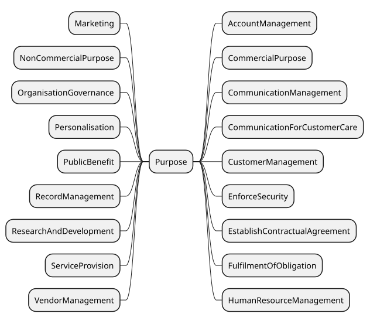](../source/2.3/diagrams/purpose-2.svg) 

Overview of Purpose taxonomy in DPV (click to open in new window)

 

 

DPV provides a taxonomy of Purpose instances for use with [=hasPurpose=] relation. In addition, DPV also defines the concept [=Sector=] (associated using [=hasSector=]) to indicate a contextual interpretation of the purpose within a specified sector.

 

DPV’s taxonomy of purposes is used to represent the reason or justification for processing of personal data. For this, purposes are organised within DPV based on how they relate to the processing of personal data in terms of several factors, such as: management functions related to information (e.g. records, account, finance), fulfilment of objectives (e.g. delivery of goods), providing goods and services (e.g. service provision), intended benefits (e.g. optimisations for service provider or consumer), and legal compliance.

 

 

It is important to note the following for real-world implications of `Purpose`:

 

 

1.  

There is no universal definition for what constitutes a ’purpose’ or what attributes are associated with it.

 

 

2.  

There are several distinct ways to model purposes, e.g. as a ‘goal’ such as ‘Delivery of Ordered Goods’; or as a statement explaining the processing of personal data, e.g. ‘Sending newsletters to Email’.

 

 

3.  

DPV does not define requirements for what is a ‘valid purpose’ as these are defined externally, e.g. in laws such as [[GDPR]] Article.5-1b where purposes are required to be ‘explicit and legitimate’.

 

 

4.  

Purposes have contextual interpretations within their application and domains (i.e. depending on how they are used in an use-case). For example, `ServiceProvision` is interpreted differently across the use-cases of an online website, a goods delivery outlet, and a medical centre - even if they use the same terms or phrasing.

 

 

 

 

Following from the above, practical uses of DPV will likely need to extend one of the concepts within DPV’s purpose taxonomy to ensure its purpose descriptions are specific and understandable within the context of that use-case. We therefore suggest, where possible and appropriate, to create a customised purpose as required within the use-cases by extending one or several purposes from the DPV taxonomy and to provide a human readable description to assist in its accurate interpretation (e.g. DPV prefers use of `skos:prefLabel` for its concepts and `dct:title` for other documentation).

  

In this example, a new purpose is created by extending `dpv:FraudPreventionAndDetection` and annotated with human-readable information. The interpretation of this purpose is thus more clear in relation to how it is applied or used within that use-case, and also serves to compare it with other purposes within the same category.

 


```
ex:PreventTransactionFraud a dpv:Purpose ;
  skos:broader dpv:FraudPreventionAndDetection ;
  skos:prefLabel "Prevent Transaction and Payment Frauds" .
```


 

(META Example ID: [`E0007`](https://w3id.org/dpv/examples#E0007); link: [source file](https://w3id.org/dpv/examples/E0007.ttl); contributed by Harshvardhan J. Pandit on 2024-06-10) 

  


 

-  dpv:Purpose: Purpose or (broader) Goal associated with data or technology [go to full definition](https://w3id.org/dpv#Purpose) 

 

  -  dpv:AccountManagement: Account Management refers to purposes associated with account management, such as to create, provide, maintain, and manage accounts [go to full definition](https://w3id.org/dpv#AccountManagement) 

 

  -  dpv:CommercialPurpose: Purposes associated with processing activities performed in a commercial setting or with intention to commercialise [go to full definition](https://w3id.org/dpv#CommercialPurpose) 

 

    -  dpv:CommercialResearch: Purposes associated with conducting research in a commercial setting or with intention to commercialise e.g. in a company or sponsored by a company [go to full definition](https://w3id.org/dpv#CommercialResearch) 

 

 

 

  -  dpv:CommunicationManagement: Communication Management refers to purposes associated with providing or managing communication activities e.g. to send an email for notifying some information [go to full definition](https://w3id.org/dpv#CommunicationManagement) 

 

    -  dpv:CommunicationForCustomerCare: Customer Care Communication refers to purposes associated with communicating with customers for assisting them, resolving issues, ensuring satisfaction, etc. in relation to services provided [go to full definition](https://w3id.org/dpv#CommunicationForCustomerCare) 

 

 

 

  -  dpv:CustomerManagement: Customer Management refers to purposes associated with managing activities related with past, current, and future customers [go to full definition](https://w3id.org/dpv#CustomerManagement) 

 

    -  dpv:CustomerCare: Customer Care refers to purposes associated with purposes for providing assistance, resolving issues, ensuring satisfaction, etc. in relation to services provided [go to full definition](https://w3id.org/dpv#CustomerCare) 

 

      -  dpv:CommunicationForCustomerCare: Customer Care Communication refers to purposes associated with communicating with customers for assisting them, resolving issues, ensuring satisfaction, etc. in relation to services provided [go to full definition](https://w3id.org/dpv#CommunicationForCustomerCare) 

 

 

 

    -  dpv:CustomerClaimsManagement: Customer Claims Management refers to purposes associated with managing claims, including repayment of monies owed [go to full definition](https://w3id.org/dpv#CustomerClaimsManagement) 

 

    -  dpv:CustomerOrderManagement: Customer Order Management refers to purposes associated with managing customer orders i.e. processing of an order related to customer's purchase of good or services [go to full definition](https://w3id.org/dpv#CustomerOrderManagement) 

 

    -  dpv:CustomerRelationshipManagement: Customer Relationship Management refers to purposes associated with managing and analysing interactions with past, current, and potential customers [go to full definition](https://w3id.org/dpv#CustomerRelationshipManagement) 

 

      -  dpv:ImproveInternalCRMProcesses: Purposes associated with improving customer-relationship management (CRM) processes [go to full definition](https://w3id.org/dpv#ImproveInternalCRMProcesses) 

 

 

 

    -  dpv:CustomerSolvencyMonitoring: Customer Solvency Monitoring refers to purposes associated with monitor solvency of customers for financial diligence [go to full definition](https://w3id.org/dpv#CustomerSolvencyMonitoring) 

 

 

 

  -  dpv:EnforceSecurity: Purposes associated with ensuring and enforcing security for data, personnel, or other related matters [go to full definition](https://w3id.org/dpv#EnforceSecurity) 

 

    -  dpv:EnforceAccessControl: Purposes associated with conducting or enforcing access control as a form of security [go to full definition](https://w3id.org/dpv#EnforceAccessControl) 

 

    -  dpv:IdentityAuthentication: Purposes associated with performing authentication based on identity as a form of security [go to full definition](https://w3id.org/dpv#IdentityAuthentication) 

 

    -  dpv:MisusePreventionAndDetection: Prevention and Detection of Misuse or Abuse of services [go to full definition](https://w3id.org/dpv#MisusePreventionAndDetection) 

 

      -  dpv:FraudPreventionAndDetection: Purposes associated with fraud detection, prevention, and mitigation [go to full definition](https://w3id.org/dpv#FraudPreventionAndDetection) 

 

        -  dpv:CounterMoneyLaundering: Purposes associated with detection, prevention, and mitigation of mitigate money laundering [go to full definition](https://w3id.org/dpv#CounterMoneyLaundering) 

 

        -  dpv:MaintainFraudDatabase: Purposes associated with maintaining a database related to identifying and identified fraud risks and fraud incidents [go to full definition](https://w3id.org/dpv#MaintainFraudDatabase) 

 

 

 

 

 

    -  dpv:Verification: Purposes association with verification e.g. information, identity, integrity [go to full definition](https://w3id.org/dpv#Verification) 

 

      -  dpv:AgeVerification: Purposes associated with verifying or authenticating age or age related information as a form of security [go to full definition](https://w3id.org/dpv#AgeVerification) 

 

      -  dpv:IdentityVerification: Purposes associated with verifying or authenticating identity as a form of security [go to full definition](https://w3id.org/dpv#IdentityVerification) 

 

 

 

 

 

  -  dpv:EstablishContractualAgreement: Purposes associated with carrying out data processing to establish an agreement, such as for entering into a contract [go to full definition](https://w3id.org/dpv#EstablishContractualAgreement) 

 

  -  dpv:FulfilmentOfObligation: Purposes associated with carrying out data processing to fulfill an obligation [go to full definition](https://w3id.org/dpv#FulfilmentOfObligation) 

 

    -  dpv:FulfilmentOfContractualObligation: Purposes associated with carrying out data processing to fulfill a contractual obligation [go to full definition](https://w3id.org/dpv#FulfilmentOfContractualObligation) 

 

    -  dpv:LegalCompliance: Purposes associated with carrying out data processing to fulfill a legal or statutory obligation [go to full definition](https://w3id.org/dpv#LegalCompliance) 

 

    -  dpv:ProtectionOfIPR: Purposes associated with the protection of intellectual property rights [go to full definition](https://w3id.org/dpv#ProtectionOfIPR) 

 

 

 

  -  dpv:HumanResourceManagement: Purposes associated with managing humans and 'human resources' within the organisation for effective and efficient operations. [go to full definition](https://w3id.org/dpv#HumanResourceManagement) 

 

    -  dpv:PersonnelManagement: Purposes associated with management of personnel associated with the organisation e.g. evaluation and management of employees and intermediaries [go to full definition](https://w3id.org/dpv#PersonnelManagement) 

 

      -  dpv:PersonnelHiring: Purposes associated with management and execution of hiring processes of personnel [go to full definition](https://w3id.org/dpv#PersonnelHiring) 

 

        -  dpv:PersonnelOnboarding: Purposes associated with onboarding and integration of personnel within an organisation [go to full definition](https://w3id.org/dpv#PersonnelOnboarding) 

 

        -  dpv:RecruitmentAdvertising: Purposes associated with advertisement for Recruitments and personnel hiring [go to full definition](https://w3id.org/dpv#RecruitmentAdvertising) 

 

          -  dpv:RecruitmentTargetedAdvertising: Purposes associated with targeted advertisement for Recruitments and personnel hiring [go to full definition](https://w3id.org/dpv#RecruitmentTargetedAdvertising) 

 

 

 

        -  dpv:RecruitmentManagement: Purposes assocaited with recruitment of personnel, which includes identifying, sourcing, screening, filtering, shortlisting, and interviewing candidates [go to full definition](https://w3id.org/dpv#RecruitmentManagement) 

 

          -  dpv:RecruitmentApplicantBackgroundCheck: Purposes assocaited with conducting background checks for prospective and current job applicants for recruitment [go to full definition](https://w3id.org/dpv#RecruitmentApplicantBackgroundCheck) 

 

          -  dpv:RecruitmentApplicantCriminalBackgroundCheck: Purposes associated with conducting criminal background assessment for prospective and current job applicants for recruitment [go to full definition](https://w3id.org/dpv#RecruitmentApplicantCriminalBackgroundCheck) 

 

          -  dpv:RecruitmentApplicantInformationAuthentication: Purposes associated with authentication and verification of information as part of recruitment [go to full definition](https://w3id.org/dpv#RecruitmentApplicantInformationAuthentication) 

 

          -  dpv:RecruitmentApplicantSelection: Purposes associated with determination or selection of candidates, whether for a specific job or job pool, or for a specific stage as part of recruitment [go to full definition](https://w3id.org/dpv#RecruitmentApplicantSelection) 

 

          -  dpv:RecruitmentApplicationManagement: Purposes associated with managing job applications for recruitment [go to full definition](https://w3id.org/dpv#RecruitmentApplicationManagement) 

 

            -  dpv:RecruitmentApplicationAnalysis: Purposes assocaited with analysis of job applications or job candidates for recruitment [go to full definition](https://w3id.org/dpv#RecruitmentApplicationAnalysis) 

 

            -  dpv:RecruitmentApplicationScreening: Purposes associated with screening and filtering of job applications or job candidates for recruitment [go to full definition](https://w3id.org/dpv#RecruitmentApplicationScreening) 

 

 

 

          -  dpv:RecruitmentInterviewManagement: Purposes associated conducting and managing interviews for recruitment [go to full definition](https://w3id.org/dpv#RecruitmentInterviewManagement) 

 

            -  dpv:RecruitmentInterviewAnalysis: Purposes associated with analysis of interviews, including the people and involved, for recruitment [go to full definition](https://w3id.org/dpv#RecruitmentInterviewAnalysis) 

 

            -  dpv:RecruitmentInterviewAssessment: Purposes associated with assessment of interviews, including assessment of people and information, for recruitment [go to full definition](https://w3id.org/dpv#RecruitmentInterviewAssessment) 

 

            -  dpv:RecruitmentInterviewScheduling: Purposes associated with scheduling interviews for recruitment [go to full definition](https://w3id.org/dpv#RecruitmentInterviewScheduling) 

 

 

 

 

 

 

 

      -  dpv:PersonnelMonitoring: Purposes associated with monitoring of personnel [go to full definition](https://w3id.org/dpv#PersonnelMonitoring) 

 

        -  dpv:PersonnelBehaviourMonitoring: Purposes associated with monitoring behaviour of personnel [go to full definition](https://w3id.org/dpv#PersonnelBehaviourMonitoring) 

 

        -  dpv:PersonnelPerformanceManagement: Purposes associated with management of performance of personnel [go to full definition](https://w3id.org/dpv#PersonnelPerformanceManagement) 

 

          -  dpv:PersonnelPerformanceEvaluation: Purposes associated with evaluation or assessment of performance of employees [go to full definition](https://w3id.org/dpv#PersonnelPerformanceEvaluation) 

 

          -  dpv:PersonnelPerformanceMonitoring: Purposes associated with monitoring of performance of personnel [go to full definition](https://w3id.org/dpv#PersonnelPerformanceMonitoring) 

 

          -  dpv:PersonnelPerformancePrediction: Purposes associated with prediction of performance of personnel [go to full definition](https://w3id.org/dpv#PersonnelPerformancePrediction) 

 

 

 

        -  dpv:PersonnelPerformanceMonitoring: Purposes associated with monitoring of performance of personnel [go to full definition](https://w3id.org/dpv#PersonnelPerformanceMonitoring) 

 

 

 

      -  dpv:PersonnelOffboarding: Purposes associated with offboarding of personnel i.e. activities and processes carried out when the person is exiting the company or role [go to full definition](https://w3id.org/dpv#PersonnelOffboarding) 

 

      -  dpv:PersonnelPayment: Purposes associated with management and execution of payment of personnel [go to full definition](https://w3id.org/dpv#PersonnelPayment) 

 

      -  dpv:PersonnelPerformanceManagement: Purposes associated with management of performance of personnel [go to full definition](https://w3id.org/dpv#PersonnelPerformanceManagement) 

 

        -  dpv:PersonnelPerformanceEvaluation: Purposes associated with evaluation or assessment of performance of employees [go to full definition](https://w3id.org/dpv#PersonnelPerformanceEvaluation) 

 

        -  dpv:PersonnelPerformanceMonitoring: Purposes associated with monitoring of performance of personnel [go to full definition](https://w3id.org/dpv#PersonnelPerformanceMonitoring) 

 

        -  dpv:PersonnelPerformancePrediction: Purposes associated with prediction of performance of personnel [go to full definition](https://w3id.org/dpv#PersonnelPerformancePrediction) 

 

 

 

      -  dpv:PersonnelPromotionManagement: Purposes associated with determination and management of promotion of personnel [go to full definition](https://w3id.org/dpv#PersonnelPromotionManagement) 

 

      -  dpv:PersonnelTerminationManagement: Purposes associated with determination and management of termination of personnel [go to full definition](https://w3id.org/dpv#PersonnelTerminationManagement) 

 

      -  dpv:PersonnelWorkloadManagement: Purposes assocaited with determination, scheduling, planning, and carrying out workload management of personnel [go to full definition](https://w3id.org/dpv#PersonnelWorkloadManagement) 

 

 

 

 

 

  -  dpv:Marketing: Purposes associated with conducting marketing in relation to organisation or products or services e.g. promoting, selling, and distributing [go to full definition](https://w3id.org/dpv#Marketing) 

 

    -  dpv:Advertising: Purposes associated with conducting advertising i.e. process or artefact used to call attention to a product, service, etc. through announcements, notices, or other forms of communication [go to full definition](https://w3id.org/dpv#Advertising) 

 

      -  dpv:PersonalisedAdvertising: Purposes associated with creating and providing personalised advertising [go to full definition](https://w3id.org/dpv#PersonalisedAdvertising) 

 

        -  dpv:TargetedAdvertising: Purposes associated with creating and providing personalised advertisement where the personalisation is targeted to a specific individual or group of individuals [go to full definition](https://w3id.org/dpv#TargetedAdvertising) 

 

          -  dpv:RecruitmentTargetedAdvertising: Purposes associated with targeted advertisement for Recruitments and personnel hiring [go to full definition](https://w3id.org/dpv#RecruitmentTargetedAdvertising) 

 

 

 

 

 

      -  dpv:PoliticalCampaign: Purposes associated with political campaign activities related to promotion and advertisement of positions and candidates in elections at local, state or regional, or national and international levels [go to full definition](https://w3id.org/dpv#PoliticalCampaign) 

 

      -  dpv:RecruitmentAdvertising: Purposes associated with advertisement for Recruitments and personnel hiring [go to full definition](https://w3id.org/dpv#RecruitmentAdvertising) 

 

        -  dpv:RecruitmentTargetedAdvertising: Purposes associated with targeted advertisement for Recruitments and personnel hiring [go to full definition](https://w3id.org/dpv#RecruitmentTargetedAdvertising) 

 

 

 

 

 

    -  dpv:DirectMarketing: Purposes associated with conducting direct marketing i.e. marketing communicated directly to the individual [go to full definition](https://w3id.org/dpv#DirectMarketing) 

 

    -  dpv:PublicRelations: Purposes associated with managing and conducting public relations processes, including creating goodwill for the organisation [go to full definition](https://w3id.org/dpv#PublicRelations) 

 

    -  dpv:SocialMediaMarketing: Purposes associated with conducting marketing through social media [go to full definition](https://w3id.org/dpv#SocialMediaMarketing) 

 

 

 

  -  dpv:NonCommercialPurpose: Purposes associated with processing activities performed in a non-commercial setting or without intention to commercialise [go to full definition](https://w3id.org/dpv#NonCommercialPurpose) 

 

    -  dpv:NonCommercialResearch: Purposes associated with conducting research in a non-commercial setting e.g. for a non-profit-organisation (NGO) [go to full definition](https://w3id.org/dpv#NonCommercialResearch) 

 

 

 

  -  dpv:OrganisationGovernance: Purposes associated with conducting activities and functions for governance of an organisation [go to full definition](https://w3id.org/dpv#OrganisationGovernance) 

 

    -  dpv:DisputeManagement: Purposes associated with activities that manage disputes by natural persons, private bodies, or public authorities relevant to organisation [go to full definition](https://w3id.org/dpv#DisputeManagement) 

 

    -  dpv:MemberPartnerManagement: Purposes associated with maintaining a registry of shareholders, members, or partners for governance, administration, and management functions [go to full definition](https://w3id.org/dpv#MemberPartnerManagement) 

 

    -  dpv:OrganisationComplianceManagement: Purposes associated with managing compliance for organisation in relation to internal policies [go to full definition](https://w3id.org/dpv#OrganisationComplianceManagement) 

 

    -  dpv:OrganisationRiskManagement: Purposes associated with managing risk for organisation's activities [go to full definition](https://w3id.org/dpv#OrganisationRiskManagement) 

 

 

 

  -  dpv:Personalisation: Purposes associated with creating and providing customisation based on attributes and/or needs of person(s) or context(s). [go to full definition](https://w3id.org/dpv#Personalisation) 

 

    -  dpv:PersonalisedAdvertising: Purposes associated with creating and providing personalised advertising [go to full definition](https://w3id.org/dpv#PersonalisedAdvertising) 

 

      -  dpv:TargetedAdvertising: Purposes associated with creating and providing personalised advertisement where the personalisation is targeted to a specific individual or group of individuals [go to full definition](https://w3id.org/dpv#TargetedAdvertising) 

 

        -  dpv:RecruitmentTargetedAdvertising: Purposes associated with targeted advertisement for Recruitments and personnel hiring [go to full definition](https://w3id.org/dpv#RecruitmentTargetedAdvertising) 

 

 

 

 

 

    -  dpv:PoliticalCampaign: Purposes associated with political campaign activities related to promotion and advertisement of positions and candidates in elections at local, state or regional, or national and international levels [go to full definition](https://w3id.org/dpv#PoliticalCampaign) 

 

    -  dpv:ServicePersonalisation: Purposes associated with providing personalisation within services or product or activities [go to full definition](https://w3id.org/dpv#ServicePersonalisation) 

 

      -  dpv:PersonalisedBenefits: Purposes associated with creating and providing personalised benefits for a service [go to full definition](https://w3id.org/dpv#PersonalisedBenefits) 

 

      -  dpv:ProvidePersonalisedRecommendations: Purposes associated with creating and providing personalised recommendations [go to full definition](https://w3id.org/dpv#ProvidePersonalisedRecommendations) 

 

        -  dpv:ProvideEventRecommendations: Purposes associated with creating and providing personalised recommendations for events [go to full definition](https://w3id.org/dpv#ProvideEventRecommendations) 

 

        -  dpv:ProvideProductRecommendations: Purposes associated with creating and providing product recommendations e.g. suggest similar products [go to full definition](https://w3id.org/dpv#ProvideProductRecommendations) 

 

 

 

      -  dpv:UserInterfacePersonalisation: Purposes associated with personalisation of interfaces presented to the user [go to full definition](https://w3id.org/dpv#UserInterfacePersonalisation) 

 

 

 

 

 

  -  dpv:PublicBenefit: Purposes undertaken and intended to provide benefit to public or society [go to full definition](https://w3id.org/dpv#PublicBenefit) 

 

    -  dpv:CombatClimateChange: Purposes associated with combating the causes and consequences of climate change, including reducing gas emissions and fighting emergencies such as floods or wildfires [go to full definition](https://w3id.org/dpv#CombatClimateChange) 

 

    -  dpv:Counterterrorism: Purposes associated with activities that detect, prevent, mitigate, or otherwise perform activities to combat or eliminate terrorism (also referred to as anti-terrorism) [go to full definition](https://w3id.org/dpv#Counterterrorism) 

 

    -  dpv:DataAltruism: Purposes associated with the voluntary sharing of data for the general interest of the public, such as healthcare or combating climate change [go to full definition](https://w3id.org/dpv#DataAltruism) 

 

    -  dpv:ImproveHealthcare: Purposes associated with improving healthcare systems such as for personalised treatments and curing chronic diseases [go to full definition](https://w3id.org/dpv#ImproveHealthcare) 

 

    -  dpv:ImprovePublicServices: Purposes associated with improving the provision of public services, such as public safety, education or law enforcement [go to full definition](https://w3id.org/dpv#ImprovePublicServices) 

 

    -  dpv:ImproveTransportMobility: Purposes associated with improving traffic, public transport systems or costs for drivers [go to full definition](https://w3id.org/dpv#ImproveTransportMobility) 

 

    -  dpv:ProtectionOfNationalSecurity: Purposes associated with the protection of national security [go to full definition](https://w3id.org/dpv#ProtectionOfNationalSecurity) 

 

    -  dpv:ProtectionOfPublicSecurity: Purposes associated with the protection of public security [go to full definition](https://w3id.org/dpv#ProtectionOfPublicSecurity) 

 

    -  dpv:ProvideOfficialStatistics: Purposes associated with facilitating the development, production and dissemination of reliable official statistics [go to full definition](https://w3id.org/dpv#ProvideOfficialStatistics) 

 

    -  dpv:PublicPolicyMaking: Purposes associated with public policy making, such as the development of new laws [go to full definition](https://w3id.org/dpv#PublicPolicyMaking) 

 

 

 

  -  dpv:RecordManagement: Purposes associated with manage creation, storage, and use of records relevant to operations, events, and processes e.g. to store logs or access requests [go to full definition](https://w3id.org/dpv#RecordManagement) 

 

  -  dpv:ResearchAndDevelopment: Purposes associated with conducting research and development for new methods, products, or services [go to full definition](https://w3id.org/dpv#ResearchAndDevelopment) 

 

    -  dpv:AcademicResearch: Purposes associated with conducting or assisting with research conducted in an academic context e.g. within universities [go to full definition](https://w3id.org/dpv#AcademicResearch) 

 

    -  dpv:CommercialResearch: Purposes associated with conducting research in a commercial setting or with intention to commercialise e.g. in a company or sponsored by a company [go to full definition](https://w3id.org/dpv#CommercialResearch) 

 

    -  dpv:NonCommercialResearch: Purposes associated with conducting research in a non-commercial setting e.g. for a non-profit-organisation (NGO) [go to full definition](https://w3id.org/dpv#NonCommercialResearch) 

 

    -  dpv:ScientificResearch: Purposes associated with scientific research [go to full definition](https://w3id.org/dpv#ScientificResearch) 

 

 

 

  -  dpv:ServiceManagement: Purposes associated with the management of services or products [go to full definition](https://w3id.org/dpv#ServiceManagement) 

 

    -  dpv:PaymentManagement: Purposes associated with processing and managing payment in relation to service, including invoicing and records [go to full definition](https://w3id.org/dpv#PaymentManagement) 

 

    -  dpv:RepairImpairments: Purposes associated with identifying, rectifying, or otherwise undertaking activities intended to fix or repair impairments to existing functionalities [go to full definition](https://w3id.org/dpv#RepairImpairments) 

 

    -  dpv:ServiceAccessDetermination: Purposes associated with the determination of whether specific conditions or criteria are met for accessing, using, or gaining access to a service [go to full definition](https://w3id.org/dpv#ServiceAccessDetermination) 

 

    -  dpv:ServiceMonitoring: Purposes associated with the monitoring of services or products to understand their performance and utilisation with a view to inform their management [go to full definition](https://w3id.org/dpv#ServiceMonitoring) 

 

      -  dpv:ServiceUsageAnalytics: Purposes associated with conducting analysis and reporting related to usage of services or products [go to full definition](https://w3id.org/dpv#ServiceUsageAnalytics) 

 

 

 

    -  dpv:ServiceOptimisation: Purposes associated with optimisation of services or activities [go to full definition](https://w3id.org/dpv#ServiceOptimisation) 

 

      -  dpv:OptimisationForConsumer: Purposes associated with optimisation of activities and services for consumer or user [go to full definition](https://w3id.org/dpv#OptimisationForConsumer) 

 

        -  dpv:OptimiseUserInterface: Purposes associated with optimisation of interfaces presented to the user [go to full definition](https://w3id.org/dpv#OptimiseUserInterface) 

 

 

 

      -  dpv:OptimisationForController: Purposes associated with optimisation of activities and services for provider or controller [go to full definition](https://w3id.org/dpv#OptimisationForController) 

 

        -  dpv:ImproveExistingProductsAndServices: Purposes associated with improving existing products and services [go to full definition](https://w3id.org/dpv#ImproveExistingProductsAndServices) 

 

        -  dpv:ImproveInternalCRMProcesses: Purposes associated with improving customer-relationship management (CRM) processes [go to full definition](https://w3id.org/dpv#ImproveInternalCRMProcesses) 

 

        -  dpv:IncreaseServiceRobustness: Purposes associated with improving robustness and resilience of services [go to full definition](https://w3id.org/dpv#IncreaseServiceRobustness) 

 

        -  dpv:InternalResourceOptimisation: Purposes associated with optimisation of internal resource availability and usage for organisation [go to full definition](https://w3id.org/dpv#InternalResourceOptimisation) 

 

 

 

 

 

    -  dpv:ServicePersonalisation: Purposes associated with providing personalisation within services or product or activities [go to full definition](https://w3id.org/dpv#ServicePersonalisation) 

 

      -  dpv:PersonalisedBenefits: Purposes associated with creating and providing personalised benefits for a service [go to full definition](https://w3id.org/dpv#PersonalisedBenefits) 

 

      -  dpv:ProvidePersonalisedRecommendations: Purposes associated with creating and providing personalised recommendations [go to full definition](https://w3id.org/dpv#ProvidePersonalisedRecommendations) 

 

        -  dpv:ProvideEventRecommendations: Purposes associated with creating and providing personalised recommendations for events [go to full definition](https://w3id.org/dpv#ProvideEventRecommendations) 

 

        -  dpv:ProvideProductRecommendations: Purposes associated with creating and providing product recommendations e.g. suggest similar products [go to full definition](https://w3id.org/dpv#ProvideProductRecommendations) 

 

 

 

      -  dpv:UserInterfacePersonalisation: Purposes associated with personalisation of interfaces presented to the user [go to full definition](https://w3id.org/dpv#UserInterfacePersonalisation) 

 

 

 

    -  dpv:ServiceProvision: Purposes associated with providing service or product or activities [go to full definition](https://w3id.org/dpv#ServiceProvision) 

 

      -  dpv:RequestedServiceProvision: Purposes associated with delivering services as requested by user or consumer [go to full definition](https://w3id.org/dpv#RequestedServiceProvision) 

 

        -  dpv:DeliveryOfGoods: Purposes associated with delivering goods and services requested or asked by consumer [go to full definition](https://w3id.org/dpv#DeliveryOfGoods) 

 

 

 

      -  dpv:SearchFunctionalities: Purposes associated with providing searching, querying, or other forms of information retrieval related functionalities [go to full definition](https://w3id.org/dpv#SearchFunctionalities) 

 

      -  dpv:SellProducts: Purposes associated with selling products or services [go to full definition](https://w3id.org/dpv#SellProducts) 

 

        -  dpv:SellDataToThirdParties: Purposes associated with selling or sharing data or information to third parties [go to full definition](https://w3id.org/dpv#SellDataToThirdParties) 

 

        -  dpv:SellInsightsFromData: Purposes associated with selling or sharing insights obtained from analysis of data [go to full definition](https://w3id.org/dpv#SellInsightsFromData) 

 

        -  dpv:SellProductsToDataSubject: Purposes associated with selling products or services to the user, consumer, or data subjects [go to full definition](https://w3id.org/dpv#SellProductsToDataSubject) 

 

 

 

      -  dpv:TechnicalServiceProvision: Purposes associated with managing and providing technical processes and functions necessary for delivering services [go to full definition](https://w3id.org/dpv#TechnicalServiceProvision) 

 

 

 

    -  dpv:ServiceRegistration: Purposes associated with registering users and collecting information required for providing a service [go to full definition](https://w3id.org/dpv#ServiceRegistration) 

 

 

 

  -  dpv:VendorManagement: Purposes associated with manage orders, payment, evaluation, and prospecting related to vendors [go to full definition](https://w3id.org/dpv#VendorManagement) 

 

    -  dpv:VendorPayment: Purposes associated with managing payment of vendors [go to full definition](https://w3id.org/dpv#VendorPayment) 

 

    -  dpv:VendorRecordsManagement: Purposes associated with managing records and orders related to vendors [go to full definition](https://w3id.org/dpv#VendorRecordsManagement) 

 

    -  dpv:VendorSelectionAssessment: Purposes associated with managing selection, assessment, and evaluation related to vendors [go to full definition](https://w3id.org/dpv#VendorSelectionAssessment) 

 

 

 

 

 

-  dpv:RightsFulfilment: Purposes associated with the fulfillment of rights specified in law [go to full definition](https://w3id.org/dpv#RightsFulfilment) 

 

-  dpv:Sector: Sector describes the area of application or domain that indicates or restricts scope for interpretation and application of purpose e.g. Agriculture, Banking [go to full definition](https://w3id.org/dpv#Sector) 

 


 

 
<a id="purposes-desc-purpose-guidelines"></a>

<a id="purposes-L1475"></a>
## Guidelines on Purposes
 

DPV's purpose taxonomy enables expressing the category of purpose i.e the broader goal or reason. To enable accurate representation of purposes, we recommend further describing the purposes in a contextual manner where relevant. For example, the concept [=Marketing=] refers to the broad purpose of 'marketing', which may not be sufficient to represent information such as the marketing is about a specific campaign associated with the holiday season. Such additional details are necessary to understand where the 'initial' purpose may differ with 'subsequent' purposes of data. For example, if consent was given only for the use of personal data for marketing during holiday seasons, other non-holiday marketing purposes would not be compatible with it. Additional details can be added to DPV purposes by two methods: (1) extending the DPV taxonomy; and (2) adding annotations containing human-readable descriptions. We recommend always using (2), and using (1) where necessary or relevant.

 

To enable the accurate representations of purposes, we also recommend choosing the most relevant or closest concept from purpose taxonomy so that the purpose is as specific as possible. For example, choosing [=ProvidePersonalisedRecommendations=] instead of [=Personalisation=] allows communicating that the personalisation is of a specific kind and that other kinds of personalisation such as for UI/UX or advertising are not part of this purpose.

  

This example describes how a purpose can be made clearer and accurate by two methods: (1) providing a human-readable description - which is always recommended; and (2) by extending a DPV concept 


```
ex:PDH a dpv:Process ;
    # issue: lack of details for what kind of Personalisation
    dpv:hasPurpose dpv:Personalisation ;
    # choose concept as specific as possible
    dpv:hasPurpose dpv:ProvidePersonalisedRecommendations .
    # human-readable information is not provided here,
    # which can be okay if it is sufficient to simply state the purpose
    # and further descriptions are not necessary for the use-case.

ex:PDH a dpv:Process ;
    dpv:hasPurpose ex:HolidayCampaign .
ex:HolidayCampaign a dpv:Purpose ;
    # align purpose with DPV taxonomy
    skos:broader dpv:DirectMarketing ;
    # provide human readable information
    dct:title "Holiday Campaign 2024"@en ;
    dct:description "Marketing associated with holiday season"@en ;
    dct:identifier "MH2024-A" . # internal campaign identifier
```


 

(META Example ID: [`E0040`](https://w3id.org/dpv/examples#E0040); link: [source file](https://w3id.org/dpv/examples/E0040.ttl); contributed by Harshvardhan J. Pandit on 2024-06-11) 

 

 

 
<a id="purposes-desc-service-provision"></a>

<a id="purposes-L1508"></a>
## Service Management & Provision
 

A 'service' is a specific legal concept that is distinct from the technical notion of services. In the legal context, services are processes performed by one entity for another entity, where the expectations are to enjoy its benefits or in exchange of some monetary or other forms of value. Services are regulated by law, often under the remit of contractual obligations and also through consumer protection. Examples of services are the use of streaming services, social media services, or even grocery store services. In DPV, services are represented using the [`dpv:Service`](https://w3id.org/dpv#Service) concept and associated using the relation [`dpv:hasService`](https://w3id.org/dpv#hasService) . Functionally, services can be considered as a broad category of activities or processes which the organisation operates on. Internally, each services can be represented as a series of processes which make up the service, including its management and implementation. To reflect this, the `Service` concept is extended from [`dpv:Purpose`](https://w3id.org/dpv#Purpose) .

 

The concept [=ServiceManagement=] represents a broad term for all purposes associated with the management and provision of services. It is extended to represent specific activities, such as [=ServiceProvision=] to represent providing the service, [=PaymentManagement=] for payments assocaited with the service, [=ServiceOptimisation=] for optimisations regarding the service, [=ServiceMonitoring=] for monitoring the service, and [=ServiceRegistration=] amongst others.

  

Up to v2.2, [=ServiceProvision=] represented all aspects of providing a service, including its maintainance, repairs, and optimisation. This was changed in v2.3 with the introduction of [=ServiceManagement=] as the top-level concept to distinguish between the provision of a service as an independent purpose from other service-associated purposes. This allows for more explicit and accurate representation of purposes and enhances legal compliance activities which target specific purposes under the broad remit of service management.

 

Existing users of [=ServiceProvision=] should evaluate whether their use of the concept is consistent with the renewed definition and taxonomy. [=ServiceProvision=] should be used only to describe the provision of a service, and should not be used to represent its management, monitoring, or other non-provision related purposes. To remedy existing uses, the use of service provision concept should be replaced with other more accurate purposes. 

  

This example describes how the different purposes and information associated with a service can be expressed in a modular and clear manner 


```
ex:MyProduct a dpv:Service ;
    dct:title "My Product Streaming Service"@en ;
    dpv:hasProcess ex:Register, ex:Service, ex:FraudManagement .

ex:Register a dpv:Process ;
    dpv:hasPurpose dpv:ServiceRegistration ;
    dpv:hasPersonalData pd:EmailAddress ;
    dpv:hasProcessing dpv:Collect, dpv:Store, dpv:Use ;
    dpv:hasLegalBasis dpv:EnterIntoContract .

ex:Service a dpv:Process ;
    dpv:hasLegalBasis dpv:ContractPerformance ;
    dpv:hasPurpose dpv:ServiceManagement ;
    dpv:hasProcess [
        a dpv:Process ;
        dpv:hasProcessing dpv:Use ;
        dpv:hasPersonalData pd:EmailAddress ;
        dpv:hasPurpose dpv:IdentityVerification ;
        dpv:hasPurpose dpv:ServiceAccessDetermination ;
    ] ;
    dpv:hasProcess [
        a dpv:Process ;
        dpv:hasProcessing dpv:Use ;
        dpv:hasPersonalData pd:Location ;
        dpv:hasPurpose dpv:ServiceProvision ;
    ] .

ex:FraudManagement a dpv:Process ;
    dpv:hasPurpose dpv:FraudPreventionAndDetection ;
    dpv:hasProcessing dpv:Use ;
    dpv:hasPersonalData pd:EmailAddress, pd:Location ;
    dpv:hasLegalBasis dpv:LegitimateInterest .
```


 

(META Example ID: [`E0041`](https://w3id.org/dpv/examples#E0041); link: [source file](https://w3id.org/dpv/examples/E0041.ttl); contributed by Harshvardhan J. Pandit on 2024-06-11) 

 

 


 

-  dpv:PaymentManagement: Purposes associated with processing and managing payment in relation to service, including invoicing and records [go to full definition](https://w3id.org/dpv#PaymentManagement) 

 

-  dpv:RepairImpairments: Purposes associated with identifying, rectifying, or otherwise undertaking activities intended to fix or repair impairments to existing functionalities [go to full definition](https://w3id.org/dpv#RepairImpairments) 

 

-  dpv:ServiceAccessDetermination: Purposes associated with the determination of whether specific conditions or criteria are met for accessing, using, or gaining access to a service [go to full definition](https://w3id.org/dpv#ServiceAccessDetermination) 

 

-  dpv:ServiceMonitoring: Purposes associated with the monitoring of services or products to understand their performance and utilisation with a view to inform their management [go to full definition](https://w3id.org/dpv#ServiceMonitoring) 

 

  -  dpv:ServiceUsageAnalytics: Purposes associated with conducting analysis and reporting related to usage of services or products [go to full definition](https://w3id.org/dpv#ServiceUsageAnalytics) 

 

 

 

-  dpv:ServiceOptimisation: Purposes associated with optimisation of services or activities [go to full definition](https://w3id.org/dpv#ServiceOptimisation) 

 

  -  dpv:OptimisationForConsumer: Purposes associated with optimisation of activities and services for consumer or user [go to full definition](https://w3id.org/dpv#OptimisationForConsumer) 

 

    -  dpv:OptimiseUserInterface: Purposes associated with optimisation of interfaces presented to the user [go to full definition](https://w3id.org/dpv#OptimiseUserInterface) 

 

 

 

  -  dpv:OptimisationForController: Purposes associated with optimisation of activities and services for provider or controller [go to full definition](https://w3id.org/dpv#OptimisationForController) 

 

    -  dpv:ImproveExistingProductsAndServices: Purposes associated with improving existing products and services [go to full definition](https://w3id.org/dpv#ImproveExistingProductsAndServices) 

 

    -  dpv:ImproveInternalCRMProcesses: Purposes associated with improving customer-relationship management (CRM) processes [go to full definition](https://w3id.org/dpv#ImproveInternalCRMProcesses) 

 

    -  dpv:IncreaseServiceRobustness: Purposes associated with improving robustness and resilience of services [go to full definition](https://w3id.org/dpv#IncreaseServiceRobustness) 

 

    -  dpv:InternalResourceOptimisation: Purposes associated with optimisation of internal resource availability and usage for organisation [go to full definition](https://w3id.org/dpv#InternalResourceOptimisation) 

 

 

 

 

 

-  dpv:ServicePersonalisation: Purposes associated with providing personalisation within services or product or activities [go to full definition](https://w3id.org/dpv#ServicePersonalisation) 

 

  -  dpv:PersonalisedBenefits: Purposes associated with creating and providing personalised benefits for a service [go to full definition](https://w3id.org/dpv#PersonalisedBenefits) 

 

  -  dpv:ProvidePersonalisedRecommendations: Purposes associated with creating and providing personalised recommendations [go to full definition](https://w3id.org/dpv#ProvidePersonalisedRecommendations) 

 

    -  dpv:ProvideEventRecommendations: Purposes associated with creating and providing personalised recommendations for events [go to full definition](https://w3id.org/dpv#ProvideEventRecommendations) 

 

    -  dpv:ProvideProductRecommendations: Purposes associated with creating and providing product recommendations e.g. suggest similar products [go to full definition](https://w3id.org/dpv#ProvideProductRecommendations) 

 

 

 

  -  dpv:UserInterfacePersonalisation: Purposes associated with personalisation of interfaces presented to the user [go to full definition](https://w3id.org/dpv#UserInterfacePersonalisation) 

 

 

 

-  dpv:ServiceProvision: Purposes associated with providing service or product or activities [go to full definition](https://w3id.org/dpv#ServiceProvision) 

 

  -  dpv:RequestedServiceProvision: Purposes associated with delivering services as requested by user or consumer [go to full definition](https://w3id.org/dpv#RequestedServiceProvision) 

 

    -  dpv:DeliveryOfGoods: Purposes associated with delivering goods and services requested or asked by consumer [go to full definition](https://w3id.org/dpv#DeliveryOfGoods) 

 

 

 

  -  dpv:SearchFunctionalities: Purposes associated with providing searching, querying, or other forms of information retrieval related functionalities [go to full definition](https://w3id.org/dpv#SearchFunctionalities) 

 

  -  dpv:SellProducts: Purposes associated with selling products or services [go to full definition](https://w3id.org/dpv#SellProducts) 

 

    -  dpv:SellDataToThirdParties: Purposes associated with selling or sharing data or information to third parties [go to full definition](https://w3id.org/dpv#SellDataToThirdParties) 

 

    -  dpv:SellInsightsFromData: Purposes associated with selling or sharing insights obtained from analysis of data [go to full definition](https://w3id.org/dpv#SellInsightsFromData) 

 

    -  dpv:SellProductsToDataSubject: Purposes associated with selling products or services to the user, consumer, or data subjects [go to full definition](https://w3id.org/dpv#SellProductsToDataSubject) 

 

 

 

  -  dpv:TechnicalServiceProvision: Purposes associated with managing and providing technical processes and functions necessary for delivering services [go to full definition](https://w3id.org/dpv#TechnicalServiceProvision) 

 

 

 

-  dpv:ServiceRegistration: Purposes associated with registering users and collecting information required for providing a service [go to full definition](https://w3id.org/dpv#ServiceRegistration) 

 


 

 
<a id="purposes-desc-legal-obligation"></a>

<a id="purposes-L1718"></a>
## Legal Obligation/Compliance
 

To express the purpose is associated with a legal obligation or a requirement for compliance such as in a contract, the concept [=FulfilmentOfObligation=] is provided with further concepts [=FulfilmentOfContractualObligation=], [=LegalCompliance=], and [=ProtectionOfIPR=]. When such purposes are required by law i.e. their implementation is necessary to comply with a legal obligation, the legal basis `LegalObligation` should be used along with details of the law and the obligation.

  

This example describes a purpose for performing 'KYC' identity verification as part of legal compliance with anti-money laundering laws 


```
ex:PDH a dpv:Process ;
    dpv:hasPurpose [
        a dpv:Purpose ;
        skos:broader dpv:IdentityVerification,
            dpv:LegalCompliance ;
        skos:prefLabel "KYC: Know Your Customer"@en ;
    ] ;
    dpv:hasLegalBasis [
        a dpv:LegalObligation ;
        dpv:hasApplicableLaw ex:CJA2010 ;
    ] .

ex:CJA2010 a dpv:Law ;
    dct:title "Money Laundering and Terrorist Financing Act 2010" ;
    dpv:hasJurisdiction loc:IE .
```


 

(META Example ID: [`E0042`](https://w3id.org/dpv/examples#E0042); link: [source file](https://w3id.org/dpv/examples/E0042.ttl); contributed by Harshvardhan J. Pandit on 2024-06-11) 

 

 

 
<a id="purposes-sector-of-purpose-application"></a>

<a id="purposes-L1747"></a>
## Sector of Purpose Application
 

DPV provides `Sector` that can be used to indicate the relevant information to further clarify or indicate how a purpose should be interpreted. `Sector`, used with the `hasSector` relation, denotes the sector or domain of application, such as Manufacturing. This can be used alongside existing official sector taxonomies such as [[NACE]] (EU), [[NAICS]] (USA), or [[ISIC]] (UN), as well as commercial industry taxonomies such as [[GICS]] maintained by organisations MSCI and S&P. Multiple classifications can be used through mappings between sector codes such as the [[[NACE-NAICS]]] provided by EU.

 

The DPVCG welcomes discussions on the alignment of concepts in NACE, NAICS, ISIC, and GICS with DPV's Purpose taxonomy to further expand on how specific purposes can be represented within the context of a particular domain or sector.

  

The [[[SECTOR]]] provide further concepts for purposes specific to a sector, for example [[SECTOR-EDUCATION]], [[SECTOR-HEALTH]], and [[SECTOR-LAW]].

  

 

DPVCG initially provided an interpretation of the NACE revision 2 codes which uses `rdfs:subClassOf` to specify the hierarchy between sector concepts instead of the SKOS relations used in NACE. In 2.0, the NACE extension has been removed as there was no added benefits provided in DPV's NACE extension and the recommendation is to use the official/authoritative NACE concepts and IRIs. Further, NACE revision 2.1 has been published which should be referred to as the latest version.

 

  

For example, the following purpose concerns implementing access control with the domain specified as scientific research using its corresponding NACE code <code>M72</code> to indicate sectorial implications for what "access control" and "enforce security" are expected to imply. 


```
@prefix nace: <http://data.europa.eu/ux2/nace2.1/> .

:RestrictPersonnelAccess a dpv:Purpose ;
  skos:broader dpv:EnforceSecurity ;
  skos:prefLabel "Limit access to lab by checking personnel identity" ;
  dpv:hasSector nace:72 .
```


 

(META Example ID: [`E0008`](https://w3id.org/dpv/examples#E0008); link: [source file](https://w3id.org/dpv/examples/E0008.ttl); contributed by Harshvardhan J. Pandit on 2024-06-10) 

 

  

This example uses the NACE taxonomy to indicate the domain or sectorial relevance of the purpose 


```
ex:PDH a dpv:Process ;
    # expressing Sector using NACE
    dpv:hasPurpose [
        a dpv:Purpose ;
        skos:broader dpv:NonCommercialResearch ;
        # Sector defined as R&D on social sciences and humanities
        # using NACE Rev 2.1 concept 72.20
        dpv:hasSector <http://data.europa.eu/ux2/nace2.1/7220> ;
    ] ;
    # expressing Sector as a 'domain' or 'sector' label and IRI
    dpv:hasPurpose [
        a dpv:Purpose ;
        skos:broader dpv:AcademicResearch ;
        dpv:hasSector "Education in University"@en ; # OR link to existing codes
        # NACE Rev 2.1 concept 85 Education
        dpv:hasSector [
            skos:prefLabel "Education in University"@en ;
            skos:broader <http://data.europa.eu/ux2/nace2.1/85.4.2> ;
        ] ;
    ] .
```


 

(META Example ID: [`E0043`](https://w3id.org/dpv/examples#E0043); link: [source file](https://w3id.org/dpv/examples/E0043.ttl); contributed by Harshvardhan J. Pandit on 2024-06-11) 

 

 

While the use of `Sector` for restricting (personal data processing) purposes is an uncommon and undocumented practice in terms of legal enforcement, we provide this feature as the use of sector code can assist with identification and interpretation of information as well as legal or organisational obligations and policies. For example, indicating some purpose is to be implemented within manufacturing or scientific research facilities (e.g. medical centres) can assist in ensuring specific types of access control and policies are defined and implemented.

<a id="purposes-L1808"></a>
## Vocabulary Index
 
<a id="purposes-classes"></a>

<a id="purposes-L1810"></a>
### Classes
 
<a id="purposes-AcademicResearch"></a>

<a id="purposes-L1811"></a>
#### Academic Research
 

- Term | AcademicResearch | Prefix | dpv
- Label | Academic Research
- IRI | [https://w3id.org/dpv#AcademicResearch](https://w3id.org/dpv#AcademicResearch)
- Type | [rdfs:Class](http://www.w3.org/2000/01/rdf-schema#Class), [skos:Concept](http://www.w3.org/2004/02/skos/core#Concept), [dpv:Purpose](https://w3id.org/dpv#Purpose)
- Broader/Parent types | [dpv:ResearchAndDevelopment](#purposes-ResearchAndDevelopment) → [dpv:Purpose](#purposes-Purpose)
- Object of relation | [dpv:hasPurpose](https://w3id.org/dpv#hasPurpose)
- Definition | Purposes associated with conducting or assisting with research conducted in an academic context e.g. within universities
- Related | [svpu:Education](https://specialprivacy.ercim.eu/vocabs/purposes#Education)
- Date Created | 2019-04-05
- Contributors | Axel Polleres, Elmar Kiesling, Fajar Ekaputra, Harshvardhan J. Pandit, Javier Fernández, Simon Steyskal
- See More: | section [PURPOSES](#purposes-vocab-purposes) in [DPV](https://w3id.org/dpv#)

 

 
<a id="purposes-AccountManagement"></a>

<a id="purposes-L1891"></a>
#### Account Management
 

- Term | AccountManagement | Prefix | dpv
- Label | Account Management
- IRI | [https://w3id.org/dpv#AccountManagement](https://w3id.org/dpv#AccountManagement)
- Type | [rdfs:Class](http://www.w3.org/2000/01/rdf-schema#Class), [skos:Concept](http://www.w3.org/2004/02/skos/core#Concept), [dpv:Purpose](https://w3id.org/dpv#Purpose)
- Broader/Parent types | [dpv:Purpose](#purposes-Purpose)
- Object of relation | [dpv:hasPurpose](https://w3id.org/dpv#hasPurpose)
- Definition | Account Management refers to purposes associated with account management, such as to create, provide, maintain, and manage accounts
- Date Created | 2021-09-08
- Contributors | Beatriz Esteves, Georg P. Krog, Harshvardhan J. Pandit
- See More: | section [PURPOSES](#purposes-vocab-purposes) in [DPV](https://w3id.org/dpv#)

 

 
<a id="purposes-Advertising"></a>

<a id="purposes-L1966"></a>
#### Advertising
 

- Term | Advertising | Prefix | dpv
- Label | Advertising
- IRI | [https://w3id.org/dpv#Advertising](https://w3id.org/dpv#Advertising)
- Type | [rdfs:Class](http://www.w3.org/2000/01/rdf-schema#Class), [skos:Concept](http://www.w3.org/2004/02/skos/core#Concept), [dpv:Purpose](https://w3id.org/dpv#Purpose)
- Broader/Parent types | [dpv:Marketing](#purposes-Marketing) → [dpv:Purpose](#purposes-Purpose)
- Object of relation | [dpv:hasPurpose](https://w3id.org/dpv#hasPurpose)
- Definition | Purposes associated with conducting advertising i.e. process or artefact used to call attention to a product, service, etc. through announcements, notices, or other forms of communication
- Usage Note | Advertising is a subset of Marketing. Advertising by itself does not indicate 'personalisation' i.e. personalised ads.
- Date Created | 2020-11-04
- Contributors | Beatriz Esteves, Georg P. Krog, Harshvardhan J. Pandit
- See More: | section [PURPOSES](#purposes-vocab-purposes) in [DPV](https://w3id.org/dpv#)

 

 
<a id="purposes-AgeVerification"></a>

<a id="purposes-L2045"></a>
#### Age Verification
 

- Term | AgeVerification | Prefix | dpv
- Label | Age Verification
- IRI | [https://w3id.org/dpv#AgeVerification](https://w3id.org/dpv#AgeVerification)
- Type | [rdfs:Class](http://www.w3.org/2000/01/rdf-schema#Class), [skos:Concept](http://www.w3.org/2004/02/skos/core#Concept), [dpv:Purpose](https://w3id.org/dpv#Purpose)
- Broader/Parent types | [dpv:Verification](#purposes-Verification) → [dpv:EnforceSecurity](#purposes-EnforceSecurity) → [dpv:Purpose](#purposes-Purpose)
- Object of relation | [dpv:hasPurpose](https://w3id.org/dpv#hasPurpose)
- Definition | Purposes associated with verifying or authenticating age or age related information as a form of security
- Usage Note | Age Verification can include verification of the exact age, e.g. being 21 years old, a date, e.g. birth date is 01 January 1969, or a condition, e.g. age is over 21 years and the person is an adult. Specific dedicated resources should be used to further express information and processes associated with Age Verification, for example the Age Verification Vocabulary https://w3id.org/age/
- Date Created | 2024-02-14
- Contributors | Arthit Suriyawongkul, Beatriz Esteves, Harshvardhan J. Pandit
- See More: | section [PURPOSES](#purposes-vocab-purposes) in [DPV](https://w3id.org/dpv#)

 

 
<a id="purposes-CombatClimateChange"></a>

<a id="purposes-L2125"></a>
#### Combat Climate Change
 

- Term | CombatClimateChange | Prefix | dpv
- Label | Combat Climate Change
- IRI | [https://w3id.org/dpv#CombatClimateChange](https://w3id.org/dpv#CombatClimateChange)
- Type | [rdfs:Class](http://www.w3.org/2000/01/rdf-schema#Class), [skos:Concept](http://www.w3.org/2004/02/skos/core#Concept), [dpv:Purpose](https://w3id.org/dpv#Purpose)
- Broader/Parent types | [dpv:PublicBenefit](#purposes-PublicBenefit) → [dpv:Purpose](#purposes-Purpose)
- Object of relation | [dpv:hasPurpose](https://w3id.org/dpv#hasPurpose)
- Definition | Purposes associated with combating the causes and consequences of climate change, including reducing gas emissions and fighting emergencies such as floods or wildfires
- Source | DGA 2.16
- Date Created | 2024-02-14
- Contributors | Beatriz Esteves, Harshvardhan J. Pandit
- See More: | section [PURPOSES](#purposes-vocab-purposes) in [DPV](https://w3id.org/dpv#)

 

 
<a id="purposes-CommercialPurpose"></a>

<a id="purposes-L2204"></a>
#### Commercial Purpose
 

- Term | CommercialPurpose | Prefix | dpv
- Label | Commercial Purpose
- IRI | [https://w3id.org/dpv#CommercialPurpose](https://w3id.org/dpv#CommercialPurpose)
- Type | [rdfs:Class](http://www.w3.org/2000/01/rdf-schema#Class), [skos:Concept](http://www.w3.org/2004/02/skos/core#Concept), [dpv:Purpose](https://w3id.org/dpv#Purpose)
- Broader/Parent types | [dpv:Purpose](#purposes-Purpose)
- Object of relation | [dpv:hasPurpose](https://w3id.org/dpv#hasPurpose)
- Definition | Purposes associated with processing activities performed in a commercial setting or with intention to commercialise
- Source | DGA 4.4
- Date Created | 2024-02-14
- Contributors | Beatriz Esteves, Harshvardhan J. Pandit
- See More: | section [PURPOSES](#purposes-vocab-purposes) in [DPV](https://w3id.org/dpv#)

 

 
<a id="purposes-CommercialResearch"></a>

<a id="purposes-L2282"></a>
#### Commercial Research
 

- Term | CommercialResearch | Prefix | dpv
- Label | Commercial Research
- IRI | [https://w3id.org/dpv#CommercialResearch](https://w3id.org/dpv#CommercialResearch)
- Type | [rdfs:Class](http://www.w3.org/2000/01/rdf-schema#Class), [skos:Concept](http://www.w3.org/2004/02/skos/core#Concept), [dpv:Purpose](https://w3id.org/dpv#Purpose)
- Broader/Parent types | [dpv:CommercialPurpose](#purposes-CommercialPurpose) → [dpv:Purpose](#purposes-Purpose)
- Broader/Parent types | [dpv:ResearchAndDevelopment](#purposes-ResearchAndDevelopment) → [dpv:Purpose](#purposes-Purpose)
- Object of relation | [dpv:hasPurpose](https://w3id.org/dpv#hasPurpose)
- Definition | Purposes associated with conducting research in a commercial setting or with intention to commercialise e.g. in a company or sponsored by a company
- Related | [svpu:Develop](https://specialprivacy.ercim.eu/vocabs/purposes#Develop)
- Date Created | 2019-04-05
- Date Modified | 2024-04-14
- Contributors | Axel Polleres, Elmar Kiesling, Fajar Ekaputra, Harshvardhan J. Pandit, Javier Fernández, Simon Steyskal
- See More: | section [PURPOSES](#purposes-vocab-purposes) in [DPV](https://w3id.org/dpv#)

 

 
<a id="purposes-CommunicationForCustomerCare"></a>

<a id="purposes-L2369"></a>
#### Communication for Customer Care
 

- Term | CommunicationForCustomerCare | Prefix | dpv
- Label | Communication for Customer Care
- IRI | [https://w3id.org/dpv#CommunicationForCustomerCare](https://w3id.org/dpv#CommunicationForCustomerCare)
- Type | [rdfs:Class](http://www.w3.org/2000/01/rdf-schema#Class), [skos:Concept](http://www.w3.org/2004/02/skos/core#Concept), [dpv:Purpose](https://w3id.org/dpv#Purpose)
- Broader/Parent types | [dpv:CommunicationManagement](#purposes-CommunicationManagement) → [dpv:Purpose](#purposes-Purpose)
- Broader/Parent types | [dpv:CustomerCare](#purposes-CustomerCare) → [dpv:CustomerManagement](#purposes-CustomerManagement) → [dpv:Purpose](#purposes-Purpose)
- Object of relation | [dpv:hasPurpose](https://w3id.org/dpv#hasPurpose)
- Definition | Customer Care Communication refers to purposes associated with communicating with customers for assisting them, resolving issues, ensuring satisfaction, etc. in relation to services provided
- Date Created | 2020-11-04
- Contributors | Beatriz Esteves, Georg P. Krog, Harshvardhan J. Pandit
- See More: | section [PURPOSES](#purposes-vocab-purposes) in [DPV](https://w3id.org/dpv#)

 

 
<a id="purposes-CommunicationManagement"></a>

<a id="purposes-L2450"></a>
#### Communication Management
 

- Term | CommunicationManagement | Prefix | dpv
- Label | Communication Management
- IRI | [https://w3id.org/dpv#CommunicationManagement](https://w3id.org/dpv#CommunicationManagement)
- Type | [rdfs:Class](http://www.w3.org/2000/01/rdf-schema#Class), [skos:Concept](http://www.w3.org/2004/02/skos/core#Concept), [dpv:Purpose](https://w3id.org/dpv#Purpose)
- Broader/Parent types | [dpv:Purpose](#purposes-Purpose)
- Object of relation | [dpv:hasPurpose](https://w3id.org/dpv#hasPurpose)
- Definition | Communication Management refers to purposes associated with providing or managing communication activities e.g. to send an email for notifying some information
- Usage Note | This purpose by itself does not sufficiently and clearly indicate what the communication is about. As such, it is recommended to combine it with another purpose to indicate the application. For example, Communication of Payment.
- Date Created | 2021-09-01
- Contributors | David Hickey, Georg P. Krog, Harshvardhan J. Pandit, Paul Ryan
- See More: | section [PURPOSES](#purposes-vocab-purposes) in [DPV](https://w3id.org/dpv#)

 

 
<a id="purposes-CounterMoneyLaundering"></a>

<a id="purposes-L2528"></a>
#### Counter Money Laundering
 

- Term | CounterMoneyLaundering | Prefix | dpv
- Label | Counter Money Laundering
- IRI | [https://w3id.org/dpv#CounterMoneyLaundering](https://w3id.org/dpv#CounterMoneyLaundering)
- Type | [rdfs:Class](http://www.w3.org/2000/01/rdf-schema#Class), [skos:Concept](http://www.w3.org/2004/02/skos/core#Concept), [dpv:Purpose](https://w3id.org/dpv#Purpose)
- Broader/Parent types | [dpv:FraudPreventionAndDetection](#purposes-FraudPreventionAndDetection) → [dpv:MisusePreventionAndDetection](#purposes-MisusePreventionAndDetection) → [dpv:EnforceSecurity](#purposes-EnforceSecurity) → [dpv:Purpose](#purposes-Purpose)
- Object of relation | [dpv:hasPurpose](https://w3id.org/dpv#hasPurpose)
- Definition | Purposes associated with detection, prevention, and mitigation of mitigate money laundering
- Date Created | 2022-04-20
- Contributors | Harshvardhan J. Pandit
- See More: | section [PURPOSES](#purposes-vocab-purposes) in [DPV](https://w3id.org/dpv#)

 

 
<a id="purposes-Counterterrorism"></a>

<a id="purposes-L2606"></a>
#### Counterterrorism
 

- Term | Counterterrorism | Prefix | dpv
- Label | Counterterrorism
- IRI | [https://w3id.org/dpv#Counterterrorism](https://w3id.org/dpv#Counterterrorism)
- Type | [rdfs:Class](http://www.w3.org/2000/01/rdf-schema#Class), [skos:Concept](http://www.w3.org/2004/02/skos/core#Concept), [dpv:Purpose](https://w3id.org/dpv#Purpose)
- Broader/Parent types | [dpv:PublicBenefit](#purposes-PublicBenefit) → [dpv:Purpose](#purposes-Purpose)
- Object of relation | [dpv:hasPurpose](https://w3id.org/dpv#hasPurpose)
- Definition | Purposes associated with activities that detect, prevent, mitigate, or otherwise perform activities to combat or eliminate terrorism (also referred to as anti-terrorism)
- Date Created | 2022-04-20
- Date Modified | 2024-04-14
- Contributors | Harshvardhan J. Pandit
- See More: | section [PURPOSES](#purposes-vocab-purposes) in [DPV](https://w3id.org/dpv#)

 

 
<a id="purposes-CustomerCare"></a>

<a id="purposes-L2685"></a>
#### Customer Care
 

- Term | CustomerCare | Prefix | dpv
- Label | Customer Care
- IRI | [https://w3id.org/dpv#CustomerCare](https://w3id.org/dpv#CustomerCare)
- Type | [rdfs:Class](http://www.w3.org/2000/01/rdf-schema#Class), [skos:Concept](http://www.w3.org/2004/02/skos/core#Concept), [dpv:Purpose](https://w3id.org/dpv#Purpose)
- Broader/Parent types | [dpv:CustomerManagement](#purposes-CustomerManagement) → [dpv:Purpose](#purposes-Purpose)
- Object of relation | [dpv:hasPurpose](https://w3id.org/dpv#hasPurpose)
- Definition | Customer Care refers to purposes associated with purposes for providing assistance, resolving issues, ensuring satisfaction, etc. in relation to services provided
- Related | [svpu:Feedback](https://specialprivacy.ercim.eu/vocabs/purposes#Feedback)
- Date Created | 2019-04-05
- Contributors | Axel Polleres, Elmar Kiesling, Fajar Ekaputra, Harshvardhan J. Pandit, Javier Fernández, Simon Steyskal
- See More: | section [PURPOSES](#purposes-vocab-purposes) in [DPV](https://w3id.org/dpv#)

 

 
<a id="purposes-CustomerClaimsManagement"></a>

<a id="purposes-L2765"></a>
#### Customer Claims Management
 

- Term | CustomerClaimsManagement | Prefix | dpv
- Label | Customer Claims Management
- IRI | [https://w3id.org/dpv#CustomerClaimsManagement](https://w3id.org/dpv#CustomerClaimsManagement)
- Type | [rdfs:Class](http://www.w3.org/2000/01/rdf-schema#Class), [skos:Concept](http://www.w3.org/2004/02/skos/core#Concept), [dpv:Purpose](https://w3id.org/dpv#Purpose)
- Broader/Parent types | [dpv:CustomerManagement](#purposes-CustomerManagement) → [dpv:Purpose](#purposes-Purpose)
- Object of relation | [dpv:hasPurpose](https://w3id.org/dpv#hasPurpose)
- Definition | Customer Claims Management refers to purposes associated with managing claims, including repayment of monies owed
- Source | [Belgian DPA ROPA Template](https://www.privacycommission.be/nl/model-voor-een-register-van-de-verwerkingsactiviteiten)
- Date Created | 2021-09-08
- Contributors | Beatriz Esteves, Georg P. Krog, Harshvardhan J. Pandit
- See More: | section [PURPOSES](#purposes-vocab-purposes) in [DPV](https://w3id.org/dpv#)

 

 
<a id="purposes-CustomerManagement"></a>

<a id="purposes-L2844"></a>
#### Customer Management
 

- Term | CustomerManagement | Prefix | dpv
- Label | Customer Management
- IRI | [https://w3id.org/dpv#CustomerManagement](https://w3id.org/dpv#CustomerManagement)
- Type | [rdfs:Class](http://www.w3.org/2000/01/rdf-schema#Class), [skos:Concept](http://www.w3.org/2004/02/skos/core#Concept), [dpv:Purpose](https://w3id.org/dpv#Purpose)
- Broader/Parent types | [dpv:Purpose](#purposes-Purpose)
- Object of relation | [dpv:hasPurpose](https://w3id.org/dpv#hasPurpose)
- Definition | Customer Management refers to purposes associated with managing activities related with past, current, and future customers
- Date Created | 2021-09-08
- Contributors | Beatriz Esteves, Georg P. Krog, Harshvardhan J. Pandit
- See More: | section [PURPOSES](#purposes-vocab-purposes) in [DPV](https://w3id.org/dpv#)

 

 
<a id="purposes-CustomerOrderManagement"></a>

<a id="purposes-L2919"></a>
#### Customer Order Management
 

- Term | CustomerOrderManagement | Prefix | dpv
- Label | Customer Order Management
- IRI | [https://w3id.org/dpv#CustomerOrderManagement](https://w3id.org/dpv#CustomerOrderManagement)
- Type | [rdfs:Class](http://www.w3.org/2000/01/rdf-schema#Class), [skos:Concept](http://www.w3.org/2004/02/skos/core#Concept), [dpv:Purpose](https://w3id.org/dpv#Purpose)
- Broader/Parent types | [dpv:CustomerManagement](#purposes-CustomerManagement) → [dpv:Purpose](#purposes-Purpose)
- Object of relation | [dpv:hasPurpose](https://w3id.org/dpv#hasPurpose)
- Definition | Customer Order Management refers to purposes associated with managing customer orders i.e. processing of an order related to customer's purchase of good or services
- Source | [Belgian DPA ROPA Template](https://www.privacycommission.be/nl/model-voor-een-register-van-de-verwerkingsactiviteiten)
- Date Created | 2021-09-08
- Contributors | Beatriz Esteves, Georg P. Krog, Harshvardhan J. Pandit
- See More: | section [PURPOSES](#purposes-vocab-purposes) in [DPV](https://w3id.org/dpv#)

 

 
<a id="purposes-CustomerRelationshipManagement"></a>

<a id="purposes-L2998"></a>
#### Customer Relationship Management
 

- Term | CustomerRelationshipManagement | Prefix | dpv
- Label | Customer Relationship Management
- IRI | [https://w3id.org/dpv#CustomerRelationshipManagement](https://w3id.org/dpv#CustomerRelationshipManagement)
- Type | [rdfs:Class](http://www.w3.org/2000/01/rdf-schema#Class), [skos:Concept](http://www.w3.org/2004/02/skos/core#Concept), [dpv:Purpose](https://w3id.org/dpv#Purpose)
- Broader/Parent types | [dpv:CustomerManagement](#purposes-CustomerManagement) → [dpv:Purpose](#purposes-Purpose)
- Object of relation | [dpv:hasPurpose](https://w3id.org/dpv#hasPurpose)
- Definition | Customer Relationship Management refers to purposes associated with managing and analysing interactions with past, current, and potential customers
- Date Created | 2021-09-08
- Contributors | Beatriz Esteves, Georg P. Krog, Harshvardhan J. Pandit
- See More: | section [PURPOSES](#purposes-vocab-purposes) in [DPV](https://w3id.org/dpv#)

 

 
<a id="purposes-CustomerSolvencyMonitoring"></a>

<a id="purposes-L3074"></a>
#### Customer Solvency Monitoring
 

- Term | CustomerSolvencyMonitoring | Prefix | dpv
- Label | Customer Solvency Monitoring
- IRI | [https://w3id.org/dpv#CustomerSolvencyMonitoring](https://w3id.org/dpv#CustomerSolvencyMonitoring)
- Type | [rdfs:Class](http://www.w3.org/2000/01/rdf-schema#Class), [skos:Concept](http://www.w3.org/2004/02/skos/core#Concept), [dpv:Purpose](https://w3id.org/dpv#Purpose)
- Broader/Parent types | [dpv:CustomerManagement](#purposes-CustomerManagement) → [dpv:Purpose](#purposes-Purpose)
- Object of relation | [dpv:hasPurpose](https://w3id.org/dpv#hasPurpose)
- Definition | Customer Solvency Monitoring refers to purposes associated with monitor solvency of customers for financial diligence
- Source | [Belgian DPA ROPA Template](https://www.privacycommission.be/nl/model-voor-een-register-van-de-verwerkingsactiviteiten)
- Date Created | 2021-09-08
- Contributors | Beatriz Esteves, Georg P. Krog, Harshvardhan J. Pandit
- See More: | section [PURPOSES](#purposes-vocab-purposes) in [DPV](https://w3id.org/dpv#)

 

 
<a id="purposes-DataAltruism"></a>

<a id="purposes-L3153"></a>
#### Data Altruism
 

- Term | DataAltruism | Prefix | dpv
- Label | Data Altruism
- IRI | [https://w3id.org/dpv#DataAltruism](https://w3id.org/dpv#DataAltruism)
- Type | [rdfs:Class](http://www.w3.org/2000/01/rdf-schema#Class), [skos:Concept](http://www.w3.org/2004/02/skos/core#Concept), [dpv:Purpose](https://w3id.org/dpv#Purpose)
- Broader/Parent types | [dpv:PublicBenefit](#purposes-PublicBenefit) → [dpv:Purpose](#purposes-Purpose)
- Object of relation | [dpv:hasPurpose](https://w3id.org/dpv#hasPurpose)
- Definition | Purposes associated with the voluntary sharing of data for the general interest of the public, such as healthcare or combating climate change
- Usage Note | Data Altruism as a purpose should be combined with other purposes to indicate their altruistic interpretation or application. E.g. improving healthcare and data altruism in combination.
- Source | DGA 2.16
- Date Created | 2024-02-14
- Contributors | Beatriz Esteves, Harshvardhan J. Pandit
- See More: | section [PURPOSES](#purposes-vocab-purposes) in [DPV](https://w3id.org/dpv#)

 

 
<a id="purposes-DeliveryOfGoods"></a>

<a id="purposes-L3235"></a>
#### Delivery of Goods
 

- Term | DeliveryOfGoods | Prefix | dpv
- Label | Delivery of Goods
- IRI | [https://w3id.org/dpv#DeliveryOfGoods](https://w3id.org/dpv#DeliveryOfGoods)
- Type | [rdfs:Class](http://www.w3.org/2000/01/rdf-schema#Class), [skos:Concept](http://www.w3.org/2004/02/skos/core#Concept), [dpv:Purpose](https://w3id.org/dpv#Purpose)
- Broader/Parent types | [dpv:RequestedServiceProvision](#purposes-RequestedServiceProvision) → [dpv:ServiceProvision](#purposes-ServiceProvision) → [dpv:ServiceManagement](#purposes-ServiceManagement) → [dpv:Purpose](#purposes-Purpose)
- Object of relation | [dpv:hasPurpose](https://w3id.org/dpv#hasPurpose)
- Definition | Purposes associated with delivering goods and services requested or asked by consumer
- Related | [svpu:Delivery](https://specialprivacy.ercim.eu/vocabs/purposes#Delivery)
- Date Created | 2019-04-05
- Contributors | Axel Polleres, Elmar Kiesling, Fajar Ekaputra, Harshvardhan J. Pandit, Javier Fernández, Simon Steyskal
- See More: | section [PURPOSES](#purposes-vocab-purposes) in [DPV](https://w3id.org/dpv#)

 

 
<a id="purposes-DirectMarketing"></a>

<a id="purposes-L3317"></a>
#### Direct Marketing
 

- Term | DirectMarketing | Prefix | dpv
- Label | Direct Marketing
- IRI | [https://w3id.org/dpv#DirectMarketing](https://w3id.org/dpv#DirectMarketing)
- Type | [rdfs:Class](http://www.w3.org/2000/01/rdf-schema#Class), [skos:Concept](http://www.w3.org/2004/02/skos/core#Concept), [dpv:Purpose](https://w3id.org/dpv#Purpose)
- Broader/Parent types | [dpv:Marketing](#purposes-Marketing) → [dpv:Purpose](#purposes-Purpose)
- Object of relation | [dpv:hasPurpose](https://w3id.org/dpv#hasPurpose)
- Definition | Purposes associated with conducting direct marketing i.e. marketing communicated directly to the individual
- Date Created | 2020-11-04
- Contributors | Beatriz Esteves, Georg P. Krog, Harshvardhan J. Pandit
- See More: | section [PURPOSES](#purposes-vocab-purposes) in [DPV](https://w3id.org/dpv#)

 

 
<a id="purposes-DisputeManagement"></a>

<a id="purposes-L3393"></a>
#### Dispute Management
 

- Term | DisputeManagement | Prefix | dpv
- Label | Dispute Management
- IRI | [https://w3id.org/dpv#DisputeManagement](https://w3id.org/dpv#DisputeManagement)
- Type | [rdfs:Class](http://www.w3.org/2000/01/rdf-schema#Class), [skos:Concept](http://www.w3.org/2004/02/skos/core#Concept), [dpv:Purpose](https://w3id.org/dpv#Purpose)
- Broader/Parent types | [dpv:OrganisationGovernance](#purposes-OrganisationGovernance) → [dpv:Purpose](#purposes-Purpose)
- Object of relation | [dpv:hasPurpose](https://w3id.org/dpv#hasPurpose)
- Definition | Purposes associated with activities that manage disputes by natural persons, private bodies, or public authorities relevant to organisation
- Source | [Belgian DPA ROPA Template](https://www.privacycommission.be/nl/model-voor-een-register-van-de-verwerkingsactiviteiten)
- Date Created | 2021-09-08
- Contributors | Beatriz Esteves, Georg P. Krog, Harshvardhan J. Pandit
- See More: | section [PURPOSES](#purposes-vocab-purposes) in [DPV](https://w3id.org/dpv#)

 

 
<a id="purposes-EnforceAccessControl"></a>

<a id="purposes-L3472"></a>
#### Enforce Access Control
 

- Term | EnforceAccessControl | Prefix | dpv
- Label | Enforce Access Control
- IRI | [https://w3id.org/dpv#EnforceAccessControl](https://w3id.org/dpv#EnforceAccessControl)
- Type | [rdfs:Class](http://www.w3.org/2000/01/rdf-schema#Class), [skos:Concept](http://www.w3.org/2004/02/skos/core#Concept), [dpv:Purpose](https://w3id.org/dpv#Purpose)
- Broader/Parent types | [dpv:EnforceSecurity](#purposes-EnforceSecurity) → [dpv:Purpose](#purposes-Purpose)
- Object of relation | [dpv:hasPurpose](https://w3id.org/dpv#hasPurpose)
- Definition | Purposes associated with conducting or enforcing access control as a form of security
- Usage Note | Was previously "Access Control". Prefixed to distinguish from Technical Measure.
- Related | [svpu:Login](https://specialprivacy.ercim.eu/vocabs/purposes#Login)
- Date Created | 2019-04-05
- Contributors | Axel Polleres, Elmar Kiesling, Fajar Ekaputra, Harshvardhan J. Pandit, Javier Fernández, Simon Steyskal
- See More: | section [PURPOSES](#purposes-vocab-purposes) in [DPV](https://w3id.org/dpv#)

 

 
<a id="purposes-EnforceSecurity"></a>

<a id="purposes-L3555"></a>
#### Enforce Security
 

- Term | EnforceSecurity | Prefix | dpv
- Label | Enforce Security
- IRI | [https://w3id.org/dpv#EnforceSecurity](https://w3id.org/dpv#EnforceSecurity)
- Type | [rdfs:Class](http://www.w3.org/2000/01/rdf-schema#Class), [skos:Concept](http://www.w3.org/2004/02/skos/core#Concept), [dpv:Purpose](https://w3id.org/dpv#Purpose)
- Broader/Parent types | [dpv:Purpose](#purposes-Purpose)
- Object of relation | [dpv:hasPurpose](https://w3id.org/dpv#hasPurpose)
- Definition | Purposes associated with ensuring and enforcing security for data, personnel, or other related matters
- Usage Note | Was previous "Security". Prefixed to distinguish from TechOrg measures.
- Date Created | 2019-04-05
- Contributors | Axel Polleres, Elmar Kiesling, Fajar Ekaputra, Harshvardhan J. Pandit, Javier Fernández, Simon Steyskal
- See More: | section [PURPOSES](#purposes-vocab-purposes) in [DPV](https://w3id.org/dpv#)

 

 
<a id="purposes-EstablishContractualAgreement"></a>

<a id="purposes-L3633"></a>
#### Establish Contractual Agreement
 

- Term | EstablishContractualAgreement | Prefix | dpv
- Label | Establish Contractual Agreement
- IRI | [https://w3id.org/dpv#EstablishContractualAgreement](https://w3id.org/dpv#EstablishContractualAgreement)
- Type | [rdfs:Class](http://www.w3.org/2000/01/rdf-schema#Class), [skos:Concept](http://www.w3.org/2004/02/skos/core#Concept), [dpv:Purpose](https://w3id.org/dpv#Purpose)
- Broader/Parent types | [dpv:Purpose](#purposes-Purpose)
- Object of relation | [dpv:hasPurpose](https://w3id.org/dpv#hasPurpose)
- Definition | Purposes associated with carrying out data processing to establish an agreement, such as for entering into a contract
- Date Created | 2022-11-09
- Contributors | Georg P. Krog, Harshvardhan J. Pandit
- See More: | section [PURPOSES](#purposes-vocab-purposes) in [DPV](https://w3id.org/dpv#)

 

 
<a id="purposes-FraudPreventionAndDetection"></a>

<a id="purposes-L3708"></a>
#### Fraud Prevention and Detection
 

- Term | FraudPreventionAndDetection | Prefix | dpv
- Label | Fraud Prevention and Detection
- IRI | [https://w3id.org/dpv#FraudPreventionAndDetection](https://w3id.org/dpv#FraudPreventionAndDetection)
- Type | [rdfs:Class](http://www.w3.org/2000/01/rdf-schema#Class), [skos:Concept](http://www.w3.org/2004/02/skos/core#Concept), [dpv:Purpose](https://w3id.org/dpv#Purpose)
- Broader/Parent types | [dpv:MisusePreventionAndDetection](#purposes-MisusePreventionAndDetection) → [dpv:EnforceSecurity](#purposes-EnforceSecurity) → [dpv:Purpose](#purposes-Purpose)
- Object of relation | [dpv:hasPurpose](https://w3id.org/dpv#hasPurpose)
- Definition | Purposes associated with fraud detection, prevention, and mitigation
- Related | [svpu:Government](https://specialprivacy.ercim.eu/vocabs/purposes#Government)
- Date Created | 2019-04-05
- Contributors | Axel Polleres, Elmar Kiesling, Fajar Ekaputra, Harshvardhan J. Pandit, Javier Fernández, Simon Steyskal
- See More: | section [PURPOSES](#purposes-vocab-purposes) in [DPV](https://w3id.org/dpv#)

 

 
<a id="purposes-FulfilmentOfContractualObligation"></a>

<a id="purposes-L3789"></a>
#### Fulfilment of Contractual Obligation
 

- Term | FulfilmentOfContractualObligation | Prefix | dpv
- Label | Fulfilment of Contractual Obligation
- IRI | [https://w3id.org/dpv#FulfilmentOfContractualObligation](https://w3id.org/dpv#FulfilmentOfContractualObligation)
- Type | [rdfs:Class](http://www.w3.org/2000/01/rdf-schema#Class), [skos:Concept](http://www.w3.org/2004/02/skos/core#Concept), [dpv:Purpose](https://w3id.org/dpv#Purpose)
- Broader/Parent types | [dpv:FulfilmentOfObligation](#purposes-FulfilmentOfObligation) → [dpv:Purpose](#purposes-Purpose)
- Object of relation | [dpv:hasPurpose](https://w3id.org/dpv#hasPurpose)
- Definition | Purposes associated with carrying out data processing to fulfill a contractual obligation
- Date Created | 2022-11-09
- Contributors | Georg P. Krog, Harshvardhan J. Pandit
- See More: | section [PURPOSES](#purposes-vocab-purposes) in [DPV](https://w3id.org/dpv#)

 

 
<a id="purposes-FulfilmentOfObligation"></a>

<a id="purposes-L3865"></a>
#### Fulfilment of Obligation
 

- Term | FulfilmentOfObligation | Prefix | dpv
- Label | Fulfilment of Obligation
- IRI | [https://w3id.org/dpv#FulfilmentOfObligation](https://w3id.org/dpv#FulfilmentOfObligation)
- Type | [rdfs:Class](http://www.w3.org/2000/01/rdf-schema#Class), [skos:Concept](http://www.w3.org/2004/02/skos/core#Concept), [dpv:Purpose](https://w3id.org/dpv#Purpose)
- Broader/Parent types | [dpv:Purpose](#purposes-Purpose)
- Object of relation | [dpv:hasPurpose](https://w3id.org/dpv#hasPurpose)
- Definition | Purposes associated with carrying out data processing to fulfill an obligation
- Date Created | 2022-11-09
- Contributors | Georg P. Krog, Harshvardhan J. Pandit
- See More: | section [PURPOSES](#purposes-vocab-purposes) in [DPV](https://w3id.org/dpv#)

 

 
<a id="purposes-HumanResourceManagement"></a>

<a id="purposes-L3940"></a>
#### Human Resource Management
 

- Term | HumanResourceManagement | Prefix | dpv
- Label | Human Resource Management
- IRI | [https://w3id.org/dpv#HumanResourceManagement](https://w3id.org/dpv#HumanResourceManagement)
- Type | [rdfs:Class](http://www.w3.org/2000/01/rdf-schema#Class), [skos:Concept](http://www.w3.org/2004/02/skos/core#Concept), [dpv:Purpose](https://w3id.org/dpv#Purpose)
- Broader/Parent types | [dpv:Purpose](#purposes-Purpose)
- Object of relation | [dpv:hasPurpose](https://w3id.org/dpv#hasPurpose)
- Definition | Purposes associated with managing humans and 'human resources' within the organisation for effective and efficient operations.
- Usage Note | HR is a broad concept. Its management includes, amongst others - recruiting employees and intermediaries e.g. brokers, independent representatives; payroll administration, remunerations, commissions, and wages; and application of social legislation.
- Source | [Belgian DPA ROPA Template](https://www.privacycommission.be/nl/model-voor-een-register-van-de-verwerkingsactiviteiten)
- Date Created | 2021-09-01
- Contributors | Beatriz Esteves, David Hickey, Georg P. Krog, Harshvardhan J. Pandit, Paul Ryan
- See More: | section [PURPOSES](#purposes-vocab-purposes) in [DPV](https://w3id.org/dpv#)

 

 
<a id="purposes-IdentityAuthentication"></a>

<a id="purposes-L4021"></a>
#### Identity Authentication
 

- Term | IdentityAuthentication | Prefix | dpv
- Label | Identity Authentication
- IRI | [https://w3id.org/dpv#IdentityAuthentication](https://w3id.org/dpv#IdentityAuthentication)
- Type | [rdfs:Class](http://www.w3.org/2000/01/rdf-schema#Class), [skos:Concept](http://www.w3.org/2004/02/skos/core#Concept), [dpv:Purpose](https://w3id.org/dpv#Purpose)
- Broader/Parent types | [dpv:EnforceSecurity](#purposes-EnforceSecurity) → [dpv:Purpose](#purposes-Purpose)
- Object of relation | [dpv:hasPurpose](https://w3id.org/dpv#hasPurpose)
- Definition | Purposes associated with performing authentication based on identity as a form of security
- Date Created | 2024-04-14
- Contributors | Beatriz Esteves, Georg P. Krog, Harshvardhan J. Pandit
- See More: | section [PURPOSES](#purposes-vocab-purposes) in [DPV](https://w3id.org/dpv#)

 

 
<a id="purposes-IdentityVerification"></a>

<a id="purposes-L4097"></a>
#### Identity Verification
 

- Term | IdentityVerification | Prefix | dpv
- Label | Identity Verification
- IRI | [https://w3id.org/dpv#IdentityVerification](https://w3id.org/dpv#IdentityVerification)
- Type | [rdfs:Class](http://www.w3.org/2000/01/rdf-schema#Class), [skos:Concept](http://www.w3.org/2004/02/skos/core#Concept), [dpv:Purpose](https://w3id.org/dpv#Purpose)
- Broader/Parent types | [dpv:Verification](#purposes-Verification) → [dpv:EnforceSecurity](#purposes-EnforceSecurity) → [dpv:Purpose](#purposes-Purpose)
- Object of relation | [dpv:hasPurpose](https://w3id.org/dpv#hasPurpose)
- Definition | Purposes associated with verifying or authenticating identity as a form of security
- Date Created | 2019-04-05
- Contributors | Axel Polleres, Elmar Kiesling, Fajar Ekaputra, Harshvardhan J. Pandit, Javier Fernández, Simon Steyskal
- See More: | section [PURPOSES](#purposes-vocab-purposes) in [DPV](https://w3id.org/dpv#)

 

 
<a id="purposes-ImproveExistingProductsAndServices"></a>

<a id="purposes-L4174"></a>
#### Improve Existing Products and Services
 

- Term | ImproveExistingProductsAndServices | Prefix | dpv
- Label | Improve Existing Products and Services
- IRI | [https://w3id.org/dpv#ImproveExistingProductsAndServices](https://w3id.org/dpv#ImproveExistingProductsAndServices)
- Type | [rdfs:Class](http://www.w3.org/2000/01/rdf-schema#Class), [skos:Concept](http://www.w3.org/2004/02/skos/core#Concept), [dpv:Purpose](https://w3id.org/dpv#Purpose)
- Broader/Parent types | [dpv:OptimisationForController](#purposes-OptimisationForController) → [dpv:ServiceOptimisation](#purposes-ServiceOptimisation) → [dpv:ServiceManagement](#purposes-ServiceManagement) → [dpv:Purpose](#purposes-Purpose)
- Object of relation | [dpv:hasPurpose](https://w3id.org/dpv#hasPurpose)
- Definition | Purposes associated with improving existing products and services
- Date Created | 2019-04-05
- Contributors | Axel Polleres, Elmar Kiesling, Fajar Ekaputra, Harshvardhan J. Pandit, Javier Fernández, Simon Steyskal
- See More: | section [PURPOSES](#purposes-vocab-purposes) in [DPV](https://w3id.org/dpv#)

 

 
<a id="purposes-ImproveHealthcare"></a>

<a id="purposes-L4252"></a>
#### Improve Healthcare
 

- Term | ImproveHealthcare | Prefix | dpv
- Label | Improve Healthcare
- IRI | [https://w3id.org/dpv#ImproveHealthcare](https://w3id.org/dpv#ImproveHealthcare)
- Type | [rdfs:Class](http://www.w3.org/2000/01/rdf-schema#Class), [skos:Concept](http://www.w3.org/2004/02/skos/core#Concept), [dpv:Purpose](https://w3id.org/dpv#Purpose)
- Broader/Parent types | [dpv:PublicBenefit](#purposes-PublicBenefit) → [dpv:Purpose](#purposes-Purpose)
- Object of relation | [dpv:hasPurpose](https://w3id.org/dpv#hasPurpose)
- Definition | Purposes associated with improving healthcare systems such as for personalised treatments and curing chronic diseases
- Source | DGA 2.16
- Date Created | 2024-02-14
- Contributors | Beatriz Esteves, Harshvardhan J. Pandit
- See More: | section [PURPOSES](#purposes-vocab-purposes) in [DPV](https://w3id.org/dpv#)

 

 
<a id="purposes-ImproveInternalCRMProcesses"></a>

<a id="purposes-L4331"></a>
#### Improve Internal CRM Processes
 

- Term | ImproveInternalCRMProcesses | Prefix | dpv
- Label | Improve Internal CRM Processes
- IRI | [https://w3id.org/dpv#ImproveInternalCRMProcesses](https://w3id.org/dpv#ImproveInternalCRMProcesses)
- Type | [rdfs:Class](http://www.w3.org/2000/01/rdf-schema#Class), [skos:Concept](http://www.w3.org/2004/02/skos/core#Concept), [dpv:Purpose](https://w3id.org/dpv#Purpose)
- Broader/Parent types | [dpv:CustomerRelationshipManagement](#purposes-CustomerRelationshipManagement) → [dpv:CustomerManagement](#purposes-CustomerManagement) → [dpv:Purpose](#purposes-Purpose)
- Broader/Parent types | [dpv:OptimisationForController](#purposes-OptimisationForController) → [dpv:ServiceOptimisation](#purposes-ServiceOptimisation) → [dpv:ServiceManagement](#purposes-ServiceManagement) → [dpv:Purpose](#purposes-Purpose)
- Object of relation | [dpv:hasPurpose](https://w3id.org/dpv#hasPurpose)
- Definition | Purposes associated with improving customer-relationship management (CRM) processes
- Date Created | 2019-04-05
- Contributors | Axel Polleres, Elmar Kiesling, Fajar Ekaputra, Harshvardhan J. Pandit, Javier Fernández, Simon Steyskal
- See More: | section [PURPOSES](#purposes-vocab-purposes) in [DPV](https://w3id.org/dpv#)

 

 
<a id="purposes-ImprovePublicServices"></a>

<a id="purposes-L4414"></a>
#### Improve Public Services
 

- Term | ImprovePublicServices | Prefix | dpv
- Label | Improve Public Services
- IRI | [https://w3id.org/dpv#ImprovePublicServices](https://w3id.org/dpv#ImprovePublicServices)
- Type | [rdfs:Class](http://www.w3.org/2000/01/rdf-schema#Class), [skos:Concept](http://www.w3.org/2004/02/skos/core#Concept), [dpv:Purpose](https://w3id.org/dpv#Purpose)
- Broader/Parent types | [dpv:PublicBenefit](#purposes-PublicBenefit) → [dpv:Purpose](#purposes-Purpose)
- Object of relation | [dpv:hasPurpose](https://w3id.org/dpv#hasPurpose)
- Definition | Purposes associated with improving the provision of public services, such as public safety, education or law enforcement
- Source | DGA 2.16
- Date Created | 2024-02-14
- Contributors | Beatriz Esteves, Harshvardhan J. Pandit
- See More: | section [PURPOSES](#purposes-vocab-purposes) in [DPV](https://w3id.org/dpv#)

 

 
<a id="purposes-ImproveTransportMobility"></a>

<a id="purposes-L4493"></a>
#### Improve Transport and Mobility
 

- Term | ImproveTransportMobility | Prefix | dpv
- Label | Improve Transport and Mobility
- IRI | [https://w3id.org/dpv#ImproveTransportMobility](https://w3id.org/dpv#ImproveTransportMobility)
- Type | [rdfs:Class](http://www.w3.org/2000/01/rdf-schema#Class), [skos:Concept](http://www.w3.org/2004/02/skos/core#Concept), [dpv:Purpose](https://w3id.org/dpv#Purpose)
- Broader/Parent types | [dpv:PublicBenefit](#purposes-PublicBenefit) → [dpv:Purpose](#purposes-Purpose)
- Object of relation | [dpv:hasPurpose](https://w3id.org/dpv#hasPurpose)
- Definition | Purposes associated with improving traffic, public transport systems or costs for drivers
- Source | DGA 2.16
- Date Created | 2024-02-14
- Contributors | Beatriz Esteves, Harshvardhan J. Pandit
- See More: | section [PURPOSES](#purposes-vocab-purposes) in [DPV](https://w3id.org/dpv#)

 

 
<a id="purposes-IncreaseServiceRobustness"></a>

<a id="purposes-L4572"></a>
#### Increase Service Robustness
 

- Term | IncreaseServiceRobustness | Prefix | dpv
- Label | Increase Service Robustness
- IRI | [https://w3id.org/dpv#IncreaseServiceRobustness](https://w3id.org/dpv#IncreaseServiceRobustness)
- Type | [rdfs:Class](http://www.w3.org/2000/01/rdf-schema#Class), [skos:Concept](http://www.w3.org/2004/02/skos/core#Concept), [dpv:Purpose](https://w3id.org/dpv#Purpose)
- Broader/Parent types | [dpv:OptimisationForController](#purposes-OptimisationForController) → [dpv:ServiceOptimisation](#purposes-ServiceOptimisation) → [dpv:ServiceManagement](#purposes-ServiceManagement) → [dpv:Purpose](#purposes-Purpose)
- Object of relation | [dpv:hasPurpose](https://w3id.org/dpv#hasPurpose)
- Definition | Purposes associated with improving robustness and resilience of services
- Date Created | 2019-04-05
- Contributors | Axel Polleres, Elmar Kiesling, Fajar Ekaputra, Harshvardhan J. Pandit, Javier Fernández, Simon Steyskal
- See More: | section [PURPOSES](#purposes-vocab-purposes) in [DPV](https://w3id.org/dpv#)

 

 
<a id="purposes-InternalResourceOptimisation"></a>

<a id="purposes-L4650"></a>
#### Internal Resource Optimisation
 

- Term | InternalResourceOptimisation | Prefix | dpv
- Label | Internal Resource Optimisation
- IRI | [https://w3id.org/dpv#InternalResourceOptimisation](https://w3id.org/dpv#InternalResourceOptimisation)
- Type | [rdfs:Class](http://www.w3.org/2000/01/rdf-schema#Class), [skos:Concept](http://www.w3.org/2004/02/skos/core#Concept), [dpv:Purpose](https://w3id.org/dpv#Purpose)
- Broader/Parent types | [dpv:OptimisationForController](#purposes-OptimisationForController) → [dpv:ServiceOptimisation](#purposes-ServiceOptimisation) → [dpv:ServiceManagement](#purposes-ServiceManagement) → [dpv:Purpose](#purposes-Purpose)
- Object of relation | [dpv:hasPurpose](https://w3id.org/dpv#hasPurpose)
- Definition | Purposes associated with optimisation of internal resource availability and usage for organisation
- Date Created | 2019-04-05
- Contributors | Axel Polleres, Elmar Kiesling, Fajar Ekaputra, Harshvardhan J. Pandit, Javier Fernández, Simon Steyskal
- See More: | section [PURPOSES](#purposes-vocab-purposes) in [DPV](https://w3id.org/dpv#)

 

 
<a id="purposes-LegalCompliance"></a>

<a id="purposes-L4728"></a>
#### Legal Compliance
 

- Term | LegalCompliance | Prefix | dpv
- Label | Legal Compliance
- IRI | [https://w3id.org/dpv#LegalCompliance](https://w3id.org/dpv#LegalCompliance)
- Type | [rdfs:Class](http://www.w3.org/2000/01/rdf-schema#Class), [skos:Concept](http://www.w3.org/2004/02/skos/core#Concept), [dpv:Purpose](https://w3id.org/dpv#Purpose)
- Broader/Parent types | [dpv:FulfilmentOfObligation](#purposes-FulfilmentOfObligation) → [dpv:Purpose](#purposes-Purpose)
- Object of relation | [dpv:hasPurpose](https://w3id.org/dpv#hasPurpose)
- Definition | Purposes associated with carrying out data processing to fulfill a legal or statutory obligation
- Usage Note | This purpose only refers to processing that is additionally required in order to fulfill the obligations and requirements associated with a law. For example, the use of consent would have its own separate purposes, with this purpose addressing a legal requirement for maintaining consent record (along with RecordManagement). This purpose will typically be used with Legal Obligation as the legal basis.
- Date Created | 2020-11-04
- Date Modified | 2022-11-09
- Contributors | Beatriz Esteves, Georg P. Krog, Harshvardhan J. Pandit
- See More: | section [PURPOSES](#purposes-vocab-purposes) in [DPV](https://w3id.org/dpv#)

 

 
<a id="purposes-MaintainFraudDatabase"></a>

<a id="purposes-L4810"></a>
#### Maintain Fraud Database
 

- Term | MaintainFraudDatabase | Prefix | dpv
- Label | Maintain Fraud Database
- IRI | [https://w3id.org/dpv#MaintainFraudDatabase](https://w3id.org/dpv#MaintainFraudDatabase)
- Type | [rdfs:Class](http://www.w3.org/2000/01/rdf-schema#Class), [skos:Concept](http://www.w3.org/2004/02/skos/core#Concept), [dpv:Purpose](https://w3id.org/dpv#Purpose)
- Broader/Parent types | [dpv:FraudPreventionAndDetection](#purposes-FraudPreventionAndDetection) → [dpv:MisusePreventionAndDetection](#purposes-MisusePreventionAndDetection) → [dpv:EnforceSecurity](#purposes-EnforceSecurity) → [dpv:Purpose](#purposes-Purpose)
- Object of relation | [dpv:hasPurpose](https://w3id.org/dpv#hasPurpose)
- Definition | Purposes associated with maintaining a database related to identifying and identified fraud risks and fraud incidents
- Date Created | 2022-06-15
- Contributors | Georg P. Krog, Harshvardhan J. Pandit
- See More: | section [PURPOSES](#purposes-vocab-purposes) in [DPV](https://w3id.org/dpv#)

 

 
<a id="purposes-Marketing"></a>

<a id="purposes-L4888"></a>
#### Marketing
 

- Term | Marketing | Prefix | dpv
- Label | Marketing
- IRI | [https://w3id.org/dpv#Marketing](https://w3id.org/dpv#Marketing)
- Type | [rdfs:Class](http://www.w3.org/2000/01/rdf-schema#Class), [skos:Concept](http://www.w3.org/2004/02/skos/core#Concept), [dpv:Purpose](https://w3id.org/dpv#Purpose)
- Broader/Parent types | [dpv:Purpose](#purposes-Purpose)
- Object of relation | [dpv:hasPurpose](https://w3id.org/dpv#hasPurpose)
- Definition | Purposes associated with conducting marketing in relation to organisation or products or services e.g. promoting, selling, and distributing
- Usage Note | Was commercial interest, changed to consider Marketing a separate Purpose category by itself
- Date Created | 2020-11-04
- Contributors | Beatriz Esteves, Georg P. Krog, Harshvardhan J. Pandit
- See More: | section [PURPOSES](#purposes-vocab-purposes) in [DPV](https://w3id.org/dpv#)

 

 
<a id="purposes-MemberPartnerManagement"></a>

<a id="purposes-L4966"></a>
#### Members and Partners Management
 

- Term | MemberPartnerManagement | Prefix | dpv
- Label | Members and Partners Management
- IRI | [https://w3id.org/dpv#MemberPartnerManagement](https://w3id.org/dpv#MemberPartnerManagement)
- Type | [rdfs:Class](http://www.w3.org/2000/01/rdf-schema#Class), [skos:Concept](http://www.w3.org/2004/02/skos/core#Concept), [dpv:Purpose](https://w3id.org/dpv#Purpose)
- Broader/Parent types | [dpv:OrganisationGovernance](#purposes-OrganisationGovernance) → [dpv:Purpose](#purposes-Purpose)
- Object of relation | [dpv:hasPurpose](https://w3id.org/dpv#hasPurpose)
- Definition | Purposes associated with maintaining a registry of shareholders, members, or partners for governance, administration, and management functions
- Source | [Belgian DPA ROPA Template](https://www.privacycommission.be/nl/model-voor-een-register-van-de-verwerkingsactiviteiten)
- Date Created | 2021-09-01
- Contributors | David Hickey, Georg P. Krog, Harshvardhan J. Pandit, Paul Ryan
- See More: | section [PURPOSES](#purposes-vocab-purposes) in [DPV](https://w3id.org/dpv#)

 

 
<a id="purposes-MisusePreventionAndDetection"></a>

<a id="purposes-L5045"></a>
#### Misuse, Prevention and Detection
 

- Term | MisusePreventionAndDetection | Prefix | dpv
- Label | Misuse, Prevention and Detection
- IRI | [https://w3id.org/dpv#MisusePreventionAndDetection](https://w3id.org/dpv#MisusePreventionAndDetection)
- Type | [rdfs:Class](http://www.w3.org/2000/01/rdf-schema#Class), [skos:Concept](http://www.w3.org/2004/02/skos/core#Concept), [dpv:Purpose](https://w3id.org/dpv#Purpose)
- Broader/Parent types | [dpv:EnforceSecurity](#purposes-EnforceSecurity) → [dpv:Purpose](#purposes-Purpose)
- Object of relation | [dpv:hasPurpose](https://w3id.org/dpv#hasPurpose)
- Definition | Prevention and Detection of Misuse or Abuse of services
- Source | DGA 22.1(a)
- Date Created | 2024-05-09
- See More: | section [PURPOSES](#purposes-vocab-purposes) in [DPV](https://w3id.org/dpv#)

 

 
<a id="purposes-NonCommercialPurpose"></a>

<a id="purposes-L5121"></a>
#### Non-commercial Purpose
 

- Term | NonCommercialPurpose | Prefix | dpv
- Label | Non-commercial Purpose
- IRI | [https://w3id.org/dpv#NonCommercialPurpose](https://w3id.org/dpv#NonCommercialPurpose)
- Type | [rdfs:Class](http://www.w3.org/2000/01/rdf-schema#Class), [skos:Concept](http://www.w3.org/2004/02/skos/core#Concept), [dpv:Purpose](https://w3id.org/dpv#Purpose)
- Broader/Parent types | [dpv:Purpose](#purposes-Purpose)
- Object of relation | [dpv:hasPurpose](https://w3id.org/dpv#hasPurpose)
- Definition | Purposes associated with processing activities performed in a non-commercial setting or without intention to commercialise
- Source | DGA 4.4
- Date Created | 2024-02-14
- Contributors | Beatriz Esteves, Harshvardhan J. Pandit
- See More: | section [PURPOSES](#purposes-vocab-purposes) in [DPV](https://w3id.org/dpv#)

 

 
<a id="purposes-NonCommercialResearch"></a>

<a id="purposes-L5199"></a>
#### Non-Commercial Research
 

- Term | NonCommercialResearch | Prefix | dpv
- Label | Non-Commercial Research
- IRI | [https://w3id.org/dpv#NonCommercialResearch](https://w3id.org/dpv#NonCommercialResearch)
- Type | [rdfs:Class](http://www.w3.org/2000/01/rdf-schema#Class), [skos:Concept](http://www.w3.org/2004/02/skos/core#Concept), [dpv:Purpose](https://w3id.org/dpv#Purpose)
- Broader/Parent types | [dpv:NonCommercialPurpose](#purposes-NonCommercialPurpose) → [dpv:Purpose](#purposes-Purpose)
- Broader/Parent types | [dpv:ResearchAndDevelopment](#purposes-ResearchAndDevelopment) → [dpv:Purpose](#purposes-Purpose)
- Object of relation | [dpv:hasPurpose](https://w3id.org/dpv#hasPurpose)
- Definition | Purposes associated with conducting research in a non-commercial setting e.g. for a non-profit-organisation (NGO)
- Date Created | 2019-04-05
- Date Modified | 2024-04-14
- Contributors | Axel Polleres, Elmar Kiesling, Fajar Ekaputra, Harshvardhan J. Pandit, Javier Fernández, Simon Steyskal
- See More: | section [PURPOSES](#purposes-vocab-purposes) in [DPV](https://w3id.org/dpv#)

 

 
<a id="purposes-OptimisationForConsumer"></a>

<a id="purposes-L5282"></a>
#### Optimisation for Consumer
 

- Term | OptimisationForConsumer | Prefix | dpv
- Label | Optimisation for Consumer
- IRI | [https://w3id.org/dpv#OptimisationForConsumer](https://w3id.org/dpv#OptimisationForConsumer)
- Type | [rdfs:Class](http://www.w3.org/2000/01/rdf-schema#Class), [skos:Concept](http://www.w3.org/2004/02/skos/core#Concept), [dpv:Purpose](https://w3id.org/dpv#Purpose)
- Broader/Parent types | [dpv:ServiceOptimisation](#purposes-ServiceOptimisation) → [dpv:ServiceManagement](#purposes-ServiceManagement) → [dpv:Purpose](#purposes-Purpose)
- Object of relation | [dpv:hasPurpose](https://w3id.org/dpv#hasPurpose)
- Definition | Purposes associated with optimisation of activities and services for consumer or user
- Usage Note | The term optimisation here refers to the efficiency of the service in terms of technical provision (or similar means) with benefits for everybody. Personalisation implies making changes that benefit the current user or persona.
- Related | [svpu:Custom](https://specialprivacy.ercim.eu/vocabs/purposes#Custom)
- Date Created | 2019-04-05
- Contributors | Axel Polleres, Elmar Kiesling, Fajar Ekaputra, Harshvardhan J. Pandit, Javier Fernández, Simon Steyskal
- See More: | section [PURPOSES](#purposes-vocab-purposes) in [DPV](https://w3id.org/dpv#)

 

 
<a id="purposes-OptimisationForController"></a>

<a id="purposes-L5366"></a>
#### Optimisation for Controller
 

- Term | OptimisationForController | Prefix | dpv
- Label | Optimisation for Controller
- IRI | [https://w3id.org/dpv#OptimisationForController](https://w3id.org/dpv#OptimisationForController)
- Type | [rdfs:Class](http://www.w3.org/2000/01/rdf-schema#Class), [skos:Concept](http://www.w3.org/2004/02/skos/core#Concept), [dpv:Purpose](https://w3id.org/dpv#Purpose)
- Broader/Parent types | [dpv:ServiceOptimisation](#purposes-ServiceOptimisation) → [dpv:ServiceManagement](#purposes-ServiceManagement) → [dpv:Purpose](#purposes-Purpose)
- Object of relation | [dpv:hasPurpose](https://w3id.org/dpv#hasPurpose)
- Definition | Purposes associated with optimisation of activities and services for provider or controller
- Date Created | 2019-04-05
- Contributors | Axel Polleres, Elmar Kiesling, Fajar Ekaputra, Harshvardhan J. Pandit, Javier Fernández, Simon Steyskal
- See More: | section [PURPOSES](#purposes-vocab-purposes) in [DPV](https://w3id.org/dpv#)

 

 
<a id="purposes-OptimiseUserInterface"></a>

<a id="purposes-L5443"></a>
#### Optimise User Interface
 

- Term | OptimiseUserInterface | Prefix | dpv
- Label | Optimise User Interface
- IRI | [https://w3id.org/dpv#OptimiseUserInterface](https://w3id.org/dpv#OptimiseUserInterface)
- Type | [rdfs:Class](http://www.w3.org/2000/01/rdf-schema#Class), [skos:Concept](http://www.w3.org/2004/02/skos/core#Concept), [dpv:Purpose](https://w3id.org/dpv#Purpose)
- Broader/Parent types | [dpv:OptimisationForConsumer](#purposes-OptimisationForConsumer) → [dpv:ServiceOptimisation](#purposes-ServiceOptimisation) → [dpv:ServiceManagement](#purposes-ServiceManagement) → [dpv:Purpose](#purposes-Purpose)
- Object of relation | [dpv:hasPurpose](https://w3id.org/dpv#hasPurpose)
- Definition | Purposes associated with optimisation of interfaces presented to the user
- Date Created | 2019-04-05
- Contributors | Axel Polleres, Elmar Kiesling, Fajar Ekaputra, Harshvardhan J. Pandit, Javier Fernández, Simon Steyskal
- See More: | section [PURPOSES](#purposes-vocab-purposes) in [DPV](https://w3id.org/dpv#)

 

 
<a id="purposes-OrganisationComplianceManagement"></a>

<a id="purposes-L5521"></a>
#### Organisation Compliance Management
 

- Term | OrganisationComplianceManagement | Prefix | dpv
- Label | Organisation Compliance Management
- IRI | [https://w3id.org/dpv#OrganisationComplianceManagement](https://w3id.org/dpv#OrganisationComplianceManagement)
- Type | [rdfs:Class](http://www.w3.org/2000/01/rdf-schema#Class), [skos:Concept](http://www.w3.org/2004/02/skos/core#Concept), [dpv:Purpose](https://w3id.org/dpv#Purpose)
- Broader/Parent types | [dpv:OrganisationGovernance](#purposes-OrganisationGovernance) → [dpv:Purpose](#purposes-Purpose)
- Object of relation | [dpv:hasPurpose](https://w3id.org/dpv#hasPurpose)
- Definition | Purposes associated with managing compliance for organisation in relation to internal policies
- Usage Note | Note that this concept relates to internal organisational compliance. The concept LegalCompliance should be used for external legal or regulatory compliance.
- Date Created | 2021-09-01
- Contributors | David Hickey, Georg P. Krog, Harshvardhan J. Pandit, Paul Ryan
- See More: | section [PURPOSES](#purposes-vocab-purposes) in [DPV](https://w3id.org/dpv#)

 

 
<a id="purposes-OrganisationGovernance"></a>

<a id="purposes-L5600"></a>
#### Organisation Governance
 

- Term | OrganisationGovernance | Prefix | dpv
- Label | Organisation Governance
- IRI | [https://w3id.org/dpv#OrganisationGovernance](https://w3id.org/dpv#OrganisationGovernance)
- Type | [rdfs:Class](http://www.w3.org/2000/01/rdf-schema#Class), [skos:Concept](http://www.w3.org/2004/02/skos/core#Concept), [dpv:Purpose](https://w3id.org/dpv#Purpose)
- Broader/Parent types | [dpv:Purpose](#purposes-Purpose)
- Object of relation | [dpv:hasPurpose](https://w3id.org/dpv#hasPurpose)
- Definition | Purposes associated with conducting activities and functions for governance of an organisation
- Source | [Belgian DPA ROPA Template](https://www.privacycommission.be/nl/model-voor-een-register-van-de-verwerkingsactiviteiten)
- Date Created | 2021-09-01
- Contributors | David Hickey, Georg P. Krog, Harshvardhan J. Pandit, Paul Ryan
- See More: | section [PURPOSES](#purposes-vocab-purposes) in [DPV](https://w3id.org/dpv#)

 

 
<a id="purposes-OrganisationRiskManagement"></a>

<a id="purposes-L5678"></a>
#### Organisation Risk Management
 

- Term | OrganisationRiskManagement | Prefix | dpv
- Label | Organisation Risk Management
- IRI | [https://w3id.org/dpv#OrganisationRiskManagement](https://w3id.org/dpv#OrganisationRiskManagement)
- Type | [rdfs:Class](http://www.w3.org/2000/01/rdf-schema#Class), [skos:Concept](http://www.w3.org/2004/02/skos/core#Concept), [dpv:Purpose](https://w3id.org/dpv#Purpose)
- Broader/Parent types | [dpv:OrganisationGovernance](#purposes-OrganisationGovernance) → [dpv:Purpose](#purposes-Purpose)
- Object of relation | [dpv:hasPurpose](https://w3id.org/dpv#hasPurpose)
- Definition | Purposes associated with managing risk for organisation's activities
- Date Created | 2021-09-01
- Contributors | David Hickey, Georg P. Krog, Harshvardhan J. Pandit, Paul Ryan
- See More: | section [PURPOSES](#purposes-vocab-purposes) in [DPV](https://w3id.org/dpv#)

 

 
<a id="purposes-PaymentManagement"></a>

<a id="purposes-L5754"></a>
#### Payment Management
 

- Term | PaymentManagement | Prefix | dpv
- Label | Payment Management
- IRI | [https://w3id.org/dpv#PaymentManagement](https://w3id.org/dpv#PaymentManagement)
- Type | [rdfs:Class](http://www.w3.org/2000/01/rdf-schema#Class), [skos:Concept](http://www.w3.org/2004/02/skos/core#Concept), [dpv:Purpose](https://w3id.org/dpv#Purpose)
- Broader/Parent types | [dpv:ServiceManagement](#purposes-ServiceManagement) → [dpv:Purpose](#purposes-Purpose)
- Object of relation | [dpv:hasPurpose](https://w3id.org/dpv#hasPurpose)
- Definition | Purposes associated with processing and managing payment in relation to service, including invoicing and records
- Date Created | 2020-11-04
- Date Modified | 2026-02-08
- Contributors | Beatriz Esteves, Georg P. Krog, Harshvardhan J. Pandit
- See More: | section [PURPOSES](#purposes-vocab-purposes) in [DPV](https://w3id.org/dpv#)

 

 
<a id="purposes-Personalisation"></a>

<a id="purposes-L5833"></a>
#### Personalisation
 

- Term | Personalisation | Prefix | dpv
- Label | Personalisation
- IRI | [https://w3id.org/dpv#Personalisation](https://w3id.org/dpv#Personalisation)
- Type | [rdfs:Class](http://www.w3.org/2000/01/rdf-schema#Class), [skos:Concept](http://www.w3.org/2004/02/skos/core#Concept), [dpv:Purpose](https://w3id.org/dpv#Purpose)
- Broader/Parent types | [dpv:Purpose](#purposes-Purpose)
- Object of relation | [dpv:hasPurpose](https://w3id.org/dpv#hasPurpose)
- Definition | Purposes associated with creating and providing customisation based on attributes and/or needs of person(s) or context(s).
- Usage Note | This term is a blanket purpose category for indicating personalisation of some other purpose, e.g. by creating a subclass of the other concept and Personalisation
- Date Created | 2021-09-01
- Contributors | Harshvardhan J. Pandit
- See More: | section [PURPOSES](#purposes-vocab-purposes) in [DPV](https://w3id.org/dpv#)

 

 
<a id="purposes-PersonalisedAdvertising"></a>

<a id="purposes-L5911"></a>
#### Personalised Advertising
 

- Term | PersonalisedAdvertising | Prefix | dpv
- Label | Personalised Advertising
- IRI | [https://w3id.org/dpv#PersonalisedAdvertising](https://w3id.org/dpv#PersonalisedAdvertising)
- Type | [rdfs:Class](http://www.w3.org/2000/01/rdf-schema#Class), [skos:Concept](http://www.w3.org/2004/02/skos/core#Concept), [dpv:Purpose](https://w3id.org/dpv#Purpose)
- Broader/Parent types | [dpv:Advertising](#purposes-Advertising) → [dpv:Marketing](#purposes-Marketing) → [dpv:Purpose](#purposes-Purpose)
- Broader/Parent types | [dpv:Personalisation](#purposes-Personalisation) → [dpv:Purpose](#purposes-Purpose)
- Object of relation | [dpv:hasPurpose](https://w3id.org/dpv#hasPurpose)
- Definition | Purposes associated with creating and providing personalised advertising
- Date Created | 2020-11-04
- Contributors | Beatriz Esteves, Georg P. Krog, Harshvardhan J. Pandit
- See More: | section [PURPOSES](#purposes-vocab-purposes) in [DPV](https://w3id.org/dpv#)

 

 
<a id="purposes-PersonalisedBenefits"></a>

<a id="purposes-L5992"></a>
#### Personalised Benefits
 

- Term | PersonalisedBenefits | Prefix | dpv
- Label | Personalised Benefits
- IRI | [https://w3id.org/dpv#PersonalisedBenefits](https://w3id.org/dpv#PersonalisedBenefits)
- Type | [rdfs:Class](http://www.w3.org/2000/01/rdf-schema#Class), [skos:Concept](http://www.w3.org/2004/02/skos/core#Concept), [dpv:Purpose](https://w3id.org/dpv#Purpose)
- Broader/Parent types | [dpv:ServicePersonalisation](#purposes-ServicePersonalisation) → [dpv:Personalisation](#purposes-Personalisation) → [dpv:Purpose](#purposes-Purpose)
- Broader/Parent types | [dpv:ServicePersonalisation](#purposes-ServicePersonalisation) → [dpv:ServiceManagement](#purposes-ServiceManagement) → [dpv:Purpose](#purposes-Purpose)
- Object of relation | [dpv:hasPurpose](https://w3id.org/dpv#hasPurpose)
- Definition | Purposes associated with creating and providing personalised benefits for a service
- Date Created | 2019-04-05
- Contributors | Axel Polleres, Elmar Kiesling, Fajar Ekaputra, Harshvardhan J. Pandit, Javier Fernández, Simon Steyskal
- See More: | section [PURPOSES](#purposes-vocab-purposes) in [DPV](https://w3id.org/dpv#)

 

 
<a id="purposes-PersonnelBehaviourMonitoring"></a>

<a id="purposes-L6074"></a>
#### Personnel Behaviour Monitoring
 

- Term | PersonnelBehaviourMonitoring | Prefix | dpv
- Label | Personnel Behaviour Monitoring
- IRI | [https://w3id.org/dpv#PersonnelBehaviourMonitoring](https://w3id.org/dpv#PersonnelBehaviourMonitoring)
- Type | [rdfs:Class](http://www.w3.org/2000/01/rdf-schema#Class), [skos:Concept](http://www.w3.org/2004/02/skos/core#Concept), [dpv:Purpose](https://w3id.org/dpv#Purpose)
- Broader/Parent types | [dpv:PersonnelMonitoring](#purposes-PersonnelMonitoring) → [dpv:PersonnelManagement](#purposes-PersonnelManagement) → [dpv:HumanResourceManagement](#purposes-HumanResourceManagement) → [dpv:Purpose](#purposes-Purpose)
- Object of relation | [dpv:hasPurpose](https://w3id.org/dpv#hasPurpose)
- Definition | Purposes associated with monitoring behaviour of personnel
- Date Created | 2024-12-01
- See More: | section [PURPOSES](#purposes-vocab-purposes) in [DPV](https://w3id.org/dpv#)

 

 
<a id="purposes-PersonnelHiring"></a>

<a id="purposes-L6149"></a>
#### Personnel Hiring
 

- Term | PersonnelHiring | Prefix | dpv
- Label | Personnel Hiring
- IRI | [https://w3id.org/dpv#PersonnelHiring](https://w3id.org/dpv#PersonnelHiring)
- Type | [rdfs:Class](http://www.w3.org/2000/01/rdf-schema#Class), [skos:Concept](http://www.w3.org/2004/02/skos/core#Concept), [dpv:Purpose](https://w3id.org/dpv#Purpose)
- Broader/Parent types | [dpv:PersonnelManagement](#purposes-PersonnelManagement) → [dpv:HumanResourceManagement](#purposes-HumanResourceManagement) → [dpv:Purpose](#purposes-Purpose)
- Object of relation | [dpv:hasPurpose](https://w3id.org/dpv#hasPurpose)
- Definition | Purposes associated with management and execution of hiring processes of personnel
- Date Created | 2022-04-20
- Contributors | Harshvardhan J. Pandit
- See More: | section [PURPOSES](#purposes-vocab-purposes) in [DPV](https://w3id.org/dpv#)

 

 
<a id="purposes-PersonnelManagement"></a>

<a id="purposes-L6226"></a>
#### Personnel Management
 

- Term | PersonnelManagement | Prefix | dpv
- Label | Personnel Management
- IRI | [https://w3id.org/dpv#PersonnelManagement](https://w3id.org/dpv#PersonnelManagement)
- Type | [rdfs:Class](http://www.w3.org/2000/01/rdf-schema#Class), [skos:Concept](http://www.w3.org/2004/02/skos/core#Concept), [dpv:Purpose](https://w3id.org/dpv#Purpose)
- Broader/Parent types | [dpv:HumanResourceManagement](#purposes-HumanResourceManagement) → [dpv:Purpose](#purposes-Purpose)
- Object of relation | [dpv:hasPurpose](https://w3id.org/dpv#hasPurpose)
- Definition | Purposes associated with management of personnel associated with the organisation e.g. evaluation and management of employees and intermediaries
- Source | [Belgian DPA ROPA Template](https://www.privacycommission.be/nl/model-voor-een-register-van-de-verwerkingsactiviteiten)
- Date Created | 2022-03-30
- Contributors | Harshvardhan J. Pandit, Paul Ryan
- See More: | section [PURPOSES](#purposes-vocab-purposes) in [DPV](https://w3id.org/dpv#)

 

 
<a id="purposes-PersonnelMonitoring"></a>

<a id="purposes-L6305"></a>
#### Personnel Monitoring
 

- Term | PersonnelMonitoring | Prefix | dpv
- Label | Personnel Monitoring
- IRI | [https://w3id.org/dpv#PersonnelMonitoring](https://w3id.org/dpv#PersonnelMonitoring)
- Type | [rdfs:Class](http://www.w3.org/2000/01/rdf-schema#Class), [skos:Concept](http://www.w3.org/2004/02/skos/core#Concept), [dpv:Purpose](https://w3id.org/dpv#Purpose)
- Broader/Parent types | [dpv:PersonnelManagement](#purposes-PersonnelManagement) → [dpv:HumanResourceManagement](#purposes-HumanResourceManagement) → [dpv:Purpose](#purposes-Purpose)
- Object of relation | [dpv:hasPurpose](https://w3id.org/dpv#hasPurpose)
- Definition | Purposes associated with monitoring of personnel
- Date Created | 2024-12-01
- See More: | section [PURPOSES](#purposes-vocab-purposes) in [DPV](https://w3id.org/dpv#)

 

 
<a id="purposes-PersonnelOffboarding"></a>

<a id="purposes-L6379"></a>
#### Personnel Offboarding
 

- Term | PersonnelOffboarding | Prefix | dpv
- Label | Personnel Offboarding
- IRI | [https://w3id.org/dpv#PersonnelOffboarding](https://w3id.org/dpv#PersonnelOffboarding)
- Type | [rdfs:Class](http://www.w3.org/2000/01/rdf-schema#Class), [skos:Concept](http://www.w3.org/2004/02/skos/core#Concept), [dpv:Purpose](https://w3id.org/dpv#Purpose)
- Broader/Parent types | [dpv:PersonnelManagement](#purposes-PersonnelManagement) → [dpv:HumanResourceManagement](#purposes-HumanResourceManagement) → [dpv:Purpose](#purposes-Purpose)
- Object of relation | [dpv:hasPurpose](https://w3id.org/dpv#hasPurpose)
- Definition | Purposes associated with offboarding of personnel i.e. activities and processes carried out when the person is exiting the company or role
- Date Created | 2024-12-01
- See More: | section [PURPOSES](#purposes-vocab-purposes) in [DPV](https://w3id.org/dpv#)

 

 
<a id="purposes-PersonnelOnboarding"></a>

<a id="purposes-L6453"></a>
#### Personnel Onboarding
 

- Term | PersonnelOnboarding | Prefix | dpv
- Label | Personnel Onboarding
- IRI | [https://w3id.org/dpv#PersonnelOnboarding](https://w3id.org/dpv#PersonnelOnboarding)
- Type | [rdfs:Class](http://www.w3.org/2000/01/rdf-schema#Class), [skos:Concept](http://www.w3.org/2004/02/skos/core#Concept), [dpv:Purpose](https://w3id.org/dpv#Purpose)
- Broader/Parent types | [dpv:PersonnelHiring](#purposes-PersonnelHiring) → [dpv:PersonnelManagement](#purposes-PersonnelManagement) → [dpv:HumanResourceManagement](#purposes-HumanResourceManagement) → [dpv:Purpose](#purposes-Purpose)
- Object of relation | [dpv:hasPurpose](https://w3id.org/dpv#hasPurpose)
- Definition | Purposes associated with onboarding and integration of personnel within an organisation
- Date Created | 2024-12-01
- See More: | section [PURPOSES](#purposes-vocab-purposes) in [DPV](https://w3id.org/dpv#)

 

 
<a id="purposes-PersonnelPayment"></a>

<a id="purposes-L6528"></a>
#### Personnel Payment
 

- Term | PersonnelPayment | Prefix | dpv
- Label | Personnel Payment
- IRI | [https://w3id.org/dpv#PersonnelPayment](https://w3id.org/dpv#PersonnelPayment)
- Type | [rdfs:Class](http://www.w3.org/2000/01/rdf-schema#Class), [skos:Concept](http://www.w3.org/2004/02/skos/core#Concept), [dpv:Purpose](https://w3id.org/dpv#Purpose)
- Broader/Parent types | [dpv:PersonnelManagement](#purposes-PersonnelManagement) → [dpv:HumanResourceManagement](#purposes-HumanResourceManagement) → [dpv:Purpose](#purposes-Purpose)
- Object of relation | [dpv:hasPurpose](https://w3id.org/dpv#hasPurpose)
- Definition | Purposes associated with management and execution of payment of personnel
- Date Created | 2022-04-20
- Contributors | Harshvardhan J. Pandit
- See More: | section [PURPOSES](#purposes-vocab-purposes) in [DPV](https://w3id.org/dpv#)

 

 
<a id="purposes-PersonnelPerformanceEvaluation"></a>

<a id="purposes-L6605"></a>
#### Personnel Performance Evaluation
 

- Term | PersonnelPerformanceEvaluation | Prefix | dpv
- Label | Personnel Performance Evaluation
- IRI | [https://w3id.org/dpv#PersonnelPerformanceEvaluation](https://w3id.org/dpv#PersonnelPerformanceEvaluation)
- Type | [rdfs:Class](http://www.w3.org/2000/01/rdf-schema#Class), [skos:Concept](http://www.w3.org/2004/02/skos/core#Concept), [dpv:Purpose](https://w3id.org/dpv#Purpose)
- Broader/Parent types | [dpv:PersonnelPerformanceManagement](#purposes-PersonnelPerformanceManagement) → [dpv:PersonnelManagement](#purposes-PersonnelManagement) → [dpv:HumanResourceManagement](#purposes-HumanResourceManagement) → [dpv:Purpose](#purposes-Purpose)
- Broader/Parent types | [dpv:PersonnelPerformanceManagement](#purposes-PersonnelPerformanceManagement) → [dpv:PersonnelMonitoring](#purposes-PersonnelMonitoring) → [dpv:PersonnelManagement](#purposes-PersonnelManagement) → [dpv:HumanResourceManagement](#purposes-HumanResourceManagement) → [dpv:Purpose](#purposes-Purpose)
- Object of relation | [dpv:hasPurpose](https://w3id.org/dpv#hasPurpose)
- Definition | Purposes associated with evaluation or assessment of performance of employees
- Date Created | 2024-12-01
- See More: | section [PURPOSES](#purposes-vocab-purposes) in [DPV](https://w3id.org/dpv#)

 

 
<a id="purposes-PersonnelPerformanceManagement"></a>

<a id="purposes-L6687"></a>
#### Personnel Performance Management
 

- Term | PersonnelPerformanceManagement | Prefix | dpv
- Label | Personnel Performance Management
- IRI | [https://w3id.org/dpv#PersonnelPerformanceManagement](https://w3id.org/dpv#PersonnelPerformanceManagement)
- Type | [rdfs:Class](http://www.w3.org/2000/01/rdf-schema#Class), [skos:Concept](http://www.w3.org/2004/02/skos/core#Concept), [dpv:Purpose](https://w3id.org/dpv#Purpose)
- Broader/Parent types | [dpv:PersonnelMonitoring](#purposes-PersonnelMonitoring) → [dpv:PersonnelManagement](#purposes-PersonnelManagement) → [dpv:HumanResourceManagement](#purposes-HumanResourceManagement) → [dpv:Purpose](#purposes-Purpose)
- Object of relation | [dpv:hasPurpose](https://w3id.org/dpv#hasPurpose)
- Definition | Purposes associated with management of performance of personnel
- Date Created | 2024-12-01
- See More: | section [PURPOSES](#purposes-vocab-purposes) in [DPV](https://w3id.org/dpv#)

 

 
<a id="purposes-PersonnelPerformanceMonitoring"></a>

<a id="purposes-L6762"></a>
#### Personnel Performance Monitoring
 

- Term | PersonnelPerformanceMonitoring | Prefix | dpv
- Label | Personnel Performance Monitoring
- IRI | [https://w3id.org/dpv#PersonnelPerformanceMonitoring](https://w3id.org/dpv#PersonnelPerformanceMonitoring)
- Type | [rdfs:Class](http://www.w3.org/2000/01/rdf-schema#Class), [skos:Concept](http://www.w3.org/2004/02/skos/core#Concept), [dpv:Purpose](https://w3id.org/dpv#Purpose)
- Broader/Parent types | [dpv:PersonnelPerformanceManagement](#purposes-PersonnelPerformanceManagement) → [dpv:PersonnelManagement](#purposes-PersonnelManagement) → [dpv:HumanResourceManagement](#purposes-HumanResourceManagement) → [dpv:Purpose](#purposes-Purpose)
- Broader/Parent types | [dpv:PersonnelPerformanceManagement](#purposes-PersonnelPerformanceManagement) → [dpv:PersonnelMonitoring](#purposes-PersonnelMonitoring) → [dpv:PersonnelManagement](#purposes-PersonnelManagement) → [dpv:HumanResourceManagement](#purposes-HumanResourceManagement) → [dpv:Purpose](#purposes-Purpose)
- Object of relation | [dpv:hasPurpose](https://w3id.org/dpv#hasPurpose)
- Definition | Purposes associated with monitoring of performance of personnel
- Date Created | 2024-12-01
- See More: | section [PURPOSES](#purposes-vocab-purposes) in [DPV](https://w3id.org/dpv#)

 

 
<a id="purposes-PersonnelPerformancePrediction"></a>

<a id="purposes-L6844"></a>
#### Personnel Performance Prediction
 

- Term | PersonnelPerformancePrediction | Prefix | dpv
- Label | Personnel Performance Prediction
- IRI | [https://w3id.org/dpv#PersonnelPerformancePrediction](https://w3id.org/dpv#PersonnelPerformancePrediction)
- Type | [rdfs:Class](http://www.w3.org/2000/01/rdf-schema#Class), [skos:Concept](http://www.w3.org/2004/02/skos/core#Concept), [dpv:Purpose](https://w3id.org/dpv#Purpose)
- Broader/Parent types | [dpv:PersonnelPerformanceManagement](#purposes-PersonnelPerformanceManagement) → [dpv:PersonnelManagement](#purposes-PersonnelManagement) → [dpv:HumanResourceManagement](#purposes-HumanResourceManagement) → [dpv:Purpose](#purposes-Purpose)
- Broader/Parent types | [dpv:PersonnelPerformanceManagement](#purposes-PersonnelPerformanceManagement) → [dpv:PersonnelMonitoring](#purposes-PersonnelMonitoring) → [dpv:PersonnelManagement](#purposes-PersonnelManagement) → [dpv:HumanResourceManagement](#purposes-HumanResourceManagement) → [dpv:Purpose](#purposes-Purpose)
- Object of relation | [dpv:hasPurpose](https://w3id.org/dpv#hasPurpose)
- Definition | Purposes associated with prediction of performance of personnel
- Date Created | 2024-12-01
- See More: | section [PURPOSES](#purposes-vocab-purposes) in [DPV](https://w3id.org/dpv#)

 

 
<a id="purposes-PersonnelPromotionManagement"></a>

<a id="purposes-L6926"></a>
#### Personnel Promotion Management
 

- Term | PersonnelPromotionManagement | Prefix | dpv
- Label | Personnel Promotion Management
- IRI | [https://w3id.org/dpv#PersonnelPromotionManagement](https://w3id.org/dpv#PersonnelPromotionManagement)
- Type | [rdfs:Class](http://www.w3.org/2000/01/rdf-schema#Class), [skos:Concept](http://www.w3.org/2004/02/skos/core#Concept), [dpv:Purpose](https://w3id.org/dpv#Purpose)
- Broader/Parent types | [dpv:PersonnelManagement](#purposes-PersonnelManagement) → [dpv:HumanResourceManagement](#purposes-HumanResourceManagement) → [dpv:Purpose](#purposes-Purpose)
- Object of relation | [dpv:hasPurpose](https://w3id.org/dpv#hasPurpose)
- Definition | Purposes associated with determination and management of promotion of personnel
- Date Created | 2024-12-01
- See More: | section [PURPOSES](#purposes-vocab-purposes) in [DPV](https://w3id.org/dpv#)

 

 
<a id="purposes-PersonnelTerminationManagement"></a>

<a id="purposes-L7000"></a>
#### Personnel Termination Management
 

- Term | PersonnelTerminationManagement | Prefix | dpv
- Label | Personnel Termination Management
- IRI | [https://w3id.org/dpv#PersonnelTerminationManagement](https://w3id.org/dpv#PersonnelTerminationManagement)
- Type | [rdfs:Class](http://www.w3.org/2000/01/rdf-schema#Class), [skos:Concept](http://www.w3.org/2004/02/skos/core#Concept), [dpv:Purpose](https://w3id.org/dpv#Purpose)
- Broader/Parent types | [dpv:PersonnelManagement](#purposes-PersonnelManagement) → [dpv:HumanResourceManagement](#purposes-HumanResourceManagement) → [dpv:Purpose](#purposes-Purpose)
- Object of relation | [dpv:hasPurpose](https://w3id.org/dpv#hasPurpose)
- Definition | Purposes associated with determination and management of termination of personnel
- Date Created | 2024-12-01
- See More: | section [PURPOSES](#purposes-vocab-purposes) in [DPV](https://w3id.org/dpv#)

 

 
<a id="purposes-PersonnelWorkloadManagement"></a>

<a id="purposes-L7074"></a>
#### Personnel Workload Management
 

- Term | PersonnelWorkloadManagement | Prefix | dpv
- Label | Personnel Workload Management
- IRI | [https://w3id.org/dpv#PersonnelWorkloadManagement](https://w3id.org/dpv#PersonnelWorkloadManagement)
- Type | [rdfs:Class](http://www.w3.org/2000/01/rdf-schema#Class), [skos:Concept](http://www.w3.org/2004/02/skos/core#Concept), [dpv:Purpose](https://w3id.org/dpv#Purpose)
- Broader/Parent types | [dpv:PersonnelManagement](#purposes-PersonnelManagement) → [dpv:HumanResourceManagement](#purposes-HumanResourceManagement) → [dpv:Purpose](#purposes-Purpose)
- Object of relation | [dpv:hasPurpose](https://w3id.org/dpv#hasPurpose)
- Definition | Purposes assocaited with determination, scheduling, planning, and carrying out workload management of personnel
- Date Created | 2024-12-01
- See More: | section [PURPOSES](#purposes-vocab-purposes) in [DPV](https://w3id.org/dpv#)

 

 
<a id="purposes-PoliticalCampaign"></a>

<a id="purposes-L7148"></a>
#### Political Campaign
 

- Term | PoliticalCampaign | Prefix | dpv
- Label | Political Campaign
- IRI | [https://w3id.org/dpv#PoliticalCampaign](https://w3id.org/dpv#PoliticalCampaign)
- Type | [rdfs:Class](http://www.w3.org/2000/01/rdf-schema#Class), [skos:Concept](http://www.w3.org/2004/02/skos/core#Concept), [dpv:Purpose](https://w3id.org/dpv#Purpose)
- Broader/Parent types | [dpv:Advertising](#purposes-Advertising) → [dpv:Marketing](#purposes-Marketing) → [dpv:Purpose](#purposes-Purpose)
- Broader/Parent types | [dpv:Personalisation](#purposes-Personalisation) → [dpv:Purpose](#purposes-Purpose)
- Object of relation | [dpv:hasPurpose](https://w3id.org/dpv#hasPurpose)
- Definition | Purposes associated with political campaign activities related to promotion and advertisement of positions and candidates in elections at local, state or regional, or national and international levels
- Date Created | 2024-12-01
- See More: | section [PURPOSES](#purposes-vocab-purposes) in [DPV](https://w3id.org/dpv#)

 

 
<a id="purposes-ProtectionOfIPR"></a>

<a id="purposes-L7226"></a>
#### Protection of Intellectual Property Rights
 

- Term | ProtectionOfIPR | Prefix | dpv
- Label | Protection of Intellectual Property Rights
- IRI | [https://w3id.org/dpv#ProtectionOfIPR](https://w3id.org/dpv#ProtectionOfIPR)
- Type | [rdfs:Class](http://www.w3.org/2000/01/rdf-schema#Class), [skos:Concept](http://www.w3.org/2004/02/skos/core#Concept), [dpv:Purpose](https://w3id.org/dpv#Purpose)
- Broader/Parent types | [dpv:FulfilmentOfObligation](#purposes-FulfilmentOfObligation) → [dpv:Purpose](#purposes-Purpose)
- Object of relation | [dpv:hasPurpose](https://w3id.org/dpv#hasPurpose)
- Definition | Purposes associated with the protection of intellectual property rights
- Source | DGA 3.1(c)
- Date Created | 2024-02-14
- Contributors | Beatriz Esteves, Harshvardhan J. Pandit
- See More: | section [PURPOSES](#purposes-vocab-purposes) in [DPV](https://w3id.org/dpv#)

 

 
<a id="purposes-ProtectionOfNationalSecurity"></a>

<a id="purposes-L7305"></a>
#### Protection of National Security
 

- Term | ProtectionOfNationalSecurity | Prefix | dpv
- Label | Protection of National Security
- IRI | [https://w3id.org/dpv#ProtectionOfNationalSecurity](https://w3id.org/dpv#ProtectionOfNationalSecurity)
- Type | [rdfs:Class](http://www.w3.org/2000/01/rdf-schema#Class), [skos:Concept](http://www.w3.org/2004/02/skos/core#Concept), [dpv:Purpose](https://w3id.org/dpv#Purpose)
- Broader/Parent types | [dpv:PublicBenefit](#purposes-PublicBenefit) → [dpv:Purpose](#purposes-Purpose)
- Object of relation | [dpv:hasPurpose](https://w3id.org/dpv#hasPurpose)
- Definition | Purposes associated with the protection of national security
- Source | DGA 1.5
- Date Created | 2024-02-14
- Contributors | Beatriz Esteves, Harshvardhan J. Pandit
- See More: | section [PURPOSES](#purposes-vocab-purposes) in [DPV](https://w3id.org/dpv#)

 

 
<a id="purposes-ProtectionOfPublicSecurity"></a>

<a id="purposes-L7384"></a>
#### Protection of Public Security
 

- Term | ProtectionOfPublicSecurity | Prefix | dpv
- Label | Protection of Public Security
- IRI | [https://w3id.org/dpv#ProtectionOfPublicSecurity](https://w3id.org/dpv#ProtectionOfPublicSecurity)
- Type | [rdfs:Class](http://www.w3.org/2000/01/rdf-schema#Class), [skos:Concept](http://www.w3.org/2004/02/skos/core#Concept), [dpv:Purpose](https://w3id.org/dpv#Purpose)
- Broader/Parent types | [dpv:PublicBenefit](#purposes-PublicBenefit) → [dpv:Purpose](#purposes-Purpose)
- Object of relation | [dpv:hasPurpose](https://w3id.org/dpv#hasPurpose)
- Definition | Purposes associated with the protection of public security
- Source | DGA 3.2(d)
- Date Created | 2024-02-14
- Contributors | Beatriz Esteves, Harshvardhan J. Pandit
- See More: | section [PURPOSES](#purposes-vocab-purposes) in [DPV](https://w3id.org/dpv#)

 

 
<a id="purposes-ProvideEventRecommendations"></a>

<a id="purposes-L7463"></a>
#### Provide Event Recommendations
 

- Term | ProvideEventRecommendations | Prefix | dpv
- Label | Provide Event Recommendations
- IRI | [https://w3id.org/dpv#ProvideEventRecommendations](https://w3id.org/dpv#ProvideEventRecommendations)
- Type | [rdfs:Class](http://www.w3.org/2000/01/rdf-schema#Class), [skos:Concept](http://www.w3.org/2004/02/skos/core#Concept), [dpv:Purpose](https://w3id.org/dpv#Purpose)
- Broader/Parent types | [dpv:ProvidePersonalisedRecommendations](#purposes-ProvidePersonalisedRecommendations) → [dpv:ServicePersonalisation](#purposes-ServicePersonalisation) → [dpv:Personalisation](#purposes-Personalisation) → [dpv:Purpose](#purposes-Purpose)
- Broader/Parent types | [dpv:ProvidePersonalisedRecommendations](#purposes-ProvidePersonalisedRecommendations) → [dpv:ServicePersonalisation](#purposes-ServicePersonalisation) → [dpv:ServiceManagement](#purposes-ServiceManagement) → [dpv:Purpose](#purposes-Purpose)
- Object of relation | [dpv:hasPurpose](https://w3id.org/dpv#hasPurpose)
- Definition | Purposes associated with creating and providing personalised recommendations for events
- Source | [SPECIAL Project](https://specialprivacy.ercim.eu/)
- Date Created | 2019-11-26
- Date Modified | 2022-10-14
- Contributors | Harshvardhan J. Pandit, Rudy Jacob
- See More: | section [PURPOSES](#purposes-vocab-purposes) in [DPV](https://w3id.org/dpv#)

 

 
<a id="purposes-ProvideOfficialStatistics"></a>

<a id="purposes-L7553"></a>
#### Provide Official Statistics
 

- Term | ProvideOfficialStatistics | Prefix | dpv
- Label | Provide Official Statistics
- IRI | [https://w3id.org/dpv#ProvideOfficialStatistics](https://w3id.org/dpv#ProvideOfficialStatistics)
- Type | [rdfs:Class](http://www.w3.org/2000/01/rdf-schema#Class), [skos:Concept](http://www.w3.org/2004/02/skos/core#Concept), [dpv:Purpose](https://w3id.org/dpv#Purpose)
- Broader/Parent types | [dpv:PublicBenefit](#purposes-PublicBenefit) → [dpv:Purpose](#purposes-Purpose)
- Object of relation | [dpv:hasPurpose](https://w3id.org/dpv#hasPurpose)
- Definition | Purposes associated with facilitating the development, production and dissemination of reliable official statistics
- Source | DGA 2.16
- Date Created | 2024-02-14
- Contributors | Beatriz Esteves, Harshvardhan J. Pandit
- See More: | section [PURPOSES](#purposes-vocab-purposes) in [DPV](https://w3id.org/dpv#)

 

 
<a id="purposes-ProvidePersonalisedRecommendations"></a>

<a id="purposes-L7632"></a>
#### Provide Personalised Recommendations
 

- Term | ProvidePersonalisedRecommendations | Prefix | dpv
- Label | Provide Personalised Recommendations
- IRI | [https://w3id.org/dpv#ProvidePersonalisedRecommendations](https://w3id.org/dpv#ProvidePersonalisedRecommendations)
- Type | [rdfs:Class](http://www.w3.org/2000/01/rdf-schema#Class), [skos:Concept](http://www.w3.org/2004/02/skos/core#Concept), [dpv:Purpose](https://w3id.org/dpv#Purpose)
- Broader/Parent types | [dpv:ServicePersonalisation](#purposes-ServicePersonalisation) → [dpv:Personalisation](#purposes-Personalisation) → [dpv:Purpose](#purposes-Purpose)
- Broader/Parent types | [dpv:ServicePersonalisation](#purposes-ServicePersonalisation) → [dpv:ServiceManagement](#purposes-ServiceManagement) → [dpv:Purpose](#purposes-Purpose)
- Object of relation | [dpv:hasPurpose](https://w3id.org/dpv#hasPurpose)
- Definition | Purposes associated with creating and providing personalised recommendations
- Source | [SPECIAL Project](https://specialprivacy.ercim.eu/)
- Date Created | 2019-11-26
- Date Modified | 2022-10-14
- Contributors | Harshvardhan J. Pandit, Rudy Jacob
- See More: | section [PURPOSES](#purposes-vocab-purposes) in [DPV](https://w3id.org/dpv#)

 

 
<a id="purposes-ProvideProductRecommendations"></a>

<a id="purposes-L7720"></a>
#### Provide Product Recommendations
 

- Term | ProvideProductRecommendations | Prefix | dpv
- Label | Provide Product Recommendations
- IRI | [https://w3id.org/dpv#ProvideProductRecommendations](https://w3id.org/dpv#ProvideProductRecommendations)
- Type | [rdfs:Class](http://www.w3.org/2000/01/rdf-schema#Class), [skos:Concept](http://www.w3.org/2004/02/skos/core#Concept), [dpv:Purpose](https://w3id.org/dpv#Purpose)
- Broader/Parent types | [dpv:ProvidePersonalisedRecommendations](#purposes-ProvidePersonalisedRecommendations) → [dpv:ServicePersonalisation](#purposes-ServicePersonalisation) → [dpv:Personalisation](#purposes-Personalisation) → [dpv:Purpose](#purposes-Purpose)
- Broader/Parent types | [dpv:ProvidePersonalisedRecommendations](#purposes-ProvidePersonalisedRecommendations) → [dpv:ServicePersonalisation](#purposes-ServicePersonalisation) → [dpv:ServiceManagement](#purposes-ServiceManagement) → [dpv:Purpose](#purposes-Purpose)
- Object of relation | [dpv:hasPurpose](https://w3id.org/dpv#hasPurpose)
- Definition | Purposes associated with creating and providing product recommendations e.g. suggest similar products
- Related | [svpu:Marketing](https://specialprivacy.ercim.eu/vocabs/purposes#Marketing)
- Date Created | 2019-04-05
- Date Modified | 2022-10-14
- Contributors | Axel Polleres, Elmar Kiesling, Fajar Ekaputra, Harshvardhan J. Pandit, Javier Fernández, Simon Steyskal
- See More: | section [PURPOSES](#purposes-vocab-purposes) in [DPV](https://w3id.org/dpv#)

 

 
<a id="purposes-PublicBenefit"></a>

<a id="purposes-L7811"></a>
#### Public Benefit
 

- Term | PublicBenefit | Prefix | dpv
- Label | Public Benefit
- IRI | [https://w3id.org/dpv#PublicBenefit](https://w3id.org/dpv#PublicBenefit)
- Type | [rdfs:Class](http://www.w3.org/2000/01/rdf-schema#Class), [skos:Concept](http://www.w3.org/2004/02/skos/core#Concept), [dpv:Purpose](https://w3id.org/dpv#Purpose)
- Broader/Parent types | [dpv:Purpose](#purposes-Purpose)
- Object of relation | [dpv:hasPurpose](https://w3id.org/dpv#hasPurpose)
- Definition | Purposes undertaken and intended to provide benefit to public or society
- Date Created | 2024-02-14
- Contributors | Harshvardhan J. Pandit
- See More: | section [PURPOSES](#purposes-vocab-purposes) in [DPV](https://w3id.org/dpv#)

 

 
<a id="purposes-PublicPolicyMaking"></a>

<a id="purposes-L7886"></a>
#### Public Policy Making
 

- Term | PublicPolicyMaking | Prefix | dpv
- Label | Public Policy Making
- IRI | [https://w3id.org/dpv#PublicPolicyMaking](https://w3id.org/dpv#PublicPolicyMaking)
- Type | [rdfs:Class](http://www.w3.org/2000/01/rdf-schema#Class), [skos:Concept](http://www.w3.org/2004/02/skos/core#Concept), [dpv:Purpose](https://w3id.org/dpv#Purpose)
- Broader/Parent types | [dpv:PublicBenefit](#purposes-PublicBenefit) → [dpv:Purpose](#purposes-Purpose)
- Object of relation | [dpv:hasPurpose](https://w3id.org/dpv#hasPurpose)
- Definition | Purposes associated with public policy making, such as the development of new laws
- Source | DGA 2.16
- Date Created | 2024-02-14
- Contributors | Beatriz Esteves, Harshvardhan J. Pandit
- See More: | section [PURPOSES](#purposes-vocab-purposes) in [DPV](https://w3id.org/dpv#)

 

 
<a id="purposes-PublicRelations"></a>

<a id="purposes-L7965"></a>
#### Public Relations
 

- Term | PublicRelations | Prefix | dpv
- Label | Public Relations
- IRI | [https://w3id.org/dpv#PublicRelations](https://w3id.org/dpv#PublicRelations)
- Type | [rdfs:Class](http://www.w3.org/2000/01/rdf-schema#Class), [skos:Concept](http://www.w3.org/2004/02/skos/core#Concept), [dpv:Purpose](https://w3id.org/dpv#Purpose)
- Broader/Parent types | [dpv:Marketing](#purposes-Marketing) → [dpv:Purpose](#purposes-Purpose)
- Object of relation | [dpv:hasPurpose](https://w3id.org/dpv#hasPurpose)
- Definition | Purposes associated with managing and conducting public relations processes, including creating goodwill for the organisation
- Source | [Belgian DPA ROPA Template](https://www.privacycommission.be/nl/model-voor-een-register-van-de-verwerkingsactiviteiten)
- Date Created | 2021-09-01
- Contributors | David Hickey, Georg P. Krog, Harshvardhan J. Pandit, Paul Ryan
- See More: | section [PURPOSES](#purposes-vocab-purposes) in [DPV](https://w3id.org/dpv#)

 

 
<a id="purposes-Purpose"></a>

<a id="purposes-L8044"></a>
#### Purpose
 

- Term | Purpose | Prefix | dpv
- Label | Purpose
- IRI | [https://w3id.org/dpv#Purpose](https://w3id.org/dpv#Purpose)
- Type | [rdfs:Class](http://www.w3.org/2000/01/rdf-schema#Class), [skos:Concept](http://www.w3.org/2004/02/skos/core#Concept)
- Object of relation | [dpv:hasPurpose](https://w3id.org/dpv#hasPurpose)
- Definition | Purpose or (broader) Goal associated with data or technology
- Usage Note | The purpose or goal here is intended to sufficiently describe the intention or objective of why the data or technology is being used, and should be broader than mere technical descriptions of achieving a capability. For example, "Analyse Data" is an abstract purpose with no indication of what the analyses is for as compared to a purpose such as "Marketing" or "Service Provision" which provide clarity and comprehension of the 'purpose' and can be enhanced with additional descriptions. Such modelling is in line with regulatory requirements regarding the specificity of purposes, for example in GDPR
- Examples
- [`dex:E0003 :: ` Extending multiple concepts](https://w3id.org/dpv/examples#E0003)
 [`dex:E0004 :: ` Interoperability of extended concepts across use-cases](https://w3id.org/dpv/examples#E0004)
 [`dex:E0007 :: ` Extending Purposes and adding human-readable descriptions](https://w3id.org/dpv/examples#E0007)
 [`dex:E0008 :: ` Using NACE codes to restrict Purposes](https://w3id.org/dpv/examples#E0008)
 [`dex:E0040 :: ` Extending a purpose and using human-readable descriptions](https://w3id.org/dpv/examples#E0040)
 [`dex:E0041 :: ` Indicating purposes associated with a Service](https://w3id.org/dpv/examples#E0041)
 [`dex:E0042 :: ` Indicating legal compliance as a purpose along with the relevant law](https://w3id.org/dpv/examples#E0042)
 [`dex:E0043 :: ` Indicating sector or domain and associating it with a purpose](https://w3id.org/dpv/examples#E0043)
- Source | [SPECIAL Project](https://specialprivacy.ercim.eu/)
- Related | [spl:AnyPurpose](https://specialprivacy.ercim.eu/langs/usage-policy#AnyPurpose)
- Date Created | 2019-04-05
- Date Modified | 2024-04-14
- Contributors | Axel Polleres, Delaram Golpayegani, Harshvardhan J. Pandit, Javier Fernández
- See More: | section [PURPOSES](#purposes-vocab-purposes) in [DEX](https://w3id.org/dpv#)

 

 
<a id="purposes-RecordManagement"></a>

<a id="purposes-L8132"></a>
#### Record Management
 

- Term | RecordManagement | Prefix | dpv
- Label | Record Management
- IRI | [https://w3id.org/dpv#RecordManagement](https://w3id.org/dpv#RecordManagement)
- Type | [rdfs:Class](http://www.w3.org/2000/01/rdf-schema#Class), [skos:Concept](http://www.w3.org/2004/02/skos/core#Concept), [dpv:Purpose](https://w3id.org/dpv#Purpose)
- Broader/Parent types | [dpv:Purpose](#purposes-Purpose)
- Object of relation | [dpv:hasPurpose](https://w3id.org/dpv#hasPurpose)
- Definition | Purposes associated with manage creation, storage, and use of records relevant to operations, events, and processes e.g. to store logs or access requests
- Usage Note | This purpose relates specifically for record creation and management. This can be combined or used along with other purposes to express intentions such as records for legal compliance or vendor payments.
- Date Created | 2021-09-01
- Contributors | David Hickey, Georg P. Krog, Harshvardhan J. Pandit, Paul Ryan
- See More: | section [PURPOSES](#purposes-vocab-purposes) in [DPV](https://w3id.org/dpv#)

 

 
<a id="purposes-RecruitmentAdvertising"></a>

<a id="purposes-L8210"></a>
#### Recruitment Advertising
 

- Term | RecruitmentAdvertising | Prefix | dpv
- Label | Recruitment Advertising
- IRI | [https://w3id.org/dpv#RecruitmentAdvertising](https://w3id.org/dpv#RecruitmentAdvertising)
- Type | [rdfs:Class](http://www.w3.org/2000/01/rdf-schema#Class), [skos:Concept](http://www.w3.org/2004/02/skos/core#Concept), [dpv:Purpose](https://w3id.org/dpv#Purpose)
- Broader/Parent types | [dpv:Advertising](#purposes-Advertising) → [dpv:Marketing](#purposes-Marketing) → [dpv:Purpose](#purposes-Purpose)
- Broader/Parent types | [dpv:PersonnelHiring](#purposes-PersonnelHiring) → [dpv:PersonnelManagement](#purposes-PersonnelManagement) → [dpv:HumanResourceManagement](#purposes-HumanResourceManagement) → [dpv:Purpose](#purposes-Purpose)
- Object of relation | [dpv:hasPurpose](https://w3id.org/dpv#hasPurpose)
- Definition | Purposes associated with advertisement for Recruitments and personnel hiring
- Date Created | 2024-12-01
- See More: | section [PURPOSES](#purposes-vocab-purposes) in [DPV](https://w3id.org/dpv#)

 

 
<a id="purposes-RecruitmentApplicantBackgroundCheck"></a>

<a id="purposes-L8290"></a>
#### Recruitment Applicant Background Check
 

- Term | RecruitmentApplicantBackgroundCheck | Prefix | dpv
- Label | Recruitment Applicant Background Check
- IRI | [https://w3id.org/dpv#RecruitmentApplicantBackgroundCheck](https://w3id.org/dpv#RecruitmentApplicantBackgroundCheck)
- Type | [rdfs:Class](http://www.w3.org/2000/01/rdf-schema#Class), [skos:Concept](http://www.w3.org/2004/02/skos/core#Concept), [dpv:Purpose](https://w3id.org/dpv#Purpose)
- Broader/Parent types | [dpv:RecruitmentManagement](#purposes-RecruitmentManagement) → [dpv:PersonnelHiring](#purposes-PersonnelHiring) → [dpv:PersonnelManagement](#purposes-PersonnelManagement) → [dpv:HumanResourceManagement](#purposes-HumanResourceManagement) → [dpv:Purpose](#purposes-Purpose)
- Object of relation | [dpv:hasPurpose](https://w3id.org/dpv#hasPurpose)
- Definition | Purposes assocaited with conducting background checks for prospective and current job applicants for recruitment
- Date Created | 2024-12-01
- See More: | section [PURPOSES](#purposes-vocab-purposes) in [DPV](https://w3id.org/dpv#)

 

 
<a id="purposes-RecruitmentApplicantCriminalBackgroundCheck"></a>

<a id="purposes-L8366"></a>
#### Recruitment Applicant Criminal Background Check
 

- Term | RecruitmentApplicantCriminalBackgroundCheck | Prefix | dpv
- Label | Recruitment Applicant Criminal Background Check
- IRI | [https://w3id.org/dpv#RecruitmentApplicantCriminalBackgroundCheck](https://w3id.org/dpv#RecruitmentApplicantCriminalBackgroundCheck)
- Type | [rdfs:Class](http://www.w3.org/2000/01/rdf-schema#Class), [skos:Concept](http://www.w3.org/2004/02/skos/core#Concept), [dpv:Purpose](https://w3id.org/dpv#Purpose)
- Broader/Parent types | [dpv:RecruitmentManagement](#purposes-RecruitmentManagement) → [dpv:PersonnelHiring](#purposes-PersonnelHiring) → [dpv:PersonnelManagement](#purposes-PersonnelManagement) → [dpv:HumanResourceManagement](#purposes-HumanResourceManagement) → [dpv:Purpose](#purposes-Purpose)
- Object of relation | [dpv:hasPurpose](https://w3id.org/dpv#hasPurpose)
- Definition | Purposes associated with conducting criminal background assessment for prospective and current job applicants for recruitment
- Date Created | 2024-12-01
- See More: | section [PURPOSES](#purposes-vocab-purposes) in [DPV](https://w3id.org/dpv#)

 

 
<a id="purposes-RecruitmentApplicantInformationAuthentication"></a>

<a id="purposes-L8442"></a>
#### Recruitment Applicant Information Authentication
 

- Term | RecruitmentApplicantInformationAuthentication | Prefix | dpv
- Label | Recruitment Applicant Information Authentication
- IRI | [https://w3id.org/dpv#RecruitmentApplicantInformationAuthentication](https://w3id.org/dpv#RecruitmentApplicantInformationAuthentication)
- Type | [rdfs:Class](http://www.w3.org/2000/01/rdf-schema#Class), [skos:Concept](http://www.w3.org/2004/02/skos/core#Concept), [dpv:Purpose](https://w3id.org/dpv#Purpose)
- Broader/Parent types | [dpv:RecruitmentManagement](#purposes-RecruitmentManagement) → [dpv:PersonnelHiring](#purposes-PersonnelHiring) → [dpv:PersonnelManagement](#purposes-PersonnelManagement) → [dpv:HumanResourceManagement](#purposes-HumanResourceManagement) → [dpv:Purpose](#purposes-Purpose)
- Object of relation | [dpv:hasPurpose](https://w3id.org/dpv#hasPurpose)
- Definition | Purposes associated with authentication and verification of information as part of recruitment
- Date Created | 2024-12-01
- See More: | section [PURPOSES](#purposes-vocab-purposes) in [DPV](https://w3id.org/dpv#)

 

 
<a id="purposes-RecruitmentApplicantSelection"></a>

<a id="purposes-L8518"></a>
#### Recruitment Applicant Selection
 

- Term | RecruitmentApplicantSelection | Prefix | dpv
- Label | Recruitment Applicant Selection
- IRI | [https://w3id.org/dpv#RecruitmentApplicantSelection](https://w3id.org/dpv#RecruitmentApplicantSelection)
- Type | [rdfs:Class](http://www.w3.org/2000/01/rdf-schema#Class), [skos:Concept](http://www.w3.org/2004/02/skos/core#Concept), [dpv:Purpose](https://w3id.org/dpv#Purpose)
- Broader/Parent types | [dpv:RecruitmentManagement](#purposes-RecruitmentManagement) → [dpv:PersonnelHiring](#purposes-PersonnelHiring) → [dpv:PersonnelManagement](#purposes-PersonnelManagement) → [dpv:HumanResourceManagement](#purposes-HumanResourceManagement) → [dpv:Purpose](#purposes-Purpose)
- Object of relation | [dpv:hasPurpose](https://w3id.org/dpv#hasPurpose)
- Definition | Purposes associated with determination or selection of candidates, whether for a specific job or job pool, or for a specific stage as part of recruitment
- Date Created | 2024-12-01
- See More: | section [PURPOSES](#purposes-vocab-purposes) in [DPV](https://w3id.org/dpv#)

 

 
<a id="purposes-RecruitmentApplicationAnalysis"></a>

<a id="purposes-L8594"></a>
#### Recruitment Application Analysis
 

- Term | RecruitmentApplicationAnalysis | Prefix | dpv
- Label | Recruitment Application Analysis
- IRI | [https://w3id.org/dpv#RecruitmentApplicationAnalysis](https://w3id.org/dpv#RecruitmentApplicationAnalysis)
- Type | [rdfs:Class](http://www.w3.org/2000/01/rdf-schema#Class), [skos:Concept](http://www.w3.org/2004/02/skos/core#Concept), [dpv:Purpose](https://w3id.org/dpv#Purpose)
- Broader/Parent types | [dpv:RecruitmentApplicationManagement](#purposes-RecruitmentApplicationManagement) → [dpv:RecruitmentManagement](#purposes-RecruitmentManagement) → [dpv:PersonnelHiring](#purposes-PersonnelHiring) → [dpv:PersonnelManagement](#purposes-PersonnelManagement) → [dpv:HumanResourceManagement](#purposes-HumanResourceManagement) → [dpv:Purpose](#purposes-Purpose)
- Object of relation | [dpv:hasPurpose](https://w3id.org/dpv#hasPurpose)
- Definition | Purposes assocaited with analysis of job applications or job candidates for recruitment
- Date Created | 2024-12-01
- See More: | section [PURPOSES](#purposes-vocab-purposes) in [DPV](https://w3id.org/dpv#)

 

 
<a id="purposes-RecruitmentApplicationManagement"></a>

<a id="purposes-L8671"></a>
#### Recruitment Application Management
 

- Term | RecruitmentApplicationManagement | Prefix | dpv
- Label | Recruitment Application Management
- IRI | [https://w3id.org/dpv#RecruitmentApplicationManagement](https://w3id.org/dpv#RecruitmentApplicationManagement)
- Type | [rdfs:Class](http://www.w3.org/2000/01/rdf-schema#Class), [skos:Concept](http://www.w3.org/2004/02/skos/core#Concept), [dpv:Purpose](https://w3id.org/dpv#Purpose)
- Broader/Parent types | [dpv:RecruitmentManagement](#purposes-RecruitmentManagement) → [dpv:PersonnelHiring](#purposes-PersonnelHiring) → [dpv:PersonnelManagement](#purposes-PersonnelManagement) → [dpv:HumanResourceManagement](#purposes-HumanResourceManagement) → [dpv:Purpose](#purposes-Purpose)
- Object of relation | [dpv:hasPurpose](https://w3id.org/dpv#hasPurpose)
- Definition | Purposes associated with managing job applications for recruitment
- Date Created | 2024-12-01
- See More: | section [PURPOSES](#purposes-vocab-purposes) in [DPV](https://w3id.org/dpv#)

 

 
<a id="purposes-RecruitmentApplicationScreening"></a>

<a id="purposes-L8747"></a>
#### Recruitment Application Screening
 

- Term | RecruitmentApplicationScreening | Prefix | dpv
- Label | Recruitment Application Screening
- IRI | [https://w3id.org/dpv#RecruitmentApplicationScreening](https://w3id.org/dpv#RecruitmentApplicationScreening)
- Type | [rdfs:Class](http://www.w3.org/2000/01/rdf-schema#Class), [skos:Concept](http://www.w3.org/2004/02/skos/core#Concept), [dpv:Purpose](https://w3id.org/dpv#Purpose)
- Broader/Parent types | [dpv:RecruitmentApplicationManagement](#purposes-RecruitmentApplicationManagement) → [dpv:RecruitmentManagement](#purposes-RecruitmentManagement) → [dpv:PersonnelHiring](#purposes-PersonnelHiring) → [dpv:PersonnelManagement](#purposes-PersonnelManagement) → [dpv:HumanResourceManagement](#purposes-HumanResourceManagement) → [dpv:Purpose](#purposes-Purpose)
- Object of relation | [dpv:hasPurpose](https://w3id.org/dpv#hasPurpose)
- Definition | Purposes associated with screening and filtering of job applications or job candidates for recruitment
- Date Created | 2024-12-01
- See More: | section [PURPOSES](#purposes-vocab-purposes) in [DPV](https://w3id.org/dpv#)

 

 
<a id="purposes-RecruitmentInterviewAnalysis"></a>

<a id="purposes-L8824"></a>
#### Recruitment Interview Analysis
 

- Term | RecruitmentInterviewAnalysis | Prefix | dpv
- Label | Recruitment Interview Analysis
- IRI | [https://w3id.org/dpv#RecruitmentInterviewAnalysis](https://w3id.org/dpv#RecruitmentInterviewAnalysis)
- Type | [rdfs:Class](http://www.w3.org/2000/01/rdf-schema#Class), [skos:Concept](http://www.w3.org/2004/02/skos/core#Concept), [dpv:Purpose](https://w3id.org/dpv#Purpose)
- Broader/Parent types | [dpv:RecruitmentInterviewManagement](#purposes-RecruitmentInterviewManagement) → [dpv:RecruitmentManagement](#purposes-RecruitmentManagement) → [dpv:PersonnelHiring](#purposes-PersonnelHiring) → [dpv:PersonnelManagement](#purposes-PersonnelManagement) → [dpv:HumanResourceManagement](#purposes-HumanResourceManagement) → [dpv:Purpose](#purposes-Purpose)
- Object of relation | [dpv:hasPurpose](https://w3id.org/dpv#hasPurpose)
- Definition | Purposes associated with analysis of interviews, including the people and involved, for recruitment
- Date Created | 2024-12-01
- See More: | section [PURPOSES](#purposes-vocab-purposes) in [DPV](https://w3id.org/dpv#)

 

 
<a id="purposes-RecruitmentInterviewAssessment"></a>

<a id="purposes-L8901"></a>
#### Recruitment Interview Assessment
 

- Term | RecruitmentInterviewAssessment | Prefix | dpv
- Label | Recruitment Interview Assessment
- IRI | [https://w3id.org/dpv#RecruitmentInterviewAssessment](https://w3id.org/dpv#RecruitmentInterviewAssessment)
- Type | [rdfs:Class](http://www.w3.org/2000/01/rdf-schema#Class), [skos:Concept](http://www.w3.org/2004/02/skos/core#Concept), [dpv:Purpose](https://w3id.org/dpv#Purpose)
- Broader/Parent types | [dpv:RecruitmentInterviewManagement](#purposes-RecruitmentInterviewManagement) → [dpv:RecruitmentManagement](#purposes-RecruitmentManagement) → [dpv:PersonnelHiring](#purposes-PersonnelHiring) → [dpv:PersonnelManagement](#purposes-PersonnelManagement) → [dpv:HumanResourceManagement](#purposes-HumanResourceManagement) → [dpv:Purpose](#purposes-Purpose)
- Object of relation | [dpv:hasPurpose](https://w3id.org/dpv#hasPurpose)
- Definition | Purposes associated with assessment of interviews, including assessment of people and information, for recruitment
- Date Created | 2024-12-01
- See More: | section [PURPOSES](#purposes-vocab-purposes) in [DPV](https://w3id.org/dpv#)

 

 
<a id="purposes-RecruitmentInterviewManagement"></a>

<a id="purposes-L8978"></a>
#### Recruitment Interview Management
 

- Term | RecruitmentInterviewManagement | Prefix | dpv
- Label | Recruitment Interview Management
- IRI | [https://w3id.org/dpv#RecruitmentInterviewManagement](https://w3id.org/dpv#RecruitmentInterviewManagement)
- Type | [rdfs:Class](http://www.w3.org/2000/01/rdf-schema#Class), [skos:Concept](http://www.w3.org/2004/02/skos/core#Concept), [dpv:Purpose](https://w3id.org/dpv#Purpose)
- Broader/Parent types | [dpv:RecruitmentManagement](#purposes-RecruitmentManagement) → [dpv:PersonnelHiring](#purposes-PersonnelHiring) → [dpv:PersonnelManagement](#purposes-PersonnelManagement) → [dpv:HumanResourceManagement](#purposes-HumanResourceManagement) → [dpv:Purpose](#purposes-Purpose)
- Object of relation | [dpv:hasPurpose](https://w3id.org/dpv#hasPurpose)
- Definition | Purposes associated conducting and managing interviews for recruitment
- Date Created | 2024-12-01
- See More: | section [PURPOSES](#purposes-vocab-purposes) in [DPV](https://w3id.org/dpv#)

 

 
<a id="purposes-RecruitmentInterviewScheduling"></a>

<a id="purposes-L9054"></a>
#### Recruitment Interview Scheduling
 

- Term | RecruitmentInterviewScheduling | Prefix | dpv
- Label | Recruitment Interview Scheduling
- IRI | [https://w3id.org/dpv#RecruitmentInterviewScheduling](https://w3id.org/dpv#RecruitmentInterviewScheduling)
- Type | [rdfs:Class](http://www.w3.org/2000/01/rdf-schema#Class), [skos:Concept](http://www.w3.org/2004/02/skos/core#Concept), [dpv:Purpose](https://w3id.org/dpv#Purpose)
- Broader/Parent types | [dpv:RecruitmentInterviewManagement](#purposes-RecruitmentInterviewManagement) → [dpv:RecruitmentManagement](#purposes-RecruitmentManagement) → [dpv:PersonnelHiring](#purposes-PersonnelHiring) → [dpv:PersonnelManagement](#purposes-PersonnelManagement) → [dpv:HumanResourceManagement](#purposes-HumanResourceManagement) → [dpv:Purpose](#purposes-Purpose)
- Object of relation | [dpv:hasPurpose](https://w3id.org/dpv#hasPurpose)
- Definition | Purposes associated with scheduling interviews for recruitment
- Date Created | 2024-12-01
- See More: | section [PURPOSES](#purposes-vocab-purposes) in [DPV](https://w3id.org/dpv#)

 

 
<a id="purposes-RecruitmentManagement"></a>

<a id="purposes-L9131"></a>
#### Recruitment Management
 

- Term | RecruitmentManagement | Prefix | dpv
- Label | Recruitment Management
- IRI | [https://w3id.org/dpv#RecruitmentManagement](https://w3id.org/dpv#RecruitmentManagement)
- Type | [rdfs:Class](http://www.w3.org/2000/01/rdf-schema#Class), [skos:Concept](http://www.w3.org/2004/02/skos/core#Concept), [dpv:Purpose](https://w3id.org/dpv#Purpose)
- Broader/Parent types | [dpv:PersonnelHiring](#purposes-PersonnelHiring) → [dpv:PersonnelManagement](#purposes-PersonnelManagement) → [dpv:HumanResourceManagement](#purposes-HumanResourceManagement) → [dpv:Purpose](#purposes-Purpose)
- Object of relation | [dpv:hasPurpose](https://w3id.org/dpv#hasPurpose)
- Definition | Purposes assocaited with recruitment of personnel, which includes identifying, sourcing, screening, filtering, shortlisting, and interviewing candidates
- Date Created | 2024-12-01
- See More: | section [PURPOSES](#purposes-vocab-purposes) in [DPV](https://w3id.org/dpv#)

 

 
<a id="purposes-RecruitmentTargetedAdvertising"></a>

<a id="purposes-L9206"></a>
#### Targeted Recruitment Advertising
 

- Term | RecruitmentTargetedAdvertising | Prefix | dpv
- Label | Targeted Recruitment Advertising
- IRI | [https://w3id.org/dpv#RecruitmentTargetedAdvertising](https://w3id.org/dpv#RecruitmentTargetedAdvertising)
- Type | [rdfs:Class](http://www.w3.org/2000/01/rdf-schema#Class), [skos:Concept](http://www.w3.org/2004/02/skos/core#Concept), [dpv:Purpose](https://w3id.org/dpv#Purpose)
- Broader/Parent types | [dpv:RecruitmentAdvertising](#purposes-RecruitmentAdvertising) → [dpv:Advertising](#purposes-Advertising) → [dpv:Marketing](#purposes-Marketing) → [dpv:Purpose](#purposes-Purpose)
- Broader/Parent types | [dpv:RecruitmentAdvertising](#purposes-RecruitmentAdvertising) → [dpv:PersonnelHiring](#purposes-PersonnelHiring) → [dpv:PersonnelManagement](#purposes-PersonnelManagement) → [dpv:HumanResourceManagement](#purposes-HumanResourceManagement) → [dpv:Purpose](#purposes-Purpose)
- Broader/Parent types | [dpv:TargetedAdvertising](#purposes-TargetedAdvertising) → [dpv:PersonalisedAdvertising](#purposes-PersonalisedAdvertising) → [dpv:Advertising](#purposes-Advertising) → [dpv:Marketing](#purposes-Marketing) → [dpv:Purpose](#purposes-Purpose)
- Broader/Parent types | [dpv:TargetedAdvertising](#purposes-TargetedAdvertising) → [dpv:PersonalisedAdvertising](#purposes-PersonalisedAdvertising) → [dpv:Personalisation](#purposes-Personalisation) → [dpv:Purpose](#purposes-Purpose)
- Object of relation | [dpv:hasPurpose](https://w3id.org/dpv#hasPurpose)
- Definition | Purposes associated with targeted advertisement for Recruitments and personnel hiring
- Date Created | 2024-12-01
- See More: | section [PURPOSES](#purposes-vocab-purposes) in [DPV](https://w3id.org/dpv#)

 

 
<a id="purposes-RepairImpairments"></a>

<a id="purposes-L9301"></a>
#### Repair Impairments
 

- Term | RepairImpairments | Prefix | dpv
- Label | Repair Impairments
- IRI | [https://w3id.org/dpv#RepairImpairments](https://w3id.org/dpv#RepairImpairments)
- Type | [rdfs:Class](http://www.w3.org/2000/01/rdf-schema#Class), [skos:Concept](http://www.w3.org/2004/02/skos/core#Concept), [dpv:Purpose](https://w3id.org/dpv#Purpose)
- Broader/Parent types | [dpv:ServiceManagement](#purposes-ServiceManagement) → [dpv:Purpose](#purposes-Purpose)
- Object of relation | [dpv:hasPurpose](https://w3id.org/dpv#hasPurpose)
- Definition | Purposes associated with identifying, rectifying, or otherwise undertaking activities intended to fix or repair impairments to existing functionalities
- Usage Note | An example of identifying and rectifying impairments is the process of finding and fixing errors in products, commonly referred to as debugging
- Date Created | 2022-08-24
- Date Modified | 2026-02-08
- Contributors | Harshvardhan J. Pandit
- See More: | section [PURPOSES](#purposes-vocab-purposes) in [DPV](https://w3id.org/dpv#)

 

 
<a id="purposes-RequestedServiceProvision"></a>

<a id="purposes-L9383"></a>
#### Requested Service Provision
 

- Term | RequestedServiceProvision | Prefix | dpv
- Label | Requested Service Provision
- IRI | [https://w3id.org/dpv#RequestedServiceProvision](https://w3id.org/dpv#RequestedServiceProvision)
- Type | [rdfs:Class](http://www.w3.org/2000/01/rdf-schema#Class), [skos:Concept](http://www.w3.org/2004/02/skos/core#Concept), [dpv:Purpose](https://w3id.org/dpv#Purpose)
- Broader/Parent types | [dpv:ServiceProvision](#purposes-ServiceProvision) → [dpv:ServiceManagement](#purposes-ServiceManagement) → [dpv:Purpose](#purposes-Purpose)
- Object of relation | [dpv:hasPurpose](https://w3id.org/dpv#hasPurpose)
- Definition | Purposes associated with delivering services as requested by user or consumer
- Usage Note | The use of 'request' here includes where an user explicitly asks for the service and also when an established contract requires the provision of the service
- Date Created | 2021-09-08
- Contributors | Beatriz Esteves, Georg P. Krog, Harshvardhan J. Pandit
- See More: | section [PURPOSES](#purposes-vocab-purposes) in [DPV](https://w3id.org/dpv#)

 

 
<a id="purposes-ResearchAndDevelopment"></a>

<a id="purposes-L9463"></a>
#### Research and Development
 

- Term | ResearchAndDevelopment | Prefix | dpv
- Label | Research and Development
- IRI | [https://w3id.org/dpv#ResearchAndDevelopment](https://w3id.org/dpv#ResearchAndDevelopment)
- Type | [rdfs:Class](http://www.w3.org/2000/01/rdf-schema#Class), [skos:Concept](http://www.w3.org/2004/02/skos/core#Concept), [dpv:Purpose](https://w3id.org/dpv#Purpose)
- Broader/Parent types | [dpv:Purpose](#purposes-Purpose)
- Object of relation | [dpv:hasPurpose](https://w3id.org/dpv#hasPurpose)
- Definition | Purposes associated with conducting research and development for new methods, products, or services
- Date Created | 2019-04-05
- Contributors | Axel Polleres, Elmar Kiesling, Fajar Ekaputra, Harshvardhan J. Pandit, Javier Fernández, Simon Steyskal
- See More: | section [PURPOSES](#purposes-vocab-purposes) in [DPV](https://w3id.org/dpv#)

 

 
<a id="purposes-RightsFulfilment"></a>

<a id="purposes-L9538"></a>
#### Rights Fulfilment
 

- Term | RightsFulfilment | Prefix | dpv
- Label | Rights Fulfilment
- IRI | [https://w3id.org/dpv#RightsFulfilment](https://w3id.org/dpv#RightsFulfilment)
- Type | [rdfs:Class](http://www.w3.org/2000/01/rdf-schema#Class), [skos:Concept](http://www.w3.org/2004/02/skos/core#Concept), [dpv:Purpose](https://w3id.org/dpv#Purpose)
- Broader/Parent types | [dpv:LegalObligation](https://w3id.org/dpv#LegalObligation) → [dpv:LegalBasis](https://w3id.org/dpv#LegalBasis)
- Object of relation | [dpv:hasLegalBasis](https://w3id.org/dpv#hasLegalBasis)
- Definition | Purposes associated with the fulfillment of rights specified in law
- Usage Note | Where Rights Fulfillment includes activities that are not legal obligations, for example conducting Identity Verification, the documentation should indicate this by expressing them as separate purposes within the same activity
- Date Created | 2024-02-14
- Date Modified | 2025-08-06
- Contributors | Arthit Suriyawongkul, Beatriz Esteves, Georg P. Krog, Harshvardhan J. Pandit
- See More: | section [PURPOSES](#purposes-vocab-purposes) in [DPV](https://w3id.org/dpv#)

 

 
<a id="purposes-ScientificResearch"></a>

<a id="purposes-L9620"></a>
#### Scientific Research
 

- Term | ScientificResearch | Prefix | dpv
- Label | Scientific Research
- IRI | [https://w3id.org/dpv#ScientificResearch](https://w3id.org/dpv#ScientificResearch)
- Type | [rdfs:Class](http://www.w3.org/2000/01/rdf-schema#Class), [skos:Concept](http://www.w3.org/2004/02/skos/core#Concept), [dpv:Purpose](https://w3id.org/dpv#Purpose)
- Broader/Parent types | [dpv:ResearchAndDevelopment](#purposes-ResearchAndDevelopment) → [dpv:Purpose](#purposes-Purpose)
- Object of relation | [dpv:hasPurpose](https://w3id.org/dpv#hasPurpose)
- Definition | Purposes associated with scientific research
- Source | DGA 2.16
- Date Created | 2024-02-14
- Contributors | Beatriz Esteves, Harshvardhan J. Pandit
- See More: | section [PURPOSES](#purposes-vocab-purposes) in [DPV](https://w3id.org/dpv#)

 

 
<a id="purposes-SearchFunctionalities"></a>

<a id="purposes-L9699"></a>
#### Search Functionalities
 

- Term | SearchFunctionalities | Prefix | dpv
- Label | Search Functionalities
- IRI | [https://w3id.org/dpv#SearchFunctionalities](https://w3id.org/dpv#SearchFunctionalities)
- Type | [rdfs:Class](http://www.w3.org/2000/01/rdf-schema#Class), [skos:Concept](http://www.w3.org/2004/02/skos/core#Concept), [dpv:Purpose](https://w3id.org/dpv#Purpose)
- Broader/Parent types | [dpv:ServiceProvision](#purposes-ServiceProvision) → [dpv:ServiceManagement](#purposes-ServiceManagement) → [dpv:Purpose](#purposes-Purpose)
- Object of relation | [dpv:hasPurpose](https://w3id.org/dpv#hasPurpose)
- Definition | Purposes associated with providing searching, querying, or other forms of information retrieval related functionalities
- Date Created | 2022-11-09
- Contributors | Georg P. Krog
- See More: | section [PURPOSES](#purposes-vocab-purposes) in [DPV](https://w3id.org/dpv#)

 

 
<a id="purposes-Sector"></a>

<a id="purposes-L9776"></a>
#### Sector
 

- Term | Sector | Prefix | dpv
- Label | Sector
- IRI | [https://w3id.org/dpv#Sector](https://w3id.org/dpv#Sector)
- Type | [rdfs:Class](http://www.w3.org/2000/01/rdf-schema#Class), [skos:Concept](http://www.w3.org/2004/02/skos/core#Concept)
- Object of relation | [dpv:hasSector](https://w3id.org/dpv#hasSector)
- Definition | Sector describes the area of application or domain that indicates or restricts scope for interpretation and application of purpose e.g. Agriculture, Banking
- Usage Note | There are various sector codes used commonly to indicate the domain of an organisation or business. Examples include NACE (EU), ISIC (UN), SIC and NAICS (USA).
- Examples
- [`dex:E0043 :: ` Indicating sector or domain and associating it with a purpose](https://w3id.org/dpv/examples#E0043)
- Date Created | 2019-04-05
- Contributors | Axel Polleres, Elmar Kiesling, Fajar Ekaputra, Harshvardhan J. Pandit, Javier Fernández, Simon Steyskal
- See More: | section [PURPOSES](#purposes-vocab-purposes) in [DEX](https://w3id.org/dpv#)

 

 
<a id="purposes-SellDataToThirdParties"></a>

<a id="purposes-L9854"></a>
#### Sell Data to Third Parties
 

- Term | SellDataToThirdParties | Prefix | dpv
- Label | Sell Data to Third Parties
- IRI | [https://w3id.org/dpv#SellDataToThirdParties](https://w3id.org/dpv#SellDataToThirdParties)
- Type | [rdfs:Class](http://www.w3.org/2000/01/rdf-schema#Class), [skos:Concept](http://www.w3.org/2004/02/skos/core#Concept), [dpv:Purpose](https://w3id.org/dpv#Purpose)
- Broader/Parent types | [dpv:SellProducts](#purposes-SellProducts) → [dpv:ServiceProvision](#purposes-ServiceProvision) → [dpv:ServiceManagement](#purposes-ServiceManagement) → [dpv:Purpose](#purposes-Purpose)
- Object of relation | [dpv:hasPurpose](https://w3id.org/dpv#hasPurpose)
- Definition | Purposes associated with selling or sharing data or information to third parties
- Usage Note | Sell here means exchange, submit, or provide in return for direct or indirect compensation. Was subclass of commercial interest, changed to reflect selling something
- Date Created | 2019-04-05
- Contributors | Axel Polleres, Elmar Kiesling, Fajar Ekaputra, Harshvardhan J. Pandit, Javier Fernández, Simon Steyskal
- See More: | section [PURPOSES](#purposes-vocab-purposes) in [DPV](https://w3id.org/dpv#)

 

 
<a id="purposes-SellInsightsFromData"></a>

<a id="purposes-L9935"></a>
#### Sell Insights from Data
 

- Term | SellInsightsFromData | Prefix | dpv
- Label | Sell Insights from Data
- IRI | [https://w3id.org/dpv#SellInsightsFromData](https://w3id.org/dpv#SellInsightsFromData)
- Type | [rdfs:Class](http://www.w3.org/2000/01/rdf-schema#Class), [skos:Concept](http://www.w3.org/2004/02/skos/core#Concept), [dpv:Purpose](https://w3id.org/dpv#Purpose)
- Broader/Parent types | [dpv:SellProducts](#purposes-SellProducts) → [dpv:ServiceProvision](#purposes-ServiceProvision) → [dpv:ServiceManagement](#purposes-ServiceManagement) → [dpv:Purpose](#purposes-Purpose)
- Object of relation | [dpv:hasPurpose](https://w3id.org/dpv#hasPurpose)
- Definition | Purposes associated with selling or sharing insights obtained from analysis of data
- Usage Note | Sell here means exchange, submit, or provide in return for direct or indirect compensation. Was subclass of commercial interest, changed to reflect selling something
- Date Created | 2019-04-05
- Contributors | Axel Polleres, Elmar Kiesling, Fajar Ekaputra, Harshvardhan J. Pandit, Javier Fernández, Simon Steyskal
- See More: | section [PURPOSES](#purposes-vocab-purposes) in [DPV](https://w3id.org/dpv#)

 

 
<a id="purposes-SellProducts"></a>

<a id="purposes-L10016"></a>
#### Sell Products
 

- Term | SellProducts | Prefix | dpv
- Label | Sell Products
- IRI | [https://w3id.org/dpv#SellProducts](https://w3id.org/dpv#SellProducts)
- Type | [rdfs:Class](http://www.w3.org/2000/01/rdf-schema#Class), [skos:Concept](http://www.w3.org/2004/02/skos/core#Concept), [dpv:Purpose](https://w3id.org/dpv#Purpose)
- Broader/Parent types | [dpv:ServiceProvision](#purposes-ServiceProvision) → [dpv:ServiceManagement](#purposes-ServiceManagement) → [dpv:Purpose](#purposes-Purpose)
- Object of relation | [dpv:hasPurpose](https://w3id.org/dpv#hasPurpose)
- Definition | Purposes associated with selling products or services
- Usage Note | Sell here means exchange, submit, or provide in return for direct or indirect compensation.
- Date Created | 2021-09-08
- Contributors | Beatriz Esteves, Georg P. Krog, Harshvardhan J. Pandit
- See More: | section [PURPOSES](#purposes-vocab-purposes) in [DPV](https://w3id.org/dpv#)

 

 
<a id="purposes-SellProductsToDataSubject"></a>

<a id="purposes-L10096"></a>
#### Sell Products to Data Subject
 

- Term | SellProductsToDataSubject | Prefix | dpv
- Label | Sell Products to Data Subject
- IRI | [https://w3id.org/dpv#SellProductsToDataSubject](https://w3id.org/dpv#SellProductsToDataSubject)
- Type | [rdfs:Class](http://www.w3.org/2000/01/rdf-schema#Class), [skos:Concept](http://www.w3.org/2004/02/skos/core#Concept), [dpv:Purpose](https://w3id.org/dpv#Purpose)
- Broader/Parent types | [dpv:SellProducts](#purposes-SellProducts) → [dpv:ServiceProvision](#purposes-ServiceProvision) → [dpv:ServiceManagement](#purposes-ServiceManagement) → [dpv:Purpose](#purposes-Purpose)
- Object of relation | [dpv:hasPurpose](https://w3id.org/dpv#hasPurpose)
- Definition | Purposes associated with selling products or services to the user, consumer, or data subjects
- Usage Note | Sell Products here refers to processing necessary to provide and complete a sale to customers. It should not be confused with providing services with a cost based on an established agreement.
- Date Created | 2019-04-05
- Contributors | Axel Polleres, Elmar Kiesling, Fajar Ekaputra, Harshvardhan J. Pandit, Javier Fernández, Simon Steyskal
- See More: | section [PURPOSES](#purposes-vocab-purposes) in [DPV](https://w3id.org/dpv#)

 

 
<a id="purposes-ServiceAccessDetermination"></a>

<a id="purposes-L10177"></a>
#### Service Access Determination
 

- Term | ServiceAccessDetermination | Prefix | dpv
- Label | Service Access Determination
- IRI | [https://w3id.org/dpv#ServiceAccessDetermination](https://w3id.org/dpv#ServiceAccessDetermination)
- Type | [rdfs:Class](http://www.w3.org/2000/01/rdf-schema#Class), [skos:Concept](http://www.w3.org/2004/02/skos/core#Concept), [dpv:Purpose](https://w3id.org/dpv#Purpose)
- Broader/Parent types | [dpv:ServiceManagement](#purposes-ServiceManagement) → [dpv:Purpose](#purposes-Purpose)
- Object of relation | [dpv:hasPurpose](https://w3id.org/dpv#hasPurpose)
- Definition | Purposes associated with the determination of whether specific conditions or criteria are met for accessing, using, or gaining access to a service
- Date Created | 2026-02-08
- Contributors | Tytti Rintamaki
- See More: | section [PURPOSES](#purposes-vocab-purposes) in [DPV](https://w3id.org/dpv#)

 

 
<a id="purposes-ServiceManagement"></a>

<a id="purposes-L10253"></a>
#### Service Management
 

- Term | ServiceManagement | Prefix | dpv
- Label | Service Management
- IRI | [https://w3id.org/dpv#ServiceManagement](https://w3id.org/dpv#ServiceManagement)
- Type | [rdfs:Class](http://www.w3.org/2000/01/rdf-schema#Class), [skos:Concept](http://www.w3.org/2004/02/skos/core#Concept), [dpv:Purpose](https://w3id.org/dpv#Purpose)
- Broader/Parent types | [dpv:Purpose](#purposes-Purpose)
- Object of relation | [dpv:hasPurpose](https://w3id.org/dpv#hasPurpose)
- Definition | Purposes associated with the management of services or products
- Date Created | 2026-02-08
- Contributors | Beatriz Esteves, Harshvardhan J. Pandit
- See More: | section [PURPOSES](#purposes-vocab-purposes) in [DPV](https://w3id.org/dpv#)

 

 
<a id="purposes-ServiceMonitoring"></a>

<a id="purposes-L10328"></a>
#### Service Monitoring
 

- Term | ServiceMonitoring | Prefix | dpv
- Label | Service Monitoring
- IRI | [https://w3id.org/dpv#ServiceMonitoring](https://w3id.org/dpv#ServiceMonitoring)
- Type | [rdfs:Class](http://www.w3.org/2000/01/rdf-schema#Class), [skos:Concept](http://www.w3.org/2004/02/skos/core#Concept), [dpv:Purpose](https://w3id.org/dpv#Purpose)
- Broader/Parent types | [dpv:ServiceManagement](#purposes-ServiceManagement) → [dpv:Purpose](#purposes-Purpose)
- Object of relation | [dpv:hasPurpose](https://w3id.org/dpv#hasPurpose)
- Definition | Purposes associated with the monitoring of services or products to understand their performance and utilisation with a view to inform their management
- Date Created | 2026-02-08
- Contributors | Tytti Rintamaki
- See More: | section [PURPOSES](#purposes-vocab-purposes) in [DPV](https://w3id.org/dpv#)

 

 
<a id="purposes-ServiceOptimisation"></a>

<a id="purposes-L10404"></a>
#### Service Optimisation
 

- Term | ServiceOptimisation | Prefix | dpv
- Label | Service Optimisation
- IRI | [https://w3id.org/dpv#ServiceOptimisation](https://w3id.org/dpv#ServiceOptimisation)
- Type | [rdfs:Class](http://www.w3.org/2000/01/rdf-schema#Class), [skos:Concept](http://www.w3.org/2004/02/skos/core#Concept), [dpv:Purpose](https://w3id.org/dpv#Purpose)
- Broader/Parent types | [dpv:ServiceManagement](#purposes-ServiceManagement) → [dpv:Purpose](#purposes-Purpose)
- Object of relation | [dpv:hasPurpose](https://w3id.org/dpv#hasPurpose)
- Definition | Purposes associated with optimisation of services or activities
- Usage Note | Subclass of ServiceProvision since optimisation is usually considered part of providing services
- Date Created | 2019-04-05
- Date Modified | 2026-02-08
- Contributors | Axel Polleres, Elmar Kiesling, Fajar Ekaputra, Harshvardhan J. Pandit, Javier Fernández, Simon Steyskal
- See More: | section [PURPOSES](#purposes-vocab-purposes) in [DPV](https://w3id.org/dpv#)

 

 
<a id="purposes-ServicePersonalisation"></a>

<a id="purposes-L10486"></a>
#### Service Personalisation
 

- Term | ServicePersonalisation | Prefix | dpv
- Label | Service Personalisation
- IRI | [https://w3id.org/dpv#ServicePersonalisation](https://w3id.org/dpv#ServicePersonalisation)
- Type | [rdfs:Class](http://www.w3.org/2000/01/rdf-schema#Class), [skos:Concept](http://www.w3.org/2004/02/skos/core#Concept), [dpv:Purpose](https://w3id.org/dpv#Purpose)
- Broader/Parent types | [dpv:Personalisation](#purposes-Personalisation) → [dpv:Purpose](#purposes-Purpose)
- Broader/Parent types | [dpv:ServiceManagement](#purposes-ServiceManagement) → [dpv:Purpose](#purposes-Purpose)
- Object of relation | [dpv:hasPurpose](https://w3id.org/dpv#hasPurpose)
- Definition | Purposes associated with providing personalisation within services or product or activities
- Date Created | 2019-04-05
- Date Modified | 2026-02-08
- Contributors | Axel Polleres, Elmar Kiesling, Fajar Ekaputra, Harshvardhan J. Pandit, Javier Fernández, Simon Steyskal
- See More: | section [PURPOSES](#purposes-vocab-purposes) in [DPV](https://w3id.org/dpv#)

 

 
<a id="purposes-ServiceProvision"></a>

<a id="purposes-L10569"></a>
#### Service Provision
 

- Term | ServiceProvision | Prefix | dpv
- Label | Service Provision
- IRI | [https://w3id.org/dpv#ServiceProvision](https://w3id.org/dpv#ServiceProvision)
- Type | [rdfs:Class](http://www.w3.org/2000/01/rdf-schema#Class), [skos:Concept](http://www.w3.org/2004/02/skos/core#Concept), [dpv:Purpose](https://w3id.org/dpv#Purpose)
- Broader/Parent types | [dpv:ServiceManagement](#purposes-ServiceManagement) → [dpv:Purpose](#purposes-Purpose)
- Object of relation | [dpv:hasPurpose](https://w3id.org/dpv#hasPurpose)
- Definition | Purposes associated with providing service or product or activities
- Usage Note | This concept was modified as a breaking change in v2.3 with the introduction of `dpv:ServiceManagement`. This concept should therefore be used only to describe the provision of a service, and should not be used to represent its management, monitoring, or other non-provision related purposes (see the taxonomy for other Service Management related purposes)
- Date Created | 2019-04-05
- Date Modified | 2026-02-08
- Contributors | Axel Polleres, Beatriz Esteves, Elmar Kiesling, Fajar Ekaputra, Harshvardhan J. Pandit, Javier Fernández, Simon Steyskal
- See More: | section [PURPOSES](#purposes-vocab-purposes) in [DPV](https://w3id.org/dpv#)

 

 
<a id="purposes-ServiceRegistration"></a>

<a id="purposes-L10651"></a>
#### Service Registration
 

- Term | ServiceRegistration | Prefix | dpv
- Label | Service Registration
- IRI | [https://w3id.org/dpv#ServiceRegistration](https://w3id.org/dpv#ServiceRegistration)
- Type | [rdfs:Class](http://www.w3.org/2000/01/rdf-schema#Class), [skos:Concept](http://www.w3.org/2004/02/skos/core#Concept), [dpv:Purpose](https://w3id.org/dpv#Purpose)
- Broader/Parent types | [dpv:ServiceManagement](#purposes-ServiceManagement) → [dpv:Purpose](#purposes-Purpose)
- Object of relation | [dpv:hasPurpose](https://w3id.org/dpv#hasPurpose)
- Definition | Purposes associated with registering users and collecting information required for providing a service
- Usage Note | An example of service registration is to provide a form that collects information such as preferred language or media format for downloading a movie
- Date Created | 2020-11-04
- Date Modified | 2026-02-08
- Contributors | Beatriz Esteves, Georg P. Krog, Harshvardhan J. Pandit
- See More: | section [PURPOSES](#purposes-vocab-purposes) in [DPV](https://w3id.org/dpv#)

 

 
<a id="purposes-ServiceUsageAnalytics"></a>

<a id="purposes-L10733"></a>
#### Service Usage Analytics
 

- Term | ServiceUsageAnalytics | Prefix | dpv
- Label | Service Usage Analytics
- IRI | [https://w3id.org/dpv#ServiceUsageAnalytics](https://w3id.org/dpv#ServiceUsageAnalytics)
- Type | [rdfs:Class](http://www.w3.org/2000/01/rdf-schema#Class), [skos:Concept](http://www.w3.org/2004/02/skos/core#Concept), [dpv:Purpose](https://w3id.org/dpv#Purpose)
- Broader/Parent types | [dpv:ServiceMonitoring](#purposes-ServiceMonitoring) → [dpv:ServiceManagement](#purposes-ServiceManagement) → [dpv:Purpose](#purposes-Purpose)
- Object of relation | [dpv:hasPurpose](https://w3id.org/dpv#hasPurpose)
- Definition | Purposes associated with conducting analysis and reporting related to usage of services or products
- Usage Note | Was "UsageAnalytics", prefixed with Service to better reflect scope
- Date Created | 2020-11-04
- Date Modified | 2026-02-08
- Contributors | Beatriz Esteves, Georg P. Krog, Harshvardhan J. Pandit
- See More: | section [PURPOSES](#purposes-vocab-purposes) in [DPV](https://w3id.org/dpv#)

 

 
<a id="purposes-SocialMediaMarketing"></a>

<a id="purposes-L10816"></a>
#### Social Media Marketing
 

- Term | SocialMediaMarketing | Prefix | dpv
- Label | Social Media Marketing
- IRI | [https://w3id.org/dpv#SocialMediaMarketing](https://w3id.org/dpv#SocialMediaMarketing)
- Type | [rdfs:Class](http://www.w3.org/2000/01/rdf-schema#Class), [skos:Concept](http://www.w3.org/2004/02/skos/core#Concept), [dpv:Purpose](https://w3id.org/dpv#Purpose)
- Broader/Parent types | [dpv:Marketing](#purposes-Marketing) → [dpv:Purpose](#purposes-Purpose)
- Object of relation | [dpv:hasPurpose](https://w3id.org/dpv#hasPurpose)
- Definition | Purposes associated with conducting marketing through social media
- Date Created | 2020-11-04
- Contributors | Beatriz Esteves, Georg P. Krog, Harshvardhan J. Pandit
- See More: | section [PURPOSES](#purposes-vocab-purposes) in [DPV](https://w3id.org/dpv#)

 

 
<a id="purposes-TargetedAdvertising"></a>

<a id="purposes-L10892"></a>
#### Targeted Advertising
 

- Term | TargetedAdvertising | Prefix | dpv
- Label | Targeted Advertising
- IRI | [https://w3id.org/dpv#TargetedAdvertising](https://w3id.org/dpv#TargetedAdvertising)
- Type | [rdfs:Class](http://www.w3.org/2000/01/rdf-schema#Class), [skos:Concept](http://www.w3.org/2004/02/skos/core#Concept), [dpv:Purpose](https://w3id.org/dpv#Purpose)
- Broader/Parent types | [dpv:PersonalisedAdvertising](#purposes-PersonalisedAdvertising) → [dpv:Advertising](#purposes-Advertising) → [dpv:Marketing](#purposes-Marketing) → [dpv:Purpose](#purposes-Purpose)
- Broader/Parent types | [dpv:PersonalisedAdvertising](#purposes-PersonalisedAdvertising) → [dpv:Personalisation](#purposes-Personalisation) → [dpv:Purpose](#purposes-Purpose)
- Object of relation | [dpv:hasPurpose](https://w3id.org/dpv#hasPurpose)
- Definition | Purposes associated with creating and providing personalised advertisement where the personalisation is targeted to a specific individual or group of individuals
- Date Created | 2022-03-30
- Contributors | Harshvardhan J. Pandit
- See More: | section [PURPOSES](#purposes-vocab-purposes) in [DPV](https://w3id.org/dpv#)

 

 
<a id="purposes-TechnicalServiceProvision"></a>

<a id="purposes-L10975"></a>
#### Technical Service Provision
 

- Term | TechnicalServiceProvision | Prefix | dpv
- Label | Technical Service Provision
- IRI | [https://w3id.org/dpv#TechnicalServiceProvision](https://w3id.org/dpv#TechnicalServiceProvision)
- Type | [rdfs:Class](http://www.w3.org/2000/01/rdf-schema#Class), [skos:Concept](http://www.w3.org/2004/02/skos/core#Concept), [dpv:Purpose](https://w3id.org/dpv#Purpose)
- Broader/Parent types | [dpv:ServiceProvision](#purposes-ServiceProvision) → [dpv:ServiceManagement](#purposes-ServiceManagement) → [dpv:Purpose](#purposes-Purpose)
- Object of relation | [dpv:hasPurpose](https://w3id.org/dpv#hasPurpose)
- Definition | Purposes associated with managing and providing technical processes and functions necessary for delivering services
- Date Created | 2021-09-08
- Contributors | Harshvardhan J. Pandit
- See More: | section [PURPOSES](#purposes-vocab-purposes) in [DPV](https://w3id.org/dpv#)

 

 
<a id="purposes-UserInterfacePersonalisation"></a>

<a id="purposes-L11052"></a>
#### User Interface Personalisation
 

- Term | UserInterfacePersonalisation | Prefix | dpv
- Label | User Interface Personalisation
- IRI | [https://w3id.org/dpv#UserInterfacePersonalisation](https://w3id.org/dpv#UserInterfacePersonalisation)
- Type | [rdfs:Class](http://www.w3.org/2000/01/rdf-schema#Class), [skos:Concept](http://www.w3.org/2004/02/skos/core#Concept), [dpv:Purpose](https://w3id.org/dpv#Purpose)
- Broader/Parent types | [dpv:ServicePersonalisation](#purposes-ServicePersonalisation) → [dpv:Personalisation](#purposes-Personalisation) → [dpv:Purpose](#purposes-Purpose)
- Broader/Parent types | [dpv:ServicePersonalisation](#purposes-ServicePersonalisation) → [dpv:ServiceManagement](#purposes-ServiceManagement) → [dpv:Purpose](#purposes-Purpose)
- Object of relation | [dpv:hasPurpose](https://w3id.org/dpv#hasPurpose)
- Definition | Purposes associated with personalisation of interfaces presented to the user
- Usage Note | Examples of user-interface personalisation include changing the language to match the locale
- Date Created | 2019-04-05
- Contributors | Axel Polleres, Elmar Kiesling, Fajar Ekaputra, Harshvardhan J. Pandit, Javier Fernández, Simon Steyskal
- See More: | section [PURPOSES](#purposes-vocab-purposes) in [DPV](https://w3id.org/dpv#)

 

 
<a id="purposes-VendorManagement"></a>

<a id="purposes-L11137"></a>
#### Vendor Management
 

- Term | VendorManagement | Prefix | dpv
- Label | Vendor Management
- IRI | [https://w3id.org/dpv#VendorManagement](https://w3id.org/dpv#VendorManagement)
- Type | [rdfs:Class](http://www.w3.org/2000/01/rdf-schema#Class), [skos:Concept](http://www.w3.org/2004/02/skos/core#Concept), [dpv:Purpose](https://w3id.org/dpv#Purpose)
- Broader/Parent types | [dpv:Purpose](#purposes-Purpose)
- Object of relation | [dpv:hasPurpose](https://w3id.org/dpv#hasPurpose)
- Definition | Purposes associated with manage orders, payment, evaluation, and prospecting related to vendors
- Source | [Belgian DPA ROPA Template](https://www.privacycommission.be/nl/model-voor-een-register-van-de-verwerkingsactiviteiten)
- Date Created | 2021-09-01
- Contributors | David Hickey, Georg P. Krog, Harshvardhan J. Pandit, Paul Ryan
- See More: | section [PURPOSES](#purposes-vocab-purposes) in [DPV](https://w3id.org/dpv#)

 

 
<a id="purposes-VendorPayment"></a>

<a id="purposes-L11215"></a>
#### Vendor Payment
 

- Term | VendorPayment | Prefix | dpv
- Label | Vendor Payment
- IRI | [https://w3id.org/dpv#VendorPayment](https://w3id.org/dpv#VendorPayment)
- Type | [rdfs:Class](http://www.w3.org/2000/01/rdf-schema#Class), [skos:Concept](http://www.w3.org/2004/02/skos/core#Concept), [dpv:Purpose](https://w3id.org/dpv#Purpose)
- Broader/Parent types | [dpv:VendorManagement](#purposes-VendorManagement) → [dpv:Purpose](#purposes-Purpose)
- Object of relation | [dpv:hasPurpose](https://w3id.org/dpv#hasPurpose)
- Definition | Purposes associated with managing payment of vendors
- Source | [Belgian DPA ROPA Template](https://www.privacycommission.be/nl/model-voor-een-register-van-de-verwerkingsactiviteiten)
- Date Created | 2021-09-01
- Contributors | David Hickey, Georg P. Krog, Harshvardhan J. Pandit, Paul Ryan
- See More: | section [PURPOSES](#purposes-vocab-purposes) in [DPV](https://w3id.org/dpv#)

 

 
<a id="purposes-VendorRecordsManagement"></a>

<a id="purposes-L11294"></a>
#### Vendor Records Management
 

- Term | VendorRecordsManagement | Prefix | dpv
- Label | Vendor Records Management
- IRI | [https://w3id.org/dpv#VendorRecordsManagement](https://w3id.org/dpv#VendorRecordsManagement)
- Type | [rdfs:Class](http://www.w3.org/2000/01/rdf-schema#Class), [skos:Concept](http://www.w3.org/2004/02/skos/core#Concept), [dpv:Purpose](https://w3id.org/dpv#Purpose)
- Broader/Parent types | [dpv:VendorManagement](#purposes-VendorManagement) → [dpv:Purpose](#purposes-Purpose)
- Object of relation | [dpv:hasPurpose](https://w3id.org/dpv#hasPurpose)
- Definition | Purposes associated with managing records and orders related to vendors
- Source | [Belgian DPA ROPA Template](https://www.privacycommission.be/nl/model-voor-een-register-van-de-verwerkingsactiviteiten)
- Date Created | 2021-09-01
- Contributors | David Hickey, Georg P. Krog, Harshvardhan J. Pandit, Paul Ryan
- See More: | section [PURPOSES](#purposes-vocab-purposes) in [DPV](https://w3id.org/dpv#)

 

 
<a id="purposes-VendorSelectionAssessment"></a>

<a id="purposes-L11373"></a>
#### Vendor Selection Assessment
 

- Term | VendorSelectionAssessment | Prefix | dpv
- Label | Vendor Selection Assessment
- IRI | [https://w3id.org/dpv#VendorSelectionAssessment](https://w3id.org/dpv#VendorSelectionAssessment)
- Type | [rdfs:Class](http://www.w3.org/2000/01/rdf-schema#Class), [skos:Concept](http://www.w3.org/2004/02/skos/core#Concept), [dpv:Purpose](https://w3id.org/dpv#Purpose)
- Broader/Parent types | [dpv:VendorManagement](#purposes-VendorManagement) → [dpv:Purpose](#purposes-Purpose)
- Object of relation | [dpv:hasPurpose](https://w3id.org/dpv#hasPurpose)
- Definition | Purposes associated with managing selection, assessment, and evaluation related to vendors
- Source | [Belgian DPA ROPA Template](https://www.privacycommission.be/nl/model-voor-een-register-van-de-verwerkingsactiviteiten)
- Date Created | 2021-09-01
- Contributors | David Hickey, Georg P. Krog, Harshvardhan J. Pandit, Paul Ryan
- See More: | section [PURPOSES](#purposes-vocab-purposes) in [DPV](https://w3id.org/dpv#)

 

 
<a id="purposes-Verification"></a>

<a id="purposes-L11452"></a>
#### Verification
 

- Term | Verification | Prefix | dpv
- Label | Verification
- IRI | [https://w3id.org/dpv#Verification](https://w3id.org/dpv#Verification)
- Type | [rdfs:Class](http://www.w3.org/2000/01/rdf-schema#Class), [skos:Concept](http://www.w3.org/2004/02/skos/core#Concept), [dpv:Purpose](https://w3id.org/dpv#Purpose)
- Broader/Parent types | [dpv:EnforceSecurity](#purposes-EnforceSecurity) → [dpv:Purpose](#purposes-Purpose)
- Object of relation | [dpv:hasPurpose](https://w3id.org/dpv#hasPurpose)
- Definition | Purposes association with verification e.g. information, identity, integrity
- Date Created | 2024-02-14
- Contributors | Beatriz Esteves, Harshvardhan J. Pandit
- See More: | section [PURPOSES](#purposes-vocab-purposes) in [DPV](https://w3id.org/dpv#)

 

 

 
<a id="purposes-properties"></a>

<a id="purposes-L11530"></a>
### Properties
 
<a id="purposes-hasPurpose"></a>

<a id="purposes-L11531"></a>
#### has purpose
 

- Term | hasPurpose | Prefix | dpv
- Label | has purpose
- IRI | [https://w3id.org/dpv#hasPurpose](https://w3id.org/dpv#hasPurpose)
- Type | [rdf:Property](http://www.w3.org/1999/02/22-rdf-syntax-ns#Property), [skos:Concept](http://www.w3.org/2004/02/skos/core#Concept)
- Range includes | [dpv:Purpose](https://w3id.org/dpv#Purpose)
- Definition | Indicates association with Purpose
- Source | [SPECIAL Project](https://specialprivacy.ercim.eu/)
- Date Created | 2019-04-04
- Date Modified | 2020-11-04
- Contributors | Axel Polleres, Bud Bruegger, Harshvardhan J. Pandit, Javier Fernández, Mark Lizar
- See More: | section [PURPOSES](#purposes-vocab-purposes) in [DPV](https://w3id.org/dpv#)

 

 
<a id="purposes-hasSector"></a>

<a id="purposes-L11608"></a>
#### has sector
 

- Term | hasSector | Prefix | dpv
- Label | has sector
- IRI | [https://w3id.org/dpv#hasSector](https://w3id.org/dpv#hasSector)
- Type | [rdf:Property](http://www.w3.org/1999/02/22-rdf-syntax-ns#Property), [skos:Concept](http://www.w3.org/2004/02/skos/core#Concept)
- Range includes | [dpv:Sector](https://w3id.org/dpv#Sector)
- Definition | Indicates the purpose is associated with activities in the indicated (Economic) Sector(s)
- Date Created | 2019-04-05
- See More: | section [PURPOSES](#purposes-vocab-purposes) in [DPV](https://w3id.org/dpv#)

 

 

 
<a id="purposes-external-concepts"></a>


 

DPV uses the following terms from [[RDF]] and [[RDFS]] with their defined meanings:

 

 
<a id="purposes-rdf:type"></a>


- rdf:type to denote a concept is an instance of another concept

 
<a id="purposes-rdfs:Class"></a>


- rdfs:Class to denote a concept is a Class or a category

 
<a id="purposes-rdfs:subClassOf"></a>


- rdfs:subClassOf to specify the concept is a subclass (subtype, sub-category, subset) of another concept

 
<a id="purposes-rdf:Property"></a>


- rdf:Property to denote a concept is a property or a relation

 

 

The following external concepts are re-used within DPV:

<a id="purposes-L11686"></a>
### External
 

 

 
<a id="purposes-funding-acknowledgements"></a>

<a id="purposes-L11690"></a>
## Funding Acknowledgements

<a id="purposes-L11692"></a>
### Funding Sponsors
 

The DPVCG was established as part of the [SPECIAL H2020 Project](https://specialprivacy.ercim.eu/), which received funding from the European Union’s Horizon 2020 research and innovation programme under grant agreement No. 731601 from 2017 to 2019. Continued developments have been funded under: [RECITALS Project](https://recitals-project.eu/) funded under the EU's Horizon program with grant agreement No. 101168490.

 

Harshvardhan J. Pandit was funded to work on DPV from 2020 to 2022 by the [Irish Research Council's](https://research.ie/) Government of Ireland Postdoctoral Fellowship Grant#GOIPD/2020/790.

 

The [ADAPT SFI Centre](https://www.adaptcentre.ie/) for Digital Media Technology is funded by Science Foundation Ireland through the SFI Research Centres Programme and is co-funded under the European Regional Development Fund (ERDF) through Grant#13/RC/2106 (2018 to 2020) and Grant#13/RC/2106_P2 (2021 onwards).

<a id="purposes-L11698"></a>
### Funding Acknowledgements for Contributors
 

The contributions of Harshvardhan J. Pandit have been made with the financial support of Science Foundation Ireland under Grant Agreement No. 13/RC/2106_P2 at the ADAPT SFI Research Centre; and the AI Accountability Lab (AIAL) which is supported by grants from following groups: the AI Collaborative, an Initiative of the Omidyar Group; Luminate; the Bestseller Foundation; and the John D. and Catherine T. MacArthur Foundation.

ReSpec configuration provenance (not executed): [original HTML lines 7–578](../source/2.3/dpv/modules/purposes.html#L7-L578).

Original HTML: [personal_data.html](../source/2.3/dpv/modules/personal_data.html#L1-L4187).

<a id="personal_data-L1"></a>
Contributors: (ordered alphabetically) [Arthit Suriyawongkul](https://orcid.org/0000-0002-9698-1899)  (ADAPT Centre, Trinity College Dublin), Axel Polleres  (Vienna University of Economics and Business), [Beatriz Esteves](https://w3id.org/people/besteves)  (IDLab, IMEC, Ghent University), Bud Bruegger  (Unabhängige Landeszentrum für Datenschutz Schleswig-Holstein), Damien Desfontaines  (No affiliation provided), Danielle Welter  (University of Luxembourg), David Hickey  (Dublin City University), [Delaram Golpayegani](https://orcid.org/0000-0002-1208-186X)  (ADAPT Centre, Trinity College Dublin), Elmar Kiesling  (Vienna University of Technology), Fajar Ekaputra  (Vienna University of Technology), [Georg P. Krog](https://www.linkedin.com/in/georg-philip-krog-a2a278104/)  (Signatu AS), [Harshvardhan J. Pandit](https://harshp.com/)  (AI Accountability Lab (AIAL), Trinity College Dublin), Iain Henderson  (JLINC Labs), Javier Fernández  (Vienna University of Economics and Business), [Julian Flake](https://orcid.org/0009-0006-4623-1463)  (University of Koblenz), Julio Hernandez  (Dublin City University), Mark Lizar  (OpenConsent/Kantara Initiative), Maya Borges  (Danish Agency for Digitisation), [Paul Ryan](https://orcid.org/0000-0003-0770-2737)  (Uniphar PLC), Piero Bonatti  (Università di Napoli Federico II), Rana Saniei  (Universidad Politécnica de Madrid), [Rob Brennan](https://orcid.org/0000-0001-8236-362X)  (University College Dublin), Rudy Jacob  (Proximus), Simon Steyskal  (Siemens), Steve Hickman  (Epistimis LLC), Tytti Rintamaki  (ADAPT Centre, Dublin City University). NOTE: The affiliations are informative, do not represent formal endorsements, and may be outdated as this list is generated automatically from existing data.

 
<a id="personal_data-abstract"></a>


 

This document provides additional details and examples for data and personal data concepts in the Data Privacy Vocabulary [[DPV]], and is a companion to the [[DPV]] specification.

 

 
<a id="personal_data-dpv-document-family"></a>


 

DPV Specifications: The [[DPV]] is the core specification that is extended by specific extensions. A [[PRIMER]] introduces the concepts and modelling of DPV specifications, and [[GUIDES]] describe application of DPV for specific applications and use-cases. The [Search Index](https://w3id.org/dpv/2.3/search) page provides a searchable hierarchy of all concepts. The [Data Privacy Vocabularies and Controls Community Group (DPVCG)](https://www.w3.org/community/dpvcg/) develops and manages these specifications through [GitHub](https://github.com/w3c/dpv/releases). For meetings, see the [DPVCG calendar](https://www.w3.org/groups/cg/dpvcg/calendar).

 

The peer-reviewed article "[Data Privacy Vocabulary (DPV) - Version 2.0](https://doi.org/10.1007/978-3-031-77847-6_10)" (2024) describes the current state of DPV and extensions from version 2.0 onwards, with an [earlier article](https://link.springer.com/chapter/10.1007%2F978-3-030-33246-4_44) (2019) covering how the DPV was developed (open access versions [here](http://hdl.handle.net/2262/91581), [here](http://doras.dcu.ie/23801/), and [here](https://aic.ai.wu.ac.at/~polleres/publications/pand-etal-2019ODBASE.pdf)). 

Contributing: The DPVCG welcomes participation to improve the DPV and associated resources, including expansion or refinement of concepts, requesting information and applications, and addressing open issues. [See contributing guide](https://github.com/w3c/dpv/wiki/Contribution-Guide) for further information.

 


 
<a id="personal_data-sotd"></a>


 

 
<a id="personal_data-vocab-personal-data"></a>

<a id="personal_data-L659"></a>
## Introduction
 

 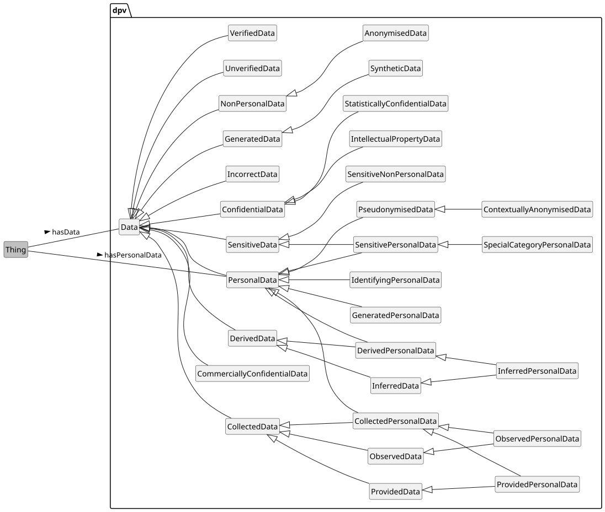 

Indicating Data and Personal Data using DPV

 

 

 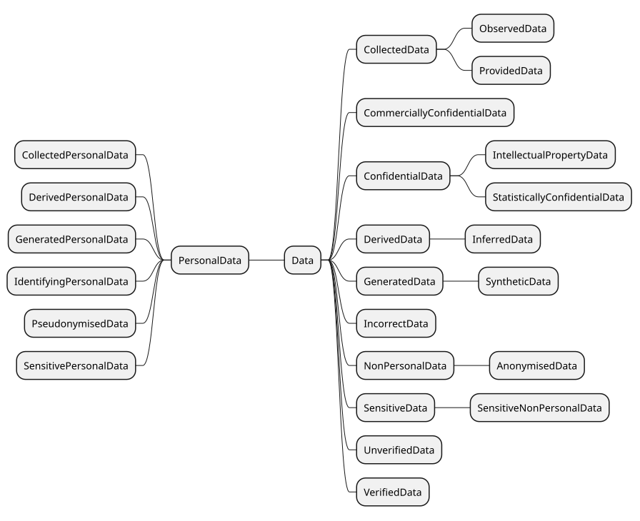 

Indicating Data and Personal Data using DPV

 

 

DPV provides the concept [=Data=] and relation [=hasData=] to indicate involvement or association of any data. The concept [=PersonalData=] and the relation [=hasPersonalData=] are provided to indicate what categories or instances of personal data are being processed. The DPV specification only provides a structure for describing personal data, e.g. as being sensitive. For specific categories of personal data for use-cases, [[[PD]]] provides additional concepts that extend the DPV's personal data taxonomy. This separation is to enable adopters to decide whether the extension's concepts are useful to them, or to use other external vocabularies, or define their own.

 

In addition to Personal Data, there may be a need to represent Non-Personal Data within the same contextual use-cases. For this, DPV provides the concepts [=NonPersonalData=] and [=SyntheticData=].

 

To indicate data categorised based on `DataSource`, e.g. as "collected personal data", DPV provides: [=CollectedPersonalData=], [=DerivedPersonalData=], [=InferredPersonalData=], [=GeneratedPersonalData=], and [=ObservedPersonalData=].

 

For indicating personal data which is sensitive, the concept [=SensitivePersonalData=] is provided. For indicating special categories of data, the concept [=SpecialCategoryPersonalData=] is provided. In this, the concept sensitive indicates that the data needs additional considerations (and perhaps caution) when processing, such as by increasing its security, reducing usage, or performing impact assessments. Special categories, by contrast, are a 'special' type of sensitive personal data requiring additional considerations or obligations defined in laws (or through other forms) that regulate how they should be used or prohibit their use until specific obligations are met.

 

To specify data is anonymised, DPV provides two concepts. [=AnonymisedData=] for when data is completely anonymised and cannot be de-anonymised, which is a subtype of [=NonPersonalData=]. And, [=PseudonymisedData=] for when data has only been partially anonymised or de-anonymisation is possible, which is a subtype of [=PersonalData=].

 

DPV defines the following concepts for expressing information about data:

 


 

-  dpv:CollectedData: Data that has been obtained by collecting it from a source [go to full definition](https://w3id.org/dpv#CollectedData) 

 

  -  dpv:CollectedPersonalData: Personal Data that has been collected from another source such as the Data Subject [go to full definition](https://w3id.org/dpv#CollectedPersonalData) 

 

    -  dpv:ObservedPersonalData: Personal Data that has been collected through observation of the Data Subject(s) [go to full definition](https://w3id.org/dpv#ObservedPersonalData) 

 

    -  dpv:ProvidedPersonalData: Personal Data that has been provided by an entity such as the Data Subject [go to full definition](https://w3id.org/dpv#ProvidedPersonalData) 

 

 

 

  -  dpv:ObservedData: Data that has been obtained through observations of a source [go to full definition](https://w3id.org/dpv#ObservedData) 

 

    -  dpv:ObservedPersonalData: Personal Data that has been collected through observation of the Data Subject(s) [go to full definition](https://w3id.org/dpv#ObservedPersonalData) 

 

 

 

  -  dpv:ProvidedData: Data that has been provided by an entity [go to full definition](https://w3id.org/dpv#ProvidedData) 

 

    -  dpv:ProvidedPersonalData: Personal Data that has been provided by an entity such as the Data Subject [go to full definition](https://w3id.org/dpv#ProvidedPersonalData) 

 

 

 

 

 

-  dpv:ConfidentialData: Data deemed confidential [go to full definition](https://w3id.org/dpv#ConfidentialData) 

 

  -  dpv:CommerciallyConfidentialData: Data that is considered confidential due to business/trade secrets, confidentiality agreements, or company secrets [go to full definition](https://w3id.org/dpv#CommerciallyConfidentialData) 

 

  -  dpv:IntellectualPropertyData: Data protected by Intellectual Property rights and regulations [go to full definition](https://w3id.org/dpv#IntellectualPropertyData) 

 

  -  dpv:ProfessionalConfidentialData: Data protected by professional secrecy or confidentiality, including but not limited to data covered by professional privilege or secrecy obligations such as that covered by lawyer or doctor-patient confidentiality and other forms of recognised professional confidentiality obligations [go to full definition](https://w3id.org/dpv#ProfessionalConfidentialData) 

 

  -  dpv:StatisticallyConfidentialData: Data protected through Statistical Confidentiality regulations and agreements [go to full definition](https://w3id.org/dpv#StatisticallyConfidentialData) 

 

 

 

-  dpv:DerivedData: Data that has been obtained through derivations of other data [go to full definition](https://w3id.org/dpv#DerivedData) 

 

  -  dpv:DerivedPersonalData: Personal Data that is obtained or derived from other data [go to full definition](https://w3id.org/dpv#DerivedPersonalData) 

 

    -  dpv:InferredPersonalData: Personal Data that is obtained through inference from other data [go to full definition](https://w3id.org/dpv#InferredPersonalData) 

 

 

 

  -  dpv:InferredData: Data that has been obtained through inferences of other data [go to full definition](https://w3id.org/dpv#InferredData) 

 

    -  dpv:InferredPersonalData: Personal Data that is obtained through inference from other data [go to full definition](https://w3id.org/dpv#InferredPersonalData) 

 

 

 

 

 

-  dpv:GeneratedData: Data that is generated or brought into existence without relation to existing data i.e. it is not derived or inferred from other data [go to full definition](https://w3id.org/dpv#GeneratedData) 

 

  -  dpv:SyntheticData: Synthetic data refers to artificially created data such that it is intended to resemble real data (personal or non-personal), but does not refer to any specific identified or identifiable individual, or to the real measure of an observable parameter in the case of non-personal data [go to full definition](https://w3id.org/dpv#SyntheticData) 

 

 

 

-  dpv:IncorrectData: Data that is known to be incorrect or inconsistent with some requirements [go to full definition](https://w3id.org/dpv#IncorrectData) 

 

-  dpv:NonPersonalData: Data that is not Personal Data [go to full definition](https://w3id.org/dpv#NonPersonalData) 

 

  -  dpv:AnonymisedData: Personal Data that has been (fully and completely) anonymised so that it is no longer considered Personal Data [go to full definition](https://w3id.org/dpv#AnonymisedData) 

 

 

 

-  dpv:PersonalData: Data directly or indirectly associated or related to an individual [go to full definition](https://w3id.org/dpv#PersonalData) 

 

  -  dpv:CollectedPersonalData: Personal Data that has been collected from another source such as the Data Subject [go to full definition](https://w3id.org/dpv#CollectedPersonalData) 

 

    -  dpv:ObservedPersonalData: Personal Data that has been collected through observation of the Data Subject(s) [go to full definition](https://w3id.org/dpv#ObservedPersonalData) 

 

    -  dpv:ProvidedPersonalData: Personal Data that has been provided by an entity such as the Data Subject [go to full definition](https://w3id.org/dpv#ProvidedPersonalData) 

 

 

 

  -  dpv:DerivedPersonalData: Personal Data that is obtained or derived from other data [go to full definition](https://w3id.org/dpv#DerivedPersonalData) 

 

    -  dpv:InferredPersonalData: Personal Data that is obtained through inference from other data [go to full definition](https://w3id.org/dpv#InferredPersonalData) 

 

 

 

  -  dpv:GeneratedPersonalData: Personal Data that is generated or brought into existence without relation to existing data i.e. it is not derived or inferred from other data [go to full definition](https://w3id.org/dpv#GeneratedPersonalData) 

 

  -  dpv:IdentifyingPersonalData: Personal Data that explicitly and by itself is sufficient to identify a person [go to full definition](https://w3id.org/dpv#IdentifyingPersonalData) 

 

  -  dpv:PseudonymisedData: Pseudonymised Data is data that has gone a partial or incomplete anonymisation process by replacing the identifiable information with artificial identifiers or 'pseudonyms', and is still considered as personal data [go to full definition](https://w3id.org/dpv#PseudonymisedData) 

 

    -  dpv:ContextuallyAnonymisedData: Data that can be considered as being fully anonymised within the context but in actuality is not fully anonymised and is still personal data as it can be de-anonymised outside that context [go to full definition](https://w3id.org/dpv#ContextuallyAnonymisedData) 

 

 

 

  -  dpv:SensitivePersonalData: Personal data that is considered 'sensitive' in terms of privacy and/or impact, and therefore requires additional considerations and/or protection [go to full definition](https://w3id.org/dpv#SensitivePersonalData) 

 

    -  dpv:SpecialCategoryPersonalData: Sensitive Personal Data whose use requires specific additional legal permission or justification [go to full definition](https://w3id.org/dpv#SpecialCategoryPersonalData) 

 

 

 

 

 

-  dpv:SensitiveData: Data deemed sensitive [go to full definition](https://w3id.org/dpv#SensitiveData) 

 

  -  dpv:SensitiveNonPersonalData: Non-personal data deemed sensitive [go to full definition](https://w3id.org/dpv#SensitiveNonPersonalData) 

 

  -  dpv:SensitivePersonalData: Personal data that is considered 'sensitive' in terms of privacy and/or impact, and therefore requires additional considerations and/or protection [go to full definition](https://w3id.org/dpv#SensitivePersonalData) 

 

    -  dpv:SpecialCategoryPersonalData: Sensitive Personal Data whose use requires specific additional legal permission or justification [go to full definition](https://w3id.org/dpv#SpecialCategoryPersonalData) 

 

 

 

 

 

-  dpv:UncategorisedData: Data whose categorisation is not known e.g. whether it is personal or non-personal data [go to full definition](https://w3id.org/dpv#UncategorisedData) 

 

-  dpv:UnstructuredData: Data that is without a predefined data model or is not organised in a pre-defined manner [go to full definition](https://w3id.org/dpv#UnstructuredData) 

 

-  dpv:UnverifiedData: Data that has not been verified in terms of accuracy, inconsistency, or quality [go to full definition](https://w3id.org/dpv#UnverifiedData) 

 

-  dpv:VerifiedData: Data that has been verified in terms of accuracy, consistency, or quality [go to full definition](https://w3id.org/dpv#VerifiedData) 

 


 

 
<a id="personal_data-personal-data"></a>

<a id="personal_data-L911"></a>
## Personal Data
 

The [[[PD]]] extension provides a taxonomy of personal data categories to represent commonly used categories such as 'Email Address' and 'Birth Date'. These concepts are organised in a hierarchical taxonomy where the super/parent concept is a broader form of the sub/child concept, and where these concepts act as sets i.e. everything in the sub/child concept is present in the super/parent concept. For example, consider the concept 'Email' - it can refer to email addresses, actual emails, metadata or attachments associated with emails, and so on. To distinguish between these, the 'Email' concept must be further 'extended' or 'refined' with subclass or child concepts such as 'Email Address', 'Email Contents', etc. The [[PD]] taxonomy categories are modelled with such interpretations in mind. This helps align the use of DPV with practical use-cases where such ambiguous use of terms can be identified and rectified by choosing a more specific concept from the taxonomy (e.g. Email Address instead of Email above).

 

The relation [=hasPersonalData=] can be used to indicate both the category and instance of personal data. For example, to indicate the personal data being collected is of category 'Email Address', or to specify a particular email address. We recommend using `rdf:value` to represent such 'values' of personal data associated with a category. Alternatively, other vocabularies such as [[FOAF]] or [[schema-org]] can also be used to further specify the contents of personal data. Through we strongly recommend always using a DPV concept and a [[PD]] taxonomy concept for interoperability.

 

 

Real-world and common usage of personal data is at both an abstract level as well as specific level. For example, consider the sentence "We use your Email information...", which uses "Email" to represent a reference to what personal data is involved. Here, one may interpret Email as representing only the email address, or as a broad set of possible information related to emails, such as email address, email senders and recipients list, email service provider, email usage statistics and so on.

 

For ensuring clarity and resolving any potential ambiguity, DPV recommends being as specific as possible. This means where there is ambiguity as to what the information may be associated with or within a concept, it is advisable to resolve that ambiguity - either by choosing a more accurate concept from the taxonomy and/or by creating one through extension of an existing concept.

 

 

 

In addition to above, it is also challenging to accurately represent how concepts function within real-world use in terms of their encapsulation within one another. For example, when establishing the DPV, we discussed the modelling of personal data categories based on the scenario where a picture of passport is initially collected, and from it various categories are extracted, such as - name, address, and photo. For representing this, merely stating the personal data as ‘passport photograph’ would not be entirely accurate as there is additional information within the photograph.

 

A solution was established whereby the use-case is expected to declare explicitly what information it intends to collect or use with sufficient details and clarity. For the passport photograph scenario, the use-case would use the concept `PassportPhoto` as the data it collects, and indicate that it extracts or derives `Name` and `Age` from it. Or, it directly declares that it collects all three concepts. This is necessary to ensure the interpretation that using `PassportPhoto` means having access to and using all of its subsequent personal data categories.

 

While this is one possible solution, other methods exist, such as explicitly declaring the data categories and their encapsulation within one another, such as by reusing `hasPersonalData` or creating additional properties (e.g. `containsData`) to indicate a personal data concept, i.e. the passport photo, contains information associated through the relation, i.e. name, age, etc. We welcome discussions regarding both these methods.

 

  

This example shows how personal data can be specified by for a work email address in four methods: (1) by using the PD taxonomy, (2) extending a concept from PD taxonomy,(3) specifying the exact value of email address, and (4) using external vocabularies such as schema.org. In all of these, it is strongly recommended to include a DPV concept (i.e. declare it as Personal Data) for interoperability, and to align it with the DPV and PD taxonomies where relevant (e.g. to mention it is an email address, or to specify it is identifier, or that it is sensitive - which it is not in this case) 


```
ex:PDH a dpv:Process ;
    # method 1: directly use concept from PD
    dpv:hasPersonalData pd:EmailAddress ;
    # method 2: extend concept from PD
    dpv:hasPersonalData [
        a dpv:PersonalData ;
        skos:broader pd:EmailAddress ;
        skos:prefLabel "Work Email"@en ;
    ] ;
    # method 3: specify an exact value i.e. an instance
    dpv:hasPersonalData [
        a dpv:PersonalData, pd:EmailAddress ;
        rdf:value "work@example.com" ;
    ] ;
    # method 4: use another appropriate vocabulary e.g. schema.org
    dpv:hasPersonalData [
        a schema:ContactPoint ;
        a dpv:PersonalData ; # strongly recommended for interop
        a pd:EmailAddress ; # strongly recommended for interop
        schema:email "work@example.com" ;
    ] ;
    # Note: Email Address can be an identifier
    # So good practice is to also declare it when used as an identifier
    dpv:hasPersonalData [
        a dpv:PersonalData ;
        skos:broader pd:EmailAddress, pd:Identifier ;
    ] ;
    dpv:hasPersonalData [
        a dpv:PersonalData, pd:EmailAddress, pd:Identifier ;
        rdf:value "work@example.com" ;
    ] .
```


 

(META Example ID: [`E0044`](https://w3id.org/dpv/examples#E0044); link: [source file](https://w3id.org/dpv/examples/E0044.ttl); contributed by Harshvardhan J. Pandit on 2024-06-11) 

 

 

 
<a id="personal_data-sensitive-special-data"></a>

<a id="personal_data-L966"></a>
## Sensitive & Special Data
 

Some personal data categories are sensitive. To indicate this, the concept [=SensitivePersonalData=] is used. It is important to recognise and document data when it is sensitive as it can require additional considerations such as enhanced technical and organisational measures, and appropriate privacy and data protection impact assessments.

 

 

DPV currently categorises personal data as sensitive based on existing research and literature, and as special categories based on [[GDPR]] Article 9. Both are subject to expansion in the future based on requirements and technological progress, and we welcome well-formed proposals for the same.

 

 

[=SpecialCategoryPersonalData=] represents those sensitive categories which are regulated by law i.e. their use is regulated and requires additional considerations and obligations, such as under [[GDPR]] Article 9 which prohibits their use unless specific conditions are met, and also requires conducting a data protection impact assessment (DPIA) for certain cases where they are involved.

 

The PD taxonomy uses the GDPR Article 9 definition to denote specific concepts as belonging to special categories of personal data, and due to the way the taxonomy is hierarchical in nature, all concepts extending such concepts are also considered (sensitive and) special categories. For example, `Biometric` is a special category, which is further extended as `FacialPrint` - which is also considered as a special category due to being biometric data.

 

 

PII (Personally Identifiable Information) and Sensitivity of data are common concepts in relation to use of personal data. PII is a term with variable definitions depending on the particular interpretation of personal and identifiable. While ISO standards define PII as a concept closer to the personal data definition within DPV, this term can still result in confusion and ambiguity. DPV therefore defines `IdentifyingPersonalData`

 to explicitly denote that some data 'identifies' a person. 

DPV provides the `SensitivePersonalData` concept, and to indicate the degree of sensitivity, we recommend using the `SensitivityLevel` concept and associate it with `hasSensitivityLevel`.

 

 

The sensitivity of personal data can be universal, where that data is always sensitive, or contextual, which means a use-case needs to declare it as such. For indicating personal data is sensitive (or special), it is sub-typed or declared as an instance of `SensitivePersonalData`, as shown in the example below.

 

In using these concepts, it is important to note that DPV's modelling of sensitive and special categories is non-exhaustive and as such should not be taken as an authoritative fact or a 'source of truth'. To assist with better identifying sensitive concepts, work is ongoing within DPV to identify and provide a reference list of (potentially) sensitive and special categories, and we welcome contributions for the same.

  

The DPVCG welcome discussions and contributions to further expand the sensitive and special data taxonomies in DPV e.g. by identifying existing concepts that are sensitive or special categories, or by providing new concepts which are sensitive or special or both.

   

In a medical study involving genetic data, the person's collected blood samples are considered to be 'special category' personal data under the GDPR. In addition to this, the person's identifier associated with that dataset to enable monitoring future appointments is considered sensitive within the medical centre. Note that the examples use the [[PD]] extension to represent some concepts.

 

In this example, the knowledge that blood samples are of type 'special category' can be inferred from the fact that they are a form of Medical Health which is a 'special category'. However, the example considers best practices that suggest explicitly identifying and denoting that blood samples are also of type 'special category'.

 


```
ex:PatientStudy rdf:type dpv:Process ;
  dpv:hasPersonalData ex:BloodSamples, ex:PatientIdentifier .

ex:BloodSamples rdf:type dpv:SpecialCategoryPersonalData ;
  skos:broader pd:MedicalHealth ;
  skos:narrower pd:BloodType .

ex:PatientIdentifier rdf:type dpv:SensitivePersonalData ;
  skos:broader pd:Identifying .
```


 

(META Example ID: [`E0010`](https://w3id.org/dpv/examples#E0010); link: [source file](https://w3id.org/dpv/examples/E0010.ttl); contributed by Harshvardhan J. Pandit on 2024-06-10) 

   

This example shows how data can be indicated as being sensitive or belonging to special category. It also shows the use of PD extension which provides a taxonomy of special categories. 


```
ex:PDH a dpv:Process ;
    # to denote location being used is sensitive
    dpv:hasPersonalData [
        a dpv:SensitivePersonalData, pd:Location ;
    ];
    # to express biometrics being used are special category
    # note: PD extension already defines Biometric as special category
    dpv:hasPersonalData [
        a dpv:SpecialCategoryPersonalData ;
        skos:broader pd:Biometric ;
    ] ;
    # to use PD extension to infer use of FacialPrint is special category
    # i.e. pd:FacialPrint rdf:type dpv:SpecialCategoryPersonalData is 
    # defined in PD extension
    dpv:hasPersonalData pd:FacialPrint .
    # The PD extension can also be used to determine what biometric data
    # is being used within the use-case as it contains:
    # pd:FacialPrint skos:broader pd:Biometric
```


 

(META Example ID: [`E0045`](https://w3id.org/dpv/examples#E0045); link: [source file](https://w3id.org/dpv/examples/E0045.ttl); contributed by Harshvardhan J. Pandit on 2024-06-11) 

 

 

 
<a id="personal_data-anonymised-data"></a>

<a id="personal_data-L1031"></a>
## Anonymised Data
 

[=AnonymisedData=] refers to anonymisation, which is a data de-identification technique whereby any information which can be used to identify the individual, either by itself or in combination with other information - which may be present in the same dataset or outside it, is removed to prevent any possibility of attributing the data to the person it is about. From this, it is clear that the bar for 'true' or 'effective' anonymisation is very high. Anonymised data is no longer considered personal data, and is therefore non-personal data.

 

To specify data is anonymised, DPV provides two concepts. `AnonymisedData` for when data is completely anonymised and cannot be de-anonymised, which is a subtype of `NonPersonalData`. And, `PseudonymisedData` for when data has only been partially anonymised or de-anonymisation is possible, which is a subtype of `PersonalData`.

 

When data undergoes a partial anonymisation process i.e. it is not completely anonymised, and there is a possibility of re-identification, but it is unlikely for this to happen within the use-case, and where the use-case wishes to treat such data as 'contextually anonymised', the concept [=ContextuallyAnonymisedData=] is provided. Transferring such data outside the context results in the data no longer being anonymous, and it must be treated as personal data.

 

[=PseudonymisedData=] is data that has gone a partial or incomplete anonymisation process by replacing the identifiable information with artificial identifiers or 'pseudonyms'. Using such pseudonyms (e.g. IP addresses or fingerprinting techniques) does not render the data anonymous, and it still remains personal data as long as re-identification or association with an individual is possible.

  

It is advised to carefully consider before using [=AnonymisedData=] for indicating data is fully or completely anonymised by determining whether the data by itself or in combination with other data can identify a person. If the identifiers in the data have been replaced with other identifiers, then the data should be denoted as [=PseudonymisedData=]. To indicate data is anonymised only for a specified entity (e.g. within an organisation) or context (e.g. within a particular dataset), the concept [=ContextuallyAnonymisedData=] (as subclass of [=PseudonymisedData=]) should be used instead of [=AnonymisedData=]. 

  

It is important to note that these definitions can be contextually difficult to apply or interpret. For example, consider the case where some data is indicated as being anonymised by itself without any available information to de-anonymise it. Though this can be considered as anonymised data, if there were to exist an external method or dataset that when combined with the anonymised dataset provides de-anonymised information - then this does not fit the definition of anonymised data.

 

Therefore, when indicating AnonymisedData, the understanding is that it is completely anonymised. Otherwise, given that regulations targeting PersonalData do not apply over anonymised data, the labelling of anonymised or contextually anonymised data may lead to misleading representation and violating obligations.

 
<a id="personal_data-nonpersonal-synthetic-data"></a>

<a id="personal_data-L1042"></a>
#### Non-Personal and Synthetic Data
 

While the focus of DPV is on Personal Data, there may be a need to represent Non-Personal Data within the same contextual use-cases. For example, if the personal data has been fully, completely, and irreversibly anonymised, then it can no longer be said to be personal data. To enable this, and other representations, DPV provides the concept `Data` to represent any data, with subtypes `PersonalData` and `NonPersonalData`. Using these as annotations can assist in clearly indicating which data should be protected, or protected with more severe measures, or to determine the scope of regulations which only apply over operations involving personal data.

 

`Data` is further subtyped as `SyntheticData` - a new concept that represents generated data intended to mimic personal data within a system so as to aid in development and testing without using actual or real personal data. Since such synthetic data may be used in systems that assume it is personal data, it has not been declared as a specific category of personal or non-personal data to permit its use as either.

 

 

 
<a id="personal_data-data-source"></a>

<a id="personal_data-L1049"></a>
## Data Categorised by Source
 

To specify data in terms of how it was sourced or generated, various concepts are provided that correspond to the processing operations such as collect, derive, infer, observe, generate, and so on. This allows annotating data or indicating how the data was obtained.

 

[=CollectedPersonalData=] denotes the data was collected (from another entity), and [=ProvidedPersonalData=] indicates the data was provided by another entity i.e. the other entity knowingly provided this data for collection. For example, a data subject filling out a form to provide data is an example of provided personal data, whereas observation of individuals via CCTV is collected but not provided personal data.

 

[=DerivedPersonalData=] refers to data being derived from another (existing) data - where such data was already present in some form. For example, taking a photograph of a passport and extracting the relevant names and dates from it is considered 'derived data' as the data was already present in the photograph. Where data being derived does not exist i.e. it is 'inferred', the concept [=InferredPersonalData=] should be used. For example, if the passport photograph was used in some way to create a risk score for the individual by the immigration office, then such data is considered to be an 'inference' as it was not already present and has been inferred through some algorithmic process.

  

The distinction between derivation and inference is crucial and it is important to understand that they refer to the way the data is produced rather than what it represents. This distinction is especially important to distinguish where technology is producing inferences rather than derivations - for example emotion recognition or personality determination are inferences and not derivations despite such emotions and personalities actually existing (in the person).

  

These concepts are analogous to their processing counterparts, as well as helpful in indicating the source of data i.e. the data source concepts. They are helpful to 'tag' or 'annotate' data, such as in databases or other systems, to indicate or categorise which data has been collected, or derived, or inferred. They can also be used to check or verify the information documented about processing and data sources is accurate and up to date.

  

This example shows a process which first collects email address from the data subject, and then uses it to derive an account identifier. The seeming duplication in information across processing, personal data category, and data source actually represents three distinct concepts - which can be used in various ways for data governance, or legal compliance e.g. to retrieve all data which is collected or to ensure all collected data has a source. 


```
ex:PDH a dpv:Process ;
    dpv:hasProcess [
        a dpv:Process ; 
        # Collects email addresses from data subjects
        # The statements about processing, data category, and data source
        # are aligned but represent different concepts
        dpv:hasProcessing dpv:Collect ;
        dpv:hasPersonalData [ 
            a dpv:PersonalData ;
            a dpv:ProvidedPersonalData ;
            skos:broader pd:EmailAddress ;
        ] ;
        dpv:hasDataSource dpv:DataSubjectDataSource ;
    ] ;
    dpv:hasProcess [
        a dpv:Process ;
        # The existing email address is used to derive an account id
        # (not mentioned here, but occurs in the same broader process)
        # e.g. by using a MD5 hash technique (not mentioned here)
        dpv:hasProcessing dpv:Derive;
        dpv:hasPersonalData [
            a dpv:PersonalData ;
            a dpv:DerivedPersonalData ;
            skos:broader pd:AccountIdentifier ;
        ] ;
    ] .
```


 

(META Example ID: [`E0046`](https://w3id.org/dpv/examples#E0046); link: [source file](https://w3id.org/dpv/examples/E0046.ttl); contributed by Harshvardhan J. Pandit on 2024-06-11) 

 

 

 
<a id="personal_data-data-verified"></a>

<a id="personal_data-L1095"></a>
## Verified/Unverified Data
 

Data may need to be verified based on criteria such as originality, authenticity, and quality. To indicate data that has been verified, the concept [=VerifiedData=] is provided. Further subclasses or taxonomies can be created to represent the specific verifications carried out. To indicate data that has not been verified, the concept [=UnverifiedData=] is provided.

  

In accordance with ISO 9000, verification refers to the assessment of whether data meets specific requirements or criteria, and validation refers to whether the data suits or meets the requirements of the intended use. For example, data obtained from a source will need to be verified to be authentic based on a checklist of criteria. The data to be obtained has been validated as being necessary for the intended purposes.

   

To indicate different kinds of verifications and the associated data, e.g. data that has been authenticated, or which has been assured to be true, specific subclasses should be created to represent these. Similarly, to represent the data in intermediate states of workflow in the verification process, e.g. Submitted (unverified) to partially verified (some fields) to (completely) Verified, further subclasses of Verified and Unverified should be developed. The DPVCG welcomes proposals for adding such concepts to the DPV.

  

 
<a id="personal_data-data-unstructured-uncategorised"></a>

<a id="personal_data-L1106"></a>
## Unstructured & Uncategorised Data
 

The concept [=UnstructuredData=] represents data whose 'structure' or 'model' is unknown. Such data represents a risk of containing personal data or sensitive data, and therefore must be flagged to investigate further. Unstructured data also represents a potential data quality issue as knowledge about its contents is not known, and can contain irregularities and ambiguities which may affect its use. An example of unstructured data is a text-heavy document whose contents are not precisely know. The property [=hasUnstructuredData=] is provided to signal such use of unstructured data. 

 

The concept [=UncategorisedData=] represents data whose 'category' is not known based on some legally relevant categorisation, such as whether it is personal data or not is unknown. This has a direct bearing on legal compliance and identification/fulfilment of obligations, and therefore flagging such data allows further investigation as to their contents. The concepts for unstructured and uncategorised data share an overlap in this regard. Their primary distinguishing factor is that the categorisation of data refers to identifying or labelling data whereas structure refers to understanding the underlying structure (if present) or exploring its contents. In typical workflows, the structure may be determined first, followed by categorisation based on specific criteria - such as the inclusion of personal data mentioned earlier. The property [=hasUncategorisedData=] is provided to indicate association with uncategorised data.

 

For both [=hasUnstructuredData=] and [=hasUncategorisedData=], it is recommended to utilise an instance of [=UnstructuredData=] and [=UncategorisedData=] respectively rather than something like `xsd:true` (a boolean) to enable further distinctions based on context (e.g. kinds of structures, or source of information), as well as to attach annotations such as audit information.

<a id="personal_data-L1113"></a>
## Vocabulary Index
 
<a id="personal_data-classes"></a>

<a id="personal_data-L1115"></a>
### Classes
 
<a id="personal_data-AnonymisedData"></a>

<a id="personal_data-L1116"></a>
#### Anonymised Data
 

- Term | AnonymisedData | Prefix | dpv
- Label | Anonymised Data
- IRI | [https://w3id.org/dpv#AnonymisedData](https://w3id.org/dpv#AnonymisedData)
- Type | [rdfs:Class](http://www.w3.org/2000/01/rdf-schema#Class), [skos:Concept](http://www.w3.org/2004/02/skos/core#Concept)
- Broader/Parent types | [dpv:NonPersonalData](#personal_data-NonPersonalData) → [dpv:Data](#personal_data-Data)
- Object of relation | [dpv:hasData](https://w3id.org/dpv#hasData)
- Definition | Personal Data that has been (fully and completely) anonymised so that it is no longer considered Personal Data
- Usage Note | It is advised to carefully consider indicating data is fully or completely anonymised by determining whether the data by itself or in combination with other data can identify a person. Failing this condition, the data should be denoted as PseudonymisedData. To indicate data is anonymised only for a specified entity (e.g. within an organisation), the concept ContextuallyAnonymisedData (as subclass of PseudonymisedData) should be used instead of AnonymisedData.
- Date Created | 2022-01-19
- Contributors | Piero Bonatti
- See More: | section [PERSONAL-DATA](#personal_data-vocab-personal-data) in [DPV](https://w3id.org/dpv#)

 

 
<a id="personal_data-CollectedData"></a>

<a id="personal_data-L1195"></a>
#### Collected Data
 

- Term | CollectedData | Prefix | dpv
- Label | Collected Data
- IRI | [https://w3id.org/dpv#CollectedData](https://w3id.org/dpv#CollectedData)
- Type | [rdfs:Class](http://www.w3.org/2000/01/rdf-schema#Class), [skos:Concept](http://www.w3.org/2004/02/skos/core#Concept)
- Broader/Parent types | [dpv:Data](#personal_data-Data)
- Object of relation | [dpv:hasData](https://w3id.org/dpv#hasData)
- Definition | Data that has been obtained by collecting it from a source
- Date Created | 2023-12-10
- See More: | section [PERSONAL-DATA](#personal_data-vocab-personal-data) in [DPV](https://w3id.org/dpv#)

 

 
<a id="personal_data-CollectedPersonalData"></a>

<a id="personal_data-L1267"></a>
#### Collected Personal Data
 

- Term | CollectedPersonalData | Prefix | dpv
- Label | Collected Personal Data
- IRI | [https://w3id.org/dpv#CollectedPersonalData](https://w3id.org/dpv#CollectedPersonalData)
- Type | [rdfs:Class](http://www.w3.org/2000/01/rdf-schema#Class), [skos:Concept](http://www.w3.org/2004/02/skos/core#Concept)
- Broader/Parent types | [dpv:CollectedData](#personal_data-CollectedData) → [dpv:Data](#personal_data-Data)
- Broader/Parent types | [dpv:PersonalData](#personal_data-PersonalData) → [dpv:Data](#personal_data-Data)
- Object of relation | [dpv:hasData](https://w3id.org/dpv#hasData), [dpv:hasPersonalData](https://w3id.org/dpv#hasPersonalData)
- Definition | Personal Data that has been collected from another source such as the Data Subject
- Usage Note | To indicate the source of data, use the DataSource concept with the hasDataSource relation
- Examples | [`dex:E0046 :: ` Indicating data being collected and derived](https://w3id.org/dpv/examples#E0046)
- Date Created | 2022-03-30
- Date Modified | 2023-12-10
- Contributors | Harshvardhan J. Pandit
- See More: | section [PERSONAL-DATA](#personal_data-vocab-personal-data) in [DEX](https://w3id.org/dpv#)

 

 
<a id="personal_data-CommerciallyConfidentialData"></a>

<a id="personal_data-L1357"></a>
#### Commercially Confidential Data
 

- Term | CommerciallyConfidentialData | Prefix | dpv
- Label | Commercially Confidential Data
- IRI | [https://w3id.org/dpv#CommerciallyConfidentialData](https://w3id.org/dpv#CommerciallyConfidentialData)
- Type | [rdfs:Class](http://www.w3.org/2000/01/rdf-schema#Class), [skos:Concept](http://www.w3.org/2004/02/skos/core#Concept)
- Broader/Parent types | [dpv:ConfidentialData](#personal_data-ConfidentialData) → [dpv:Data](#personal_data-Data)
- Object of relation | [dpv:hasData](https://w3id.org/dpv#hasData)
- Definition | Data that is considered confidential due to business/trade secrets, confidentiality agreements, or company secrets
- Source | DGA 6.5(c)
- Date Created | 2024-02-14
- Date Modified | 2025-05-30
- Contributors | Beatriz Esteves, Danielle Welter, Harshvardhan J. Pandit
- See More: | section [PERSONAL-DATA](#personal_data-vocab-personal-data) in [DPV](https://w3id.org/dpv#)

 

 
<a id="personal_data-ConfidentialData"></a>

<a id="personal_data-L1439"></a>
#### Confidential Data
 

- Term | ConfidentialData | Prefix | dpv
- Label | Confidential Data
- IRI | [https://w3id.org/dpv#ConfidentialData](https://w3id.org/dpv#ConfidentialData)
- Type | [rdfs:Class](http://www.w3.org/2000/01/rdf-schema#Class), [skos:Concept](http://www.w3.org/2004/02/skos/core#Concept)
- Broader/Parent types | [dpv:Data](#personal_data-Data)
- Object of relation | [dpv:hasData](https://w3id.org/dpv#hasData)
- Definition | Data deemed confidential
- Source | DGA 5.10
- Date Created | 2024-02-14
- Contributors | Beatriz Esteves, Harshvardhan J. Pandit
- See More: | section [PERSONAL-DATA](#personal_data-vocab-personal-data) in [DPV](https://w3id.org/dpv#)

 

 
<a id="personal_data-ContextuallyAnonymisedData"></a>

<a id="personal_data-L1517"></a>
#### Contextually Anonymised Data
 

- Term | ContextuallyAnonymisedData | Prefix | dpv
- Label | Contextually Anonymised Data
- IRI | [https://w3id.org/dpv#ContextuallyAnonymisedData](https://w3id.org/dpv#ContextuallyAnonymisedData)
- Type | [rdfs:Class](http://www.w3.org/2000/01/rdf-schema#Class), [skos:Concept](http://www.w3.org/2004/02/skos/core#Concept)
- Broader/Parent types | [dpv:PseudonymisedData](#personal_data-PseudonymisedData) → [dpv:PersonalData](#personal_data-PersonalData) → [dpv:Data](#personal_data-Data)
- Object of relation | [dpv:hasData](https://w3id.org/dpv#hasData), [dpv:hasPersonalData](https://w3id.org/dpv#hasPersonalData)
- Definition | Data that can be considered as being fully anonymised within the context but in actuality is not fully anonymised and is still personal data as it can be de-anonymised outside that context
- Usage Note | To distinguish between partially anonymised data that can be effectively treated as anonymised data (e.g. in processing) within a context (e.g. an organisation), the concept ContextuallyAnonymisedData should be used instead of AnonymisedData. Transfer of this data outside of the context should consider that it is not fully anonymised and that it is still personal data
- Date Created | 2024-06-11
- Contributors | Harshvardhan J. Pandit
- See More: | section [PERSONAL-DATA](#personal_data-vocab-personal-data) in [DPV](https://w3id.org/dpv#)

 

 
<a id="personal_data-Data"></a>

<a id="personal_data-L1598"></a>
#### Data
 

- Term | Data | Prefix | dpv
- Label | Data
- IRI | [https://w3id.org/dpv#Data](https://w3id.org/dpv#Data)
- Type | [rdfs:Class](http://www.w3.org/2000/01/rdf-schema#Class), [skos:Concept](http://www.w3.org/2004/02/skos/core#Concept)
- Object of relation | [dpv:hasData](https://w3id.org/dpv#hasData)
- Definition | A broad concept representing 'data' or 'information'
- Date Created | 2022-01-19
- Contributors | Harshvardhan J. Pandit
- See More: | section [PERSONAL-DATA](#personal_data-vocab-personal-data) in [DPV](https://w3id.org/dpv#)

 

 
<a id="personal_data-DerivedData"></a>

<a id="personal_data-L1670"></a>
#### Derived Data
 

- Term | DerivedData | Prefix | dpv
- Label | Derived Data
- IRI | [https://w3id.org/dpv#DerivedData](https://w3id.org/dpv#DerivedData)
- Type | [rdfs:Class](http://www.w3.org/2000/01/rdf-schema#Class), [skos:Concept](http://www.w3.org/2004/02/skos/core#Concept)
- Broader/Parent types | [dpv:Data](#personal_data-Data)
- Object of relation | [dpv:hasData](https://w3id.org/dpv#hasData)
- Definition | Data that has been obtained through derivations of other data
- Date Created | 2023-12-10
- See More: | section [PERSONAL-DATA](#personal_data-vocab-personal-data) in [DPV](https://w3id.org/dpv#)

 

 
<a id="personal_data-DerivedPersonalData"></a>

<a id="personal_data-L1742"></a>
#### Derived Personal Data
 

- Term | DerivedPersonalData | Prefix | dpv
- Label | Derived Personal Data
- IRI | [https://w3id.org/dpv#DerivedPersonalData](https://w3id.org/dpv#DerivedPersonalData)
- Type | [rdfs:Class](http://www.w3.org/2000/01/rdf-schema#Class), [skos:Concept](http://www.w3.org/2004/02/skos/core#Concept)
- Broader/Parent types | [dpv:DerivedData](#personal_data-DerivedData) → [dpv:Data](#personal_data-Data)
- Broader/Parent types | [dpv:PersonalData](#personal_data-PersonalData) → [dpv:Data](#personal_data-Data)
- Object of relation | [dpv:hasData](https://w3id.org/dpv#hasData), [dpv:hasPersonalData](https://w3id.org/dpv#hasPersonalData)
- Definition | Personal Data that is obtained or derived from other data
- Usage Note | Derived Data is data that is obtained through processing of existing data, e.g. deriving first name from full name. To indicate data that is derived but which was not present or evident within the source data, InferredPersonalData should be used.
- Examples | [`dex:E0009 :: ` Derivation and inference of personal data](https://w3id.org/dpv/examples#E0009)
 [`dex:E0046 :: ` Indicating data being collected and derived](https://w3id.org/dpv/examples#E0046)
- Source | [DPVCG](https://www.w3.org/community/dpvcg/)
- Related | [svd:Derived](https://specialprivacy.ercim.eu/vocabs/data#Derived)
- Date Created | 2019-05-07
- Date Modified | 2023-12-10
- Contributors | Elmar Kiesling, Fajar Ekaputra, Harshvardhan J. Pandit
- See More: | section [PERSONAL-DATA](#personal_data-vocab-personal-data) in [DEX](https://w3id.org/dpv#)

 

 
<a id="personal_data-GeneratedData"></a>

<a id="personal_data-L1839"></a>
#### Generated Data
 

- Term | GeneratedData | Prefix | dpv
- Label | Generated Data
- IRI | [https://w3id.org/dpv#GeneratedData](https://w3id.org/dpv#GeneratedData)
- Type | [rdfs:Class](http://www.w3.org/2000/01/rdf-schema#Class), [skos:Concept](http://www.w3.org/2004/02/skos/core#Concept)
- Broader/Parent types | [dpv:Data](#personal_data-Data)
- Object of relation | [dpv:hasData](https://w3id.org/dpv#hasData)
- Definition | Data that is generated or brought into existence without relation to existing data i.e. it is not derived or inferred from other data
- Date Created | 2023-12-10
- See More: | section [PERSONAL-DATA](#personal_data-vocab-personal-data) in [DPV](https://w3id.org/dpv#)

 

 
<a id="personal_data-GeneratedPersonalData"></a>

<a id="personal_data-L1911"></a>
#### Generated Personal Data
 

- Term | GeneratedPersonalData | Prefix | dpv
- Label | Generated Personal Data
- IRI | [https://w3id.org/dpv#GeneratedPersonalData](https://w3id.org/dpv#GeneratedPersonalData)
- Type | [rdfs:Class](http://www.w3.org/2000/01/rdf-schema#Class), [skos:Concept](http://www.w3.org/2004/02/skos/core#Concept)
- Broader/Parent types | [dpv:PersonalData](#personal_data-PersonalData) → [dpv:Data](#personal_data-Data)
- Object of relation | [dpv:hasData](https://w3id.org/dpv#hasData), [dpv:hasPersonalData](https://w3id.org/dpv#hasPersonalData)
- Definition | Personal Data that is generated or brought into existence without relation to existing data i.e. it is not derived or inferred from other data
- Usage Note | Generated Data is used to indicate data that is produced and is not derived or inferred from other data
- Date Created | 2022-03-30
- Date Modified | 2023-12-10
- Contributors | Harshvardhan J. Pandit
- See More: | section [PERSONAL-DATA](#personal_data-vocab-personal-data) in [DPV](https://w3id.org/dpv#)

 

 
<a id="personal_data-IdentifyingPersonalData"></a>

<a id="personal_data-L1994"></a>
#### Identifying Personal Data
 

- Term | IdentifyingPersonalData | Prefix | dpv
- Label | Identifying Personal Data
- IRI | [https://w3id.org/dpv#IdentifyingPersonalData](https://w3id.org/dpv#IdentifyingPersonalData)
- Type | [rdfs:Class](http://www.w3.org/2000/01/rdf-schema#Class), [skos:Concept](http://www.w3.org/2004/02/skos/core#Concept)
- Broader/Parent types | [dpv:PersonalData](#personal_data-PersonalData) → [dpv:Data](#personal_data-Data)
- Object of relation | [dpv:hasData](https://w3id.org/dpv#hasData), [dpv:hasPersonalData](https://w3id.org/dpv#hasPersonalData)
- Definition | Personal Data that explicitly and by itself is sufficient to identify a person
- Usage Note | DPV does not use PII ('Personally Identifiable Information') as it has varying and conflicting definitions across sources. Instead the concept 'identifying personal data' is intended to provide a clear categorisation of its interpretation. Where multiple data categories can be combined to create an 'identifying' category e.g. fingerprinting, this concept represents the combined category.
- Date Created | 2024-02-14
- See More: | section [PERSONAL-DATA](#personal_data-vocab-personal-data) in [DPV](https://w3id.org/dpv#)

 

 
<a id="personal_data-IncorrectData"></a>

<a id="personal_data-L2071"></a>
#### Incorrect Data
 

- Term | IncorrectData | Prefix | dpv
- Label | Incorrect Data
- IRI | [https://w3id.org/dpv#IncorrectData](https://w3id.org/dpv#IncorrectData)
- Type | [rdfs:Class](http://www.w3.org/2000/01/rdf-schema#Class), [skos:Concept](http://www.w3.org/2004/02/skos/core#Concept)
- Broader/Parent types | [dpv:Data](#personal_data-Data)
- Object of relation | [dpv:hasData](https://w3id.org/dpv#hasData)
- Definition | Data that is known to be incorrect or inconsistent with some requirements
- Date Created | 2022-11-02
- Contributors | Harshvardhan J. Pandit
- See More: | section [PERSONAL-DATA](#personal_data-vocab-personal-data) in [DPV](https://w3id.org/dpv#)

 

 
<a id="personal_data-InferredData"></a>

<a id="personal_data-L2146"></a>
#### Inferred Data
 

- Term | InferredData | Prefix | dpv
- Label | Inferred Data
- IRI | [https://w3id.org/dpv#InferredData](https://w3id.org/dpv#InferredData)
- Type | [rdfs:Class](http://www.w3.org/2000/01/rdf-schema#Class), [skos:Concept](http://www.w3.org/2004/02/skos/core#Concept)
- Broader/Parent types | [dpv:DerivedData](#personal_data-DerivedData) → [dpv:Data](#personal_data-Data)
- Object of relation | [dpv:hasData](https://w3id.org/dpv#hasData)
- Definition | Data that has been obtained through inferences of other data
- Date Created | 2023-12-10
- See More: | section [PERSONAL-DATA](#personal_data-vocab-personal-data) in [DPV](https://w3id.org/dpv#)

 

 
<a id="personal_data-InferredPersonalData"></a>

<a id="personal_data-L2219"></a>
#### Inferred Personal Data
 

- Term | InferredPersonalData | Prefix | dpv
- Label | Inferred Personal Data
- IRI | [https://w3id.org/dpv#InferredPersonalData](https://w3id.org/dpv#InferredPersonalData)
- Type | [rdfs:Class](http://www.w3.org/2000/01/rdf-schema#Class), [skos:Concept](http://www.w3.org/2004/02/skos/core#Concept)
- Broader/Parent types | [dpv:DerivedPersonalData](#personal_data-DerivedPersonalData) → [dpv:DerivedData](#personal_data-DerivedData) → [dpv:Data](#personal_data-Data)
- Broader/Parent types | [dpv:DerivedPersonalData](#personal_data-DerivedPersonalData) → [dpv:PersonalData](#personal_data-PersonalData) → [dpv:Data](#personal_data-Data)
- Broader/Parent types | [dpv:InferredData](#personal_data-InferredData) → [dpv:DerivedData](#personal_data-DerivedData) → [dpv:Data](#personal_data-Data)
- Object of relation | [dpv:hasData](https://w3id.org/dpv#hasData), [dpv:hasPersonalData](https://w3id.org/dpv#hasPersonalData)
- Definition | Personal Data that is obtained through inference from other data
- Usage Note | Inferred Data is derived data generated from existing data, but which did not originally exist within it, e.g. inferring demographics from browsing history.
- Examples | [`dex:E0009 :: ` Derivation and inference of personal data](https://w3id.org/dpv/examples#E0009)
- Date Created | 2022-01-19
- Date Modified | 2023-12-10
- Contributors | Harshvardhan J. Pandit
- See More: | section [PERSONAL-DATA](#personal_data-vocab-personal-data) in [DEX](https://w3id.org/dpv#)

 

 
<a id="personal_data-IntellectualPropertyData"></a>

<a id="personal_data-L2316"></a>
#### Intellectual Property Data
 

- Term | IntellectualPropertyData | Prefix | dpv
- Label | Intellectual Property Data
- IRI | [https://w3id.org/dpv#IntellectualPropertyData](https://w3id.org/dpv#IntellectualPropertyData)
- Type | [rdfs:Class](http://www.w3.org/2000/01/rdf-schema#Class), [skos:Concept](http://www.w3.org/2004/02/skos/core#Concept)
- Broader/Parent types | [dpv:ConfidentialData](#personal_data-ConfidentialData) → [dpv:Data](#personal_data-Data)
- Object of relation | [dpv:hasData](https://w3id.org/dpv#hasData)
- Definition | Data protected by Intellectual Property rights and regulations
- Source | DGA 5.10
- Date Created | 2024-02-14
- See More: | section [PERSONAL-DATA](#personal_data-vocab-personal-data) in [DPV](https://w3id.org/dpv#)

 

 
<a id="personal_data-NonPersonalData"></a>

<a id="personal_data-L2392"></a>
#### Non-Personal Data
 

- Term | NonPersonalData | Prefix | dpv
- Label | Non-Personal Data
- IRI | [https://w3id.org/dpv#NonPersonalData](https://w3id.org/dpv#NonPersonalData)
- Type | [rdfs:Class](http://www.w3.org/2000/01/rdf-schema#Class), [skos:Concept](http://www.w3.org/2004/02/skos/core#Concept)
- Broader/Parent types | [dpv:Data](#personal_data-Data)
- Object of relation | [dpv:hasData](https://w3id.org/dpv#hasData)
- Definition | Data that is not Personal Data
- Usage Note | The term NonPersonalData is provided to distinguish between PersonalData and other data, e.g. for indicating which data is regulated by privacy laws. To specify personal data that has been anonymised, the concept AnonymisedData should be used as the anonymisation process has a risk of not being fully effective and such anonymous data may be found to be personal data depending on circumstances.
- Date Created | 2022-01-19
- Contributors | Harshvardhan J. Pandit
- See More: | section [PERSONAL-DATA](#personal_data-vocab-personal-data) in [DPV](https://w3id.org/dpv#)

 

 
<a id="personal_data-ObservedData"></a>

<a id="personal_data-L2470"></a>
#### Observed Data
 

- Term | ObservedData | Prefix | dpv
- Label | Observed Data
- IRI | [https://w3id.org/dpv#ObservedData](https://w3id.org/dpv#ObservedData)
- Type | [rdfs:Class](http://www.w3.org/2000/01/rdf-schema#Class), [skos:Concept](http://www.w3.org/2004/02/skos/core#Concept)
- Broader/Parent types | [dpv:CollectedData](#personal_data-CollectedData) → [dpv:Data](#personal_data-Data)
- Object of relation | [dpv:hasData](https://w3id.org/dpv#hasData)
- Definition | Data that has been obtained through observations of a source
- Date Created | 2023-12-10
- See More: | section [PERSONAL-DATA](#personal_data-vocab-personal-data) in [DPV](https://w3id.org/dpv#)

 

 
<a id="personal_data-ObservedPersonalData"></a>

<a id="personal_data-L2543"></a>
#### Observed Personal Data
 

- Term | ObservedPersonalData | Prefix | dpv
- Label | Observed Personal Data
- IRI | [https://w3id.org/dpv#ObservedPersonalData](https://w3id.org/dpv#ObservedPersonalData)
- Type | [rdfs:Class](http://www.w3.org/2000/01/rdf-schema#Class), [skos:Concept](http://www.w3.org/2004/02/skos/core#Concept)
- Broader/Parent types | [dpv:CollectedPersonalData](#personal_data-CollectedPersonalData) → [dpv:CollectedData](#personal_data-CollectedData) → [dpv:Data](#personal_data-Data)
- Broader/Parent types | [dpv:CollectedPersonalData](#personal_data-CollectedPersonalData) → [dpv:PersonalData](#personal_data-PersonalData) → [dpv:Data](#personal_data-Data)
- Broader/Parent types | [dpv:ObservedData](#personal_data-ObservedData) → [dpv:CollectedData](#personal_data-CollectedData) → [dpv:Data](#personal_data-Data)
- Object of relation | [dpv:hasData](https://w3id.org/dpv#hasData), [dpv:hasPersonalData](https://w3id.org/dpv#hasPersonalData)
- Definition | Personal Data that has been collected through observation of the Data Subject(s)
- Date Created | 2022-08-24
- Date Modified | 2023-12-10
- Contributors | Georg P. Krog
- See More: | section [PERSONAL-DATA](#personal_data-vocab-personal-data) in [DPV](https://w3id.org/dpv#)

 

 
<a id="personal_data-PersonalData"></a>

<a id="personal_data-L2634"></a>
#### Personal Data
 

- Term | PersonalData | Prefix | dpv
- Label | Personal Data
- IRI | [https://w3id.org/dpv#PersonalData](https://w3id.org/dpv#PersonalData)
- Type | [rdfs:Class](http://www.w3.org/2000/01/rdf-schema#Class), [skos:Concept](http://www.w3.org/2004/02/skos/core#Concept)
- Broader/Parent types | [dpv:Data](#personal_data-Data)
- Object of relation | [dpv:hasData](https://w3id.org/dpv#hasData), [dpv:hasPersonalData](https://w3id.org/dpv#hasPersonalData)
- Definition | Data directly or indirectly associated or related to an individual
- Usage Note | This definition of personal data encompasses the concepts used in GDPR Art.4-1 for 'personal data' and ISO/IEC 2700 for 'personally identifiable information (PII)'.
- Examples
- [`dex:E0044 :: ` Specifying personal data](https://w3id.org/dpv/examples#E0044)
- Source | [GDPR Art.4-1g](https://eur-lex.europa.eu/eli/reg/2016/679/art_4/par_1/oj)
- Related | [spl:AnyData](https://specialprivacy.ercim.eu/langs/usage-policy#AnyData)
- Date Created | 2019-04-05
- Date Modified | 2022-01-19
- Contributors | Harshvardhan J. Pandit
- See More: | section [PERSONAL-DATA](#personal_data-vocab-personal-data) in [DEX](https://w3id.org/dpv#)

 

 
<a id="personal_data-ProfessionalConfidentialData"></a>

<a id="personal_data-L2726"></a>
#### Professional Confidential Data
 

- Term | ProfessionalConfidentialData | Prefix | dpv
- Label | Professional Confidential Data
- IRI | [https://w3id.org/dpv#ProfessionalConfidentialData](https://w3id.org/dpv#ProfessionalConfidentialData)
- Type | [rdfs:Class](http://www.w3.org/2000/01/rdf-schema#Class), [skos:Concept](http://www.w3.org/2004/02/skos/core#Concept)
- Broader/Parent types | [dpv:ConfidentialData](#personal_data-ConfidentialData) → [dpv:Data](#personal_data-Data)
- Object of relation | [dpv:hasData](https://w3id.org/dpv#hasData)
- Definition | Data protected by professional secrecy or confidentiality, including but not limited to data covered by professional privilege or secrecy obligations such as that covered by lawyer or doctor-patient confidentiality and other forms of recognised professional confidentiality obligations
- Date Created | 2025-05-30
- Contributors | Danielle Welter
- See More: | section [PERSONAL-DATA](#personal_data-vocab-personal-data) in [DPV](https://w3id.org/dpv#)

 

 
<a id="personal_data-ProvidedData"></a>

<a id="personal_data-L2802"></a>
#### Provided Data
 

- Term | ProvidedData | Prefix | dpv
- Label | Provided Data
- IRI | [https://w3id.org/dpv#ProvidedData](https://w3id.org/dpv#ProvidedData)
- Type | [rdfs:Class](http://www.w3.org/2000/01/rdf-schema#Class), [skos:Concept](http://www.w3.org/2004/02/skos/core#Concept)
- Broader/Parent types | [dpv:CollectedData](#personal_data-CollectedData) → [dpv:Data](#personal_data-Data)
- Object of relation | [dpv:hasData](https://w3id.org/dpv#hasData)
- Definition | Data that has been provided by an entity
- Usage Note | Provided data involves one entity explicitly providing the data, which the other entity then collects
- Date Created | 2024-04-20
- Contributors | Harshvardhan J. Pandit, Paul Ryan
- See More: | section [PERSONAL-DATA](#personal_data-vocab-personal-data) in [DPV](https://w3id.org/dpv#)

 

 
<a id="personal_data-ProvidedPersonalData"></a>

<a id="personal_data-L2881"></a>
#### Provided Personal Data
 

- Term | ProvidedPersonalData | Prefix | dpv
- Label | Provided Personal Data
- IRI | [https://w3id.org/dpv#ProvidedPersonalData](https://w3id.org/dpv#ProvidedPersonalData)
- Type | [rdfs:Class](http://www.w3.org/2000/01/rdf-schema#Class), [skos:Concept](http://www.w3.org/2004/02/skos/core#Concept)
- Broader/Parent types | [dpv:CollectedPersonalData](#personal_data-CollectedPersonalData) → [dpv:CollectedData](#personal_data-CollectedData) → [dpv:Data](#personal_data-Data)
- Broader/Parent types | [dpv:CollectedPersonalData](#personal_data-CollectedPersonalData) → [dpv:PersonalData](#personal_data-PersonalData) → [dpv:Data](#personal_data-Data)
- Broader/Parent types | [dpv:ProvidedData](#personal_data-ProvidedData) → [dpv:CollectedData](#personal_data-CollectedData) → [dpv:Data](#personal_data-Data)
- Object of relation | [dpv:hasData](https://w3id.org/dpv#hasData), [dpv:hasPersonalData](https://w3id.org/dpv#hasPersonalData)
- Definition | Personal Data that has been provided by an entity such as the Data Subject
- Usage Note | Provided personal data involves one entity (e.g. data subject) explicitly providing the data, which the other entity (e.g. data controller) then collects
- Examples | [`dex:E0046 :: ` Indicating data being collected and derived](https://w3id.org/dpv/examples#E0046)
- Date Created | 2024-04-20
- Contributors | Harshvardhan J. Pandit, Paul Ryan
- See More: | section [PERSONAL-DATA](#personal_data-vocab-personal-data) in [DEX](https://w3id.org/dpv#)

 

 
<a id="personal_data-PseudonymisedData"></a>

<a id="personal_data-L2975"></a>
#### Pseudonymised Data
 

- Term | PseudonymisedData | Prefix | dpv
- Label | Pseudonymised Data
- IRI | [https://w3id.org/dpv#PseudonymisedData](https://w3id.org/dpv#PseudonymisedData)
- Type | [rdfs:Class](http://www.w3.org/2000/01/rdf-schema#Class), [skos:Concept](http://www.w3.org/2004/02/skos/core#Concept)
- Broader/Parent types | [dpv:PersonalData](#personal_data-PersonalData) → [dpv:Data](#personal_data-Data)
- Object of relation | [dpv:hasData](https://w3id.org/dpv#hasData), [dpv:hasPersonalData](https://w3id.org/dpv#hasPersonalData)
- Definition | Pseudonymised Data is data that has gone a partial or incomplete anonymisation process by replacing the identifiable information with artificial identifiers or 'pseudonyms', and is still considered as personal data
- Date Created | 2022-01-19
- Contributors | Harshvardhan J. Pandit
- See More: | section [PERSONAL-DATA](#personal_data-vocab-personal-data) in [DPV](https://w3id.org/dpv#)

 

 
<a id="personal_data-SensitiveData"></a>

<a id="personal_data-L3052"></a>
#### Sensitive Data
 

- Term | SensitiveData | Prefix | dpv
- Label | Sensitive Data
- IRI | [https://w3id.org/dpv#SensitiveData](https://w3id.org/dpv#SensitiveData)
- Type | [rdfs:Class](http://www.w3.org/2000/01/rdf-schema#Class), [skos:Concept](http://www.w3.org/2004/02/skos/core#Concept)
- Broader/Parent types | [dpv:Data](#personal_data-Data)
- Object of relation | [dpv:hasData](https://w3id.org/dpv#hasData)
- Definition | Data deemed sensitive
- Date Created | 2024-02-14
- See More: | section [PERSONAL-DATA](#personal_data-vocab-personal-data) in [DPV](https://w3id.org/dpv#)

 

 
<a id="personal_data-SensitiveNonPersonalData"></a>

<a id="personal_data-L3124"></a>
#### Sensitive Non Personal Data
 

- Term | SensitiveNonPersonalData | Prefix | dpv
- Label | Sensitive Non Personal Data
- IRI | [https://w3id.org/dpv#SensitiveNonPersonalData](https://w3id.org/dpv#SensitiveNonPersonalData)
- Type | [rdfs:Class](http://www.w3.org/2000/01/rdf-schema#Class), [skos:Concept](http://www.w3.org/2004/02/skos/core#Concept)
- Broader/Parent types | [dpv:SensitiveData](#personal_data-SensitiveData) → [dpv:Data](#personal_data-Data)
- Object of relation | [dpv:hasData](https://w3id.org/dpv#hasData)
- Definition | Non-personal data deemed sensitive
- Source | DGA 30(a)
- Date Created | 2024-02-14
- See More: | section [PERSONAL-DATA](#personal_data-vocab-personal-data) in [DPV](https://w3id.org/dpv#)

 

 
<a id="personal_data-SensitivePersonalData"></a>

<a id="personal_data-L3200"></a>
#### Sensitive Personal Data
 

- Term | SensitivePersonalData | Prefix | dpv
- Label | Sensitive Personal Data
- IRI | [https://w3id.org/dpv#SensitivePersonalData](https://w3id.org/dpv#SensitivePersonalData)
- Type | [rdfs:Class](http://www.w3.org/2000/01/rdf-schema#Class), [skos:Concept](http://www.w3.org/2004/02/skos/core#Concept)
- Broader/Parent types | [dpv:PersonalData](#personal_data-PersonalData) → [dpv:Data](#personal_data-Data)
- Broader/Parent types | [dpv:SensitiveData](#personal_data-SensitiveData) → [dpv:Data](#personal_data-Data)
- Object of relation | [dpv:hasData](https://w3id.org/dpv#hasData), [dpv:hasPersonalData](https://w3id.org/dpv#hasPersonalData)
- Definition | Personal data that is considered 'sensitive' in terms of privacy and/or impact, and therefore requires additional considerations and/or protection
- Usage Note | Sensitivity' is a matter of context, and may be defined within legal frameworks. For GDPR, Special categories of personal data are considered a subset of sensitive data. To illustrate the difference between the two, consider the situation where Location data is collected, and which is considered 'sensitive' but not 'special'. As a probable rule, sensitive data require additional considerations whereas special category data requires additional legal basis / justifications.
- Examples | [`dex:E0010 :: ` Indicating personal data is sensitive or special category](https://w3id.org/dpv/examples#E0010)
 [`dex:E0045 :: ` Indicating data belongs to sensitive or special category](https://w3id.org/dpv/examples#E0045)
- Date Created | 2022-01-19
- Contributors | Harshvardhan J. Pandit
- See More: | section [PERSONAL-DATA](#personal_data-vocab-personal-data) in [DEX](https://w3id.org/dpv#)

 

 
<a id="personal_data-SpecialCategoryPersonalData"></a>

<a id="personal_data-L3287"></a>
#### Special Category Personal Data
 

- Term | SpecialCategoryPersonalData | Prefix | dpv
- Label | Special Category Personal Data
- IRI | [https://w3id.org/dpv#SpecialCategoryPersonalData](https://w3id.org/dpv#SpecialCategoryPersonalData)
- Type | [rdfs:Class](http://www.w3.org/2000/01/rdf-schema#Class), [skos:Concept](http://www.w3.org/2004/02/skos/core#Concept)
- Broader/Parent types | [dpv:SensitivePersonalData](#personal_data-SensitivePersonalData) → [dpv:PersonalData](#personal_data-PersonalData) → [dpv:Data](#personal_data-Data)
- Broader/Parent types | [dpv:SensitivePersonalData](#personal_data-SensitivePersonalData) → [dpv:SensitiveData](#personal_data-SensitiveData) → [dpv:Data](#personal_data-Data)
- Object of relation | [dpv:hasData](https://w3id.org/dpv#hasData), [dpv:hasPersonalData](https://w3id.org/dpv#hasPersonalData)
- Definition | Sensitive Personal Data whose use requires specific additional legal permission or justification
- Usage Note | The term 'special category' is based on GDPR Art.9, but should not be considered as exclusive to it. DPV considers all Special Categories to also be Sensitive, but whose use is either prohibited or regulated and therefore requires additional legal basis for justification that is separate from that for general personal data.
- Examples | [`dex:E0010 :: ` Indicating personal data is sensitive or special category](https://w3id.org/dpv/examples#E0010)
 [`dex:E0045 :: ` Indicating data belongs to sensitive or special category](https://w3id.org/dpv/examples#E0045)
- Source | [GDPR Art.9-1](https://eur-lex.europa.eu/eli/reg/2016/679/art_9/par_1/oj)
- Date Created | 2019-05-07
- Date Modified | 2022-01-19
- Contributors | Elmar Kiesling, Fajar Ekaputra, Harshvardhan J. Pandit
- See More: | section [PERSONAL-DATA](#personal_data-vocab-personal-data) in [DEX](https://w3id.org/dpv#)

 

 
<a id="personal_data-StatisticallyConfidentialData"></a>

<a id="personal_data-L3382"></a>
#### Statistically Confidential Data
 

- Term | StatisticallyConfidentialData | Prefix | dpv
- Label | Statistically Confidential Data
- IRI | [https://w3id.org/dpv#StatisticallyConfidentialData](https://w3id.org/dpv#StatisticallyConfidentialData)
- Type | [rdfs:Class](http://www.w3.org/2000/01/rdf-schema#Class), [skos:Concept](http://www.w3.org/2004/02/skos/core#Concept)
- Broader/Parent types | [dpv:ConfidentialData](#personal_data-ConfidentialData) → [dpv:Data](#personal_data-Data)
- Object of relation | [dpv:hasData](https://w3id.org/dpv#hasData)
- Definition | Data protected through Statistical Confidentiality regulations and agreements
- Source | DGA 2(20)
- Date Created | 2024-02-14
- See More: | section [PERSONAL-DATA](#personal_data-vocab-personal-data) in [DPV](https://w3id.org/dpv#)

 

 
<a id="personal_data-SyntheticData"></a>

<a id="personal_data-L3458"></a>
#### Synthetic Data
 

- Term | SyntheticData | Prefix | dpv
- Label | Synthetic Data
- IRI | [https://w3id.org/dpv#SyntheticData](https://w3id.org/dpv#SyntheticData)
- Type | [rdfs:Class](http://www.w3.org/2000/01/rdf-schema#Class), [skos:Concept](http://www.w3.org/2004/02/skos/core#Concept)
- Broader/Parent types | [dpv:GeneratedData](#personal_data-GeneratedData) → [dpv:Data](#personal_data-Data)
- Object of relation | [dpv:hasData](https://w3id.org/dpv#hasData)
- Definition | Synthetic data refers to artificially created data such that it is intended to resemble real data (personal or non-personal), but does not refer to any specific identified or identifiable individual, or to the real measure of an observable parameter in the case of non-personal data
- Source | [ENISA Data Protection Engineering](https://www.enisa.europa.eu/publications/data-protection-engineering)
- Date Created | 2022-08-18
- Date Modified | 2023-12-10
- Contributors | Harshvardhan J. Pandit
- See More: | section [PERSONAL-DATA](#personal_data-vocab-personal-data) in [DPV](https://w3id.org/dpv#)

 

 
<a id="personal_data-UncategorisedData"></a>

<a id="personal_data-L3540"></a>
#### Uncategorised Data
 

- Term | UncategorisedData | Prefix | dpv
- Label | Uncategorised Data
- IRI | [https://w3id.org/dpv#UncategorisedData](https://w3id.org/dpv#UncategorisedData)
- Type | [rdfs:Class](http://www.w3.org/2000/01/rdf-schema#Class), [skos:Concept](http://www.w3.org/2004/02/skos/core#Concept)
- Broader/Parent types | [dpv:Data](#personal_data-Data)
- Object of relation | [dpv:hasData](https://w3id.org/dpv#hasData), [dpv:hasUncategorisedData](https://w3id.org/dpv#hasUncategorisedData)
- Definition | Data whose categorisation is not known e.g. whether it is personal or non-personal data
- Usage Note | This concept is intended for indicating that a legally relevant categorisation of data has not been made - specifically regarding whether it is personal data or not, but it can also be extended for other categorisations such as sensitive data or domain-specific confidential data
- Date Created | 2025-03-09
- Contributors | Harshvardhan J. Pandit, Rob Brennan
- See More: | section [PERSONAL-DATA](#personal_data-vocab-personal-data) in [DPV](https://w3id.org/dpv#)

 

 
<a id="personal_data-UnstructuredData"></a>

<a id="personal_data-L3619"></a>
#### Unstructured Data
 

- Term | UnstructuredData | Prefix | dpv
- Label | Unstructured Data
- IRI | [https://w3id.org/dpv#UnstructuredData](https://w3id.org/dpv#UnstructuredData)
- Type | [rdfs:Class](http://www.w3.org/2000/01/rdf-schema#Class), [skos:Concept](http://www.w3.org/2004/02/skos/core#Concept)
- Broader/Parent types | [dpv:Data](#personal_data-Data)
- Object of relation | [dpv:hasData](https://w3id.org/dpv#hasData), [dpv:hasUnstructuredData](https://w3id.org/dpv#hasUnstructuredData)
- Definition | Data that is without a predefined data model or is not organised in a pre-defined manner
- Usage Note | This concept is relevant to application of privacy/data protection regulations like GDPR as unstructured data may contain PII/personal data and it is useful to flag such data with unknown or incomplete modelling information for audits. It is also useful to flag data for potential quality issues
- Date Created | 2025-03-09
- Contributors | Harshvardhan J. Pandit, Rob Brennan
- See More: | section [PERSONAL-DATA](#personal_data-vocab-personal-data) in [DPV](https://w3id.org/dpv#)

 

 
<a id="personal_data-UnverifiedData"></a>

<a id="personal_data-L3698"></a>
#### Unverified Data
 

- Term | UnverifiedData | Prefix | dpv
- Label | Unverified Data
- IRI | [https://w3id.org/dpv#UnverifiedData](https://w3id.org/dpv#UnverifiedData)
- Type | [rdfs:Class](http://www.w3.org/2000/01/rdf-schema#Class), [skos:Concept](http://www.w3.org/2004/02/skos/core#Concept)
- Broader/Parent types | [dpv:Data](#personal_data-Data)
- Object of relation | [dpv:hasData](https://w3id.org/dpv#hasData)
- Definition | Data that has not been verified in terms of accuracy, inconsistency, or quality
- Date Created | 2022-11-02
- Contributors | Harshvardhan J. Pandit
- See More: | section [PERSONAL-DATA](#personal_data-vocab-personal-data) in [DPV](https://w3id.org/dpv#)

 

 
<a id="personal_data-VerifiedData"></a>

<a id="personal_data-L3773"></a>
#### Verified Data
 

- Term | VerifiedData | Prefix | dpv
- Label | Verified Data
- IRI | [https://w3id.org/dpv#VerifiedData](https://w3id.org/dpv#VerifiedData)
- Type | [rdfs:Class](http://www.w3.org/2000/01/rdf-schema#Class), [skos:Concept](http://www.w3.org/2004/02/skos/core#Concept)
- Broader/Parent types | [dpv:Data](#personal_data-Data)
- Object of relation | [dpv:hasData](https://w3id.org/dpv#hasData)
- Definition | Data that has been verified in terms of accuracy, consistency, or quality
- Date Created | 2022-11-02
- Contributors | Harshvardhan J. Pandit
- See More: | section [PERSONAL-DATA](#personal_data-vocab-personal-data) in [DPV](https://w3id.org/dpv#)

 

 

 
<a id="personal_data-properties"></a>

<a id="personal_data-L3850"></a>
### Properties
 
<a id="personal_data-hasData"></a>

<a id="personal_data-L3851"></a>
#### has data
 

- Term | hasData | Prefix | dpv
- Label | has data
- IRI | [https://w3id.org/dpv#hasData](https://w3id.org/dpv#hasData)
- Type | [rdf:Property](http://www.w3.org/1999/02/22-rdf-syntax-ns#Property), [skos:Concept](http://www.w3.org/2004/02/skos/core#Concept)
- Range includes | [dpv:Data](https://w3id.org/dpv#Data)
- Definition | Indicates associated with Data (may or may not be personal)
- Date Created | 2022-08-18
- Contributors | Harshvardhan J. Pandit
- See More: | section [PERSONAL-DATA](#personal_data-vocab-personal-data) in [DPV](https://w3id.org/dpv#)

 

 
<a id="personal_data-hasPersonalData"></a>

<a id="personal_data-L3922"></a>
#### has personal data
 

- Term | hasPersonalData | Prefix | dpv
- Label | has personal data
- IRI | [https://w3id.org/dpv#hasPersonalData](https://w3id.org/dpv#hasPersonalData)
- Type | [rdf:Property](http://www.w3.org/1999/02/22-rdf-syntax-ns#Property), [skos:Concept](http://www.w3.org/2004/02/skos/core#Concept)
- Broader/Parent types | [dpv:hasData](#personal_data-hasData)
- Sub-property of | [dpv:hasData](#personal_data-hasData)
- Range includes | [dpv:PersonalData](https://w3id.org/dpv#PersonalData)
- Definition | Indicates association with Personal Data
- Examples
- [`dex:E0044 :: ` Specifying personal data](https://w3id.org/dpv/examples#E0044)
- Date Created | 2022-01-19
- Contributors | Harshvardhan J. Pandit
- See More: | section [PERSONAL-DATA](#personal_data-vocab-personal-data) in [DEX](https://w3id.org/dpv#)

 

 
<a id="personal_data-hasUncategorisedData"></a>

<a id="personal_data-L4003"></a>
#### has uncategorised data
 

- Term | hasUncategorisedData | Prefix | dpv
- Label | has uncategorised data
- IRI | [https://w3id.org/dpv#hasUncategorisedData](https://w3id.org/dpv#hasUncategorisedData)
- Type | [rdf:Property](http://www.w3.org/1999/02/22-rdf-syntax-ns#Property), [skos:Concept](http://www.w3.org/2004/02/skos/core#Concept)
- Broader/Parent types | [dpv:hasData](#personal_data-hasData)
- Sub-property of | [dpv:hasData](#personal_data-hasData)
- Range includes | [dpv:UncategorisedData](https://w3id.org/dpv#UncategorisedData)
- Definition | Indicates association with the specified uncategorised data
- Date Created | 2025-03-09
- Contributors | Harshvardhan J. Pandit, Rob Brennan
- See More: | section [PERSONAL-DATA](#personal_data-vocab-personal-data) in [DPV](https://w3id.org/dpv#)

 

 
<a id="personal_data-hasUnstructuredData"></a>

<a id="personal_data-L4081"></a>
#### has unstructured data
 

- Term | hasUnstructuredData | Prefix | dpv
- Label | has unstructured data
- IRI | [https://w3id.org/dpv#hasUnstructuredData](https://w3id.org/dpv#hasUnstructuredData)
- Type | [rdf:Property](http://www.w3.org/1999/02/22-rdf-syntax-ns#Property), [skos:Concept](http://www.w3.org/2004/02/skos/core#Concept)
- Broader/Parent types | [dpv:hasData](#personal_data-hasData)
- Sub-property of | [dpv:hasData](#personal_data-hasData)
- Range includes | [dpv:UnstructuredData](https://w3id.org/dpv#UnstructuredData)
- Definition | Indicates association with the specified unstructured data
- Date Created | 2025-03-09
- Contributors | Harshvardhan J. Pandit, Rob Brennan
- See More: | section [PERSONAL-DATA](#personal_data-vocab-personal-data) in [DPV](https://w3id.org/dpv#)

 

 

 
<a id="personal_data-external-concepts"></a>


 

DPV uses the following terms from [[RDF]] and [[RDFS]] with their defined meanings:

 

 
<a id="personal_data-rdf:type"></a>


- rdf:type to denote a concept is an instance of another concept

 
<a id="personal_data-rdfs:Class"></a>


- rdfs:Class to denote a concept is a Class or a category

 
<a id="personal_data-rdfs:subClassOf"></a>


- rdfs:subClassOf to specify the concept is a subclass (subtype, sub-category, subset) of another concept

 
<a id="personal_data-rdf:Property"></a>


- rdf:Property to denote a concept is a property or a relation

 

 

The following external concepts are re-used within DPV:

<a id="personal_data-L4169"></a>
### External
 

 

 
<a id="personal_data-funding-acknowledgements"></a>

<a id="personal_data-L4173"></a>
## Funding Acknowledgements

<a id="personal_data-L4175"></a>
### Funding Sponsors
 

The DPVCG was established as part of the [SPECIAL H2020 Project](https://specialprivacy.ercim.eu/), which received funding from the European Union’s Horizon 2020 research and innovation programme under grant agreement No. 731601 from 2017 to 2019. Continued developments have been funded under: [RECITALS Project](https://recitals-project.eu/) funded under the EU's Horizon program with grant agreement No. 101168490.

 

Harshvardhan J. Pandit was funded to work on DPV from 2020 to 2022 by the [Irish Research Council's](https://research.ie/) Government of Ireland Postdoctoral Fellowship Grant#GOIPD/2020/790.

 

The [ADAPT SFI Centre](https://www.adaptcentre.ie/) for Digital Media Technology is funded by Science Foundation Ireland through the SFI Research Centres Programme and is co-funded under the European Regional Development Fund (ERDF) through Grant#13/RC/2106 (2018 to 2020) and Grant#13/RC/2106_P2 (2021 onwards).

<a id="personal_data-L4181"></a>
### Funding Acknowledgements for Contributors
 

The contributions of Harshvardhan J. Pandit have been made with the financial support of Science Foundation Ireland under Grant Agreement No. 13/RC/2106_P2 at the ADAPT SFI Research Centre; and the AI Accountability Lab (AIAL) which is supported by grants from following groups: the AI Collaborative, an Initiative of the Omidyar Group; Luminate; the Bestseller Foundation; and the John D. and Catherine T. MacArthur Foundation.

ReSpec configuration provenance (not executed): [original HTML lines 7–578](../source/2.3/dpv/modules/personal_data.html#L7-L578).

Original HTML: [processing.html](../source/2.3/dpv/modules/processing.html#L1-L16760).

<a id="processing-L1"></a>
Contributors: (ordered alphabetically) [Arthit Suriyawongkul](https://orcid.org/0000-0002-9698-1899)  (ADAPT Centre, Trinity College Dublin), Axel Polleres  (Vienna University of Economics and Business), [Beatriz Esteves](https://w3id.org/people/besteves)  (IDLab, IMEC, Ghent University), Bud Bruegger  (Unabhängige Landeszentrum für Datenschutz Schleswig-Holstein), Damien Desfontaines  (No affiliation provided), Danielle Welter  (University of Luxembourg), David Hickey  (Dublin City University), [Delaram Golpayegani](https://orcid.org/0000-0002-1208-186X)  (ADAPT Centre, Trinity College Dublin), Elmar Kiesling  (Vienna University of Technology), Fajar Ekaputra  (Vienna University of Technology), [Georg P. Krog](https://www.linkedin.com/in/georg-philip-krog-a2a278104/)  (Signatu AS), [Harshvardhan J. Pandit](https://harshp.com/)  (AI Accountability Lab (AIAL), Trinity College Dublin), Iain Henderson  (JLINC Labs), Javier Fernández  (Vienna University of Economics and Business), [Julian Flake](https://orcid.org/0009-0006-4623-1463)  (University of Koblenz), Julio Hernandez  (Dublin City University), Mark Lizar  (OpenConsent/Kantara Initiative), Maya Borges  (Danish Agency for Digitisation), [Paul Ryan](https://orcid.org/0000-0003-0770-2737)  (Uniphar PLC), Piero Bonatti  (Università di Napoli Federico II), Rana Saniei  (Universidad Politécnica de Madrid), [Rob Brennan](https://orcid.org/0000-0001-8236-362X)  (University College Dublin), Rudy Jacob  (Proximus), Simon Steyskal  (Siemens), Steve Hickman  (Epistimis LLC), Tytti Rintamaki  (ADAPT Centre, Dublin City University). NOTE: The affiliations are informative, do not represent formal endorsements, and may be outdated as this list is generated automatically from existing data.

 
<a id="processing-abstract"></a>


 

This document provides additional details and examples for processing and processing context concepts in the Data Privacy Vocabulary [[DPV]], and is a companion to the [[DPV]] specification.

 

 
<a id="processing-dpv-document-family"></a>


 

DPV Specifications: The [[DPV]] is the core specification that is extended by specific extensions. A [[PRIMER]] introduces the concepts and modelling of DPV specifications, and [[GUIDES]] describe application of DPV for specific applications and use-cases. The [Search Index](https://w3id.org/dpv/2.3/search) page provides a searchable hierarchy of all concepts. The [Data Privacy Vocabularies and Controls Community Group (DPVCG)](https://www.w3.org/community/dpvcg/) develops and manages these specifications through [GitHub](https://github.com/w3c/dpv/releases). For meetings, see the [DPVCG calendar](https://www.w3.org/groups/cg/dpvcg/calendar).

 

The peer-reviewed article "[Data Privacy Vocabulary (DPV) - Version 2.0](https://doi.org/10.1007/978-3-031-77847-6_10)" (2024) describes the current state of DPV and extensions from version 2.0 onwards, with an [earlier article](https://link.springer.com/chapter/10.1007%2F978-3-030-33246-4_44) (2019) covering how the DPV was developed (open access versions [here](http://hdl.handle.net/2262/91581), [here](http://doras.dcu.ie/23801/), and [here](https://aic.ai.wu.ac.at/~polleres/publications/pand-etal-2019ODBASE.pdf)). 

Contributing: The DPVCG welcomes participation to improve the DPV and associated resources, including expansion or refinement of concepts, requesting information and applications, and addressing open issues. [See contributing guide](https://github.com/w3c/dpv/wiki/Contribution-Guide) for further information.

 


 
<a id="processing-sotd"></a>


 

 
<a id="processing-vocab-processing"></a>


<a id="processing-vocab-rights"></a>

<a id="processing-L659"></a>
## Introduction
 

 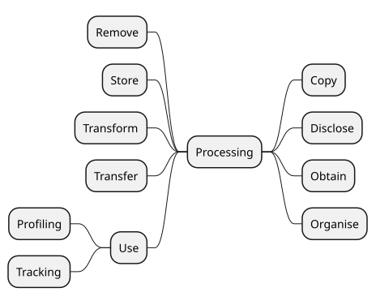 


 

 

DPV’s taxonomy of processing concepts reflects the variety of terms used to denote processing activities or operations involving personal data, such as those from [GDPR] Article.4-2 definition of processing. Real-world use of terms associated with processing rarely uses this same wording or terms, except in cases of specific domains and in legal documentation. On the other hand, common terms associated with processing are generally restricted to: collect, use, store, share, and delete.

 

DPV provides a taxonomy that aligns both the legal terminologies such as those defined by GDPR with those commonly used. For this, concepts are organised based on whether they subsume other concepts, e.g. [=Use=] is a broad concept indicating data is used, which DPV extends to define specific processing concepts for [=Analyse=], [=Consult=], [=Profiling=], and [=Retrieve=]. Through this mechanism, whenever an use-case indicates it consults some data, it can be inferred that it also uses that data.

 

For concepts related to expressing contextual information associated with processing, such as storage conditions, automation, scale, see [Processing Context](#processing-vocab-processing-context) and [Processing Scale](#processing-vocab-processing-scale) sections.

 

 

The definitions for describing and interpreting each processing concept is based on the following sources: language dictionaries (predominantly Oxford English), use of the term within legal documents (e.g. GDPR case law), and technology-specific interpretations such as for IT systems. Despite these, there may be distinct interpretations for what a term represents based on differences in practices, culture, language, and domains. In case an adopter or a use-case foresees such ambiguity or confusion, it is advisable to extend the relevant concepts and define them as needed, or create a separate extension.

 

 


 

-  dpv:Processing: Operations or 'processing' performed on data [go to full definition](https://w3id.org/dpv#Processing) 

 

  -  dpv:Copy: to produce an exact reproduction of the data [go to full definition](https://w3id.org/dpv#Copy) 

 

  -  dpv:Disclose: to make data known [go to full definition](https://w3id.org/dpv#Disclose) 

 

    -  dpv:DiscloseByTransmission: to disclose data by means of transmission [go to full definition](https://w3id.org/dpv#DiscloseByTransmission) 

 

    -  dpv:Display: to present or show data [go to full definition](https://w3id.org/dpv#Display) 

 

    -  dpv:Disseminate: to spread data throughout [go to full definition](https://w3id.org/dpv#Disseminate) 

 

    -  dpv:Download: to provide a copy or to receive a copy of data over a network or internet [go to full definition](https://w3id.org/dpv#Download) 

 

    -  dpv:Export: to provide a copy of data from one system to another [go to full definition](https://w3id.org/dpv#Export) 

 

    -  dpv:MakeAvailable: to transform or publish data to be used [go to full definition](https://w3id.org/dpv#MakeAvailable) 

 

    -  dpv:Share: to give data (or a portion of it) to others [go to full definition](https://w3id.org/dpv#Share) 

 

    -  dpv:Transmit: to send out data [go to full definition](https://w3id.org/dpv#Transmit) 

 

 

 

  -  dpv:Obtain: to solicit or gather data from someone [go to full definition](https://w3id.org/dpv#Obtain) 

 

    -  dpv:Acquire: to come into possession or control of the data [go to full definition](https://w3id.org/dpv#Acquire) 

 

    -  dpv:Collect: to gather data from someone [go to full definition](https://w3id.org/dpv#Collect) 

 

    -  dpv:Derive: to create new derivative data from the original data [go to full definition](https://w3id.org/dpv#Derive) 

 

      -  dpv:Infer: to infer data from existing data [go to full definition](https://w3id.org/dpv#Infer) 

 

 

 

    -  dpv:Generate: to generate or create data [go to full definition](https://w3id.org/dpv#Generate) 

 

    -  dpv:Observe: to obtain data through observation [go to full definition](https://w3id.org/dpv#Observe) 

 

    -  dpv:Record: to make a record (especially media) [go to full definition](https://w3id.org/dpv#Record) 

 

 

 

  -  dpv:Organise: to organize data for arranging or classifying [go to full definition](https://w3id.org/dpv#Organise) 

 

    -  dpv:Structure: to arrange data according to a structure [go to full definition](https://w3id.org/dpv#Structure) 

 

      -  dpv:Format: to arrange or structure data in a specific form [go to full definition](https://w3id.org/dpv#Format) 

 

        -  dpv:Reformat: to rearrange or restructure data to change its form [go to full definition](https://w3id.org/dpv#Reformat) 

 

 

 

 

 

 

 

  -  dpv:Remove: to destruct or erase data [go to full definition](https://w3id.org/dpv#Remove) 

 

    -  dpv:Delete: to remove data in a logical fashion i.e. with the possibility of retrieval [go to full definition](https://w3id.org/dpv#Delete) 

 

    -  dpv:Destruct: to process data in a way it no longer exists or cannot be repaired [go to full definition](https://w3id.org/dpv#Destruct) 

 

    -  dpv:Erase: to remove data from existence i.e. without the possibility of retrieval [go to full definition](https://w3id.org/dpv#Erase) 

 

 

 

  -  dpv:Store: to keep data for future use [go to full definition](https://w3id.org/dpv#Store) 

 

  -  dpv:Transfer: to move data from one place to another [go to full definition](https://w3id.org/dpv#Transfer) 

 

    -  dpv:CrossBorderTransfer: to move data from one jurisdiction (border) to another [go to full definition](https://w3id.org/dpv#CrossBorderTransfer) 

 

    -  dpv:Move: to move data from one location to another including deleting the original copy [go to full definition](https://w3id.org/dpv#Move) 

 

 

 

  -  dpv:Transform: to change the form or nature of data [go to full definition](https://w3id.org/dpv#Transform) 

 

    -  dpv:Adapt: to modify the data, often rewritten into a new form for a new use [go to full definition](https://w3id.org/dpv#Adapt) 

 

    -  dpv:Align: to adjust the data to be in relation to another data [go to full definition](https://w3id.org/dpv#Align) 

 

    -  dpv:Alter: to change the data without changing it into something else [go to full definition](https://w3id.org/dpv#Alter) 

 

      -  dpv:Aggregate: to aggregate data [go to full definition](https://w3id.org/dpv#Aggregate) 

 

      -  dpv:Modify: to modify or change data [go to full definition](https://w3id.org/dpv#Modify) 

 

 

 

    -  dpv:Anonymise: to irreversibly alter personal data in such a way that an unique data subject can no longer be identified directly or indirectly or in combination with other data [go to full definition](https://w3id.org/dpv#Anonymise) 

 

    -  dpv:Combine: to join or merge data [go to full definition](https://w3id.org/dpv#Combine) 

 

    -  dpv:Filter: to filter or keep data for some criteria [go to full definition](https://w3id.org/dpv#Filter) 

 

    -  dpv:Pseudonymise: to replace personal identifiable information by artificial identifiers [go to full definition](https://w3id.org/dpv#Pseudonymise) 

 

    -  dpv:Restrict: to apply a restriction on the processing of specific records [go to full definition](https://w3id.org/dpv#Restrict) 

 

    -  dpv:Screen: to remove data for some criteria [go to full definition](https://w3id.org/dpv#Screen) 

 

 

 

  -  dpv:Use: to use data [go to full definition](https://w3id.org/dpv#Use) 

 

    -  dpv:Access: to access data [go to full definition](https://w3id.org/dpv#Access) 

 

    -  dpv:Analyse: to study or examine the data in detail [go to full definition](https://w3id.org/dpv#Analyse) 

 

    -  dpv:Assess: to assess data for some criteria [go to full definition](https://w3id.org/dpv#Assess) 

 

    -  dpv:Consult: to consult or query data [go to full definition](https://w3id.org/dpv#Consult) 

 

      -  dpv:Monitor: to monitor data for some criteria [go to full definition](https://w3id.org/dpv#Monitor) 

 

      -  dpv:Query: to query or make enquiries over data [go to full definition](https://w3id.org/dpv#Query) 

 

 

 

    -  dpv:Match: to combine, compare, or match data from different sources [go to full definition](https://w3id.org/dpv#Match) 

 

    -  dpv:Profiling: to create a profile that describes or represents a person [go to full definition](https://w3id.org/dpv#Profiling) 

 

    -  dpv:Retrieve: to retrieve data, often in an automated manner [go to full definition](https://w3id.org/dpv#Retrieve) 

 

    -  dpv:Tracking: to use data to track a specific factor (e.g. a human or their activities) across multiple distinct contexts [go to full definition](https://w3id.org/dpv#Tracking) 

 

      -  dpv:TrackingByFirstParty: to perform tracking where the performing entity is a first party within the context [go to full definition](https://w3id.org/dpv#TrackingByFirstParty) 

 

      -  dpv:TrackingByThirdParty: to perform tracking where the performing entity is a third party within the context [go to full definition](https://w3id.org/dpv#TrackingByThirdParty) 

 

 

 

 

 

 

 


 

The 'unit of composition' in DPV is `dpv:Process`. Therefore it should be used to represent details about processing operations which are not directly describing the operation itself but are tangential or are disjoint from it - such as what data is being collected, why it is being collected (purpose). Details which describe the processing itself - such as what technology is being utilised or what entity is carrying it out - can be expressed as information about the processing. However, the suggested method is to always use a process where feasible as this supports the explicit depiction of information and allows composition i.e. the reuse of a process in a different context.

  

This example shows the myriad ways that processing could be used to describe other non-processing operation information such as personal data and entity involved. To accurately represent the information in a consistent and reusable manner, we recommend using dpv:Process as the way to combine concepts in to a 'unit' and to reuse this in other processes. This means dpv:Processing only specifies information about the processing operation involved, and optionally the technology being used if it is relevant to the context.

 

In Method 1, the processing instance contains personal data and entity involved - this is not recommended as the instance now contains information not related to the processing operation itself. Method 2 shows a processing instance which is implemented using a specific technology. This is acceptable as it describes the processing operation in terms of involved technology, and can be a way to reuse the processing operation in other processes while someone (e.g. IT department) can change the underlying technology. Method 3 represents the best practice of using dpv:Process to describe all concepts in a modular and granular manner with a separation of concerns. Processes can include other processes - so we can describe processing and technology and data involved as a process and involve it in other processes. This makes the task of finding information easier as we only have to look for composition of processes, instead of investigating each purpose or processing or another concept involved for what data or technology it involves.

 


```
# Method 1) Processing has non-processing concepts - not recommended
ex:SomeProcessing a dpv:Processing ;
    skos:broader dpv:Collect, dpv:Store ;
    dpv:hasPersonalData dpv:Location ;
    dpv:isImplementedUsingTechnology ex:SomeMethod ;
    dpv:isImplementedByEntity ex:AcmeInc .
ex:SomeProcess a dpv:Process ;
    dpv:hasProcessing ex:SomeProcessing .

# Method 2) Processing has implementing technology
ex:SomeProcessing a dpv:Processing ;
    skos:broader dpv:Collect, dpv:Store ;
    dpv:isImplementedUsingTechnology ex:SomeMethod .
ex:SomeProcess a dpv:Process ;
    dpv:hasPersonalData pd:Location ;
    dpv:hasProcessing ex:SomeProcessing ;
    dpv:isImplementedByEntity ex:AcmeInc .

# Method 3) Processing only covers operations - best practice
ex:SomeProcessing a dpv:Processing ;
    skos:broader dpv:Collect, dpv:Store .
ex:SomeProcess a dpv:Process ;
    dpv:hasPersonalData dpv:Location ;
    dpv:hasProcessing ex:SomeProcessing ;
    dpv:isImplementedByEntity ex:AcmeInc ;
    dpv:isImplementedUsingTechnology ex:SomeMethod .

# Composition of processes and processing
ex:AnotherProcess a dpv:Process ;
    dpv:hasProcess ex:SomeProcess ; # collect, store location by Acme
    dpv:hasProcess ex:SomeOtherProcess . # share location with Beta
```


 

(META Example ID: [`E0085`](https://w3id.org/dpv/examples#E0085); link: [source file](https://w3id.org/dpv/examples/E0085.ttl); contributed by Harshvardhan J. Pandit on 2025-01-01) 

  

 
<a id="processing-processing-operations"></a>

<a id="processing-L1011"></a>
## Categories of Processing

<a id="processing-L1013"></a>
### Collect
 

[=Obtain=] is the broad concept representing various ways of obtaining or collecting data. [=Collect=] is a specific way of obtaining data, with other ways being to [=Derive=] or [=Infer=] it from existing data, or to [=Observe=] it. While it can be argued that [=Collect=] and [=Observe=] are the same method since observing data implies collecting data, the model here represents distinctions which become important in context. For example, to distinguish between data obtained from a person (collect) and data being detected through a signal (observe). Further [=Generate=] represents data being generated i.e. where it didn't exist before, whereas [=Derive=] and [=Infer=] have a link to some existing data which is used to produce the new data. Similarly, [=Acquire=] implies the data already exists elsewhere and is being 'acquired' in to the current context - for example by way of taking over a process or company.

 

Most common uses of processing operations use the term 'collect' to represent all of the above, which can be misleading or ambiguous. Therefore, we suggest using the accurate verb to represent the processing operation accurately, or failing that, to use [=Obtain=] as the generic term. In particular, we caution again misappropriating [=Collect=] for [=Infer=] as there is an important distinction which is lost in context regarding the potential inaccuracy of inferred data which is a result of the method of inference. Data quality issues with collection can also be present, but represent a different category of 'errors' in operation. Further, inferences also have an important role when it comes to privacy matters - such as when inferencing sensitive or special categories of data which are not typically visible to the individual or source, whereas collection is explicit about the data being collected.

 

Similarly, we also caution against mixing [=Derive=] which implies a derivation or transformation operation on existing information, such as a first name from a full name, with [=Infer=] where the intended output is not already present within the information. Sometimes these distinctions are not clear, or can involve ethical concerns which can vary from minor concerns such as inferring emotions from text to severe pseudo-scientific theories such as phrenology. Accurately depicting the processing operations is a key factor in carrying out risk and impact assessments as the risks associated with derived and inferred data are distinct and have different assessments and mitigations.

<a id="processing-L1019"></a>
### Store
 

[=Store=] represents the processing operation where data is stored i.e. preserved for later use. Merely stating [=Obtain=] does not imply that data is stored e.g. it could be collected, used, and then discarded. Therefore, whenever data is stored, we strongly suggest explicitly denoting [=Store=] as the processing operation. The processing operation [=Store=] does not distinguish the manner in which data is stored (e.g. as bytes, documents, images), nor the location of storage (e.g. on device, in cloud). These are all described through [Storage Conditions](#processing-storage-conditions).

<a id="processing-L1024"></a>
### Use
 

[=Use=] is a generic concept that represents data that has been obtained or is stored is being used to do something (which could be a purpose). There are specific forms of usage, such as [=Access=], [=Query=], and [=Retrieve=] which are technical operations, and [=Profiling=] and [=Tracking=] which are complex operations which involve additional concepts, but are expressed as processing operations to denote their nature as technical operations which by itself does not describe why they are taking place (i.e. the purpose).

<a id="processing-L1028"></a>
### Transform
 

Operations where data is not being actively used (towards something) but is being technically organised or transformed is represented by [=Transform=] and its specific concepts. This includes [=Anonymise=] and [=Pseudonymise=], as well as [=Combine=] which includes other data. Transformations can happen as part of general data management, and do not by themselves necessarily imply they are being done towards a goal e.g. data is being aggregated and then later it is used by retrieving. This separation allows representing information about transformations in a granular manner without involving the use of this information (later) in various contexts.

<a id="processing-L1032"></a>
### Share
 

[=Disclose=] means to disclose the data (to someone or something). It is the generic concept for more specific forms of disclosure such as [=Display=], [=Export=], and the commonly used [=Share=]. We recommend using [=Disclose=] concepts to represent data being disclosed between entities, such as when showing the user some data, or sharing information with another entity. We also highlight the distinction between the use of [=Disclose=] and [=Transfer=] - where transfers simply means movement of data, whereas disclosure has an implication regarding crossing a boundary of an entity and may or may not involve a transfer.

<a id="processing-L1036"></a>
### Transfer
 

[=Transfer=] represents the technical notion of data movement from one location to another. Legally, this is an important concept where this movement happens between locations that cross a jurisdictional boundary. To represent this, we suggest using [=CrossBorderTransfer=]. Merely transferring data does not by itself imply concepts such as [=Share=] or [=Disclose=]. Therefore, to accurately and unambiguously express what processing operations are taking place, we recommend using [=Transfer=] with another concept where necessary.

 

For [=CrossBorderTransfer=], it may be desirable to state the location or jurisdiction in question. This can be declared within the instance through `dpv:hasLocation` and `dpv:hasJurisdiction`. Note that we only recommend stating the location the data is being transferred to i.e. the target and not the current or source location, as that is the relevant information within a 'cross-border transfer'. The current location should be stated in its own context e.g. for [=Store=] or [=Obtain=] or [=Use=].

<a id="processing-L1041"></a>
### Erase
 

[=Remove=] is the generic concept representing removal of data from the current context. This removal can be through [=Delete=] operations where data is logically removed - but where in theory it can be retrieved again (e.g. disk retrieval algorithms), or [=Erase=] where the data is removed in a way that retrieval is not possible (e.g. overwriting with null values). There is also [=Destruct=] which has a stronger implication of no recovery possible from any method - which can be used to describe aspects such as deletion of all copies of data from backups.

<a id="processing-L1045"></a>
### Tracking and Profiling
 

To indicate that the process involves profiling and tracking processing operations, the concepts [=Profiling=] and [=Tracking=] are provided. While profiling and tracking are more complex concepts as compared to collect or use or store as 'simple' operations, they are included in the processing operations taxonomy as they represent specific ways of using (personal) data, and by themselves do not provide sufficient indication of the purpose or intended objective for why they are being performed.

 

[=Tracking=] is further distinguished as [=TrackingByFirstParty=] and [=TrackingByThirdParty=] to reflect the commonly used terms for tracking performed by entities considered as 'first' and 'third' parties within a context. While the DPV itself does not (yet) model these first/third relations, these concepts reflect existing uses of the term and therefore the DPV relies on these existing definitions and uses to guide the usage of these concepts. For reference, see the [Do Not Track terminology](https://www.w3.org/TR/tracking-dnt/#terminology) page. Similarly, DPV's definition of [=Profiling=] is a minimal representation of creating a profile of a person based on the use of (some) data. To indicate specific definitions of profiling, e.g. in a law like the EU's GDPR, this concept should be extended to reflect the specific definition, such as the `eu-gdpr:Profiling` concept defined in the [[EU-GDPR]] extension based on the definition in GDPR's Article 4-4.

  

This example shows how the involvement of tracking and profiling can be expressed within a process. The first method simply states that tracking and profiling occur - this should be considered as bad practice as it does not clarify what the tracking and profiling involves in terms of data and entities - in particular what is being inferred as part of the profiling of data subjects. The second method is a verbose representation showing tracking is a composite process consisting of collecting and using location to generate a 'location tracking data' for the individual, which is then used in the profiling process to infer financial status of the individual.

 

Through the explicit details of data involved in tracking and profiling, the transparency and accountability principles are easier to satisfy, and we can additionally perform appropriate risk/impact assessments to analyse whether the tracking and profiling should be allowed or not. The verbosity also shows that tracking and profiling are two separate processes - which is essential when the same tracking or profiling occurs in more than one process. The last part shows how this verbosity can be reduced by taking the tracking and profiling (which as mentioned earlier are likely to be common to several processes) and assigning them a unique IRI or identifier, and using to indicate their involvement in a process.

 


```
# 1) Stating that tracking and profiling is involved (not good practice)
ex:Service a dpv:Service ;
    # Purpose missing - not good practice
    dpv:hasPersonalData pd:Location ;
    dpv:hasProcessing dpv:Tracking, dpv:Profiling .
# 2) Stating tracking and profiling specifics (good practice)
ex:Service a dpv:Service ;
    dpv:hasPurpose dpv:ServicePersonalisation ;
    dpv:hasProcessing [
        # Tracking based on location
        a dpv:Processing, dpv:Process ;
        skos:broader dpv:Tracking ;
        dpv:hasProcessing [
            a dpv:Processing ; # Collect Location
            skos:broader dpv:Collect, dpv:Use ;
            dpv:hasPersonalData pd:Location ;
        ], [
            a dpv:Processing ; # Generate Location tracking data
            skos:broader dpv:Generate, dpv:Store ;
            dpv:hasPersonalData ex:LocationTrackingData ;
        ] ;
    ], [
        # Profiling based on Location to infer Financial Status
        a dpv:Processing, dpv:Process ;
        skos:broader dpv:Profiling ;
        dpv:hasProcessing [
            a dpv:hasProcessing ; # Use tracked location
            skos:broader dpv:Use ;
            dpv:hasPersonalData ex:LocationTrackingData ;
        ], [
            a dpv:hasProcessing ; # Infer financial status
            skos:broader dpv:Infer, dpv:Store ;
            dpv:hasPersonalData pd:FinancialStatus ;
        ] ;
    ] .
# Refactored version of above where tracking and profiling are declared
# outside the process as ex:LocationTracking and ex:FinancialProfiling
ex:Service a dpv:Service ;
    dpv:hasPurpose dpv:ServicePersonalisation ;
    dpv:hasProcess ex:LocationTracking, ex:FinancialProfiling .
```


 

(META Example ID: [`E0075`](https://w3id.org/dpv/examples#E0075); link: [source file](https://w3id.org/dpv/examples/E0075.ttl); contributed by Harshvardhan J. Pandit on 2024-12-17) 

  

 

 
<a id="processing-vocab-processing-context"></a>

<a id="processing-L1102"></a>
## Context of Processing
 

 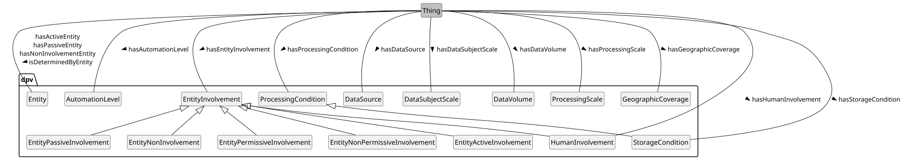 

Overview of Processing Context concepts in DPV

 

 


 

-  dpv:ProcessingContext: Context or conditions within which processing takes place [go to full definition](https://w3id.org/dpv#ProcessingContext) 

 

  -  dpv:AlgorithmicLogic: The algorithmic logic applied or used [go to full definition](https://w3id.org/dpv#AlgorithmicLogic) 

 

  -  dpv:AutomationLevel: Indication of degree or level of automation associated with specified context [go to full definition](https://w3id.org/dpv#AutomationLevel) 

 

    -  dpv:AssistiveAutomation: Level of automation corresponding to Level 1 in ISO/IEC 22989:2022 where automation is limited to parts of the system or a specific part of the system in a manner that does not change the control of the human in using/driving the system [go to full definition](https://w3id.org/dpv#AssistiveAutomation) 

 

    -  dpv:Autonomous: Level of automation corresponding to Level 6 in ISO/IEC 22989:2022 where the automation in system is capable of modifying its operation domain or its goals without external intervention, control or oversight [go to full definition](https://w3id.org/dpv#Autonomous) 

 

    -  dpv:ConditionalAutomation: Level of automation corresponding to Level 3 in ISO/IEC 22989:2022 where the automation is sufficient to perform most tasks of the system with the human present to take over where necessary [go to full definition](https://w3id.org/dpv#ConditionalAutomation) 

 

    -  dpv:FullAutomation: Level of automation corresponding to Level 5 in ISO/IEC 22989:2022 where the automation in system is capable of performing all its tasks regardless of the conditions without human involvement [go to full definition](https://w3id.org/dpv#FullAutomation) 

 

    -  dpv:HighAutomation: Level of automation corresponding to Level 4 in ISO/IEC 22989:2022 where the automation in system is capable of performing all its tasks within specific controlled conditions without human involvement [go to full definition](https://w3id.org/dpv#HighAutomation) 

 

    -  dpv:NotAutomated: Level of automation corresponding to Level 0 in ISO/IEC 22989:2022 where there is no automation in the system [go to full definition](https://w3id.org/dpv#NotAutomated) 

 

    -  dpv:PartialAutomation: Level of automation corresponding to Level 2 in ISO/IEC 22989:2022 where the automation is present in multiple parts of the system or in a manner that does not require the human to control/use these parts while still retaining control over the system [go to full definition](https://w3id.org/dpv#PartialAutomation) 

 

 

 

  -  dpv:DataSource: The source or origin of data [go to full definition](https://w3id.org/dpv#DataSource) 

 

    -  dpv:DataControllerDataSource: Data Sourced from Data Controller(s), e.g. a Controller inferring data or generating data [go to full definition](https://w3id.org/dpv#DataControllerDataSource) 

 

    -  dpv:DataSubjectDataSource: Data Sourced from Data Subject(s), e.g. when data is collected via a form or observed from their activities [go to full definition](https://w3id.org/dpv#DataSubjectDataSource) 

 

      -  dpv:DataPublishedByDataSubject: Data is published by the data subject [go to full definition](https://w3id.org/dpv#DataPublishedByDataSubject) 

 

 

 

    -  dpv:NonPublicDataSource: A source of data that is not publicly accessible or available [go to full definition](https://w3id.org/dpv#NonPublicDataSource) 

 

    -  dpv:PublicDataSource: A source of data that is publicly accessible or available [go to full definition](https://w3id.org/dpv#PublicDataSource) 

 

    -  dpv:ThirdPartyDataSource: Data Sourced from a Third Party, e.g. when data is collected from an entity that is neither the Controller nor the Data Subject [go to full definition](https://w3id.org/dpv#ThirdPartyDataSource) 

 

 

 

  -  dpv:DecisionMaking: Processing that involves decision making [go to full definition](https://w3id.org/dpv#DecisionMaking) 

 

    -  dpv:AutomatedDecisionMaking: Processing that involves automated decision making [go to full definition](https://w3id.org/dpv#AutomatedDecisionMaking) 

 

 

 

  -  dpv:EntityInvolvement: Involvement of an entity in specific context [go to full definition](https://w3id.org/dpv#EntityInvolvement) 

 

    -  dpv:EntityActiveInvolvement: Involvement where entity is 'actively' involved [go to full definition](https://w3id.org/dpv#EntityActiveInvolvement) 

 

    -  dpv:EntityIntendedInvolvement: Status indicating the involvement of the entity is intended [go to full definition](https://w3id.org/dpv#EntityIntendedInvolvement) 

 

    -  dpv:EntityInvolvementStatus: Status indicating whether an entity is involved [go to full definition](https://w3id.org/dpv#EntityInvolvementStatus) 

 

      -  dpv:EntityInvolved: Status indicating the entity is involved [go to full definition](https://w3id.org/dpv#EntityInvolved) 

 

      -  dpv:EntityNotInvolved: Status indicating the entity is not involved [go to full definition](https://w3id.org/dpv#EntityNotInvolved) 

 

 

 

    -  dpv:EntityNonInvolvement: Indicating entity is not involved [go to full definition](https://w3id.org/dpv#EntityNonInvolvement) 

 

    -  dpv:EntityNonPermissiveInvolvement: Involvement of an entity in specific context where it is not permitted or able to do something [go to full definition](https://w3id.org/dpv#EntityNonPermissiveInvolvement) 

 

      -  dpv:CannotChallengeProcess: Involvement where entity cannot challenge the process of specified context [go to full definition](https://w3id.org/dpv#CannotChallengeProcess) 

 

      -  dpv:CannotChallengeProcessInput: Involvement where entity cannot challenge input of specified context [go to full definition](https://w3id.org/dpv#CannotChallengeProcessInput) 

 

      -  dpv:CannotChallengeProcessOutput: Involvement where entity cannot challenge the output of specified context [go to full definition](https://w3id.org/dpv#CannotChallengeProcessOutput) 

 

      -  dpv:CannotCorrectProcess: Involvement where entity cannot correct the process of specified context [go to full definition](https://w3id.org/dpv#CannotCorrectProcess) 

 

      -  dpv:CannotCorrectProcessInput: Involvement where entity cannot correct input of specified context [go to full definition](https://w3id.org/dpv#CannotCorrectProcessInput) 

 

      -  dpv:CannotCorrectProcessOutput: Involvement where entity cannot correct the output of specified context [go to full definition](https://w3id.org/dpv#CannotCorrectProcessOutput) 

 

      -  dpv:CannotObjectToProcess: Involvement where entity cannot object to process of specified context [go to full definition](https://w3id.org/dpv#CannotObjectToProcess) 

 

      -  dpv:CannotOptInToProcess: Involvement where entity cannot opt-in to specified context [go to full definition](https://w3id.org/dpv#CannotOptInToProcess) 

 

      -  dpv:CannotOptOutFromProcess: Involvement where entity cannot opt-out from specified context [go to full definition](https://w3id.org/dpv#CannotOptOutFromProcess) 

 

      -  dpv:CannotReverseProcessEffects: Involvement where entity cannot reverse effects of specified context [go to full definition](https://w3id.org/dpv#CannotReverseProcessEffects) 

 

      -  dpv:CannotReverseProcessInput: Involvement where entity cannot reverse input of specified context [go to full definition](https://w3id.org/dpv#CannotReverseProcessInput) 

 

      -  dpv:CannotReverseProcessOutput: Involvement where entity cannot reverse output of specified context [go to full definition](https://w3id.org/dpv#CannotReverseProcessOutput) 

 

      -  dpv:CannotWithdrawFromProcess: Involvement where entity cannot withdraw a previously given assent from specified context [go to full definition](https://w3id.org/dpv#CannotWithdrawFromProcess) 

 

 

 

    -  dpv:EntityPassiveInvolvement: Involvement where entity is 'passively' or 'not actively' involved [go to full definition](https://w3id.org/dpv#EntityPassiveInvolvement) 

 

    -  dpv:EntityPermissiveInvolvement: Involvement of an entity in specific context where it is permitted or able to do something [go to full definition](https://w3id.org/dpv#EntityPermissiveInvolvement) 

 

      -  dpv:ChallengingProcess: Involvement where entity can challenge the process of specified context [go to full definition](https://w3id.org/dpv#ChallengingProcess) 

 

      -  dpv:ChallengingProcessInput: Involvement where entity can challenge input of specified context [go to full definition](https://w3id.org/dpv#ChallengingProcessInput) 

 

      -  dpv:ChallengingProcessOutput: Involvement where entity can challenge the output of specified context [go to full definition](https://w3id.org/dpv#ChallengingProcessOutput) 

 

      -  dpv:CorrectingProcess: Involvement where entity can correct the process of specified context [go to full definition](https://w3id.org/dpv#CorrectingProcess) 

 

      -  dpv:CorrectingProcessInput: Involvement where entity can correct input of specified context [go to full definition](https://w3id.org/dpv#CorrectingProcessInput) 

 

      -  dpv:CorrectingProcessOutput: Involvement where entity can correct the output of specified context [go to full definition](https://w3id.org/dpv#CorrectingProcessOutput) 

 

      -  dpv:ObjectingToProcess: Involvement where entity can object to process of specified context [go to full definition](https://w3id.org/dpv#ObjectingToProcess) 

 

      -  dpv:OptingInToProcess: Involvement where entity can opt-in to specified context [go to full definition](https://w3id.org/dpv#OptingInToProcess) 

 

      -  dpv:OptingOutFromProcess: Involvement where entity can opt-out from specified context [go to full definition](https://w3id.org/dpv#OptingOutFromProcess) 

 

      -  dpv:ReversingProcessEffects: Involvement where entity can reverse effects of specified context [go to full definition](https://w3id.org/dpv#ReversingProcessEffects) 

 

      -  dpv:ReversingProcessInput: Involvement where entity can reverse input of specified context [go to full definition](https://w3id.org/dpv#ReversingProcessInput) 

 

      -  dpv:ReversingProcessOutput: Involvement where entity can reverse output of specified context [go to full definition](https://w3id.org/dpv#ReversingProcessOutput) 

 

      -  dpv:WithdrawingFromProcess: Involvement where entity can withdraw a previously given assent from specified context [go to full definition](https://w3id.org/dpv#WithdrawingFromProcess) 

 

 

 

    -  dpv:EntityUnintendedInvolvement: Status indicating the involvement of the entity is not intended [go to full definition](https://w3id.org/dpv#EntityUnintendedInvolvement) 

 

    -  dpv:HumanInvolvement: The involvement of humans in specified context [go to full definition](https://w3id.org/dpv#HumanInvolvement) 

 

      -  dpv:HumanInvolved: Humans are involved in the specified context [go to full definition](https://w3id.org/dpv#HumanInvolved) 

 

      -  dpv:HumanInvolvementForControl: Human involvement for the purposes of exercising control over the specified operations in context [go to full definition](https://w3id.org/dpv#HumanInvolvementForControl) 

 

      -  dpv:HumanInvolvementForDecision: Human involvement for the purposes of exercising decisions over the specified operations in context [go to full definition](https://w3id.org/dpv#HumanInvolvementForDecision) 

 

      -  dpv:HumanInvolvementForInput: Human involvement for the purposes of providing inputs to the specified context [go to full definition](https://w3id.org/dpv#HumanInvolvementForInput) 

 

      -  dpv:HumanInvolvementForIntervention: Human involvement for the purposes of exercising interventions over the specified operations in context [go to full definition](https://w3id.org/dpv#HumanInvolvementForIntervention) 

 

      -  dpv:HumanInvolvementForOversight: Human involvement for the purposes of having oversight over the specified context regarding its operations, inputs, or outputs [go to full definition](https://w3id.org/dpv#HumanInvolvementForOversight) 

 

      -  dpv:HumanInvolvementForVerification: Human involvement for the purposes of verification of specified context to ensure its operations, inputs, or outputs are correct or are acceptable. [go to full definition](https://w3id.org/dpv#HumanInvolvementForVerification) 

 

      -  dpv:HumanNotInvolved: Humans are not involved in the specified context [go to full definition](https://w3id.org/dpv#HumanNotInvolved) 

 

 

 

 

 

  -  dpv:EvaluationScoring: Processing that involves evaluation and scoring of individuals [go to full definition](https://w3id.org/dpv#EvaluationScoring) 

 

    -  dpv:EvaluationOfIndividuals: Processing that involves evaluation of individuals [go to full definition](https://w3id.org/dpv#EvaluationOfIndividuals) 

 

    -  dpv:ScoringOfIndividuals: Processing that involves scoring of individuals [go to full definition](https://w3id.org/dpv#ScoringOfIndividuals) 

 

      -  dpv:AutomatedScoringOfIndividuals: Processing that involves automated scoring of individuals [go to full definition](https://w3id.org/dpv#AutomatedScoringOfIndividuals) 

 

 

 

 

 

  -  dpv:InnovativeUseOfTechnology: Indicates that technology is being used in an innovative manner [go to full definition](https://w3id.org/dpv#InnovativeUseOfTechnology) 

 

    -  dpv:InnovativeUseOfExistingTechnology: Involvement of existing technologies used in an innovative manner [go to full definition](https://w3id.org/dpv#InnovativeUseOfExistingTechnology) 

 

    -  dpv:InnovativeUseOfNewTechnologies: Involvement of a new (innovative) technologies [go to full definition](https://w3id.org/dpv#InnovativeUseOfNewTechnologies) 

 

 

 

  -  dpv:ProcessingCondition: Conditions required or followed regarding processing of data or use of technologies [go to full definition](https://w3id.org/dpv#ProcessingCondition) 

 

    -  dpv:ProcessingDuration: Conditions regarding duration or temporal limitation for processing [go to full definition](https://w3id.org/dpv#ProcessingDuration) 

 

      -  dpv:StorageDuration: Duration or temporal limitation on storage of data [go to full definition](https://w3id.org/dpv#StorageDuration) 

 

 

 

    -  dpv:ProcessingLocation: Conditions regarding location or geospatial scope where processing takes places [go to full definition](https://w3id.org/dpv#ProcessingLocation) 

 

      -  dpv:StorageLocation: Location or geospatial scope where the data is stored [go to full definition](https://w3id.org/dpv#StorageLocation) 

 

 

 

    -  dpv:StorageCondition: Conditions required or followed regarding storage of data [go to full definition](https://w3id.org/dpv#StorageCondition) 

 

      -  dpv:StorageDeletion: Deletion or Erasure of data including any deletion guarantees [go to full definition](https://w3id.org/dpv#StorageDeletion) 

 

      -  dpv:StorageDuration: Duration or temporal limitation on storage of data [go to full definition](https://w3id.org/dpv#StorageDuration) 

 

      -  dpv:StorageLocation: Location or geospatial scope where the data is stored [go to full definition](https://w3id.org/dpv#StorageLocation) 

 

      -  dpv:StorageRestoration: Regularity and temporal span of data restoration/backup mechanisms that guarantee that data is preserved [go to full definition](https://w3id.org/dpv#StorageRestoration) 

 

 

 

 

 

  -  dpv:SystematicMonitoring: Processing that involves systematic monitoring of individuals [go to full definition](https://w3id.org/dpv#SystematicMonitoring) 

 

 

 

-  dpv:Technology: The technology, technological implementation, or any techniques, skills, methods, and processes used or applied [go to full definition](https://w3id.org/dpv#Technology)

<a id="processing-L1547"></a>
### Processing Conditions
 

 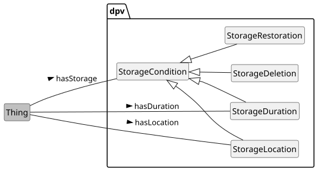 

Overview of Processing and Storage conditions

 

 

To describe conditions associated with processing, such as its duration, or specific locations, the concept [=ProcessingCondition=] provided and extended as [=ProcessingDuration=] and [=ProcessingLocation=] along with the relation [=hasProcessingCondition=]. Storage, which is a specific form of processing, has additional dedicated concepts as [=StorageCondition=] as it is a commonly used concept. The concepts are useful to describe processing and storage conditions in policies, conditions, rules, or documentation - which are important tools for implementing and determining data protection and privacy considerations as well as legal compliance.

  

This example shows processing conditions where the use (of data or technology) takes place over 6 months and in Ireland (IE) and Netherlands (NL) 


```
ex:PDH a dpv:Process ;
    dpv:hasProcessing dpv:Use ;
    dpv:hasProcessingCondition [
        a dpv:ProcessingDuration ;
        dpv:hasDuration "P6M" ;
    ] ;
    dpv:hasProcessingCondition [
        a dpv:ProcessingLocation ;
        dpv:hasLocation loc:IE, loc:NL ;
    ] .
```


 

(META Example ID: [`E0047`](https://w3id.org/dpv/examples#E0047); link: [source file](https://w3id.org/dpv/examples/E0047.ttl); contributed by Harshvardhan J. Pandit on 2024-06-11) 

 

 

The [[TECH]] extension provides relevant concepts to indicate technical aspects such as a server located in a specific location and provided by a cloud provider, which is being used to carry out the processing operations.

 

 
<a id="processing-storage-conditions"></a>

<a id="processing-L1575"></a>
### Storage Conditions
 

This taxonomy provides concepts for representing information about storage conditions, e.g. how long the data will be stored for, its erasure, or its restoration. It also enables representing the source(s) of data, the use of automation, and the extent of human involvement within the automation.

 

The processing taxonomy uses the concept [=Store=] to indicate data is being stored. To specify additionally information such as its location, erasure or deletion, the generic concepts and relations associated with processing (i.e. location and duration) can be used. However, to emphasise that information about storage - such as policies, conditions, rules, or documentation - are critical on considerations of data protection and privacy as well as legal compliance, DPV provide specific concepts related to these.

 

The concept [=StorageCondition=] and the relation [=hasStorageCondition=] represent the general or abstract conditions associated with storage of data. This is specialised to indicate [=StorageDuration=], [=StorageDeletion=], [=StorageRestoration=], and [=StorageLocation=]. This enables a document to directly specify information such as: "storage duration is 6 months" or "storage restoration uses 3 geo-distinct backup servers".

  

This example shows storage conditions for a 'store' processing operation. It has a duration valid until the event 'account closure' occurs. It has a storage location situated in Ireland (IE) and Netherlands (NL). The deletion occurs 6 months after the event 'account closure'. And restoration is implemented by using (stored) data located in backup systems in Ireland (IE). 


```
ex:PDH a dpv:Process ;
    dpv:hasProcessing dpv:Store ;
    dpv:hasStorageCondition [
        a dpv:StorageDuration ;
        dpv:hasDuration [
            a dpv:UntilEventDuration ;
            dct:description "account closure"@en ;
        ] ;
    ] ;
    dpv:hasStorageCondition [
        a dpv:StorageLocation ;
        dpv:hasLocation loc:IE, loc:NL ;
    ] ;
    dpv:hasStorageCondition [
        a dpv:StorageDeletion ;
        dpv:hasDuration [
            a dpv:UntilEventDuration ;
            dpv:hasDuration "P6M" ;
            dct:description "6 months from account closure"@en ;
        ] ;
    ] ;
    dpv:hasStorageCondition [
        a dpv:StorageRestoration ;
        dpv:isImplementedUsingTechnology [
            a dpv:Technology ;
            dct:description "backup systems" ;
            dpv:hasLocation loc:IE ;
        ] ;
    ] .
```


 

(META Example ID: [`E0048`](https://w3id.org/dpv/examples#E0048); link: [source file](https://w3id.org/dpv/examples/E0048.ttl); contributed by Harshvardhan J. Pandit on 2024-06-11) 

 

 

To indicate the use of cloud storage services, the [[TECH]] extension provides relevant concepts to represent the use of such cloud services as well as the actors involved to provide or develop them.

<a id="processing-L1620"></a>
### Data Source
 

 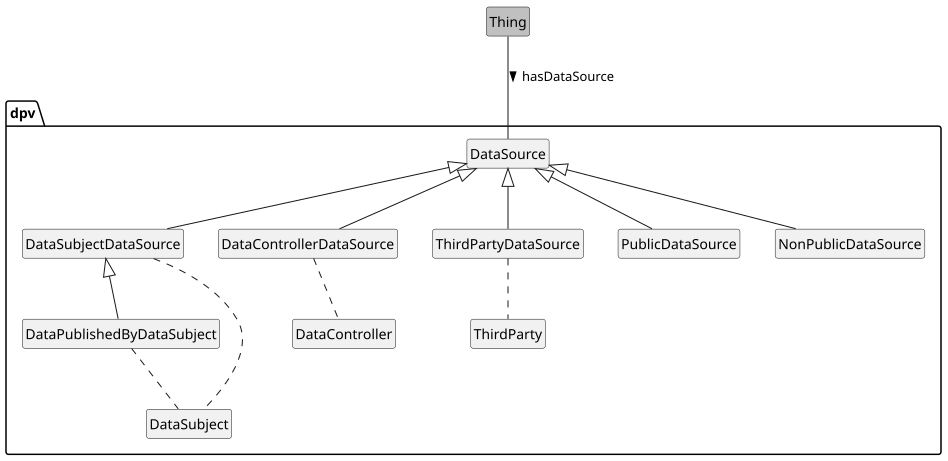 

Data Sources defined in DPV

 

 

For declaring the source of data, the [=DataSource=] concept along with [=hasDataSource=] relationship is provided to indicate where the data is collected or acquired from. For example, data can be obtained from the data subject directly (e.g. given via forms) or indirectly (e.g observed from activity, or inferred from existing data), or from another entity such as a third party.

 

 

It is important to understand the distinction between a data source and data origin. The source of data refers to the direct or indirect place, entity, or other concept from which the data was collected (in any manner). The origin of data refers to the specific entity or artefact which produced or created the data. For example, consider a company that collects data from a public database that is populated by government bodies who themselves collect that data from people. In this case, the origin of that data is ultimately the people, but the sources of this information are the people, the government bodies, and the public database.

 

Using such two synonymous terms (source and origin) can lead to ambiguity and confusion. Therefore, we suggest using data source to indicate information as contextually required within a use-case. In most cases, this would be the direct source of data (i.e. public database in above example). In other cases, it would be relevant to indicating whether data originated from the data subject.

 

 

Data can be sourced from a public or a non-public source. The distinction is important given that a public source has different implications (and justifications) for the availability of that data as well as how it can be used. To represent these, DPV uses sub-types of data source as `PublicDataSource` and `NonPublicDataSource`. Public data sources can be datasets published by authoritative bodies, or census reports, or (public) websites. Non-public data sources are anything that is not publicly available - so data subjects, third parties, etc.

 

The following data sources are defined within DPV:

 

 

1. [=DataSubjectDataSource=] to indicate the data is sourced from Data Subject(s) e.g. when data is collected via a form or observed from their activities go to full definition

 

2. [=DataControllerDataSource=] to indicate the data is sourced from Data Controller(s), e.g. a Controller inferring data or generating data go to full definition

 

3. [=ThirdPartyDataSource=] to indicate the data is sourced from a Third Party, e.g. when data is collected from an entity that is neither the Controller nor the Data Subject 

 

 

In addition to these, the concepts [=PublicDataSource=] and [=NonPublicDataSource=] are also provided to indicate whether the data being sourced was publicly available or not.

   

Data sources can be the data subject (direct or indirect), the data controller or processor (itself), or another entity (third party). The below example provides an overview of these with distinctions between source and method of generation.

 

In this example, `ex:S01` represents direct collection of data from the data subject, while `ex:S02` represents indirect collection where data is derived or observed - or undergoes any operation that still points to the data subject as the source. `ex:S03` infers data, which means the inferring entity (the Controller in this case) is the source of this data - even if the inferred data is based on data collected from the Data Subject. `ex:S04` has data sourced from another entity - such as a Third Party, but could also refer to a Data Processor. `ex:S05` represents collection of data from a public dataset that has been published by the data subject themselves.

 

Note that the above example is illustrative - it may be pertinent to provide documentation about each data source to ensure sufficient information is recorded for intended purposes. For example, the method of collection (e.g. forms), or inference (e.g. algorithm), or public dataset (e.g. link, license).

 


```
ex:S01 dpv:hasDataSource dpv:DataSubject .
ex:S01 dpv:hasProcessing dpv:Collect .

ex:S02 dpv:hasDataSource dpv:DataSubject .
ex:S02 dpv:hasProcessing dpv:Derive, dpv:Observe .

ex:S03 dpv:hasDataSource dpv:DataController .
ex:S03 dpv:hasProcessing dpv:Infer .

ex:S04 dpv:hasDataSource ex:Acme .
ex:Acme a dpv:ThirdParty .

ex:S05 dpv:hasDataSource dpv:DataPublishedByDataSubject .
ex:S05 dpv:hasProcessing dpv:Collect .
```


 

(META Example ID: [`E0012`](https://w3id.org/dpv/examples#E0012); link: [source file](https://w3id.org/dpv/examples/E0012.ttl); contributed by Harshvardhan J. Pandit on 2024-06-10)

<a id="processing-L1666"></a>
### Entity Involvement
 

 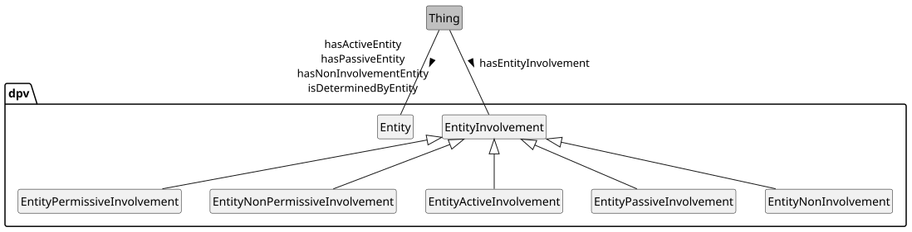 

Overview of Entity Involvement concepts in DPV

 

 

 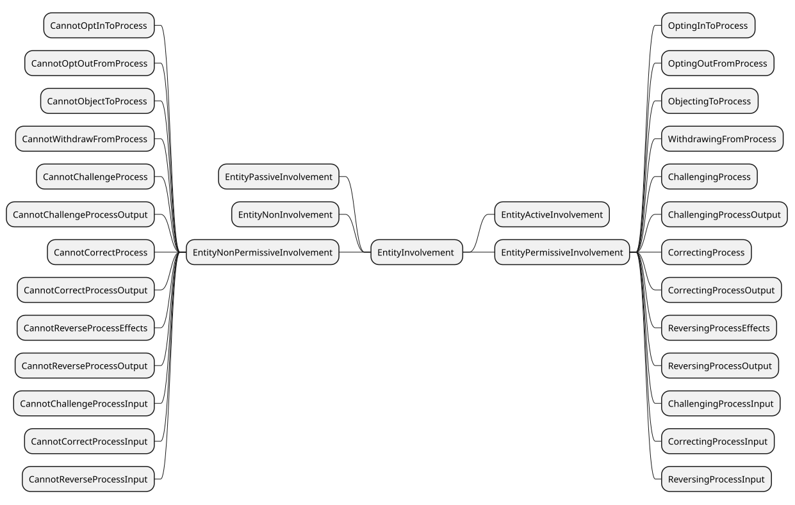 

Permissive and Non-Permissive Involvement concepts in DPV

 

 

[=EntityInvolvement=] specifies how an entity is involved in terms of being permitted to do something, or not being permitted to do something. It contains two sets of correlated concepts as [=EntityPermissiveInvolvement=] for 'permissive' and [=EntityNonPermissiveInvolvement=] for 'non-permissive' involvements. For example, [=OptingOutFromProcess=] represents a 'permissive' involvement where the entity can opt-out, while [=CannotOptOutFromProcess=] is its 'non-permissive' counterpart which indicates the entity cannot opt-out. Other concepts provided concern challenging the process and its inputs and outputs, correcting the process and its inputs and outputs, reversing the process' effects and its inputs and outputs, and withdrawing from a process.

 

In addition to the above involvements, two additional concepts provided are: [=EntityActiveInvolvement=] and [=EntityPassiveInvolvement=] to represent whether the involvement of an entity can be considered 'active' or 'passive'. Here, the term 'active' means the entity actively engages with the processing or system or technology, and 'passive' means it does not. For example, a person filling a web form to enter their data has an active involvement, whereas a person being monitored via a CCTV has a passive involvement. Note that here the terms 'active/passive' do not represent or concern the 'awareness' or 'comprehension' of the entity, and only represent the involvement in terms of operating or using or being subjected to the system or process. The concept `EntityInformedStatus` should be used to represent whether the entity is informed or not.

 

To represent how humans are involved, the concept [=HumanInvolvement=] and relation [=hasHumanInvolvement=] are provided. Human involvement is broadly specified in terms of [=HumanInvolved=] and [=HumanNotInvolved=]. Where humans are involved, additional concepts such as [=HumanInvolvementForDecision=] or [=HumanInvolvementForInput=] provide a clear representation of the involvement. Terms such as 'human-in-the-loop' were discussed and not used due to their unclear definitions and non-compatible uses across documents. Instead, the DPV defined concepts provide unambiguous representation of how humans are involved, and can be mapped to definitions of such terms within specific use-cases.

  

Consider the use of a spam filter that is based on automated processing operations where humans provide inputs, have oversight of the operation, and results in automated decision making for whether communications should be propagated. A new separate filter is developed that utilises a novel spam detection criteria that also takes into account communications other than emails for the sender and makes automated decisions whether to permit communication to proceed. Such explicit annotation of several high-risk operations assists in performing impact assessments for this technology, as well as understanding the extent and effectiveness of human involvement to mitigate risks and issues.

 

In this example, the Spam Filter process allows the users to reverse the effects (i.e. emails marked as spam) but does not allow opting out from the process (i.e. stop spam filtering). The spam detection algorithm performs automated decision making (by deciding which emails to accept), systemic monitoring (of communications), and evaluation and scoring (by scoring contents of emails and senders/recipients). The spam detection algorithm also indicates what human involvement is expected - to provide input (e.g. mark emails as spam) and intervention (e.g. change spam criteria).

 


```
ex:SpamFilter rdf:type dpv:Process ;
	dpv:hasProcessing dpv:Analyse ;
	dpv:hasAutomationLevel dpv:FullAutomation ;
	dpv:hasEntityInvolvement [
		a dpv:EntityInvolvement,
		dpv:ReversingProcessEffects,
		dpv:CannotOptOutFromProcess ;
		dpv:isImplementedByEntity dpv:User ;
	] ;
	dpv:hasAlgorithmicLogic ex:SpamDetection .

ex:SpamDetection rdf:type dpv:AlgorithmicLogic ;
	skos:broader dpv:InnovativeUseOfNewTechnologies ;
	dpv:hasContext dpv:AutomatedDecisionMaking, 
        dpv:SystematicMonitoring,
        dpv:EvaluationScoring ;
	dpv:hasHumanInvolvement dpv:HumanInvolvementForInput,
        dpv:HumanInvolvementForIntervention ;
        dpv:hasPersonalData pd:Communication ;
        dpv:hasDataSource ex:EmailSender .
```


 

(META Example ID: [`E0013`](https://w3id.org/dpv/examples#E0013); link: [source file](https://w3id.org/dpv/examples/E0013.ttl); contributed by Harshvardhan J. Pandit on 2024-06-10)

<a id="processing-L1710"></a>
### Automation Level and Human Involvement
 

 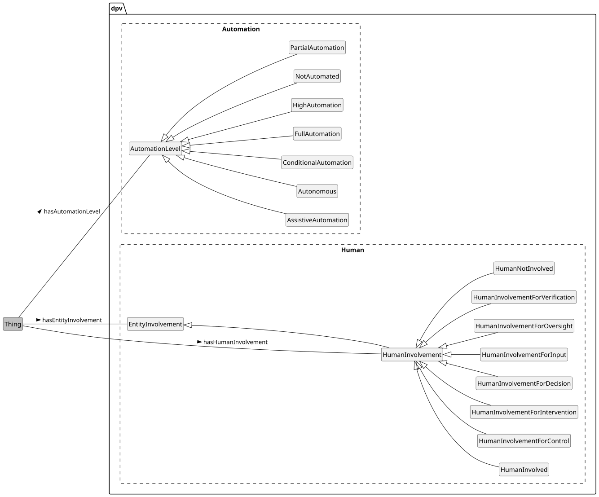 


 

 

 

DPV's concepts intentionally refer to "automation" rather than "artificial intelligence", where the former is considered a broader and more inclusive term than the latter. It also avoids delving into investigations of what is and how to define "AI". Given that AI is a form of automation, whether directly or indirectly applied, these terms within the DPV are also intended to supplement use-cases where AI is used, and to represent information regarding the degree of automation and involvement of humans within its processes.

 

 

DPV defines concepts to specify the 'level of automation' and 'human involvement' in processing operations. These are in addition to entity involvement so as to specifically indicate how humans are involved in the automated operations.

 

[=AutomationLevel=] describes the level of automation associated with processing operations. It is based on the levels defined by [[[ISO-22989]]], which consist of [=NotAutomated=] (level 0) where no automation is involved, to [=FullAutomation=] (level 5) representing automation without human involvement, and [=Autonomous=] (level 6) representing automation which can modify its operational goals without human intervention. Automation levels are specified by using the relation [=hasAutomationLevel=].

<a id="processing-L1723"></a>
### Decision Making and its Logic
 

To indicate more specific applications: [=DecisionMaking=] and [=AutomatedDecisionMaking=] refer to use of processing to make decisions, [=AlgorithmicLogic=] for explaining the use of algorithms and specifics of processing logic, [=EvaluationScoring=] to indicate the processing evaluates or assigns scores (or metrics), [=InnovativeUseOfNewTechnologies=] to indicate there are innovative uses of novel technologies, and [=SystematicMonitoring=] to indicate the processing performs a systematic (or systemic) monitoring. These additional concepts are intended to model areas or topics that are considered sensitive or high-risk or require caution.

 

 

 
<a id="processing-vocab-processing-scale"></a>

<a id="processing-L1728"></a>
## Scale of Processing
 

 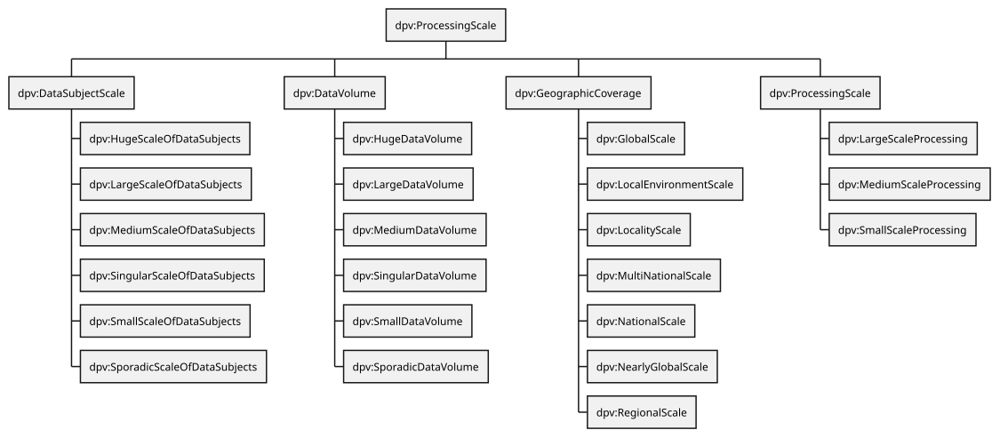 

Overview of Processing Scale concepts in DPV

 

 

DPV provides the (qualitative) concept [=Scale=], with further specialisations for expressing [=DataVolume=], [=DataSubjectScale=], and [=GeographicCoverage=] related to activities. Along with these, DPV also provides a [=ProcessingScale=] to express combinations of these (e.g. [=LargeScaleProcessing=]). The relation [=hasScale=] is used to indicate the scale, with specific relations [=hasDataVolume=], [=hasDataSubjectScale=], [=hasGeographicCoverage=], and [=hasProcessingScale=] to indicate the different types of scales.

  

DPV's concepts for 'Scale' are qualitative attributes used within the particular domain or context. The actual meaning or quantified amounts for each scale are not defined due to their interpretation based on contextual factors such as legislation, guidelines, domains, and variations across industries. To indicate these, the relevant scale concept should be extended along with information (e.g. `rdf:value`) or description (e.g. `dct:description`) of the quantitative value of the scale.

  

[=DataVolume=] refers to the volume of data. Concepts provided to represent this range from [=SingularDataVolume=] as the least/smallest to [=LargeDataVolume=] and then [=HugeDataVolume=] as the most/greatest. The relation [=hasDataVolume=] is used to indicate the volume of data.

 

[=GeographicCoverage=] represents the scale in terms of geographic coverage - which can be used to indicate the spread of processing operations, or to indicate diversity of data subjects in terms of locations, or to indicate other location based scales. The concepts provided range from [=LocalEnvironmentScale=] to represent 'local environment' (e.g. a room, a device) to [=GlobalScale=] to represent operations at a global scale. The relation [=hasGeographicCoverage=] is used to indicate the geographic coverage.

 

[=DataSubjectScale=] represents the scale of data subjects, which can be regarding the amount of data subjects represented within some data, or those involved in processing operations, or other similar representations. Provided concepts range from: [=SingularScaleOfDataSubjects=] as the least/smallest to [=LargeScaleOfDataSubjects=] and then [=HugeScaleOfDataSubjects=] as the most/largest. The relation [=hasDataSubjectScale=] is used to indicate the scale of data subjects.

 

[=ProcessingScale=] represents the 'scale of processing' which is useful to indicate scales not covered by the other provided concepts or to indicate their abstraction e.g. to provide a qualified term for whether processing is 'large scale' in terms of one or more factors. It is extended to define [=SmallScaleProcessing=], [=MediumScaleProcessing=], and [=LargeScaleProcessing=], and is indicated by using the relation `hasScale`.

 


 

-  dpv:Scale: A measurement along some dimension [go to full definition](https://w3id.org/dpv#Scale) 

 

  -  dpv:DataSubjectScale: Scale of Data Subject(s) [go to full definition](https://w3id.org/dpv#DataSubjectScale) 

 

    -  dpv:HugeScaleOfDataSubjects: Scale of data subjects considered huge or more than large within the context [go to full definition](https://w3id.org/dpv#HugeScaleOfDataSubjects) 

 

    -  dpv:LargeScaleOfDataSubjects: Scale of data subjects considered large within the context [go to full definition](https://w3id.org/dpv#LargeScaleOfDataSubjects) 

 

    -  dpv:MediumScaleOfDataSubjects: Scale of data subjects considered medium i.e. neither large nor small within the context [go to full definition](https://w3id.org/dpv#MediumScaleOfDataSubjects) 

 

    -  dpv:SingularScaleOfDataSubjects: Scale of data subjects considered singular i.e. a specific data subject [go to full definition](https://w3id.org/dpv#SingularScaleOfDataSubjects) 

 

    -  dpv:SmallScaleOfDataSubjects: Scale of data subjects considered small or limited within the context [go to full definition](https://w3id.org/dpv#SmallScaleOfDataSubjects) 

 

    -  dpv:SporadicScaleOfDataSubjects: Scale of data subjects considered sporadic or sparse within the context [go to full definition](https://w3id.org/dpv#SporadicScaleOfDataSubjects) 

 

 

 

  -  dpv:DataVolume: Volume or Scale of Data [go to full definition](https://w3id.org/dpv#DataVolume) 

 

    -  dpv:HugeDataVolume: Data volume that is considered huge or more than large within the context [go to full definition](https://w3id.org/dpv#HugeDataVolume) 

 

    -  dpv:LargeDataVolume: Data volume that is considered large within the context [go to full definition](https://w3id.org/dpv#LargeDataVolume) 

 

    -  dpv:MediumDataVolume: Data volume that is considered medium i.e. neither large nor small within the context [go to full definition](https://w3id.org/dpv#MediumDataVolume) 

 

    -  dpv:SingularDataVolume: Data volume that is considered singular i.e. a specific instance or single item [go to full definition](https://w3id.org/dpv#SingularDataVolume) 

 

    -  dpv:SmallDataVolume: Data volume that is considered small or limited within the context [go to full definition](https://w3id.org/dpv#SmallDataVolume) 

 

    -  dpv:SporadicDataVolume: Data volume that is considered sporadic or sparse within the context [go to full definition](https://w3id.org/dpv#SporadicDataVolume) 

 

 

 

  -  dpv:GeographicCoverage: Indicate of scale in terms of geographic coverage [go to full definition](https://w3id.org/dpv#GeographicCoverage) 

 

    -  dpv:GlobalScale: Geographic coverage spanning the entire globe [go to full definition](https://w3id.org/dpv#GlobalScale) 

 

    -  dpv:LocalEnvironmentScale: Geographic coverage spanning a specific environment within the locality [go to full definition](https://w3id.org/dpv#LocalEnvironmentScale) 

 

    -  dpv:LocalityScale: Geographic coverage spanning a specific locality [go to full definition](https://w3id.org/dpv#LocalityScale) 

 

    -  dpv:MultiNationalScale: Geographic coverage spanning multiple nations [go to full definition](https://w3id.org/dpv#MultiNationalScale) 

 

    -  dpv:NationalScale: Geographic coverage spanning a nation [go to full definition](https://w3id.org/dpv#NationalScale) 

 

    -  dpv:NearlyGlobalScale: Geographic coverage nearly spanning the entire globe [go to full definition](https://w3id.org/dpv#NearlyGlobalScale) 

 

    -  dpv:RegionalScale: Geographic coverage spanning a specific region or regions [go to full definition](https://w3id.org/dpv#RegionalScale) 

 

 

 

  -  dpv:ProcessingScale: Scale of Processing [go to full definition](https://w3id.org/dpv#ProcessingScale) 

 

    -  dpv:LargeScaleProcessing: Processing that takes place at large scales (as specified by some criteria) [go to full definition](https://w3id.org/dpv#LargeScaleProcessing) 

 

    -  dpv:MediumScaleProcessing: Processing that takes place at medium scales (as specified by some criteria) [go to full definition](https://w3id.org/dpv#MediumScaleProcessing) 

 

    -  dpv:SmallScaleProcessing: Processing that takes place at small scales (as specified by some criteria) [go to full definition](https://w3id.org/dpv#SmallScaleProcessing) 

 

 

 

 

 


  

This example shows how data volume, data subject scale, and geographic scale can be indicated along with optional information about the exact values involved. It also shows how a qualified scale can be provided as 'processing scale' based on some criteria (not described here). 


```
ex:PDH a dpv:Process ;
    dpv:hasProcessing dpv:Use ;
    # Geographic Scale
    dpv:hasGeographicCoverage dpv:NationalScale ; # which nation???
    dpv:hasGeographicCoverage [
        a dpv:NationalScale ;
        dpv:hasLocation loc:IE ; # expresses which nation
    ] ;
    # Data Volume
    dpv:hasDataVolume dpv:LargeDataVolume ; # how much is large?
    dpv:hasDataVolume [
        a dpv:DataVolume ;
        rdf:value "2147483647"^^xsd:int ; # number of records
    ] ;
    # Data Subject Scale
    dpv:hasDataSubject dpv:SmallScaleOfDataSubjects ; # how many people?
    dpv:hasDataSubject [
        a dpv:SmallScaleOfDataSubjects ; 
        rdf:value "5000"^^xsd:int ; # number of people
    ] ;
    # Processing Scale - aggregating above as a qualified label
    dpv:hasProcessingScale dpv:SmallScaleProcessing .
```


 

(META Example ID: [`E0049`](https://w3id.org/dpv/examples#E0049); link: [source file](https://w3id.org/dpv/examples/E0049.ttl); contributed by Harshvardhan J. Pandit on 2024-06-11)

<a id="processing-L1917"></a>
## Vocabulary Index
 
<a id="processing-classes"></a>

<a id="processing-L1919"></a>
### Classes
 
<a id="processing-Access"></a>

<a id="processing-L1920"></a>
#### Access
 

- Term | Access | Prefix | dpv
- Label | Access
- IRI | [https://w3id.org/dpv#Access](https://w3id.org/dpv#Access)
- Type | [rdfs:Class](http://www.w3.org/2000/01/rdf-schema#Class), [skos:Concept](http://www.w3.org/2004/02/skos/core#Concept), [dpv:Processing](https://w3id.org/dpv#Processing)
- Broader/Parent types | [dpv:Use](#processing-Use) → [dpv:Processing](#processing-Processing)
- Object of relation | [dpv:hasProcessing](https://w3id.org/dpv#hasProcessing)
- Definition | to access data
- Date Created | 2022-06-15
- Contributors | Georg P. Krog, Harshvardhan J. Pandit
- See More: | section [PROCESSING](#processing-vocab-processing) in [DPV](https://w3id.org/dpv#)

 

 
<a id="processing-Acquire"></a>

<a id="processing-L1996"></a>
#### Acquire
 

- Term | Acquire | Prefix | dpv
- Label | Acquire
- IRI | [https://w3id.org/dpv#Acquire](https://w3id.org/dpv#Acquire)
- Type | [rdfs:Class](http://www.w3.org/2000/01/rdf-schema#Class), [skos:Concept](http://www.w3.org/2004/02/skos/core#Concept), [dpv:Processing](https://w3id.org/dpv#Processing)
- Broader/Parent types | [dpv:Obtain](#processing-Obtain) → [dpv:Processing](#processing-Processing)
- Object of relation | [dpv:hasProcessing](https://w3id.org/dpv#hasProcessing)
- Definition | to come into possession or control of the data
- Source | [GDPR Art.4-2](https://eur-lex.europa.eu/eli/reg/2016/679/art_4/par_2/oj)
- Date Created | 2019-05-07
- See More: | section [PROCESSING](#processing-vocab-processing) in [DPV](https://w3id.org/dpv#)

 

 
<a id="processing-Adapt"></a>

<a id="processing-L2072"></a>
#### Adapt
 

- Term | Adapt | Prefix | dpv
- Label | Adapt
- IRI | [https://w3id.org/dpv#Adapt](https://w3id.org/dpv#Adapt)
- Type | [rdfs:Class](http://www.w3.org/2000/01/rdf-schema#Class), [skos:Concept](http://www.w3.org/2004/02/skos/core#Concept), [dpv:Processing](https://w3id.org/dpv#Processing)
- Broader/Parent types | [dpv:Transform](#processing-Transform) → [dpv:Processing](#processing-Processing)
- Object of relation | [dpv:hasProcessing](https://w3id.org/dpv#hasProcessing)
- Definition | to modify the data, often rewritten into a new form for a new use
- Source | [GDPR Art.4-2](https://eur-lex.europa.eu/eli/reg/2016/679/art_4/par_2/oj)
- Date Created | 2019-05-07
- See More: | section [PROCESSING](#processing-vocab-processing) in [DPV](https://w3id.org/dpv#)

 

 
<a id="processing-Aggregate"></a>

<a id="processing-L2148"></a>
#### Aggregate
 

- Term | Aggregate | Prefix | dpv
- Label | Aggregate
- IRI | [https://w3id.org/dpv#Aggregate](https://w3id.org/dpv#Aggregate)
- Type | [rdfs:Class](http://www.w3.org/2000/01/rdf-schema#Class), [skos:Concept](http://www.w3.org/2004/02/skos/core#Concept), [dpv:Processing](https://w3id.org/dpv#Processing)
- Broader/Parent types | [dpv:Alter](#processing-Alter) → [dpv:Transform](#processing-Transform) → [dpv:Processing](#processing-Processing)
- Object of relation | [dpv:hasProcessing](https://w3id.org/dpv#hasProcessing)
- Definition | to aggregate data
- Source | [SPECIAL Project](https://specialprivacy.ercim.eu/vocabs/processing)
- Related | [svpr:Aggregate](https://specialprivacy.ercim.eu/vocabs/processing#Aggregate)
- Date Created | 2024-04-14
- Contributors | Beatriz Esteves, Harshvardhan J. Pandit
- See More: | section [PROCESSING](#processing-vocab-processing) in [DPV](https://w3id.org/dpv#)

 

 
<a id="processing-AlgorithmicLogic"></a>

<a id="processing-L2232"></a>
#### Algorithmic Logic
 

- Term | AlgorithmicLogic | Prefix | dpv
- Label | Algorithmic Logic
- IRI | [https://w3id.org/dpv#AlgorithmicLogic](https://w3id.org/dpv#AlgorithmicLogic)
- Type | [rdfs:Class](http://www.w3.org/2000/01/rdf-schema#Class), [skos:Concept](http://www.w3.org/2004/02/skos/core#Concept)
- Broader/Parent types | [dpv:ProcessingContext](#processing-ProcessingContext) → [dpv:Context](https://w3id.org/dpv#Context)
- Object of relation | [dpv:hasAlgorithmicLogic](#processing-hasAlgorithmicLogic), [dpv:hasContext](https://w3id.org/dpv#hasContext)
- Definition | The algorithmic logic applied or used
- Usage Note | Algorithmic Logic is intended as a broad concept for explaining the use of algorithms and automated decisions making within Processing. To describe the actual algorithm, see the Algorithm concept.
- Date Created | 2022-01-26
- Date Modified | 2023-12-10
- Contributors | Harshvardhan J. Pandit
- See More: | section [PROCESSING-CONTEXT](#processing-vocab-processing-context) in [DPV](https://w3id.org/dpv#)

 

 
<a id="processing-Align"></a>

<a id="processing-L2315"></a>
#### Align
 

- Term | Align | Prefix | dpv
- Label | Align
- IRI | [https://w3id.org/dpv#Align](https://w3id.org/dpv#Align)
- Type | [rdfs:Class](http://www.w3.org/2000/01/rdf-schema#Class), [skos:Concept](http://www.w3.org/2004/02/skos/core#Concept), [dpv:Processing](https://w3id.org/dpv#Processing)
- Broader/Parent types | [dpv:Transform](#processing-Transform) → [dpv:Processing](#processing-Processing)
- Object of relation | [dpv:hasProcessing](https://w3id.org/dpv#hasProcessing)
- Definition | to adjust the data to be in relation to another data
- Source | [GDPR Art.4-2](https://eur-lex.europa.eu/eli/reg/2016/679/art_4/par_2/oj)
- Date Created | 2019-05-07
- See More: | section [PROCESSING](#processing-vocab-processing) in [DPV](https://w3id.org/dpv#)

 

 
<a id="processing-Alter"></a>

<a id="processing-L2391"></a>
#### Alter
 

- Term | Alter | Prefix | dpv
- Label | Alter
- IRI | [https://w3id.org/dpv#Alter](https://w3id.org/dpv#Alter)
- Type | [rdfs:Class](http://www.w3.org/2000/01/rdf-schema#Class), [skos:Concept](http://www.w3.org/2004/02/skos/core#Concept), [dpv:Processing](https://w3id.org/dpv#Processing)
- Broader/Parent types | [dpv:Transform](#processing-Transform) → [dpv:Processing](#processing-Processing)
- Object of relation | [dpv:hasProcessing](https://w3id.org/dpv#hasProcessing)
- Definition | to change the data without changing it into something else
- Source | [GDPR Art.4-2](https://eur-lex.europa.eu/eli/reg/2016/679/art_4/par_2/oj)
- Date Created | 2019-05-07
- See More: | section [PROCESSING](#processing-vocab-processing) in [DPV](https://w3id.org/dpv#)

 

 
<a id="processing-Analyse"></a>

<a id="processing-L2467"></a>
#### Analyse
 

- Term | Analyse | Prefix | dpv
- Label | Analyse
- IRI | [https://w3id.org/dpv#Analyse](https://w3id.org/dpv#Analyse)
- Type | [rdfs:Class](http://www.w3.org/2000/01/rdf-schema#Class), [skos:Concept](http://www.w3.org/2004/02/skos/core#Concept), [dpv:Processing](https://w3id.org/dpv#Processing)
- Broader/Parent types | [dpv:Use](#processing-Use) → [dpv:Processing](#processing-Processing)
- Object of relation | [dpv:hasProcessing](https://w3id.org/dpv#hasProcessing)
- Definition | to study or examine the data in detail
- Source | [SPECIAL Project](https://specialprivacy.ercim.eu/vocabs/processing)
- Related | [svpr:Analyse](https://specialprivacy.ercim.eu/vocabs/processing#Analyse)
- Date Created | 2019-05-07
- See More: | section [PROCESSING](#processing-vocab-processing) in [DPV](https://w3id.org/dpv#)

 

 
<a id="processing-Anonymise"></a>

<a id="processing-L2547"></a>
#### Anonymise
 

- Term | Anonymise | Prefix | dpv
- Label | Anonymise
- IRI | [https://w3id.org/dpv#Anonymise](https://w3id.org/dpv#Anonymise)
- Type | [rdfs:Class](http://www.w3.org/2000/01/rdf-schema#Class), [skos:Concept](http://www.w3.org/2004/02/skos/core#Concept), [dpv:Processing](https://w3id.org/dpv#Processing)
- Broader/Parent types | [dpv:Transform](#processing-Transform) → [dpv:Processing](#processing-Processing)
- Object of relation | [dpv:hasProcessing](https://w3id.org/dpv#hasProcessing)
- Definition | to irreversibly alter personal data in such a way that an unique data subject can no longer be identified directly or indirectly or in combination with other data
- Source | [SPECIAL Project](https://specialprivacy.ercim.eu/vocabs/processing)
- Related | [svpr:Anonymise](https://specialprivacy.ercim.eu/vocabs/processing#Anonymise)
- Date Created | 2019-05-07
- See More: | section [PROCESSING](#processing-vocab-processing) in [DPV](https://w3id.org/dpv#)

 

 
<a id="processing-Assess"></a>

<a id="processing-L2627"></a>
#### Assess
 

- Term | Assess | Prefix | dpv
- Label | Assess
- IRI | [https://w3id.org/dpv#Assess](https://w3id.org/dpv#Assess)
- Type | [rdfs:Class](http://www.w3.org/2000/01/rdf-schema#Class), [skos:Concept](http://www.w3.org/2004/02/skos/core#Concept), [dpv:Processing](https://w3id.org/dpv#Processing)
- Broader/Parent types | [dpv:Use](#processing-Use) → [dpv:Processing](#processing-Processing)
- Object of relation | [dpv:hasProcessing](https://w3id.org/dpv#hasProcessing)
- Definition | to assess data for some criteria
- Date Created | 2022-06-15
- Contributors | Georg P. Krog, Harshvardhan J. Pandit
- See More: | section [PROCESSING](#processing-vocab-processing) in [DPV](https://w3id.org/dpv#)

 

 
<a id="processing-AssistiveAutomation"></a>

<a id="processing-L2703"></a>
#### Assistive Automation
 

- Term | AssistiveAutomation | Prefix | dpv
- Label | Assistive Automation
- IRI | [https://w3id.org/dpv#AssistiveAutomation](https://w3id.org/dpv#AssistiveAutomation)
- Type | [rdfs:Class](http://www.w3.org/2000/01/rdf-schema#Class), [skos:Concept](http://www.w3.org/2004/02/skos/core#Concept), [dpv:AutomationLevel](https://w3id.org/dpv#AutomationLevel)
- Broader/Parent types | [dpv:AutomationLevel](#processing-AutomationLevel) → [dpv:ProcessingContext](#processing-ProcessingContext) → [dpv:Context](https://w3id.org/dpv#Context)
- Object of relation | [dpv:hasAutomationLevel](#processing-hasAutomationLevel), [dpv:hasContext](https://w3id.org/dpv#hasContext)
- Definition | Level of automation corresponding to Level 1 in ISO/IEC 22989:2022 where automation is limited to parts of the system or a specific part of the system in a manner that does not change the control of the human in using/driving the system
- Usage Note | Human Involvement is implied here, specifically the ability to make decisions regarding operations, but also possibly for intervention, oversight, and verification
- Source | [ISO/IEC 22989:2022 Artificial intelligence concepts and terminology](https://www.iso.org/standard/74296.html)
- Date Created | 2023-12-10
- Date Modified | 2024-04-20
- Contributors | Delaram Golpayegani, Harshvardhan J. Pandit
- See More: | section [PROCESSING-CONTEXT](#processing-vocab-processing-context) in [DPV](https://w3id.org/dpv#)

 

 
<a id="processing-AutomatedDecisionMaking"></a>

<a id="processing-L2790"></a>
#### Automated Decision Making
 

- Term | AutomatedDecisionMaking | Prefix | dpv
- Label | Automated Decision Making
- IRI | [https://w3id.org/dpv#AutomatedDecisionMaking](https://w3id.org/dpv#AutomatedDecisionMaking)
- Type | [rdfs:Class](http://www.w3.org/2000/01/rdf-schema#Class), [skos:Concept](http://www.w3.org/2004/02/skos/core#Concept)
- Broader/Parent types | [dpv:DecisionMaking](#processing-DecisionMaking) → [dpv:ProcessingContext](#processing-ProcessingContext) → [dpv:Context](https://w3id.org/dpv#Context)
- Object of relation | [dpv:hasContext](https://w3id.org/dpv#hasContext)
- Definition | Processing that involves automated decision making
- Usage Note | Automated decision making can be defined as “the ability to make decisions by technological means without human involvement.” (“Guidelines on Automated individual decision-making and Profiling for the purposes of Regulation 2016/679 (wp251rev.01)”, 2018, p. 8)
- Source | [GDPR Art.4-2](https://eur-lex.europa.eu/eli/reg/2016/679/art_4/par_2/oj)
- Date Created | 2020-11-04
- Date Modified | 2022-09-07
- Contributors | Harshvardhan J. Pandit, Piero Bonatti
- See More: | section [PROCESSING-CONTEXT](#processing-vocab-processing-context) in [DPV](https://w3id.org/dpv#)

 

 
<a id="processing-AutomatedScoringOfIndividuals"></a>

<a id="processing-L2876"></a>
#### Automated Scoring of Individuals
 

- Term | AutomatedScoringOfIndividuals | Prefix | dpv
- Label | Automated Scoring of Individuals
- IRI | [https://w3id.org/dpv#AutomatedScoringOfIndividuals](https://w3id.org/dpv#AutomatedScoringOfIndividuals)
- Type | [rdfs:Class](http://www.w3.org/2000/01/rdf-schema#Class), [skos:Concept](http://www.w3.org/2004/02/skos/core#Concept), [dpv:ScoringOfIndividuals](https://w3id.org/dpv#ScoringOfIndividuals)
- Broader/Parent types | [dpv:ScoringOfIndividuals](#processing-ScoringOfIndividuals) → [dpv:EvaluationScoring](#processing-EvaluationScoring) → [dpv:ProcessingContext](#processing-ProcessingContext) → [dpv:Context](https://w3id.org/dpv#Context)
- Object of relation | [dpv:hasContext](https://w3id.org/dpv#hasContext)
- Definition | Processing that involves automated scoring of individuals
- Usage Note | Scoring can lead to the action being considered Decision Making if the scoring is itself a decision - see 2023-MAR-16 opinion of Advocate General on Case C 634/21. Therefore, the assessment of whether scoring was automated or not is important given the legal obligations surrounding automated decision making e.g. in GDPR
- Date Created | 2024-04-14
- Contributors | Harshvardhan J. Pandit
- See More: | section [PROCESSING-CONTEXT](#processing-vocab-processing-context) in [DPV](https://w3id.org/dpv#)

 

 
<a id="processing-AutomationLevel"></a>

<a id="processing-L2957"></a>
#### Automation Level
 

- Term | AutomationLevel | Prefix | dpv
- Label | Automation Level
- IRI | [https://w3id.org/dpv#AutomationLevel](https://w3id.org/dpv#AutomationLevel)
- Type | [rdfs:Class](http://www.w3.org/2000/01/rdf-schema#Class), [skos:Concept](http://www.w3.org/2004/02/skos/core#Concept)
- Broader/Parent types | [dpv:ProcessingContext](#processing-ProcessingContext) → [dpv:Context](https://w3id.org/dpv#Context)
- Object of relation | [dpv:hasAutomationLevel](#processing-hasAutomationLevel), [dpv:hasContext](https://w3id.org/dpv#hasContext)
- Definition | Indication of degree or level of automation associated with specified context
- Usage Note | This concept was called 'Automation' in previous versions
- Examples
- [`dex:E0013 :: ` Spam filter as Automated Decision Making with Human Involvement](https://w3id.org/dpv/examples#E0013)
- Source | [ISO/IEC 22989:2022 Artificial intelligence concepts and terminology](https://www.iso.org/standard/74296.html)
- Date Created | 2023-12-10
- Date Modified | 2024-04-20
- Contributors | Delaram Golpayegani, Harshvardhan J. Pandit
- See More: | section [PROCESSING-CONTEXT](#processing-vocab-processing-context) in [DEX](https://w3id.org/dpv#)

 

 
<a id="processing-Autonomous"></a>

<a id="processing-L3046"></a>
#### Autonomous
 

- Term | Autonomous | Prefix | dpv
- Label | Autonomous
- IRI | [https://w3id.org/dpv#Autonomous](https://w3id.org/dpv#Autonomous)
- Type | [rdfs:Class](http://www.w3.org/2000/01/rdf-schema#Class), [skos:Concept](http://www.w3.org/2004/02/skos/core#Concept), [dpv:AutomationLevel](https://w3id.org/dpv#AutomationLevel)
- Broader/Parent types | [dpv:AutomationLevel](#processing-AutomationLevel) → [dpv:ProcessingContext](#processing-ProcessingContext) → [dpv:Context](https://w3id.org/dpv#Context)
- Object of relation | [dpv:hasAutomationLevel](#processing-hasAutomationLevel), [dpv:hasContext](https://w3id.org/dpv#hasContext)
- Definition | Level of automation corresponding to Level 6 in ISO/IEC 22989:2022 where the automation in system is capable of modifying its operation domain or its goals without external intervention, control or oversight
- Usage Note | Though Autonomous, such operations can still be associated with dpv:HumanInvolved e.g. for inputs, oversight or verification
- Source | [ISO/IEC 22989:2022 Artificial intelligence concepts and terminology](https://www.iso.org/standard/74296.html)
- Date Created | 2023-12-10
- Date Modified | 2024-04-20
- Contributors | Delaram Golpayegani, Harshvardhan J. Pandit
- See More: | section [PROCESSING-CONTEXT](#processing-vocab-processing-context) in [DPV](https://w3id.org/dpv#)

 

 
<a id="processing-CannotChallengeProcess"></a>

<a id="processing-L3133"></a>
#### Cannot Challenge Process
 

- Term | CannotChallengeProcess | Prefix | dpv
- Label | Cannot Challenge Process
- IRI | [https://w3id.org/dpv#CannotChallengeProcess](https://w3id.org/dpv#CannotChallengeProcess)
- Type | [rdfs:Class](http://www.w3.org/2000/01/rdf-schema#Class), [skos:Concept](http://www.w3.org/2004/02/skos/core#Concept), [dpv:EntityNonPermissiveInvolvement](https://w3id.org/dpv#EntityNonPermissiveInvolvement)
- Broader/Parent types | [dpv:EntityNonPermissiveInvolvement](#processing-EntityNonPermissiveInvolvement) → [dpv:EntityInvolvement](#processing-EntityInvolvement) → [dpv:ProcessingContext](#processing-ProcessingContext) → [dpv:Context](https://w3id.org/dpv#Context)
- Object of relation | [dpv:hasContext](https://w3id.org/dpv#hasContext), [dpv:hasEntityControl](https://w3id.org/dpv#hasEntityControl), [dpv:hasEntityInvolvement](#processing-hasEntityInvolvement)
- Definition | Involvement where entity cannot challenge the process of specified context
- Usage Note | Challenge refers to raising questions about validity, necessity, correctness, or other similar 'trustworthiness' attributes regarding the process or plan or implementation
- Date Created | 2024-05-11
- Contributors | Delaram Golpayegani, Harshvardhan J. Pandit, Steve Hickman
- See More: | section [PROCESSING-CONTEXT](#processing-vocab-processing-context) in [DPV](https://w3id.org/dpv#)

 

 
<a id="processing-CannotChallengeProcessInput"></a>

<a id="processing-L3216"></a>
#### Cannot Challenge Process Input
 

- Term | CannotChallengeProcessInput | Prefix | dpv
- Label | Cannot Challenge Process Input
- IRI | [https://w3id.org/dpv#CannotChallengeProcessInput](https://w3id.org/dpv#CannotChallengeProcessInput)
- Type | [rdfs:Class](http://www.w3.org/2000/01/rdf-schema#Class), [skos:Concept](http://www.w3.org/2004/02/skos/core#Concept), [dpv:EntityNonPermissiveInvolvement](https://w3id.org/dpv#EntityNonPermissiveInvolvement)
- Broader/Parent types | [dpv:EntityNonPermissiveInvolvement](#processing-EntityNonPermissiveInvolvement) → [dpv:EntityInvolvement](#processing-EntityInvolvement) → [dpv:ProcessingContext](#processing-ProcessingContext) → [dpv:Context](https://w3id.org/dpv#Context)
- Object of relation | [dpv:hasContext](https://w3id.org/dpv#hasContext), [dpv:hasEntityControl](https://w3id.org/dpv#hasEntityControl), [dpv:hasEntityInvolvement](#processing-hasEntityInvolvement)
- Definition | Involvement where entity cannot challenge input of specified context
- Date Created | 2024-05-11
- Contributors | Delaram Golpayegani, Harshvardhan J. Pandit, Steve Hickman
- See More: | section [PROCESSING-CONTEXT](#processing-vocab-processing-context) in [DPV](https://w3id.org/dpv#)

 

 
<a id="processing-CannotChallengeProcessOutput"></a>

<a id="processing-L3296"></a>
#### Cannot Challenge Process Output
 

- Term | CannotChallengeProcessOutput | Prefix | dpv
- Label | Cannot Challenge Process Output
- IRI | [https://w3id.org/dpv#CannotChallengeProcessOutput](https://w3id.org/dpv#CannotChallengeProcessOutput)
- Type | [rdfs:Class](http://www.w3.org/2000/01/rdf-schema#Class), [skos:Concept](http://www.w3.org/2004/02/skos/core#Concept), [dpv:EntityNonPermissiveInvolvement](https://w3id.org/dpv#EntityNonPermissiveInvolvement)
- Broader/Parent types | [dpv:EntityNonPermissiveInvolvement](#processing-EntityNonPermissiveInvolvement) → [dpv:EntityInvolvement](#processing-EntityInvolvement) → [dpv:ProcessingContext](#processing-ProcessingContext) → [dpv:Context](https://w3id.org/dpv#Context)
- Object of relation | [dpv:hasContext](https://w3id.org/dpv#hasContext), [dpv:hasEntityControl](https://w3id.org/dpv#hasEntityControl), [dpv:hasEntityInvolvement](#processing-hasEntityInvolvement)
- Definition | Involvement where entity cannot challenge the output of specified context
- Usage Note | Challenge refers to raising questions about validity, necessity, correctness, or other similar 'trustworthiness' attributes regarding the output of the process or plan or implementation (where output is distinct from the process itself)
- Date Created | 2024-05-11
- Contributors | Delaram Golpayegani, Harshvardhan J. Pandit, Steve Hickman
- See More: | section [PROCESSING-CONTEXT](#processing-vocab-processing-context) in [DPV](https://w3id.org/dpv#)

 

 
<a id="processing-CannotCorrectProcess"></a>

<a id="processing-L3379"></a>
#### Cannot Correct Process
 

- Term | CannotCorrectProcess | Prefix | dpv
- Label | Cannot Correct Process
- IRI | [https://w3id.org/dpv#CannotCorrectProcess](https://w3id.org/dpv#CannotCorrectProcess)
- Type | [rdfs:Class](http://www.w3.org/2000/01/rdf-schema#Class), [skos:Concept](http://www.w3.org/2004/02/skos/core#Concept), [dpv:EntityNonPermissiveInvolvement](https://w3id.org/dpv#EntityNonPermissiveInvolvement)
- Broader/Parent types | [dpv:EntityNonPermissiveInvolvement](#processing-EntityNonPermissiveInvolvement) → [dpv:EntityInvolvement](#processing-EntityInvolvement) → [dpv:ProcessingContext](#processing-ProcessingContext) → [dpv:Context](https://w3id.org/dpv#Context)
- Object of relation | [dpv:hasContext](https://w3id.org/dpv#hasContext), [dpv:hasEntityControl](https://w3id.org/dpv#hasEntityControl), [dpv:hasEntityInvolvement](#processing-hasEntityInvolvement)
- Definition | Involvement where entity cannot correct the process of specified context
- Date Created | 2024-05-11
- Contributors | Delaram Golpayegani, Harshvardhan J. Pandit, Steve Hickman
- See More: | section [PROCESSING-CONTEXT](#processing-vocab-processing-context) in [DPV](https://w3id.org/dpv#)

 

 
<a id="processing-CannotCorrectProcessInput"></a>

<a id="processing-L3459"></a>
#### Cannot Correct Process Input
 

- Term | CannotCorrectProcessInput | Prefix | dpv
- Label | Cannot Correct Process Input
- IRI | [https://w3id.org/dpv#CannotCorrectProcessInput](https://w3id.org/dpv#CannotCorrectProcessInput)
- Type | [rdfs:Class](http://www.w3.org/2000/01/rdf-schema#Class), [skos:Concept](http://www.w3.org/2004/02/skos/core#Concept), [dpv:EntityNonPermissiveInvolvement](https://w3id.org/dpv#EntityNonPermissiveInvolvement)
- Broader/Parent types | [dpv:EntityNonPermissiveInvolvement](#processing-EntityNonPermissiveInvolvement) → [dpv:EntityInvolvement](#processing-EntityInvolvement) → [dpv:ProcessingContext](#processing-ProcessingContext) → [dpv:Context](https://w3id.org/dpv#Context)
- Object of relation | [dpv:hasContext](https://w3id.org/dpv#hasContext), [dpv:hasEntityControl](https://w3id.org/dpv#hasEntityControl), [dpv:hasEntityInvolvement](#processing-hasEntityInvolvement)
- Definition | Involvement where entity cannot correct input of specified context
- Date Created | 2024-05-11
- Contributors | Delaram Golpayegani, Harshvardhan J. Pandit, Steve Hickman
- See More: | section [PROCESSING-CONTEXT](#processing-vocab-processing-context) in [DPV](https://w3id.org/dpv#)

 

 
<a id="processing-CannotCorrectProcessOutput"></a>

<a id="processing-L3539"></a>
#### Cannot Correct Process Output
 

- Term | CannotCorrectProcessOutput | Prefix | dpv
- Label | Cannot Correct Process Output
- IRI | [https://w3id.org/dpv#CannotCorrectProcessOutput](https://w3id.org/dpv#CannotCorrectProcessOutput)
- Type | [rdfs:Class](http://www.w3.org/2000/01/rdf-schema#Class), [skos:Concept](http://www.w3.org/2004/02/skos/core#Concept), [dpv:EntityNonPermissiveInvolvement](https://w3id.org/dpv#EntityNonPermissiveInvolvement)
- Broader/Parent types | [dpv:EntityNonPermissiveInvolvement](#processing-EntityNonPermissiveInvolvement) → [dpv:EntityInvolvement](#processing-EntityInvolvement) → [dpv:ProcessingContext](#processing-ProcessingContext) → [dpv:Context](https://w3id.org/dpv#Context)
- Object of relation | [dpv:hasContext](https://w3id.org/dpv#hasContext), [dpv:hasEntityControl](https://w3id.org/dpv#hasEntityControl), [dpv:hasEntityInvolvement](#processing-hasEntityInvolvement)
- Definition | Involvement where entity cannot correct the output of specified context
- Date Created | 2024-05-11
- Contributors | Delaram Golpayegani, Harshvardhan J. Pandit, Steve Hickman
- See More: | section [PROCESSING-CONTEXT](#processing-vocab-processing-context) in [DPV](https://w3id.org/dpv#)

 

 
<a id="processing-CannotObjectToProcess"></a>

<a id="processing-L3619"></a>
#### Cannot Object to Process
 

- Term | CannotObjectToProcess | Prefix | dpv
- Label | Cannot Object to Process
- IRI | [https://w3id.org/dpv#CannotObjectToProcess](https://w3id.org/dpv#CannotObjectToProcess)
- Type | [rdfs:Class](http://www.w3.org/2000/01/rdf-schema#Class), [skos:Concept](http://www.w3.org/2004/02/skos/core#Concept), [dpv:EntityNonPermissiveInvolvement](https://w3id.org/dpv#EntityNonPermissiveInvolvement)
- Broader/Parent types | [dpv:EntityNonPermissiveInvolvement](#processing-EntityNonPermissiveInvolvement) → [dpv:EntityInvolvement](#processing-EntityInvolvement) → [dpv:ProcessingContext](#processing-ProcessingContext) → [dpv:Context](https://w3id.org/dpv#Context)
- Object of relation | [dpv:hasContext](https://w3id.org/dpv#hasContext), [dpv:hasEntityControl](https://w3id.org/dpv#hasEntityControl), [dpv:hasEntityInvolvement](#processing-hasEntityInvolvement)
- Definition | Involvement where entity cannot object to process of specified context
- Date Created | 2024-05-11
- Contributors | Delaram Golpayegani, Harshvardhan J. Pandit, Steve Hickman
- See More: | section [PROCESSING-CONTEXT](#processing-vocab-processing-context) in [DPV](https://w3id.org/dpv#)

 

 
<a id="processing-CannotOptInToProcess"></a>

<a id="processing-L3699"></a>
#### Cannot Opt-in to Process
 

- Term | CannotOptInToProcess | Prefix | dpv
- Label | Cannot Opt-in to Process
- IRI | [https://w3id.org/dpv#CannotOptInToProcess](https://w3id.org/dpv#CannotOptInToProcess)
- Type | [rdfs:Class](http://www.w3.org/2000/01/rdf-schema#Class), [skos:Concept](http://www.w3.org/2004/02/skos/core#Concept), [dpv:EntityNonPermissiveInvolvement](https://w3id.org/dpv#EntityNonPermissiveInvolvement)
- Broader/Parent types | [dpv:EntityNonPermissiveInvolvement](#processing-EntityNonPermissiveInvolvement) → [dpv:EntityInvolvement](#processing-EntityInvolvement) → [dpv:ProcessingContext](#processing-ProcessingContext) → [dpv:Context](https://w3id.org/dpv#Context)
- Object of relation | [dpv:hasContext](https://w3id.org/dpv#hasContext), [dpv:hasEntityControl](https://w3id.org/dpv#hasEntityControl), [dpv:hasEntityInvolvement](#processing-hasEntityInvolvement)
- Definition | Involvement where entity cannot opt-in to specified context
- Date Created | 2024-05-11
- Contributors | Delaram Golpayegani, Harshvardhan J. Pandit, Steve Hickman
- See More: | section [PROCESSING-CONTEXT](#processing-vocab-processing-context) in [DPV](https://w3id.org/dpv#)

 

 
<a id="processing-CannotOptOutFromProcess"></a>

<a id="processing-L3779"></a>
#### Cannot Opt-out from Process
 

- Term | CannotOptOutFromProcess | Prefix | dpv
- Label | Cannot Opt-out from Process
- IRI | [https://w3id.org/dpv#CannotOptOutFromProcess](https://w3id.org/dpv#CannotOptOutFromProcess)
- Type | [rdfs:Class](http://www.w3.org/2000/01/rdf-schema#Class), [skos:Concept](http://www.w3.org/2004/02/skos/core#Concept), [dpv:EntityNonPermissiveInvolvement](https://w3id.org/dpv#EntityNonPermissiveInvolvement)
- Broader/Parent types | [dpv:EntityNonPermissiveInvolvement](#processing-EntityNonPermissiveInvolvement) → [dpv:EntityInvolvement](#processing-EntityInvolvement) → [dpv:ProcessingContext](#processing-ProcessingContext) → [dpv:Context](https://w3id.org/dpv#Context)
- Object of relation | [dpv:hasContext](https://w3id.org/dpv#hasContext), [dpv:hasEntityControl](https://w3id.org/dpv#hasEntityControl), [dpv:hasEntityInvolvement](#processing-hasEntityInvolvement)
- Definition | Involvement where entity cannot opt-out from specified context
- Date Created | 2024-05-11
- Contributors | Delaram Golpayegani, Harshvardhan J. Pandit, Steve Hickman
- See More: | section [PROCESSING-CONTEXT](#processing-vocab-processing-context) in [DPV](https://w3id.org/dpv#)

 

 
<a id="processing-CannotReverseProcessEffects"></a>

<a id="processing-L3859"></a>
#### Cannot Reverse Process Effects
 

- Term | CannotReverseProcessEffects | Prefix | dpv
- Label | Cannot Reverse Process Effects
- IRI | [https://w3id.org/dpv#CannotReverseProcessEffects](https://w3id.org/dpv#CannotReverseProcessEffects)
- Type | [rdfs:Class](http://www.w3.org/2000/01/rdf-schema#Class), [skos:Concept](http://www.w3.org/2004/02/skos/core#Concept), [dpv:EntityNonPermissiveInvolvement](https://w3id.org/dpv#EntityNonPermissiveInvolvement)
- Broader/Parent types | [dpv:EntityNonPermissiveInvolvement](#processing-EntityNonPermissiveInvolvement) → [dpv:EntityInvolvement](#processing-EntityInvolvement) → [dpv:ProcessingContext](#processing-ProcessingContext) → [dpv:Context](https://w3id.org/dpv#Context)
- Object of relation | [dpv:hasContext](https://w3id.org/dpv#hasContext), [dpv:hasEntityControl](https://w3id.org/dpv#hasEntityControl), [dpv:hasEntityInvolvement](#processing-hasEntityInvolvement)
- Definition | Involvement where entity cannot reverse effects of specified context
- Usage Note | Effects refer to consequences and impacts arising from the process or from the outputs of a process
- Date Created | 2024-05-11
- Contributors | Delaram Golpayegani, Harshvardhan J. Pandit, Steve Hickman
- See More: | section [PROCESSING-CONTEXT](#processing-vocab-processing-context) in [DPV](https://w3id.org/dpv#)

 

 
<a id="processing-CannotReverseProcessInput"></a>

<a id="processing-L3942"></a>
#### Cannot Reverse Process Input
 

- Term | CannotReverseProcessInput | Prefix | dpv
- Label | Cannot Reverse Process Input
- IRI | [https://w3id.org/dpv#CannotReverseProcessInput](https://w3id.org/dpv#CannotReverseProcessInput)
- Type | [rdfs:Class](http://www.w3.org/2000/01/rdf-schema#Class), [skos:Concept](http://www.w3.org/2004/02/skos/core#Concept), [dpv:EntityNonPermissiveInvolvement](https://w3id.org/dpv#EntityNonPermissiveInvolvement)
- Broader/Parent types | [dpv:EntityNonPermissiveInvolvement](#processing-EntityNonPermissiveInvolvement) → [dpv:EntityInvolvement](#processing-EntityInvolvement) → [dpv:ProcessingContext](#processing-ProcessingContext) → [dpv:Context](https://w3id.org/dpv#Context)
- Object of relation | [dpv:hasContext](https://w3id.org/dpv#hasContext), [dpv:hasEntityControl](https://w3id.org/dpv#hasEntityControl), [dpv:hasEntityInvolvement](#processing-hasEntityInvolvement)
- Definition | Involvement where entity cannot reverse input of specified context
- Usage Note | Reversion can be considered a form of correction in some instances. We welcome inputs to further explore and define this relation between correction and reversion concepts.
- Date Created | 2024-05-11
- Contributors | Delaram Golpayegani, Harshvardhan J. Pandit, Steve Hickman
- See More: | section [PROCESSING-CONTEXT](#processing-vocab-processing-context) in [DPV](https://w3id.org/dpv#)

 

 
<a id="processing-CannotReverseProcessOutput"></a>

<a id="processing-L4025"></a>
#### Cannot Reverse Process Output
 

- Term | CannotReverseProcessOutput | Prefix | dpv
- Label | Cannot Reverse Process Output
- IRI | [https://w3id.org/dpv#CannotReverseProcessOutput](https://w3id.org/dpv#CannotReverseProcessOutput)
- Type | [rdfs:Class](http://www.w3.org/2000/01/rdf-schema#Class), [skos:Concept](http://www.w3.org/2004/02/skos/core#Concept), [dpv:EntityNonPermissiveInvolvement](https://w3id.org/dpv#EntityNonPermissiveInvolvement)
- Broader/Parent types | [dpv:EntityNonPermissiveInvolvement](#processing-EntityNonPermissiveInvolvement) → [dpv:EntityInvolvement](#processing-EntityInvolvement) → [dpv:ProcessingContext](#processing-ProcessingContext) → [dpv:Context](https://w3id.org/dpv#Context)
- Object of relation | [dpv:hasContext](https://w3id.org/dpv#hasContext), [dpv:hasEntityControl](https://w3id.org/dpv#hasEntityControl), [dpv:hasEntityInvolvement](#processing-hasEntityInvolvement)
- Definition | Involvement where entity cannot reverse output of specified context
- Date Created | 2024-05-11
- Contributors | Delaram Golpayegani, Harshvardhan J. Pandit, Steve Hickman
- See More: | section [PROCESSING-CONTEXT](#processing-vocab-processing-context) in [DPV](https://w3id.org/dpv#)

 

 
<a id="processing-CannotWithdrawFromProcess"></a>

<a id="processing-L4105"></a>
#### Cannot Withdraw from Process
 

- Term | CannotWithdrawFromProcess | Prefix | dpv
- Label | Cannot Withdraw from Process
- IRI | [https://w3id.org/dpv#CannotWithdrawFromProcess](https://w3id.org/dpv#CannotWithdrawFromProcess)
- Type | [rdfs:Class](http://www.w3.org/2000/01/rdf-schema#Class), [skos:Concept](http://www.w3.org/2004/02/skos/core#Concept), [dpv:EntityNonPermissiveInvolvement](https://w3id.org/dpv#EntityNonPermissiveInvolvement)
- Broader/Parent types | [dpv:EntityNonPermissiveInvolvement](#processing-EntityNonPermissiveInvolvement) → [dpv:EntityInvolvement](#processing-EntityInvolvement) → [dpv:ProcessingContext](#processing-ProcessingContext) → [dpv:Context](https://w3id.org/dpv#Context)
- Object of relation | [dpv:hasContext](https://w3id.org/dpv#hasContext), [dpv:hasEntityControl](https://w3id.org/dpv#hasEntityControl), [dpv:hasEntityInvolvement](#processing-hasEntityInvolvement)
- Definition | Involvement where entity cannot withdraw a previously given assent from specified context
- Date Created | 2024-05-11
- Contributors | Delaram Golpayegani, Harshvardhan J. Pandit, Steve Hickman
- See More: | section [PROCESSING-CONTEXT](#processing-vocab-processing-context) in [DPV](https://w3id.org/dpv#)

 

 
<a id="processing-ChallengingProcess"></a>

<a id="processing-L4185"></a>
#### Challenging Process
 

- Term | ChallengingProcess | Prefix | dpv
- Label | Challenging Process
- IRI | [https://w3id.org/dpv#ChallengingProcess](https://w3id.org/dpv#ChallengingProcess)
- Type | [rdfs:Class](http://www.w3.org/2000/01/rdf-schema#Class), [skos:Concept](http://www.w3.org/2004/02/skos/core#Concept), [dpv:EntityPermissiveInvolvement](https://w3id.org/dpv#EntityPermissiveInvolvement)
- Broader/Parent types | [dpv:EntityPermissiveInvolvement](#processing-EntityPermissiveInvolvement) → [dpv:EntityInvolvement](#processing-EntityInvolvement) → [dpv:ProcessingContext](#processing-ProcessingContext) → [dpv:Context](https://w3id.org/dpv#Context)
- Object of relation | [dpv:hasContext](https://w3id.org/dpv#hasContext), [dpv:hasEntityControl](https://w3id.org/dpv#hasEntityControl), [dpv:hasEntityInvolvement](#processing-hasEntityInvolvement)
- Definition | Involvement where entity can challenge the process of specified context
- Usage Note | Challenge refers to raising questions about validity, necessity, correctness, or other similar 'trustworthiness' attributes regarding the process or plan or implementation
- Date Created | 2024-05-11
- Contributors | Delaram Golpayegani, Harshvardhan J. Pandit, Steve Hickman
- See More: | section [PROCESSING-CONTEXT](#processing-vocab-processing-context) in [DPV](https://w3id.org/dpv#)

 

 
<a id="processing-ChallengingProcessInput"></a>

<a id="processing-L4268"></a>
#### Challenging Process Input
 

- Term | ChallengingProcessInput | Prefix | dpv
- Label | Challenging Process Input
- IRI | [https://w3id.org/dpv#ChallengingProcessInput](https://w3id.org/dpv#ChallengingProcessInput)
- Type | [rdfs:Class](http://www.w3.org/2000/01/rdf-schema#Class), [skos:Concept](http://www.w3.org/2004/02/skos/core#Concept), [dpv:EntityPermissiveInvolvement](https://w3id.org/dpv#EntityPermissiveInvolvement)
- Broader/Parent types | [dpv:EntityPermissiveInvolvement](#processing-EntityPermissiveInvolvement) → [dpv:EntityInvolvement](#processing-EntityInvolvement) → [dpv:ProcessingContext](#processing-ProcessingContext) → [dpv:Context](https://w3id.org/dpv#Context)
- Object of relation | [dpv:hasContext](https://w3id.org/dpv#hasContext), [dpv:hasEntityControl](https://w3id.org/dpv#hasEntityControl), [dpv:hasEntityInvolvement](#processing-hasEntityInvolvement)
- Definition | Involvement where entity can challenge input of specified context
- Date Created | 2024-05-11
- Contributors | Delaram Golpayegani, Harshvardhan J. Pandit, Steve Hickman
- See More: | section [PROCESSING-CONTEXT](#processing-vocab-processing-context) in [DPV](https://w3id.org/dpv#)

 

 
<a id="processing-ChallengingProcessOutput"></a>

<a id="processing-L4348"></a>
#### Challenging Process Output
 

- Term | ChallengingProcessOutput | Prefix | dpv
- Label | Challenging Process Output
- IRI | [https://w3id.org/dpv#ChallengingProcessOutput](https://w3id.org/dpv#ChallengingProcessOutput)
- Type | [rdfs:Class](http://www.w3.org/2000/01/rdf-schema#Class), [skos:Concept](http://www.w3.org/2004/02/skos/core#Concept), [dpv:EntityPermissiveInvolvement](https://w3id.org/dpv#EntityPermissiveInvolvement)
- Broader/Parent types | [dpv:EntityPermissiveInvolvement](#processing-EntityPermissiveInvolvement) → [dpv:EntityInvolvement](#processing-EntityInvolvement) → [dpv:ProcessingContext](#processing-ProcessingContext) → [dpv:Context](https://w3id.org/dpv#Context)
- Object of relation | [dpv:hasContext](https://w3id.org/dpv#hasContext), [dpv:hasEntityControl](https://w3id.org/dpv#hasEntityControl), [dpv:hasEntityInvolvement](#processing-hasEntityInvolvement)
- Definition | Involvement where entity can challenge the output of specified context
- Usage Note | Challenge refers to raising questions about validity, necessity, correctness, or other similar 'trustworthiness' attributes regarding the output of the process or plan or implementation (where output is distinct from the process itself)
- Date Created | 2024-05-11
- Contributors | Delaram Golpayegani, Harshvardhan J. Pandit, Steve Hickman
- See More: | section [PROCESSING-CONTEXT](#processing-vocab-processing-context) in [DPV](https://w3id.org/dpv#)

 

 
<a id="processing-Collect"></a>

<a id="processing-L4431"></a>
#### Collect
 

- Term | Collect | Prefix | dpv
- Label | Collect
- IRI | [https://w3id.org/dpv#Collect](https://w3id.org/dpv#Collect)
- Type | [rdfs:Class](http://www.w3.org/2000/01/rdf-schema#Class), [skos:Concept](http://www.w3.org/2004/02/skos/core#Concept), [dpv:Processing](https://w3id.org/dpv#Processing)
- Broader/Parent types | [dpv:Obtain](#processing-Obtain) → [dpv:Processing](#processing-Processing)
- Object of relation | [dpv:hasProcessing](https://w3id.org/dpv#hasProcessing)
- Definition | to gather data from someone
- Source | [GDPR Art.4-2](https://eur-lex.europa.eu/eli/reg/2016/679/art_4/par_2/oj)
- Related | [svpr:Collect](https://specialprivacy.ercim.eu/vocabs/processing#Collect)
- Date Created | 2019-05-07
- See More: | section [PROCESSING](#processing-vocab-processing) in [DPV](https://w3id.org/dpv#)

 

 
<a id="processing-Combine"></a>

<a id="processing-L4511"></a>
#### Combine
 

- Term | Combine | Prefix | dpv
- Label | Combine
- IRI | [https://w3id.org/dpv#Combine](https://w3id.org/dpv#Combine)
- Type | [rdfs:Class](http://www.w3.org/2000/01/rdf-schema#Class), [skos:Concept](http://www.w3.org/2004/02/skos/core#Concept), [dpv:Processing](https://w3id.org/dpv#Processing)
- Broader/Parent types | [dpv:Transform](#processing-Transform) → [dpv:Processing](#processing-Processing)
- Object of relation | [dpv:hasProcessing](https://w3id.org/dpv#hasProcessing)
- Definition | to join or merge data
- Source | [GDPR Art.4-2](https://eur-lex.europa.eu/eli/reg/2016/679/art_4/par_2/oj)
- Related | [svpr:Aggregate](https://specialprivacy.ercim.eu/vocabs/processing#Aggregate)
- Date Created | 2019-05-07
- See More: | section [PROCESSING](#processing-vocab-processing) in [DPV](https://w3id.org/dpv#)

 

 
<a id="processing-ConditionalAutomation"></a>

<a id="processing-L4591"></a>
#### Conditional Automation
 

- Term | ConditionalAutomation | Prefix | dpv
- Label | Conditional Automation
- IRI | [https://w3id.org/dpv#ConditionalAutomation](https://w3id.org/dpv#ConditionalAutomation)
- Type | [rdfs:Class](http://www.w3.org/2000/01/rdf-schema#Class), [skos:Concept](http://www.w3.org/2004/02/skos/core#Concept), [dpv:AutomationLevel](https://w3id.org/dpv#AutomationLevel)
- Broader/Parent types | [dpv:AutomationLevel](#processing-AutomationLevel) → [dpv:ProcessingContext](#processing-ProcessingContext) → [dpv:Context](https://w3id.org/dpv#Context)
- Object of relation | [dpv:hasAutomationLevel](#processing-hasAutomationLevel), [dpv:hasContext](https://w3id.org/dpv#hasContext)
- Definition | Level of automation corresponding to Level 3 in ISO/IEC 22989:2022 where the automation is sufficient to perform most tasks of the system with the human present to take over where necessary
- Usage Note | Human Involvement is implied here, e.g. for intervention, input, decisions
- Source | [ISO/IEC 22989:2022 Artificial intelligence concepts and terminology](https://www.iso.org/standard/74296.html)
- Date Created | 2023-12-10
- Date Modified | 2024-04-20
- Contributors | Delaram Golpayegani, Harshvardhan J. Pandit
- See More: | section [PROCESSING-CONTEXT](#processing-vocab-processing-context) in [DPV](https://w3id.org/dpv#)

 

 
<a id="processing-Consult"></a>

<a id="processing-L4678"></a>
#### Consult
 

- Term | Consult | Prefix | dpv
- Label | Consult
- IRI | [https://w3id.org/dpv#Consult](https://w3id.org/dpv#Consult)
- Type | [rdfs:Class](http://www.w3.org/2000/01/rdf-schema#Class), [skos:Concept](http://www.w3.org/2004/02/skos/core#Concept), [dpv:Processing](https://w3id.org/dpv#Processing)
- Broader/Parent types | [dpv:Use](#processing-Use) → [dpv:Processing](#processing-Processing)
- Object of relation | [dpv:hasProcessing](https://w3id.org/dpv#hasProcessing)
- Definition | to consult or query data
- Source | [GDPR Art.4-2](https://eur-lex.europa.eu/eli/reg/2016/679/art_4/par_2/oj)
- Related | [svpr:Query](https://specialprivacy.ercim.eu/vocabs/processing#Query)
- Date Created | 2019-05-07
- See More: | section [PROCESSING](#processing-vocab-processing) in [DPV](https://w3id.org/dpv#)

 

 
<a id="processing-Copy"></a>

<a id="processing-L4758"></a>
#### Copy
 

- Term | Copy | Prefix | dpv
- Label | Copy
- IRI | [https://w3id.org/dpv#Copy](https://w3id.org/dpv#Copy)
- Type | [rdfs:Class](http://www.w3.org/2000/01/rdf-schema#Class), [skos:Concept](http://www.w3.org/2004/02/skos/core#Concept), [dpv:Processing](https://w3id.org/dpv#Processing)
- Broader/Parent types | [dpv:Processing](#processing-Processing)
- Object of relation | [dpv:hasProcessing](https://w3id.org/dpv#hasProcessing)
- Definition | to produce an exact reproduction of the data
- Source | [SPECIAL Project](https://specialprivacy.ercim.eu/vocabs/processing)
- Related | [svpr:Copy](https://specialprivacy.ercim.eu/vocabs/processing#Copy)
- Date Created | 2019-05-07
- See More: | section [PROCESSING](#processing-vocab-processing) in [DPV](https://w3id.org/dpv#)

 

 
<a id="processing-CorrectingProcess"></a>

<a id="processing-L4837"></a>
#### Correcting Process
 

- Term | CorrectingProcess | Prefix | dpv
- Label | Correcting Process
- IRI | [https://w3id.org/dpv#CorrectingProcess](https://w3id.org/dpv#CorrectingProcess)
- Type | [rdfs:Class](http://www.w3.org/2000/01/rdf-schema#Class), [skos:Concept](http://www.w3.org/2004/02/skos/core#Concept), [dpv:EntityPermissiveInvolvement](https://w3id.org/dpv#EntityPermissiveInvolvement)
- Broader/Parent types | [dpv:EntityPermissiveInvolvement](#processing-EntityPermissiveInvolvement) → [dpv:EntityInvolvement](#processing-EntityInvolvement) → [dpv:ProcessingContext](#processing-ProcessingContext) → [dpv:Context](https://w3id.org/dpv#Context)
- Object of relation | [dpv:hasContext](https://w3id.org/dpv#hasContext), [dpv:hasEntityControl](https://w3id.org/dpv#hasEntityControl), [dpv:hasEntityInvolvement](#processing-hasEntityInvolvement)
- Definition | Involvement where entity can correct the process of specified context
- Usage Note | Correction of process refers to the ability to change how the process takes place
- Date Created | 2024-05-11
- Contributors | Delaram Golpayegani, Harshvardhan J. Pandit, Steve Hickman
- See More: | section [PROCESSING-CONTEXT](#processing-vocab-processing-context) in [DPV](https://w3id.org/dpv#)

 

 
<a id="processing-CorrectingProcessInput"></a>

<a id="processing-L4920"></a>
#### Correcting Process Input
 

- Term | CorrectingProcessInput | Prefix | dpv
- Label | Correcting Process Input
- IRI | [https://w3id.org/dpv#CorrectingProcessInput](https://w3id.org/dpv#CorrectingProcessInput)
- Type | [rdfs:Class](http://www.w3.org/2000/01/rdf-schema#Class), [skos:Concept](http://www.w3.org/2004/02/skos/core#Concept), [dpv:EntityPermissiveInvolvement](https://w3id.org/dpv#EntityPermissiveInvolvement)
- Broader/Parent types | [dpv:EntityPermissiveInvolvement](#processing-EntityPermissiveInvolvement) → [dpv:EntityInvolvement](#processing-EntityInvolvement) → [dpv:ProcessingContext](#processing-ProcessingContext) → [dpv:Context](https://w3id.org/dpv#Context)
- Object of relation | [dpv:hasContext](https://w3id.org/dpv#hasContext), [dpv:hasEntityControl](https://w3id.org/dpv#hasEntityControl), [dpv:hasEntityInvolvement](#processing-hasEntityInvolvement)
- Definition | Involvement where entity can correct input of specified context
- Date Created | 2024-05-11
- Contributors | Delaram Golpayegani, Harshvardhan J. Pandit, Steve Hickman
- See More: | section [PROCESSING-CONTEXT](#processing-vocab-processing-context) in [DPV](https://w3id.org/dpv#)

 

 
<a id="processing-CorrectingProcessOutput"></a>

<a id="processing-L5000"></a>
#### Correcting Process Output
 

- Term | CorrectingProcessOutput | Prefix | dpv
- Label | Correcting Process Output
- IRI | [https://w3id.org/dpv#CorrectingProcessOutput](https://w3id.org/dpv#CorrectingProcessOutput)
- Type | [rdfs:Class](http://www.w3.org/2000/01/rdf-schema#Class), [skos:Concept](http://www.w3.org/2004/02/skos/core#Concept), [dpv:EntityPermissiveInvolvement](https://w3id.org/dpv#EntityPermissiveInvolvement)
- Broader/Parent types | [dpv:EntityPermissiveInvolvement](#processing-EntityPermissiveInvolvement) → [dpv:EntityInvolvement](#processing-EntityInvolvement) → [dpv:ProcessingContext](#processing-ProcessingContext) → [dpv:Context](https://w3id.org/dpv#Context)
- Object of relation | [dpv:hasContext](https://w3id.org/dpv#hasContext), [dpv:hasEntityControl](https://w3id.org/dpv#hasEntityControl), [dpv:hasEntityInvolvement](#processing-hasEntityInvolvement)
- Definition | Involvement where entity can correct the output of specified context
- Usage Note | Correction of outputs allows modification of the output - implying continuation of the process. This is distinct from reversing of outputs which revert the output back to its previous value and possibly imply not continuing with the process
- Date Created | 2024-05-11
- Contributors | Delaram Golpayegani, Harshvardhan J. Pandit, Steve Hickman
- See More: | section [PROCESSING-CONTEXT](#processing-vocab-processing-context) in [DPV](https://w3id.org/dpv#)

 

 
<a id="processing-CrossBorderTransfer"></a>

<a id="processing-L5083"></a>
#### Cross-Border Transfer
 

- Term | CrossBorderTransfer | Prefix | dpv
- Label | Cross-Border Transfer
- IRI | [https://w3id.org/dpv#CrossBorderTransfer](https://w3id.org/dpv#CrossBorderTransfer)
- Type | [rdfs:Class](http://www.w3.org/2000/01/rdf-schema#Class), [skos:Concept](http://www.w3.org/2004/02/skos/core#Concept), [dpv:Processing](https://w3id.org/dpv#Processing)
- Broader/Parent types | [dpv:Transfer](#processing-Transfer) → [dpv:Processing](#processing-Processing)
- Object of relation | [dpv:hasProcessing](https://w3id.org/dpv#hasProcessing)
- Definition | to move data from one jurisdiction (border) to another
- Date Created | 2024-04-14
- Contributors | Harshvardhan J. Pandit
- See More: | section [PROCESSING](#processing-vocab-processing) in [DPV](https://w3id.org/dpv#)

 

 
<a id="processing-DataControllerDataSource"></a>

<a id="processing-L5159"></a>
#### Data Controller as Data Source
 

- Term | DataControllerDataSource | Prefix | dpv
- Label | Data Controller as Data Source
- IRI | [https://w3id.org/dpv#DataControllerDataSource](https://w3id.org/dpv#DataControllerDataSource)
- Type | [rdfs:Class](http://www.w3.org/2000/01/rdf-schema#Class), [skos:Concept](http://www.w3.org/2004/02/skos/core#Concept), [dpv:DataSource](https://w3id.org/dpv#DataSource)
- Broader/Parent types | [dpv:DataSource](#processing-DataSource) → [dpv:ProcessingContext](#processing-ProcessingContext) → [dpv:Context](https://w3id.org/dpv#Context)
- Object of relation | [dpv:hasContext](https://w3id.org/dpv#hasContext), [dpv:hasDataSource](#processing-hasDataSource)
- Definition | Data Sourced from Data Controller(s), e.g. a Controller inferring data or generating data
- Date Created | 2023-10-12
- See More: | section [PROCESSING-CONTEXT](#processing-vocab-processing-context) in [DPV](https://w3id.org/dpv#)

 

 
<a id="processing-DataPublishedByDataSubject"></a>

<a id="processing-L5234"></a>
#### Data published by Data Subject
 

- Term | DataPublishedByDataSubject | Prefix | dpv
- Label | Data published by Data Subject
- IRI | [https://w3id.org/dpv#DataPublishedByDataSubject](https://w3id.org/dpv#DataPublishedByDataSubject)
- Type | [rdfs:Class](http://www.w3.org/2000/01/rdf-schema#Class), [skos:Concept](http://www.w3.org/2004/02/skos/core#Concept), [dpv:DataSubjectDataSource](https://w3id.org/dpv#DataSubjectDataSource)
- Broader/Parent types | [dpv:DataSubjectDataSource](#processing-DataSubjectDataSource) → [dpv:DataSource](#processing-DataSource) → [dpv:ProcessingContext](#processing-ProcessingContext) → [dpv:Context](https://w3id.org/dpv#Context)
- Object of relation | [dpv:hasContext](https://w3id.org/dpv#hasContext), [dpv:hasDataSource](#processing-hasDataSource)
- Definition | Data is published by the data subject
- Usage Note | This refers to where that data was made publicly available by the data subject. An example of this would be a social media profile that the data subject has made publicly accessible.
- Date Created | 2022-08-24
- Date Modified | 2023-12-10
- Contributors | Julian Flake
- See More: | section [PROCESSING-CONTEXT](#processing-vocab-processing-context) in [DPV](https://w3id.org/dpv#)

 

 
<a id="processing-DataSource"></a>

<a id="processing-L5319"></a>
#### Data Source
 

- Term | DataSource | Prefix | dpv
- Label | Data Source
- IRI | [https://w3id.org/dpv#DataSource](https://w3id.org/dpv#DataSource)
- Type | [rdfs:Class](http://www.w3.org/2000/01/rdf-schema#Class), [skos:Concept](http://www.w3.org/2004/02/skos/core#Concept)
- Broader/Parent types | [dpv:ProcessingContext](#processing-ProcessingContext) → [dpv:Context](https://w3id.org/dpv#Context)
- Object of relation | [dpv:hasContext](https://w3id.org/dpv#hasContext), [dpv:hasDataSource](#processing-hasDataSource)
- Definition | The source or origin of data
- Usage Note | Source' is the direct point of data collection; 'origin' would indicate the original/others points of where the data originates from.
- Examples
- [`dex:E0012 :: ` Indicating Data Sources](https://w3id.org/dpv/examples#E0012)
- Date Created | 2020-11-04
- Contributors | Beatriz Esteves, Georg P. Krog, Harshvardhan J. Pandit
- See More: | section [PROCESSING-CONTEXT](#processing-vocab-processing-context) in [DEX](https://w3id.org/dpv#)

 

 
<a id="processing-DataSubjectDataSource"></a>

<a id="processing-L5402"></a>
#### Data Subject as Data Source
 

- Term | DataSubjectDataSource | Prefix | dpv
- Label | Data Subject as Data Source
- IRI | [https://w3id.org/dpv#DataSubjectDataSource](https://w3id.org/dpv#DataSubjectDataSource)
- Type | [rdfs:Class](http://www.w3.org/2000/01/rdf-schema#Class), [skos:Concept](http://www.w3.org/2004/02/skos/core#Concept), [dpv:DataSource](https://w3id.org/dpv#DataSource)
- Broader/Parent types | [dpv:DataSource](#processing-DataSource) → [dpv:ProcessingContext](#processing-ProcessingContext) → [dpv:Context](https://w3id.org/dpv#Context)
- Object of relation | [dpv:hasContext](https://w3id.org/dpv#hasContext), [dpv:hasDataSource](#processing-hasDataSource)
- Definition | Data Sourced from Data Subject(s), e.g. when data is collected via a form or observed from their activities
- Date Created | 2023-10-12
- See More: | section [PROCESSING-CONTEXT](#processing-vocab-processing-context) in [DPV](https://w3id.org/dpv#)

 

 
<a id="processing-DataSubjectScale"></a>

<a id="processing-L5477"></a>
#### Data Subject Scale
 

- Term | DataSubjectScale | Prefix | dpv
- Label | Data Subject Scale
- IRI | [https://w3id.org/dpv#DataSubjectScale](https://w3id.org/dpv#DataSubjectScale)
- Type | [rdfs:Class](http://www.w3.org/2000/01/rdf-schema#Class), [skos:Concept](http://www.w3.org/2004/02/skos/core#Concept)
- Broader/Parent types | [dpv:Scale](#processing-Scale) → [dpv:ProcessingContext](#processing-ProcessingContext) → [dpv:Context](https://w3id.org/dpv#Context)
- Object of relation | [dpv:hasContext](https://w3id.org/dpv#hasContext), [dpv:hasDataSubjectScale](#processing-hasDataSubjectScale), [dpv:hasScale](#processing-hasScale)
- Definition | Scale of Data Subject(s)
- Examples
- [`dex:E0049 :: ` Indicating data volume, geo-location coverage, data subject scale, and a processing scale](https://w3id.org/dpv/examples#E0049)
- Date Created | 2022-06-15
- Contributors | Georg P. Krog, Harshvardhan J. Pandit, Rana Saniei
- See More: | section [PROCESSING-SCALE](#processing-vocab-processing-scale) in [DEX](https://w3id.org/dpv#)

 

 
<a id="processing-DataVolume"></a>

<a id="processing-L5559"></a>
#### Data Volume
 

- Term | DataVolume | Prefix | dpv
- Label | Data Volume
- IRI | [https://w3id.org/dpv#DataVolume](https://w3id.org/dpv#DataVolume)
- Type | [rdfs:Class](http://www.w3.org/2000/01/rdf-schema#Class), [skos:Concept](http://www.w3.org/2004/02/skos/core#Concept)
- Broader/Parent types | [dpv:Scale](#processing-Scale) → [dpv:ProcessingContext](#processing-ProcessingContext) → [dpv:Context](https://w3id.org/dpv#Context)
- Object of relation | [dpv:hasContext](https://w3id.org/dpv#hasContext), [dpv:hasDataVolume](#processing-hasDataVolume), [dpv:hasScale](#processing-hasScale)
- Definition | Volume or Scale of Data
- Examples
- [`dex:E0049 :: ` Indicating data volume, geo-location coverage, data subject scale, and a processing scale](https://w3id.org/dpv/examples#E0049)
- Date Created | 2022-06-15
- Contributors | Georg P. Krog, Harshvardhan J. Pandit, Rana Saniei
- See More: | section [PROCESSING-SCALE](#processing-vocab-processing-scale) in [DEX](https://w3id.org/dpv#)

 

 
<a id="processing-DecisionMaking"></a>

<a id="processing-L5641"></a>
#### Decision Making
 

- Term | DecisionMaking | Prefix | dpv
- Label | Decision Making
- IRI | [https://w3id.org/dpv#DecisionMaking](https://w3id.org/dpv#DecisionMaking)
- Type | [rdfs:Class](http://www.w3.org/2000/01/rdf-schema#Class), [skos:Concept](http://www.w3.org/2004/02/skos/core#Concept)
- Broader/Parent types | [dpv:ProcessingContext](#processing-ProcessingContext) → [dpv:Context](https://w3id.org/dpv#Context)
- Object of relation | [dpv:hasContext](https://w3id.org/dpv#hasContext)
- Definition | Processing that involves decision making
- Date Created | 2022-09-07
- Contributors | Harshvardhan J. Pandit
- See More: | section [PROCESSING-CONTEXT](#processing-vocab-processing-context) in [DPV](https://w3id.org/dpv#)

 

 
<a id="processing-Delete"></a>

<a id="processing-L5717"></a>
#### Delete
 

- Term | Delete | Prefix | dpv
- Label | Delete
- IRI | [https://w3id.org/dpv#Delete](https://w3id.org/dpv#Delete)
- Type | [rdfs:Class](http://www.w3.org/2000/01/rdf-schema#Class), [skos:Concept](http://www.w3.org/2004/02/skos/core#Concept), [dpv:Processing](https://w3id.org/dpv#Processing)
- Broader/Parent types | [dpv:Remove](#processing-Remove) → [dpv:Processing](#processing-Processing)
- Object of relation | [dpv:hasProcessing](https://w3id.org/dpv#hasProcessing)
- Definition | to remove data in a logical fashion i.e. with the possibility of retrieval
- Date Created | 2024-04-14
- Contributors | Harshvardhan J. Pandit
- See More: | section [PROCESSING](#processing-vocab-processing) in [DPV](https://w3id.org/dpv#)

 

 
<a id="processing-Derive"></a>

<a id="processing-L5793"></a>
#### Derive
 

- Term | Derive | Prefix | dpv
- Label | Derive
- IRI | [https://w3id.org/dpv#Derive](https://w3id.org/dpv#Derive)
- Type | [rdfs:Class](http://www.w3.org/2000/01/rdf-schema#Class), [skos:Concept](http://www.w3.org/2004/02/skos/core#Concept), [dpv:Processing](https://w3id.org/dpv#Processing)
- Broader/Parent types | [dpv:Obtain](#processing-Obtain) → [dpv:Processing](#processing-Processing)
- Object of relation | [dpv:hasProcessing](https://w3id.org/dpv#hasProcessing)
- Definition | to create new derivative data from the original data
- Usage Note | Derive indicates data is present or obtainable from existing data. For data that is created without such existence, see Infer.
- Examples
- [`dex:E0009 :: ` Derivation and inference of personal data](https://w3id.org/dpv/examples#E0009)
- Source | [SPECIAL Project](https://specialprivacy.ercim.eu/vocabs/processing)
- Related | [svpr:Derive](https://specialprivacy.ercim.eu/vocabs/processing#Derive)
- Date Created | 2019-05-07
- See More: | section [PROCESSING](#processing-vocab-processing) in [DEX](https://w3id.org/dpv#)

 

 
<a id="processing-Destruct"></a>

<a id="processing-L5879"></a>
#### Destruct
 

- Term | Destruct | Prefix | dpv
- Label | Destruct
- IRI | [https://w3id.org/dpv#Destruct](https://w3id.org/dpv#Destruct)
- Type | [rdfs:Class](http://www.w3.org/2000/01/rdf-schema#Class), [skos:Concept](http://www.w3.org/2004/02/skos/core#Concept), [dpv:Processing](https://w3id.org/dpv#Processing)
- Broader/Parent types | [dpv:Remove](#processing-Remove) → [dpv:Processing](#processing-Processing)
- Object of relation | [dpv:hasProcessing](https://w3id.org/dpv#hasProcessing)
- Definition | to process data in a way it no longer exists or cannot be repaired
- Source | [GDPR Art.4-2](https://eur-lex.europa.eu/eli/reg/2016/679/art_4/par_2/oj)
- Date Created | 2019-05-07
- See More: | section [PROCESSING](#processing-vocab-processing) in [DPV](https://w3id.org/dpv#)

 

 
<a id="processing-Disclose"></a>

<a id="processing-L5955"></a>
#### Disclose
 

- Term | Disclose | Prefix | dpv
- Label | Disclose
- IRI | [https://w3id.org/dpv#Disclose](https://w3id.org/dpv#Disclose)
- Type | [rdfs:Class](http://www.w3.org/2000/01/rdf-schema#Class), [skos:Concept](http://www.w3.org/2004/02/skos/core#Concept), [dpv:Processing](https://w3id.org/dpv#Processing)
- Broader/Parent types | [dpv:Processing](#processing-Processing)
- Object of relation | [dpv:hasProcessing](https://w3id.org/dpv#hasProcessing)
- Definition | to make data known
- Source | [GDPR Art.4-2](https://eur-lex.europa.eu/eli/reg/2016/679/art_4/par_2/oj)
- Date Created | 2019-05-07
- See More: | section [PROCESSING](#processing-vocab-processing) in [DPV](https://w3id.org/dpv#)

 

 
<a id="processing-DiscloseByTransmission"></a>

<a id="processing-L6030"></a>
#### Disclose by Transmission
 

- Term | DiscloseByTransmission | Prefix | dpv
- Label | Disclose by Transmission
- IRI | [https://w3id.org/dpv#DiscloseByTransmission](https://w3id.org/dpv#DiscloseByTransmission)
- Type | [rdfs:Class](http://www.w3.org/2000/01/rdf-schema#Class), [skos:Concept](http://www.w3.org/2004/02/skos/core#Concept), [dpv:Processing](https://w3id.org/dpv#Processing)
- Broader/Parent types | [dpv:Disclose](#processing-Disclose) → [dpv:Processing](#processing-Processing)
- Object of relation | [dpv:hasProcessing](https://w3id.org/dpv#hasProcessing)
- Definition | to disclose data by means of transmission
- Source | [GDPR Art.4-2](https://eur-lex.europa.eu/eli/reg/2016/679/art_4/par_2/oj)
- Date Created | 2019-05-07
- See More: | section [PROCESSING](#processing-vocab-processing) in [DPV](https://w3id.org/dpv#)

 

 
<a id="processing-Display"></a>

<a id="processing-L6106"></a>
#### Display
 

- Term | Display | Prefix | dpv
- Label | Display
- IRI | [https://w3id.org/dpv#Display](https://w3id.org/dpv#Display)
- Type | [rdfs:Class](http://www.w3.org/2000/01/rdf-schema#Class), [skos:Concept](http://www.w3.org/2004/02/skos/core#Concept), [dpv:Processing](https://w3id.org/dpv#Processing)
- Broader/Parent types | [dpv:Disclose](#processing-Disclose) → [dpv:Processing](#processing-Processing)
- Object of relation | [dpv:hasProcessing](https://w3id.org/dpv#hasProcessing)
- Definition | to present or show data
- Source | DGA 2.20
- Date Created | 2024-04-14
- Contributors | Beatriz Esteves
- See More: | section [PROCESSING](#processing-vocab-processing) in [DPV](https://w3id.org/dpv#)

 

 
<a id="processing-Disseminate"></a>

<a id="processing-L6185"></a>
#### Disseminate
 

- Term | Disseminate | Prefix | dpv
- Label | Disseminate
- IRI | [https://w3id.org/dpv#Disseminate](https://w3id.org/dpv#Disseminate)
- Type | [rdfs:Class](http://www.w3.org/2000/01/rdf-schema#Class), [skos:Concept](http://www.w3.org/2004/02/skos/core#Concept), [dpv:Processing](https://w3id.org/dpv#Processing)
- Broader/Parent types | [dpv:Disclose](#processing-Disclose) → [dpv:Processing](#processing-Processing)
- Object of relation | [dpv:hasProcessing](https://w3id.org/dpv#hasProcessing)
- Definition | to spread data throughout
- Source | [GDPR Art.4-2](https://eur-lex.europa.eu/eli/reg/2016/679/art_4/par_2/oj)
- Date Created | 2019-05-07
- See More: | section [PROCESSING](#processing-vocab-processing) in [DPV](https://w3id.org/dpv#)

 

 
<a id="processing-Download"></a>

<a id="processing-L6261"></a>
#### Download
 

- Term | Download | Prefix | dpv
- Label | Download
- IRI | [https://w3id.org/dpv#Download](https://w3id.org/dpv#Download)
- Type | [rdfs:Class](http://www.w3.org/2000/01/rdf-schema#Class), [skos:Concept](http://www.w3.org/2004/02/skos/core#Concept), [dpv:Processing](https://w3id.org/dpv#Processing)
- Broader/Parent types | [dpv:Disclose](#processing-Disclose) → [dpv:Processing](#processing-Processing)
- Object of relation | [dpv:hasProcessing](https://w3id.org/dpv#hasProcessing)
- Definition | to provide a copy or to receive a copy of data over a network or internet
- Source | 2.20, DGA 2.13
- Date Created | 2024-04-14
- Contributors | Beatriz Esteves
- See More: | section [PROCESSING](#processing-vocab-processing) in [DPV](https://w3id.org/dpv#)

 

 
<a id="processing-EntityActiveInvolvement"></a>

<a id="processing-L6340"></a>
#### Entity Active Involvement
 

- Term | EntityActiveInvolvement | Prefix | dpv
- Label | Entity Active Involvement
- IRI | [https://w3id.org/dpv#EntityActiveInvolvement](https://w3id.org/dpv#EntityActiveInvolvement)
- Type | [rdfs:Class](http://www.w3.org/2000/01/rdf-schema#Class), [skos:Concept](http://www.w3.org/2004/02/skos/core#Concept)
- Broader/Parent types | [dpv:EntityInvolvement](#processing-EntityInvolvement) → [dpv:ProcessingContext](#processing-ProcessingContext) → [dpv:Context](https://w3id.org/dpv#Context)
- Object of relation | [dpv:hasContext](https://w3id.org/dpv#hasContext), [dpv:hasEntityControl](https://w3id.org/dpv#hasEntityControl), [dpv:hasEntityInvolvement](#processing-hasEntityInvolvement)
- Definition | Involvement where entity is 'actively' involved
- Date Created | 2024-05-11
- Contributors | Delaram Golpayegani
- See More: | section [PROCESSING-CONTEXT](#processing-vocab-processing-context) in [DPV](https://w3id.org/dpv#)

 

 
<a id="processing-EntityIntendedInvolvement"></a>

<a id="processing-L6419"></a>
#### Entity Intended Involvement
 

- Term | EntityIntendedInvolvement | Prefix | dpv
- Label | Entity Intended Involvement
- IRI | [https://w3id.org/dpv#EntityIntendedInvolvement](https://w3id.org/dpv#EntityIntendedInvolvement)
- Type | [rdfs:Class](http://www.w3.org/2000/01/rdf-schema#Class), [skos:Concept](http://www.w3.org/2004/02/skos/core#Concept), [dpv:EntityInvolvementStatus](https://w3id.org/dpv#EntityInvolvementStatus)
- Broader/Parent types | [dpv:EntityInvolvement](#processing-EntityInvolvement) → [dpv:ProcessingContext](#processing-ProcessingContext) → [dpv:Context](https://w3id.org/dpv#Context)
- Broader/Parent types | [dpv:Intended](https://w3id.org/dpv#Intended) → [dpv:IntentionStatus](https://w3id.org/dpv#IntentionStatus) → [dpv:Status](https://w3id.org/dpv#Status) → [dpv:Context](https://w3id.org/dpv#Context)
- Object of relation | [dpv:hasContext](https://w3id.org/dpv#hasContext), [dpv:hasEntityControl](https://w3id.org/dpv#hasEntityControl), [dpv:hasEntityInvolvement](#processing-hasEntityInvolvement), [dpv:hasIntention](https://w3id.org/dpv#hasIntention), [dpv:hasStatus](https://w3id.org/dpv#hasStatus)
- Definition | Status indicating the involvement of the entity is intended
- Date Created | 2024-12-01
- Contributors | Delaram Golpayegani
- See More: | section [PROCESSING-CONTEXT](#processing-vocab-processing-context) in [DPV](https://w3id.org/dpv#)

 

 
<a id="processing-EntityInvolved"></a>

<a id="processing-L6506"></a>
#### Entity Involved
 

- Term | EntityInvolved | Prefix | dpv
- Label | Entity Involved
- IRI | [https://w3id.org/dpv#EntityInvolved](https://w3id.org/dpv#EntityInvolved)
- Type | [rdfs:Class](http://www.w3.org/2000/01/rdf-schema#Class), [skos:Concept](http://www.w3.org/2004/02/skos/core#Concept), [dpv:EntityInvolvementStatus](https://w3id.org/dpv#EntityInvolvementStatus)
- Broader/Parent types | [dpv:EntityInvolvementStatus](#processing-EntityInvolvementStatus) → [dpv:EntityInvolvement](#processing-EntityInvolvement) → [dpv:ProcessingContext](#processing-ProcessingContext) → [dpv:Context](https://w3id.org/dpv#Context)
- Broader/Parent types | [dpv:EntityInvolvementStatus](#processing-EntityInvolvementStatus) → [dpv:Status](https://w3id.org/dpv#Status) → [dpv:Context](https://w3id.org/dpv#Context)
- Object of relation | [dpv:hasContext](https://w3id.org/dpv#hasContext), [dpv:hasEntityControl](https://w3id.org/dpv#hasEntityControl), [dpv:hasEntityInvolvement](#processing-hasEntityInvolvement), [dpv:hasStatus](https://w3id.org/dpv#hasStatus)
- Definition | Status indicating the entity is involved
- Date Created | 2024-12-01
- Contributors | Delaram Golpayegani
- See More: | section [PROCESSING-CONTEXT](#processing-vocab-processing-context) in [DPV](https://w3id.org/dpv#)

 

 
<a id="processing-EntityInvolvement"></a>

<a id="processing-L6592"></a>
#### Entity Involvement
 

- Term | EntityInvolvement | Prefix | dpv
- Label | Entity Involvement
- IRI | [https://w3id.org/dpv#EntityInvolvement](https://w3id.org/dpv#EntityInvolvement)
- Type | [rdfs:Class](http://www.w3.org/2000/01/rdf-schema#Class), [skos:Concept](http://www.w3.org/2004/02/skos/core#Concept)
- Broader/Parent types | [dpv:ProcessingContext](#processing-ProcessingContext) → [dpv:Context](https://w3id.org/dpv#Context)
- Object of relation | [dpv:hasContext](https://w3id.org/dpv#hasContext), [dpv:hasEntityControl](https://w3id.org/dpv#hasEntityControl), [dpv:hasEntityInvolvement](#processing-hasEntityInvolvement)
- Definition | Involvement of an entity in specific context
- Date Created | 2024-05-11
- Contributors | Delaram Golpayegani, Harshvardhan J. Pandit
- See More: | section [PROCESSING-CONTEXT](#processing-vocab-processing-context) in [DPV](https://w3id.org/dpv#)

 

 
<a id="processing-EntityInvolvementStatus"></a>

<a id="processing-L6670"></a>
#### Entity Involvement Status
 

- Term | EntityInvolvementStatus | Prefix | dpv
- Label | Entity Involvement Status
- IRI | [https://w3id.org/dpv#EntityInvolvementStatus](https://w3id.org/dpv#EntityInvolvementStatus)
- Type | [rdfs:Class](http://www.w3.org/2000/01/rdf-schema#Class), [skos:Concept](http://www.w3.org/2004/02/skos/core#Concept)
- Broader/Parent types | [dpv:EntityInvolvement](#processing-EntityInvolvement) → [dpv:ProcessingContext](#processing-ProcessingContext) → [dpv:Context](https://w3id.org/dpv#Context)
- Broader/Parent types | [dpv:Status](https://w3id.org/dpv#Status) → [dpv:Context](https://w3id.org/dpv#Context)
- Object of relation | [dpv:hasContext](https://w3id.org/dpv#hasContext), [dpv:hasEntityControl](https://w3id.org/dpv#hasEntityControl), [dpv:hasEntityInvolvement](#processing-hasEntityInvolvement), [dpv:hasStatus](https://w3id.org/dpv#hasStatus)
- Definition | Status indicating whether an entity is involved
- Date Created | 2024-12-01
- Contributors | Delaram Golpayegani
- See More: | section [PROCESSING-CONTEXT](#processing-vocab-processing-context) in [DPV](https://w3id.org/dpv#)

 

 
<a id="processing-EntityNonInvolvement"></a>

<a id="processing-L6754"></a>
#### Entity Non-Involvement
 

- Term | EntityNonInvolvement | Prefix | dpv
- Label | Entity Non-Involvement
- IRI | [https://w3id.org/dpv#EntityNonInvolvement](https://w3id.org/dpv#EntityNonInvolvement)
- Type | [rdfs:Class](http://www.w3.org/2000/01/rdf-schema#Class), [skos:Concept](http://www.w3.org/2004/02/skos/core#Concept)
- Broader/Parent types | [dpv:EntityInvolvement](#processing-EntityInvolvement) → [dpv:ProcessingContext](#processing-ProcessingContext) → [dpv:Context](https://w3id.org/dpv#Context)
- Object of relation | [dpv:hasContext](https://w3id.org/dpv#hasContext), [dpv:hasEntityControl](https://w3id.org/dpv#hasEntityControl), [dpv:hasEntityInvolvement](#processing-hasEntityInvolvement)
- Definition | Indicating entity is not involved
- Date Created | 2024-05-11
- Contributors | Delaram Golpayegani
- See More: | section [PROCESSING-CONTEXT](#processing-vocab-processing-context) in [DPV](https://w3id.org/dpv#)

 

 
<a id="processing-EntityNonPermissiveInvolvement"></a>

<a id="processing-L6833"></a>
#### Entity Non-Permissive Involvement
 

- Term | EntityNonPermissiveInvolvement | Prefix | dpv
- Label | Entity Non-Permissive Involvement
- IRI | [https://w3id.org/dpv#EntityNonPermissiveInvolvement](https://w3id.org/dpv#EntityNonPermissiveInvolvement)
- Type | [rdfs:Class](http://www.w3.org/2000/01/rdf-schema#Class), [skos:Concept](http://www.w3.org/2004/02/skos/core#Concept)
- Broader/Parent types | [dpv:EntityInvolvement](#processing-EntityInvolvement) → [dpv:ProcessingContext](#processing-ProcessingContext) → [dpv:Context](https://w3id.org/dpv#Context)
- Object of relation | [dpv:hasContext](https://w3id.org/dpv#hasContext), [dpv:hasEntityControl](https://w3id.org/dpv#hasEntityControl), [dpv:hasEntityInvolvement](#processing-hasEntityInvolvement)
- Definition | Involvement of an entity in specific context where it is not permitted or able to do something
- Date Created | 2024-05-11
- Contributors | Delaram Golpayegani, Harshvardhan J. Pandit
- See More: | section [PROCESSING-CONTEXT](#processing-vocab-processing-context) in [DPV](https://w3id.org/dpv#)

 

 
<a id="processing-EntityNotInvolved"></a>

<a id="processing-L6912"></a>
#### Entity Not Involved
 

- Term | EntityNotInvolved | Prefix | dpv
- Label | Entity Not Involved
- IRI | [https://w3id.org/dpv#EntityNotInvolved](https://w3id.org/dpv#EntityNotInvolved)
- Type | [rdfs:Class](http://www.w3.org/2000/01/rdf-schema#Class), [skos:Concept](http://www.w3.org/2004/02/skos/core#Concept), [dpv:EntityInvolvementStatus](https://w3id.org/dpv#EntityInvolvementStatus)
- Broader/Parent types | [dpv:EntityInvolvementStatus](#processing-EntityInvolvementStatus) → [dpv:EntityInvolvement](#processing-EntityInvolvement) → [dpv:ProcessingContext](#processing-ProcessingContext) → [dpv:Context](https://w3id.org/dpv#Context)
- Broader/Parent types | [dpv:EntityInvolvementStatus](#processing-EntityInvolvementStatus) → [dpv:Status](https://w3id.org/dpv#Status) → [dpv:Context](https://w3id.org/dpv#Context)
- Object of relation | [dpv:hasContext](https://w3id.org/dpv#hasContext), [dpv:hasEntityControl](https://w3id.org/dpv#hasEntityControl), [dpv:hasEntityInvolvement](#processing-hasEntityInvolvement), [dpv:hasStatus](https://w3id.org/dpv#hasStatus)
- Definition | Status indicating the entity is not involved
- Date Created | 2024-12-01
- Contributors | Delaram Golpayegani
- See More: | section [PROCESSING-CONTEXT](#processing-vocab-processing-context) in [DPV](https://w3id.org/dpv#)

 

 
<a id="processing-EntityPassiveInvolvement"></a>

<a id="processing-L6998"></a>
#### Entity Passive Involvement
 

- Term | EntityPassiveInvolvement | Prefix | dpv
- Label | Entity Passive Involvement
- IRI | [https://w3id.org/dpv#EntityPassiveInvolvement](https://w3id.org/dpv#EntityPassiveInvolvement)
- Type | [rdfs:Class](http://www.w3.org/2000/01/rdf-schema#Class), [skos:Concept](http://www.w3.org/2004/02/skos/core#Concept)
- Broader/Parent types | [dpv:EntityInvolvement](#processing-EntityInvolvement) → [dpv:ProcessingContext](#processing-ProcessingContext) → [dpv:Context](https://w3id.org/dpv#Context)
- Object of relation | [dpv:hasContext](https://w3id.org/dpv#hasContext), [dpv:hasEntityControl](https://w3id.org/dpv#hasEntityControl), [dpv:hasEntityInvolvement](#processing-hasEntityInvolvement)
- Definition | Involvement where entity is 'passively' or 'not actively' involved
- Date Created | 2024-05-11
- Contributors | Delaram Golpayegani
- See More: | section [PROCESSING-CONTEXT](#processing-vocab-processing-context) in [DPV](https://w3id.org/dpv#)

 

 
<a id="processing-EntityPermissiveInvolvement"></a>

<a id="processing-L7077"></a>
#### Entity Permissive Involvement
 

- Term | EntityPermissiveInvolvement | Prefix | dpv
- Label | Entity Permissive Involvement
- IRI | [https://w3id.org/dpv#EntityPermissiveInvolvement](https://w3id.org/dpv#EntityPermissiveInvolvement)
- Type | [rdfs:Class](http://www.w3.org/2000/01/rdf-schema#Class), [skos:Concept](http://www.w3.org/2004/02/skos/core#Concept)
- Broader/Parent types | [dpv:EntityInvolvement](#processing-EntityInvolvement) → [dpv:ProcessingContext](#processing-ProcessingContext) → [dpv:Context](https://w3id.org/dpv#Context)
- Object of relation | [dpv:hasContext](https://w3id.org/dpv#hasContext), [dpv:hasEntityControl](https://w3id.org/dpv#hasEntityControl), [dpv:hasEntityInvolvement](#processing-hasEntityInvolvement)
- Definition | Involvement of an entity in specific context where it is permitted or able to do something
- Date Created | 2024-05-11
- Contributors | Delaram Golpayegani, Harshvardhan J. Pandit
- See More: | section [PROCESSING-CONTEXT](#processing-vocab-processing-context) in [DPV](https://w3id.org/dpv#)

 

 
<a id="processing-EntityUnintendedInvolvement"></a>

<a id="processing-L7156"></a>
#### Entity Unintended Involvement
 

- Term | EntityUnintendedInvolvement | Prefix | dpv
- Label | Entity Unintended Involvement
- IRI | [https://w3id.org/dpv#EntityUnintendedInvolvement](https://w3id.org/dpv#EntityUnintendedInvolvement)
- Type | [rdfs:Class](http://www.w3.org/2000/01/rdf-schema#Class), [skos:Concept](http://www.w3.org/2004/02/skos/core#Concept), [dpv:EntityInvolvementStatus](https://w3id.org/dpv#EntityInvolvementStatus)
- Broader/Parent types | [dpv:EntityInvolvement](#processing-EntityInvolvement) → [dpv:ProcessingContext](#processing-ProcessingContext) → [dpv:Context](https://w3id.org/dpv#Context)
- Broader/Parent types | [dpv:Unintended](https://w3id.org/dpv#Unintended) → [dpv:IntentionStatus](https://w3id.org/dpv#IntentionStatus) → [dpv:Status](https://w3id.org/dpv#Status) → [dpv:Context](https://w3id.org/dpv#Context)
- Object of relation | [dpv:hasContext](https://w3id.org/dpv#hasContext), [dpv:hasEntityControl](https://w3id.org/dpv#hasEntityControl), [dpv:hasEntityInvolvement](#processing-hasEntityInvolvement), [dpv:hasIntention](https://w3id.org/dpv#hasIntention), [dpv:hasStatus](https://w3id.org/dpv#hasStatus)
- Definition | Status indicating the involvement of the entity is not intended
- Date Created | 2024-12-01
- Contributors | Delaram Golpayegani
- See More: | section [PROCESSING-CONTEXT](#processing-vocab-processing-context) in [DPV](https://w3id.org/dpv#)

 

 
<a id="processing-Erase"></a>

<a id="processing-L7243"></a>
#### Erase
 

- Term | Erase | Prefix | dpv
- Label | Erase
- IRI | [https://w3id.org/dpv#Erase](https://w3id.org/dpv#Erase)
- Type | [rdfs:Class](http://www.w3.org/2000/01/rdf-schema#Class), [skos:Concept](http://www.w3.org/2004/02/skos/core#Concept), [dpv:Processing](https://w3id.org/dpv#Processing)
- Broader/Parent types | [dpv:Remove](#processing-Remove) → [dpv:Processing](#processing-Processing)
- Object of relation | [dpv:hasProcessing](https://w3id.org/dpv#hasProcessing)
- Definition | to remove data from existence i.e. without the possibility of retrieval
- Source | [GDPR Art.4-2](https://eur-lex.europa.eu/eli/reg/2016/679/art_4/par_2/oj)
- Date Created | 2019-05-07
- See More: | section [PROCESSING](#processing-vocab-processing) in [DPV](https://w3id.org/dpv#)

 

 
<a id="processing-EvaluationOfIndividuals"></a>

<a id="processing-L7319"></a>
#### Evaluation of Individuals
 

- Term | EvaluationOfIndividuals | Prefix | dpv
- Label | Evaluation of Individuals
- IRI | [https://w3id.org/dpv#EvaluationOfIndividuals](https://w3id.org/dpv#EvaluationOfIndividuals)
- Type | [rdfs:Class](http://www.w3.org/2000/01/rdf-schema#Class), [skos:Concept](http://www.w3.org/2004/02/skos/core#Concept), [dpv:EvaluationScoring](https://w3id.org/dpv#EvaluationScoring)
- Broader/Parent types | [dpv:EvaluationScoring](#processing-EvaluationScoring) → [dpv:ProcessingContext](#processing-ProcessingContext) → [dpv:Context](https://w3id.org/dpv#Context)
- Object of relation | [dpv:hasContext](https://w3id.org/dpv#hasContext)
- Definition | Processing that involves evaluation of individuals
- Source | [GDPR Art.4-2](https://eur-lex.europa.eu/eli/reg/2016/679/art_4/par_2/oj)
- Date Created | 2022-10-22
- Date Modified | 2022-11-30
- Contributors | Harshvardhan J. Pandit
- See More: | section [PROCESSING-CONTEXT](#processing-vocab-processing-context) in [DPV](https://w3id.org/dpv#)

 

 
<a id="processing-EvaluationScoring"></a>

<a id="processing-L7402"></a>
#### Evaluation and Scoring
 

- Term | EvaluationScoring | Prefix | dpv
- Label | Evaluation and Scoring
- IRI | [https://w3id.org/dpv#EvaluationScoring](https://w3id.org/dpv#EvaluationScoring)
- Type | [rdfs:Class](http://www.w3.org/2000/01/rdf-schema#Class), [skos:Concept](http://www.w3.org/2004/02/skos/core#Concept)
- Broader/Parent types | [dpv:ProcessingContext](#processing-ProcessingContext) → [dpv:Context](https://w3id.org/dpv#Context)
- Object of relation | [dpv:hasContext](https://w3id.org/dpv#hasContext)
- Definition | Processing that involves evaluation and scoring of individuals
- Source | [GDPR Art.4-2](https://eur-lex.europa.eu/eli/reg/2016/679/art_4/par_2/oj)
- Date Created | 2020-11-04
- Contributors | Harshvardhan J. Pandit, Piero Bonatti
- See More: | section [PROCESSING-CONTEXT](#processing-vocab-processing-context) in [DPV](https://w3id.org/dpv#)

 

 
<a id="processing-Export"></a>

<a id="processing-L7481"></a>
#### Export
 

- Term | Export | Prefix | dpv
- Label | Export
- IRI | [https://w3id.org/dpv#Export](https://w3id.org/dpv#Export)
- Type | [rdfs:Class](http://www.w3.org/2000/01/rdf-schema#Class), [skos:Concept](http://www.w3.org/2004/02/skos/core#Concept), [dpv:Processing](https://w3id.org/dpv#Processing)
- Broader/Parent types | [dpv:Disclose](#processing-Disclose) → [dpv:Processing](#processing-Processing)
- Object of relation | [dpv:hasProcessing](https://w3id.org/dpv#hasProcessing)
- Definition | to provide a copy of data from one system to another
- Source | DGA 2.20
- Date Created | 2024-04-14
- Contributors | Beatriz Esteves
- See More: | section [PROCESSING](#processing-vocab-processing) in [DPV](https://w3id.org/dpv#)

 

 
<a id="processing-Filter"></a>

<a id="processing-L7560"></a>
#### Filter
 

- Term | Filter | Prefix | dpv
- Label | Filter
- IRI | [https://w3id.org/dpv#Filter](https://w3id.org/dpv#Filter)
- Type | [rdfs:Class](http://www.w3.org/2000/01/rdf-schema#Class), [skos:Concept](http://www.w3.org/2004/02/skos/core#Concept), [dpv:Processing](https://w3id.org/dpv#Processing)
- Broader/Parent types | [dpv:Transform](#processing-Transform) → [dpv:Processing](#processing-Processing)
- Object of relation | [dpv:hasProcessing](https://w3id.org/dpv#hasProcessing)
- Definition | to filter or keep data for some criteria
- Date Created | 2022-06-15
- Contributors | Georg P. Krog, Harshvardhan J. Pandit
- See More: | section [PROCESSING](#processing-vocab-processing) in [DPV](https://w3id.org/dpv#)

 

 
<a id="processing-Format"></a>

<a id="processing-L7636"></a>
#### Format
 

- Term | Format | Prefix | dpv
- Label | Format
- IRI | [https://w3id.org/dpv#Format](https://w3id.org/dpv#Format)
- Type | [rdfs:Class](http://www.w3.org/2000/01/rdf-schema#Class), [skos:Concept](http://www.w3.org/2004/02/skos/core#Concept), [dpv:Processing](https://w3id.org/dpv#Processing)
- Broader/Parent types | [dpv:Structure](#processing-Structure) → [dpv:Organise](#processing-Organise) → [dpv:Processing](#processing-Processing)
- Object of relation | [dpv:hasProcessing](https://w3id.org/dpv#hasProcessing)
- Definition | to arrange or structure data in a specific form
- Source | DGA 12.d
- Date Created | 2024-04-14
- Contributors | Beatriz Esteves
- See More: | section [PROCESSING](#processing-vocab-processing) in [DPV](https://w3id.org/dpv#)

 

 
<a id="processing-FullAutomation"></a>

<a id="processing-L7716"></a>
#### Full Automation
 

- Term | FullAutomation | Prefix | dpv
- Label | Full Automation
- IRI | [https://w3id.org/dpv#FullAutomation](https://w3id.org/dpv#FullAutomation)
- Type | [rdfs:Class](http://www.w3.org/2000/01/rdf-schema#Class), [skos:Concept](http://www.w3.org/2004/02/skos/core#Concept), [dpv:AutomationLevel](https://w3id.org/dpv#AutomationLevel)
- Broader/Parent types | [dpv:AutomationLevel](#processing-AutomationLevel) → [dpv:ProcessingContext](#processing-ProcessingContext) → [dpv:Context](https://w3id.org/dpv#Context)
- Object of relation | [dpv:hasAutomationLevel](#processing-hasAutomationLevel), [dpv:hasContext](https://w3id.org/dpv#hasContext)
- Definition | Level of automation corresponding to Level 5 in ISO/IEC 22989:2022 where the automation in system is capable of performing all its tasks regardless of the conditions without human involvement
- Usage Note | Though Fully Automated such operations can still be associated with dpv:HumanInvolved e.g. for inputs, oversight or verification
- Source | [ISO/IEC 22989:2022 Artificial intelligence concepts and terminology](https://www.iso.org/standard/74296.html)
- Date Created | 2023-12-10
- Date Modified | 2024-04-20
- Contributors | Delaram Golpayegani, Harshvardhan J. Pandit
- See More: | section [PROCESSING-CONTEXT](#processing-vocab-processing-context) in [DPV](https://w3id.org/dpv#)

 

 
<a id="processing-Generate"></a>

<a id="processing-L7803"></a>
#### Generate
 

- Term | Generate | Prefix | dpv
- Label | Generate
- IRI | [https://w3id.org/dpv#Generate](https://w3id.org/dpv#Generate)
- Type | [rdfs:Class](http://www.w3.org/2000/01/rdf-schema#Class), [skos:Concept](http://www.w3.org/2004/02/skos/core#Concept), [dpv:Processing](https://w3id.org/dpv#Processing)
- Broader/Parent types | [dpv:Obtain](#processing-Obtain) → [dpv:Processing](#processing-Processing)
- Object of relation | [dpv:hasProcessing](https://w3id.org/dpv#hasProcessing)
- Definition | to generate or create data
- Date Created | 2022-04-20
- Contributors | Harshvardhan J. Pandit
- See More: | section [PROCESSING](#processing-vocab-processing) in [DPV](https://w3id.org/dpv#)

 

 
<a id="processing-GeographicCoverage"></a>

<a id="processing-L7879"></a>
#### Geographic Coverage
 

- Term | GeographicCoverage | Prefix | dpv
- Label | Geographic Coverage
- IRI | [https://w3id.org/dpv#GeographicCoverage](https://w3id.org/dpv#GeographicCoverage)
- Type | [rdfs:Class](http://www.w3.org/2000/01/rdf-schema#Class), [skos:Concept](http://www.w3.org/2004/02/skos/core#Concept)
- Broader/Parent types | [dpv:Scale](#processing-Scale) → [dpv:ProcessingContext](#processing-ProcessingContext) → [dpv:Context](https://w3id.org/dpv#Context)
- Object of relation | [dpv:hasContext](https://w3id.org/dpv#hasContext), [dpv:hasGeographicCoverage](#processing-hasGeographicCoverage), [dpv:hasScale](#processing-hasScale)
- Definition | Indicate of scale in terms of geographic coverage
- Examples
- [`dex:E0049 :: ` Indicating data volume, geo-location coverage, data subject scale, and a processing scale](https://w3id.org/dpv/examples#E0049)
- Date Created | 2022-06-15
- Contributors | Georg P. Krog, Harshvardhan J. Pandit, Paul Ryan
- See More: | section [PROCESSING-SCALE](#processing-vocab-processing-scale) in [DEX](https://w3id.org/dpv#)

 

 
<a id="processing-GlobalScale"></a>

<a id="processing-L7961"></a>
#### Global Scale
 

- Term | GlobalScale | Prefix | dpv
- Label | Global Scale
- IRI | [https://w3id.org/dpv#GlobalScale](https://w3id.org/dpv#GlobalScale)
- Type | [rdfs:Class](http://www.w3.org/2000/01/rdf-schema#Class), [skos:Concept](http://www.w3.org/2004/02/skos/core#Concept), [dpv:GeographicCoverage](https://w3id.org/dpv#GeographicCoverage)
- Broader/Parent types | [dpv:GeographicCoverage](#processing-GeographicCoverage) → [dpv:Scale](#processing-Scale) → [dpv:ProcessingContext](#processing-ProcessingContext) → [dpv:Context](https://w3id.org/dpv#Context)
- Object of relation | [dpv:hasContext](https://w3id.org/dpv#hasContext), [dpv:hasGeographicCoverage](#processing-hasGeographicCoverage), [dpv:hasScale](#processing-hasScale)
- Definition | Geographic coverage spanning the entire globe
- Date Created | 2022-06-15
- Contributors | Harshvardhan J. Pandit
- See More: | section [PROCESSING-SCALE](#processing-vocab-processing-scale) in [DPV](https://w3id.org/dpv#)

 

 
<a id="processing-HighAutomation"></a>

<a id="processing-L8041"></a>
#### High Automation
 

- Term | HighAutomation | Prefix | dpv
- Label | High Automation
- IRI | [https://w3id.org/dpv#HighAutomation](https://w3id.org/dpv#HighAutomation)
- Type | [rdfs:Class](http://www.w3.org/2000/01/rdf-schema#Class), [skos:Concept](http://www.w3.org/2004/02/skos/core#Concept), [dpv:AutomationLevel](https://w3id.org/dpv#AutomationLevel)
- Broader/Parent types | [dpv:AutomationLevel](#processing-AutomationLevel) → [dpv:ProcessingContext](#processing-ProcessingContext) → [dpv:Context](https://w3id.org/dpv#Context)
- Object of relation | [dpv:hasAutomationLevel](#processing-hasAutomationLevel), [dpv:hasContext](https://w3id.org/dpv#hasContext)
- Definition | Level of automation corresponding to Level 4 in ISO/IEC 22989:2022 where the automation in system is capable of performing all its tasks within specific controlled conditions without human involvement
- Usage Note | Human Involvement is implied here, e.g. for intervention, input, decisions
- Source | [ISO/IEC 22989:2022 Artificial intelligence concepts and terminology](https://www.iso.org/standard/74296.html)
- Date Created | 2023-12-10
- Date Modified | 2024-04-20
- Contributors | Delaram Golpayegani, Harshvardhan J. Pandit
- See More: | section [PROCESSING-CONTEXT](#processing-vocab-processing-context) in [DPV](https://w3id.org/dpv#)

 

 
<a id="processing-HugeDataVolume"></a>

<a id="processing-L8128"></a>
#### Huge Data Volume
 

- Term | HugeDataVolume | Prefix | dpv
- Label | Huge Data Volume
- IRI | [https://w3id.org/dpv#HugeDataVolume](https://w3id.org/dpv#HugeDataVolume)
- Type | [rdfs:Class](http://www.w3.org/2000/01/rdf-schema#Class), [skos:Concept](http://www.w3.org/2004/02/skos/core#Concept), [dpv:DataVolume](https://w3id.org/dpv#DataVolume)
- Broader/Parent types | [dpv:DataVolume](#processing-DataVolume) → [dpv:Scale](#processing-Scale) → [dpv:ProcessingContext](#processing-ProcessingContext) → [dpv:Context](https://w3id.org/dpv#Context)
- Object of relation | [dpv:hasContext](https://w3id.org/dpv#hasContext), [dpv:hasDataVolume](#processing-hasDataVolume), [dpv:hasScale](#processing-hasScale)
- Definition | Data volume that is considered huge or more than large within the context
- Date Created | 2022-06-15
- Contributors | Harshvardhan J. Pandit
- See More: | section [PROCESSING-SCALE](#processing-vocab-processing-scale) in [DPV](https://w3id.org/dpv#)

 

 
<a id="processing-HugeScaleOfDataSubjects"></a>

<a id="processing-L8208"></a>
#### Huge Scale Of Data Subjects
 

- Term | HugeScaleOfDataSubjects | Prefix | dpv
- Label | Huge Scale Of Data Subjects
- IRI | [https://w3id.org/dpv#HugeScaleOfDataSubjects](https://w3id.org/dpv#HugeScaleOfDataSubjects)
- Type | [rdfs:Class](http://www.w3.org/2000/01/rdf-schema#Class), [skos:Concept](http://www.w3.org/2004/02/skos/core#Concept), [dpv:DataSubjectScale](https://w3id.org/dpv#DataSubjectScale)
- Broader/Parent types | [dpv:DataSubjectScale](#processing-DataSubjectScale) → [dpv:Scale](#processing-Scale) → [dpv:ProcessingContext](#processing-ProcessingContext) → [dpv:Context](https://w3id.org/dpv#Context)
- Object of relation | [dpv:hasContext](https://w3id.org/dpv#hasContext), [dpv:hasDataSubjectScale](#processing-hasDataSubjectScale), [dpv:hasScale](#processing-hasScale)
- Definition | Scale of data subjects considered huge or more than large within the context
- Date Created | 2022-06-15
- Contributors | Harshvardhan J. Pandit
- See More: | section [PROCESSING-SCALE](#processing-vocab-processing-scale) in [DPV](https://w3id.org/dpv#)

 

 
<a id="processing-HumanInvolved"></a>

<a id="processing-L8288"></a>
#### Human involved
 

- Term | HumanInvolved | Prefix | dpv
- Label | Human involved
- IRI | [https://w3id.org/dpv#HumanInvolved](https://w3id.org/dpv#HumanInvolved)
- Type | [rdfs:Class](http://www.w3.org/2000/01/rdf-schema#Class), [skos:Concept](http://www.w3.org/2004/02/skos/core#Concept), [dpv:HumanInvolvement](https://w3id.org/dpv#HumanInvolvement)
- Broader/Parent types | [dpv:HumanInvolvement](#processing-HumanInvolvement) → [dpv:EntityInvolvement](#processing-EntityInvolvement) → [dpv:ProcessingContext](#processing-ProcessingContext) → [dpv:Context](https://w3id.org/dpv#Context)
- Object of relation | [dpv:hasContext](https://w3id.org/dpv#hasContext), [dpv:hasEntityControl](https://w3id.org/dpv#hasEntityControl), [dpv:hasEntityInvolvement](#processing-hasEntityInvolvement), [dpv:hasHumanInvolvement](https://w3id.org/dpv#hasHumanInvolvement)
- Definition | Humans are involved in the specified context
- Usage Note | This concept only indicates that humans are involved. For specific involvement, see specialised concepts e.g. involved for input, oversight.
- Date Created | 2022-09-03
- Date Modified | 2023-12-10
- See More: | section [PROCESSING-CONTEXT](#processing-vocab-processing-context) in [DPV](https://w3id.org/dpv#)

 

 
<a id="processing-HumanInvolvement"></a>

<a id="processing-L8372"></a>
#### Human Involvement
 

- Term | HumanInvolvement | Prefix | dpv
- Label | Human Involvement
- IRI | [https://w3id.org/dpv#HumanInvolvement](https://w3id.org/dpv#HumanInvolvement)
- Type | [rdfs:Class](http://www.w3.org/2000/01/rdf-schema#Class), [skos:Concept](http://www.w3.org/2004/02/skos/core#Concept)
- Broader/Parent types | [dpv:EntityInvolvement](#processing-EntityInvolvement) → [dpv:ProcessingContext](#processing-ProcessingContext) → [dpv:Context](https://w3id.org/dpv#Context)
- Object of relation | [dpv:hasContext](https://w3id.org/dpv#hasContext), [dpv:hasEntityControl](https://w3id.org/dpv#hasEntityControl), [dpv:hasEntityInvolvement](#processing-hasEntityInvolvement), [dpv:hasHumanInvolvement](https://w3id.org/dpv#hasHumanInvolvement)
- Definition | The involvement of humans in specified context
- Usage Note | Human Involvement here broadly refers to any involvement by a human in the context of carrying out processing. This may include verification of outcomes, providing input data for making decisions, or overseeing activities. To indicate whether humans are involved or not, see relevant concepts of dpv:HumanInvolved and dpv:HumanNotInvolved. The term 'Human in the loop' and its varieties are absent from DPV due to their contradictory and non-compatible use across different sources.
- Examples
- [`dex:E0013 :: ` Spam filter as Automated Decision Making with Human Involvement](https://w3id.org/dpv/examples#E0013)
 [`dex:E0074 :: ` Expressing involvement of a 'human subject' in a process](https://w3id.org/dpv/examples#E0074)
- Date Created | 2022-01-26
- Date Modified | 2024-04-20
- Contributors | Harshvardhan J. Pandit
- See More: | section [PROCESSING-CONTEXT](#processing-vocab-processing-context) in [DEX](https://w3id.org/dpv#)

 

 
<a id="processing-HumanInvolvementForControl"></a>

<a id="processing-L8461"></a>
#### Human Involvement for control
 

- Term | HumanInvolvementForControl | Prefix | dpv
- Label | Human Involvement for control
- IRI | [https://w3id.org/dpv#HumanInvolvementForControl](https://w3id.org/dpv#HumanInvolvementForControl)
- Type | [rdfs:Class](http://www.w3.org/2000/01/rdf-schema#Class), [skos:Concept](http://www.w3.org/2004/02/skos/core#Concept), [dpv:HumanInvolvement](https://w3id.org/dpv#HumanInvolvement)
- Broader/Parent types | [dpv:HumanInvolvement](#processing-HumanInvolvement) → [dpv:EntityInvolvement](#processing-EntityInvolvement) → [dpv:ProcessingContext](#processing-ProcessingContext) → [dpv:Context](https://w3id.org/dpv#Context)
- Object of relation | [dpv:hasContext](https://w3id.org/dpv#hasContext), [dpv:hasEntityControl](https://w3id.org/dpv#hasEntityControl), [dpv:hasEntityInvolvement](#processing-hasEntityInvolvement), [dpv:hasHumanInvolvement](https://w3id.org/dpv#hasHumanInvolvement)
- Definition | Human involvement for the purposes of exercising control over the specified operations in context
- Usage Note | Control is a broad term that can be applied to various stages and operations. It maps to None, Assistive, and Partial automation models.
- Date Created | 2022-09-04
- Date Modified | 2023-12-10
- See More: | section [PROCESSING-CONTEXT](#processing-vocab-processing-context) in [DPV](https://w3id.org/dpv#)

 

 
<a id="processing-HumanInvolvementForDecision"></a>

<a id="processing-L8545"></a>
#### Human Involvement for decision
 

- Term | HumanInvolvementForDecision | Prefix | dpv
- Label | Human Involvement for decision
- IRI | [https://w3id.org/dpv#HumanInvolvementForDecision](https://w3id.org/dpv#HumanInvolvementForDecision)
- Type | [rdfs:Class](http://www.w3.org/2000/01/rdf-schema#Class), [skos:Concept](http://www.w3.org/2004/02/skos/core#Concept), [dpv:HumanInvolvement](https://w3id.org/dpv#HumanInvolvement)
- Broader/Parent types | [dpv:HumanInvolvement](#processing-HumanInvolvement) → [dpv:EntityInvolvement](#processing-EntityInvolvement) → [dpv:ProcessingContext](#processing-ProcessingContext) → [dpv:Context](https://w3id.org/dpv#Context)
- Object of relation | [dpv:hasContext](https://w3id.org/dpv#hasContext), [dpv:hasEntityControl](https://w3id.org/dpv#hasEntityControl), [dpv:hasEntityInvolvement](#processing-hasEntityInvolvement), [dpv:hasHumanInvolvement](https://w3id.org/dpv#hasHumanInvolvement)
- Definition | Human involvement for the purposes of exercising decisions over the specified operations in context
- Usage Note | Decisions are about exercising control over the operation, and are distinct from input (data or parameters).
- Date Created | 2022-09-06
- Date Modified | 2023-12-10
- See More: | section [PROCESSING-CONTEXT](#processing-vocab-processing-context) in [DPV](https://w3id.org/dpv#)

 

 
<a id="processing-HumanInvolvementForInput"></a>

<a id="processing-L8629"></a>
#### Human Involvement for Input
 

- Term | HumanInvolvementForInput | Prefix | dpv
- Label | Human Involvement for Input
- IRI | [https://w3id.org/dpv#HumanInvolvementForInput](https://w3id.org/dpv#HumanInvolvementForInput)
- Type | [rdfs:Class](http://www.w3.org/2000/01/rdf-schema#Class), [skos:Concept](http://www.w3.org/2004/02/skos/core#Concept), [dpv:HumanInvolvement](https://w3id.org/dpv#HumanInvolvement)
- Broader/Parent types | [dpv:HumanInvolvement](#processing-HumanInvolvement) → [dpv:EntityInvolvement](#processing-EntityInvolvement) → [dpv:ProcessingContext](#processing-ProcessingContext) → [dpv:Context](https://w3id.org/dpv#Context)
- Object of relation | [dpv:hasContext](https://w3id.org/dpv#hasContext), [dpv:hasEntityControl](https://w3id.org/dpv#hasEntityControl), [dpv:hasEntityInvolvement](#processing-hasEntityInvolvement), [dpv:hasHumanInvolvement](https://w3id.org/dpv#hasHumanInvolvement)
- Definition | Human involvement for the purposes of providing inputs to the specified context
- Usage Note | Inputs can be in the form of data or other resources.
- Date Created | 2022-09-07
- Date Modified | 2023-12-10
- Contributors | Harshvardhan J. Pandit
- See More: | section [PROCESSING-CONTEXT](#processing-vocab-processing-context) in [DPV](https://w3id.org/dpv#)

 

 
<a id="processing-HumanInvolvementForIntervention"></a>

<a id="processing-L8716"></a>
#### Human Involvement for intervention
 

- Term | HumanInvolvementForIntervention | Prefix | dpv
- Label | Human Involvement for intervention
- IRI | [https://w3id.org/dpv#HumanInvolvementForIntervention](https://w3id.org/dpv#HumanInvolvementForIntervention)
- Type | [rdfs:Class](http://www.w3.org/2000/01/rdf-schema#Class), [skos:Concept](http://www.w3.org/2004/02/skos/core#Concept), [dpv:HumanInvolvement](https://w3id.org/dpv#HumanInvolvement)
- Broader/Parent types | [dpv:HumanInvolvement](#processing-HumanInvolvement) → [dpv:EntityInvolvement](#processing-EntityInvolvement) → [dpv:ProcessingContext](#processing-ProcessingContext) → [dpv:Context](https://w3id.org/dpv#Context)
- Object of relation | [dpv:hasContext](https://w3id.org/dpv#hasContext), [dpv:hasEntityControl](https://w3id.org/dpv#hasEntityControl), [dpv:hasEntityInvolvement](#processing-hasEntityInvolvement), [dpv:hasHumanInvolvement](https://w3id.org/dpv#hasHumanInvolvement)
- Definition | Human involvement for the purposes of exercising interventions over the specified operations in context
- Usage Note | Intervention indicates the ability to intervene in operations, which can be at various stages. It maps to Conditional and High automation models.
- Date Created | 2022-09-05
- Date Modified | 2023-12-10
- See More: | section [PROCESSING-CONTEXT](#processing-vocab-processing-context) in [DPV](https://w3id.org/dpv#)

 

 
<a id="processing-HumanInvolvementForOversight"></a>

<a id="processing-L8800"></a>
#### Human Involvement for Oversight
 

- Term | HumanInvolvementForOversight | Prefix | dpv
- Label | Human Involvement for Oversight
- IRI | [https://w3id.org/dpv#HumanInvolvementForOversight](https://w3id.org/dpv#HumanInvolvementForOversight)
- Type | [rdfs:Class](http://www.w3.org/2000/01/rdf-schema#Class), [skos:Concept](http://www.w3.org/2004/02/skos/core#Concept), [dpv:HumanInvolvement](https://w3id.org/dpv#HumanInvolvement)
- Broader/Parent types | [dpv:HumanInvolvement](#processing-HumanInvolvement) → [dpv:EntityInvolvement](#processing-EntityInvolvement) → [dpv:ProcessingContext](#processing-ProcessingContext) → [dpv:Context](https://w3id.org/dpv#Context)
- Object of relation | [dpv:hasContext](https://w3id.org/dpv#hasContext), [dpv:hasEntityControl](https://w3id.org/dpv#hasEntityControl), [dpv:hasEntityInvolvement](#processing-hasEntityInvolvement), [dpv:hasHumanInvolvement](https://w3id.org/dpv#hasHumanInvolvement)
- Definition | Human involvement for the purposes of having oversight over the specified context regarding its operations, inputs, or outputs
- Usage Note | Oversight by itself does not indicate the ability to intervene or control the operations.
- Date Created | 2022-09-07
- Date Modified | 2023-12-10
- Contributors | Harshvardhan J. Pandit
- See More: | section [PROCESSING-CONTEXT](#processing-vocab-processing-context) in [DPV](https://w3id.org/dpv#)

 

 
<a id="processing-HumanInvolvementForVerification"></a>

<a id="processing-L8887"></a>
#### Human Involvement for Verification
 

- Term | HumanInvolvementForVerification | Prefix | dpv
- Label | Human Involvement for Verification
- IRI | [https://w3id.org/dpv#HumanInvolvementForVerification](https://w3id.org/dpv#HumanInvolvementForVerification)
- Type | [rdfs:Class](http://www.w3.org/2000/01/rdf-schema#Class), [skos:Concept](http://www.w3.org/2004/02/skos/core#Concept), [dpv:HumanInvolvement](https://w3id.org/dpv#HumanInvolvement)
- Broader/Parent types | [dpv:HumanInvolvement](#processing-HumanInvolvement) → [dpv:EntityInvolvement](#processing-EntityInvolvement) → [dpv:ProcessingContext](#processing-ProcessingContext) → [dpv:Context](https://w3id.org/dpv#Context)
- Object of relation | [dpv:hasContext](https://w3id.org/dpv#hasContext), [dpv:hasEntityControl](https://w3id.org/dpv#hasEntityControl), [dpv:hasEntityInvolvement](#processing-hasEntityInvolvement), [dpv:hasHumanInvolvement](https://w3id.org/dpv#hasHumanInvolvement)
- Definition | Human involvement for the purposes of verification of specified context to ensure its operations, inputs, or outputs are correct or are acceptable.
- Usage Note | Verification by itself does not imply ability to Control, Intervene, or having Oversight.
- Date Created | 2022-09-07
- Date Modified | 2023-12-10
- Contributors | Harshvardhan J. Pandit
- See More: | section [PROCESSING-CONTEXT](#processing-vocab-processing-context) in [DPV](https://w3id.org/dpv#)

 

 
<a id="processing-HumanNotInvolved"></a>

<a id="processing-L8974"></a>
#### Human not involved
 

- Term | HumanNotInvolved | Prefix | dpv
- Label | Human not involved
- IRI | [https://w3id.org/dpv#HumanNotInvolved](https://w3id.org/dpv#HumanNotInvolved)
- Type | [rdfs:Class](http://www.w3.org/2000/01/rdf-schema#Class), [skos:Concept](http://www.w3.org/2004/02/skos/core#Concept), [dpv:HumanInvolvement](https://w3id.org/dpv#HumanInvolvement)
- Broader/Parent types | [dpv:HumanInvolvement](#processing-HumanInvolvement) → [dpv:EntityInvolvement](#processing-EntityInvolvement) → [dpv:ProcessingContext](#processing-ProcessingContext) → [dpv:Context](https://w3id.org/dpv#Context)
- Object of relation | [dpv:hasContext](https://w3id.org/dpv#hasContext), [dpv:hasEntityControl](https://w3id.org/dpv#hasEntityControl), [dpv:hasEntityInvolvement](#processing-hasEntityInvolvement), [dpv:hasHumanInvolvement](https://w3id.org/dpv#hasHumanInvolvement)
- Definition | Humans are not involved in the specified context
- Usage Note | This maps to Autonomous and Full Automation models if no humans are involved.
- Date Created | 2023-12-10
- See More: | section [PROCESSING-CONTEXT](#processing-vocab-processing-context) in [DPV](https://w3id.org/dpv#)

 

 
<a id="processing-Infer"></a>

<a id="processing-L9055"></a>
#### Infer
 

- Term | Infer | Prefix | dpv
- Label | Infer
- IRI | [https://w3id.org/dpv#Infer](https://w3id.org/dpv#Infer)
- Type | [rdfs:Class](http://www.w3.org/2000/01/rdf-schema#Class), [skos:Concept](http://www.w3.org/2004/02/skos/core#Concept), [dpv:Processing](https://w3id.org/dpv#Processing)
- Broader/Parent types | [dpv:Derive](#processing-Derive) → [dpv:Obtain](#processing-Obtain) → [dpv:Processing](#processing-Processing)
- Object of relation | [dpv:hasProcessing](https://w3id.org/dpv#hasProcessing)
- Definition | to infer data from existing data
- Usage Note | Infer indicates data that is derived without it being present or obtainable from existing data. For data that is presented, and is 'extracted' or 'obtained' from existing data, see Derive.
- Examples
- [`dex:E0009 :: ` Derivation and inference of personal data](https://w3id.org/dpv/examples#E0009)
- Date Created | 2022-04-20
- Date Modified | 2022-10-14
- Contributors | Harshvardhan J. Pandit
- See More: | section [PROCESSING](#processing-vocab-processing) in [DEX](https://w3id.org/dpv#)

 

 
<a id="processing-InnovativeUseOfExistingTechnology"></a>

<a id="processing-L9141"></a>
#### Innovative Use of Existing Technologies
 

- Term | InnovativeUseOfExistingTechnology | Prefix | dpv
- Label | Innovative Use of Existing Technologies
- IRI | [https://w3id.org/dpv#InnovativeUseOfExistingTechnology](https://w3id.org/dpv#InnovativeUseOfExistingTechnology)
- Type | [rdfs:Class](http://www.w3.org/2000/01/rdf-schema#Class), [skos:Concept](http://www.w3.org/2004/02/skos/core#Concept), [dpv:InnovativeUseOfTechnology](https://w3id.org/dpv#InnovativeUseOfTechnology)
- Broader/Parent types | [dpv:InnovativeUseOfTechnology](#processing-InnovativeUseOfTechnology) → [dpv:ProcessingContext](#processing-ProcessingContext) → [dpv:Context](https://w3id.org/dpv#Context)
- Object of relation | [dpv:hasContext](https://w3id.org/dpv#hasContext)
- Definition | Involvement of existing technologies used in an innovative manner
- Date Created | 2023-12-10
- See More: | section [PROCESSING-CONTEXT](#processing-vocab-processing-context) in [DPV](https://w3id.org/dpv#)

 

 
<a id="processing-InnovativeUseOfNewTechnologies"></a>

<a id="processing-L9215"></a>
#### Innovative Use of New Technologies
 

- Term | InnovativeUseOfNewTechnologies | Prefix | dpv
- Label | Innovative Use of New Technologies
- IRI | [https://w3id.org/dpv#InnovativeUseOfNewTechnologies](https://w3id.org/dpv#InnovativeUseOfNewTechnologies)
- Type | [rdfs:Class](http://www.w3.org/2000/01/rdf-schema#Class), [skos:Concept](http://www.w3.org/2004/02/skos/core#Concept), [dpv:InnovativeUseOfTechnology](https://w3id.org/dpv#InnovativeUseOfTechnology)
- Broader/Parent types | [dpv:InnovativeUseOfTechnology](#processing-InnovativeUseOfTechnology) → [dpv:ProcessingContext](#processing-ProcessingContext) → [dpv:Context](https://w3id.org/dpv#Context)
- Object of relation | [dpv:hasContext](https://w3id.org/dpv#hasContext)
- Definition | Involvement of a new (innovative) technologies
- Usage Note | New technologies are by definition considered innovative
- Source | [GDPR Art.4-2](https://eur-lex.europa.eu/eli/reg/2016/679/art_4/par_2/oj)
- Date Created | 2020-11-04
- Date Modified | 2023-12-10
- Contributors | Harshvardhan J. Pandit, Piero Bonatti
- See More: | section [PROCESSING-CONTEXT](#processing-vocab-processing-context) in [DPV](https://w3id.org/dpv#)

 

 
<a id="processing-InnovativeUseOfTechnology"></a>

<a id="processing-L9301"></a>
#### Innovative use of Technology
 

- Term | InnovativeUseOfTechnology | Prefix | dpv
- Label | Innovative use of Technology
- IRI | [https://w3id.org/dpv#InnovativeUseOfTechnology](https://w3id.org/dpv#InnovativeUseOfTechnology)
- Type | [rdfs:Class](http://www.w3.org/2000/01/rdf-schema#Class), [skos:Concept](http://www.w3.org/2004/02/skos/core#Concept)
- Broader/Parent types | [dpv:ProcessingContext](#processing-ProcessingContext) → [dpv:Context](https://w3id.org/dpv#Context)
- Object of relation | [dpv:hasContext](https://w3id.org/dpv#hasContext)
- Definition | Indicates that technology is being used in an innovative manner
- Usage Note | Innovative here refers to 'state of the art' rather than the implementing entity, and can be for either new technology or new uses of existing technology
- Date Created | 2023-12-10
- See More: | section [PROCESSING-CONTEXT](#processing-vocab-processing-context) in [DPV](https://w3id.org/dpv#)

 

 
<a id="processing-LargeDataVolume"></a>

<a id="processing-L9377"></a>
#### Large Data Volume
 

- Term | LargeDataVolume | Prefix | dpv
- Label | Large Data Volume
- IRI | [https://w3id.org/dpv#LargeDataVolume](https://w3id.org/dpv#LargeDataVolume)
- Type | [rdfs:Class](http://www.w3.org/2000/01/rdf-schema#Class), [skos:Concept](http://www.w3.org/2004/02/skos/core#Concept), [dpv:DataVolume](https://w3id.org/dpv#DataVolume)
- Broader/Parent types | [dpv:DataVolume](#processing-DataVolume) → [dpv:Scale](#processing-Scale) → [dpv:ProcessingContext](#processing-ProcessingContext) → [dpv:Context](https://w3id.org/dpv#Context)
- Object of relation | [dpv:hasContext](https://w3id.org/dpv#hasContext), [dpv:hasDataVolume](#processing-hasDataVolume), [dpv:hasScale](#processing-hasScale)
- Definition | Data volume that is considered large within the context
- Date Created | 2022-06-15
- Contributors | Harshvardhan J. Pandit
- See More: | section [PROCESSING-SCALE](#processing-vocab-processing-scale) in [DPV](https://w3id.org/dpv#)

 

 
<a id="processing-LargeScaleOfDataSubjects"></a>

<a id="processing-L9457"></a>
#### Large Scale Of Data Subjects
 

- Term | LargeScaleOfDataSubjects | Prefix | dpv
- Label | Large Scale Of Data Subjects
- IRI | [https://w3id.org/dpv#LargeScaleOfDataSubjects](https://w3id.org/dpv#LargeScaleOfDataSubjects)
- Type | [rdfs:Class](http://www.w3.org/2000/01/rdf-schema#Class), [skos:Concept](http://www.w3.org/2004/02/skos/core#Concept), [dpv:DataSubjectScale](https://w3id.org/dpv#DataSubjectScale)
- Broader/Parent types | [dpv:DataSubjectScale](#processing-DataSubjectScale) → [dpv:Scale](#processing-Scale) → [dpv:ProcessingContext](#processing-ProcessingContext) → [dpv:Context](https://w3id.org/dpv#Context)
- Object of relation | [dpv:hasContext](https://w3id.org/dpv#hasContext), [dpv:hasDataSubjectScale](#processing-hasDataSubjectScale), [dpv:hasScale](#processing-hasScale)
- Definition | Scale of data subjects considered large within the context
- Date Created | 2022-06-15
- Contributors | Harshvardhan J. Pandit
- See More: | section [PROCESSING-SCALE](#processing-vocab-processing-scale) in [DPV](https://w3id.org/dpv#)

 

 
<a id="processing-LargeScaleProcessing"></a>

<a id="processing-L9537"></a>
#### Large Scale Processing
 

- Term | LargeScaleProcessing | Prefix | dpv
- Label | Large Scale Processing
- IRI | [https://w3id.org/dpv#LargeScaleProcessing](https://w3id.org/dpv#LargeScaleProcessing)
- Type | [rdfs:Class](http://www.w3.org/2000/01/rdf-schema#Class), [skos:Concept](http://www.w3.org/2004/02/skos/core#Concept), [dpv:ProcessingScale](https://w3id.org/dpv#ProcessingScale)
- Broader/Parent types | [dpv:ProcessingScale](#processing-ProcessingScale) → [dpv:Scale](#processing-Scale) → [dpv:ProcessingContext](#processing-ProcessingContext) → [dpv:Context](https://w3id.org/dpv#Context)
- Object of relation | [dpv:hasContext](https://w3id.org/dpv#hasContext), [dpv:hasProcessingScale](#processing-hasProcessingScale), [dpv:hasScale](#processing-hasScale)
- Definition | Processing that takes place at large scales (as specified by some criteria)
- Usage Note | The exact definition of what constitutes "large scale" depends on use of jurisdictional, domain-specific, or other forms of externally defined criteria. Where possible, this should be reflected by extending this term with the appropriate context.
- Source | [GDPR Art.4-2](https://eur-lex.europa.eu/eli/reg/2016/679/art_4/par_2/oj)
- Date Created | 2020-11-04
- Date Modified | 2022-09-07
- Contributors | Harshvardhan J. Pandit, Piero Bonatti
- See More: | section [PROCESSING-SCALE](#processing-vocab-processing-scale) in [DPV](https://w3id.org/dpv#)

 

 
<a id="processing-LocalEnvironmentScale"></a>

<a id="processing-L9626"></a>
#### Local Environment Scale
 

- Term | LocalEnvironmentScale | Prefix | dpv
- Label | Local Environment Scale
- IRI | [https://w3id.org/dpv#LocalEnvironmentScale](https://w3id.org/dpv#LocalEnvironmentScale)
- Type | [rdfs:Class](http://www.w3.org/2000/01/rdf-schema#Class), [skos:Concept](http://www.w3.org/2004/02/skos/core#Concept), [dpv:GeographicCoverage](https://w3id.org/dpv#GeographicCoverage)
- Broader/Parent types | [dpv:GeographicCoverage](#processing-GeographicCoverage) → [dpv:Scale](#processing-Scale) → [dpv:ProcessingContext](#processing-ProcessingContext) → [dpv:Context](https://w3id.org/dpv#Context)
- Object of relation | [dpv:hasContext](https://w3id.org/dpv#hasContext), [dpv:hasGeographicCoverage](#processing-hasGeographicCoverage), [dpv:hasScale](#processing-hasScale)
- Definition | Geographic coverage spanning a specific environment within the locality
- Usage Note | For example, geographic scale of an event take place in a specific building or room
- Date Created | 2022-06-15
- Contributors | Harshvardhan J. Pandit
- See More: | section [PROCESSING-SCALE](#processing-vocab-processing-scale) in [DPV](https://w3id.org/dpv#)

 

 
<a id="processing-LocalityScale"></a>

<a id="processing-L9709"></a>
#### Locality Scale
 

- Term | LocalityScale | Prefix | dpv
- Label | Locality Scale
- IRI | [https://w3id.org/dpv#LocalityScale](https://w3id.org/dpv#LocalityScale)
- Type | [rdfs:Class](http://www.w3.org/2000/01/rdf-schema#Class), [skos:Concept](http://www.w3.org/2004/02/skos/core#Concept), [dpv:GeographicCoverage](https://w3id.org/dpv#GeographicCoverage)
- Broader/Parent types | [dpv:GeographicCoverage](#processing-GeographicCoverage) → [dpv:Scale](#processing-Scale) → [dpv:ProcessingContext](#processing-ProcessingContext) → [dpv:Context](https://w3id.org/dpv#Context)
- Object of relation | [dpv:hasContext](https://w3id.org/dpv#hasContext), [dpv:hasGeographicCoverage](#processing-hasGeographicCoverage), [dpv:hasScale](#processing-hasScale)
- Definition | Geographic coverage spanning a specific locality
- Usage Note | For example, geographic scale of a city or an area within a city
- Date Created | 2022-06-15
- Contributors | Harshvardhan J. Pandit
- See More: | section [PROCESSING-SCALE](#processing-vocab-processing-scale) in [DPV](https://w3id.org/dpv#)

 

 
<a id="processing-MakeAvailable"></a>

<a id="processing-L9792"></a>
#### Make Available
 

- Term | MakeAvailable | Prefix | dpv
- Label | Make Available
- IRI | [https://w3id.org/dpv#MakeAvailable](https://w3id.org/dpv#MakeAvailable)
- Type | [rdfs:Class](http://www.w3.org/2000/01/rdf-schema#Class), [skos:Concept](http://www.w3.org/2004/02/skos/core#Concept), [dpv:Processing](https://w3id.org/dpv#Processing)
- Broader/Parent types | [dpv:Disclose](#processing-Disclose) → [dpv:Processing](#processing-Processing)
- Object of relation | [dpv:hasProcessing](https://w3id.org/dpv#hasProcessing)
- Definition | to transform or publish data to be used
- Source | [GDPR Art.4-2](https://eur-lex.europa.eu/eli/reg/2016/679/art_4/par_2/oj)
- Date Created | 2019-05-07
- See More: | section [PROCESSING](#processing-vocab-processing) in [DPV](https://w3id.org/dpv#)

 

 
<a id="processing-Match"></a>

<a id="processing-L9868"></a>
#### Match
 

- Term | Match | Prefix | dpv
- Label | Match
- IRI | [https://w3id.org/dpv#Match](https://w3id.org/dpv#Match)
- Type | [rdfs:Class](http://www.w3.org/2000/01/rdf-schema#Class), [skos:Concept](http://www.w3.org/2004/02/skos/core#Concept), [dpv:Processing](https://w3id.org/dpv#Processing)
- Broader/Parent types | [dpv:Use](#processing-Use) → [dpv:Processing](#processing-Processing)
- Object of relation | [dpv:hasProcessing](https://w3id.org/dpv#hasProcessing)
- Definition | to combine, compare, or match data from different sources
- Source | [A29WP WP 248 rev.01 Guidelines on DPIA](https://ec.europa.eu/newsroom/article29/items/611236)
- Date Created | 2022-04-20
- Contributors | Harshvardhan J. Pandit
- See More: | section [PROCESSING](#processing-vocab-processing) in [DPV](https://w3id.org/dpv#)

 

 
<a id="processing-MediumDataVolume"></a>

<a id="processing-L9947"></a>
#### Medium Data Volume
 

- Term | MediumDataVolume | Prefix | dpv
- Label | Medium Data Volume
- IRI | [https://w3id.org/dpv#MediumDataVolume](https://w3id.org/dpv#MediumDataVolume)
- Type | [rdfs:Class](http://www.w3.org/2000/01/rdf-schema#Class), [skos:Concept](http://www.w3.org/2004/02/skos/core#Concept), [dpv:DataVolume](https://w3id.org/dpv#DataVolume)
- Broader/Parent types | [dpv:DataVolume](#processing-DataVolume) → [dpv:Scale](#processing-Scale) → [dpv:ProcessingContext](#processing-ProcessingContext) → [dpv:Context](https://w3id.org/dpv#Context)
- Object of relation | [dpv:hasContext](https://w3id.org/dpv#hasContext), [dpv:hasDataVolume](#processing-hasDataVolume), [dpv:hasScale](#processing-hasScale)
- Definition | Data volume that is considered medium i.e. neither large nor small within the context
- Date Created | 2022-06-15
- Contributors | Georg P. Krog, Harshvardhan J. Pandit, Paul Ryan
- See More: | section [PROCESSING-SCALE](#processing-vocab-processing-scale) in [DPV](https://w3id.org/dpv#)

 

 
<a id="processing-MediumScaleOfDataSubjects"></a>

<a id="processing-L10027"></a>
#### Medium Scale Of Data Subjects
 

- Term | MediumScaleOfDataSubjects | Prefix | dpv
- Label | Medium Scale Of Data Subjects
- IRI | [https://w3id.org/dpv#MediumScaleOfDataSubjects](https://w3id.org/dpv#MediumScaleOfDataSubjects)
- Type | [rdfs:Class](http://www.w3.org/2000/01/rdf-schema#Class), [skos:Concept](http://www.w3.org/2004/02/skos/core#Concept), [dpv:DataSubjectScale](https://w3id.org/dpv#DataSubjectScale)
- Broader/Parent types | [dpv:DataSubjectScale](#processing-DataSubjectScale) → [dpv:Scale](#processing-Scale) → [dpv:ProcessingContext](#processing-ProcessingContext) → [dpv:Context](https://w3id.org/dpv#Context)
- Object of relation | [dpv:hasContext](https://w3id.org/dpv#hasContext), [dpv:hasDataSubjectScale](#processing-hasDataSubjectScale), [dpv:hasScale](#processing-hasScale)
- Definition | Scale of data subjects considered medium i.e. neither large nor small within the context
- Date Created | 2022-06-15
- Contributors | Georg P. Krog, Harshvardhan J. Pandit, Paul Ryan
- See More: | section [PROCESSING-SCALE](#processing-vocab-processing-scale) in [DPV](https://w3id.org/dpv#)

 

 
<a id="processing-MediumScaleProcessing"></a>

<a id="processing-L10107"></a>
#### Medium Scale Processing
 

- Term | MediumScaleProcessing | Prefix | dpv
- Label | Medium Scale Processing
- IRI | [https://w3id.org/dpv#MediumScaleProcessing](https://w3id.org/dpv#MediumScaleProcessing)
- Type | [rdfs:Class](http://www.w3.org/2000/01/rdf-schema#Class), [skos:Concept](http://www.w3.org/2004/02/skos/core#Concept), [dpv:ProcessingScale](https://w3id.org/dpv#ProcessingScale)
- Broader/Parent types | [dpv:ProcessingScale](#processing-ProcessingScale) → [dpv:Scale](#processing-Scale) → [dpv:ProcessingContext](#processing-ProcessingContext) → [dpv:Context](https://w3id.org/dpv#Context)
- Object of relation | [dpv:hasContext](https://w3id.org/dpv#hasContext), [dpv:hasProcessingScale](#processing-hasProcessingScale), [dpv:hasScale](#processing-hasScale)
- Definition | Processing that takes place at medium scales (as specified by some criteria)
- Date Created | 2022-09-07
- Contributors | Harshvardhan J. Pandit
- See More: | section [PROCESSING-SCALE](#processing-vocab-processing-scale) in [DPV](https://w3id.org/dpv#)

 

 
<a id="processing-Modify"></a>

<a id="processing-L10187"></a>
#### Modify
 

- Term | Modify | Prefix | dpv
- Label | Modify
- IRI | [https://w3id.org/dpv#Modify](https://w3id.org/dpv#Modify)
- Type | [rdfs:Class](http://www.w3.org/2000/01/rdf-schema#Class), [skos:Concept](http://www.w3.org/2004/02/skos/core#Concept), [dpv:Processing](https://w3id.org/dpv#Processing)
- Broader/Parent types | [dpv:Alter](#processing-Alter) → [dpv:Transform](#processing-Transform) → [dpv:Processing](#processing-Processing)
- Object of relation | [dpv:hasProcessing](https://w3id.org/dpv#hasProcessing)
- Definition | to modify or change data
- Date Created | 2022-06-15
- Contributors | Georg P. Krog, Harshvardhan J. Pandit
- See More: | section [PROCESSING](#processing-vocab-processing) in [DPV](https://w3id.org/dpv#)

 

 
<a id="processing-Monitor"></a>

<a id="processing-L10264"></a>
#### Monitor
 

- Term | Monitor | Prefix | dpv
- Label | Monitor
- IRI | [https://w3id.org/dpv#Monitor](https://w3id.org/dpv#Monitor)
- Type | [rdfs:Class](http://www.w3.org/2000/01/rdf-schema#Class), [skos:Concept](http://www.w3.org/2004/02/skos/core#Concept), [dpv:Processing](https://w3id.org/dpv#Processing)
- Broader/Parent types | [dpv:Consult](#processing-Consult) → [dpv:Use](#processing-Use) → [dpv:Processing](#processing-Processing)
- Object of relation | [dpv:hasProcessing](https://w3id.org/dpv#hasProcessing)
- Definition | to monitor data for some criteria
- Date Created | 2022-06-15
- Contributors | Georg P. Krog, Harshvardhan J. Pandit
- See More: | section [PROCESSING](#processing-vocab-processing) in [DPV](https://w3id.org/dpv#)

 

 
<a id="processing-Move"></a>

<a id="processing-L10341"></a>
#### Move
 

- Term | Move | Prefix | dpv
- Label | Move
- IRI | [https://w3id.org/dpv#Move](https://w3id.org/dpv#Move)
- Type | [rdfs:Class](http://www.w3.org/2000/01/rdf-schema#Class), [skos:Concept](http://www.w3.org/2004/02/skos/core#Concept), [dpv:Processing](https://w3id.org/dpv#Processing)
- Broader/Parent types | [dpv:Transfer](#processing-Transfer) → [dpv:Processing](#processing-Processing)
- Object of relation | [dpv:hasProcessing](https://w3id.org/dpv#hasProcessing)
- Definition | to move data from one location to another including deleting the original copy
- Source | [SPECIAL Project](https://specialprivacy.ercim.eu/vocabs/processing)
- Related | [svpr:Move](https://specialprivacy.ercim.eu/vocabs/processing#Move)
- Date Created | 2019-05-07
- See More: | section [PROCESSING](#processing-vocab-processing) in [DPV](https://w3id.org/dpv#)

 

 
<a id="processing-MultiNationalScale"></a>

<a id="processing-L10421"></a>
#### Multi National Scale
 

- Term | MultiNationalScale | Prefix | dpv
- Label | Multi National Scale
- IRI | [https://w3id.org/dpv#MultiNationalScale](https://w3id.org/dpv#MultiNationalScale)
- Type | [rdfs:Class](http://www.w3.org/2000/01/rdf-schema#Class), [skos:Concept](http://www.w3.org/2004/02/skos/core#Concept), [dpv:GeographicCoverage](https://w3id.org/dpv#GeographicCoverage)
- Broader/Parent types | [dpv:GeographicCoverage](#processing-GeographicCoverage) → [dpv:Scale](#processing-Scale) → [dpv:ProcessingContext](#processing-ProcessingContext) → [dpv:Context](https://w3id.org/dpv#Context)
- Object of relation | [dpv:hasContext](https://w3id.org/dpv#hasContext), [dpv:hasGeographicCoverage](#processing-hasGeographicCoverage), [dpv:hasScale](#processing-hasScale)
- Definition | Geographic coverage spanning multiple nations
- Date Created | 2022-06-15
- Contributors | Harshvardhan J. Pandit
- See More: | section [PROCESSING-SCALE](#processing-vocab-processing-scale) in [DPV](https://w3id.org/dpv#)

 

 
<a id="processing-NationalScale"></a>

<a id="processing-L10501"></a>
#### National Scale
 

- Term | NationalScale | Prefix | dpv
- Label | National Scale
- IRI | [https://w3id.org/dpv#NationalScale](https://w3id.org/dpv#NationalScale)
- Type | [rdfs:Class](http://www.w3.org/2000/01/rdf-schema#Class), [skos:Concept](http://www.w3.org/2004/02/skos/core#Concept), [dpv:GeographicCoverage](https://w3id.org/dpv#GeographicCoverage)
- Broader/Parent types | [dpv:GeographicCoverage](#processing-GeographicCoverage) → [dpv:Scale](#processing-Scale) → [dpv:ProcessingContext](#processing-ProcessingContext) → [dpv:Context](https://w3id.org/dpv#Context)
- Object of relation | [dpv:hasContext](https://w3id.org/dpv#hasContext), [dpv:hasGeographicCoverage](#processing-hasGeographicCoverage), [dpv:hasScale](#processing-hasScale)
- Definition | Geographic coverage spanning a nation
- Date Created | 2022-06-15
- Contributors | Harshvardhan J. Pandit
- See More: | section [PROCESSING-SCALE](#processing-vocab-processing-scale) in [DPV](https://w3id.org/dpv#)

 

 
<a id="processing-NearlyGlobalScale"></a>

<a id="processing-L10581"></a>
#### Nearly Global Scale
 

- Term | NearlyGlobalScale | Prefix | dpv
- Label | Nearly Global Scale
- IRI | [https://w3id.org/dpv#NearlyGlobalScale](https://w3id.org/dpv#NearlyGlobalScale)
- Type | [rdfs:Class](http://www.w3.org/2000/01/rdf-schema#Class), [skos:Concept](http://www.w3.org/2004/02/skos/core#Concept), [dpv:GeographicCoverage](https://w3id.org/dpv#GeographicCoverage)
- Broader/Parent types | [dpv:GeographicCoverage](#processing-GeographicCoverage) → [dpv:Scale](#processing-Scale) → [dpv:ProcessingContext](#processing-ProcessingContext) → [dpv:Context](https://w3id.org/dpv#Context)
- Object of relation | [dpv:hasContext](https://w3id.org/dpv#hasContext), [dpv:hasGeographicCoverage](#processing-hasGeographicCoverage), [dpv:hasScale](#processing-hasScale)
- Definition | Geographic coverage nearly spanning the entire globe
- Date Created | 2022-06-15
- Contributors | Harshvardhan J. Pandit
- See More: | section [PROCESSING-SCALE](#processing-vocab-processing-scale) in [DPV](https://w3id.org/dpv#)

 

 
<a id="processing-NonPublicDataSource"></a>

<a id="processing-L10661"></a>
#### Non-Public Data Source
 

- Term | NonPublicDataSource | Prefix | dpv
- Label | Non-Public Data Source
- IRI | [https://w3id.org/dpv#NonPublicDataSource](https://w3id.org/dpv#NonPublicDataSource)
- Type | [rdfs:Class](http://www.w3.org/2000/01/rdf-schema#Class), [skos:Concept](http://www.w3.org/2004/02/skos/core#Concept), [dpv:DataSource](https://w3id.org/dpv#DataSource)
- Broader/Parent types | [dpv:DataSource](#processing-DataSource) → [dpv:ProcessingContext](#processing-ProcessingContext) → [dpv:Context](https://w3id.org/dpv#Context)
- Object of relation | [dpv:hasContext](https://w3id.org/dpv#hasContext), [dpv:hasDataSource](#processing-hasDataSource)
- Definition | A source of data that is not publicly accessible or available
- Date Created | 2022-01-26
- Contributors | Beatriz Esteves, Georg P. Krog, Harshvardhan J. Pandit, Julian Flake, Paul Ryan
- See More: | section [PROCESSING-CONTEXT](#processing-vocab-processing-context) in [DPV](https://w3id.org/dpv#)

 

 
<a id="processing-NotAutomated"></a>

<a id="processing-L10739"></a>
#### Not Automated
 

- Term | NotAutomated | Prefix | dpv
- Label | Not Automated
- IRI | [https://w3id.org/dpv#NotAutomated](https://w3id.org/dpv#NotAutomated)
- Type | [rdfs:Class](http://www.w3.org/2000/01/rdf-schema#Class), [skos:Concept](http://www.w3.org/2004/02/skos/core#Concept), [dpv:AutomationLevel](https://w3id.org/dpv#AutomationLevel)
- Broader/Parent types | [dpv:AutomationLevel](#processing-AutomationLevel) → [dpv:ProcessingContext](#processing-ProcessingContext) → [dpv:Context](https://w3id.org/dpv#Context)
- Object of relation | [dpv:hasAutomationLevel](#processing-hasAutomationLevel), [dpv:hasContext](https://w3id.org/dpv#hasContext)
- Definition | Level of automation corresponding to Level 0 in ISO/IEC 22989:2022 where there is no automation in the system
- Usage Note | Human Involvement is necessary here as there is no automation
- Source | [ISO/IEC 22989:2022 Artificial intelligence concepts and terminology](https://www.iso.org/standard/74296.html)
- Date Created | 2023-12-10
- Date Modified | 2024-04-20
- Contributors | Delaram Golpayegani, Harshvardhan J. Pandit
- See More: | section [PROCESSING-CONTEXT](#processing-vocab-processing-context) in [DPV](https://w3id.org/dpv#)

 

 
<a id="processing-ObjectingToProcess"></a>

<a id="processing-L10826"></a>
#### Objecting to Process
 

- Term | ObjectingToProcess | Prefix | dpv
- Label | Objecting to Process
- IRI | [https://w3id.org/dpv#ObjectingToProcess](https://w3id.org/dpv#ObjectingToProcess)
- Type | [rdfs:Class](http://www.w3.org/2000/01/rdf-schema#Class), [skos:Concept](http://www.w3.org/2004/02/skos/core#Concept), [dpv:EntityPermissiveInvolvement](https://w3id.org/dpv#EntityPermissiveInvolvement)
- Broader/Parent types | [dpv:EntityPermissiveInvolvement](#processing-EntityPermissiveInvolvement) → [dpv:EntityInvolvement](#processing-EntityInvolvement) → [dpv:ProcessingContext](#processing-ProcessingContext) → [dpv:Context](https://w3id.org/dpv#Context)
- Object of relation | [dpv:hasContext](https://w3id.org/dpv#hasContext), [dpv:hasEntityControl](https://w3id.org/dpv#hasEntityControl), [dpv:hasEntityInvolvement](#processing-hasEntityInvolvement)
- Definition | Involvement where entity can object to process of specified context
- Date Created | 2024-05-11
- Contributors | Delaram Golpayegani, Harshvardhan J. Pandit, Steve Hickman
- See More: | section [PROCESSING-CONTEXT](#processing-vocab-processing-context) in [DPV](https://w3id.org/dpv#)

 

 
<a id="processing-Observe"></a>

<a id="processing-L10906"></a>
#### Observe
 

- Term | Observe | Prefix | dpv
- Label | Observe
- IRI | [https://w3id.org/dpv#Observe](https://w3id.org/dpv#Observe)
- Type | [rdfs:Class](http://www.w3.org/2000/01/rdf-schema#Class), [skos:Concept](http://www.w3.org/2004/02/skos/core#Concept), [dpv:Processing](https://w3id.org/dpv#Processing)
- Broader/Parent types | [dpv:Obtain](#processing-Obtain) → [dpv:Processing](#processing-Processing)
- Object of relation | [dpv:hasProcessing](https://w3id.org/dpv#hasProcessing)
- Definition | to obtain data through observation
- Date Created | 2022-06-15
- Contributors | Georg P. Krog, Harshvardhan J. Pandit
- See More: | section [PROCESSING](#processing-vocab-processing) in [DPV](https://w3id.org/dpv#)

 

 
<a id="processing-Obtain"></a>

<a id="processing-L10982"></a>
#### Obtain
 

- Term | Obtain | Prefix | dpv
- Label | Obtain
- IRI | [https://w3id.org/dpv#Obtain](https://w3id.org/dpv#Obtain)
- Type | [rdfs:Class](http://www.w3.org/2000/01/rdf-schema#Class), [skos:Concept](http://www.w3.org/2004/02/skos/core#Concept), [dpv:Processing](https://w3id.org/dpv#Processing)
- Broader/Parent types | [dpv:Processing](#processing-Processing)
- Object of relation | [dpv:hasProcessing](https://w3id.org/dpv#hasProcessing)
- Definition | to solicit or gather data from someone
- Source | [GDPR Art.4-2](https://eur-lex.europa.eu/eli/reg/2016/679/art_4/par_2/oj)
- Date Created | 2019-05-07
- See More: | section [PROCESSING](#processing-vocab-processing) in [DPV](https://w3id.org/dpv#)

 

 
<a id="processing-OptingInToProcess"></a>

<a id="processing-L11057"></a>
#### Opting in to Process
 

- Term | OptingInToProcess | Prefix | dpv
- Label | Opting in to Process
- IRI | [https://w3id.org/dpv#OptingInToProcess](https://w3id.org/dpv#OptingInToProcess)
- Type | [rdfs:Class](http://www.w3.org/2000/01/rdf-schema#Class), [skos:Concept](http://www.w3.org/2004/02/skos/core#Concept), [dpv:EntityPermissiveInvolvement](https://w3id.org/dpv#EntityPermissiveInvolvement)
- Broader/Parent types | [dpv:EntityPermissiveInvolvement](#processing-EntityPermissiveInvolvement) → [dpv:EntityInvolvement](#processing-EntityInvolvement) → [dpv:ProcessingContext](#processing-ProcessingContext) → [dpv:Context](https://w3id.org/dpv#Context)
- Object of relation | [dpv:hasContext](https://w3id.org/dpv#hasContext), [dpv:hasEntityControl](https://w3id.org/dpv#hasEntityControl), [dpv:hasEntityInvolvement](#processing-hasEntityInvolvement)
- Definition | Involvement where entity can opt-in to specified context
- Date Created | 2024-05-11
- Contributors | Delaram Golpayegani, Harshvardhan J. Pandit, Steve Hickman
- See More: | section [PROCESSING-CONTEXT](#processing-vocab-processing-context) in [DPV](https://w3id.org/dpv#)

 

 
<a id="processing-OptingOutFromProcess"></a>

<a id="processing-L11137"></a>
#### Opting out of Process
 

- Term | OptingOutFromProcess | Prefix | dpv
- Label | Opting out of Process
- IRI | [https://w3id.org/dpv#OptingOutFromProcess](https://w3id.org/dpv#OptingOutFromProcess)
- Type | [rdfs:Class](http://www.w3.org/2000/01/rdf-schema#Class), [skos:Concept](http://www.w3.org/2004/02/skos/core#Concept), [dpv:EntityPermissiveInvolvement](https://w3id.org/dpv#EntityPermissiveInvolvement)
- Broader/Parent types | [dpv:EntityPermissiveInvolvement](#processing-EntityPermissiveInvolvement) → [dpv:EntityInvolvement](#processing-EntityInvolvement) → [dpv:ProcessingContext](#processing-ProcessingContext) → [dpv:Context](https://w3id.org/dpv#Context)
- Object of relation | [dpv:hasContext](https://w3id.org/dpv#hasContext), [dpv:hasEntityControl](https://w3id.org/dpv#hasEntityControl), [dpv:hasEntityInvolvement](#processing-hasEntityInvolvement)
- Definition | Involvement where entity can opt-out from specified context
- Date Created | 2024-05-11
- Contributors | Delaram Golpayegani, Harshvardhan J. Pandit, Steve Hickman
- See More: | section [PROCESSING-CONTEXT](#processing-vocab-processing-context) in [DPV](https://w3id.org/dpv#)

 

 
<a id="processing-Organise"></a>

<a id="processing-L11217"></a>
#### Organise
 

- Term | Organise | Prefix | dpv
- Label | Organise
- IRI | [https://w3id.org/dpv#Organise](https://w3id.org/dpv#Organise)
- Type | [rdfs:Class](http://www.w3.org/2000/01/rdf-schema#Class), [skos:Concept](http://www.w3.org/2004/02/skos/core#Concept), [dpv:Processing](https://w3id.org/dpv#Processing)
- Broader/Parent types | [dpv:Processing](#processing-Processing)
- Object of relation | [dpv:hasProcessing](https://w3id.org/dpv#hasProcessing)
- Definition | to organize data for arranging or classifying
- Source | [GDPR Art.4-2](https://eur-lex.europa.eu/eli/reg/2016/679/art_4/par_2/oj)
- Date Created | 2019-05-07
- See More: | section [PROCESSING](#processing-vocab-processing) in [DPV](https://w3id.org/dpv#)

 

 
<a id="processing-PartialAutomation"></a>

<a id="processing-L11292"></a>
#### Partial Automation
 

- Term | PartialAutomation | Prefix | dpv
- Label | Partial Automation
- IRI | [https://w3id.org/dpv#PartialAutomation](https://w3id.org/dpv#PartialAutomation)
- Type | [rdfs:Class](http://www.w3.org/2000/01/rdf-schema#Class), [skos:Concept](http://www.w3.org/2004/02/skos/core#Concept), [dpv:AutomationLevel](https://w3id.org/dpv#AutomationLevel)
- Broader/Parent types | [dpv:AutomationLevel](#processing-AutomationLevel) → [dpv:ProcessingContext](#processing-ProcessingContext) → [dpv:Context](https://w3id.org/dpv#Context)
- Object of relation | [dpv:hasAutomationLevel](#processing-hasAutomationLevel), [dpv:hasContext](https://w3id.org/dpv#hasContext)
- Definition | Level of automation corresponding to Level 2 in ISO/IEC 22989:2022 where the automation is present in multiple parts of the system or in a manner that does not require the human to control/use these parts while still retaining control over the system
- Usage Note | Human Involvement is implied here, specifically the ability to Control operations, but also possibly for intervention, oversight, and verification
- Source | [ISO/IEC 22989:2022 Artificial intelligence concepts and terminology](https://www.iso.org/standard/74296.html)
- Date Created | 2023-12-10
- Date Modified | 2024-04-20
- Contributors | Delaram Golpayegani, Harshvardhan J. Pandit
- See More: | section [PROCESSING-CONTEXT](#processing-vocab-processing-context) in [DPV](https://w3id.org/dpv#)

 

 
<a id="processing-Processing"></a>

<a id="processing-L11379"></a>
#### Processing
 

- Term | Processing | Prefix | dpv
- Label | Processing
- IRI | [https://w3id.org/dpv#Processing](https://w3id.org/dpv#Processing)
- Type | [rdfs:Class](http://www.w3.org/2000/01/rdf-schema#Class), [skos:Concept](http://www.w3.org/2004/02/skos/core#Concept)
- Object of relation | [dpv:hasProcessing](https://w3id.org/dpv#hasProcessing)
- Definition | Operations or 'processing' performed on data
- Examples
- [`dex:E0085 :: ` Role of dpv:Processing and using it in dpv:Process](https://w3id.org/dpv/examples#E0085)
- Source | [SPECIAL Project](https://specialprivacy.ercim.eu/)
- Related | [spl:AnyProcessing](https://specialprivacy.ercim.eu/langs/usage-policy#AnyProcessing)
- Date Created | 2019-04-05
- Date Modified | 2020-11-04
- Contributors | Axel Polleres, Javier Fernández
- See More: | section [PROCESSING](#processing-vocab-processing) in [DEX](https://w3id.org/dpv#)

 

 
<a id="processing-ProcessingCondition"></a>

<a id="processing-L11464"></a>
#### Processing Condition
 

- Term | ProcessingCondition | Prefix | dpv
- Label | Processing Condition
- IRI | [https://w3id.org/dpv#ProcessingCondition](https://w3id.org/dpv#ProcessingCondition)
- Type | [rdfs:Class](http://www.w3.org/2000/01/rdf-schema#Class), [skos:Concept](http://www.w3.org/2004/02/skos/core#Concept)
- Broader/Parent types | [dpv:ProcessingContext](#processing-ProcessingContext) → [dpv:Context](https://w3id.org/dpv#Context)
- Object of relation | [dpv:hasContext](https://w3id.org/dpv#hasContext), [dpv:hasProcessingCondition](#processing-hasProcessingCondition)
- Definition | Conditions required or followed regarding processing of data or use of technologies
- Examples
- [`dex:E0047 :: ` Indicating processing conditions for duration and location](https://w3id.org/dpv/examples#E0047)
- Date Created | 2023-12-10
- See More: | section [PROCESSING-CONTEXT](#processing-vocab-processing-context) in [DEX](https://w3id.org/dpv#)

 

 
<a id="processing-ProcessingContext"></a>

<a id="processing-L11541"></a>
#### Processing Context
 

- Term | ProcessingContext | Prefix | dpv
- Label | Processing Context
- IRI | [https://w3id.org/dpv#ProcessingContext](https://w3id.org/dpv#ProcessingContext)
- Type | [rdfs:Class](http://www.w3.org/2000/01/rdf-schema#Class), [skos:Concept](http://www.w3.org/2004/02/skos/core#Concept)
- Broader/Parent types | [dpv:Context](https://w3id.org/dpv#Context)
- Object of relation | [dpv:hasContext](https://w3id.org/dpv#hasContext)
- Definition | Context or conditions within which processing takes place
- Date Created | 2022-02-09
- Contributors | Harshvardhan J. Pandit
- See More: | section [PROCESSING-CONTEXT](#processing-vocab-processing-context) in [DPV](https://w3id.org/dpv#)

 

 
<a id="processing-ProcessingDuration"></a>

<a id="processing-L11616"></a>
#### Processing Duration
 

- Term | ProcessingDuration | Prefix | dpv
- Label | Processing Duration
- IRI | [https://w3id.org/dpv#ProcessingDuration](https://w3id.org/dpv#ProcessingDuration)
- Type | [rdfs:Class](http://www.w3.org/2000/01/rdf-schema#Class), [skos:Concept](http://www.w3.org/2004/02/skos/core#Concept)
- Broader/Parent types | [dpv:Duration](https://w3id.org/dpv#Duration) → [dpv:Context](https://w3id.org/dpv#Context)
- Broader/Parent types | [dpv:ProcessingCondition](#processing-ProcessingCondition) → [dpv:ProcessingContext](#processing-ProcessingContext) → [dpv:Context](https://w3id.org/dpv#Context)
- Object of relation | [dpv:hasContext](https://w3id.org/dpv#hasContext), [dpv:hasDuration](https://w3id.org/dpv#hasDuration), [dpv:hasProcessingCondition](#processing-hasProcessingCondition)
- Definition | Conditions regarding duration or temporal limitation for processing
- Examples | [`dex:E0047 :: ` Indicating processing conditions for duration and location](https://w3id.org/dpv/examples#E0047)
- Date Created | 2023-12-10
- Date Modified | 2024-05-11
- See More: | section [PROCESSING-CONTEXT](#processing-vocab-processing-context) in [DEX](https://w3id.org/dpv#)

 

 
<a id="processing-ProcessingLocation"></a>

<a id="processing-L11702"></a>
#### Processing Location
 

- Term | ProcessingLocation | Prefix | dpv
- Label | Processing Location
- IRI | [https://w3id.org/dpv#ProcessingLocation](https://w3id.org/dpv#ProcessingLocation)
- Type | [rdfs:Class](http://www.w3.org/2000/01/rdf-schema#Class), [skos:Concept](http://www.w3.org/2004/02/skos/core#Concept)
- Broader/Parent types | [dpv:Location](https://w3id.org/dpv#Location)
- Broader/Parent types | [dpv:ProcessingCondition](#processing-ProcessingCondition) → [dpv:ProcessingContext](#processing-ProcessingContext) → [dpv:Context](https://w3id.org/dpv#Context)
- Object of relation | [dpv:hasContext](https://w3id.org/dpv#hasContext), [dpv:hasJurisdiction](https://w3id.org/dpv#hasJurisdiction), [dpv:hasLocation](https://w3id.org/dpv#hasLocation), [dpv:hasProcessingCondition](#processing-hasProcessingCondition), [dpv:isOutsideOfLocation](https://w3id.org/dpv#isOutsideOfLocation)
- Definition | Conditions regarding location or geospatial scope where processing takes places
- Examples | [`dex:E0047 :: ` Indicating processing conditions for duration and location](https://w3id.org/dpv/examples#E0047)
- Date Created | 2023-12-10
- Date Modified | 2024-05-11
- See More: | section [PROCESSING-CONTEXT](#processing-vocab-processing-context) in [DEX](https://w3id.org/dpv#)

 

 
<a id="processing-ProcessingScale"></a>

<a id="processing-L11789"></a>
#### Processing Scale
 

- Term | ProcessingScale | Prefix | dpv
- Label | Processing Scale
- IRI | [https://w3id.org/dpv#ProcessingScale](https://w3id.org/dpv#ProcessingScale)
- Type | [rdfs:Class](http://www.w3.org/2000/01/rdf-schema#Class), [skos:Concept](http://www.w3.org/2004/02/skos/core#Concept)
- Broader/Parent types | [dpv:Scale](#processing-Scale) → [dpv:ProcessingContext](#processing-ProcessingContext) → [dpv:Context](https://w3id.org/dpv#Context)
- Object of relation | [dpv:hasContext](https://w3id.org/dpv#hasContext), [dpv:hasProcessingScale](#processing-hasProcessingScale), [dpv:hasScale](#processing-hasScale)
- Definition | Scale of Processing
- Usage Note | The exact definition of what constitutes "scale" depends on use of jurisdictional, domain-specific, or other forms of externally defined criteria. Where possible, this should be reflected by extending the scales provided with the appropriate context.
- Examples
- [`dex:E0049 :: ` Indicating data volume, geo-location coverage, data subject scale, and a processing scale](https://w3id.org/dpv/examples#E0049)
- Date Created | 2022-09-07
- Contributors | Harshvardhan J. Pandit, Piero Bonatti
- See More: | section [PROCESSING-SCALE](#processing-vocab-processing-scale) in [DEX](https://w3id.org/dpv#)

 

 
<a id="processing-Profiling"></a>

<a id="processing-L11874"></a>
#### Profiling
 

- Term | Profiling | Prefix | dpv
- Label | Profiling
- IRI | [https://w3id.org/dpv#Profiling](https://w3id.org/dpv#Profiling)
- Type | [rdfs:Class](http://www.w3.org/2000/01/rdf-schema#Class), [skos:Concept](http://www.w3.org/2004/02/skos/core#Concept), [dpv:Processing](https://w3id.org/dpv#Processing)
- Broader/Parent types | [dpv:Use](#processing-Use) → [dpv:Processing](#processing-Processing)
- Object of relation | [dpv:hasProcessing](https://w3id.org/dpv#hasProcessing)
- Definition | to create a profile that describes or represents a person
- Examples
- [`dex:E0075 :: ` Expressing involvement of tracking and profiling in processing](https://w3id.org/dpv/examples#E0075)
- Source | [GDPR Art.4-2](https://eur-lex.europa.eu/eli/reg/2016/679/art_4/par_2/oj)
- Date Created | 2019-05-07
- See More: | section [PROCESSING](#processing-vocab-processing) in [DEX](https://w3id.org/dpv#)

 

 
<a id="processing-Pseudonymise"></a>

<a id="processing-L11953"></a>
#### Pseudonymise
 

- Term | Pseudonymise | Prefix | dpv
- Label | Pseudonymise
- IRI | [https://w3id.org/dpv#Pseudonymise](https://w3id.org/dpv#Pseudonymise)
- Type | [rdfs:Class](http://www.w3.org/2000/01/rdf-schema#Class), [skos:Concept](http://www.w3.org/2004/02/skos/core#Concept), [dpv:Processing](https://w3id.org/dpv#Processing)
- Broader/Parent types | [dpv:Transform](#processing-Transform) → [dpv:Processing](#processing-Processing)
- Object of relation | [dpv:hasProcessing](https://w3id.org/dpv#hasProcessing)
- Definition | to replace personal identifiable information by artificial identifiers
- Source | [GDPR Art.4-2](https://eur-lex.europa.eu/eli/reg/2016/679/art_4/par_2/oj)
- Date Created | 2019-05-07
- Date Modified | 2022-10-14
- See More: | section [PROCESSING](#processing-vocab-processing) in [DPV](https://w3id.org/dpv#)

 

 
<a id="processing-PublicDataSource"></a>

<a id="processing-L12032"></a>
#### Public Data Source
 

- Term | PublicDataSource | Prefix | dpv
- Label | Public Data Source
- IRI | [https://w3id.org/dpv#PublicDataSource](https://w3id.org/dpv#PublicDataSource)
- Type | [rdfs:Class](http://www.w3.org/2000/01/rdf-schema#Class), [skos:Concept](http://www.w3.org/2004/02/skos/core#Concept), [dpv:DataSource](https://w3id.org/dpv#DataSource)
- Broader/Parent types | [dpv:DataSource](#processing-DataSource) → [dpv:ProcessingContext](#processing-ProcessingContext) → [dpv:Context](https://w3id.org/dpv#Context)
- Object of relation | [dpv:hasContext](https://w3id.org/dpv#hasContext), [dpv:hasDataSource](#processing-hasDataSource)
- Definition | A source of data that is publicly accessible or available
- Usage Note | The term 'Public' is used here in a broad sense. Actual consideration of what is 'Public Data' can vary based on several contextual or jurisdictional factors such as definition of open, methods of access, permissions and licenses.
- Date Created | 2022-01-26
- Contributors | Beatriz Esteves, Georg P. Krog, Harshvardhan J. Pandit, Julian Flake, Paul Ryan
- See More: | section [PROCESSING-CONTEXT](#processing-vocab-processing-context) in [DPV](https://w3id.org/dpv#)

 

 
<a id="processing-Query"></a>

<a id="processing-L12113"></a>
#### Query
 

- Term | Query | Prefix | dpv
- Label | Query
- IRI | [https://w3id.org/dpv#Query](https://w3id.org/dpv#Query)
- Type | [rdfs:Class](http://www.w3.org/2000/01/rdf-schema#Class), [skos:Concept](http://www.w3.org/2004/02/skos/core#Concept), [dpv:Processing](https://w3id.org/dpv#Processing)
- Broader/Parent types | [dpv:Consult](#processing-Consult) → [dpv:Use](#processing-Use) → [dpv:Processing](#processing-Processing)
- Object of relation | [dpv:hasProcessing](https://w3id.org/dpv#hasProcessing)
- Definition | to query or make enquiries over data
- Date Created | 2022-06-15
- Contributors | Harshvardhan J. Pandit
- See More: | section [PROCESSING](#processing-vocab-processing) in [DPV](https://w3id.org/dpv#)

 

 
<a id="processing-Record"></a>

<a id="processing-L12190"></a>
#### Record
 

- Term | Record | Prefix | dpv
- Label | Record
- IRI | [https://w3id.org/dpv#Record](https://w3id.org/dpv#Record)
- Type | [rdfs:Class](http://www.w3.org/2000/01/rdf-schema#Class), [skos:Concept](http://www.w3.org/2004/02/skos/core#Concept), [dpv:Processing](https://w3id.org/dpv#Processing)
- Broader/Parent types | [dpv:Obtain](#processing-Obtain) → [dpv:Processing](#processing-Processing)
- Object of relation | [dpv:hasProcessing](https://w3id.org/dpv#hasProcessing)
- Definition | to make a record (especially media)
- Source | [GDPR Art.4-2](https://eur-lex.europa.eu/eli/reg/2016/679/art_4/par_2/oj)
- Date Created | 2019-05-07
- See More: | section [PROCESSING](#processing-vocab-processing) in [DPV](https://w3id.org/dpv#)

 

 
<a id="processing-Reformat"></a>

<a id="processing-L12266"></a>
#### Reformat
 

- Term | Reformat | Prefix | dpv
- Label | Reformat
- IRI | [https://w3id.org/dpv#Reformat](https://w3id.org/dpv#Reformat)
- Type | [rdfs:Class](http://www.w3.org/2000/01/rdf-schema#Class), [skos:Concept](http://www.w3.org/2004/02/skos/core#Concept), [dpv:Processing](https://w3id.org/dpv#Processing)
- Broader/Parent types | [dpv:Format](#processing-Format) → [dpv:Structure](#processing-Structure) → [dpv:Organise](#processing-Organise) → [dpv:Processing](#processing-Processing)
- Object of relation | [dpv:hasProcessing](https://w3id.org/dpv#hasProcessing)
- Definition | to rearrange or restructure data to change its form
- Source | DGA 12.d
- Date Created | 2024-04-14
- Contributors | Beatriz Esteves
- See More: | section [PROCESSING](#processing-vocab-processing) in [DPV](https://w3id.org/dpv#)

 

 
<a id="processing-RegionalScale"></a>

<a id="processing-L12347"></a>
#### Regional Scale
 

- Term | RegionalScale | Prefix | dpv
- Label | Regional Scale
- IRI | [https://w3id.org/dpv#RegionalScale](https://w3id.org/dpv#RegionalScale)
- Type | [rdfs:Class](http://www.w3.org/2000/01/rdf-schema#Class), [skos:Concept](http://www.w3.org/2004/02/skos/core#Concept), [dpv:GeographicCoverage](https://w3id.org/dpv#GeographicCoverage)
- Broader/Parent types | [dpv:GeographicCoverage](#processing-GeographicCoverage) → [dpv:Scale](#processing-Scale) → [dpv:ProcessingContext](#processing-ProcessingContext) → [dpv:Context](https://w3id.org/dpv#Context)
- Object of relation | [dpv:hasContext](https://w3id.org/dpv#hasContext), [dpv:hasGeographicCoverage](#processing-hasGeographicCoverage), [dpv:hasScale](#processing-hasScale)
- Definition | Geographic coverage spanning a specific region or regions
- Date Created | 2022-06-15
- Contributors | Harshvardhan J. Pandit
- See More: | section [PROCESSING-SCALE](#processing-vocab-processing-scale) in [DPV](https://w3id.org/dpv#)

 

 
<a id="processing-Remove"></a>

<a id="processing-L12427"></a>
#### Remove
 

- Term | Remove | Prefix | dpv
- Label | Remove
- IRI | [https://w3id.org/dpv#Remove](https://w3id.org/dpv#Remove)
- Type | [rdfs:Class](http://www.w3.org/2000/01/rdf-schema#Class), [skos:Concept](http://www.w3.org/2004/02/skos/core#Concept), [dpv:Processing](https://w3id.org/dpv#Processing)
- Broader/Parent types | [dpv:Processing](#processing-Processing)
- Object of relation | [dpv:hasProcessing](https://w3id.org/dpv#hasProcessing)
- Definition | to destruct or erase data
- Source | [GDPR Art.4-2](https://eur-lex.europa.eu/eli/reg/2016/679/art_4/par_2/oj)
- Date Created | 2019-05-07
- See More: | section [PROCESSING](#processing-vocab-processing) in [DPV](https://w3id.org/dpv#)

 

 
<a id="processing-Restrict"></a>

<a id="processing-L12502"></a>
#### Restrict
 

- Term | Restrict | Prefix | dpv
- Label | Restrict
- IRI | [https://w3id.org/dpv#Restrict](https://w3id.org/dpv#Restrict)
- Type | [rdfs:Class](http://www.w3.org/2000/01/rdf-schema#Class), [skos:Concept](http://www.w3.org/2004/02/skos/core#Concept), [dpv:Processing](https://w3id.org/dpv#Processing)
- Broader/Parent types | [dpv:Transform](#processing-Transform) → [dpv:Processing](#processing-Processing)
- Object of relation | [dpv:hasProcessing](https://w3id.org/dpv#hasProcessing)
- Definition | to apply a restriction on the processing of specific records
- Source | [GDPR Art.4-2](https://eur-lex.europa.eu/eli/reg/2016/679/art_4/par_2/oj)
- Date Created | 2019-05-07
- See More: | section [PROCESSING](#processing-vocab-processing) in [DPV](https://w3id.org/dpv#)

 

 
<a id="processing-Retrieve"></a>

<a id="processing-L12578"></a>
#### Retrieve
 

- Term | Retrieve | Prefix | dpv
- Label | Retrieve
- IRI | [https://w3id.org/dpv#Retrieve](https://w3id.org/dpv#Retrieve)
- Type | [rdfs:Class](http://www.w3.org/2000/01/rdf-schema#Class), [skos:Concept](http://www.w3.org/2004/02/skos/core#Concept), [dpv:Processing](https://w3id.org/dpv#Processing)
- Broader/Parent types | [dpv:Use](#processing-Use) → [dpv:Processing](#processing-Processing)
- Object of relation | [dpv:hasProcessing](https://w3id.org/dpv#hasProcessing)
- Definition | to retrieve data, often in an automated manner
- Source | [GDPR Art.4-2](https://eur-lex.europa.eu/eli/reg/2016/679/art_4/par_2/oj)
- Date Created | 2019-05-07
- See More: | section [PROCESSING](#processing-vocab-processing) in [DPV](https://w3id.org/dpv#)

 

 
<a id="processing-ReversingProcessEffects"></a>

<a id="processing-L12654"></a>
#### Reversing Process Effects
 

- Term | ReversingProcessEffects | Prefix | dpv
- Label | Reversing Process Effects
- IRI | [https://w3id.org/dpv#ReversingProcessEffects](https://w3id.org/dpv#ReversingProcessEffects)
- Type | [rdfs:Class](http://www.w3.org/2000/01/rdf-schema#Class), [skos:Concept](http://www.w3.org/2004/02/skos/core#Concept), [dpv:EntityPermissiveInvolvement](https://w3id.org/dpv#EntityPermissiveInvolvement)
- Broader/Parent types | [dpv:EntityPermissiveInvolvement](#processing-EntityPermissiveInvolvement) → [dpv:EntityInvolvement](#processing-EntityInvolvement) → [dpv:ProcessingContext](#processing-ProcessingContext) → [dpv:Context](https://w3id.org/dpv#Context)
- Object of relation | [dpv:hasContext](https://w3id.org/dpv#hasContext), [dpv:hasEntityControl](https://w3id.org/dpv#hasEntityControl), [dpv:hasEntityInvolvement](#processing-hasEntityInvolvement)
- Definition | Involvement where entity can reverse effects of specified context
- Usage Note | Effects refer to consequences and impacts arising from the process or from the outputs of a process
- Date Created | 2024-05-11
- Contributors | Delaram Golpayegani, Harshvardhan J. Pandit, Steve Hickman
- See More: | section [PROCESSING-CONTEXT](#processing-vocab-processing-context) in [DPV](https://w3id.org/dpv#)

 

 
<a id="processing-ReversingProcessInput"></a>

<a id="processing-L12737"></a>
#### Reversing Process Input
 

- Term | ReversingProcessInput | Prefix | dpv
- Label | Reversing Process Input
- IRI | [https://w3id.org/dpv#ReversingProcessInput](https://w3id.org/dpv#ReversingProcessInput)
- Type | [rdfs:Class](http://www.w3.org/2000/01/rdf-schema#Class), [skos:Concept](http://www.w3.org/2004/02/skos/core#Concept), [dpv:EntityPermissiveInvolvement](https://w3id.org/dpv#EntityPermissiveInvolvement)
- Broader/Parent types | [dpv:EntityPermissiveInvolvement](#processing-EntityPermissiveInvolvement) → [dpv:EntityInvolvement](#processing-EntityInvolvement) → [dpv:ProcessingContext](#processing-ProcessingContext) → [dpv:Context](https://w3id.org/dpv#Context)
- Object of relation | [dpv:hasContext](https://w3id.org/dpv#hasContext), [dpv:hasEntityControl](https://w3id.org/dpv#hasEntityControl), [dpv:hasEntityInvolvement](#processing-hasEntityInvolvement)
- Definition | Involvement where entity can reverse input of specified context
- Usage Note | Reversion can be considered a form of correction in some instances. We welcome inputs to further explore and define this relation between correction and reversion concepts.
- Date Created | 2024-05-11
- Contributors | Delaram Golpayegani, Harshvardhan J. Pandit, Steve Hickman
- See More: | section [PROCESSING-CONTEXT](#processing-vocab-processing-context) in [DPV](https://w3id.org/dpv#)

 

 
<a id="processing-ReversingProcessOutput"></a>

<a id="processing-L12820"></a>
#### Reversing Process Output
 

- Term | ReversingProcessOutput | Prefix | dpv
- Label | Reversing Process Output
- IRI | [https://w3id.org/dpv#ReversingProcessOutput](https://w3id.org/dpv#ReversingProcessOutput)
- Type | [rdfs:Class](http://www.w3.org/2000/01/rdf-schema#Class), [skos:Concept](http://www.w3.org/2004/02/skos/core#Concept), [dpv:EntityPermissiveInvolvement](https://w3id.org/dpv#EntityPermissiveInvolvement)
- Broader/Parent types | [dpv:EntityPermissiveInvolvement](#processing-EntityPermissiveInvolvement) → [dpv:EntityInvolvement](#processing-EntityInvolvement) → [dpv:ProcessingContext](#processing-ProcessingContext) → [dpv:Context](https://w3id.org/dpv#Context)
- Object of relation | [dpv:hasContext](https://w3id.org/dpv#hasContext), [dpv:hasEntityControl](https://w3id.org/dpv#hasEntityControl), [dpv:hasEntityInvolvement](#processing-hasEntityInvolvement)
- Definition | Involvement where entity can reverse output of specified context
- Usage Note | Reversing of outputs indicate discarding the output and going back to the previous output. This is different from correction of output which allows modification of the output - implying continuation of the process.
- Date Created | 2024-05-11
- Contributors | Delaram Golpayegani, Harshvardhan J. Pandit, Steve Hickman
- See More: | section [PROCESSING-CONTEXT](#processing-vocab-processing-context) in [DPV](https://w3id.org/dpv#)

 

 
<a id="processing-Scale"></a>

<a id="processing-L12903"></a>
#### Scale
 

- Term | Scale | Prefix | dpv
- Label | Scale
- IRI | [https://w3id.org/dpv#Scale](https://w3id.org/dpv#Scale)
- Type | [rdfs:Class](http://www.w3.org/2000/01/rdf-schema#Class), [skos:Concept](http://www.w3.org/2004/02/skos/core#Concept)
- Broader/Parent types | [dpv:ProcessingContext](#processing-ProcessingContext) → [dpv:Context](https://w3id.org/dpv#Context)
- Object of relation | [dpv:hasContext](https://w3id.org/dpv#hasContext), [dpv:hasScale](#processing-hasScale)
- Definition | A measurement along some dimension
- Usage Note | Scales are subjective concepts that need to be defined and interpreted within the context of their application. For example, what would be small within one context could be large within another.
- Date Created | 2022-06-15
- Contributors | Georg P. Krog, Harshvardhan J. Pandit, Rana Saniei
- See More: | section [PROCESSING-SCALE](#processing-vocab-processing-scale) in [DPV](https://w3id.org/dpv#)

 

 
<a id="processing-ScoringOfIndividuals"></a>

<a id="processing-L12983"></a>
#### Scoring of Individuals
 

- Term | ScoringOfIndividuals | Prefix | dpv
- Label | Scoring of Individuals
- IRI | [https://w3id.org/dpv#ScoringOfIndividuals](https://w3id.org/dpv#ScoringOfIndividuals)
- Type | [rdfs:Class](http://www.w3.org/2000/01/rdf-schema#Class), [skos:Concept](http://www.w3.org/2004/02/skos/core#Concept), [dpv:EvaluationScoring](https://w3id.org/dpv#EvaluationScoring)
- Broader/Parent types | [dpv:EvaluationScoring](#processing-EvaluationScoring) → [dpv:ProcessingContext](#processing-ProcessingContext) → [dpv:Context](https://w3id.org/dpv#Context)
- Object of relation | [dpv:hasContext](https://w3id.org/dpv#hasContext)
- Definition | Processing that involves scoring of individuals
- Source | [GDPR Art.4-2](https://eur-lex.europa.eu/eli/reg/2016/679/art_4/par_2/oj)
- Date Created | 2022-10-22
- Date Modified | 2022-11-30
- Contributors | Harshvardhan J. Pandit
- See More: | section [PROCESSING-CONTEXT](#processing-vocab-processing-context) in [DPV](https://w3id.org/dpv#)

 

 
<a id="processing-Screen"></a>

<a id="processing-L13066"></a>
#### Screen
 

- Term | Screen | Prefix | dpv
- Label | Screen
- IRI | [https://w3id.org/dpv#Screen](https://w3id.org/dpv#Screen)
- Type | [rdfs:Class](http://www.w3.org/2000/01/rdf-schema#Class), [skos:Concept](http://www.w3.org/2004/02/skos/core#Concept), [dpv:Processing](https://w3id.org/dpv#Processing)
- Broader/Parent types | [dpv:Transform](#processing-Transform) → [dpv:Processing](#processing-Processing)
- Object of relation | [dpv:hasProcessing](https://w3id.org/dpv#hasProcessing)
- Definition | to remove data for some criteria
- Date Created | 2022-06-15
- Contributors | Georg P. Krog, Harshvardhan J. Pandit
- See More: | section [PROCESSING](#processing-vocab-processing) in [DPV](https://w3id.org/dpv#)

 

 
<a id="processing-Share"></a>

<a id="processing-L13142"></a>
#### Share
 

- Term | Share | Prefix | dpv
- Label | Share
- IRI | [https://w3id.org/dpv#Share](https://w3id.org/dpv#Share)
- Type | [rdfs:Class](http://www.w3.org/2000/01/rdf-schema#Class), [skos:Concept](http://www.w3.org/2004/02/skos/core#Concept), [dpv:Processing](https://w3id.org/dpv#Processing)
- Broader/Parent types | [dpv:Disclose](#processing-Disclose) → [dpv:Processing](#processing-Processing)
- Object of relation | [dpv:hasProcessing](https://w3id.org/dpv#hasProcessing)
- Definition | to give data (or a portion of it) to others
- Source | [GDPR Art.4-2](https://eur-lex.europa.eu/eli/reg/2016/679/art_4/par_2/oj)
- Date Created | 2019-05-07
- See More: | section [PROCESSING](#processing-vocab-processing) in [DPV](https://w3id.org/dpv#)

 

 
<a id="processing-SingularDataVolume"></a>

<a id="processing-L13218"></a>
#### Singular Data Volume
 

- Term | SingularDataVolume | Prefix | dpv
- Label | Singular Data Volume
- IRI | [https://w3id.org/dpv#SingularDataVolume](https://w3id.org/dpv#SingularDataVolume)
- Type | [rdfs:Class](http://www.w3.org/2000/01/rdf-schema#Class), [skos:Concept](http://www.w3.org/2004/02/skos/core#Concept), [dpv:DataVolume](https://w3id.org/dpv#DataVolume)
- Broader/Parent types | [dpv:DataVolume](#processing-DataVolume) → [dpv:Scale](#processing-Scale) → [dpv:ProcessingContext](#processing-ProcessingContext) → [dpv:Context](https://w3id.org/dpv#Context)
- Object of relation | [dpv:hasContext](https://w3id.org/dpv#hasContext), [dpv:hasDataVolume](#processing-hasDataVolume), [dpv:hasScale](#processing-hasScale)
- Definition | Data volume that is considered singular i.e. a specific instance or single item
- Date Created | 2022-06-15
- Contributors | Harshvardhan J. Pandit
- See More: | section [PROCESSING-SCALE](#processing-vocab-processing-scale) in [DPV](https://w3id.org/dpv#)

 

 
<a id="processing-SingularScaleOfDataSubjects"></a>

<a id="processing-L13298"></a>
#### Singular Scale Of Data Subjects
 

- Term | SingularScaleOfDataSubjects | Prefix | dpv
- Label | Singular Scale Of Data Subjects
- IRI | [https://w3id.org/dpv#SingularScaleOfDataSubjects](https://w3id.org/dpv#SingularScaleOfDataSubjects)
- Type | [rdfs:Class](http://www.w3.org/2000/01/rdf-schema#Class), [skos:Concept](http://www.w3.org/2004/02/skos/core#Concept), [dpv:DataSubjectScale](https://w3id.org/dpv#DataSubjectScale)
- Broader/Parent types | [dpv:DataSubjectScale](#processing-DataSubjectScale) → [dpv:Scale](#processing-Scale) → [dpv:ProcessingContext](#processing-ProcessingContext) → [dpv:Context](https://w3id.org/dpv#Context)
- Object of relation | [dpv:hasContext](https://w3id.org/dpv#hasContext), [dpv:hasDataSubjectScale](#processing-hasDataSubjectScale), [dpv:hasScale](#processing-hasScale)
- Definition | Scale of data subjects considered singular i.e. a specific data subject
- Date Created | 2022-06-15
- Contributors | Harshvardhan J. Pandit
- See More: | section [PROCESSING-SCALE](#processing-vocab-processing-scale) in [DPV](https://w3id.org/dpv#)

 

 
<a id="processing-SmallDataVolume"></a>

<a id="processing-L13378"></a>
#### Small Data Volume
 

- Term | SmallDataVolume | Prefix | dpv
- Label | Small Data Volume
- IRI | [https://w3id.org/dpv#SmallDataVolume](https://w3id.org/dpv#SmallDataVolume)
- Type | [rdfs:Class](http://www.w3.org/2000/01/rdf-schema#Class), [skos:Concept](http://www.w3.org/2004/02/skos/core#Concept), [dpv:DataVolume](https://w3id.org/dpv#DataVolume)
- Broader/Parent types | [dpv:DataVolume](#processing-DataVolume) → [dpv:Scale](#processing-Scale) → [dpv:ProcessingContext](#processing-ProcessingContext) → [dpv:Context](https://w3id.org/dpv#Context)
- Object of relation | [dpv:hasContext](https://w3id.org/dpv#hasContext), [dpv:hasDataVolume](#processing-hasDataVolume), [dpv:hasScale](#processing-hasScale)
- Definition | Data volume that is considered small or limited within the context
- Date Created | 2022-06-15
- Contributors | Harshvardhan J. Pandit
- See More: | section [PROCESSING-SCALE](#processing-vocab-processing-scale) in [DPV](https://w3id.org/dpv#)

 

 
<a id="processing-SmallScaleOfDataSubjects"></a>

<a id="processing-L13458"></a>
#### Small Scale Of Data Subjects
 

- Term | SmallScaleOfDataSubjects | Prefix | dpv
- Label | Small Scale Of Data Subjects
- IRI | [https://w3id.org/dpv#SmallScaleOfDataSubjects](https://w3id.org/dpv#SmallScaleOfDataSubjects)
- Type | [rdfs:Class](http://www.w3.org/2000/01/rdf-schema#Class), [skos:Concept](http://www.w3.org/2004/02/skos/core#Concept), [dpv:DataSubjectScale](https://w3id.org/dpv#DataSubjectScale)
- Broader/Parent types | [dpv:DataSubjectScale](#processing-DataSubjectScale) → [dpv:Scale](#processing-Scale) → [dpv:ProcessingContext](#processing-ProcessingContext) → [dpv:Context](https://w3id.org/dpv#Context)
- Object of relation | [dpv:hasContext](https://w3id.org/dpv#hasContext), [dpv:hasDataSubjectScale](#processing-hasDataSubjectScale), [dpv:hasScale](#processing-hasScale)
- Definition | Scale of data subjects considered small or limited within the context
- Date Created | 2022-06-15
- Contributors | Harshvardhan J. Pandit
- See More: | section [PROCESSING-SCALE](#processing-vocab-processing-scale) in [DPV](https://w3id.org/dpv#)

 

 
<a id="processing-SmallScaleProcessing"></a>

<a id="processing-L13538"></a>
#### Small Scale Processing
 

- Term | SmallScaleProcessing | Prefix | dpv
- Label | Small Scale Processing
- IRI | [https://w3id.org/dpv#SmallScaleProcessing](https://w3id.org/dpv#SmallScaleProcessing)
- Type | [rdfs:Class](http://www.w3.org/2000/01/rdf-schema#Class), [skos:Concept](http://www.w3.org/2004/02/skos/core#Concept), [dpv:ProcessingScale](https://w3id.org/dpv#ProcessingScale)
- Broader/Parent types | [dpv:ProcessingScale](#processing-ProcessingScale) → [dpv:Scale](#processing-Scale) → [dpv:ProcessingContext](#processing-ProcessingContext) → [dpv:Context](https://w3id.org/dpv#Context)
- Object of relation | [dpv:hasContext](https://w3id.org/dpv#hasContext), [dpv:hasProcessingScale](#processing-hasProcessingScale), [dpv:hasScale](#processing-hasScale)
- Definition | Processing that takes place at small scales (as specified by some criteria)
- Date Created | 2022-09-07
- Contributors | Harshvardhan J. Pandit
- See More: | section [PROCESSING-SCALE](#processing-vocab-processing-scale) in [DPV](https://w3id.org/dpv#)

 

 
<a id="processing-SporadicDataVolume"></a>

<a id="processing-L13618"></a>
#### Sporadic Data Volume
 

- Term | SporadicDataVolume | Prefix | dpv
- Label | Sporadic Data Volume
- IRI | [https://w3id.org/dpv#SporadicDataVolume](https://w3id.org/dpv#SporadicDataVolume)
- Type | [rdfs:Class](http://www.w3.org/2000/01/rdf-schema#Class), [skos:Concept](http://www.w3.org/2004/02/skos/core#Concept), [dpv:DataVolume](https://w3id.org/dpv#DataVolume)
- Broader/Parent types | [dpv:DataVolume](#processing-DataVolume) → [dpv:Scale](#processing-Scale) → [dpv:ProcessingContext](#processing-ProcessingContext) → [dpv:Context](https://w3id.org/dpv#Context)
- Object of relation | [dpv:hasContext](https://w3id.org/dpv#hasContext), [dpv:hasDataVolume](#processing-hasDataVolume), [dpv:hasScale](#processing-hasScale)
- Definition | Data volume that is considered sporadic or sparse within the context
- Date Created | 2022-06-15
- Contributors | Harshvardhan J. Pandit
- See More: | section [PROCESSING-SCALE](#processing-vocab-processing-scale) in [DPV](https://w3id.org/dpv#)

 

 
<a id="processing-SporadicScaleOfDataSubjects"></a>

<a id="processing-L13698"></a>
#### Sporadic Scale Of Data Subjects
 

- Term | SporadicScaleOfDataSubjects | Prefix | dpv
- Label | Sporadic Scale Of Data Subjects
- IRI | [https://w3id.org/dpv#SporadicScaleOfDataSubjects](https://w3id.org/dpv#SporadicScaleOfDataSubjects)
- Type | [rdfs:Class](http://www.w3.org/2000/01/rdf-schema#Class), [skos:Concept](http://www.w3.org/2004/02/skos/core#Concept), [dpv:DataSubjectScale](https://w3id.org/dpv#DataSubjectScale)
- Broader/Parent types | [dpv:DataSubjectScale](#processing-DataSubjectScale) → [dpv:Scale](#processing-Scale) → [dpv:ProcessingContext](#processing-ProcessingContext) → [dpv:Context](https://w3id.org/dpv#Context)
- Object of relation | [dpv:hasContext](https://w3id.org/dpv#hasContext), [dpv:hasDataSubjectScale](#processing-hasDataSubjectScale), [dpv:hasScale](#processing-hasScale)
- Definition | Scale of data subjects considered sporadic or sparse within the context
- Date Created | 2022-06-15
- Contributors | Harshvardhan J. Pandit
- See More: | section [PROCESSING-SCALE](#processing-vocab-processing-scale) in [DPV](https://w3id.org/dpv#)

 

 
<a id="processing-StorageCondition"></a>

<a id="processing-L13778"></a>
#### Storage Condition
 

- Term | StorageCondition | Prefix | dpv
- Label | Storage Condition
- IRI | [https://w3id.org/dpv#StorageCondition](https://w3id.org/dpv#StorageCondition)
- Type | [rdfs:Class](http://www.w3.org/2000/01/rdf-schema#Class), [skos:Concept](http://www.w3.org/2004/02/skos/core#Concept)
- Broader/Parent types | [dpv:ProcessingCondition](#processing-ProcessingCondition) → [dpv:ProcessingContext](#processing-ProcessingContext) → [dpv:Context](https://w3id.org/dpv#Context)
- Object of relation | [dpv:hasContext](https://w3id.org/dpv#hasContext), [dpv:hasProcessingCondition](#processing-hasProcessingCondition), [dpv:hasStorageCondition](#processing-hasStorageCondition)
- Definition | Conditions required or followed regarding storage of data
- Examples
- [`dex:E0011 :: ` Indicating Storage Conditions](https://w3id.org/dpv/examples#E0011)
 [`dex:E0048 :: ` Indicating storage conditions for duration, location, deletion, and restoration](https://w3id.org/dpv/examples#E0048)
- Date Created | 2019-04-05
- Contributors | Axel Polleres, Harshvardhan J. Pandit, Mark Lizar, Rob Brennan
- See More: | section [PROCESSING-CONTEXT](#processing-vocab-processing-context) in [DEX](https://w3id.org/dpv#)

 

 
<a id="processing-StorageDeletion"></a>

<a id="processing-L13860"></a>
#### Storage Deletion
 

- Term | StorageDeletion | Prefix | dpv
- Label | Storage Deletion
- IRI | [https://w3id.org/dpv#StorageDeletion](https://w3id.org/dpv#StorageDeletion)
- Type | [rdfs:Class](http://www.w3.org/2000/01/rdf-schema#Class), [skos:Concept](http://www.w3.org/2004/02/skos/core#Concept)
- Broader/Parent types | [dpv:StorageCondition](#processing-StorageCondition) → [dpv:ProcessingCondition](#processing-ProcessingCondition) → [dpv:ProcessingContext](#processing-ProcessingContext) → [dpv:Context](https://w3id.org/dpv#Context)
- Object of relation | [dpv:hasContext](https://w3id.org/dpv#hasContext), [dpv:hasProcessingCondition](#processing-hasProcessingCondition), [dpv:hasStorageCondition](#processing-hasStorageCondition)
- Definition | Deletion or Erasure of data including any deletion guarantees
- Examples
- [`dex:E0048 :: ` Indicating storage conditions for duration, location, deletion, and restoration](https://w3id.org/dpv/examples#E0048)
- Date Created | 2019-04-05
- Contributors | Axel Polleres, Harshvardhan J. Pandit, Mark Lizar, Rob Brennan
- See More: | section [PROCESSING-CONTEXT](#processing-vocab-processing-context) in [DEX](https://w3id.org/dpv#)

 

 
<a id="processing-StorageDuration"></a>

<a id="processing-L13943"></a>
#### Storage Duration
 

- Term | StorageDuration | Prefix | dpv
- Label | Storage Duration
- IRI | [https://w3id.org/dpv#StorageDuration](https://w3id.org/dpv#StorageDuration)
- Type | [rdfs:Class](http://www.w3.org/2000/01/rdf-schema#Class), [skos:Concept](http://www.w3.org/2004/02/skos/core#Concept)
- Broader/Parent types | [dpv:ProcessingDuration](#processing-ProcessingDuration) → [dpv:Duration](https://w3id.org/dpv#Duration) → [dpv:Context](https://w3id.org/dpv#Context)
- Broader/Parent types | [dpv:ProcessingDuration](#processing-ProcessingDuration) → [dpv:ProcessingCondition](#processing-ProcessingCondition) → [dpv:ProcessingContext](#processing-ProcessingContext) → [dpv:Context](https://w3id.org/dpv#Context)
- Broader/Parent types | [dpv:StorageCondition](#processing-StorageCondition) → [dpv:ProcessingCondition](#processing-ProcessingCondition) → [dpv:ProcessingContext](#processing-ProcessingContext) → [dpv:Context](https://w3id.org/dpv#Context)
- Object of relation | [dpv:hasContext](https://w3id.org/dpv#hasContext), [dpv:hasDuration](https://w3id.org/dpv#hasDuration), [dpv:hasProcessingCondition](#processing-hasProcessingCondition), [dpv:hasStorageCondition](#processing-hasStorageCondition)
- Definition | Duration or temporal limitation on storage of data
- Examples | [`dex:E0048 :: ` Indicating storage conditions for duration, location, deletion, and restoration](https://w3id.org/dpv/examples#E0048)
- Date Created | 2019-04-05
- Contributors | Axel Polleres, Harshvardhan J. Pandit, Mark Lizar, Rob Brennan
- See More: | section [PROCESSING-CONTEXT](#processing-vocab-processing-context) in [DEX](https://w3id.org/dpv#)

 

 
<a id="processing-StorageLocation"></a>

<a id="processing-L14038"></a>
#### Storage Location
 

- Term | StorageLocation | Prefix | dpv
- Label | Storage Location
- IRI | [https://w3id.org/dpv#StorageLocation](https://w3id.org/dpv#StorageLocation)
- Type | [rdfs:Class](http://www.w3.org/2000/01/rdf-schema#Class), [skos:Concept](http://www.w3.org/2004/02/skos/core#Concept)
- Broader/Parent types | [dpv:ProcessingLocation](#processing-ProcessingLocation) → [dpv:Location](https://w3id.org/dpv#Location)
- Broader/Parent types | [dpv:ProcessingLocation](#processing-ProcessingLocation) → [dpv:ProcessingCondition](#processing-ProcessingCondition) → [dpv:ProcessingContext](#processing-ProcessingContext) → [dpv:Context](https://w3id.org/dpv#Context)
- Broader/Parent types | [dpv:StorageCondition](#processing-StorageCondition) → [dpv:ProcessingCondition](#processing-ProcessingCondition) → [dpv:ProcessingContext](#processing-ProcessingContext) → [dpv:Context](https://w3id.org/dpv#Context)
- Object of relation | [dpv:hasContext](https://w3id.org/dpv#hasContext), [dpv:hasJurisdiction](https://w3id.org/dpv#hasJurisdiction), [dpv:hasLocation](https://w3id.org/dpv#hasLocation), [dpv:hasProcessingCondition](#processing-hasProcessingCondition), [dpv:hasStorageCondition](#processing-hasStorageCondition), [dpv:isOutsideOfLocation](https://w3id.org/dpv#isOutsideOfLocation)
- Definition | Location or geospatial scope where the data is stored
- Examples | [`dex:E0048 :: ` Indicating storage conditions for duration, location, deletion, and restoration](https://w3id.org/dpv/examples#E0048)
- Date Created | 2019-04-05
- Contributors | Axel Polleres, Harshvardhan J. Pandit, Mark Lizar, Rob Brennan
- See More: | section [PROCESSING-CONTEXT](#processing-vocab-processing-context) in [DEX](https://w3id.org/dpv#)

 

 
<a id="processing-StorageRestoration"></a>

<a id="processing-L14134"></a>
#### Storage Restoration
 

- Term | StorageRestoration | Prefix | dpv
- Label | Storage Restoration
- IRI | [https://w3id.org/dpv#StorageRestoration](https://w3id.org/dpv#StorageRestoration)
- Type | [rdfs:Class](http://www.w3.org/2000/01/rdf-schema#Class), [skos:Concept](http://www.w3.org/2004/02/skos/core#Concept)
- Broader/Parent types | [dpv:StorageCondition](#processing-StorageCondition) → [dpv:ProcessingCondition](#processing-ProcessingCondition) → [dpv:ProcessingContext](#processing-ProcessingContext) → [dpv:Context](https://w3id.org/dpv#Context)
- Object of relation | [dpv:hasContext](https://w3id.org/dpv#hasContext), [dpv:hasProcessingCondition](#processing-hasProcessingCondition), [dpv:hasStorageCondition](#processing-hasStorageCondition)
- Definition | Regularity and temporal span of data restoration/backup mechanisms that guarantee that data is preserved
- Examples
- [`dex:E0048 :: ` Indicating storage conditions for duration, location, deletion, and restoration](https://w3id.org/dpv/examples#E0048)
- Date Created | 2019-04-05
- Contributors | Axel Polleres, Harshvardhan J. Pandit, Mark Lizar, Rob Brennan
- See More: | section [PROCESSING-CONTEXT](#processing-vocab-processing-context) in [DEX](https://w3id.org/dpv#)

 

 
<a id="processing-Store"></a>

<a id="processing-L14217"></a>
#### Store
 

- Term | Store | Prefix | dpv
- Label | Store
- IRI | [https://w3id.org/dpv#Store](https://w3id.org/dpv#Store)
- Type | [rdfs:Class](http://www.w3.org/2000/01/rdf-schema#Class), [skos:Concept](http://www.w3.org/2004/02/skos/core#Concept), [dpv:Processing](https://w3id.org/dpv#Processing)
- Broader/Parent types | [dpv:Processing](#processing-Processing)
- Object of relation | [dpv:hasProcessing](https://w3id.org/dpv#hasProcessing)
- Definition | to keep data for future use
- Source | [GDPR Art.4-2](https://eur-lex.europa.eu/eli/reg/2016/679/art_4/par_2/oj)
- Date Created | 2019-05-07
- See More: | section [PROCESSING](#processing-vocab-processing) in [DPV](https://w3id.org/dpv#)

 

 
<a id="processing-Structure"></a>

<a id="processing-L14292"></a>
#### Structure
 

- Term | Structure | Prefix | dpv
- Label | Structure
- IRI | [https://w3id.org/dpv#Structure](https://w3id.org/dpv#Structure)
- Type | [rdfs:Class](http://www.w3.org/2000/01/rdf-schema#Class), [skos:Concept](http://www.w3.org/2004/02/skos/core#Concept), [dpv:Processing](https://w3id.org/dpv#Processing)
- Broader/Parent types | [dpv:Organise](#processing-Organise) → [dpv:Processing](#processing-Processing)
- Object of relation | [dpv:hasProcessing](https://w3id.org/dpv#hasProcessing)
- Definition | to arrange data according to a structure
- Source | [GDPR Art.4-2](https://eur-lex.europa.eu/eli/reg/2016/679/art_4/par_2/oj)
- Date Created | 2019-05-07
- See More: | section [PROCESSING](#processing-vocab-processing) in [DPV](https://w3id.org/dpv#)

 

 
<a id="processing-SystematicMonitoring"></a>

<a id="processing-L14368"></a>
#### Systematic Monitoring
 

- Term | SystematicMonitoring | Prefix | dpv
- Label | Systematic Monitoring
- IRI | [https://w3id.org/dpv#SystematicMonitoring](https://w3id.org/dpv#SystematicMonitoring)
- Type | [rdfs:Class](http://www.w3.org/2000/01/rdf-schema#Class), [skos:Concept](http://www.w3.org/2004/02/skos/core#Concept), [dpv:ProcessingContext](https://w3id.org/dpv#ProcessingContext)
- Broader/Parent types | [dpv:ProcessingContext](#processing-ProcessingContext) → [dpv:Context](https://w3id.org/dpv#Context)
- Object of relation | [dpv:hasContext](https://w3id.org/dpv#hasContext)
- Definition | Processing that involves systematic monitoring of individuals
- Source | [GDPR Art.4-2](https://eur-lex.europa.eu/eli/reg/2016/679/art_4/par_2/oj)
- Date Created | 2020-11-04
- Contributors | Harshvardhan J. Pandit, Piero Bonatti
- See More: | section [PROCESSING-CONTEXT](#processing-vocab-processing-context) in [DPV](https://w3id.org/dpv#)

 

 
<a id="processing-Technology"></a>

<a id="processing-L14447"></a>
#### Technology
 

- Term | Technology | Prefix | dpv
- Label | Technology
- IRI | [https://w3id.org/dpv#Technology](https://w3id.org/dpv#Technology)
- Type | [rdfs:Class](http://www.w3.org/2000/01/rdf-schema#Class), [skos:Concept](http://www.w3.org/2004/02/skos/core#Concept)
- Subject of relation | [tech:hasActor](https://w3id.org/dpv/tech#hasActor), [tech:hasAlgorithm](https://w3id.org/dpv/tech#hasAlgorithm), [tech:hasAPI](https://w3id.org/dpv/tech#hasAPI), [tech:hasApplication](https://w3id.org/dpv/tech#hasApplication), [tech:hasAuditor](https://w3id.org/dpv/tech#hasAuditor), [tech:hasCapability](https://w3id.org/dpv/tech#hasCapability), [tech:hasCommunicationMechanism](https://w3id.org/dpv/tech#hasCommunicationMechanism), [tech:hasCustomer](https://w3id.org/dpv/tech#hasCustomer), [tech:hasDeployer](https://w3id.org/dpv/tech#hasDeployer), [tech:hasDeploymentLocation](https://w3id.org/dpv/tech#hasDeploymentLocation), [tech:hasDesigner](https://w3id.org/dpv/tech#hasDesigner), [tech:hasDeveloper](https://w3id.org/dpv/tech#hasDeveloper), [tech:hasDevice](https://w3id.org/dpv/tech#hasDevice), [tech:hasDocumentation](https://w3id.org/dpv/tech#hasDocumentation), [tech:hasEvaluator](https://w3id.org/dpv/tech#hasEvaluator), [tech:hasFunction](https://w3id.org/dpv/tech#hasFunction), [tech:hasHardware](https://w3id.org/dpv/tech#hasHardware), [tech:hasInfrastructure](https://w3id.org/dpv/tech#hasInfrastructure), [tech:hasInput](https://w3id.org/dpv/tech#hasInput), [tech:hasInputAction](https://w3id.org/dpv/tech#hasInputAction), [tech:hasInputData](https://w3id.org/dpv/tech#hasInputData), [tech:hasInstaller](https://w3id.org/dpv/tech#hasInstaller), [tech:hasIntendedUse](https://w3id.org/dpv/tech#hasIntendedUse), [tech:hasLicense](https://w3id.org/dpv/tech#hasLicense), [tech:hasLifecycleStage](https://w3id.org/dpv/tech#hasLifecycleStage), [tech:hasMaintainer](https://w3id.org/dpv/tech#hasMaintainer), [tech:hasManufacturer](https://w3id.org/dpv/tech#hasManufacturer), [tech:hasMarketAvailabilityStatus](https://w3id.org/dpv/tech#hasMarketAvailabilityStatus), [tech:hasModel](https://w3id.org/dpv/tech#hasModel), [tech:hasOperatingFactor](https://w3id.org/dpv/tech#hasOperatingFactor), [tech:hasOutput](https://w3id.org/dpv/tech#hasOutput), [tech:hasOutputAction](https://w3id.org/dpv/tech#hasOutputAction), [tech:hasOutputData](https://w3id.org/dpv/tech#hasOutputData), [tech:hasOwner](https://w3id.org/dpv/tech#hasOwner), [tech:hasPartner](https://w3id.org/dpv/tech#hasPartner), [tech:hasPlatform](https://w3id.org/dpv/tech#hasPlatform), [tech:hasProducer](https://w3id.org/dpv/tech#hasProducer), [tech:hasProvider](https://w3id.org/dpv/tech#hasProvider), [tech:hasProvisionMethod](https://w3id.org/dpv/tech#hasProvisionMethod), [tech:hasProvisionStatus](https://w3id.org/dpv/tech#hasProvisionStatus), [tech:hasPurchaser](https://w3id.org/dpv/tech#hasPurchaser), [tech:hasService](https://w3id.org/dpv/tech#hasService), [tech:hasSoftware](https://w3id.org/dpv/tech#hasSoftware), [tech:hasSubject](https://w3id.org/dpv/tech#hasSubject), [tech:hasSupplier](https://w3id.org/dpv/tech#hasSupplier), [tech:hasSystem](https://w3id.org/dpv/tech#hasSystem), [tech:hasSystemIntegrator](https://w3id.org/dpv/tech#hasSystemIntegrator), [tech:hasTRL](https://w3id.org/dpv/tech#hasTRL), [tech:hasUser](https://w3id.org/dpv/tech#hasUser)
- Object of relation | [dpv:isImplementedUsingTechnology](https://w3id.org/dpv#isImplementedUsingTechnology)
- Definition | The technology, technological implementation, or any techniques, skills, methods, and processes used or applied
- Usage Note | Examples (non-exhaustive) include: Algorithm, Process, Method, Skill, Database, Cookies, Server, Device
- Date Created | 2022-01-26
- Contributors | Harshvardhan J. Pandit
- See More: | section [PROCESSING-CONTEXT](#processing-vocab-processing-context) in [DPV](https://w3id.org/dpv#)

 

 
<a id="processing-ThirdPartyDataSource"></a>

<a id="processing-L14574"></a>
#### Third Party as Data Source
 

- Term | ThirdPartyDataSource | Prefix | dpv
- Label | Third Party as Data Source
- IRI | [https://w3id.org/dpv#ThirdPartyDataSource](https://w3id.org/dpv#ThirdPartyDataSource)
- Type | [rdfs:Class](http://www.w3.org/2000/01/rdf-schema#Class), [skos:Concept](http://www.w3.org/2004/02/skos/core#Concept), [dpv:DataSource](https://w3id.org/dpv#DataSource)
- Broader/Parent types | [dpv:DataSource](#processing-DataSource) → [dpv:ProcessingContext](#processing-ProcessingContext) → [dpv:Context](https://w3id.org/dpv#Context)
- Object of relation | [dpv:hasContext](https://w3id.org/dpv#hasContext), [dpv:hasDataSource](#processing-hasDataSource)
- Definition | Data Sourced from a Third Party, e.g. when data is collected from an entity that is neither the Controller nor the Data Subject
- Date Created | 2023-10-12
- See More: | section [PROCESSING-CONTEXT](#processing-vocab-processing-context) in [DPV](https://w3id.org/dpv#)

 

 
<a id="processing-Tracking"></a>

<a id="processing-L14649"></a>
#### Tracking
 

- Term | Tracking | Prefix | dpv
- Label | Tracking
- IRI | [https://w3id.org/dpv#Tracking](https://w3id.org/dpv#Tracking)
- Type | [rdfs:Class](http://www.w3.org/2000/01/rdf-schema#Class), [skos:Concept](http://www.w3.org/2004/02/skos/core#Concept), [dpv:Processing](https://w3id.org/dpv#Processing)
- Broader/Parent types | [dpv:Use](#processing-Use) → [dpv:Processing](#processing-Processing)
- Object of relation | [dpv:hasProcessing](https://w3id.org/dpv#hasProcessing)
- Definition | to use data to track a specific factor (e.g. a human or their activities) across multiple distinct contexts
- Usage Note | Tracking is a widely used (and abused) concept and therefore carries several distinct interpretations, for example see Do Not Track which defines tracking in the context of the web, and where other forms of tracking such as location tracking or physical biometric tracking may exist which are defined differently. For this concept, DPVCG defines Tracking in the broadest possible sense and strongly recommends adopters to provide their specific definition or interpretation by either extending this concept, through a usage note, or by contributing the specific term back to DPVCG for inclusion in DPV or an extension. This concept may change in the future based on developments in privacy and legal spaces. In DPV, Tracking is defined as a type of processing operation that may collect and/or may use data - which covers both initial collection and usage as well as subsequent use of existing data to track an individual. The classification of Tracking as a processing operation also implies that it is not sufficient as a Purpose on its own and therefore a suitable purpose from the DPV taxonomy should be used to justify it.
- Examples
- [`dex:E0075 :: ` Expressing involvement of tracking and profiling in processing](https://w3id.org/dpv/examples#E0075)
- Date Created | 2024-12-17
- Contributors | Beatriz Esteves, Harshvardhan J. Pandit, Iain Henderson
- See More: | section [PROCESSING](#processing-vocab-processing) in [DEX](https://w3id.org/dpv#)

 

 
<a id="processing-TrackingByFirstParty"></a>

<a id="processing-L14731"></a>
#### Tracking by First Party
 

- Term | TrackingByFirstParty | Prefix | dpv
- Label | Tracking by First Party
- IRI | [https://w3id.org/dpv#TrackingByFirstParty](https://w3id.org/dpv#TrackingByFirstParty)
- Type | [rdfs:Class](http://www.w3.org/2000/01/rdf-schema#Class), [skos:Concept](http://www.w3.org/2004/02/skos/core#Concept), [dpv:Processing](https://w3id.org/dpv#Processing)
- Broader/Parent types | [dpv:Tracking](#processing-Tracking) → [dpv:Use](#processing-Use) → [dpv:Processing](#processing-Processing)
- Object of relation | [dpv:hasProcessing](https://w3id.org/dpv#hasProcessing)
- Definition | to perform tracking where the performing entity is a first party within the context
- Usage Note | This concept does not strictly only specify the processing operation, but also the relation of the individual with the implementing entity. These concepts may change in the future based on discussions around how to express First and Third Party.
- Date Created | 2024-12-17
- Contributors | Harshvardhan J. Pandit
- See More: | section [PROCESSING](#processing-vocab-processing) in [DPV](https://w3id.org/dpv#)

 

 
<a id="processing-TrackingByThirdParty"></a>

<a id="processing-L14811"></a>
#### Tracking by Third Party
 

- Term | TrackingByThirdParty | Prefix | dpv
- Label | Tracking by Third Party
- IRI | [https://w3id.org/dpv#TrackingByThirdParty](https://w3id.org/dpv#TrackingByThirdParty)
- Type | [rdfs:Class](http://www.w3.org/2000/01/rdf-schema#Class), [skos:Concept](http://www.w3.org/2004/02/skos/core#Concept), [dpv:Processing](https://w3id.org/dpv#Processing)
- Broader/Parent types | [dpv:Tracking](#processing-Tracking) → [dpv:Use](#processing-Use) → [dpv:Processing](#processing-Processing)
- Object of relation | [dpv:hasProcessing](https://w3id.org/dpv#hasProcessing)
- Definition | to perform tracking where the performing entity is a third party within the context
- Usage Note | This concept does not strictly only specify the processing operation, but also the relation of the individual with the implementing entity. These concepts may change in the future based on discussions around how to express First and Third Party.
- Date Created | 2024-12-17
- Contributors | Harshvardhan J. Pandit
- See More: | section [PROCESSING](#processing-vocab-processing) in [DPV](https://w3id.org/dpv#)

 

 
<a id="processing-Transfer"></a>

<a id="processing-L14891"></a>
#### Transfer
 

- Term | Transfer | Prefix | dpv
- Label | Transfer
- IRI | [https://w3id.org/dpv#Transfer](https://w3id.org/dpv#Transfer)
- Type | [rdfs:Class](http://www.w3.org/2000/01/rdf-schema#Class), [skos:Concept](http://www.w3.org/2004/02/skos/core#Concept), [dpv:Processing](https://w3id.org/dpv#Processing)
- Broader/Parent types | [dpv:Processing](#processing-Processing)
- Object of relation | [dpv:hasProcessing](https://w3id.org/dpv#hasProcessing)
- Definition | to move data from one place to another
- Examples
- [`dex:E0035 :: ` Specifying data exporters and importers](https://w3id.org/dpv/examples#E0035)
- Source | [SPECIAL Project](https://specialprivacy.ercim.eu/vocabs/processing)
- Related | [svpr:Transfer](https://specialprivacy.ercim.eu/vocabs/processing#Transfer)
- Date Created | 2019-05-07
- See More: | section [PROCESSING](#processing-vocab-processing) in [DEX](https://w3id.org/dpv#)

 

 
<a id="processing-Transform"></a>

<a id="processing-L14973"></a>
#### Transform
 

- Term | Transform | Prefix | dpv
- Label | Transform
- IRI | [https://w3id.org/dpv#Transform](https://w3id.org/dpv#Transform)
- Type | [rdfs:Class](http://www.w3.org/2000/01/rdf-schema#Class), [skos:Concept](http://www.w3.org/2004/02/skos/core#Concept), [dpv:Processing](https://w3id.org/dpv#Processing)
- Broader/Parent types | [dpv:Processing](#processing-Processing)
- Object of relation | [dpv:hasProcessing](https://w3id.org/dpv#hasProcessing)
- Definition | to change the form or nature of data
- Source | [GDPR Art.4-2](https://eur-lex.europa.eu/eli/reg/2016/679/art_4/par_2/oj)
- Date Created | 2019-05-07
- See More: | section [PROCESSING](#processing-vocab-processing) in [DPV](https://w3id.org/dpv#)

 

 
<a id="processing-Transmit"></a>

<a id="processing-L15048"></a>
#### Transmit
 

- Term | Transmit | Prefix | dpv
- Label | Transmit
- IRI | [https://w3id.org/dpv#Transmit](https://w3id.org/dpv#Transmit)
- Type | [rdfs:Class](http://www.w3.org/2000/01/rdf-schema#Class), [skos:Concept](http://www.w3.org/2004/02/skos/core#Concept), [dpv:Processing](https://w3id.org/dpv#Processing)
- Broader/Parent types | [dpv:Disclose](#processing-Disclose) → [dpv:Processing](#processing-Processing)
- Object of relation | [dpv:hasProcessing](https://w3id.org/dpv#hasProcessing)
- Definition | to send out data
- Source | [GDPR Art.4-2](https://eur-lex.europa.eu/eli/reg/2016/679/art_4/par_2/oj)
- Date Created | 2019-05-07
- See More: | section [PROCESSING](#processing-vocab-processing) in [DPV](https://w3id.org/dpv#)

 

 
<a id="processing-Use"></a>

<a id="processing-L15124"></a>
#### Use
 

- Term | Use | Prefix | dpv
- Label | Use
- IRI | [https://w3id.org/dpv#Use](https://w3id.org/dpv#Use)
- Type | [rdfs:Class](http://www.w3.org/2000/01/rdf-schema#Class), [skos:Concept](http://www.w3.org/2004/02/skos/core#Concept), [dpv:Processing](https://w3id.org/dpv#Processing)
- Broader/Parent types | [dpv:Processing](#processing-Processing)
- Object of relation | [dpv:hasProcessing](https://w3id.org/dpv#hasProcessing)
- Definition | to use data
- Source | [GDPR Art.4-2](https://eur-lex.europa.eu/eli/reg/2016/679/art_4/par_2/oj)
- Date Created | 2019-05-07
- See More: | section [PROCESSING](#processing-vocab-processing) in [DPV](https://w3id.org/dpv#)

 

 
<a id="processing-WithdrawingFromProcess"></a>

<a id="processing-L15199"></a>
#### Withdrawing from Process
 

- Term | WithdrawingFromProcess | Prefix | dpv
- Label | Withdrawing from Process
- IRI | [https://w3id.org/dpv#WithdrawingFromProcess](https://w3id.org/dpv#WithdrawingFromProcess)
- Type | [rdfs:Class](http://www.w3.org/2000/01/rdf-schema#Class), [skos:Concept](http://www.w3.org/2004/02/skos/core#Concept), [dpv:EntityPermissiveInvolvement](https://w3id.org/dpv#EntityPermissiveInvolvement)
- Broader/Parent types | [dpv:EntityPermissiveInvolvement](#processing-EntityPermissiveInvolvement) → [dpv:EntityInvolvement](#processing-EntityInvolvement) → [dpv:ProcessingContext](#processing-ProcessingContext) → [dpv:Context](https://w3id.org/dpv#Context)
- Object of relation | [dpv:hasContext](https://w3id.org/dpv#hasContext), [dpv:hasEntityControl](https://w3id.org/dpv#hasEntityControl), [dpv:hasEntityInvolvement](#processing-hasEntityInvolvement)
- Definition | Involvement where entity can withdraw a previously given assent from specified context
- Date Created | 2024-05-11
- Contributors | Delaram Golpayegani, Harshvardhan J. Pandit, Steve Hickman
- See More: | section [PROCESSING-CONTEXT](#processing-vocab-processing-context) in [DPV](https://w3id.org/dpv#)

 

 

 
<a id="processing-properties"></a>

<a id="processing-L15281"></a>
### Properties
 
<a id="processing-hasActiveEntity"></a>

<a id="processing-L15282"></a>
#### has active entity
 

- Term | hasActiveEntity | Prefix | dpv
- Label | has active entity
- IRI | [https://w3id.org/dpv#hasActiveEntity](https://w3id.org/dpv#hasActiveEntity)
- Type | [rdf:Property](http://www.w3.org/1999/02/22-rdf-syntax-ns#Property), [skos:Concept](http://www.w3.org/2004/02/skos/core#Concept)
- Broader/Parent types | [dpv:hasEntity](https://w3id.org/dpv#hasEntity)
- Sub-property of | [dpv:hasEntity](https://w3id.org/dpv#hasEntity)
- Range includes | [dpv:Entity](https://w3id.org/dpv#Entity)
- Definition | indicates the entity is actively involved in specified context
- Date Created | 2024-05-11
- See More: | section [PROCESSING-CONTEXT](#processing-vocab-processing-context) in [DPV](https://w3id.org/dpv#)

 

 
<a id="processing-hasAlgorithmicLogic"></a>

<a id="processing-L15357"></a>
#### has algorithmic logic
 

- Term | hasAlgorithmicLogic | Prefix | dpv
- Label | has algorithmic logic
- IRI | [https://w3id.org/dpv#hasAlgorithmicLogic](https://w3id.org/dpv#hasAlgorithmicLogic)
- Type | [rdf:Property](http://www.w3.org/1999/02/22-rdf-syntax-ns#Property), [skos:Concept](http://www.w3.org/2004/02/skos/core#Concept)
- Range includes | [dpv:AlgorithmicLogic](#processing-AlgorithmicLogic)
- Definition | Indicates the logic used in processing such as for automated decision making
- Date Created | 2020-11-04
- Date Modified | 2022-06-15
- Contributors | Georg P. Krog, Harshvardhan J. Pandit, Paul Ryan
- See More: | section [PROCESSING-CONTEXT](#processing-vocab-processing-context) in [DPV](https://w3id.org/dpv#)

 

 
<a id="processing-hasAutomationLevel"></a>

<a id="processing-L15431"></a>
#### has automation level
 

- Term | hasAutomationLevel | Prefix | dpv
- Label | has automation level
- IRI | [https://w3id.org/dpv#hasAutomationLevel](https://w3id.org/dpv#hasAutomationLevel)
- Type | [rdf:Property](http://www.w3.org/1999/02/22-rdf-syntax-ns#Property), [skos:Concept](http://www.w3.org/2004/02/skos/core#Concept)
- Range includes | [dpv:AutomationLevel](https://w3id.org/dpv#AutomationLevel)
- Definition | Indicates the level of automation involved in implementation of the specified context
- Date Created | 2022-08-13
- Date Modified | 2024-04-20
- Contributors | Harshvardhan J. Pandit
- See More: | section [PROCESSING-CONTEXT](#processing-vocab-processing-context) in [DPV](https://w3id.org/dpv#)

 

 
<a id="processing-hasDataSource"></a>

<a id="processing-L15505"></a>
#### has data source
 

- Term | hasDataSource | Prefix | dpv
- Label | has data source
- IRI | [https://w3id.org/dpv#hasDataSource](https://w3id.org/dpv#hasDataSource)
- Type | [rdf:Property](http://www.w3.org/1999/02/22-rdf-syntax-ns#Property), [skos:Concept](http://www.w3.org/2004/02/skos/core#Concept)
- Range includes | [dpv:DataSource](https://w3id.org/dpv#DataSource)
- Definition | Indicates the source or origin of data being processed
- Date Created | 2020-11-04
- Contributors | Georg P. Krog, Harshvardhan J. Pandit, Paul Ryan
- See More: | section [PROCESSING-CONTEXT](#processing-vocab-processing-context) in [DPV](https://w3id.org/dpv#)

 

 
<a id="processing-hasDataSubjectScale"></a>

<a id="processing-L15576"></a>
#### has data subject scale
 

- Term | hasDataSubjectScale | Prefix | dpv
- Label | has data subject scale
- IRI | [https://w3id.org/dpv#hasDataSubjectScale](https://w3id.org/dpv#hasDataSubjectScale)
- Type | [rdf:Property](http://www.w3.org/1999/02/22-rdf-syntax-ns#Property), [skos:Concept](http://www.w3.org/2004/02/skos/core#Concept)
- Broader/Parent types | [dpv:hasScale](#processing-hasScale)
- Sub-property of | [dpv:hasScale](#processing-hasScale)
- Range includes | [dpv:DataSubjectScale](https://w3id.org/dpv#DataSubjectScale)
- Definition | Indicates the scale of data subjects
- Date Created | 2022-06-22
- Contributors | Harshvardhan J. Pandit
- See More: | section [PROCESSING-SCALE](#processing-vocab-processing-scale) in [DPV](https://w3id.org/dpv#)

 

 
<a id="processing-hasDataVolume"></a>

<a id="processing-L15654"></a>
#### has data volume
 

- Term | hasDataVolume | Prefix | dpv
- Label | has data volume
- IRI | [https://w3id.org/dpv#hasDataVolume](https://w3id.org/dpv#hasDataVolume)
- Type | [rdf:Property](http://www.w3.org/1999/02/22-rdf-syntax-ns#Property), [skos:Concept](http://www.w3.org/2004/02/skos/core#Concept)
- Broader/Parent types | [dpv:hasScale](#processing-hasScale)
- Sub-property of | [dpv:hasScale](#processing-hasScale)
- Range includes | [dpv:DataVolume](https://w3id.org/dpv#DataVolume)
- Definition | Indicates the volume of data
- Date Created | 2022-06-22
- Contributors | Harshvardhan J. Pandit
- See More: | section [PROCESSING-SCALE](#processing-vocab-processing-scale) in [DPV](https://w3id.org/dpv#)

 

 
<a id="processing-hasEntityInvolvement"></a>

<a id="processing-L15732"></a>
#### has entity involvement
 

- Term | hasEntityInvolvement | Prefix | dpv
- Label | has entity involvement
- IRI | [https://w3id.org/dpv#hasEntityInvolvement](https://w3id.org/dpv#hasEntityInvolvement)
- Type | [rdf:Property](http://www.w3.org/1999/02/22-rdf-syntax-ns#Property), [skos:Concept](http://www.w3.org/2004/02/skos/core#Concept)
- Range includes | [dpv:EntityInvolvement](#processing-EntityInvolvement)
- Definition | Indicates involvement of an entity in specified context
- Date Created | 2024-05-11
- See More: | section [PROCESSING-CONTEXT](#processing-vocab-processing-context) in [DPV](https://w3id.org/dpv#)

 

 
<a id="processing-hasGeographicCoverage"></a>

<a id="processing-L15800"></a>
#### has geographic coverage
 

- Term | hasGeographicCoverage | Prefix | dpv
- Label | has geographic coverage
- IRI | [https://w3id.org/dpv#hasGeographicCoverage](https://w3id.org/dpv#hasGeographicCoverage)
- Type | [rdf:Property](http://www.w3.org/1999/02/22-rdf-syntax-ns#Property), [skos:Concept](http://www.w3.org/2004/02/skos/core#Concept)
- Broader/Parent types | [dpv:hasScale](#processing-hasScale)
- Sub-property of | [dpv:hasScale](#processing-hasScale)
- Range includes | [dpv:GeographicCoverage](https://w3id.org/dpv#GeographicCoverage)
- Definition | Indicates the geographic coverage (of specified context)
- Date Created | 2022-06-22
- Contributors | Harshvardhan J. Pandit
- See More: | section [PROCESSING-SCALE](#processing-vocab-processing-scale) in [DPV](https://w3id.org/dpv#)

 

 
<a id="processing-hasHumanInvolvement"></a>

<a id="processing-L15878"></a>
#### has human involvement
 

- Term | hasHumanInvolvement | Prefix | dpv
- Label | has human involvement
- IRI | [https://w3id.org/dpv#hasHumanInvolvement](https://w3id.org/dpv#hasHumanInvolvement)
- Type | [rdf:Property](http://www.w3.org/1999/02/22-rdf-syntax-ns#Property), [skos:Concept](http://www.w3.org/2004/02/skos/core#Concept)
- Range includes | [dpv:HumanInvolvement](https://w3id.org/dpv#HumanInvolvement)
- Definition | Indicates Involvement of humans in processing such as within automated decision making process
- Usage Note | Human involvement is also relevant to 'human in the loop'
- Examples
- [`dex:E0074 :: ` Expressing involvement of a 'human subject' in a process](https://w3id.org/dpv/examples#E0074)
- Date Created | 2020-11-04
- Contributors | Georg P. Krog, Harshvardhan J. Pandit, Paul Ryan
- See More: | section [PROCESSING-CONTEXT](#processing-vocab-processing-context) in [DEX](https://w3id.org/dpv#)

 

 
<a id="processing-hasNonInvolvedEntity"></a>

<a id="processing-L15955"></a>
#### has non-involved entity
 

- Term | hasNonInvolvedEntity | Prefix | dpv
- Label | has non-involved entity
- IRI | [https://w3id.org/dpv#hasNonInvolvedEntity](https://w3id.org/dpv#hasNonInvolvedEntity)
- Type | [rdf:Property](http://www.w3.org/1999/02/22-rdf-syntax-ns#Property), [skos:Concept](http://www.w3.org/2004/02/skos/core#Concept)
- Broader/Parent types | [dpv:hasEntity](https://w3id.org/dpv#hasEntity)
- Sub-property of | [dpv:hasEntity](https://w3id.org/dpv#hasEntity)
- Range includes | [dpv:Entity](https://w3id.org/dpv#Entity)
- Definition | indicates the entity is not involved in specified context
- Date Created | 2024-05-11
- See More: | section [PROCESSING-CONTEXT](#processing-vocab-processing-context) in [DPV](https://w3id.org/dpv#)

 

 
<a id="processing-hasPassiveEntity"></a>

<a id="processing-L16030"></a>
#### has passive entity
 

- Term | hasPassiveEntity | Prefix | dpv
- Label | has passive entity
- IRI | [https://w3id.org/dpv#hasPassiveEntity](https://w3id.org/dpv#hasPassiveEntity)
- Type | [rdf:Property](http://www.w3.org/1999/02/22-rdf-syntax-ns#Property), [skos:Concept](http://www.w3.org/2004/02/skos/core#Concept)
- Broader/Parent types | [dpv:hasEntity](https://w3id.org/dpv#hasEntity)
- Sub-property of | [dpv:hasEntity](https://w3id.org/dpv#hasEntity)
- Range includes | [dpv:Entity](https://w3id.org/dpv#Entity)
- Definition | indicates the entity is passively involved in specified context
- Date Created | 2024-05-11
- See More: | section [PROCESSING-CONTEXT](#processing-vocab-processing-context) in [DPV](https://w3id.org/dpv#)

 

 
<a id="processing-hasProcessing"></a>

<a id="processing-L16105"></a>
#### has processing
 

- Term | hasProcessing | Prefix | dpv
- Label | has processing
- IRI | [https://w3id.org/dpv#hasProcessing](https://w3id.org/dpv#hasProcessing)
- Type | [rdf:Property](http://www.w3.org/1999/02/22-rdf-syntax-ns#Property), [skos:Concept](http://www.w3.org/2004/02/skos/core#Concept)
- Range includes | [dpv:Processing](https://w3id.org/dpv#Processing)
- Definition | Indicates association with Processing
- Examples
- [`dex:E0085 :: ` Role of dpv:Processing and using it in dpv:Process](https://w3id.org/dpv/examples#E0085)
- Source | [SPECIAL Project](https://specialprivacy.ercim.eu/)
- Date Created | 2019-04-04
- Date Modified | 2020-11-04
- Contributors | Axel Polleres, Bud Bruegger, Harshvardhan J. Pandit, Javier Fernández, Mark Lizar
- See More: | section [PROCESSING](#processing-vocab-processing) in [DEX](https://w3id.org/dpv#)

 

 
<a id="processing-hasProcessingCondition"></a>

<a id="processing-L16185"></a>
#### has processing condition
 

- Term | hasProcessingCondition | Prefix | dpv
- Label | has processing condition
- IRI | [https://w3id.org/dpv#hasProcessingCondition](https://w3id.org/dpv#hasProcessingCondition)
- Type | [rdf:Property](http://www.w3.org/1999/02/22-rdf-syntax-ns#Property), [skos:Concept](http://www.w3.org/2004/02/skos/core#Concept)
- Range includes | [dpv:ProcessingCondition](https://w3id.org/dpv#ProcessingCondition)
- Definition | Indicates information about processing condition
- Date Created | 2023-12-10
- Contributors | Harshvardhan J. Pandit
- See More: | section [PROCESSING-CONTEXT](#processing-vocab-processing-context) in [DPV](https://w3id.org/dpv#)

 

 
<a id="processing-hasProcessingScale"></a>

<a id="processing-L16256"></a>
#### has processing scale
 

- Term | hasProcessingScale | Prefix | dpv
- Label | has processing scale
- IRI | [https://w3id.org/dpv#hasProcessingScale](https://w3id.org/dpv#hasProcessingScale)
- Type | [rdf:Property](http://www.w3.org/1999/02/22-rdf-syntax-ns#Property), [skos:Concept](http://www.w3.org/2004/02/skos/core#Concept)
- Broader/Parent types | [dpv:hasScale](#processing-hasScale)
- Sub-property of | [dpv:hasScale](#processing-hasScale)
- Range includes | [dpv:ProcessingScale](https://w3id.org/dpv#ProcessingScale)
- Definition | Indicates the scale of processing operations
- Date Created | 2024-12-01
- Contributors | Harshvardhan J. Pandit
- See More: | section [PROCESSING-SCALE](#processing-vocab-processing-scale) in [DPV](https://w3id.org/dpv#)

 

 
<a id="processing-hasScale"></a>

<a id="processing-L16334"></a>
#### has scale
 

- Term | hasScale | Prefix | dpv
- Label | has scale
- IRI | [https://w3id.org/dpv#hasScale](https://w3id.org/dpv#hasScale)
- Type | [rdf:Property](http://www.w3.org/1999/02/22-rdf-syntax-ns#Property), [skos:Concept](http://www.w3.org/2004/02/skos/core#Concept)
- Range includes | [dpv:Scale](#processing-Scale)
- Definition | Indicates the scale of specified concept
- Date Created | 2022-06-15
- Contributors | Harshvardhan J. Pandit
- See More: | section [PROCESSING-SCALE](#processing-vocab-processing-scale) in [DPV](https://w3id.org/dpv#)

 

 
<a id="processing-hasStorageCondition"></a>

<a id="processing-L16405"></a>
#### has storage condition
 

- Term | hasStorageCondition | Prefix | dpv
- Label | has storage condition
- IRI | [https://w3id.org/dpv#hasStorageCondition](https://w3id.org/dpv#hasStorageCondition)
- Type | [rdf:Property](http://www.w3.org/1999/02/22-rdf-syntax-ns#Property), [skos:Concept](http://www.w3.org/2004/02/skos/core#Concept)
- Broader/Parent types | [dpv:hasProcessingCondition](#processing-hasProcessingCondition)
- Sub-property of | [dpv:hasProcessingCondition](#processing-hasProcessingCondition)
- Range includes | [dpv:StorageCondition](https://w3id.org/dpv#StorageCondition)
- Definition | Indicates information about storage condition
- Source | [SPECIAL Project](https://specialprivacy.ercim.eu/)
- Date Created | 2022-08-13
- Contributors | Axel Polleres, Harshvardhan J. Pandit, Mark Lizar, Rob Brennan
- See More: | section [PROCESSING-CONTEXT](#processing-vocab-processing-context) in [DPV](https://w3id.org/dpv#)

 

 
<a id="processing-isDeterminedByEntity"></a>

<a id="processing-L16486"></a>
#### is determined by entity
 

- Term | isDeterminedByEntity | Prefix | dpv
- Label | is determined by entity
- IRI | [https://w3id.org/dpv#isDeterminedByEntity](https://w3id.org/dpv#isDeterminedByEntity)
- Type | [rdf:Property](http://www.w3.org/1999/02/22-rdf-syntax-ns#Property), [skos:Concept](http://www.w3.org/2004/02/skos/core#Concept)
- Broader/Parent types | [dpv:hasEntity](https://w3id.org/dpv#hasEntity)
- Sub-property of | [dpv:hasEntity](https://w3id.org/dpv#hasEntity)
- Range includes | [dpv:Entity](https://w3id.org/dpv#Entity)
- Definition | Indicates the context is determined by the specified entity
- Date Created | 2024-05-10
- Contributors | Harshvardhan J. Pandit
- See More: | section [PROCESSING-CONTEXT](#processing-vocab-processing-context) in [DPV](https://w3id.org/dpv#)

 

 
<a id="processing-isImplementedByEntity"></a>

<a id="processing-L16564"></a>
#### is implemented by entity
 

- Term | isImplementedByEntity | Prefix | dpv
- Label | is implemented by entity
- IRI | [https://w3id.org/dpv#isImplementedByEntity](https://w3id.org/dpv#isImplementedByEntity)
- Type | [rdf:Property](http://www.w3.org/1999/02/22-rdf-syntax-ns#Property), [skos:Concept](http://www.w3.org/2004/02/skos/core#Concept)
- Domain includes | [dpv:RightExerciseActivity](https://w3id.org/dpv#RightExerciseActivity)
- Range includes | [dpv:Entity](https://w3id.org/dpv#Entity)
- Definition | Indicates implementation details such as entities or agents
- Usage Note | Also used to indicate the Entity that implements or performs a Right Exercise Activity
- Usage Note | The use of 'entity' is inclusive of entities (e.g. Data Processor) as well as 'agent' (e.g. DPO). For indicating technological implementation, the property isImplementedByTechnology should be used.
- Examples
- [`dex:E0037 :: ` Indicating type of organisation and involvement of specific organisational units](https://w3id.org/dpv/examples#E0037)
 [`dex:E0085 :: ` Role of dpv:Processing and using it in dpv:Process](https://w3id.org/dpv/examples#E0085)
- Date Created | 2019-05-07
- Date Modified | 2022-01-26
- Contributors | Axel Polleres, Beatriz Esteves, Harshvardhan J. Pandit, Julian Flake, Paul Ryan
- See More: | section [PROCESSING-CONTEXT](#processing-vocab-processing-context) in [DEX](https://w3id.org/dpv#) , section [RIGHTS](#processing-vocab-rights) in [DEX](https://w3id.org/dpv#)

 

 
<a id="processing-isImplementedUsingTechnology"></a>

<a id="processing-L16652"></a>
#### is implemented using technology
 

- Term | isImplementedUsingTechnology | Prefix | dpv
- Label | is implemented using technology
- IRI | [https://w3id.org/dpv#isImplementedUsingTechnology](https://w3id.org/dpv#isImplementedUsingTechnology)
- Type | [rdf:Property](http://www.w3.org/1999/02/22-rdf-syntax-ns#Property), [skos:Concept](http://www.w3.org/2004/02/skos/core#Concept)
- Range includes | [dpv:Technology](#processing-Technology)
- Definition | Indicates implementation details such as technologies or processes
- Usage Note | The term 'technology' is inclusive of technologies, processes, and methods.
- Examples
- [`dex:E0064 :: ` Indicating use of a technical measure and its implementation](https://w3id.org/dpv/examples#E0064)
 [`dex:E0085 :: ` Role of dpv:Processing and using it in dpv:Process](https://w3id.org/dpv/examples#E0085)
- Date Created | 2022-01-26
- Date Modified | 2022-06-15
- Contributors | Beatriz Esteves, Harshvardhan J. Pandit, Julian Flake, Paul Ryan
- See More: | section [PROCESSING-CONTEXT](#processing-vocab-processing-context) in [DEX](https://w3id.org/dpv#)

 

 

 
<a id="processing-external-concepts"></a>


 

DPV uses the following terms from [[RDF]] and [[RDFS]] with their defined meanings:

 

 
<a id="processing-rdf:type"></a>


- rdf:type to denote a concept is an instance of another concept

 
<a id="processing-rdfs:Class"></a>


- rdfs:Class to denote a concept is a Class or a category

 
<a id="processing-rdfs:subClassOf"></a>


- rdfs:subClassOf to specify the concept is a subclass (subtype, sub-category, subset) of another concept

 
<a id="processing-rdf:Property"></a>


- rdf:Property to denote a concept is a property or a relation

 

 

The following external concepts are re-used within DPV:

<a id="processing-L16742"></a>
### External
 

 

 
<a id="processing-funding-acknowledgements"></a>

<a id="processing-L16746"></a>
## Funding Acknowledgements

<a id="processing-L16748"></a>
### Funding Sponsors
 

The DPVCG was established as part of the [SPECIAL H2020 Project](https://specialprivacy.ercim.eu/), which received funding from the European Union’s Horizon 2020 research and innovation programme under grant agreement No. 731601 from 2017 to 2019. Continued developments have been funded under: [RECITALS Project](https://recitals-project.eu/) funded under the EU's Horizon program with grant agreement No. 101168490.

 

Harshvardhan J. Pandit was funded to work on DPV from 2020 to 2022 by the [Irish Research Council's](https://research.ie/) Government of Ireland Postdoctoral Fellowship Grant#GOIPD/2020/790.

 

The [ADAPT SFI Centre](https://www.adaptcentre.ie/) for Digital Media Technology is funded by Science Foundation Ireland through the SFI Research Centres Programme and is co-funded under the European Regional Development Fund (ERDF) through Grant#13/RC/2106 (2018 to 2020) and Grant#13/RC/2106_P2 (2021 onwards).

<a id="processing-L16754"></a>
### Funding Acknowledgements for Contributors
 

The contributions of Harshvardhan J. Pandit have been made with the financial support of Science Foundation Ireland under Grant Agreement No. 13/RC/2106_P2 at the ADAPT SFI Research Centre; and the AI Accountability Lab (AIAL) which is supported by grants from following groups: the AI Collaborative, an Initiative of the Omidyar Group; Luminate; the Bestseller Foundation; and the John D. and Catherine T. MacArthur Foundation.

ReSpec configuration provenance (not executed): [original HTML lines 7–578](../source/2.3/dpv/modules/processing.html#L7-L578).

Original HTML: [entities.html](../source/2.3/dpv/modules/entities.html#L1-L11452).

<a id="entities-L1"></a>
Contributors: (ordered alphabetically) [Arthit Suriyawongkul](https://orcid.org/0000-0002-9698-1899)  (ADAPT Centre, Trinity College Dublin), Axel Polleres  (Vienna University of Economics and Business), [Beatriz Esteves](https://w3id.org/people/besteves)  (IDLab, IMEC, Ghent University), Bud Bruegger  (Unabhängige Landeszentrum für Datenschutz Schleswig-Holstein), Damien Desfontaines  (No affiliation provided), Danielle Welter  (University of Luxembourg), David Hickey  (Dublin City University), [Delaram Golpayegani](https://orcid.org/0000-0002-1208-186X)  (ADAPT Centre, Trinity College Dublin), Elmar Kiesling  (Vienna University of Technology), Fajar Ekaputra  (Vienna University of Technology), [Georg P. Krog](https://www.linkedin.com/in/georg-philip-krog-a2a278104/)  (Signatu AS), [Harshvardhan J. Pandit](https://harshp.com/)  (AI Accountability Lab (AIAL), Trinity College Dublin), Iain Henderson  (JLINC Labs), Javier Fernández  (Vienna University of Economics and Business), [Julian Flake](https://orcid.org/0009-0006-4623-1463)  (University of Koblenz), Julio Hernandez  (Dublin City University), Mark Lizar  (OpenConsent/Kantara Initiative), Maya Borges  (Danish Agency for Digitisation), [Paul Ryan](https://orcid.org/0000-0003-0770-2737)  (Uniphar PLC), Piero Bonatti  (Università di Napoli Federico II), Rana Saniei  (Universidad Politécnica de Madrid), [Rob Brennan](https://orcid.org/0000-0001-8236-362X)  (University College Dublin), Rudy Jacob  (Proximus), Simon Steyskal  (Siemens), Steve Hickman  (Epistimis LLC), Tytti Rintamaki  (ADAPT Centre, Dublin City University). NOTE: The affiliations are informative, do not represent formal endorsements, and may be outdated as this list is generated automatically from existing data.

 
<a id="entities-abstract"></a>


 

This document provides additional details and examples for entity concepts in the Data Privacy Vocabulary [[DPV]], and is a companion to the [[DPV]] specification.

 

 
<a id="entities-dpv-document-family"></a>


 

DPV Specifications: The [[DPV]] is the core specification that is extended by specific extensions. A [[PRIMER]] introduces the concepts and modelling of DPV specifications, and [[GUIDES]] describe application of DPV for specific applications and use-cases. The [Search Index](https://w3id.org/dpv/2.3/search) page provides a searchable hierarchy of all concepts. The [Data Privacy Vocabularies and Controls Community Group (DPVCG)](https://www.w3.org/community/dpvcg/) develops and manages these specifications through [GitHub](https://github.com/w3c/dpv/releases). For meetings, see the [DPVCG calendar](https://www.w3.org/groups/cg/dpvcg/calendar).

 

The peer-reviewed article "[Data Privacy Vocabulary (DPV) - Version 2.0](https://doi.org/10.1007/978-3-031-77847-6_10)" (2024) describes the current state of DPV and extensions from version 2.0 onwards, with an [earlier article](https://link.springer.com/chapter/10.1007%2F978-3-030-33246-4_44) (2019) covering how the DPV was developed (open access versions [here](http://hdl.handle.net/2262/91581), [here](http://doras.dcu.ie/23801/), and [here](https://aic.ai.wu.ac.at/~polleres/publications/pand-etal-2019ODBASE.pdf)). 

Contributing: The DPVCG welcomes participation to improve the DPV and associated resources, including expansion or refinement of concepts, requesting information and applications, and addressing open issues. [See contributing guide](https://github.com/w3c/dpv/wiki/Contribution-Guide) for further information.

 


 
<a id="entities-sotd"></a>


 

 
<a id="entities-vocab-entities"></a>

<a id="entities-L659"></a>
## Introduction
 

 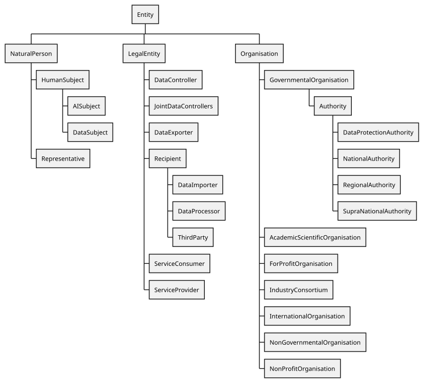 


 

 

DPV relies on existing well-founded interpretations for its concepts, which in this case relate to [=Entity=] as a generic universal concept and [=hasEntity=] as the relation used to associate it. The concept [=LegalEntity=] refers to entities defined legally or within legal norms. Expanding on these, DPV provides a taxonomy of entities based on their application within laws and use-cases in the form of [Legal roles](#entities-vocab-entities-legalrole), such as [=DataController=], [=DataSubject=], and [=Authority=] along with corresponding relations [=hasDataController=], [=hasDataProcessor=], and [=hasAuthority=]. Later, these concepts are expanded into taxonomies for different kinds of entities categorised under a common concept. For example, as [categories of Organisations](#entities-vocab-entities-organisation)..

 

The relation `isImplementedByEntity` indicates the entity that implements the specified context e.g. processing operation or process.

 


 

-  dpv:Entity: A human or non-human 'thing' that constitutes as an entity [go to full definition](https://w3id.org/dpv#Entity) 

 

  -  dpv:Agent: An Agent is a dpv:Entity that is (a) acting on behalf of another Entity; and (b) is authorised to do so by that Entity [go to full definition](https://w3id.org/dpv#Agent) 

 

    -  dpv:LegalAgent: A Legal Agent is a Legal Entity that is authorised to act on behalf of another entity [go to full definition](https://w3id.org/dpv#LegalAgent) 

 

 

 

  -  dpv:LegalEntity: A human or non-human 'thing' that constitutes as an entity and which is recognised and defined in law [go to full definition](https://w3id.org/dpv#LegalEntity) 

 

    -  dpv:LegalAgent: A Legal Agent is a Legal Entity that is authorised to act on behalf of another entity [go to full definition](https://w3id.org/dpv#LegalAgent) 

 

    -  dpv:Representative: A representative of a legal entity [go to full definition](https://w3id.org/dpv#Representative) 

 

 

 

  -  dpv:NaturalPerson: A human [go to full definition](https://w3id.org/dpv#NaturalPerson) 

 

 

 

-  dpv:ParentLegalEntity: A legal entity that has one or more subsidiary entities operating under it [go to full definition](https://w3id.org/dpv#ParentLegalEntity) 

 

-  dpv:PublicRegisterOfEntities: A publicly available list of entities e.g. to indicate which entities perform a certain activity within a certain location or jurisdiction [go to full definition](https://w3id.org/dpv#PublicRegisterOfEntities) 

 

-  dpv:SubsidiaryLegalEntity: A legal entity that operates as a subsidiary of another legal entity [go to full definition](https://w3id.org/dpv#SubsidiaryLegalEntity) 

 


 

 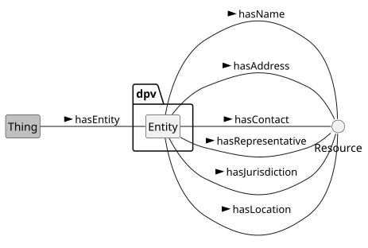 


 

 

To specify information about entities, DPV provides [=hasName=], [=hasAddress=], [=hasContact=], and [`hasIdentifier`](https://w3id.org/dpv#hasIdentifier) relations which can be used to indicate the name, address, contact, and identifier of the entity respectively. The properties are useful to indicate this information in a succinct manner within a context - such as in documentation and records. However, they are not sufficient to represent all relevant information about the entities, and are also not capable of representing complex information - such as alternate or common names, detailed addresses with cities and postcodes, and different kinds of contact information and identifiers. For this, we recommend using other existing vocabularies such as [schema.org](https://schema.org/).

 

 
<a id="entities-vocab-entities-legalrole"></a>

<a id="entities-L731"></a>
## Legal Roles
 

Legal Role is the role taken on by a legal entity based on definitions or criteria from laws, regulations, or other such normative sources. Legal roles assist in representing the role and responsibility of an entity within the context of processing, and from this to determine the requirements and obligations that should apply, and their compliance or conformance.

 


 

-  dpv:DataController: The individual or organisation that decides (or controls) the purpose(s) of processing personal data. [go to full definition](https://w3id.org/dpv#DataController) 

 

  -  dpv:JointDataControllers: A group of Data Controllers that jointly determine the purposes and means of processing [go to full definition](https://w3id.org/dpv#JointDataControllers) 

 

 

 

-  dpv:DataExporter: An entity that 'exports' data where exporting is considered a form of data transfer [go to full definition](https://w3id.org/dpv#DataExporter) 

 

-  dpv:DataProtectionOfficer: An entity within or authorised by an organisation to monitor internal compliance, inform and advise on data protection obligations and act as a contact point for data subjects and the supervisory authority. [go to full definition](https://w3id.org/dpv#DataProtectionOfficer) 

 

-  dpv:Recipient: Entities that receive data or technologies [go to full definition](https://w3id.org/dpv#Recipient) 

 

  -  dpv:DataImporter: An entity that 'imports' data where importing is considered a form of data transfer [go to full definition](https://w3id.org/dpv#DataImporter) 

 

  -  dpv:DataProcessor: A ‘processor’ means a natural or legal person, public authority, agency or other body which processes data on behalf of the controller. [go to full definition](https://w3id.org/dpv#DataProcessor) 

 

    -  dpv:DataSubProcessor: A 'sub-processor' is a processor engaged by another processor [go to full definition](https://w3id.org/dpv#DataSubProcessor) 

 

 

 

 

 

-  dpv:ServiceConsumer: The entity that consumes or receives the service [go to full definition](https://w3id.org/dpv#ServiceConsumer) 

 

-  dpv:ServiceProvider: The entity that provides a service [go to full definition](https://w3id.org/dpv#ServiceProvider) 

 

-  dpv:ThirdParty: A ‘third party’ means any natural or legal person other than - the entities directly involved or operating under those directly involved in a process [go to full definition](https://w3id.org/dpv#ThirdParty) 

 


 
<a id="entities-desc-data-controller"></a>

<a id="entities-L794"></a>
### Data Controller
 

A [=DataController=] is the entity responsible for the determination of processing of personal data. The exact meaning of 'responsible' and 'determination' varies across jurisdictions and laws. For example, [[GDPR]] defines a controller as the entity that determines 'means' and 'purposes' of processing personal data i.e. the entity that not only determine which data is being processed, but also the why and how of it. DPV does not prescribe to any particular jurisdictional definition, and the term 'Controller' here is analogous to the ISO term 'PII Controller'.

 

To indicate the name, address, and contact details for a controller, the properties `hasName`, `hasAddress`, and `hasContact` are provided. Other properties can also be used to provide this as well as additional details, such as [[[FOAF]]] or [Schema.org](https://schema.org/Organization).

 

To indicate an entity acting as the representative of the controller, the concept [=Representative=] and relation [=hasRepresentative=] are provided. Representatives can be present to maintain presence in multiple jurisdictions without the controller having to open new units in those divisions. The location or jurisdiction of representatives can be expressed by using the DPV concepts e.g. `hasLocation` and `hasJurisdiction`.

  

This example describes a controller with details for name, address, and contact, and its representatives for EU and US jurisdictions 


```
ex:Alpha a dpv:DataController ;
    dpv:hasName "Alpha" ;
    dpv:hasAddress "Somewhere, somewhere, somewhere" ;
    dpv:hasContact "email@example.com" ;
    dpv:hasRepresentative ex:RepA, ex:RepB .

ex:RepA a dpv:Representative, dpv:Organisation ;
    dpv:hasName "CompanyA Inc." ;
    dpv:isRepresentativeFor ex:Alpha ;
    dpv:hasJurisdiction loc:EU .

ex:RepB a dpv:Representative, dpv:Organisation ;
    dpv:hasName "CompanyB Inc." ;
    dpv:isRepresentativeFor ex:Alpha ;
    dpv:hasJurisdiction loc:US .

ex:PDH a dpv:Process ;
    dpv:hasDataController ex:Alpha .
```


 

(META Example ID: [`E0032`](https://w3id.org/dpv/examples#E0032); link: [source file](https://w3id.org/dpv/examples/E0032.ttl); contributed by Harshvardhan J. Pandit on 2024-06-10) 

 

 

 
<a id="entities-desc-data-processor"></a>

<a id="entities-L828"></a>
### Data Processor
 

A Data Processor is an entity which processes personal data on behalf of the controller i.e. the controller provides instructions to the processor for what processing activities to perform. The processor is only responsible for carrying out the processing as stipulated by the controller. The term 'Processor' is analogous to the ISO term 'PII Processor'. Name, address, and contact details of a processor can be specified using the same properties as that of a controller. Similarly, representatives of a processor can also be indicated by using the [=Representative=] and [=hasRepresentative=] concepts.

 

The instructions from a Controller to a Processor typically take the form of a `ControllerProcessorAgreement` which is a contract between the two entities. The contract can specify which entity takes on which role, what activities are to be performed by whom, and any other pertinent details regarding processing of personal data.

  

Acme is the Data Controller that contracts BetaInc as a Data Processor to analyse raw call logs and provide statistical patterns.

 


```
ex:Acme rdf:type dpv:DataController .
ex:BetaInc rdf:type dpv:DataProcessor .

ex:AcmeBetaContract rdf:type dpv:ControllerProcessorAgreement ;
    dpv:hasDataController ex:Acme ;
    dpv:hasDataProcessor ex:Beta ;
    # part1: acme sends data to beta
    dpv:hasProcess ex:AcmeProvision ;
    # part2: beta sends data to acme
    dpv:hasProcess ex:BetaProvision .

ex:AcmeProvision rdf:type dpv:Process ;
    skos:note "Acme transfers call logs to Beta"@en ;
    dpv:hasPersonalData ex:CallLogs ;
    dpv:hasProcessing ex:TransferCallLogs ;
    dpv:hasDataController ex:Acme ;
    dpv:hasDataProcessor ex:BetaInc .

ex:BetaProvision rdf:type dpv:Process ;
    skos:note "Beta analyses and transfers call statistics to Acme"@en ;
    dpv:hasPersonalData ex:CallStatistics ;
    dpv:hasProcessing ex:AnalyseCalls, ex:TransferStatistics ;
    dpv:hasDataProcessor ex:BetaInc ;
    dpv:hasRecipientDataController ex:Acme ;
    # alternative way to explicitly indicate who is implementing this
    dpv:isImplementedByEntity ex:BetaInc .

ex:CallLogs rdf:type dpv:PersonalData ;
    skos:broader pd:CallLog ;
    # denoting source of data as part of agreement
    dpv:hasDataSource ex:Acme .
ex:CallStatistics rdf:type dpv:DerivedData ;
    skos:broader ex:CallLogs ;
    dpv:hasDataSource ex:BetaInc .

ex:TransferCallLogs rdf:type dpv:Processing ;
    skos:broader dpv:Transfer ;
    dpv:hasPersonalData ex:CallLogs ;
    # alternative 1 - based on implementation and recipient
    dpv:isImplementedByEntity ex:Acme ;
    dpv:hasRecipient ex:BetaInc ; 
    # alternative 2 - based on data exporter/importer roles
    dpv:hasDataExporter ex:Acme ;
    dpv:hasDataImporter ex:BetaInc .

ex:AnalyseCalls rdf:type dpv:Processing ;
    skos:broader dpv:Analyse ;
    # no recipients, data is analysed by BetaInc
    dpv:isImplementedByEntity ex:BetaInc .

ex:TransferStatistics rdf:type dpv:Processing ;
    skos:broader dpv:Transfer ;
    dpv:hasPersonalData ex:CallStatistics ;
    # using alternative 2 from above
    dpv:hasDataExporter ex:BetaInc ;
    dpv:hasDataImporter ex:Acme .
```


 

(META Example ID: [`E0024`](https://w3id.org/dpv/examples#E0024); link: [source file](https://w3id.org/dpv/examples/E0024.ttl); contributed by Harshvardhan J. Pandit on 2024-06-10) 

  

 
<a id="entities-desc-recipient"></a>

<a id="entities-L899"></a>
### Data Recipient

<a id="entities-vocab-rights"></a>
 

[=Recipient=] represents the entity that receives data i.e. is the recipient for data. Recipients receive data through processing operations such as collect, share, and transfer. The relation [=hasRecipient=] indicates the entity that receives data. Recipients can be the controller, processor, or third party in use-cases. Processors are defined as a subcategory of Recipient as they need to receive data in order to process it. To explicitly denote that the recipient is a controller, the relation [=hasRecipientDataController=] is provided. It is useful in situations such as clarifying where the data controller receives data, or to indicate recipients in a joint controller relationships. To indicate a third party is the recipient, the relation [=hasRecipientThirdParty=] is provided.

  

This example first shows a process where the processor is denoted as the data recipient, and then another process where a third party is denoted as the recipient. A joint controller agreement is then shown which specifies that only one of the controllers involved is a data recipient. 


```
ex:PDH1 a dpv:Process ;
    dpv:hasPersonalData pd:EmailAddress ;
    dpv:hasProcessing dpv:Collect ;
    dpv:hasPurpose dpv:ServiceRegistration ;
    dpv:hasDataController ex:CompanyA ;
    dpv:hasDataProcessor ex:CompanyB ;
    # explicitly indicating entity receiving data
    dpv:hasRecipient ex:CompanyB .

ex:PDH2 a dpv:Process ;
    dpv:hasPersonalData pd:EmailAddress ;
    dpv:hasProcessing dpv:Share ;
    dpv:hasPurpose dpv:FraudPreventionAndDetection ;
    dpv:hasRecipientThirdParty ex:CompanyC .

ex:JC a dpv:JointDataControllersAgreement ;
    dpv:hasDataController ex:Company1, ex:Company2 ;
    dpv:hasPersonalData pd:EmailAddress ;
    dpv:hasProcessing dpv:Share ;
    dpv:hasRecipientDataController ex:Company1 .
```


 

(META Example ID: [`E0034`](https://w3id.org/dpv/examples#E0034); link: [source file](https://w3id.org/dpv/examples/E0034.ttl); contributed by Harshvardhan J. Pandit on 2024-06-10) 

 

 

 
<a id="entities-desc-third-party"></a>

<a id="entities-L933"></a>
### Third Party
 

A [=ThirdParty=] is an entity other than the data subject, data controller, data processor, or authority associated with a context or process. The nature of third parties' roles in such contexts are not defined in DPV.

 

 
<a id="entities-desc-DPO"></a>

<a id="entities-L938"></a>
### Data Protection Officer
 

A [=DataProtectionOfficer=] (DPO) is an entity within or authorised by an organisation to monitor internal compliance, inform and advise on data protection obligations and act as a contact point for data subjects and the supervisory authority. It is indicated by using the relation [=hasDataProtectionOfficer=]. A DPO is a legal entity and a representative of the organisation, and their name, address, and contact details can be specified using the same properties as any other representative or legal entity.

 

 
<a id="entities-desc-data-importer-exporter"></a>

<a id="entities-L943"></a>
### Data Importer/Exporter
 

When data is being transferred, especially across jurisdictions, the entity sending the data is called the [=DataExporter=] and the entity receiving it is called the [=DataImporter=]. When the exporter and importer are in different jurisdictions, the data transfer is indicated to be `CrossBorderDataTransfer`. Exporters and Importers are indicated by using the relations [=hasDataExporter=] and [=hasDataImporter=].

  

This example shows how data exporters and importers for a transfer can be indicated using DPV. It also shows how the locations associated with exporters and importers are relevant to determine cross-border transfers. 


```
ex:PDH a dpv:Process ;
    dpv:hasProcessing dpv:Transfer ;
    dpv:hasDataExporter ex:CompanyA ;
    dpv:hasDataImporter ex:CompanyB .

ex:CompanyA a dpv:DataExporter ;
    dpv:hasLocation loc:IE .
ex:CompanyB a dpv:DataImporter ;
    dpv:hasLocation loc:US . 

# cross-border IE -> US inference:
ex:PDH dpv:hasProcessing dpv:CrossBorderTransfer .

# Transfers can also be specified with only recipients
# If the exporter is known in existing context
# since the importer is always a recipient
# e.g. CompanyA is the controller and the sender/exporter
ex:PDH dpv:hasRecipient ex:CompanyB .
```


 

(META Example ID: [`E0035`](https://w3id.org/dpv/examples#E0035); link: [source file](https://w3id.org/dpv/examples/E0035.ttl); contributed by Harshvardhan J. Pandit on 2024-06-10) 

 

 

 

 
<a id="entities-vocab-entities-authority"></a>

<a id="entities-L977"></a>
## Authorities
 

The concept [=Authority=] is a specific Governmental Organisation authorised to enforce a law or regulation. Authorities can be associated with a specific domain, topic, or jurisdiction. DPV currently defines regional authorities for [=NationalAuthority=], [=RegionalAuthority=], and [=SupraNationalAuthority=], and [=DataProtectionAuthority=] represents authorities associated with data protection and privacy. To associate authorities with concepts, the relations [=hasAuthority=] and [=isAuthorityFor=] are provided.

 


 

-  dpv:Authority: An authority with the power to create or enforce laws, or determine their compliance. [go to full definition](https://w3id.org/dpv#Authority) 

 

  -  dpv:DataProtectionAuthority: An authority tasked with overseeing legal compliance regarding privacy and data protection laws. [go to full definition](https://w3id.org/dpv#DataProtectionAuthority) 

 

  -  dpv:NationalAuthority: An authority tasked with overseeing legal compliance for a nation [go to full definition](https://w3id.org/dpv#NationalAuthority) 

 

  -  dpv:RegionalAuthority: An authority tasked with overseeing legal compliance for a region [go to full definition](https://w3id.org/dpv#RegionalAuthority) 

 

  -  dpv:SupraNationalAuthority: An authority tasked with overseeing legal compliance for a supra-national union e.g. EU [go to full definition](https://w3id.org/dpv#SupraNationalAuthority) 

 

 

 


 
<a id="entities-desc-DPA"></a>

<a id="entities-L1009"></a>
### Data Protection Authority
 

A [=DataProtectionAuthority=] (DPA) is responsible for regulating laws associated with data protection and privacy. It is associated by using the relation [=hasAuthority=]. The [[LEGAL]] extensions provide authorities for jurisdictions, such as the DPAs responsible for enforcing [[GDPR]] in EU. For jurisdictional aspects such as 'lead' supervisory authority, see [[EU-GDPR]] extension.

  

This example shows how a DPA can be associated with processing, and the use of LEGAL extensions to obtain DPA information. It also shows how DPAs can be 'discovered' by using the location (jurisdiction) and applicable law concepts. 


```
ex:PDH a dpv:Process ;
    dpv:hasAuthority legal-ie:DPA-IE .

# in LEGAL-IE extension:
legal-ie:DPA-IE a dpv:DataProtectionAuthority ;
	skos:prefLabel "Data Protection Commission (DPC)"@en ;
    foaf:homepage "https://www.dataprotection.ie/"^^xsd:anyURI ;
    dpv:hasApplicableLaw legal-eu:law-GDPR,
        legal-ie:law-DPA ;
    dpv:hasJurisdiction loc:IE .

# Authorities can also be 'discovered' using location or law
ex:PDH a dpv:Process ;
	dpv:hasApplicableLaw legal-eu:law-GDPR ;
	dpv:hasLocation loc:IE . # Get GDPR authority for IE
ex:PDH a dpv:Process ;
	dpv:hasJurisdiction loc:IE . # Get authority for IE
```


 

(META Example ID: [`E0036`](https://w3id.org/dpv/examples#E0036); link: [source file](https://w3id.org/dpv/examples/E0036.ttl); contributed by Harshvardhan J. Pandit on 2024-06-10) 

 

 

 

 
<a id="entities-vocab-entities-organisation"></a>

<a id="entities-L1041"></a>
## Organisation
 

[=Organisation=] taxonomy allows expressing the category of kind of organisation an entity is. For example, [=GovernmentalOrganisation=] for government departments and units, [=NonGovernmentalOrganisation=] for NGOs, and so on. As these categories are fixed i.e. an entity cannot easily switch between them, the relation to indicate them is `rdf:type`.

 


 

-  dpv:CharityOrganisation: A nonprofit entity dedicated to providing assistance or raising funds for social, educational, religious, or other philanthropic purposes [go to full definition](https://w3id.org/dpv#CharityOrganisation) 

 

-  dpv:Organisation: A general term reflecting a company or a business or a group acting as a unit [go to full definition](https://w3id.org/dpv#Organisation) 

 

  -  dpv:AcademicScientificOrganisation: Organisations related to academia or scientific pursuits e.g. Universities, Schools, Research Bodies [go to full definition](https://w3id.org/dpv#AcademicScientificOrganisation) 

 

  -  dpv:Clinic: An organisation that is a smaller healthcare facility offering outpatient medical services for diagnosis and treatment [go to full definition](https://w3id.org/dpv#Clinic) 

 

  -  dpv:EducationalOrganisation: An organisation focused on delivering formal or informal education, training, or research [go to full definition](https://w3id.org/dpv#EducationalOrganisation) 

 

  -  dpv:EmergencyServiceProvider: An organisation tasked with providing emergency services such as by responding rapidly to urgent situations to protect lives, property, and the environment [go to full definition](https://w3id.org/dpv#EmergencyServiceProvider) 

 

    -  dpv:AmbulanceProvider: An organisation that that offers transportation and medical care to patients requiring urgent medical attention [go to full definition](https://w3id.org/dpv#AmbulanceProvider) 

 

    -  dpv:EmergencyHealthcareProvider: An organisation that is an emergency service provider focused on delivering immediate medical care to patients in critical or life-threatening situations [go to full definition](https://w3id.org/dpv#EmergencyHealthcareProvider) 

 

    -  dpv:FireDepartment: An organisation that is an emergency service provider for fire prevention, firefighting, and rescue services [go to full definition](https://w3id.org/dpv#FireDepartment) 

 

 

 

  -  dpv:ForProfitOrganisation: An organisation that aims to achieve profit as its primary goal [go to full definition](https://w3id.org/dpv#ForProfitOrganisation) 

 

  -  dpv:GovernmentalOrganisation: An organisation managed or part of government [go to full definition](https://w3id.org/dpv#GovernmentalOrganisation) 

 

  -  dpv:HealthcareOrganisation: An organisation that delivers medical services, promotes health, and provides care for individuals and communities [go to full definition](https://w3id.org/dpv#HealthcareOrganisation) 

 

  -  dpv:Hospital: An organisation that provides comprehensive medical treatment, including emergency care, surgeries, and inpatient services [go to full definition](https://w3id.org/dpv#Hospital) 

 

  -  dpv:IndustryConsortium: A consortium established and comprising on industry organisations [go to full definition](https://w3id.org/dpv#IndustryConsortium) 

 

  -  dpv:InternationalOrganisation: An organisation and its subordinate bodies governed by public international law, or any other body which is set up by, or on the basis of, an agreement between two or more countries [go to full definition](https://w3id.org/dpv#InternationalOrganisation) 

 

  -  dpv:JudicialOrganisation: An organisation involved in interpreting and applying the law, resolving disputes, and administering justice as part of the judicial system [go to full definition](https://w3id.org/dpv#JudicialOrganisation) 

 

  -  dpv:LawEnforcementOrganisation: An organisation that is an agency responsible for enforcing laws, maintaining public order, and ensuring public safety [go to full definition](https://w3id.org/dpv#LawEnforcementOrganisation) 

 

  -  dpv:NonGovernmentalOrganisation: An organisation not part of or independent from the government [go to full definition](https://w3id.org/dpv#NonGovernmentalOrganisation) 

 

  -  dpv:NonProfitOrganisation: An organisation that does not aim to achieve profit as its primary goal [go to full definition](https://w3id.org/dpv#NonProfitOrganisation) 

 

  -  dpv:ReligiousAssociations: An organisations that supports the practice, promotion, and management of religious activities and beliefs [go to full definition](https://w3id.org/dpv#ReligiousAssociations) 

 

 

 

-  dpv:OrganisationalUnit: Entity within an organisation that does not constitute as a separate legal entity [go to full definition](https://w3id.org/dpv#OrganisationalUnit) 

 

-  dpv:PrivateSectorBody: An organisation owned and operated by private individuals or companies [go to full definition](https://w3id.org/dpv#PrivateSectorBody) 

 

-  dpv:PublicSectorBody: A government-controlled organisation that provides services or goods to the public [go to full definition](https://w3id.org/dpv#PublicSectorBody) 

 

-  dpv:SMEOrganisation: An organisation that is characterised as a Small or Medium-sized Enterprise based on limited staff and revenue [go to full definition](https://w3id.org/dpv#SMEOrganisation) 

 

-  dpv:StartupOrganisation: An organisation that is newly established and is nascent in terms of available resources [go to full definition](https://w3id.org/dpv#StartupOrganisation) 

 


 
<a id="entities-vocab-entities-organisation-unit"></a>

<a id="entities-L1173"></a>
### Organisational Units
 

An [=OrganisationalUnit=] is a unit or department or division within an organisation which does not have its own separate legal identity. Such units enable accurately representing how an organisation functions and where the responsibility and accountability within an organisation is located. To indicate an organisation has a unit, the relations [=hasOrganisationalUnit=] and [=isOrganisationalUnitOf=] are used.

  

This example involves an organisation that is a NGO, and that it has Marketing, HR, and IT departments. The HR and IT departments are responsible for specific processes. 


```
ex:CompanyA rdf:type dpv:NonGovernmentalOrganisation ;
    dpv:hasOrganisationalUnit ex:Marketing, ex:HR, ex:IT .

ex:Marketing a dpv:OrganisationalUnit ;
    dpv:hasName "Marketing Department"@en ;
    dpv:isOrganisationalUnitOf ex:CompanyA .

ex:HR a dpv:OrganisationalUnit ;
    dpv:hasName "HR Department"@en ;
    dpv:isOrganisationalUnitOf ex:CompanyA .

ex:IT a dpv:OrganisationalUnit ;
    dpv:hasName "IT Department"@en ;
    dpv:isOrganisationalUnitOf ex:CompanyA .

ex:PDH1 a dpv:Process ;
    dpv:hasPurpose dpv:IdentityAuthentication ;
    dpv:isImplementedByEntity ex:IT .

ex:PDH2 a dpv:Process ;
    dpv:hasPurpose dpv:HumanResourceManagement ;
    dpv:isImplementedByEntity ex:HR .
```


 

(META Example ID: [`E0037`](https://w3id.org/dpv/examples#E0037); link: [source file](https://w3id.org/dpv/examples/E0037.ttl); contributed by Harshvardhan J. Pandit on 2024-06-10) 

 

 

 
<a id="entities-vocab-entities-organisation-subsidiary"></a>

<a id="entities-L1208"></a>
### Subsidiaries
 

[=SubsidiaryLegalEntity=] is a company (organisation) owned or controller by another company (organisation). To indicate a subsidiary for an entity, the relations [=hasSubsidiary=] and [=isSubsidiaryOf=] are used. For jurisdictional aspects associated with subsidiaries such as 'establishments' under the GDPR, see the [[EU-GDPR]] extension.

  

This example shows the existence of two subsidiaries associated with an organisation and their locations 


```
ex:CompanyA a dpv:Organisation ;
    dpv:hasSubsidiary ex:CompanyM, ex:CompanyN .

ex:CompanyM a dpv:Organisation, dpv:SubsidiaryLegalEntity ;
    dpv:isSubsidiaryOf ex:CompanyA ;
    dpv:hasLocation loc:IE .

ex:CompanyN a dpv:Organisation, dpv:SubsidiaryLegalEntity ;
    dpv:isSubsidiaryOf ex:CompanyA ;
    dpv:hasLocation loc:NL .
```


 

(META Example ID: [`E0038`](https://w3id.org/dpv/examples#E0038); link: [source file](https://w3id.org/dpv/examples/E0038.ttl); contributed by Harshvardhan J. Pandit on 2024-06-10) 

 

 

 

 
<a id="entities-vocab-entities-datasubject"></a>

<a id="entities-L1233"></a>
## Human/Data Subjects
 

DPV provides a taxonomy of [=HumanSubject=] categories to assist with describing what kind of individuals or groups are associated with an use-case. These can be indicated through the relation [=hasHumanSubject=]. Some examples of such types are agency-based roles: [=Adult=] and [=Child=], [=ParentOfHuman=], [=GuardianOfHuman=]; those associated with vulnerability: [=VulnerableHuman=], [=ElderlyHuman=], [=AsylumSeeker=]; domain-specific roles such as [=Patient=], [=Employee=], [=Student=], jurisdictional roles such as [=Citizen=], [=NonCitizen=], [=Immigrant=]; and general roles such as [=User=], [=Member=], [=Participant=], and [=Client=].

 

[=DataSubject=] is a specific category of [=HumanSubject=] that indicates the person is the subject of (their personal) data. It can be associated through the relation [=hasDataSubject=].

  

Since DPV v2.1, the concept [=HumanSubject=] represents humans who are a subject of something (in DPV, it could be data or technologies such as AI). The concept [=DataSubject=] is a specific subcategory where humans are the subject of processing of (their) personal data. This allows the taxonomy of subjects, which were initially defined only for data subjects, to be used for subjects involved in other contexts such as `tech:Subject`.

 

Potential Breaking Change The introduction of [=HumanSubject=] can cause a (minor) breaking change for use-cases where the [=DataSubject=] categories were being used as these are now defined as instances of [=HumanSubject=] instead of [=DataSubject=]. Semantically, this is not an issue as [=DataSubject=] is a subclass of [=HumanSubject=]. Therefore, the fix is to change the implementation to use categories of [=HumanSubject=] instead. 

  

This example shows the different ways in which data subjects can be indicated in a process. It also shows how the DPV taxonomy of data subjects can be used to combine concepts to accurately represent the data subject involved. And it also shows how information associated with specific data subjects such as identifiers can be indicated. 


```
ex:PDH a dpv:Process ;
    dpv:hasDataSubject dpv:Consumer ; # consumer as subjects
    dpv:hasDataSubject dpv:AsylumSeeker ; # vulnerable subject
    dpv:hasDataSubject dpv:Child ; # minor or children
    dpv:hasDataSubject [
        a dpv:DataSubject ;
        skos:broader dpv:Customer, dpv:Student ;
        skos:description "Customers that are Students"@en ;
    ] ;
    dpv:hasDataSubject [
        a dpv:DataSubject, dpv:Patient ;
        dpv:hasIdentifier "X1n31123knf3" ;
    ] .
```


 

(META Example ID: [`E0039`](https://w3id.org/dpv/examples#E0039); link: [source file](https://w3id.org/dpv/examples/E0039.ttl); contributed by Harshvardhan J. Pandit on 2024-06-10) 

 

  

This example shows how the involvement of humans can be expressed in various contexts. The first part shows how a specific individual can be asserted to be involved as a 'human subject' in some process. The second part shows how a process or service can assert the involvement of specific categories of humans as subjects. The third part shows how humans can be expressed to be involved in a specific role (as participants) and are declared to be vulnerable. The fourth part clarifies the distinction between stating involvement of users as humans for oversight, and as data subjects in relation to their personal data. 


```
# 1) Expressing a person is a human subject (in some context)
ex:Alice a dpv:HumanSubject .
ex:SampleProcess dpv:hasHumanSubject ex:Alice .
# 2) Expressing some process or service involves human subjects
ex:Service dpv:hasHumanSubject dpv:Tourist .
ex:MedicalExperiment dpv:hasHumanSubject dpv:Patient .
# 3) Expressing human subjects involved are vulnerable
ex:MedicalTrial a dpv:Process ;
    dpv:hasHumanSubject [
        a dpv:HumanSubject ;
        skos:broader dpv:Participant, dpv:VulnerableHuman ;
        dct:description "Participating subjects who have condition X"@en ;
    ] .
# 4) Data Subjects is a specific role for Human Subjects
ex:DataProcess a dpv:Process ;
    # Human Subject only indicates involvement of the User as a Human
    dpv:hasHumanSubject dpv:User ;
    dpv:hasHumanInvolvement dpv:HumanInvolvementForOversight ;
    # Data Subject means the User is the 'subject of personal data'
    dpv:hasDataSubject dpv:User .
```


 

(META Example ID: [`E0074`](https://w3id.org/dpv/examples#E0074); link: [source file](https://w3id.org/dpv/examples/E0074.ttl); contributed by Harshvardhan J. Pandit on 2024-12-17) 

 

 


 

-  dpv:HumanSubject: The individual (or category of individuals) that is the subject within some context such as personal data (dpv:DataSubject) or technology (tech:Subject) [go to full definition](https://w3id.org/dpv#HumanSubject) 

 

  -  dpv:Adult: A natural person that is not a child i.e. has attained some legally specified age of adulthood [go to full definition](https://w3id.org/dpv#Adult) 

 

  -  dpv:Applicant: Humans that are applicants in some context [go to full definition](https://w3id.org/dpv#Applicant) 

 

  -  dpv:Citizen: Humans that are citizens (for a jurisdiction) [go to full definition](https://w3id.org/dpv#Citizen) 

 

  -  dpv:Consumer: Humans that consume goods or services for direct use [go to full definition](https://w3id.org/dpv#Consumer) 

 

  -  dpv:Customer: Humans that purchase goods or services [go to full definition](https://w3id.org/dpv#Customer) 

 

    -  dpv:Client: Humans that are clients or recipients of services [go to full definition](https://w3id.org/dpv#Client) 

 

 

 

  -  dpv:DataSubject: The individual (or category of individuals) whose personal data is being processed [go to full definition](https://w3id.org/dpv#DataSubject) 

 

  -  dpv:Employee: Humans that are employees [go to full definition](https://w3id.org/dpv#Employee) 

 

  -  dpv:GuardianOfHuman: Guardian(s) of humans [go to full definition](https://w3id.org/dpv#GuardianOfHuman) 

 

    -  dpv:GuardianOfDataSubject: Guardian(s) of data subjects such as children [go to full definition](https://w3id.org/dpv#GuardianOfDataSubject) 

 

 

 

  -  dpv:Immigrant: Humans that are immigrants (for a jurisdiction) [go to full definition](https://w3id.org/dpv#Immigrant) 

 

  -  dpv:JobApplicant: Humans that apply for jobs or employments [go to full definition](https://w3id.org/dpv#JobApplicant) 

 

  -  dpv:Member: Humans that are members of a group, organisation, or other collectives [go to full definition](https://w3id.org/dpv#Member) 

 

  -  dpv:NonCitizen: Humans that are not citizens (for a jurisdiction) [go to full definition](https://w3id.org/dpv#NonCitizen) 

 

  -  dpv:ParentOfHuman: Parent(s) of humans [go to full definition](https://w3id.org/dpv#ParentOfHuman) 

 

    -  dpv:ParentOfDataSubject: Parent(s) of data subjects such as children [go to full definition](https://w3id.org/dpv#ParentOfDataSubject) 

 

 

 

  -  dpv:Participant: Humans that participate in some context such as volunteers in a function [go to full definition](https://w3id.org/dpv#Participant) 

 

  -  dpv:Patient: Humans that receive medical attention, treatment, care, advice, or other health related services [go to full definition](https://w3id.org/dpv#Patient) 

 

  -  dpv:Student: Humans that are students [go to full definition](https://w3id.org/dpv#Student) 

 

  -  dpv:Subscriber: Humans that subscribe to service(s) [go to full definition](https://w3id.org/dpv#Subscriber) 

 

  -  dpv:Tourist: Humans that are tourists i.e. not citizens and not immigrants [go to full definition](https://w3id.org/dpv#Tourist) 

 

  -  dpv:User: Humans that use service(s) [go to full definition](https://w3id.org/dpv#User) 

 

  -  dpv:Visitor: Humans that are temporary visitors [go to full definition](https://w3id.org/dpv#Visitor) 

 

  -  dpv:VulnerableHuman: Human(s) which should be considered 'vulnerable' within the context [go to full definition](https://w3id.org/dpv#VulnerableHuman) 

 

    -  dpv:AsylumSeeker: Humans that are asylum seekers [go to full definition](https://w3id.org/dpv#AsylumSeeker) 

 

    -  dpv:Child: A 'child' is a natural legal person who is below a certain legal age depending on the legal jurisdiction. [go to full definition](https://w3id.org/dpv#Child) 

 

    -  dpv:ElderlyHuman: Humans that are considered elderly (i.e. based on age) [go to full definition](https://w3id.org/dpv#ElderlyHuman) 

 

    -  dpv:MentallyVulnerableHuman: Humans that are considered mentally vulnerable within the context [go to full definition](https://w3id.org/dpv#MentallyVulnerableHuman) 

 

      -  dpv:MentallyVulnerableDataSubject: Data subjects that are considered mentally vulnerable [go to full definition](https://w3id.org/dpv#MentallyVulnerableDataSubject) 

 

 

 

    -  dpv:VulnerableDataSubject: Humans which should be considered 'vulnerable' and therefore would require additional measures and safeguards [go to full definition](https://w3id.org/dpv#VulnerableDataSubject) 

 

      -  dpv:ElderlyDataSubject: Data subjects that are considered elderly (i.e. based on age) [go to full definition](https://w3id.org/dpv#ElderlyDataSubject) 

 

      -  dpv:MentallyVulnerableDataSubject: Data subjects that are considered mentally vulnerable [go to full definition](https://w3id.org/dpv#MentallyVulnerableDataSubject)

<a id="entities-L1468"></a>
## Vocabulary Index
 
<a id="entities-classes"></a>

<a id="entities-L1470"></a>
### Classes
 
<a id="entities-AcademicScientificOrganisation"></a>

<a id="entities-L1471"></a>
#### Academic or Scientific Organisation
 

- Term | AcademicScientificOrganisation | Prefix | dpv
- Label | Academic or Scientific Organisation
- IRI | [https://w3id.org/dpv#AcademicScientificOrganisation](https://w3id.org/dpv#AcademicScientificOrganisation)
- Type | [rdfs:Class](http://www.w3.org/2000/01/rdf-schema#Class), [skos:Concept](http://www.w3.org/2004/02/skos/core#Concept)
- Broader/Parent types | [dpv:Organisation](#entities-Organisation) → [dpv:LegalEntity](#entities-LegalEntity) → [dpv:Entity](#entities-Entity)
- Object of relation | [dpv:hasActiveEntity](https://w3id.org/dpv#hasActiveEntity), [dpv:hasEntity](#entities-hasEntity), [dpv:hasNonInvolvedEntity](https://w3id.org/dpv#hasNonInvolvedEntity), [dpv:hasParty](https://w3id.org/dpv#hasParty), [dpv:hasPassiveEntity](https://w3id.org/dpv#hasPassiveEntity), [dpv:hasResponsibleEntity](#entities-hasResponsibleEntity), [dpv:hasSubsidiary](https://w3id.org/dpv#hasSubsidiary), [dpv:isDeterminedByEntity](https://w3id.org/dpv#isDeterminedByEntity), [dpv:isImplementedByEntity](https://w3id.org/dpv#isImplementedByEntity), [dpv:isIndicatedBy](https://w3id.org/dpv#isIndicatedBy), [dpv:isOrganisationalUnitOf](#entities-isOrganisationalUnitOf), [dpv:isRepresentativeFor](#entities-isRepresentativeFor), [dpv:isSubsidiaryOf](#entities-isSubsidiaryOf), [eu-gdpr:hasEstablishment](https://w3id.org/dpv/legal/eu/gdpr#hasEstablishment), [eu-gdpr:hasMainEstablishment](https://w3id.org/dpv/legal/eu/gdpr#hasMainEstablishment), [eu-gdpr:isMainEstablishmentFor](https://w3id.org/dpv/legal/eu/gdpr#isMainEstablishmentFor)
- Definition | Organisations related to academia or scientific pursuits e.g. Universities, Schools, Research Bodies
- Source | [ADMS controlled vocabulary](http://purl.org/adms)
- Date Created | 2022-02-02
- Date Modified | 2020-10-05
- Contributors | Harshvardhan J. Pandit
- See More: | section [ENTITIES-ORGANISATION](#entities-vocab-entities-organisation) in [DPV](https://w3id.org/dpv#)

 

 
<a id="entities-Adult"></a>

<a id="entities-L1569"></a>
#### Adult
 

- Term | Adult | Prefix | dpv
- Label | Adult
- IRI | [https://w3id.org/dpv#Adult](https://w3id.org/dpv#Adult)
- Type | [rdfs:Class](http://www.w3.org/2000/01/rdf-schema#Class), [skos:Concept](http://www.w3.org/2004/02/skos/core#Concept), [dpv:HumanSubject](https://w3id.org/dpv#HumanSubject)
- Broader/Parent types | [dpv:HumanSubject](#entities-HumanSubject) → [dpv:LegalEntity](#entities-LegalEntity) → [dpv:Entity](#entities-Entity)
- Object of relation | [dpv:hasActiveEntity](https://w3id.org/dpv#hasActiveEntity), [dpv:hasEntity](#entities-hasEntity), [dpv:hasHumanSubject](https://w3id.org/dpv#hasHumanSubject), [dpv:hasNonInvolvedEntity](https://w3id.org/dpv#hasNonInvolvedEntity), [dpv:hasParty](https://w3id.org/dpv#hasParty), [dpv:hasPassiveEntity](https://w3id.org/dpv#hasPassiveEntity), [dpv:hasResponsibleEntity](#entities-hasResponsibleEntity), [dpv:isDeterminedByEntity](https://w3id.org/dpv#isDeterminedByEntity), [dpv:isImplementedByEntity](https://w3id.org/dpv#isImplementedByEntity), [dpv:isIndicatedBy](https://w3id.org/dpv#isIndicatedBy), [dpv:isOrganisationalUnitOf](#entities-isOrganisationalUnitOf), [dpv:isRepresentativeFor](#entities-isRepresentativeFor), [eu-gdpr:hasEstablishment](https://w3id.org/dpv/legal/eu/gdpr#hasEstablishment), [eu-gdpr:hasMainEstablishment](https://w3id.org/dpv/legal/eu/gdpr#hasMainEstablishment), [eu-gdpr:isMainEstablishmentFor](https://w3id.org/dpv/legal/eu/gdpr#isMainEstablishmentFor)
- Definition | A natural person that is not a child i.e. has attained some legally specified age of adulthood
- Date Created | 2022-03-30
- Date Modified | 2024-12-17
- Contributors | Georg P. Krog
- See More: | section [ENTITIES-DATASUBJECT](#entities-vocab-entities-datasubject) in [DPV](https://w3id.org/dpv#)

 

 
<a id="entities-Agent"></a>

<a id="entities-L1663"></a>
#### Agent
 

- Term | Agent | Prefix | dpv
- Label | Agent
- IRI | [https://w3id.org/dpv#Agent](https://w3id.org/dpv#Agent)
- Type | [rdfs:Class](http://www.w3.org/2000/01/rdf-schema#Class), [skos:Concept](http://www.w3.org/2004/02/skos/core#Concept)
- Broader/Parent types | [dpv:Entity](#entities-Entity)
- Object of relation | [dpv:hasActiveEntity](https://w3id.org/dpv#hasActiveEntity), [dpv:hasEntity](#entities-hasEntity), [dpv:hasNonInvolvedEntity](https://w3id.org/dpv#hasNonInvolvedEntity), [dpv:hasPassiveEntity](https://w3id.org/dpv#hasPassiveEntity), [dpv:hasResponsibleEntity](#entities-hasResponsibleEntity), [dpv:isDeterminedByEntity](https://w3id.org/dpv#isDeterminedByEntity), [dpv:isImplementedByEntity](https://w3id.org/dpv#isImplementedByEntity), [dpv:isIndicatedBy](https://w3id.org/dpv#isIndicatedBy), [dpv:isOrganisationalUnitOf](#entities-isOrganisationalUnitOf), [dpv:isRepresentativeFor](#entities-isRepresentativeFor)
- Definition | An Agent is a dpv:Entity that is (a) acting on behalf of another Entity; and (b) is authorised to do so by that Entity
- Usage Note | the Entity the Agent is acting on behalf of can be a human or non-human and a legal or non-legal entity. For specific distinction, see dpv:LegalAgent and tech:MachineAgent. The form and validity of authorisation through which the Agent is empowered to represent and act on behalf of the Entity is not defined or covered in this concept
- Date Created | 2025-10-28
- Contributors | Harshvardhan J. Pandit
- See More: | section [ENTITIES](#entities-vocab-entities) in [DPV](https://w3id.org/dpv#)

 

 
<a id="entities-AmbulanceProvider"></a>

<a id="entities-L1750"></a>
#### Ambulance Provider
 

- Term | AmbulanceProvider | Prefix | dpv
- Label | Ambulance Provider
- IRI | [https://w3id.org/dpv#AmbulanceProvider](https://w3id.org/dpv#AmbulanceProvider)
- Type | [rdfs:Class](http://www.w3.org/2000/01/rdf-schema#Class), [skos:Concept](http://www.w3.org/2004/02/skos/core#Concept)
- Broader/Parent types | [dpv:EmergencyServiceProvider](#entities-EmergencyServiceProvider) → [dpv:Organisation](#entities-Organisation) → [dpv:LegalEntity](#entities-LegalEntity) → [dpv:Entity](#entities-Entity)
- Object of relation | [dpv:hasActiveEntity](https://w3id.org/dpv#hasActiveEntity), [dpv:hasEntity](#entities-hasEntity), [dpv:hasNonInvolvedEntity](https://w3id.org/dpv#hasNonInvolvedEntity), [dpv:hasParty](https://w3id.org/dpv#hasParty), [dpv:hasPassiveEntity](https://w3id.org/dpv#hasPassiveEntity), [dpv:hasResponsibleEntity](#entities-hasResponsibleEntity), [dpv:hasSubsidiary](https://w3id.org/dpv#hasSubsidiary), [dpv:isDeterminedByEntity](https://w3id.org/dpv#isDeterminedByEntity), [dpv:isImplementedByEntity](https://w3id.org/dpv#isImplementedByEntity), [dpv:isIndicatedBy](https://w3id.org/dpv#isIndicatedBy), [dpv:isOrganisationalUnitOf](#entities-isOrganisationalUnitOf), [dpv:isRepresentativeFor](#entities-isRepresentativeFor), [dpv:isSubsidiaryOf](#entities-isSubsidiaryOf), [eu-gdpr:hasEstablishment](https://w3id.org/dpv/legal/eu/gdpr#hasEstablishment), [eu-gdpr:hasMainEstablishment](https://w3id.org/dpv/legal/eu/gdpr#hasMainEstablishment), [eu-gdpr:isMainEstablishmentFor](https://w3id.org/dpv/legal/eu/gdpr#isMainEstablishmentFor)
- Definition | An organisation that that offers transportation and medical care to patients requiring urgent medical attention
- Date Created | 2024-12-01
- Contributors | Delaram Golpayegani
- See More: | section [ENTITIES-ORGANISATION](#entities-vocab-entities-organisation) in [DPV](https://w3id.org/dpv#)

 

 
<a id="entities-Applicant"></a>

<a id="entities-L1843"></a>
#### Applicant
 

- Term | Applicant | Prefix | dpv
- Label | Applicant
- IRI | [https://w3id.org/dpv#Applicant](https://w3id.org/dpv#Applicant)
- Type | [rdfs:Class](http://www.w3.org/2000/01/rdf-schema#Class), [skos:Concept](http://www.w3.org/2004/02/skos/core#Concept), [dpv:HumanSubject](https://w3id.org/dpv#HumanSubject)
- Broader/Parent types | [dpv:HumanSubject](#entities-HumanSubject) → [dpv:LegalEntity](#entities-LegalEntity) → [dpv:Entity](#entities-Entity)
- Object of relation | [dpv:hasActiveEntity](https://w3id.org/dpv#hasActiveEntity), [dpv:hasEntity](#entities-hasEntity), [dpv:hasHumanSubject](https://w3id.org/dpv#hasHumanSubject), [dpv:hasNonInvolvedEntity](https://w3id.org/dpv#hasNonInvolvedEntity), [dpv:hasParty](https://w3id.org/dpv#hasParty), [dpv:hasPassiveEntity](https://w3id.org/dpv#hasPassiveEntity), [dpv:hasResponsibleEntity](#entities-hasResponsibleEntity), [dpv:isDeterminedByEntity](https://w3id.org/dpv#isDeterminedByEntity), [dpv:isImplementedByEntity](https://w3id.org/dpv#isImplementedByEntity), [dpv:isIndicatedBy](https://w3id.org/dpv#isIndicatedBy), [dpv:isOrganisationalUnitOf](#entities-isOrganisationalUnitOf), [dpv:isRepresentativeFor](#entities-isRepresentativeFor), [eu-gdpr:hasEstablishment](https://w3id.org/dpv/legal/eu/gdpr#hasEstablishment), [eu-gdpr:hasMainEstablishment](https://w3id.org/dpv/legal/eu/gdpr#hasMainEstablishment), [eu-gdpr:isMainEstablishmentFor](https://w3id.org/dpv/legal/eu/gdpr#isMainEstablishmentFor)
- Definition | Humans that are applicants in some context
- Date Created | 2022-04-06
- Date Modified | 2024-12-17
- Contributors | Beatriz Esteves, Georg P. Krog, Harshvardhan J. Pandit, Julian Flake, Paul Ryan
- See More: | section [ENTITIES-DATASUBJECT](#entities-vocab-entities-datasubject) in [DPV](https://w3id.org/dpv#)

 

 
<a id="entities-AsylumSeeker"></a>

<a id="entities-L1937"></a>
#### Asylum Seeker
 

- Term | AsylumSeeker | Prefix | dpv
- Label | Asylum Seeker
- IRI | [https://w3id.org/dpv#AsylumSeeker](https://w3id.org/dpv#AsylumSeeker)
- Type | [rdfs:Class](http://www.w3.org/2000/01/rdf-schema#Class), [skos:Concept](http://www.w3.org/2004/02/skos/core#Concept), [dpv:HumanSubject](https://w3id.org/dpv#HumanSubject)
- Broader/Parent types | [dpv:VulnerableHuman](#entities-VulnerableHuman) → [dpv:HumanSubject](#entities-HumanSubject) → [dpv:LegalEntity](#entities-LegalEntity) → [dpv:Entity](#entities-Entity)
- Object of relation | [dpv:hasActiveEntity](https://w3id.org/dpv#hasActiveEntity), [dpv:hasEntity](#entities-hasEntity), [dpv:hasHumanSubject](https://w3id.org/dpv#hasHumanSubject), [dpv:hasNonInvolvedEntity](https://w3id.org/dpv#hasNonInvolvedEntity), [dpv:hasParty](https://w3id.org/dpv#hasParty), [dpv:hasPassiveEntity](https://w3id.org/dpv#hasPassiveEntity), [dpv:hasResponsibleEntity](#entities-hasResponsibleEntity), [dpv:isDeterminedByEntity](https://w3id.org/dpv#isDeterminedByEntity), [dpv:isImplementedByEntity](https://w3id.org/dpv#isImplementedByEntity), [dpv:isIndicatedBy](https://w3id.org/dpv#isIndicatedBy), [dpv:isOrganisationalUnitOf](#entities-isOrganisationalUnitOf), [dpv:isRepresentativeFor](#entities-isRepresentativeFor), [eu-gdpr:hasEstablishment](https://w3id.org/dpv/legal/eu/gdpr#hasEstablishment), [eu-gdpr:hasMainEstablishment](https://w3id.org/dpv/legal/eu/gdpr#hasMainEstablishment), [eu-gdpr:isMainEstablishmentFor](https://w3id.org/dpv/legal/eu/gdpr#isMainEstablishmentFor)
- Definition | Humans that are asylum seekers
- Date Created | 2022-06-15
- Date Modified | 2024-12-17
- Contributors | Georg P. Krog
- See More: | section [ENTITIES-DATASUBJECT](#entities-vocab-entities-datasubject) in [DPV](https://w3id.org/dpv#)

 

 
<a id="entities-Authority"></a>

<a id="entities-L2032"></a>
#### Authority
 

- Term | Authority | Prefix | dpv
- Label | Authority
- IRI | [https://w3id.org/dpv#Authority](https://w3id.org/dpv#Authority)
- Type | [rdfs:Class](http://www.w3.org/2000/01/rdf-schema#Class), [skos:Concept](http://www.w3.org/2004/02/skos/core#Concept)
- Broader/Parent types | [dpv:GovernmentalOrganisation](#entities-GovernmentalOrganisation) → [dpv:Organisation](#entities-Organisation) → [dpv:LegalEntity](#entities-LegalEntity) → [dpv:Entity](#entities-Entity)
- Subject of relation | [dpv:isAuthorityFor](#entities-isAuthorityFor)
- Object of relation | [dpv:hasActiveEntity](https://w3id.org/dpv#hasActiveEntity), [dpv:hasAuthority](#entities-hasAuthority), [dpv:hasEntity](#entities-hasEntity), [dpv:hasNonInvolvedEntity](https://w3id.org/dpv#hasNonInvolvedEntity), [dpv:hasParty](https://w3id.org/dpv#hasParty), [dpv:hasPassiveEntity](https://w3id.org/dpv#hasPassiveEntity), [dpv:hasResponsibleEntity](#entities-hasResponsibleEntity), [dpv:hasSubsidiary](https://w3id.org/dpv#hasSubsidiary), [dpv:isDeterminedByEntity](https://w3id.org/dpv#isDeterminedByEntity), [dpv:isImplementedByEntity](https://w3id.org/dpv#isImplementedByEntity), [dpv:isIndicatedBy](https://w3id.org/dpv#isIndicatedBy), [dpv:isOrganisationalUnitOf](#entities-isOrganisationalUnitOf), [dpv:isRepresentativeFor](#entities-isRepresentativeFor), [dpv:isSubsidiaryOf](#entities-isSubsidiaryOf), [eu-gdpr:hasEstablishment](https://w3id.org/dpv/legal/eu/gdpr#hasEstablishment), [eu-gdpr:hasMainEstablishment](https://w3id.org/dpv/legal/eu/gdpr#hasMainEstablishment), [eu-gdpr:isMainEstablishmentFor](https://w3id.org/dpv/legal/eu/gdpr#isMainEstablishmentFor)
- Definition | An authority with the power to create or enforce laws, or determine their compliance.
- Date Created | 2020-11-04
- Contributors | Georg P. Krog, Harshvardhan J. Pandit, Paul Ryan
- See More: | section [ENTITIES-AUTHORITY](#entities-vocab-entities-authority) in [DPV](https://w3id.org/dpv#)

 

 
<a id="entities-CharityOrganisation"></a>

<a id="entities-L2130"></a>
#### Charity Organisation
 

- Term | CharityOrganisation | Prefix | dpv
- Label | Charity Organisation
- IRI | [https://w3id.org/dpv#CharityOrganisation](https://w3id.org/dpv#CharityOrganisation)
- Type | [rdfs:Class](http://www.w3.org/2000/01/rdf-schema#Class), [skos:Concept](http://www.w3.org/2004/02/skos/core#Concept)
- Broader/Parent types | [dpv:LegalEntity](#entities-LegalEntity) → [dpv:Entity](#entities-Entity)
- Object of relation | [dpv:hasActiveEntity](https://w3id.org/dpv#hasActiveEntity), [dpv:hasEntity](#entities-hasEntity), [dpv:hasNonInvolvedEntity](https://w3id.org/dpv#hasNonInvolvedEntity), [dpv:hasParty](https://w3id.org/dpv#hasParty), [dpv:hasPassiveEntity](https://w3id.org/dpv#hasPassiveEntity), [dpv:hasResponsibleEntity](#entities-hasResponsibleEntity), [dpv:isDeterminedByEntity](https://w3id.org/dpv#isDeterminedByEntity), [dpv:isImplementedByEntity](https://w3id.org/dpv#isImplementedByEntity), [dpv:isIndicatedBy](https://w3id.org/dpv#isIndicatedBy), [dpv:isOrganisationalUnitOf](#entities-isOrganisationalUnitOf), [dpv:isRepresentativeFor](#entities-isRepresentativeFor), [eu-gdpr:hasEstablishment](https://w3id.org/dpv/legal/eu/gdpr#hasEstablishment), [eu-gdpr:hasMainEstablishment](https://w3id.org/dpv/legal/eu/gdpr#hasMainEstablishment), [eu-gdpr:isMainEstablishmentFor](https://w3id.org/dpv/legal/eu/gdpr#isMainEstablishmentFor)
- Definition | A nonprofit entity dedicated to providing assistance or raising funds for social, educational, religious, or other philanthropic purposes
- Date Created | 2024-12-01
- Contributors | Georg P. Krog
- See More: | section [ENTITIES-ORGANISATION](#entities-vocab-entities-organisation) in [DPV](https://w3id.org/dpv#)

 

 
<a id="entities-Child"></a>

<a id="entities-L2219"></a>
#### Child
 

- Term | Child | Prefix | dpv
- Label | Child
- IRI | [https://w3id.org/dpv#Child](https://w3id.org/dpv#Child)
- Type | [rdfs:Class](http://www.w3.org/2000/01/rdf-schema#Class), [skos:Concept](http://www.w3.org/2004/02/skos/core#Concept), [dpv:HumanSubject](https://w3id.org/dpv#HumanSubject)
- Broader/Parent types | [dpv:VulnerableHuman](#entities-VulnerableHuman) → [dpv:HumanSubject](#entities-HumanSubject) → [dpv:LegalEntity](#entities-LegalEntity) → [dpv:Entity](#entities-Entity)
- Object of relation | [dpv:hasActiveEntity](https://w3id.org/dpv#hasActiveEntity), [dpv:hasEntity](#entities-hasEntity), [dpv:hasHumanSubject](https://w3id.org/dpv#hasHumanSubject), [dpv:hasNonInvolvedEntity](https://w3id.org/dpv#hasNonInvolvedEntity), [dpv:hasParty](https://w3id.org/dpv#hasParty), [dpv:hasPassiveEntity](https://w3id.org/dpv#hasPassiveEntity), [dpv:hasResponsibleEntity](#entities-hasResponsibleEntity), [dpv:isDeterminedByEntity](https://w3id.org/dpv#isDeterminedByEntity), [dpv:isImplementedByEntity](https://w3id.org/dpv#isImplementedByEntity), [dpv:isIndicatedBy](https://w3id.org/dpv#isIndicatedBy), [dpv:isOrganisationalUnitOf](#entities-isOrganisationalUnitOf), [dpv:isRepresentativeFor](#entities-isRepresentativeFor), [eu-gdpr:hasEstablishment](https://w3id.org/dpv/legal/eu/gdpr#hasEstablishment), [eu-gdpr:hasMainEstablishment](https://w3id.org/dpv/legal/eu/gdpr#hasMainEstablishment), [eu-gdpr:isMainEstablishmentFor](https://w3id.org/dpv/legal/eu/gdpr#isMainEstablishmentFor)
- Definition | A 'child' is a natural legal person who is below a certain legal age depending on the legal jurisdiction.
- Usage Note | The legality of age defining a child varies by jurisdiction. In addition, 'child' is distinct from a 'minor'. For example, the legal age for consumption of alcohol can be 21, which makes a person of age 20 a 'minor' in this context. In other cases, 'minor' and 'child' are used interchangeably to refer to a person below some legally defined age.
- Date Created | 2020-11-25
- Date Modified | 2024-12-17
- Contributors | Harshvardhan J. Pandit
- See More: | section [ENTITIES-DATASUBJECT](#entities-vocab-entities-datasubject) in [DPV](https://w3id.org/dpv#)

 

 
<a id="entities-Citizen"></a>

<a id="entities-L2317"></a>
#### Citizen
 

- Term | Citizen | Prefix | dpv
- Label | Citizen
- IRI | [https://w3id.org/dpv#Citizen](https://w3id.org/dpv#Citizen)
- Type | [rdfs:Class](http://www.w3.org/2000/01/rdf-schema#Class), [skos:Concept](http://www.w3.org/2004/02/skos/core#Concept), [dpv:HumanSubject](https://w3id.org/dpv#HumanSubject)
- Broader/Parent types | [dpv:HumanSubject](#entities-HumanSubject) → [dpv:LegalEntity](#entities-LegalEntity) → [dpv:Entity](#entities-Entity)
- Object of relation | [dpv:hasActiveEntity](https://w3id.org/dpv#hasActiveEntity), [dpv:hasEntity](#entities-hasEntity), [dpv:hasHumanSubject](https://w3id.org/dpv#hasHumanSubject), [dpv:hasNonInvolvedEntity](https://w3id.org/dpv#hasNonInvolvedEntity), [dpv:hasParty](https://w3id.org/dpv#hasParty), [dpv:hasPassiveEntity](https://w3id.org/dpv#hasPassiveEntity), [dpv:hasResponsibleEntity](#entities-hasResponsibleEntity), [dpv:isDeterminedByEntity](https://w3id.org/dpv#isDeterminedByEntity), [dpv:isImplementedByEntity](https://w3id.org/dpv#isImplementedByEntity), [dpv:isIndicatedBy](https://w3id.org/dpv#isIndicatedBy), [dpv:isOrganisationalUnitOf](#entities-isOrganisationalUnitOf), [dpv:isRepresentativeFor](#entities-isRepresentativeFor), [eu-gdpr:hasEstablishment](https://w3id.org/dpv/legal/eu/gdpr#hasEstablishment), [eu-gdpr:hasMainEstablishment](https://w3id.org/dpv/legal/eu/gdpr#hasMainEstablishment), [eu-gdpr:isMainEstablishmentFor](https://w3id.org/dpv/legal/eu/gdpr#isMainEstablishmentFor)
- Definition | Humans that are citizens (for a jurisdiction)
- Date Created | 2022-04-06
- Date Modified | 2024-12-17
- Contributors | Beatriz Esteves, Georg P. Krog, Harshvardhan J. Pandit, Julian Flake, Paul Ryan
- See More: | section [ENTITIES-DATASUBJECT](#entities-vocab-entities-datasubject) in [DPV](https://w3id.org/dpv#)

 

 
<a id="entities-Client"></a>

<a id="entities-L2411"></a>
#### Client
 

- Term | Client | Prefix | dpv
- Label | Client
- IRI | [https://w3id.org/dpv#Client](https://w3id.org/dpv#Client)
- Type | [rdfs:Class](http://www.w3.org/2000/01/rdf-schema#Class), [skos:Concept](http://www.w3.org/2004/02/skos/core#Concept), [dpv:HumanSubject](https://w3id.org/dpv#HumanSubject)
- Broader/Parent types | [dpv:Customer](#entities-Customer) → [dpv:HumanSubject](#entities-HumanSubject) → [dpv:LegalEntity](#entities-LegalEntity) → [dpv:Entity](#entities-Entity)
- Object of relation | [dpv:hasActiveEntity](https://w3id.org/dpv#hasActiveEntity), [dpv:hasEntity](#entities-hasEntity), [dpv:hasHumanSubject](https://w3id.org/dpv#hasHumanSubject), [dpv:hasNonInvolvedEntity](https://w3id.org/dpv#hasNonInvolvedEntity), [dpv:hasParty](https://w3id.org/dpv#hasParty), [dpv:hasPassiveEntity](https://w3id.org/dpv#hasPassiveEntity), [dpv:hasResponsibleEntity](#entities-hasResponsibleEntity), [dpv:isDeterminedByEntity](https://w3id.org/dpv#isDeterminedByEntity), [dpv:isImplementedByEntity](https://w3id.org/dpv#isImplementedByEntity), [dpv:isIndicatedBy](https://w3id.org/dpv#isIndicatedBy), [dpv:isOrganisationalUnitOf](#entities-isOrganisationalUnitOf), [dpv:isRepresentativeFor](#entities-isRepresentativeFor), [eu-gdpr:hasEstablishment](https://w3id.org/dpv/legal/eu/gdpr#hasEstablishment), [eu-gdpr:hasMainEstablishment](https://w3id.org/dpv/legal/eu/gdpr#hasMainEstablishment), [eu-gdpr:isMainEstablishmentFor](https://w3id.org/dpv/legal/eu/gdpr#isMainEstablishmentFor)
- Definition | Humans that are clients or recipients of services
- Date Created | 2022-04-06
- Date Modified | 2024-12-17
- Contributors | Beatriz Esteves, Georg P. Krog, Harshvardhan J. Pandit, Julian Flake, Paul Ryan
- See More: | section [ENTITIES-DATASUBJECT](#entities-vocab-entities-datasubject) in [DPV](https://w3id.org/dpv#)

 

 
<a id="entities-Clinic"></a>

<a id="entities-L2506"></a>
#### Clinic
 

- Term | Clinic | Prefix | dpv
- Label | Clinic
- IRI | [https://w3id.org/dpv#Clinic](https://w3id.org/dpv#Clinic)
- Type | [rdfs:Class](http://www.w3.org/2000/01/rdf-schema#Class), [skos:Concept](http://www.w3.org/2004/02/skos/core#Concept)
- Broader/Parent types | [dpv:Organisation](#entities-Organisation) → [dpv:LegalEntity](#entities-LegalEntity) → [dpv:Entity](#entities-Entity)
- Object of relation | [dpv:hasActiveEntity](https://w3id.org/dpv#hasActiveEntity), [dpv:hasEntity](#entities-hasEntity), [dpv:hasNonInvolvedEntity](https://w3id.org/dpv#hasNonInvolvedEntity), [dpv:hasParty](https://w3id.org/dpv#hasParty), [dpv:hasPassiveEntity](https://w3id.org/dpv#hasPassiveEntity), [dpv:hasResponsibleEntity](#entities-hasResponsibleEntity), [dpv:hasSubsidiary](https://w3id.org/dpv#hasSubsidiary), [dpv:isDeterminedByEntity](https://w3id.org/dpv#isDeterminedByEntity), [dpv:isImplementedByEntity](https://w3id.org/dpv#isImplementedByEntity), [dpv:isIndicatedBy](https://w3id.org/dpv#isIndicatedBy), [dpv:isOrganisationalUnitOf](#entities-isOrganisationalUnitOf), [dpv:isRepresentativeFor](#entities-isRepresentativeFor), [dpv:isSubsidiaryOf](#entities-isSubsidiaryOf), [eu-gdpr:hasEstablishment](https://w3id.org/dpv/legal/eu/gdpr#hasEstablishment), [eu-gdpr:hasMainEstablishment](https://w3id.org/dpv/legal/eu/gdpr#hasMainEstablishment), [eu-gdpr:isMainEstablishmentFor](https://w3id.org/dpv/legal/eu/gdpr#isMainEstablishmentFor)
- Definition | An organisation that is a smaller healthcare facility offering outpatient medical services for diagnosis and treatment
- Date Created | 2024-12-01
- Contributors | Delaram Golpayegani
- See More: | section [ENTITIES-ORGANISATION](#entities-vocab-entities-organisation) in [DPV](https://w3id.org/dpv#)

 

 
<a id="entities-Consumer"></a>

<a id="entities-L2598"></a>
#### Consumer
 

- Term | Consumer | Prefix | dpv
- Label | Consumer
- IRI | [https://w3id.org/dpv#Consumer](https://w3id.org/dpv#Consumer)
- Type | [rdfs:Class](http://www.w3.org/2000/01/rdf-schema#Class), [skos:Concept](http://www.w3.org/2004/02/skos/core#Concept), [dpv:HumanSubject](https://w3id.org/dpv#HumanSubject)
- Broader/Parent types | [dpv:HumanSubject](#entities-HumanSubject) → [dpv:LegalEntity](#entities-LegalEntity) → [dpv:Entity](#entities-Entity)
- Object of relation | [dpv:hasActiveEntity](https://w3id.org/dpv#hasActiveEntity), [dpv:hasEntity](#entities-hasEntity), [dpv:hasHumanSubject](https://w3id.org/dpv#hasHumanSubject), [dpv:hasNonInvolvedEntity](https://w3id.org/dpv#hasNonInvolvedEntity), [dpv:hasParty](https://w3id.org/dpv#hasParty), [dpv:hasPassiveEntity](https://w3id.org/dpv#hasPassiveEntity), [dpv:hasResponsibleEntity](#entities-hasResponsibleEntity), [dpv:isDeterminedByEntity](https://w3id.org/dpv#isDeterminedByEntity), [dpv:isImplementedByEntity](https://w3id.org/dpv#isImplementedByEntity), [dpv:isIndicatedBy](https://w3id.org/dpv#isIndicatedBy), [dpv:isOrganisationalUnitOf](#entities-isOrganisationalUnitOf), [dpv:isRepresentativeFor](#entities-isRepresentativeFor), [eu-gdpr:hasEstablishment](https://w3id.org/dpv/legal/eu/gdpr#hasEstablishment), [eu-gdpr:hasMainEstablishment](https://w3id.org/dpv/legal/eu/gdpr#hasMainEstablishment), [eu-gdpr:isMainEstablishmentFor](https://w3id.org/dpv/legal/eu/gdpr#isMainEstablishmentFor)
- Definition | Humans that consume goods or services for direct use
- Date Created | 2022-04-06
- Date Modified | 2024-12-17
- Contributors | Beatriz Esteves, Georg P. Krog, Harshvardhan J. Pandit, Julian Flake, Paul Ryan
- See More: | section [ENTITIES-DATASUBJECT](#entities-vocab-entities-datasubject) in [DPV](https://w3id.org/dpv#)

 

 
<a id="entities-Customer"></a>

<a id="entities-L2692"></a>
#### Customer
 

- Term | Customer | Prefix | dpv
- Label | Customer
- IRI | [https://w3id.org/dpv#Customer](https://w3id.org/dpv#Customer)
- Type | [rdfs:Class](http://www.w3.org/2000/01/rdf-schema#Class), [skos:Concept](http://www.w3.org/2004/02/skos/core#Concept), [dpv:HumanSubject](https://w3id.org/dpv#HumanSubject)
- Broader/Parent types | [dpv:HumanSubject](#entities-HumanSubject) → [dpv:LegalEntity](#entities-LegalEntity) → [dpv:Entity](#entities-Entity)
- Object of relation | [dpv:hasActiveEntity](https://w3id.org/dpv#hasActiveEntity), [dpv:hasEntity](#entities-hasEntity), [dpv:hasHumanSubject](https://w3id.org/dpv#hasHumanSubject), [dpv:hasNonInvolvedEntity](https://w3id.org/dpv#hasNonInvolvedEntity), [dpv:hasParty](https://w3id.org/dpv#hasParty), [dpv:hasPassiveEntity](https://w3id.org/dpv#hasPassiveEntity), [dpv:hasResponsibleEntity](#entities-hasResponsibleEntity), [dpv:isDeterminedByEntity](https://w3id.org/dpv#isDeterminedByEntity), [dpv:isImplementedByEntity](https://w3id.org/dpv#isImplementedByEntity), [dpv:isIndicatedBy](https://w3id.org/dpv#isIndicatedBy), [dpv:isOrganisationalUnitOf](#entities-isOrganisationalUnitOf), [dpv:isRepresentativeFor](#entities-isRepresentativeFor), [eu-gdpr:hasEstablishment](https://w3id.org/dpv/legal/eu/gdpr#hasEstablishment), [eu-gdpr:hasMainEstablishment](https://w3id.org/dpv/legal/eu/gdpr#hasMainEstablishment), [eu-gdpr:isMainEstablishmentFor](https://w3id.org/dpv/legal/eu/gdpr#isMainEstablishmentFor)
- Definition | Humans that purchase goods or services
- Usage Note | note: for B2B relations where customers are organisations, this concept only applies for data subjects
- Date Created | 2022-04-06
- Date Modified | 2024-12-17
- Contributors | Beatriz Esteves, Georg P. Krog, Harshvardhan J. Pandit, Julian Flake, Paul Ryan
- See More: | section [ENTITIES-DATASUBJECT](#entities-vocab-entities-datasubject) in [DPV](https://w3id.org/dpv#)

 

 
<a id="entities-DataController"></a>

<a id="entities-L2789"></a>
#### Data Controller
 

- Term | DataController | Prefix | dpv
- Label | Data Controller
- IRI | [https://w3id.org/dpv#DataController](https://w3id.org/dpv#DataController)
- Type | [rdfs:Class](http://www.w3.org/2000/01/rdf-schema#Class), [skos:Concept](http://www.w3.org/2004/02/skos/core#Concept)
- Broader/Parent types | [dpv:LegalEntity](#entities-LegalEntity) → [dpv:Entity](#entities-Entity)
- Object of relation | [dpv:hasActiveEntity](https://w3id.org/dpv#hasActiveEntity), [dpv:hasDataController](#entities-hasDataController), [dpv:hasEntity](#entities-hasEntity), [dpv:hasNonInvolvedEntity](https://w3id.org/dpv#hasNonInvolvedEntity), [dpv:hasParty](https://w3id.org/dpv#hasParty), [dpv:hasPassiveEntity](https://w3id.org/dpv#hasPassiveEntity), [dpv:hasRecipientDataController](#entities-hasRecipientDataController), [dpv:hasResponsibleEntity](#entities-hasResponsibleEntity), [dpv:isDeterminedByEntity](https://w3id.org/dpv#isDeterminedByEntity), [dpv:isImplementedByEntity](https://w3id.org/dpv#isImplementedByEntity), [dpv:isIndicatedBy](https://w3id.org/dpv#isIndicatedBy), [dpv:isOrganisationalUnitOf](#entities-isOrganisationalUnitOf), [dpv:isRepresentativeFor](#entities-isRepresentativeFor), [eu-gdpr:hasEstablishment](https://w3id.org/dpv/legal/eu/gdpr#hasEstablishment), [eu-gdpr:hasMainEstablishment](https://w3id.org/dpv/legal/eu/gdpr#hasMainEstablishment), [eu-gdpr:isMainEstablishmentFor](https://w3id.org/dpv/legal/eu/gdpr#isMainEstablishmentFor)
- Definition | The individual or organisation that decides (or controls) the purpose(s) of processing personal data.
- Usage Note | The terms 'Controller', 'Data Controller', and 'PII Controller' refer to the same concept
- Examples
- [`dex:E0032 :: ` Indicating Controller identity and details of representative](https://w3id.org/dpv/examples#E0032)
 [`dex:E0033 :: ` Indicating Processor as the implementing entity in a process](https://w3id.org/dpv/examples#E0033)
- Source | [GDPR Art.4-7g](https://eur-lex.europa.eu/eli/reg/2016/679/art_4/par_7/oj)
- Date Created | 2019-04-05
- Date Modified | 2020-11-04
- Contributors | Axel Polleres, Javier Fernández
- See More: | section [ENTITIES-LEGALROLE](#entities-vocab-entities-legalrole) in [DEX](https://w3id.org/dpv#)

 

 
<a id="entities-DataExporter"></a>

<a id="entities-L2892"></a>
#### Data Exporter
 

- Term | DataExporter | Prefix | dpv
- Label | Data Exporter
- IRI | [https://w3id.org/dpv#DataExporter](https://w3id.org/dpv#DataExporter)
- Type | [rdfs:Class](http://www.w3.org/2000/01/rdf-schema#Class), [skos:Concept](http://www.w3.org/2004/02/skos/core#Concept)
- Broader/Parent types | [dpv:LegalEntity](#entities-LegalEntity) → [dpv:Entity](#entities-Entity)
- Object of relation | [dpv:hasActiveEntity](https://w3id.org/dpv#hasActiveEntity), [dpv:hasDataExporter](#entities-hasDataExporter), [dpv:hasEntity](#entities-hasEntity), [dpv:hasNonInvolvedEntity](https://w3id.org/dpv#hasNonInvolvedEntity), [dpv:hasParty](https://w3id.org/dpv#hasParty), [dpv:hasPassiveEntity](https://w3id.org/dpv#hasPassiveEntity), [dpv:hasResponsibleEntity](#entities-hasResponsibleEntity), [dpv:isDeterminedByEntity](https://w3id.org/dpv#isDeterminedByEntity), [dpv:isImplementedByEntity](https://w3id.org/dpv#isImplementedByEntity), [dpv:isIndicatedBy](https://w3id.org/dpv#isIndicatedBy), [dpv:isOrganisationalUnitOf](#entities-isOrganisationalUnitOf), [dpv:isRepresentativeFor](#entities-isRepresentativeFor), [eu-gdpr:hasEstablishment](https://w3id.org/dpv/legal/eu/gdpr#hasEstablishment), [eu-gdpr:hasMainEstablishment](https://w3id.org/dpv/legal/eu/gdpr#hasMainEstablishment), [eu-gdpr:isMainEstablishmentFor](https://w3id.org/dpv/legal/eu/gdpr#isMainEstablishmentFor)
- Definition | An entity that 'exports' data where exporting is considered a form of data transfer
- Usage Note | The term 'Data Exporter' is used by the EU-EDPB as the entity that transfer data across borders. While the EDPB refers to the jurisdictional border of EU, the term within DPV can be used to denote any 'export' or transfer or transmission of data and is thus a broader concept than the EDPB's definition.
- Examples
- [`dex:E0035 :: ` Specifying data exporters and importers](https://w3id.org/dpv/examples#E0035)
- Source | [EDPB Recommendations 01/2020 on Data Transfers](https://edpb.europa.eu/our-work-tools/our-documents/recommendations/recommendations-012020-measures-supplement-transfer_en)
- Date Created | 2021-09-08
- Contributors | David Hickey, Georg P. Krog, Harshvardhan J. Pandit, Paul Ryan
- See More: | section [ENTITIES-LEGALROLE](#entities-vocab-entities-legalrole) in [DEX](https://w3id.org/dpv#)

 

 
<a id="entities-DataImporter"></a>

<a id="entities-L2991"></a>
#### Data Importer
 

- Term | DataImporter | Prefix | dpv
- Label | Data Importer
- IRI | [https://w3id.org/dpv#DataImporter](https://w3id.org/dpv#DataImporter)
- Type | [rdfs:Class](http://www.w3.org/2000/01/rdf-schema#Class), [skos:Concept](http://www.w3.org/2004/02/skos/core#Concept)
- Broader/Parent types | [dpv:Recipient](#entities-Recipient) → [dpv:LegalEntity](#entities-LegalEntity) → [dpv:Entity](#entities-Entity)
- Object of relation | [dpv:hasActiveEntity](https://w3id.org/dpv#hasActiveEntity), [dpv:hasDataImporter](#entities-hasDataImporter), [dpv:hasEntity](#entities-hasEntity), [dpv:hasNonInvolvedEntity](https://w3id.org/dpv#hasNonInvolvedEntity), [dpv:hasParty](https://w3id.org/dpv#hasParty), [dpv:hasPassiveEntity](https://w3id.org/dpv#hasPassiveEntity), [dpv:hasRecipient](#entities-hasRecipient), [dpv:hasResponsibleEntity](#entities-hasResponsibleEntity), [dpv:isDeterminedByEntity](https://w3id.org/dpv#isDeterminedByEntity), [dpv:isImplementedByEntity](https://w3id.org/dpv#isImplementedByEntity), [dpv:isIndicatedBy](https://w3id.org/dpv#isIndicatedBy), [dpv:isOrganisationalUnitOf](#entities-isOrganisationalUnitOf), [dpv:isRepresentativeFor](#entities-isRepresentativeFor), [eu-gdpr:hasEstablishment](https://w3id.org/dpv/legal/eu/gdpr#hasEstablishment), [eu-gdpr:hasMainEstablishment](https://w3id.org/dpv/legal/eu/gdpr#hasMainEstablishment), [eu-gdpr:isMainEstablishmentFor](https://w3id.org/dpv/legal/eu/gdpr#isMainEstablishmentFor)
- Definition | An entity that 'imports' data where importing is considered a form of data transfer
- Usage Note | The term 'Data Importer' is used by the EU-EDPB as the entity that receives transferred data across borders. While the EDPB refers to the jurisdictional border of EU, the term within DPV can be used to denote any 'import' or reception of transfer or transmission of data and is thus a broader concept than the EDPB's definition.
- Examples
- [`dex:E0035 :: ` Specifying data exporters and importers](https://w3id.org/dpv/examples#E0035)
- Source | [EDPB Recommendations 01/2020 on Data Transfers](https://edpb.europa.eu/our-work-tools/our-documents/recommendations/recommendations-012020-measures-supplement-transfer_en)
- Date Created | 2021-09-08
- Contributors | David Hickey, Georg P. Krog, Harshvardhan J. Pandit, Paul Ryan
- See More: | section [ENTITIES-LEGALROLE](#entities-vocab-entities-legalrole) in [DEX](https://w3id.org/dpv#)

 

 
<a id="entities-DataProcessor"></a>

<a id="entities-L3092"></a>
#### Data Processor
 

- Term | DataProcessor | Prefix | dpv
- Label | Data Processor
- IRI | [https://w3id.org/dpv#DataProcessor](https://w3id.org/dpv#DataProcessor)
- Type | [rdfs:Class](http://www.w3.org/2000/01/rdf-schema#Class), [skos:Concept](http://www.w3.org/2004/02/skos/core#Concept)
- Broader/Parent types | [dpv:Recipient](#entities-Recipient) → [dpv:LegalEntity](#entities-LegalEntity) → [dpv:Entity](#entities-Entity)
- Object of relation | [dpv:hasActiveEntity](https://w3id.org/dpv#hasActiveEntity), [dpv:hasDataProcessor](#entities-hasDataProcessor), [dpv:hasEntity](#entities-hasEntity), [dpv:hasNonInvolvedEntity](https://w3id.org/dpv#hasNonInvolvedEntity), [dpv:hasParty](https://w3id.org/dpv#hasParty), [dpv:hasPassiveEntity](https://w3id.org/dpv#hasPassiveEntity), [dpv:hasRecipient](#entities-hasRecipient), [dpv:hasResponsibleEntity](#entities-hasResponsibleEntity), [dpv:isDeterminedByEntity](https://w3id.org/dpv#isDeterminedByEntity), [dpv:isImplementedByEntity](https://w3id.org/dpv#isImplementedByEntity), [dpv:isIndicatedBy](https://w3id.org/dpv#isIndicatedBy), [dpv:isOrganisationalUnitOf](#entities-isOrganisationalUnitOf), [dpv:isRepresentativeFor](#entities-isRepresentativeFor), [eu-gdpr:hasEstablishment](https://w3id.org/dpv/legal/eu/gdpr#hasEstablishment), [eu-gdpr:hasMainEstablishment](https://w3id.org/dpv/legal/eu/gdpr#hasMainEstablishment), [eu-gdpr:isMainEstablishmentFor](https://w3id.org/dpv/legal/eu/gdpr#isMainEstablishmentFor)
- Definition | A ‘processor’ means a natural or legal person, public authority, agency or other body which processes data on behalf of the controller.
- Examples
- [`dex:E0033 :: ` Indicating Processor as the implementing entity in a process](https://w3id.org/dpv/examples#E0033)
- Source | [GDPR Art.4-8](https://eur-lex.europa.eu/eli/reg/2016/679/art_4/par_8/oj)
- Date Created | 2019-06-04
- Contributors | Harshvardhan J. Pandit
- See More: | section [ENTITIES-LEGALROLE](#entities-vocab-entities-legalrole) in [DEX](https://w3id.org/dpv#)

 

 
<a id="entities-DataProtectionAuthority"></a>

<a id="entities-L3190"></a>
#### Data Protection Authority
 

- Term | DataProtectionAuthority | Prefix | dpv
- Label | Data Protection Authority
- IRI | [https://w3id.org/dpv#DataProtectionAuthority](https://w3id.org/dpv#DataProtectionAuthority)
- Type | [rdfs:Class](http://www.w3.org/2000/01/rdf-schema#Class), [skos:Concept](http://www.w3.org/2004/02/skos/core#Concept)
- Broader/Parent types | [dpv:Authority](#entities-Authority) → [dpv:GovernmentalOrganisation](#entities-GovernmentalOrganisation) → [dpv:Organisation](#entities-Organisation) → [dpv:LegalEntity](#entities-LegalEntity) → [dpv:Entity](#entities-Entity)
- Object of relation | [dpv:hasActiveEntity](https://w3id.org/dpv#hasActiveEntity), [dpv:hasAuthority](#entities-hasAuthority), [dpv:hasEntity](#entities-hasEntity), [dpv:hasNonInvolvedEntity](https://w3id.org/dpv#hasNonInvolvedEntity), [dpv:hasParty](https://w3id.org/dpv#hasParty), [dpv:hasPassiveEntity](https://w3id.org/dpv#hasPassiveEntity), [dpv:hasResponsibleEntity](#entities-hasResponsibleEntity), [dpv:hasSubsidiary](https://w3id.org/dpv#hasSubsidiary), [dpv:isDeterminedByEntity](https://w3id.org/dpv#isDeterminedByEntity), [dpv:isImplementedByEntity](https://w3id.org/dpv#isImplementedByEntity), [dpv:isIndicatedBy](https://w3id.org/dpv#isIndicatedBy), [dpv:isOrganisationalUnitOf](#entities-isOrganisationalUnitOf), [dpv:isRepresentativeFor](#entities-isRepresentativeFor), [dpv:isSubsidiaryOf](#entities-isSubsidiaryOf), [eu-gdpr:hasConcernedSA](https://w3id.org/dpv/legal/eu/gdpr#hasConcernedSA), [eu-gdpr:hasEstablishment](https://w3id.org/dpv/legal/eu/gdpr#hasEstablishment), [eu-gdpr:hasLeadSA](https://w3id.org/dpv/legal/eu/gdpr#hasLeadSA), [eu-gdpr:hasLocalSA](https://w3id.org/dpv/legal/eu/gdpr#hasLocalSA), [eu-gdpr:hasMainEstablishment](https://w3id.org/dpv/legal/eu/gdpr#hasMainEstablishment), [eu-gdpr:isMainEstablishmentFor](https://w3id.org/dpv/legal/eu/gdpr#isMainEstablishmentFor)
- Definition | An authority tasked with overseeing legal compliance regarding privacy and data protection laws.
- Examples
- [`dex:E0036 :: ` Indicate relevant authority for processing](https://w3id.org/dpv/examples#E0036)
- Date Created | 2020-11-04
- Contributors | Georg P. Krog, Harshvardhan J. Pandit, Paul Ryan
- See More: | section [ENTITIES-AUTHORITY](#entities-vocab-entities-authority) in [DEX](https://w3id.org/dpv#)

 

 
<a id="entities-DataProtectionOfficer"></a>

<a id="entities-L3291"></a>
#### Data Protection Officer
 

- Term | DataProtectionOfficer | Prefix | dpv
- Label | Data Protection Officer
- IRI | [https://w3id.org/dpv#DataProtectionOfficer](https://w3id.org/dpv#DataProtectionOfficer)
- Type | [rdfs:Class](http://www.w3.org/2000/01/rdf-schema#Class), [skos:Concept](http://www.w3.org/2004/02/skos/core#Concept)
- Broader/Parent types | [dpv:Representative](#entities-Representative) → [dpv:LegalEntity](#entities-LegalEntity) → [dpv:Entity](#entities-Entity)
- Object of relation | [dpv:hasActiveEntity](https://w3id.org/dpv#hasActiveEntity), [dpv:hasDataProtectionOfficer](#entities-hasDataProtectionOfficer), [dpv:hasEntity](#entities-hasEntity), [dpv:hasNonInvolvedEntity](https://w3id.org/dpv#hasNonInvolvedEntity), [dpv:hasParty](https://w3id.org/dpv#hasParty), [dpv:hasPassiveEntity](https://w3id.org/dpv#hasPassiveEntity), [dpv:hasRepresentative](#entities-hasRepresentative), [dpv:hasResponsibleEntity](#entities-hasResponsibleEntity), [dpv:isDeterminedByEntity](https://w3id.org/dpv#isDeterminedByEntity), [dpv:isImplementedByEntity](https://w3id.org/dpv#isImplementedByEntity), [dpv:isIndicatedBy](https://w3id.org/dpv#isIndicatedBy), [dpv:isOrganisationalUnitOf](#entities-isOrganisationalUnitOf), [dpv:isRepresentativeFor](#entities-isRepresentativeFor), [eu-gdpr:hasEstablishment](https://w3id.org/dpv/legal/eu/gdpr#hasEstablishment), [eu-gdpr:hasMainEstablishment](https://w3id.org/dpv/legal/eu/gdpr#hasMainEstablishment), [eu-gdpr:isMainEstablishmentFor](https://w3id.org/dpv/legal/eu/gdpr#isMainEstablishmentFor)
- Definition | An entity within or authorised by an organisation to monitor internal compliance, inform and advise on data protection obligations and act as a contact point for data subjects and the supervisory authority.
- Source | [GDPR Art.37](https://eur-lex.europa.eu/eli/reg/2016/679/art_37/oj)
- Date Created | 2020-11-04
- Date Modified | 2021-12-08
- Contributors | Georg P. Krog, Paul Ryan
- See More: | section [ENTITIES-LEGALROLE](#entities-vocab-entities-legalrole) in [DPV](https://w3id.org/dpv#)

 

 
<a id="entities-DataSubject"></a>

<a id="entities-L3389"></a>
#### Data Subject
 

- Term | DataSubject | Prefix | dpv
- Label | Data Subject
- IRI | [https://w3id.org/dpv#DataSubject](https://w3id.org/dpv#DataSubject)
- Type | [rdfs:Class](http://www.w3.org/2000/01/rdf-schema#Class), [skos:Concept](http://www.w3.org/2004/02/skos/core#Concept)
- Broader/Parent types | [dpv:HumanSubject](#entities-HumanSubject) → [dpv:LegalEntity](#entities-LegalEntity) → [dpv:Entity](#entities-Entity)
- Object of relation | [dpv:hasActiveEntity](https://w3id.org/dpv#hasActiveEntity), [dpv:hasDataSubject](https://w3id.org/dpv#hasDataSubject), [dpv:hasEntity](#entities-hasEntity), [dpv:hasHumanSubject](https://w3id.org/dpv#hasHumanSubject), [dpv:hasNonInvolvedEntity](https://w3id.org/dpv#hasNonInvolvedEntity), [dpv:hasParty](https://w3id.org/dpv#hasParty), [dpv:hasPassiveEntity](https://w3id.org/dpv#hasPassiveEntity), [dpv:hasResponsibleEntity](#entities-hasResponsibleEntity), [dpv:isDeterminedByEntity](https://w3id.org/dpv#isDeterminedByEntity), [dpv:isImplementedByEntity](https://w3id.org/dpv#isImplementedByEntity), [dpv:isIndicatedBy](https://w3id.org/dpv#isIndicatedBy), [dpv:isOrganisationalUnitOf](#entities-isOrganisationalUnitOf), [dpv:isRepresentativeFor](#entities-isRepresentativeFor), [eu-gdpr:hasEstablishment](https://w3id.org/dpv/legal/eu/gdpr#hasEstablishment), [eu-gdpr:hasMainEstablishment](https://w3id.org/dpv/legal/eu/gdpr#hasMainEstablishment), [eu-gdpr:isMainEstablishmentFor](https://w3id.org/dpv/legal/eu/gdpr#isMainEstablishmentFor)
- Definition | The individual (or category of individuals) whose personal data is being processed
- Usage Note | The term 'data subject' is specific to the GDPR, but is functionally equivalent to the term 'individual associated with data' and the ISO/IEC term 'PII Principle'
- Examples
- [`dex:E0039 :: ` Indicating involvement of data subjects](https://w3id.org/dpv/examples#E0039)
 [`dex:E0074 :: ` Expressing involvement of a 'human subject' in a process](https://w3id.org/dpv/examples#E0074)
- Source | [GDPR Art.4-1g](https://eur-lex.europa.eu/eli/reg/2016/679/art_4/par_1/oj)
- Date Created | 2019-04-05
- Date Modified | 2024-12-17
- Contributors | Axel Polleres, Javier Fernández
- See More: | section [ENTITIES-DATASUBJECT](#entities-vocab-entities-datasubject) in [DEX](https://w3id.org/dpv#)

 

 
<a id="entities-DataSubProcessor"></a>

<a id="entities-L3493"></a>
#### Data Sub-Processor
 

- Term | DataSubProcessor | Prefix | dpv
- Label | Data Sub-Processor
- IRI | [https://w3id.org/dpv#DataSubProcessor](https://w3id.org/dpv#DataSubProcessor)
- Type | [rdfs:Class](http://www.w3.org/2000/01/rdf-schema#Class), [skos:Concept](http://www.w3.org/2004/02/skos/core#Concept)
- Broader/Parent types | [dpv:DataProcessor](#entities-DataProcessor) → [dpv:Recipient](#entities-Recipient) → [dpv:LegalEntity](#entities-LegalEntity) → [dpv:Entity](#entities-Entity)
- Object of relation | [dpv:hasActiveEntity](https://w3id.org/dpv#hasActiveEntity), [dpv:hasDataProcessor](#entities-hasDataProcessor), [dpv:hasEntity](#entities-hasEntity), [dpv:hasNonInvolvedEntity](https://w3id.org/dpv#hasNonInvolvedEntity), [dpv:hasParty](https://w3id.org/dpv#hasParty), [dpv:hasPassiveEntity](https://w3id.org/dpv#hasPassiveEntity), [dpv:hasRecipient](#entities-hasRecipient), [dpv:hasResponsibleEntity](#entities-hasResponsibleEntity), [dpv:isDeterminedByEntity](https://w3id.org/dpv#isDeterminedByEntity), [dpv:isImplementedByEntity](https://w3id.org/dpv#isImplementedByEntity), [dpv:isIndicatedBy](https://w3id.org/dpv#isIndicatedBy), [dpv:isOrganisationalUnitOf](#entities-isOrganisationalUnitOf), [dpv:isRepresentativeFor](#entities-isRepresentativeFor), [eu-gdpr:hasEstablishment](https://w3id.org/dpv/legal/eu/gdpr#hasEstablishment), [eu-gdpr:hasMainEstablishment](https://w3id.org/dpv/legal/eu/gdpr#hasMainEstablishment), [eu-gdpr:isMainEstablishmentFor](https://w3id.org/dpv/legal/eu/gdpr#isMainEstablishmentFor)
- Definition | A 'sub-processor' is a processor engaged by another processor
- Usage Note | A 'Sub-Processor' is always a 'Processor' with the distinction of not directly being appointed by the 'Controller'
- Date Created | 2020-11-25
- Contributors | Harshvardhan J. Pandit
- See More: | section [ENTITIES-LEGALROLE](#entities-vocab-entities-legalrole) in [DPV](https://w3id.org/dpv#)

 

 
<a id="entities-EducationalOrganisation"></a>

<a id="entities-L3589"></a>
#### Educational Organisation
 

- Term | EducationalOrganisation | Prefix | dpv
- Label | Educational Organisation
- IRI | [https://w3id.org/dpv#EducationalOrganisation](https://w3id.org/dpv#EducationalOrganisation)
- Type | [rdfs:Class](http://www.w3.org/2000/01/rdf-schema#Class), [skos:Concept](http://www.w3.org/2004/02/skos/core#Concept)
- Broader/Parent types | [dpv:Organisation](#entities-Organisation) → [dpv:LegalEntity](#entities-LegalEntity) → [dpv:Entity](#entities-Entity)
- Object of relation | [dpv:hasActiveEntity](https://w3id.org/dpv#hasActiveEntity), [dpv:hasEntity](#entities-hasEntity), [dpv:hasNonInvolvedEntity](https://w3id.org/dpv#hasNonInvolvedEntity), [dpv:hasParty](https://w3id.org/dpv#hasParty), [dpv:hasPassiveEntity](https://w3id.org/dpv#hasPassiveEntity), [dpv:hasResponsibleEntity](#entities-hasResponsibleEntity), [dpv:hasSubsidiary](https://w3id.org/dpv#hasSubsidiary), [dpv:isDeterminedByEntity](https://w3id.org/dpv#isDeterminedByEntity), [dpv:isImplementedByEntity](https://w3id.org/dpv#isImplementedByEntity), [dpv:isIndicatedBy](https://w3id.org/dpv#isIndicatedBy), [dpv:isOrganisationalUnitOf](#entities-isOrganisationalUnitOf), [dpv:isRepresentativeFor](#entities-isRepresentativeFor), [dpv:isSubsidiaryOf](#entities-isSubsidiaryOf), [eu-gdpr:hasEstablishment](https://w3id.org/dpv/legal/eu/gdpr#hasEstablishment), [eu-gdpr:hasMainEstablishment](https://w3id.org/dpv/legal/eu/gdpr#hasMainEstablishment), [eu-gdpr:isMainEstablishmentFor](https://w3id.org/dpv/legal/eu/gdpr#isMainEstablishmentFor)
- Definition | An organisation focused on delivering formal or informal education, training, or research
- Date Created | 2024-12-01
- Contributors | Delaram Golpayegani
- See More: | section [ENTITIES-ORGANISATION](#entities-vocab-entities-organisation) in [DPV](https://w3id.org/dpv#)

 

 
<a id="entities-ElderlyDataSubject"></a>

<a id="entities-L3681"></a>
#### Elderly Data Subject
 

- Term | ElderlyDataSubject | Prefix | dpv
- Label | Elderly Data Subject
- IRI | [https://w3id.org/dpv#ElderlyDataSubject](https://w3id.org/dpv#ElderlyDataSubject)
- Type | [rdfs:Class](http://www.w3.org/2000/01/rdf-schema#Class), [skos:Concept](http://www.w3.org/2004/02/skos/core#Concept), [dpv:HumanSubject](https://w3id.org/dpv#HumanSubject)
- Broader/Parent types | [dpv:VulnerableDataSubject](#entities-VulnerableDataSubject) → [dpv:VulnerableHuman](#entities-VulnerableHuman) → [dpv:HumanSubject](#entities-HumanSubject) → [dpv:LegalEntity](#entities-LegalEntity) → [dpv:Entity](#entities-Entity)
- Object of relation | [dpv:hasActiveEntity](https://w3id.org/dpv#hasActiveEntity), [dpv:hasEntity](#entities-hasEntity), [dpv:hasHumanSubject](https://w3id.org/dpv#hasHumanSubject), [dpv:hasNonInvolvedEntity](https://w3id.org/dpv#hasNonInvolvedEntity), [dpv:hasParty](https://w3id.org/dpv#hasParty), [dpv:hasPassiveEntity](https://w3id.org/dpv#hasPassiveEntity), [dpv:hasResponsibleEntity](#entities-hasResponsibleEntity), [dpv:isDeterminedByEntity](https://w3id.org/dpv#isDeterminedByEntity), [dpv:isImplementedByEntity](https://w3id.org/dpv#isImplementedByEntity), [dpv:isIndicatedBy](https://w3id.org/dpv#isIndicatedBy), [dpv:isOrganisationalUnitOf](#entities-isOrganisationalUnitOf), [dpv:isRepresentativeFor](#entities-isRepresentativeFor), [eu-gdpr:hasEstablishment](https://w3id.org/dpv/legal/eu/gdpr#hasEstablishment), [eu-gdpr:hasMainEstablishment](https://w3id.org/dpv/legal/eu/gdpr#hasMainEstablishment), [eu-gdpr:isMainEstablishmentFor](https://w3id.org/dpv/legal/eu/gdpr#isMainEstablishmentFor)
- Definition | Data subjects that are considered elderly (i.e. based on age)
- Date Created | 2022-06-15
- Date Modified | 2024-12-17
- Contributors | Georg P. Krog
- See More: | section [ENTITIES-DATASUBJECT](#entities-vocab-entities-datasubject) in [DPV](https://w3id.org/dpv#)

 

 
<a id="entities-ElderlyHuman"></a>

<a id="entities-L3777"></a>
#### Elderly Human
 

- Term | ElderlyHuman | Prefix | dpv
- Label | Elderly Human
- IRI | [https://w3id.org/dpv#ElderlyHuman](https://w3id.org/dpv#ElderlyHuman)
- Type | [rdfs:Class](http://www.w3.org/2000/01/rdf-schema#Class), [skos:Concept](http://www.w3.org/2004/02/skos/core#Concept), [dpv:HumanSubject](https://w3id.org/dpv#HumanSubject)
- Broader/Parent types | [dpv:VulnerableHuman](#entities-VulnerableHuman) → [dpv:HumanSubject](#entities-HumanSubject) → [dpv:LegalEntity](#entities-LegalEntity) → [dpv:Entity](#entities-Entity)
- Object of relation | [dpv:hasActiveEntity](https://w3id.org/dpv#hasActiveEntity), [dpv:hasEntity](#entities-hasEntity), [dpv:hasHumanSubject](https://w3id.org/dpv#hasHumanSubject), [dpv:hasNonInvolvedEntity](https://w3id.org/dpv#hasNonInvolvedEntity), [dpv:hasParty](https://w3id.org/dpv#hasParty), [dpv:hasPassiveEntity](https://w3id.org/dpv#hasPassiveEntity), [dpv:hasResponsibleEntity](#entities-hasResponsibleEntity), [dpv:isDeterminedByEntity](https://w3id.org/dpv#isDeterminedByEntity), [dpv:isImplementedByEntity](https://w3id.org/dpv#isImplementedByEntity), [dpv:isIndicatedBy](https://w3id.org/dpv#isIndicatedBy), [dpv:isOrganisationalUnitOf](#entities-isOrganisationalUnitOf), [dpv:isRepresentativeFor](#entities-isRepresentativeFor), [eu-gdpr:hasEstablishment](https://w3id.org/dpv/legal/eu/gdpr#hasEstablishment), [eu-gdpr:hasMainEstablishment](https://w3id.org/dpv/legal/eu/gdpr#hasMainEstablishment), [eu-gdpr:isMainEstablishmentFor](https://w3id.org/dpv/legal/eu/gdpr#isMainEstablishmentFor)
- Definition | Humans that are considered elderly (i.e. based on age)
- Date Created | 2024-12-17
- Contributors | Harshvardhan J. Pandit
- See More: | section [ENTITIES-DATASUBJECT](#entities-vocab-entities-datasubject) in [DPV](https://w3id.org/dpv#)

 

 
<a id="entities-EmergencyHealthcareProvider"></a>

<a id="entities-L3869"></a>
#### Emergency Healthcare Provider
 

- Term | EmergencyHealthcareProvider | Prefix | dpv
- Label | Emergency Healthcare Provider
- IRI | [https://w3id.org/dpv#EmergencyHealthcareProvider](https://w3id.org/dpv#EmergencyHealthcareProvider)
- Type | [rdfs:Class](http://www.w3.org/2000/01/rdf-schema#Class), [skos:Concept](http://www.w3.org/2004/02/skos/core#Concept)
- Broader/Parent types | [dpv:EmergencyServiceProvider](#entities-EmergencyServiceProvider) → [dpv:Organisation](#entities-Organisation) → [dpv:LegalEntity](#entities-LegalEntity) → [dpv:Entity](#entities-Entity)
- Object of relation | [dpv:hasActiveEntity](https://w3id.org/dpv#hasActiveEntity), [dpv:hasEntity](#entities-hasEntity), [dpv:hasNonInvolvedEntity](https://w3id.org/dpv#hasNonInvolvedEntity), [dpv:hasParty](https://w3id.org/dpv#hasParty), [dpv:hasPassiveEntity](https://w3id.org/dpv#hasPassiveEntity), [dpv:hasResponsibleEntity](#entities-hasResponsibleEntity), [dpv:hasSubsidiary](https://w3id.org/dpv#hasSubsidiary), [dpv:isDeterminedByEntity](https://w3id.org/dpv#isDeterminedByEntity), [dpv:isImplementedByEntity](https://w3id.org/dpv#isImplementedByEntity), [dpv:isIndicatedBy](https://w3id.org/dpv#isIndicatedBy), [dpv:isOrganisationalUnitOf](#entities-isOrganisationalUnitOf), [dpv:isRepresentativeFor](#entities-isRepresentativeFor), [dpv:isSubsidiaryOf](#entities-isSubsidiaryOf), [eu-gdpr:hasEstablishment](https://w3id.org/dpv/legal/eu/gdpr#hasEstablishment), [eu-gdpr:hasMainEstablishment](https://w3id.org/dpv/legal/eu/gdpr#hasMainEstablishment), [eu-gdpr:isMainEstablishmentFor](https://w3id.org/dpv/legal/eu/gdpr#isMainEstablishmentFor)
- Definition | An organisation that is an emergency service provider focused on delivering immediate medical care to patients in critical or life-threatening situations
- Date Created | 2024-12-01
- Contributors | Delaram Golpayegani
- See More: | section [ENTITIES-ORGANISATION](#entities-vocab-entities-organisation) in [DPV](https://w3id.org/dpv#)

 

 
<a id="entities-EmergencyServiceProvider"></a>

<a id="entities-L3962"></a>
#### Emergency Service Provider
 

- Term | EmergencyServiceProvider | Prefix | dpv
- Label | Emergency Service Provider
- IRI | [https://w3id.org/dpv#EmergencyServiceProvider](https://w3id.org/dpv#EmergencyServiceProvider)
- Type | [rdfs:Class](http://www.w3.org/2000/01/rdf-schema#Class), [skos:Concept](http://www.w3.org/2004/02/skos/core#Concept)
- Broader/Parent types | [dpv:Organisation](#entities-Organisation) → [dpv:LegalEntity](#entities-LegalEntity) → [dpv:Entity](#entities-Entity)
- Object of relation | [dpv:hasActiveEntity](https://w3id.org/dpv#hasActiveEntity), [dpv:hasEntity](#entities-hasEntity), [dpv:hasNonInvolvedEntity](https://w3id.org/dpv#hasNonInvolvedEntity), [dpv:hasParty](https://w3id.org/dpv#hasParty), [dpv:hasPassiveEntity](https://w3id.org/dpv#hasPassiveEntity), [dpv:hasResponsibleEntity](#entities-hasResponsibleEntity), [dpv:hasSubsidiary](https://w3id.org/dpv#hasSubsidiary), [dpv:isDeterminedByEntity](https://w3id.org/dpv#isDeterminedByEntity), [dpv:isImplementedByEntity](https://w3id.org/dpv#isImplementedByEntity), [dpv:isIndicatedBy](https://w3id.org/dpv#isIndicatedBy), [dpv:isOrganisationalUnitOf](#entities-isOrganisationalUnitOf), [dpv:isRepresentativeFor](#entities-isRepresentativeFor), [dpv:isSubsidiaryOf](#entities-isSubsidiaryOf), [eu-gdpr:hasEstablishment](https://w3id.org/dpv/legal/eu/gdpr#hasEstablishment), [eu-gdpr:hasMainEstablishment](https://w3id.org/dpv/legal/eu/gdpr#hasMainEstablishment), [eu-gdpr:isMainEstablishmentFor](https://w3id.org/dpv/legal/eu/gdpr#isMainEstablishmentFor)
- Definition | An organisation tasked with providing emergency services such as by responding rapidly to urgent situations to protect lives, property, and the environment
- Date Created | 2024-12-01
- Contributors | Delaram Golpayegani
- See More: | section [ENTITIES-ORGANISATION](#entities-vocab-entities-organisation) in [DPV](https://w3id.org/dpv#)

 

 
<a id="entities-Employee"></a>

<a id="entities-L4054"></a>
#### Employee
 

- Term | Employee | Prefix | dpv
- Label | Employee
- IRI | [https://w3id.org/dpv#Employee](https://w3id.org/dpv#Employee)
- Type | [rdfs:Class](http://www.w3.org/2000/01/rdf-schema#Class), [skos:Concept](http://www.w3.org/2004/02/skos/core#Concept), [dpv:HumanSubject](https://w3id.org/dpv#HumanSubject)
- Broader/Parent types | [dpv:HumanSubject](#entities-HumanSubject) → [dpv:LegalEntity](#entities-LegalEntity) → [dpv:Entity](#entities-Entity)
- Object of relation | [dpv:hasActiveEntity](https://w3id.org/dpv#hasActiveEntity), [dpv:hasEntity](#entities-hasEntity), [dpv:hasHumanSubject](https://w3id.org/dpv#hasHumanSubject), [dpv:hasNonInvolvedEntity](https://w3id.org/dpv#hasNonInvolvedEntity), [dpv:hasParty](https://w3id.org/dpv#hasParty), [dpv:hasPassiveEntity](https://w3id.org/dpv#hasPassiveEntity), [dpv:hasResponsibleEntity](#entities-hasResponsibleEntity), [dpv:isDeterminedByEntity](https://w3id.org/dpv#isDeterminedByEntity), [dpv:isImplementedByEntity](https://w3id.org/dpv#isImplementedByEntity), [dpv:isIndicatedBy](https://w3id.org/dpv#isIndicatedBy), [dpv:isOrganisationalUnitOf](#entities-isOrganisationalUnitOf), [dpv:isRepresentativeFor](#entities-isRepresentativeFor), [eu-gdpr:hasEstablishment](https://w3id.org/dpv/legal/eu/gdpr#hasEstablishment), [eu-gdpr:hasMainEstablishment](https://w3id.org/dpv/legal/eu/gdpr#hasMainEstablishment), [eu-gdpr:isMainEstablishmentFor](https://w3id.org/dpv/legal/eu/gdpr#isMainEstablishmentFor)
- Definition | Humans that are employees
- Date Created | 2022-04-06
- Date Modified | 2024-12-17
- Contributors | Beatriz Esteves, Georg P. Krog, Harshvardhan J. Pandit, Julian Flake, Paul Ryan
- See More: | section [ENTITIES-DATASUBJECT](#entities-vocab-entities-datasubject) in [DPV](https://w3id.org/dpv#)

 

 
<a id="entities-Entity"></a>

<a id="entities-L4148"></a>
#### Entity
 

- Term | Entity | Prefix | dpv
- Label | Entity
- IRI | [https://w3id.org/dpv#Entity](https://w3id.org/dpv#Entity)
- Type | [rdfs:Class](http://www.w3.org/2000/01/rdf-schema#Class), [skos:Concept](http://www.w3.org/2004/02/skos/core#Concept)
- Subject of relation | [dpv:hasAddress](#entities-hasAddress), [dpv:hasContact](#entities-hasContact), [dpv:hasName](#entities-hasName), [dpv:hasOrganisationalUnit](#entities-hasOrganisationalUnit), [dpv:hasRelationWithDataSubject](#entities-hasRelationWithDataSubject), [dpv:hasRepresentative](#entities-hasRepresentative)
- Object of relation | [dpv:hasActiveEntity](https://w3id.org/dpv#hasActiveEntity), [dpv:hasEntity](#entities-hasEntity), [dpv:hasNonInvolvedEntity](https://w3id.org/dpv#hasNonInvolvedEntity), [dpv:hasPassiveEntity](https://w3id.org/dpv#hasPassiveEntity), [dpv:hasResponsibleEntity](#entities-hasResponsibleEntity), [dpv:isDeterminedByEntity](https://w3id.org/dpv#isDeterminedByEntity), [dpv:isImplementedByEntity](https://w3id.org/dpv#isImplementedByEntity), [dpv:isIndicatedBy](https://w3id.org/dpv#isIndicatedBy), [dpv:isOrganisationalUnitOf](#entities-isOrganisationalUnitOf), [dpv:isRepresentativeFor](#entities-isRepresentativeFor)
- Definition | A human or non-human 'thing' that constitutes as an entity
- Date Created | 2022-02-02
- Contributors | Harshvardhan J. Pandit
- See More: | section [ENTITIES](#entities-vocab-entities) in [DPV](https://w3id.org/dpv#)

 

 
<a id="entities-FireDepartment"></a>

<a id="entities-L4238"></a>
#### Fire Department
 

- Term | FireDepartment | Prefix | dpv
- Label | Fire Department
- IRI | [https://w3id.org/dpv#FireDepartment](https://w3id.org/dpv#FireDepartment)
- Type | [rdfs:Class](http://www.w3.org/2000/01/rdf-schema#Class), [skos:Concept](http://www.w3.org/2004/02/skos/core#Concept)
- Broader/Parent types | [dpv:EmergencyServiceProvider](#entities-EmergencyServiceProvider) → [dpv:Organisation](#entities-Organisation) → [dpv:LegalEntity](#entities-LegalEntity) → [dpv:Entity](#entities-Entity)
- Object of relation | [dpv:hasActiveEntity](https://w3id.org/dpv#hasActiveEntity), [dpv:hasEntity](#entities-hasEntity), [dpv:hasNonInvolvedEntity](https://w3id.org/dpv#hasNonInvolvedEntity), [dpv:hasParty](https://w3id.org/dpv#hasParty), [dpv:hasPassiveEntity](https://w3id.org/dpv#hasPassiveEntity), [dpv:hasResponsibleEntity](#entities-hasResponsibleEntity), [dpv:hasSubsidiary](https://w3id.org/dpv#hasSubsidiary), [dpv:isDeterminedByEntity](https://w3id.org/dpv#isDeterminedByEntity), [dpv:isImplementedByEntity](https://w3id.org/dpv#isImplementedByEntity), [dpv:isIndicatedBy](https://w3id.org/dpv#isIndicatedBy), [dpv:isOrganisationalUnitOf](#entities-isOrganisationalUnitOf), [dpv:isRepresentativeFor](#entities-isRepresentativeFor), [dpv:isSubsidiaryOf](#entities-isSubsidiaryOf), [eu-gdpr:hasEstablishment](https://w3id.org/dpv/legal/eu/gdpr#hasEstablishment), [eu-gdpr:hasMainEstablishment](https://w3id.org/dpv/legal/eu/gdpr#hasMainEstablishment), [eu-gdpr:isMainEstablishmentFor](https://w3id.org/dpv/legal/eu/gdpr#isMainEstablishmentFor)
- Definition | An organisation that is an emergency service provider for fire prevention, firefighting, and rescue services
- Date Created | 2024-12-01
- Contributors | Delaram Golpayegani
- See More: | section [ENTITIES-ORGANISATION](#entities-vocab-entities-organisation) in [DPV](https://w3id.org/dpv#)

 

 
<a id="entities-ForProfitOrganisation"></a>

<a id="entities-L4331"></a>
#### For-Profit Organisation
 

- Term | ForProfitOrganisation | Prefix | dpv
- Label | For-Profit Organisation
- IRI | [https://w3id.org/dpv#ForProfitOrganisation](https://w3id.org/dpv#ForProfitOrganisation)
- Type | [rdfs:Class](http://www.w3.org/2000/01/rdf-schema#Class), [skos:Concept](http://www.w3.org/2004/02/skos/core#Concept)
- Broader/Parent types | [dpv:Organisation](#entities-Organisation) → [dpv:LegalEntity](#entities-LegalEntity) → [dpv:Entity](#entities-Entity)
- Object of relation | [dpv:hasActiveEntity](https://w3id.org/dpv#hasActiveEntity), [dpv:hasEntity](#entities-hasEntity), [dpv:hasNonInvolvedEntity](https://w3id.org/dpv#hasNonInvolvedEntity), [dpv:hasParty](https://w3id.org/dpv#hasParty), [dpv:hasPassiveEntity](https://w3id.org/dpv#hasPassiveEntity), [dpv:hasResponsibleEntity](#entities-hasResponsibleEntity), [dpv:hasSubsidiary](https://w3id.org/dpv#hasSubsidiary), [dpv:isDeterminedByEntity](https://w3id.org/dpv#isDeterminedByEntity), [dpv:isImplementedByEntity](https://w3id.org/dpv#isImplementedByEntity), [dpv:isIndicatedBy](https://w3id.org/dpv#isIndicatedBy), [dpv:isOrganisationalUnitOf](#entities-isOrganisationalUnitOf), [dpv:isRepresentativeFor](#entities-isRepresentativeFor), [dpv:isSubsidiaryOf](#entities-isSubsidiaryOf), [eu-gdpr:hasEstablishment](https://w3id.org/dpv/legal/eu/gdpr#hasEstablishment), [eu-gdpr:hasMainEstablishment](https://w3id.org/dpv/legal/eu/gdpr#hasMainEstablishment), [eu-gdpr:isMainEstablishmentFor](https://w3id.org/dpv/legal/eu/gdpr#isMainEstablishmentFor)
- Definition | An organisation that aims to achieve profit as its primary goal
- Date Created | 2022-02-02
- Date Modified | 2020-10-05
- Contributors | Harshvardhan J. Pandit
- See More: | section [ENTITIES-ORGANISATION](#entities-vocab-entities-organisation) in [DPV](https://w3id.org/dpv#)

 

 
<a id="entities-GovernmentalOrganisation"></a>

<a id="entities-L4426"></a>
#### Governmental Organisation
 

- Term | GovernmentalOrganisation | Prefix | dpv
- Label | Governmental Organisation
- IRI | [https://w3id.org/dpv#GovernmentalOrganisation](https://w3id.org/dpv#GovernmentalOrganisation)
- Type | [rdfs:Class](http://www.w3.org/2000/01/rdf-schema#Class), [skos:Concept](http://www.w3.org/2004/02/skos/core#Concept)
- Broader/Parent types | [dpv:Organisation](#entities-Organisation) → [dpv:LegalEntity](#entities-LegalEntity) → [dpv:Entity](#entities-Entity)
- Object of relation | [dpv:hasActiveEntity](https://w3id.org/dpv#hasActiveEntity), [dpv:hasEntity](#entities-hasEntity), [dpv:hasNonInvolvedEntity](https://w3id.org/dpv#hasNonInvolvedEntity), [dpv:hasParty](https://w3id.org/dpv#hasParty), [dpv:hasPassiveEntity](https://w3id.org/dpv#hasPassiveEntity), [dpv:hasResponsibleEntity](#entities-hasResponsibleEntity), [dpv:hasSubsidiary](https://w3id.org/dpv#hasSubsidiary), [dpv:isDeterminedByEntity](https://w3id.org/dpv#isDeterminedByEntity), [dpv:isImplementedByEntity](https://w3id.org/dpv#isImplementedByEntity), [dpv:isIndicatedBy](https://w3id.org/dpv#isIndicatedBy), [dpv:isOrganisationalUnitOf](#entities-isOrganisationalUnitOf), [dpv:isRepresentativeFor](#entities-isRepresentativeFor), [dpv:isSubsidiaryOf](#entities-isSubsidiaryOf), [eu-gdpr:hasEstablishment](https://w3id.org/dpv/legal/eu/gdpr#hasEstablishment), [eu-gdpr:hasMainEstablishment](https://w3id.org/dpv/legal/eu/gdpr#hasMainEstablishment), [eu-gdpr:isMainEstablishmentFor](https://w3id.org/dpv/legal/eu/gdpr#isMainEstablishmentFor)
- Definition | An organisation managed or part of government
- Date Created | 2022-02-02
- Date Modified | 2020-10-05
- Contributors | Harshvardhan J. Pandit
- See More: | section [ENTITIES-ORGANISATION](#entities-vocab-entities-organisation) in [DPV](https://w3id.org/dpv#)

 

 
<a id="entities-GuardianOfDataSubject"></a>

<a id="entities-L4521"></a>
#### Guardian(s) of Data Subject
 

- Term | GuardianOfDataSubject | Prefix | dpv
- Label | Guardian(s) of Data Subject
- IRI | [https://w3id.org/dpv#GuardianOfDataSubject](https://w3id.org/dpv#GuardianOfDataSubject)
- Type | [rdfs:Class](http://www.w3.org/2000/01/rdf-schema#Class), [skos:Concept](http://www.w3.org/2004/02/skos/core#Concept), [dpv:HumanSubject](https://w3id.org/dpv#HumanSubject)
- Broader/Parent types | [dpv:GuardianOfHuman](#entities-GuardianOfHuman) → [dpv:HumanSubject](#entities-HumanSubject) → [dpv:LegalEntity](#entities-LegalEntity) → [dpv:Entity](#entities-Entity)
- Object of relation | [dpv:hasActiveEntity](https://w3id.org/dpv#hasActiveEntity), [dpv:hasEntity](#entities-hasEntity), [dpv:hasHumanSubject](https://w3id.org/dpv#hasHumanSubject), [dpv:hasNonInvolvedEntity](https://w3id.org/dpv#hasNonInvolvedEntity), [dpv:hasParty](https://w3id.org/dpv#hasParty), [dpv:hasPassiveEntity](https://w3id.org/dpv#hasPassiveEntity), [dpv:hasResponsibleEntity](#entities-hasResponsibleEntity), [dpv:isDeterminedByEntity](https://w3id.org/dpv#isDeterminedByEntity), [dpv:isImplementedByEntity](https://w3id.org/dpv#isImplementedByEntity), [dpv:isIndicatedBy](https://w3id.org/dpv#isIndicatedBy), [dpv:isOrganisationalUnitOf](#entities-isOrganisationalUnitOf), [dpv:isRepresentativeFor](#entities-isRepresentativeFor), [eu-gdpr:hasEstablishment](https://w3id.org/dpv/legal/eu/gdpr#hasEstablishment), [eu-gdpr:hasMainEstablishment](https://w3id.org/dpv/legal/eu/gdpr#hasMainEstablishment), [eu-gdpr:isMainEstablishmentFor](https://w3id.org/dpv/legal/eu/gdpr#isMainEstablishmentFor)
- Definition | Guardian(s) of data subjects such as children
- Date Created | 2022-08-03
- Date Modified | 2024-12-17
- Contributors | Georg P. Krog
- See More: | section [ENTITIES-DATASUBJECT](#entities-vocab-entities-datasubject) in [DPV](https://w3id.org/dpv#)

 

 
<a id="entities-GuardianOfHuman"></a>

<a id="entities-L4616"></a>
#### Guardian(s) of Human
 

- Term | GuardianOfHuman | Prefix | dpv
- Label | Guardian(s) of Human
- IRI | [https://w3id.org/dpv#GuardianOfHuman](https://w3id.org/dpv#GuardianOfHuman)
- Type | [rdfs:Class](http://www.w3.org/2000/01/rdf-schema#Class), [skos:Concept](http://www.w3.org/2004/02/skos/core#Concept), [dpv:HumanSubject](https://w3id.org/dpv#HumanSubject)
- Broader/Parent types | [dpv:HumanSubject](#entities-HumanSubject) → [dpv:LegalEntity](#entities-LegalEntity) → [dpv:Entity](#entities-Entity)
- Object of relation | [dpv:hasActiveEntity](https://w3id.org/dpv#hasActiveEntity), [dpv:hasEntity](#entities-hasEntity), [dpv:hasHumanSubject](https://w3id.org/dpv#hasHumanSubject), [dpv:hasNonInvolvedEntity](https://w3id.org/dpv#hasNonInvolvedEntity), [dpv:hasParty](https://w3id.org/dpv#hasParty), [dpv:hasPassiveEntity](https://w3id.org/dpv#hasPassiveEntity), [dpv:hasResponsibleEntity](#entities-hasResponsibleEntity), [dpv:isDeterminedByEntity](https://w3id.org/dpv#isDeterminedByEntity), [dpv:isImplementedByEntity](https://w3id.org/dpv#isImplementedByEntity), [dpv:isIndicatedBy](https://w3id.org/dpv#isIndicatedBy), [dpv:isOrganisationalUnitOf](#entities-isOrganisationalUnitOf), [dpv:isRepresentativeFor](#entities-isRepresentativeFor), [eu-gdpr:hasEstablishment](https://w3id.org/dpv/legal/eu/gdpr#hasEstablishment), [eu-gdpr:hasMainEstablishment](https://w3id.org/dpv/legal/eu/gdpr#hasMainEstablishment), [eu-gdpr:isMainEstablishmentFor](https://w3id.org/dpv/legal/eu/gdpr#isMainEstablishmentFor)
- Definition | Guardian(s) of humans
- Date Created | 2024-12-17
- Contributors | Harshvardhan J. Pandit
- See More: | section [ENTITIES-DATASUBJECT](#entities-vocab-entities-datasubject) in [DPV](https://w3id.org/dpv#)

 

 
<a id="entities-HealthcareOrganisation"></a>

<a id="entities-L4707"></a>
#### Healthcare Organisation
 

- Term | HealthcareOrganisation | Prefix | dpv
- Label | Healthcare Organisation
- IRI | [https://w3id.org/dpv#HealthcareOrganisation](https://w3id.org/dpv#HealthcareOrganisation)
- Type | [rdfs:Class](http://www.w3.org/2000/01/rdf-schema#Class), [skos:Concept](http://www.w3.org/2004/02/skos/core#Concept)
- Broader/Parent types | [dpv:Organisation](#entities-Organisation) → [dpv:LegalEntity](#entities-LegalEntity) → [dpv:Entity](#entities-Entity)
- Object of relation | [dpv:hasActiveEntity](https://w3id.org/dpv#hasActiveEntity), [dpv:hasEntity](#entities-hasEntity), [dpv:hasNonInvolvedEntity](https://w3id.org/dpv#hasNonInvolvedEntity), [dpv:hasParty](https://w3id.org/dpv#hasParty), [dpv:hasPassiveEntity](https://w3id.org/dpv#hasPassiveEntity), [dpv:hasResponsibleEntity](#entities-hasResponsibleEntity), [dpv:hasSubsidiary](https://w3id.org/dpv#hasSubsidiary), [dpv:isDeterminedByEntity](https://w3id.org/dpv#isDeterminedByEntity), [dpv:isImplementedByEntity](https://w3id.org/dpv#isImplementedByEntity), [dpv:isIndicatedBy](https://w3id.org/dpv#isIndicatedBy), [dpv:isOrganisationalUnitOf](#entities-isOrganisationalUnitOf), [dpv:isRepresentativeFor](#entities-isRepresentativeFor), [dpv:isSubsidiaryOf](#entities-isSubsidiaryOf), [eu-gdpr:hasEstablishment](https://w3id.org/dpv/legal/eu/gdpr#hasEstablishment), [eu-gdpr:hasMainEstablishment](https://w3id.org/dpv/legal/eu/gdpr#hasMainEstablishment), [eu-gdpr:isMainEstablishmentFor](https://w3id.org/dpv/legal/eu/gdpr#isMainEstablishmentFor)
- Definition | An organisation that delivers medical services, promotes health, and provides care for individuals and communities
- Date Created | 2024-12-01
- Contributors | Delaram Golpayegani
- See More: | section [ENTITIES-ORGANISATION](#entities-vocab-entities-organisation) in [DPV](https://w3id.org/dpv#)

 

 
<a id="entities-Hospital"></a>

<a id="entities-L4799"></a>
#### Hospital
 

- Term | Hospital | Prefix | dpv
- Label | Hospital
- IRI | [https://w3id.org/dpv#Hospital](https://w3id.org/dpv#Hospital)
- Type | [rdfs:Class](http://www.w3.org/2000/01/rdf-schema#Class), [skos:Concept](http://www.w3.org/2004/02/skos/core#Concept)
- Broader/Parent types | [dpv:Organisation](#entities-Organisation) → [dpv:LegalEntity](#entities-LegalEntity) → [dpv:Entity](#entities-Entity)
- Object of relation | [dpv:hasActiveEntity](https://w3id.org/dpv#hasActiveEntity), [dpv:hasEntity](#entities-hasEntity), [dpv:hasNonInvolvedEntity](https://w3id.org/dpv#hasNonInvolvedEntity), [dpv:hasParty](https://w3id.org/dpv#hasParty), [dpv:hasPassiveEntity](https://w3id.org/dpv#hasPassiveEntity), [dpv:hasResponsibleEntity](#entities-hasResponsibleEntity), [dpv:hasSubsidiary](https://w3id.org/dpv#hasSubsidiary), [dpv:isDeterminedByEntity](https://w3id.org/dpv#isDeterminedByEntity), [dpv:isImplementedByEntity](https://w3id.org/dpv#isImplementedByEntity), [dpv:isIndicatedBy](https://w3id.org/dpv#isIndicatedBy), [dpv:isOrganisationalUnitOf](#entities-isOrganisationalUnitOf), [dpv:isRepresentativeFor](#entities-isRepresentativeFor), [dpv:isSubsidiaryOf](#entities-isSubsidiaryOf), [eu-gdpr:hasEstablishment](https://w3id.org/dpv/legal/eu/gdpr#hasEstablishment), [eu-gdpr:hasMainEstablishment](https://w3id.org/dpv/legal/eu/gdpr#hasMainEstablishment), [eu-gdpr:isMainEstablishmentFor](https://w3id.org/dpv/legal/eu/gdpr#isMainEstablishmentFor)
- Definition | An organisation that provides comprehensive medical treatment, including emergency care, surgeries, and inpatient services
- Date Created | 2024-12-01
- Contributors | Delaram Golpayegani
- See More: | section [ENTITIES-ORGANISATION](#entities-vocab-entities-organisation) in [DPV](https://w3id.org/dpv#)

 

 
<a id="entities-HumanSubject"></a>

<a id="entities-L4891"></a>
#### Human Subject
 

- Term | HumanSubject | Prefix | dpv
- Label | Human Subject
- IRI | [https://w3id.org/dpv#HumanSubject](https://w3id.org/dpv#HumanSubject)
- Type | [rdfs:Class](http://www.w3.org/2000/01/rdf-schema#Class), [skos:Concept](http://www.w3.org/2004/02/skos/core#Concept)
- Broader/Parent types | [dpv:LegalEntity](#entities-LegalEntity) → [dpv:Entity](#entities-Entity)
- Object of relation | [dpv:hasActiveEntity](https://w3id.org/dpv#hasActiveEntity), [dpv:hasEntity](#entities-hasEntity), [dpv:hasHumanSubject](https://w3id.org/dpv#hasHumanSubject), [dpv:hasNonInvolvedEntity](https://w3id.org/dpv#hasNonInvolvedEntity), [dpv:hasParty](https://w3id.org/dpv#hasParty), [dpv:hasPassiveEntity](https://w3id.org/dpv#hasPassiveEntity), [dpv:hasResponsibleEntity](#entities-hasResponsibleEntity), [dpv:isDeterminedByEntity](https://w3id.org/dpv#isDeterminedByEntity), [dpv:isImplementedByEntity](https://w3id.org/dpv#isImplementedByEntity), [dpv:isIndicatedBy](https://w3id.org/dpv#isIndicatedBy), [dpv:isOrganisationalUnitOf](#entities-isOrganisationalUnitOf), [dpv:isRepresentativeFor](#entities-isRepresentativeFor), [eu-gdpr:hasEstablishment](https://w3id.org/dpv/legal/eu/gdpr#hasEstablishment), [eu-gdpr:hasMainEstablishment](https://w3id.org/dpv/legal/eu/gdpr#hasMainEstablishment), [eu-gdpr:isMainEstablishmentFor](https://w3id.org/dpv/legal/eu/gdpr#isMainEstablishmentFor)
- Definition | The individual (or category of individuals) that is the subject within some context such as personal data (dpv:DataSubject) or technology (tech:Subject)
- Examples
- [`dex:E0074 :: ` Expressing involvement of a 'human subject' in a process](https://w3id.org/dpv/examples#E0074)
- Date Created | 2024-12-17
- Contributors | Delaram Golpayegani, Harshvardhan J. Pandit
- See More: | section [ENTITIES-DATASUBJECT](#entities-vocab-entities-datasubject) in [DEX](https://w3id.org/dpv#)

 

 
<a id="entities-Immigrant"></a>

<a id="entities-L4984"></a>
#### Immigrant
 

- Term | Immigrant | Prefix | dpv
- Label | Immigrant
- IRI | [https://w3id.org/dpv#Immigrant](https://w3id.org/dpv#Immigrant)
- Type | [rdfs:Class](http://www.w3.org/2000/01/rdf-schema#Class), [skos:Concept](http://www.w3.org/2004/02/skos/core#Concept), [dpv:HumanSubject](https://w3id.org/dpv#HumanSubject)
- Broader/Parent types | [dpv:HumanSubject](#entities-HumanSubject) → [dpv:LegalEntity](#entities-LegalEntity) → [dpv:Entity](#entities-Entity)
- Object of relation | [dpv:hasActiveEntity](https://w3id.org/dpv#hasActiveEntity), [dpv:hasEntity](#entities-hasEntity), [dpv:hasHumanSubject](https://w3id.org/dpv#hasHumanSubject), [dpv:hasNonInvolvedEntity](https://w3id.org/dpv#hasNonInvolvedEntity), [dpv:hasParty](https://w3id.org/dpv#hasParty), [dpv:hasPassiveEntity](https://w3id.org/dpv#hasPassiveEntity), [dpv:hasResponsibleEntity](#entities-hasResponsibleEntity), [dpv:isDeterminedByEntity](https://w3id.org/dpv#isDeterminedByEntity), [dpv:isImplementedByEntity](https://w3id.org/dpv#isImplementedByEntity), [dpv:isIndicatedBy](https://w3id.org/dpv#isIndicatedBy), [dpv:isOrganisationalUnitOf](#entities-isOrganisationalUnitOf), [dpv:isRepresentativeFor](#entities-isRepresentativeFor), [eu-gdpr:hasEstablishment](https://w3id.org/dpv/legal/eu/gdpr#hasEstablishment), [eu-gdpr:hasMainEstablishment](https://w3id.org/dpv/legal/eu/gdpr#hasMainEstablishment), [eu-gdpr:isMainEstablishmentFor](https://w3id.org/dpv/legal/eu/gdpr#isMainEstablishmentFor)
- Definition | Humans that are immigrants (for a jurisdiction)
- Date Created | 2022-04-06
- Date Modified | 2024-12-17
- Contributors | Beatriz Esteves, Georg P. Krog, Harshvardhan J. Pandit, Julian Flake, Paul Ryan
- See More: | section [ENTITIES-DATASUBJECT](#entities-vocab-entities-datasubject) in [DPV](https://w3id.org/dpv#)

 

 
<a id="entities-IndustryConsortium"></a>

<a id="entities-L5078"></a>
#### Industry Consortium
 

- Term | IndustryConsortium | Prefix | dpv
- Label | Industry Consortium
- IRI | [https://w3id.org/dpv#IndustryConsortium](https://w3id.org/dpv#IndustryConsortium)
- Type | [rdfs:Class](http://www.w3.org/2000/01/rdf-schema#Class), [skos:Concept](http://www.w3.org/2004/02/skos/core#Concept)
- Broader/Parent types | [dpv:Organisation](#entities-Organisation) → [dpv:LegalEntity](#entities-LegalEntity) → [dpv:Entity](#entities-Entity)
- Object of relation | [dpv:hasActiveEntity](https://w3id.org/dpv#hasActiveEntity), [dpv:hasEntity](#entities-hasEntity), [dpv:hasNonInvolvedEntity](https://w3id.org/dpv#hasNonInvolvedEntity), [dpv:hasParty](https://w3id.org/dpv#hasParty), [dpv:hasPassiveEntity](https://w3id.org/dpv#hasPassiveEntity), [dpv:hasResponsibleEntity](#entities-hasResponsibleEntity), [dpv:hasSubsidiary](https://w3id.org/dpv#hasSubsidiary), [dpv:isDeterminedByEntity](https://w3id.org/dpv#isDeterminedByEntity), [dpv:isImplementedByEntity](https://w3id.org/dpv#isImplementedByEntity), [dpv:isIndicatedBy](https://w3id.org/dpv#isIndicatedBy), [dpv:isOrganisationalUnitOf](#entities-isOrganisationalUnitOf), [dpv:isRepresentativeFor](#entities-isRepresentativeFor), [dpv:isSubsidiaryOf](#entities-isSubsidiaryOf), [eu-gdpr:hasEstablishment](https://w3id.org/dpv/legal/eu/gdpr#hasEstablishment), [eu-gdpr:hasMainEstablishment](https://w3id.org/dpv/legal/eu/gdpr#hasMainEstablishment), [eu-gdpr:isMainEstablishmentFor](https://w3id.org/dpv/legal/eu/gdpr#isMainEstablishmentFor)
- Definition | A consortium established and comprising on industry organisations
- Source | [ADMS controlled vocabulary](http://purl.org/adms)
- Date Created | 2022-02-02
- Date Modified | 2020-10-05
- Contributors | Harshvardhan J. Pandit
- See More: | section [ENTITIES-ORGANISATION](#entities-vocab-entities-organisation) in [DPV](https://w3id.org/dpv#)

 

 
<a id="entities-InternationalOrganisation"></a>

<a id="entities-L5176"></a>
#### International Organisation
 

- Term | InternationalOrganisation | Prefix | dpv
- Label | International Organisation
- IRI | [https://w3id.org/dpv#InternationalOrganisation](https://w3id.org/dpv#InternationalOrganisation)
- Type | [rdfs:Class](http://www.w3.org/2000/01/rdf-schema#Class), [skos:Concept](http://www.w3.org/2004/02/skos/core#Concept)
- Broader/Parent types | [dpv:Organisation](#entities-Organisation) → [dpv:LegalEntity](#entities-LegalEntity) → [dpv:Entity](#entities-Entity)
- Object of relation | [dpv:hasActiveEntity](https://w3id.org/dpv#hasActiveEntity), [dpv:hasEntity](#entities-hasEntity), [dpv:hasNonInvolvedEntity](https://w3id.org/dpv#hasNonInvolvedEntity), [dpv:hasParty](https://w3id.org/dpv#hasParty), [dpv:hasPassiveEntity](https://w3id.org/dpv#hasPassiveEntity), [dpv:hasResponsibleEntity](#entities-hasResponsibleEntity), [dpv:hasSubsidiary](https://w3id.org/dpv#hasSubsidiary), [dpv:isDeterminedByEntity](https://w3id.org/dpv#isDeterminedByEntity), [dpv:isImplementedByEntity](https://w3id.org/dpv#isImplementedByEntity), [dpv:isIndicatedBy](https://w3id.org/dpv#isIndicatedBy), [dpv:isOrganisationalUnitOf](#entities-isOrganisationalUnitOf), [dpv:isRepresentativeFor](#entities-isRepresentativeFor), [dpv:isSubsidiaryOf](#entities-isSubsidiaryOf), [eu-gdpr:hasEstablishment](https://w3id.org/dpv/legal/eu/gdpr#hasEstablishment), [eu-gdpr:hasMainEstablishment](https://w3id.org/dpv/legal/eu/gdpr#hasMainEstablishment), [eu-gdpr:isMainEstablishmentFor](https://w3id.org/dpv/legal/eu/gdpr#isMainEstablishmentFor)
- Definition | An organisation and its subordinate bodies governed by public international law, or any other body which is set up by, or on the basis of, an agreement between two or more countries
- Source | [GDPR Art.4-26](https://eur-lex.europa.eu/eli/reg/2016/679/art_4/par_26/oj)
- Date Created | 2022-03-23
- Date Modified | 2020-10-05
- Contributors | Georg P. Krog, Julian Flake
- See More: | section [ENTITIES-ORGANISATION](#entities-vocab-entities-organisation) in [DPV](https://w3id.org/dpv#)

 

 
<a id="entities-JobApplicant"></a>

<a id="entities-L5274"></a>
#### Job Applicant
 

- Term | JobApplicant | Prefix | dpv
- Label | Job Applicant
- IRI | [https://w3id.org/dpv#JobApplicant](https://w3id.org/dpv#JobApplicant)
- Type | [rdfs:Class](http://www.w3.org/2000/01/rdf-schema#Class), [skos:Concept](http://www.w3.org/2004/02/skos/core#Concept), [dpv:HumanSubject](https://w3id.org/dpv#HumanSubject)
- Broader/Parent types | [dpv:HumanSubject](#entities-HumanSubject) → [dpv:LegalEntity](#entities-LegalEntity) → [dpv:Entity](#entities-Entity)
- Object of relation | [dpv:hasActiveEntity](https://w3id.org/dpv#hasActiveEntity), [dpv:hasEntity](#entities-hasEntity), [dpv:hasHumanSubject](https://w3id.org/dpv#hasHumanSubject), [dpv:hasNonInvolvedEntity](https://w3id.org/dpv#hasNonInvolvedEntity), [dpv:hasParty](https://w3id.org/dpv#hasParty), [dpv:hasPassiveEntity](https://w3id.org/dpv#hasPassiveEntity), [dpv:hasResponsibleEntity](#entities-hasResponsibleEntity), [dpv:isDeterminedByEntity](https://w3id.org/dpv#isDeterminedByEntity), [dpv:isImplementedByEntity](https://w3id.org/dpv#isImplementedByEntity), [dpv:isIndicatedBy](https://w3id.org/dpv#isIndicatedBy), [dpv:isOrganisationalUnitOf](#entities-isOrganisationalUnitOf), [dpv:isRepresentativeFor](#entities-isRepresentativeFor), [eu-gdpr:hasEstablishment](https://w3id.org/dpv/legal/eu/gdpr#hasEstablishment), [eu-gdpr:hasMainEstablishment](https://w3id.org/dpv/legal/eu/gdpr#hasMainEstablishment), [eu-gdpr:isMainEstablishmentFor](https://w3id.org/dpv/legal/eu/gdpr#isMainEstablishmentFor)
- Definition | Humans that apply for jobs or employments
- Date Created | 2022-04-06
- Date Modified | 2024-12-17
- Contributors | Beatriz Esteves, Georg P. Krog, Harshvardhan J. Pandit, Julian Flake, Paul Ryan
- See More: | section [ENTITIES-DATASUBJECT](#entities-vocab-entities-datasubject) in [DPV](https://w3id.org/dpv#)

 

 
<a id="entities-JointDataControllers"></a>

<a id="entities-L5368"></a>
#### Joint Data Controllers
 

- Term | JointDataControllers | Prefix | dpv
- Label | Joint Data Controllers
- IRI | [https://w3id.org/dpv#JointDataControllers](https://w3id.org/dpv#JointDataControllers)
- Type | [rdfs:Class](http://www.w3.org/2000/01/rdf-schema#Class), [skos:Concept](http://www.w3.org/2004/02/skos/core#Concept)
- Broader/Parent types | [dpv:DataController](#entities-DataController) → [dpv:LegalEntity](#entities-LegalEntity) → [dpv:Entity](#entities-Entity)
- Object of relation | [dpv:hasActiveEntity](https://w3id.org/dpv#hasActiveEntity), [dpv:hasDataController](#entities-hasDataController), [dpv:hasEntity](#entities-hasEntity), [dpv:hasJointDataControllers](#entities-hasJointDataControllers), [dpv:hasNonInvolvedEntity](https://w3id.org/dpv#hasNonInvolvedEntity), [dpv:hasParty](https://w3id.org/dpv#hasParty), [dpv:hasPassiveEntity](https://w3id.org/dpv#hasPassiveEntity), [dpv:hasRecipientDataController](#entities-hasRecipientDataController), [dpv:hasResponsibleEntity](#entities-hasResponsibleEntity), [dpv:isDeterminedByEntity](https://w3id.org/dpv#isDeterminedByEntity), [dpv:isImplementedByEntity](https://w3id.org/dpv#isImplementedByEntity), [dpv:isIndicatedBy](https://w3id.org/dpv#isIndicatedBy), [dpv:isOrganisationalUnitOf](#entities-isOrganisationalUnitOf), [dpv:isRepresentativeFor](#entities-isRepresentativeFor), [eu-gdpr:hasEstablishment](https://w3id.org/dpv/legal/eu/gdpr#hasEstablishment), [eu-gdpr:hasMainEstablishment](https://w3id.org/dpv/legal/eu/gdpr#hasMainEstablishment), [eu-gdpr:isMainEstablishmentFor](https://w3id.org/dpv/legal/eu/gdpr#isMainEstablishmentFor)
- Definition | A group of Data Controllers that jointly determine the purposes and means of processing
- Usage Note | While Joint Data Controllers operate together, they are made up of individually distinct legal entities. To indicate the membership of this group, hasDataController should be used to denote each Data Controller. The concept of Joint Data Controllers also allows specifying a single group as the 'Controller' and to specify role and responsibilities within that group for each entity using DPV's concepts (e.g. isImplementedByEntity)
- Date Created | 2022-02-02
- Contributors | Georg P. Krog, Harshvardhan J. Pandit
- See More: | section [ENTITIES-LEGALROLE](#entities-vocab-entities-legalrole) in [DPV](https://w3id.org/dpv#)

 

 
<a id="entities-JudicialOrganisation"></a>

<a id="entities-L5464"></a>
#### Judicial Organisation
 

- Term | JudicialOrganisation | Prefix | dpv
- Label | Judicial Organisation
- IRI | [https://w3id.org/dpv#JudicialOrganisation](https://w3id.org/dpv#JudicialOrganisation)
- Type | [rdfs:Class](http://www.w3.org/2000/01/rdf-schema#Class), [skos:Concept](http://www.w3.org/2004/02/skos/core#Concept)
- Broader/Parent types | [dpv:Organisation](#entities-Organisation) → [dpv:LegalEntity](#entities-LegalEntity) → [dpv:Entity](#entities-Entity)
- Object of relation | [dpv:hasActiveEntity](https://w3id.org/dpv#hasActiveEntity), [dpv:hasEntity](#entities-hasEntity), [dpv:hasNonInvolvedEntity](https://w3id.org/dpv#hasNonInvolvedEntity), [dpv:hasParty](https://w3id.org/dpv#hasParty), [dpv:hasPassiveEntity](https://w3id.org/dpv#hasPassiveEntity), [dpv:hasResponsibleEntity](#entities-hasResponsibleEntity), [dpv:hasSubsidiary](https://w3id.org/dpv#hasSubsidiary), [dpv:isDeterminedByEntity](https://w3id.org/dpv#isDeterminedByEntity), [dpv:isImplementedByEntity](https://w3id.org/dpv#isImplementedByEntity), [dpv:isIndicatedBy](https://w3id.org/dpv#isIndicatedBy), [dpv:isOrganisationalUnitOf](#entities-isOrganisationalUnitOf), [dpv:isRepresentativeFor](#entities-isRepresentativeFor), [dpv:isSubsidiaryOf](#entities-isSubsidiaryOf), [eu-gdpr:hasEstablishment](https://w3id.org/dpv/legal/eu/gdpr#hasEstablishment), [eu-gdpr:hasMainEstablishment](https://w3id.org/dpv/legal/eu/gdpr#hasMainEstablishment), [eu-gdpr:isMainEstablishmentFor](https://w3id.org/dpv/legal/eu/gdpr#isMainEstablishmentFor)
- Definition | An organisation involved in interpreting and applying the law, resolving disputes, and administering justice as part of the judicial system
- Date Created | 2024-12-01
- Contributors | Delaram Golpayegani
- See More: | section [ENTITIES-ORGANISATION](#entities-vocab-entities-organisation) in [DPV](https://w3id.org/dpv#)

 

 
<a id="entities-LawEnforcementOrganisation"></a>

<a id="entities-L5556"></a>
#### Law Enforcement Organisation
 

- Term | LawEnforcementOrganisation | Prefix | dpv
- Label | Law Enforcement Organisation
- IRI | [https://w3id.org/dpv#LawEnforcementOrganisation](https://w3id.org/dpv#LawEnforcementOrganisation)
- Type | [rdfs:Class](http://www.w3.org/2000/01/rdf-schema#Class), [skos:Concept](http://www.w3.org/2004/02/skos/core#Concept)
- Broader/Parent types | [dpv:Organisation](#entities-Organisation) → [dpv:LegalEntity](#entities-LegalEntity) → [dpv:Entity](#entities-Entity)
- Object of relation | [dpv:hasActiveEntity](https://w3id.org/dpv#hasActiveEntity), [dpv:hasEntity](#entities-hasEntity), [dpv:hasNonInvolvedEntity](https://w3id.org/dpv#hasNonInvolvedEntity), [dpv:hasParty](https://w3id.org/dpv#hasParty), [dpv:hasPassiveEntity](https://w3id.org/dpv#hasPassiveEntity), [dpv:hasResponsibleEntity](#entities-hasResponsibleEntity), [dpv:hasSubsidiary](https://w3id.org/dpv#hasSubsidiary), [dpv:isDeterminedByEntity](https://w3id.org/dpv#isDeterminedByEntity), [dpv:isImplementedByEntity](https://w3id.org/dpv#isImplementedByEntity), [dpv:isIndicatedBy](https://w3id.org/dpv#isIndicatedBy), [dpv:isOrganisationalUnitOf](#entities-isOrganisationalUnitOf), [dpv:isRepresentativeFor](#entities-isRepresentativeFor), [dpv:isSubsidiaryOf](#entities-isSubsidiaryOf), [eu-gdpr:hasEstablishment](https://w3id.org/dpv/legal/eu/gdpr#hasEstablishment), [eu-gdpr:hasMainEstablishment](https://w3id.org/dpv/legal/eu/gdpr#hasMainEstablishment), [eu-gdpr:isMainEstablishmentFor](https://w3id.org/dpv/legal/eu/gdpr#isMainEstablishmentFor)
- Definition | An organisation that is an agency responsible for enforcing laws, maintaining public order, and ensuring public safety
- Date Created | 2024-12-01
- Contributors | Delaram Golpayegani
- See More: | section [ENTITIES-ORGANISATION](#entities-vocab-entities-organisation) in [DPV](https://w3id.org/dpv#)

 

 
<a id="entities-LegalAgent"></a>

<a id="entities-L5648"></a>
#### Legal Agent
 

- Term | LegalAgent | Prefix | dpv
- Label | Legal Agent
- IRI | [https://w3id.org/dpv#LegalAgent](https://w3id.org/dpv#LegalAgent)
- Type | [rdfs:Class](http://www.w3.org/2000/01/rdf-schema#Class), [skos:Concept](http://www.w3.org/2004/02/skos/core#Concept)
- Broader/Parent types | [dpv:Agent](#entities-Agent) → [dpv:Entity](#entities-Entity)
- Broader/Parent types | [dpv:LegalEntity](#entities-LegalEntity) → [dpv:Entity](#entities-Entity)
- Object of relation | [dpv:hasActiveEntity](https://w3id.org/dpv#hasActiveEntity), [dpv:hasEntity](#entities-hasEntity), [dpv:hasNonInvolvedEntity](https://w3id.org/dpv#hasNonInvolvedEntity), [dpv:hasParty](https://w3id.org/dpv#hasParty), [dpv:hasPassiveEntity](https://w3id.org/dpv#hasPassiveEntity), [dpv:hasResponsibleEntity](#entities-hasResponsibleEntity), [dpv:isDeterminedByEntity](https://w3id.org/dpv#isDeterminedByEntity), [dpv:isImplementedByEntity](https://w3id.org/dpv#isImplementedByEntity), [dpv:isIndicatedBy](https://w3id.org/dpv#isIndicatedBy), [dpv:isOrganisationalUnitOf](#entities-isOrganisationalUnitOf), [dpv:isRepresentativeFor](#entities-isRepresentativeFor), [eu-gdpr:hasEstablishment](https://w3id.org/dpv/legal/eu/gdpr#hasEstablishment), [eu-gdpr:hasMainEstablishment](https://w3id.org/dpv/legal/eu/gdpr#hasMainEstablishment), [eu-gdpr:isMainEstablishmentFor](https://w3id.org/dpv/legal/eu/gdpr#isMainEstablishmentFor)
- Definition | A Legal Agent is a Legal Entity that is authorised to act on behalf of another entity
- Usage Note | Legal agents may be human or non-human (e.g. an organisation), but they must be 'legal persons' i.e. recognised by law as such. The agency and the mechanisms through which it is given, acquired, or expressed is governed by relevant jurisdictional frameworks e.g. power of attorney
- Date Created | 2025-10-28
- Contributors | Harshvardhan J. Pandit
- See More: | section [ENTITIES](#entities-vocab-entities) in [DPV](https://w3id.org/dpv#)

 

 
<a id="entities-LegalEntity"></a>

<a id="entities-L5744"></a>
#### Legal Entity
 

- Term | LegalEntity | Prefix | dpv
- Label | Legal Entity
- IRI | [https://w3id.org/dpv#LegalEntity](https://w3id.org/dpv#LegalEntity)
- Type | [rdfs:Class](http://www.w3.org/2000/01/rdf-schema#Class), [skos:Concept](http://www.w3.org/2004/02/skos/core#Concept)
- Broader/Parent types | [dpv:Entity](#entities-Entity)
- Subject of relation | [eu-gdpr:hasEstablishment](https://w3id.org/dpv/legal/eu/gdpr#hasEstablishment), [eu-gdpr:hasMainEstablishment](https://w3id.org/dpv/legal/eu/gdpr#hasMainEstablishment), [eu-gdpr:isMainEstablishmentFor](https://w3id.org/dpv/legal/eu/gdpr#isMainEstablishmentFor)
- Object of relation | [dpv:hasActiveEntity](https://w3id.org/dpv#hasActiveEntity), [dpv:hasEntity](#entities-hasEntity), [dpv:hasNonInvolvedEntity](https://w3id.org/dpv#hasNonInvolvedEntity), [dpv:hasParty](https://w3id.org/dpv#hasParty), [dpv:hasPassiveEntity](https://w3id.org/dpv#hasPassiveEntity), [dpv:hasResponsibleEntity](#entities-hasResponsibleEntity), [dpv:isDeterminedByEntity](https://w3id.org/dpv#isDeterminedByEntity), [dpv:isImplementedByEntity](https://w3id.org/dpv#isImplementedByEntity), [dpv:isIndicatedBy](https://w3id.org/dpv#isIndicatedBy), [dpv:isOrganisationalUnitOf](#entities-isOrganisationalUnitOf), [dpv:isRepresentativeFor](#entities-isRepresentativeFor), [eu-gdpr:hasEstablishment](https://w3id.org/dpv/legal/eu/gdpr#hasEstablishment), [eu-gdpr:hasMainEstablishment](https://w3id.org/dpv/legal/eu/gdpr#hasMainEstablishment), [eu-gdpr:isMainEstablishmentFor](https://w3id.org/dpv/legal/eu/gdpr#isMainEstablishmentFor)
- Definition | A human or non-human 'thing' that constitutes as an entity and which is recognised and defined in law
- Date Created | 2019-04-05
- Contributors | Harshvardhan J. Pandit
- See More: | section [ENTITIES](#entities-vocab-entities) in [DPV](https://w3id.org/dpv#)

 

 
<a id="entities-Member"></a>

<a id="entities-L5838"></a>
#### Member
 

- Term | Member | Prefix | dpv
- Label | Member
- IRI | [https://w3id.org/dpv#Member](https://w3id.org/dpv#Member)
- Type | [rdfs:Class](http://www.w3.org/2000/01/rdf-schema#Class), [skos:Concept](http://www.w3.org/2004/02/skos/core#Concept), [dpv:HumanSubject](https://w3id.org/dpv#HumanSubject)
- Broader/Parent types | [dpv:HumanSubject](#entities-HumanSubject) → [dpv:LegalEntity](#entities-LegalEntity) → [dpv:Entity](#entities-Entity)
- Object of relation | [dpv:hasActiveEntity](https://w3id.org/dpv#hasActiveEntity), [dpv:hasEntity](#entities-hasEntity), [dpv:hasHumanSubject](https://w3id.org/dpv#hasHumanSubject), [dpv:hasNonInvolvedEntity](https://w3id.org/dpv#hasNonInvolvedEntity), [dpv:hasParty](https://w3id.org/dpv#hasParty), [dpv:hasPassiveEntity](https://w3id.org/dpv#hasPassiveEntity), [dpv:hasResponsibleEntity](#entities-hasResponsibleEntity), [dpv:isDeterminedByEntity](https://w3id.org/dpv#isDeterminedByEntity), [dpv:isImplementedByEntity](https://w3id.org/dpv#isImplementedByEntity), [dpv:isIndicatedBy](https://w3id.org/dpv#isIndicatedBy), [dpv:isOrganisationalUnitOf](#entities-isOrganisationalUnitOf), [dpv:isRepresentativeFor](#entities-isRepresentativeFor), [eu-gdpr:hasEstablishment](https://w3id.org/dpv/legal/eu/gdpr#hasEstablishment), [eu-gdpr:hasMainEstablishment](https://w3id.org/dpv/legal/eu/gdpr#hasMainEstablishment), [eu-gdpr:isMainEstablishmentFor](https://w3id.org/dpv/legal/eu/gdpr#isMainEstablishmentFor)
- Definition | Humans that are members of a group, organisation, or other collectives
- Date Created | 2022-04-06
- Date Modified | 2024-12-17
- Contributors | Beatriz Esteves, Georg P. Krog, Harshvardhan J. Pandit, Julian Flake, Paul Ryan
- See More: | section [ENTITIES-DATASUBJECT](#entities-vocab-entities-datasubject) in [DPV](https://w3id.org/dpv#)

 

 
<a id="entities-MentallyVulnerableDataSubject"></a>

<a id="entities-L5932"></a>
#### Mentally Vulnerable Data Subject
 

- Term | MentallyVulnerableDataSubject | Prefix | dpv
- Label | Mentally Vulnerable Data Subject
- IRI | [https://w3id.org/dpv#MentallyVulnerableDataSubject](https://w3id.org/dpv#MentallyVulnerableDataSubject)
- Type | [rdfs:Class](http://www.w3.org/2000/01/rdf-schema#Class), [skos:Concept](http://www.w3.org/2004/02/skos/core#Concept), [dpv:HumanSubject](https://w3id.org/dpv#HumanSubject)
- Broader/Parent types | [dpv:MentallyVulnerableHuman](#entities-MentallyVulnerableHuman) → [dpv:VulnerableHuman](#entities-VulnerableHuman) → [dpv:HumanSubject](#entities-HumanSubject) → [dpv:LegalEntity](#entities-LegalEntity) → [dpv:Entity](#entities-Entity)
- Broader/Parent types | [dpv:VulnerableDataSubject](#entities-VulnerableDataSubject) → [dpv:VulnerableHuman](#entities-VulnerableHuman) → [dpv:HumanSubject](#entities-HumanSubject) → [dpv:LegalEntity](#entities-LegalEntity) → [dpv:Entity](#entities-Entity)
- Object of relation | [dpv:hasActiveEntity](https://w3id.org/dpv#hasActiveEntity), [dpv:hasEntity](#entities-hasEntity), [dpv:hasHumanSubject](https://w3id.org/dpv#hasHumanSubject), [dpv:hasNonInvolvedEntity](https://w3id.org/dpv#hasNonInvolvedEntity), [dpv:hasParty](https://w3id.org/dpv#hasParty), [dpv:hasPassiveEntity](https://w3id.org/dpv#hasPassiveEntity), [dpv:hasResponsibleEntity](#entities-hasResponsibleEntity), [dpv:isDeterminedByEntity](https://w3id.org/dpv#isDeterminedByEntity), [dpv:isImplementedByEntity](https://w3id.org/dpv#isImplementedByEntity), [dpv:isIndicatedBy](https://w3id.org/dpv#isIndicatedBy), [dpv:isOrganisationalUnitOf](#entities-isOrganisationalUnitOf), [dpv:isRepresentativeFor](#entities-isRepresentativeFor), [eu-gdpr:hasEstablishment](https://w3id.org/dpv/legal/eu/gdpr#hasEstablishment), [eu-gdpr:hasMainEstablishment](https://w3id.org/dpv/legal/eu/gdpr#hasMainEstablishment), [eu-gdpr:isMainEstablishmentFor](https://w3id.org/dpv/legal/eu/gdpr#isMainEstablishmentFor)
- Definition | Data subjects that are considered mentally vulnerable
- Date Created | 2022-06-15
- Date Modified | 2024-12-17
- Contributors | Georg P. Krog
- See More: | section [ENTITIES-DATASUBJECT](#entities-vocab-entities-datasubject) in [DPV](https://w3id.org/dpv#)

 

 
<a id="entities-MentallyVulnerableHuman"></a>

<a id="entities-L6035"></a>
#### Mentally Vulnerable Human
 

- Term | MentallyVulnerableHuman | Prefix | dpv
- Label | Mentally Vulnerable Human
- IRI | [https://w3id.org/dpv#MentallyVulnerableHuman](https://w3id.org/dpv#MentallyVulnerableHuman)
- Type | [rdfs:Class](http://www.w3.org/2000/01/rdf-schema#Class), [skos:Concept](http://www.w3.org/2004/02/skos/core#Concept), [dpv:HumanSubject](https://w3id.org/dpv#HumanSubject)
- Broader/Parent types | [dpv:VulnerableHuman](#entities-VulnerableHuman) → [dpv:HumanSubject](#entities-HumanSubject) → [dpv:LegalEntity](#entities-LegalEntity) → [dpv:Entity](#entities-Entity)
- Object of relation | [dpv:hasActiveEntity](https://w3id.org/dpv#hasActiveEntity), [dpv:hasEntity](#entities-hasEntity), [dpv:hasHumanSubject](https://w3id.org/dpv#hasHumanSubject), [dpv:hasNonInvolvedEntity](https://w3id.org/dpv#hasNonInvolvedEntity), [dpv:hasParty](https://w3id.org/dpv#hasParty), [dpv:hasPassiveEntity](https://w3id.org/dpv#hasPassiveEntity), [dpv:hasResponsibleEntity](#entities-hasResponsibleEntity), [dpv:isDeterminedByEntity](https://w3id.org/dpv#isDeterminedByEntity), [dpv:isImplementedByEntity](https://w3id.org/dpv#isImplementedByEntity), [dpv:isIndicatedBy](https://w3id.org/dpv#isIndicatedBy), [dpv:isOrganisationalUnitOf](#entities-isOrganisationalUnitOf), [dpv:isRepresentativeFor](#entities-isRepresentativeFor), [eu-gdpr:hasEstablishment](https://w3id.org/dpv/legal/eu/gdpr#hasEstablishment), [eu-gdpr:hasMainEstablishment](https://w3id.org/dpv/legal/eu/gdpr#hasMainEstablishment), [eu-gdpr:isMainEstablishmentFor](https://w3id.org/dpv/legal/eu/gdpr#isMainEstablishmentFor)
- Definition | Humans that are considered mentally vulnerable within the context
- Date Created | 2024-12-17
- Contributors | Harshvardhan J. Pandit
- See More: | section [ENTITIES-DATASUBJECT](#entities-vocab-entities-datasubject) in [DPV](https://w3id.org/dpv#)

 

 
<a id="entities-NationalAuthority"></a>

<a id="entities-L6127"></a>
#### National Authority
 

- Term | NationalAuthority | Prefix | dpv
- Label | National Authority
- IRI | [https://w3id.org/dpv#NationalAuthority](https://w3id.org/dpv#NationalAuthority)
- Type | [rdfs:Class](http://www.w3.org/2000/01/rdf-schema#Class), [skos:Concept](http://www.w3.org/2004/02/skos/core#Concept)
- Broader/Parent types | [dpv:Authority](#entities-Authority) → [dpv:GovernmentalOrganisation](#entities-GovernmentalOrganisation) → [dpv:Organisation](#entities-Organisation) → [dpv:LegalEntity](#entities-LegalEntity) → [dpv:Entity](#entities-Entity)
- Object of relation | [dpv:hasActiveEntity](https://w3id.org/dpv#hasActiveEntity), [dpv:hasAuthority](#entities-hasAuthority), [dpv:hasEntity](#entities-hasEntity), [dpv:hasNonInvolvedEntity](https://w3id.org/dpv#hasNonInvolvedEntity), [dpv:hasParty](https://w3id.org/dpv#hasParty), [dpv:hasPassiveEntity](https://w3id.org/dpv#hasPassiveEntity), [dpv:hasResponsibleEntity](#entities-hasResponsibleEntity), [dpv:hasSubsidiary](https://w3id.org/dpv#hasSubsidiary), [dpv:isDeterminedByEntity](https://w3id.org/dpv#isDeterminedByEntity), [dpv:isImplementedByEntity](https://w3id.org/dpv#isImplementedByEntity), [dpv:isIndicatedBy](https://w3id.org/dpv#isIndicatedBy), [dpv:isOrganisationalUnitOf](#entities-isOrganisationalUnitOf), [dpv:isRepresentativeFor](#entities-isRepresentativeFor), [dpv:isSubsidiaryOf](#entities-isSubsidiaryOf), [eu-gdpr:hasEstablishment](https://w3id.org/dpv/legal/eu/gdpr#hasEstablishment), [eu-gdpr:hasMainEstablishment](https://w3id.org/dpv/legal/eu/gdpr#hasMainEstablishment), [eu-gdpr:isMainEstablishmentFor](https://w3id.org/dpv/legal/eu/gdpr#isMainEstablishmentFor)
- Definition | An authority tasked with overseeing legal compliance for a nation
- Source | [ADMS controlled vocabulary](http://purl.org/adms)
- Date Created | 2022-02-02
- Contributors | Harshvardhan J. Pandit
- See More: | section [ENTITIES-AUTHORITY](#entities-vocab-entities-authority) in [DPV](https://w3id.org/dpv#)

 

 
<a id="entities-NaturalPerson"></a>

<a id="entities-L6225"></a>
#### Natural Person
 

- Term | NaturalPerson | Prefix | dpv
- Label | Natural Person
- IRI | [https://w3id.org/dpv#NaturalPerson](https://w3id.org/dpv#NaturalPerson)
- Type | [rdfs:Class](http://www.w3.org/2000/01/rdf-schema#Class), [skos:Concept](http://www.w3.org/2004/02/skos/core#Concept)
- Broader/Parent types | [dpv:Entity](#entities-Entity)
- Object of relation | [dpv:hasActiveEntity](https://w3id.org/dpv#hasActiveEntity), [dpv:hasEntity](#entities-hasEntity), [dpv:hasNonInvolvedEntity](https://w3id.org/dpv#hasNonInvolvedEntity), [dpv:hasPassiveEntity](https://w3id.org/dpv#hasPassiveEntity), [dpv:hasResponsibleEntity](#entities-hasResponsibleEntity), [dpv:isDeterminedByEntity](https://w3id.org/dpv#isDeterminedByEntity), [dpv:isImplementedByEntity](https://w3id.org/dpv#isImplementedByEntity), [dpv:isIndicatedBy](https://w3id.org/dpv#isIndicatedBy), [dpv:isOrganisationalUnitOf](#entities-isOrganisationalUnitOf), [dpv:isRepresentativeFor](#entities-isRepresentativeFor)
- Definition | A human
- Date Created | 2022-02-09
- Contributors | Harshvardhan J. Pandit
- See More: | section [ENTITIES](#entities-vocab-entities) in [DPV](https://w3id.org/dpv#)

 

 
<a id="entities-NonCitizen"></a>

<a id="entities-L6309"></a>
#### Non-Citizen
 

- Term | NonCitizen | Prefix | dpv
- Label | Non-Citizen
- IRI | [https://w3id.org/dpv#NonCitizen](https://w3id.org/dpv#NonCitizen)
- Type | [rdfs:Class](http://www.w3.org/2000/01/rdf-schema#Class), [skos:Concept](http://www.w3.org/2004/02/skos/core#Concept), [dpv:HumanSubject](https://w3id.org/dpv#HumanSubject)
- Broader/Parent types | [dpv:HumanSubject](#entities-HumanSubject) → [dpv:LegalEntity](#entities-LegalEntity) → [dpv:Entity](#entities-Entity)
- Object of relation | [dpv:hasActiveEntity](https://w3id.org/dpv#hasActiveEntity), [dpv:hasEntity](#entities-hasEntity), [dpv:hasHumanSubject](https://w3id.org/dpv#hasHumanSubject), [dpv:hasNonInvolvedEntity](https://w3id.org/dpv#hasNonInvolvedEntity), [dpv:hasParty](https://w3id.org/dpv#hasParty), [dpv:hasPassiveEntity](https://w3id.org/dpv#hasPassiveEntity), [dpv:hasResponsibleEntity](#entities-hasResponsibleEntity), [dpv:isDeterminedByEntity](https://w3id.org/dpv#isDeterminedByEntity), [dpv:isImplementedByEntity](https://w3id.org/dpv#isImplementedByEntity), [dpv:isIndicatedBy](https://w3id.org/dpv#isIndicatedBy), [dpv:isOrganisationalUnitOf](#entities-isOrganisationalUnitOf), [dpv:isRepresentativeFor](#entities-isRepresentativeFor), [eu-gdpr:hasEstablishment](https://w3id.org/dpv/legal/eu/gdpr#hasEstablishment), [eu-gdpr:hasMainEstablishment](https://w3id.org/dpv/legal/eu/gdpr#hasMainEstablishment), [eu-gdpr:isMainEstablishmentFor](https://w3id.org/dpv/legal/eu/gdpr#isMainEstablishmentFor)
- Definition | Humans that are not citizens (for a jurisdiction)
- Date Created | 2022-04-06
- Date Modified | 2024-12-17
- Contributors | Beatriz Esteves, Georg P. Krog, Harshvardhan J. Pandit, Julian Flake, Paul Ryan
- See More: | section [ENTITIES-DATASUBJECT](#entities-vocab-entities-datasubject) in [DPV](https://w3id.org/dpv#)

 

 
<a id="entities-NonGovernmentalOrganisation"></a>

<a id="entities-L6403"></a>
#### Non-Governmental Organisation
 

- Term | NonGovernmentalOrganisation | Prefix | dpv
- Label | Non-Governmental Organisation
- IRI | [https://w3id.org/dpv#NonGovernmentalOrganisation](https://w3id.org/dpv#NonGovernmentalOrganisation)
- Type | [rdfs:Class](http://www.w3.org/2000/01/rdf-schema#Class), [skos:Concept](http://www.w3.org/2004/02/skos/core#Concept)
- Broader/Parent types | [dpv:Organisation](#entities-Organisation) → [dpv:LegalEntity](#entities-LegalEntity) → [dpv:Entity](#entities-Entity)
- Object of relation | [dpv:hasActiveEntity](https://w3id.org/dpv#hasActiveEntity), [dpv:hasEntity](#entities-hasEntity), [dpv:hasNonInvolvedEntity](https://w3id.org/dpv#hasNonInvolvedEntity), [dpv:hasParty](https://w3id.org/dpv#hasParty), [dpv:hasPassiveEntity](https://w3id.org/dpv#hasPassiveEntity), [dpv:hasResponsibleEntity](#entities-hasResponsibleEntity), [dpv:hasSubsidiary](https://w3id.org/dpv#hasSubsidiary), [dpv:isDeterminedByEntity](https://w3id.org/dpv#isDeterminedByEntity), [dpv:isImplementedByEntity](https://w3id.org/dpv#isImplementedByEntity), [dpv:isIndicatedBy](https://w3id.org/dpv#isIndicatedBy), [dpv:isOrganisationalUnitOf](#entities-isOrganisationalUnitOf), [dpv:isRepresentativeFor](#entities-isRepresentativeFor), [dpv:isSubsidiaryOf](#entities-isSubsidiaryOf), [eu-gdpr:hasEstablishment](https://w3id.org/dpv/legal/eu/gdpr#hasEstablishment), [eu-gdpr:hasMainEstablishment](https://w3id.org/dpv/legal/eu/gdpr#hasMainEstablishment), [eu-gdpr:isMainEstablishmentFor](https://w3id.org/dpv/legal/eu/gdpr#isMainEstablishmentFor)
- Definition | An organisation not part of or independent from the government
- Source | [ADMS controlled vocabulary](http://purl.org/adms)
- Date Created | 2022-02-02
- Date Modified | 2020-10-05
- Contributors | Harshvardhan J. Pandit
- See More: | section [ENTITIES-ORGANISATION](#entities-vocab-entities-organisation) in [DPV](https://w3id.org/dpv#)

 

 
<a id="entities-NonProfitOrganisation"></a>

<a id="entities-L6501"></a>
#### Non-Profit Organisation
 

- Term | NonProfitOrganisation | Prefix | dpv
- Label | Non-Profit Organisation
- IRI | [https://w3id.org/dpv#NonProfitOrganisation](https://w3id.org/dpv#NonProfitOrganisation)
- Type | [rdfs:Class](http://www.w3.org/2000/01/rdf-schema#Class), [skos:Concept](http://www.w3.org/2004/02/skos/core#Concept)
- Broader/Parent types | [dpv:Organisation](#entities-Organisation) → [dpv:LegalEntity](#entities-LegalEntity) → [dpv:Entity](#entities-Entity)
- Object of relation | [dpv:hasActiveEntity](https://w3id.org/dpv#hasActiveEntity), [dpv:hasEntity](#entities-hasEntity), [dpv:hasNonInvolvedEntity](https://w3id.org/dpv#hasNonInvolvedEntity), [dpv:hasParty](https://w3id.org/dpv#hasParty), [dpv:hasPassiveEntity](https://w3id.org/dpv#hasPassiveEntity), [dpv:hasResponsibleEntity](#entities-hasResponsibleEntity), [dpv:hasSubsidiary](https://w3id.org/dpv#hasSubsidiary), [dpv:isDeterminedByEntity](https://w3id.org/dpv#isDeterminedByEntity), [dpv:isImplementedByEntity](https://w3id.org/dpv#isImplementedByEntity), [dpv:isIndicatedBy](https://w3id.org/dpv#isIndicatedBy), [dpv:isOrganisationalUnitOf](#entities-isOrganisationalUnitOf), [dpv:isRepresentativeFor](#entities-isRepresentativeFor), [dpv:isSubsidiaryOf](#entities-isSubsidiaryOf), [eu-gdpr:hasEstablishment](https://w3id.org/dpv/legal/eu/gdpr#hasEstablishment), [eu-gdpr:hasMainEstablishment](https://w3id.org/dpv/legal/eu/gdpr#hasMainEstablishment), [eu-gdpr:isMainEstablishmentFor](https://w3id.org/dpv/legal/eu/gdpr#isMainEstablishmentFor)
- Definition | An organisation that does not aim to achieve profit as its primary goal
- Source | [ADMS controlled vocabulary](http://purl.org/adms)
- Date Created | 2022-02-02
- Date Modified | 2020-10-05
- Contributors | Harshvardhan J. Pandit
- See More: | section [ENTITIES-ORGANISATION](#entities-vocab-entities-organisation) in [DPV](https://w3id.org/dpv#)

 

 
<a id="entities-Organisation"></a>

<a id="entities-L6599"></a>
#### Organisation
 

- Term | Organisation | Prefix | dpv
- Label | Organisation
- IRI | [https://w3id.org/dpv#Organisation](https://w3id.org/dpv#Organisation)
- Type | [rdfs:Class](http://www.w3.org/2000/01/rdf-schema#Class), [skos:Concept](http://www.w3.org/2004/02/skos/core#Concept)
- Broader/Parent types | [dpv:LegalEntity](#entities-LegalEntity) → [dpv:Entity](#entities-Entity)
- Subject of relation | [dpv:hasSubsidiary](https://w3id.org/dpv#hasSubsidiary), [dpv:isSubsidiaryOf](#entities-isSubsidiaryOf)
- Object of relation | [dpv:hasActiveEntity](https://w3id.org/dpv#hasActiveEntity), [dpv:hasEntity](#entities-hasEntity), [dpv:hasNonInvolvedEntity](https://w3id.org/dpv#hasNonInvolvedEntity), [dpv:hasParty](https://w3id.org/dpv#hasParty), [dpv:hasPassiveEntity](https://w3id.org/dpv#hasPassiveEntity), [dpv:hasResponsibleEntity](#entities-hasResponsibleEntity), [dpv:hasSubsidiary](https://w3id.org/dpv#hasSubsidiary), [dpv:isDeterminedByEntity](https://w3id.org/dpv#isDeterminedByEntity), [dpv:isImplementedByEntity](https://w3id.org/dpv#isImplementedByEntity), [dpv:isIndicatedBy](https://w3id.org/dpv#isIndicatedBy), [dpv:isOrganisationalUnitOf](#entities-isOrganisationalUnitOf), [dpv:isRepresentativeFor](#entities-isRepresentativeFor), [dpv:isSubsidiaryOf](#entities-isSubsidiaryOf), [eu-gdpr:hasEstablishment](https://w3id.org/dpv/legal/eu/gdpr#hasEstablishment), [eu-gdpr:hasMainEstablishment](https://w3id.org/dpv/legal/eu/gdpr#hasMainEstablishment), [eu-gdpr:isMainEstablishmentFor](https://w3id.org/dpv/legal/eu/gdpr#isMainEstablishmentFor)
- Definition | A general term reflecting a company or a business or a group acting as a unit
- Date Created | 2022-02-02
- Contributors | Harshvardhan J. Pandit
- See More: | section [ENTITIES-ORGANISATION](#entities-vocab-entities-organisation) in [DPV](https://w3id.org/dpv#)

 

 
<a id="entities-OrganisationalUnit"></a>

<a id="entities-L6695"></a>
#### Organisational Unit
 

- Term | OrganisationalUnit | Prefix | dpv
- Label | Organisational Unit
- IRI | [https://w3id.org/dpv#OrganisationalUnit](https://w3id.org/dpv#OrganisationalUnit)
- Type | [rdfs:Class](http://www.w3.org/2000/01/rdf-schema#Class), [skos:Concept](http://www.w3.org/2004/02/skos/core#Concept)
- Broader/Parent types | [dpv:Entity](#entities-Entity)
- Subject of relation | [dpv:isOrganisationalUnitOf](#entities-isOrganisationalUnitOf)
- Object of relation | [dpv:hasActiveEntity](https://w3id.org/dpv#hasActiveEntity), [dpv:hasEntity](#entities-hasEntity), [dpv:hasNonInvolvedEntity](https://w3id.org/dpv#hasNonInvolvedEntity), [dpv:hasOrganisationalUnit](#entities-hasOrganisationalUnit), [dpv:hasPassiveEntity](https://w3id.org/dpv#hasPassiveEntity), [dpv:hasResponsibleEntity](#entities-hasResponsibleEntity), [dpv:isDeterminedByEntity](https://w3id.org/dpv#isDeterminedByEntity), [dpv:isImplementedByEntity](https://w3id.org/dpv#isImplementedByEntity), [dpv:isIndicatedBy](https://w3id.org/dpv#isIndicatedBy), [dpv:isOrganisationalUnitOf](#entities-isOrganisationalUnitOf), [dpv:isRepresentativeFor](#entities-isRepresentativeFor)
- Definition | Entity within an organisation that does not constitute as a separate legal entity
- Examples
- [`dex:E0037 :: ` Indicating type of organisation and involvement of specific organisational units](https://w3id.org/dpv/examples#E0037)
- Date Created | 2022-03-23
- Contributors | Harshvardhan J. Pandit, Paul Ryan
- See More: | section [ENTITIES-ORGANISATION](#entities-vocab-entities-organisation) in [DEX](https://w3id.org/dpv#)

 

 
<a id="entities-ParentLegalEntity"></a>

<a id="entities-L6787"></a>
#### Parent Legal Entity
 

- Term | ParentLegalEntity | Prefix | dpv
- Label | Parent Legal Entity
- IRI | [https://w3id.org/dpv#ParentLegalEntity](https://w3id.org/dpv#ParentLegalEntity)
- Type | [rdfs:Class](http://www.w3.org/2000/01/rdf-schema#Class), [skos:Concept](http://www.w3.org/2004/02/skos/core#Concept)
- Broader/Parent types | [dpv:Organisation](#entities-Organisation) → [dpv:LegalEntity](#entities-LegalEntity) → [dpv:Entity](#entities-Entity)
- Object of relation | [dpv:hasActiveEntity](https://w3id.org/dpv#hasActiveEntity), [dpv:hasEntity](#entities-hasEntity), [dpv:hasNonInvolvedEntity](https://w3id.org/dpv#hasNonInvolvedEntity), [dpv:hasParty](https://w3id.org/dpv#hasParty), [dpv:hasPassiveEntity](https://w3id.org/dpv#hasPassiveEntity), [dpv:hasResponsibleEntity](#entities-hasResponsibleEntity), [dpv:hasSubsidiary](https://w3id.org/dpv#hasSubsidiary), [dpv:isDeterminedByEntity](https://w3id.org/dpv#isDeterminedByEntity), [dpv:isImplementedByEntity](https://w3id.org/dpv#isImplementedByEntity), [dpv:isIndicatedBy](https://w3id.org/dpv#isIndicatedBy), [dpv:isOrganisationalUnitOf](#entities-isOrganisationalUnitOf), [dpv:isRepresentativeFor](#entities-isRepresentativeFor), [dpv:isSubsidiaryOf](#entities-isSubsidiaryOf), [eu-gdpr:hasEstablishment](https://w3id.org/dpv/legal/eu/gdpr#hasEstablishment), [eu-gdpr:hasMainEstablishment](https://w3id.org/dpv/legal/eu/gdpr#hasMainEstablishment), [eu-gdpr:isMainEstablishmentFor](https://w3id.org/dpv/legal/eu/gdpr#isMainEstablishmentFor)
- Definition | A legal entity that has one or more subsidiary entities operating under it
- Date Created | 2024-04-14
- Contributors | Georg P. Krog, Harshvardhan J. Pandit
- See More: | section [ENTITIES](#entities-vocab-entities) in [DPV](https://w3id.org/dpv#)

 

 
<a id="entities-ParentOfDataSubject"></a>

<a id="entities-L6879"></a>
#### Parent(s) of Data Subject
 

- Term | ParentOfDataSubject | Prefix | dpv
- Label | Parent(s) of Data Subject
- IRI | [https://w3id.org/dpv#ParentOfDataSubject](https://w3id.org/dpv#ParentOfDataSubject)
- Type | [rdfs:Class](http://www.w3.org/2000/01/rdf-schema#Class), [skos:Concept](http://www.w3.org/2004/02/skos/core#Concept), [dpv:HumanSubject](https://w3id.org/dpv#HumanSubject)
- Broader/Parent types | [dpv:ParentOfHuman](#entities-ParentOfHuman) → [dpv:HumanSubject](#entities-HumanSubject) → [dpv:LegalEntity](#entities-LegalEntity) → [dpv:Entity](#entities-Entity)
- Object of relation | [dpv:hasActiveEntity](https://w3id.org/dpv#hasActiveEntity), [dpv:hasEntity](#entities-hasEntity), [dpv:hasHumanSubject](https://w3id.org/dpv#hasHumanSubject), [dpv:hasNonInvolvedEntity](https://w3id.org/dpv#hasNonInvolvedEntity), [dpv:hasParty](https://w3id.org/dpv#hasParty), [dpv:hasPassiveEntity](https://w3id.org/dpv#hasPassiveEntity), [dpv:hasResponsibleEntity](#entities-hasResponsibleEntity), [dpv:isDeterminedByEntity](https://w3id.org/dpv#isDeterminedByEntity), [dpv:isImplementedByEntity](https://w3id.org/dpv#isImplementedByEntity), [dpv:isIndicatedBy](https://w3id.org/dpv#isIndicatedBy), [dpv:isOrganisationalUnitOf](#entities-isOrganisationalUnitOf), [dpv:isRepresentativeFor](#entities-isRepresentativeFor), [eu-gdpr:hasEstablishment](https://w3id.org/dpv/legal/eu/gdpr#hasEstablishment), [eu-gdpr:hasMainEstablishment](https://w3id.org/dpv/legal/eu/gdpr#hasMainEstablishment), [eu-gdpr:isMainEstablishmentFor](https://w3id.org/dpv/legal/eu/gdpr#isMainEstablishmentFor)
- Definition | Parent(s) of data subjects such as children
- Date Created | 2022-08-03
- Date Modified | 2024-12-17
- Contributors | Georg P. Krog
- See More: | section [ENTITIES-DATASUBJECT](#entities-vocab-entities-datasubject) in [DPV](https://w3id.org/dpv#)

 

 
<a id="entities-ParentOfHuman"></a>

<a id="entities-L6974"></a>
#### Parent of Human
 

- Term | ParentOfHuman | Prefix | dpv
- Label | Parent of Human
- IRI | [https://w3id.org/dpv#ParentOfHuman](https://w3id.org/dpv#ParentOfHuman)
- Type | [rdfs:Class](http://www.w3.org/2000/01/rdf-schema#Class), [skos:Concept](http://www.w3.org/2004/02/skos/core#Concept), [dpv:HumanSubject](https://w3id.org/dpv#HumanSubject)
- Broader/Parent types | [dpv:HumanSubject](#entities-HumanSubject) → [dpv:LegalEntity](#entities-LegalEntity) → [dpv:Entity](#entities-Entity)
- Object of relation | [dpv:hasActiveEntity](https://w3id.org/dpv#hasActiveEntity), [dpv:hasEntity](#entities-hasEntity), [dpv:hasHumanSubject](https://w3id.org/dpv#hasHumanSubject), [dpv:hasNonInvolvedEntity](https://w3id.org/dpv#hasNonInvolvedEntity), [dpv:hasParty](https://w3id.org/dpv#hasParty), [dpv:hasPassiveEntity](https://w3id.org/dpv#hasPassiveEntity), [dpv:hasResponsibleEntity](#entities-hasResponsibleEntity), [dpv:isDeterminedByEntity](https://w3id.org/dpv#isDeterminedByEntity), [dpv:isImplementedByEntity](https://w3id.org/dpv#isImplementedByEntity), [dpv:isIndicatedBy](https://w3id.org/dpv#isIndicatedBy), [dpv:isOrganisationalUnitOf](#entities-isOrganisationalUnitOf), [dpv:isRepresentativeFor](#entities-isRepresentativeFor), [eu-gdpr:hasEstablishment](https://w3id.org/dpv/legal/eu/gdpr#hasEstablishment), [eu-gdpr:hasMainEstablishment](https://w3id.org/dpv/legal/eu/gdpr#hasMainEstablishment), [eu-gdpr:isMainEstablishmentFor](https://w3id.org/dpv/legal/eu/gdpr#isMainEstablishmentFor)
- Definition | Parent(s) of humans
- Date Created | 2024-12-17
- Contributors | Harshvardhan J. Pandit
- See More: | section [ENTITIES-DATASUBJECT](#entities-vocab-entities-datasubject) in [DPV](https://w3id.org/dpv#)

 

 
<a id="entities-Participant"></a>

<a id="entities-L7065"></a>
#### Participant
 

- Term | Participant | Prefix | dpv
- Label | Participant
- IRI | [https://w3id.org/dpv#Participant](https://w3id.org/dpv#Participant)
- Type | [rdfs:Class](http://www.w3.org/2000/01/rdf-schema#Class), [skos:Concept](http://www.w3.org/2004/02/skos/core#Concept), [dpv:HumanSubject](https://w3id.org/dpv#HumanSubject)
- Broader/Parent types | [dpv:HumanSubject](#entities-HumanSubject) → [dpv:LegalEntity](#entities-LegalEntity) → [dpv:Entity](#entities-Entity)
- Object of relation | [dpv:hasActiveEntity](https://w3id.org/dpv#hasActiveEntity), [dpv:hasEntity](#entities-hasEntity), [dpv:hasHumanSubject](https://w3id.org/dpv#hasHumanSubject), [dpv:hasNonInvolvedEntity](https://w3id.org/dpv#hasNonInvolvedEntity), [dpv:hasParty](https://w3id.org/dpv#hasParty), [dpv:hasPassiveEntity](https://w3id.org/dpv#hasPassiveEntity), [dpv:hasResponsibleEntity](#entities-hasResponsibleEntity), [dpv:isDeterminedByEntity](https://w3id.org/dpv#isDeterminedByEntity), [dpv:isImplementedByEntity](https://w3id.org/dpv#isImplementedByEntity), [dpv:isIndicatedBy](https://w3id.org/dpv#isIndicatedBy), [dpv:isOrganisationalUnitOf](#entities-isOrganisationalUnitOf), [dpv:isRepresentativeFor](#entities-isRepresentativeFor), [eu-gdpr:hasEstablishment](https://w3id.org/dpv/legal/eu/gdpr#hasEstablishment), [eu-gdpr:hasMainEstablishment](https://w3id.org/dpv/legal/eu/gdpr#hasMainEstablishment), [eu-gdpr:isMainEstablishmentFor](https://w3id.org/dpv/legal/eu/gdpr#isMainEstablishmentFor)
- Definition | Humans that participate in some context such as volunteers in a function
- Date Created | 2022-04-06
- Date Modified | 2024-12-17
- Contributors | Beatriz Esteves, Georg P. Krog, Harshvardhan J. Pandit, Julian Flake, Paul Ryan
- See More: | section [ENTITIES-DATASUBJECT](#entities-vocab-entities-datasubject) in [DPV](https://w3id.org/dpv#)

 

 
<a id="entities-Patient"></a>

<a id="entities-L7159"></a>
#### Patient
 

- Term | Patient | Prefix | dpv
- Label | Patient
- IRI | [https://w3id.org/dpv#Patient](https://w3id.org/dpv#Patient)
- Type | [rdfs:Class](http://www.w3.org/2000/01/rdf-schema#Class), [skos:Concept](http://www.w3.org/2004/02/skos/core#Concept), [dpv:HumanSubject](https://w3id.org/dpv#HumanSubject)
- Broader/Parent types | [dpv:HumanSubject](#entities-HumanSubject) → [dpv:LegalEntity](#entities-LegalEntity) → [dpv:Entity](#entities-Entity)
- Object of relation | [dpv:hasActiveEntity](https://w3id.org/dpv#hasActiveEntity), [dpv:hasEntity](#entities-hasEntity), [dpv:hasHumanSubject](https://w3id.org/dpv#hasHumanSubject), [dpv:hasNonInvolvedEntity](https://w3id.org/dpv#hasNonInvolvedEntity), [dpv:hasParty](https://w3id.org/dpv#hasParty), [dpv:hasPassiveEntity](https://w3id.org/dpv#hasPassiveEntity), [dpv:hasResponsibleEntity](#entities-hasResponsibleEntity), [dpv:isDeterminedByEntity](https://w3id.org/dpv#isDeterminedByEntity), [dpv:isImplementedByEntity](https://w3id.org/dpv#isImplementedByEntity), [dpv:isIndicatedBy](https://w3id.org/dpv#isIndicatedBy), [dpv:isOrganisationalUnitOf](#entities-isOrganisationalUnitOf), [dpv:isRepresentativeFor](#entities-isRepresentativeFor), [eu-gdpr:hasEstablishment](https://w3id.org/dpv/legal/eu/gdpr#hasEstablishment), [eu-gdpr:hasMainEstablishment](https://w3id.org/dpv/legal/eu/gdpr#hasMainEstablishment), [eu-gdpr:isMainEstablishmentFor](https://w3id.org/dpv/legal/eu/gdpr#isMainEstablishmentFor)
- Definition | Humans that receive medical attention, treatment, care, advice, or other health related services
- Date Created | 2022-04-06
- Date Modified | 2024-12-17
- Contributors | Beatriz Esteves, Georg P. Krog, Harshvardhan J. Pandit, Julian Flake, Paul Ryan
- See More: | section [ENTITIES-DATASUBJECT](#entities-vocab-entities-datasubject) in [DPV](https://w3id.org/dpv#)

 

 
<a id="entities-PrivateSectorBody"></a>

<a id="entities-L7253"></a>
#### Private Sector Body
 

- Term | PrivateSectorBody | Prefix | dpv
- Label | Private Sector Body
- IRI | [https://w3id.org/dpv#PrivateSectorBody](https://w3id.org/dpv#PrivateSectorBody)
- Type | [rdfs:Class](http://www.w3.org/2000/01/rdf-schema#Class), [skos:Concept](http://www.w3.org/2004/02/skos/core#Concept)
- Broader/Parent types | [dpv:LegalEntity](#entities-LegalEntity) → [dpv:Entity](#entities-Entity)
- Object of relation | [dpv:hasActiveEntity](https://w3id.org/dpv#hasActiveEntity), [dpv:hasEntity](#entities-hasEntity), [dpv:hasNonInvolvedEntity](https://w3id.org/dpv#hasNonInvolvedEntity), [dpv:hasParty](https://w3id.org/dpv#hasParty), [dpv:hasPassiveEntity](https://w3id.org/dpv#hasPassiveEntity), [dpv:hasResponsibleEntity](#entities-hasResponsibleEntity), [dpv:isDeterminedByEntity](https://w3id.org/dpv#isDeterminedByEntity), [dpv:isImplementedByEntity](https://w3id.org/dpv#isImplementedByEntity), [dpv:isIndicatedBy](https://w3id.org/dpv#isIndicatedBy), [dpv:isOrganisationalUnitOf](#entities-isOrganisationalUnitOf), [dpv:isRepresentativeFor](#entities-isRepresentativeFor), [eu-gdpr:hasEstablishment](https://w3id.org/dpv/legal/eu/gdpr#hasEstablishment), [eu-gdpr:hasMainEstablishment](https://w3id.org/dpv/legal/eu/gdpr#hasMainEstablishment), [eu-gdpr:isMainEstablishmentFor](https://w3id.org/dpv/legal/eu/gdpr#isMainEstablishmentFor)
- Definition | An organisation owned and operated by private individuals or companies
- Date Created | 2024-12-01
- Contributors | Georg P. Krog
- See More: | section [ENTITIES-ORGANISATION](#entities-vocab-entities-organisation) in [DPV](https://w3id.org/dpv#)

 

 
<a id="entities-PublicRegisterOfEntities"></a>

<a id="entities-L7342"></a>
#### Public Register of Entities
 

- Term | PublicRegisterOfEntities | Prefix | dpv
- Label | Public Register of Entities
- IRI | [https://w3id.org/dpv#PublicRegisterOfEntities](https://w3id.org/dpv#PublicRegisterOfEntities)
- Type | [rdfs:Class](http://www.w3.org/2000/01/rdf-schema#Class), [skos:Concept](http://www.w3.org/2004/02/skos/core#Concept)
- Definition | A publicly available list of entities e.g. to indicate which entities perform a certain activity within a certain location or jurisdiction
- Date Created | 2024-06-11
- Contributors | Beatriz Esteves
- See More: | section [ENTITIES](#entities-vocab-entities) in [DPV](https://w3id.org/dpv#)

 

 
<a id="entities-PublicSectorBody"></a>

<a id="entities-L7410"></a>
#### Public Sector Body
 

- Term | PublicSectorBody | Prefix | dpv
- Label | Public Sector Body
- IRI | [https://w3id.org/dpv#PublicSectorBody](https://w3id.org/dpv#PublicSectorBody)
- Type | [rdfs:Class](http://www.w3.org/2000/01/rdf-schema#Class), [skos:Concept](http://www.w3.org/2004/02/skos/core#Concept)
- Broader/Parent types | [dpv:LegalEntity](#entities-LegalEntity) → [dpv:Entity](#entities-Entity)
- Object of relation | [dpv:hasActiveEntity](https://w3id.org/dpv#hasActiveEntity), [dpv:hasEntity](#entities-hasEntity), [dpv:hasNonInvolvedEntity](https://w3id.org/dpv#hasNonInvolvedEntity), [dpv:hasParty](https://w3id.org/dpv#hasParty), [dpv:hasPassiveEntity](https://w3id.org/dpv#hasPassiveEntity), [dpv:hasResponsibleEntity](#entities-hasResponsibleEntity), [dpv:isDeterminedByEntity](https://w3id.org/dpv#isDeterminedByEntity), [dpv:isImplementedByEntity](https://w3id.org/dpv#isImplementedByEntity), [dpv:isIndicatedBy](https://w3id.org/dpv#isIndicatedBy), [dpv:isOrganisationalUnitOf](#entities-isOrganisationalUnitOf), [dpv:isRepresentativeFor](#entities-isRepresentativeFor), [eu-gdpr:hasEstablishment](https://w3id.org/dpv/legal/eu/gdpr#hasEstablishment), [eu-gdpr:hasMainEstablishment](https://w3id.org/dpv/legal/eu/gdpr#hasMainEstablishment), [eu-gdpr:isMainEstablishmentFor](https://w3id.org/dpv/legal/eu/gdpr#isMainEstablishmentFor)
- Definition | A government-controlled organisation that provides services or goods to the public
- Date Created | 2024-12-01
- Contributors | Georg P. Krog
- See More: | section [ENTITIES-ORGANISATION](#entities-vocab-entities-organisation) in [DPV](https://w3id.org/dpv#)

 

 
<a id="entities-Recipient"></a>

<a id="entities-L7499"></a>
#### Recipient
 

- Term | Recipient | Prefix | dpv
- Label | Recipient
- IRI | [https://w3id.org/dpv#Recipient](https://w3id.org/dpv#Recipient)
- Type | [rdfs:Class](http://www.w3.org/2000/01/rdf-schema#Class), [skos:Concept](http://www.w3.org/2004/02/skos/core#Concept)
- Broader/Parent types | [dpv:LegalEntity](#entities-LegalEntity) → [dpv:Entity](#entities-Entity)
- Object of relation | [dpv:hasActiveEntity](https://w3id.org/dpv#hasActiveEntity), [dpv:hasEntity](#entities-hasEntity), [dpv:hasNonInvolvedEntity](https://w3id.org/dpv#hasNonInvolvedEntity), [dpv:hasParty](https://w3id.org/dpv#hasParty), [dpv:hasPassiveEntity](https://w3id.org/dpv#hasPassiveEntity), [dpv:hasRecipient](#entities-hasRecipient), [dpv:hasResponsibleEntity](#entities-hasResponsibleEntity), [dpv:isDeterminedByEntity](https://w3id.org/dpv#isDeterminedByEntity), [dpv:isImplementedByEntity](https://w3id.org/dpv#isImplementedByEntity), [dpv:isIndicatedBy](https://w3id.org/dpv#isIndicatedBy), [dpv:isOrganisationalUnitOf](#entities-isOrganisationalUnitOf), [dpv:isRepresentativeFor](#entities-isRepresentativeFor), [eu-gdpr:hasEstablishment](https://w3id.org/dpv/legal/eu/gdpr#hasEstablishment), [eu-gdpr:hasMainEstablishment](https://w3id.org/dpv/legal/eu/gdpr#hasMainEstablishment), [eu-gdpr:isMainEstablishmentFor](https://w3id.org/dpv/legal/eu/gdpr#isMainEstablishmentFor)
- Definition | Entities that receive data or technologies
- Usage Note | Recipients that receive personal data can be a Third Party, Data Controller, or Data Processor.
- Source | [GDPR Art.4-9g](https://eur-lex.europa.eu/eli/reg/2016/679/art_4/par_9/oj)
- Related | [spl:AnyRecipient](https://specialprivacy.ercim.eu/langs/usage-policy#AnyRecipient)
- Date Created | 2019-04-05
- Date Modified | 2024-05-21
- Contributors | Axel Polleres, Javier Fernández
- See More: | section [ENTITIES-LEGALROLE](#entities-vocab-entities-legalrole) in [DPV](https://w3id.org/dpv#)

 

 
<a id="entities-RegionalAuthority"></a>

<a id="entities-L7602"></a>
#### Regional Authority
 

- Term | RegionalAuthority | Prefix | dpv
- Label | Regional Authority
- IRI | [https://w3id.org/dpv#RegionalAuthority](https://w3id.org/dpv#RegionalAuthority)
- Type | [rdfs:Class](http://www.w3.org/2000/01/rdf-schema#Class), [skos:Concept](http://www.w3.org/2004/02/skos/core#Concept)
- Broader/Parent types | [dpv:Authority](#entities-Authority) → [dpv:GovernmentalOrganisation](#entities-GovernmentalOrganisation) → [dpv:Organisation](#entities-Organisation) → [dpv:LegalEntity](#entities-LegalEntity) → [dpv:Entity](#entities-Entity)
- Object of relation | [dpv:hasActiveEntity](https://w3id.org/dpv#hasActiveEntity), [dpv:hasAuthority](#entities-hasAuthority), [dpv:hasEntity](#entities-hasEntity), [dpv:hasNonInvolvedEntity](https://w3id.org/dpv#hasNonInvolvedEntity), [dpv:hasParty](https://w3id.org/dpv#hasParty), [dpv:hasPassiveEntity](https://w3id.org/dpv#hasPassiveEntity), [dpv:hasResponsibleEntity](#entities-hasResponsibleEntity), [dpv:hasSubsidiary](https://w3id.org/dpv#hasSubsidiary), [dpv:isDeterminedByEntity](https://w3id.org/dpv#isDeterminedByEntity), [dpv:isImplementedByEntity](https://w3id.org/dpv#isImplementedByEntity), [dpv:isIndicatedBy](https://w3id.org/dpv#isIndicatedBy), [dpv:isOrganisationalUnitOf](#entities-isOrganisationalUnitOf), [dpv:isRepresentativeFor](#entities-isRepresentativeFor), [dpv:isSubsidiaryOf](#entities-isSubsidiaryOf), [eu-gdpr:hasEstablishment](https://w3id.org/dpv/legal/eu/gdpr#hasEstablishment), [eu-gdpr:hasMainEstablishment](https://w3id.org/dpv/legal/eu/gdpr#hasMainEstablishment), [eu-gdpr:isMainEstablishmentFor](https://w3id.org/dpv/legal/eu/gdpr#isMainEstablishmentFor)
- Definition | An authority tasked with overseeing legal compliance for a region
- Source | [ADMS controlled vocabulary](http://purl.org/adms)
- Date Created | 2022-02-02
- Contributors | Harshvardhan J. Pandit
- See More: | section [ENTITIES-AUTHORITY](#entities-vocab-entities-authority) in [DPV](https://w3id.org/dpv#)

 

 
<a id="entities-ReligiousAssociations"></a>

<a id="entities-L7700"></a>
#### Religious Associations
 

- Term | ReligiousAssociations | Prefix | dpv
- Label | Religious Associations
- IRI | [https://w3id.org/dpv#ReligiousAssociations](https://w3id.org/dpv#ReligiousAssociations)
- Type | [rdfs:Class](http://www.w3.org/2000/01/rdf-schema#Class), [skos:Concept](http://www.w3.org/2004/02/skos/core#Concept)
- Broader/Parent types | [dpv:Organisation](#entities-Organisation) → [dpv:LegalEntity](#entities-LegalEntity) → [dpv:Entity](#entities-Entity)
- Object of relation | [dpv:hasActiveEntity](https://w3id.org/dpv#hasActiveEntity), [dpv:hasEntity](#entities-hasEntity), [dpv:hasNonInvolvedEntity](https://w3id.org/dpv#hasNonInvolvedEntity), [dpv:hasParty](https://w3id.org/dpv#hasParty), [dpv:hasPassiveEntity](https://w3id.org/dpv#hasPassiveEntity), [dpv:hasResponsibleEntity](#entities-hasResponsibleEntity), [dpv:hasSubsidiary](https://w3id.org/dpv#hasSubsidiary), [dpv:isDeterminedByEntity](https://w3id.org/dpv#isDeterminedByEntity), [dpv:isImplementedByEntity](https://w3id.org/dpv#isImplementedByEntity), [dpv:isIndicatedBy](https://w3id.org/dpv#isIndicatedBy), [dpv:isOrganisationalUnitOf](#entities-isOrganisationalUnitOf), [dpv:isRepresentativeFor](#entities-isRepresentativeFor), [dpv:isSubsidiaryOf](#entities-isSubsidiaryOf), [eu-gdpr:hasEstablishment](https://w3id.org/dpv/legal/eu/gdpr#hasEstablishment), [eu-gdpr:hasMainEstablishment](https://w3id.org/dpv/legal/eu/gdpr#hasMainEstablishment), [eu-gdpr:isMainEstablishmentFor](https://w3id.org/dpv/legal/eu/gdpr#isMainEstablishmentFor)
- Definition | An organisations that supports the practice, promotion, and management of religious activities and beliefs
- Date Created | 2024-12-01
- Contributors | Georg P. Krog
- See More: | section [ENTITIES-ORGANISATION](#entities-vocab-entities-organisation) in [DPV](https://w3id.org/dpv#)

 

 
<a id="entities-Representative"></a>

<a id="entities-L7792"></a>
#### Representative
 

- Term | Representative | Prefix | dpv
- Label | Representative
- IRI | [https://w3id.org/dpv#Representative](https://w3id.org/dpv#Representative)
- Type | [rdfs:Class](http://www.w3.org/2000/01/rdf-schema#Class), [skos:Concept](http://www.w3.org/2004/02/skos/core#Concept)
- Broader/Parent types | [dpv:LegalEntity](#entities-LegalEntity) → [dpv:Entity](#entities-Entity)
- Subject of relation | [dpv:isRepresentativeFor](#entities-isRepresentativeFor)
- Object of relation | [dpv:hasActiveEntity](https://w3id.org/dpv#hasActiveEntity), [dpv:hasEntity](#entities-hasEntity), [dpv:hasNonInvolvedEntity](https://w3id.org/dpv#hasNonInvolvedEntity), [dpv:hasParty](https://w3id.org/dpv#hasParty), [dpv:hasPassiveEntity](https://w3id.org/dpv#hasPassiveEntity), [dpv:hasRepresentative](#entities-hasRepresentative), [dpv:hasResponsibleEntity](#entities-hasResponsibleEntity), [dpv:isDeterminedByEntity](https://w3id.org/dpv#isDeterminedByEntity), [dpv:isImplementedByEntity](https://w3id.org/dpv#isImplementedByEntity), [dpv:isIndicatedBy](https://w3id.org/dpv#isIndicatedBy), [dpv:isOrganisationalUnitOf](#entities-isOrganisationalUnitOf), [dpv:isRepresentativeFor](#entities-isRepresentativeFor), [eu-gdpr:hasEstablishment](https://w3id.org/dpv/legal/eu/gdpr#hasEstablishment), [eu-gdpr:hasMainEstablishment](https://w3id.org/dpv/legal/eu/gdpr#hasMainEstablishment), [eu-gdpr:isMainEstablishmentFor](https://w3id.org/dpv/legal/eu/gdpr#isMainEstablishmentFor)
- Definition | A representative of a legal entity
- Usage Note | A representative may not be a 'legal agent' if it is authorised to only represent the entity and not to take actions on its behalf
- Examples
- [`dex:E0019 :: ` Indicating Entity Information, including DPO and Representatives](https://w3id.org/dpv/examples#E0019)
 [`dex:E0032 :: ` Indicating Controller identity and details of representative](https://w3id.org/dpv/examples#E0032)
- Source | [GDPR Art.27](https://eur-lex.europa.eu/eli/reg/2016/679/art_27/oj)
- Date Created | 2020-11-04
- Contributors | Beatriz Esteves, Georg P. Krog, Harshvardhan J. Pandit, Paul Ryan
- See More: | section [ENTITIES](#entities-vocab-entities) in [DEX](https://w3id.org/dpv#)

 

 
<a id="entities-ServiceConsumer"></a>

<a id="entities-L7895"></a>
#### Service Consumer
 

- Term | ServiceConsumer | Prefix | dpv
- Label | Service Consumer
- IRI | [https://w3id.org/dpv#ServiceConsumer](https://w3id.org/dpv#ServiceConsumer)
- Type | [rdfs:Class](http://www.w3.org/2000/01/rdf-schema#Class), [skos:Concept](http://www.w3.org/2004/02/skos/core#Concept)
- Broader/Parent types | [dpv:LegalEntity](#entities-LegalEntity) → [dpv:Entity](#entities-Entity)
- Object of relation | [dpv:hasActiveEntity](https://w3id.org/dpv#hasActiveEntity), [dpv:hasEntity](#entities-hasEntity), [dpv:hasNonInvolvedEntity](https://w3id.org/dpv#hasNonInvolvedEntity), [dpv:hasParty](https://w3id.org/dpv#hasParty), [dpv:hasPassiveEntity](https://w3id.org/dpv#hasPassiveEntity), [dpv:hasResponsibleEntity](#entities-hasResponsibleEntity), [dpv:hasServiceConsumer](#entities-hasServiceConsumer), [dpv:isDeterminedByEntity](https://w3id.org/dpv#isDeterminedByEntity), [dpv:isImplementedByEntity](https://w3id.org/dpv#isImplementedByEntity), [dpv:isIndicatedBy](https://w3id.org/dpv#isIndicatedBy), [dpv:isOrganisationalUnitOf](#entities-isOrganisationalUnitOf), [dpv:isRepresentativeFor](#entities-isRepresentativeFor), [eu-gdpr:hasEstablishment](https://w3id.org/dpv/legal/eu/gdpr#hasEstablishment), [eu-gdpr:hasMainEstablishment](https://w3id.org/dpv/legal/eu/gdpr#hasMainEstablishment), [eu-gdpr:isMainEstablishmentFor](https://w3id.org/dpv/legal/eu/gdpr#isMainEstablishmentFor)
- Definition | The entity that consumes or receives the service
- Date Created | 2024-04-20
- Contributors | Harshvardhan J. Pandit
- See More: | section [ENTITIES-LEGALROLE](#entities-vocab-entities-legalrole) in [DPV](https://w3id.org/dpv#)

 

 
<a id="entities-ServiceProvider"></a>

<a id="entities-L7985"></a>
#### Service Provider
 

- Term | ServiceProvider | Prefix | dpv
- Label | Service Provider
- IRI | [https://w3id.org/dpv#ServiceProvider](https://w3id.org/dpv#ServiceProvider)
- Type | [rdfs:Class](http://www.w3.org/2000/01/rdf-schema#Class), [skos:Concept](http://www.w3.org/2004/02/skos/core#Concept)
- Broader/Parent types | [dpv:LegalEntity](#entities-LegalEntity) → [dpv:Entity](#entities-Entity)
- Object of relation | [dpv:hasActiveEntity](https://w3id.org/dpv#hasActiveEntity), [dpv:hasEntity](#entities-hasEntity), [dpv:hasNonInvolvedEntity](https://w3id.org/dpv#hasNonInvolvedEntity), [dpv:hasParty](https://w3id.org/dpv#hasParty), [dpv:hasPassiveEntity](https://w3id.org/dpv#hasPassiveEntity), [dpv:hasResponsibleEntity](#entities-hasResponsibleEntity), [dpv:hasServiceProvider](#entities-hasServiceProvider), [dpv:isDeterminedByEntity](https://w3id.org/dpv#isDeterminedByEntity), [dpv:isImplementedByEntity](https://w3id.org/dpv#isImplementedByEntity), [dpv:isIndicatedBy](https://w3id.org/dpv#isIndicatedBy), [dpv:isOrganisationalUnitOf](#entities-isOrganisationalUnitOf), [dpv:isRepresentativeFor](#entities-isRepresentativeFor), [eu-gdpr:hasEstablishment](https://w3id.org/dpv/legal/eu/gdpr#hasEstablishment), [eu-gdpr:hasMainEstablishment](https://w3id.org/dpv/legal/eu/gdpr#hasMainEstablishment), [eu-gdpr:isMainEstablishmentFor](https://w3id.org/dpv/legal/eu/gdpr#isMainEstablishmentFor)
- Definition | The entity that provides a service
- Date Created | 2024-04-20
- Contributors | Harshvardhan J. Pandit
- See More: | section [ENTITIES-LEGALROLE](#entities-vocab-entities-legalrole) in [DPV](https://w3id.org/dpv#)

 

 
<a id="entities-SMEOrganisation"></a>

<a id="entities-L8075"></a>
#### SME Organisation
 

- Term | SMEOrganisation | Prefix | dpv
- Label | SME Organisation
- IRI | [https://w3id.org/dpv#SMEOrganisation](https://w3id.org/dpv#SMEOrganisation)
- Type | [rdfs:Class](http://www.w3.org/2000/01/rdf-schema#Class), [skos:Concept](http://www.w3.org/2004/02/skos/core#Concept)
- Broader/Parent types | [dpv:LegalEntity](#entities-LegalEntity) → [dpv:Entity](#entities-Entity)
- Object of relation | [dpv:hasActiveEntity](https://w3id.org/dpv#hasActiveEntity), [dpv:hasEntity](#entities-hasEntity), [dpv:hasNonInvolvedEntity](https://w3id.org/dpv#hasNonInvolvedEntity), [dpv:hasParty](https://w3id.org/dpv#hasParty), [dpv:hasPassiveEntity](https://w3id.org/dpv#hasPassiveEntity), [dpv:hasResponsibleEntity](#entities-hasResponsibleEntity), [dpv:isDeterminedByEntity](https://w3id.org/dpv#isDeterminedByEntity), [dpv:isImplementedByEntity](https://w3id.org/dpv#isImplementedByEntity), [dpv:isIndicatedBy](https://w3id.org/dpv#isIndicatedBy), [dpv:isOrganisationalUnitOf](#entities-isOrganisationalUnitOf), [dpv:isRepresentativeFor](#entities-isRepresentativeFor), [eu-gdpr:hasEstablishment](https://w3id.org/dpv/legal/eu/gdpr#hasEstablishment), [eu-gdpr:hasMainEstablishment](https://w3id.org/dpv/legal/eu/gdpr#hasMainEstablishment), [eu-gdpr:isMainEstablishmentFor](https://w3id.org/dpv/legal/eu/gdpr#isMainEstablishmentFor)
- Definition | An organisation that is characterised as a Small or Medium-sized Enterprise based on limited staff and revenue
- Date Created | 2024-12-01
- Contributors | Georg P. Krog
- See More: | section [ENTITIES-ORGANISATION](#entities-vocab-entities-organisation) in [DPV](https://w3id.org/dpv#)

 

 
<a id="entities-StartupOrganisation"></a>

<a id="entities-L8164"></a>
#### Startup Organisation
 

- Term | StartupOrganisation | Prefix | dpv
- Label | Startup Organisation
- IRI | [https://w3id.org/dpv#StartupOrganisation](https://w3id.org/dpv#StartupOrganisation)
- Type | [rdfs:Class](http://www.w3.org/2000/01/rdf-schema#Class), [skos:Concept](http://www.w3.org/2004/02/skos/core#Concept)
- Broader/Parent types | [dpv:LegalEntity](#entities-LegalEntity) → [dpv:Entity](#entities-Entity)
- Object of relation | [dpv:hasActiveEntity](https://w3id.org/dpv#hasActiveEntity), [dpv:hasEntity](#entities-hasEntity), [dpv:hasNonInvolvedEntity](https://w3id.org/dpv#hasNonInvolvedEntity), [dpv:hasParty](https://w3id.org/dpv#hasParty), [dpv:hasPassiveEntity](https://w3id.org/dpv#hasPassiveEntity), [dpv:hasResponsibleEntity](#entities-hasResponsibleEntity), [dpv:isDeterminedByEntity](https://w3id.org/dpv#isDeterminedByEntity), [dpv:isImplementedByEntity](https://w3id.org/dpv#isImplementedByEntity), [dpv:isIndicatedBy](https://w3id.org/dpv#isIndicatedBy), [dpv:isOrganisationalUnitOf](#entities-isOrganisationalUnitOf), [dpv:isRepresentativeFor](#entities-isRepresentativeFor), [eu-gdpr:hasEstablishment](https://w3id.org/dpv/legal/eu/gdpr#hasEstablishment), [eu-gdpr:hasMainEstablishment](https://w3id.org/dpv/legal/eu/gdpr#hasMainEstablishment), [eu-gdpr:isMainEstablishmentFor](https://w3id.org/dpv/legal/eu/gdpr#isMainEstablishmentFor)
- Definition | An organisation that is newly established and is nascent in terms of available resources
- Date Created | 2024-12-01
- Contributors | Georg P. Krog
- See More: | section [ENTITIES-ORGANISATION](#entities-vocab-entities-organisation) in [DPV](https://w3id.org/dpv#)

 

 
<a id="entities-Student"></a>

<a id="entities-L8253"></a>
#### Student
 

- Term | Student | Prefix | dpv
- Label | Student
- IRI | [https://w3id.org/dpv#Student](https://w3id.org/dpv#Student)
- Type | [rdfs:Class](http://www.w3.org/2000/01/rdf-schema#Class), [skos:Concept](http://www.w3.org/2004/02/skos/core#Concept), [dpv:HumanSubject](https://w3id.org/dpv#HumanSubject)
- Broader/Parent types | [dpv:HumanSubject](#entities-HumanSubject) → [dpv:LegalEntity](#entities-LegalEntity) → [dpv:Entity](#entities-Entity)
- Object of relation | [dpv:hasActiveEntity](https://w3id.org/dpv#hasActiveEntity), [dpv:hasEntity](#entities-hasEntity), [dpv:hasHumanSubject](https://w3id.org/dpv#hasHumanSubject), [dpv:hasNonInvolvedEntity](https://w3id.org/dpv#hasNonInvolvedEntity), [dpv:hasParty](https://w3id.org/dpv#hasParty), [dpv:hasPassiveEntity](https://w3id.org/dpv#hasPassiveEntity), [dpv:hasResponsibleEntity](#entities-hasResponsibleEntity), [dpv:isDeterminedByEntity](https://w3id.org/dpv#isDeterminedByEntity), [dpv:isImplementedByEntity](https://w3id.org/dpv#isImplementedByEntity), [dpv:isIndicatedBy](https://w3id.org/dpv#isIndicatedBy), [dpv:isOrganisationalUnitOf](#entities-isOrganisationalUnitOf), [dpv:isRepresentativeFor](#entities-isRepresentativeFor), [eu-gdpr:hasEstablishment](https://w3id.org/dpv/legal/eu/gdpr#hasEstablishment), [eu-gdpr:hasMainEstablishment](https://w3id.org/dpv/legal/eu/gdpr#hasMainEstablishment), [eu-gdpr:isMainEstablishmentFor](https://w3id.org/dpv/legal/eu/gdpr#isMainEstablishmentFor)
- Definition | Humans that are students
- Date Created | 2022-04-06
- Date Modified | 2024-12-17
- Contributors | Beatriz Esteves, Georg P. Krog, Harshvardhan J. Pandit, Julian Flake, Paul Ryan
- See More: | section [ENTITIES-DATASUBJECT](#entities-vocab-entities-datasubject) in [DPV](https://w3id.org/dpv#)

 

 
<a id="entities-Subscriber"></a>

<a id="entities-L8347"></a>
#### Subscriber
 

- Term | Subscriber | Prefix | dpv
- Label | Subscriber
- IRI | [https://w3id.org/dpv#Subscriber](https://w3id.org/dpv#Subscriber)
- Type | [rdfs:Class](http://www.w3.org/2000/01/rdf-schema#Class), [skos:Concept](http://www.w3.org/2004/02/skos/core#Concept), [dpv:HumanSubject](https://w3id.org/dpv#HumanSubject)
- Broader/Parent types | [dpv:HumanSubject](#entities-HumanSubject) → [dpv:LegalEntity](#entities-LegalEntity) → [dpv:Entity](#entities-Entity)
- Object of relation | [dpv:hasActiveEntity](https://w3id.org/dpv#hasActiveEntity), [dpv:hasEntity](#entities-hasEntity), [dpv:hasHumanSubject](https://w3id.org/dpv#hasHumanSubject), [dpv:hasNonInvolvedEntity](https://w3id.org/dpv#hasNonInvolvedEntity), [dpv:hasParty](https://w3id.org/dpv#hasParty), [dpv:hasPassiveEntity](https://w3id.org/dpv#hasPassiveEntity), [dpv:hasResponsibleEntity](#entities-hasResponsibleEntity), [dpv:isDeterminedByEntity](https://w3id.org/dpv#isDeterminedByEntity), [dpv:isImplementedByEntity](https://w3id.org/dpv#isImplementedByEntity), [dpv:isIndicatedBy](https://w3id.org/dpv#isIndicatedBy), [dpv:isOrganisationalUnitOf](#entities-isOrganisationalUnitOf), [dpv:isRepresentativeFor](#entities-isRepresentativeFor), [eu-gdpr:hasEstablishment](https://w3id.org/dpv/legal/eu/gdpr#hasEstablishment), [eu-gdpr:hasMainEstablishment](https://w3id.org/dpv/legal/eu/gdpr#hasMainEstablishment), [eu-gdpr:isMainEstablishmentFor](https://w3id.org/dpv/legal/eu/gdpr#isMainEstablishmentFor)
- Definition | Humans that subscribe to service(s)
- Usage Note | note: subscriber can be customer or consumer
- Date Created | 2022-04-06
- Date Modified | 2024-12-17
- Contributors | Beatriz Esteves, Georg P. Krog, Harshvardhan J. Pandit, Julian Flake, Paul Ryan
- See More: | section [ENTITIES-DATASUBJECT](#entities-vocab-entities-datasubject) in [DPV](https://w3id.org/dpv#)

 

 
<a id="entities-SubsidiaryLegalEntity"></a>

<a id="entities-L8444"></a>
#### Subsidiary Legal Entity
 

- Term | SubsidiaryLegalEntity | Prefix | dpv
- Label | Subsidiary Legal Entity
- IRI | [https://w3id.org/dpv#SubsidiaryLegalEntity](https://w3id.org/dpv#SubsidiaryLegalEntity)
- Type | [rdfs:Class](http://www.w3.org/2000/01/rdf-schema#Class), [skos:Concept](http://www.w3.org/2004/02/skos/core#Concept)
- Broader/Parent types | [dpv:Organisation](#entities-Organisation) → [dpv:LegalEntity](#entities-LegalEntity) → [dpv:Entity](#entities-Entity)
- Object of relation | [dpv:hasActiveEntity](https://w3id.org/dpv#hasActiveEntity), [dpv:hasEntity](#entities-hasEntity), [dpv:hasNonInvolvedEntity](https://w3id.org/dpv#hasNonInvolvedEntity), [dpv:hasParty](https://w3id.org/dpv#hasParty), [dpv:hasPassiveEntity](https://w3id.org/dpv#hasPassiveEntity), [dpv:hasResponsibleEntity](#entities-hasResponsibleEntity), [dpv:hasSubsidiary](https://w3id.org/dpv#hasSubsidiary), [dpv:isDeterminedByEntity](https://w3id.org/dpv#isDeterminedByEntity), [dpv:isImplementedByEntity](https://w3id.org/dpv#isImplementedByEntity), [dpv:isIndicatedBy](https://w3id.org/dpv#isIndicatedBy), [dpv:isOrganisationalUnitOf](#entities-isOrganisationalUnitOf), [dpv:isRepresentativeFor](#entities-isRepresentativeFor), [dpv:isSubsidiaryOf](#entities-isSubsidiaryOf), [eu-gdpr:hasEstablishment](https://w3id.org/dpv/legal/eu/gdpr#hasEstablishment), [eu-gdpr:hasMainEstablishment](https://w3id.org/dpv/legal/eu/gdpr#hasMainEstablishment), [eu-gdpr:isMainEstablishmentFor](https://w3id.org/dpv/legal/eu/gdpr#isMainEstablishmentFor)
- Definition | A legal entity that operates as a subsidiary of another legal entity
- Date Created | 2024-04-14
- Contributors | Georg P. Krog, Harshvardhan J. Pandit
- See More: | section [ENTITIES](#entities-vocab-entities) in [DPV](https://w3id.org/dpv#)

 

 
<a id="entities-SupraNationalAuthority"></a>

<a id="entities-L8536"></a>
#### Supranational Authority
 

- Term | SupraNationalAuthority | Prefix | dpv
- Label | Supranational Authority
- IRI | [https://w3id.org/dpv#SupraNationalAuthority](https://w3id.org/dpv#SupraNationalAuthority)
- Type | [rdfs:Class](http://www.w3.org/2000/01/rdf-schema#Class), [skos:Concept](http://www.w3.org/2004/02/skos/core#Concept)
- Broader/Parent types | [dpv:Authority](#entities-Authority) → [dpv:GovernmentalOrganisation](#entities-GovernmentalOrganisation) → [dpv:Organisation](#entities-Organisation) → [dpv:LegalEntity](#entities-LegalEntity) → [dpv:Entity](#entities-Entity)
- Object of relation | [dpv:hasActiveEntity](https://w3id.org/dpv#hasActiveEntity), [dpv:hasAuthority](#entities-hasAuthority), [dpv:hasEntity](#entities-hasEntity), [dpv:hasNonInvolvedEntity](https://w3id.org/dpv#hasNonInvolvedEntity), [dpv:hasParty](https://w3id.org/dpv#hasParty), [dpv:hasPassiveEntity](https://w3id.org/dpv#hasPassiveEntity), [dpv:hasResponsibleEntity](#entities-hasResponsibleEntity), [dpv:hasSubsidiary](https://w3id.org/dpv#hasSubsidiary), [dpv:isDeterminedByEntity](https://w3id.org/dpv#isDeterminedByEntity), [dpv:isImplementedByEntity](https://w3id.org/dpv#isImplementedByEntity), [dpv:isIndicatedBy](https://w3id.org/dpv#isIndicatedBy), [dpv:isOrganisationalUnitOf](#entities-isOrganisationalUnitOf), [dpv:isRepresentativeFor](#entities-isRepresentativeFor), [dpv:isSubsidiaryOf](#entities-isSubsidiaryOf), [eu-gdpr:hasEstablishment](https://w3id.org/dpv/legal/eu/gdpr#hasEstablishment), [eu-gdpr:hasMainEstablishment](https://w3id.org/dpv/legal/eu/gdpr#hasMainEstablishment), [eu-gdpr:isMainEstablishmentFor](https://w3id.org/dpv/legal/eu/gdpr#isMainEstablishmentFor)
- Definition | An authority tasked with overseeing legal compliance for a supra-national union e.g. EU
- Source | [ADMS controlled vocabulary](http://purl.org/adms)
- Date Created | 2022-02-02
- Contributors | Harshvardhan J. Pandit
- See More: | section [ENTITIES-AUTHORITY](#entities-vocab-entities-authority) in [DPV](https://w3id.org/dpv#)

 

 
<a id="entities-ThirdParty"></a>

<a id="entities-L8634"></a>
#### Third Party
 

- Term | ThirdParty | Prefix | dpv
- Label | Third Party
- IRI | [https://w3id.org/dpv#ThirdParty](https://w3id.org/dpv#ThirdParty)
- Type | [rdfs:Class](http://www.w3.org/2000/01/rdf-schema#Class), [skos:Concept](http://www.w3.org/2004/02/skos/core#Concept)
- Broader/Parent types | [dpv:LegalEntity](#entities-LegalEntity) → [dpv:Entity](#entities-Entity)
- Object of relation | [dpv:hasActiveEntity](https://w3id.org/dpv#hasActiveEntity), [dpv:hasEntity](#entities-hasEntity), [dpv:hasNonInvolvedEntity](https://w3id.org/dpv#hasNonInvolvedEntity), [dpv:hasParty](https://w3id.org/dpv#hasParty), [dpv:hasPassiveEntity](https://w3id.org/dpv#hasPassiveEntity), [dpv:hasRecipientThirdParty](#entities-hasRecipientThirdParty), [dpv:hasResponsibleEntity](#entities-hasResponsibleEntity), [dpv:hasThirdParty](#entities-hasThirdParty), [dpv:isDeterminedByEntity](https://w3id.org/dpv#isDeterminedByEntity), [dpv:isImplementedByEntity](https://w3id.org/dpv#isImplementedByEntity), [dpv:isIndicatedBy](https://w3id.org/dpv#isIndicatedBy), [dpv:isOrganisationalUnitOf](#entities-isOrganisationalUnitOf), [dpv:isRepresentativeFor](#entities-isRepresentativeFor), [eu-gdpr:hasEstablishment](https://w3id.org/dpv/legal/eu/gdpr#hasEstablishment), [eu-gdpr:hasMainEstablishment](https://w3id.org/dpv/legal/eu/gdpr#hasMainEstablishment), [eu-gdpr:isMainEstablishmentFor](https://w3id.org/dpv/legal/eu/gdpr#isMainEstablishmentFor)
- Definition | A ‘third party’ means any natural or legal person other than - the entities directly involved or operating under those directly involved in a process
- Usage Note | Third Party in the context of personal data processing are entities other than the data subject, controllers, processors, and authorities
- Source | [GDPR Art.4-10](https://eur-lex.europa.eu/eli/reg/2016/679/art_4/par_10/oj)
- Date Created | 2019-06-04
- Date Modified | 2024-05-21
- Contributors | Harshvardhan J. Pandit
- See More: | section [ENTITIES-LEGALROLE](#entities-vocab-entities-legalrole) in [DPV](https://w3id.org/dpv#)

 

 
<a id="entities-Tourist"></a>

<a id="entities-L8734"></a>
#### Tourist
 

- Term | Tourist | Prefix | dpv
- Label | Tourist
- IRI | [https://w3id.org/dpv#Tourist](https://w3id.org/dpv#Tourist)
- Type | [rdfs:Class](http://www.w3.org/2000/01/rdf-schema#Class), [skos:Concept](http://www.w3.org/2004/02/skos/core#Concept), [dpv:HumanSubject](https://w3id.org/dpv#HumanSubject)
- Broader/Parent types | [dpv:HumanSubject](#entities-HumanSubject) → [dpv:LegalEntity](#entities-LegalEntity) → [dpv:Entity](#entities-Entity)
- Object of relation | [dpv:hasActiveEntity](https://w3id.org/dpv#hasActiveEntity), [dpv:hasEntity](#entities-hasEntity), [dpv:hasHumanSubject](https://w3id.org/dpv#hasHumanSubject), [dpv:hasNonInvolvedEntity](https://w3id.org/dpv#hasNonInvolvedEntity), [dpv:hasParty](https://w3id.org/dpv#hasParty), [dpv:hasPassiveEntity](https://w3id.org/dpv#hasPassiveEntity), [dpv:hasResponsibleEntity](#entities-hasResponsibleEntity), [dpv:isDeterminedByEntity](https://w3id.org/dpv#isDeterminedByEntity), [dpv:isImplementedByEntity](https://w3id.org/dpv#isImplementedByEntity), [dpv:isIndicatedBy](https://w3id.org/dpv#isIndicatedBy), [dpv:isOrganisationalUnitOf](#entities-isOrganisationalUnitOf), [dpv:isRepresentativeFor](#entities-isRepresentativeFor), [eu-gdpr:hasEstablishment](https://w3id.org/dpv/legal/eu/gdpr#hasEstablishment), [eu-gdpr:hasMainEstablishment](https://w3id.org/dpv/legal/eu/gdpr#hasMainEstablishment), [eu-gdpr:isMainEstablishmentFor](https://w3id.org/dpv/legal/eu/gdpr#isMainEstablishmentFor)
- Definition | Humans that are tourists i.e. not citizens and not immigrants
- Date Created | 2022-04-06
- Date Modified | 2024-12-17
- Contributors | Beatriz Esteves, Georg P. Krog, Harshvardhan J. Pandit, Julian Flake, Paul Ryan
- See More: | section [ENTITIES-DATASUBJECT](#entities-vocab-entities-datasubject) in [DPV](https://w3id.org/dpv#)

 

 
<a id="entities-User"></a>

<a id="entities-L8828"></a>
#### User
 

- Term | User | Prefix | dpv
- Label | User
- IRI | [https://w3id.org/dpv#User](https://w3id.org/dpv#User)
- Type | [rdfs:Class](http://www.w3.org/2000/01/rdf-schema#Class), [skos:Concept](http://www.w3.org/2004/02/skos/core#Concept), [dpv:HumanSubject](https://w3id.org/dpv#HumanSubject)
- Broader/Parent types | [dpv:HumanSubject](#entities-HumanSubject) → [dpv:LegalEntity](#entities-LegalEntity) → [dpv:Entity](#entities-Entity)
- Object of relation | [dpv:hasActiveEntity](https://w3id.org/dpv#hasActiveEntity), [dpv:hasEntity](#entities-hasEntity), [dpv:hasHumanSubject](https://w3id.org/dpv#hasHumanSubject), [dpv:hasNonInvolvedEntity](https://w3id.org/dpv#hasNonInvolvedEntity), [dpv:hasParty](https://w3id.org/dpv#hasParty), [dpv:hasPassiveEntity](https://w3id.org/dpv#hasPassiveEntity), [dpv:hasResponsibleEntity](#entities-hasResponsibleEntity), [dpv:isDeterminedByEntity](https://w3id.org/dpv#isDeterminedByEntity), [dpv:isImplementedByEntity](https://w3id.org/dpv#isImplementedByEntity), [dpv:isIndicatedBy](https://w3id.org/dpv#isIndicatedBy), [dpv:isOrganisationalUnitOf](#entities-isOrganisationalUnitOf), [dpv:isRepresentativeFor](#entities-isRepresentativeFor), [eu-gdpr:hasEstablishment](https://w3id.org/dpv/legal/eu/gdpr#hasEstablishment), [eu-gdpr:hasMainEstablishment](https://w3id.org/dpv/legal/eu/gdpr#hasMainEstablishment), [eu-gdpr:isMainEstablishmentFor](https://w3id.org/dpv/legal/eu/gdpr#isMainEstablishmentFor)
- Definition | Humans that use service(s)
- Date Created | 2022-04-06
- Date Modified | 2024-12-17
- Contributors | Beatriz Esteves, Georg P. Krog, Harshvardhan J. Pandit, Julian Flake, Paul Ryan
- See More: | section [ENTITIES-DATASUBJECT](#entities-vocab-entities-datasubject) in [DPV](https://w3id.org/dpv#)

 

 
<a id="entities-Visitor"></a>

<a id="entities-L8922"></a>
#### Visitor
 

- Term | Visitor | Prefix | dpv
- Label | Visitor
- IRI | [https://w3id.org/dpv#Visitor](https://w3id.org/dpv#Visitor)
- Type | [rdfs:Class](http://www.w3.org/2000/01/rdf-schema#Class), [skos:Concept](http://www.w3.org/2004/02/skos/core#Concept), [dpv:HumanSubject](https://w3id.org/dpv#HumanSubject)
- Broader/Parent types | [dpv:HumanSubject](#entities-HumanSubject) → [dpv:LegalEntity](#entities-LegalEntity) → [dpv:Entity](#entities-Entity)
- Object of relation | [dpv:hasActiveEntity](https://w3id.org/dpv#hasActiveEntity), [dpv:hasEntity](#entities-hasEntity), [dpv:hasHumanSubject](https://w3id.org/dpv#hasHumanSubject), [dpv:hasNonInvolvedEntity](https://w3id.org/dpv#hasNonInvolvedEntity), [dpv:hasParty](https://w3id.org/dpv#hasParty), [dpv:hasPassiveEntity](https://w3id.org/dpv#hasPassiveEntity), [dpv:hasResponsibleEntity](#entities-hasResponsibleEntity), [dpv:isDeterminedByEntity](https://w3id.org/dpv#isDeterminedByEntity), [dpv:isImplementedByEntity](https://w3id.org/dpv#isImplementedByEntity), [dpv:isIndicatedBy](https://w3id.org/dpv#isIndicatedBy), [dpv:isOrganisationalUnitOf](#entities-isOrganisationalUnitOf), [dpv:isRepresentativeFor](#entities-isRepresentativeFor), [eu-gdpr:hasEstablishment](https://w3id.org/dpv/legal/eu/gdpr#hasEstablishment), [eu-gdpr:hasMainEstablishment](https://w3id.org/dpv/legal/eu/gdpr#hasMainEstablishment), [eu-gdpr:isMainEstablishmentFor](https://w3id.org/dpv/legal/eu/gdpr#isMainEstablishmentFor)
- Definition | Humans that are temporary visitors
- Date Created | 2022-04-06
- Date Modified | 2024-12-17
- Contributors | Beatriz Esteves, Georg P. Krog, Harshvardhan J. Pandit, Julian Flake, Paul Ryan
- See More: | section [ENTITIES-DATASUBJECT](#entities-vocab-entities-datasubject) in [DPV](https://w3id.org/dpv#)

 

 
<a id="entities-VulnerableDataSubject"></a>

<a id="entities-L9016"></a>
#### Vulnerable Data Subject
 

- Term | VulnerableDataSubject | Prefix | dpv
- Label | Vulnerable Data Subject
- IRI | [https://w3id.org/dpv#VulnerableDataSubject](https://w3id.org/dpv#VulnerableDataSubject)
- Type | [rdfs:Class](http://www.w3.org/2000/01/rdf-schema#Class), [skos:Concept](http://www.w3.org/2004/02/skos/core#Concept), [dpv:HumanSubject](https://w3id.org/dpv#HumanSubject)
- Broader/Parent types | [dpv:VulnerableHuman](#entities-VulnerableHuman) → [dpv:HumanSubject](#entities-HumanSubject) → [dpv:LegalEntity](#entities-LegalEntity) → [dpv:Entity](#entities-Entity)
- Object of relation | [dpv:hasActiveEntity](https://w3id.org/dpv#hasActiveEntity), [dpv:hasEntity](#entities-hasEntity), [dpv:hasHumanSubject](https://w3id.org/dpv#hasHumanSubject), [dpv:hasNonInvolvedEntity](https://w3id.org/dpv#hasNonInvolvedEntity), [dpv:hasParty](https://w3id.org/dpv#hasParty), [dpv:hasPassiveEntity](https://w3id.org/dpv#hasPassiveEntity), [dpv:hasResponsibleEntity](#entities-hasResponsibleEntity), [dpv:isDeterminedByEntity](https://w3id.org/dpv#isDeterminedByEntity), [dpv:isImplementedByEntity](https://w3id.org/dpv#isImplementedByEntity), [dpv:isIndicatedBy](https://w3id.org/dpv#isIndicatedBy), [dpv:isOrganisationalUnitOf](#entities-isOrganisationalUnitOf), [dpv:isRepresentativeFor](#entities-isRepresentativeFor), [eu-gdpr:hasEstablishment](https://w3id.org/dpv/legal/eu/gdpr#hasEstablishment), [eu-gdpr:hasMainEstablishment](https://w3id.org/dpv/legal/eu/gdpr#hasMainEstablishment), [eu-gdpr:isMainEstablishmentFor](https://w3id.org/dpv/legal/eu/gdpr#isMainEstablishmentFor)
- Definition | Humans which should be considered 'vulnerable' and therefore would require additional measures and safeguards
- Usage Note | This concept denotes a Data Subject or a group are vulnerable, but not what vulnerability they possess or its context. This information can be provided additionally as comments, or as separate concepts and relations. Proposals for this are welcome.
- Date Created | 2020-11-04
- Date Modified | 2024-12-17
- Contributors | Georg P. Krog, Harshvardhan J. Pandit, Paul Ryan
- See More: | section [ENTITIES-DATASUBJECT](#entities-vocab-entities-datasubject) in [DPV](https://w3id.org/dpv#)

 

 
<a id="entities-VulnerableHuman"></a>

<a id="entities-L9114"></a>
#### Vulnerable Human
 

- Term | VulnerableHuman | Prefix | dpv
- Label | Vulnerable Human
- IRI | [https://w3id.org/dpv#VulnerableHuman](https://w3id.org/dpv#VulnerableHuman)
- Type | [rdfs:Class](http://www.w3.org/2000/01/rdf-schema#Class), [skos:Concept](http://www.w3.org/2004/02/skos/core#Concept), [dpv:HumanSubject](https://w3id.org/dpv#HumanSubject)
- Broader/Parent types | [dpv:HumanSubject](#entities-HumanSubject) → [dpv:LegalEntity](#entities-LegalEntity) → [dpv:Entity](#entities-Entity)
- Object of relation | [dpv:hasActiveEntity](https://w3id.org/dpv#hasActiveEntity), [dpv:hasEntity](#entities-hasEntity), [dpv:hasHumanSubject](https://w3id.org/dpv#hasHumanSubject), [dpv:hasNonInvolvedEntity](https://w3id.org/dpv#hasNonInvolvedEntity), [dpv:hasParty](https://w3id.org/dpv#hasParty), [dpv:hasPassiveEntity](https://w3id.org/dpv#hasPassiveEntity), [dpv:hasResponsibleEntity](#entities-hasResponsibleEntity), [dpv:isDeterminedByEntity](https://w3id.org/dpv#isDeterminedByEntity), [dpv:isImplementedByEntity](https://w3id.org/dpv#isImplementedByEntity), [dpv:isIndicatedBy](https://w3id.org/dpv#isIndicatedBy), [dpv:isOrganisationalUnitOf](#entities-isOrganisationalUnitOf), [dpv:isRepresentativeFor](#entities-isRepresentativeFor), [eu-gdpr:hasEstablishment](https://w3id.org/dpv/legal/eu/gdpr#hasEstablishment), [eu-gdpr:hasMainEstablishment](https://w3id.org/dpv/legal/eu/gdpr#hasMainEstablishment), [eu-gdpr:isMainEstablishmentFor](https://w3id.org/dpv/legal/eu/gdpr#isMainEstablishmentFor)
- Definition | Human(s) which should be considered 'vulnerable' within the context
- Date Created | 2024-12-17
- Contributors | Harshvardhan J. Pandit
- See More: | section [ENTITIES-DATASUBJECT](#entities-vocab-entities-datasubject) in [DPV](https://w3id.org/dpv#)

 

 

 
<a id="entities-properties"></a>

<a id="entities-L9207"></a>
### Properties
 
<a id="entities-hasAddress"></a>

<a id="entities-L9208"></a>
#### has address
 

- Term | hasAddress | Prefix | dpv
- Label | has address
- IRI | [https://w3id.org/dpv#hasAddress](https://w3id.org/dpv#hasAddress)
- Type | [rdf:Property](http://www.w3.org/1999/02/22-rdf-syntax-ns#Property), [skos:Concept](http://www.w3.org/2004/02/skos/core#Concept)
- Domain includes | [dpv:Entity](#entities-Entity)
- Definition | Specifies address of a legal entity such as street address or pin code
- Date Created | 2020-11-04
- Contributors | Beatriz Esteves, Georg P. Krog, Harshvardhan J. Pandit, Paul Ryan
- See More: | section [ENTITIES](#entities-vocab-entities) in [DPV](https://w3id.org/dpv#)

 

 
<a id="entities-hasAuthority"></a>

<a id="entities-L9279"></a>
#### has authority
 

- Term | hasAuthority | Prefix | dpv
- Label | has authority
- IRI | [https://w3id.org/dpv#hasAuthority](https://w3id.org/dpv#hasAuthority)
- Type | [rdf:Property](http://www.w3.org/1999/02/22-rdf-syntax-ns#Property), [skos:Concept](http://www.w3.org/2004/02/skos/core#Concept)
- Range includes | [dpv:Authority](#entities-Authority)
- Definition | Indicates applicability of authority for a jurisdiction
- Date Created | 2022-01-19
- Contributors | Georg P. Krog, Harshvardhan J. Pandit
- See More: | section [ENTITIES-AUTHORITY](#entities-vocab-entities-authority) in [DPV](https://w3id.org/dpv#)

 

 
<a id="entities-hasContact"></a>

<a id="entities-L9350"></a>
#### has contact
 

- Term | hasContact | Prefix | dpv
- Label | has contact
- IRI | [https://w3id.org/dpv#hasContact](https://w3id.org/dpv#hasContact)
- Type | [rdf:Property](http://www.w3.org/1999/02/22-rdf-syntax-ns#Property), [skos:Concept](http://www.w3.org/2004/02/skos/core#Concept)
- Domain includes | [dpv:Entity](#entities-Entity)
- Definition | Specifies contact details of a legal entity such as phone or email
- Date Created | 2020-11-04
- Contributors | Beatriz Esteves, Georg P. Krog, Harshvardhan J. Pandit, Paul Ryan
- See More: | section [ENTITIES](#entities-vocab-entities) in [DPV](https://w3id.org/dpv#)

 

 
<a id="entities-hasDataController"></a>

<a id="entities-L9421"></a>
#### has data controller
 

- Term | hasDataController | Prefix | dpv
- Label | has data controller
- IRI | [https://w3id.org/dpv#hasDataController](https://w3id.org/dpv#hasDataController)
- Type | [rdf:Property](http://www.w3.org/1999/02/22-rdf-syntax-ns#Property), [skos:Concept](http://www.w3.org/2004/02/skos/core#Concept)
- Broader/Parent types | [dpv:hasEntity](#entities-hasEntity)
- Sub-property of | [dpv:hasEntity](#entities-hasEntity)
- Range includes | [dpv:DataController](https://w3id.org/dpv#DataController)
- Definition | Indicates association with Data Controller
- Date Created | 2019-04-04
- Date Modified | 2020-11-04
- Contributors | Axel Polleres, Bud Bruegger, Harshvardhan J. Pandit, Javier Fernández, Mark Lizar
- See More: | section [ENTITIES-LEGALROLE](#entities-vocab-entities-legalrole) in [DPV](https://w3id.org/dpv#)

 

 
<a id="entities-hasDataExporter"></a>

<a id="entities-L9502"></a>
#### has data exporter
 

- Term | hasDataExporter | Prefix | dpv
- Label | has data exporter
- IRI | [https://w3id.org/dpv#hasDataExporter](https://w3id.org/dpv#hasDataExporter)
- Type | [rdf:Property](http://www.w3.org/1999/02/22-rdf-syntax-ns#Property), [skos:Concept](http://www.w3.org/2004/02/skos/core#Concept)
- Broader/Parent types | [dpv:hasEntity](#entities-hasEntity)
- Sub-property of | [dpv:hasEntity](#entities-hasEntity)
- Range includes | [dpv:DataExporter](https://w3id.org/dpv#DataExporter)
- Definition | Indicates inclusion or applicability of a LegalEntity in the role of Data Exporter
- Date Created | 2022-02-09
- Contributors | Georg P. Krog, Harshvardhan J. Pandit, Paul Ryan
- See More: | section [ENTITIES-LEGALROLE](#entities-vocab-entities-legalrole) in [DPV](https://w3id.org/dpv#)

 

 
<a id="entities-hasDataImporter"></a>

<a id="entities-L9580"></a>
#### has data importer
 

- Term | hasDataImporter | Prefix | dpv
- Label | has data importer
- IRI | [https://w3id.org/dpv#hasDataImporter](https://w3id.org/dpv#hasDataImporter)
- Type | [rdf:Property](http://www.w3.org/1999/02/22-rdf-syntax-ns#Property), [skos:Concept](http://www.w3.org/2004/02/skos/core#Concept)
- Broader/Parent types | [dpv:hasRecipient](#entities-hasRecipient) → [dpv:hasEntity](#entities-hasEntity)
- Sub-property of | [dpv:hasRecipient](#entities-hasRecipient)
- Range includes | [dpv:DataImporter](https://w3id.org/dpv#DataImporter)
- Definition | Indicates inclusion or applicability of a LegalEntity in the role of Data Importer
- Date Created | 2022-02-09
- Contributors | Georg P. Krog, Harshvardhan J. Pandit, Paul Ryan
- See More: | section [ENTITIES-LEGALROLE](#entities-vocab-entities-legalrole) in [DPV](https://w3id.org/dpv#)

 

 
<a id="entities-hasDataProcessor"></a>

<a id="entities-L9659"></a>
#### has data processor
 

- Term | hasDataProcessor | Prefix | dpv
- Label | has data processor
- IRI | [https://w3id.org/dpv#hasDataProcessor](https://w3id.org/dpv#hasDataProcessor)
- Type | [rdf:Property](http://www.w3.org/1999/02/22-rdf-syntax-ns#Property), [skos:Concept](http://www.w3.org/2004/02/skos/core#Concept)
- Broader/Parent types | [dpv:hasRecipient](#entities-hasRecipient) → [dpv:hasEntity](#entities-hasEntity)
- Sub-property of | [dpv:hasRecipient](#entities-hasRecipient)
- Range includes | [dpv:DataProcessor](https://w3id.org/dpv#DataProcessor)
- Definition | Indicates inclusion or applicability of a Data Processor
- Date Created | 2022-02-09
- Contributors | Georg P. Krog, Harshvardhan J. Pandit, Paul Ryan
- See More: | section [ENTITIES-LEGALROLE](#entities-vocab-entities-legalrole) in [DPV](https://w3id.org/dpv#)

 

 
<a id="entities-hasDataProtectionOfficer"></a>

<a id="entities-L9738"></a>
#### has data protection officer
 

- Term | hasDataProtectionOfficer | Prefix | dpv
- Label | has data protection officer
- IRI | [https://w3id.org/dpv#hasDataProtectionOfficer](https://w3id.org/dpv#hasDataProtectionOfficer)
- Type | [rdf:Property](http://www.w3.org/1999/02/22-rdf-syntax-ns#Property), [skos:Concept](http://www.w3.org/2004/02/skos/core#Concept)
- Broader/Parent types | [dpv:hasRepresentative](#entities-hasRepresentative) → [dpv:hasEntity](#entities-hasEntity)
- Sub-property of | [dpv:hasRepresentative](#entities-hasRepresentative)
- Range includes | [dpv:DataProtectionOfficer](#entities-DataProtectionOfficer)
- Definition | Specifies an associated data protection officer
- Date Created | 2022-03-02
- Contributors | Paul Ryan, Rob Brennan
- See More: | section [ENTITIES-LEGALROLE](#entities-vocab-entities-legalrole) in [DPV](https://w3id.org/dpv#)

 

 
<a id="entities-hasDataSubject"></a>

<a id="entities-L9817"></a>
#### has data subject
 

- Term | hasDataSubject | Prefix | dpv
- Label | has data subject
- IRI | [https://w3id.org/dpv#hasDataSubject](https://w3id.org/dpv#hasDataSubject)
- Type | [rdf:Property](http://www.w3.org/1999/02/22-rdf-syntax-ns#Property), [skos:Concept](http://www.w3.org/2004/02/skos/core#Concept)
- Broader/Parent types | [dpv:hasHumanSubject](#entities-hasHumanSubject) → [dpv:hasEntity](#entities-hasEntity)
- Sub-property of | [dpv:hasHumanSubject](https://w3id.org/dpv#hasHumanSubject)
- Range includes | [dpv:DataSubject](https://w3id.org/dpv#DataSubject)
- Definition | Indicates association with Data Subject
- Examples
- [`dex:E0074 :: ` Expressing involvement of a 'human subject' in a process](https://w3id.org/dpv/examples#E0074)
- Date Created | 2019-04-04
- Date Modified | 2024-12-17
- Contributors | Axel Polleres, Bud Bruegger, Harshvardhan J. Pandit, Javier Fernández, Mark Lizar
- See More: | section [ENTITIES-DATASUBJECT](#entities-vocab-entities-datasubject) in [DEX](https://w3id.org/dpv#)

 

 
<a id="entities-hasEntity"></a>

<a id="entities-L9902"></a>
#### has entity
 

- Term | hasEntity | Prefix | dpv
- Label | has entity
- IRI | [https://w3id.org/dpv#hasEntity](https://w3id.org/dpv#hasEntity)
- Type | [rdf:Property](http://www.w3.org/1999/02/22-rdf-syntax-ns#Property), [skos:Concept](http://www.w3.org/2004/02/skos/core#Concept)
- Range includes | [dpv:Entity](#entities-Entity)
- Definition | Indicates inclusion or applicability of an entity to some concept
- Usage Note | parent property for controller, processor, data subject, authority, etc.?
- Date Created | 2022-02-09
- Contributors | Harshvardhan J. Pandit
- See More: | section [ENTITIES](#entities-vocab-entities) in [DPV](https://w3id.org/dpv#)

 

 
<a id="entities-hasHumanSubject"></a>

<a id="entities-L9976"></a>
#### has human subject
 

- Term | hasHumanSubject | Prefix | dpv
- Label | has human subject
- IRI | [https://w3id.org/dpv#hasHumanSubject](https://w3id.org/dpv#hasHumanSubject)
- Type | [rdf:Property](http://www.w3.org/1999/02/22-rdf-syntax-ns#Property), [skos:Concept](http://www.w3.org/2004/02/skos/core#Concept)
- Broader/Parent types | [dpv:hasEntity](#entities-hasEntity)
- Sub-property of | [dpv:hasEntity](#entities-hasEntity)
- Range includes | [dpv:HumanSubject](https://w3id.org/dpv#HumanSubject)
- Definition | Indicates association with Human Subject
- Examples
- [`dex:E0074 :: ` Expressing involvement of a 'human subject' in a process](https://w3id.org/dpv/examples#E0074)
- Date Created | 2024-12-17
- Contributors | Harshvardhan J. Pandit
- See More: | section [ENTITIES-DATASUBJECT](#entities-vocab-entities-datasubject) in [DEX](https://w3id.org/dpv#)

 

 
<a id="entities-hasJointDataControllers"></a>

<a id="entities-L10057"></a>
#### has joint data controllers
 

- Term | hasJointDataControllers | Prefix | dpv
- Label | has joint data controllers
- IRI | [https://w3id.org/dpv#hasJointDataControllers](https://w3id.org/dpv#hasJointDataControllers)
- Type | [rdf:Property](http://www.w3.org/1999/02/22-rdf-syntax-ns#Property), [skos:Concept](http://www.w3.org/2004/02/skos/core#Concept)
- Broader/Parent types | [dpv:hasDataController](#entities-hasDataController) → [dpv:hasEntity](#entities-hasEntity)
- Sub-property of | [dpv:hasDataController](#entities-hasDataController)
- Range includes | [dpv:JointDataControllers](#entities-JointDataControllers)
- Definition | Indicates inclusion or applicability of a Joint Data Controller
- Date Created | 2022-02-09
- Contributors | Georg P. Krog, Harshvardhan J. Pandit, Paul Ryan
- See More: | section [ENTITIES-LEGALROLE](#entities-vocab-entities-legalrole) in [DPV](https://w3id.org/dpv#)

 

 
<a id="entities-hasName"></a>

<a id="entities-L10136"></a>
#### has name
 

- Term | hasName | Prefix | dpv
- Label | has name
- IRI | [https://w3id.org/dpv#hasName](https://w3id.org/dpv#hasName)
- Type | [rdf:Property](http://www.w3.org/1999/02/22-rdf-syntax-ns#Property), [skos:Concept](http://www.w3.org/2004/02/skos/core#Concept)
- Domain includes | [dpv:Entity](#entities-Entity)
- Definition | Specifies name of a legal entity
- Date Created | 2020-11-04
- Contributors | Beatriz Esteves, Georg P. Krog, Harshvardhan J. Pandit, Paul Ryan
- See More: | section [ENTITIES](#entities-vocab-entities) in [DPV](https://w3id.org/dpv#)

 

 
<a id="entities-hasOrganisationalUnit"></a>

<a id="entities-L10207"></a>
#### has organisational unit
 

- Term | hasOrganisationalUnit | Prefix | dpv
- Label | has organisational unit
- IRI | [https://w3id.org/dpv#hasOrganisationalUnit](https://w3id.org/dpv#hasOrganisationalUnit)
- Type | [rdf:Property](http://www.w3.org/1999/02/22-rdf-syntax-ns#Property), [skos:Concept](http://www.w3.org/2004/02/skos/core#Concept)
- Broader/Parent types | [dpv:hasEntity](#entities-hasEntity)
- Sub-property of | [dpv:hasEntity](#entities-hasEntity)
- Domain includes | [dpv:Entity](#entities-Entity)
- Range includes | [dpv:OrganisationalUnit](https://w3id.org/dpv#OrganisationalUnit)
- Definition | Indicates the specified entity is a unit of the organisation
- Date Created | 2024-06-10
- Contributors | Harshvardhan J. Pandit
- See More: | section [ENTITIES](#entities-vocab-entities) in [DPV](https://w3id.org/dpv#)

 

 
<a id="entities-hasRecipient"></a>

<a id="entities-L10289"></a>
#### has recipient
 

- Term | hasRecipient | Prefix | dpv
- Label | has recipient
- IRI | [https://w3id.org/dpv#hasRecipient](https://w3id.org/dpv#hasRecipient)
- Type | [rdf:Property](http://www.w3.org/1999/02/22-rdf-syntax-ns#Property), [skos:Concept](http://www.w3.org/2004/02/skos/core#Concept)
- Broader/Parent types | [dpv:hasEntity](#entities-hasEntity)
- Sub-property of | [dpv:hasEntity](#entities-hasEntity)
- Domain includes | [dpv:RightExerciseActivity](https://w3id.org/dpv#RightExerciseActivity)
- Range includes | [dpv:Recipient](#entities-Recipient)
- Definition | Indicates Recipient of Data
- Usage Note | Also used to indicate the Recipient of a Right Exercise Activity
- Source | [SPECIAL Project](https://specialprivacy.ercim.eu/)
- Date Created | 2019-04-04
- Date Modified | 2020-11-04
- Contributors | Axel Polleres, Bud Bruegger, Harshvardhan J. Pandit, Javier Fernández, Mark Lizar
- See More: | section [ENTITIES-LEGALROLE](#entities-vocab-entities-legalrole) in [DPV](https://w3id.org/dpv#) , section [RIGHTS](#entities-vocab-rights) in [DPV](https://w3id.org/dpv#)

 

 
<a id="entities-hasRecipientDataController"></a>

<a id="entities-L10381"></a>
#### has recipient data controller
 

- Term | hasRecipientDataController | Prefix | dpv
- Label | has recipient data controller
- IRI | [https://w3id.org/dpv#hasRecipientDataController](https://w3id.org/dpv#hasRecipientDataController)
- Type | [rdf:Property](http://www.w3.org/1999/02/22-rdf-syntax-ns#Property), [skos:Concept](http://www.w3.org/2004/02/skos/core#Concept)
- Broader/Parent types | [dpv:hasRecipient](#entities-hasRecipient) → [dpv:hasEntity](#entities-hasEntity)
- Sub-property of | [dpv:hasRecipient](#entities-hasRecipient)
- Range includes | [dpv:DataController](https://w3id.org/dpv#DataController)
- Definition | Indicates inclusion or applicability of a Data Controller as a Recipient of personal data
- Date Created | 2022-02-09
- Contributors | Georg P. Krog, Harshvardhan J. Pandit, Paul Ryan
- See More: | section [ENTITIES-LEGALROLE](#entities-vocab-entities-legalrole) in [DPV](https://w3id.org/dpv#)

 

 
<a id="entities-hasRecipientThirdParty"></a>

<a id="entities-L10460"></a>
#### has recipient third party
 

- Term | hasRecipientThirdParty | Prefix | dpv
- Label | has recipient third party
- IRI | [https://w3id.org/dpv#hasRecipientThirdParty](https://w3id.org/dpv#hasRecipientThirdParty)
- Type | [rdf:Property](http://www.w3.org/1999/02/22-rdf-syntax-ns#Property), [skos:Concept](http://www.w3.org/2004/02/skos/core#Concept)
- Broader/Parent types | [dpv:hasRecipient](#entities-hasRecipient) → [dpv:hasEntity](#entities-hasEntity)
- Sub-property of | [dpv:hasRecipient](#entities-hasRecipient)
- Range includes | [dpv:ThirdParty](#entities-ThirdParty)
- Definition | Indicates inclusion or applicability of a Third Party as a Recipient of personal data
- Date Created | 2022-02-09
- Contributors | Georg P. Krog, Harshvardhan J. Pandit, Paul Ryan
- See More: | section [ENTITIES-LEGALROLE](#entities-vocab-entities-legalrole) in [DPV](https://w3id.org/dpv#)

 

 
<a id="entities-hasRelationWithDataSubject"></a>

<a id="entities-L10539"></a>
#### has relation with data subject
 

- Term | hasRelationWithDataSubject | Prefix | dpv
- Label | has relation with data subject
- IRI | [https://w3id.org/dpv#hasRelationWithDataSubject](https://w3id.org/dpv#hasRelationWithDataSubject)
- Type | [rdf:Property](http://www.w3.org/1999/02/22-rdf-syntax-ns#Property), [skos:Concept](http://www.w3.org/2004/02/skos/core#Concept)
- Broader/Parent types | [dpv:hasEntity](#entities-hasEntity)
- Sub-property of | [dpv:hasEntity](#entities-hasEntity)
- Domain includes | [dpv:Entity](#entities-Entity)
- Definition | Indicates the relation between specified Entity and Data Subject
- Date Created | 2022-06-21
- Contributors | Georg P. Krog, Harshvardhan J. Pandit, Julian Flake, Paul Ryan
- See More: | section [ENTITIES-DATASUBJECT](#entities-vocab-entities-datasubject) in [DPV](https://w3id.org/dpv#)

 

 
<a id="entities-hasRepresentative"></a>

<a id="entities-L10617"></a>
#### has representative
 

- Term | hasRepresentative | Prefix | dpv
- Label | has representative
- IRI | [https://w3id.org/dpv#hasRepresentative](https://w3id.org/dpv#hasRepresentative)
- Type | [rdf:Property](http://www.w3.org/1999/02/22-rdf-syntax-ns#Property), [skos:Concept](http://www.w3.org/2004/02/skos/core#Concept)
- Broader/Parent types | [dpv:hasEntity](#entities-hasEntity)
- Sub-property of | [dpv:hasEntity](#entities-hasEntity)
- Domain includes | [dpv:Entity](#entities-Entity)
- Range includes | [dpv:Representative](https://w3id.org/dpv#Representative)
- Definition | Specifies representative of the legal entity
- Date Created | 2020-11-04
- Contributors | Beatriz Esteves, Georg P. Krog, Harshvardhan J. Pandit, Paul Ryan
- See More: | section [ENTITIES](#entities-vocab-entities) in [DPV](https://w3id.org/dpv#)

 

 
<a id="entities-hasResponsibleEntity"></a>

<a id="entities-L10699"></a>
#### has responsible entity
 

- Term | hasResponsibleEntity | Prefix | dpv
- Label | has responsible entity
- IRI | [https://w3id.org/dpv#hasResponsibleEntity](https://w3id.org/dpv#hasResponsibleEntity)
- Type | [rdf:Property](http://www.w3.org/1999/02/22-rdf-syntax-ns#Property), [skos:Concept](http://www.w3.org/2004/02/skos/core#Concept)
- Broader/Parent types | [dpv:hasEntity](#entities-hasEntity)
- Sub-property of | [dpv:hasEntity](#entities-hasEntity)
- Range includes | [dpv:Entity](#entities-Entity)
- Definition | Specifies the indicated entity is responsible within some context
- Date Created | 2022-03-02
- Contributors | Harshvardhan J. Pandit
- See More: | section [ENTITIES](#entities-vocab-entities) in [DPV](https://w3id.org/dpv#)

 

 
<a id="entities-hasServiceConsumer"></a>

<a id="entities-L10777"></a>
#### has service consumer
 

- Term | hasServiceConsumer | Prefix | dpv
- Label | has service consumer
- IRI | [https://w3id.org/dpv#hasServiceConsumer](https://w3id.org/dpv#hasServiceConsumer)
- Type | [rdf:Property](http://www.w3.org/1999/02/22-rdf-syntax-ns#Property), [skos:Concept](http://www.w3.org/2004/02/skos/core#Concept)
- Broader/Parent types | [dpv:hasEntity](#entities-hasEntity)
- Sub-property of | [dpv:hasEntity](#entities-hasEntity)
- Domain includes | [dpv:Service](https://w3id.org/dpv#Service)
- Range includes | [dpv:ServiceConsumer](#entities-ServiceConsumer)
- Definition | Indicates the entity that consumes or receives the associated service
- Date Created | 2024-04-20
- Contributors | Harshvardhan J. Pandit
- See More: | section [ENTITIES-LEGALROLE](#entities-vocab-entities-legalrole) in [DPV](https://w3id.org/dpv#)

 

 
<a id="entities-hasServiceProvider"></a>

<a id="entities-L10859"></a>
#### has service provider
 

- Term | hasServiceProvider | Prefix | dpv
- Label | has service provider
- IRI | [https://w3id.org/dpv#hasServiceProvider](https://w3id.org/dpv#hasServiceProvider)
- Type | [rdf:Property](http://www.w3.org/1999/02/22-rdf-syntax-ns#Property), [skos:Concept](http://www.w3.org/2004/02/skos/core#Concept)
- Broader/Parent types | [dpv:hasEntity](#entities-hasEntity)
- Sub-property of | [dpv:hasEntity](#entities-hasEntity)
- Domain includes | [dpv:Service](https://w3id.org/dpv#Service)
- Range includes | [dpv:ServiceProvider](#entities-ServiceProvider)
- Definition | Indicates the entity that provides the associated service
- Date Created | 2024-04-20
- Contributors | Harshvardhan J. Pandit
- See More: | section [ENTITIES-LEGALROLE](#entities-vocab-entities-legalrole) in [DPV](https://w3id.org/dpv#)

 

 
<a id="entities-hasSubsidiary"></a>

<a id="entities-L10941"></a>
#### has subsidiary
 

- Term | hasSubsidiary | Prefix | dpv
- Label | has subsidiary
- IRI | [https://w3id.org/dpv#hasSubsidiary](https://w3id.org/dpv#hasSubsidiary)
- Type | [rdf:Property](http://www.w3.org/1999/02/22-rdf-syntax-ns#Property), [skos:Concept](http://www.w3.org/2004/02/skos/core#Concept)
- Broader/Parent types | [dpv:hasEntity](#entities-hasEntity)
- Sub-property of | [dpv:hasEntity](#entities-hasEntity)
- Domain includes | [dpv:Organisation](#entities-Organisation)
- Range includes | [dpv:Organisation](#entities-Organisation)
- Definition | Indicates this entity has the specified entity as its subsidiary
- Examples
- [`dex:E0038 :: ` Indicating subsidiaries of an organisation](https://w3id.org/dpv/examples#E0038)
- Date Created | 2024-04-14
- Contributors | Georg P. Krog, Harshvardhan J. Pandit
- See More: | section [ENTITIES](#entities-vocab-entities) in [DEX](https://w3id.org/dpv#)

 

 
<a id="entities-hasThirdParty"></a>

<a id="entities-L11026"></a>
#### has third party
 

- Term | hasThirdParty | Prefix | dpv
- Label | has third party
- IRI | [https://w3id.org/dpv#hasThirdParty](https://w3id.org/dpv#hasThirdParty)
- Type | [rdf:Property](http://www.w3.org/1999/02/22-rdf-syntax-ns#Property), [skos:Concept](http://www.w3.org/2004/02/skos/core#Concept)
- Broader/Parent types | [dpv:hasEntity](#entities-hasEntity)
- Sub-property of | [dpv:hasEntity](#entities-hasEntity)
- Range includes | [dpv:ThirdParty](#entities-ThirdParty)
- Definition | Indicates association with Third Party
- Date Created | 2025-02-02
- Contributors | Harshvardhan J. Pandit
- See More: | section [ENTITIES-LEGALROLE](#entities-vocab-entities-legalrole) in [DPV](https://w3id.org/dpv#)

 

 
<a id="entities-isAuthorityFor"></a>

<a id="entities-L11104"></a>
#### is authority for
 

- Term | isAuthorityFor | Prefix | dpv
- Label | is authority for
- IRI | [https://w3id.org/dpv#isAuthorityFor](https://w3id.org/dpv#isAuthorityFor)
- Type | [rdf:Property](http://www.w3.org/1999/02/22-rdf-syntax-ns#Property), [skos:Concept](http://www.w3.org/2004/02/skos/core#Concept)
- Domain includes | [dpv:Authority](#entities-Authority)
- Definition | Indicates area, scope, or applicability of an Authority
- Date Created | 2022-01-19
- Contributors | Georg P. Krog, Harshvardhan J. Pandit
- See More: | section [ENTITIES-AUTHORITY](#entities-vocab-entities-authority) in [DPV](https://w3id.org/dpv#)

 

 
<a id="entities-isOrganisationalUnitOf"></a>

<a id="entities-L11175"></a>
#### is organisational unit of
 

- Term | isOrganisationalUnitOf | Prefix | dpv
- Label | is organisational unit of
- IRI | [https://w3id.org/dpv#isOrganisationalUnitOf](https://w3id.org/dpv#isOrganisationalUnitOf)
- Type | [rdf:Property](http://www.w3.org/1999/02/22-rdf-syntax-ns#Property), [skos:Concept](http://www.w3.org/2004/02/skos/core#Concept)
- Broader/Parent types | [dpv:hasEntity](#entities-hasEntity)
- Sub-property of | [dpv:hasEntity](#entities-hasEntity)
- Domain includes | [dpv:OrganisationalUnit](https://w3id.org/dpv#OrganisationalUnit)
- Range includes | [dpv:Entity](#entities-Entity)
- Definition | Indicates this entity is an organisational unit of the specified entity
- Date Created | 2024-06-10
- Date Modified | 2025-08-06
- Contributors | Arthit Suriyawongkul, Harshvardhan J. Pandit
- See More: | section [ENTITIES](#entities-vocab-entities) in [DPV](https://w3id.org/dpv#)

 

 
<a id="entities-isRepresentativeFor"></a>

<a id="entities-L11260"></a>
#### is representative for
 

- Term | isRepresentativeFor | Prefix | dpv
- Label | is representative for
- IRI | [https://w3id.org/dpv#isRepresentativeFor](https://w3id.org/dpv#isRepresentativeFor)
- Type | [rdf:Property](http://www.w3.org/1999/02/22-rdf-syntax-ns#Property), [skos:Concept](http://www.w3.org/2004/02/skos/core#Concept)
- Broader/Parent types | [dpv:hasEntity](#entities-hasEntity)
- Sub-property of | [dpv:hasEntity](#entities-hasEntity)
- Domain includes | [dpv:Representative](https://w3id.org/dpv#Representative)
- Range includes | [dpv:Entity](#entities-Entity)
- Definition | Indicates the entity is a representative for specified entity
- Date Created | 2022-11-09
- Contributors | Harshvardhan J. Pandit
- See More: | section [ENTITIES](#entities-vocab-entities) in [DPV](https://w3id.org/dpv#)

 

 
<a id="entities-isSubsidiaryOf"></a>

<a id="entities-L11342"></a>
#### is subsidiary of
 

- Term | isSubsidiaryOf | Prefix | dpv
- Label | is subsidiary of
- IRI | [https://w3id.org/dpv#isSubsidiaryOf](https://w3id.org/dpv#isSubsidiaryOf)
- Type | [rdf:Property](http://www.w3.org/1999/02/22-rdf-syntax-ns#Property), [skos:Concept](http://www.w3.org/2004/02/skos/core#Concept)
- Broader/Parent types | [dpv:hasEntity](#entities-hasEntity)
- Sub-property of | [dpv:hasEntity](#entities-hasEntity)
- Domain includes | [dpv:Organisation](#entities-Organisation)
- Range includes | [dpv:Organisation](#entities-Organisation)
- Definition | Indicates this entity is the subsidiary of the specified entity
- Date Created | 2024-04-14
- Contributors | Georg P. Krog, Harshvardhan J. Pandit
- See More: | section [ENTITIES](#entities-vocab-entities) in [DPV](https://w3id.org/dpv#)

 

 

 
<a id="entities-external-concepts"></a>


 

DPV uses the following terms from [[RDF]] and [[RDFS]] with their defined meanings:

 

 
<a id="entities-rdf:type"></a>


- rdf:type to denote a concept is an instance of another concept

 
<a id="entities-rdfs:Class"></a>


- rdfs:Class to denote a concept is a Class or a category

 
<a id="entities-rdfs:subClassOf"></a>


- rdfs:subClassOf to specify the concept is a subclass (subtype, sub-category, subset) of another concept

 
<a id="entities-rdf:Property"></a>


- rdf:Property to denote a concept is a property or a relation

 

 

The following external concepts are re-used within DPV:

<a id="entities-L11434"></a>
### External
 

 

 
<a id="entities-funding-acknowledgements"></a>

<a id="entities-L11438"></a>
## Funding Acknowledgements

<a id="entities-L11440"></a>
### Funding Sponsors
 

The DPVCG was established as part of the [SPECIAL H2020 Project](https://specialprivacy.ercim.eu/), which received funding from the European Union’s Horizon 2020 research and innovation programme under grant agreement No. 731601 from 2017 to 2019. Continued developments have been funded under: [RECITALS Project](https://recitals-project.eu/) funded under the EU's Horizon program with grant agreement No. 101168490.

 

Harshvardhan J. Pandit was funded to work on DPV from 2020 to 2022 by the [Irish Research Council's](https://research.ie/) Government of Ireland Postdoctoral Fellowship Grant#GOIPD/2020/790.

 

The [ADAPT SFI Centre](https://www.adaptcentre.ie/) for Digital Media Technology is funded by Science Foundation Ireland through the SFI Research Centres Programme and is co-funded under the European Regional Development Fund (ERDF) through Grant#13/RC/2106 (2018 to 2020) and Grant#13/RC/2106_P2 (2021 onwards).

<a id="entities-L11446"></a>
### Funding Acknowledgements for Contributors
 

The contributions of Harshvardhan J. Pandit have been made with the financial support of Science Foundation Ireland under Grant Agreement No. 13/RC/2106_P2 at the ADAPT SFI Research Centre; and the AI Accountability Lab (AIAL) which is supported by grants from following groups: the AI Collaborative, an Initiative of the Omidyar Group; Luminate; the Bestseller Foundation; and the John D. and Catherine T. MacArthur Foundation.

ReSpec configuration provenance (not executed): [original HTML lines 7–578](../source/2.3/dpv/modules/entities.html#L7-L578).

Original HTML: [legal_basis.html](../source/2.3/dpv/modules/legal_basis.html#L1-L14674).

<a id="legal_basis-L1"></a>
Contributors: (ordered alphabetically) [Arthit Suriyawongkul](https://orcid.org/0000-0002-9698-1899)  (ADAPT Centre, Trinity College Dublin), Axel Polleres  (Vienna University of Economics and Business), [Beatriz Esteves](https://w3id.org/people/besteves)  (IDLab, IMEC, Ghent University), Bud Bruegger  (Unabhängige Landeszentrum für Datenschutz Schleswig-Holstein), Damien Desfontaines  (No affiliation provided), Danielle Welter  (University of Luxembourg), David Hickey  (Dublin City University), [Delaram Golpayegani](https://orcid.org/0000-0002-1208-186X)  (ADAPT Centre, Trinity College Dublin), Elmar Kiesling  (Vienna University of Technology), Fajar Ekaputra  (Vienna University of Technology), [Georg P. Krog](https://www.linkedin.com/in/georg-philip-krog-a2a278104/)  (Signatu AS), [Harshvardhan J. Pandit](https://harshp.com/)  (AI Accountability Lab (AIAL), Trinity College Dublin), Iain Henderson  (JLINC Labs), Javier Fernández  (Vienna University of Economics and Business), [Julian Flake](https://orcid.org/0009-0006-4623-1463)  (University of Koblenz), Julio Hernandez  (Dublin City University), Mark Lizar  (OpenConsent/Kantara Initiative), Maya Borges  (Danish Agency for Digitisation), [Paul Ryan](https://orcid.org/0000-0003-0770-2737)  (Uniphar PLC), Piero Bonatti  (Università di Napoli Federico II), Rana Saniei  (Universidad Politécnica de Madrid), [Rob Brennan](https://orcid.org/0000-0001-8236-362X)  (University College Dublin), Rudy Jacob  (Proximus), Simon Steyskal  (Siemens), Steve Hickman  (Epistimis LLC), Tytti Rintamaki  (ADAPT Centre, Dublin City University). NOTE: The affiliations are informative, do not represent formal endorsements, and may be outdated as this list is generated automatically from existing data.

 
<a id="legal_basis-abstract"></a>


 

This document provides additional details and examples for legal bases used in the Data Privacy Vocabulary [[DPV]], and is a companion to the [[DPV]] specification.

 

 
<a id="legal_basis-dpv-document-family"></a>


 

DPV Specifications: The [[DPV]] is the core specification that is extended by specific extensions. A [[PRIMER]] introduces the concepts and modelling of DPV specifications, and [[GUIDES]] describe application of DPV for specific applications and use-cases. The [Search Index](https://w3id.org/dpv/2.3/search) page provides a searchable hierarchy of all concepts. The [Data Privacy Vocabularies and Controls Community Group (DPVCG)](https://www.w3.org/community/dpvcg/) develops and manages these specifications through [GitHub](https://github.com/w3c/dpv/releases). For meetings, see the [DPVCG calendar](https://www.w3.org/groups/cg/dpvcg/calendar).

 

The peer-reviewed article "[Data Privacy Vocabulary (DPV) - Version 2.0](https://doi.org/10.1007/978-3-031-77847-6_10)" (2024) describes the current state of DPV and extensions from version 2.0 onwards, with an [earlier article](https://link.springer.com/chapter/10.1007%2F978-3-030-33246-4_44) (2019) covering how the DPV was developed (open access versions [here](http://hdl.handle.net/2262/91581), [here](http://doras.dcu.ie/23801/), and [here](https://aic.ai.wu.ac.at/~polleres/publications/pand-etal-2019ODBASE.pdf)). 

Contributing: The DPVCG welcomes participation to improve the DPV and associated resources, including expansion or refinement of concepts, requesting information and applications, and addressing open issues. [See contributing guide](https://github.com/w3c/dpv/wiki/Contribution-Guide) for further information.

 


 
<a id="legal_basis-sotd"></a>


 

 
<a id="legal_basis-vocab-legal-basis"></a>

<a id="legal_basis-L659"></a>
## Introduction
 
<a id="legal_basis-vocab-legal-basis-status"></a>
 

 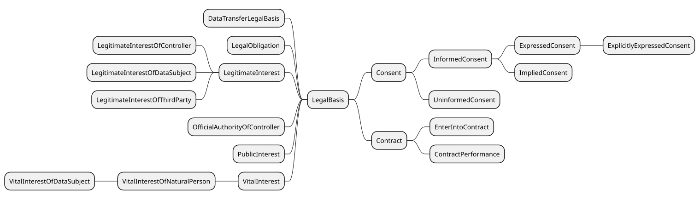 

Legal Bases in DPV

 

 

DPV provides the following categories of legal bases based on [[GDPR]] Article 6: consent of the data subject, contract, compliance with legal obligation, protecting vital interests of individuals, legitimate interests, public interest, and official authorities. Though derived from GDPR, these concepts can be applied for other jurisdictions and general use-cases. The legal bases are represented by the concept [=LegalBasis=] and associated using the relation [=hasLegalBasis=].

 

When declaring a legal basis, it is important to denote under what law or jurisdiction that legal basis applies. For instance, using [`dpv:Consent`](https://w3id.org/dpv#Consent) as a legal basis has different obligations and requirements in EU (i.e. [[GDPR]]) as compared to other jurisdictions. Therefore, unless the information is to be implicitly interpreted through some specific legal lens or jurisdictional law, DPV recommends indicating the specific law or legal clause associated with the legal basis so as to scope its interpretation. This can be done using the relation [`dpv:hasJurisdiction`](https://w3id.org/dpv#hasJurisdiction) or [`dpv:hasApplicableLaw`](https://w3id.org/dpv#hasApplicableLaw) . The list of available laws and their representation as extensions in DPV can be seen in the [[LEGAL]] extension.

 


 

-  dpv:LegalBasis: Legal basis used to justify processing of data or use of technology in accordance with a law [go to full definition](https://w3id.org/dpv#LegalBasis) 

 

  -  dpv:Consent: Consent of the Data Subject for specified process or activity [go to full definition](https://w3id.org/dpv#Consent) 

 

  -  dpv:Contract: Creation, completion, fulfilment, or performance of a contract involving specified processing of data or technologies [go to full definition](https://w3id.org/dpv#Contract) 

 

    -  dpv:ContractPerformance: Fulfilment or performance of a contract involving specified processing of data or technologies [go to full definition](https://w3id.org/dpv#ContractPerformance) 

 

    -  dpv:EnterIntoContract: Processing necessary to enter into contract [go to full definition](https://w3id.org/dpv#EnterIntoContract) 

 

 

 

  -  dpv:DataTransferLegalBasis: Specific or special categories and instances of legal basis intended for justifying data transfers [go to full definition](https://w3id.org/dpv#DataTransferLegalBasis) 

 

  -  dpv:LegalObligation: Legal Obligation to conduct the specified activities [go to full definition](https://w3id.org/dpv#LegalObligation) 

 

  -  dpv:LegitimateInterest: Legitimate Interests of a Party as justification for specified activities [go to full definition](https://w3id.org/dpv#LegitimateInterest) 

 

    -  dpv:LegitimateInterestOfController: Legitimate Interests of a Data Controller in conducting specified activities [go to full definition](https://w3id.org/dpv#LegitimateInterestOfController) 

 

    -  dpv:LegitimateInterestOfDataSubject: Legitimate Interests of the Data Subject in conducting specified activities [go to full definition](https://w3id.org/dpv#LegitimateInterestOfDataSubject) 

 

    -  dpv:LegitimateInterestOfThirdParty: Legitimate Interests of a Third Party in conducting specified activities [go to full definition](https://w3id.org/dpv#LegitimateInterestOfThirdParty) 

 

 

 

  -  dpv:OfficialAuthorityOfController: Activities are necessary or authorised through the official authority granted to or vested in the Data Controller [go to full definition](https://w3id.org/dpv#OfficialAuthorityOfController) 

 

  -  dpv:PublicInterest: Activities are necessary or beneficial for interest of the public or society at large [go to full definition](https://w3id.org/dpv#PublicInterest) 

 

  -  dpv:VitalInterest: Activities are necessary or required to protect vital interests of a data subject or other natural person [go to full definition](https://w3id.org/dpv#VitalInterest) 

 

    -  dpv:VitalInterestOfNaturalPerson: Activities are necessary or required to protect vital interests of a natural person [go to full definition](https://w3id.org/dpv#VitalInterestOfNaturalPerson) 

 

      -  dpv:VitalInterestOfDataSubject: Activities are necessary or required to protect vital interests of a data subject [go to full definition](https://w3id.org/dpv#VitalInterestOfDataSubject) 

 

 

 

 

 

 

 


 


When using legal bases, we advise careful consideration whether the information to be represented is regarding a specific instance (e.g. consent of a specific individual) or a general category (e.g. contract with service consumer/users), and to utilise DPV concepts accordingly.


  

The `LegalBasis` can be associated with any concept using the relation `hasLegalBasis`. Such associations are of three types: (1) where the legal basis refers to an instance, such as the consent or contract associated with a particular data subject; (2) where the legal basis refers to the category that will be used to justify processing, such as the concept consent to denote consent will be the basis for indicated processing; and lastly (3) where the legal basis is defined with a context, such as consent of service consumers.

 


```
# 1: instance of legal basis
# interpretation: consent of user #00145667 is the legal basis
ex:PDH1 rdf:type dpv:Process ;
    dpv:hasDataController ex:Acme ;
    dpv:hasDataSubject ex:ServiceConsumers ;
    dpv:hasLegalBasis ex:ConsentUserN00145667 .
ex:ConsentUserN00145667 rdf:type dpv:LegalBasis, dpv:Consent ;
    dpv:hasDataSubject ex:UserN00145667 .

# 2: category of legal basis
# interpretation: consent is the legal basis
ex:PDH1 rdf:type dpv:Process ;
    dpv:hasDataController ex:Acme ;
    dpv:hasDataSubject ex:ServiceConsumers ;
    dpv:hasLegalBasis dpv:Consent .

# 3: category of legal basis with contextual information
# interpretation: consent of service consumers is the legal basis
ex:PDH1 rdf:type dpv:Process ;
    dpv:hasDataController ex:Acme ;
    dpv:hasDataSubject ex:ServiceConsumers ;
    dpv:hasLegalBasis ex:UserConsent .
ex:UserConsent rdf:type dpv:LegalBasis ;
    skos:broader dpv:Consent ;
    dpv:hasDataSubject ex:ServiceConsumers .
```


 

(META Example ID: [`E0014`](https://w3id.org/dpv/examples#E0014); link: [source file](https://w3id.org/dpv/examples/E0014.ttl); contributed by Harshvardhan J. Pandit on 2024-06-10) 

   

 
<a id="legal_basis-vocab-legal-basis-contract"></a>

<a id="legal_basis-L800"></a>
## Contract
 

The concept [=Contract=] represents a legal contract, which can be used as a legal basis through the [=hasLegalBasis=] relation to justify data processing or use of technologies. [=Contract=] as a legal basis covers activities associated with creation of the contract ([=EnterIntoContract=]) and the performance of the contract [=ContractPerformance=]. Metadata associated with the contract such as date, time, subject, etc. can be represented using [[[DCT]]].

 

Contracts are also a `dpv:LegalMeasure` that can be used by organisations to enforce obligations e.g. by a controller on a processor. Similarly, contracts can also be 'agreements' e.g. between a controller and a processor, where the processor uses this agreement as a legal basis to process personal data.

  

This example describes how the different purposes and information associated with a service can be expressed in a modular and clear manner 


```
ex:MyProduct a dpv:Service ;
    dct:title "My Product Streaming Service"@en ;
    dpv:hasProcess ex:Register, ex:Service, ex:FraudManagement .

ex:Register a dpv:Process ;
    dpv:hasPurpose dpv:ServiceRegistration ;
    dpv:hasPersonalData pd:EmailAddress ;
    dpv:hasProcessing dpv:Collect, dpv:Store, dpv:Use ;
    dpv:hasLegalBasis dpv:EnterIntoContract .

ex:Service a dpv:Process ;
    dpv:hasLegalBasis dpv:ContractPerformance ;
    dpv:hasPurpose dpv:ServiceManagement ;
    dpv:hasProcess [
        a dpv:Process ;
        dpv:hasProcessing dpv:Use ;
        dpv:hasPersonalData pd:EmailAddress ;
        dpv:hasPurpose dpv:IdentityVerification ;
        dpv:hasPurpose dpv:ServiceAccessDetermination ;
    ] ;
    dpv:hasProcess [
        a dpv:Process ;
        dpv:hasProcessing dpv:Use ;
        dpv:hasPersonalData pd:Location ;
        dpv:hasPurpose dpv:ServiceProvision ;
    ] .

ex:FraudManagement a dpv:Process ;
    dpv:hasPurpose dpv:FraudPreventionAndDetection ;
    dpv:hasProcessing dpv:Use ;
    dpv:hasPersonalData pd:EmailAddress, pd:Location ;
    dpv:hasLegalBasis dpv:LegitimateInterest .
```


 

(META Example ID: [`E0041`](https://w3id.org/dpv/examples#E0041); link: [source file](https://w3id.org/dpv/examples/E0041.ttl); contributed by Harshvardhan J. Pandit on 2024-06-11) 

 

 
<a id="legal_basis-vocab-legal-basis-contract-metadata"></a>

<a id="legal_basis-L846"></a>
### Contract Metadata
 

Metadata about the contract is suggested to be expressed using the following properties based on [[DCTERMS]]:

 

 

- `dct:title` - Indicates title of contract

 

- `dct:conformsTo` - Indicates a standard or specification to which the contract conforms to e.g. a technical specification outlining which fields are present in the contract or a legal requirement or a standard for expressing contracts

 

- `dct:created` - Indicates date of contract creation. Date of creation is not the same as date of enforcement or when the contract becomes 'active', and only refers to when a contract was completed in terms of its drafting

 

- `dct:issued` - Indicates when the contract was issued or given to a party

 

- `dct:creator` - Indicates entity that created or drafted the contract. Creator refers to the entity that was responsible for determining the contents of the contract. For standard form contracts, only the parties involved in determining the terms and conditions should be listed as creators. In a negotiated contract, all parties will be listed as creators

 

- `dct:modified` - Indicates the date when the contract was modified e.g. as part of the negotiation process

 

- `dct:dateAccepted` - Indicates date when contract was accepted all parties. All parties may not accept the contract at the same date, in which case the date of the last party accepting the contract should be used

 

- `dct:hasPart` - Associates a contract with a contractual part. A contractual part can contain clauses or other elements and is a useful abstraction to create modular resources that can be independently used or reused across contracts

 

- `dpv:hasIdentifier` - Indicates the legally relevant identifier of the contract. Legally relevant here refers to an identifier that is relevant to legal obligations and investigations e.g. tax identifiers shared with the tax office. For other identifiers, use dct:identifier

 

- `dct:language` - Indicates the language used in the contract

 

- `dct:provenance` - Indicates the provenance of the contract e.g. previous versions in a negotiation process. The [[PROV-O]] ontology can be useful to represent provenance information associated with activities and artefacts

 

- `dct:subject` - Indicates the subject of the contract. The subject can be the description used in the contract as to its main topic or subject. To indicate specifics such as service, purpose, or technology - the relevant DPV concepts should be used

 

- `dpv:hasDuration` - Indicates the duration for validity of the contract

 

- `dpv:hasEntity` - Indicates a party to the contract. If the party has a specific role in the contract, e.g. Controller, Data Subject, Service Provider/Consumer - then the relevant DPV concept and property should be used instead

  

The below example shows using [[DCT]] and DPV properties to represent metadata about contracts. [[DCT]] is used for generic properties such as titles and descriptions, as well as contract-specific properties such as when it was accepted by all parties and the provenance of the contract document. The DPV properties are useful to express properties such as entities involved in specific roles such as Service Provider or a Data Controller, and to denote the type of contract which is useful for its interpretation - such as whether it is a negotiated or a standard form (non-negotiated) contract. 


```
ex:ServiceContract a dpv:LegalBasis ;
    skos:broader dpv:StandardFormContract, # pre-drafted contract with no negotiation
        dpv:B2BContract, # Business-to-Business
        dpv:ServiceLevelAgreement, # outlines use of service and quality/metrics
        dpv:ControllerProcessorAgreement ; # agreement between processor and controller
    dct:title "Contract for use of Cloud Service X"@en ;
    dct:created "2024-01-01"^^xsd:date ; # when contract was drafted
    dct:issued "2025-01-01"^^xsd:date ; # when contract was given to parties
    dct:creator ex:BetaInc ; # who drafted the contract
    dct:dateAccepted "2025-01-01"^^xsd:date ; # when all parties accepted it
    dpv:hasIdentifier "C240101" ; # identifier for the contract
    dct:language "en" ; # language of the contract
    dct:format [ # machine-readable version in ODRL
        dpv:hasLocation "https://example.com/C240101/ODRL"^^xsd:anyURI ;
        dct:conformsTo "http://www.w3.org/ns/odrl/2/"^^xsd:anyURI ;
    ], [ # human-readable version in English
        dpv:hasLocation "https://example.com/C240101/text"^^xsd:anyURI ;
        dct:language "en" ;
    ] ;
    dct:provenance [ # record for when entities signed the contract
        a dpv:RecordsOfActivities ;
        dct:hasPart [
            dpv:hasEntity ex:AcmeInc ;
            dct:dateAccepted "2025-01-01" ;
        ], [
            dpv:hasEntity ex:BetaInc ;
            dct:dateAccepted "2025-01-01" ;
        ] ;
    ] ;
    dct:subject ex:ServiceX ; # contract is about ServiceX by BetaInc
    dpv:hasDuration [ # duration of contract i.e. validity
        a dpv:TemporalDuration ;
        rdf:value "P1Y"^^xsd:date ; # 1year
    ], [
        a dpv:UntilEventDuration ; # OR a party ends it
        dct:description "A party terminates the contract"@en ;
    ] ;
    # Entities i.e. Parties involved in the contract
    dpv:hasEntity ex:AcmeInc, ex:BetaInc ;
    # Roles - Service Provider and Consumer
    dpv:hasServiceProvider ex:BetaInc ;
    dpv:hasServiceConsumer ex:AcmeInc ;
    # Roles - GDPR Data Controller and Processor
    dpv:hasDataController ex:AcmeInc ;
    dpv:hasDataProcessor ex:BetaInc ;
    dpv:hasApplicableLaw legal-eu:law-GDPR ;
    dpv:hasContractControl [
        a dpv:ContractControl ; # how to accept, refuse, or later terminate
        skos:broader dpv:AcceptContract, dpv:RefuseContract, dpv:TerminateContract ;
        dpv:isExercisedAt "https://example.com/C240101/manage"^^xsd:anyURI ;
    ] .
```


 

(META Example ID: [`E0076`](https://w3id.org/dpv/examples#E0076); link: [source file](https://w3id.org/dpv/examples/E0076.ttl); contributed by Harshvardhan J. Pandit on 2024-12-17) 

 

 

 

 
<a id="legal_basis-vocab-legal-basis-contract-types"></a>

<a id="legal_basis-L926"></a>
### Contract Types
 

Contract types represent the vocabulary of contract types which reflects the way contracts are defined and interpreted towards specific purposes. For example, [=DataProcessingAgreement=] represents contract concepts typically used for processes involving (personal) data, [=ContractByEntityType=] represents contracts such as B2B (Business-to-Business), B2C (Business-to-Consumer), etc., and [=ContractByDomain=] represent contracts with specific interpretations such as for licensing agreements and employment.

 


 

-  dpv:ContractByDomain: A generic concept representing contracts categorised by specific domains which dictate the drafting and interpretation of contracts [go to full definition](https://w3id.org/dpv#ContractByDomain) 

 

  -  dpv:DistributionAgreement: A contract regarding supply of data or technologies between a distributor and a supplier [go to full definition](https://w3id.org/dpv#DistributionAgreement) 

 

  -  dpv:EmploymentContract: A contract regarding employment between an employer and an employee [go to full definition](https://w3id.org/dpv#EmploymentContract) 

 

  -  dpv:LicenseAgreement: A Legal Document providing permission to utilise data or resource and outlining the conditions under which such use is considered valid [go to full definition](https://w3id.org/dpv#LicenseAgreement) 

 

    -  dpv:EULA: End User License Agreement is a contract entered into between a software (or service) developer or provider with the (end-)user [go to full definition](https://w3id.org/dpv#EULA) 

 

 

 

  -  dpv:ServiceLevelAgreement: A contract regarding the provision of a service which outlines the acceptable metrics and performance of the service for the consumer [go to full definition](https://w3id.org/dpv#ServiceLevelAgreement) 

 

 

 

-  dpv:ContractByEntityType: A generic concept representing contracts categorised by the type of entities involved - such as Businesses (B), Consumers (C), and Governments (G) [go to full definition](https://w3id.org/dpv#ContractByEntityType) 

 

  -  dpv:B2BContract: A contract between two businesses [go to full definition](https://w3id.org/dpv#B2BContract) 

 

    -  dpv:B2B2CContract: A contract between two businesses who partner together to provide services to a consumer [go to full definition](https://w3id.org/dpv#B2B2CContract) 

 

 

 

  -  dpv:B2CContract: A contract between a business and a consumer where the business provides goods or services to the consumer [go to full definition](https://w3id.org/dpv#B2CContract) 

 

    -  dpv:B2B2CContract: A contract between two businesses who partner together to provide services to a consumer [go to full definition](https://w3id.org/dpv#B2B2CContract) 

 

 

 

  -  dpv:C2BContract: A contract between a consumer and a business where the business purchases goods or services from the consumer [go to full definition](https://w3id.org/dpv#C2BContract) 

 

  -  dpv:C2CContract: A contract between two consumers [go to full definition](https://w3id.org/dpv#C2CContract) 

 

  -  dpv:G2BContract: A contract between a government and a business [go to full definition](https://w3id.org/dpv#G2BContract) 

 

  -  dpv:G2CContract: A contract between a government and consumers [go to full definition](https://w3id.org/dpv#G2CContract) 

 

  -  dpv:G2GContract: A contract between two governments or government departments or units [go to full definition](https://w3id.org/dpv#G2GContract) 

 

 

 

-  dpv:ContractByNegotiationType: A generic concept representing contracts categorised based on their use or absence of negotiation in the contract forming process [go to full definition](https://w3id.org/dpv#ContractByNegotiationType) 

 

  -  dpv:NegotiatedContract: A contract where the terms and conditions are determined with all parties having the ability to negotiate the terms and conditions [go to full definition](https://w3id.org/dpv#NegotiatedContract) 

 

  -  dpv:StandardFormContract: A contract where the terms and conditions are determined by one or more of the parties, and the other parties have negligible or no ability to negotiate the terms and conditions [go to full definition](https://w3id.org/dpv#StandardFormContract) 

 

    -  dpv:ConsumerStandardFormContract: A contract where the terms and conditions are determined by parties in the role of a 'consumer' - whether an entity or an individual, and the other parties have negligible or no ability to negotiate the terms and conditions [go to full definition](https://w3id.org/dpv#ConsumerStandardFormContract) 

 

    -  dpv:ProviderStandardFormContract: A contract where the terms and conditions are determined by parties in the role of a 'provider', and the other parties have negligible or no ability to negotiate the terms and conditions [go to full definition](https://w3id.org/dpv#ProviderStandardFormContract) 

 

 

 

 

 

-  dpv:DataProcessingAgreement: An agreement outlining conditions, criteria, obligations, responsibilities, and specifics for carrying out processing of data [go to full definition](https://w3id.org/dpv#DataProcessingAgreement) 

 

  -  dpv:DataControllerContract: Creation, completion, fulfilment, or performance of a contract, with Data Controllers as parties being Joint Data Controllers, and involving specified processing of data or technologies. NOTE: This concept is being deprecated - use dpv:JointDataControllersAgreement which has a more explicit definition of the entities involved and the intent of the contract [go to full definition](https://w3id.org/dpv#DataControllerContract)deprecated in next version 

 

    -  dpv:JointDataControllersAgreement: An agreement outlining conditions, criteria, obligations, responsibilities, and specifics for carrying out processing of data between Controllers within a Joint Controllers relationship [go to full definition](https://w3id.org/dpv#JointDataControllersAgreement) 

 

 

 

  -  dpv:DataProcessorContract: Creation, completion, fulfilment, or performance of a contract, with the Data Controller and Data Processor as parties, and involving specified processing of data or technologies. NOTE: This concept is being deprecated - use dpv:ControllerProcessorAgreement which has a more explicit definition of the entities involved and the intent of the contract [go to full definition](https://w3id.org/dpv#DataProcessorContract)deprecated in next version 

 

    -  dpv:ControllerProcessorAgreement: An agreement outlining conditions, criteria, obligations, responsibilities, and specifics for carrying out processing of data between a Data Controller and a Data Processor [go to full definition](https://w3id.org/dpv#ControllerProcessorAgreement) 

 

 

 

  -  dpv:DataSubjectContract: Creation, completion, fulfilment, or performance of a contract, with the Data Controller and Data Subject as parties, and involving specified processing of data or technologies. NOTE: This concept is being deprecated - use dpv:ControllerDataSubjectAgreement which has a more explicit definition of the entities involved and the intent of the contract [go to full definition](https://w3id.org/dpv#DataSubjectContract)deprecated in next version 

 

    -  dpv:ControllerDataSubjectAgreement: An agreement outlining conditions, criteria, obligations, responsibilities, and specifics for carrying out processing of data between a Data Controller and a Data Subject [go to full definition](https://w3id.org/dpv#ControllerDataSubjectAgreement) 

 

 

 

  -  dpv:SubProcessorAgreement: An agreement outlining conditions, criteria, obligations, responsibilities, and specifics for carrying out processing of data between a Data Processor and a Data (Sub-)Processor [go to full definition](https://w3id.org/dpv#SubProcessorAgreement) 

 

  -  dpv:ThirdPartyContract: Creation, completion, fulfilment, or performance of a contract, with the Data Controller and Third Party as parties, and involving specified processing of data or technologies. NOTE: This concept is being deprecated - use dpv:ThirdPartyAgreement which has a more explicit definition of the entities involved and the intent of the contract [go to full definition](https://w3id.org/dpv#ThirdPartyContract)deprecated in next version 

 

    -  dpv:ThirdPartyAgreement: An agreement outlining conditions, criteria, obligations, responsibilities, and specifics for carrying out processing of data between a Data Controller or Processor and a Third Party [go to full definition](https://w3id.org/dpv#ThirdPartyAgreement) 

 

 

 

 

 


 

 
<a id="legal_basis-vocab-legal-basis-contract-status"></a>

<a id="legal_basis-L1099"></a>
### Contract Status
 

 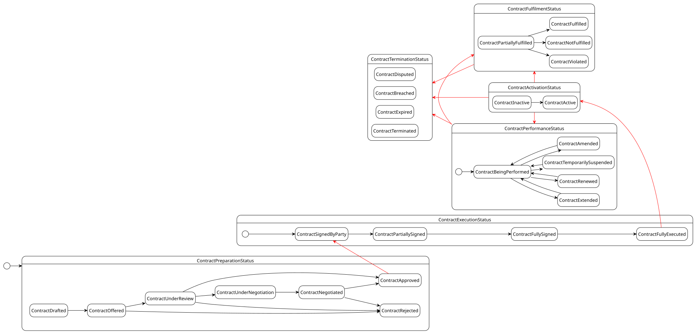 

State diagram representing how contract states are interpreted and defined in DPV. The individual boxes or section represent a collection of states that represent a specific aspect of the contract lifecycle. The red arrows represent transition between these states. The multiple start symbols represent only representing the states from that stage onward.

 

 

To represent the status associated with a contract, the concept [=ContractStatus=] and the relation [=hasContractStatus=] are provided. A taxonomy of statuses representing the lifecycle of contract formation and use is provided, for example [=ContractDrafted=] to indicate the completion of contract drafting process, [=ContractUnderNegotiation=] to indicate the contents of the contract are being negotiated and that the contract is being accepted/signed by involved parties, [=ContractFullySigned=] indicating all parties have signed the contract, and [=ContractTerminated=] indicating the contract has been terminated.

 

[=ContractFulfilmentStatus=] represents the status associated with fulfilment of a contract in terms of its requirements and obligations. It is associated using the relation [=hasContractualFulfilmentStatus=]. Specific fulfilment states are provided, for example [=ContractFulfilled=] indicating all requirements of the contract have been fulfilled, [=ContractBreached=] indicating a breach of contract, and [=ContractNotFulfilled=] indicating the requirements have not been fulfilled (but it isn't a breach yet e.g. there is still time/opportunity to complete them).

 


 

-  dpv:ContractStatus: Status associated with a contract [go to full definition](https://w3id.org/dpv#ContractStatus) 

 

  -  dpv:ContractActivationStatus: Status associated with activation of a contract i.e. whether its terms are active and are required to be performed [go to full definition](https://w3id.org/dpv#ContractActivationStatus) 

 

    -  dpv:ContractActive: Status representing contract that has been fully executed and whose terms are considered active i.e. they are applicable and are required to be performed [go to full definition](https://w3id.org/dpv#ContractActive) 

 

    -  dpv:ContractInactive: Status representing contract that has been fully executed and whose terms are not yet active i.e. they need to be performed at a later time [go to full definition](https://w3id.org/dpv#ContractInactive) 

 

 

 

  -  dpv:ContractExecutionStatus: Status associated with execution of a contract (i.e. signing and procedural aspects before the contract terms come in to effect) [go to full definition](https://w3id.org/dpv#ContractExecutionStatus) 

 

    -  dpv:ContractFullyExecuted: Status representing contract has been fully executed i.e. it has been signed by all parties and all other procedural aspects such as exchange of signed contract copies have been completed [go to full definition](https://w3id.org/dpv#ContractFullyExecuted) 

 

    -  dpv:ContractFullySigned: Status representing contract has been signed by all concerned parties [go to full definition](https://w3id.org/dpv#ContractFullySigned) 

 

    -  dpv:ContractPartiallySigned: Status representing contract has been partially signed by parties i.e. some parties have signed the contract and others are yet to make a decision to sign it [go to full definition](https://w3id.org/dpv#ContractPartiallySigned) 

 

    -  dpv:ContractSignedByParty: Status representing contract has been signed by the indicated signing party [go to full definition](https://w3id.org/dpv#ContractSignedByParty) 

 

 

 

  -  dpv:ContractFulfilmentStatus: Status associated with fulfilment of a contract [go to full definition](https://w3id.org/dpv#ContractFulfilmentStatus) 

 

    -  dpv:ContractFulfilled: Status representing contract where all its terms have been fulfilled in a manner that does not constitute a violation or breach of the contract [go to full definition](https://w3id.org/dpv#ContractFulfilled) 

 

    -  dpv:ContractNotFulfilled: Status representing contract where none of its terms have been fulfilled in a manner that does not constitute a violation or breach of the contract i.e. there is still time and opportunity to complete the terms [go to full definition](https://w3id.org/dpv#ContractNotFulfilled) 

 

    -  dpv:ContractPartiallyFulfilled: Status representing contract where some of its terms have been fulfilled, and others are yet to be fulfilled in a manner that does not constitute a violation or breach of the contract i.e. there is still time and opportunity to complete the terms [go to full definition](https://w3id.org/dpv#ContractPartiallyFulfilled) 

 

    -  dpv:ContractViolated: Status representing contract where one or more terms have not been fulfilled or have been fulfilled, where either is considered a violation of the terms [go to full definition](https://w3id.org/dpv#ContractViolated) 

 

 

 

  -  dpv:ContractPerformanceStatus: Status associated with performance of a contract [go to full definition](https://w3id.org/dpv#ContractPerformanceStatus) 

 

    -  dpv:ContractAmended: Status representing contract that has been fully executed and whose terms have been amended through mutual agreement or other means such that the contract is still required to be performed [go to full definition](https://w3id.org/dpv#ContractAmended) 

 

    -  dpv:ContractBeingPerformed: Status representing contract that has been fully executed and whose terms are being carried out i.e. the contract is being performed [go to full definition](https://w3id.org/dpv#ContractBeingPerformed) 

 

    -  dpv:ContractRenewed: Status representing contract being renewed with new duration and/or applicability where the contract has been fully executed in the past [go to full definition](https://w3id.org/dpv#ContractRenewed) 

 

    -  dpv:ContractTemporarilySuspended: Status representing contract that has been temporarily suspended through mutual agreement or by some parties [go to full definition](https://w3id.org/dpv#ContractTemporarilySuspended) 

 

 

 

  -  dpv:ContractPreparationStatus: Status associated with preparation of contracts before they are signed or accepted or executed [go to full definition](https://w3id.org/dpv#ContractPreparationStatus) 

 

    -  dpv:ContractApproved: Status representing contract has been approved and can be used for signing [go to full definition](https://w3id.org/dpv#ContractApproved) 

 

    -  dpv:ContractDrafted: Status representing the drafting of contract text has been completed and it can now be offered for signing [go to full definition](https://w3id.org/dpv#ContractDrafted) 

 

    -  dpv:ContractNegotiated: Status representing contract has been successfully negotiated by involved parties [go to full definition](https://w3id.org/dpv#ContractNegotiated) 

 

    -  dpv:ContractOffered: Status representing contract has been offered to a party or to parties for reviewing and signing [go to full definition](https://w3id.org/dpv#ContractOffered) 

 

    -  dpv:ContractRejected: Status representing contract has been rejected and cannot be used for signing [go to full definition](https://w3id.org/dpv#ContractRejected) 

 

    -  dpv:ContractUnderNegotiation: Status representing contract is under negotiation between parties [go to full definition](https://w3id.org/dpv#ContractUnderNegotiation) 

 

    -  dpv:ContractUnderReview: Status representing contract is under review and is being considered for signing [go to full definition](https://w3id.org/dpv#ContractUnderReview) 

 

 

 

  -  dpv:ContractTerminationStatus: Status associated with termination of a contract [go to full definition](https://w3id.org/dpv#ContractTerminationStatus) 

 

    -  dpv:ContractBreached: Status representing contract being breached where its terms are not fulfilled or are violated with legal consequences [go to full definition](https://w3id.org/dpv#ContractBreached) 

 

    -  dpv:ContractDisputed: Status representing contract being disputed where one or more parties have an issue regarding the interpretation and performance of the contract [go to full definition](https://w3id.org/dpv#ContractDisputed) 

 

    -  dpv:ContractExpired: Status representing reaching the expiry defined in the contract, such as when the stated duration or the stated obligations have been completed [go to full definition](https://w3id.org/dpv#ContractExpired) 

 

    -  dpv:ContractExtended: Status representing the duration associated with a contract being extended through mutual agreement or by a party [go to full definition](https://w3id.org/dpv#ContractExtended) 

 

    -  dpv:ContractTerminated: Status representing contract being terminated by one or more parties [go to full definition](https://w3id.org/dpv#ContractTerminated) 

 

 

 

 

 


  

This example shows how the lifecycle of a contract in terms of its drafting and acceptance, as well as the fulfilment of its requirements and whether they have been breached. 


```
ex:SomeContract a dpv:Contract ;
    dpv:hasEntity ex:AcmeInc, ex:BetaInc ; # parties to the contract
    # 1) stating status of contract within the contract
    dpv:hasContractStatus dpv:ContractFullyExecuted ;
    # 2) multiple statuses, and a timestamp for the event
    dpv:hasContractStatus [
        a dpv:ContractStatus ;
        skos:broader dpv:ContractDrafted, dpv:ContractOffered ;
        dct:date "2024-12-31"^^xsd:date ;
    ] ;
    # 3) status per entity - a type of provenance
    dpv:hasContractStatus [
        a dpv:ContractStatus ; # Acme received the contract and accepted it
        dpv:hasEntity ex:AcmeInc ;
        skos:broader dpv:ContractOffered, dpv:ContractSignedByParty ;
        dct:date "2024-12-29"^^xsd:date ;
    ], [
        a dpv:ContractStatus ; # Beta received the contract and accepted it
        dpv:hasEntity ex:BetaInc ; # All parties have accepted the contract
        skos:broader dpv:ContractOffered, dpv:ContractSignedByParty ;
        dct:date "2024-12-30"^^xsd:date ;
    ], [
        a dpv:ContractStatus ;
        dpv:hasEntity ex:AcmeInc ; # Acme gets the completed/signed contract
        skos:broader dpv:ContractFullySigned ;
        dct:date "2024-12-31"^^xsd:date ;
    ] .

ex:SomeOtherContract a dpv:Contract ;
    # 1) Contract fulfilments are not complete, but no breaches either
    dpv:hasContractualFulfilmentStatus dpv:ContractPartiallyFulfilled ;
    # 2) Contract is fulfilled - date recorded for event
    dpv:hasContractualFulfilmentStatus [
        a dpv:ContractStatus ;
        skos:broader dpv:ContractFulfilled ;
        dct:date "2024-12-31"^^xsd:date ;
    ] ;
    # 3) Contract violation - with date and justification
    dpv:hasContractualFulfilmentStatus [
        a dpv:ContractViolated ;
        dct:date "2024-12-31"^^xsd:date ;
        dpv:hasJustification "explanation of the violation"@en ;
    ] .
```


 

(META Example ID: [`E0077`](https://w3id.org/dpv/examples#E0077); link: [source file](https://w3id.org/dpv/examples/E0077.ttl); contributed by Harshvardhan J. Pandit on 2024-12-17) 

 

 

 
<a id="legal_basis-vocab-legal-basis-contract-clause"></a>

<a id="legal_basis-L1334"></a>
### Contractual Clauses
 

[=ContractualClause=] represents the contents of a contract, commonly referred to as 'clauses' or 'terms' or 'conditions'. They are associated with a contract using the relation [=hasContractualClause=]. A taxonomy is provided to represent commonly utilised clauses. The concept [=ContractualClauseFulfilmentStatus=] represents the fulfilment state of the contractual clause, and is indicated using the relation [=hasContractualFulfilmentStatus=].

 


 

-  dpv:ContractualClause: A part or component within a contract that outlines its specifics [go to full definition](https://w3id.org/dpv#ContractualClause) 

 

  -  dpv:ContractAmendmentClause: A provision describing how changes or modifications to the contract can be made and the process for implementing them [go to full definition](https://w3id.org/dpv#ContractAmendmentClause) 

 

  -  dpv:ContractConfidentialityClause: A provision requiring parties to keep certain information confidential and not disclose it to third parties [go to full definition](https://w3id.org/dpv#ContractConfidentialityClause) 

 

  -  dpv:ContractDefinitions: A section specifying the meanings of key terms and phrases used throughout the contract [go to full definition](https://w3id.org/dpv#ContractDefinitions) 

 

  -  dpv:ContractDisputeResolutionClause: A provision detailing the methods and procedures for resolving disagreements or conflicts arising from the contract [go to full definition](https://w3id.org/dpv#ContractDisputeResolutionClause) 

 

  -  dpv:ContractJurisdictionClause: A provision specifying the legal jurisdiction or court where disputes related to the contract will be resolved [go to full definition](https://w3id.org/dpv#ContractJurisdictionClause) 

 

  -  dpv:ContractPreamble: An introductory section outlining the background, context, and purpose of the contract [go to full definition](https://w3id.org/dpv#ContractPreamble) 

 

  -  dpv:ContractTerminationClause: A provision outlining the conditions under which the contract can be terminated before its completion, including any penalties or obligations [go to full definition](https://w3id.org/dpv#ContractTerminationClause) 

 

  -  dpv:TermsOfService: Contractual clauses outlining the terms and conditions regarding the provision of a service, typically between a service provider and a service consumer, also know as 'Terms of Use' and 'Terms and Conditions' and commonly abbreviated as TOS, ToS, ToU, or T&C [go to full definition](https://w3id.org/dpv#TermsOfService) 

 

 

 

-  dpv:ContractualClauseFulfilmentStatus: Status associated with fulfilment of a contractual clause [go to full definition](https://w3id.org/dpv#ContractualClauseFulfilmentStatus) 

 

  -  dpv:ContractualClauseFulfilled: Status indicating the terms of the contractual clause are fulfilled i.e. they have been successfully completed without violation [go to full definition](https://w3id.org/dpv#ContractualClauseFulfilled) 

 

  -  dpv:ContractualClauseNotFulfilled: Status indicating the terms of the contractual clause have not yet been fulfilled in a manner that does not constitute a violation i.e. there is still an opportunity to complete them [go to full definition](https://w3id.org/dpv#ContractualClauseNotFulfilled) 

 

  -  dpv:ContractualClausePartiallyFulfilled: Status indicating some of the terms of the contractual clause have been fulfilled, and others have not yet been fulfilled in a manner that does not constitute a violation i.e. there is still an opportunity to complete them [go to full definition](https://w3id.org/dpv#ContractualClausePartiallyFulfilled) 

 

  -  dpv:ContractualClauseViolated: Status indicating the terms of the contractual clause have been violated [go to full definition](https://w3id.org/dpv#ContractualClauseViolated) 

 

 

 


  

This example shows how specific clauses in a contract can be modelled, and also how their fulfilment status can be represented and tracked. 


```
ex:SomeContract a dpv:Contract ;
    dpv:hasContractualClause [
        a dpv:ContractualClause ; # types of clause - use one or many
        skos:broader dpv:ContractPreamble ;
        skos:broader dpv:ContractDefinitions ;
        skos:broader dpv:ContractJurisdictionClause ;
        rdf:value "Contents ..."@en ; # directly embed contents
        foaf:page "..."^^xsd:anyURI ; # URL
        dct:format "..."^^xsd:anyURI ; # different formats e.g. languages
        # Fulfilment status can be within the clause
        dpv:hasContractualFulfilmentStatus [
            a dpv:ContractStatus ;
            skos:broader dpv:ContractFulfilled ;
            dct:date "2024-12-31"^^xsd:date ;
        ] ;
    ] ;
    # OR, Fulfilment status can also be expressed per entity
    # with a reference to a common clause or template
    dpv:hasContractualFulfilmentStatus [
        a dpv:ContractStatus ;
        skos:broader dpv:ContractFulfilled ;
        dpv:hasContractualClause ex:SomeClause ;
        dpv:hasEntity ex:SomeEntity ;
        dct:date "2024-12-31"^^xsd:date ;
    ] .
```


 

(META Example ID: [`E0078`](https://w3id.org/dpv/examples#E0078); link: [source file](https://w3id.org/dpv/examples/E0078.ttl); contributed by Harshvardhan J. Pandit on 2024-12-17) 

 

 

 
<a id="legal_basis-vocab-legal-basis-contract-control"></a>

<a id="legal_basis-L1446"></a>
### Contract Controls
 

[=ContractControl=] represents a control for an entity to make or exercise a decision regarding a contract. A taxonomy of common controls is provided, for example [=AcceptContract=], [=OfferContract=], and [=TerminateContract=]. The relation [=hasContractControl=] is used to associate the control with a contract or clause. Controls can be used to indicate where specific actions can be taken, for example to indicate that accepting a contract can be done by sending a request or visiting the stated URL, or to express specific requirements which must be satisfied before the action can be completed, for example to state termination of a contract occurs over a duration.

 


 

-  dpv:ContractControl: The control or activity associated with accepting, refusing, and other actions associated with a contract [go to full definition](https://w3id.org/dpv#ContractControl) 

 

  -  dpv:AcceptContract: Control for accepting a contract [go to full definition](https://w3id.org/dpv#AcceptContract) 

 

  -  dpv:NegotiateContract: Control for negotiating a contract [go to full definition](https://w3id.org/dpv#NegotiateContract) 

 

  -  dpv:OfferContract: Control for offering a contract [go to full definition](https://w3id.org/dpv#OfferContract) 

 

  -  dpv:RefuseContract: Control for refusing a contract [go to full definition](https://w3id.org/dpv#RefuseContract) 

 

  -  dpv:TerminateContract: Control for terminating a contract [go to full definition](https://w3id.org/dpv#TerminateContract) 

 

 

 


 

 

 
<a id="legal_basis-vocab-legal-basis-consent"></a>

<a id="legal_basis-L1485"></a>
## Consent
 

 [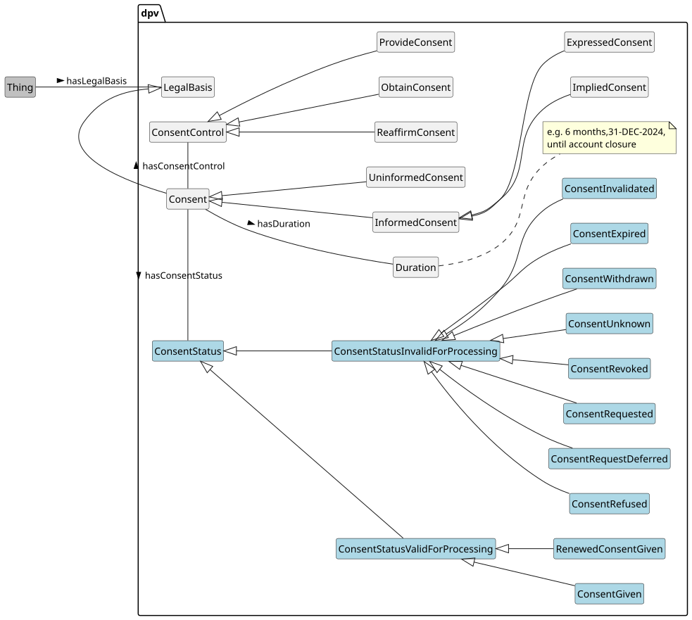](../source/2.3/diagrams/Consent.svg) 


 

 

`Consent` is an important legal basis given its emphasis on individual empowerment and control, as well as the attention and relevance it receives from being part of direct interactions with individuals. Consent in DPV is a specific legal basis representing information associated with consent rather than only given consent. Common information associated with consent includes tasks such as keeping track of whether "consent has been given/obtained", "issuing a consent request", and "withdrawing consent", as well as expressing requirements through terms such as "informed" and "explicit". DPV provides concepts for representing information about how consent, as a legal basis, is utilised (by the Controller), provided or given (by the Data Subject), how long it is considered to be valid (its duration), and how it can be withdrawn. It also provides concepts related to management of information, such as keeping track of whether the consent has been requested, was refused, or has been given. This information can be utilised in applications associated with consent, such as creating a ‘record’ of consent or building and executing rules for compliance.

 


Given the reliance of consent as a legal basis whose validity is associated with requirements and obligations based on jurisdictional laws, DPV does not explicitly provide constraints on what should be considered a ‘valid’ consent. Instead, it focuses on providing declaration of information about consent so as to aid in the determination of its validity, and to record its use and changes over time. Further information concerning compliance obligations and requirements related to consent are considered within the scope of the DPVCG, and we welcome contributions on how this can be represented in a coherent manner that is compatible with the rest of DPV.

 

To assist with representing these concepts as well as keeping records about how they are being applied, DPV provides the following consent concepts.

 

 

- [=Consent=] - a type of legal basis representing consent of the individual.

 

- [Consent Types](#legal_basis-vocab-legal-basis-consent-types) - to represent criteria for consent, such as [=InformedConsent=] and [=ExplicitlyExpressedConsent=].

 

- [Consent Status](#legal_basis-vocab-legal-basis-consent-status) - to represent and keep track of what state/status/stage the consenting process is at, for example indicating the journey or lifecycle from [=ConsentRequested=] to [=ConsentGiven=] and then [=ConsentWithdrawn=].

 

- [Consent Controls](#legal_basis-vocab-legal-basis-consent-controls) - to indicate information about how to obtain or provide or reaffirm consent.

 

 

To indicate the duration or validity of a given consent instance, the existing contextual relation `dpv:hasDuration` along with specific forms of `dpv:Duration` can be used. For example, to indicate consent is valid until a specific event such as account closure, the duration subtype `dpv:UntilEventDuration` can be used with additional instantiation or annotation to indicate more details about the event (in this case the closure of account). Similarly, `dpv:UntilTimeDuration` indicates validity until a specific time instance or timestamp (e.g. 31 December 2022), and `dpv:TemporalDuration` indicates a relative time duration (e.g. 6 months). To indicate validity without an end condition, `dpv:EndlessDuration` can be used. To indicate the notice used for informed consent, the concept `dpv:ConsentNotice` is provided, which can be used with the relation `dpv:hasNotice`.

 

To specify consent provided by delegation, such as in the case of a parent or guardian providing consent for/with a child, the `dpv:isIndicatedBy` relation can be used to associate the parent or guardian responsible for providing consent (or its affirmation). Since by default the consent is presumed to be provided by the individual, when such individuals are associated with their consent, i.e. through `dpv:hasDataSubject`, the additional information provided by `dpv:isIndicatedBy` can be considered redundant and is often omitted.

  

The `LegalBasis` can be associated with any concept using the relation `hasLegalBasis`. Such associations are of three types: (1) where the legal basis refers to an instance, such as the consent or contract associated with a particular data subject; (2) where the legal basis refers to the category that will be used to justify processing, such as the concept consent to denote consent will be the basis for indicated processing; and lastly (3) where the legal basis is defined with a context, such as consent of service consumers.

 


```
# 1: instance of legal basis
# interpretation: consent of user #00145667 is the legal basis
ex:PDH1 rdf:type dpv:Process ;
    dpv:hasDataController ex:Acme ;
    dpv:hasDataSubject ex:ServiceConsumers ;
    dpv:hasLegalBasis ex:ConsentUserN00145667 .
ex:ConsentUserN00145667 rdf:type dpv:LegalBasis, dpv:Consent ;
    dpv:hasDataSubject ex:UserN00145667 .

# 2: category of legal basis
# interpretation: consent is the legal basis
ex:PDH1 rdf:type dpv:Process ;
    dpv:hasDataController ex:Acme ;
    dpv:hasDataSubject ex:ServiceConsumers ;
    dpv:hasLegalBasis dpv:Consent .

# 3: category of legal basis with contextual information
# interpretation: consent of service consumers is the legal basis
ex:PDH1 rdf:type dpv:Process ;
    dpv:hasDataController ex:Acme ;
    dpv:hasDataSubject ex:ServiceConsumers ;
    dpv:hasLegalBasis ex:UserConsent .
ex:UserConsent rdf:type dpv:LegalBasis ;
    skos:broader dpv:Consent ;
    dpv:hasDataSubject ex:ServiceConsumers .
```


 

(META Example ID: [`E0014`](https://w3id.org/dpv/examples#E0014); link: [source file](https://w3id.org/dpv/examples/E0014.ttl); contributed by Harshvardhan J. Pandit on 2024-06-10) 

   

In this example, an individual's consent is recorded with abstraction in the form of linking to a common process instance from the previous example. This 'common' process represents processing taking place for all data subjects, whereas the consent instance refers only to the individual with a link to this common information. This is to present an alternative method for storing information as compared to extensive consent records.

 


```
ex:UserConsent rdf:type dpv:Consent ;
    dpv:hasConsentStatus dpv:ConsentGiven ;
    dpv:hasDataSubject ex:User12345 ;
    dpv:isIndicatedAtTime "2022-09-06T15:36:07"^^xsd:dateTime .
```


 

(META Example ID: [`E0016`](https://w3id.org/dpv/examples#E0016); link: [source file](https://w3id.org/dpv/examples/E0016.ttl); contributed by Harshvardhan J. Pandit on 2024-06-10) 

   

The [[[DPV-27560]]] provides guidance on creation of consent records following the [[[ISO-27560]]] standard.

   
<a id="legal_basis-vocab-legal-basis-consent-types"></a>

<a id="legal_basis-L1554"></a>
#### Consent Types
 

By default, consent is expected to adhere to several requirements such as being informed, freely given, and so on - typically defined within law or other relevant guidelines, that determine how it is requested, expressed, and evaluated for validity. In DPV, these are referred to as types of consent.

 

DPV provides `InformedConsent` and `UninformedConsent` as two distinct concepts related to whether the consent is informed or not. For more types of informed consent, the concept `ImpliedConsent` specifies when consent is indirectly expressed or is assumed, and `ExpressedConsent` for when the individual specifically takes an action to (only) express their consent. The difference between the two can be better understood as follows: if the individual performs an action, and that action only relates to consent, then it is said to be expressed consent, whereas if that action also relates to other matters in addition to being about consent, then the interaction is said to be implied (form of) consent. Clicking a button on a consent notice is a direct action and is thus a form of expressed consent. Assuming consent based on continued scrolling of a web page is an indirect or assumed action, and is thus implied consent.

 

 

In medical terminology, "[implied consent](https://en.wikipedia.org/wiki/Implied_consent#Medical_care)" is an assumption that the person's consent is present so as to avoid the restrictions of collecting consent prior to any (emergency)treatment. This is not the case with privacy and data protection perspectives, where 'implied consent', no matter how well intentioned the purpose may be, should not be considered 'assumed' without any specific action.

 

Therefore, we welcome well reasoned arguments and concrete proposals to express other types of consent, including justifications for where concepts such as `AssumedConsent` may be useful and have a basis in a law or other authoritative source.

 

 

When the expressed action for consent only (and only) refers to matters related to consent, then such consent is represented by `ExplicitlyExpressedConsent`. For example, if a button for expressing consent relates to conveying decisions about consent, but also other things such as to navigate to the next page, then this is a clear and specific action for expressing consent. However, if such a button only relates to indicating consent, then it is explicitly about consent, and is thus an instance of Explicitly Expressed Consent.

 

 

The term explicit consent is present in both ISO as well as GDPR and other laws. However, definitions differ significantly and are incompatible with each other. For example, what ISO considers 'explicit' would be 'expressed' (or regular) under GDPR. The approach taken by DPV is intentional towards enabling such variations to be expressed in specific extensions by building on top of the core vocabulary concepts. For example, the [[EU-GDPR]] extension defines `A6-1-a-explicit-consent` and `A9-2-a` as subtypes of `ExplicitlyExpressedConsent` based on the specific requirements and criteria defined by GDPR.

 

 


 

-  dpv:InformedConsent: Consent that is informed i.e. with the requirement to provide sufficient information to make a consenting decision [go to full definition](https://w3id.org/dpv#InformedConsent) 

 

  -  dpv:ExpressedConsent: Consent that is expressed through an action intended to convey a consenting decision [go to full definition](https://w3id.org/dpv#ExpressedConsent) 

 

    -  dpv:ExplicitlyExpressedConsent: Consent that is expressed through an explicit action solely conveying a consenting decision [go to full definition](https://w3id.org/dpv#ExplicitlyExpressedConsent) 

 

 

 

  -  dpv:ImpliedConsent: Consent that is implied indirectly through an action not associated solely with conveying a consenting decision [go to full definition](https://w3id.org/dpv#ImpliedConsent) 

 

 

 

-  dpv:UninformedConsent: Consent that is uninformed i.e. without requirement to provide sufficient information to make a consenting decision [go to full definition](https://w3id.org/dpv#UninformedConsent) 

 


  

This example shows use of DPV consent types to distinguish between 'expressed' and 'explicitly expressed' consent 


```
# Approach 1: specifying a specific consent type is required as legal basis
ex:PDH a dpv:Process ;
    dpv:hasLegalBasis dpv:ExplicitlyExpressedConsent .

# Approach 2: creating instances of consent
ex:UserConsent a dpv:ExpressedConsent .
```


 

(META Example ID: [`E0018`](https://w3id.org/dpv/examples#E0018); link: [source file](https://w3id.org/dpv/examples/E0018.ttl); contributed by Harshvardhan J. Pandit on 2024-06-10) 

 

 

 
<a id="legal_basis-vocab-legal-basis-consent-status"></a>

<a id="legal_basis-L1612"></a>
#### Consent Status
 

The state or status of consent refers to the stage of information about a particular consent instance within its lifecycle. For example, (given) consent first starts with the identification of need to ask consent, then issuing a request (to the individual), making a decision (by the individual), and then following it up with further actions such as the individual withdrawing it. Keeping track of such information is necessary in order to determine whether the current stage of consent information is suitable for its use in justifying processing of personal data governed by that consent, as well as to fulfil obligations such as to keep records of consent. To assist with such consent information management, DPV provides Consent Status as a way to represent the lifecycle and usefulness of an instance towards processing personal data.

 

DPV's Consent Statuses are represented by `ConsentStatus` and indicated using `hasConsentStatus` relation. The statuses are segregated into two categories based on their interpretation towards processing: `ConsentStatusValidForProcessing` and `ConsentStatusInvalidForProcessing`. There are (currently) only two statuses that are valid for processing: `ConsentGiven` representing the individual has consented, and `RenewedConsentGiven` where an earlier given consent is renewed, refreshed, or reaffirmed.

 

The rest of (currently) 8 statuses refer to various stages that are considered invalid for processing. These are: `ConsentUnknown` for when information about the status is unknown or unconfirmed, `ConsentRequested` for when a request to obtain or give consent has been made, `ConsentRequestDeferred` for when the request was opted to be dismissed or delayed without a decision, `ConsentRefused` for when consent was refused, `ConsentExpired` for when the validity (temporal or otherwise) associated with a given consent instance has lapsed, `ConsentInvalidated` for when a given consent instance is found invalid e.g. by a court, `ConsentRevoked` for when a given consent instance is revoked or terminated such as when a service provider stops providing the service, and `ConsentWithdrawn` for when the individual withdraws a previously given consent.

 


 

-  dpv:ConsentStatusInvalidForProcessing: States of consent that cannot be used as valid justifications for processing data [go to full definition](https://w3id.org/dpv#ConsentStatusInvalidForProcessing) 

 

  -  dpv:ConsentExpired: The state where the temporal or contextual validity of consent has 'expired' [go to full definition](https://w3id.org/dpv#ConsentExpired) 

 

  -  dpv:ConsentInvalidated: The state where consent has been deemed to be invalid [go to full definition](https://w3id.org/dpv#ConsentInvalidated) 

 

  -  dpv:ConsentRefused: The state where consent has been refused [go to full definition](https://w3id.org/dpv#ConsentRefused) 

 

  -  dpv:ConsentRequestDeferred: State where a request for consent has been deferred without a decision [go to full definition](https://w3id.org/dpv#ConsentRequestDeferred) 

 

  -  dpv:ConsentRequested: State where a request for consent has been made and is awaiting a decision [go to full definition](https://w3id.org/dpv#ConsentRequested) 

 

  -  dpv:ConsentRevoked: The state where the consent is revoked by an entity other than the data subject and which prevents it from being further used as a valid state [go to full definition](https://w3id.org/dpv#ConsentRevoked) 

 

  -  dpv:ConsentUnknown: State where information about consent is not available or is unknown [go to full definition](https://w3id.org/dpv#ConsentUnknown) 

 

  -  dpv:ConsentWithdrawn: The state where the consent is withdrawn or revoked specifically by the data subject and which prevents it from being further used as a valid state [go to full definition](https://w3id.org/dpv#ConsentWithdrawn) 

 

 

 

-  dpv:ConsentStatusValidForProcessing: States of consent that can be used as valid justifications for processing data [go to full definition](https://w3id.org/dpv#ConsentStatusValidForProcessing) 

 

  -  dpv:ConsentGiven: The state where consent has been given [go to full definition](https://w3id.org/dpv#ConsentGiven) 

 

  -  dpv:RenewedConsentGiven: The state where a previously given consent has been 'renewed' or 'refreshed' or 'reaffirmed' to form a new instance of given consent [go to full definition](https://w3id.org/dpv#RenewedConsentGiven) 

 

 

 


 

 
<a id="legal_basis-vocab-legal-basis-consent-indication"></a>

<a id="legal_basis-L1683"></a>
#### Consent Indication
 

To indicate which entity is responsible for a specific consent stage (e.g. individual for given consent, requester for consent requested), the relation `isIndicatedBy` is provided. It can be used with any `Entity` such as `DataSubject` or its subtypes such as `User` or specific instances of these to record information regarding who was responsible for the indicated status and consent action. To indicate the method by which an entity has indicated the specific consent, the relation `hasIndicationMethod` is provided. To indicate the time (or similar temporal information), the relation `isIndicatedAtTime` is provided.

 

 

The concepts and relations mentioned here regarding consent, such as isIndicatedBy, are also applicable and suitable for use with other legal bases or actions, such as contracts, legal requests, or exercising rights. Therefore, these can also be used in other contexts as deemed suitable. We are working on providing specific concepts and guidance for more detailed representation of information for such other legal bases and actions.

 

 

To specify consent provided by delegation, such as in the case of a parent or guardian providing consent for/with a child, the `isIndicatedBy` relation can be used to associate the parent or guardian responsible for providing consent (or its affirmation). Since by default the consent is presumed to be provided by the individual, when such individuals are associated with their consent, i.e. through `hasDataSubject`, the additional information provided by `isIndicatedBy` can be considered redundant and is often omitted.

 

To indicate how consent is to be provided or withdrawn e.g. how should an individual express or withdraw their consent, DPV provides Consent Controls as: `ProvideConsent` for the individual to provide or give their consent, `ObtainConsent` for the organisation to obtain or collect consent from the individual, `WithdrawConsent` for the individual to withdraw their given consent, and `ReaffirmConsent` for entities to re-affirm their previously provided or obtained consent. To indicate how to implement the action e.g. provide consent, the relation `isExercisedAt` should be used.

<a id="legal_basis-L1693"></a>
#### Duration of Consent
 

To indicate the duration or validity of a given consent instance, the existing contextual relation `hasDuration` along with specific forms of `Duration` can be used. For example, to indicate consent is valid until a specific event such as account closure, the duration subtype `UntilEventDuration` can be used with additional instantiation or annotation to indicate more details about the event (in this case the closure of account). Similarly, `UntilTimeDuration` indicates validity until a specific time instance or timestamp (e.g. 31 December 2022), and `TemporalDuration` indicates a relative time duration (e.g. 6 months). To indicate validity without an end condition, `EndlessDuration` can be used.

 

While the above information considered duration as determining the validity of given consent, there are also other uses of duration associated with consent. For example, the duration information is intended to be a trigger to confirm or renew consent instead of rendering it invalid immediately. Or, the duration associated with ConsentRequested could be used to indicate when consent should be requested again.

 

 
<a id="legal_basis-vocab-legal-basis-consent-controls"></a>

<a id="legal_basis-L1699"></a>
#### Consent Controls
 

 represents information about how to exercise a control regarding consent. To indicate how an organisation obtains consent, the concept [=ObtainConsent=] is provided. Its corresponding concept [=ProvideConsent=] specifies how a data subject can indicate their consent (decision). The concept [=ReaffirmConsent=] is used to indicate how to perform reaffirmation or confirmation of a previous control (e.g. provide or obtain consent).

 

[=ConsentControl=] allows representing activities associated with control over consent, such as to give/obtain consent, to refuse it, or to withdraw it. These concepts are useful to represent which actions are involved or applicable in the specified context (e.g. to state a notice layer provides controls to accept and refuse consent), and to represent information on how to exercise them (e.g. consent can be withdrawn through the indicated process or at the given url). To associate consent controls, the relation [=hasConsentControl=] is provided.

 

The concept [=ManageConsent=] is a broad concept that encompasses other consent controls to reflect its common use in use-cases, such as to provide a common interface to perform all actions associated with consent. The interpretation used here is that managing consent refers to providing, withdrawing, and reaffirming given consent. Refusing consent is not included as part of managing consent currently, but may be added in the future to represent cases where a consent request is received and stored awaiting the individual's decision - where 'managing consent' for the individual would involve both providing and refusing consent.

 

Consent controls are defined by extending relevant `dpv:EntityInvolvement` concepts `dpv:OptingInToProcess` and `dpv:WithdrawingFromProcess` so that commonly used terms such as 'opt-in' and 'opt-out' (more specifically, withdrawing from an opted-in process) are aligned with managing consent by defining them as a broader concept than 'provide consent' and 'withdraw consent' respectively.

 


 

-  dpv:ConsentControl: The control or activity associated with obtaining, providing, withdrawing, or reaffirming consent [go to full definition](https://w3id.org/dpv#ConsentControl) 

 

  -  dpv:ObtainConsent: Control for obtaining consent [go to full definition](https://w3id.org/dpv#ObtainConsent) 

 

  -  dpv:ProvideConsent: Control for providing consent [go to full definition](https://w3id.org/dpv#ProvideConsent) 

 

    -  dpv:ManageConsent: Control for managing a given consent in terms of providing, reaffirming, or withdrawing it [go to full definition](https://w3id.org/dpv#ManageConsent) 

 

 

 

  -  dpv:ReaffirmConsent: Control for affirming consent [go to full definition](https://w3id.org/dpv#ReaffirmConsent) 

 

    -  dpv:ManageConsent: Control for managing a given consent in terms of providing, reaffirming, or withdrawing it [go to full definition](https://w3id.org/dpv#ManageConsent) 

 

 

 

  -  dpv:RefuseConsent: Control for refusing consent [go to full definition](https://w3id.org/dpv#RefuseConsent) 

 

  -  dpv:WithdrawConsent: Control for withdrawing consent [go to full definition](https://w3id.org/dpv#WithdrawConsent) 

 

    -  dpv:ManageConsent: Control for managing a given consent in terms of providing, reaffirming, or withdrawing it [go to full definition](https://w3id.org/dpv#ManageConsent) 

 

 

 

 

 


 

  

This example shows a Consent Notice that is structured in 2 layers - first for a summary and a second layer providing detailed overview of the intended processing. The layers contain controls for consent and rights which are accompanied by the label to be used e.g. for the button in the UI, and the icon to be displayed alongside it. This example also shows how a consent notice can be expressed in a machine-readable form in a manner that is similar to and can be used to create a graphical notice such as on a website or in a mobile app. 


```
ex:ExampleNotice a dpv:ConsentNotice ;
    dct:title "Consent Notice for Service X"@en ;
    dct:hasLocation "https://example.com/service-x"^^xsd:anyURI ;
    dpv:hasNoticeLayer [  # Layer showing the 'overview'
        a dpv:NoticeLayer ;
        dct:description "Consent to use location for providing x"@en ;
        dpv:hasPurpose dpv:ServicePersonalisation ;
        dpv:hasPersonalData pd:Location, pd:EmailAddressPersonal ;
        dpv:hasLegalBasis dpv:ExpressedConsent ;
        dpv:hasConsentControl [  # Consent control with label and icon
            a dpv:ProvideConsent ; 
            dct:title "Accept"@en ;
            dpv:hasNoticeIcon ex:iconGiveConsent ; 
        ], [ 
            a dpv:RefuseConsent ;
            dct:title "Refuse"@en ; 
            dpv:hasNoticeIcon ex:iconRefuseConsent ; 
        ] ;
    ], [  # Layer showing the 'detailed' view
        a dpv:NoticeLayer ;
        # link to full privacy notice for the service
        dpv:hasNotice "https://example.com/privacy-notice"^^xsd:anyURI ;
        dpv:hasProcess [ # process for use of location
            a dpv:Process ;
            dpv:hasPurpose dpv:ServicePersonalisation ;
            dpv:hasPersonalData pd:Location ;
            dpv:hasProcessing dpv:Collect, dpv:Use ;
            dpv:hasLegalBasis eu-gdpr:A6-1-a ;
        ], [ # process stating location is also used to prevent fraud
            a dpv:Process ;
            dpv:hasPurpose dpv:FraudPreventionAndDetection ;
            dpv:hasPersonalData pd:Location ;
            dpv:hasProcessing dpv:Collect, dpv:Store, dpv:Use ;
            dpv:hasLegalBasis dpv:LegitimateInterest ;
            dpv:hasStorageCondition [ 
                a dpv:StorageLocation ; 
                dpv:hasLocation loc:EU ;
            ] ; 
            dpv:hasRecipient ex:AcmeInc ;
        ] ;
        dpv:hasConsentControl [
            a dpv:ManageConsent ; 
            dct:title "Manage Consent"@en ;
            dpv:hasNoticeIcon ex:iconManageConsent ; 
        ], [ 
            a dpv:WithdrawConsent ;
            dpv:hasRight eu-gdpr:A7-3 ;  # asserts control includes a right
            dct:title "Withdraw Consent"@en ;
            dpv:hasNoticeIcon ex:iconWithdrawConsent ; 
        ] ;
        dpv:hasRight [
            a eu-gdpr:A20 ; # icon used to indicate rights exercise
            dct:title "Right to Data Portability"@en ;
            dpv:isExercisedAt "https://example.com/rights"^^xsd:anyURI ;
            dpv:hasNoticeIcon ex:iconExerciseRight ; 
        ] ;
        dpv:hasDataController ex:Company ;
        dpv:hasDataProcessor ex:AcmeInc ;
        dpv:hasApplicableLaw legal-eu:law-GDPR ;
    ] .
```


 

(META Example ID: [`E0072`](https://w3id.org/dpv/examples#E0072); link: [source file](https://w3id.org/dpv/examples/E0072.ttl); contributed by Harshvardhan J. Pandit on 2024-12-17) 

 

 


 
<a id="legal_basis-desc-legitimate-interest"></a>

<a id="legal_basis-L1828"></a>
### Legitimate Interest
 

[=LegitimateInterest=] represents a 'legitimate' reason for the entity to carry out an activity. This reason can be about benefits to the entity, or risks/harms to another entity. Where such benefits or risks/harms can be considered to be of 'vital interest', the legal basis [=VitalInterest=] should be used. Where this benefit or risks/harms pertains to the wider society or general public, the legal basis [=PublicInterest=] should be used. Legitimate interests can be associated with the controller, or data subject, or third party, or other entities. As good practice (and for their legality), the relevant entity must always be specified. We recommend using a relevant property such as `dpv:hasDataController` for data controller's legitimate interest to specify this. If a relevant property is not present in DPV, `dpv:hasEntity` can be used.

 

[=LegitimateInterestOfController=] represents a legitimate interest of the controller - such as carrying out `dpv:FraudPreventionAndDetection`. [=LegitimateInterestOfDataSubject=] represents a legitimate interest of the data subject - such as having a copy of the transaction (data or agreement) that it is providing or keeping their own records. [=LegitimateInterestOfThirdParty=] represents a legitimate interest of a third party - for example to investigate `dpv:Counterterrorism` activities.

 

[=LegitimateInterestStatus=] represents concepts that model the state of legitimate interest in terms of the data subject being informed about it ([=LegitimateInterestInformed=] and [=LegitimateInterestUninformed=]) and whether they have objected to it ([=LegitimateInterestObjected=] and [=LegitimateInterestNotObjected=]). These can be associated or expressed using the relation `dpv:hasStatus`.

 


 

-  dpv:LegitimateInterestInformed: Status where the Legitimate Interest was informed to the data subject or other relevant entities [go to full definition](https://w3id.org/dpv#LegitimateInterestInformed) 

 

-  dpv:LegitimateInterestNotObjected: Status where the use of Legitimate Interest was not objected to [go to full definition](https://w3id.org/dpv#LegitimateInterestNotObjected) 

 

-  dpv:LegitimateInterestObjected: Status where the use of Legitimate Interest was objected to [go to full definition](https://w3id.org/dpv#LegitimateInterestObjected) 

 

-  dpv:LegitimateInterestUninformed: Status where the Legitimate Interest was not informed to the data subject or other relevant entities [go to full definition](https://w3id.org/dpv#LegitimateInterestUninformed) 

 


  

This example shows how the legitimate interest of a controller. It describes 'bad practices' which lead to ambiguity or lack crucial information, and also describe how legitimate interest can be associated with a purpose within and outside of specific purposes. It also shows alternate ways of defining legal basis and purpose in relation to each other - for cases where such information is needed. Though we *strongly* recommend always using dpv:Process and declaring each concept such as purpose, legal basis, processing, personal data explicitly and separately for consistency and ease of reuse. 


```
ex:PDH a dpv:Process ;
    # while purpose can be part of the legitimate interest instance,
    # we recommend declaring it separately within a process to enable
    # consistency and to enable indicating details about the purpose
    # independently from the legal basis
    dpv:hasPurpose dpv:FraudPreventionAndDetection ;
    # bad practice - always specify whose legitimate interest
    dpv:hasLegalBasis dpv:LegitimateInterest ;
    # better - is clear and unambiguous 
    dpv:hasDataController ex:AcmeInc ;
    dpv:hasLegalBasis dpv:LegitimateInterestOfController ;
    # again bad practice if there are multiple controllers involved
    dpv:hasDataController ex:AcmeInc, ex:BetaInc ;
    dpv:hasLegalBasis dpv:LegitimateInterestOfController ; # which controller?
    # better - explicitly state which entity
    dpv:hasLegalBasis [
        a dpv:LegitimateInterestOfController ;
        dpv:hasDataController ex:AcmeInc ;
        # also good practice to provide more details 
        dpv:hasJustification [
            a dpv:Justification ;
            dct:description "detect fraud as part of operations"@en ;
        ] ;
    ] .

# if legitimate interest is to be defined outside of a process,
# additional relevant information can be added to it
# though we *strongly* recommend always using a process and declaring
# purpose, legal basis, etc. separately and explicitly
# The below shows three different ways to indicate the same information
# - so the adopter can choose the best 'fit' for their internal representation
ex:FraudManagement a dpv:Purpose, dpv:LegitimateInterest ;
    skos:broader dpv:FraudPreventionAndDetection ;
    skos:broader dpv:LegitimateInterestOfController ;
    dpv:hasDataController ex:AcmeInc ;
    dpv:hasJustification [
        a dpv:Justification ;
        dct:description "detect fraud as part of operations"@en ;
    ] .
ex:FraudManagement a dpv:LegitimateInterestOfController ;
    dpv:hasPurpose dpv:FraudPreventionAndDetection ;
    dpv:hasDataController ex:AcmeInc ;
    dpv:hasJustification [
        a dpv:Justification ;
        dct:description "detect fraud as part of operations"@en ;
    ] .
ex:FraudManagement a dpv:Purpose ;
    skos:broader dpv:FraudPreventionAndDetection;
    dpv:hasLegalBasis [
        a dpv:LegitimateInterestOfController ;
        dpv:hasDataController ex:AcmeInc ;
        dpv:hasJustification [
            a dpv:Justification ;
            dct:description "detect fraud as part of operations"@en ;
        ] ;
    ] .
# and then this can be used in a process as a purpose and a legal basis
ex:PDH2 a dpv:Process ;
    dpv:hasPurpose ex:FraudManagement ;
    dpv:hasLegalBasis ex:FraudManagement .
```


 

(META Example ID: [`E0065`](https://w3id.org/dpv/examples#E0065); link: [source file](https://w3id.org/dpv/examples/E0065.ttl); contributed by Harshvardhan J. Pandit on 2024-06-13) 

 

  

This example shows how the status of using legitimate interests can be represented in terms of whether the existence and use of legitimate interest has been communicated to the data subject, and whether the data subject has objected to its use. 


```
ex:SomeProcess a dpv:Process ;
    dpv:hasLegalBasis [
        a dpv:LegitimateInterestOfController ;
        dpv:hasJustification [
            a dpv:Justification ;
            dct:description "detect fraud as part of operations"@en ;
        ] ;
        # use of legitimate interest informed to data subjects
        dpv:hasStatus dpv:LegitimateInterestInformed ;
    ] .

ex:Log a dpv:LegitimateInterestStatus ;
    skos:broader dpv:LegitimateInterestObjected ;
    dpv:hasDataSubject ex:Alice ;
    dct:date "2024-12-31"^^xsd:date .
```


 

(META Example ID: [`E0080`](https://w3id.org/dpv/examples#E0080); link: [source file](https://w3id.org/dpv/examples/E0080.ttl); contributed by Harshvardhan J. Pandit on 2024-12-17) 

 

 

 
<a id="legal_basis-desc-legal-obligation"></a>

<a id="legal_basis-L1950"></a>
## Legal Obligation
 

[=LegalObligation=] represents using the justification of an obligation to perform the activity as defined in law or required by a legal procedure such as a court or authority order. When using legal obligations as the legal basis, it is good practice (and necessary for its legality) to also define the specific law or legal mechanism under which the obligation is defined. This can be done using `dpv:hasApplicableLaw`.

 

[=LegalObligationStatus=] represents concepts that model the state of legal obligation in terms of it not being initiated or started yet ([=LegalObligationPending=]), where it is ongoing ([=LegalObligationOngoing=], and where it has been completed ([=LegalObligationCompleted=]). These can be expressed or associated using the relation `dpv:hasStatus`.

 


 

-  dpv:LegalObligationCompleted: Status where the legal obligation has been completed [go to full definition](https://w3id.org/dpv#LegalObligationCompleted) 

 

-  dpv:LegalObligationOngoing: Status where the legal obligation is being fulfilled [go to full definition](https://w3id.org/dpv#LegalObligationOngoing) 

 

-  dpv:LegalObligationPending: Status where the legal obligation has not been started [go to full definition](https://w3id.org/dpv#LegalObligationPending) 

 


  

This example describes a purpose for performing 'KYC' identity verification as part of legal compliance with anti-money laundering laws 


```
ex:PDH a dpv:Process ;
    dpv:hasPurpose [
        a dpv:Purpose ;
        skos:broader dpv:IdentityVerification,
            dpv:LegalCompliance ;
        skos:prefLabel "KYC: Know Your Customer"@en ;
    ] ;
    dpv:hasLegalBasis [
        a dpv:LegalObligation ;
        dpv:hasApplicableLaw ex:CJA2010 ;
    ] .

ex:CJA2010 a dpv:Law ;
    dct:title "Money Laundering and Terrorist Financing Act 2010" ;
    dpv:hasJurisdiction loc:IE .
```


 

(META Example ID: [`E0042`](https://w3id.org/dpv/examples#E0042); link: [source file](https://w3id.org/dpv/examples/E0042.ttl); contributed by Harshvardhan J. Pandit on 2024-06-11) 

 

  

This example shows how the status of using legal obligations can be represented in terms of it being carried out and it being completed. Note that though the legal obligation has been stated as 'completed', this is not an assessment of whether the requirements of the legal obligation have been completed and are verified, but instead the status represents the use of legal obligation as a legal basis within the process is completed. 


```
ex:SomeProcess a dpv:Process ;
    dpv:hasLegalBasis [
        a dpv:LegalObligation ;
        dpv:hasApplicableLaw ex:CJA2010 ;
        # Method 1: ongoing status
        dpv:hasStatus dpv:LegalObligationOngoing ;
        # Method 2: completion status with date
        dpv:hasStatus [
            a dpv:LegalObligationStatus ;
            skos:broader dpv:LegalObligationCompleted ;
            dct:date "2024-12-31"^^xsd:date ;
        ] ;
    ] .
```


 

(META Example ID: [`E0079`](https://w3id.org/dpv/examples#E0079); link: [source file](https://w3id.org/dpv/examples/E0079.ttl); contributed by Harshvardhan J. Pandit on 2024-12-17) 

 

 

 
<a id="legal_basis-desc-official-authority"></a>

<a id="legal_basis-L2020"></a>
### Official Authority of Controller
 

[=OfficialAuthorityOfController=] represents the legal basis where the official authority vested in the controller (by law) is used as the justification for carrying out activities. Such official authority is provided to specific departments to enable them to carry out their duties - such as maintenance of tax records, or provision of postal services. The relevant law should be indicated as part of the legal basis if needed by using `dpv:hasApplicableLaw`.

 

[=OfficialAuthorityExerciseStatus=] represents the state of the official authority being exercised in terms of it yet to be exercised ([=OfficialAuthorityExercisePending=]), it being exercised ([=OfficialAuthorityExerciseOngoing=]), and the completion of the exercise ([=OfficialAuthorityExerciseCompleted=]). These can be associated or expressed using the relation `dpv:hasStatus`.

 


 

-  dpv:OfficialAuthorityExerciseCompleted: Status where the official authority has been exercised to completion [go to full definition](https://w3id.org/dpv#OfficialAuthorityExerciseCompleted) 

 

-  dpv:OfficialAuthorityExerciseOngoing: Status where the official authority is being exercised [go to full definition](https://w3id.org/dpv#OfficialAuthorityExerciseOngoing) 

 

-  dpv:OfficialAuthorityExercisePending: Status where the official authority has not been exercised [go to full definition](https://w3id.org/dpv#OfficialAuthorityExercisePending) 

 


  

This example shows how the status of using the official authority as the legal basis can be represented. 


```
ex:SomeProcess a dpv:Process ;
    dpv:hasLegalBasis [
        a dpv:OfficialAuthorityOfController ;
        dpv:hasApplicableLaw ex:CJA2010 ; # law that gives authority
        dpv:hasDataController ex:AcmeInc ;
        # Method 1: status that authority is being utilised
        dpv:hasStatus dpv:OfficialAuthorityExerciseOngoing ;
        # Method 2: status with date
        dpv:hasStatus [
            a dpv:OfficialAuthorityExerciseStatus ;
            skos:broader dpv:OfficialAuthorityExerciseCompleted ;
            dct:date "2024-12-31"^^xsd:date ;
        ] ;
    ] .
```


 

(META Example ID: [`E0081`](https://w3id.org/dpv/examples#E0081); link: [source file](https://w3id.org/dpv/examples/E0081.ttl); contributed by Harshvardhan J. Pandit on 2024-12-17) 

 

 

 
<a id="legal_basis-desc-public-interest"></a>

<a id="legal_basis-L2066"></a>
### Public Interest
 

[=PublicInterest=] represents activities carried out because they are 'in the interest of the general public' or are necessary to 'provide benefit to the public', where such benefit might be actual benefits (e.g. archiving data of cultural importance) or prevention of harms (e.g. identify relevant medical conditions quickly to prevent an outbreak). We strongly recommend providing a description of the relevant 'benefits' when using this legal basis e.g. by using `dpv:hasJustification` for contextual justifications associated with the benefit.

 

[=PublicInterestStatus=] represents the state of the public interest being exercised or utilised or applied, specifically in terms of when it has been declared but hasn't been utilised yet ([=PublicInterestPending=]), it is being exercised ([=PublicInterestOngoing=]), and the completion of the exercise ([=PublicInterestCompleted=]). These can be associated or expressed using the relation `dpv:hasStatus`.

 


 

-  dpv:PublicInterestCompleted: Status where the public interest activity has been completed [go to full definition](https://w3id.org/dpv#PublicInterestCompleted) 

 

-  dpv:PublicInterestObjected: Status where the public interest activity was objected to by the Data Subject or another relevant entity [go to full definition](https://w3id.org/dpv#PublicInterestObjected) 

 

-  dpv:PublicInterestOngoing: Status where the public interest activity is ongoing [go to full definition](https://w3id.org/dpv#PublicInterestOngoing) 

 

-  dpv:PublicInterestPending: Status where the public interest activity has not started [go to full definition](https://w3id.org/dpv#PublicInterestPending) 

 


  

This example shows how the status of using public interest as the legal basis can be represented. 


```
ex:SomeProcess a dpv:Process ;
    dpv:hasLegalBasis [
        a dpv:PublicInterest ;
        dpv:hasJustification "what is the interest..."@en ;
        # Method 1: public interest being utilised
        dpv:hasStatus dpv:PublicInterestOngoing ;
        # Method 2: status completed with date
        dpv:hasStatus [
            a dpv:PublicInterestStatus ;
            skos:broader dpv:PublicInterestCompleted ;
            dct:date "2024-12-31"^^xsd:date ;
        ] ;
    ] .
```


 

(META Example ID: [`E0082`](https://w3id.org/dpv/examples#E0082); link: [source file](https://w3id.org/dpv/examples/E0082.ttl); contributed by Harshvardhan J. Pandit on 2024-12-17) 

 

 

 
<a id="legal_basis-desc-vital-interest"></a>

<a id="legal_basis-L2116"></a>
### Protecting Vital Interests
 

[=VitalInterest=] represents activities that are necessary or required to protect vital interests of a data subject or other natural person. For more specific indication, [=VitalInterestOfNaturalPerson=] refers to vital interests of (any or a specific) natural person, and [=VitalInterestOfDataSubject=] represents vital interests of (any or a specific) data subject. As with [=PublicInterest=] and [=LegitimateInterest=], we strongly recommend specifying relevant information - the vital interest in this case - by using `dpv:hasJustification`. 

 

[=VitalInterestStatus=] represents the state of the vital interest being exercised or utilised or applied, specifically in terms of when it is yet to be utilised ([=VitalInterestPending=]), it is being utilised ([=VitalInterestOngoing=]), and it has been applied to completion ([=VitalInterestCompleted=]).

 


 

-  dpv:VitalInterestCompleted: Status where the vital interest activity has been completed [go to full definition](https://w3id.org/dpv#VitalInterestCompleted) 

 

-  dpv:VitalInterestObjected: Status where the vital interest activity was objected to by the Data Subject or another relevant entity [go to full definition](https://w3id.org/dpv#VitalInterestObjected) 

 

-  dpv:VitalInterestOngoing: Status where the vital interest activity is ongoing [go to full definition](https://w3id.org/dpv#VitalInterestOngoing) 

 

-  dpv:VitalInterestPending: Status where the vital interest activity has not started [go to full definition](https://w3id.org/dpv#VitalInterestPending) 

 


  

This example shows how the status of using vital interest as the legal basis can be represented. 


```
ex:SomeProcess a dpv:Process ;
    dpv:hasLegalBasis [
        a dpv:VitalInterestOfNaturalPerson ;
        dpv:hasJustification "what is the interest..."@en ;
        dpv:hasHumanSubject ex:Alice ; # whose vital interest it is
        # Method 1: Vital interest being utilised
        dpv:hasStatus dpv:VitalInterestOngoing ;
    ] .
ex:SomeProcess a dpv:Process ;
    dpv:hasLegalBasis [
        a dpv:VitalInterestOfDataSubject ;
        dpv:hasJustification "what is the interest..."@en ;
        dpv:hasDataSubject ex:Alice ; # whose vital interest it is
        # Method 2: status completed with date
        dpv:hasStatus [
            a dpv:VitalInterestStatus ;
            skos:broader dpv:VitalInterestCompleted ;
            dct:date "2024-12-31"^^xsd:date ;
        ] ;
    ] .
```


 

(META Example ID: [`E0083`](https://w3id.org/dpv/examples#E0083); link: [source file](https://w3id.org/dpv/examples/E0083.ttl); contributed by Harshvardhan J. Pandit on 2024-12-17)

<a id="legal_basis-L2173"></a>
## Vocabulary Index
 
<a id="legal_basis-classes"></a>

<a id="legal_basis-L2175"></a>
### Classes
 
<a id="legal_basis-AcceptContract"></a>

<a id="legal_basis-L2176"></a>
#### Accept Contract
 

- Term | AcceptContract | Prefix | dpv
- Label | Accept Contract
- IRI | [https://w3id.org/dpv#AcceptContract](https://w3id.org/dpv#AcceptContract)
- Type | [rdfs:Class](http://www.w3.org/2000/01/rdf-schema#Class), [skos:Concept](http://www.w3.org/2004/02/skos/core#Concept)
- Broader/Parent types | [dpv:ContractControl](#legal_basis-ContractControl) → [dpv:EntityInvolvement](https://w3id.org/dpv#EntityInvolvement) → [dpv:ProcessingContext](https://w3id.org/dpv#ProcessingContext) → [dpv:Context](https://w3id.org/dpv#Context)
- Object of relation | [dpv:hasContext](https://w3id.org/dpv#hasContext), [dpv:hasContractControl](#legal_basis-hasContractControl), [dpv:hasEntityControl](https://w3id.org/dpv#hasEntityControl), [dpv:hasEntityInvolvement](https://w3id.org/dpv#hasEntityInvolvement)
- Definition | Control for accepting a contract
- Date Created | 2024-08-27
- See More: | section [LEGAL-BASIS-CONTRACT-CONTROL](#legal_basis-vocab-legal-basis-contract-control) in [DPV](https://w3id.org/dpv#)

 

 
<a id="legal_basis-B2B2CContract"></a>

<a id="legal_basis-L2254"></a>
#### Business-to-Business-to-Consumer Contract
 

- Term | B2B2CContract | Prefix | dpv
- Label | Business-to-Business-to-Consumer Contract
- IRI | [https://w3id.org/dpv#B2B2CContract](https://w3id.org/dpv#B2B2CContract)
- Type | [rdfs:Class](http://www.w3.org/2000/01/rdf-schema#Class), [skos:Concept](http://www.w3.org/2004/02/skos/core#Concept), [dpv:LegalBasis](https://w3id.org/dpv#LegalBasis)
- Broader/Parent types | [dpv:B2BContract](#legal_basis-B2BContract) → [dpv:ContractByEntityType](#legal_basis-ContractByEntityType) → [dpv:Contract](#legal_basis-Contract) → [dpv:LegalBasis](#legal_basis-LegalBasis)
- Broader/Parent types | [dpv:B2CContract](#legal_basis-B2CContract) → [dpv:ContractByEntityType](#legal_basis-ContractByEntityType) → [dpv:Contract](#legal_basis-Contract) → [dpv:LegalBasis](#legal_basis-LegalBasis)
- Object of relation | [dpv:hasLegalBasis](#legal_basis-hasLegalBasis)
- Definition | A contract between two businesses who partner together to provide services to a consumer
- Date Created | 2024-08-27
- Contributors | Beatriz Esteves, Georg P. Krog
- See More: | section [LEGAL-BASIS-CONTRACT-TYPES](#legal_basis-vocab-legal-basis-contract-types) in [DPV](https://w3id.org/dpv#)

 

 
<a id="legal_basis-B2BContract"></a>

<a id="legal_basis-L2338"></a>
#### Business-to-Business Contract
 

- Term | B2BContract | Prefix | dpv
- Label | Business-to-Business Contract
- IRI | [https://w3id.org/dpv#B2BContract](https://w3id.org/dpv#B2BContract)
- Type | [rdfs:Class](http://www.w3.org/2000/01/rdf-schema#Class), [skos:Concept](http://www.w3.org/2004/02/skos/core#Concept), [dpv:LegalBasis](https://w3id.org/dpv#LegalBasis)
- Broader/Parent types | [dpv:ContractByEntityType](#legal_basis-ContractByEntityType) → [dpv:Contract](#legal_basis-Contract) → [dpv:LegalBasis](#legal_basis-LegalBasis)
- Object of relation | [dpv:hasLegalBasis](#legal_basis-hasLegalBasis)
- Definition | A contract between two businesses
- Date Created | 2024-08-27
- See More: | section [LEGAL-BASIS-CONTRACT-TYPES](#legal_basis-vocab-legal-basis-contract-types) in [DPV](https://w3id.org/dpv#)

 

 
<a id="legal_basis-B2CContract"></a>

<a id="legal_basis-L2412"></a>
#### Business-to-Consumer Contract
 

- Term | B2CContract | Prefix | dpv
- Label | Business-to-Consumer Contract
- IRI | [https://w3id.org/dpv#B2CContract](https://w3id.org/dpv#B2CContract)
- Type | [rdfs:Class](http://www.w3.org/2000/01/rdf-schema#Class), [skos:Concept](http://www.w3.org/2004/02/skos/core#Concept), [dpv:LegalBasis](https://w3id.org/dpv#LegalBasis)
- Broader/Parent types | [dpv:ContractByEntityType](#legal_basis-ContractByEntityType) → [dpv:Contract](#legal_basis-Contract) → [dpv:LegalBasis](#legal_basis-LegalBasis)
- Object of relation | [dpv:hasLegalBasis](#legal_basis-hasLegalBasis)
- Definition | A contract between a business and a consumer where the business provides goods or services to the consumer
- Date Created | 2024-08-27
- See More: | section [LEGAL-BASIS-CONTRACT-TYPES](#legal_basis-vocab-legal-basis-contract-types) in [DPV](https://w3id.org/dpv#)

 

 
<a id="legal_basis-C2BContract"></a>

<a id="legal_basis-L2486"></a>
#### Consumer-to-Business Contract
 

- Term | C2BContract | Prefix | dpv
- Label | Consumer-to-Business Contract
- IRI | [https://w3id.org/dpv#C2BContract](https://w3id.org/dpv#C2BContract)
- Type | [rdfs:Class](http://www.w3.org/2000/01/rdf-schema#Class), [skos:Concept](http://www.w3.org/2004/02/skos/core#Concept), [dpv:LegalBasis](https://w3id.org/dpv#LegalBasis)
- Broader/Parent types | [dpv:ContractByEntityType](#legal_basis-ContractByEntityType) → [dpv:Contract](#legal_basis-Contract) → [dpv:LegalBasis](#legal_basis-LegalBasis)
- Object of relation | [dpv:hasLegalBasis](#legal_basis-hasLegalBasis)
- Definition | A contract between a consumer and a business where the business purchases goods or services from the consumer
- Date Created | 2024-08-27
- See More: | section [LEGAL-BASIS-CONTRACT-TYPES](#legal_basis-vocab-legal-basis-contract-types) in [DPV](https://w3id.org/dpv#)

 

 
<a id="legal_basis-C2CContract"></a>

<a id="legal_basis-L2560"></a>
#### Consumer-to-Consumer Contract
 

- Term | C2CContract | Prefix | dpv
- Label | Consumer-to-Consumer Contract
- IRI | [https://w3id.org/dpv#C2CContract](https://w3id.org/dpv#C2CContract)
- Type | [rdfs:Class](http://www.w3.org/2000/01/rdf-schema#Class), [skos:Concept](http://www.w3.org/2004/02/skos/core#Concept), [dpv:LegalBasis](https://w3id.org/dpv#LegalBasis)
- Broader/Parent types | [dpv:ContractByEntityType](#legal_basis-ContractByEntityType) → [dpv:Contract](#legal_basis-Contract) → [dpv:LegalBasis](#legal_basis-LegalBasis)
- Object of relation | [dpv:hasLegalBasis](#legal_basis-hasLegalBasis)
- Definition | A contract between two consumers
- Date Created | 2024-08-27
- See More: | section [LEGAL-BASIS-CONTRACT-TYPES](#legal_basis-vocab-legal-basis-contract-types) in [DPV](https://w3id.org/dpv#)

 

 
<a id="legal_basis-Consent"></a>

<a id="legal_basis-L2634"></a>
#### Consent
 

- Term | Consent | Prefix | dpv
- Label | Consent
- IRI | [https://w3id.org/dpv#Consent](https://w3id.org/dpv#Consent)
- Type | [rdfs:Class](http://www.w3.org/2000/01/rdf-schema#Class), [skos:Concept](http://www.w3.org/2004/02/skos/core#Concept), [dpv:LegalBasis](https://w3id.org/dpv#LegalBasis)
- Broader/Parent types | [dpv:LegalBasis](#legal_basis-LegalBasis)
- Object of relation | [dpv:hasLegalBasis](#legal_basis-hasLegalBasis)
- Definition | Consent of the Data Subject for specified process or activity
- Examples
- [`dex:E0015 :: ` Indicating consent as a legal basis](https://w3id.org/dpv/examples#E0015)
 [`dex:E0018 :: ` Using consent types](https://w3id.org/dpv/examples#E0018)
- Date Created | 2021-04-07
- Contributors | Harshvardhan J. Pandit
- See More: | section [LEGAL-BASIS](#legal_basis-vocab-legal-basis) in [DEX](https://w3id.org/dpv#)

 

 
<a id="legal_basis-ConsentControl"></a>

<a id="legal_basis-L2712"></a>
#### Consent Control
 

- Term | ConsentControl | Prefix | dpv
- Label | Consent Control
- IRI | [https://w3id.org/dpv#ConsentControl](https://w3id.org/dpv#ConsentControl)
- Type | [rdfs:Class](http://www.w3.org/2000/01/rdf-schema#Class), [skos:Concept](http://www.w3.org/2004/02/skos/core#Concept)
- Broader/Parent types | [dpv:EntityInvolvement](https://w3id.org/dpv#EntityInvolvement) → [dpv:ProcessingContext](https://w3id.org/dpv#ProcessingContext) → [dpv:Context](https://w3id.org/dpv#Context)
- Object of relation | [dpv:hasConsentControl](#legal_basis-hasConsentControl), [dpv:hasContext](https://w3id.org/dpv#hasContext), [dpv:hasEntityControl](https://w3id.org/dpv#hasEntityControl), [dpv:hasEntityInvolvement](https://w3id.org/dpv#hasEntityInvolvement)
- Definition | The control or activity associated with obtaining, providing, withdrawing, or reaffirming consent
- Date Created | 2024-05-11
- See More: | section [LEGAL-BASIS-CONSENT-CONTROLS](#legal_basis-vocab-legal-basis-consent-controls) in [DPV](https://w3id.org/dpv#)

 

 
<a id="legal_basis-ConsentExpired"></a>

<a id="legal_basis-L2789"></a>
#### Consent Expired
 

- Term | ConsentExpired | Prefix | dpv
- Label | Consent Expired
- IRI | [https://w3id.org/dpv#ConsentExpired](https://w3id.org/dpv#ConsentExpired)
- Type | [rdfs:Class](http://www.w3.org/2000/01/rdf-schema#Class), [skos:Concept](http://www.w3.org/2004/02/skos/core#Concept), [dpv:ConsentStatus](https://w3id.org/dpv#ConsentStatus)
- Broader/Parent types | [dpv:ConsentStatusInvalidForProcessing](#legal_basis-ConsentStatusInvalidForProcessing) → [dpv:ConsentStatus](#legal_basis-ConsentStatus) → [dpv:Status](https://w3id.org/dpv#Status) → [dpv:Context](https://w3id.org/dpv#Context)
- Object of relation | [dpv:hasConsentStatus](#legal_basis-hasConsentStatus), [dpv:hasContext](https://w3id.org/dpv#hasContext), [dpv:hasStatus](https://w3id.org/dpv#hasStatus)
- Definition | The state where the temporal or contextual validity of consent has 'expired'
- Usage Note | An example of this state is when the obtained consent has been assigned a duration - which has lapsed or 'expired', making it invalid to be used further for processing data
- Source | [GConsent](https://w3id.org/GConsent)
- Date Created | 2022-06-22
- Contributors | Georg P. Krog, Harshvardhan J. Pandit, Julian Flake, Paul Ryan
- See More: | section [LEGAL-BASIS-CONSENT-STATUS](#legal_basis-vocab-legal-basis-consent-status) in [DPV](https://w3id.org/dpv#)

 

 
<a id="legal_basis-ConsentGiven"></a>

<a id="legal_basis-L2875"></a>
#### Consent Given
 

- Term | ConsentGiven | Prefix | dpv
- Label | Consent Given
- IRI | [https://w3id.org/dpv#ConsentGiven](https://w3id.org/dpv#ConsentGiven)
- Type | [rdfs:Class](http://www.w3.org/2000/01/rdf-schema#Class), [skos:Concept](http://www.w3.org/2004/02/skos/core#Concept), [dpv:ConsentStatus](https://w3id.org/dpv#ConsentStatus)
- Broader/Parent types | [dpv:ConsentStatusValidForProcessing](#legal_basis-ConsentStatusValidForProcessing) → [dpv:ConsentStatus](#legal_basis-ConsentStatus) → [dpv:Status](https://w3id.org/dpv#Status) → [dpv:Context](https://w3id.org/dpv#Context)
- Object of relation | [dpv:hasConsentStatus](#legal_basis-hasConsentStatus), [dpv:hasContext](https://w3id.org/dpv#hasContext), [dpv:hasStatus](https://w3id.org/dpv#hasStatus)
- Definition | The state where consent has been given
- Usage Note | An example of this state is when the individual clicks on a button, ticks a checkbox, verbally agrees - or any other form that communicates their decision agreeing to the processing of data
- Source | [GConsent](https://w3id.org/GConsent)
- Date Created | 2022-06-22
- Contributors | Georg P. Krog, Harshvardhan J. Pandit, Julian Flake, Paul Ryan
- See More: | section [LEGAL-BASIS-CONSENT-STATUS](#legal_basis-vocab-legal-basis-consent-status) in [DPV](https://w3id.org/dpv#)

 

 
<a id="legal_basis-ConsentInvalidated"></a>

<a id="legal_basis-L2961"></a>
#### Consent Invalidated
 

- Term | ConsentInvalidated | Prefix | dpv
- Label | Consent Invalidated
- IRI | [https://w3id.org/dpv#ConsentInvalidated](https://w3id.org/dpv#ConsentInvalidated)
- Type | [rdfs:Class](http://www.w3.org/2000/01/rdf-schema#Class), [skos:Concept](http://www.w3.org/2004/02/skos/core#Concept), [dpv:ConsentStatus](https://w3id.org/dpv#ConsentStatus)
- Broader/Parent types | [dpv:ConsentStatusInvalidForProcessing](#legal_basis-ConsentStatusInvalidForProcessing) → [dpv:ConsentStatus](#legal_basis-ConsentStatus) → [dpv:Status](https://w3id.org/dpv#Status) → [dpv:Context](https://w3id.org/dpv#Context)
- Object of relation | [dpv:hasConsentStatus](#legal_basis-hasConsentStatus), [dpv:hasContext](https://w3id.org/dpv#hasContext), [dpv:hasStatus](https://w3id.org/dpv#hasStatus)
- Definition | The state where consent has been deemed to be invalid
- Usage Note | An example of this state is where an investigating authority or a court finds the collected consent did not meet requirements, and 'invalidates' both prior and future uses of it to carry out processing
- Source | [GConsent](https://w3id.org/GConsent)
- Date Created | 2022-06-22
- Contributors | Georg P. Krog, Harshvardhan J. Pandit, Julian Flake, Paul Ryan
- See More: | section [LEGAL-BASIS-CONSENT-STATUS](#legal_basis-vocab-legal-basis-consent-status) in [DPV](https://w3id.org/dpv#)

 

 
<a id="legal_basis-ConsentRefused"></a>

<a id="legal_basis-L3047"></a>
#### Consent Refused
 

- Term | ConsentRefused | Prefix | dpv
- Label | Consent Refused
- IRI | [https://w3id.org/dpv#ConsentRefused](https://w3id.org/dpv#ConsentRefused)
- Type | [rdfs:Class](http://www.w3.org/2000/01/rdf-schema#Class), [skos:Concept](http://www.w3.org/2004/02/skos/core#Concept), [dpv:ConsentStatus](https://w3id.org/dpv#ConsentStatus)
- Broader/Parent types | [dpv:ConsentStatusInvalidForProcessing](#legal_basis-ConsentStatusInvalidForProcessing) → [dpv:ConsentStatus](#legal_basis-ConsentStatus) → [dpv:Status](https://w3id.org/dpv#Status) → [dpv:Context](https://w3id.org/dpv#Context)
- Object of relation | [dpv:hasConsentStatus](#legal_basis-hasConsentStatus), [dpv:hasContext](https://w3id.org/dpv#hasContext), [dpv:hasStatus](https://w3id.org/dpv#hasStatus)
- Definition | The state where consent has been refused
- Usage Note | An example of this state is when the individual clicks on a 'disagree' or 'reject' or 'refuse' button, or leaves a checkbox unticked
- Source | [GConsent](https://w3id.org/GConsent)
- Date Created | 2022-06-22
- Contributors | Georg P. Krog, Harshvardhan J. Pandit, Julian Flake, Paul Ryan
- See More: | section [LEGAL-BASIS-CONSENT-STATUS](#legal_basis-vocab-legal-basis-consent-status) in [DPV](https://w3id.org/dpv#)

 

 
<a id="legal_basis-ConsentRequestDeferred"></a>

<a id="legal_basis-L3133"></a>
#### Consent Request Deferred
 

- Term | ConsentRequestDeferred | Prefix | dpv
- Label | Consent Request Deferred
- IRI | [https://w3id.org/dpv#ConsentRequestDeferred](https://w3id.org/dpv#ConsentRequestDeferred)
- Type | [rdfs:Class](http://www.w3.org/2000/01/rdf-schema#Class), [skos:Concept](http://www.w3.org/2004/02/skos/core#Concept), [dpv:ConsentStatus](https://w3id.org/dpv#ConsentStatus)
- Broader/Parent types | [dpv:ConsentStatusInvalidForProcessing](#legal_basis-ConsentStatusInvalidForProcessing) → [dpv:ConsentStatus](#legal_basis-ConsentStatus) → [dpv:Status](https://w3id.org/dpv#Status) → [dpv:Context](https://w3id.org/dpv#Context)
- Object of relation | [dpv:hasConsentStatus](#legal_basis-hasConsentStatus), [dpv:hasContext](https://w3id.org/dpv#hasContext), [dpv:hasStatus](https://w3id.org/dpv#hasStatus)
- Definition | State where a request for consent has been deferred without a decision
- Usage Note | An example of this state is when the individual closes or dismisses a notice without making a decision. This state is intended for making the distinction between a notice being provided (as a consent request) and the individual interacting with the notice without making a decision - where the 'ignoring of a notice' is taken as consent being neither given nor refused
- Source | [GConsent](https://w3id.org/GConsent)
- Date Created | 2022-06-22
- Contributors | Georg P. Krog, Harshvardhan J. Pandit, Julian Flake, Paul Ryan
- See More: | section [LEGAL-BASIS-CONSENT-STATUS](#legal_basis-vocab-legal-basis-consent-status) in [DPV](https://w3id.org/dpv#)

 

 
<a id="legal_basis-ConsentRequested"></a>

<a id="legal_basis-L3219"></a>
#### Consent Requested
 

- Term | ConsentRequested | Prefix | dpv
- Label | Consent Requested
- IRI | [https://w3id.org/dpv#ConsentRequested](https://w3id.org/dpv#ConsentRequested)
- Type | [rdfs:Class](http://www.w3.org/2000/01/rdf-schema#Class), [skos:Concept](http://www.w3.org/2004/02/skos/core#Concept), [dpv:ConsentStatus](https://w3id.org/dpv#ConsentStatus)
- Broader/Parent types | [dpv:ConsentStatusInvalidForProcessing](#legal_basis-ConsentStatusInvalidForProcessing) → [dpv:ConsentStatus](#legal_basis-ConsentStatus) → [dpv:Status](https://w3id.org/dpv#Status) → [dpv:Context](https://w3id.org/dpv#Context)
- Object of relation | [dpv:hasConsentStatus](#legal_basis-hasConsentStatus), [dpv:hasContext](https://w3id.org/dpv#hasContext), [dpv:hasStatus](https://w3id.org/dpv#hasStatus)
- Definition | State where a request for consent has been made and is awaiting a decision
- Usage Note | An example of this state is when a notice has been presented to the individual but they have not made a decision
- Source | [GConsent](https://w3id.org/GConsent)
- Date Created | 2022-06-22
- Contributors | Georg P. Krog, Harshvardhan J. Pandit, Julian Flake, Paul Ryan
- See More: | section [LEGAL-BASIS-CONSENT-STATUS](#legal_basis-vocab-legal-basis-consent-status) in [DPV](https://w3id.org/dpv#)

 

 
<a id="legal_basis-ConsentRevoked"></a>

<a id="legal_basis-L3305"></a>
#### Consent Revoked
 

- Term | ConsentRevoked | Prefix | dpv
- Label | Consent Revoked
- IRI | [https://w3id.org/dpv#ConsentRevoked](https://w3id.org/dpv#ConsentRevoked)
- Type | [rdfs:Class](http://www.w3.org/2000/01/rdf-schema#Class), [skos:Concept](http://www.w3.org/2004/02/skos/core#Concept), [dpv:ConsentStatus](https://w3id.org/dpv#ConsentStatus)
- Broader/Parent types | [dpv:ConsentStatusInvalidForProcessing](#legal_basis-ConsentStatusInvalidForProcessing) → [dpv:ConsentStatus](#legal_basis-ConsentStatus) → [dpv:Status](https://w3id.org/dpv#Status) → [dpv:Context](https://w3id.org/dpv#Context)
- Object of relation | [dpv:hasConsentStatus](#legal_basis-hasConsentStatus), [dpv:hasContext](https://w3id.org/dpv#hasContext), [dpv:hasStatus](https://w3id.org/dpv#hasStatus)
- Definition | The state where the consent is revoked by an entity other than the data subject and which prevents it from being further used as a valid state
- Usage Note | An example of this state is when a Data Controller stops utilising previously obtaining consent, such as when that service no longer exists
- Source | [GConsent](https://w3id.org/GConsent)
- Date Created | 2022-06-22
- Contributors | Georg P. Krog, Harshvardhan J. Pandit, Julian Flake, Paul Ryan
- See More: | section [LEGAL-BASIS-CONSENT-STATUS](#legal_basis-vocab-legal-basis-consent-status) in [DPV](https://w3id.org/dpv#)

 

 
<a id="legal_basis-ConsentStatus"></a>

<a id="legal_basis-L3391"></a>
#### Consent Status
 

- Term | ConsentStatus | Prefix | dpv
- Label | Consent Status
- IRI | [https://w3id.org/dpv#ConsentStatus](https://w3id.org/dpv#ConsentStatus)
- Type | [rdfs:Class](http://www.w3.org/2000/01/rdf-schema#Class), [skos:Concept](http://www.w3.org/2004/02/skos/core#Concept)
- Broader/Parent types | [dpv:Status](https://w3id.org/dpv#Status) → [dpv:Context](https://w3id.org/dpv#Context)
- Object of relation | [dpv:hasConsentStatus](#legal_basis-hasConsentStatus), [dpv:hasContext](https://w3id.org/dpv#hasContext), [dpv:hasStatus](https://w3id.org/dpv#hasStatus)
- Definition | The state or status of 'consent' that provides information reflecting its operational status and validity for processing data
- Usage Note | States are useful as information artefacts to implement them in controlling processing, and to reflect the process and flow of obtaining and maintaining consent. For example, a database table that stores consent states for specific processing and can be queried to obtain them in an efficient manner. States are also useful in investigations to determine the use and validity of consenting practices
- Source | [GConsent](https://w3id.org/GConsent)
- Date Created | 2022-06-22
- Contributors | Georg P. Krog, Harshvardhan J. Pandit, Julian Flake, Paul Ryan
- See More: | section [LEGAL-BASIS-CONSENT-STATUS](#legal_basis-vocab-legal-basis-consent-status) in [DPV](https://w3id.org/dpv#)

 

 
<a id="legal_basis-ConsentStatusInvalidForProcessing"></a>

<a id="legal_basis-L3475"></a>
#### Consent Status Invalid for Processing
 

- Term | ConsentStatusInvalidForProcessing | Prefix | dpv
- Label | Consent Status Invalid for Processing
- IRI | [https://w3id.org/dpv#ConsentStatusInvalidForProcessing](https://w3id.org/dpv#ConsentStatusInvalidForProcessing)
- Type | [rdfs:Class](http://www.w3.org/2000/01/rdf-schema#Class), [skos:Concept](http://www.w3.org/2004/02/skos/core#Concept), [dpv:ConsentStatus](https://w3id.org/dpv#ConsentStatus)
- Broader/Parent types | [dpv:ConsentStatus](#legal_basis-ConsentStatus) → [dpv:Status](https://w3id.org/dpv#Status) → [dpv:Context](https://w3id.org/dpv#Context)
- Object of relation | [dpv:hasConsentStatus](#legal_basis-hasConsentStatus), [dpv:hasContext](https://w3id.org/dpv#hasContext), [dpv:hasStatus](https://w3id.org/dpv#hasStatus)
- Definition | States of consent that cannot be used as valid justifications for processing data
- Usage Note | This identifies the stages associated with consent that should not be used to process data
- Source | [GConsent](https://w3id.org/GConsent)
- Date Created | 2022-06-22
- Contributors | Georg P. Krog, Harshvardhan J. Pandit, Julian Flake, Paul Ryan
- See More: | section [LEGAL-BASIS-CONSENT-STATUS](#legal_basis-vocab-legal-basis-consent-status) in [DPV](https://w3id.org/dpv#)

 

 
<a id="legal_basis-ConsentStatusValidForProcessing"></a>

<a id="legal_basis-L3560"></a>
#### Consent Status Valid for Processing
 

- Term | ConsentStatusValidForProcessing | Prefix | dpv
- Label | Consent Status Valid for Processing
- IRI | [https://w3id.org/dpv#ConsentStatusValidForProcessing](https://w3id.org/dpv#ConsentStatusValidForProcessing)
- Type | [rdfs:Class](http://www.w3.org/2000/01/rdf-schema#Class), [skos:Concept](http://www.w3.org/2004/02/skos/core#Concept), [dpv:ConsentStatus](https://w3id.org/dpv#ConsentStatus)
- Broader/Parent types | [dpv:ConsentStatus](#legal_basis-ConsentStatus) → [dpv:Status](https://w3id.org/dpv#Status) → [dpv:Context](https://w3id.org/dpv#Context)
- Object of relation | [dpv:hasConsentStatus](#legal_basis-hasConsentStatus), [dpv:hasContext](https://w3id.org/dpv#hasContext), [dpv:hasStatus](https://w3id.org/dpv#hasStatus)
- Definition | States of consent that can be used as valid justifications for processing data
- Usage Note | Practically, given consent is the only valid state for processing
- Source | [GConsent](https://w3id.org/GConsent)
- Date Created | 2022-06-22
- Contributors | Georg P. Krog, Harshvardhan J. Pandit, Julian Flake, Paul Ryan
- See More: | section [LEGAL-BASIS-CONSENT-STATUS](#legal_basis-vocab-legal-basis-consent-status) in [DPV](https://w3id.org/dpv#)

 

 
<a id="legal_basis-ConsentUnknown"></a>

<a id="legal_basis-L3645"></a>
#### Consent Unknown
 

- Term | ConsentUnknown | Prefix | dpv
- Label | Consent Unknown
- IRI | [https://w3id.org/dpv#ConsentUnknown](https://w3id.org/dpv#ConsentUnknown)
- Type | [rdfs:Class](http://www.w3.org/2000/01/rdf-schema#Class), [skos:Concept](http://www.w3.org/2004/02/skos/core#Concept), [dpv:ConsentStatus](https://w3id.org/dpv#ConsentStatus)
- Broader/Parent types | [dpv:ConsentStatusInvalidForProcessing](#legal_basis-ConsentStatusInvalidForProcessing) → [dpv:ConsentStatus](#legal_basis-ConsentStatus) → [dpv:Status](https://w3id.org/dpv#Status) → [dpv:Context](https://w3id.org/dpv#Context)
- Object of relation | [dpv:hasConsentStatus](#legal_basis-hasConsentStatus), [dpv:hasContext](https://w3id.org/dpv#hasContext), [dpv:hasStatus](https://w3id.org/dpv#hasStatus)
- Definition | State where information about consent is not available or is unknown
- Usage Note | Consent states can be unknown, for example, when information is not available, or cannot be trusted, or is known to be inaccurate
- Source | [GConsent](https://w3id.org/GConsent)
- Date Created | 2022-06-22
- Contributors | Georg P. Krog, Harshvardhan J. Pandit, Julian Flake, Paul Ryan
- See More: | section [LEGAL-BASIS-CONSENT-STATUS](#legal_basis-vocab-legal-basis-consent-status) in [DPV](https://w3id.org/dpv#)

 

 
<a id="legal_basis-ConsentWithdrawn"></a>

<a id="legal_basis-L3731"></a>
#### Consent Withdrawn
 

- Term | ConsentWithdrawn | Prefix | dpv
- Label | Consent Withdrawn
- IRI | [https://w3id.org/dpv#ConsentWithdrawn](https://w3id.org/dpv#ConsentWithdrawn)
- Type | [rdfs:Class](http://www.w3.org/2000/01/rdf-schema#Class), [skos:Concept](http://www.w3.org/2004/02/skos/core#Concept), [dpv:ConsentStatus](https://w3id.org/dpv#ConsentStatus)
- Broader/Parent types | [dpv:ConsentStatusInvalidForProcessing](#legal_basis-ConsentStatusInvalidForProcessing) → [dpv:ConsentStatus](#legal_basis-ConsentStatus) → [dpv:Status](https://w3id.org/dpv#Status) → [dpv:Context](https://w3id.org/dpv#Context)
- Object of relation | [dpv:hasConsentStatus](#legal_basis-hasConsentStatus), [dpv:hasContext](https://w3id.org/dpv#hasContext), [dpv:hasStatus](https://w3id.org/dpv#hasStatus)
- Definition | The state where the consent is withdrawn or revoked specifically by the data subject and which prevents it from being further used as a valid state
- Usage Note | This state can be considered a form of 'revocation' of consent, where the revocation can only be performed by the data subject. Therefore we suggest using ConsentRevoked when it is a non-data-subject entity, and ConsentWithdrawn when it is the data subject
- Source | [GConsent](https://w3id.org/GConsent)
- Date Created | 2022-06-22
- Contributors | Georg P. Krog, Harshvardhan J. Pandit, Julian Flake, Paul Ryan
- See More: | section [LEGAL-BASIS-CONSENT-STATUS](#legal_basis-vocab-legal-basis-consent-status) in [DPV](https://w3id.org/dpv#)

 

 
<a id="legal_basis-ConsumerStandardFormContract"></a>

<a id="legal_basis-L3817"></a>
#### Consumer Standard Form Contract
 

- Term | ConsumerStandardFormContract | Prefix | dpv
- Label | Consumer Standard Form Contract
- IRI | [https://w3id.org/dpv#ConsumerStandardFormContract](https://w3id.org/dpv#ConsumerStandardFormContract)
- Type | [rdfs:Class](http://www.w3.org/2000/01/rdf-schema#Class), [skos:Concept](http://www.w3.org/2004/02/skos/core#Concept), [dpv:LegalBasis](https://w3id.org/dpv#LegalBasis)
- Broader/Parent types | [dpv:StandardFormContract](#legal_basis-StandardFormContract) → [dpv:ContractByNegotiationType](#legal_basis-ContractByNegotiationType) → [dpv:Contract](#legal_basis-Contract) → [dpv:LegalBasis](#legal_basis-LegalBasis)
- Object of relation | [dpv:hasLegalBasis](#legal_basis-hasLegalBasis)
- Definition | A contract where the terms and conditions are determined by parties in the role of a 'consumer' - whether an entity or an individual, and the other parties have negligible or no ability to negotiate the terms and conditions
- Date Created | 2024-08-27
- See More: | section [LEGAL-BASIS-CONTRACT-TYPES](#legal_basis-vocab-legal-basis-contract-types) in [DPV](https://w3id.org/dpv#)

 

 
<a id="legal_basis-Contract"></a>

<a id="legal_basis-L3892"></a>
#### Contract
 

- Term | Contract | Prefix | dpv
- Label | Contract
- IRI | [https://w3id.org/dpv#Contract](https://w3id.org/dpv#Contract)
- Type | [rdfs:Class](http://www.w3.org/2000/01/rdf-schema#Class), [skos:Concept](http://www.w3.org/2004/02/skos/core#Concept), [dpv:LegalBasis](https://w3id.org/dpv#LegalBasis)
- Broader/Parent types | [dpv:LegalBasis](#legal_basis-LegalBasis)
- Subject of relation | [dpv:hasContractControl](#legal_basis-hasContractControl), [dpv:hasContractStatus](https://w3id.org/dpv#hasContractStatus), [dpv:hasContractualClause](https://w3id.org/dpv#hasContractualClause), [dpv:hasContractualFulfilmentStatus](https://w3id.org/dpv#hasContractualFulfilmentStatus), [dpv:hasParty](#legal_basis-hasParty)
- Object of relation | [dpv:hasLegalBasis](#legal_basis-hasLegalBasis)
- Definition | Creation, completion, fulfilment, or performance of a contract involving specified processing of data or technologies
- Examples
- [`dex:E0076 :: ` Representing contract metadata and controls](https://w3id.org/dpv/examples#E0076)
 [`dex:E0077 :: ` Representing the status of contracts](https://w3id.org/dpv/examples#E0077)
- Date Created | 2021-04-07
- Date Modified | 2024-12-17
- Contributors | Harshvardhan J. Pandit
- See More: | section [LEGAL-BASIS](#legal_basis-vocab-legal-basis) in [DEX](https://w3id.org/dpv#)

 

 
<a id="legal_basis-ContractActivationStatus"></a>

<a id="legal_basis-L3981"></a>
#### Contract Activation Status
 

- Term | ContractActivationStatus | Prefix | dpv
- Label | Contract Activation Status
- IRI | [https://w3id.org/dpv#ContractActivationStatus](https://w3id.org/dpv#ContractActivationStatus)
- Type | [rdfs:Class](http://www.w3.org/2000/01/rdf-schema#Class), [skos:Concept](http://www.w3.org/2004/02/skos/core#Concept)
- Broader/Parent types | [dpv:ContractStatus](#legal_basis-ContractStatus) → [dpv:Status](https://w3id.org/dpv#Status) → [dpv:Context](https://w3id.org/dpv#Context)
- Object of relation | [dpv:hasContext](https://w3id.org/dpv#hasContext), [dpv:hasContractStatus](https://w3id.org/dpv#hasContractStatus), [dpv:hasContractualFulfilmentStatus](https://w3id.org/dpv#hasContractualFulfilmentStatus), [dpv:hasStatus](https://w3id.org/dpv#hasStatus)
- Definition | Status associated with activation of a contract i.e. whether its terms are active and are required to be performed
- Date Created | 2025-01-09
- Contributors | Georg P. Krog, Harshvardhan J. Pandit, Julian Flake
- See More: | section [LEGAL-BASIS-CONTRACT-STATUS](#legal_basis-vocab-legal-basis-contract-status) in [DPV](https://w3id.org/dpv#)

 

 
<a id="legal_basis-ContractActive"></a>

<a id="legal_basis-L4061"></a>
#### Contract Active
 

- Term | ContractActive | Prefix | dpv
- Label | Contract Active
- IRI | [https://w3id.org/dpv#ContractActive](https://w3id.org/dpv#ContractActive)
- Type | [rdfs:Class](http://www.w3.org/2000/01/rdf-schema#Class), [skos:Concept](http://www.w3.org/2004/02/skos/core#Concept), [dpv:ContractActivationStatus](https://w3id.org/dpv#ContractActivationStatus)
- Broader/Parent types | [dpv:ContractActivationStatus](#legal_basis-ContractActivationStatus) → [dpv:ContractStatus](#legal_basis-ContractStatus) → [dpv:Status](https://w3id.org/dpv#Status) → [dpv:Context](https://w3id.org/dpv#Context)
- Object of relation | [dpv:hasContext](https://w3id.org/dpv#hasContext), [dpv:hasContractStatus](https://w3id.org/dpv#hasContractStatus), [dpv:hasContractualFulfilmentStatus](https://w3id.org/dpv#hasContractualFulfilmentStatus), [dpv:hasStatus](https://w3id.org/dpv#hasStatus)
- Definition | Status representing contract that has been fully executed and whose terms are considered active i.e. they are applicable and are required to be performed
- Usage Note | A contract being active only refers to its terms now being required to be fulfilled, while dpv:ContractBeingPerformed states that they are being performed
- Date Created | 2025-01-09
- Contributors | Georg P. Krog, Harshvardhan J. Pandit, Julian Flake
- See More: | section [LEGAL-BASIS-CONTRACT-STATUS](#legal_basis-vocab-legal-basis-contract-status) in [DPV](https://w3id.org/dpv#)

 

 
<a id="legal_basis-ContractAmended"></a>

<a id="legal_basis-L4145"></a>
#### Contract Amended
 

- Term | ContractAmended | Prefix | dpv
- Label | Contract Amended
- IRI | [https://w3id.org/dpv#ContractAmended](https://w3id.org/dpv#ContractAmended)
- Type | [rdfs:Class](http://www.w3.org/2000/01/rdf-schema#Class), [skos:Concept](http://www.w3.org/2004/02/skos/core#Concept), [dpv:ContractPerformanceStatus](https://w3id.org/dpv#ContractPerformanceStatus)
- Broader/Parent types | [dpv:ContractPerformanceStatus](#legal_basis-ContractPerformanceStatus) → [dpv:ContractStatus](#legal_basis-ContractStatus) → [dpv:Status](https://w3id.org/dpv#Status) → [dpv:Context](https://w3id.org/dpv#Context)
- Object of relation | [dpv:hasContext](https://w3id.org/dpv#hasContext), [dpv:hasContractStatus](https://w3id.org/dpv#hasContractStatus), [dpv:hasContractualFulfilmentStatus](https://w3id.org/dpv#hasContractualFulfilmentStatus), [dpv:hasStatus](https://w3id.org/dpv#hasStatus)
- Definition | Status representing contract that has been fully executed and whose terms have been amended through mutual agreement or other means such that the contract is still required to be performed
- Date Created | 2025-01-09
- Contributors | Georg P. Krog, Harshvardhan J. Pandit, Julian Flake
- See More: | section [LEGAL-BASIS-CONTRACT-STATUS](#legal_basis-vocab-legal-basis-contract-status) in [DPV](https://w3id.org/dpv#)

 

 
<a id="legal_basis-ContractAmendmentClause"></a>

<a id="legal_basis-L4226"></a>
#### Contract Amendment Clause
 

- Term | ContractAmendmentClause | Prefix | dpv
- Label | Contract Amendment Clause
- IRI | [https://w3id.org/dpv#ContractAmendmentClause](https://w3id.org/dpv#ContractAmendmentClause)
- Type | [rdfs:Class](http://www.w3.org/2000/01/rdf-schema#Class), [skos:Concept](http://www.w3.org/2004/02/skos/core#Concept), [dpv:ContractualClause](https://w3id.org/dpv#ContractualClause)
- Broader/Parent types | [dpv:ContractualClause](#legal_basis-ContractualClause)
- Subject of relation | [dpv:hasContractualClause](https://w3id.org/dpv#hasContractualClause), [dpv:hasContractualFulfilmentStatus](https://w3id.org/dpv#hasContractualFulfilmentStatus)
- Object of relation | [dpv:hasContractualClause](https://w3id.org/dpv#hasContractualClause)
- Definition | A provision describing how changes or modifications to the contract can be made and the process for implementing them
- Date Created | 2024-08-27
- See More: | section [LEGAL-BASIS-CONTRACT-CLAUSE](#legal_basis-vocab-legal-basis-contract-clause) in [DPV](https://w3id.org/dpv#)

 

 
<a id="legal_basis-ContractApproved"></a>

<a id="legal_basis-L4303"></a>
#### Contract Approved
 

- Term | ContractApproved | Prefix | dpv
- Label | Contract Approved
- IRI | [https://w3id.org/dpv#ContractApproved](https://w3id.org/dpv#ContractApproved)
- Type | [rdfs:Class](http://www.w3.org/2000/01/rdf-schema#Class), [skos:Concept](http://www.w3.org/2004/02/skos/core#Concept), [dpv:ContractPreparationStatus](https://w3id.org/dpv#ContractPreparationStatus)
- Broader/Parent types | [dpv:ContractPreparationStatus](#legal_basis-ContractPreparationStatus) → [dpv:ContractStatus](#legal_basis-ContractStatus) → [dpv:Status](https://w3id.org/dpv#Status) → [dpv:Context](https://w3id.org/dpv#Context)
- Object of relation | [dpv:hasContext](https://w3id.org/dpv#hasContext), [dpv:hasContractStatus](https://w3id.org/dpv#hasContractStatus), [dpv:hasContractualFulfilmentStatus](https://w3id.org/dpv#hasContractualFulfilmentStatus), [dpv:hasStatus](https://w3id.org/dpv#hasStatus)
- Definition | Status representing contract has been approved and can be used for signing
- Date Created | 2025-01-09
- Contributors | Georg P. Krog, Harshvardhan J. Pandit, Julian Flake
- See More: | section [LEGAL-BASIS-CONTRACT-STATUS](#legal_basis-vocab-legal-basis-contract-status) in [DPV](https://w3id.org/dpv#)

 

 
<a id="legal_basis-ContractBeingPerformed"></a>

<a id="legal_basis-L4384"></a>
#### Contract Being Performed
 

- Term | ContractBeingPerformed | Prefix | dpv
- Label | Contract Being Performed
- IRI | [https://w3id.org/dpv#ContractBeingPerformed](https://w3id.org/dpv#ContractBeingPerformed)
- Type | [rdfs:Class](http://www.w3.org/2000/01/rdf-schema#Class), [skos:Concept](http://www.w3.org/2004/02/skos/core#Concept), [dpv:ContractPerformanceStatus](https://w3id.org/dpv#ContractPerformanceStatus)
- Broader/Parent types | [dpv:ContractPerformanceStatus](#legal_basis-ContractPerformanceStatus) → [dpv:ContractStatus](#legal_basis-ContractStatus) → [dpv:Status](https://w3id.org/dpv#Status) → [dpv:Context](https://w3id.org/dpv#Context)
- Object of relation | [dpv:hasContext](https://w3id.org/dpv#hasContext), [dpv:hasContractStatus](https://w3id.org/dpv#hasContractStatus), [dpv:hasContractualFulfilmentStatus](https://w3id.org/dpv#hasContractualFulfilmentStatus), [dpv:hasStatus](https://w3id.org/dpv#hasStatus)
- Definition | Status representing contract that has been fully executed and whose terms are being carried out i.e. the contract is being performed
- Date Created | 2025-01-09
- Contributors | Georg P. Krog, Harshvardhan J. Pandit, Julian Flake
- See More: | section [LEGAL-BASIS-CONTRACT-STATUS](#legal_basis-vocab-legal-basis-contract-status) in [DPV](https://w3id.org/dpv#)

 

 
<a id="legal_basis-ContractBreached"></a>

<a id="legal_basis-L4465"></a>
#### Contract Breached
 

- Term | ContractBreached | Prefix | dpv
- Label | Contract Breached
- IRI | [https://w3id.org/dpv#ContractBreached](https://w3id.org/dpv#ContractBreached)
- Type | [rdfs:Class](http://www.w3.org/2000/01/rdf-schema#Class), [skos:Concept](http://www.w3.org/2004/02/skos/core#Concept), [dpv:ContractTerminationStatus](https://w3id.org/dpv#ContractTerminationStatus)
- Broader/Parent types | [dpv:ContractTerminationStatus](#legal_basis-ContractTerminationStatus) → [dpv:ContractStatus](#legal_basis-ContractStatus) → [dpv:Status](https://w3id.org/dpv#Status) → [dpv:Context](https://w3id.org/dpv#Context)
- Object of relation | [dpv:hasContext](https://w3id.org/dpv#hasContext), [dpv:hasContractStatus](https://w3id.org/dpv#hasContractStatus), [dpv:hasContractualFulfilmentStatus](https://w3id.org/dpv#hasContractualFulfilmentStatus), [dpv:hasStatus](https://w3id.org/dpv#hasStatus)
- Definition | Status representing contract being breached where its terms are not fulfilled or are violated with legal consequences
- Date Created | 2025-01-09
- Contributors | Georg P. Krog, Harshvardhan J. Pandit, Julian Flake
- See More: | section [LEGAL-BASIS-CONTRACT-STATUS](#legal_basis-vocab-legal-basis-contract-status) in [DPV](https://w3id.org/dpv#)

 

 
<a id="legal_basis-ContractByDomain"></a>

<a id="legal_basis-L4546"></a>
#### Contract by Domain
 

- Term | ContractByDomain | Prefix | dpv
- Label | Contract by Domain
- IRI | [https://w3id.org/dpv#ContractByDomain](https://w3id.org/dpv#ContractByDomain)
- Type | [rdfs:Class](http://www.w3.org/2000/01/rdf-schema#Class), [skos:Concept](http://www.w3.org/2004/02/skos/core#Concept), [dpv:LegalBasis](https://w3id.org/dpv#LegalBasis)
- Broader/Parent types | [dpv:Contract](#legal_basis-Contract) → [dpv:LegalBasis](#legal_basis-LegalBasis)
- Object of relation | [dpv:hasLegalBasis](#legal_basis-hasLegalBasis)
- Definition | A generic concept representing contracts categorised by specific domains which dictate the drafting and interpretation of contracts
- Date Created | 2024-12-17
- See More: | section [LEGAL-BASIS-CONTRACT-TYPES](#legal_basis-vocab-legal-basis-contract-types) in [DPV](https://w3id.org/dpv#)

 

 
<a id="legal_basis-ContractByEntityType"></a>

<a id="legal_basis-L4619"></a>
#### Contract by Entity Type
 

- Term | ContractByEntityType | Prefix | dpv
- Label | Contract by Entity Type
- IRI | [https://w3id.org/dpv#ContractByEntityType](https://w3id.org/dpv#ContractByEntityType)
- Type | [rdfs:Class](http://www.w3.org/2000/01/rdf-schema#Class), [skos:Concept](http://www.w3.org/2004/02/skos/core#Concept), [dpv:LegalBasis](https://w3id.org/dpv#LegalBasis)
- Broader/Parent types | [dpv:Contract](#legal_basis-Contract) → [dpv:LegalBasis](#legal_basis-LegalBasis)
- Object of relation | [dpv:hasLegalBasis](#legal_basis-hasLegalBasis)
- Definition | A generic concept representing contracts categorised by the type of entities involved - such as Businesses (B), Consumers (C), and Governments (G)
- Date Created | 2024-12-17
- See More: | section [LEGAL-BASIS-CONTRACT-TYPES](#legal_basis-vocab-legal-basis-contract-types) in [DPV](https://w3id.org/dpv#)

 

 
<a id="legal_basis-ContractByNegotiationType"></a>

<a id="legal_basis-L4692"></a>
#### Contract by Negotiation Type
 

- Term | ContractByNegotiationType | Prefix | dpv
- Label | Contract by Negotiation Type
- IRI | [https://w3id.org/dpv#ContractByNegotiationType](https://w3id.org/dpv#ContractByNegotiationType)
- Type | [rdfs:Class](http://www.w3.org/2000/01/rdf-schema#Class), [skos:Concept](http://www.w3.org/2004/02/skos/core#Concept), [dpv:LegalBasis](https://w3id.org/dpv#LegalBasis)
- Broader/Parent types | [dpv:Contract](#legal_basis-Contract) → [dpv:LegalBasis](#legal_basis-LegalBasis)
- Object of relation | [dpv:hasLegalBasis](#legal_basis-hasLegalBasis)
- Definition | A generic concept representing contracts categorised based on their use or absence of negotiation in the contract forming process
- Date Created | 2024-12-17
- See More: | section [LEGAL-BASIS-CONTRACT-TYPES](#legal_basis-vocab-legal-basis-contract-types) in [DPV](https://w3id.org/dpv#)

 

 
<a id="legal_basis-ContractConfidentialityClause"></a>

<a id="legal_basis-L4765"></a>
#### Contract Confidentiality Clause
 

- Term | ContractConfidentialityClause | Prefix | dpv
- Label | Contract Confidentiality Clause
- IRI | [https://w3id.org/dpv#ContractConfidentialityClause](https://w3id.org/dpv#ContractConfidentialityClause)
- Type | [rdfs:Class](http://www.w3.org/2000/01/rdf-schema#Class), [skos:Concept](http://www.w3.org/2004/02/skos/core#Concept), [dpv:ContractualClause](https://w3id.org/dpv#ContractualClause)
- Broader/Parent types | [dpv:ContractualClause](#legal_basis-ContractualClause)
- Subject of relation | [dpv:hasContractualClause](https://w3id.org/dpv#hasContractualClause), [dpv:hasContractualFulfilmentStatus](https://w3id.org/dpv#hasContractualFulfilmentStatus)
- Object of relation | [dpv:hasContractualClause](https://w3id.org/dpv#hasContractualClause)
- Definition | A provision requiring parties to keep certain information confidential and not disclose it to third parties
- Date Created | 2024-08-27
- See More: | section [LEGAL-BASIS-CONTRACT-CLAUSE](#legal_basis-vocab-legal-basis-contract-clause) in [DPV](https://w3id.org/dpv#)

 

 
<a id="legal_basis-ContractControl"></a>

<a id="legal_basis-L4842"></a>
#### Contract Control
 

- Term | ContractControl | Prefix | dpv
- Label | Contract Control
- IRI | [https://w3id.org/dpv#ContractControl](https://w3id.org/dpv#ContractControl)
- Type | [rdfs:Class](http://www.w3.org/2000/01/rdf-schema#Class), [skos:Concept](http://www.w3.org/2004/02/skos/core#Concept)
- Broader/Parent types | [dpv:EntityInvolvement](https://w3id.org/dpv#EntityInvolvement) → [dpv:ProcessingContext](https://w3id.org/dpv#ProcessingContext) → [dpv:Context](https://w3id.org/dpv#Context)
- Object of relation | [dpv:hasContext](https://w3id.org/dpv#hasContext), [dpv:hasContractControl](#legal_basis-hasContractControl), [dpv:hasEntityControl](https://w3id.org/dpv#hasEntityControl), [dpv:hasEntityInvolvement](https://w3id.org/dpv#hasEntityInvolvement)
- Definition | The control or activity associated with accepting, refusing, and other actions associated with a contract
- Date Created | 2024-08-27
- See More: | section [LEGAL-BASIS-CONTRACT-CONTROL](#legal_basis-vocab-legal-basis-contract-control) in [DPV](https://w3id.org/dpv#)

 

 
<a id="legal_basis-ContractDefinitions"></a>

<a id="legal_basis-L4919"></a>
#### Contract Definitions
 

- Term | ContractDefinitions | Prefix | dpv
- Label | Contract Definitions
- IRI | [https://w3id.org/dpv#ContractDefinitions](https://w3id.org/dpv#ContractDefinitions)
- Type | [rdfs:Class](http://www.w3.org/2000/01/rdf-schema#Class), [skos:Concept](http://www.w3.org/2004/02/skos/core#Concept), [dpv:ContractualClause](https://w3id.org/dpv#ContractualClause)
- Broader/Parent types | [dpv:ContractualClause](#legal_basis-ContractualClause)
- Subject of relation | [dpv:hasContractualClause](https://w3id.org/dpv#hasContractualClause), [dpv:hasContractualFulfilmentStatus](https://w3id.org/dpv#hasContractualFulfilmentStatus)
- Object of relation | [dpv:hasContractualClause](https://w3id.org/dpv#hasContractualClause)
- Definition | A section specifying the meanings of key terms and phrases used throughout the contract
- Date Created | 2024-08-27
- See More: | section [LEGAL-BASIS-CONTRACT-CLAUSE](#legal_basis-vocab-legal-basis-contract-clause) in [DPV](https://w3id.org/dpv#)

 

 
<a id="legal_basis-ContractDisputed"></a>

<a id="legal_basis-L4996"></a>
#### Contract Disputed
 

- Term | ContractDisputed | Prefix | dpv
- Label | Contract Disputed
- IRI | [https://w3id.org/dpv#ContractDisputed](https://w3id.org/dpv#ContractDisputed)
- Type | [rdfs:Class](http://www.w3.org/2000/01/rdf-schema#Class), [skos:Concept](http://www.w3.org/2004/02/skos/core#Concept), [dpv:ContractTerminationStatus](https://w3id.org/dpv#ContractTerminationStatus)
- Broader/Parent types | [dpv:ContractTerminationStatus](#legal_basis-ContractTerminationStatus) → [dpv:ContractStatus](#legal_basis-ContractStatus) → [dpv:Status](https://w3id.org/dpv#Status) → [dpv:Context](https://w3id.org/dpv#Context)
- Object of relation | [dpv:hasContext](https://w3id.org/dpv#hasContext), [dpv:hasContractStatus](https://w3id.org/dpv#hasContractStatus), [dpv:hasContractualFulfilmentStatus](https://w3id.org/dpv#hasContractualFulfilmentStatus), [dpv:hasStatus](https://w3id.org/dpv#hasStatus)
- Definition | Status representing contract being disputed where one or more parties have an issue regarding the interpretation and performance of the contract
- Date Created | 2025-01-09
- Contributors | Georg P. Krog, Harshvardhan J. Pandit, Julian Flake
- See More: | section [LEGAL-BASIS-CONTRACT-STATUS](#legal_basis-vocab-legal-basis-contract-status) in [DPV](https://w3id.org/dpv#)

 

 
<a id="legal_basis-ContractDisputeResolutionClause"></a>

<a id="legal_basis-L5077"></a>
#### Contract DisputeResolution Clause
 

- Term | ContractDisputeResolutionClause | Prefix | dpv
- Label | Contract DisputeResolution Clause
- IRI | [https://w3id.org/dpv#ContractDisputeResolutionClause](https://w3id.org/dpv#ContractDisputeResolutionClause)
- Type | [rdfs:Class](http://www.w3.org/2000/01/rdf-schema#Class), [skos:Concept](http://www.w3.org/2004/02/skos/core#Concept), [dpv:ContractualClause](https://w3id.org/dpv#ContractualClause)
- Broader/Parent types | [dpv:ContractualClause](#legal_basis-ContractualClause)
- Subject of relation | [dpv:hasContractualClause](https://w3id.org/dpv#hasContractualClause), [dpv:hasContractualFulfilmentStatus](https://w3id.org/dpv#hasContractualFulfilmentStatus)
- Object of relation | [dpv:hasContractualClause](https://w3id.org/dpv#hasContractualClause)
- Definition | A provision detailing the methods and procedures for resolving disagreements or conflicts arising from the contract
- Date Created | 2024-08-27
- See More: | section [LEGAL-BASIS-CONTRACT-CLAUSE](#legal_basis-vocab-legal-basis-contract-clause) in [DPV](https://w3id.org/dpv#)

 

 
<a id="legal_basis-ContractDrafted"></a>

<a id="legal_basis-L5154"></a>
#### Contract Drafted
 

- Term | ContractDrafted | Prefix | dpv
- Label | Contract Drafted
- IRI | [https://w3id.org/dpv#ContractDrafted](https://w3id.org/dpv#ContractDrafted)
- Type | [rdfs:Class](http://www.w3.org/2000/01/rdf-schema#Class), [skos:Concept](http://www.w3.org/2004/02/skos/core#Concept), [dpv:ContractPreparationStatus](https://w3id.org/dpv#ContractPreparationStatus)
- Broader/Parent types | [dpv:ContractPreparationStatus](#legal_basis-ContractPreparationStatus) → [dpv:ContractStatus](#legal_basis-ContractStatus) → [dpv:Status](https://w3id.org/dpv#Status) → [dpv:Context](https://w3id.org/dpv#Context)
- Object of relation | [dpv:hasContext](https://w3id.org/dpv#hasContext), [dpv:hasContractStatus](https://w3id.org/dpv#hasContractStatus), [dpv:hasContractualFulfilmentStatus](https://w3id.org/dpv#hasContractualFulfilmentStatus), [dpv:hasStatus](https://w3id.org/dpv#hasStatus)
- Definition | Status representing the drafting of contract text has been completed and it can now be offered for signing
- Date Created | 2025-01-09
- Contributors | Georg P. Krog, Harshvardhan J. Pandit, Julian Flake
- See More: | section [LEGAL-BASIS-CONTRACT-STATUS](#legal_basis-vocab-legal-basis-contract-status) in [DPV](https://w3id.org/dpv#)

 

 
<a id="legal_basis-ContractExecutionStatus"></a>

<a id="legal_basis-L5235"></a>
#### Contract Execution Status
 

- Term | ContractExecutionStatus | Prefix | dpv
- Label | Contract Execution Status
- IRI | [https://w3id.org/dpv#ContractExecutionStatus](https://w3id.org/dpv#ContractExecutionStatus)
- Type | [rdfs:Class](http://www.w3.org/2000/01/rdf-schema#Class), [skos:Concept](http://www.w3.org/2004/02/skos/core#Concept)
- Broader/Parent types | [dpv:ContractStatus](#legal_basis-ContractStatus) → [dpv:Status](https://w3id.org/dpv#Status) → [dpv:Context](https://w3id.org/dpv#Context)
- Object of relation | [dpv:hasContext](https://w3id.org/dpv#hasContext), [dpv:hasContractStatus](https://w3id.org/dpv#hasContractStatus), [dpv:hasContractualFulfilmentStatus](https://w3id.org/dpv#hasContractualFulfilmentStatus), [dpv:hasStatus](https://w3id.org/dpv#hasStatus)
- Definition | Status associated with execution of a contract (i.e. signing and procedural aspects before the contract terms come in to effect)
- Date Created | 2025-01-09
- Contributors | Georg P. Krog, Harshvardhan J. Pandit, Julian Flake
- See More: | section [LEGAL-BASIS-CONTRACT-STATUS](#legal_basis-vocab-legal-basis-contract-status) in [DPV](https://w3id.org/dpv#)

 

 
<a id="legal_basis-ContractExpired"></a>

<a id="legal_basis-L5315"></a>
#### Contract Expired
 

- Term | ContractExpired | Prefix | dpv
- Label | Contract Expired
- IRI | [https://w3id.org/dpv#ContractExpired](https://w3id.org/dpv#ContractExpired)
- Type | [rdfs:Class](http://www.w3.org/2000/01/rdf-schema#Class), [skos:Concept](http://www.w3.org/2004/02/skos/core#Concept), [dpv:ContractTerminationStatus](https://w3id.org/dpv#ContractTerminationStatus)
- Broader/Parent types | [dpv:ContractTerminationStatus](#legal_basis-ContractTerminationStatus) → [dpv:ContractStatus](#legal_basis-ContractStatus) → [dpv:Status](https://w3id.org/dpv#Status) → [dpv:Context](https://w3id.org/dpv#Context)
- Object of relation | [dpv:hasContext](https://w3id.org/dpv#hasContext), [dpv:hasContractStatus](https://w3id.org/dpv#hasContractStatus), [dpv:hasContractualFulfilmentStatus](https://w3id.org/dpv#hasContractualFulfilmentStatus), [dpv:hasStatus](https://w3id.org/dpv#hasStatus)
- Definition | Status representing reaching the expiry defined in the contract, such as when the stated duration or the stated obligations have been completed
- Date Created | 2025-01-09
- Contributors | Georg P. Krog, Harshvardhan J. Pandit, Julian Flake
- See More: | section [LEGAL-BASIS-CONTRACT-STATUS](#legal_basis-vocab-legal-basis-contract-status) in [DPV](https://w3id.org/dpv#)

 

 
<a id="legal_basis-ContractExtended"></a>

<a id="legal_basis-L5396"></a>
#### Contract Extended
 

- Term | ContractExtended | Prefix | dpv
- Label | Contract Extended
- IRI | [https://w3id.org/dpv#ContractExtended](https://w3id.org/dpv#ContractExtended)
- Type | [rdfs:Class](http://www.w3.org/2000/01/rdf-schema#Class), [skos:Concept](http://www.w3.org/2004/02/skos/core#Concept), [dpv:ContractTerminationStatus](https://w3id.org/dpv#ContractTerminationStatus)
- Broader/Parent types | [dpv:ContractTerminationStatus](#legal_basis-ContractTerminationStatus) → [dpv:ContractStatus](#legal_basis-ContractStatus) → [dpv:Status](https://w3id.org/dpv#Status) → [dpv:Context](https://w3id.org/dpv#Context)
- Object of relation | [dpv:hasContext](https://w3id.org/dpv#hasContext), [dpv:hasContractStatus](https://w3id.org/dpv#hasContractStatus), [dpv:hasContractualFulfilmentStatus](https://w3id.org/dpv#hasContractualFulfilmentStatus), [dpv:hasStatus](https://w3id.org/dpv#hasStatus)
- Definition | Status representing the duration associated with a contract being extended through mutual agreement or by a party
- Date Created | 2025-01-09
- Contributors | Georg P. Krog, Harshvardhan J. Pandit, Julian Flake
- See More: | section [LEGAL-BASIS-CONTRACT-STATUS](#legal_basis-vocab-legal-basis-contract-status) in [DPV](https://w3id.org/dpv#)

 

 
<a id="legal_basis-ContractFulfilled"></a>

<a id="legal_basis-L5477"></a>
#### Contract Fulfilled
 

- Term | ContractFulfilled | Prefix | dpv
- Label | Contract Fulfilled
- IRI | [https://w3id.org/dpv#ContractFulfilled](https://w3id.org/dpv#ContractFulfilled)
- Type | [rdfs:Class](http://www.w3.org/2000/01/rdf-schema#Class), [skos:Concept](http://www.w3.org/2004/02/skos/core#Concept), [dpv:ContractFulfilmentStatus](https://w3id.org/dpv#ContractFulfilmentStatus)
- Broader/Parent types | [dpv:ContractFulfilmentStatus](#legal_basis-ContractFulfilmentStatus) → [dpv:ContractStatus](#legal_basis-ContractStatus) → [dpv:Status](https://w3id.org/dpv#Status) → [dpv:Context](https://w3id.org/dpv#Context)
- Object of relation | [dpv:hasContext](https://w3id.org/dpv#hasContext), [dpv:hasContractStatus](https://w3id.org/dpv#hasContractStatus), [dpv:hasContractualFulfilmentStatus](https://w3id.org/dpv#hasContractualFulfilmentStatus), [dpv:hasStatus](https://w3id.org/dpv#hasStatus)
- Definition | Status representing contract where all its terms have been fulfilled in a manner that does not constitute a violation or breach of the contract
- Date Created | 2025-01-09
- Date Modified | 2025-08-06
- Contributors | Arthit Suriyawongkul, Georg P. Krog, Harshvardhan J. Pandit, Julian Flake
- See More: | section [LEGAL-BASIS-CONTRACT-STATUS](#legal_basis-vocab-legal-basis-contract-status) in [DPV](https://w3id.org/dpv#)

 

 
<a id="legal_basis-ContractFulfilmentStatus"></a>

<a id="legal_basis-L5561"></a>
#### Contract Fulfilment Status
 

- Term | ContractFulfilmentStatus | Prefix | dpv
- Label | Contract Fulfilment Status
- IRI | [https://w3id.org/dpv#ContractFulfilmentStatus](https://w3id.org/dpv#ContractFulfilmentStatus)
- Type | [rdfs:Class](http://www.w3.org/2000/01/rdf-schema#Class), [skos:Concept](http://www.w3.org/2004/02/skos/core#Concept)
- Broader/Parent types | [dpv:ContractStatus](#legal_basis-ContractStatus) → [dpv:Status](https://w3id.org/dpv#Status) → [dpv:Context](https://w3id.org/dpv#Context)
- Object of relation | [dpv:hasContext](https://w3id.org/dpv#hasContext), [dpv:hasContractStatus](https://w3id.org/dpv#hasContractStatus), [dpv:hasContractualFulfilmentStatus](https://w3id.org/dpv#hasContractualFulfilmentStatus), [dpv:hasStatus](https://w3id.org/dpv#hasStatus)
- Definition | Status associated with fulfilment of a contract
- Examples
- [`dex:E0077 :: ` Representing the status of contracts](https://w3id.org/dpv/examples#E0077)
 [`dex:E0078 :: ` Representing clauses or terms within a contract](https://w3id.org/dpv/examples#E0078)
- Date Created | 2025-01-09
- Contributors | Georg P. Krog, Harshvardhan J. Pandit, Julian Flake
- See More: | section [LEGAL-BASIS-CONTRACT-STATUS](#legal_basis-vocab-legal-basis-contract-status) in [DEX](https://w3id.org/dpv#)

 

 
<a id="legal_basis-ContractFullyExecuted"></a>

<a id="legal_basis-L5644"></a>
#### Contract Fully Executed
 

- Term | ContractFullyExecuted | Prefix | dpv
- Label | Contract Fully Executed
- IRI | [https://w3id.org/dpv#ContractFullyExecuted](https://w3id.org/dpv#ContractFullyExecuted)
- Type | [rdfs:Class](http://www.w3.org/2000/01/rdf-schema#Class), [skos:Concept](http://www.w3.org/2004/02/skos/core#Concept), [dpv:ContractExecutionStatus](https://w3id.org/dpv#ContractExecutionStatus)
- Broader/Parent types | [dpv:ContractExecutionStatus](#legal_basis-ContractExecutionStatus) → [dpv:ContractStatus](#legal_basis-ContractStatus) → [dpv:Status](https://w3id.org/dpv#Status) → [dpv:Context](https://w3id.org/dpv#Context)
- Object of relation | [dpv:hasContext](https://w3id.org/dpv#hasContext), [dpv:hasContractStatus](https://w3id.org/dpv#hasContractStatus), [dpv:hasContractualFulfilmentStatus](https://w3id.org/dpv#hasContractualFulfilmentStatus), [dpv:hasStatus](https://w3id.org/dpv#hasStatus)
- Definition | Status representing contract has been fully executed i.e. it has been signed by all parties and all other procedural aspects such as exchange of signed contract copies have been completed
- Date Created | 2025-01-09
- Contributors | Georg P. Krog, Harshvardhan J. Pandit, Julian Flake
- See More: | section [LEGAL-BASIS-CONTRACT-STATUS](#legal_basis-vocab-legal-basis-contract-status) in [DPV](https://w3id.org/dpv#)

 

 
<a id="legal_basis-ContractFullySigned"></a>

<a id="legal_basis-L5725"></a>
#### Contract Fully Signed
 

- Term | ContractFullySigned | Prefix | dpv
- Label | Contract Fully Signed
- IRI | [https://w3id.org/dpv#ContractFullySigned](https://w3id.org/dpv#ContractFullySigned)
- Type | [rdfs:Class](http://www.w3.org/2000/01/rdf-schema#Class), [skos:Concept](http://www.w3.org/2004/02/skos/core#Concept), [dpv:ContractExecutionStatus](https://w3id.org/dpv#ContractExecutionStatus)
- Broader/Parent types | [dpv:ContractExecutionStatus](#legal_basis-ContractExecutionStatus) → [dpv:ContractStatus](#legal_basis-ContractStatus) → [dpv:Status](https://w3id.org/dpv#Status) → [dpv:Context](https://w3id.org/dpv#Context)
- Object of relation | [dpv:hasContext](https://w3id.org/dpv#hasContext), [dpv:hasContractStatus](https://w3id.org/dpv#hasContractStatus), [dpv:hasContractualFulfilmentStatus](https://w3id.org/dpv#hasContractualFulfilmentStatus), [dpv:hasStatus](https://w3id.org/dpv#hasStatus)
- Definition | Status representing contract has been signed by all concerned parties
- Date Created | 2025-01-09
- Contributors | Georg P. Krog, Harshvardhan J. Pandit, Julian Flake
- See More: | section [LEGAL-BASIS-CONTRACT-STATUS](#legal_basis-vocab-legal-basis-contract-status) in [DPV](https://w3id.org/dpv#)

 

 
<a id="legal_basis-ContractInactive"></a>

<a id="legal_basis-L5806"></a>
#### Contract Inactive
 

- Term | ContractInactive | Prefix | dpv
- Label | Contract Inactive
- IRI | [https://w3id.org/dpv#ContractInactive](https://w3id.org/dpv#ContractInactive)
- Type | [rdfs:Class](http://www.w3.org/2000/01/rdf-schema#Class), [skos:Concept](http://www.w3.org/2004/02/skos/core#Concept), [dpv:ContractActivationStatus](https://w3id.org/dpv#ContractActivationStatus)
- Broader/Parent types | [dpv:ContractActivationStatus](#legal_basis-ContractActivationStatus) → [dpv:ContractStatus](#legal_basis-ContractStatus) → [dpv:Status](https://w3id.org/dpv#Status) → [dpv:Context](https://w3id.org/dpv#Context)
- Object of relation | [dpv:hasContext](https://w3id.org/dpv#hasContext), [dpv:hasContractStatus](https://w3id.org/dpv#hasContractStatus), [dpv:hasContractualFulfilmentStatus](https://w3id.org/dpv#hasContractualFulfilmentStatus), [dpv:hasStatus](https://w3id.org/dpv#hasStatus)
- Definition | Status representing contract that has been fully executed and whose terms are not yet active i.e. they need to be performed at a later time
- Usage Note | An example of an inactive contract is where its terms need to be fulfilled at a later date, at which point the contract will become active
- Date Created | 2025-01-09
- Contributors | Georg P. Krog, Harshvardhan J. Pandit, Julian Flake
- See More: | section [LEGAL-BASIS-CONTRACT-STATUS](#legal_basis-vocab-legal-basis-contract-status) in [DPV](https://w3id.org/dpv#)

 

 
<a id="legal_basis-ContractJurisdictionClause"></a>

<a id="legal_basis-L5890"></a>
#### Contract Jurisdiction Clause
 

- Term | ContractJurisdictionClause | Prefix | dpv
- Label | Contract Jurisdiction Clause
- IRI | [https://w3id.org/dpv#ContractJurisdictionClause](https://w3id.org/dpv#ContractJurisdictionClause)
- Type | [rdfs:Class](http://www.w3.org/2000/01/rdf-schema#Class), [skos:Concept](http://www.w3.org/2004/02/skos/core#Concept), [dpv:ContractualClause](https://w3id.org/dpv#ContractualClause)
- Broader/Parent types | [dpv:ContractualClause](#legal_basis-ContractualClause)
- Subject of relation | [dpv:hasContractualClause](https://w3id.org/dpv#hasContractualClause), [dpv:hasContractualFulfilmentStatus](https://w3id.org/dpv#hasContractualFulfilmentStatus)
- Object of relation | [dpv:hasContractualClause](https://w3id.org/dpv#hasContractualClause)
- Definition | A provision specifying the legal jurisdiction or court where disputes related to the contract will be resolved
- Date Created | 2024-08-27
- See More: | section [LEGAL-BASIS-CONTRACT-CLAUSE](#legal_basis-vocab-legal-basis-contract-clause) in [DPV](https://w3id.org/dpv#)

 

 
<a id="legal_basis-ContractNegotiated"></a>

<a id="legal_basis-L5967"></a>
#### Contract Negotiated
 

- Term | ContractNegotiated | Prefix | dpv
- Label | Contract Negotiated
- IRI | [https://w3id.org/dpv#ContractNegotiated](https://w3id.org/dpv#ContractNegotiated)
- Type | [rdfs:Class](http://www.w3.org/2000/01/rdf-schema#Class), [skos:Concept](http://www.w3.org/2004/02/skos/core#Concept), [dpv:ContractPreparationStatus](https://w3id.org/dpv#ContractPreparationStatus)
- Broader/Parent types | [dpv:ContractPreparationStatus](#legal_basis-ContractPreparationStatus) → [dpv:ContractStatus](#legal_basis-ContractStatus) → [dpv:Status](https://w3id.org/dpv#Status) → [dpv:Context](https://w3id.org/dpv#Context)
- Object of relation | [dpv:hasContext](https://w3id.org/dpv#hasContext), [dpv:hasContractStatus](https://w3id.org/dpv#hasContractStatus), [dpv:hasContractualFulfilmentStatus](https://w3id.org/dpv#hasContractualFulfilmentStatus), [dpv:hasStatus](https://w3id.org/dpv#hasStatus)
- Definition | Status representing contract has been successfully negotiated by involved parties
- Date Created | 2025-01-09
- Contributors | Georg P. Krog, Harshvardhan J. Pandit, Julian Flake
- See More: | section [LEGAL-BASIS-CONTRACT-STATUS](#legal_basis-vocab-legal-basis-contract-status) in [DPV](https://w3id.org/dpv#)

 

 
<a id="legal_basis-ContractNotFulfilled"></a>

<a id="legal_basis-L6048"></a>
#### Contract Not Fulfilled
 

- Term | ContractNotFulfilled | Prefix | dpv
- Label | Contract Not Fulfilled
- IRI | [https://w3id.org/dpv#ContractNotFulfilled](https://w3id.org/dpv#ContractNotFulfilled)
- Type | [rdfs:Class](http://www.w3.org/2000/01/rdf-schema#Class), [skos:Concept](http://www.w3.org/2004/02/skos/core#Concept), [dpv:ContractFulfilmentStatus](https://w3id.org/dpv#ContractFulfilmentStatus)
- Broader/Parent types | [dpv:ContractFulfilmentStatus](#legal_basis-ContractFulfilmentStatus) → [dpv:ContractStatus](#legal_basis-ContractStatus) → [dpv:Status](https://w3id.org/dpv#Status) → [dpv:Context](https://w3id.org/dpv#Context)
- Object of relation | [dpv:hasContext](https://w3id.org/dpv#hasContext), [dpv:hasContractStatus](https://w3id.org/dpv#hasContractStatus), [dpv:hasContractualFulfilmentStatus](https://w3id.org/dpv#hasContractualFulfilmentStatus), [dpv:hasStatus](https://w3id.org/dpv#hasStatus)
- Definition | Status representing contract where none of its terms have been fulfilled in a manner that does not constitute a violation or breach of the contract i.e. there is still time and opportunity to complete the terms
- Date Created | 2025-01-09
- Date Modified | 2025-08-06
- Contributors | Arthit Suriyawongkul, Georg P. Krog, Harshvardhan J. Pandit, Julian Flake
- See More: | section [LEGAL-BASIS-CONTRACT-STATUS](#legal_basis-vocab-legal-basis-contract-status) in [DPV](https://w3id.org/dpv#)

 

 
<a id="legal_basis-ContractOffered"></a>

<a id="legal_basis-L6132"></a>
#### Contract Offered
 

- Term | ContractOffered | Prefix | dpv
- Label | Contract Offered
- IRI | [https://w3id.org/dpv#ContractOffered](https://w3id.org/dpv#ContractOffered)
- Type | [rdfs:Class](http://www.w3.org/2000/01/rdf-schema#Class), [skos:Concept](http://www.w3.org/2004/02/skos/core#Concept), [dpv:ContractPreparationStatus](https://w3id.org/dpv#ContractPreparationStatus)
- Broader/Parent types | [dpv:ContractPreparationStatus](#legal_basis-ContractPreparationStatus) → [dpv:ContractStatus](#legal_basis-ContractStatus) → [dpv:Status](https://w3id.org/dpv#Status) → [dpv:Context](https://w3id.org/dpv#Context)
- Object of relation | [dpv:hasContext](https://w3id.org/dpv#hasContext), [dpv:hasContractStatus](https://w3id.org/dpv#hasContractStatus), [dpv:hasContractualFulfilmentStatus](https://w3id.org/dpv#hasContractualFulfilmentStatus), [dpv:hasStatus](https://w3id.org/dpv#hasStatus)
- Definition | Status representing contract has been offered to a party or to parties for reviewing and signing
- Date Created | 2025-01-09
- Contributors | Georg P. Krog, Harshvardhan J. Pandit, Julian Flake
- See More: | section [LEGAL-BASIS-CONTRACT-STATUS](#legal_basis-vocab-legal-basis-contract-status) in [DPV](https://w3id.org/dpv#)

 

 
<a id="legal_basis-ContractPartiallyFulfilled"></a>

<a id="legal_basis-L6213"></a>
#### Contract Partially Fulfilled
 

- Term | ContractPartiallyFulfilled | Prefix | dpv
- Label | Contract Partially Fulfilled
- IRI | [https://w3id.org/dpv#ContractPartiallyFulfilled](https://w3id.org/dpv#ContractPartiallyFulfilled)
- Type | [rdfs:Class](http://www.w3.org/2000/01/rdf-schema#Class), [skos:Concept](http://www.w3.org/2004/02/skos/core#Concept), [dpv:ContractFulfilmentStatus](https://w3id.org/dpv#ContractFulfilmentStatus)
- Broader/Parent types | [dpv:ContractFulfilmentStatus](#legal_basis-ContractFulfilmentStatus) → [dpv:ContractStatus](#legal_basis-ContractStatus) → [dpv:Status](https://w3id.org/dpv#Status) → [dpv:Context](https://w3id.org/dpv#Context)
- Object of relation | [dpv:hasContext](https://w3id.org/dpv#hasContext), [dpv:hasContractStatus](https://w3id.org/dpv#hasContractStatus), [dpv:hasContractualFulfilmentStatus](https://w3id.org/dpv#hasContractualFulfilmentStatus), [dpv:hasStatus](https://w3id.org/dpv#hasStatus)
- Definition | Status representing contract where some of its terms have been fulfilled, and others are yet to be fulfilled in a manner that does not constitute a violation or breach of the contract i.e. there is still time and opportunity to complete the terms
- Date Created | 2025-01-09
- Date Modified | 2025-08-06
- Contributors | Arthit Suriyawongkul, Georg P. Krog, Harshvardhan J. Pandit, Julian Flake
- See More: | section [LEGAL-BASIS-CONTRACT-STATUS](#legal_basis-vocab-legal-basis-contract-status) in [DPV](https://w3id.org/dpv#)

 

 
<a id="legal_basis-ContractPartiallySigned"></a>

<a id="legal_basis-L6297"></a>
#### Contract Partially Signed
 

- Term | ContractPartiallySigned | Prefix | dpv
- Label | Contract Partially Signed
- IRI | [https://w3id.org/dpv#ContractPartiallySigned](https://w3id.org/dpv#ContractPartiallySigned)
- Type | [rdfs:Class](http://www.w3.org/2000/01/rdf-schema#Class), [skos:Concept](http://www.w3.org/2004/02/skos/core#Concept), [dpv:ContractExecutionStatus](https://w3id.org/dpv#ContractExecutionStatus)
- Broader/Parent types | [dpv:ContractExecutionStatus](#legal_basis-ContractExecutionStatus) → [dpv:ContractStatus](#legal_basis-ContractStatus) → [dpv:Status](https://w3id.org/dpv#Status) → [dpv:Context](https://w3id.org/dpv#Context)
- Object of relation | [dpv:hasContext](https://w3id.org/dpv#hasContext), [dpv:hasContractStatus](https://w3id.org/dpv#hasContractStatus), [dpv:hasContractualFulfilmentStatus](https://w3id.org/dpv#hasContractualFulfilmentStatus), [dpv:hasStatus](https://w3id.org/dpv#hasStatus)
- Definition | Status representing contract has been partially signed by parties i.e. some parties have signed the contract and others are yet to make a decision to sign it
- Date Created | 2025-01-09
- Contributors | Georg P. Krog, Harshvardhan J. Pandit, Julian Flake
- See More: | section [LEGAL-BASIS-CONTRACT-STATUS](#legal_basis-vocab-legal-basis-contract-status) in [DPV](https://w3id.org/dpv#)

 

 
<a id="legal_basis-ContractPerformance"></a>

<a id="legal_basis-L6378"></a>
#### Contract Performance
 

- Term | ContractPerformance | Prefix | dpv
- Label | Contract Performance
- IRI | [https://w3id.org/dpv#ContractPerformance](https://w3id.org/dpv#ContractPerformance)
- Type | [rdfs:Class](http://www.w3.org/2000/01/rdf-schema#Class), [skos:Concept](http://www.w3.org/2004/02/skos/core#Concept), [dpv:LegalBasis](https://w3id.org/dpv#LegalBasis)
- Broader/Parent types | [dpv:Contract](#legal_basis-Contract) → [dpv:LegalBasis](#legal_basis-LegalBasis)
- Object of relation | [dpv:hasLegalBasis](#legal_basis-hasLegalBasis)
- Definition | Fulfilment or performance of a contract involving specified processing of data or technologies
- Date Created | 2021-04-07
- Contributors | Georg P. Krog, Harshvardhan J. Pandit, Paul Ryan
- See More: | section [LEGAL-BASIS](#legal_basis-vocab-legal-basis) in [DPV](https://w3id.org/dpv#)

 

 
<a id="legal_basis-ContractPerformanceStatus"></a>

<a id="legal_basis-L6454"></a>
#### Contract Performance Status
 

- Term | ContractPerformanceStatus | Prefix | dpv
- Label | Contract Performance Status
- IRI | [https://w3id.org/dpv#ContractPerformanceStatus](https://w3id.org/dpv#ContractPerformanceStatus)
- Type | [rdfs:Class](http://www.w3.org/2000/01/rdf-schema#Class), [skos:Concept](http://www.w3.org/2004/02/skos/core#Concept)
- Broader/Parent types | [dpv:ContractStatus](#legal_basis-ContractStatus) → [dpv:Status](https://w3id.org/dpv#Status) → [dpv:Context](https://w3id.org/dpv#Context)
- Object of relation | [dpv:hasContext](https://w3id.org/dpv#hasContext), [dpv:hasContractStatus](https://w3id.org/dpv#hasContractStatus), [dpv:hasContractualFulfilmentStatus](https://w3id.org/dpv#hasContractualFulfilmentStatus), [dpv:hasStatus](https://w3id.org/dpv#hasStatus)
- Definition | Status associated with performance of a contract
- Date Created | 2025-01-09
- Contributors | Georg P. Krog, Harshvardhan J. Pandit, Julian Flake
- See More: | section [LEGAL-BASIS-CONTRACT-STATUS](#legal_basis-vocab-legal-basis-contract-status) in [DPV](https://w3id.org/dpv#)

 

 
<a id="legal_basis-ContractPreamble"></a>

<a id="legal_basis-L6534"></a>
#### Contract Preamble
 

- Term | ContractPreamble | Prefix | dpv
- Label | Contract Preamble
- IRI | [https://w3id.org/dpv#ContractPreamble](https://w3id.org/dpv#ContractPreamble)
- Type | [rdfs:Class](http://www.w3.org/2000/01/rdf-schema#Class), [skos:Concept](http://www.w3.org/2004/02/skos/core#Concept), [dpv:ContractualClause](https://w3id.org/dpv#ContractualClause)
- Broader/Parent types | [dpv:ContractualClause](#legal_basis-ContractualClause)
- Subject of relation | [dpv:hasContractualClause](https://w3id.org/dpv#hasContractualClause), [dpv:hasContractualFulfilmentStatus](https://w3id.org/dpv#hasContractualFulfilmentStatus)
- Object of relation | [dpv:hasContractualClause](https://w3id.org/dpv#hasContractualClause)
- Definition | An introductory section outlining the background, context, and purpose of the contract
- Date Created | 2024-08-27
- See More: | section [LEGAL-BASIS-CONTRACT-CLAUSE](#legal_basis-vocab-legal-basis-contract-clause) in [DPV](https://w3id.org/dpv#)

 

 
<a id="legal_basis-ContractPreparationStatus"></a>

<a id="legal_basis-L6611"></a>
#### Contract Preparation Status
 

- Term | ContractPreparationStatus | Prefix | dpv
- Label | Contract Preparation Status
- IRI | [https://w3id.org/dpv#ContractPreparationStatus](https://w3id.org/dpv#ContractPreparationStatus)
- Type | [rdfs:Class](http://www.w3.org/2000/01/rdf-schema#Class), [skos:Concept](http://www.w3.org/2004/02/skos/core#Concept)
- Broader/Parent types | [dpv:ContractStatus](#legal_basis-ContractStatus) → [dpv:Status](https://w3id.org/dpv#Status) → [dpv:Context](https://w3id.org/dpv#Context)
- Object of relation | [dpv:hasContext](https://w3id.org/dpv#hasContext), [dpv:hasContractStatus](https://w3id.org/dpv#hasContractStatus), [dpv:hasContractualFulfilmentStatus](https://w3id.org/dpv#hasContractualFulfilmentStatus), [dpv:hasStatus](https://w3id.org/dpv#hasStatus)
- Definition | Status associated with preparation of contracts before they are signed or accepted or executed
- Date Created | 2025-01-09
- Contributors | Georg P. Krog, Harshvardhan J. Pandit, Julian Flake
- See More: | section [LEGAL-BASIS-CONTRACT-STATUS](#legal_basis-vocab-legal-basis-contract-status) in [DPV](https://w3id.org/dpv#)

 

 
<a id="legal_basis-ContractRejected"></a>

<a id="legal_basis-L6691"></a>
#### Contract Rejected
 

- Term | ContractRejected | Prefix | dpv
- Label | Contract Rejected
- IRI | [https://w3id.org/dpv#ContractRejected](https://w3id.org/dpv#ContractRejected)
- Type | [rdfs:Class](http://www.w3.org/2000/01/rdf-schema#Class), [skos:Concept](http://www.w3.org/2004/02/skos/core#Concept), [dpv:ContractPreparationStatus](https://w3id.org/dpv#ContractPreparationStatus)
- Broader/Parent types | [dpv:ContractPreparationStatus](#legal_basis-ContractPreparationStatus) → [dpv:ContractStatus](#legal_basis-ContractStatus) → [dpv:Status](https://w3id.org/dpv#Status) → [dpv:Context](https://w3id.org/dpv#Context)
- Object of relation | [dpv:hasContext](https://w3id.org/dpv#hasContext), [dpv:hasContractStatus](https://w3id.org/dpv#hasContractStatus), [dpv:hasContractualFulfilmentStatus](https://w3id.org/dpv#hasContractualFulfilmentStatus), [dpv:hasStatus](https://w3id.org/dpv#hasStatus)
- Definition | Status representing contract has been rejected and cannot be used for signing
- Date Created | 2025-01-09
- Contributors | Georg P. Krog, Harshvardhan J. Pandit, Julian Flake
- See More: | section [LEGAL-BASIS-CONTRACT-STATUS](#legal_basis-vocab-legal-basis-contract-status) in [DPV](https://w3id.org/dpv#)

 

 
<a id="legal_basis-ContractRenewed"></a>

<a id="legal_basis-L6772"></a>
#### Contract Renewed
 

- Term | ContractRenewed | Prefix | dpv
- Label | Contract Renewed
- IRI | [https://w3id.org/dpv#ContractRenewed](https://w3id.org/dpv#ContractRenewed)
- Type | [rdfs:Class](http://www.w3.org/2000/01/rdf-schema#Class), [skos:Concept](http://www.w3.org/2004/02/skos/core#Concept), [dpv:ContractPerformanceStatus](https://w3id.org/dpv#ContractPerformanceStatus)
- Broader/Parent types | [dpv:ContractPerformanceStatus](#legal_basis-ContractPerformanceStatus) → [dpv:ContractStatus](#legal_basis-ContractStatus) → [dpv:Status](https://w3id.org/dpv#Status) → [dpv:Context](https://w3id.org/dpv#Context)
- Object of relation | [dpv:hasContext](https://w3id.org/dpv#hasContext), [dpv:hasContractStatus](https://w3id.org/dpv#hasContractStatus), [dpv:hasContractualFulfilmentStatus](https://w3id.org/dpv#hasContractualFulfilmentStatus), [dpv:hasStatus](https://w3id.org/dpv#hasStatus)
- Definition | Status representing contract being renewed with new duration and/or applicability where the contract has been fully executed in the past
- Date Created | 2025-01-09
- Contributors | Georg P. Krog, Harshvardhan J. Pandit, Julian Flake
- See More: | section [LEGAL-BASIS-CONTRACT-STATUS](#legal_basis-vocab-legal-basis-contract-status) in [DPV](https://w3id.org/dpv#)

 

 
<a id="legal_basis-ContractSignedByParty"></a>

<a id="legal_basis-L6853"></a>
#### Contract Signed By Party
 

- Term | ContractSignedByParty | Prefix | dpv
- Label | Contract Signed By Party
- IRI | [https://w3id.org/dpv#ContractSignedByParty](https://w3id.org/dpv#ContractSignedByParty)
- Type | [rdfs:Class](http://www.w3.org/2000/01/rdf-schema#Class), [skos:Concept](http://www.w3.org/2004/02/skos/core#Concept), [dpv:ContractExecutionStatus](https://w3id.org/dpv#ContractExecutionStatus)
- Broader/Parent types | [dpv:ContractExecutionStatus](#legal_basis-ContractExecutionStatus) → [dpv:ContractStatus](#legal_basis-ContractStatus) → [dpv:Status](https://w3id.org/dpv#Status) → [dpv:Context](https://w3id.org/dpv#Context)
- Object of relation | [dpv:hasContext](https://w3id.org/dpv#hasContext), [dpv:hasContractStatus](https://w3id.org/dpv#hasContractStatus), [dpv:hasContractualFulfilmentStatus](https://w3id.org/dpv#hasContractualFulfilmentStatus), [dpv:hasStatus](https://w3id.org/dpv#hasStatus)
- Definition | Status representing contract has been signed by the indicated signing party
- Usage Note | The signing party can be expressed using dpv:hasParty with the status along with metadata such as a timestamp, or the status can be used to list whether each party in the contract has signed or not e.g. it is reviewing the contract
- Date Created | 2025-01-09
- Contributors | Georg P. Krog, Harshvardhan J. Pandit, Julian Flake
- See More: | section [LEGAL-BASIS-CONTRACT-STATUS](#legal_basis-vocab-legal-basis-contract-status) in [DPV](https://w3id.org/dpv#)

 

 
<a id="legal_basis-ContractStatus"></a>

<a id="legal_basis-L6937"></a>
#### Contract Status
 

- Term | ContractStatus | Prefix | dpv
- Label | Contract Status
- IRI | [https://w3id.org/dpv#ContractStatus](https://w3id.org/dpv#ContractStatus)
- Type | [rdfs:Class](http://www.w3.org/2000/01/rdf-schema#Class), [skos:Concept](http://www.w3.org/2004/02/skos/core#Concept)
- Broader/Parent types | [dpv:Status](https://w3id.org/dpv#Status) → [dpv:Context](https://w3id.org/dpv#Context)
- Object of relation | [dpv:hasContext](https://w3id.org/dpv#hasContext), [dpv:hasContractStatus](https://w3id.org/dpv#hasContractStatus), [dpv:hasContractualFulfilmentStatus](https://w3id.org/dpv#hasContractualFulfilmentStatus), [dpv:hasStatus](https://w3id.org/dpv#hasStatus)
- Definition | Status associated with a contract
- Examples
- [`dex:E0077 :: ` Representing the status of contracts](https://w3id.org/dpv/examples#E0077)
- Date Created | 2024-08-27
- Contributors | Harshvardhan J. Pandit
- See More: | section [LEGAL-BASIS-CONTRACT-STATUS](#legal_basis-vocab-legal-basis-contract-status) in [DEX](https://w3id.org/dpv#)

 

 
<a id="legal_basis-ContractTemporarilySuspended"></a>

<a id="legal_basis-L7019"></a>
#### Contract Temporarily Suspended
 

- Term | ContractTemporarilySuspended | Prefix | dpv
- Label | Contract Temporarily Suspended
- IRI | [https://w3id.org/dpv#ContractTemporarilySuspended](https://w3id.org/dpv#ContractTemporarilySuspended)
- Type | [rdfs:Class](http://www.w3.org/2000/01/rdf-schema#Class), [skos:Concept](http://www.w3.org/2004/02/skos/core#Concept), [dpv:ContractPerformanceStatus](https://w3id.org/dpv#ContractPerformanceStatus)
- Broader/Parent types | [dpv:ContractPerformanceStatus](#legal_basis-ContractPerformanceStatus) → [dpv:ContractStatus](#legal_basis-ContractStatus) → [dpv:Status](https://w3id.org/dpv#Status) → [dpv:Context](https://w3id.org/dpv#Context)
- Object of relation | [dpv:hasContext](https://w3id.org/dpv#hasContext), [dpv:hasContractStatus](https://w3id.org/dpv#hasContractStatus), [dpv:hasContractualFulfilmentStatus](https://w3id.org/dpv#hasContractualFulfilmentStatus), [dpv:hasStatus](https://w3id.org/dpv#hasStatus)
- Definition | Status representing contract that has been temporarily suspended through mutual agreement or by some parties
- Date Created | 2025-01-09
- Contributors | Georg P. Krog, Harshvardhan J. Pandit, Julian Flake
- See More: | section [LEGAL-BASIS-CONTRACT-STATUS](#legal_basis-vocab-legal-basis-contract-status) in [DPV](https://w3id.org/dpv#)

 

 
<a id="legal_basis-ContractTerminated"></a>

<a id="legal_basis-L7100"></a>
#### Contract Terminated
 

- Term | ContractTerminated | Prefix | dpv
- Label | Contract Terminated
- IRI | [https://w3id.org/dpv#ContractTerminated](https://w3id.org/dpv#ContractTerminated)
- Type | [rdfs:Class](http://www.w3.org/2000/01/rdf-schema#Class), [skos:Concept](http://www.w3.org/2004/02/skos/core#Concept), [dpv:ContractTerminationStatus](https://w3id.org/dpv#ContractTerminationStatus)
- Broader/Parent types | [dpv:ContractTerminationStatus](#legal_basis-ContractTerminationStatus) → [dpv:ContractStatus](#legal_basis-ContractStatus) → [dpv:Status](https://w3id.org/dpv#Status) → [dpv:Context](https://w3id.org/dpv#Context)
- Object of relation | [dpv:hasContext](https://w3id.org/dpv#hasContext), [dpv:hasContractStatus](https://w3id.org/dpv#hasContractStatus), [dpv:hasContractualFulfilmentStatus](https://w3id.org/dpv#hasContractualFulfilmentStatus), [dpv:hasStatus](https://w3id.org/dpv#hasStatus)
- Definition | Status representing contract being terminated by one or more parties
- Date Created | 2025-01-09
- Contributors | Georg P. Krog, Harshvardhan J. Pandit, Julian Flake
- See More: | section [LEGAL-BASIS-CONTRACT-STATUS](#legal_basis-vocab-legal-basis-contract-status) in [DPV](https://w3id.org/dpv#)

 

 
<a id="legal_basis-ContractTerminationClause"></a>

<a id="legal_basis-L7181"></a>
#### Contract Termination Clause
 

- Term | ContractTerminationClause | Prefix | dpv
- Label | Contract Termination Clause
- IRI | [https://w3id.org/dpv#ContractTerminationClause](https://w3id.org/dpv#ContractTerminationClause)
- Type | [rdfs:Class](http://www.w3.org/2000/01/rdf-schema#Class), [skos:Concept](http://www.w3.org/2004/02/skos/core#Concept), [dpv:ContractualClause](https://w3id.org/dpv#ContractualClause)
- Broader/Parent types | [dpv:ContractualClause](#legal_basis-ContractualClause)
- Subject of relation | [dpv:hasContractualClause](https://w3id.org/dpv#hasContractualClause), [dpv:hasContractualFulfilmentStatus](https://w3id.org/dpv#hasContractualFulfilmentStatus)
- Object of relation | [dpv:hasContractualClause](https://w3id.org/dpv#hasContractualClause)
- Definition | A provision outlining the conditions under which the contract can be terminated before its completion, including any penalties or obligations
- Date Created | 2024-08-27
- See More: | section [LEGAL-BASIS-CONTRACT-CLAUSE](#legal_basis-vocab-legal-basis-contract-clause) in [DPV](https://w3id.org/dpv#)

 

 
<a id="legal_basis-ContractTerminationStatus"></a>

<a id="legal_basis-L7258"></a>
#### Contract Termination Status
 

- Term | ContractTerminationStatus | Prefix | dpv
- Label | Contract Termination Status
- IRI | [https://w3id.org/dpv#ContractTerminationStatus](https://w3id.org/dpv#ContractTerminationStatus)
- Type | [rdfs:Class](http://www.w3.org/2000/01/rdf-schema#Class), [skos:Concept](http://www.w3.org/2004/02/skos/core#Concept)
- Broader/Parent types | [dpv:ContractStatus](#legal_basis-ContractStatus) → [dpv:Status](https://w3id.org/dpv#Status) → [dpv:Context](https://w3id.org/dpv#Context)
- Object of relation | [dpv:hasContext](https://w3id.org/dpv#hasContext), [dpv:hasContractStatus](https://w3id.org/dpv#hasContractStatus), [dpv:hasContractualFulfilmentStatus](https://w3id.org/dpv#hasContractualFulfilmentStatus), [dpv:hasStatus](https://w3id.org/dpv#hasStatus)
- Definition | Status associated with termination of a contract
- Date Created | 2025-01-09
- Contributors | Georg P. Krog, Harshvardhan J. Pandit, Julian Flake
- See More: | section [LEGAL-BASIS-CONTRACT-STATUS](#legal_basis-vocab-legal-basis-contract-status) in [DPV](https://w3id.org/dpv#)

 

 
<a id="legal_basis-ContractualClause"></a>

<a id="legal_basis-L7338"></a>
#### Contractual Clause
 

- Term | ContractualClause | Prefix | dpv
- Label | Contractual Clause
- IRI | [https://w3id.org/dpv#ContractualClause](https://w3id.org/dpv#ContractualClause)
- Type | [rdfs:Class](http://www.w3.org/2000/01/rdf-schema#Class), [skos:Concept](http://www.w3.org/2004/02/skos/core#Concept)
- Subject of relation | [dpv:hasContractualClause](https://w3id.org/dpv#hasContractualClause), [dpv:hasContractualFulfilmentStatus](https://w3id.org/dpv#hasContractualFulfilmentStatus)
- Object of relation | [dpv:hasContractualClause](https://w3id.org/dpv#hasContractualClause)
- Definition | A part or component within a contract that outlines its specifics
- Examples
- [`dex:E0078 :: ` Representing clauses or terms within a contract](https://w3id.org/dpv/examples#E0078)
- Date Created | 2024-08-27
- See More: | section [LEGAL-BASIS-CONTRACT-CLAUSE](#legal_basis-vocab-legal-basis-contract-clause) in [DEX](https://w3id.org/dpv#)

 

 
<a id="legal_basis-ContractualClauseFulfilled"></a>

<a id="legal_basis-L7415"></a>
#### Contractual Clause Fulfilled
 

- Term | ContractualClauseFulfilled | Prefix | dpv
- Label | Contractual Clause Fulfilled
- IRI | [https://w3id.org/dpv#ContractualClauseFulfilled](https://w3id.org/dpv#ContractualClauseFulfilled)
- Type | [rdfs:Class](http://www.w3.org/2000/01/rdf-schema#Class), [skos:Concept](http://www.w3.org/2004/02/skos/core#Concept), [dpv:ContractualClauseFulfilmentStatus](https://w3id.org/dpv#ContractualClauseFulfilmentStatus)
- Broader/Parent types | [dpv:ContractualClauseFulfilmentStatus](#legal_basis-ContractualClauseFulfilmentStatus) → [dpv:ContractStatus](#legal_basis-ContractStatus) → [dpv:Status](https://w3id.org/dpv#Status) → [dpv:Context](https://w3id.org/dpv#Context)
- Object of relation | [dpv:hasContext](https://w3id.org/dpv#hasContext), [dpv:hasContractStatus](https://w3id.org/dpv#hasContractStatus), [dpv:hasContractualFulfilmentStatus](https://w3id.org/dpv#hasContractualFulfilmentStatus), [dpv:hasStatus](https://w3id.org/dpv#hasStatus)
- Definition | Status indicating the terms of the contractual clause are fulfilled i.e. they have been successfully completed without violation
- Date Created | 2024-08-27
- Date Modified | 2025-08-06
- Contributors | Arthit Suriyawongkul, Georg P. Krog, Harshvardhan J. Pandit
- See More: | section [LEGAL-BASIS-CONTRACT-CLAUSE](#legal_basis-vocab-legal-basis-contract-clause) in [DPV](https://w3id.org/dpv#)

 

 
<a id="legal_basis-ContractualClauseFulfilmentStatus"></a>

<a id="legal_basis-L7499"></a>
#### Contractual Clause Fulfilment Status
 

- Term | ContractualClauseFulfilmentStatus | Prefix | dpv
- Label | Contractual Clause Fulfilment Status
- IRI | [https://w3id.org/dpv#ContractualClauseFulfilmentStatus](https://w3id.org/dpv#ContractualClauseFulfilmentStatus)
- Type | [rdfs:Class](http://www.w3.org/2000/01/rdf-schema#Class), [skos:Concept](http://www.w3.org/2004/02/skos/core#Concept)
- Broader/Parent types | [dpv:ContractStatus](#legal_basis-ContractStatus) → [dpv:Status](https://w3id.org/dpv#Status) → [dpv:Context](https://w3id.org/dpv#Context)
- Object of relation | [dpv:hasContext](https://w3id.org/dpv#hasContext), [dpv:hasContractStatus](https://w3id.org/dpv#hasContractStatus), [dpv:hasContractualFulfilmentStatus](https://w3id.org/dpv#hasContractualFulfilmentStatus), [dpv:hasStatus](https://w3id.org/dpv#hasStatus)
- Definition | Status associated with fulfilment of a contractual clause
- Date Created | 2024-08-27
- Contributors | Georg P. Krog, Harshvardhan J. Pandit
- See More: | section [LEGAL-BASIS-CONTRACT-CLAUSE](#legal_basis-vocab-legal-basis-contract-clause) in [DPV](https://w3id.org/dpv#)

 

 
<a id="legal_basis-ContractualClauseNotFulfilled"></a>

<a id="legal_basis-L7579"></a>
#### Contractual Clause Unfulfilled
 

- Term | ContractualClauseNotFulfilled | Prefix | dpv
- Label | Contractual Clause Unfulfilled
- IRI | [https://w3id.org/dpv#ContractualClauseNotFulfilled](https://w3id.org/dpv#ContractualClauseNotFulfilled)
- Type | [rdfs:Class](http://www.w3.org/2000/01/rdf-schema#Class), [skos:Concept](http://www.w3.org/2004/02/skos/core#Concept), [dpv:ContractualClauseFulfilmentStatus](https://w3id.org/dpv#ContractualClauseFulfilmentStatus)
- Broader/Parent types | [dpv:ContractualClauseFulfilmentStatus](#legal_basis-ContractualClauseFulfilmentStatus) → [dpv:ContractStatus](#legal_basis-ContractStatus) → [dpv:Status](https://w3id.org/dpv#Status) → [dpv:Context](https://w3id.org/dpv#Context)
- Object of relation | [dpv:hasContext](https://w3id.org/dpv#hasContext), [dpv:hasContractStatus](https://w3id.org/dpv#hasContractStatus), [dpv:hasContractualFulfilmentStatus](https://w3id.org/dpv#hasContractualFulfilmentStatus), [dpv:hasStatus](https://w3id.org/dpv#hasStatus)
- Definition | Status indicating the terms of the contractual clause have not yet been fulfilled in a manner that does not constitute a violation i.e. there is still an opportunity to complete them
- Date Created | 2024-08-27
- Date Modified | 2025-08-06
- Contributors | Arthit Suriyawongkul, Georg P. Krog, Harshvardhan J. Pandit
- See More: | section [LEGAL-BASIS-CONTRACT-CLAUSE](#legal_basis-vocab-legal-basis-contract-clause) in [DPV](https://w3id.org/dpv#)

 

 
<a id="legal_basis-ContractualClausePartiallyFulfilled"></a>

<a id="legal_basis-L7663"></a>
#### Contractual Clause Partially Fulfilled
 

- Term | ContractualClausePartiallyFulfilled | Prefix | dpv
- Label | Contractual Clause Partially Fulfilled
- IRI | [https://w3id.org/dpv#ContractualClausePartiallyFulfilled](https://w3id.org/dpv#ContractualClausePartiallyFulfilled)
- Type | [rdfs:Class](http://www.w3.org/2000/01/rdf-schema#Class), [skos:Concept](http://www.w3.org/2004/02/skos/core#Concept), [dpv:ContractualClauseFulfilmentStatus](https://w3id.org/dpv#ContractualClauseFulfilmentStatus)
- Broader/Parent types | [dpv:ContractualClauseFulfilmentStatus](#legal_basis-ContractualClauseFulfilmentStatus) → [dpv:ContractStatus](#legal_basis-ContractStatus) → [dpv:Status](https://w3id.org/dpv#Status) → [dpv:Context](https://w3id.org/dpv#Context)
- Object of relation | [dpv:hasContext](https://w3id.org/dpv#hasContext), [dpv:hasContractStatus](https://w3id.org/dpv#hasContractStatus), [dpv:hasContractualFulfilmentStatus](https://w3id.org/dpv#hasContractualFulfilmentStatus), [dpv:hasStatus](https://w3id.org/dpv#hasStatus)
- Definition | Status indicating some of the terms of the contractual clause have been fulfilled, and others have not yet been fulfilled in a manner that does not constitute a violation i.e. there is still an opportunity to complete them
- Date Created | 2024-08-27
- Date Modified | 2025-08-06
- Contributors | Arthit Suriyawongkul, Georg P. Krog, Harshvardhan J. Pandit
- See More: | section [LEGAL-BASIS-CONTRACT-CLAUSE](#legal_basis-vocab-legal-basis-contract-clause) in [DPV](https://w3id.org/dpv#)

 

 
<a id="legal_basis-ContractualClauseViolated"></a>

<a id="legal_basis-L7747"></a>
#### Contractual Clause Breached
 

- Term | ContractualClauseViolated | Prefix | dpv
- Label | Contractual Clause Breached
- IRI | [https://w3id.org/dpv#ContractualClauseViolated](https://w3id.org/dpv#ContractualClauseViolated)
- Type | [rdfs:Class](http://www.w3.org/2000/01/rdf-schema#Class), [skos:Concept](http://www.w3.org/2004/02/skos/core#Concept), [dpv:ContractualClauseFulfilmentStatus](https://w3id.org/dpv#ContractualClauseFulfilmentStatus)
- Broader/Parent types | [dpv:ContractualClauseFulfilmentStatus](#legal_basis-ContractualClauseFulfilmentStatus) → [dpv:ContractStatus](#legal_basis-ContractStatus) → [dpv:Status](https://w3id.org/dpv#Status) → [dpv:Context](https://w3id.org/dpv#Context)
- Object of relation | [dpv:hasContext](https://w3id.org/dpv#hasContext), [dpv:hasContractStatus](https://w3id.org/dpv#hasContractStatus), [dpv:hasContractualFulfilmentStatus](https://w3id.org/dpv#hasContractualFulfilmentStatus), [dpv:hasStatus](https://w3id.org/dpv#hasStatus)
- Definition | Status indicating the terms of the contractual clause have been violated
- Date Created | 2024-08-27
- Contributors | Georg P. Krog, Harshvardhan J. Pandit
- See More: | section [LEGAL-BASIS-CONTRACT-CLAUSE](#legal_basis-vocab-legal-basis-contract-clause) in [DPV](https://w3id.org/dpv#)

 

 
<a id="legal_basis-ContractUnderNegotiation"></a>

<a id="legal_basis-L7828"></a>
#### Contract Under Negotiation
 

- Term | ContractUnderNegotiation | Prefix | dpv
- Label | Contract Under Negotiation
- IRI | [https://w3id.org/dpv#ContractUnderNegotiation](https://w3id.org/dpv#ContractUnderNegotiation)
- Type | [rdfs:Class](http://www.w3.org/2000/01/rdf-schema#Class), [skos:Concept](http://www.w3.org/2004/02/skos/core#Concept), [dpv:ContractPreparationStatus](https://w3id.org/dpv#ContractPreparationStatus)
- Broader/Parent types | [dpv:ContractPreparationStatus](#legal_basis-ContractPreparationStatus) → [dpv:ContractStatus](#legal_basis-ContractStatus) → [dpv:Status](https://w3id.org/dpv#Status) → [dpv:Context](https://w3id.org/dpv#Context)
- Object of relation | [dpv:hasContext](https://w3id.org/dpv#hasContext), [dpv:hasContractStatus](https://w3id.org/dpv#hasContractStatus), [dpv:hasContractualFulfilmentStatus](https://w3id.org/dpv#hasContractualFulfilmentStatus), [dpv:hasStatus](https://w3id.org/dpv#hasStatus)
- Definition | Status representing contract is under negotiation between parties
- Date Created | 2025-01-09
- Contributors | Georg P. Krog, Harshvardhan J. Pandit, Julian Flake
- See More: | section [LEGAL-BASIS-CONTRACT-STATUS](#legal_basis-vocab-legal-basis-contract-status) in [DPV](https://w3id.org/dpv#)

 

 
<a id="legal_basis-ContractUnderReview"></a>

<a id="legal_basis-L7909"></a>
#### Contract Under Review
 

- Term | ContractUnderReview | Prefix | dpv
- Label | Contract Under Review
- IRI | [https://w3id.org/dpv#ContractUnderReview](https://w3id.org/dpv#ContractUnderReview)
- Type | [rdfs:Class](http://www.w3.org/2000/01/rdf-schema#Class), [skos:Concept](http://www.w3.org/2004/02/skos/core#Concept), [dpv:ContractPreparationStatus](https://w3id.org/dpv#ContractPreparationStatus)
- Broader/Parent types | [dpv:ContractPreparationStatus](#legal_basis-ContractPreparationStatus) → [dpv:ContractStatus](#legal_basis-ContractStatus) → [dpv:Status](https://w3id.org/dpv#Status) → [dpv:Context](https://w3id.org/dpv#Context)
- Object of relation | [dpv:hasContext](https://w3id.org/dpv#hasContext), [dpv:hasContractStatus](https://w3id.org/dpv#hasContractStatus), [dpv:hasContractualFulfilmentStatus](https://w3id.org/dpv#hasContractualFulfilmentStatus), [dpv:hasStatus](https://w3id.org/dpv#hasStatus)
- Definition | Status representing contract is under review and is being considered for signing
- Date Created | 2025-01-09
- Contributors | Georg P. Krog, Harshvardhan J. Pandit, Julian Flake
- See More: | section [LEGAL-BASIS-CONTRACT-STATUS](#legal_basis-vocab-legal-basis-contract-status) in [DPV](https://w3id.org/dpv#)

 

 
<a id="legal_basis-ContractViolated"></a>

<a id="legal_basis-L7990"></a>
#### Contract Violated
 

- Term | ContractViolated | Prefix | dpv
- Label | Contract Violated
- IRI | [https://w3id.org/dpv#ContractViolated](https://w3id.org/dpv#ContractViolated)
- Type | [rdfs:Class](http://www.w3.org/2000/01/rdf-schema#Class), [skos:Concept](http://www.w3.org/2004/02/skos/core#Concept), [dpv:ContractFulfilmentStatus](https://w3id.org/dpv#ContractFulfilmentStatus)
- Broader/Parent types | [dpv:ContractFulfilmentStatus](#legal_basis-ContractFulfilmentStatus) → [dpv:ContractStatus](#legal_basis-ContractStatus) → [dpv:Status](https://w3id.org/dpv#Status) → [dpv:Context](https://w3id.org/dpv#Context)
- Object of relation | [dpv:hasContext](https://w3id.org/dpv#hasContext), [dpv:hasContractStatus](https://w3id.org/dpv#hasContractStatus), [dpv:hasContractualFulfilmentStatus](https://w3id.org/dpv#hasContractualFulfilmentStatus), [dpv:hasStatus](https://w3id.org/dpv#hasStatus)
- Definition | Status representing contract where one or more terms have not been fulfilled or have been fulfilled, where either is considered a violation of the terms
- Date Created | 2025-01-09
- Contributors | Georg P. Krog, Harshvardhan J. Pandit, Julian Flake
- See More: | section [LEGAL-BASIS-CONTRACT-STATUS](#legal_basis-vocab-legal-basis-contract-status) in [DPV](https://w3id.org/dpv#)

 

 
<a id="legal_basis-ControllerDataSubjectAgreement"></a>

<a id="legal_basis-L8071"></a>
#### Controller-Data Subject Agreement
 

- Term | ControllerDataSubjectAgreement | Prefix | dpv
- Label | Controller-Data Subject Agreement
- IRI | [https://w3id.org/dpv#ControllerDataSubjectAgreement](https://w3id.org/dpv#ControllerDataSubjectAgreement)
- Type | [rdfs:Class](http://www.w3.org/2000/01/rdf-schema#Class), [skos:Concept](http://www.w3.org/2004/02/skos/core#Concept), [dpv:LegalBasis](https://w3id.org/dpv#LegalBasis), [dpv:LegalMeasure](https://w3id.org/dpv#LegalMeasure)
- Broader/Parent types | [dpv:DataSubjectContract](#legal_basis-DataSubjectContract) → [dpv:DataProcessingAgreement](#legal_basis-DataProcessingAgreement) → [dpv:Contract](#legal_basis-Contract) → [dpv:LegalBasis](#legal_basis-LegalBasis)
- Object of relation | [dpv:hasLegalBasis](#legal_basis-hasLegalBasis)
- Definition | An agreement outlining conditions, criteria, obligations, responsibilities, and specifics for carrying out processing of data between a Data Controller and a Data Subject
- Date Created | 2024-08-27
- Date Modified | 2024-08-27
- See More: | section [LEGAL-BASIS-CONTRACT-TYPES](#legal_basis-vocab-legal-basis-contract-types) in [DPV](https://w3id.org/dpv#)

 

 
<a id="legal_basis-ControllerProcessorAgreement"></a>

<a id="legal_basis-L8149"></a>
#### Controller-Processor Agreement
 

- Term | ControllerProcessorAgreement | Prefix | dpv
- Label | Controller-Processor Agreement
- IRI | [https://w3id.org/dpv#ControllerProcessorAgreement](https://w3id.org/dpv#ControllerProcessorAgreement)
- Type | [rdfs:Class](http://www.w3.org/2000/01/rdf-schema#Class), [skos:Concept](http://www.w3.org/2004/02/skos/core#Concept), [dpv:LegalBasis](https://w3id.org/dpv#LegalBasis), [dpv:LegalMeasure](https://w3id.org/dpv#LegalMeasure)
- Broader/Parent types | [dpv:DataProcessorContract](#legal_basis-DataProcessorContract) → [dpv:DataProcessingAgreement](#legal_basis-DataProcessingAgreement) → [dpv:Contract](#legal_basis-Contract) → [dpv:LegalBasis](#legal_basis-LegalBasis)
- Object of relation | [dpv:hasLegalBasis](#legal_basis-hasLegalBasis)
- Definition | An agreement outlining conditions, criteria, obligations, responsibilities, and specifics for carrying out processing of data between a Data Controller and a Data Processor
- Examples
- [`dex:E0024 :: ` Controller-Processor agreement denoting processing to be carried out](https://w3id.org/dpv/examples#E0024)
- Date Created | 2022-01-26
- Date Modified | 2024-08-27
- Contributors | Beatriz Esteves, Georg P. Krog, Harshvardhan J. Pandit, Julian Flake, Paul Ryan
- See More: | section [LEGAL-BASIS-CONTRACT-TYPES](#legal_basis-vocab-legal-basis-contract-types) in [DEX](https://w3id.org/dpv#)

 

 
<a id="legal_basis-DataControllerContract"></a>

<a id="legal_basis-L8233"></a>
#### Data Controller Contract
 

- Term | DataControllerContract | Prefix | dpv
- Label | Data Controller Contract
- IRI | [https://w3id.org/dpv#DataControllerContract](https://w3id.org/dpv#DataControllerContract)
- Type | [rdfs:Class](http://www.w3.org/2000/01/rdf-schema#Class), [skos:Concept](http://www.w3.org/2004/02/skos/core#Concept), [dpv:LegalBasis](https://w3id.org/dpv#LegalBasis)
- Broader/Parent types | [dpv:DataProcessingAgreement](#legal_basis-DataProcessingAgreement) → [dpv:Contract](#legal_basis-Contract) → [dpv:LegalBasis](#legal_basis-LegalBasis)
- Object of relation | [dpv:hasLegalBasis](#legal_basis-hasLegalBasis)
- Definition | Creation, completion, fulfilment, or performance of a contract, with Data Controllers as parties being Joint Data Controllers, and involving specified processing of data or technologies. NOTE: This concept is being deprecated - use dpv:JointDataControllersAgreement which has a more explicit definition of the entities involved and the intent of the contract
- Date Created | 2023-12-10
- Date Modified | 2024-08-27
- See More: | section [LEGAL-BASIS-CONTRACT-TYPES](#legal_basis-vocab-legal-basis-contract-types) in [DPV](https://w3id.org/dpv#)

 

 
<a id="legal_basis-DataProcessingAgreement"></a>

<a id="legal_basis-L8310"></a>
#### Data Processing Agreement
 

- Term | DataProcessingAgreement | Prefix | dpv
- Label | Data Processing Agreement
- IRI | [https://w3id.org/dpv#DataProcessingAgreement](https://w3id.org/dpv#DataProcessingAgreement)
- Type | [rdfs:Class](http://www.w3.org/2000/01/rdf-schema#Class), [skos:Concept](http://www.w3.org/2004/02/skos/core#Concept), [dpv:LegalBasis](https://w3id.org/dpv#LegalBasis), [dpv:LegalMeasure](https://w3id.org/dpv#LegalMeasure)
- Broader/Parent types | [dpv:Contract](#legal_basis-Contract) → [dpv:LegalBasis](#legal_basis-LegalBasis)
- Object of relation | [dpv:hasLegalBasis](#legal_basis-hasLegalBasis)
- Definition | An agreement outlining conditions, criteria, obligations, responsibilities, and specifics for carrying out processing of data
- Usage Note | For specific role-based data processing agreements, see concepts for Processors and JointDataController agreements.
- Date Created | 2022-01-26
- Date Modified | 2024-12-17
- Contributors | Beatriz Esteves, Georg P. Krog, Harshvardhan J. Pandit, Julian Flake, Paul Ryan
- See More: | section [LEGAL-BASIS-CONTRACT-TYPES](#legal_basis-vocab-legal-basis-contract-types) in [DPV](https://w3id.org/dpv#)

 

 
<a id="legal_basis-DataProcessorContract"></a>

<a id="legal_basis-L8392"></a>
#### Data Processor Contract
 

- Term | DataProcessorContract | Prefix | dpv
- Label | Data Processor Contract
- IRI | [https://w3id.org/dpv#DataProcessorContract](https://w3id.org/dpv#DataProcessorContract)
- Type | [rdfs:Class](http://www.w3.org/2000/01/rdf-schema#Class), [skos:Concept](http://www.w3.org/2004/02/skos/core#Concept), [dpv:LegalBasis](https://w3id.org/dpv#LegalBasis)
- Broader/Parent types | [dpv:DataProcessingAgreement](#legal_basis-DataProcessingAgreement) → [dpv:Contract](#legal_basis-Contract) → [dpv:LegalBasis](#legal_basis-LegalBasis)
- Object of relation | [dpv:hasLegalBasis](#legal_basis-hasLegalBasis)
- Definition | Creation, completion, fulfilment, or performance of a contract, with the Data Controller and Data Processor as parties, and involving specified processing of data or technologies. NOTE: This concept is being deprecated - use dpv:ControllerProcessorAgreement which has a more explicit definition of the entities involved and the intent of the contract
- Date Created | 2023-12-10
- Date Modified | 2024-08-27
- See More: | section [LEGAL-BASIS-CONTRACT-TYPES](#legal_basis-vocab-legal-basis-contract-types) in [DPV](https://w3id.org/dpv#)

 

 
<a id="legal_basis-DataSubjectContract"></a>

<a id="legal_basis-L8469"></a>
#### Data Subject Contract
 

- Term | DataSubjectContract | Prefix | dpv
- Label | Data Subject Contract
- IRI | [https://w3id.org/dpv#DataSubjectContract](https://w3id.org/dpv#DataSubjectContract)
- Type | [rdfs:Class](http://www.w3.org/2000/01/rdf-schema#Class), [skos:Concept](http://www.w3.org/2004/02/skos/core#Concept), [dpv:LegalBasis](https://w3id.org/dpv#LegalBasis)
- Broader/Parent types | [dpv:DataProcessingAgreement](#legal_basis-DataProcessingAgreement) → [dpv:Contract](#legal_basis-Contract) → [dpv:LegalBasis](#legal_basis-LegalBasis)
- Object of relation | [dpv:hasLegalBasis](#legal_basis-hasLegalBasis)
- Definition | Creation, completion, fulfilment, or performance of a contract, with the Data Controller and Data Subject as parties, and involving specified processing of data or technologies. NOTE: This concept is being deprecated - use dpv:ControllerDataSubjectAgreement which has a more explicit definition of the entities involved and the intent of the contract
- Date Created | 2023-12-10
- Date Modified | 2024-08-27
- See More: | section [LEGAL-BASIS-CONTRACT-TYPES](#legal_basis-vocab-legal-basis-contract-types) in [DPV](https://w3id.org/dpv#)

 

 
<a id="legal_basis-DataTransferLegalBasis"></a>

<a id="legal_basis-L8546"></a>
#### Data Transfer Legal Basis
 

- Term | DataTransferLegalBasis | Prefix | dpv
- Label | Data Transfer Legal Basis
- IRI | [https://w3id.org/dpv#DataTransferLegalBasis](https://w3id.org/dpv#DataTransferLegalBasis)
- Type | [rdfs:Class](http://www.w3.org/2000/01/rdf-schema#Class), [skos:Concept](http://www.w3.org/2004/02/skos/core#Concept), [dpv:LegalBasis](https://w3id.org/dpv#LegalBasis)
- Broader/Parent types | [dpv:LegalBasis](#legal_basis-LegalBasis)
- Object of relation | [dpv:hasLegalBasis](#legal_basis-hasLegalBasis)
- Definition | Specific or special categories and instances of legal basis intended for justifying data transfers
- Date Created | 2021-09-08
- Contributors | David Hickey, Georg P. Krog
- See More: | section [LEGAL-BASIS](#legal_basis-vocab-legal-basis) in [DPV](https://w3id.org/dpv#)

 

 
<a id="legal_basis-DistributionAgreement"></a>

<a id="legal_basis-L8621"></a>
#### Distribution Agreement
 

- Term | DistributionAgreement | Prefix | dpv
- Label | Distribution Agreement
- IRI | [https://w3id.org/dpv#DistributionAgreement](https://w3id.org/dpv#DistributionAgreement)
- Type | [rdfs:Class](http://www.w3.org/2000/01/rdf-schema#Class), [skos:Concept](http://www.w3.org/2004/02/skos/core#Concept), [dpv:LegalBasis](https://w3id.org/dpv#LegalBasis)
- Broader/Parent types | [dpv:ContractByDomain](#legal_basis-ContractByDomain) → [dpv:Contract](#legal_basis-Contract) → [dpv:LegalBasis](#legal_basis-LegalBasis)
- Object of relation | [dpv:hasLegalBasis](#legal_basis-hasLegalBasis)
- Definition | A contract regarding supply of data or technologies between a distributor and a supplier
- Date Created | 2024-08-27
- See More: | section [LEGAL-BASIS-CONTRACT-TYPES](#legal_basis-vocab-legal-basis-contract-types) in [DPV](https://w3id.org/dpv#)

 

 
<a id="legal_basis-EmploymentContract"></a>

<a id="legal_basis-L8695"></a>
#### Employment Contract
 

- Term | EmploymentContract | Prefix | dpv
- Label | Employment Contract
- IRI | [https://w3id.org/dpv#EmploymentContract](https://w3id.org/dpv#EmploymentContract)
- Type | [rdfs:Class](http://www.w3.org/2000/01/rdf-schema#Class), [skos:Concept](http://www.w3.org/2004/02/skos/core#Concept), [dpv:LegalBasis](https://w3id.org/dpv#LegalBasis)
- Broader/Parent types | [dpv:ContractByDomain](#legal_basis-ContractByDomain) → [dpv:Contract](#legal_basis-Contract) → [dpv:LegalBasis](#legal_basis-LegalBasis)
- Object of relation | [dpv:hasLegalBasis](#legal_basis-hasLegalBasis)
- Definition | A contract regarding employment between an employer and an employee
- Date Created | 2024-08-27
- See More: | section [LEGAL-BASIS-CONTRACT-TYPES](#legal_basis-vocab-legal-basis-contract-types) in [DPV](https://w3id.org/dpv#)

 

 
<a id="legal_basis-EnterIntoContract"></a>

<a id="legal_basis-L8769"></a>
#### Enter Into Contract
 

- Term | EnterIntoContract | Prefix | dpv
- Label | Enter Into Contract
- IRI | [https://w3id.org/dpv#EnterIntoContract](https://w3id.org/dpv#EnterIntoContract)
- Type | [rdfs:Class](http://www.w3.org/2000/01/rdf-schema#Class), [skos:Concept](http://www.w3.org/2004/02/skos/core#Concept), [dpv:LegalBasis](https://w3id.org/dpv#LegalBasis)
- Broader/Parent types | [dpv:Contract](#legal_basis-Contract) → [dpv:LegalBasis](#legal_basis-LegalBasis)
- Object of relation | [dpv:hasLegalBasis](#legal_basis-hasLegalBasis)
- Definition | Processing necessary to enter into contract
- Date Created | 2021-04-07
- Contributors | Georg P. Krog, Harshvardhan J. Pandit, Paul Ryan
- See More: | section [LEGAL-BASIS](#legal_basis-vocab-legal-basis) in [DPV](https://w3id.org/dpv#)

 

 
<a id="legal_basis-EULA"></a>

<a id="legal_basis-L8845"></a>
#### End User License Agreement (EULA)
 

- Term | EULA | Prefix | dpv
- Label | End User License Agreement (EULA)
- IRI | [https://w3id.org/dpv#EULA](https://w3id.org/dpv#EULA)
- Type | [rdfs:Class](http://www.w3.org/2000/01/rdf-schema#Class), [skos:Concept](http://www.w3.org/2004/02/skos/core#Concept), [dpv:LegalBasis](https://w3id.org/dpv#LegalBasis)
- Broader/Parent types | [dpv:LicenseAgreement](#legal_basis-LicenseAgreement) → [dpv:ContractByDomain](#legal_basis-ContractByDomain) → [dpv:Contract](#legal_basis-Contract) → [dpv:LegalBasis](#legal_basis-LegalBasis)
- Object of relation | [dpv:hasLegalBasis](#legal_basis-hasLegalBasis)
- Definition | End User License Agreement is a contract entered into between a software (or service) developer or provider with the (end-)user
- Date Created | 2024-08-27
- See More: | section [LEGAL-BASIS-CONTRACT-TYPES](#legal_basis-vocab-legal-basis-contract-types) in [DPV](https://w3id.org/dpv#)

 

 
<a id="legal_basis-ExplicitlyExpressedConsent"></a>

<a id="legal_basis-L8920"></a>
#### Explicitly Expressed Consent
 

- Term | ExplicitlyExpressedConsent | Prefix | dpv
- Label | Explicitly Expressed Consent
- IRI | [https://w3id.org/dpv#ExplicitlyExpressedConsent](https://w3id.org/dpv#ExplicitlyExpressedConsent)
- Type | [rdfs:Class](http://www.w3.org/2000/01/rdf-schema#Class), [skos:Concept](http://www.w3.org/2004/02/skos/core#Concept), [dpv:LegalBasis](https://w3id.org/dpv#LegalBasis)
- Broader/Parent types | [dpv:ExpressedConsent](#legal_basis-ExpressedConsent) → [dpv:InformedConsent](#legal_basis-InformedConsent) → [dpv:Consent](#legal_basis-Consent) → [dpv:LegalBasis](#legal_basis-LegalBasis)
- Object of relation | [dpv:hasLegalBasis](#legal_basis-hasLegalBasis)
- Definition | Consent that is expressed through an explicit action solely conveying a consenting decision
- Usage Note | Explicitly expressed consent is a more specific form of Expressed consent where the action taken must 'explicitly' relate to only the consent decision. Expressed consent where the consenting is part of other matters therefore cannot satisfy the requirements of explicitly expressed consent. An example of explicit action expressing the consenting decision is a button on a web form where the form only relates to consent, or it is accompanied with suitable text that reiterates what the consenting decision is about
- Examples
- [`dex:E0018 :: ` Using consent types](https://w3id.org/dpv/examples#E0018)
- Date Created | 2022-06-21
- Contributors | Georg P. Krog, Harshvardhan J. Pandit, Julian Flake, Paul Ryan
- See More: | section [LEGAL-BASIS-CONSENT-TYPES](#legal_basis-vocab-legal-basis-consent-types) in [DEX](https://w3id.org/dpv#)

 

 
<a id="legal_basis-ExpressedConsent"></a>

<a id="legal_basis-L9004"></a>
#### Expressed Consent
 

- Term | ExpressedConsent | Prefix | dpv
- Label | Expressed Consent
- IRI | [https://w3id.org/dpv#ExpressedConsent](https://w3id.org/dpv#ExpressedConsent)
- Type | [rdfs:Class](http://www.w3.org/2000/01/rdf-schema#Class), [skos:Concept](http://www.w3.org/2004/02/skos/core#Concept), [dpv:LegalBasis](https://w3id.org/dpv#LegalBasis)
- Broader/Parent types | [dpv:InformedConsent](#legal_basis-InformedConsent) → [dpv:Consent](#legal_basis-Consent) → [dpv:LegalBasis](#legal_basis-LegalBasis)
- Object of relation | [dpv:hasLegalBasis](#legal_basis-hasLegalBasis)
- Definition | Consent that is expressed through an action intended to convey a consenting decision
- Usage Note | Expressed consent requires the individual take a specific and unambiguous action that directly indicates their consent. This action may be a part of other processes such as setting preferences, or agreeing to a contract, or other matters not relating to consent. An example of expressed consent is interacting with a checkbox within a dashboard or clicking a button on a web form
- Examples
- [`dex:E0018 :: ` Using consent types](https://w3id.org/dpv/examples#E0018)
- Date Created | 2022-06-21
- Contributors | Georg P. Krog, Harshvardhan J. Pandit, Julian Flake, Paul Ryan
- See More: | section [LEGAL-BASIS-CONSENT-TYPES](#legal_basis-vocab-legal-basis-consent-types) in [DEX](https://w3id.org/dpv#)

 

 
<a id="legal_basis-G2BContract"></a>

<a id="legal_basis-L9087"></a>
#### Government-to-Business Contract
 

- Term | G2BContract | Prefix | dpv
- Label | Government-to-Business Contract
- IRI | [https://w3id.org/dpv#G2BContract](https://w3id.org/dpv#G2BContract)
- Type | [rdfs:Class](http://www.w3.org/2000/01/rdf-schema#Class), [skos:Concept](http://www.w3.org/2004/02/skos/core#Concept), [dpv:LegalBasis](https://w3id.org/dpv#LegalBasis)
- Broader/Parent types | [dpv:ContractByEntityType](#legal_basis-ContractByEntityType) → [dpv:Contract](#legal_basis-Contract) → [dpv:LegalBasis](#legal_basis-LegalBasis)
- Object of relation | [dpv:hasLegalBasis](#legal_basis-hasLegalBasis)
- Definition | A contract between a government and a business
- Date Created | 2024-08-27
- See More: | section [LEGAL-BASIS-CONTRACT-TYPES](#legal_basis-vocab-legal-basis-contract-types) in [DPV](https://w3id.org/dpv#)

 

 
<a id="legal_basis-G2CContract"></a>

<a id="legal_basis-L9161"></a>
#### Government-to-Consumer Contract
 

- Term | G2CContract | Prefix | dpv
- Label | Government-to-Consumer Contract
- IRI | [https://w3id.org/dpv#G2CContract](https://w3id.org/dpv#G2CContract)
- Type | [rdfs:Class](http://www.w3.org/2000/01/rdf-schema#Class), [skos:Concept](http://www.w3.org/2004/02/skos/core#Concept), [dpv:LegalBasis](https://w3id.org/dpv#LegalBasis)
- Broader/Parent types | [dpv:ContractByEntityType](#legal_basis-ContractByEntityType) → [dpv:Contract](#legal_basis-Contract) → [dpv:LegalBasis](#legal_basis-LegalBasis)
- Object of relation | [dpv:hasLegalBasis](#legal_basis-hasLegalBasis)
- Definition | A contract between a government and consumers
- Date Created | 2024-08-27
- See More: | section [LEGAL-BASIS-CONTRACT-TYPES](#legal_basis-vocab-legal-basis-contract-types) in [DPV](https://w3id.org/dpv#)

 

 
<a id="legal_basis-G2GContract"></a>

<a id="legal_basis-L9235"></a>
#### Government-to-Government Contract
 

- Term | G2GContract | Prefix | dpv
- Label | Government-to-Government Contract
- IRI | [https://w3id.org/dpv#G2GContract](https://w3id.org/dpv#G2GContract)
- Type | [rdfs:Class](http://www.w3.org/2000/01/rdf-schema#Class), [skos:Concept](http://www.w3.org/2004/02/skos/core#Concept), [dpv:LegalBasis](https://w3id.org/dpv#LegalBasis)
- Broader/Parent types | [dpv:ContractByEntityType](#legal_basis-ContractByEntityType) → [dpv:Contract](#legal_basis-Contract) → [dpv:LegalBasis](#legal_basis-LegalBasis)
- Object of relation | [dpv:hasLegalBasis](#legal_basis-hasLegalBasis)
- Definition | A contract between two governments or government departments or units
- Date Created | 2024-08-27
- See More: | section [LEGAL-BASIS-CONTRACT-TYPES](#legal_basis-vocab-legal-basis-contract-types) in [DPV](https://w3id.org/dpv#)

 

 
<a id="legal_basis-ImpliedConsent"></a>

<a id="legal_basis-L9309"></a>
#### Implied Consent
 

- Term | ImpliedConsent | Prefix | dpv
- Label | Implied Consent
- IRI | [https://w3id.org/dpv#ImpliedConsent](https://w3id.org/dpv#ImpliedConsent)
- Type | [rdfs:Class](http://www.w3.org/2000/01/rdf-schema#Class), [skos:Concept](http://www.w3.org/2004/02/skos/core#Concept), [dpv:LegalBasis](https://w3id.org/dpv#LegalBasis)
- Broader/Parent types | [dpv:InformedConsent](#legal_basis-InformedConsent) → [dpv:Consent](#legal_basis-Consent) → [dpv:LegalBasis](#legal_basis-LegalBasis)
- Object of relation | [dpv:hasLegalBasis](#legal_basis-hasLegalBasis)
- Definition | Consent that is implied indirectly through an action not associated solely with conveying a consenting decision
- Usage Note | Implied consent is expected to also be Informed Consent. An example is a CCTV notice outside a monitored area that informs the individuals that by walking in they would be consenting to the use of camera for surveillance.
- Date Created | 2022-06-21
- Contributors | Georg P. Krog, Harshvardhan J. Pandit, Julian Flake, Paul Ryan
- See More: | section [LEGAL-BASIS-CONSENT-TYPES](#legal_basis-vocab-legal-basis-consent-types) in [DPV](https://w3id.org/dpv#)

 

 
<a id="legal_basis-InformedConsent"></a>

<a id="legal_basis-L9389"></a>
#### Informed Consent
 

- Term | InformedConsent | Prefix | dpv
- Label | Informed Consent
- IRI | [https://w3id.org/dpv#InformedConsent](https://w3id.org/dpv#InformedConsent)
- Type | [rdfs:Class](http://www.w3.org/2000/01/rdf-schema#Class), [skos:Concept](http://www.w3.org/2004/02/skos/core#Concept), [dpv:LegalBasis](https://w3id.org/dpv#LegalBasis)
- Broader/Parent types | [dpv:Consent](#legal_basis-Consent) → [dpv:LegalBasis](#legal_basis-LegalBasis)
- Object of relation | [dpv:hasLegalBasis](#legal_basis-hasLegalBasis)
- Definition | Consent that is informed i.e. with the requirement to provide sufficient information to make a consenting decision
- Usage Note | The specifics for what information should be provided or made available will depend on the context, use-case, or relevant legal requirements
- Date Created | 2022-06-21
- Contributors | Georg P. Krog, Harshvardhan J. Pandit, Julian Flake, Paul Ryan
- See More: | section [LEGAL-BASIS-CONSENT-TYPES](#legal_basis-vocab-legal-basis-consent-types) in [DPV](https://w3id.org/dpv#)

 

 
<a id="legal_basis-JointDataControllersAgreement"></a>

<a id="legal_basis-L9468"></a>
#### Joint Data Controllers Agreement
 

- Term | JointDataControllersAgreement | Prefix | dpv
- Label | Joint Data Controllers Agreement
- IRI | [https://w3id.org/dpv#JointDataControllersAgreement](https://w3id.org/dpv#JointDataControllersAgreement)
- Type | [rdfs:Class](http://www.w3.org/2000/01/rdf-schema#Class), [skos:Concept](http://www.w3.org/2004/02/skos/core#Concept), [dpv:LegalBasis](https://w3id.org/dpv#LegalBasis), [dpv:LegalMeasure](https://w3id.org/dpv#LegalMeasure)
- Broader/Parent types | [dpv:DataControllerContract](#legal_basis-DataControllerContract) → [dpv:DataProcessingAgreement](#legal_basis-DataProcessingAgreement) → [dpv:Contract](#legal_basis-Contract) → [dpv:LegalBasis](#legal_basis-LegalBasis)
- Object of relation | [dpv:hasLegalBasis](#legal_basis-hasLegalBasis)
- Definition | An agreement outlining conditions, criteria, obligations, responsibilities, and specifics for carrying out processing of data between Controllers within a Joint Controllers relationship
- Date Created | 2022-01-26
- Date Modified | 2024-08-27
- Contributors | Beatriz Esteves, Georg P. Krog, Harshvardhan J. Pandit, Julian Flake, Paul Ryan
- See More: | section [LEGAL-BASIS-CONTRACT-TYPES](#legal_basis-vocab-legal-basis-contract-types) in [DPV](https://w3id.org/dpv#)

 

 
<a id="legal_basis-LegalBasis"></a>

<a id="legal_basis-L9549"></a>
#### Legal Basis
 

- Term | LegalBasis | Prefix | dpv
- Label | Legal Basis
- IRI | [https://w3id.org/dpv#LegalBasis](https://w3id.org/dpv#LegalBasis)
- Type | [rdfs:Class](http://www.w3.org/2000/01/rdf-schema#Class), [skos:Concept](http://www.w3.org/2004/02/skos/core#Concept)
- Object of relation | [dpv:hasLegalBasis](#legal_basis-hasLegalBasis)
- Definition | Legal basis used to justify processing of data or use of technology in accordance with a law
- Usage Note | Legal basis (plural: legal bases) are defined by legislations and regulations, whose applicability is usually restricted to specific jurisdictions which can be represented using dpv:hasJurisdiction or dpv:hasLaw. Legal basis can be used without such declarations, e.g. 'Consent', however their interpretation will require association with a law, e.g. 'EU GDPR'.
- Examples
- [`dex:E0014 :: ` Denoting Legal Basis within a Process](https://w3id.org/dpv/examples#E0014)
- Date Created | 2019-04-05
- Date Modified | 2020-11-04
- See More: | section [LEGAL-BASIS](#legal_basis-vocab-legal-basis) in [DEX](https://w3id.org/dpv#)

 

 
<a id="legal_basis-LegalObligation"></a>

<a id="legal_basis-L9627"></a>
#### Legal Obligation
 

- Term | LegalObligation | Prefix | dpv
- Label | Legal Obligation
- IRI | [https://w3id.org/dpv#LegalObligation](https://w3id.org/dpv#LegalObligation)
- Type | [rdfs:Class](http://www.w3.org/2000/01/rdf-schema#Class), [skos:Concept](http://www.w3.org/2004/02/skos/core#Concept), [dpv:LegalBasis](https://w3id.org/dpv#LegalBasis)
- Broader/Parent types | [dpv:LegalBasis](#legal_basis-LegalBasis)
- Object of relation | [dpv:hasLegalBasis](#legal_basis-hasLegalBasis)
- Definition | Legal Obligation to conduct the specified activities
- Examples
- [`dex:E0042 :: ` Indicating legal compliance as a purpose along with the relevant law](https://w3id.org/dpv/examples#E0042)
 [`dex:E0079 :: ` Stating status of Legal Obligations](https://w3id.org/dpv/examples#E0079)
- Date Created | 2021-04-07
- Contributors | Harshvardhan J. Pandit
- See More: | section [LEGAL-BASIS](#legal_basis-vocab-legal-basis) in [DEX](https://w3id.org/dpv#)

 

 
<a id="legal_basis-LegalObligationCompleted"></a>

<a id="legal_basis-L9705"></a>
#### Legal ObligationCompleted
 

- Term | LegalObligationCompleted | Prefix | dpv
- Label | Legal ObligationCompleted
- IRI | [https://w3id.org/dpv#LegalObligationCompleted](https://w3id.org/dpv#LegalObligationCompleted)
- Type | [rdfs:Class](http://www.w3.org/2000/01/rdf-schema#Class), [skos:Concept](http://www.w3.org/2004/02/skos/core#Concept), [dpv:LegalObligationStatus](https://w3id.org/dpv#LegalObligationStatus)
- Broader/Parent types | [dpv:LegalObligationStatus](#legal_basis-LegalObligationStatus) → [dpv:Status](https://w3id.org/dpv#Status) → [dpv:Context](https://w3id.org/dpv#Context)
- Object of relation | [dpv:hasContext](https://w3id.org/dpv#hasContext), [dpv:hasStatus](https://w3id.org/dpv#hasStatus)
- Definition | Status where the legal obligation has been completed
- Date Created | 2024-08-27
- See More: | section [LEGAL-BASIS-STATUS](#legal_basis-vocab-legal-basis-status) in [DPV](https://w3id.org/dpv#)

 

 
<a id="legal_basis-LegalObligationOngoing"></a>

<a id="legal_basis-L9780"></a>
#### Legal ObligationOngoing
 

- Term | LegalObligationOngoing | Prefix | dpv
- Label | Legal ObligationOngoing
- IRI | [https://w3id.org/dpv#LegalObligationOngoing](https://w3id.org/dpv#LegalObligationOngoing)
- Type | [rdfs:Class](http://www.w3.org/2000/01/rdf-schema#Class), [skos:Concept](http://www.w3.org/2004/02/skos/core#Concept), [dpv:LegalObligationStatus](https://w3id.org/dpv#LegalObligationStatus)
- Broader/Parent types | [dpv:LegalObligationStatus](#legal_basis-LegalObligationStatus) → [dpv:Status](https://w3id.org/dpv#Status) → [dpv:Context](https://w3id.org/dpv#Context)
- Object of relation | [dpv:hasContext](https://w3id.org/dpv#hasContext), [dpv:hasStatus](https://w3id.org/dpv#hasStatus)
- Definition | Status where the legal obligation is being fulfilled
- Date Created | 2024-08-27
- See More: | section [LEGAL-BASIS-STATUS](#legal_basis-vocab-legal-basis-status) in [DPV](https://w3id.org/dpv#)

 

 
<a id="legal_basis-LegalObligationPending"></a>

<a id="legal_basis-L9855"></a>
#### Legal ObligationPending
 

- Term | LegalObligationPending | Prefix | dpv
- Label | Legal ObligationPending
- IRI | [https://w3id.org/dpv#LegalObligationPending](https://w3id.org/dpv#LegalObligationPending)
- Type | [rdfs:Class](http://www.w3.org/2000/01/rdf-schema#Class), [skos:Concept](http://www.w3.org/2004/02/skos/core#Concept), [dpv:LegalObligationStatus](https://w3id.org/dpv#LegalObligationStatus)
- Broader/Parent types | [dpv:LegalObligationStatus](#legal_basis-LegalObligationStatus) → [dpv:Status](https://w3id.org/dpv#Status) → [dpv:Context](https://w3id.org/dpv#Context)
- Object of relation | [dpv:hasContext](https://w3id.org/dpv#hasContext), [dpv:hasStatus](https://w3id.org/dpv#hasStatus)
- Definition | Status where the legal obligation has not been started
- Date Created | 2024-08-27
- See More: | section [LEGAL-BASIS-STATUS](#legal_basis-vocab-legal-basis-status) in [DPV](https://w3id.org/dpv#)

 

 
<a id="legal_basis-LegalObligationStatus"></a>

<a id="legal_basis-L9930"></a>
#### Legal ObligationStatus
 

- Term | LegalObligationStatus | Prefix | dpv
- Label | Legal ObligationStatus
- IRI | [https://w3id.org/dpv#LegalObligationStatus](https://w3id.org/dpv#LegalObligationStatus)
- Type | [rdfs:Class](http://www.w3.org/2000/01/rdf-schema#Class), [skos:Concept](http://www.w3.org/2004/02/skos/core#Concept)
- Broader/Parent types | [dpv:Status](https://w3id.org/dpv#Status) → [dpv:Context](https://w3id.org/dpv#Context)
- Object of relation | [dpv:hasContext](https://w3id.org/dpv#hasContext), [dpv:hasStatus](https://w3id.org/dpv#hasStatus)
- Definition | Status associated with use of Legal Obligation as a legal basis
- Examples
- [`dex:E0079 :: ` Stating status of Legal Obligations](https://w3id.org/dpv/examples#E0079)
- Date Created | 2024-08-27
- See More: | section [LEGAL-BASIS-STATUS](#legal_basis-vocab-legal-basis-status) in [DEX](https://w3id.org/dpv#)

 

 
<a id="legal_basis-LegitimateInterest"></a>

<a id="legal_basis-L10007"></a>
#### Legitimate Interest
 

- Term | LegitimateInterest | Prefix | dpv
- Label | Legitimate Interest
- IRI | [https://w3id.org/dpv#LegitimateInterest](https://w3id.org/dpv#LegitimateInterest)
- Type | [rdfs:Class](http://www.w3.org/2000/01/rdf-schema#Class), [skos:Concept](http://www.w3.org/2004/02/skos/core#Concept), [dpv:LegalBasis](https://w3id.org/dpv#LegalBasis)
- Broader/Parent types | [dpv:LegalBasis](#legal_basis-LegalBasis)
- Object of relation | [dpv:hasLegalBasis](#legal_basis-hasLegalBasis)
- Definition | Legitimate Interests of a Party as justification for specified activities
- Examples
- [`dex:E0065 :: ` Specifying legitimate interest of a controller](https://w3id.org/dpv/examples#E0065)
 [`dex:E0080 :: ` Stating status of Legitimate Interest](https://w3id.org/dpv/examples#E0080)
- Date Created | 2021-05-19
- Contributors | Harshvardhan J. Pandit
- See More: | section [LEGAL-BASIS](#legal_basis-vocab-legal-basis) in [DEX](https://w3id.org/dpv#)

 

 
<a id="legal_basis-LegitimateInterestInformed"></a>

<a id="legal_basis-L10085"></a>
#### Legitimate InterestInformed
 

- Term | LegitimateInterestInformed | Prefix | dpv
- Label | Legitimate InterestInformed
- IRI | [https://w3id.org/dpv#LegitimateInterestInformed](https://w3id.org/dpv#LegitimateInterestInformed)
- Type | [rdfs:Class](http://www.w3.org/2000/01/rdf-schema#Class), [skos:Concept](http://www.w3.org/2004/02/skos/core#Concept), [dpv:LegitimateInterestStatus](https://w3id.org/dpv#LegitimateInterestStatus)
- Broader/Parent types | [dpv:LegitimateInterestStatus](#legal_basis-LegitimateInterestStatus) → [dpv:Status](https://w3id.org/dpv#Status) → [dpv:Context](https://w3id.org/dpv#Context)
- Object of relation | [dpv:hasContext](https://w3id.org/dpv#hasContext), [dpv:hasStatus](https://w3id.org/dpv#hasStatus)
- Definition | Status where the Legitimate Interest was informed to the data subject or other relevant entities
- Date Created | 2024-08-27
- See More: | section [LEGAL-BASIS-STATUS](#legal_basis-vocab-legal-basis-status) in [DPV](https://w3id.org/dpv#)

 

 
<a id="legal_basis-LegitimateInterestNotObjected"></a>

<a id="legal_basis-L10160"></a>
#### Legitimate InterestNotObjected
 

- Term | LegitimateInterestNotObjected | Prefix | dpv
- Label | Legitimate InterestNotObjected
- IRI | [https://w3id.org/dpv#LegitimateInterestNotObjected](https://w3id.org/dpv#LegitimateInterestNotObjected)
- Type | [rdfs:Class](http://www.w3.org/2000/01/rdf-schema#Class), [skos:Concept](http://www.w3.org/2004/02/skos/core#Concept), [dpv:LegitimateInterestStatus](https://w3id.org/dpv#LegitimateInterestStatus)
- Broader/Parent types | [dpv:LegitimateInterestStatus](#legal_basis-LegitimateInterestStatus) → [dpv:Status](https://w3id.org/dpv#Status) → [dpv:Context](https://w3id.org/dpv#Context)
- Object of relation | [dpv:hasContext](https://w3id.org/dpv#hasContext), [dpv:hasStatus](https://w3id.org/dpv#hasStatus)
- Definition | Status where the use of Legitimate Interest was not objected to
- Date Created | 2024-08-27
- See More: | section [LEGAL-BASIS-STATUS](#legal_basis-vocab-legal-basis-status) in [DPV](https://w3id.org/dpv#)

 

 
<a id="legal_basis-LegitimateInterestObjected"></a>

<a id="legal_basis-L10235"></a>
#### Legitimate InterestObjected
 

- Term | LegitimateInterestObjected | Prefix | dpv
- Label | Legitimate InterestObjected
- IRI | [https://w3id.org/dpv#LegitimateInterestObjected](https://w3id.org/dpv#LegitimateInterestObjected)
- Type | [rdfs:Class](http://www.w3.org/2000/01/rdf-schema#Class), [skos:Concept](http://www.w3.org/2004/02/skos/core#Concept), [dpv:LegitimateInterestStatus](https://w3id.org/dpv#LegitimateInterestStatus)
- Broader/Parent types | [dpv:LegitimateInterestStatus](#legal_basis-LegitimateInterestStatus) → [dpv:Status](https://w3id.org/dpv#Status) → [dpv:Context](https://w3id.org/dpv#Context)
- Object of relation | [dpv:hasContext](https://w3id.org/dpv#hasContext), [dpv:hasStatus](https://w3id.org/dpv#hasStatus)
- Definition | Status where the use of Legitimate Interest was objected to
- Date Created | 2024-08-27
- See More: | section [LEGAL-BASIS-STATUS](#legal_basis-vocab-legal-basis-status) in [DPV](https://w3id.org/dpv#)

 

 
<a id="legal_basis-LegitimateInterestOfController"></a>

<a id="legal_basis-L10310"></a>
#### Legitimate Interest of Controller
 

- Term | LegitimateInterestOfController | Prefix | dpv
- Label | Legitimate Interest of Controller
- IRI | [https://w3id.org/dpv#LegitimateInterestOfController](https://w3id.org/dpv#LegitimateInterestOfController)
- Type | [rdfs:Class](http://www.w3.org/2000/01/rdf-schema#Class), [skos:Concept](http://www.w3.org/2004/02/skos/core#Concept), [dpv:LegalBasis](https://w3id.org/dpv#LegalBasis)
- Broader/Parent types | [dpv:LegitimateInterest](#legal_basis-LegitimateInterest) → [dpv:LegalBasis](#legal_basis-LegalBasis)
- Object of relation | [dpv:hasLegalBasis](#legal_basis-hasLegalBasis)
- Definition | Legitimate Interests of a Data Controller in conducting specified activities
- Examples
- [`dex:E0065 :: ` Specifying legitimate interest of a controller](https://w3id.org/dpv/examples#E0065)
- Date Created | 2021-05-19
- Contributors | Georg P. Krog, Harshvardhan J. Pandit, Paul Ryan
- See More: | section [LEGAL-BASIS](#legal_basis-vocab-legal-basis) in [DEX](https://w3id.org/dpv#)

 

 
<a id="legal_basis-LegitimateInterestOfDataSubject"></a>

<a id="legal_basis-L10389"></a>
#### Legitimate Interest of Data Subject
 

- Term | LegitimateInterestOfDataSubject | Prefix | dpv
- Label | Legitimate Interest of Data Subject
- IRI | [https://w3id.org/dpv#LegitimateInterestOfDataSubject](https://w3id.org/dpv#LegitimateInterestOfDataSubject)
- Type | [rdfs:Class](http://www.w3.org/2000/01/rdf-schema#Class), [skos:Concept](http://www.w3.org/2004/02/skos/core#Concept), [dpv:LegalBasis](https://w3id.org/dpv#LegalBasis)
- Broader/Parent types | [dpv:LegitimateInterest](#legal_basis-LegitimateInterest) → [dpv:LegalBasis](#legal_basis-LegalBasis)
- Object of relation | [dpv:hasLegalBasis](#legal_basis-hasLegalBasis)
- Definition | Legitimate Interests of the Data Subject in conducting specified activities
- Date Created | 2022-10-22
- Contributors | Georg P. Krog
- See More: | section [LEGAL-BASIS](#legal_basis-vocab-legal-basis) in [DPV](https://w3id.org/dpv#)

 

 
<a id="legal_basis-LegitimateInterestOfThirdParty"></a>

<a id="legal_basis-L10465"></a>
#### Legitimate Interest of Third Party
 

- Term | LegitimateInterestOfThirdParty | Prefix | dpv
- Label | Legitimate Interest of Third Party
- IRI | [https://w3id.org/dpv#LegitimateInterestOfThirdParty](https://w3id.org/dpv#LegitimateInterestOfThirdParty)
- Type | [rdfs:Class](http://www.w3.org/2000/01/rdf-schema#Class), [skos:Concept](http://www.w3.org/2004/02/skos/core#Concept), [dpv:LegalBasis](https://w3id.org/dpv#LegalBasis)
- Broader/Parent types | [dpv:LegitimateInterest](#legal_basis-LegitimateInterest) → [dpv:LegalBasis](#legal_basis-LegalBasis)
- Object of relation | [dpv:hasLegalBasis](#legal_basis-hasLegalBasis)
- Definition | Legitimate Interests of a Third Party in conducting specified activities
- Date Created | 2021-05-19
- Contributors | Georg P. Krog, Harshvardhan J. Pandit, Paul Ryan
- See More: | section [LEGAL-BASIS](#legal_basis-vocab-legal-basis) in [DPV](https://w3id.org/dpv#)

 

 
<a id="legal_basis-LegitimateInterestStatus"></a>

<a id="legal_basis-L10541"></a>
#### Legitimate InterestStatus
 

- Term | LegitimateInterestStatus | Prefix | dpv
- Label | Legitimate InterestStatus
- IRI | [https://w3id.org/dpv#LegitimateInterestStatus](https://w3id.org/dpv#LegitimateInterestStatus)
- Type | [rdfs:Class](http://www.w3.org/2000/01/rdf-schema#Class), [skos:Concept](http://www.w3.org/2004/02/skos/core#Concept)
- Broader/Parent types | [dpv:Status](https://w3id.org/dpv#Status) → [dpv:Context](https://w3id.org/dpv#Context)
- Object of relation | [dpv:hasContext](https://w3id.org/dpv#hasContext), [dpv:hasStatus](https://w3id.org/dpv#hasStatus)
- Definition | Status associated with use of Legitimate Interest as a legal basis
- Examples
- [`dex:E0080 :: ` Stating status of Legitimate Interest](https://w3id.org/dpv/examples#E0080)
- Date Created | 2024-08-27
- See More: | section [LEGAL-BASIS-STATUS](#legal_basis-vocab-legal-basis-status) in [DEX](https://w3id.org/dpv#)

 

 
<a id="legal_basis-LegitimateInterestUninformed"></a>

<a id="legal_basis-L10618"></a>
#### Legitimate InterestUninformed
 

- Term | LegitimateInterestUninformed | Prefix | dpv
- Label | Legitimate InterestUninformed
- IRI | [https://w3id.org/dpv#LegitimateInterestUninformed](https://w3id.org/dpv#LegitimateInterestUninformed)
- Type | [rdfs:Class](http://www.w3.org/2000/01/rdf-schema#Class), [skos:Concept](http://www.w3.org/2004/02/skos/core#Concept), [dpv:LegitimateInterestStatus](https://w3id.org/dpv#LegitimateInterestStatus)
- Broader/Parent types | [dpv:LegitimateInterestStatus](#legal_basis-LegitimateInterestStatus) → [dpv:Status](https://w3id.org/dpv#Status) → [dpv:Context](https://w3id.org/dpv#Context)
- Object of relation | [dpv:hasContext](https://w3id.org/dpv#hasContext), [dpv:hasStatus](https://w3id.org/dpv#hasStatus)
- Definition | Status where the Legitimate Interest was not informed to the data subject or other relevant entities
- Date Created | 2024-08-27
- See More: | section [LEGAL-BASIS-STATUS](#legal_basis-vocab-legal-basis-status) in [DPV](https://w3id.org/dpv#)

 

 
<a id="legal_basis-LicenseAgreement"></a>

<a id="legal_basis-L10693"></a>
#### License Agreement
 

- Term | LicenseAgreement | Prefix | dpv
- Label | License Agreement
- IRI | [https://w3id.org/dpv#LicenseAgreement](https://w3id.org/dpv#LicenseAgreement)
- Type | [rdfs:Class](http://www.w3.org/2000/01/rdf-schema#Class), [skos:Concept](http://www.w3.org/2004/02/skos/core#Concept), [dpv:LegalBasis](https://w3id.org/dpv#LegalBasis)
- Broader/Parent types | [dpv:ContractByDomain](#legal_basis-ContractByDomain) → [dpv:Contract](#legal_basis-Contract) → [dpv:LegalBasis](#legal_basis-LegalBasis)
- Object of relation | [dpv:hasLegalBasis](#legal_basis-hasLegalBasis)
- Definition | A Legal Document providing permission to utilise data or resource and outlining the conditions under which such use is considered valid
- Date Created | 2024-08-27
- See More: | section [LEGAL-BASIS-CONTRACT-TYPES](#legal_basis-vocab-legal-basis-contract-types) in [DPV](https://w3id.org/dpv#)

 

 
<a id="legal_basis-ManageConsent"></a>

<a id="legal_basis-L10767"></a>
#### Manage Consent
 

- Term | ManageConsent | Prefix | dpv
- Label | Manage Consent
- IRI | [https://w3id.org/dpv#ManageConsent](https://w3id.org/dpv#ManageConsent)
- Type | [rdfs:Class](http://www.w3.org/2000/01/rdf-schema#Class), [skos:Concept](http://www.w3.org/2004/02/skos/core#Concept)
- Broader/Parent types | [dpv:ProvideConsent](#legal_basis-ProvideConsent) → [dpv:ConsentControl](#legal_basis-ConsentControl) → [dpv:EntityInvolvement](https://w3id.org/dpv#EntityInvolvement) → [dpv:ProcessingContext](https://w3id.org/dpv#ProcessingContext) → [dpv:Context](https://w3id.org/dpv#Context)
- Broader/Parent types | [dpv:ProvideConsent](#legal_basis-ProvideConsent) → [dpv:OptingInToProcess](https://w3id.org/dpv#OptingInToProcess) → [dpv:EntityPermissiveInvolvement](https://w3id.org/dpv#EntityPermissiveInvolvement) → [dpv:EntityInvolvement](https://w3id.org/dpv#EntityInvolvement) → [dpv:ProcessingContext](https://w3id.org/dpv#ProcessingContext) → [dpv:Context](https://w3id.org/dpv#Context)
- Broader/Parent types | [dpv:ReaffirmConsent](#legal_basis-ReaffirmConsent) → [dpv:ConsentControl](#legal_basis-ConsentControl) → [dpv:EntityInvolvement](https://w3id.org/dpv#EntityInvolvement) → [dpv:ProcessingContext](https://w3id.org/dpv#ProcessingContext) → [dpv:Context](https://w3id.org/dpv#Context)
- Broader/Parent types | [dpv:WithdrawConsent](#legal_basis-WithdrawConsent) → [dpv:ConsentControl](#legal_basis-ConsentControl) → [dpv:EntityInvolvement](https://w3id.org/dpv#EntityInvolvement) → [dpv:ProcessingContext](https://w3id.org/dpv#ProcessingContext) → [dpv:Context](https://w3id.org/dpv#Context)
- Broader/Parent types | [dpv:WithdrawConsent](#legal_basis-WithdrawConsent) → [dpv:WithdrawingFromProcess](https://w3id.org/dpv#WithdrawingFromProcess) → [dpv:EntityPermissiveInvolvement](https://w3id.org/dpv#EntityPermissiveInvolvement) → [dpv:EntityInvolvement](https://w3id.org/dpv#EntityInvolvement) → [dpv:ProcessingContext](https://w3id.org/dpv#ProcessingContext) → [dpv:Context](https://w3id.org/dpv#Context)
- Object of relation | [dpv:hasConsentControl](#legal_basis-hasConsentControl), [dpv:hasContext](https://w3id.org/dpv#hasContext), [dpv:hasEntityControl](https://w3id.org/dpv#hasEntityControl), [dpv:hasEntityInvolvement](https://w3id.org/dpv#hasEntityInvolvement)
- Definition | Control for managing a given consent in terms of providing, reaffirming, or withdrawing it
- Usage Note | Indicates how the data subject can manage their consent in terms of providing it, or reaffirming or withdrawing a given consent. This concept is useful to represent a single location or interface where multiple controls are provided for consent
- Date Created | 2024-12-17
- See More: | section [LEGAL-BASIS-CONSENT-CONTROLS](#legal_basis-vocab-legal-basis-consent-controls) in [DPV](https://w3id.org/dpv#)

 

 
<a id="legal_basis-NegotiateContract"></a>

<a id="legal_basis-L10879"></a>
#### Negotiate Contract
 

- Term | NegotiateContract | Prefix | dpv
- Label | Negotiate Contract
- IRI | [https://w3id.org/dpv#NegotiateContract](https://w3id.org/dpv#NegotiateContract)
- Type | [rdfs:Class](http://www.w3.org/2000/01/rdf-schema#Class), [skos:Concept](http://www.w3.org/2004/02/skos/core#Concept)
- Broader/Parent types | [dpv:ContractControl](#legal_basis-ContractControl) → [dpv:EntityInvolvement](https://w3id.org/dpv#EntityInvolvement) → [dpv:ProcessingContext](https://w3id.org/dpv#ProcessingContext) → [dpv:Context](https://w3id.org/dpv#Context)
- Object of relation | [dpv:hasContext](https://w3id.org/dpv#hasContext), [dpv:hasContractControl](#legal_basis-hasContractControl), [dpv:hasEntityControl](https://w3id.org/dpv#hasEntityControl), [dpv:hasEntityInvolvement](https://w3id.org/dpv#hasEntityInvolvement)
- Definition | Control for negotiating a contract
- Date Created | 2024-08-27
- See More: | section [LEGAL-BASIS-CONTRACT-CONTROL](#legal_basis-vocab-legal-basis-contract-control) in [DPV](https://w3id.org/dpv#)

 

 
<a id="legal_basis-NegotiatedContract"></a>

<a id="legal_basis-L10957"></a>
#### Negotiated Contract
 

- Term | NegotiatedContract | Prefix | dpv
- Label | Negotiated Contract
- IRI | [https://w3id.org/dpv#NegotiatedContract](https://w3id.org/dpv#NegotiatedContract)
- Type | [rdfs:Class](http://www.w3.org/2000/01/rdf-schema#Class), [skos:Concept](http://www.w3.org/2004/02/skos/core#Concept), [dpv:LegalBasis](https://w3id.org/dpv#LegalBasis)
- Broader/Parent types | [dpv:ContractByNegotiationType](#legal_basis-ContractByNegotiationType) → [dpv:Contract](#legal_basis-Contract) → [dpv:LegalBasis](#legal_basis-LegalBasis)
- Object of relation | [dpv:hasLegalBasis](#legal_basis-hasLegalBasis)
- Definition | A contract where the terms and conditions are determined with all parties having the ability to negotiate the terms and conditions
- Usage Note | Negotiation here refers to the opportunity for a party on their own initiative to modify or dictate terms and conditions within a contract. If the party is provided a set of options to choose from or in other ways is dictated which terms and conditions can be present in the contract, neither of these should be considered a negotiation
- Date Created | 2024-08-27
- See More: | section [LEGAL-BASIS-CONTRACT-TYPES](#legal_basis-vocab-legal-basis-contract-types) in [DPV](https://w3id.org/dpv#)

 

 
<a id="legal_basis-ObtainConsent"></a>

<a id="legal_basis-L11034"></a>
#### Obtain Consent
 

- Term | ObtainConsent | Prefix | dpv
- Label | Obtain Consent
- IRI | [https://w3id.org/dpv#ObtainConsent](https://w3id.org/dpv#ObtainConsent)
- Type | [rdfs:Class](http://www.w3.org/2000/01/rdf-schema#Class), [skos:Concept](http://www.w3.org/2004/02/skos/core#Concept)
- Broader/Parent types | [dpv:ConsentControl](#legal_basis-ConsentControl) → [dpv:EntityInvolvement](https://w3id.org/dpv#EntityInvolvement) → [dpv:ProcessingContext](https://w3id.org/dpv#ProcessingContext) → [dpv:Context](https://w3id.org/dpv#Context)
- Object of relation | [dpv:hasConsentControl](#legal_basis-hasConsentControl), [dpv:hasContext](https://w3id.org/dpv#hasContext), [dpv:hasEntityControl](https://w3id.org/dpv#hasEntityControl), [dpv:hasEntityInvolvement](https://w3id.org/dpv#hasEntityInvolvement)
- Definition | Control for obtaining consent
- Usage Note | Indicates how the controller or entity can obtain consent e.g. used with dpv:isExercisedAt
- Date Created | 2024-05-11
- See More: | section [LEGAL-BASIS-CONSENT-CONTROLS](#legal_basis-vocab-legal-basis-consent-controls) in [DPV](https://w3id.org/dpv#)

 

 
<a id="legal_basis-OfferContract"></a>

<a id="legal_basis-L11115"></a>
#### Offer Contract
 

- Term | OfferContract | Prefix | dpv
- Label | Offer Contract
- IRI | [https://w3id.org/dpv#OfferContract](https://w3id.org/dpv#OfferContract)
- Type | [rdfs:Class](http://www.w3.org/2000/01/rdf-schema#Class), [skos:Concept](http://www.w3.org/2004/02/skos/core#Concept)
- Broader/Parent types | [dpv:ContractControl](#legal_basis-ContractControl) → [dpv:EntityInvolvement](https://w3id.org/dpv#EntityInvolvement) → [dpv:ProcessingContext](https://w3id.org/dpv#ProcessingContext) → [dpv:Context](https://w3id.org/dpv#Context)
- Object of relation | [dpv:hasContext](https://w3id.org/dpv#hasContext), [dpv:hasContractControl](#legal_basis-hasContractControl), [dpv:hasEntityControl](https://w3id.org/dpv#hasEntityControl), [dpv:hasEntityInvolvement](https://w3id.org/dpv#hasEntityInvolvement)
- Definition | Control for offering a contract
- Date Created | 2024-08-27
- See More: | section [LEGAL-BASIS-CONTRACT-CONTROL](#legal_basis-vocab-legal-basis-contract-control) in [DPV](https://w3id.org/dpv#)

 

 
<a id="legal_basis-OfficialAuthorityExerciseCompleted"></a>

<a id="legal_basis-L11193"></a>
#### Official Authority Exercise Completed
 

- Term | OfficialAuthorityExerciseCompleted | Prefix | dpv
- Label | Official Authority Exercise Completed
- IRI | [https://w3id.org/dpv#OfficialAuthorityExerciseCompleted](https://w3id.org/dpv#OfficialAuthorityExerciseCompleted)
- Type | [rdfs:Class](http://www.w3.org/2000/01/rdf-schema#Class), [skos:Concept](http://www.w3.org/2004/02/skos/core#Concept), [dpv:OfficialAuthorityExerciseStatus](https://w3id.org/dpv#OfficialAuthorityExerciseStatus)
- Broader/Parent types | [dpv:OfficialAuthorityExerciseStatus](#legal_basis-OfficialAuthorityExerciseStatus) → [dpv:Status](https://w3id.org/dpv#Status) → [dpv:Context](https://w3id.org/dpv#Context)
- Object of relation | [dpv:hasContext](https://w3id.org/dpv#hasContext), [dpv:hasStatus](https://w3id.org/dpv#hasStatus)
- Definition | Status where the official authority has been exercised to completion
- Date Created | 2024-08-27
- See More: | section [LEGAL-BASIS-STATUS](#legal_basis-vocab-legal-basis-status) in [DPV](https://w3id.org/dpv#)

 

 
<a id="legal_basis-OfficialAuthorityExerciseOngoing"></a>

<a id="legal_basis-L11268"></a>
#### Official Authority Exercise Ongoing
 

- Term | OfficialAuthorityExerciseOngoing | Prefix | dpv
- Label | Official Authority Exercise Ongoing
- IRI | [https://w3id.org/dpv#OfficialAuthorityExerciseOngoing](https://w3id.org/dpv#OfficialAuthorityExerciseOngoing)
- Type | [rdfs:Class](http://www.w3.org/2000/01/rdf-schema#Class), [skos:Concept](http://www.w3.org/2004/02/skos/core#Concept), [dpv:OfficialAuthorityExerciseStatus](https://w3id.org/dpv#OfficialAuthorityExerciseStatus)
- Broader/Parent types | [dpv:OfficialAuthorityExerciseStatus](#legal_basis-OfficialAuthorityExerciseStatus) → [dpv:Status](https://w3id.org/dpv#Status) → [dpv:Context](https://w3id.org/dpv#Context)
- Object of relation | [dpv:hasContext](https://w3id.org/dpv#hasContext), [dpv:hasStatus](https://w3id.org/dpv#hasStatus)
- Definition | Status where the official authority is being exercised
- Date Created | 2024-08-27
- See More: | section [LEGAL-BASIS-STATUS](#legal_basis-vocab-legal-basis-status) in [DPV](https://w3id.org/dpv#)

 

 
<a id="legal_basis-OfficialAuthorityExercisePending"></a>

<a id="legal_basis-L11343"></a>
#### Official Authority Exercise Pending
 

- Term | OfficialAuthorityExercisePending | Prefix | dpv
- Label | Official Authority Exercise Pending
- IRI | [https://w3id.org/dpv#OfficialAuthorityExercisePending](https://w3id.org/dpv#OfficialAuthorityExercisePending)
- Type | [rdfs:Class](http://www.w3.org/2000/01/rdf-schema#Class), [skos:Concept](http://www.w3.org/2004/02/skos/core#Concept), [dpv:OfficialAuthorityExerciseStatus](https://w3id.org/dpv#OfficialAuthorityExerciseStatus)
- Broader/Parent types | [dpv:OfficialAuthorityExerciseStatus](#legal_basis-OfficialAuthorityExerciseStatus) → [dpv:Status](https://w3id.org/dpv#Status) → [dpv:Context](https://w3id.org/dpv#Context)
- Object of relation | [dpv:hasContext](https://w3id.org/dpv#hasContext), [dpv:hasStatus](https://w3id.org/dpv#hasStatus)
- Definition | Status where the official authority has not been exercised
- Date Created | 2024-08-27
- See More: | section [LEGAL-BASIS-STATUS](#legal_basis-vocab-legal-basis-status) in [DPV](https://w3id.org/dpv#)

 

 
<a id="legal_basis-OfficialAuthorityExerciseStatus"></a>

<a id="legal_basis-L11418"></a>
#### Official Authority Exercise Status
 

- Term | OfficialAuthorityExerciseStatus | Prefix | dpv
- Label | Official Authority Exercise Status
- IRI | [https://w3id.org/dpv#OfficialAuthorityExerciseStatus](https://w3id.org/dpv#OfficialAuthorityExerciseStatus)
- Type | [rdfs:Class](http://www.w3.org/2000/01/rdf-schema#Class), [skos:Concept](http://www.w3.org/2004/02/skos/core#Concept)
- Broader/Parent types | [dpv:Status](https://w3id.org/dpv#Status) → [dpv:Context](https://w3id.org/dpv#Context)
- Object of relation | [dpv:hasContext](https://w3id.org/dpv#hasContext), [dpv:hasStatus](https://w3id.org/dpv#hasStatus)
- Definition | Status associated with use of Official Authority as a legal basis
- Examples
- [`dex:E0081 :: ` Stating status of using Official Authority](https://w3id.org/dpv/examples#E0081)
- Date Created | 2024-08-27
- See More: | section [LEGAL-BASIS-STATUS](#legal_basis-vocab-legal-basis-status) in [DEX](https://w3id.org/dpv#)

 

 
<a id="legal_basis-OfficialAuthorityOfController"></a>

<a id="legal_basis-L11495"></a>
#### Official Authority of Controller
 

- Term | OfficialAuthorityOfController | Prefix | dpv
- Label | Official Authority of Controller
- IRI | [https://w3id.org/dpv#OfficialAuthorityOfController](https://w3id.org/dpv#OfficialAuthorityOfController)
- Type | [rdfs:Class](http://www.w3.org/2000/01/rdf-schema#Class), [skos:Concept](http://www.w3.org/2004/02/skos/core#Concept), [dpv:LegalBasis](https://w3id.org/dpv#LegalBasis)
- Broader/Parent types | [dpv:LegalBasis](#legal_basis-LegalBasis)
- Object of relation | [dpv:hasLegalBasis](#legal_basis-hasLegalBasis)
- Definition | Activities are necessary or authorised through the official authority granted to or vested in the Data Controller
- Examples
- [`dex:E0081 :: ` Stating status of using Official Authority](https://w3id.org/dpv/examples#E0081)
- Date Created | 2021-05-05
- Contributors | Georg P. Krog, Harshvardhan J. Pandit, Paul Ryan
- See More: | section [LEGAL-BASIS](#legal_basis-vocab-legal-basis) in [DEX](https://w3id.org/dpv#)

 

 
<a id="legal_basis-ProvideConsent"></a>

<a id="legal_basis-L11573"></a>
#### Provide Consent
 

- Term | ProvideConsent | Prefix | dpv
- Label | Provide Consent
- IRI | [https://w3id.org/dpv#ProvideConsent](https://w3id.org/dpv#ProvideConsent)
- Type | [rdfs:Class](http://www.w3.org/2000/01/rdf-schema#Class), [skos:Concept](http://www.w3.org/2004/02/skos/core#Concept)
- Broader/Parent types | [dpv:ConsentControl](#legal_basis-ConsentControl) → [dpv:EntityInvolvement](https://w3id.org/dpv#EntityInvolvement) → [dpv:ProcessingContext](https://w3id.org/dpv#ProcessingContext) → [dpv:Context](https://w3id.org/dpv#Context)
- Broader/Parent types | [dpv:OptingInToProcess](https://w3id.org/dpv#OptingInToProcess) → [dpv:EntityPermissiveInvolvement](https://w3id.org/dpv#EntityPermissiveInvolvement) → [dpv:EntityInvolvement](https://w3id.org/dpv#EntityInvolvement) → [dpv:ProcessingContext](https://w3id.org/dpv#ProcessingContext) → [dpv:Context](https://w3id.org/dpv#Context)
- Object of relation | [dpv:hasConsentControl](#legal_basis-hasConsentControl), [dpv:hasContext](https://w3id.org/dpv#hasContext), [dpv:hasEntityControl](https://w3id.org/dpv#hasEntityControl), [dpv:hasEntityInvolvement](https://w3id.org/dpv#hasEntityInvolvement)
- Definition | Control for providing consent
- Usage Note | Indicates how the data subject can provide consent e.g. used with dpv:isExercisedAt
- Date Created | 2024-05-11
- See More: | section [LEGAL-BASIS-CONSENT-CONTROLS](#legal_basis-vocab-legal-basis-consent-controls) in [DPV](https://w3id.org/dpv#)

 

 
<a id="legal_basis-ProviderStandardFormContract"></a>

<a id="legal_basis-L11661"></a>
#### Provider Standard Form Contract
 

- Term | ProviderStandardFormContract | Prefix | dpv
- Label | Provider Standard Form Contract
- IRI | [https://w3id.org/dpv#ProviderStandardFormContract](https://w3id.org/dpv#ProviderStandardFormContract)
- Type | [rdfs:Class](http://www.w3.org/2000/01/rdf-schema#Class), [skos:Concept](http://www.w3.org/2004/02/skos/core#Concept), [dpv:LegalBasis](https://w3id.org/dpv#LegalBasis)
- Broader/Parent types | [dpv:StandardFormContract](#legal_basis-StandardFormContract) → [dpv:ContractByNegotiationType](#legal_basis-ContractByNegotiationType) → [dpv:Contract](#legal_basis-Contract) → [dpv:LegalBasis](#legal_basis-LegalBasis)
- Object of relation | [dpv:hasLegalBasis](#legal_basis-hasLegalBasis)
- Definition | A contract where the terms and conditions are determined by parties in the role of a 'provider', and the other parties have negligible or no ability to negotiate the terms and conditions
- Date Created | 2024-08-27
- See More: | section [LEGAL-BASIS-CONTRACT-TYPES](#legal_basis-vocab-legal-basis-contract-types) in [DPV](https://w3id.org/dpv#)

 

 
<a id="legal_basis-PublicInterest"></a>

<a id="legal_basis-L11736"></a>
#### Public Interest
 

- Term | PublicInterest | Prefix | dpv
- Label | Public Interest
- IRI | [https://w3id.org/dpv#PublicInterest](https://w3id.org/dpv#PublicInterest)
- Type | [rdfs:Class](http://www.w3.org/2000/01/rdf-schema#Class), [skos:Concept](http://www.w3.org/2004/02/skos/core#Concept), [dpv:LegalBasis](https://w3id.org/dpv#LegalBasis)
- Broader/Parent types | [dpv:LegalBasis](#legal_basis-LegalBasis)
- Object of relation | [dpv:hasLegalBasis](#legal_basis-hasLegalBasis)
- Definition | Activities are necessary or beneficial for interest of the public or society at large
- Examples
- [`dex:E0082 :: ` Stating status of using Public Interest](https://w3id.org/dpv/examples#E0082)
- Date Created | 2021-04-21
- Contributors | Harshvardhan J. Pandit
- See More: | section [LEGAL-BASIS](#legal_basis-vocab-legal-basis) in [DEX](https://w3id.org/dpv#)

 

 
<a id="legal_basis-PublicInterestCompleted"></a>

<a id="legal_basis-L11814"></a>
#### Public Interest Completed
 

- Term | PublicInterestCompleted | Prefix | dpv
- Label | Public Interest Completed
- IRI | [https://w3id.org/dpv#PublicInterestCompleted](https://w3id.org/dpv#PublicInterestCompleted)
- Type | [rdfs:Class](http://www.w3.org/2000/01/rdf-schema#Class), [skos:Concept](http://www.w3.org/2004/02/skos/core#Concept), [dpv:PublicInterestStatus](https://w3id.org/dpv#PublicInterestStatus)
- Broader/Parent types | [dpv:PublicInterestStatus](#legal_basis-PublicInterestStatus) → [dpv:Status](https://w3id.org/dpv#Status) → [dpv:Context](https://w3id.org/dpv#Context)
- Object of relation | [dpv:hasContext](https://w3id.org/dpv#hasContext), [dpv:hasStatus](https://w3id.org/dpv#hasStatus)
- Definition | Status where the public interest activity has been completed
- Date Created | 2024-08-27
- See More: | section [LEGAL-BASIS-STATUS](#legal_basis-vocab-legal-basis-status) in [DPV](https://w3id.org/dpv#)

 

 
<a id="legal_basis-PublicInterestObjected"></a>

<a id="legal_basis-L11889"></a>
#### Public Interest Objected
 

- Term | PublicInterestObjected | Prefix | dpv
- Label | Public Interest Objected
- IRI | [https://w3id.org/dpv#PublicInterestObjected](https://w3id.org/dpv#PublicInterestObjected)
- Type | [rdfs:Class](http://www.w3.org/2000/01/rdf-schema#Class), [skos:Concept](http://www.w3.org/2004/02/skos/core#Concept), [dpv:PublicInterestStatus](https://w3id.org/dpv#PublicInterestStatus)
- Broader/Parent types | [dpv:PublicInterestStatus](#legal_basis-PublicInterestStatus) → [dpv:Status](https://w3id.org/dpv#Status) → [dpv:Context](https://w3id.org/dpv#Context)
- Object of relation | [dpv:hasContext](https://w3id.org/dpv#hasContext), [dpv:hasStatus](https://w3id.org/dpv#hasStatus)
- Definition | Status where the public interest activity was objected to by the Data Subject or another relevant entity
- Date Created | 2024-08-27
- See More: | section [LEGAL-BASIS-STATUS](#legal_basis-vocab-legal-basis-status) in [DPV](https://w3id.org/dpv#)

 

 
<a id="legal_basis-PublicInterestOngoing"></a>

<a id="legal_basis-L11964"></a>
#### Public Interest Ongoing
 

- Term | PublicInterestOngoing | Prefix | dpv
- Label | Public Interest Ongoing
- IRI | [https://w3id.org/dpv#PublicInterestOngoing](https://w3id.org/dpv#PublicInterestOngoing)
- Type | [rdfs:Class](http://www.w3.org/2000/01/rdf-schema#Class), [skos:Concept](http://www.w3.org/2004/02/skos/core#Concept), [dpv:PublicInterestStatus](https://w3id.org/dpv#PublicInterestStatus)
- Broader/Parent types | [dpv:PublicInterestStatus](#legal_basis-PublicInterestStatus) → [dpv:Status](https://w3id.org/dpv#Status) → [dpv:Context](https://w3id.org/dpv#Context)
- Object of relation | [dpv:hasContext](https://w3id.org/dpv#hasContext), [dpv:hasStatus](https://w3id.org/dpv#hasStatus)
- Definition | Status where the public interest activity is ongoing
- Date Created | 2024-08-27
- See More: | section [LEGAL-BASIS-STATUS](#legal_basis-vocab-legal-basis-status) in [DPV](https://w3id.org/dpv#)

 

 
<a id="legal_basis-PublicInterestPending"></a>

<a id="legal_basis-L12039"></a>
#### Public Interest Pending
 

- Term | PublicInterestPending | Prefix | dpv
- Label | Public Interest Pending
- IRI | [https://w3id.org/dpv#PublicInterestPending](https://w3id.org/dpv#PublicInterestPending)
- Type | [rdfs:Class](http://www.w3.org/2000/01/rdf-schema#Class), [skos:Concept](http://www.w3.org/2004/02/skos/core#Concept), [dpv:PublicInterestStatus](https://w3id.org/dpv#PublicInterestStatus)
- Broader/Parent types | [dpv:PublicInterestStatus](#legal_basis-PublicInterestStatus) → [dpv:Status](https://w3id.org/dpv#Status) → [dpv:Context](https://w3id.org/dpv#Context)
- Object of relation | [dpv:hasContext](https://w3id.org/dpv#hasContext), [dpv:hasStatus](https://w3id.org/dpv#hasStatus)
- Definition | Status where the public interest activity has not started
- Date Created | 2024-08-27
- See More: | section [LEGAL-BASIS-STATUS](#legal_basis-vocab-legal-basis-status) in [DPV](https://w3id.org/dpv#)

 

 
<a id="legal_basis-PublicInterestStatus"></a>

<a id="legal_basis-L12114"></a>
#### Public Interest Status
 

- Term | PublicInterestStatus | Prefix | dpv
- Label | Public Interest Status
- IRI | [https://w3id.org/dpv#PublicInterestStatus](https://w3id.org/dpv#PublicInterestStatus)
- Type | [rdfs:Class](http://www.w3.org/2000/01/rdf-schema#Class), [skos:Concept](http://www.w3.org/2004/02/skos/core#Concept)
- Broader/Parent types | [dpv:Status](https://w3id.org/dpv#Status) → [dpv:Context](https://w3id.org/dpv#Context)
- Object of relation | [dpv:hasContext](https://w3id.org/dpv#hasContext), [dpv:hasStatus](https://w3id.org/dpv#hasStatus)
- Definition | Status associated with use of Public Interest as a legal basis
- Examples
- [`dex:E0082 :: ` Stating status of using Public Interest](https://w3id.org/dpv/examples#E0082)
- Date Created | 2024-08-27
- See More: | section [LEGAL-BASIS-STATUS](#legal_basis-vocab-legal-basis-status) in [DEX](https://w3id.org/dpv#)

 

 
<a id="legal_basis-ReaffirmConsent"></a>

<a id="legal_basis-L12191"></a>
#### Reaffirm Consent
 

- Term | ReaffirmConsent | Prefix | dpv
- Label | Reaffirm Consent
- IRI | [https://w3id.org/dpv#ReaffirmConsent](https://w3id.org/dpv#ReaffirmConsent)
- Type | [rdfs:Class](http://www.w3.org/2000/01/rdf-schema#Class), [skos:Concept](http://www.w3.org/2004/02/skos/core#Concept)
- Broader/Parent types | [dpv:ConsentControl](#legal_basis-ConsentControl) → [dpv:EntityInvolvement](https://w3id.org/dpv#EntityInvolvement) → [dpv:ProcessingContext](https://w3id.org/dpv#ProcessingContext) → [dpv:Context](https://w3id.org/dpv#Context)
- Object of relation | [dpv:hasConsentControl](#legal_basis-hasConsentControl), [dpv:hasContext](https://w3id.org/dpv#hasContext), [dpv:hasEntityControl](https://w3id.org/dpv#hasEntityControl), [dpv:hasEntityInvolvement](https://w3id.org/dpv#hasEntityInvolvement)
- Definition | Control for affirming consent
- Usage Note | Indicates how the controller (with dpv:ObtainConsent) or data subject (with dpv:ProvideConsent) can reaffirm consent e.g. used with dpv:isExercisedAt
- Date Created | 2024-05-11
- See More: | section [LEGAL-BASIS-CONSENT-CONTROLS](#legal_basis-vocab-legal-basis-consent-controls) in [DPV](https://w3id.org/dpv#)

 

 
<a id="legal_basis-RefuseConsent"></a>

<a id="legal_basis-L12272"></a>
#### Refuse Consent
 

- Term | RefuseConsent | Prefix | dpv
- Label | Refuse Consent
- IRI | [https://w3id.org/dpv#RefuseConsent](https://w3id.org/dpv#RefuseConsent)
- Type | [rdfs:Class](http://www.w3.org/2000/01/rdf-schema#Class), [skos:Concept](http://www.w3.org/2004/02/skos/core#Concept)
- Broader/Parent types | [dpv:ConsentControl](#legal_basis-ConsentControl) → [dpv:EntityInvolvement](https://w3id.org/dpv#EntityInvolvement) → [dpv:ProcessingContext](https://w3id.org/dpv#ProcessingContext) → [dpv:Context](https://w3id.org/dpv#Context)
- Object of relation | [dpv:hasConsentControl](#legal_basis-hasConsentControl), [dpv:hasContext](https://w3id.org/dpv#hasContext), [dpv:hasEntityControl](https://w3id.org/dpv#hasEntityControl), [dpv:hasEntityInvolvement](https://w3id.org/dpv#hasEntityInvolvement)
- Definition | Control for refusing consent
- Usage Note | Indicates how the controller (with dpv:ObtainConsent) or data subject (with dpv:ProvideConsent) can reaffirm consent e.g. used with dpv:isExercisedAt
- Date Created | 2024-12-17
- See More: | section [LEGAL-BASIS-CONSENT-CONTROLS](#legal_basis-vocab-legal-basis-consent-controls) in [DPV](https://w3id.org/dpv#)

 

 
<a id="legal_basis-RefuseContract"></a>

<a id="legal_basis-L12353"></a>
#### Refuse Contract
 

- Term | RefuseContract | Prefix | dpv
- Label | Refuse Contract
- IRI | [https://w3id.org/dpv#RefuseContract](https://w3id.org/dpv#RefuseContract)
- Type | [rdfs:Class](http://www.w3.org/2000/01/rdf-schema#Class), [skos:Concept](http://www.w3.org/2004/02/skos/core#Concept)
- Broader/Parent types | [dpv:ContractControl](#legal_basis-ContractControl) → [dpv:EntityInvolvement](https://w3id.org/dpv#EntityInvolvement) → [dpv:ProcessingContext](https://w3id.org/dpv#ProcessingContext) → [dpv:Context](https://w3id.org/dpv#Context)
- Object of relation | [dpv:hasContext](https://w3id.org/dpv#hasContext), [dpv:hasContractControl](#legal_basis-hasContractControl), [dpv:hasEntityControl](https://w3id.org/dpv#hasEntityControl), [dpv:hasEntityInvolvement](https://w3id.org/dpv#hasEntityInvolvement)
- Definition | Control for refusing a contract
- Date Created | 2024-08-27
- See More: | section [LEGAL-BASIS-CONTRACT-CONTROL](#legal_basis-vocab-legal-basis-contract-control) in [DPV](https://w3id.org/dpv#)

 

 
<a id="legal_basis-RenewedConsentGiven"></a>

<a id="legal_basis-L12431"></a>
#### Renewed Consent Given
 

- Term | RenewedConsentGiven | Prefix | dpv
- Label | Renewed Consent Given
- IRI | [https://w3id.org/dpv#RenewedConsentGiven](https://w3id.org/dpv#RenewedConsentGiven)
- Type | [rdfs:Class](http://www.w3.org/2000/01/rdf-schema#Class), [skos:Concept](http://www.w3.org/2004/02/skos/core#Concept), [dpv:ConsentStatus](https://w3id.org/dpv#ConsentStatus)
- Broader/Parent types | [dpv:ConsentStatusValidForProcessing](#legal_basis-ConsentStatusValidForProcessing) → [dpv:ConsentStatus](#legal_basis-ConsentStatus) → [dpv:Status](https://w3id.org/dpv#Status) → [dpv:Context](https://w3id.org/dpv#Context)
- Object of relation | [dpv:hasConsentStatus](#legal_basis-hasConsentStatus), [dpv:hasContext](https://w3id.org/dpv#hasContext), [dpv:hasStatus](https://w3id.org/dpv#hasStatus)
- Definition | The state where a previously given consent has been 'renewed' or 'refreshed' or 'reaffirmed' to form a new instance of given consent
- Usage Note | An example of this state is when a previously given consent has expired, and the individual is presented a notice regarding continuing associated processing operations - to which they agree. This state can be useful to keep track of 'reconfirmed' or 'refreshed' consent within consent records, assist notices and contextual agents to create better consenting dialogues, and assist with specific legal obligations related to subsequent consenting
- Source | [GConsent](https://w3id.org/GConsent)
- Date Created | 2022-06-22
- Contributors | Georg P. Krog, Harshvardhan J. Pandit, Julian Flake, Paul Ryan
- See More: | section [LEGAL-BASIS-CONSENT-STATUS](#legal_basis-vocab-legal-basis-consent-status) in [DPV](https://w3id.org/dpv#)

 

 
<a id="legal_basis-ServiceLevelAgreement"></a>

<a id="legal_basis-L12517"></a>
#### Service Level Agreement (SLA)
 

- Term | ServiceLevelAgreement | Prefix | dpv
- Label | Service Level Agreement (SLA)
- IRI | [https://w3id.org/dpv#ServiceLevelAgreement](https://w3id.org/dpv#ServiceLevelAgreement)
- Type | [rdfs:Class](http://www.w3.org/2000/01/rdf-schema#Class), [skos:Concept](http://www.w3.org/2004/02/skos/core#Concept), [dpv:LegalBasis](https://w3id.org/dpv#LegalBasis)
- Broader/Parent types | [dpv:ContractByDomain](#legal_basis-ContractByDomain) → [dpv:Contract](#legal_basis-Contract) → [dpv:LegalBasis](#legal_basis-LegalBasis)
- Object of relation | [dpv:hasLegalBasis](#legal_basis-hasLegalBasis)
- Definition | A contract regarding the provision of a service which outlines the acceptable metrics and performance of the service for the consumer
- Date Created | 2024-08-27
- See More: | section [LEGAL-BASIS-CONTRACT-TYPES](#legal_basis-vocab-legal-basis-contract-types) in [DPV](https://w3id.org/dpv#)

 

 
<a id="legal_basis-StandardFormContract"></a>

<a id="legal_basis-L12591"></a>
#### Standard Form Contract
 

- Term | StandardFormContract | Prefix | dpv
- Label | Standard Form Contract
- IRI | [https://w3id.org/dpv#StandardFormContract](https://w3id.org/dpv#StandardFormContract)
- Type | [rdfs:Class](http://www.w3.org/2000/01/rdf-schema#Class), [skos:Concept](http://www.w3.org/2004/02/skos/core#Concept), [dpv:LegalBasis](https://w3id.org/dpv#LegalBasis)
- Broader/Parent types | [dpv:ContractByNegotiationType](#legal_basis-ContractByNegotiationType) → [dpv:Contract](#legal_basis-Contract) → [dpv:LegalBasis](#legal_basis-LegalBasis)
- Object of relation | [dpv:hasLegalBasis](#legal_basis-hasLegalBasis)
- Definition | A contract where the terms and conditions are determined by one or more of the parties, and the other parties have negligible or no ability to negotiate the terms and conditions
- Usage Note | Such a contract results in the unempowered parties being in a "take it or leave it" position as they can only accept or reject the contract. Standard form contracts are also known as "Adhesion contract" or "Boilerplate contract"
- Date Created | 2024-08-27
- See More: | section [LEGAL-BASIS-CONTRACT-TYPES](#legal_basis-vocab-legal-basis-contract-types) in [DPV](https://w3id.org/dpv#)

 

 
<a id="legal_basis-SubProcessorAgreement"></a>

<a id="legal_basis-L12668"></a>
#### Sub-Processor Agreement
 

- Term | SubProcessorAgreement | Prefix | dpv
- Label | Sub-Processor Agreement
- IRI | [https://w3id.org/dpv#SubProcessorAgreement](https://w3id.org/dpv#SubProcessorAgreement)
- Type | [rdfs:Class](http://www.w3.org/2000/01/rdf-schema#Class), [skos:Concept](http://www.w3.org/2004/02/skos/core#Concept), [dpv:LegalBasis](https://w3id.org/dpv#LegalBasis), [dpv:LegalMeasure](https://w3id.org/dpv#LegalMeasure)
- Broader/Parent types | [dpv:DataProcessingAgreement](#legal_basis-DataProcessingAgreement) → [dpv:Contract](#legal_basis-Contract) → [dpv:LegalBasis](#legal_basis-LegalBasis)
- Object of relation | [dpv:hasLegalBasis](#legal_basis-hasLegalBasis)
- Definition | An agreement outlining conditions, criteria, obligations, responsibilities, and specifics for carrying out processing of data between a Data Processor and a Data (Sub-)Processor
- Date Created | 2022-01-26
- Date Modified | 2024-08-27
- Contributors | Beatriz Esteves, Georg P. Krog, Harshvardhan J. Pandit, Julian Flake, Paul Ryan
- See More: | section [LEGAL-BASIS-CONTRACT-TYPES](#legal_basis-vocab-legal-basis-contract-types) in [DPV](https://w3id.org/dpv#)

 

 
<a id="legal_basis-TerminateContract"></a>

<a id="legal_basis-L12748"></a>
#### Terminate Contract
 

- Term | TerminateContract | Prefix | dpv
- Label | Terminate Contract
- IRI | [https://w3id.org/dpv#TerminateContract](https://w3id.org/dpv#TerminateContract)
- Type | [rdfs:Class](http://www.w3.org/2000/01/rdf-schema#Class), [skos:Concept](http://www.w3.org/2004/02/skos/core#Concept)
- Broader/Parent types | [dpv:ContractControl](#legal_basis-ContractControl) → [dpv:EntityInvolvement](https://w3id.org/dpv#EntityInvolvement) → [dpv:ProcessingContext](https://w3id.org/dpv#ProcessingContext) → [dpv:Context](https://w3id.org/dpv#Context)
- Object of relation | [dpv:hasContext](https://w3id.org/dpv#hasContext), [dpv:hasContractControl](#legal_basis-hasContractControl), [dpv:hasEntityControl](https://w3id.org/dpv#hasEntityControl), [dpv:hasEntityInvolvement](https://w3id.org/dpv#hasEntityInvolvement)
- Definition | Control for terminating a contract
- Date Created | 2024-08-27
- See More: | section [LEGAL-BASIS-CONTRACT-CONTROL](#legal_basis-vocab-legal-basis-contract-control) in [DPV](https://w3id.org/dpv#)

 

 
<a id="legal_basis-TermsOfService"></a>

<a id="legal_basis-L12826"></a>
#### Terms of Service
 

- Term | TermsOfService | Prefix | dpv
- Label | Terms of Service
- IRI | [https://w3id.org/dpv#TermsOfService](https://w3id.org/dpv#TermsOfService)
- Type | [rdfs:Class](http://www.w3.org/2000/01/rdf-schema#Class), [skos:Concept](http://www.w3.org/2004/02/skos/core#Concept), [dpv:ContractualClause](https://w3id.org/dpv#ContractualClause)
- Broader/Parent types | [dpv:ContractualClause](#legal_basis-ContractualClause)
- Subject of relation | [dpv:hasContractualClause](https://w3id.org/dpv#hasContractualClause), [dpv:hasContractualFulfilmentStatus](https://w3id.org/dpv#hasContractualFulfilmentStatus)
- Object of relation | [dpv:hasContractualClause](https://w3id.org/dpv#hasContractualClause)
- Definition | Contractual clauses outlining the terms and conditions regarding the provision of a service, typically between a service provider and a service consumer, also know as 'Terms of Use' and 'Terms and Conditions' and commonly abbreviated as TOS, ToS, ToU, or T&C
- Date Created | 2024-08-27
- Contributors | Georg P. Krog
- See More: | section [LEGAL-BASIS-CONTRACT-CLAUSE](#legal_basis-vocab-legal-basis-contract-clause) in [DPV](https://w3id.org/dpv#)

 

 
<a id="legal_basis-ThirdPartyAgreement"></a>

<a id="legal_basis-L12906"></a>
#### Third-Party Agreement
 

- Term | ThirdPartyAgreement | Prefix | dpv
- Label | Third-Party Agreement
- IRI | [https://w3id.org/dpv#ThirdPartyAgreement](https://w3id.org/dpv#ThirdPartyAgreement)
- Type | [rdfs:Class](http://www.w3.org/2000/01/rdf-schema#Class), [skos:Concept](http://www.w3.org/2004/02/skos/core#Concept), [dpv:LegalBasis](https://w3id.org/dpv#LegalBasis), [dpv:LegalMeasure](https://w3id.org/dpv#LegalMeasure)
- Broader/Parent types | [dpv:ThirdPartyContract](#legal_basis-ThirdPartyContract) → [dpv:DataProcessingAgreement](#legal_basis-DataProcessingAgreement) → [dpv:Contract](#legal_basis-Contract) → [dpv:LegalBasis](#legal_basis-LegalBasis)
- Object of relation | [dpv:hasLegalBasis](#legal_basis-hasLegalBasis)
- Definition | An agreement outlining conditions, criteria, obligations, responsibilities, and specifics for carrying out processing of data between a Data Controller or Processor and a Third Party
- Date Created | 2022-02-09
- Date Modified | 2024-08-27
- Contributors | Harshvardhan J. Pandit
- See More: | section [LEGAL-BASIS-CONTRACT-TYPES](#legal_basis-vocab-legal-basis-contract-types) in [DPV](https://w3id.org/dpv#)

 

 
<a id="legal_basis-ThirdPartyContract"></a>

<a id="legal_basis-L12987"></a>
#### Third Party Contract
 

- Term | ThirdPartyContract | Prefix | dpv
- Label | Third Party Contract
- IRI | [https://w3id.org/dpv#ThirdPartyContract](https://w3id.org/dpv#ThirdPartyContract)
- Type | [rdfs:Class](http://www.w3.org/2000/01/rdf-schema#Class), [skos:Concept](http://www.w3.org/2004/02/skos/core#Concept), [dpv:LegalBasis](https://w3id.org/dpv#LegalBasis)
- Broader/Parent types | [dpv:DataProcessingAgreement](#legal_basis-DataProcessingAgreement) → [dpv:Contract](#legal_basis-Contract) → [dpv:LegalBasis](#legal_basis-LegalBasis)
- Object of relation | [dpv:hasLegalBasis](#legal_basis-hasLegalBasis)
- Definition | Creation, completion, fulfilment, or performance of a contract, with the Data Controller and Third Party as parties, and involving specified processing of data or technologies. NOTE: This concept is being deprecated - use dpv:ThirdPartyAgreement which has a more explicit definition of the entities involved and the intent of the contract
- Date Created | 2023-12-10
- Date Modified | 2024-08-27
- See More: | section [LEGAL-BASIS-CONTRACT-TYPES](#legal_basis-vocab-legal-basis-contract-types) in [DPV](https://w3id.org/dpv#)

 

 
<a id="legal_basis-UninformedConsent"></a>

<a id="legal_basis-L13064"></a>
#### Uninformed Consent
 

- Term | UninformedConsent | Prefix | dpv
- Label | Uninformed Consent
- IRI | [https://w3id.org/dpv#UninformedConsent](https://w3id.org/dpv#UninformedConsent)
- Type | [rdfs:Class](http://www.w3.org/2000/01/rdf-schema#Class), [skos:Concept](http://www.w3.org/2004/02/skos/core#Concept), [dpv:LegalBasis](https://w3id.org/dpv#LegalBasis)
- Broader/Parent types | [dpv:Consent](#legal_basis-Consent) → [dpv:LegalBasis](#legal_basis-LegalBasis)
- Object of relation | [dpv:hasLegalBasis](#legal_basis-hasLegalBasis)
- Definition | Consent that is uninformed i.e. without requirement to provide sufficient information to make a consenting decision
- Date Created | 2022-06-21
- Contributors | Georg P. Krog, Harshvardhan J. Pandit, Julian Flake, Paul Ryan
- See More: | section [LEGAL-BASIS-CONSENT-TYPES](#legal_basis-vocab-legal-basis-consent-types) in [DPV](https://w3id.org/dpv#)

 

 
<a id="legal_basis-VitalInterest"></a>

<a id="legal_basis-L13140"></a>
#### Vital Interest
 

- Term | VitalInterest | Prefix | dpv
- Label | Vital Interest
- IRI | [https://w3id.org/dpv#VitalInterest](https://w3id.org/dpv#VitalInterest)
- Type | [rdfs:Class](http://www.w3.org/2000/01/rdf-schema#Class), [skos:Concept](http://www.w3.org/2004/02/skos/core#Concept), [dpv:LegalBasis](https://w3id.org/dpv#LegalBasis)
- Broader/Parent types | [dpv:LegalBasis](#legal_basis-LegalBasis)
- Object of relation | [dpv:hasLegalBasis](#legal_basis-hasLegalBasis)
- Definition | Activities are necessary or required to protect vital interests of a data subject or other natural person
- Examples
- [`dex:E0083 :: ` Stating status of using Vital Interest](https://w3id.org/dpv/examples#E0083)
- Date Created | 2021-04-21
- Contributors | Harshvardhan J. Pandit
- See More: | section [LEGAL-BASIS](#legal_basis-vocab-legal-basis) in [DEX](https://w3id.org/dpv#)

 

 
<a id="legal_basis-VitalInterestCompleted"></a>

<a id="legal_basis-L13218"></a>
#### Vital Interest Completed
 

- Term | VitalInterestCompleted | Prefix | dpv
- Label | Vital Interest Completed
- IRI | [https://w3id.org/dpv#VitalInterestCompleted](https://w3id.org/dpv#VitalInterestCompleted)
- Type | [rdfs:Class](http://www.w3.org/2000/01/rdf-schema#Class), [skos:Concept](http://www.w3.org/2004/02/skos/core#Concept), [dpv:VitalInterestStatus](https://w3id.org/dpv#VitalInterestStatus)
- Broader/Parent types | [dpv:VitalInterestStatus](#legal_basis-VitalInterestStatus) → [dpv:Status](https://w3id.org/dpv#Status) → [dpv:Context](https://w3id.org/dpv#Context)
- Object of relation | [dpv:hasContext](https://w3id.org/dpv#hasContext), [dpv:hasStatus](https://w3id.org/dpv#hasStatus)
- Definition | Status where the vital interest activity has been completed
- Date Created | 2024-08-27
- See More: | section [LEGAL-BASIS-STATUS](#legal_basis-vocab-legal-basis-status) in [DPV](https://w3id.org/dpv#)

 

 
<a id="legal_basis-VitalInterestObjected"></a>

<a id="legal_basis-L13293"></a>
#### Vital Interest Objected
 

- Term | VitalInterestObjected | Prefix | dpv
- Label | Vital Interest Objected
- IRI | [https://w3id.org/dpv#VitalInterestObjected](https://w3id.org/dpv#VitalInterestObjected)
- Type | [rdfs:Class](http://www.w3.org/2000/01/rdf-schema#Class), [skos:Concept](http://www.w3.org/2004/02/skos/core#Concept), [dpv:VitalInterestStatus](https://w3id.org/dpv#VitalInterestStatus)
- Broader/Parent types | [dpv:VitalInterestStatus](#legal_basis-VitalInterestStatus) → [dpv:Status](https://w3id.org/dpv#Status) → [dpv:Context](https://w3id.org/dpv#Context)
- Object of relation | [dpv:hasContext](https://w3id.org/dpv#hasContext), [dpv:hasStatus](https://w3id.org/dpv#hasStatus)
- Definition | Status where the vital interest activity was objected to by the Data Subject or another relevant entity
- Date Created | 2024-08-27
- See More: | section [LEGAL-BASIS-STATUS](#legal_basis-vocab-legal-basis-status) in [DPV](https://w3id.org/dpv#)

 

 
<a id="legal_basis-VitalInterestOfDataSubject"></a>

<a id="legal_basis-L13368"></a>
#### Vital Interest of Data Subject
 

- Term | VitalInterestOfDataSubject | Prefix | dpv
- Label | Vital Interest of Data Subject
- IRI | [https://w3id.org/dpv#VitalInterestOfDataSubject](https://w3id.org/dpv#VitalInterestOfDataSubject)
- Type | [rdfs:Class](http://www.w3.org/2000/01/rdf-schema#Class), [skos:Concept](http://www.w3.org/2004/02/skos/core#Concept), [dpv:LegalBasis](https://w3id.org/dpv#LegalBasis)
- Broader/Parent types | [dpv:VitalInterestOfNaturalPerson](#legal_basis-VitalInterestOfNaturalPerson) → [dpv:VitalInterest](#legal_basis-VitalInterest) → [dpv:LegalBasis](#legal_basis-LegalBasis)
- Object of relation | [dpv:hasLegalBasis](#legal_basis-hasLegalBasis)
- Definition | Activities are necessary or required to protect vital interests of a data subject
- Date Created | 2021-04-21
- Contributors | Georg P. Krog, Harshvardhan J. Pandit, Paul Ryan
- See More: | section [LEGAL-BASIS](#legal_basis-vocab-legal-basis) in [DPV](https://w3id.org/dpv#)

 

 
<a id="legal_basis-VitalInterestOfNaturalPerson"></a>

<a id="legal_basis-L13445"></a>
#### Vital Interest of Natural Person
 

- Term | VitalInterestOfNaturalPerson | Prefix | dpv
- Label | Vital Interest of Natural Person
- IRI | [https://w3id.org/dpv#VitalInterestOfNaturalPerson](https://w3id.org/dpv#VitalInterestOfNaturalPerson)
- Type | [rdfs:Class](http://www.w3.org/2000/01/rdf-schema#Class), [skos:Concept](http://www.w3.org/2004/02/skos/core#Concept), [dpv:LegalBasis](https://w3id.org/dpv#LegalBasis)
- Broader/Parent types | [dpv:VitalInterest](#legal_basis-VitalInterest) → [dpv:LegalBasis](#legal_basis-LegalBasis)
- Object of relation | [dpv:hasLegalBasis](#legal_basis-hasLegalBasis)
- Definition | Activities are necessary or required to protect vital interests of a natural person
- Date Created | 2021-04-21
- Contributors | Georg P. Krog, Harshvardhan J. Pandit, Paul Ryan
- See More: | section [LEGAL-BASIS](#legal_basis-vocab-legal-basis) in [DPV](https://w3id.org/dpv#)

 

 
<a id="legal_basis-VitalInterestOngoing"></a>

<a id="legal_basis-L13521"></a>
#### Vital Interest Ongoing
 

- Term | VitalInterestOngoing | Prefix | dpv
- Label | Vital Interest Ongoing
- IRI | [https://w3id.org/dpv#VitalInterestOngoing](https://w3id.org/dpv#VitalInterestOngoing)
- Type | [rdfs:Class](http://www.w3.org/2000/01/rdf-schema#Class), [skos:Concept](http://www.w3.org/2004/02/skos/core#Concept), [dpv:VitalInterestStatus](https://w3id.org/dpv#VitalInterestStatus)
- Broader/Parent types | [dpv:VitalInterestStatus](#legal_basis-VitalInterestStatus) → [dpv:Status](https://w3id.org/dpv#Status) → [dpv:Context](https://w3id.org/dpv#Context)
- Object of relation | [dpv:hasContext](https://w3id.org/dpv#hasContext), [dpv:hasStatus](https://w3id.org/dpv#hasStatus)
- Definition | Status where the vital interest activity is ongoing
- Date Created | 2024-08-27
- See More: | section [LEGAL-BASIS-STATUS](#legal_basis-vocab-legal-basis-status) in [DPV](https://w3id.org/dpv#)

 

 
<a id="legal_basis-VitalInterestPending"></a>

<a id="legal_basis-L13596"></a>
#### Vital Interest Pending
 

- Term | VitalInterestPending | Prefix | dpv
- Label | Vital Interest Pending
- IRI | [https://w3id.org/dpv#VitalInterestPending](https://w3id.org/dpv#VitalInterestPending)
- Type | [rdfs:Class](http://www.w3.org/2000/01/rdf-schema#Class), [skos:Concept](http://www.w3.org/2004/02/skos/core#Concept), [dpv:VitalInterestStatus](https://w3id.org/dpv#VitalInterestStatus)
- Broader/Parent types | [dpv:VitalInterestStatus](#legal_basis-VitalInterestStatus) → [dpv:Status](https://w3id.org/dpv#Status) → [dpv:Context](https://w3id.org/dpv#Context)
- Object of relation | [dpv:hasContext](https://w3id.org/dpv#hasContext), [dpv:hasStatus](https://w3id.org/dpv#hasStatus)
- Definition | Status where the vital interest activity has not started
- Date Created | 2024-08-27
- See More: | section [LEGAL-BASIS-STATUS](#legal_basis-vocab-legal-basis-status) in [DPV](https://w3id.org/dpv#)

 

 
<a id="legal_basis-VitalInterestStatus"></a>

<a id="legal_basis-L13671"></a>
#### Vital Interest Status
 

- Term | VitalInterestStatus | Prefix | dpv
- Label | Vital Interest Status
- IRI | [https://w3id.org/dpv#VitalInterestStatus](https://w3id.org/dpv#VitalInterestStatus)
- Type | [rdfs:Class](http://www.w3.org/2000/01/rdf-schema#Class), [skos:Concept](http://www.w3.org/2004/02/skos/core#Concept)
- Broader/Parent types | [dpv:Status](https://w3id.org/dpv#Status) → [dpv:Context](https://w3id.org/dpv#Context)
- Object of relation | [dpv:hasContext](https://w3id.org/dpv#hasContext), [dpv:hasStatus](https://w3id.org/dpv#hasStatus)
- Definition | Status associated with use of Vital Interest as a legal basis
- Examples
- [`dex:E0083 :: ` Stating status of using Vital Interest](https://w3id.org/dpv/examples#E0083)
- Date Created | 2024-08-27
- See More: | section [LEGAL-BASIS-STATUS](#legal_basis-vocab-legal-basis-status) in [DEX](https://w3id.org/dpv#)

 

 
<a id="legal_basis-WithdrawConsent"></a>

<a id="legal_basis-L13748"></a>
#### Withdraw Consent
 

- Term | WithdrawConsent | Prefix | dpv
- Label | Withdraw Consent
- IRI | [https://w3id.org/dpv#WithdrawConsent](https://w3id.org/dpv#WithdrawConsent)
- Type | [rdfs:Class](http://www.w3.org/2000/01/rdf-schema#Class), [skos:Concept](http://www.w3.org/2004/02/skos/core#Concept)
- Broader/Parent types | [dpv:ConsentControl](#legal_basis-ConsentControl) → [dpv:EntityInvolvement](https://w3id.org/dpv#EntityInvolvement) → [dpv:ProcessingContext](https://w3id.org/dpv#ProcessingContext) → [dpv:Context](https://w3id.org/dpv#Context)
- Broader/Parent types | [dpv:WithdrawingFromProcess](https://w3id.org/dpv#WithdrawingFromProcess) → [dpv:EntityPermissiveInvolvement](https://w3id.org/dpv#EntityPermissiveInvolvement) → [dpv:EntityInvolvement](https://w3id.org/dpv#EntityInvolvement) → [dpv:ProcessingContext](https://w3id.org/dpv#ProcessingContext) → [dpv:Context](https://w3id.org/dpv#Context)
- Object of relation | [dpv:hasConsentControl](#legal_basis-hasConsentControl), [dpv:hasContext](https://w3id.org/dpv#hasContext), [dpv:hasEntityControl](https://w3id.org/dpv#hasEntityControl), [dpv:hasEntityInvolvement](https://w3id.org/dpv#hasEntityInvolvement)
- Definition | Control for withdrawing consent
- Usage Note | Indicates how the data subject can withdraw consent e.g. used with dpv:isExercisedAt
- Date Created | 2024-05-11
- See More: | section [LEGAL-BASIS-CONSENT-CONTROLS](#legal_basis-vocab-legal-basis-consent-controls) in [DPV](https://w3id.org/dpv#)

 

 

 
<a id="legal_basis-properties"></a>

<a id="legal_basis-L13838"></a>
### Properties
 
<a id="legal_basis-hasConsentControl"></a>

<a id="legal_basis-L13839"></a>
#### has consent control
 

- Term | hasConsentControl | Prefix | dpv
- Label | has consent control
- IRI | [https://w3id.org/dpv#hasConsentControl](https://w3id.org/dpv#hasConsentControl)
- Type | [rdf:Property](http://www.w3.org/1999/02/22-rdf-syntax-ns#Property), [skos:Concept](http://www.w3.org/2004/02/skos/core#Concept)
- Range includes | [dpv:ConsentControl](#legal_basis-ConsentControl)
- Definition | Specific a control associated with consent
- Date Created | 2024-05-11
- See More: | section [LEGAL-BASIS-CONSENT](#legal_basis-vocab-legal-basis-consent) in [DPV](https://w3id.org/dpv#)

 

 
<a id="legal_basis-hasConsentStatus"></a>

<a id="legal_basis-L13907"></a>
#### has consent status
 

- Term | hasConsentStatus | Prefix | dpv
- Label | has consent status
- IRI | [https://w3id.org/dpv#hasConsentStatus](https://w3id.org/dpv#hasConsentStatus)
- Type | [rdf:Property](http://www.w3.org/1999/02/22-rdf-syntax-ns#Property), [skos:Concept](http://www.w3.org/2004/02/skos/core#Concept)
- Range includes | [dpv:ConsentStatus](#legal_basis-ConsentStatus)
- Definition | Specifies the state or status of consent
- Date Created | 2022-06-21
- Contributors | Georg P. Krog, Harshvardhan J. Pandit, Julian Flake, Paul Ryan
- See More: | section [LEGAL-BASIS-CONSENT](#legal_basis-vocab-legal-basis-consent) in [DPV](https://w3id.org/dpv#)

 

 
<a id="legal_basis-hasContractControl"></a>

<a id="legal_basis-L13978"></a>
#### has contract control
 

- Term | hasContractControl | Prefix | dpv
- Label | has contract control
- IRI | [https://w3id.org/dpv#hasContractControl](https://w3id.org/dpv#hasContractControl)
- Type | [rdf:Property](http://www.w3.org/1999/02/22-rdf-syntax-ns#Property), [skos:Concept](http://www.w3.org/2004/02/skos/core#Concept)
- Domain includes | [dpv:Contract](https://w3id.org/dpv#Contract)
- Range includes | [dpv:ContractControl](#legal_basis-ContractControl)
- Definition | Indicates the contract to be used with a contract
- Date Created | 2024-08-27
- See More: | section [LEGAL-BASIS-CONTRACT](#legal_basis-vocab-legal-basis-contract) in [DPV](https://w3id.org/dpv#)

 

 
<a id="legal_basis-hasContractStatus"></a>

<a id="legal_basis-L14050"></a>
#### has contract status
 

- Term | hasContractStatus | Prefix | dpv
- Label | has contract status
- IRI | [https://w3id.org/dpv#hasContractStatus](https://w3id.org/dpv#hasContractStatus)
- Type | [rdf:Property](http://www.w3.org/1999/02/22-rdf-syntax-ns#Property), [skos:Concept](http://www.w3.org/2004/02/skos/core#Concept)
- Broader/Parent types | [dpv:hasStatus](https://w3id.org/dpv#hasStatus)
- Sub-property of | [dpv:hasStatus](https://w3id.org/dpv#hasStatus)
- Domain includes | [dpv:Contract](https://w3id.org/dpv#Contract)
- Range includes | [dpv:ContractStatus](https://w3id.org/dpv#ContractStatus)
- Definition | Indicates the status of the contract
- Examples
- [`dex:E0077 :: ` Representing the status of contracts](https://w3id.org/dpv/examples#E0077)
- Date Created | 2024-08-27
- See More: | section [LEGAL-BASIS-CONTRACT](#legal_basis-vocab-legal-basis-contract) in [DEX](https://w3id.org/dpv#)

 

 
<a id="legal_basis-hasContractualClause"></a>

<a id="legal_basis-L14132"></a>
#### has contractual clause
 

- Term | hasContractualClause | Prefix | dpv
- Label | has contractual clause
- IRI | [https://w3id.org/dpv#hasContractualClause](https://w3id.org/dpv#hasContractualClause)
- Type | [rdf:Property](http://www.w3.org/1999/02/22-rdf-syntax-ns#Property), [skos:Concept](http://www.w3.org/2004/02/skos/core#Concept)
- Domain includes | [dpv:Contract](https://w3id.org/dpv#Contract) , [dpv:ContractualClause](https://w3id.org/dpv#ContractualClause)
- Range includes | [dpv:ContractualClause](https://w3id.org/dpv#ContractualClause)
- Definition | Indicates the association or involvement of specified contractual clause
- Examples
- [`dex:E0078 :: ` Representing clauses or terms within a contract](https://w3id.org/dpv/examples#E0078)
- Date Created | 2024-12-17
- See More: | section [LEGAL-BASIS-CONTRACT](#legal_basis-vocab-legal-basis-contract) in [DEX](https://w3id.org/dpv#)

 

 
<a id="legal_basis-hasContractualFulfilmentStatus"></a>

<a id="legal_basis-L14208"></a>
#### has contractual fulfilment status
 

- Term | hasContractualFulfilmentStatus | Prefix | dpv
- Label | has contractual fulfilment status
- IRI | [https://w3id.org/dpv#hasContractualFulfilmentStatus](https://w3id.org/dpv#hasContractualFulfilmentStatus)
- Type | [rdf:Property](http://www.w3.org/1999/02/22-rdf-syntax-ns#Property), [skos:Concept](http://www.w3.org/2004/02/skos/core#Concept)
- Broader/Parent types | [dpv:hasContractStatus](#legal_basis-hasContractStatus) → [dpv:hasStatus](https://w3id.org/dpv#hasStatus)
- Sub-property of | [dpv:hasContractStatus](https://w3id.org/dpv#hasContractStatus)
- Domain includes | [dpv:Contract](https://w3id.org/dpv#Contract) , [dpv:ContractualClause](https://w3id.org/dpv#ContractualClause)
- Range includes | [dpv:ContractStatus](https://w3id.org/dpv#ContractStatus)
- Definition | Indicates the fulfilment status of a contract or a contractual clause
- Examples
- [`dex:E0077 :: ` Representing the status of contracts](https://w3id.org/dpv/examples#E0077)
 [`dex:E0078 :: ` Representing clauses or terms within a contract](https://w3id.org/dpv/examples#E0078)
- Date Created | 2024-08-27
- See More: | section [LEGAL-BASIS-CONTRACT](#legal_basis-vocab-legal-basis-contract) in [DEX](https://w3id.org/dpv#)

 

 
<a id="legal_basis-hasIndicationMethod"></a>

<a id="legal_basis-L14292"></a>
#### has indication method
 

- Term | hasIndicationMethod | Prefix | dpv
- Label | has indication method
- IRI | [https://w3id.org/dpv#hasIndicationMethod](https://w3id.org/dpv#hasIndicationMethod)
- Type | [rdf:Property](http://www.w3.org/1999/02/22-rdf-syntax-ns#Property), [skos:Concept](http://www.w3.org/2004/02/skos/core#Concept)
- Definition | Specifies the method by which an entity has indicated the specific context
- Date Created | 2022-06-21
- Contributors | Georg P. Krog, Harshvardhan J. Pandit, Julian Flake, Paul Ryan
- See More: | section [LEGAL-BASIS](#legal_basis-vocab-legal-basis) in [DPV](https://w3id.org/dpv#)

 

 
<a id="legal_basis-hasLegalBasis"></a>

<a id="legal_basis-L14359"></a>
#### has legal basis
 

- Term | hasLegalBasis | Prefix | dpv
- Label | has legal basis
- IRI | [https://w3id.org/dpv#hasLegalBasis](https://w3id.org/dpv#hasLegalBasis)
- Type | [rdf:Property](http://www.w3.org/1999/02/22-rdf-syntax-ns#Property), [skos:Concept](http://www.w3.org/2004/02/skos/core#Concept)
- Range includes | [dpv:LegalBasis](https://w3id.org/dpv#LegalBasis)
- Definition | Indicates use or applicability of a Legal Basis
- Date Created | 2019-04-04
- Date Modified | 2020-11-04
- Contributors | Axel Polleres, Javier Fernández
- See More: | section [LEGAL-BASIS](#legal_basis-vocab-legal-basis) in [DPV](https://w3id.org/dpv#)

 

 
<a id="legal_basis-hasParty"></a>

<a id="legal_basis-L14433"></a>
#### has party
 

- Term | hasParty | Prefix | dpv
- Label | has party
- IRI | [https://w3id.org/dpv#hasParty](https://w3id.org/dpv#hasParty)
- Type | [rdf:Property](http://www.w3.org/1999/02/22-rdf-syntax-ns#Property), [skos:Concept](http://www.w3.org/2004/02/skos/core#Concept)
- Domain includes | [dpv:Contract](https://w3id.org/dpv#Contract)
- Range includes | [dpv:LegalEntity](https://w3id.org/dpv#LegalEntity)
- Definition | Indicates a legal entity involved as a party in a contract
- Date Created | 2025-01-14
- Contributors | Georg P. Krog, Harshvardhan J. Pandit, Julian Flake
- See More: | section [LEGAL-BASIS-CONTRACT](#legal_basis-vocab-legal-basis-contract) in [DPV](https://w3id.org/dpv#)

 

 
<a id="legal_basis-isIndicatedAtTime"></a>

<a id="legal_basis-L14508"></a>
#### is indicated at time
 

- Term | isIndicatedAtTime | Prefix | dpv
- Label | is indicated at time
- IRI | [https://w3id.org/dpv#isIndicatedAtTime](https://w3id.org/dpv#isIndicatedAtTime)
- Type | [rdf:Property](http://www.w3.org/1999/02/22-rdf-syntax-ns#Property), [skos:Concept](http://www.w3.org/2004/02/skos/core#Concept)
- Definition | Specifies the temporal information for when the entity has indicated the specific context
- Date Created | 2022-06-21
- Contributors | Georg P. Krog, Harshvardhan J. Pandit, Julian Flake, Paul Ryan
- See More: | section [LEGAL-BASIS](#legal_basis-vocab-legal-basis) in [DPV](https://w3id.org/dpv#)

 

 
<a id="legal_basis-isIndicatedBy"></a>

<a id="legal_basis-L14575"></a>
#### is indicated by
 

- Term | isIndicatedBy | Prefix | dpv
- Label | is indicated by
- IRI | [https://w3id.org/dpv#isIndicatedBy](https://w3id.org/dpv#isIndicatedBy)
- Type | [rdf:Property](http://www.w3.org/1999/02/22-rdf-syntax-ns#Property), [skos:Concept](http://www.w3.org/2004/02/skos/core#Concept)
- Range includes | [dpv:Entity](https://w3id.org/dpv#Entity)
- Definition | Specifies entity who indicates the specific context
- Date Created | 2022-06-21
- Contributors | Georg P. Krog, Harshvardhan J. Pandit, Julian Flake, Paul Ryan
- See More: | section [LEGAL-BASIS](#legal_basis-vocab-legal-basis) in [DPV](https://w3id.org/dpv#)

 

 

 
<a id="legal_basis-external-concepts"></a>


 

DPV uses the following terms from [[RDF]] and [[RDFS]] with their defined meanings:

 

 
<a id="legal_basis-rdf:type"></a>


- rdf:type to denote a concept is an instance of another concept

 
<a id="legal_basis-rdfs:Class"></a>


- rdfs:Class to denote a concept is a Class or a category

 
<a id="legal_basis-rdfs:subClassOf"></a>


- rdfs:subClassOf to specify the concept is a subclass (subtype, sub-category, subset) of another concept

 
<a id="legal_basis-rdf:Property"></a>


- rdf:Property to denote a concept is a property or a relation

 

 

The following external concepts are re-used within DPV:

<a id="legal_basis-L14656"></a>
### External
 

 

 
<a id="legal_basis-funding-acknowledgements"></a>

<a id="legal_basis-L14660"></a>
## Funding Acknowledgements

<a id="legal_basis-L14662"></a>
### Funding Sponsors
 

The DPVCG was established as part of the [SPECIAL H2020 Project](https://specialprivacy.ercim.eu/), which received funding from the European Union’s Horizon 2020 research and innovation programme under grant agreement No. 731601 from 2017 to 2019. Continued developments have been funded under: [RECITALS Project](https://recitals-project.eu/) funded under the EU's Horizon program with grant agreement No. 101168490.

 

Harshvardhan J. Pandit was funded to work on DPV from 2020 to 2022 by the [Irish Research Council's](https://research.ie/) Government of Ireland Postdoctoral Fellowship Grant#GOIPD/2020/790.

 

The [ADAPT SFI Centre](https://www.adaptcentre.ie/) for Digital Media Technology is funded by Science Foundation Ireland through the SFI Research Centres Programme and is co-funded under the European Regional Development Fund (ERDF) through Grant#13/RC/2106 (2018 to 2020) and Grant#13/RC/2106_P2 (2021 onwards).

<a id="legal_basis-L14668"></a>
### Funding Acknowledgements for Contributors
 

The contributions of Harshvardhan J. Pandit have been made with the financial support of Science Foundation Ireland under Grant Agreement No. 13/RC/2106_P2 at the ADAPT SFI Research Centre; and the AI Accountability Lab (AIAL) which is supported by grants from following groups: the AI Collaborative, an Initiative of the Omidyar Group; Luminate; the Bestseller Foundation; and the John D. and Catherine T. MacArthur Foundation.

ReSpec configuration provenance (not executed): [original HTML lines 10–581](../source/2.3/dpv/modules/legal_basis.html#L10-L581).

Original HTML: [risk.html](../source/2.3/dpv/modules/risk.html#L1-L4243).

<a id="risk-L1"></a>
Contributors: (ordered alphabetically) [Arthit Suriyawongkul](https://orcid.org/0000-0002-9698-1899)  (ADAPT Centre, Trinity College Dublin), Axel Polleres  (Vienna University of Economics and Business), [Beatriz Esteves](https://w3id.org/people/besteves)  (IDLab, IMEC, Ghent University), Bud Bruegger  (Unabhängige Landeszentrum für Datenschutz Schleswig-Holstein), Damien Desfontaines  (No affiliation provided), Danielle Welter  (University of Luxembourg), David Hickey  (Dublin City University), [Delaram Golpayegani](https://orcid.org/0000-0002-1208-186X)  (ADAPT Centre, Trinity College Dublin), Elmar Kiesling  (Vienna University of Technology), Fajar Ekaputra  (Vienna University of Technology), [Georg P. Krog](https://www.linkedin.com/in/georg-philip-krog-a2a278104/)  (Signatu AS), [Harshvardhan J. Pandit](https://harshp.com/)  (AI Accountability Lab (AIAL), Trinity College Dublin), Iain Henderson  (JLINC Labs), Javier Fernández  (Vienna University of Economics and Business), [Julian Flake](https://orcid.org/0009-0006-4623-1463)  (University of Koblenz), Julio Hernandez  (Dublin City University), Mark Lizar  (OpenConsent/Kantara Initiative), Maya Borges  (Danish Agency for Digitisation), [Paul Ryan](https://orcid.org/0000-0003-0770-2737)  (Uniphar PLC), Piero Bonatti  (Università di Napoli Federico II), Rana Saniei  (Universidad Politécnica de Madrid), [Rob Brennan](https://orcid.org/0000-0001-8236-362X)  (University College Dublin), Rudy Jacob  (Proximus), Simon Steyskal  (Siemens), Steve Hickman  (Epistimis LLC), Tytti Rintamaki  (ADAPT Centre, Dublin City University). NOTE: The affiliations are informative, do not represent formal endorsements, and may be outdated as this list is generated automatically from existing data.

 
<a id="risk-abstract"></a>


 

This document provides additional details and examples for risk and impact assessment concepts used in the Data Privacy Vocabulary [[DPV]], and is a companion to the [[DPV]] specification.

 

 
<a id="risk-dpv-document-family"></a>


 

DPV Specifications: The [[DPV]] is the core specification that is extended by specific extensions. A [[PRIMER]] introduces the concepts and modelling of DPV specifications, and [[GUIDES]] describe application of DPV for specific applications and use-cases. The [Search Index](https://w3id.org/dpv/2.3/search) page provides a searchable hierarchy of all concepts. The [Data Privacy Vocabularies and Controls Community Group (DPVCG)](https://www.w3.org/community/dpvcg/) develops and manages these specifications through [GitHub](https://github.com/w3c/dpv/releases). For meetings, see the [DPVCG calendar](https://www.w3.org/groups/cg/dpvcg/calendar).

 

The peer-reviewed article "[Data Privacy Vocabulary (DPV) - Version 2.0](https://doi.org/10.1007/978-3-031-77847-6_10)" (2024) describes the current state of DPV and extensions from version 2.0 onwards, with an [earlier article](https://link.springer.com/chapter/10.1007%2F978-3-030-33246-4_44) (2019) covering how the DPV was developed (open access versions [here](http://hdl.handle.net/2262/91581), [here](http://doras.dcu.ie/23801/), and [here](https://aic.ai.wu.ac.at/~polleres/publications/pand-etal-2019ODBASE.pdf)). 

Contributing: The DPVCG welcomes participation to improve the DPV and associated resources, including expansion or refinement of concepts, requesting information and applications, and addressing open issues. [See contributing guide](https://github.com/w3c/dpv/wiki/Contribution-Guide) for further information.

 


 
<a id="risk-sotd"></a>


 

 
<a id="risk-vocab-risk"></a>

<a id="risk-L658"></a>
## Introduction
 

 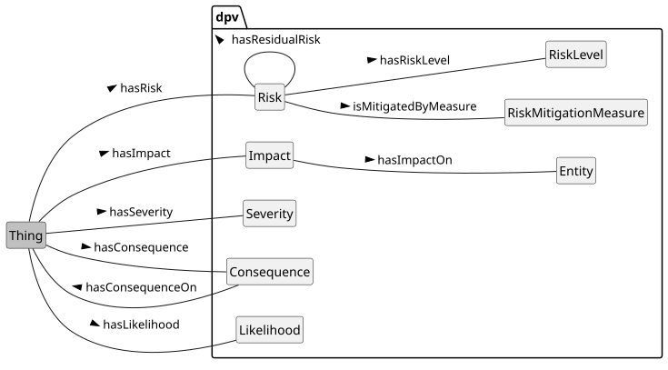 


 

 

For risk and impact assessment, DPV's provides a 'lightweight risk ontology' based on commonly utilised concepts of [=Risk=], [=RiskMitigationMeasure=], [=Consequence=], and [=Impact=] along with risk assessment concepts of [=RiskLevel=], [=Severity=], and [=Likelihood=]. Through these concepts, information about what risks and impacts exist as well as their qualitative and quantitative assessment (severity, level) can be sufficiently expressed.

 

For a more comprehensive representation of risk assessment, mitigation, and management concepts, the [[[RISK]]] extension should be used which is based on relevant standards such as the ISO/IEC 31000 series. The [[RISK]] extension also provides taxonomies for these concepts which permits representation of information such as different types of consequences and impacts or concepts representing levels, severities, and likelihoods. It also provides representations of risk matrices, modelling incident and associated statuses, and categorises of 'controls' for a clearer application of measures.

 


 

-  dpv:Likelihood: The likelihood or probability or chance of something taking place or occurring [go to full definition](https://w3id.org/dpv#Likelihood) 

 

-  dpv:RiskAssessment: Assessment involving identification, analysis, and evaluation of risk [go to full definition](https://w3id.org/dpv#RiskAssessment) 

 

  -  dpv:ImpactAssessment: Calculating or determining the likelihood of impact of an existing or proposed process, which can involve risks or detriments. [go to full definition](https://w3id.org/dpv#ImpactAssessment) 

 

    -  dpv:DataTransferImpactAssessment: Impact Assessment for conducting data transfers [go to full definition](https://w3id.org/dpv#DataTransferImpactAssessment) 

 

    -  dpv:PIA: Impact assessment regarding privacy risks [go to full definition](https://w3id.org/dpv#PIA) 

 

    -  dpv:RightsImpactAssessment: Impact assessment which involves determining the impact on rights and freedoms [go to full definition](https://w3id.org/dpv#RightsImpactAssessment) 

 

      -  dpv:DataBreachImpactAssessment: Impact Assessment concerning the consequences and impacts of a data breach [go to full definition](https://w3id.org/dpv#DataBreachImpactAssessment) 

 

      -  dpv:DPIA: Impact assessment determining the potential and actual impact of processing activities on individuals or groups of individuals and taking into account the impacts of activities on their rights and freedoms [go to full definition](https://w3id.org/dpv#DPIA) 

 

      -  dpv:FRIA: Impact assessment which assesses the potential and actual impact on fundamental rights occurring due to processing activities [go to full definition](https://w3id.org/dpv#FRIA) 

 

 

 

 

 

  -  dpv:SecurityAssessment: Assessment of security intended to identify gaps, vulnerabilities, risks, and effectiveness of controls [go to full definition](https://w3id.org/dpv#SecurityAssessment) 

 

    -  dpv:CybersecurityAssessment: Assessment of cybersecurity capabilities in terms of vulnerabilities and effectiveness of controls [go to full definition](https://w3id.org/dpv#CybersecurityAssessment) 

 

 

 

 

 

-  dpv:RiskConcept: Parent concept for combining concepts associated with risk assessment such as actual and potential Risk, Risk Source, Consequences, and Impacts [go to full definition](https://w3id.org/dpv#RiskConcept) 

 

  -  dpv:Consequence: The consequence(s) possible or arising from specified context [go to full definition](https://w3id.org/dpv#Consequence) 

 

    -  dpv:ConsequenceAsSideEffect: The consequence(s) possible or arising as a side-effect of specified context [go to full definition](https://w3id.org/dpv#ConsequenceAsSideEffect) 

 

    -  dpv:ConsequenceOfFailure: The consequence(s) possible or arising from failure of specified context [go to full definition](https://w3id.org/dpv#ConsequenceOfFailure) 

 

    -  dpv:ConsequenceOfSuccess: The consequence(s) possible or arising from success of specified context [go to full definition](https://w3id.org/dpv#ConsequenceOfSuccess) 

 

    -  dpv:Impact: The impact(s) possible or arising as a consequence from specified context [go to full definition](https://w3id.org/dpv#Impact) 

 

 

 

  -  dpv:Risk: A risk or possibility or uncertainty of negative effects, impacts, or consequences [go to full definition](https://w3id.org/dpv#Risk) 

 

    -  dpv:ResidualRisk: Risk remaining after treatment or mitigation [go to full definition](https://w3id.org/dpv#ResidualRisk) 

 

 

 

 

 

-  dpv:RiskLevel: The magnitude of a risk expressed as an indication to aid in its management [go to full definition](https://w3id.org/dpv#RiskLevel) 

 

-  dpv:RiskMitigationMeasure: Measures intended to mitigate, minimise, or prevent risk. [go to full definition](https://w3id.org/dpv#RiskMitigationMeasure) 

 

-  dpv:Severity: The magnitude of being unwanted or having negative effects such as harmful impacts [go to full definition](https://w3id.org/dpv#Severity) 

 

  -  dpv:SensitivityLevel: Sensitivity' reflects the risk of impact if not secured or utilised with appropriate measures and controls e.g. for sensitive data [go to full definition](https://w3id.org/dpv#SensitivityLevel)

<a id="risk-L793"></a>
## Risk
 

[=Risk=] within the DPV is concerned with 'probable negative effects', and is indicated by using [=hasRisk=]. A risk event is a probable event that may lead to negative consequences and impacts (hence it is a 'risk'). It is important to note that a risk is a hypothetical event i.e. it is a probability that something may occur. The concept `risk:Incident` in [[RISK]] extension represents incidents which have occurred and provides the necessary concepts to connect them to risks for what had been previously assessed as well as to indicate what are the further risks associated with an incident.

 

[=Likelihood=], associated using [=hasLikelihood=], represents the likelihood or probability or chance of something (risk in this case) taking place. The [[RISK]] extension defines concepts to indicate likelihoods with various scales e.g. as a set of 3 concepts representing high likelihood, moderate likelihood, and low likelihood.

 

[=Severity=], associated using [=hasSeverity=], represents the severity or 'extremeness' or 'intensity' of something (risk in this case). The [[RISK]] extension defines concepts to indicate severities with various scales e.g. as a set of 5 concepts representing very high severity, high severity, moderate severity, low severity, and very low severity. [=SensitivityLevel=] represents the 'sensitivity' of some context (e.g. personal data) as a measure of how severe risks associated with it are (e.g. to indicate how sensitive the personal data is). It is associated using the relation [=hasSensitivityLevel=].

 

[=RiskLevel=], associated using [=hasRiskLevel=], represents the combination of severity and likelihood in the form of 'risk level' that provides a cohesive qualitative assessment of risk. The [[RISK]] extension defines concepts to indicate risk levels with various scales e.g. as a set of 3 concepts representing high risk, moderate risk, and low risk.

  

This example shows the use of risk concepts in DPV and RISK extension to represent a risk of data breach associated with a process along with its potential consequences and impacts on the data subject. The scenario consists of a risk of data breach with high likelihood and severity, and whose potential consequence includes a loss of data which can lead to financial loss for the data controller and misuse of breached information to cause identity fraud for the data subject. The risk has a mitigation measure, which is to secure the data using the encryption. The residual risk if this measure is applied is shown to have a lower risk level. 


```
ex:PDH a dpv:Process;
  dpv:hasRisk ex:R1DB .

ex:R1DB a dpv:Risk ;
  skos:broader risk:DataBreach ;
  skos:prefLabel "Risk of Data Breach for Process"@en ;
  dpv:hasLikelihood risk:HighLikelihood ;
  dpv:hasSeverity risk:HighSeverity ;
  dpv:hasRiskLevel risk:HighRisk ;
  dpv:hasConsequence [
    a dpv:Risk, risk:DataLoss ;
    dpv:hasLikelihood risk:HighLikelihood ;
    dpv:hasSeverity risk:HighSeverity ;
    dpv:isMitigatedByMeasure dpv:DataBackupProtocols, dpv:Encryption ;
    dpv:hasImpact [
      a risk:FinancialLoss ;
      skos:prefLabel "Loss suffered due to breach"@en ;
      dpv:hasImpactOn dpv:DataController ;
      dpv:hasLikelihood risk:LowLikelihood ;
      dpv:hasSeverity risk:HighSeverity ;
    ] ;
    dpv:hasImpact [
      a dpv:Risk, risk:IntentionalMisuse, risk:IdentityFraud ;
      skos:prefLabel "Breached information may be misused in identity fraud"@en ;
      dpv:hasImpactOn dpv:DataSubject ;
      dpv:hasLikelihood risk:LowLikelihood ;
      dpv:hasSeverity risk:HighSeverity ;
    ] ;
  ] ;
  dpv:hasResidualRisk ex:R2DB .

ex:R2DB a dpv:ResidualRisk ;
  dpv:isResidualRiskOf ex:R1DB ;
  dpv:hasLikelihood risk:HighLikelihood ;
  dpv:hasSeverity risk:LowSeverity ;
  dpv:hasRiskLevel risk:LowRisk .
```


 

(META Example ID: [`E0068`](https://w3id.org/dpv/examples#E0068); link: [source file](https://w3id.org/dpv/examples/E0068.ttl); contributed by Harshvardhan J. Pandit on 2024-06-16)

<a id="risk-L846"></a>
## Risk Mitigation Measure
 

[=RiskMitigationMeasure=] is a measure taken to mitigate the risk. Here the use of the word 'mitigate' follows from its use in legal documents and includes avoiding, reducing, replacing, removing, transforming, sharing, and other operations related to risk treatment. In normative risk related guides and standards, mitigation is only one operation within risk treatment processes.

 

Risks can have multiple mitigation measures, which are indicated by using [=isMitigatedByMeasure=] relation. A mitigation measure may address multiple risks, which are indicated by using [=mitigatesRisk=]. The [[RISK]] extension provides a more granular taxonomy of risk mitigation measures, including risk controls which enable expressing aspects of the intended effect of a measure on risk (or other events) - e.g. to remove the source or to alter the consequence.

 

Risk remaining after 'mitigation' or 'treatment' is represented by [=ResidualRisk=], which is a subcategory of [=Risk=] and uses the same relations to express likelihood, severity, level, and further mitigations. It is associated by using [=hasResidualRisk=] and [=isResidualRiskOf=] relations.

  

In this example, we consider Risk can be associated with any concept given its broad existence and applicability, and that its mitigation is a technical and organisational measure. Using this, the implemented or adopted technical and organisational measures within an use-case are annotated with the risks they address or mitigate, along with specific impacts that may occur if the risk were to occur. For example, the storage of personal data within a database has an implementation of access control that mitigates the consequence of unauthorised access and its impact to cause harm.

 


```
# 1: annotating implementations with risks involved
  ex:DataStore rdf:type dpv:Technology ;
      dpv:hasTechnicalMeasure ex:RBACCredential ;
      dpv:hasRisk ex:UnAuthorisedAccess . 

  # 2: risk registry denoting risks and mitigations
  ex:UnAuthorisedAccess rdf:type dpv:Risk ;
      dpv:hasConsequence risk:UnauthorisedDataAccess ;
      dpv:hasImpact risk:Harm ;
      dpv:isMitigatedByMeasure ex:RBACCredential .

  # 3: annotating measures with risks mitigated
  ex:RBACCredential rdf:type dpv:TechnicalMeasure, dpv:RiskMitigationMeasure ;
      skos:broader dpv:AccessControlMethod ;
      dpv:mitigatesRisk ex:UnAuthorisedAccess .

  # 4: policies and training as risk mitigations
  ex:SecurityPolicy rdf:type dpv:OrganisationalMeasure ;
      skos:broader dpv:Policy ;
      dpv:hasOrganisationalMeasure dpv:StaffTraining ;
      dpv:mitigatesRisk ex:UnAuthorisedAccess .
```


 

(META Example ID: [`E0027`](https://w3id.org/dpv/examples#E0027); link: [source file](https://w3id.org/dpv/examples/E0027.ttl); contributed by Harshvardhan J. Pandit on 2024-06-10)

<a id="risk-L883"></a>
## Consequence & Impact
 

The concepts [=Consequence=] and [=Impact=] in DPV are provided with a specific modelling of consequences and impacts. The DPV concept for consequence represents the consequence of an event (e.g. risk or incident), and impact is a specific type of consequence which as significance to an entity. DPV considers effects on technical systems (e.g. service disruption) and minor effects on entities (e.g. delayed process) as consequences from major effects focused on entities (e.g. harms) as impacts. Based on this, we recommend using consequences and impacts in the following manner:

 

 

1. [=Consequence=] to indicate the immediate effect of an event where it is not significant to an entity - this can be disruption of the system or service, or loss of data, or other such events. Most technical events would fall under consequence.

 

2. To indicate what the consequence has affected, the relation [=hasConsequenceOn=] is provided. The effect of consequence can be material or non-material, and can be on a system, agent, or legal entity.

 

3. [=Impact=] to represent consequences which have a significant effect on one or more `dpv:Entity`. Impacts are associated by using [=hasImpactOn=] relation, and the impact is always on an entity. The significance of impact is associated with how it affects the entity, e.g., financial loss, physical or mental harm, or impact on rights.

 

4. The entity being affected by the impact is indicated by using [=hasImpactOn=].

 

 

The consequences and impacts can reuse the risk assessment properties to describe likelihood and severity. Consequences and impacts can also be chained together, e.g., to describe a consequence (service disruption) leads to another consequence (wasted time) which leads to an impact (financial loss). Consequences and impacts can be hypothetical (i.e., risks) or actual (i.e., incidents).

 

Consequences and impacts can be positive (e.g. benefit) or negative (e.g. harm). The relations associating them with entities or systems should be interpreted accordingly. For example, if the impact is a harm - which is negative, then the impacted entity should be understood as being the one that is harmed. If instead the impact is compensation - which is positive, then the impacted entity should be understood as being the one that is compensated.

 

The [[RISK]] extension provides a taxonomy of consequences and impacts which covers commonly used terms such as harm, data breach, equipment failure, financial loss, and malware attack. It also provides a taxonomy of positive consequences and impacts which are not 'risks', such as benefits, remunerations, and compensation.

  

In this example, risk controls are used to indicate the technical measure of encryption is used to remove the consequence of misusing the data if it is breached. 


```
ex:R3DB a dpv:Risk ;
  skos:broader risk:DataBreach ;
  dpv:hasRiskLevel risk:LowRisk ;
  dpv:hasConsequence [
    a dpv:Risk, risk:IntentionalMisuse ;
    dpv:isMitigatedByMeasure dpv:DataBackupProtocols, dpv:Encryption ;
    risk:hasControl risk:RemoveConsequence ;
  ] .
```


 

(META Example ID: [`E0071`](https://w3id.org/dpv/examples#E0071); link: [source file](https://w3id.org/dpv/examples/E0071.ttl); contributed by Harshvardhan J. Pandit on 2024-06-16)

<a id="risk-L914"></a>
## Risk and Impact Assessments
 

To support assessments associated with risks and impacts, DPV provides the following concepts:

 

 

1. [=RiskAssessment=] regarding risk assessments.

 

2. [=SecurityAssessment=] regarding assessment of security, and [=CybersecurityAssessment=] as assessment of cybersecurity.

 

3. [=ImpactAssessment=] to impact assessments, with [=PIA=] representing Privacy Impact Assessments (PIA) and [=DataTransferImpactAssessment=] for assessment of impacts in data transfer.

 

4. [=RightsImpactAssessment=] as a specific impact assessment that involves assessing impact on rights, with [=DPIA=] representing Data Protection Impact Assessment (DPIA) and [=FRIA=] representing Fundamental Rights Impact Assessment (FRIA).

 

5. [=DataBreachImpactAssessment=] represents assessment of data breaches and is defined as a rights impact assessment as at least privacy (for personal data) or commercial rights (for non-personal data) will need to be assessed in a data breach.

 

 

The relations [=hasRiskAssessment=] and [=hasImpactAssessment=] enable associating a risk and impact assessment with a process, service, or other contexts. There can be multiple assessments associated with the same context, e.g. for covering different topics or representing assessments at different stages or temporal periods. Assessments can indicate their 'subjects' and other metadata by using a relevant vocabulary such as [[[DCT]]]. Assessments can also record dates associated with their use to audit a system or process, and the relevant status to record the outcome of that process e.g. to indicate approval.

  

Where laws require specific forms of risk and impact assessments, the recommendation is to represent relevant concepts in a [[LEGAL]] extension. For example, to represent the DPIA processes and outcomes as required by GDPR, the [[EU-GDPR]] extension provides relevant concepts which permit indicating when to carry out the DPIA, what is involved in the DPIA, and the outcome of the DPIA in terms of permitting processing. Similarly, the [[EU-AIAct]] extension will provide concepts for FRIA as required by the [[AIAct]], and the [[EU-NIS2]] for supply chain risk assessments as required by [[NIS2]].

 

The DPVCG welcomes such modelling of both laws and legal concepts as well as the relevant concepts needed to implement the legal requirements through the creation of specific [[LEGAL]] extensions representing specific jurisdictions and laws within them.

   

This example shows how a DPIA can be documented as an audit - including a status that indicates audit is needed, and maintaining logs for how the DPIA was approved. 


```
ex:PDH a dpv:hasProcess ;
    dpv:hasImpactAssessment ex:PDH-DPIA-202402 .

ex:PDH-DPIA-202402 a dpv:DPIA ;
    dct:subject ex:CorpService ; # DPIA covering Corp. Service
    dct:date "2024-01-01"^^xsd:date ;
    dct:conformsTo ex:OrgPolicy ;
    dpv:hasAuditStatus dpv:AuditRequired ; # an audit is required 
    dpv:hasAuditStatus dpv:AuditApproved ; # status if no details are needed
    # or to specify more details about the audit
    dpv:hasAuditStatus [
        a dpv:AuditRequested ;
        dct:date "2024-01-31"^^xsd:date ; # date of approval
    ] ;
    dpv:hasAuditStatus [
        a dpv:AuditConditionallyApproved ;
        dct:date "2024-03-31"^^xsd:date ; # date of approval
    ] ;
    dpv:hasAuditStatus [
        a dpv:AuditRequested ;
        dct:date "2024-05-31"^^xsd:date ; # date of approval
    ] ;
    dpv:hasAuditStatus [
        a dpv:AuditApproved ;
        dct:date "2024-07-31"^^xsd:date ; # date of approval
    ] .
```


 

(META Example ID: [`E0056`](https://w3id.org/dpv/examples#E0056); link: [source file](https://w3id.org/dpv/examples/E0056.ttl); contributed by Harshvardhan J. Pandit on 2024-06-11)

<a id="risk-L966"></a>
## Vocabulary Index
 
<a id="risk-classes"></a>

<a id="risk-L968"></a>
### Classes
 
<a id="risk-Consequence"></a>

<a id="risk-L969"></a>
#### Consequence
 

- Term | Consequence | Prefix | dpv
- Label | Consequence
- IRI | [https://w3id.org/dpv#Consequence](https://w3id.org/dpv#Consequence)
- Type | [rdfs:Class](http://www.w3.org/2000/01/rdf-schema#Class), [skos:Concept](http://www.w3.org/2004/02/skos/core#Concept)
- Broader/Parent types | [dpv:RiskConcept](#risk-RiskConcept)
- Subject of relation | [dpv:hasConsequenceOn](https://w3id.org/dpv#hasConsequenceOn)
- Object of relation | [dpv:hasConsequence](https://w3id.org/dpv#hasConsequence), [risk:avoids](https://w3id.org/dpv/risk#avoids), [risk:contains](https://w3id.org/dpv/risk#contains), [risk:controls](https://w3id.org/dpv/risk#controls), [risk:detects](https://w3id.org/dpv/risk#detects), [risk:eliminates](https://w3id.org/dpv/risk#eliminates), [risk:identifies](https://w3id.org/dpv/risk#identifies), [risk:interrupts](https://w3id.org/dpv/risk#interrupts), [risk:intervenes](https://w3id.org/dpv/risk#intervenes), [risk:investigates](https://w3id.org/dpv/risk#investigates), [risk:logs](https://w3id.org/dpv/risk#logs), [risk:mitigates](https://w3id.org/dpv/risk#mitigates), [risk:modifies](https://w3id.org/dpv/risk#modifies), [risk:monitors](https://w3id.org/dpv/risk#monitors), [risk:overrides](https://w3id.org/dpv/risk#overrides), [risk:recovers](https://w3id.org/dpv/risk#recovers), [risk:reduces](https://w3id.org/dpv/risk#reduces), [risk:remedies](https://w3id.org/dpv/risk#remedies), [risk:resolves](https://w3id.org/dpv/risk#resolves), [risk:reverses](https://w3id.org/dpv/risk#reverses), [risk:shares](https://w3id.org/dpv/risk#shares), [risk:substitutes](https://w3id.org/dpv/risk#substitutes), [risk:transfers](https://w3id.org/dpv/risk#transfers)
- Definition | The consequence(s) possible or arising from specified context
- Examples
- [`dex:E0027 :: ` Indicating risks, consequences, and impacts](https://w3id.org/dpv/examples#E0027)
 [`dex:E0068 :: ` Using DPV and RISK extension to represent risks](https://w3id.org/dpv/examples#E0068)
 [`dex:E0071 :: ` Using risk controls to express how tech/org measures address the risk](https://w3id.org/dpv/examples#E0071)
- Date Created | 2022-01-26
- Date Modified | 2024-08-16
- Contributors | Harshvardhan J. Pandit
- See More: | section [RISK](#risk-vocab-risk) in [DEX](https://w3id.org/dpv#)

 

 
<a id="risk-ConsequenceAsSideEffect"></a>

<a id="risk-L1076"></a>
#### Consequence as Side-Effect
 

- Term | ConsequenceAsSideEffect | Prefix | dpv
- Label | Consequence as Side-Effect
- IRI | [https://w3id.org/dpv#ConsequenceAsSideEffect](https://w3id.org/dpv#ConsequenceAsSideEffect)
- Type | [rdfs:Class](http://www.w3.org/2000/01/rdf-schema#Class), [skos:Concept](http://www.w3.org/2004/02/skos/core#Concept)
- Broader/Parent types | [dpv:Consequence](#risk-Consequence) → [dpv:RiskConcept](#risk-RiskConcept)
- Object of relation | [dpv:hasConsequence](https://w3id.org/dpv#hasConsequence), [risk:avoids](https://w3id.org/dpv/risk#avoids), [risk:contains](https://w3id.org/dpv/risk#contains), [risk:controls](https://w3id.org/dpv/risk#controls), [risk:detects](https://w3id.org/dpv/risk#detects), [risk:eliminates](https://w3id.org/dpv/risk#eliminates), [risk:identifies](https://w3id.org/dpv/risk#identifies), [risk:interrupts](https://w3id.org/dpv/risk#interrupts), [risk:intervenes](https://w3id.org/dpv/risk#intervenes), [risk:investigates](https://w3id.org/dpv/risk#investigates), [risk:logs](https://w3id.org/dpv/risk#logs), [risk:mitigates](https://w3id.org/dpv/risk#mitigates), [risk:modifies](https://w3id.org/dpv/risk#modifies), [risk:monitors](https://w3id.org/dpv/risk#monitors), [risk:overrides](https://w3id.org/dpv/risk#overrides), [risk:recovers](https://w3id.org/dpv/risk#recovers), [risk:reduces](https://w3id.org/dpv/risk#reduces), [risk:remedies](https://w3id.org/dpv/risk#remedies), [risk:resolves](https://w3id.org/dpv/risk#resolves), [risk:reverses](https://w3id.org/dpv/risk#reverses), [risk:shares](https://w3id.org/dpv/risk#shares), [risk:substitutes](https://w3id.org/dpv/risk#substitutes), [risk:transfers](https://w3id.org/dpv/risk#transfers)
- Definition | The consequence(s) possible or arising as a side-effect of specified context
- Date Created | 2022-03-30
- Contributors | Harshvardhan J. Pandit
- See More: | section [RISK](#risk-vocab-risk) in [DPV](https://w3id.org/dpv#)

 

 
<a id="risk-ConsequenceOfFailure"></a>

<a id="risk-L1174"></a>
#### Consequence of Failure
 

- Term | ConsequenceOfFailure | Prefix | dpv
- Label | Consequence of Failure
- IRI | [https://w3id.org/dpv#ConsequenceOfFailure](https://w3id.org/dpv#ConsequenceOfFailure)
- Type | [rdfs:Class](http://www.w3.org/2000/01/rdf-schema#Class), [skos:Concept](http://www.w3.org/2004/02/skos/core#Concept)
- Broader/Parent types | [dpv:Consequence](#risk-Consequence) → [dpv:RiskConcept](#risk-RiskConcept)
- Object of relation | [dpv:hasConsequence](https://w3id.org/dpv#hasConsequence), [risk:avoids](https://w3id.org/dpv/risk#avoids), [risk:contains](https://w3id.org/dpv/risk#contains), [risk:controls](https://w3id.org/dpv/risk#controls), [risk:detects](https://w3id.org/dpv/risk#detects), [risk:eliminates](https://w3id.org/dpv/risk#eliminates), [risk:identifies](https://w3id.org/dpv/risk#identifies), [risk:interrupts](https://w3id.org/dpv/risk#interrupts), [risk:intervenes](https://w3id.org/dpv/risk#intervenes), [risk:investigates](https://w3id.org/dpv/risk#investigates), [risk:logs](https://w3id.org/dpv/risk#logs), [risk:mitigates](https://w3id.org/dpv/risk#mitigates), [risk:modifies](https://w3id.org/dpv/risk#modifies), [risk:monitors](https://w3id.org/dpv/risk#monitors), [risk:overrides](https://w3id.org/dpv/risk#overrides), [risk:recovers](https://w3id.org/dpv/risk#recovers), [risk:reduces](https://w3id.org/dpv/risk#reduces), [risk:remedies](https://w3id.org/dpv/risk#remedies), [risk:resolves](https://w3id.org/dpv/risk#resolves), [risk:reverses](https://w3id.org/dpv/risk#reverses), [risk:shares](https://w3id.org/dpv/risk#shares), [risk:substitutes](https://w3id.org/dpv/risk#substitutes), [risk:transfers](https://w3id.org/dpv/risk#transfers)
- Definition | The consequence(s) possible or arising from failure of specified context
- Date Created | 2022-03-23
- Contributors | Georg P. Krog, Harshvardhan J. Pandit
- See More: | section [RISK](#risk-vocab-risk) in [DPV](https://w3id.org/dpv#)

 

 
<a id="risk-ConsequenceOfSuccess"></a>

<a id="risk-L1272"></a>
#### Consequence of Success
 

- Term | ConsequenceOfSuccess | Prefix | dpv
- Label | Consequence of Success
- IRI | [https://w3id.org/dpv#ConsequenceOfSuccess](https://w3id.org/dpv#ConsequenceOfSuccess)
- Type | [rdfs:Class](http://www.w3.org/2000/01/rdf-schema#Class), [skos:Concept](http://www.w3.org/2004/02/skos/core#Concept)
- Broader/Parent types | [dpv:Consequence](#risk-Consequence) → [dpv:RiskConcept](#risk-RiskConcept)
- Object of relation | [dpv:hasConsequence](https://w3id.org/dpv#hasConsequence), [risk:avoids](https://w3id.org/dpv/risk#avoids), [risk:contains](https://w3id.org/dpv/risk#contains), [risk:controls](https://w3id.org/dpv/risk#controls), [risk:detects](https://w3id.org/dpv/risk#detects), [risk:eliminates](https://w3id.org/dpv/risk#eliminates), [risk:identifies](https://w3id.org/dpv/risk#identifies), [risk:interrupts](https://w3id.org/dpv/risk#interrupts), [risk:intervenes](https://w3id.org/dpv/risk#intervenes), [risk:investigates](https://w3id.org/dpv/risk#investigates), [risk:logs](https://w3id.org/dpv/risk#logs), [risk:mitigates](https://w3id.org/dpv/risk#mitigates), [risk:modifies](https://w3id.org/dpv/risk#modifies), [risk:monitors](https://w3id.org/dpv/risk#monitors), [risk:overrides](https://w3id.org/dpv/risk#overrides), [risk:recovers](https://w3id.org/dpv/risk#recovers), [risk:reduces](https://w3id.org/dpv/risk#reduces), [risk:remedies](https://w3id.org/dpv/risk#remedies), [risk:resolves](https://w3id.org/dpv/risk#resolves), [risk:reverses](https://w3id.org/dpv/risk#reverses), [risk:shares](https://w3id.org/dpv/risk#shares), [risk:substitutes](https://w3id.org/dpv/risk#substitutes), [risk:transfers](https://w3id.org/dpv/risk#transfers)
- Definition | The consequence(s) possible or arising from success of specified context
- Date Created | 2022-03-23
- Contributors | Georg P. Krog, Harshvardhan J. Pandit
- See More: | section [RISK](#risk-vocab-risk) in [DPV](https://w3id.org/dpv#)

 

 
<a id="risk-CybersecurityAssessment"></a>

<a id="risk-L1370"></a>
#### Cybersecurity Assessment
 

- Term | CybersecurityAssessment | Prefix | dpv
- Label | Cybersecurity Assessment
- IRI | [https://w3id.org/dpv#CybersecurityAssessment](https://w3id.org/dpv#CybersecurityAssessment)
- Type | [rdfs:Class](http://www.w3.org/2000/01/rdf-schema#Class), [skos:Concept](http://www.w3.org/2004/02/skos/core#Concept), [dpv:OrganisationalMeasure](https://w3id.org/dpv#OrganisationalMeasure)
- Broader/Parent types | [dpv:SecurityAssessment](#risk-SecurityAssessment) → [dpv:RiskAssessment](#risk-RiskAssessment) → [dpv:Assessment](https://w3id.org/dpv#Assessment) → [dpv:OrganisationalMeasure](https://w3id.org/dpv#OrganisationalMeasure) → [dpv:TechnicalOrganisationalMeasure](https://w3id.org/dpv#TechnicalOrganisationalMeasure)
- Object of relation | [dpv:hasAssessment](https://w3id.org/dpv#hasAssessment), [dpv:hasOrganisationalMeasure](https://w3id.org/dpv#hasOrganisationalMeasure), [dpv:hasRiskAssessment](https://w3id.org/dpv#hasRiskAssessment), [dpv:hasTechnicalOrganisationalMeasure](https://w3id.org/dpv#hasTechnicalOrganisationalMeasure)
- Definition | Assessment of cybersecurity capabilities in terms of vulnerabilities and effectiveness of controls
- Source | [ENISA 5G Cybersecurity Standards](https://www.enisa.europa.eu/publications/5g-cybersecurity-standards)
- Date Created | 2022-08-17
- Contributors | Harshvardhan J. Pandit
- See More: | section [RISK](#risk-vocab-risk) in [DPV](https://w3id.org/dpv#)

 

 
<a id="risk-DataBreachImpactAssessment"></a>

<a id="risk-L1455"></a>
#### Data Breach Impact Assessment (DBIA)
 

- Term | DataBreachImpactAssessment | Prefix | dpv
- Label | Data Breach Impact Assessment (DBIA)
- IRI | [https://w3id.org/dpv#DataBreachImpactAssessment](https://w3id.org/dpv#DataBreachImpactAssessment)
- Type | [rdfs:Class](http://www.w3.org/2000/01/rdf-schema#Class), [skos:Concept](http://www.w3.org/2004/02/skos/core#Concept), [dpv:OrganisationalMeasure](https://w3id.org/dpv#OrganisationalMeasure)
- Broader/Parent types | [dpv:RightsImpactAssessment](#risk-RightsImpactAssessment) → [dpv:ImpactAssessment](#risk-ImpactAssessment) → [dpv:RiskAssessment](#risk-RiskAssessment) → [dpv:Assessment](https://w3id.org/dpv#Assessment) → [dpv:OrganisationalMeasure](https://w3id.org/dpv#OrganisationalMeasure) → [dpv:TechnicalOrganisationalMeasure](https://w3id.org/dpv#TechnicalOrganisationalMeasure)
- Object of relation | [dpv:hasAssessment](https://w3id.org/dpv#hasAssessment), [dpv:hasImpactAssessment](https://w3id.org/dpv#hasImpactAssessment), [dpv:hasOrganisationalMeasure](https://w3id.org/dpv#hasOrganisationalMeasure), [dpv:hasRiskAssessment](https://w3id.org/dpv#hasRiskAssessment), [dpv:hasTechnicalOrganisationalMeasure](https://w3id.org/dpv#hasTechnicalOrganisationalMeasure)
- Definition | Impact Assessment concerning the consequences and impacts of a data breach
- Usage Note | Data Breach assessments can require additional non-security related assessments such as GDPR Art.34 Rights Impact Assessment
- Date Created | 2024-04-15
- Contributors | Harshvardhan J. Pandit
- See More: | section [RISK](#risk-vocab-risk) in [DPV](https://w3id.org/dpv#)

 

 
<a id="risk-DataTransferImpactAssessment"></a>

<a id="risk-L1542"></a>
#### Data Transfer Impact Assessment
 

- Term | DataTransferImpactAssessment | Prefix | dpv
- Label | Data Transfer Impact Assessment
- IRI | [https://w3id.org/dpv#DataTransferImpactAssessment](https://w3id.org/dpv#DataTransferImpactAssessment)
- Type | [rdfs:Class](http://www.w3.org/2000/01/rdf-schema#Class), [skos:Concept](http://www.w3.org/2004/02/skos/core#Concept), [dpv:OrganisationalMeasure](https://w3id.org/dpv#OrganisationalMeasure)
- Broader/Parent types | [dpv:ImpactAssessment](#risk-ImpactAssessment) → [dpv:RiskAssessment](#risk-RiskAssessment) → [dpv:Assessment](https://w3id.org/dpv#Assessment) → [dpv:OrganisationalMeasure](https://w3id.org/dpv#OrganisationalMeasure) → [dpv:TechnicalOrganisationalMeasure](https://w3id.org/dpv#TechnicalOrganisationalMeasure)
- Object of relation | [dpv:hasAssessment](https://w3id.org/dpv#hasAssessment), [dpv:hasImpactAssessment](https://w3id.org/dpv#hasImpactAssessment), [dpv:hasOrganisationalMeasure](https://w3id.org/dpv#hasOrganisationalMeasure), [dpv:hasRiskAssessment](https://w3id.org/dpv#hasRiskAssessment), [dpv:hasTechnicalOrganisationalMeasure](https://w3id.org/dpv#hasTechnicalOrganisationalMeasure)
- Definition | Impact Assessment for conducting data transfers
- Date Created | 2021-09-08
- Contributors | Georg P. Krog, Harshvardhan J. Pandit, Paul Ryan
- See More: | section [RISK](#risk-vocab-risk) in [DPV](https://w3id.org/dpv#)

 

 
<a id="risk-DPIA"></a>

<a id="risk-L1625"></a>
#### Data Protection Impact Assessment (DPIA)
 

- Term | DPIA | Prefix | dpv
- Label | Data Protection Impact Assessment (DPIA)
- IRI | [https://w3id.org/dpv#DPIA](https://w3id.org/dpv#DPIA)
- Type | [rdfs:Class](http://www.w3.org/2000/01/rdf-schema#Class), [skos:Concept](http://www.w3.org/2004/02/skos/core#Concept), [dpv:OrganisationalMeasure](https://w3id.org/dpv#OrganisationalMeasure)
- Broader/Parent types | [dpv:RightsImpactAssessment](#risk-RightsImpactAssessment) → [dpv:ImpactAssessment](#risk-ImpactAssessment) → [dpv:RiskAssessment](#risk-RiskAssessment) → [dpv:Assessment](https://w3id.org/dpv#Assessment) → [dpv:OrganisationalMeasure](https://w3id.org/dpv#OrganisationalMeasure) → [dpv:TechnicalOrganisationalMeasure](https://w3id.org/dpv#TechnicalOrganisationalMeasure)
- Object of relation | [dpv:hasAssessment](https://w3id.org/dpv#hasAssessment), [dpv:hasImpactAssessment](https://w3id.org/dpv#hasImpactAssessment), [dpv:hasOrganisationalMeasure](https://w3id.org/dpv#hasOrganisationalMeasure), [dpv:hasRiskAssessment](https://w3id.org/dpv#hasRiskAssessment), [dpv:hasTechnicalOrganisationalMeasure](https://w3id.org/dpv#hasTechnicalOrganisationalMeasure)
- Definition | Impact assessment determining the potential and actual impact of processing activities on individuals or groups of individuals and taking into account the impacts of activities on their rights and freedoms
- Usage Note | Specific requirements and procedures for DPIA are defined in GDPR Art.35
- Examples
- [`dex:E0056 :: ` Specifying the audit status associated with a DPIA](https://w3id.org/dpv/examples#E0056)
- Source | GDPR Art. 35
- Date Created | 2020-11-04
- Date Modified | 2024-04-14
- Contributors | Georg P. Krog, Harshvardhan J. Pandit, Paul Ryan
- See More: | section [RISK](#risk-vocab-risk) in [DEX](https://w3id.org/dpv#)

 

 
<a id="risk-FRIA"></a>

<a id="risk-L1721"></a>
#### Fundamental Rights Impact Assessment (FRIA)
 

- Term | FRIA | Prefix | dpv
- Label | Fundamental Rights Impact Assessment (FRIA)
- IRI | [https://w3id.org/dpv#FRIA](https://w3id.org/dpv#FRIA)
- Type | [rdfs:Class](http://www.w3.org/2000/01/rdf-schema#Class), [skos:Concept](http://www.w3.org/2004/02/skos/core#Concept), [dpv:OrganisationalMeasure](https://w3id.org/dpv#OrganisationalMeasure)
- Broader/Parent types | [dpv:RightsImpactAssessment](#risk-RightsImpactAssessment) → [dpv:ImpactAssessment](#risk-ImpactAssessment) → [dpv:RiskAssessment](#risk-RiskAssessment) → [dpv:Assessment](https://w3id.org/dpv#Assessment) → [dpv:OrganisationalMeasure](https://w3id.org/dpv#OrganisationalMeasure) → [dpv:TechnicalOrganisationalMeasure](https://w3id.org/dpv#TechnicalOrganisationalMeasure)
- Object of relation | [dpv:hasAssessment](https://w3id.org/dpv#hasAssessment), [dpv:hasImpactAssessment](https://w3id.org/dpv#hasImpactAssessment), [dpv:hasOrganisationalMeasure](https://w3id.org/dpv#hasOrganisationalMeasure), [dpv:hasRiskAssessment](https://w3id.org/dpv#hasRiskAssessment), [dpv:hasTechnicalOrganisationalMeasure](https://w3id.org/dpv#hasTechnicalOrganisationalMeasure)
- Definition | Impact assessment which assesses the potential and actual impact on fundamental rights occurring due to processing activities
- Usage Note | The fundamental rights and freedoms may be those defined in law or other norms, and may be bound to a jurisdiction - for example see EU Charter of Fundamental Rights
- Source | AI Act Art.27
- Date Created | 2024-04-14
- Contributors | Harshvardhan J. Pandit
- See More: | section [RISK](#risk-vocab-risk) in [DPV](https://w3id.org/dpv#)

 

 
<a id="risk-Impact"></a>

<a id="risk-L1811"></a>
#### Impact
 

- Term | Impact | Prefix | dpv
- Label | Impact
- IRI | [https://w3id.org/dpv#Impact](https://w3id.org/dpv#Impact)
- Type | [rdfs:Class](http://www.w3.org/2000/01/rdf-schema#Class), [skos:Concept](http://www.w3.org/2004/02/skos/core#Concept)
- Broader/Parent types | [dpv:Consequence](#risk-Consequence) → [dpv:RiskConcept](#risk-RiskConcept)
- Subject of relation | [dpv:hasImpactOn](https://w3id.org/dpv#hasImpactOn)
- Object of relation | [dpv:hasConsequence](https://w3id.org/dpv#hasConsequence), [dpv:hasImpact](https://w3id.org/dpv#hasImpact), [risk:avoids](https://w3id.org/dpv/risk#avoids), [risk:contains](https://w3id.org/dpv/risk#contains), [risk:controls](https://w3id.org/dpv/risk#controls), [risk:detects](https://w3id.org/dpv/risk#detects), [risk:eliminates](https://w3id.org/dpv/risk#eliminates), [risk:identifies](https://w3id.org/dpv/risk#identifies), [risk:interrupts](https://w3id.org/dpv/risk#interrupts), [risk:intervenes](https://w3id.org/dpv/risk#intervenes), [risk:investigates](https://w3id.org/dpv/risk#investigates), [risk:logs](https://w3id.org/dpv/risk#logs), [risk:mitigates](https://w3id.org/dpv/risk#mitigates), [risk:modifies](https://w3id.org/dpv/risk#modifies), [risk:monitors](https://w3id.org/dpv/risk#monitors), [risk:overrides](https://w3id.org/dpv/risk#overrides), [risk:recovers](https://w3id.org/dpv/risk#recovers), [risk:reduces](https://w3id.org/dpv/risk#reduces), [risk:remedies](https://w3id.org/dpv/risk#remedies), [risk:resolves](https://w3id.org/dpv/risk#resolves), [risk:reverses](https://w3id.org/dpv/risk#reverses), [risk:shares](https://w3id.org/dpv/risk#shares), [risk:substitutes](https://w3id.org/dpv/risk#substitutes), [risk:transfers](https://w3id.org/dpv/risk#transfers)
- Definition | The impact(s) possible or arising as a consequence from specified context
- Usage Note | Impact is a stronger notion of consequence in terms of influence, change, or effect on something e.g. for impact assessments
- Examples
- [`dex:E0027 :: ` Indicating risks, consequences, and impacts](https://w3id.org/dpv/examples#E0027)
 [`dex:E0068 :: ` Using DPV and RISK extension to represent risks](https://w3id.org/dpv/examples#E0068)
 [`dex:E0069 :: ` Using DPV and RISK extension to represent incidents](https://w3id.org/dpv/examples#E0069)
- Date Created | 2022-03-23
- Date Modified | 2024-08-16
- Contributors | Beatriz Esteves, Fajar Ekaputra, Georg P. Krog, Harshvardhan J. Pandit, Julian Flake
- See More: | section [RISK](#risk-vocab-risk) in [DEX](https://w3id.org/dpv#)

 

 
<a id="risk-ImpactAssessment"></a>

<a id="risk-L1923"></a>
#### Impact Assessment
 

- Term | ImpactAssessment | Prefix | dpv
- Label | Impact Assessment
- IRI | [https://w3id.org/dpv#ImpactAssessment](https://w3id.org/dpv#ImpactAssessment)
- Type | [rdfs:Class](http://www.w3.org/2000/01/rdf-schema#Class), [skos:Concept](http://www.w3.org/2004/02/skos/core#Concept), [dpv:OrganisationalMeasure](https://w3id.org/dpv#OrganisationalMeasure)
- Broader/Parent types | [dpv:RiskAssessment](#risk-RiskAssessment) → [dpv:Assessment](https://w3id.org/dpv#Assessment) → [dpv:OrganisationalMeasure](https://w3id.org/dpv#OrganisationalMeasure) → [dpv:TechnicalOrganisationalMeasure](https://w3id.org/dpv#TechnicalOrganisationalMeasure)
- Object of relation | [dpv:hasAssessment](https://w3id.org/dpv#hasAssessment), [dpv:hasImpactAssessment](https://w3id.org/dpv#hasImpactAssessment), [dpv:hasOrganisationalMeasure](https://w3id.org/dpv#hasOrganisationalMeasure), [dpv:hasRiskAssessment](https://w3id.org/dpv#hasRiskAssessment), [dpv:hasTechnicalOrganisationalMeasure](https://w3id.org/dpv#hasTechnicalOrganisationalMeasure)
- Definition | Calculating or determining the likelihood of impact of an existing or proposed process, which can involve risks or detriments.
- Date Created | 2020-11-04
- Contributors | Georg P. Krog, Harshvardhan J. Pandit, Paul Ryan
- See More: | section [RISK](#risk-vocab-risk) in [DPV](https://w3id.org/dpv#)

 

 
<a id="risk-Likelihood"></a>

<a id="risk-L2005"></a>
#### Likelihood
 

- Term | Likelihood | Prefix | dpv
- Label | Likelihood
- IRI | [https://w3id.org/dpv#Likelihood](https://w3id.org/dpv#Likelihood)
- Type | [rdfs:Class](http://www.w3.org/2000/01/rdf-schema#Class), [skos:Concept](http://www.w3.org/2004/02/skos/core#Concept)
- Object of relation | [dpv:hasLikelihood](https://w3id.org/dpv#hasLikelihood)
- Definition | The likelihood or probability or chance of something taking place or occurring
- Usage Note | Likelihood can be expressed in a subjective manner, such as 'Unlikely', or in a quantitative manner such as "Twice in a Day" (frequency per period). The suggestion is to use quantitative values, or to associate them with subjective terms used so as to enable accurate interpretations and interoperability. See the concepts related to Frequency and Duration for possible uses as a combination to express Likelihood.
- Examples
- [`dex:E0068 :: ` Using DPV and RISK extension to represent risks](https://w3id.org/dpv/examples#E0068)
- Date Created | 2022-07-22
- Contributors | Harshvardhan J. Pandit
- See More: | section [RISK](#risk-vocab-risk) in [DEX](https://w3id.org/dpv#)

 

 
<a id="risk-PIA"></a>

<a id="risk-L2083"></a>
#### Privacy Impact Assessment (PIA)
 

- Term | PIA | Prefix | dpv
- Label | Privacy Impact Assessment (PIA)
- IRI | [https://w3id.org/dpv#PIA](https://w3id.org/dpv#PIA)
- Type | [rdfs:Class](http://www.w3.org/2000/01/rdf-schema#Class), [skos:Concept](http://www.w3.org/2004/02/skos/core#Concept), [dpv:OrganisationalMeasure](https://w3id.org/dpv#OrganisationalMeasure)
- Broader/Parent types | [dpv:ImpactAssessment](#risk-ImpactAssessment) → [dpv:RiskAssessment](#risk-RiskAssessment) → [dpv:Assessment](https://w3id.org/dpv#Assessment) → [dpv:OrganisationalMeasure](https://w3id.org/dpv#OrganisationalMeasure) → [dpv:TechnicalOrganisationalMeasure](https://w3id.org/dpv#TechnicalOrganisationalMeasure)
- Object of relation | [dpv:hasAssessment](https://w3id.org/dpv#hasAssessment), [dpv:hasImpactAssessment](https://w3id.org/dpv#hasImpactAssessment), [dpv:hasOrganisationalMeasure](https://w3id.org/dpv#hasOrganisationalMeasure), [dpv:hasRiskAssessment](https://w3id.org/dpv#hasRiskAssessment), [dpv:hasTechnicalOrganisationalMeasure](https://w3id.org/dpv#hasTechnicalOrganisationalMeasure)
- Definition | Impact assessment regarding privacy risks
- Date Created | 2020-11-04
- Contributors | Georg P. Krog, Harshvardhan J. Pandit, Paul Ryan
- See More: | section [RISK](#risk-vocab-risk) in [DPV](https://w3id.org/dpv#)

 

 
<a id="risk-ResidualRisk"></a>

<a id="risk-L2166"></a>
#### Residual Risk
 

- Term | ResidualRisk | Prefix | dpv
- Label | Residual Risk
- IRI | [https://w3id.org/dpv#ResidualRisk](https://w3id.org/dpv#ResidualRisk)
- Type | [rdfs:Class](http://www.w3.org/2000/01/rdf-schema#Class), [skos:Concept](http://www.w3.org/2004/02/skos/core#Concept)
- Broader/Parent types | [dpv:Risk](#risk-Risk) → [dpv:RiskConcept](#risk-RiskConcept)
- Subject of relation | [dpv:isResidualRiskOf](https://w3id.org/dpv#isResidualRiskOf)
- Object of relation | [dpv:hasResidualRisk](https://w3id.org/dpv#hasResidualRisk), [dpv:hasRisk](https://w3id.org/dpv#hasRisk), [dpv:isResidualRiskOf](https://w3id.org/dpv#isResidualRiskOf), [dpv:mitigatesRisk](https://w3id.org/dpv#mitigatesRisk), [risk:avoids](https://w3id.org/dpv/risk#avoids), [risk:contains](https://w3id.org/dpv/risk#contains), [risk:controls](https://w3id.org/dpv/risk#controls), [risk:detects](https://w3id.org/dpv/risk#detects), [risk:eliminates](https://w3id.org/dpv/risk#eliminates), [risk:identifies](https://w3id.org/dpv/risk#identifies), [risk:interrupts](https://w3id.org/dpv/risk#interrupts), [risk:intervenes](https://w3id.org/dpv/risk#intervenes), [risk:investigates](https://w3id.org/dpv/risk#investigates), [risk:logs](https://w3id.org/dpv/risk#logs), [risk:mitigates](https://w3id.org/dpv/risk#mitigates), [risk:modifies](https://w3id.org/dpv/risk#modifies), [risk:monitors](https://w3id.org/dpv/risk#monitors), [risk:overrides](https://w3id.org/dpv/risk#overrides), [risk:recovers](https://w3id.org/dpv/risk#recovers), [risk:reduces](https://w3id.org/dpv/risk#reduces), [risk:refersToRisk](https://w3id.org/dpv/risk#refersToRisk), [risk:remedies](https://w3id.org/dpv/risk#remedies), [risk:resolves](https://w3id.org/dpv/risk#resolves), [risk:reverses](https://w3id.org/dpv/risk#reverses), [risk:shares](https://w3id.org/dpv/risk#shares), [risk:substitutes](https://w3id.org/dpv/risk#substitutes), [risk:transfers](https://w3id.org/dpv/risk#transfers)
- Definition | Risk remaining after treatment or mitigation
- Examples
- [`dex:E0068 :: ` Using DPV and RISK extension to represent risks](https://w3id.org/dpv/examples#E0068)
- Date Created | 2024-06-16
- Contributors | Harshvardhan J. Pandit
- See More: | section [RISK](#risk-vocab-risk) in [DEX](https://w3id.org/dpv#)

 

 
<a id="risk-RightsImpactAssessment"></a>

<a id="risk-L2275"></a>
#### Rights Impact Assessment
 

- Term | RightsImpactAssessment | Prefix | dpv
- Label | Rights Impact Assessment
- IRI | [https://w3id.org/dpv#RightsImpactAssessment](https://w3id.org/dpv#RightsImpactAssessment)
- Type | [rdfs:Class](http://www.w3.org/2000/01/rdf-schema#Class), [skos:Concept](http://www.w3.org/2004/02/skos/core#Concept), [dpv:OrganisationalMeasure](https://w3id.org/dpv#OrganisationalMeasure)
- Broader/Parent types | [dpv:ImpactAssessment](#risk-ImpactAssessment) → [dpv:RiskAssessment](#risk-RiskAssessment) → [dpv:Assessment](https://w3id.org/dpv#Assessment) → [dpv:OrganisationalMeasure](https://w3id.org/dpv#OrganisationalMeasure) → [dpv:TechnicalOrganisationalMeasure](https://w3id.org/dpv#TechnicalOrganisationalMeasure)
- Object of relation | [dpv:hasAssessment](https://w3id.org/dpv#hasAssessment), [dpv:hasImpactAssessment](https://w3id.org/dpv#hasImpactAssessment), [dpv:hasOrganisationalMeasure](https://w3id.org/dpv#hasOrganisationalMeasure), [dpv:hasRiskAssessment](https://w3id.org/dpv#hasRiskAssessment), [dpv:hasTechnicalOrganisationalMeasure](https://w3id.org/dpv#hasTechnicalOrganisationalMeasure)
- Definition | Impact assessment which involves determining the impact on rights and freedoms
- Usage Note | The rights and freedoms may be those defined in law or other norms, and may be bound to a jurisdiction
- Date Created | 2024-04-14
- Contributors | Harshvardhan J. Pandit
- See More: | section [RISK](#risk-vocab-risk) in [DPV](https://w3id.org/dpv#)

 

 
<a id="risk-Risk"></a>

<a id="risk-L2361"></a>
#### Risk
 

- Term | Risk | Prefix | dpv
- Label | Risk
- IRI | [https://w3id.org/dpv#Risk](https://w3id.org/dpv#Risk)
- Type | [rdfs:Class](http://www.w3.org/2000/01/rdf-schema#Class), [skos:Concept](http://www.w3.org/2004/02/skos/core#Concept)
- Broader/Parent types | [dpv:RiskConcept](#risk-RiskConcept)
- Subject of relation | [dpv:hasResidualRisk](https://w3id.org/dpv#hasResidualRisk), [dpv:hasRiskLevel](https://w3id.org/dpv#hasRiskLevel), [dpv:isMitigatedByMeasure](https://w3id.org/dpv#isMitigatedByMeasure), [risk:hasRiskSource](https://w3id.org/dpv/risk#hasRiskSource)
- Object of relation | [dpv:hasRisk](https://w3id.org/dpv#hasRisk), [dpv:isResidualRiskOf](https://w3id.org/dpv#isResidualRiskOf), [dpv:mitigatesRisk](https://w3id.org/dpv#mitigatesRisk), [risk:avoids](https://w3id.org/dpv/risk#avoids), [risk:contains](https://w3id.org/dpv/risk#contains), [risk:controls](https://w3id.org/dpv/risk#controls), [risk:detects](https://w3id.org/dpv/risk#detects), [risk:eliminates](https://w3id.org/dpv/risk#eliminates), [risk:identifies](https://w3id.org/dpv/risk#identifies), [risk:interrupts](https://w3id.org/dpv/risk#interrupts), [risk:intervenes](https://w3id.org/dpv/risk#intervenes), [risk:investigates](https://w3id.org/dpv/risk#investigates), [risk:logs](https://w3id.org/dpv/risk#logs), [risk:mitigates](https://w3id.org/dpv/risk#mitigates), [risk:modifies](https://w3id.org/dpv/risk#modifies), [risk:monitors](https://w3id.org/dpv/risk#monitors), [risk:overrides](https://w3id.org/dpv/risk#overrides), [risk:recovers](https://w3id.org/dpv/risk#recovers), [risk:reduces](https://w3id.org/dpv/risk#reduces), [risk:refersToRisk](https://w3id.org/dpv/risk#refersToRisk), [risk:remedies](https://w3id.org/dpv/risk#remedies), [risk:resolves](https://w3id.org/dpv/risk#resolves), [risk:reverses](https://w3id.org/dpv/risk#reverses), [risk:shares](https://w3id.org/dpv/risk#shares), [risk:substitutes](https://w3id.org/dpv/risk#substitutes), [risk:transfers](https://w3id.org/dpv/risk#transfers)
- Definition | A risk or possibility or uncertainty of negative effects, impacts, or consequences
- Usage Note | Risks can be associated with one or more different concepts such as purpose, processing, personal data, technical or organisational measure
- Examples
- [`dex:E0027 :: ` Indicating risks, consequences, and impacts](https://w3id.org/dpv/examples#E0027)
 [`dex:E0068 :: ` Using DPV and RISK extension to represent risks](https://w3id.org/dpv/examples#E0068)
 [`dex:E0071 :: ` Using risk controls to express how tech/org measures address the risk](https://w3id.org/dpv/examples#E0071)
- Date Created | 2020-11-18
- Date Modified | 2024-08-16
- Contributors | Harshvardhan J. Pandit
- See More: | section [RISK](#risk-vocab-risk) in [DEX](https://w3id.org/dpv#)

 

 
<a id="risk-RiskAssessment"></a>

<a id="risk-L2477"></a>
#### Risk Assessment
 

- Term | RiskAssessment | Prefix | dpv
- Label | Risk Assessment
- IRI | [https://w3id.org/dpv#RiskAssessment](https://w3id.org/dpv#RiskAssessment)
- Type | [rdfs:Class](http://www.w3.org/2000/01/rdf-schema#Class), [skos:Concept](http://www.w3.org/2004/02/skos/core#Concept), [dpv:OrganisationalMeasure](https://w3id.org/dpv#OrganisationalMeasure)
- Broader/Parent types | [dpv:Assessment](https://w3id.org/dpv#Assessment) → [dpv:OrganisationalMeasure](https://w3id.org/dpv#OrganisationalMeasure) → [dpv:TechnicalOrganisationalMeasure](https://w3id.org/dpv#TechnicalOrganisationalMeasure)
- Object of relation | [dpv:hasAssessment](https://w3id.org/dpv#hasAssessment), [dpv:hasOrganisationalMeasure](https://w3id.org/dpv#hasOrganisationalMeasure), [dpv:hasRiskAssessment](https://w3id.org/dpv#hasRiskAssessment), [dpv:hasTechnicalOrganisationalMeasure](https://w3id.org/dpv#hasTechnicalOrganisationalMeasure)
- Definition | Assessment involving identification, analysis, and evaluation of risk
- Date Created | 2024-04-14
- Contributors | Harshvardhan J. Pandit
- See More: | section [RISK](#risk-vocab-risk) in [DPV](https://w3id.org/dpv#)

 

 
<a id="risk-RiskConcept"></a>

<a id="risk-L2557"></a>
#### Risk Concept
 

- Term | RiskConcept | Prefix | dpv
- Label | Risk Concept
- IRI | [https://w3id.org/dpv#RiskConcept](https://w3id.org/dpv#RiskConcept)
- Type | [rdfs:Class](http://www.w3.org/2000/01/rdf-schema#Class), [skos:Concept](http://www.w3.org/2004/02/skos/core#Concept)
- Object of relation | [risk:avoids](https://w3id.org/dpv/risk#avoids), [risk:contains](https://w3id.org/dpv/risk#contains), [risk:controls](https://w3id.org/dpv/risk#controls), [risk:detects](https://w3id.org/dpv/risk#detects), [risk:eliminates](https://w3id.org/dpv/risk#eliminates), [risk:identifies](https://w3id.org/dpv/risk#identifies), [risk:interrupts](https://w3id.org/dpv/risk#interrupts), [risk:intervenes](https://w3id.org/dpv/risk#intervenes), [risk:investigates](https://w3id.org/dpv/risk#investigates), [risk:logs](https://w3id.org/dpv/risk#logs), [risk:mitigates](https://w3id.org/dpv/risk#mitigates), [risk:modifies](https://w3id.org/dpv/risk#modifies), [risk:monitors](https://w3id.org/dpv/risk#monitors), [risk:overrides](https://w3id.org/dpv/risk#overrides), [risk:recovers](https://w3id.org/dpv/risk#recovers), [risk:reduces](https://w3id.org/dpv/risk#reduces), [risk:remedies](https://w3id.org/dpv/risk#remedies), [risk:resolves](https://w3id.org/dpv/risk#resolves), [risk:reverses](https://w3id.org/dpv/risk#reverses), [risk:shares](https://w3id.org/dpv/risk#shares), [risk:substitutes](https://w3id.org/dpv/risk#substitutes), [risk:transfers](https://w3id.org/dpv/risk#transfers)
- Definition | Parent concept for combining concepts associated with risk assessment such as actual and potential Risk, Risk Source, Consequences, and Impacts
- Usage Note | RiskConcept is a generic concept used for creation of specific taxonomies in the RISK extension to provide guidance on how a concept can potentially be a risk, risk source, consequence, and impact. It is not intended to be used directly and is only created for organisation of concepts in DPV vocabularies
- Date Created | 2024-08-16
- Contributors | Delaram Golpayegani, Harshvardhan J. Pandit, Rob Brennan
- See More: | section [RISK](#risk-vocab-risk) in [DPV](https://w3id.org/dpv#)

 

 
<a id="risk-RiskLevel"></a>

<a id="risk-L2653"></a>
#### Risk Level
 

- Term | RiskLevel | Prefix | dpv
- Label | Risk Level
- IRI | [https://w3id.org/dpv#RiskLevel](https://w3id.org/dpv#RiskLevel)
- Type | [rdfs:Class](http://www.w3.org/2000/01/rdf-schema#Class), [skos:Concept](http://www.w3.org/2004/02/skos/core#Concept)
- Object of relation | [dpv:hasRiskLevel](https://w3id.org/dpv#hasRiskLevel)
- Definition | The magnitude of a risk expressed as an indication to aid in its management
- Usage Note | Risk Levels can be defined as a combination of different characteristics. For example, ISO 31073:2022 defines it as a combination of consequences and their likelihood. Another example would be the Risk Matrix where Risk Level is defined as a combination of Likelihood and Severity associated with the Risk.
- Examples
- [`dex:E0068 :: ` Using DPV and RISK extension to represent risks](https://w3id.org/dpv/examples#E0068)
 [`dex:E0071 :: ` Using risk controls to express how tech/org measures address the risk](https://w3id.org/dpv/examples#E0071)
- Date Created | 2022-07-20
- Contributors | Harshvardhan J. Pandit
- See More: | section [RISK](#risk-vocab-risk) in [DEX](https://w3id.org/dpv#)

 

 
<a id="risk-RiskMitigationMeasure"></a>

<a id="risk-L2731"></a>
#### Risk Mitigation Measure
 

- Term | RiskMitigationMeasure | Prefix | dpv
- Label | Risk Mitigation Measure
- IRI | [https://w3id.org/dpv#RiskMitigationMeasure](https://w3id.org/dpv#RiskMitigationMeasure)
- Type | [rdfs:Class](http://www.w3.org/2000/01/rdf-schema#Class), [skos:Concept](http://www.w3.org/2004/02/skos/core#Concept)
- Broader/Parent types | [dpv:TechnicalOrganisationalMeasure](https://w3id.org/dpv#TechnicalOrganisationalMeasure)
- Subject of relation | [dpv:mitigatesRisk](https://w3id.org/dpv#mitigatesRisk)
- Object of relation | [dpv:hasTechnicalOrganisationalMeasure](https://w3id.org/dpv#hasTechnicalOrganisationalMeasure), [dpv:isMitigatedByMeasure](https://w3id.org/dpv#isMitigatedByMeasure)
- Definition | Measures intended to mitigate, minimise, or prevent risk.
- Examples
- [`dex:E0068 :: ` Using DPV and RISK extension to represent risks](https://w3id.org/dpv/examples#E0068)
- Date Created | 2020-11-04
- Contributors | Georg P. Krog, Harshvardhan J. Pandit, Paul Ryan
- See More: | section [RISK](#risk-vocab-risk) in [DEX](https://w3id.org/dpv#)

 

 
<a id="risk-SecurityAssessment"></a>

<a id="risk-L2814"></a>
#### Security Assessment
 

- Term | SecurityAssessment | Prefix | dpv
- Label | Security Assessment
- IRI | [https://w3id.org/dpv#SecurityAssessment](https://w3id.org/dpv#SecurityAssessment)
- Type | [rdfs:Class](http://www.w3.org/2000/01/rdf-schema#Class), [skos:Concept](http://www.w3.org/2004/02/skos/core#Concept), [dpv:OrganisationalMeasure](https://w3id.org/dpv#OrganisationalMeasure)
- Broader/Parent types | [dpv:RiskAssessment](#risk-RiskAssessment) → [dpv:Assessment](https://w3id.org/dpv#Assessment) → [dpv:OrganisationalMeasure](https://w3id.org/dpv#OrganisationalMeasure) → [dpv:TechnicalOrganisationalMeasure](https://w3id.org/dpv#TechnicalOrganisationalMeasure)
- Object of relation | [dpv:hasAssessment](https://w3id.org/dpv#hasAssessment), [dpv:hasOrganisationalMeasure](https://w3id.org/dpv#hasOrganisationalMeasure), [dpv:hasRiskAssessment](https://w3id.org/dpv#hasRiskAssessment), [dpv:hasTechnicalOrganisationalMeasure](https://w3id.org/dpv#hasTechnicalOrganisationalMeasure)
- Definition | Assessment of security intended to identify gaps, vulnerabilities, risks, and effectiveness of controls
- Source | [ENISA 5G Cybersecurity Standards](https://www.enisa.europa.eu/publications/5g-cybersecurity-standards)
- Date Created | 2022-08-17
- Contributors | Harshvardhan J. Pandit
- See More: | section [RISK](#risk-vocab-risk) in [DPV](https://w3id.org/dpv#)

 

 
<a id="risk-SensitivityLevel"></a>

<a id="risk-L2898"></a>
#### Sensitivity Level
 

- Term | SensitivityLevel | Prefix | dpv
- Label | Sensitivity Level
- IRI | [https://w3id.org/dpv#SensitivityLevel](https://w3id.org/dpv#SensitivityLevel)
- Type | [rdfs:Class](http://www.w3.org/2000/01/rdf-schema#Class), [skos:Concept](http://www.w3.org/2004/02/skos/core#Concept)
- Broader/Parent types | [dpv:Severity](#risk-Severity)
- Object of relation | [dpv:hasSensitivityLevel](https://w3id.org/dpv#hasSensitivityLevel), [dpv:hasSeverity](https://w3id.org/dpv#hasSeverity)
- Definition | Sensitivity' reflects the risk of impact if not secured or utilised with appropriate measures and controls e.g. for sensitive data
- Usage Note | ISO/IEC TS 38505-3:2021 defines 'data sensitivity' as the potential harm of unauthorised disclosure. DPV's use of the concept goes beyond disclosure as it refers to the level of safeguards or controls the data requires as a reflection of its 'sensitive' nature. To indicate quantified levels of sensitivity, e.g. "high sensitivity", instances of severity can be directly used or specialised
- Date Created | 2023-08-24
- Contributors | Harshvardhan J. Pandit
- See More: | section [RISK](#risk-vocab-risk) in [DPV](https://w3id.org/dpv#)

 

 
<a id="risk-Severity"></a>

<a id="risk-L2977"></a>
#### Severity
 

- Term | Severity | Prefix | dpv
- Label | Severity
- IRI | [https://w3id.org/dpv#Severity](https://w3id.org/dpv#Severity)
- Type | [rdfs:Class](http://www.w3.org/2000/01/rdf-schema#Class), [skos:Concept](http://www.w3.org/2004/02/skos/core#Concept)
- Object of relation | [dpv:hasSeverity](https://w3id.org/dpv#hasSeverity)
- Definition | The magnitude of being unwanted or having negative effects such as harmful impacts
- Usage Note | Severity can be associated with Risk, or its Consequences and Impacts
- Examples
- [`dex:E0068 :: ` Using DPV and RISK extension to represent risks](https://w3id.org/dpv/examples#E0068)
- Date Created | 2022-07-21
- Contributors | Harshvardhan J. Pandit
- See More: | section [RISK](#risk-vocab-risk) in [DEX](https://w3id.org/dpv#)

 

 

 
<a id="risk-properties"></a>

<a id="risk-L3057"></a>
### Properties
 
<a id="risk-hasConsequence"></a>

<a id="risk-L3058"></a>
#### has consequence
 

- Term | hasConsequence | Prefix | dpv
- Label | has consequence
- IRI | [https://w3id.org/dpv#hasConsequence](https://w3id.org/dpv#hasConsequence)
- Type | [rdf:Property](http://www.w3.org/1999/02/22-rdf-syntax-ns#Property), [skos:Concept](http://www.w3.org/2004/02/skos/core#Concept)
- Range includes | [dpv:Consequence](https://w3id.org/dpv#Consequence)
- Definition | Indicates consequence(s) possible or arising from specified concept
- Usage Note | Removed plural suffix for consistency
- Examples
- [`dex:E0068 :: ` Using DPV and RISK extension to represent risks](https://w3id.org/dpv/examples#E0068)
 [`dex:E0071 :: ` Using risk controls to express how tech/org measures address the risk](https://w3id.org/dpv/examples#E0071)
- Date Created | 2020-11-04
- Date Modified | 2021-09-21
- Contributors | Beatriz Esteves, Fajar Ekaputra, Georg P. Krog, Harshvardhan J. Pandit, Julian Flake
- See More: | section [RISK](#risk-vocab-risk) in [DEX](https://w3id.org/dpv#)

 

 
<a id="risk-hasConsequenceOn"></a>

<a id="risk-L3138"></a>
#### has consequence on
 

- Term | hasConsequenceOn | Prefix | dpv
- Label | has consequence on
- IRI | [https://w3id.org/dpv#hasConsequenceOn](https://w3id.org/dpv#hasConsequenceOn)
- Type | [rdf:Property](http://www.w3.org/1999/02/22-rdf-syntax-ns#Property), [skos:Concept](http://www.w3.org/2004/02/skos/core#Concept)
- Domain includes | [dpv:Consequence](https://w3id.org/dpv#Consequence)
- Definition | Indicates the thing (e.g. plan, process, or entity) affected by a consequence
- Date Created | 2022-11-24
- Contributors | Georg P. Krog, Harshvardhan J. Pandit
- See More: | section [RISK](#risk-vocab-risk) in [DPV](https://w3id.org/dpv#)

 

 
<a id="risk-hasImpact"></a>

<a id="risk-L3209"></a>
#### has impact
 

- Term | hasImpact | Prefix | dpv
- Label | has impact
- IRI | [https://w3id.org/dpv#hasImpact](https://w3id.org/dpv#hasImpact)
- Type | [rdf:Property](http://www.w3.org/1999/02/22-rdf-syntax-ns#Property), [skos:Concept](http://www.w3.org/2004/02/skos/core#Concept)
- Broader/Parent types | [dpv:hasConsequence](#risk-hasConsequence)
- Sub-property of | [dpv:hasConsequence](https://w3id.org/dpv#hasConsequence)
- Range includes | [dpv:Impact](https://w3id.org/dpv#Impact)
- Definition | Indicates impact(s) possible or arising as consequences from specified concept
- Examples
- [`dex:E0068 :: ` Using DPV and RISK extension to represent risks](https://w3id.org/dpv/examples#E0068)
 [`dex:E0069 :: ` Using DPV and RISK extension to represent incidents](https://w3id.org/dpv/examples#E0069)
 [`dex:E0088 :: ` Expressing impact on specific rights](https://w3id.org/dpv/examples#E0088)
- Date Created | 2022-05-18
- Contributors | Beatriz Esteves, Fajar Ekaputra, Georg P. Krog, Harshvardhan J. Pandit, Julian Flake
- See More: | section [RISK](#risk-vocab-risk) in [DEX](https://w3id.org/dpv#)

 

 
<a id="risk-hasImpactAssessment"></a>

<a id="risk-L3290"></a>
#### has impact assessment
 

- Term | hasImpactAssessment | Prefix | dpv
- Label | has impact assessment
- IRI | [https://w3id.org/dpv#hasImpactAssessment](https://w3id.org/dpv#hasImpactAssessment)
- Type | [rdf:Property](http://www.w3.org/1999/02/22-rdf-syntax-ns#Property), [skos:Concept](http://www.w3.org/2004/02/skos/core#Concept)
- Broader/Parent types | [dpv:hasAssessment](https://w3id.org/dpv#hasAssessment) → [dpv:hasOrganisationalMeasure](https://w3id.org/dpv#hasOrganisationalMeasure) → [dpv:hasTechnicalOrganisationalMeasure](https://w3id.org/dpv#hasTechnicalOrganisationalMeasure)
- Sub-property of | [dpv:hasAssessment](https://w3id.org/dpv#hasAssessment)
- Range includes | [dpv:ImpactAssessment](https://w3id.org/dpv#ImpactAssessment)
- Definition | Indicates an impact assessment associated with the specific context
- Date Created | 2024-04-14
- Contributors | Harshvardhan J. Pandit
- See More: | section [RISK](#risk-vocab-risk) in [DPV](https://w3id.org/dpv#)

 

 
<a id="risk-hasImpactOn"></a>

<a id="risk-L3370"></a>
#### has impact on
 

- Term | hasImpactOn | Prefix | dpv
- Label | has impact on
- IRI | [https://w3id.org/dpv#hasImpactOn](https://w3id.org/dpv#hasImpactOn)
- Type | [rdf:Property](http://www.w3.org/1999/02/22-rdf-syntax-ns#Property), [skos:Concept](http://www.w3.org/2004/02/skos/core#Concept)
- Broader/Parent types | [dpv:hasConsequenceOn](#risk-hasConsequenceOn)
- Sub-property of | [dpv:hasConsequenceOn](#risk-hasConsequenceOn)
- Domain includes | [dpv:Impact](https://w3id.org/dpv#Impact)
- Definition | Indicates the thing (e.g. plan, process, or entity) affected by an impact
- Examples
- [`dex:E0068 :: ` Using DPV and RISK extension to represent risks](https://w3id.org/dpv/examples#E0068)
- Date Created | 2022-05-18
- Contributors | Beatriz Esteves, Fajar Ekaputra, Georg P. Krog, Harshvardhan J. Pandit, Julian Flake
- See More: | section [RISK](#risk-vocab-risk) in [DEX](https://w3id.org/dpv#)

 

 
<a id="risk-hasLikelihood"></a>

<a id="risk-L3451"></a>
#### has likelihood
 

- Term | hasLikelihood | Prefix | dpv
- Label | has likelihood
- IRI | [https://w3id.org/dpv#hasLikelihood](https://w3id.org/dpv#hasLikelihood)
- Type | [rdf:Property](http://www.w3.org/1999/02/22-rdf-syntax-ns#Property), [skos:Concept](http://www.w3.org/2004/02/skos/core#Concept)
- Range includes | [dpv:Likelihood](https://w3id.org/dpv#Likelihood)
- Definition | Indicates the likelihood associated with a concept
- Examples
- [`dex:E0068 :: ` Using DPV and RISK extension to represent risks](https://w3id.org/dpv/examples#E0068)
- Date Created | 2022-07-20
- Contributors | Georg P. Krog, Harshvardhan J. Pandit, Julian Flake, Paul Ryan
- See More: | section [RISK](#risk-vocab-risk) in [DEX](https://w3id.org/dpv#)

 

 
<a id="risk-hasResidualRisk"></a>

<a id="risk-L3525"></a>
#### has residual risk
 

- Term | hasResidualRisk | Prefix | dpv
- Label | has residual risk
- IRI | [https://w3id.org/dpv#hasResidualRisk](https://w3id.org/dpv#hasResidualRisk)
- Type | [rdf:Property](http://www.w3.org/1999/02/22-rdf-syntax-ns#Property), [skos:Concept](http://www.w3.org/2004/02/skos/core#Concept)
- Domain includes | [dpv:Risk](https://w3id.org/dpv#Risk)
- Range includes | [dpv:ResidualRisk](https://w3id.org/dpv#ResidualRisk)
- Definition | Indicates the associated risk is the remaining or residual risk from applying mitigation measures or treatments to this risk
- Examples
- [`dex:E0068 :: ` Using DPV and RISK extension to represent risks](https://w3id.org/dpv/examples#E0068)
- Date Created | 2022-07-20
- Contributors | Georg P. Krog, Harshvardhan J. Pandit, Julian Flake, Paul Ryan
- See More: | section [RISK](#risk-vocab-risk) in [DEX](https://w3id.org/dpv#)

 

 
<a id="risk-hasRisk"></a>

<a id="risk-L3603"></a>
#### has risk
 

- Term | hasRisk | Prefix | dpv
- Label | has risk
- IRI | [https://w3id.org/dpv#hasRisk](https://w3id.org/dpv#hasRisk)
- Type | [rdf:Property](http://www.w3.org/1999/02/22-rdf-syntax-ns#Property), [skos:Concept](http://www.w3.org/2004/02/skos/core#Concept)
- Range includes | [dpv:Risk](https://w3id.org/dpv#Risk)
- Definition | Indicates applicability of Risk for this concept
- Examples
- [`dex:E0068 :: ` Using DPV and RISK extension to represent risks](https://w3id.org/dpv/examples#E0068)
- Date Created | 2020-11-18
- Contributors | Harshvardhan J. Pandit
- See More: | section [RISK](#risk-vocab-risk) in [DEX](https://w3id.org/dpv#)

 

 
<a id="risk-hasRiskAssessment"></a>

<a id="risk-L3677"></a>
#### has risk assessment
 

- Term | hasRiskAssessment | Prefix | dpv
- Label | has risk assessment
- IRI | [https://w3id.org/dpv#hasRiskAssessment](https://w3id.org/dpv#hasRiskAssessment)
- Type | [rdf:Property](http://www.w3.org/1999/02/22-rdf-syntax-ns#Property), [skos:Concept](http://www.w3.org/2004/02/skos/core#Concept)
- Broader/Parent types | [dpv:hasAssessment](https://w3id.org/dpv#hasAssessment) → [dpv:hasOrganisationalMeasure](https://w3id.org/dpv#hasOrganisationalMeasure) → [dpv:hasTechnicalOrganisationalMeasure](https://w3id.org/dpv#hasTechnicalOrganisationalMeasure)
- Sub-property of | [dpv:hasAssessment](https://w3id.org/dpv#hasAssessment)
- Range includes | [dpv:RiskAssessment](https://w3id.org/dpv#RiskAssessment)
- Definition | Indicates an associated risk assessment
- Date Created | 2024-04-14
- Contributors | Harshvardhan J. Pandit
- See More: | section [RISK](#risk-vocab-risk) in [DPV](https://w3id.org/dpv#)

 

 
<a id="risk-hasRiskLevel"></a>

<a id="risk-L3757"></a>
#### has risk level
 

- Term | hasRiskLevel | Prefix | dpv
- Label | has risk level
- IRI | [https://w3id.org/dpv#hasRiskLevel](https://w3id.org/dpv#hasRiskLevel)
- Type | [rdf:Property](http://www.w3.org/1999/02/22-rdf-syntax-ns#Property), [skos:Concept](http://www.w3.org/2004/02/skos/core#Concept)
- Domain includes | [dpv:Risk](https://w3id.org/dpv#Risk)
- Range includes | [dpv:RiskLevel](https://w3id.org/dpv#RiskLevel)
- Definition | Indicates the associated risk level associated with a risk
- Examples
- [`dex:E0068 :: ` Using DPV and RISK extension to represent risks](https://w3id.org/dpv/examples#E0068)
 [`dex:E0071 :: ` Using risk controls to express how tech/org measures address the risk](https://w3id.org/dpv/examples#E0071)
- Date Created | 2022-07-20
- Contributors | Georg P. Krog, Harshvardhan J. Pandit, Julian Flake, Paul Ryan
- See More: | section [RISK](#risk-vocab-risk) in [DEX](https://w3id.org/dpv#)

 

 
<a id="risk-hasSensitivityLevel"></a>

<a id="risk-L3835"></a>
#### has sensitivity level
 

- Term | hasSensitivityLevel | Prefix | dpv
- Label | has sensitivity level
- IRI | [https://w3id.org/dpv#hasSensitivityLevel](https://w3id.org/dpv#hasSensitivityLevel)
- Type | [rdf:Property](http://www.w3.org/1999/02/22-rdf-syntax-ns#Property), [skos:Concept](http://www.w3.org/2004/02/skos/core#Concept)
- Range includes | [dpv:SensitivityLevel](https://w3id.org/dpv#SensitivityLevel)
- Definition | Indicates the associated level of sensitivity
- Date Created | 2023-08-24
- Contributors | Harshvardhan J. Pandit
- See More: | section [RISK](#risk-vocab-risk) in [DPV](https://w3id.org/dpv#)

 

 
<a id="risk-hasSeverity"></a>

<a id="risk-L3906"></a>
#### has severity
 

- Term | hasSeverity | Prefix | dpv
- Label | has severity
- IRI | [https://w3id.org/dpv#hasSeverity](https://w3id.org/dpv#hasSeverity)
- Type | [rdf:Property](http://www.w3.org/1999/02/22-rdf-syntax-ns#Property), [skos:Concept](http://www.w3.org/2004/02/skos/core#Concept)
- Range includes | [dpv:Severity](https://w3id.org/dpv#Severity)
- Definition | Indicates the severity associated with a concept
- Examples
- [`dex:E0068 :: ` Using DPV and RISK extension to represent risks](https://w3id.org/dpv/examples#E0068)
- Date Created | 2022-07-20
- Contributors | Georg P. Krog, Harshvardhan J. Pandit, Julian Flake, Paul Ryan
- See More: | section [RISK](#risk-vocab-risk) in [DEX](https://w3id.org/dpv#)

 

 
<a id="risk-isMitigatedByMeasure"></a>

<a id="risk-L3980"></a>
#### is mitigated by measure
 

- Term | isMitigatedByMeasure | Prefix | dpv
- Label | is mitigated by measure
- IRI | [https://w3id.org/dpv#isMitigatedByMeasure](https://w3id.org/dpv#isMitigatedByMeasure)
- Type | [rdf:Property](http://www.w3.org/1999/02/22-rdf-syntax-ns#Property), [skos:Concept](http://www.w3.org/2004/02/skos/core#Concept)
- Broader/Parent types | [dpv:hasTechnicalOrganisationalMeasure](https://w3id.org/dpv#hasTechnicalOrganisationalMeasure)
- Sub-property of | [dpv:hasTechnicalOrganisationalMeasure](https://w3id.org/dpv#hasTechnicalOrganisationalMeasure)
- Domain includes | [dpv:Risk](https://w3id.org/dpv#Risk)
- Range includes | [dpv:RiskMitigationMeasure](https://w3id.org/dpv#RiskMitigationMeasure)
- Definition | Indicate a risk is mitigated by specified measure
- Examples
- [`dex:E0068 :: ` Using DPV and RISK extension to represent risks](https://w3id.org/dpv/examples#E0068)
- Date Created | 2022-02-09
- Contributors | Harshvardhan J. Pandit
- See More: | section [RISK](#risk-vocab-risk) in [DEX](https://w3id.org/dpv#)

 

 
<a id="risk-isResidualRiskOf"></a>

<a id="risk-L4065"></a>
#### is residual risk of
 

- Term | isResidualRiskOf | Prefix | dpv
- Label | is residual risk of
- IRI | [https://w3id.org/dpv#isResidualRiskOf](https://w3id.org/dpv#isResidualRiskOf)
- Type | [rdf:Property](http://www.w3.org/1999/02/22-rdf-syntax-ns#Property), [skos:Concept](http://www.w3.org/2004/02/skos/core#Concept)
- Domain includes | [dpv:ResidualRisk](https://w3id.org/dpv#ResidualRisk)
- Range includes | [dpv:Risk](https://w3id.org/dpv#Risk)
- Definition | Indicates this risk is the remaining or residual risk from applying mitigation measures or treatments to specified risk
- Date Created | 2022-07-20
- Contributors | Georg P. Krog, Harshvardhan J. Pandit, Julian Flake, Paul Ryan
- See More: | section [RISK](#risk-vocab-risk) in [DPV](https://w3id.org/dpv#)

 

 
<a id="risk-mitigatesRisk"></a>

<a id="risk-L4140"></a>
#### mitigates risk
 

- Term | mitigatesRisk | Prefix | dpv
- Label | mitigates risk
- IRI | [https://w3id.org/dpv#mitigatesRisk](https://w3id.org/dpv#mitigatesRisk)
- Type | [rdf:Property](http://www.w3.org/1999/02/22-rdf-syntax-ns#Property), [skos:Concept](http://www.w3.org/2004/02/skos/core#Concept)
- Domain includes | [dpv:RiskMitigationMeasure](https://w3id.org/dpv#RiskMitigationMeasure)
- Range includes | [dpv:Risk](https://w3id.org/dpv#Risk)
- Definition | Indicates risks mitigated by this concept
- Date Created | 2020-11-04
- Contributors | Harshvardhan J. Pandit
- See More: | section [RISK](#risk-vocab-risk) in [DPV](https://w3id.org/dpv#)

 

 

 
<a id="risk-external-concepts"></a>


 

DPV uses the following terms from [[RDF]] and [[RDFS]] with their defined meanings:

 

 
<a id="risk-rdf:type"></a>


- rdf:type to denote a concept is an instance of another concept

 
<a id="risk-rdfs:Class"></a>


- rdfs:Class to denote a concept is a Class or a category

 
<a id="risk-rdfs:subClassOf"></a>


- rdfs:subClassOf to specify the concept is a subclass (subtype, sub-category, subset) of another concept

 
<a id="risk-rdf:Property"></a>


- rdf:Property to denote a concept is a property or a relation

 

 

The following external concepts are re-used within DPV:

<a id="risk-L4225"></a>
### External
 

 

 
<a id="risk-funding-acknowledgements"></a>

<a id="risk-L4229"></a>
## Funding Acknowledgements

<a id="risk-L4231"></a>
### Funding Sponsors
 

The DPVCG was established as part of the [SPECIAL H2020 Project](https://specialprivacy.ercim.eu/), which received funding from the European Union’s Horizon 2020 research and innovation programme under grant agreement No. 731601 from 2017 to 2019. Continued developments have been funded under: [RECITALS Project](https://recitals-project.eu/) funded under the EU's Horizon program with grant agreement No. 101168490.

 

Harshvardhan J. Pandit was funded to work on DPV from 2020 to 2022 by the [Irish Research Council's](https://research.ie/) Government of Ireland Postdoctoral Fellowship Grant#GOIPD/2020/790.

 

The [ADAPT SFI Centre](https://www.adaptcentre.ie/) for Digital Media Technology is funded by Science Foundation Ireland through the SFI Research Centres Programme and is co-funded under the European Regional Development Fund (ERDF) through Grant#13/RC/2106 (2018 to 2020) and Grant#13/RC/2106_P2 (2021 onwards).

<a id="risk-L4237"></a>
### Funding Acknowledgements for Contributors
 

The contributions of Harshvardhan J. Pandit have been made with the financial support of Science Foundation Ireland under Grant Agreement No. 13/RC/2106_P2 at the ADAPT SFI Research Centre; and the AI Accountability Lab (AIAL) which is supported by grants from following groups: the AI Collaborative, an Initiative of the Omidyar Group; Luminate; the Bestseller Foundation; and the John D. and Catherine T. MacArthur Foundation.

ReSpec configuration provenance (not executed): [original HTML lines 7–578](../source/2.3/dpv/modules/risk.html#L7-L578).

Original HTML: [TOM.html](../source/2.3/dpv/modules/TOM.html#L1-L21493).

<a id="TOM-L1"></a>
Contributors: (ordered alphabetically) [Arthit Suriyawongkul](https://orcid.org/0000-0002-9698-1899)  (ADAPT Centre, Trinity College Dublin), Axel Polleres  (Vienna University of Economics and Business), [Beatriz Esteves](https://w3id.org/people/besteves)  (IDLab, IMEC, Ghent University), Bud Bruegger  (Unabhängige Landeszentrum für Datenschutz Schleswig-Holstein), Damien Desfontaines  (No affiliation provided), Danielle Welter  (University of Luxembourg), David Hickey  (Dublin City University), [Delaram Golpayegani](https://orcid.org/0000-0002-1208-186X)  (ADAPT Centre, Trinity College Dublin), Elmar Kiesling  (Vienna University of Technology), Fajar Ekaputra  (Vienna University of Technology), [Georg P. Krog](https://www.linkedin.com/in/georg-philip-krog-a2a278104/)  (Signatu AS), [Harshvardhan J. Pandit](https://harshp.com/)  (AI Accountability Lab (AIAL), Trinity College Dublin), Iain Henderson  (JLINC Labs), Javier Fernández  (Vienna University of Economics and Business), [Julian Flake](https://orcid.org/0009-0006-4623-1463)  (University of Koblenz), Julio Hernandez  (Dublin City University), Mark Lizar  (OpenConsent/Kantara Initiative), Maya Borges  (Danish Agency for Digitisation), [Paul Ryan](https://orcid.org/0000-0003-0770-2737)  (Uniphar PLC), Piero Bonatti  (Università di Napoli Federico II), Rana Saniei  (Universidad Politécnica de Madrid), [Rob Brennan](https://orcid.org/0000-0001-8236-362X)  (University College Dublin), Rudy Jacob  (Proximus), Simon Steyskal  (Siemens), Steve Hickman  (Epistimis LLC), Tytti Rintamaki  (ADAPT Centre, Dublin City University). NOTE: The affiliations are informative, do not represent formal endorsements, and may be outdated as this list is generated automatically from existing data.

 
<a id="TOM-abstract"></a>


 

This document provides additional details and examples for technical and organisational measures in the Data Privacy Vocabulary [[DPV]], and is a companion to the [[DPV]] specification.

 

 
<a id="TOM-dpv-document-family"></a>


 

DPV Specifications: The [[DPV]] is the core specification that is extended by specific extensions. A [[PRIMER]] introduces the concepts and modelling of DPV specifications, and [[GUIDES]] describe application of DPV for specific applications and use-cases. The [Search Index](https://w3id.org/dpv/2.3/search) page provides a searchable hierarchy of all concepts. The [Data Privacy Vocabularies and Controls Community Group (DPVCG)](https://www.w3.org/community/dpvcg/) develops and manages these specifications through [GitHub](https://github.com/w3c/dpv/releases). For meetings, see the [DPVCG calendar](https://www.w3.org/groups/cg/dpvcg/calendar).

 

The peer-reviewed article "[Data Privacy Vocabulary (DPV) - Version 2.0](https://doi.org/10.1007/978-3-031-77847-6_10)" (2024) describes the current state of DPV and extensions from version 2.0 onwards, with an [earlier article](https://link.springer.com/chapter/10.1007%2F978-3-030-33246-4_44) (2019) covering how the DPV was developed (open access versions [here](http://hdl.handle.net/2262/91581), [here](http://doras.dcu.ie/23801/), and [here](https://aic.ai.wu.ac.at/~polleres/publications/pand-etal-2019ODBASE.pdf)). 

Contributing: The DPVCG welcomes participation to improve the DPV and associated resources, including expansion or refinement of concepts, requesting information and applications, and addressing open issues. [See contributing guide](https://github.com/w3c/dpv/wiki/Contribution-Guide) for further information.

 


 
<a id="TOM-sotd"></a>


 

 
<a id="TOM-vocab-TOM"></a>

<a id="TOM-L658"></a>
## Introduction
 

 [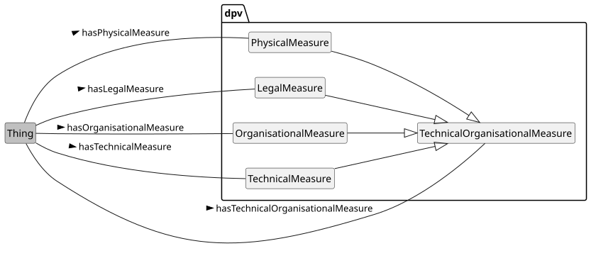](../source/2.3/diagrams/overview_TechnicalOrganisationalMeasure.svg) 

Overview of Technical & Organisational Measures taxonomy in DPV (click to open in new window)

 

 

DPV's taxonomy of tech/org measures are structured into four groups representing [=TechnicalMeasure=] such as encryption or de-identification which operate at a technical level, [=OrganisationalMeasure=] such as policies and training which operate at an organisational level, [=LegalMeasure=] which are organisational measures with legal enforcement such as contracts and NDAs, and [=PhysicalMeasure=] which are associated with physical aspects such as environmental protection and physical security. Each of these is provided with a taxonomy that expands upon the core idea to provide a rich list of measures that are intended to protect personal data and technologies (and its associated entities and consequences).

 

To indicate applicability of measures, the relations [=hasTechnicalMeasure=], [=hasOrganisationalMeasure=], [=hasLegalMeasure=], and [=hasPhysicalMeasure=] are provided. In addition to these, specific relations are also provided for concepts commonly used or which are important for legal considerations - such as [=hasNotice=] and [=hasPolicy=].

 


 

-  dpv:TechnicalOrganisationalMeasure: Technical and Organisational measures used to safeguard and ensure good practices in connection with data and technologies [go to full definition](https://w3id.org/dpv#TechnicalOrganisationalMeasure) 

 

  -  dpv:LegalMeasure: Legal measures used to safeguard and ensure good practices in connection with data and technologies [go to full definition](https://w3id.org/dpv#LegalMeasure) 

 

  -  dpv:OrganisationalMeasure: Organisational measures used to safeguard and ensure good practices in connection with data and technologies [go to full definition](https://w3id.org/dpv#OrganisationalMeasure) 

 

  -  dpv:PhysicalMeasure: Physical measures used to safeguard and ensure good practices in connection with data and technologies [go to full definition](https://w3id.org/dpv#PhysicalMeasure) 

 

  -  dpv:TechnicalMeasure: Technical measures used to safeguard and ensure good practices in connection with data and technologies [go to full definition](https://w3id.org/dpv#TechnicalMeasure) 

 

 

 


 

 
<a id="TOM-vocab-TOM-technical"></a>

<a id="TOM-L698"></a>
## Technical Measures
 

 [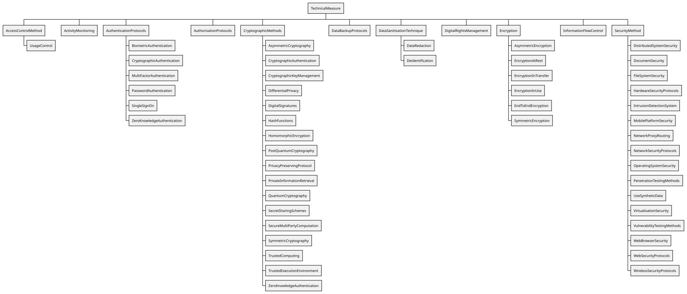](../source/2.3/diagrams/TechnicalMeasure.svg) 

Overview of Technical Measures taxonomy in DPV (click to open in new window)

 

 

Technical measures refer to measures that are implemented at a technical level. They are represented by the concept [=TechnicalMeasure=] and are indicated using the relation [=hasTechnicalMeasure=]. Concepts provided to represent commonly used technical measures include [=AccessControlMethod=], [=AuthenticationProtocols=], [=AuthorisationProtocols=], [=CryptographicMethods=], [=DataBackupProtocols=], [=DigitalRightsManagement=], [=Encryption=], and [=SecurityMethod=].

 

To express information about the technology implementing the technical measure, the concept `Technology` can be associated by using the relation `isImplementedUsingTechnology`. The [[TECH]] extension provides further concepts to represent technologies and their development and provision.

 


 

-  dpv:AccessControlMethod: Methods which restrict access to a place or resource [go to full definition](https://w3id.org/dpv#AccessControlMethod) 

 

  -  dpv:UsageControl: Management of usage, which is intended to be broader than access control and may cover trust, digital rights, or other relevant controls [go to full definition](https://w3id.org/dpv#UsageControl) 

 

 

 

-  dpv:ActivityMonitoring: Monitoring of activities including assessing whether they have been successfully initiated and completed [go to full definition](https://w3id.org/dpv#ActivityMonitoring) 

 

-  dpv:AuthenticationProtocols: Protocols involving validation of identity i.e. authentication of a person or information [go to full definition](https://w3id.org/dpv#AuthenticationProtocols) 

 

  -  dpv:BiometricAuthentication: Use of biometric data for authentication [go to full definition](https://w3id.org/dpv#BiometricAuthentication) 

 

  -  dpv:CryptographicAuthentication: Use of cryptography for authentication [go to full definition](https://w3id.org/dpv#CryptographicAuthentication) 

 

    -  dpv:Authentication-ABC: Use of Attribute Based Credentials (ABC) to perform and manage authentication [go to full definition](https://w3id.org/dpv#Authentication-ABC) 

 

    -  dpv:Authentication-PABC: Use of Privacy-enhancing Attribute Based Credentials (ABC) to perform and manage authentication [go to full definition](https://w3id.org/dpv#Authentication-PABC) 

 

    -  dpv:HashMessageAuthenticationCode: Use of HMAC where message authentication code (MAC) utilise a cryptographic hash function and a secret cryptographic key [go to full definition](https://w3id.org/dpv#HashMessageAuthenticationCode) 

 

    -  dpv:MessageAuthenticationCodes: Use of cryptographic methods to authenticate messages [go to full definition](https://w3id.org/dpv#MessageAuthenticationCodes) 

 

 

 

  -  dpv:MultiFactorAuthentication: An authentication system that uses two or more methods to authenticate [go to full definition](https://w3id.org/dpv#MultiFactorAuthentication) 

 

  -  dpv:PasswordAuthentication: Use of passwords to perform authentication [go to full definition](https://w3id.org/dpv#PasswordAuthentication) 

 

  -  dpv:SingleSignOn: Use of credentials or processes that enable using one set of credentials to authenticate multiple contexts. [go to full definition](https://w3id.org/dpv#SingleSignOn) 

 

  -  dpv:ZeroKnowledgeAuthentication: Authentication using Zero-Knowledge proofs [go to full definition](https://w3id.org/dpv#ZeroKnowledgeAuthentication) 

 

 

 

-  dpv:AuthorisationProtocols: Protocols involving authorisation of roles or profiles to determine permission, rights, or privileges [go to full definition](https://w3id.org/dpv#AuthorisationProtocols) 

 

-  dpv:CryptographicMethods: Use of cryptographic methods to perform tasks [go to full definition](https://w3id.org/dpv#CryptographicMethods) 

 

  -  dpv:AsymmetricCryptography: Use of public-key cryptography or asymmetric cryptography involving a public and private pair of keys [go to full definition](https://w3id.org/dpv#AsymmetricCryptography) 

 

  -  dpv:CryptographicAuthentication: Use of cryptography for authentication [go to full definition](https://w3id.org/dpv#CryptographicAuthentication) 

 

    -  dpv:Authentication-ABC: Use of Attribute Based Credentials (ABC) to perform and manage authentication [go to full definition](https://w3id.org/dpv#Authentication-ABC) 

 

    -  dpv:Authentication-PABC: Use of Privacy-enhancing Attribute Based Credentials (ABC) to perform and manage authentication [go to full definition](https://w3id.org/dpv#Authentication-PABC) 

 

    -  dpv:HashMessageAuthenticationCode: Use of HMAC where message authentication code (MAC) utilise a cryptographic hash function and a secret cryptographic key [go to full definition](https://w3id.org/dpv#HashMessageAuthenticationCode) 

 

    -  dpv:MessageAuthenticationCodes: Use of cryptographic methods to authenticate messages [go to full definition](https://w3id.org/dpv#MessageAuthenticationCodes) 

 

 

 

  -  dpv:CryptographicKeyManagement: Management of cryptographic keys, including their generation, storage, assessment, and safekeeping [go to full definition](https://w3id.org/dpv#CryptographicKeyManagement) 

 

  -  dpv:DifferentialPrivacy: Utilisation of differential privacy where information is shared as patterns or groups to withhold individual elements [go to full definition](https://w3id.org/dpv#DifferentialPrivacy) 

 

  -  dpv:DigitalSignatures: Expression and authentication of identity through digital information containing cryptographic signatures [go to full definition](https://w3id.org/dpv#DigitalSignatures) 

 

  -  dpv:HashFunctions: Use of hash functions to map information or to retrieve a prior categorisation [go to full definition](https://w3id.org/dpv#HashFunctions) 

 

  -  dpv:HomomorphicEncryption: Use of Homomorphic encryption that permits computations on encrypted data without decrypting it [go to full definition](https://w3id.org/dpv#HomomorphicEncryption) 

 

  -  dpv:PostQuantumCryptography: Use of algorithms that are intended to be secure against cryptanalytic attack by a quantum computer [go to full definition](https://w3id.org/dpv#PostQuantumCryptography) 

 

  -  dpv:PrivacyPreservingProtocol: Use of protocols designed with the intention of provided additional guarantees regarding privacy [go to full definition](https://w3id.org/dpv#PrivacyPreservingProtocol) 

 

  -  dpv:PrivateInformationRetrieval: Use of cryptographic methods to retrieve a record from a system without revealing which record is retrieved [go to full definition](https://w3id.org/dpv#PrivateInformationRetrieval) 

 

  -  dpv:QuantumCryptography: Cryptographic methods that utilise quantum mechanical properties to perform cryptographic tasks [go to full definition](https://w3id.org/dpv#QuantumCryptography) 

 

  -  dpv:SecretSharingSchemes: Use of secret sharing schemes where the secret can only be reconstructed through combination of sufficient number of individuals [go to full definition](https://w3id.org/dpv#SecretSharingSchemes) 

 

  -  dpv:SecureMultiPartyComputation: Use of cryptographic methods for entities to jointly compute functions without revealing inputs [go to full definition](https://w3id.org/dpv#SecureMultiPartyComputation) 

 

  -  dpv:SymmetricCryptography: Use of cryptography where the same keys are utilised for encryption and decryption of information [go to full definition](https://w3id.org/dpv#SymmetricCryptography) 

 

  -  dpv:TrustedComputing: Use of cryptographic methods to restrict access and execution to trusted parties and code [go to full definition](https://w3id.org/dpv#TrustedComputing) 

 

  -  dpv:TrustedExecutionEnvironment: Use of cryptographic methods to restrict access and execution to trusted parties and code within a dedicated execution environment [go to full definition](https://w3id.org/dpv#TrustedExecutionEnvironment) 

 

  -  dpv:ZeroKnowledgeAuthentication: Authentication using Zero-Knowledge proofs [go to full definition](https://w3id.org/dpv#ZeroKnowledgeAuthentication) 

 

 

 

-  dpv:DataBackupProtocols: Protocols or plans for backing up of data [go to full definition](https://w3id.org/dpv#DataBackupProtocols) 

 

-  dpv:DataSanitisationTechnique: Cleaning or any removal or re-organisation of elements in data based on selective criteria [go to full definition](https://w3id.org/dpv#DataSanitisationTechnique) 

 

  -  dpv:DataRedaction: Removal of sensitive information from a data or document [go to full definition](https://w3id.org/dpv#DataRedaction) 

 

  -  dpv:Deidentification: Removal of identity or information to reduce identifiability [go to full definition](https://w3id.org/dpv#Deidentification) 

 

    -  dpv:Anonymisation: Anonymisation is the process by which data is irreversibly altered in such a way that a data subject can no longer be identified directly or indirectly, either by the entity holding the data alone or in collaboration with other entities and information sources [go to full definition](https://w3id.org/dpv#Anonymisation) 

 

    -  dpv:Pseudonymisation: Pseudonymisation means the processing of personal data in such a manner that the personal data can no longer be attributed to a specific data subject without the use of additional information, provided that such additional information is kept separately and is subject to technical and organisational measures to ensure that the personal data are not attributed to an identified or identifiable natural person; [go to full definition](https://w3id.org/dpv#Pseudonymisation) 

 

      -  dpv:DeterministicPseudonymisation: Pseudonymisation achieved through a deterministic function [go to full definition](https://w3id.org/dpv#DeterministicPseudonymisation) 

 

      -  dpv:DocumentRandomisedPseudonymisation: Use of randomised pseudonymisation where the same elements are assigned different values in the same document or database [go to full definition](https://w3id.org/dpv#DocumentRandomisedPseudonymisation) 

 

      -  dpv:FullyRandomisedPseudonymisation: Use of randomised pseudonymisation where the same elements are assigned different values each time they occur [go to full definition](https://w3id.org/dpv#FullyRandomisedPseudonymisation) 

 

      -  dpv:MonotonicCounterPseudonymisation: A simple pseudonymisation method where identifiers are substituted by a number chosen by a monotonic counter [go to full definition](https://w3id.org/dpv#MonotonicCounterPseudonymisation) 

 

      -  dpv:RNGPseudonymisation: A pseudonymisation method where identifiers are substituted by a number chosen by a Random Number Generator (RNG) [go to full definition](https://w3id.org/dpv#RNGPseudonymisation) 

 

 

 

 

 

 

 

-  dpv:DigitalRightsManagement: Management of access, use, and other operations associated with digital content [go to full definition](https://w3id.org/dpv#DigitalRightsManagement) 

 

-  dpv:Encryption: Technical measures consisting of encryption [go to full definition](https://w3id.org/dpv#Encryption) 

 

  -  dpv:AsymmetricEncryption: Use of asymmetric cryptography to encrypt data [go to full definition](https://w3id.org/dpv#AsymmetricEncryption) 

 

  -  dpv:EncryptionAtRest: Encryption of data when being stored (persistent encryption) [go to full definition](https://w3id.org/dpv#EncryptionAtRest) 

 

  -  dpv:EncryptionInTransfer: Encryption of data in transit e.g. when being transferred from one location to another, including sharing [go to full definition](https://w3id.org/dpv#EncryptionInTransfer) 

 

  -  dpv:EncryptionInUse: Encryption of data when it is being used [go to full definition](https://w3id.org/dpv#EncryptionInUse) 

 

  -  dpv:EndToEndEncryption: Encrypted communications where data is encrypted by the sender and decrypted by the intended receiver to prevent access to any third party [go to full definition](https://w3id.org/dpv#EndToEndEncryption) 

 

  -  dpv:SymmetricEncryption: Use of symmetric cryptography to encrypt data [go to full definition](https://w3id.org/dpv#SymmetricEncryption) 

 

 

 

-  dpv:FailSafeProtocols: Use of fail-safe measures and protocols [go to full definition](https://w3id.org/dpv#FailSafeProtocols) 

 

-  dpv:InformationFlowControl: Use of measures to control information flows [go to full definition](https://w3id.org/dpv#InformationFlowControl) 

 

-  dpv:SecurityMethod: Methods that relate to creating and providing security [go to full definition](https://w3id.org/dpv#SecurityMethod) 

 

  -  dpv:DistributedSystemSecurity: Security implementations provided using or over a distributed system [go to full definition](https://w3id.org/dpv#DistributedSystemSecurity) 

 

  -  dpv:DocumentSecurity: Security measures enacted over documents to protect against tampering or restrict access [go to full definition](https://w3id.org/dpv#DocumentSecurity) 

 

  -  dpv:FileSystemSecurity: Security implemented over a file system [go to full definition](https://w3id.org/dpv#FileSystemSecurity) 

 

  -  dpv:HardwareSecurityProtocols: Security protocols implemented at or within hardware [go to full definition](https://w3id.org/dpv#HardwareSecurityProtocols) 

 

  -  dpv:IntrusionDetectionSystem: Use of measures to detect intrusions and other unauthorised attempts to gain access to a system [go to full definition](https://w3id.org/dpv#IntrusionDetectionSystem) 

 

  -  dpv:MobilePlatformSecurity: Security implemented over a mobile platform [go to full definition](https://w3id.org/dpv#MobilePlatformSecurity) 

 

  -  dpv:NetworkProxyRouting: Use of network routing using proxy [go to full definition](https://w3id.org/dpv#NetworkProxyRouting) 

 

  -  dpv:NetworkSecurityProtocols: Security implemented at or over networks protocols [go to full definition](https://w3id.org/dpv#NetworkSecurityProtocols) 

 

  -  dpv:OperatingSystemSecurity: Security implemented at or through operating systems [go to full definition](https://w3id.org/dpv#OperatingSystemSecurity) 

 

  -  dpv:PenetrationTestingMethods: Use of penetration testing to identify weaknesses and vulnerabilities through simulations [go to full definition](https://w3id.org/dpv#PenetrationTestingMethods) 

 

  -  dpv:UseSyntheticData: Use of synthetic data to preserve privacy, security, or other effects and side-effects [go to full definition](https://w3id.org/dpv#UseSyntheticData) 

 

  -  dpv:VirtualisationSecurity: Security implemented at or through virtualised environments [go to full definition](https://w3id.org/dpv#VirtualisationSecurity) 

 

  -  dpv:VulnerabilityTestingMethods: Methods that assess or discover vulnerabilities in a system [go to full definition](https://w3id.org/dpv#VulnerabilityTestingMethods) 

 

  -  dpv:WebBrowserSecurity: Security implemented at or over web browsers [go to full definition](https://w3id.org/dpv#WebBrowserSecurity) 

 

  -  dpv:WebSecurityProtocols: Security implemented at or over web-based protocols [go to full definition](https://w3id.org/dpv#WebSecurityProtocols) 

 

  -  dpv:WirelessSecurityProtocols: Security implemented at or over wireless communication protocols [go to full definition](https://w3id.org/dpv#WirelessSecurityProtocols) 

 

 

 


  

This example specifies a technical measure (access control) being used and specifies that it is implemented by using the database software. It also shows how technologies can have technical measures implemented as part of the system, and also how technologies can indicate they have the capability to provide technical measures for other activities. 


```
ex:PDH a dpv:Process ;
    # method 1: directly specify the measure
    dpv:hasTechnicalMeasure dpv:AccessControlMethod ;
    # method 2: specify the measure with implementation details
    dpv:hasTechnicalMeasure [
        a dpv:TechnicalMeasure ;
        skos:broader dpv:AccessControlMethod ; 
        # same measure can have multiple technical measures involved
        dpv:isImplementedUsingTechnology ex:CorpDataBase ;
    ] .

ex:CorpDataBase a dpv:Technology ;
    a tech:Database ;
    # indicating technology has a technical measure
    dpv:hasTechnicalMeasure dpv:AccessControlMethod ;
    # indicating technology is capable of providing a technical measure
    # in other use-cases
    tech:hasCapability dpv:AccessControlMethod .
```


 

(META Example ID: [`E0064`](https://w3id.org/dpv/examples#E0064); link: [source file](https://w3id.org/dpv/examples/E0064.ttl); contributed by Harshvardhan J. Pandit on 2024-06-12) 

 

  

To indicate data is encrypted using the [Rivest-Shamir-Adleman (RSA) method](https://en.wikipedia.org/wiki/RSA_(cryptosystem)), one would extend the [`Encryption`](https://w3id.org/dpv#Encryption) concept within DPV to represent `RSA`, and then instantiate it with the specific implementation used (e.g. to indicate key size). Access to this data is further restricted by requiring a password or credential.

 


```
ex:RSAEncryption rdf:type dpv:TechnicalMeasure ;
    skos:broader dpv:Encryption ;
    skos:scopeNote "Key size: 2048, Custom Implementation"@en .
ex:RBACCredential rdf:type dpv:TechnicalMeasure ;
    skos:prefLabel "Role-Based Access Control"@en ;
    skos:definition "An access control mechanism around roles and privileges"@en ;
    skos:broader dpv:AccessControlMethod .
```


 

(META Example ID: [`E0020`](https://w3id.org/dpv/examples#E0020); link: [source file](https://w3id.org/dpv/examples/E0020.ttl); contributed by Harshvardhan J. Pandit on 2024-06-10) 

  

 
<a id="TOM-vocab-TOM-organisational"></a>

<a id="TOM-L1141"></a>
## Organisational Measures
 

 [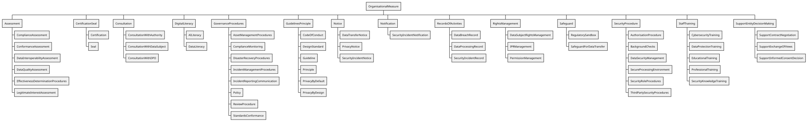](../source/2.3/diagrams/OrganisationalMeasure.svg) 

Overview of Organisational Measures taxonomy in DPV (click to open in new window)

 

 

Organisational Measures, represented by the concept [=OrganisationalMeasure=], are measures that are undertaken at an organisational level i.e. by the human involved within the organisation. They involve aspects such as performing assessments, consultations, establishing governance procedures, providing notices, contracts, policies, record keeping, and other similar activities. Though such activities can utilise technologies to support their implementations, the measure is still primary categorised as being associated with 'organisational activities'. Organisational measure are indicated by using the relation [=hasOrganisationalMeasure=].

 


 

-  dpv:Assessment: The document, plan, or process for assessment or determination towards a purpose e.g. assessment of legality or impact assessments [go to full definition](https://w3id.org/dpv#Assessment) 

 

  -  dpv:ComplianceAssessment: Assessment regarding compliance (e.g. internal policy, regulations) [go to full definition](https://w3id.org/dpv#ComplianceAssessment) 

 

    -  dpv:LegalComplianceAssessment: Assessment regarding legal compliance [go to full definition](https://w3id.org/dpv#LegalComplianceAssessment) 

 

 

 

  -  dpv:ConformanceAssessment: Assessment regarding conformance with standards or norms or guidelines or similar instruments [go to full definition](https://w3id.org/dpv#ConformanceAssessment) 

 

  -  dpv:DataInteroperabilityAssessment: Measures associated with assessment of data interoperability [go to full definition](https://w3id.org/dpv#DataInteroperabilityAssessment) 

 

  -  dpv:DataQualityAssessment: Measures associated with assessment of data quality [go to full definition](https://w3id.org/dpv#DataQualityAssessment) 

 

    -  dpv:DataSuitabilityAssessment: Measures associated with assessment of suitability of data for specific task(s) [go to full definition](https://w3id.org/dpv#DataSuitabilityAssessment) 

 

 

 

  -  dpv:EffectivenessDeterminationProcedures: Procedures intended to determine effectiveness of other measures [go to full definition](https://w3id.org/dpv#EffectivenessDeterminationProcedures) 

 

  -  dpv:LegitimateInterestAssessment: Indicates an assessment regarding the use of legitimate interest as a lawful basis by the data controller [go to full definition](https://w3id.org/dpv#LegitimateInterestAssessment) 

 

 

 

-  dpv:Audit: An audit is a systematic examination or evaluation of records, processes, or systems towards a specific objective such as to assess accuracy, compliance, effectiveness, or performance [go to full definition](https://w3id.org/dpv#Audit) 

 

  -  dpv:InformationAudit: An audit that systematically examines the existence and use of information along with its associated resources (e.g. where it is stored) and flows (e.g. where it originates and with whom it is being shared) [go to full definition](https://w3id.org/dpv#InformationAudit) 

 

    -  dpv:PersonalDataAudit: An audit that systematically examines the existence and use of personal data along with its associated resources (e.g. where it is stored) and flows (e.g. where it originates and with whom it is being shared) [go to full definition](https://w3id.org/dpv#PersonalDataAudit) 

 

 

 

  -  dpv:LegalComplianceAudit: An audit that systematically examines the state of legal compliance by reviewing policies and procedures related to obligations and compliance requirements for specific laws and regulations [go to full definition](https://w3id.org/dpv#LegalComplianceAudit) 

 

  -  dpv:SecurityAudit: An audit that systematically examines the existence and use of security risks and measures within information systems, networks, and security policies to identify vulnerabilities, risks, and gaps [go to full definition](https://w3id.org/dpv#SecurityAudit) 

 

 

 

-  dpv:CertificationSeal: Certifications, seals, and marks indicating compliance to regulations or practices [go to full definition](https://w3id.org/dpv#CertificationSeal) 

 

  -  dpv:Certification: Certification mechanisms, seals, and marks for the purpose of demonstrating compliance [go to full definition](https://w3id.org/dpv#Certification) 

 

  -  dpv:Seal: A seal or a mark indicating proof of certification to some certification or standard [go to full definition](https://w3id.org/dpv#Seal) 

 

 

 

-  dpv:Consultation: Consultation is a process of receiving feedback, advice, or opinion from an external agency [go to full definition](https://w3id.org/dpv#Consultation) 

 

  -  dpv:ConsultationWithAuthority: Consultation with an authority or authoritative entity [go to full definition](https://w3id.org/dpv#ConsultationWithAuthority) 

 

  -  dpv:ConsultationWithDataSubject: Consultation with data subject(s) or their representative(s) [go to full definition](https://w3id.org/dpv#ConsultationWithDataSubject) 

 

    -  dpv:ConsultationWithDataSubjectRepresentative: Consultation with representative of data subject(s) [go to full definition](https://w3id.org/dpv#ConsultationWithDataSubjectRepresentative) 

 

 

 

  -  dpv:ConsultationWithDPO: Consultation with Data Protection Officer(s) [go to full definition](https://w3id.org/dpv#ConsultationWithDPO) 

 

 

 

-  dpv:DigitalLiteracy: Providing skills, knowledge, and understanding to enable reading, writing, analysing, reasoning, and communicating regarding digital technologies and their implications [go to full definition](https://w3id.org/dpv#DigitalLiteracy) 

 

  -  dpv:AILiteracy: Providing skills, knowledge, and understanding to enable reading, writing, analysing, reasoning, and communicating regarding AI [go to full definition](https://w3id.org/dpv#AILiteracy) 

 

  -  dpv:DataLiteracy: Providing skills, knowledge, and understanding to enable reading, writing, analysing, reasoning, and communicating regarding data [go to full definition](https://w3id.org/dpv#DataLiteracy) 

 

 

 

-  dpv:GovernanceProcedures: Procedures related to governance (e.g. organisation, unit, team, process, system) [go to full definition](https://w3id.org/dpv#GovernanceProcedures) 

 

  -  dpv:AIGovernance: Procedures related to governance of AI, including its procurement, development, deployment, and assessments [go to full definition](https://w3id.org/dpv#AIGovernance) 

 

  -  dpv:ApprovalProcedure: A procedure or process for determining and managing approvals for activities as part of governance [go to full definition](https://w3id.org/dpv#ApprovalProcedure) 

 

  -  dpv:AssetManagementProcedures: Procedures related to management of assets [go to full definition](https://w3id.org/dpv#AssetManagementProcedures) 

 

  -  dpv:ComplianceMonitoring: Monitoring of compliance (e.g. internal policy, regulations) [go to full definition](https://w3id.org/dpv#ComplianceMonitoring) 

 

  -  dpv:DisasterRecoveryProcedures: Procedures related to management of disasters and recovery [go to full definition](https://w3id.org/dpv#DisasterRecoveryProcedures) 

 

  -  dpv:HumanOversight: Procedures related to implementing and ensuring human oversight, which includes ability for humans to oversee, understand, control, and reverse processes, and to have sufficient monitoring capability to detect and address anomalies, dysfunctions, or unexpected performance [go to full definition](https://w3id.org/dpv#HumanOversight) 

 

  -  dpv:IncidentManagementProcedures: Procedures related to management of incidents [go to full definition](https://w3id.org/dpv#IncidentManagementProcedures) 

 

  -  dpv:IncidentReportingCommunication: Procedures related to management of incident reporting [go to full definition](https://w3id.org/dpv#IncidentReportingCommunication) 

 

  -  dpv:Policy: A guidance document outlining any of: procedures, plans, principles, decisions, intent, or protocols. [go to full definition](https://w3id.org/dpv#Policy) 

 

    -  dpv:AcceptableUsePolicy: Acceptable Use Policy (AUP) refers to conditions, contexts, or uses which are considered acceptable with the implication that those not covered by such a policy are to be considered unacceptable [go to full definition](https://w3id.org/dpv#AcceptableUsePolicy) 

 

    -  dpv:DataProcessingPolicy: Policy regarding data processing activities [go to full definition](https://w3id.org/dpv#DataProcessingPolicy) 

 

      -  dpv:DataDeletionPolicy: Policy regarding deletion of data [go to full definition](https://w3id.org/dpv#DataDeletionPolicy) 

 

      -  dpv:DataErasurePolicy: Policy regarding erasure of data [go to full definition](https://w3id.org/dpv#DataErasurePolicy) 

 

      -  dpv:DataJurisdictionPolicy: Policy specifying jurisdictional requirements for data processing [go to full definition](https://w3id.org/dpv#DataJurisdictionPolicy) 

 

      -  dpv:DataRestorationPolicy: Policy regarding restoration of data [go to full definition](https://w3id.org/dpv#DataRestorationPolicy) 

 

      -  dpv:DataReusePolicy: Policy regarding reuse of data i.e. using data for purposes other than its initial purpose [go to full definition](https://w3id.org/dpv#DataReusePolicy) 

 

      -  dpv:DataStoragePolicy: Policy regarding storage of data, including the manner, duration, location, and conditions for storage [go to full definition](https://w3id.org/dpv#DataStoragePolicy) 

 

 

 

    -  dpv:InformationSecurityPolicy: Policy regarding security of information [go to full definition](https://w3id.org/dpv#InformationSecurityPolicy) 

 

    -  dpv:LoggingPolicy: Policy for logging of information [go to full definition](https://w3id.org/dpv#LoggingPolicy) 

 

    -  dpv:MonitoringPolicy: Policy for monitoring (e.g. progress, performance) [go to full definition](https://w3id.org/dpv#MonitoringPolicy) 

 

    -  dpv:RecertificationPolicy: Policy regarding repetition or renewal of existing certification(s) [go to full definition](https://w3id.org/dpv#RecertificationPolicy) 

 

 

 

  -  dpv:ReviewProcedure: A procedure or process that reviews the correctness and validity of other procedures and policies e.g. to ensure continued validity, adequacy for intended purposes, and conformance of processes with findings [go to full definition](https://w3id.org/dpv#ReviewProcedure) 

 

    -  dpv:ReviewImpactAssessment: Procedures to review impact assessments in terms of continued validity, adequacy for intended purposes, and conformance of processes with findings [go to full definition](https://w3id.org/dpv#ReviewImpactAssessment) 

 

 

 

  -  dpv:StandardsConformance: Purposes associated with activities undertaken to ensure or achieve conformance with standards [go to full definition](https://w3id.org/dpv#StandardsConformance) 

 

 

 

-  dpv:GuidelinesPrinciple: Guidelines or Principles regarding processing and operational measures [go to full definition](https://w3id.org/dpv#GuidelinesPrinciple) 

 

  -  dpv:CodeOfConduct: A set of rules or procedures outlining the norms and practices for conducting activities [go to full definition](https://w3id.org/dpv#CodeOfConduct) 

 

  -  dpv:Guideline: Practices that specify how activities must be conducted [go to full definition](https://w3id.org/dpv#Guideline) 

 

  -  dpv:Principle: A representation of values or norms that must be taken into consideration when conducting activities [go to full definition](https://w3id.org/dpv#Principle) 

 

  -  dpv:PrivacyByDefault: Practices regarding setting the default configurations of information and services to implement data protection and privacy (synonymous with Data Protection by Default) [go to full definition](https://w3id.org/dpv#PrivacyByDefault) 

 

  -  dpv:PrivacyByDesign: Practices regarding incorporating data protection and privacy in the design of information and services (synonymous with Data Protection by Design) [go to full definition](https://w3id.org/dpv#PrivacyByDesign) 

 

  -  dpv:Standard: A set of requirements or norms that are agreed upon i.e. they are considered a 'standard' [go to full definition](https://w3id.org/dpv#Standard) 

 

    -  dpv:DesignStandard: A set of rules or guidelines outlining criterias for design [go to full definition](https://w3id.org/dpv#DesignStandard) 

 

    -  dpv:ManagementStandard: A management standard is a standard that establishes norms or requirements regarding the management operations and processes e.g. in an organisation [go to full definition](https://w3id.org/dpv#ManagementStandard) 

 

    -  dpv:TechnicalStandard: A technical standard is a standard that establishes norms or requirements regarding technology or technical processes [go to full definition](https://w3id.org/dpv#TechnicalStandard) 

 

 

 

 

 

-  dpv:Notice: A notice is an artefact for providing information, choices, or controls [go to full definition](https://w3id.org/dpv#Notice) 

 

  -  dpv:AINotice: A notice providing information regarding the particulars of an AI system such as its intended purpose and proper use [go to full definition](https://w3id.org/dpv#AINotice) 

 

  -  dpv:DataTransferNotice: Notice for the legal entity for the transfer of its data [go to full definition](https://w3id.org/dpv#DataTransferNotice) 

 

  -  dpv:PrivacyNotice: Represents a notice or document outlining information regarding privacy [go to full definition](https://w3id.org/dpv#PrivacyNotice) 

 

    -  dpv:ConsentNotice: A Notice for information provision associated with Consent [go to full definition](https://w3id.org/dpv#ConsentNotice) 

 

 

 

  -  dpv:SecurityIncidentNotice: A notice providing information about security incident(s) [go to full definition](https://w3id.org/dpv#SecurityIncidentNotice) 

 

    -  dpv:DataBreachNotice: A notice providing information about data breach(es) i.e. unauthorised transfer, access, use, or modification of data [go to full definition](https://w3id.org/dpv#DataBreachNotice) 

 

 

 

 

 

-  dpv:Notification: Notification represents the provision of a notice i.e. notifying [go to full definition](https://w3id.org/dpv#Notification) 

 

  -  dpv:SecurityIncidentNotification: Notification of information about security incident(s) [go to full definition](https://w3id.org/dpv#SecurityIncidentNotification) 

 

    -  dpv:DataBreachNotification: Notification of information about data breach(es) i.e. unauthorised transfer, access, use, or modification of data [go to full definition](https://w3id.org/dpv#DataBreachNotification) 

 

 

 

 

 

-  dpv:RecordsOfActivities: Records of activities within some context such as maintenance tasks or governance functions [go to full definition](https://w3id.org/dpv#RecordsOfActivities) 

 

  -  dpv:DataBreachRecord: Record of a data breach incident [go to full definition](https://w3id.org/dpv#DataBreachRecord) 

 

  -  dpv:DataProcessingRecord: Record of data processing, whether ex-ante or ex-post [go to full definition](https://w3id.org/dpv#DataProcessingRecord) 

 

    -  dpv:ConsentRecord: A Record of Consent or Consent related activities [go to full definition](https://w3id.org/dpv#ConsentRecord) 

 

      -  dpv:ConsentReceipt: A record of consent or consent related activities that is provided to another entity [go to full definition](https://w3id.org/dpv#ConsentReceipt) 

 

 

 

    -  dpv:DataTransferRecord: Record of data transfer activities [go to full definition](https://w3id.org/dpv#DataTransferRecord) 

 

    -  dpv:ROPA: A Record of Processing Activities (ROPA) is a document detailing processing activities [go to full definition](https://w3id.org/dpv#ROPA) 

 

 

 

  -  dpv:SecurityIncidentRecord: Record of a security incident [go to full definition](https://w3id.org/dpv#SecurityIncidentRecord) 

 

 

 

-  dpv:RightsManagement: Methods associated with rights management where 'rights' refer to controlling who can do what with a resource [go to full definition](https://w3id.org/dpv#RightsManagement) 

 

  -  dpv:DataSubjectRightsManagement: Methods to provide, implement, and exercise data subjects' rights [go to full definition](https://w3id.org/dpv#DataSubjectRightsManagement) 

 

  -  dpv:IPRManagement: Management of Intellectual Property Rights with a view to identify and safeguard and enforce them [go to full definition](https://w3id.org/dpv#IPRManagement) 

 

  -  dpv:PermissionManagement: Methods to obtain, provide, modify, and withdraw permissions along with maintaining a record of permissions, retrieving records, and processing changes in permission states [go to full definition](https://w3id.org/dpv#PermissionManagement) 

 

    -  dpv:ConsentManagement: Methods to obtain, provide, modify, and withdraw consent along with maintaining a record of consent, retrieving records, and processing changes in consent states [go to full definition](https://w3id.org/dpv#ConsentManagement) 

 

 

 

 

 

-  dpv:Safeguard: A safeguard is a precautionary measure for the protection against or mitigation of negative effects [go to full definition](https://w3id.org/dpv#Safeguard) 

 

  -  dpv:RegulatorySandbox: Mechanism used by regulators and businesses for gauging the compatibility of regulations and innovative products, particularly in the context of digitalisation, in a controlled real-world environment with appropriate safeguards in place [go to full definition](https://w3id.org/dpv#RegulatorySandbox) 

 

  -  dpv:SafeguardForDataTransfer: Represents a safeguard used for data transfer. Can include technical or organisational measures. [go to full definition](https://w3id.org/dpv#SafeguardForDataTransfer) 

 

 

 

-  dpv:SecurityProcedure: Procedures associated with assessing, implementing, and evaluating security [go to full definition](https://w3id.org/dpv#SecurityProcedure) 

 

  -  dpv:AuthorisationProcedure: Procedures for determining authorisation through permission or authority [go to full definition](https://w3id.org/dpv#AuthorisationProcedure) 

 

    -  dpv:CredentialManagement: Management of credentials and their use in authorisations [go to full definition](https://w3id.org/dpv#CredentialManagement) 

 

    -  dpv:IdentityManagementMethod: Management of identity and identity-based processes [go to full definition](https://w3id.org/dpv#IdentityManagementMethod) 

 

 

 

  -  dpv:BackgroundChecks: Procedure where the background of an entity is assessed to identity vulnerabilities and threats due to their current or intended role [go to full definition](https://w3id.org/dpv#BackgroundChecks) 

 

  -  dpv:DataSecurityManagement: Measures associated with management of data security [go to full definition](https://w3id.org/dpv#DataSecurityManagement) 

 

  -  dpv:SecureProcessingEnvironment: A physical or virtual environment supported by organisational means that integrates security and compliance requirements and allows supervising data processing actions [go to full definition](https://w3id.org/dpv#SecureProcessingEnvironment) 

 

  -  dpv:SecurityRoleProcedures: Procedures related to security roles [go to full definition](https://w3id.org/dpv#SecurityRoleProcedures) 

 

  -  dpv:ThirdPartySecurityProcedures: Procedures related to security associated with Third Parties [go to full definition](https://w3id.org/dpv#ThirdPartySecurityProcedures) 

 

 

 

-  dpv:StaffTraining: Practices and policies regarding training of staff members [go to full definition](https://w3id.org/dpv#StaffTraining) 

 

  -  dpv:CybersecurityTraining: Training methods related to cybersecurity [go to full definition](https://w3id.org/dpv#CybersecurityTraining) 

 

  -  dpv:DataProtectionTraining: Training intended to increase knowledge regarding data protection [go to full definition](https://w3id.org/dpv#DataProtectionTraining) 

 

  -  dpv:EducationalTraining: Training methods that are intended to provide education on topic(s) [go to full definition](https://w3id.org/dpv#EducationalTraining) 

 

  -  dpv:ProfessionalTraining: Training methods that are intended to provide professional knowledge and expertise [go to full definition](https://w3id.org/dpv#ProfessionalTraining) 

 

  -  dpv:SecurityKnowledgeTraining: Training intended to increase knowledge regarding security [go to full definition](https://w3id.org/dpv#SecurityKnowledgeTraining) 

 

 

 

-  dpv:SupportEntityDecisionMaking: Supporting entities, including individuals, in making decisions [go to full definition](https://w3id.org/dpv#SupportEntityDecisionMaking) 

 

  -  dpv:SupportContractNegotiation: Supporting entities, including individuals, with negotiating a contract and its terms and conditions [go to full definition](https://w3id.org/dpv#SupportContractNegotiation) 

 

  -  dpv:SupportExchangeOfViews: Supporting individuals and entities in exchanging views e.g. regarding data processing purposes for their best interests [go to full definition](https://w3id.org/dpv#SupportExchangeOfViews) 

 

  -  dpv:SupportInformedConsentDecision: Supporting individuals with making a decision regarding their informed consent [go to full definition](https://w3id.org/dpv#SupportInformedConsentDecision) 

 

 

 


  

To indicate staff are trained in the use of credentials, and that a policy exists regarding this, the use of `OrganisationalMeasure` concepts can be combined in several ways. Note that the interpretations for how staff training is associated with credentials, or contains training regarding credentials is arbitrary in notation. It is intended to demonstrate how different perspectives can be represented so as to be suitable to the organisation's documentation practices.

 


```
# 1: directly associating staff training with credentials used
ex:StaffCredentialsTraining rdf:type dpv:OrganisationalMeasure ;
    skos:broader dpv:StaffTraining .
ex:RBACCredential rdf:type dpv:TechnicalMeasure ;
    skos:prefLabel "Role-Based Access Control"@en ;
    skos:definition "An access control mechanism around roles and privileges"@en ;
    dpv:hasOrganisationalMeasure ex:StaffCredentialTraining .

# 2: security policy containing staff training and access control
ex:SecurityPolicy rdf:type dpv:OrganisationalMeasure ;
    skos:broader dpv:Policy ;
    dpv:hasOrganisationalMeasure dpv:StaffTraining ;
    dpv:hasTechnicalMeasure dpv:AccessControlMethod .

# 3: indicating staff training contains access control methods
ex:StaffCredentialsTraining rdf:type dpv:OrganisationalMeasure ;
    skos:broader dpv:StaffTraining ;
    dpv:hasTechnicalMeasure ex:RBACCredential .
```


 

(META Example ID: [`E0021`](https://w3id.org/dpv/examples#E0021); link: [source file](https://w3id.org/dpv/examples/E0021.ttl); contributed by Harshvardhan J. Pandit on 2024-06-10) 

  

 
<a id="TOM-vocab-TOM-legal"></a>

<a id="TOM-L1737"></a>
## Legal Measures
 

[=LegalMeasure=] represents organisational measures which have a legal enforcement mechanism or are legally defined/interpreted. For example, through contracts, NDAs, agreements. They are associated by using [=hasLegalMeasure=].

 


 

-  dpv:ContractualTerms: Contractual terms governing data handling within or with an entity [go to full definition](https://w3id.org/dpv#ContractualTerms)deprecated in next version 

 

  -  dpv:DataHandlingClause: Contractual clauses governing handling of data within or by an entity [go to full definition](https://w3id.org/dpv#DataHandlingClause) 

 

 

 

-  dpv:LegalAgreement: A legally binding agreement [go to full definition](https://w3id.org/dpv#LegalAgreement)deprecated in next version 

 

  -  dpv:ConfidentialityAgreement: Agreements that enforce confidentiality for e.g. to protect business, professional, or company secrets [go to full definition](https://w3id.org/dpv#ConfidentialityAgreement) 

 

  -  dpv:NDA: Non-disclosure Agreements e.g. preserving confidentiality of information [go to full definition](https://w3id.org/dpv#NDA) 

 

  -  dpv:StatisticalConfidentialityAgreement: An agreement outlining conditions, criteria, obligations, responsibilities, and specifics for classification and management of 'confidential data' based on a statistical framework [go to full definition](https://w3id.org/dpv#StatisticalConfidentialityAgreement) 

 

 

 


 

 
<a id="TOM-vocab-TOM-physical"></a>

<a id="TOM-L1776"></a>
## Physical Measures
 

[=PhysicalMeasure=] represents measures that have a physical implementation - such as physical access control or environment controls for floods, power outages, etc. They are associated by using [=hasPhysicalMeasure=].

 


 

-  dpv:EnvironmentalProtection: Physical protection against environmental threats such as fire, floods, storms, etc. [go to full definition](https://w3id.org/dpv#EnvironmentalProtection) 

 

-  dpv:PhysicalAuthentication: Physical implementation of authentication e.g. by matching the person to their ID card [go to full definition](https://w3id.org/dpv#PhysicalAuthentication) 

 

-  dpv:PhysicalAuthorisation: Physical implementation of authorisation e.g. by stamping a visitor pass [go to full definition](https://w3id.org/dpv#PhysicalAuthorisation) 

 

-  dpv:PhysicalDeviceSecurity: Physical protection for devices and equipment [go to full definition](https://w3id.org/dpv#PhysicalDeviceSecurity) 

 

-  dpv:PhysicalInterceptionProtection: Physical protection against interception e.g. by posting a guard [go to full definition](https://w3id.org/dpv#PhysicalInterceptionProtection) 

 

-  dpv:PhysicalInterruptionProtection: Physical protection against interruptions e.g. electrical supply interruption [go to full definition](https://w3id.org/dpv#PhysicalInterruptionProtection) 

 

-  dpv:PhysicalNetworkSecurity: Physical protection for networks and networking related infrastructure e.g. by isolating networking equipments [go to full definition](https://w3id.org/dpv#PhysicalNetworkSecurity) 

 

-  dpv:PhysicalSecureStorage: Physical protection for storage of information or equipment e.g. secure storage for files [go to full definition](https://w3id.org/dpv#PhysicalSecureStorage) 

 

-  dpv:PhysicalSupplySecurity: Physically securing the supply of resources [go to full definition](https://w3id.org/dpv#PhysicalSupplySecurity) 

 

-  dpv:PhysicalSurveillance: Physically monitoring areas via surveillance [go to full definition](https://w3id.org/dpv#PhysicalSurveillance)

<a id="TOM-L1833"></a>
### Assessments
 

[=Assessment=] refers to a document, plan, or process for assessment or determination towards a purpose. For example, legal compliance assessment establishes compliance with the law and lawfulness. Similarly, privacy assessments concern privacy, risk assessments concern risks, and impact assessments concern impacts of operations and technologies. To represent such commonly utilised assessments, DPV provides the following concepts:

 

 

- [=ComplianceAssessment=] and its extended concept [=LegalComplianceAssessment=] for compliance and legal compliance related assessments e.g. with a particular law

 

- [=ConformanceAssessment=] for assessment of conformance e.g. towards a standard or guideline

 

- [=DataInteroperabilityAssessment=] to assess the interoperability of data, such as that required by regulations like [[DGA]]

 

- [=DataQualityAssessment=] for assessment of data quality

 

- [=EffectivenessDeterminationProcedures=] for assessment of the effectiveness of other measures or activities

 

- [=LegitimateInterestAssessment=] to assess the legitimate interests used (as a legal basis) to justify the activity 

 

 

Assessments which refer to risks and/or impacts, such as risk assessment, privacy impact assessment, data protection impact assessment, and data breach impact assessment are defined in the 'risk' module within DPV due to their role within the risk management processes.

 

 
<a id="TOM-vocab-TOM-notice"></a>

<a id="TOM-L1847"></a>
### Notices
  

The [[[DPV-29184]]] provides guidance on creation of privacy notices following the [[[ISO-29184]]] standard.

   

The concept [=Notice=] represents a 'notice' which provides information and can be used to offer choices and make decisions - such as for privacy and consent. The relation [=hasNotice=] is used to indicate the inclusion or association of a notice within a context.

 

The contents of a notice can be represented through other DPV concepts, for example a privacy notice can represent specific services and processes along with their purposes, personal data, and involved entities by utilising the relevant concepts and relations for these. Notices can also contain metadata, such as for their creation date, titles and descriptions, versions, and publisher information by utilising a common standard such as [[DCTERMS]].

  

This example first specifies a privacy notice as a document is being used in the context of a service as represented using a process instance. Then it provides an alternative representation where the contents of a notice are described using DPV.

 


```
# Associating a Notice with DPV metadata
ex:Service rdf:type dpv:Process ;
    dpv:hasNotice ex:AcmePrivacyPolicy .
ex:AcmePrivacyPolicy rdf:type dpv:PrivacyNotice ;
    dct:title "Acme's Privacy Policy"@en ;
    foaf:page "https://example.com/"^^xsd:anyURI .

# Describing a Notice using DPV metadata
ex:AcmePrivacyPolicy rdf:type dpv:PrivacyNotice ;
    # Approach 1: delegate contents to a PDH instance
    dpv:hasProcess ex:Service ;
    # Approach 2: declare specifics directly
    dpv:hasPurpose dpv:ServiceProvision ;
    dpv:hasPersonalData pd:EmailAddressPersonal ;
    dpv:hasProcessing dpv:Collect ;
    # Specifying location of notice
    # In this case, as a website, or could be a domain
    dpv:hasLocation "https://example.com"^^xsd:anyURI .
```


 

(META Example ID: [`E0022`](https://w3id.org/dpv/examples#E0022); link: [source file](https://w3id.org/dpv/examples/E0022.ttl); contributed by Harshvardhan J. Pandit on 2024-06-10)

<a id="TOM-L1882"></a>
#### Notice Types
 

DPV provides a taxonomy to represent the different notices commonly utilised in the context of data and technology use-cases. These include notices categorised by their role in providing information, such as [=PrivacyNotice=] and [=ConsentNotice=], and notices categorised by their UI/UX aspects, such as [=GraphicalNotice=], [=DashboardNotice=], and [=LayeredNotice=].

 


 

-  dpv:DashboardNotice: A notice that is provided within a dashboard also used for other purposes [go to full definition](https://w3id.org/dpv#DashboardNotice) 

 

-  dpv:DataTransferNotice: Notice for the legal entity for the transfer of its data [go to full definition](https://w3id.org/dpv#DataTransferNotice) 

 

-  dpv:DeviceNotice: A notice provided using the functionality provided by a device e.g. using the popup or alert feature [go to full definition](https://w3id.org/dpv#DeviceNotice) 

 

-  dpv:GraphicalNotice: A notice that uses graphical elements such as visualisations and icons [go to full definition](https://w3id.org/dpv#GraphicalNotice) 

 

-  dpv:JITNotice: A notice that is provided "just in time" when collecting information or performing an activity [go to full definition](https://w3id.org/dpv#JITNotice) 

 

-  dpv:LayeredNotice: A notice that contains layered elements [go to full definition](https://w3id.org/dpv#LayeredNotice) 

 

-  dpv:OralNotice: A notice provided orally or verbally [go to full definition](https://w3id.org/dpv#OralNotice) 

 

-  dpv:PostedNotice: A notice that is posted as a sign or banner [go to full definition](https://w3id.org/dpv#PostedNotice) 

 

-  dpv:PrintedNotice: A notice that is provided in a printed form on or along with a device [go to full definition](https://w3id.org/dpv#PrintedNotice) 

 

-  dpv:PrivacyNotice: Represents a notice or document outlining information regarding privacy [go to full definition](https://w3id.org/dpv#PrivacyNotice) 

 

  -  dpv:ConsentNotice: A Notice for information provision associated with Consent [go to full definition](https://w3id.org/dpv#ConsentNotice) 

 

 

 

-  dpv:SecurityIncidentNotice: A notice providing information about security incident(s) [go to full definition](https://w3id.org/dpv#SecurityIncidentNotice) 

 

  -  dpv:DataBreachNotice: A notice providing information about data breach(es) i.e. unauthorised transfer, access, use, or modification of data [go to full definition](https://w3id.org/dpv#DataBreachNotice)

<a id="TOM-L1955"></a>
#### Notice Layer and Icons
 

For graphical notices that are composites of multiple 'layers' or utilise visual elements, the concepts [=NoticeLayer=] and [=NoticeIcon=] along with their corresponding relations [=hasNoticeLayer=] and [=hasNoticeIcon=] are useful to express to represent notices in terms of modular components.

  

This example shows a Consent Notice that is structured in 2 layers - first for a summary and a second layer providing detailed overview of the intended processing. The layers contain controls for consent and rights which are accompanied by the label to be used e.g. for the button in the UI, and the icon to be displayed alongside it. This example also shows how a consent notice can be expressed in a machine-readable form in a manner that is similar to and can be used to create a graphical notice such as on a website or in a mobile app. 


```
ex:ExampleNotice a dpv:ConsentNotice ;
    dct:title "Consent Notice for Service X"@en ;
    dct:hasLocation "https://example.com/service-x"^^xsd:anyURI ;
    dpv:hasNoticeLayer [  # Layer showing the 'overview'
        a dpv:NoticeLayer ;
        dct:description "Consent to use location for providing x"@en ;
        dpv:hasPurpose dpv:ServicePersonalisation ;
        dpv:hasPersonalData pd:Location, pd:EmailAddressPersonal ;
        dpv:hasLegalBasis dpv:ExpressedConsent ;
        dpv:hasConsentControl [  # Consent control with label and icon
            a dpv:ProvideConsent ; 
            dct:title "Accept"@en ;
            dpv:hasNoticeIcon ex:iconGiveConsent ; 
        ], [ 
            a dpv:RefuseConsent ;
            dct:title "Refuse"@en ; 
            dpv:hasNoticeIcon ex:iconRefuseConsent ; 
        ] ;
    ], [  # Layer showing the 'detailed' view
        a dpv:NoticeLayer ;
        # link to full privacy notice for the service
        dpv:hasNotice "https://example.com/privacy-notice"^^xsd:anyURI ;
        dpv:hasProcess [ # process for use of location
            a dpv:Process ;
            dpv:hasPurpose dpv:ServicePersonalisation ;
            dpv:hasPersonalData pd:Location ;
            dpv:hasProcessing dpv:Collect, dpv:Use ;
            dpv:hasLegalBasis eu-gdpr:A6-1-a ;
        ], [ # process stating location is also used to prevent fraud
            a dpv:Process ;
            dpv:hasPurpose dpv:FraudPreventionAndDetection ;
            dpv:hasPersonalData pd:Location ;
            dpv:hasProcessing dpv:Collect, dpv:Store, dpv:Use ;
            dpv:hasLegalBasis dpv:LegitimateInterest ;
            dpv:hasStorageCondition [ 
                a dpv:StorageLocation ; 
                dpv:hasLocation loc:EU ;
            ] ; 
            dpv:hasRecipient ex:AcmeInc ;
        ] ;
        dpv:hasConsentControl [
            a dpv:ManageConsent ; 
            dct:title "Manage Consent"@en ;
            dpv:hasNoticeIcon ex:iconManageConsent ; 
        ], [ 
            a dpv:WithdrawConsent ;
            dpv:hasRight eu-gdpr:A7-3 ;  # asserts control includes a right
            dct:title "Withdraw Consent"@en ;
            dpv:hasNoticeIcon ex:iconWithdrawConsent ; 
        ] ;
        dpv:hasRight [
            a eu-gdpr:A20 ; # icon used to indicate rights exercise
            dct:title "Right to Data Portability"@en ;
            dpv:isExercisedAt "https://example.com/rights"^^xsd:anyURI ;
            dpv:hasNoticeIcon ex:iconExerciseRight ; 
        ] ;
        dpv:hasDataController ex:Company ;
        dpv:hasDataProcessor ex:AcmeInc ;
        dpv:hasApplicableLaw legal-eu:law-GDPR ;
    ] .
```


 

(META Example ID: [`E0072`](https://w3id.org/dpv/examples#E0072); link: [source file](https://w3id.org/dpv/examples/E0072.ttl); contributed by Harshvardhan J. Pandit on 2024-12-17)

<a id="TOM-L2028"></a>
#### Notice Statuses
 

[=NoticeStatus=] represents a status about a [=Notice=], and is associated using the relation [=hasNoticeStatus=]. The DPV provides specific statuses modelling the lifecycle associated with notice provision and usage, such as [=NoticeCommunicated=] to indicate a notice has been provided, [=NoticeUpdated=] to indicate a notice has been updated, and [=NoticeLatest=] to indicate a notice is at its 'latest' iteration.

 


 

-  dpv:NoticeCommunicated: Status indicating the notice has been communicated [go to full definition](https://w3id.org/dpv#NoticeCommunicated) 

 

-  dpv:NoticeGenerated: Status indicating the notice has been generated [go to full definition](https://w3id.org/dpv#NoticeGenerated) 

 

-  dpv:NoticeLatest: Status indicating the notice is currently at its latest iteration [go to full definition](https://w3id.org/dpv#NoticeLatest) 

 

-  dpv:NoticeStale: Status indicating the notice is stale or not up to date or not the latest version [go to full definition](https://w3id.org/dpv#NoticeStale) 

 

-  dpv:NoticeUnused: Status indicating the notice has been communicated but has not yet been used e.g. the recipient has not acknowledged it or has not taken the intended action [go to full definition](https://w3id.org/dpv#NoticeUnused) 

 

-  dpv:NoticeUpdated: Status indicating the notice has been updated and its contents or implications have changed [go to full definition](https://w3id.org/dpv#NoticeUpdated) 

 

-  dpv:NoticeUsed: Status indicating the notice has been communicated and has been used e.g. the recipient has acknowledged it or taken the intended action [go to full definition](https://w3id.org/dpv#NoticeUsed) 

 


  

In this example, statuses associated with a notice are maintained in a record. The first part shows a notice status within a common process representing all users showing the notice has been communicated i.e. shown or delivered to the users. The second method shows a data processing record where the notice status is included as part of other matters e.g. data collection or rights exercise. The third method shows a record containing only the notice status for a specific user. The fourth method shows how the notice status can also be recorded as part of the notice metadata itself. 


```
ex:ExampleNotice a dpv:Notice ; # a generic notice
    dpv:hasLocation "https://example.com"^^xsd:anyURI . # where notice will be shown

# Method 1: Notice has been communicated to all users
ex:SampleProcess1 a dpv:Process ;
    dpv:hasNotice ex:ExampleNotice ;
    dpv:hasDataSubject dpv:User ;
    # Method 1a: a notice is shown
    # Location is not in the status, but is in the notice
    dpv:hasNoticeStatus dpv:NoticeCommunicated ;
    # Method 1b: the latest notice version is used by the user
    # Location is included for where notice was provided
    dpv:hasNoticeStatus [
        a dpv:NoticeStatus ;
        skos:broader dpv:NoticeCommunicated, dpv:NoticeLatest ;
        dpv:hasLocation "https://example.com/dashboard"^^xsd:anyURI ;
    ] .

# Method 2: Processing record per user with notice status
ex:Log1 a dpv:DataProcessingRecord ;
    dpv:hasDataSubject ex:Alice ;
    dpv:hasNotice ex:ExampleNotice ;
    dpv:hasNoticeStatus [
        a dpv:NoticeStatus ;
        skos:broader dpv:NoticeCommunicated ;
        dct:date "2025-01-01"^^xsd:date ;
    ], [
        a dpv:NoticeStatus ;
        skos:broader dpv:NoticeUsed, dpv:NoticeLatest ;
        dct:date "2025-01-02"^^xsd:date ;
    ] .

# Method 3: Record per user with only the notice status
ex:NoticeLog1 a dpv:DataProcessingRecord, dpv:NoticeStatus ;
    dpv:hasDataSubject ex:Alice ;
    dpv:hasNotice ex:ExampleNotice ;
    dpv:hasNoticeStatus [
        a dpv:NoticeStatus ;
        skos:broader dpv:NoticeCommunicated ;
        dct:date "2025-01-01"^^xsd:date ;
    ], [
        a dpv:NoticeStatus ;
        skos:broader dpv:NoticeUsed, dpv:NoticeLatest ;
        dct:date "2025-01-02"^^xsd:date ;
    ], [
        a dpv:NoticeStatus ;
        skos:broader dpv:NoticeStale ;
        dct:date "2025-01-03"^^xsd:date ;
    ], [
        a dpv:NoticeStatus ;
        skos:broader dpv:NoticeUpdated, dpv:NoticeLatest ;
        dct:date "2025-01-04"^^xsd:date ;
    ] .

# Method 4: Track notice lifecycle in the notice itself
ex:ExampleNotice a dpv:Notice ;
    dpv:hasNoticeStatus [
        a dpv:NoticeStatus ;
        skos:broader dpv:NoticeCommunicated ;
        dpv:hasLocation "https://example.com/"^^xsd:anyURI ;
        dct:date "2025-01-01"^^xsd:date ;
    ] .
```


 

(META Example ID: [`E0073`](https://w3id.org/dpv/examples#E0073); link: [source file](https://w3id.org/dpv/examples/E0073.ttl); contributed by Harshvardhan J. Pandit on 2024-12-17)

<a id="TOM-L2140"></a>
#### Consent Notice
 

Requirements for informed consent require provision of information before the consent is obtained so as to inform the individual. This information is typically provided through a notice, which can be specified using the concept `ConsentNotice` and the relation `hasNotice`. As with the previous notice example, a consent notice can be a link to the actual notice document or web-page, or contain description of the notice contents regarding processing of personal data.

  

We are working on providing a guide for implementing privacy notices for consent as per the ISO/IEC 29184:2020 standard. It will be provided as: [[[GUIDE-Notice-29184]]].

   

This example first specifies a privacy notice as a document is being used in the context of a service as represented using a personal data handling instance. Then it provides an alternative representation where the contents of a notice are described using DPV. 


```
# Approach 1: specify notice for an instance of consent
ex:UserConsent rdf:type dpv:Consent ;
    dpv:hasDataSubject ex:User12345 ;
    # notice can be references in different forms, e.g. URL, string
    dpv:hasNotice ex:AcmeConsentNotice ; # RDF
    dpv:hasNotice "https://example.com/AcmeConsentNotice" ; # URL
    dpv:hasNotice "Notice-v3.456" . # identifier

# Approach 2: specify notice for a group of activities
ex:PDH rdf:type dpv:Process ;
    dpv:hasPurpose ex:SomePurpose ;
    dpv:hasProcessing ex:SomeProcessing ;
    dpv:hasPersonalData ex:SomePersonalData ;
    dpv:hasLegalBasis dpv:Consent ;
    dpv:hasNotice ex:AcmeConsentNotice .
ex:UserConsent rdf:type dpv:Consent ;
    dpv:hasDataSubject ex:User12345 ;
    # notice is part of PDH, not declared for each consent instance
    dpv:hasProcess ex:PDH .
```


 

(META Example ID: [`E0017`](https://w3id.org/dpv/examples#E0017); link: [source file](https://w3id.org/dpv/examples/E0017.ttl); contributed by Harshvardhan J. Pandit on 2024-06-10)

<a id="TOM-L2177"></a>
### Policies
 

[=Policy=] represents a guidance document outlining procedures, plans, principles, decisions, intent, or protocols. They are associated using the relation [=hasPolicy=].

<a id="TOM-L2180"></a>
#### Data Processing Policies
 

DPV provides concepts to represent policies regarding:

 

 

- [=DataProcessingPolicy=] for specifying how data processing takes place - including [=DataDeletionPolicy=], [=DataErasurePolicy=], [=DataRestorationPolicy=], and [=DataStoragePolicy=].

 

- In addition to the above data related policies, DPV also defines [=DataJurisdictionPolicy=] to specify jurisdictional requirements, and [=DataReusePolicy=] for specifying how data can be further used for purposes other than its initial purpose.

 

- [=InformationSecurityPolicy=] regarding information security

 

- [=LoggingPolicy=] regarding logging of information (i.e. maintaining logs and records as a technical concept).

 

- [=MonitoringPolicy=] for how something should be monitored e.g. other policies and activities.

 

- [=RecertificationPolicy=] for how often or when certification should be renewed or checked for conformance.

 

 

 

DPV does not provide the concept PrivacyPolicy, but instead suggests to use the better expressed and less ambiguous term - `PrivacyNotice`. This is to explicitly denote that the role of what is considered common as a "privacy policy" is actually a "notice" intended for end users and other individuals, instead of being an internal policy document for how the company should approach 'privacy'. More information about notices is provided in the next section.

 

  

This example shows the compliance status associated with activities in terms of the organisation's policies and for the EU GDPR obligations. It shows how compliance issues and lawfulness can be documented as a status associated with a process. For GDPR, it uses the concepts from EU-GDPR extension regarding lawfulness. 


```
ex:PDH1 a dpv:Process ;
    dpv:hasComplianceStatus dpv:Compliant ;
    # to indicate compliance with a policy
    dpv:hasStatus [
        dpv:hasPolicy dpv:Policy ;
        dpv:hasComplianceStatus dpv:Compliant ;
    ] ;
    # to indicate compliance with a law
    dpv:hasComplianceStatus [
        a dpv:PartiallyCompliant ;
        dpv:hasApplicableLaw legal-eu:law-GDPR ;
    ] ;
    # to highlight issues in compliance 
    dpv:hasComplianceStatus [
        a dpv:ComplianceViolation ;
        dpv:hasApplicableLaw legal-eu:law-GDPR ;
        dct:description "Records of Processing Activities are not updated"@en ;
        dct:subject "GDPR Article 30"@en ;
    ] .

ex:PDH2 a dpv:Process ;
    dpv:hasLawfulness dpv:Lawful ; # doesn't indicate which law
    dpv:hasLawfulness [
        a dpv:Lawful ; # lawful for GDPR
        dpv:hasApplicableLaw legal-eu:law-GDPR ;
    ] ;
    dpv:hasLawfulness [
        a dpv:Lawful ; # lawful for GDPR Article 30
        dpv:hasApplicableLaw legal-eu:law-GDPR ;
        dct:subject "GDPR Article 30"@en ;
    ] ;
    # using the EU-GDPR extension 
    dpv:hasLawfulness eu-gdpr:GDPRCompliant .
```


 

(META Example ID: [`E0055`](https://w3id.org/dpv/examples#E0055); link: [source file](https://w3id.org/dpv/examples/E0055.ttl); contributed by Harshvardhan J. Pandit on 2024-06-11)

<a id="TOM-L2237"></a>
#### Acceptable Use Policy (AUP)
 

The concept [=AcceptableUsePolicy=] represents a policy regarding what is considered as 'acceptable' in the sense that it is desired or can be allowed to happen or is permissible. By inference, things not covered by the policy are either not acceptable and should be avoided, or are not in the scope of what is considered acceptable.

<a id="TOM-L2243"></a>
### Record Keeping
 

Records, or storing of information with the intention to use it in the future, are an important obligation for several legal as well as other obligations related to data protection and privacy. To support record keeping, the concept [=RecordsOfActivities=] is provided. Specific records are represented with the concepts:

 

 

- [=DataBreachRecord=] for data breach records

 

- [=DataProcessingRecord=] for records about data processing activities, including [=ConsentRecord=], [=DataTransferRecord=], [=SecurityIncidentRecord=], and [=ROPA=] (Records of Processing Activities) - which is a specific document required by regulations such as GDPR.

 

 

 

DPV also contains the `Record` concept as a type of Processing operation, and `RecordManagement` as a type of Purpose. The former refers to recording of personal data as a means to obtain it (e.g. record a conversation), while the latter relates to the use of personal data towards creating records and managing them as a purpose (e.g. record consent was given). These are distinct, though relevant to the organisational measures related to record keeping.

 

 

Record keeping may require further vocabularies to represent details such as various temporal annotations, provenance, statuses, or other contextual information that is not possible or provided for by DPV's concepts. In such cases, we suggest utilising other standardised vocabularies where applicable.

  

See the [[[GUIDE-Consent-27560]]] guidance on implementing consent records with DPV based on the ISO/IEC TS 27560:2023 technical specification.

   

This (simplified) example shows a consent record containing the topic of consent (i.e. which processing activities it was about), its current status, and when it was given by the data subject. The structure of a record is highly dependent on the requirements of the use-case, and can vary across implementations. In this case, it is based on the ISO/IEC TS 27560:2023 Privacy technologies — Consent record information structure, for which we provide the implementation guide [[[GUIDE-Consent-27560]]].


The example uses the [DCMI Metadata Terms (dct)](https://dublincore.org/specifications/dublin-core/dcmi-terms/) vocabulary to indicate metadata such as title and timestamps. Other vocabularies such as [PROV-O](https://www.w3.org/TR/prov-o/) can be used to also indicate provenance information such as when it was generated and how it was produced.

 


```
:63ded36f-4acd-4f3c-991e-6cb636698523 a dpv:ConsentRecord ;
    dct:hasVersion "27560-WD5" ;
    dpv:hasIdentifier "63ded36f-4acd-4f3c-991e-6cb636698523" ;
    dpv:hasDataSubject "96121fde-199f-4848-8942-4436e270513a" ;
    dpv:hasNotice <https://example.com/notice/WD5> ;
    dpv:hasProcess [
        a dpv:Process ;
        dct:title "Send Newsletters with Seasonal Offers"@en ;
        dpv:hasPurpose dpv:Marketing ;
        dpv:hasLegalBasis dpv:Consent ;
        dpv:hasPersonalData pd:EmailAddressPersonal ;
        dpv:hasDataController ex:Acme ;
        dpv:hasProcessing dpv:Collect, dpv:Store ;
        dpv:hasStorageCondition [ 
            dpv:hasLocation loc:IE ;
            dpv:hasDuration 63115200 ;
        ] ;
        dpv:hasJurisdiction loc:EU ;
        dpv:hasRecipient ex:Beta, ex:Epsilon ;
    ] ;
    dpv:hasConsentStatus dpv:ConsentGiven ;
    dct:hasPart [
        a dpv:ConsentGiven, dpv:ExplicitlyExpressedConsent ;
        dpv:isIndicatedAtTime "2021-05-28T12:24:00"^^xsd:dateTime ;
        dpv:hasDuration 63115200 ;
        dpv:hasEntity "96121fde-199f-4848-8942-4436e270513a"
    ] .
```


 

(META Example ID: [`E0023`](https://w3id.org/dpv/examples#E0023); link: [source file](https://w3id.org/dpv/examples/E0023.ttl); contributed by Harshvardhan J. Pandit on 2024-06-10) 

  

 
<a id="TOM-tom-security"></a>

<a id="TOM-L2296"></a>
#### Security
 

All technical and organisational measures are intended, by definition, to provide better security and handling of personal data and its associated processing and other activities. In DPV's taxonomy, some measures directly and specifically relate to security as their topic, whilst others provide their intended benefit indirectly. For example, the concept `SecurityAssessment` is an organisational measure relating to how security is assessed (and thus ultimately improved) - and is directly associated with security as a topic. Whereas a concept such as `ProfessionalTraining` relates to measures that are not directly tied to security, but can be associated in cases where the training is related to security or specific security measures or risks (e.g. cybersecurity data breach mitigations). The purpose `EnforceSecurity` provides a common umbrella term for personal data that is utilised for enacting and enforcing security measures, such as for authorisation and authentication.

 

Technical measures that relate specifically to security include `SecurityMethod` for providing security, and its subtypes for `DocumentSecurity`, `FileSystemSecurity`, `HardwareSecurityProtocols`, `IntrusionDetectionSystem`, `MobilePlatformSecurity`, `NetworkSecurityProtocols`, `OperatingSystemSecurity`, `WebBrowserSecurity`, `WebSecurityProtocols`, and more. Organisational measures that relate specifically to security include `SecurityProcedure`, and its subtypes for `BackgroundChecks`, `CybersecurityAssessment`, `CybersecurityTraining`, `SecurityAssessment`, and more.

 

 
<a id="TOM-tom-agreements"></a>

<a id="TOM-L2302"></a>
#### Data Processing Agreements
 

The term Data Processing Agreement refers to a broad concept related to contracts or agreements between entities representing conditions regarding the processing of (personal-)data. This can include ad-hoc 'data handling' policies such as NDAs, embargoes, and enforcement of practices, as well as more formal and legal binding contractual obligations such as those between a Controller and a Processor.

 

To represent such concepts, DPV provides `LegalAgreement`, along with subtypes for `NDA` (Non-disclosure agreements), `ContractualTerms`, and `DataProcessingAgreement`. In these, it is important to remember that while contract can also be as a form of legal basis, the concept represented here is not necessarily the same contract as that is used to justify the processing of personal data with a data subject. Instead, contracts are a broad category representing contractual terms governing data handling within or with an entity.

 

For representing specific agreements between entities (other than those with data subjects - which are covered in Legal Basis taxonomy), DPV provides the following types of agreements:

 

 

- `ControllerProcessorAgreement`: An agreement between a Controller and a Processor, where the Controller instructs the Processor(s) to carry out processing on its behalf.

 

- `JointDataControllersAgreement`: An agreement between two or more Controllers to act as a 'Joint Controller'.

 

- `SubProcessorAgreement`: An agreement between two or more Processors where one Processor instructs another to carry out processing on its behalf.

 

- `ThirdPartyAgreement`: An agreement between a Data Controller or a Data Processor, and a Third Party. Note that this is a loosely defined concept, as depending on the jurisdiction, this relationship may result in the Third Party being a Data Controller or a Joint Data Controller.

 

 

To indicate the entities involved in an agreement, the relation `hasEntity` can be used, or relations associated with specific roles to indicate contextuality. For example, using `hasDataController` with a `ControllerProcessorAgreement` denotes the Data Controller for that agreement.

  

Acme is the Data Controller that contracts BetaInc as a Data Processor to analyse raw call logs and provide statistical patterns.

 


```
ex:Acme rdf:type dpv:DataController .
ex:BetaInc rdf:type dpv:DataProcessor .

ex:AcmeBetaContract rdf:type dpv:ControllerProcessorAgreement ;
    dpv:hasDataController ex:Acme ;
    dpv:hasDataProcessor ex:Beta ;
    # part1: acme sends data to beta
    dpv:hasProcess ex:AcmeProvision ;
    # part2: beta sends data to acme
    dpv:hasProcess ex:BetaProvision .

ex:AcmeProvision rdf:type dpv:Process ;
    skos:note "Acme transfers call logs to Beta"@en ;
    dpv:hasPersonalData ex:CallLogs ;
    dpv:hasProcessing ex:TransferCallLogs ;
    dpv:hasDataController ex:Acme ;
    dpv:hasDataProcessor ex:BetaInc .

ex:BetaProvision rdf:type dpv:Process ;
    skos:note "Beta analyses and transfers call statistics to Acme"@en ;
    dpv:hasPersonalData ex:CallStatistics ;
    dpv:hasProcessing ex:AnalyseCalls, ex:TransferStatistics ;
    dpv:hasDataProcessor ex:BetaInc ;
    dpv:hasRecipientDataController ex:Acme ;
    # alternative way to explicitly indicate who is implementing this
    dpv:isImplementedByEntity ex:BetaInc .

ex:CallLogs rdf:type dpv:PersonalData ;
    skos:broader pd:CallLog ;
    # denoting source of data as part of agreement
    dpv:hasDataSource ex:Acme .
ex:CallStatistics rdf:type dpv:DerivedData ;
    skos:broader ex:CallLogs ;
    dpv:hasDataSource ex:BetaInc .

ex:TransferCallLogs rdf:type dpv:Processing ;
    skos:broader dpv:Transfer ;
    dpv:hasPersonalData ex:CallLogs ;
    # alternative 1 - based on implementation and recipient
    dpv:isImplementedByEntity ex:Acme ;
    dpv:hasRecipient ex:BetaInc ; 
    # alternative 2 - based on data exporter/importer roles
    dpv:hasDataExporter ex:Acme ;
    dpv:hasDataImporter ex:BetaInc .

ex:AnalyseCalls rdf:type dpv:Processing ;
    skos:broader dpv:Analyse ;
    # no recipients, data is analysed by BetaInc
    dpv:isImplementedByEntity ex:BetaInc .

ex:TransferStatistics rdf:type dpv:Processing ;
    skos:broader dpv:Transfer ;
    dpv:hasPersonalData ex:CallStatistics ;
    # using alternative 2 from above
    dpv:hasDataExporter ex:BetaInc ;
    dpv:hasDataImporter ex:Acme .
```


 

(META Example ID: [`E0024`](https://w3id.org/dpv/examples#E0024); link: [source file](https://w3id.org/dpv/examples/E0024.ttl); contributed by Harshvardhan J. Pandit on 2024-06-10) 

  

 
<a id="TOM-tom-safeguard"></a>

<a id="TOM-L2381"></a>
#### Safeguards for Data Transfers
 

While all technical and organisational measures are intended to safeguard personal data and its associated activities, there may be contextual or use-case requirements to explicitly indicate safeguards against or for specific criteria. To enable such use, DPV provides the concept `Safeguard` and its subtype `SafeguardForDataTransfer` for indicating application when data is being transferred. Through these, it is possible to represent aspects such as policies for data transfers, specific measures such as encryption being applied, and other pertinent information in combination with DPV's concepts from technical and organisational measures.

  

This example represents a contractual agreement between a controller and a processor indicating the use of encryption and EU commission approved Standard Contractual Clauses as specific measures to safeguard data transfers between them.

 


```
ex:TransferPolicy a dpv:ControllerProcessorAgreement, 
                    dpv:SafeguardForDataTransfer ;
    dpv:hasTechnicalMeasure dpv:Encryption ;
    dpv:hasOrganisationalMeasure eu-gdpr:SCCByCommission ;
    dpv:hasDataExporter ex:Acme ;
    dpv:hasDataImporter ex:Beta .
```


 

(META Example ID: [`E0025`](https://w3id.org/dpv/examples#E0025); link: [source file](https://w3id.org/dpv/examples/E0025.ttl); contributed by Harshvardhan J. Pandit on 2024-06-10) 

   

[[GDPR]] and its various guidelines utilise the term "data transfer tools" to refer to specific measures that aid in safeguarding data transfers. Given this jurisdiction-specific nomenclature and its applicability being restricted to GDPR, DPVCG provides the concept `DataTransferTool` and its implementations (such as the SCCs above) within the [[EU-GDPR]] extension.

<a id="TOM-L2404"></a>
## Vocabulary Index
 
<a id="TOM-classes"></a>

<a id="TOM-L2406"></a>
### Classes
 
<a id="TOM-AcceptableUsePolicy"></a>

<a id="TOM-L2407"></a>
#### Acceptable Use Policy
 

- Term | AcceptableUsePolicy | Prefix | dpv
- Label | Acceptable Use Policy
- IRI | [https://w3id.org/dpv#AcceptableUsePolicy](https://w3id.org/dpv#AcceptableUsePolicy)
- Type | [rdfs:Class](http://www.w3.org/2000/01/rdf-schema#Class), [skos:Concept](http://www.w3.org/2004/02/skos/core#Concept), [dpv:OrganisationalMeasure](https://w3id.org/dpv#OrganisationalMeasure)
- Broader/Parent types | [dpv:Policy](#TOM-Policy) → [dpv:GovernanceProcedures](#TOM-GovernanceProcedures) → [dpv:OrganisationalMeasure](#TOM-OrganisationalMeasure) → [dpv:TechnicalOrganisationalMeasure](#TOM-TechnicalOrganisationalMeasure)
- Object of relation | [dpv:hasOrganisationalMeasure](#TOM-hasOrganisationalMeasure), [dpv:hasPolicy](#TOM-hasPolicy), [dpv:hasTechnicalOrganisationalMeasure](#TOM-hasTechnicalOrganisationalMeasure)
- Definition | Acceptable Use Policy (AUP) refers to conditions, contexts, or uses which are considered acceptable with the implication that those not covered by such a policy are to be considered unacceptable
- Date Created | 2025-06-19
- Contributors | Arthit Suriyawongkul, Beatriz Esteves, Delaram Golpayegani, Georg P. Krog, Harshvardhan J. Pandit, Julian Flake, Julio Hernandez, Paul Ryan
- See More: | section [TOM-ORGANISATIONAL](#TOM-vocab-TOM-organisational) in [DPV](https://w3id.org/dpv#)

 

 
<a id="TOM-AccessControlMethod"></a>

<a id="TOM-L2487"></a>
#### Access Control Method
 

- Term | AccessControlMethod | Prefix | dpv
- Label | Access Control Method
- IRI | [https://w3id.org/dpv#AccessControlMethod](https://w3id.org/dpv#AccessControlMethod)
- Type | [rdfs:Class](http://www.w3.org/2000/01/rdf-schema#Class), [skos:Concept](http://www.w3.org/2004/02/skos/core#Concept), [dpv:TechnicalMeasure](https://w3id.org/dpv#TechnicalMeasure)
- Broader/Parent types | [dpv:TechnicalMeasure](#TOM-TechnicalMeasure) → [dpv:TechnicalOrganisationalMeasure](#TOM-TechnicalOrganisationalMeasure)
- Object of relation | [dpv:hasTechnicalMeasure](https://w3id.org/dpv#hasTechnicalMeasure), [dpv:hasTechnicalOrganisationalMeasure](#TOM-hasTechnicalOrganisationalMeasure)
- Definition | Methods which restrict access to a place or resource
- Examples
- [`dex:E0020 :: ` Using technical measure: Protecting data using encryption and access control](https://w3id.org/dpv/examples#E0020)
- Date Created | 2019-04-05
- Contributors | Axel Polleres, Harshvardhan J. Pandit, Mark Lizar, Rob Brennan
- See More: | section [TOM-TECHNICAL](#TOM-vocab-TOM-technical) in [DEX](https://w3id.org/dpv#)

 

 
<a id="TOM-ActivityMonitoring"></a>

<a id="TOM-L2567"></a>
#### Activity Monitoring
 

- Term | ActivityMonitoring | Prefix | dpv
- Label | Activity Monitoring
- IRI | [https://w3id.org/dpv#ActivityMonitoring](https://w3id.org/dpv#ActivityMonitoring)
- Type | [rdfs:Class](http://www.w3.org/2000/01/rdf-schema#Class), [skos:Concept](http://www.w3.org/2004/02/skos/core#Concept), [dpv:TechnicalMeasure](https://w3id.org/dpv#TechnicalMeasure)
- Broader/Parent types | [dpv:TechnicalMeasure](#TOM-TechnicalMeasure) → [dpv:TechnicalOrganisationalMeasure](#TOM-TechnicalOrganisationalMeasure)
- Object of relation | [dpv:hasTechnicalMeasure](https://w3id.org/dpv#hasTechnicalMeasure), [dpv:hasTechnicalOrganisationalMeasure](#TOM-hasTechnicalOrganisationalMeasure)
- Definition | Monitoring of activities including assessing whether they have been successfully initiated and completed
- Source | [ENISA Reference Incident Classification Taxonomy 2018](https://www.enisa.europa.eu/publications/reference-incident-classification-taxonomy/)
- Date Created | 2022-08-17
- Contributors | Harshvardhan J. Pandit
- See More: | section [TOM-TECHNICAL](#TOM-vocab-TOM-technical) in [DPV](https://w3id.org/dpv#)

 

 
<a id="TOM-AIGovernance"></a>

<a id="TOM-L2647"></a>
#### AI Governance
 

- Term | AIGovernance | Prefix | dpv
- Label | AI Governance
- IRI | [https://w3id.org/dpv#AIGovernance](https://w3id.org/dpv#AIGovernance)
- Type | [rdfs:Class](http://www.w3.org/2000/01/rdf-schema#Class), [skos:Concept](http://www.w3.org/2004/02/skos/core#Concept), [dpv:OrganisationalMeasure](https://w3id.org/dpv#OrganisationalMeasure)
- Broader/Parent types | [dpv:GovernanceProcedures](#TOM-GovernanceProcedures) → [dpv:OrganisationalMeasure](#TOM-OrganisationalMeasure) → [dpv:TechnicalOrganisationalMeasure](#TOM-TechnicalOrganisationalMeasure)
- Object of relation | [dpv:hasOrganisationalMeasure](#TOM-hasOrganisationalMeasure), [dpv:hasTechnicalOrganisationalMeasure](#TOM-hasTechnicalOrganisationalMeasure)
- Definition | Procedures related to governance of AI, including its procurement, development, deployment, and assessments
- Date Created | 2026-02-09
- Contributors | Delaram Golpayegani, Harshvardhan J. Pandit
- See More: | section [TOM-ORGANISATIONAL](#TOM-vocab-TOM-organisational) in [DPV](https://w3id.org/dpv#)

 

 
<a id="TOM-AILiteracy"></a>

<a id="TOM-L2725"></a>
#### AI Literacy
 

- Term | AILiteracy | Prefix | dpv
- Label | AI Literacy
- IRI | [https://w3id.org/dpv#AILiteracy](https://w3id.org/dpv#AILiteracy)
- Type | [rdfs:Class](http://www.w3.org/2000/01/rdf-schema#Class), [skos:Concept](http://www.w3.org/2004/02/skos/core#Concept), [dpv:OrganisationalMeasure](https://w3id.org/dpv#OrganisationalMeasure)
- Broader/Parent types | [dpv:DigitalLiteracy](#TOM-DigitalLiteracy) → [dpv:OrganisationalMeasure](#TOM-OrganisationalMeasure) → [dpv:TechnicalOrganisationalMeasure](#TOM-TechnicalOrganisationalMeasure)
- Object of relation | [dpv:hasOrganisationalMeasure](#TOM-hasOrganisationalMeasure), [dpv:hasTechnicalOrganisationalMeasure](#TOM-hasTechnicalOrganisationalMeasure)
- Definition | Providing skills, knowledge, and understanding to enable reading, writing, analysing, reasoning, and communicating regarding AI
- Date Created | 2024-05-17
- Contributors | Harshvardhan J. Pandit
- See More: | section [TOM-ORGANISATIONAL](#TOM-vocab-TOM-organisational) in [DPV](https://w3id.org/dpv#)

 

 
<a id="TOM-AINotice"></a>

<a id="TOM-L2803"></a>
#### AI Notice
 

- Term | AINotice | Prefix | dpv
- Label | AI Notice
- IRI | [https://w3id.org/dpv#AINotice](https://w3id.org/dpv#AINotice)
- Type | [rdfs:Class](http://www.w3.org/2000/01/rdf-schema#Class), [skos:Concept](http://www.w3.org/2004/02/skos/core#Concept), [dpv:OrganisationalMeasure](https://w3id.org/dpv#OrganisationalMeasure)
- Broader/Parent types | [dpv:Notice](#TOM-Notice) → [dpv:OrganisationalMeasure](#TOM-OrganisationalMeasure) → [dpv:TechnicalOrganisationalMeasure](#TOM-TechnicalOrganisationalMeasure)
- Object of relation | [dpv:hasNotice](#TOM-hasNotice), [dpv:hasOrganisationalMeasure](#TOM-hasOrganisationalMeasure), [dpv:hasTechnicalOrganisationalMeasure](#TOM-hasTechnicalOrganisationalMeasure)
- Definition | A notice providing information regarding the particulars of an AI system such as its intended purpose and proper use
- Date Created | 2024-12-01
- Contributors | Delaram Golpayegani
- See More: | section [TOM-ORGANISATIONAL](#TOM-vocab-TOM-organisational) in [DPV](https://w3id.org/dpv#)

 

 
<a id="TOM-Anonymisation"></a>

<a id="TOM-L2882"></a>
#### Anonymisation
 

- Term | Anonymisation | Prefix | dpv
- Label | Anonymisation
- IRI | [https://w3id.org/dpv#Anonymisation](https://w3id.org/dpv#Anonymisation)
- Type | [rdfs:Class](http://www.w3.org/2000/01/rdf-schema#Class), [skos:Concept](http://www.w3.org/2004/02/skos/core#Concept), [dpv:TechnicalMeasure](https://w3id.org/dpv#TechnicalMeasure)
- Broader/Parent types | [dpv:Deidentification](#TOM-Deidentification) → [dpv:DataSanitisationTechnique](#TOM-DataSanitisationTechnique) → [dpv:TechnicalMeasure](#TOM-TechnicalMeasure) → [dpv:TechnicalOrganisationalMeasure](#TOM-TechnicalOrganisationalMeasure)
- Object of relation | [dpv:hasTechnicalMeasure](https://w3id.org/dpv#hasTechnicalMeasure), [dpv:hasTechnicalOrganisationalMeasure](#TOM-hasTechnicalOrganisationalMeasure)
- Definition | Anonymisation is the process by which data is irreversibly altered in such a way that a data subject can no longer be identified directly or indirectly, either by the entity holding the data alone or in collaboration with other entities and information sources
- Source | [ISO 29100:2011](https://www.iso.org/standard/45123.html)
- Date Created | 2019-04-05
- Date Modified | 2022-11-24
- Contributors | Axel Polleres, Damien Desfontaines, Harshvardhan J. Pandit, Mark Lizar, Maya Borges, Rob Brennan
- See More: | section [TOM-TECHNICAL](#TOM-vocab-TOM-technical) in [DPV](https://w3id.org/dpv#)

 

 
<a id="TOM-ApprovalProcedure"></a>

<a id="TOM-L2967"></a>
#### Approval Procedure
 

- Term | ApprovalProcedure | Prefix | dpv
- Label | Approval Procedure
- IRI | [https://w3id.org/dpv#ApprovalProcedure](https://w3id.org/dpv#ApprovalProcedure)
- Type | [rdfs:Class](http://www.w3.org/2000/01/rdf-schema#Class), [skos:Concept](http://www.w3.org/2004/02/skos/core#Concept), [dpv:OrganisationalMeasure](https://w3id.org/dpv#OrganisationalMeasure)
- Broader/Parent types | [dpv:GovernanceProcedures](#TOM-GovernanceProcedures) → [dpv:OrganisationalMeasure](#TOM-OrganisationalMeasure) → [dpv:TechnicalOrganisationalMeasure](#TOM-TechnicalOrganisationalMeasure)
- Object of relation | [dpv:hasOrganisationalMeasure](#TOM-hasOrganisationalMeasure), [dpv:hasTechnicalOrganisationalMeasure](#TOM-hasTechnicalOrganisationalMeasure)
- Definition | A procedure or process for determining and managing approvals for activities as part of governance
- Date Created | 2024-12-01
- Contributors | Delaram Golpayegani
- See More: | section [TOM-ORGANISATIONAL](#TOM-vocab-TOM-organisational) in [DPV](https://w3id.org/dpv#)

 

 
<a id="TOM-Assessment"></a>

<a id="TOM-L3045"></a>
#### Assessment
 

- Term | Assessment | Prefix | dpv
- Label | Assessment
- IRI | [https://w3id.org/dpv#Assessment](https://w3id.org/dpv#Assessment)
- Type | [rdfs:Class](http://www.w3.org/2000/01/rdf-schema#Class), [skos:Concept](http://www.w3.org/2004/02/skos/core#Concept), [dpv:OrganisationalMeasure](https://w3id.org/dpv#OrganisationalMeasure)
- Broader/Parent types | [dpv:OrganisationalMeasure](#TOM-OrganisationalMeasure) → [dpv:TechnicalOrganisationalMeasure](#TOM-TechnicalOrganisationalMeasure)
- Object of relation | [dpv:hasAssessment](#TOM-hasAssessment), [dpv:hasOrganisationalMeasure](#TOM-hasOrganisationalMeasure), [dpv:hasTechnicalOrganisationalMeasure](#TOM-hasTechnicalOrganisationalMeasure)
- Definition | The document, plan, or process for assessment or determination towards a purpose e.g. assessment of legality or impact assessments
- Date Created | 2021-09-08
- Contributors | Harshvardhan J. Pandit
- See More: | section [TOM-ORGANISATIONAL](#TOM-vocab-TOM-organisational) in [DPV](https://w3id.org/dpv#)

 

 
<a id="TOM-AssetManagementProcedures"></a>

<a id="TOM-L3123"></a>
#### Asset Management Procedures
 

- Term | AssetManagementProcedures | Prefix | dpv
- Label | Asset Management Procedures
- IRI | [https://w3id.org/dpv#AssetManagementProcedures](https://w3id.org/dpv#AssetManagementProcedures)
- Type | [rdfs:Class](http://www.w3.org/2000/01/rdf-schema#Class), [skos:Concept](http://www.w3.org/2004/02/skos/core#Concept), [dpv:OrganisationalMeasure](https://w3id.org/dpv#OrganisationalMeasure)
- Broader/Parent types | [dpv:GovernanceProcedures](#TOM-GovernanceProcedures) → [dpv:OrganisationalMeasure](#TOM-OrganisationalMeasure) → [dpv:TechnicalOrganisationalMeasure](#TOM-TechnicalOrganisationalMeasure)
- Object of relation | [dpv:hasOrganisationalMeasure](#TOM-hasOrganisationalMeasure), [dpv:hasTechnicalOrganisationalMeasure](#TOM-hasTechnicalOrganisationalMeasure)
- Definition | Procedures related to management of assets
- Source | [ENISA 5G Cybersecurity Standards](https://www.enisa.europa.eu/publications/5g-cybersecurity-standards)
- Date Created | 2022-08-17
- Contributors | Harshvardhan J. Pandit
- See More: | section [TOM-ORGANISATIONAL](#TOM-vocab-TOM-organisational) in [DPV](https://w3id.org/dpv#)

 

 
<a id="TOM-AsymmetricCryptography"></a>

<a id="TOM-L3204"></a>
#### Asymmetric Cryptography
 

- Term | AsymmetricCryptography | Prefix | dpv
- Label | Asymmetric Cryptography
- IRI | [https://w3id.org/dpv#AsymmetricCryptography](https://w3id.org/dpv#AsymmetricCryptography)
- Type | [rdfs:Class](http://www.w3.org/2000/01/rdf-schema#Class), [skos:Concept](http://www.w3.org/2004/02/skos/core#Concept), [dpv:TechnicalMeasure](https://w3id.org/dpv#TechnicalMeasure)
- Broader/Parent types | [dpv:CryptographicMethods](#TOM-CryptographicMethods) → [dpv:TechnicalMeasure](#TOM-TechnicalMeasure) → [dpv:TechnicalOrganisationalMeasure](#TOM-TechnicalOrganisationalMeasure)
- Object of relation | [dpv:hasTechnicalMeasure](https://w3id.org/dpv#hasTechnicalMeasure), [dpv:hasTechnicalOrganisationalMeasure](#TOM-hasTechnicalOrganisationalMeasure)
- Definition | Use of public-key cryptography or asymmetric cryptography involving a public and private pair of keys
- Source | [ENISA Reference Incident Classification Taxonomy 2018](https://www.enisa.europa.eu/publications/reference-incident-classification-taxonomy/)
- Date Created | 2022-08-17
- Contributors | Harshvardhan J. Pandit
- See More: | section [TOM-TECHNICAL](#TOM-vocab-TOM-technical) in [DPV](https://w3id.org/dpv#)

 

 
<a id="TOM-AsymmetricEncryption"></a>

<a id="TOM-L3285"></a>
#### Asymmetric Encryption
 

- Term | AsymmetricEncryption | Prefix | dpv
- Label | Asymmetric Encryption
- IRI | [https://w3id.org/dpv#AsymmetricEncryption](https://w3id.org/dpv#AsymmetricEncryption)
- Type | [rdfs:Class](http://www.w3.org/2000/01/rdf-schema#Class), [skos:Concept](http://www.w3.org/2004/02/skos/core#Concept), [dpv:TechnicalMeasure](https://w3id.org/dpv#TechnicalMeasure)
- Broader/Parent types | [dpv:Encryption](#TOM-Encryption) → [dpv:TechnicalMeasure](#TOM-TechnicalMeasure) → [dpv:TechnicalOrganisationalMeasure](#TOM-TechnicalOrganisationalMeasure)
- Object of relation | [dpv:hasTechnicalMeasure](https://w3id.org/dpv#hasTechnicalMeasure), [dpv:hasTechnicalOrganisationalMeasure](#TOM-hasTechnicalOrganisationalMeasure)
- Definition | Use of asymmetric cryptography to encrypt data
- Source | [ENISA Data Pseudonymisation: Advanced Techniques and Use Cases](https://www.enisa.europa.eu/publications/data-pseudonymisation-advanced-techniques-and-use-cases)
- Date Created | 2022-08-17
- Contributors | Harshvardhan J. Pandit
- See More: | section [TOM-TECHNICAL](#TOM-vocab-TOM-technical) in [DPV](https://w3id.org/dpv#)

 

 
<a id="TOM-Audit"></a>

<a id="TOM-L3366"></a>
#### Audit
 

- Term | Audit | Prefix | dpv
- Label | Audit
- IRI | [https://w3id.org/dpv#Audit](https://w3id.org/dpv#Audit)
- Type | [rdfs:Class](http://www.w3.org/2000/01/rdf-schema#Class), [skos:Concept](http://www.w3.org/2004/02/skos/core#Concept), [dpv:OrganisationalMeasure](https://w3id.org/dpv#OrganisationalMeasure)
- Broader/Parent types | [dpv:OrganisationalMeasure](#TOM-OrganisationalMeasure) → [dpv:TechnicalOrganisationalMeasure](#TOM-TechnicalOrganisationalMeasure)
- Object of relation | [dpv:hasOrganisationalMeasure](#TOM-hasOrganisationalMeasure), [dpv:hasTechnicalOrganisationalMeasure](#TOM-hasTechnicalOrganisationalMeasure)
- Definition | An audit is a systematic examination or evaluation of records, processes, or systems towards a specific objective such as to assess accuracy, compliance, effectiveness, or performance
- Date Created | 2024-12-17
- Contributors | Harshvardhan J. Pandit
- See More: | section [TOM-ORGANISATIONAL](#TOM-vocab-TOM-organisational) in [DPV](https://w3id.org/dpv#)

 

 
<a id="TOM-Authentication-ABC"></a>

<a id="TOM-L3443"></a>
#### Authentication using ABC
 

- Term | Authentication-ABC | Prefix | dpv
- Label | Authentication using ABC
- IRI | [https://w3id.org/dpv#Authentication-ABC](https://w3id.org/dpv#Authentication-ABC)
- Type | [rdfs:Class](http://www.w3.org/2000/01/rdf-schema#Class), [skos:Concept](http://www.w3.org/2004/02/skos/core#Concept), [dpv:TechnicalMeasure](https://w3id.org/dpv#TechnicalMeasure)
- Broader/Parent types | [dpv:CryptographicAuthentication](#TOM-CryptographicAuthentication) → [dpv:AuthenticationProtocols](#TOM-AuthenticationProtocols) → [dpv:TechnicalMeasure](#TOM-TechnicalMeasure) → [dpv:TechnicalOrganisationalMeasure](#TOM-TechnicalOrganisationalMeasure)
- Broader/Parent types | [dpv:CryptographicAuthentication](#TOM-CryptographicAuthentication) → [dpv:CryptographicMethods](#TOM-CryptographicMethods) → [dpv:TechnicalMeasure](#TOM-TechnicalMeasure) → [dpv:TechnicalOrganisationalMeasure](#TOM-TechnicalOrganisationalMeasure)
- Object of relation | [dpv:hasTechnicalMeasure](https://w3id.org/dpv#hasTechnicalMeasure), [dpv:hasTechnicalOrganisationalMeasure](#TOM-hasTechnicalOrganisationalMeasure)
- Definition | Use of Attribute Based Credentials (ABC) to perform and manage authentication
- Source | [ENISA Data Protection Engineering](https://www.enisa.europa.eu/publications/data-protection-engineering)
- Date Created | 2022-08-17
- Contributors | Harshvardhan J. Pandit
- See More: | section [TOM-TECHNICAL](#TOM-vocab-TOM-technical) in [DPV](https://w3id.org/dpv#)

 

 
<a id="TOM-Authentication-PABC"></a>

<a id="TOM-L3531"></a>
#### Authentication using PABC
 

- Term | Authentication-PABC | Prefix | dpv
- Label | Authentication using PABC
- IRI | [https://w3id.org/dpv#Authentication-PABC](https://w3id.org/dpv#Authentication-PABC)
- Type | [rdfs:Class](http://www.w3.org/2000/01/rdf-schema#Class), [skos:Concept](http://www.w3.org/2004/02/skos/core#Concept), [dpv:TechnicalMeasure](https://w3id.org/dpv#TechnicalMeasure)
- Broader/Parent types | [dpv:CryptographicAuthentication](#TOM-CryptographicAuthentication) → [dpv:AuthenticationProtocols](#TOM-AuthenticationProtocols) → [dpv:TechnicalMeasure](#TOM-TechnicalMeasure) → [dpv:TechnicalOrganisationalMeasure](#TOM-TechnicalOrganisationalMeasure)
- Broader/Parent types | [dpv:CryptographicAuthentication](#TOM-CryptographicAuthentication) → [dpv:CryptographicMethods](#TOM-CryptographicMethods) → [dpv:TechnicalMeasure](#TOM-TechnicalMeasure) → [dpv:TechnicalOrganisationalMeasure](#TOM-TechnicalOrganisationalMeasure)
- Object of relation | [dpv:hasTechnicalMeasure](https://w3id.org/dpv#hasTechnicalMeasure), [dpv:hasTechnicalOrganisationalMeasure](#TOM-hasTechnicalOrganisationalMeasure)
- Definition | Use of Privacy-enhancing Attribute Based Credentials (ABC) to perform and manage authentication
- Source | [ENISA Data Protection Engineering](https://www.enisa.europa.eu/publications/data-protection-engineering)
- Date Created | 2022-08-17
- Contributors | Harshvardhan J. Pandit
- See More: | section [TOM-TECHNICAL](#TOM-vocab-TOM-technical) in [DPV](https://w3id.org/dpv#)

 

 
<a id="TOM-AuthenticationProtocols"></a>

<a id="TOM-L3619"></a>
#### Authentication Protocols
 

- Term | AuthenticationProtocols | Prefix | dpv
- Label | Authentication Protocols
- IRI | [https://w3id.org/dpv#AuthenticationProtocols](https://w3id.org/dpv#AuthenticationProtocols)
- Type | [rdfs:Class](http://www.w3.org/2000/01/rdf-schema#Class), [skos:Concept](http://www.w3.org/2004/02/skos/core#Concept), [dpv:TechnicalMeasure](https://w3id.org/dpv#TechnicalMeasure)
- Broader/Parent types | [dpv:TechnicalMeasure](#TOM-TechnicalMeasure) → [dpv:TechnicalOrganisationalMeasure](#TOM-TechnicalOrganisationalMeasure)
- Object of relation | [dpv:hasTechnicalMeasure](https://w3id.org/dpv#hasTechnicalMeasure), [dpv:hasTechnicalOrganisationalMeasure](#TOM-hasTechnicalOrganisationalMeasure)
- Definition | Protocols involving validation of identity i.e. authentication of a person or information
- Date Created | 2019-04-05
- Contributors | Axel Polleres, Harshvardhan J. Pandit, Mark Lizar, Rob Brennan
- See More: | section [TOM-TECHNICAL](#TOM-vocab-TOM-technical) in [DPV](https://w3id.org/dpv#)

 

 
<a id="TOM-AuthorisationProcedure"></a>

<a id="TOM-L3696"></a>
#### Authorisation Procedure
 

- Term | AuthorisationProcedure | Prefix | dpv
- Label | Authorisation Procedure
- IRI | [https://w3id.org/dpv#AuthorisationProcedure](https://w3id.org/dpv#AuthorisationProcedure)
- Type | [rdfs:Class](http://www.w3.org/2000/01/rdf-schema#Class), [skos:Concept](http://www.w3.org/2004/02/skos/core#Concept), [dpv:OrganisationalMeasure](https://w3id.org/dpv#OrganisationalMeasure)
- Broader/Parent types | [dpv:SecurityProcedure](#TOM-SecurityProcedure) → [dpv:OrganisationalMeasure](#TOM-OrganisationalMeasure) → [dpv:TechnicalOrganisationalMeasure](#TOM-TechnicalOrganisationalMeasure)
- Object of relation | [dpv:hasOrganisationalMeasure](#TOM-hasOrganisationalMeasure), [dpv:hasTechnicalOrganisationalMeasure](#TOM-hasTechnicalOrganisationalMeasure)
- Definition | Procedures for determining authorisation through permission or authority
- Usage Note | non-technical authorisation procedures: How is it described on an organisational level, who gets access to the data
- Date Created | 2019-04-05
- Contributors | Axel Polleres, Harshvardhan J. Pandit, Mark Lizar, Rob Brennan
- See More: | section [TOM-ORGANISATIONAL](#TOM-vocab-TOM-organisational) in [DPV](https://w3id.org/dpv#)

 

 
<a id="TOM-AuthorisationProtocols"></a>

<a id="TOM-L3777"></a>
#### Authorisation Protocols
 

- Term | AuthorisationProtocols | Prefix | dpv
- Label | Authorisation Protocols
- IRI | [https://w3id.org/dpv#AuthorisationProtocols](https://w3id.org/dpv#AuthorisationProtocols)
- Type | [rdfs:Class](http://www.w3.org/2000/01/rdf-schema#Class), [skos:Concept](http://www.w3.org/2004/02/skos/core#Concept), [dpv:TechnicalMeasure](https://w3id.org/dpv#TechnicalMeasure)
- Broader/Parent types | [dpv:TechnicalMeasure](#TOM-TechnicalMeasure) → [dpv:TechnicalOrganisationalMeasure](#TOM-TechnicalOrganisationalMeasure)
- Object of relation | [dpv:hasTechnicalMeasure](https://w3id.org/dpv#hasTechnicalMeasure), [dpv:hasTechnicalOrganisationalMeasure](#TOM-hasTechnicalOrganisationalMeasure)
- Definition | Protocols involving authorisation of roles or profiles to determine permission, rights, or privileges
- Source | [ENISA Reference Incident Classification Taxonomy 2018](https://www.enisa.europa.eu/publications/reference-incident-classification-taxonomy/)
- Date Created | 2022-08-17
- Contributors | Harshvardhan J. Pandit
- See More: | section [TOM-TECHNICAL](#TOM-vocab-TOM-technical) in [DPV](https://w3id.org/dpv#)

 

 
<a id="TOM-BackgroundChecks"></a>

<a id="TOM-L3857"></a>
#### Background Checks
 

- Term | BackgroundChecks | Prefix | dpv
- Label | Background Checks
- IRI | [https://w3id.org/dpv#BackgroundChecks](https://w3id.org/dpv#BackgroundChecks)
- Type | [rdfs:Class](http://www.w3.org/2000/01/rdf-schema#Class), [skos:Concept](http://www.w3.org/2004/02/skos/core#Concept), [dpv:OrganisationalMeasure](https://w3id.org/dpv#OrganisationalMeasure)
- Broader/Parent types | [dpv:SecurityProcedure](#TOM-SecurityProcedure) → [dpv:OrganisationalMeasure](#TOM-OrganisationalMeasure) → [dpv:TechnicalOrganisationalMeasure](#TOM-TechnicalOrganisationalMeasure)
- Object of relation | [dpv:hasOrganisationalMeasure](#TOM-hasOrganisationalMeasure), [dpv:hasTechnicalOrganisationalMeasure](#TOM-hasTechnicalOrganisationalMeasure)
- Definition | Procedure where the background of an entity is assessed to identity vulnerabilities and threats due to their current or intended role
- Source | [ENISA 5G Cybersecurity Standards](https://www.enisa.europa.eu/publications/5g-cybersecurity-standards)
- Date Created | 2022-08-17
- Contributors | Harshvardhan J. Pandit
- See More: | section [TOM-ORGANISATIONAL](#TOM-vocab-TOM-organisational) in [DPV](https://w3id.org/dpv#)

 

 
<a id="TOM-BiometricAuthentication"></a>

<a id="TOM-L3938"></a>
#### Biometric Authentication
 

- Term | BiometricAuthentication | Prefix | dpv
- Label | Biometric Authentication
- IRI | [https://w3id.org/dpv#BiometricAuthentication](https://w3id.org/dpv#BiometricAuthentication)
- Type | [rdfs:Class](http://www.w3.org/2000/01/rdf-schema#Class), [skos:Concept](http://www.w3.org/2004/02/skos/core#Concept), [dpv:TechnicalMeasure](https://w3id.org/dpv#TechnicalMeasure)
- Broader/Parent types | [dpv:AuthenticationProtocols](#TOM-AuthenticationProtocols) → [dpv:TechnicalMeasure](#TOM-TechnicalMeasure) → [dpv:TechnicalOrganisationalMeasure](#TOM-TechnicalOrganisationalMeasure)
- Object of relation | [dpv:hasTechnicalMeasure](https://w3id.org/dpv#hasTechnicalMeasure), [dpv:hasTechnicalOrganisationalMeasure](#TOM-hasTechnicalOrganisationalMeasure)
- Definition | Use of biometric data for authentication
- Source | [ENISA Reference Incident Classification Taxonomy 2018](https://www.enisa.europa.eu/publications/reference-incident-classification-taxonomy/)
- Date Created | 2022-08-17
- Contributors | Harshvardhan J. Pandit
- See More: | section [TOM-TECHNICAL](#TOM-vocab-TOM-technical) in [DPV](https://w3id.org/dpv#)

 

 
<a id="TOM-Certification"></a>

<a id="TOM-L4019"></a>
#### Certification
 

- Term | Certification | Prefix | dpv
- Label | Certification
- IRI | [https://w3id.org/dpv#Certification](https://w3id.org/dpv#Certification)
- Type | [rdfs:Class](http://www.w3.org/2000/01/rdf-schema#Class), [skos:Concept](http://www.w3.org/2004/02/skos/core#Concept), [dpv:OrganisationalMeasure](https://w3id.org/dpv#OrganisationalMeasure)
- Broader/Parent types | [dpv:CertificationSeal](#TOM-CertificationSeal) → [dpv:OrganisationalMeasure](#TOM-OrganisationalMeasure) → [dpv:TechnicalOrganisationalMeasure](#TOM-TechnicalOrganisationalMeasure)
- Object of relation | [dpv:hasOrganisationalMeasure](#TOM-hasOrganisationalMeasure), [dpv:hasTechnicalOrganisationalMeasure](#TOM-hasTechnicalOrganisationalMeasure)
- Definition | Certification mechanisms, seals, and marks for the purpose of demonstrating compliance
- Date Created | 2019-04-05
- Contributors | Axel Polleres, Harshvardhan J. Pandit, Mark Lizar, Rob Brennan
- See More: | section [TOM-ORGANISATIONAL](#TOM-vocab-TOM-organisational) in [DPV](https://w3id.org/dpv#)

 

 
<a id="TOM-CertificationSeal"></a>

<a id="TOM-L4097"></a>
#### Certification and Seal
 

- Term | CertificationSeal | Prefix | dpv
- Label | Certification and Seal
- IRI | [https://w3id.org/dpv#CertificationSeal](https://w3id.org/dpv#CertificationSeal)
- Type | [rdfs:Class](http://www.w3.org/2000/01/rdf-schema#Class), [skos:Concept](http://www.w3.org/2004/02/skos/core#Concept), [dpv:OrganisationalMeasure](https://w3id.org/dpv#OrganisationalMeasure)
- Broader/Parent types | [dpv:OrganisationalMeasure](#TOM-OrganisationalMeasure) → [dpv:TechnicalOrganisationalMeasure](#TOM-TechnicalOrganisationalMeasure)
- Object of relation | [dpv:hasOrganisationalMeasure](#TOM-hasOrganisationalMeasure), [dpv:hasTechnicalOrganisationalMeasure](#TOM-hasTechnicalOrganisationalMeasure)
- Definition | Certifications, seals, and marks indicating compliance to regulations or practices
- Date Created | 2019-04-05
- Contributors | Axel Polleres, Harshvardhan J. Pandit, Mark Lizar, Rob Brennan
- See More: | section [TOM-ORGANISATIONAL](#TOM-vocab-TOM-organisational) in [DPV](https://w3id.org/dpv#)

 

 
<a id="TOM-CodeOfConduct"></a>

<a id="TOM-L4174"></a>
#### Code of Conduct
 

- Term | CodeOfConduct | Prefix | dpv
- Label | Code of Conduct
- IRI | [https://w3id.org/dpv#CodeOfConduct](https://w3id.org/dpv#CodeOfConduct)
- Type | [rdfs:Class](http://www.w3.org/2000/01/rdf-schema#Class), [skos:Concept](http://www.w3.org/2004/02/skos/core#Concept), [dpv:OrganisationalMeasure](https://w3id.org/dpv#OrganisationalMeasure)
- Broader/Parent types | [dpv:GuidelinesPrinciple](#TOM-GuidelinesPrinciple) → [dpv:OrganisationalMeasure](#TOM-OrganisationalMeasure) → [dpv:TechnicalOrganisationalMeasure](#TOM-TechnicalOrganisationalMeasure)
- Object of relation | [dpv:hasOrganisationalMeasure](#TOM-hasOrganisationalMeasure), [dpv:hasTechnicalOrganisationalMeasure](#TOM-hasTechnicalOrganisationalMeasure)
- Definition | A set of rules or procedures outlining the norms and practices for conducting activities
- Date Created | 2019-04-05
- Contributors | Axel Polleres, Harshvardhan J. Pandit, Mark Lizar, Rob Brennan
- See More: | section [TOM-ORGANISATIONAL](#TOM-vocab-TOM-organisational) in [DPV](https://w3id.org/dpv#)

 

 
<a id="TOM-ComplianceAssessment"></a>

<a id="TOM-L4252"></a>
#### Compliance Assessment
 

- Term | ComplianceAssessment | Prefix | dpv
- Label | Compliance Assessment
- IRI | [https://w3id.org/dpv#ComplianceAssessment](https://w3id.org/dpv#ComplianceAssessment)
- Type | [rdfs:Class](http://www.w3.org/2000/01/rdf-schema#Class), [skos:Concept](http://www.w3.org/2004/02/skos/core#Concept), [dpv:OrganisationalMeasure](https://w3id.org/dpv#OrganisationalMeasure)
- Broader/Parent types | [dpv:Assessment](#TOM-Assessment) → [dpv:OrganisationalMeasure](#TOM-OrganisationalMeasure) → [dpv:TechnicalOrganisationalMeasure](#TOM-TechnicalOrganisationalMeasure)
- Object of relation | [dpv:hasAssessment](#TOM-hasAssessment), [dpv:hasOrganisationalMeasure](#TOM-hasOrganisationalMeasure), [dpv:hasTechnicalOrganisationalMeasure](#TOM-hasTechnicalOrganisationalMeasure)
- Definition | Assessment regarding compliance (e.g. internal policy, regulations)
- Date Created | 2024-04-14
- Contributors | Georg P. Krog, Harshvardhan J. Pandit
- See More: | section [TOM-ORGANISATIONAL](#TOM-vocab-TOM-organisational) in [DPV](https://w3id.org/dpv#)

 

 
<a id="TOM-ComplianceMonitoring"></a>

<a id="TOM-L4331"></a>
#### Compliance Monitoring
 

- Term | ComplianceMonitoring | Prefix | dpv
- Label | Compliance Monitoring
- IRI | [https://w3id.org/dpv#ComplianceMonitoring](https://w3id.org/dpv#ComplianceMonitoring)
- Type | [rdfs:Class](http://www.w3.org/2000/01/rdf-schema#Class), [skos:Concept](http://www.w3.org/2004/02/skos/core#Concept), [dpv:OrganisationalMeasure](https://w3id.org/dpv#OrganisationalMeasure)
- Broader/Parent types | [dpv:GovernanceProcedures](#TOM-GovernanceProcedures) → [dpv:OrganisationalMeasure](#TOM-OrganisationalMeasure) → [dpv:TechnicalOrganisationalMeasure](#TOM-TechnicalOrganisationalMeasure)
- Object of relation | [dpv:hasOrganisationalMeasure](#TOM-hasOrganisationalMeasure), [dpv:hasTechnicalOrganisationalMeasure](#TOM-hasTechnicalOrganisationalMeasure)
- Definition | Monitoring of compliance (e.g. internal policy, regulations)
- Source | [ENISA 5G Cybersecurity Standards](https://www.enisa.europa.eu/publications/5g-cybersecurity-standards)
- Date Created | 2022-08-17
- Contributors | Harshvardhan J. Pandit
- See More: | section [TOM-ORGANISATIONAL](#TOM-vocab-TOM-organisational) in [DPV](https://w3id.org/dpv#)

 

 
<a id="TOM-ConfidentialityAgreement"></a>

<a id="TOM-L4412"></a>
#### Confidentiality Agreement
 

- Term | ConfidentialityAgreement | Prefix | dpv
- Label | Confidentiality Agreement
- IRI | [https://w3id.org/dpv#ConfidentialityAgreement](https://w3id.org/dpv#ConfidentialityAgreement)
- Type | [rdfs:Class](http://www.w3.org/2000/01/rdf-schema#Class), [skos:Concept](http://www.w3.org/2004/02/skos/core#Concept), [dpv:LegalMeasure](https://w3id.org/dpv#LegalMeasure)
- Broader/Parent types | [dpv:LegalAgreement](#TOM-LegalAgreement) → [dpv:LegalMeasure](#TOM-LegalMeasure) → [dpv:TechnicalOrganisationalMeasure](#TOM-TechnicalOrganisationalMeasure)
- Object of relation | [dpv:hasLegalMeasure](#TOM-hasLegalMeasure), [dpv:hasTechnicalOrganisationalMeasure](#TOM-hasTechnicalOrganisationalMeasure)
- Definition | Agreements that enforce confidentiality for e.g. to protect business, professional, or company secrets
- Source | DGA 3.1.a
- Date Created | 2022-02-09
- Date Modified | 2024-08-27
- See More: | section [TOM-LEGAL](#TOM-vocab-TOM-legal) in [DPV](https://w3id.org/dpv#)

 

 
<a id="TOM-ConformanceAssessment"></a>

<a id="TOM-L4493"></a>
#### Conformance Assessment
 

- Term | ConformanceAssessment | Prefix | dpv
- Label | Conformance Assessment
- IRI | [https://w3id.org/dpv#ConformanceAssessment](https://w3id.org/dpv#ConformanceAssessment)
- Type | [rdfs:Class](http://www.w3.org/2000/01/rdf-schema#Class), [skos:Concept](http://www.w3.org/2004/02/skos/core#Concept), [dpv:OrganisationalMeasure](https://w3id.org/dpv#OrganisationalMeasure)
- Broader/Parent types | [dpv:Assessment](#TOM-Assessment) → [dpv:OrganisationalMeasure](#TOM-OrganisationalMeasure) → [dpv:TechnicalOrganisationalMeasure](#TOM-TechnicalOrganisationalMeasure)
- Object of relation | [dpv:hasAssessment](#TOM-hasAssessment), [dpv:hasOrganisationalMeasure](#TOM-hasOrganisationalMeasure), [dpv:hasTechnicalOrganisationalMeasure](#TOM-hasTechnicalOrganisationalMeasure)
- Definition | Assessment regarding conformance with standards or norms or guidelines or similar instruments
- Date Created | 2024-04-14
- Contributors | Georg P. Krog, Harshvardhan J. Pandit
- See More: | section [TOM-ORGANISATIONAL](#TOM-vocab-TOM-organisational) in [DPV](https://w3id.org/dpv#)

 

 
<a id="TOM-ConsentManagement"></a>

<a id="TOM-L4572"></a>
#### Consent Management
 

- Term | ConsentManagement | Prefix | dpv
- Label | Consent Management
- IRI | [https://w3id.org/dpv#ConsentManagement](https://w3id.org/dpv#ConsentManagement)
- Type | [rdfs:Class](http://www.w3.org/2000/01/rdf-schema#Class), [skos:Concept](http://www.w3.org/2004/02/skos/core#Concept), [dpv:OrganisationalMeasure](https://w3id.org/dpv#OrganisationalMeasure)
- Broader/Parent types | [dpv:PermissionManagement](#TOM-PermissionManagement) → [dpv:RightsManagement](#TOM-RightsManagement) → [dpv:OrganisationalMeasure](#TOM-OrganisationalMeasure) → [dpv:TechnicalOrganisationalMeasure](#TOM-TechnicalOrganisationalMeasure)
- Object of relation | [dpv:hasOrganisationalMeasure](#TOM-hasOrganisationalMeasure), [dpv:hasTechnicalOrganisationalMeasure](#TOM-hasTechnicalOrganisationalMeasure)
- Definition | Methods to obtain, provide, modify, and withdraw consent along with maintaining a record of consent, retrieving records, and processing changes in consent states
- Source | DGA 12.n
- Date Created | 2024-04-14
- Contributors | Beatriz Esteves, Georg P. Krog, Harshvardhan J. Pandit
- See More: | section [TOM-ORGANISATIONAL](#TOM-vocab-TOM-organisational) in [DPV](https://w3id.org/dpv#)

 

 
<a id="TOM-ConsentNotice"></a>

<a id="TOM-L4654"></a>
#### Consent Notice
 

- Term | ConsentNotice | Prefix | dpv
- Label | Consent Notice
- IRI | [https://w3id.org/dpv#ConsentNotice](https://w3id.org/dpv#ConsentNotice)
- Type | [rdfs:Class](http://www.w3.org/2000/01/rdf-schema#Class), [skos:Concept](http://www.w3.org/2004/02/skos/core#Concept), [dpv:OrganisationalMeasure](https://w3id.org/dpv#OrganisationalMeasure)
- Broader/Parent types | [dpv:PrivacyNotice](#TOM-PrivacyNotice) → [dpv:Notice](#TOM-Notice) → [dpv:OrganisationalMeasure](#TOM-OrganisationalMeasure) → [dpv:TechnicalOrganisationalMeasure](#TOM-TechnicalOrganisationalMeasure)
- Object of relation | [dpv:hasNotice](#TOM-hasNotice), [dpv:hasOrganisationalMeasure](#TOM-hasOrganisationalMeasure), [dpv:hasTechnicalOrganisationalMeasure](#TOM-hasTechnicalOrganisationalMeasure)
- Definition | A Notice for information provision associated with Consent
- Examples
- [`dex:E0072 :: ` Using Notice Layer and Icon in a Consent Notice](https://w3id.org/dpv/examples#E0072)
- Date Created | 2022-06-21
- Contributors | Georg P. Krog, Harshvardhan J. Pandit, Julian Flake, Paul Ryan
- See More: | section [TOM-ORGANISATIONAL](#TOM-vocab-TOM-organisational) in [DEX](https://w3id.org/dpv#) , section [TOM-NOTICE](#TOM-vocab-TOM-notice) in [DEX](https://w3id.org/dpv#)

 

 
<a id="TOM-ConsentReceipt"></a>

<a id="TOM-L4738"></a>
#### Consent Receipt
 

- Term | ConsentReceipt | Prefix | dpv
- Label | Consent Receipt
- IRI | [https://w3id.org/dpv#ConsentReceipt](https://w3id.org/dpv#ConsentReceipt)
- Type | [rdfs:Class](http://www.w3.org/2000/01/rdf-schema#Class), [skos:Concept](http://www.w3.org/2004/02/skos/core#Concept), [dpv:OrganisationalMeasure](https://w3id.org/dpv#OrganisationalMeasure)
- Broader/Parent types | [dpv:ConsentRecord](#TOM-ConsentRecord) → [dpv:DataProcessingRecord](#TOM-DataProcessingRecord) → [dpv:RecordsOfActivities](#TOM-RecordsOfActivities) → [dpv:OrganisationalMeasure](#TOM-OrganisationalMeasure) → [dpv:TechnicalOrganisationalMeasure](#TOM-TechnicalOrganisationalMeasure)
- Object of relation | [dpv:hasOrganisationalMeasure](#TOM-hasOrganisationalMeasure), [dpv:hasRecordOfActivity](#TOM-hasRecordOfActivity), [dpv:hasTechnicalOrganisationalMeasure](#TOM-hasTechnicalOrganisationalMeasure)
- Definition | A record of consent or consent related activities that is provided to another entity
- Date Created | 2022-06-22
- Contributors | Harshvardhan J. Pandit
- See More: | section [TOM-ORGANISATIONAL](#TOM-vocab-TOM-organisational) in [DPV](https://w3id.org/dpv#)

 

 
<a id="TOM-ConsentRecord"></a>

<a id="TOM-L4819"></a>
#### Consent Record
 

- Term | ConsentRecord | Prefix | dpv
- Label | Consent Record
- IRI | [https://w3id.org/dpv#ConsentRecord](https://w3id.org/dpv#ConsentRecord)
- Type | [rdfs:Class](http://www.w3.org/2000/01/rdf-schema#Class), [skos:Concept](http://www.w3.org/2004/02/skos/core#Concept), [dpv:OrganisationalMeasure](https://w3id.org/dpv#OrganisationalMeasure)
- Broader/Parent types | [dpv:DataProcessingRecord](#TOM-DataProcessingRecord) → [dpv:RecordsOfActivities](#TOM-RecordsOfActivities) → [dpv:OrganisationalMeasure](#TOM-OrganisationalMeasure) → [dpv:TechnicalOrganisationalMeasure](#TOM-TechnicalOrganisationalMeasure)
- Object of relation | [dpv:hasOrganisationalMeasure](#TOM-hasOrganisationalMeasure), [dpv:hasRecordOfActivity](#TOM-hasRecordOfActivity), [dpv:hasTechnicalOrganisationalMeasure](#TOM-hasTechnicalOrganisationalMeasure)
- Definition | A Record of Consent or Consent related activities
- Examples
- [`dex:E0016 :: ` Indicating details about an individual's consent](https://w3id.org/dpv/examples#E0016)
 [`dex:E0023 :: ` Consent record example](https://w3id.org/dpv/examples#E0023)
- Date Created | 2022-06-22
- Contributors | Georg P. Krog, Harshvardhan J. Pandit, Julian Flake, Paul Ryan
- See More: | section [TOM-ORGANISATIONAL](#TOM-vocab-TOM-organisational) in [DEX](https://w3id.org/dpv#)

 

 
<a id="TOM-Consultation"></a>

<a id="TOM-L4902"></a>
#### Consultation
 

- Term | Consultation | Prefix | dpv
- Label | Consultation
- IRI | [https://w3id.org/dpv#Consultation](https://w3id.org/dpv#Consultation)
- Type | [rdfs:Class](http://www.w3.org/2000/01/rdf-schema#Class), [skos:Concept](http://www.w3.org/2004/02/skos/core#Concept), [dpv:OrganisationalMeasure](https://w3id.org/dpv#OrganisationalMeasure)
- Broader/Parent types | [dpv:OrganisationalMeasure](#TOM-OrganisationalMeasure) → [dpv:TechnicalOrganisationalMeasure](#TOM-TechnicalOrganisationalMeasure)
- Object of relation | [dpv:hasOrganisationalMeasure](#TOM-hasOrganisationalMeasure), [dpv:hasTechnicalOrganisationalMeasure](#TOM-hasTechnicalOrganisationalMeasure)
- Definition | Consultation is a process of receiving feedback, advice, or opinion from an external agency
- Date Created | 2020-11-04
- Contributors | Georg P. Krog, Harshvardhan J. Pandit, Paul Ryan
- See More: | section [TOM-ORGANISATIONAL](#TOM-vocab-TOM-organisational) in [DPV](https://w3id.org/dpv#)

 

 
<a id="TOM-ConsultationWithAuthority"></a>

<a id="TOM-L4979"></a>
#### Consultation with Authority
 

- Term | ConsultationWithAuthority | Prefix | dpv
- Label | Consultation with Authority
- IRI | [https://w3id.org/dpv#ConsultationWithAuthority](https://w3id.org/dpv#ConsultationWithAuthority)
- Type | [rdfs:Class](http://www.w3.org/2000/01/rdf-schema#Class), [skos:Concept](http://www.w3.org/2004/02/skos/core#Concept), [dpv:OrganisationalMeasure](https://w3id.org/dpv#OrganisationalMeasure)
- Broader/Parent types | [dpv:Consultation](#TOM-Consultation) → [dpv:OrganisationalMeasure](#TOM-OrganisationalMeasure) → [dpv:TechnicalOrganisationalMeasure](#TOM-TechnicalOrganisationalMeasure)
- Object of relation | [dpv:hasOrganisationalMeasure](#TOM-hasOrganisationalMeasure), [dpv:hasTechnicalOrganisationalMeasure](#TOM-hasTechnicalOrganisationalMeasure)
- Definition | Consultation with an authority or authoritative entity
- Date Created | 2020-11-04
- Contributors | Georg P. Krog, Harshvardhan J. Pandit, Paul Ryan
- See More: | section [TOM-ORGANISATIONAL](#TOM-vocab-TOM-organisational) in [DPV](https://w3id.org/dpv#)

 

 
<a id="TOM-ConsultationWithDataSubject"></a>

<a id="TOM-L5057"></a>
#### Consultation with Data Subject
 

- Term | ConsultationWithDataSubject | Prefix | dpv
- Label | Consultation with Data Subject
- IRI | [https://w3id.org/dpv#ConsultationWithDataSubject](https://w3id.org/dpv#ConsultationWithDataSubject)
- Type | [rdfs:Class](http://www.w3.org/2000/01/rdf-schema#Class), [skos:Concept](http://www.w3.org/2004/02/skos/core#Concept), [dpv:OrganisationalMeasure](https://w3id.org/dpv#OrganisationalMeasure)
- Broader/Parent types | [dpv:Consultation](#TOM-Consultation) → [dpv:OrganisationalMeasure](#TOM-OrganisationalMeasure) → [dpv:TechnicalOrganisationalMeasure](#TOM-TechnicalOrganisationalMeasure)
- Object of relation | [dpv:hasOrganisationalMeasure](#TOM-hasOrganisationalMeasure), [dpv:hasTechnicalOrganisationalMeasure](#TOM-hasTechnicalOrganisationalMeasure)
- Definition | Consultation with data subject(s) or their representative(s)
- Date Created | 2022-06-15
- Contributors | Georg P. Krog, Harshvardhan J. Pandit
- See More: | section [TOM-ORGANISATIONAL](#TOM-vocab-TOM-organisational) in [DPV](https://w3id.org/dpv#)

 

 
<a id="TOM-ConsultationWithDataSubjectRepresentative"></a>

<a id="TOM-L5135"></a>
#### Consultation with Data Subject Representative
 

- Term | ConsultationWithDataSubjectRepresentative | Prefix | dpv
- Label | Consultation with Data Subject Representative
- IRI | [https://w3id.org/dpv#ConsultationWithDataSubjectRepresentative](https://w3id.org/dpv#ConsultationWithDataSubjectRepresentative)
- Type | [rdfs:Class](http://www.w3.org/2000/01/rdf-schema#Class), [skos:Concept](http://www.w3.org/2004/02/skos/core#Concept), [dpv:OrganisationalMeasure](https://w3id.org/dpv#OrganisationalMeasure)
- Broader/Parent types | [dpv:ConsultationWithDataSubject](#TOM-ConsultationWithDataSubject) → [dpv:Consultation](#TOM-Consultation) → [dpv:OrganisationalMeasure](#TOM-OrganisationalMeasure) → [dpv:TechnicalOrganisationalMeasure](#TOM-TechnicalOrganisationalMeasure)
- Object of relation | [dpv:hasOrganisationalMeasure](#TOM-hasOrganisationalMeasure), [dpv:hasTechnicalOrganisationalMeasure](#TOM-hasTechnicalOrganisationalMeasure)
- Definition | Consultation with representative of data subject(s)
- Date Created | 2022-10-22
- Contributors | Georg P. Krog, Harshvardhan J. Pandit
- See More: | section [TOM-ORGANISATIONAL](#TOM-vocab-TOM-organisational) in [DPV](https://w3id.org/dpv#)

 

 
<a id="TOM-ConsultationWithDPO"></a>

<a id="TOM-L5214"></a>
#### Consultation with DPO
 

- Term | ConsultationWithDPO | Prefix | dpv
- Label | Consultation with DPO
- IRI | [https://w3id.org/dpv#ConsultationWithDPO](https://w3id.org/dpv#ConsultationWithDPO)
- Type | [rdfs:Class](http://www.w3.org/2000/01/rdf-schema#Class), [skos:Concept](http://www.w3.org/2004/02/skos/core#Concept), [dpv:OrganisationalMeasure](https://w3id.org/dpv#OrganisationalMeasure)
- Broader/Parent types | [dpv:Consultation](#TOM-Consultation) → [dpv:OrganisationalMeasure](#TOM-OrganisationalMeasure) → [dpv:TechnicalOrganisationalMeasure](#TOM-TechnicalOrganisationalMeasure)
- Object of relation | [dpv:hasOrganisationalMeasure](#TOM-hasOrganisationalMeasure), [dpv:hasTechnicalOrganisationalMeasure](#TOM-hasTechnicalOrganisationalMeasure)
- Definition | Consultation with Data Protection Officer(s)
- Date Created | 2022-06-15
- Contributors | Georg P. Krog, Harshvardhan J. Pandit
- See More: | section [TOM-ORGANISATIONAL](#TOM-vocab-TOM-organisational) in [DPV](https://w3id.org/dpv#)

 

 
<a id="TOM-ContractualTerms"></a>

<a id="TOM-L5292"></a>
#### Contractual Terms
 

- Term | ContractualTerms | Prefix | dpv
- Label | Contractual Terms
- IRI | [https://w3id.org/dpv#ContractualTerms](https://w3id.org/dpv#ContractualTerms)
- Type | [rdfs:Class](http://www.w3.org/2000/01/rdf-schema#Class), [skos:Concept](http://www.w3.org/2004/02/skos/core#Concept), [dpv:LegalMeasure](https://w3id.org/dpv#LegalMeasure)
- Broader/Parent types | [dpv:LegalMeasure](#TOM-LegalMeasure) → [dpv:TechnicalOrganisationalMeasure](#TOM-TechnicalOrganisationalMeasure)
- Object of relation | [dpv:hasLegalMeasure](#TOM-hasLegalMeasure), [dpv:hasTechnicalOrganisationalMeasure](#TOM-hasTechnicalOrganisationalMeasure)
- Definition | Contractual terms governing data handling within or with an entity
- Date Created | 2019-04-05
- Date Modified | 2024-08-27
- Contributors | Axel Polleres, Harshvardhan J. Pandit, Mark Lizar, Rob Brennan
- See More: | section [TOM-LEGAL](#TOM-vocab-TOM-legal) in [DPV](https://w3id.org/dpv#)

 

 
<a id="TOM-CredentialManagement"></a>

<a id="TOM-L5372"></a>
#### Credential Management
 

- Term | CredentialManagement | Prefix | dpv
- Label | Credential Management
- IRI | [https://w3id.org/dpv#CredentialManagement](https://w3id.org/dpv#CredentialManagement)
- Type | [rdfs:Class](http://www.w3.org/2000/01/rdf-schema#Class), [skos:Concept](http://www.w3.org/2004/02/skos/core#Concept), [dpv:OrganisationalMeasure](https://w3id.org/dpv#OrganisationalMeasure)
- Broader/Parent types | [dpv:AuthorisationProcedure](#TOM-AuthorisationProcedure) → [dpv:SecurityProcedure](#TOM-SecurityProcedure) → [dpv:OrganisationalMeasure](#TOM-OrganisationalMeasure) → [dpv:TechnicalOrganisationalMeasure](#TOM-TechnicalOrganisationalMeasure)
- Object of relation | [dpv:hasOrganisationalMeasure](#TOM-hasOrganisationalMeasure), [dpv:hasTechnicalOrganisationalMeasure](#TOM-hasTechnicalOrganisationalMeasure)
- Definition | Management of credentials and their use in authorisations
- Date Created | 2022-06-15
- Contributors | Georg P. Krog
- See More: | section [TOM-ORGANISATIONAL](#TOM-vocab-TOM-organisational) in [DPV](https://w3id.org/dpv#)

 

 
<a id="TOM-CryptographicAuthentication"></a>

<a id="TOM-L5451"></a>
#### Cryptographic Authentication
 

- Term | CryptographicAuthentication | Prefix | dpv
- Label | Cryptographic Authentication
- IRI | [https://w3id.org/dpv#CryptographicAuthentication](https://w3id.org/dpv#CryptographicAuthentication)
- Type | [rdfs:Class](http://www.w3.org/2000/01/rdf-schema#Class), [skos:Concept](http://www.w3.org/2004/02/skos/core#Concept), [dpv:TechnicalMeasure](https://w3id.org/dpv#TechnicalMeasure)
- Broader/Parent types | [dpv:AuthenticationProtocols](#TOM-AuthenticationProtocols) → [dpv:TechnicalMeasure](#TOM-TechnicalMeasure) → [dpv:TechnicalOrganisationalMeasure](#TOM-TechnicalOrganisationalMeasure)
- Broader/Parent types | [dpv:CryptographicMethods](#TOM-CryptographicMethods) → [dpv:TechnicalMeasure](#TOM-TechnicalMeasure) → [dpv:TechnicalOrganisationalMeasure](#TOM-TechnicalOrganisationalMeasure)
- Object of relation | [dpv:hasTechnicalMeasure](https://w3id.org/dpv#hasTechnicalMeasure), [dpv:hasTechnicalOrganisationalMeasure](#TOM-hasTechnicalOrganisationalMeasure)
- Definition | Use of cryptography for authentication
- Source | [ENISA Reference Incident Classification Taxonomy 2018](https://www.enisa.europa.eu/publications/reference-incident-classification-taxonomy/)
- Date Created | 2022-08-17
- Contributors | Harshvardhan J. Pandit
- See More: | section [TOM-TECHNICAL](#TOM-vocab-TOM-technical) in [DPV](https://w3id.org/dpv#)

 

 
<a id="TOM-CryptographicKeyManagement"></a>

<a id="TOM-L5537"></a>
#### Cryptographic Key Management
 

- Term | CryptographicKeyManagement | Prefix | dpv
- Label | Cryptographic Key Management
- IRI | [https://w3id.org/dpv#CryptographicKeyManagement](https://w3id.org/dpv#CryptographicKeyManagement)
- Type | [rdfs:Class](http://www.w3.org/2000/01/rdf-schema#Class), [skos:Concept](http://www.w3.org/2004/02/skos/core#Concept), [dpv:TechnicalMeasure](https://w3id.org/dpv#TechnicalMeasure)
- Broader/Parent types | [dpv:CryptographicMethods](#TOM-CryptographicMethods) → [dpv:TechnicalMeasure](#TOM-TechnicalMeasure) → [dpv:TechnicalOrganisationalMeasure](#TOM-TechnicalOrganisationalMeasure)
- Object of relation | [dpv:hasTechnicalMeasure](https://w3id.org/dpv#hasTechnicalMeasure), [dpv:hasTechnicalOrganisationalMeasure](#TOM-hasTechnicalOrganisationalMeasure)
- Definition | Management of cryptographic keys, including their generation, storage, assessment, and safekeeping
- Source | [ENISA Reference Incident Classification Taxonomy 2018](https://www.enisa.europa.eu/publications/reference-incident-classification-taxonomy/)
- Date Created | 2022-08-17
- Contributors | Harshvardhan J. Pandit
- See More: | section [TOM-TECHNICAL](#TOM-vocab-TOM-technical) in [DPV](https://w3id.org/dpv#)

 

 
<a id="TOM-CryptographicMethods"></a>

<a id="TOM-L5618"></a>
#### Cryptographic Methods
 

- Term | CryptographicMethods | Prefix | dpv
- Label | Cryptographic Methods
- IRI | [https://w3id.org/dpv#CryptographicMethods](https://w3id.org/dpv#CryptographicMethods)
- Type | [rdfs:Class](http://www.w3.org/2000/01/rdf-schema#Class), [skos:Concept](http://www.w3.org/2004/02/skos/core#Concept), [dpv:TechnicalMeasure](https://w3id.org/dpv#TechnicalMeasure)
- Broader/Parent types | [dpv:TechnicalMeasure](#TOM-TechnicalMeasure) → [dpv:TechnicalOrganisationalMeasure](#TOM-TechnicalOrganisationalMeasure)
- Object of relation | [dpv:hasTechnicalMeasure](https://w3id.org/dpv#hasTechnicalMeasure), [dpv:hasTechnicalOrganisationalMeasure](#TOM-hasTechnicalOrganisationalMeasure)
- Definition | Use of cryptographic methods to perform tasks
- Source | [ENISA Reference Incident Classification Taxonomy 2018](https://www.enisa.europa.eu/publications/reference-incident-classification-taxonomy/)
- Date Created | 2022-08-17
- Contributors | Harshvardhan J. Pandit
- See More: | section [TOM-TECHNICAL](#TOM-vocab-TOM-technical) in [DPV](https://w3id.org/dpv#)

 

 
<a id="TOM-CybersecurityTraining"></a>

<a id="TOM-L5698"></a>
#### Cybersecurity Training
 

- Term | CybersecurityTraining | Prefix | dpv
- Label | Cybersecurity Training
- IRI | [https://w3id.org/dpv#CybersecurityTraining](https://w3id.org/dpv#CybersecurityTraining)
- Type | [rdfs:Class](http://www.w3.org/2000/01/rdf-schema#Class), [skos:Concept](http://www.w3.org/2004/02/skos/core#Concept), [dpv:OrganisationalMeasure](https://w3id.org/dpv#OrganisationalMeasure)
- Broader/Parent types | [dpv:StaffTraining](#TOM-StaffTraining) → [dpv:OrganisationalMeasure](#TOM-OrganisationalMeasure) → [dpv:TechnicalOrganisationalMeasure](#TOM-TechnicalOrganisationalMeasure)
- Object of relation | [dpv:hasOrganisationalMeasure](#TOM-hasOrganisationalMeasure), [dpv:hasTechnicalOrganisationalMeasure](#TOM-hasTechnicalOrganisationalMeasure)
- Definition | Training methods related to cybersecurity
- Source | [ENISA Reference Incident Classification Taxonomy 2018](https://www.enisa.europa.eu/publications/reference-incident-classification-taxonomy/)
- Date Created | 2022-08-17
- Contributors | Harshvardhan J. Pandit
- See More: | section [TOM-ORGANISATIONAL](#TOM-vocab-TOM-organisational) in [DPV](https://w3id.org/dpv#)

 

 
<a id="TOM-DashboardNotice"></a>

<a id="TOM-L5779"></a>
#### Dashboard Notice
 

- Term | DashboardNotice | Prefix | dpv
- Label | Dashboard Notice
- IRI | [https://w3id.org/dpv#DashboardNotice](https://w3id.org/dpv#DashboardNotice)
- Type | [rdfs:Class](http://www.w3.org/2000/01/rdf-schema#Class), [skos:Concept](http://www.w3.org/2004/02/skos/core#Concept), [dpv:OrganisationalMeasure](https://w3id.org/dpv#OrganisationalMeasure)
- Broader/Parent types | [dpv:Notice](#TOM-Notice) → [dpv:OrganisationalMeasure](#TOM-OrganisationalMeasure) → [dpv:TechnicalOrganisationalMeasure](#TOM-TechnicalOrganisationalMeasure)
- Object of relation | [dpv:hasNotice](#TOM-hasNotice), [dpv:hasOrganisationalMeasure](#TOM-hasOrganisationalMeasure), [dpv:hasTechnicalOrganisationalMeasure](#TOM-hasTechnicalOrganisationalMeasure)
- Definition | A notice that is provided within a dashboard also used for other purposes
- Source | [ICO - What methods can we use to provide privacy information?](https://ico.org.uk/for-organisations/uk-gdpr-guidance-and-resources/individual-rights/the-right-to-be-informed/what-methods-can-we-use-to-provide-privacy-information/)
- Date Created | 2024-08-17
- See More: | section [TOM-NOTICE](#TOM-vocab-TOM-notice) in [DPV](https://w3id.org/dpv#)

 

 
<a id="TOM-DataAvailabilityAssessment"></a>

<a id="TOM-L5858"></a>
#### Data Availability Assessment
 

- Term | DataAvailabilityAssessment | Prefix | dpv
- Label | Data Availability Assessment
- IRI | [https://w3id.org/dpv#DataAvailabilityAssessment](https://w3id.org/dpv#DataAvailabilityAssessment)
- Type | [rdfs:Class](http://www.w3.org/2000/01/rdf-schema#Class), [skos:Concept](http://www.w3.org/2004/02/skos/core#Concept), [dpv:OrganisationalMeasure](https://w3id.org/dpv#OrganisationalMeasure)
- Broader/Parent types | [dpv:DataGovernance](#TOM-DataGovernance) → [dpv:OrganisationGovernance](https://w3id.org/dpv#OrganisationGovernance) → [dpv:Purpose](https://w3id.org/dpv#Purpose)
- Object of relation | [dpv:hasPurpose](https://w3id.org/dpv#hasPurpose)
- Definition | Measures associated with assessment of availability of data for specific task(s)
- Date Created | 2026-02-09
- Contributors | Delaram Golpayegani
- See More: | section [TOM-ORGANISATIONAL](#TOM-vocab-TOM-organisational) in [DPV](https://w3id.org/dpv#)

 

 
<a id="TOM-DataBackupProtocols"></a>

<a id="TOM-L5935"></a>
#### Data Backup Protocols
 

- Term | DataBackupProtocols | Prefix | dpv
- Label | Data Backup Protocols
- IRI | [https://w3id.org/dpv#DataBackupProtocols](https://w3id.org/dpv#DataBackupProtocols)
- Type | [rdfs:Class](http://www.w3.org/2000/01/rdf-schema#Class), [skos:Concept](http://www.w3.org/2004/02/skos/core#Concept), [dpv:TechnicalMeasure](https://w3id.org/dpv#TechnicalMeasure)
- Broader/Parent types | [dpv:TechnicalMeasure](#TOM-TechnicalMeasure) → [dpv:TechnicalOrganisationalMeasure](#TOM-TechnicalOrganisationalMeasure)
- Object of relation | [dpv:hasTechnicalMeasure](https://w3id.org/dpv#hasTechnicalMeasure), [dpv:hasTechnicalOrganisationalMeasure](#TOM-hasTechnicalOrganisationalMeasure)
- Definition | Protocols or plans for backing up of data
- Date Created | 2022-06-15
- Contributors | Georg P. Krog
- See More: | section [TOM-TECHNICAL](#TOM-vocab-TOM-technical) in [DPV](https://w3id.org/dpv#)

 

 
<a id="TOM-DataBreachNotice"></a>

<a id="TOM-L6012"></a>
#### Data Breach Notice
 

- Term | DataBreachNotice | Prefix | dpv
- Label | Data Breach Notice
- IRI | [https://w3id.org/dpv#DataBreachNotice](https://w3id.org/dpv#DataBreachNotice)
- Type | [rdfs:Class](http://www.w3.org/2000/01/rdf-schema#Class), [skos:Concept](http://www.w3.org/2004/02/skos/core#Concept), [dpv:OrganisationalMeasure](https://w3id.org/dpv#OrganisationalMeasure)
- Broader/Parent types | [dpv:SecurityIncidentNotice](#TOM-SecurityIncidentNotice) → [dpv:Notice](#TOM-Notice) → [dpv:OrganisationalMeasure](#TOM-OrganisationalMeasure) → [dpv:TechnicalOrganisationalMeasure](#TOM-TechnicalOrganisationalMeasure)
- Object of relation | [dpv:hasNotice](#TOM-hasNotice), [dpv:hasOrganisationalMeasure](#TOM-hasOrganisationalMeasure), [dpv:hasTechnicalOrganisationalMeasure](#TOM-hasTechnicalOrganisationalMeasure)
- Definition | A notice providing information about data breach(es) i.e. unauthorised transfer, access, use, or modification of data
- Source | DGA 21.5 GDPR 33, GDPR 34, DGA 12.k
- Date Created | 2024-04-14
- Contributors | Beatriz Esteves, David Hickey, Georg P. Krog, Harshvardhan J. Pandit, Paul Ryan
- See More: | section [TOM-ORGANISATIONAL](#TOM-vocab-TOM-organisational) in [DPV](https://w3id.org/dpv#) , section [TOM-NOTICE](#TOM-vocab-TOM-notice) in [DPV](https://w3id.org/dpv#)

 

 
<a id="TOM-DataBreachNotification"></a>

<a id="TOM-L6096"></a>
#### Data Breach Notification
 

- Term | DataBreachNotification | Prefix | dpv
- Label | Data Breach Notification
- IRI | [https://w3id.org/dpv#DataBreachNotification](https://w3id.org/dpv#DataBreachNotification)
- Type | [rdfs:Class](http://www.w3.org/2000/01/rdf-schema#Class), [skos:Concept](http://www.w3.org/2004/02/skos/core#Concept), [dpv:OrganisationalMeasure](https://w3id.org/dpv#OrganisationalMeasure)
- Broader/Parent types | [dpv:SecurityIncidentNotification](#TOM-SecurityIncidentNotification) → [dpv:Notification](#TOM-Notification) → [dpv:OrganisationalMeasure](#TOM-OrganisationalMeasure) → [dpv:TechnicalOrganisationalMeasure](#TOM-TechnicalOrganisationalMeasure)
- Object of relation | [dpv:hasOrganisationalMeasure](#TOM-hasOrganisationalMeasure), [dpv:hasTechnicalOrganisationalMeasure](#TOM-hasTechnicalOrganisationalMeasure)
- Definition | Notification of information about data breach(es) i.e. unauthorised transfer, access, use, or modification of data
- Source | DGA 21.5 GDPR 33, GDPR 34, DGA 12.k
- Date Created | 2024-04-14
- Contributors | Harshvardhan J. Pandit
- See More: | section [TOM-ORGANISATIONAL](#TOM-vocab-TOM-organisational) in [DPV](https://w3id.org/dpv#)

 

 
<a id="TOM-DataBreachRecord"></a>

<a id="TOM-L6178"></a>
#### Data Breach Record
 

- Term | DataBreachRecord | Prefix | dpv
- Label | Data Breach Record
- IRI | [https://w3id.org/dpv#DataBreachRecord](https://w3id.org/dpv#DataBreachRecord)
- Type | [rdfs:Class](http://www.w3.org/2000/01/rdf-schema#Class), [skos:Concept](http://www.w3.org/2004/02/skos/core#Concept), [dpv:OrganisationalMeasure](https://w3id.org/dpv#OrganisationalMeasure)
- Broader/Parent types | [dpv:RecordsOfActivities](#TOM-RecordsOfActivities) → [dpv:OrganisationalMeasure](#TOM-OrganisationalMeasure) → [dpv:TechnicalOrganisationalMeasure](#TOM-TechnicalOrganisationalMeasure)
- Object of relation | [dpv:hasOrganisationalMeasure](#TOM-hasOrganisationalMeasure), [dpv:hasRecordOfActivity](#TOM-hasRecordOfActivity), [dpv:hasTechnicalOrganisationalMeasure](#TOM-hasTechnicalOrganisationalMeasure)
- Definition | Record of a data breach incident
- Date Created | 2024-04-14
- Contributors | Harshvardhan J. Pandit
- See More: | section [TOM-ORGANISATIONAL](#TOM-vocab-TOM-organisational) in [DPV](https://w3id.org/dpv#)

 

 
<a id="TOM-DataDeletionPolicy"></a>

<a id="TOM-L6257"></a>
#### Data Deletion Policy
 

- Term | DataDeletionPolicy | Prefix | dpv
- Label | Data Deletion Policy
- IRI | [https://w3id.org/dpv#DataDeletionPolicy](https://w3id.org/dpv#DataDeletionPolicy)
- Type | [rdfs:Class](http://www.w3.org/2000/01/rdf-schema#Class), [skos:Concept](http://www.w3.org/2004/02/skos/core#Concept), [dpv:OrganisationalMeasure](https://w3id.org/dpv#OrganisationalMeasure)
- Broader/Parent types | [dpv:DataProcessingPolicy](#TOM-DataProcessingPolicy) → [dpv:Policy](#TOM-Policy) → [dpv:GovernanceProcedures](#TOM-GovernanceProcedures) → [dpv:OrganisationalMeasure](#TOM-OrganisationalMeasure) → [dpv:TechnicalOrganisationalMeasure](#TOM-TechnicalOrganisationalMeasure)
- Object of relation | [dpv:hasOrganisationalMeasure](#TOM-hasOrganisationalMeasure), [dpv:hasPolicy](#TOM-hasPolicy), [dpv:hasTechnicalOrganisationalMeasure](#TOM-hasTechnicalOrganisationalMeasure)
- Definition | Policy regarding deletion of data
- Usage Note | Deletion and Erasure are distinct activities where deletion refers to logical removal of data with the possibility of retrieval whereas erasure refers to destruction of data such that it cannot be retrieved. See dpv:DataErasurePolicy
- Date Created | 2024-04-14
- Contributors | Georg P. Krog, Harshvardhan J. Pandit
- See More: | section [TOM-ORGANISATIONAL](#TOM-vocab-TOM-organisational) in [DPV](https://w3id.org/dpv#)

 

 
<a id="TOM-DataErasurePolicy"></a>

<a id="TOM-L6341"></a>
#### Data Erasure Policy
 

- Term | DataErasurePolicy | Prefix | dpv
- Label | Data Erasure Policy
- IRI | [https://w3id.org/dpv#DataErasurePolicy](https://w3id.org/dpv#DataErasurePolicy)
- Type | [rdfs:Class](http://www.w3.org/2000/01/rdf-schema#Class), [skos:Concept](http://www.w3.org/2004/02/skos/core#Concept), [dpv:OrganisationalMeasure](https://w3id.org/dpv#OrganisationalMeasure)
- Broader/Parent types | [dpv:DataProcessingPolicy](#TOM-DataProcessingPolicy) → [dpv:Policy](#TOM-Policy) → [dpv:GovernanceProcedures](#TOM-GovernanceProcedures) → [dpv:OrganisationalMeasure](#TOM-OrganisationalMeasure) → [dpv:TechnicalOrganisationalMeasure](#TOM-TechnicalOrganisationalMeasure)
- Object of relation | [dpv:hasOrganisationalMeasure](#TOM-hasOrganisationalMeasure), [dpv:hasPolicy](#TOM-hasPolicy), [dpv:hasTechnicalOrganisationalMeasure](#TOM-hasTechnicalOrganisationalMeasure)
- Definition | Policy regarding erasure of data
- Usage Note | Erasure or data destruction or secure removal of data refers to irreversible erasure of data. See dpv:DataDeletion for reversible or logical deletion of data
- Date Created | 2024-04-14
- Contributors | Harshvardhan J. Pandit
- See More: | section [TOM-ORGANISATIONAL](#TOM-vocab-TOM-organisational) in [DPV](https://w3id.org/dpv#)

 

 
<a id="TOM-DataGovernance"></a>

<a id="TOM-L6425"></a>
#### Data Governance
 

- Term | DataGovernance | Prefix | dpv
- Label | Data Governance
- IRI | [https://w3id.org/dpv#DataGovernance](https://w3id.org/dpv#DataGovernance)
- Type | [rdfs:Class](http://www.w3.org/2000/01/rdf-schema#Class), [skos:Concept](http://www.w3.org/2004/02/skos/core#Concept), [dpv:OrganisationalMeasure](https://w3id.org/dpv#OrganisationalMeasure)
- Broader/Parent types | [dpv:OrganisationGovernance](https://w3id.org/dpv#OrganisationGovernance) → [dpv:Purpose](https://w3id.org/dpv#Purpose)
- Object of relation | [dpv:hasPurpose](https://w3id.org/dpv#hasPurpose)
- Definition | Measures associated with topics typically considered to be part of 'Data Governance'
- Date Created | 2024-04-14
- Contributors | Harshvardhan J. Pandit
- See More: | section [TOM-ORGANISATIONAL](#TOM-vocab-TOM-organisational) in [DPV](https://w3id.org/dpv#)

 

 
<a id="TOM-DataHandlingClause"></a>

<a id="TOM-L6501"></a>
#### Data Handling Clause
 

- Term | DataHandlingClause | Prefix | dpv
- Label | Data Handling Clause
- IRI | [https://w3id.org/dpv#DataHandlingClause](https://w3id.org/dpv#DataHandlingClause)
- Type | [rdfs:Class](http://www.w3.org/2000/01/rdf-schema#Class), [skos:Concept](http://www.w3.org/2004/02/skos/core#Concept), [dpv:LegalMeasure](https://w3id.org/dpv#LegalMeasure)
- Broader/Parent types | [dpv:ContractualTerms](#TOM-ContractualTerms) → [dpv:LegalMeasure](#TOM-LegalMeasure) → [dpv:TechnicalOrganisationalMeasure](#TOM-TechnicalOrganisationalMeasure)
- Object of relation | [dpv:hasLegalMeasure](#TOM-hasLegalMeasure), [dpv:hasTechnicalOrganisationalMeasure](#TOM-hasTechnicalOrganisationalMeasure)
- Definition | Contractual clauses governing handling of data within or by an entity
- Date Created | 2024-08-27
- See More: | section [TOM-LEGAL](#TOM-vocab-TOM-legal) in [DPV](https://w3id.org/dpv#)

 

 
<a id="TOM-DataInteroperabilityAssessment"></a>

<a id="TOM-L6576"></a>
#### Data Interoperability Assessment
 

- Term | DataInteroperabilityAssessment | Prefix | dpv
- Label | Data Interoperability Assessment
- IRI | [https://w3id.org/dpv#DataInteroperabilityAssessment](https://w3id.org/dpv#DataInteroperabilityAssessment)
- Type | [rdfs:Class](http://www.w3.org/2000/01/rdf-schema#Class), [skos:Concept](http://www.w3.org/2004/02/skos/core#Concept), [dpv:OrganisationalMeasure](https://w3id.org/dpv#OrganisationalMeasure)
- Broader/Parent types | [dpv:Assessment](#TOM-Assessment) → [dpv:OrganisationalMeasure](#TOM-OrganisationalMeasure) → [dpv:TechnicalOrganisationalMeasure](#TOM-TechnicalOrganisationalMeasure)
- Broader/Parent types | [dpv:DataInteroperabilityManagement](#TOM-DataInteroperabilityManagement) → [dpv:DataGovernance](#TOM-DataGovernance) → [dpv:OrganisationGovernance](https://w3id.org/dpv#OrganisationGovernance) → [dpv:Purpose](https://w3id.org/dpv#Purpose)
- Object of relation | [dpv:hasAssessment](#TOM-hasAssessment), [dpv:hasOrganisationalMeasure](#TOM-hasOrganisationalMeasure), [dpv:hasPurpose](https://w3id.org/dpv#hasPurpose), [dpv:hasTechnicalOrganisationalMeasure](#TOM-hasTechnicalOrganisationalMeasure)
- Definition | Measures associated with assessment of data interoperability
- Date Created | 2024-04-14
- Contributors | Harshvardhan J. Pandit
- See More: | section [TOM-ORGANISATIONAL](#TOM-vocab-TOM-organisational) in [DPV](https://w3id.org/dpv#)

 

 
<a id="TOM-DataInteroperabilityImprovement"></a>

<a id="TOM-L6662"></a>
#### Data Interoperability Improvement
 

- Term | DataInteroperabilityImprovement | Prefix | dpv
- Label | Data Interoperability Improvement
- IRI | [https://w3id.org/dpv#DataInteroperabilityImprovement](https://w3id.org/dpv#DataInteroperabilityImprovement)
- Type | [rdfs:Class](http://www.w3.org/2000/01/rdf-schema#Class), [skos:Concept](http://www.w3.org/2004/02/skos/core#Concept), [dpv:OrganisationalMeasure](https://w3id.org/dpv#OrganisationalMeasure)
- Broader/Parent types | [dpv:DataInteroperabilityManagement](#TOM-DataInteroperabilityManagement) → [dpv:DataGovernance](#TOM-DataGovernance) → [dpv:OrganisationGovernance](https://w3id.org/dpv#OrganisationGovernance) → [dpv:Purpose](https://w3id.org/dpv#Purpose)
- Object of relation | [dpv:hasPurpose](https://w3id.org/dpv#hasPurpose)
- Definition | Measures associated with improvement of data interoperability
- Source | DGA 12.d
- Date Created | 2024-04-14
- Contributors | Beatriz Esteves, Harshvardhan J. Pandit
- See More: | section [TOM-ORGANISATIONAL](#TOM-vocab-TOM-organisational) in [DPV](https://w3id.org/dpv#)

 

 
<a id="TOM-DataInteroperabilityManagement"></a>

<a id="TOM-L6743"></a>
#### Data Interoperability Management
 

- Term | DataInteroperabilityManagement | Prefix | dpv
- Label | Data Interoperability Management
- IRI | [https://w3id.org/dpv#DataInteroperabilityManagement](https://w3id.org/dpv#DataInteroperabilityManagement)
- Type | [rdfs:Class](http://www.w3.org/2000/01/rdf-schema#Class), [skos:Concept](http://www.w3.org/2004/02/skos/core#Concept), [dpv:OrganisationalMeasure](https://w3id.org/dpv#OrganisationalMeasure)
- Broader/Parent types | [dpv:DataGovernance](#TOM-DataGovernance) → [dpv:OrganisationGovernance](https://w3id.org/dpv#OrganisationGovernance) → [dpv:Purpose](https://w3id.org/dpv#Purpose)
- Object of relation | [dpv:hasPurpose](https://w3id.org/dpv#hasPurpose)
- Definition | Measures associated with management of data interoperability
- Date Created | 2024-04-14
- Contributors | Harshvardhan J. Pandit
- See More: | section [TOM-ORGANISATIONAL](#TOM-vocab-TOM-organisational) in [DPV](https://w3id.org/dpv#)

 

 
<a id="TOM-DataInventoryManagement"></a>

<a id="TOM-L6820"></a>
#### Data Inventory Management
 

- Term | DataInventoryManagement | Prefix | dpv
- Label | Data Inventory Management
- IRI | [https://w3id.org/dpv#DataInventoryManagement](https://w3id.org/dpv#DataInventoryManagement)
- Type | [rdfs:Class](http://www.w3.org/2000/01/rdf-schema#Class), [skos:Concept](http://www.w3.org/2004/02/skos/core#Concept), [dpv:OrganisationalMeasure](https://w3id.org/dpv#OrganisationalMeasure)
- Broader/Parent types | [dpv:DataGovernance](#TOM-DataGovernance) → [dpv:OrganisationGovernance](https://w3id.org/dpv#OrganisationGovernance) → [dpv:Purpose](https://w3id.org/dpv#Purpose)
- Object of relation | [dpv:hasPurpose](https://w3id.org/dpv#hasPurpose)
- Definition | Measures associated with management of data inventory or a data asset list
- Date Created | 2024-04-14
- Contributors | Harshvardhan J. Pandit
- See More: | section [TOM-ORGANISATIONAL](#TOM-vocab-TOM-organisational) in [DPV](https://w3id.org/dpv#)

 

 
<a id="TOM-DataJurisdictionPolicy"></a>

<a id="TOM-L6897"></a>
#### Data Jurisdiction Policy
 

- Term | DataJurisdictionPolicy | Prefix | dpv
- Label | Data Jurisdiction Policy
- IRI | [https://w3id.org/dpv#DataJurisdictionPolicy](https://w3id.org/dpv#DataJurisdictionPolicy)
- Type | [rdfs:Class](http://www.w3.org/2000/01/rdf-schema#Class), [skos:Concept](http://www.w3.org/2004/02/skos/core#Concept), [dpv:OrganisationalMeasure](https://w3id.org/dpv#OrganisationalMeasure)
- Broader/Parent types | [dpv:DataProcessingPolicy](#TOM-DataProcessingPolicy) → [dpv:Policy](#TOM-Policy) → [dpv:GovernanceProcedures](#TOM-GovernanceProcedures) → [dpv:OrganisationalMeasure](#TOM-OrganisationalMeasure) → [dpv:TechnicalOrganisationalMeasure](#TOM-TechnicalOrganisationalMeasure)
- Object of relation | [dpv:hasOrganisationalMeasure](#TOM-hasOrganisationalMeasure), [dpv:hasPolicy](#TOM-hasPolicy), [dpv:hasTechnicalOrganisationalMeasure](#TOM-hasTechnicalOrganisationalMeasure)
- Definition | Policy specifying jurisdictional requirements for data processing
- Usage Note | Jurisdictional requirements can refer to data being stored within specific jurisdictions, or that data must be in line with jurisdictional laws and norms
- Date Created | 2024-04-14
- Contributors | Harshvardhan J. Pandit
- See More: | section [TOM-ORGANISATIONAL](#TOM-vocab-TOM-organisational) in [DPV](https://w3id.org/dpv#)

 

 
<a id="TOM-DataLiteracy"></a>

<a id="TOM-L6981"></a>
#### Data Literacy
 

- Term | DataLiteracy | Prefix | dpv
- Label | Data Literacy
- IRI | [https://w3id.org/dpv#DataLiteracy](https://w3id.org/dpv#DataLiteracy)
- Type | [rdfs:Class](http://www.w3.org/2000/01/rdf-schema#Class), [skos:Concept](http://www.w3.org/2004/02/skos/core#Concept), [dpv:OrganisationalMeasure](https://w3id.org/dpv#OrganisationalMeasure)
- Broader/Parent types | [dpv:DigitalLiteracy](#TOM-DigitalLiteracy) → [dpv:OrganisationalMeasure](#TOM-OrganisationalMeasure) → [dpv:TechnicalOrganisationalMeasure](#TOM-TechnicalOrganisationalMeasure)
- Object of relation | [dpv:hasOrganisationalMeasure](#TOM-hasOrganisationalMeasure), [dpv:hasTechnicalOrganisationalMeasure](#TOM-hasTechnicalOrganisationalMeasure)
- Definition | Providing skills, knowledge, and understanding to enable reading, writing, analysing, reasoning, and communicating regarding data
- Date Created | 2024-05-17
- Contributors | Harshvardhan J. Pandit
- See More: | section [TOM-ORGANISATIONAL](#TOM-vocab-TOM-organisational) in [DPV](https://w3id.org/dpv#)

 

 
<a id="TOM-DataProcessingPolicy"></a>

<a id="TOM-L7059"></a>
#### Data Processing Policy
 

- Term | DataProcessingPolicy | Prefix | dpv
- Label | Data Processing Policy
- IRI | [https://w3id.org/dpv#DataProcessingPolicy](https://w3id.org/dpv#DataProcessingPolicy)
- Type | [rdfs:Class](http://www.w3.org/2000/01/rdf-schema#Class), [skos:Concept](http://www.w3.org/2004/02/skos/core#Concept), [dpv:OrganisationalMeasure](https://w3id.org/dpv#OrganisationalMeasure)
- Broader/Parent types | [dpv:Policy](#TOM-Policy) → [dpv:GovernanceProcedures](#TOM-GovernanceProcedures) → [dpv:OrganisationalMeasure](#TOM-OrganisationalMeasure) → [dpv:TechnicalOrganisationalMeasure](#TOM-TechnicalOrganisationalMeasure)
- Object of relation | [dpv:hasOrganisationalMeasure](#TOM-hasOrganisationalMeasure), [dpv:hasPolicy](#TOM-hasPolicy), [dpv:hasTechnicalOrganisationalMeasure](#TOM-hasTechnicalOrganisationalMeasure)
- Definition | Policy regarding data processing activities
- Usage Note | This only refers to the policy or plan or procedure describing how the data processing should be conducted. To represent the granular details, see further concepts e.g. dpv:DataStoragePolicy to describe policy regarding storage, or dpv:DataStorageCondition to represent information within the policy for how information should be stored
- Date Created | 2024-04-14
- Contributors | Harshvardhan J. Pandit
- See More: | section [TOM-ORGANISATIONAL](#TOM-vocab-TOM-organisational) in [DPV](https://w3id.org/dpv#)

 

 
<a id="TOM-DataProcessingRecord"></a>

<a id="TOM-L7142"></a>
#### Data Processing Record
 

- Term | DataProcessingRecord | Prefix | dpv
- Label | Data Processing Record
- IRI | [https://w3id.org/dpv#DataProcessingRecord](https://w3id.org/dpv#DataProcessingRecord)
- Type | [rdfs:Class](http://www.w3.org/2000/01/rdf-schema#Class), [skos:Concept](http://www.w3.org/2004/02/skos/core#Concept), [dpv:OrganisationalMeasure](https://w3id.org/dpv#OrganisationalMeasure)
- Broader/Parent types | [dpv:RecordsOfActivities](#TOM-RecordsOfActivities) → [dpv:OrganisationalMeasure](#TOM-OrganisationalMeasure) → [dpv:TechnicalOrganisationalMeasure](#TOM-TechnicalOrganisationalMeasure)
- Object of relation | [dpv:hasOrganisationalMeasure](#TOM-hasOrganisationalMeasure), [dpv:hasRecordOfActivity](#TOM-hasRecordOfActivity), [dpv:hasTechnicalOrganisationalMeasure](#TOM-hasTechnicalOrganisationalMeasure)
- Definition | Record of data processing, whether ex-ante or ex-post
- Date Created | 2021-09-08
- Contributors | Harshvardhan J. Pandit
- See More: | section [TOM-ORGANISATIONAL](#TOM-vocab-TOM-organisational) in [DPV](https://w3id.org/dpv#)

 

 
<a id="TOM-DataProtectionTraining"></a>

<a id="TOM-L7221"></a>
#### Data Protection Training
 

- Term | DataProtectionTraining | Prefix | dpv
- Label | Data Protection Training
- IRI | [https://w3id.org/dpv#DataProtectionTraining](https://w3id.org/dpv#DataProtectionTraining)
- Type | [rdfs:Class](http://www.w3.org/2000/01/rdf-schema#Class), [skos:Concept](http://www.w3.org/2004/02/skos/core#Concept), [dpv:OrganisationalMeasure](https://w3id.org/dpv#OrganisationalMeasure)
- Broader/Parent types | [dpv:StaffTraining](#TOM-StaffTraining) → [dpv:OrganisationalMeasure](#TOM-OrganisationalMeasure) → [dpv:TechnicalOrganisationalMeasure](#TOM-TechnicalOrganisationalMeasure)
- Object of relation | [dpv:hasOrganisationalMeasure](#TOM-hasOrganisationalMeasure), [dpv:hasTechnicalOrganisationalMeasure](#TOM-hasTechnicalOrganisationalMeasure)
- Definition | Training intended to increase knowledge regarding data protection
- Source | [ENISA 5G Cybersecurity Standards](https://www.enisa.europa.eu/publications/5g-cybersecurity-standards)
- Date Created | 2022-08-17
- Contributors | Harshvardhan J. Pandit
- See More: | section [TOM-ORGANISATIONAL](#TOM-vocab-TOM-organisational) in [DPV](https://w3id.org/dpv#)

 

 
<a id="TOM-DataQualityAssessment"></a>

<a id="TOM-L7302"></a>
#### Data Quality Assessment
 

- Term | DataQualityAssessment | Prefix | dpv
- Label | Data Quality Assessment
- IRI | [https://w3id.org/dpv#DataQualityAssessment](https://w3id.org/dpv#DataQualityAssessment)
- Type | [rdfs:Class](http://www.w3.org/2000/01/rdf-schema#Class), [skos:Concept](http://www.w3.org/2004/02/skos/core#Concept), [dpv:OrganisationalMeasure](https://w3id.org/dpv#OrganisationalMeasure)
- Broader/Parent types | [dpv:Assessment](#TOM-Assessment) → [dpv:OrganisationalMeasure](#TOM-OrganisationalMeasure) → [dpv:TechnicalOrganisationalMeasure](#TOM-TechnicalOrganisationalMeasure)
- Broader/Parent types | [dpv:DataQualityManagement](#TOM-DataQualityManagement) → [dpv:DataGovernance](#TOM-DataGovernance) → [dpv:OrganisationGovernance](https://w3id.org/dpv#OrganisationGovernance) → [dpv:Purpose](https://w3id.org/dpv#Purpose)
- Object of relation | [dpv:hasAssessment](#TOM-hasAssessment), [dpv:hasOrganisationalMeasure](#TOM-hasOrganisationalMeasure), [dpv:hasPurpose](https://w3id.org/dpv#hasPurpose), [dpv:hasTechnicalOrganisationalMeasure](#TOM-hasTechnicalOrganisationalMeasure)
- Definition | Measures associated with assessment of data quality
- Date Created | 2024-04-14
- Contributors | Harshvardhan J. Pandit
- See More: | section [TOM-ORGANISATIONAL](#TOM-vocab-TOM-organisational) in [DPV](https://w3id.org/dpv#)

 

 
<a id="TOM-DataQualityImprovement"></a>

<a id="TOM-L7388"></a>
#### Data Quality Improvement
 

- Term | DataQualityImprovement | Prefix | dpv
- Label | Data Quality Improvement
- IRI | [https://w3id.org/dpv#DataQualityImprovement](https://w3id.org/dpv#DataQualityImprovement)
- Type | [rdfs:Class](http://www.w3.org/2000/01/rdf-schema#Class), [skos:Concept](http://www.w3.org/2004/02/skos/core#Concept), [dpv:OrganisationalMeasure](https://w3id.org/dpv#OrganisationalMeasure)
- Broader/Parent types | [dpv:DataQualityManagement](#TOM-DataQualityManagement) → [dpv:DataGovernance](#TOM-DataGovernance) → [dpv:OrganisationGovernance](https://w3id.org/dpv#OrganisationGovernance) → [dpv:Purpose](https://w3id.org/dpv#Purpose)
- Object of relation | [dpv:hasPurpose](https://w3id.org/dpv#hasPurpose)
- Definition | Measures associated with improvement of data quality
- Date Created | 2024-04-14
- Contributors | Harshvardhan J. Pandit
- See More: | section [TOM-ORGANISATIONAL](#TOM-vocab-TOM-organisational) in [DPV](https://w3id.org/dpv#)

 

 
<a id="TOM-DataQualityManagement"></a>

<a id="TOM-L7466"></a>
#### Data Quality Management
 

- Term | DataQualityManagement | Prefix | dpv
- Label | Data Quality Management
- IRI | [https://w3id.org/dpv#DataQualityManagement](https://w3id.org/dpv#DataQualityManagement)
- Type | [rdfs:Class](http://www.w3.org/2000/01/rdf-schema#Class), [skos:Concept](http://www.w3.org/2004/02/skos/core#Concept), [dpv:OrganisationalMeasure](https://w3id.org/dpv#OrganisationalMeasure)
- Broader/Parent types | [dpv:DataGovernance](#TOM-DataGovernance) → [dpv:OrganisationGovernance](https://w3id.org/dpv#OrganisationGovernance) → [dpv:Purpose](https://w3id.org/dpv#Purpose)
- Object of relation | [dpv:hasPurpose](https://w3id.org/dpv#hasPurpose)
- Definition | Measures associated with management of data quality
- Date Created | 2024-04-14
- Contributors | Harshvardhan J. Pandit
- See More: | section [TOM-ORGANISATIONAL](#TOM-vocab-TOM-organisational) in [DPV](https://w3id.org/dpv#)

 

 
<a id="TOM-DataRedaction"></a>

<a id="TOM-L7543"></a>
#### Data Redaction
 

- Term | DataRedaction | Prefix | dpv
- Label | Data Redaction
- IRI | [https://w3id.org/dpv#DataRedaction](https://w3id.org/dpv#DataRedaction)
- Type | [rdfs:Class](http://www.w3.org/2000/01/rdf-schema#Class), [skos:Concept](http://www.w3.org/2004/02/skos/core#Concept), [dpv:TechnicalMeasure](https://w3id.org/dpv#TechnicalMeasure)
- Broader/Parent types | [dpv:DataSanitisationTechnique](#TOM-DataSanitisationTechnique) → [dpv:TechnicalMeasure](#TOM-TechnicalMeasure) → [dpv:TechnicalOrganisationalMeasure](#TOM-TechnicalOrganisationalMeasure)
- Object of relation | [dpv:hasTechnicalMeasure](https://w3id.org/dpv#hasTechnicalMeasure), [dpv:hasTechnicalOrganisationalMeasure](#TOM-hasTechnicalOrganisationalMeasure)
- Definition | Removal of sensitive information from a data or document
- Date Created | 2020-10-01
- Contributors | Harshvardhan J. Pandit
- See More: | section [TOM-TECHNICAL](#TOM-vocab-TOM-technical) in [DPV](https://w3id.org/dpv#)

 

 
<a id="TOM-DataRestorationPolicy"></a>

<a id="TOM-L7621"></a>
#### Data Restoration Policy
 

- Term | DataRestorationPolicy | Prefix | dpv
- Label | Data Restoration Policy
- IRI | [https://w3id.org/dpv#DataRestorationPolicy](https://w3id.org/dpv#DataRestorationPolicy)
- Type | [rdfs:Class](http://www.w3.org/2000/01/rdf-schema#Class), [skos:Concept](http://www.w3.org/2004/02/skos/core#Concept), [dpv:OrganisationalMeasure](https://w3id.org/dpv#OrganisationalMeasure)
- Broader/Parent types | [dpv:DataProcessingPolicy](#TOM-DataProcessingPolicy) → [dpv:Policy](#TOM-Policy) → [dpv:GovernanceProcedures](#TOM-GovernanceProcedures) → [dpv:OrganisationalMeasure](#TOM-OrganisationalMeasure) → [dpv:TechnicalOrganisationalMeasure](#TOM-TechnicalOrganisationalMeasure)
- Object of relation | [dpv:hasOrganisationalMeasure](#TOM-hasOrganisationalMeasure), [dpv:hasPolicy](#TOM-hasPolicy), [dpv:hasTechnicalOrganisationalMeasure](#TOM-hasTechnicalOrganisationalMeasure)
- Definition | Policy regarding restoration of data
- Usage Note | Restoration can refer to how data is restored from a backup
- Date Created | 2024-04-14
- Contributors | Georg P. Krog, Harshvardhan J. Pandit
- See More: | section [TOM-ORGANISATIONAL](#TOM-vocab-TOM-organisational) in [DPV](https://w3id.org/dpv#)

 

 
<a id="TOM-DataReusePolicy"></a>

<a id="TOM-L7705"></a>
#### Data Reuse Policy
 

- Term | DataReusePolicy | Prefix | dpv
- Label | Data Reuse Policy
- IRI | [https://w3id.org/dpv#DataReusePolicy](https://w3id.org/dpv#DataReusePolicy)
- Type | [rdfs:Class](http://www.w3.org/2000/01/rdf-schema#Class), [skos:Concept](http://www.w3.org/2004/02/skos/core#Concept), [dpv:OrganisationalMeasure](https://w3id.org/dpv#OrganisationalMeasure)
- Broader/Parent types | [dpv:DataProcessingPolicy](#TOM-DataProcessingPolicy) → [dpv:Policy](#TOM-Policy) → [dpv:GovernanceProcedures](#TOM-GovernanceProcedures) → [dpv:OrganisationalMeasure](#TOM-OrganisationalMeasure) → [dpv:TechnicalOrganisationalMeasure](#TOM-TechnicalOrganisationalMeasure)
- Object of relation | [dpv:hasOrganisationalMeasure](#TOM-hasOrganisationalMeasure), [dpv:hasPolicy](#TOM-hasPolicy), [dpv:hasTechnicalOrganisationalMeasure](#TOM-hasTechnicalOrganisationalMeasure)
- Definition | Policy regarding reuse of data i.e. using data for purposes other than its initial purpose
- Usage Note | This policy can be used to describe the procedures associated with undertaking such reuse of data, for example to assess its legality and the compatibility of the initial and subsequent purposes
- Date Created | 2024-04-14
- Contributors | Harshvardhan J. Pandit
- See More: | section [TOM-ORGANISATIONAL](#TOM-vocab-TOM-organisational) in [DPV](https://w3id.org/dpv#)

 

 
<a id="TOM-DataSanitisationTechnique"></a>

<a id="TOM-L7789"></a>
#### Data Sanitisation Technique
 

- Term | DataSanitisationTechnique | Prefix | dpv
- Label | Data Sanitisation Technique
- IRI | [https://w3id.org/dpv#DataSanitisationTechnique](https://w3id.org/dpv#DataSanitisationTechnique)
- Type | [rdfs:Class](http://www.w3.org/2000/01/rdf-schema#Class), [skos:Concept](http://www.w3.org/2004/02/skos/core#Concept), [dpv:TechnicalMeasure](https://w3id.org/dpv#TechnicalMeasure)
- Broader/Parent types | [dpv:TechnicalMeasure](#TOM-TechnicalMeasure) → [dpv:TechnicalOrganisationalMeasure](#TOM-TechnicalOrganisationalMeasure)
- Object of relation | [dpv:hasTechnicalMeasure](https://w3id.org/dpv#hasTechnicalMeasure), [dpv:hasTechnicalOrganisationalMeasure](#TOM-hasTechnicalOrganisationalMeasure)
- Definition | Cleaning or any removal or re-organisation of elements in data based on selective criteria
- Source | [ENISA Reference Incident Classification Taxonomy 2018](https://www.enisa.europa.eu/publications/reference-incident-classification-taxonomy/)
- Date Created | 2022-08-17
- Contributors | Harshvardhan J. Pandit
- See More: | section [TOM-TECHNICAL](#TOM-vocab-TOM-technical) in [DPV](https://w3id.org/dpv#)

 

 
<a id="TOM-DataSecurityManagement"></a>

<a id="TOM-L7869"></a>
#### Data Security Management
 

- Term | DataSecurityManagement | Prefix | dpv
- Label | Data Security Management
- IRI | [https://w3id.org/dpv#DataSecurityManagement](https://w3id.org/dpv#DataSecurityManagement)
- Type | [rdfs:Class](http://www.w3.org/2000/01/rdf-schema#Class), [skos:Concept](http://www.w3.org/2004/02/skos/core#Concept), [dpv:OrganisationalMeasure](https://w3id.org/dpv#OrganisationalMeasure)
- Broader/Parent types | [dpv:DataGovernance](#TOM-DataGovernance) → [dpv:OrganisationGovernance](https://w3id.org/dpv#OrganisationGovernance) → [dpv:Purpose](https://w3id.org/dpv#Purpose)
- Broader/Parent types | [dpv:SecurityProcedure](#TOM-SecurityProcedure) → [dpv:OrganisationalMeasure](#TOM-OrganisationalMeasure) → [dpv:TechnicalOrganisationalMeasure](#TOM-TechnicalOrganisationalMeasure)
- Object of relation | [dpv:hasOrganisationalMeasure](#TOM-hasOrganisationalMeasure), [dpv:hasPurpose](https://w3id.org/dpv#hasPurpose), [dpv:hasTechnicalOrganisationalMeasure](#TOM-hasTechnicalOrganisationalMeasure)
- Definition | Measures associated with management of data security
- Usage Note | Examples of data security management are assessing the appropriate security controls such as encryption, testing the implemented security controls, and ensuring it is protected and safeguarded from unintended actions
- Date Created | 2024-04-14
- Contributors | Harshvardhan J. Pandit
- See More: | section [TOM-ORGANISATIONAL](#TOM-vocab-TOM-organisational) in [DPV](https://w3id.org/dpv#)

 

 
<a id="TOM-DataStoragePolicy"></a>

<a id="TOM-L7956"></a>
#### Data Storage Policy
 

- Term | DataStoragePolicy | Prefix | dpv
- Label | Data Storage Policy
- IRI | [https://w3id.org/dpv#DataStoragePolicy](https://w3id.org/dpv#DataStoragePolicy)
- Type | [rdfs:Class](http://www.w3.org/2000/01/rdf-schema#Class), [skos:Concept](http://www.w3.org/2004/02/skos/core#Concept), [dpv:OrganisationalMeasure](https://w3id.org/dpv#OrganisationalMeasure)
- Broader/Parent types | [dpv:DataProcessingPolicy](#TOM-DataProcessingPolicy) → [dpv:Policy](#TOM-Policy) → [dpv:GovernanceProcedures](#TOM-GovernanceProcedures) → [dpv:OrganisationalMeasure](#TOM-OrganisationalMeasure) → [dpv:TechnicalOrganisationalMeasure](#TOM-TechnicalOrganisationalMeasure)
- Object of relation | [dpv:hasOrganisationalMeasure](#TOM-hasOrganisationalMeasure), [dpv:hasPolicy](#TOM-hasPolicy), [dpv:hasTechnicalOrganisationalMeasure](#TOM-hasTechnicalOrganisationalMeasure)
- Definition | Policy regarding storage of data, including the manner, duration, location, and conditions for storage
- Date Created | 2024-04-14
- Contributors | Georg P. Krog, Harshvardhan J. Pandit
- See More: | section [TOM-ORGANISATIONAL](#TOM-vocab-TOM-organisational) in [DPV](https://w3id.org/dpv#)

 

 
<a id="TOM-DataSubjectRightsManagement"></a>

<a id="TOM-L8037"></a>
#### Data Subject Rights Management
 

- Term | DataSubjectRightsManagement | Prefix | dpv
- Label | Data Subject Rights Management
- IRI | [https://w3id.org/dpv#DataSubjectRightsManagement](https://w3id.org/dpv#DataSubjectRightsManagement)
- Type | [rdfs:Class](http://www.w3.org/2000/01/rdf-schema#Class), [skos:Concept](http://www.w3.org/2004/02/skos/core#Concept), [dpv:OrganisationalMeasure](https://w3id.org/dpv#OrganisationalMeasure)
- Broader/Parent types | [dpv:RightsManagement](#TOM-RightsManagement) → [dpv:OrganisationalMeasure](#TOM-OrganisationalMeasure) → [dpv:TechnicalOrganisationalMeasure](#TOM-TechnicalOrganisationalMeasure)
- Object of relation | [dpv:hasOrganisationalMeasure](#TOM-hasOrganisationalMeasure), [dpv:hasTechnicalOrganisationalMeasure](#TOM-hasTechnicalOrganisationalMeasure)
- Definition | Methods to provide, implement, and exercise data subjects' rights
- Usage Note | This concept only concerns the organisational management of rights, and does not represent the rights themselves - especially where such 'rights' are legally recognised or defined for the data subject or individual. The concept dpv:DataSubjectRight is provided to represent such legal rights.
- Source | DGA 12.m
- Date Created | 2024-04-14
- Contributors | Beatriz Esteves, Georg P. Krog, Harshvardhan J. Pandit
- See More: | section [TOM-ORGANISATIONAL](#TOM-vocab-TOM-organisational) in [DPV](https://w3id.org/dpv#)

 

 
<a id="TOM-DataSuitabilityAssessment"></a>

<a id="TOM-L8121"></a>
#### Data Suitability Assessment
 

- Term | DataSuitabilityAssessment | Prefix | dpv
- Label | Data Suitability Assessment
- IRI | [https://w3id.org/dpv#DataSuitabilityAssessment](https://w3id.org/dpv#DataSuitabilityAssessment)
- Type | [rdfs:Class](http://www.w3.org/2000/01/rdf-schema#Class), [skos:Concept](http://www.w3.org/2004/02/skos/core#Concept), [dpv:OrganisationalMeasure](https://w3id.org/dpv#OrganisationalMeasure)
- Broader/Parent types | [dpv:DataQualityAssessment](#TOM-DataQualityAssessment) → [dpv:Assessment](#TOM-Assessment) → [dpv:OrganisationalMeasure](#TOM-OrganisationalMeasure) → [dpv:TechnicalOrganisationalMeasure](#TOM-TechnicalOrganisationalMeasure)
- Broader/Parent types | [dpv:DataQualityAssessment](#TOM-DataQualityAssessment) → [dpv:DataQualityManagement](#TOM-DataQualityManagement) → [dpv:DataGovernance](#TOM-DataGovernance) → [dpv:OrganisationGovernance](https://w3id.org/dpv#OrganisationGovernance) → [dpv:Purpose](https://w3id.org/dpv#Purpose)
- Object of relation | [dpv:hasAssessment](#TOM-hasAssessment), [dpv:hasOrganisationalMeasure](#TOM-hasOrganisationalMeasure), [dpv:hasPurpose](https://w3id.org/dpv#hasPurpose), [dpv:hasTechnicalOrganisationalMeasure](#TOM-hasTechnicalOrganisationalMeasure)
- Definition | Measures associated with assessment of suitability of data for specific task(s)
- Date Created | 2026-02-09
- Contributors | Delaram Golpayegani
- See More: | section [TOM-ORGANISATIONAL](#TOM-vocab-TOM-organisational) in [DPV](https://w3id.org/dpv#)

 

 
<a id="TOM-DataTransferNotice"></a>

<a id="TOM-L8209"></a>
#### Data Transfer Notice
 

- Term | DataTransferNotice | Prefix | dpv
- Label | Data Transfer Notice
- IRI | [https://w3id.org/dpv#DataTransferNotice](https://w3id.org/dpv#DataTransferNotice)
- Type | [rdfs:Class](http://www.w3.org/2000/01/rdf-schema#Class), [skos:Concept](http://www.w3.org/2004/02/skos/core#Concept), [dpv:OrganisationalMeasure](https://w3id.org/dpv#OrganisationalMeasure)
- Broader/Parent types | [dpv:Notice](#TOM-Notice) → [dpv:OrganisationalMeasure](#TOM-OrganisationalMeasure) → [dpv:TechnicalOrganisationalMeasure](#TOM-TechnicalOrganisationalMeasure)
- Object of relation | [dpv:hasNotice](#TOM-hasNotice), [dpv:hasOrganisationalMeasure](#TOM-hasOrganisationalMeasure), [dpv:hasTechnicalOrganisationalMeasure](#TOM-hasTechnicalOrganisationalMeasure)
- Definition | Notice for the legal entity for the transfer of its data
- Source | DGA 5.9
- Date Created | 2024-04-14
- Contributors | Beatriz Esteves, David Hickey, Georg P. Krog, Harshvardhan J. Pandit, Paul Ryan
- See More: | section [TOM-ORGANISATIONAL](#TOM-vocab-TOM-organisational) in [DPV](https://w3id.org/dpv#) , section [TOM-NOTICE](#TOM-vocab-TOM-notice) in [DPV](https://w3id.org/dpv#)

 

 
<a id="TOM-DataTransferRecord"></a>

<a id="TOM-L8292"></a>
#### Data Transfer Record
 

- Term | DataTransferRecord | Prefix | dpv
- Label | Data Transfer Record
- IRI | [https://w3id.org/dpv#DataTransferRecord](https://w3id.org/dpv#DataTransferRecord)
- Type | [rdfs:Class](http://www.w3.org/2000/01/rdf-schema#Class), [skos:Concept](http://www.w3.org/2004/02/skos/core#Concept), [dpv:OrganisationalMeasure](https://w3id.org/dpv#OrganisationalMeasure)
- Broader/Parent types | [dpv:DataProcessingRecord](#TOM-DataProcessingRecord) → [dpv:RecordsOfActivities](#TOM-RecordsOfActivities) → [dpv:OrganisationalMeasure](#TOM-OrganisationalMeasure) → [dpv:TechnicalOrganisationalMeasure](#TOM-TechnicalOrganisationalMeasure)
- Object of relation | [dpv:hasOrganisationalMeasure](#TOM-hasOrganisationalMeasure), [dpv:hasRecordOfActivity](#TOM-hasRecordOfActivity), [dpv:hasTechnicalOrganisationalMeasure](#TOM-hasTechnicalOrganisationalMeasure)
- Definition | Record of data transfer activities
- Date Created | 2024-04-14
- Contributors | Harshvardhan J. Pandit
- See More: | section [TOM-ORGANISATIONAL](#TOM-vocab-TOM-organisational) in [DPV](https://w3id.org/dpv#)

 

 
<a id="TOM-Deidentification"></a>

<a id="TOM-L8372"></a>
#### De-Identification
 

- Term | Deidentification | Prefix | dpv
- Label | De-Identification
- IRI | [https://w3id.org/dpv#Deidentification](https://w3id.org/dpv#Deidentification)
- Type | [rdfs:Class](http://www.w3.org/2000/01/rdf-schema#Class), [skos:Concept](http://www.w3.org/2004/02/skos/core#Concept), [dpv:TechnicalMeasure](https://w3id.org/dpv#TechnicalMeasure)
- Broader/Parent types | [dpv:DataSanitisationTechnique](#TOM-DataSanitisationTechnique) → [dpv:TechnicalMeasure](#TOM-TechnicalMeasure) → [dpv:TechnicalOrganisationalMeasure](#TOM-TechnicalOrganisationalMeasure)
- Object of relation | [dpv:hasTechnicalMeasure](https://w3id.org/dpv#hasTechnicalMeasure), [dpv:hasTechnicalOrganisationalMeasure](#TOM-hasTechnicalOrganisationalMeasure)
- Definition | Removal of identity or information to reduce identifiability
- Source | [NISTIR 8053](https://nvlpubs.nist.gov/nistpubs/ir/2015/NIST.IR.8053.pdf)
- Date Created | 2019-04-05
- Date Modified | 2022-11-24
- Contributors | Axel Polleres, Harshvardhan J. Pandit, Mark Lizar, Rob Brennan
- See More: | section [TOM-TECHNICAL](#TOM-vocab-TOM-technical) in [DPV](https://w3id.org/dpv#)

 

 
<a id="TOM-DesignStandard"></a>

<a id="TOM-L8456"></a>
#### Design Standard
 

- Term | DesignStandard | Prefix | dpv
- Label | Design Standard
- IRI | [https://w3id.org/dpv#DesignStandard](https://w3id.org/dpv#DesignStandard)
- Type | [rdfs:Class](http://www.w3.org/2000/01/rdf-schema#Class), [skos:Concept](http://www.w3.org/2004/02/skos/core#Concept), [dpv:OrganisationalMeasure](https://w3id.org/dpv#OrganisationalMeasure)
- Broader/Parent types | [dpv:Standard](#TOM-Standard) → [dpv:GuidelinesPrinciple](#TOM-GuidelinesPrinciple) → [dpv:OrganisationalMeasure](#TOM-OrganisationalMeasure) → [dpv:TechnicalOrganisationalMeasure](#TOM-TechnicalOrganisationalMeasure)
- Object of relation | [dpv:hasOrganisationalMeasure](#TOM-hasOrganisationalMeasure), [dpv:hasTechnicalOrganisationalMeasure](#TOM-hasTechnicalOrganisationalMeasure)
- Definition | A set of rules or guidelines outlining criterias for design
- Date Created | 2019-04-05
- Contributors | Axel Polleres, Harshvardhan J. Pandit, Mark Lizar, Rob Brennan
- See More: | section [TOM-ORGANISATIONAL](#TOM-vocab-TOM-organisational) in [DPV](https://w3id.org/dpv#)

 

 
<a id="TOM-DeterministicPseudonymisation"></a>

<a id="TOM-L8535"></a>
#### Deterministic Pseudonymisation
 

- Term | DeterministicPseudonymisation | Prefix | dpv
- Label | Deterministic Pseudonymisation
- IRI | [https://w3id.org/dpv#DeterministicPseudonymisation](https://w3id.org/dpv#DeterministicPseudonymisation)
- Type | [rdfs:Class](http://www.w3.org/2000/01/rdf-schema#Class), [skos:Concept](http://www.w3.org/2004/02/skos/core#Concept), [dpv:TechnicalMeasure](https://w3id.org/dpv#TechnicalMeasure)
- Broader/Parent types | [dpv:Pseudonymisation](#TOM-Pseudonymisation) → [dpv:Deidentification](#TOM-Deidentification) → [dpv:DataSanitisationTechnique](#TOM-DataSanitisationTechnique) → [dpv:TechnicalMeasure](#TOM-TechnicalMeasure) → [dpv:TechnicalOrganisationalMeasure](#TOM-TechnicalOrganisationalMeasure)
- Object of relation | [dpv:hasTechnicalMeasure](https://w3id.org/dpv#hasTechnicalMeasure), [dpv:hasTechnicalOrganisationalMeasure](#TOM-hasTechnicalOrganisationalMeasure)
- Definition | Pseudonymisation achieved through a deterministic function
- Source | [ENISA Data Pseudonymisation: Advanced Techniques and Use Cases](https://www.enisa.europa.eu/publications/data-pseudonymisation-advanced-techniques-and-use-cases)
- Date Created | 2022-08-17
- Contributors | Harshvardhan J. Pandit
- See More: | section [TOM-TECHNICAL](#TOM-vocab-TOM-technical) in [DPV](https://w3id.org/dpv#)

 

 
<a id="TOM-DeviceNotice"></a>

<a id="TOM-L8618"></a>
#### Device Notice
 

- Term | DeviceNotice | Prefix | dpv
- Label | Device Notice
- IRI | [https://w3id.org/dpv#DeviceNotice](https://w3id.org/dpv#DeviceNotice)
- Type | [rdfs:Class](http://www.w3.org/2000/01/rdf-schema#Class), [skos:Concept](http://www.w3.org/2004/02/skos/core#Concept), [dpv:OrganisationalMeasure](https://w3id.org/dpv#OrganisationalMeasure)
- Broader/Parent types | [dpv:Notice](#TOM-Notice) → [dpv:OrganisationalMeasure](#TOM-OrganisationalMeasure) → [dpv:TechnicalOrganisationalMeasure](#TOM-TechnicalOrganisationalMeasure)
- Object of relation | [dpv:hasNotice](#TOM-hasNotice), [dpv:hasOrganisationalMeasure](#TOM-hasOrganisationalMeasure), [dpv:hasTechnicalOrganisationalMeasure](#TOM-hasTechnicalOrganisationalMeasure)
- Definition | A notice provided using the functionality provided by a device e.g. using the popup or alert feature
- Source | [ICO - What methods can we use to provide privacy information?](https://ico.org.uk/for-organisations/uk-gdpr-guidance-and-resources/individual-rights/the-right-to-be-informed/what-methods-can-we-use-to-provide-privacy-information/)
- Date Created | 2024-08-17
- See More: | section [TOM-NOTICE](#TOM-vocab-TOM-notice) in [DPV](https://w3id.org/dpv#)

 

 
<a id="TOM-DifferentialPrivacy"></a>

<a id="TOM-L8697"></a>
#### Differential Privacy
 

- Term | DifferentialPrivacy | Prefix | dpv
- Label | Differential Privacy
- IRI | [https://w3id.org/dpv#DifferentialPrivacy](https://w3id.org/dpv#DifferentialPrivacy)
- Type | [rdfs:Class](http://www.w3.org/2000/01/rdf-schema#Class), [skos:Concept](http://www.w3.org/2004/02/skos/core#Concept), [dpv:TechnicalMeasure](https://w3id.org/dpv#TechnicalMeasure)
- Broader/Parent types | [dpv:CryptographicMethods](#TOM-CryptographicMethods) → [dpv:TechnicalMeasure](#TOM-TechnicalMeasure) → [dpv:TechnicalOrganisationalMeasure](#TOM-TechnicalOrganisationalMeasure)
- Object of relation | [dpv:hasTechnicalMeasure](https://w3id.org/dpv#hasTechnicalMeasure), [dpv:hasTechnicalOrganisationalMeasure](#TOM-hasTechnicalOrganisationalMeasure)
- Definition | Utilisation of differential privacy where information is shared as patterns or groups to withhold individual elements
- Source | [ENISA Data Protection Engineering](https://www.enisa.europa.eu/publications/data-protection-engineering)
- Date Created | 2022-08-17
- Contributors | Harshvardhan J. Pandit
- See More: | section [TOM-TECHNICAL](#TOM-vocab-TOM-technical) in [DPV](https://w3id.org/dpv#)

 

 
<a id="TOM-DigitalLiteracy"></a>

<a id="TOM-L8778"></a>
#### Digital Literacy
 

- Term | DigitalLiteracy | Prefix | dpv
- Label | Digital Literacy
- IRI | [https://w3id.org/dpv#DigitalLiteracy](https://w3id.org/dpv#DigitalLiteracy)
- Type | [rdfs:Class](http://www.w3.org/2000/01/rdf-schema#Class), [skos:Concept](http://www.w3.org/2004/02/skos/core#Concept), [dpv:OrganisationalMeasure](https://w3id.org/dpv#OrganisationalMeasure)
- Broader/Parent types | [dpv:OrganisationalMeasure](#TOM-OrganisationalMeasure) → [dpv:TechnicalOrganisationalMeasure](#TOM-TechnicalOrganisationalMeasure)
- Object of relation | [dpv:hasOrganisationalMeasure](#TOM-hasOrganisationalMeasure), [dpv:hasTechnicalOrganisationalMeasure](#TOM-hasTechnicalOrganisationalMeasure)
- Definition | Providing skills, knowledge, and understanding to enable reading, writing, analysing, reasoning, and communicating regarding digital technologies and their implications
- Date Created | 2024-05-17
- Contributors | Harshvardhan J. Pandit
- See More: | section [TOM-ORGANISATIONAL](#TOM-vocab-TOM-organisational) in [DPV](https://w3id.org/dpv#)

 

 
<a id="TOM-DigitalRightsManagement"></a>

<a id="TOM-L8855"></a>
#### Digital Rights Management
 

- Term | DigitalRightsManagement | Prefix | dpv
- Label | Digital Rights Management
- IRI | [https://w3id.org/dpv#DigitalRightsManagement](https://w3id.org/dpv#DigitalRightsManagement)
- Type | [rdfs:Class](http://www.w3.org/2000/01/rdf-schema#Class), [skos:Concept](http://www.w3.org/2004/02/skos/core#Concept), [dpv:TechnicalMeasure](https://w3id.org/dpv#TechnicalMeasure)
- Broader/Parent types | [dpv:TechnicalMeasure](#TOM-TechnicalMeasure) → [dpv:TechnicalOrganisationalMeasure](#TOM-TechnicalOrganisationalMeasure)
- Object of relation | [dpv:hasTechnicalMeasure](https://w3id.org/dpv#hasTechnicalMeasure), [dpv:hasTechnicalOrganisationalMeasure](#TOM-hasTechnicalOrganisationalMeasure)
- Definition | Management of access, use, and other operations associated with digital content
- Source | [ENISA Reference Incident Classification Taxonomy 2018](https://www.enisa.europa.eu/publications/reference-incident-classification-taxonomy/)
- Date Created | 2022-08-17
- Contributors | Harshvardhan J. Pandit
- See More: | section [TOM-TECHNICAL](#TOM-vocab-TOM-technical) in [DPV](https://w3id.org/dpv#)

 

 
<a id="TOM-DigitalSignatures"></a>

<a id="TOM-L8935"></a>
#### Digital Signatures
 

- Term | DigitalSignatures | Prefix | dpv
- Label | Digital Signatures
- IRI | [https://w3id.org/dpv#DigitalSignatures](https://w3id.org/dpv#DigitalSignatures)
- Type | [rdfs:Class](http://www.w3.org/2000/01/rdf-schema#Class), [skos:Concept](http://www.w3.org/2004/02/skos/core#Concept), [dpv:TechnicalMeasure](https://w3id.org/dpv#TechnicalMeasure)
- Broader/Parent types | [dpv:CryptographicMethods](#TOM-CryptographicMethods) → [dpv:TechnicalMeasure](#TOM-TechnicalMeasure) → [dpv:TechnicalOrganisationalMeasure](#TOM-TechnicalOrganisationalMeasure)
- Object of relation | [dpv:hasTechnicalMeasure](https://w3id.org/dpv#hasTechnicalMeasure), [dpv:hasTechnicalOrganisationalMeasure](#TOM-hasTechnicalOrganisationalMeasure)
- Definition | Expression and authentication of identity through digital information containing cryptographic signatures
- Source | [ENISA Reference Incident Classification Taxonomy 2018](https://www.enisa.europa.eu/publications/reference-incident-classification-taxonomy/)
- Date Created | 2022-08-17
- Contributors | Harshvardhan J. Pandit
- See More: | section [TOM-TECHNICAL](#TOM-vocab-TOM-technical) in [DPV](https://w3id.org/dpv#)

 

 
<a id="TOM-DisasterRecoveryProcedures"></a>

<a id="TOM-L9016"></a>
#### Disaster Recovery Procedures
 

- Term | DisasterRecoveryProcedures | Prefix | dpv
- Label | Disaster Recovery Procedures
- IRI | [https://w3id.org/dpv#DisasterRecoveryProcedures](https://w3id.org/dpv#DisasterRecoveryProcedures)
- Type | [rdfs:Class](http://www.w3.org/2000/01/rdf-schema#Class), [skos:Concept](http://www.w3.org/2004/02/skos/core#Concept), [dpv:OrganisationalMeasure](https://w3id.org/dpv#OrganisationalMeasure)
- Broader/Parent types | [dpv:GovernanceProcedures](#TOM-GovernanceProcedures) → [dpv:OrganisationalMeasure](#TOM-OrganisationalMeasure) → [dpv:TechnicalOrganisationalMeasure](#TOM-TechnicalOrganisationalMeasure)
- Object of relation | [dpv:hasOrganisationalMeasure](#TOM-hasOrganisationalMeasure), [dpv:hasTechnicalOrganisationalMeasure](#TOM-hasTechnicalOrganisationalMeasure)
- Definition | Procedures related to management of disasters and recovery
- Source | [ENISA 5G Cybersecurity Standards](https://www.enisa.europa.eu/publications/5g-cybersecurity-standards)
- Date Created | 2022-08-17
- Contributors | Harshvardhan J. Pandit
- See More: | section [TOM-ORGANISATIONAL](#TOM-vocab-TOM-organisational) in [DPV](https://w3id.org/dpv#)

 

 
<a id="TOM-DistributedSystemSecurity"></a>

<a id="TOM-L9097"></a>
#### Distributed System Security
 

- Term | DistributedSystemSecurity | Prefix | dpv
- Label | Distributed System Security
- IRI | [https://w3id.org/dpv#DistributedSystemSecurity](https://w3id.org/dpv#DistributedSystemSecurity)
- Type | [rdfs:Class](http://www.w3.org/2000/01/rdf-schema#Class), [skos:Concept](http://www.w3.org/2004/02/skos/core#Concept), [dpv:TechnicalMeasure](https://w3id.org/dpv#TechnicalMeasure)
- Broader/Parent types | [dpv:SecurityMethod](#TOM-SecurityMethod) → [dpv:TechnicalMeasure](#TOM-TechnicalMeasure) → [dpv:TechnicalOrganisationalMeasure](#TOM-TechnicalOrganisationalMeasure)
- Object of relation | [dpv:hasTechnicalMeasure](https://w3id.org/dpv#hasTechnicalMeasure), [dpv:hasTechnicalOrganisationalMeasure](#TOM-hasTechnicalOrganisationalMeasure)
- Definition | Security implementations provided using or over a distributed system
- Source | [ENISA Reference Incident Classification Taxonomy 2018](https://www.enisa.europa.eu/publications/reference-incident-classification-taxonomy/)
- Date Created | 2022-08-17
- Contributors | Harshvardhan J. Pandit
- See More: | section [TOM-TECHNICAL](#TOM-vocab-TOM-technical) in [DPV](https://w3id.org/dpv#)

 

 
<a id="TOM-DocumentRandomisedPseudonymisation"></a>

<a id="TOM-L9178"></a>
#### Document Randomised Pseudonymisation
 

- Term | DocumentRandomisedPseudonymisation | Prefix | dpv
- Label | Document Randomised Pseudonymisation
- IRI | [https://w3id.org/dpv#DocumentRandomisedPseudonymisation](https://w3id.org/dpv#DocumentRandomisedPseudonymisation)
- Type | [rdfs:Class](http://www.w3.org/2000/01/rdf-schema#Class), [skos:Concept](http://www.w3.org/2004/02/skos/core#Concept), [dpv:TechnicalMeasure](https://w3id.org/dpv#TechnicalMeasure)
- Broader/Parent types | [dpv:Pseudonymisation](#TOM-Pseudonymisation) → [dpv:Deidentification](#TOM-Deidentification) → [dpv:DataSanitisationTechnique](#TOM-DataSanitisationTechnique) → [dpv:TechnicalMeasure](#TOM-TechnicalMeasure) → [dpv:TechnicalOrganisationalMeasure](#TOM-TechnicalOrganisationalMeasure)
- Object of relation | [dpv:hasTechnicalMeasure](https://w3id.org/dpv#hasTechnicalMeasure), [dpv:hasTechnicalOrganisationalMeasure](#TOM-hasTechnicalOrganisationalMeasure)
- Definition | Use of randomised pseudonymisation where the same elements are assigned different values in the same document or database
- Source | [ENISA Data Pseudonymisation: Advanced Techniques and Use Cases](https://www.enisa.europa.eu/publications/data-pseudonymisation-advanced-techniques-and-use-cases)
- Date Created | 2022-08-17
- Contributors | Harshvardhan J. Pandit
- See More: | section [TOM-TECHNICAL](#TOM-vocab-TOM-technical) in [DPV](https://w3id.org/dpv#)

 

 
<a id="TOM-DocumentSecurity"></a>

<a id="TOM-L9261"></a>
#### Document Security
 

- Term | DocumentSecurity | Prefix | dpv
- Label | Document Security
- IRI | [https://w3id.org/dpv#DocumentSecurity](https://w3id.org/dpv#DocumentSecurity)
- Type | [rdfs:Class](http://www.w3.org/2000/01/rdf-schema#Class), [skos:Concept](http://www.w3.org/2004/02/skos/core#Concept), [dpv:TechnicalMeasure](https://w3id.org/dpv#TechnicalMeasure)
- Broader/Parent types | [dpv:SecurityMethod](#TOM-SecurityMethod) → [dpv:TechnicalMeasure](#TOM-TechnicalMeasure) → [dpv:TechnicalOrganisationalMeasure](#TOM-TechnicalOrganisationalMeasure)
- Object of relation | [dpv:hasTechnicalMeasure](https://w3id.org/dpv#hasTechnicalMeasure), [dpv:hasTechnicalOrganisationalMeasure](#TOM-hasTechnicalOrganisationalMeasure)
- Definition | Security measures enacted over documents to protect against tampering or restrict access
- Source | [ENISA Reference Incident Classification Taxonomy 2018](https://www.enisa.europa.eu/publications/reference-incident-classification-taxonomy/)
- Date Created | 2022-08-17
- Contributors | Harshvardhan J. Pandit
- See More: | section [TOM-TECHNICAL](#TOM-vocab-TOM-technical) in [DPV](https://w3id.org/dpv#)

 

 
<a id="TOM-EducationalTraining"></a>

<a id="TOM-L9342"></a>
#### Educational Training
 

- Term | EducationalTraining | Prefix | dpv
- Label | Educational Training
- IRI | [https://w3id.org/dpv#EducationalTraining](https://w3id.org/dpv#EducationalTraining)
- Type | [rdfs:Class](http://www.w3.org/2000/01/rdf-schema#Class), [skos:Concept](http://www.w3.org/2004/02/skos/core#Concept), [dpv:OrganisationalMeasure](https://w3id.org/dpv#OrganisationalMeasure)
- Broader/Parent types | [dpv:StaffTraining](#TOM-StaffTraining) → [dpv:OrganisationalMeasure](#TOM-OrganisationalMeasure) → [dpv:TechnicalOrganisationalMeasure](#TOM-TechnicalOrganisationalMeasure)
- Object of relation | [dpv:hasOrganisationalMeasure](#TOM-hasOrganisationalMeasure), [dpv:hasTechnicalOrganisationalMeasure](#TOM-hasTechnicalOrganisationalMeasure)
- Definition | Training methods that are intended to provide education on topic(s)
- Source | [ENISA Reference Incident Classification Taxonomy 2018](https://www.enisa.europa.eu/publications/reference-incident-classification-taxonomy/)
- Date Created | 2022-08-17
- Contributors | Harshvardhan J. Pandit
- See More: | section [TOM-ORGANISATIONAL](#TOM-vocab-TOM-organisational) in [DPV](https://w3id.org/dpv#)

 

 
<a id="TOM-EffectivenessDeterminationProcedures"></a>

<a id="TOM-L9423"></a>
#### Effectiveness Determination Procedures
 

- Term | EffectivenessDeterminationProcedures | Prefix | dpv
- Label | Effectiveness Determination Procedures
- IRI | [https://w3id.org/dpv#EffectivenessDeterminationProcedures](https://w3id.org/dpv#EffectivenessDeterminationProcedures)
- Type | [rdfs:Class](http://www.w3.org/2000/01/rdf-schema#Class), [skos:Concept](http://www.w3.org/2004/02/skos/core#Concept), [dpv:OrganisationalMeasure](https://w3id.org/dpv#OrganisationalMeasure)
- Broader/Parent types | [dpv:Assessment](#TOM-Assessment) → [dpv:OrganisationalMeasure](#TOM-OrganisationalMeasure) → [dpv:TechnicalOrganisationalMeasure](#TOM-TechnicalOrganisationalMeasure)
- Object of relation | [dpv:hasAssessment](#TOM-hasAssessment), [dpv:hasOrganisationalMeasure](#TOM-hasOrganisationalMeasure), [dpv:hasTechnicalOrganisationalMeasure](#TOM-hasTechnicalOrganisationalMeasure)
- Definition | Procedures intended to determine effectiveness of other measures
- Source | [ENISA 5G Cybersecurity Standards](https://www.enisa.europa.eu/publications/5g-cybersecurity-standards)
- Date Created | 2022-08-17
- Contributors | Harshvardhan J. Pandit
- See More: | section [TOM-ORGANISATIONAL](#TOM-vocab-TOM-organisational) in [DPV](https://w3id.org/dpv#)

 

 
<a id="TOM-Encryption"></a>

<a id="TOM-L9505"></a>
#### Encryption
 

- Term | Encryption | Prefix | dpv
- Label | Encryption
- IRI | [https://w3id.org/dpv#Encryption](https://w3id.org/dpv#Encryption)
- Type | [rdfs:Class](http://www.w3.org/2000/01/rdf-schema#Class), [skos:Concept](http://www.w3.org/2004/02/skos/core#Concept), [dpv:TechnicalMeasure](https://w3id.org/dpv#TechnicalMeasure)
- Broader/Parent types | [dpv:TechnicalMeasure](#TOM-TechnicalMeasure) → [dpv:TechnicalOrganisationalMeasure](#TOM-TechnicalOrganisationalMeasure)
- Object of relation | [dpv:hasTechnicalMeasure](https://w3id.org/dpv#hasTechnicalMeasure), [dpv:hasTechnicalOrganisationalMeasure](#TOM-hasTechnicalOrganisationalMeasure)
- Definition | Technical measures consisting of encryption
- Examples
- [`dex:E0020 :: ` Using technical measure: Protecting data using encryption and access control](https://w3id.org/dpv/examples#E0020)
- Date Created | 2019-04-05
- Contributors | Axel Polleres, Harshvardhan J. Pandit, Mark Lizar, Rob Brennan
- See More: | section [TOM-TECHNICAL](#TOM-vocab-TOM-technical) in [DEX](https://w3id.org/dpv#)

 

 
<a id="TOM-EncryptionAtRest"></a>

<a id="TOM-L9585"></a>
#### Encryption at Rest
 

- Term | EncryptionAtRest | Prefix | dpv
- Label | Encryption at Rest
- IRI | [https://w3id.org/dpv#EncryptionAtRest](https://w3id.org/dpv#EncryptionAtRest)
- Type | [rdfs:Class](http://www.w3.org/2000/01/rdf-schema#Class), [skos:Concept](http://www.w3.org/2004/02/skos/core#Concept), [dpv:TechnicalMeasure](https://w3id.org/dpv#TechnicalMeasure)
- Broader/Parent types | [dpv:Encryption](#TOM-Encryption) → [dpv:TechnicalMeasure](#TOM-TechnicalMeasure) → [dpv:TechnicalOrganisationalMeasure](#TOM-TechnicalOrganisationalMeasure)
- Object of relation | [dpv:hasTechnicalMeasure](https://w3id.org/dpv#hasTechnicalMeasure), [dpv:hasTechnicalOrganisationalMeasure](#TOM-hasTechnicalOrganisationalMeasure)
- Definition | Encryption of data when being stored (persistent encryption)
- Date Created | 2019-04-05
- Contributors | Axel Polleres, Harshvardhan J. Pandit, Mark Lizar, Rob Brennan
- See More: | section [TOM-TECHNICAL](#TOM-vocab-TOM-technical) in [DPV](https://w3id.org/dpv#)

 

 
<a id="TOM-EncryptionInTransfer"></a>

<a id="TOM-L9663"></a>
#### Encryption in Transfer
 

- Term | EncryptionInTransfer | Prefix | dpv
- Label | Encryption in Transfer
- IRI | [https://w3id.org/dpv#EncryptionInTransfer](https://w3id.org/dpv#EncryptionInTransfer)
- Type | [rdfs:Class](http://www.w3.org/2000/01/rdf-schema#Class), [skos:Concept](http://www.w3.org/2004/02/skos/core#Concept), [dpv:TechnicalMeasure](https://w3id.org/dpv#TechnicalMeasure)
- Broader/Parent types | [dpv:Encryption](#TOM-Encryption) → [dpv:TechnicalMeasure](#TOM-TechnicalMeasure) → [dpv:TechnicalOrganisationalMeasure](#TOM-TechnicalOrganisationalMeasure)
- Object of relation | [dpv:hasTechnicalMeasure](https://w3id.org/dpv#hasTechnicalMeasure), [dpv:hasTechnicalOrganisationalMeasure](#TOM-hasTechnicalOrganisationalMeasure)
- Definition | Encryption of data in transit e.g. when being transferred from one location to another, including sharing
- Date Created | 2019-04-05
- Contributors | Axel Polleres, Harshvardhan J. Pandit, Mark Lizar, Rob Brennan
- See More: | section [TOM-TECHNICAL](#TOM-vocab-TOM-technical) in [DPV](https://w3id.org/dpv#)

 

 
<a id="TOM-EncryptionInUse"></a>

<a id="TOM-L9741"></a>
#### Encryption in Use
 

- Term | EncryptionInUse | Prefix | dpv
- Label | Encryption in Use
- IRI | [https://w3id.org/dpv#EncryptionInUse](https://w3id.org/dpv#EncryptionInUse)
- Type | [rdfs:Class](http://www.w3.org/2000/01/rdf-schema#Class), [skos:Concept](http://www.w3.org/2004/02/skos/core#Concept), [dpv:TechnicalMeasure](https://w3id.org/dpv#TechnicalMeasure)
- Broader/Parent types | [dpv:Encryption](#TOM-Encryption) → [dpv:TechnicalMeasure](#TOM-TechnicalMeasure) → [dpv:TechnicalOrganisationalMeasure](#TOM-TechnicalOrganisationalMeasure)
- Object of relation | [dpv:hasTechnicalMeasure](https://w3id.org/dpv#hasTechnicalMeasure), [dpv:hasTechnicalOrganisationalMeasure](#TOM-hasTechnicalOrganisationalMeasure)
- Definition | Encryption of data when it is being used
- Date Created | 2022-10-22
- Contributors | Harshvardhan J. Pandit
- See More: | section [TOM-TECHNICAL](#TOM-vocab-TOM-technical) in [DPV](https://w3id.org/dpv#)

 

 
<a id="TOM-EndToEndEncryption"></a>

<a id="TOM-L9819"></a>
#### End-to-End Encryption (E2EE)
 

- Term | EndToEndEncryption | Prefix | dpv
- Label | End-to-End Encryption (E2EE)
- IRI | [https://w3id.org/dpv#EndToEndEncryption](https://w3id.org/dpv#EndToEndEncryption)
- Type | [rdfs:Class](http://www.w3.org/2000/01/rdf-schema#Class), [skos:Concept](http://www.w3.org/2004/02/skos/core#Concept), [dpv:TechnicalMeasure](https://w3id.org/dpv#TechnicalMeasure)
- Broader/Parent types | [dpv:Encryption](#TOM-Encryption) → [dpv:TechnicalMeasure](#TOM-TechnicalMeasure) → [dpv:TechnicalOrganisationalMeasure](#TOM-TechnicalOrganisationalMeasure)
- Object of relation | [dpv:hasTechnicalMeasure](https://w3id.org/dpv#hasTechnicalMeasure), [dpv:hasTechnicalOrganisationalMeasure](#TOM-hasTechnicalOrganisationalMeasure)
- Definition | Encrypted communications where data is encrypted by the sender and decrypted by the intended receiver to prevent access to any third party
- Source | [ENISA Data Protection Engineering](https://www.enisa.europa.eu/publications/data-protection-engineering)
- Date Created | 2022-08-17
- Contributors | Harshvardhan J. Pandit
- See More: | section [TOM-TECHNICAL](#TOM-vocab-TOM-technical) in [DPV](https://w3id.org/dpv#)

 

 
<a id="TOM-EnvironmentalProtection"></a>

<a id="TOM-L9900"></a>
#### Environmental Protection
 

- Term | EnvironmentalProtection | Prefix | dpv
- Label | Environmental Protection
- IRI | [https://w3id.org/dpv#EnvironmentalProtection](https://w3id.org/dpv#EnvironmentalProtection)
- Type | [rdfs:Class](http://www.w3.org/2000/01/rdf-schema#Class), [skos:Concept](http://www.w3.org/2004/02/skos/core#Concept), [dpv:PhysicalMeasure](https://w3id.org/dpv#PhysicalMeasure)
- Broader/Parent types | [dpv:PhysicalMeasure](#TOM-PhysicalMeasure) → [dpv:TechnicalOrganisationalMeasure](#TOM-TechnicalOrganisationalMeasure)
- Object of relation | [dpv:hasPhysicalMeasure](#TOM-hasPhysicalMeasure), [dpv:hasTechnicalOrganisationalMeasure](#TOM-hasTechnicalOrganisationalMeasure)
- Definition | Physical protection against environmental threats such as fire, floods, storms, etc.
- Source | NIST SP 800-13
- Date Created | 2024-04-14
- Contributors | Harshvardhan J. Pandit
- See More: | section [TOM-PHYSICAL](#TOM-vocab-TOM-physical) in [DPV](https://w3id.org/dpv#)

 

 
<a id="TOM-FailSafeProtocols"></a>

<a id="TOM-L9980"></a>
#### Fail-Safe Protocols
 

- Term | FailSafeProtocols | Prefix | dpv
- Label | Fail-Safe Protocols
- IRI | [https://w3id.org/dpv#FailSafeProtocols](https://w3id.org/dpv#FailSafeProtocols)
- Type | [rdfs:Class](http://www.w3.org/2000/01/rdf-schema#Class), [skos:Concept](http://www.w3.org/2004/02/skos/core#Concept), [dpv:TechnicalMeasure](https://w3id.org/dpv#TechnicalMeasure)
- Broader/Parent types | [dpv:TechnicalMeasure](#TOM-TechnicalMeasure) → [dpv:TechnicalOrganisationalMeasure](#TOM-TechnicalOrganisationalMeasure)
- Object of relation | [dpv:hasTechnicalMeasure](https://w3id.org/dpv#hasTechnicalMeasure), [dpv:hasTechnicalOrganisationalMeasure](#TOM-hasTechnicalOrganisationalMeasure)
- Definition | Use of fail-safe measures and protocols
- Source | AI Act Article 15(4)
- Date Created | 2026-02-09
- Contributors | Delaram Golpayegani, Harshvardhan J. Pandit
- See More: | section [TOM-TECHNICAL](#TOM-vocab-TOM-technical) in [DPV](https://w3id.org/dpv#)

 

 
<a id="TOM-FileSystemSecurity"></a>

<a id="TOM-L10060"></a>
#### File System Security
 

- Term | FileSystemSecurity | Prefix | dpv
- Label | File System Security
- IRI | [https://w3id.org/dpv#FileSystemSecurity](https://w3id.org/dpv#FileSystemSecurity)
- Type | [rdfs:Class](http://www.w3.org/2000/01/rdf-schema#Class), [skos:Concept](http://www.w3.org/2004/02/skos/core#Concept), [dpv:TechnicalMeasure](https://w3id.org/dpv#TechnicalMeasure)
- Broader/Parent types | [dpv:SecurityMethod](#TOM-SecurityMethod) → [dpv:TechnicalMeasure](#TOM-TechnicalMeasure) → [dpv:TechnicalOrganisationalMeasure](#TOM-TechnicalOrganisationalMeasure)
- Object of relation | [dpv:hasTechnicalMeasure](https://w3id.org/dpv#hasTechnicalMeasure), [dpv:hasTechnicalOrganisationalMeasure](#TOM-hasTechnicalOrganisationalMeasure)
- Definition | Security implemented over a file system
- Source | [ENISA Reference Incident Classification Taxonomy 2018](https://www.enisa.europa.eu/publications/reference-incident-classification-taxonomy/)
- Date Created | 2022-08-17
- Contributors | Harshvardhan J. Pandit
- See More: | section [TOM-TECHNICAL](#TOM-vocab-TOM-technical) in [DPV](https://w3id.org/dpv#)

 

 
<a id="TOM-FullyRandomisedPseudonymisation"></a>

<a id="TOM-L10141"></a>
#### Fully Randomised Pseudonymisation
 

- Term | FullyRandomisedPseudonymisation | Prefix | dpv
- Label | Fully Randomised Pseudonymisation
- IRI | [https://w3id.org/dpv#FullyRandomisedPseudonymisation](https://w3id.org/dpv#FullyRandomisedPseudonymisation)
- Type | [rdfs:Class](http://www.w3.org/2000/01/rdf-schema#Class), [skos:Concept](http://www.w3.org/2004/02/skos/core#Concept), [dpv:TechnicalMeasure](https://w3id.org/dpv#TechnicalMeasure)
- Broader/Parent types | [dpv:Pseudonymisation](#TOM-Pseudonymisation) → [dpv:Deidentification](#TOM-Deidentification) → [dpv:DataSanitisationTechnique](#TOM-DataSanitisationTechnique) → [dpv:TechnicalMeasure](#TOM-TechnicalMeasure) → [dpv:TechnicalOrganisationalMeasure](#TOM-TechnicalOrganisationalMeasure)
- Object of relation | [dpv:hasTechnicalMeasure](https://w3id.org/dpv#hasTechnicalMeasure), [dpv:hasTechnicalOrganisationalMeasure](#TOM-hasTechnicalOrganisationalMeasure)
- Definition | Use of randomised pseudonymisation where the same elements are assigned different values each time they occur
- Source | [ENISA Data Pseudonymisation: Advanced Techniques and Use Cases](https://www.enisa.europa.eu/publications/data-pseudonymisation-advanced-techniques-and-use-cases)
- Date Created | 2022-08-17
- Contributors | Harshvardhan J. Pandit
- See More: | section [TOM-TECHNICAL](#TOM-vocab-TOM-technical) in [DPV](https://w3id.org/dpv#)

 

 
<a id="TOM-GovernanceProcedures"></a>

<a id="TOM-L10224"></a>
#### Governance Procedures
 

- Term | GovernanceProcedures | Prefix | dpv
- Label | Governance Procedures
- IRI | [https://w3id.org/dpv#GovernanceProcedures](https://w3id.org/dpv#GovernanceProcedures)
- Type | [rdfs:Class](http://www.w3.org/2000/01/rdf-schema#Class), [skos:Concept](http://www.w3.org/2004/02/skos/core#Concept), [dpv:OrganisationalMeasure](https://w3id.org/dpv#OrganisationalMeasure)
- Broader/Parent types | [dpv:OrganisationalMeasure](#TOM-OrganisationalMeasure) → [dpv:TechnicalOrganisationalMeasure](#TOM-TechnicalOrganisationalMeasure)
- Object of relation | [dpv:hasOrganisationalMeasure](#TOM-hasOrganisationalMeasure), [dpv:hasTechnicalOrganisationalMeasure](#TOM-hasTechnicalOrganisationalMeasure)
- Definition | Procedures related to governance (e.g. organisation, unit, team, process, system)
- Source | [ENISA 5G Cybersecurity Standards](https://www.enisa.europa.eu/publications/5g-cybersecurity-standards)
- Date Created | 2022-08-17
- Contributors | Harshvardhan J. Pandit
- See More: | section [TOM-ORGANISATIONAL](#TOM-vocab-TOM-organisational) in [DPV](https://w3id.org/dpv#)

 

 
<a id="TOM-GraphicalNotice"></a>

<a id="TOM-L10304"></a>
#### Graphical Notice
 

- Term | GraphicalNotice | Prefix | dpv
- Label | Graphical Notice
- IRI | [https://w3id.org/dpv#GraphicalNotice](https://w3id.org/dpv#GraphicalNotice)
- Type | [rdfs:Class](http://www.w3.org/2000/01/rdf-schema#Class), [skos:Concept](http://www.w3.org/2004/02/skos/core#Concept), [dpv:OrganisationalMeasure](https://w3id.org/dpv#OrganisationalMeasure)
- Broader/Parent types | [dpv:Notice](#TOM-Notice) → [dpv:OrganisationalMeasure](#TOM-OrganisationalMeasure) → [dpv:TechnicalOrganisationalMeasure](#TOM-TechnicalOrganisationalMeasure)
- Object of relation | [dpv:hasNotice](#TOM-hasNotice), [dpv:hasOrganisationalMeasure](#TOM-hasOrganisationalMeasure), [dpv:hasTechnicalOrganisationalMeasure](#TOM-hasTechnicalOrganisationalMeasure)
- Definition | A notice that uses graphical elements such as visualisations and icons
- Source | [ICO - What methods can we use to provide privacy information?](https://ico.org.uk/for-organisations/uk-gdpr-guidance-and-resources/individual-rights/the-right-to-be-informed/what-methods-can-we-use-to-provide-privacy-information/)
- Date Created | 2024-08-17
- See More: | section [TOM-NOTICE](#TOM-vocab-TOM-notice) in [DPV](https://w3id.org/dpv#)

 

 
<a id="TOM-Guideline"></a>

<a id="TOM-L10383"></a>
#### Guideline
 

- Term | Guideline | Prefix | dpv
- Label | Guideline
- IRI | [https://w3id.org/dpv#Guideline](https://w3id.org/dpv#Guideline)
- Type | [rdfs:Class](http://www.w3.org/2000/01/rdf-schema#Class), [skos:Concept](http://www.w3.org/2004/02/skos/core#Concept), [dpv:OrganisationalMeasure](https://w3id.org/dpv#OrganisationalMeasure)
- Broader/Parent types | [dpv:GuidelinesPrinciple](#TOM-GuidelinesPrinciple) → [dpv:OrganisationalMeasure](#TOM-OrganisationalMeasure) → [dpv:TechnicalOrganisationalMeasure](#TOM-TechnicalOrganisationalMeasure)
- Object of relation | [dpv:hasOrganisationalMeasure](#TOM-hasOrganisationalMeasure), [dpv:hasTechnicalOrganisationalMeasure](#TOM-hasTechnicalOrganisationalMeasure)
- Definition | Practices that specify how activities must be conducted
- Date Created | 2024-05-12
- Contributors | Harshvardhan J. Pandit
- See More: | section [TOM-ORGANISATIONAL](#TOM-vocab-TOM-organisational) in [DPV](https://w3id.org/dpv#)

 

 
<a id="TOM-GuidelinesPrinciple"></a>

<a id="TOM-L10461"></a>
#### Guidelines Principle
 

- Term | GuidelinesPrinciple | Prefix | dpv
- Label | Guidelines Principle
- IRI | [https://w3id.org/dpv#GuidelinesPrinciple](https://w3id.org/dpv#GuidelinesPrinciple)
- Type | [rdfs:Class](http://www.w3.org/2000/01/rdf-schema#Class), [skos:Concept](http://www.w3.org/2004/02/skos/core#Concept), [dpv:OrganisationalMeasure](https://w3id.org/dpv#OrganisationalMeasure)
- Broader/Parent types | [dpv:OrganisationalMeasure](#TOM-OrganisationalMeasure) → [dpv:TechnicalOrganisationalMeasure](#TOM-TechnicalOrganisationalMeasure)
- Object of relation | [dpv:hasOrganisationalMeasure](#TOM-hasOrganisationalMeasure), [dpv:hasTechnicalOrganisationalMeasure](#TOM-hasTechnicalOrganisationalMeasure)
- Definition | Guidelines or Principles regarding processing and operational measures
- Date Created | 2019-04-05
- Contributors | Axel Polleres, Harshvardhan J. Pandit, Mark Lizar, Rob Brennan
- See More: | section [TOM-ORGANISATIONAL](#TOM-vocab-TOM-organisational) in [DPV](https://w3id.org/dpv#)

 

 
<a id="TOM-HardwareSecurityProtocols"></a>

<a id="TOM-L10538"></a>
#### Hardware Security Protocols
 

- Term | HardwareSecurityProtocols | Prefix | dpv
- Label | Hardware Security Protocols
- IRI | [https://w3id.org/dpv#HardwareSecurityProtocols](https://w3id.org/dpv#HardwareSecurityProtocols)
- Type | [rdfs:Class](http://www.w3.org/2000/01/rdf-schema#Class), [skos:Concept](http://www.w3.org/2004/02/skos/core#Concept), [dpv:TechnicalMeasure](https://w3id.org/dpv#TechnicalMeasure)
- Broader/Parent types | [dpv:SecurityMethod](#TOM-SecurityMethod) → [dpv:TechnicalMeasure](#TOM-TechnicalMeasure) → [dpv:TechnicalOrganisationalMeasure](#TOM-TechnicalOrganisationalMeasure)
- Object of relation | [dpv:hasTechnicalMeasure](https://w3id.org/dpv#hasTechnicalMeasure), [dpv:hasTechnicalOrganisationalMeasure](#TOM-hasTechnicalOrganisationalMeasure)
- Definition | Security protocols implemented at or within hardware
- Source | [ENISA Reference Incident Classification Taxonomy 2018](https://www.enisa.europa.eu/publications/reference-incident-classification-taxonomy/)
- Date Created | 2022-08-17
- Contributors | Harshvardhan J. Pandit
- See More: | section [TOM-TECHNICAL](#TOM-vocab-TOM-technical) in [DPV](https://w3id.org/dpv#)

 

 
<a id="TOM-HashFunctions"></a>

<a id="TOM-L10619"></a>
#### Hash Functions
 

- Term | HashFunctions | Prefix | dpv
- Label | Hash Functions
- IRI | [https://w3id.org/dpv#HashFunctions](https://w3id.org/dpv#HashFunctions)
- Type | [rdfs:Class](http://www.w3.org/2000/01/rdf-schema#Class), [skos:Concept](http://www.w3.org/2004/02/skos/core#Concept), [dpv:TechnicalMeasure](https://w3id.org/dpv#TechnicalMeasure)
- Broader/Parent types | [dpv:CryptographicMethods](#TOM-CryptographicMethods) → [dpv:TechnicalMeasure](#TOM-TechnicalMeasure) → [dpv:TechnicalOrganisationalMeasure](#TOM-TechnicalOrganisationalMeasure)
- Object of relation | [dpv:hasTechnicalMeasure](https://w3id.org/dpv#hasTechnicalMeasure), [dpv:hasTechnicalOrganisationalMeasure](#TOM-hasTechnicalOrganisationalMeasure)
- Definition | Use of hash functions to map information or to retrieve a prior categorisation
- Source | [ENISA Reference Incident Classification Taxonomy 2018](https://www.enisa.europa.eu/publications/reference-incident-classification-taxonomy/)
- Date Created | 2022-08-17
- Contributors | Harshvardhan J. Pandit
- See More: | section [TOM-TECHNICAL](#TOM-vocab-TOM-technical) in [DPV](https://w3id.org/dpv#)

 

 
<a id="TOM-HashMessageAuthenticationCode"></a>

<a id="TOM-L10700"></a>
#### Hash-based Message Authentication Code (HMAC)
 

- Term | HashMessageAuthenticationCode | Prefix | dpv
- Label | Hash-based Message Authentication Code (HMAC)
- IRI | [https://w3id.org/dpv#HashMessageAuthenticationCode](https://w3id.org/dpv#HashMessageAuthenticationCode)
- Type | [rdfs:Class](http://www.w3.org/2000/01/rdf-schema#Class), [skos:Concept](http://www.w3.org/2004/02/skos/core#Concept), [dpv:TechnicalMeasure](https://w3id.org/dpv#TechnicalMeasure)
- Broader/Parent types | [dpv:CryptographicAuthentication](#TOM-CryptographicAuthentication) → [dpv:AuthenticationProtocols](#TOM-AuthenticationProtocols) → [dpv:TechnicalMeasure](#TOM-TechnicalMeasure) → [dpv:TechnicalOrganisationalMeasure](#TOM-TechnicalOrganisationalMeasure)
- Broader/Parent types | [dpv:CryptographicAuthentication](#TOM-CryptographicAuthentication) → [dpv:CryptographicMethods](#TOM-CryptographicMethods) → [dpv:TechnicalMeasure](#TOM-TechnicalMeasure) → [dpv:TechnicalOrganisationalMeasure](#TOM-TechnicalOrganisationalMeasure)
- Object of relation | [dpv:hasTechnicalMeasure](https://w3id.org/dpv#hasTechnicalMeasure), [dpv:hasTechnicalOrganisationalMeasure](#TOM-hasTechnicalOrganisationalMeasure)
- Definition | Use of HMAC where message authentication code (MAC) utilise a cryptographic hash function and a secret cryptographic key
- Source | [ENISA 5G Cybersecurity Standards](https://www.enisa.europa.eu/publications/5g-cybersecurity-standards)
- Date Created | 2022-08-17
- Contributors | Harshvardhan J. Pandit
- See More: | section [TOM-TECHNICAL](#TOM-vocab-TOM-technical) in [DPV](https://w3id.org/dpv#)

 

 
<a id="TOM-HomomorphicEncryption"></a>

<a id="TOM-L10788"></a>
#### Homomorphic Encryption
 

- Term | HomomorphicEncryption | Prefix | dpv
- Label | Homomorphic Encryption
- IRI | [https://w3id.org/dpv#HomomorphicEncryption](https://w3id.org/dpv#HomomorphicEncryption)
- Type | [rdfs:Class](http://www.w3.org/2000/01/rdf-schema#Class), [skos:Concept](http://www.w3.org/2004/02/skos/core#Concept), [dpv:TechnicalMeasure](https://w3id.org/dpv#TechnicalMeasure)
- Broader/Parent types | [dpv:CryptographicMethods](#TOM-CryptographicMethods) → [dpv:TechnicalMeasure](#TOM-TechnicalMeasure) → [dpv:TechnicalOrganisationalMeasure](#TOM-TechnicalOrganisationalMeasure)
- Object of relation | [dpv:hasTechnicalMeasure](https://w3id.org/dpv#hasTechnicalMeasure), [dpv:hasTechnicalOrganisationalMeasure](#TOM-hasTechnicalOrganisationalMeasure)
- Definition | Use of Homomorphic encryption that permits computations on encrypted data without decrypting it
- Source | [ENISA Reference Incident Classification Taxonomy 2018](https://www.enisa.europa.eu/publications/reference-incident-classification-taxonomy/)
- Date Created | 2022-08-17
- Contributors | Harshvardhan J. Pandit
- See More: | section [TOM-TECHNICAL](#TOM-vocab-TOM-technical) in [DPV](https://w3id.org/dpv#)

 

 
<a id="TOM-HumanOversight"></a>

<a id="TOM-L10869"></a>
#### Human Oversight
 

- Term | HumanOversight | Prefix | dpv
- Label | Human Oversight
- IRI | [https://w3id.org/dpv#HumanOversight](https://w3id.org/dpv#HumanOversight)
- Type | [rdfs:Class](http://www.w3.org/2000/01/rdf-schema#Class), [skos:Concept](http://www.w3.org/2004/02/skos/core#Concept), [dpv:OrganisationalMeasure](https://w3id.org/dpv#OrganisationalMeasure)
- Broader/Parent types | [dpv:GovernanceProcedures](#TOM-GovernanceProcedures) → [dpv:OrganisationalMeasure](#TOM-OrganisationalMeasure) → [dpv:TechnicalOrganisationalMeasure](#TOM-TechnicalOrganisationalMeasure)
- Object of relation | [dpv:hasOrganisationalMeasure](#TOM-hasOrganisationalMeasure), [dpv:hasTechnicalOrganisationalMeasure](#TOM-hasTechnicalOrganisationalMeasure)
- Definition | Procedures related to implementing and ensuring human oversight, which includes ability for humans to oversee, understand, control, and reverse processes, and to have sufficient monitoring capability to detect and address anomalies, dysfunctions, or unexpected performance
- Usage Note | DPV also provides a taxonomy for 'Entity Involvement' including specific forms of 'Human Involvement' which allow expressing the roles of humans in specific capacities such as oversight, controls, and whether they have the ability to do something or don't. The Human Oversight as an organisational measure represents the overall plans and procedures for implementation of such human involvement
- Date Created | 2026-02-09
- Contributors | Delaram Golpayegani, Harshvardhan J. Pandit
- See More: | section [TOM-ORGANISATIONAL](#TOM-vocab-TOM-organisational) in [DPV](https://w3id.org/dpv#)

 

 
<a id="TOM-IdentityManagementMethod"></a>

<a id="TOM-L10950"></a>
#### Identity Management Method
 

- Term | IdentityManagementMethod | Prefix | dpv
- Label | Identity Management Method
- IRI | [https://w3id.org/dpv#IdentityManagementMethod](https://w3id.org/dpv#IdentityManagementMethod)
- Type | [rdfs:Class](http://www.w3.org/2000/01/rdf-schema#Class), [skos:Concept](http://www.w3.org/2004/02/skos/core#Concept), [dpv:OrganisationalMeasure](https://w3id.org/dpv#OrganisationalMeasure)
- Broader/Parent types | [dpv:AuthorisationProcedure](#TOM-AuthorisationProcedure) → [dpv:SecurityProcedure](#TOM-SecurityProcedure) → [dpv:OrganisationalMeasure](#TOM-OrganisationalMeasure) → [dpv:TechnicalOrganisationalMeasure](#TOM-TechnicalOrganisationalMeasure)
- Object of relation | [dpv:hasOrganisationalMeasure](#TOM-hasOrganisationalMeasure), [dpv:hasTechnicalOrganisationalMeasure](#TOM-hasTechnicalOrganisationalMeasure)
- Definition | Management of identity and identity-based processes
- Source | [ENISA Reference Incident Classification Taxonomy 2018](https://www.enisa.europa.eu/publications/reference-incident-classification-taxonomy/)
- Date Created | 2022-08-17
- Contributors | Harshvardhan J. Pandit
- See More: | section [TOM-ORGANISATIONAL](#TOM-vocab-TOM-organisational) in [DPV](https://w3id.org/dpv#)

 

 
<a id="TOM-IncidentManagementProcedures"></a>

<a id="TOM-L11032"></a>
#### Incident Management Procedures
 

- Term | IncidentManagementProcedures | Prefix | dpv
- Label | Incident Management Procedures
- IRI | [https://w3id.org/dpv#IncidentManagementProcedures](https://w3id.org/dpv#IncidentManagementProcedures)
- Type | [rdfs:Class](http://www.w3.org/2000/01/rdf-schema#Class), [skos:Concept](http://www.w3.org/2004/02/skos/core#Concept), [dpv:OrganisationalMeasure](https://w3id.org/dpv#OrganisationalMeasure)
- Broader/Parent types | [dpv:GovernanceProcedures](#TOM-GovernanceProcedures) → [dpv:OrganisationalMeasure](#TOM-OrganisationalMeasure) → [dpv:TechnicalOrganisationalMeasure](#TOM-TechnicalOrganisationalMeasure)
- Object of relation | [dpv:hasOrganisationalMeasure](#TOM-hasOrganisationalMeasure), [dpv:hasTechnicalOrganisationalMeasure](#TOM-hasTechnicalOrganisationalMeasure)
- Definition | Procedures related to management of incidents
- Source | [ENISA 5G Cybersecurity Standards](https://www.enisa.europa.eu/publications/5g-cybersecurity-standards)
- Date Created | 2022-08-17
- Contributors | Harshvardhan J. Pandit
- See More: | section [TOM-ORGANISATIONAL](#TOM-vocab-TOM-organisational) in [DPV](https://w3id.org/dpv#)

 

 
<a id="TOM-IncidentReportingCommunication"></a>

<a id="TOM-L11113"></a>
#### Incident Reporting Communication
 

- Term | IncidentReportingCommunication | Prefix | dpv
- Label | Incident Reporting Communication
- IRI | [https://w3id.org/dpv#IncidentReportingCommunication](https://w3id.org/dpv#IncidentReportingCommunication)
- Type | [rdfs:Class](http://www.w3.org/2000/01/rdf-schema#Class), [skos:Concept](http://www.w3.org/2004/02/skos/core#Concept), [dpv:OrganisationalMeasure](https://w3id.org/dpv#OrganisationalMeasure)
- Broader/Parent types | [dpv:GovernanceProcedures](#TOM-GovernanceProcedures) → [dpv:OrganisationalMeasure](#TOM-OrganisationalMeasure) → [dpv:TechnicalOrganisationalMeasure](#TOM-TechnicalOrganisationalMeasure)
- Object of relation | [dpv:hasOrganisationalMeasure](#TOM-hasOrganisationalMeasure), [dpv:hasTechnicalOrganisationalMeasure](#TOM-hasTechnicalOrganisationalMeasure)
- Definition | Procedures related to management of incident reporting
- Source | [ENISA 5G Cybersecurity Standards](https://www.enisa.europa.eu/publications/5g-cybersecurity-standards)
- Date Created | 2022-08-17
- Contributors | Harshvardhan J. Pandit
- See More: | section [TOM-ORGANISATIONAL](#TOM-vocab-TOM-organisational) in [DPV](https://w3id.org/dpv#)

 

 
<a id="TOM-InformationAudit"></a>

<a id="TOM-L11194"></a>
#### Information Audit
 

- Term | InformationAudit | Prefix | dpv
- Label | Information Audit
- IRI | [https://w3id.org/dpv#InformationAudit](https://w3id.org/dpv#InformationAudit)
- Type | [rdfs:Class](http://www.w3.org/2000/01/rdf-schema#Class), [skos:Concept](http://www.w3.org/2004/02/skos/core#Concept), [dpv:OrganisationalMeasure](https://w3id.org/dpv#OrganisationalMeasure)
- Broader/Parent types | [dpv:Audit](#TOM-Audit) → [dpv:OrganisationalMeasure](#TOM-OrganisationalMeasure) → [dpv:TechnicalOrganisationalMeasure](#TOM-TechnicalOrganisationalMeasure)
- Object of relation | [dpv:hasOrganisationalMeasure](#TOM-hasOrganisationalMeasure), [dpv:hasTechnicalOrganisationalMeasure](#TOM-hasTechnicalOrganisationalMeasure)
- Definition | An audit that systematically examines the existence and use of information along with its associated resources (e.g. where it is stored) and flows (e.g. where it originates and with whom it is being shared)
- Date Created | 2024-12-17
- Contributors | Harshvardhan J. Pandit, Paul Ryan
- See More: | section [TOM-ORGANISATIONAL](#TOM-vocab-TOM-organisational) in [DPV](https://w3id.org/dpv#)

 

 
<a id="TOM-InformationFlowControl"></a>

<a id="TOM-L11272"></a>
#### Information Flow Control
 

- Term | InformationFlowControl | Prefix | dpv
- Label | Information Flow Control
- IRI | [https://w3id.org/dpv#InformationFlowControl](https://w3id.org/dpv#InformationFlowControl)
- Type | [rdfs:Class](http://www.w3.org/2000/01/rdf-schema#Class), [skos:Concept](http://www.w3.org/2004/02/skos/core#Concept), [dpv:TechnicalMeasure](https://w3id.org/dpv#TechnicalMeasure)
- Broader/Parent types | [dpv:TechnicalMeasure](#TOM-TechnicalMeasure) → [dpv:TechnicalOrganisationalMeasure](#TOM-TechnicalOrganisationalMeasure)
- Object of relation | [dpv:hasTechnicalMeasure](https://w3id.org/dpv#hasTechnicalMeasure), [dpv:hasTechnicalOrganisationalMeasure](#TOM-hasTechnicalOrganisationalMeasure)
- Definition | Use of measures to control information flows
- Source | [ENISA Reference Incident Classification Taxonomy 2018](https://www.enisa.europa.eu/publications/reference-incident-classification-taxonomy/)
- Date Created | 2022-08-17
- Contributors | Harshvardhan J. Pandit
- See More: | section [TOM-TECHNICAL](#TOM-vocab-TOM-technical) in [DPV](https://w3id.org/dpv#)

 

 
<a id="TOM-InformationSecurityPolicy"></a>

<a id="TOM-L11352"></a>
#### Information Security Policy
 

- Term | InformationSecurityPolicy | Prefix | dpv
- Label | Information Security Policy
- IRI | [https://w3id.org/dpv#InformationSecurityPolicy](https://w3id.org/dpv#InformationSecurityPolicy)
- Type | [rdfs:Class](http://www.w3.org/2000/01/rdf-schema#Class), [skos:Concept](http://www.w3.org/2004/02/skos/core#Concept), [dpv:OrganisationalMeasure](https://w3id.org/dpv#OrganisationalMeasure)
- Broader/Parent types | [dpv:Policy](#TOM-Policy) → [dpv:GovernanceProcedures](#TOM-GovernanceProcedures) → [dpv:OrganisationalMeasure](#TOM-OrganisationalMeasure) → [dpv:TechnicalOrganisationalMeasure](#TOM-TechnicalOrganisationalMeasure)
- Object of relation | [dpv:hasOrganisationalMeasure](#TOM-hasOrganisationalMeasure), [dpv:hasPolicy](#TOM-hasPolicy), [dpv:hasTechnicalOrganisationalMeasure](#TOM-hasTechnicalOrganisationalMeasure)
- Definition | Policy regarding security of information
- Source | [ENISA 5G Cybersecurity Standards](https://www.enisa.europa.eu/publications/5g-cybersecurity-standards)
- Date Created | 2022-08-17
- Date Modified | 2024-04-14
- Contributors | Harshvardhan J. Pandit
- See More: | section [TOM-ORGANISATIONAL](#TOM-vocab-TOM-organisational) in [DPV](https://w3id.org/dpv#)

 

 
<a id="TOM-IntrusionDetectionSystem"></a>

<a id="TOM-L11438"></a>
#### Intrusion Detection System
 

- Term | IntrusionDetectionSystem | Prefix | dpv
- Label | Intrusion Detection System
- IRI | [https://w3id.org/dpv#IntrusionDetectionSystem](https://w3id.org/dpv#IntrusionDetectionSystem)
- Type | [rdfs:Class](http://www.w3.org/2000/01/rdf-schema#Class), [skos:Concept](http://www.w3.org/2004/02/skos/core#Concept), [dpv:TechnicalMeasure](https://w3id.org/dpv#TechnicalMeasure)
- Broader/Parent types | [dpv:SecurityMethod](#TOM-SecurityMethod) → [dpv:TechnicalMeasure](#TOM-TechnicalMeasure) → [dpv:TechnicalOrganisationalMeasure](#TOM-TechnicalOrganisationalMeasure)
- Object of relation | [dpv:hasTechnicalMeasure](https://w3id.org/dpv#hasTechnicalMeasure), [dpv:hasTechnicalOrganisationalMeasure](#TOM-hasTechnicalOrganisationalMeasure)
- Definition | Use of measures to detect intrusions and other unauthorised attempts to gain access to a system
- Source | [ENISA Reference Incident Classification Taxonomy 2018](https://www.enisa.europa.eu/publications/reference-incident-classification-taxonomy/)
- Date Created | 2022-08-17
- Contributors | Harshvardhan J. Pandit
- See More: | section [TOM-TECHNICAL](#TOM-vocab-TOM-technical) in [DPV](https://w3id.org/dpv#)

 

 
<a id="TOM-IPRManagement"></a>

<a id="TOM-L11519"></a>
#### Intellectual Property Rights Management
 

- Term | IPRManagement | Prefix | dpv
- Label | Intellectual Property Rights Management
- IRI | [https://w3id.org/dpv#IPRManagement](https://w3id.org/dpv#IPRManagement)
- Type | [rdfs:Class](http://www.w3.org/2000/01/rdf-schema#Class), [skos:Concept](http://www.w3.org/2004/02/skos/core#Concept), [dpv:OrganisationalMeasure](https://w3id.org/dpv#OrganisationalMeasure)
- Broader/Parent types | [dpv:RightsManagement](#TOM-RightsManagement) → [dpv:OrganisationalMeasure](#TOM-OrganisationalMeasure) → [dpv:TechnicalOrganisationalMeasure](#TOM-TechnicalOrganisationalMeasure)
- Object of relation | [dpv:hasOrganisationalMeasure](#TOM-hasOrganisationalMeasure), [dpv:hasTechnicalOrganisationalMeasure](#TOM-hasTechnicalOrganisationalMeasure)
- Definition | Management of Intellectual Property Rights with a view to identify and safeguard and enforce them
- Source | DGA 3.1.c
- Date Created | 2024-04-14
- Contributors | Beatriz Esteves, Georg P. Krog, Harshvardhan J. Pandit
- See More: | section [TOM-ORGANISATIONAL](#TOM-vocab-TOM-organisational) in [DPV](https://w3id.org/dpv#)

 

 
<a id="TOM-JITNotice"></a>

<a id="TOM-L11600"></a>
#### Just-in-time Notice
 

- Term | JITNotice | Prefix | dpv
- Label | Just-in-time Notice
- IRI | [https://w3id.org/dpv#JITNotice](https://w3id.org/dpv#JITNotice)
- Type | [rdfs:Class](http://www.w3.org/2000/01/rdf-schema#Class), [skos:Concept](http://www.w3.org/2004/02/skos/core#Concept), [dpv:OrganisationalMeasure](https://w3id.org/dpv#OrganisationalMeasure)
- Broader/Parent types | [dpv:Notice](#TOM-Notice) → [dpv:OrganisationalMeasure](#TOM-OrganisationalMeasure) → [dpv:TechnicalOrganisationalMeasure](#TOM-TechnicalOrganisationalMeasure)
- Object of relation | [dpv:hasNotice](#TOM-hasNotice), [dpv:hasOrganisationalMeasure](#TOM-hasOrganisationalMeasure), [dpv:hasTechnicalOrganisationalMeasure](#TOM-hasTechnicalOrganisationalMeasure)
- Definition | A notice that is provided "just in time" when collecting information or performing an activity
- Source | [ICO - What methods can we use to provide privacy information?](https://ico.org.uk/for-organisations/uk-gdpr-guidance-and-resources/individual-rights/the-right-to-be-informed/what-methods-can-we-use-to-provide-privacy-information/)
- Date Created | 2024-08-17
- See More: | section [TOM-NOTICE](#TOM-vocab-TOM-notice) in [DPV](https://w3id.org/dpv#)

 

 
<a id="TOM-LayeredNotice"></a>

<a id="TOM-L11679"></a>
#### Layered Notice
 

- Term | LayeredNotice | Prefix | dpv
- Label | Layered Notice
- IRI | [https://w3id.org/dpv#LayeredNotice](https://w3id.org/dpv#LayeredNotice)
- Type | [rdfs:Class](http://www.w3.org/2000/01/rdf-schema#Class), [skos:Concept](http://www.w3.org/2004/02/skos/core#Concept), [dpv:OrganisationalMeasure](https://w3id.org/dpv#OrganisationalMeasure)
- Broader/Parent types | [dpv:Notice](#TOM-Notice) → [dpv:OrganisationalMeasure](#TOM-OrganisationalMeasure) → [dpv:TechnicalOrganisationalMeasure](#TOM-TechnicalOrganisationalMeasure)
- Object of relation | [dpv:hasNotice](#TOM-hasNotice), [dpv:hasOrganisationalMeasure](#TOM-hasOrganisationalMeasure), [dpv:hasTechnicalOrganisationalMeasure](#TOM-hasTechnicalOrganisationalMeasure)
- Definition | A notice that contains layered elements
- Source | [ICO - What methods can we use to provide privacy information?](https://ico.org.uk/for-organisations/uk-gdpr-guidance-and-resources/individual-rights/the-right-to-be-informed/what-methods-can-we-use-to-provide-privacy-information/)
- Date Created | 2024-08-17
- See More: | section [TOM-NOTICE](#TOM-vocab-TOM-notice) in [DPV](https://w3id.org/dpv#)

 

 
<a id="TOM-LegalAgreement"></a>

<a id="TOM-L11758"></a>
#### Legal Agreement
 

- Term | LegalAgreement | Prefix | dpv
- Label | Legal Agreement
- IRI | [https://w3id.org/dpv#LegalAgreement](https://w3id.org/dpv#LegalAgreement)
- Type | [rdfs:Class](http://www.w3.org/2000/01/rdf-schema#Class), [skos:Concept](http://www.w3.org/2004/02/skos/core#Concept), [dpv:LegalMeasure](https://w3id.org/dpv#LegalMeasure)
- Broader/Parent types | [dpv:LegalMeasure](#TOM-LegalMeasure) → [dpv:TechnicalOrganisationalMeasure](#TOM-TechnicalOrganisationalMeasure)
- Object of relation | [dpv:hasLegalMeasure](#TOM-hasLegalMeasure), [dpv:hasTechnicalOrganisationalMeasure](#TOM-hasTechnicalOrganisationalMeasure)
- Definition | A legally binding agreement
- Date Created | 2019-04-05
- Date Modified | 2024-08-27
- Contributors | Axel Polleres, Harshvardhan J. Pandit, Mark Lizar, Rob Brennan
- See More: | section [TOM-LEGAL](#TOM-vocab-TOM-legal) in [DPV](https://w3id.org/dpv#)

 

 
<a id="TOM-LegalComplianceAssessment"></a>

<a id="TOM-L11838"></a>
#### Legal Compliance Assessment
 

- Term | LegalComplianceAssessment | Prefix | dpv
- Label | Legal Compliance Assessment
- IRI | [https://w3id.org/dpv#LegalComplianceAssessment](https://w3id.org/dpv#LegalComplianceAssessment)
- Type | [rdfs:Class](http://www.w3.org/2000/01/rdf-schema#Class), [skos:Concept](http://www.w3.org/2004/02/skos/core#Concept), [dpv:OrganisationalMeasure](https://w3id.org/dpv#OrganisationalMeasure)
- Broader/Parent types | [dpv:ComplianceAssessment](#TOM-ComplianceAssessment) → [dpv:Assessment](#TOM-Assessment) → [dpv:OrganisationalMeasure](#TOM-OrganisationalMeasure) → [dpv:TechnicalOrganisationalMeasure](#TOM-TechnicalOrganisationalMeasure)
- Object of relation | [dpv:hasAssessment](#TOM-hasAssessment), [dpv:hasOrganisationalMeasure](#TOM-hasOrganisationalMeasure), [dpv:hasTechnicalOrganisationalMeasure](#TOM-hasTechnicalOrganisationalMeasure)
- Definition | Assessment regarding legal compliance
- Date Created | 2024-04-14
- Contributors | Georg P. Krog, Harshvardhan J. Pandit
- See More: | section [TOM-ORGANISATIONAL](#TOM-vocab-TOM-organisational) in [DPV](https://w3id.org/dpv#)

 

 
<a id="TOM-LegalComplianceAudit"></a>

<a id="TOM-L11918"></a>
#### Legal Compliance Audit
 

- Term | LegalComplianceAudit | Prefix | dpv
- Label | Legal Compliance Audit
- IRI | [https://w3id.org/dpv#LegalComplianceAudit](https://w3id.org/dpv#LegalComplianceAudit)
- Type | [rdfs:Class](http://www.w3.org/2000/01/rdf-schema#Class), [skos:Concept](http://www.w3.org/2004/02/skos/core#Concept), [dpv:OrganisationalMeasure](https://w3id.org/dpv#OrganisationalMeasure)
- Broader/Parent types | [dpv:Audit](#TOM-Audit) → [dpv:OrganisationalMeasure](#TOM-OrganisationalMeasure) → [dpv:TechnicalOrganisationalMeasure](#TOM-TechnicalOrganisationalMeasure)
- Object of relation | [dpv:hasOrganisationalMeasure](#TOM-hasOrganisationalMeasure), [dpv:hasTechnicalOrganisationalMeasure](#TOM-hasTechnicalOrganisationalMeasure)
- Definition | An audit that systematically examines the state of legal compliance by reviewing policies and procedures related to obligations and compliance requirements for specific laws and regulations
- Date Created | 2024-12-17
- Contributors | Harshvardhan J. Pandit
- See More: | section [TOM-ORGANISATIONAL](#TOM-vocab-TOM-organisational) in [DPV](https://w3id.org/dpv#)

 

 
<a id="TOM-LegalMeasure"></a>

<a id="TOM-L11996"></a>
#### Legal Measure
 

- Term | LegalMeasure | Prefix | dpv
- Label | Legal Measure
- IRI | [https://w3id.org/dpv#LegalMeasure](https://w3id.org/dpv#LegalMeasure)
- Type | [rdfs:Class](http://www.w3.org/2000/01/rdf-schema#Class), [skos:Concept](http://www.w3.org/2004/02/skos/core#Concept)
- Broader/Parent types | [dpv:TechnicalOrganisationalMeasure](#TOM-TechnicalOrganisationalMeasure)
- Object of relation | [dpv:hasLegalMeasure](#TOM-hasLegalMeasure), [dpv:hasTechnicalOrganisationalMeasure](#TOM-hasTechnicalOrganisationalMeasure)
- Definition | Legal measures used to safeguard and ensure good practices in connection with data and technologies
- Source | DGA 12.j
- Date Created | 2023-12-10
- Date Modified | 2023-12-10
- See More: | section [TOM](#TOM-vocab-TOM) in [DPV](https://w3id.org/dpv#)

 

 
<a id="TOM-LegitimateInterestAssessment"></a>

<a id="TOM-L12075"></a>
#### Legitimate Interest Assessment
 

- Term | LegitimateInterestAssessment | Prefix | dpv
- Label | Legitimate Interest Assessment
- IRI | [https://w3id.org/dpv#LegitimateInterestAssessment](https://w3id.org/dpv#LegitimateInterestAssessment)
- Type | [rdfs:Class](http://www.w3.org/2000/01/rdf-schema#Class), [skos:Concept](http://www.w3.org/2004/02/skos/core#Concept), [dpv:OrganisationalMeasure](https://w3id.org/dpv#OrganisationalMeasure)
- Broader/Parent types | [dpv:Assessment](#TOM-Assessment) → [dpv:OrganisationalMeasure](#TOM-OrganisationalMeasure) → [dpv:TechnicalOrganisationalMeasure](#TOM-TechnicalOrganisationalMeasure)
- Object of relation | [dpv:hasAssessment](#TOM-hasAssessment), [dpv:hasOrganisationalMeasure](#TOM-hasOrganisationalMeasure), [dpv:hasTechnicalOrganisationalMeasure](#TOM-hasTechnicalOrganisationalMeasure)
- Definition | Indicates an assessment regarding the use of legitimate interest as a lawful basis by the data controller
- Date Created | 2021-09-08
- Contributors | Georg P. Krog, Harshvardhan J. Pandit, Paul Ryan
- See More: | section [TOM-ORGANISATIONAL](#TOM-vocab-TOM-organisational) in [DPV](https://w3id.org/dpv#)

 

 
<a id="TOM-LoggingPolicy"></a>

<a id="TOM-L12154"></a>
#### Logging Policy
 

- Term | LoggingPolicy | Prefix | dpv
- Label | Logging Policy
- IRI | [https://w3id.org/dpv#LoggingPolicy](https://w3id.org/dpv#LoggingPolicy)
- Type | [rdfs:Class](http://www.w3.org/2000/01/rdf-schema#Class), [skos:Concept](http://www.w3.org/2004/02/skos/core#Concept), [dpv:OrganisationalMeasure](https://w3id.org/dpv#OrganisationalMeasure)
- Broader/Parent types | [dpv:Policy](#TOM-Policy) → [dpv:GovernanceProcedures](#TOM-GovernanceProcedures) → [dpv:OrganisationalMeasure](#TOM-OrganisationalMeasure) → [dpv:TechnicalOrganisationalMeasure](#TOM-TechnicalOrganisationalMeasure)
- Object of relation | [dpv:hasOrganisationalMeasure](#TOM-hasOrganisationalMeasure), [dpv:hasPolicy](#TOM-hasPolicy), [dpv:hasTechnicalOrganisationalMeasure](#TOM-hasTechnicalOrganisationalMeasure)
- Definition | Policy for logging of information
- Source | [ENISA 5G Cybersecurity Standards](https://www.enisa.europa.eu/publications/5g-cybersecurity-standards)
- Date Created | 2022-08-17
- Date Modified | 2024-04-14
- Contributors | Harshvardhan J. Pandit
- See More: | section [TOM-ORGANISATIONAL](#TOM-vocab-TOM-organisational) in [DPV](https://w3id.org/dpv#)

 

 
<a id="TOM-ManagementStandard"></a>

<a id="TOM-L12240"></a>
#### Management Standard
 

- Term | ManagementStandard | Prefix | dpv
- Label | Management Standard
- IRI | [https://w3id.org/dpv#ManagementStandard](https://w3id.org/dpv#ManagementStandard)
- Type | [rdfs:Class](http://www.w3.org/2000/01/rdf-schema#Class), [skos:Concept](http://www.w3.org/2004/02/skos/core#Concept), [dpv:OrganisationalMeasure](https://w3id.org/dpv#OrganisationalMeasure)
- Broader/Parent types | [dpv:Standard](#TOM-Standard) → [dpv:GuidelinesPrinciple](#TOM-GuidelinesPrinciple) → [dpv:OrganisationalMeasure](#TOM-OrganisationalMeasure) → [dpv:TechnicalOrganisationalMeasure](#TOM-TechnicalOrganisationalMeasure)
- Object of relation | [dpv:hasOrganisationalMeasure](#TOM-hasOrganisationalMeasure), [dpv:hasTechnicalOrganisationalMeasure](#TOM-hasTechnicalOrganisationalMeasure)
- Definition | A management standard is a standard that establishes norms or requirements regarding the management operations and processes e.g. in an organisation
- Date Created | 2024-12-01
- Contributors | Harshvardhan J. Pandit
- See More: | section [TOM-ORGANISATIONAL](#TOM-vocab-TOM-organisational) in [DPV](https://w3id.org/dpv#)

 

 
<a id="TOM-MessageAuthenticationCodes"></a>

<a id="TOM-L12319"></a>
#### Message Authentication Codes (MAC)
 

- Term | MessageAuthenticationCodes | Prefix | dpv
- Label | Message Authentication Codes (MAC)
- IRI | [https://w3id.org/dpv#MessageAuthenticationCodes](https://w3id.org/dpv#MessageAuthenticationCodes)
- Type | [rdfs:Class](http://www.w3.org/2000/01/rdf-schema#Class), [skos:Concept](http://www.w3.org/2004/02/skos/core#Concept), [dpv:TechnicalMeasure](https://w3id.org/dpv#TechnicalMeasure)
- Broader/Parent types | [dpv:CryptographicAuthentication](#TOM-CryptographicAuthentication) → [dpv:AuthenticationProtocols](#TOM-AuthenticationProtocols) → [dpv:TechnicalMeasure](#TOM-TechnicalMeasure) → [dpv:TechnicalOrganisationalMeasure](#TOM-TechnicalOrganisationalMeasure)
- Broader/Parent types | [dpv:CryptographicAuthentication](#TOM-CryptographicAuthentication) → [dpv:CryptographicMethods](#TOM-CryptographicMethods) → [dpv:TechnicalMeasure](#TOM-TechnicalMeasure) → [dpv:TechnicalOrganisationalMeasure](#TOM-TechnicalOrganisationalMeasure)
- Object of relation | [dpv:hasTechnicalMeasure](https://w3id.org/dpv#hasTechnicalMeasure), [dpv:hasTechnicalOrganisationalMeasure](#TOM-hasTechnicalOrganisationalMeasure)
- Definition | Use of cryptographic methods to authenticate messages
- Source | [ENISA Reference Incident Classification Taxonomy 2018](https://www.enisa.europa.eu/publications/reference-incident-classification-taxonomy/)
- Date Created | 2022-08-17
- Contributors | Harshvardhan J. Pandit
- See More: | section [TOM-TECHNICAL](#TOM-vocab-TOM-technical) in [DPV](https://w3id.org/dpv#)

 

 
<a id="TOM-MetadataManagement"></a>

<a id="TOM-L12407"></a>
#### Metadata Management
 

- Term | MetadataManagement | Prefix | dpv
- Label | Metadata Management
- IRI | [https://w3id.org/dpv#MetadataManagement](https://w3id.org/dpv#MetadataManagement)
- Type | [rdfs:Class](http://www.w3.org/2000/01/rdf-schema#Class), [skos:Concept](http://www.w3.org/2004/02/skos/core#Concept), [dpv:OrganisationalMeasure](https://w3id.org/dpv#OrganisationalMeasure)
- Broader/Parent types | [dpv:DataGovernance](#TOM-DataGovernance) → [dpv:OrganisationGovernance](https://w3id.org/dpv#OrganisationGovernance) → [dpv:Purpose](https://w3id.org/dpv#Purpose)
- Object of relation | [dpv:hasPurpose](https://w3id.org/dpv#hasPurpose)
- Definition | Measures associated with management of metadata
- Usage Note | Examples of metadata management include assessing which metadata are required or being used by technology, assessing their potential inclusion as personal data, and implementing a metadata based solution to manage data
- Date Created | 2024-04-14
- Contributors | Harshvardhan J. Pandit
- See More: | section [TOM-ORGANISATIONAL](#TOM-vocab-TOM-organisational) in [DPV](https://w3id.org/dpv#)

 

 
<a id="TOM-MobilePlatformSecurity"></a>

<a id="TOM-L12487"></a>
#### Mobile Platform Security
 

- Term | MobilePlatformSecurity | Prefix | dpv
- Label | Mobile Platform Security
- IRI | [https://w3id.org/dpv#MobilePlatformSecurity](https://w3id.org/dpv#MobilePlatformSecurity)
- Type | [rdfs:Class](http://www.w3.org/2000/01/rdf-schema#Class), [skos:Concept](http://www.w3.org/2004/02/skos/core#Concept), [dpv:TechnicalMeasure](https://w3id.org/dpv#TechnicalMeasure)
- Broader/Parent types | [dpv:SecurityMethod](#TOM-SecurityMethod) → [dpv:TechnicalMeasure](#TOM-TechnicalMeasure) → [dpv:TechnicalOrganisationalMeasure](#TOM-TechnicalOrganisationalMeasure)
- Object of relation | [dpv:hasTechnicalMeasure](https://w3id.org/dpv#hasTechnicalMeasure), [dpv:hasTechnicalOrganisationalMeasure](#TOM-hasTechnicalOrganisationalMeasure)
- Definition | Security implemented over a mobile platform
- Source | [ENISA Reference Incident Classification Taxonomy 2018](https://www.enisa.europa.eu/publications/reference-incident-classification-taxonomy/)
- Date Created | 2022-08-17
- Contributors | Harshvardhan J. Pandit
- See More: | section [TOM-TECHNICAL](#TOM-vocab-TOM-technical) in [DPV](https://w3id.org/dpv#)

 

 
<a id="TOM-MonitoringPolicy"></a>

<a id="TOM-L12568"></a>
#### Monitoring Policy
 

- Term | MonitoringPolicy | Prefix | dpv
- Label | Monitoring Policy
- IRI | [https://w3id.org/dpv#MonitoringPolicy](https://w3id.org/dpv#MonitoringPolicy)
- Type | [rdfs:Class](http://www.w3.org/2000/01/rdf-schema#Class), [skos:Concept](http://www.w3.org/2004/02/skos/core#Concept), [dpv:OrganisationalMeasure](https://w3id.org/dpv#OrganisationalMeasure)
- Broader/Parent types | [dpv:Policy](#TOM-Policy) → [dpv:GovernanceProcedures](#TOM-GovernanceProcedures) → [dpv:OrganisationalMeasure](#TOM-OrganisationalMeasure) → [dpv:TechnicalOrganisationalMeasure](#TOM-TechnicalOrganisationalMeasure)
- Object of relation | [dpv:hasOrganisationalMeasure](#TOM-hasOrganisationalMeasure), [dpv:hasPolicy](#TOM-hasPolicy), [dpv:hasTechnicalOrganisationalMeasure](#TOM-hasTechnicalOrganisationalMeasure)
- Definition | Policy for monitoring (e.g. progress, performance)
- Source | [ENISA 5G Cybersecurity Standards](https://www.enisa.europa.eu/publications/5g-cybersecurity-standards)
- Date Created | 2022-08-17
- Date Modified | 2024-04-14
- Contributors | Harshvardhan J. Pandit
- See More: | section [TOM-ORGANISATIONAL](#TOM-vocab-TOM-organisational) in [DPV](https://w3id.org/dpv#)

 

 
<a id="TOM-MonotonicCounterPseudonymisation"></a>

<a id="TOM-L12654"></a>
#### Monotonic Counter Pseudonymisation
 

- Term | MonotonicCounterPseudonymisation | Prefix | dpv
- Label | Monotonic Counter Pseudonymisation
- IRI | [https://w3id.org/dpv#MonotonicCounterPseudonymisation](https://w3id.org/dpv#MonotonicCounterPseudonymisation)
- Type | [rdfs:Class](http://www.w3.org/2000/01/rdf-schema#Class), [skos:Concept](http://www.w3.org/2004/02/skos/core#Concept), [dpv:TechnicalMeasure](https://w3id.org/dpv#TechnicalMeasure)
- Broader/Parent types | [dpv:Pseudonymisation](#TOM-Pseudonymisation) → [dpv:Deidentification](#TOM-Deidentification) → [dpv:DataSanitisationTechnique](#TOM-DataSanitisationTechnique) → [dpv:TechnicalMeasure](#TOM-TechnicalMeasure) → [dpv:TechnicalOrganisationalMeasure](#TOM-TechnicalOrganisationalMeasure)
- Object of relation | [dpv:hasTechnicalMeasure](https://w3id.org/dpv#hasTechnicalMeasure), [dpv:hasTechnicalOrganisationalMeasure](#TOM-hasTechnicalOrganisationalMeasure)
- Definition | A simple pseudonymisation method where identifiers are substituted by a number chosen by a monotonic counter
- Source | [ENISA Data Pseudonymisation: Advanced Techniques and Use Cases](https://www.enisa.europa.eu/publications/data-pseudonymisation-advanced-techniques-and-use-cases)
- Date Created | 2022-08-17
- Date Modified | 2022-10-13
- Contributors | Harshvardhan J. Pandit
- See More: | section [TOM-TECHNICAL](#TOM-vocab-TOM-technical) in [DPV](https://w3id.org/dpv#)

 

 
<a id="TOM-MultiFactorAuthentication"></a>

<a id="TOM-L12740"></a>
#### Multi-Factor Authentication (MFA)
 

- Term | MultiFactorAuthentication | Prefix | dpv
- Label | Multi-Factor Authentication (MFA)
- IRI | [https://w3id.org/dpv#MultiFactorAuthentication](https://w3id.org/dpv#MultiFactorAuthentication)
- Type | [rdfs:Class](http://www.w3.org/2000/01/rdf-schema#Class), [skos:Concept](http://www.w3.org/2004/02/skos/core#Concept), [dpv:TechnicalMeasure](https://w3id.org/dpv#TechnicalMeasure)
- Broader/Parent types | [dpv:AuthenticationProtocols](#TOM-AuthenticationProtocols) → [dpv:TechnicalMeasure](#TOM-TechnicalMeasure) → [dpv:TechnicalOrganisationalMeasure](#TOM-TechnicalOrganisationalMeasure)
- Object of relation | [dpv:hasTechnicalMeasure](https://w3id.org/dpv#hasTechnicalMeasure), [dpv:hasTechnicalOrganisationalMeasure](#TOM-hasTechnicalOrganisationalMeasure)
- Definition | An authentication system that uses two or more methods to authenticate
- Source | [ENISA Reference Incident Classification Taxonomy 2018](https://www.enisa.europa.eu/publications/reference-incident-classification-taxonomy/)
- Date Created | 2022-08-17
- Contributors | Harshvardhan J. Pandit
- See More: | section [TOM-TECHNICAL](#TOM-vocab-TOM-technical) in [DPV](https://w3id.org/dpv#)

 

 
<a id="TOM-NDA"></a>

<a id="TOM-L12821"></a>
#### Non-Disclosure Agreement (NDA)
 

- Term | NDA | Prefix | dpv
- Label | Non-Disclosure Agreement (NDA)
- IRI | [https://w3id.org/dpv#NDA](https://w3id.org/dpv#NDA)
- Type | [rdfs:Class](http://www.w3.org/2000/01/rdf-schema#Class), [skos:Concept](http://www.w3.org/2004/02/skos/core#Concept), [dpv:LegalMeasure](https://w3id.org/dpv#LegalMeasure)
- Broader/Parent types | [dpv:LegalAgreement](#TOM-LegalAgreement) → [dpv:LegalMeasure](#TOM-LegalMeasure) → [dpv:TechnicalOrganisationalMeasure](#TOM-TechnicalOrganisationalMeasure)
- Object of relation | [dpv:hasLegalMeasure](#TOM-hasLegalMeasure), [dpv:hasTechnicalOrganisationalMeasure](#TOM-hasTechnicalOrganisationalMeasure)
- Definition | Non-disclosure Agreements e.g. preserving confidentiality of information
- Date Created | 2019-04-05
- Date Modified | 2024-08-27
- Contributors | Axel Polleres, Harshvardhan J. Pandit, Mark Lizar, Rob Brennan
- See More: | section [TOM-LEGAL](#TOM-vocab-TOM-legal) in [DPV](https://w3id.org/dpv#)

 

 
<a id="TOM-NetworkProxyRouting"></a>

<a id="TOM-L12902"></a>
#### Network Proxy Routing
 

- Term | NetworkProxyRouting | Prefix | dpv
- Label | Network Proxy Routing
- IRI | [https://w3id.org/dpv#NetworkProxyRouting](https://w3id.org/dpv#NetworkProxyRouting)
- Type | [rdfs:Class](http://www.w3.org/2000/01/rdf-schema#Class), [skos:Concept](http://www.w3.org/2004/02/skos/core#Concept), [dpv:TechnicalMeasure](https://w3id.org/dpv#TechnicalMeasure)
- Broader/Parent types | [dpv:SecurityMethod](#TOM-SecurityMethod) → [dpv:TechnicalMeasure](#TOM-TechnicalMeasure) → [dpv:TechnicalOrganisationalMeasure](#TOM-TechnicalOrganisationalMeasure)
- Object of relation | [dpv:hasTechnicalMeasure](https://w3id.org/dpv#hasTechnicalMeasure), [dpv:hasTechnicalOrganisationalMeasure](#TOM-hasTechnicalOrganisationalMeasure)
- Definition | Use of network routing using proxy
- Source | [ENISA Data Protection Engineering](https://www.enisa.europa.eu/publications/data-protection-engineering)
- Date Created | 2022-08-17
- Contributors | Harshvardhan J. Pandit
- See More: | section [TOM-TECHNICAL](#TOM-vocab-TOM-technical) in [DPV](https://w3id.org/dpv#)

 

 
<a id="TOM-NetworkSecurityProtocols"></a>

<a id="TOM-L12983"></a>
#### Network Security Protocols
 

- Term | NetworkSecurityProtocols | Prefix | dpv
- Label | Network Security Protocols
- IRI | [https://w3id.org/dpv#NetworkSecurityProtocols](https://w3id.org/dpv#NetworkSecurityProtocols)
- Type | [rdfs:Class](http://www.w3.org/2000/01/rdf-schema#Class), [skos:Concept](http://www.w3.org/2004/02/skos/core#Concept), [dpv:TechnicalMeasure](https://w3id.org/dpv#TechnicalMeasure)
- Broader/Parent types | [dpv:SecurityMethod](#TOM-SecurityMethod) → [dpv:TechnicalMeasure](#TOM-TechnicalMeasure) → [dpv:TechnicalOrganisationalMeasure](#TOM-TechnicalOrganisationalMeasure)
- Object of relation | [dpv:hasTechnicalMeasure](https://w3id.org/dpv#hasTechnicalMeasure), [dpv:hasTechnicalOrganisationalMeasure](#TOM-hasTechnicalOrganisationalMeasure)
- Definition | Security implemented at or over networks protocols
- Source | [ENISA Reference Incident Classification Taxonomy 2018](https://www.enisa.europa.eu/publications/reference-incident-classification-taxonomy/)
- Date Created | 2022-08-17
- Contributors | Harshvardhan J. Pandit
- See More: | section [TOM-TECHNICAL](#TOM-vocab-TOM-technical) in [DPV](https://w3id.org/dpv#)

 

 
<a id="TOM-Notice"></a>

<a id="TOM-L13064"></a>
#### Notice
 

- Term | Notice | Prefix | dpv
- Label | Notice
- IRI | [https://w3id.org/dpv#Notice](https://w3id.org/dpv#Notice)
- Type | [rdfs:Class](http://www.w3.org/2000/01/rdf-schema#Class), [skos:Concept](http://www.w3.org/2004/02/skos/core#Concept), [dpv:OrganisationalMeasure](https://w3id.org/dpv#OrganisationalMeasure)
- Broader/Parent types | [dpv:OrganisationalMeasure](#TOM-OrganisationalMeasure) → [dpv:TechnicalOrganisationalMeasure](#TOM-TechnicalOrganisationalMeasure)
- Subject of relation | [dpv:hasNoticeLayer](https://w3id.org/dpv#hasNoticeLayer), [dpv:hasNoticeStatus](https://w3id.org/dpv#hasNoticeStatus)
- Object of relation | [dpv:hasNotice](#TOM-hasNotice), [dpv:hasOrganisationalMeasure](#TOM-hasOrganisationalMeasure), [dpv:hasTechnicalOrganisationalMeasure](#TOM-hasTechnicalOrganisationalMeasure)
- Definition | A notice is an artefact for providing information, choices, or controls
- Usage Note | Notice refers to the information whereas Notification refers to the provision of that notice. In several cases, they are used interchangeably - for example Privacy Notice as a measure or control refers to both the information as well as the act of making it available. For 'active' contexts where this distinction is important, e.g. data breach notifications, see Notification concept.
- Examples
- [`dex:E0017 :: ` Representing notice, provision, expiry, and withdrawal information for consent](https://w3id.org/dpv/examples#E0017)
- Date Created | 2021-09-08
- Contributors | David Hickey, Georg P. Krog, Harshvardhan J. Pandit, Paul Ryan
- See More: | section [TOM-ORGANISATIONAL](#TOM-vocab-TOM-organisational) in [DEX](https://w3id.org/dpv#) , section [TOM-NOTICE](#TOM-vocab-TOM-notice) in [DEX](https://w3id.org/dpv#)

 

 
<a id="TOM-NoticeCommunicated"></a>

<a id="TOM-L13154"></a>
#### Notice Communicated
 

- Term | NoticeCommunicated | Prefix | dpv
- Label | Notice Communicated
- IRI | [https://w3id.org/dpv#NoticeCommunicated](https://w3id.org/dpv#NoticeCommunicated)
- Type | [rdfs:Class](http://www.w3.org/2000/01/rdf-schema#Class), [skos:Concept](http://www.w3.org/2004/02/skos/core#Concept), [dpv:NoticeStatus](https://w3id.org/dpv#NoticeStatus)
- Broader/Parent types | [dpv:NoticeStatus](#TOM-NoticeStatus) → [dpv:Status](https://w3id.org/dpv#Status) → [dpv:Context](https://w3id.org/dpv#Context)
- Object of relation | [dpv:hasContext](https://w3id.org/dpv#hasContext), [dpv:hasNoticeStatus](https://w3id.org/dpv#hasNoticeStatus), [dpv:hasStatus](https://w3id.org/dpv#hasStatus)
- Definition | Status indicating the notice has been communicated
- Date Created | 2024-12-01
- Contributors | Georg P. Krog, Harshvardhan J. Pandit
- See More: | section [TOM-NOTICE](#TOM-vocab-TOM-notice) in [DPV](https://w3id.org/dpv#)

 

 
<a id="TOM-NoticeGenerated"></a>

<a id="TOM-L13233"></a>
#### Notice Generated
 

- Term | NoticeGenerated | Prefix | dpv
- Label | Notice Generated
- IRI | [https://w3id.org/dpv#NoticeGenerated](https://w3id.org/dpv#NoticeGenerated)
- Type | [rdfs:Class](http://www.w3.org/2000/01/rdf-schema#Class), [skos:Concept](http://www.w3.org/2004/02/skos/core#Concept), [dpv:NoticeStatus](https://w3id.org/dpv#NoticeStatus)
- Broader/Parent types | [dpv:NoticeStatus](#TOM-NoticeStatus) → [dpv:Status](https://w3id.org/dpv#Status) → [dpv:Context](https://w3id.org/dpv#Context)
- Object of relation | [dpv:hasContext](https://w3id.org/dpv#hasContext), [dpv:hasNoticeStatus](https://w3id.org/dpv#hasNoticeStatus), [dpv:hasStatus](https://w3id.org/dpv#hasStatus)
- Definition | Status indicating the notice has been generated
- Date Created | 2024-12-01
- Contributors | Georg P. Krog, Harshvardhan J. Pandit
- See More: | section [TOM-NOTICE](#TOM-vocab-TOM-notice) in [DPV](https://w3id.org/dpv#)

 

 
<a id="TOM-NoticeIcon"></a>

<a id="TOM-L13312"></a>
#### Notice Icon
 

- Term | NoticeIcon | Prefix | dpv
- Label | Notice Icon
- IRI | [https://w3id.org/dpv#NoticeIcon](https://w3id.org/dpv#NoticeIcon)
- Type | [rdfs:Class](http://www.w3.org/2000/01/rdf-schema#Class), [skos:Concept](http://www.w3.org/2004/02/skos/core#Concept)
- Object of relation | [dpv:hasNoticeIcon](https://w3id.org/dpv#hasNoticeIcon)
- Definition | An icon within a notice associated with specific information or elements
- Examples
- [`dex:E0072 :: ` Using Notice Layer and Icon in a Consent Notice](https://w3id.org/dpv/examples#E0072)
- Source | [ICO - What methods can we use to provide privacy information?](https://ico.org.uk/for-organisations/uk-gdpr-guidance-and-resources/individual-rights/the-right-to-be-informed/what-methods-can-we-use-to-provide-privacy-information/)
- Date Created | 2024-08-17
- See More: | section [TOM-NOTICE](#TOM-vocab-TOM-notice) in [DEX](https://w3id.org/dpv#)

 

 
<a id="TOM-NoticeLatest"></a>

<a id="TOM-L13387"></a>
#### Notice Latest
 

- Term | NoticeLatest | Prefix | dpv
- Label | Notice Latest
- IRI | [https://w3id.org/dpv#NoticeLatest](https://w3id.org/dpv#NoticeLatest)
- Type | [rdfs:Class](http://www.w3.org/2000/01/rdf-schema#Class), [skos:Concept](http://www.w3.org/2004/02/skos/core#Concept), [dpv:NoticeStatus](https://w3id.org/dpv#NoticeStatus)
- Broader/Parent types | [dpv:NoticeStatus](#TOM-NoticeStatus) → [dpv:Status](https://w3id.org/dpv#Status) → [dpv:Context](https://w3id.org/dpv#Context)
- Object of relation | [dpv:hasContext](https://w3id.org/dpv#hasContext), [dpv:hasNoticeStatus](https://w3id.org/dpv#hasNoticeStatus), [dpv:hasStatus](https://w3id.org/dpv#hasStatus)
- Definition | Status indicating the notice is currently at its latest iteration
- Date Created | 2024-12-01
- Contributors | Georg P. Krog, Harshvardhan J. Pandit
- See More: | section [TOM-NOTICE](#TOM-vocab-TOM-notice) in [DPV](https://w3id.org/dpv#)

 

 
<a id="TOM-NoticeLayer"></a>

<a id="TOM-L13466"></a>
#### Notice Layer
 

- Term | NoticeLayer | Prefix | dpv
- Label | Notice Layer
- IRI | [https://w3id.org/dpv#NoticeLayer](https://w3id.org/dpv#NoticeLayer)
- Type | [rdfs:Class](http://www.w3.org/2000/01/rdf-schema#Class), [skos:Concept](http://www.w3.org/2004/02/skos/core#Concept)
- Subject of relation | [dpv:hasNoticeLayer](https://w3id.org/dpv#hasNoticeLayer)
- Object of relation | [dpv:hasNoticeLayer](https://w3id.org/dpv#hasNoticeLayer)
- Definition | A layer within a layered notice where the layer can be used for providing specific information or controls
- Examples
- [`dex:E0072 :: ` Using Notice Layer and Icon in a Consent Notice](https://w3id.org/dpv/examples#E0072)
- Source | [ICO - What methods can we use to provide privacy information?](https://ico.org.uk/for-organisations/uk-gdpr-guidance-and-resources/individual-rights/the-right-to-be-informed/what-methods-can-we-use-to-provide-privacy-information/)
- Date Created | 2024-08-17
- See More: | section [TOM-NOTICE](#TOM-vocab-TOM-notice) in [DEX](https://w3id.org/dpv#)

 

 
<a id="TOM-NoticeStale"></a>

<a id="TOM-L13545"></a>
#### Notice Stale
 

- Term | NoticeStale | Prefix | dpv
- Label | Notice Stale
- IRI | [https://w3id.org/dpv#NoticeStale](https://w3id.org/dpv#NoticeStale)
- Type | [rdfs:Class](http://www.w3.org/2000/01/rdf-schema#Class), [skos:Concept](http://www.w3.org/2004/02/skos/core#Concept), [dpv:NoticeStatus](https://w3id.org/dpv#NoticeStatus)
- Broader/Parent types | [dpv:NoticeStatus](#TOM-NoticeStatus) → [dpv:Status](https://w3id.org/dpv#Status) → [dpv:Context](https://w3id.org/dpv#Context)
- Object of relation | [dpv:hasContext](https://w3id.org/dpv#hasContext), [dpv:hasNoticeStatus](https://w3id.org/dpv#hasNoticeStatus), [dpv:hasStatus](https://w3id.org/dpv#hasStatus)
- Definition | Status indicating the notice is stale or not up to date or not the latest version
- Date Created | 2024-12-01
- Contributors | Georg P. Krog, Harshvardhan J. Pandit
- See More: | section [TOM-NOTICE](#TOM-vocab-TOM-notice) in [DPV](https://w3id.org/dpv#)

 

 
<a id="TOM-NoticeStatus"></a>

<a id="TOM-L13624"></a>
#### Notice Status
 

- Term | NoticeStatus | Prefix | dpv
- Label | Notice Status
- IRI | [https://w3id.org/dpv#NoticeStatus](https://w3id.org/dpv#NoticeStatus)
- Type | [rdfs:Class](http://www.w3.org/2000/01/rdf-schema#Class), [skos:Concept](http://www.w3.org/2004/02/skos/core#Concept)
- Broader/Parent types | [dpv:Status](https://w3id.org/dpv#Status) → [dpv:Context](https://w3id.org/dpv#Context)
- Object of relation | [dpv:hasContext](https://w3id.org/dpv#hasContext), [dpv:hasNoticeStatus](https://w3id.org/dpv#hasNoticeStatus), [dpv:hasStatus](https://w3id.org/dpv#hasStatus)
- Definition | Status associated with notice provision, use, and management
- Examples
- [`dex:E0073 :: ` Tracking the status of a Notice across its lifecycle](https://w3id.org/dpv/examples#E0073)
- Date Created | 2024-12-01
- Contributors | Georg P. Krog, Harshvardhan J. Pandit
- See More: | section [TOM-NOTICE](#TOM-vocab-TOM-notice) in [DEX](https://w3id.org/dpv#)

 

 
<a id="TOM-NoticeUnused"></a>

<a id="TOM-L13705"></a>
#### Notice Unused
 

- Term | NoticeUnused | Prefix | dpv
- Label | Notice Unused
- IRI | [https://w3id.org/dpv#NoticeUnused](https://w3id.org/dpv#NoticeUnused)
- Type | [rdfs:Class](http://www.w3.org/2000/01/rdf-schema#Class), [skos:Concept](http://www.w3.org/2004/02/skos/core#Concept), [dpv:NoticeStatus](https://w3id.org/dpv#NoticeStatus)
- Broader/Parent types | [dpv:NoticeStatus](#TOM-NoticeStatus) → [dpv:Status](https://w3id.org/dpv#Status) → [dpv:Context](https://w3id.org/dpv#Context)
- Object of relation | [dpv:hasContext](https://w3id.org/dpv#hasContext), [dpv:hasNoticeStatus](https://w3id.org/dpv#hasNoticeStatus), [dpv:hasStatus](https://w3id.org/dpv#hasStatus)
- Definition | Status indicating the notice has been communicated but has not yet been used e.g. the recipient has not acknowledged it or has not taken the intended action
- Date Created | 2024-12-01
- Contributors | Georg P. Krog, Harshvardhan J. Pandit
- See More: | section [TOM-NOTICE](#TOM-vocab-TOM-notice) in [DPV](https://w3id.org/dpv#)

 

 
<a id="TOM-NoticeUpdated"></a>

<a id="TOM-L13784"></a>
#### Notice Updated
 

- Term | NoticeUpdated | Prefix | dpv
- Label | Notice Updated
- IRI | [https://w3id.org/dpv#NoticeUpdated](https://w3id.org/dpv#NoticeUpdated)
- Type | [rdfs:Class](http://www.w3.org/2000/01/rdf-schema#Class), [skos:Concept](http://www.w3.org/2004/02/skos/core#Concept), [dpv:NoticeStatus](https://w3id.org/dpv#NoticeStatus)
- Broader/Parent types | [dpv:NoticeStatus](#TOM-NoticeStatus) → [dpv:Status](https://w3id.org/dpv#Status) → [dpv:Context](https://w3id.org/dpv#Context)
- Object of relation | [dpv:hasContext](https://w3id.org/dpv#hasContext), [dpv:hasNoticeStatus](https://w3id.org/dpv#hasNoticeStatus), [dpv:hasStatus](https://w3id.org/dpv#hasStatus)
- Definition | Status indicating the notice has been updated and its contents or implications have changed
- Date Created | 2024-12-01
- Contributors | Georg P. Krog, Harshvardhan J. Pandit
- See More: | section [TOM-NOTICE](#TOM-vocab-TOM-notice) in [DPV](https://w3id.org/dpv#)

 

 
<a id="TOM-NoticeUsed"></a>

<a id="TOM-L13863"></a>
#### Notice Used
 

- Term | NoticeUsed | Prefix | dpv
- Label | Notice Used
- IRI | [https://w3id.org/dpv#NoticeUsed](https://w3id.org/dpv#NoticeUsed)
- Type | [rdfs:Class](http://www.w3.org/2000/01/rdf-schema#Class), [skos:Concept](http://www.w3.org/2004/02/skos/core#Concept), [dpv:NoticeStatus](https://w3id.org/dpv#NoticeStatus)
- Broader/Parent types | [dpv:NoticeStatus](#TOM-NoticeStatus) → [dpv:Status](https://w3id.org/dpv#Status) → [dpv:Context](https://w3id.org/dpv#Context)
- Object of relation | [dpv:hasContext](https://w3id.org/dpv#hasContext), [dpv:hasNoticeStatus](https://w3id.org/dpv#hasNoticeStatus), [dpv:hasStatus](https://w3id.org/dpv#hasStatus)
- Definition | Status indicating the notice has been communicated and has been used e.g. the recipient has acknowledged it or taken the intended action
- Date Created | 2024-12-01
- Contributors | Georg P. Krog, Harshvardhan J. Pandit
- See More: | section [TOM-NOTICE](#TOM-vocab-TOM-notice) in [DPV](https://w3id.org/dpv#)

 

 
<a id="TOM-Notification"></a>

<a id="TOM-L13942"></a>
#### Notification
 

- Term | Notification | Prefix | dpv
- Label | Notification
- IRI | [https://w3id.org/dpv#Notification](https://w3id.org/dpv#Notification)
- Type | [rdfs:Class](http://www.w3.org/2000/01/rdf-schema#Class), [skos:Concept](http://www.w3.org/2004/02/skos/core#Concept), [dpv:OrganisationalMeasure](https://w3id.org/dpv#OrganisationalMeasure)
- Broader/Parent types | [dpv:OrganisationalMeasure](#TOM-OrganisationalMeasure) → [dpv:TechnicalOrganisationalMeasure](#TOM-TechnicalOrganisationalMeasure)
- Object of relation | [dpv:hasOrganisationalMeasure](#TOM-hasOrganisationalMeasure), [dpv:hasTechnicalOrganisationalMeasure](#TOM-hasTechnicalOrganisationalMeasure)
- Definition | Notification represents the provision of a notice i.e. notifying
- Usage Note | Notice refers to the information whereas Notification refers to the provision of that notice. The distinction is important as there are specific obligations associated with notice and notifications. For example, a data breach notice refers to the information about the breach intended to be provided to another entity, whereas notification refers to the act of providing the entity with the notice
- Date Created | 2024-04-14
- Contributors | Harshvardhan J. Pandit
- See More: | section [TOM-ORGANISATIONAL](#TOM-vocab-TOM-organisational) in [DPV](https://w3id.org/dpv#)

 

 
<a id="TOM-OperatingSystemSecurity"></a>

<a id="TOM-L14022"></a>
#### Operating System Security
 

- Term | OperatingSystemSecurity | Prefix | dpv
- Label | Operating System Security
- IRI | [https://w3id.org/dpv#OperatingSystemSecurity](https://w3id.org/dpv#OperatingSystemSecurity)
- Type | [rdfs:Class](http://www.w3.org/2000/01/rdf-schema#Class), [skos:Concept](http://www.w3.org/2004/02/skos/core#Concept), [dpv:TechnicalMeasure](https://w3id.org/dpv#TechnicalMeasure)
- Broader/Parent types | [dpv:SecurityMethod](#TOM-SecurityMethod) → [dpv:TechnicalMeasure](#TOM-TechnicalMeasure) → [dpv:TechnicalOrganisationalMeasure](#TOM-TechnicalOrganisationalMeasure)
- Object of relation | [dpv:hasTechnicalMeasure](https://w3id.org/dpv#hasTechnicalMeasure), [dpv:hasTechnicalOrganisationalMeasure](#TOM-hasTechnicalOrganisationalMeasure)
- Definition | Security implemented at or through operating systems
- Source | [ENISA Reference Incident Classification Taxonomy 2018](https://www.enisa.europa.eu/publications/reference-incident-classification-taxonomy/)
- Date Created | 2022-08-17
- Contributors | Harshvardhan J. Pandit
- See More: | section [TOM-TECHNICAL](#TOM-vocab-TOM-technical) in [DPV](https://w3id.org/dpv#)

 

 
<a id="TOM-OralNotice"></a>

<a id="TOM-L14103"></a>
#### Oral Notice
 

- Term | OralNotice | Prefix | dpv
- Label | Oral Notice
- IRI | [https://w3id.org/dpv#OralNotice](https://w3id.org/dpv#OralNotice)
- Type | [rdfs:Class](http://www.w3.org/2000/01/rdf-schema#Class), [skos:Concept](http://www.w3.org/2004/02/skos/core#Concept), [dpv:OrganisationalMeasure](https://w3id.org/dpv#OrganisationalMeasure)
- Broader/Parent types | [dpv:Notice](#TOM-Notice) → [dpv:OrganisationalMeasure](#TOM-OrganisationalMeasure) → [dpv:TechnicalOrganisationalMeasure](#TOM-TechnicalOrganisationalMeasure)
- Object of relation | [dpv:hasNotice](#TOM-hasNotice), [dpv:hasOrganisationalMeasure](#TOM-hasOrganisationalMeasure), [dpv:hasTechnicalOrganisationalMeasure](#TOM-hasTechnicalOrganisationalMeasure)
- Definition | A notice provided orally or verbally
- Source | [ICO - What methods can we use to provide privacy information?](https://ico.org.uk/for-organisations/uk-gdpr-guidance-and-resources/individual-rights/the-right-to-be-informed/what-methods-can-we-use-to-provide-privacy-information/)
- Date Created | 2024-08-17
- See More: | section [TOM-NOTICE](#TOM-vocab-TOM-notice) in [DPV](https://w3id.org/dpv#)

 

 
<a id="TOM-OrganisationalMeasure"></a>

<a id="TOM-L14182"></a>
#### Organisational Measure
 

- Term | OrganisationalMeasure | Prefix | dpv
- Label | Organisational Measure
- IRI | [https://w3id.org/dpv#OrganisationalMeasure](https://w3id.org/dpv#OrganisationalMeasure)
- Type | [rdfs:Class](http://www.w3.org/2000/01/rdf-schema#Class), [skos:Concept](http://www.w3.org/2004/02/skos/core#Concept)
- Broader/Parent types | [dpv:TechnicalOrganisationalMeasure](#TOM-TechnicalOrganisationalMeasure)
- Object of relation | [dpv:hasOrganisationalMeasure](#TOM-hasOrganisationalMeasure), [dpv:hasTechnicalOrganisationalMeasure](#TOM-hasTechnicalOrganisationalMeasure)
- Definition | Organisational measures used to safeguard and ensure good practices in connection with data and technologies
- Examples
- [`dex:E0021 :: ` Using organisational measure: Indicating staff training for use of Credentials](https://w3id.org/dpv/examples#E0021)
- Date Created | 2019-04-05
- Date Modified | 2023-12-10
- Contributors | Axel Polleres, Harshvardhan J. Pandit, Mark Lizar, Rob Brennan
- See More: | section [TOM](#TOM-vocab-TOM) in [DEX](https://w3id.org/dpv#)

 

 
<a id="TOM-PasswordAuthentication"></a>

<a id="TOM-L14264"></a>
#### Password Authentication
 

- Term | PasswordAuthentication | Prefix | dpv
- Label | Password Authentication
- IRI | [https://w3id.org/dpv#PasswordAuthentication](https://w3id.org/dpv#PasswordAuthentication)
- Type | [rdfs:Class](http://www.w3.org/2000/01/rdf-schema#Class), [skos:Concept](http://www.w3.org/2004/02/skos/core#Concept), [dpv:TechnicalMeasure](https://w3id.org/dpv#TechnicalMeasure)
- Broader/Parent types | [dpv:AuthenticationProtocols](#TOM-AuthenticationProtocols) → [dpv:TechnicalMeasure](#TOM-TechnicalMeasure) → [dpv:TechnicalOrganisationalMeasure](#TOM-TechnicalOrganisationalMeasure)
- Object of relation | [dpv:hasTechnicalMeasure](https://w3id.org/dpv#hasTechnicalMeasure), [dpv:hasTechnicalOrganisationalMeasure](#TOM-hasTechnicalOrganisationalMeasure)
- Definition | Use of passwords to perform authentication
- Source | [ENISA Reference Incident Classification Taxonomy 2018](https://www.enisa.europa.eu/publications/reference-incident-classification-taxonomy/)
- Date Created | 2022-08-17
- Contributors | Harshvardhan J. Pandit
- See More: | section [TOM-TECHNICAL](#TOM-vocab-TOM-technical) in [DPV](https://w3id.org/dpv#)

 

 
<a id="TOM-PenetrationTestingMethods"></a>

<a id="TOM-L14345"></a>
#### Penetration Testing Methods
 

- Term | PenetrationTestingMethods | Prefix | dpv
- Label | Penetration Testing Methods
- IRI | [https://w3id.org/dpv#PenetrationTestingMethods](https://w3id.org/dpv#PenetrationTestingMethods)
- Type | [rdfs:Class](http://www.w3.org/2000/01/rdf-schema#Class), [skos:Concept](http://www.w3.org/2004/02/skos/core#Concept), [dpv:TechnicalMeasure](https://w3id.org/dpv#TechnicalMeasure)
- Broader/Parent types | [dpv:SecurityMethod](#TOM-SecurityMethod) → [dpv:TechnicalMeasure](#TOM-TechnicalMeasure) → [dpv:TechnicalOrganisationalMeasure](#TOM-TechnicalOrganisationalMeasure)
- Object of relation | [dpv:hasTechnicalMeasure](https://w3id.org/dpv#hasTechnicalMeasure), [dpv:hasTechnicalOrganisationalMeasure](#TOM-hasTechnicalOrganisationalMeasure)
- Definition | Use of penetration testing to identify weaknesses and vulnerabilities through simulations
- Source | [ENISA Reference Incident Classification Taxonomy 2018](https://www.enisa.europa.eu/publications/reference-incident-classification-taxonomy/)
- Date Created | 2022-08-17
- Contributors | Harshvardhan J. Pandit
- See More: | section [TOM-TECHNICAL](#TOM-vocab-TOM-technical) in [DPV](https://w3id.org/dpv#)

 

 
<a id="TOM-PermissionManagement"></a>

<a id="TOM-L14426"></a>
#### Permission Management
 

- Term | PermissionManagement | Prefix | dpv
- Label | Permission Management
- IRI | [https://w3id.org/dpv#PermissionManagement](https://w3id.org/dpv#PermissionManagement)
- Type | [rdfs:Class](http://www.w3.org/2000/01/rdf-schema#Class), [skos:Concept](http://www.w3.org/2004/02/skos/core#Concept), [dpv:OrganisationalMeasure](https://w3id.org/dpv#OrganisationalMeasure)
- Broader/Parent types | [dpv:RightsManagement](#TOM-RightsManagement) → [dpv:OrganisationalMeasure](#TOM-OrganisationalMeasure) → [dpv:TechnicalOrganisationalMeasure](#TOM-TechnicalOrganisationalMeasure)
- Object of relation | [dpv:hasOrganisationalMeasure](#TOM-hasOrganisationalMeasure), [dpv:hasTechnicalOrganisationalMeasure](#TOM-hasTechnicalOrganisationalMeasure)
- Definition | Methods to obtain, provide, modify, and withdraw permissions along with maintaining a record of permissions, retrieving records, and processing changes in permission states
- Usage Note | Permission is a broader concept than '(Informed) Consent' as consent when used as a legal basis has specific requirements to be valid. For management of consent, see the concept dpv:ConsentManagement
- Source | DGA 12.n
- Date Created | 2024-04-14
- Contributors | Beatriz Esteves, Georg P. Krog, Harshvardhan J. Pandit
- See More: | section [TOM-ORGANISATIONAL](#TOM-vocab-TOM-organisational) in [DPV](https://w3id.org/dpv#)

 

 
<a id="TOM-PersonalDataAudit"></a>

<a id="TOM-L14510"></a>
#### Personal Data Audit
 

- Term | PersonalDataAudit | Prefix | dpv
- Label | Personal Data Audit
- IRI | [https://w3id.org/dpv#PersonalDataAudit](https://w3id.org/dpv#PersonalDataAudit)
- Type | [rdfs:Class](http://www.w3.org/2000/01/rdf-schema#Class), [skos:Concept](http://www.w3.org/2004/02/skos/core#Concept), [dpv:OrganisationalMeasure](https://w3id.org/dpv#OrganisationalMeasure)
- Broader/Parent types | [dpv:InformationAudit](#TOM-InformationAudit) → [dpv:Audit](#TOM-Audit) → [dpv:OrganisationalMeasure](#TOM-OrganisationalMeasure) → [dpv:TechnicalOrganisationalMeasure](#TOM-TechnicalOrganisationalMeasure)
- Object of relation | [dpv:hasOrganisationalMeasure](#TOM-hasOrganisationalMeasure), [dpv:hasTechnicalOrganisationalMeasure](#TOM-hasTechnicalOrganisationalMeasure)
- Definition | An audit that systematically examines the existence and use of personal data along with its associated resources (e.g. where it is stored) and flows (e.g. where it originates and with whom it is being shared)
- Usage Note | This concept is the same as "Data Mapping" and "Data Flow Mapping Exercise" used by the Information Commissioner's Office as "to document the data that flows in, around, and out of information processing systems or services"
- Date Created | 2024-12-17
- Contributors | Harshvardhan J. Pandit, Paul Ryan
- See More: | section [TOM-ORGANISATIONAL](#TOM-vocab-TOM-organisational) in [DPV](https://w3id.org/dpv#)

 

 
<a id="TOM-PhysicalAccessControlMethod"></a>

<a id="TOM-L14592"></a>
#### Physical Access Control Method
 

- Term | PhysicalAccessControlMethod | Prefix | dpv
- Label | Physical Access Control Method
- IRI | [https://w3id.org/dpv#PhysicalAccessControlMethod](https://w3id.org/dpv#PhysicalAccessControlMethod)
- Type | [rdfs:Class](http://www.w3.org/2000/01/rdf-schema#Class), [skos:Concept](http://www.w3.org/2004/02/skos/core#Concept), [dpv:PhysicalMeasure](https://w3id.org/dpv#PhysicalMeasure)
- Broader/Parent types | [dpv:AccessControlMethod](#TOM-AccessControlMethod) → [dpv:TechnicalMeasure](#TOM-TechnicalMeasure) → [dpv:TechnicalOrganisationalMeasure](#TOM-TechnicalOrganisationalMeasure)
- Object of relation | [dpv:hasTechnicalMeasure](https://w3id.org/dpv#hasTechnicalMeasure), [dpv:hasTechnicalOrganisationalMeasure](#TOM-hasTechnicalOrganisationalMeasure)
- Definition | Access control applied for physical access e.g. premises or equipment
- Source | NIST SP 800-12
- Date Created | 2022-06-15
- Contributors | Georg P. Krog
- See More: | section [TOM-PHYSICAL](#TOM-vocab-TOM-physical) in [DPV](https://w3id.org/dpv#)

 

 
<a id="TOM-PhysicalAuthentication"></a>

<a id="TOM-L14673"></a>
#### Physical Authentication
 

- Term | PhysicalAuthentication | Prefix | dpv
- Label | Physical Authentication
- IRI | [https://w3id.org/dpv#PhysicalAuthentication](https://w3id.org/dpv#PhysicalAuthentication)
- Type | [rdfs:Class](http://www.w3.org/2000/01/rdf-schema#Class), [skos:Concept](http://www.w3.org/2004/02/skos/core#Concept), [dpv:PhysicalMeasure](https://w3id.org/dpv#PhysicalMeasure)
- Broader/Parent types | [dpv:PhysicalMeasure](#TOM-PhysicalMeasure) → [dpv:TechnicalOrganisationalMeasure](#TOM-TechnicalOrganisationalMeasure)
- Object of relation | [dpv:hasPhysicalMeasure](#TOM-hasPhysicalMeasure), [dpv:hasTechnicalOrganisationalMeasure](#TOM-hasTechnicalOrganisationalMeasure)
- Definition | Physical implementation of authentication e.g. by matching the person to their ID card
- Source | NIST SP 800-15
- Date Created | 2024-04-14
- Contributors | Harshvardhan J. Pandit
- See More: | section [TOM-PHYSICAL](#TOM-vocab-TOM-physical) in [DPV](https://w3id.org/dpv#)

 

 
<a id="TOM-PhysicalAuthorisation"></a>

<a id="TOM-L14753"></a>
#### Physical Authorisation
 

- Term | PhysicalAuthorisation | Prefix | dpv
- Label | Physical Authorisation
- IRI | [https://w3id.org/dpv#PhysicalAuthorisation](https://w3id.org/dpv#PhysicalAuthorisation)
- Type | [rdfs:Class](http://www.w3.org/2000/01/rdf-schema#Class), [skos:Concept](http://www.w3.org/2004/02/skos/core#Concept), [dpv:PhysicalMeasure](https://w3id.org/dpv#PhysicalMeasure)
- Broader/Parent types | [dpv:PhysicalMeasure](#TOM-PhysicalMeasure) → [dpv:TechnicalOrganisationalMeasure](#TOM-TechnicalOrganisationalMeasure)
- Object of relation | [dpv:hasPhysicalMeasure](#TOM-hasPhysicalMeasure), [dpv:hasTechnicalOrganisationalMeasure](#TOM-hasTechnicalOrganisationalMeasure)
- Definition | Physical implementation of authorisation e.g. by stamping a visitor pass
- Source | NIST SP 800-16
- Date Created | 2024-04-14
- Contributors | Harshvardhan J. Pandit
- See More: | section [TOM-PHYSICAL](#TOM-vocab-TOM-physical) in [DPV](https://w3id.org/dpv#)

 

 
<a id="TOM-PhysicalDeviceSecurity"></a>

<a id="TOM-L14833"></a>
#### Physical Device Security
 

- Term | PhysicalDeviceSecurity | Prefix | dpv
- Label | Physical Device Security
- IRI | [https://w3id.org/dpv#PhysicalDeviceSecurity](https://w3id.org/dpv#PhysicalDeviceSecurity)
- Type | [rdfs:Class](http://www.w3.org/2000/01/rdf-schema#Class), [skos:Concept](http://www.w3.org/2004/02/skos/core#Concept), [dpv:PhysicalMeasure](https://w3id.org/dpv#PhysicalMeasure)
- Broader/Parent types | [dpv:PhysicalMeasure](#TOM-PhysicalMeasure) → [dpv:TechnicalOrganisationalMeasure](#TOM-TechnicalOrganisationalMeasure)
- Object of relation | [dpv:hasPhysicalMeasure](#TOM-hasPhysicalMeasure), [dpv:hasTechnicalOrganisationalMeasure](#TOM-hasTechnicalOrganisationalMeasure)
- Definition | Physical protection for devices and equipment
- Source | NIST SP 800-19
- Date Created | 2024-04-14
- Contributors | Harshvardhan J. Pandit
- See More: | section [TOM-PHYSICAL](#TOM-vocab-TOM-physical) in [DPV](https://w3id.org/dpv#)

 

 
<a id="TOM-PhysicalInterceptionProtection"></a>

<a id="TOM-L14913"></a>
#### Physical Interception Protection
 

- Term | PhysicalInterceptionProtection | Prefix | dpv
- Label | Physical Interception Protection
- IRI | [https://w3id.org/dpv#PhysicalInterceptionProtection](https://w3id.org/dpv#PhysicalInterceptionProtection)
- Type | [rdfs:Class](http://www.w3.org/2000/01/rdf-schema#Class), [skos:Concept](http://www.w3.org/2004/02/skos/core#Concept), [dpv:PhysicalMeasure](https://w3id.org/dpv#PhysicalMeasure)
- Broader/Parent types | [dpv:PhysicalMeasure](#TOM-PhysicalMeasure) → [dpv:TechnicalOrganisationalMeasure](#TOM-TechnicalOrganisationalMeasure)
- Object of relation | [dpv:hasPhysicalMeasure](#TOM-hasPhysicalMeasure), [dpv:hasTechnicalOrganisationalMeasure](#TOM-hasTechnicalOrganisationalMeasure)
- Definition | Physical protection against interception e.g. by posting a guard
- Source | NIST SP 800-20
- Date Created | 2024-04-14
- Contributors | Harshvardhan J. Pandit
- See More: | section [TOM-PHYSICAL](#TOM-vocab-TOM-physical) in [DPV](https://w3id.org/dpv#)

 

 
<a id="TOM-PhysicalInterruptionProtection"></a>

<a id="TOM-L14993"></a>
#### Physical Interruption Protection
 

- Term | PhysicalInterruptionProtection | Prefix | dpv
- Label | Physical Interruption Protection
- IRI | [https://w3id.org/dpv#PhysicalInterruptionProtection](https://w3id.org/dpv#PhysicalInterruptionProtection)
- Type | [rdfs:Class](http://www.w3.org/2000/01/rdf-schema#Class), [skos:Concept](http://www.w3.org/2004/02/skos/core#Concept), [dpv:PhysicalMeasure](https://w3id.org/dpv#PhysicalMeasure)
- Broader/Parent types | [dpv:PhysicalMeasure](#TOM-PhysicalMeasure) → [dpv:TechnicalOrganisationalMeasure](#TOM-TechnicalOrganisationalMeasure)
- Object of relation | [dpv:hasPhysicalMeasure](#TOM-hasPhysicalMeasure), [dpv:hasTechnicalOrganisationalMeasure](#TOM-hasTechnicalOrganisationalMeasure)
- Definition | Physical protection against interruptions e.g. electrical supply interruption
- Source | NIST SP 800-18
- Date Created | 2024-04-14
- Contributors | Harshvardhan J. Pandit
- See More: | section [TOM-PHYSICAL](#TOM-vocab-TOM-physical) in [DPV](https://w3id.org/dpv#)

 

 
<a id="TOM-PhysicalMeasure"></a>

<a id="TOM-L15073"></a>
#### Physical Measure
 

- Term | PhysicalMeasure | Prefix | dpv
- Label | Physical Measure
- IRI | [https://w3id.org/dpv#PhysicalMeasure](https://w3id.org/dpv#PhysicalMeasure)
- Type | [rdfs:Class](http://www.w3.org/2000/01/rdf-schema#Class), [skos:Concept](http://www.w3.org/2004/02/skos/core#Concept)
- Broader/Parent types | [dpv:TechnicalOrganisationalMeasure](#TOM-TechnicalOrganisationalMeasure)
- Object of relation | [dpv:hasPhysicalMeasure](#TOM-hasPhysicalMeasure), [dpv:hasTechnicalOrganisationalMeasure](#TOM-hasTechnicalOrganisationalMeasure)
- Definition | Physical measures used to safeguard and ensure good practices in connection with data and technologies
- Date Created | 2023-12-10
- Date Modified | 2023-12-10
- See More: | section [TOM](#TOM-vocab-TOM) in [DPV](https://w3id.org/dpv#)

 

 
<a id="TOM-PhysicalNetworkSecurity"></a>

<a id="TOM-L15149"></a>
#### Physical Network Security
 

- Term | PhysicalNetworkSecurity | Prefix | dpv
- Label | Physical Network Security
- IRI | [https://w3id.org/dpv#PhysicalNetworkSecurity](https://w3id.org/dpv#PhysicalNetworkSecurity)
- Type | [rdfs:Class](http://www.w3.org/2000/01/rdf-schema#Class), [skos:Concept](http://www.w3.org/2004/02/skos/core#Concept), [dpv:PhysicalMeasure](https://w3id.org/dpv#PhysicalMeasure)
- Broader/Parent types | [dpv:PhysicalMeasure](#TOM-PhysicalMeasure) → [dpv:TechnicalOrganisationalMeasure](#TOM-TechnicalOrganisationalMeasure)
- Object of relation | [dpv:hasPhysicalMeasure](#TOM-hasPhysicalMeasure), [dpv:hasTechnicalOrganisationalMeasure](#TOM-hasTechnicalOrganisationalMeasure)
- Definition | Physical protection for networks and networking related infrastructure e.g. by isolating networking equipments
- Source | NIST SP 800-17
- Date Created | 2024-04-14
- Contributors | Harshvardhan J. Pandit
- See More: | section [TOM-PHYSICAL](#TOM-vocab-TOM-physical) in [DPV](https://w3id.org/dpv#)

 

 
<a id="TOM-PhysicalSecureStorage"></a>

<a id="TOM-L15229"></a>
#### Physical Secure Storage
 

- Term | PhysicalSecureStorage | Prefix | dpv
- Label | Physical Secure Storage
- IRI | [https://w3id.org/dpv#PhysicalSecureStorage](https://w3id.org/dpv#PhysicalSecureStorage)
- Type | [rdfs:Class](http://www.w3.org/2000/01/rdf-schema#Class), [skos:Concept](http://www.w3.org/2004/02/skos/core#Concept), [dpv:PhysicalMeasure](https://w3id.org/dpv#PhysicalMeasure)
- Broader/Parent types | [dpv:PhysicalMeasure](#TOM-PhysicalMeasure) → [dpv:TechnicalOrganisationalMeasure](#TOM-TechnicalOrganisationalMeasure)
- Object of relation | [dpv:hasPhysicalMeasure](#TOM-hasPhysicalMeasure), [dpv:hasTechnicalOrganisationalMeasure](#TOM-hasTechnicalOrganisationalMeasure)
- Definition | Physical protection for storage of information or equipment e.g. secure storage for files
- Source | NIST SP 800-171
- Date Created | 2024-04-14
- Contributors | Harshvardhan J. Pandit
- See More: | section [TOM-PHYSICAL](#TOM-vocab-TOM-physical) in [DPV](https://w3id.org/dpv#)

 

 
<a id="TOM-PhysicalSupplySecurity"></a>

<a id="TOM-L15309"></a>
#### Physical Supply Security
 

- Term | PhysicalSupplySecurity | Prefix | dpv
- Label | Physical Supply Security
- IRI | [https://w3id.org/dpv#PhysicalSupplySecurity](https://w3id.org/dpv#PhysicalSupplySecurity)
- Type | [rdfs:Class](http://www.w3.org/2000/01/rdf-schema#Class), [skos:Concept](http://www.w3.org/2004/02/skos/core#Concept), [dpv:PhysicalMeasure](https://w3id.org/dpv#PhysicalMeasure)
- Broader/Parent types | [dpv:PhysicalMeasure](#TOM-PhysicalMeasure) → [dpv:TechnicalOrganisationalMeasure](#TOM-TechnicalOrganisationalMeasure)
- Object of relation | [dpv:hasPhysicalMeasure](#TOM-hasPhysicalMeasure), [dpv:hasTechnicalOrganisationalMeasure](#TOM-hasTechnicalOrganisationalMeasure)
- Definition | Physically securing the supply of resources
- Source | NIST SP 800-14
- Date Created | 2024-04-14
- Contributors | Harshvardhan J. Pandit
- See More: | section [TOM-PHYSICAL](#TOM-vocab-TOM-physical) in [DPV](https://w3id.org/dpv#)

 

 
<a id="TOM-PhysicalSurveillance"></a>

<a id="TOM-L15389"></a>
#### Physical Surveillance
 

- Term | PhysicalSurveillance | Prefix | dpv
- Label | Physical Surveillance
- IRI | [https://w3id.org/dpv#PhysicalSurveillance](https://w3id.org/dpv#PhysicalSurveillance)
- Type | [rdfs:Class](http://www.w3.org/2000/01/rdf-schema#Class), [skos:Concept](http://www.w3.org/2004/02/skos/core#Concept), [dpv:PhysicalMeasure](https://w3id.org/dpv#PhysicalMeasure)
- Broader/Parent types | [dpv:PhysicalMeasure](#TOM-PhysicalMeasure) → [dpv:TechnicalOrganisationalMeasure](#TOM-TechnicalOrganisationalMeasure)
- Object of relation | [dpv:hasPhysicalMeasure](#TOM-hasPhysicalMeasure), [dpv:hasTechnicalOrganisationalMeasure](#TOM-hasTechnicalOrganisationalMeasure)
- Definition | Physically monitoring areas via surveillance
- Source | NIST SP 800-171
- Date Created | 2024-04-14
- Contributors | Harshvardhan J. Pandit
- See More: | section [TOM-PHYSICAL](#TOM-vocab-TOM-physical) in [DPV](https://w3id.org/dpv#)

 

 
<a id="TOM-Policy"></a>

<a id="TOM-L15469"></a>
#### Policy
 

- Term | Policy | Prefix | dpv
- Label | Policy
- IRI | [https://w3id.org/dpv#Policy](https://w3id.org/dpv#Policy)
- Type | [rdfs:Class](http://www.w3.org/2000/01/rdf-schema#Class), [skos:Concept](http://www.w3.org/2004/02/skos/core#Concept), [dpv:OrganisationalMeasure](https://w3id.org/dpv#OrganisationalMeasure)
- Broader/Parent types | [dpv:GovernanceProcedures](#TOM-GovernanceProcedures) → [dpv:OrganisationalMeasure](#TOM-OrganisationalMeasure) → [dpv:TechnicalOrganisationalMeasure](#TOM-TechnicalOrganisationalMeasure)
- Subject of relation | [dpv:isPolicyFor](#TOM-isPolicyFor)
- Object of relation | [dpv:hasOrganisationalMeasure](#TOM-hasOrganisationalMeasure), [dpv:hasPolicy](#TOM-hasPolicy), [dpv:hasTechnicalOrganisationalMeasure](#TOM-hasTechnicalOrganisationalMeasure)
- Definition | A guidance document outlining any of: procedures, plans, principles, decisions, intent, or protocols.
- Date Created | 2021-09-08
- Contributors | David Hickey, Georg P. Krog, Harshvardhan J. Pandit, Paul Ryan
- See More: | section [TOM-ORGANISATIONAL](#TOM-vocab-TOM-organisational) in [DPV](https://w3id.org/dpv#)

 

 
<a id="TOM-PostedNotice"></a>

<a id="TOM-L15552"></a>
#### Posted Notice
 

- Term | PostedNotice | Prefix | dpv
- Label | Posted Notice
- IRI | [https://w3id.org/dpv#PostedNotice](https://w3id.org/dpv#PostedNotice)
- Type | [rdfs:Class](http://www.w3.org/2000/01/rdf-schema#Class), [skos:Concept](http://www.w3.org/2004/02/skos/core#Concept), [dpv:OrganisationalMeasure](https://w3id.org/dpv#OrganisationalMeasure)
- Broader/Parent types | [dpv:Notice](#TOM-Notice) → [dpv:OrganisationalMeasure](#TOM-OrganisationalMeasure) → [dpv:TechnicalOrganisationalMeasure](#TOM-TechnicalOrganisationalMeasure)
- Object of relation | [dpv:hasNotice](#TOM-hasNotice), [dpv:hasOrganisationalMeasure](#TOM-hasOrganisationalMeasure), [dpv:hasTechnicalOrganisationalMeasure](#TOM-hasTechnicalOrganisationalMeasure)
- Definition | A notice that is posted as a sign or banner
- Source | [ICO - What methods can we use to provide privacy information?](https://ico.org.uk/for-organisations/uk-gdpr-guidance-and-resources/individual-rights/the-right-to-be-informed/what-methods-can-we-use-to-provide-privacy-information/)
- Date Created | 2024-08-17
- See More: | section [TOM-NOTICE](#TOM-vocab-TOM-notice) in [DPV](https://w3id.org/dpv#)

 

 
<a id="TOM-PostQuantumCryptography"></a>

<a id="TOM-L15631"></a>
#### Post-Quantum Cryptography
 

- Term | PostQuantumCryptography | Prefix | dpv
- Label | Post-Quantum Cryptography
- IRI | [https://w3id.org/dpv#PostQuantumCryptography](https://w3id.org/dpv#PostQuantumCryptography)
- Type | [rdfs:Class](http://www.w3.org/2000/01/rdf-schema#Class), [skos:Concept](http://www.w3.org/2004/02/skos/core#Concept), [dpv:TechnicalMeasure](https://w3id.org/dpv#TechnicalMeasure)
- Broader/Parent types | [dpv:CryptographicMethods](#TOM-CryptographicMethods) → [dpv:TechnicalMeasure](#TOM-TechnicalMeasure) → [dpv:TechnicalOrganisationalMeasure](#TOM-TechnicalOrganisationalMeasure)
- Object of relation | [dpv:hasTechnicalMeasure](https://w3id.org/dpv#hasTechnicalMeasure), [dpv:hasTechnicalOrganisationalMeasure](#TOM-hasTechnicalOrganisationalMeasure)
- Definition | Use of algorithms that are intended to be secure against cryptanalytic attack by a quantum computer
- Source | [ENISA Reference Incident Classification Taxonomy 2018](https://www.enisa.europa.eu/publications/reference-incident-classification-taxonomy/)
- Date Created | 2022-08-17
- Contributors | Harshvardhan J. Pandit
- See More: | section [TOM-TECHNICAL](#TOM-vocab-TOM-technical) in [DPV](https://w3id.org/dpv#)

 

 
<a id="TOM-Principle"></a>

<a id="TOM-L15712"></a>
#### Principle
 

- Term | Principle | Prefix | dpv
- Label | Principle
- IRI | [https://w3id.org/dpv#Principle](https://w3id.org/dpv#Principle)
- Type | [rdfs:Class](http://www.w3.org/2000/01/rdf-schema#Class), [skos:Concept](http://www.w3.org/2004/02/skos/core#Concept), [dpv:OrganisationalMeasure](https://w3id.org/dpv#OrganisationalMeasure)
- Broader/Parent types | [dpv:GuidelinesPrinciple](#TOM-GuidelinesPrinciple) → [dpv:OrganisationalMeasure](#TOM-OrganisationalMeasure) → [dpv:TechnicalOrganisationalMeasure](#TOM-TechnicalOrganisationalMeasure)
- Object of relation | [dpv:hasOrganisationalMeasure](#TOM-hasOrganisationalMeasure), [dpv:hasTechnicalOrganisationalMeasure](#TOM-hasTechnicalOrganisationalMeasure)
- Definition | A representation of values or norms that must be taken into consideration when conducting activities
- Date Created | 2024-05-12
- Contributors | Harshvardhan J. Pandit
- See More: | section [TOM-ORGANISATIONAL](#TOM-vocab-TOM-organisational) in [DPV](https://w3id.org/dpv#)

 

 
<a id="TOM-PrintedNotice"></a>

<a id="TOM-L15790"></a>
#### Printed Notice
 

- Term | PrintedNotice | Prefix | dpv
- Label | Printed Notice
- IRI | [https://w3id.org/dpv#PrintedNotice](https://w3id.org/dpv#PrintedNotice)
- Type | [rdfs:Class](http://www.w3.org/2000/01/rdf-schema#Class), [skos:Concept](http://www.w3.org/2004/02/skos/core#Concept), [dpv:OrganisationalMeasure](https://w3id.org/dpv#OrganisationalMeasure)
- Broader/Parent types | [dpv:Notice](#TOM-Notice) → [dpv:OrganisationalMeasure](#TOM-OrganisationalMeasure) → [dpv:TechnicalOrganisationalMeasure](#TOM-TechnicalOrganisationalMeasure)
- Object of relation | [dpv:hasNotice](#TOM-hasNotice), [dpv:hasOrganisationalMeasure](#TOM-hasOrganisationalMeasure), [dpv:hasTechnicalOrganisationalMeasure](#TOM-hasTechnicalOrganisationalMeasure)
- Definition | A notice that is provided in a printed form on or along with a device
- Source | [ICO - What methods can we use to provide privacy information?](https://ico.org.uk/for-organisations/uk-gdpr-guidance-and-resources/individual-rights/the-right-to-be-informed/what-methods-can-we-use-to-provide-privacy-information/)
- Date Created | 2024-08-17
- See More: | section [TOM-NOTICE](#TOM-vocab-TOM-notice) in [DPV](https://w3id.org/dpv#)

 

 
<a id="TOM-PrivacyByDefault"></a>

<a id="TOM-L15869"></a>
#### Privacy by Default
 

- Term | PrivacyByDefault | Prefix | dpv
- Label | Privacy by Default
- IRI | [https://w3id.org/dpv#PrivacyByDefault](https://w3id.org/dpv#PrivacyByDefault)
- Type | [rdfs:Class](http://www.w3.org/2000/01/rdf-schema#Class), [skos:Concept](http://www.w3.org/2004/02/skos/core#Concept), [dpv:OrganisationalMeasure](https://w3id.org/dpv#OrganisationalMeasure)
- Broader/Parent types | [dpv:GuidelinesPrinciple](#TOM-GuidelinesPrinciple) → [dpv:OrganisationalMeasure](#TOM-OrganisationalMeasure) → [dpv:TechnicalOrganisationalMeasure](#TOM-TechnicalOrganisationalMeasure)
- Object of relation | [dpv:hasOrganisationalMeasure](#TOM-hasOrganisationalMeasure), [dpv:hasTechnicalOrganisationalMeasure](#TOM-hasTechnicalOrganisationalMeasure)
- Definition | Practices regarding setting the default configurations of information and services to implement data protection and privacy (synonymous with Data Protection by Default)
- Date Created | 2019-04-05
- Date Modified | 2024-04-14
- Contributors | Axel Polleres, Harshvardhan J. Pandit, Mark Lizar, Rob Brennan
- See More: | section [TOM-ORGANISATIONAL](#TOM-vocab-TOM-organisational) in [DPV](https://w3id.org/dpv#)

 

 
<a id="TOM-PrivacyByDesign"></a>

<a id="TOM-L15950"></a>
#### Privacy by Design
 

- Term | PrivacyByDesign | Prefix | dpv
- Label | Privacy by Design
- IRI | [https://w3id.org/dpv#PrivacyByDesign](https://w3id.org/dpv#PrivacyByDesign)
- Type | [rdfs:Class](http://www.w3.org/2000/01/rdf-schema#Class), [skos:Concept](http://www.w3.org/2004/02/skos/core#Concept), [dpv:OrganisationalMeasure](https://w3id.org/dpv#OrganisationalMeasure)
- Broader/Parent types | [dpv:GuidelinesPrinciple](#TOM-GuidelinesPrinciple) → [dpv:OrganisationalMeasure](#TOM-OrganisationalMeasure) → [dpv:TechnicalOrganisationalMeasure](#TOM-TechnicalOrganisationalMeasure)
- Object of relation | [dpv:hasOrganisationalMeasure](#TOM-hasOrganisationalMeasure), [dpv:hasTechnicalOrganisationalMeasure](#TOM-hasTechnicalOrganisationalMeasure)
- Definition | Practices regarding incorporating data protection and privacy in the design of information and services (synonymous with Data Protection by Design)
- Date Created | 2019-04-05
- Contributors | Axel Polleres, Harshvardhan J. Pandit, Mark Lizar, Rob Brennan
- See More: | section [TOM-ORGANISATIONAL](#TOM-vocab-TOM-organisational) in [DPV](https://w3id.org/dpv#)

 

 
<a id="TOM-PrivacyNotice"></a>

<a id="TOM-L16028"></a>
#### Privacy Notice
 

- Term | PrivacyNotice | Prefix | dpv
- Label | Privacy Notice
- IRI | [https://w3id.org/dpv#PrivacyNotice](https://w3id.org/dpv#PrivacyNotice)
- Type | [rdfs:Class](http://www.w3.org/2000/01/rdf-schema#Class), [skos:Concept](http://www.w3.org/2004/02/skos/core#Concept), [dpv:OrganisationalMeasure](https://w3id.org/dpv#OrganisationalMeasure)
- Broader/Parent types | [dpv:Notice](#TOM-Notice) → [dpv:OrganisationalMeasure](#TOM-OrganisationalMeasure) → [dpv:TechnicalOrganisationalMeasure](#TOM-TechnicalOrganisationalMeasure)
- Object of relation | [dpv:hasNotice](#TOM-hasNotice), [dpv:hasOrganisationalMeasure](#TOM-hasOrganisationalMeasure), [dpv:hasTechnicalOrganisationalMeasure](#TOM-hasTechnicalOrganisationalMeasure)
- Definition | Represents a notice or document outlining information regarding privacy
- Examples
- [`dex:E0017 :: ` Representing notice, provision, expiry, and withdrawal information for consent](https://w3id.org/dpv/examples#E0017)
 [`dex:E0022 :: ` Privacy Notice used in an activity](https://w3id.org/dpv/examples#E0022)
- Date Created | 2021-09-08
- Contributors | David Hickey, Georg P. Krog, Harshvardhan J. Pandit, Paul Ryan
- See More: | section [TOM-ORGANISATIONAL](#TOM-vocab-TOM-organisational) in [DEX](https://w3id.org/dpv#) , section [TOM-NOTICE](#TOM-vocab-TOM-notice) in [DEX](https://w3id.org/dpv#)

 

 
<a id="TOM-PrivacyPreservingProtocol"></a>

<a id="TOM-L16111"></a>
#### Privacy Preserving Protocol
 

- Term | PrivacyPreservingProtocol | Prefix | dpv
- Label | Privacy Preserving Protocol
- IRI | [https://w3id.org/dpv#PrivacyPreservingProtocol](https://w3id.org/dpv#PrivacyPreservingProtocol)
- Type | [rdfs:Class](http://www.w3.org/2000/01/rdf-schema#Class), [skos:Concept](http://www.w3.org/2004/02/skos/core#Concept), [dpv:TechnicalMeasure](https://w3id.org/dpv#TechnicalMeasure)
- Broader/Parent types | [dpv:CryptographicMethods](#TOM-CryptographicMethods) → [dpv:TechnicalMeasure](#TOM-TechnicalMeasure) → [dpv:TechnicalOrganisationalMeasure](#TOM-TechnicalOrganisationalMeasure)
- Object of relation | [dpv:hasTechnicalMeasure](https://w3id.org/dpv#hasTechnicalMeasure), [dpv:hasTechnicalOrganisationalMeasure](#TOM-hasTechnicalOrganisationalMeasure)
- Definition | Use of protocols designed with the intention of provided additional guarantees regarding privacy
- Source | [ENISA Reference Incident Classification Taxonomy 2018](https://www.enisa.europa.eu/publications/reference-incident-classification-taxonomy/)
- Date Created | 2022-08-17
- Contributors | Harshvardhan J. Pandit
- See More: | section [TOM-TECHNICAL](#TOM-vocab-TOM-technical) in [DPV](https://w3id.org/dpv#)

 

 
<a id="TOM-PrivateInformationRetrieval"></a>

<a id="TOM-L16192"></a>
#### Private Information Retrieval
 

- Term | PrivateInformationRetrieval | Prefix | dpv
- Label | Private Information Retrieval
- IRI | [https://w3id.org/dpv#PrivateInformationRetrieval](https://w3id.org/dpv#PrivateInformationRetrieval)
- Type | [rdfs:Class](http://www.w3.org/2000/01/rdf-schema#Class), [skos:Concept](http://www.w3.org/2004/02/skos/core#Concept), [dpv:TechnicalMeasure](https://w3id.org/dpv#TechnicalMeasure)
- Broader/Parent types | [dpv:CryptographicMethods](#TOM-CryptographicMethods) → [dpv:TechnicalMeasure](#TOM-TechnicalMeasure) → [dpv:TechnicalOrganisationalMeasure](#TOM-TechnicalOrganisationalMeasure)
- Object of relation | [dpv:hasTechnicalMeasure](https://w3id.org/dpv#hasTechnicalMeasure), [dpv:hasTechnicalOrganisationalMeasure](#TOM-hasTechnicalOrganisationalMeasure)
- Definition | Use of cryptographic methods to retrieve a record from a system without revealing which record is retrieved
- Source | [ENISA Data Protection Engineering](https://www.enisa.europa.eu/publications/data-protection-engineering)
- Date Created | 2022-08-17
- Contributors | Harshvardhan J. Pandit
- See More: | section [TOM-TECHNICAL](#TOM-vocab-TOM-technical) in [DPV](https://w3id.org/dpv#)

 

 
<a id="TOM-ProfessionalTraining"></a>

<a id="TOM-L16273"></a>
#### Professional Training
 

- Term | ProfessionalTraining | Prefix | dpv
- Label | Professional Training
- IRI | [https://w3id.org/dpv#ProfessionalTraining](https://w3id.org/dpv#ProfessionalTraining)
- Type | [rdfs:Class](http://www.w3.org/2000/01/rdf-schema#Class), [skos:Concept](http://www.w3.org/2004/02/skos/core#Concept), [dpv:OrganisationalMeasure](https://w3id.org/dpv#OrganisationalMeasure)
- Broader/Parent types | [dpv:StaffTraining](#TOM-StaffTraining) → [dpv:OrganisationalMeasure](#TOM-OrganisationalMeasure) → [dpv:TechnicalOrganisationalMeasure](#TOM-TechnicalOrganisationalMeasure)
- Object of relation | [dpv:hasOrganisationalMeasure](#TOM-hasOrganisationalMeasure), [dpv:hasTechnicalOrganisationalMeasure](#TOM-hasTechnicalOrganisationalMeasure)
- Definition | Training methods that are intended to provide professional knowledge and expertise
- Source | [ENISA Reference Incident Classification Taxonomy 2018](https://www.enisa.europa.eu/publications/reference-incident-classification-taxonomy/)
- Date Created | 2022-08-17
- Contributors | Harshvardhan J. Pandit
- See More: | section [TOM-ORGANISATIONAL](#TOM-vocab-TOM-organisational) in [DPV](https://w3id.org/dpv#)

 

 
<a id="TOM-Pseudonymisation"></a>

<a id="TOM-L16354"></a>
#### Pseudonymisation
 

- Term | Pseudonymisation | Prefix | dpv
- Label | Pseudonymisation
- IRI | [https://w3id.org/dpv#Pseudonymisation](https://w3id.org/dpv#Pseudonymisation)
- Type | [rdfs:Class](http://www.w3.org/2000/01/rdf-schema#Class), [skos:Concept](http://www.w3.org/2004/02/skos/core#Concept), [dpv:TechnicalMeasure](https://w3id.org/dpv#TechnicalMeasure)
- Broader/Parent types | [dpv:Deidentification](#TOM-Deidentification) → [dpv:DataSanitisationTechnique](#TOM-DataSanitisationTechnique) → [dpv:TechnicalMeasure](#TOM-TechnicalMeasure) → [dpv:TechnicalOrganisationalMeasure](#TOM-TechnicalOrganisationalMeasure)
- Object of relation | [dpv:hasTechnicalMeasure](https://w3id.org/dpv#hasTechnicalMeasure), [dpv:hasTechnicalOrganisationalMeasure](#TOM-hasTechnicalOrganisationalMeasure)
- Definition | Pseudonymisation means the processing of personal data in such a manner that the personal data can no longer be attributed to a specific data subject without the use of additional information, provided that such additional information is kept separately and is subject to technical and organisational measures to ensure that the personal data are not attributed to an identified or identifiable natural person;
- Source | [GDPR Art.4-5](https://eur-lex.europa.eu/eli/reg/2016/679/art_4/par_5/oj)
- Date Created | 2019-04-05
- Date Modified | 2022-11-24
- Contributors | Axel Polleres, Damien Desfontaines, Harshvardhan J. Pandit, Mark Lizar, Maya Borges, Rob Brennan
- See More: | section [TOM-TECHNICAL](#TOM-vocab-TOM-technical) in [DPV](https://w3id.org/dpv#)

 

 
<a id="TOM-QuantumCryptography"></a>

<a id="TOM-L16439"></a>
#### Quantum Cryptography
 

- Term | QuantumCryptography | Prefix | dpv
- Label | Quantum Cryptography
- IRI | [https://w3id.org/dpv#QuantumCryptography](https://w3id.org/dpv#QuantumCryptography)
- Type | [rdfs:Class](http://www.w3.org/2000/01/rdf-schema#Class), [skos:Concept](http://www.w3.org/2004/02/skos/core#Concept), [dpv:TechnicalMeasure](https://w3id.org/dpv#TechnicalMeasure)
- Broader/Parent types | [dpv:CryptographicMethods](#TOM-CryptographicMethods) → [dpv:TechnicalMeasure](#TOM-TechnicalMeasure) → [dpv:TechnicalOrganisationalMeasure](#TOM-TechnicalOrganisationalMeasure)
- Object of relation | [dpv:hasTechnicalMeasure](https://w3id.org/dpv#hasTechnicalMeasure), [dpv:hasTechnicalOrganisationalMeasure](#TOM-hasTechnicalOrganisationalMeasure)
- Definition | Cryptographic methods that utilise quantum mechanical properties to perform cryptographic tasks
- Source | [ENISA Reference Incident Classification Taxonomy 2018](https://www.enisa.europa.eu/publications/reference-incident-classification-taxonomy/)
- Date Created | 2022-08-17
- Contributors | Harshvardhan J. Pandit
- See More: | section [TOM-TECHNICAL](#TOM-vocab-TOM-technical) in [DPV](https://w3id.org/dpv#)

 

 
<a id="TOM-RecertificationPolicy"></a>

<a id="TOM-L16520"></a>
#### Recertification Policy
 

- Term | RecertificationPolicy | Prefix | dpv
- Label | Recertification Policy
- IRI | [https://w3id.org/dpv#RecertificationPolicy](https://w3id.org/dpv#RecertificationPolicy)
- Type | [rdfs:Class](http://www.w3.org/2000/01/rdf-schema#Class), [skos:Concept](http://www.w3.org/2004/02/skos/core#Concept), [dpv:OrganisationalMeasure](https://w3id.org/dpv#OrganisationalMeasure)
- Broader/Parent types | [dpv:Policy](#TOM-Policy) → [dpv:GovernanceProcedures](#TOM-GovernanceProcedures) → [dpv:OrganisationalMeasure](#TOM-OrganisationalMeasure) → [dpv:TechnicalOrganisationalMeasure](#TOM-TechnicalOrganisationalMeasure)
- Object of relation | [dpv:hasOrganisationalMeasure](#TOM-hasOrganisationalMeasure), [dpv:hasPolicy](#TOM-hasPolicy), [dpv:hasTechnicalOrganisationalMeasure](#TOM-hasTechnicalOrganisationalMeasure)
- Definition | Policy regarding repetition or renewal of existing certification(s)
- Date Created | 2019-04-05
- Date Modified | 2024-04-14
- See More: | section [TOM-ORGANISATIONAL](#TOM-vocab-TOM-organisational) in [DPV](https://w3id.org/dpv#)

 

 
<a id="TOM-RecordsOfActivities"></a>

<a id="TOM-L16600"></a>
#### Records of Activities
 

- Term | RecordsOfActivities | Prefix | dpv
- Label | Records of Activities
- IRI | [https://w3id.org/dpv#RecordsOfActivities](https://w3id.org/dpv#RecordsOfActivities)
- Type | [rdfs:Class](http://www.w3.org/2000/01/rdf-schema#Class), [skos:Concept](http://www.w3.org/2004/02/skos/core#Concept), [dpv:OrganisationalMeasure](https://w3id.org/dpv#OrganisationalMeasure)
- Broader/Parent types | [dpv:OrganisationalMeasure](#TOM-OrganisationalMeasure) → [dpv:TechnicalOrganisationalMeasure](#TOM-TechnicalOrganisationalMeasure)
- Object of relation | [dpv:hasOrganisationalMeasure](#TOM-hasOrganisationalMeasure), [dpv:hasRecordOfActivity](#TOM-hasRecordOfActivity), [dpv:hasTechnicalOrganisationalMeasure](#TOM-hasTechnicalOrganisationalMeasure)
- Definition | Records of activities within some context such as maintenance tasks or governance functions
- Usage Note | Records can be any information associated with the activity e.g. logs, summaries.
- Date Created | 2021-09-08
- Date Modified | 2024-05-05
- Contributors | Georg P. Krog, Harshvardhan J. Pandit, Paul Ryan
- See More: | section [TOM-ORGANISATIONAL](#TOM-vocab-TOM-organisational) in [DPV](https://w3id.org/dpv#)

 

 
<a id="TOM-RegulatorySandbox"></a>

<a id="TOM-L16684"></a>
#### Regulatory Sandbox
 

- Term | RegulatorySandbox | Prefix | dpv
- Label | Regulatory Sandbox
- IRI | [https://w3id.org/dpv#RegulatorySandbox](https://w3id.org/dpv#RegulatorySandbox)
- Type | [rdfs:Class](http://www.w3.org/2000/01/rdf-schema#Class), [skos:Concept](http://www.w3.org/2004/02/skos/core#Concept), [dpv:OrganisationalMeasure](https://w3id.org/dpv#OrganisationalMeasure)
- Broader/Parent types | [dpv:Safeguard](#TOM-Safeguard) → [dpv:OrganisationalMeasure](#TOM-OrganisationalMeasure) → [dpv:TechnicalOrganisationalMeasure](#TOM-TechnicalOrganisationalMeasure)
- Object of relation | [dpv:hasOrganisationalMeasure](#TOM-hasOrganisationalMeasure), [dpv:hasTechnicalOrganisationalMeasure](#TOM-hasTechnicalOrganisationalMeasure)
- Definition | Mechanism used by regulators and businesses for gauging the compatibility of regulations and innovative products, particularly in the context of digitalisation, in a controlled real-world environment with appropriate safeguards in place
- Source | [EU Council Regulatory sandboxes and experimentation clauses as tools for better regulation](https://www.consilium.europa.eu/en/press/press-releases/2020/11/16/regulatory-sandboxes-and-experimentation-clauses-as-tools-for-better-regulation-council-adopts-conclusions/)
- Date Created | 2024-05-17
- Contributors | Harshvardhan J. Pandit
- See More: | section [TOM-ORGANISATIONAL](#TOM-vocab-TOM-organisational) in [DPV](https://w3id.org/dpv#)

 

 
<a id="TOM-ReviewImpactAssessment"></a>

<a id="TOM-L16765"></a>
#### Review Impact Assessment
 

- Term | ReviewImpactAssessment | Prefix | dpv
- Label | Review Impact Assessment
- IRI | [https://w3id.org/dpv#ReviewImpactAssessment](https://w3id.org/dpv#ReviewImpactAssessment)
- Type | [rdfs:Class](http://www.w3.org/2000/01/rdf-schema#Class), [skos:Concept](http://www.w3.org/2004/02/skos/core#Concept), [dpv:OrganisationalMeasure](https://w3id.org/dpv#OrganisationalMeasure)
- Broader/Parent types | [dpv:ImpactAssessment](https://w3id.org/dpv#ImpactAssessment) → [dpv:RiskAssessment](https://w3id.org/dpv#RiskAssessment) → [dpv:Assessment](#TOM-Assessment) → [dpv:OrganisationalMeasure](#TOM-OrganisationalMeasure) → [dpv:TechnicalOrganisationalMeasure](#TOM-TechnicalOrganisationalMeasure)
- Broader/Parent types | [dpv:ReviewProcedure](#TOM-ReviewProcedure) → [dpv:GovernanceProcedures](#TOM-GovernanceProcedures) → [dpv:OrganisationalMeasure](#TOM-OrganisationalMeasure) → [dpv:TechnicalOrganisationalMeasure](#TOM-TechnicalOrganisationalMeasure)
- Object of relation | [dpv:hasAssessment](#TOM-hasAssessment), [dpv:hasImpactAssessment](https://w3id.org/dpv#hasImpactAssessment), [dpv:hasOrganisationalMeasure](#TOM-hasOrganisationalMeasure), [dpv:hasRiskAssessment](https://w3id.org/dpv#hasRiskAssessment), [dpv:hasTechnicalOrganisationalMeasure](#TOM-hasTechnicalOrganisationalMeasure)
- Definition | Procedures to review impact assessments in terms of continued validity, adequacy for intended purposes, and conformance of processes with findings
- Date Created | 2022-10-22
- Contributors | Georg P. Krog, Harshvardhan J. Pandit
- See More: | section [TOM-ORGANISATIONAL](#TOM-vocab-TOM-organisational) in [DPV](https://w3id.org/dpv#)

 

 
<a id="TOM-ReviewProcedure"></a>

<a id="TOM-L16854"></a>
#### Review Procedure
 

- Term | ReviewProcedure | Prefix | dpv
- Label | Review Procedure
- IRI | [https://w3id.org/dpv#ReviewProcedure](https://w3id.org/dpv#ReviewProcedure)
- Type | [rdfs:Class](http://www.w3.org/2000/01/rdf-schema#Class), [skos:Concept](http://www.w3.org/2004/02/skos/core#Concept), [dpv:OrganisationalMeasure](https://w3id.org/dpv#OrganisationalMeasure)
- Broader/Parent types | [dpv:GovernanceProcedures](#TOM-GovernanceProcedures) → [dpv:OrganisationalMeasure](#TOM-OrganisationalMeasure) → [dpv:TechnicalOrganisationalMeasure](#TOM-TechnicalOrganisationalMeasure)
- Object of relation | [dpv:hasOrganisationalMeasure](#TOM-hasOrganisationalMeasure), [dpv:hasTechnicalOrganisationalMeasure](#TOM-hasTechnicalOrganisationalMeasure)
- Definition | A procedure or process that reviews the correctness and validity of other procedures and policies e.g. to ensure continued validity, adequacy for intended purposes, and conformance of processes with findings
- Date Created | 2022-10-22
- Contributors | Georg P. Krog, Harshvardhan J. Pandit
- See More: | section [TOM-ORGANISATIONAL](#TOM-vocab-TOM-organisational) in [DPV](https://w3id.org/dpv#)

 

 
<a id="TOM-RightsManagement"></a>

<a id="TOM-L16932"></a>
#### Rights Management
 

- Term | RightsManagement | Prefix | dpv
- Label | Rights Management
- IRI | [https://w3id.org/dpv#RightsManagement](https://w3id.org/dpv#RightsManagement)
- Type | [rdfs:Class](http://www.w3.org/2000/01/rdf-schema#Class), [skos:Concept](http://www.w3.org/2004/02/skos/core#Concept), [dpv:OrganisationalMeasure](https://w3id.org/dpv#OrganisationalMeasure)
- Broader/Parent types | [dpv:OrganisationalMeasure](#TOM-OrganisationalMeasure) → [dpv:TechnicalOrganisationalMeasure](#TOM-TechnicalOrganisationalMeasure)
- Object of relation | [dpv:hasOrganisationalMeasure](#TOM-hasOrganisationalMeasure), [dpv:hasTechnicalOrganisationalMeasure](#TOM-hasTechnicalOrganisationalMeasure)
- Definition | Methods associated with rights management where 'rights' refer to controlling who can do what with a resource
- Date Created | 2024-04-14
- Contributors | Beatriz Esteves, Georg P. Krog, Harshvardhan J. Pandit
- See More: | section [TOM-ORGANISATIONAL](#TOM-vocab-TOM-organisational) in [DPV](https://w3id.org/dpv#)

 

 
<a id="TOM-RNGPseudonymisation"></a>

<a id="TOM-L17009"></a>
#### RNG Pseudonymisation
 

- Term | RNGPseudonymisation | Prefix | dpv
- Label | RNG Pseudonymisation
- IRI | [https://w3id.org/dpv#RNGPseudonymisation](https://w3id.org/dpv#RNGPseudonymisation)
- Type | [rdfs:Class](http://www.w3.org/2000/01/rdf-schema#Class), [skos:Concept](http://www.w3.org/2004/02/skos/core#Concept), [dpv:TechnicalMeasure](https://w3id.org/dpv#TechnicalMeasure)
- Broader/Parent types | [dpv:Pseudonymisation](#TOM-Pseudonymisation) → [dpv:Deidentification](#TOM-Deidentification) → [dpv:DataSanitisationTechnique](#TOM-DataSanitisationTechnique) → [dpv:TechnicalMeasure](#TOM-TechnicalMeasure) → [dpv:TechnicalOrganisationalMeasure](#TOM-TechnicalOrganisationalMeasure)
- Object of relation | [dpv:hasTechnicalMeasure](https://w3id.org/dpv#hasTechnicalMeasure), [dpv:hasTechnicalOrganisationalMeasure](#TOM-hasTechnicalOrganisationalMeasure)
- Definition | A pseudonymisation method where identifiers are substituted by a number chosen by a Random Number Generator (RNG)
- Source | [ENISA Data Pseudonymisation: Advanced Techniques and Use Cases](https://www.enisa.europa.eu/publications/data-pseudonymisation-advanced-techniques-and-use-cases)
- Date Created | 2022-08-17
- Date Modified | 2022-10-13
- Contributors | Harshvardhan J. Pandit
- See More: | section [TOM-TECHNICAL](#TOM-vocab-TOM-technical) in [DPV](https://w3id.org/dpv#)

 

 
<a id="TOM-ROPA"></a>

<a id="TOM-L17095"></a>
#### Records of Processing Activities
 

- Term | ROPA | Prefix | dpv
- Label | Records of Processing Activities
- IRI | [https://w3id.org/dpv#ROPA](https://w3id.org/dpv#ROPA)
- Type | [rdfs:Class](http://www.w3.org/2000/01/rdf-schema#Class), [skos:Concept](http://www.w3.org/2004/02/skos/core#Concept), [dpv:OrganisationalMeasure](https://w3id.org/dpv#OrganisationalMeasure)
- Broader/Parent types | [dpv:DataProcessingRecord](#TOM-DataProcessingRecord) → [dpv:RecordsOfActivities](#TOM-RecordsOfActivities) → [dpv:OrganisationalMeasure](#TOM-OrganisationalMeasure) → [dpv:TechnicalOrganisationalMeasure](#TOM-TechnicalOrganisationalMeasure)
- Object of relation | [dpv:hasOrganisationalMeasure](#TOM-hasOrganisationalMeasure), [dpv:hasRecordOfActivity](#TOM-hasRecordOfActivity), [dpv:hasTechnicalOrganisationalMeasure](#TOM-hasTechnicalOrganisationalMeasure)
- Definition | A Record of Processing Activities (ROPA) is a document detailing processing activities
- Usage Note | ROPA under GDPR Art.30 has specific requirements regarding the information to be maintained. Additionally, Data Protection Authorities also provide additional information guidelines for information to be maintained in a ROPA. For more information see https://w3id.org/dpcat
- Date Created | 2021-09-08
- Date Modified | 2024-04-14
- Contributors | Georg P. Krog, Harshvardhan J. Pandit, Paul Ryan
- See More: | section [TOM-ORGANISATIONAL](#TOM-vocab-TOM-organisational) in [DPV](https://w3id.org/dpv#)

 

 
<a id="TOM-Safeguard"></a>

<a id="TOM-L17181"></a>
#### Safeguard
 

- Term | Safeguard | Prefix | dpv
- Label | Safeguard
- IRI | [https://w3id.org/dpv#Safeguard](https://w3id.org/dpv#Safeguard)
- Type | [rdfs:Class](http://www.w3.org/2000/01/rdf-schema#Class), [skos:Concept](http://www.w3.org/2004/02/skos/core#Concept), [dpv:OrganisationalMeasure](https://w3id.org/dpv#OrganisationalMeasure)
- Broader/Parent types | [dpv:OrganisationalMeasure](#TOM-OrganisationalMeasure) → [dpv:TechnicalOrganisationalMeasure](#TOM-TechnicalOrganisationalMeasure)
- Object of relation | [dpv:hasOrganisationalMeasure](#TOM-hasOrganisationalMeasure), [dpv:hasTechnicalOrganisationalMeasure](#TOM-hasTechnicalOrganisationalMeasure)
- Definition | A safeguard is a precautionary measure for the protection against or mitigation of negative effects
- Usage Note | This concept is relevant given the requirement to assert safeguards in cross-border data transfers
- Date Created | 2021-09-22
- Contributors | David Hickey, Georg P. Krog, Harshvardhan J. Pandit, Paul Ryan
- See More: | section [TOM-ORGANISATIONAL](#TOM-vocab-TOM-organisational) in [DPV](https://w3id.org/dpv#)

 

 
<a id="TOM-SafeguardForDataTransfer"></a>

<a id="TOM-L17261"></a>
#### Safeguard for Data Transfer
 

- Term | SafeguardForDataTransfer | Prefix | dpv
- Label | Safeguard for Data Transfer
- IRI | [https://w3id.org/dpv#SafeguardForDataTransfer](https://w3id.org/dpv#SafeguardForDataTransfer)
- Type | [rdfs:Class](http://www.w3.org/2000/01/rdf-schema#Class), [skos:Concept](http://www.w3.org/2004/02/skos/core#Concept), [dpv:OrganisationalMeasure](https://w3id.org/dpv#OrganisationalMeasure)
- Broader/Parent types | [dpv:Safeguard](#TOM-Safeguard) → [dpv:OrganisationalMeasure](#TOM-OrganisationalMeasure) → [dpv:TechnicalOrganisationalMeasure](#TOM-TechnicalOrganisationalMeasure)
- Object of relation | [dpv:hasOrganisationalMeasure](#TOM-hasOrganisationalMeasure), [dpv:hasTechnicalOrganisationalMeasure](#TOM-hasTechnicalOrganisationalMeasure)
- Definition | Represents a safeguard used for data transfer. Can include technical or organisational measures.
- Date Created | 2021-09-22
- Contributors | David Hickey, Georg P. Krog, Harshvardhan J. Pandit, Paul Ryan
- See More: | section [TOM-ORGANISATIONAL](#TOM-vocab-TOM-organisational) in [DPV](https://w3id.org/dpv#)

 

 
<a id="TOM-Seal"></a>

<a id="TOM-L17339"></a>
#### Seal
 

- Term | Seal | Prefix | dpv
- Label | Seal
- IRI | [https://w3id.org/dpv#Seal](https://w3id.org/dpv#Seal)
- Type | [rdfs:Class](http://www.w3.org/2000/01/rdf-schema#Class), [skos:Concept](http://www.w3.org/2004/02/skos/core#Concept), [dpv:OrganisationalMeasure](https://w3id.org/dpv#OrganisationalMeasure)
- Broader/Parent types | [dpv:CertificationSeal](#TOM-CertificationSeal) → [dpv:OrganisationalMeasure](#TOM-OrganisationalMeasure) → [dpv:TechnicalOrganisationalMeasure](#TOM-TechnicalOrganisationalMeasure)
- Object of relation | [dpv:hasOrganisationalMeasure](#TOM-hasOrganisationalMeasure), [dpv:hasTechnicalOrganisationalMeasure](#TOM-hasTechnicalOrganisationalMeasure)
- Definition | A seal or a mark indicating proof of certification to some certification or standard
- Date Created | 2019-04-05
- Contributors | Axel Polleres, Harshvardhan J. Pandit, Mark Lizar, Rob Brennan
- See More: | section [TOM-ORGANISATIONAL](#TOM-vocab-TOM-organisational) in [DPV](https://w3id.org/dpv#)

 

 
<a id="TOM-SecretSharingSchemes"></a>

<a id="TOM-L17417"></a>
#### Secret Sharing Schemes
 

- Term | SecretSharingSchemes | Prefix | dpv
- Label | Secret Sharing Schemes
- IRI | [https://w3id.org/dpv#SecretSharingSchemes](https://w3id.org/dpv#SecretSharingSchemes)
- Type | [rdfs:Class](http://www.w3.org/2000/01/rdf-schema#Class), [skos:Concept](http://www.w3.org/2004/02/skos/core#Concept), [dpv:TechnicalMeasure](https://w3id.org/dpv#TechnicalMeasure)
- Broader/Parent types | [dpv:CryptographicMethods](#TOM-CryptographicMethods) → [dpv:TechnicalMeasure](#TOM-TechnicalMeasure) → [dpv:TechnicalOrganisationalMeasure](#TOM-TechnicalOrganisationalMeasure)
- Object of relation | [dpv:hasTechnicalMeasure](https://w3id.org/dpv#hasTechnicalMeasure), [dpv:hasTechnicalOrganisationalMeasure](#TOM-hasTechnicalOrganisationalMeasure)
- Definition | Use of secret sharing schemes where the secret can only be reconstructed through combination of sufficient number of individuals
- Source | [ENISA Data Pseudonymisation: Advanced Techniques and Use Cases](https://www.enisa.europa.eu/publications/data-pseudonymisation-advanced-techniques-and-use-cases)
- Date Created | 2022-08-17
- Contributors | Harshvardhan J. Pandit
- See More: | section [TOM-TECHNICAL](#TOM-vocab-TOM-technical) in [DPV](https://w3id.org/dpv#)

 

 
<a id="TOM-SecureMultiPartyComputation"></a>

<a id="TOM-L17498"></a>
#### Secure Multi-Party Computation
 

- Term | SecureMultiPartyComputation | Prefix | dpv
- Label | Secure Multi-Party Computation
- IRI | [https://w3id.org/dpv#SecureMultiPartyComputation](https://w3id.org/dpv#SecureMultiPartyComputation)
- Type | [rdfs:Class](http://www.w3.org/2000/01/rdf-schema#Class), [skos:Concept](http://www.w3.org/2004/02/skos/core#Concept), [dpv:TechnicalMeasure](https://w3id.org/dpv#TechnicalMeasure)
- Broader/Parent types | [dpv:CryptographicMethods](#TOM-CryptographicMethods) → [dpv:TechnicalMeasure](#TOM-TechnicalMeasure) → [dpv:TechnicalOrganisationalMeasure](#TOM-TechnicalOrganisationalMeasure)
- Object of relation | [dpv:hasTechnicalMeasure](https://w3id.org/dpv#hasTechnicalMeasure), [dpv:hasTechnicalOrganisationalMeasure](#TOM-hasTechnicalOrganisationalMeasure)
- Definition | Use of cryptographic methods for entities to jointly compute functions without revealing inputs
- Source | [ENISA Reference Incident Classification Taxonomy 2018](https://www.enisa.europa.eu/publications/reference-incident-classification-taxonomy/)
- Date Created | 2022-08-17
- Contributors | Harshvardhan J. Pandit
- See More: | section [TOM-TECHNICAL](#TOM-vocab-TOM-technical) in [DPV](https://w3id.org/dpv#)

 

 
<a id="TOM-SecureProcessingEnvironment"></a>

<a id="TOM-L17579"></a>
#### Secure Processing Environment
 

- Term | SecureProcessingEnvironment | Prefix | dpv
- Label | Secure Processing Environment
- IRI | [https://w3id.org/dpv#SecureProcessingEnvironment](https://w3id.org/dpv#SecureProcessingEnvironment)
- Type | [rdfs:Class](http://www.w3.org/2000/01/rdf-schema#Class), [skos:Concept](http://www.w3.org/2004/02/skos/core#Concept), [dpv:OrganisationalMeasure](https://w3id.org/dpv#OrganisationalMeasure)
- Broader/Parent types | [dpv:SecurityProcedure](#TOM-SecurityProcedure) → [dpv:OrganisationalMeasure](#TOM-OrganisationalMeasure) → [dpv:TechnicalOrganisationalMeasure](#TOM-TechnicalOrganisationalMeasure)
- Object of relation | [dpv:hasOrganisationalMeasure](#TOM-hasOrganisationalMeasure), [dpv:hasTechnicalOrganisationalMeasure](#TOM-hasTechnicalOrganisationalMeasure)
- Definition | A physical or virtual environment supported by organisational means that integrates security and compliance requirements and allows supervising data processing actions
- Source | DGA 2.20
- Date Created | 2024-04-14
- Contributors | Beatriz Esteves, Harshvardhan J. Pandit
- See More: | section [TOM-ORGANISATIONAL](#TOM-vocab-TOM-organisational) in [DPV](https://w3id.org/dpv#)

 

 
<a id="TOM-SecurityAudit"></a>

<a id="TOM-L17660"></a>
#### Security Audit
 

- Term | SecurityAudit | Prefix | dpv
- Label | Security Audit
- IRI | [https://w3id.org/dpv#SecurityAudit](https://w3id.org/dpv#SecurityAudit)
- Type | [rdfs:Class](http://www.w3.org/2000/01/rdf-schema#Class), [skos:Concept](http://www.w3.org/2004/02/skos/core#Concept), [dpv:OrganisationalMeasure](https://w3id.org/dpv#OrganisationalMeasure)
- Broader/Parent types | [dpv:Audit](#TOM-Audit) → [dpv:OrganisationalMeasure](#TOM-OrganisationalMeasure) → [dpv:TechnicalOrganisationalMeasure](#TOM-TechnicalOrganisationalMeasure)
- Object of relation | [dpv:hasOrganisationalMeasure](#TOM-hasOrganisationalMeasure), [dpv:hasTechnicalOrganisationalMeasure](#TOM-hasTechnicalOrganisationalMeasure)
- Definition | An audit that systematically examines the existence and use of security risks and measures within information systems, networks, and security policies to identify vulnerabilities, risks, and gaps
- Date Created | 2024-12-17
- Contributors | Harshvardhan J. Pandit
- See More: | section [TOM-ORGANISATIONAL](#TOM-vocab-TOM-organisational) in [DPV](https://w3id.org/dpv#)

 

 
<a id="TOM-SecurityIncidentNotice"></a>

<a id="TOM-L17738"></a>
#### Security Incident Notice
 

- Term | SecurityIncidentNotice | Prefix | dpv
- Label | Security Incident Notice
- IRI | [https://w3id.org/dpv#SecurityIncidentNotice](https://w3id.org/dpv#SecurityIncidentNotice)
- Type | [rdfs:Class](http://www.w3.org/2000/01/rdf-schema#Class), [skos:Concept](http://www.w3.org/2004/02/skos/core#Concept), [dpv:OrganisationalMeasure](https://w3id.org/dpv#OrganisationalMeasure)
- Broader/Parent types | [dpv:Notice](#TOM-Notice) → [dpv:OrganisationalMeasure](#TOM-OrganisationalMeasure) → [dpv:TechnicalOrganisationalMeasure](#TOM-TechnicalOrganisationalMeasure)
- Object of relation | [dpv:hasNotice](#TOM-hasNotice), [dpv:hasOrganisationalMeasure](#TOM-hasOrganisationalMeasure), [dpv:hasTechnicalOrganisationalMeasure](#TOM-hasTechnicalOrganisationalMeasure)
- Definition | A notice providing information about security incident(s)
- Date Created | 2024-04-14
- Contributors | Harshvardhan J. Pandit
- See More: | section [TOM-ORGANISATIONAL](#TOM-vocab-TOM-organisational) in [DPV](https://w3id.org/dpv#) , section [TOM-NOTICE](#TOM-vocab-TOM-notice) in [DPV](https://w3id.org/dpv#)

 

 
<a id="TOM-SecurityIncidentNotification"></a>

<a id="TOM-L17818"></a>
#### Security Incident Notification
 

- Term | SecurityIncidentNotification | Prefix | dpv
- Label | Security Incident Notification
- IRI | [https://w3id.org/dpv#SecurityIncidentNotification](https://w3id.org/dpv#SecurityIncidentNotification)
- Type | [rdfs:Class](http://www.w3.org/2000/01/rdf-schema#Class), [skos:Concept](http://www.w3.org/2004/02/skos/core#Concept), [dpv:OrganisationalMeasure](https://w3id.org/dpv#OrganisationalMeasure)
- Broader/Parent types | [dpv:Notification](#TOM-Notification) → [dpv:OrganisationalMeasure](#TOM-OrganisationalMeasure) → [dpv:TechnicalOrganisationalMeasure](#TOM-TechnicalOrganisationalMeasure)
- Object of relation | [dpv:hasOrganisationalMeasure](#TOM-hasOrganisationalMeasure), [dpv:hasTechnicalOrganisationalMeasure](#TOM-hasTechnicalOrganisationalMeasure)
- Definition | Notification of information about security incident(s)
- Date Created | 2024-04-14
- Contributors | Harshvardhan J. Pandit
- See More: | section [TOM-ORGANISATIONAL](#TOM-vocab-TOM-organisational) in [DPV](https://w3id.org/dpv#)

 

 
<a id="TOM-SecurityIncidentRecord"></a>

<a id="TOM-L17896"></a>
#### Security Incident Record
 

- Term | SecurityIncidentRecord | Prefix | dpv
- Label | Security Incident Record
- IRI | [https://w3id.org/dpv#SecurityIncidentRecord](https://w3id.org/dpv#SecurityIncidentRecord)
- Type | [rdfs:Class](http://www.w3.org/2000/01/rdf-schema#Class), [skos:Concept](http://www.w3.org/2004/02/skos/core#Concept), [dpv:OrganisationalMeasure](https://w3id.org/dpv#OrganisationalMeasure)
- Broader/Parent types | [dpv:RecordsOfActivities](#TOM-RecordsOfActivities) → [dpv:OrganisationalMeasure](#TOM-OrganisationalMeasure) → [dpv:TechnicalOrganisationalMeasure](#TOM-TechnicalOrganisationalMeasure)
- Object of relation | [dpv:hasOrganisationalMeasure](#TOM-hasOrganisationalMeasure), [dpv:hasRecordOfActivity](#TOM-hasRecordOfActivity), [dpv:hasTechnicalOrganisationalMeasure](#TOM-hasTechnicalOrganisationalMeasure)
- Definition | Record of a security incident
- Date Created | 2024-04-14
- Contributors | Harshvardhan J. Pandit
- See More: | section [TOM-ORGANISATIONAL](#TOM-vocab-TOM-organisational) in [DPV](https://w3id.org/dpv#)

 

 
<a id="TOM-SecurityKnowledgeTraining"></a>

<a id="TOM-L17975"></a>
#### Security Knowledge Training
 

- Term | SecurityKnowledgeTraining | Prefix | dpv
- Label | Security Knowledge Training
- IRI | [https://w3id.org/dpv#SecurityKnowledgeTraining](https://w3id.org/dpv#SecurityKnowledgeTraining)
- Type | [rdfs:Class](http://www.w3.org/2000/01/rdf-schema#Class), [skos:Concept](http://www.w3.org/2004/02/skos/core#Concept), [dpv:OrganisationalMeasure](https://w3id.org/dpv#OrganisationalMeasure)
- Broader/Parent types | [dpv:StaffTraining](#TOM-StaffTraining) → [dpv:OrganisationalMeasure](#TOM-OrganisationalMeasure) → [dpv:TechnicalOrganisationalMeasure](#TOM-TechnicalOrganisationalMeasure)
- Object of relation | [dpv:hasOrganisationalMeasure](#TOM-hasOrganisationalMeasure), [dpv:hasTechnicalOrganisationalMeasure](#TOM-hasTechnicalOrganisationalMeasure)
- Definition | Training intended to increase knowledge regarding security
- Source | [ENISA 5G Cybersecurity Standards](https://www.enisa.europa.eu/publications/5g-cybersecurity-standards)
- Date Created | 2022-08-17
- Contributors | Harshvardhan J. Pandit
- See More: | section [TOM-ORGANISATIONAL](#TOM-vocab-TOM-organisational) in [DPV](https://w3id.org/dpv#)

 

 
<a id="TOM-SecurityMethod"></a>

<a id="TOM-L18056"></a>
#### Security Method
 

- Term | SecurityMethod | Prefix | dpv
- Label | Security Method
- IRI | [https://w3id.org/dpv#SecurityMethod](https://w3id.org/dpv#SecurityMethod)
- Type | [rdfs:Class](http://www.w3.org/2000/01/rdf-schema#Class), [skos:Concept](http://www.w3.org/2004/02/skos/core#Concept), [dpv:TechnicalMeasure](https://w3id.org/dpv#TechnicalMeasure)
- Broader/Parent types | [dpv:TechnicalMeasure](#TOM-TechnicalMeasure) → [dpv:TechnicalOrganisationalMeasure](#TOM-TechnicalOrganisationalMeasure)
- Object of relation | [dpv:hasTechnicalMeasure](https://w3id.org/dpv#hasTechnicalMeasure), [dpv:hasTechnicalOrganisationalMeasure](#TOM-hasTechnicalOrganisationalMeasure)
- Definition | Methods that relate to creating and providing security
- Date Created | 2022-08-24
- Contributors | Harshvardhan J. Pandit
- See More: | section [TOM-TECHNICAL](#TOM-vocab-TOM-technical) in [DPV](https://w3id.org/dpv#)

 

 
<a id="TOM-SecurityProcedure"></a>

<a id="TOM-L18133"></a>
#### Security Procedure
 

- Term | SecurityProcedure | Prefix | dpv
- Label | Security Procedure
- IRI | [https://w3id.org/dpv#SecurityProcedure](https://w3id.org/dpv#SecurityProcedure)
- Type | [rdfs:Class](http://www.w3.org/2000/01/rdf-schema#Class), [skos:Concept](http://www.w3.org/2004/02/skos/core#Concept), [dpv:OrganisationalMeasure](https://w3id.org/dpv#OrganisationalMeasure)
- Broader/Parent types | [dpv:OrganisationalMeasure](#TOM-OrganisationalMeasure) → [dpv:TechnicalOrganisationalMeasure](#TOM-TechnicalOrganisationalMeasure)
- Object of relation | [dpv:hasOrganisationalMeasure](#TOM-hasOrganisationalMeasure), [dpv:hasTechnicalOrganisationalMeasure](#TOM-hasTechnicalOrganisationalMeasure)
- Definition | Procedures associated with assessing, implementing, and evaluating security
- Date Created | 2022-08-24
- Contributors | Harshvardhan J. Pandit
- See More: | section [TOM-ORGANISATIONAL](#TOM-vocab-TOM-organisational) in [DPV](https://w3id.org/dpv#)

 

 
<a id="TOM-SecurityRoleProcedures"></a>

<a id="TOM-L18210"></a>
#### Security Role Procedures
 

- Term | SecurityRoleProcedures | Prefix | dpv
- Label | Security Role Procedures
- IRI | [https://w3id.org/dpv#SecurityRoleProcedures](https://w3id.org/dpv#SecurityRoleProcedures)
- Type | [rdfs:Class](http://www.w3.org/2000/01/rdf-schema#Class), [skos:Concept](http://www.w3.org/2004/02/skos/core#Concept), [dpv:OrganisationalMeasure](https://w3id.org/dpv#OrganisationalMeasure)
- Broader/Parent types | [dpv:SecurityProcedure](#TOM-SecurityProcedure) → [dpv:OrganisationalMeasure](#TOM-OrganisationalMeasure) → [dpv:TechnicalOrganisationalMeasure](#TOM-TechnicalOrganisationalMeasure)
- Object of relation | [dpv:hasOrganisationalMeasure](#TOM-hasOrganisationalMeasure), [dpv:hasTechnicalOrganisationalMeasure](#TOM-hasTechnicalOrganisationalMeasure)
- Definition | Procedures related to security roles
- Source | [ENISA 5G Cybersecurity Standards](https://www.enisa.europa.eu/publications/5g-cybersecurity-standards)
- Date Created | 2022-08-17
- Contributors | Harshvardhan J. Pandit
- See More: | section [TOM-ORGANISATIONAL](#TOM-vocab-TOM-organisational) in [DPV](https://w3id.org/dpv#)

 

 
<a id="TOM-SingleSignOn"></a>

<a id="TOM-L18291"></a>
#### Single Sign On
 

- Term | SingleSignOn | Prefix | dpv
- Label | Single Sign On
- IRI | [https://w3id.org/dpv#SingleSignOn](https://w3id.org/dpv#SingleSignOn)
- Type | [rdfs:Class](http://www.w3.org/2000/01/rdf-schema#Class), [skos:Concept](http://www.w3.org/2004/02/skos/core#Concept), [dpv:TechnicalMeasure](https://w3id.org/dpv#TechnicalMeasure)
- Broader/Parent types | [dpv:AuthenticationProtocols](#TOM-AuthenticationProtocols) → [dpv:TechnicalMeasure](#TOM-TechnicalMeasure) → [dpv:TechnicalOrganisationalMeasure](#TOM-TechnicalOrganisationalMeasure)
- Object of relation | [dpv:hasTechnicalMeasure](https://w3id.org/dpv#hasTechnicalMeasure), [dpv:hasTechnicalOrganisationalMeasure](#TOM-hasTechnicalOrganisationalMeasure)
- Definition | Use of credentials or processes that enable using one set of credentials to authenticate multiple contexts.
- Date Created | 2020-11-04
- Contributors | Georg P. Krog, Harshvardhan J. Pandit, Paul Ryan
- See More: | section [TOM-TECHNICAL](#TOM-vocab-TOM-technical) in [DPV](https://w3id.org/dpv#)

 

 
<a id="TOM-StaffTraining"></a>

<a id="TOM-L18369"></a>
#### Staff Training
 

- Term | StaffTraining | Prefix | dpv
- Label | Staff Training
- IRI | [https://w3id.org/dpv#StaffTraining](https://w3id.org/dpv#StaffTraining)
- Type | [rdfs:Class](http://www.w3.org/2000/01/rdf-schema#Class), [skos:Concept](http://www.w3.org/2004/02/skos/core#Concept), [dpv:OrganisationalMeasure](https://w3id.org/dpv#OrganisationalMeasure)
- Broader/Parent types | [dpv:OrganisationalMeasure](#TOM-OrganisationalMeasure) → [dpv:TechnicalOrganisationalMeasure](#TOM-TechnicalOrganisationalMeasure)
- Object of relation | [dpv:hasOrganisationalMeasure](#TOM-hasOrganisationalMeasure), [dpv:hasTechnicalOrganisationalMeasure](#TOM-hasTechnicalOrganisationalMeasure)
- Definition | Practices and policies regarding training of staff members
- Examples
- [`dex:E0021 :: ` Using organisational measure: Indicating staff training for use of Credentials](https://w3id.org/dpv/examples#E0021)
- Date Created | 2019-04-05
- Contributors | Axel Polleres, Harshvardhan J. Pandit, Mark Lizar, Rob Brennan
- See More: | section [TOM-ORGANISATIONAL](#TOM-vocab-TOM-organisational) in [DEX](https://w3id.org/dpv#)

 

 
<a id="TOM-Standard"></a>

<a id="TOM-L18449"></a>
#### Standard
 

- Term | Standard | Prefix | dpv
- Label | Standard
- IRI | [https://w3id.org/dpv#Standard](https://w3id.org/dpv#Standard)
- Type | [rdfs:Class](http://www.w3.org/2000/01/rdf-schema#Class), [skos:Concept](http://www.w3.org/2004/02/skos/core#Concept), [dpv:OrganisationalMeasure](https://w3id.org/dpv#OrganisationalMeasure)
- Broader/Parent types | [dpv:GuidelinesPrinciple](#TOM-GuidelinesPrinciple) → [dpv:OrganisationalMeasure](#TOM-OrganisationalMeasure) → [dpv:TechnicalOrganisationalMeasure](#TOM-TechnicalOrganisationalMeasure)
- Object of relation | [dpv:hasOrganisationalMeasure](#TOM-hasOrganisationalMeasure), [dpv:hasTechnicalOrganisationalMeasure](#TOM-hasTechnicalOrganisationalMeasure)
- Definition | A set of requirements or norms that are agreed upon i.e. they are considered a 'standard'
- Usage Note | DPV does not restrict the notion of 'standard' to those published by specific or 'formal' bodies
- Date Created | 2024-12-01
- Contributors | Delaram Golpayegani, Harshvardhan J. Pandit
- See More: | section [TOM-ORGANISATIONAL](#TOM-vocab-TOM-organisational) in [DPV](https://w3id.org/dpv#)

 

 
<a id="TOM-StandardsConformance"></a>

<a id="TOM-L18530"></a>
#### Standards Conformance
 

- Term | StandardsConformance | Prefix | dpv
- Label | Standards Conformance
- IRI | [https://w3id.org/dpv#StandardsConformance](https://w3id.org/dpv#StandardsConformance)
- Type | [rdfs:Class](http://www.w3.org/2000/01/rdf-schema#Class), [skos:Concept](http://www.w3.org/2004/02/skos/core#Concept), [dpv:OrganisationalMeasure](https://w3id.org/dpv#OrganisationalMeasure)
- Broader/Parent types | [dpv:GovernanceProcedures](#TOM-GovernanceProcedures) → [dpv:OrganisationalMeasure](#TOM-OrganisationalMeasure) → [dpv:TechnicalOrganisationalMeasure](#TOM-TechnicalOrganisationalMeasure)
- Object of relation | [dpv:hasOrganisationalMeasure](#TOM-hasOrganisationalMeasure), [dpv:hasTechnicalOrganisationalMeasure](#TOM-hasTechnicalOrganisationalMeasure)
- Definition | Purposes associated with activities undertaken to ensure or achieve conformance with standards
- Source | DGA 12.d
- Date Created | 2024-04-14
- Contributors | Beatriz Esteves, Harshvardhan J. Pandit
- See More: | section [TOM-ORGANISATIONAL](#TOM-vocab-TOM-organisational) in [DPV](https://w3id.org/dpv#)

 

 
<a id="TOM-StatisticalConfidentialityAgreement"></a>

<a id="TOM-L18611"></a>
#### Statistical Confidentiality Agreement
 

- Term | StatisticalConfidentialityAgreement | Prefix | dpv
- Label | Statistical Confidentiality Agreement
- IRI | [https://w3id.org/dpv#StatisticalConfidentialityAgreement](https://w3id.org/dpv#StatisticalConfidentialityAgreement)
- Type | [rdfs:Class](http://www.w3.org/2000/01/rdf-schema#Class), [skos:Concept](http://www.w3.org/2004/02/skos/core#Concept), [dpv:LegalMeasure](https://w3id.org/dpv#LegalMeasure)
- Broader/Parent types | [dpv:LegalAgreement](#TOM-LegalAgreement) → [dpv:LegalMeasure](#TOM-LegalMeasure) → [dpv:TechnicalOrganisationalMeasure](#TOM-TechnicalOrganisationalMeasure)
- Object of relation | [dpv:hasLegalMeasure](#TOM-hasLegalMeasure), [dpv:hasTechnicalOrganisationalMeasure](#TOM-hasTechnicalOrganisationalMeasure)
- Definition | An agreement outlining conditions, criteria, obligations, responsibilities, and specifics for classification and management of 'confidential data' based on a statistical framework
- Date Created | 2022-02-09
- Date Modified | 2024-08-27
- See More: | section [TOM-LEGAL](#TOM-vocab-TOM-legal) in [DPV](https://w3id.org/dpv#)

 

 
<a id="TOM-SupportContractNegotiation"></a>

<a id="TOM-L18689"></a>
#### Support Contract Negotiation
 

- Term | SupportContractNegotiation | Prefix | dpv
- Label | Support Contract Negotiation
- IRI | [https://w3id.org/dpv#SupportContractNegotiation](https://w3id.org/dpv#SupportContractNegotiation)
- Type | [rdfs:Class](http://www.w3.org/2000/01/rdf-schema#Class), [skos:Concept](http://www.w3.org/2004/02/skos/core#Concept), [dpv:OrganisationalMeasure](https://w3id.org/dpv#OrganisationalMeasure)
- Broader/Parent types | [dpv:SupportEntityDecisionMaking](#TOM-SupportEntityDecisionMaking) → [dpv:OrganisationalMeasure](#TOM-OrganisationalMeasure) → [dpv:TechnicalOrganisationalMeasure](#TOM-TechnicalOrganisationalMeasure)
- Object of relation | [dpv:hasOrganisationalMeasure](#TOM-hasOrganisationalMeasure), [dpv:hasTechnicalOrganisationalMeasure](#TOM-hasTechnicalOrganisationalMeasure)
- Definition | Supporting entities, including individuals, with negotiating a contract and its terms and conditions
- Source | DGA 2.15
- Date Created | 2024-04-14
- Contributors | Beatriz Esteves, Harshvardhan J. Pandit
- See More: | section [TOM-ORGANISATIONAL](#TOM-vocab-TOM-organisational) in [DPV](https://w3id.org/dpv#)

 

 
<a id="TOM-SupportEntityDecisionMaking"></a>

<a id="TOM-L18770"></a>
#### Support Entity Decision Making
 

- Term | SupportEntityDecisionMaking | Prefix | dpv
- Label | Support Entity Decision Making
- IRI | [https://w3id.org/dpv#SupportEntityDecisionMaking](https://w3id.org/dpv#SupportEntityDecisionMaking)
- Type | [rdfs:Class](http://www.w3.org/2000/01/rdf-schema#Class), [skos:Concept](http://www.w3.org/2004/02/skos/core#Concept), [dpv:OrganisationalMeasure](https://w3id.org/dpv#OrganisationalMeasure)
- Broader/Parent types | [dpv:OrganisationalMeasure](#TOM-OrganisationalMeasure) → [dpv:TechnicalOrganisationalMeasure](#TOM-TechnicalOrganisationalMeasure)
- Object of relation | [dpv:hasOrganisationalMeasure](#TOM-hasOrganisationalMeasure), [dpv:hasTechnicalOrganisationalMeasure](#TOM-hasTechnicalOrganisationalMeasure)
- Definition | Supporting entities, including individuals, in making decisions
- Source | DGA 2.15
- Date Created | 2024-04-14
- Contributors | Beatriz Esteves, Harshvardhan J. Pandit
- See More: | section [TOM-ORGANISATIONAL](#TOM-vocab-TOM-organisational) in [DPV](https://w3id.org/dpv#)

 

 
<a id="TOM-SupportExchangeOfViews"></a>

<a id="TOM-L18850"></a>
#### Support Exchange of Views
 

- Term | SupportExchangeOfViews | Prefix | dpv
- Label | Support Exchange of Views
- IRI | [https://w3id.org/dpv#SupportExchangeOfViews](https://w3id.org/dpv#SupportExchangeOfViews)
- Type | [rdfs:Class](http://www.w3.org/2000/01/rdf-schema#Class), [skos:Concept](http://www.w3.org/2004/02/skos/core#Concept), [dpv:OrganisationalMeasure](https://w3id.org/dpv#OrganisationalMeasure)
- Broader/Parent types | [dpv:SupportEntityDecisionMaking](#TOM-SupportEntityDecisionMaking) → [dpv:OrganisationalMeasure](#TOM-OrganisationalMeasure) → [dpv:TechnicalOrganisationalMeasure](#TOM-TechnicalOrganisationalMeasure)
- Object of relation | [dpv:hasOrganisationalMeasure](#TOM-hasOrganisationalMeasure), [dpv:hasTechnicalOrganisationalMeasure](#TOM-hasTechnicalOrganisationalMeasure)
- Definition | Supporting individuals and entities in exchanging views e.g. regarding data processing purposes for their best interests
- Source | DGA 2.15
- Date Created | 2024-04-14
- Contributors | Beatriz Esteves, Harshvardhan J. Pandit
- See More: | section [TOM-ORGANISATIONAL](#TOM-vocab-TOM-organisational) in [DPV](https://w3id.org/dpv#)

 

 
<a id="TOM-SupportInformedConsentDecision"></a>

<a id="TOM-L18931"></a>
#### Support Informed Consent Decision
 

- Term | SupportInformedConsentDecision | Prefix | dpv
- Label | Support Informed Consent Decision
- IRI | [https://w3id.org/dpv#SupportInformedConsentDecision](https://w3id.org/dpv#SupportInformedConsentDecision)
- Type | [rdfs:Class](http://www.w3.org/2000/01/rdf-schema#Class), [skos:Concept](http://www.w3.org/2004/02/skos/core#Concept), [dpv:OrganisationalMeasure](https://w3id.org/dpv#OrganisationalMeasure)
- Broader/Parent types | [dpv:SupportEntityDecisionMaking](#TOM-SupportEntityDecisionMaking) → [dpv:OrganisationalMeasure](#TOM-OrganisationalMeasure) → [dpv:TechnicalOrganisationalMeasure](#TOM-TechnicalOrganisationalMeasure)
- Object of relation | [dpv:hasOrganisationalMeasure](#TOM-hasOrganisationalMeasure), [dpv:hasTechnicalOrganisationalMeasure](#TOM-hasTechnicalOrganisationalMeasure)
- Definition | Supporting individuals with making a decision regarding their informed consent
- Source | DGA 2.15
- Date Created | 2024-04-14
- Contributors | Beatriz Esteves, Harshvardhan J. Pandit
- See More: | section [TOM-ORGANISATIONAL](#TOM-vocab-TOM-organisational) in [DPV](https://w3id.org/dpv#)

 

 
<a id="TOM-SymmetricCryptography"></a>

<a id="TOM-L19012"></a>
#### Symmetric Cryptography
 

- Term | SymmetricCryptography | Prefix | dpv
- Label | Symmetric Cryptography
- IRI | [https://w3id.org/dpv#SymmetricCryptography](https://w3id.org/dpv#SymmetricCryptography)
- Type | [rdfs:Class](http://www.w3.org/2000/01/rdf-schema#Class), [skos:Concept](http://www.w3.org/2004/02/skos/core#Concept), [dpv:TechnicalMeasure](https://w3id.org/dpv#TechnicalMeasure)
- Broader/Parent types | [dpv:CryptographicMethods](#TOM-CryptographicMethods) → [dpv:TechnicalMeasure](#TOM-TechnicalMeasure) → [dpv:TechnicalOrganisationalMeasure](#TOM-TechnicalOrganisationalMeasure)
- Object of relation | [dpv:hasTechnicalMeasure](https://w3id.org/dpv#hasTechnicalMeasure), [dpv:hasTechnicalOrganisationalMeasure](#TOM-hasTechnicalOrganisationalMeasure)
- Definition | Use of cryptography where the same keys are utilised for encryption and decryption of information
- Source | [ENISA Reference Incident Classification Taxonomy 2018](https://www.enisa.europa.eu/publications/reference-incident-classification-taxonomy/)
- Date Created | 2022-08-17
- Contributors | Harshvardhan J. Pandit
- See More: | section [TOM-TECHNICAL](#TOM-vocab-TOM-technical) in [DPV](https://w3id.org/dpv#)

 

 
<a id="TOM-SymmetricEncryption"></a>

<a id="TOM-L19093"></a>
#### Symmetric Encryption
 

- Term | SymmetricEncryption | Prefix | dpv
- Label | Symmetric Encryption
- IRI | [https://w3id.org/dpv#SymmetricEncryption](https://w3id.org/dpv#SymmetricEncryption)
- Type | [rdfs:Class](http://www.w3.org/2000/01/rdf-schema#Class), [skos:Concept](http://www.w3.org/2004/02/skos/core#Concept), [dpv:TechnicalMeasure](https://w3id.org/dpv#TechnicalMeasure)
- Broader/Parent types | [dpv:Encryption](#TOM-Encryption) → [dpv:TechnicalMeasure](#TOM-TechnicalMeasure) → [dpv:TechnicalOrganisationalMeasure](#TOM-TechnicalOrganisationalMeasure)
- Object of relation | [dpv:hasTechnicalMeasure](https://w3id.org/dpv#hasTechnicalMeasure), [dpv:hasTechnicalOrganisationalMeasure](#TOM-hasTechnicalOrganisationalMeasure)
- Definition | Use of symmetric cryptography to encrypt data
- Source | [ENISA Data Pseudonymisation: Advanced Techniques and Use Cases](https://www.enisa.europa.eu/publications/data-pseudonymisation-advanced-techniques-and-use-cases)
- Date Created | 2022-08-17
- Contributors | Harshvardhan J. Pandit
- See More: | section [TOM-TECHNICAL](#TOM-vocab-TOM-technical) in [DPV](https://w3id.org/dpv#)

 

 
<a id="TOM-TechnicalMeasure"></a>

<a id="TOM-L19174"></a>
#### Technical Measure
 

- Term | TechnicalMeasure | Prefix | dpv
- Label | Technical Measure
- IRI | [https://w3id.org/dpv#TechnicalMeasure](https://w3id.org/dpv#TechnicalMeasure)
- Type | [rdfs:Class](http://www.w3.org/2000/01/rdf-schema#Class), [skos:Concept](http://www.w3.org/2004/02/skos/core#Concept)
- Broader/Parent types | [dpv:TechnicalOrganisationalMeasure](#TOM-TechnicalOrganisationalMeasure)
- Object of relation | [dpv:hasTechnicalMeasure](https://w3id.org/dpv#hasTechnicalMeasure), [dpv:hasTechnicalOrganisationalMeasure](#TOM-hasTechnicalOrganisationalMeasure)
- Definition | Technical measures used to safeguard and ensure good practices in connection with data and technologies
- Examples
- [`dex:E0020 :: ` Using technical measure: Protecting data using encryption and access control](https://w3id.org/dpv/examples#E0020)
 [`dex:E0064 :: ` Indicating use of a technical measure and its implementation](https://w3id.org/dpv/examples#E0064)
- Date Created | 2019-04-05
- Date Modified | 2023-12-10
- Contributors | Axel Polleres, Harshvardhan J. Pandit, Mark Lizar, Rob Brennan
- See More: | section [TOM](#TOM-vocab-TOM) in [DEX](https://w3id.org/dpv#)

 

 
<a id="TOM-TechnicalOrganisationalMeasure"></a>

<a id="TOM-L19256"></a>
#### Technical and Organisational Measure
 

- Term | TechnicalOrganisationalMeasure | Prefix | dpv
- Label | Technical and Organisational Measure
- IRI | [https://w3id.org/dpv#TechnicalOrganisationalMeasure](https://w3id.org/dpv#TechnicalOrganisationalMeasure)
- Type | [rdfs:Class](http://www.w3.org/2000/01/rdf-schema#Class), [skos:Concept](http://www.w3.org/2004/02/skos/core#Concept)
- Subject of relation | [dpv:supportsComplianceWith](#TOM-supportsComplianceWith)
- Object of relation | [dpv:hasTechnicalOrganisationalMeasure](#TOM-hasTechnicalOrganisationalMeasure)
- Definition | Technical and Organisational measures used to safeguard and ensure good practices in connection with data and technologies
- Date Created | 2019-04-05
- Date Modified | 2023-12-10
- Contributors | Bud Bruegger
- See More: | section [TOM](#TOM-vocab-TOM) in [DPV](https://w3id.org/dpv#)

 

 
<a id="TOM-TechnicalStandard"></a>

<a id="TOM-L19335"></a>
#### Technical Standard
 

- Term | TechnicalStandard | Prefix | dpv
- Label | Technical Standard
- IRI | [https://w3id.org/dpv#TechnicalStandard](https://w3id.org/dpv#TechnicalStandard)
- Type | [rdfs:Class](http://www.w3.org/2000/01/rdf-schema#Class), [skos:Concept](http://www.w3.org/2004/02/skos/core#Concept), [dpv:OrganisationalMeasure](https://w3id.org/dpv#OrganisationalMeasure)
- Broader/Parent types | [dpv:Standard](#TOM-Standard) → [dpv:GuidelinesPrinciple](#TOM-GuidelinesPrinciple) → [dpv:OrganisationalMeasure](#TOM-OrganisationalMeasure) → [dpv:TechnicalOrganisationalMeasure](#TOM-TechnicalOrganisationalMeasure)
- Object of relation | [dpv:hasOrganisationalMeasure](#TOM-hasOrganisationalMeasure), [dpv:hasTechnicalOrganisationalMeasure](#TOM-hasTechnicalOrganisationalMeasure)
- Definition | A technical standard is a standard that establishes norms or requirements regarding technology or technical processes
- Date Created | 2024-12-01
- Contributors | Harshvardhan J. Pandit
- See More: | section [TOM-ORGANISATIONAL](#TOM-vocab-TOM-organisational) in [DPV](https://w3id.org/dpv#)

 

 
<a id="TOM-ThirdPartySecurityProcedures"></a>

<a id="TOM-L19414"></a>
#### Third Party Security Procedures
 

- Term | ThirdPartySecurityProcedures | Prefix | dpv
- Label | Third Party Security Procedures
- IRI | [https://w3id.org/dpv#ThirdPartySecurityProcedures](https://w3id.org/dpv#ThirdPartySecurityProcedures)
- Type | [rdfs:Class](http://www.w3.org/2000/01/rdf-schema#Class), [skos:Concept](http://www.w3.org/2004/02/skos/core#Concept), [dpv:OrganisationalMeasure](https://w3id.org/dpv#OrganisationalMeasure)
- Broader/Parent types | [dpv:SecurityProcedure](#TOM-SecurityProcedure) → [dpv:OrganisationalMeasure](#TOM-OrganisationalMeasure) → [dpv:TechnicalOrganisationalMeasure](#TOM-TechnicalOrganisationalMeasure)
- Object of relation | [dpv:hasOrganisationalMeasure](#TOM-hasOrganisationalMeasure), [dpv:hasTechnicalOrganisationalMeasure](#TOM-hasTechnicalOrganisationalMeasure)
- Definition | Procedures related to security associated with Third Parties
- Source | [ENISA 5G Cybersecurity Standards](https://www.enisa.europa.eu/publications/5g-cybersecurity-standards)
- Date Created | 2022-08-17
- Contributors | Harshvardhan J. Pandit
- See More: | section [TOM-ORGANISATIONAL](#TOM-vocab-TOM-organisational) in [DPV](https://w3id.org/dpv#)

 

 
<a id="TOM-TrustedComputing"></a>

<a id="TOM-L19495"></a>
#### Trusted Computing
 

- Term | TrustedComputing | Prefix | dpv
- Label | Trusted Computing
- IRI | [https://w3id.org/dpv#TrustedComputing](https://w3id.org/dpv#TrustedComputing)
- Type | [rdfs:Class](http://www.w3.org/2000/01/rdf-schema#Class), [skos:Concept](http://www.w3.org/2004/02/skos/core#Concept), [dpv:TechnicalMeasure](https://w3id.org/dpv#TechnicalMeasure)
- Broader/Parent types | [dpv:CryptographicMethods](#TOM-CryptographicMethods) → [dpv:TechnicalMeasure](#TOM-TechnicalMeasure) → [dpv:TechnicalOrganisationalMeasure](#TOM-TechnicalOrganisationalMeasure)
- Object of relation | [dpv:hasTechnicalMeasure](https://w3id.org/dpv#hasTechnicalMeasure), [dpv:hasTechnicalOrganisationalMeasure](#TOM-hasTechnicalOrganisationalMeasure)
- Definition | Use of cryptographic methods to restrict access and execution to trusted parties and code
- Source | [ENISA Reference Incident Classification Taxonomy 2018](https://www.enisa.europa.eu/publications/reference-incident-classification-taxonomy/)
- Date Created | 2022-08-17
- Contributors | Harshvardhan J. Pandit
- See More: | section [TOM-TECHNICAL](#TOM-vocab-TOM-technical) in [DPV](https://w3id.org/dpv#)

 

 
<a id="TOM-TrustedExecutionEnvironment"></a>

<a id="TOM-L19576"></a>
#### Trusted Execution Environment
 

- Term | TrustedExecutionEnvironment | Prefix | dpv
- Label | Trusted Execution Environment
- IRI | [https://w3id.org/dpv#TrustedExecutionEnvironment](https://w3id.org/dpv#TrustedExecutionEnvironment)
- Type | [rdfs:Class](http://www.w3.org/2000/01/rdf-schema#Class), [skos:Concept](http://www.w3.org/2004/02/skos/core#Concept), [dpv:TechnicalMeasure](https://w3id.org/dpv#TechnicalMeasure)
- Broader/Parent types | [dpv:CryptographicMethods](#TOM-CryptographicMethods) → [dpv:TechnicalMeasure](#TOM-TechnicalMeasure) → [dpv:TechnicalOrganisationalMeasure](#TOM-TechnicalOrganisationalMeasure)
- Object of relation | [dpv:hasTechnicalMeasure](https://w3id.org/dpv#hasTechnicalMeasure), [dpv:hasTechnicalOrganisationalMeasure](#TOM-hasTechnicalOrganisationalMeasure)
- Definition | Use of cryptographic methods to restrict access and execution to trusted parties and code within a dedicated execution environment
- Source | [ENISA Data Protection Engineering](https://www.enisa.europa.eu/publications/data-protection-engineering)
- Date Created | 2022-08-17
- Date Modified | 2024-04-14
- Contributors | Harshvardhan J. Pandit
- See More: | section [TOM-TECHNICAL](#TOM-vocab-TOM-technical) in [DPV](https://w3id.org/dpv#)

 

 
<a id="TOM-UsageControl"></a>

<a id="TOM-L19660"></a>
#### Usage Control
 

- Term | UsageControl | Prefix | dpv
- Label | Usage Control
- IRI | [https://w3id.org/dpv#UsageControl](https://w3id.org/dpv#UsageControl)
- Type | [rdfs:Class](http://www.w3.org/2000/01/rdf-schema#Class), [skos:Concept](http://www.w3.org/2004/02/skos/core#Concept), [dpv:TechnicalMeasure](https://w3id.org/dpv#TechnicalMeasure)
- Broader/Parent types | [dpv:AccessControlMethod](#TOM-AccessControlMethod) → [dpv:TechnicalMeasure](#TOM-TechnicalMeasure) → [dpv:TechnicalOrganisationalMeasure](#TOM-TechnicalOrganisationalMeasure)
- Object of relation | [dpv:hasTechnicalMeasure](https://w3id.org/dpv#hasTechnicalMeasure), [dpv:hasTechnicalOrganisationalMeasure](#TOM-hasTechnicalOrganisationalMeasure)
- Definition | Management of usage, which is intended to be broader than access control and may cover trust, digital rights, or other relevant controls
- Source | [ENISA Reference Incident Classification Taxonomy 2018](https://www.enisa.europa.eu/publications/reference-incident-classification-taxonomy/)
- Date Created | 2022-08-17
- Contributors | Harshvardhan J. Pandit
- See More: | section [TOM-TECHNICAL](#TOM-vocab-TOM-technical) in [DPV](https://w3id.org/dpv#)

 

 
<a id="TOM-UseSyntheticData"></a>

<a id="TOM-L19741"></a>
#### Use of Synthetic Data
 

- Term | UseSyntheticData | Prefix | dpv
- Label | Use of Synthetic Data
- IRI | [https://w3id.org/dpv#UseSyntheticData](https://w3id.org/dpv#UseSyntheticData)
- Type | [rdfs:Class](http://www.w3.org/2000/01/rdf-schema#Class), [skos:Concept](http://www.w3.org/2004/02/skos/core#Concept), [dpv:TechnicalMeasure](https://w3id.org/dpv#TechnicalMeasure)
- Broader/Parent types | [dpv:SecurityMethod](#TOM-SecurityMethod) → [dpv:TechnicalMeasure](#TOM-TechnicalMeasure) → [dpv:TechnicalOrganisationalMeasure](#TOM-TechnicalOrganisationalMeasure)
- Object of relation | [dpv:hasTechnicalMeasure](https://w3id.org/dpv#hasTechnicalMeasure), [dpv:hasTechnicalOrganisationalMeasure](#TOM-hasTechnicalOrganisationalMeasure)
- Definition | Use of synthetic data to preserve privacy, security, or other effects and side-effects
- Source | [ENISA Data Protection Engineering](https://www.enisa.europa.eu/publications/data-protection-engineering)
- Date Created | 2022-08-17
- Contributors | Harshvardhan J. Pandit
- See More: | section [TOM-TECHNICAL](#TOM-vocab-TOM-technical) in [DPV](https://w3id.org/dpv#)

 

 
<a id="TOM-VirtualisationSecurity"></a>

<a id="TOM-L19822"></a>
#### Virtualisation Security
 

- Term | VirtualisationSecurity | Prefix | dpv
- Label | Virtualisation Security
- IRI | [https://w3id.org/dpv#VirtualisationSecurity](https://w3id.org/dpv#VirtualisationSecurity)
- Type | [rdfs:Class](http://www.w3.org/2000/01/rdf-schema#Class), [skos:Concept](http://www.w3.org/2004/02/skos/core#Concept), [dpv:TechnicalMeasure](https://w3id.org/dpv#TechnicalMeasure)
- Broader/Parent types | [dpv:SecurityMethod](#TOM-SecurityMethod) → [dpv:TechnicalMeasure](#TOM-TechnicalMeasure) → [dpv:TechnicalOrganisationalMeasure](#TOM-TechnicalOrganisationalMeasure)
- Object of relation | [dpv:hasTechnicalMeasure](https://w3id.org/dpv#hasTechnicalMeasure), [dpv:hasTechnicalOrganisationalMeasure](#TOM-hasTechnicalOrganisationalMeasure)
- Definition | Security implemented at or through virtualised environments
- Source | [ENISA Reference Incident Classification Taxonomy 2018](https://www.enisa.europa.eu/publications/reference-incident-classification-taxonomy/)
- Date Created | 2022-08-17
- Contributors | Harshvardhan J. Pandit
- See More: | section [TOM-TECHNICAL](#TOM-vocab-TOM-technical) in [DPV](https://w3id.org/dpv#)

 

 
<a id="TOM-VulnerabilityTestingMethods"></a>

<a id="TOM-L19903"></a>
#### Vulnerability Testing Methods
 

- Term | VulnerabilityTestingMethods | Prefix | dpv
- Label | Vulnerability Testing Methods
- IRI | [https://w3id.org/dpv#VulnerabilityTestingMethods](https://w3id.org/dpv#VulnerabilityTestingMethods)
- Type | [rdfs:Class](http://www.w3.org/2000/01/rdf-schema#Class), [skos:Concept](http://www.w3.org/2004/02/skos/core#Concept), [dpv:TechnicalMeasure](https://w3id.org/dpv#TechnicalMeasure)
- Broader/Parent types | [dpv:SecurityMethod](#TOM-SecurityMethod) → [dpv:TechnicalMeasure](#TOM-TechnicalMeasure) → [dpv:TechnicalOrganisationalMeasure](#TOM-TechnicalOrganisationalMeasure)
- Object of relation | [dpv:hasTechnicalMeasure](https://w3id.org/dpv#hasTechnicalMeasure), [dpv:hasTechnicalOrganisationalMeasure](#TOM-hasTechnicalOrganisationalMeasure)
- Definition | Methods that assess or discover vulnerabilities in a system
- Source | [ENISA Reference Incident Classification Taxonomy 2018](https://www.enisa.europa.eu/publications/reference-incident-classification-taxonomy/)
- Date Created | 2022-08-17
- Contributors | Harshvardhan J. Pandit
- See More: | section [TOM-TECHNICAL](#TOM-vocab-TOM-technical) in [DPV](https://w3id.org/dpv#)

 

 
<a id="TOM-WebBrowserSecurity"></a>

<a id="TOM-L19984"></a>
#### WebBrowser Security
 

- Term | WebBrowserSecurity | Prefix | dpv
- Label | WebBrowser Security
- IRI | [https://w3id.org/dpv#WebBrowserSecurity](https://w3id.org/dpv#WebBrowserSecurity)
- Type | [rdfs:Class](http://www.w3.org/2000/01/rdf-schema#Class), [skos:Concept](http://www.w3.org/2004/02/skos/core#Concept), [dpv:TechnicalMeasure](https://w3id.org/dpv#TechnicalMeasure)
- Broader/Parent types | [dpv:SecurityMethod](#TOM-SecurityMethod) → [dpv:TechnicalMeasure](#TOM-TechnicalMeasure) → [dpv:TechnicalOrganisationalMeasure](#TOM-TechnicalOrganisationalMeasure)
- Object of relation | [dpv:hasTechnicalMeasure](https://w3id.org/dpv#hasTechnicalMeasure), [dpv:hasTechnicalOrganisationalMeasure](#TOM-hasTechnicalOrganisationalMeasure)
- Definition | Security implemented at or over web browsers
- Source | [ENISA Reference Incident Classification Taxonomy 2018](https://www.enisa.europa.eu/publications/reference-incident-classification-taxonomy/)
- Date Created | 2022-08-17
- Contributors | Harshvardhan J. Pandit
- See More: | section [TOM-TECHNICAL](#TOM-vocab-TOM-technical) in [DPV](https://w3id.org/dpv#)

 

 
<a id="TOM-WebSecurityProtocols"></a>

<a id="TOM-L20065"></a>
#### Web Security Protocols
 

- Term | WebSecurityProtocols | Prefix | dpv
- Label | Web Security Protocols
- IRI | [https://w3id.org/dpv#WebSecurityProtocols](https://w3id.org/dpv#WebSecurityProtocols)
- Type | [rdfs:Class](http://www.w3.org/2000/01/rdf-schema#Class), [skos:Concept](http://www.w3.org/2004/02/skos/core#Concept), [dpv:TechnicalMeasure](https://w3id.org/dpv#TechnicalMeasure)
- Broader/Parent types | [dpv:SecurityMethod](#TOM-SecurityMethod) → [dpv:TechnicalMeasure](#TOM-TechnicalMeasure) → [dpv:TechnicalOrganisationalMeasure](#TOM-TechnicalOrganisationalMeasure)
- Object of relation | [dpv:hasTechnicalMeasure](https://w3id.org/dpv#hasTechnicalMeasure), [dpv:hasTechnicalOrganisationalMeasure](#TOM-hasTechnicalOrganisationalMeasure)
- Definition | Security implemented at or over web-based protocols
- Source | [ENISA Reference Incident Classification Taxonomy 2018](https://www.enisa.europa.eu/publications/reference-incident-classification-taxonomy/)
- Date Created | 2022-08-17
- Contributors | Harshvardhan J. Pandit
- See More: | section [TOM-TECHNICAL](#TOM-vocab-TOM-technical) in [DPV](https://w3id.org/dpv#)

 

 
<a id="TOM-WirelessSecurityProtocols"></a>

<a id="TOM-L20146"></a>
#### Wireless Security Protocols
 

- Term | WirelessSecurityProtocols | Prefix | dpv
- Label | Wireless Security Protocols
- IRI | [https://w3id.org/dpv#WirelessSecurityProtocols](https://w3id.org/dpv#WirelessSecurityProtocols)
- Type | [rdfs:Class](http://www.w3.org/2000/01/rdf-schema#Class), [skos:Concept](http://www.w3.org/2004/02/skos/core#Concept), [dpv:TechnicalMeasure](https://w3id.org/dpv#TechnicalMeasure)
- Broader/Parent types | [dpv:SecurityMethod](#TOM-SecurityMethod) → [dpv:TechnicalMeasure](#TOM-TechnicalMeasure) → [dpv:TechnicalOrganisationalMeasure](#TOM-TechnicalOrganisationalMeasure)
- Object of relation | [dpv:hasTechnicalMeasure](https://w3id.org/dpv#hasTechnicalMeasure), [dpv:hasTechnicalOrganisationalMeasure](#TOM-hasTechnicalOrganisationalMeasure)
- Definition | Security implemented at or over wireless communication protocols
- Source | [ENISA Reference Incident Classification Taxonomy 2018](https://www.enisa.europa.eu/publications/reference-incident-classification-taxonomy/)
- Date Created | 2022-08-17
- Contributors | Harshvardhan J. Pandit
- See More: | section [TOM-TECHNICAL](#TOM-vocab-TOM-technical) in [DPV](https://w3id.org/dpv#)

 

 
<a id="TOM-ZeroKnowledgeAuthentication"></a>

<a id="TOM-L20227"></a>
#### Zero Knowledge Authentication
 

- Term | ZeroKnowledgeAuthentication | Prefix | dpv
- Label | Zero Knowledge Authentication
- IRI | [https://w3id.org/dpv#ZeroKnowledgeAuthentication](https://w3id.org/dpv#ZeroKnowledgeAuthentication)
- Type | [rdfs:Class](http://www.w3.org/2000/01/rdf-schema#Class), [skos:Concept](http://www.w3.org/2004/02/skos/core#Concept), [dpv:TechnicalMeasure](https://w3id.org/dpv#TechnicalMeasure)
- Broader/Parent types | [dpv:AuthenticationProtocols](#TOM-AuthenticationProtocols) → [dpv:TechnicalMeasure](#TOM-TechnicalMeasure) → [dpv:TechnicalOrganisationalMeasure](#TOM-TechnicalOrganisationalMeasure)
- Broader/Parent types | [dpv:CryptographicMethods](#TOM-CryptographicMethods) → [dpv:TechnicalMeasure](#TOM-TechnicalMeasure) → [dpv:TechnicalOrganisationalMeasure](#TOM-TechnicalOrganisationalMeasure)
- Object of relation | [dpv:hasTechnicalMeasure](https://w3id.org/dpv#hasTechnicalMeasure), [dpv:hasTechnicalOrganisationalMeasure](#TOM-hasTechnicalOrganisationalMeasure)
- Definition | Authentication using Zero-Knowledge proofs
- Source | [ENISA Data Protection Engineering](https://www.enisa.europa.eu/publications/data-protection-engineering)
- Date Created | 2022-08-17
- Contributors | Harshvardhan J. Pandit
- See More: | section [TOM-TECHNICAL](#TOM-vocab-TOM-technical) in [DPV](https://w3id.org/dpv#)

 

 

 
<a id="TOM-properties"></a>

<a id="TOM-L20315"></a>
### Properties
 
<a id="TOM-hasAssessment"></a>

<a id="TOM-L20316"></a>
#### has assessment
 

- Term | hasAssessment | Prefix | dpv
- Label | has assessment
- IRI | [https://w3id.org/dpv#hasAssessment](https://w3id.org/dpv#hasAssessment)
- Type | [rdf:Property](http://www.w3.org/1999/02/22-rdf-syntax-ns#Property), [skos:Concept](http://www.w3.org/2004/02/skos/core#Concept)
- Broader/Parent types | [dpv:hasOrganisationalMeasure](#TOM-hasOrganisationalMeasure) → [dpv:hasTechnicalOrganisationalMeasure](#TOM-hasTechnicalOrganisationalMeasure)
- Sub-property of | [dpv:hasOrganisationalMeasure](#TOM-hasOrganisationalMeasure)
- Range includes | [dpv:Assessment](#TOM-Assessment)
- Definition | Indicates a relevant assessment associated with the specific context
- Date Created | 2024-04-14
- Contributors | Harshvardhan J. Pandit
- See More: | section [TOM](#TOM-vocab-TOM) in [DPV](https://w3id.org/dpv#)

 

 
<a id="TOM-hasEntityControl"></a>

<a id="TOM-L20395"></a>
#### has entity control
 

- Term | hasEntityControl | Prefix | dpv
- Label | has entity control
- IRI | [https://w3id.org/dpv#hasEntityControl](https://w3id.org/dpv#hasEntityControl)
- Type | [rdf:Property](http://www.w3.org/1999/02/22-rdf-syntax-ns#Property), [skos:Concept](http://www.w3.org/2004/02/skos/core#Concept)
- Broader/Parent types | [dpv:hasTechnicalOrganisationalMeasure](#TOM-hasTechnicalOrganisationalMeasure)
- Sub-property of | [dpv:hasTechnicalOrganisationalMeasure](#TOM-hasTechnicalOrganisationalMeasure)
- Range includes | [dpv:EntityInvolvement](https://w3id.org/dpv#EntityInvolvement)
- Definition | Indicates a control or measure provided for an entity to perform the specified action
- Date Created | 2024-04-14
- Date Modified | 2025-10-31
- Contributors | Harshvardhan J. Pandit
- See More: | section [TOM](#TOM-vocab-TOM) in [DPV](https://w3id.org/dpv#)

 

 
<a id="TOM-hasLegalMeasure"></a>

<a id="TOM-L20476"></a>
#### has legal measure
 

- Term | hasLegalMeasure | Prefix | dpv
- Label | has legal measure
- IRI | [https://w3id.org/dpv#hasLegalMeasure](https://w3id.org/dpv#hasLegalMeasure)
- Type | [rdf:Property](http://www.w3.org/1999/02/22-rdf-syntax-ns#Property), [skos:Concept](http://www.w3.org/2004/02/skos/core#Concept)
- Broader/Parent types | [dpv:hasOrganisationalMeasure](#TOM-hasOrganisationalMeasure) → [dpv:hasTechnicalOrganisationalMeasure](#TOM-hasTechnicalOrganisationalMeasure)
- Sub-property of | [dpv:hasOrganisationalMeasure](#TOM-hasOrganisationalMeasure)
- Range includes | [dpv:LegalMeasure](#TOM-LegalMeasure)
- Definition | Indicates use or applicability of Legal measure
- Date Created | 2023-12-10
- See More: | section [TOM](#TOM-vocab-TOM) in [DPV](https://w3id.org/dpv#)

 

 
<a id="TOM-hasNotice"></a>

<a id="TOM-L20552"></a>
#### has notice
 

- Term | hasNotice | Prefix | dpv
- Label | has notice
- IRI | [https://w3id.org/dpv#hasNotice](https://w3id.org/dpv#hasNotice)
- Type | [rdf:Property](http://www.w3.org/1999/02/22-rdf-syntax-ns#Property), [skos:Concept](http://www.w3.org/2004/02/skos/core#Concept)
- Broader/Parent types | [dpv:hasOrganisationalMeasure](#TOM-hasOrganisationalMeasure) → [dpv:hasTechnicalOrganisationalMeasure](#TOM-hasTechnicalOrganisationalMeasure)
- Sub-property of | [dpv:hasOrganisationalMeasure](#TOM-hasOrganisationalMeasure)
- Range includes | [dpv:Notice](https://w3id.org/dpv#Notice)
- Definition | Indicates the use or applicability of a Notice for the specified context
- Date Created | 2022-06-22
- Contributors | Georg P. Krog, Harshvardhan J. Pandit, Julian Flake, Paul Ryan
- See More: | section [TOM-NOTICE](#TOM-vocab-TOM-notice) in [DPV](https://w3id.org/dpv#)

 

 
<a id="TOM-hasNoticeIcon"></a>

<a id="TOM-L20631"></a>
#### has notice icon
 

- Term | hasNoticeIcon | Prefix | dpv
- Label | has notice icon
- IRI | [https://w3id.org/dpv#hasNoticeIcon](https://w3id.org/dpv#hasNoticeIcon)
- Type | [rdf:Property](http://www.w3.org/1999/02/22-rdf-syntax-ns#Property), [skos:Concept](http://www.w3.org/2004/02/skos/core#Concept)
- Range includes | [dpv:NoticeIcon](https://w3id.org/dpv#NoticeIcon)
- Definition | Indicates the concept can be represented graphically using the specified icon
- Examples
- [`dex:E0072 :: ` Using Notice Layer and Icon in a Consent Notice](https://w3id.org/dpv/examples#E0072)
- Date Created | 2024-08-17
- See More: | section [TOM-NOTICE](#TOM-vocab-TOM-notice) in [DEX](https://w3id.org/dpv#)

 

 
<a id="TOM-hasNoticeLayer"></a>

<a id="TOM-L20702"></a>
#### has notice layer
 

- Term | hasNoticeLayer | Prefix | dpv
- Label | has notice layer
- IRI | [https://w3id.org/dpv#hasNoticeLayer](https://w3id.org/dpv#hasNoticeLayer)
- Type | [rdf:Property](http://www.w3.org/1999/02/22-rdf-syntax-ns#Property), [skos:Concept](http://www.w3.org/2004/02/skos/core#Concept)
- Domain includes | [dpv:Notice](https://w3id.org/dpv#Notice) , [dpv:NoticeLayer](https://w3id.org/dpv#NoticeLayer)
- Range includes | [dpv:NoticeLayer](https://w3id.org/dpv#NoticeLayer)
- Definition | Indicates the use of a notice layer within a notice or to associate a layer with another layer
- Examples
- [`dex:E0072 :: ` Using Notice Layer and Icon in a Consent Notice](https://w3id.org/dpv/examples#E0072)
- Date Created | 2024-08-17
- See More: | section [TOM-NOTICE](#TOM-vocab-TOM-notice) in [DEX](https://w3id.org/dpv#)

 

 
<a id="TOM-hasNoticeStatus"></a>

<a id="TOM-L20778"></a>
#### has notice status
 

- Term | hasNoticeStatus | Prefix | dpv
- Label | has notice status
- IRI | [https://w3id.org/dpv#hasNoticeStatus](https://w3id.org/dpv#hasNoticeStatus)
- Type | [rdf:Property](http://www.w3.org/1999/02/22-rdf-syntax-ns#Property), [skos:Concept](http://www.w3.org/2004/02/skos/core#Concept)
- Domain includes | [dpv:Notice](https://w3id.org/dpv#Notice)
- Range includes | [dpv:NoticeStatus](https://w3id.org/dpv#NoticeStatus)
- Definition | Indicates the status of the associated notice
- Examples
- [`dex:E0073 :: ` Tracking the status of a Notice across its lifecycle](https://w3id.org/dpv/examples#E0073)
- Date Created | 2024-12-01
- Contributors | Georg P. Krog, Harshvardhan J. Pandit
- See More: | section [TOM-NOTICE](#TOM-vocab-TOM-notice) in [DEX](https://w3id.org/dpv#)

 

 
<a id="TOM-hasOrganisationalMeasure"></a>

<a id="TOM-L20856"></a>
#### has organisational measure
 

- Term | hasOrganisationalMeasure | Prefix | dpv
- Label | has organisational measure
- IRI | [https://w3id.org/dpv#hasOrganisationalMeasure](https://w3id.org/dpv#hasOrganisationalMeasure)
- Type | [rdf:Property](http://www.w3.org/1999/02/22-rdf-syntax-ns#Property), [skos:Concept](http://www.w3.org/2004/02/skos/core#Concept)
- Broader/Parent types | [dpv:hasTechnicalOrganisationalMeasure](#TOM-hasTechnicalOrganisationalMeasure)
- Sub-property of | [dpv:hasTechnicalOrganisationalMeasure](#TOM-hasTechnicalOrganisationalMeasure)
- Range includes | [dpv:OrganisationalMeasure](https://w3id.org/dpv#OrganisationalMeasure)
- Definition | Indicates use or applicability of Organisational measure
- Date Created | 2022-02-09
- Contributors | Harshvardhan J. Pandit
- See More: | section [TOM](#TOM-vocab-TOM) in [DPV](https://w3id.org/dpv#)

 

 
<a id="TOM-hasPhysicalMeasure"></a>

<a id="TOM-L20934"></a>
#### has physical measure
 

- Term | hasPhysicalMeasure | Prefix | dpv
- Label | has physical measure
- IRI | [https://w3id.org/dpv#hasPhysicalMeasure](https://w3id.org/dpv#hasPhysicalMeasure)
- Type | [rdf:Property](http://www.w3.org/1999/02/22-rdf-syntax-ns#Property), [skos:Concept](http://www.w3.org/2004/02/skos/core#Concept)
- Broader/Parent types | [dpv:hasTechnicalOrganisationalMeasure](#TOM-hasTechnicalOrganisationalMeasure)
- Sub-property of | [dpv:hasTechnicalOrganisationalMeasure](#TOM-hasTechnicalOrganisationalMeasure)
- Range includes | [dpv:PhysicalMeasure](#TOM-PhysicalMeasure)
- Definition | Indicates use or applicability of Physical measure
- Date Created | 2023-12-10
- See More: | section [TOM](#TOM-vocab-TOM) in [DPV](https://w3id.org/dpv#)

 

 
<a id="TOM-hasPolicy"></a>

<a id="TOM-L21009"></a>
#### has policy
 

- Term | hasPolicy | Prefix | dpv
- Label | has policy
- IRI | [https://w3id.org/dpv#hasPolicy](https://w3id.org/dpv#hasPolicy)
- Type | [rdf:Property](http://www.w3.org/1999/02/22-rdf-syntax-ns#Property), [skos:Concept](http://www.w3.org/2004/02/skos/core#Concept)
- Broader/Parent types | [dpv:hasTechnicalOrganisationalMeasure](#TOM-hasTechnicalOrganisationalMeasure)
- Sub-property of | [dpv:hasTechnicalOrganisationalMeasure](#TOM-hasTechnicalOrganisationalMeasure)
- Range includes | [dpv:Policy](#TOM-Policy)
- Definition | Indicates policy applicable or used
- Date Created | 2022-01-26
- Contributors | Harshvardhan J. Pandit
- See More: | section [TOM](#TOM-vocab-TOM) in [DPV](https://w3id.org/dpv#)

 

 
<a id="TOM-hasRecordOfActivity"></a>

<a id="TOM-L21087"></a>
#### has record of activity
 

- Term | hasRecordOfActivity | Prefix | dpv
- Label | has record of activity
- IRI | [https://w3id.org/dpv#hasRecordOfActivity](https://w3id.org/dpv#hasRecordOfActivity)
- Type | [rdf:Property](http://www.w3.org/1999/02/22-rdf-syntax-ns#Property), [skos:Concept](http://www.w3.org/2004/02/skos/core#Concept)
- Broader/Parent types | [dpv:hasOrganisationalMeasure](#TOM-hasOrganisationalMeasure) → [dpv:hasTechnicalOrganisationalMeasure](#TOM-hasTechnicalOrganisationalMeasure)
- Sub-property of | [dpv:hasOrganisationalMeasure](#TOM-hasOrganisationalMeasure)
- Range includes | [dpv:RecordsOfActivities](#TOM-RecordsOfActivities)
- Definition | Indicates a relevant record of activity
- Date Created | 2024-05-05
- Contributors | Harshvardhan J. Pandit
- See More: | section [TOM](#TOM-vocab-TOM) in [DPV](https://w3id.org/dpv#)

 

 
<a id="TOM-hasTechnicalMeasure"></a>

<a id="TOM-L21166"></a>
#### has technical measure
 

- Term | hasTechnicalMeasure | Prefix | dpv
- Label | has technical measure
- IRI | [https://w3id.org/dpv#hasTechnicalMeasure](https://w3id.org/dpv#hasTechnicalMeasure)
- Type | [rdf:Property](http://www.w3.org/1999/02/22-rdf-syntax-ns#Property), [skos:Concept](http://www.w3.org/2004/02/skos/core#Concept)
- Broader/Parent types | [dpv:hasTechnicalOrganisationalMeasure](#TOM-hasTechnicalOrganisationalMeasure)
- Sub-property of | [dpv:hasTechnicalOrganisationalMeasure](#TOM-hasTechnicalOrganisationalMeasure)
- Range includes | [dpv:TechnicalMeasure](https://w3id.org/dpv#TechnicalMeasure)
- Definition | Indicates use or applicability of Technical measure
- Examples
- [`dex:E0064 :: ` Indicating use of a technical measure and its implementation](https://w3id.org/dpv/examples#E0064)
 [`dex:E0070 :: ` Indicating personal data involved in an incident](https://w3id.org/dpv/examples#E0070)
- Date Created | 2022-02-09
- Contributors | Harshvardhan J. Pandit
- See More: | section [TOM](#TOM-vocab-TOM) in [DEX](https://w3id.org/dpv#)

 

 
<a id="TOM-hasTechnicalOrganisationalMeasure"></a>

<a id="TOM-L21247"></a>
#### has technical and organisational measure
 

- Term | hasTechnicalOrganisationalMeasure | Prefix | dpv
- Label | has technical and organisational measure
- IRI | [https://w3id.org/dpv#hasTechnicalOrganisationalMeasure](https://w3id.org/dpv#hasTechnicalOrganisationalMeasure)
- Type | [rdf:Property](http://www.w3.org/1999/02/22-rdf-syntax-ns#Property), [skos:Concept](http://www.w3.org/2004/02/skos/core#Concept)
- Range includes | [dpv:TechnicalOrganisationalMeasure](#TOM-TechnicalOrganisationalMeasure)
- Definition | Indicates use or applicability of Technical or Organisational measure
- Date Created | 2019-04-04
- Date Modified | 2020-11-04
- Contributors | Axel Polleres, Bud Bruegger, Harshvardhan J. Pandit, Javier Fernández, Mark Lizar
- See More: | section [TOM](#TOM-vocab-TOM) in [DPV](https://w3id.org/dpv#)

 

 
<a id="TOM-isPolicyFor"></a>

<a id="TOM-L21321"></a>
#### is policy for
 

- Term | isPolicyFor | Prefix | dpv
- Label | is policy for
- IRI | [https://w3id.org/dpv#isPolicyFor](https://w3id.org/dpv#isPolicyFor)
- Type | [rdf:Property](http://www.w3.org/1999/02/22-rdf-syntax-ns#Property), [skos:Concept](http://www.w3.org/2004/02/skos/core#Concept)
- Domain includes | [dpv:Policy](#TOM-Policy)
- Definition | Indicates the context or application of policy
- Date Created | 2022-01-26
- Contributors | Harshvardhan J. Pandit
- See More: | section [TOM](#TOM-vocab-TOM) in [DPV](https://w3id.org/dpv#)

 

 
<a id="TOM-supportsComplianceWith"></a>

<a id="TOM-L21392"></a>
#### supports Compliance With
 

- Term | supportsComplianceWith | Prefix | dpv
- Label | supports Compliance With
- IRI | [https://w3id.org/dpv#supportsComplianceWith](https://w3id.org/dpv#supportsComplianceWith)
- Type | [rdf:Property](http://www.w3.org/1999/02/22-rdf-syntax-ns#Property), [skos:Concept](http://www.w3.org/2004/02/skos/core#Concept)
- Domain includes | [dpv:TechnicalOrganisationalMeasure](#TOM-TechnicalOrganisationalMeasure)
- Definition | Indicate the measure is required for meeting specified requirement or satisfying specified condition/constraint
- Date Created | 2024-04-14
- Contributors | Georg P. Krog, Harshvardhan J. Pandit, Julian Flake
- See More: | section [TOM](#TOM-vocab-TOM) in [DPV](https://w3id.org/dpv#)

 

 

 
<a id="TOM-external-concepts"></a>


 

DPV uses the following terms from [[RDF]] and [[RDFS]] with their defined meanings:

 

 
<a id="TOM-rdf:type"></a>


- rdf:type to denote a concept is an instance of another concept

 
<a id="TOM-rdfs:Class"></a>


- rdfs:Class to denote a concept is a Class or a category

 
<a id="TOM-rdfs:subClassOf"></a>


- rdfs:subClassOf to specify the concept is a subclass (subtype, sub-category, subset) of another concept

 
<a id="TOM-rdf:Property"></a>


- rdf:Property to denote a concept is a property or a relation

 

 

The following external concepts are re-used within DPV:

<a id="TOM-L21473"></a>
### External
 

 

 
<a id="TOM-funding-acknowledgements"></a>

<a id="TOM-L21478"></a>
## Funding Acknowledgements

<a id="TOM-L21480"></a>
### Funding Sponsors
 

The DPVCG was established as part of the [SPECIAL H2020 Project](https://specialprivacy.ercim.eu/), which received funding from the European Union’s Horizon 2020 research and innovation programme under grant agreement No. 731601 from 2017 to 2019. Continued developments have been funded under: [RECITALS Project](https://recitals-project.eu/) funded under the EU's Horizon program with grant agreement No. 101168490.

 

Harshvardhan J. Pandit was funded to work on DPV from 2020 to 2022 by the [Irish Research Council's](https://research.ie/) Government of Ireland Postdoctoral Fellowship Grant#GOIPD/2020/790.

 

The [ADAPT SFI Centre](https://www.adaptcentre.ie/) for Digital Media Technology is funded by Science Foundation Ireland through the SFI Research Centres Programme and is co-funded under the European Regional Development Fund (ERDF) through Grant#13/RC/2106 (2018 to 2020) and Grant#13/RC/2106_P2 (2021 onwards).

<a id="TOM-L21486"></a>
### Funding Acknowledgements for Contributors
 

The contributions of Harshvardhan J. Pandit have been made with the financial support of Science Foundation Ireland under Grant Agreement No. 13/RC/2106_P2 at the ADAPT SFI Research Centre; and the AI Accountability Lab (AIAL) which is supported by grants from following groups: the AI Collaborative, an Initiative of the Omidyar Group; Luminate; the Bestseller Foundation; and the John D. and Catherine T. MacArthur Foundation.

ReSpec configuration provenance (not executed): [original HTML lines 7–578](../source/2.3/dpv/modules/TOM.html#L7-L578).

Original HTML: [rights.html](../source/2.3/dpv/modules/rights.html#L1-L2802).

<a id="rights-L1"></a>
Contributors: (ordered alphabetically) [Arthit Suriyawongkul](https://orcid.org/0000-0002-9698-1899)  (ADAPT Centre, Trinity College Dublin), Axel Polleres  (Vienna University of Economics and Business), [Beatriz Esteves](https://w3id.org/people/besteves)  (IDLab, IMEC, Ghent University), Bud Bruegger  (Unabhängige Landeszentrum für Datenschutz Schleswig-Holstein), Damien Desfontaines  (No affiliation provided), Danielle Welter  (University of Luxembourg), David Hickey  (Dublin City University), [Delaram Golpayegani](https://orcid.org/0000-0002-1208-186X)  (ADAPT Centre, Trinity College Dublin), Elmar Kiesling  (Vienna University of Technology), Fajar Ekaputra  (Vienna University of Technology), [Georg P. Krog](https://www.linkedin.com/in/georg-philip-krog-a2a278104/)  (Signatu AS), [Harshvardhan J. Pandit](https://harshp.com/)  (AI Accountability Lab (AIAL), Trinity College Dublin), Iain Henderson  (JLINC Labs), Javier Fernández  (Vienna University of Economics and Business), [Julian Flake](https://orcid.org/0009-0006-4623-1463)  (University of Koblenz), Julio Hernandez  (Dublin City University), Mark Lizar  (OpenConsent/Kantara Initiative), Maya Borges  (Danish Agency for Digitisation), [Paul Ryan](https://orcid.org/0000-0003-0770-2737)  (Uniphar PLC), Piero Bonatti  (Università di Napoli Federico II), Rana Saniei  (Universidad Politécnica de Madrid), [Rob Brennan](https://orcid.org/0000-0001-8236-362X)  (University College Dublin), Rudy Jacob  (Proximus), Simon Steyskal  (Siemens), Steve Hickman  (Epistimis LLC), Tytti Rintamaki  (ADAPT Centre, Dublin City University). NOTE: The affiliations are informative, do not represent formal endorsements, and may be outdated as this list is generated automatically from existing data.

 
<a id="rights-abstract"></a>


 

This document provides additional details and examples for rights and rights exercise concepts used in the Data Privacy Vocabulary [[DPV]], and is a companion to the [[DPV]] specification.

 

 
<a id="rights-dpv-document-family"></a>


 

DPV Specifications: The [[DPV]] is the core specification that is extended by specific extensions. A [[PRIMER]] introduces the concepts and modelling of DPV specifications, and [[GUIDES]] describe application of DPV for specific applications and use-cases. The [Search Index](https://w3id.org/dpv/2.3/search) page provides a searchable hierarchy of all concepts. The [Data Privacy Vocabularies and Controls Community Group (DPVCG)](https://www.w3.org/community/dpvcg/) develops and manages these specifications through [GitHub](https://github.com/w3c/dpv/releases). For meetings, see the [DPVCG calendar](https://www.w3.org/groups/cg/dpvcg/calendar).

 

The peer-reviewed article "[Data Privacy Vocabulary (DPV) - Version 2.0](https://doi.org/10.1007/978-3-031-77847-6_10)" (2024) describes the current state of DPV and extensions from version 2.0 onwards, with an [earlier article](https://link.springer.com/chapter/10.1007%2F978-3-030-33246-4_44) (2019) covering how the DPV was developed (open access versions [here](http://hdl.handle.net/2262/91581), [here](http://doras.dcu.ie/23801/), and [here](https://aic.ai.wu.ac.at/~polleres/publications/pand-etal-2019ODBASE.pdf)). 

Contributing: The DPVCG welcomes participation to improve the DPV and associated resources, including expansion or refinement of concepts, requesting information and applications, and addressing open issues. [See contributing guide](https://github.com/w3c/dpv/wiki/Contribution-Guide) for further information.

 


 
<a id="rights-sotd"></a>


 

 
<a id="rights-vocab-rights"></a>


<a id="rights-vocab-context"></a>

<a id="rights-vocab-entities-legalrole"></a>

<a id="rights-vocab-context-status"></a>

<a id="rights-vocab-processing-context"></a>

<a id="rights-L658"></a>
## Introduction
 

 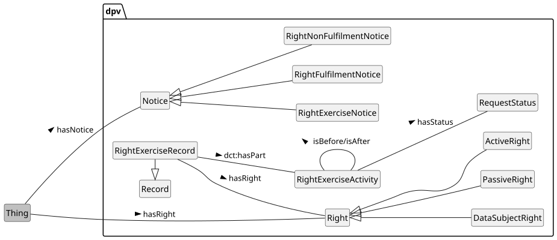 


 

 

The concept [=Right=] represents a normative concept for what is permissible or necessary in accordance with a system such as laws. To associate rights with concepts that are relevant or within which those rights occur, the relation [=hasRight=] is used. Rights can be passive, which means they are always applicable without requiring anything to be done, or active where they require some action to be taken to initiate or exercise them. To represent these concepts, DPV uses [=PassiveRight=] and [=ActiveRight=] respectively. Rights can be applicable to different contexts or entities. To differentiate rights applicable or afforded to data subjects, the concept [=DataSubjectRight=] is used.

 


 

-  dcat:Resource: None [go to full definition](http://www.w3.org/ns/dcat#Resource) 

 

-  dpv:Right: The right(s) applicable, provided, or expected [go to full definition](https://w3id.org/dpv#Right) 

 

  -  dpv:ActiveRight: The right(s) applicable, provided, or expected that need to be (actively) exercised [go to full definition](https://w3id.org/dpv#ActiveRight) 

 

  -  dpv:DataSubjectRight: The rights applicable or provided to a Data Subject [go to full definition](https://w3id.org/dpv#DataSubjectRight) 

 

  -  dpv:PassiveRight: The right(s) applicable, provided, or expected that are always (passively) applicable [go to full definition](https://w3id.org/dpv#PassiveRight) 

 

 

 

-  dpv:RightExerciseActivity: An activity representing an exercising of an active right [go to full definition](https://w3id.org/dpv#RightExerciseActivity) 

 

-  dpv:RightExerciseRecord: Record of a Right being exercised [go to full definition](https://w3id.org/dpv#RightExerciseRecord) 

 

-  dpv:RightNotice: Information associated with rights, such as which rights exist, when and where they are applicable, and other relevant information [go to full definition](https://w3id.org/dpv#RightNotice) 

 

  -  dpv:RightExerciseNotice: Information associated with exercising of an active right such as where and how to exercise the right, information required for it, or updates on an exercised rights request [go to full definition](https://w3id.org/dpv#RightExerciseNotice) 

 

    -  dpv:RightFulfilmentNotice: Notice provided regarding fulfilment of a right [go to full definition](https://w3id.org/dpv#RightFulfilmentNotice) 

 

    -  dpv:RightNonFulfilmentNotice: Notice provided regarding non-fulfilment of a right [go to full definition](https://w3id.org/dpv#RightNonFulfilmentNotice) 

 

 

 

 

 


  

This example shows applicable rights being asserted in a privacy notice. The notice is for a GDPR implementing use-cases and uses the EU-GDPR extension to represent rights under GDPR. It also shows how rights not currently provided by DPV can be associated. 


```
ex:PN2024 a dpv:PrivacyNotice ;
    dpv:hasApplicableLaw legal-eu:law-GDPR ;
    dpv:hasRight eu-gdpr:A15, # right of access
        eu-gdpr:A16, # right to rectification
        eu-gdpr:A17, # right to erasure / to be forgotten
        eu-gdpr:A18, # right to restrict processing
        eu-gdpr:A20, # right to data portability
        eu-gdpr:A21 ; # right to object
    dpv:hasRight [
        a dpv:DataSubjectRight ;
        dpv:hasApplicableLaw ex:SomeLaw ;
        dct:description "specific right to do X"@en ;
        dpv:hasProcess ex:SomeRightsProcess ;
    ] .
```


 

(META Example ID: [`E0067`](https://w3id.org/dpv/examples#E0067); link: [source file](https://w3id.org/dpv/examples/E0067.ttl); contributed by Harshvardhan J. Pandit on 2024-06-16)

<a id="rights-L750"></a>
## Rights Notices
 

The information provided regarding a right is called a 'Rights Notice'. It may be used to describe which rights exist, when they are applicable, how to exercise them, and other pertinent details. As with other notices in DPV, a rights notice is associated by using the `dpv:hasNotice` relation. The concept [=RightExerciseNotice=] represents specifically notices associated with exercising of rights - such as to indicate where and how to exercise it (expressed using [=isExercisedAt=] relation), or what information is required for the exercise, or to provide updates on an exercised rights request. For expressing contextual information, other existing concepts should be reused e.g. [`dpv:Process`](https://w3id.org/dpv#Process) to group related information together into a 'process', with [`dpv:hasPurpose`](https://w3id.org/dpv#hasPurpose) and [`dpv:IdentityVerification`](https://w3id.org/dpv#IdentityVerification) to indicate the right exercise will involve identity verification.

 

To indicate information about whether a rights exercise has been fulfilled or cannot be fulfilled - such as when additional information is needed, the concepts [=RightFulfilmentNotice=] and [=RightNonFulfilmentNotice=] are provided.

  

The following example represents a notice outlining a failure to complete a GDPR Data Portability request due to identity verification failure. The notice provides steps as providing an official ID for identity verification for the data subject to complete in order to continue the request, and outlines the consequence of not doing this would be a failure to complete the request. 


```
ex:PDH a dpv:RightNonFulfilmentNotice ;
  dct:dateSubmitted "2024-01-01"^^xsd:date ;
  dct:publisher ex:SomeController ;
  dpv:hasRight eu-gdpr:A20 ;
  dpv:hasRecipient dpv:DataSubject ;
  dpv:hasJustification justifications:IdentityVerificationFailure ;
  dpv:hasProcess [
    a dpv:Process ;
    dpv:isImplementedByEntity dpv:DataSubject ;
    dpv:hasPurpose dpv:IdentityVerification ;
    dpv:hasPersonalData pd:OfficialID ;
    dpv:hasProcessing dpv:Share ;
    dpv:hasRecipient ex:SomeController ;
    dpv:hasObligation [
        a dpv:Obligation ;
        dpv:hasDuration "P30D"^^xsd:duration ;
        dpv:hasConsequence [
            a dpv:ConsequenceOfFailure, dpv:RequestRejected ;
            skos:prefLabel "Reject on Failure"@en ;
    ] ;
  ] .
```


 

(META Example ID: [`E0061`](https://w3id.org/dpv/examples#E0061); link: [source file](https://w3id.org/dpv/examples/E0061.ttl); contributed by Harshvardhan J. Pandit on 2024-06-11)

<a id="rights-L789"></a>
## Rights Exercise
 

A [=RightExerciseActivity=] represents a concrete instance of a right being exercised. It can include contextual information such as timestamps, durations, entities, etc. that can be part of record-keeping. An activity can be a single step related to rights exercise -- such as the initial request to exercise that right, or its acknowledgement, or the final step taken to fulfil the right (e.g. provide some information), or it can also be a single activity describing the entire rights exercise process(es). To collate related activities associated with a rights exercise (e.g. associated with a specific data subject or a specific request), the concept [=RightExerciseRecord=] is useful.

<a id="rights-L794"></a>
## Rights Records
 

To indicate contextual information about Right Exercise activities, DPV suggests reuse of existing relations, such as those from DPV itself and [[[DCT]]]. For example, `dct:accessRights` can be used to specify constraints or requirements regarding access (e.g. log in required), or `dct:hasPart` and `dct:isPartOf` to express records and its contents, `dct:valid` to express validity constraints on the exercising being made available, `foaf:page` to specify the location or provision of notice, and [`dpv:hasStatus`](https://w3id.org/dpv#hasStatus) with [`dpv:RequestStatus`](https://w3id.org/dpv#RequestStatus) to represent the status of a rights exercise activity.

 

When rights require the provision of information which beyond a static common notice, for example a document personalised to the individual's information, or a dataset containing the individual's data, DPV recommends using [[[DCAT]]] to model the contents as a `dcat:Resource` or other relevant concepts from [[DCAT]] and [[DCT]] such as `dct:format`, `dct:accessRights`, and `dct:valid`.

<a id="rights-L803"></a>
## Vocabulary Index
 
<a id="rights-classes"></a>

<a id="rights-L805"></a>
### Classes
 
<a id="rights-ActiveRight"></a>

<a id="rights-L806"></a>
#### Active Right
 

- Term | ActiveRight | Prefix | dpv
- Label | Active Right
- IRI | [https://w3id.org/dpv#ActiveRight](https://w3id.org/dpv#ActiveRight)
- Type | [rdfs:Class](http://www.w3.org/2000/01/rdf-schema#Class), [skos:Concept](http://www.w3.org/2004/02/skos/core#Concept), [dpv:Right](https://w3id.org/dpv#Right)
- Broader/Parent types | [dpv:Right](#rights-Right)
- Subject of relation | [dpv:isExercisedAt](https://w3id.org/dpv#isExercisedAt)
- Object of relation | [dpv:hasRight](https://w3id.org/dpv#hasRight)
- Definition | The right(s) applicable, provided, or expected that need to be (actively) exercised
- Usage Note | Active rights require the entity to expressly exercise them. For example, a Data Subject exercising their right to withdraw their consent.
- Date Created | 2022-10-22
- Contributors | Beatriz Esteves, Georg P. Krog, Harshvardhan J. Pandit, Paul Ryan
- See More: | section [RIGHTS](#rights-vocab-rights) in [DPV](https://w3id.org/dpv#)

 

 
<a id="rights-DataSubjectRight"></a>

<a id="rights-L888"></a>
#### Data Subject Right
 

- Term | DataSubjectRight | Prefix | dpv
- Label | Data Subject Right
- IRI | [https://w3id.org/dpv#DataSubjectRight](https://w3id.org/dpv#DataSubjectRight)
- Type | [rdfs:Class](http://www.w3.org/2000/01/rdf-schema#Class), [skos:Concept](http://www.w3.org/2004/02/skos/core#Concept), [dpv:Right](https://w3id.org/dpv#Right)
- Broader/Parent types | [dpv:Right](#rights-Right)
- Object of relation | [dpv:hasRight](https://w3id.org/dpv#hasRight)
- Definition | The rights applicable or provided to a Data Subject
- Usage Note | Based on use of definitions, the notion of 'Data Subject Right' can be equivalent to 'Individual Right' or 'Right of a Person'
- Date Created | 2020-11-18
- Contributors | Beatriz Esteves, Georg P. Krog, Harshvardhan J. Pandit
- See More: | section [RIGHTS](#rights-vocab-rights) in [DPV](https://w3id.org/dpv#)

 

 
<a id="rights-PassiveRight"></a>

<a id="rights-L966"></a>
#### Passive Right
 

- Term | PassiveRight | Prefix | dpv
- Label | Passive Right
- IRI | [https://w3id.org/dpv#PassiveRight](https://w3id.org/dpv#PassiveRight)
- Type | [rdfs:Class](http://www.w3.org/2000/01/rdf-schema#Class), [skos:Concept](http://www.w3.org/2004/02/skos/core#Concept), [dpv:Right](https://w3id.org/dpv#Right)
- Broader/Parent types | [dpv:Right](#rights-Right)
- Object of relation | [dpv:hasRight](https://w3id.org/dpv#hasRight)
- Definition | The right(s) applicable, provided, or expected that are always (passively) applicable
- Usage Note | Passive rights do not require the entity to request or exercise them. They are considered to be always applicable. For example, the Right to Privacy (in EU) does not require an exercise for it to be fulfilled.
- Date Created | 2022-10-22
- Contributors | Beatriz Esteves, Georg P. Krog, Harshvardhan J. Pandit, Paul Ryan
- See More: | section [RIGHTS](#rights-vocab-rights) in [DPV](https://w3id.org/dpv#)

 

 
<a id="rights-Right"></a>

<a id="rights-L1044"></a>
#### Right
 

- Term | Right | Prefix | dpv
- Label | Right
- IRI | [https://w3id.org/dpv#Right](https://w3id.org/dpv#Right)
- Type | [rdfs:Class](http://www.w3.org/2000/01/rdf-schema#Class), [skos:Concept](http://www.w3.org/2004/02/skos/core#Concept)
- Object of relation | [dpv:hasRight](https://w3id.org/dpv#hasRight)
- Definition | The right(s) applicable, provided, or expected
- Usage Note | A 'right' is a legal, social, or ethical principle of freedom or entitlement which dictate the norms regarding what is allowed or owed. Rights as a concept encompass a broad area of norms and entities, and are not specific to Individuals or Data Protection / Privacy. For individual specific rights, see dpv:DataSubjectRight
- Examples
- [`dex:E0067 :: ` Indicating applicable rights](https://w3id.org/dpv/examples#E0067)
- Date Created | 2020-11-18
- Contributors | Beatriz Esteves, Georg P. Krog, Harshvardhan J. Pandit
- See More: | section [RIGHTS](#rights-vocab-rights) in [DEX](https://w3id.org/dpv#)

 

 
<a id="rights-RightExerciseActivity"></a>

<a id="rights-L1122"></a>
#### Right Exercise Activity
 

- Term | RightExerciseActivity | Prefix | dpv
- Label | Right Exercise Activity
- IRI | [https://w3id.org/dpv#RightExerciseActivity](https://w3id.org/dpv#RightExerciseActivity)
- Type | [rdfs:Class](http://www.w3.org/2000/01/rdf-schema#Class), [skos:Concept](http://www.w3.org/2004/02/skos/core#Concept), [dpv:OrganisationalMeasure](https://w3id.org/dpv#OrganisationalMeasure)
- Broader/Parent types | [dpv:OrganisationalMeasure](https://w3id.org/dpv#OrganisationalMeasure) → [dpv:TechnicalOrganisationalMeasure](https://w3id.org/dpv#TechnicalOrganisationalMeasure)
- Subject of relation | [dct:isPartOf](http://purl.org/dc/terms/isPartOf), [foaf:page](http://xmlns.com/foaf/0.1/page), [dpv:hasJustification](https://w3id.org/dpv#hasJustification), [dpv:hasRecipient](https://w3id.org/dpv#hasRecipient), [dpv:hasStatus](https://w3id.org/dpv#hasStatus), [dpv:isAfter](https://w3id.org/dpv#isAfter), [dpv:isBefore](https://w3id.org/dpv#isBefore), [dpv:isImplementedByEntity](https://w3id.org/dpv#isImplementedByEntity)
- Object of relation | [dct:hasPart](http://purl.org/dc/terms/hasPart), [dpv:hasOrganisationalMeasure](https://w3id.org/dpv#hasOrganisationalMeasure), [dpv:hasTechnicalOrganisationalMeasure](https://w3id.org/dpv#hasTechnicalOrganisationalMeasure), [dpv:isAfter](https://w3id.org/dpv#isAfter), [dpv:isBefore](https://w3id.org/dpv#isBefore)
- Definition | An activity representing an exercising of an active right
- Usage Note | There may be multiple activities associated with exercising and fulfilling rights. See the RightExerciseRecord concept for record-keeping of such activities in a cohesive manner.
- Examples
- [`dex:E0059 :: ` Exercising the right to rectification with contesting accuracy of information as justification](https://w3id.org/dpv/examples#E0059)
- Date Created | 2022-11-02
- Contributors | Beatriz Esteves, Georg P. Krog, Harshvardhan J. Pandit, Paul Ryan
- See More: | section [RIGHTS](#rights-vocab-rights) in [DEX](https://w3id.org/dpv#)

 

 
<a id="rights-RightExerciseNotice"></a>

<a id="rights-L1219"></a>
#### Right Exercise Notice
 

- Term | RightExerciseNotice | Prefix | dpv
- Label | Right Exercise Notice
- IRI | [https://w3id.org/dpv#RightExerciseNotice](https://w3id.org/dpv#RightExerciseNotice)
- Type | [rdfs:Class](http://www.w3.org/2000/01/rdf-schema#Class), [skos:Concept](http://www.w3.org/2004/02/skos/core#Concept), [dpv:OrganisationalMeasure](https://w3id.org/dpv#OrganisationalMeasure)
- Broader/Parent types | [dpv:RightNotice](#rights-RightNotice) → [dpv:Notice](https://w3id.org/dpv#Notice) → [dpv:OrganisationalMeasure](https://w3id.org/dpv#OrganisationalMeasure) → [dpv:TechnicalOrganisationalMeasure](https://w3id.org/dpv#TechnicalOrganisationalMeasure)
- Object of relation | [dpv:hasNotice](https://w3id.org/dpv#hasNotice), [dpv:hasOrganisationalMeasure](https://w3id.org/dpv#hasOrganisationalMeasure), [dpv:hasTechnicalOrganisationalMeasure](https://w3id.org/dpv#hasTechnicalOrganisationalMeasure), [dpv:isExercisedAt](https://w3id.org/dpv#isExercisedAt)
- Definition | Information associated with exercising of an active right such as where and how to exercise the right, information required for it, or updates on an exercised rights request
- Usage Note | This concept is intended for providing information regarding a right exercise. For specific instances of such exercises, see RightExerciseActivity and RightExerciseRecord.
- Date Created | 2022-10-22
- Contributors | Beatriz Esteves, Georg P. Krog, Harshvardhan J. Pandit, Paul Ryan
- See More: | section [RIGHTS](#rights-vocab-rights) in [DPV](https://w3id.org/dpv#)

 

 
<a id="rights-RightExerciseRecord"></a>

<a id="rights-L1303"></a>
#### Right Exercise Record
 

- Term | RightExerciseRecord | Prefix | dpv
- Label | Right Exercise Record
- IRI | [https://w3id.org/dpv#RightExerciseRecord](https://w3id.org/dpv#RightExerciseRecord)
- Type | [rdfs:Class](http://www.w3.org/2000/01/rdf-schema#Class), [skos:Concept](http://www.w3.org/2004/02/skos/core#Concept), [dpv:OrganisationalMeasure](https://w3id.org/dpv#OrganisationalMeasure)
- Broader/Parent types | [dpv:RecordsOfActivities](https://w3id.org/dpv#RecordsOfActivities) → [dpv:OrganisationalMeasure](https://w3id.org/dpv#OrganisationalMeasure) → [dpv:TechnicalOrganisationalMeasure](https://w3id.org/dpv#TechnicalOrganisationalMeasure)
- Subject of relation | [dct:hasPart](http://purl.org/dc/terms/hasPart)
- Object of relation | [dct:isPartOf](http://purl.org/dc/terms/isPartOf), [dpv:hasOrganisationalMeasure](https://w3id.org/dpv#hasOrganisationalMeasure), [dpv:hasRecordOfActivity](https://w3id.org/dpv#hasRecordOfActivity), [dpv:hasTechnicalOrganisationalMeasure](https://w3id.org/dpv#hasTechnicalOrganisationalMeasure)
- Definition | Record of a Right being exercised
- Usage Note | This concept represents a record of one or more right exercise activities, such as those associated with a single data subject or service or entity
- Examples
- [`dex:E0057 :: ` Expressing GDPR Right to Data Portability could not be fulfilled due to Identity Verification failure](https://w3id.org/dpv/examples#E0057)
- Date Created | 2022-11-02
- Date Modified | 2025-08-17
- Contributors | Beatriz Esteves, Georg P. Krog, Harshvardhan J. Pandit, Paul Ryan
- See More: | section [RIGHTS](#rights-vocab-rights) in [DEX](https://w3id.org/dpv#)

 

 
<a id="rights-RightFulfilmentNotice"></a>

<a id="rights-L1396"></a>
#### Right Fulfilment Notice
 

- Term | RightFulfilmentNotice | Prefix | dpv
- Label | Right Fulfilment Notice
- IRI | [https://w3id.org/dpv#RightFulfilmentNotice](https://w3id.org/dpv#RightFulfilmentNotice)
- Type | [rdfs:Class](http://www.w3.org/2000/01/rdf-schema#Class), [skos:Concept](http://www.w3.org/2004/02/skos/core#Concept), [dpv:OrganisationalMeasure](https://w3id.org/dpv#OrganisationalMeasure)
- Broader/Parent types | [dpv:RightExerciseNotice](#rights-RightExerciseNotice) → [dpv:RightNotice](#rights-RightNotice) → [dpv:Notice](https://w3id.org/dpv#Notice) → [dpv:OrganisationalMeasure](https://w3id.org/dpv#OrganisationalMeasure) → [dpv:TechnicalOrganisationalMeasure](https://w3id.org/dpv#TechnicalOrganisationalMeasure)
- Object of relation | [dpv:hasNotice](https://w3id.org/dpv#hasNotice), [dpv:hasOrganisationalMeasure](https://w3id.org/dpv#hasOrganisationalMeasure), [dpv:hasTechnicalOrganisationalMeasure](https://w3id.org/dpv#hasTechnicalOrganisationalMeasure), [dpv:isExercisedAt](https://w3id.org/dpv#isExercisedAt)
- Definition | Notice provided regarding fulfilment of a right
- Usage Note | This notice is associated with situations where information is provided with the intention of progressing the fulfilment of a right. For example, a notice asking for more information regarding the scope of the right, or providing information on where to access the data provided under a right.
- Date Created | 2022-11-02
- Contributors | Beatriz Esteves, Harshvardhan J. Pandit
- See More: | section [RIGHTS](#rights-vocab-rights) in [DPV](https://w3id.org/dpv#)

 

 
<a id="rights-RightNonFulfilmentNotice"></a>

<a id="rights-L1481"></a>
#### Right Non-Fulfilment Notice
 

- Term | RightNonFulfilmentNotice | Prefix | dpv
- Label | Right Non-Fulfilment Notice
- IRI | [https://w3id.org/dpv#RightNonFulfilmentNotice](https://w3id.org/dpv#RightNonFulfilmentNotice)
- Type | [rdfs:Class](http://www.w3.org/2000/01/rdf-schema#Class), [skos:Concept](http://www.w3.org/2004/02/skos/core#Concept), [dpv:OrganisationalMeasure](https://w3id.org/dpv#OrganisationalMeasure)
- Broader/Parent types | [dpv:RightExerciseNotice](#rights-RightExerciseNotice) → [dpv:RightNotice](#rights-RightNotice) → [dpv:Notice](https://w3id.org/dpv#Notice) → [dpv:OrganisationalMeasure](https://w3id.org/dpv#OrganisationalMeasure) → [dpv:TechnicalOrganisationalMeasure](https://w3id.org/dpv#TechnicalOrganisationalMeasure)
- Object of relation | [dpv:hasNotice](https://w3id.org/dpv#hasNotice), [dpv:hasOrganisationalMeasure](https://w3id.org/dpv#hasOrganisationalMeasure), [dpv:hasTechnicalOrganisationalMeasure](https://w3id.org/dpv#hasTechnicalOrganisationalMeasure), [dpv:isExercisedAt](https://w3id.org/dpv#isExercisedAt)
- Definition | Notice provided regarding non-fulfilment of a right
- Usage Note | This notice is associated with situations where information is provided with the intention of communicating non-fulfilment of a right. For example, to provide justifications on why a right could not be fulfilled or providing information about another entity who should be approached for exercising this right.
- Examples
- [`dex:E0058 :: ` Expressing a right exercise request is delayed due to high volume of requests](https://w3id.org/dpv/examples#E0058)
 [`dex:E0061 :: ` Associating justifications with right exercise non-fulfilment](https://w3id.org/dpv/examples#E0061)
- Date Created | 2022-11-02
- Contributors | Beatriz Esteves, Harshvardhan J. Pandit
- See More: | section [RIGHTS](#rights-vocab-rights) in [DEX](https://w3id.org/dpv#)

 

 
<a id="rights-RightNotice"></a>

<a id="rights-L1569"></a>
#### Right Notice
 

- Term | RightNotice | Prefix | dpv
- Label | Right Notice
- IRI | [https://w3id.org/dpv#RightNotice](https://w3id.org/dpv#RightNotice)
- Type | [rdfs:Class](http://www.w3.org/2000/01/rdf-schema#Class), [skos:Concept](http://www.w3.org/2004/02/skos/core#Concept), [dpv:OrganisationalMeasure](https://w3id.org/dpv#OrganisationalMeasure)
- Broader/Parent types | [dpv:Notice](https://w3id.org/dpv#Notice) → [dpv:OrganisationalMeasure](https://w3id.org/dpv#OrganisationalMeasure) → [dpv:TechnicalOrganisationalMeasure](https://w3id.org/dpv#TechnicalOrganisationalMeasure)
- Object of relation | [dpv:hasNotice](https://w3id.org/dpv#hasNotice), [dpv:hasOrganisationalMeasure](https://w3id.org/dpv#hasOrganisationalMeasure), [dpv:hasTechnicalOrganisationalMeasure](https://w3id.org/dpv#hasTechnicalOrganisationalMeasure)
- Definition | Information associated with rights, such as which rights exist, when and where they are applicable, and other relevant information
- Usage Note | This concept also covers information about rights exercise, with dpv:RightExerciseNotice specifically representing information provided in connection with exercising of rights. Both notices may be needed, e.g. RightNotice for providing information about existence and exercise of rights, and RightExerciseNotice for providing additional information specifically about exercise of rights - such as to request more information or provide updates on an exercised rights request
- Date Created | 2024-06-16
- Contributors | Harshvardhan J. Pandit
- See More: | section [RIGHTS](#rights-vocab-rights) in [DPV](https://w3id.org/dpv#)

 

 

 
<a id="rights-properties"></a>

<a id="rights-L1653"></a>
### Properties
 
<a id="rights-hasJustification"></a>

<a id="rights-L1654"></a>
#### has justification
 

- Term | hasJustification | Prefix | dpv
- Label | has justification
- IRI | [https://w3id.org/dpv#hasJustification](https://w3id.org/dpv#hasJustification)
- Type | [rdf:Property](http://www.w3.org/1999/02/22-rdf-syntax-ns#Property), [skos:Concept](http://www.w3.org/2004/02/skos/core#Concept)
- Domain includes | [dpv:RightExerciseActivity](https://w3id.org/dpv#RightExerciseActivity)
- Range includes | [dpv:Justification](https://w3id.org/dpv#Justification)
- Definition | Indicates a justification for specified concept or context
- Usage Note | Also used for specifying a justification for non-fulfilment of Right Exercise
- Examples
- [`dex:E0057 :: ` Expressing GDPR Right to Data Portability could not be fulfilled due to Identity Verification failure](https://w3id.org/dpv/examples#E0057)
 [`dex:E0058 :: ` Expressing a right exercise request is delayed due to high volume of requests](https://w3id.org/dpv/examples#E0058)
 [`dex:E0059 :: ` Exercising the right to rectification with contesting accuracy of information as justification](https://w3id.org/dpv/examples#E0059)
 [`dex:E0061 :: ` Associating justifications with right exercise non-fulfilment](https://w3id.org/dpv/examples#E0061)
 [`dex:E0062 :: ` Using justifications across categories](https://w3id.org/dpv/examples#E0062)
 [`dex:E0063 :: ` Expressing data breach notifications to data subjects are not required using a justification](https://w3id.org/dpv/examples#E0063)
- Date Created | 2022-06-15
- Contributors | Harshvardhan J. Pandit
- See More: | section [CONTEXT](#rights-vocab-context) in [DEX](https://w3id.org/dpv#) , section [RIGHTS](#rights-vocab-rights) in [DEX](https://w3id.org/dpv#)

 

 
<a id="rights-hasRecipient"></a>

<a id="rights-L1736"></a>
#### has recipient
 

- Term | hasRecipient | Prefix | dpv
- Label | has recipient
- IRI | [https://w3id.org/dpv#hasRecipient](https://w3id.org/dpv#hasRecipient)
- Type | [rdf:Property](http://www.w3.org/1999/02/22-rdf-syntax-ns#Property), [skos:Concept](http://www.w3.org/2004/02/skos/core#Concept)
- Broader/Parent types | [dpv:hasEntity](https://w3id.org/dpv#hasEntity)
- Sub-property of | [dpv:hasEntity](https://w3id.org/dpv#hasEntity)
- Domain includes | [dpv:RightExerciseActivity](https://w3id.org/dpv#RightExerciseActivity)
- Range includes | [dpv:Recipient](https://w3id.org/dpv#Recipient)
- Definition | Indicates Recipient of Data
- Usage Note | Also used to indicate the Recipient of a Right Exercise Activity
- Source | [SPECIAL Project](https://specialprivacy.ercim.eu/)
- Date Created | 2019-04-04
- Date Modified | 2020-11-04
- Contributors | Axel Polleres, Bud Bruegger, Harshvardhan J. Pandit, Javier Fernández, Mark Lizar
- See More: | section [ENTITIES-LEGALROLE](#rights-vocab-entities-legalrole) in [DPV](https://w3id.org/dpv#) , section [RIGHTS](#rights-vocab-rights) in [DPV](https://w3id.org/dpv#)

 

 
<a id="rights-hasRight"></a>

<a id="rights-L1828"></a>
#### has right
 

- Term | hasRight | Prefix | dpv
- Label | has right
- IRI | [https://w3id.org/dpv#hasRight](https://w3id.org/dpv#hasRight)
- Type | [rdf:Property](http://www.w3.org/1999/02/22-rdf-syntax-ns#Property), [skos:Concept](http://www.w3.org/2004/02/skos/core#Concept)
- Range includes | [dpv:Right](https://w3id.org/dpv#Right)
- Definition | Indicates use or applicability of Right
- Examples
- [`dex:E0061 :: ` Associating justifications with right exercise non-fulfilment](https://w3id.org/dpv/examples#E0061)
 [`dex:E0067 :: ` Indicating applicable rights](https://w3id.org/dpv/examples#E0067)
- Date Created | 2020-11-18
- Contributors | Harshvardhan J. Pandit
- See More: | section [RIGHTS](#rights-vocab-rights) in [DEX](https://w3id.org/dpv#)

 

 
<a id="rights-hasStatus"></a>

<a id="rights-L1902"></a>
#### has status
 

- Term | hasStatus | Prefix | dpv
- Label | has status
- IRI | [https://w3id.org/dpv#hasStatus](https://w3id.org/dpv#hasStatus)
- Type | [rdf:Property](http://www.w3.org/1999/02/22-rdf-syntax-ns#Property), [skos:Concept](http://www.w3.org/2004/02/skos/core#Concept)
- Domain includes | [dpv:RightExerciseActivity](https://w3id.org/dpv#RightExerciseActivity)
- Range includes | [dpv:Status](https://w3id.org/dpv#Status)
- Definition | Indicates the status of specified concept
- Usage Note | Also used to Indicate the status of a Right Exercise Activity
- Usage Note | For expressing the status of the DPIA document or process. Here different statuses are used to convey different contextual meanings. For example, dpv:ActivityStatus expresses the state of the activity in terms of whether it is ongoing or completed, and dpv:AuditStatus expresses the state of the audit process in terms of being required, approved, or rejected. These are applied over each step of the DPIA i.e. DPIANecessityAssessment, DPIAProcedure, and DPIAOutcome. Similarly, a process also uses hasStatus with DPIAConformity to indicate adherence to the results of the DPIA process.
- Examples
- [`dex:E0069 :: ` Using DPV and RISK extension to represent incidents](https://w3id.org/dpv/examples#E0069)
- Date Created | 2022-05-18
- Contributors | Harshvardhan J. Pandit
- See More: | section [CONTEXT-STATUS](#rights-vocab-context-status) in [DEX](https://w3id.org/dpv#) , section [RIGHTS](#rights-vocab-rights) in [DEX](https://w3id.org/dpv#)

 

 
<a id="rights-isAfter"></a>

<a id="rights-L1987"></a>
#### is after
 

- Term | isAfter | Prefix | dpv
- Label | is after
- IRI | [https://w3id.org/dpv#isAfter](https://w3id.org/dpv#isAfter)
- Type | [rdf:Property](http://www.w3.org/1999/02/22-rdf-syntax-ns#Property), [skos:Concept](http://www.w3.org/2004/02/skos/core#Concept)
- Domain includes | [dpv:RightExerciseActivity](https://w3id.org/dpv#RightExerciseActivity)
- Range includes | [dpv:RightExerciseActivity](https://w3id.org/dpv#RightExerciseActivity)
- Definition | Indicates the specified concepts is 'after' this concept in some context
- Usage Note | Also used for specifying a RightExerciseActivity occurs before another RightExerciseActivity
- Date Created | 2022-03-02
- Contributors | Georg P. Krog, Harshvardhan J. Pandit, Julian Flake
- See More: | section [CONTEXT](#rights-vocab-context) in [DPV](https://w3id.org/dpv#) , section [RIGHTS](#rights-vocab-rights) in [DPV](https://w3id.org/dpv#)

 

 
<a id="rights-isBefore"></a>

<a id="rights-L2066"></a>
#### is before
 

- Term | isBefore | Prefix | dpv
- Label | is before
- IRI | [https://w3id.org/dpv#isBefore](https://w3id.org/dpv#isBefore)
- Type | [rdf:Property](http://www.w3.org/1999/02/22-rdf-syntax-ns#Property), [skos:Concept](http://www.w3.org/2004/02/skos/core#Concept)
- Domain includes | [dpv:RightExerciseActivity](https://w3id.org/dpv#RightExerciseActivity)
- Range includes | [dpv:RightExerciseActivity](https://w3id.org/dpv#RightExerciseActivity)
- Definition | Indicates the specified concepts is 'before' this concept in some context
- Usage Note | Also used for specifying a RightExerciseActivity occurs before another RightExerciseActivity
- Date Created | 2022-03-02
- Contributors | Georg P. Krog, Harshvardhan J. Pandit, Julian Flake
- See More: | section [CONTEXT](#rights-vocab-context) in [DPV](https://w3id.org/dpv#) , section [RIGHTS](#rights-vocab-rights) in [DPV](https://w3id.org/dpv#)

 

 
<a id="rights-isExercisedAt"></a>

<a id="rights-L2145"></a>
#### is exercised at
 

- Term | isExercisedAt | Prefix | dpv
- Label | is exercised at
- IRI | [https://w3id.org/dpv#isExercisedAt](https://w3id.org/dpv#isExercisedAt)
- Type | [rdf:Property](http://www.w3.org/1999/02/22-rdf-syntax-ns#Property), [skos:Concept](http://www.w3.org/2004/02/skos/core#Concept)
- Domain includes | [dpv:ActiveRight](https://w3id.org/dpv#ActiveRight)
- Range includes | [dpv:RightExerciseNotice](https://w3id.org/dpv#RightExerciseNotice)
- Definition | Indicates context or information about exercising a right
- Date Created | 2022-10-22
- Contributors | Harshvardhan J. Pandit
- See More: | section [RIGHTS](#rights-vocab-rights) in [DPV](https://w3id.org/dpv#)

 

 
<a id="rights-isImplementedByEntity"></a>

<a id="rights-L2220"></a>
#### is implemented by entity
 

- Term | isImplementedByEntity | Prefix | dpv
- Label | is implemented by entity
- IRI | [https://w3id.org/dpv#isImplementedByEntity](https://w3id.org/dpv#isImplementedByEntity)
- Type | [rdf:Property](http://www.w3.org/1999/02/22-rdf-syntax-ns#Property), [skos:Concept](http://www.w3.org/2004/02/skos/core#Concept)
- Domain includes | [dpv:RightExerciseActivity](https://w3id.org/dpv#RightExerciseActivity)
- Range includes | [dpv:Entity](https://w3id.org/dpv#Entity)
- Definition | Indicates implementation details such as entities or agents
- Usage Note | Also used to indicate the Entity that implements or performs a Right Exercise Activity
- Usage Note | The use of 'entity' is inclusive of entities (e.g. Data Processor) as well as 'agent' (e.g. DPO). For indicating technological implementation, the property isImplementedByTechnology should be used.
- Examples
- [`dex:E0037 :: ` Indicating type of organisation and involvement of specific organisational units](https://w3id.org/dpv/examples#E0037)
 [`dex:E0085 :: ` Role of dpv:Processing and using it in dpv:Process](https://w3id.org/dpv/examples#E0085)
- Date Created | 2019-05-07
- Date Modified | 2022-01-26
- Contributors | Axel Polleres, Beatriz Esteves, Harshvardhan J. Pandit, Julian Flake, Paul Ryan
- See More: | section [PROCESSING-CONTEXT](#rights-vocab-processing-context) in [DEX](https://w3id.org/dpv#) , section [RIGHTS](#rights-vocab-rights) in [DEX](https://w3id.org/dpv#)

 

 

 
<a id="rights-external-concepts"></a>


 

DPV uses the following terms from [[RDF]] and [[RDFS]] with their defined meanings:

 

 
<a id="rights-rdf:type"></a>


- rdf:type to denote a concept is an instance of another concept

 
<a id="rights-rdfs:Class"></a>


- rdfs:Class to denote a concept is a Class or a category

 
<a id="rights-rdfs:subClassOf"></a>


- rdfs:subClassOf to specify the concept is a subclass (subtype, sub-category, subset) of another concept

 
<a id="rights-rdf:Property"></a>


- rdf:Property to denote a concept is a property or a relation

 

 

The following external concepts are re-used within DPV:

<a id="rights-L2318"></a>
### External
 
<a id="rights-dcat:Resource"></a>

<a id="rights-L2319"></a>
#### dcat:Resource
 

- Term | dcat:Resource | Prefix | dcat
- Label | dcat:Resource
- IRI | [http://www.w3.org/ns/dcat#Resource](http://www.w3.org/ns/dcat#Resource)
- Type | [rdfs:Class](http://www.w3.org/2000/01/rdf-schema#Class), [skos:Concept](http://www.w3.org/2004/02/skos/core#Concept)
- Usage Note | A dataset or catalogue or any other resource provided in fulfilment of a Right Exercise, such as for GDPR's Art.15 regarding Right of Access or Art.20 regarding Right to Data Portability. The associated properties from DCAT and DCMI DCT vocabularies provide convenient means to express metadata such as URL for accessing the data, its temporal validity and access restrictions, and specific datasets present along with their schemas.
- Usage Note | A dataset, data service, or any other resource associated with Right Exercise - such as for providing a copy of data
- Date Created | 2022-11-02
- Contributors | Beatriz Esteves, Georg P. Krog, Harshvardhan J. Pandit
- See More: | section [RIGHTS](http://www.w3.org/ns/dcat#vocab-rights) in [DPV](http://www.w3.org/ns/dcat#)

 

 
<a id="rights-dct:accessRights"></a>

<a id="rights-L2390"></a>
#### dct:accessRights
 

- Term | dct:accessRights | Prefix | dct
- Label | dct:accessRights
- IRI | [http://purl.org/dc/terms/accessRights](http://purl.org/dc/terms/accessRights)
- Type | [rdf:Property](http://www.w3.org/1999/02/22-rdf-syntax-ns#Property), [skos:Concept](http://www.w3.org/2004/02/skos/core#Concept)
- Usage Note | Also used for specifying constraints on access associated with Rights Exercising (e.g. User must log in) or access to provided data (e.g. access via link)
- See More: | section [RIGHTS](http://purl.org/dc/terms/vocab-rights) in [DPV](http://purl.org/dc/terms/)

 

 
<a id="rights-dct:format"></a>

<a id="rights-L2451"></a>
#### dct:format
 

- Term | dct:format | Prefix | dct
- Label | dct:format
- IRI | [http://purl.org/dc/terms/format](http://purl.org/dc/terms/format)
- Type | [rdf:Property](http://www.w3.org/1999/02/22-rdf-syntax-ns#Property), [skos:Concept](http://www.w3.org/2004/02/skos/core#Concept)
- Usage Note | Also used for specifying the format of provided information, for example a CSV dataset
- See More: | section [RIGHTS](http://purl.org/dc/terms/vocab-rights) in [DPV](http://purl.org/dc/terms/)

 

 
<a id="rights-dct:hasPart"></a>

<a id="rights-L2512"></a>
#### dct:hasPart
 

- Term | dct:hasPart | Prefix | dct
- Label | dct:hasPart
- IRI | [http://purl.org/dc/terms/hasPart](http://purl.org/dc/terms/hasPart)
- Type | [rdf:Property](http://www.w3.org/1999/02/22-rdf-syntax-ns#Property), [skos:Concept](http://www.w3.org/2004/02/skos/core#Concept)
- Domain includes | [dpv:RightExerciseRecord](https://w3id.org/dpv#RightExerciseRecord)
- Range includes | [dpv:RightExerciseActivity](https://w3id.org/dpv#RightExerciseActivity)
- Usage Note | Also used for specifying a RightExerciseRecord has RightExerciseActivity as part of its records
- Usage Note | For expressing something contains a DPIA document or process contains as a part. For example, as some dpv:DPIA dct:hasPart DPIANecessityAssessment
- See More: | section [RIGHTS](http://purl.org/dc/terms/vocab-rights) in [DPV](http://purl.org/dc/terms/)

 

 
<a id="rights-dct:isPartOf"></a>

<a id="rights-L2584"></a>
#### dct:isPartOf
 

- Term | dct:isPartOf | Prefix | dct
- Label | dct:isPartOf
- IRI | [http://purl.org/dc/terms/isPartOf](http://purl.org/dc/terms/isPartOf)
- Type | [rdf:Property](http://www.w3.org/1999/02/22-rdf-syntax-ns#Property), [skos:Concept](http://www.w3.org/2004/02/skos/core#Concept)
- Domain includes | [dpv:RightExerciseActivity](https://w3id.org/dpv#RightExerciseActivity)
- Range includes | [dpv:RightExerciseRecord](https://w3id.org/dpv#RightExerciseRecord)
- Usage Note | Also used for specifying a RightExerciseActivity is part of a RightExerciseRecord
- Usage Note | For expressing a DPIA document or process is part of another. For example, as some DPIANecessityAssessment dct:isPartOf some dpv:DPIA
- See More: | section [RIGHTS](http://purl.org/dc/terms/vocab-rights) in [DPV](http://purl.org/dc/terms/)

 

 
<a id="rights-dct:valid"></a>

<a id="rights-L2656"></a>
#### dct:valid
 

- Term | dct:valid | Prefix | dct
- Label | dct:valid
- IRI | [http://purl.org/dc/terms/valid](http://purl.org/dc/terms/valid)
- Type | [rdf:Property](http://www.w3.org/1999/02/22-rdf-syntax-ns#Property), [skos:Concept](http://www.w3.org/2004/02/skos/core#Concept)
- Usage Note | Also used for specifying the temporal validity of an activity associated with Right Exercise. For example, limits on duration for providing or accessing provided information
- Usage Note | For expressing the temporal date or range of validity of the DPIA document or process. This refers to the time period for which the DPIA is considered valid, and does not refer to the temporal period associated with processing (see dct:temporal instead). The assumption is that after this period, the DPIA should be re-evaluated or some process should be triggered
- See More: | section [RIGHTS](http://purl.org/dc/terms/vocab-rights) in [DPV](http://purl.org/dc/terms/)

 

 
<a id="rights-foaf:page"></a>

<a id="rights-L2720"></a>
#### foaf:page
 

- Term | foaf:page | Prefix | foaf
- Label | foaf:page
- IRI | [http://xmlns.com/foaf/0.1/page](http://xmlns.com/foaf/0.1/page)
- Type | [rdf:Property](http://www.w3.org/1999/02/22-rdf-syntax-ns#Property), [skos:Concept](http://www.w3.org/2004/02/skos/core#Concept)
- Domain includes | [dpv:RightExerciseActivity](https://w3id.org/dpv#RightExerciseActivity)
- Usage Note | Also used to indicate a web page or document providing information or functionality associated with a Right Exercise
- See More: | section [RIGHTS](http://xmlns.com/foaf/0.1/vocab-rights) in [DPV](http://xmlns.com/foaf/0.1/)

 

 

 

 
<a id="rights-funding-acknowledgements"></a>

<a id="rights-L2788"></a>
## Funding Acknowledgements

<a id="rights-L2790"></a>
### Funding Sponsors
 

The DPVCG was established as part of the [SPECIAL H2020 Project](https://specialprivacy.ercim.eu/), which received funding from the European Union’s Horizon 2020 research and innovation programme under grant agreement No. 731601 from 2017 to 2019. Continued developments have been funded under: [RECITALS Project](https://recitals-project.eu/) funded under the EU's Horizon program with grant agreement No. 101168490.

 

Harshvardhan J. Pandit was funded to work on DPV from 2020 to 2022 by the [Irish Research Council's](https://research.ie/) Government of Ireland Postdoctoral Fellowship Grant#GOIPD/2020/790.

 

The [ADAPT SFI Centre](https://www.adaptcentre.ie/) for Digital Media Technology is funded by Science Foundation Ireland through the SFI Research Centres Programme and is co-funded under the European Regional Development Fund (ERDF) through Grant#13/RC/2106 (2018 to 2020) and Grant#13/RC/2106_P2 (2021 onwards).

<a id="rights-L2796"></a>
### Funding Acknowledgements for Contributors
 

The contributions of Harshvardhan J. Pandit have been made with the financial support of Science Foundation Ireland under Grant Agreement No. 13/RC/2106_P2 at the ADAPT SFI Research Centre; and the AI Accountability Lab (AIAL) which is supported by grants from following groups: the AI Collaborative, an Initiative of the Omidyar Group; Luminate; the Bestseller Foundation; and the John D. and Catherine T. MacArthur Foundation.

ReSpec configuration provenance (not executed): [original HTML lines 7–578](../source/2.3/dpv/modules/rights.html#L7-L578).

Original HTML: [context.html](../source/2.3/dpv/modules/context.html#L1-L15760).

<a id="context-L1"></a>
Contributors: (ordered alphabetically) [Arthit Suriyawongkul](https://orcid.org/0000-0002-9698-1899)  (ADAPT Centre, Trinity College Dublin), Axel Polleres  (Vienna University of Economics and Business), [Beatriz Esteves](https://w3id.org/people/besteves)  (IDLab, IMEC, Ghent University), Bud Bruegger  (Unabhängige Landeszentrum für Datenschutz Schleswig-Holstein), Damien Desfontaines  (No affiliation provided), Danielle Welter  (University of Luxembourg), David Hickey  (Dublin City University), [Delaram Golpayegani](https://orcid.org/0000-0002-1208-186X)  (ADAPT Centre, Trinity College Dublin), Elmar Kiesling  (Vienna University of Technology), Fajar Ekaputra  (Vienna University of Technology), [Georg P. Krog](https://www.linkedin.com/in/georg-philip-krog-a2a278104/)  (Signatu AS), [Harshvardhan J. Pandit](https://harshp.com/)  (AI Accountability Lab (AIAL), Trinity College Dublin), Iain Henderson  (JLINC Labs), Javier Fernández  (Vienna University of Economics and Business), [Julian Flake](https://orcid.org/0009-0006-4623-1463)  (University of Koblenz), Julio Hernandez  (Dublin City University), Mark Lizar  (OpenConsent/Kantara Initiative), Maya Borges  (Danish Agency for Digitisation), [Paul Ryan](https://orcid.org/0000-0003-0770-2737)  (Uniphar PLC), Piero Bonatti  (Università di Napoli Federico II), Rana Saniei  (Universidad Politécnica de Madrid), [Rob Brennan](https://orcid.org/0000-0001-8236-362X)  (University College Dublin), Rudy Jacob  (Proximus), Simon Steyskal  (Siemens), Steve Hickman  (Epistimis LLC), Tytti Rintamaki  (ADAPT Centre, Dublin City University). NOTE: The affiliations are informative, do not represent formal endorsements, and may be outdated as this list is generated automatically from existing data.

 
<a id="context-abstract"></a>


 

This document provides additional details and examples for contextual concepts such as durations, frequencies, and locations used in the Data Privacy Vocabulary [[DPV]], and is a companion to the [[DPV]] specification.

 

 
<a id="context-dpv-document-family"></a>


 

DPV Specifications: The [[DPV]] is the core specification that is extended by specific extensions. A [[PRIMER]] introduces the concepts and modelling of DPV specifications, and [[GUIDES]] describe application of DPV for specific applications and use-cases. The [Search Index](https://w3id.org/dpv/2.3/search) page provides a searchable hierarchy of all concepts. The [Data Privacy Vocabularies and Controls Community Group (DPVCG)](https://www.w3.org/community/dpvcg/) develops and manages these specifications through [GitHub](https://github.com/w3c/dpv/releases). For meetings, see the [DPVCG calendar](https://www.w3.org/groups/cg/dpvcg/calendar).

 

The peer-reviewed article "[Data Privacy Vocabulary (DPV) - Version 2.0](https://doi.org/10.1007/978-3-031-77847-6_10)" (2024) describes the current state of DPV and extensions from version 2.0 onwards, with an [earlier article](https://link.springer.com/chapter/10.1007%2F978-3-030-33246-4_44) (2019) covering how the DPV was developed (open access versions [here](http://hdl.handle.net/2262/91581), [here](http://doras.dcu.ie/23801/), and [here](https://aic.ai.wu.ac.at/~polleres/publications/pand-etal-2019ODBASE.pdf)). 

Contributing: The DPVCG welcomes participation to improve the DPV and associated resources, including expansion or refinement of concepts, requesting information and applications, and addressing open issues. [See contributing guide](https://github.com/w3c/dpv/wiki/Contribution-Guide) for further information.

 


 
<a id="context-sotd"></a>


 

 
<a id="context-vocab-context"></a>


<a id="context-vocab-rights"></a>

<a id="context-L659"></a>
## Introduction
 

This document assumes the reader is familiar with DPV through the [[[PRIMER]]], and thus focuses on providing a topically structured documentation of concepts defined by DPV.

 

 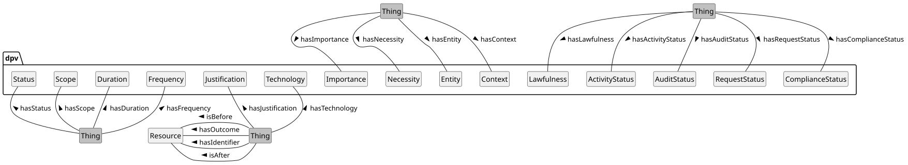 


 

 


 

-  dpv:Context: Contextually relevant information [go to full definition](https://w3id.org/dpv#Context) 

 

  -  dpv:Applicability: Concept provided to represent indication of cases where the information or context is not applicable (N/A) or not available or this is not known or determined yet. If the information is applicable and available, this concept should not be used. [go to full definition](https://w3id.org/dpv#Applicability) 

 

    -  dpv:NotApplicable: Concept indicating the information or context is not applicable [go to full definition](https://w3id.org/dpv#NotApplicable) 

 

    -  dpv:NotAvailable: Concept indicating the information or context is applicable but information is not yet available [go to full definition](https://w3id.org/dpv#NotAvailable) 

 

    -  dpv:UnknownApplicability: Concept indicating information or context availability is unknown i.e. it is not known if the information exists or is applicable and therefore statements about its availability cannot be made (yet) [go to full definition](https://w3id.org/dpv#UnknownApplicability) 

 

 

 

  -  dpv:Duration: The duration or temporal limitation [go to full definition](https://w3id.org/dpv#Duration) 

 

    -  dpv:EndlessDuration: Duration that is (known or intended to be) open ended or without an end [go to full definition](https://w3id.org/dpv#EndlessDuration) 

 

    -  dpv:FixedOccurrencesDuration: Duration that takes place a fixed number of times e.g. 3 times [go to full definition](https://w3id.org/dpv#FixedOccurrencesDuration) 

 

    -  dpv:IndeterminateDuration: Duration that is indeterminate or cannot be determined [go to full definition](https://w3id.org/dpv#IndeterminateDuration) 

 

    -  dpv:TemporalDuration: Duration that has a fixed temporal duration e.g. 6 months [go to full definition](https://w3id.org/dpv#TemporalDuration) 

 

    -  dpv:UntilEventDuration: Duration that takes place until a specific event occurs e.g. Account Closure [go to full definition](https://w3id.org/dpv#UntilEventDuration) 

 

    -  dpv:UntilTimeDuration: Duration that has a fixed end date e.g. 2022-12-31 [go to full definition](https://w3id.org/dpv#UntilTimeDuration) 

 

 

 

  -  dpv:FeeRequirement: Concept indicating whether a fee is required [go to full definition](https://w3id.org/dpv#FeeRequirement) 

 

    -  dpv:FeeNotRequired: Concept indicating a fee is not required. This is distinct from a Fee of zero as it indicates a fee is not applicable in the context [go to full definition](https://w3id.org/dpv#FeeNotRequired) 

 

    -  dpv:FeeRequired: Concept indicating a fee is required. The value of the fee should be specified using rdf:value or an another relevant means [go to full definition](https://w3id.org/dpv#FeeRequired) 

 

 

 

  -  dpv:Frequency: The frequency or information about periods and repetitions in terms of recurrence. [go to full definition](https://w3id.org/dpv#Frequency) 

 

    -  dpv:ContinuousFrequency: Frequency where occurrences are continuous [go to full definition](https://w3id.org/dpv#ContinuousFrequency) 

 

    -  dpv:OftenFrequency: Frequency where occurrences are often or frequent, but not continuous [go to full definition](https://w3id.org/dpv#OftenFrequency) 

 

    -  dpv:SingularFrequency: Frequency where occurrences are singular i.e. they take place only once [go to full definition](https://w3id.org/dpv#SingularFrequency) 

 

    -  dpv:SporadicFrequency: Frequency where occurrences are sporadic or infrequent or sparse [go to full definition](https://w3id.org/dpv#SporadicFrequency) 

 

 

 

  -  dpv:Importance: An indication of 'importance' within a context [go to full definition](https://w3id.org/dpv#Importance) 

 

    -  dpv:PrimaryImportance: Indication of 'primary' or 'main' or 'core' importance [go to full definition](https://w3id.org/dpv#PrimaryImportance) 

 

    -  dpv:SecondaryImportance: Indication of 'secondary' or 'minor' or 'auxiliary' importance [go to full definition](https://w3id.org/dpv#SecondaryImportance) 

 

 

 

  -  dpv:Justification: A form of documentation providing reasons, explanations, or justifications [go to full definition](https://w3id.org/dpv#Justification) 

 

  -  dpv:Necessity: An indication of 'necessity' within a context [go to full definition](https://w3id.org/dpv#Necessity) 

 

    -  dpv:NotRequired: Indication of neither being required nor optional i.e. not relevant or needed [go to full definition](https://w3id.org/dpv#NotRequired) 

 

    -  dpv:Optional: Indication of 'optional' or 'voluntary' [go to full definition](https://w3id.org/dpv#Optional) 

 

    -  dpv:Required: Indication of 'required' or 'necessary' [go to full definition](https://w3id.org/dpv#Required) 

 

 

 

  -  dpv:Scope: Indication of the extent or range or boundaries associated with(in) a context [go to full definition](https://w3id.org/dpv#Scope)

<a id="context-L821"></a>
## Duration and Frequency
 
<a id="context-vocab-duration"></a>

<a id="context-L823"></a>
### Duration
 

To express the duration of events or operations, such as how long processing will take or the validity of consent, the concept [=Duration=] can be used. Duration is indicated using the relation [=hasDuration=], and has the following subtypes:

 

 

- [=TemporalDuration=] - indicating a relative temporal duration, e.g. 6 months.

 

- [=UntilTimeDuration=] - indicating duration that occurs until the end of specified time, e.g. until 31 DEC 2022.

 

- [=UntilEventDuration=] - indicating duration that occurs until the end of specified event, e.g. until account is closed.

 

- [=FixedOccurrencesDuration=] - a duration that is based on number of Occurrences, e.g. until you view it 3 times

 

- [=EndlessDuration=] - indicating a duration without an end condition or temporal notation.

 

  

This example shows the various ways in which duration can be expressed - as a period of time (6 months), as an end date, or as a fixed number of occurrences, or until an event occurs. The example also show some 'bad practices' where the information is expressed directly as strings - and instead shows the benefits of providing semantic information to explicitly indicate what kind of a duration it is which is necessary for unambiguous interpretations. 


```
ex:PDH1 a dpv:Process ;
    dpv:hasProcessing dpv:Collect ;
    dpv:hasPersonalData pd:Location ;
    dpv:hasDuration "P6M" ; # 6 months
    dpv:hasDuration [
        a dpv:TemporalDuration ;
        rdf:value "P6M"^^xsd:duration ; # 6 months - same as above, 
            # but more explicit that this is a duration
    ] ;
    dpv:hasDuration "2023-12-31" ;
    dpv:hasDuration [
        a dpv:UntilTimeDuration ;
        rdf:value "2023-12-31"^^xsd:date ; # same as above, 
            #  but more explicit that this is an end date
    ] ;
    dpv:hasDuration "1 time"@en ; # bad practice - not machine-readable
    dpv:hasDuration [
        a dpv:FixedOccurrencesDuration ; # good practice - unambiguous
        rdf:value "1"^^xsd:int ; 
    ] ;
    dpv:hasDuration "until account closure"@en ; # bad practice
    dpv:hasDuration [
        a dpv:UntilEventDuration ; # good practice - specifies an event
        rdf:value "Until Account Closure"@en ; 
    ] .
```


 

(META Example ID: [`E0050`](https://w3id.org/dpv/examples#E0050); link: [source file](https://w3id.org/dpv/examples/E0050.ttl); contributed by Harshvardhan J. Pandit on 2024-06-11) 

 

 

 
<a id="context-vocab-frequency"></a>

<a id="context-L868"></a>
### Frequency
 

[=Frequency=] indicates how frequently something occurs. Statistically, this can be expressed as the combination of number of Occurrences and a time period, which can further be expressed as a probabilistic value or a percentage. For example, for something occurring once every year, the frequency is: 1 or 100% for 1 year. While such quantified representations are important for determining metrics and performing operations, DPV focuses on the qualitative labelling of such representations within a specific context.

 

The relation [=hasFrequency=] associates a frequency with a context, and can be expressed using the following subtypes:

 

 

- [=ContinuousFrequency=] - indicates things occurring Continuously, e.g. location collection happens Continuously.

 

- [=SporadicFrequency=] - indicates things occurring sporadically or rarely or not often, e.g. collecting system usage logs every month.

 

- [=OftenFrequency=] - indicates things happen often or regularly or commonly, e.g. online status is reported every 5 mins.

 

- [=SingularFrequency=] - indicates things happen only once.

 

  

This example shows the various ways in which frequency can be expressed, including combining frequency with duration to express complex information such as once per day for 6 months 


```
ex:PDH1 a dpv:Process ;
    dpv:hasProcessing dpv:Collect ;
    dpv:hasPersonalData pd:Location ;
    dpv:hasDuration [
        a dpv:TemporalDuration ;
        rdf:value "P6M"^^xsd:duration ; 
    ] ;
    # various ways to indicate frequencies
    dpv:hasFrequency [
        a dpv:SingularFrequency ; # data will be collected exactly once
            # combined with duration - once sometime in 6 months
    ] ;
    dpv:hasFrequency [
        a dpv:ContinuousFrequency ; # data will be continuously collected
            # combined with duration - continuous collection for 6 months
    ] ;
    dpv:hasFrequency [
        a dpv:SporadicFrequency ; # data will be sporadically collected
            # combined with duration - collected sporadically across 6 months
        # optionally, the 'frequency' of sporadic collection can also be
        # expressed as a duration, i.e., a period
        rdf:value "10"^^xsd:duration ; # 10 times (across 6 months)
    ] ;
    dpv:hasFrequency [
        a dpv:OftenFrequency ; # often is qualitatively more than sporadic
        rdf:value "1" ; # frequency can also be expressed as occurrences
        dpv:hasDuration [ # combined with a duration
            a dpv:TemporalDuration ; 
            rdf:value "P1D"^^xsd:duration ;
        ] ; # the result is: once per day for 6 months (from outer duration)
    ] .
```


 

(META Example ID: [`E0051`](https://w3id.org/dpv/examples#E0051); link: [source file](https://w3id.org/dpv/examples/E0051.ttl); contributed by Harshvardhan J. Pandit on 2024-06-11)

<a id="context-L921"></a>
## Importance & Necessity
 

DPV provides two subtypes of concepts to denote contextual - [=Importance=] and [=Necessity=], which can be applied to specific contexts such as `dpv:Process`, `dpv:Purpose`, `dpv:PersonalData`.

 

[=Necessity=] enables specifying whether the contextual information is [=Required=], is [=Optional=], or is [=NotRequired=]. These can be used to indicate, for example, which parts of processing operations (e.g. purposes, personal data) are optional, and whether a particular processing operation is required to be carried out.

 

[=Importance=] is similar in application to [=Necessity=], and provides a way to indicate how central or significant the indicated operation(s) are to the context (e.g. to the Controller). Subtypes of importance are [=PrimaryImportance=] to indicate 'main' or 'central' or 'primary' importance, and [=SecondaryImportance=] to indicate 'auxiliary' or 'peripheral' or 'secondary' importance.

  

This example shows a process where email address is required to be collected, and name can be optionally collected. Note that the necessity applies to the entire process i.e. both personal data and the collect processing operation. It also provides an indication of the importance of the process - for example to indicate which processes are important for the organisation (primary importance) and which are not as important or are not crucial (secondary importance). 


```
ex:PDH a dpv:Process ;
    dpv:hasProcess [
        a dpv:Process ;
        dpv:hasProcessing dpv:Collect ;
        dpv:hasPersonalData pd:EmailAddress ;
        dpv:hasNecessity dpv:Required ;
        dpv:hasImportance dpv:PrimaryImportance ;
    ] ;
    dpv:hasProcess [
        a dpv:Process ;
        dpv:hasProcessing dpv:Collect ;
        dpv:hasPersonalData pd:Name ;
        dpv:hasNecessity dpv:Optional ;
        dpv:hasImportance dpv:SecondaryImportance ;
    ] .
```


 

(META Example ID: [`E0052`](https://w3id.org/dpv/examples#E0052); link: [source file](https://w3id.org/dpv/examples/E0052.ttl); contributed by Harshvardhan J. Pandit on 2024-06-11)

<a id="context-L952"></a>
## Scope & Justification
 

[=Scope=], associated using the relation [=hasScope=], indicates the extent or range or boundaries associated with(in) a context. For example, where processing only takes place for a specific service or within a jurisdictional framework.

 

[=Justification=] enables providing a reason or 'justification' within the context. For example, why a particular activity is taking place, or for when a request could not be fulfilled - such as when exercising a right. Justifications can be indicated using the [=hasJustification=] relation. The [[[JUSTIFICATIONS]]] extension provides a taxonomy of such justifications based on practical use-cases and requirements. (examples for justifications are provided with status concepts later in this document)

<a id="context-L958"></a>
## Applicability
 

[=Applicability=] concepts enable expressing conditions where the information is not available, or is not applicable, or it is unknown. The concepts provided to represent these are: [=NotApplicable=], [=NotAvailable=], and [=UnknownApplicability=]. These concepts are useful for 'closed world' interpretations where information _must_ be provided e.g. when filling out a form a human may write "N/A" in the text field instead of providing the requested information.

  

This example show how the unavailability, or non-applicability, or unknown applicability of information can be expressed using the Applicability concepts. Note that such situations may represent risks or issues that may require additional attention e.g. where the information is unknown, further steps should be taken to determine the exact applicability. 


```
ex:PDH a dpv:Process ;
    # information about personal data is not available at the moment
    dpv:hasPersonalData dpv:NotAvailable ; 
    # personal data is not involved, so we specify not applicable
    dpv:hasPersonalData dpv:NotApplicable ;
    # we don't know yet if personal data is involved - so it is unknown
    dpv:hasPersonalData dpv:UnknownApplicability ;
    # another way to indicate applicability - we know some personal data
    # is involved but we don't know anything more about it
    dpv:hasPersonalData [
        a dpv:PersonalData ;
        dpv:hasApplicability dpv:NotAvailable ;
    ] .
```


 

(META Example ID: [`E0053`](https://w3id.org/dpv/examples#E0053); link: [source file](https://w3id.org/dpv/examples/E0053.ttl); contributed by Harshvardhan J. Pandit on 2024-06-11) 

 

 

 
<a id="context-vocab-context-status"></a>

<a id="context-L985"></a>
## Status
 

To assist with expressing the state or status associated with various activities, DPV provides the [=Status=] concept that can be associated contextually using the [=hasStatus=] relation. Types of statuses included in DPV are: [=ActivityStatus=], [=ComplianceStatus=] including [=Lawfulness=], [=AuditStatus=], [=ConformanceStatus=], [=RequestStatus=], [=EntityInformedStatus=], [=IntentionStatus=], [=ExpectationStatus=], [=InvolvementStatus=], [=NotificationStatus=], and [=ReuseCompatibility=]. The corresponding relations provided are: [=hasActivityStatus=], [=hasComplianceStatus=], [=hasLawfulness=], [=hasAuditStatus=], [=hasConformanceStatus=], [=hasRequestStatus=], [=hasInformedStatus=], [=hasIntention=], [=hasExpectation=], [=hasInvolvement=], [=hasNotificationStatus=], and [=hasReuseCompatibility=].

 


 

-  dpv:ExpectationStatus: Status indicating whether the specified context was intended or unintended [go to full definition](https://w3id.org/dpv#ExpectationStatus) 

 

  -  dpv:Expected: Status indicating the specified context was expected [go to full definition](https://w3id.org/dpv#Expected) 

 

  -  dpv:Unexpected: Status indicating the specified context was unexpected i.e. not expected [go to full definition](https://w3id.org/dpv#Unexpected) 

 

 

 

-  dpv:Status: The status or state of something [go to full definition](https://w3id.org/dpv#Status) 

 

  -  dpv:ActivityStatus: Status associated with activity operations and lifecycles [go to full definition](https://w3id.org/dpv#ActivityStatus) 

 

    -  dpv:ActivityCompleted: State of an activity that has completed i.e. is fully in the past [go to full definition](https://w3id.org/dpv#ActivityCompleted) 

 

    -  dpv:ActivityHalted: State of an activity that was occurring in the past, and has been halted or paused or stopped [go to full definition](https://w3id.org/dpv#ActivityHalted) 

 

    -  dpv:ActivityNotCompleted: State of an activity that could not be completed, but has reached some end state [go to full definition](https://w3id.org/dpv#ActivityNotCompleted) 

 

    -  dpv:ActivityOngoing: State of an activity occurring in continuation i.e. currently ongoing [go to full definition](https://w3id.org/dpv#ActivityOngoing) 

 

    -  dpv:ActivityPlanned: State of an activity being planned with concrete plans for implementation [go to full definition](https://w3id.org/dpv#ActivityPlanned) 

 

    -  dpv:ActivityProposed: State of an activity being proposed without any concrete plans for implementation [go to full definition](https://w3id.org/dpv#ActivityProposed) 

 

 

 

  -  dpv:AuditStatus: Status associated with Auditing or Investigation [go to full definition](https://w3id.org/dpv#AuditStatus) 

 

    -  dpv:AuditApproved: State of being approved through the audit [go to full definition](https://w3id.org/dpv#AuditApproved) 

 

    -  dpv:AuditConditionallyApproved: State of being conditionally approved through the audit [go to full definition](https://w3id.org/dpv#AuditConditionallyApproved) 

 

    -  dpv:AuditNotRequired: State where an audit is determined as not being required [go to full definition](https://w3id.org/dpv#AuditNotRequired) 

 

    -  dpv:AuditRejected: State of not being approved or being rejected through the audit [go to full definition](https://w3id.org/dpv#AuditRejected) 

 

    -  dpv:AuditRequested: State of an audit being requested whose outcome is not yet known [go to full definition](https://w3id.org/dpv#AuditRequested) 

 

    -  dpv:AuditRequired: State where an audit is determined as being required but has not been conducted [go to full definition](https://w3id.org/dpv#AuditRequired) 

 

 

 

  -  dpv:ComplianceStatus: Status associated with Compliance with some norms, objectives, or requirements [go to full definition](https://w3id.org/dpv#ComplianceStatus) 

 

    -  dpv:ComplianceIndeterminate: State where the status of compliance has not been fully assessed, evaluated, or determined [go to full definition](https://w3id.org/dpv#ComplianceIndeterminate) 

 

    -  dpv:ComplianceUnknown: State where the status of compliance is unknown [go to full definition](https://w3id.org/dpv#ComplianceUnknown) 

 

    -  dpv:ComplianceViolation: State where compliance cannot be achieved due to requirements being violated [go to full definition](https://w3id.org/dpv#ComplianceViolation) 

 

    -  dpv:Compliant: State of being fully compliant [go to full definition](https://w3id.org/dpv#Compliant) 

 

    -  dpv:Lawfulness: Status associated with expressing lawfulness or legal compliance [go to full definition](https://w3id.org/dpv#Lawfulness) 

 

      -  dpv:Lawful: State of being lawful or legally compliant [go to full definition](https://w3id.org/dpv#Lawful) 

 

      -  dpv:LawfulnessUnknown: State of the lawfulness not being known [go to full definition](https://w3id.org/dpv#LawfulnessUnknown) 

 

      -  dpv:Unlawful: State of being unlawful or legally non-compliant [go to full definition](https://w3id.org/dpv#Unlawful) 

 

 

 

    -  dpv:NonCompliant: State of non-compliance where objectives have not been met, but have not been violated [go to full definition](https://w3id.org/dpv#NonCompliant) 

 

    -  dpv:PartiallyCompliant: State of partially being compliant i.e. only some objectives have been met, and others have not been in violation [go to full definition](https://w3id.org/dpv#PartiallyCompliant) 

 

 

 

  -  dpv:ConformanceStatus: Status associated with conformance to a standard, guideline, code, or recommendation [go to full definition](https://w3id.org/dpv#ConformanceStatus) 

 

    -  dpv:Conformant: State of being conformant [go to full definition](https://w3id.org/dpv#Conformant) 

 

    -  dpv:NonConformant: State of being non-conformant [go to full definition](https://w3id.org/dpv#NonConformant) 

 

 

 

  -  dpv:EntityInformedStatus: Status indicating whether an entity is informed or uninformed about specified context [go to full definition](https://w3id.org/dpv#EntityInformedStatus) 

 

    -  dpv:EntityInformed: Status indicating entity has been informed about specified context [go to full definition](https://w3id.org/dpv#EntityInformed) 

 

      -  dpv:AuthorityInformed: Status indicating Authority has been informed about the specified context [go to full definition](https://w3id.org/dpv#AuthorityInformed) 

 

      -  dpv:ControllerInformed: Status indicating Controller has been informed about the specified context [go to full definition](https://w3id.org/dpv#ControllerInformed) 

 

      -  dpv:DataSubjectInformed: Status indicating DataSubject has been informed about the specified context [go to full definition](https://w3id.org/dpv#DataSubjectInformed) 

 

      -  dpv:RecipientInformed: Status indicating Recipient has been informed about the specified context [go to full definition](https://w3id.org/dpv#RecipientInformed) 

 

 

 

    -  dpv:EntityUninformed: Status indicating entity is uninformed i.e. has been not been informed about specified context [go to full definition](https://w3id.org/dpv#EntityUninformed) 

 

      -  dpv:AuthorityUninformed: Status indicating Authority is uninformed i.e. has not been informed about the specified context [go to full definition](https://w3id.org/dpv#AuthorityUninformed) 

 

      -  dpv:ControllerUninformed: Status indicating Controller is uninformed i.e. has not been informed about the specified context [go to full definition](https://w3id.org/dpv#ControllerUninformed) 

 

      -  dpv:DataSubjectUninformed: Status indicating DataSubject is uninformed i.e. has not been informed about the specified context [go to full definition](https://w3id.org/dpv#DataSubjectUninformed) 

 

      -  dpv:RecipientUninformed: Status indicating Recipient is uninformed i.e. has not been informed about the specified context [go to full definition](https://w3id.org/dpv#RecipientUninformed) 

 

 

 

 

 

  -  dpv:IntentionStatus: Status indicating whether the specified context was intended or unintended [go to full definition](https://w3id.org/dpv#IntentionStatus) 

 

    -  dpv:Intended: Status indicating the specified context was intended [go to full definition](https://w3id.org/dpv#Intended) 

 

    -  dpv:Unintended: Status indicating the specified context was unintended i.e. not intended [go to full definition](https://w3id.org/dpv#Unintended) 

 

 

 

  -  dpv:InvolvementStatus: Status indicating whether the involvement of specified context [go to full definition](https://w3id.org/dpv#InvolvementStatus) 

 

    -  dpv:ActivelyInvolved: Status indicating the specified context is 'actively' involved [go to full definition](https://w3id.org/dpv#ActivelyInvolved) 

 

    -  dpv:NotInvolved: Status indicating the specified context is 'not' involved [go to full definition](https://w3id.org/dpv#NotInvolved) 

 

    -  dpv:PassivelyInvolved: Status indicating the specified context is 'passively' involved [go to full definition](https://w3id.org/dpv#PassivelyInvolved) 

 

 

 

  -  dpv:NotificationStatus: Status indicating whether notification(s) are planned, completed, or failed [go to full definition](https://w3id.org/dpv#NotificationStatus) 

 

    -  dpv:NotificationCompleted: Status indicating notification(s) are completed [go to full definition](https://w3id.org/dpv#NotificationCompleted) 

 

    -  dpv:NotificationFailed: Status indicating notification(s) could not be completed due to a failure [go to full definition](https://w3id.org/dpv#NotificationFailed) 

 

    -  dpv:NotificationNotNeeded: Status indicating notification(s) are not needed [go to full definition](https://w3id.org/dpv#NotificationNotNeeded) 

 

    -  dpv:NotificationOngoing: Status indicating notification(s) are ongoing [go to full definition](https://w3id.org/dpv#NotificationOngoing) 

 

    -  dpv:NotificationPlanned: Status indicating notification(s) are planned [go to full definition](https://w3id.org/dpv#NotificationPlanned) 

 

 

 

  -  dpv:RequestStatus: Status associated with requests [go to full definition](https://w3id.org/dpv#RequestStatus) 

 

    -  dpv:RequestAccepted: State of a request being accepted towards fulfilment [go to full definition](https://w3id.org/dpv#RequestAccepted) 

 

    -  dpv:RequestAcknowledged: State of a request being acknowledged [go to full definition](https://w3id.org/dpv#RequestAcknowledged) 

 

    -  dpv:RequestActionDelayed: State of a request being delayed towards fulfilment [go to full definition](https://w3id.org/dpv#RequestActionDelayed) 

 

    -  dpv:RequestFulfilled: State of a request being fulfilled [go to full definition](https://w3id.org/dpv#RequestFulfilled) 

 

    -  dpv:RequestInitiated: State of a request being initiated [go to full definition](https://w3id.org/dpv#RequestInitiated) 

 

    -  dpv:RequestRejected: State of a request being rejected towards non-fulfilment [go to full definition](https://w3id.org/dpv#RequestRejected) 

 

    -  dpv:RequestRequiredActionPerformed: State of a request's required action having been performed by the other party [go to full definition](https://w3id.org/dpv#RequestRequiredActionPerformed) 

 

    -  dpv:RequestRequiresAction: State of a request requiring an action to be performed from another party [go to full definition](https://w3id.org/dpv#RequestRequiresAction) 

 

    -  dpv:RequestStatusQuery: State of a request's status being queried [go to full definition](https://w3id.org/dpv#RequestStatusQuery) 

 

    -  dpv:RequestUnfulfilled: State of a request being unfulfilled [go to full definition](https://w3id.org/dpv#RequestUnfulfilled) 

 

 

 

  -  dpv:ReuseCompatibility: Status indicating whether the specified context is compatible with another earlier context [go to full definition](https://w3id.org/dpv#ReuseCompatibility) 

 

    -  dpv:CompatibilityUnknown: Status indicating the compatibility of the context with an earlier context is currently unknown [go to full definition](https://w3id.org/dpv#CompatibilityUnknown) 

 

    -  dpv:PrimaryUse: Status indicating compatibility based on the use being either the original context or something that is compatible with it [go to full definition](https://w3id.org/dpv#PrimaryUse) 

 

    -  dpv:SecondaryUse: Status indicating incompatibility based on the use not being compatible with an earlier context [go to full definition](https://w3id.org/dpv#SecondaryUse) 

 

 

 

 

 


 
<a id="context-vocab-status-activity"></a>

<a id="context-L1361"></a>
### Activity Status
 

[=ActivityStatus=] represents a state or status of an activity's operations and lifecycle, which includes [=ActivityProposed=], [=ActivityOngoing=], [=ActivityHalted=], [=ActivityCompleted=], and [=ActivityNotCompleted=]. These are associated using the [=hasActivityStatus=] relation. Here, the concept 'Activity' is broadly defined and can refer to a process, a processing operation, or any other type of activity.

  

This example shows two processes as 'activities' with the status as ongoing and proposed. The proposed activity can be useful to get an audit or approval or indicate future plans. 


```
ex:PDH1 a dpv:Process ;
    dpv:hasPersonalData pd:EmailAddress ;
    dpv:hasPurpose dpv:ServiceProvision ;
    dpv:hasActivityStatus dpv:ActivityOngoing .

ex:PDH2 a dpv:Process ;
    dpv:hasPersonalData pd:Biometric ;
    dpv:hasPurpose dpv:IdentityVerification ;
    dpv:hasActivityStatus dpv:ActivityProposed .
```


 

(META Example ID: [`E0054`](https://w3id.org/dpv/examples#E0054); link: [source file](https://w3id.org/dpv/examples/E0054.ttl); contributed by Harshvardhan J. Pandit on 2024-06-11) 

 

 

 
<a id="context-vocab-status-compliance"></a>

<a id="context-L1383"></a>
### Compliance Status
 

[=ComplianceStatus=] represents status associated with compliance with some norms, objectives, or requirements. Types include [=Compliant=], [=PartiallyCompliant=], [=NonCompliant=], [=ComplianceViolation=], [=ComplianceUnknown=], [=ComplianceIndeterminate=]. These are indicated using the [=hasComplianceStatus=] relation. The association with a law or objective can be specified using [=hasApplicableLaw=] or `hasPolicy` directly for the status or indirectly through the concept whose status is being represented.

 

 
<a id="context-vocab-status-lawfulness"></a>

<a id="context-L1387"></a>
### Lawfulness Status
 

[=Lawfulness=] represents a special type of [=ComplianceStatus=] which relates to legal compliance, or lawfulness, and has types [=Lawful=], [=Unlawful=], and [=LawfulnessUnknown=]. It is indicated with the relation [=hasLawfulness=]. When using status associated with laws, we recommend using compliance status to refer to whether the specific activities being considered are according to the requirements of law, and lawfulness to refer to the overall nature of the activity being lawful or unlawful. Note that non-compliance may not necessary lead to unlawfulness e.g. there are exceptions or additional obligations to be carried out for non-compliance within the framework of the law.

  

This example shows the compliance status associated with activities in terms of the organisation's policies and for the EU GDPR obligations. It shows how compliance issues and lawfulness can be documented as a status associated with a process. For GDPR, it uses the concepts from EU-GDPR extension regarding lawfulness. 


```
ex:PDH1 a dpv:Process ;
    dpv:hasComplianceStatus dpv:Compliant ;
    # to indicate compliance with a policy
    dpv:hasStatus [
        dpv:hasPolicy dpv:Policy ;
        dpv:hasComplianceStatus dpv:Compliant ;
    ] ;
    # to indicate compliance with a law
    dpv:hasComplianceStatus [
        a dpv:PartiallyCompliant ;
        dpv:hasApplicableLaw legal-eu:law-GDPR ;
    ] ;
    # to highlight issues in compliance 
    dpv:hasComplianceStatus [
        a dpv:ComplianceViolation ;
        dpv:hasApplicableLaw legal-eu:law-GDPR ;
        dct:description "Records of Processing Activities are not updated"@en ;
        dct:subject "GDPR Article 30"@en ;
    ] .

ex:PDH2 a dpv:Process ;
    dpv:hasLawfulness dpv:Lawful ; # doesn't indicate which law
    dpv:hasLawfulness [
        a dpv:Lawful ; # lawful for GDPR
        dpv:hasApplicableLaw legal-eu:law-GDPR ;
    ] ;
    dpv:hasLawfulness [
        a dpv:Lawful ; # lawful for GDPR Article 30
        dpv:hasApplicableLaw legal-eu:law-GDPR ;
        dct:subject "GDPR Article 30"@en ;
    ] ;
    # using the EU-GDPR extension 
    dpv:hasLawfulness eu-gdpr:GDPRCompliant .
```


 

(META Example ID: [`E0055`](https://w3id.org/dpv/examples#E0055); link: [source file](https://w3id.org/dpv/examples/E0055.ttl); contributed by Harshvardhan J. Pandit on 2024-06-11) 

 

 

 
<a id="context-vocab-status-audit"></a>

<a id="context-L1433"></a>
### Audit Status
 

[=AuditStatus=] represents the state or status of an audit, where the term audit is loosely defined, and may or may not relate to legal compliance - for e.g. for impact assessments, or as part of certification, or to assess compliance (in combination with above), or for organisational quality assurance processes. Types of audits include [=AuditApproved=], [=AuditConditionallyApproved=], [=AuditRejected=], [=AuditRequested=], [=AuditNotRequired=], and [=AuditRequired=]. The audit status is indicated by using the relation [=hasAuditStatus=].

  

This example shows how a DPIA can be documented as an audit - including a status that indicates audit is needed, and maintaining logs for how the DPIA was approved. 


```
ex:PDH a dpv:hasProcess ;
    dpv:hasImpactAssessment ex:PDH-DPIA-202402 .

ex:PDH-DPIA-202402 a dpv:DPIA ;
    dct:subject ex:CorpService ; # DPIA covering Corp. Service
    dct:date "2024-01-01"^^xsd:date ;
    dct:conformsTo ex:OrgPolicy ;
    dpv:hasAuditStatus dpv:AuditRequired ; # an audit is required 
    dpv:hasAuditStatus dpv:AuditApproved ; # status if no details are needed
    # or to specify more details about the audit
    dpv:hasAuditStatus [
        a dpv:AuditRequested ;
        dct:date "2024-01-31"^^xsd:date ; # date of approval
    ] ;
    dpv:hasAuditStatus [
        a dpv:AuditConditionallyApproved ;
        dct:date "2024-03-31"^^xsd:date ; # date of approval
    ] ;
    dpv:hasAuditStatus [
        a dpv:AuditRequested ;
        dct:date "2024-05-31"^^xsd:date ; # date of approval
    ] ;
    dpv:hasAuditStatus [
        a dpv:AuditApproved ;
        dct:date "2024-07-31"^^xsd:date ; # date of approval
    ] .
```


 

(META Example ID: [`E0056`](https://w3id.org/dpv/examples#E0056); link: [source file](https://w3id.org/dpv/examples/E0056.ttl); contributed by Harshvardhan J. Pandit on 2024-06-11) 

 

 

 
<a id="context-vocab-status-conformance"></a>

<a id="context-L1472"></a>
### Conformance Status
 

[=ConformanceStatus=] represents the status of conformance, which is defined distinctly from compliance by considering voluntary association or following of a guideline, requirement, standard, or policy, and where compliance is related to the (legal or other systematically defined) conformity of a given system or use-case with rules which may dictate obligations and prohibitions that must be followed. To provide an illustrative example, consider conformance with a standard on best practices regarding security may assist in the demonstration of compliance with a legal norm requiring organisational measures of security. Types of conformance defined are: [=Conformant=] and [=NonConformant=].

 

 
<a id="context-vocab-status-request"></a>

<a id="context-L1476"></a>
### Request Status
 

[=RequestStatus=] represents the state or status of requests, which can be between entities such as data subjects and controllers regarding exercising of rights, or between controllers and processors regarding processing operations, or between authorities and controllers regarding compliance related communications. Types of request statues are: [=RequestInitiated=], [=RequestAcknowledged=], [=RequestAccepted=], [=RequestRejected=], [=RequestFulfilled=], [=RequestUnfulfilled=], [=RequestRequiresAction=], [=RequestRequiredActionPerformed=], [=RequestActionDelayed=], and [=RequestStatusQuery=].

  

The following example describes a GDPR Article 20 Data Portability request not being fulfilled due to identity verification failure. The dpv:RequestRequiresAction concept indicates further action is required - specifically to provide identity documents. 


```
ex:PDH a dpv:RightExerciseRecord ;
  dpv:hasStatus dpv:RequestRequiresAction ;
  dpv:hasJustification justifications:IdentityVerificationFailure ;
  dpv:hasProcess [
    a dpv:Process ;
    dpv:hasProcessing dpv:Share ;
    dpv:hasPersonalData dpv:IdentifyingPersonalData ;
    dpv:isImplementedByEntity dpv:DataSubject ;
    ] .
```


 

(META Example ID: [`E0057`](https://w3id.org/dpv/examples#E0057); link: [source file](https://w3id.org/dpv/examples/E0057.ttl); contributed by Harshvardhan J. Pandit on 2024-06-11) 

 

  

The following example uses the justification HighVolumeOfProcesses to represent a high volume of similar processes or requests causing a delay in fulfilling the rights request. The concept dpv:hasDuration is used to indicate the duration of the delay. 


```
ex:PDH a dpv:RightNonFulfilmentNotice ;
  dpv:hasStatus dpv:RequestActionDelayed ;
  dpv:hasJustification justifications:HighVolumeOfProcesses ;
  dpv:hasDuration "P6M"^^xsd:duration .  # ISO 8601 6 Months
```


 

(META Example ID: [`E0058`](https://w3id.org/dpv/examples#E0058); link: [source file](https://w3id.org/dpv/examples/E0058.ttl); contributed by Harshvardhan J. Pandit on 2024-06-11) 

 

  

The following example shows the justification ContestAccuracy representing contesting the accuracy of information or process to justify why the right to rectification as per GDPR Article 16 is being exercised. The information in question is represented using dpv:hasPersonalData, with two processes indicating which data should be deleted and the correction. 


```
ex:PDH a dpv:RightExerciseActivity, eu-gdpr:A16 ;
  dpv:hasStatus dpv:RequestInitiated ;
  dpv:hasJustification justifications:ContestAccuracy ;
  dpv:hasProcess [
    a dpv:Process ;
    dpv:hasPersonalData [ a pd:EmailAddress ; rdf:value "x@x.com" ;]
    dpv:hasProcessing dpv:Delete ;
  ];
  dpv:hasProcess [
    a dpv:Process ;
    dpv:hasPersonalData [ a pd:EmailAddress ; rdf:value "y@y.com" ;]
    dpv:hasProcessing dpv:Store ;
  ] .
```


 

(META Example ID: [`E0059`](https://w3id.org/dpv/examples#E0059); link: [source file](https://w3id.org/dpv/examples/E0059.ttl); contributed by Harshvardhan J. Pandit on 2024-06-11) 

 

 

 
<a id="context-vocab-status-reuse-compatibility"></a>

<a id="context-L1534"></a>
### Reuse Compatibility Status
 

[=ReuseCompatibility=] represents the contextual indication of whether there is reuse, and whether it is 'compatible' with an initial or prior context. This context is undefined in the concept itself, but can be specified to be based on criteria such as purpose, personal data, entities and relationships, locations, jurisdictions, and other such concepts. DPV provides two categories of reuse as [=PrimaryUse=] to indicate initial or compatible reuse, and [=SecondaryUse=] to indicate subsequent incompatible reuse. These are associated with the context using the [=hasReuseCompatibility=] relation.

  

DPV's [=ReuseCompatibility=] concept does not dictate what the compatibility is based on, and only specifies whether it is compatible ([=PrimaryUse=]) or not ([=SecondaryUse=]). The DPVCG is interested in extending these for specific laws in the following manner:

 

 

- In [[EU-GDPR]] extension to represent purpose compatibility (see [#298](https://github.com/w3c/dpv/issues/298));

 

- In [[EU-EHDS]] extension to represent secondary uses (see [#299](https://github.com/w3c/dpv/issues/299));

 

- In [[EU-AIAct]] extension to represent intended purpose compatibility (see [#300](https://github.com/w3c/dpv/issues/300));

 

 

The DPVCG is also exploring further concepts that go beyond legal and established terminologies to represent degrees compatibility beyond primary and secondary as `TertiaryUse` where the incompatibility is so high that it should be distinguished from [=SecondaryUse=]. This is based on privacy theories where 'Third Parties' are considered to be far removed from the interaction between persons and providers and their involvement is considered a warning sign. Such categorisations would allow distinguishing between a hospital reusing patient data for medical research from a for-profit company reusing it for targeted advertisements.

  

 

  
<a id="context-vocab-context-jurisdiction"></a>

<a id="context-L1551"></a>
## Location & Jurisdiction
 

 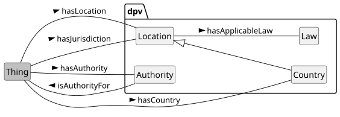 


 

 

To represent location, the concept [=Location=] along with relations [=hasLocation=] is provided. For geo-political locations, the concepts such as [=Country=] and [=SupraNationalUnion=] are subtypes, with [=hasCountry=] and [=ThirdCountry=] with [=hasThirdCountry=] provided for convenience in common uses (e.g. data storage, transfers).

 

To define contextual location concepts, such as there being several locations, or that the location is 'local' to an event, DPV provides two concepts. [=LocationFixture=] specifies whether the location is 'fixed' or 'deterministic', and is extended with concepts [=FixedLocation=], [=FederatedLocations=], [=DecentralisedLocations=], [=RandomLocation=], and [=VariableLocation=]. [=LocationLocality=] specifies whether the location is 'local' within the context, and is extended as [=LocalLocation=] and [=RemoteLocation=]. Local locations provided include [=PrivateLocation=], [=PublicLocation=], [=WithinDevice=], [=WithinPhysicalEnvironment=], and [=WithinVirtualEnvironment=]. Remote location is extended to represent [=CloudLocation=].

 

By default, the location concepts represent the boundaries and what is contained inside them. To subjectively indicate something outside of this location, the property [=isOutsideOfLocation=] is provided. Having this property is helpful to indicate spaces outside of a given location, for example to indicate a CCTV is monitoring the area outside of a home. Using [=hasLocation=] and [=isOutsideOfLocation=] with `ex:Home` would indicate the monitoring of the combined area of inside and outside the home.

 

To represent locations as jurisdictions, the relation [=hasJurisdiction=] is provided. The concept [=Law=] represents an official or authoritative law or regulation created by a government or an authority. To indicate applicability of laws within a jurisdiction, the relation [=hasApplicableLaw=] is provided.

  

It is strongly advised to not use this property beyond such subjective uses, for example to specify data being transferred outside of a jurisdiction as "outside" here refers to a legal qualification rather than a subjective concept. Instead, the [[LOC]] extension offers instances of [=InverseJurisdiction=] which are aligned with the legal interpretation by definition to refer to other jurisdictions (as opposed to locations) which are not part of a given jurisdiction.

  

[[[LEGAL]]] provides taxonomies extending these concepts, such as to represent specific countries, their laws, authorities, memberships, adequacy decisions, and other information.

 


 

-  dpv:Law: A law is a set of rules created by government or authorities [go to full definition](https://w3id.org/dpv#Law) 

 

-  dpv:Location: A location is a position, site, or area where something is located [go to full definition](https://w3id.org/dpv#Location) 

 

  -  dpv:Jurisdiction: A jurisdiction represents the locations that define the extent of authority (or control) claimed, granted, or asserted by a legal entity (in particular a legal authority) to govern or enforce rules [go to full definition](https://w3id.org/dpv#Jurisdiction) 

 

    -  dpv:Country: A political entity indicative of a sovereign or non-sovereign territorial state comprising of distinct geographical areas [go to full definition](https://w3id.org/dpv#Country) 

 

      -  dpv:Region: A region is an area or site that is considered a location [go to full definition](https://w3id.org/dpv#Region) 

 

        -  dpv:City: A region consisting of urban population and commerce [go to full definition](https://w3id.org/dpv#City) 

 

 

 

      -  dpv:ThirdCountry: Represents a country outside applicable or compatible jurisdiction as outlined in law [go to full definition](https://w3id.org/dpv#ThirdCountry) 

 

 

 

    -  dpv:EconomicUnion: A political union of two or more countries based on economic or trade agreements [go to full definition](https://w3id.org/dpv#EconomicUnion) 

 

    -  dpv:InverseJurisdiction: An inverse jurisdiction for a specific jurisdiction is the set of all other jurisdictions that are not part of the specific jurisdiction [go to full definition](https://w3id.org/dpv#InverseJurisdiction) 

 

    -  dpv:SupraNationalUnion: A political union of two or more countries with an establishment of common authority [go to full definition](https://w3id.org/dpv#SupraNationalUnion) 

 

 

 

  -  dpv:LocationLocality: Locality refers to whether the specified location is local within some context, e.g. for the user [go to full definition](https://w3id.org/dpv#LocationLocality) 

 

    -  dpv:LocalLocation: Location is local [go to full definition](https://w3id.org/dpv#LocalLocation) 

 

      -  dpv:PrivateLocation: Location that is not or cannot be accessed by the public and is controlled as a private space [go to full definition](https://w3id.org/dpv#PrivateLocation)deprecated in next version 

 

      -  dpv:PublicLocation: Location that is or can be accessed by the public [go to full definition](https://w3id.org/dpv#PublicLocation)deprecated in next version 

 

      -  dpv:WithinDevice: Location is local and entirely within a device, such as a smartphone [go to full definition](https://w3id.org/dpv#WithinDevice)deprecated in next version 

 

 

 

    -  dpv:RemoteLocation: Location is remote i.e. not local [go to full definition](https://w3id.org/dpv#RemoteLocation) 

 

      -  dpv:CloudLocation: Location that is in the 'cloud' i.e. a logical location operated over the internet [go to full definition](https://w3id.org/dpv#CloudLocation) 

 

 

 

 

 

  -  dpv:PrivateSpace: A space that is owned or controlled by a private entity and where access to members of the public is restricted [go to full definition](https://w3id.org/dpv#PrivateSpace) 

 

    -  dpv:HybridPublicPrivateSpace: A space that is a hybrid space i.e it has both public and private components - such as by having part of it be a private space or which is operated privately [go to full definition](https://w3id.org/dpv#HybridPublicPrivateSpace) 

 

      -  dpv:PrivatelyOperatedPublicSpace: A space that is operated or managed by a private entity but which is accessible to the public e.g. a public bus station operated by a specific company [go to full definition](https://w3id.org/dpv#PrivatelyOperatedPublicSpace) 

 

      -  dpv:PrivatelyOwnedPublicSpace: A space that is privately owned but which is accessible and usable by the public - whether freely or through a process which is open to all members of the public e.g. hotel lobby, shopping mall atriums [go to full definition](https://w3id.org/dpv#PrivatelyOwnedPublicSpace) 

 

 

 

    -  dpv:PersonalSpace: A private space associated with an individual in a personal capacity - such as their home or the space around their physical person e.g. my home or my room [go to full definition](https://w3id.org/dpv#PersonalSpace) 

 

    -  dpv:PrivateCommunalSpace: A space that is accessible to a group or a community within a private space and where members of the public do not have access to it e.g. society amenities such as gyms and pools [go to full definition](https://w3id.org/dpv#PrivateCommunalSpace) 

 

    -  dpv:PrivatelyOwnedSpace: A place that is privately owned e.g. offices, malls [go to full definition](https://w3id.org/dpv#PrivatelyOwnedSpace) 

 

      -  dpv:PrivatelyOwnedPublicSpace: A space that is privately owned but which is accessible and usable by the public - whether freely or through a process which is open to all members of the public e.g. hotel lobby, shopping mall atriums [go to full definition](https://w3id.org/dpv#PrivatelyOwnedPublicSpace) 

 

 

 

    -  dpv:SemiPrivateSpace: A private space that acts as a shared space with other entities but which is still essentially private for the individuals e.g. a semi-private hospital room shared with another patient [go to full definition](https://w3id.org/dpv#SemiPrivateSpace) 

 

 

 

  -  dpv:PublicSpace: Any space that is accessible to the public or is owned by the public [go to full definition](https://w3id.org/dpv#PublicSpace) 

 

    -  dpv:HybridPublicPrivateSpace: A space that is a hybrid space i.e it has both public and private components - such as by having part of it be a private space or which is operated privately [go to full definition](https://w3id.org/dpv#HybridPublicPrivateSpace) 

 

      -  dpv:PrivatelyOperatedPublicSpace: A space that is operated or managed by a private entity but which is accessible to the public e.g. a public bus station operated by a specific company [go to full definition](https://w3id.org/dpv#PrivatelyOperatedPublicSpace) 

 

      -  dpv:PrivatelyOwnedPublicSpace: A space that is privately owned but which is accessible and usable by the public - whether freely or through a process which is open to all members of the public e.g. hotel lobby, shopping mall atriums [go to full definition](https://w3id.org/dpv#PrivatelyOwnedPublicSpace) 

 

 

 

    -  dpv:PubliclyAccessibleSpace: A space that is accessible to all members of the public e.g. parks, malls, train stations [go to full definition](https://w3id.org/dpv#PubliclyAccessibleSpace) 

 

      -  dpv:PrivatelyOperatedPublicSpace: A space that is operated or managed by a private entity but which is accessible to the public e.g. a public bus station operated by a specific company [go to full definition](https://w3id.org/dpv#PrivatelyOperatedPublicSpace) 

 

 

 

    -  dpv:PubliclyOwnedSpace: A space that is owned by the public e.g. national parks, forests [go to full definition](https://w3id.org/dpv#PubliclyOwnedSpace) 

 

 

 

  -  dpv:WithinPhysicalEnvironment: Location is local and entirely within a physical environment, such as a room [go to full definition](https://w3id.org/dpv#WithinPhysicalEnvironment)deprecated in next version 

 

  -  dpv:WithinVirtualEnvironment: Location is local and entirely within a virtual environment, such as a software system [go to full definition](https://w3id.org/dpv#WithinVirtualEnvironment)deprecated in next version 

 

 

 

-  dpv:LocationFixture: The fixture of location refers to whether the location is fixed [go to full definition](https://w3id.org/dpv#LocationFixture) 

 

  -  dpv:DecentralisedLocations: Location that is spread across multiple separate areas with no distinction between their importance [go to full definition](https://w3id.org/dpv#DecentralisedLocations) 

 

  -  dpv:FederatedLocations: Location that is federated across multiple separate areas with designation of a primary or central location [go to full definition](https://w3id.org/dpv#FederatedLocations) 

 

  -  dpv:FixedLocation: Location that is fixed i.e. known to occur at a specific place [go to full definition](https://w3id.org/dpv#FixedLocation) 

 

    -  dpv:FixedMultipleLocations: Location that is fixed with multiple places e.g. multiple cities [go to full definition](https://w3id.org/dpv#FixedMultipleLocations) 

 

    -  dpv:FixedSingularLocation: Location that is fixed at a specific place e.g. a city [go to full definition](https://w3id.org/dpv#FixedSingularLocation) 

 

 

 

  -  dpv:RandomLocation: Location that is random or unknown [go to full definition](https://w3id.org/dpv#RandomLocation) 

 

  -  dpv:VariableLocation: Location that is known but is variable e.g. somewhere within a given area [go to full definition](https://w3id.org/dpv#VariableLocation) 

 

 

 


  

The following example shows the use of LOC extension to express the location of a process. It also shows how the location fixture and locality concepts are useful to indicate information such as data will be stored locally and shared to a remote cloud server. 


```
ex:PDH a dpv:Process ;
    # specifying the location and jurisdiction using the LOC extension
    dpv:hasLocation loc:IE ; # process takes place in Ireland
    dpv:hasJurisdiction loc:IE, loc:EU ; # under Irish and EU jurisdictions
    # specifying data transfer to a third country
    dpv:hasProcessing [
        a dpv:Transfer ;
        dpv:hasLocation loc:US ;
    ] ;
    dpv:hasProcessing [
        # or explicitly specifying USA as a third country
        # for cross-border data transfer
        a dpv:CrossBorderTransfer ;
        dpv:hasThirdCountry loc:US ;
    ] ;
    dpv:hasProcessing [
        a dpv:Store ; # data is stored within device
        dpv:hasLocation dpv:WithinDevice ;
    ] ;
    dpv:hasStorageCondition [ # same as above, but expressed as a condition
        a dpv:StorageLocation ;
        dpv:hasLocation dpv:WithinDevice ;
    ] ;
    dpv:hasProcessing [
        a dpv:Transfer ; # data is transferred to a cloud service location
        dpv:hasLocation dpv:CloudLocation ;
        dpv:isImplementedUsingTechnology tech:CloudService ;
        dpv:isImplementedByEntity <https://www.hetzner.com/> ;
    ] .
```


 

(META Example ID: [`E0060`](https://w3id.org/dpv/examples#E0060); link: [source file](https://w3id.org/dpv/examples/E0060.ttl); contributed by Harshvardhan J. Pandit on 2024-06-11) 

 

  

The concepts `PrivateLocation` and `PublicLocation` will be deprecated in the next version as their definitions are not aligned with legal terminology and contain problematic assertions such as always being local locations. Instead, new concepts have been added to explicitly denote "public/private spaces", including considerations for ownership and accessibility that enable a better description and interpretation of the location. See the location page linked above for more information.

 

The concepts `WithinDevice`, `WithinPhysicalEnvironment`, and `WithinVirtualEnvironment` will also be deprecated in the next version. These concepts share an overlap with existing TECH concepts such as [`tech:Device`](https://w3id.org/dpv/tech#Device) and [`tech:Software`](https://w3id.org/dpv/tech#Software) and which should be used as locations instead of creating separate concepts only to state data is shared within these. See the location page linked above for more information.

   

Even though in DPV, the location concepts are provided in a distinct namespace, there are situations where such locations have an overlap with personal data. For example, the locations represented by a person's home or work places are also their personal data. Rather than creating separate concepts to represent this as a location and as a personal data, and then express the similarity or equivalence between them, we strongly recommend explicitly declaring them as personal data and then using them as location. This allows the correct categorisation and identification of what personal data are involved in a system or process, and also allows association of locations without changing the concept or nature of personal data.

 

With this modelling structure in mind, the DPVCG welcomes addition of concepts representing both personal data and locations to the [[PD]] taxonomy.

   

Similar to the above note regarding personal data, location concepts can also refer to technologies -- such as to state data is processing within/on a device or that it is stored in an app. Instead of representing these as separate location concepts, we strongly recommend using the concepts from [[TECH]] extension to represent devices and apps as locations. This allows the correct interpretation that these are technologies used to store data or execute processes and that the locations being referenced here are the same concept as the technology.

 

With this modelling structure in mind, the DPVCG welcomes additions to the [[TECH]] extension to express technologies that act as locations for the storage and other processing operations over data, including newer concepts associated with AI (e.g. to express training locations).

<a id="context-L1853"></a>
## Vocabulary Index
 
<a id="context-classes"></a>

<a id="context-L1855"></a>
### Classes
 
<a id="context-ActivelyInvolved"></a>

<a id="context-L1856"></a>
#### Actively Involved
 

- Term | ActivelyInvolved | Prefix | dpv
- Label | Actively Involved
- IRI | [https://w3id.org/dpv#ActivelyInvolved](https://w3id.org/dpv#ActivelyInvolved)
- Type | [rdfs:Class](http://www.w3.org/2000/01/rdf-schema#Class), [skos:Concept](http://www.w3.org/2004/02/skos/core#Concept), [dpv:InvolvementStatus](https://w3id.org/dpv#InvolvementStatus)
- Broader/Parent types | [dpv:InvolvementStatus](#context-InvolvementStatus) → [dpv:Status](#context-Status) → [dpv:Context](#context-Context)
- Object of relation | [dpv:hasContext](https://w3id.org/dpv#hasContext), [dpv:hasInvolvement](https://w3id.org/dpv#hasInvolvement), [dpv:hasStatus](https://w3id.org/dpv#hasStatus)
- Definition | Status indicating the specified context is 'actively' involved
- Usage Note | An example of active involvement is a person directly using a system to enter information
- Date Created | 2024-05-10
- Contributors | Delaram Golpayegani, Georg P. Krog, Harshvardhan J. Pandit, Paul Ryan
- See More: | section [CONTEXT-STATUS](#context-vocab-context-status) in [DPV](https://w3id.org/dpv#)

 

 
<a id="context-ActivityCompleted"></a>

<a id="context-L1938"></a>
#### Activity Completed
 

- Term | ActivityCompleted | Prefix | dpv
- Label | Activity Completed
- IRI | [https://w3id.org/dpv#ActivityCompleted](https://w3id.org/dpv#ActivityCompleted)
- Type | [rdfs:Class](http://www.w3.org/2000/01/rdf-schema#Class), [skos:Concept](http://www.w3.org/2004/02/skos/core#Concept), [dpv:ActivityStatus](https://w3id.org/dpv#ActivityStatus)
- Broader/Parent types | [dpv:ActivityStatus](#context-ActivityStatus) → [dpv:Status](#context-Status) → [dpv:Context](#context-Context)
- Object of relation | [dpv:hasActivityStatus](https://w3id.org/dpv#hasActivityStatus), [dpv:hasContext](https://w3id.org/dpv#hasContext), [dpv:hasStatus](https://w3id.org/dpv#hasStatus)
- Definition | State of an activity that has completed i.e. is fully in the past
- Date Created | 2022-05-18
- Contributors | Harshvardhan J. Pandit
- See More: | section [CONTEXT-STATUS](#context-vocab-context-status) in [DPV](https://w3id.org/dpv#)

 

 
<a id="context-ActivityHalted"></a>

<a id="context-L2017"></a>
#### Activity Halted
 

- Term | ActivityHalted | Prefix | dpv
- Label | Activity Halted
- IRI | [https://w3id.org/dpv#ActivityHalted](https://w3id.org/dpv#ActivityHalted)
- Type | [rdfs:Class](http://www.w3.org/2000/01/rdf-schema#Class), [skos:Concept](http://www.w3.org/2004/02/skos/core#Concept), [dpv:ActivityStatus](https://w3id.org/dpv#ActivityStatus)
- Broader/Parent types | [dpv:ActivityStatus](#context-ActivityStatus) → [dpv:Status](#context-Status) → [dpv:Context](#context-Context)
- Object of relation | [dpv:hasActivityStatus](https://w3id.org/dpv#hasActivityStatus), [dpv:hasContext](https://w3id.org/dpv#hasContext), [dpv:hasStatus](https://w3id.org/dpv#hasStatus)
- Definition | State of an activity that was occurring in the past, and has been halted or paused or stopped
- Date Created | 2022-05-18
- Contributors | Harshvardhan J. Pandit
- See More: | section [CONTEXT-STATUS](#context-vocab-context-status) in [DPV](https://w3id.org/dpv#)

 

 
<a id="context-ActivityNotCompleted"></a>

<a id="context-L2096"></a>
#### Activity Not Completed
 

- Term | ActivityNotCompleted | Prefix | dpv
- Label | Activity Not Completed
- IRI | [https://w3id.org/dpv#ActivityNotCompleted](https://w3id.org/dpv#ActivityNotCompleted)
- Type | [rdfs:Class](http://www.w3.org/2000/01/rdf-schema#Class), [skos:Concept](http://www.w3.org/2004/02/skos/core#Concept), [dpv:ActivityStatus](https://w3id.org/dpv#ActivityStatus)
- Broader/Parent types | [dpv:ActivityStatus](#context-ActivityStatus) → [dpv:Status](#context-Status) → [dpv:Context](#context-Context)
- Object of relation | [dpv:hasActivityStatus](https://w3id.org/dpv#hasActivityStatus), [dpv:hasContext](https://w3id.org/dpv#hasContext), [dpv:hasStatus](https://w3id.org/dpv#hasStatus)
- Definition | State of an activity that could not be completed, but has reached some end state
- Usage Note | This relates to a 'Stop' state as distinct from a 'Halt' state. It makes no comments on whether the Activity can be resumed or continued towards completion.
- Date Created | 2022-11-30
- Contributors | Harshvardhan J. Pandit
- See More: | section [CONTEXT-STATUS](#context-vocab-context-status) in [DPV](https://w3id.org/dpv#)

 

 
<a id="context-ActivityOngoing"></a>

<a id="context-L2178"></a>
#### Activity Ongoing
 

- Term | ActivityOngoing | Prefix | dpv
- Label | Activity Ongoing
- IRI | [https://w3id.org/dpv#ActivityOngoing](https://w3id.org/dpv#ActivityOngoing)
- Type | [rdfs:Class](http://www.w3.org/2000/01/rdf-schema#Class), [skos:Concept](http://www.w3.org/2004/02/skos/core#Concept), [dpv:ActivityStatus](https://w3id.org/dpv#ActivityStatus)
- Broader/Parent types | [dpv:ActivityStatus](#context-ActivityStatus) → [dpv:Status](#context-Status) → [dpv:Context](#context-Context)
- Object of relation | [dpv:hasActivityStatus](https://w3id.org/dpv#hasActivityStatus), [dpv:hasContext](https://w3id.org/dpv#hasContext), [dpv:hasStatus](https://w3id.org/dpv#hasStatus)
- Definition | State of an activity occurring in continuation i.e. currently ongoing
- Date Created | 2022-05-18
- Contributors | Harshvardhan J. Pandit
- See More: | section [CONTEXT-STATUS](#context-vocab-context-status) in [DPV](https://w3id.org/dpv#)

 

 
<a id="context-ActivityPlanned"></a>

<a id="context-L2257"></a>
#### Activity Planned
 

- Term | ActivityPlanned | Prefix | dpv
- Label | Activity Planned
- IRI | [https://w3id.org/dpv#ActivityPlanned](https://w3id.org/dpv#ActivityPlanned)
- Type | [rdfs:Class](http://www.w3.org/2000/01/rdf-schema#Class), [skos:Concept](http://www.w3.org/2004/02/skos/core#Concept), [dpv:ActivityStatus](https://w3id.org/dpv#ActivityStatus)
- Broader/Parent types | [dpv:ActivityStatus](#context-ActivityStatus) → [dpv:Status](#context-Status) → [dpv:Context](#context-Context)
- Object of relation | [dpv:hasActivityStatus](https://w3id.org/dpv#hasActivityStatus), [dpv:hasContext](https://w3id.org/dpv#hasContext), [dpv:hasStatus](https://w3id.org/dpv#hasStatus)
- Definition | State of an activity being planned with concrete plans for implementation
- Date Created | 2024-05-19
- Contributors | Harshvardhan J. Pandit
- See More: | section [CONTEXT-STATUS](#context-vocab-context-status) in [DPV](https://w3id.org/dpv#)

 

 
<a id="context-ActivityProposed"></a>

<a id="context-L2336"></a>
#### Activity Proposed
 

- Term | ActivityProposed | Prefix | dpv
- Label | Activity Proposed
- IRI | [https://w3id.org/dpv#ActivityProposed](https://w3id.org/dpv#ActivityProposed)
- Type | [rdfs:Class](http://www.w3.org/2000/01/rdf-schema#Class), [skos:Concept](http://www.w3.org/2004/02/skos/core#Concept), [dpv:ActivityStatus](https://w3id.org/dpv#ActivityStatus)
- Broader/Parent types | [dpv:ActivityStatus](#context-ActivityStatus) → [dpv:Status](#context-Status) → [dpv:Context](#context-Context)
- Object of relation | [dpv:hasActivityStatus](https://w3id.org/dpv#hasActivityStatus), [dpv:hasContext](https://w3id.org/dpv#hasContext), [dpv:hasStatus](https://w3id.org/dpv#hasStatus)
- Definition | State of an activity being proposed without any concrete plans for implementation
- Date Created | 2022-05-18
- Date Modified | 2024-05-19
- Contributors | Harshvardhan J. Pandit
- See More: | section [CONTEXT-STATUS](#context-vocab-context-status) in [DPV](https://w3id.org/dpv#)

 

 
<a id="context-ActivityStatus"></a>

<a id="context-L2418"></a>
#### Activity Status
 

- Term | ActivityStatus | Prefix | dpv
- Label | Activity Status
- IRI | [https://w3id.org/dpv#ActivityStatus](https://w3id.org/dpv#ActivityStatus)
- Type | [rdfs:Class](http://www.w3.org/2000/01/rdf-schema#Class), [skos:Concept](http://www.w3.org/2004/02/skos/core#Concept)
- Broader/Parent types | [dpv:Status](#context-Status) → [dpv:Context](#context-Context)
- Object of relation | [dpv:hasActivityStatus](https://w3id.org/dpv#hasActivityStatus), [dpv:hasContext](https://w3id.org/dpv#hasContext), [dpv:hasStatus](https://w3id.org/dpv#hasStatus)
- Definition | Status associated with activity operations and lifecycles
- Examples
- [`dex:E0054 :: ` Specifying status associated with activities](https://w3id.org/dpv/examples#E0054)
- Date Created | 2022-05-18
- Contributors | Harshvardhan J. Pandit
- See More: | section [CONTEXT-STATUS](#context-vocab-context-status) in [DEX](https://w3id.org/dpv#)

 

 
<a id="context-Applicability"></a>

<a id="context-L2499"></a>
#### Applicability
 

- Term | Applicability | Prefix | dpv
- Label | Applicability
- IRI | [https://w3id.org/dpv#Applicability](https://w3id.org/dpv#Applicability)
- Type | [rdfs:Class](http://www.w3.org/2000/01/rdf-schema#Class), [skos:Concept](http://www.w3.org/2004/02/skos/core#Concept)
- Broader/Parent types | [dpv:Context](#context-Context)
- Object of relation | [dpv:hasApplicability](https://w3id.org/dpv#hasApplicability), [dpv:hasContext](https://w3id.org/dpv#hasContext)
- Definition | Concept provided to represent indication of cases where the information or context is not applicable (N/A) or not available or this is not known or determined yet. If the information is applicable and available, this concept should not be used.
- Usage Note | These concepts are useful in closed-world interpretations, for example in forms where a field must have a value to explicitly denote it is not applicable or the information is not available yet.
- Examples
- [`dex:E0053 :: ` Specifying applicability of information](https://w3id.org/dpv/examples#E0053)
- Date Created | 2023-08-24
- Contributors | Harshvardhan J. Pandit
- See More: | section [CONTEXT](#context-vocab-context) in [DEX](https://w3id.org/dpv#)

 

 
<a id="context-AuditApproved"></a>

<a id="context-L2581"></a>
#### Audit Approved
 

- Term | AuditApproved | Prefix | dpv
- Label | Audit Approved
- IRI | [https://w3id.org/dpv#AuditApproved](https://w3id.org/dpv#AuditApproved)
- Type | [rdfs:Class](http://www.w3.org/2000/01/rdf-schema#Class), [skos:Concept](http://www.w3.org/2004/02/skos/core#Concept), [dpv:AuditStatus](https://w3id.org/dpv#AuditStatus)
- Broader/Parent types | [dpv:AuditStatus](#context-AuditStatus) → [dpv:Status](#context-Status) → [dpv:Context](#context-Context)
- Object of relation | [dpv:hasAuditStatus](https://w3id.org/dpv#hasAuditStatus), [dpv:hasContext](https://w3id.org/dpv#hasContext), [dpv:hasStatus](https://w3id.org/dpv#hasStatus)
- Definition | State of being approved through the audit
- Date Created | 2022-05-18
- Contributors | Harshvardhan J. Pandit
- See More: | section [CONTEXT-STATUS](#context-vocab-context-status) in [DPV](https://w3id.org/dpv#)

 

 
<a id="context-AuditConditionallyApproved"></a>

<a id="context-L2660"></a>
#### Audit Conditionally Approved
 

- Term | AuditConditionallyApproved | Prefix | dpv
- Label | Audit Conditionally Approved
- IRI | [https://w3id.org/dpv#AuditConditionallyApproved](https://w3id.org/dpv#AuditConditionallyApproved)
- Type | [rdfs:Class](http://www.w3.org/2000/01/rdf-schema#Class), [skos:Concept](http://www.w3.org/2004/02/skos/core#Concept), [dpv:AuditStatus](https://w3id.org/dpv#AuditStatus)
- Broader/Parent types | [dpv:AuditStatus](#context-AuditStatus) → [dpv:Status](#context-Status) → [dpv:Context](#context-Context)
- Object of relation | [dpv:hasAuditStatus](https://w3id.org/dpv#hasAuditStatus), [dpv:hasContext](https://w3id.org/dpv#hasContext), [dpv:hasStatus](https://w3id.org/dpv#hasStatus)
- Definition | State of being conditionally approved through the audit
- Usage Note | A "conditional approval" is intended to reflect states where the audit has identified further changes which must be implemented before considering the audit has been 'passed', without requiring another audit to validate them. This is distinct from the case where an audit has state 'rejected', which means changes must be made and submitted for review. The requirements of a 'conditional acceptance' are expected to be minor or not significant enough to warrant another audit to review them.
- Date Created | 2022-06-29
- Contributors | Paul Ryan
- See More: | section [CONTEXT-STATUS](#context-vocab-context-status) in [DPV](https://w3id.org/dpv#)

 

 
<a id="context-AuditNotRequired"></a>

<a id="context-L2742"></a>
#### Audit Not Required
 

- Term | AuditNotRequired | Prefix | dpv
- Label | Audit Not Required
- IRI | [https://w3id.org/dpv#AuditNotRequired](https://w3id.org/dpv#AuditNotRequired)
- Type | [rdfs:Class](http://www.w3.org/2000/01/rdf-schema#Class), [skos:Concept](http://www.w3.org/2004/02/skos/core#Concept), [dpv:AuditStatus](https://w3id.org/dpv#AuditStatus)
- Broader/Parent types | [dpv:AuditStatus](#context-AuditStatus) → [dpv:Status](#context-Status) → [dpv:Context](#context-Context)
- Object of relation | [dpv:hasAuditStatus](https://w3id.org/dpv#hasAuditStatus), [dpv:hasContext](https://w3id.org/dpv#hasContext), [dpv:hasStatus](https://w3id.org/dpv#hasStatus)
- Definition | State where an audit is determined as not being required
- Date Created | 2022-05-18
- Contributors | Harshvardhan J. Pandit
- See More: | section [CONTEXT-STATUS](#context-vocab-context-status) in [DPV](https://w3id.org/dpv#)

 

 
<a id="context-AuditRejected"></a>

<a id="context-L2821"></a>
#### Audit Rejected
 

- Term | AuditRejected | Prefix | dpv
- Label | Audit Rejected
- IRI | [https://w3id.org/dpv#AuditRejected](https://w3id.org/dpv#AuditRejected)
- Type | [rdfs:Class](http://www.w3.org/2000/01/rdf-schema#Class), [skos:Concept](http://www.w3.org/2004/02/skos/core#Concept), [dpv:AuditStatus](https://w3id.org/dpv#AuditStatus)
- Broader/Parent types | [dpv:AuditStatus](#context-AuditStatus) → [dpv:Status](#context-Status) → [dpv:Context](#context-Context)
- Object of relation | [dpv:hasAuditStatus](https://w3id.org/dpv#hasAuditStatus), [dpv:hasContext](https://w3id.org/dpv#hasContext), [dpv:hasStatus](https://w3id.org/dpv#hasStatus)
- Definition | State of not being approved or being rejected through the audit
- Date Created | 2022-05-18
- Contributors | Harshvardhan J. Pandit
- See More: | section [CONTEXT-STATUS](#context-vocab-context-status) in [DPV](https://w3id.org/dpv#)

 

 
<a id="context-AuditRequested"></a>

<a id="context-L2900"></a>
#### Audit Requested
 

- Term | AuditRequested | Prefix | dpv
- Label | Audit Requested
- IRI | [https://w3id.org/dpv#AuditRequested](https://w3id.org/dpv#AuditRequested)
- Type | [rdfs:Class](http://www.w3.org/2000/01/rdf-schema#Class), [skos:Concept](http://www.w3.org/2004/02/skos/core#Concept), [dpv:AuditStatus](https://w3id.org/dpv#AuditStatus)
- Broader/Parent types | [dpv:AuditStatus](#context-AuditStatus) → [dpv:Status](#context-Status) → [dpv:Context](#context-Context)
- Object of relation | [dpv:hasAuditStatus](https://w3id.org/dpv#hasAuditStatus), [dpv:hasContext](https://w3id.org/dpv#hasContext), [dpv:hasStatus](https://w3id.org/dpv#hasStatus)
- Definition | State of an audit being requested whose outcome is not yet known
- Date Created | 2022-05-18
- Contributors | Harshvardhan J. Pandit
- See More: | section [CONTEXT-STATUS](#context-vocab-context-status) in [DPV](https://w3id.org/dpv#)

 

 
<a id="context-AuditRequired"></a>

<a id="context-L2979"></a>
#### Audit Required
 

- Term | AuditRequired | Prefix | dpv
- Label | Audit Required
- IRI | [https://w3id.org/dpv#AuditRequired](https://w3id.org/dpv#AuditRequired)
- Type | [rdfs:Class](http://www.w3.org/2000/01/rdf-schema#Class), [skos:Concept](http://www.w3.org/2004/02/skos/core#Concept), [dpv:AuditStatus](https://w3id.org/dpv#AuditStatus)
- Broader/Parent types | [dpv:AuditStatus](#context-AuditStatus) → [dpv:Status](#context-Status) → [dpv:Context](#context-Context)
- Object of relation | [dpv:hasAuditStatus](https://w3id.org/dpv#hasAuditStatus), [dpv:hasContext](https://w3id.org/dpv#hasContext), [dpv:hasStatus](https://w3id.org/dpv#hasStatus)
- Definition | State where an audit is determined as being required but has not been conducted
- Date Created | 2022-05-18
- Contributors | Harshvardhan J. Pandit
- See More: | section [CONTEXT-STATUS](#context-vocab-context-status) in [DPV](https://w3id.org/dpv#)

 

 
<a id="context-AuditStatus"></a>

<a id="context-L3058"></a>
#### Audit Status
 

- Term | AuditStatus | Prefix | dpv
- Label | Audit Status
- IRI | [https://w3id.org/dpv#AuditStatus](https://w3id.org/dpv#AuditStatus)
- Type | [rdfs:Class](http://www.w3.org/2000/01/rdf-schema#Class), [skos:Concept](http://www.w3.org/2004/02/skos/core#Concept)
- Broader/Parent types | [dpv:Status](#context-Status) → [dpv:Context](#context-Context)
- Object of relation | [dpv:hasAuditStatus](https://w3id.org/dpv#hasAuditStatus), [dpv:hasContext](https://w3id.org/dpv#hasContext), [dpv:hasStatus](https://w3id.org/dpv#hasStatus)
- Definition | Status associated with Auditing or Investigation
- Examples
- [`dex:E0056 :: ` Specifying the audit status associated with a DPIA](https://w3id.org/dpv/examples#E0056)
 [`dex:E0057 :: ` Expressing GDPR Right to Data Portability could not be fulfilled due to Identity Verification failure](https://w3id.org/dpv/examples#E0057)
- Date Created | 2022-05-18
- Contributors | Harshvardhan J. Pandit
- See More: | section [CONTEXT-STATUS](#context-vocab-context-status) in [DEX](https://w3id.org/dpv#)

 

 
<a id="context-AuthorityInformed"></a>

<a id="context-L3139"></a>
#### Authority Informed
 

- Term | AuthorityInformed | Prefix | dpv
- Label | Authority Informed
- IRI | [https://w3id.org/dpv#AuthorityInformed](https://w3id.org/dpv#AuthorityInformed)
- Type | [rdfs:Class](http://www.w3.org/2000/01/rdf-schema#Class), [skos:Concept](http://www.w3.org/2004/02/skos/core#Concept), [dpv:EntityInformedStatus](https://w3id.org/dpv#EntityInformedStatus)
- Broader/Parent types | [dpv:EntityInformed](#context-EntityInformed) → [dpv:EntityInformedStatus](#context-EntityInformedStatus) → [dpv:Status](#context-Status) → [dpv:Context](#context-Context)
- Object of relation | [dpv:hasContext](https://w3id.org/dpv#hasContext), [dpv:hasInformedStatus](https://w3id.org/dpv#hasInformedStatus), [dpv:hasStatus](https://w3id.org/dpv#hasStatus)
- Definition | Status indicating Authority has been informed about the specified context
- Date Created | 2024-05-10
- Contributors | Delaram Golpayegani, Georg P. Krog, Harshvardhan J. Pandit, Paul Ryan
- See More: | section [CONTEXT-STATUS](#context-vocab-context-status) in [DPV](https://w3id.org/dpv#)

 

 
<a id="context-AuthorityUninformed"></a>

<a id="context-L3219"></a>
#### Authority Uninformed
 

- Term | AuthorityUninformed | Prefix | dpv
- Label | Authority Uninformed
- IRI | [https://w3id.org/dpv#AuthorityUninformed](https://w3id.org/dpv#AuthorityUninformed)
- Type | [rdfs:Class](http://www.w3.org/2000/01/rdf-schema#Class), [skos:Concept](http://www.w3.org/2004/02/skos/core#Concept), [dpv:EntityInformedStatus](https://w3id.org/dpv#EntityInformedStatus)
- Broader/Parent types | [dpv:EntityUninformed](#context-EntityUninformed) → [dpv:EntityInformedStatus](#context-EntityInformedStatus) → [dpv:Status](#context-Status) → [dpv:Context](#context-Context)
- Object of relation | [dpv:hasContext](https://w3id.org/dpv#hasContext), [dpv:hasInformedStatus](https://w3id.org/dpv#hasInformedStatus), [dpv:hasStatus](https://w3id.org/dpv#hasStatus)
- Definition | Status indicating Authority is uninformed i.e. has not been informed about the specified context
- Date Created | 2024-05-10
- Contributors | Delaram Golpayegani, Georg P. Krog, Harshvardhan J. Pandit, Paul Ryan
- See More: | section [CONTEXT-STATUS](#context-vocab-context-status) in [DPV](https://w3id.org/dpv#)

 

 
<a id="context-City"></a>

<a id="context-L3299"></a>
#### City
 

- Term | City | Prefix | dpv
- Label | City
- IRI | [https://w3id.org/dpv#City](https://w3id.org/dpv#City)
- Type | [rdfs:Class](http://www.w3.org/2000/01/rdf-schema#Class), [skos:Concept](http://www.w3.org/2004/02/skos/core#Concept)
- Broader/Parent types | [dpv:Region](#context-Region) → [dpv:Country](#context-Country) → [dpv:Jurisdiction](#context-Jurisdiction) → [dpv:Location](#context-Location)
- Object of relation | [dpv:hasCountry](https://w3id.org/dpv#hasCountry), [dpv:hasJurisdiction](https://w3id.org/dpv#hasJurisdiction), [dpv:hasLocation](https://w3id.org/dpv#hasLocation), [dpv:isOutsideOfLocation](https://w3id.org/dpv#isOutsideOfLocation)
- Definition | A region consisting of urban population and commerce
- Date Created | 2022-10-22
- Date Modified | 2025-05-04
- Contributors | Harshvardhan J. Pandit
- See More: | section [CONTEXT-JURISDICTION](#context-vocab-context-jurisdiction) in [DPV](https://w3id.org/dpv#)

 

 
<a id="context-CloudLocation"></a>

<a id="context-L3383"></a>
#### Cloud Location
 

- Term | CloudLocation | Prefix | dpv
- Label | Cloud Location
- IRI | [https://w3id.org/dpv#CloudLocation](https://w3id.org/dpv#CloudLocation)
- Type | [rdfs:Class](http://www.w3.org/2000/01/rdf-schema#Class), [skos:Concept](http://www.w3.org/2004/02/skos/core#Concept), [dpv:Location](https://w3id.org/dpv#Location)
- Broader/Parent types | [dpv:RemoteLocation](#context-RemoteLocation) → [dpv:LocationLocality](#context-LocationLocality) → [dpv:Location](#context-Location)
- Subject of relation | [loc:iso_alpha2](https://w3id.org/dpv/loc#iso_alpha2), [loc:iso_alpha3](https://w3id.org/dpv/loc#iso_alpha3), [loc:iso_numeric](https://w3id.org/dpv/loc#iso_numeric), [loc:un_m49](https://w3id.org/dpv/loc#un_m49)
- Object of relation | [dpv:hasJurisdiction](https://w3id.org/dpv#hasJurisdiction), [dpv:hasLocation](https://w3id.org/dpv#hasLocation), [dpv:isOutsideOfLocation](https://w3id.org/dpv#isOutsideOfLocation)
- Definition | Location that is in the 'cloud' i.e. a logical location operated over the internet
- Date Created | 2022-06-15
- Date Modified | 2020-10-05
- Contributors | Harshvardhan J. Pandit
- See More: | section [CONTEXT-JURISDICTION](#context-vocab-context-jurisdiction) in [DPV](https://w3id.org/dpv#)

 

 
<a id="context-CompatibilityUnknown"></a>

<a id="context-L3472"></a>
#### Compatibility Unknown
 

- Term | CompatibilityUnknown | Prefix | dpv
- Label | Compatibility Unknown
- IRI | [https://w3id.org/dpv#CompatibilityUnknown](https://w3id.org/dpv#CompatibilityUnknown)
- Type | [rdfs:Class](http://www.w3.org/2000/01/rdf-schema#Class), [skos:Concept](http://www.w3.org/2004/02/skos/core#Concept), [dpv:ReuseCompatibility](https://w3id.org/dpv#ReuseCompatibility)
- Broader/Parent types | [dpv:ReuseCompatibility](#context-ReuseCompatibility) → [dpv:Status](#context-Status) → [dpv:Context](#context-Context)
- Object of relation | [dpv:hasContext](https://w3id.org/dpv#hasContext), [dpv:hasReuseCompatibility](https://w3id.org/dpv#hasReuseCompatibility), [dpv:hasStatus](https://w3id.org/dpv#hasStatus)
- Definition | Status indicating the compatibility of the context with an earlier context is currently unknown
- Date Created | 2025-06-19
- Date Modified | 2026-02-07
- Contributors | Arthit Suriyawongkul, Beatriz Esteves, Delaram Golpayegani, Georg P. Krog, Harshvardhan J. Pandit, Julian Flake
- See More: | section [CONTEXT-STATUS](#context-vocab-context-status) in [DPV](https://w3id.org/dpv#)

 

 
<a id="context-ComplianceIndeterminate"></a>

<a id="context-L3554"></a>
#### Compliance Indeterminate
 

- Term | ComplianceIndeterminate | Prefix | dpv
- Label | Compliance Indeterminate
- IRI | [https://w3id.org/dpv#ComplianceIndeterminate](https://w3id.org/dpv#ComplianceIndeterminate)
- Type | [rdfs:Class](http://www.w3.org/2000/01/rdf-schema#Class), [skos:Concept](http://www.w3.org/2004/02/skos/core#Concept), [dpv:ComplianceStatus](https://w3id.org/dpv#ComplianceStatus)
- Broader/Parent types | [dpv:ComplianceStatus](#context-ComplianceStatus) → [dpv:Status](#context-Status) → [dpv:Context](#context-Context)
- Object of relation | [dpv:hasComplianceStatus](https://w3id.org/dpv#hasComplianceStatus), [dpv:hasContext](https://w3id.org/dpv#hasContext), [dpv:hasStatus](https://w3id.org/dpv#hasStatus)
- Definition | State where the status of compliance has not been fully assessed, evaluated, or determined
- Date Created | 2022-09-07
- Contributors | Harshvardhan J. Pandit
- See More: | section [CONTEXT-STATUS](#context-vocab-context-status) in [DPV](https://w3id.org/dpv#)

 

 
<a id="context-ComplianceStatus"></a>

<a id="context-L3633"></a>
#### Compliance Status
 

- Term | ComplianceStatus | Prefix | dpv
- Label | Compliance Status
- IRI | [https://w3id.org/dpv#ComplianceStatus](https://w3id.org/dpv#ComplianceStatus)
- Type | [rdfs:Class](http://www.w3.org/2000/01/rdf-schema#Class), [skos:Concept](http://www.w3.org/2004/02/skos/core#Concept)
- Broader/Parent types | [dpv:Status](#context-Status) → [dpv:Context](#context-Context)
- Object of relation | [dpv:hasComplianceStatus](https://w3id.org/dpv#hasComplianceStatus), [dpv:hasContext](https://w3id.org/dpv#hasContext), [dpv:hasStatus](https://w3id.org/dpv#hasStatus)
- Definition | Status associated with Compliance with some norms, objectives, or requirements
- Examples
- [`dex:E0055 :: ` Specifying compliance status and lawfulness](https://w3id.org/dpv/examples#E0055)
- Date Created | 2022-05-18
- Contributors | Harshvardhan J. Pandit
- See More: | section [CONTEXT-STATUS](#context-vocab-context-status) in [DEX](https://w3id.org/dpv#)

 

 
<a id="context-ComplianceUnknown"></a>

<a id="context-L3714"></a>
#### Compliance Unknown
 

- Term | ComplianceUnknown | Prefix | dpv
- Label | Compliance Unknown
- IRI | [https://w3id.org/dpv#ComplianceUnknown](https://w3id.org/dpv#ComplianceUnknown)
- Type | [rdfs:Class](http://www.w3.org/2000/01/rdf-schema#Class), [skos:Concept](http://www.w3.org/2004/02/skos/core#Concept), [dpv:ComplianceStatus](https://w3id.org/dpv#ComplianceStatus)
- Broader/Parent types | [dpv:ComplianceStatus](#context-ComplianceStatus) → [dpv:Status](#context-Status) → [dpv:Context](#context-Context)
- Object of relation | [dpv:hasComplianceStatus](https://w3id.org/dpv#hasComplianceStatus), [dpv:hasContext](https://w3id.org/dpv#hasContext), [dpv:hasStatus](https://w3id.org/dpv#hasStatus)
- Definition | State where the status of compliance is unknown
- Date Created | 2022-09-07
- Contributors | Harshvardhan J. Pandit
- See More: | section [CONTEXT-STATUS](#context-vocab-context-status) in [DPV](https://w3id.org/dpv#)

 

 
<a id="context-ComplianceViolation"></a>

<a id="context-L3793"></a>
#### Compliance Violation
 

- Term | ComplianceViolation | Prefix | dpv
- Label | Compliance Violation
- IRI | [https://w3id.org/dpv#ComplianceViolation](https://w3id.org/dpv#ComplianceViolation)
- Type | [rdfs:Class](http://www.w3.org/2000/01/rdf-schema#Class), [skos:Concept](http://www.w3.org/2004/02/skos/core#Concept), [dpv:ComplianceStatus](https://w3id.org/dpv#ComplianceStatus)
- Broader/Parent types | [dpv:ComplianceStatus](#context-ComplianceStatus) → [dpv:Status](#context-Status) → [dpv:Context](#context-Context)
- Object of relation | [dpv:hasComplianceStatus](https://w3id.org/dpv#hasComplianceStatus), [dpv:hasContext](https://w3id.org/dpv#hasContext), [dpv:hasStatus](https://w3id.org/dpv#hasStatus)
- Definition | State where compliance cannot be achieved due to requirements being violated
- Usage Note | Changed from "violation of compliance" for consistency with other terms
- Date Created | 2022-05-18
- Date Modified | 2022-09-07
- Contributors | Harshvardhan J. Pandit
- See More: | section [CONTEXT-STATUS](#context-vocab-context-status) in [DPV](https://w3id.org/dpv#)

 

 
<a id="context-Compliant"></a>

<a id="context-L3878"></a>
#### Compliant
 

- Term | Compliant | Prefix | dpv
- Label | Compliant
- IRI | [https://w3id.org/dpv#Compliant](https://w3id.org/dpv#Compliant)
- Type | [rdfs:Class](http://www.w3.org/2000/01/rdf-schema#Class), [skos:Concept](http://www.w3.org/2004/02/skos/core#Concept), [dpv:ComplianceStatus](https://w3id.org/dpv#ComplianceStatus)
- Broader/Parent types | [dpv:ComplianceStatus](#context-ComplianceStatus) → [dpv:Status](#context-Status) → [dpv:Context](#context-Context)
- Object of relation | [dpv:hasComplianceStatus](https://w3id.org/dpv#hasComplianceStatus), [dpv:hasContext](https://w3id.org/dpv#hasContext), [dpv:hasStatus](https://w3id.org/dpv#hasStatus)
- Definition | State of being fully compliant
- Date Created | 2022-05-18
- Contributors | Harshvardhan J. Pandit
- See More: | section [CONTEXT-STATUS](#context-vocab-context-status) in [DPV](https://w3id.org/dpv#)

 

 
<a id="context-ConformanceStatus"></a>

<a id="context-L3957"></a>
#### Conformance Status
 

- Term | ConformanceStatus | Prefix | dpv
- Label | Conformance Status
- IRI | [https://w3id.org/dpv#ConformanceStatus](https://w3id.org/dpv#ConformanceStatus)
- Type | [rdfs:Class](http://www.w3.org/2000/01/rdf-schema#Class), [skos:Concept](http://www.w3.org/2004/02/skos/core#Concept)
- Broader/Parent types | [dpv:Status](#context-Status) → [dpv:Context](#context-Context)
- Object of relation | [dpv:hasConformanceStatus](https://w3id.org/dpv#hasConformanceStatus), [dpv:hasContext](https://w3id.org/dpv#hasContext), [dpv:hasStatus](https://w3id.org/dpv#hasStatus)
- Definition | Status associated with conformance to a standard, guideline, code, or recommendation
- Date Created | 2022-10-22
- Contributors | Harshvardhan J. Pandit
- See More: | section [CONTEXT-STATUS](#context-vocab-context-status) in [DPV](https://w3id.org/dpv#)

 

 
<a id="context-Conformant"></a>

<a id="context-L4035"></a>
#### Conformant
 

- Term | Conformant | Prefix | dpv
- Label | Conformant
- IRI | [https://w3id.org/dpv#Conformant](https://w3id.org/dpv#Conformant)
- Type | [rdfs:Class](http://www.w3.org/2000/01/rdf-schema#Class), [skos:Concept](http://www.w3.org/2004/02/skos/core#Concept), [dpv:ConformanceStatus](https://w3id.org/dpv#ConformanceStatus)
- Broader/Parent types | [dpv:ConformanceStatus](#context-ConformanceStatus) → [dpv:Status](#context-Status) → [dpv:Context](#context-Context)
- Object of relation | [dpv:hasConformanceStatus](https://w3id.org/dpv#hasConformanceStatus), [dpv:hasContext](https://w3id.org/dpv#hasContext), [dpv:hasStatus](https://w3id.org/dpv#hasStatus)
- Definition | State of being conformant
- Date Created | 2022-10-22
- Contributors | Harshvardhan J. Pandit
- See More: | section [CONTEXT-STATUS](#context-vocab-context-status) in [DPV](https://w3id.org/dpv#)

 

 
<a id="context-Context"></a>

<a id="context-L4114"></a>
#### Context
 

- Term | Context | Prefix | dpv
- Label | Context
- IRI | [https://w3id.org/dpv#Context](https://w3id.org/dpv#Context)
- Type | [rdfs:Class](http://www.w3.org/2000/01/rdf-schema#Class), [skos:Concept](http://www.w3.org/2004/02/skos/core#Concept)
- Subject of relation | [dpv:hasDeterrence](https://w3id.org/dpv#hasDeterrence), [dpv:hasFulfilmentStatus](https://w3id.org/dpv#hasFulfilmentStatus), [dpv:hasObligation](https://w3id.org/dpv#hasObligation), [dpv:hasPermission](https://w3id.org/dpv#hasPermission), [dpv:hasProhibition](https://w3id.org/dpv#hasProhibition), [dpv:hasRecommendation](https://w3id.org/dpv#hasRecommendation), [dpv:hasRule](https://w3id.org/dpv#hasRule)
- Object of relation | [dpv:hasContext](https://w3id.org/dpv#hasContext)
- Definition | Contextually relevant information
- Usage Note | Context is a catch-all concept for information of relevance not possible to represent through other core concepts. DPV offers specific contextual concepts such as Necessity, Frequency, and Duration. More can be created by extending Context within use-cases.
- Date Created | 2019-04-05
- Date Modified | 2022-06-15
- Contributors | Axel Polleres, Elmar Kiesling, Fajar Ekaputra, Harshvardhan J. Pandit, Javier Fernández, Simon Steyskal
- See More: | section [CONTEXT](#context-vocab-context) in [DPV](https://w3id.org/dpv#)

 

 
<a id="context-ContinuousFrequency"></a>

<a id="context-L4202"></a>
#### Continuous Frequency
 

- Term | ContinuousFrequency | Prefix | dpv
- Label | Continuous Frequency
- IRI | [https://w3id.org/dpv#ContinuousFrequency](https://w3id.org/dpv#ContinuousFrequency)
- Type | [rdfs:Class](http://www.w3.org/2000/01/rdf-schema#Class), [skos:Concept](http://www.w3.org/2004/02/skos/core#Concept), [dpv:Frequency](https://w3id.org/dpv#Frequency)
- Broader/Parent types | [dpv:Frequency](#context-Frequency) → [dpv:Context](#context-Context)
- Object of relation | [dpv:hasContext](https://w3id.org/dpv#hasContext), [dpv:hasFrequency](https://w3id.org/dpv#hasFrequency)
- Definition | Frequency where occurrences are continuous
- Date Created | 2022-06-15
- Date Modified | 2020-10-05
- Contributors | Harshvardhan J. Pandit
- See More: | section [CONTEXT](#context-vocab-context) in [DPV](https://w3id.org/dpv#)

 

 
<a id="context-ControllerInformed"></a>

<a id="context-L4282"></a>
#### Controller Informed
 

- Term | ControllerInformed | Prefix | dpv
- Label | Controller Informed
- IRI | [https://w3id.org/dpv#ControllerInformed](https://w3id.org/dpv#ControllerInformed)
- Type | [rdfs:Class](http://www.w3.org/2000/01/rdf-schema#Class), [skos:Concept](http://www.w3.org/2004/02/skos/core#Concept), [dpv:EntityInformedStatus](https://w3id.org/dpv#EntityInformedStatus)
- Broader/Parent types | [dpv:EntityInformed](#context-EntityInformed) → [dpv:EntityInformedStatus](#context-EntityInformedStatus) → [dpv:Status](#context-Status) → [dpv:Context](#context-Context)
- Object of relation | [dpv:hasContext](https://w3id.org/dpv#hasContext), [dpv:hasInformedStatus](https://w3id.org/dpv#hasInformedStatus), [dpv:hasStatus](https://w3id.org/dpv#hasStatus)
- Definition | Status indicating Controller has been informed about the specified context
- Date Created | 2024-05-10
- Contributors | Delaram Golpayegani, Georg P. Krog, Harshvardhan J. Pandit, Paul Ryan
- See More: | section [CONTEXT-STATUS](#context-vocab-context-status) in [DPV](https://w3id.org/dpv#)

 

 
<a id="context-ControllerUninformed"></a>

<a id="context-L4362"></a>
#### Controller Uninformed
 

- Term | ControllerUninformed | Prefix | dpv
- Label | Controller Uninformed
- IRI | [https://w3id.org/dpv#ControllerUninformed](https://w3id.org/dpv#ControllerUninformed)
- Type | [rdfs:Class](http://www.w3.org/2000/01/rdf-schema#Class), [skos:Concept](http://www.w3.org/2004/02/skos/core#Concept), [dpv:EntityInformedStatus](https://w3id.org/dpv#EntityInformedStatus)
- Broader/Parent types | [dpv:EntityUninformed](#context-EntityUninformed) → [dpv:EntityInformedStatus](#context-EntityInformedStatus) → [dpv:Status](#context-Status) → [dpv:Context](#context-Context)
- Object of relation | [dpv:hasContext](https://w3id.org/dpv#hasContext), [dpv:hasInformedStatus](https://w3id.org/dpv#hasInformedStatus), [dpv:hasStatus](https://w3id.org/dpv#hasStatus)
- Definition | Status indicating Controller is uninformed i.e. has not been informed about the specified context
- Date Created | 2024-05-10
- Contributors | Delaram Golpayegani, Georg P. Krog, Harshvardhan J. Pandit, Paul Ryan
- See More: | section [CONTEXT-STATUS](#context-vocab-context-status) in [DPV](https://w3id.org/dpv#)

 

 
<a id="context-Country"></a>

<a id="context-L4442"></a>
#### Country
 

- Term | Country | Prefix | dpv
- Label | Country
- IRI | [https://w3id.org/dpv#Country](https://w3id.org/dpv#Country)
- Type | [rdfs:Class](http://www.w3.org/2000/01/rdf-schema#Class), [skos:Concept](http://www.w3.org/2004/02/skos/core#Concept)
- Broader/Parent types | [dpv:Jurisdiction](#context-Jurisdiction) → [dpv:Location](#context-Location)
- Object of relation | [dpv:hasCountry](https://w3id.org/dpv#hasCountry), [dpv:hasJurisdiction](https://w3id.org/dpv#hasJurisdiction), [dpv:hasLocation](https://w3id.org/dpv#hasLocation), [dpv:isOutsideOfLocation](https://w3id.org/dpv#isOutsideOfLocation)
- Definition | A political entity indicative of a sovereign or non-sovereign territorial state comprising of distinct geographical areas
- Usage Note | The definition of country is not intended for political interpretation. DPVCG welcomes alternate definitions based in existing sources with global scope, such as UN or ISO.
- Date Created | 2022-01-19
- Date Modified | 2025-05-04
- Contributors | Georg P. Krog, Harshvardhan J. Pandit
- See More: | section [CONTEXT-JURISDICTION](#context-vocab-context-jurisdiction) in [DPV](https://w3id.org/dpv#)

 

 
<a id="context-DataSubjectInformed"></a>

<a id="context-L4527"></a>
#### Data Subject Informed
 

- Term | DataSubjectInformed | Prefix | dpv
- Label | Data Subject Informed
- IRI | [https://w3id.org/dpv#DataSubjectInformed](https://w3id.org/dpv#DataSubjectInformed)
- Type | [rdfs:Class](http://www.w3.org/2000/01/rdf-schema#Class), [skos:Concept](http://www.w3.org/2004/02/skos/core#Concept), [dpv:EntityInformedStatus](https://w3id.org/dpv#EntityInformedStatus)
- Broader/Parent types | [dpv:EntityInformed](#context-EntityInformed) → [dpv:EntityInformedStatus](#context-EntityInformedStatus) → [dpv:Status](#context-Status) → [dpv:Context](#context-Context)
- Object of relation | [dpv:hasContext](https://w3id.org/dpv#hasContext), [dpv:hasInformedStatus](https://w3id.org/dpv#hasInformedStatus), [dpv:hasStatus](https://w3id.org/dpv#hasStatus)
- Definition | Status indicating DataSubject has been informed about the specified context
- Date Created | 2024-05-10
- Contributors | Delaram Golpayegani, Georg P. Krog, Harshvardhan J. Pandit, Paul Ryan
- See More: | section [CONTEXT-STATUS](#context-vocab-context-status) in [DPV](https://w3id.org/dpv#)

 

 
<a id="context-DataSubjectUninformed"></a>

<a id="context-L4607"></a>
#### Data Subject Uninformed
 

- Term | DataSubjectUninformed | Prefix | dpv
- Label | Data Subject Uninformed
- IRI | [https://w3id.org/dpv#DataSubjectUninformed](https://w3id.org/dpv#DataSubjectUninformed)
- Type | [rdfs:Class](http://www.w3.org/2000/01/rdf-schema#Class), [skos:Concept](http://www.w3.org/2004/02/skos/core#Concept), [dpv:EntityInformedStatus](https://w3id.org/dpv#EntityInformedStatus)
- Broader/Parent types | [dpv:EntityUninformed](#context-EntityUninformed) → [dpv:EntityInformedStatus](#context-EntityInformedStatus) → [dpv:Status](#context-Status) → [dpv:Context](#context-Context)
- Object of relation | [dpv:hasContext](https://w3id.org/dpv#hasContext), [dpv:hasInformedStatus](https://w3id.org/dpv#hasInformedStatus), [dpv:hasStatus](https://w3id.org/dpv#hasStatus)
- Definition | Status indicating DataSubject is uninformed i.e. has not been informed about the specified context
- Date Created | 2024-05-10
- Contributors | Delaram Golpayegani, Georg P. Krog, Harshvardhan J. Pandit, Paul Ryan
- See More: | section [CONTEXT-STATUS](#context-vocab-context-status) in [DPV](https://w3id.org/dpv#)

 

 
<a id="context-DecentralisedLocations"></a>

<a id="context-L4687"></a>
#### Decentralised Locations
 

- Term | DecentralisedLocations | Prefix | dpv
- Label | Decentralised Locations
- IRI | [https://w3id.org/dpv#DecentralisedLocations](https://w3id.org/dpv#DecentralisedLocations)
- Type | [rdfs:Class](http://www.w3.org/2000/01/rdf-schema#Class), [skos:Concept](http://www.w3.org/2004/02/skos/core#Concept), [dpv:LocationFixture](https://w3id.org/dpv#LocationFixture)
- Broader/Parent types | [dpv:LocationFixture](#context-LocationFixture)
- Definition | Location that is spread across multiple separate areas with no distinction between their importance
- Date Created | 2022-06-15
- Date Modified | 2020-10-05
- Contributors | Harshvardhan J. Pandit
- See More: | section [CONTEXT-JURISDICTION](#context-vocab-context-jurisdiction) in [DPV](https://w3id.org/dpv#)

 

 
<a id="context-Duration"></a>

<a id="context-L4761"></a>
#### Duration
 

- Term | Duration | Prefix | dpv
- Label | Duration
- IRI | [https://w3id.org/dpv#Duration](https://w3id.org/dpv#Duration)
- Type | [rdfs:Class](http://www.w3.org/2000/01/rdf-schema#Class), [skos:Concept](http://www.w3.org/2004/02/skos/core#Concept)
- Broader/Parent types | [dpv:Context](#context-Context)
- Object of relation | [dpv:hasContext](https://w3id.org/dpv#hasContext), [dpv:hasDuration](https://w3id.org/dpv#hasDuration)
- Definition | The duration or temporal limitation
- Examples
- [`dex:E0050 :: ` Specifying duration](https://w3id.org/dpv/examples#E0050)
 [`dex:E0070 :: ` Indicating personal data involved in an incident](https://w3id.org/dpv/examples#E0070)
- Date Created | 2022-02-09
- Contributors | Harshvardhan J. Pandit
- See More: | section [CONTEXT](#context-vocab-context) in [DEX](https://w3id.org/dpv#)

 

 
<a id="context-EconomicUnion"></a>

<a id="context-L4840"></a>
#### Economic Union
 

- Term | EconomicUnion | Prefix | dpv
- Label | Economic Union
- IRI | [https://w3id.org/dpv#EconomicUnion](https://w3id.org/dpv#EconomicUnion)
- Type | [rdfs:Class](http://www.w3.org/2000/01/rdf-schema#Class), [skos:Concept](http://www.w3.org/2004/02/skos/core#Concept)
- Broader/Parent types | [dpv:Jurisdiction](#context-Jurisdiction) → [dpv:Location](#context-Location)
- Object of relation | [dpv:hasJurisdiction](https://w3id.org/dpv#hasJurisdiction), [dpv:hasLocation](https://w3id.org/dpv#hasLocation), [dpv:isOutsideOfLocation](https://w3id.org/dpv#isOutsideOfLocation)
- Definition | A political union of two or more countries based on economic or trade agreements
- Date Created | 2022-01-19
- Date Modified | 2025-05-04
- Contributors | Harshvardhan J. Pandit
- See More: | section [CONTEXT-JURISDICTION](#context-vocab-context-jurisdiction) in [DPV](https://w3id.org/dpv#)

 

 
<a id="context-EndlessDuration"></a>

<a id="context-L4921"></a>
#### Endless Duration
 

- Term | EndlessDuration | Prefix | dpv
- Label | Endless Duration
- IRI | [https://w3id.org/dpv#EndlessDuration](https://w3id.org/dpv#EndlessDuration)
- Type | [rdfs:Class](http://www.w3.org/2000/01/rdf-schema#Class), [skos:Concept](http://www.w3.org/2004/02/skos/core#Concept), [dpv:Duration](https://w3id.org/dpv#Duration)
- Broader/Parent types | [dpv:Duration](#context-Duration) → [dpv:Context](#context-Context)
- Object of relation | [dpv:hasContext](https://w3id.org/dpv#hasContext), [dpv:hasDuration](https://w3id.org/dpv#hasDuration)
- Definition | Duration that is (known or intended to be) open ended or without an end
- Date Created | 2022-06-15
- Date Modified | 2020-10-05
- Contributors | Harshvardhan J. Pandit
- See More: | section [CONTEXT](#context-vocab-context) in [DPV](https://w3id.org/dpv#)

 

 
<a id="context-EntityInformed"></a>

<a id="context-L5001"></a>
#### Entity Informed
 

- Term | EntityInformed | Prefix | dpv
- Label | Entity Informed
- IRI | [https://w3id.org/dpv#EntityInformed](https://w3id.org/dpv#EntityInformed)
- Type | [rdfs:Class](http://www.w3.org/2000/01/rdf-schema#Class), [skos:Concept](http://www.w3.org/2004/02/skos/core#Concept), [dpv:EntityInformedStatus](https://w3id.org/dpv#EntityInformedStatus)
- Broader/Parent types | [dpv:EntityInformedStatus](#context-EntityInformedStatus) → [dpv:Status](#context-Status) → [dpv:Context](#context-Context)
- Object of relation | [dpv:hasContext](https://w3id.org/dpv#hasContext), [dpv:hasInformedStatus](https://w3id.org/dpv#hasInformedStatus), [dpv:hasStatus](https://w3id.org/dpv#hasStatus)
- Definition | Status indicating entity has been informed about specified context
- Date Created | 2024-05-10
- Contributors | Delaram Golpayegani, Georg P. Krog, Harshvardhan J. Pandit, Paul Ryan
- See More: | section [CONTEXT-STATUS](#context-vocab-context-status) in [DPV](https://w3id.org/dpv#)

 

 
<a id="context-EntityInformedStatus"></a>

<a id="context-L5080"></a>
#### Entity Informed Status
 

- Term | EntityInformedStatus | Prefix | dpv
- Label | Entity Informed Status
- IRI | [https://w3id.org/dpv#EntityInformedStatus](https://w3id.org/dpv#EntityInformedStatus)
- Type | [rdfs:Class](http://www.w3.org/2000/01/rdf-schema#Class), [skos:Concept](http://www.w3.org/2004/02/skos/core#Concept)
- Broader/Parent types | [dpv:Status](#context-Status) → [dpv:Context](#context-Context)
- Object of relation | [dpv:hasContext](https://w3id.org/dpv#hasContext), [dpv:hasInformedStatus](https://w3id.org/dpv#hasInformedStatus), [dpv:hasStatus](https://w3id.org/dpv#hasStatus)
- Definition | Status indicating whether an entity is informed or uninformed about specified context
- Date Created | 2024-05-10
- Contributors | Delaram Golpayegani, Georg P. Krog, Harshvardhan J. Pandit, Paul Ryan
- See More: | section [CONTEXT-STATUS](#context-vocab-context-status) in [DPV](https://w3id.org/dpv#)

 

 
<a id="context-EntityUninformed"></a>

<a id="context-L5158"></a>
#### Entity Uninformed
 

- Term | EntityUninformed | Prefix | dpv
- Label | Entity Uninformed
- IRI | [https://w3id.org/dpv#EntityUninformed](https://w3id.org/dpv#EntityUninformed)
- Type | [rdfs:Class](http://www.w3.org/2000/01/rdf-schema#Class), [skos:Concept](http://www.w3.org/2004/02/skos/core#Concept)
- Broader/Parent types | [dpv:EntityInformedStatus](#context-EntityInformedStatus) → [dpv:Status](#context-Status) → [dpv:Context](#context-Context)
- Object of relation | [dpv:hasContext](https://w3id.org/dpv#hasContext), [dpv:hasInformedStatus](https://w3id.org/dpv#hasInformedStatus), [dpv:hasStatus](https://w3id.org/dpv#hasStatus)
- Definition | Status indicating entity is uninformed i.e. has been not been informed about specified context
- Date Created | 2024-05-10
- Contributors | Delaram Golpayegani, Georg P. Krog, Harshvardhan J. Pandit, Paul Ryan
- See More: | section [CONTEXT-STATUS](#context-vocab-context-status) in [DPV](https://w3id.org/dpv#)

 

 
<a id="context-ExpectationStatus"></a>

<a id="context-L5237"></a>
#### Expectation Status
 

- Term | ExpectationStatus | Prefix | dpv
- Label | Expectation Status
- IRI | [https://w3id.org/dpv#ExpectationStatus](https://w3id.org/dpv#ExpectationStatus)
- Type | [rdfs:Class](http://www.w3.org/2000/01/rdf-schema#Class), [skos:Concept](http://www.w3.org/2004/02/skos/core#Concept)
- Object of relation | [dpv:hasExpectation](https://w3id.org/dpv#hasExpectation)
- Definition | Status indicating whether the specified context was intended or unintended
- Usage Note | Expectation is associated with the outcome of a goal or purpose for what is expected to happen i.e. an ex-post indication of what was expected to happen in the specified context. Intention and Expectation are closely related terms. We recommend using Intention when the entity has the ability to control the implementation and Expectation for when the entity does not have control or for what happens after or beyond the exercise of control.
- Date Created | 2024-05-10
- Contributors | Delaram Golpayegani, Georg P. Krog, Harshvardhan J. Pandit, Paul Ryan
- See More: | section [CONTEXT-STATUS](#context-vocab-context-status) in [DPV](https://w3id.org/dpv#)

 

 
<a id="context-Expected"></a>

<a id="context-L5312"></a>
#### Expected
 

- Term | Expected | Prefix | dpv
- Label | Expected
- IRI | [https://w3id.org/dpv#Expected](https://w3id.org/dpv#Expected)
- Type | [rdfs:Class](http://www.w3.org/2000/01/rdf-schema#Class), [skos:Concept](http://www.w3.org/2004/02/skos/core#Concept), [dpv:ExpectationStatus](https://w3id.org/dpv#ExpectationStatus)
- Broader/Parent types | [dpv:ExpectationStatus](#context-ExpectationStatus)
- Object of relation | [dpv:hasExpectation](https://w3id.org/dpv#hasExpectation)
- Definition | Status indicating the specified context was expected
- Date Created | 2024-05-10
- Contributors | Delaram Golpayegani, Georg P. Krog, Harshvardhan J. Pandit, Paul Ryan
- See More: | section [CONTEXT-STATUS](#context-vocab-context-status) in [DPV](https://w3id.org/dpv#)

 

 
<a id="context-FederatedLocations"></a>

<a id="context-L5387"></a>
#### Federated Locations
 

- Term | FederatedLocations | Prefix | dpv
- Label | Federated Locations
- IRI | [https://w3id.org/dpv#FederatedLocations](https://w3id.org/dpv#FederatedLocations)
- Type | [rdfs:Class](http://www.w3.org/2000/01/rdf-schema#Class), [skos:Concept](http://www.w3.org/2004/02/skos/core#Concept), [dpv:LocationFixture](https://w3id.org/dpv#LocationFixture)
- Broader/Parent types | [dpv:LocationFixture](#context-LocationFixture)
- Definition | Location that is federated across multiple separate areas with designation of a primary or central location
- Date Created | 2022-06-15
- Date Modified | 2020-10-05
- Contributors | Harshvardhan J. Pandit
- See More: | section [CONTEXT-JURISDICTION](#context-vocab-context-jurisdiction) in [DPV](https://w3id.org/dpv#)

 

 
<a id="context-FeeNotRequired"></a>

<a id="context-L5461"></a>
#### Fee Not Required
 

- Term | FeeNotRequired | Prefix | dpv
- Label | Fee Not Required
- IRI | [https://w3id.org/dpv#FeeNotRequired](https://w3id.org/dpv#FeeNotRequired)
- Type | [rdfs:Class](http://www.w3.org/2000/01/rdf-schema#Class), [skos:Concept](http://www.w3.org/2004/02/skos/core#Concept), [dpv:FeeRequirement](https://w3id.org/dpv#FeeRequirement)
- Broader/Parent types | [dpv:FeeRequirement](#context-FeeRequirement) → [dpv:Context](#context-Context)
- Object of relation | [dpv:hasContext](https://w3id.org/dpv#hasContext), [dpv:hasFee](https://w3id.org/dpv#hasFee)
- Definition | Concept indicating a fee is not required. This is distinct from a Fee of zero as it indicates a fee is not applicable in the context
- Date Created | 2024-08-27
- Contributors | Georg P. Krog, Harshvardhan J. Pandit
- See More: | section [CONTEXT](#context-vocab-context) in [DPV](https://w3id.org/dpv#)

 

 
<a id="context-FeeRequired"></a>

<a id="context-L5538"></a>
#### Fee Required
 

- Term | FeeRequired | Prefix | dpv
- Label | Fee Required
- IRI | [https://w3id.org/dpv#FeeRequired](https://w3id.org/dpv#FeeRequired)
- Type | [rdfs:Class](http://www.w3.org/2000/01/rdf-schema#Class), [skos:Concept](http://www.w3.org/2004/02/skos/core#Concept)
- Broader/Parent types | [dpv:FeeRequirement](#context-FeeRequirement) → [dpv:Context](#context-Context)
- Object of relation | [dpv:hasContext](https://w3id.org/dpv#hasContext), [dpv:hasFee](https://w3id.org/dpv#hasFee)
- Definition | Concept indicating a fee is required. The value of the fee should be specified using rdf:value or an another relevant means
- Date Created | 2024-08-27
- Contributors | Georg P. Krog, Harshvardhan J. Pandit
- See More: | section [CONTEXT](#context-vocab-context) in [DPV](https://w3id.org/dpv#)

 

 
<a id="context-FeeRequirement"></a>

<a id="context-L5615"></a>
#### Fee Requirement
 

- Term | FeeRequirement | Prefix | dpv
- Label | Fee Requirement
- IRI | [https://w3id.org/dpv#FeeRequirement](https://w3id.org/dpv#FeeRequirement)
- Type | [rdfs:Class](http://www.w3.org/2000/01/rdf-schema#Class), [skos:Concept](http://www.w3.org/2004/02/skos/core#Concept)
- Broader/Parent types | [dpv:Context](#context-Context)
- Object of relation | [dpv:hasContext](https://w3id.org/dpv#hasContext), [dpv:hasFee](https://w3id.org/dpv#hasFee)
- Definition | Concept indicating whether a fee is required
- Date Created | 2024-08-27
- Contributors | Georg P. Krog, Harshvardhan J. Pandit
- See More: | section [CONTEXT](#context-vocab-context) in [DPV](https://w3id.org/dpv#)

 

 
<a id="context-FixedLocation"></a>

<a id="context-L5691"></a>
#### Fixed Location
 

- Term | FixedLocation | Prefix | dpv
- Label | Fixed Location
- IRI | [https://w3id.org/dpv#FixedLocation](https://w3id.org/dpv#FixedLocation)
- Type | [rdfs:Class](http://www.w3.org/2000/01/rdf-schema#Class), [skos:Concept](http://www.w3.org/2004/02/skos/core#Concept), [dpv:LocationFixture](https://w3id.org/dpv#LocationFixture)
- Broader/Parent types | [dpv:LocationFixture](#context-LocationFixture)
- Definition | Location that is fixed i.e. known to occur at a specific place
- Date Created | 2022-06-15
- Date Modified | 2020-10-05
- Contributors | Harshvardhan J. Pandit
- See More: | section [CONTEXT-JURISDICTION](#context-vocab-context-jurisdiction) in [DPV](https://w3id.org/dpv#)

 

 
<a id="context-FixedMultipleLocations"></a>

<a id="context-L5765"></a>
#### Fixed Multiple Locations
 

- Term | FixedMultipleLocations | Prefix | dpv
- Label | Fixed Multiple Locations
- IRI | [https://w3id.org/dpv#FixedMultipleLocations](https://w3id.org/dpv#FixedMultipleLocations)
- Type | [rdfs:Class](http://www.w3.org/2000/01/rdf-schema#Class), [skos:Concept](http://www.w3.org/2004/02/skos/core#Concept), [dpv:LocationFixture](https://w3id.org/dpv#LocationFixture)
- Broader/Parent types | [dpv:FixedLocation](#context-FixedLocation) → [dpv:LocationFixture](#context-LocationFixture)
- Definition | Location that is fixed with multiple places e.g. multiple cities
- Date Created | 2022-06-15
- Date Modified | 2020-10-05
- Contributors | Harshvardhan J. Pandit
- See More: | section [CONTEXT-JURISDICTION](#context-vocab-context-jurisdiction) in [DPV](https://w3id.org/dpv#)

 

 
<a id="context-FixedOccurrencesDuration"></a>

<a id="context-L5840"></a>
#### Fixed Occurrences Duration
 

- Term | FixedOccurrencesDuration | Prefix | dpv
- Label | Fixed Occurrences Duration
- IRI | [https://w3id.org/dpv#FixedOccurrencesDuration](https://w3id.org/dpv#FixedOccurrencesDuration)
- Type | [rdfs:Class](http://www.w3.org/2000/01/rdf-schema#Class), [skos:Concept](http://www.w3.org/2004/02/skos/core#Concept)
- Broader/Parent types | [dpv:Duration](#context-Duration) → [dpv:Context](#context-Context)
- Object of relation | [dpv:hasContext](https://w3id.org/dpv#hasContext), [dpv:hasDuration](https://w3id.org/dpv#hasDuration)
- Definition | Duration that takes place a fixed number of times e.g. 3 times
- Date Created | 2022-06-15
- Date Modified | 2020-10-05
- Contributors | Harshvardhan J. Pandit
- See More: | section [CONTEXT](#context-vocab-context) in [DPV](https://w3id.org/dpv#)

 

 
<a id="context-FixedSingularLocation"></a>

<a id="context-L5920"></a>
#### Fixed Singular Location
 

- Term | FixedSingularLocation | Prefix | dpv
- Label | Fixed Singular Location
- IRI | [https://w3id.org/dpv#FixedSingularLocation](https://w3id.org/dpv#FixedSingularLocation)
- Type | [rdfs:Class](http://www.w3.org/2000/01/rdf-schema#Class), [skos:Concept](http://www.w3.org/2004/02/skos/core#Concept), [dpv:LocationFixture](https://w3id.org/dpv#LocationFixture)
- Broader/Parent types | [dpv:FixedLocation](#context-FixedLocation) → [dpv:LocationFixture](#context-LocationFixture)
- Definition | Location that is fixed at a specific place e.g. a city
- Date Created | 2022-06-15
- Date Modified | 2020-10-05
- Contributors | Harshvardhan J. Pandit
- See More: | section [CONTEXT-JURISDICTION](#context-vocab-context-jurisdiction) in [DPV](https://w3id.org/dpv#)

 

 
<a id="context-Frequency"></a>

<a id="context-L5995"></a>
#### Frequency
 

- Term | Frequency | Prefix | dpv
- Label | Frequency
- IRI | [https://w3id.org/dpv#Frequency](https://w3id.org/dpv#Frequency)
- Type | [rdfs:Class](http://www.w3.org/2000/01/rdf-schema#Class), [skos:Concept](http://www.w3.org/2004/02/skos/core#Concept)
- Broader/Parent types | [dpv:Context](#context-Context)
- Object of relation | [dpv:hasContext](https://w3id.org/dpv#hasContext), [dpv:hasFrequency](https://w3id.org/dpv#hasFrequency)
- Definition | The frequency or information about periods and repetitions in terms of recurrence.
- Examples
- [`dex:E0051 :: ` Specifying frequency](https://w3id.org/dpv/examples#E0051)
- Date Created | 2022-02-16
- Contributors | Harshvardhan J. Pandit
- See More: | section [CONTEXT](#context-vocab-context) in [DEX](https://w3id.org/dpv#)

 

 
<a id="context-HybridPublicPrivateSpace"></a>

<a id="context-L6074"></a>
#### Hybrid Public Private Space
 

- Term | HybridPublicPrivateSpace | Prefix | dpv
- Label | Hybrid Public Private Space
- IRI | [https://w3id.org/dpv#HybridPublicPrivateSpace](https://w3id.org/dpv#HybridPublicPrivateSpace)
- Type | [rdfs:Class](http://www.w3.org/2000/01/rdf-schema#Class), [skos:Concept](http://www.w3.org/2004/02/skos/core#Concept), [dpv:Location](https://w3id.org/dpv#Location)
- Broader/Parent types | [dpv:PrivateSpace](#context-PrivateSpace) → [dpv:Location](#context-Location)
- Broader/Parent types | [dpv:PublicSpace](#context-PublicSpace) → [dpv:Location](#context-Location)
- Subject of relation | [loc:iso_alpha2](https://w3id.org/dpv/loc#iso_alpha2), [loc:iso_alpha3](https://w3id.org/dpv/loc#iso_alpha3), [loc:iso_numeric](https://w3id.org/dpv/loc#iso_numeric), [loc:un_m49](https://w3id.org/dpv/loc#un_m49)
- Object of relation | [dpv:hasJurisdiction](https://w3id.org/dpv#hasJurisdiction), [dpv:hasLocation](https://w3id.org/dpv#hasLocation), [dpv:isOutsideOfLocation](https://w3id.org/dpv#isOutsideOfLocation)
- Definition | A space that is a hybrid space i.e it has both public and private components - such as by having part of it be a private space or which is operated privately
- Date Created | 2025-04-07
- Contributors | Arthit Suriyawongkul, Georg P. Krog, Harshvardhan J. Pandit, Julian Flake
- See More: | section [CONTEXT-JURISDICTION](#context-vocab-context-jurisdiction) in [DPV](https://w3id.org/dpv#)

 

 
<a id="context-Importance"></a>

<a id="context-L6163"></a>
#### Importance
 

- Term | Importance | Prefix | dpv
- Label | Importance
- IRI | [https://w3id.org/dpv#Importance](https://w3id.org/dpv#Importance)
- Type | [rdfs:Class](http://www.w3.org/2000/01/rdf-schema#Class), [skos:Concept](http://www.w3.org/2004/02/skos/core#Concept)
- Broader/Parent types | [dpv:Context](#context-Context)
- Object of relation | [dpv:hasContext](https://w3id.org/dpv#hasContext), [dpv:hasImportance](https://w3id.org/dpv#hasImportance)
- Definition | An indication of 'importance' within a context
- Usage Note | Importance can be used to express importance, desirability, relevance, or significance as a context.
- Date Created | 2022-02-09
- Contributors | Beatriz Esteves, Georg P. Krog, Harshvardhan J. Pandit, Julian Flake, Paul Ryan
- See More: | section [CONTEXT](#context-vocab-context) in [DPV](https://w3id.org/dpv#)

 

 
<a id="context-IndeterminateDuration"></a>

<a id="context-L6242"></a>
#### Indeterminate Duration
 

- Term | IndeterminateDuration | Prefix | dpv
- Label | Indeterminate Duration
- IRI | [https://w3id.org/dpv#IndeterminateDuration](https://w3id.org/dpv#IndeterminateDuration)
- Type | [rdfs:Class](http://www.w3.org/2000/01/rdf-schema#Class), [skos:Concept](http://www.w3.org/2004/02/skos/core#Concept), [dpv:Duration](https://w3id.org/dpv#Duration)
- Broader/Parent types | [dpv:Duration](#context-Duration) → [dpv:Context](#context-Context)
- Object of relation | [dpv:hasContext](https://w3id.org/dpv#hasContext), [dpv:hasDuration](https://w3id.org/dpv#hasDuration)
- Definition | Duration that is indeterminate or cannot be determined
- Usage Note | Indeterminate means (exact or otherwise) information about the duration cannot be determined, which is distinct from 'EndlessDuration' where it is known (or decided) that the duration is open-ended or without an end.
- Date Created | 2022-11-30
- Contributors | Harshvardhan J. Pandit
- See More: | section [CONTEXT](#context-vocab-context) in [DPV](https://w3id.org/dpv#)

 

 
<a id="context-Intended"></a>

<a id="context-L6322"></a>
#### Intended
 

- Term | Intended | Prefix | dpv
- Label | Intended
- IRI | [https://w3id.org/dpv#Intended](https://w3id.org/dpv#Intended)
- Type | [rdfs:Class](http://www.w3.org/2000/01/rdf-schema#Class), [skos:Concept](http://www.w3.org/2004/02/skos/core#Concept), [dpv:IntentionStatus](https://w3id.org/dpv#IntentionStatus)
- Broader/Parent types | [dpv:IntentionStatus](#context-IntentionStatus) → [dpv:Status](#context-Status) → [dpv:Context](#context-Context)
- Object of relation | [dpv:hasContext](https://w3id.org/dpv#hasContext), [dpv:hasIntention](https://w3id.org/dpv#hasIntention), [dpv:hasStatus](https://w3id.org/dpv#hasStatus)
- Definition | Status indicating the specified context was intended
- Date Created | 2024-05-10
- Contributors | Delaram Golpayegani, Georg P. Krog, Harshvardhan J. Pandit, Paul Ryan
- See More: | section [CONTEXT-STATUS](#context-vocab-context-status) in [DPV](https://w3id.org/dpv#)

 

 
<a id="context-IntentionStatus"></a>

<a id="context-L6401"></a>
#### Intention Status
 

- Term | IntentionStatus | Prefix | dpv
- Label | Intention Status
- IRI | [https://w3id.org/dpv#IntentionStatus](https://w3id.org/dpv#IntentionStatus)
- Type | [rdfs:Class](http://www.w3.org/2000/01/rdf-schema#Class), [skos:Concept](http://www.w3.org/2004/02/skos/core#Concept)
- Broader/Parent types | [dpv:Status](#context-Status) → [dpv:Context](#context-Context)
- Object of relation | [dpv:hasContext](https://w3id.org/dpv#hasContext), [dpv:hasIntention](https://w3id.org/dpv#hasIntention), [dpv:hasStatus](https://w3id.org/dpv#hasStatus)
- Definition | Status indicating whether the specified context was intended or unintended
- Usage Note | Intention is associated with the goal or purpose for what is about to happen i.e. an ex-ante indication of whether the specified context is/was planned or intended. Intention and Expectation are closely related terms. We recommend using Intention when the entity has the ability to control the implementation and Expectation for when the entity does not have control or for what happens after or beyond the exercise of control.
- Date Created | 2024-05-10
- Contributors | Delaram Golpayegani, Georg P. Krog, Harshvardhan J. Pandit, Paul Ryan
- See More: | section [CONTEXT-STATUS](#context-vocab-context-status) in [DPV](https://w3id.org/dpv#)

 

 
<a id="context-InverseJurisdiction"></a>

<a id="context-L6482"></a>
#### Inverse Jurisdiction
 

- Term | InverseJurisdiction | Prefix | dpv
- Label | Inverse Jurisdiction
- IRI | [https://w3id.org/dpv#InverseJurisdiction](https://w3id.org/dpv#InverseJurisdiction)
- Type | [rdfs:Class](http://www.w3.org/2000/01/rdf-schema#Class), [skos:Concept](http://www.w3.org/2004/02/skos/core#Concept), [dpv:Jurisdiction](https://w3id.org/dpv#Jurisdiction)
- Broader/Parent types | [dpv:Jurisdiction](#context-Jurisdiction) → [dpv:Location](#context-Location)
- Subject of relation | [dpv:hasInverseJurisdiction](https://w3id.org/dpv#hasInverseJurisdiction)
- Object of relation | [dpv:hasInverseJurisdiction](https://w3id.org/dpv#hasInverseJurisdiction), [dpv:hasJurisdiction](https://w3id.org/dpv#hasJurisdiction), [dpv:hasLocation](https://w3id.org/dpv#hasLocation), [dpv:isOutsideOfLocation](https://w3id.org/dpv#isOutsideOfLocation)
- Definition | An inverse jurisdiction for a specific jurisdiction is the set of all other jurisdictions that are not part of the specific jurisdiction
- Usage Note | Inverse Jurisdictions are helpful when asserting and checking rules that involve a concept representing jurisdictions outside of a given jurisdiction. An inverse jurisdiction of an inverse jurisdiction should give back the same original jurisdiction but this is undefined and strongly dissuaded as it could lead to recursive definitions in some use-cases
- Date Created | 2025-05-04
- Contributors | Beatriz Esteves, Georg P. Krog, Harshvardhan J. Pandit, Julian Flake
- See More: | section [CONTEXT-JURISDICTION](#context-vocab-context-jurisdiction) in [DPV](https://w3id.org/dpv#)

 

 
<a id="context-InvolvementStatus"></a>

<a id="context-L6568"></a>
#### Involvement Status
 

- Term | InvolvementStatus | Prefix | dpv
- Label | Involvement Status
- IRI | [https://w3id.org/dpv#InvolvementStatus](https://w3id.org/dpv#InvolvementStatus)
- Type | [rdfs:Class](http://www.w3.org/2000/01/rdf-schema#Class), [skos:Concept](http://www.w3.org/2004/02/skos/core#Concept)
- Broader/Parent types | [dpv:Status](#context-Status) → [dpv:Context](#context-Context)
- Object of relation | [dpv:hasContext](https://w3id.org/dpv#hasContext), [dpv:hasInvolvement](https://w3id.org/dpv#hasInvolvement), [dpv:hasStatus](https://w3id.org/dpv#hasStatus)
- Definition | Status indicating whether the involvement of specified context
- Date Created | 2024-05-10
- Contributors | Delaram Golpayegani, Georg P. Krog, Harshvardhan J. Pandit, Paul Ryan
- See More: | section [CONTEXT-STATUS](#context-vocab-context-status) in [DPV](https://w3id.org/dpv#)

 

 
<a id="context-Jurisdiction"></a>

<a id="context-L6646"></a>
#### Jurisdiction
 

- Term | Jurisdiction | Prefix | dpv
- Label | Jurisdiction
- IRI | [https://w3id.org/dpv#Jurisdiction](https://w3id.org/dpv#Jurisdiction)
- Type | [rdfs:Class](http://www.w3.org/2000/01/rdf-schema#Class), [skos:Concept](http://www.w3.org/2004/02/skos/core#Concept)
- Broader/Parent types | [dpv:Location](#context-Location)
- Subject of relation | [dpv:hasInverseJurisdiction](https://w3id.org/dpv#hasInverseJurisdiction)
- Object of relation | [dpv:hasJurisdiction](https://w3id.org/dpv#hasJurisdiction), [dpv:hasLocation](https://w3id.org/dpv#hasLocation), [dpv:isOutsideOfLocation](https://w3id.org/dpv#isOutsideOfLocation)
- Definition | A jurisdiction represents the locations that define the extent of authority (or control) claimed, granted, or asserted by a legal entity (in particular a legal authority) to govern or enforce rules
- Date Created | 2025-05-04
- Contributors | Harshvardhan J. Pandit
- See More: | section [CONTEXT-JURISDICTION](#context-vocab-context-jurisdiction) in [DPV](https://w3id.org/dpv#)

 

 
<a id="context-Justification"></a>

<a id="context-L6727"></a>
#### Justification
 

- Term | Justification | Prefix | dpv
- Label | Justification
- IRI | [https://w3id.org/dpv#Justification](https://w3id.org/dpv#Justification)
- Type | [rdfs:Class](http://www.w3.org/2000/01/rdf-schema#Class), [skos:Concept](http://www.w3.org/2004/02/skos/core#Concept)
- Broader/Parent types | [dpv:Context](#context-Context)
- Object of relation | [dpv:hasContext](https://w3id.org/dpv#hasContext), [dpv:hasJustification](https://w3id.org/dpv#hasJustification)
- Definition | A form of documentation providing reasons, explanations, or justifications
- Examples
- [`dex:E0057 :: ` Expressing GDPR Right to Data Portability could not be fulfilled due to Identity Verification failure](https://w3id.org/dpv/examples#E0057)
 [`dex:E0058 :: ` Expressing a right exercise request is delayed due to high volume of requests](https://w3id.org/dpv/examples#E0058)
 [`dex:E0059 :: ` Exercising the right to rectification with contesting accuracy of information as justification](https://w3id.org/dpv/examples#E0059)
 [`dex:E0061 :: ` Associating justifications with right exercise non-fulfilment](https://w3id.org/dpv/examples#E0061)
 [`dex:E0062 :: ` Using justifications across categories](https://w3id.org/dpv/examples#E0062)
 [`dex:E0063 :: ` Expressing data breach notifications to data subjects are not required using a justification](https://w3id.org/dpv/examples#E0063)
- Date Created | 2022-06-15
- Contributors | Harshvardhan J. Pandit
- See More: | section [CONTEXT](#context-vocab-context) in [DEX](https://w3id.org/dpv#)

 

 
<a id="context-Law"></a>

<a id="context-L6806"></a>
#### Law
 

- Term | Law | Prefix | dpv
- Label | Law
- IRI | [https://w3id.org/dpv#Law](https://w3id.org/dpv#Law)
- Type | [rdfs:Class](http://www.w3.org/2000/01/rdf-schema#Class), [skos:Concept](http://www.w3.org/2004/02/skos/core#Concept)
- Object of relation | [dpv:hasApplicableLaw](https://w3id.org/dpv#hasApplicableLaw)
- Definition | A law is a set of rules created by government or authorities
- Date Created | 2022-01-19
- Contributors | Harshvardhan J. Pandit
- See More: | section [CONTEXT-JURISDICTION](#context-vocab-context-jurisdiction) in [DPV](https://w3id.org/dpv#)

 

 
<a id="context-Lawful"></a>

<a id="context-L6878"></a>
#### Lawful
 

- Term | Lawful | Prefix | dpv
- Label | Lawful
- IRI | [https://w3id.org/dpv#Lawful](https://w3id.org/dpv#Lawful)
- Type | [rdfs:Class](http://www.w3.org/2000/01/rdf-schema#Class), [skos:Concept](http://www.w3.org/2004/02/skos/core#Concept), [dpv:Lawfulness](https://w3id.org/dpv#Lawfulness)
- Broader/Parent types | [dpv:Lawfulness](#context-Lawfulness) → [dpv:ComplianceStatus](#context-ComplianceStatus) → [dpv:Status](#context-Status) → [dpv:Context](#context-Context)
- Object of relation | [dpv:hasComplianceStatus](https://w3id.org/dpv#hasComplianceStatus), [dpv:hasContext](https://w3id.org/dpv#hasContext), [dpv:hasLawfulness](https://w3id.org/dpv#hasLawfulness), [dpv:hasStatus](https://w3id.org/dpv#hasStatus)
- Definition | State of being lawful or legally compliant
- Date Created | 2022-10-19
- Contributors | Harshvardhan J. Pandit
- See More: | section [CONTEXT-STATUS](#context-vocab-context-status) in [DPV](https://w3id.org/dpv#)

 

 
<a id="context-Lawfulness"></a>

<a id="context-L6959"></a>
#### Lawfulness
 

- Term | Lawfulness | Prefix | dpv
- Label | Lawfulness
- IRI | [https://w3id.org/dpv#Lawfulness](https://w3id.org/dpv#Lawfulness)
- Type | [rdfs:Class](http://www.w3.org/2000/01/rdf-schema#Class), [skos:Concept](http://www.w3.org/2004/02/skos/core#Concept)
- Broader/Parent types | [dpv:ComplianceStatus](#context-ComplianceStatus) → [dpv:Status](#context-Status) → [dpv:Context](#context-Context)
- Object of relation | [dpv:hasComplianceStatus](https://w3id.org/dpv#hasComplianceStatus), [dpv:hasContext](https://w3id.org/dpv#hasContext), [dpv:hasLawfulness](https://w3id.org/dpv#hasLawfulness), [dpv:hasStatus](https://w3id.org/dpv#hasStatus)
- Definition | Status associated with expressing lawfulness or legal compliance
- Date Created | 2022-10-19
- Contributors | Harshvardhan J. Pandit
- See More: | section [CONTEXT-STATUS](#context-vocab-context-status) in [DPV](https://w3id.org/dpv#)

 

 
<a id="context-LawfulnessUnknown"></a>

<a id="context-L7039"></a>
#### Lawfulness Unknown
 

- Term | LawfulnessUnknown | Prefix | dpv
- Label | Lawfulness Unknown
- IRI | [https://w3id.org/dpv#LawfulnessUnknown](https://w3id.org/dpv#LawfulnessUnknown)
- Type | [rdfs:Class](http://www.w3.org/2000/01/rdf-schema#Class), [skos:Concept](http://www.w3.org/2004/02/skos/core#Concept), [dpv:Lawfulness](https://w3id.org/dpv#Lawfulness)
- Broader/Parent types | [dpv:Lawfulness](#context-Lawfulness) → [dpv:ComplianceStatus](#context-ComplianceStatus) → [dpv:Status](#context-Status) → [dpv:Context](#context-Context)
- Object of relation | [dpv:hasComplianceStatus](https://w3id.org/dpv#hasComplianceStatus), [dpv:hasContext](https://w3id.org/dpv#hasContext), [dpv:hasLawfulness](https://w3id.org/dpv#hasLawfulness), [dpv:hasStatus](https://w3id.org/dpv#hasStatus)
- Definition | State of the lawfulness not being known
- Date Created | 2022-10-19
- Date Modified | 2025-08-06
- Contributors | Arthit Suriyawongkul, Harshvardhan J. Pandit
- See More: | section [CONTEXT-STATUS](#context-vocab-context-status) in [DPV](https://w3id.org/dpv#)

 

 
<a id="context-LocalLocation"></a>

<a id="context-L7123"></a>
#### Local Location
 

- Term | LocalLocation | Prefix | dpv
- Label | Local Location
- IRI | [https://w3id.org/dpv#LocalLocation](https://w3id.org/dpv#LocalLocation)
- Type | [rdfs:Class](http://www.w3.org/2000/01/rdf-schema#Class), [skos:Concept](http://www.w3.org/2004/02/skos/core#Concept), [dpv:Location](https://w3id.org/dpv#Location)
- Broader/Parent types | [dpv:LocationLocality](#context-LocationLocality) → [dpv:Location](#context-Location)
- Subject of relation | [loc:iso_alpha2](https://w3id.org/dpv/loc#iso_alpha2), [loc:iso_alpha3](https://w3id.org/dpv/loc#iso_alpha3), [loc:iso_numeric](https://w3id.org/dpv/loc#iso_numeric), [loc:un_m49](https://w3id.org/dpv/loc#un_m49)
- Object of relation | [dpv:hasJurisdiction](https://w3id.org/dpv#hasJurisdiction), [dpv:hasLocation](https://w3id.org/dpv#hasLocation), [dpv:isOutsideOfLocation](https://w3id.org/dpv#isOutsideOfLocation)
- Definition | Location is local
- Date Created | 2022-06-15
- Date Modified | 2020-10-05
- Contributors | Harshvardhan J. Pandit
- See More: | section [CONTEXT-JURISDICTION](#context-vocab-context-jurisdiction) in [DPV](https://w3id.org/dpv#)

 

 
<a id="context-Location"></a>

<a id="context-L7211"></a>
#### Location
 

- Term | Location | Prefix | dpv
- Label | Location
- IRI | [https://w3id.org/dpv#Location](https://w3id.org/dpv#Location)
- Type | [rdfs:Class](http://www.w3.org/2000/01/rdf-schema#Class), [skos:Concept](http://www.w3.org/2004/02/skos/core#Concept)
- Subject of relation | [loc:iso_alpha2](https://w3id.org/dpv/loc#iso_alpha2), [loc:iso_alpha3](https://w3id.org/dpv/loc#iso_alpha3), [loc:iso_numeric](https://w3id.org/dpv/loc#iso_numeric), [loc:un_m49](https://w3id.org/dpv/loc#un_m49)
- Object of relation | [dpv:hasJurisdiction](https://w3id.org/dpv#hasJurisdiction), [dpv:hasLocation](https://w3id.org/dpv#hasLocation), [dpv:isOutsideOfLocation](https://w3id.org/dpv#isOutsideOfLocation)
- Definition | A location is a position, site, or area where something is located
- Usage Note | Location may be geographic, physical, or virtual.
- Examples
- [`dex:E0060 :: ` Specifying the location of a process](https://w3id.org/dpv/examples#E0060)
- Date Created | 2022-01-19
- Contributors | Georg P. Krog, Harshvardhan J. Pandit
- See More: | section [CONTEXT-JURISDICTION](#context-vocab-context-jurisdiction) in [DEX](https://w3id.org/dpv#)

 

 
<a id="context-LocationFixture"></a>

<a id="context-L7298"></a>
#### Location Fixture
 

- Term | LocationFixture | Prefix | dpv
- Label | Location Fixture
- IRI | [https://w3id.org/dpv#LocationFixture](https://w3id.org/dpv#LocationFixture)
- Type | [rdfs:Class](http://www.w3.org/2000/01/rdf-schema#Class), [skos:Concept](http://www.w3.org/2004/02/skos/core#Concept)
- Definition | The fixture of location refers to whether the location is fixed
- Examples
- [`dex:E0060 :: ` Specifying the location of a process](https://w3id.org/dpv/examples#E0060)
- Date Created | 2022-06-15
- Contributors | Harshvardhan J. Pandit
- See More: | section [CONTEXT-JURISDICTION](#context-vocab-context-jurisdiction) in [DEX](https://w3id.org/dpv#)

 

 
<a id="context-LocationLocality"></a>

<a id="context-L7369"></a>
#### Location Locality
 

- Term | LocationLocality | Prefix | dpv
- Label | Location Locality
- IRI | [https://w3id.org/dpv#LocationLocality](https://w3id.org/dpv#LocationLocality)
- Type | [rdfs:Class](http://www.w3.org/2000/01/rdf-schema#Class), [skos:Concept](http://www.w3.org/2004/02/skos/core#Concept), [dpv:Location](https://w3id.org/dpv#Location)
- Broader/Parent types | [dpv:Location](#context-Location)
- Subject of relation | [loc:iso_alpha2](https://w3id.org/dpv/loc#iso_alpha2), [loc:iso_alpha3](https://w3id.org/dpv/loc#iso_alpha3), [loc:iso_numeric](https://w3id.org/dpv/loc#iso_numeric), [loc:un_m49](https://w3id.org/dpv/loc#un_m49)
- Object of relation | [dpv:hasJurisdiction](https://w3id.org/dpv#hasJurisdiction), [dpv:hasLocation](https://w3id.org/dpv#hasLocation), [dpv:isOutsideOfLocation](https://w3id.org/dpv#isOutsideOfLocation)
- Definition | Locality refers to whether the specified location is local within some context, e.g. for the user
- Examples
- [`dex:E0060 :: ` Specifying the location of a process](https://w3id.org/dpv/examples#E0060)
- Date Created | 2022-06-15
- Date Modified | 2022-10-04
- Contributors | Harshvardhan J. Pandit
- See More: | section [CONTEXT-JURISDICTION](#context-vocab-context-jurisdiction) in [DEX](https://w3id.org/dpv#)

 

 
<a id="context-Necessity"></a>

<a id="context-L7459"></a>
#### Necessity
 

- Term | Necessity | Prefix | dpv
- Label | Necessity
- IRI | [https://w3id.org/dpv#Necessity](https://w3id.org/dpv#Necessity)
- Type | [rdfs:Class](http://www.w3.org/2000/01/rdf-schema#Class), [skos:Concept](http://www.w3.org/2004/02/skos/core#Concept)
- Broader/Parent types | [dpv:Context](#context-Context)
- Object of relation | [dpv:hasContext](https://w3id.org/dpv#hasContext), [dpv:hasNecessity](https://w3id.org/dpv#hasNecessity)
- Definition | An indication of 'necessity' within a context
- Usage Note | Necessity can be used to express need, essentiality, requirement, or compulsion.
- Examples
- [`dex:E0026 :: ` Example of Contextual Necessity](https://w3id.org/dpv/examples#E0026)
 [`dex:E0052 :: ` Specifying necessity and importance in context](https://w3id.org/dpv/examples#E0052)
- Date Created | 2022-02-12
- Contributors | Beatriz Esteves, Georg P. Krog, Harshvardhan J. Pandit, Julian Flake, Paul Ryan
- See More: | section [CONTEXT](#context-vocab-context) in [DEX](https://w3id.org/dpv#)

 

 
<a id="context-NonCompliant"></a>

<a id="context-L7541"></a>
#### Non Compliant
 

- Term | NonCompliant | Prefix | dpv
- Label | Non Compliant
- IRI | [https://w3id.org/dpv#NonCompliant](https://w3id.org/dpv#NonCompliant)
- Type | [rdfs:Class](http://www.w3.org/2000/01/rdf-schema#Class), [skos:Concept](http://www.w3.org/2004/02/skos/core#Concept), [dpv:ComplianceStatus](https://w3id.org/dpv#ComplianceStatus)
- Broader/Parent types | [dpv:ComplianceStatus](#context-ComplianceStatus) → [dpv:Status](#context-Status) → [dpv:Context](#context-Context)
- Object of relation | [dpv:hasComplianceStatus](https://w3id.org/dpv#hasComplianceStatus), [dpv:hasContext](https://w3id.org/dpv#hasContext), [dpv:hasStatus](https://w3id.org/dpv#hasStatus)
- Definition | State of non-compliance where objectives have not been met, but have not been violated
- Usage Note | Changed from not compliant for consistency in commonly used terms
- Date Created | 2022-05-18
- Date Modified | 2022-09-07
- Contributors | Harshvardhan J. Pandit
- See More: | section [CONTEXT-STATUS](#context-vocab-context-status) in [DPV](https://w3id.org/dpv#)

 

 
<a id="context-NonConformant"></a>

<a id="context-L7626"></a>
#### NonConformant
 

- Term | NonConformant | Prefix | dpv
- Label | NonConformant
- IRI | [https://w3id.org/dpv#NonConformant](https://w3id.org/dpv#NonConformant)
- Type | [rdfs:Class](http://www.w3.org/2000/01/rdf-schema#Class), [skos:Concept](http://www.w3.org/2004/02/skos/core#Concept), [dpv:ConformanceStatus](https://w3id.org/dpv#ConformanceStatus)
- Broader/Parent types | [dpv:ConformanceStatus](#context-ConformanceStatus) → [dpv:Status](#context-Status) → [dpv:Context](#context-Context)
- Object of relation | [dpv:hasConformanceStatus](https://w3id.org/dpv#hasConformanceStatus), [dpv:hasContext](https://w3id.org/dpv#hasContext), [dpv:hasStatus](https://w3id.org/dpv#hasStatus)
- Definition | State of being non-conformant
- Date Created | 2022-10-22
- Contributors | Harshvardhan J. Pandit
- See More: | section [CONTEXT-STATUS](#context-vocab-context-status) in [DPV](https://w3id.org/dpv#)

 

 
<a id="context-NotApplicable"></a>

<a id="context-L7705"></a>
#### Not Applicable
 

- Term | NotApplicable | Prefix | dpv
- Label | Not Applicable
- IRI | [https://w3id.org/dpv#NotApplicable](https://w3id.org/dpv#NotApplicable)
- Type | [rdfs:Class](http://www.w3.org/2000/01/rdf-schema#Class), [skos:Concept](http://www.w3.org/2004/02/skos/core#Concept), [dpv:Applicability](https://w3id.org/dpv#Applicability)
- Broader/Parent types | [dpv:Applicability](#context-Applicability) → [dpv:Context](#context-Context)
- Object of relation | [dpv:hasApplicability](https://w3id.org/dpv#hasApplicability), [dpv:hasContext](https://w3id.org/dpv#hasContext)
- Definition | Concept indicating the information or context is not applicable
- Usage Note | This relates to a 'Stop' state as distinct from a 'Halt' state. It makes no comments on whether the Activity can be resumed or continued towards completion.
- Date Created | 2023-08-24
- Contributors | Harshvardhan J. Pandit
- See More: | section [CONTEXT](#context-vocab-context) in [DPV](https://w3id.org/dpv#)

 

 
<a id="context-NotAvailable"></a>

<a id="context-L7785"></a>
#### Not Available
 

- Term | NotAvailable | Prefix | dpv
- Label | Not Available
- IRI | [https://w3id.org/dpv#NotAvailable](https://w3id.org/dpv#NotAvailable)
- Type | [rdfs:Class](http://www.w3.org/2000/01/rdf-schema#Class), [skos:Concept](http://www.w3.org/2004/02/skos/core#Concept), [dpv:Applicability](https://w3id.org/dpv#Applicability)
- Broader/Parent types | [dpv:Applicability](#context-Applicability) → [dpv:Context](#context-Context)
- Object of relation | [dpv:hasApplicability](https://w3id.org/dpv#hasApplicability), [dpv:hasContext](https://w3id.org/dpv#hasContext)
- Definition | Concept indicating the information or context is applicable but information is not yet available
- Usage Note | This concept is useful when describing situations where information is required but is not available (yet). For example, if in a form a field asks about whether a process X was completed, and it is correct to interpret that process X is applicable and must be completed, but the information is not yet available as to whether this was done - then NotAvailable is useful to represent this.
- Date Created | 2023-08-24
- Contributors | Harshvardhan J. Pandit
- See More: | section [CONTEXT](#context-vocab-context) in [DPV](https://w3id.org/dpv#)

 

 
<a id="context-NotificationCompleted"></a>

<a id="context-L7865"></a>
#### Notification Completed
 

- Term | NotificationCompleted | Prefix | dpv
- Label | Notification Completed
- IRI | [https://w3id.org/dpv#NotificationCompleted](https://w3id.org/dpv#NotificationCompleted)
- Type | [rdfs:Class](http://www.w3.org/2000/01/rdf-schema#Class), [skos:Concept](http://www.w3.org/2004/02/skos/core#Concept), [dpv:NotificationStatus](https://w3id.org/dpv#NotificationStatus)
- Broader/Parent types | [dpv:NotificationStatus](#context-NotificationStatus) → [dpv:Status](#context-Status) → [dpv:Context](#context-Context)
- Object of relation | [dpv:hasContext](https://w3id.org/dpv#hasContext), [dpv:hasNotificationStatus](https://w3id.org/dpv#hasNotificationStatus), [dpv:hasStatus](https://w3id.org/dpv#hasStatus)
- Definition | Status indicating notification(s) are completed
- Date Created | 2024-05-19
- Contributors | Harshvardhan J. Pandit
- See More: | section [CONTEXT-STATUS](#context-vocab-context-status) in [DPV](https://w3id.org/dpv#)

 

 
<a id="context-NotificationFailed"></a>

<a id="context-L7944"></a>
#### Notification Failed
 

- Term | NotificationFailed | Prefix | dpv
- Label | Notification Failed
- IRI | [https://w3id.org/dpv#NotificationFailed](https://w3id.org/dpv#NotificationFailed)
- Type | [rdfs:Class](http://www.w3.org/2000/01/rdf-schema#Class), [skos:Concept](http://www.w3.org/2004/02/skos/core#Concept), [dpv:NotificationStatus](https://w3id.org/dpv#NotificationStatus)
- Broader/Parent types | [dpv:NotificationStatus](#context-NotificationStatus) → [dpv:Status](#context-Status) → [dpv:Context](#context-Context)
- Object of relation | [dpv:hasContext](https://w3id.org/dpv#hasContext), [dpv:hasNotificationStatus](https://w3id.org/dpv#hasNotificationStatus), [dpv:hasStatus](https://w3id.org/dpv#hasStatus)
- Definition | Status indicating notification(s) could not be completed due to a failure
- Date Created | 2024-05-19
- Contributors | Harshvardhan J. Pandit
- See More: | section [CONTEXT-STATUS](#context-vocab-context-status) in [DPV](https://w3id.org/dpv#)

 

 
<a id="context-NotificationNotNeeded"></a>

<a id="context-L8023"></a>
#### Notification Not Needed
 

- Term | NotificationNotNeeded | Prefix | dpv
- Label | Notification Not Needed
- IRI | [https://w3id.org/dpv#NotificationNotNeeded](https://w3id.org/dpv#NotificationNotNeeded)
- Type | [rdfs:Class](http://www.w3.org/2000/01/rdf-schema#Class), [skos:Concept](http://www.w3.org/2004/02/skos/core#Concept), [dpv:NotificationStatus](https://w3id.org/dpv#NotificationStatus)
- Broader/Parent types | [dpv:NotificationStatus](#context-NotificationStatus) → [dpv:Status](#context-Status) → [dpv:Context](#context-Context)
- Object of relation | [dpv:hasContext](https://w3id.org/dpv#hasContext), [dpv:hasNotificationStatus](https://w3id.org/dpv#hasNotificationStatus), [dpv:hasStatus](https://w3id.org/dpv#hasStatus)
- Definition | Status indicating notification(s) are not needed
- Date Created | 2024-05-19
- Contributors | Harshvardhan J. Pandit
- See More: | section [CONTEXT-STATUS](#context-vocab-context-status) in [DPV](https://w3id.org/dpv#)

 

 
<a id="context-NotificationOngoing"></a>

<a id="context-L8102"></a>
#### Notification Ongoing
 

- Term | NotificationOngoing | Prefix | dpv
- Label | Notification Ongoing
- IRI | [https://w3id.org/dpv#NotificationOngoing](https://w3id.org/dpv#NotificationOngoing)
- Type | [rdfs:Class](http://www.w3.org/2000/01/rdf-schema#Class), [skos:Concept](http://www.w3.org/2004/02/skos/core#Concept), [dpv:NotificationStatus](https://w3id.org/dpv#NotificationStatus)
- Broader/Parent types | [dpv:NotificationStatus](#context-NotificationStatus) → [dpv:Status](#context-Status) → [dpv:Context](#context-Context)
- Object of relation | [dpv:hasContext](https://w3id.org/dpv#hasContext), [dpv:hasNotificationStatus](https://w3id.org/dpv#hasNotificationStatus), [dpv:hasStatus](https://w3id.org/dpv#hasStatus)
- Definition | Status indicating notification(s) are ongoing
- Date Created | 2024-05-19
- Contributors | Harshvardhan J. Pandit
- See More: | section [CONTEXT-STATUS](#context-vocab-context-status) in [DPV](https://w3id.org/dpv#)

 

 
<a id="context-NotificationPlanned"></a>

<a id="context-L8181"></a>
#### Notification Planned
 

- Term | NotificationPlanned | Prefix | dpv
- Label | Notification Planned
- IRI | [https://w3id.org/dpv#NotificationPlanned](https://w3id.org/dpv#NotificationPlanned)
- Type | [rdfs:Class](http://www.w3.org/2000/01/rdf-schema#Class), [skos:Concept](http://www.w3.org/2004/02/skos/core#Concept), [dpv:NotificationStatus](https://w3id.org/dpv#NotificationStatus)
- Broader/Parent types | [dpv:NotificationStatus](#context-NotificationStatus) → [dpv:Status](#context-Status) → [dpv:Context](#context-Context)
- Object of relation | [dpv:hasContext](https://w3id.org/dpv#hasContext), [dpv:hasNotificationStatus](https://w3id.org/dpv#hasNotificationStatus), [dpv:hasStatus](https://w3id.org/dpv#hasStatus)
- Definition | Status indicating notification(s) are planned
- Date Created | 2024-05-19
- Contributors | Harshvardhan J. Pandit
- See More: | section [CONTEXT-STATUS](#context-vocab-context-status) in [DPV](https://w3id.org/dpv#)

 

 
<a id="context-NotificationStatus"></a>

<a id="context-L8260"></a>
#### Notification Status
 

- Term | NotificationStatus | Prefix | dpv
- Label | Notification Status
- IRI | [https://w3id.org/dpv#NotificationStatus](https://w3id.org/dpv#NotificationStatus)
- Type | [rdfs:Class](http://www.w3.org/2000/01/rdf-schema#Class), [skos:Concept](http://www.w3.org/2004/02/skos/core#Concept)
- Broader/Parent types | [dpv:Status](#context-Status) → [dpv:Context](#context-Context)
- Object of relation | [dpv:hasContext](https://w3id.org/dpv#hasContext), [dpv:hasNotificationStatus](https://w3id.org/dpv#hasNotificationStatus), [dpv:hasStatus](https://w3id.org/dpv#hasStatus)
- Definition | Status indicating whether notification(s) are planned, completed, or failed
- Date Created | 2024-05-19
- Contributors | Harshvardhan J. Pandit
- See More: | section [CONTEXT-STATUS](#context-vocab-context-status) in [DPV](https://w3id.org/dpv#)

 

 
<a id="context-NotInvolved"></a>

<a id="context-L8338"></a>
#### Not Involved
 

- Term | NotInvolved | Prefix | dpv
- Label | Not Involved
- IRI | [https://w3id.org/dpv#NotInvolved](https://w3id.org/dpv#NotInvolved)
- Type | [rdfs:Class](http://www.w3.org/2000/01/rdf-schema#Class), [skos:Concept](http://www.w3.org/2004/02/skos/core#Concept), [dpv:InvolvementStatus](https://w3id.org/dpv#InvolvementStatus)
- Broader/Parent types | [dpv:InvolvementStatus](#context-InvolvementStatus) → [dpv:Status](#context-Status) → [dpv:Context](#context-Context)
- Object of relation | [dpv:hasContext](https://w3id.org/dpv#hasContext), [dpv:hasInvolvement](https://w3id.org/dpv#hasInvolvement), [dpv:hasStatus](https://w3id.org/dpv#hasStatus)
- Definition | Status indicating the specified context is 'not' involved
- Date Created | 2024-05-10
- Contributors | Delaram Golpayegani, Georg P. Krog, Harshvardhan J. Pandit, Paul Ryan
- See More: | section [CONTEXT-STATUS](#context-vocab-context-status) in [DPV](https://w3id.org/dpv#)

 

 
<a id="context-NotRequired"></a>

<a id="context-L8417"></a>
#### Not Required
 

- Term | NotRequired | Prefix | dpv
- Label | Not Required
- IRI | [https://w3id.org/dpv#NotRequired](https://w3id.org/dpv#NotRequired)
- Type | [rdfs:Class](http://www.w3.org/2000/01/rdf-schema#Class), [skos:Concept](http://www.w3.org/2004/02/skos/core#Concept), [dpv:Necessity](https://w3id.org/dpv#Necessity)
- Broader/Parent types | [dpv:Necessity](#context-Necessity) → [dpv:Context](#context-Context)
- Object of relation | [dpv:hasContext](https://w3id.org/dpv#hasContext), [dpv:hasNecessity](https://w3id.org/dpv#hasNecessity)
- Definition | Indication of neither being required nor optional i.e. not relevant or needed
- Date Created | 2022-02-15
- Contributors | Beatriz Esteves, Georg P. Krog, Harshvardhan J. Pandit, Julian Flake, Paul Ryan
- See More: | section [CONTEXT](#context-vocab-context) in [DPV](https://w3id.org/dpv#)

 

 
<a id="context-OftenFrequency"></a>

<a id="context-L8494"></a>
#### Often Frequency
 

- Term | OftenFrequency | Prefix | dpv
- Label | Often Frequency
- IRI | [https://w3id.org/dpv#OftenFrequency](https://w3id.org/dpv#OftenFrequency)
- Type | [rdfs:Class](http://www.w3.org/2000/01/rdf-schema#Class), [skos:Concept](http://www.w3.org/2004/02/skos/core#Concept), [dpv:Frequency](https://w3id.org/dpv#Frequency)
- Broader/Parent types | [dpv:Frequency](#context-Frequency) → [dpv:Context](#context-Context)
- Object of relation | [dpv:hasContext](https://w3id.org/dpv#hasContext), [dpv:hasFrequency](https://w3id.org/dpv#hasFrequency)
- Definition | Frequency where occurrences are often or frequent, but not continuous
- Date Created | 2022-06-15
- Date Modified | 2020-10-05
- Contributors | Harshvardhan J. Pandit
- See More: | section [CONTEXT](#context-vocab-context) in [DPV](https://w3id.org/dpv#)

 

 
<a id="context-Optional"></a>

<a id="context-L8574"></a>
#### Optional
 

- Term | Optional | Prefix | dpv
- Label | Optional
- IRI | [https://w3id.org/dpv#Optional](https://w3id.org/dpv#Optional)
- Type | [rdfs:Class](http://www.w3.org/2000/01/rdf-schema#Class), [skos:Concept](http://www.w3.org/2004/02/skos/core#Concept), [dpv:Necessity](https://w3id.org/dpv#Necessity)
- Broader/Parent types | [dpv:Necessity](#context-Necessity) → [dpv:Context](#context-Context)
- Object of relation | [dpv:hasContext](https://w3id.org/dpv#hasContext), [dpv:hasNecessity](https://w3id.org/dpv#hasNecessity)
- Definition | Indication of 'optional' or 'voluntary'
- Date Created | 2022-02-14
- Contributors | Beatriz Esteves, Georg P. Krog, Harshvardhan J. Pandit, Julian Flake, Paul Ryan
- See More: | section [CONTEXT](#context-vocab-context) in [DPV](https://w3id.org/dpv#)

 

 
<a id="context-PartiallyCompliant"></a>

<a id="context-L8651"></a>
#### Partially Compliant
 

- Term | PartiallyCompliant | Prefix | dpv
- Label | Partially Compliant
- IRI | [https://w3id.org/dpv#PartiallyCompliant](https://w3id.org/dpv#PartiallyCompliant)
- Type | [rdfs:Class](http://www.w3.org/2000/01/rdf-schema#Class), [skos:Concept](http://www.w3.org/2004/02/skos/core#Concept), [dpv:ComplianceStatus](https://w3id.org/dpv#ComplianceStatus)
- Broader/Parent types | [dpv:ComplianceStatus](#context-ComplianceStatus) → [dpv:Status](#context-Status) → [dpv:Context](#context-Context)
- Object of relation | [dpv:hasComplianceStatus](https://w3id.org/dpv#hasComplianceStatus), [dpv:hasContext](https://w3id.org/dpv#hasContext), [dpv:hasStatus](https://w3id.org/dpv#hasStatus)
- Definition | State of partially being compliant i.e. only some objectives have been met, and others have not been in violation
- Date Created | 2022-05-18
- Contributors | Harshvardhan J. Pandit
- See More: | section [CONTEXT-STATUS](#context-vocab-context-status) in [DPV](https://w3id.org/dpv#)

 

 
<a id="context-PassivelyInvolved"></a>

<a id="context-L8730"></a>
#### Passively Involved
 

- Term | PassivelyInvolved | Prefix | dpv
- Label | Passively Involved
- IRI | [https://w3id.org/dpv#PassivelyInvolved](https://w3id.org/dpv#PassivelyInvolved)
- Type | [rdfs:Class](http://www.w3.org/2000/01/rdf-schema#Class), [skos:Concept](http://www.w3.org/2004/02/skos/core#Concept), [dpv:InvolvementStatus](https://w3id.org/dpv#InvolvementStatus)
- Broader/Parent types | [dpv:InvolvementStatus](#context-InvolvementStatus) → [dpv:Status](#context-Status) → [dpv:Context](#context-Context)
- Object of relation | [dpv:hasContext](https://w3id.org/dpv#hasContext), [dpv:hasInvolvement](https://w3id.org/dpv#hasInvolvement), [dpv:hasStatus](https://w3id.org/dpv#hasStatus)
- Definition | Status indicating the specified context is 'passively' involved
- Usage Note | An example of passive involvement is a person being monitored by a CCTV
- Date Created | 2024-05-10
- Contributors | Delaram Golpayegani, Georg P. Krog, Harshvardhan J. Pandit, Paul Ryan
- See More: | section [CONTEXT-STATUS](#context-vocab-context-status) in [DPV](https://w3id.org/dpv#)

 

 
<a id="context-PersonalSpace"></a>

<a id="context-L8812"></a>
#### Personal Space
 

- Term | PersonalSpace | Prefix | dpv
- Label | Personal Space
- IRI | [https://w3id.org/dpv#PersonalSpace](https://w3id.org/dpv#PersonalSpace)
- Type | [rdfs:Class](http://www.w3.org/2000/01/rdf-schema#Class), [skos:Concept](http://www.w3.org/2004/02/skos/core#Concept), [dpv:Location](https://w3id.org/dpv#Location)
- Broader/Parent types | [dpv:PrivateSpace](#context-PrivateSpace) → [dpv:Location](#context-Location)
- Subject of relation | [loc:iso_alpha2](https://w3id.org/dpv/loc#iso_alpha2), [loc:iso_alpha3](https://w3id.org/dpv/loc#iso_alpha3), [loc:iso_numeric](https://w3id.org/dpv/loc#iso_numeric), [loc:un_m49](https://w3id.org/dpv/loc#un_m49)
- Object of relation | [dpv:hasJurisdiction](https://w3id.org/dpv#hasJurisdiction), [dpv:hasLocation](https://w3id.org/dpv#hasLocation), [dpv:isOutsideOfLocation](https://w3id.org/dpv#isOutsideOfLocation)
- Definition | A private space associated with an individual in a personal capacity - such as their home or the space around their physical person e.g. my home or my room
- Date Created | 2025-04-07
- Contributors | Georg P. Krog, Harshvardhan J. Pandit, Julian Flake
- See More: | section [CONTEXT-JURISDICTION](#context-vocab-context-jurisdiction) in [DPV](https://w3id.org/dpv#)

 

 
<a id="context-PrimaryImportance"></a>

<a id="context-L8897"></a>
#### Primary Importance
 

- Term | PrimaryImportance | Prefix | dpv
- Label | Primary Importance
- IRI | [https://w3id.org/dpv#PrimaryImportance](https://w3id.org/dpv#PrimaryImportance)
- Type | [rdfs:Class](http://www.w3.org/2000/01/rdf-schema#Class), [skos:Concept](http://www.w3.org/2004/02/skos/core#Concept), [dpv:Importance](https://w3id.org/dpv#Importance)
- Broader/Parent types | [dpv:Importance](#context-Importance) → [dpv:Context](#context-Context)
- Object of relation | [dpv:hasContext](https://w3id.org/dpv#hasContext), [dpv:hasImportance](https://w3id.org/dpv#hasImportance)
- Definition | Indication of 'primary' or 'main' or 'core' importance
- Date Created | 2022-02-10
- Contributors | Beatriz Esteves, Georg P. Krog, Harshvardhan J. Pandit, Julian Flake, Paul Ryan
- See More: | section [CONTEXT](#context-vocab-context) in [DPV](https://w3id.org/dpv#)

 

 
<a id="context-PrimaryUse"></a>

<a id="context-L8974"></a>
#### Primary Use
 

- Term | PrimaryUse | Prefix | dpv
- Label | Primary Use
- IRI | [https://w3id.org/dpv#PrimaryUse](https://w3id.org/dpv#PrimaryUse)
- Type | [rdfs:Class](http://www.w3.org/2000/01/rdf-schema#Class), [skos:Concept](http://www.w3.org/2004/02/skos/core#Concept), [dpv:ReuseCompatibility](https://w3id.org/dpv#ReuseCompatibility)
- Broader/Parent types | [dpv:ReuseCompatibility](#context-ReuseCompatibility) → [dpv:Status](#context-Status) → [dpv:Context](#context-Context)
- Object of relation | [dpv:hasContext](https://w3id.org/dpv#hasContext), [dpv:hasReuseCompatibility](https://w3id.org/dpv#hasReuseCompatibility), [dpv:hasStatus](https://w3id.org/dpv#hasStatus)
- Definition | Status indicating compatibility based on the use being either the original context or something that is compatible with it
- Usage Note | Primary Use refers to an assessment where two contexts are found to be compatible, e.g. if purpose is used to test compatibility, then for two activities the second activity is said be the primary use if its purpose is compatible with the first activity's purpose
- Date Created | 2025-06-19
- Date Modified | 2026-02-07
- Contributors | Arthit Suriyawongkul, Beatriz Esteves, Delaram Golpayegani, Georg P. Krog, Harshvardhan J. Pandit, Julian Flake
- See More: | section [CONTEXT-STATUS](#context-vocab-context-status) in [DPV](https://w3id.org/dpv#)

 

 
<a id="context-PrivateCommunalSpace"></a>

<a id="context-L9059"></a>
#### Private Communal Space
 

- Term | PrivateCommunalSpace | Prefix | dpv
- Label | Private Communal Space
- IRI | [https://w3id.org/dpv#PrivateCommunalSpace](https://w3id.org/dpv#PrivateCommunalSpace)
- Type | [rdfs:Class](http://www.w3.org/2000/01/rdf-schema#Class), [skos:Concept](http://www.w3.org/2004/02/skos/core#Concept), [dpv:Location](https://w3id.org/dpv#Location)
- Broader/Parent types | [dpv:PrivateSpace](#context-PrivateSpace) → [dpv:Location](#context-Location)
- Subject of relation | [loc:iso_alpha2](https://w3id.org/dpv/loc#iso_alpha2), [loc:iso_alpha3](https://w3id.org/dpv/loc#iso_alpha3), [loc:iso_numeric](https://w3id.org/dpv/loc#iso_numeric), [loc:un_m49](https://w3id.org/dpv/loc#un_m49)
- Object of relation | [dpv:hasJurisdiction](https://w3id.org/dpv#hasJurisdiction), [dpv:hasLocation](https://w3id.org/dpv#hasLocation), [dpv:isOutsideOfLocation](https://w3id.org/dpv#isOutsideOfLocation)
- Definition | A space that is accessible to a group or a community within a private space and where members of the public do not have access to it e.g. society amenities such as gyms and pools
- Date Created | 2025-04-07
- Contributors | Arthit Suriyawongkul, Georg P. Krog, Harshvardhan J. Pandit, Julian Flake
- See More: | section [CONTEXT-JURISDICTION](#context-vocab-context-jurisdiction) in [DPV](https://w3id.org/dpv#)

 

 
<a id="context-PrivateLocation"></a>

<a id="context-L9144"></a>
#### Private Location (deprecated)
 

- Term | PrivateLocation | Prefix | dpv
- Label | Private Location (deprecated)
- IRI | [https://w3id.org/dpv#PrivateLocation](https://w3id.org/dpv#PrivateLocation)
- Type | [rdfs:Class](http://www.w3.org/2000/01/rdf-schema#Class), [skos:Concept](http://www.w3.org/2004/02/skos/core#Concept), [dpv:Location](https://w3id.org/dpv#Location)
- Broader/Parent types | [dpv:LocalLocation](#context-LocalLocation) → [dpv:LocationLocality](#context-LocationLocality) → [dpv:Location](#context-Location)
- Subject of relation | [loc:iso_alpha2](https://w3id.org/dpv/loc#iso_alpha2), [loc:iso_alpha3](https://w3id.org/dpv/loc#iso_alpha3), [loc:iso_numeric](https://w3id.org/dpv/loc#iso_numeric), [loc:un_m49](https://w3id.org/dpv/loc#un_m49)
- Object of relation | [dpv:hasJurisdiction](https://w3id.org/dpv#hasJurisdiction), [dpv:hasLocation](https://w3id.org/dpv#hasLocation), [dpv:isOutsideOfLocation](https://w3id.org/dpv#isOutsideOfLocation)
- Definition | Location that is not or cannot be accessed by the public and is controlled as a private space
- Usage Note | This concept will be deprecated in a future DPV release, it is suggested to use the better defined and legally aligned dpv:PrivateSpace instead
- Date Created | 2022-10-22
- Date Modified | 2025-05-04
- Contributors | Harshvardhan J. Pandit
- See More: | section [CONTEXT-JURISDICTION](#context-vocab-context-jurisdiction) in [DPV](https://w3id.org/dpv#)

 

 
<a id="context-PrivatelyOperatedPublicSpace"></a>

<a id="context-L9236"></a>
#### Privately Operated Public Space
 

- Term | PrivatelyOperatedPublicSpace | Prefix | dpv
- Label | Privately Operated Public Space
- IRI | [https://w3id.org/dpv#PrivatelyOperatedPublicSpace](https://w3id.org/dpv#PrivatelyOperatedPublicSpace)
- Type | [rdfs:Class](http://www.w3.org/2000/01/rdf-schema#Class), [skos:Concept](http://www.w3.org/2004/02/skos/core#Concept), [dpv:Location](https://w3id.org/dpv#Location)
- Broader/Parent types | [dpv:HybridPublicPrivateSpace](#context-HybridPublicPrivateSpace) → [dpv:PrivateSpace](#context-PrivateSpace) → [dpv:Location](#context-Location)
- Broader/Parent types | [dpv:HybridPublicPrivateSpace](#context-HybridPublicPrivateSpace) → [dpv:PublicSpace](#context-PublicSpace) → [dpv:Location](#context-Location)
- Broader/Parent types | [dpv:PubliclyAccessibleSpace](#context-PubliclyAccessibleSpace) → [dpv:PublicSpace](#context-PublicSpace) → [dpv:Location](#context-Location)
- Subject of relation | [loc:iso_alpha2](https://w3id.org/dpv/loc#iso_alpha2), [loc:iso_alpha3](https://w3id.org/dpv/loc#iso_alpha3), [loc:iso_numeric](https://w3id.org/dpv/loc#iso_numeric), [loc:un_m49](https://w3id.org/dpv/loc#un_m49)
- Object of relation | [dpv:hasJurisdiction](https://w3id.org/dpv#hasJurisdiction), [dpv:hasLocation](https://w3id.org/dpv#hasLocation), [dpv:isOutsideOfLocation](https://w3id.org/dpv#isOutsideOfLocation)
- Definition | A space that is operated or managed by a private entity but which is accessible to the public e.g. a public bus station operated by a specific company
- Date Created | 2025-04-07
- Contributors | Georg P. Krog, Harshvardhan J. Pandit, Julian Flake
- See More: | section [CONTEXT-JURISDICTION](#context-vocab-context-jurisdiction) in [DPV](https://w3id.org/dpv#)

 

 
<a id="context-PrivatelyOwnedPublicSpace"></a>

<a id="context-L9332"></a>
#### Privately Owned Public Space
 

- Term | PrivatelyOwnedPublicSpace | Prefix | dpv
- Label | Privately Owned Public Space
- IRI | [https://w3id.org/dpv#PrivatelyOwnedPublicSpace](https://w3id.org/dpv#PrivatelyOwnedPublicSpace)
- Type | [rdfs:Class](http://www.w3.org/2000/01/rdf-schema#Class), [skos:Concept](http://www.w3.org/2004/02/skos/core#Concept), [dpv:Location](https://w3id.org/dpv#Location)
- Broader/Parent types | [dpv:HybridPublicPrivateSpace](#context-HybridPublicPrivateSpace) → [dpv:PrivateSpace](#context-PrivateSpace) → [dpv:Location](#context-Location)
- Broader/Parent types | [dpv:HybridPublicPrivateSpace](#context-HybridPublicPrivateSpace) → [dpv:PublicSpace](#context-PublicSpace) → [dpv:Location](#context-Location)
- Broader/Parent types | [dpv:PrivatelyOwnedSpace](#context-PrivatelyOwnedSpace) → [dpv:PrivateSpace](#context-PrivateSpace) → [dpv:Location](#context-Location)
- Subject of relation | [loc:iso_alpha2](https://w3id.org/dpv/loc#iso_alpha2), [loc:iso_alpha3](https://w3id.org/dpv/loc#iso_alpha3), [loc:iso_numeric](https://w3id.org/dpv/loc#iso_numeric), [loc:un_m49](https://w3id.org/dpv/loc#un_m49)
- Object of relation | [dpv:hasJurisdiction](https://w3id.org/dpv#hasJurisdiction), [dpv:hasLocation](https://w3id.org/dpv#hasLocation), [dpv:isOutsideOfLocation](https://w3id.org/dpv#isOutsideOfLocation)
- Definition | A space that is privately owned but which is accessible and usable by the public - whether freely or through a process which is open to all members of the public e.g. hotel lobby, shopping mall atriums
- Date Created | 2025-04-07
- Contributors | Georg P. Krog, Harshvardhan J. Pandit, Julian Flake
- See More: | section [CONTEXT-JURISDICTION](#context-vocab-context-jurisdiction) in [DPV](https://w3id.org/dpv#)

 

 
<a id="context-PrivatelyOwnedSpace"></a>

<a id="context-L9428"></a>
#### Privately Owned Space
 

- Term | PrivatelyOwnedSpace | Prefix | dpv
- Label | Privately Owned Space
- IRI | [https://w3id.org/dpv#PrivatelyOwnedSpace](https://w3id.org/dpv#PrivatelyOwnedSpace)
- Type | [rdfs:Class](http://www.w3.org/2000/01/rdf-schema#Class), [skos:Concept](http://www.w3.org/2004/02/skos/core#Concept), [dpv:Location](https://w3id.org/dpv#Location)
- Broader/Parent types | [dpv:PrivateSpace](#context-PrivateSpace) → [dpv:Location](#context-Location)
- Subject of relation | [loc:iso_alpha2](https://w3id.org/dpv/loc#iso_alpha2), [loc:iso_alpha3](https://w3id.org/dpv/loc#iso_alpha3), [loc:iso_numeric](https://w3id.org/dpv/loc#iso_numeric), [loc:un_m49](https://w3id.org/dpv/loc#un_m49)
- Object of relation | [dpv:hasJurisdiction](https://w3id.org/dpv#hasJurisdiction), [dpv:hasLocation](https://w3id.org/dpv#hasLocation), [dpv:isOutsideOfLocation](https://w3id.org/dpv#isOutsideOfLocation)
- Definition | A place that is privately owned e.g. offices, malls
- Date Created | 2025-04-07
- Contributors | Georg P. Krog, Harshvardhan J. Pandit, Julian Flake
- See More: | section [CONTEXT-JURISDICTION](#context-vocab-context-jurisdiction) in [DPV](https://w3id.org/dpv#)

 

 
<a id="context-PrivateSpace"></a>

<a id="context-L9513"></a>
#### Private Space
 

- Term | PrivateSpace | Prefix | dpv
- Label | Private Space
- IRI | [https://w3id.org/dpv#PrivateSpace](https://w3id.org/dpv#PrivateSpace)
- Type | [rdfs:Class](http://www.w3.org/2000/01/rdf-schema#Class), [skos:Concept](http://www.w3.org/2004/02/skos/core#Concept), [dpv:Location](https://w3id.org/dpv#Location)
- Broader/Parent types | [dpv:Location](#context-Location)
- Subject of relation | [loc:iso_alpha2](https://w3id.org/dpv/loc#iso_alpha2), [loc:iso_alpha3](https://w3id.org/dpv/loc#iso_alpha3), [loc:iso_numeric](https://w3id.org/dpv/loc#iso_numeric), [loc:un_m49](https://w3id.org/dpv/loc#un_m49)
- Object of relation | [dpv:hasJurisdiction](https://w3id.org/dpv#hasJurisdiction), [dpv:hasLocation](https://w3id.org/dpv#hasLocation), [dpv:isOutsideOfLocation](https://w3id.org/dpv#isOutsideOfLocation)
- Definition | A space that is owned or controlled by a private entity and where access to members of the public is restricted
- Date Created | 2025-04-07
- Contributors | Arthit Suriyawongkul, Georg P. Krog, Harshvardhan J. Pandit, Julian Flake
- See More: | section [CONTEXT-JURISDICTION](#context-vocab-context-jurisdiction) in [DPV](https://w3id.org/dpv#)

 

 
<a id="context-PublicLocation"></a>

<a id="context-L9597"></a>
#### Public Location (deprecated)
 

- Term | PublicLocation | Prefix | dpv
- Label | Public Location (deprecated)
- IRI | [https://w3id.org/dpv#PublicLocation](https://w3id.org/dpv#PublicLocation)
- Type | [rdfs:Class](http://www.w3.org/2000/01/rdf-schema#Class), [skos:Concept](http://www.w3.org/2004/02/skos/core#Concept), [dpv:Location](https://w3id.org/dpv#Location)
- Broader/Parent types | [dpv:LocalLocation](#context-LocalLocation) → [dpv:LocationLocality](#context-LocationLocality) → [dpv:Location](#context-Location)
- Subject of relation | [loc:iso_alpha2](https://w3id.org/dpv/loc#iso_alpha2), [loc:iso_alpha3](https://w3id.org/dpv/loc#iso_alpha3), [loc:iso_numeric](https://w3id.org/dpv/loc#iso_numeric), [loc:un_m49](https://w3id.org/dpv/loc#un_m49)
- Object of relation | [dpv:hasJurisdiction](https://w3id.org/dpv#hasJurisdiction), [dpv:hasLocation](https://w3id.org/dpv#hasLocation), [dpv:isOutsideOfLocation](https://w3id.org/dpv#isOutsideOfLocation)
- Definition | Location that is or can be accessed by the public
- Usage Note | This concept will be deprecated in a future DPV release, it is suggested to use the better defined and legally aligned dpv:PublicSpace instead
- Date Created | 2022-10-22
- Date Modified | 2025-05-04
- Contributors | Georg P. Krog
- See More: | section [CONTEXT-JURISDICTION](#context-vocab-context-jurisdiction) in [DPV](https://w3id.org/dpv#)

 

 
<a id="context-PubliclyAccessibleSpace"></a>

<a id="context-L9689"></a>
#### Publicly Accessible Space
 

- Term | PubliclyAccessibleSpace | Prefix | dpv
- Label | Publicly Accessible Space
- IRI | [https://w3id.org/dpv#PubliclyAccessibleSpace](https://w3id.org/dpv#PubliclyAccessibleSpace)
- Type | [rdfs:Class](http://www.w3.org/2000/01/rdf-schema#Class), [skos:Concept](http://www.w3.org/2004/02/skos/core#Concept), [dpv:Location](https://w3id.org/dpv#Location)
- Broader/Parent types | [dpv:PublicSpace](#context-PublicSpace) → [dpv:Location](#context-Location)
- Subject of relation | [loc:iso_alpha2](https://w3id.org/dpv/loc#iso_alpha2), [loc:iso_alpha3](https://w3id.org/dpv/loc#iso_alpha3), [loc:iso_numeric](https://w3id.org/dpv/loc#iso_numeric), [loc:un_m49](https://w3id.org/dpv/loc#un_m49)
- Object of relation | [dpv:hasJurisdiction](https://w3id.org/dpv#hasJurisdiction), [dpv:hasLocation](https://w3id.org/dpv#hasLocation), [dpv:isOutsideOfLocation](https://w3id.org/dpv#isOutsideOfLocation)
- Definition | A space that is accessible to all members of the public e.g. parks, malls, train stations
- Date Created | 2025-04-07
- Contributors | Georg P. Krog, Harshvardhan J. Pandit, Julian Flake
- See More: | section [CONTEXT-JURISDICTION](#context-vocab-context-jurisdiction) in [DPV](https://w3id.org/dpv#)

 

 
<a id="context-PubliclyOwnedSpace"></a>

<a id="context-L9774"></a>
#### Publicly Owned Space
 

- Term | PubliclyOwnedSpace | Prefix | dpv
- Label | Publicly Owned Space
- IRI | [https://w3id.org/dpv#PubliclyOwnedSpace](https://w3id.org/dpv#PubliclyOwnedSpace)
- Type | [rdfs:Class](http://www.w3.org/2000/01/rdf-schema#Class), [skos:Concept](http://www.w3.org/2004/02/skos/core#Concept), [dpv:Location](https://w3id.org/dpv#Location)
- Broader/Parent types | [dpv:PublicSpace](#context-PublicSpace) → [dpv:Location](#context-Location)
- Subject of relation | [loc:iso_alpha2](https://w3id.org/dpv/loc#iso_alpha2), [loc:iso_alpha3](https://w3id.org/dpv/loc#iso_alpha3), [loc:iso_numeric](https://w3id.org/dpv/loc#iso_numeric), [loc:un_m49](https://w3id.org/dpv/loc#un_m49)
- Object of relation | [dpv:hasJurisdiction](https://w3id.org/dpv#hasJurisdiction), [dpv:hasLocation](https://w3id.org/dpv#hasLocation), [dpv:isOutsideOfLocation](https://w3id.org/dpv#isOutsideOfLocation)
- Definition | A space that is owned by the public e.g. national parks, forests
- Date Created | 2025-04-07
- Contributors | Arthit Suriyawongkul, Georg P. Krog, Harshvardhan J. Pandit, Julian Flake
- See More: | section [CONTEXT-JURISDICTION](#context-vocab-context-jurisdiction) in [DPV](https://w3id.org/dpv#)

 

 
<a id="context-PublicSpace"></a>

<a id="context-L9859"></a>
#### Public Space
 

- Term | PublicSpace | Prefix | dpv
- Label | Public Space
- IRI | [https://w3id.org/dpv#PublicSpace](https://w3id.org/dpv#PublicSpace)
- Type | [rdfs:Class](http://www.w3.org/2000/01/rdf-schema#Class), [skos:Concept](http://www.w3.org/2004/02/skos/core#Concept), [dpv:Location](https://w3id.org/dpv#Location)
- Broader/Parent types | [dpv:Location](#context-Location)
- Subject of relation | [loc:iso_alpha2](https://w3id.org/dpv/loc#iso_alpha2), [loc:iso_alpha3](https://w3id.org/dpv/loc#iso_alpha3), [loc:iso_numeric](https://w3id.org/dpv/loc#iso_numeric), [loc:un_m49](https://w3id.org/dpv/loc#un_m49)
- Object of relation | [dpv:hasJurisdiction](https://w3id.org/dpv#hasJurisdiction), [dpv:hasLocation](https://w3id.org/dpv#hasLocation), [dpv:isOutsideOfLocation](https://w3id.org/dpv#isOutsideOfLocation)
- Definition | Any space that is accessible to the public or is owned by the public
- Usage Note | Public space is distinct from places under (public) government ownership as such places can exclude public from accessing the place e.g. government military installations or reserved land
- Date Created | 2025-04-07
- Contributors | Arthit Suriyawongkul, Georg P. Krog, Harshvardhan J. Pandit, Julian Flake
- See More: | section [CONTEXT-JURISDICTION](#context-vocab-context-jurisdiction) in [DPV](https://w3id.org/dpv#)

 

 
<a id="context-RandomLocation"></a>

<a id="context-L9946"></a>
#### Random Location
 

- Term | RandomLocation | Prefix | dpv
- Label | Random Location
- IRI | [https://w3id.org/dpv#RandomLocation](https://w3id.org/dpv#RandomLocation)
- Type | [rdfs:Class](http://www.w3.org/2000/01/rdf-schema#Class), [skos:Concept](http://www.w3.org/2004/02/skos/core#Concept), [dpv:LocationFixture](https://w3id.org/dpv#LocationFixture)
- Broader/Parent types | [dpv:LocationFixture](#context-LocationFixture)
- Definition | Location that is random or unknown
- Date Created | 2022-06-15
- Date Modified | 2020-10-05
- Contributors | Harshvardhan J. Pandit
- See More: | section [CONTEXT-JURISDICTION](#context-vocab-context-jurisdiction) in [DPV](https://w3id.org/dpv#)

 

 
<a id="context-RecipientInformed"></a>

<a id="context-L10020"></a>
#### Recipient Informed
 

- Term | RecipientInformed | Prefix | dpv
- Label | Recipient Informed
- IRI | [https://w3id.org/dpv#RecipientInformed](https://w3id.org/dpv#RecipientInformed)
- Type | [rdfs:Class](http://www.w3.org/2000/01/rdf-schema#Class), [skos:Concept](http://www.w3.org/2004/02/skos/core#Concept), [dpv:EntityInformedStatus](https://w3id.org/dpv#EntityInformedStatus)
- Broader/Parent types | [dpv:EntityInformed](#context-EntityInformed) → [dpv:EntityInformedStatus](#context-EntityInformedStatus) → [dpv:Status](#context-Status) → [dpv:Context](#context-Context)
- Object of relation | [dpv:hasContext](https://w3id.org/dpv#hasContext), [dpv:hasInformedStatus](https://w3id.org/dpv#hasInformedStatus), [dpv:hasStatus](https://w3id.org/dpv#hasStatus)
- Definition | Status indicating Recipient has been informed about the specified context
- Date Created | 2024-05-10
- Contributors | Delaram Golpayegani, Georg P. Krog, Harshvardhan J. Pandit, Paul Ryan
- See More: | section [CONTEXT-STATUS](#context-vocab-context-status) in [DPV](https://w3id.org/dpv#)

 

 
<a id="context-RecipientUninformed"></a>

<a id="context-L10100"></a>
#### Recipient Uninformed
 

- Term | RecipientUninformed | Prefix | dpv
- Label | Recipient Uninformed
- IRI | [https://w3id.org/dpv#RecipientUninformed](https://w3id.org/dpv#RecipientUninformed)
- Type | [rdfs:Class](http://www.w3.org/2000/01/rdf-schema#Class), [skos:Concept](http://www.w3.org/2004/02/skos/core#Concept), [dpv:EntityInformedStatus](https://w3id.org/dpv#EntityInformedStatus)
- Broader/Parent types | [dpv:EntityUninformed](#context-EntityUninformed) → [dpv:EntityInformedStatus](#context-EntityInformedStatus) → [dpv:Status](#context-Status) → [dpv:Context](#context-Context)
- Object of relation | [dpv:hasContext](https://w3id.org/dpv#hasContext), [dpv:hasInformedStatus](https://w3id.org/dpv#hasInformedStatus), [dpv:hasStatus](https://w3id.org/dpv#hasStatus)
- Definition | Status indicating Recipient is uninformed i.e. has not been informed about the specified context
- Date Created | 2024-05-10
- Contributors | Delaram Golpayegani, Georg P. Krog, Harshvardhan J. Pandit, Paul Ryan
- See More: | section [CONTEXT-STATUS](#context-vocab-context-status) in [DPV](https://w3id.org/dpv#)

 

 
<a id="context-Region"></a>

<a id="context-L10180"></a>
#### Region
 

- Term | Region | Prefix | dpv
- Label | Region
- IRI | [https://w3id.org/dpv#Region](https://w3id.org/dpv#Region)
- Type | [rdfs:Class](http://www.w3.org/2000/01/rdf-schema#Class), [skos:Concept](http://www.w3.org/2004/02/skos/core#Concept)
- Broader/Parent types | [dpv:Country](#context-Country) → [dpv:Jurisdiction](#context-Jurisdiction) → [dpv:Location](#context-Location)
- Object of relation | [dpv:hasCountry](https://w3id.org/dpv#hasCountry), [dpv:hasJurisdiction](https://w3id.org/dpv#hasJurisdiction), [dpv:hasLocation](https://w3id.org/dpv#hasLocation), [dpv:isOutsideOfLocation](https://w3id.org/dpv#isOutsideOfLocation)
- Definition | A region is an area or site that is considered a location
- Date Created | 2022-01-19
- Date Modified | 2025-05-04
- Contributors | Harshvardhan J. Pandit
- See More: | section [CONTEXT-JURISDICTION](#context-vocab-context-jurisdiction) in [DPV](https://w3id.org/dpv#)

 

 
<a id="context-RemoteLocation"></a>

<a id="context-L10263"></a>
#### Remote Location
 

- Term | RemoteLocation | Prefix | dpv
- Label | Remote Location
- IRI | [https://w3id.org/dpv#RemoteLocation](https://w3id.org/dpv#RemoteLocation)
- Type | [rdfs:Class](http://www.w3.org/2000/01/rdf-schema#Class), [skos:Concept](http://www.w3.org/2004/02/skos/core#Concept), [dpv:Location](https://w3id.org/dpv#Location)
- Broader/Parent types | [dpv:LocationLocality](#context-LocationLocality) → [dpv:Location](#context-Location)
- Subject of relation | [loc:iso_alpha2](https://w3id.org/dpv/loc#iso_alpha2), [loc:iso_alpha3](https://w3id.org/dpv/loc#iso_alpha3), [loc:iso_numeric](https://w3id.org/dpv/loc#iso_numeric), [loc:un_m49](https://w3id.org/dpv/loc#un_m49)
- Object of relation | [dpv:hasJurisdiction](https://w3id.org/dpv#hasJurisdiction), [dpv:hasLocation](https://w3id.org/dpv#hasLocation), [dpv:isOutsideOfLocation](https://w3id.org/dpv#isOutsideOfLocation)
- Definition | Location is remote i.e. not local
- Date Created | 2022-06-15
- Date Modified | 2020-10-05
- Contributors | Harshvardhan J. Pandit
- See More: | section [CONTEXT-JURISDICTION](#context-vocab-context-jurisdiction) in [DPV](https://w3id.org/dpv#)

 

 
<a id="context-RequestAccepted"></a>

<a id="context-L10351"></a>
#### Request Accepted
 

- Term | RequestAccepted | Prefix | dpv
- Label | Request Accepted
- IRI | [https://w3id.org/dpv#RequestAccepted](https://w3id.org/dpv#RequestAccepted)
- Type | [rdfs:Class](http://www.w3.org/2000/01/rdf-schema#Class), [skos:Concept](http://www.w3.org/2004/02/skos/core#Concept), [dpv:RequestStatus](https://w3id.org/dpv#RequestStatus)
- Broader/Parent types | [dpv:RequestStatus](#context-RequestStatus) → [dpv:Status](#context-Status) → [dpv:Context](#context-Context)
- Object of relation | [dpv:hasContext](https://w3id.org/dpv#hasContext), [dpv:hasRequestStatus](https://w3id.org/dpv#hasRequestStatus), [dpv:hasStatus](https://w3id.org/dpv#hasStatus)
- Definition | State of a request being accepted towards fulfilment
- Date Created | 2022-11-30
- Contributors | Harshvardhan J. Pandit
- See More: | section [CONTEXT-STATUS](#context-vocab-context-status) in [DPV](https://w3id.org/dpv#)

 

 
<a id="context-RequestAcknowledged"></a>

<a id="context-L10430"></a>
#### Request Acknowledged
 

- Term | RequestAcknowledged | Prefix | dpv
- Label | Request Acknowledged
- IRI | [https://w3id.org/dpv#RequestAcknowledged](https://w3id.org/dpv#RequestAcknowledged)
- Type | [rdfs:Class](http://www.w3.org/2000/01/rdf-schema#Class), [skos:Concept](http://www.w3.org/2004/02/skos/core#Concept), [dpv:RequestStatus](https://w3id.org/dpv#RequestStatus)
- Broader/Parent types | [dpv:RequestStatus](#context-RequestStatus) → [dpv:Status](#context-Status) → [dpv:Context](#context-Context)
- Object of relation | [dpv:hasContext](https://w3id.org/dpv#hasContext), [dpv:hasRequestStatus](https://w3id.org/dpv#hasRequestStatus), [dpv:hasStatus](https://w3id.org/dpv#hasStatus)
- Definition | State of a request being acknowledged
- Date Created | 2022-11-30
- Contributors | Harshvardhan J. Pandit
- See More: | section [CONTEXT-STATUS](#context-vocab-context-status) in [DPV](https://w3id.org/dpv#)

 

 
<a id="context-RequestActionDelayed"></a>

<a id="context-L10509"></a>
#### Request Action Delayed
 

- Term | RequestActionDelayed | Prefix | dpv
- Label | Request Action Delayed
- IRI | [https://w3id.org/dpv#RequestActionDelayed](https://w3id.org/dpv#RequestActionDelayed)
- Type | [rdfs:Class](http://www.w3.org/2000/01/rdf-schema#Class), [skos:Concept](http://www.w3.org/2004/02/skos/core#Concept), [dpv:RequestStatus](https://w3id.org/dpv#RequestStatus)
- Broader/Parent types | [dpv:RequestStatus](#context-RequestStatus) → [dpv:Status](#context-Status) → [dpv:Context](#context-Context)
- Object of relation | [dpv:hasContext](https://w3id.org/dpv#hasContext), [dpv:hasRequestStatus](https://w3id.org/dpv#hasRequestStatus), [dpv:hasStatus](https://w3id.org/dpv#hasStatus)
- Definition | State of a request being delayed towards fulfilment
- Examples
- [`dex:E0058 :: ` Expressing a right exercise request is delayed due to high volume of requests](https://w3id.org/dpv/examples#E0058)
- Date Created | 2022-11-30
- Contributors | Harshvardhan J. Pandit
- See More: | section [CONTEXT-STATUS](#context-vocab-context-status) in [DEX](https://w3id.org/dpv#)

 

 
<a id="context-RequestFulfilled"></a>

<a id="context-L10591"></a>
#### Request Fulfilled
 

- Term | RequestFulfilled | Prefix | dpv
- Label | Request Fulfilled
- IRI | [https://w3id.org/dpv#RequestFulfilled](https://w3id.org/dpv#RequestFulfilled)
- Type | [rdfs:Class](http://www.w3.org/2000/01/rdf-schema#Class), [skos:Concept](http://www.w3.org/2004/02/skos/core#Concept), [dpv:RequestStatus](https://w3id.org/dpv#RequestStatus)
- Broader/Parent types | [dpv:RequestStatus](#context-RequestStatus) → [dpv:Status](#context-Status) → [dpv:Context](#context-Context)
- Object of relation | [dpv:hasContext](https://w3id.org/dpv#hasContext), [dpv:hasRequestStatus](https://w3id.org/dpv#hasRequestStatus), [dpv:hasStatus](https://w3id.org/dpv#hasStatus)
- Definition | State of a request being fulfilled
- Date Created | 2022-11-30
- Contributors | Harshvardhan J. Pandit
- See More: | section [CONTEXT-STATUS](#context-vocab-context-status) in [DPV](https://w3id.org/dpv#)

 

 
<a id="context-RequestInitiated"></a>

<a id="context-L10670"></a>
#### Request Initiated
 

- Term | RequestInitiated | Prefix | dpv
- Label | Request Initiated
- IRI | [https://w3id.org/dpv#RequestInitiated](https://w3id.org/dpv#RequestInitiated)
- Type | [rdfs:Class](http://www.w3.org/2000/01/rdf-schema#Class), [skos:Concept](http://www.w3.org/2004/02/skos/core#Concept), [dpv:RequestStatus](https://w3id.org/dpv#RequestStatus)
- Broader/Parent types | [dpv:RequestStatus](#context-RequestStatus) → [dpv:Status](#context-Status) → [dpv:Context](#context-Context)
- Object of relation | [dpv:hasContext](https://w3id.org/dpv#hasContext), [dpv:hasRequestStatus](https://w3id.org/dpv#hasRequestStatus), [dpv:hasStatus](https://w3id.org/dpv#hasStatus)
- Definition | State of a request being initiated
- Date Created | 2022-11-30
- Contributors | Harshvardhan J. Pandit
- See More: | section [CONTEXT-STATUS](#context-vocab-context-status) in [DPV](https://w3id.org/dpv#)

 

 
<a id="context-RequestRejected"></a>

<a id="context-L10749"></a>
#### Request Rejected
 

- Term | RequestRejected | Prefix | dpv
- Label | Request Rejected
- IRI | [https://w3id.org/dpv#RequestRejected](https://w3id.org/dpv#RequestRejected)
- Type | [rdfs:Class](http://www.w3.org/2000/01/rdf-schema#Class), [skos:Concept](http://www.w3.org/2004/02/skos/core#Concept), [dpv:RequestStatus](https://w3id.org/dpv#RequestStatus)
- Broader/Parent types | [dpv:RequestStatus](#context-RequestStatus) → [dpv:Status](#context-Status) → [dpv:Context](#context-Context)
- Object of relation | [dpv:hasContext](https://w3id.org/dpv#hasContext), [dpv:hasRequestStatus](https://w3id.org/dpv#hasRequestStatus), [dpv:hasStatus](https://w3id.org/dpv#hasStatus)
- Definition | State of a request being rejected towards non-fulfilment
- Date Created | 2022-11-30
- Contributors | Harshvardhan J. Pandit
- See More: | section [CONTEXT-STATUS](#context-vocab-context-status) in [DPV](https://w3id.org/dpv#)

 

 
<a id="context-RequestRequiredActionPerformed"></a>

<a id="context-L10828"></a>
#### Request Required Action Performed
 

- Term | RequestRequiredActionPerformed | Prefix | dpv
- Label | Request Required Action Performed
- IRI | [https://w3id.org/dpv#RequestRequiredActionPerformed](https://w3id.org/dpv#RequestRequiredActionPerformed)
- Type | [rdfs:Class](http://www.w3.org/2000/01/rdf-schema#Class), [skos:Concept](http://www.w3.org/2004/02/skos/core#Concept), [dpv:RequestStatus](https://w3id.org/dpv#RequestStatus)
- Broader/Parent types | [dpv:RequestStatus](#context-RequestStatus) → [dpv:Status](#context-Status) → [dpv:Context](#context-Context)
- Object of relation | [dpv:hasContext](https://w3id.org/dpv#hasContext), [dpv:hasRequestStatus](https://w3id.org/dpv#hasRequestStatus), [dpv:hasStatus](https://w3id.org/dpv#hasStatus)
- Definition | State of a request's required action having been performed by the other party
- Date Created | 2022-11-30
- Contributors | Harshvardhan J. Pandit
- See More: | section [CONTEXT-STATUS](#context-vocab-context-status) in [DPV](https://w3id.org/dpv#)

 

 
<a id="context-RequestRequiresAction"></a>

<a id="context-L10907"></a>
#### Request Requires Action
 

- Term | RequestRequiresAction | Prefix | dpv
- Label | Request Requires Action
- IRI | [https://w3id.org/dpv#RequestRequiresAction](https://w3id.org/dpv#RequestRequiresAction)
- Type | [rdfs:Class](http://www.w3.org/2000/01/rdf-schema#Class), [skos:Concept](http://www.w3.org/2004/02/skos/core#Concept), [dpv:RequestStatus](https://w3id.org/dpv#RequestStatus)
- Broader/Parent types | [dpv:RequestStatus](#context-RequestStatus) → [dpv:Status](#context-Status) → [dpv:Context](#context-Context)
- Object of relation | [dpv:hasContext](https://w3id.org/dpv#hasContext), [dpv:hasRequestStatus](https://w3id.org/dpv#hasRequestStatus), [dpv:hasStatus](https://w3id.org/dpv#hasStatus)
- Definition | State of a request requiring an action to be performed from another party
- Date Created | 2022-11-30
- Contributors | Harshvardhan J. Pandit
- See More: | section [CONTEXT-STATUS](#context-vocab-context-status) in [DPV](https://w3id.org/dpv#)

 

 
<a id="context-RequestStatus"></a>

<a id="context-L10986"></a>
#### Request Status
 

- Term | RequestStatus | Prefix | dpv
- Label | Request Status
- IRI | [https://w3id.org/dpv#RequestStatus](https://w3id.org/dpv#RequestStatus)
- Type | [rdfs:Class](http://www.w3.org/2000/01/rdf-schema#Class), [skos:Concept](http://www.w3.org/2004/02/skos/core#Concept)
- Broader/Parent types | [dpv:Status](#context-Status) → [dpv:Context](#context-Context)
- Object of relation | [dpv:hasContext](https://w3id.org/dpv#hasContext), [dpv:hasRequestStatus](https://w3id.org/dpv#hasRequestStatus), [dpv:hasStatus](https://w3id.org/dpv#hasStatus)
- Definition | Status associated with requests
- Date Created | 2022-11-30
- Contributors | Harshvardhan J. Pandit
- See More: | section [CONTEXT-STATUS](#context-vocab-context-status) in [DPV](https://w3id.org/dpv#)

 

 
<a id="context-RequestStatusQuery"></a>

<a id="context-L11064"></a>
#### Request Status Query
 

- Term | RequestStatusQuery | Prefix | dpv
- Label | Request Status Query
- IRI | [https://w3id.org/dpv#RequestStatusQuery](https://w3id.org/dpv#RequestStatusQuery)
- Type | [rdfs:Class](http://www.w3.org/2000/01/rdf-schema#Class), [skos:Concept](http://www.w3.org/2004/02/skos/core#Concept), [dpv:RequestStatus](https://w3id.org/dpv#RequestStatus)
- Broader/Parent types | [dpv:RequestStatus](#context-RequestStatus) → [dpv:Status](#context-Status) → [dpv:Context](#context-Context)
- Object of relation | [dpv:hasContext](https://w3id.org/dpv#hasContext), [dpv:hasRequestStatus](https://w3id.org/dpv#hasRequestStatus), [dpv:hasStatus](https://w3id.org/dpv#hasStatus)
- Definition | State of a request's status being queried
- Date Created | 2022-11-30
- Contributors | Harshvardhan J. Pandit
- See More: | section [CONTEXT-STATUS](#context-vocab-context-status) in [DPV](https://w3id.org/dpv#)

 

 
<a id="context-RequestUnfulfilled"></a>

<a id="context-L11143"></a>
#### Request Unfulfilled
 

- Term | RequestUnfulfilled | Prefix | dpv
- Label | Request Unfulfilled
- IRI | [https://w3id.org/dpv#RequestUnfulfilled](https://w3id.org/dpv#RequestUnfulfilled)
- Type | [rdfs:Class](http://www.w3.org/2000/01/rdf-schema#Class), [skos:Concept](http://www.w3.org/2004/02/skos/core#Concept), [dpv:RequestStatus](https://w3id.org/dpv#RequestStatus)
- Broader/Parent types | [dpv:RequestStatus](#context-RequestStatus) → [dpv:Status](#context-Status) → [dpv:Context](#context-Context)
- Object of relation | [dpv:hasContext](https://w3id.org/dpv#hasContext), [dpv:hasRequestStatus](https://w3id.org/dpv#hasRequestStatus), [dpv:hasStatus](https://w3id.org/dpv#hasStatus)
- Definition | State of a request being unfulfilled
- Date Created | 2022-11-30
- Contributors | Harshvardhan J. Pandit
- See More: | section [CONTEXT-STATUS](#context-vocab-context-status) in [DPV](https://w3id.org/dpv#)

 

 
<a id="context-Required"></a>

<a id="context-L11222"></a>
#### Required
 

- Term | Required | Prefix | dpv
- Label | Required
- IRI | [https://w3id.org/dpv#Required](https://w3id.org/dpv#Required)
- Type | [rdfs:Class](http://www.w3.org/2000/01/rdf-schema#Class), [skos:Concept](http://www.w3.org/2004/02/skos/core#Concept), [dpv:Necessity](https://w3id.org/dpv#Necessity)
- Broader/Parent types | [dpv:Necessity](#context-Necessity) → [dpv:Context](#context-Context)
- Object of relation | [dpv:hasContext](https://w3id.org/dpv#hasContext), [dpv:hasNecessity](https://w3id.org/dpv#hasNecessity)
- Definition | Indication of 'required' or 'necessary'
- Date Created | 2022-02-13
- Contributors | Beatriz Esteves, Georg P. Krog, Harshvardhan J. Pandit, Julian Flake, Paul Ryan
- See More: | section [CONTEXT](#context-vocab-context) in [DPV](https://w3id.org/dpv#)

 

 
<a id="context-ReuseCompatibility"></a>

<a id="context-L11299"></a>
#### ReuseCompatibility
 

- Term | ReuseCompatibility | Prefix | dpv
- Label | ReuseCompatibility
- IRI | [https://w3id.org/dpv#ReuseCompatibility](https://w3id.org/dpv#ReuseCompatibility)
- Type | [rdfs:Class](http://www.w3.org/2000/01/rdf-schema#Class), [skos:Concept](http://www.w3.org/2004/02/skos/core#Concept)
- Broader/Parent types | [dpv:Status](#context-Status) → [dpv:Context](#context-Context)
- Object of relation | [dpv:hasContext](https://w3id.org/dpv#hasContext), [dpv:hasReuseCompatibility](https://w3id.org/dpv#hasReuseCompatibility), [dpv:hasStatus](https://w3id.org/dpv#hasStatus)
- Definition | Status indicating whether the specified context is compatible with another earlier context
- Usage Note | Compatibility refers to whether two contexts, such as dpv:Process instances, are compatible with each other based on a criteria which is not defined by the concept. This criteria can be based on requirements from law, such as GDPR's purpose compatibility or can be based on privacy norms such as contextual integrity. To express such interpretations, further concepts should be expanded from this base concept
- Date Created | 2025-06-19
- Date Modified | 2026-02-07
- Contributors | Arthit Suriyawongkul, Beatriz Esteves, Delaram Golpayegani, Georg P. Krog, Harshvardhan J. Pandit, Julian Flake
- See More: | section [CONTEXT-STATUS](#context-vocab-context-status) in [DPV](https://w3id.org/dpv#)

 

 
<a id="context-Scope"></a>

<a id="context-L11383"></a>
#### Scope
 

- Term | Scope | Prefix | dpv
- Label | Scope
- IRI | [https://w3id.org/dpv#Scope](https://w3id.org/dpv#Scope)
- Type | [rdfs:Class](http://www.w3.org/2000/01/rdf-schema#Class), [skos:Concept](http://www.w3.org/2004/02/skos/core#Concept)
- Broader/Parent types | [dpv:Context](#context-Context)
- Object of relation | [dpv:hasContext](https://w3id.org/dpv#hasContext), [dpv:hasScope](https://w3id.org/dpv#hasScope), [dpv:isApplicableFor](https://w3id.org/dpv#isApplicableFor), [dpv:isNotApplicableFor](https://w3id.org/dpv#isNotApplicableFor)
- Definition | Indication of the extent or range or boundaries associated with(in) a context
- Date Created | 2022-06-15
- Contributors | Harshvardhan J. Pandit
- See More: | section [CONTEXT](#context-vocab-context) in [DPV](https://w3id.org/dpv#)

 

 
<a id="context-SecondaryImportance"></a>

<a id="context-L11461"></a>
#### Secondary Importance
 

- Term | SecondaryImportance | Prefix | dpv
- Label | Secondary Importance
- IRI | [https://w3id.org/dpv#SecondaryImportance](https://w3id.org/dpv#SecondaryImportance)
- Type | [rdfs:Class](http://www.w3.org/2000/01/rdf-schema#Class), [skos:Concept](http://www.w3.org/2004/02/skos/core#Concept), [dpv:Importance](https://w3id.org/dpv#Importance)
- Broader/Parent types | [dpv:Importance](#context-Importance) → [dpv:Context](#context-Context)
- Object of relation | [dpv:hasContext](https://w3id.org/dpv#hasContext), [dpv:hasImportance](https://w3id.org/dpv#hasImportance)
- Definition | Indication of 'secondary' or 'minor' or 'auxiliary' importance
- Date Created | 2022-02-11
- Contributors | Beatriz Esteves, Georg P. Krog, Harshvardhan J. Pandit, Julian Flake, Paul Ryan
- See More: | section [CONTEXT](#context-vocab-context) in [DPV](https://w3id.org/dpv#)

 

 
<a id="context-SecondaryUse"></a>

<a id="context-L11538"></a>
#### Secondary Use
 

- Term | SecondaryUse | Prefix | dpv
- Label | Secondary Use
- IRI | [https://w3id.org/dpv#SecondaryUse](https://w3id.org/dpv#SecondaryUse)
- Type | [rdfs:Class](http://www.w3.org/2000/01/rdf-schema#Class), [skos:Concept](http://www.w3.org/2004/02/skos/core#Concept), [dpv:ReuseCompatibility](https://w3id.org/dpv#ReuseCompatibility)
- Broader/Parent types | [dpv:ReuseCompatibility](#context-ReuseCompatibility) → [dpv:Status](#context-Status) → [dpv:Context](#context-Context)
- Object of relation | [dpv:hasContext](https://w3id.org/dpv#hasContext), [dpv:hasReuseCompatibility](https://w3id.org/dpv#hasReuseCompatibility), [dpv:hasStatus](https://w3id.org/dpv#hasStatus)
- Definition | Status indicating incompatibility based on the use not being compatible with an earlier context
- Usage Note | Secondary Use refers to an assessment where two contexts are found to be incompatible, e.g. if purpose is used to test compatibility, then for two activities the second activity is said be the secondary use if its purpose is incompatible with the first activity's purpose
- Date Created | 2025-06-19
- Date Modified | 2026-02-07
- Contributors | Arthit Suriyawongkul, Beatriz Esteves, Delaram Golpayegani, Georg P. Krog, Harshvardhan J. Pandit, Julian Flake
- See More: | section [CONTEXT-STATUS](#context-vocab-context-status) in [DPV](https://w3id.org/dpv#)

 

 
<a id="context-SemiPrivateSpace"></a>

<a id="context-L11623"></a>
#### Semi Private Space
 

- Term | SemiPrivateSpace | Prefix | dpv
- Label | Semi Private Space
- IRI | [https://w3id.org/dpv#SemiPrivateSpace](https://w3id.org/dpv#SemiPrivateSpace)
- Type | [rdfs:Class](http://www.w3.org/2000/01/rdf-schema#Class), [skos:Concept](http://www.w3.org/2004/02/skos/core#Concept), [dpv:Location](https://w3id.org/dpv#Location)
- Broader/Parent types | [dpv:PrivateSpace](#context-PrivateSpace) → [dpv:Location](#context-Location)
- Subject of relation | [loc:iso_alpha2](https://w3id.org/dpv/loc#iso_alpha2), [loc:iso_alpha3](https://w3id.org/dpv/loc#iso_alpha3), [loc:iso_numeric](https://w3id.org/dpv/loc#iso_numeric), [loc:un_m49](https://w3id.org/dpv/loc#un_m49)
- Object of relation | [dpv:hasJurisdiction](https://w3id.org/dpv#hasJurisdiction), [dpv:hasLocation](https://w3id.org/dpv#hasLocation), [dpv:isOutsideOfLocation](https://w3id.org/dpv#isOutsideOfLocation)
- Definition | A private space that acts as a shared space with other entities but which is still essentially private for the individuals e.g. a semi-private hospital room shared with another patient
- Date Created | 2025-04-07
- Contributors | Georg P. Krog, Harshvardhan J. Pandit, Julian Flake
- See More: | section [CONTEXT-JURISDICTION](#context-vocab-context-jurisdiction) in [DPV](https://w3id.org/dpv#)

 

 
<a id="context-SingularFrequency"></a>

<a id="context-L11708"></a>
#### Singular Frequency
 

- Term | SingularFrequency | Prefix | dpv
- Label | Singular Frequency
- IRI | [https://w3id.org/dpv#SingularFrequency](https://w3id.org/dpv#SingularFrequency)
- Type | [rdfs:Class](http://www.w3.org/2000/01/rdf-schema#Class), [skos:Concept](http://www.w3.org/2004/02/skos/core#Concept), [dpv:Frequency](https://w3id.org/dpv#Frequency)
- Broader/Parent types | [dpv:Frequency](#context-Frequency) → [dpv:Context](#context-Context)
- Object of relation | [dpv:hasContext](https://w3id.org/dpv#hasContext), [dpv:hasFrequency](https://w3id.org/dpv#hasFrequency)
- Definition | Frequency where occurrences are singular i.e. they take place only once
- Date Created | 2022-06-15
- Date Modified | 2020-10-05
- Contributors | Harshvardhan J. Pandit
- See More: | section [CONTEXT](#context-vocab-context) in [DPV](https://w3id.org/dpv#)

 

 
<a id="context-SporadicFrequency"></a>

<a id="context-L11788"></a>
#### Sporadic Frequency
 

- Term | SporadicFrequency | Prefix | dpv
- Label | Sporadic Frequency
- IRI | [https://w3id.org/dpv#SporadicFrequency](https://w3id.org/dpv#SporadicFrequency)
- Type | [rdfs:Class](http://www.w3.org/2000/01/rdf-schema#Class), [skos:Concept](http://www.w3.org/2004/02/skos/core#Concept), [dpv:Frequency](https://w3id.org/dpv#Frequency)
- Broader/Parent types | [dpv:Frequency](#context-Frequency) → [dpv:Context](#context-Context)
- Object of relation | [dpv:hasContext](https://w3id.org/dpv#hasContext), [dpv:hasFrequency](https://w3id.org/dpv#hasFrequency)
- Definition | Frequency where occurrences are sporadic or infrequent or sparse
- Date Created | 2022-06-15
- Date Modified | 2020-10-05
- Contributors | Harshvardhan J. Pandit
- See More: | section [CONTEXT](#context-vocab-context) in [DPV](https://w3id.org/dpv#)

 

 
<a id="context-Status"></a>

<a id="context-L11868"></a>
#### Status
 

- Term | Status | Prefix | dpv
- Label | Status
- IRI | [https://w3id.org/dpv#Status](https://w3id.org/dpv#Status)
- Type | [rdfs:Class](http://www.w3.org/2000/01/rdf-schema#Class), [skos:Concept](http://www.w3.org/2004/02/skos/core#Concept)
- Broader/Parent types | [dpv:Context](#context-Context)
- Object of relation | [dpv:hasContext](https://w3id.org/dpv#hasContext), [dpv:hasStatus](https://w3id.org/dpv#hasStatus)
- Definition | The status or state of something
- Date Created | 2022-05-18
- Contributors | Harshvardhan J. Pandit
- See More: | section [CONTEXT-STATUS](#context-vocab-context-status) in [DPV](https://w3id.org/dpv#)

 

 
<a id="context-SupraNationalUnion"></a>

<a id="context-L11944"></a>
#### Supranational Union
 

- Term | SupraNationalUnion | Prefix | dpv
- Label | Supranational Union
- IRI | [https://w3id.org/dpv#SupraNationalUnion](https://w3id.org/dpv#SupraNationalUnion)
- Type | [rdfs:Class](http://www.w3.org/2000/01/rdf-schema#Class), [skos:Concept](http://www.w3.org/2004/02/skos/core#Concept)
- Broader/Parent types | [dpv:Jurisdiction](#context-Jurisdiction) → [dpv:Location](#context-Location)
- Object of relation | [dpv:hasJurisdiction](https://w3id.org/dpv#hasJurisdiction), [dpv:hasLocation](https://w3id.org/dpv#hasLocation), [dpv:isOutsideOfLocation](https://w3id.org/dpv#isOutsideOfLocation)
- Definition | A political union of two or more countries with an establishment of common authority
- Date Created | 2022-01-19
- Date Modified | 2025-05-04
- Contributors | Harshvardhan J. Pandit
- See More: | section [CONTEXT-JURISDICTION](#context-vocab-context-jurisdiction) in [DPV](https://w3id.org/dpv#)

 

 
<a id="context-TemporalDuration"></a>

<a id="context-L12025"></a>
#### Temporal Duration
 

- Term | TemporalDuration | Prefix | dpv
- Label | Temporal Duration
- IRI | [https://w3id.org/dpv#TemporalDuration](https://w3id.org/dpv#TemporalDuration)
- Type | [rdfs:Class](http://www.w3.org/2000/01/rdf-schema#Class), [skos:Concept](http://www.w3.org/2004/02/skos/core#Concept)
- Broader/Parent types | [dpv:Duration](#context-Duration) → [dpv:Context](#context-Context)
- Object of relation | [dpv:hasContext](https://w3id.org/dpv#hasContext), [dpv:hasDuration](https://w3id.org/dpv#hasDuration)
- Definition | Duration that has a fixed temporal duration e.g. 6 months
- Date Created | 2022-06-15
- Date Modified | 2020-10-05
- Contributors | Harshvardhan J. Pandit
- See More: | section [CONTEXT](#context-vocab-context) in [DPV](https://w3id.org/dpv#)

 

 
<a id="context-ThirdCountry"></a>

<a id="context-L12105"></a>
#### Third Country
 

- Term | ThirdCountry | Prefix | dpv
- Label | Third Country
- IRI | [https://w3id.org/dpv#ThirdCountry](https://w3id.org/dpv#ThirdCountry)
- Type | [rdfs:Class](http://www.w3.org/2000/01/rdf-schema#Class), [skos:Concept](http://www.w3.org/2004/02/skos/core#Concept)
- Broader/Parent types | [dpv:Country](#context-Country) → [dpv:Jurisdiction](#context-Jurisdiction) → [dpv:Location](#context-Location)
- Object of relation | [dpv:hasCountry](https://w3id.org/dpv#hasCountry), [dpv:hasJurisdiction](https://w3id.org/dpv#hasJurisdiction), [dpv:hasLocation](https://w3id.org/dpv#hasLocation), [dpv:hasThirdCountry](https://w3id.org/dpv#hasThirdCountry), [dpv:isOutsideOfLocation](https://w3id.org/dpv#isOutsideOfLocation)
- Definition | Represents a country outside applicable or compatible jurisdiction as outlined in law
- Date Created | 2022-02-09
- Date Modified | 2025-05-04
- Contributors | Harshvardhan J. Pandit
- See More: | section [CONTEXT-JURISDICTION](#context-vocab-context-jurisdiction) in [DPV](https://w3id.org/dpv#)

 

 
<a id="context-Unexpected"></a>

<a id="context-L12189"></a>
#### Unexpected
 

- Term | Unexpected | Prefix | dpv
- Label | Unexpected
- IRI | [https://w3id.org/dpv#Unexpected](https://w3id.org/dpv#Unexpected)
- Type | [rdfs:Class](http://www.w3.org/2000/01/rdf-schema#Class), [skos:Concept](http://www.w3.org/2004/02/skos/core#Concept), [dpv:ExpectationStatus](https://w3id.org/dpv#ExpectationStatus)
- Broader/Parent types | [dpv:ExpectationStatus](#context-ExpectationStatus)
- Object of relation | [dpv:hasExpectation](https://w3id.org/dpv#hasExpectation)
- Definition | Status indicating the specified context was unexpected i.e. not expected
- Date Created | 2024-05-10
- Contributors | Delaram Golpayegani, Georg P. Krog, Harshvardhan J. Pandit, Paul Ryan
- See More: | section [CONTEXT-STATUS](#context-vocab-context-status) in [DPV](https://w3id.org/dpv#)

 

 
<a id="context-Unintended"></a>

<a id="context-L12264"></a>
#### Unintended
 

- Term | Unintended | Prefix | dpv
- Label | Unintended
- IRI | [https://w3id.org/dpv#Unintended](https://w3id.org/dpv#Unintended)
- Type | [rdfs:Class](http://www.w3.org/2000/01/rdf-schema#Class), [skos:Concept](http://www.w3.org/2004/02/skos/core#Concept), [dpv:IntentionStatus](https://w3id.org/dpv#IntentionStatus)
- Broader/Parent types | [dpv:IntentionStatus](#context-IntentionStatus) → [dpv:Status](#context-Status) → [dpv:Context](#context-Context)
- Object of relation | [dpv:hasContext](https://w3id.org/dpv#hasContext), [dpv:hasIntention](https://w3id.org/dpv#hasIntention), [dpv:hasStatus](https://w3id.org/dpv#hasStatus)
- Definition | Status indicating the specified context was unintended i.e. not intended
- Date Created | 2024-05-10
- Contributors | Delaram Golpayegani, Georg P. Krog, Harshvardhan J. Pandit, Paul Ryan
- See More: | section [CONTEXT-STATUS](#context-vocab-context-status) in [DPV](https://w3id.org/dpv#)

 

 
<a id="context-UnknownApplicability"></a>

<a id="context-L12343"></a>
#### Unknown Applicability
 

- Term | UnknownApplicability | Prefix | dpv
- Label | Unknown Applicability
- IRI | [https://w3id.org/dpv#UnknownApplicability](https://w3id.org/dpv#UnknownApplicability)
- Type | [rdfs:Class](http://www.w3.org/2000/01/rdf-schema#Class), [skos:Concept](http://www.w3.org/2004/02/skos/core#Concept), [dpv:Applicability](https://w3id.org/dpv#Applicability)
- Broader/Parent types | [dpv:Applicability](#context-Applicability) → [dpv:Context](#context-Context)
- Object of relation | [dpv:hasApplicability](https://w3id.org/dpv#hasApplicability), [dpv:hasContext](https://w3id.org/dpv#hasContext)
- Definition | Concept indicating information or context availability is unknown i.e. it is not known if the information exists or is applicable and therefore statements about its availability cannot be made (yet)
- Usage Note | This concept is useful when describing situations where it cannot be stated whether the context applies or whether the information is not available yet. For example, if a form field asks about whether a process X was completed and it is not yet known whether X applies or not and therefore it is also unclear whether X was completed or not. Using UnknownApplicability is a signal that the applicability of X should be assessed, and if applicable, then information about X should be identified and used here.
- Date Created | 2023-08-24
- Contributors | Harshvardhan J. Pandit
- See More: | section [CONTEXT](#context-vocab-context) in [DPV](https://w3id.org/dpv#)

 

 
<a id="context-Unlawful"></a>

<a id="context-L12423"></a>
#### Unlawful
 

- Term | Unlawful | Prefix | dpv
- Label | Unlawful
- IRI | [https://w3id.org/dpv#Unlawful](https://w3id.org/dpv#Unlawful)
- Type | [rdfs:Class](http://www.w3.org/2000/01/rdf-schema#Class), [skos:Concept](http://www.w3.org/2004/02/skos/core#Concept), [dpv:Lawfulness](https://w3id.org/dpv#Lawfulness)
- Broader/Parent types | [dpv:Lawfulness](#context-Lawfulness) → [dpv:ComplianceStatus](#context-ComplianceStatus) → [dpv:Status](#context-Status) → [dpv:Context](#context-Context)
- Object of relation | [dpv:hasComplianceStatus](https://w3id.org/dpv#hasComplianceStatus), [dpv:hasContext](https://w3id.org/dpv#hasContext), [dpv:hasLawfulness](https://w3id.org/dpv#hasLawfulness), [dpv:hasStatus](https://w3id.org/dpv#hasStatus)
- Definition | State of being unlawful or legally non-compliant
- Date Created | 2022-10-19
- Contributors | Harshvardhan J. Pandit
- See More: | section [CONTEXT-STATUS](#context-vocab-context-status) in [DPV](https://w3id.org/dpv#)

 

 
<a id="context-UntilEventDuration"></a>

<a id="context-L12504"></a>
#### Until Event Duration
 

- Term | UntilEventDuration | Prefix | dpv
- Label | Until Event Duration
- IRI | [https://w3id.org/dpv#UntilEventDuration](https://w3id.org/dpv#UntilEventDuration)
- Type | [rdfs:Class](http://www.w3.org/2000/01/rdf-schema#Class), [skos:Concept](http://www.w3.org/2004/02/skos/core#Concept)
- Broader/Parent types | [dpv:Duration](#context-Duration) → [dpv:Context](#context-Context)
- Object of relation | [dpv:hasContext](https://w3id.org/dpv#hasContext), [dpv:hasDuration](https://w3id.org/dpv#hasDuration)
- Definition | Duration that takes place until a specific event occurs e.g. Account Closure
- Date Created | 2022-06-15
- Date Modified | 2020-10-05
- Contributors | Harshvardhan J. Pandit
- See More: | section [CONTEXT](#context-vocab-context) in [DPV](https://w3id.org/dpv#)

 

 
<a id="context-UntilTimeDuration"></a>

<a id="context-L12584"></a>
#### Until Time Duration
 

- Term | UntilTimeDuration | Prefix | dpv
- Label | Until Time Duration
- IRI | [https://w3id.org/dpv#UntilTimeDuration](https://w3id.org/dpv#UntilTimeDuration)
- Type | [rdfs:Class](http://www.w3.org/2000/01/rdf-schema#Class), [skos:Concept](http://www.w3.org/2004/02/skos/core#Concept)
- Broader/Parent types | [dpv:Duration](#context-Duration) → [dpv:Context](#context-Context)
- Object of relation | [dpv:hasContext](https://w3id.org/dpv#hasContext), [dpv:hasDuration](https://w3id.org/dpv#hasDuration)
- Definition | Duration that has a fixed end date e.g. 2022-12-31
- Date Created | 2022-06-15
- Date Modified | 2020-10-05
- Contributors | Harshvardhan J. Pandit
- See More: | section [CONTEXT](#context-vocab-context) in [DPV](https://w3id.org/dpv#)

 

 
<a id="context-VariableLocation"></a>

<a id="context-L12664"></a>
#### Variable Location
 

- Term | VariableLocation | Prefix | dpv
- Label | Variable Location
- IRI | [https://w3id.org/dpv#VariableLocation](https://w3id.org/dpv#VariableLocation)
- Type | [rdfs:Class](http://www.w3.org/2000/01/rdf-schema#Class), [skos:Concept](http://www.w3.org/2004/02/skos/core#Concept), [dpv:LocationFixture](https://w3id.org/dpv#LocationFixture)
- Broader/Parent types | [dpv:LocationFixture](#context-LocationFixture)
- Definition | Location that is known but is variable e.g. somewhere within a given area
- Date Created | 2022-06-15
- Date Modified | 2020-10-05
- Contributors | Harshvardhan J. Pandit
- See More: | section [CONTEXT-JURISDICTION](#context-vocab-context-jurisdiction) in [DPV](https://w3id.org/dpv#)

 

 
<a id="context-WithinDevice"></a>

<a id="context-L12738"></a>
#### Within Device (deprecated)
 

- Term | WithinDevice | Prefix | dpv
- Label | Within Device (deprecated)
- IRI | [https://w3id.org/dpv#WithinDevice](https://w3id.org/dpv#WithinDevice)
- Type | [rdfs:Class](http://www.w3.org/2000/01/rdf-schema#Class), [skos:Concept](http://www.w3.org/2004/02/skos/core#Concept), [dpv:Location](https://w3id.org/dpv#Location)
- Broader/Parent types | [dpv:LocalLocation](#context-LocalLocation) → [dpv:LocationLocality](#context-LocationLocality) → [dpv:Location](#context-Location)
- Subject of relation | [loc:iso_alpha2](https://w3id.org/dpv/loc#iso_alpha2), [loc:iso_alpha3](https://w3id.org/dpv/loc#iso_alpha3), [loc:iso_numeric](https://w3id.org/dpv/loc#iso_numeric), [loc:un_m49](https://w3id.org/dpv/loc#un_m49)
- Object of relation | [dpv:hasJurisdiction](https://w3id.org/dpv#hasJurisdiction), [dpv:hasLocation](https://w3id.org/dpv#hasLocation), [dpv:isOutsideOfLocation](https://w3id.org/dpv#isOutsideOfLocation)
- Definition | Location is local and entirely within a device, such as a smartphone
- Usage Note | This concept will be deprecated in a future DPV release, it is suggested to use the existing concepts representing device as tech:Device to have parity and consistency between the use of device as a technology and for data storage
- Date Created | 2022-06-15
- Date Modified | 2025-05-04
- Contributors | Harshvardhan J. Pandit
- See More: | section [CONTEXT-JURISDICTION](#context-vocab-context-jurisdiction) in [DPV](https://w3id.org/dpv#)

 

 
<a id="context-WithinPhysicalEnvironment"></a>

<a id="context-L12830"></a>
#### Within Physical Environment
 

- Term | WithinPhysicalEnvironment | Prefix | dpv
- Label | Within Physical Environment
- IRI | [https://w3id.org/dpv#WithinPhysicalEnvironment](https://w3id.org/dpv#WithinPhysicalEnvironment)
- Type | [rdfs:Class](http://www.w3.org/2000/01/rdf-schema#Class), [skos:Concept](http://www.w3.org/2004/02/skos/core#Concept), [dpv:Location](https://w3id.org/dpv#Location)
- Broader/Parent types | [dpv:Location](#context-Location)
- Subject of relation | [loc:iso_alpha2](https://w3id.org/dpv/loc#iso_alpha2), [loc:iso_alpha3](https://w3id.org/dpv/loc#iso_alpha3), [loc:iso_numeric](https://w3id.org/dpv/loc#iso_numeric), [loc:un_m49](https://w3id.org/dpv/loc#un_m49)
- Object of relation | [dpv:hasJurisdiction](https://w3id.org/dpv#hasJurisdiction), [dpv:hasLocation](https://w3id.org/dpv#hasLocation), [dpv:isOutsideOfLocation](https://w3id.org/dpv#isOutsideOfLocation)
- Definition | Location is local and entirely within a physical environment, such as a room
- Usage Note | This concept will be deprecated in a future DPV release, it is suggested to use other concepts that also represent the nature of the location e.g. dpv:PrivateSpace or its accessibility dpv:PubliclyAccessibleSpace
- Date Created | 2020-10-06
- Date Modified | 2025-05-04
- Contributors | Harshvardhan J. Pandit
- See More: | section [CONTEXT-JURISDICTION](#context-vocab-context-jurisdiction) in [DPV](https://w3id.org/dpv#)

 

 
<a id="context-WithinVirtualEnvironment"></a>

<a id="context-L12920"></a>
#### Within Virtual Environment
 

- Term | WithinVirtualEnvironment | Prefix | dpv
- Label | Within Virtual Environment
- IRI | [https://w3id.org/dpv#WithinVirtualEnvironment](https://w3id.org/dpv#WithinVirtualEnvironment)
- Type | [rdfs:Class](http://www.w3.org/2000/01/rdf-schema#Class), [skos:Concept](http://www.w3.org/2004/02/skos/core#Concept), [dpv:Location](https://w3id.org/dpv#Location)
- Broader/Parent types | [dpv:Location](#context-Location)
- Subject of relation | [loc:iso_alpha2](https://w3id.org/dpv/loc#iso_alpha2), [loc:iso_alpha3](https://w3id.org/dpv/loc#iso_alpha3), [loc:iso_numeric](https://w3id.org/dpv/loc#iso_numeric), [loc:un_m49](https://w3id.org/dpv/loc#un_m49)
- Object of relation | [dpv:hasJurisdiction](https://w3id.org/dpv#hasJurisdiction), [dpv:hasLocation](https://w3id.org/dpv#hasLocation), [dpv:isOutsideOfLocation](https://w3id.org/dpv#isOutsideOfLocation)
- Definition | Location is local and entirely within a virtual environment, such as a software system
- Usage Note | This concept will be deprecated in a future DPV release, it is suggested to use the existing concepts representing device as tech:Software and its taxonomy to have parity and consistency between the use of software as a technology and as a virtual environment for data storage and operations
- Date Created | 2020-10-06
- Date Modified | 2025-05-04
- Contributors | Harshvardhan J. Pandit
- See More: | section [CONTEXT-JURISDICTION](#context-vocab-context-jurisdiction) in [DPV](https://w3id.org/dpv#)

 

 

 
<a id="context-properties"></a>

<a id="context-L13012"></a>
### Properties
 
<a id="context-hasActivityStatus"></a>

<a id="context-L13013"></a>
#### has activity status
 

- Term | hasActivityStatus | Prefix | dpv
- Label | has activity status
- IRI | [https://w3id.org/dpv#hasActivityStatus](https://w3id.org/dpv#hasActivityStatus)
- Type | [rdf:Property](http://www.w3.org/1999/02/22-rdf-syntax-ns#Property), [skos:Concept](http://www.w3.org/2004/02/skos/core#Concept)
- Broader/Parent types | [dpv:hasStatus](#context-hasStatus)
- Sub-property of | [dpv:hasStatus](https://w3id.org/dpv#hasStatus)
- Range includes | [dpv:ActivityStatus](https://w3id.org/dpv#ActivityStatus)
- Definition | Indicates the status of activity of specified concept
- Examples
- [`dex:E0054 :: ` Specifying status associated with activities](https://w3id.org/dpv/examples#E0054)
- Date Created | 2022-05-18
- Contributors | Harshvardhan J. Pandit
- See More: | section [CONTEXT-STATUS](#context-vocab-context-status) in [DEX](https://w3id.org/dpv#)

 

 
<a id="context-hasApplicability"></a>

<a id="context-L13094"></a>
#### has applicability
 

- Term | hasApplicability | Prefix | dpv
- Label | has applicability
- IRI | [https://w3id.org/dpv#hasApplicability](https://w3id.org/dpv#hasApplicability)
- Type | [rdf:Property](http://www.w3.org/1999/02/22-rdf-syntax-ns#Property), [skos:Concept](http://www.w3.org/2004/02/skos/core#Concept)
- Range includes | [dpv:Applicability](https://w3id.org/dpv#Applicability)
- Definition | Indicates situations where the context is not applicable, information is not available, or this is unknown. An appropriate instance of dpv:Applicability should be used with this relation to express the situation
- Examples
- [`dex:E0053 :: ` Specifying applicability of information](https://w3id.org/dpv/examples#E0053)
- Date Created | 2023-08-24
- Contributors | Harshvardhan J. Pandit
- See More: | section [CONTEXT](#context-vocab-context) in [DEX](https://w3id.org/dpv#)

 

 
<a id="context-hasApplicableLaw"></a>

<a id="context-L13168"></a>
#### has applicable law
 

- Term | hasApplicableLaw | Prefix | dpv
- Label | has applicable law
- IRI | [https://w3id.org/dpv#hasApplicableLaw](https://w3id.org/dpv#hasApplicableLaw)
- Type | [rdf:Property](http://www.w3.org/1999/02/22-rdf-syntax-ns#Property), [skos:Concept](http://www.w3.org/2004/02/skos/core#Concept)
- Range includes | [dpv:Law](https://w3id.org/dpv#Law)
- Definition | Indicates applicability of a Law
- Date Created | 2022-01-19
- Contributors | Harshvardhan J. Pandit
- See More: | section [CONTEXT-JURISDICTION](#context-vocab-context-jurisdiction) in [DPV](https://w3id.org/dpv#)

 

 
<a id="context-hasAuditStatus"></a>

<a id="context-L13239"></a>
#### has audit status
 

- Term | hasAuditStatus | Prefix | dpv
- Label | has audit status
- IRI | [https://w3id.org/dpv#hasAuditStatus](https://w3id.org/dpv#hasAuditStatus)
- Type | [rdf:Property](http://www.w3.org/1999/02/22-rdf-syntax-ns#Property), [skos:Concept](http://www.w3.org/2004/02/skos/core#Concept)
- Broader/Parent types | [dpv:hasStatus](#context-hasStatus)
- Sub-property of | [dpv:hasStatus](https://w3id.org/dpv#hasStatus)
- Range includes | [dpv:AuditStatus](https://w3id.org/dpv#AuditStatus)
- Definition | Indicates the status of audit associated with specified concept
- Examples
- [`dex:E0056 :: ` Specifying the audit status associated with a DPIA](https://w3id.org/dpv/examples#E0056)
 [`dex:E0057 :: ` Expressing GDPR Right to Data Portability could not be fulfilled due to Identity Verification failure](https://w3id.org/dpv/examples#E0057)
- Date Created | 2022-06-22
- Contributors | Harshvardhan J. Pandit
- See More: | section [CONTEXT-STATUS](#context-vocab-context-status) in [DEX](https://w3id.org/dpv#)

 

 
<a id="context-hasComplianceStatus"></a>

<a id="context-L13320"></a>
#### has compliance status
 

- Term | hasComplianceStatus | Prefix | dpv
- Label | has compliance status
- IRI | [https://w3id.org/dpv#hasComplianceStatus](https://w3id.org/dpv#hasComplianceStatus)
- Type | [rdf:Property](http://www.w3.org/1999/02/22-rdf-syntax-ns#Property), [skos:Concept](http://www.w3.org/2004/02/skos/core#Concept)
- Broader/Parent types | [dpv:hasStatus](#context-hasStatus)
- Sub-property of | [dpv:hasStatus](https://w3id.org/dpv#hasStatus)
- Range includes | [dpv:ComplianceStatus](https://w3id.org/dpv#ComplianceStatus)
- Definition | Indicates the status of compliance of specified concept
- Examples
- [`dex:E0055 :: ` Specifying compliance status and lawfulness](https://w3id.org/dpv/examples#E0055)
- Date Created | 2022-05-18
- Contributors | Harshvardhan J. Pandit
- See More: | section [CONTEXT-STATUS](#context-vocab-context-status) in [DEX](https://w3id.org/dpv#)

 

 
<a id="context-hasConformanceStatus"></a>

<a id="context-L13401"></a>
#### has conformance status
 

- Term | hasConformanceStatus | Prefix | dpv
- Label | has conformance status
- IRI | [https://w3id.org/dpv#hasConformanceStatus](https://w3id.org/dpv#hasConformanceStatus)
- Type | [rdf:Property](http://www.w3.org/1999/02/22-rdf-syntax-ns#Property), [skos:Concept](http://www.w3.org/2004/02/skos/core#Concept)
- Range includes | [dpv:ConformanceStatus](https://w3id.org/dpv#ConformanceStatus)
- Definition | Indicates the status of being conformant or non-conformant
- Date Created | 2024-06-10
- Contributors | Harshvardhan J. Pandit
- See More: | section [CONTEXT-STATUS](#context-vocab-context-status) in [DPV](https://w3id.org/dpv#)

 

 
<a id="context-hasContext"></a>

<a id="context-L13472"></a>
#### has context
 

- Term | hasContext | Prefix | dpv
- Label | has context
- IRI | [https://w3id.org/dpv#hasContext](https://w3id.org/dpv#hasContext)
- Type | [rdf:Property](http://www.w3.org/1999/02/22-rdf-syntax-ns#Property), [skos:Concept](http://www.w3.org/2004/02/skos/core#Concept)
- Range includes | [dpv:Context](https://w3id.org/dpv#Context)
- Definition | Indicates a purpose is restricted to the specified context(s)
- Date Created | 2019-04-05
- See More: | section [CONTEXT](#context-vocab-context) in [DPV](https://w3id.org/dpv#)

 

 
<a id="context-hasCountry"></a>

<a id="context-L13540"></a>
#### has country
 

- Term | hasCountry | Prefix | dpv
- Label | has country
- IRI | [https://w3id.org/dpv#hasCountry](https://w3id.org/dpv#hasCountry)
- Type | [rdf:Property](http://www.w3.org/1999/02/22-rdf-syntax-ns#Property), [skos:Concept](http://www.w3.org/2004/02/skos/core#Concept)
- Broader/Parent types | [dpv:hasLocation](#context-hasLocation)
- Sub-property of | [dpv:hasLocation](https://w3id.org/dpv#hasLocation)
- Range includes | [dpv:Country](https://w3id.org/dpv#Country)
- Definition | Indicates applicability of specified country
- Date Created | 2022-01-19
- Contributors | Georg P. Krog, Harshvardhan J. Pandit
- See More: | section [CONTEXT-JURISDICTION](#context-vocab-context-jurisdiction) in [DPV](https://w3id.org/dpv#)

 

 
<a id="context-hasDuration"></a>

<a id="context-L13618"></a>
#### has duration
 

- Term | hasDuration | Prefix | dpv
- Label | has duration
- IRI | [https://w3id.org/dpv#hasDuration](https://w3id.org/dpv#hasDuration)
- Type | [rdf:Property](http://www.w3.org/1999/02/22-rdf-syntax-ns#Property), [skos:Concept](http://www.w3.org/2004/02/skos/core#Concept)
- Range includes | [dpv:Duration](https://w3id.org/dpv#Duration)
- Definition | Indicates information about duration
- Examples
- [`dex:E0050 :: ` Specifying duration](https://w3id.org/dpv/examples#E0050)
 [`dex:E0070 :: ` Indicating personal data involved in an incident](https://w3id.org/dpv/examples#E0070)
- Source | [SPECIAL Project](https://specialprivacy.ercim.eu/)
- Date Created | 2019-04-05
- Contributors | Axel Polleres, Harshvardhan J. Pandit, Mark Lizar, Rob Brennan
- See More: | section [CONTEXT](#context-vocab-context) in [DEX](https://w3id.org/dpv#)

 

 
<a id="context-hasExpectation"></a>

<a id="context-L13695"></a>
#### has expectation
 

- Term | hasExpectation | Prefix | dpv
- Label | has expectation
- IRI | [https://w3id.org/dpv#hasExpectation](https://w3id.org/dpv#hasExpectation)
- Type | [rdf:Property](http://www.w3.org/1999/02/22-rdf-syntax-ns#Property), [skos:Concept](http://www.w3.org/2004/02/skos/core#Concept)
- Broader/Parent types | [dpv:hasStatus](#context-hasStatus)
- Sub-property of | [dpv:hasStatus](https://w3id.org/dpv#hasStatus)
- Range includes | [dpv:ExpectationStatus](https://w3id.org/dpv#ExpectationStatus)
- Definition | Indicates whether the specified context was expected or unexpected
- Date Created | 2024-05-10
- Date Modified | 2024-06-10
- Contributors | Harshvardhan J. Pandit
- See More: | section [CONTEXT-STATUS](#context-vocab-context-status) in [DPV](https://w3id.org/dpv#)

 

 
<a id="context-hasFee"></a>

<a id="context-L13776"></a>
#### has fee
 

- Term | hasFee | Prefix | dpv
- Label | has fee
- IRI | [https://w3id.org/dpv#hasFee](https://w3id.org/dpv#hasFee)
- Type | [rdf:Property](http://www.w3.org/1999/02/22-rdf-syntax-ns#Property), [skos:Concept](http://www.w3.org/2004/02/skos/core#Concept)
- Range includes | [dpv:FeeRequirement](https://w3id.org/dpv#FeeRequirement)
- Definition | Indicates whether a fee is required for the specified context
- Date Created | 2024-08-27
- Contributors | Georg P. Krog, Harshvardhan J. Pandit
- See More: | section [CONTEXT](#context-vocab-context) in [DPV](https://w3id.org/dpv#)

 

 
<a id="context-hasFrequency"></a>

<a id="context-L13847"></a>
#### has frequency
 

- Term | hasFrequency | Prefix | dpv
- Label | has frequency
- IRI | [https://w3id.org/dpv#hasFrequency](https://w3id.org/dpv#hasFrequency)
- Type | [rdf:Property](http://www.w3.org/1999/02/22-rdf-syntax-ns#Property), [skos:Concept](http://www.w3.org/2004/02/skos/core#Concept)
- Range includes | [dpv:Frequency](https://w3id.org/dpv#Frequency)
- Definition | Indicates the frequency with which something takes place
- Examples
- [`dex:E0051 :: ` Specifying frequency](https://w3id.org/dpv/examples#E0051)
- Date Created | 2022-02-16
- Contributors | Harshvardhan J. Pandit
- See More: | section [CONTEXT](#context-vocab-context) in [DEX](https://w3id.org/dpv#)

 

 
<a id="context-hasIdentifier"></a>

<a id="context-L13921"></a>
#### has identifier
 

- Term | hasIdentifier | Prefix | dpv
- Label | has identifier
- IRI | [https://w3id.org/dpv#hasIdentifier](https://w3id.org/dpv#hasIdentifier)
- Type | [rdf:Property](http://www.w3.org/1999/02/22-rdf-syntax-ns#Property), [skos:Concept](http://www.w3.org/2004/02/skos/core#Concept)
- Definition | Indicates an identifier associated for identification or reference
- Date Created | 2020-11-25
- Contributors | Beatriz Esteves, Georg P. Krog, Harshvardhan J. Pandit, Paul Ryan
- See More: | section [CONTEXT](#context-vocab-context) in [DPV](https://w3id.org/dpv#)

 

 
<a id="context-hasImportance"></a>

<a id="context-L13988"></a>
#### has importance
 

- Term | hasImportance | Prefix | dpv
- Label | has importance
- IRI | [https://w3id.org/dpv#hasImportance](https://w3id.org/dpv#hasImportance)
- Type | [rdf:Property](http://www.w3.org/1999/02/22-rdf-syntax-ns#Property), [skos:Concept](http://www.w3.org/2004/02/skos/core#Concept)
- Range includes | [dpv:Importance](https://w3id.org/dpv#Importance)
- Definition | Indicates the importance for specified context or criteria
- Date Created | 2024-04-13
- Contributors | Harshvardhan J. Pandit
- See More: | section [CONTEXT](#context-vocab-context) in [DPV](https://w3id.org/dpv#)

 

 
<a id="context-hasInformedStatus"></a>

<a id="context-L14059"></a>
#### has informed status
 

- Term | hasInformedStatus | Prefix | dpv
- Label | has informed status
- IRI | [https://w3id.org/dpv#hasInformedStatus](https://w3id.org/dpv#hasInformedStatus)
- Type | [rdf:Property](http://www.w3.org/1999/02/22-rdf-syntax-ns#Property), [skos:Concept](http://www.w3.org/2004/02/skos/core#Concept)
- Broader/Parent types | [dpv:hasStatus](#context-hasStatus)
- Sub-property of | [dpv:hasStatus](https://w3id.org/dpv#hasStatus)
- Range includes | [dpv:EntityInformedStatus](https://w3id.org/dpv#EntityInformedStatus)
- Definition | Indicates whether an entity was informed or uninformed
- Date Created | 2024-05-10
- Contributors | Harshvardhan J. Pandit
- See More: | section [CONTEXT-STATUS](#context-vocab-context-status) in [DPV](https://w3id.org/dpv#)

 

 
<a id="context-hasIntention"></a>

<a id="context-L14137"></a>
#### has intention
 

- Term | hasIntention | Prefix | dpv
- Label | has intention
- IRI | [https://w3id.org/dpv#hasIntention](https://w3id.org/dpv#hasIntention)
- Type | [rdf:Property](http://www.w3.org/1999/02/22-rdf-syntax-ns#Property), [skos:Concept](http://www.w3.org/2004/02/skos/core#Concept)
- Broader/Parent types | [dpv:hasStatus](#context-hasStatus)
- Sub-property of | [dpv:hasStatus](https://w3id.org/dpv#hasStatus)
- Range includes | [dpv:IntentionStatus](https://w3id.org/dpv#IntentionStatus)
- Definition | Indicates whether the specified context was intended or unintended
- Date Created | 2024-05-10
- Contributors | Harshvardhan J. Pandit
- See More: | section [CONTEXT-STATUS](#context-vocab-context-status) in [DPV](https://w3id.org/dpv#)

 

 
<a id="context-hasInverseJurisdiction"></a>

<a id="context-L14215"></a>
#### has inverse jurisdiction
 

- Term | hasInverseJurisdiction | Prefix | dpv
- Label | has inverse jurisdiction
- IRI | [https://w3id.org/dpv#hasInverseJurisdiction](https://w3id.org/dpv#hasInverseJurisdiction)
- Type | [rdf:Property](http://www.w3.org/1999/02/22-rdf-syntax-ns#Property), [skos:Concept](http://www.w3.org/2004/02/skos/core#Concept)
- Broader/Parent types | [dpv:hasLocation](#context-hasLocation)
- Sub-property of | [dpv:hasLocation](https://w3id.org/dpv#hasLocation)
- Domain includes | [dpv:Jurisdiction](https://w3id.org/dpv#Jurisdiction)
- Range includes | [dpv:InverseJurisdiction](https://w3id.org/dpv#InverseJurisdiction)
- Definition | Indicates the inverse jurisdiction for a given jurisdiction
- Usage Note | Using this property gives the set of all other jurisdictions that are not part of the jurisdiction e.g. when used with a country, it refers to all other countries
- Date Created | 2025-05-04
- Contributors | Georg P. Krog, Harshvardhan J. Pandit, Julian Flake
- See More: | section [CONTEXT-JURISDICTION](#context-vocab-context-jurisdiction) in [DPV](https://w3id.org/dpv#)

 

 
<a id="context-hasInvolvement"></a>

<a id="context-L14300"></a>
#### has involvement
 

- Term | hasInvolvement | Prefix | dpv
- Label | has involvement
- IRI | [https://w3id.org/dpv#hasInvolvement](https://w3id.org/dpv#hasInvolvement)
- Type | [rdf:Property](http://www.w3.org/1999/02/22-rdf-syntax-ns#Property), [skos:Concept](http://www.w3.org/2004/02/skos/core#Concept)
- Broader/Parent types | [dpv:hasStatus](#context-hasStatus)
- Sub-property of | [dpv:hasStatus](https://w3id.org/dpv#hasStatus)
- Range includes | [dpv:InvolvementStatus](https://w3id.org/dpv#InvolvementStatus)
- Definition | Indicates the involvement status for the specified context
- Date Created | 2024-05-10
- Contributors | Harshvardhan J. Pandit
- See More: | section [CONTEXT-STATUS](#context-vocab-context-status) in [DPV](https://w3id.org/dpv#)

 

 
<a id="context-hasJurisdiction"></a>

<a id="context-L14378"></a>
#### has jurisdiction
 

- Term | hasJurisdiction | Prefix | dpv
- Label | has jurisdiction
- IRI | [https://w3id.org/dpv#hasJurisdiction](https://w3id.org/dpv#hasJurisdiction)
- Type | [rdf:Property](http://www.w3.org/1999/02/22-rdf-syntax-ns#Property), [skos:Concept](http://www.w3.org/2004/02/skos/core#Concept)
- Range includes | [dpv:Location](https://w3id.org/dpv#Location)
- Definition | Indicates applicability of specified jurisdiction
- Date Created | 2022-01-19
- Contributors | Harshvardhan J. Pandit
- See More: | section [CONTEXT-JURISDICTION](#context-vocab-context-jurisdiction) in [DPV](https://w3id.org/dpv#)

 

 
<a id="context-hasJustification"></a>

<a id="context-L14449"></a>
#### has justification
 

- Term | hasJustification | Prefix | dpv
- Label | has justification
- IRI | [https://w3id.org/dpv#hasJustification](https://w3id.org/dpv#hasJustification)
- Type | [rdf:Property](http://www.w3.org/1999/02/22-rdf-syntax-ns#Property), [skos:Concept](http://www.w3.org/2004/02/skos/core#Concept)
- Domain includes | [dpv:RightExerciseActivity](https://w3id.org/dpv#RightExerciseActivity)
- Range includes | [dpv:Justification](https://w3id.org/dpv#Justification)
- Definition | Indicates a justification for specified concept or context
- Usage Note | Also used for specifying a justification for non-fulfilment of Right Exercise
- Examples
- [`dex:E0057 :: ` Expressing GDPR Right to Data Portability could not be fulfilled due to Identity Verification failure](https://w3id.org/dpv/examples#E0057)
 [`dex:E0058 :: ` Expressing a right exercise request is delayed due to high volume of requests](https://w3id.org/dpv/examples#E0058)
 [`dex:E0059 :: ` Exercising the right to rectification with contesting accuracy of information as justification](https://w3id.org/dpv/examples#E0059)
 [`dex:E0061 :: ` Associating justifications with right exercise non-fulfilment](https://w3id.org/dpv/examples#E0061)
 [`dex:E0062 :: ` Using justifications across categories](https://w3id.org/dpv/examples#E0062)
 [`dex:E0063 :: ` Expressing data breach notifications to data subjects are not required using a justification](https://w3id.org/dpv/examples#E0063)
- Date Created | 2022-06-15
- Contributors | Harshvardhan J. Pandit
- See More: | section [CONTEXT](#context-vocab-context) in [DEX](https://w3id.org/dpv#) , section [RIGHTS](#context-vocab-rights) in [DEX](https://w3id.org/dpv#)

 

 
<a id="context-hasLawfulness"></a>

<a id="context-L14531"></a>
#### has lawfulness
 

- Term | hasLawfulness | Prefix | dpv
- Label | has lawfulness
- IRI | [https://w3id.org/dpv#hasLawfulness](https://w3id.org/dpv#hasLawfulness)
- Type | [rdf:Property](http://www.w3.org/1999/02/22-rdf-syntax-ns#Property), [skos:Concept](http://www.w3.org/2004/02/skos/core#Concept)
- Broader/Parent types | [dpv:hasComplianceStatus](#context-hasComplianceStatus) → [dpv:hasStatus](#context-hasStatus)
- Sub-property of | [dpv:hasComplianceStatus](https://w3id.org/dpv#hasComplianceStatus)
- Range includes | [dpv:Lawfulness](https://w3id.org/dpv#Lawfulness)
- Definition | Indicates the status of being lawful or legally compliant
- Date Created | 2022-10-22
- Contributors | Harshvardhan J. Pandit
- See More: | section [CONTEXT-STATUS](#context-vocab-context-status) in [DPV](https://w3id.org/dpv#)

 

 
<a id="context-hasLocation"></a>

<a id="context-L14610"></a>
#### has location
 

- Term | hasLocation | Prefix | dpv
- Label | has location
- IRI | [https://w3id.org/dpv#hasLocation](https://w3id.org/dpv#hasLocation)
- Type | [rdf:Property](http://www.w3.org/1999/02/22-rdf-syntax-ns#Property), [skos:Concept](http://www.w3.org/2004/02/skos/core#Concept)
- Range includes | [dpv:Location](https://w3id.org/dpv#Location)
- Definition | Indicates information about location
- Examples
- [`dex:E0060 :: ` Specifying the location of a process](https://w3id.org/dpv/examples#E0060)
- Source | [SPECIAL Project](https://specialprivacy.ercim.eu/)
- Date Created | 2019-04-05
- Contributors | Axel Polleres, Harshvardhan J. Pandit, Mark Lizar, Rob Brennan
- See More: | section [CONTEXT-JURISDICTION](#context-vocab-context-jurisdiction) in [DEX](https://w3id.org/dpv#)

 

 
<a id="context-hasNecessity"></a>

<a id="context-L14687"></a>
#### has necessity
 

- Term | hasNecessity | Prefix | dpv
- Label | has necessity
- IRI | [https://w3id.org/dpv#hasNecessity](https://w3id.org/dpv#hasNecessity)
- Type | [rdf:Property](http://www.w3.org/1999/02/22-rdf-syntax-ns#Property), [skos:Concept](http://www.w3.org/2004/02/skos/core#Concept)
- Range includes | [dpv:Necessity](https://w3id.org/dpv#Necessity)
- Definition | Indicates the necessity for specified context or criteria
- Examples
- [`dex:E0052 :: ` Specifying necessity and importance in context](https://w3id.org/dpv/examples#E0052)
- Date Created | 2024-04-13
- Contributors | Harshvardhan J. Pandit
- See More: | section [CONTEXT](#context-vocab-context) in [DEX](https://w3id.org/dpv#)

 

 
<a id="context-hasNotificationStatus"></a>

<a id="context-L14761"></a>
#### has notification status
 

- Term | hasNotificationStatus | Prefix | dpv
- Label | has notification status
- IRI | [https://w3id.org/dpv#hasNotificationStatus](https://w3id.org/dpv#hasNotificationStatus)
- Type | [rdf:Property](http://www.w3.org/1999/02/22-rdf-syntax-ns#Property), [skos:Concept](http://www.w3.org/2004/02/skos/core#Concept)
- Range includes | [dpv:NotificationStatus](https://w3id.org/dpv#NotificationStatus)
- Definition | Indicates the status associated with a notice
- Date Created | 2024-06-10
- Contributors | Harshvardhan J. Pandit
- See More: | section [CONTEXT-STATUS](#context-vocab-context-status) in [DPV](https://w3id.org/dpv#)

 

 
<a id="context-hasOutcome"></a>

<a id="context-L14832"></a>
#### has outcome
 

- Term | hasOutcome | Prefix | dpv
- Label | has outcome
- IRI | [https://w3id.org/dpv#hasOutcome](https://w3id.org/dpv#hasOutcome)
- Type | [rdf:Property](http://www.w3.org/1999/02/22-rdf-syntax-ns#Property), [skos:Concept](http://www.w3.org/2004/02/skos/core#Concept)
- Definition | Indicates an outcome of specified concept or context
- Date Created | 2022-05-18
- Contributors | Harshvardhan J. Pandit
- See More: | section [CONTEXT](#context-vocab-context) in [DPV](https://w3id.org/dpv#)

 

 
<a id="context-hasRequestStatus"></a>

<a id="context-L14899"></a>
#### has request status
 

- Term | hasRequestStatus | Prefix | dpv
- Label | has request status
- IRI | [https://w3id.org/dpv#hasRequestStatus](https://w3id.org/dpv#hasRequestStatus)
- Type | [rdf:Property](http://www.w3.org/1999/02/22-rdf-syntax-ns#Property), [skos:Concept](http://www.w3.org/2004/02/skos/core#Concept)
- Range includes | [dpv:RequestStatus](https://w3id.org/dpv#RequestStatus)
- Definition | Indicates the status associated with a request
- Date Created | 2024-06-10
- Contributors | Harshvardhan J. Pandit
- See More: | section [CONTEXT-STATUS](#context-vocab-context-status) in [DPV](https://w3id.org/dpv#)

 

 
<a id="context-hasReuseCompatibility"></a>

<a id="context-L14970"></a>
#### has reuse compatibility
 

- Term | hasReuseCompatibility | Prefix | dpv
- Label | has reuse compatibility
- IRI | [https://w3id.org/dpv#hasReuseCompatibility](https://w3id.org/dpv#hasReuseCompatibility)
- Type | [rdf:Property](http://www.w3.org/1999/02/22-rdf-syntax-ns#Property), [skos:Concept](http://www.w3.org/2004/02/skos/core#Concept)
- Broader/Parent types | [dpv:hasStatus](#context-hasStatus)
- Sub-property of | [dpv:hasStatus](https://w3id.org/dpv#hasStatus)
- Range includes | [dpv:ReuseCompatibility](https://w3id.org/dpv#ReuseCompatibility)
- Definition | Indicates the reuse compatibility for the specified context
- Date Created | 2025-06-19
- Contributors | Arthit Suriyawongkul, Beatriz Esteves, Delaram Golpayegani, Georg P. Krog, Harshvardhan J. Pandit, Julian Flake
- See More: | section [CONTEXT-STATUS](#context-vocab-context-status) in [DPV](https://w3id.org/dpv#)

 

 
<a id="context-hasScope"></a>

<a id="context-L15048"></a>
#### has scope
 

- Term | hasScope | Prefix | dpv
- Label | has scope
- IRI | [https://w3id.org/dpv#hasScope](https://w3id.org/dpv#hasScope)
- Type | [rdf:Property](http://www.w3.org/1999/02/22-rdf-syntax-ns#Property), [skos:Concept](http://www.w3.org/2004/02/skos/core#Concept)
- Range includes | [dpv:Scope](https://w3id.org/dpv#Scope)
- Definition | Indicates the scope of specified concept or context
- Date Created | 2022-06-15
- Contributors | Harshvardhan J. Pandit
- See More: | section [CONTEXT](#context-vocab-context) in [DPV](https://w3id.org/dpv#)

 

 
<a id="context-hasStatus"></a>

<a id="context-L15119"></a>
#### has status
 

- Term | hasStatus | Prefix | dpv
- Label | has status
- IRI | [https://w3id.org/dpv#hasStatus](https://w3id.org/dpv#hasStatus)
- Type | [rdf:Property](http://www.w3.org/1999/02/22-rdf-syntax-ns#Property), [skos:Concept](http://www.w3.org/2004/02/skos/core#Concept)
- Domain includes | [dpv:RightExerciseActivity](https://w3id.org/dpv#RightExerciseActivity)
- Range includes | [dpv:Status](https://w3id.org/dpv#Status)
- Definition | Indicates the status of specified concept
- Usage Note | Also used to Indicate the status of a Right Exercise Activity
- Usage Note | For expressing the status of the DPIA document or process. Here different statuses are used to convey different contextual meanings. For example, dpv:ActivityStatus expresses the state of the activity in terms of whether it is ongoing or completed, and dpv:AuditStatus expresses the state of the audit process in terms of being required, approved, or rejected. These are applied over each step of the DPIA i.e. DPIANecessityAssessment, DPIAProcedure, and DPIAOutcome. Similarly, a process also uses hasStatus with DPIAConformity to indicate adherence to the results of the DPIA process.
- Examples
- [`dex:E0069 :: ` Using DPV and RISK extension to represent incidents](https://w3id.org/dpv/examples#E0069)
- Date Created | 2022-05-18
- Contributors | Harshvardhan J. Pandit
- See More: | section [CONTEXT-STATUS](#context-vocab-context-status) in [DEX](https://w3id.org/dpv#) , section [RIGHTS](#context-vocab-rights) in [DEX](https://w3id.org/dpv#)

 

 
<a id="context-hasThirdCountry"></a>

<a id="context-L15204"></a>
#### has third country
 

- Term | hasThirdCountry | Prefix | dpv
- Label | has third country
- IRI | [https://w3id.org/dpv#hasThirdCountry](https://w3id.org/dpv#hasThirdCountry)
- Type | [rdf:Property](http://www.w3.org/1999/02/22-rdf-syntax-ns#Property), [skos:Concept](http://www.w3.org/2004/02/skos/core#Concept)
- Broader/Parent types | [dpv:hasCountry](#context-hasCountry) → [dpv:hasLocation](#context-hasLocation)
- Sub-property of | [dpv:hasCountry](#context-hasCountry)
- Range includes | [dpv:ThirdCountry](https://w3id.org/dpv#ThirdCountry)
- Definition | Indicates applicability or relevance of a 'third country'
- Date Created | 2022-02-09
- Contributors | Georg P. Krog, Harshvardhan J. Pandit
- See More: | section [CONTEXT-JURISDICTION](#context-vocab-context-jurisdiction) in [DPV](https://w3id.org/dpv#)

 

 
<a id="context-isAfter"></a>

<a id="context-L15283"></a>
#### is after
 

- Term | isAfter | Prefix | dpv
- Label | is after
- IRI | [https://w3id.org/dpv#isAfter](https://w3id.org/dpv#isAfter)
- Type | [rdf:Property](http://www.w3.org/1999/02/22-rdf-syntax-ns#Property), [skos:Concept](http://www.w3.org/2004/02/skos/core#Concept)
- Domain includes | [dpv:RightExerciseActivity](https://w3id.org/dpv#RightExerciseActivity)
- Range includes | [dpv:RightExerciseActivity](https://w3id.org/dpv#RightExerciseActivity)
- Definition | Indicates the specified concepts is 'after' this concept in some context
- Usage Note | Also used for specifying a RightExerciseActivity occurs before another RightExerciseActivity
- Date Created | 2022-03-02
- Contributors | Georg P. Krog, Harshvardhan J. Pandit, Julian Flake
- See More: | section [CONTEXT](#context-vocab-context) in [DPV](https://w3id.org/dpv#) , section [RIGHTS](#context-vocab-rights) in [DPV](https://w3id.org/dpv#)

 

 
<a id="context-isApplicableFor"></a>

<a id="context-L15362"></a>
#### is applicable for
 

- Term | isApplicableFor | Prefix | dpv
- Label | is applicable for
- IRI | [https://w3id.org/dpv#isApplicableFor](https://w3id.org/dpv#isApplicableFor)
- Type | [rdf:Property](http://www.w3.org/1999/02/22-rdf-syntax-ns#Property), [skos:Concept](http://www.w3.org/2004/02/skos/core#Concept)
- Range includes | [dpv:Scope](https://w3id.org/dpv#Scope)
- Definition | Indicates the concept or information is applicable for specified context
- Date Created | 2024-04-13
- Contributors | Beatriz Esteves, Georg P. Krog, Harshvardhan J. Pandit, Paul Ryan
- See More: | section [CONTEXT](#context-vocab-context) in [DPV](https://w3id.org/dpv#)

 

 
<a id="context-isBefore"></a>

<a id="context-L15433"></a>
#### is before
 

- Term | isBefore | Prefix | dpv
- Label | is before
- IRI | [https://w3id.org/dpv#isBefore](https://w3id.org/dpv#isBefore)
- Type | [rdf:Property](http://www.w3.org/1999/02/22-rdf-syntax-ns#Property), [skos:Concept](http://www.w3.org/2004/02/skos/core#Concept)
- Domain includes | [dpv:RightExerciseActivity](https://w3id.org/dpv#RightExerciseActivity)
- Range includes | [dpv:RightExerciseActivity](https://w3id.org/dpv#RightExerciseActivity)
- Definition | Indicates the specified concepts is 'before' this concept in some context
- Usage Note | Also used for specifying a RightExerciseActivity occurs before another RightExerciseActivity
- Date Created | 2022-03-02
- Contributors | Georg P. Krog, Harshvardhan J. Pandit, Julian Flake
- See More: | section [CONTEXT](#context-vocab-context) in [DPV](https://w3id.org/dpv#) , section [RIGHTS](#context-vocab-rights) in [DPV](https://w3id.org/dpv#)

 

 
<a id="context-isDuring"></a>

<a id="context-L15512"></a>
#### is during
 

- Term | isDuring | Prefix | dpv
- Label | is during
- IRI | [https://w3id.org/dpv#isDuring](https://w3id.org/dpv#isDuring)
- Type | [rdf:Property](http://www.w3.org/1999/02/22-rdf-syntax-ns#Property), [skos:Concept](http://www.w3.org/2004/02/skos/core#Concept)
- Definition | Indicates the specified concepts occur 'during' this concept in some context
- Date Created | 2024-08-13
- Contributors | Harshvardhan J. Pandit
- See More: | section [CONTEXT](#context-vocab-context) in [DPV](https://w3id.org/dpv#)

 

 
<a id="context-isNotApplicableFor"></a>

<a id="context-L15579"></a>
#### is not applicable for
 

- Term | isNotApplicableFor | Prefix | dpv
- Label | is not applicable for
- IRI | [https://w3id.org/dpv#isNotApplicableFor](https://w3id.org/dpv#isNotApplicableFor)
- Type | [rdf:Property](http://www.w3.org/1999/02/22-rdf-syntax-ns#Property), [skos:Concept](http://www.w3.org/2004/02/skos/core#Concept)
- Range includes | [dpv:Scope](https://w3id.org/dpv#Scope)
- Definition | Indicates the concept or information is not applicable for specified context
- Date Created | 2024-04-13
- Contributors | Beatriz Esteves, Georg P. Krog, Harshvardhan J. Pandit, Paul Ryan
- See More: | section [CONTEXT](#context-vocab-context) in [DPV](https://w3id.org/dpv#)

 

 
<a id="context-isOutsideOfLocation"></a>

<a id="context-L15650"></a>
#### is outside of location
 

- Term | isOutsideOfLocation | Prefix | dpv
- Label | is outside of location
- IRI | [https://w3id.org/dpv#isOutsideOfLocation](https://w3id.org/dpv#isOutsideOfLocation)
- Type | [rdf:Property](http://www.w3.org/1999/02/22-rdf-syntax-ns#Property), [skos:Concept](http://www.w3.org/2004/02/skos/core#Concept)
- Broader/Parent types | [dpv:hasLocation](#context-hasLocation)
- Sub-property of | [dpv:hasLocation](https://w3id.org/dpv#hasLocation)
- Range includes | [dpv:Location](https://w3id.org/dpv#Location)
- Definition | Indicates the interpretation where the location being referenced is outside of the indicated concept
- Usage Note | This property is helpful for cases where a distinction needs to be made between inside/outside of a concept, and the area outside of that concept is to be referenced. For example, using Home with dpv:hasLocation means inside the Home, and using this property along with Home means outside of Home - such as the yard or porch
- Date Created | 2025-05-04
- Contributors | Georg P. Krog, Harshvardhan J. Pandit, Julian Flake
- See More: | section [CONTEXT-JURISDICTION](#context-vocab-context-jurisdiction) in [DPV](https://w3id.org/dpv#)

 

 

 
<a id="context-external-concepts"></a>


 

DPV uses the following terms from [[RDF]] and [[RDFS]] with their defined meanings:

 

 
<a id="context-rdf:type"></a>


- rdf:type to denote a concept is an instance of another concept

 
<a id="context-rdfs:Class"></a>


- rdfs:Class to denote a concept is a Class or a category

 
<a id="context-rdfs:subClassOf"></a>


- rdfs:subClassOf to specify the concept is a subclass (subtype, sub-category, subset) of another concept

 
<a id="context-rdf:Property"></a>


- rdf:Property to denote a concept is a property or a relation

 

 

The following external concepts are re-used within DPV:

<a id="context-L15741"></a>
### External
 

 

 
<a id="context-funding-acknowledgements"></a>

<a id="context-L15746"></a>
## Funding Acknowledgements

<a id="context-L15748"></a>
### Funding Sponsors
 

The DPVCG was established as part of the [SPECIAL H2020 Project](https://specialprivacy.ercim.eu/), which received funding from the European Union’s Horizon 2020 research and innovation programme under grant agreement No. 731601 from 2017 to 2019. Continued developments have been funded under: [RECITALS Project](https://recitals-project.eu/) funded under the EU's Horizon program with grant agreement No. 101168490.

 

Harshvardhan J. Pandit was funded to work on DPV from 2020 to 2022 by the [Irish Research Council's](https://research.ie/) Government of Ireland Postdoctoral Fellowship Grant#GOIPD/2020/790.

 

The [ADAPT SFI Centre](https://www.adaptcentre.ie/) for Digital Media Technology is funded by Science Foundation Ireland through the SFI Research Centres Programme and is co-funded under the European Regional Development Fund (ERDF) through Grant#13/RC/2106 (2018 to 2020) and Grant#13/RC/2106_P2 (2021 onwards).

<a id="context-L15754"></a>
### Funding Acknowledgements for Contributors
 

The contributions of Harshvardhan J. Pandit have been made with the financial support of Science Foundation Ireland under Grant Agreement No. 13/RC/2106_P2 at the ADAPT SFI Research Centre; and the AI Accountability Lab (AIAL) which is supported by grants from following groups: the AI Collaborative, an Initiative of the Omidyar Group; Luminate; the Bestseller Foundation; and the John D. and Catherine T. MacArthur Foundation.

ReSpec configuration provenance (not executed): [original HTML lines 7–578](../source/2.3/dpv/modules/context.html#L7-L578).

Original HTML: [rules.html](../source/2.3/dpv/modules/rules.html#L1-L3461).

<a id="rules-L1"></a>
Contributors: (ordered alphabetically) [Arthit Suriyawongkul](https://orcid.org/0000-0002-9698-1899)  (ADAPT Centre, Trinity College Dublin), Axel Polleres  (Vienna University of Economics and Business), [Beatriz Esteves](https://w3id.org/people/besteves)  (IDLab, IMEC, Ghent University), Bud Bruegger  (Unabhängige Landeszentrum für Datenschutz Schleswig-Holstein), Damien Desfontaines  (No affiliation provided), Danielle Welter  (University of Luxembourg), David Hickey  (Dublin City University), [Delaram Golpayegani](https://orcid.org/0000-0002-1208-186X)  (ADAPT Centre, Trinity College Dublin), Elmar Kiesling  (Vienna University of Technology), Fajar Ekaputra  (Vienna University of Technology), [Georg P. Krog](https://www.linkedin.com/in/georg-philip-krog-a2a278104/)  (Signatu AS), [Harshvardhan J. Pandit](https://harshp.com/)  (AI Accountability Lab (AIAL), Trinity College Dublin), Iain Henderson  (JLINC Labs), Javier Fernández  (Vienna University of Economics and Business), [Julian Flake](https://orcid.org/0009-0006-4623-1463)  (University of Koblenz), Julio Hernandez  (Dublin City University), Mark Lizar  (OpenConsent/Kantara Initiative), Maya Borges  (Danish Agency for Digitisation), [Paul Ryan](https://orcid.org/0000-0003-0770-2737)  (Uniphar PLC), Piero Bonatti  (Università di Napoli Federico II), Rana Saniei  (Universidad Politécnica de Madrid), [Rob Brennan](https://orcid.org/0000-0001-8236-362X)  (University College Dublin), Rudy Jacob  (Proximus), Simon Steyskal  (Siemens), Steve Hickman  (Epistimis LLC), Tytti Rintamaki  (ADAPT Centre, Dublin City University). NOTE: The affiliations are informative, do not represent formal endorsements, and may be outdated as this list is generated automatically from existing data.

 
<a id="rules-abstract"></a>


 

This document provides additional details and examples for rules concepts for permission, prohibition, and obligation used in the Data Privacy Vocabulary [[DPV]], and is a companion to the [[DPV]] specification.

 

 
<a id="rules-dpv-document-family"></a>


 

DPV Specifications: The [[DPV]] is the core specification that is extended by specific extensions. A [[PRIMER]] introduces the concepts and modelling of DPV specifications, and [[GUIDES]] describe application of DPV for specific applications and use-cases. The [Search Index](https://w3id.org/dpv/2.3/search) page provides a searchable hierarchy of all concepts. The [Data Privacy Vocabularies and Controls Community Group (DPVCG)](https://www.w3.org/community/dpvcg/) develops and manages these specifications through [GitHub](https://github.com/w3c/dpv/releases). For meetings, see the [DPVCG calendar](https://www.w3.org/groups/cg/dpvcg/calendar).

 

The peer-reviewed article "[Data Privacy Vocabulary (DPV) - Version 2.0](https://doi.org/10.1007/978-3-031-77847-6_10)" (2024) describes the current state of DPV and extensions from version 2.0 onwards, with an [earlier article](https://link.springer.com/chapter/10.1007%2F978-3-030-33246-4_44) (2019) covering how the DPV was developed (open access versions [here](http://hdl.handle.net/2262/91581), [here](http://doras.dcu.ie/23801/), and [here](https://aic.ai.wu.ac.at/~polleres/publications/pand-etal-2019ODBASE.pdf)). 

Contributing: The DPVCG welcomes participation to improve the DPV and associated resources, including expansion or refinement of concepts, requesting information and applications, and addressing open issues. [See contributing guide](https://github.com/w3c/dpv/wiki/Contribution-Guide) for further information.

 


 
<a id="rules-sotd"></a>

<a id="rules-L658"></a>
## Introduction
 

 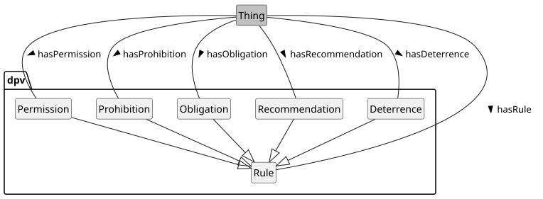 


 

 

DPV provides the concept [=Rule=] to specify requirements, constraints, and other forms of 'rules' that are associated with specific contexts (e.g., processing activities) using the relation [=hasRule=]. DPV provides two categories of rules to broadly represent what is acceptable ([=AcceptableRule=]) and unacceptable ([=UnacceptableRule=]). DPV also provides concepts to indicate the outcome of assessing the rules as statuses through [=RuleFulfilmentStatus=] with distinction between [=RuleFulfilled=], [=RuleUnfulfilled=], and [=RuleViolated=].

 

DPV does not define additional semantics for rules and limits its scope and focus to provide a simple way to specify permissions, prohibitions, and obligations as common rules associated with activities, as well as recommendations and deterrence in assessments and guidelines. For a more extensive and richer set of semantics and concepts to represent rules, DPVCG suggests looking towards other languages, such as [[ODRL]], [[SHACL]], and [[RuleML]] that have been developed with the specific goal of representing and applying rules. We welcome contributions for aligning DPV with these, and for providing guidance on how to complement DPV's rule-based concepts with external languages.

 

 
<a id="rules-vocab-rules"></a>

<a id="rules-L669"></a>
## Rules
 

DPV's Rules are broadly categorised as [=AcceptableRule=] to indicate something is desired and can or should be allowed to happen - including the undesirability of it not occurring, and [=UnacceptableRule=] to indicate the opposite i.e. something that is undesirable to occur or it is desirable for it to not occur. These categories are only indicative as a way to group the specific concepts together based on commonality of interpretation and application.

 


 

-  dpv:AcceptableRule: A rule that is acceptable where it is either desirable if it occurs or it is not unacceptable if it does [go to full definition](https://w3id.org/dpv#AcceptableRule) 

 

  -  dpv:Obligation: A rule describing an obligation for performing an activity [go to full definition](https://w3id.org/dpv#Obligation) 

 

  -  dpv:Permission: A rule describing a permission to perform an activity [go to full definition](https://w3id.org/dpv#Permission) 

 

  -  dpv:Recommendation: A rule describing a recommendation for performing an activity [go to full definition](https://w3id.org/dpv#Recommendation) 

 

 

 

-  dpv:UnacceptableRule: A rule that is unacceptable where it is not desirable if it occurs [go to full definition](https://w3id.org/dpv#UnacceptableRule) 

 

  -  dpv:Deterrence: A rule describing a deterrence for performing an activity [go to full definition](https://w3id.org/dpv#Deterrence) 

 

  -  dpv:Prohibition: A rule describing a prohibition to perform an activity [go to full definition](https://w3id.org/dpv#Prohibition) 

 

 

 


 
<a id="rules-vocab-rules-rfc2199"></a>

<a id="rules-L712"></a>
### Alignment with RFC2199
 

The rules concepts are based on specific phrasing defined in [[[RFC2199]]] that allows a standardised and consistent interpretation of the rules and provides a way to detect and represent them in textual forms and documentation. The table below summarises this association.

 

- Concept
- RFC 2119 Keyword
- [=Permission=] | MAY
- [=Recommendation=] | SHOULD
- [=Obligation=] | MUST
- [=Prohibition=] | MUST NOT
- [=Deterrence=] | SHOULD NOT
- Not Provided | MAY NOT

 

 
<a id="rules-vocab-rules-permission"></a>

<a id="rules-L749"></a>
### Permission
 

[=Permission=] refers to the indicated context being allowed or approved to be carried out. Permissions are only a 'permissive signal' i.e. it is not necessary to carry out an activity just because it is permitted (see obligation for this). Permissions can be used to record what has been permitted, such as in use-cases for policies, agreements, consent records, and risk assessments. [=Permission=] is indicated/associated using the relation [=hasPermission=], and is typically indicated in textual form through the [[RFC2199]] keyword MAY.

 

A [=Permission=] means an optional acceptability, where the default or expectation is that something is not occurring and it is permissible to let it occur. Thus, when evaluating permissions, the only possible outcomes are whether it has or has not been utilised (see the [fulfilment statuses](#rules-vocab-rules-fulfilment)).

  

In this example, a Process which consists of using an email address for service provision using the legal basis as Consent is permitted

 


```
ex:PDH a dpv:Process ;
    dpv:hasRule dpv:Permission ;
    dpv:hasPurpose dpv:ServiceProvision ;
    dpv:hasPersonalData pd:EmailAddress ;
    dpv:hasLegalBasis dpv:Consent .
```


 

(META Example ID: [`E0028`](https://w3id.org/dpv/examples#E0028); link: [source file](https://w3id.org/dpv/examples/E0028.ttl); contributed by Harshvardhan J. Pandit on 2024-06-10) 

  

 
<a id="rules-vocab-rules-recommendation"></a>

<a id="rules-L770"></a>
### Recommendation
 

[=Recommendation=] refers to the indicated context being suggested to be carried out. Recommendations are only a 'suggestion' i.e. it is not necessary (see obligation) to carry out an activity, but as it is being recommended, not carrying it out should be accompanied with a justification (see [`dpv:Justification`](https://w3id.org/dpv#Justification) that explains why it was not carried out. Recommendations can be used to record what has identified as the 'default' to occur with the possibility that it may not be desirable or may not occur in some cases. Such uses are typical in policies and guidelines. [=Recommendation=] is indicated/associated using the relation [=hasRecommendation=], and is typically indicated in textual form through the [[RFC2199]] keyword SHOULD.

 

A [=Recommendation=] means a desired acceptability, where the default or expectation is that it is permissible to let it occur and it should be occurring. Thus, when evaluating recommendations, the only possible outcomes are whether it has or has not been utilised (see the [fulfilment statuses](#rules-vocab-rules-fulfilment)).

 

 
<a id="rules-vocab-rules-obligation"></a>

<a id="rules-L777"></a>
### Obligation
 

[=Obligation=] refers to the indicated context being necessary or mandatory to be carried out. Obligations are a 'requirement' i.e. it is necessary to carry out an activity, which implies it is permitted, and that not carrying it out will be a problem or issue or violation. Obligations can be used to issue requirements in use-cases for policies, agreements, consent records, and risk assessments. [=Obligation=] is indicated/associated using the relation [=hasObligation=], and is typically indicated in textual form through the [[RFC2199]] keyword MUST.

 

An [=Obligation=] means a necessary acceptability, where the default or expectation is that something is not occurring and it is necessary to make it occur. Thus, when evaluating obligations, the only possible outcomes are whether it has been fulfilled (i.e. what was said has been carried out), unfulfilled (i.e. not carried out but there is scope to so), and violated (see the [fulfilment statuses](#rules-vocab-rules-fulfilment)).

 

 
<a id="rules-vocab-rules-prohibition"></a>

<a id="rules-L783"></a>
### Prohibition
 

[=Prohibition=] refers to the indicated context being necessary or mandatory to NOT be carried out. Prohibitions are a 'requirement' i.e. it is necessary to NOT carry out an activity, which implies it is not permitted, and that carrying it out will be a problem or issue or violation. Prohibitions can be used to issue requirements that are different from obligations in that the implementer must ensure the prohibited part is not being carried out, whereas obligations require that part to be carried out. [=Prohibition=] is indicated/associated using the relation [=hasProhibition=], and is typically indicated in textual form through the [[RFC2199]] keyword MUST NOT.

 

A [=Prohibition=] means a necessary unacceptability, where the default or expectation is that something is not occurring and it is prohibited to let it occur. Thus, when evaluating prohibitions, the only possible outcomes are whether it has been fulfilled (i.e. what was said has NOT been carried out) or violated (see the [fulfilment statuses](#rules-vocab-rules-fulfilment)).

 

 
<a id="rules-vocab-rules-deterrence"></a>

<a id="rules-L789"></a>
### Deterrence
 

[=Deterrence=] refers to the indicated context being suggested to NOT be carried out. Deterrences are only a 'suggestion' i.e. it is not necessary (see prohibition) to prevent an activity, but as it is being deterred from being carrying out, it should be accompanied with a justification (see [`dpv:Justification`](https://w3id.org/dpv#Justification) that explains why it was carried out. Deterrences can be used to record what has been identified as the 'default' that should not be occurring with the possibility that it may be desirable or may occur in some cases. Such uses are typical in policies and guidelines. [=Deterrence=] is indicated/associated using the relation [=hasDeterrence=], and is typically indicated in textual form through the [[RFC2199]] keyword SHOULD NOT.

 

A [=Deterrence=] means a desired unacceptability, where the default or expectation is that it is not permissible to let it occur and it should be not occurring. Thus, when evaluating recommendations, the only possible outcomes are whether it has or has not been utilised (see the [fulfilment statuses](#rules-vocab-rules-fulfilment)).

 

 
<a id="rules-vocab-rules-indication"></a>

<a id="rules-L796"></a>
### Indicating Rules
 

Rules can be expressed in two forms: (1) by directly declaring them as an instance of a specific rule concept; and (2) by using the relation to declare an interpretation/application of a rule. The example below shows both in use, where the first method uses a relation to indicate whether a process is permitted or prohibited, and the second contains the process itself being declared as permitted or prohibited.

  

This example show a process where service provision based on consent is permitted, and profiling based on legitimate interest is prohibited 


```
# Method 1: associating an existing process as a rule
ex:PDH a dpv:Process ;
    dpv:hasPermission [
        a dpv:Process ;
        # a dpv:Permission ; <-- inferred
        dpv:hasPurpose dpv:ServiceProvision ;
        dpv:hasLegalBasis dpv:Consent ;
    ] ;
    dpv:hasProhibition [
        a dpv:Process ;
        # a dpv:Prohibition ; <-- inferred
        dpv:hasProcessing dpv:Profiling ;
        dpv:hasLegalBasis dpv:LegitimateInterest ;
    ] .

# Method 2: indicating rules as a status 
ex:PDH a dpv:Process ;
    dpv:hasProcess [
        a dpv:Process ;
        dpv:hasRule dpv:Permission ; # <-- 
        dpv:hasPurpose dpv:ServiceProvision ;
        dpv:hasLegalBasis dpv:Consent ;
    ] ;
    dpv:hasProcess [
        dpv:hasRule dpv:Prohibition ; # <--
        dpv:hasProcessing dpv:Profiling ;
        dpv:hasLegalBasis dpv:LegitimateInterest ;
    ] .
```


 

(META Example ID: [`E0066`](https://w3id.org/dpv/examples#E0066); link: [source file](https://w3id.org/dpv/examples/E0066.ttl); contributed by Harshvardhan J. Pandit on 2024-06-14) 

 

 

Both methods have their advantages or utility. For Method 1 where relations are used, this allows existing processes to be contextually declared as permitted in one use-case and prohibited in another. For Method 2 where instances are used, this allows annotating processes or use-cases as being permitted or prohibited in entirely -- e.g. in reports. A note of caution: though Method 1 uses relations, it can be inferred that the process is being permitted/prohibited when running a reasoner (which is correct in context).

  

 
<a id="rules-vocab-rules-fulfilment"></a>

<a id="rules-L840"></a>
## Rule Fulfilment Status
 

The DPVCG is exploring representing the state of rule fulfilment through concepts, for example to represent a prohibition has been violated, or an obligation has been fulfilled, or a permission has been utilised. The currently provided concepts for these, represented by the concept [=RuleFulfilmentStatus=] and its taxonomy, which are associated using the relation [=hasFulfilmentStatus=], indicate the intent and scope of this work.

 


 

-  dpv:RuleFulfilled: Status indicating a rule has been fulfilled, completed, or satisfied [go to full definition](https://w3id.org/dpv#RuleFulfilled) 

 

  -  dpv:DeterrenceFollowed: Status indicating a deterrence has been followed i.e. the activity stated as being deterred has not been carried out [go to full definition](https://w3id.org/dpv#DeterrenceFollowed) 

 

  -  dpv:ObligationFulfilled: Status indicating an obligation has been fulfilled i.e. the activity stated as being required to be carried out has been successfully completed [go to full definition](https://w3id.org/dpv#ObligationFulfilled) 

 

  -  dpv:PermissionNotUtilised: Status indicating a permission has not been utilised i.e. the activity stated as being permitted has not been carried out [go to full definition](https://w3id.org/dpv#PermissionNotUtilised) 

 

  -  dpv:PermissionUtilised: Status indicating a permission has been utilised i.e. the activity stated as being permitted has been carried out [go to full definition](https://w3id.org/dpv#PermissionUtilised) 

 

  -  dpv:ProhibitionUnviolated: Status indicating a prohibition has not been violated i.e. the activity stated as being prohibited has not been carried out [go to full definition](https://w3id.org/dpv#ProhibitionUnviolated) 

 

  -  dpv:RecommendationFollowed: Status indicating a recommendation has been followed i.e. the activity stated as being recommended has been carried out [go to full definition](https://w3id.org/dpv#RecommendationFollowed) 

 

 

 

-  dpv:RuleUnfulfilled: Status indicating a rule has not been fulfilled nor violated [go to full definition](https://w3id.org/dpv#RuleUnfulfilled) 

 

  -  dpv:DeterrenceNotFollowed: Status indicating a deterrence has not been followed i.e. the activity stated as being deterred has been carried out [go to full definition](https://w3id.org/dpv#DeterrenceNotFollowed) 

 

  -  dpv:ObligationUnfulfilled: Status indicating an obligation has not been fulfilled i.e. the activity stated as being required to be carried out has not been carried out but this is not considered as a violation e.g. there is still time to conduct the activity [go to full definition](https://w3id.org/dpv#ObligationUnfulfilled) 

 

  -  dpv:RecommendationNotFollowed: Status indicating a recommendation has not been followed i.e. the activity stated as being recommended has not been carried out [go to full definition](https://w3id.org/dpv#RecommendationNotFollowed) 

 

 

 

-  dpv:RuleViolated: Status indicating a rule has been violated, breached, broken, or infracted [go to full definition](https://w3id.org/dpv#RuleViolated) 

 

  -  dpv:ObligationViolated: Status indicating an obligation has been violated i.e. the activity stated as being required to be carried out has not been carried out and this is considered as a violation i.e. the activity can no longer be carried out to fulfil the obligation [go to full definition](https://w3id.org/dpv#ObligationViolated) 

 

  -  dpv:ProhibitionViolated: Status indicating a prohibition has been violated i.e. the activity stated as being prohibited has been carried out [go to full definition](https://w3id.org/dpv#ProhibitionViolated) 

 

 

 


  

This example shows how the status of rules can be expressed in terms of their fulfilment or violation. 


```
# Method 1) Rule and status in process
ex:SomeProcess a dpv:Process ;
    dpv:hasRule dpv:Obligation ;
    dpv:hasStatus dpv:ObligationFulfilled .

# Method 2) Rule with embedded status
ex:SomeProcess a dpv:Process ;
    dpv:hasRule [
        a dpv:Obligation ;
        dpv:hasStatus dpv:ObligationFulfilled ;
    ] .

# Method 3) Embedded status with date
ex:SomeProcess a dpv:Process ;
    dpv:hasRule [
        a dpv:Obligation ;
        dpv:hasStatus [
            a dpv:RuleFulfilmentStatus ;
            skos:broader dpv:ObligationFulfilled ;
            dct:date "2025-01-01"^^xsd:date ;
        ] ;
    ] .

# Method 4) Rule status per entity
ex:Log1 a dpv:RuleFulfilmentStatus ;
    skos:broader dpv:ObligationFulfilled ;
    dpv:hasEntity ex:AcmeInc ;
    dct:date "2025-01-01"^^xsd:date .
ex:Log2 a dpv:RuleFulfilmentStatus ;
    skos:broader dpv:ObligationUnfulfilled ;
    dpv:hasEntity ex:BetaInc ; # as of this date
    dct:date "2025-01-01"^^xsd:date .
```


 

(META Example ID: [`E0084`](https://w3id.org/dpv/examples#E0084); link: [source file](https://w3id.org/dpv/examples/E0084.ttl); contributed by Harshvardhan J. Pandit on 2025-01-01) 

 

 

The DPVCG is working with ongoing efforts regarding similar modelling of concepts for ODRL implementations, in particular to ensure the concepts in DPV are in sync and compatible with those developed for ODRL. The below issue shows the progress for this.

<a id="rules-L963"></a>
## Interpreting Rules

<a id="rules-L966"></a>
### Default Interpretation
 

Though DPV provides concepts representing [deontic logic](https://en.wikipedia.org/wiki/Deontic_logic), it does not specify what should be the 'default' interpretation in relation to rules, i.e. it does not provide an interpretation of whether some rules apply automatically unless otherwise declared. For example, in declaring an instance of Process, the assumption is that the activities are modelled for what is happening or what is intended/planned to happen. The explicit annotation using a Permission rule adds information about whether some activity is permitted (and its associated information). Instead, if the use-case is using DPV to only document activities that are permitted, there is no need to explicitly specify the permissions. Similarly, just because something is happening or planned to happen, it cannot be assumed to be permitted (e.g. pending evaluation of legal requirements). 

 

This lack of default interpretation enables modularity in the use of DPV concepts. For example, an instance of `dpv:Process` which does not have a `dpv:hasRule` declared within it, can be made part of a rule to specify permissions, prohibitions, or obligations regarding the process. If instead the process had a default interpretation (e.g. permission), then it would require creating a separate instance with the same information - leading to duplicated efforts. While an apparent solution is to create a mechanism whereby the rule in the process is overridden with the intended 'outer' rule or context e.g. to specify the prohibition in one process overrules permission in another process, this prevents the combination of rules to describe situations such as a permission for a larger context within which specific parts are prohibited or obligated.

<a id="rules-L971"></a>
### Mixing/Nesting Rules
 

In representing Rules, DPV only provides the concept and does not express any inherent semantics on what those rules mean in relation to each other. For example, DPV does not express Permission to be non-compatible or disjoint from Prohibition. This is to separate the interpretation and application of rules based on the necessities of a use-case. For example, in a legal investigation it may be prudent to specify permission and prohibition can never occur together, but this may not be true if there are different legal requirements that allow a prohibition to be resolved or deferred, such as through another permission that overrides the prohibition.

 

Further, as described earlier in the section on default interpretations, it is possible to mix or nest rules such as through processes. For example, if `ProcessA` is a permitted process and contains `ProcessB` which is a prohibited process, DPV does not dictate what should be default interpretation for this arrangement. The role of DPV concepts regarding rules, as of now, is to provide a simplified indication of whether something is permitted, prohibited, or obligated. Further interpretations require creation of a formal specification that dictates how rules should function together. For example, depending on the use-case, several interpretations are possible for the example described here:

 

 

1. Prohibitive interpretation: Both `ProcessA` and `ProcessB` are prohibited because through `ProcessA` is permitted, `ProcessB` is within it and is prohibited - thereby prohibiting both processes. Such interpretations prevent modularity - everything is prohibited because something is prohibited, or it is permitted because there are no prohibitions.

 

2. Permissive interpretation: `ProcessA` and `ProcessB` are both permitted since `ProcessA` gives permission for the entire process and overrides the prohibition in `ProcessB`. Such interpretations also prevent modularity - everything is permitted because the higher/broader processes are permitted even though there are specific prohibitions at a granular level.

 

3. Contextually Prohibitive interpretation: `ProcessB` is prohibited as declared, and the rest of `ProcessA` without `ProcessB` is permitted. If there was a further `ProcessC` that is permitted, and is present within `ProcessB`, then `ProcessC` would still be prohibited as the broader prohibition from `ProcessB` overrides it. Such interpretations permit modularity with permission granted for parts as long as there is no prohibition overriding it from a broader context. In this, a prohibition within a permission still allows the permitted parts to be carried out, whereas a permission within a prohibition would still be prohibited.

 

4. Contextually Permissive interpretation: This is the same as the contextually prohibitive interpretation, except permissions occurring within prohibitions are not overridden. This means, `ProcessA` is allowed through its permission, with `ProcessB` within it being prohibited, except for `ProcessC` within `ProcessB` - which is permitted.

 

 

The above example interpretations only concerned permissions and prohibitions, and did not include obligations - or other concepts such as duties, dispensations, exceptions, and defeasibility. From this, it should be clear how the specification and interpretation of rules can be quite complex and has a large impact on the intended activities and information being documented.

  

The DPVCG is discussing the provision of concepts to indicate the interpretation of rules as discussed above. These concepts would then be associated with rules to express how they should be interpreted - which would avoid ambiguities and ensure consistent interpretation through shared semantics.

 

In addition, we are also interested in representing concepts for conflict resolution strategies - for example what should be done if an permission and a prohibition are expressed over the same resource. Like the interpretation concepts, the conflict resolution concepts would also be expressed along with the rules to ensure all implementations have a consistent interpretation and outcome regarding the rules.

 

As with the Rules Fulfilment concepts, this work is expected to be in sync with the ODRL implementation work. We welcome ideas and participation in this process. See [Issue#189](https://github.com/w3c/dpv/issues/189).

<a id="rules-L989"></a>
## Triggering Rules
 

DPV does not define how rules are 'triggered' i.e. how to specify under what conditions a rule should become applicable or is exempted from being applied. Some common triggers for rules to be applied are provided here as examples:

 

 

1. Ex-ante: the rule is applied before the specified activity is carried out.

 

2. Ex-post: the rule is applied after the specified activity is carried out.

 

3. Real-time: the rule is applied during the specified activity being carried out.

 

  

The rule trigger concepts would represent when/how the rule is to be applied - as described above - and would further assist in explicitly representing the intended interpretation and application of a rule within the stated context. For example, whether an obligation associated with a process is to be carried out before the process starts (ex-ante trigger) or after it completes (ex-post trigger) would be interpreted through these concepts. In addition to these, further granular concepts would also assist in further expressing the intended actions - such as a prohibition that comes in to play only on failures of a process to complete successfully, or an obligation that only occurs if a process is successful.

<a id="rules-L1001"></a>
## Alignment with ODRL
 

[[ODRL]] provides a W3C standardised representation for expressing policies containing rules such as for permissions, prohibitions, obligations over 'assets' and the involved 'parties'. While ODRL focuses on providing a general structure for policies without jurisdictional concepts or modelling, it complements DPV by enabling declaration of policies, agreements, and other similar documents in a structured, interoperable, and standardised manner. The DPV concepts enable specifying the exact information within the structure provided by ODRL - which can be useful for two entities to exchange information. For example, in a controller-processor agreement, ODRL can be used to define the agreement in terms of involved parties, their roles, and which entity is responsible for performing which actions, as well as the expected ex-post consequences of those actions - such as for reporting from processor to controller, or to indicate what should be done should a particular requirement is violated.

 

The DPVCG is interested in formally authorising a shared specification with the ODRL Community Group that outlines the use of DPV concepts for/with ODRL. The current proposal for this is to create an ODRL profile that declares DPV concepts in context of ODRL's conceptual model and through which DPV concepts can be correctly declared and used in ODRL. The current draft guidance document for use of DPV and ODRL is available at [[[GUIDE-ODRL]]], and the mapping of concepts between DPV and ODRL is available at [[[MAPPING-ODRL]]].

<a id="rules-L1010"></a>
## Vocabulary Index
 
<a id="rules-classes"></a>

<a id="rules-L1012"></a>
### Classes
 
<a id="rules-AcceptableRule"></a>

<a id="rules-L1013"></a>
#### Acceptable Rule
 

- Term | AcceptableRule | Prefix | dpv
- Label | Acceptable Rule
- IRI | [https://w3id.org/dpv#AcceptableRule](https://w3id.org/dpv#AcceptableRule)
- Type | [rdfs:Class](http://www.w3.org/2000/01/rdf-schema#Class), [skos:Concept](http://www.w3.org/2004/02/skos/core#Concept), [dpv:Rule](https://w3id.org/dpv#Rule)
- Broader/Parent types | [dpv:Rule](#rules-Rule)
- Object of relation | [dpv:hasFulfilmentStatus](https://w3id.org/dpv#hasFulfilmentStatus), [dpv:hasRule](https://w3id.org/dpv#hasRule)
- Definition | A rule that is acceptable where it is either desirable if it occurs or it is not unacceptable if it does
- Usage Note | Acceptable is a subjective concept that enables distinguishing with "unacceptable". By itself it does not signal any permission or obligation - for which further specific concepts are defined
- Date Created | 2025-06-19
- Contributors | Arthit Suriyawongkul, Beatriz Esteves, Delaram Golpayegani, Georg P. Krog, Harshvardhan J. Pandit, Julian Flake, Paul Ryan
- See More: | section [RULES](#rules-vocab-rules) in [DPV](https://w3id.org/dpv#)

 

 
<a id="rules-Deterrence"></a>

<a id="rules-L1092"></a>
#### Deterrence
 

- Term | Deterrence | Prefix | dpv
- Label | Deterrence
- IRI | [https://w3id.org/dpv#Deterrence](https://w3id.org/dpv#Deterrence)
- Type | [rdfs:Class](http://www.w3.org/2000/01/rdf-schema#Class), [skos:Concept](http://www.w3.org/2004/02/skos/core#Concept), [dpv:Rule](https://w3id.org/dpv#Rule)
- Broader/Parent types | [dpv:UnacceptableRule](#rules-UnacceptableRule) → [dpv:Rule](#rules-Rule)
- Object of relation | [dpv:hasDeterrence](https://w3id.org/dpv#hasDeterrence), [dpv:hasFulfilmentStatus](https://w3id.org/dpv#hasFulfilmentStatus), [dpv:hasRule](https://w3id.org/dpv#hasRule)
- Definition | A rule describing a deterrence for performing an activity
- Usage Note | Deterrences are aligned with the term SHOULD NOT in RFC2119 where specified activities should be avoided from being carried out but are not prohibitions
- Date Created | 2025-06-19
- Contributors | Arthit Suriyawongkul, Beatriz Esteves, Delaram Golpayegani, Georg P. Krog, Harshvardhan J. Pandit, Julian Flake, Paul Ryan
- See More: | section [RULES](#rules-vocab-rules) in [DPV](https://w3id.org/dpv#)

 

 
<a id="rules-DeterrenceFollowed"></a>

<a id="rules-L1173"></a>
#### Deterrence Followed
 

- Term | DeterrenceFollowed | Prefix | dpv
- Label | Deterrence Followed
- IRI | [https://w3id.org/dpv#DeterrenceFollowed](https://w3id.org/dpv#DeterrenceFollowed)
- Type | [rdfs:Class](http://www.w3.org/2000/01/rdf-schema#Class), [skos:Concept](http://www.w3.org/2004/02/skos/core#Concept), [dpv:RuleFulfilmentStatus](https://w3id.org/dpv#RuleFulfilmentStatus)
- Broader/Parent types | [dpv:RuleFulfilled](#rules-RuleFulfilled) → [dpv:RuleFulfilmentStatus](#rules-RuleFulfilmentStatus) → [dpv:Status](https://w3id.org/dpv#Status) → [dpv:Context](https://w3id.org/dpv#Context)
- Object of relation | [dpv:hasContext](https://w3id.org/dpv#hasContext), [dpv:hasStatus](https://w3id.org/dpv#hasStatus)
- Definition | Status indicating a deterrence has been followed i.e. the activity stated as being deterred has not been carried out
- Date Created | 2025-08-06
- Contributors | Beatriz Esteves, Georg P. Krog, Harshvardhan J. Pandit, Julian Flake
- See More: | section [RULES](#rules-vocab-rules) in [DPV](https://w3id.org/dpv#)

 

 
<a id="rules-DeterrenceNotFollowed"></a>

<a id="rules-L1252"></a>
#### Deterrence Not Followed
 

- Term | DeterrenceNotFollowed | Prefix | dpv
- Label | Deterrence Not Followed
- IRI | [https://w3id.org/dpv#DeterrenceNotFollowed](https://w3id.org/dpv#DeterrenceNotFollowed)
- Type | [rdfs:Class](http://www.w3.org/2000/01/rdf-schema#Class), [skos:Concept](http://www.w3.org/2004/02/skos/core#Concept), [dpv:RuleFulfilmentStatus](https://w3id.org/dpv#RuleFulfilmentStatus)
- Broader/Parent types | [dpv:RuleUnfulfilled](#rules-RuleUnfulfilled) → [dpv:RuleFulfilmentStatus](#rules-RuleFulfilmentStatus) → [dpv:Status](https://w3id.org/dpv#Status) → [dpv:Context](https://w3id.org/dpv#Context)
- Object of relation | [dpv:hasContext](https://w3id.org/dpv#hasContext), [dpv:hasStatus](https://w3id.org/dpv#hasStatus)
- Definition | Status indicating a deterrence has not been followed i.e. the activity stated as being deterred has been carried out
- Date Created | 2025-08-06
- Contributors | Beatriz Esteves, Georg P. Krog, Harshvardhan J. Pandit, Julian Flake
- See More: | section [RULES](#rules-vocab-rules) in [DPV](https://w3id.org/dpv#)

 

 
<a id="rules-Obligation"></a>

<a id="rules-L1331"></a>
#### Obligation
 

- Term | Obligation | Prefix | dpv
- Label | Obligation
- IRI | [https://w3id.org/dpv#Obligation](https://w3id.org/dpv#Obligation)
- Type | [rdfs:Class](http://www.w3.org/2000/01/rdf-schema#Class), [skos:Concept](http://www.w3.org/2004/02/skos/core#Concept), [dpv:Rule](https://w3id.org/dpv#Rule)
- Broader/Parent types | [dpv:AcceptableRule](#rules-AcceptableRule) → [dpv:Rule](#rules-Rule)
- Object of relation | [dpv:hasFulfilmentStatus](https://w3id.org/dpv#hasFulfilmentStatus), [dpv:hasObligation](https://w3id.org/dpv#hasObligation), [dpv:hasRule](https://w3id.org/dpv#hasRule)
- Definition | A rule describing an obligation for performing an activity
- Usage Note | Obligations are aligned with the term MUST in RFC2119 where specified activities are mandatory to be carried out
- Date Created | 2022-10-19
- Date Modified | 2025-06-19
- Contributors | Arthit Suriyawongkul, Beatriz Esteves, Delaram Golpayegani, Georg P. Krog, Harshvardhan J. Pandit, Julian Flake, Paul Ryan
- See More: | section [RULES](#rules-vocab-rules) in [DPV](https://w3id.org/dpv#)

 

 
<a id="rules-ObligationFulfilled"></a>

<a id="rules-L1415"></a>
#### Obligation Fulfilled
 

- Term | ObligationFulfilled | Prefix | dpv
- Label | Obligation Fulfilled
- IRI | [https://w3id.org/dpv#ObligationFulfilled](https://w3id.org/dpv#ObligationFulfilled)
- Type | [rdfs:Class](http://www.w3.org/2000/01/rdf-schema#Class), [skos:Concept](http://www.w3.org/2004/02/skos/core#Concept), [dpv:RuleFulfilmentStatus](https://w3id.org/dpv#RuleFulfilmentStatus)
- Broader/Parent types | [dpv:RuleFulfilled](#rules-RuleFulfilled) → [dpv:RuleFulfilmentStatus](#rules-RuleFulfilmentStatus) → [dpv:Status](https://w3id.org/dpv#Status) → [dpv:Context](https://w3id.org/dpv#Context)
- Object of relation | [dpv:hasContext](https://w3id.org/dpv#hasContext), [dpv:hasStatus](https://w3id.org/dpv#hasStatus)
- Definition | Status indicating an obligation has been fulfilled i.e. the activity stated as being required to be carried out has been successfully completed
- Date Created | 2024-09-10
- Contributors | Harshvardhan J. Pandit
- See More: | section [RULES](#rules-vocab-rules) in [DPV](https://w3id.org/dpv#)

 

 
<a id="rules-ObligationUnfulfilled"></a>

<a id="rules-L1494"></a>
#### Obligation Unfulfilled
 

- Term | ObligationUnfulfilled | Prefix | dpv
- Label | Obligation Unfulfilled
- IRI | [https://w3id.org/dpv#ObligationUnfulfilled](https://w3id.org/dpv#ObligationUnfulfilled)
- Type | [rdfs:Class](http://www.w3.org/2000/01/rdf-schema#Class), [skos:Concept](http://www.w3.org/2004/02/skos/core#Concept), [dpv:RuleFulfilmentStatus](https://w3id.org/dpv#RuleFulfilmentStatus)
- Broader/Parent types | [dpv:RuleUnfulfilled](#rules-RuleUnfulfilled) → [dpv:RuleFulfilmentStatus](#rules-RuleFulfilmentStatus) → [dpv:Status](https://w3id.org/dpv#Status) → [dpv:Context](https://w3id.org/dpv#Context)
- Object of relation | [dpv:hasContext](https://w3id.org/dpv#hasContext), [dpv:hasStatus](https://w3id.org/dpv#hasStatus)
- Definition | Status indicating an obligation has not been fulfilled i.e. the activity stated as being required to be carried out has not been carried out but this is not considered as a violation e.g. there is still time to conduct the activity
- Date Created | 2024-09-10
- Contributors | Harshvardhan J. Pandit
- See More: | section [RULES](#rules-vocab-rules) in [DPV](https://w3id.org/dpv#)

 

 
<a id="rules-ObligationViolated"></a>

<a id="rules-L1573"></a>
#### Obligation Violated
 

- Term | ObligationViolated | Prefix | dpv
- Label | Obligation Violated
- IRI | [https://w3id.org/dpv#ObligationViolated](https://w3id.org/dpv#ObligationViolated)
- Type | [rdfs:Class](http://www.w3.org/2000/01/rdf-schema#Class), [skos:Concept](http://www.w3.org/2004/02/skos/core#Concept), [dpv:RuleFulfilmentStatus](https://w3id.org/dpv#RuleFulfilmentStatus)
- Broader/Parent types | [dpv:RuleViolated](#rules-RuleViolated) → [dpv:RuleFulfilmentStatus](#rules-RuleFulfilmentStatus) → [dpv:Status](https://w3id.org/dpv#Status) → [dpv:Context](https://w3id.org/dpv#Context)
- Object of relation | [dpv:hasContext](https://w3id.org/dpv#hasContext), [dpv:hasStatus](https://w3id.org/dpv#hasStatus)
- Definition | Status indicating an obligation has been violated i.e. the activity stated as being required to be carried out has not been carried out and this is considered as a violation i.e. the activity can no longer be carried out to fulfil the obligation
- Date Created | 2024-09-10
- Contributors | Harshvardhan J. Pandit
- See More: | section [RULES](#rules-vocab-rules) in [DPV](https://w3id.org/dpv#)

 

 
<a id="rules-Permission"></a>

<a id="rules-L1652"></a>
#### Permission
 

- Term | Permission | Prefix | dpv
- Label | Permission
- IRI | [https://w3id.org/dpv#Permission](https://w3id.org/dpv#Permission)
- Type | [rdfs:Class](http://www.w3.org/2000/01/rdf-schema#Class), [skos:Concept](http://www.w3.org/2004/02/skos/core#Concept), [dpv:Rule](https://w3id.org/dpv#Rule)
- Broader/Parent types | [dpv:AcceptableRule](#rules-AcceptableRule) → [dpv:Rule](#rules-Rule)
- Object of relation | [dpv:hasFulfilmentStatus](https://w3id.org/dpv#hasFulfilmentStatus), [dpv:hasPermission](https://w3id.org/dpv#hasPermission), [dpv:hasRule](https://w3id.org/dpv#hasRule)
- Definition | A rule describing a permission to perform an activity
- Usage Note | Permissions are aligned with the term MAY in RFC2119 where specified activities may or may not be carried out
- Examples
- [`dex:E0028 :: ` Rule specifying permission](https://w3id.org/dpv/examples#E0028)
 [`dex:E0066 :: ` Specifying permissions and prohibitions](https://w3id.org/dpv/examples#E0066)
- Date Created | 2022-10-19
- Date Modified | 2025-06-19
- Contributors | Arthit Suriyawongkul, Beatriz Esteves, Delaram Golpayegani, Georg P. Krog, Harshvardhan J. Pandit, Julian Flake, Paul Ryan
- See More: | section [RULES](#rules-vocab-rules) in [DEX](https://w3id.org/dpv#)

 

 
<a id="rules-PermissionNotUtilised"></a>

<a id="rules-L1739"></a>
#### Permission Not Utilised
 

- Term | PermissionNotUtilised | Prefix | dpv
- Label | Permission Not Utilised
- IRI | [https://w3id.org/dpv#PermissionNotUtilised](https://w3id.org/dpv#PermissionNotUtilised)
- Type | [rdfs:Class](http://www.w3.org/2000/01/rdf-schema#Class), [skos:Concept](http://www.w3.org/2004/02/skos/core#Concept), [dpv:RuleFulfilmentStatus](https://w3id.org/dpv#RuleFulfilmentStatus)
- Broader/Parent types | [dpv:RuleFulfilled](#rules-RuleFulfilled) → [dpv:RuleFulfilmentStatus](#rules-RuleFulfilmentStatus) → [dpv:Status](https://w3id.org/dpv#Status) → [dpv:Context](https://w3id.org/dpv#Context)
- Object of relation | [dpv:hasContext](https://w3id.org/dpv#hasContext), [dpv:hasStatus](https://w3id.org/dpv#hasStatus)
- Definition | Status indicating a permission has not been utilised i.e. the activity stated as being permitted has not been carried out
- Date Created | 2024-09-10
- Contributors | Harshvardhan J. Pandit
- See More: | section [RULES](#rules-vocab-rules) in [DPV](https://w3id.org/dpv#)

 

 
<a id="rules-PermissionUtilised"></a>

<a id="rules-L1818"></a>
#### Permission Utilised
 

- Term | PermissionUtilised | Prefix | dpv
- Label | Permission Utilised
- IRI | [https://w3id.org/dpv#PermissionUtilised](https://w3id.org/dpv#PermissionUtilised)
- Type | [rdfs:Class](http://www.w3.org/2000/01/rdf-schema#Class), [skos:Concept](http://www.w3.org/2004/02/skos/core#Concept), [dpv:RuleFulfilmentStatus](https://w3id.org/dpv#RuleFulfilmentStatus)
- Broader/Parent types | [dpv:RuleFulfilled](#rules-RuleFulfilled) → [dpv:RuleFulfilmentStatus](#rules-RuleFulfilmentStatus) → [dpv:Status](https://w3id.org/dpv#Status) → [dpv:Context](https://w3id.org/dpv#Context)
- Object of relation | [dpv:hasContext](https://w3id.org/dpv#hasContext), [dpv:hasStatus](https://w3id.org/dpv#hasStatus)
- Definition | Status indicating a permission has been utilised i.e. the activity stated as being permitted has been carried out
- Date Created | 2024-09-10
- Contributors | Harshvardhan J. Pandit
- See More: | section [RULES](#rules-vocab-rules) in [DPV](https://w3id.org/dpv#)

 

 
<a id="rules-Prohibition"></a>

<a id="rules-L1897"></a>
#### Prohibition
 

- Term | Prohibition | Prefix | dpv
- Label | Prohibition
- IRI | [https://w3id.org/dpv#Prohibition](https://w3id.org/dpv#Prohibition)
- Type | [rdfs:Class](http://www.w3.org/2000/01/rdf-schema#Class), [skos:Concept](http://www.w3.org/2004/02/skos/core#Concept), [dpv:Rule](https://w3id.org/dpv#Rule)
- Broader/Parent types | [dpv:UnacceptableRule](#rules-UnacceptableRule) → [dpv:Rule](#rules-Rule)
- Object of relation | [dpv:hasFulfilmentStatus](https://w3id.org/dpv#hasFulfilmentStatus), [dpv:hasProhibition](https://w3id.org/dpv#hasProhibition), [dpv:hasRule](https://w3id.org/dpv#hasRule)
- Definition | A rule describing a prohibition to perform an activity
- Usage Note | Prohibitions are aligned with the term MUST NOT in RFC2119 where specified activities are prohibited from being carried out
- Examples
- [`dex:E0029 :: ` Rule specifying prohibition](https://w3id.org/dpv/examples#E0029)
 [`dex:E0066 :: ` Specifying permissions and prohibitions](https://w3id.org/dpv/examples#E0066)
- Date Created | 2022-10-19
- Date Modified | 2025-06-19
- Contributors | Arthit Suriyawongkul, Beatriz Esteves, Delaram Golpayegani, Georg P. Krog, Harshvardhan J. Pandit, Julian Flake, Paul Ryan
- See More: | section [RULES](#rules-vocab-rules) in [DEX](https://w3id.org/dpv#)

 

 
<a id="rules-ProhibitionUnviolated"></a>

<a id="rules-L1984"></a>
#### Prohibition Unviolated
 

- Term | ProhibitionUnviolated | Prefix | dpv
- Label | Prohibition Unviolated
- IRI | [https://w3id.org/dpv#ProhibitionUnviolated](https://w3id.org/dpv#ProhibitionUnviolated)
- Type | [rdfs:Class](http://www.w3.org/2000/01/rdf-schema#Class), [skos:Concept](http://www.w3.org/2004/02/skos/core#Concept), [dpv:RuleFulfilmentStatus](https://w3id.org/dpv#RuleFulfilmentStatus)
- Broader/Parent types | [dpv:RuleFulfilled](#rules-RuleFulfilled) → [dpv:RuleFulfilmentStatus](#rules-RuleFulfilmentStatus) → [dpv:Status](https://w3id.org/dpv#Status) → [dpv:Context](https://w3id.org/dpv#Context)
- Object of relation | [dpv:hasContext](https://w3id.org/dpv#hasContext), [dpv:hasStatus](https://w3id.org/dpv#hasStatus)
- Definition | Status indicating a prohibition has not been violated i.e. the activity stated as being prohibited has not been carried out
- Date Created | 2024-09-10
- Date Modified | 2025-08-06
- Contributors | Beatriz Esteves, Georg P. Krog, Harshvardhan J. Pandit, Julian Flake
- See More: | section [RULES](#rules-vocab-rules) in [DPV](https://w3id.org/dpv#)

 

 
<a id="rules-ProhibitionViolated"></a>

<a id="rules-L2066"></a>
#### Prohibition Violated
 

- Term | ProhibitionViolated | Prefix | dpv
- Label | Prohibition Violated
- IRI | [https://w3id.org/dpv#ProhibitionViolated](https://w3id.org/dpv#ProhibitionViolated)
- Type | [rdfs:Class](http://www.w3.org/2000/01/rdf-schema#Class), [skos:Concept](http://www.w3.org/2004/02/skos/core#Concept), [dpv:RuleFulfilmentStatus](https://w3id.org/dpv#RuleFulfilmentStatus)
- Broader/Parent types | [dpv:RuleViolated](#rules-RuleViolated) → [dpv:RuleFulfilmentStatus](#rules-RuleFulfilmentStatus) → [dpv:Status](https://w3id.org/dpv#Status) → [dpv:Context](https://w3id.org/dpv#Context)
- Object of relation | [dpv:hasContext](https://w3id.org/dpv#hasContext), [dpv:hasStatus](https://w3id.org/dpv#hasStatus)
- Definition | Status indicating a prohibition has been violated i.e. the activity stated as being prohibited has been carried out
- Date Created | 2024-09-10
- Contributors | Harshvardhan J. Pandit
- See More: | section [RULES](#rules-vocab-rules) in [DPV](https://w3id.org/dpv#)

 

 
<a id="rules-Recommendation"></a>

<a id="rules-L2145"></a>
#### Recommendation
 

- Term | Recommendation | Prefix | dpv
- Label | Recommendation
- IRI | [https://w3id.org/dpv#Recommendation](https://w3id.org/dpv#Recommendation)
- Type | [rdfs:Class](http://www.w3.org/2000/01/rdf-schema#Class), [skos:Concept](http://www.w3.org/2004/02/skos/core#Concept), [dpv:Rule](https://w3id.org/dpv#Rule)
- Broader/Parent types | [dpv:AcceptableRule](#rules-AcceptableRule) → [dpv:Rule](#rules-Rule)
- Object of relation | [dpv:hasFulfilmentStatus](https://w3id.org/dpv#hasFulfilmentStatus), [dpv:hasRecommendation](https://w3id.org/dpv#hasRecommendation), [dpv:hasRule](https://w3id.org/dpv#hasRule)
- Definition | A rule describing a recommendation for performing an activity
- Usage Note | Recommendations are aligned with the term SHOULD in RFC2119 where specified activities should be carried out but are not obligations
- Date Created | 2025-06-19
- Contributors | Arthit Suriyawongkul, Beatriz Esteves, Delaram Golpayegani, Georg P. Krog, Harshvardhan J. Pandit, Julian Flake, Paul Ryan
- See More: | section [RULES](#rules-vocab-rules) in [DPV](https://w3id.org/dpv#)

 

 
<a id="rules-RecommendationFollowed"></a>

<a id="rules-L2226"></a>
#### Recommendation Followed
 

- Term | RecommendationFollowed | Prefix | dpv
- Label | Recommendation Followed
- IRI | [https://w3id.org/dpv#RecommendationFollowed](https://w3id.org/dpv#RecommendationFollowed)
- Type | [rdfs:Class](http://www.w3.org/2000/01/rdf-schema#Class), [skos:Concept](http://www.w3.org/2004/02/skos/core#Concept), [dpv:RuleFulfilmentStatus](https://w3id.org/dpv#RuleFulfilmentStatus)
- Broader/Parent types | [dpv:RuleFulfilled](#rules-RuleFulfilled) → [dpv:RuleFulfilmentStatus](#rules-RuleFulfilmentStatus) → [dpv:Status](https://w3id.org/dpv#Status) → [dpv:Context](https://w3id.org/dpv#Context)
- Object of relation | [dpv:hasContext](https://w3id.org/dpv#hasContext), [dpv:hasStatus](https://w3id.org/dpv#hasStatus)
- Definition | Status indicating a recommendation has been followed i.e. the activity stated as being recommended has been carried out
- Date Created | 2025-08-06
- Contributors | Beatriz Esteves, Georg P. Krog, Harshvardhan J. Pandit, Julian Flake
- See More: | section [RULES](#rules-vocab-rules) in [DPV](https://w3id.org/dpv#)

 

 
<a id="rules-RecommendationNotFollowed"></a>

<a id="rules-L2305"></a>
#### Recommendation Not Followed
 

- Term | RecommendationNotFollowed | Prefix | dpv
- Label | Recommendation Not Followed
- IRI | [https://w3id.org/dpv#RecommendationNotFollowed](https://w3id.org/dpv#RecommendationNotFollowed)
- Type | [rdfs:Class](http://www.w3.org/2000/01/rdf-schema#Class), [skos:Concept](http://www.w3.org/2004/02/skos/core#Concept), [dpv:RuleFulfilmentStatus](https://w3id.org/dpv#RuleFulfilmentStatus)
- Broader/Parent types | [dpv:RuleUnfulfilled](#rules-RuleUnfulfilled) → [dpv:RuleFulfilmentStatus](#rules-RuleFulfilmentStatus) → [dpv:Status](https://w3id.org/dpv#Status) → [dpv:Context](https://w3id.org/dpv#Context)
- Object of relation | [dpv:hasContext](https://w3id.org/dpv#hasContext), [dpv:hasStatus](https://w3id.org/dpv#hasStatus)
- Definition | Status indicating a recommendation has not been followed i.e. the activity stated as being recommended has not been carried out
- Date Created | 2025-08-06
- Contributors | Beatriz Esteves, Georg P. Krog, Harshvardhan J. Pandit, Julian Flake
- See More: | section [RULES](#rules-vocab-rules) in [DPV](https://w3id.org/dpv#)

 

 
<a id="rules-Rule"></a>

<a id="rules-L2384"></a>
#### Rule
 

- Term | Rule | Prefix | dpv
- Label | Rule
- IRI | [https://w3id.org/dpv#Rule](https://w3id.org/dpv#Rule)
- Type | [rdfs:Class](http://www.w3.org/2000/01/rdf-schema#Class), [skos:Concept](http://www.w3.org/2004/02/skos/core#Concept)
- Object of relation | [dpv:hasFulfilmentStatus](https://w3id.org/dpv#hasFulfilmentStatus), [dpv:hasRule](https://w3id.org/dpv#hasRule)
- Definition | A rule describing a process or control that directs or determines if and how an activity should be conducted
- Examples
- [`dex:E0030 :: ` Rule combining DPV with ODRL](https://w3id.org/dpv/examples#E0030)
- Date Created | 2022-10-19
- Contributors | Beatriz Esteves, Georg P. Krog, Harshvardhan J. Pandit, Paul Ryan
- See More: | section [RULES](#rules-vocab-rules) in [DEX](https://w3id.org/dpv#)

 

 
<a id="rules-RuleFulfilled"></a>

<a id="rules-L2460"></a>
#### Rule Fulfilled
 

- Term | RuleFulfilled | Prefix | dpv
- Label | Rule Fulfilled
- IRI | [https://w3id.org/dpv#RuleFulfilled](https://w3id.org/dpv#RuleFulfilled)
- Type | [rdfs:Class](http://www.w3.org/2000/01/rdf-schema#Class), [skos:Concept](http://www.w3.org/2004/02/skos/core#Concept), [dpv:RuleFulfilmentStatus](https://w3id.org/dpv#RuleFulfilmentStatus)
- Broader/Parent types | [dpv:RuleFulfilmentStatus](#rules-RuleFulfilmentStatus) → [dpv:Status](https://w3id.org/dpv#Status) → [dpv:Context](https://w3id.org/dpv#Context)
- Object of relation | [dpv:hasContext](https://w3id.org/dpv#hasContext), [dpv:hasStatus](https://w3id.org/dpv#hasStatus)
- Definition | Status indicating a rule has been fulfilled, completed, or satisfied
- Date Created | 2024-09-10
- Contributors | Harshvardhan J. Pandit
- See More: | section [RULES](#rules-vocab-rules) in [DPV](https://w3id.org/dpv#)

 

 
<a id="rules-RuleFulfilmentStatus"></a>

<a id="rules-L2538"></a>
#### Rule Fulfilment Status
 

- Term | RuleFulfilmentStatus | Prefix | dpv
- Label | Rule Fulfilment Status
- IRI | [https://w3id.org/dpv#RuleFulfilmentStatus](https://w3id.org/dpv#RuleFulfilmentStatus)
- Type | [rdfs:Class](http://www.w3.org/2000/01/rdf-schema#Class), [skos:Concept](http://www.w3.org/2004/02/skos/core#Concept)
- Broader/Parent types | [dpv:Status](https://w3id.org/dpv#Status) → [dpv:Context](https://w3id.org/dpv#Context)
- Object of relation | [dpv:hasContext](https://w3id.org/dpv#hasContext), [dpv:hasStatus](https://w3id.org/dpv#hasStatus)
- Definition | Status associated with a rule for indicating whether it is applicable, or has been utilised, and whether the requirements of the rule have been fulfilled or violated
- Examples
- [`dex:E0084 :: ` Stating status of Rule fulfilment](https://w3id.org/dpv/examples#E0084)
- Date Created | 2024-09-10
- Contributors | Harshvardhan J. Pandit
- See More: | section [RULES](#rules-vocab-rules) in [DEX](https://w3id.org/dpv#)

 

 
<a id="rules-RuleUnfulfilled"></a>

<a id="rules-L2618"></a>
#### Rule Unfulfilled
 

- Term | RuleUnfulfilled | Prefix | dpv
- Label | Rule Unfulfilled
- IRI | [https://w3id.org/dpv#RuleUnfulfilled](https://w3id.org/dpv#RuleUnfulfilled)
- Type | [rdfs:Class](http://www.w3.org/2000/01/rdf-schema#Class), [skos:Concept](http://www.w3.org/2004/02/skos/core#Concept), [dpv:RuleFulfilmentStatus](https://w3id.org/dpv#RuleFulfilmentStatus)
- Broader/Parent types | [dpv:RuleFulfilmentStatus](#rules-RuleFulfilmentStatus) → [dpv:Status](https://w3id.org/dpv#Status) → [dpv:Context](https://w3id.org/dpv#Context)
- Object of relation | [dpv:hasContext](https://w3id.org/dpv#hasContext), [dpv:hasStatus](https://w3id.org/dpv#hasStatus)
- Definition | Status indicating a rule has not been fulfilled nor violated
- Date Created | 2024-09-10
- Contributors | Harshvardhan J. Pandit
- See More: | section [RULES](#rules-vocab-rules) in [DPV](https://w3id.org/dpv#)

 

 
<a id="rules-RuleViolated"></a>

<a id="rules-L2696"></a>
#### Rule Violated
 

- Term | RuleViolated | Prefix | dpv
- Label | Rule Violated
- IRI | [https://w3id.org/dpv#RuleViolated](https://w3id.org/dpv#RuleViolated)
- Type | [rdfs:Class](http://www.w3.org/2000/01/rdf-schema#Class), [skos:Concept](http://www.w3.org/2004/02/skos/core#Concept), [dpv:RuleFulfilmentStatus](https://w3id.org/dpv#RuleFulfilmentStatus)
- Broader/Parent types | [dpv:RuleFulfilmentStatus](#rules-RuleFulfilmentStatus) → [dpv:Status](https://w3id.org/dpv#Status) → [dpv:Context](https://w3id.org/dpv#Context)
- Object of relation | [dpv:hasContext](https://w3id.org/dpv#hasContext), [dpv:hasStatus](https://w3id.org/dpv#hasStatus)
- Definition | Status indicating a rule has been violated, breached, broken, or infracted
- Date Created | 2024-09-10
- Contributors | Harshvardhan J. Pandit
- See More: | section [RULES](#rules-vocab-rules) in [DPV](https://w3id.org/dpv#)

 

 
<a id="rules-UnacceptableRule"></a>

<a id="rules-L2774"></a>
#### Unacceptable Rule
 

- Term | UnacceptableRule | Prefix | dpv
- Label | Unacceptable Rule
- IRI | [https://w3id.org/dpv#UnacceptableRule](https://w3id.org/dpv#UnacceptableRule)
- Type | [rdfs:Class](http://www.w3.org/2000/01/rdf-schema#Class), [skos:Concept](http://www.w3.org/2004/02/skos/core#Concept), [dpv:Rule](https://w3id.org/dpv#Rule)
- Broader/Parent types | [dpv:Rule](#rules-Rule)
- Object of relation | [dpv:hasFulfilmentStatus](https://w3id.org/dpv#hasFulfilmentStatus), [dpv:hasRule](https://w3id.org/dpv#hasRule)
- Definition | A rule that is unacceptable where it is not desirable if it occurs
- Usage Note | Unacceptable is a subjective concept that enables specifying something is to be avoided as compared to "acceptable". By itself it does not signal any deterrence or prohibition - for which further specific concepts are defined
- Date Created | 2025-06-19
- Contributors | Arthit Suriyawongkul, Beatriz Esteves, Delaram Golpayegani, Georg P. Krog, Harshvardhan J. Pandit, Julian Flake, Paul Ryan
- See More: | section [RULES](#rules-vocab-rules) in [DPV](https://w3id.org/dpv#)

 

 

 
<a id="rules-properties"></a>

<a id="rules-L2855"></a>
### Properties
 
<a id="rules-hasDeterrence"></a>

<a id="rules-L2856"></a>
#### has deterrence
 

- Term | hasDeterrence | Prefix | dpv
- Label | has deterrence
- IRI | [https://w3id.org/dpv#hasDeterrence](https://w3id.org/dpv#hasDeterrence)
- Type | [rdf:Property](http://www.w3.org/1999/02/22-rdf-syntax-ns#Property), [skos:Concept](http://www.w3.org/2004/02/skos/core#Concept)
- Broader/Parent types | [dpv:hasRule](#rules-hasRule)
- Sub-property of | [dpv:hasRule](#rules-hasRule)
- Domain includes | [dpv:Context](https://w3id.org/dpv#Context)
- Range includes | [dpv:Deterrence](https://w3id.org/dpv#Deterrence)
- Definition | Specifies applicability or inclusion of a deterrence rule within specified context
- Date Created | 2025-06-19
- Contributors | Arthit Suriyawongkul, Beatriz Esteves, Delaram Golpayegani, Georg P. Krog, Harshvardhan J. Pandit, Julian Flake, Paul Ryan
- See More: | section [RULES](#rules-vocab-rules) in [DPV](https://w3id.org/dpv#)

 

 
<a id="rules-hasFulfilmentStatus"></a>

<a id="rules-L2938"></a>
#### has fulfilment status
 

- Term | hasFulfilmentStatus | Prefix | dpv
- Label | has fulfilment status
- IRI | [https://w3id.org/dpv#hasFulfilmentStatus](https://w3id.org/dpv#hasFulfilmentStatus)
- Type | [rdf:Property](http://www.w3.org/1999/02/22-rdf-syntax-ns#Property), [skos:Concept](http://www.w3.org/2004/02/skos/core#Concept)
- Broader/Parent types | [dpv:hasStatus](https://w3id.org/dpv#hasStatus)
- Sub-property of | [dpv:hasStatus](https://w3id.org/dpv#hasStatus)
- Domain includes | [dpv:Context](https://w3id.org/dpv#Context)
- Range includes | [dpv:Rule](https://w3id.org/dpv#Rule)
- Definition | Specifies the fulfillment status associated with a rule
- Date Created | 2024-09-10
- Date Modified | 2025-06-19
- Contributors | Harshvardhan J. Pandit
- See More: | section [RULES](#rules-vocab-rules) in [DPV](https://w3id.org/dpv#)

 

 
<a id="rules-hasObligation"></a>

<a id="rules-L3023"></a>
#### has obligation
 

- Term | hasObligation | Prefix | dpv
- Label | has obligation
- IRI | [https://w3id.org/dpv#hasObligation](https://w3id.org/dpv#hasObligation)
- Type | [rdf:Property](http://www.w3.org/1999/02/22-rdf-syntax-ns#Property), [skos:Concept](http://www.w3.org/2004/02/skos/core#Concept)
- Broader/Parent types | [dpv:hasRule](#rules-hasRule)
- Sub-property of | [dpv:hasRule](#rules-hasRule)
- Domain includes | [dpv:Context](https://w3id.org/dpv#Context)
- Range includes | [dpv:Obligation](https://w3id.org/dpv#Obligation)
- Definition | Specifies applicability or inclusion of an obligation rule within specified context
- Date Created | 2022-10-19
- Contributors | Beatriz Esteves, Georg P. Krog, Harshvardhan J. Pandit, Paul Ryan
- See More: | section [RULES](#rules-vocab-rules) in [DPV](https://w3id.org/dpv#)

 

 
<a id="rules-hasPermission"></a>

<a id="rules-L3105"></a>
#### has permission
 

- Term | hasPermission | Prefix | dpv
- Label | has permission
- IRI | [https://w3id.org/dpv#hasPermission](https://w3id.org/dpv#hasPermission)
- Type | [rdf:Property](http://www.w3.org/1999/02/22-rdf-syntax-ns#Property), [skos:Concept](http://www.w3.org/2004/02/skos/core#Concept)
- Broader/Parent types | [dpv:hasRule](#rules-hasRule)
- Sub-property of | [dpv:hasRule](#rules-hasRule)
- Domain includes | [dpv:Context](https://w3id.org/dpv#Context)
- Range includes | [dpv:Permission](https://w3id.org/dpv#Permission)
- Definition | Specifies applicability or inclusion of a permission rule within specified context
- Examples
- [`dex:E0066 :: ` Specifying permissions and prohibitions](https://w3id.org/dpv/examples#E0066)
- Date Created | 2022-10-19
- Contributors | Beatriz Esteves, Georg P. Krog, Harshvardhan J. Pandit, Paul Ryan
- See More: | section [RULES](#rules-vocab-rules) in [DEX](https://w3id.org/dpv#)

 

 
<a id="rules-hasProhibition"></a>

<a id="rules-L3190"></a>
#### has prohibition
 

- Term | hasProhibition | Prefix | dpv
- Label | has prohibition
- IRI | [https://w3id.org/dpv#hasProhibition](https://w3id.org/dpv#hasProhibition)
- Type | [rdf:Property](http://www.w3.org/1999/02/22-rdf-syntax-ns#Property), [skos:Concept](http://www.w3.org/2004/02/skos/core#Concept)
- Broader/Parent types | [dpv:hasRule](#rules-hasRule)
- Sub-property of | [dpv:hasRule](#rules-hasRule)
- Domain includes | [dpv:Context](https://w3id.org/dpv#Context)
- Range includes | [dpv:Prohibition](https://w3id.org/dpv#Prohibition)
- Definition | Specifies applicability or inclusion of a prohibition rule within specified context
- Examples
- [`dex:E0066 :: ` Specifying permissions and prohibitions](https://w3id.org/dpv/examples#E0066)
- Date Created | 2022-10-19
- Contributors | Beatriz Esteves, Georg P. Krog, Harshvardhan J. Pandit, Paul Ryan
- See More: | section [RULES](#rules-vocab-rules) in [DEX](https://w3id.org/dpv#)

 

 
<a id="rules-hasRecommendation"></a>

<a id="rules-L3275"></a>
#### has recommendation
 

- Term | hasRecommendation | Prefix | dpv
- Label | has recommendation
- IRI | [https://w3id.org/dpv#hasRecommendation](https://w3id.org/dpv#hasRecommendation)
- Type | [rdf:Property](http://www.w3.org/1999/02/22-rdf-syntax-ns#Property), [skos:Concept](http://www.w3.org/2004/02/skos/core#Concept)
- Broader/Parent types | [dpv:hasRule](#rules-hasRule)
- Sub-property of | [dpv:hasRule](#rules-hasRule)
- Domain includes | [dpv:Context](https://w3id.org/dpv#Context)
- Range includes | [dpv:Recommendation](https://w3id.org/dpv#Recommendation)
- Definition | Specifies applicability or inclusion of a recommendation rule within specified context
- Date Created | 2025-06-19
- Contributors | Arthit Suriyawongkul, Beatriz Esteves, Delaram Golpayegani, Georg P. Krog, Harshvardhan J. Pandit, Julian Flake, Paul Ryan
- See More: | section [RULES](#rules-vocab-rules) in [DPV](https://w3id.org/dpv#)

 

 
<a id="rules-hasRule"></a>

<a id="rules-L3357"></a>
#### has rule
 

- Term | hasRule | Prefix | dpv
- Label | has rule
- IRI | [https://w3id.org/dpv#hasRule](https://w3id.org/dpv#hasRule)
- Type | [rdf:Property](http://www.w3.org/1999/02/22-rdf-syntax-ns#Property), [skos:Concept](http://www.w3.org/2004/02/skos/core#Concept)
- Domain includes | [dpv:Context](https://w3id.org/dpv#Context)
- Range includes | [dpv:Rule](https://w3id.org/dpv#Rule)
- Definition | Specifies applicability or inclusion of a rule within specified context
- Date Created | 2022-10-19
- Contributors | Beatriz Esteves, Georg P. Krog, Harshvardhan J. Pandit, Paul Ryan
- See More: | section [RULES](#rules-vocab-rules) in [DPV](https://w3id.org/dpv#)

 

 

 
<a id="rules-external-concepts"></a>


 

DPV uses the following terms from [[RDF]] and [[RDFS]] with their defined meanings:

 

 
<a id="rules-rdf:type"></a>


- rdf:type to denote a concept is an instance of another concept

 
<a id="rules-rdfs:Class"></a>


- rdfs:Class to denote a concept is a Class or a category

 
<a id="rules-rdfs:subClassOf"></a>


- rdfs:subClassOf to specify the concept is a subclass (subtype, sub-category, subset) of another concept

 
<a id="rules-rdf:Property"></a>


- rdf:Property to denote a concept is a property or a relation

 

 

The following external concepts are re-used within DPV:

<a id="rules-L3442"></a>
### External
 

 

 
<a id="rules-funding-acknowledgements"></a>

<a id="rules-L3446"></a>
## Funding Acknowledgements

<a id="rules-L3448"></a>
### Funding Sponsors
 

The DPVCG was established as part of the [SPECIAL H2020 Project](https://specialprivacy.ercim.eu/), which received funding from the European Union’s Horizon 2020 research and innovation programme under grant agreement No. 731601 from 2017 to 2019. Continued developments have been funded under: [RECITALS Project](https://recitals-project.eu/) funded under the EU's Horizon program with grant agreement No. 101168490.

 

Harshvardhan J. Pandit was funded to work on DPV from 2020 to 2022 by the [Irish Research Council's](https://research.ie/) Government of Ireland Postdoctoral Fellowship Grant#GOIPD/2020/790.

 

The [ADAPT SFI Centre](https://www.adaptcentre.ie/) for Digital Media Technology is funded by Science Foundation Ireland through the SFI Research Centres Programme and is co-funded under the European Regional Development Fund (ERDF) through Grant#13/RC/2106 (2018 to 2020) and Grant#13/RC/2106_P2 (2021 onwards).

<a id="rules-L3454"></a>
### Funding Acknowledgements for Contributors
 

The contributions of Harshvardhan J. Pandit have been made with the financial support of Science Foundation Ireland under Grant Agreement No. 13/RC/2106_P2 at the ADAPT SFI Research Centre; and the AI Accountability Lab (AIAL) which is supported by grants from following groups: the AI Collaborative, an Initiative of the Omidyar Group; Luminate; the Bestseller Foundation; and the John D. and Catherine T. MacArthur Foundation.

 

 
<a id="rules-conformance"></a>

ReSpec configuration provenance (not executed): [original HTML lines 7–578](../source/2.3/dpv/modules/rules.html#L7-L578).

Original HTML: [process.html](../source/2.3/dpv/modules/process.html#L1-L1589).

<a id="process-L1"></a>
Contributors: (ordered alphabetically) [Arthit Suriyawongkul](https://orcid.org/0000-0002-9698-1899)  (ADAPT Centre, Trinity College Dublin), Axel Polleres  (Vienna University of Economics and Business), [Beatriz Esteves](https://w3id.org/people/besteves)  (IDLab, IMEC, Ghent University), Bud Bruegger  (Unabhängige Landeszentrum für Datenschutz Schleswig-Holstein), Damien Desfontaines  (No affiliation provided), Danielle Welter  (University of Luxembourg), David Hickey  (Dublin City University), [Delaram Golpayegani](https://orcid.org/0000-0002-1208-186X)  (ADAPT Centre, Trinity College Dublin), Elmar Kiesling  (Vienna University of Technology), Fajar Ekaputra  (Vienna University of Technology), [Georg P. Krog](https://www.linkedin.com/in/georg-philip-krog-a2a278104/)  (Signatu AS), [Harshvardhan J. Pandit](https://harshp.com/)  (AI Accountability Lab (AIAL), Trinity College Dublin), Iain Henderson  (JLINC Labs), Javier Fernández  (Vienna University of Economics and Business), [Julian Flake](https://orcid.org/0009-0006-4623-1463)  (University of Koblenz), Julio Hernandez  (Dublin City University), Mark Lizar  (OpenConsent/Kantara Initiative), Maya Borges  (Danish Agency for Digitisation), [Paul Ryan](https://orcid.org/0000-0003-0770-2737)  (Uniphar PLC), Piero Bonatti  (Università di Napoli Federico II), Rana Saniei  (Universidad Politécnica de Madrid), [Rob Brennan](https://orcid.org/0000-0001-8236-362X)  (University College Dublin), Rudy Jacob  (Proximus), Simon Steyskal  (Siemens), Steve Hickman  (Epistimis LLC), Tytti Rintamaki  (ADAPT Centre, Dublin City University). NOTE: The affiliations are informative, do not represent formal endorsements, and may be outdated as this list is generated automatically from existing data.

 
<a id="process-abstract"></a>


 

This document provides additional details and examples for process and service concepts in the Data Privacy Vocabulary [[DPV]], and is a companion to the [[DPV]] specification.

 

 
<a id="process-dpv-document-family"></a>


 

DPV Specifications: The [[DPV]] is the core specification that is extended by specific extensions. A [[PRIMER]] introduces the concepts and modelling of DPV specifications, and [[GUIDES]] describe application of DPV for specific applications and use-cases. The [Search Index](https://w3id.org/dpv/2.3/search) page provides a searchable hierarchy of all concepts. The [Data Privacy Vocabularies and Controls Community Group (DPVCG)](https://www.w3.org/community/dpvcg/) develops and manages these specifications through [GitHub](https://github.com/w3c/dpv/releases). For meetings, see the [DPVCG calendar](https://www.w3.org/groups/cg/dpvcg/calendar).

 

The peer-reviewed article "[Data Privacy Vocabulary (DPV) - Version 2.0](https://doi.org/10.1007/978-3-031-77847-6_10)" (2024) describes the current state of DPV and extensions from version 2.0 onwards, with an [earlier article](https://link.springer.com/chapter/10.1007%2F978-3-030-33246-4_44) (2019) covering how the DPV was developed (open access versions [here](http://hdl.handle.net/2262/91581), [here](http://doras.dcu.ie/23801/), and [here](https://aic.ai.wu.ac.at/~polleres/publications/pand-etal-2019ODBASE.pdf)). 

Contributing: The DPVCG welcomes participation to improve the DPV and associated resources, including expansion or refinement of concepts, requesting information and applications, and addressing open issues. [See contributing guide](https://github.com/w3c/dpv/wiki/Contribution-Guide) for further information.

 


 
<a id="process-sotd"></a>


 

 
<a id="process-vocab-process"></a>

<a id="process-L659"></a>
## Introduction
 

 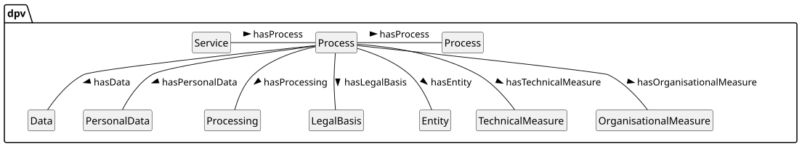 


 

 

In legal terminology, it is common to refer to all information about how personal data is being processed using the colloquial term processing. This results in confusion between the use of processing as a concept referring to all information (i.e. purposes, personal data, collection, storage, etc.), and `processing` as a concept referring to (only) the specific actions or operations (e.g. collect, use).

 

To avoid this ambiguity and enable clarity of information, DPV defines a new concept called [=Process=] for representing how the core concepts are combined and applied for a particular use-case, and the relation [=hasProcess=] to associate processes with other processes, services, or any relevant concept. The association of a concept to `Process` is made using the relationships or properties provided for each concept. For example, to indicate a `Process` includes personal data, the relationship `hasPersonalData` is used along with the concept `PersonalData`.

 


 

-  dpv:Process: An action, activity, or method [go to full definition](https://w3id.org/dpv#Process) 

 

  -  dpv:NonPersonalDataProcess: An action, activity, or method involving non-personal data, and asserting that no personal data is involved [go to full definition](https://w3id.org/dpv#NonPersonalDataProcess) 

 

  -  dpv:PersonalDataHandling: An abstract concept describing 'personal data handling' [go to full definition](https://w3id.org/dpv#PersonalDataHandling)deprecated in next version 

 

  -  dpv:PersonalDataProcess: An action, activity, or method involving personal data [go to full definition](https://w3id.org/dpv#PersonalDataProcess) 

 

  -  dpv:Service: A service is a process where one entity provides some benefit or assistance to another entity [go to full definition](https://w3id.org/dpv#Service) 

 

 

 


  

In DPV v1, the concept `PersonalDataHandling` was defined to represent the combination of core concepts. In DPV v2, this role is fulfilled by `Process` which is a term more closely aligned with practical uses and the vocabulary used by various entities e.g. business process. For backwards compatibility, `PersonalDataHandling` is defined as a subclass or subtype of `Process`.

   

An example of how `Process` brings together the core concepts, consider the example where `Acme` is a `DataController` that `Collect`(s) and `Use`(s) `Email` for `ServiceProvision`. Note that the `pd:EmailAddress` is a concept from the [[[PD]]] extension.

 


```
ex:Acme rdf:type dpv:DataController .
ex:AcmeMarketing rdf:type dpv:Process ;
    dpv:hasDataController ex:Acme ;
    dpv:hasPersonalData pd:EmailAddress ;
    dpv:hasProcessing dpv:Collect, dpv:Use ;
    dpv:hasPurpose dpv:ServiceProvision .
```


 

(META Example ID: [`E0005`](https://w3id.org/dpv/examples#E0005); link: [source file](https://w3id.org/dpv/examples/E0005.ttl); contributed by Harshvardhan J. Pandit on 2024-06-10)

<a id="process-L713"></a>
### Nesting Processes
 

Instances of `Process` can be nested, which means one instance can contain other instances, much like a box with several smaller boxes inside. This permits breaking down complex or dense use-cases into more granular ones and representing them in a more precise and modular fashion. Such a representation also facilitates reuse of the granular or modular processes, or in defining 'templates' and 'patterns', for example to craft a single process representing collecting and storing email addresses and using it in different processes for different purposes.

 

From the earlier example, consider the situation where a single `Process` instance consists of two additional instances representing: (i) data is stored using a data processor, (ii) data is used for Marketing. While it is certainly possible to represent all of this information within one single instance of `Process`, the adopter may decide to create separate instances of `Process` based on requirements such as reflecting similar separations for legal documentation or accountability purposes.

  

Consider the example where Acme, as a DataController, maintains records of its processing activities using `Process` to represent one of its services. In this, it collects email, uses it for internal analyses based on Legitimate Interests, and also sends marketing information by using a processor based on the data subject's consent. Using nesting of processes, the information can be expressed at a granular level representing service, individual purposes, and so on.

 


```
ex:Acme rdf:type dpv:DataController .
ex:AcmeMarketing rdf:type dpv:Process ;
    dpv:hasProcess ex:InternalAnalytics ;
    dpv:hasProcess ex:SendingNewsletters .

ex:InternalAnalytics rdf:type dpv:Process ;
    dpv:hasPersonalData pd:EmailAddressPersonal ;
    dpv:hasProcessing dpv:Collect, dpv:Store ;
    dpv:hasPurpose dpv:InternalResourceOptimisation ;
    dpv:hasLegalBasis dpv:LegitimateInterestOfController .

ex:FooTech rdf:type dpv:DataProcessor .
ex:SendingNewsletters rdf:type dpv:Process ;
    dpv:hasPersonalData pd:EmailAddressPersonal ;
    dpv:hasProcessing dpv:Share ;
    dpv:hasPurpose dpv:Marketing ;
    dpv:hasDataProcessor ex:FooTech ;
    dpv:hasLegalBasis dpv:Consent .
```


 

(META Example ID: [`E0006`](https://w3id.org/dpv/examples#E0006); link: [source file](https://w3id.org/dpv/examples/E0006.ttl); contributed by Harshvardhan J. Pandit on 2024-06-10)

<a id="process-L745"></a>
### Interpretation of Process
 

Where multiple concepts such as purposes and data are present in the same process, the interpretation is that they all apply e.g. each purpose applies to each personal data, and so on. If this is not the case, then nested processes should be used to separate the groups so that only those concepts are present within the same process which occur or are associated with each other.

 

Such arrangements can also be used to separate necessary and optional parts of a process, and can aid in avoiding duplication of processes where only a few elements need to be distinguished. For example, if a purpose has necessary and optional data associated with it, it is possible to create two nested processes containing the purpose and the necessary data in one process, and the process and optional data in another. However, such duplication is not necessary, the 'parent' or 'outer' process can contain the purpose and the nested processes can contain only the differentiating elements i.e. one nested process contains the necessary data and the other contains the optional data.

 

Processes are also be useful to indicate separation of responsibilities - for example where some processing is conducted by one processor and another by a different processor, with each nested process corresponding to the processing activities of one processor.

<a id="process-L751"></a>
### Alternative Models
 

`Process` is intended to provide a convenient concept for tying the core concepts together, and DPV does not make its use binding, nor does it constrain the relationships to only be defined between `Process` and the other core concepts. This is so as to permit using DPV in alternate or differing models. For example, where a central concept already exists, such as when describing relevant information for a smartphone app, the concept for `App` can be a replacement for `Process` based on statements such as `<App> hasPurpose <SomePurpose>`. Even in such cases, `Process` can provide granular expression thereby enabling description of different contexts within which the app uses personal data, such as for registration or complaint resolution. Therefore unless necessary for the use-case, DPV recommends using `Process` or its subtype/subclass as a central concept for ensuring interoperability.

 

An example of where the adopter or use-case wants to use another concept in a way which is not compatible with `Purpose` is the use of `Purpose` to indicate it involves some data i.e. `<SomePurpose hasPersonalData SomePersonalData>`, or to indicate which legal basis is used for that purpose by using the `hasLegalBasis` relationship. While not explicitly prohibited by DPV, the implications of using `Purpose` in this manner is that the personal data and processing and other associated concepts are now strictly tied to the purpose instance (and implementation). Changing any of these would mean changing the purpose, and in addition to these, it is not possible to combine multiple purposes together or have nested purposes with different details in the same manner as with a `Process`. Therefore, DPVCG recommends the use of `Process` to ensure compatibility between use-cases as well as to ensure the use of concepts does not create ambiguity or restrict further use-cases from reusing existing information.

<a id="process-L758"></a>
## Process with/without Personal Data
 

Regulations such as the [[EU-GDPR]] apply when personal data is involved. To provide a convenient way to represent whether a process involves personal data or not, and therefore will be subject to requirements such as those related to privacy or from regulations such as the GDPR, the concepts [=PersonalDataProcess=] and [=NonPersonalDataProcess=] are provided. In providing these concepts, DPV does not dictate how these processes indicate the involvement of personal or non-personal data, for example by mandating the use of properties such as `hasPersonalData`.

 

These concepts are also a convenient way to represent which parts of the process involve personal data and which don't. For example, a process can specify constituent or granular processes using the properties [=hasPersonalDataProcess=] and [=hasNonPersonalDataProcess=] to represent where exactly personal data is or isn't involved.

<a id="process-L764"></a>
## Service
 

TThe concept [=Service=] is a general concept that represents the legal and social notion of 'service', similar to provided 'product' or 'application' or 'process', and does not represent the technical notion of services such as those associated with operating systems or 'cloud services'. In this sense, a 'Service' is _a process where one entity provides some benefit or assistance to another entity_. Service is useful to indicate a logical grouping of processes into a single 'unit' which has legal relevance - such as a contract covering the service or the provision of a service. To indicate a service is associated or involved, the relation [=hasService=] is provided. Services are regualted by law, and are also subject to specific requirements and obligations, such as regarding contractual arrangements, provision of benefits, fiduciary duties, and satisfaction of involved parties. While DPV currently does not provide modelling for these aspects, indicating how services are governed, implemented, and provided -- especially in relation to personal data and impacts -- is supported through the use of this concept.

  

Adopters are cautioned against using [=Service=] to represent technical concepts such as those used for operating systems or the technical concept of a 'cloud service' architecture or infrastructure. Adopters should use the [[TECH]] extension which provides such technical concepts.

  

Broadly, a service can be represented as a group of processes which do different but related things in order to achieve the successful provision of the service. Other relevant concepts from the [[DPV]] modules, such as entities, purposes, and context are helpful here to indicate how this happens. Similarly, extensions such as [[TECH]] enable representing the technical implementation of services, including who develops and provides them, and the involvement of specific hardware, software, or provision models such as through cloud and subscriptions.

 

To indicate the entities involved in services, the concepts `ServiceProvider` and `ServiceConsumer` are defined along with the relations `hasServiceProvider` and `hasServiceConsumer` (these are described in the [`entity`](#entities-L1) module). Entities acting as providers and consumers can also be controllers or processors or data subjects. For example, a controller or processor may be the service provider for another controller who is the service consumer. Similarly, a processor may be the service provider for data subjects under the instructions of a data controller.

  

This example shows the use of Service concept to represent a 'service' provided by an organisation, which includes two processes for data collection and service provision 


```
# Service
ex:StreamingService a dpv:Service ;
    dpv:hasProcess ex:SS1, ex:SS2 ;
    dpv:hasLegalBasis dpv:Contract ; # covering service
    dpv:hasServiceProvider ex:CompanyA ; 
    dpv:hasDataController ex:CompanyA ;
    dpv:hasServiceConsumer ex:Consumers .

ex:SS1 a dpv:Process ;
    dpv:hasPersonalData pd:EmailAddress ;
    dpv:hasProcessing dpv:Collect, dpv:Store, dpv:Use ;
    dpv:hasPurpose dpv:ServiceProvision, dpv:ServiceRegistration .

ex:SS2 a dpv:Process ;
    dpv:hasPersonalData pd:EmailAddress ;
    dpv:hasProcessing dpv:Use ;
    dpv:hasPurpose dpv:FraudPreventionAndDetection .
```


 

(META Example ID: [`E0031`](https://w3id.org/dpv/examples#E0031); link: [source file](https://w3id.org/dpv/examples/E0031.ttl); contributed by Harshvardhan J. Pandit on 2024-06-10)

<a id="process-L800"></a>
## Vocabulary Index
 
<a id="process-classes"></a>

<a id="process-L802"></a>
### Classes
 
<a id="process-NonPersonalDataProcess"></a>

<a id="process-L803"></a>
#### Non-Personal Data Process
 

- Term | NonPersonalDataProcess | Prefix | dpv
- Label | Non-Personal Data Process
- IRI | [https://w3id.org/dpv#NonPersonalDataProcess](https://w3id.org/dpv#NonPersonalDataProcess)
- Type | [rdfs:Class](http://www.w3.org/2000/01/rdf-schema#Class), [skos:Concept](http://www.w3.org/2004/02/skos/core#Concept)
- Broader/Parent types | [dpv:Process](#process-Process)
- Object of relation | [dpv:hasNonPersonalDataProcess](https://w3id.org/dpv#hasNonPersonalDataProcess), [dpv:hasProcess](https://w3id.org/dpv#hasProcess)
- Definition | An action, activity, or method involving non-personal data, and asserting that no personal data is involved
- Usage Note | Use of personal data within NonPersonalDataProcess should be considered a violation of the explicit constraint that no personal data is involved.
- Date Created | 2024-05-09
- Contributors | Harshvardhan J. Pandit
- See More: | section [PROCESS](#process-vocab-process) in [DPV](https://w3id.org/dpv#)

 

 
<a id="process-PersonalDataHandling"></a>

<a id="process-L882"></a>
#### Personal Data Handling
 

- Term | PersonalDataHandling | Prefix | dpv
- Label | Personal Data Handling
- IRI | [https://w3id.org/dpv#PersonalDataHandling](https://w3id.org/dpv#PersonalDataHandling)
- Type | [rdfs:Class](http://www.w3.org/2000/01/rdf-schema#Class), [skos:Concept](http://www.w3.org/2004/02/skos/core#Concept)
- Broader/Parent types | [dpv:Process](#process-Process)
- Object of relation | [dpv:hasPersonalDataHandling](https://w3id.org/dpv#hasPersonalDataHandling), [dpv:hasProcess](https://w3id.org/dpv#hasProcess)
- Definition | An abstract concept describing 'personal data handling'
- Usage Note | This concept will be deprecated in future updates. It is recommended to use dpv:Process as the equivalent alternative which is better aligned with legal and operational terminology.
- Date Created | 2019-04-05
- Date Modified | 2023-12-10
- Contributors | Axel Polleres, Javier Fernández
- See More: | section [PROCESS](#process-vocab-process) in [DPV](https://w3id.org/dpv#)

 

 
<a id="process-PersonalDataProcess"></a>

<a id="process-L964"></a>
#### Personal Data Process
 

- Term | PersonalDataProcess | Prefix | dpv
- Label | Personal Data Process
- IRI | [https://w3id.org/dpv#PersonalDataProcess](https://w3id.org/dpv#PersonalDataProcess)
- Type | [rdfs:Class](http://www.w3.org/2000/01/rdf-schema#Class), [skos:Concept](http://www.w3.org/2004/02/skos/core#Concept)
- Broader/Parent types | [dpv:Process](#process-Process)
- Object of relation | [dpv:hasPersonalDataProcess](https://w3id.org/dpv#hasPersonalDataProcess), [dpv:hasProcess](https://w3id.org/dpv#hasProcess)
- Definition | An action, activity, or method involving personal data
- Date Created | 2024-05-09
- Contributors | Harshvardhan J. Pandit
- See More: | section [PROCESS](#process-vocab-process) in [DPV](https://w3id.org/dpv#)

 

 
<a id="process-Process"></a>

<a id="process-L1040"></a>
#### Process
 

- Term | Process | Prefix | dpv
- Label | Process
- IRI | [https://w3id.org/dpv#Process](https://w3id.org/dpv#Process)
- Type | [rdfs:Class](http://www.w3.org/2000/01/rdf-schema#Class), [skos:Concept](http://www.w3.org/2004/02/skos/core#Concept)
- Object of relation | [dpv:hasProcess](https://w3id.org/dpv#hasProcess)
- Definition | An action, activity, or method
- Examples
- [`dex:E0005 :: ` Process used to combine core concepts and represent an use-case](https://w3id.org/dpv/examples#E0005)
 [`dex:E0006 :: ` Nesting Processes](https://w3id.org/dpv/examples#E0006)
 [`dex:E0031 :: ` Using Service to group related processes](https://w3id.org/dpv/examples#E0031)
 [`dex:E0041 :: ` Indicating purposes associated with a Service](https://w3id.org/dpv/examples#E0041)
- Date Created | 2024-05-09
- Contributors | Harshvardhan J. Pandit
- See More: | section [PROCESS](#process-vocab-process) in [DEX](https://w3id.org/dpv#)

 

 
<a id="process-Service"></a>

<a id="process-L1115"></a>
#### Service
 

- Term | Service | Prefix | dpv
- Label | Service
- IRI | [https://w3id.org/dpv#Service](https://w3id.org/dpv#Service)
- Type | [rdfs:Class](http://www.w3.org/2000/01/rdf-schema#Class), [skos:Concept](http://www.w3.org/2004/02/skos/core#Concept)
- Broader/Parent types | [dpv:Process](#process-Process)
- Subject of relation | [dpv:hasServiceConsumer](https://w3id.org/dpv#hasServiceConsumer), [dpv:hasServiceProvider](https://w3id.org/dpv#hasServiceProvider)
- Object of relation | [dpv:hasProcess](https://w3id.org/dpv#hasProcess), [dpv:hasService](https://w3id.org/dpv#hasService)
- Definition | A service is a process where one entity provides some benefit or assistance to another entity
- Usage Note | Service Provider and Service Consumer reflect the roles associated with a service. 'Service' as a process is a distinct concept from the use of 'service' as a provision method in Tech extension
- Examples
- [`dex:E0031 :: ` Using Service to group related processes](https://w3id.org/dpv/examples#E0031)
 [`dex:E0041 :: ` Indicating purposes associated with a Service](https://w3id.org/dpv/examples#E0041)
- Date Created | 2024-05-09
- Contributors | Harshvardhan J. Pandit
- See More: | section [PROCESS](#process-vocab-process) in [DEX](https://w3id.org/dpv#)

 

 

 
<a id="process-properties"></a>

<a id="process-L1204"></a>
### Properties
 
<a id="process-hasNonPersonalDataProcess"></a>

<a id="process-L1205"></a>
#### has non-personal data process
 

- Term | hasNonPersonalDataProcess | Prefix | dpv
- Label | has non-personal data process
- IRI | [https://w3id.org/dpv#hasNonPersonalDataProcess](https://w3id.org/dpv#hasNonPersonalDataProcess)
- Type | [rdf:Property](http://www.w3.org/1999/02/22-rdf-syntax-ns#Property), [skos:Concept](http://www.w3.org/2004/02/skos/core#Concept)
- Range includes | [dpv:NonPersonalDataProcess](https://w3id.org/dpv#NonPersonalDataProcess)
- Definition | Indicates association with a Non-Personal Data Process
- Date Created | 2023-12-12
- Contributors | Harshvardhan J. Pandit
- See More: | section [PROCESS](#process-vocab-process) in [DPV](https://w3id.org/dpv#)

 

 
<a id="process-hasPersonalDataHandling"></a>

<a id="process-L1276"></a>
#### has personal data handling
 

- Term | hasPersonalDataHandling | Prefix | dpv
- Label | has personal data handling
- IRI | [https://w3id.org/dpv#hasPersonalDataHandling](https://w3id.org/dpv#hasPersonalDataHandling)
- Type | [rdf:Property](http://www.w3.org/1999/02/22-rdf-syntax-ns#Property), [skos:Concept](http://www.w3.org/2004/02/skos/core#Concept)
- Range includes | [dpv:PersonalDataHandling](https://w3id.org/dpv#PersonalDataHandling)
- Definition | Indicates association with Personal Data Handling
- Date Created | 2022-01-19
- Contributors | Georg P. Krog, Harshvardhan J. Pandit
- See More: | section [PROCESS](#process-vocab-process) in [DPV](https://w3id.org/dpv#)

 

 
<a id="process-hasPersonalDataProcess"></a>

<a id="process-L1347"></a>
#### has personal data process
 

- Term | hasPersonalDataProcess | Prefix | dpv
- Label | has personal data process
- IRI | [https://w3id.org/dpv#hasPersonalDataProcess](https://w3id.org/dpv#hasPersonalDataProcess)
- Type | [rdf:Property](http://www.w3.org/1999/02/22-rdf-syntax-ns#Property), [skos:Concept](http://www.w3.org/2004/02/skos/core#Concept)
- Range includes | [dpv:PersonalDataProcess](https://w3id.org/dpv#PersonalDataProcess)
- Definition | Indicates association with a Personal Data Process
- Date Created | 2023-12-11
- Contributors | Harshvardhan J. Pandit
- See More: | section [PROCESS](#process-vocab-process) in [DPV](https://w3id.org/dpv#)

 

 
<a id="process-hasProcess"></a>

<a id="process-L1418"></a>
#### has process
 

- Term | hasProcess | Prefix | dpv
- Label | has process
- IRI | [https://w3id.org/dpv#hasProcess](https://w3id.org/dpv#hasProcess)
- Type | [rdf:Property](http://www.w3.org/1999/02/22-rdf-syntax-ns#Property), [skos:Concept](http://www.w3.org/2004/02/skos/core#Concept)
- Range includes | [dpv:Process](https://w3id.org/dpv#Process)
- Definition | Indicates association with a Process
- Date Created | 2023-12-10
- Contributors | Harshvardhan J. Pandit
- See More: | section [PROCESS](#process-vocab-process) in [DPV](https://w3id.org/dpv#)

 

 
<a id="process-hasService"></a>

<a id="process-L1489"></a>
#### has service
 

- Term | hasService | Prefix | dpv
- Label | has service
- IRI | [https://w3id.org/dpv#hasService](https://w3id.org/dpv#hasService)
- Type | [rdf:Property](http://www.w3.org/1999/02/22-rdf-syntax-ns#Property), [skos:Concept](http://www.w3.org/2004/02/skos/core#Concept)
- Range includes | [dpv:Service](https://w3id.org/dpv#Service)
- Definition | Indicates associated with the specified service
- Date Created | 2024-04-20
- Contributors | Harshvardhan J. Pandit
- See More: | section [PROCESS](#process-vocab-process) in [DPV](https://w3id.org/dpv#)

 

 

 
<a id="process-external-concepts"></a>


 

DPV uses the following terms from [[RDF]] and [[RDFS]] with their defined meanings:

 

 
<a id="process-rdf:type"></a>


- rdf:type to denote a concept is an instance of another concept

 
<a id="process-rdfs:Class"></a>


- rdfs:Class to denote a concept is a Class or a category

 
<a id="process-rdfs:subClassOf"></a>


- rdfs:subClassOf to specify the concept is a subclass (subtype, sub-category, subset) of another concept

 
<a id="process-rdf:Property"></a>


- rdf:Property to denote a concept is a property or a relation

 

 

The following external concepts are re-used within DPV:

<a id="process-L1570"></a>
### External

<a id="process-L1571"></a>
### External
 

 

 
<a id="process-funding-acknowledgements"></a>

<a id="process-L1575"></a>
## Funding Acknowledgements

<a id="process-L1577"></a>
### Funding Sponsors
 

The DPVCG was established as part of the [SPECIAL H2020 Project](https://specialprivacy.ercim.eu/), which received funding from the European Union’s Horizon 2020 research and innovation programme under grant agreement No. 731601 from 2017 to 2019. Continued developments have been funded under: [RECITALS Project](https://recitals-project.eu/) funded under the EU's Horizon program with grant agreement No. 101168490.

 

Harshvardhan J. Pandit was funded to work on DPV from 2020 to 2022 by the [Irish Research Council's](https://research.ie/) Government of Ireland Postdoctoral Fellowship Grant#GOIPD/2020/790.

 

The [ADAPT SFI Centre](https://www.adaptcentre.ie/) for Digital Media Technology is funded by Science Foundation Ireland through the SFI Research Centres Programme and is co-funded under the European Regional Development Fund (ERDF) through Grant#13/RC/2106 (2018 to 2020) and Grant#13/RC/2106_P2 (2021 onwards).

<a id="process-L1583"></a>
### Funding Acknowledgements for Contributors
 

The contributions of Harshvardhan J. Pandit have been made with the financial support of Science Foundation Ireland under Grant Agreement No. 13/RC/2106_P2 at the ADAPT SFI Research Centre; and the AI Accountability Lab (AIAL) which is supported by grants from following groups: the AI Collaborative, an Initiative of the Omidyar Group; Luminate; the Bestseller Foundation; and the John D. and Catherine T. MacArthur Foundation.

ReSpec configuration provenance (not executed): [original HTML lines 7–578](../source/2.3/dpv/modules/process.html#L7-L578).


<!-- materialization-redistribution-notice -->
## Redistribution notice

Data Privacy Vocabulary (DPV) core 2.3, DPV Community Group and contributors; editor Harshvardhan J. Pandit; authors Beatriz Esteves, Delaram Golpayegani, Georg P. Krog, Harshvardhan J. Pandit, Julian Flake and Paul Ryan. Complete original contributor, per-term credit and funding statements retained. Copyright remains with the respective copyright holders. W3C Software and Document License 2023; no W3C Recommendation or author/institution endorsement is implied.

Changes: Twelve fixed-tag HTML originals, twenty-six directly referenced SVG originals and LICENSE.md retained byte-identically. Collector-derived single text consumer preserves authored body order, definition rows and examples, adds source boundaries/selectors and local link routing. ReSpec configuration is retained with exact source locators, not executed; authored reference macros and upstream contradictions are not silently corrected. Graphical arrows/grouping and embedded raster labels are not fully transcribed; text extraction remains partial. No OCR or external runtime execution.

Scope: Fixed commit cbcd21567808812677eeb3bb0f05b2ff2c2211a5 / tag dpv-2.3: 2.3/dpv/dpv.html plus core modules TOM, context, entities, legal_basis, personal_data, process, processing, purposes, rights, risk and rules; exactly twenty-six SVGs referenced by these twelve pages, LICENSE.md, derived text and selectors. Excludes extensions (including PD, RISK and LEGAL), primer, datasets, RDF/CSV serializations, other releases, scripts/styles and recursive external references.

Full license and original rights links: [NOTICE.md](../NOTICE.md).
