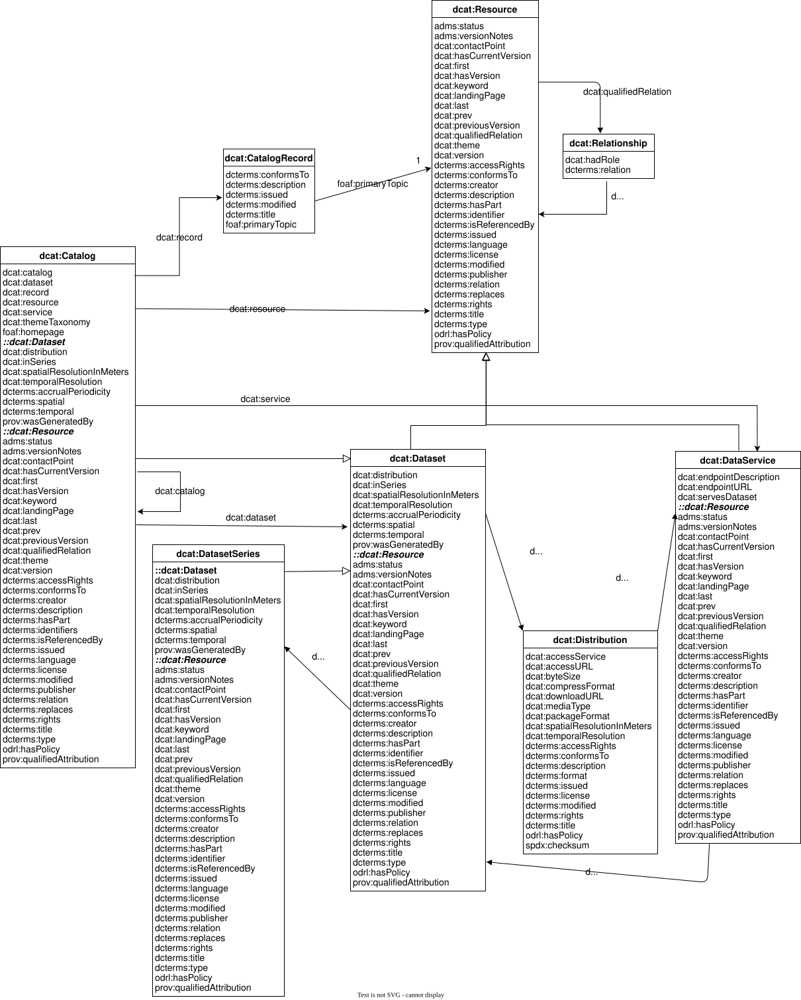
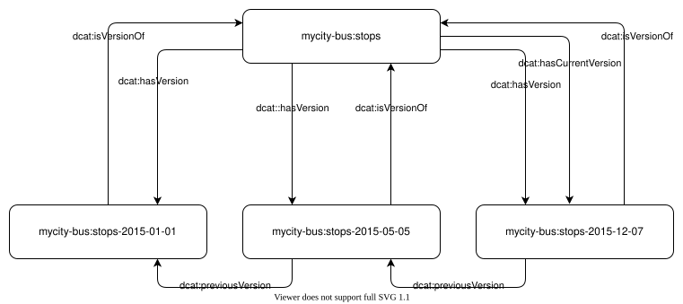
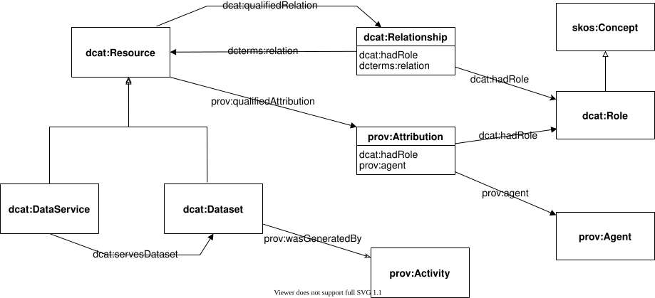
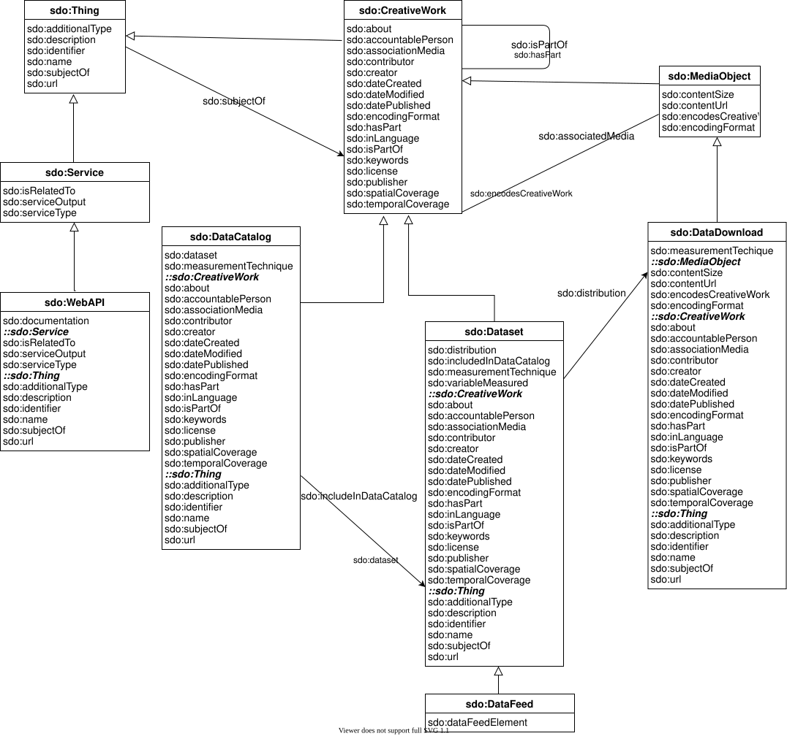

# Retained specification text (collector assembly)

> This consumer Markdown assembles the explicitly retained originals in declared order. Source labels, line anchors and local href rewrites are collector additions; HTML is represented as structural text with ordered table cells and preserved code, without running source scripts.

> Collector representation: declared cell spans are annotations, not an expanded table grid; code br line breaks and NBSP are retained, and image-label whitespace is normalized without dropping label words.

Original HTML: [specification.html](../source/specification.html#L1-L9210).

> Collector asset gap: these original figures are linked to the publisher response but their image bytes are not retained locally: [./images/ex-spatial-coverage-geometry-anne-frank-house.png](https://www.w3.org/TR/2024/REC-vocab-dcat-3-20240822/images/ex-spatial-coverage-geometry-anne-frank-house.png), [./images/ex-spatial-coverage-centroid-anne-frank-house.png](https://www.w3.org/TR/2024/REC-vocab-dcat-3-20240822/images/ex-spatial-coverage-centroid-anne-frank-house.png), [./images/ex-spatial-coverage-bbox-netherlands.png](https://www.w3.org/TR/2024/REC-vocab-dcat-3-20240822/images/ex-spatial-coverage-bbox-netherlands.png).

<a id="specification-L1"></a>
[](https://www.w3.org/)

<a id="specification-L2267"></a>
<a id="specification-title"></a>
# Data Catalog Vocabulary (DCAT) - Version 3
 
<a id="specification-w3c-state"></a>


[W3C Recommendation](https://www.w3.org/standards/types#REC) 22 August 2024

  More details about this document 

 

This version:


 [https://www.w3.org/TR/2024/REC-vocab-dcat-3-20240822/](https://www.w3.org/TR/2024/REC-vocab-dcat-3-20240822/) 

 

Latest published version:


 [https://www.w3.org/TR/vocab-dcat-3/](https://www.w3.org/TR/vocab-dcat-3/) 

 

Latest editor's draft:


[https://w3c.github.io/dxwg/dcat/](https://w3c.github.io/dxwg/dcat/)

 

History:


 [https://www.w3.org/standards/history/vocab-dcat-3/](https://www.w3.org/standards/history/vocab-dcat-3/) 


 [Commit history](https://github.com/w3c/dxwg/commits/) 

 

Implementation report:


 [https://w3c.github.io/dxwg/dcat3-implementation-report/](https://w3c.github.io/dxwg/dcat3-implementation-report/) 

 

Previous Recommendation:


[https://www.w3.org/TR/2020/REC-vocab-dcat-2-20200204/](https://www.w3.org/TR/2020/REC-vocab-dcat-2-20200204/)

 

Editors:


 [Riccardo Albertoni](https://imati.cnr.it/mypage.php?idk=PG-62)[](https://orcid.org/0000-0001-5648-2713) ([Invited Expert / CNR - Consiglio Nazionale delle Ricerche, Italy](https://www.cnr.it/)) 


 David Browning (Invited Expert) (Previously at Refinitiv.com) 


 [Simon J D Cox](https://orcid.org/0000-0002-3884-3420)[](https://orcid.org/0000-0002-3884-3420) (Invited Expert) (Previously at CSIRO) 


 [Alejandra Gonzalez Beltran](https://www.scd.stfc.ac.uk/Pages/Alejandra-Gonzalez-Beltran.aspx)[](https://orcid.org/0000-0003-3499-8262) ([Invited Expert / Scientific Computing Department, Science and Technology Facilities Council, UK](https://stfc.ukri.org/)) (Previously at the University of Oxford) 


 Andrea Perego[](https://orcid.org/0000-0001-9300-2694) (Invited Expert) 


 Peter Winstanley (Invited Expert) 

 

 Former editors: 


 Fadi Maali ([DERI](https://en.wikipedia.org/wiki/Digital_Enterprise_Research_Institute)) 


 John Erickson ([Tetherless World Constellation (RPI)](http://tw.rpi.edu/)) 

 

Feedback:


 [GitHub w3c/dxwg](https://github.com/w3c/dxwg/) ([pull requests](https://github.com/w3c/dxwg/pulls/), [new issue](https://github.com/w3c/dxwg/issues/new/choose), [open issues](https://github.com/w3c/dxwg/issues/)) 


[public-dxwg-comments@w3.org](mailto:public-dxwg-comments@w3.org?subject=%5Bvocab-dcat-3%5D%20YOUR%20TOPIC%20HERE) with subject line [vocab-dcat-3] … message topic … ([archives](https://lists.w3.org/Archives/Public/public-dxwg-comments))

 

Errata:


[Errata exists](https://w3c.github.io/dxwg/errata/).

 

Contributors


 [Makx Dekkers](https://github.com/makxdekkers) 

 

  

 See also [translations](https://www.w3.org/Translations/?technology=vocab-dcat-3). 

 

 This document is also available in these non-normative formats: [Turtle](https://www.w3.org/ns/dcat.ttl), [RDF/XML](https://www.w3.org/ns/dcat.rdf), and [JSON-LD](https://www.w3.org/ns/dcat.jsonld) 

 

 [Copyright](https://www.w3.org/policies/#copyright) © 2024 [World Wide Web Consortium](https://www.w3.org/). W3C® [liability](https://www.w3.org/policies/#Legal_Disclaimer), [trademark](https://www.w3.org/policies/#W3C_Trademarks) and [permissive document license](https://www.w3.org/copyright/software-license-2023/) rules apply. 

  

 
<a id="specification-issue-container-generatedID"></a>


<a id="specification-h-note"></a>


Note

 

DCAT 3 supersedes DCAT 2 [[VOCAB-DCAT-2](#specification-bib-vocab-dcat-2)], but it does not make it obsolete. DCAT 3 maintains the DCAT namespace as its terms preserve backward compatibility with DCAT 2. DCAT 3 relaxes constraints and adds new classes and properties, but these changes do not break the definition of previous terms.

 

Any new implementation is expected to adopt DCAT 3, while the existing implementations do not need to upgrade to it, unless they want to use the new features. In particular, current DCAT 2 deployments that do not overlap with the DCAT 3 new features (e.g., versioning, dataset series and inverse properties) don't need to change anything to remain in conformance with DCAT 3. 

 

 
<a id="specification-abstract"></a>

<a id="specification-L2396"></a>
## Abstract
 

DCAT is an RDF vocabulary designed to facilitate interoperability between data catalogs published on the Web. This document defines the schema and provides examples for its use.

 

DCAT enables a publisher to describe datasets and data services in a catalog using a standard model and vocabulary that facilitates the consumption and aggregation of metadata from multiple catalogs. This can increase the discoverability of datasets and data services. It also makes it possible to have a decentralized approach to publishing data catalogs and makes federated search for datasets across catalogs in multiple sites possible using the same query mechanism and structure. Aggregated DCAT metadata can serve as a manifest file as part of the digital preservation process.

 

The namespace for DCAT terms is `http://www.w3.org/ns/dcat#`

 

The suggested prefix for the DCAT namespace is `dcat`

 

 
<a id="specification-sotd"></a>

<a id="specification-L2408"></a>
## Status of This Document


This section describes the status of this document at the time of its publication. A list of current W3C publications and the latest revision of this technical report can be found in the [W3C technical reports index](https://www.w3.org/TR/) at https://www.w3.org/TR/.

 

 This document defines a major revision of the DCAT 2 vocabulary ([[VOCAB-DCAT-2](#specification-bib-vocab-dcat-2)]) in response to use cases, requirements and community experience which could not be considered during the previous vocabulary development. This revision extends the DCAT standard in line with community practice while supporting diverse approaches to data description and dataset exchange. The main changes to the DCAT vocabulary have been: 

 

 

- addition of [`spdx:checksum`](#specification-Property:distribution_checksum) property and [`spdx:Checksum`](#specification-Class:Checksum) class to provide digest for DCAT distributions

 

- addition of properties for supporting versioning, e.g., [`dcat:version`](#specification-Property:resource_version), [`dcat:previousVersion`](#specification-Property:resource_previous_version), [`dcat:hasCurrentVersion`](#specification-Property:resource_has_current_version), see [11. Versioning](#specification-dataset-versions)

 

- addition of a [`dcat:DatasetSeries`](#specification-Class:Dataset_Series) class and properties for representing Dataset Series, see [12. Dataset series](#specification-dataset-series)

 

 

 This new version of the vocabulary updates and expands the original but preserves backward compatibility. A full list of the significant changes (with links to the relevant GitHub issues) is described in [D. Change history](#specification-changes). 

 

 [Issues, requirements, and features](https://github.com/w3c/dxwg/issues?utf8=%E2%9C%93&q=is%3Aissue+is%3Aopen+label%3Adcat+) that have been considered and discussed by the Data eXchange Working Group but have not been addressed due to lack of maturity or consensus are collected in GitHub. Those believed to be a priority for a future release are in the milestone [DCAT Future Priority Work](https://github.com/w3c/dxwg/milestone/31).

<a id="specification-L2434"></a>
<a id="specification-dcat_history"></a>
### DCAT history
[](#specification-dcat_history)

 

The original DCAT vocabulary was developed and hosted at the [Digital Enterprise Research Institute (DERI)](https://web.archive.org/web/20141224031914/http://www.deri.ie/), then refined by the [eGov Interest Group](https://www.w3.org/egov/), and finally standardized in 2014 [[VOCAB-DCAT-1](#specification-bib-vocab-dcat-1)] by the [Government Linked Data (GLD)](https://www.w3.org/2011/gld/) Working Group.

 

A second recommended revision of DCAT, DCAT 2 [[VOCAB-DCAT-2](#specification-bib-vocab-dcat-2)], was developed by the [Dataset Exchange Working Group](https://www.w3.org/2017/dxwg/) in response to a new set of Use Cases and Requirements [[DCAT-UCR](#specification-bib-dcat-ucr)] gathered from peoples' experience with the DCAT vocabulary from the time of the original version, and new applications that were not considered in the first version. 

 

This version of DCAT, DCAT 3, was developed by the [Dataset Exchange Working Group](https://www.w3.org/2017/dxwg/), considering some of the more pressing use cases and requests among those left unaddressed in the previous standardization round. A summary of the changes from [[VOCAB-DCAT-2](#specification-bib-vocab-dcat-2)] is provided in [D. Change history](#specification-changes).

<a id="specification-L2439"></a>
<a id="specification-external_terms"></a>
### External terms
[](#specification-external_terms)

 

DCAT incorporates terms from pre-existing vocabularies where stable terms with appropriate meanings could be found, such as [`foaf:homepage`](http://xmlns.com/foaf/0.1/homepage) and [`dcterms:title`](http://purl.org/dc/terms/title). Informal summary definitions of the externally-defined terms are included in the DCAT vocabulary for convenience, while authoritative definitions are available in the normative references. Changes to definitions in the references, if any, supersede the summaries given in this specification. Note that conformance to DCAT ([4. Conformance](#specification-conformance)) concerns usage of only the terms in the DCAT vocabulary specification, so possible changes to other external definitions will not affect the conformance of DCAT implementations.

<a id="specification-L2445"></a>
<a id="specification-please_send_comments"></a>
### Please send comments
[](#specification-please_send_comments)

 The Working Group invited publishers to describe their catalogs and datasets with the revised version of DCAT described in this document and to report their implementations following [the instruction to reporting DCAT revised implementations](https://github.com/w3c/dxwg/wiki/DCAT-implementation-evidence). This information and subsequent analysis is published in the [implementation report.](https://w3c.github.io/dxwg/dcat3-implementation-report/) 

 This document was published by the [Dataset Exchange Working Group](https://www.w3.org/groups/wg/dx) as a Recommendation using the [Recommendation track](https://www.w3.org/policies/process/20231103/#recs-and-notes). 


 W3C recommends the wide deployment of this specification as a standard for the Web. 


 A W3C Recommendation is a specification that, after extensive consensus-building, is endorsed by W3C and its Members, and has commitments from Working Group members to [royalty-free licensing](https://www.w3.org/policies/patent-policy/#sec-Requirements) for implementations. 


 This document was produced by a group operating under the [W3C Patent Policy](https://www.w3.org/policies/patent-policy/). W3C maintains a [public list of any patent disclosures](https://www.w3.org/groups/wg/dx/ipr) made in connection with the deliverables of the group; that page also includes instructions for disclosing a patent. An individual who has actual knowledge of a patent which the individual believes contains [Essential Claim(s)](https://www.w3.org/policies/patent-policy/#def-essential) must disclose the information in accordance with [section 6 of the W3C Patent Policy](https://www.w3.org/policies/patent-policy/#sec-Disclosure). 


 This document is governed by the 
<a id="specification-w3c_process_revision"></a>
[03 November 2023 W3C Process Document](https://www.w3.org/policies/process/20231103/). 


 
<a id="specification-introduction"></a>

<a id="specification-L2486"></a>
<a id="specification-x1-introduction"></a>
## 1. Introduction
[](#specification-introduction)


This section is non-normative.

 

Sharing data resources among different organizations, researchers, governments and citizens requires the provision of metadata. This is irrespective of the data being open or not. DCAT is a vocabulary for publishing data catalogs on the Web, which was originally developed in the context of government data catalogs such as [data.gov](https://www.data.gov/) and [data.gov.uk](https://data.gov.uk), but it is also applicable and has been used in other contexts. 


 


 DCAT 3 has extended the previous version to support further use cases and requirements [[DCAT-UCR](#specification-bib-dcat-ucr)]. These include the possibility of cataloging other resources in addition to datasets, such as dataset series. The revision also supports describing versioning of resources. Guidance on how to use inverse properties is provided. 

 

 DCAT provides RDF classes and properties to allow datasets and data services to be described and included in a catalog. The use of a standard model and vocabulary facilitates the consumption and aggregation of metadata from multiple catalogs, which can:

 

 

1.  increase the discoverability of datasets and data services 

 

2.  allow federated search for datasets across catalogs in multiple sites 

 

 

 Data described in a catalog can come in many formats, ranging from spreadsheets, through XML and RDF to various specialized formats. DCAT does not make any assumptions about these serialization formats of the datasets but it does distinguish between the abstract dataset and its different manifestations or distributions. 

 

 Data is often provided through a service which supports selection of an extract, sub-set, or combination of existing data, or of new data generated by some data processing function. DCAT allows the description of a data access service to be included in a catalog. 

 

 Complementary vocabularies can be used together with DCAT to provide more detailed format-specific information. For example, properties from the VoID vocabulary [[VOID](#specification-bib-void)] can be used within DCAT to express various statistics about a dataset if that dataset is in RDF format. 

 

 This document does not prescribe any particular method of deploying data catalogs expressed in DCAT. DCAT information can be presented in many forms including RDF accessible via SPARQL endpoints, embedded in HTML pages as [[HTML-RDFa](#specification-bib-html-rdfa)], or serialized as RDF/XML [[RDF-SYNTAX-GRAMMAR](#specification-bib-rdf-syntax-grammar)], [[N3](#specification-bib-n3)], [[Turtle](#specification-bib-turtle)], [[JSON-LD](#specification-bib-json-ld)] or other formats. Within this document the examples use [[Turtle](#specification-bib-turtle)] because of its readability. 

 

 
<a id="specification-motivation"></a>

<a id="specification-L2540"></a>
<a id="specification-x2-motivation-for-change"></a>
## 2. Motivation for change
[](#specification-motivation)


This section is non-normative.

 

The original Recommendation [[VOCAB-DCAT-1](#specification-bib-vocab-dcat-1)] published in January 2014 provided the basic framework for describing datasets. It made an important distinction between a dataset as an abstract idea and a distribution as a manifestation of the dataset. Although DCAT has been widely adopted, it has become clear that the original specification lacked a number of essential features that were added either through the mechanism of a profile, such as the European Commission's DCAT-AP [[DCAT-AP](#specification-bib-dcat-ap)], or the development of larger vocabularies that to a greater or lesser extent built upon the base standard, such as the Healthcare and Life Sciences Community Profile [[HCLS-Dataset](#specification-bib-hcls-dataset)], the Data Tag Suite [[DATS](#specification-bib-dats)] and more. DCAT 2 [[VOCAB-DCAT-2](#specification-bib-vocab-dcat-2)] was developed to address the specific shortcomings that have come to light through the experiences of different communities, the aim being to improve interoperability between the outputs of these larger vocabularies. For example, DCAT 2 provided classes, properties and guidance to address [identifiers](#specification-dereferenceable-identifiers), [dataset quality information](#specification-quality-information), and [data citation](#specification-data-citation) issues.

 

This revision, DCAT 3, updates the specification throughout. Significant changes from the 2014 Recommendation and DCAT 2 are marked within the text using "Note" sections, as well as being described in [D. Change history](#specification-changes).

 

 
<a id="specification-namespaces"></a>

<a id="specification-L2552"></a>
<a id="specification-x3-namespaces"></a>
## 3. Namespaces
[](#specification-namespaces)

 

The namespace for DCAT is `http://www.w3.org/ns/dcat#`. DCAT also makes extensive use of terms from other vocabularies, in particular Dublin Core [[DCTERMS](#specification-bib-dcterms)]. DCAT defines a minimal set of classes and properties of its own.

 
<a id="specification-normative-namespaces"></a>

<a id="specification-L2559"></a>
<a id="specification-x3-1-normative-namespaces"></a>
### 3.1 Normative namespaces
[](#specification-normative-namespaces)

 

Namespaces and prefixes used in normative parts of this recommendation are shown in the following table.

 
<a id="specification-table-namespaces"></a>


- Prefix | Namespace IRI | Source
- `adms` | `http://www.w3.org/ns/adms#` | [[VOCAB-ADMS](#specification-bib-vocab-adms)]
- `dc` | `http://purl.org/dc/elements/1.1/` | [[DCTERMS](#specification-bib-dcterms)]
- `dcat` | `http://www.w3.org/ns/dcat#` | [[VOCAB-DCAT](#specification-bib-vocab-dcat)]
- `dcterms` | `http://purl.org/dc/terms/` | [[DCTERMS](#specification-bib-dcterms)]
- `dctype` | `http://purl.org/dc/dcmitype/` | [[DCTERMS](#specification-bib-dcterms)]
- `foaf` | `http://xmlns.com/foaf/0.1/` | [[FOAF](#specification-bib-foaf)]
- `locn` | `http://www.w3.org/ns/locn#` | [[LOCN](#specification-bib-locn)]
- `odrl` | `http://www.w3.org/ns/odrl/2/` | [[ODRL-VOCAB](#specification-bib-odrl-vocab)]
- `owl` | `http://www.w3.org/2002/07/owl#` | [[OWL2-SYNTAX](#specification-bib-owl2-syntax)]
- `prov` | `http://www.w3.org/ns/prov#` | [[PROV-O](#specification-bib-prov-o)]
- `rdf` | `http://www.w3.org/1999/02/22-rdf-syntax-ns#` | [[RDF-SYNTAX-GRAMMAR](#specification-bib-rdf-syntax-grammar)]
- `rdfs` | `http://www.w3.org/2000/01/rdf-schema#` | [[RDF-SCHEMA](#specification-bib-rdf-schema)]
- `skos` | `http://www.w3.org/2004/02/skos/core#` | [[SKOS-REFERENCE](#specification-bib-skos-reference)]
- `spdx` | `http://spdx.org/rdf/terms#` | [[SPDX](#specification-bib-spdx)]
- `time` | `http://www.w3.org/2006/time#` | [[OWL-TIME](#specification-bib-owl-time)]
- `vcard` | `http://www.w3.org/2006/vcard/ns#` | [[VCARD-RDF](#specification-bib-vcard-rdf)]
- `xsd` | `http://www.w3.org/2001/XMLSchema#` | [[XMLSCHEMA11-2](#specification-bib-xmlschema11-2)]

 

 
<a id="specification-non-normative-namespaces"></a>

<a id="specification-L2589"></a>
<a id="specification-x3-2-non-normative-namespaces"></a>
### 3.2 Non-normative namespaces
[](#specification-non-normative-namespaces)


This section is non-normative.

 

Namespaces and prefixes used in examples and guidelines in the document and not from normative parts of the recommendation are shown in the following table.

 
<a id="specification-table-namespaces-examples"></a>


- Prefix | Namespace IRI | Source
- `dqv` | `http://www.w3.org/ns/dqv#` | [[VOCAB-DQV](#specification-bib-vocab-dqv)]
- `earl` | `http://www.w3.org/ns/earl#` | [[EARL10-Schema](#specification-bib-earl10-schema)]
- `geosparql` | `http://www.opengis.net/ont/geosparql#` | [[GeoSPARQL](#specification-bib-geosparql)]
- `oa` | `http://www.w3.org/ns/oa#` | [[ANNOTATION-VOCAB](#specification-bib-annotation-vocab)]
- `pav` | `http://purl.org/pav/` | [[PAV](#specification-bib-pav)]
- `sdmx-attribute` | `http://purl.org/linked-data/sdmx/2009/attribute#` | [[VOCAB-DATA-CUBE](#specification-bib-vocab-data-cube)]
- `sdo` | `https://schema.org/` | [[SCHEMA-ORG](#specification-bib-schema-org)]
- `xhv` | `http://www.w3.org/1999/xhtml/vocab#` | [[XHTML-VOCAB](#specification-bib-xhtml-vocab)]

 

 

 
<a id="specification-conformance"></a>

<a id="specification-L2613"></a>
<a id="specification-x4-conformance"></a>
## 4. Conformance
[](#specification-conformance)


As well as sections marked as non-normative, all authoring guidelines, diagrams, examples, and notes in this specification are non-normative. Everything else in this specification is normative.


 The key words MAY, MUST, MUST NOT, and SHOULD in this document are to be interpreted as described in [BCP 14](https://datatracker.ietf.org/doc/html/bcp14) [[RFC2119](#specification-bib-rfc2119)] [[RFC8174](#specification-bib-rfc8174)] when, and only when, they appear in all capitals, as shown here. 

 

A data catalog conforms to DCAT if:

 

 

-  Access to data is organized into datasets, distributions, data services and dataset series. 

 

-  An RDF description of the catalog itself, the corresponding cataloged resources, and distributions is available (but the choice of RDF syntax, access protocol, and access policy are not mandated by this specification).

 

-  The contents of all metadata fields that are held in the catalog and that contain data about the catalog itself, the corresponding cataloged resources, and distributions are included in this RDF description and are expressed using the appropriate classes and properties from DCAT, except where no such class or property exists.

 

-  All classes and properties defined in DCAT are used in a way consistent with the semantics declared in this specification.

 

 DCAT-compliant catalogs MAY include additional non-DCAT metadata fields and additional RDF data in the catalog's RDF description. 

 A DCAT profile is a specification for a data catalog that adds additional constraints to DCAT. A data catalog that conforms to the profile also conforms to DCAT. Additional constraints in a profile MAY include: 

 

 

-  Cardinality constraints, including a minimum set of required metadata fields 

 

-  Sub-classes and sub-properties of the standard DCAT classes and properties

 

-  Classes and properties for additional metadata fields not covered in DCAT vocabulary specification

 

-  Controlled vocabularies or IRI sets as acceptable values for properties

 

-  Requirements for specific access mechanisms (RDF syntaxes, protocols) to the catalog's RDF description

 

 
<a id="specification-issue-container-generatedID-0"></a>


<a id="specification-h-note-0"></a>


Note

 

The notion of profile used in this document denotes metadata specifications that the Dublin Core community would call application profiles [[DCAP](#specification-bib-dcap)].

 

 

 
<a id="specification-vocabulary-overview"></a>

<a id="specification-L2648"></a>
<a id="specification-x5-vocabulary-overview"></a>
## 5. Vocabulary overview
[](#specification-vocabulary-overview)


This section is non-normative.

 
<a id="specification-dcat-scope"></a>

<a id="specification-L2652"></a>
<a id="specification-x5-1-dcat-scope"></a>
### 5.1 DCAT scope
[](#specification-dcat-scope)

 

DCAT is an RDF vocabulary for representing data catalogs. DCAT is based around seven main classes ([Figure 1](#specification-fig-dcat-all-attributes)):

 

 

-  [`dcat:Catalog`](#specification-Class:Catalog) represents a catalog, which is a dataset in which each individual item is a metadata record describing some resource; the scope of `dcat:Catalog` is collections of metadata about datasets, data services, or other resource types. 

 

-  [`dcat:Resource`](#specification-Class:Resource) represents a dataset, a data service or any other resource that may be described by a metadata record in a catalog. This class is not intended to be used directly, but is the parent class of [`dcat:Dataset`](#specification-Class:Dataset), [`dcat:DataService`](#specification-Class:Data_Service) and [`dcat:Catalog`](#specification-Class:Catalog). Resources in a catalog should be instances of one of these classes, or of a sub-class of these, or of a sub-class of [`dcat:Resource`](#specification-Class:Resource) defined in a DCAT profile or other DCAT application. [`dcat:Resource`](#specification-Class:Resource) is actually an extension point for defining a catalog of any kind of resources. [`dcat:Dataset`](#specification-Class:Dataset) and [`dcat:DataService`](#specification-Class:Data_Service) can be used for datasets and services which are not documented in any catalog. 

 

-  [`dcat:Dataset`](#specification-Class:Dataset) represents a collection of data, published or curated by a single agent or identifiable community. The notion of dataset in DCAT is broad and inclusive, with the intention of accommodating resource types arising from all communities. Data comes in many forms including numbers, text, pixels, imagery, sound and other multi-media, and potentially other types, any of which might be collected into a dataset. 

 

-  [`dcat:Distribution`](#specification-Class:Distribution) represents an accessible form of a dataset such as a downloadable file. 

 

-  [`dcat:DataService`](#specification-Class:Data_Service) represents a collection of operations accessible through an interface (API) that provide access to one or more datasets or data processing functions. 

 

-  [`dcat:DatasetSeries`](#specification-Class:Dataset_Series) is a dataset that represents a collection of datasets that are published separately, but share some characteristics that group them. 

 

-  [`dcat:CatalogRecord`](#specification-Class:Catalog_Record) represents a metadata record in the catalog, primarily concerning the registration information, such as who added the record and when. 

 

 
<a id="specification-fig-dcat-all-attributes"></a>


  

[Figure 1](#specification-fig-dcat-all-attributes)  Overview of DCAT model, showing the classes of resources that can be members of a Catalog, and the relationships between them. Except where specifically indicated, DCAT does not provide cardinality constraints. 

 

 
<a id="specification-issue-container-generatedID-1"></a>


<a id="specification-h-note-1"></a>


Note

 

 Along with the rest of [5. Vocabulary overview](#specification-vocabulary-overview), this diagram is non-normative. Furthermore, while the diagram uses UML-style class notation it should be interpreted following the usual RDF open-world assumptions around the presence/absence of properties, relationships, and their cardinality. The properties shown in each class reflect those specified in the descriptions of classes in [6. Vocabulary specification](#specification-vocabulary-specification). Open arrow-heads indicate RDFS sub-class-of relationships (not object-oriented generalization). To assist in understanding the full scope of each class, available properties are copied down from each '::super-class'. 

 

 

 A dataset in DCAT is defined as a "collection of data, published or curated by a single agent, and available for access or download in one or more serializations or formats". A dataset is a conceptual entity, and can be represented by one or more distributions that serialize the dataset for transfer. Distributions of a dataset can be provided via data services. 

 

 A data service typically provides selection, extraction, combination, processing or transformation operations over datasets that might be hosted locally or remote to the service. The result of any request to a data service is a representation of a part or all of a dataset or catalog. A data service might be tied to specific datasets, or its source data might be configured at request- or run-time. A data distribution service allows selection and download of a distribution of a dataset or subset. A data discovery service allows a client to find a suitable dataset. Other kinds of data service include data transformation services, such as coordinate transformation services, re-sampling and interpolation services, and various data processing services, including simulation and modeling services. Note that a data service in DCAT is a collection of operations or API which provides access to data. An interactive user-interface is often available to provide convenient access to API operations, but its description is outside the scope of DCAT. The details of a particular data service endpoint will often be specified through a description conforming to a standard service type, which complement the scope of the DCAT vocabulary itself. 

 

 Descriptions of datasets and data services can be included in a catalog. A catalog is a kind of dataset whose member items are descriptions of datasets and data services. Other types of resources might also be cataloged, but the scope of DCAT is currently limited to datasets and data services. To extend the scope of a catalog beyond datasets and data services it is recommended to define additional sub-classes of [`dcat:Resource`](#specification-Class:Resource) in a DCAT profile or other DCAT application. To extend the scope of service descriptions beyond data distribution services it is recommended to define additional sub-classes of [`dcat:DataService`](#specification-Class:Data_Service) in a DCAT profile or other DCAT application. 

 
<a id="specification-issue-container-generatedID-2"></a>


<a id="specification-h-note-2"></a>


Note

 

 The scope of DCAT 1 [[VOCAB-DCAT-1](#specification-bib-vocab-dcat-1)] was limited to catalogs of datasets. A number of use cases for the revision [[DCAT-UCR](#specification-bib-dcat-ucr)] involve data services as members of a catalog - see [§ 5.16 DCAT Distribution to describe Web services](https://www.w3.org/TR/dcat-ucr/#ID6) and [§ 5.18 Modeling service-based data access](https://www.w3.org/TR/dcat-ucr/#ID18). Since DCAT 2 [[VOCAB-DCAT-2](#specification-bib-vocab-dcat-2)], DCAT includes both datasets and data services to enable these to be part of a DCAT conformant catalog. Provision for catalogs to be composed of other catalogs is also made. See Issue [#172](https://github.com/w3c/dxwg/issues/172). 

 

 Catalogs of other kinds of things might be designed following the DCAT pattern, e.g., dealing with facilities, instruments, samples and specimens, other physical artifacts, events or activities. These are currently out of scope for DCAT, but might be defined through further sub-classes of [`dcat:Resource`](#specification-Class:Resource), which could be specified in a DCAT profile or other DCAT application. 

 

 

A catalog record describes an entry in the catalog. Notice that while [`dcat:Resource`](#specification-Class:Resource) represents the dataset or service itself, [`dcat:CatalogRecord`](#specification-Class:Catalog_Record) is the record that describes the registration of a resource in the catalog. The use of [`dcat:CatalogRecord`](#specification-Class:Catalog_Record) is considered optional. It is used to capture provenance information about entries in a catalog explicitly. If this is not necessary then [`dcat:CatalogRecord`](#specification-Class:Catalog_Record) can be safely ignored.

 

 
<a id="specification-dcat-rdf"></a>

<a id="specification-L2745"></a>
<a id="specification-x5-2-rdf-considerations"></a>
### 5.2 RDF considerations
[](#specification-dcat-rdf)

 
<a id="specification-owl2"></a>


 The DCAT vocabulary is an OWL2 ontology [[OWL2-OVERVIEW](#specification-bib-owl2-overview)] formalized using [[RDF-SCHEMA](#specification-bib-rdf-schema)]. Each class and property in DCAT is denoted by an IRI [[RFC3987](#specification-bib-rfc3987)]. Locally defined elements are in the namespace [`http://www.w3.org/ns/dcat#`](https://www.w3.org/ns/dcat#). Elements are also adopted from several external vocabularies, in particular [[FOAF](#specification-bib-foaf)], [[DCTERMS](#specification-bib-dcterms)] and [[PROV-O](#specification-bib-prov-o)] 

 
<a id="specification-blankNodes"></a>


 RDF allows resources to have global identifiers (IRIs) or to be blank nodes. Blank nodes can be used to denote resources without explicitly naming them with an IRI. They can appear in the subject and object position of a triple [[RDF11-PRIMER](#specification-bib-rdf11-primer)]. For example, in many actual DCAT catalogs, distributions are represented as blank nodes nested inside the related dataset description. While blank nodes can offer flexibility for some use cases, in a Linked Data context, blank nodes limit our ability to collaboratively annotate data. A blank node resource cannot be the target of a link and it can't be annotated with new information from new sources. As one of the biggest benefits of the Linked Data approach is that "anyone can say anything anywhere", use of blank nodes undermines some of the advantages we can gain from wide adoption of the RDF model. Even within the closed world of a single application dataset, use of blank nodes can quickly become limiting when integrating new data [[LinkedDataPatterns](#specification-bib-linkeddatapatterns)]. For these reasons, it is recommended that instances of the DCAT main classes have a global identifier, and use of blank nodes is generally discouraged when encoding DCAT in RDF. 

 
<a id="specification-rdf-syntax"></a>


 All RDF examples in this document are written in Turtle syntax [[Turtle](#specification-bib-turtle)] and many are available from the [DXWG code repository](https://github.com/w3c/dxwg/tree/gh-pages/dcat/examples). 

 
<a id="specification-issue-container-generatedID-3"></a>


<a id="specification-h-note-3"></a>


Note

 

 Each RDF example in this document is intended to demonstrate specific capabilities of DCAT, and therefore only shows a subset of all the potential properties and links which might appear in a complete DCAT resource. 

 

 

 
<a id="specification-basic-example"></a>

<a id="specification-L2776"></a>
<a id="specification-x5-3-basic-example"></a>
### 5.3 Basic example
[](#specification-basic-example)

 

This example provides a quick overview of how DCAT might be used to represent a government catalog and its datasets. Titles, labels and keywords are provided both in English and Spanish to demonstrate the use of language tags.

 

First, the catalog description: 

 
<a id="specification-ex-catalog"></a>


 [Example 1](#specification-ex-catalog) 

 

```
ex:catalog
  a dcat:Catalog ;
  dcterms:title "Imaginary Catalog"@en ;
  dcterms:title "Catálogo imaginario"@es ;
  rdfs:label "Imaginary Catalog"@en ;
  rdfs:label "Catálogo imaginario"@es ;
  foaf:homepage <http://dcat.example.org/catalog> ;
  dcterms:publisher ex:transparency-office ;
  dcterms:language <http://id.loc.gov/vocabulary/iso639-1/en>  ;
  dcat:dataset ex:dataset-001 , ex:dataset-002 , ex:dataset-003 ;
  .
```

  

The publisher of the catalog has the relative IRI `ex:transparency-office`. Further description of the publisher can be provided as in [Example 2](#specification-ex-publisher): 

 
<a id="specification-ex-publisher"></a>


 [Example 2](#specification-ex-publisher) 

 

```
ex:transparency-office
  a foaf:Organization ;
  rdfs:label "Transparency Office"@en ;
  rdfs:label "Oficina de Transparencia"@es ;
  .
```

  

The catalog lists each of its datasets via the `dcat:dataset` property. In [Example 1](#specification-ex-catalog), an example dataset was mentioned with the relative IRI `ex:dataset-001`. A possible description of it using DCAT is shown below: 

 
<a id="specification-ex-dataset"></a>


 [Example 3](#specification-ex-dataset) 

 

```
ex:dataset-001
  a dcat:Dataset ;
  dcterms:title "Imaginary dataset"@en ;
  dcterms:title "Conjunto de datos imaginario"@es ;
  dcat:keyword "accountability"@en, "transparency"@en, "payments"@en ;
  dcat:keyword "responsabilidad"@es, "transparencia"@es, "pagos"@es ;
  dcterms:creator ex:finance-employee-001 ;
  dcterms:issued "2011-12-05"^^xsd:date ;
  dcterms:modified "2011-12-15"^^xsd:date ;
  dcat:contactPoint <http://dcat.example.org/transparency-office/contact> ;
  dcterms:temporal [ a dcterms:PeriodOfTime ;
    dcat:startDate "2011-07-01"^^xsd:date ; 
    dcat:endDate   "2011-09-30"^^xsd:date ;
  ];
  dcat:temporalResolution "P1D"^^xsd:duration ;
  dcterms:spatial <http://sws.geonames.org/6695072/> ;
  dcat:spatialResolutionInMeters "30.0"^^xsd:decimal ;
  dcterms:publisher ex:finance-ministry ;
  dcterms:language <http://id.loc.gov/vocabulary/iso639-1/en> ;
  dcterms:accrualPeriodicity <http://purl.org/linked-data/sdmx/2009/code#freq-W>  ;
  dcat:distribution ex:dataset-001-csv ;
  .
```

  

 Five distinct temporal descriptors are shown for this dataset. The dataset publication and revision dates are shown in [`dcterms:issued`](#specification-Property:resource_release_date) and [`dcterms:modified`](#specification-Property:resource_update_date). For the frequency of update of the dataset in [`dcterms:accrualPeriodicity`](#specification-Property:dataset_frequency), we use an instance from the [content-oriented guidelines](https://www.w3.org/TR/vocab-data-cube/#dsd-cog) developed as part of the W3C Data Cube Vocabulary [[VOCAB-DATA-CUBE](#specification-bib-vocab-data-cube)] efforts. The temporal coverage or extent is given in [`dcterms:temporal`](#specification-Property:dataset_temporal) defining a [`dcterms:PeriodOfTime`](#specification-Class:Period_of_Time) as a closed interval indicated by [`dcat:startDate`](#specification-Property:period_start_date) and [`dcat:endDate`](#specification-Property:period_end_date). The temporal resolution, which describes the minimum spacing of items within the dataset, is given in [`dcat:temporalResolution`](#specification-Property:dataset_temporal_resolution) using the standard datatype `xsd:duration`. 

 

 Additionally, the spatial coverage or extent is given [`dcterms:spatial`](#specification-Property:dataset_spatial) using an IRI from [Geonames](http://www.geonames.org/). The spatial resolution, which describes the minimum spatial separation of items within the dataset, is given in [`dcat:spatialResolutionInMeters`](#specification-Property:dataset_spatial_resolution) using the standard datatype `xsd:decimal`. 

 

 A contact point is provided where comments and feedback about the dataset can be sent. Further details about the contact point, such as email address or telephone number, can be provided using vCard [[VCARD-RDF](#specification-bib-vcard-rdf)]. 

 

One representation of the dataset `ex:dataset-001-csv` can be downloaded as a 5kB CSV file. This is represented as an RDF resource of type `dcat:Distribution`. 

 
<a id="specification-ex-distribution"></a>


 [Example 4](#specification-ex-distribution) 

 

```
ex:dataset-001-csv
  a dcat:Distribution ;
  dcat:downloadURL <http://dcat.example.org/files/001.csv> ;
  dcterms:title "CSV distribution of imaginary dataset 001"@en ;
  dcterms:title "distribución en CSV del conjunto de datos imaginario 001"@es ;
  dcat:mediaType <http://www.iana.org/assignments/media-types/text/csv> ;
  dcat:byteSize "5120"^^xsd:nonNegativeInteger ;
  .
```

  

 
<a id="specification-classifying-datasets"></a>

<a id="specification-L2876"></a>
<a id="specification-x5-4-classifying-datasets-thematically"></a>
### 5.4 Classifying datasets thematically
[](#specification-classifying-datasets)

 

The catalog classifies its datasets according to a set of domains represented by the relative IRI `ex:themes`. SKOS [[SKOS-REFERENCE](#specification-bib-skos-reference)] can be used to describe the domains used: 

 
<a id="specification-ex-thematic-classification"></a>


 [Example 5](#specification-ex-thematic-classification) 

 

```
ex:catalog dcat:themeTaxonomy ex:themes .

ex:themes
  a skos:ConceptScheme ;
  skos:prefLabel "A set of domains to classify documents"@en ;
  .

ex:dataset-001 dcat:theme ex:accountability .
```

  

Notice that this dataset is classified under the domain represented by the relative IRI `ex:accountability`. It is recommended to define the concept as part of the concept scheme identified by the IRI `ex:themes` that was used to describe the catalog domains. An example SKOS description: 

 
<a id="specification-ex-theme-accountability"></a>


 [Example 6](#specification-ex-theme-accountability) 

 

```
ex:accountability
  a skos:Concept ;
  skos:inScheme ex:themes ;
  skos:prefLabel "Accountability"@en ;
  .
```

  

 
<a id="specification-classifying-dataset-types"></a>

<a id="specification-L2910"></a>
<a id="specification-x5-5-classifying-dataset-types"></a>
### 5.5 Classifying dataset types
[](#specification-classifying-dataset-types)

 

 The type or genre of a dataset can be indicated using the [`dcterms:type`](http://purl.org/dc/terms/type) property. It is recommended that the value of the property is taken from a well governed and broadly recognised set of resource types, such as the [DCMI Type Vocabulary](https://www.dublincore.org/specifications/dublin-core/dcmi-terms/#section-7) [[DCTERMS](#specification-bib-dcterms)], the [MARC Genre/Terms Scheme](https://id.loc.gov/vocabulary/marcgt.html), the [[ISO-19115-1](#specification-bib-iso-19115-1)] [`MD_Scope codes`](https://standards.iso.org/iso/19115/resources/Codelists/gml/MD_ScopeCode.xml), the [DataCite resource types](https://schema.datacite.org/meta/kernel-4.4/include/datacite-resourceType-v4.xsd) [[DataCite](#specification-bib-datacite)], or the PARSE.Insight content-types from Re3data [[RE3DATA-SCHEMA](#specification-bib-re3data-schema)]. 

 

 In the following examples, a (notional) dataset is classified separately using values from different vocabularies. 

 
<a id="specification-ex-dataset-type"></a>


 [Example 7](#specification-ex-dataset-type) 

 

```
ex:dataset-001
  rdf:type  dcat:Dataset ;
  dcterms:type  <http://purl.org/dc/dcmitype/Dataset> ;
  .

ex:dataset-001
  rdf:type  dcat:Dataset ;
  dcterms:type  <http://id.loc.gov/vocabulary/marcgt/dtb> ;
  .
```

  

 It is also possible for multiple classifications to be present in a single description. 

 
<a id="specification-ex-dataset-multiple-types"></a>


 [Example 8](#specification-ex-dataset-multiple-types) 

 

```
ex:dataset-001
  rdf:type  dcat:Dataset ;
  dcterms:type  <http://purl.org/dc/dcmitype/Dataset> ;
  dcterms:type  <http://id.loc.gov/vocabulary/marcgt/dtb> ;
  dcterms:type  <urn:example:datacite/resourceType/Dataset> ;
  dcterms:type  <urn:example:re3data/contentType/database> ;
.

<urn:example:datacite/resourceType/Dataset>
  rdfs:label "Dataset"@en ;
  dcterms:source [ rdfs:label "DataCite resource types"@en ] ;
  .

<urn:example:re3data/contentType/database>
  rdfs:label "Database"@en ;
  dcterms:source [ rdfs:label "Re3data content types"@en ] ;
  .
```

  

 
<a id="specification-describing-catalog-records-metadata"></a>

<a id="specification-L2968"></a>
<a id="specification-x5-6-describing-catalog-records-metadata"></a>
### 5.6 Describing catalog records metadata
[](#specification-describing-catalog-records-metadata)

 

If the catalog publisher decides to keep metadata describing its records (i.e., the records containing metadata describing the datasets), `dcat:CatalogRecord` can be used. For example, while `ex:dataset-001` was issued on 2011-12-05, its description on Imaginary Catalog was added on 2011-12-11. This can be represented by DCAT as in [Example 9](#specification-ex-catalog-record): 

 
<a id="specification-ex-catalog-record"></a>


 [Example 9](#specification-ex-catalog-record) 

 

```
ex:catalog dcat:record ex:record-001  .

ex:record-001
  a dcat:CatalogRecord ;
  foaf:primaryTopic ex:dataset-001 ;
  dcterms:issued "2011-12-11"^^xsd:date ;
  .
```

  

 
<a id="specification-example-landing-page"></a>

<a id="specification-L2990"></a>
<a id="specification-x5-7-dataset-available-only-behind-some-web-page"></a>
### 5.7 Dataset available only behind some Web page
[](#specification-example-landing-page)

 

`ex:dataset-002` is available as a CSV file. However `ex:dataset-002` can only be obtained through some Web page where the user needs to follow some links, provide some information and check some boxes before accessing the data.

 
<a id="specification-ex-landing-page"></a>


 [Example 10](#specification-ex-landing-page) 

 

```
ex:dataset-002
  a dcat:Dataset ;
  dcat:landingPage <http://dcat.example.org/dataset-002.html> ;
  dcat:distribution ex:dataset-002-csv ;
  .
ex:dataset-002-csv
  a dcat:Distribution ;
  dcat:accessURL <http://dcat.example.org/dataset-002.html> ;
  dcat:mediaType <http://www.iana.org/assignments/media-types/text/csv> ;
  .
```

  

Notice the use of a `dcat:landingPage` and the definition of the `dcat:Distribution` instance.

 

 
<a id="specification-a-dataset-available-as-download-and-behind-some-web-page"></a>

<a id="specification-L3014"></a>
<a id="specification-x5-8-a-dataset-available-as-a-download-and-behind-some-web-page"></a>
### 5.8 A dataset available as a download and behind some Web page
[](#specification-a-dataset-available-as-download-and-behind-some-web-page)

 

On the other hand, `ex:dataset-003` can be obtained through some landing page but also can be downloaded from a known URL. 

 
<a id="specification-ex-access-and-download-url"></a>


 [Example 11](#specification-ex-access-and-download-url) 

 

```
ex:dataset-003
  a dcat:Dataset ;
  dcat:landingPage <http://dcat.example.org/dataset-003.html> ;
  dcat:distribution ex:dataset-003-csv ;
  .
ex:dataset-003-csv
  a dcat:Distribution ;
  dcat:downloadURL <http://dcat.example.org/dataset-003.csv> ;
  dcat:mediaType <http://www.iana.org/assignments/media-types/text/csv> ;
  .
```

  

Notice that we used `dcat:downloadURL` with the downloadable distribution and that the other distribution accessible through the landing page does not have to be defined as a separate `dcat:Distribution` instance.

 

 
<a id="specification-a-dataset-available-from-a-service"></a>

<a id="specification-L3038"></a>
<a id="specification-x5-9-a-dataset-available-through-a-service"></a>
### 5.9 A dataset available through a service
[](#specification-a-dataset-available-from-a-service)

 

`ex:dataset-004` is distributed in different representations from different services. The `dcat:accessURL` for each `dcat:Distribution` corresponds with the `dcat:endpointURL` of the service. Each service is characterized by its general type using `dcterms:type` (here using values from the INSPIRE spatial data service type vocabulary), its specific API definition using `dcterms:conformsTo`, with the detailed description of the individual endpoint parameters and options linked using `dcat:endpointDescription`. 

 
<a id="specification-ex-access-service"></a>


 [Example 12](#specification-ex-access-service) 

 

```
ex:dataset-004
  rdf:type dcat:Dataset ;
  dcat:distribution ex:dataset-004-csv ;
  dcat:distribution ex:dataset-004-png ;
  .

ex:dataset-004-csv
  rdf:type dcat:Distribution ;
  dcat:accessService ex:table-service-005 ;
  dcat:accessURL <http://dcat.example.org/api/table-005> ;
  dcat:mediaType <http://www.iana.org/assignments/media-types/text/csv> ;
  .

ex:dataset-004-png
  rdf:type dcat:Distribution ;
  dcat:accessService ex:figure-service-006 ;
  dcat:accessURL <http://dcat.example.org/api/figure-006> ;
  dcat:mediaType <http://www.iana.org/assignments/media-types/image/png> ;
  .

ex:figure-service-006
  rdf:type dcat:DataService ;
  dcterms:conformsTo <http://dcat.example.org/apidef/figure/v1.0> ;
  dcterms:type <https://inspire.ec.europa.eu/metadata-codelist/SpatialDataServiceType/view> ;
  dcat:endpointDescription <http://dcat.example.org/api/figure-006/params> ;
  dcat:endpointURL <http://dcat.example.org/api/figure-006> ;
  dcat:servesDataset ex:dataset-004 ;
  .

ex:table-service-005
  rdf:type dcat:DataService ;
  dcterms:conformsTo <http://dcat.example.org/apidef/table/v2.2> ;
  dcterms:type <https://inspire.ec.europa.eu/metadata-codelist/SpatialDataServiceType/download> ;
  dcat:endpointDescription <http://dcat.example.org/api/table-005/capability> ;
  dcat:endpointURL <http://dcat.example.org/api/table-005> ;
  dcat:servesDataset ex:dataset-003, ex:dataset-004 ;
  .
```

  

 

 
<a id="specification-vocabulary-specification"></a>

<a id="specification-L3093"></a>
<a id="specification-x6-vocabulary-specification"></a>
## 6. Vocabulary specification
[](#specification-vocabulary-specification)

 
<a id="specification-RDF-representation"></a>

<a id="specification-L3097"></a>
<a id="specification-x6-1-rdf-representation"></a>
### 6.1 RDF representation
[](#specification-RDF-representation)

 
<a id="specification-issue-container-generatedID-4"></a>


<a id="specification-h-ednote"></a>


Editor's note

 

New RDF serializations will be made available for DCAT 3 in the official URIs as soon as DCAT 3 becomes REC. In the meanwhile, the DCAT 3 RDFs are available in the [DXWG GitHub repository](https://github.com/w3c/dxwg/tree/gh-pages/dcat/rdf): [dcat3.ttl](https://github.com/w3c/dxwg/tree/gh-pages/dcat/rdf/dcat3.ttl), [dcat3.rdf](https://github.com/w3c/dxwg/tree/gh-pages/dcat/rdf/dcat3.rdf), and [dcat3.jsonld](https://github.com/w3c/dxwg/tree/gh-pages/dcat/rdf/dcat3.jsonld)

 

 

The (revised) DCAT vocabulary is [available in RDF](https://www.w3.org/ns/dcat#). The primary artifact [`dcat.ttl`](https://www.w3.org/ns/dcat.ttl) is a serialization of the core DCAT vocabulary. Alongside it are a set of other RDF files that provide additional information, including:

 

 

1.  

The files [dcat-external.ttl](https://www.w3.org/ns/dcat-external.ttl), [dcat-external.rdf](https://www.w3.org/ns/dcat-external.rdf), and [dcat-external.jsonld](https://www.w3.org/ns/dcat-external.jsonld) includes externally defined terms where DCAT has provided additional documentation or usage notes.

 

 

2.  

The files [dcat2.ttl](https://www.w3.org/ns/dcat2.ttl), [dcat2.rdf](https://www.w3.org/ns/dcat2.rdf), and [dcat2.jsonld](https://www.w3.org/ns/dcat2.jsonld) that correspond to version 2 of DCAT [[VOCAB-DCAT-2](#specification-bib-vocab-dcat-2)].

 

 

3.  The files [dcat2014.ttl](https://www.w3.org/ns/dcat2014.ttl) and [dcat2014.rdf](https://www.w3.org/ns/dcat2014.rdf) that correspond to the 2014 version of DCAT [[VOCAB-DCAT-1](#specification-bib-vocab-dcat-1)]. 

 

 
<a id="specification-issue-container-generatedID-5"></a>


<a id="specification-h-note-4"></a>


Note

 

Where possible, properties defined by DCAT do not have specified domains in order to leave the property open for use with any kind of resources. The intention is that such properties can be reused in any suitable circumstance where they make sense. 

 

 

 
<a id="specification-external-vocab"></a>

<a id="specification-L3133"></a>
<a id="specification-x6-2-elements-from-other-vocabularies"></a>
### 6.2 Elements from other vocabularies
[](#specification-external-vocab)

 

 DCAT requires use of elements from a number of other vocabularies. Furthermore, DCAT may be augmented by additional elements from external vocabularies, following the usual RDFS [[RDF-SCHEMA](#specification-bib-rdf-schema)] and OWL2 [[OWL2-OVERVIEW](#specification-bib-owl2-overview)] rules and patterns. 

 
<a id="specification-complements"></a>

<a id="specification-L3141"></a>
<a id="specification-x6-2-1-complementary-vocabularies"></a>
#### 6.2.1 Complementary vocabularies
[](#specification-complements)

 

 Elements from a number of complementary vocabularies MAY be used together with DCAT to provide more detailed information. For example: properties from the VoID vocabulary [[VOID](#specification-bib-void)] allow the description of various statistics about a DCAT-described dataset if that dataset is in RDF format; properties from the Provenance ontology [[PROV-O](#specification-bib-prov-o)] can be used to provide more information about the workflow that generated a dataset or service and related activities and agents; classes and properties from the Organization Ontology [[VOCAB-ORG](#specification-bib-vocab-org)] can be used to explain additional details of responsible agents. 

 

 
<a id="specification-dependencies"></a>

<a id="specification-L3149"></a>
<a id="specification-x6-2-2-element-definitions"></a>
#### 6.2.2 Element definitions
[](#specification-dependencies)

 

 The definitions (including domain and range) of terms outside the DCAT namespace are provided here only for convenience and MUST NOT be considered normative. The authoritative definitions of these terms are in the corresponding specifications, i.e., [[DC11](#specification-bib-dc11)], [[DCTERMS](#specification-bib-dcterms)], [[FOAF](#specification-bib-foaf)], [[PROV-O](#specification-bib-prov-o)], [[RDF-SCHEMA](#specification-bib-rdf-schema)], [[SKOS-REFERENCE](#specification-bib-skos-reference)], [[XMLSCHEMA11-2](#specification-bib-xmlschema11-2)] and [[VCARD-RDF](#specification-bib-vcard-rdf)]. 

 

 

 
<a id="specification-Class:Catalog"></a>

<a id="specification-L3159"></a>
<a id="specification-x6-3-class-catalog"></a>
### 6.3 Class: Catalog
[](#specification-Class:Catalog)

 
<a id="specification-issue-container-generatedID-6"></a>


<a id="specification-h-note-5"></a>


Note

 

The scope of `dcat:Catalog` in DCAT 1 was catalogs of datasets [[VOCAB-DCAT-1](#specification-bib-vocab-dcat-1)]. Since DCAT 2 [[VOCAB-DCAT-2](#specification-bib-vocab-dcat-2)], this was generalized, and properties common to all cataloged resources were associated with a super-class [`dcat:Resource`](#specification-Class:Resource).

 

Moreover, an explicit class for [data services](#specification-Class:Data_Service) was added in DCAT, to enable these to be part of a catalog.

 

Finally, `dcat:Catalog` was made a sub-class of `dcat:Dataset`, and provision for catalogs to be composed of other catalogs is also enabled.

 

See Issue [#116](https://github.com/w3c/dxwg/issues/116) and Issue [#172](https://github.com/w3c/dxwg/issues/172).

 

 

The following properties are specific to this class:


 


 

- [catalog record](#specification-Property:catalog_catalog_record)

 

- [resource](#specification-Property:catalog_resource)

 

- [dataset](#specification-Property:catalog_dataset)

 

- [service](#specification-Property:catalog_service)

 

- [catalog](#specification-Property:catalog_catalog)

 

- [homepage](#specification-Property:catalog_homepage)

 

- [themes](#specification-Property:catalog_themes)

 

 

The following properties of the super-class [`dcat:Dataset`](#specification-Class:Dataset) are also available for use:

 

 

- [distribution](#specification-Property:dataset_distribution)

 

- [frequency](#specification-Property:dataset_frequency)

 

- [spatial/geographic coverage](#specification-Property:dataset_spatial)

 

- [spatial resolution](#specification-Property:dataset_spatial_resolution)

 

- [temporal coverage](#specification-Property:dataset_temporal)

 

- [temporal resolution](#specification-Property:dataset_temporal_resolution)

 

- [was generated by](#specification-Property:dataset_was_generated_by)

 

 

The following properties of the super-class [`dcat:Resource`](#specification-Class:Resource) are also available for use:

 

 

- [access rights](#specification-Property:resource_access_rights)

 

- [conforms to](#specification-Property:resource_conforms_to)

 

- [contact point](#specification-Property:resource_contact_point)

 

- [creator](#specification-Property:resource_creator)

 

- [description](#specification-Property:resource_description)

 

- [has policy](#specification-Property:resource_has_policy)

 

- [identifier](#specification-Property:resource_identifier)

 

- [is referenced by](#specification-Property:resource_is_referenced_by)

 

- [keyword/tag](#specification-Property:resource_keyword)

 

- [landing page](#specification-Property:resource_landing_page)

 

- [license](#specification-Property:resource_license)

 

- [language](#specification-Property:resource_language)

 

- [relation](#specification-Property:resource_relation)

 

- [rights](#specification-Property:resource_rights)

 

- [qualified relation](#specification-Property:resource_qualified_relation)

 

- [publisher](#specification-Property:resource_publisher)

 

- [release date](#specification-Property:resource_release_date)

 

- [theme/category](#specification-Property:resource_theme)

 

- [title](#specification-Property:resource_title)

 

- [type/genre](#specification-Property:resource_type)

 

- [update/modification date](#specification-Property:resource_update_date)

 

- [qualified attribution](#specification-Property:resource_qualified_attribution)

 

- [has current version](#specification-Property:resource_has_current_version)

 

- [has version](#specification-Property:resource_has_version)

 

- [previous version](#specification-Property:resource_previous_version)

 

- [replaces](#specification-Property:resource_replaces)

 

- [status](#specification-Property:resource_status)

 

- [version](#specification-Property:resource_version)

 

- [version notes](#specification-Property:resource_version_notes)

 

- [first](#specification-Property:resource_first)

 

- [last](#specification-Property:resource_last)

 

- [previous](#specification-Property:resource_previous)

 

 

- RDF Class: | [`dcat:Catalog`](https://www.w3.org/ns/dcat#Catalog)
- Definition: | A curated collection of metadata about resources.
- Sub-class of: | [`dcat:Dataset`](#specification-Class:Dataset)
- Usage note: | A Web-based data catalog is typically represented as a single instance of this class.
- Usage note: | Datasets and data services are examples of resources in the context of a data catalog.
- See also: | [6.5 Class: Catalog Record](#specification-Class:Catalog_Record), [6.6 Class: Dataset](#specification-Class:Dataset)

 
<a id="specification-Property:catalog_homepage"></a>

<a id="specification-L3245"></a>
<a id="specification-x6-3-1-property-homepage"></a>
#### 6.3.1 Property: homepage
[](#specification-Property:catalog_homepage)

 

- RDF Property: | [`foaf:homepage`](http://xmlns.com/foaf/0.1/homepage)
- Definition: | A homepage of the catalog (a public Web document usually available in HTML).
- Range: | [`foaf:Document`](http://xmlns.com/foaf/0.1/Document)
- Usage note: | [`foaf:homepage`](http://xmlns.com/foaf/0.1/homepage) is an inverse functional property (IFP) which means that it MUST be unique and precisely identify the Web-page for the resource. This property indicates the canonical Web-page, which might be helpful in cases where there is more than one Web-page about the resource.

 

 
<a id="specification-Property:catalog_themes"></a>

<a id="specification-L3256"></a>
<a id="specification-x6-3-2-property-themes"></a>
#### 6.3.2 Property: themes
[](#specification-Property:catalog_themes)

 

- RDF Property: | [`dcat:themeTaxonomy`](https://www.w3.org/ns/dcat#themeTaxonomy)
- Definition: | A knowledge organization system (KOS) used to classify the resources documented in the catalog (e.g., datasets and services).
- Domain: | [`dcat:Catalog`](#specification-Class:Catalog)
- Range: | [`rdfs:Resource`](https://www.w3.org/2000/01/rdf-schema#Resource)
- Usage note: | It is recommended that the taxonomy is organized in a [`skos:ConceptScheme`](https://www.w3.org/2004/02/skos/core#ConceptScheme), [`skos:Collection`](https://www.w3.org/2004/02/skos/core#Collection), [`owl:Ontology`](https://www.w3.org/2002/07/owl#Ontology) or similar, which allows each member to be denoted by an IRI and published as Linked Data.

 

 
<a id="specification-Property:catalog_resource"></a>

<a id="specification-L3277"></a>
<a id="specification-x6-3-3-property-resource"></a>
#### 6.3.3 Property: resource
[](#specification-Property:catalog_resource)

 
<a id="specification-issue-container-generatedID-7"></a>


<a id="specification-h-note-6"></a>


Note

 

 Property added in this context in DCAT 3. 

 

 

- RDF Property: | [`dcat:resource`](https://www.w3.org/ns/dcat#resource)
- Definition: | A resource that is listed in the catalog.
- Sub-property of: | [`dcterms:hasPart`](http://purl.org/dc/terms/hasPart)
- Domain: | [`dcat:Catalog`](#specification-Class:Catalog)
- Range: | [`dcat:Resource`](#specification-Class:Resource)
- Usage note: | This is the most general predicate for membership of a catalog. Use of a more specific sub-property is recommended when available.
- See also: | Sub-properties of `dcat:resource` in particular [`dcat:dataset`](#specification-Property:catalog_dataset), [`dcat:catalog`](#specification-Property:catalog_catalog), [`dcat:service`](#specification-Property:catalog_service).

 

 
<a id="specification-Property:catalog_dataset"></a>

<a id="specification-L3306"></a>
<a id="specification-x6-3-4-property-dataset"></a>
#### 6.3.4 Property: dataset
[](#specification-Property:catalog_dataset)

 

- RDF Property: | [`dcat:dataset`](https://www.w3.org/ns/dcat#dataset)
- Definition: | A dataset that is listed in the catalog.
- Sub-property of: | [`dcat:resource`](#specification-Property:catalog_resource)
- Domain: | [`dcat:Catalog`](#specification-Class:Catalog)
- Range: | [`dcat:Dataset`](#specification-Class:Dataset)

 

 
<a id="specification-Property:catalog_service"></a>

<a id="specification-L3321"></a>
<a id="specification-x6-3-5-property-service"></a>
#### 6.3.5 Property: service
[](#specification-Property:catalog_service)

 
<a id="specification-issue-container-generatedID-8"></a>


<a id="specification-h-note-7"></a>


Note

 

 Property added in DCAT 2. 

 

 

- RDF Property: | [`dcat:service`](https://www.w3.org/ns/dcat#service)
- Definition: | A service that is listed in the catalog.
- Sub-property of: | [`dcat:resource`](#specification-Property:catalog_resource)
- Domain: | [`dcat:Catalog`](#specification-Class:Catalog)
- Range: | [`dcat:DataService`](#specification-Class:Data_Service)

 

 
<a id="specification-Property:catalog_catalog"></a>

<a id="specification-L3342"></a>
<a id="specification-x6-3-6-property-catalog"></a>
#### 6.3.6 Property: catalog
[](#specification-Property:catalog_catalog)

 
<a id="specification-issue-container-generatedID-9"></a>


<a id="specification-h-note-8"></a>


Note

 

 Property added in DCAT 2. 

 

 

- RDF Property: | [`dcat:catalog`](https://www.w3.org/ns/dcat#catalog)
- Definition: | A catalog that is listed in the catalog.
- Sub-property of: | [`dcat:resource`](#specification-Property:catalog_resource)
- Domain: | [`dcat:Catalog`](#specification-Class:Catalog)
- Range: | [`dcat:Catalog`](#specification-Class:Catalog)

 

 
<a id="specification-Property:catalog_catalog_record"></a>

<a id="specification-L3363"></a>
<a id="specification-x6-3-7-property-catalog-record"></a>
#### 6.3.7 Property: catalog record
[](#specification-Property:catalog_catalog_record)

 

- RDF Property: | [`dcat:record`](https://www.w3.org/ns/dcat#record)
- Definition: | A record describing the registration of a single resource (e.g., a dataset, a data service) that is part of the catalog.
- Domain: | [`dcat:Catalog`](#specification-Class:Catalog)
- Range: | [`dcat:CatalogRecord`](#specification-Class:Catalog_Record)

 

 

 
<a id="specification-Class:Resource"></a>

<a id="specification-L3375"></a>
<a id="specification-x6-4-class-cataloged-resource"></a>
### 6.4 Class: Cataloged Resource
[](#specification-Class:Resource)

 
<a id="specification-issue-container-generatedID-10"></a>


<a id="specification-h-note-9"></a>


Note

 

 Class added in DCAT 2. 

 

 

The following properties are specific to this class:

 

 

- [access rights](#specification-Property:resource_access_rights)

 

- [conforms to](#specification-Property:resource_conforms_to)

 

- [contact point](#specification-Property:resource_contact_point)

 

- [creator](#specification-Property:resource_creator)

 

- [description](#specification-Property:resource_description)

 

- [has part](#specification-Property:resource_has_part)

 

- [has policy](#specification-Property:resource_has_policy)

 

- [identifier](#specification-Property:resource_identifier)

 

- [is referenced by](#specification-Property:resource_is_referenced_by)

 

- [keyword/tag](#specification-Property:resource_keyword)

 

- [landing page](#specification-Property:resource_landing_page)

 

- [license](#specification-Property:resource_license)

 

- [language](#specification-Property:resource_language)

 

- [relation](#specification-Property:resource_relation)

 

- [rights](#specification-Property:resource_rights)

 

- [qualified relation](#specification-Property:resource_qualified_relation)

 

- [publisher](#specification-Property:resource_publisher)

 

- [release date](#specification-Property:resource_release_date)

 

- [theme/category](#specification-Property:resource_theme)

 

- [title](#specification-Property:resource_title)

 

- [type/genre](#specification-Property:resource_type)

 

- [update/modification date](#specification-Property:resource_update_date)

 

- [qualified attribution](#specification-Property:resource_qualified_attribution)

 

- [has current version](#specification-Property:resource_has_current_version)

 

- [has version](#specification-Property:resource_has_version)

 

- [previous version](#specification-Property:resource_previous_version)

 

- [replaces](#specification-Property:resource_replaces)

 

- [status](#specification-Property:resource_status)

 

- [version](#specification-Property:resource_version)

 

- [version notes](#specification-Property:resource_version_notes)

 

- [first](#specification-Property:resource_first)

 

- [last](#specification-Property:resource_last)

 

- [previous](#specification-Property:resource_previous)

 

 

- RDF Class: | [`dcat:Resource`](https://www.w3.org/ns/dcat#Resource)
- Definition: | Resource published or curated by a single agent.
- Usage note: | The class of all cataloged resources, the super-class of [`dcat:Dataset`](#specification-Class:Dataset), [`dcat:DataService`](#specification-Class:Data_Service), [`dcat:Catalog`](#specification-Class:Catalog) and any other member of a [`dcat:Catalog`](#specification-Class:Catalog). This class carries properties common to all cataloged resources, including datasets and data services. The instances of this class SHOULD be included in a catalog. When describing a resource which is not a [`dcat:Dataset`](#specification-Class:Dataset) or [`dcat:DataService`](#specification-Class:Data_Service), it is recommended to create a suitable sub-class of [`dcat:Resource`](#specification-Class:Resource), or use [`dcat:Resource`](#specification-Class:Resource) with the [`dcterms:type`](#specification-Property:resource_type) property to indicate the specific type.
- Usage note: | [`dcat:Resource`](#specification-Class:Resource) is an extension point that enables the definition of any kind of catalog. Additional sub-classes may be defined in a DCAT profile or other DCAT application for catalogs of other kinds of resources.
- See also: | [6.5 Class: Catalog Record](#specification-Class:Catalog_Record)

 
<a id="specification-Property:resource_access_rights"></a>

<a id="specification-L3463"></a>
<a id="specification-x6-4-1-property-access-rights"></a>
#### 6.4.1 Property: access rights
[](#specification-Property:resource_access_rights)

 
<a id="specification-issue-container-generatedID-11"></a>


<a id="specification-h-note-10"></a>


Note

 

 Property added in DCAT 2. 

 

 

- RDF Property: | [`dcterms:accessRights`](http://purl.org/dc/terms/accessRights)
- Definition: | Information about who can access the resource or an indication of its security status.
- Range: | [`dcterms:RightsStatement`](http://purl.org/dc/terms/RightsStatement)
- Usage note: | Information about licenses and rights MAY be provided for the Resource. See also guidance at [9. License and rights statements](#specification-license-rights).
- See also: | [6.4.20 Property: rights](#specification-Property:resource_rights)

 

 
<a id="specification-Property:resource_conforms_to"></a>

<a id="specification-L3482"></a>
<a id="specification-x6-4-2-property-conforms-to"></a>
#### 6.4.2 Property: conforms to
[](#specification-Property:resource_conforms_to)

 
<a id="specification-issue-container-generatedID-12"></a>


<a id="specification-h-note-11"></a>


Note

 

 Property added in DCAT 2. 

 

 

- RDF Property: | [`dcterms:conformsTo`](http://purl.org/dc/terms/conformsTo)
- Definition: | An established standard to which the described resource conforms.
- Range: | [`dcterms:Standard`](http://purl.org/dc/terms/Standard) ("A basis for comparison; a reference point against which other things can be evaluated." [[DCTERMS](#specification-bib-dcterms)])
- Usage note: | This property SHOULD be used to indicate the model, schema, ontology, view or profile that the cataloged resource content conforms to.

 

 

For guidance on the use of this property, see [14.2.1 Conformance to a standard](#specification-quality-conformance-statement).

 
<a id="specification-issue-container-generatedID-13"></a>


<a id="specification-h-note-12"></a>


Note

 

 [`dcterms:Standard`](http://purl.org/dc/terms/Standard) is defined in [[DCTERMS](#specification-bib-dcterms)] as "A basis for comparison; a reference point against which other things can be evaluated." The target resource is not restricted to formal standards issued by bodies like ISO and W3C. In this context, it is any resource that specifies one or more aspects of the cataloged resource content, for example schema, semantics, syntax, usage guidelines, file format, or specific serialization. The meaning of conformance is determined by provisions in the target standard. 

 

 
<a id="specification-Property:resource_contact_point"></a>

<a id="specification-L3508"></a>
<a id="specification-x6-4-3-property-contact-point"></a>
#### 6.4.3 Property: contact point
[](#specification-Property:resource_contact_point)

 
<a id="specification-issue-container-generatedID-14"></a>


<a id="specification-h-note-13"></a>


Note

 

 In DCAT 1 [[VOCAB-DCAT-1](#specification-bib-vocab-dcat-1)] the domain of `dcat:contactPoint` was `dcat:Dataset`, which limited use of this property in other contexts. The domain was relaxed in DCAT 2. See Issue [#95](https://github.com/w3c/dxwg/issues/95). 

 

 

- RDF Property: | [`dcat:contactPoint`](https://www.w3.org/ns/dcat#contactPoint)
- Definition: | Relevant contact information for the cataloged resource. Use of vCard is recommended [[VCARD-RDF](#specification-bib-vcard-rdf)].
- Range: | [`vcard:Kind`](https://www.w3.org/TR/vcard-rdf/#d4e1819)

 

 
<a id="specification-Property:resource_creator"></a>

<a id="specification-L3526"></a>
<a id="specification-x6-4-4-property-creator"></a>
#### 6.4.4 Property: creator
[](#specification-Property:resource_creator)

 
<a id="specification-issue-container-generatedID-15"></a>


<a id="specification-h-note-14"></a>


Note

 

 Property added in DCAT 2, specifically to address data citation requirements. 

 

 

- RDF Property: | [`dcterms:creator`](http://purl.org/dc/terms/creator)
- Definition: | The entity responsible for producing the resource.
- Range: | [`foaf:Agent`](http://xmlns.com/foaf/0.1/Agent)
- Usage note: | Resources of type [`foaf:Agent`](http://xmlns.com/foaf/0.1/Agent) are recommended as values for this property.
- See also: | [6.12 Class: Organization/Person](#specification-Class:Organization_Person)

 
<a id="specification-issue-container-generatedID-16"></a>


<a id="specification-h-note-15"></a>


Note

 

 This property is added to the [`dcat:Resource`](#specification-Class:Resource) class, as the `dcat:Dataset` super-class. For more details, see [13. Data citation](#specification-data-citation). 

 

 The use of the [[PROV-O](#specification-bib-prov-o)] qualified-attribution pattern is described in [15.1 Relationships between datasets and agents](#specification-qualified-attribution). `dcterms:creator` corresponds with a general attribution with the role 'creator'. 

 

 

 
<a id="specification-Property:resource_description"></a>

<a id="specification-L3555"></a>
<a id="specification-x6-4-5-property-description"></a>
#### 6.4.5 Property: description
[](#specification-Property:resource_description)

 

- RDF Property: | [`dcterms:description`](http://purl.org/dc/terms/description)
- Definition: | A free-text account of the resource.
- Range: | [`rdfs:Literal`](https://www.w3.org/2000/01/rdf-schema#Literal)

 

 
<a id="specification-Property:resource_title"></a>

<a id="specification-L3565"></a>
<a id="specification-x6-4-6-property-title"></a>
#### 6.4.6 Property: title
[](#specification-Property:resource_title)

 

- RDF Property: | [`dcterms:title`](http://purl.org/dc/terms/title)
- Definition: | A name given to the resource.
- Range: | [`rdfs:Literal`](https://www.w3.org/2000/01/rdf-schema#Literal)

 

 
<a id="specification-Property:resource_release_date"></a>

<a id="specification-L3574"></a>
<a id="specification-x6-4-7-property-release-date"></a>
#### 6.4.7 Property: release date
[](#specification-Property:resource_release_date)

 

- RDF Property: | [`dcterms:issued`](http://purl.org/dc/terms/issued)
- Definition: | Date of formal issuance (e.g., publication) of the resource.
- Range: | [`rdfs:Literal`](https://www.w3.org/2000/01/rdf-schema#Literal) encoded using the relevant ISO 8601 Date and Time compliant string [[DATETIME](#specification-bib-datetime)] and typed using the appropriate XML Schema datatype [[XMLSCHEMA11-2](#specification-bib-xmlschema11-2)] ([`xsd:gYear`](https://www.w3.org/TR/xmlschema11-2/#gYear), [`xsd:gYearMonth`](https://www.w3.org/TR/xmlschema11-2/#gYearMonth), [`xsd:date`](https://www.w3.org/TR/xmlschema11-2/#date), or [`xsd:dateTime`](https://www.w3.org/TR/xmlschema11-2/#dateTime)).
- Usage note: | This property SHOULD be set using the first known date of issuance.
- See also: | [6.5.3 Property: listing date](#specification-Property:record_listing_date) and [6.8.3 Property: release date](#specification-Property:distribution_release_date)

 

 
<a id="specification-Property:resource_update_date"></a>

<a id="specification-L3587"></a>
<a id="specification-x6-4-8-property-update-modification-date"></a>
#### 6.4.8 Property: update/modification date
[](#specification-Property:resource_update_date)

 

- RDF Property: | [`dcterms:modified`](http://purl.org/dc/terms/modified)
- Definition: | Most recent date on which the resource was changed, updated or modified.
- Range: | [`rdfs:Literal`](https://www.w3.org/2000/01/rdf-schema#Literal) encoded using the relevant ISO 8601 Date and Time compliant string [[DATETIME](#specification-bib-datetime)] and typed using the appropriate XML Schema datatype [[XMLSCHEMA11-2](#specification-bib-xmlschema11-2)] ([`xsd:gYear`](https://www.w3.org/TR/xmlschema11-2/#gYear), [`xsd:gYearMonth`](https://www.w3.org/TR/xmlschema11-2/#gYearMonth), [`xsd:date`](https://www.w3.org/TR/xmlschema11-2/#date), or [`xsd:dateTime`](https://www.w3.org/TR/xmlschema11-2/#dateTime)).
- Usage note: | The value of this property indicates a change to the actual resource, not a change to the catalog record. An absent value MAY indicate that the resource has never changed after its initial publication, or that the date of last modification is not known, or that the resource is continuously updated.
- See also: | [6.6.2 Property: frequency](#specification-Property:dataset_frequency), [6.5.4 Property: update/modification date](#specification-Property:record_update_date) and [6.8.4 Property: update/modification date](#specification-Property:distribution_update_date)

 

 
<a id="specification-Property:resource_language"></a>

<a id="specification-L3600"></a>
<a id="specification-x6-4-9-property-language"></a>
#### 6.4.9 Property: language
[](#specification-Property:resource_language)

 

- RDF Property: | [`dcterms:language`](http://purl.org/dc/terms/language)
- Definition: | A language of the resource. This refers to the natural language used for textual metadata (i.e., titles, descriptions, etc.) of a cataloged resource (i.e., dataset or service) or the textual values of a dataset distribution
- Range: | [`dcterms:LinguisticSystem`](http://purl.org/dc/terms/LinguisticSystem) Resources defined by the Library of Congress ([ISO 639-1](http://id.loc.gov/vocabulary/iso639-1.html), [ISO 639-2](http://id.loc.gov/vocabulary/iso639-2.html)) SHOULD be used. If a ISO 639-1 (two-letter) code is defined for language, then its corresponding IRI SHOULD be used; if no ISO 639-1 code is defined, then IRI corresponding to the ISO 639-2 (three-letter) code SHOULD be used.
- Usage note: | Repeat this property if the resource is available in multiple languages.
- Usage note: | The value(s) provided for members of a catalog (i.e., dataset or service) override the value(s) provided for the catalog if they conflict.
- Usage note: | If representations of a dataset are available for each language separately, define an instance of `dcat:Distribution` for each language and describe the specific language of each distribution using `dcterms:language` (i.e., the dataset will have multiple `dcterms:language` values and each distribution will have just one as the value of its `dcterms:language` property). In case of multilingual distributions, the distributions will have multiple `dcterms:language` values.

 
<a id="specification-issue-container-generatedID-17"></a>


<a id="specification-h-note-16"></a>


Note

 Requirements for identification of natural language in linked data specifications are evolving. Many applications use [[BCP47](#specification-bib-bcp47)] language tags for this purpose. ISO 639 also provides additional codes in ISO 639-3 which might be required for some uses. 

 

 
<a id="specification-Property:resource_publisher"></a>

<a id="specification-L3619"></a>
<a id="specification-x6-4-10-property-publisher"></a>
#### 6.4.10 Property: publisher
[](#specification-Property:resource_publisher)

 
<a id="specification-issue-container-generatedID-18"></a>


<a id="specification-h-note-17"></a>


Note

 

 The use of the [[PROV-O](#specification-bib-prov-o)] qualified-attribution pattern is described in [15.1 Relationships between datasets and agents](#specification-qualified-attribution). `dcterms:publisher` corresponds with a general attribution with the role 'publisher'. 

 

 

- RDF Property: | [`dcterms:publisher`](http://purl.org/dc/terms/publisher)
- Definition: | The entity responsible for making the resource available.
- Usage note: | Resources of type [`foaf:Agent`](http://xmlns.com/foaf/0.1/Agent) are recommended as values for this property.
- See also: | [6.12 Class: Organization/Person](#specification-Class:Organization_Person)

 

 
<a id="specification-Property:resource_identifier"></a>

<a id="specification-L3638"></a>
<a id="specification-x6-4-11-property-identifier"></a>
#### 6.4.11 Property: identifier
[](#specification-Property:resource_identifier)

 

- RDF Property: | [`dcterms:identifier`](http://purl.org/dc/terms/identifier)
- Definition: | A unique identifier of the resource being described or cataloged.
- Range: | [`rdfs:Literal`](https://www.w3.org/2000/01/rdf-schema#Literal)
- Usage note: | The identifier might be used as part of the IRI of the resource, but still having it represented explicitly is useful.
- Usage note: | The identifier is a text string which is assigned to the resource to provide an unambiguous reference within a particular context.

 

 
<a id="specification-Property:resource_theme"></a>

<a id="specification-L3649"></a>
<a id="specification-x6-4-12-property-theme-category"></a>
#### 6.4.12 Property: theme/category
[](#specification-Property:resource_theme)

 
<a id="specification-issue-container-generatedID-19"></a>


<a id="specification-h-note-18"></a>


Note

 

 In DCAT 1 [[VOCAB-DCAT-1](#specification-bib-vocab-dcat-1)] the domain of `dcat:theme` was `dcat:Dataset`, which limited use of this property in other contexts. The domain was relaxed in DCAT 2. See Issue [#123](https://github.com/w3c/dxwg/issues/123). 

 

 DCAT 3 maintains the same expectation as DCAT 2 for the use of the property `dcat:theme`. DCAT 3 defines `dcat:theme` as an OWL object property and drops its range to make the formalization of the property more consistent with the expected use. In particular, the change intends to prevent that each entity used as object of `dcat:theme` is automatically inferred as `skos:Concept`. See issue [#1364](https://github.com/w3c/dxwg/issues/1364). 

 

 

- RDF Property: | [`dcat:theme`](https://www.w3.org/ns/dcat#theme)
- Type: | [`owl:ObjectProperty`](https://www.w3.org/2002/07/owl#ObjectProperty)
- Definition: | A main category of the resource. A resource can have multiple themes.
- Sub-property of: | [`dcterms:subject`](http://purl.org/dc/terms/subject)
- Usage note: | The set of themes used to categorize the resources are organized in a [`skos:ConceptScheme`](https://www.w3.org/2004/02/skos/core#ConceptScheme), [`skos:Collection`](https://www.w3.org/2009/08/skos-reference/skos.html#Collection), [`owl:Ontology`](https://www.w3.org/2002/07/owl#Ontology) or similar, describing all the categories and their relations in the catalog.
- See also: | [6.3.2 Property: themes](#specification-Property:catalog_themes)

 

 
<a id="specification-Property:resource_type"></a>

<a id="specification-L3672"></a>
<a id="specification-x6-4-13-property-type-genre"></a>
#### 6.4.13 Property: type/genre
[](#specification-Property:resource_type)

 
<a id="specification-issue-container-generatedID-20"></a>


<a id="specification-h-note-19"></a>


Note

 

 Property added in DCAT 2. See Issue [#64](https://github.com/w3c/dxwg/issues/64). 

 

 

- RDF Property: | [`dcterms:type`](http://purl.org/dc/terms/type)
- Definition: | The nature or genre of the resource.
- Sub-property of: | [`dc:type`](http://purl.org/dc/elements/1.1/type)
- Range: | [`rdfs:Class`](https://www.w3.org/2000/01/rdf-schema#Class)
- Usage note: | The value SHOULD be taken from a well governed and broadly recognised controlled vocabulary, such as:  [DCMI Type vocabulary](https://www.dublincore.org/specifications/dublin-core/dcmi-terms/#section-7) [[DCTERMS](#specification-bib-dcterms)] [[ISO-19115-1](#specification-bib-iso-19115-1)] [scope codes](https://standards.iso.org/iso/19115/resources/Codelists/gml/MD_ScopeCode.xml) [Datacite resource types](https://schema.datacite.org/meta/kernel-4.1/include/datacite-resourceType-v4.1.xsd) [[DataCite](#specification-bib-datacite)] PARSE.Insight content-types used by [re3data.org](https://www.re3data.org/) [[RE3DATA-SCHEMA](#specification-bib-re3data-schema)] (see item 15 contentType) [MARC intellectual resource types](http://id.loc.gov/vocabulary/marcgt.html)  Some members of these controlled vocabularies are not strictly suitable for datasets or data services (e.g., DCMI Type Event, PhysicalObject; [[ISO-19115-1](#specification-bib-iso-19115-1)] CollectionHardware, CollectionSession, Initiative, Sample, Repository), but might be used in the context of other kinds of catalogs defined in DCAT profiles or applications.
- Usage note: | To describe the file format, physical medium, or dimensions of the resource, use the [`dcterms:format`](http://purl.org/dc/terms/format) element.

 

 
<a id="specification-Property:resource_relation"></a>

<a id="specification-L3700"></a>
<a id="specification-x6-4-14-property-relation"></a>
#### 6.4.14 Property: relation
[](#specification-Property:resource_relation)

 
<a id="specification-issue-container-generatedID-21"></a>


<a id="specification-h-note-20"></a>


Note

 

 Property added in DCAT 2. 

 

 

- RDF Property: | [`dcterms:relation`](http://purl.org/dc/terms/relation)
- Definition: | A resource with an unspecified relationship to the cataloged resource.
- Usage note: | [`dcterms:relation`](http://purl.org/dc/terms/relation) SHOULD be used where the nature of the relationship between a cataloged resource and related resources is not known. A more specific sub-property SHOULD be used if the nature of the relationship of the link is known. The property [`dcat:distribution`](#specification-Property:dataset_distribution) SHOULD be used to link from a [`dcat:Dataset`](#specification-Class:Dataset) to a representation of the dataset, described as a [`dcat:Distribution`](#specification-Class:Distribution)
- See also: | Sub-properties of `dcterms:relation` in particular [`dcat:distribution`](#specification-Property:dataset_distribution), [`dcterms:hasPart`](http://purl.org/dc/terms/hasPart), (and its sub-properties [`dcat:resource`](#specification-Property:catalog_resource), [`dcat:catalog`](#specification-Property:catalog_catalog), [`dcat:dataset`](#specification-Property:catalog_dataset), [`dcat:service`](#specification-Property:catalog_service) ), [`dcterms:isPartOf`](http://purl.org/dc/terms/isPartOf), [`dcterms:conformsTo`](http://purl.org/dc/terms/conformsTo), [`dcterms:isFormatOf`](http://purl.org/dc/terms/isFormatOf), [`dcterms:hasFormat`](http://purl.org/dc/terms/hasFormat), [`dcterms:isVersionOf`](http://purl.org/dc/terms/isVersionOf), [`dcterms:hasVersion`](http://purl.org/dc/terms/hasVersion) (and its sub-property [`dcat:hasVersion`](#specification-Property:resource_has_version) ), [`dcterms:replaces`](http://purl.org/dc/terms/replaces), [`dcterms:isReplacedBy`](http://purl.org/dc/terms/isReplacedBy), [`dcterms:references`](http://purl.org/dc/terms/references), [`dcterms:isReferencedBy`](http://purl.org/dc/terms/isReferencedBy), [`dcterms:requires`](http://purl.org/dc/terms/requires), [`dcterms:isRequiredBy`](http://purl.org/dc/terms/isRequiredBy)

 

 Many existing and legacy catalogs do not distinguish between dataset components, representations, documentation, schemata and other resources that are lumped together as part of a dataset. [`dcterms:relation`](https://www.dublincore.org/specifications/dublin-core/dcmi-terms/#http://purl.org/dc/terms/relation) is a super-property of a number of more specific properties which express more precise relationships, so use of `dcterms:relation` is not inconsistent with a subsequent reclassification with more specific semantics, though the more specialized sub-properties SHOULD be used to link a dataset to component and supplementary resources if possible. 

 

 
<a id="specification-Property:resource_qualified_relation"></a>

<a id="specification-L3748"></a>
<a id="specification-x6-4-15-property-qualified-relation"></a>
#### 6.4.15 Property: qualified relation
[](#specification-Property:resource_qualified_relation)

 
<a id="specification-issue-container-generatedID-22"></a>


<a id="specification-h-note-21"></a>


Note

 

 Property added in DCAT 2. 

 

 

- RDF Property: | [`dcat:qualifiedRelation`](https://www.w3.org/ns/dcat#qualifiedRelation)
- Definition: | Link to a description of a relationship with another resource
- Sub-property of: | [`prov:qualifiedInfluence`](https://www.w3.org/TR/prov-o/#qualifiedInfluence)
- Domain: | [`dcat:Resource`](#specification-Class:Resource)
- Range: | [`dcat:Relationship`](#specification-Class:Relationship)
- Usage note: | Used to link to another resource where the nature of the relationship is known but does not match one of the standard [[DCTERMS](#specification-bib-dcterms)] properties ([`dcterms:hasPart`](http://purl.org/dc/terms/hasPart), [`dcterms:isPartOf`](http://purl.org/dc/terms/isPartOf), [`dcterms:conformsTo`](http://purl.org/dc/terms/conformsTo), [`dcterms:isFormatOf`](http://purl.org/dc/terms/isFormatOf), [`dcterms:hasFormat`](http://purl.org/dc/terms/hasFormat), [`dcterms:isVersionOf`](http://purl.org/dc/terms/isVersionOf), [`dcterms:hasVersion`](http://purl.org/dc/terms/hasVersion), [`dcterms:replaces`](http://purl.org/dc/terms/replaces), [`dcterms:isReplacedBy`](http://purl.org/dc/terms/isReplacedBy), [`dcterms:references`](http://purl.org/dc/terms/references), [`dcterms:isReferencedBy`](http://purl.org/dc/terms/isReferencedBy), [`dcterms:requires`](http://purl.org/dc/terms/requires), [`dcterms:isRequiredBy`](http://purl.org/dc/terms/isRequiredBy)) or [[PROV-O](#specification-bib-prov-o)] properties ([`prov:wasDerivedFrom`](https://www.w3.org/TR/prov-o/#wasDerivedFrom), [`prov:wasInfluencedBy`](https://www.w3.org/TR/prov-o/#wasInfluencedBy), [`prov:wasQuotedFrom`](https://www.w3.org/TR/prov-o/#wasQuotedFrom), [`prov:wasRevisionOf`](https://www.w3.org/TR/prov-o/#wasRevisionOf), [`prov:hadPrimarySource`](https://www.w3.org/TR/prov-o/#hadPrimarySource), [`prov:alternateOf`](https://www.w3.org/TR/prov-o/#alternateOf), [`prov:specializationOf`](https://www.w3.org/TR/prov-o/#specializationOf)).

 

 This DCAT property follows the common qualified relation pattern described in [15. Qualified relations](#specification-qualified-forms) . 

 
<a id="specification-issue-container-generatedID-23"></a>


<a id="specification-h-note-22"></a>


Note

 

 Since this property is a sub-property of [`prov:qualifiedInfluence`](https://www.w3.org/TR/prov-o/#qualifiedInfluence), use of this property on an individual entails that the context resource is a member of the class [`prov:Entity`](https://www.w3.org/TR/prov-o/#Entity) [[PROV-O](#specification-bib-prov-o)] . 

 

 

 
<a id="specification-Property:resource_keyword"></a>

<a id="specification-L3801"></a>
<a id="specification-x6-4-16-property-keyword-tag"></a>
#### 6.4.16 Property: keyword/tag
[](#specification-Property:resource_keyword)

 
<a id="specification-issue-container-generatedID-24"></a>


<a id="specification-h-note-23"></a>


Note

 

 In DCAT 1 [[VOCAB-DCAT-1](#specification-bib-vocab-dcat-1)] the domain of `dcat:keyword` was `dcat:Dataset`, which limited use of this property in other contexts. The domain was relaxed in DCAT 2 - see Issue [#121](https://github.com/w3c/dxwg/issues/121). 

 

 

- RDF Property: | [`dcat:keyword`](https://www.w3.org/ns/dcat#keyword)
- Definition: | A keyword or tag describing the resource.
- Range: | [`rdfs:Literal`](https://www.w3.org/2000/01/rdf-schema#Literal)

 

 
<a id="specification-Property:resource_landing_page"></a>

<a id="specification-L3818"></a>
<a id="specification-x6-4-17-property-landing-page"></a>
#### 6.4.17 Property: landing page
[](#specification-Property:resource_landing_page)

 
<a id="specification-issue-container-generatedID-25"></a>


<a id="specification-h-note-24"></a>


Note

 

 In DCAT 1 [[VOCAB-DCAT-1](#specification-bib-vocab-dcat-1)] the domain of `dcat:landingPage` was `dcat:Dataset`, which limited use of this property in other contexts. The domain was relaxed in DCAT 2 - see Issue [#122](https://github.com/w3c/dxwg/issues/122). 

 

 

- RDF Property: | [`dcat:landingPage`](https://www.w3.org/ns/dcat#landingPage)
- Definition: | A Web page that can be navigated to in a Web browser to gain access to the catalog, a dataset, its distributions and/or additional information.
- Sub-property of: | [`foaf:page`](http://xmlns.com/foaf/0.1/page)
- Range: | [`foaf:Document`](http://xmlns.com/foaf/0.1/Document)
- Usage note: | If the distribution(s) are accessible only through a landing page (i.e., direct download URLs are not known), then the landing page link SHOULD be duplicated as `dcat:accessURL` on a distribution. (see [5.7 Dataset available only behind some Web page](#specification-example-landing-page))

 

 
<a id="specification-Property:resource_qualified_attribution"></a>

<a id="specification-L3839"></a>
<a id="specification-x6-4-18-property-qualified-attribution"></a>
#### 6.4.18 Property: qualified attribution
[](#specification-Property:resource_qualified_attribution)

 
<a id="specification-issue-container-generatedID-26"></a>


<a id="specification-h-note-25"></a>


Note

 

 Property added in this context in DCAT 2. 

 

 

- RDF Property: | [`prov:qualifiedAttribution`](https://www.w3.org/TR/prov-o/#qualifiedAttribution)
- Definition: | Link to an Agent having some form of responsibility for the resource
- Sub-property of: | [`prov:qualifiedInfluence`](https://www.w3.org/TR/prov-o/#qualifiedInfluence)
- Domain: | [`prov:Entity`](https://www.w3.org/TR/prov-o/#Entity)
- Range: | [`prov:Attribution`](https://www.w3.org/TR/prov-o/#Attribution)
- Usage note: | Used to link to an Agent where the nature of the relationship is known but does not match one of the standard [[DCTERMS](#specification-bib-dcterms)] properties ([`dcterms:creator`](http://purl.org/dc/terms/creator), [`dcterms:publisher`](http://purl.org/dc/terms/creator)). Use `dcat:hadRole` on the [`prov:Attribution`](https://www.w3.org/TR/prov-o/#Attribution) to capture the responsibility of the Agent with respect to the Resource. See [15.1 Relationships between datasets and agents](#specification-qualified-attribution) for usage examples.

 

 This DCAT property follows the common qualified relation pattern described in [15. Qualified relations](#specification-qualified-forms) . 

 
<a id="specification-issue-container-generatedID-27"></a>


<a id="specification-h-note-26"></a>


Note

 

 Use of this property on an individual entails that the context resource is a member of the class [`prov:Entity`](https://www.w3.org/TR/prov-o/#Entity) [[PROV-O](#specification-bib-prov-o)]. 

 

 

 
<a id="specification-Property:resource_license"></a>

<a id="specification-L3872"></a>
<a id="specification-x6-4-19-property-license"></a>
#### 6.4.19 Property: license
[](#specification-Property:resource_license)

 

- RDF Property: | [`dcterms:license`](http://purl.org/dc/terms/license)
- Definition: | A legal document under which the resource is made available.
- Range: | [`dcterms:LicenseDocument`](http://purl.org/dc/terms/LicenseDocument)
- Usage note: | Information about licenses and rights MAY be provided for the Resource. See also guidance at [9. License and rights statements](#specification-license-rights).
- See also: | [6.4.20 Property: rights](#specification-Property:resource_rights), [6.8.5 Property: license](#specification-Property:distribution_license)

 

 
<a id="specification-Property:resource_rights"></a>

<a id="specification-L3885"></a>
<a id="specification-x6-4-20-property-rights"></a>
#### 6.4.20 Property: rights
[](#specification-Property:resource_rights)

 

- RDF Property: | [`dcterms:rights`](http://purl.org/dc/terms/rights)
- Definition: | A statement that concerns all rights not addressed with [`dcterms:license`](#specification-Property:resource_license) or [`dcterms:accessRights`](#specification-Property:resource_access_rights), such as copyright statements.
- Range: | [`dcterms:RightsStatement`](http://purl.org/dc/terms/RightsStatement)
- Usage note: | Information about licenses and rights MAY be provided for the Resource. See also guidance at [9. License and rights statements](#specification-license-rights).
- See also: | [6.4.19 Property: license](#specification-Property:resource_license), [6.8.7 Property: rights](#specification-Property:distribution_rights), [6.4.1 Property: access rights](#specification-Property:resource_access_rights)

 

 
<a id="specification-Property:resource_has_part"></a>

<a id="specification-L3899"></a>
<a id="specification-x6-4-21-property-has-part"></a>
#### 6.4.21 Property: has part
[](#specification-Property:resource_has_part)

 
<a id="specification-issue-container-generatedID-28"></a>


<a id="specification-h-note-27"></a>


Note

 

 Property added in this context in DCAT 3. 

 

 

- RDF Property: | [`dcterms:hasPart`](http://purl.org/dc/terms/hasPart)
- Definition: | A related resource that is included either physically or logically in the described resource.

 

 
<a id="specification-Property:resource_has_policy"></a>

<a id="specification-L3917"></a>
<a id="specification-x6-4-22-property-has-policy"></a>
#### 6.4.22 Property: has policy
[](#specification-Property:resource_has_policy)

 
<a id="specification-issue-container-generatedID-29"></a>


<a id="specification-h-note-28"></a>


Note

 

 Property added in DCAT 2. 

 

 

- RDF Property: | [`odrl:hasPolicy`](https://www.w3.org/TR/odrl-vocab/#term-hasPolicy)
- Definition: | An ODRL conformant policy expressing the rights associated with the resource.
- Range: | [`odrl:Policy`](https://www.w3.org/TR/odrl-vocab/#term-Policy)
- Usage note: | Information about rights expressed as an ODRL policy [[ODRL-MODEL](#specification-bib-odrl-model)] using the ODRL vocabulary [[ODRL-VOCAB](#specification-bib-odrl-vocab)] MAY be provided for the resource. See also guidance at [9. License and rights statements](#specification-license-rights).
- See also: | [6.4.19 Property: license](#specification-Property:resource_license), [6.4.1 Property: access rights](#specification-Property:resource_access_rights), [6.4.20 Property: rights](#specification-Property:resource_rights)

 

 
<a id="specification-Property:resource_is_referenced_by"></a>

<a id="specification-L3936"></a>
<a id="specification-x6-4-23-property-is-referenced-by"></a>
#### 6.4.23 Property: is referenced by
[](#specification-Property:resource_is_referenced_by)

 
<a id="specification-issue-container-generatedID-30"></a>


<a id="specification-h-note-29"></a>


Note

 

 Property added in DCAT 2. 

 

 

- RDF Property: | [`dcterms:isReferencedBy`](http://purl.org/dc/terms/isReferencedBy)
- Definition: | A related resource, such as a publication, that references, cites, or otherwise points to the cataloged resource.
- Usage note: | In relation to the use case of data citation, when the cataloged resource is a dataset, the `dcterms:isReferencedBy` property allows to relate the dataset to the resources (such as scholarly publications) that cite or point to the dataset. Multiple `dcterms:isReferencedBy` properties can be used to indicate the dataset has been referenced by multiple publications, or other resources.
- Usage note: | This property is used to associate a resource with the resource (of type `dcat:Resource`) in question. For other relations to resources not covered with this property, the more generic property [`dcat:qualifiedRelation`](#specification-Property:resource_qualified_relation) can be used. See also [15. Qualified relations](#specification-qualified-forms).

 

For examples on the use of this property, see [C.3 Link datasets and publications](#specification-examples-dataset-publication).

 

 
<a id="specification-Property:resource_previous_version"></a>

<a id="specification-L3959"></a>
<a id="specification-x6-4-24-property-previous-version"></a>
#### 6.4.24 Property: previous version
[](#specification-Property:resource_previous_version)

 
<a id="specification-issue-container-generatedID-31"></a>


<a id="specification-h-note-30"></a>


Note

 

Property added in DCAT 3.

 

 

- RDF Property: | [`dcat:previousVersion`](https://www.w3.org/ns/dcat#previousVersion)
- Definition: | The previous version of a resource in a lineage [[PAV](#specification-bib-pav)].
- Equivalent property: | [`pav:previousVersion`](https://pav-ontology.github.io/pav/#d4e459)
- Sub-property of: | [`prov:wasRevisionOf`](https://www.w3.org/TR/prov-o/#wasRevisionOf)
- Usage note: | This property is meant to be used to specify a version chain, consisting of snapshots of a resource. The notion of version used by this property is limited to versions resulting from revisions occurring to a resource as part of its life-cycle. One of the typical cases here is representing the history of the versions of a dataset that have been released over time.
- See also: | [6.4.26 Property: current version](#specification-Property:resource_has_current_version), [6.4.25 Property: has version](#specification-Property:resource_has_version), [6.4.7 Property: release date](#specification-Property:resource_release_date), [6.4.27 Property: replaces](#specification-Property:resource_replaces), [6.4.30 Property: status](#specification-Property:resource_status), [6.4.28 Property: version](#specification-Property:resource_version), [6.4.29 Property: version notes](#specification-Property:resource_version_notes).

 

For guidance on the use of this property, see [11.1.1 Version chains and hierarchies](#specification-version-history).

 

 
<a id="specification-Property:resource_has_version"></a>

<a id="specification-L4008"></a>
<a id="specification-x6-4-25-property-has-version"></a>
#### 6.4.25 Property: has version
[](#specification-Property:resource_has_version)

 
<a id="specification-issue-container-generatedID-32"></a>


<a id="specification-h-note-31"></a>


Note

 

Property added in DCAT 3.

 

 

- RDF Property: | [`dcat:hasVersion`](https://www.w3.org/ns/dcat#hasVersion)
- Definition: | This resource has a more specific, versioned resource [[PAV](#specification-bib-pav)].
- Equivalent property: | [`pav:hasVersion`](https://pav-ontology.github.io/pav/#d4e395)
- Sub-property of: | [`dcterms:hasVersion`](https://www.dublincore.org/specifications/dublin-core/dcmi-terms/#http://purl.org/dc/terms/hasVersion)
- Sub-property of: | [`prov:generalizationOf`](https://www.w3.org/TR/prov-o/#inverse-names-table)
- Usage note: | This property is intended for relating a non-versioned or abstract resource to several versioned resources, e.g., snapshots [[PAV](#specification-bib-pav)]. The notion of version used by this property is limited to versions resulting from revisions occurring to a resource as part of its life-cycle. Therefore, its semantics is more specific than its super-property [`dcterms:hasVersion`](https://www.dublincore.org/specifications/dublin-core/dcmi-terms/#http://purl.org/dc/terms/hasVersion), which makes use of a broader notion of version, including editions and adaptations.
- See also: | [6.4.26 Property: current version](#specification-Property:resource_has_current_version), [6.4.24 Property: previous version](#specification-Property:resource_previous_version), [6.4.7 Property: release date](#specification-Property:resource_release_date), [6.4.27 Property: replaces](#specification-Property:resource_replaces), [6.4.30 Property: status](#specification-Property:resource_status), [6.4.28 Property: version](#specification-Property:resource_version), [6.4.29 Property: version notes](#specification-Property:resource_version_notes).

 

For guidance on the use of this property, see [11.1.1 Version chains and hierarchies](#specification-version-history).

 

 
<a id="specification-Property:resource_has_current_version"></a>

<a id="specification-L4063"></a>
<a id="specification-x6-4-26-property-current-version"></a>
#### 6.4.26 Property: current version
[](#specification-Property:resource_has_current_version)

 
<a id="specification-issue-container-generatedID-33"></a>


<a id="specification-h-note-32"></a>


Note

 

Property added in DCAT 3.

 

 

- RDF Property: | [`dcat:hasCurrentVersion`](https://www.w3.org/ns/dcat#hasCurrentVersion)
- Definition: | This resource has a more specific, versioned resource with equivalent content [[PAV](#specification-bib-pav)].
- Equivalent property: | [`pav:hasCurrentVersion`](https://pav-ontology.github.io/pav/#d4e359)
- Sub-property of: | [`pav:hasVersion`](https://pav-ontology.github.io/pav/#d4e395)
- Usage note: | This property is intended for relating a non-versioned or abstract resource to a single snapshot that can be used as a permalink to indicate the current version of the content [[PAV](#specification-bib-pav)]. The notion of version used by this property is limited to versions resulting from revisions occurring to a resource as part of its life-cycle.
- See also: | [6.4.25 Property: has version](#specification-Property:resource_has_version), [6.4.24 Property: previous version](#specification-Property:resource_previous_version), [6.4.7 Property: release date](#specification-Property:resource_release_date), [6.4.27 Property: replaces](#specification-Property:resource_replaces), [6.4.30 Property: status](#specification-Property:resource_status), [6.4.28 Property: version](#specification-Property:resource_version), [6.4.29 Property: version notes](#specification-Property:resource_version_notes).

 

For guidance on the use of this property, see [11.1.1 Version chains and hierarchies](#specification-version-history).

 

 
<a id="specification-Property:resource_replaces"></a>

<a id="specification-L4115"></a>
<a id="specification-x6-4-27-property-replaces"></a>
#### 6.4.27 Property: replaces
[](#specification-Property:resource_replaces)

 
<a id="specification-issue-container-generatedID-34"></a>


<a id="specification-h-note-33"></a>


Note

 

Property added in DCAT 3.

 

 

- RDF Property: | [`dcterms:replaces`](http://purl.org/dc/terms/replaces)
- Definition: | A related resource that is supplanted, displaced, or superseded by the described resource [[DCTERMS](#specification-bib-dcterms)].
- Sub-property of: | [`dcterms:relation`](https://www.dublincore.org/specifications/dublin-core/dcmi-terms/#http://purl.org/dc/terms/relation)
- See also: | [6.4.26 Property: current version](#specification-Property:resource_has_current_version), [6.4.25 Property: has version](#specification-Property:resource_has_version), [7. Use of inverse properties](#specification-inverse-properties), [6.4.24 Property: previous version](#specification-Property:resource_previous_version), [6.4.7 Property: release date](#specification-Property:resource_release_date), [6.4.30 Property: status](#specification-Property:resource_status), [6.4.28 Property: version](#specification-Property:resource_version), [6.4.29 Property: version notes](#specification-Property:resource_version_notes).

 

For guidance on the use of this property, see [11.1.2 Versions replaced by other ones](#specification-version-replace).

 

 
<a id="specification-Property:resource_version"></a>

<a id="specification-L4156"></a>
<a id="specification-x6-4-28-property-version"></a>
#### 6.4.28 Property: version
[](#specification-Property:resource_version)

 
<a id="specification-issue-container-generatedID-35"></a>


<a id="specification-h-note-34"></a>


Note

 

Property added in DCAT 3.

 

 

- RDF Property: | [`dcat:version`](https://www.w3.org/ns/dcat#version)
- Definition: | The version indicator (name or identifier) of a resource.
- Equivalent property: | [`pav:version`](https://pav-ontology.github.io/pav/#d4e869)
- Range: | [`rdfs:Literal`](https://www.w3.org/TR/rdf-schema/#ch_literal)
- Usage note: | DCAT does not prescribe how a version name / identifier should be specified, and refers for guidance to [[DWBP](#specification-bib-dwbp)]'s [Best Practice 7: Provide a version indicator](https://www.w3.org/TR/dwbp/#VersioningInfo).
- See also: | [6.4.26 Property: current version](#specification-Property:resource_has_current_version), [6.4.25 Property: has version](#specification-Property:resource_has_version), [6.4.24 Property: previous version](#specification-Property:resource_previous_version), [6.4.7 Property: release date](#specification-Property:resource_release_date), [6.4.27 Property: replaces](#specification-Property:resource_replaces), [6.4.30 Property: status](#specification-Property:resource_status), [6.4.29 Property: version notes](#specification-Property:resource_version_notes).

 

For guidance on the use of this property, see [11.2 Version information](#specification-version-info).

 

 
<a id="specification-Property:resource_version_notes"></a>

<a id="specification-L4204"></a>
<a id="specification-x6-4-29-property-version-notes"></a>
#### 6.4.29 Property: version notes
[](#specification-Property:resource_version_notes)

 
<a id="specification-issue-container-generatedID-36"></a>


<a id="specification-h-note-35"></a>


Note

 

Property added in DCAT 3.

 

 

- RDF Property: | [`adms:versionNotes`](https://www.w3.org/TR/vocab-adms/#adms-versionnotes)
- Definition: | A description of changes between this version and the previous version of the resource [[VOCAB-ADMS](#specification-bib-vocab-adms)].
- Range: | [`rdfs:Literal`](https://www.w3.org/TR/rdf-schema/#ch_literal)
- Usage note: | In case of backward compatibility issues with the previous version of the resource, a textual description of them SHOULD be specified by using this property.
- See also: | [6.4.26 Property: current version](#specification-Property:resource_has_current_version), [6.4.25 Property: has version](#specification-Property:resource_has_version), [6.4.24 Property: previous version](#specification-Property:resource_previous_version), [6.4.7 Property: release date](#specification-Property:resource_release_date), [6.4.27 Property: replaces](#specification-Property:resource_replaces), [6.4.30 Property: status](#specification-Property:resource_status), [6.4.28 Property: version](#specification-Property:resource_version).

 

For guidance on the use of this property, see [11.2 Version information](#specification-version-info).

 

 
<a id="specification-Property:resource_status"></a>

<a id="specification-L4248"></a>
<a id="specification-x6-4-30-property-status"></a>
#### 6.4.30 Property: status
[](#specification-Property:resource_status)

 
<a id="specification-issue-container-generatedID-37"></a>


<a id="specification-h-note-36"></a>


Note

 

Property added in DCAT 3.

 

 

- RDF Property: | [`adms:status`](https://www.w3.org/TR/vocab-adms/#adms-status)
- Definition: | The status of the resource in the context of a particular workflow process [[VOCAB-ADMS](#specification-bib-vocab-adms)].
- Range: | [`skos:Concept`](https://www.w3.org/TR/skos-reference/#concepts)
- Usage note: | DCAT does not prescribe the use of any specific set of life-cycle statuses, but refers to existing standards and community practices fit for the relevant application scenario.
- See also: | [6.4.26 Property: current version](#specification-Property:resource_has_current_version), [6.4.25 Property: has version](#specification-Property:resource_has_version), [6.4.24 Property: previous version](#specification-Property:resource_previous_version), [6.4.7 Property: release date](#specification-Property:resource_release_date), [6.4.27 Property: replaces](#specification-Property:resource_replaces), [6.4.28 Property: version](#specification-Property:resource_version), [6.4.29 Property: version notes](#specification-Property:resource_version_notes).

 

For guidance on the use of this property, see [11.3 Resource life-cycle](#specification-life-cycle).

 

 
<a id="specification-Property:resource_first"></a>

<a id="specification-L4294"></a>
<a id="specification-x6-4-31-property-first"></a>
#### 6.4.31 Property: first
[](#specification-Property:resource_first)

 
<a id="specification-issue-container-generatedID-38"></a>


<a id="specification-h-note-37"></a>


Note

 

Property added in DCAT 3.

 

 

- RDF Property: | [`dcat:first`](https://www.w3.org/ns/dcat#first)
- Definition: | The first resource in an ordered collection or series of resources, to which the current resource belongs.
- Sub-property of: | [`xhv:first`](https://www.w3.org/1999/xhtml/vocab#first)
- Usage note: | In DCAT this property is used for resources belonging to a [`dcat:DatasetSeries`](#specification-Class:Dataset_Series).
- See also: | [6.4.32 Property: last](#specification-Property:resource_last), [7. Use of inverse properties](#specification-inverse-properties), [6.4.33 Property: previous](#specification-Property:resource_previous).

 

For guidance on the use of this property, see [12. Dataset series](#specification-dataset-series).

 

 
<a id="specification-Property:resource_last"></a>

<a id="specification-L4333"></a>
<a id="specification-x6-4-32-property-last"></a>
#### 6.4.32 Property: last
[](#specification-Property:resource_last)

 
<a id="specification-issue-container-generatedID-39"></a>


<a id="specification-h-note-38"></a>


Note

 

Property added in DCAT 3.

 

 

- RDF Property: | [`dcat:last`](https://www.w3.org/ns/dcat#last)
- Definition: | The last resource in an ordered collection or series of resources, to which the current resource belongs.
- Sub-property of: | [`xhv:last`](https://www.w3.org/1999/xhtml/vocab#last)
- Usage note: | In DCAT this property is used for resources belonging to a [`dcat:DatasetSeries`](#specification-Class:Dataset_Series).
- See also: | [6.4.31 Property: first](#specification-Property:resource_first), [7. Use of inverse properties](#specification-inverse-properties), [6.4.33 Property: previous](#specification-Property:resource_previous).

 

For guidance on the use of this property, see [12. Dataset series](#specification-dataset-series).

 

 
<a id="specification-Property:resource_previous"></a>

<a id="specification-L4374"></a>
<a id="specification-x6-4-33-property-previous"></a>
#### 6.4.33 Property: previous
[](#specification-Property:resource_previous)

 
<a id="specification-issue-container-generatedID-40"></a>


<a id="specification-h-note-39"></a>


Note

 

Property added in DCAT 3.

 

 

- RDF Property: | [`dcat:prev`](https://www.w3.org/ns/dcat#prev)
- Definition: | The previous resource (before the current one) in an ordered collection or series of resources.
- Sub-property of: | [`xhv:prev`](https://www.w3.org/1999/xhtml/vocab#prev)
- Usage note: | In DCAT this property is used for resources belonging to a [`dcat:DatasetSeries`](#specification-Class:Dataset_Series). It is important to note that this property is different from [`dcat:previousVersion`](#specification-Property:resource_previous_version), as it does not denote a previous version of the same resource, but a distinct resource immediately preceding the current one in an ordered collection of resources.
- See also: | [6.4.31 Property: first](#specification-Property:resource_first), [6.4.32 Property: last](#specification-Property:resource_last), [7. Use of inverse properties](#specification-inverse-properties).

 

For guidance on the use of this property, see [12. Dataset series](#specification-dataset-series).

 

 

 
<a id="specification-Class:Catalog_Record"></a>

<a id="specification-L4416"></a>
<a id="specification-x6-5-class-catalog-record"></a>
### 6.5 Class: Catalog Record
[](#specification-Class:Catalog_Record)

 

The following properties are specific to this class (`dcat:CatalogRecord`):

 

 

- [conforms to](#specification-Property:record_conforms_to)

 

- [description](#specification-Property:record_description)

 

- [listing date](#specification-Property:record_listing_date)

 

- [primary topic](#specification-Property:record_primary_topic)

 

- [title](#specification-Property:record_title)

 

- [update/modification date](#specification-Property:record_update_date)

 

 

- RDF Class: | [`dcat:CatalogRecord`](https://www.w3.org/ns/dcat#CatalogRecord)
- Definition: | A record in a catalog, describing the registration of a single [`dcat:Resource`](#specification-Class:Resource).
- Usage note | This class is optional and not all catalogs will use it. It exists for catalogs where a distinction is made between metadata about a dataset or service and metadata about the entry in the catalog about the dataset or service. For example, the publication date property of the dataset reflects the date when the information was originally made available by the publishing agency, while the publication date of the catalog record is the date when the dataset was added to the catalog. In cases where both dates differ, or where only the latter is known, the publication date SHOULD only be specified for the catalog record. Notice that the W3C PROV Ontology [[PROV-O](#specification-bib-prov-o)] allows describing further provenance information such as the details of the process and the agent involved in a particular change to a dataset or its registration.
- See also | [6.6 Class: Dataset](#specification-Class:Dataset)

 

If a catalog is represented as an RDF Dataset with named graphs (as defined in [[SPARQL11-QUERY](#specification-bib-sparql11-query)]), then it is appropriate to place the description of each dataset (consisting of all RDF triples that mention the `dcat:Dataset`, `dcat:CatalogRecord`, and any of its `dcat:Distribution`s) into a separate named graph. The name of that graph SHOULD be the IRI of the catalog record. 

 
<a id="specification-Property:record_title"></a>

<a id="specification-L4451"></a>
<a id="specification-x6-5-1-property-title"></a>
#### 6.5.1 Property: title
[](#specification-Property:record_title)

 

- RDF Property: | [`dcterms:title`](http://purl.org/dc/terms/title)
- Definition: | A name given to the record.
- Range: | [`rdfs:Literal`](https://www.w3.org/2000/01/rdf-schema#Literal)

 

 
<a id="specification-Property:record_description"></a>

<a id="specification-L4460"></a>
<a id="specification-x6-5-2-property-description"></a>
#### 6.5.2 Property: description
[](#specification-Property:record_description)

 

- RDF Property: | [`dcterms:description`](http://purl.org/dc/terms/description)
- Definition: | A free-text account of the record.
- Range: | [`rdfs:Literal`](https://www.w3.org/2000/01/rdf-schema#Literal)

 

 
<a id="specification-Property:record_listing_date"></a>

<a id="specification-L4469"></a>
<a id="specification-x6-5-3-property-listing-date"></a>
#### 6.5.3 Property: listing date
[](#specification-Property:record_listing_date)

 

- RDF Property: | [`dcterms:issued`](http://purl.org/dc/terms/issued)
- Definition: | The date of listing (i.e., formal recording) of the corresponding dataset or service in the catalog.
- Range: | [`rdfs:Literal`](https://www.w3.org/2000/01/rdf-schema#Literal) encoded using the relevant ISO 8601 Date and Time compliant string [[DATETIME](#specification-bib-datetime)] and typed using the appropriate XML Schema datatype [[XMLSCHEMA11-2](#specification-bib-xmlschema11-2)] ([`xsd:gYear`](https://www.w3.org/TR/xmlschema11-2/#gYear), [`xsd:gYearMonth`](https://www.w3.org/TR/xmlschema11-2/#gYearMonth), [`xsd:date`](https://www.w3.org/TR/xmlschema11-2/#date), or [`xsd:dateTime`](https://www.w3.org/TR/xmlschema11-2/#dateTime)).
- Usage note: | This indicates the date of listing the dataset in the catalog and not the publication date of the dataset itself.
- See also: | [6.4.7 Property: release date](#specification-Property:resource_release_date)

 

 
<a id="specification-Property:record_update_date"></a>

<a id="specification-L4482"></a>
<a id="specification-x6-5-4-property-update-modification-date"></a>
#### 6.5.4 Property: update/modification date
[](#specification-Property:record_update_date)

 

- RDF Property: | [`dcterms:modified`](http://purl.org/dc/terms/modified)
- Definition: | Most recent date on which the catalog entry was changed, updated or modified.
- Range: | [`rdfs:Literal`](https://www.w3.org/2000/01/rdf-schema#Literal) encoded using the relevant ISO 8601 Date and Time compliant string [[DATETIME](#specification-bib-datetime)] and typed using the appropriate XML Schema datatype [[XMLSCHEMA11-2](#specification-bib-xmlschema11-2)] ([`xsd:gYear`](https://www.w3.org/TR/xmlschema11-2/#gYear), [`xsd:gYearMonth`](https://www.w3.org/TR/xmlschema11-2/#gYearMonth), [`xsd:date`](https://www.w3.org/TR/xmlschema11-2/#date), or [`xsd:dateTime`](https://www.w3.org/TR/xmlschema11-2/#dateTime)).
- Usage note: | This indicates the date of last change of a catalog entry, i.e., the catalog metadata description of the dataset, and not the date of the dataset itself.
- See also: | [6.4.8 Property: update/modification date](#specification-Property:resource_update_date)

 

 
<a id="specification-Property:record_primary_topic"></a>

<a id="specification-L4495"></a>
<a id="specification-x6-5-5-property-primary-topic"></a>
#### 6.5.5 Property: primary topic
[](#specification-Property:record_primary_topic)

 

- RDF Property: | [`foaf:primaryTopic`](http://xmlns.com/foaf/0.1/primaryTopic)
- Definition: | The [`dcat:Resource`](#specification-Class:Resource) (dataset or service) described in the record.
- Usage note: | [`foaf:primaryTopic`](http://xmlns.com/foaf/0.1/primaryTopic) property is functional: each catalog record can have at most one primary topic, i.e., describes one cataloged resource.

 

 
<a id="specification-Property:record_conforms_to"></a>

<a id="specification-L4506"></a>
<a id="specification-x6-5-6-property-conforms-to"></a>
#### 6.5.6 Property: conforms to
[](#specification-Property:record_conforms_to)

 
<a id="specification-issue-container-generatedID-41"></a>


<a id="specification-h-note-40"></a>


Note

 

 Property added in this context in DCAT 2. 

 

 

- RDF Property: | [`dcterms:conformsTo`](http://purl.org/dc/terms/conformsTo)
- Definition: | An established standard to which the described resource conforms.
- Range: | [`dcterms:Standard`](http://purl.org/dc/terms/Standard) (A basis for comparison; a reference point against which other things can be evaluated.)
- Usage note: | This property SHOULD be used to indicate the model, schema, ontology, view or profile that the catalog record metadata conforms to.

 

For guidance on the use of this property, see [14.2.1 Conformance to a standard](#specification-quality-conformance-statement).

 
<a id="specification-issue-container-generatedID-42"></a>


<a id="specification-h-note-41"></a>


Note

 

 [`dcterms:Standard`](http://purl.org/dc/terms/Standard) is defined in [[DCTERMS](#specification-bib-dcterms)] as "A basis for comparison; a reference point against which other things can be evaluated." The target resource is not restricted to formal standards issued by bodies like ISO and W3C. In this context, it is any resource that specifies one or more aspects of the catalog record content, for example schema, semantics, syntax, usage guidelines, file format, or specific serialization. The meaning of conformance is determined by provisions in the target standard. 

 

 

 

 
<a id="specification-Class:Dataset"></a>

<a id="specification-L4535"></a>
<a id="specification-x6-6-class-dataset"></a>
### 6.6 Class: Dataset
[](#specification-Class:Dataset)

 
<a id="specification-issue-container-generatedID-43"></a>


<a id="specification-h-note-42"></a>


Note

 

 In DCAT 1 [[VOCAB-DCAT-1](#specification-bib-vocab-dcat-1)] [`dcat:Dataset`](#specification-Class:Dataset) was a sub-class of [`dctype:Dataset`](http://purl.org/dc/dcmitype/Dataset), which is a member of the [DCMI Types vocabulary](https://www.dublincore.org/specifications/dublin-core/dcmi-terms/#section-7) [[DCTERMS](#specification-bib-dcterms)]. The scope of [`dcat:Dataset`](#specification-Class:Dataset) also includes other members of the [DCMI Types vocabulary](https://www.dublincore.org/specifications/dublin-core/dcmi-terms/#section-7), such as various multimedia (imagery, sound, video) and text, so the sub-class relationship defined in DCAT 1 [[VOCAB-DCAT-1](#specification-bib-vocab-dcat-1)] was removed in the DCAT 2 vocabulary - see Issue [#98](https://github.com/w3c/dxwg/issues/98). 

 

 Note that members of the [DCMI Types vocabulary](https://www.dublincore.org/specifications/dublin-core/dcmi-terms/#section-7) may appear as the value of the [`dcterms:type`](#specification-Property:resource_type) property, as shown in [5.5 Classifying dataset types](#specification-classifying-dataset-types). 

 

 

The following properties are specific to this class:

 

 

- [distribution](#specification-Property:dataset_distribution)

 

- [frequency](#specification-Property:dataset_frequency)

 

- [in series](#specification-Property:dataset_in_series)

 

- [spatial/geographic coverage](#specification-Property:dataset_spatial)

 

- [spatial resolution](#specification-Property:dataset_spatial_resolution)

 

- [temporal coverage](#specification-Property:dataset_temporal)

 

- [temporal resolution](#specification-Property:dataset_temporal_resolution)

 

- [was generated by](#specification-Property:dataset_was_generated_by)

 

 

The following properties of the super-class [`dcat:Resource`](#specification-Class:Resource) are also available for use:

 

 

- [access rights](#specification-Property:resource_access_rights)

 

- [conforms to](#specification-Property:resource_conforms_to)

 

- [contact point](#specification-Property:resource_contact_point)

 

- [creator](#specification-Property:resource_creator)

 

- [description](#specification-Property:resource_description)

 

- [has policy](#specification-Property:resource_has_policy)

 

- [identifier](#specification-Property:resource_identifier)

 

- [is referenced by](#specification-Property:resource_is_referenced_by)

 

- [keyword/tag](#specification-Property:resource_keyword)

 

- [landing page](#specification-Property:resource_landing_page)

 

- [license](#specification-Property:resource_license)

 

- [language](#specification-Property:resource_language)

 

- [relation](#specification-Property:resource_relation)

 

- [rights](#specification-Property:resource_rights)

 

- [qualified relation](#specification-Property:resource_qualified_relation)

 

- [publisher](#specification-Property:resource_publisher)

 

- [release date](#specification-Property:resource_release_date)

 

- [theme/category](#specification-Property:resource_theme)

 

- [title](#specification-Property:resource_title)

 

- [type/genre](#specification-Property:resource_type)

 

- [update/modification date](#specification-Property:resource_update_date)

 

- [qualified attribution](#specification-Property:resource_qualified_attribution)

 

- [has current version](#specification-Property:resource_has_current_version)

 

- [has version](#specification-Property:resource_has_version)

 

- [previous version](#specification-Property:resource_previous_version)

 

- [replaces](#specification-Property:resource_replaces)

 

- [status](#specification-Property:resource_status)

 

- [version](#specification-Property:resource_version)

 

- [version notes](#specification-Property:resource_version_notes)

 

- [first](#specification-Property:resource_first)

 

- [last](#specification-Property:resource_last)

 

- [previous](#specification-Property:resource_previous)

 

 

 Information about licenses and rights SHOULD be provided on the level of Distribution. Information about licenses and rights MAY be provided for a Dataset in addition to but not instead of the information provided for the Distributions of that Dataset. Providing license or rights information for a Dataset that is different from information provided for a Distribution of that Dataset SHOULD be avoided as this can create legal conflicts. 

 

- RDF Class: | [`dcat:Dataset`](https://www.w3.org/ns/dcat#Dataset)
- Definition: | A collection of data, published or curated by a single agent, and available for access or download in one or more representations.
- Sub-class of: | [`dcat:Resource`](#specification-Class:Resource)
- Usage note: | This class describes the conceptual dataset. One or more representations might be available, with differing schematic layouts and formats or serializations.
- Usage note: | This class describes the actual dataset as published by the dataset provider. In cases where a distinction between the actual dataset and its entry in the catalog is necessary (because metadata such as modification date might differ), the [`dcat:CatalogRecord`](#specification-Class:Catalog_Record) class can be used for the latter.
- Usage note: | The notion of dataset in DCAT is broad and inclusive, with the intention of accommodating resource types arising from all communities. Data comes in many forms including numbers, text, pixels, imagery, sound and other multi-media, and potentially other types, any of which might be collected into a dataset.

 
<a id="specification-Property:dataset_distribution"></a>

<a id="specification-L4627"></a>
<a id="specification-x6-6-1-property-distribution"></a>
#### 6.6.1 Property: distribution
[](#specification-Property:dataset_distribution)

 

- RDF Property: | [`dcat:distribution`](https://www.w3.org/ns/dcat#distribution)
- Definition: | An available distribution of the dataset.
- Sub-property of: | [`dcterms:relation`](http://purl.org/dc/terms/relation)
- Domain: | [`dcat:Dataset`](#specification-Class:Dataset)
- Range: | [`dcat:Distribution`](#specification-Class:Distribution)

 

 
<a id="specification-Property:dataset_frequency"></a>

<a id="specification-L4639"></a>
<a id="specification-x6-6-2-property-frequency"></a>
#### 6.6.2 Property: frequency
[](#specification-Property:dataset_frequency)

 

- RDF Property: | [`dcterms:accrualPeriodicity`](http://purl.org/dc/terms/accrualPeriodicity)
- Definition: | The frequency at which a dataset is published.
- Range: | [`dcterms:Frequency`](http://purl.org/dc/terms/Frequency) (A rate at which something recurs)
- Usage note: | The value of `dcterms:accrualPeriodicity` gives the rate at which the dataset-as-a-whole is updated. This may be complemented by [`dcat:temporalResolution`](#specification-Property:dataset_temporal_resolution) to give the time between collected data points in a time series.

 

 Examples showing how `dcterms:accrualPeriodicity` and [`dcat:temporalResolution`](#specification-Property:dataset_temporal_resolution) may be combined are given in [10.1 Temporal properties](#specification-temporal-properties). 

 

 
<a id="specification-Property:dataset_in_series"></a>

<a id="specification-L4656"></a>
<a id="specification-x6-6-3-property-in-series"></a>
#### 6.6.3 Property: in series
[](#specification-Property:dataset_in_series)

 
<a id="specification-issue-container-generatedID-44"></a>


<a id="specification-h-note-43"></a>


Note

 

Property added in DCAT 3.

 

 

- RDF Property: | [`dcat:inSeries`](https://www.w3.org/ns/dcat#inSeries)
- Definition: | A dataset series of which the dataset is part.
- Range: | [`dcat:DatasetSeries`](#specification-Class:Dataset_Series)
- Sub-property of: | [`dcterms:isPartOf`](http://purl.org/dc/terms/isPartOf)
- See also: | [7. Use of inverse properties](#specification-inverse-properties)

 

For guidance on the use of this property, see [12. Dataset series](#specification-dataset-series).

 

 
<a id="specification-Property:dataset_spatial"></a>

<a id="specification-L4680"></a>
<a id="specification-x6-6-4-property-spatial-geographical-coverage"></a>
#### 6.6.4 Property: spatial/geographical coverage
[](#specification-Property:dataset_spatial)

 

- RDF Property: | [`dcterms:spatial`](http://purl.org/dc/terms/spatial)
- Definition: | The geographical area covered by the dataset.
- Range: | [`dcterms:Location`](http://purl.org/dc/terms/Location) (A spatial region or named place)
- Usage note: | The spatial coverage of a dataset may be encoded as an instance of [`dcterms:Location`](http://purl.org/dc/terms/Location), or may be indicated using an IRI reference (link) to a resource describing a location. It is recommended that links are to entries in a well maintained gazetteer such as [Geonames](http://www.geonames.org/).

 

 Options for expressing the details of a `dcterms:Location` are provided in [6.16 Class: Location](#specification-Class:Location). 

 

 
<a id="specification-Property:dataset_spatial_resolution"></a>

<a id="specification-L4699"></a>
<a id="specification-x6-6-5-property-spatial-resolution"></a>
#### 6.6.5 Property: spatial resolution
[](#specification-Property:dataset_spatial_resolution)

 
<a id="specification-issue-container-generatedID-45"></a>


<a id="specification-h-note-44"></a>


Note

 

 Property added in DCAT 2. 

 

 

- RDF Property: | [`dcat:spatialResolutionInMeters`](https://www.w3.org/ns/dcat#spatialResolutionInMeters)
- Definition: | Minimum spatial separation resolvable in a dataset, measured in meters.
- Range: | [`rdfs:Literal`](https://www.w3.org/2000/01/rdf-schema#Literal) typed as [`xsd:decimal`](https://www.w3.org/TR/xmlschema11-2/#decimal)
- Usage note: | If the dataset is an image or grid this should correspond to the spacing of items. For other kinds of spatial datasets, this property will usually indicate the smallest distance between items in the dataset.

 

The range of this property is a number representing a length in meters. This is intended to provide a summary indication of the spatial resolution of the data as a single number. More complex descriptions of various aspects of spatial precision, accuracy, resolution and other statistics can be provided using the Data Quality Vocabulary [[VOCAB-DQV](#specification-bib-vocab-dqv)]. 

 
<a id="specification-issue-container-generatedID-46"></a>


<a id="specification-h-note-45"></a>


Note


 

As for the use of datatype, note that [[JSON-LD](#specification-bib-json-ld)] converts numbers to [`xsd:double`](https://www.w3.org/TR/xmlschema11-2/#double) or [`xsd:integer`](https://www.w3.org/TR/xmlschema11-2/#integer), and properly generating [`xsd:decimal`](https://www.w3.org/TR/xmlschema11-2/#decimal) requires the use of strings with an explicit or coerced datatype. In [[Turtle](#specification-bib-turtle)], seemingly minor modifications can change the datatype of a value: `100.0` is an [`xsd:decimal`](https://www.w3.org/TR/xmlschema11-2/#decimal), while `1e2` is an [`xsd:double`](https://www.w3.org/TR/xmlschema11-2/#double).

 

Note also that number constants without a decimal part (e.g. `42`) will, in [[Turtle](#specification-bib-turtle)] or [[JSON-LD](#specification-bib-json-ld)], produce a literal with datatype [`xsd:integer`](https://www.w3.org/TR/xmlschema11-2/#integer). Since [[XMLSCHEMA11-2](#specification-bib-xmlschema11-2)] defines [`xsd:integer`](https://www.w3.org/TR/xmlschema11-2/#integer) as a derived type of [`xsd:decimal`](https://www.w3.org/TR/xmlschema11-2/#decimal), such literals are semantically valid as values of [`dcat:spatialResolutionInMeters`](https://www.w3.org/ns/dcat#spatialResolutionInMeters). However, syntactic validation tools such as [[SHACL](#specification-bib-shacl)] or [[ShEx](#specification-bib-shex)] consider them as distinct datatypes. Authors of validation schemas in these languages should therefore consider adding [`xsd:integer`](https://www.w3.org/TR/xmlschema11-2/#integer) to the accepted datatypes for [`dcat:spatialResolutionInMeters`](https://www.w3.org/ns/dcat#spatialResolutionInMeters).

 


 

 
<a id="specification-Property:dataset_temporal"></a>

<a id="specification-L4726"></a>
<a id="specification-x6-6-6-property-temporal-coverage"></a>
#### 6.6.6 Property: temporal coverage
[](#specification-Property:dataset_temporal)

 

- RDF Property: | [`dcterms:temporal`](http://purl.org/dc/terms/temporal)
- Definition: | The temporal period that the dataset covers.
- Range: | [`dcterms:PeriodOfTime`](http://purl.org/dc/terms/PeriodOfTime) (An interval of time that is named or defined by its start and end dates)
- Usage note: | The temporal coverage of a dataset may be encoded as an instance of [`dcterms:PeriodOfTime`](http://purl.org/dc/terms/PeriodOfTime), or may be indicated using an IRI reference (link) to a resource describing a time period or interval.

 

 Options for expressing the details of a `dcterms:PeriodOfTime` are provided in [6.15 Class: Period of Time](#specification-Class:Period_of_Time). 

 

 
<a id="specification-Property:dataset_temporal_resolution"></a>

<a id="specification-L4753"></a>
<a id="specification-x6-6-7-property-temporal-resolution"></a>
#### 6.6.7 Property: temporal resolution
[](#specification-Property:dataset_temporal_resolution)

 
<a id="specification-issue-container-generatedID-47"></a>


<a id="specification-h-note-46"></a>


Note

 

 Property added in DCAT 2. 

 

 

- RDF Property: | [`dcat:temporalResolution`](https://www.w3.org/ns/dcat#temporalResolution)
- Definition: | Minimum time period resolvable in the dataset.
- Range: | [`rdfs:Literal`](https://www.w3.org/2000/01/rdf-schema#Literal) typed as [`xsd:duration`](https://www.w3.org/TR/xmlschema11-2/#duration)
- Usage note: | If the dataset is a time-series this should correspond to the spacing of items in the series. For other kinds of dataset, this property will usually indicate the smallest time difference between items in the dataset.

 

This is intended to provide a summary indication of the temporal resolution of the data distribution as a single value. More complex descriptions of various aspects of temporal precision, accuracy, resolution and other statistics can be provided using the Data Quality Vocabulary [[VOCAB-DQV](#specification-bib-vocab-dqv)].

 

 The distinction between `dcat:temporalResolution` and [`dcterms:accrualPeriodicity`](#specification-Property:dataset_frequency) is illustrated by examples in [10.1 Temporal properties](#specification-temporal-properties). 

 

 
<a id="specification-Property:dataset_was_generated_by"></a>

<a id="specification-L4778"></a>
<a id="specification-x6-6-8-property-was-generated-by"></a>
#### 6.6.8 Property: was generated by
[](#specification-Property:dataset_was_generated_by)

 
<a id="specification-issue-container-generatedID-48"></a>


<a id="specification-h-note-47"></a>


Note

 

 Property added in this context in DCAT 2. 

 

 

- RDF Property: | [`prov:wasGeneratedBy`](https://www.w3.org/TR/prov-o/#wasGeneratedBy)
- Definition: | An activity that generated, or provides the business context for, the creation of the dataset.
- Domain: | [`prov:Entity`](https://www.w3.org/TR/prov-o/#Entity)
- Range: | [`prov:Activity`](https://www.w3.org/TR/prov-o/#Activity) An activity is something that occurs over a period of time and acts upon or with entities; it may include consuming, processing, transforming, modifying, relocating, using, or generating entities.
- Usage note: | The activity associated with generation of a dataset will typically be an initiative, project, mission, survey, on-going activity ("business as usual") etc. Multiple `prov:wasGeneratedBy` properties can be used to indicate the dataset production context at various levels of granularity.
- Usage note: | Use [`prov:qualifiedGeneration`](https://www.w3.org/TR/prov-o/#qualifiedGeneration) to attach additional details about the relationship between the dataset and the activity, e.g., the exact time that the dataset was produced during the lifetime of a project

 
<a id="specification-issue-container-generatedID-49"></a>


<a id="specification-h-note-48"></a>


Note

 

 Use of this property on an individual entails that the context resource is a member of the class [`prov:Entity`](https://www.w3.org/TR/prov-o/#Entity) [[PROV-O](#specification-bib-prov-o)] . 

 

 

 Details about how to describe the activity that generated a dataset, such as a project, initiative, on-going activity, mission or survey, are out of scope for this document. [`prov:Activity`](https://www.w3.org/TR/prov-o/#Activity) provides for some basic properties such as begin and end time, associated agents etc. Further details may be provided through classes defined in applications. A number of ontologies for describing projects are available, for example VIVO for academic research projects [[VIVO-ISF](#specification-bib-vivo-isf)], DOAP (Description of a Project) for software projects [[DOAP](#specification-bib-doap)], and DBPedia for general projects [[DBPEDIA-ONT](#specification-bib-dbpedia-ont)] which are expected to be suitable for different applications. 

 

 

 
<a id="specification-Class:Dataset_Series"></a>

<a id="specification-L4814"></a>
<a id="specification-x6-7-class-dataset-series"></a>
### 6.7 Class: Dataset Series
[](#specification-Class:Dataset_Series)

 
<a id="specification-issue-container-generatedID-50"></a>


<a id="specification-h-note-49"></a>


Note

 

 Class added in DCAT 3, see Issue [#1272](https://github.com/w3c/dxwg/issues/1272). 

 

 

The following properties of the super-classes [`dcat:Resource`](#specification-Class:Resource) and [`dcat:Dataset`](#specification-Class:Dataset) are also available for use:

 

 

- [access rights](#specification-Property:resource_access_rights)

 

- [conforms to](#specification-Property:resource_conforms_to)

 

- [contact point](#specification-Property:resource_contact_point)

 

- [creator](#specification-Property:resource_creator)

 

- [distribution](#specification-Property:dataset_distribution)

 

- [description](#specification-Property:resource_description)

 

- [has part](#specification-Property:resource_has_part)

 

- [has policy](#specification-Property:resource_has_policy)

 

- [identifier](#specification-Property:resource_identifier)

 

- [in series](#specification-Property:dataset_in_series)

 

- [is referenced by](#specification-Property:resource_is_referenced_by)

 

- [keyword/tag](#specification-Property:resource_keyword)

 

- [landing page](#specification-Property:resource_landing_page)

 

- [license](#specification-Property:resource_license)

 

- [language](#specification-Property:resource_language)

 

- [relation](#specification-Property:resource_relation)

 

- [rights](#specification-Property:resource_rights)

 

- [qualified relation](#specification-Property:resource_qualified_relation)

 

- [publisher](#specification-Property:resource_publisher)

 

- [release date](#specification-Property:resource_release_date)

 

- [theme/category](#specification-Property:resource_theme)

 

- [title](#specification-Property:resource_title)

 

- [type/genre](#specification-Property:resource_type)

 

- [update/modification date](#specification-Property:resource_update_date)

 

- [qualified attribution](#specification-Property:resource_qualified_attribution)

 

- [frequency](#specification-Property:dataset_frequency)

 

- [spatial/geographic coverage](#specification-Property:dataset_spatial)

 

- [spatial resolution](#specification-Property:dataset_spatial_resolution)

 

- [temporal coverage](#specification-Property:dataset_temporal)

 

- [temporal resolution](#specification-Property:dataset_temporal_resolution)

 

- [was generated by](#specification-Property:dataset_was_generated_by)

 

- [has current version](#specification-Property:resource_has_current_version)

 

- [has version](#specification-Property:resource_has_version)

 

- [previous version](#specification-Property:resource_previous_version)

 

- [replaces](#specification-Property:resource_replaces)

 

- [status](#specification-Property:resource_status)

 

- [version](#specification-Property:resource_version)

 

- [version notes](#specification-Property:resource_version_notes)

 

- [first](#specification-Property:resource_first)

 

- [last](#specification-Property:resource_last)

 

- [previous](#specification-Property:resource_previous)

 

 
<a id="specification-issue-container-generatedID-51"></a>


<a id="specification-h-note-50"></a>


Note

 

Some of the inherited properties may have a particular semantics when used with `dcat:DatasetSeries`. For more details, see [12. Dataset series](#specification-dataset-series).

 

 

- RDF Class: | [`dcat:DatasetSeries`](https://www.w3.org/ns/dcat#DatasetSeries)
- Definition: | A collection of datasets that are published separately, but share some characteristics that group them.
- Sub-class of: | [`dcat:Dataset`](#specification-Class:Dataset)
- Usage note: | Dataset series can be also soft-typed via property `dcterms:type` as in the approach used in [[GeoDCAT-AP](#specification-bib-geodcat-ap)], and adopted in [[DCAT-AP-IT](#specification-bib-dcat-ap-it)] and [[GeoDCAT-AP-IT](#specification-bib-geodcat-ap-it)]).
- Usage note: | Common scenarios for dataset series include: time series composed of periodically released subsets; map-series composed of items of the same type or theme but with differing spatial footprints.

 

For guidance on the use of this property, see [12. Dataset series](#specification-dataset-series).

 

 
<a id="specification-Class:Distribution"></a>

<a id="specification-L4899"></a>
<a id="specification-x6-8-class-distribution"></a>
### 6.8 Class: Distribution
[](#specification-Class:Distribution)

 

The following properties are specific to this class:

 

 

- [access rights](#specification-Property:distribution_access_rights)

 

- [access URL](#specification-Property:distribution_access_url)

 

- [access service](#specification-Property:distribution_access_service)

 

- [byte size](#specification-Property:distribution_size)

 

- [compression format](#specification-Property:distribution_compression_format)

 

- [conforms to](#specification-Property:distribution_conforms_to)

 

- [description](#specification-Property:distribution_description)

 

- [download URL](#specification-Property:distribution_download_url)

 

- [format](#specification-Property:distribution_format)

 

- [has policy](#specification-Property:distribution_has_policy)

 

- [license](#specification-Property:distribution_license)

 

- [media type](#specification-Property:distribution_media_type)

 

- [packaging format](#specification-Property:distribution_packaging_format)

 

- [release date](#specification-Property:distribution_release_date)

 

- [rights](#specification-Property:distribution_rights)

 

- [spatial resolution](#specification-Property:distribution_spatial_resolution)

 

- [temporal resolution](#specification-Property:distribution_temporal_resolution)

 

- [title](#specification-Property:distribution_title)

 

- [update/modification date](#specification-Property:distribution_update_date)

 

 

- RDF Class: | [`dcat:Distribution`](https://www.w3.org/ns/dcat#Distribution)
- Definition: | A specific representation of a dataset. A dataset might be available in multiple serializations that may differ in various ways, including natural language, media-type or format, schematic organization, temporal and spatial resolution, level of detail or profiles (which might specify any or all of the above).
- Usage note: | This represents a general availability of a dataset. It implies no information about the actual access method of the data, i.e., whether by direct download, API, or through a Web page. The use of [`dcat:downloadURL`](#specification-Property:distribution_download_url) property indicates directly downloadable distributions.
- See also: | [6.9 Class: Data Service](#specification-Class:Data_Service)

 
<a id="specification-issue-container-generatedID-52"></a>


<a id="specification-h-note-51"></a>


Note

 

 Examples of distributions include a CSV file, a [[netCDF](#specification-bib-netcdf)] file, a JSON document, or a data-cube, files made accessible according to different profiles, such as XML or JSON schemas or [[ShEx](#specification-bib-shex)] or [[SHACL](#specification-bib-shacl)] expressions.

 

In some cases all distributions of a dataset will be fully informationally equivalent, in the sense that lossless transformations between the representations are possible. An example would be different serializations of an RDF graph using RDF/XML [[RDF-SYNTAX-GRAMMAR](#specification-bib-rdf-syntax-grammar)], [[Turtle](#specification-bib-turtle)], [[N3](#specification-bib-n3)], [[JSON-LD](#specification-bib-json-ld)]. However, in other cases the distributions might have different levels of fidelity to the underlying data. For example, a graphical representation about the data on a CSV file may not contain the same total information recorded in the CSV file, but they could be considered as two distributions for the same dataset as they are about the same data. 

 

 As a counter-example, budget data for different years would usually be modeled as different datasets, each with their own distributions, since all distributions of one dataset should broadly contain the same data. 

 

 Nevertheless, the question of whether different representations can be understood to be distributions of the same dataset, or distributions of different datasets, is application specific. Judgment about how to describe them is the responsibility of the provider, taking into account their understanding of the expectations of users, and practices in the relevant community. 

 

 

 Links between a `dcat:Distribution` and services or Web addresses where it can be accessed are expressed using [`dcat:accessURL`](#specification-Property:distribution_access_url), [`dcat:accessService`](#specification-Property:distribution_access_service), [`dcat:downloadURL`](#specification-Property:distribution_download_url), as shown in [Figure 1](#specification-fig-dcat-all-attributes) and described in the definitions below. 

 
<a id="specification-Property:distribution_title"></a>

<a id="specification-L4953"></a>
<a id="specification-x6-8-1-property-title"></a>
#### 6.8.1 Property: title
[](#specification-Property:distribution_title)

 

- RDF Property: | [`dcterms:title`](http://purl.org/dc/terms/title)
- Definition: | A name given to the distribution.
- Range: | [`rdfs:Literal`](https://www.w3.org/2000/01/rdf-schema#Literal)

 

 
<a id="specification-Property:distribution_description"></a>

<a id="specification-L4962"></a>
<a id="specification-x6-8-2-property-description"></a>
#### 6.8.2 Property: description
[](#specification-Property:distribution_description)

 

- RDF Property: | [`dcterms:description`](http://purl.org/dc/terms/description)
- Definition: | A free-text account of the distribution.
- Range: | [`rdfs:Literal`](https://www.w3.org/2000/01/rdf-schema#Literal)

 

 
<a id="specification-Property:distribution_release_date"></a>

<a id="specification-L4971"></a>
<a id="specification-x6-8-3-property-release-date"></a>
#### 6.8.3 Property: release date
[](#specification-Property:distribution_release_date)

 

- RDF Property: | [`dcterms:issued`](http://purl.org/dc/terms/issued)
- Definition: | Date of formal issuance (e.g., publication) of the distribution.
- Range: | [`rdfs:Literal`](https://www.w3.org/2000/01/rdf-schema#Literal) encoded using the relevant ISO 8601 Date and Time compliant string [[DATETIME](#specification-bib-datetime)] and typed using the appropriate XML Schema datatype [[XMLSCHEMA11-2](#specification-bib-xmlschema11-2)] ([`xsd:gYear`](https://www.w3.org/TR/xmlschema11-2/#gYear), [`xsd:gYearMonth`](https://www.w3.org/TR/xmlschema11-2/#gYearMonth), [`xsd:date`](https://www.w3.org/TR/xmlschema11-2/#date), or [`xsd:dateTime`](https://www.w3.org/TR/xmlschema11-2/#dateTime)).
- Usage note: | This property SHOULD be set using the first known date of issuance.
- See also: | [6.4.7 Property: release date](#specification-Property:resource_release_date)

 

 
<a id="specification-Property:distribution_update_date"></a>

<a id="specification-L4984"></a>
<a id="specification-x6-8-4-property-update-modification-date"></a>
#### 6.8.4 Property: update/modification date
[](#specification-Property:distribution_update_date)

 

- RDF Property: | [`dcterms:modified`](http://purl.org/dc/terms/modified)
- Definition: | Most recent date on which the distribution was changed, updated or modified.
- Range: | [`rdfs:Literal`](https://www.w3.org/2000/01/rdf-schema#Literal) encoded using the relevant ISO 8601 Date and Time compliant string [[DATETIME](#specification-bib-datetime)] and typed using the appropriate XML Schema datatype [[XMLSCHEMA11-2](#specification-bib-xmlschema11-2)] ([`xsd:gYear`](https://www.w3.org/TR/xmlschema11-2/#gYear), [`xsd:gYearMonth`](https://www.w3.org/TR/xmlschema11-2/#gYearMonth), [`xsd:date`](https://www.w3.org/TR/xmlschema11-2/#date), or [`xsd:dateTime`](https://www.w3.org/TR/xmlschema11-2/#dateTime)).
- See also: | [6.4.8 Property: update/modification date](#specification-Property:resource_update_date)

 

 
<a id="specification-Property:distribution_license"></a>

<a id="specification-L4995"></a>
<a id="specification-x6-8-5-property-license"></a>
#### 6.8.5 Property: license
[](#specification-Property:distribution_license)

 

- RDF Property: | [`dcterms:license`](http://purl.org/dc/terms/license)
- Definition: | A legal document under which the distribution is made available.
- Range: | [`dcterms:LicenseDocument`](http://purl.org/dc/terms/LicenseDocument)
- Usage note: | Information about licenses and rights SHOULD be provided on the level of Distribution. Information about licenses and rights MAY be provided for a Dataset in addition to but not instead of the information provided for the Distributions of that Dataset. Providing license or rights information for a Dataset that is different from information provided for a Distribution of that Dataset SHOULD be avoided as this can create legal conflicts. See also guidance at [9. License and rights statements](#specification-license-rights).
- See also: | [6.8.7 Property: rights](#specification-Property:distribution_rights) [6.4.19 Property: license](#specification-Property:resource_license)

 

 
<a id="specification-Property:distribution_access_rights"></a>

<a id="specification-L5009"></a>
<a id="specification-x6-8-6-property-access-rights"></a>
#### 6.8.6 Property: access rights
[](#specification-Property:distribution_access_rights)

 

- RDF Property: | [`dcterms:accessRights`](http://purl.org/dc/terms/accessRights)
- Definition: | A rights statement that concerns how the distribution is accessed.
- Range: | [`dcterms:RightsStatement`](http://purl.org/dc/terms/RightsStatement)
- Usage note: | Information about licenses and rights MAY be provided for the Distribution. See also guidance at [9. License and rights statements](#specification-license-rights).
- See also: | [6.8.5 Property: license](#specification-Property:distribution_license), [6.8.7 Property: rights](#specification-Property:distribution_rights), [6.4.1 Property: access rights](#specification-Property:resource_access_rights)

 

 
<a id="specification-Property:distribution_rights"></a>

<a id="specification-L5021"></a>
<a id="specification-x6-8-7-property-rights"></a>
#### 6.8.7 Property: rights
[](#specification-Property:distribution_rights)

 

- RDF Property: | [`dcterms:rights`](http://purl.org/dc/terms/rights)
- Definition: | Information about rights held in and over the distribution.
- Range: | [`dcterms:RightsStatement`](http://purl.org/dc/terms/RightsStatement)
- Usage note: | `dcterms:license`, which is a sub-property of `dcterms:rights`, can be used to link a distribution to a license document. However, `dcterms:rights` allows linking to a rights statement that can include licensing information as well as other information that supplements the license such as attribution. Information about licenses and rights SHOULD be provided on the level of Distribution. Information about licenses and rights MAY be provided for a Dataset in addition to but not instead of the information provided for the Distributions of that Dataset. Providing license or rights information for a Dataset that is different from information provided for a Distribution of that Dataset SHOULD be avoided as this can create legal conflicts. See also guidance at [9. License and rights statements](#specification-license-rights).
- See also: | [6.8.5 Property: license](#specification-Property:distribution_license), [6.4.20 Property: rights](#specification-Property:resource_rights)

 

 
<a id="specification-Property:distribution_has_policy"></a>

<a id="specification-L5037"></a>
<a id="specification-x6-8-8-property-has-policy"></a>
#### 6.8.8 Property: has policy
[](#specification-Property:distribution_has_policy)

 
<a id="specification-issue-container-generatedID-53"></a>


<a id="specification-h-note-52"></a>


Note

 

 Property added in this context in DCAT 2. 

 

 

- RDF Property: | [`odrl:hasPolicy`](https://www.w3.org/TR/odrl-vocab/#term-hasPolicy)
- Definition: | An ODRL conformant policy expressing the rights associated with the distribution.
- Range: | [`odrl:Policy`](https://www.w3.org/TR/odrl-vocab/#term-Policy)
- Usage note: | Information about rights expressed as an ODRL policy [[ODRL-MODEL](#specification-bib-odrl-model)] using the ODRL vocabulary [[ODRL-VOCAB](#specification-bib-odrl-vocab)] MAY be provided for the distribution. See also guidance at [9. License and rights statements](#specification-license-rights).
- See also: | [6.4.19 Property: license](#specification-Property:resource_license), [6.8.6 Property: access rights](#specification-Property:distribution_access_rights), [6.8.7 Property: rights](#specification-Property:distribution_rights)

 

 
<a id="specification-Property:distribution_access_url"></a>

<a id="specification-L5056"></a>
<a id="specification-x6-8-9-property-access-url"></a>
#### 6.8.9 Property: access URL
[](#specification-Property:distribution_access_url)

 

- RDF Property: | [`dcat:accessURL`](https://www.w3.org/ns/dcat#accessURL)
- Definition: | A URL of the resource that gives access to a distribution of the dataset. E.g., landing page, feed, SPARQL endpoint.
- Domain: | [`dcat:Distribution`](#specification-Class:Distribution)
- Range: | [`rdfs:Resource`](https://www.w3.org/2000/01/rdf-schema#Resource)
- Usage note: | [`dcat:accessURL`](#specification-Property:distribution_access_url) SHOULD be used for the URL of a service or location that can provide access to this distribution, typically through a Web form, query or API call. [`dcat:downloadURL`](#specification-Property:distribution_download_url) is preferred for direct links to downloadable resources. If the distribution(s) are accessible only through a landing page (i.e., direct download URLs are not known), then the landing page URL associated with the `dcat:Dataset` SHOULD be duplicated as access URL on a distribution (see [5.7 Dataset available only behind some Web page](#specification-example-landing-page)).
- See also | [6.8.11 Property: download URL](#specification-Property:distribution_download_url), [6.8.10 Property: access service](#specification-Property:distribution_access_service)

 

 `dcat:accessURL` matches the property-chain `dcat:accessService`/`dcat:endpointURL`. In the RDF representation of DCAT this is axiomatized as an OWL property-chain axiom. 

 

 
<a id="specification-Property:distribution_access_service"></a>

<a id="specification-L5079"></a>
<a id="specification-x6-8-10-property-access-service"></a>
#### 6.8.10 Property: access service
[](#specification-Property:distribution_access_service)

 
<a id="specification-issue-container-generatedID-54"></a>


<a id="specification-h-note-53"></a>


Note

 

 Property added in DCAT 2. 

 

 

- RDF Property: | [`dcat:accessService`](https://www.w3.org/ns/dcat#accessService)
- Definition: | A data service that gives access to the distribution of the dataset
- Range: | [`dcat:DataService`](#specification-Class:Data_Service)
- Usage note: | [`dcat:accessService`](#specification-Property:distribution_access_service) SHOULD be used to link to a description of a [`dcat:DataService`](#specification-Class:Data_Service) that can provide access to this distribution.
- See also | [6.8.11 Property: download URL](#specification-Property:distribution_download_url), [6.8.9 Property: access URL](#specification-Property:distribution_access_url)

 

 
<a id="specification-Property:distribution_download_url"></a>

<a id="specification-L5097"></a>
<a id="specification-x6-8-11-property-download-url"></a>
#### 6.8.11 Property: download URL
[](#specification-Property:distribution_download_url)

 

- RDF Property: | [`dcat:downloadURL`](https://www.w3.org/ns/dcat#downloadURL)
- Definition: | The URL of the downloadable file in a given format. E.g., CSV file or RDF file. The format is indicated by the distribution's `dcterms:format` and/or `dcat:mediaType`
- Domain: | [`dcat:Distribution`](#specification-Class:Distribution)
- Range: | [`rdfs:Resource`](https://www.w3.org/2000/01/rdf-schema#Resource)
- Usage note: | [`dcat:downloadURL`](#specification-Property:distribution_download_url) SHOULD be used for the URL at which this distribution is available directly, typically through a HTTP Get request.
- See also | [6.8.9 Property: access URL](#specification-Property:distribution_access_url), [6.8.10 Property: access service](#specification-Property:distribution_access_service)

 

 
<a id="specification-Property:distribution_size"></a>

<a id="specification-L5110"></a>
<a id="specification-x6-8-12-property-byte-size"></a>
#### 6.8.12 Property: byte size
[](#specification-Property:distribution_size)

 

- RDF Property: | [`dcat:byteSize`](https://www.w3.org/ns/dcat#byteSize)
- Definition: | The size of a distribution in bytes.
- Domain: | [`dcat:Distribution`](#specification-Class:Distribution)
- Range: | [`rdfs:Literal`](https://www.w3.org/2000/01/rdf-schema#Literal) typically typed as [`xsd:nonNegativeInteger`](https://www.w3.org/TR/xmlschema11-2/#nonNegativeInteger).
- Usage note: | The size in bytes can be approximated (as a non-negative integer) when the precise size is not known.
- Usage note: | While it is recommended that the size be given as an integer, alternative literals such as '1.5 MB' are sometimes used.

 

 
<a id="specification-Property:distribution_spatial_resolution"></a>

<a id="specification-L5125"></a>
<a id="specification-x6-8-13-property-spatial-resolution"></a>
#### 6.8.13 Property: spatial resolution
[](#specification-Property:distribution_spatial_resolution)

 
<a id="specification-issue-container-generatedID-55"></a>


<a id="specification-h-note-54"></a>


Note

 

 Property added in DCAT 2. 

 

 

- RDF Property: | [`dcat:spatialResolutionInMeters`](https://www.w3.org/ns/dcat#spatialResolutionInMeters)
- Definition: | The minimum spatial separation resolvable in a dataset distribution, measured in meters.
- Range: | [`xsd:decimal`](https://www.w3.org/TR/xmlschema11-2/#decimal) or [`xsd:double`](https://www.w3.org/TR/xmlschema11-2/#double)
- Usage note: | If the dataset is an image or grid this should correspond to the spacing of items. For other kinds of spatial datasets, this property will usually indicate the smallest distance between items in the dataset.
- Usage note: | Alternative spatial resolutions might be provided as different dataset distributions

 

The range of this property is a number representing a length in meters. This is intended to provide a summary indication of the spatial resolution of the data distribution as a single number. More complex descriptions of various aspects of spatial precision, accuracy, resolution and other statistics can be provided using the Data Quality Vocabulary [[VOCAB-DQV](#specification-bib-vocab-dqv)]. 

 

 
<a id="specification-Property:distribution_temporal_resolution"></a>

<a id="specification-L5148"></a>
<a id="specification-x6-8-14-property-temporal-resolution"></a>
#### 6.8.14 Property: temporal resolution
[](#specification-Property:distribution_temporal_resolution)

 
<a id="specification-issue-container-generatedID-56"></a>


<a id="specification-h-note-55"></a>


Note

 

 Property added in DCAT 2. 

 

 

- RDF Property: | [`dcat:temporalResolution`](https://www.w3.org/ns/dcat#temporalResolution)
- Definition: | Minimum time period resolvable in the dataset distribution.
- Range: | [`xsd:duration`](https://www.w3.org/TR/xmlschema11-2/#duration)
- Usage note: | If the dataset is a time-series this should correspond to the spacing of items in the series. For other kinds of dataset, this property will usually indicate the smallest time difference between items in the dataset.
- Usage note: | Alternative temporal resolutions might be provided in different dataset distributions

 

This is intended to provide a summary indication of the temporal resolution of the data distribution as a single value. More complex descriptions of various aspects of temporal precision, accuracy, resolution and other statistics can be provided using the Data Quality Vocabulary [[VOCAB-DQV](#specification-bib-vocab-dqv)]. 

 

 
<a id="specification-Property:distribution_conforms_to"></a>

<a id="specification-L5171"></a>
<a id="specification-x6-8-15-property-conforms-to"></a>
#### 6.8.15 Property: conforms to
[](#specification-Property:distribution_conforms_to)

 
<a id="specification-issue-container-generatedID-57"></a>


<a id="specification-h-note-56"></a>


Note

 

 Property added in this context in DCAT 2. 

 

 

- RDF Property: | [`dcterms:conformsTo`](http://purl.org/dc/terms/conformsTo)
- Definition: | An established standard to which the distribution conforms.
- Range: | [`dcterms:Standard`](http://purl.org/dc/terms/Standard) (A basis for comparison; a reference point against which other things can be evaluated.)
- Usage note: | This property SHOULD be used to indicate the model, schema, ontology, view or profile that this representation of a dataset conforms to. This is (generally) a complementary concern to the media-type or format.
- See also: | [6.8.17 Property: format](#specification-Property:distribution_format), [6.8.16 Property: media type](#specification-Property:distribution_media_type)

 

For guidance on the use of this property, see [14.2.1 Conformance to a standard](#specification-quality-conformance-statement).

 
<a id="specification-issue-container-generatedID-58"></a>


<a id="specification-h-note-57"></a>


Note

 

 [`dcterms:Standard`](http://purl.org/dc/terms/Standard) is defined in [[DCTERMS](#specification-bib-dcterms)] as "A basis for comparison; a reference point against which other things can be evaluated." It is not restricted to formal standards issued by bodies like ISO and W3C. In this context it will usually be used for a schema, ontology, data model or profile which specifies the structure of a dataset distribution. This is not necessarily tied to a single encoding or serialization. 

 

 

 
<a id="specification-Property:distribution_media_type"></a>

<a id="specification-L5197"></a>
<a id="specification-x6-8-16-property-media-type"></a>
#### 6.8.16 Property: media type
[](#specification-Property:distribution_media_type)

 
<a id="specification-issue-container-generatedID-59"></a>


<a id="specification-h-note-58"></a>


Note

 

 The range of `dcat:mediaType` was tightened from `dcterms:MediaTypeOrExtent` to `dcterms:MediaType` as part of the DCAT 2 vocabulary. 

 

 

- RDF Property: | [`dcat:mediaType`](https://www.w3.org/ns/dcat#mediaType)
- Definition: | The media type of the distribution as defined by IANA [[IANA-MEDIA-TYPES](#specification-bib-iana-media-types)].
- Sub-property of: | [`dcterms:format`](http://purl.org/dc/terms/format)
- Domain: | [`dcat:Distribution`](#specification-Class:Distribution)
- Range: | [`dcterms:MediaType`](http://purl.org/dc/terms/MediaType)
- Usage note: | This property SHOULD be used when the media type of the distribution is defined in IANA [[IANA-MEDIA-TYPES](#specification-bib-iana-media-types)], otherwise `dcterms:format` MAY be used with different values.
- See also: | [6.8.17 Property: format](#specification-Property:distribution_format), [6.8.15 Property: conforms to](#specification-Property:distribution_conforms_to)

 

 
<a id="specification-Property:distribution_format"></a>

<a id="specification-L5217"></a>
<a id="specification-x6-8-17-property-format"></a>
#### 6.8.17 Property: format
[](#specification-Property:distribution_format)

 

- RDF Property: | [`dcterms:format`](http://purl.org/dc/terms/format)
- Definition: | The file format of the distribution.
- Range: | [`dcterms:MediaTypeOrExtent`](http://purl.org/dc/terms/MediaTypeOrExtent)
- Usage note: | [`dcat:mediaType`](#specification-Property:distribution_media_type) SHOULD be used if the type of the distribution is defined by IANA [[IANA-MEDIA-TYPES](#specification-bib-iana-media-types)].
- See also: | [6.8.16 Property: media type](#specification-Property:distribution_media_type), [6.8.15 Property: conforms to](#specification-Property:distribution_conforms_to)

 

 
<a id="specification-Property:distribution_compression_format"></a>

<a id="specification-L5229"></a>
<a id="specification-x6-8-18-property-compression-format"></a>
#### 6.8.18 Property: compression format
[](#specification-Property:distribution_compression_format)

 
<a id="specification-issue-container-generatedID-60"></a>


<a id="specification-h-note-59"></a>


Note

 

 Property added in DCAT 2. 

 

 

- RDF Property: | [`dcat:compressFormat`](https://www.w3.org/ns/dcat#compressFormat)
- Definition: | The compression format of the distribution in which the data is contained in a compressed form, e.g., to reduce the size of the downloadable file.
- Range: | [`dcterms:MediaType`](http://purl.org/dc/terms/MediaType)
- Usage note: | This property to be used when the files in the distribution are compressed, e.g., in a ZIP file. The format SHOULD be expressed using a media type as defined by IANA [[IANA-MEDIA-TYPES](#specification-bib-iana-media-types)], if available.
- See also: | [6.8.19 Property: packaging format](#specification-Property:distribution_packaging_format).

 

For examples on the use of this property, see [C.5 Compressed and packaged distributions](#specification-examples-compressed-and-packaged-distributions).

 

 
<a id="specification-Property:distribution_packaging_format"></a>

<a id="specification-L5250"></a>
<a id="specification-x6-8-19-property-packaging-format"></a>
#### 6.8.19 Property: packaging format
[](#specification-Property:distribution_packaging_format)

 
<a id="specification-issue-container-generatedID-61"></a>


<a id="specification-h-note-60"></a>


Note

 

 Property added in DCAT 2. 

 

 

- RDF Property: | [`dcat:packageFormat`](https://www.w3.org/ns/dcat#packageFormat)
- Definition: | The package format of the distribution in which one or more data files are grouped together, e.g., to enable a set of related files to be downloaded together.
- Range: | [`dcterms:MediaType`](http://purl.org/dc/terms/MediaType)
- Usage note: | This property to be used when the files in the distribution are packaged, e.g., in a [TAR file](https://en.wikipedia.org/wiki/Tar_(computing)), a [ZIP file](https://en.wikipedia.org/wiki/ZIP_(file_format)), a [Frictionless Data Package](https://specs.frictionlessdata.io/data-package/) or a [Bagit](https://datatracker.ietf.org/doc/html/draft-kunze-bagit-14) file. The format SHOULD be expressed using a media type as defined by IANA [[IANA-MEDIA-TYPES](#specification-bib-iana-media-types)], if available.
- See also: | [6.8.18 Property: compression format](#specification-Property:distribution_compression_format).

 

For examples on the use of this property, see [C.5 Compressed and packaged distributions](#specification-examples-compressed-and-packaged-distributions).

 

 
<a id="specification-Property:distribution_checksum"></a>

<a id="specification-L5272"></a>
<a id="specification-x6-8-20-property-checksum"></a>
#### 6.8.20 Property: checksum
[](#specification-Property:distribution_checksum)

 
<a id="specification-issue-container-generatedID-62"></a>


<a id="specification-h-note-61"></a>


Note

 

Property added in DCAT 3.

 

 

- RDF Property: | [`spdx:checksum`](https://spdx.org/rdf/spdx-terms-v2.2/#d4e1930)
- Definition: | The checksum property provides a mechanism that can be used to verify that the contents of a file or package have not changed [[SPDX](#specification-bib-spdx)].
- Range: | [`spdx:Checksum`](#specification-Class:Checksum)
- Usage note: | The checksum is related to the download URL.

 

 

 
<a id="specification-Class:Data_Service"></a>

<a id="specification-L5308"></a>
<a id="specification-x6-9-class-data-service"></a>
### 6.9 Class: Data Service
[](#specification-Class:Data_Service)

 
<a id="specification-issue-container-generatedID-63"></a>


<a id="specification-h-note-62"></a>


Note

 

 Class added in DCAT 2. 

 

 

The following properties are specific to this class: [endpoint description](#specification-Property:data_service_endpoint_description), [endpoint URL](#specification-Property:data_service_endpoint_url), [serves dataset](#specification-Property:data_service_serves_dataset). 

 

The following properties of the super-class [`dcat:Resource`](#specification-Class:Resource) are also available for use:

 

 

- [access rights](#specification-Property:resource_access_rights)

 

- [conforms to](#specification-Property:resource_conforms_to)

 

- [contact point](#specification-Property:resource_contact_point)

 

- [creator](#specification-Property:resource_creator)

 

- [description](#specification-Property:resource_description)

 

- [has policy](#specification-Property:resource_has_policy)

 

- [identifier](#specification-Property:resource_identifier)

 

- [is referenced by](#specification-Property:resource_is_referenced_by)

 

- [keyword/tag](#specification-Property:resource_keyword)

 

- [landing page](#specification-Property:resource_landing_page)

 

- [license](#specification-Property:resource_license)

 

- [language](#specification-Property:resource_language)

 

- [relation](#specification-Property:resource_relation)

 

- [rights](#specification-Property:resource_rights)

 

- [qualified relation](#specification-Property:resource_qualified_relation)

 

- [publisher](#specification-Property:resource_publisher)

 

- [release date](#specification-Property:resource_release_date)

 

- [theme/category](#specification-Property:resource_theme)

 

- [title](#specification-Property:resource_title)

 

- [type/genre](#specification-Property:resource_type)

 

- [update/modification date](#specification-Property:resource_update_date)

 

- [qualified attribution](#specification-Property:resource_qualified_attribution)

 

- [has current version](#specification-Property:resource_has_current_version)

 

- [has version](#specification-Property:resource_has_version)

 

- [previous version](#specification-Property:resource_previous_version)

 

- [replaces](#specification-Property:resource_replaces)

 

- [status](#specification-Property:resource_status)

 

- [version](#specification-Property:resource_version)

 

- [version notes](#specification-Property:resource_version_notes)

 

- [first](#specification-Property:resource_first)

 

- [last](#specification-Property:resource_last)

 

- [previous](#specification-Property:resource_previous)

 

 

- RDF Class: | [`dcat:DataService`](https://www.w3.org/ns/dcat#DataService)
- Definition: | A collection of operations that provides access to one or more datasets or data processing functions.
- Sub-class of: | [`dcat:Resource`](#specification-Class:Resource)
- Sub-class of: | [`dctype:Service`](http://purl.org/dc/dcmitype/Service)
- Usage note: | If a [`dcat:DataService`](#specification-Class:Data_Service) is bound to one or more specified Datasets, they are indicated by the [`dcat:servesDataset`](#specification-Property:data_service_serves_dataset) property.
- Usage note: | The kind of service can be indicated using the [`dcterms:type`](http://purl.org/dc/terms/type) property. Its value may be taken from a controlled vocabulary such as the INSPIRE spatial data service type code list [[INSPIRE-SDST](#specification-bib-inspire-sdst)].

 

For examples on the use of this class and related properties, see [C.4 Data services](#specification-examples-data-service).

 
<a id="specification-Property:data_service_endpoint_url"></a>

<a id="specification-L5378"></a>
<a id="specification-x6-9-1-property-endpoint-url"></a>
#### 6.9.1 Property: endpoint URL
[](#specification-Property:data_service_endpoint_url)

 

- RDF Property: | [`dcat:endpointURL`](https://www.w3.org/ns/dcat#endpointURL)
- Definition: | The root location or primary endpoint of the service (a Web-resolvable IRI).
- Domain: | [`dcat:DataService`](#specification-Class:Data_Service)
- Range: | [`rdfs:Resource`](https://www.w3.org/2000/01/rdf-schema#Resource)

 

 
<a id="specification-Property:data_service_endpoint_description"></a>

<a id="specification-L5388"></a>
<a id="specification-x6-9-2-property-endpoint-description"></a>
#### 6.9.2 Property: endpoint description
[](#specification-Property:data_service_endpoint_description)

 

- RDF Property: | [`dcat:endpointDescription`](https://www.w3.org/ns/dcat#endpointDescription)
- Definition: | A description of the services available via the end-points, including their operations, parameters etc.
- Domain: | [`dcat:DataService`](#specification-Class:Data_Service)
- Range: | [`rdfs:Resource`](https://www.w3.org/2000/01/rdf-schema#Resource)
- Usage note: | The endpoint description gives specific details of the actual endpoint instances, while [`dcterms:conformsTo`](#specification-Property:resource_conforms_to) is used to indicate the general standard or specification that the endpoints implement.
- Usage note: | An endpoint description may be expressed in a machine-readable form, such as an OpenAPI (Swagger) description [[OpenAPI](#specification-bib-openapi)], an OGC `GetCapabilities` response [[WFS](#specification-bib-wfs)], [[ISO-19142](#specification-bib-iso-19142)], [[WMS](#specification-bib-wms)], [[ISO-19128](#specification-bib-iso-19128)], a SPARQL Service Description [[SPARQL11-SERVICE-DESCRIPTION](#specification-bib-sparql11-service-description)], an [[OpenSearch](#specification-bib-opensearch)] or [[WSDL20](#specification-bib-wsdl20)] document, a Hydra API description [[HYDRA](#specification-bib-hydra)], else in text or some other informal mode if a formal representation is not possible.

 

 
<a id="specification-Property:data_service_serves_dataset"></a>

<a id="specification-L5400"></a>
<a id="specification-x6-9-3-property-serves-dataset"></a>
#### 6.9.3 Property: serves dataset
[](#specification-Property:data_service_serves_dataset)

 

- RDF Property: | [`dcat:servesDataset`](https://www.w3.org/ns/dcat#servesDataset)
- Definition: | A collection of data that this data service can distribute.
- Range: | [`dcat:Dataset`](#specification-Class:Dataset)

 

 

 
<a id="specification-Class:Concept_Scheme"></a>

<a id="specification-L5411"></a>
<a id="specification-x6-10-class-concept-scheme"></a>
### 6.10 Class: Concept Scheme
[](#specification-Class:Concept_Scheme)

 

- RDF Class: | [`skos:ConceptScheme`](https://www.w3.org/2004/02/skos/core#ConceptScheme)
- Definition: | A knowledge organization system (KOS) used to represent themes/categories of datasets in the catalog.
- See also: | [6.3.2 Property: themes](#specification-Property:catalog_themes), [6.4.12 Property: theme/category](#specification-Property:resource_theme)

 

 
<a id="specification-Class:Concept"></a>

<a id="specification-L5420"></a>
<a id="specification-x6-11-class-concept"></a>
### 6.11 Class: Concept
[](#specification-Class:Concept)

 

- RDF Class: | [`skos:Concept`](https://www.w3.org/2004/02/skos/core#Concept)
- Definition: | A category or a theme used to describe datasets in the catalog.
- Usage note: | It is recommended to use either `skos:inScheme` or `skos:topConceptOf` on every `skos:Concept` used to classify datasets to link it to the concept scheme it belongs to. This concept scheme is typically associated with the catalog using `dcat:themeTaxonomy`.
- See also: | [6.3.2 Property: themes](#specification-Property:catalog_themes), [6.4.12 Property: theme/category](#specification-Property:resource_theme)

 

 
<a id="specification-Class:Organization_Person"></a>

<a id="specification-L5444"></a>
<a id="specification-x6-12-class-organization-person"></a>
### 6.12 Class: Organization/Person
[](#specification-Class:Organization_Person)

 

- RDF Classes: | [`foaf:Person`](http://xmlns.com/foaf/0.1/Person) (for people) [`foaf:Organization`](http://xmlns.com/foaf/0.1/Organization) (for government agencies or other entities)
- Sub-class of: | [`foaf:Agent`](http://xmlns.com/foaf/0.1/Agent)
- Usage note: | [[FOAF](#specification-bib-foaf)] provides several properties to describe these entities.

 

 
<a id="specification-Class:Relationship"></a>

<a id="specification-L5464"></a>
<a id="specification-x6-13-class-relationship"></a>
### 6.13 Class: Relationship
[](#specification-Class:Relationship)

 
<a id="specification-issue-container-generatedID-64"></a>


<a id="specification-h-note-63"></a>


Note

 

 Class added in DCAT 2. 

 

 

The following properties are specific to this class: [relation](#specification-Property:relationship_relation), [had role](#specification-Property:relationship_hadRole). 

 

Examples illustrating use of this class and its properties are given in [15. Qualified relations](#specification-qualified-forms).

 

- RDF Class: | [`dcat:Relationship`](https://www.w3.org/ns/dcat#Relationship)
- Definition: | An association class for attaching additional information to a relationship between DCAT Resources
- Sub-class of: | [`prov:EntityInfluence`](https://www.w3.org/TR/prov-o/#EntityInfluence)
- Usage note: | Use to characterize a relationship between datasets, and potentially other resources, where the nature of the relationship is known but is not adequately characterized by the standard [[DCTERMS](#specification-bib-dcterms)] properties ([`dcterms:hasPart`](http://purl.org/dc/terms/hasPart), [`dcterms:isPartOf`](http://purl.org/dc/terms/isPartOf), [`dcterms:conformsTo`](http://purl.org/dc/terms/conformsTo), [`dcterms:isFormatOf`](http://purl.org/dc/terms/isFormatOf), [`dcterms:hasFormat`](http://purl.org/dc/terms/hasFormat), [`dcterms:isVersionOf`](http://purl.org/dc/terms/isVersionOf), [`dcterms:hasVersion`](http://purl.org/dc/terms/hasVersion), [`dcterms:replaces`](http://purl.org/dc/terms/replaces), [`dcterms:isReplacedBy`](http://purl.org/dc/terms/isReplacedBy), [`dcterms:references`](http://purl.org/dc/terms/references), [`dcterms:isReferencedBy`](http://purl.org/dc/terms/isReferencedBy), [`dcterms:requires`](http://purl.org/dc/terms/requires), [`dcterms:isRequiredBy`](http://purl.org/dc/terms/isRequiredBy)) or [[PROV-O](#specification-bib-prov-o)] properties ([`prov:wasDerivedFrom`](https://www.w3.org/TR/prov-o/#wasDerivedFrom), [`prov:wasInfluencedBy`](https://www.w3.org/TR/prov-o/#wasInfluencedBy), [`prov:wasQuotedFrom`](https://www.w3.org/TR/prov-o/#wasQuotedFrom), [`prov:wasRevisionOf`](https://www.w3.org/TR/prov-o/#wasRevisionOf), [`prov:hadPrimarySource`](https://www.w3.org/TR/prov-o/#hadPrimarySource), [`prov:alternateOf`](https://www.w3.org/TR/prov-o/#alternateOf), [`prov:specializationOf`](https://www.w3.org/TR/prov-o/#specializationOf))

 
<a id="specification-Property:relationship_relation"></a>

<a id="specification-L5511"></a>
<a id="specification-x6-13-1-property-relation"></a>
#### 6.13.1 Property: relation
[](#specification-Property:relationship_relation)

 

- RDF Property: | [`dcterms:relation`](http://purl.org/dc/terms/relation)
- Definition: | The resource related to the source resource.
- Usage note: | In the context of a `dcat:Relationship` this is expected to point to another `dcat:Dataset` or other cataloged resource.

 

 
<a id="specification-Property:relationship_hadRole"></a>

<a id="specification-L5521"></a>
<a id="specification-x6-13-2-property-had-role"></a>
#### 6.13.2 Property: had role
[](#specification-Property:relationship_hadRole)

 
<a id="specification-issue-container-generatedID-65"></a>


<a id="specification-h-note-64"></a>


Note

 

 Property added in DCAT 2. 

 

 

- RDF Property: | [`dcat:hadRole`](https://www.w3.org/ns/dcat#hadRole)
- Definition: | The function of an entity or agent with respect to another entity or resource.
- Domain: | [`prov:Attribution`](https://www.w3.org/TR/prov-o/#Attribution) or [`dcat:Relationship`](#specification-Class:Relationship)
- Range: | [`dcat:Role`](#specification-Class:Role)
- Usage note: | May be used in a qualified-attribution to specify the role of an Agent with respect to an Entity. It is recommended that the value be taken from a controlled vocabulary of agent roles, such as [[ISO-19115](#specification-bib-iso-19115)] [`CI_RoleCode`](https://standards.iso.org/iso/19115/resources/Codelists/gml/CI_RoleCode.xml).
- Usage note: | May be used in a qualified-relation to specify the role of an Entity with respect to another Entity. It is recommended that the value be taken from a controlled vocabulary of entity roles.

 

 This DCAT property complements [`prov:hadRole`](https://www.w3.org/TR/prov-o/#hadRole) which provides the function of an entity or agent with respect to an activity. 

 

 

 
<a id="specification-Class:Role"></a>

<a id="specification-L5547"></a>
<a id="specification-x6-14-class-role"></a>
### 6.14 Class: Role
[](#specification-Class:Role)

 
<a id="specification-issue-container-generatedID-66"></a>


<a id="specification-h-note-65"></a>


Note

 

 Class added in DCAT 2. 

 

 

Examples illustrating use of this class are given in [15. Qualified relations](#specification-qualified-forms).

 

- RDF Class: | [`dcat:Role`](https://www.w3.org/ns/dcat#Role)
- Definition: | A role is the function of a resource or agent with respect to another resource, in the context of resource attribution or resource relationships.
- Sub-class of: | [`skos:Concept`](https://www.w3.org/2004/02/skos/core#Concept)
- Usage note: | Used in a qualified-attribution to specify the role of an Agent with respect to an Entity. It is recommended that the values be managed as a controlled vocabulary of agent roles, such as [[ISO-19115-1](#specification-bib-iso-19115-1)] [`CI_RoleCode`](https://standards.iso.org/iso/19115/resources/Codelists/gml/CI_RoleCode.xml).
- Usage note: | Used in a qualified-relation to specify the role of an Entity with respect to another Entity. It is recommended that the values be managed as a controlled vocabulary of entity roles such as  [[ISO-19115-1](#specification-bib-iso-19115-1)] [`DS_AssociationTypeCode`](https://standards.iso.org/iso/19115/resources/Codelists/gml/DS_AssociationTypeCode.xml) IANA Registry of Link Relations [[IANA-RELATIONS](#specification-bib-iana-relations)] DataCite metadata schema [[DataCite](#specification-bib-datacite)] [MARC relators](https://id.loc.gov/vocabulary/relators)

 

 This DCAT class complements [`prov:Role`](https://www.w3.org/TR/prov-o/#Role) which provides the function of an entity or agent with respect to an activity. 

 

 
<a id="specification-Class:Period_of_Time"></a>

<a id="specification-L5580"></a>
<a id="specification-x6-15-class-period-of-time"></a>
### 6.15 Class: Period of Time
[](#specification-Class:Period_of_Time)

 
<a id="specification-issue-container-generatedID-67"></a>


<a id="specification-h-note-66"></a>


Note

 

 Class added in this context in DCAT 2. 

 

 

The following properties are specific to this class: [start date](#specification-Property:period_start_date), [end date](#specification-Property:period_end_date). [beginning](#specification-Property:period_has_beginning), [end](#specification-Property:period_has_end). 

 

 Examples illustrating use of these options for the temporal coverage of a dataset are given in [10.1 Temporal properties](#specification-temporal-properties). 

 

- RDF Class: | [`dcterms:PeriodOfTime`](http://purl.org/dc/terms/PeriodOfTime)
- Definition: | An interval of time that is named or defined by its start and end.
- Usage note: | The start and end of the interval SHOULD be given by using properties [`dcat:startDate`](#specification-Property:period_start_date) or [`time:hasBeginning`](#specification-Property:period_has_beginning), and [`dcat:endDate`](#specification-Property:period_end_date) or [`time:hasEnd`](#specification-Property:period_has_end), respectively. The interval can also be open - i.e., it can have just a start or just an end.

 
<a id="specification-Property:period_start_date"></a>

<a id="specification-L5620"></a>
<a id="specification-x6-15-1-property-start-date"></a>
#### 6.15.1 Property: start date
[](#specification-Property:period_start_date)

 
<a id="specification-issue-container-generatedID-68"></a>


<a id="specification-h-note-67"></a>


Note

 

 Property added in DCAT 2. 

 

 

- RDF Property: | [`dcat:startDate`](https://www.w3.org/ns/dcat#startDate)
- Definition: | The start of the period.
- Domain: | [`dcterms:PeriodOfTime`](#specification-Class:Period_of_Time)
- Range: | [`rdfs:Literal`](https://www.w3.org/TR/rdf-schema/#ch_literal) encoded using the relevant ISO 8601 Date and Time compliant string [[DATETIME](#specification-bib-datetime)] and typed using the appropriate XML Schema datatype [[XMLSCHEMA11-2](#specification-bib-xmlschema11-2)] ([`xsd:gYear`](https://www.w3.org/TR/xmlschema11-2/#gYear), [`xsd:gYearMonth`](https://www.w3.org/TR/xmlschema11-2/#gYearMonth), [`xsd:date`](https://www.w3.org/TR/xmlschema11-2/#date), or [`xsd:dateTime`](https://www.w3.org/TR/xmlschema11-2/#dateTime)).

 

 
<a id="specification-Property:period_end_date"></a>

<a id="specification-L5647"></a>
<a id="specification-x6-15-2-property-end-date"></a>
#### 6.15.2 Property: end date
[](#specification-Property:period_end_date)

 
<a id="specification-issue-container-generatedID-69"></a>


<a id="specification-h-note-68"></a>


Note

 

 Property added in DCAT 2. 

 

 

- RDF Property: | [`dcat:endDate`](https://www.w3.org/ns/dcat#endDate)
- Definition: | The end of the period.
- Domain: | [`dcterms:PeriodOfTime`](#specification-Class:Period_of_Time)
- Range: | [`rdfs:Literal`](https://www.w3.org/TR/rdf-schema/#ch_literal) encoded using the relevant ISO 8601 Date and Time compliant string [[DATETIME](#specification-bib-datetime)] and typed using the appropriate XML Schema datatype [[XMLSCHEMA11-2](#specification-bib-xmlschema11-2)]

 

 
<a id="specification-Property:period_has_beginning"></a>

<a id="specification-L5668"></a>
<a id="specification-x6-15-3-property-beginning"></a>
#### 6.15.3 Property: beginning
[](#specification-Property:period_has_beginning)

 
<a id="specification-issue-container-generatedID-70"></a>


<a id="specification-h-note-69"></a>


Note

 

 Property added in this context in DCAT 2. 

 

 

- RDF Property: | [`time:hasBeginning`](https://www.w3.org/TR/owl-time/#time:hasBeginning)
- Definition: | Beginning of a period or interval.
- Range: | [`time:Instant`](https://www.w3.org/TR/owl-time/#time:Instant)
- Usage note: | Use of the property `time:hasBeginning` entails that value of the `dcterms:temporal` property is a member of the `time:TemporalEntity` class from [[OWL-TIME](#specification-bib-owl-time)]. In this context this could be taken to imply that `dcterms:PeriodOfTime` is equivalent to the sub-class [`time:ProperInterval`](https://www.w3.org/TR/owl-time/#time:ProperInterval)

 
<a id="specification-issue-container-generatedID-71"></a>


<a id="specification-h-note-70"></a>


Note

 

 The value of [`time:hasEnd`](https://www.w3.org/TR/owl-time/#time:hasBeginning) is a [`time:Instant`](https://www.w3.org/TR/owl-time/#time:Instant) for whose position several options are available. In particular times that do not use the conventional Gregorian calendar can be expressed, such as geological and archeological periods, and times given as numeric positions on a time-line. 

 

 

 
<a id="specification-Property:period_has_end"></a>

<a id="specification-L5698"></a>
<a id="specification-x6-15-4-property-end"></a>
#### 6.15.4 Property: end
[](#specification-Property:period_has_end)

 
<a id="specification-issue-container-generatedID-72"></a>


<a id="specification-h-note-71"></a>


Note

 

 Property added in this context in DCAT 2. 

 

 

- RDF Property: | [`time:hasEnd`](https://www.w3.org/TR/owl-time/#time:hasEnd)
- Definition: | End of a period or interval.
- Range: | [`time:Instant`](https://www.w3.org/TR/owl-time/#time:Instant)
- Usage note: | Use of the property `time:hasEnd` entails that value of the `dcterms:temporal` property is a member of the `time:TemporalEntity` class from [[OWL-TIME](#specification-bib-owl-time)]. In this context this could be taken to imply that `dcterms:PeriodOfTime` is equivalent to the sub-class [`time:ProperInterval`](https://www.w3.org/TR/owl-time/#time:ProperInterval)

 
<a id="specification-issue-container-generatedID-73"></a>


<a id="specification-h-note-72"></a>


Note

 

 The value of [`time:hasEnd`](https://www.w3.org/TR/owl-time/#time:hasEnd) is a [`time:Instant`](https://www.w3.org/TR/owl-time/#time:Instant) for whose position several options are available. In particular times that do not use the conventional Gregorian calendar can be expressed, such as geological and archeological periods, and times given as numeric positions on a time-line. 

 

 

 

 
<a id="specification-Class:Location"></a>

<a id="specification-L5730"></a>
<a id="specification-x6-16-class-location"></a>
### 6.16 Class: Location
[](#specification-Class:Location)

 
<a id="specification-issue-container-generatedID-74"></a>


<a id="specification-h-note-73"></a>


Note

 

 Class added in this context in DCAT 2. 

 

 

The following properties are specific to this class: [geometry](#specification-Property:location_geometry), [bounding box](#specification-Property:location_bbox), [centroid](#specification-Property:location_centroid). 

 

 Examples illustrating use of these options for the spatial coverage of a dataset are given in [10.2 Spatial properties](#specification-spatial-properties). 

 

- RDF Class: | [`dcterms:Location`](http://purl.org/dc/terms/Location)
- Definition: | A spatial region or named place.
- Usage note: | For an extensive geometry (i.e., a set of coordinates denoting the vertices of the relevant geographic area), the property [`locn:geometry`](#specification-Property:location_geometry) [[LOCN](#specification-bib-locn)] SHOULD be used. For a geographic bounding box delimiting a spatial area the property [`dcat:bbox`](#specification-Property:location_bbox) SHOULD be used. For the geographic center of a spatial area, or another characteristic point, the property [`dcat:centroid`](#specification-Property:location_centroid) SHOULD be used.

 
<a id="specification-Property:location_geometry"></a>

<a id="specification-L5770"></a>
<a id="specification-x6-16-1-property-geometry"></a>
#### 6.16.1 Property: geometry
[](#specification-Property:location_geometry)

 
<a id="specification-issue-container-generatedID-75"></a>


<a id="specification-h-note-74"></a>


Note

 

 Property added in this context in DCAT 2. 

 

 

- RDF Property: | [`locn:geometry`](https://www.w3.org/ns/locn#locn:geometry)
- Definition: | Associates a spatial thing [[SDW-BP](#specification-bib-sdw-bp)] with a corresponding geometry.
- Range: | [`locn:Geometry`](https://www.w3.org/ns/locn#locn:Geometry)
- Usage note: | The range of this property (`locn:Geometry`) allows for any type of geometry specification. E.g., the geometry could be encoded by a literal, as WKT ([`geosparql:wktLiteral`](http://www.opengis.net/ont/geosparql#wktLiteral) [[GeoSPARQL](#specification-bib-geosparql)]), or represented by a class, as [`geosparql:Geometry`](http://www.opengis.net/ont/geosparql#Geometry) (or any of its subclasses) [[GeoSPARQL](#specification-bib-geosparql)].

 

 
<a id="specification-Property:location_bbox"></a>

<a id="specification-L5792"></a>
<a id="specification-x6-16-2-property-bounding-box"></a>
#### 6.16.2 Property: bounding box
[](#specification-Property:location_bbox)

 
<a id="specification-issue-container-generatedID-76"></a>


<a id="specification-h-note-75"></a>


Note

 

 Property added in DCAT 2. 

 

 

- RDF Property: | [`dcat:bbox`](https://www.w3.org/ns/dcat#bbox)
- Definition: | The geographic bounding box of a spatial thing [[SDW-BP](#specification-bib-sdw-bp)].
- Range: | [`rdfs:Literal`](https://www.w3.org/TR/rdf-schema/#ch_literal)
- Usage note: | The range of this property (`rdfs:Literal`) is intentionally generic, with the purpose of allowing different geometry literal encodings. E.g., the geometry could be encoded as a WKT literal ([`geosparql:wktLiteral`](http://www.opengis.net/ont/geosparql#wktLiteral) [[GeoSPARQL](#specification-bib-geosparql)]).

 
<a id="specification-issue-container-generatedID-77"></a>


<a id="specification-h-note-76"></a>


Note

 

 The WKT encoding supports geospatial positions expressed in coordinate reference systems other than [WGS84](https://en.wikipedia.org/wiki/World_Geodetic_System#WGS84). 

 

 

 
<a id="specification-Property:location_centroid"></a>

<a id="specification-L5819"></a>
<a id="specification-x6-16-3-property-centroid"></a>
#### 6.16.3 Property: centroid
[](#specification-Property:location_centroid)

 
<a id="specification-issue-container-generatedID-78"></a>


<a id="specification-h-note-77"></a>


Note

 

 Property added in DCAT 2. 

 

 

- RDF Property: | [`dcat:centroid`](https://www.w3.org/ns/dcat#centroid)
- Definition: | The geographic center (centroid) of a spatial thing [[SDW-BP](#specification-bib-sdw-bp)].
- Range: | [`rdfs:Literal`](https://www.w3.org/TR/rdf-schema/#ch_literal)
- Usage note: | The range of this property (`rdfs:Literal`) is intentionally generic, with the purpose of allowing different geometry literal encodings. E.g., the geometry could be encoded as a WKT literal ([`geosparql:wktLiteral`](http://www.opengis.net/ont/geosparql#wktLiteral) [[GeoSPARQL](#specification-bib-geosparql)]).

 
<a id="specification-issue-container-generatedID-79"></a>


<a id="specification-h-note-78"></a>


Note

 

 The WKT encoding supports geospatial positions expressed in coordinate reference systems other than [WGS84](https://en.wikipedia.org/wiki/World_Geodetic_System#WGS84). 

 

 

 

 
<a id="specification-Class:Checksum"></a>

<a id="specification-L5851"></a>
<a id="specification-x6-17-class-checksum"></a>
### 6.17 Class: Checksum
[](#specification-Class:Checksum)

 
<a id="specification-issue-container-generatedID-80"></a>


<a id="specification-h-note-79"></a>


Note

 

Class added in DCAT 3.

 

 

The following properties are specific to this class: [algorithm](#specification-Property:checksum_algorithm), [checksum value](#specification-Property:checksum_checksum_value). 

 

- RDF Class: | [`spdx:Checksum`](https://spdx.org/rdf/spdx-terms-v2.2/#d4e1930)
- Definition: | A Checksum is a value that allows to check the integrity of the contents of a file. Even small changes to the content of the file will change its checksum. This class allows the results of a variety of checksum and cryptographic message digest algorithms to be represented [[SPDX](#specification-bib-spdx)].
- Usage note: | The Checksum includes the algorithm ([`spdx:algorithm`](#specification-Property:checksum_algorithm)) and value ([`spdx:checksumValue`](#specification-Property:checksum_checksum_value)) that allows the integrity of a file to be verified to ensure no errors occurred in transmission or storage.

 
<a id="specification-Property:checksum_algorithm"></a>

<a id="specification-L5879"></a>
<a id="specification-x6-17-1-property-algorithm"></a>
#### 6.17.1 Property: algorithm
[](#specification-Property:checksum_algorithm)

 
<a id="specification-issue-container-generatedID-81"></a>


<a id="specification-h-note-80"></a>


Note

 

Property added in DCAT 3.

 

 

- RDF Property: | [`spdx:algorithm`](https://spdx.org/rdf/spdx-terms-v2.2/#d4e52)
- Definition: | Identifies the algorithm used to produce the subject Checksum [[SPDX](#specification-bib-spdx)].
- Domain: | [`spdx:Checksum`](#specification-Class:Checksum)
- Range: | The set of individuals of class [`spdx:ChecksumAlgorithm`](https://spdx.org/rdf/spdx-terms-v2.2/#d4e1968).
- Usage note: | Version 2.2 of [[SPDX](#specification-bib-spdx)] defines individuals for the following algorithms: [MD2](https://spdx.org/rdf/spdx-terms-v2.2/#d4e3691), [MD4](https://spdx.org/rdf/spdx-terms-v2.2/#d4e3704), [MD5](https://spdx.org/rdf/spdx-terms-v2.2/#d4e3717), [MD6](https://spdx.org/rdf/spdx-terms-v2.2/#d4e3731), [SHA-1](https://spdx.org/rdf/spdx-terms-v2.2/#d4e3744), [SHA-224](https://spdx.org/rdf/spdx-terms-v2.2/#d4e3757), [SHA-256](https://spdx.org/rdf/spdx-terms-v2.2/#d4e3771), [SHA-384](https://spdx.org/rdf/spdx-terms-v2.2/#d4e3784), [SHA-512](https://spdx.org/rdf/spdx-terms-v2.2/#d4e3797).

 

 
<a id="specification-Property:checksum_checksum_value"></a>

<a id="specification-L5925"></a>
<a id="specification-x6-17-2-property-checksum-value"></a>
#### 6.17.2 Property: checksum value
[](#specification-Property:checksum_checksum_value)

 
<a id="specification-issue-container-generatedID-82"></a>


<a id="specification-h-note-81"></a>


Note

 

Property added in DCAT 3.

 

 

- RDF Property: | [`spdx:checksumValue`](https://spdx.org/rdf/spdx-terms-v2.2/#d4e1111)
- Definition: | The checksumValue property provides a lowercase hexadecimal encoded digest value produced using a specific algorithm [[SPDX](#specification-bib-spdx)].
- Domain: | [`spdx:Checksum`](#specification-Class:Checksum)
- Range: | [`xsd:hexBinary`](https://www.w3.org/TR/xmlschema11-2/#hexBinary)

 

 

 

 
<a id="specification-inverse-properties"></a>

<a id="specification-L5962"></a>
<a id="specification-x7-use-of-inverse-properties"></a>
## 7. Use of inverse properties
[](#specification-inverse-properties)

 

The properties described in [6. Vocabulary specification](#specification-vocabulary-specification) do not include inverses intentionally, with the purpose of ensuring interoperability also in systems not making use of OWL reasoning.

 

However, recognizing that inverses are needed for some use cases, DCAT supports them, but with the requirement that they MAY be used only in addition to those described in [6. Vocabulary specification](#specification-vocabulary-specification), and that they MUST NOT be used to replace them.

 

The following table lists the inverse properties supported in DCAT.

 

- Property | Inverse
- [`dcat:prev`](#specification-Property:resource_previous) | <a id="specification-inverse_of_resource_previous"></a>
`dcat:next`
- [`dcat:previousVersion`](#specification-Property:resource_previous_version) | <a id="specification-inverse_of_resource_previous_version"></a>
`dcat:nextVersion`
- [`dcat:distribution`](#specification-Property:dataset_distribution) | <a id="specification-inverse_of_dataset_distribution"></a>
`dcat:isDistributionOf`
- [`dcterms:hasPart`](#specification-Property:resource_has_part) | <a id="specification-inverse_of_resource_has_part"></a>
[`dcterms:isPartOf`](https://www.dublincore.org/specifications/dublin-core/dcmi-terms/#http://purl.org/dc/terms/isPartOf)
- [`dcat:resource`](#specification-Property:catalog_resource) | <a id="specification-inverse_of_catalog_resource"></a>
`dcat:inCatalog`
- [`dcterms:replaces`](#specification-Property:resource_replaces) | <a id="specification-inverse_of_resource_replaces"></a>
[`dcterms:isReplacedBy`](https://www.dublincore.org/specifications/dublin-core/dcmi-terms/#http://purl.org/dc/terms/isReplacedBy)
- [`dcterms:isReferencedBy`](#specification-Property:resource_is_referenced_by) | <a id="specification-inverse_of_resource_is_referenced_by"></a>
[`dcterms:references`](https://www.dublincore.org/specifications/dublin-core/dcmi-terms/#http://purl.org/dc/terms/references)
- [`dcat:hasVersion`](#specification-Property:resource_has_version) | <a id="specification-Property:resource_is_version_of"></a>
`dcat:isVersionOf`
- [`dcat:inSeries`](#specification-Property:dataset_in_series) | <a id="specification-inverse_of_dataset_in_series"></a>
`dcat:seriesMember`
- [`foaf:primaryTopic`](#specification-Property:record_primary_topic) | <a id="specification-inverse_of_record_primary_topic"></a>
[`foaf:isPrimaryTopicOf`](http://xmlns.com/foaf/spec#term_isPrimaryTopicOf)
- [`prov:wasGeneratedBy`](#specification-Property:dataset_was_generated_by) | <a id="specification-inverse_of_dataset_was_generated_by"></a>
[`prov:generated`](https://www.w3.org/TR/prov-o/#generated)

 

 
<a id="specification-dereferenceable-identifiers"></a>

<a id="specification-L6038"></a>
<a id="specification-x8-dereferenceable-identifiers"></a>
## 8. Dereferenceable identifiers
[](#specification-dereferenceable-identifiers)


This section is non-normative.

 

The scientific and data provider communities use a number of different identifiers for publications, authors and data. DCAT primarily relies on persistent HTTP IRIs as an effective way of making identifiers actionable. Notably, quite a few identifier schemes can be encoded as dereferenceable HTTP IRIs, and some of them are also returning machine-readable metadata (e.g., DOIs [[ISO-26324](#specification-bib-iso-26324)] and [ORCIDs](https://orcid.org/)). Regardless, data providers still might need to refer to legacy identifiers, non-HTTP dereferenceable identifiers, locally minted or third-party-provided identifiers. In these cases, [[DCTERMS](#specification-bib-dcterms)] and [[VOCAB-ADMS](#specification-bib-vocab-adms)] can be of use.

 

The property [`dcterms:identifier`](#specification-Property:resource_identifier) explicitly indicates HTTP IRIs as well as legacy identifiers. In the following examples, [`dcterms:identifier`](#specification-Property:resource_identifier) identifies a dataset, but it can similarly be used with any kind of resources.

 
<a id="specification-ex-identifier"></a>


 [Example 13](#specification-ex-identifier) 

 

```
<https://dcat.example.org/id> a dcat:Dataset;
  dcterms:identifier "https://dcat.example.org/id"^^xsd:anyURI ;
  .
```

  

 Proxy dereferenceable IRIs can be used when resources do not have HTTP dereferenceable IDs. For example, in [Example 14](#specification-ex-proxy-id), `dcat.example.org/proxyid` is a proxy for `id`.

 
<a id="specification-ex-proxy-id"></a>


 [Example 14](#specification-ex-proxy-id) 

 

```
<https://dcat.example.org/proxyid> a dcat:Dataset;
  dcterms:identifier "id"^^xsd:string ;
  .
```

  

The property [`adms:identifier`](https://www.w3.org/TR/vocab-adms/#adms-identifier) [[VOCAB-ADMS](#specification-bib-vocab-adms)] can express other locally minted identifiers or external identifiers, like DOI, [ELI](https://eur-lex.europa.eu/eli-register/about.html), [arΧiv](https://arxiv.org/) for creative works and [ORCID](https://orcid.org/), [VIAF](https://viaf.org/), [ISNI](http://www.isni.org/) for actors such as authors and publishers, as long as the identifiers are globally unique and stable.

 

[Example 15](#specification-ex-adms-identifier) uses [`adms:schemaAgency`](https://www.w3.org/TR/vocab-adms/#adms-schemaagency) and [`dcterms:creator`](https://www.dublincore.org/specifications/dublin-core/dcmi-terms/#http://purl.org/dc/terms/creator) to represent the authority that defines the identifier scheme (e.g., the [DOI foundation](https://www.doi.org/) in the example), `adms:schemaAgency` is used when the authority has no IRI associated. The [CrossRef](https://www.crossref.org/display-guidelines/) and [DataCite](https://support.datacite.org/docs/datacite-doi-display-guidelines) display guidelines recommend displaying DOIs as full URL link in the form `https://doi.org/10.xxxx/xxxxx/`. 

 
<a id="specification-ex-adms-identifier"></a>


 [Example 15](#specification-ex-adms-identifier) 

 

```
<https://dcat.example.org/id> a dcat:Dataset;
  adms:identifier  <https://dcat.example.org/iddoi> ;
  dcterms:publisher <https://dcat.example.org/PoelenJorritH> ;
  .

<https://dcat.example.org/iddoi> a adms:Identifier ;
  # reading https://www.w3.org/TR/skos-reference/#notations more than one skos:notation can be set
  skos:notation "https://doi.org/10.5281/zenodo.1486279"^^xsd:anyURI;
  # the authority/agency defining the identifier scheme, used if the agency has no IRI
  adms:schemaAgency "International DOI Foundation" ;
  # the authority/agency defining the identifier scheme, used if the agency has IRI
  dcterms:creator  ex:InternationalDOIFundation ;
  .

ex:InternationalDOIFundation a foaf:Organization ;
  rdfs:label "International DOI Foundation" ;
  foaf:homepage <https://www.doi.org/> ;
  .

<https://dcat.example.org/PoelenJorritH> a foaf:Person;
  foaf:name "Jorrit H. Poelen" ;
  adms:identifier <https://dcat.example.org/PoelenJorritHID> ;
  .

<https://dcat.example.org/PoelenJorritHID> a adms:Identifier;
  skos:notation "https://orcid.org/0000-0003-3138-4118"^^xsd:anyURI ;
  # the authority/agency defining the identifier scheme, used if the agency has no IRI
  adms:schemaAgency "ORCID" ;
  .
```

  

[Example 15](#specification-ex-adms-identifier) does not represent the authority responsible for assigning and maintaining identifiers using that scheme (e.g., [Zenodo](https://zenodo.org/)) as naming the registrant goes against the philosophy of DOI, where the sub-spaces are abstracted from the organization that registers them, with the advantage that DOIs do not change when the organization changes or the responsibility for that sub-space is handed over to someone else. [Example 15](#specification-ex-adms-identifier) shows a locally minted identifier for the creator of the dataset (e.g., `https://dcat.example.org/PoelenJorritHID`) and its correspondent ORCID identifier (e.g., `https://orcid.org/0000-0003-3138-4118`). 

 

When the HTTP dereferenceable ID returns an RDF/OWL description for the dataset, the use of `owl:sameAs` might be considered. For example,

 
<a id="specification-ex-owl-sameas"></a>


 [Example 16](#specification-ex-owl-sameas) 

 

```
<https://dcat.example.org/id3> a dcat:Dataset;
  ...
  owl:sameAs <https://doi.org/10.5281/zenodo.1486279> ;
  .
```

  

when dereferenced with media type `text/turtle`, `https://doi.org/10.5281/zenodo.1486279` returns a [[SCHEMA-ORG](#specification-bib-schema-org)] description for the dataset, which might dynamically enrich the description provided by `https://dcat.example.org/id`. 

 
<a id="specification-issue-container-generatedID-83"></a>


<a id="specification-h-note-82"></a>


Note

 

Identifiers for datasets should follow the best practices in [§ 8.7 Data Identifiers](https://www.w3.org/TR/dwbp/#DataIdentifiers) of [[DWBP](#specification-bib-dwbp)].

 

 

The need to distinguish between primary and alternative (or legacy) identifiers for a dataset within DCAT has been posed as a requirement. However, it is very much application-specific and would be better addressed in DCAT profiles rather than mandating a general approach.

 

Depending on the application context, specific guidelines such as ["DCAT-AP: How to manage duplicates?"](https://joinup.ec.europa.eu/release/dcat-ap-how-manage-duplicates) can be adopted for distinguishing authoritative datasets from dataset harvested by third parties catalogs.

 
<a id="specification-identifiers-type"></a>

<a id="specification-L6122"></a>
<a id="specification-x8-1-indicating-common-identifier-types"></a>
### 8.1 Indicating common identifier types
[](#specification-identifiers-type)

 

 If identifiers are not HTTP dereferenceable, common identifier types can be served as [RDF datatypes](https://www.w3.org/TR/rdf11-concepts/#dfn-recognized-datatype-iris) [[RDF11-CONCEPTS](#specification-bib-rdf11-concepts)] or custom [OWL datatypes](https://www.w3.org/TR/owl2-syntax/#Datatype_Definitions) [[OWL2-SYNTAX](#specification-bib-owl2-syntax)] for the sake of interoperability, see `ex:type` in [Example 17](#specification-ex-identifier-type).

 
<a id="specification-ex-identifier-type"></a>


 [Example 17](#specification-ex-identifier-type) 

 

```
<https://dcat.example.org/id4> a dcat:Dataset;
  ...
  adms:identifier <https://dcat.example.org/sid> .

<https://dcat.example.org/sid5> rdf:type adms:Identifier ;
  # the actual id
  skos:notation "PA 1-060-815"^^ex:type ;
  # Human readable schema agency
  adms:schemaAgency "US Copyright Office" ;
  dcterms:issued "2001-09-12"^^xsd:date ;
  .
```

  

If a registered IRI type is used (following [[RFC3986](#specification-bib-rfc3986)], [§ 3.1 Scheme](https://www.rfc-editor.org/rfc/rfc3986#section-3.1)), the identifier scheme is part of the IRI; thus indicating a separate identifier scheme in 'type' is redundant. For example, DOI is registered as a namespace in the `info` IRI scheme [[IANA-URI-SCHEMES](#specification-bib-iana-uri-schemes)] (see [DOI FAQ #11](https://www.doi.org/faq.html)), so according to [[RFC3986](#specification-bib-rfc3986)], it should be encoded as in [Example 18](#specification-ex-identifier-type-in-uri).

 
<a id="specification-ex-identifier-type-in-uri"></a>


 [Example 18](#specification-ex-identifier-type-in-uri) 

 

```
<https://dcat.example.org/sid6> rdf:type adms:Identifier ;
  # the actual id
  skos:notation "info:doi/10.1109/5.771073"^^xsd:anyURI .
```

  

Otherwise, examples of common types for identifier scheme ([arXiv](https://arxiv.org/help/arxiv_identifier.html), etc.) are defined in [DataCite schema](https://schema.datacite.org/meta/kernel-4.4/include/datacite-relatedIdentifierType-v4.xsd) [[DataCite](#specification-bib-datacite)] and [FAIRsharing Registry](https://fairsharing.org/standards/?q=&selected_facets=type_exact:identifier%20schema).

 

 

 
<a id="specification-license-rights"></a>

<a id="specification-L6157"></a>
<a id="specification-x9-license-and-rights-statements"></a>
## 9. License and rights statements
[](#specification-license-rights)


This section is non-normative.

 

 Selecting the right way to express conditions for access to and re-use of resources can be complex. Implementers should always seek legal advice before deciding which conditions apply to the resource being described. 

 

 This specification distinguishes three main situations: one where a statement is associated with a resource that is explicitly declared as a 'license'; a second, where the statement is associated with a resource denoting only access rights; a third, covering all the other cases - i.e., statements not concerning licensing conditions and/or access rights (e.g., copyright statements). 

 
<a id="specification-issue-container-generatedID-84"></a>


<a id="specification-h-note-83"></a>


Note

 

 The provision of licensing conditions and access rights complies with the Best Practices 4 ("[Provide data license information](https://www.w3.org/TR/dwbp/#licenses)") and 22 ("[Provide an explanation for data that is not available](https://www.w3.org/TR/dwbp/#DataUnavailabilityReference)"), respectively, from [[DWBP](#specification-bib-dwbp)]. 

 

 

 To address these scenarios, it is recommended to use the property `dcterms:rights`, and its sub-properties `dcterms:license` and `dcterms:accessRights`. More precisely: 

 

 

1.  

use [`dcterms:license`](https://www.dublincore.org/specifications/dublin-core/dcmi-terms/#http://purl.org/dc/terms/license) to refer to licenses;

 
<a id="specification-issue-container-generatedID-85"></a>


<a id="specification-h-note-84"></a>


Note

 

 For interoperability, it is recommended to use canonical IRIs of well-known licenses such as [those defined by Creative Commons](https://creativecommons.org/share-your-work/licensing-types-examples/). 

 

 

 

2.  

use [`dcterms:accessRights`](https://www.dublincore.org/specifications/dublin-core/dcmi-terms/#http://purl.org/dc/terms/accessRights) to express statements concerning only access rights (e.g., whether data can be accessed by anyone or just by authorized parties);

 
<a id="specification-issue-container-generatedID-86"></a>


<a id="specification-h-note-85"></a>


Note

 

 Access rights can also be expressed as code lists / taxonomies. Examples include the access rights code list [[EUV-AR](#specification-bib-euv-ar)] used in [[DCAT-AP](#specification-bib-dcat-ap)] and the [Eprints Access Rights Vocabulary Encoding Scheme](http://purl.org/eprint/accessRights/). 

 

 

 

3.  

use [`dcterms:rights`](https://www.dublincore.org/specifications/dublin-core/dcmi-terms/#http://purl.org/dc/terms/rights) for all the other types of rights statements - those which are not covered by `dcterms:license` and `dcterms:accessRights`, such as copyright statements.

 
<a id="specification-issue-container-generatedID-87"></a>


<a id="specification-h-note-86"></a>


Note

 

 A more sophisticated approach to express rights, based on and extending [[DCTERMS](#specification-bib-dcterms)], is provided by the Open Data Rights Statement Vocabulary (ODRS) [[ODRS](#specification-bib-odrs)], which defines properties for specifying, among others, copyright statements and copyright notices. 

 

 

 

 
<a id="specification-ex-license-and-access-rights"></a>


 [Example 19](#specification-ex-license-and-access-rights): License, access rights, and copyright statement 

 

The following example is about a dataset publicly available (with no access restriction) and whose distribution is released by using a standard license - namely, the Creative Commons Attribution (CC-BY) 4.0 license. Access rights are specified by using the [[EUV-AR](#specification-bib-euv-ar)] code list. Property `dcterms:rights` is used for the copyright statement, which is specified with a textual description, by using property `rdfs:label` (following the [Dublin Core™ User Guide](https://www.dublincore.org/resources/userguide/publishing_metadata/)).

 

```
ex:ds7890 a dcat:Dataset ;
# other dataset properties...
  dcterms:accessRights 
    <http://publications.europa.eu/resource/authority/access-right/PUBLIC> ;
  dcterms:rights [ a dcterms:RightsStatement ;
    rdfs:label "© 2021 ACME Inc."@en
  ] ;
  dcat:distribution [ a dcat:Distribution ;
# other distribution properties...
    dcterms:license <https://creativecommons.org/licenses/by/4.0/>
  ] ;
.
```

  

Finally, in the particular case when rights are expressed via [ODRL policies](https://www.w3.org/TR/odrl-vocab/#term-Policy), it is recommended to use the [`odrl:hasPolicy`](https://www.w3.org/TR/odrl-vocab/#term-hasPolicy) property as the link from the description of the cataloged resource or distribution to the ODRL policy.

 
<a id="specification-issue-container-generatedID-88"></a>


<a id="specification-h-note-87"></a>


Note

 

The Open Digital Rights Language (ODRL) is a policy expression language that provides a flexible and interoperable information model [[ODRL-MODEL](#specification-bib-odrl-model)], vocabulary [[ODRL-VOCAB](#specification-bib-odrl-vocab)], and encoding mechanisms for representing statements about usage (i.e., permissions, prohibitions, and obligations) of content and services.

 

 
<a id="specification-ex-odrl-policy"></a>


 [Example 20](#specification-ex-odrl-policy): ODRL policy 

 

This example shows how to use [[ODRL-VOCAB](#specification-bib-odrl-vocab)] for a dataset with very specific usage rules. In this case, the data can be read and derivatives can be created, but no commercial use of the dataset is allowed. In addition, it is a requirement to register before the permissions are granted.

 

```
ex:ds4242 a dcat:Dataset ;
# other dataset properties...
  dcat:distribution [ a dcat:Distribution ;
# other distribution properties...
    odrl:hasPolicy [ a odrl:Policy ;
      odrl:permission [ a odrl:Permission ;
        odrl:action ( 
          <http://www.w3.org/ns/odrl/2/read>
          <http://www.w3.org/ns/odrl/2/derive> 
        ) 
      ];
      odrl:prohibition [ a odrl:Prohibition ;
        odrl:action <http://creativecommons.org/ns#CommercialUse>
      ] ;
      odrl:obligation [ a odrl:Duty ;
        odrl:action <https://schema.org/RegisterAction> 
      ];
    ] ;
  ] ;
.
```

 

The above example does not explicitly define the ODRL Asset, so assumes the enclosing identified entity is the subject of the policy as per [§ 2.2.3 Target Policy Property](https://www.w3.org/TR/odrl-model/#policy-has) in [[ODRL-MODEL](#specification-bib-odrl-model)]. In addition, the example above follows the ODRL compact policy rules as per [§ 2.7.1 Compact Policy](https://www.w3.org/TR/odrl-model/#composition-compact) in [[ODRL-MODEL](#specification-bib-odrl-model)].

  

 
<a id="specification-time-and-space"></a>

<a id="specification-L6272"></a>
<a id="specification-x10-time-and-space"></a>
## 10. Time and space
[](#specification-time-and-space)


This section is non-normative.

 
<a id="specification-temporal-properties"></a>

<a id="specification-L6274"></a>
<a id="specification-x10-1-temporal-properties"></a>
### 10.1 Temporal properties
[](#specification-temporal-properties)

 

 Five temporal properties of resources may be described using DCAT. 

 

 

1.  The release time of a resource is given using [`dcterms:issued`](#specification-Property:resource_release_date). The value is usually encoded as a [`xsd:date`](https://www.w3.org/TR/xmlschema11-2/#date). 

 

2.  The revision or update time of a resource is given using [`dcterms:modified`](#specification-Property:resource_update_date). The value is usually encoded as a [`xsd:date`](https://www.w3.org/TR/xmlschema11-2/#date). 

 

3.  The update schedule for a resource is indicated using [`dcterms:accrualPeriodicity`](#specification-Property:dataset_frequency). The value should be taken from a controlled vocabulary such as [Dublin Core Collection Description Frequency Vocabulary](http://www.dublincore.org/specifications/dublin-core/collection-description/frequency/). 

 

4.  The minimum temporal separation of items in a dataset is given using [`dcat:temporalResolution`](#specification-Property:dataset_temporal_resolution). The value is encoded as a [`xsd:duration`](https://www.w3.org/TR/xmlschema11-2/#duration). The update schedule and the temporal resolution can be combined to support the description of different kinds of time-series data as shown below. 

 

5.  The temporal extent of a dataset is given using [`dcterms:temporal`](#specification-Property:dataset_temporal). The value is a [`dcterms:PeriodOfTime`](http://purl.org/dc/terms/PeriodOfTime). A number of options for expressing the details of a `dcterms:PeriodOfTime` are recommended in [6.15 Class: Period of Time](#specification-Class:Period_of_Time). Examples of these follow. 

 

 
<a id="specification-ex-time-series-1"></a>


 [Example 21](#specification-ex-time-series-1): 15-minute time-series published daily 

 

```
ex:ds913
  a dcat:Dataset ;
  dcterms:accrualPeriodicity <http://purl.org/cld/freq/daily> ;
  dcat:temporalResolution "PT15M"^^xsd:duration ;
.
```

  
<a id="specification-ex-time-series-2"></a>


 [Example 22](#specification-ex-time-series-2): Hourly data published immediately 

 

```
ex:ds782
  a dcat:Dataset ;
  dcterms:accrualPeriodicity <http://purl.org/cld/freq/continuous> ;
  dcat:temporalResolution "PT1H"^^xsd:duration ;
.
```

  
<a id="specification-ex-temporal-coverage-closed-interval"></a>


 [Example 23](#specification-ex-temporal-coverage-closed-interval): Temporal coverage as closed interval 

 

```
ex:ds257 a dcat:Dataset ;
  dcterms:temporal [ a dcterms:PeriodOfTime ;
    dcat:startDate "2016-03-04"^^xsd:date ;
    dcat:endDate   "2018-08-05"^^xsd:date ;
  ] .
```

  
<a id="specification-ex-temporal-coverage-closed-proper-interval"></a>


 [Example 24](#specification-ex-temporal-coverage-closed-proper-interval): Temporal coverage as closed interval, using time:ProperInterval 

 

The following dataset specification is equivalent to the one in [Example 23](#specification-ex-temporal-coverage-closed-interval), but it uses [[OWL-TIME](#specification-bib-owl-time)]:

 

```
ex:ds348 a dcat:Dataset ;
  dcterms:temporal [ a dcterms:PeriodOfTime , time:ProperInterval ;
    time:hasBeginning [ a time:Instant ;
      time:inXSDDate "2016-03-04"^^xsd:date ;
    ] ;
    time:hasEnd [ a time:Instant ;
      time:inXSDDate "2018-08-05"^^xsd:date ;
    ] ;
  ] .
```

  
<a id="specification-ex-temporal-coverage-closed-proper-interval-gyear"></a>


 [Example 25](#specification-ex-temporal-coverage-closed-proper-interval-gyear): Temporal coverage as proper interval using gYear 

 

```
ex:ds429 a dcat:Dataset ;
  dcterms:temporal [ a dcterms:PeriodOfTime , time:ProperInterval ;
    time:hasBeginning [ a time:Instant ;
      time:inXSDgYear "1914"^^xsd:gYear ;
    ] ;
    time:hasEnd [ a time:Instant ;
      time:inXSDgYear "1939"^^xsd:gYear ;
    ] ;
  ] .
```

  
<a id="specification-ex-temporal-coverage-geologic"></a>


 [Example 26](#specification-ex-temporal-coverage-geologic): Temporal coverage for a geologic dataset 

 

```
ex:ds850 a dcat:Dataset ;
  dcterms:temporal [ a dcterms:PeriodOfTime , time:ProperInterval ;
    time:hasBeginning [ a time:Instant ;
      time:inTimePosition [ a time:TimePosition ;
        time:hasTRS <http://resource.geosciml.org/classifier/cgi/geologicage/ma> ;
        time:numericPosition "541.0"^^xsd:decimal ;
      ] ;
    ] ;
    time:hasEnd [ a time:Instant ;
      time:inTimePosition [ a time:TimePosition ;
        time:hasTRS <http://resource.geosciml.org/classifier/cgi/geologicage/ma> ;
        time:numericPosition "251.902"^^xsd:decimal ;
      ] ;
    ] ;
  ] .
```

  
<a id="specification-ex-temporal-coverage-open-end-interval"></a>


 [Example 27](#specification-ex-temporal-coverage-open-end-interval): Temporal coverage as open interval (no end date) 

 

```
ex:ds127 a dcat:Dataset ;
  dcterms:temporal [ a dcterms:PeriodOfTime ;
    dcat:startDate "2016-03-04"^^xsd:date ;
  ] .
```

  
<a id="specification-ex-temporal-coverage-open-begin-interval"></a>


 [Example 28](#specification-ex-temporal-coverage-open-begin-interval): Temporal coverage as open interval (no beginning) 

 

```
ex:ds586 a dcat:Dataset ;
  dcterms:temporal [ a dcterms:PeriodOfTime , time:ProperInterval ;
    time:hasEnd [ time:inXSDDate "2018-08-05"^^xsd:date ] ;
  ] .
```

  

 
<a id="specification-spatial-properties"></a>

<a id="specification-L6404"></a>
<a id="specification-x10-2-spatial-properties"></a>
### 10.2 Spatial properties
[](#specification-spatial-properties)

 

 Two spatial properties of datasets may be described using DCAT. 

 

 

1.  

The minimum spatial separation of items in a dataset is given using [`dcat:spatialResolutionInMeters`](#specification-Property:dataset_spatial_resolution). The value is a decimal number.

 

An example of the use of [`dcat:spatialResolutionInMeters`](#specification-Property:dataset_spatial_resolution) is given in [Example 3](#specification-ex-dataset).

 

 

2.  

The spatial extent of a dataset is given using [`dcterms:spatial`](#specification-Property:dataset_spatial). The value is a [`dcterms:Location`](http://purl.org/dc/terms/Location). A number of options for expressing the details of a `dcterms:Location` are recommended in [6.16 Class: Location](#specification-Class:Location).

 

Examples of these follow.

 

 

 
<a id="specification-issue-container-generatedID-89"></a>


<a id="specification-h-note-88"></a>


Note

 

The following examples are built on the relevant ones included in [[SDW-BP](#specification-bib-sdw-bp)] (in particular, [§ 12.2.2 Geometries and coordinate reference systems](https://www.w3.org/TR/sdw-bp/#geometry-and-crs)).

 

In the examples, for properties `locn:geometry`, `dcat:bbox`, and `dcat:centroid`, the geometry is always specified with WKT. As per [[GeoSPARQL](#specification-bib-geosparql)], when the CRS specification is omitted this implies that the default CRS is used - namely CRS84 (corresponding to WGS84, but with axis order longitude/latitude).

 

For more details on coordinate reference systems and geometry encoding, we refer the reader to [[SDW-BP](#specification-bib-sdw-bp)], and, in particular, to the following sections:

 

 

- [§ 9 Coordinate Reference Systems (CRS)](https://www.w3.org/TR/sdw-bp/#CRS-background)

 

- [§ 12.2.2 Geometries and coordinate reference systems](https://www.w3.org/TR/sdw-bp/#geometry-and-crs)

 

 

 
<a id="specification-ex-spatial-coverage-geometry"></a>


 [Example 29](#specification-ex-spatial-coverage-geometry): Spatial coverage as a polygon 

 

A dataset whose spatial coverage corresponds to Anne Frank's house in Amsterdam, specified as a polygon (the coordinate reference system is CRS84).

 

```
<AnneFrank_0> a dcat:Dataset ;
  dcterms:spatial [
    a dcterms:Location ;
    locn:geometry """POLYGON ((
      4.8842353 52.375108 , 4.884276 52.375153 ,
      4.8842567 52.375159 , 4.883981 52.375254 ,
      4.8838502 52.375109 , 4.883819 52.375075 ,
      4.8841037 52.374979 , 4.884143 52.374965 ,
      4.8842069 52.375035 , 4.884263 52.375016 ,
      4.8843200 52.374996 , 4.884255 52.374926 ,
      4.8843289 52.374901 , 4.884451 52.375034 ,
      4.8842353 52.375108
    ))"""^^geosparql:wktLiteral ;
  ] .
```

 
<a id="specification-fig-spatial-coverage-geometry"></a>


 [Original figure not retained locally: ](https://www.w3.org/TR/2024/REC-vocab-dcat-3-20240822/images/ex-spatial-coverage-geometry-anne-frank-house.png) 

[Figure 2](#specification-fig-spatial-coverage-geometry) Map preview of a spatial coverage specified with a geometry

 

  
<a id="specification-ex-spatial-coverage-geometry-with-crs"></a>


 [Example 30](#specification-ex-spatial-coverage-geometry-with-crs): Spatial coverage as a polygon, using a specific CRS 

 

The same dataset in [Example 29](#specification-ex-spatial-coverage-geometry), but where the coordinates of the polygon are specified by using the national Dutch CRS - [EPSG:28992](https://epsg.io/28992) ("Amersfoort / RD New").

 

```
<AnneFrank_1> a dcat:Dataset ;
  dcterms:spatial [
    a dcterms:Location ;
    locn:geometry """<http://www.opengis.net/def/crs/EPSG/0/28992> POLYGON ((
      120749.725 487589.422 , 120752.55 487594.375  ,
      120751.227 487595.129 , 120732.539 487605.788 ,
      120723.505 487589.745 , 120721.387 487585.939 ,
      120740.668 487575.07  , 120743.316 487573.589 ,
      120747.735 487581.337 , 120751.564 487579.154 ,
      120755.411 487576.96  , 120750.935 487569.172 ,
      120755.941 487566.288 , 120764.369 487581.066 ,
      120749.725 487589.422
    ))"""^^geosparql:wktLiteral ;
  ] .
```

  
<a id="specification-ex-spatial-coverage-centroid"></a>


 [Example 31](#specification-ex-spatial-coverage-centroid): Spatial coverage as centroid 

 

The same dataset of [Example 29](#specification-ex-spatial-coverage-geometry), but where spatial coverage is specified by using the centroid / representative point of Anne Frank's house.

 

```
<AnneFrank_2> a dcat:Dataset ;
  dcterms:spatial [
    a dcterms:Location ;
    dcat:centroid "POINT(4.88412 52.37509)"^^geosparql:wktLiteral ;
  ] .
```

 
<a id="specification-fig-spatial-coverage-centroid"></a>


 [Original figure not retained locally: ](https://www.w3.org/TR/2024/REC-vocab-dcat-3-20240822/images/ex-spatial-coverage-centroid-anne-frank-house.png) 

[Figure 3](#specification-fig-spatial-coverage-centroid) Map preview of a spatial coverage specified with a centroid

 

  
<a id="specification-ex-spatial-coverage-bbox"></a>


 [Example 32](#specification-ex-spatial-coverage-bbox): Spatial coverage as bounding box 

 

The Dutch dataset of postal addresses, with its spatial coverage (Netherlands) specified as a bounding box.

 

```
ex:Dutch-postal a dcat:Dataset ;
  dcterms:title "Adressen"@nl ;
  dcterms:title "Addresses"@en ;
  dcterms:description """INSPIRE Adressen afkomstig uit de basisregistratie Adressen,
                   beschikbaar voor heel Nederland"""@nl ;
  dcterms:description """INSPIRE addresses derived from the Addresses base registry,
                   available for the Netherlands"""@en ;
  dcat:theme <http://inspire.ec.europa.eu/theme/ad> ;
  dcterms:spatial [
    a dcterms:Location ;
    dcat:bbox """POLYGON((
      3.053 47.975 , 7.24  47.975 ,
      7.24  53.504 , 3.053 53.504 ,
      3.053 47.975
    ))"""^^geosparql:wktLiteral ;
  ] .
```

 
<a id="specification-fig-spatial-coverage-bbox"></a>


 [Original figure not retained locally: ](https://www.w3.org/TR/2024/REC-vocab-dcat-3-20240822/images/ex-spatial-coverage-bbox-netherlands.png) 

[Figure 4](#specification-fig-spatial-coverage-bbox) Map preview of a spatial coverage specified with a bounding box

 

  

 

 
<a id="specification-dataset-versions"></a>

<a id="specification-L6523"></a>
<a id="specification-x11-versioning"></a>
## 11. Versioning
[](#specification-dataset-versions)


This section is non-normative.

 

The notion of version is often used as a generic term to denote some kind of relationship between a resource and a derived one. Examples, among others, include revisions, editions, adaptations, and translations.

 

This section focuses specifically on how to use DCAT to describe versions resulting from a revision - i.e., from changes occurring to a resource as part of its life-cycle.

 

For this purpose, DCAT builds upon existing vocabularies, in particular the versioning component of the [[PAV](#specification-bib-pav)] ontology, and the relevant terms from [[DCTERMS](#specification-bib-dcterms)], [[OWL2-OVERVIEW](#specification-bib-owl2-overview)], and [[VOCAB-ADMS](#specification-bib-vocab-adms)].

 

It is important to note that versioning can be applied to any of the first class citizens DCAT resources, including Catalogs, Catalog Records, Datasets, Distributions.

 

Note also that the DCAT approach described in the following sections is meant to be complementary with those already used in specific types of resources (e.g., [[OWL2-OVERVIEW](#specification-bib-owl2-overview)] provides a set of versioning properties for ontologies), as well as in given domains and communities. For a comparison between the DCAT versioning approach and those of other vocabularies, see [11.4 Complementary approaches to versioning](#specification-versioning-complementary-approaches).

 
<a id="specification-issue-container-generatedID-90"></a>


<a id="specification-h-note-89"></a>


Note

 

The notion of version is very much related to the community practices, the data management policy and the workflows in place. It is up to data providers to decide when and why a new version should be released. For this reason, DCAT refrains from providing definitions or rules about when changes in a resource should turn into a new release of it, and refers for guidance to [[DWBP](#specification-bib-dwbp)] ([§ 8.6 Data Versioning](https://www.w3.org/TR/dwbp/#dataVersioning) and [§ 8.7 Data Identifiers](https://www.w3.org/TR/dwbp/#DataIdentifiers)).

 

 
<a id="specification-version-relationships"></a>

<a id="specification-L6547"></a>
<a id="specification-x11-1-relationships-between-versions"></a>
### 11.1 Relationships between versions
[](#specification-version-relationships)

 

DCAT supports the following kinds of relationships between versions:

 

 

1. Those indicating the version chain and hierarchy (the version history).

 

2. Those indicating whether a version is replaced/superseded by another one.

 

 
<a id="specification-version-history"></a>

<a id="specification-L6558"></a>
<a id="specification-x11-1-1-version-chains-and-hierarchies"></a>
#### 11.1.1 Version chains and hierarchies
[](#specification-version-history)

 

DCAT defines specific properties for describing version history, aligned with the corresponding [[PAV](#specification-bib-pav)] ones:

 

 

- [`dcat:previousVersion`](#specification-Property:resource_previous_version) (equivalent to [`pav:previousVersion`](https://pav-ontology.github.io/pav/#d4e459))

 

- 

[`dcat:hasVersion`](#specification-Property:resource_has_version) (equivalent to [`pav:hasVersion`](https://pav-ontology.github.io/pav/#d4e395));


 

- [`dcat:hasCurrentVersion`](#specification-Property:resource_has_current_version) (equivalent to [`pav:hasCurrentVersion`](https://pav-ontology.github.io/pav/#d4e359), and subproperty of `dcat:hasVersion`).

 

 

Property `dcat:previousVersion` is used to build a version chain that can be navigated backward from a given version to the first one. This reflects the most typical use case - i.e., linking different versions published as distinct resources in a catalog.

 

In addition to this, property `dcat:hasVersion` can be used to specify a version hierarchy, by linking an abstract resource to its versions.

 

If needed, the version hierarchy can be further described by specific properties. More precisely, property `dcat:hasCurrentVersion` link an abstract resource to snapshot corresponding to the current version of the content, whereas property `dcat:isVersionOf` (inverse of `dcat:hasVersion`) gives the possibility of specifying a back link from a version to the abstract resource (for the use of this property, see [7. Use of inverse properties](#specification-inverse-properties)).

 
<a id="specification-issue-container-generatedID-91"></a>


<a id="specification-h-note-90"></a>


Note

 

On how to use DCAT to specify a resource's status, see [11.3 Resource life-cycle](#specification-life-cycle).

 

 

Note that the only properties necessary to specify a version chain and hierarchy are, respectively, `dcat:previousVersion` and `dcat:hasVersion`. Whether to use or not the other ones depends on the requirements of the relevant use case.

 

The following example reuses those in [§ 8.6 Data Versioning](https://www.w3.org/TR/dwbp/#dataVersioning) of [[DWBP](#specification-bib-dwbp)] and revises them to show how to specify a version chain and hierarchy on a bus stops dataset, by using the properties described in this section.

 
<a id="specification-ex-version-chain-and-hierarchy"></a>


 [Example 33](#specification-ex-version-chain-and-hierarchy): Version history of the MyCity bus stops dataset 

 

The MyCity bus stops dataset is updated whenever the list of bus stops changes. The different versions are preserved in order to keep an historical record of the bus stops available at given points in time. An abstract dataset is used to point to the version with the most up to date list of bus stops.

 

In [Figure 5](#specification-fig-version-chain-and-hierarchy), the resource with IRI `mycity-bus:stops` is the abstract resource, corresponding always to the latest version of the MyCity bus stops dataset, whereas the other ones correspond to specific versions of it. The current version is the one with IRI `mycity-bus:stops-2015-12-07`.

 
<a id="specification-fig-version-chain-and-hierarchy"></a>


  

[Figure 5](#specification-fig-version-chain-and-hierarchy) Version chain and hierarchy of the MyCity bus stops dataset

 

 

The corresponding [[Turtle](#specification-bib-turtle)] representation:

 

```
mycity-bus:stops a dcat:Dataset ;
  ...
  dcat:hasVersion mycity-bus:stops-2015-01-01 ,
    mycity-bus:stops-2015-05-05 ,
    mycity-bus:stops-2015-12-07 ;
  dcat:hasCurrentVersion mycity-bus:stops-2015-12-07 ;
.

mycity-bus:stops-2015-01-01 a dcat:Dataset ;
  ...
  dcat:isVersionOf mycity-bus:stops ;
.

mycity-bus:stops-2015-05-05 a dcat:Dataset ;
  ...
  dcat:previousVersion mycity-bus:stops-2015-01-01 ;
  dcat:isVersionOf mycity-bus:stops ;
.

mycity-bus:stops-2015-12-07 a dcat:Dataset ;
  ...
  dcat:previousVersion mycity-bus:stops-2015-05-05 ;
  dcat:isVersionOf mycity-bus:stops ;
.
```

  

 
<a id="specification-version-replace"></a>

<a id="specification-L6638"></a>
<a id="specification-x11-1-2-versions-replaced-by-other-ones"></a>
#### 11.1.2 Versions replaced by other ones
[](#specification-version-replace)

 

Another type of relationship concerns whether a given version replaces/supersedes another one. For this purpose, DCAT reuses the relevant [[DCTERMS](#specification-bib-dcterms)] property, namely, [`dcterms:replaces`](#specification-Property:resource_replaces), plus its inverse `dcterms:isReplacedBy`, in case a back link needs to be provided.

 

It is worth noting that these properties are not denoting by themselves a version chain - i.e., a version is not necessarily replacing its immediate predecessor.

 

The following example reuses the description of the MyCity bus stop dataset in [Example 33](#specification-ex-version-chain-and-hierarchy) to show how replaced versions can be specified in DCAT.

 
<a id="specification-ex-version-replace"></a>


 [Example 34](#specification-ex-version-replace): Replaced versions of the MyCity bus stops dataset 

 

```
mycity-bus:stops-2015-01-01 a dcat:Dataset ;
  ...
  dcat:isVersionOf mycity-bus:stops ;
.

mycity-bus:stops-2015-05-05 a dcat:Dataset ;
  ...
  dcat:previousVersion mycity-bus:stops-2015-01-01 ;
  dcat:isVersionOf mycity-bus:stops ;
  dcterms:replaces mycity-bus:stops-2015-01-01 ;
.

mycity-bus:stops-2015-12-07 a dcat:Dataset ;
  ...
  dcat:previousVersion mycity-bus:stops-2015-05-05 ;
  dcat:isVersionOf mycity-bus:stops ;
  dcterms:replaces mycity-bus:stops-2015-05-05 ;
.
```

  

 

 
<a id="specification-version-info"></a>

<a id="specification-L6679"></a>
<a id="specification-x11-2-version-information"></a>
### 11.2 Version information
[](#specification-version-info)

 

Besides the relationships illustrated in the previous section, versioned resources may be associated with additional information, describing, e.g., their differences with the original resource (the version "delta"), the version identifier, and release date.

 

For these purposes, DCAT makes use of the following properties:

 

 

- [`dcat:version`](#specification-Property:resource_version) (equivalent to [`pav:version`](https://pav-ontology.github.io/pav/#d4e395) [[PAV](#specification-bib-pav)]), for the version name / identifier;

 

- [`dcterms:issued`](#specification-Property:resource_release_date) [[DCTERMS](#specification-bib-dcterms)], for the version release date;

 

- 

[`adms:versionNotes`](#specification-Property:resource_version_notes) [[VOCAB-ADMS](#specification-bib-vocab-adms)], for a textual description of the changes, including backward compatibility issues with the previous version of the resource.

 

 

 
<a id="specification-issue-container-generatedID-92"></a>


<a id="specification-h-note-91"></a>


Note

 

DCAT does not prescribe how a version name / identifier should be specified, and refers for guidance to [[DWBP](#specification-bib-dwbp)]'s [Best Practice 7: Provide a version indicator](https://www.w3.org/TR/dwbp/#VersioningInfo).

 

 

The following example reuses the one in [[DWBP](#specification-bib-dwbp)]'s [Best Practice 7: Provide a version indicator](https://www.w3.org/TR/dwbp/#VersioningInfo) to show how version information can be specified in DCAT.

 
<a id="specification-ex-version-info"></a>


 [Example 35](#specification-ex-version-info): First version of the MyCity bus stops dataset 

 

```
mycity-bus:stops-2015-01-01
  a dcat:Dataset ;
  dcterms:title "Bus stops of MyCity" ;
  ...
  dcterms:issued "2015-01-01"^^xsd:date ;
  ...
  dcat:version "1.0" ;
  adms:versionNotes "First version of the bus stop dataset."@en ;
.
```

  

 
<a id="specification-life-cycle"></a>

<a id="specification-L6725"></a>
<a id="specification-x11-3-resource-life-cycle"></a>
### 11.3 Resource life-cycle
[](#specification-life-cycle)

 

The life-cycle of a resource is an aspect orthogonal to versioning, and sometimes strictly related. The evolution of a resource along its life-cycle (from its conception, to its creation and publication) may result in new versions, although this is not always the case (e.g., in case an approval workflow is in place, the resource may not undergo any change if no revision is needed). Similarly, the creation of a new version may not necessarily lead to a change in status (e.g., when changes are not substantial, and/or are implemented on resources still in development). Moreover, when a resource is replaced because of a revision (correcting errors, adding new content, etc.), it may be moved to a different life-cycle status (e.g., deprecation or withdrawal).

 

It is worth noting that the status of a resource with respect to its life-cycle is often an important piece of information by itself, from both the data provider's and data consumers' perspectives. For a data consumer, it is important to know if a resource is still in development or not, as well as if it is deprecated or withdrawn (and, in such cases, if there is a new version to be used). On the other hand, for a data provider, flagging a resource with its status in the life-cycle is fundamental for the correct administration of the data management workflow. E.g., a resource before being published may need to be stable, and possibly flagged as approved and/or registered. Finally, besides the actual status of a resource, another useful piece of information is when the resource moved to a different status (e.g., when it was created, reviewed, accepted, published).

 

As for versioning, the resource life-cycle depends on community practices, data management policies, and the workflows in place. Moreover, different resource types (e.g., datasets vs catalog records) may have different life-cycle statuses.

 

For the specification of life-cycle statuses, DCAT makes use of property [`adms:status`](#specification-Property:resource_status) [[VOCAB-ADMS](#specification-bib-vocab-adms)], along with the appropriate [[DCTERMS](#specification-bib-dcterms)] time-related properties (`dcterms:created`, `dcterms:dateSubmitted`, `dcterms:dateAccepted`, `dcterms:dateCopyrighted`, [`dcterms:issued`](#specification-Property:resource_release_date), [`dcterms:modified`](#specification-Property:resource_update_date), `dcterms:valid`). However, DCAT does not prescribe the use of any specific set of life-cycle statuses, but refers to existing standards and community practices fit for the relevant application scenario.

 
<a id="specification-issue-container-generatedID-93"></a>


<a id="specification-h-note-92"></a>


Note

 

Examples of life-cycle statuses include:

 

 

- Those defined in the ISO standard for item registration [[ISO-19135](#specification-bib-iso-19135)] (accepted / not accepted, deprecated, experimental, reserved, retired, stable, submitted, superseded, valid / invalid).

 

- The progress codes defined in [[ISO-19115](#specification-bib-iso-19115)] (accepted, completed, deprecated, final, historical archive, not accepted, obsolete, ongoing, pending, planned, proposed, required, retired, superseded, tentative, under development, valid, withdrawn).

 

- The ADMS Status vocabulary [[ADMS-SKOS](#specification-bib-adms-skos)], used in [[DCAT-AP](#specification-bib-dcat-ap)], which includes four statuses: completed, deprecated, under development, and withdrawn.

 

- The dataset statuses [[EUV-DS](#specification-bib-euv-ds)] and concept statuses [[EUV-CS](#specification-bib-euv-cs)] vocabularies from the EU Vocabularies registry.

 

 

The UK Government Linked Data Registry project [[UKGOVLD-REG](#specification-bib-ukgovld-reg)] provides an example of how the life-cycle statuses defined in [[ISO-19135](#specification-bib-iso-19135)] can be used in a registry, along with the criteria for status transition.

 

 

 
<a id="specification-versioning-complementary-approaches"></a>

<a id="specification-L6751"></a>
<a id="specification-x11-4-complementary-approaches-to-versioning"></a>
### 11.4 Complementary approaches to versioning
[](#specification-versioning-complementary-approaches)

 

The DCAT versioning approach can coexist with existing versioning practices - as those used in specific communities, domains, and resource types.

 

As an example, the following table shows the correspondences between the DCAT versioning properties and the vocabularies most frequently used to specify similar concepts, namely, OWL, for ontologies, [[DCTERMS](#specification-bib-dcterms)], and [[PROV-O](#specification-bib-prov-o)].

 
<a id="specification-table-versioning-complementary-approaches"></a>


- Similar (but not equivalent) versioning properties in DCAT, OWL, [
- [DCTERMS](#specification-bib-dcterms)
- ], and [
- [PROV-O](#specification-bib-prov-o)
- ]
- DCAT | OWL | [[DCTERMS](#specification-bib-dcterms)] | [[PROV-O](#specification-bib-prov-o)]
- [`dcat:hasVersion`](#specification-Property:resource_has_version) |  | [`dcterms:hasVersion`](https://www.dublincore.org/specifications/dublin-core/dcmi-terms/#http://purl.org/dc/terms/hasVersion) | [`prov:generalizationOf`](https://www.w3.org/TR/prov-o/#inverse-names-table)
- [`dcat:isVersionOf`](#specification-Property:resource_is_version_of) |  | [`dcterms:isVersionOf`](https://www.dublincore.org/specifications/dublin-core/dcmi-terms/#http://purl.org/dc/terms/isVersionOf) | [`prov:specializationOf`](https://www.w3.org/TR/prov-o/#specializationOf)
- [`dcat:hasCurrentVersion`](#specification-Property:resource_has_current_version) | `owl:versionIRI` |  | 
- [`dcat:previousVersion`](#specification-Property:resource_previous_version) | `owl:priorVersion` |  | [`prov:wasRevisionOf`](https://www.w3.org/TR/prov-o/#wasRevisionOf)
- [`dcat:version`](#specification-Property:resource_version) | `owl:versionInfo` |  | 

 

Note that correspondence does not imply equivalence. These properties have different scopes and semantics, and therefore they can complement but not replace each other. In particular, OWL properties are meant to be used on resources that can be typed as `owl:Ontology`'s, whereas the [[DCTERMS](#specification-bib-dcterms)] ones use a very broad notion of version (including editions and adaptations). On the other hand, DCAT versioning properties are meant to be used on any resource in a catalog, and they use a very specific notion of version, as explained in the introduction to [11. Versioning](#specification-dataset-versions). Finally, the [[PROV-O](#specification-bib-prov-o)] property `prov:wasRevisionOf`, although semantically similar to `dcat:previousVersion`, is not explicitly meant to be used to build a version chain, whereas `prov:generalizationOf` and `prov:specializationOf` are semantically broader than their sub-properties `dcat:hasVersion` and `dcat:isVersionOf`, respectively.

 

The following example shows how DCAT and OWL can be used complementarily to versioning [[VOCAB-DCAT-2](#specification-bib-vocab-dcat-2)].

 
<a id="specification-ex-versioning-with-dcat-and-owl"></a>


 [Example 36](#specification-ex-versioning-with-dcat-and-owl): Use of DCAT and OWL for versioning DCAT 3 

 

```
<http://www.w3.org/ns/dcat> a owl:Ontology , dcat:Dataset ;
  owl:versionInfo "3" ;
  dcat:version "3" ;
  owl:versionIRI <http://www.w3.org/ns/dcat3> ;
  dcat:hasCurrentVersion <http://www.w3.org/ns/dcat3> ;
  owl:priorVersion <http://www.w3.org/ns/dcat2> ;
  dcat:previousVersion <http://www.w3.org/ns/dcat2> ;
  dcat:hasVersion <http://www.w3.org/ns/dcat2014> ,
    <http://www.w3.org/ns/dcat2> ,
    <http://www.w3.org/ns/dcat3> ;
.
```

  

 

 
<a id="specification-dataset-series"></a>

<a id="specification-L6827"></a>
<a id="specification-x12-dataset-series"></a>
## 12. Dataset series
[](#specification-dataset-series)


This section is non-normative.

 

With "dataset series" we refer to data, somehow interrelated, that are published separately. An example is budget data split by year and/or country, instead of being made available in a single dataset.

 

Dataset series are defined in [[ISO-19115](#specification-bib-iso-19115)] as a collection of datasets […] sharing common characteristics. However, their use is not limited to geospatial data, although in other domains they can be named differently (e.g., time series, data slices) and defined more or less strictly (see, e.g., the notion of "dataset slice" in [[VOCAB-DATA-CUBE](#specification-bib-vocab-data-cube)]).

 

The reasons and criteria for grouping datasets into series are manyfold, and they may be related to, e.g., data characteristics, publishing process, and how they are typically used. For instance, data huge in size (as geospatial ones) are more easily handled (by data providers as well as data consumers) by splitting them into smaller ones. Another example is data released on a yearly basis, which are typically published as separate datasets, instead of appending the new data to the first in the series.

 

As there are no common rules and criteria across domains to decide when dataset series should be created and how they should be organized, DCAT does not prescribe any specific approach, and refer for guidance and domain- and community practices. The purpose of this section is limited to providing guidance on how dataset series can be specified in DCAT.

 
<a id="specification-dataset-series-specification"></a>

<a id="specification-L6841"></a>
<a id="specification-x12-1-how-to-specify-dataset-series"></a>
### 12.1 How to specify dataset series
[](#specification-dataset-series-specification)

 
<a id="specification-issue-container-generatedID-94"></a>


<a id="specification-h-note-93"></a>


Note

 Discussion about using distributions or datasets as members of a dataset series has taken place in issues [issue 868](https://github.com/w3c/dxwg/issues/868) and [issue 1429](https://github.com/w3c/dxwg/issues/1429). 

 

DCAT makes dataset series first class citizens of data catalogs by minting a new class [`dcat:DatasetSeries`](#specification-Class:Dataset_Series), defined as a subclass of [`dcat:Dataset`](#specification-Class:Dataset). The datasets are linked to the dataset series by using the property [`dcat:inSeries`](#specification-Property:dataset_in_series). Note that a dataset series can also be hierarchical, and a dataset series can be a member of another dataset series.

 
<a id="specification-ex-dataset-series-containment"></a>


 [Example 37](#specification-ex-dataset-series-containment): Yearly budget datasets grouped into a series 

 

In the following example, yearly budget data are grouped into a series. The series is typed as `dcat:DatasetSeries`, the child datasets are typed as `dcat:Dataset`. The datasets are linked to the series by using `dcat:inSeries`.

 

```
ex:EUCatalogue a dcat:Catalog ;
  dcterms:title "European Data Catalogue"@en ;
  dcat:dataset ex:budget , ex:employment , ex:finance ;
  .

ex:budget a dcat:DatasetSeries ;
  dcterms:title "Budget data"@en ;
  .
  
ex:budget-2018 a dcat:Dataset ;
  dcterms:title "Budget data for year 2018"@en ;
  dcat:inSeries ex:budget ;
  .
  
ex:budget-2019 a dcat:Dataset ;
  dcterms:title "Budget data for year 2019"@en ;
  dcat:inSeries ex:budget ;
  .
  
ex:budget-2020 a dcat:Dataset ;
  dcterms:title "Budget data for year 2020"@en ;
  dcat:inSeries ex:budget ;
  .
```

  

Dataset series may evolve over time, by acquiring new datasets. E.g., a dataset series about yearly budget data will acquire a new child dataset every year. In such cases, it might be important to link the yearly releases with relationships specifying the first, previous, next, and latest ones. In such a scenario, DCAT makes use of properties [`dcat:first`](#specification-Property:resource_first), [`dcat:prev`](#specification-Property:resource_previous), and [`dcat:last`](#specification-Property:resource_last), respectively. See [7. Use of inverse properties](#specification-inverse-properties) for `dcat:next`. 

 
<a id="specification-ex-dataset-series-releases"></a>


 [Example 38](#specification-ex-dataset-series-releases): Linking datasets in a series 

 

The following example extends [Example 37](#specification-ex-dataset-series-containment) by specifying the publication date (`dcterms:issued`) of each child dataset, and the previous (`dcat:prev`) and next (`dcat:next`) dataset in the series. Moreover, the dataset series is linked to its first (`dcat:first`) and last (`dcat:last`) child datasets.

 

```
ex:budget a dcat:DatasetSeries ;
  dcterms:title "Budget data"@en ;
  dcat:first ex:budget-2018 ;
  dcat:last ex:budget-2020 ;
  .
  
ex:budget-2018 a dcat:Dataset ;
  dcterms:title "Budget data for year 2018"@en ;
  dcat:inSeries ex:budget ;
  dcterms:issued "2019-01-01"^^xsd:date ;
  dcat:next ex:budget-2019 ;
  .
  
ex:budget-2019 a dcat:Dataset ;
  dcterms:title "Budget data for year 2019"@en ;
  dcat:inSeries ex:budget ;
  dcterms:issued "2020-01-01"^^xsd:date ;
  dcat:prev ex:budget-2018 ;
  dcat:next ex:budget-2020 ;
  .
  
ex:budget-2020 a dcat:Dataset ;
  dcterms:title "Budget data for year 2020"@en ;
  dcat:inSeries ex:budget ;
  dcterms:issued "2021-01-01"^^xsd:date ;
  dcat:prev ex:budget-2019 ;
  .
```

  

Datasets in a series can, of course, be versioned. In such a case, the dataset can be linked to its versions by using the approach illustrated in [11.1.1 Version chains and hierarchies](#specification-version-history), as shown in [Example 39](#specification-ex-dataset-series-and-versions).

 
<a id="specification-issue-container-generatedID-95"></a>


<a id="specification-h-note-94"></a>


Note

 

This use case was contributed in Issue [#1409](https://github.com/w3c/dxwg/issues/1409).

 

 
<a id="specification-ex-dataset-series-and-versions"></a>


 [Example 39](#specification-ex-dataset-series-and-versions): Combining dataset series and versions 

 

The following example extends [Example 38](#specification-ex-dataset-series-releases) by supposing that dataset `ex:budget-2019` has two different versions, namely, `ex:budget-2019-rev0` and `ex:budget-2019-rev1`. Dataset `ex:budget-2019` is linked to its versions by using property [`dcat:hasVersion`](#specification-Property:resource_has_version), and to its current version (`ex:budget-2019-rev1`) by using property [`dcat:hasCurrentVersion`](#specification-Property:resource_has_current_version).

 

```
ex:budget a dcat:DatasetSeries ;
  dcterms:title "Budget data"@en ;
  dcat:first ex:budget-2018 ;
  dcat:last ex:budget-2020 ;
  .
  
ex:budget-2018 a dcat:Dataset ;
  dcterms:title "Budget data for year 2018"@en ;
  dcat:inSeries ex:budget ;
  dcterms:issued "2019-01-01"^^xsd:date ;
  dcat:next ex:budget-2019 ;
  .
  
ex:budget-2019 a dcat:Dataset ;
  dcterms:title "Budget data for year 2019"@en ;
  dcat:inSeries ex:budget ;
  dcat:hasVersion ex:budget-2019-rev0 , ex:budget-2019-rev1 ;
  dcat:hasCurrentVersion ex:budget-2019-rev1 ;
  dcterms:issued "2020-01-01"^^xsd:date ;
  dcat:prev ex:budget-2018 ;
  dcat:next ex:budget-2020 ;
  .

ex:budget-2019-rev0 a dcat:Dataset ;
  dcterms:title "Budget data for year 2019"@en ;
  dcat:version "rev0" ;
  dcat:isVersionOf ex:budget-2019 ;
  dcterms:issued "2020-01-01"^^xsd:date ;
  .

ex:budget-2019-rev1 a dcat:Dataset ;
  dcterms:title "Budget data for year 2019"@en ;
  dcat:version "rev1" ;
  dcat:isVersionOf ex:budget-2019 ;
  dcat:previousVersion ex:budget-2019-rev0 ;
  dcterms:issued "2020-05-10"^^xsd:date ;
  .
  
ex:budget-2020 a dcat:Dataset ;
  dcterms:title "Budget data for year 2020"@en ;
  dcat:inSeries ex:budget ;
  dcterms:issued "2021-01-01"^^xsd:date ;
  dcat:prev ex:budget-2019 ;
  .
```

  

 
<a id="specification-dataset-series-properties"></a>

<a id="specification-L6979"></a>
<a id="specification-x12-2-dataset-series-metadata"></a>
### 12.2 Dataset series metadata
[](#specification-dataset-series-properties)

 

Properties about dataset series can be classified into two groups.

 

The first group is about properties describing the dataset series itself. For instance, this is the case of property [`dcterms:accrualPeriodicity`](#specification-Property:dataset_frequency), whose value should correspond to the frequency upon which a new child dataset is added.

 

The second group is about properties reflecting the dimensions described in child dataset metadata, via upstream inheritance - i.e., property values of child datasets are inherited by their parent (the dataset series).

 

Typically, this means that, for each of the relevant properties, the dataset series takes as value the union of those specified in child datasets. For instance:

 

 

- If the temporal coverage of child datasets is a different year, e.g., 2018, 2019, 2020, the temporal coverage of the series will be the time period between years 2018 and 2020.

 

- If child datasets have a different geographic bounding box as spatial coverage, the spatial coverage of the series will be the union of these bounding boxes (i.e., a bounding box including the ones of the child datasets).

 

- If each child dataset uses a different spatial reference system, the dataset series will have multiple spatial reference systems.

 

 

Finally, some annotation properties of child datasets may need to be taken into account as well at the level of dataset series. In particular, properties concerning the creation / publication / update dates of child datasets may affect the corresponding ones in the series. For these properties, DCAT recommends the following approach:

 

 

- The creation date (`dcterms:created`) of the dataset series should correspond to the earliest creation date of the child datasets.

 

- The publication date ([`dcterms:issued`](#specification-Property:resource_release_date)) of the dataset series should correspond to the earliest publication date of the child datasets.

 

- The update date ([`dcterms:modified`](#specification-Property:resource_update_date)) of the dataset series should correspond to the latest publication or update date of the child datasets.

 

 
<a id="specification-issue-container-generatedID-96"></a>


<a id="specification-h-note-95"></a>


Note

 

To ensure dataset series metadata be correct and updated, mechanisms can be put in place to implement upstream inheritance automatically. However, DCAT does not recommend any specific strategy to be adopted.

 

 
<a id="specification-ex-dataset-series-properties"></a>


 [Example 40](#specification-ex-dataset-series-properties): Dataset series metadata 

 

The following example is a variant of [Example 38](#specification-ex-dataset-series-releases), with child datasets corresponding to yearly budget data for specific countries. The temporal resolution (`dcat:temporalResolution`), temporal coverage (`dcat:temporal`), and spatial coverage (`dcat:spatial`) of the dataset series correspond to the union of those of the child datasets. Moreover, the dataset series specifies as publication date the one of the first published child dataset, whereas the date of publication of the last child dataset is specified as update date (`dcterms:modified`). Finally, the update frequency (`dcterms:accrualPeriodicity`) of the dataset series is annual, as the child datasets are published on a yearly basis.

 

```
ex:budget a dcat:DatasetSeries ;
  dcterms:title "Budget data"@en ;
  dcterms:issued "2019-01-01"^^xsd:date ,
  dcterms:modified "2021-01-01"^^xsd:date ;
  dcterms:accrualPeriodicity <http://purl.org/cld/freq/annual> ;
  dcat:temporalResolution "P1Y"^^xsd:duration ;
  dcterms:temporal [ a dcterms:PeriodOfTime ;
    dcat:startDate "2018-01-01"^^xsd:date ;
    dcat:endDate   "2020-12-31"^^xsd:date ;
  ] ;  
  dcterms:spatial <http://publications.europa.eu/resource/dataset/country/BEL> ,
    <http://publications.europa.eu/resource/dataset/country/FRA> ,
    <http://publications.europa.eu/resource/dataset/country/ITA> ,
    ...  ;
  .
  
ex:budget-2018-be a dcat:Dataset ;
  dcterms:title "Belgium budget data for year 2018"@en ;
  dcat:inSeries ex:budget ;
  dcterms:issued "2019-01-01"^^xsd:date ;
  dcat:next ex:budget-2019-be ;
  dcterms:accrualPeriodicity <http://purl.org/cld/freq/annual> ;
  dcat:temporalResolution "P1Y"^^xsd:duration ;
  dcterms:temporal [ a dcterms:PeriodOfTime ;
    dcat:startDate "2018-01-01"^^xsd:date ;
    dcat:endDate   "2018-12-31"^^xsd:date ;
  ] ;  
  dcterms:spatial <http://publications.europa.eu/resource/dataset/country/BEL> ;
  .
  
...
  
ex:budget-2018-fr a dcat:Dataset ;
  dcterms:title "France budget data for year 2018"@en ;
  dcat:inSeries ex:budget ;
  dcterms:issued "2019-01-01"^^xsd:date ;
  dcat:next ex:budget-2019-fr ;
  dcterms:accrualPeriodicity <http://purl.org/cld/freq/annual> ;
  dcat:temporalResolution "P1Y"^^xsd:duration ;
  dcterms:temporal [ a dcterms:PeriodOfTime ;
    dcat:startDate "2018-01-01"^^xsd:date ;
    dcat:endDate   "2018-12-31"^^xsd:date ;
  ] ;  
  dcterms:spatial <http://publications.europa.eu/resource/dataset/country/FRA> ;
  .

...
  
ex:budget-2018-it a dcat:Dataset ;
  dcterms:title "Italy budget data for year 2018"@en ;
  dcat:inSeries ex:budget ;
  dcterms:issued "2019-01-01"^^xsd:date ;
  dcat:next ex:budget-2019-it ;
  dcterms:accrualPeriodicity <http://purl.org/cld/freq/annual> ;
  dcat:temporalResolution "P1Y"^^xsd:duration ;
  dcterms:temporal [ a dcterms:PeriodOfTime ;
    dcat:startDate "2018-01-01"^^xsd:date ;
    dcat:endDate   "2018-12-31"^^xsd:date ;
  ] ;  
  dcterms:spatial <http://publications.europa.eu/resource/dataset/country/ITA> ;
  .
  
...
```

  

 
<a id="specification-dataset-series-before-dcat3"></a>

<a id="specification-L7081"></a>
<a id="specification-x12-3-dataset-series-in-existing-dcat-implementations"></a>
### 12.3 Dataset series in existing DCAT implementations
[](#specification-dataset-series-before-dcat3)

 

Existing DCAT implementations adopt two main alternative approaches to specifying dataset series:

 

 

1. The dataset series is typed as a `dcat:Dataset`, whereas its child datasets are typed as `dcat:Distribution`'s.

 

2. Both the dataset series and its child datasets are typed as a `dcat:Dataset`'s, and the two are usually linked by using the [[DCTERMS](#specification-bib-dcterms)] properties `dcterms:hasPart` / `dcterms:isPartOf`.

 

 

In both cases, the dataset series is sometimes soft-typed by using the [[DCTERMS](#specification-bib-dcterms)] property `dcterms:type` (e.g., this is the approach used in [[GeoDCAT-AP](#specification-bib-geodcat-ap)], and adopted in [[DCAT-AP-IT](#specification-bib-dcat-ap-it)] and [[GeoDCAT-AP-IT](#specification-bib-geodcat-ap-it)]).

 

These options are not formally incompatible with DCAT, so they can coexist with `dcat:DatasetSeries` during the upgrade to DCAT 3.

 

 

 
<a id="specification-data-citation"></a>

<a id="specification-L7105"></a>
<a id="specification-x13-data-citation"></a>
## 13. Data citation
[](#specification-data-citation)


This section is non-normative.

 

 [Dataset citation](https://www.w3.org/TR/dcat-ucr/#RDSC) is one of the requirements identified. Data citation is the practice of referencing data in a similar way as when providing bibliographic references, acknowledging data as a first class output in any investigative process. Data citation offers multiple benefits, such as supporting proper attribution and credit to those producing the data, facilitating data discovery, supporting tracking the impact and reuse of data, allowing for collaboration and re-use of data, and enabling the reproducibility of results based on the data. 

 

 To support data citation, the dataset description should include at a minimum: the dataset identifier, the dataset creator(s), the dataset title, the dataset publisher and the dataset publication or release date. These elements are those required by the DataCite metadata schema [[DataCite](#specification-bib-datacite)], which is the metadata associated by the persistent identifiers (Digital Object Identifiers or DOIs) assigned by [[DataCite](#specification-bib-datacite)] to research data. 

 

 In order to support data citation, DCAT 2 added the consideration of [dereferenceable identifiers](#specification-dereferenceable-identifiers) and support for indicating [the creators of the cataloged resources](#specification-Property:resource_creator). The remaining properties necessary for data citation were already available in DCAT 1 [[VOCAB-DCAT-1](#specification-bib-vocab-dcat-1)]. 

 

 The constraints on the availability of properties required for data citation in the dataset description can be represented as a DCAT data citation profile. 

 

 
<a id="specification-quality-information"></a>

<a id="specification-L7134"></a>
<a id="specification-x14-quality-information"></a>
## 14. Quality information
[](#specification-quality-information)


This section is non-normative.

 
<a id="specification-issue-container-generatedID-97"></a>


<a id="specification-h-note-96"></a>


Note

 

This section is non-normative as it provides guidance on how to document the quality of DCAT first class entities (e.g., datasets, distributions) and it does not define new DCAT terms. The guidance relies on the Data Quality Vocabulary (DQV) [[VOCAB-DQV](#specification-bib-vocab-dqv)], which is a W3C Group Note.

 

 

The Data Quality Vocabulary (DQV) [[VOCAB-DQV](#specification-bib-vocab-dqv)] offers common modeling patterns for different aspects of Data Quality. It can relate DCAT datasets and distributions with different types of quality information including:

 

 

- [`dqv:QualityAnnotation`](https://www.w3.org/TR/vocab-dqv/#dqv:QualityAnnotation), which represents feedback and quality certificates given about the dataset or its distribution.

 

- [`dqv:QualityPolicy`](https://www.w3.org/TR/vocab-dqv/#dqv:QualityPolicy), which represents a policy or agreement that is chiefly governed by data quality concerns.

 

- [`dqv:QualityMeasurement`](https://www.w3.org/TR/vocab-dqv/#dqv:QualityMeasurement), which represents a metric value providing quantitative or qualitative information about the dataset or distribution.

 

 

Each type of quality information can pertain to one or more quality dimensions, namely, quality characteristics relevant to the consumer. The practice to see the quality as a multi-dimensional space is consolidated in the field of quality management to split the quality management into addressable chunks. DQV does not define a normative list of quality dimensions. It offers the quality dimensions proposed in ISO/IEC 25012 [[ISO-IEC-25012](#specification-bib-iso-iec-25012)] and [[ZaveriEtAl](#specification-bib-zaverietal)] as two possible starting points. It also provides an [RDF representation](https://www.w3.org/2016/05/ldqd) for the quality dimensions and categories defined in the latter. Ultimately, implementers will need to choose themselves the collection of quality dimensions that best fits their needs. The following section shows how DCAT and DQV can be coupled to describe the quality of datasets and distributions. For a comprehensive introduction and further examples of use, please refer to [[VOCAB-DQV](#specification-bib-vocab-dqv)].

 
<a id="specification-issue-container-generatedID-98"></a>


<a id="specification-h-note-97"></a>


Note

 

The following examples make no comments on where the quality information would reside and how it is managed. That is out of scope for the DCAT vocabulary. The assumption made is that the quality individuals are available using the IRIs indicated. Besides, the examples and more in general the [[VOCAB-DQV](#specification-bib-vocab-dqv)] is neutral to the data portal design choices on how to collect quality information. For example, data portals can collect [[VOCAB-DQV](#specification-bib-vocab-dqv)] instances by implementing specific UI to annotate data or by taking inputs from 3rd-party services. 

 

 
<a id="specification-quality-example1"></a>

<a id="specification-L7172"></a>
<a id="specification-x14-1-providing-quality-information"></a>
### 14.1 Providing quality information
[](#specification-quality-example1)

 

 A data consumer (`ex:consumer1`) describes the quality of the dataset `ex:genoaBusStopsDataset` that includes a georeferenced list of bus stops in Genoa. He/she annotates the dataset with a DQV quality note (`ex:genoaBusStopsDatasetCompletenessNote`) about data completeness (`ldqd:completeness`) to warn that the dataset includes only 20500 out of the 30000 stops. 

 
<a id="specification-ex-genoa-bus-stops-dataset-completeness-note"></a>


 [Example 41](#specification-ex-genoa-bus-stops-dataset-completeness-note) 

 

```
ex:genoaBusStopsDataset a dcat:Dataset ;
  dqv:hasQualityAnnotation ex:genoaBusStopsDatasetCompletenessNote .

ex:genoaBusStopsDatasetCompletenessNote a dqv:UserQualityFeedback ;
  oa:hasTarget ex:genoaBusStopsDataset ;
  oa:hasBody ex:textBody ;
  oa:motivatedBy dqv:qualityAssessment ;
  prov:wasAttributedTo ex:consumer1 ;
  prov:generatedAtTime "2018-05-27T02:52:02Z"^^xsd:dateTime ;
  dqv:inDimension ldqd:completeness
  .

ex:textBody a oa:TextualBody ;
  rdf:value "Incomplete dataset: it contains only 20500 out of 30000 existing bus stops" ;
  dc:language "en" ;
  dc:format "text/plain"
  .
```

  

 The activity `ex:myQualityChecking` employs the service `ex:myQualityChecker` to check the quality of the `ex:genoaBusStopsDataset` dataset. The metric `ex:completenessWRTExpectedNumberOfEntities` is applied to measure the dataset completeness (`ldqd:completeness`) and it results in the quality measurement `ex:genoaBusStopsDatasetCompletenessMeasurement`. 

 
<a id="specification-ex-genoa-bus-stops-dataset-completeness-measure"></a>


 [Example 42](#specification-ex-genoa-bus-stops-dataset-completeness-measure) 

 

```
ex:genoaBusStopsDataset
  dqv:hasQualityMeasurement ex:genoaBusStopsDatasetCompletenessMeasurement .

ex:genoaBusStopsDatasetCompletenessMeasurement a dqv:QualityMeasurement ;
  dqv:computedOn ex:genoaBusStopsDataset ;
  dqv:isMeasurementOf ex:completenessWRTExpectedNumberOfEntities ;
  dqv:value "0.6833333"^^xsd:decimal  ;
  prov:wasAttributedTo ex:myQualityChecker ;
  prov:generatedAtTime "2018-05-27T02:52:02Z"^^xsd:dateTime ;
  prov:wasGeneratedBy ex:myQualityChecking
  .

ex:completenessWRTExpectedNumberOfEntities a dqv:Metric ;
  skos:definition "The degree of completeness as ratio between the actual number of entities included in the dataset and the declared expected number of entities."@en ;
  dqv:expectedDataType xsd:decimal ;
  dqv:inDimension ldqd:completeness .

# ex:myQualityChecker is a service computing some quality metrics
ex:myQualityChecker a prov:SoftwareAgent ;
  rdfs:label "A quality assessment service"@en .
  # Further details about quality service/software can be provided, for example,
  # deploying  vocabularies such as Dataset Usage Vocabulary (DUV), Dublin Core or ADMS.SW

# ex:myQualityChecking is the activity that has generated 
# ex:genoaBusStopsDatasetCompletenessMeasurement from ex:genoaBusStopsDataset
ex:myQualityChecking a prov:Activity ;
  rdfs:label "The checking of genoaBusStopsDataset's quality"@en ;
  prov:wasAssociatedWith ex:myQualityChecker ;
  prov:used ex:genoaBusStopsDataset ;
  prov:generated ex:genoaBusStopsDatasetCompletenessMeasurement ;
  prov:endedAtTime "2018-05-27T02:52:02Z"^^xsd:dateTime ;
  prov:startedAtTime "2018-05-27T00:52:02Z"^^xsd:dateTime .
```

  

 Other examples of quality documentation are available in [[VOCAB-DQV](#specification-bib-vocab-dqv)], including examples about [how to express dataset accuracy and precision](https://www.w3.org/TR/vocab-dqv/#ExpressDatasetAccuracyPrecision). 


 
<a id="specification-quality-conformance"></a>

<a id="specification-L7252"></a>
<a id="specification-x14-2-documenting-conformance-to-standards"></a>
### 14.2 Documenting conformance to standards
[](#specification-quality-conformance)

 

 This section shows different modeling patterns combining [[VOCAB-DQV](#specification-bib-vocab-dqv)] with [[PROV-O](#specification-bib-prov-o)] and EARL [[EARL10-Schema](#specification-bib-earl10-schema)] to represent the conformance degree to a stated quality standard and the details about the conformance tests. 

 
<a id="specification-quality-conformance-statement"></a>

<a id="specification-L7258"></a>
<a id="specification-x14-2-1-conformance-to-a-standard"></a>
#### 14.2.1 Conformance to a standard
[](#specification-quality-conformance-statement)

 

The use of [`dcterms:conformsTo`](https://www.dublincore.org/specifications/dublin-core/dcmi-terms/#http://purl.org/dc/terms/conformsTo) and [`dcterms:Standard`](https://www.dublincore.org/specifications/dublin-core/dcmi-terms/#http://purl.org/dc/terms/Standard) is a well-known pattern to represent the conformance to a standard. [Example 43](#specification-ex-inspire-conformant-dataset), directly borrowed from [[SDW-BP](#specification-bib-sdw-bp)] ([Example 51](https://www.w3.org/TR/sdw-bp/#ex-geodcat-ap-dataset-conformance-with-specification)), declares a fictitious `dcat:Dataset` conformant to the EU INSPIRE Regulation on interoperability of spatial data sets and services (["Commission Regulation (EU) No 1089/2010 of 23 November 2010 implementing Directive 2007/2/EC of the European Parliament and of the Council as regards interoperability of spatial data sets and services"](http://data.europa.eu/eli/reg/2014/1312/oj)).

 
<a id="specification-ex-inspire-conformant-dataset"></a>


 [Example 43](#specification-ex-inspire-conformant-dataset) 

 

```
ex:Dataset-1 a dcat:Dataset;
  dcterms:conformsTo <http://data.europa.eu/eli/reg/2014/1312/oj> .

# Reference standard / specification
<http://data.europa.eu/eli/reg/2014/1312/oj> a dcterms:Standard ;
  dcterms:title "Commission Regulation (EU) No 1089/2010 of 23 November 2010 implementing Directive 2007/2/EC of the European Parliament and of the Council as regards interoperability of spatial data sets and services"@en ;
  dcterms:issued "2010-11-23"^^xsd:date .
```

  

Another example concerns the specification of the coordinate reference system (CRS) used in a dataset - an information which is typically included in geospatial metadata. [Example 44](#specification-ex-dataset-crs) shows how the CRS of a dataset can be specified in DCAT:

 
<a id="specification-ex-dataset-crs"></a>


 [Example 44](#specification-ex-dataset-crs) 

 

```
ex:Dataset-2 a dcat:Dataset;
  dcterms:conformsTo <http://www.opengis.net/def/crs/EPSG/0/28992> .
```

  

In [Example 44](#specification-ex-dataset-crs), `http://www.opengis.net/def/crs/EPSG/0/28992` is an IRI from the OGC CRS Registry, corresponding to [EPSG:28992](https://epsg.io/28992) ("Amersfoort / RD New") (see also [Example 30](#specification-ex-spatial-coverage-geometry-with-crs)).

 
<a id="specification-issue-container-generatedID-99"></a>


<a id="specification-h-note-98"></a>


Note

 

The provision of a resource CRS complies with Best Practice 8 ([State how coordinate values are encoded](https://www.w3.org/TR/sdw-bp/#bp-crs)) from [[SDW-BP](#specification-bib-sdw-bp)].

 

 

In order to ensure interoperability, it is important to consistently use the IRIs identifying the reference standards / specifications. In particular, DCAT recommends the following general rules:

 

 

- Use IRIs from reference registries, when available. Examples include the [W3C TR registry](https://www.w3.org/TR/), the [OGC Definitions Server](https://www.ogc.org/def-server), the [ISO OBP](https://www.iso.org/obp/ui).

 

- Use the IRI of the standard / specification, and not the namespace IRI. E.g., to express conformance of a `dcat:CatalogRecord` with DCAT, the IRI to be used is `https://www.w3.org/TR/vocab-dcat/`, and not `http://www.w3.org/ns/dcat#`.

 

- Use the canonical, persistent IRI. This is usually specified in the document itself. If you are in doubt, use the one included in the bibliographic citations for that standard / specification.

 

- Use the non-versioned IRI. If you need to express conformance with a specific version of the standard / specification, use both the un-versioned and the versioned IRI. E.g., in case you need to explicitly state conformance of a `dcat:CatalogRecord` with DCAT 2, use both `https://www.w3.org/TR/vocab-dcat/` and `https://www.w3.org/TR/vocab-dcat-2/`.

 

 

[Example 45](#specification-ex-catalog-record-schema) extends [Example 9](#specification-ex-catalog-record) to show how to specify that a given catalog record is conformant with DCAT, by following the above rules.

 
<a id="specification-ex-catalog-record-schema"></a>


 [Example 45](#specification-ex-catalog-record-schema) 

 

```
ex:catalog dcat:record ex:record-001 .

ex:record-001
  a dcat:CatalogRecord ;
  foaf:primaryTopic ex:dataset-001 ;
  dcterms:issued "2011-12-11"^^xsd:date ;
  dcterms:conformsTo <https://www.w3.org/TR/vocab-dcat/> ;
  .
```

  
<a id="specification-ex-standards-uris"></a>


 [Example 46](#specification-ex-standards-uris): IRIs for standards 

 

The following table shows the IRIs of some of the standards used in the examples included in this document.

 
<a id="specification-table-uris-for-standards"></a>


- IRI | Specification
- `https://www.w3.org/TR/owl2-overview/` | [[OWL2-OVERVIEW](#specification-bib-owl2-overview)]
- `https://www.w3.org/TR/rdf-schema/` | [[RDF-SCHEMA](#specification-bib-rdf-schema)]
- `https://www.w3.org/TR/sparql11-protocol/` | [[SPARQL11-PROTOCOL](#specification-bib-sparql11-protocol)]
- `http://www.opengis.net/def/serviceType/ogc/csw/` | [[CSW](#specification-bib-csw)]
- `http://www.opengis.net/def/serviceType/ogc/wfs/` | [[WFS](#specification-bib-wfs)]
- `http://www.opengis.net/def/serviceType/ogc/wms/` | [[WMS](#specification-bib-wms)]

  

 
<a id="specification-quality-conformance-degree"></a>

<a id="specification-L7374"></a>
<a id="specification-x14-2-2-degree-of-conformance"></a>
#### 14.2.2 Degree of conformance
[](#specification-quality-conformance-degree)

 

Some legal context requires to specify the degree of conformance. For example, INSPIRE metadata adopts a specific controlled vocabulary [[INSPIRE-DoC](#specification-bib-inspire-doc)] to express non-conformance and non-evaluation beside the full compliance. Similar controlled vocabularies can be defined in other contexts.

 

[Example 47](#specification-ex-conformance-degree) specifies some newly minted concepts representing the degree of conformance (i.e., conformant, not conformant) and declares the [`dcterms:type`](https://www.dublincore.org/specifications/dublin-core/dcmi-terms/#http://purl.org/dc/terms/type) for indicating the result of conformance test. Following a pattern used in [[GeoDCAT-AP](#specification-bib-geodcat-ap)], the example uses a `prov:Entity` to model the conformance test (e.g., `ex:testResult`), a `prov:Activity` to model the testing activity (e.g., `ex:testingActivity`), a `prov:Plan` derived from the Data on the Web Best Practices [[DWBP](#specification-bib-dwbp)] (e.g., `ex:conformanceTest`) to check for the whole set of best practices. A qualified PROV association binds the testing activity to the conformance test.

 
<a id="specification-issue-container-generatedID-100"></a>


<a id="specification-h-note-99"></a>


Note

 

Depending on the kind of dataset, other best practices and standards, such as the FAIR Principles [[FAIR](#specification-bib-fair)] or the Spatial Data on the Web Best Practices [[SDW-BP](#specification-bib-sdw-bp)], can be considered as a replacement or used in combination with [[DWBP](#specification-bib-dwbp)].

 

 
<a id="specification-ex-conformance-degree"></a>


 [Example 47](#specification-ex-conformance-degree) 

 

```
ex:Dataset-3 a dcat:Dataset ;
  prov:wasUsedBy ex:testingActivity .

ex:testingActivity a prov:Activity ;
  prov:generated ex:testResult ;
  prov:qualifiedAssociation [
    a prov:Association ;
    # http://validator.example.org/ is the agent who ran the test.
    prov:agent  <http://validator.example.org/>
    # following the plan ex:conformanceTest
    prov:hadPlan ex:conformanceTest
  ] .

# Conformance test result
ex:testResult a prov:Entity ;
  prov:wasGeneratedBy ex:testingActivity;
  # ex:notConformant belongs to a SKOS concept scheme about conformance
  dcterms:type ex:notConformant .

ex:conformanceTest a prov:Plan ;
  # Here one can specify additional information on the test, which in the example is derived by the W3C Data on the Web Best Practices
  prov:wasDerivedFrom <https://www.w3.org/TR/dwbp/> .
```

  

Also, [[VOCAB-DQV](#specification-bib-vocab-dqv)] can be deployed to measure the compliance to a specific standard. In [Example 48](#specification-ex-conformance-degree-percentage), the `ex:levelOfComplianceToDWBP` is a quality metrics which measures the compliance of a dataset to [[DWBP](#specification-bib-dwbp)] in terms of the percentage of passed compliance tests. [Example 48](#specification-ex-conformance-degree-percentage) assumes `iso` as a namespace prefix representing the quality dimensions and categories defined in the ISO/IEC 25012 [[ISO-IEC-25012](#specification-bib-iso-iec-25012)].

 
<a id="specification-ex-conformance-degree-percentage"></a>


 [Example 48](#specification-ex-conformance-degree-percentage) 

 

```
ex:levelOfComplianceToDWBP a dqv:Metric ;
  skos:definition "The degree of compliance to DWBP defined as the percentage of passed compliance tests."@en ;
  dqv:expectedDataType xsd:double ;
  dqv:inDimension  iso:compliance .

iso:compliance a dqv:Dimension ;
  skos:prefLabel "Compliance"@en ;
  skos:definition "The degree to which data has attributes that adhere to standards, conventions or regulations in force and similar rules relating to data quality in a specific context of use."@en ;
  dqv:inCategory iso:inherentAndSystemDependentDataQuality .
  
iso:inherentAndSystemDependentDataQuality a dqv:Category ;
  skos:prefLabel "Inherent and System-Dependent Data Quality"@en .
```

  

The quality measurement `ex:measurement_complianceToDWBP` represents the level of compliance for dataset `ex:Dataset`, namely, measurement of the metric `ex:levelOfComplianceToDWBP`. If only a part of the compliance tests succeeds (e.g., half of the compliance tests), the measurement would look like in [Example 49](#specification-ex-conformance-test-partial-success).

 
<a id="specification-ex-conformance-test-partial-success"></a>


 [Example 49](#specification-ex-conformance-test-partial-success) 

 

```
ex:measurement_complianceToDWBP a dqv:QualityMeasurement ;
  dqv:computedOn ex:Dataset ;
  dqv:value "50"^^xsd:double ;
  sdmx-attribute:unitMeasure <http://www.wurvoc.org/vocabularies/om-1.8/Percentage> ;
  dcterms:date "2018-01-10"^^xsd:date ;
  dqv:isMeasurementOf ex:levelOfComplianceToDWBP .
```

  

 
<a id="specification-quality-conformance-test-results"></a>

<a id="specification-L7450"></a>
<a id="specification-x14-2-3-conformance-test-results"></a>
#### 14.2.3 Conformance test results
[](#specification-quality-conformance-test-results)

 

 Further information about the tests can be provided using EARL [[EARL10-Schema](#specification-bib-earl10-schema)]. EARL provides specific classes to describe the testing activity, which can be adopted in conjunction with [[PROV-O](#specification-bib-prov-o)]. [Example 50](#specification-ex-conformance-test-results-earl) describes the Testing activity `ex:testingActivity` as an `earl:Assertion` instead of a qualified association on the `prov:Activity`. The `earl:Assertion` states that dataset `ex:Dataset` has been tested with the conformance test `ex:conformanceTest`, and it has passed the test as described in `ex:testResult`. 

 
<a id="specification-ex-conformance-test-results-earl"></a>


 [Example 50](#specification-ex-conformance-test-results-earl) 

 

```
ex:assertion a earl:Assertion ;
  earl:subject ex:Dataset ;
  earl:test ex:conformanceTest ;
  earl:result ex:testResult ;
  # let's indicate if the test was manual, automatic, or what ..
  earl:mode earl:automatic ;
  earl:assertedBy <http://validator.example.org/> ;
  prov:wasAttributedTo  <http://validator.example.org/> .

ex:conformanceTest a earl:TestRequirement, prov:Plan ;
  dcterms:title "Set of conformance test derived from the W3C Data on the Web Best Practices"@en ;
  # it includes different subtests
  dcterms:hasPart ex:testBP1, ex:testBP2, ...,  ex:testBP35 ;
  #It is derived  by the reference standard
  prov:wasDerivedFrom  <https://www.w3.org/TR/dwbp/> .

ex:testResult a earl:TestResult ;
  #  results in conformancy .
  dcterms:type  ex:conformant ;
  prov:wasGeneratedBy ex:testingActivity;
  #the overall set of tests have been passed
  earl:outcome earl:passed .

# the description of the validator
<http://validator.example.org/> a earl:Assertor, prov:Agent ;
  dcterms:description "A test execution service that runs conformance test suites."@en ;
  dcterms:title "Validator"@en .

#the testing activity
ex:testingActivity a prov:Activity ;
  prov:generated ex:assertion, ex:testResult ;
  prov:use ex:Dataset ;
  prov:wasAssociatedWith <http://validator.example.org/> .
```

  

[Example 51](#specification-ex-conformance-test-earl-fail) shows how the description would have looked like if the subtest `ex:testq1` had failed. In particular, `dcterms:description` and `earl:info` provide additional warnings or error messages in a human-readable form.

 
<a id="specification-ex-conformance-test-earl-fail"></a>


 [Example 51](#specification-ex-conformance-test-earl-fail) 

 

```
ex:assertion1 a earl:Assertion ;
  earl:subject ex:Dataset ;
  earl:test ex:testq1 ;
  earl:result [
    a earl:TestResult ;
    #  results in no conformancy
    dcterms:type ex:nonConformant ;
    #the overall set of tests have not been passed (!?)
    dcterms:date "2015-09-29T11:50:00+00:00"^^xsd:dateTime ;
    # Some XML encoding of the error
      dcterms:description """
        <ul xmlns="http://www.w3.org/1999/xhtml">
          <li> test 1 has failed. Some description of the errors found</li>
        </ul>"""^^rdf:HTML ;
      earl:info """
        <test-method duration-ms="47" finished-at="2015-09-29T11:50:00Z"
        name="validate" signature="validate()" started-at="2015-09-29T11:50:00Z"
        status="FAIL">
          <exception class="java.lang.AssertionError">
            <message>
              Total validation errors found: 2
            </message>
          </exception>
        </test-method>"""^^rdf:XMLLiteral ;
     earl:outcome earl:fail .
  ];
  # we do not know if the test was manual, automatic, or what ..
  earl:mode earl:automatic.
```

  

Depending on the details required about tests, [[VOCAB-DQV](#specification-bib-vocab-dqv)] can express the testing activity and errors as well. In [Example 52](#specification-ex-conformance-test-error), `ex:error` is a quality annotation that represents the previous error, and `ex:testResult` is defined as a `dqv:QualityMetadata` to collect the above annotations and the compliance measurements providing provenance information. 


<a id="specification-ex-conformance-test-error"></a>


 [Example 52](#specification-ex-conformance-test-error) 

 

```
ex:errors
  a dqv:QualityAnnotation ;
  #this annotation is derived by the measurement
  prov:wasGeneratedBy  ex:testingActivity;
  oa:hasTarget ex:Dataset ;
  oa:hasBody [
    #errors/failed test description
    a oa:TextualBody ;
    rdf:value  """
      <test-method duration-ms="47" finished-at="2015-09-29T11:50:00Z"
        name="validate" signature="validate()" started-at="2015-09-29T11:50:00Z"
        status="FAIL">
        <exception class="java.lang.AssertionError">
          <message>
            Total validation errors found: 2
          </message>
        </exception>
      </test-method>"""^^rdf:XMLLiteral ;
    #it can be in any format supported by dc
    dc:format  "application/xml" ;
  ] ;
  oa:motivatedBy dqv:qualityAssessment , oa:assessing ;
  dqv:inDimension iso:compliance ;
  .

ex:testResult
  a dqv:QualityMetadata ;
  #  change the the dcterms:type according to the resulted compliance
  dcterms:type <http://inspire.ec.europa.eu/metadata-codelist/DegreeOfConformity/conformant> ;
  prov:wasAttributedTo <http://validator.example.org/> ;
  prov:generatedAtTime "2018-05-27T02:52:02Z"^^xsd:dateTime ;
  prov:wasGeneratedBy ex:testingActivity .

# The graph contains the rest of the statements presented in the previous examples.
# The graph is expressed according to TRIG syntax not TTL (see https://www.w3.org/TR/trig/)
ex:testResult {
  a dcat:Dataset ;
  dqv:hasQualityMeasurement ex:measurement_complianceToDWBP ;
  dqv:hasQualityAnnotation ex:errors .
}

#the testing activity
ex:testingActivity a prov:Activity ;
  prov:generated  ex:testResult ;
  prov:use ex:Dataset ;
  prov:wasAssociatedWith <http://validator.example.org/> ;
  .
```

  

Of course, the above modeling patterns can represent any quality tests, not only conformance to standards.

 

 

 

 
<a id="specification-qualified-forms"></a>

<a id="specification-L7592"></a>
<a id="specification-x15-qualified-relations"></a>
## 15. Qualified relations
[](#specification-qualified-forms)


This section is non-normative.

 

 DCAT includes elements to support description of many aspects of datasets and data services. Nevertheless, additional information is required in order to fully express the semantics of some relationships. An example is that, while [[DCTERMS](#specification-bib-dcterms)] provides the standard roles creator, contributor and publisher for attribution of a resource to a responsible party or agent, there are many other potential roles, see for example the [`CI_RoleCode`](https://standards.iso.org/iso/19115/resources/Codelists/gml/CI_RoleCode.xml) values from [[ISO-19115-1](#specification-bib-iso-19115-1)]. Similarly, while [[DCTERMS](#specification-bib-dcterms)] and [[PROV-O](#specification-bib-prov-o)] provide some properties to capture relationships between resources, including was derived from, was quoted from, is version of, references and several others, many additional concerns are seen in the list of [[ISO-19115-1](#specification-bib-iso-19115-1)] [`DS_AssociationTypeCodes`](https://standards.iso.org/iso/19115/resources/Codelists/gml/DS_AssociationTypeCode.xml), the IANA Registry of Link Relations [[IANA-RELATIONS](#specification-bib-iana-relations)], the DataCite metadata schema [[DataCite](#specification-bib-datacite)] and the [MARC relators](https://id.loc.gov/vocabulary/relators). While these relations could be captured with additional sub-properties of `dcterms:relation`, `dcterms:contributor`, etc., this would lead to an explosion in the number of properties, and anyway the full set of potential roles and relationships is unknown. 

 

 A common approach for meeting these kinds of requirements is to introduce an additional resource to carry parameters that qualify the relationship. Precedents are the [qualified terms](https://www.w3.org/TR/prov-o/#description-qualified-terms) in [[PROV-O](#specification-bib-prov-o)] and the [sample relations](https://www.w3.org/TR/vocab-ssn/#Sample_Relations) in the Semantic Sensor Network ontology [[VOCAB-SSN](#specification-bib-vocab-ssn)]. The general [Qualified Relation pattern](http://patterns.dataincubator.org/book/qualified-relation.html) is described in [[LinkedDataPatterns](#specification-bib-linkeddatapatterns)]. 

 

 Many of the qualified terms from [[PROV-O](#specification-bib-prov-o)] are relevant to the description of resources in catalogs but these are incomplete due to the activity-centric viewpoint taken by PROV-O. Addressing some of the gaps, additional forms are included in the DCAT vocabulary to satisfy requirements that do not involve explicit activities. These are summarized in [Figure 6](#specification-fig-dcat-relationships): 

 
<a id="specification-fig-dcat-relationships"></a>


 

[Figure 6](#specification-fig-dcat-relationships)  Qualified relationships support an extensible set of roles relating resources to agents or to other resources 

 

 

 Note that, while the focus of these qualified forms is to allow for additional roles on a relationship, other aspect of the relationships, such as the applicable time interval, are easily attached when a specific node is used to describe the relationship like this (e.g., see the [chart of Influence relations](https://www.w3.org/TR/prov-o/#qualified-terms-figure) in [[PROV-O](#specification-bib-prov-o)] for some examples). 

 
<a id="specification-issue-container-generatedID-101"></a>


<a id="specification-h-note-100"></a>


Note

 

 Because of the global domain constraints on [`prov:qualifiedAttribution`](https://www.w3.org/TR/prov-o/#qualifiedAttribution) and the super-property of [`dcat:qualifiedRelation`](#specification-Property:resource_qualified_relation), use of the qualified forms entail that the context resource is a member of the class [`prov:Entity`](https://www.w3.org/TR/prov-o/#Entity) [[RDF-SCHEMA](#specification-bib-rdf-schema)]. 

 

 
<a id="specification-qualified-attribution"></a>

<a id="specification-L7623"></a>
<a id="specification-x15-1-relationships-between-datasets-and-agents"></a>
### 15.1 Relationships between datasets and agents
[](#specification-qualified-attribution)

 

 The standard [[DCTERMS](#specification-bib-dcterms)] properties [`dcterms:contributor`](http://purl.org/dc/terms/contributor), [`dcterms:creator`](http://purl.org/dc/terms/creator) and [`dcterms:publisher`](http://purl.org/dc/terms/publisher), and the generic [`prov:wasAttributedTo`](https://www.w3.org/TR/prov-o/#wasAttributedTo) from [[PROV-O](#specification-bib-prov-o)], support basic associations of responsible agents with a cataloged resource. However, there are many other roles of importance in relation to datasets and services - e.g., funder, distributor, custodian, editor. Some of these roles are enumerated in the [`CI_RoleCode`](https://standards.iso.org/iso/19115/resources/Codelists/gml/CI_RoleCode.xml) values from [[ISO-19115-1](#specification-bib-iso-19115-1)], in the [[DataCite](#specification-bib-datacite)] metadata schema, and included within the [MARC relators](https://id.loc.gov/vocabulary/relators). 

 

 A general method for assigning an agent to a resource with a specified role is provided by using the qualified form [`prov:qualifiedAttribution`](https://www.w3.org/TR/prov-o/#qualifiedAttribution) from [[PROV-O](#specification-bib-prov-o)]. [Example 53](#specification-ex-qualified-attribution) provides an illustration: 

 
<a id="specification-ex-qualified-attribution"></a>


 [Example 53](#specification-ex-qualified-attribution) 

 

```
ex:DS987
  a dcat:Dataset ;
  prov:qualifiedAttribution [
    a prov:Attribution ;
    prov:agent <https://www.ala.org.au/> ;
    dcat:hadRole <urn:example:isotc211/CI_RoleCode/distributor>
  ] ;
  prov:qualifiedAttribution [
    a prov:Attribution ;
    prov:agent <https://www.education.gov.au/> ;
    dcat:hadRole <urn:example:isotc211/CI_RoleCode/funder>
  ] ;
.
```

  

 In [Example 53](#specification-ex-qualified-attribution) the roles are denoted by IRIs from a non-normative, non-dereferenceable representation of the [`CI_RoleCode`](https://standards.iso.org/iso/19115/resources/Codelists/gml/CI_RoleCode.xml) codelist from [[ISO-19115-1](#specification-bib-iso-19115-1)] (e.g., URN like `urn:example:isotc211/CI_RoleCode`). Linked data dereferenceable and normative representations should be preferred when available. 

 
<a id="specification-issue-container-generatedID-102"></a>


<a id="specification-h-note-101"></a>


Note

 

The domain of [`prov:hadRole`](https://www.w3.org/TR/prov-o/#hadRole) property is [`prov:Association`](https://www.w3.org/TR/prov-o/#Association), i.e., [[PROV-O](#specification-bib-prov-o)] roles relate to activities, not entities [[PROV-O](#specification-bib-prov-o)]. Therefore, a new property [`dcat:hadRole`](#specification-Property:relationship_hadRole) is used to attach a specific role to the association-class [`prov:Attribution`](https://www.w3.org/TR/prov-o/#Attribution).

 

 

 
<a id="specification-qualified-relationship"></a>

<a id="specification-L7664"></a>
<a id="specification-x15-2-relationships-between-datasets-and-other-resources"></a>
### 15.2 Relationships between datasets and other resources
[](#specification-qualified-relationship)

 

 The standard [[DCTERMS](#specification-bib-dcterms)] properties [`dcterms:relation`](http://purl.org/dc/terms/relation) and sub-properties such as [`dcterms:hasPart`](http://purl.org/dc/terms/hasPart) / [`dcterms:isPartOf`](http://purl.org/dc/terms/isPartOf), [`dcterms:hasVersion`](http://purl.org/dc/terms/hasVersion) / [`dcterms:isVersionOf`](http://purl.org/dc/terms/isVersionOf), [`dcterms:replaces`](http://purl.org/dc/terms/replaces) / [`dcterms:isReplacedBy`](http://purl.org/dc/terms/isReplacedBy), [`dcterms:requires`](http://purl.org/dc/terms/requires) / [`dcterms:isRequiredBy`](http://purl.org/dc/terms/isRequiredBy), [`prov:wasDerivedFrom`](https://www.w3.org/TR/prov-o/#wasDerivedFrom), [`prov:wasQuotedFrom`](https://www.w3.org/TR/prov-o/#wasQuotedFrom), support the description of relationships between datasets and other cataloged resources. However, there are many other relationships of importance - e.g., alternate, canonical, original, preview, stereo-mate, working-copy-of. Some of these roles are enumerated in the [`DS_AssociationTypeCodes`](https://standards.iso.org/iso/19115/resources/Codelists/gml/DS_AssociationTypeCode.xml) values from [[ISO-19115-1](#specification-bib-iso-19115-1)], the IANA Registry of Link Relations [[IANA-RELATIONS](#specification-bib-iana-relations)], in the [[DataCite](#specification-bib-datacite)] metadata schema, and included within the [MARC relators](https://id.loc.gov/vocabulary/relators). 


 


 A general method for relating a resource to another resource with a specified role is provided by using the qualified form [`dcat:qualifiedRelation`](#specification-Property:resource_qualified_relation). [Example 54](#specification-ex-dataset-resource) provides illustrations: 

 
<a id="specification-ex-dataset-resource"></a>


 [Example 54](#specification-ex-dataset-resource) 

 

```
ex:Test987
  a dcat:Dataset ;
  dcat:qualifiedRelation [
    a dcat:Relationship ;
    dcterms:relation <http://dcat.example.org/Original987> ;
    dcat:hadRole <http://www.iana.org/assignments/relation/original>
  ] ;
.

ex:Test543L
  a dcat:Dataset ;
  dcat:qualifiedRelation [
    a dcat:Relationship ;
    dcterms:relation <http://dcat.example.org/Test543R> ;
    dcat:hadRole <urn:example:isotc211/DS_AssociationTypeCode/stereoMate>
  ] ;
.
```

  

 In [Example 54](#specification-ex-dataset-resource) the roles are denoted by IRIs from [[IANA-RELATIONS](#specification-bib-iana-relations)] and from a (non-normative) [linked data representation](https://web.archive.org/web/20211206184420/http://registry.it.csiro.au/def/isotc211/DS_AssociationTypeCode) of the [`DS_AssociationTypeCode`](https://standards.iso.org/iso/19115/resources/Codelists/gml/DS_AssociationTypeCode.xml) codelist from [[ISO-19115-1](#specification-bib-iso-19115-1)]. 

 
<a id="specification-issue-container-generatedID-103"></a>


<a id="specification-h-note-102"></a>


Note

 

The property [`dcat:qualifiedRelation`](#specification-Property:resource_qualified_relation) and association-class [`dcat:Relationship`](#specification-Class:Relationship) follow the pattern established in W3C [[PROV-O](#specification-bib-prov-o)] and described in [§ 3.3 Qualified Terms](https://www.w3.org/TR/prov-o/#description-qualified-terms). However, [[PROV-O](#specification-bib-prov-o)] is activity-centric, and does not support Entity-Entity relations except for the single case of 'was derived from', thus necessitating the new elements shown here to support the general case.

 

 

 

 
<a id="specification-profiles"></a>

<a id="specification-L7718"></a>
<a id="specification-x16-dcat-profiles"></a>
## 16. DCAT Profiles
[](#specification-profiles)


This section is non-normative.

 

 The DCAT-2014 vocabulary [[VOCAB-DCAT-1](#specification-bib-vocab-dcat-1)] and DCAT 2 [[VOCAB-DCAT-2](#specification-bib-vocab-dcat-2)] have been extended for application in data catalogs in different domains. Each of these new specifications constitutes a DCAT profile, i.e., a named set of constraints based on DCAT (see [4. Conformance](#specification-conformance)). In some cases, a profile extends one of the DCAT profiles themselves, by adding classes and properties for metadata fields not covered in the reference DCAT profile. 

 

Some of the DCAT profiles are:

 

 

- DCAT-AP [[DCAT-AP](#specification-bib-dcat-ap)]: The DCAT application profile for data portals in Europe

 

- GeoDCAT-AP [[GeoDCAT-AP](#specification-bib-geodcat-ap)]: Geospatial profile of [[DCAT-AP](#specification-bib-dcat-ap)]

 

- StatDCAT-AP [[StatDCAT-AP](#specification-bib-statdcat-ap)]: Statistical profile of [[DCAT-AP](#specification-bib-dcat-ap)]

 

- DCAT-AP_IT [[DCAT-AP-IT](#specification-bib-dcat-ap-it)]: Italian profile of [[DCAT-AP](#specification-bib-dcat-ap)]

 

- GeoDCAT-AP_IT [[GeoDCAT-AP-IT](#specification-bib-geodcat-ap-it)]: Italian profile of [[GeoDCAT-AP](#specification-bib-geodcat-ap)]

 

- DCAT-AP-NO [[DCAT-AP-NO](#specification-bib-dcat-ap-no)]: Norwegian profile of [[DCAT-AP](#specification-bib-dcat-ap)]

 

- DCAT-AP.de [[DCAT-AP.de](#specification-bib-dcat-ap.de)]: German profile of [[DCAT-AP](#specification-bib-dcat-ap)]

 

- DCAT-BE [[DCAT-BE](#specification-bib-dcat-be)]: Belgian profile of [[DCAT-AP](#specification-bib-dcat-ap)]

 

- DCAT-AP-SE [[DCAT-AP-SE](#specification-bib-dcat-ap-se)]: Swedish profile of [[DCAT-AP](#specification-bib-dcat-ap)]

 

 

 
<a id="specification-security_and_privacy"></a>

<a id="specification-L7744"></a>
<a id="specification-x17-security-and-privacy-considerations"></a>
## 17. Security and Privacy Considerations
[](#specification-security_and_privacy)

 

 The DCAT vocabulary supports datasets that may contain personal or private information. In addition, the metadata expressed with DCAT may itself contain personal or private information, such as resource [creators](#specification-Property:resource_creator), [publishers](#specification-Property:resource_publisher), and other parties or agents described via [qualified relations](#specification-qualified-forms). Implementers who produce, maintain, publish or consume such vocabulary terms must take steps to ensure security and privacy considerations are addressed. Sensitive data and metadata must be stored securely and made available only to authorized parties, in accordance with the legal and functional requirements of the type of data involved. Detailing how to secure web content and authenticate users is beyond the scope of DCAT. 

 

Some datasets require assurances of integrity and authenticity (for example, data about software vulnerabilities). For these, checksums can serve as a type of verification. DCAT borrows the [`spdx:Checksum`](#specification-Class:Checksum) class from [[SPDX](#specification-bib-spdx)] to ensure the integrity and authenticity of DCAT distributions. Publishers may provide a checksum value (a hash) and the algorithm used to generate the hash for each resource in the distribution. A checksum must, however, be provided via a route that is separate from the data it sums. It may be included in metadata that is provided with the data (e.g., a tarfile that includes a file for the distribution and a file for the metadata that includes a checksum for the distribution file), but if so the checksum, or a checksum for the metadata, must also be provided separately to foil an attacker who would manipulate the checksum along with the data. A checksum provided in DCAT metadata will not provide the expected assurances if the integrity and authenticity of the metadata are not also guaranteed. 

 

Integrity and authenticity of DCAT data ultimately depend on the trustworthiness of the source. DCAT providers should address integrity and authenticity at the application level and transport level. For example, they should ensure the integrity and authenticity of their API and download endpoints, make DCAT data and metadata files downloadable from authoritative HTTPS origins, and provide any checksums via a separate channel from the data they represent. 

 

 
<a id="specification-accessibility"></a>

<a id="specification-L7756"></a>
<a id="specification-x18-accessibility-considerations"></a>
## 18. Accessibility Considerations
[](#specification-accessibility)

 

 The DCAT vocabulary provides a model for describing data catalogs. The nature of data in the catalogs depends on the specific domains of application and might include non-text data. When possible, it is important to enforce alternative text for non-text data resources through the DCAT profile mechanisms or systems supporting the creation and editing of such data to improve the accessibility to data. The practice to provide text alternatives for any non-text content, which can be changed into other forms people need, such as large print, braille, speech, symbols, or simpler language complies with accessibility guidelines included in [[UNDERSTANDING-WCAG20](#specification-bib-understanding-wcag20)]. 

 

 
<a id="specification-acknowledgments"></a>

<a id="specification-L7763"></a>
<a id="specification-a-acknowledgments"></a>
## A. Acknowledgments
[](#specification-acknowledgments)

 

The editors gratefully acknowledge the contributions made to this document by [all members of the working group](https://www.w3.org/groups/wg/dx/participants), especially Annette Greiner, Antoine Isaac, Dan Brickley, Karen Coyle, Lars G. Svensson, Makx Dekkers, Nicholas Car, Rob Atkinson, Tom Baker. 

 

The editors would also like to thank the following for comments received: Addison Phillips, Alex Nelson, Andreas Geißner, Andreas Kuckartz, Anna Odgaard Ingram, Aymen Charef, Bart Hanssens, Becky Gibson, Bert van Nuffelen, Bob Coret, Brian Donohue, Chavdar Ivanov, Claus Stadler, Cristiano Longo, Christophe Dzikowski, Dimitris Zeginis, Dominik Schneider, Emidio Stani, Ivo Velitchkov, Jakob Voß, Jakub Klímek, Jan Voskuil, Jim J. Yang, Joep Meindertsma, Joep van Genuchten, Katherine Anderson Aur, Ludger A. Rinsche, Marielle Adam, Martial Honsberger, Mathias Bonduel, Mathias Richter, Matthias Palmér, Nancy Jean, Nuno Freire, Øystein Åsnes, Paul van Genuchten, Pieter J. C. van Everdingen, Renato Iannella, Rajaram Kaliyaperumal, Robin Gower, Sabine Maennel, Sebastian Hellman, Simson L. Garfinkel, Siri Jodha S. Khalsa, Stefan Ollinger, Stephen Richard, Stian Soiland-Reyes, Stig B. Dørmænen, Susheel Varma, Sidney Cox, Thomas Francart, Vittorio Meloni, Wouter Beek, Yves Coene. 

 

The editors also gratefully acknowledge the chairs of this Working Group: Caroline Burle and Peter Winstanley — and staff contacts Philippe Le Hégaret and Pierre-Antoine Champin.

 

 
<a id="specification-dcat-sdo"></a>

<a id="specification-L7872"></a>
<a id="specification-b-alignment-with-schema-org"></a>
## B. Alignment with Schema.org
[](#specification-dcat-sdo)


This section is non-normative.

 
<a id="specification-issue-container-generatedID-104"></a>


<a id="specification-h-note-103"></a>


Note

 

 See the issues on [Alignments and Crosswalks](https://github.com/w3c/dxwg/labels/alignment) for more discussion. 

 

 

 Schema.org [[SCHEMA-ORG](#specification-bib-schema-org)] includes a number of types and properties based on the original DCAT work (see [sdo:Dataset](https://schema.org/Dataset) as a starting point), and the index for Google's [Dataset Search service](https://g.co/datasetsearch) relies on structured description in Web pages about datasets using both [schema.org and DCAT](https://developers.google.com/search/docs/data-types/dataset). A comparison of the DCAT backbone, shown in [Figure 1](#specification-fig-dcat-all-attributes) above with the related classes from [[SCHEMA-ORG](#specification-bib-schema-org)] in [Figure 7](#specification-UML_SchemaOrg_Data_Cat) shows the similarity, in particular: . 

 

 

-  the distinction between (abstract) Dataset and (concrete) DataDownload matches dcat:Dataset / dcat:Distribution 

 

-  the relationship of Datasets to DataCatalogs 

 

 
<a id="specification-UML_SchemaOrg_Data_Cat"></a>


 

[Figure 7](#specification-UML_SchemaOrg_Data_Cat)  schema.org support for dataset catalogs, showing a selection of schema.org properties related to the classes shown 

 

 

 General purpose Web search services that use metadata at all rely primarily on [[SCHEMA-ORG](#specification-bib-schema-org)], so the relationship of DCAT to [[SCHEMA-ORG](#specification-bib-schema-org)] is of interest for data providers and catalog publishers who wish their datasets and services to be exposed through those indexes. 

 

 A [mapping between DCAT 1 and schema.org](https://www.w3.org/wiki/WebSchemas/Datasets) was discussed on the original proposal to extend [[SCHEMA-ORG](#specification-bib-schema-org)] for describing datasets and data catalogs. Partial mappings between DCAT 1 [[VOCAB-DCAT-1](#specification-bib-vocab-dcat-1)] and [[SCHEMA-ORG](#specification-bib-schema-org)] were provided earlier by the [Spatial Data on the Web Working Group](https://www.w3.org/2015/spatial/wiki/ISO_19115_-_DCAT_-_Schema), building upon previous work. 

 

 A recommended mapping from the revised DCAT (this document) to [[SCHEMA-ORG](#specification-bib-schema-org)] version 3.4 is [available in an RDF file](https://w3c.github.io/dxwg/dcat/rdf/dcat-schema.ttl). This mapping is axiomatized using the predicates `rdfs:subClassOf`, `rdfs:subPropertyOf`, `owl:equivalentClass`, `owl:equivalentProperty`, `skos:closeMatch`, and also using the annotation properties `sdo:domainIncludes` and `sdo:rangeIncludes` to match [[SCHEMA-ORG](#specification-bib-schema-org)] semantics. The alignment is summarized in the table below, considering the prefix `sdo` as `http://schema.org/`. 

 
<a id="specification-table-sdo-mapping"></a>


- DCAT element | Target element from schema.org
- dcat:Resource | sdo:Thing
- dcterms:title | sdo:name
- dcterms:description | sdo:description
- dcat:keyword 
 dcat:keyword is singular, sdo:keywords is plural | sdo:keywords
- dcat:theme | sdo:about
- dcterms:identifier | sdo:identifier
- dcterms:type | sdo:additionalType
- dcterms:issued | sdo:datePublished
- dcterms:modified | sdo:dateModified
- dcterms:language | sdo:inLanguage
- dcterms:relation | sdo:isRelatedTo
- dcat:landingPage | sdo:url
- dcterms:publisher | sdo:publisher
- dcat:contactPoint | sdo:contactPoint
- dcat:version | sdo:version
- dcat:Catalog | sdo:DataCatalog
- dcterms:hasPart | sdo:hasPart
- dcat:dataset | sdo:dataset
- dcat:distribution | sdo:distribution
- dcat:Dataset | sdo:Dataset
- dcat:Dataset 
 dcterms:accrualPeriodicity fixed to 
 <http://purl.org/cld/freq/continuous> | sdo:DataFeed
- dcterms:spatial | sdo:spatialCoverage
- dcterms:temporal | sdo:temporalCoverage
- dcterms:accrualPeriodicity | sdo:repeatFrequency
- prov:wasGeneratedBy | [ owl:inverseOf sdo:result ]
- dcat:inSeries | sdo:isPartOf
- dcat:DatasetSeries | sdo:CreativeWorkSeries
- dcat:Distribution | sdo:DataDownload
- dcterms:format | sdo:encodingFormat
- dcat:mediaType | sdo:encodingFormat
- dcat:byteSize | sdo:contentSize
- dcat:accessURL | sdo:contentUrl
- dcat:downloadURL | sdo:contentUrl
- dcterms:license | sdo:license
- dcat:DataService | sdo:WebAPI
- dcat:endpointURL | sdo:url
- dcat:endpointDescription | sdo:documentation, sdo:hasOfferCatalog
- dcterms:type 
 in context of a dcat:DataService | sdo:serviceType
- dcat:servesDataset | sdo:serviceOutput
- dcat:Relationship | sdo:Role

 

 
<a id="specification-collection-of-examples"></a>

<a id="specification-L8090"></a>
<a id="specification-c-examples"></a>
## C. Examples
[](#specification-collection-of-examples)


This section is non-normative.

 
<a id="specification-examples-bag-of-files"></a>

<a id="specification-L8092"></a>
<a id="specification-c-1-loosely-structured-catalog"></a>
### C.1 Loosely structured catalog
[](#specification-examples-bag-of-files)

 
<a id="specification-issue-container-generatedID-105"></a>


<a id="specification-h-note-104"></a>


Note

 

 The background to this example is discussed in Issue [#253](https://github.com/w3c/dxwg/issues/253) ("Best practice for a loosely-structured catalog"). 

 

 

 In many legacy catalogs and repositories (e.g., CKAN), ‘datasets’ are ‘just a bag of files’. There is no distinction made between distribution (representation), and other kinds of relationship (e.g., documentation, schema, supporting documents) from the dataset to each of the files. 

 

 If the nature of the relationships between a dataset and component resources in a catalog, repository, or elsewhere are not known, `dcterms:relation` or its sub-property `dcterms:hasPart` can be used: 

 
<a id="specification-ex-dataset-as-bag-of-files"></a>


 [Example 55](#specification-ex-dataset-as-bag-of-files) 

 

```
ex:d33937
  dcterms:description "A set of RDF graphs representing the International [Chrono]stratigraphic Chart, ..."@en ;
  dcterms:identifier "https://doi.org/10.25919/5b4d2b83cbf2d"^^xsd:anyURI ;
  dcterms:creator <https://orcid.org/0000-0002-3884-3420> ;
  dcterms:relation ex:ChronostratChart2017-02.pdf  ;
  dcterms:relation ex:ChronostratChart2017-02.jpg ;
  dcterms:hasPart ex:timescale.zip ;
  dcterms:hasPart ex:d33937-jsonld ;
  dcterms:hasPart ex:d33937-nt ;
  dcterms:hasPart ex:d33937-rdf ;
  dcterms:hasPart ex:d33937-ttl ;
.
```

  

 If the nature of the relationship is known, then other [sub-properties of `dcterms:relation` should be used](#specification-Property:resource_relation) to convey this. In particular, if it is clear that any of these related resources is a proper representation of the dataset, then `dcat:distribution` should be used. 

 
<a id="specification-ex-when-using-distribution"></a>


 [Example 56](#specification-ex-when-using-distribution) 

 

```
ex:d33937
  rdf:type dcat:Dataset ;
  dcterms:description "A set of RDF graphs representing the International [Chrono]stratigraphic Chart, ..."@en ;
  dcterms:identifier "https://doi.org/10.25919/5b4d2b83cbf2d"^^xsd:anyURI ;
  dcterms:hasFormat ex:ChronostratChart2017-02.pdf  ;
  dcterms:hasFormat ex:ChronostratChart2017-02.jpg ;
  dcat:distribution ex:timescale.zip ;
  dcat:distribution ex:d33937-jsonld ;
  dcat:distribution ex:d33937-nt ;
  dcat:distribution ex:d33937-rdf ;
  dcat:distribution ex:d33937-ttl ;
.
ex:d33937-jsonld  rdf:type dcat:Distribution ;
  dcat:downloadURL ex:isc2017.jsonld ;
  dcat:byteSize "698039"^^xsd:nonNegativeInteger ;
  dcat:mediaType <http://www.iana.org/assignments/media-types/application/ld+json> ;
.
ex:d33937-nt  rdf:type dcat:Distribution ;
  dcat:downloadURL ex:isc2017.nt ;
  dcat:byteSize "2047874"^^xsd:nonNegativeInteger ;
  dcat:mediaType <http://www.iana.org/assignments/media-types/application/n-triples> ;
.
ex:d33937-rdf  rdf:type dcat:Distribution ;
  dcat:downloadURL ex:isc2017.rdf ;
  dcat:byteSize "1600569"^^xsd:nonNegativeInteger ;
  dcat:mediaType <http://www.iana.org/assignments/media-types/application/rdf+xml> ;
.
ex:d33937-ttl  rdf:type dcat:Distribution ;
  dcat:downloadURL ex:isc2017.ttl ;
  dcat:byteSize "531703"^^xsd:nonNegativeInteger ;
  dcat:mediaType <http://www.iana.org/assignments/media-types/text/turtle> ;
.
```

  

 This example is available from the [DXWG DCAT 3 code repository](https://github.com/w3c/dxwg/tree/gh-pages/dcat/examples/vocab-dcat-3) at [`csiro-dap-examples.ttl`](https://w3c.github.io/dxwg/dcat/examples/vocab-dcat-3/csiro-dap-examples.ttl) and [`csiro-stratchart_dcat3.ttl`](https://w3c.github.io/dxwg/dcat/examples/vocab-dcat-3/csiro-stratchart_dcat3.ttl). 

 

 Additional detail about the nature of the related resources can be given using suitable elements from other RDF vocabularies, along with dataset descriptors from DCAT. For example, the example above might be more fully expressed as follows (embedded comments explain the different resources in the graph): 

 
<a id="specification-ex-elaborated-bag"></a>


 [Example 57](#specification-ex-elaborated-bag) 

 

```
dap:d33937
  rdf:type dcat:Dataset ;
  dcterms:title "The data"@en ;
  dcterms:conformsTo <http://resource.geosciml.org/ontology/timescale/gts> ;
  dcterms:description "A set of RDF graphs representing the International [Chrono]stratigraphic Chart [...]"@en ;
  dcterms:identifier "https://doi.org/10.25919/5b4d2b83cbf2d" ;
  dcterms:issued "2018-07-07"^^xsd:date ;
  dcterms:license <https://creativecommons.org/licenses/by/4.0/> ;
  dcterms:publisher <http://www.csiro.au> ;
  dcterms:hasPart <http://stratigraphy.org/ICSchart/ChronostratChart2017-02.jpg> ;
  dcterms:hasPart <http://stratigraphy.org/ICSchart/ChronostratChart2017-02.pdf> ;
  dcterms:hasPart [
    rdf:type dcat:Dataset ;
    dcterms:conformsTo <https://www.w3.org/TR/owl2-overview/> ;
    dcterms:title "The ontology used for the data"@en ;
    dcterms:description "This is an RDF/OWL representation of the GeoSciML Geologic Timescale model ..."@en ;
    dcterms:issued "2011-01-01"^^xsd:date ;
    dcterms:modified "2017-04-28"^^xsd:date ;
    dcterms:title "Geologic Timescale model" ;
    dcterms:type <http://purl.org/adms/assettype/DomainModel> ;
    dcat:distribution [
      rdf:type dcat:Distribution ;
      dcterms:title "RDF/XML representation of the ontology used for the data"@en ;
      dcat:downloadURL <http://resource.geosciml.org/ontology/timescale/gts.rdf> ;
      dcat:mediaType <http://www.iana.org/assignments/media-types/application/rdf+xml> ;
    ] ;
    dcat:distribution [
      rdf:type dcat:Distribution ;
      dcterms:title "TTL representation of the ontology used for the data"@en ;
      dcat:downloadURL <http://resource.geosciml.org/ontology/timescale/gts.ttl> ;
      dcat:mediaType <http://www.iana.org/assignments/media-types/text/turtle> ;
    ] ;
    dcat:distribution [
      rdf:type dcat:Distribution ;
      dcterms:title "Webpage describing the ontology used for the data"@en ;
      dcat:downloadURL <http://resource.geosciml.org/ontology/timescale/gts.html> ;
      dcat:mediaType <http://www.iana.org/assignments/media-types/text/html> ;
    ] ;
    dcat:landingPage <http://resource.geosciml.org/ontology/timescale/gts> ;
  ] ;
  dcat:distribution [
    rdf:type dcat:Distribution ;
    dcterms:conformsTo <https://www.w3.org/TR/rdf-schema/> ;
    dcterms:title "RDF representation of the data"@en ;
    dcat:accessService [
      rdf:type dcat:DataService ;
      dcterms:conformsTo <https://www.w3.org/TR/sparql11-protocol/> ;
      dcterms:title "International Chronostratigraphic Chart hosted at Research Vocabularies Australia"@en ;
      dcterms:description "Service that supports queries to obtain RDF representations of subsets of the data"@en ;
      dcat:endpointURL <http://vocabs.ands.org.au/repository/api/sparql/csiro_international-chronostratigraphic-chart_2017> ;
      dcat:landingPage <https://vocabs.ands.org.au/viewById/196> ;
    ] ;
  ] ;
  dcat:distribution [
    rdf:type dcat:Distribution ;
    dcterms:identifier "isc2017.jsonld" ;
    dcterms:title "JSON-LD serialization of the RDF representation of the entire dataset"@en ;
    dcat:mediaType <http://www.iana.org/assignments/media-types/application/ld+json> ;
  ] ;
  dcat:distribution [
    rdf:type dcat:Distribution ;
    dcterms:identifier "isc2017.nt" ;
    dcterms:title "N-Triples serialization of the RDF representation of the entire dataset"@en ;
    dcat:mediaType <http://www.iana.org/assignments/media-types/application/n-triples> ;
  ] ;
  dcat:distribution [
    rdf:type dcat:Distribution ;
    dcterms:identifier "isc2017.rdf" ;
    dcterms:title "RDF/XML serialization of the RDF representation of the entire dataset"@en ;
    dcat:mediaType <http://www.iana.org/assignments/media-types/application/rdf+xml> ;
  ] ;
  dcat:distribution [
    rdf:type dcat:Distribution ;
    dcterms:identifier "isc2017.ttl" ;
    dcterms:title "TTL serialization of the RDF representation of the entire dataset"@en ;
    dcat:mediaType <http://www.iana.org/assignments/media-types/text/turtle> ;
  ] ;
  dcat:landingPage <https://data.csiro.au/dap/landingpage?pid=csiro:33937> ;
.

<http://stratigraphy.org/ICSchart/ChronostratChart2017-02.jpg>
  rdf:type foaf:Document ;
  dcterms:type <http://purl.org/dc/dcmitype/Image> ;
  dcterms:format  <http://www.iana.org/assignments/media-types/img/jpeg> ;
  dcterms:description "Coloured image representation of the International Chronostratigraphic Chart"@en ;
  dcterms:issued "2017-02-01"^^xsd:date ;
  dcterms:title "International Chronostratigraphic Chart"@en ;
.
<http://stratigraphy.org/ICSchart/ChronostratChart2017-02.pdf>
  rdf:type foaf:Document ;
  dcterms:type <http://purl.org/dc/dcmitype/Image> ;
  dcterms:format <http://www.iana.org/assignments/media-types/application/pdf> ;
  dcterms:description "Coloured image representation of the International Chronostratigraphic Chart"@en ;
  dcterms:issued "2017-02-01"^^xsd:date ;
  dcterms:title "International Chronostratigraphic Chart"@en ;
.
```

  

 This example is available from the [DXWG DCAT 3 code repository](https://github.com/w3c/dxwg/tree/gh-pages/dcat/examples/vocab-dcat-3) at [`csiro-stratchart.ttl`](https://w3c.github.io/dxwg/dcat/examples/vocab-dcat-3/csiro-stratchart.ttl). 

 

 
<a id="specification-examples-dataset-provenance"></a>

<a id="specification-L8281"></a>
<a id="specification-c-2-dataset-provenance"></a>
### C.2 Dataset provenance
[](#specification-examples-dataset-provenance)

 

 The provenance or business context of a dataset can be described using elements from the W3C Provenance Ontology [[PROV-O](#specification-bib-prov-o)]. 

 

 For example, a simple link from a dataset description to the project that generated the dataset can be formalized as follows (other details elided for clarity): 

 
<a id="specification-ex-dataset-project"></a>


 [Example 58](#specification-ex-dataset-project) 

 

```
dap:atnf-P366-2003SEPT
  rdf:type dcat:Dataset ;
  dcterms:bibliographicCitation "Burgay, M; McLaughlin, M; Kramer, M; Lyne, A; Joshi, B; Pearce, G; D'Amico, N; Possenti, A; Manchester, R; Camilo, F (2017): Parkes observations for project P366 semester 2003SEPT. v1. CSIRO. Data Collection. https://doi.org/10.4225/08/598dc08d07bb7" ;
  dcterms:title "Parkes observations for project P366 semester 2003SEPT"@en ;
  dcat:landingPage <https://data.csiro.au/dap/landingpage?pid=csiro:P366-2003SEPT> ;
  prov:wasGeneratedBy dap:P366 ;
  .

dap:P366
  rdf:type prov:Activity ;
  dcterms:type <http://dbpedia.org/resource/Observation> ;
  prov:startedAtTime "2000-11-01"^^xsd:date ;
  prov:used dap:Parkes-radio-telescope ;
  prov:wasInformedBy dap:ATNF ;
  rdfs:label "P366 - Parkes multibeam high-latitude pulsar survey"@en ;
  rdfs:seeAlso <https://doi.org/10.1111/j.1365-2966.2006.10100.x> ;
  .
```

  

 This example is available from the [DXWG DCAT 3 code repository](https://github.com/w3c/dxwg/tree/gh-pages/dcat/examples/vocab-dcat-3) at [`csiro-dap-examples.ttl`](https://w3c.github.io/dxwg/dcat/examples/vocab-dcat-3/csiro-dap-examples.ttl). 

 

 Several properties capture provenance information, including within the citation and title, but the primary link to a formal description of the project is through [`prov:wasGeneratedBy`](#specification-Property:dataset_was_generated_by). A terse description of the project is shown as a [`prov:Activity`](https://www.w3.org/TR/prov-o/#Activity), though this would not necessarily be part of the same catalog. Note that as the project is ongoing, the activity has no end date. 

 

 Further provenance information might be provided using the other starting point properties from PROV, in particular [`prov:wasAttributedTo`](https://www.w3.org/TR/prov-o/#wasAttributedTo) (to link to an agent associated with the dataset production) and [`prov:wasDerivedFrom`](https://www.w3.org/TR/prov-o/#wasDerivedFrom) (to link to a predecessor dataset). Both of these complement Dublin Core properties already used in DCAT, as follows: 

 

 

-  `prov:wasAttributedTo` provides a general link to all kinds of associated agents, such as project sponsors, managers, dataset owners, etc., which are not correctly characterized using `dcterms:creator`, `dcterms:contributor` or `dcterms:publisher`. 

 

-  `prov:wasDerivedFrom` supports a more specific relationship to an input or predecessor dataset compared with `dcterms:source`, which is not necessarily a previous dataset. 

 

 

 Further patterns for the use of qualified properties for resource attribution and interrelationships are described in [15. Qualified relations](#specification-qualified-forms). 

 

 
<a id="specification-examples-dataset-publication"></a>

<a id="specification-L8338"></a>
<a id="specification-c-3-link-datasets-and-publications"></a>
### C.3 Link datasets and publications
[](#specification-examples-dataset-publication)

 

Datasets are often associated with publications (scholarly articles, reports, etc.) and DCAT relies on the property [`dcterms:isReferencedBy`](#specification-Property:resource_is_referenced_by) to provide a way to link publications about a dataset to the dataset

 

The following example shows how a dataset published in the [Dryad repository](https://datadryad.org) is linked to a publication available in the [Nature Scientific Data journal](https://doi.org/10.1038/sdata.2018.22):

 
<a id="specification-dataset-publication"></a>


 [Example 59](#specification-dataset-publication) 

 

```
ex:globtherm
  dcterms:title "Data from: GlobTherm, a global database on thermal tolerances for aquatic and terrestrial organisms"@en ;
  dcterms:description "How climate affects species distributions is a longstanding question receiving renewed interest owing to the need to predict the impacts of global warming on biodiversity. Is climate change forcing species to live near their critical thermal limits? Are these limits likely to change through natural selection? These and other important questions can be addressed with models relating geographical distributions of species with climate data, but inferences made with these models are highly contingent on non-climatic factors such as biotic interactions. Improved understanding of climate change effects on species will require extensive analysis of thermal physiological traits, but such data are scarce and scattered. To overcome current limitations, we created the GlobTherm database. The database contains experimentally derived species’ thermal tolerance data currently comprising over 2,000 species of terrestrial, freshwater, intertidal and marine multicellular algae, plants, fungi, and animals. The GlobTherm database will be maintained and curated by iDiv with the aim of expanding it, and enable further investigations on the effects of climate on the distribution of life on Earth."@en ;
  dcterms:identifier "https://doi.org/10.5061/dryad.1cv08"^^xsd:anyURI ;
  dcterms:creator <https://orcid.org/0000-0002-7883-3577> ;
  dcterms:relation <https://doi.org/10.5061/dryad.1cv08/6> ;
  dcterms:relation <https://doi.org/10.5061/dryad.1cv08/7> ;
  dcterms:isReferencedBy <https://doi.org/10.1038/sdata.2018.22>.
```

  

 This example is available from the [DXWG DCAT 3 code repository](https://github.com/w3c/dxwg/tree/gh-pages/dcat/examples/vocab-dcat-3) at [`dryad-globtherm-sdata.ttl`](https://w3c.github.io/dxwg/dcat/examples/vocab-dcat-3/dryad-globtherm-sdata.ttl) 

 

 
<a id="specification-examples-data-service"></a>

<a id="specification-L8364"></a>
<a id="specification-c-4-data-services"></a>
### C.4 Data services
[](#specification-examples-data-service)

 

 Data services may be described using DCAT. The values of the classifiers `dcterms:type`, `dcterms:conformsTo`, and `dcat:endpointDescription` provide progressively more detail about a service, whose actual endpoint is given by the `dcat:endpointURL`. 

 

 The first example describes a data catalog hosted by the European Environment Agency (EEA). This is classified as a [`dcat:DataService`](#specification-Class:Data_Service) and has the `dcterms:type` set to "[discovery](http://inspire.ec.europa.eu/metadata-codelist/SpatialDataServiceType/discovery)" from the INSPIRE classification of spatial data service types [[INSPIRE-SDST](#specification-bib-inspire-sdst)]. 

 

 This example is available from the [DXWG DCAT 3 code repository](https://github.com/w3c/dxwg/tree/gh-pages/dcat/examples/vocab-dcat-3) at [`eea-csw.ttl`](https://w3c.github.io/dxwg/dcat/examples/vocab-dcat-3/eea-csw.ttl) 

 
<a id="specification-ex-service-eea"></a>


 [Example 60](#specification-ex-service-eea) 

 

```
ex:EEA-CSW-Endpoint
  rdf:type dcat:DataService ;
  dcterms:type <http://inspire.ec.europa.eu/metadata-codelist/SpatialDataServiceCategory/infoCatalogueService> ;
  dcterms:accessRights <http://publications.europa.eu/resource/authority/access-right/PUBLIC> ;
  dcterms:conformsTo <http://www.opengis.net/def/serviceType/ogc/csw> ;
  dcterms:description "The EEA public catalogue of spatial datasets references
    the spatial datasets used by the European Environment Agency as well as
    the spatial datasets produced by or for the EEA. In the latter case,
    when datasets are publicly available, a link to the location from where
    they can be downloaded is included in the dataset's metadata. The
    catalogue has been initially populated with the most important spatial
    datasets already available on the data&maps section of the EEA website
    and is currently updated with any newly published spatial dataset."@en ;
  dcterms:identifier "eea-sdi-public-catalogue" ;
  dcterms:issued "2012-01-01"^^xsd:date ;
  dcterms:license <https://creativecommons.org/licenses/by/2.5/dk/> ;
  dcterms:spatial [
    rdf:type dcterms:Location ;
    dcat:bbox "POLYGON((-180 90,180 90,180 -90,-180 -90,-180 90))"^^gsp:wktLiteral ;
  ] ;
  dcterms:title "European Environment Agency's public catalogue of spatial datasets."@en ;
  dcterms:type <http://inspire.ec.europa.eu/metadata-codelist/ResourceType/service> ;
  dcterms:type <http://inspire.ec.europa.eu/metadata-codelist/SpatialDataServiceType/discovery> ;
  dcat:contactPoint ex:EEA ;
  dcat:endpointDescription <https://sdi.eea.europa.eu/catalogue/srv/eng/csw?service=CSW&request=GetCapabilities> ;
  dcat:endpointURL <http://sdi.eea.europa.eu/catalogue/srv/eng/csw> ;
.
```

  

 [Example 61](#specification-ex-service-gsa) shows a dataset hosted by Geoscience Australia, which is available from three distinct services, as indicated by the value of the [`dcat:servesDataset`](#specification-Property:data_service_serves_dataset) property of each of the service descriptions. These are classified as a [`dcat:DataService`](#specification-Class:Data_Service) and also have the `dcterms:type` set to "[download](http://inspire.ec.europa.eu/metadata-codelist/SpatialDataServiceType/download)" and "[view](http://inspire.ec.europa.eu/metadata-codelist/SpatialDataServiceType/view)" from the INSPIRE classification of spatial data service types [[INSPIRE-SDST](#specification-bib-inspire-sdst)]. 

 

 [Example 61](#specification-ex-service-gsa) is available from the [DXWG DCAT 3 code repository](https://github.com/w3c/dxwg/tree/gh-pages/dcat/examples/vocab-dcat-3) at [`ga-courts.ttl`](https://w3c.github.io/dxwg/dcat/examples/vocab-dcat-3/ga-courts.ttl) 

 
<a id="specification-ex-service-gsa"></a>


 [Example 61](#specification-ex-service-gsa) 

 

```
ga-courts:jc
  rdf:type dcat:Dataset ;
  dcterms:description "The dataset contains spatial locations, in point format, of the Australian High Court, Australian Federal Courts and the Australian Magistrates Courts."@en ;
  dcterms:spatial [
    rdf:type dcterms:Location ;
      dcat:bbox """<http://www.opengis.net/def/crs/EPSG/0/4283> POLYGON((
      -42.885989 115.864566 , -12.460578 115.864566 ,
      -12.460578 153.276835 , -42.885989 153.276835 ,
      -42.885989 115.864566 
    ))"""^^geosparql:wktLiteral ;
  ] ;
  dcterms:title "Judicial Courts"@en ;
  dcterms:type <http://purl.org/dc/dcmitype/Dataset> ;
  dcat:landingPage <https://ecat.ga.gov.au/geonetwork/srv/eng/catalog.search#/metadata/cc365600-294a-597d-e044-00144fdd4fa6> ;
.

ga-courts:jc-esri
  rdf:type dcat:DataService ;
  dcterms:conformsTo <https://developers.arcgis.com/rest/> ;
  dcterms:description "This web service provides access to the National Judicial Courts dataset and presents the spatial locations of all the known Australian High Courts, Australian Federal Courts and the Australian Federal Circuit Courts located within Australia, all complemented with feature attribution."@en ;
  dcterms:identifier "2b8540c8-4a43-144d-e053-12a3070a3ff7" ;
  dcterms:title "National Judicial Courts MapServer"@en ;
  dcterms:type <http://purl.org/dc/dcmitype/Service> ;
  dcterms:type <https://inspire.ec.europa.eu/metadata-codelist/SpatialDataServiceType/download> ;
  dcterms:type <https://inspire.ec.europa.eu/metadata-codelist/SpatialDataServiceType/view> ;
  dcat:endpointURL <http://services.ga.gov.au/gis/rest/services/Judicial_Courts/MapServer> ;
  dcat:landingPage <https://ecat.ga.gov.au/geonetwork/srv/eng/catalog.search#/metadata/2b8540c8-4a43-144d-e053-12a3070a3ff7> ;
  dcat:servesDataset ga-courts:jc ;
.

ga-courts:jc-wfs
  rdf:type dcat:DataService ;
  dcterms:conformsTo <http://www.opengis.net/def/serviceType/ogc/wfs/2.0.0> ;
  dcterms:conformsTo <http://www.opengis.net/def/serviceType/ogc/wfs/1.1.0> ;
  dcterms:conformsTo <http://www.opengis.net/def/serviceType/ogc/wfs/1.0.0> ;
  dcterms:description "This web service provides access to the National Judicial Courts dataset and presents the spatial locations of all the known Australian High Courts, Australian Federal Courts and the Australian Federal Circuit Courts located within Australia, all complemented with feature attribution."@en ;
  dcterms:identifier "2b8540c8-4a42-144d-e053-12a3070a3ff7" ;
  dcterms:title "National Judicial Courts WFS"@en ;
  dcterms:type <http://purl.org/dc/dcmitype/Service> ;
  dcterms:type <https://inspire.ec.europa.eu/metadata-codelist/SpatialDataServiceType/download> ;
  dcat:endpointDescription <http://services.ga.gov.au/gis/services/Judicial_Courts/MapServer/WFSServer?request=GetCapabilities&service=WFS> ;
  dcat:endpointURL <http://services.ga.gov.au/gis/services/Judicial_Courts/MapServer/WFSServer> ;
  dcat:landingPage <https://ecat.ga.gov.au/geonetwork/srv/eng/catalog.search#/metadata/2b8540c8-4a42-144d-e053-12a3070a3ff7> ;
  dcat:servesDataset ga-courts:jc ;
.

ga-courts:jc-wms
  rdf:type dcat:DataService ;
  dcterms:conformsTo <http://www.opengis.net/def/serviceType/ogc/wms/1.3> ;
  dcterms:description "This web service provides access to the National Judicial Courts dataset and presents the spatial locations of all the known Australian High Courts, Australian Federal Courts and the Australian Federal Circuit Courts located within Australia, all complemented with feature attribution."@en ;
  dcterms:identifier "2b8540c8-4a41-144d-e053-12a3070a3ff7" ;
  dcterms:title "National Judicial Courts WMS"@en ;
  dcterms:type <http://purl.org/dc/dcmitype/Service> ;
  dcterms:type <https://inspire.ec.europa.eu/metadata-codelist/SpatialDataServiceType/view> ;
  dcat:endpointDescription <http://services.ga.gov.au/gis/services/Judicial_Courts/MapServer/WMSServer?request=GetCapabilities&service=WMS> ;
  dcat:endpointURL <http://services.ga.gov.au/gis/services/Judicial_Courts/MapServer/WMSServer> ;
  dcat:landingPage <https://ecat.ga.gov.au/geonetwork/srv/eng/catalog.search#/metadata/2b8540c8-4a41-144d-e053-12a3070a3ff7> ;
  dcat:servesDataset ga-courts:jc ;
.
```

  

 
<a id="specification-examples-compressed-and-packaged-distributions"></a>

<a id="specification-L8484"></a>
<a id="specification-c-5-compressed-and-packaged-distributions"></a>
### C.5 Compressed and packaged distributions
[](#specification-examples-compressed-and-packaged-distributions)

 

The first example is for a distribution with a downloadable file that is compressed into a GZIP file. 

 
<a id="specification-compressed-distribution"></a>


 [Example 62](#specification-compressed-distribution) 

 

```
@prefix dcat: <http://www.w3.org/ns/dcat#> .
@prefix dcterms: <http://purl.org/dc/terms/> .

<https://data.gov.cz/zdroj/datová-sada/247025684/22> a dcat:Distribution ;
  dcat:downloadURL <https://mvcr1.opendata.cz/czechpoint/2007.csv.gz> ;
  dcterms:license <https://data.gov.cz/podmínky-užití/volný-přístup/> ;
  dcterms:conformsTo <https://mvcr1.opendata.cz/czechpoint/2007.json> ;
  dcterms:format <http://publications.europa.eu/resource/authority/file-type/CSV> ;
  dcat:mediaType <http://www.iana.org/assignments/media-types/text/csv> ;
  dcat:compressFormat <http://www.iana.org/assignments/media-types/application/gzip>
.
```

  

The second example is for a distribution with several files packed into a TAR file. 

 
<a id="specification-packaged-distribution"></a>


 [Example 63](#specification-packaged-distribution) 

 

```
@prefix dcat: <http://www.w3.org/ns/dcat#> .
@prefix dcterms: <http://purl.org/dc/terms/> .

<https://data.gov.cz/zdroj/datová-sada/247025684/22> a dcat:Distribution ;
  dcat:downloadURL <https://mvcr1.opendata.cz/czechpoint/data.tar> ;
  dcterms:license <https://data.gov.cz/podmínky-užití/volný-přístup/> ;
  dcterms:conformsTo <https://mvcr1.opendata.cz/czechpoint/2007.json> ;
  dcterms:format <http://publications.europa.eu/resource/authority/file-type/CSV> ;
  dcat:mediaType <http://www.iana.org/assignments/media-types/text/csv> ;
  dcat:packageFormat <http://publications.europa.eu/resource/authority/file-type/TAR>
.
```

  

The third example is for a distribution with several files packed into a TAR file which has been compressed into a GZIP file. 

 
<a id="specification-packaged-and-compressed-distribution"></a>


 [Example 64](#specification-packaged-and-compressed-distribution) 

 

```
@prefix dcat: <http://www.w3.org/ns/dcat#> .
@prefix dcterms: <http://purl.org/dc/terms/> .

<https://data.gov.cz/zdroj/datová-sada/247025684/22> a dcat:Distribution ;
  dcat:downloadURL <https://mvcr1.opendata.cz/czechpoint/data.tar.gz> ;
  dcterms:conformsTo <https://mvcr1.opendata.cz/czechpoint/2007.json> ;
  dcterms:license <https://data.gov.cz/podmínky-užití/volný-přístup/> ;
  dcterms:format <http://publications.europa.eu/resource/authority/file-type/CSV> ;
  dcat:mediaType <http://www.iana.org/assignments/media-types/text/csv> ;
  dcat:packageFormat <http://publications.europa.eu/resource/authority/file-type/TAR> ;
  dcat:compressFormat <http://www.iana.org/assignments/media-types/application/gzip>
  .
```

  

 These examples are available from the [DXWG DCAT 3 code repository](https://github.com/w3c/dxwg/tree/gh-pages/dcat/examples/vocab-dcat-3) at [`compress-and-package.ttl`](https://w3c.github.io/dxwg/dcat/examples/vocab-dcat-3/compress-and-package.ttl) 

 

 

 
<a id="specification-changes"></a>

<a id="specification-L8555"></a>
<a id="specification-d-change-history"></a>
## D. Change history
[](#specification-changes)

 

A full change-log is available on [GitHub](https://github.com/w3c/dxwg/commits/gh-pages/dcat)

 

 
<a id="specification-changes-since-20240118"></a>

<a id="specification-L8562"></a>
<a id="specification-e-changes-since-the-candidate-recommendation-snapshot-18-january-2024"></a>
## E. Changes since the Candidate Recommendation Snapshot 18 January 2024
[](#specification-changes-since-20240118)

 

The document has undergone the following changes since the Candidate Recommendation Snapshot 18 January 2024 [[VOCAB-DCAT-3-20240118](#specification-bib-vocab-dcat-3-20240118)]:

 

 

-  

Editorial fixes as suggested in Issues [#1581](https://github.com/w3c/dxwg/issues/1581), [#1583](https://github.com/w3c/dxwg/issues/1583), [#1591](https://github.com/w3c/dxwg/issues/1591).

 

 

- 

Fixed the wrong link to SPDX 2.2 - see Issue [#1592](https://github.com/w3c/dxwg/issues/1592).


 

- 

Removed the references at risk features in status section, as implementations for those features have been collected in the implementation report.

 

 

 

 
<a id="specification-changes-since-20220510"></a>

<a id="specification-L8575"></a>
<a id="specification-f-changes-since-the-fourth-public-working-draft-of-10-may-2022"></a>
## F. Changes since the fourth public working draft of 10 May 2022
[](#specification-changes-since-20220510)

 

The document has undergone the following changes since the DCAT 3 fourth public working draft of 10 May 2022 [[VOCAB-DCAT-3-20220510](#specification-bib-vocab-dcat-3-20220510)]:

 

 

- 

The recommended range of properties [6.6.5 Property: spatial resolution](#specification-Property:dataset_spatial_resolution) and [6.8.13 Property: spatial resolution](#specification-Property:distribution_spatial_resolution) has been extended to include [`xsd:double`](https://www.w3.org/TR/xmlschema11-2/#double) in addition to [`xsd:decimal`](https://www.w3.org/TR/xmlschema11-2/#decimal) - see Issue [#1536](https://github.com/w3c/dxwg/issues/1536).

 

 

-  

Updated section [17. Security and Privacy Considerations](#specification-security_and_privacy) to include suggestions about integrity and authenticity - see Issue [#1526](https://github.com/w3c/dxwg/issues/1526).

 

 

-  

Updated usage note in [6.4.9 Property: language](#specification-Property:resource_language) to provide guidance on the use of `dcterms:language` in multilingual distributions - see Issue [#1532](https://github.com/w3c/dxwg/issues/1532).

 

 

-  

Added health warning related to BCP 47 - see Issue [#959](https://github.com/w3c/dxwg/issues/959).

 

 

-  

Updated [Example 36](#specification-ex-versioning-with-dcat-and-owl) ([11.4 Complementary approaches to versioning](#specification-versioning-complementary-approaches)) to illustrate how to use OWL and DCAT to version DCAT 3.

 

 

-  

Editorial and bug fixes throughout the document.

 

 

 

 
<a id="specification-changes-since-20220111"></a>

<a id="specification-L8603"></a>
<a id="specification-g-changes-since-the-third-public-working-draft-of-11-january-2022"></a>
## G. Changes since the third public working draft of 11 January 2022
[](#specification-changes-since-20220111)

 

The document has undergone the following changes since the DCAT 3 third public working draft of 11 January 2022 [[VOCAB-DCAT-3-20220111](#specification-bib-vocab-dcat-3-20220111)]:

 

 

-  

Editorial fix to the inconsistent use of "item" and "resource" throughout the document, by replacing "item" with "resource" when referring to an instance of `dcat:Resource` - see Issue [#1490](https://github.com/w3c/dxwg/issues/1490). This revision has affected the definitions and/or the usage notes of the following terms in section [6.4 Class: Cataloged Resource](#specification-Class:Resource): [6.4.5 Property: description](#specification-Property:resource_description), [6.4.6 Property: title](#specification-Property:resource_title), [6.4.7 Property: release date](#specification-Property:resource_release_date), [6.4.8 Property: update/modification date](#specification-Property:resource_update_date), [6.4.9 Property: language](#specification-Property:resource_language), [6.4.10 Property: publisher](#specification-Property:resource_publisher), [6.4.11 Property: identifier](#specification-Property:resource_identifier), [6.4.14 Property: relation](#specification-Property:resource_relation). 

 

 

-  

Added [Example 45](#specification-ex-catalog-record-schema) ([14.2.1 Conformance to a standard](#specification-quality-conformance-statement)) and introductory paragraph to show how to use property `dcterms:conformsTo` with a `dcat:CatalogRecord` - see Issue [#1489](https://github.com/w3c/dxwg/issues/1489).

 

 

-  

Added property `dcat:inCatalog` as the inverse of [`dcat:resource`](#specification-Property:catalog_resource) in section [7. Use of inverse properties](#specification-inverse-properties) - see Issue [#1484](https://github.com/w3c/dxwg/issues/1484).

 

 

-  

Updated class diagram in [Figure 1](#specification-fig-dcat-all-attributes) to align it with the current version of the specification. In particular:


 


 

  - Added newly defined properties - see Issue [#1469](https://github.com/w3c/dxwg/issues/1469).

 

  - Removed inverse properties listed in section [7. Use of inverse properties](#specification-inverse-properties) - see Issues [#1410](https://github.com/w3c/dxwg/issues/1410) and [#1413](https://github.com/w3c/dxwg/issues/1413).

 

  - Removed cardinality restrictions not present in the RDF definition - see [resolution #3 of 8 March 2022](https://www.w3.org/2022/03/08-dxwgdcat-minutes#r03).

 

 

 

-  

Added property `dcat:seriesMember` as the inverse of [`dcat:inSeries`](#specification-Property:dataset_in_series) in section [7. Use of inverse properties](#specification-inverse-properties) - see Issue [#1335](https://github.com/w3c/dxwg/issues/1335).

 

 

-  

Added [Example 39](#specification-ex-dataset-series-and-versions) ([12.1 How to specify dataset series](#specification-dataset-series-specification)) and introductory paragraph to show how to combine dataset series and dataset versions - see Issue [#1409](https://github.com/w3c/dxwg/issues/1409).

 

 

-  

Defined a new property [`dcat:resource`](#specification-Property:catalog_resource) to link a `dcat:Catalog` to a `dcat:Resource`, thus replacing property `dcterms:hasPart` that in DCAT 2 was introduced for this purpose. As a consequence, properties [`dcat:dataset`](#specification-Property:catalog_dataset), [`dcat:service`](#specification-Property:catalog_service), and [`dcat:catalog`](#specification-Property:catalog_catalog) have been revised to be sub-properties of `dcat:resource` - see Issue [#1469](https://github.com/w3c/dxwg/issues/1469).

 

 

-  

Added property [`dcterms:hasPart`](#specification-Property:resource_has_part) under `dcat:Resource` - see Issue [#1469](https://github.com/w3c/dxwg/issues/1469).

 

 

-  

Fixed inconsistent URIs in [Example 15](#specification-ex-adms-identifier) ([8. Dereferenceable identifiers](#specification-dereferenceable-identifiers)) - see Issue [#1459](https://github.com/w3c/dxwg/issues/1459).

 

 

-  

Aligned the definitions of the properties [`dcat:dataset`](#specification-Property:catalog_dataset), [`dcat:service`](#specification-Property:catalog_service), [`dcat:catalog`](#specification-Property:catalog_catalog) - see Issue [#1465](https://github.com/w3c/dxwg/issues/1465).

 

 

-  

The definition of property [`dcat:version`](#specification-Property:resource_version) has been revised to make it explicit that version indicators can be numeric or textual - see Issue [#1442](https://github.com/w3c/dxwg/issues/1442).

 

 

-  

Revised [Example 62](#specification-compressed-distribution), [Example 63](#specification-packaged-distribution), and [Example 64](#specification-packaged-and-compressed-distribution) ([C.5 Compressed and packaged distributions](#specification-examples-compressed-and-packaged-distributions)) to remove all occurrences of property `dcat:accessURL` when taking as value the same URL of `dcat:downloadURL` - see Issue [#1437](https://github.com/w3c/dxwg/issues/1437).

 

 

-  

Revised usage note of property [`dcat:packageFormat`](#specification-Property:distribution_packaging_format) to include the ZIP format as one of the examples of packaging formats - see Issue [#1438](https://github.com/w3c/dxwg/issues/1438).

 

 

-  

Editorial fixes to [5.1 DCAT scope](#specification-dcat-scope) - see Issue [#1440](https://github.com/w3c/dxwg/issues/1440).

 

 

 

 
<a id="specification-changes-since-20210504"></a>

<a id="specification-L8682"></a>
<a id="specification-h-changes-since-the-second-public-working-draft-of-4-may-2021"></a>
## H. Changes since the second public working draft of 4 May 2021
[](#specification-changes-since-20210504)

 

The document has undergone the following changes since the DCAT 3 second public working draft of 4 May 2021 [[VOCAB-DCAT-3-20210504](#specification-bib-vocab-dcat-3-20210504)]:

 

 

- 

 New section [7. Use of inverse properties](#specification-inverse-properties) has been added, and properties `dcat:isVersionOf`, `dcat:next`, and `dcterms:isReplacedBy` have been removed from [6. Vocabulary specification](#specification-vocabulary-specification) - see Issue [#1336](https://github.com/w3c/dxwg/issues/1336).


 

- 

 New section [18. Accessibility Considerations](#specification-accessibility) has been added - see Issue [#1358](https://github.com/w3c/dxwg/issues/1358).

 

 

- 

 Revision of UML diagrams - see Issues [#1383](https://github.com/w3c/dxwg/issues/1383), [#1294](https://github.com/w3c/dxwg/issues/1294), [#1252](https://github.com/w3c/dxwg/issues/1252).

 

 

- 

 Revision of the usage note of [`dcat:Resource`](#specification-Class:Resource) - see Issue [#1388](https://github.com/w3c/dxwg/issues/1388).

 

 

- 

 Clarified the scope of [`dcterms:identifier`](#specification-Property:resource_identifier) - see Issue [#771](https://github.com/w3c/dxwg/issues/771).

 

 

- 

[5.3 Basic example](#specification-basic-example) has been updated to tell a more coherent story (see Issue [#1155](https://github.com/w3c/dxwg/issues/1155)) and express temporal coverage by using [`dcterms:PeriodOfTime`](#specification-Class:Period_of_Time), [`dcat:startDate`](#specification-Property:period_start_date), and [`dcat:endDate`](#specification-Property:period_end_date).

 

 

- The usage notes of properties [`dcat:bbox`](#specification-Property:location_bbox) and [`dcat:centroid`](#specification-Property:location_centroid) have been revised to make it clearer that they are supposed to be used only with geometry literals - see Issue [#1359](https://github.com/w3c/dxwg/issues/1359). 

 

- The property [`dcat:theme`](#specification-Property:resource_theme) have been explicitly defined as an OWL object property and its range is dropped; consistency of the usage note of [`dcat:themeTaxonomy`](#specification-Property:resource_theme) has been improved - see Issues [#1364](https://github.com/w3c/dxwg/issues/1364) and [#1153](https://github.com/w3c/dxwg/issues/1153). 

 

 

 
<a id="specification-changes-since-20201217"></a>

<a id="specification-L8708"></a>
<a id="specification-i-changes-since-the-first-public-working-draft-of-17-december-2020"></a>
## I. Changes since the first public working draft of 17 December 2020
[](#specification-changes-since-20201217)

 

The document has undergone the following changes since the DCAT 3 first public working draft of 17 December 2020 [[VOCAB-DCAT-3-20201217](#specification-bib-vocab-dcat-3-20201217)]:

 

 

- 

[5.3 Basic example](#specification-basic-example) has been extended to include titles, labels, and keywords in two different languages (English and Spanish) to illustrate the use of language tags.


 

 

 

- 

The recommended range of property [6.8.12 Property: byte size](#specification-Property:distribution_size) has been changed from [`xsd:decimal`](https://www.w3.org/TR/xmlschema11-2/#decimal) to [`xsd:nonNegativeInteger`](https://www.w3.org/TR/xmlschema11-2/#nonNegativeInteger) 


 

 

 

- 

[11. Versioning](#specification-dataset-versions) has been revised to focus specifically on versions derived from the revision of a resource, and by following the [[PAV](#specification-bib-pav)] approach for the specification of version chains and hierarchies - previous, next, current, last version. In particular:

 

 

  - The introductory text has been revised according to the new scope.

 

  - The section on [version types](https://www.w3.org/TR/2020/WD-vocab-dcat-3-20201217/#version-types) (link to previous version) has been removed, and [a new section](#specification-version-relationships) has been added to describe how to specify relationships between versions.

 

  - Dropped support to the specification of backward (in)compatibility between versions by using properties `owl:backwardCompatibleWith` and `owl:incompatibleWith`, originally included in [11.2 Version information](#specification-version-info).

 

  - [A new section](#specification-versioning-complementary-approaches) has been added at the end to compare the DCAT versioning approach with those used in OWL, [[DCTERMS](#specification-bib-dcterms)], and [[PROV-O](#specification-bib-prov-o)].

 

 

The other sections include only editorial changes.

 

 

- [6.4 Class: Cataloged Resource](#specification-Class:Resource) has been updated to include the definition of the properties illustrated in [11. Versioning](#specification-dataset-versions).

 

- 

[12. Dataset series](#specification-dataset-series) has been revised making dataset series first class citizens of data catalogs and introducing new properties for linking dataset series and datasets. In particular:

 

 

  - A new class `dcat:DatasetSeries` has been defined (see [6.7 Class: Dataset Series](#specification-Class:Dataset_Series)) - see Issue [#1272](https://github.com/w3c/dxwg/issues/1272).

 

  - Property [`dcat:inSeries`](#specification-Property:dataset_in_series) has been added to [6.6 Class: Dataset](#specification-Class:Dataset) - see Issue [#1307](https://github.com/w3c/dxwg/issues/1307).

 

  - Properties [`dcat:first`](#specification-Property:resource_first), [`dcat:prev`](#specification-Property:resource_previous), `dcat:next`, and [`dcat:last`](#specification-Property:resource_last) have been added to [6.4 Class: Cataloged Resource](#specification-Class:Resource) - see Issue [#1308](https://github.com/w3c/dxwg/issues/1308).

 

 

 

- Added property [`spdx:checksum`](#specification-Property:distribution_checksum) to [6.8 Class: Distribution](#specification-Class:Distribution); added class `spdx:Checksum` (see [6.17 Class: Checksum](#specification-Class:Checksum)), and its properties [`spdx:algorithm`](#specification-Property:checksum_algorithm) and [`spdx:checksumValue`](#specification-Property:checksum_checksum_value) - see Issue [#1287](https://github.com/w3c/dxwg/issues/1287).

 

- Revised range of property [`locn:geometry`](#specification-Property:location_geometry), to align it with its definition in [[LOCN](#specification-bib-locn)]. The usage note of this property has been also revised to make it clear that it can be used with either geometry literals or classes - see Issue [#1293](https://github.com/w3c/dxwg/issues/1293).

 

- Added examples to [9. License and rights statements](#specification-license-rights) - see Issues [#676](https://github.com/w3c/dxwg/issues/676) and [#1333](https://github.com/w3c/dxwg/issues/1333).

 

- Replaced [[DCTERMS](#specification-bib-dcterms)] namespace prefix `dct:` with `dcterms:` throughout the document - see Issue [#1314](https://github.com/w3c/dxwg/issues/1314).

 

- Fixed inconsistent use of "URI" and "IRI" throughout the document - see Issue [#1341](https://github.com/w3c/dxwg/issues/1341).

 

- Removed NOTE in [Example 31](#specification-ex-spatial-coverage-centroid) showing an example of the use of [[W3C-BASIC-GEO](#specification-bib-w3c-basic-geo)] for the specification of point geometries - see Issue [#1347](https://github.com/w3c/dxwg/issues/1347).

 

- Revised textual descriptions of classes and properties to clarify that the resources in a catalog are not limited to datasets and data services - see Issue [#1349](https://github.com/w3c/dxwg/issues/1349).

 

- Fixed inconsistent use of property labels - see Issue [#1350](https://github.com/w3c/dxwg/issues/1350).

 

- Updated definition for `dcat:catalog` - see Issue [#1156](https://github.com/w3c/dxwg/issues/1156).

 

 

 
<a id="specification-changes-since-20200204"></a>

<a id="specification-L8750"></a>
<a id="specification-j-changes-since-the-w3c-recommendation-of-4-february-2020"></a>
## J. Changes since the W3C Recommendation of 4 February 2020
[](#specification-changes-since-20200204)

 

The document has undergone the following changes since the DCAT 2 W3C Recommendation of 4 February 2020 [[VOCAB-DCAT-2-20200204](#specification-bib-vocab-dcat-2-20200204)]:

 

 

-  Examples about [loosely structured catalog](#specification-examples-bag-of-files) were updated replacing `dcterms:relation` with more specific subrelations and emphasizing the use of `dcterms:hasPart`. 

 

-  Section [11. Versioning](#specification-dataset-versions) was extended with draft guidelines to deal with version delta (Issue [#89](https://github.com/w3c/dxwg/issues/89)), version release date (Issue [#91](https://github.com/w3c/dxwg/issues/91)), version identifier (Issue [#92](https://github.com/w3c/dxwg/issues/92)), version compatibility (Issue [#1258](https://github.com/w3c/dxwg/issues/1258)) and resource status (Issue [#1238](https://github.com/w3c/dxwg/issues/1238)). 

 

-  A new section [12. Dataset series](#specification-dataset-series) was added to draft guidelines on dataset series (Issue [#868](https://github.com/w3c/dxwg/issues/868)) and to show related examples (Issue [#806](https://github.com/w3c/dxwg/issues/806)). 

 

 

 
<a id="specification-references"></a>

<a id="specification-L8770"></a>
<a id="specification-k-references"></a>
## K. References
[](#specification-references)


<a id="specification-normative-references"></a>

<a id="specification-L8770"></a>
<a id="specification-k-1-normative-references"></a>
### K.1 Normative references
[](#specification-normative-references)

 


<a id="specification-bib-dc11"></a>


[DC11]


 [Dublin Core Metadata Element Set, Version 1.1](http://dublincore.org/documents/dces/). DCMI. 14 June 2012. DCMI Recommendation. URL: [http://dublincore.org/documents/dces/](http://dublincore.org/documents/dces/) 


<a id="specification-bib-dcterms"></a>


[DCTERMS]


 [DCMI Metadata Terms](https://www.dublincore.org/specifications/dublin-core/dcmi-terms/). DCMI Usage Board. DCMI. 20 January 2020. DCMI Recommendation. URL: [https://www.dublincore.org/specifications/dublin-core/dcmi-terms/](https://www.dublincore.org/specifications/dublin-core/dcmi-terms/) 


<a id="specification-bib-dwbp"></a>


[DWBP]


 [Data on the Web Best Practices](https://www.w3.org/TR/dwbp/). Bernadette Farias Loscio; Caroline Burle; Newton Calegari. W3C. 31 January 2017. W3C Recommendation. URL: [https://www.w3.org/TR/dwbp/](https://www.w3.org/TR/dwbp/) 


<a id="specification-bib-foaf"></a>


[FOAF]


 [FOAF Vocabulary Specification 0.99 (Paddington Edition)](http://xmlns.com/foaf/spec). Dan Brickley; Libby Miller. FOAF project. 14 January 2014. URL: [http://xmlns.com/foaf/spec](http://xmlns.com/foaf/spec) 


<a id="specification-bib-geosparql"></a>


[GeoSPARQL]


 [OGC GeoSPARQL - A Geographic Query Language for RDF Data](https://docs.ogc.org/is/22-047r1/22-047r1.html). Nicholas J. Car; Timo Homburg; Matthew Perry; Frans Knibbe; Simon J.D. Cox; Joseph Abhayaratna; Mathias Bonduel; Paul J. Cripps; Krzysztof Janowicz. OGC. 29 January 2024. OGC Standard. URL: [https://docs.ogc.org/is/22-047r1/22-047r1.html](https://docs.ogc.org/is/22-047r1/22-047r1.html) 


<a id="specification-bib-iana-media-types"></a>


[IANA-MEDIA-TYPES]


 [Media Types](https://www.iana.org/assignments/media-types/). IANA. URL: [https://www.iana.org/assignments/media-types/](https://www.iana.org/assignments/media-types/) 


<a id="specification-bib-locn"></a>


[LOCN]


 [ISA Programme Location Core Vocabulary](https://www.w3.org/ns/locn). Andrea Perego; Michael Lutz. European Commission. 23 March 2015. Second version in w3.org/ns space. URL: [http://www.w3.org/ns/locn](https://www.w3.org/ns/locn) 


<a id="specification-bib-odrl-model"></a>


[ODRL-MODEL]


 [ODRL Information Model 2.2](https://www.w3.org/TR/odrl-model/). Renato Iannella; Serena Villata. W3C. 15 February 2018. W3C Recommendation. URL: [https://www.w3.org/TR/odrl-model/](https://www.w3.org/TR/odrl-model/) 


<a id="specification-bib-odrl-vocab"></a>


[ODRL-VOCAB]


 [ODRL Vocabulary & Expression 2.2](https://www.w3.org/TR/odrl-vocab/). Renato Iannella; Michael Steidl; Stuart Myles; Víctor Rodríguez-Doncel. W3C. 15 February 2018. W3C Recommendation. URL: [https://www.w3.org/TR/odrl-vocab/](https://www.w3.org/TR/odrl-vocab/) 


<a id="specification-bib-owl-time"></a>


[OWL-TIME]


 [Time Ontology in OWL](https://www.w3.org/TR/owl-time/). Simon Cox; Chris Little. W3C. 15 November 2022. W3C Candidate Recommendation. URL: [https://www.w3.org/TR/owl-time/](https://www.w3.org/TR/owl-time/) 


<a id="specification-bib-owl2-overview"></a>


[OWL2-OVERVIEW]


 [OWL 2 Web Ontology Language Document Overview (Second Edition)](https://www.w3.org/TR/owl2-overview/). W3C OWL Working Group. W3C. 11 December 2012. W3C Recommendation. URL: [https://www.w3.org/TR/owl2-overview/](https://www.w3.org/TR/owl2-overview/) 


<a id="specification-bib-owl2-syntax"></a>


[OWL2-SYNTAX]


 [OWL 2 Web Ontology Language Structural Specification and Functional-Style Syntax (Second Edition)](https://www.w3.org/TR/owl2-syntax/). Boris Motik; Peter Patel-Schneider; Bijan Parsia. W3C. 11 December 2012. W3C Recommendation. URL: [https://www.w3.org/TR/owl2-syntax/](https://www.w3.org/TR/owl2-syntax/) 


<a id="specification-bib-pav"></a>


[PAV]


 [PAV - Provenance, Authoring and Versioning. Version 2.3.1](https://pav-ontology.github.io/pav/). Paolo Ciccarese; Stian Soiland-Reyes. Mind Informatics. 16 March 2015. URL: [https://pav-ontology.github.io/pav/](https://pav-ontology.github.io/pav/) 


<a id="specification-bib-prov-o"></a>


[PROV-O]


 [PROV-O: The PROV Ontology](https://www.w3.org/TR/prov-o/). Timothy Lebo; Satya Sahoo; Deborah McGuinness. W3C. 30 April 2013. W3C Recommendation. URL: [https://www.w3.org/TR/prov-o/](https://www.w3.org/TR/prov-o/) 


<a id="specification-bib-rdf-schema"></a>


[RDF-SCHEMA]


 [RDF Schema 1.1](https://www.w3.org/TR/rdf-schema/). Dan Brickley; Ramanathan Guha. W3C. 25 February 2014. W3C Recommendation. URL: [https://www.w3.org/TR/rdf-schema/](https://www.w3.org/TR/rdf-schema/) 


<a id="specification-bib-rdf-syntax-grammar"></a>


[RDF-SYNTAX-GRAMMAR]


 [RDF 1.1 XML Syntax](https://www.w3.org/TR/rdf-syntax-grammar/). Fabien Gandon; Guus Schreiber. W3C. 25 February 2014. W3C Recommendation. URL: [https://www.w3.org/TR/rdf-syntax-grammar/](https://www.w3.org/TR/rdf-syntax-grammar/) 


<a id="specification-bib-rfc2119"></a>


[RFC2119]


 [Key words for use in RFCs to Indicate Requirement Levels](https://www.rfc-editor.org/rfc/rfc2119). S. Bradner. IETF. March 1997. Best Current Practice. URL: [https://www.rfc-editor.org/rfc/rfc2119](https://www.rfc-editor.org/rfc/rfc2119) 


<a id="specification-bib-rfc8174"></a>


[RFC8174]


 [Ambiguity of Uppercase vs Lowercase in RFC 2119 Key Words](https://www.rfc-editor.org/rfc/rfc8174). B. Leiba. IETF. May 2017. Best Current Practice. URL: [https://www.rfc-editor.org/rfc/rfc8174](https://www.rfc-editor.org/rfc/rfc8174) 


<a id="specification-bib-skos-reference"></a>


[SKOS-REFERENCE]


 [SKOS Simple Knowledge Organization System Reference](https://www.w3.org/TR/skos-reference/). Alistair Miles; Sean Bechhofer. W3C. 18 August 2009. W3C Recommendation. URL: [https://www.w3.org/TR/skos-reference/](https://www.w3.org/TR/skos-reference/) 


<a id="specification-bib-spdx"></a>


[SPDX]


 [SPDX 2.2](https://spdx.org/rdf/spdx-terms-v2.2/). SPDX. URL: [https://spdx.org/rdf/spdx-terms-v2.2/](https://spdx.org/rdf/spdx-terms-v2.2/) 


<a id="specification-bib-understanding-wcag20"></a>


[UNDERSTANDING-WCAG20]


 [Understanding WCAG 2.0](https://www.w3.org/TR/UNDERSTANDING-WCAG20/). Michael Cooper; Andrew Kirkpatrick; Joshue O'Connor et al. W3C. 21 September 2023. W3C Working Group Note. URL: [https://www.w3.org/TR/UNDERSTANDING-WCAG20/](https://www.w3.org/TR/UNDERSTANDING-WCAG20/) 


<a id="specification-bib-vcard-rdf"></a>


[VCARD-RDF]


 [vCard Ontology - for describing People and Organizations](https://www.w3.org/TR/vcard-rdf/). Renato Iannella; James McKinney. W3C. 22 May 2014. W3C Working Group Note. URL: [https://www.w3.org/TR/vcard-rdf/](https://www.w3.org/TR/vcard-rdf/) 


<a id="specification-bib-vocab-adms"></a>


[VOCAB-ADMS]


 [Asset Description Metadata Schema (ADMS)](https://www.w3.org/TR/vocab-adms/). Phil Archer; Gofran Shukair. W3C. 1 August 2013. W3C Working Group Note. URL: [https://www.w3.org/TR/vocab-adms/](https://www.w3.org/TR/vocab-adms/) 


<a id="specification-bib-vocab-dcat"></a>


[VOCAB-DCAT]


 [Data Catalog Vocabulary (DCAT)](https://www.w3.org/TR/vocab-dcat/). Fadi Maali; John Erickson. W3C. 4 February 2020. W3C Recommendation. URL: [https://www.w3.org/TR/vocab-dcat/](https://www.w3.org/TR/vocab-dcat/) 


<a id="specification-bib-xmlschema11-2"></a>


[XMLSCHEMA11-2]


 [W3C XML Schema Definition Language (XSD) 1.1 Part 2: Datatypes](https://www.w3.org/TR/xmlschema11-2/). David Peterson; Sandy Gao; Ashok Malhotra; Michael Sperberg-McQueen; Henry Thompson; Paul V. Biron et al. W3C. 5 April 2012. W3C Recommendation. URL: [https://www.w3.org/TR/xmlschema11-2/](https://www.w3.org/TR/xmlschema11-2/) 


 


<a id="specification-informative-references"></a>

<a id="specification-L8823"></a>
<a id="specification-k-2-informative-references"></a>
### K.2 Informative references
[](#specification-informative-references)

 


<a id="specification-bib-adms-skos"></a>


[ADMS-SKOS]


 [Joinup. ADMS Controlled Vocabularies](https://web.archive.org/web/20210521035614/https://joinup.ec.europa.eu/svn/adms/ADMS_v1.00/ADMS_SKOS_v1.00.html). European Commission. URL: [https://web.archive.org/web/20210521035614/https://joinup.ec.europa.eu/svn/adms/ADMS_v1.00/ADMS_SKOS_v1.00.html](https://web.archive.org/web/20210521035614/https://joinup.ec.europa.eu/svn/adms/ADMS_v1.00/ADMS_SKOS_v1.00.html) 


<a id="specification-bib-annotation-vocab"></a>


[ANNOTATION-VOCAB]


 [Web Annotation Vocabulary](https://www.w3.org/TR/annotation-vocab/). Robert Sanderson; Paolo Ciccarese; Benjamin Young. W3C. 23 February 2017. W3C Recommendation. URL: [https://www.w3.org/TR/annotation-vocab/](https://www.w3.org/TR/annotation-vocab/) 


<a id="specification-bib-bcp47"></a>


[BCP47]


 [Tags for Identifying Languages](https://www.rfc-editor.org/rfc/rfc5646). A. Phillips, Ed.; M. Davis, Ed.. IETF. September 2009. Best Current Practice. URL: [https://www.rfc-editor.org/rfc/rfc5646](https://www.rfc-editor.org/rfc/rfc5646) 


<a id="specification-bib-csw"></a>


[CSW]


 [Catalogue Services 3.0 - General Model](http://www.opengeospatial.org/standards/cat). Douglas Nebert; Uwe Voges; Lorenzo Bigagli. OGC. 10 June 2016. URL: [http://www.opengeospatial.org/standards/cat](http://www.opengeospatial.org/standards/cat) 


<a id="specification-bib-datacite"></a>


[DataCite]


 [DataCite Metadata Schema](https://schema.datacite.org/). DataCite Metadata Working Group. DataCite e.V. 22 January 2024. URL: [https://schema.datacite.org/](https://schema.datacite.org/) 


<a id="specification-bib-datetime"></a>


[DATETIME]


 [Date and Time Formats](https://www.w3.org/TR/NOTE-datetime). W3C. 27 August 1998. W3C Working Group Note. URL: [https://www.w3.org/TR/NOTE-datetime](https://www.w3.org/TR/NOTE-datetime) 


<a id="specification-bib-dats"></a>


[DATS]


 [Data Tag Suite](https://datatagsuite.github.io/docs/html/). Alejandra Gonzalez-Beltran; Philippe Rocca-Serra. NIH Big Data 2 Knowledge bioCADDIE and NIH Data Commons projects. 2016. URL: [https://datatagsuite.github.io/docs/html/](https://datatagsuite.github.io/docs/html/) 


<a id="specification-bib-dbpedia-ont"></a>


[DBPEDIA-ONT]


 [DBPedia ontology](http://dbpedia.org/ontology/). URL: [http://dbpedia.org/ontology/](http://dbpedia.org/ontology/) 


<a id="specification-bib-dcap"></a>


[DCAP]


 [Guidelines for Dublin Core Application Profiles](http://dublincore.org/documents/profile-guidelines/). Karen Coyle; Thomas Baker. DCMI. 18 May 2009. DCMI Recommended Resource. URL: [http://dublincore.org/documents/profile-guidelines/](http://dublincore.org/documents/profile-guidelines/) 


<a id="specification-bib-dcat-ap"></a>


[DCAT-AP]


 [DCAT Application Profile for data portals in Europe. Version 2.0.1](https://joinup.ec.europa.eu/solution/dcat-application-profile-data-portals-europe). European Commission. 8 June 2020. URL: [https://joinup.ec.europa.eu/solution/dcat-application-profile-data-portals-europe](https://joinup.ec.europa.eu/solution/dcat-application-profile-data-portals-europe) 


<a id="specification-bib-dcat-ap-it"></a>


[DCAT-AP-IT]


 [Profilo metadatazione DCAT-AP_IT](https://docs.italia.it/italia/daf/linee-guida-cataloghi-dati-dcat-ap-it/it/stabile/dcat-ap_it.html). AgID & Team Digitale. URL: [https://docs.italia.it/italia/daf/linee-guida-cataloghi-dati-dcat-ap-it/it/stabile/dcat-ap_it.html](https://docs.italia.it/italia/daf/linee-guida-cataloghi-dati-dcat-ap-it/it/stabile/dcat-ap_it.html) 


<a id="specification-bib-dcat-ap-no"></a>


[DCAT-AP-NO]


 [Standard for beskrivelse av datasett, datatjenester og datakataloger (DCAT-AP-NO)](https://data.norge.no/specification/dcat-ap-no/). URL: [https://data.norge.no/specification/dcat-ap-no/](https://data.norge.no/specification/dcat-ap-no/) 


<a id="specification-bib-dcat-ap-se"></a>


[DCAT-AP-SE]


 [DCAT-AP-SE: Clarifications, translations and explanations of DCAT-AP for Sweden](https://docs.dataportal.se/dcat/en/). Matthias Palmér. URL: [https://docs.dataportal.se/dcat/en/](https://docs.dataportal.se/dcat/en/) 


<a id="specification-bib-dcat-ap.de"></a>


[DCAT-AP.de]


 [Vokabulare und Dokumente für DCAT-AP.de](https://dcat-ap.de/def/). URL: [https://dcat-ap.de/def/](https://dcat-ap.de/def/) 


<a id="specification-bib-dcat-be"></a>


[DCAT-BE]


 [Linking data portals across Belgium.](http://dcat.be/). URL: [http://dcat.be/](http://dcat.be/) 


<a id="specification-bib-dcat-ucr"></a>


[DCAT-UCR]


 [Dataset Exchange Use Cases and Requirements](https://www.w3.org/TR/dcat-ucr/). Jaroslav Pullmann; Rob Atkinson; Antoine Isaac; Ixchel Faniel. W3C. 17 January 2019. W3C Working Group Note. URL: [https://www.w3.org/TR/dcat-ucr/](https://www.w3.org/TR/dcat-ucr/) 


<a id="specification-bib-doap"></a>


[DOAP]


 [Description of a Project](https://github.com/ewilderj/doap/wiki). Edd Wilder-James. URL: [https://github.com/ewilderj/doap/wiki](https://github.com/ewilderj/doap/wiki) 


<a id="specification-bib-earl10-schema"></a>


[EARL10-Schema]


 [Evaluation and Report Language (EARL) 1.0 Schema](https://www.w3.org/TR/EARL10-Schema/). Shadi Abou-Zahra. W3C. 2 February 2017. W3C Working Group Note. URL: [https://www.w3.org/TR/EARL10-Schema/](https://www.w3.org/TR/EARL10-Schema/) 


<a id="specification-bib-euv-ar"></a>


[EUV-AR]


 [Named Authority List: Access rights](https://publications.europa.eu/en/web/eu-vocabularies/at-dataset/-/resource/dataset/access-right). Publications Office of the European Union. URL: [https://publications.europa.eu/en/web/eu-vocabularies/at-dataset/-/resource/dataset/access-right](https://publications.europa.eu/en/web/eu-vocabularies/at-dataset/-/resource/dataset/access-right) 


<a id="specification-bib-euv-cs"></a>


[EUV-CS]


 [Named Authority List: Concept statuses](https://publications.europa.eu/en/web/eu-vocabularies/at-dataset/-/resource/dataset/concept-status). Publications Office of the European Union. URL: [https://publications.europa.eu/en/web/eu-vocabularies/at-dataset/-/resource/dataset/concept-status](https://publications.europa.eu/en/web/eu-vocabularies/at-dataset/-/resource/dataset/concept-status) 


<a id="specification-bib-euv-ds"></a>


[EUV-DS]


 [Named Authority List: Dataset statuses](https://publications.europa.eu/en/web/eu-vocabularies/at-dataset/-/resource/dataset/dataset-status). Publications Office of the European Union. URL: [https://publications.europa.eu/en/web/eu-vocabularies/at-dataset/-/resource/dataset/dataset-status](https://publications.europa.eu/en/web/eu-vocabularies/at-dataset/-/resource/dataset/dataset-status) 


<a id="specification-bib-fair"></a>


[FAIR]


 [The FAIR Guiding Principles for scientific data management and stewardship](https://doi.org/10.1038/sdata.2016.18). Mark D. Wilkinson et al. Nature. Scientific Data, vol. 3, Article nr. 160018. URL: [https://doi.org/10.1038/sdata.2016.18](https://doi.org/10.1038/sdata.2016.18) 


<a id="specification-bib-geodcat-ap"></a>


[GeoDCAT-AP]


 [GeoDCAT-AP: A geospatial extension for the DCAT application profile for data portals in Europe](https://semiceu.github.io/GeoDCAT-AP/releases/). European Commission. 23 December 2020. URL: [https://semiceu.github.io/GeoDCAT-AP/releases/](https://semiceu.github.io/GeoDCAT-AP/releases/) 


<a id="specification-bib-geodcat-ap-it"></a>


[GeoDCAT-AP-IT]


 [GeoDCAT-AP in Italy, the national guidelines published](https://web.archive.org/web/20200506120557/https://joinup.ec.europa.eu/collection/semantic-interoperability-community-semic/news/geodcat-apit). URL: [https://web.archive.org/web/20200506120557/https://joinup.ec.europa.eu/collection/semantic-interoperability-community-semic/news/geodcat-apit](https://web.archive.org/web/20200506120557/https://joinup.ec.europa.eu/collection/semantic-interoperability-community-semic/news/geodcat-apit) 


<a id="specification-bib-hcls-dataset"></a>


[HCLS-Dataset]


 [Dataset Descriptions: HCLS Community Profile](https://www.w3.org/TR/hcls-dataset/). Alasdair Gray; M. Scott Marshall; Michel Dumontier. W3C. 14 May 2015. W3C Working Group Note. URL: [https://www.w3.org/TR/hcls-dataset/](https://www.w3.org/TR/hcls-dataset/) 


<a id="specification-bib-html-rdfa"></a>


[HTML-RDFa]


 [HTML+RDFa 1.1 - Second Edition](https://www.w3.org/TR/html-rdfa/). Manu Sporny. W3C. 17 March 2015. W3C Recommendation. URL: [https://www.w3.org/TR/html-rdfa/](https://www.w3.org/TR/html-rdfa/) 


<a id="specification-bib-hydra"></a>


[HYDRA]


 [Hydra Core Vocabulary](https://www.hydra-cg.com/spec/latest/core/). Markus Lanthaler. Hydra W3C Community Group. 15 March 2018. Unofficial Draft. URL: [https://www.hydra-cg.com/spec/latest/core/](https://www.hydra-cg.com/spec/latest/core/) 


<a id="specification-bib-iana-relations"></a>


[IANA-RELATIONS]


 [Link Relations](https://www.iana.org/assignments/link-relations/). IANA. URL: [https://www.iana.org/assignments/link-relations/](https://www.iana.org/assignments/link-relations/) 


<a id="specification-bib-iana-uri-schemes"></a>


[IANA-URI-SCHEMES]


 [Uniform Resource Identifier (URI) Schemes](https://www.iana.org/assignments/uri-schemes/uri-schemes.xhtml). IANA. URL: [https://www.iana.org/assignments/uri-schemes/uri-schemes.xhtml](https://www.iana.org/assignments/uri-schemes/uri-schemes.xhtml) 


<a id="specification-bib-inspire-doc"></a>


[INSPIRE-DoC]


 [INSPIRE Registry: Degrees of conformity](http://inspire.ec.europa.eu/metadata-codelist/DegreeOfConformity/). European Commission. URL: [http://inspire.ec.europa.eu/metadata-codelist/DegreeOfConformity/](http://inspire.ec.europa.eu/metadata-codelist/DegreeOfConformity/) 


<a id="specification-bib-inspire-sdst"></a>


[INSPIRE-SDST]


 [INSPIRE Registry: Spatial data service types](http://inspire.ec.europa.eu/metadata-codelist/SpatialDataServiceType/). European Commission. URL: [http://inspire.ec.europa.eu/metadata-codelist/SpatialDataServiceType/](http://inspire.ec.europa.eu/metadata-codelist/SpatialDataServiceType/) 


<a id="specification-bib-iso-19115"></a>


[ISO-19115]


 [Geographic information -- Metadata](https://www.iso.org/standard/26020.html). ISO/TC 211. ISO. 2003. International Standard. URL: [https://www.iso.org/standard/26020.html](https://www.iso.org/standard/26020.html) 


<a id="specification-bib-iso-19115-1"></a>


[ISO-19115-1]


 [Geographic information -- Metadata -- Part 1: Fundamentals](https://www.iso.org/standard/53798.html). ISO/TC 211. ISO. 2014. International Standard. URL: [https://www.iso.org/standard/53798.html](https://www.iso.org/standard/53798.html) 


<a id="specification-bib-iso-19128"></a>


[ISO-19128]


 [Geographic information -- Web map server interface](https://www.iso.org/standard/32546.html). ISO/TC 211. ISO. 2005. International Standard. URL: [https://www.iso.org/standard/32546.html](https://www.iso.org/standard/32546.html) 


<a id="specification-bib-iso-19135"></a>


[ISO-19135]


 [Geographic information -- Procedures for item registration](https://www.iso.org/standard/32553.html). ISO/TC 211. ISO. 2005. International Standard. URL: [https://www.iso.org/standard/32553.html](https://www.iso.org/standard/32553.html) 


<a id="specification-bib-iso-19142"></a>


[ISO-19142]


 [Geographic information -- Web Feature Service](https://www.iso.org/standard/42136.html). ISO/TC 211. ISO. 2010. International Standard. URL: [https://www.iso.org/standard/42136.html](https://www.iso.org/standard/42136.html) 


<a id="specification-bib-iso-26324"></a>


[ISO-26324]


 [Information and documentation -- Digital object identifier system](https://www.iso.org/standard/43506.html). ISO/TC 46/SC 9. ISO. 2012. International Standard. URL: [https://www.iso.org/standard/43506.html](https://www.iso.org/standard/43506.html) 


<a id="specification-bib-iso-iec-25012"></a>


[ISO-IEC-25012]


 [ISO/IEC 25012 - Data Quality model](http://iso25000.com/index.php/en/iso-25000-standards/iso-25012). URL: [http://iso25000.com/index.php/en/iso-25000-standards/iso-25012](http://iso25000.com/index.php/en/iso-25000-standards/iso-25012) 


<a id="specification-bib-json-ld"></a>


[JSON-LD]


 [JSON-LD 1.0](https://www.w3.org/TR/json-ld/). Manu Sporny; Gregg Kellogg; Markus Lanthaler. W3C. 3 November 2020. W3C Recommendation. URL: [https://www.w3.org/TR/json-ld/](https://www.w3.org/TR/json-ld/) 


<a id="specification-bib-linkeddatapatterns"></a>


[LinkedDataPatterns]


 [Linked Data Patterns: A pattern catalogue for modelling, publishing, and consuming Linked Data](http://patterns.dataincubator.org/book/). Leigh Dodds; Ian Davis. 31 May 2012. URL: [http://patterns.dataincubator.org/book/](http://patterns.dataincubator.org/book/) 


<a id="specification-bib-n3"></a>


[N3]


 [Notation3 (N3): A readable RDF syntax](https://www.w3.org/TeamSubmission/2008/SUBM-n3-20080114/). Tim Berners-Lee; Dan Connolly. W3C. 14 January 2008. W3C Team Submission. URL: [https://www.w3.org/TeamSubmission/2008/SUBM-n3-20080114/](https://www.w3.org/TeamSubmission/2008/SUBM-n3-20080114/) 


<a id="specification-bib-netcdf"></a>


[netCDF]


 [Network Common Data Form (NetCDF)](https://www.unidata.ucar.edu/software/netcdf/). UNIDATA. URL: [https://www.unidata.ucar.edu/software/netcdf/](https://www.unidata.ucar.edu/software/netcdf/) 


<a id="specification-bib-odrs"></a>


[ODRS]


 [Open Data Rights Statement Vocabulary](http://schema.theodi.org/odrs). Leigh Dodds. ODI. 29 July 2013. URL: [http://schema.theodi.org/odrs](http://schema.theodi.org/odrs) 


<a id="specification-bib-openapi"></a>


[OpenAPI]


 [OpenAPI Specification](https://www.openapis.org/). Darrell Miller; Jason Harmon; Jeremy Whitlock; Marsh Gardiner; Mike Ralphson; Ron Ratovsky; Tony Tam; Uri Sarid. OpenAPI Initiative. URL: [https://www.openapis.org/](https://www.openapis.org/) 


<a id="specification-bib-opensearch"></a>


[OpenSearch]


 [OpenSearch 1.1 Draft 6](https://github.com/dewitt/opensearch/blob/master/opensearch-1-1-draft-6.md). DeWitt Clinton. OpenSearch. 17 April 2018. URL: [https://github.com/dewitt/opensearch/blob/master/opensearch-1-1-draft-6.md](https://github.com/dewitt/opensearch/blob/master/opensearch-1-1-draft-6.md) 


<a id="specification-bib-rdf11-concepts"></a>


[RDF11-CONCEPTS]


 [RDF 1.1 Concepts and Abstract Syntax](https://www.w3.org/TR/rdf11-concepts/). Richard Cyganiak; David Wood; Markus Lanthaler. W3C. 25 February 2014. W3C Recommendation. URL: [https://www.w3.org/TR/rdf11-concepts/](https://www.w3.org/TR/rdf11-concepts/) 


<a id="specification-bib-rdf11-primer"></a>


[RDF11-PRIMER]


 [RDF 1.1 Primer](https://www.w3.org/TR/rdf11-primer/). Guus Schreiber; Yves Raimond. W3C. 24 June 2014. W3C Working Group Note. URL: [https://www.w3.org/TR/rdf11-primer/](https://www.w3.org/TR/rdf11-primer/) 


<a id="specification-bib-re3data-schema"></a>


[RE3DATA-SCHEMA]


 [Metadata Schema for the Description of Research Data Repositories: version 3](https://doi.org/10.2312/re3.008). Jessika Rücknagel et al. GFZ Potsdam. 17 December 2015. URL: [https://doi.org/10.2312/re3.008](https://doi.org/10.2312/re3.008) 


<a id="specification-bib-rfc3986"></a>


[RFC3986]


 [Uniform Resource Identifier (URI): Generic Syntax](https://www.rfc-editor.org/rfc/rfc3986). T. Berners-Lee; R. Fielding; L. Masinter. IETF. January 2005. Internet Standard. URL: [https://www.rfc-editor.org/rfc/rfc3986](https://www.rfc-editor.org/rfc/rfc3986) 


<a id="specification-bib-rfc3987"></a>


[RFC3987]


 [Internationalized Resource Identifiers (IRIs)](https://www.rfc-editor.org/rfc/rfc3987). M. Duerst; M. Suignard. IETF. January 2005. Proposed Standard. URL: [https://www.rfc-editor.org/rfc/rfc3987](https://www.rfc-editor.org/rfc/rfc3987) 


<a id="specification-bib-schema-org"></a>


[SCHEMA-ORG]


 [Schema.org](https://schema.org/). URL: [https://schema.org/](https://schema.org/) 


<a id="specification-bib-sdw-bp"></a>


[SDW-BP]


 [Spatial Data on the Web Best Practices](https://www.w3.org/TR/sdw-bp/). Payam Barnaghi; Jeremy Tandy; Linda van den Brink; Timo Homburg. W3C. 19 September 2023. W3C Working Group Note. URL: [https://www.w3.org/TR/sdw-bp/](https://www.w3.org/TR/sdw-bp/) 


<a id="specification-bib-shacl"></a>


[SHACL]


 [Shapes Constraint Language (SHACL)](https://www.w3.org/TR/shacl/). Holger Knublauch; Dimitris Kontokostas. W3C. 20 July 2017. W3C Recommendation. URL: [https://www.w3.org/TR/shacl/](https://www.w3.org/TR/shacl/) 


<a id="specification-bib-shex"></a>


[ShEx]


 [Shape Expressions Language 2.1](http://shex.io/shex-semantics/). Shape Expressions W3C Community Group. 17 November 2018. Draft Community Group Report. URL: [http://shex.io/shex-semantics/](http://shex.io/shex-semantics/) 


<a id="specification-bib-sparql11-protocol"></a>


[SPARQL11-PROTOCOL]


 [SPARQL 1.1 Protocol](https://www.w3.org/TR/sparql11-protocol/). Lee Feigenbaum; Gregory Williams; Kendall Clark; Elias Torres. W3C. 21 March 2013. W3C Recommendation. URL: [https://www.w3.org/TR/sparql11-protocol/](https://www.w3.org/TR/sparql11-protocol/) 


<a id="specification-bib-sparql11-query"></a>


[SPARQL11-QUERY]


 [SPARQL 1.1 Query Language](https://www.w3.org/TR/sparql11-query/). Steven Harris; Andy Seaborne. W3C. 21 March 2013. W3C Recommendation. URL: [https://www.w3.org/TR/sparql11-query/](https://www.w3.org/TR/sparql11-query/) 


<a id="specification-bib-sparql11-service-description"></a>


[SPARQL11-SERVICE-DESCRIPTION]


 [SPARQL 1.1 Service Description](https://www.w3.org/TR/sparql11-service-description/). Gregory Williams. W3C. 21 March 2013. W3C Recommendation. URL: [https://www.w3.org/TR/sparql11-service-description/](https://www.w3.org/TR/sparql11-service-description/) 


<a id="specification-bib-statdcat-ap"></a>


[StatDCAT-AP]


 [StatDCAT-AP – DCAT Application Profile for description of statistical datasets. Version 1.0.1](https://joinup.ec.europa.eu/solution/statdcat-application-profile-data-portals-europe). European Commission. 28 May 2019. URL: [https://joinup.ec.europa.eu/solution/statdcat-application-profile-data-portals-europe](https://joinup.ec.europa.eu/solution/statdcat-application-profile-data-portals-europe) 


<a id="specification-bib-turtle"></a>


[Turtle]


 [RDF 1.1 Turtle](https://www.w3.org/TR/turtle/). Eric Prud'hommeaux; Gavin Carothers. W3C. 25 February 2014. W3C Recommendation. URL: [https://www.w3.org/TR/turtle/](https://www.w3.org/TR/turtle/) 


<a id="specification-bib-ukgovld-reg"></a>


[UKGOVLD-REG]


 [Linked Data Registry - Principles and Concepts](https://github.com/UKGovLD/registry-core/wiki/Principles-and-concepts). UK Government Linked Data Working Group. URL: [https://github.com/UKGovLD/registry-core/wiki/Principles-and-concepts](https://github.com/UKGovLD/registry-core/wiki/Principles-and-concepts) 


<a id="specification-bib-vivo-isf"></a>


[VIVO-ISF]


 [VIVO-ISF Data Standard](https://github.com/vivo-isf/vivo-isf). URL: [https://github.com/vivo-isf/vivo-isf](https://github.com/vivo-isf/vivo-isf) 


<a id="specification-bib-vocab-data-cube"></a>


[VOCAB-DATA-CUBE]


 [The RDF Data Cube Vocabulary](https://www.w3.org/TR/vocab-data-cube/). Richard Cyganiak; Dave Reynolds. W3C. 16 January 2014. W3C Recommendation. URL: [https://www.w3.org/TR/vocab-data-cube/](https://www.w3.org/TR/vocab-data-cube/) 


<a id="specification-bib-vocab-dcat-1"></a>


[VOCAB-DCAT-1]


 [Data Catalog Vocabulary (DCAT)](https://www.w3.org/TR/vocab-dcat-1/). Fadi Maali; John Erickson. W3C. 4 February 2020. W3C Recommendation. URL: [https://www.w3.org/TR/vocab-dcat-1/](https://www.w3.org/TR/vocab-dcat-1/) 


<a id="specification-bib-vocab-dcat-2"></a>


[VOCAB-DCAT-2]


 [Data Catalog Vocabulary (DCAT) - Version 2](https://www.w3.org/TR/vocab-dcat-2/). Riccardo Albertoni; David Browning; Simon Cox; Alejandra Gonzalez Beltran; Andrea Perego; Peter Winstanley. W3C. 4 February 2020. W3C Recommendation. URL: [https://www.w3.org/TR/vocab-dcat-2/](https://www.w3.org/TR/vocab-dcat-2/) 


<a id="specification-bib-vocab-dcat-2-20200204"></a>


[VOCAB-DCAT-2-20200204]


 [Data Catalog Vocabulary (DCAT) - Version 2](https://www.w3.org/TR/2020/REC-vocab-dcat-2-20200204/). Riccardo Albertoni; David Browning; Simon Cox; Alejandra Gonzalez Beltran; Andrea Perego; Peter Winstanley. W3C. 4 February 2020. W3C Recommendation. URL: [https://www.w3.org/TR/2020/REC-vocab-dcat-2-20200204/](https://www.w3.org/TR/2020/REC-vocab-dcat-2-20200204/) 


<a id="specification-bib-vocab-dcat-3-20201217"></a>


[VOCAB-DCAT-3-20201217]


 [Data Catalog Vocabulary (DCAT) - Version 3](https://www.w3.org/TR/2020/WD-vocab-dcat-3-20201217/). Riccardo Albertoni; David Browning; Simon Cox; Alejandra Gonzalez Beltran; Andrea Perego; Peter Winstanley. W3C. 17 December 2020. W3C Working Draft. URL: [https://www.w3.org/TR/2020/WD-vocab-dcat-3-20201217/](https://www.w3.org/TR/2020/WD-vocab-dcat-3-20201217/) 


<a id="specification-bib-vocab-dcat-3-20210504"></a>


[VOCAB-DCAT-3-20210504]


 [Data Catalog Vocabulary (DCAT) - Version 3](https://www.w3.org/TR/2021/WD-vocab-dcat-3-20210504/). Riccardo Albertoni; David Browning; Simon Cox; Alejandra Gonzalez Beltran; Andrea Perego; Peter Winstanley. W3C. 4 May 2021. W3C Working Draft. URL: [https://www.w3.org/TR/2021/WD-vocab-dcat-3-20210504/](https://www.w3.org/TR/2021/WD-vocab-dcat-3-20210504/) 


<a id="specification-bib-vocab-dcat-3-20220111"></a>


[VOCAB-DCAT-3-20220111]


 [Data Catalog Vocabulary (DCAT) - Version 3](https://www.w3.org/TR/2022/WD-vocab-dcat-3-20220111/). Riccardo Albertoni; David Browning; Simon Cox; Alejandra Gonzalez Beltran; Andrea Perego; Peter Winstanley. W3C. 11 January 2022. W3C Working Draft. URL: [https://www.w3.org/TR/2022/WD-vocab-dcat-3-20220111/](https://www.w3.org/TR/2022/WD-vocab-dcat-3-20220111/) 


<a id="specification-bib-vocab-dcat-3-20220510"></a>


[VOCAB-DCAT-3-20220510]


 [Data Catalog Vocabulary (DCAT) - Version 3](https://www.w3.org/TR/2022/WD-vocab-dcat-3-20220510/). Riccardo Albertoni; David Browning; Simon Cox; Alejandra Gonzalez Beltran; Andrea Perego; Peter Winstanley. W3C. 10 May 2022. W3C Working Draft. URL: [https://www.w3.org/TR/2022/WD-vocab-dcat-3-20220510/](https://www.w3.org/TR/2022/WD-vocab-dcat-3-20220510/) 


<a id="specification-bib-vocab-dcat-3-20240118"></a>


[VOCAB-DCAT-3-20240118]


 [Data Catalog Vocabulary (DCAT) - Version 3](https://www.w3.org/TR/2024/CR-vocab-dcat-3-20240118/). Simon Cox; Andrea Perego; Alejandra Gonzalez Beltran; Peter Winstanley; Riccardo Albertoni; David Browning. W3C. 18 January 2024. W3C Candidate Recommendation. URL: [https://www.w3.org/TR/2024/CR-vocab-dcat-3-20240118/](https://www.w3.org/TR/2024/CR-vocab-dcat-3-20240118/) 


<a id="specification-bib-vocab-dqv"></a>


[VOCAB-DQV]


 [Data on the Web Best Practices: Data Quality Vocabulary](https://www.w3.org/TR/vocab-dqv/). Riccardo Albertoni; Antoine Isaac. W3C. 15 December 2016. W3C Working Group Note. URL: [https://www.w3.org/TR/vocab-dqv/](https://www.w3.org/TR/vocab-dqv/) 


<a id="specification-bib-vocab-org"></a>


[VOCAB-ORG]


 [The Organization Ontology](https://www.w3.org/TR/vocab-org/). Dave Reynolds. W3C. 16 January 2014. W3C Recommendation. URL: [https://www.w3.org/TR/vocab-org/](https://www.w3.org/TR/vocab-org/) 


<a id="specification-bib-vocab-ssn"></a>


[VOCAB-SSN]


 [Semantic Sensor Network Ontology](https://www.w3.org/TR/vocab-ssn/). Armin Haller; Krzysztof Janowicz; Simon Cox; Danh Le Phuoc; Kerry Taylor; Maxime Lefrançois. W3C. 19 October 2017. W3C Recommendation. URL: [https://www.w3.org/TR/vocab-ssn/](https://www.w3.org/TR/vocab-ssn/) 


<a id="specification-bib-void"></a>


[VOID]


 [Describing Linked Datasets with the VoID Vocabulary](https://www.w3.org/TR/void/). Keith Alexander; Richard Cyganiak; Michael Hausenblas; Jun Zhao. W3C. 3 March 2011. W3C Working Group Note. URL: [https://www.w3.org/TR/void/](https://www.w3.org/TR/void/) 


<a id="specification-bib-w3c-basic-geo"></a>


[W3C-BASIC-GEO]


 [Basic Geo (WGS84 lat/long) Vocabulary](https://www.w3.org/2003/01/geo/). Dan Brickley. W3C Semantic Web Interest Group. 1 February 2006. URL: [https://www.w3.org/2003/01/geo/](https://www.w3.org/2003/01/geo/) 


<a id="specification-bib-wfs"></a>


[WFS]


 [Web Feature Service 2.0 Interface Standard](http://www.opengeospatial.org/standards/wfs). Panagiotis (Peter) A. Vretanos. OGC. 10 July 2014. OGC Interface Standard. URL: [http://www.opengeospatial.org/standards/wfs](http://www.opengeospatial.org/standards/wfs) 


<a id="specification-bib-wms"></a>


[WMS]


 [Web Map Service Implementation Specification](http://www.opengeospatial.org/standards/wms). Jeff de la Beaujardiere. OGC. 15 March 2006. OpenGIS Implementation Standard. URL: [http://www.opengeospatial.org/standards/wms](http://www.opengeospatial.org/standards/wms) 


<a id="specification-bib-wsdl20"></a>


[WSDL20]


 [Web Services Description Language (WSDL) Version 2.0 Part 1: Core Language](https://www.w3.org/TR/wsdl20/). Roberto Chinnici; Jean-Jacques Moreau; Arthur Ryman; Sanjiva Weerawarana et al. W3C. 26 June 2007. W3C Recommendation. URL: [https://www.w3.org/TR/wsdl20/](https://www.w3.org/TR/wsdl20/) 


<a id="specification-bib-xhtml-vocab"></a>


[XHTML-VOCAB]


 [XHTML Vocabulary](https://www.w3.org/1999/xhtml/vocab). XHTML 2 Working Group. W3C. 27 October 2010. URL: [https://www.w3.org/1999/xhtml/vocab](https://www.w3.org/1999/xhtml/vocab) 


<a id="specification-bib-zaverietal"></a>


[ZaveriEtAl]


 [Quality assessment for Linked Data: A Survey](https://doi.org/10.3233/SW-150175). Amrapali Zaveri et al. IOS Press. 2015. Semantic Web, vol. 7, no. 1, pp. 63-93. URL: [https://doi.org/10.3233/SW-150175](https://doi.org/10.3233/SW-150175)


<!-- materialization-redistribution-notice -->
## Redistribution notice

This document includes material copied from or derived from "Data Catalog Vocabulary (DCAT) - Version 3", https://www.w3.org/TR/2024/REC-vocab-dcat-3-20240822/. Copyright © 2024 World Wide Web Consortium. https://www.w3.org/copyright/software-license-2023/

Changes: Original dated HTML and the explicitly listed scientific assets are retained byte-for-byte. Collector additions: structural Markdown, source-line anchors, local href routes and selector sidecar; ordered table cells with declared span annotations, separate dt/dd blocks and pre/code characters (including br line breaks and NBSP) are retained without executing source scripts. Only the per-source declared navigation/definition panels and head logo/icon nodes are excluded from the derived DOM; original identity, copyright, status, authors, acknowledgements, references and source-native discrepancies are preserved. Three unlicensed map image bytes are not retained or remotely embedded; only ordinary official links with original alt/caption and an explicit gap are represented. Legacy root document.md and selectors.jsonl are unchanged.

Scope: 仅覆盖本轮列定固定 HTML 原响应、4件在该作品正文中实际引用且经实物信用审阅准入的科学图，以及由其生成的结构文字/新 selector sidecar；旧根文字/旧 selectors 的历史 text-only grant 另保留，不倒写旧获取。三张地图底图许可 unknown，PNG 不公开保留，仅普通官方链接/原 alt/caption/明确缺口；不授权未保留的 logo/ORCID、独立替代格式、外链作品/ontology/RDF/数据/代码、商标、专利或权利人无权许可的第三方内容。

Full license and original rights links: [NOTICE.md](../NOTICE.md).
