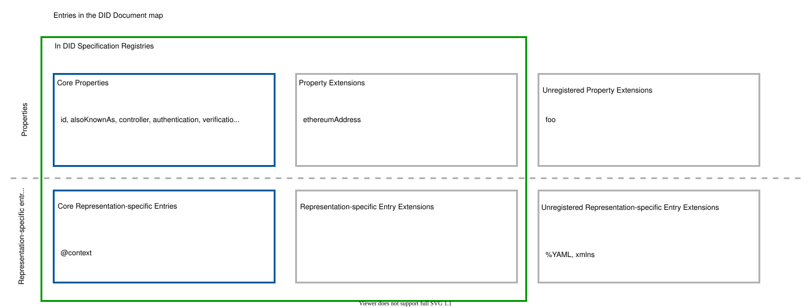
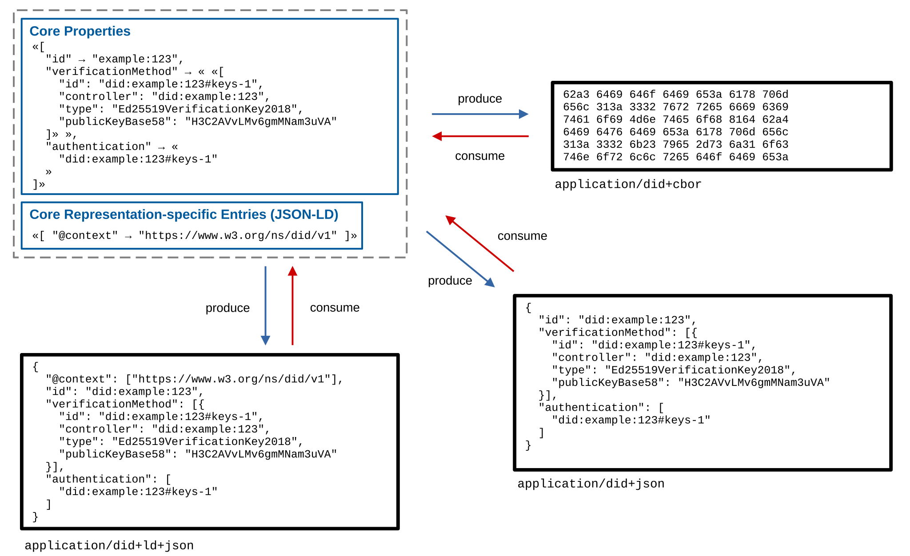
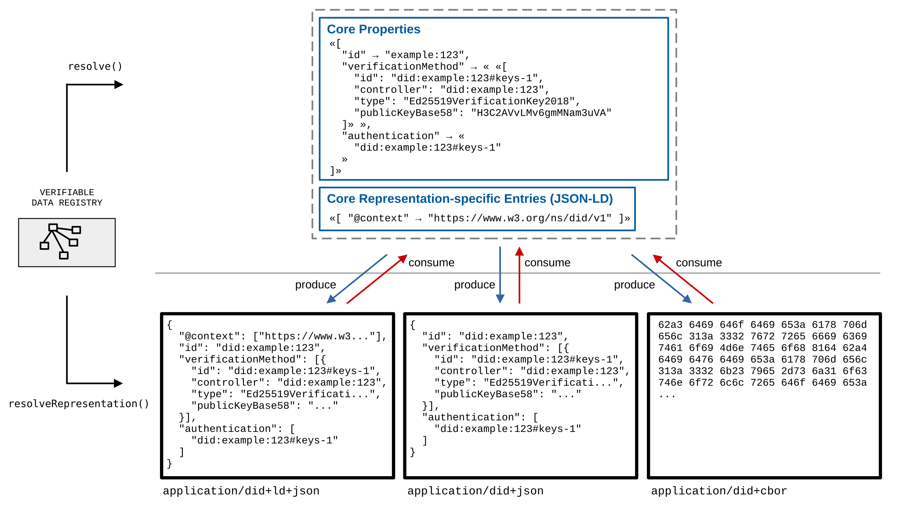
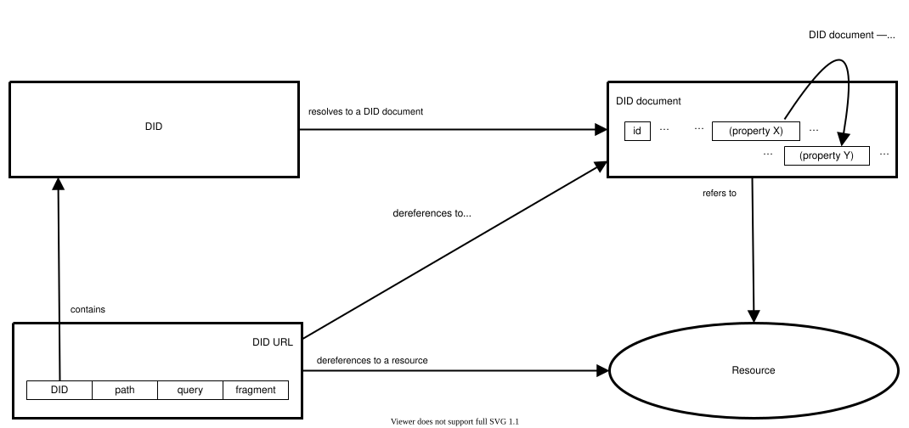
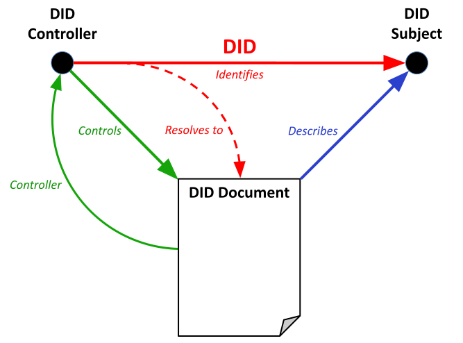
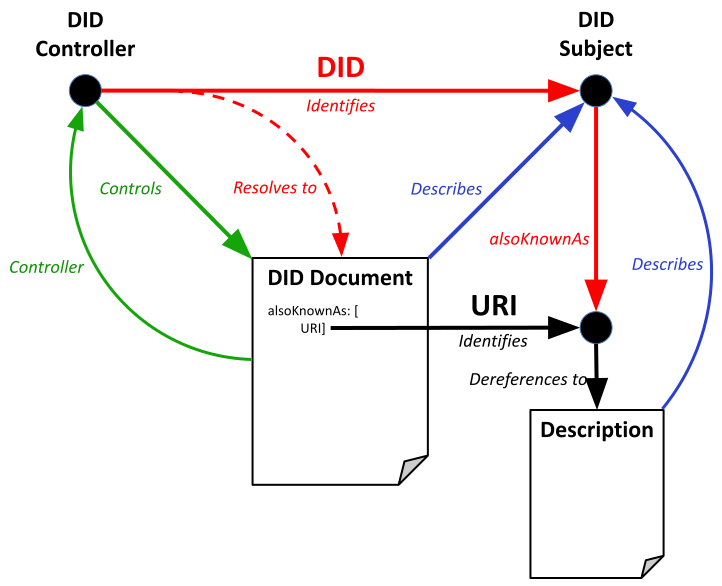
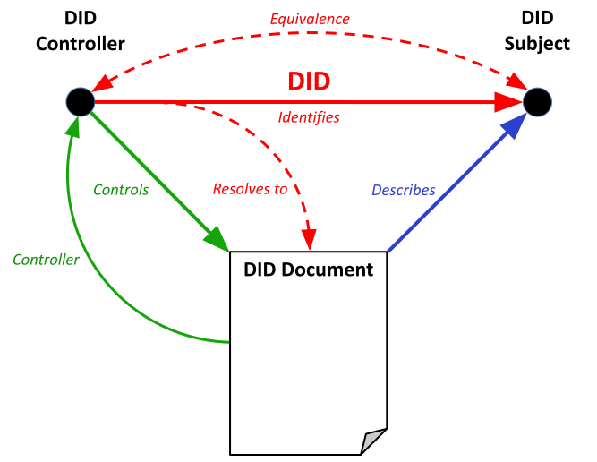
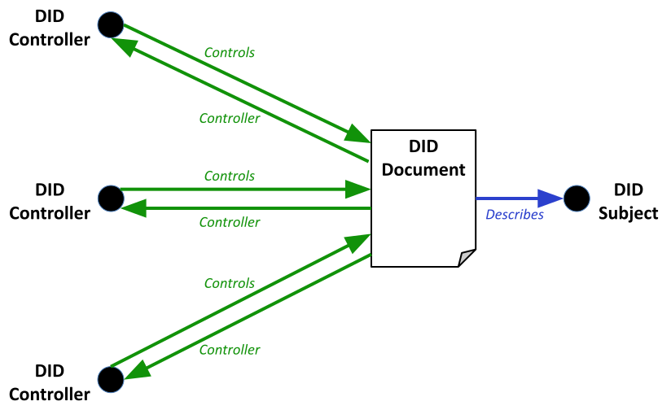
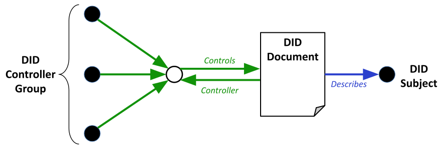

# Retained specification text (collector assembly)

> This consumer Markdown assembles the explicitly retained originals in declared order. Source labels, line anchors and local href rewrites are collector additions; HTML is represented as structural text with ordered table cells and preserved code, without running source scripts.

> Collector representation: declared cell spans are annotations, not an expanded table grid; code br line breaks and NBSP are retained, and image-label whitespace is normalized without dropping label words.

Original HTML: [specification.html](../source/specification.html#L1-L9224).

<a id="specification-L1"></a>
[](https://www.w3.org/)

<a id="specification-L479"></a>
<a id="specification-title"></a>
# Decentralized Identifiers (DIDs) v1.0

<a id="specification-L479"></a>
<a id="specification-subtitle"></a>
## Core architecture, data model, and representations
 
<a id="specification-w3c-state"></a>


[W3C Recommendation](https://www.w3.org/standards/types#REC) 19 July 2022

  More details about this document 

 

This version:


 [https://www.w3.org/TR/2022/REC-did-core-20220719/](https://www.w3.org/TR/2022/REC-did-core-20220719/) 

 

Latest published version:


 [https://www.w3.org/TR/did-core/](https://www.w3.org/TR/did-core/) 

 

Latest editor's draft:


[https://w3c.github.io/did-core/](https://w3c.github.io/did-core/)

 

History:


 [https://www.w3.org/standards/history/did-core](https://www.w3.org/standards/history/did-core) 


 [Commit history](https://github.com/w3c/did-core/commits/main) 

 

Implementation report:


 [https://w3c.github.io/did-test-suite/](https://w3c.github.io/did-test-suite/) 

 

Editors:


 [Manu Sporny](http://manu.sporny.org/) ([Digital Bazaar](https://digitalbazaar.com/)) 


 [Amy Guy](https://rhiaro.co.uk/) ([Digital Bazaar](https://digitalbazaar.com/)) 


 [Markus Sabadello](https://www.linkedin.com/in/markus-sabadello-353a0821) ([Danube Tech](https://danubetech.com/)) 


 [Drummond Reed](https://www.linkedin.com/in/drummondreed/) ([Evernym/Avast](https://www.evernym.com/)) 

 

Authors:


 [Manu Sporny](http://manu.sporny.org/) ([Digital Bazaar](https://digitalbazaar.com/)) 


 [Dave Longley](https://github.com/dlongley) ([Digital Bazaar](https://digitalbazaar.com/)) 


 [Markus Sabadello](https://www.linkedin.com/in/markus-sabadello-353a0821) ([Danube Tech](https://danubetech.com/)) 


 [Drummond Reed](https://www.linkedin.com/in/drummondreed/) ([Evernym/Avast](https://www.evernym.com/)) 


 [Orie Steele](https://www.linkedin.com/in/or13b/) ([Transmute](https://transmute.industries/)) 


 [Christopher Allen](https://www.linkedin.com/in/christophera) ([Blockchain Commons](https://www.BlockchainCommons.com)) 

 

Feedback:


 [GitHub w3c/did-core](https://github.com/w3c/did-core/) ([pull requests](https://github.com/w3c/did-core/pulls/), [new issue](https://github.com/w3c/did-core/issues/new/choose), [open issues](https://github.com/w3c/did-core/issues/)) 


[public-did-wg@w3.org](mailto:public-did-wg@w3.org?subject=%5Bdid-core%5D%20YOUR%20TOPIC%20HERE) with subject line [did-core] … message topic … ([archives](https://lists.w3.org/Archives/Public/public-did-wg/))

 

Errata:


[Errata exists](https://w3c.github.io/did-core/errata.html).

 

Related Documents


 [DID Use Cases and Requirements](https://www.w3.org/TR/did-use-cases/) 


 [DID Specification Registries](https://www.w3.org/TR/did-spec-registries/) 


 [DID Core Implementation Report](https://w3c.github.io/did-test-suite/) 

 

  

 See also [translations](https://www.w3.org/Translations/?technology=did-core). 

 

 [Copyright](https://www.w3.org/Consortium/Legal/ipr-notice#Copyright) © 2022 [W3C](https://www.w3.org/)® ([MIT](https://www.csail.mit.edu/), [ERCIM](https://www.ercim.eu/), [Keio](https://www.keio.ac.jp/), [Beihang](https://ev.buaa.edu.cn/)). W3C [liability](https://www.w3.org/Consortium/Legal/ipr-notice#Legal_Disclaimer), [trademark](https://www.w3.org/Consortium/Legal/ipr-notice#W3C_Trademarks) and [permissive document license](https://www.w3.org/Consortium/Legal/2015/copyright-software-and-document) rules apply. 

  

 
<a id="specification-abstract"></a>

<a id="specification-L562"></a>
## Abstract
 

 
<a id="specification-ref-for-dfn-decentralized-identifiers-1"></a>
[Decentralized identifiers](#specification-dfn-decentralized-identifiers) (DIDs) are a new type of identifier that enables verifiable, decentralized digital identity. A 
<a id="specification-ref-for-dfn-decentralized-identifiers-2"></a>
[DID](#specification-dfn-decentralized-identifiers) refers to any subject (e.g., a person, organization, thing, data model, abstract entity, etc.) as determined by the controller of the 
<a id="specification-ref-for-dfn-decentralized-identifiers-3"></a>
[DID](#specification-dfn-decentralized-identifiers). In contrast to typical, federated identifiers, 
<a id="specification-ref-for-dfn-decentralized-identifiers-4"></a>
[DIDs](#specification-dfn-decentralized-identifiers) have been designed so that they may be decoupled from centralized registries, identity providers, and certificate authorities. Specifically, while other parties might be used to help enable the discovery of information related to a 
<a id="specification-ref-for-dfn-decentralized-identifiers-5"></a>
[DID](#specification-dfn-decentralized-identifiers), the design enables the controller of a 
<a id="specification-ref-for-dfn-decentralized-identifiers-6"></a>
[DID](#specification-dfn-decentralized-identifiers) to prove control over it without requiring permission from any other party. 
<a id="specification-ref-for-dfn-decentralized-identifiers-7"></a>
[DIDs](#specification-dfn-decentralized-identifiers) are 
<a id="specification-ref-for-dfn-uri-1"></a>
[URIs](#specification-dfn-uri) that associate a 
<a id="specification-ref-for-dfn-did-subjects-1"></a>
[DID subject](#specification-dfn-did-subjects) with a 
<a id="specification-ref-for-dfn-did-documents-1"></a>
[DID document](#specification-dfn-did-documents) allowing trustable interactions associated with that subject. 

 

 Each 
<a id="specification-ref-for-dfn-did-documents-2"></a>
[DID document](#specification-dfn-did-documents) can express cryptographic material, 
<a id="specification-ref-for-dfn-verification-method-1"></a>
[verification methods](#specification-dfn-verification-method), or 
<a id="specification-ref-for-dfn-service-1"></a>
[services](#specification-dfn-service), which provide a set of mechanisms enabling a 
<a id="specification-ref-for-dfn-did-controllers-1"></a>
[DID controller](#specification-dfn-did-controllers) to prove control of the 
<a id="specification-ref-for-dfn-decentralized-identifiers-8"></a>
[DID](#specification-dfn-decentralized-identifiers). 
<a id="specification-ref-for-dfn-service-2"></a>
[Services](#specification-dfn-service) enable trusted interactions associated with the 
<a id="specification-ref-for-dfn-did-subjects-2"></a>
[DID subject](#specification-dfn-did-subjects). A 
<a id="specification-ref-for-dfn-decentralized-identifiers-9"></a>
[DID](#specification-dfn-decentralized-identifiers) might provide the means to return the 
<a id="specification-ref-for-dfn-did-subjects-3"></a>
[DID subject](#specification-dfn-did-subjects) itself, if the 
<a id="specification-ref-for-dfn-did-subjects-4"></a>
[DID subject](#specification-dfn-did-subjects) is an information resource such as a data model. 

 

 This document specifies the DID syntax, a common data model, core properties, serialized representations, DID operations, and an explanation of the process of resolving DIDs to the resources that they represent. 

 

 
<a id="specification-sotd"></a>

<a id="specification-L593"></a>
## Status of This Document


This section describes the status of this document at the time of its publication. A list of current W3C publications and the latest revision of this technical report can be found in the [W3C technical reports index](https://www.w3.org/TR/) at https://www.w3.org/TR/.

 

 At the time of publication, there existed [103 experimental DID Method specifications](https://www.w3.org/TR/did-extensions-methods/#did-methods), 32 experimental DID Method driver implementations, a [test suite](https://w3c.github.io/did-test-suite/) that determines whether or not a given implementation is conformant with this specification and 46 implementations submitted to the conformance test suite. Readers are advised to heed the [DID Core issues](https://github.com/w3c/did-core/issues) and [DID Core Test Suite issues](https://github.com/w3c/did-test-suite/issues) that each contain the latest list of concerns and proposed changes that might result in alterations to this specification. At the time of publication, no additional substantive issues, changes, or modifications are expected. 

 

 Comments regarding this document are welcome. Please file issues directly on [GitHub](https://github.com/w3c/did-core/issues/), or send them to [public-did-wg@w3.org](mailto:public-did-wg@w3.org) ( [subscribe](mailto:public-did-wg-request@w3.org?subject=subscribe), [archives](https://lists.w3.org/Archives/Public/public-did-wg/)). 

 

 This document was published by the [Decentralized Identifier Working Group](https://www.w3.org/groups/wg/did) as a Recommendation using the [Recommendation track](https://www.w3.org/2021/Process-20211102/#recs-and-notes). 


 W3C recommends the wide deployment of this specification as a standard for the Web. 


 A W3C Recommendation is a specification that, after extensive consensus-building, is endorsed by W3C and its Members, and has commitments from Working Group members to [royalty-free licensing](https://www.w3.org/Consortium/Patent-Policy/#sec-Requirements) for implementations. 


 This document was produced by a group operating under the [W3C Patent Policy](https://www.w3.org/Consortium/Patent-Policy/). W3C maintains a [public list of any patent disclosures](https://www.w3.org/groups/wg/did/ipr) made in connection with the deliverables of the group; that page also includes instructions for disclosing a patent. An individual who has actual knowledge of a patent which the individual believes contains [Essential Claim(s)](https://www.w3.org/Consortium/Patent-Policy/#def-essential) must disclose the information in accordance with [section 6 of the W3C Patent Policy](https://www.w3.org/Consortium/Patent-Policy/#sec-Disclosure). 


 This document is governed by the 
<a id="specification-w3c_process_revision"></a>
[2 November 2021 W3C Process Document](https://www.w3.org/2021/Process-20211102/). 


 
<a id="specification-introduction"></a>

<a id="specification-L662"></a>
<a id="specification-x1-introduction"></a>
## 1. Introduction
[](#specification-introduction)


This section is non-normative.

 

 As individuals and organizations, many of us use globally unique identifiers in a wide variety of contexts. They serve as communications addresses (telephone numbers, email addresses, usernames on social media), ID numbers (for passports, drivers licenses, tax IDs, health insurance), and product identifiers (serial numbers, barcodes, RFIDs). URIs (Uniform Resource Identifiers) are used for resources on the Web and each web page you view in a browser has a globally unique URL (Uniform Resource Locator). 

 

 The vast majority of these globally unique identifiers are not under our control. They are issued by external authorities that decide who or what they refer to and when they can be revoked. They are useful only in certain contexts and recognized only by certain bodies not of our choosing. They might disappear or cease to be valid with the failure of an organization. They might unnecessarily reveal personal information. In many cases, they can be fraudulently replicated and asserted by a malicious third-party, which is more commonly known as "identity theft". 

 

 The Decentralized Identifiers (DIDs) defined in this specification are a new type of globally unique identifier. They are designed to enable individuals and organizations to generate their own identifiers using systems they trust. These new identifiers enable entities to prove control over them by authenticating using cryptographic proofs such as digital signatures. 

 

 Since the generation and assertion of Decentralized Identifiers is entity-controlled, each entity can have as many DIDs as necessary to maintain their desired separation of identities, personas, and interactions. The use of these identifiers can be scoped appropriately to different contexts. They support interactions with other people, institutions, or systems that require entities to identify themselves, or things they control, while providing control over how much personal or private data should be revealed, all without depending on a central authority to guarantee the continued existence of the identifier. These ideas are explored in the DID Use Cases document [[DID-USE-CASES](#specification-bib-did-use-cases)]. 

 

 This specification does not presuppose any particular technology or cryptography to underpin the generation, persistence, resolution, or interpretation of DIDs. For example, implementers can create Decentralized Identifiers based on identifiers registered in federated or centralized identity management systems. Indeed, almost all types of identifier systems can add support for DIDs. This creates an interoperability bridge between the worlds of centralized, federated, and decentralized identifiers. This also enables implementers to design specific types of DIDs to work with the computing infrastructure they trust, such as distributed ledgers, decentralized file systems, distributed databases, and peer-to-peer networks. 

 

 This specification is for: 

 

 

-  Anyone that wants to understand the core architectural principles that are the foundation for Decentralized Identifiers; 

 

-  Software developers that want to produce and consume Decentralized Identifiers and their associated data formats; 

 

-  Systems integrators that want to understand how to use Decentralized Identifiers in their software and hardware systems; 

 

-  Specification authors that want to create new DID infrastructures, known as DID methods, that conform to the ecosystem described by this document. 

 

 

 In addition to this specification, readers might find the Use Cases and Requirements for Decentralized Identifiers [[DID-USE-CASES](#specification-bib-did-use-cases)] document useful. 

 
<a id="specification-a-simple-example"></a>

<a id="specification-L742"></a>
<a id="specification-x1-1-a-simple-example"></a>
### 1.1 A Simple Example
[](#specification-a-simple-example)


This section is non-normative.

 

 A 
<a id="specification-ref-for-dfn-decentralized-identifiers-10"></a>
[DID](#specification-dfn-decentralized-identifiers) is a simple text string consisting of three parts: 1) the `did` URI scheme identifier, 2) the identifier for the 
<a id="specification-ref-for-dfn-did-methods-1"></a>
[DID method](#specification-dfn-did-methods), and 3) the DID method-specific identifier. 

 
<a id="specification-parts-of-a-did"></a>


 ![A diagram showing the parts of a DID. The left-most letters spell 'did' in blue, are enclosed in a horizontal bracket from above and a label that reads 'scheme' above the bracket. A gray colon follows the 'did' letters. The middle letters spell 'example' in magenta, are enclosed in a horizontal bracket from below and a label that reads 'DID Method' below the bracket. A gray colon follows the DID Method. Finally, the letters at the end read '123456789abcdefghi' in green, are enclosed in a horizontal bracket from below and a label that reads 'DID Method Specific String' below the bracket.](../source/diagrams/parts-of-a-did.svg) 

Figure 1  A simple example of a decentralized identifier (DID) 

 

 

 The example 
<a id="specification-ref-for-dfn-decentralized-identifiers-11"></a>
[DID](#specification-dfn-decentralized-identifiers) above resolves to a 
<a id="specification-ref-for-dfn-did-documents-3"></a>
[DID document](#specification-dfn-did-documents). A 
<a id="specification-ref-for-dfn-did-documents-4"></a>
[DID document](#specification-dfn-did-documents) contains information associated with the 
<a id="specification-ref-for-dfn-decentralized-identifiers-12"></a>
[DID](#specification-dfn-decentralized-identifiers), such as ways to cryptographically 
<a id="specification-ref-for-dfn-authenticated-1"></a>
[authenticate](#specification-dfn-authenticated) a 
<a id="specification-ref-for-dfn-did-controllers-2"></a>
[DID controller](#specification-dfn-did-controllers). 

 
<a id="specification-example-a-simple-did-document"></a>


 

 [Example 1](#specification-example-a-simple-did-document): A simple DID document 

 

```
{
  "@context": [
    "https://www.w3.org/ns/did/v1",
    "https://w3id.org/security/suites/ed25519-2020/v1"
  ]
  "id": "did:example:123456789abcdefghi",
  "authentication": [{
    // used to authenticate as did:...fghi
    "id": "did:example:123456789abcdefghi#keys-1",
    "type": "Ed25519VerificationKey2020",
    "controller": "did:example:123456789abcdefghi",
    "publicKeyMultibase": "zH3C2AVvLMv6gmMNam3uVAjZpfkcJCwDwnZn6z3wXmqPV"
  }]
}
```

 

 

 
<a id="specification-design-goals"></a>

<a id="specification-L793"></a>
<a id="specification-x1-2-design-goals"></a>
### 1.2 Design Goals
[](#specification-design-goals)


This section is non-normative.

 

 
<a id="specification-ref-for-dfn-decentralized-identifiers-13"></a>
[Decentralized Identifiers](#specification-dfn-decentralized-identifiers) are a component of larger systems, such as the Verifiable Credentials ecosystem [[VC-DATA-MODEL](#specification-bib-vc-data-model)], which influenced the design goals for this specification. The design goals for Decentralized Identifiers are summarized here. 

 

- Goal | Description
- Decentralization | Eliminate the requirement for centralized authorities or single point failure in identifier management, including the registration of globally unique identifiers, public verification keys, 
<a id="specification-ref-for-dfn-service-3"></a>
[services](#specification-dfn-service), and other information.
- Control | Give entities, both human and non-human, the power to directly control their digital identifiers without the need to rely on external authorities.
- Privacy | Enable entities to control the privacy of their information, including minimal, selective, and progressive disclosure of attributes or other data.
- Security | Enable sufficient security for requesting parties to depend on 
<a id="specification-ref-for-dfn-did-documents-5"></a>
[DID documents](#specification-dfn-did-documents) for their required level of assurance.
- Proof-based | Enable 
<a id="specification-ref-for-dfn-did-controllers-3"></a>
[DID controllers](#specification-dfn-did-controllers) to provide cryptographic proof when interacting with other entities.
- Discoverability | Make it possible for entities to discover 
<a id="specification-ref-for-dfn-decentralized-identifiers-14"></a>
[DIDs](#specification-dfn-decentralized-identifiers) for other entities, to learn more about or interact with those entities.
- Interoperability | Use interoperable standards so 
<a id="specification-ref-for-dfn-decentralized-identifiers-15"></a>
[DID](#specification-dfn-decentralized-identifiers) infrastructure can make use of existing tools and software libraries designed for interoperability.
- Portability | Be system- and network-independent and enable entities to use their digital identifiers with any system that supports 
<a id="specification-ref-for-dfn-decentralized-identifiers-16"></a>
[DIDs](#specification-dfn-decentralized-identifiers) and 
<a id="specification-ref-for-dfn-did-methods-2"></a>
[DID methods](#specification-dfn-did-methods).
- Simplicity | Favor a reduced set of simple features to make the technology easier to understand, implement, and deploy.
- Extensibility | Where possible, enable extensibility provided it does not greatly hinder interoperability, portability, or simplicity.

 

 
<a id="specification-architecture-overview"></a>

<a id="specification-L920"></a>
<a id="specification-x1-3-architecture-overview"></a>
### 1.3  Architecture Overview
[](#specification-architecture-overview)


This section is non-normative.

 

 This section provides a basic overview of the major components of Decentralized Identifier architecture. 

 
<a id="specification-brief-architecture-overview"></a>


  

Figure 2  Overview of DID architecture and the relationship of the basic components. See also: [narrative description](#specification-brief-architecture-overview-longdesc). 

 

 
<a id="specification-brief-architecture-overview-longdesc"></a>


 

 Six internally-labeled shapes appear in the diagram, with labeled arrows between them, as follows. In the center of the diagram is a rectangle labeled DID URL, containing small typewritten text "did:example:123/path/to/rsrc". At the center top of the diagram is a rectangle labeled, "DID", containing small typewritten text "did:example:123". At the top left of the diagram is an oval, labeled "DID Subject". At the bottom center of the diagram is a rectangle labeled, "DID document". At the bottom left is an oval, labeled, "DID Controller". On the center right of the diagram is a two-dimensional rendering of a cylinder, labeled, "Verifiable Data Registry". 

 

 From the top of the "DID URL" rectangle, an arrow, labeled "contains", extends upwards, pointing to the "DID" rectangle. From the bottom of the "DID URL" rectangle, an arrow, labeled "refers, and dereferences, to", extends downward, pointing to the "DID document" rectangle. An arrow from the "DID" rectangle, labeled "resolves to", points down to the "DID document" rectangle. An arrow from the "DID" rectangle, labeled "refers to", points left to the "DID subject" oval. An arrow from the "DID controller" oval, labeled "controls", points right to the "DID document" rectangle. An arrow from the "DID" rectangle, labeled "recorded on", points downards to the right, to the "Verifiable Data Registry" cylinder. An arrow from the "DID document" rectangle, labeled "recorded on", points upwards to the right to the "Verifiable Data Registry" cylinder. 

 

 

 

 DIDs and DID URLs 

 

 A Decentralized Identifier, or 
<a id="specification-ref-for-dfn-decentralized-identifiers-17"></a>
[DID](#specification-dfn-decentralized-identifiers), is a 
<a id="specification-ref-for-dfn-uri-2"></a>
[URI](#specification-dfn-uri) composed of three parts: the scheme `did:`, a method identifier, and a unique, method-specific identifier specified by the 
<a id="specification-ref-for-dfn-did-methods-3"></a>
[DID method](#specification-dfn-did-methods). 
<a id="specification-ref-for-dfn-decentralized-identifiers-18"></a>
[DIDs](#specification-dfn-decentralized-identifiers) are resolvable to 
<a id="specification-ref-for-dfn-did-documents-6"></a>
[DID documents](#specification-dfn-did-documents). A 
<a id="specification-ref-for-dfn-did-urls-1"></a>
[DID URL](#specification-dfn-did-urls) extends the syntax of a basic 
<a id="specification-ref-for-dfn-decentralized-identifiers-19"></a>
[DID](#specification-dfn-decentralized-identifiers) to incorporate other standard 
<a id="specification-ref-for-dfn-uri-3"></a>
[URI](#specification-dfn-uri) components such as path, query, and fragment in order to locate a particular 
<a id="specification-ref-for-dfn-resources-1"></a>
[resource](#specification-dfn-resources)—for example, a cryptographic public key inside a 
<a id="specification-ref-for-dfn-did-documents-7"></a>
[DID document](#specification-dfn-did-documents), or a 
<a id="specification-ref-for-dfn-resources-2"></a>
[resource](#specification-dfn-resources) external to the 
<a id="specification-ref-for-dfn-did-documents-8"></a>
[DID document](#specification-dfn-did-documents). These concepts are elaborated upon in [3.1 DID Syntax](#specification-did-syntax) and [3.2 DID URL Syntax](#specification-did-url-syntax). 

 

 DID subjects 

 

 The subject of a 
<a id="specification-ref-for-dfn-decentralized-identifiers-20"></a>
[DID](#specification-dfn-decentralized-identifiers) is, by definition, the entity identified by the 
<a id="specification-ref-for-dfn-decentralized-identifiers-21"></a>
[DID](#specification-dfn-decentralized-identifiers). The 
<a id="specification-ref-for-dfn-did-subjects-5"></a>
[DID subject](#specification-dfn-did-subjects) might also be the 
<a id="specification-ref-for-dfn-did-controllers-4"></a>
[DID controller](#specification-dfn-did-controllers). Anything can be the subject of a 
<a id="specification-ref-for-dfn-decentralized-identifiers-22"></a>
[DID](#specification-dfn-decentralized-identifiers): person, group, organization, thing, or concept. This is further defined in [5.1.1 DID Subject](#specification-did-subject). 

 

 DID controllers 

 

 The 
<a id="specification-ref-for-dfn-controller-1"></a>
[controller](#specification-dfn-controller) of a 
<a id="specification-ref-for-dfn-decentralized-identifiers-23"></a>
[DID](#specification-dfn-decentralized-identifiers) is the entity (person, organization, or autonomous software) that has the capability—as defined by a 
<a id="specification-ref-for-dfn-did-methods-4"></a>
[DID method](#specification-dfn-did-methods)—to make changes to a 
<a id="specification-ref-for-dfn-did-documents-9"></a>
[DID document](#specification-dfn-did-documents). This capability is typically asserted by the control of a set of cryptographic keys used by software acting on behalf of the controller, though it might also be asserted via other mechanisms. Note that a 
<a id="specification-ref-for-dfn-decentralized-identifiers-24"></a>
[DID](#specification-dfn-decentralized-identifiers) might have more than one controller, and the 
<a id="specification-ref-for-dfn-did-subjects-6"></a>
[DID subject](#specification-dfn-did-subjects) can be the 
<a id="specification-ref-for-dfn-did-controllers-5"></a>
[DID controller](#specification-dfn-did-controllers), or one of them. This concept is documented in [5.1.2 DID Controller](#specification-did-controller). 

 

 Verifiable data registries 

 

 In order to be resolvable to 
<a id="specification-ref-for-dfn-did-documents-10"></a>
[DID documents](#specification-dfn-did-documents), 
<a id="specification-ref-for-dfn-decentralized-identifiers-25"></a>
[DIDs](#specification-dfn-decentralized-identifiers) are typically recorded on an underlying system or network of some kind. Regardless of the specific technology used, any such system that supports recording 
<a id="specification-ref-for-dfn-decentralized-identifiers-26"></a>
[DIDs](#specification-dfn-decentralized-identifiers) and returning data necessary to produce 
<a id="specification-ref-for-dfn-did-documents-11"></a>
[DID documents](#specification-dfn-did-documents) is called a 
<a id="specification-ref-for-dfn-verifiable-data-registry-1"></a>
[verifiable data registry](#specification-dfn-verifiable-data-registry). Examples include 
<a id="specification-ref-for-dfn-distributed-ledger-technology-1"></a>
[distributed ledgers](#specification-dfn-distributed-ledger-technology), decentralized file systems, databases of any kind, peer-to-peer networks, and other forms of trusted data storage. This concept is further elaborated upon in [8. Methods](#specification-methods). 

 

 DID documents 

 

 
<a id="specification-ref-for-dfn-did-documents-12"></a>
[DID documents](#specification-dfn-did-documents) contain information associated with a 
<a id="specification-ref-for-dfn-decentralized-identifiers-27"></a>
[DID](#specification-dfn-decentralized-identifiers). They typically express 
<a id="specification-ref-for-dfn-verification-method-2"></a>
[verification methods](#specification-dfn-verification-method), such as cryptographic public keys, and 
<a id="specification-ref-for-dfn-service-4"></a>
[services](#specification-dfn-service) relevant to interactions with the 
<a id="specification-ref-for-dfn-did-subjects-7"></a>
[DID subject](#specification-dfn-did-subjects). The generic properties supported in a 
<a id="specification-ref-for-dfn-did-documents-13"></a>
[DID document](#specification-dfn-did-documents) are specified in [5. Core Properties](#specification-core-properties). A 
<a id="specification-ref-for-dfn-did-documents-14"></a>
[DID document](#specification-dfn-did-documents) can be serialized to a byte stream (see [6. Representations](#specification-representations)). The properties present in a 
<a id="specification-ref-for-dfn-did-documents-15"></a>
[DID document](#specification-dfn-did-documents) can be updated according to the applicable operations outlined in [8. Methods](#specification-methods). 

 

 DID methods 

 

 
<a id="specification-ref-for-dfn-did-methods-5"></a>
[DID methods](#specification-dfn-did-methods) are the mechanism by which a particular type of 
<a id="specification-ref-for-dfn-decentralized-identifiers-28"></a>
[DID](#specification-dfn-decentralized-identifiers) and its associated 
<a id="specification-ref-for-dfn-did-documents-16"></a>
[DID document](#specification-dfn-did-documents) are created, resolved, updated, and deactivated. 
<a id="specification-ref-for-dfn-did-methods-6"></a>
[DID methods](#specification-dfn-did-methods) are defined using separate DID method specifications as defined in [8. Methods](#specification-methods). 

 

 DID resolvers and DID resolution 

 

 A 
<a id="specification-ref-for-dfn-did-resolvers-1"></a>
[DID resolver](#specification-dfn-did-resolvers) is a system component that takes a 
<a id="specification-ref-for-dfn-decentralized-identifiers-29"></a>
[DID](#specification-dfn-decentralized-identifiers) as input and produces a conforming 
<a id="specification-ref-for-dfn-did-documents-17"></a>
[DID document](#specification-dfn-did-documents) as output. This process is called 
<a id="specification-ref-for-dfn-did-resolution-1"></a>
[DID resolution](#specification-dfn-did-resolution). The steps for resolving a specific type of 
<a id="specification-ref-for-dfn-decentralized-identifiers-30"></a>
[DID](#specification-dfn-decentralized-identifiers) are defined by the relevant 
<a id="specification-ref-for-dfn-did-methods-7"></a>
[DID method](#specification-dfn-did-methods) specification. The process of 
<a id="specification-ref-for-dfn-did-resolution-2"></a>
[DID resolution](#specification-dfn-did-resolution) is elaborated upon in [7. Resolution](#specification-resolution). 

 

 DID URL dereferencers and DID URL dereferencing 

 

 A 
<a id="specification-ref-for-dfn-did-url-dereferencers-1"></a>
[DID URL dereferencer](#specification-dfn-did-url-dereferencers) is a system component that takes a 
<a id="specification-ref-for-dfn-did-urls-2"></a>
[DID URL](#specification-dfn-did-urls) as input and produces a 
<a id="specification-ref-for-dfn-resources-3"></a>
[resource](#specification-dfn-resources) as output. This process is called 
<a id="specification-ref-for-dfn-did-url-dereferencing-1"></a>
[DID URL dereferencing](#specification-dfn-did-url-dereferencing). The process of 
<a id="specification-ref-for-dfn-did-url-dereferencing-2"></a>
[DID URL dereferencing](#specification-dfn-did-url-dereferencing) is elaborated upon in [7.2 DID URL Dereferencing](#specification-did-url-dereferencing). 

 

 

 
<a id="specification-conformance"></a>

<a id="specification-L1072"></a>
<a id="specification-x1-4-conformance"></a>
### 1.4 Conformance
[](#specification-conformance)


As well as sections marked as non-normative, all authoring guidelines, diagrams, examples, and notes in this specification are non-normative. Everything else in this specification is normative.


 The key words MAY, MUST, MUST NOT, OPTIONAL, RECOMMENDED, REQUIRED, SHOULD, and SHOULD NOT in this document are to be interpreted as described in [BCP 14](https://datatracker.ietf.org/doc/html/bcp14) [[RFC2119](#specification-bib-rfc2119)] [[RFC8174](#specification-bib-rfc8174)] when, and only when, they appear in all capitals, as shown here. 

 

 This document contains examples that contain JSON and JSON-LD content. Some of these examples contain characters that are invalid, such as inline comments (`//`) and the use of ellipsis (`...`) to denote information that adds little value to the example. Implementers are cautioned to remove this content if they desire to use the information as valid JSON or JSON-LD. 

 

 Some examples contain terms, both property names and values, that are not defined in this specification. These are indicated with a comment (`//
external (property name|value)`). Such terms, when used in a 
<a id="specification-ref-for-dfn-did-documents-18"></a>
[DID document](#specification-dfn-did-documents), are expected to be registered in the DID Specification Registries [[DID-SPEC-REGISTRIES](#specification-bib-did-spec-registries)] with links to both a formal definition and a JSON-LD context. 

 

 Interoperability of implementations for 
<a id="specification-ref-for-dfn-decentralized-identifiers-31"></a>
[DIDs](#specification-dfn-decentralized-identifiers) and 
<a id="specification-ref-for-dfn-did-documents-19"></a>
[DID documents](#specification-dfn-did-documents) is tested by evaluating an implementation's ability to create and parse 
<a id="specification-ref-for-dfn-decentralized-identifiers-32"></a>
[DIDs](#specification-dfn-decentralized-identifiers) and 
<a id="specification-ref-for-dfn-did-documents-20"></a>
[DID documents](#specification-dfn-did-documents) that conform to this specification. Interoperability for producers and consumers of 
<a id="specification-ref-for-dfn-decentralized-identifiers-33"></a>
[DIDs](#specification-dfn-decentralized-identifiers) and 
<a id="specification-ref-for-dfn-did-documents-21"></a>
[DID documents](#specification-dfn-did-documents) is provided by ensuring the 
<a id="specification-ref-for-dfn-decentralized-identifiers-34"></a>
[DIDs](#specification-dfn-decentralized-identifiers) and 
<a id="specification-ref-for-dfn-did-documents-22"></a>
[DID documents](#specification-dfn-did-documents) conform. Interoperability for 
<a id="specification-ref-for-dfn-did-methods-8"></a>
[DID method](#specification-dfn-did-methods) specifications is provided by the details in each 
<a id="specification-ref-for-dfn-did-methods-9"></a>
[DID method](#specification-dfn-did-methods) specification. It is understood that, in the same way that a web browser is not required to implement all known 
<a id="specification-ref-for-dfn-uri-4"></a>
[URI](#specification-dfn-uri) schemes, conformant software that works with 
<a id="specification-ref-for-dfn-decentralized-identifiers-35"></a>
[DIDs](#specification-dfn-decentralized-identifiers) is not required to implement all known 
<a id="specification-ref-for-dfn-did-methods-10"></a>
[DID methods](#specification-dfn-did-methods). However, all implementations of a given 
<a id="specification-ref-for-dfn-did-methods-11"></a>
[DID method](#specification-dfn-did-methods) are expected to be interoperable for that method. 

 

 A 
<a id="specification-dfn-conforming-did"></a>
conforming DID is any concrete expression of the rules specified in [3. Identifier](#specification-identifier) which complies with relevant normative statements in that section. 

 

 A 
<a id="specification-dfn-conforming-did-document"></a>
conforming DID document is any concrete expression of the data model described in this specification which complies with the relevant normative statements in [4. Data Model](#specification-data-model) and [5. Core Properties](#specification-core-properties). A serialization format for the conforming document is deterministic, bi-directional, and lossless, as described in [6. Representations](#specification-representations). 

 

 A 
<a id="specification-dfn-conforming-producer"></a>
conforming producer is any algorithm realized as software and/or hardware that generates 
<a id="specification-ref-for-dfn-conforming-did-1"></a>
[conforming DIDs](#specification-dfn-conforming-did) or 
<a id="specification-ref-for-dfn-conforming-did-document-1"></a>
[conforming DID Documents](#specification-dfn-conforming-did-document) and complies with the relevant normative statements in [6. Representations](#specification-representations). 

 

 A 
<a id="specification-dfn-conforming-consumer"></a>
conforming consumer is any algorithm realized as software and/or hardware that consumes 
<a id="specification-ref-for-dfn-conforming-did-2"></a>
[conforming DIDs](#specification-dfn-conforming-did) or 
<a id="specification-ref-for-dfn-conforming-did-document-2"></a>
[conforming DID documents](#specification-dfn-conforming-did-document) and complies with the relevant normative statements in [6. Representations](#specification-representations). 

 

 A 
<a id="specification-dfn-conforming-did-resolver"></a>
conforming DID resolver is any algorithm realized as software and/or hardware that complies with the relevant normative statements in [7.1 DID Resolution](#specification-did-resolution). 

 

 A 
<a id="specification-dfn-conforming-did-url-dereferencer"></a>
conforming DID URL dereferencer is any algorithm realized as software and/or hardware that complies with the relevant normative statements in [7.2 DID URL Dereferencing](#specification-did-url-dereferencing). 

 

 A 
<a id="specification-dfn-conforming-did-method"></a>
conforming DID method is any specification that complies with the relevant normative statements in [8. Methods](#specification-methods). 

 

 

 
<a id="specification-terminology"></a>

<a id="specification-L1159"></a>
<a id="specification-x2-terminology"></a>
## 2. Terminology
[](#specification-terminology)


This section is non-normative.

 


 This section defines the terms used in this specification and throughout 
<a id="specification-ref-for-dfn-decentralized-identifiers-36"></a>
[decentralized identifier](#specification-dfn-decentralized-identifiers) infrastructure. A link to these terms is included whenever they appear in this specification. 

 

 


<a id="specification-dfn-amplification"></a>
amplification attack

 

 A class of attack where the attacker attempts to exhaust a target system's CPU, storage, network, or other resources by providing small, valid inputs into the system that result in damaging effects that can be exponentially more costly to process than the inputs themselves. 

 


<a id="specification-dfn-authenticated"></a>
authenticate

 

 Authentication is a process by which an entity can prove it has a specific attribute or controls a specific secret using one or more 
<a id="specification-ref-for-dfn-verification-method-3"></a>
[verification methods](#specification-dfn-verification-method). With 
<a id="specification-ref-for-dfn-decentralized-identifiers-37"></a>
[DIDs](#specification-dfn-decentralized-identifiers), a common example would be proving control of the cryptographic private key associated with a public key published in a 
<a id="specification-ref-for-dfn-did-documents-23"></a>
[DID document](#specification-dfn-did-documents). 

 


<a id="specification-dfn-cryptosuite"></a>
cryptographic suite

 

 A specification defining the usage of specific cryptographic primitives in order to achieve a particular security goal. These documents are often used to specify 
<a id="specification-ref-for-dfn-verification-method-4"></a>
[verification methods](#specification-dfn-verification-method), digital signature types, their identifiers, and other related properties. 

 


<a id="specification-dfn-decentralized-identifiers"></a>
decentralized identifier (DID)

 

 A globally unique persistent identifier that does not require a centralized registration authority and is often generated and/or registered cryptographically. The generic format of a DID is defined in [3.1 DID Syntax](#specification-did-syntax). A specific 
<a id="specification-ref-for-dfn-did-schemes-1"></a>
[DID scheme](#specification-dfn-did-schemes) is defined in a 
<a id="specification-ref-for-dfn-did-methods-12"></a>
[DID method](#specification-dfn-did-methods) specification. Many—but not all—DID methods make use of 
<a id="specification-ref-for-dfn-distributed-ledger-technology-2"></a>
[distributed ledger technology](#specification-dfn-distributed-ledger-technology) (DLT) or some other form of decentralized network. 

 


<a id="specification-dfn-decentralized-identity-management"></a>
decentralized identity management

 

 [Identity management](https://en.wikipedia.org/wiki/Identity_management) that is based on the use of 
<a id="specification-ref-for-dfn-decentralized-identifiers-38"></a>
[decentralized identifiers](#specification-dfn-decentralized-identifiers). Decentralized identity management extends authority for identifier generation, registration, and assignment beyond traditional roots of trust such as [X.500 directory services](https://en.wikipedia.org/wiki/X.500), the [Domain Name System](https://en.wikipedia.org/wiki/Domain_Name_System), and most national ID systems. 

 


<a id="specification-dfn-did-controllers"></a>
DID controller

 

 An entity that has the capability to make changes to a 
<a id="specification-ref-for-dfn-did-documents-25"></a>
[DID document](#specification-dfn-did-documents). A 
<a id="specification-ref-for-dfn-decentralized-identifiers-40"></a>
[DID](#specification-dfn-decentralized-identifiers) might have more than one DID controller. The DID controller(s) can be denoted by the optional `controller` property at the top level of the 
<a id="specification-ref-for-dfn-did-documents-26"></a>
[DID document](#specification-dfn-did-documents). Note that a DID controller might be the 
<a id="specification-ref-for-dfn-did-subjects-8"></a>
[DID subject](#specification-dfn-did-subjects). 

 


<a id="specification-dfn-did-delegate"></a>
DID delegate

 

 An entity to whom a 
<a id="specification-ref-for-dfn-did-controllers-6"></a>
[DID controller](#specification-dfn-did-controllers) has granted permission to use a 
<a id="specification-ref-for-dfn-verification-method-5"></a>
[verification method](#specification-dfn-verification-method) associated with a 
<a id="specification-ref-for-dfn-decentralized-identifiers-41"></a>
[DID](#specification-dfn-decentralized-identifiers) via a 
<a id="specification-ref-for-dfn-did-documents-27"></a>
[DID document](#specification-dfn-did-documents). For example, a parent who controls a child's 
<a id="specification-ref-for-dfn-did-documents-28"></a>
[DID document](#specification-dfn-did-documents) might permit the child to use their personal device in order to 
<a id="specification-ref-for-dfn-authenticated-2"></a>
[authenticate](#specification-dfn-authenticated). In this case, the child is the 
<a id="specification-ref-for-dfn-did-delegate-1"></a>
[DID delegate](#specification-dfn-did-delegate). The child's personal device would contain the private cryptographic material enabling the child to 
<a id="specification-ref-for-dfn-authenticated-3"></a>
[authenticate](#specification-dfn-authenticated) using the 
<a id="specification-ref-for-dfn-decentralized-identifiers-42"></a>
[DID](#specification-dfn-decentralized-identifiers). However, the child might not be permitted to add other personal devices without the parent's permission. 

 


<a id="specification-dfn-did-documents"></a>
DID document

 

 A set of data describing the 
<a id="specification-ref-for-dfn-did-subjects-9"></a>
[DID subject](#specification-dfn-did-subjects), including mechanisms, such as cryptographic public keys, that the 
<a id="specification-ref-for-dfn-did-subjects-10"></a>
[DID subject](#specification-dfn-did-subjects) or a 
<a id="specification-ref-for-dfn-did-delegate-2"></a>
[DID delegate](#specification-dfn-did-delegate) can use to 
<a id="specification-ref-for-dfn-authenticated-4"></a>
[authenticate](#specification-dfn-authenticated) itself and prove its association with the 
<a id="specification-ref-for-dfn-decentralized-identifiers-43"></a>
[DID](#specification-dfn-decentralized-identifiers). A DID document might have one or more different 
<a id="specification-ref-for-dfn-representations-1"></a>
[representations](#specification-dfn-representations) as defined in [6. Representations](#specification-representations) or in the W3C DID Specification Registries [[DID-SPEC-REGISTRIES](#specification-bib-did-spec-registries)]. 

 


<a id="specification-dfn-did-fragments"></a>
DID fragment

 

 The portion of a 
<a id="specification-ref-for-dfn-did-urls-3"></a>
[DID URL](#specification-dfn-did-urls) that follows the first hash sign character (`#`). DID fragment syntax is identical to URI fragment syntax. 

 


<a id="specification-dfn-did-methods"></a>
DID method

 

 A definition of how a specific 
<a id="specification-ref-for-dfn-did-schemes-2"></a>
[DID method scheme](#specification-dfn-did-schemes) is implemented. A DID method is defined by a DID method specification, which specifies the precise operations by which 
<a id="specification-ref-for-dfn-decentralized-identifiers-44"></a>
[DIDs](#specification-dfn-decentralized-identifiers) and 
<a id="specification-ref-for-dfn-did-documents-29"></a>
[DID documents](#specification-dfn-did-documents) are created, resolved, updated, and deactivated. See [8. Methods](#specification-methods). 

 


<a id="specification-dfn-did-paths"></a>
DID path

 

 The portion of a 
<a id="specification-ref-for-dfn-did-urls-4"></a>
[DID URL](#specification-dfn-did-urls) that begins with and includes the first forward slash (`/`) character and ends with either a question mark (`?`) character, a fragment hash sign (`#`) character, or the end of the 
<a id="specification-ref-for-dfn-did-urls-5"></a>
[DID URL](#specification-dfn-did-urls). DID path syntax is identical to URI path syntax. See [Path](#specification-path). 

 


<a id="specification-dfn-did-queries"></a>
DID query

 

 The portion of a 
<a id="specification-ref-for-dfn-did-urls-6"></a>
[DID URL](#specification-dfn-did-urls) that follows and includes the first question mark character (`?`). DID query syntax is identical to URI query syntax. See [Query](#specification-query). 

 


<a id="specification-dfn-did-resolution"></a>
DID resolution

 

 The process that takes as its input a 
<a id="specification-ref-for-dfn-decentralized-identifiers-45"></a>
[DID](#specification-dfn-decentralized-identifiers) and a set of resolution options and returns a 
<a id="specification-ref-for-dfn-did-documents-30"></a>
[DID document](#specification-dfn-did-documents) in a conforming 
<a id="specification-ref-for-dfn-representations-2"></a>
[representation](#specification-dfn-representations) plus additional metadata. This process relies on the "Read" operation of the applicable 
<a id="specification-ref-for-dfn-did-methods-13"></a>
[DID method](#specification-dfn-did-methods). The inputs and outputs of this process are defined in [7.1 DID Resolution](#specification-did-resolution). 

 


<a id="specification-dfn-did-resolvers"></a>
DID resolver

 

 A 
<a id="specification-ref-for-dfn-did-resolvers-3"></a>
[DID resolver](#specification-dfn-did-resolvers) is a software and/or hardware component that performs the 
<a id="specification-ref-for-dfn-did-resolution-3"></a>
[DID resolution](#specification-dfn-did-resolution) function by taking a 
<a id="specification-ref-for-dfn-decentralized-identifiers-46"></a>
[DID](#specification-dfn-decentralized-identifiers) as input and producing a conforming 
<a id="specification-ref-for-dfn-did-documents-31"></a>
[DID document](#specification-dfn-did-documents) as output. 

 


<a id="specification-dfn-did-schemes"></a>
DID scheme

 

 The formal syntax of a 
<a id="specification-ref-for-dfn-decentralized-identifiers-47"></a>
[decentralized identifier](#specification-dfn-decentralized-identifiers). The generic DID scheme begins with the prefix `did:` as defined in [3.1 DID Syntax](#specification-did-syntax). Each 
<a id="specification-ref-for-dfn-did-methods-14"></a>
[DID method](#specification-dfn-did-methods) specification defines a specific DID method scheme that works with that specific 
<a id="specification-ref-for-dfn-did-methods-15"></a>
[DID method](#specification-dfn-did-methods). In a specific DID method scheme, the DID method name follows the first colon and terminates with the second colon, e.g., `did:example:` 

 


<a id="specification-dfn-did-subjects"></a>
DID subject

 

 The entity identified by a 
<a id="specification-ref-for-dfn-decentralized-identifiers-48"></a>
[DID](#specification-dfn-decentralized-identifiers) and described by a 
<a id="specification-ref-for-dfn-did-documents-32"></a>
[DID document](#specification-dfn-did-documents). Anything can be a DID subject: person, group, organization, physical thing, digital thing, logical thing, etc. 

 


<a id="specification-dfn-did-urls"></a>
DID URL

 

 A 
<a id="specification-ref-for-dfn-decentralized-identifiers-49"></a>
[DID](#specification-dfn-decentralized-identifiers) plus any additional syntactic component that conforms to the definition in [3.2 DID URL Syntax](#specification-did-url-syntax). This includes an optional 
<a id="specification-ref-for-dfn-did-paths-1"></a>
[DID path](#specification-dfn-did-paths) (with its leading `/` character), optional 
<a id="specification-ref-for-dfn-did-queries-1"></a>
[DID query](#specification-dfn-did-queries) (with its leading `?` character), and optional 
<a id="specification-ref-for-dfn-did-fragments-1"></a>
[DID fragment](#specification-dfn-did-fragments) (with its leading `#` character). 

 


<a id="specification-dfn-did-url-dereferencing"></a>
DID URL dereferencing

 

 The process that takes as its input a 
<a id="specification-ref-for-dfn-did-urls-7"></a>
[DID URL](#specification-dfn-did-urls) and a set of input metadata, and returns a 
<a id="specification-ref-for-dfn-resources-4"></a>
[resource](#specification-dfn-resources). This resource might be a 
<a id="specification-ref-for-dfn-did-documents-33"></a>
[DID document](#specification-dfn-did-documents) plus additional metadata, a secondary resource contained within the 
<a id="specification-ref-for-dfn-did-documents-34"></a>
[DID document](#specification-dfn-did-documents), or a resource entirely external to the 
<a id="specification-ref-for-dfn-did-documents-35"></a>
[DID document](#specification-dfn-did-documents). The process uses 
<a id="specification-ref-for-dfn-did-resolution-4"></a>
[DID resolution](#specification-dfn-did-resolution) to fetch a 
<a id="specification-ref-for-dfn-did-documents-36"></a>
[DID document](#specification-dfn-did-documents) indicated by the 
<a id="specification-ref-for-dfn-decentralized-identifiers-50"></a>
[DID](#specification-dfn-decentralized-identifiers) contained within the 
<a id="specification-ref-for-dfn-did-urls-8"></a>
[DID URL](#specification-dfn-did-urls). The dereferencing process can then perform additional processing on the 
<a id="specification-ref-for-dfn-did-documents-37"></a>
[DID document](#specification-dfn-did-documents) to return the dereferenced resource indicated by the 
<a id="specification-ref-for-dfn-did-urls-9"></a>
[DID URL](#specification-dfn-did-urls). The inputs and outputs of this process are defined in [7.2 DID URL Dereferencing](#specification-did-url-dereferencing). 

 


<a id="specification-dfn-did-url-dereferencers"></a>
DID URL dereferencer

 

 A software and/or hardware system that performs the 
<a id="specification-ref-for-dfn-did-url-dereferencing-3"></a>
[DID URL dereferencing](#specification-dfn-did-url-dereferencing) function for a given 
<a id="specification-ref-for-dfn-did-urls-10"></a>
[DID URL](#specification-dfn-did-urls) or 
<a id="specification-ref-for-dfn-did-documents-38"></a>
[DID document](#specification-dfn-did-documents). 

 


<a id="specification-dfn-distributed-ledger-technology"></a>
distributed ledger (DLT)

 

 A non-centralized system for recording events. These systems establish sufficient confidence for participants to rely upon the data recorded by others to make operational decisions. They typically use distributed databases where different nodes use a consensus protocol to confirm the ordering of cryptographically signed transactions. The linking of digitally signed transactions over time often makes the history of the ledger effectively immutable. 

 


<a id="specification-dfn-public-key-description"></a>
public key description

 

 A data object contained inside a 
<a id="specification-ref-for-dfn-did-documents-39"></a>
[DID document](#specification-dfn-did-documents) that contains all the metadata necessary to use a public key or a verification key. 

 


<a id="specification-dfn-resources"></a>
resource

 

 As defined by [[RFC3986](#specification-bib-rfc3986)]: "...the term 'resource' is used in a general sense for whatever might be identified by a URI." Similarly, any resource might serve as a 
<a id="specification-ref-for-dfn-did-subjects-11"></a>
[DID subject](#specification-dfn-did-subjects) identified by a 
<a id="specification-ref-for-dfn-decentralized-identifiers-51"></a>
[DID](#specification-dfn-decentralized-identifiers). 

 


<a id="specification-dfn-representations"></a>
representation

 

 As defined for HTTP by [[RFC7231](#specification-bib-rfc7231)]: "information that is intended to reflect a past, current, or desired state of a given resource, in a format that can be readily communicated via the protocol, and that consists of a set of representation metadata and a potentially unbounded stream of representation data." A 
<a id="specification-ref-for-dfn-did-documents-40"></a>
[DID document](#specification-dfn-did-documents) is a representation of information describing a 
<a id="specification-ref-for-dfn-did-subjects-12"></a>
[DID subject](#specification-dfn-did-subjects). See [6. Representations](#specification-representations). 

 


<a id="specification-dfn-representation-specific-entry"></a>
representation-specific entries

 

 Entries in a 
<a id="specification-ref-for-dfn-did-documents-41"></a>
[DID document](#specification-dfn-did-documents) whose meaning is particular to a specific 
<a id="specification-ref-for-dfn-representations-3"></a>
[representation](#specification-dfn-representations). Defined in [4. Data Model](#specification-data-model) and [6. Representations](#specification-representations). For example, 
<a id="specification-ref-for-dfn-context-1"></a>
[`@context`](#specification-dfn-context) in the [JSON-LD representation](#specification-json-ld) is a representation-specific entry. 

 


<a id="specification-dfn-service"></a>
services

 

 Means of communicating or interacting with the 
<a id="specification-ref-for-dfn-did-subjects-13"></a>
[DID subject](#specification-dfn-did-subjects) or associated entities via one or more 
<a id="specification-ref-for-dfn-service-endpoints-1"></a>
[service endpoints](#specification-dfn-service-endpoints). Examples include discovery services, agent services, social networking services, file storage services, and verifiable credential repository services. 

 


<a id="specification-dfn-service-endpoints"></a>
service endpoint

 

 A network address, such as an HTTP URL, at which 
<a id="specification-ref-for-dfn-service-5"></a>
[services](#specification-dfn-service) operate on behalf of a 
<a id="specification-ref-for-dfn-did-subjects-14"></a>
[DID subject](#specification-dfn-did-subjects). 

 


<a id="specification-dfn-uri"></a>
Uniform Resource Identifier (URI)

 

 The standard identifier format for all resources on the World Wide Web as defined by [[RFC3986](#specification-bib-rfc3986)]. A 
<a id="specification-ref-for-dfn-decentralized-identifiers-52"></a>
[DID](#specification-dfn-decentralized-identifiers) is a type of URI scheme. 

 


<a id="specification-dfn-verifiable-credentials"></a>
verifiable credential

 

 A standard data model and representation format for cryptographically-verifiable digital credentials as defined by the W3C Verifiable Credentials specification [[VC-DATA-MODEL](#specification-bib-vc-data-model)]. 

 

 
<a id="specification-dfn-verifiable-data-registry"></a>
 verifiable data registry 

 

 A system that facilitates the creation, verification, updating, and/or deactivation of 
<a id="specification-ref-for-dfn-decentralized-identifiers-53"></a>
[decentralized identifiers](#specification-dfn-decentralized-identifiers) and 
<a id="specification-ref-for-dfn-did-documents-42"></a>
[DID documents](#specification-dfn-did-documents). A verifiable data registry might also be used for other cryptographically-verifiable data structures such as 
<a id="specification-ref-for-dfn-verifiable-credentials-1"></a>
[verifiable credentials](#specification-dfn-verifiable-credentials). For more information, see the W3C Verifiable Credentials specification [[VC-DATA-MODEL](#specification-bib-vc-data-model)]. 

 


<a id="specification-dfn-verifiable-timestamp"></a>
verifiable timestamp

 

 A verifiable timestamp enables a third-party to verify that a data object existed at a specific moment in time and that it has not been modified or corrupted since that moment in time. If the data integrity could reasonably have been modified or corrupted since that moment in time, the timestamp is not verifiable. 

 


<a id="specification-dfn-verification-method"></a>
verification method

 

 

 A set of parameters that can be used together with a process to independently verify a proof. For example, a cryptographic public key can be used as a verification method with respect to a digital signature; in such usage, it verifies that the signer possessed the associated cryptographic private key. 

 

 "Verification" and "proof" in this definition are intended to apply broadly. For example, a cryptographic public key might be used during Diffie-Hellman key exchange to negotiate a shared symmetric key for encryption. This guarantees the integrity of the key agreement process. It is thus another type of verification method, even though descriptions of the process might not use the words "verification" or "proof." 

 

 


<a id="specification-dfn-verification-relationship"></a>
verification relationship

 

 

 An expression of the relationship between the 
<a id="specification-ref-for-dfn-did-subjects-15"></a>
[DID subject](#specification-dfn-did-subjects) and a 
<a id="specification-ref-for-dfn-verification-method-6"></a>
[verification method](#specification-dfn-verification-method). An example of a verification relationship is [5.3.1 Authentication](#specification-authentication). 

 

 


<a id="specification-dfn-uuid"></a>
Universally Unique Identifier (UUID)

 

 A type of globally unique identifier defined by [[RFC4122](#specification-bib-rfc4122)]. UUIDs are similar to DIDs in that they do not require a centralized registration authority. UUIDs differ from DIDs in that they are not resolvable or cryptographically-verifiable. 

 

 

 

 In addition to the terminology above, this specification also uses terminology from the [[INFRA](#specification-bib-infra)] specification to formally define the [data model](#specification-data-model). When [[INFRA](#specification-bib-infra)] terminology is used, such as [string](https://infra.spec.whatwg.org/#strings), [set](https://infra.spec.whatwg.org/#ordered-set), and [map](https://infra.spec.whatwg.org/#maps), it is linked directly to that specification. 

 

 
<a id="specification-identifier"></a>

<a id="specification-L1513"></a>
<a id="specification-x3-identifier"></a>
## 3. Identifier
[](#specification-identifier)

 

 This section describes the formal syntax for 
<a id="specification-ref-for-dfn-decentralized-identifiers-54"></a>
[DIDs](#specification-dfn-decentralized-identifiers) and 
<a id="specification-ref-for-dfn-did-urls-11"></a>
[DID URLs](#specification-dfn-did-urls). The term "generic" is used to differentiate the syntax defined here from syntax defined by specific 
<a id="specification-ref-for-dfn-did-methods-16"></a>
[DID methods](#specification-dfn-did-methods) in their respective specifications. The creation processes, and their timing, for 
<a id="specification-ref-for-dfn-decentralized-identifiers-55"></a>
[DIDs](#specification-dfn-decentralized-identifiers) and 
<a id="specification-ref-for-dfn-did-urls-12"></a>
[DID URLs](#specification-dfn-did-urls) are described in [8.2 Method Operations](#specification-method-operations) and [B.2 Creation of a DID](#specification-creation-of-a-did). 

 
<a id="specification-did-syntax"></a>

<a id="specification-L1524"></a>
<a id="specification-x3-1-did-syntax"></a>
### 3.1 DID Syntax
[](#specification-did-syntax)

 

 The generic 
<a id="specification-ref-for-dfn-did-schemes-3"></a>
[DID scheme](#specification-dfn-did-schemes) is a 
<a id="specification-ref-for-dfn-uri-5"></a>
[URI](#specification-dfn-uri) scheme conformant with [[RFC3986](#specification-bib-rfc3986)]. The ABNF definition can be found below, which uses the syntax in [[RFC5234](#specification-bib-rfc5234)] and the corresponding definitions for `ALPHA` and `DIGIT`. All other rule names not defined in the ABNF below are defined in [[RFC3986](#specification-bib-rfc3986)]. All 
<a id="specification-ref-for-dfn-decentralized-identifiers-56"></a>
[DIDs](#specification-dfn-decentralized-identifiers) MUST conform to the DID Syntax ABNF Rules. 

 

- The DID Syntax ABNF Rules

> Collector table row: cell blocks remain in original order.

> Collector cell 1 of 1:

```
did                = "did:" method-name ":" method-specific-id
method-name        = 1*method-char
method-char        = %x61-7A / DIGIT
method-specific-id = *( *idchar ":" ) 1*idchar
idchar             = ALPHA / DIGIT / "." / "-" / "_" / pct-encoded
pct-encoded        = "%" HEXDIG HEXDIG
```


 

 For requirements on 
<a id="specification-ref-for-dfn-did-methods-17"></a>
[DID methods](#specification-dfn-did-methods) relating to the 
<a id="specification-ref-for-dfn-decentralized-identifiers-57"></a>
[DID](#specification-dfn-decentralized-identifiers) syntax, see Section [8.1 Method Syntax](#specification-method-syntax). 

 

 
<a id="specification-did-url-syntax"></a>

<a id="specification-L1565"></a>
<a id="specification-x3-2-did-url-syntax"></a>
### 3.2 DID URL Syntax
[](#specification-did-url-syntax)

 

 A 
<a id="specification-ref-for-dfn-did-urls-13"></a>
[DID URL](#specification-dfn-did-urls) is a network location identifier for a specific 
<a id="specification-ref-for-dfn-resources-5"></a>
[resource](#specification-dfn-resources). It can be used to retrieve things like representations of 
<a id="specification-ref-for-dfn-did-subjects-16"></a>
[DID subjects](#specification-dfn-did-subjects), 
<a id="specification-ref-for-dfn-verification-method-7"></a>
[verification methods](#specification-dfn-verification-method), 
<a id="specification-ref-for-dfn-service-6"></a>
[services](#specification-dfn-service), specific parts of a 
<a id="specification-ref-for-dfn-did-documents-43"></a>
[DID document](#specification-dfn-did-documents), or other resources. 

 

 The following is the ABNF definition using the syntax in [[RFC5234](#specification-bib-rfc5234)]. It builds on the `did` scheme defined in [3.1 DID Syntax](#specification-did-syntax). The [`path-abempty`](https://www.rfc-editor.org/rfc/rfc3986#section-3.3), [`query`](https://www.rfc-editor.org/rfc/rfc3986#section-3.4), and [`fragment`](https://www.rfc-editor.org/rfc/rfc3986#section-3.5) components are defined in [[RFC3986](#specification-bib-rfc3986)]. All 
<a id="specification-ref-for-dfn-did-urls-14"></a>
[DID URLs](#specification-dfn-did-urls) MUST conform to the DID URL Syntax ABNF Rules. 
<a id="specification-ref-for-dfn-did-methods-18"></a>
[DID methods](#specification-dfn-did-methods) can further restrict these rules, as described in [8.1 Method Syntax](#specification-method-syntax). 

 

- The DID URL Syntax ABNF Rules

> Collector table row: cell blocks remain in original order.

> Collector cell 1 of 1:

```
did-url = did path-abempty [ "?" query ] [ "#" fragment ]
```


 
<a id="specification-issue-container-generatedID"></a>


<a id="specification-h-note"></a>


Note: Semicolon character is reserved for future use


 Although the semicolon (`;`) character can be used according to the rules of the 
<a id="specification-ref-for-dfn-did-urls-15"></a>
[DID URL](#specification-dfn-did-urls) syntax, future versions of this specification may use it as a sub-delimiter for parameters as described in [[MATRIX-URIS](#specification-bib-matrix-uris)]. To avoid future conflicts, developers ought to refrain from using it.

<a id="specification-L1607"></a>
<a id="specification-path"></a>
#### Path
[](#specification-path)

 

 A 
<a id="specification-ref-for-dfn-did-paths-2"></a>
[DID path](#specification-dfn-did-paths) is identical to a generic 
<a id="specification-ref-for-dfn-uri-6"></a>
[URI](#specification-dfn-uri) path and conforms to the `path-abempty` ABNF rule in [RFC 3986, section 3.3](https://www.rfc-editor.org/rfc/rfc3986#section-3.3). As with 
<a id="specification-ref-for-dfn-uri-7"></a>
[URIs](#specification-dfn-uri), path semantics can be specified by 
<a id="specification-ref-for-dfn-did-methods-19"></a>
[DID Methods](#specification-dfn-did-methods), which in turn might enable 
<a id="specification-ref-for-dfn-did-controllers-7"></a>
[DID controllers](#specification-dfn-did-controllers) to further specialize those semantics. 

 
<a id="specification-example-2"></a>


 

 [Example 2](#specification-example-2) 

 

```
did:example:123456/path
```

<a id="specification-L1625"></a>
<a id="specification-query"></a>
#### Query
[](#specification-query)

 

 A 
<a id="specification-ref-for-dfn-did-queries-2"></a>
[DID query](#specification-dfn-did-queries) is identical to a generic 
<a id="specification-ref-for-dfn-uri-8"></a>
[URI](#specification-dfn-uri) query and conforms to the `query` ABNF rule in [RFC 3986, section 3.4](https://www.rfc-editor.org/rfc/rfc3986#section-3.4). This syntax feature is elaborated upon in [3.2.1 DID Parameters](#specification-did-parameters). 

 
<a id="specification-example-3"></a>


 

 [Example 3](#specification-example-3) 

 

```
did:example:123456?versionId=1
```

<a id="specification-L1641"></a>
<a id="specification-fragment"></a>
#### Fragment
[](#specification-fragment)

 

 
<a id="specification-ref-for-dfn-did-fragments-2"></a>
[DID fragment](#specification-dfn-did-fragments) syntax and semantics are identical to a generic 
<a id="specification-ref-for-dfn-uri-9"></a>
[URI](#specification-dfn-uri) fragment and conforms to the `fragment` ABNF rule in [RFC 3986, section 3.5](https://www.rfc-editor.org/rfc/rfc3986#section-3.5). 

 

 A 
<a id="specification-ref-for-dfn-did-fragments-3"></a>
[DID fragment](#specification-dfn-did-fragments) is used as a method-independent reference into a 
<a id="specification-ref-for-dfn-did-documents-44"></a>
[DID document](#specification-dfn-did-documents) or external 
<a id="specification-ref-for-dfn-resources-6"></a>
[resource](#specification-dfn-resources). Some examples of DID fragment identifiers are shown below. 

 
<a id="specification-example-a-unique-verification-method-in-a-did-document"></a>


 

 [Example 4](#specification-example-a-unique-verification-method-in-a-did-document): A unique verification method in a DID Document 

 

```
did:example:123#public-key-0
```

 

 
<a id="specification-example-a-unique-service-in-a-did-document"></a>


 

 [Example 5](#specification-example-a-unique-service-in-a-did-document): A unique service in a DID Document 

 

```
did:example:123#agent
```

 

 
<a id="specification-example-a-resource-external-to-a-did-document"></a>


 

 [Example 6](#specification-example-a-resource-external-to-a-did-document): A resource external to a DID Document 

 

```
did:example:123?service=agent&relativeRef=/credentials#degree
```

 

 
<a id="specification-issue-container-generatedID-0"></a>


<a id="specification-h-note-0"></a>


Note: Fragment semantics across representations


 In order to maximize interoperability, implementers are urged to ensure that 
<a id="specification-ref-for-dfn-did-fragments-4"></a>
[DID fragments](#specification-dfn-did-fragments) are interpreted in the same way across 
<a id="specification-ref-for-dfn-representations-4"></a>
[representations](#specification-dfn-representations) (see [6. Representations](#specification-representations)). For example, while JSON Pointer [[RFC6901](#specification-bib-rfc6901)] can be used in a 
<a id="specification-ref-for-dfn-did-fragments-5"></a>
[DID fragment](#specification-dfn-did-fragments), it will not be interpreted in the same way across non-JSON 
<a id="specification-ref-for-dfn-representations-5"></a>
[representations](#specification-dfn-representations). 


 

 Additional semantics for fragment identifiers, which are compatible with and layered upon the semantics in this section, are described for JSON-LD representations in [E.2 application/did+ld+json](#specification-application-did-ld-json). For information about how to dereference a 
<a id="specification-ref-for-dfn-did-fragments-6"></a>
[DID fragment](#specification-dfn-did-fragments), see [7.2 DID URL Dereferencing](#specification-did-url-dereferencing). 

 

 
<a id="specification-did-parameters"></a>

<a id="specification-L1690"></a>
<a id="specification-x3-2-1-did-parameters"></a>
#### 3.2.1 DID Parameters
[](#specification-did-parameters)

 

 The 
<a id="specification-ref-for-dfn-did-urls-16"></a>
[DID URL](#specification-dfn-did-urls) syntax supports a simple format for parameters based on the `query` component described in [Query](#specification-query). Adding a DID parameter to a 
<a id="specification-ref-for-dfn-did-urls-17"></a>
[DID URL](#specification-dfn-did-urls) means that the parameter becomes part of the identifier for a 
<a id="specification-ref-for-dfn-resources-7"></a>
[resource](#specification-dfn-resources). 

 
<a id="specification-example-a-did-url-with-a-versiontime-did-parameter"></a>


 

 [Example 7](#specification-example-a-did-url-with-a-versiontime-did-parameter): A DID URL with a 'versionTime' DID parameter 

 

```
did:example:123?versionTime=2021-05-10T17:00:00Z
```

 

 
<a id="specification-example-a-did-url-with-a-service-and-a-relativeref-did-parameter"></a>


 

 [Example 8](#specification-example-a-did-url-with-a-service-and-a-relativeref-did-parameter): A DID URL with a 'service' and a 'relativeRef' DID parameter 

 

```
did:example:123?service=files&relativeRef=/resume.pdf
```

 

 

 Some DID parameters are completely independent of of any specific 
<a id="specification-ref-for-dfn-did-methods-20"></a>
[DID method](#specification-dfn-did-methods) and function the same way for all 
<a id="specification-ref-for-dfn-decentralized-identifiers-58"></a>
[DIDs](#specification-dfn-decentralized-identifiers). Other DID parameters are not supported by all 
<a id="specification-ref-for-dfn-did-methods-21"></a>
[DID methods](#specification-dfn-did-methods). Where optional parameters are supported, they are expected to operate uniformly across the 
<a id="specification-ref-for-dfn-did-methods-22"></a>
[DID methods](#specification-dfn-did-methods) that do support them. The following table provides common DID parameters that function the same way across all 
<a id="specification-ref-for-dfn-did-methods-23"></a>
[DID methods](#specification-dfn-did-methods). Support for all [DID Parameters](#specification-did-parameters) is OPTIONAL. 

 
<a id="specification-issue-container-generatedID-1"></a>


<a id="specification-h-note-1"></a>


Note


 It is generally expected that DID URL dereferencer implementations will reference [[DID-RESOLUTION](#specification-bib-did-resolution)] for additional implementation details. The scope of this specification only defines the contract of the most common query parameters. 


 

- Parameter Name | Description
- `service` | Identifies a service from the 
<a id="specification-ref-for-dfn-did-documents-45"></a>
[DID document](#specification-dfn-did-documents) by service ID. If present, the associated value MUST be an [ASCII string](https://infra.spec.whatwg.org/#ascii-string).
- `relativeRef` | A relative 
<a id="specification-ref-for-dfn-uri-10"></a>
[URI](#specification-dfn-uri) reference according to [RFC3986 Section 4.2](https://www.rfc-editor.org/rfc/rfc3986#section-4.2) that identifies a 
<a id="specification-ref-for-dfn-resources-8"></a>
[resource](#specification-dfn-resources) at a 
<a id="specification-ref-for-dfn-service-endpoints-2"></a>
[service endpoint](#specification-dfn-service-endpoints), which is selected from a 
<a id="specification-ref-for-dfn-did-documents-46"></a>
[DID document](#specification-dfn-did-documents) by using the `service` parameter. If present, the associated value MUST be an [ASCII string](https://infra.spec.whatwg.org/#ascii-string) and MUST use percent-encoding for certain characters as specified in [RFC3986 Section 2.1](https://www.rfc-editor.org/rfc/rfc3986#section-2.1).
- `versionId` | Identifies a specific version of a 
<a id="specification-ref-for-dfn-did-documents-47"></a>
[DID document](#specification-dfn-did-documents) to be resolved (the version ID could be sequential, or a 
<a id="specification-ref-for-dfn-uuid-1"></a>
[UUID](#specification-dfn-uuid), or method-specific). If present, the associated value MUST be an [ASCII string](https://infra.spec.whatwg.org/#ascii-string).
- `versionTime` | Identifies a certain version timestamp of a 
<a id="specification-ref-for-dfn-did-documents-48"></a>
[DID document](#specification-dfn-did-documents) to be resolved. That is, the 
<a id="specification-ref-for-dfn-did-documents-49"></a>
[DID document](#specification-dfn-did-documents) that was valid for a 
<a id="specification-ref-for-dfn-decentralized-identifiers-59"></a>
[DID](#specification-dfn-decentralized-identifiers) at a certain time. If present, the associated value MUST be an [ASCII string](https://infra.spec.whatwg.org/#ascii-string) which is a valid XML datetime value, as defined in section 3.3.7 of [W3C XML Schema Definition Language (XSD) 1.1 Part 2: Datatypes](https://www.w3.org/TR/xmlschema11-2/) [[XMLSCHEMA11-2](#specification-bib-xmlschema11-2)]. This datetime value MUST be normalized to UTC 00:00:00 and without sub-second decimal precision. For example: `2020-12-20T19:17:47Z`.
- `hl` | A resource hash of the 
<a id="specification-ref-for-dfn-did-documents-50"></a>
[DID document](#specification-dfn-did-documents) to add integrity protection, as specified in [[HASHLINK](#specification-bib-hashlink)]. This parameter is non-normative. If present, the associated value MUST be an [ASCII string](https://infra.spec.whatwg.org/#ascii-string).

 

 Implementers as well as 
<a id="specification-ref-for-dfn-did-methods-24"></a>
[DID method](#specification-dfn-did-methods) specification authors might use additional DID parameters that are not listed here. For maximum interoperability, it is RECOMMENDED that DID parameters use the DID Specification Registries mechanism [[DID-SPEC-REGISTRIES](#specification-bib-did-spec-registries)], to avoid collision with other uses of the same DID parameter with different semantics. 

 

 DID parameters might be used if there is a clear use case where the parameter needs to be part of a [URL](https://url.spec.whatwg.org/#concept-url) that references a 
<a id="specification-ref-for-dfn-resources-9"></a>
[resource](#specification-dfn-resources) with more precision than using the 
<a id="specification-ref-for-dfn-decentralized-identifiers-60"></a>
[DID](#specification-dfn-decentralized-identifiers) alone. It is expected that DID parameters are not used if the same functionality can be expressed by passing input metadata to a 
<a id="specification-ref-for-dfn-did-resolvers-4"></a>
[DID resolver](#specification-dfn-did-resolvers). Additional considerations for processing these parameters are discussed in [[DID-RESOLUTION](#specification-bib-did-resolution)]. 

 
<a id="specification-issue-container-generatedID-2"></a>


<a id="specification-h-note-2"></a>


Note: DID parameters and DID resolution


 The 
<a id="specification-ref-for-dfn-did-resolution-5"></a>
[DID resolution](#specification-dfn-did-resolution) and the 
<a id="specification-ref-for-dfn-did-url-dereferencing-4"></a>
[DID URL dereferencing](#specification-dfn-did-url-dereferencing) functions can be influenced by passing input metadata to a 
<a id="specification-ref-for-dfn-did-resolvers-5"></a>
[DID resolver](#specification-dfn-did-resolvers) that are not part of the 
<a id="specification-ref-for-dfn-did-urls-18"></a>
[DID URL](#specification-dfn-did-urls) (see [7.1.1 DID Resolution Options](#specification-did-resolution-options)). This is comparable to HTTP, where certain parameters could either be included in an HTTP URL, or alternatively passed as HTTP headers during the dereferencing process. The important distinction is that DID parameters that are part of the 
<a id="specification-ref-for-dfn-did-urls-19"></a>
[DID URL](#specification-dfn-did-urls) should be used to specify what 
<a id="specification-ref-for-dfn-resources-10"></a>
[resource](#specification-dfn-resources) is being identified, whereas input metadata that is not part of the 
<a id="specification-ref-for-dfn-did-urls-20"></a>
[DID URL](#specification-dfn-did-urls) should be use to control how that 
<a id="specification-ref-for-dfn-resources-11"></a>
[resource](#specification-dfn-resources) is resolved or dereferenced. 


 

 
<a id="specification-relative-did-urls"></a>

<a id="specification-L1835"></a>
<a id="specification-x3-2-2-relative-did-urls"></a>
#### 3.2.2 Relative DID URLs
[](#specification-relative-did-urls)

 

 A relative 
<a id="specification-ref-for-dfn-did-urls-21"></a>
[DID URL](#specification-dfn-did-urls) is any URL value in a 
<a id="specification-ref-for-dfn-did-documents-51"></a>
[DID document](#specification-dfn-did-documents) that does not start with `did:<method-name>:<method-specific-id>`. More specifically, it is any URL value that does not start with the ABNF defined in [3.1 DID Syntax](#specification-did-syntax). The URL is expected to reference a 
<a id="specification-ref-for-dfn-resources-12"></a>
[resource](#specification-dfn-resources) in the same 
<a id="specification-ref-for-dfn-did-documents-52"></a>
[DID document](#specification-dfn-did-documents). Relative 
<a id="specification-ref-for-dfn-did-urls-22"></a>
[DID URLs](#specification-dfn-did-urls) MAY contain relative path components, query parameters, and fragment identifiers. 

 

 When resolving a relative 
<a id="specification-ref-for-dfn-did-urls-23"></a>
[DID URL](#specification-dfn-did-urls) reference, the algorithm specified in [RFC3986 Section 5: Reference Resolution](https://www.rfc-editor.org/rfc/rfc3986#section-5) MUST be used. The base URI value is the 
<a id="specification-ref-for-dfn-decentralized-identifiers-61"></a>
[DID](#specification-dfn-decentralized-identifiers) that is associated with the 
<a id="specification-ref-for-dfn-did-subjects-17"></a>
[DID subject](#specification-dfn-did-subjects), see [5.1.1 DID Subject](#specification-did-subject). The scheme is `did`. The authority is a combination of `<method-name>:<method-specific-id>`, and the path, query, and fragment values are those defined in [Path](#specification-path), [Query](#specification-query), and [Fragment](#specification-fragment), respectively. 

 

 Relative 
<a id="specification-ref-for-dfn-did-urls-24"></a>
[DID URLs](#specification-dfn-did-urls) are often used to reference 
<a id="specification-ref-for-dfn-verification-method-8"></a>
[verification methods](#specification-dfn-verification-method) and 
<a id="specification-ref-for-dfn-service-8"></a>
[services](#specification-dfn-service) in a 
<a id="specification-ref-for-dfn-did-documents-53"></a>
[DID Document](#specification-dfn-did-documents) without having to use absolute URLs. 
<a id="specification-ref-for-dfn-did-methods-25"></a>
[DID methods](#specification-dfn-did-methods) where storage size is a consideration might use relative URLs to reduce the storage size of 
<a id="specification-ref-for-dfn-did-documents-54"></a>
[DID documents](#specification-dfn-did-documents). 

 
<a id="specification-example-an-example-of-a-relative-did-url"></a>


 

 [Example 9](#specification-example-an-example-of-a-relative-did-url): An example of a relative DID URL 

 

```
{
  "@context": [
    "https://www.w3.org/ns/did/v1",
    "https://w3id.org/security/suites/ed25519-2020/v1"
  ]
  "id": "did:example:123456789abcdefghi",
  "verificationMethod": [{
    "id": "did:example:123456789abcdefghi#key-1",
    "type": "Ed25519VerificationKey2020", // external (property value)
    "controller": "did:example:123456789abcdefghi",
    "publicKeyMultibase": "zH3C2AVvLMv6gmMNam3uVAjZpfkcJCwDwnZn6z3wXmqPV"
  }, ...],
  "authentication": [
    // a relative DID URL used to reference a verification method above
    "#key-1"
  ]
}
```

 

 

 In the example above, the relative 
<a id="specification-ref-for-dfn-did-urls-25"></a>
[DID URL](#specification-dfn-did-urls) value will be transformed to an absolute 
<a id="specification-ref-for-dfn-did-urls-26"></a>
[DID URL](#specification-dfn-did-urls) value of `did:example:123456789abcdefghi#key-1`. 

 

 

 

 
<a id="specification-data-model"></a>

<a id="specification-L1898"></a>
<a id="specification-x4-data-model"></a>
## 4. Data Model
[](#specification-data-model)

 

 This specification defines a data model that can be used to express 
<a id="specification-ref-for-dfn-did-documents-55"></a>
[DID documents](#specification-dfn-did-documents) and DID document data structures, which can then be serialized into multiple concrete 
<a id="specification-ref-for-dfn-representations-6"></a>
[representations](#specification-dfn-representations). This section provides a high-level description of the data model, descriptions of the ways different types of properties are expressed in the data model, and instructions for extending the data model. 

 

 A 
<a id="specification-ref-for-dfn-did-documents-56"></a>
[DID document](#specification-dfn-did-documents) consists of a [map](https://infra.spec.whatwg.org/#maps) of [entries](https://infra.spec.whatwg.org/#map-entry), where each entry consists of a key/value pair. The 
<a id="specification-ref-for-dfn-did-documents-57"></a>
[DID document](#specification-dfn-did-documents) data model contains at least two different classes of entries. The first class of entries is called properties, and is specified in section [5. Core Properties](#specification-core-properties). The second class is made up of 
<a id="specification-ref-for-dfn-representation-specific-entry-1"></a>
[representation-specific entries](#specification-dfn-representation-specific-entry), and is specified in section [6. Representations](#specification-representations). 

 
<a id="specification-did-document-entries"></a>


  

Figure 3  The entries in a DID document. See also: [narrative description](#specification-did-document-entries-longdesc). 

 

 
<a id="specification-did-document-entries-longdesc"></a>


 The diagram is titled, "Entries in the DID Document map". A dotted grey line runs horizontally through the center of the diagram. The space above the line is labeled "Properties", and the space below it, "Representation-specific entries". Six labeled rectangles appear in the diagram, three lying above the dotted grey line and three below it. A large green rectangle, labeled "DID Specification Registries", encloses the four leftmost rectangles (upper left, upper center, lower left, and lower center). The two leftmost rectangles (upper left and lower left) are outlined in blue and labeled in blue, as follows. The upper left rectangle is labeled "Core Properties", and contains text "id, alsoKnownAs, controller, authentication, verificationMethod, service, serviceEndpoint, ...". The lower left rectangle is labeled "Core Representation-specific Entries", and contains text "@context". The four rightmost rectangles (upper center, upper right, lower center, and lower right) are outlined in grey and labeled in black, as follows. The upper center rectangle is labeled, "Property Extensions", and contains text "ethereumAddress". The lower center rectangle is labeled, "Representation-specific Entry Extensions", and contains no other text. The upper right rectangle is labeled, "Unregistered Property Extensions", and contains text "foo". The lower right rectangle is labeled "Unregistered Representation-specific Entry Extensions", and contains text "%YAML, xmlns". 

 

 All entry keys in the 
<a id="specification-ref-for-dfn-did-documents-58"></a>
[DID document](#specification-dfn-did-documents) data model are [strings](https://infra.spec.whatwg.org/#strings). All entry values are expressed using one of the abstract data types in the table below, and each 
<a id="specification-ref-for-dfn-representations-7"></a>
[representation](#specification-dfn-representations) specifies the concrete serialization format of each data type. 

 
<a id="specification-data-types"></a>


- Data Type | Considerations
- [map](https://infra.spec.whatwg.org/#maps) | A finite ordered sequence of key/value pairs, with no key appearing twice as specified in [[INFRA](#specification-bib-infra)]. A map is sometimes referred to as an [ordered map](https://infra.spec.whatwg.org/#maps) in [[INFRA](#specification-bib-infra)].
- [list](https://infra.spec.whatwg.org/#list) | A finite ordered sequence of items as specified in [[INFRA](#specification-bib-infra)].
- [set](https://infra.spec.whatwg.org/#ordered-set) | A finite ordered sequence of items that does not contain the same item twice as specified in [[INFRA](#specification-bib-infra)]. A set is sometimes referred to as an [ordered set](https://infra.spec.whatwg.org/#ordered-set) in [[INFRA](#specification-bib-infra)].
- <a id="specification-dfn-datetime"></a>
datetime | A date and time value that is capable of losslessly expressing all values expressible by a `dateTime` as specified in [[XMLSCHEMA11-2](https://www.w3.org/TR/xmlschema11-2/#dateTime)].
- [string](https://infra.spec.whatwg.org/#string) | A sequence of code units often used to represent human readable language as specified in [[INFRA](#specification-bib-infra)].
- <a id="specification-dfn-integer"></a>
integer | A real number without a fractional component as specified in [[XMLSCHEMA11-2](https://www.w3.org/TR/xmlschema11-2/#decimal)]. To maximize interoperability, implementers are urged to heed the advice regarding integers in [RFC8259, Section 6: Numbers](https://www.rfc-editor.org/rfc/rfc8259#section-6).
- <a id="specification-dfn-double"></a>
double | A value that is often used to approximate arbitrary real numbers as specified in [[XMLSCHEMA11-2](https://www.w3.org/TR/xmlschema11-2/#double)]. To maximize interoperability, implementers are urged to heed the advice regarding doubles in [RFC8259, Section 6: Numbers](https://www.rfc-editor.org/rfc/rfc8259#section-6).
- [boolean](https://infra.spec.whatwg.org/#boolean) | A value that is either true or false as defined in [[INFRA](#specification-bib-infra)].
- [null](https://infra.spec.whatwg.org/#nulls) | A value that is used to indicate the lack of a value as defined in [[INFRA](#specification-bib-infra)].

 

 As a result of the [data model](#specification-data-model) being defined using terminology from [[INFRA](#specification-bib-infra)], property values which can contain more than one item, such as [lists](https://infra.spec.whatwg.org/#list), [maps](https://infra.spec.whatwg.org/#ordered-map) and [sets](https://infra.spec.whatwg.org/#ordered-set), are explicitly ordered. All list-like value structures in [[INFRA](#specification-bib-infra)] are ordered, whether or not that order is significant. For the purposes of this specification, unless otherwise stated, [map](https://infra.spec.whatwg.org/#ordered-map) and [set](https://infra.spec.whatwg.org/#ordered-set) ordering is not important and implementations are not expected to produce or consume deterministically ordered values. 

 
<a id="specification-extensibility"></a>

<a id="specification-L2068"></a>
<a id="specification-x4-1-extensibility"></a>
### 4.1 Extensibility
[](#specification-extensibility)

 

 The data model supports two types of extensibility. 

 

 

1.  For maximum interoperability, it is RECOMMENDED that extensions use the W3C DID Specification Registries mechanism [[DID-SPEC-REGISTRIES](#specification-bib-did-spec-registries)]. The use of this mechanism for new properties or other extensions is the only specified mechanism that ensures that two different 
<a id="specification-ref-for-dfn-representations-8"></a>
[representations](#specification-dfn-representations) will be able to work together. 

 

2.  
<a id="specification-ref-for-dfn-representations-9"></a>
[Representations](#specification-dfn-representations) MAY define other extensibility mechanisms, including ones that do not require the use of the DID Specification Registries. Such extension mechanisms SHOULD support lossless conversion into any other conformant 
<a id="specification-ref-for-dfn-representations-10"></a>
[representation](#specification-dfn-representations). Extension mechanisms for a 
<a id="specification-ref-for-dfn-representations-11"></a>
[representation](#specification-dfn-representations) SHOULD define a mapping of all properties and 
<a id="specification-ref-for-dfn-representations-12"></a>
[representation](#specification-dfn-representations) syntax into the [data model](#specification-data-model) and its type system. 

 

 
<a id="specification-issue-container-generatedID-3"></a>


<a id="specification-h-note-3"></a>


Note: Unregistered extensions are less reliable


 It is always possible for two specific implementations to agree out-of-band to use a mutually understood extension or 
<a id="specification-ref-for-dfn-representations-13"></a>
[representation](#specification-dfn-representations) that is not recorded in the DID Specification Registries [[DID-SPEC-REGISTRIES](#specification-bib-did-spec-registries)]; interoperability between such implementations and the larger ecosystem will be less reliable. 


 

 

 
<a id="specification-core-properties"></a>

<a id="specification-L2099"></a>
<a id="specification-x5-core-properties"></a>
## 5. Core Properties
[](#specification-core-properties)

 

 A 
<a id="specification-ref-for-dfn-decentralized-identifiers-62"></a>
[DID](#specification-dfn-decentralized-identifiers) is associated with a 
<a id="specification-ref-for-dfn-did-documents-59"></a>
[DID document](#specification-dfn-did-documents). 
<a id="specification-ref-for-dfn-did-documents-60"></a>
[DID documents](#specification-dfn-did-documents) are expressed using the [data model](#specification-data-model) and can be serialized into a [representation](#specification-representations). The following sections define the properties in a 
<a id="specification-ref-for-dfn-did-documents-61"></a>
[DID document](#specification-dfn-did-documents), including whether these properties are required or optional. These properties describe relationships between the 
<a id="specification-ref-for-dfn-did-subjects-18"></a>
[DID subject](#specification-dfn-did-subjects) and the value of the property. 

 

 The following tables contain informative references for the core properties defined by this specification, with expected values, and whether or not they are required. The property names in the tables are linked to the normative definitions and more detailed descriptions of each property. 

 
<a id="specification-issue-container-generatedID-4"></a>


<a id="specification-h-note-4"></a>


Note: Property names used in maps of different types


 The property names `id`, `type`, and `controller` can be present in maps of different types with possible differences in constraints.

<a id="specification-L2124"></a>
<a id="specification-did-document-properties"></a>
### DID Document properties
[](#specification-did-document-properties)

 

- Property | Required? | Value constraints
- `id` | yes | A [string](https://infra.spec.whatwg.org/#string) that conforms to the rules in [3.1 DID Syntax](#specification-did-syntax).
- `alsoKnownAs` | no | A [set](https://infra.spec.whatwg.org/#ordered-set) of [strings](https://infra.spec.whatwg.org/#string) that conform to the rules of [[RFC3986](#specification-bib-rfc3986)] for 
<a id="specification-ref-for-dfn-uri-11"></a>
[URIs](#specification-dfn-uri).
- `controller` | no | A [string](https://infra.spec.whatwg.org/#string) or a [set](https://infra.spec.whatwg.org/#ordered-set) of [strings](https://infra.spec.whatwg.org/#string) that conform to the rules in [3.1 DID Syntax](#specification-did-syntax).
- `verificationMethod` | no | A [set](https://infra.spec.whatwg.org/#ordered-set) of 
<a id="specification-ref-for-dfn-verification-method-9"></a>
[Verification Method](#specification-dfn-verification-method) [maps](https://infra.spec.whatwg.org/#ordered-map) that conform to the rules in [Verification Method properties](#specification-verification-method-properties).
- `authentication` | no | A [set](https://infra.spec.whatwg.org/#ordered-set) of either 
<a id="specification-ref-for-dfn-verification-method-10"></a>
[Verification Method](#specification-dfn-verification-method) [maps](https://infra.spec.whatwg.org/#ordered-map) that conform to the rules in [Verification Method properties](#specification-verification-method-properties)) or [strings](https://infra.spec.whatwg.org/#string) that conform to the rules in [3.2 DID URL Syntax](#specification-did-url-syntax). [rowspan=5]
- `assertionMethod` | no
- `keyAgreement` | no
- `capabilityInvocation` | no
- `capabilityDelegation` | no
- `service` | no | A [set](https://infra.spec.whatwg.org/#ordered-set) of 
<a id="specification-ref-for-dfn-service-endpoints-3"></a>
[Service Endpoint](#specification-dfn-service-endpoints) [maps](https://infra.spec.whatwg.org/#ordered-map) that conform to the rules in [Service properties](#specification-service-properties).

<a id="specification-L2217"></a>
<a id="specification-verification-method-properties"></a>
### Verification Method properties
[](#specification-verification-method-properties)

 

- Property | Required? | Value constraints
- `id` | yes | A [string](https://infra.spec.whatwg.org/#string) that conforms to the rules in [3.2 DID URL Syntax](#specification-did-url-syntax).
- `controller` | yes | A [string](https://infra.spec.whatwg.org/#string) that conforms to the rules in [3.1 DID Syntax](#specification-did-syntax).
- `type` | yes | A [string](https://infra.spec.whatwg.org/#string).
- `publicKeyJwk` | no | A [map](https://infra.spec.whatwg.org/#maps) representing a JSON Web Key that conforms to [[RFC7517](#specification-bib-rfc7517)]. See 
<a id="specification-ref-for-dfn-publickeyjwk-2"></a>
[definition of publicKeyJwk](#specification-dfn-publickeyjwk) for additional constraints.
- `publicKeyMultibase` | no | A [string](https://infra.spec.whatwg.org/#string) that conforms to a [[MULTIBASE](#specification-bib-multibase)] encoded public key.

<a id="specification-L2274"></a>
<a id="specification-service-properties"></a>
### Service properties
[](#specification-service-properties)

 

- Property | Required? | Value constraints
- `id` | yes | A [string](https://infra.spec.whatwg.org/#string) that conforms to the rules of [[RFC3986](#specification-bib-rfc3986)] for 
<a id="specification-ref-for-dfn-uri-12"></a>
[URIs](#specification-dfn-uri).
- `type` | yes | A [string](https://infra.spec.whatwg.org/#string) or a [set](https://infra.spec.whatwg.org/#ordered-set) of [strings](https://infra.spec.whatwg.org/#string).
- `serviceEndpoint` | yes | A [string](https://infra.spec.whatwg.org/#string) that conforms to the rules of [[RFC3986](#specification-bib-rfc3986)] for 
<a id="specification-ref-for-dfn-uri-13"></a>
[URIs](#specification-dfn-uri), a [map](https://infra.spec.whatwg.org/#string), or a [set](https://infra.spec.whatwg.org/#ordered-set) composed of a one or more [strings](https://infra.spec.whatwg.org/#string) that conform to the rules of [[RFC3986](#specification-bib-rfc3986)] for 
<a id="specification-ref-for-dfn-uri-14"></a>
[URIs](#specification-dfn-uri) and/or [maps](https://infra.spec.whatwg.org/#string).

 

 
<a id="specification-identifiers"></a>

<a id="specification-L2318"></a>
<a id="specification-x5-1-identifiers"></a>
### 5.1 Identifiers
[](#specification-identifiers)

 

 This section describes the mechanisms by which 
<a id="specification-ref-for-dfn-did-documents-62"></a>
[DID documents](#specification-dfn-did-documents) include identifiers for 
<a id="specification-ref-for-dfn-did-subjects-19"></a>
[DID subjects](#specification-dfn-did-subjects) and 
<a id="specification-ref-for-dfn-did-controllers-8"></a>
[DID controllers](#specification-dfn-did-controllers). 

 
<a id="specification-did-subject"></a>

<a id="specification-L2327"></a>
<a id="specification-x5-1-1-did-subject"></a>
#### 5.1.1 DID Subject
[](#specification-did-subject)

 

 The 
<a id="specification-ref-for-dfn-decentralized-identifiers-63"></a>
[DID](#specification-dfn-decentralized-identifiers) for a particular 
<a id="specification-ref-for-dfn-did-subjects-20"></a>
[DID subject](#specification-dfn-did-subjects) is expressed using the `id` property in the 
<a id="specification-ref-for-dfn-did-documents-63"></a>
[DID document](#specification-dfn-did-documents). 

 

 


<a id="specification-dfn-id"></a>
id

 

 The value of `id` MUST be a [string](https://infra.spec.whatwg.org/#string) that conforms to the rules in [3.1 DID Syntax](#specification-did-syntax) and MUST exist in the root [map](https://infra.spec.whatwg.org/#ordered-map) of the [data model](#specification-data-model) for the 
<a id="specification-ref-for-dfn-did-documents-64"></a>
[DID document](#specification-dfn-did-documents). 

 

 
<a id="specification-example-10"></a>


 

 [Example 10](#specification-example-10) 

 

```
{
  "id": "did:example:123456789abcdefghijk"
}
```

 

 

 The `id` property only denotes the 
<a id="specification-ref-for-dfn-decentralized-identifiers-64"></a>
[DID](#specification-dfn-decentralized-identifiers) of the 
<a id="specification-ref-for-dfn-did-subjects-21"></a>
[DID subject](#specification-dfn-did-subjects) when it is present in the topmost [map](https://infra.spec.whatwg.org/#ordered-map) of the 
<a id="specification-ref-for-dfn-did-documents-65"></a>
[DID document](#specification-dfn-did-documents). 

 
<a id="specification-issue-container-generatedID-5"></a>


<a id="specification-h-note-5"></a>


Note: Intermediate representations


 
<a id="specification-ref-for-dfn-did-methods-26"></a>
[DID method](#specification-dfn-did-methods) specifications can create intermediate representations of a 
<a id="specification-ref-for-dfn-did-documents-66"></a>
[DID document](#specification-dfn-did-documents) that do not contain the `id` property, such as when a 
<a id="specification-ref-for-dfn-did-resolvers-6"></a>
[DID resolver](#specification-dfn-did-resolvers) is performing 
<a id="specification-ref-for-dfn-did-resolution-6"></a>
[DID resolution](#specification-dfn-did-resolution). However, the fully resolved 
<a id="specification-ref-for-dfn-did-documents-67"></a>
[DID document](#specification-dfn-did-documents) always contains a valid `id` property. 


 

 
<a id="specification-did-controller"></a>

<a id="specification-L2365"></a>
<a id="specification-x5-1-2-did-controller"></a>
#### 5.1.2 DID Controller
[](#specification-did-controller)

 

 A 
<a id="specification-ref-for-dfn-did-controllers-9"></a>
[DID controller](#specification-dfn-did-controllers) is an entity that is authorized to make changes to a 
<a id="specification-ref-for-dfn-did-documents-68"></a>
[DID document](#specification-dfn-did-documents). The process of authorizing a 
<a id="specification-ref-for-dfn-did-controllers-10"></a>
[DID controller](#specification-dfn-did-controllers) is defined by the 
<a id="specification-ref-for-dfn-did-methods-27"></a>
[DID method](#specification-dfn-did-methods). 

 

 


<a id="specification-dfn-controller"></a>
controller

 

 The `controller` property is OPTIONAL. If present, the value MUST be a [string](https://infra.spec.whatwg.org/#string) or a [set](https://infra.spec.whatwg.org/#ordered-set) of [strings](https://infra.spec.whatwg.org/#string) that conform to the rules in [3.1 DID Syntax](#specification-did-syntax). The corresponding 
<a id="specification-ref-for-dfn-did-documents-69"></a>
[DID document](#specification-dfn-did-documents)(s) SHOULD contain 
<a id="specification-ref-for-dfn-verification-relationship-1"></a>
[verification relationships](#specification-dfn-verification-relationship) that explicitly permit the use of certain 
<a id="specification-ref-for-dfn-verification-method-11"></a>
[verification methods](#specification-dfn-verification-method) for specific purposes. 

 

 

 When a `controller` property is present in a 
<a id="specification-ref-for-dfn-did-documents-70"></a>
[DID document](#specification-dfn-did-documents), its value expresses one or more 
<a id="specification-ref-for-dfn-decentralized-identifiers-65"></a>
[DIDs](#specification-dfn-decentralized-identifiers). Any 
<a id="specification-ref-for-dfn-verification-method-12"></a>
[verification methods](#specification-dfn-verification-method) contained in the 
<a id="specification-ref-for-dfn-did-documents-71"></a>
[DID documents](#specification-dfn-did-documents) for those 
<a id="specification-ref-for-dfn-decentralized-identifiers-66"></a>
[DIDs](#specification-dfn-decentralized-identifiers) SHOULD be accepted as authoritative, such that proofs that satisfy those 
<a id="specification-ref-for-dfn-verification-method-13"></a>
[verification methods](#specification-dfn-verification-method) are to be considered equivalent to proofs provided by the 
<a id="specification-ref-for-dfn-did-subjects-22"></a>
[DID subject](#specification-dfn-did-subjects). 

 
<a id="specification-example-did-document-with-a-controller-property"></a>


 

 [Example 11](#specification-example-did-document-with-a-controller-property): DID document with a controller property 

 

```
{
  "@context": "https://www.w3.org/ns/did/v1",
  "id": "did:example:123456789abcdefghi",
  "controller": "did:example:bcehfew7h32f32h7af3",
}
```

 

 
<a id="specification-issue-container-generatedID-6"></a>


<a id="specification-h-note-6"></a>


Note: Authorization vs authentication


 Note that authorization provided by the value of `controller` is separate from authentication as described in [5.3.1 Authentication](#specification-authentication). This is particularly important for key recovery in the case of cryptographic key loss, where the 
<a id="specification-ref-for-dfn-did-subjects-23"></a>
[DID subject](#specification-dfn-did-subjects) no longer has access to their keys, or key compromise, where the 
<a id="specification-ref-for-dfn-did-controllers-11"></a>
[DID controller](#specification-dfn-did-controllers)'s trusted third parties need to override malicious activity by an attacker. See [9. Security Considerations](#specification-security-considerations) for information related to threat models and attack vectors. 


 

 
<a id="specification-also-known-as"></a>

<a id="specification-L2414"></a>
<a id="specification-x5-1-3-also-known-as"></a>
#### 5.1.3 Also Known As
[](#specification-also-known-as)

 

 A 
<a id="specification-ref-for-dfn-did-subjects-24"></a>
[DID subject](#specification-dfn-did-subjects) can have multiple identifiers for different purposes, or at different times. The assertion that two or more 
<a id="specification-ref-for-dfn-decentralized-identifiers-67"></a>
[DIDs](#specification-dfn-decentralized-identifiers) (or other types of 
<a id="specification-ref-for-dfn-uri-15"></a>
[URI](#specification-dfn-uri)) refer to the same 
<a id="specification-ref-for-dfn-did-subjects-25"></a>
[DID subject](#specification-dfn-did-subjects) can be made using the `alsoKnownAs` property. 

 

 


<a id="specification-dfn-alsoknownas"></a>
alsoKnownAs

 

 The `alsoKnownAs` property is OPTIONAL. If present, the value MUST be a [set](https://infra.spec.whatwg.org/#ordered-set) where each item in the set is a 
<a id="specification-ref-for-dfn-uri-16"></a>
[URI](#specification-dfn-uri) conforming to [[RFC3986](#specification-bib-rfc3986)]. 

 

 This relationship is a statement that the subject of this identifier is also identified by one or more other identifiers. 

 

 
<a id="specification-issue-container-generatedID-7"></a>


<a id="specification-h-note-7"></a>


Note: Equivalence and alsoKnownAs


 

 Applications might choose to consider two identifiers related by `alsoKnownAs` to be equivalent if the `alsoKnownAs` relationship is reciprocated in the reverse direction. It is best practice not to consider them equivalent in the absence of this inverse relationship. In other words, the presence of an `alsoKnownAs` assertion does not prove that this assertion is true. Therefore, it is strongly advised that a requesting party obtain independent verification of an `alsoKnownAs` assertion. 

 

 Given that the 
<a id="specification-ref-for-dfn-did-subjects-26"></a>
[DID subject](#specification-dfn-did-subjects) might use different identifiers for different purposes, an expectation of strong equivalence between the two identifiers, or merging the information of the two corresponding 
<a id="specification-ref-for-dfn-did-documents-72"></a>
[DID documents](#specification-dfn-did-documents), is not necessarily appropriate, even with a reciprocal relationship. 

 


 

 

 
<a id="specification-verification-methods"></a>

<a id="specification-L2460"></a>
<a id="specification-x5-2-verification-methods"></a>
### 5.2 Verification Methods
[](#specification-verification-methods)

 

 A 
<a id="specification-ref-for-dfn-did-documents-73"></a>
[DID document](#specification-dfn-did-documents) can express 
<a id="specification-ref-for-dfn-verification-method-14"></a>
[verification methods](#specification-dfn-verification-method), such as cryptographic public keys, which can be used to 
<a id="specification-ref-for-dfn-authenticated-5"></a>
[authenticate](#specification-dfn-authenticated) or authorize interactions with the 
<a id="specification-ref-for-dfn-did-subjects-27"></a>
[DID subject](#specification-dfn-did-subjects) or associated parties. For example, a cryptographic public key can be used as a 
<a id="specification-ref-for-dfn-verification-method-15"></a>
[verification method](#specification-dfn-verification-method) with respect to a digital signature; in such usage, it verifies that the signer could use the associated cryptographic private key. 
<a id="specification-ref-for-dfn-verification-method-16"></a>
[Verification methods](#specification-dfn-verification-method) might take many parameters. An example of this is a set of five cryptographic keys from which any three are required to contribute to a cryptographic threshold signature. 

 

 


<a id="specification-dfn-verificationmethod"></a>
verificationMethod

 

 

 The `verificationMethod` property is OPTIONAL. If present, the value MUST be a [set](https://infra.spec.whatwg.org/#ordered-set) of 
<a id="specification-ref-for-dfn-verification-method-17"></a>
[verification methods](#specification-dfn-verification-method), where each 
<a id="specification-ref-for-dfn-verification-method-18"></a>
[verification method](#specification-dfn-verification-method) is expressed using a [map](https://infra.spec.whatwg.org/#ordered-map). The 
<a id="specification-ref-for-dfn-verification-method-19"></a>
[verification method](#specification-dfn-verification-method) [map](https://infra.spec.whatwg.org/#ordered-map) MUST include the `id`, `type`, `controller`, and specific verification material properties that are determined by the value of `type` and are defined in [5.2.1 Verification Material](#specification-verification-material). A 
<a id="specification-ref-for-dfn-verification-method-20"></a>
[verification method](#specification-dfn-verification-method) MAY include additional properties. 
<a id="specification-ref-for-dfn-verification-method-21"></a>
[Verification methods](#specification-dfn-verification-method) SHOULD be registered in the DID Specification Registries [[DID-SPEC-REGISTRIES](#specification-bib-did-spec-registries)]. 

 

 

id

 

 

 The value of the `id` property for a 
<a id="specification-ref-for-dfn-verification-method-22"></a>
[verification method](#specification-dfn-verification-method) MUST be a [string](https://infra.spec.whatwg.org/#string) that conforms to the rules in Section [3.2 DID URL Syntax](#specification-did-url-syntax). 

 

 

type

 

 The value of the `type` property MUST be a [string](https://infra.spec.whatwg.org/#string) that references exactly one 
<a id="specification-ref-for-dfn-verification-method-23"></a>
[verification method](#specification-dfn-verification-method) type. In order to maximize global interoperability, the 
<a id="specification-ref-for-dfn-verification-method-24"></a>
[verification method](#specification-dfn-verification-method) type SHOULD be registered in the DID Specification Registries [[DID-SPEC-REGISTRIES](#specification-bib-did-spec-registries)]. 

 

controller

 

 The value of the `controller` property MUST be a [string](https://infra.spec.whatwg.org/#string) that conforms to the rules in [3.1 DID Syntax](#specification-did-syntax). 

 

 

 

 
<a id="specification-example-example-verification-method-structure"></a>


 

 [Example 12](#specification-example-example-verification-method-structure): Example verification method structure 

 

```
{
  "@context": [
    "https://www.w3.org/ns/did/v1",
    "https://w3id.org/security/suites/jws-2020/v1"
    "https://w3id.org/security/suites/ed25519-2020/v1"
  ]
  "id": "did:example:123456789abcdefghi",
  ...
  "verificationMethod": [{
    "id": ...,
    "type": ...,
    "controller": ...,
    "publicKeyJwk": ...
  }, {
    "id": ...,
    "type": ...,
    "controller": ...,
    "publicKeyMultibase": ...
  }]
}
```

 

 
<a id="specification-issue-container-generatedID-8"></a>


<a id="specification-h-note-8"></a>


Note: Verification method controller(s) and DID controller(s)


 The semantics of the `controller` property are the same when the subject of the relationship is the 
<a id="specification-ref-for-dfn-did-documents-74"></a>
[DID document](#specification-dfn-did-documents) as when the subject of the relationship is a 
<a id="specification-ref-for-dfn-verification-method-25"></a>
[verification method](#specification-dfn-verification-method), such as a cryptographic public key. Since a key can't control itself, and the key controller cannot be inferred from the 
<a id="specification-ref-for-dfn-did-documents-75"></a>
[DID document](#specification-dfn-did-documents), it is necessary to explicitly express the identity of the controller of the key. The difference is that the value of `controller` for a 
<a id="specification-ref-for-dfn-verification-method-26"></a>
[verification method](#specification-dfn-verification-method) is not necessarily a 
<a id="specification-ref-for-dfn-did-controllers-12"></a>
[DID controller](#specification-dfn-did-controllers). 
<a id="specification-ref-for-dfn-did-controllers-13"></a>
[DID controllers](#specification-dfn-did-controllers) are expressed using the `controller` property at the highest level of the 
<a id="specification-ref-for-dfn-did-documents-76"></a>
[DID document](#specification-dfn-did-documents) (the topmost [map](https://infra.spec.whatwg.org/#ordered-map) in the [data model](#specification-data-model)); see [5.1.2 DID Controller](#specification-did-controller). 


 
<a id="specification-verification-material"></a>

<a id="specification-L2551"></a>
<a id="specification-x5-2-1-verification-material"></a>
#### 5.2.1 Verification Material
[](#specification-verification-material)

 

 Verification material is any information that is used by a process that applies a 
<a id="specification-ref-for-dfn-verification-method-27"></a>
[verification method](#specification-dfn-verification-method). The `type` of a 
<a id="specification-ref-for-dfn-verification-method-28"></a>
[verification method](#specification-dfn-verification-method) is expected to be used to determine its compatibility with such processes. Examples of verification material properties are `publicKeyJwk` or `publicKeyMultibase`. A 
<a id="specification-ref-for-dfn-cryptosuite-1"></a>
[cryptographic suite](#specification-dfn-cryptosuite) specification is responsible for specifying the 
<a id="specification-ref-for-dfn-verification-method-29"></a>
[verification method](#specification-dfn-verification-method) `type` and its associated verification material. For example, see [JSON Web Signature 2020](https://w3c-ccg.github.io/lds-jws2020/) and [Ed25519 Signature 2020](https://w3c-ccg.github.io/lds-ed25519-2020/). For all registered 
<a id="specification-ref-for-dfn-verification-method-30"></a>
[verification method](#specification-dfn-verification-method) types and associated verification material available for 
<a id="specification-ref-for-dfn-decentralized-identifiers-68"></a>
[DIDs](#specification-dfn-decentralized-identifiers), please see the DID Specification Registries [[DID-SPEC-REGISTRIES](#specification-bib-did-spec-registries)]. 

 

 To increase the likelihood of interoperable implementations, this specification limits the number of formats for expressing verification material in a 
<a id="specification-ref-for-dfn-did-documents-77"></a>
[DID document](#specification-dfn-did-documents). The fewer formats that implementers have to implement, the more likely it will be that they will support all of them. This approach attempts to strike a delicate balance between ease of implementation and supporting formats that have historically had broad deployment. Two supported verification material properties are listed below: 

 

 


<a id="specification-dfn-publickeyjwk"></a>
publicKeyJwk

 

 

 The `publicKeyJwk` property is OPTIONAL. If present, the value MUST be a [map](https://infra.spec.whatwg.org/#ordered-map) representing a JSON Web Key that conforms to [[RFC7517](#specification-bib-rfc7517)]. The [map](https://infra.spec.whatwg.org/#ordered-map) MUST NOT contain "d", or any other members of the private information class as described in [Registration Template](https://tools.ietf.org/html/rfc7517#section-8.1.1). It is RECOMMENDED that verification methods that use JWKs [[RFC7517](#specification-bib-rfc7517)] to represent their public keys use the value of `kid` as their [fragment identifier](#specification-fragment). It is RECOMMENDED that JWK `kid` values are set to the public key fingerprint [[RFC7638](#specification-bib-rfc7638)]. See the first key in [Example 13](#specification-example-various-verification-method-types) for an example of a public key with a compound key identifier. 

 

 


<a id="specification-dfn-publickeymultibase"></a>
publicKeyMultibase

 

 

 The `publicKeyMultibase` property is OPTIONAL. This feature is non-normative. If present, the value MUST be a [string](https://infra.spec.whatwg.org/#string) representation of a [[MULTIBASE](#specification-bib-multibase)] encoded public key. 

 

 Note that the [[MULTIBASE](#specification-bib-multibase)] specification is not yet a standard and is subject to change. There might be some use cases for this data format where `publicKeyMultibase` is defined, to allow for expression of public keys, but `privateKeyMultibase` is not defined, to protect against accidental leakage of secret keys. 

 

 

 

 A 
<a id="specification-ref-for-dfn-verification-method-31"></a>
[verification method](#specification-dfn-verification-method) MUST NOT contain multiple verification material properties for the same material. For example, expressing key material in a 
<a id="specification-ref-for-dfn-verification-method-32"></a>
[verification method](#specification-dfn-verification-method) using both `publicKeyJwk` and `publicKeyMultibase` at the same time is prohibited. 

 

 An example of a 
<a id="specification-ref-for-dfn-did-documents-78"></a>
[DID document](#specification-dfn-did-documents) containing 
<a id="specification-ref-for-dfn-verification-method-33"></a>
[verification methods](#specification-dfn-verification-method) using both properties above is shown below. 

 
<a id="specification-example-various-verification-method-types"></a>


 

 [Example 13](#specification-example-various-verification-method-types): Verification methods using publicKeyJwk and publicKeyMultibase 

 

```
{
  "@context": [
    "https://www.w3.org/ns/did/v1",
    "https://w3id.org/security/suites/jws-2020/v1",
    "https://w3id.org/security/suites/ed25519-2020/v1"
  ]
  "id": "did:example:123456789abcdefghi",
  ...
  "verificationMethod": [{
    "id": "did:example:123#_Qq0UL2Fq651Q0Fjd6TvnYE-faHiOpRlPVQcY_-tA4A",
    "type": "JsonWebKey2020", // external (property value)
    "controller": "did:example:123",
    "publicKeyJwk": {
      "crv": "Ed25519", // external (property name)
      "x": "VCpo2LMLhn6iWku8MKvSLg2ZAoC-nlOyPVQaO3FxVeQ", // external (property name)
      "kty": "OKP", // external (property name)
      "kid": "_Qq0UL2Fq651Q0Fjd6TvnYE-faHiOpRlPVQcY_-tA4A" // external (property name)
    }
  }, {
    "id": "did:example:123456789abcdefghi#keys-1",
    "type": "Ed25519VerificationKey2020", // external (property value)
    "controller": "did:example:pqrstuvwxyz0987654321",
    "publicKeyMultibase": "zH3C2AVvLMv6gmMNam3uVAjZpfkcJCwDwnZn6z3wXmqPV"
  }],
  ...
}
```

 

 

 
<a id="specification-referring-to-verification-methods"></a>

<a id="specification-L2659"></a>
<a id="specification-x5-2-2-referring-to-verification-methods"></a>
#### 5.2.2 Referring to Verification Methods
[](#specification-referring-to-verification-methods)

 

 
<a id="specification-ref-for-dfn-verification-method-34"></a>
[Verification methods](#specification-dfn-verification-method) can be embedded in or referenced from properties associated with various 
<a id="specification-ref-for-dfn-verification-relationship-2"></a>
[verification relationships](#specification-dfn-verification-relationship) as described in [5.3 Verification Relationships](#specification-verification-relationships). Referencing 
<a id="specification-ref-for-dfn-verification-method-35"></a>
[verification methods](#specification-dfn-verification-method) allows them to be used by more than one 
<a id="specification-ref-for-dfn-verification-relationship-3"></a>
[verification relationship](#specification-dfn-verification-relationship). 

 

 If the value of a 
<a id="specification-ref-for-dfn-verification-method-36"></a>
[verification method](#specification-dfn-verification-method) property is a [map](https://infra.spec.whatwg.org/#ordered-map), the 
<a id="specification-ref-for-dfn-verification-method-37"></a>
[verification method](#specification-dfn-verification-method) has been embedded and its properties can be accessed directly. However, if the value is a URL [string](https://infra.spec.whatwg.org/#string), the 
<a id="specification-ref-for-dfn-verification-method-38"></a>
[verification method](#specification-dfn-verification-method) has been included by reference and its properties will need to be retrieved from elsewhere in the 
<a id="specification-ref-for-dfn-did-documents-79"></a>
[DID document](#specification-dfn-did-documents) or from another 
<a id="specification-ref-for-dfn-did-documents-80"></a>
[DID document](#specification-dfn-did-documents). This is done by dereferencing the URL and searching the resulting 
<a id="specification-ref-for-dfn-resources-13"></a>
[resource](#specification-dfn-resources) for a 
<a id="specification-ref-for-dfn-verification-method-39"></a>
[verification method](#specification-dfn-verification-method) [map](https://infra.spec.whatwg.org/#ordered-map) with an `id` property whose value matches the URL. 

 
<a id="specification-example-embedding-and-referencing-verification-methods"></a>


 

 [Example 14](#specification-example-embedding-and-referencing-verification-methods): Embedding and referencing verification methods 

 

```
{
...

  "authentication": [
    // this key is referenced and might be used by
    // more than one verification relationship
    "did:example:123456789abcdefghi#keys-1",
    // this key is embedded and may *only* be used for authentication
    {
      "id": "did:example:123456789abcdefghi#keys-2",
      "type": "Ed25519VerificationKey2020", // external (property value)
      "controller": "did:example:123456789abcdefghi",
      "publicKeyMultibase": "zH3C2AVvLMv6gmMNam3uVAjZpfkcJCwDwnZn6z3wXmqPV"
    }
  ],

...
}
```

 

 

 

 
<a id="specification-verification-relationships"></a>

<a id="specification-L2703"></a>
<a id="specification-x5-3-verification-relationships"></a>
### 5.3 Verification Relationships
[](#specification-verification-relationships)

 

 A 
<a id="specification-ref-for-dfn-verification-relationship-4"></a>
[verification relationship](#specification-dfn-verification-relationship) expresses the relationship between the 
<a id="specification-ref-for-dfn-did-subjects-28"></a>
[DID subject](#specification-dfn-did-subjects) and a 
<a id="specification-ref-for-dfn-verification-method-40"></a>
[verification method](#specification-dfn-verification-method). 

 

 Different 
<a id="specification-ref-for-dfn-verification-relationship-5"></a>
[verification relationships](#specification-dfn-verification-relationship) enable the associated 
<a id="specification-ref-for-dfn-verification-method-41"></a>
[verification methods](#specification-dfn-verification-method) to be used for different purposes. It is up to a verifier to ascertain the validity of a verification attempt by checking that the 
<a id="specification-ref-for-dfn-verification-method-42"></a>
[verification method](#specification-dfn-verification-method) used is contained in the appropriate 
<a id="specification-ref-for-dfn-verification-relationship-6"></a>
[verification relationship](#specification-dfn-verification-relationship) property of the 
<a id="specification-ref-for-dfn-did-documents-81"></a>
[DID Document](#specification-dfn-did-documents). 

 

 The 
<a id="specification-ref-for-dfn-verification-relationship-7"></a>
[verification relationship](#specification-dfn-verification-relationship) between the 
<a id="specification-ref-for-dfn-did-subjects-29"></a>
[DID subject](#specification-dfn-did-subjects) and the 
<a id="specification-ref-for-dfn-verification-method-43"></a>
[verification method](#specification-dfn-verification-method) is explicit in the 
<a id="specification-ref-for-dfn-did-documents-82"></a>
[DID document](#specification-dfn-did-documents). 
<a id="specification-ref-for-dfn-verification-method-44"></a>
[Verification methods](#specification-dfn-verification-method) that are not associated with a particular 
<a id="specification-ref-for-dfn-verification-relationship-8"></a>
[verification relationship](#specification-dfn-verification-relationship) cannot be used for that 
<a id="specification-ref-for-dfn-verification-relationship-9"></a>
[verification relationship](#specification-dfn-verification-relationship). For example, a 
<a id="specification-ref-for-dfn-verification-method-45"></a>
[verification method](#specification-dfn-verification-method) in the value of the `authentication` property cannot be used to engage in key agreement protocols with the 
<a id="specification-ref-for-dfn-did-subjects-30"></a>
[DID subject](#specification-dfn-did-subjects)—the value of the `keyAgreement` property needs to be used for that. 

 

 The 
<a id="specification-ref-for-dfn-did-documents-83"></a>
[DID document](#specification-dfn-did-documents) does not express revoked keys using a 
<a id="specification-ref-for-dfn-verification-relationship-10"></a>
[verification relationship](#specification-dfn-verification-relationship). If a referenced verification method is not in the latest 
<a id="specification-ref-for-dfn-did-documents-84"></a>
[DID Document](#specification-dfn-did-documents) used to dereference it, then that verification method is considered invalid or revoked. Each 
<a id="specification-ref-for-dfn-did-methods-28"></a>
[DID method](#specification-dfn-did-methods) specification is expected to detail how revocation is performed and tracked. 

 

 The following sections define several useful 
<a id="specification-ref-for-dfn-verification-relationship-11"></a>
[verification relationships](#specification-dfn-verification-relationship). A 
<a id="specification-ref-for-dfn-did-documents-85"></a>
[DID document](#specification-dfn-did-documents) MAY include any of these, or other properties, to express a specific 
<a id="specification-ref-for-dfn-verification-relationship-12"></a>
[verification relationship](#specification-dfn-verification-relationship). In order to maximize global interoperability, any such properties used SHOULD be registered in the DID Specification Registries [[DID-SPEC-REGISTRIES](#specification-bib-did-spec-registries)]. 

 
<a id="specification-authentication"></a>

<a id="specification-L2743"></a>
<a id="specification-x5-3-1-authentication"></a>
#### 5.3.1 Authentication
[](#specification-authentication)

 

 The `authentication` 
<a id="specification-ref-for-dfn-verification-relationship-13"></a>
[verification relationship](#specification-dfn-verification-relationship) is used to specify how the 
<a id="specification-ref-for-dfn-did-subjects-31"></a>
[DID subject](#specification-dfn-did-subjects) is expected to be 
<a id="specification-ref-for-dfn-authenticated-6"></a>
[authenticated](#specification-dfn-authenticated), for purposes such as logging into a website or engaging in any sort of challenge-response protocol. 

 

 


<a id="specification-dfn-authentication"></a>
authentication

 

 The `authentication` property is OPTIONAL. If present, the associated value MUST be a [set](https://infra.spec.whatwg.org/#ordered-set) of one or more 
<a id="specification-ref-for-dfn-verification-method-46"></a>
[verification methods](#specification-dfn-verification-method). Each 
<a id="specification-ref-for-dfn-verification-method-47"></a>
[verification method](#specification-dfn-verification-method) MAY be embedded or referenced. 

 

 
<a id="specification-example-authentication-property-containing-three-verification-methods"></a>


 

 [Example 15](#specification-example-authentication-property-containing-three-verification-methods): Authentication property containing three verification methods 

 

```
{
  "@context": [
    "https://www.w3.org/ns/did/v1",
    "https://w3id.org/security/suites/ed25519-2020/v1"
  ],
  "id": "did:example:123456789abcdefghi",
  ...
  "authentication": [
    // this method can be used to authenticate as did:...fghi
    "did:example:123456789abcdefghi#keys-1",
    // this method is *only* approved for authentication, it may not
    // be used for any other proof purpose, so its full description is
    // embedded here rather than using only a reference
    {
      "id": "did:example:123456789abcdefghi#keys-2",
      "type": "Ed25519VerificationKey2020",
      "controller": "did:example:123456789abcdefghi",
      "publicKeyMultibase": "zH3C2AVvLMv6gmMNam3uVAjZpfkcJCwDwnZn6z3wXmqPV"
    }
  ],
  ...
}
```

 

 

 If authentication is established, it is up to the 
<a id="specification-ref-for-dfn-did-methods-29"></a>
[DID method](#specification-dfn-did-methods) or other application to decide what to do with that information. A particular 
<a id="specification-ref-for-dfn-did-methods-30"></a>
[DID method](#specification-dfn-did-methods) could decide that authenticating as a 
<a id="specification-ref-for-dfn-did-controllers-14"></a>
[DID controller](#specification-dfn-did-controllers) is sufficient to, for example, update or delete the 
<a id="specification-ref-for-dfn-did-documents-86"></a>
[DID document](#specification-dfn-did-documents). Another 
<a id="specification-ref-for-dfn-did-methods-31"></a>
[DID method](#specification-dfn-did-methods) could require different keys, or a different 
<a id="specification-ref-for-dfn-verification-method-48"></a>
[verification method](#specification-dfn-verification-method) entirely, to be presented in order to update or delete the 
<a id="specification-ref-for-dfn-did-documents-87"></a>
[DID document](#specification-dfn-did-documents) than that used to 
<a id="specification-ref-for-dfn-authenticated-7"></a>
[authenticate](#specification-dfn-authenticated). In other words, what is done after the authentication check is out of scope for the [data model](#specification-data-model); 
<a id="specification-ref-for-dfn-did-methods-32"></a>
[DID methods](#specification-dfn-did-methods) and applications are expected to define this themselves. 

 

 This is useful to any authentication verifier that needs to check to see if an entity that is attempting to 
<a id="specification-ref-for-dfn-authenticated-8"></a>
[authenticate](#specification-dfn-authenticated) is, in fact, presenting a valid proof of authentication. When a verifier receives some data (in some protocol-specific format) that contains a proof that was made for the purpose of "authentication", and that says that an entity is identified by the 
<a id="specification-ref-for-dfn-decentralized-identifiers-69"></a>
[DID](#specification-dfn-decentralized-identifiers), then that verifier checks to ensure that the proof can be verified using a 
<a id="specification-ref-for-dfn-verification-method-49"></a>
[verification method](#specification-dfn-verification-method) (e.g., public key) listed under `authentication` in the 
<a id="specification-ref-for-dfn-did-documents-88"></a>
[DID Document](#specification-dfn-did-documents). 

 

 Note that the 
<a id="specification-ref-for-dfn-verification-method-50"></a>
[verification method](#specification-dfn-verification-method) indicated by the `authentication` property of a 
<a id="specification-ref-for-dfn-did-documents-89"></a>
[DID document](#specification-dfn-did-documents) can only be used to 
<a id="specification-ref-for-dfn-authenticated-9"></a>
[authenticate](#specification-dfn-authenticated) the 
<a id="specification-ref-for-dfn-did-subjects-32"></a>
[DID subject](#specification-dfn-did-subjects). To 
<a id="specification-ref-for-dfn-authenticated-10"></a>
[authenticate](#specification-dfn-authenticated) a different 
<a id="specification-ref-for-dfn-did-controllers-15"></a>
[DID controller](#specification-dfn-did-controllers), the entity associated with the value of `controller`, as defined in [5.1.2 DID Controller](#specification-did-controller), needs to 
<a id="specification-ref-for-dfn-authenticated-11"></a>
[authenticate](#specification-dfn-authenticated) with its own 
<a id="specification-ref-for-dfn-did-documents-90"></a>
[DID document](#specification-dfn-did-documents) and associated `authentication` 
<a id="specification-ref-for-dfn-verification-relationship-14"></a>
[verification relationship](#specification-dfn-verification-relationship). 

 

 
<a id="specification-assertion"></a>

<a id="specification-L2823"></a>
<a id="specification-x5-3-2-assertion"></a>
#### 5.3.2 Assertion
[](#specification-assertion)

 

 The `assertionMethod` 
<a id="specification-ref-for-dfn-verification-relationship-15"></a>
[verification relationship](#specification-dfn-verification-relationship) is used to specify how the 
<a id="specification-ref-for-dfn-did-subjects-33"></a>
[DID subject](#specification-dfn-did-subjects) is expected to express claims, such as for the purposes of issuing a Verifiable Credential [[VC-DATA-MODEL](#specification-bib-vc-data-model)]. 

 

 


<a id="specification-dfn-assertionmethod"></a>
assertionMethod

 

 The `assertionMethod` property is OPTIONAL. If present, the associated value MUST be a [set](https://infra.spec.whatwg.org/#ordered-set) of one or more 
<a id="specification-ref-for-dfn-verification-method-51"></a>
[verification methods](#specification-dfn-verification-method). Each 
<a id="specification-ref-for-dfn-verification-method-52"></a>
[verification method](#specification-dfn-verification-method) MAY be embedded or referenced. 

 

 

 This property is useful, for example, during the processing of a 
<a id="specification-ref-for-dfn-verifiable-credentials-2"></a>
[verifiable credential](#specification-dfn-verifiable-credentials) by a verifier. During verification, a verifier checks to see if a 
<a id="specification-ref-for-dfn-verifiable-credentials-3"></a>
[verifiable credential](#specification-dfn-verifiable-credentials) contains a proof created by the 
<a id="specification-ref-for-dfn-did-subjects-34"></a>
[DID subject](#specification-dfn-did-subjects) by checking that the 
<a id="specification-ref-for-dfn-verification-method-53"></a>
[verification method](#specification-dfn-verification-method) used to assert the proof is associated with the `assertionMethod` property in the corresponding 
<a id="specification-ref-for-dfn-did-documents-91"></a>
[DID document](#specification-dfn-did-documents). 

 
<a id="specification-example-assertion-method-property-containing-two-verification-methods"></a>


 

 [Example 16](#specification-example-assertion-method-property-containing-two-verification-methods): Assertion method property containing two verification methods 

 

```
{
  "@context": [
    "https://www.w3.org/ns/did/v1",
    "https://w3id.org/security/suites/ed25519-2020/v1"
  ],
  "id": "did:example:123456789abcdefghi",
  ...
  "assertionMethod": [
    // this method can be used to assert statements as did:...fghi
    "did:example:123456789abcdefghi#keys-1",
    // this method is *only* approved for assertion of statements, it is not
    // used for any other verification relationship, so its full description is
    // embedded here rather than using a reference
    {
      "id": "did:example:123456789abcdefghi#keys-2",
      "type": "Ed25519VerificationKey2020", // external (property value)
      "controller": "did:example:123456789abcdefghi",
      "publicKeyMultibase": "zH3C2AVvLMv6gmMNam3uVAjZpfkcJCwDwnZn6z3wXmqPV"
    }
  ],
  ...
}
```

 

 

 
<a id="specification-key-agreement"></a>

<a id="specification-L2880"></a>
<a id="specification-x5-3-3-key-agreement"></a>
#### 5.3.3 Key Agreement
[](#specification-key-agreement)

 

 The `keyAgreement` 
<a id="specification-ref-for-dfn-verification-relationship-16"></a>
[verification relationship](#specification-dfn-verification-relationship) is used to specify how an entity can generate encryption material in order to transmit confidential information intended for the 
<a id="specification-ref-for-dfn-did-subjects-35"></a>
[DID subject](#specification-dfn-did-subjects), such as for the purposes of establishing a secure communication channel with the recipient. 

 

 


<a id="specification-dfn-keyagreement"></a>
keyAgreement

 

 The `keyAgreement` property is OPTIONAL. If present, the associated value MUST be a [set](https://infra.spec.whatwg.org/#ordered-set) of one or more 
<a id="specification-ref-for-dfn-verification-method-54"></a>
[verification methods](#specification-dfn-verification-method). Each 
<a id="specification-ref-for-dfn-verification-method-55"></a>
[verification method](#specification-dfn-verification-method) MAY be embedded or referenced. 

 

 

 An example of when this property is useful is when encrypting a message intended for the 
<a id="specification-ref-for-dfn-did-subjects-36"></a>
[DID subject](#specification-dfn-did-subjects). In this case, the counterparty uses the cryptographic public key information in the 
<a id="specification-ref-for-dfn-verification-method-56"></a>
[verification method](#specification-dfn-verification-method) to wrap a decryption key for the recipient. 

 
<a id="specification-example-key-agreement-property-containing-two-verification-methods"></a>


 

 [Example 17](#specification-example-key-agreement-property-containing-two-verification-methods): Key agreement property containing two verification methods 

 

```
{
  "@context": "https://www.w3.org/ns/did/v1",
  "id": "did:example:123456789abcdefghi",
  ...
  "keyAgreement": [
    // this method can be used to perform key agreement as did:...fghi
    "did:example:123456789abcdefghi#keys-1",
    // this method is *only* approved for key agreement usage, it will not
    // be used for any other verification relationship, so its full description is
    // embedded here rather than using only a reference
    {
      "id": "did:example:123#zC9ByQ8aJs8vrNXyDhPHHNNMSHPcaSgNpjjsBYpMMjsTdS",
      "type": "X25519KeyAgreementKey2019", // external (property value)
      "controller": "did:example:123",
      "publicKeyMultibase": "z9hFgmPVfmBZwRvFEyniQDBkz9LmV7gDEqytWyGZLmDXE"
    }
  ],
  ...
}
```

 

 

 
<a id="specification-capability-invocation"></a>

<a id="specification-L2933"></a>
<a id="specification-x5-3-4-capability-invocation"></a>
#### 5.3.4 Capability Invocation
[](#specification-capability-invocation)

 

 The `capabilityInvocation` 
<a id="specification-ref-for-dfn-verification-relationship-17"></a>
[verification relationship](#specification-dfn-verification-relationship) is used to specify a 
<a id="specification-ref-for-dfn-verification-method-57"></a>
[verification method](#specification-dfn-verification-method) that might be used by the 
<a id="specification-ref-for-dfn-did-subjects-37"></a>
[DID subject](#specification-dfn-did-subjects) to invoke a cryptographic capability, such as the authorization to update the 
<a id="specification-ref-for-dfn-did-documents-92"></a>
[DID Document](#specification-dfn-did-documents). 

 

 


<a id="specification-dfn-capabilityinvocation"></a>
capabilityInvocation

 

 The `capabilityInvocation` property is OPTIONAL. If present, the associated value MUST be a [set](https://infra.spec.whatwg.org/#ordered-set) of one or more 
<a id="specification-ref-for-dfn-verification-method-58"></a>
[verification methods](#specification-dfn-verification-method). Each 
<a id="specification-ref-for-dfn-verification-method-59"></a>
[verification method](#specification-dfn-verification-method) MAY be embedded or referenced. 

 

 

 An example of when this property is useful is when a 
<a id="specification-ref-for-dfn-did-subjects-38"></a>
[DID subject](#specification-dfn-did-subjects) needs to access a protected HTTP API that requires authorization in order to use it. In order to authorize when using the HTTP API, the 
<a id="specification-ref-for-dfn-did-subjects-39"></a>
[DID subject](#specification-dfn-did-subjects) uses a capability that is associated with a particular URL that is exposed via the HTTP API. The invocation of the capability could be expressed in a number of ways, e.g., as a digitally signed message that is placed into the HTTP Headers. 

 

 The server providing the HTTP API is the verifier of the capability and it would need to verify that the 
<a id="specification-ref-for-dfn-verification-method-60"></a>
[verification method](#specification-dfn-verification-method) referred to by the invoked capability exists in the `capabilityInvocation` property of the 
<a id="specification-ref-for-dfn-did-documents-93"></a>
[DID document](#specification-dfn-did-documents). The verifier would also check to make sure that the action being performed is valid and the capability is appropriate for the resource being accessed. If the verification is successful, the server has cryptographically determined that the invoker is authorized to access the protected resource. 

 
<a id="specification-example-capability-invocation-property-containing-two-verification-methods"></a>


 

 [Example 18](#specification-example-capability-invocation-property-containing-two-verification-methods): Capability invocation property containing two verification methods 

 

```
{
  "@context": [
    "https://www.w3.org/ns/did/v1",
    "https://w3id.org/security/suites/ed25519-2020/v1"
  ],
  "id": "did:example:123456789abcdefghi",
  ...
  "capabilityInvocation": [
    // this method can be used to invoke capabilities as did:...fghi
    "did:example:123456789abcdefghi#keys-1",
    // this method is *only* approved for capability invocation usage, it will not
    // be used for any other verification relationship, so its full description is
    // embedded here rather than using only a reference
    {
    "id": "did:example:123456789abcdefghi#keys-2",
    "type": "Ed25519VerificationKey2020", // external (property value)
    "controller": "did:example:123456789abcdefghi",
    "publicKeyMultibase": "zH3C2AVvLMv6gmMNam3uVAjZpfkcJCwDwnZn6z3wXmqPV"
    }
  ],
  ...
}
```

 

 

 
<a id="specification-capability-delegation"></a>

<a id="specification-L3002"></a>
<a id="specification-x5-3-5-capability-delegation"></a>
#### 5.3.5 Capability Delegation
[](#specification-capability-delegation)

 

 The `capabilityDelegation` 
<a id="specification-ref-for-dfn-verification-relationship-18"></a>
[verification relationship](#specification-dfn-verification-relationship) is used to specify a mechanism that might be used by the 
<a id="specification-ref-for-dfn-did-subjects-40"></a>
[DID subject](#specification-dfn-did-subjects) to delegate a cryptographic capability to another party, such as delegating the authority to access a specific HTTP API to a subordinate. 

 

 


<a id="specification-dfn-capabilitydelegation"></a>
capabilityDelegation

 

 The `capabilityDelegation` property is OPTIONAL. If present, the associated value MUST be a [set](https://infra.spec.whatwg.org/#ordered-set) of one or more 
<a id="specification-ref-for-dfn-verification-method-61"></a>
[verification methods](#specification-dfn-verification-method). Each 
<a id="specification-ref-for-dfn-verification-method-62"></a>
[verification method](#specification-dfn-verification-method) MAY be embedded or referenced. 

 

 

 An example of when this property is useful is when a 
<a id="specification-ref-for-dfn-did-controllers-16"></a>
[DID controller](#specification-dfn-did-controllers) chooses to delegate their capability to access a protected HTTP API to a party other than themselves. In order to delegate the capability, the 
<a id="specification-ref-for-dfn-did-subjects-41"></a>
[DID subject](#specification-dfn-did-subjects) would use a 
<a id="specification-ref-for-dfn-verification-method-63"></a>
[verification method](#specification-dfn-verification-method) associated with the `capabilityDelegation` 
<a id="specification-ref-for-dfn-verification-relationship-19"></a>
[verification relationship](#specification-dfn-verification-relationship) to cryptographically sign the capability over to another 
<a id="specification-ref-for-dfn-did-subjects-42"></a>
[DID subject](#specification-dfn-did-subjects). The delegate would then use the capability in a manner that is similar to the example described in [5.3.4 Capability Invocation](#specification-capability-invocation). 

 
<a id="specification-example-capability-delegation-property-containing-two-verification-methods"></a>


 

 [Example 19](#specification-example-capability-delegation-property-containing-two-verification-methods): Capability Delegation property containing two verification methods 

 

```
{
  "@context": [
    "https://www.w3.org/ns/did/v1",
    "https://w3id.org/security/suites/ed25519-2020/v1"
  ],
  "id": "did:example:123456789abcdefghi",
  ...
  "capabilityDelegation": [
    // this method can be used to perform capability delegation as did:...fghi
    "did:example:123456789abcdefghi#keys-1",
    // this method is *only* approved for granting capabilities; it will not
    // be used for any other verification relationship, so its full description is
    // embedded here rather than using only a reference
    {
    "id": "did:example:123456789abcdefghi#keys-2",
    "type": "Ed25519VerificationKey2020", // external (property value)
    "controller": "did:example:123456789abcdefghi",
    "publicKeyMultibase": "zH3C2AVvLMv6gmMNam3uVAjZpfkcJCwDwnZn6z3wXmqPV"
    }
  ],
  ...
}
```

 

 

 

 
<a id="specification-services"></a>

<a id="specification-L3063"></a>
<a id="specification-x5-4-services"></a>
### 5.4 Services
[](#specification-services)

 

 
<a id="specification-ref-for-dfn-service-10"></a>
[Services](#specification-dfn-service) are used in 
<a id="specification-ref-for-dfn-did-documents-94"></a>
[DID documents](#specification-dfn-did-documents) to express ways of communicating with the 
<a id="specification-ref-for-dfn-did-subjects-43"></a>
[DID subject](#specification-dfn-did-subjects) or associated entities. A 
<a id="specification-ref-for-dfn-service-11"></a>
[service](#specification-dfn-service) can be any type of service the 
<a id="specification-ref-for-dfn-did-subjects-44"></a>
[DID subject](#specification-dfn-did-subjects) wants to advertise, including 
<a id="specification-ref-for-dfn-decentralized-identity-management-1"></a>
[decentralized identity management](#specification-dfn-decentralized-identity-management) services for further discovery, authentication, authorization, or interaction. 

 

 Due to privacy concerns, revealing public information through 
<a id="specification-ref-for-dfn-service-12"></a>
[services](#specification-dfn-service), such as social media accounts, personal websites, and email addresses, is discouraged. Further exploration of privacy concerns can be found in [10.1 Keep Personal Data Private](#specification-keep-personal-data-private) and [10.6 Service Privacy](#specification-service-privacy). The information associated with 
<a id="specification-ref-for-dfn-service-13"></a>
[services](#specification-dfn-service) is often service specific. For example, the information associated with an encrypted messaging service can express how to initiate the encrypted link before messaging begins. 

 

 
<a id="specification-ref-for-dfn-service-14"></a>
[Services](#specification-dfn-service) are expressed using the `service` property, which is described below: 

 

 

service

 

 

 The `service` property is OPTIONAL. If present, the associated value MUST be a [set](https://infra.spec.whatwg.org/#ordered-set) of 
<a id="specification-ref-for-dfn-service-16"></a>
[services](#specification-dfn-service), where each service is described by a [map](https://infra.spec.whatwg.org/#ordered-map). Each 
<a id="specification-ref-for-dfn-service-17"></a>
[service](#specification-dfn-service) [map](https://infra.spec.whatwg.org/#ordered-map) MUST contain `id`, `type`, and `serviceEndpoint` properties. Each service extension MAY include additional properties and MAY further restrict the properties associated with the extension. 

 

 

id

 

 The value of the `id` property MUST be a 
<a id="specification-ref-for-dfn-uri-17"></a>
[URI](#specification-dfn-uri) conforming to [[RFC3986](#specification-bib-rfc3986)]. A 
<a id="specification-ref-for-dfn-conforming-producer-1"></a>
[conforming producer](#specification-dfn-conforming-producer) MUST NOT produce multiple `service` entries with the same `id`. A 
<a id="specification-ref-for-dfn-conforming-consumer-1"></a>
[conforming consumer](#specification-dfn-conforming-consumer) MUST produce an error if it detects multiple `service` entries with the same `id`. 

 

type

 

 The value of the `type` property MUST be a [string](https://infra.spec.whatwg.org/#string) or a [set](https://infra.spec.whatwg.org/#ordered-set) of [strings](https://infra.spec.whatwg.org/#string). In order to maximize interoperability, the 
<a id="specification-ref-for-dfn-service-18"></a>
[service](#specification-dfn-service) type and its associated properties SHOULD be registered in the DID Specification Registries [[DID-SPEC-REGISTRIES](#specification-bib-did-spec-registries)]. 

 


<a id="specification-dfn-serviceendpoint"></a>
serviceEndpoint

 

 The value of the `serviceEndpoint` property MUST be a [string](https://infra.spec.whatwg.org/#string), a [map](https://infra.spec.whatwg.org/#string), or a [set](https://infra.spec.whatwg.org/#ordered-set) composed of one or more [strings](https://infra.spec.whatwg.org/#string) and/or [maps](https://infra.spec.whatwg.org/#string). All [string](https://infra.spec.whatwg.org/#string) values MUST be valid 
<a id="specification-ref-for-dfn-uri-18"></a>
[URIs](#specification-dfn-uri) conforming to [[RFC3986](#specification-bib-rfc3986)] and normalized according to the [Normalization and Comparison rules in RFC3986](https://www.rfc-editor.org/rfc/rfc3986#section-6) and to any normalization rules in its applicable 
<a id="specification-ref-for-dfn-uri-19"></a>
[URI](#specification-dfn-uri) scheme specification. 

 

 


 

 For more information regarding privacy and security considerations related to 
<a id="specification-ref-for-dfn-service-19"></a>
[services](#specification-dfn-service) see [10.6 Service Privacy](#specification-service-privacy), [10.1 Keep Personal Data Private](#specification-keep-personal-data-private), [10.3 DID Document Correlation Risks](#specification-did-document-correlation-risks), and [9.3 Authentication Service Endpoints](#specification-authentication-service-endpoints). 

 
<a id="specification-example-usage-of-the-service-property"></a>


 

 [Example 20](#specification-example-usage-of-the-service-property): Usage of the service property 

 

```
{
  "service": [{
    "id":"did:example:123#linked-domain",
    "type": "LinkedDomains", // external (property value)
    "serviceEndpoint": "https://bar.example.com"
  }]
}
```

 

 

 

 
<a id="specification-representations"></a>

<a id="specification-L3149"></a>
<a id="specification-x6-representations"></a>
## 6. Representations
[](#specification-representations)

 

 A concrete serialization of a 
<a id="specification-ref-for-dfn-did-documents-95"></a>
[DID document](#specification-dfn-did-documents) in this specification is called a 
<a id="specification-ref-for-dfn-representations-14"></a>
[representation](#specification-dfn-representations). A 
<a id="specification-ref-for-dfn-representations-15"></a>
[representation](#specification-dfn-representations) is created by serializing the [data model](#specification-data-model) through a process called 
<a id="specification-dfn-production"></a>
production. A 
<a id="specification-ref-for-dfn-representations-16"></a>
[representation](#specification-dfn-representations) is transformed into the [data model](#specification-data-model) through a process called 
<a id="specification-dfn-consumption"></a>
consumption. The production and consumption processes enable the conversion of information from one 
<a id="specification-ref-for-dfn-representations-17"></a>
[representation](#specification-dfn-representations) to another. This specification defines 
<a id="specification-ref-for-dfn-representations-18"></a>
[representations](#specification-dfn-representations) for JSON and JSON-LD, and developers can use any other 
<a id="specification-ref-for-dfn-representations-19"></a>
[representation](#specification-dfn-representations), such as XML or YAML, that is capable of expressing the [data model](#specification-data-model). The following sections define the general rules for 
<a id="specification-ref-for-dfn-production-1"></a>
[production](#specification-dfn-production) and 
<a id="specification-ref-for-dfn-consumption-1"></a>
[consumption](#specification-dfn-consumption), as well as the JSON and JSON-LD 
<a id="specification-ref-for-dfn-representations-20"></a>
[representations](#specification-dfn-representations). 

 
<a id="specification-production-and-consumption"></a>

<a id="specification-L3166"></a>
<a id="specification-x6-1-production-and-consumption"></a>
### 6.1 Production and Consumption
[](#specification-production-and-consumption)

 

 In addition to the 
<a id="specification-ref-for-dfn-representations-21"></a>
[representations](#specification-dfn-representations) defined in this specification, implementers can use other 
<a id="specification-ref-for-dfn-representations-22"></a>
[representations](#specification-dfn-representations), providing each such 
<a id="specification-ref-for-dfn-representations-23"></a>
[representation](#specification-dfn-representations) is properly specified (including rules for interoperable handling of properties not listed in the DID Specification Registries [[DID-SPEC-REGISTRIES](#specification-bib-did-spec-registries)]). See [4.1 Extensibility](#specification-extensibility) for more information. 

 

 The requirements for all 
<a id="specification-ref-for-dfn-representations-24"></a>
[representations](#specification-dfn-representations) are as follows: 

 

 

1.  A 
<a id="specification-ref-for-dfn-representations-25"></a>
[representation](#specification-dfn-representations) MUST define deterministic production and consumption rules for all data types specified in [4. Data Model](#specification-data-model). 

 

2.  A 
<a id="specification-ref-for-dfn-representations-26"></a>
[representation](#specification-dfn-representations) MUST be uniquely associated with an IANA-registered Media Type. 

 

3.  A 
<a id="specification-ref-for-dfn-representations-27"></a>
[representation](#specification-dfn-representations) MUST define fragment processing rules for its Media Type that are conformant with the fragment processing rules defined in [Fragment](#specification-fragment). 

 

4.  A 
<a id="specification-ref-for-dfn-representations-28"></a>
[representation](#specification-dfn-representations) SHOULD use the lexical representation of [data model](#specification-data-model) data types. For example, JSON and JSON-LD use the XML Schema `dateTime` lexical serialization to represent 
<a id="specification-ref-for-dfn-datetime-1"></a>
[datetimes](#specification-dfn-datetime). A 
<a id="specification-ref-for-dfn-representations-29"></a>
[representation](#specification-dfn-representations) MAY choose to serialize the [data model](#specification-data-model) data types using a different lexical serializations as long as the 
<a id="specification-ref-for-dfn-consumption-2"></a>
[consumption](#specification-dfn-consumption) process back into the [data model](#specification-data-model) is lossless. For example, some CBOR-based 
<a id="specification-ref-for-dfn-representations-30"></a>
[representations](#specification-dfn-representations) express 
<a id="specification-ref-for-dfn-datetime-2"></a>
[datetime](#specification-dfn-datetime) values using integers to represent the number of seconds since the Unix epoch. 

 

5.  A 
<a id="specification-ref-for-dfn-representations-31"></a>
[representation](#specification-dfn-representations) MAY define 
<a id="specification-ref-for-dfn-representation-specific-entry-2"></a>
[representation-specific entries](#specification-dfn-representation-specific-entry) that are stored in a 
<a id="specification-ref-for-dfn-representation-specific-entry-3"></a>
[representation-specific entries](#specification-dfn-representation-specific-entry) [map](https://infra.spec.whatwg.org/#maps) for use during the 
<a id="specification-ref-for-dfn-production-2"></a>
[production](#specification-dfn-production) and 
<a id="specification-ref-for-dfn-consumption-3"></a>
[consumption](#specification-dfn-consumption) process. These entries are used when consuming or producing to aid in ensuring lossless conversion. 

 

6.  In order to maximize interoperability, 
<a id="specification-ref-for-dfn-representations-32"></a>
[representation](#specification-dfn-representations) specification authors SHOULD register their 
<a id="specification-ref-for-dfn-representations-33"></a>
[representation](#specification-dfn-representations) in the DID Specification Registries [[DID-SPEC-REGISTRIES](#specification-bib-did-spec-registries)]. 

 

 

 The requirements for all 
<a id="specification-ref-for-dfn-conforming-producer-2"></a>
[conforming producers](#specification-dfn-conforming-producer) are as follows: 

 

 

1.  A 
<a id="specification-ref-for-dfn-conforming-producer-3"></a>
[conforming producer](#specification-dfn-conforming-producer) MUST take a 
<a id="specification-ref-for-dfn-did-documents-96"></a>
[DID document](#specification-dfn-did-documents) [data model](#specification-data-model) and a 
<a id="specification-ref-for-dfn-representation-specific-entry-4"></a>
[representation-specific entries](#specification-dfn-representation-specific-entry) [map](https://infra.spec.whatwg.org/#maps) as input into the 
<a id="specification-ref-for-dfn-production-3"></a>
[production](#specification-dfn-production) process. The 
<a id="specification-ref-for-dfn-conforming-producer-4"></a>
[conforming producer](#specification-dfn-conforming-producer) MAY accept additional options as input into the 
<a id="specification-ref-for-dfn-production-4"></a>
[production](#specification-dfn-production) process. 

 

2.  A 
<a id="specification-ref-for-dfn-conforming-producer-5"></a>
[conforming producer](#specification-dfn-conforming-producer) MUST serialize all entries in the 
<a id="specification-ref-for-dfn-did-documents-97"></a>
[DID document](#specification-dfn-did-documents) [data model](#specification-data-model), and the 
<a id="specification-ref-for-dfn-representation-specific-entry-5"></a>
[representation-specific entries](#specification-dfn-representation-specific-entry) [map](https://infra.spec.whatwg.org/#maps), that do not have explicit processing rules for the 
<a id="specification-ref-for-dfn-representations-34"></a>
[representation](#specification-dfn-representations) being produced using only the 
<a id="specification-ref-for-dfn-representations-35"></a>
[representation](#specification-dfn-representations)'s data type processing rules and return the serialization after the 
<a id="specification-ref-for-dfn-production-5"></a>
[production](#specification-dfn-production) process completes. 

 

3.  A 
<a id="specification-ref-for-dfn-conforming-producer-6"></a>
[conforming producer](#specification-dfn-conforming-producer) MUST return the Media Type [string](https://infra.spec.whatwg.org/#string) associated with the 
<a id="specification-ref-for-dfn-representations-36"></a>
[representation](#specification-dfn-representations) after the 
<a id="specification-ref-for-dfn-production-6"></a>
[production](#specification-dfn-production) process completes. 

 

4.  A conforming producer MUST NOT produce non-conforming 
<a id="specification-ref-for-dfn-decentralized-identifiers-70"></a>
[DIDs](#specification-dfn-decentralized-identifiers) or 
<a id="specification-ref-for-dfn-did-documents-98"></a>
[DID documents](#specification-dfn-did-documents). 

 

 

 The requirements for all 
<a id="specification-ref-for-dfn-conforming-consumer-2"></a>
[conforming consumers](#specification-dfn-conforming-consumer) are as follows: 

 

 

1.  A 
<a id="specification-ref-for-dfn-conforming-consumer-3"></a>
[conforming consumer](#specification-dfn-conforming-consumer) MUST take a 
<a id="specification-ref-for-dfn-representations-37"></a>
[representation](#specification-dfn-representations) and Media Type [string](https://infra.spec.whatwg.org/#string) as input into the 
<a id="specification-ref-for-dfn-consumption-4"></a>
[consumption](#specification-dfn-consumption) process. A 
<a id="specification-ref-for-dfn-conforming-consumer-4"></a>
[conforming consumer](#specification-dfn-conforming-consumer) MAY accept additional options as input into the 
<a id="specification-ref-for-dfn-consumption-5"></a>
[consumption](#specification-dfn-consumption) process. 

 

2.  A 
<a id="specification-ref-for-dfn-conforming-consumer-5"></a>
[conforming consumer](#specification-dfn-conforming-consumer) MUST determine the 
<a id="specification-ref-for-dfn-representations-38"></a>
[representation](#specification-dfn-representations) of a 
<a id="specification-ref-for-dfn-did-documents-99"></a>
[DID document](#specification-dfn-did-documents) using the Media Type input [string](https://infra.spec.whatwg.org/#string). 

 

3.  A 
<a id="specification-ref-for-dfn-conforming-consumer-6"></a>
[conforming consumer](#specification-dfn-conforming-consumer) MUST detect any 
<a id="specification-ref-for-dfn-representation-specific-entry-6"></a>
[representation-specific entry](#specification-dfn-representation-specific-entry) across all known 
<a id="specification-ref-for-dfn-representations-39"></a>
[representations](#specification-dfn-representations) and place the entry into a 
<a id="specification-ref-for-dfn-representation-specific-entry-7"></a>
[representation-specific entries](#specification-dfn-representation-specific-entry) [map](https://infra.spec.whatwg.org/#maps) which is returned after the 
<a id="specification-ref-for-dfn-consumption-6"></a>
[consumption](#specification-dfn-consumption) process completes. A list of all known 
<a id="specification-ref-for-dfn-representation-specific-entry-8"></a>
[representation-specific entries](#specification-dfn-representation-specific-entry) is available in the DID Specification Registries [[DID-SPEC-REGISTRIES](#specification-bib-did-spec-registries)]. 

 

4.  A 
<a id="specification-ref-for-dfn-conforming-consumer-7"></a>
[conforming consumer](#specification-dfn-conforming-consumer) MUST add all 
<a id="specification-ref-for-dfn-representation-specific-entry-9"></a>
[non-representation-specific entries](#specification-dfn-representation-specific-entry) that do not have explicit processing rules for the 
<a id="specification-ref-for-dfn-representations-40"></a>
[representation](#specification-dfn-representations) being consumed to the 
<a id="specification-ref-for-dfn-did-documents-100"></a>
[DID document](#specification-dfn-did-documents) [data model](#specification-data-model) using only the 
<a id="specification-ref-for-dfn-representations-41"></a>
[representation](#specification-dfn-representations)'s data type processing rules and return the 
<a id="specification-ref-for-dfn-did-documents-101"></a>
[DID document](#specification-dfn-did-documents) data model after the 
<a id="specification-ref-for-dfn-consumption-7"></a>
[consumption](#specification-dfn-consumption) process completes. 

 

5.  A conforming consumer MUST produce errors when consuming non-conforming 
<a id="specification-ref-for-dfn-decentralized-identifiers-71"></a>
[DIDs](#specification-dfn-decentralized-identifiers) or 
<a id="specification-ref-for-dfn-did-documents-102"></a>
[DID documents](#specification-dfn-did-documents). 

 

 
<a id="specification-production-consumption"></a>


  

Figure 4  Production and consumption of representations. See also: [narrative description](#specification-production-consumption-longdesc). 

 

 
<a id="specification-production-consumption-longdesc"></a>


 

 The upper left quadrant of the diagram contains a rectangle with dashed grey outline, containing two blue-outlined rectangles, one above the other. The upper, larger rectangle is labeled, in blue, "Core Properties", and contains the following [INFRA](https://infra.spec.whatwg.org/#maps) notation: 

 

```
«[
  "id" → "example:123",
  "verificationMethod" → « «[
    "id": "did:example:123#keys-1",
    "controller": "did:example:123",
    "type": "Ed25519VerificationKey2018",
    "publicKeyBase58": "H3C2AVvLMv6gmMNam3uVA"
  ]» »,
  "authentication" → «
    "did:example:123#keys-1"
  »
]»
```

 The lower, smaller rectangle is labeled, in blue, "Core Representation-specific Entries (JSON-LD)", and contains the following monospaced [INFRA](https://infra.spec.whatwg.org/#maps) notation: 

```
«[ "@context" → "https://www.w3.org/ns/did/v1" ]»
```

 

 From the grey-outlined rectangle, three pairs of arrows extend to three different black-outlined rectangles, one on the upper right of the diagram, one in the lower right, and one in the lower left. Each pair of arrows consists of one blue arrow pointing from the grey-outlined rectangle to the respective black-outlined rectangle, labeled "produce", and one red arrow pointing in the reverse direction, labeled "consume". The black-outlined rectangle in the upper right is labeled "application/did+cbor", and contains hexadecimal data. The rectangle in the lower right is labeled "application/did+json", and contains the following JSON data: 

 

```
{
  "id": "did:example:123",
  "verificationMethod": [{
    "id": "did:example:123#keys-1",
    "controller": "did:example:123",
    "type": "Ed25519VerificationKey2018",
    "publicKeyBase58": "H3C2AVvLMv6gmMNam3uVA"
  }],
  "authentication": [
    "did:example:123#keys-1"
  ]
}
```

 

 The rectangle in the lower left is labeled "application/did+ld+json", and contains the following JSON-LD data: 

 

```
{
  "@context": ["https://www.w3.org/ns/did/v1"],
  "id": "did:example:123",
  "verificationMethod": [{
    "id": "did:example:123#keys-1",
    "controller": "did:example:123",
    "type": "Ed25519VerificationKey2018",
    "publicKeyBase58": "H3C2AVvLMv6gmMNam3uVA"
  }],
  "authentication": [
    "did:example:123#keys-1"
  ]
}
```

 

 
<a id="specification-issue-container-generatedID-9"></a>


<a id="specification-h-note-9"></a>


Note: Conversion between representations


 An implementation is expected to convert between 
<a id="specification-ref-for-dfn-representations-42"></a>
[representations](#specification-dfn-representations) by using the consumption rules on the source representation resulting in the [data model](#specification-data-model) and then using the production rules to serialize [data model](#specification-data-model) to the target representation, or any other mechanism that results in the same target representation. 


 

 
<a id="specification-json"></a>

<a id="specification-L3367"></a>
<a id="specification-x6-2-json"></a>
### 6.2 JSON
[](#specification-json)

 

 This section defines the 
<a id="specification-ref-for-dfn-production-7"></a>
[production](#specification-dfn-production) and 
<a id="specification-ref-for-dfn-consumption-8"></a>
[consumption](#specification-dfn-consumption) rules for the JSON 
<a id="specification-ref-for-dfn-representations-43"></a>
[representation](#specification-dfn-representations). 

 
<a id="specification-production"></a>

<a id="specification-L3375"></a>
<a id="specification-x6-2-1-production"></a>
#### 6.2.1 Production
[](#specification-production)

 

 The 
<a id="specification-ref-for-dfn-did-documents-103"></a>
[DID document](#specification-dfn-did-documents), DID document data structures, and 
<a id="specification-ref-for-dfn-representation-specific-entry-10"></a>
[representation-specific entries](#specification-dfn-representation-specific-entry) [map](https://infra.spec.whatwg.org/#maps) MUST be serialized to the JSON 
<a id="specification-ref-for-dfn-representations-44"></a>
[representation](#specification-dfn-representations) according to the following 
<a id="specification-ref-for-dfn-production-8"></a>
[production](#specification-dfn-production) rules: 

 
<a id="specification-json-representation-production"></a>


- Data Type | JSON Representation Type
- [map](https://infra.spec.whatwg.org/#maps) | A [JSON Object](https://www.rfc-editor.org/rfc/rfc8259#section-4), where each entry is serialized as a member of the JSON Object with the entry key as a [JSON String](https://www.rfc-editor.org/rfc/rfc8259#section-7) member name and the entry value according to its type, as defined in this table.
- [list](https://infra.spec.whatwg.org/#list) | A [JSON Array](https://www.rfc-editor.org/rfc/rfc8259#section-5), where each element of the list is serialized, in order, as a value of the array according to its type, as defined in this table.
- [set](https://infra.spec.whatwg.org/#ordered-set) | A [JSON Array](https://www.rfc-editor.org/rfc/rfc8259#section-5), where each element of the set is added, in order, as a value of the array according to its type, as defined in this table.
- <a id="specification-ref-for-dfn-datetime-3"></a>
[datetime](#specification-dfn-datetime) | A [JSON String](https://www.rfc-editor.org/rfc/rfc8259#section-7) serialized as an [XML Datetime](https://www.w3.org/TR/xmlschema11-2/#dateTime) normalized to UTC 00:00:00 and without sub-second decimal precision. For example: `2020-12-20T19:17:47Z`.
- [string](https://infra.spec.whatwg.org/#string) | A [JSON String](https://www.rfc-editor.org/rfc/rfc8259#section-7).
- <a id="specification-ref-for-dfn-integer-1"></a>
[integer](#specification-dfn-integer) | A [JSON Number](https://www.rfc-editor.org/rfc/rfc8259#section-6) without a decimal or fractional component.
- <a id="specification-ref-for-dfn-double-1"></a>
[double](#specification-dfn-double) | A [JSON Number](https://www.rfc-editor.org/rfc/rfc8259#section-6) with a decimal and fractional component.
- [boolean](https://infra.spec.whatwg.org/#boolean) | A [JSON Boolean](https://www.rfc-editor.org/rfc/rfc8259#section-3).
- [null](https://infra.spec.whatwg.org/#nulls) | A [JSON null literal](https://www.rfc-editor.org/rfc/rfc8259#section-3).

 

 All implementers creating 
<a id="specification-ref-for-dfn-conforming-producer-7"></a>
[conforming producers](#specification-dfn-conforming-producer) that produce JSON 
<a id="specification-ref-for-dfn-representations-45"></a>
[representations](#specification-dfn-representations) are advised to ensure that their algorithms are aligned with the [JSON serialization rules](https://infra.spec.whatwg.org/#serialize-an-infra-value-to-json-bytes) in the [[INFRA](#specification-bib-infra)] specification and the [precision advisements regarding Numbers](https://www.rfc-editor.org/rfc/rfc8259#section-6) in the JSON [[RFC8259](#specification-bib-rfc8259)] specification. 

 

 All entries of a 
<a id="specification-ref-for-dfn-did-documents-104"></a>
[DID document](#specification-dfn-did-documents) MUST be included in the root [JSON Object](https://www.rfc-editor.org/rfc/rfc8259#section-4). Entries MAY contain additional data substructures subject to the value representation rules in the list above. When serializing a 
<a id="specification-ref-for-dfn-did-documents-105"></a>
[DID document](#specification-dfn-did-documents), a 
<a id="specification-ref-for-dfn-conforming-producer-8"></a>
[conforming producer](#specification-dfn-conforming-producer) MUST specify a media type of `application/did+json` to downstream applications such as described in [7.1.2 DID Resolution Metadata](#specification-did-resolution-metadata). 

 
<a id="specification-example-example-did-document-in-json-representation"></a>


 

 [Example 21](#specification-example-example-did-document-in-json-representation): Example DID document in JSON representation 

 

```
{
  "id": "did:example:123456789abcdefghi",
  "authentication": [{
    "id": "did:example:123456789abcdefghi#keys-1",
    "type": "Ed25519VerificationKey2018",
    "controller": "did:example:123456789abcdefghi",
    "publicKeyBase58": "H3C2AVvLMv6gmMNam3uVAjZpfkcJCwDwnZn6z3wXmqPV"
  }]
}
```

 

 

 
<a id="specification-consumption"></a>

<a id="specification-L3516"></a>
<a id="specification-x6-2-2-consumption"></a>
#### 6.2.2 Consumption
[](#specification-consumption)

 

 The 
<a id="specification-ref-for-dfn-did-documents-106"></a>
[DID document](#specification-dfn-did-documents) and DID document data structures JSON 
<a id="specification-ref-for-dfn-representations-46"></a>
[representation](#specification-dfn-representations) MUST be deserialized into the [data model](#specification-data-model) according to the following 
<a id="specification-ref-for-dfn-consumption-9"></a>
[consumption](#specification-dfn-consumption) rules: 

 
<a id="specification-json-representation-consumption"></a>


- JSON Representation Type | Data Type
- [JSON Object](https://www.rfc-editor.org/rfc/rfc8259#section-4) | A [map](https://infra.spec.whatwg.org/#maps), where each member of the JSON Object is added as an entry to the map. Each entry key is set as the JSON Object member name. Each entry value is set by converting the JSON Object member value according to the JSON representation type as defined in this table. Since order is not specified by JSON Objects, no insertion order is guaranteed.
- [JSON Array](https://www.rfc-editor.org/rfc/rfc8259#section-5) where the [data model](#specification-data-model) entry value is a [list](https://infra.spec.whatwg.org/#list) or unknown | A [list](https://infra.spec.whatwg.org/#list), where each value of the JSON Array is added to the list in order, converted based on the JSON representation type of the array value, as defined in this table.
- [JSON Array](https://www.rfc-editor.org/rfc/rfc8259#section-5) where the [data model](#specification-data-model) entry value is a [set](https://infra.spec.whatwg.org/#ordered-set) | A [set](https://infra.spec.whatwg.org/#ordered-set), where each value of the JSON Array is added to the set in order, converted based on the JSON representation type of the array value, as defined in this table.
- [JSON String](https://www.rfc-editor.org/rfc/rfc8259#section-7) where [data model](#specification-data-model) entry value is a 
<a id="specification-ref-for-dfn-datetime-4"></a>
[datetime](#specification-dfn-datetime) | A 
<a id="specification-ref-for-dfn-datetime-5"></a>
[datetime](#specification-dfn-datetime).
- [JSON String](https://www.rfc-editor.org/rfc/rfc8259#section-7), where the [data model](#specification-data-model) entry value type is [string](https://infra.spec.whatwg.org/#string) or unknown | A [string](https://infra.spec.whatwg.org/#string).
- [JSON Number](https://www.rfc-editor.org/rfc/rfc8259#section-6) without a decimal or fractional component | An 
<a id="specification-ref-for-dfn-integer-2"></a>
[integer](#specification-dfn-integer).
- [JSON Number](https://www.rfc-editor.org/rfc/rfc8259#section-6) with a decimal and fractional component, or when entry value is a 
<a id="specification-ref-for-dfn-double-2"></a>
[double](#specification-dfn-double) regardless of inclusion of fractional component | A 
<a id="specification-ref-for-dfn-double-3"></a>
[double](#specification-dfn-double).
- [JSON Boolean](https://www.rfc-editor.org/rfc/rfc8259#section-3) | A [boolean](https://infra.spec.whatwg.org/#boolean).
- [JSON null literal](https://www.rfc-editor.org/rfc/rfc8259#section-3) | A [null](https://infra.spec.whatwg.org/#nulls) value.

 

 All implementers creating 
<a id="specification-ref-for-dfn-conforming-consumer-8"></a>
[conforming consumers](#specification-dfn-conforming-consumer) that produce JSON 
<a id="specification-ref-for-dfn-representations-47"></a>
[representations](#specification-dfn-representations) are advised to ensure that their algorithms are aligned with the [JSON conversion rules](https://infra.spec.whatwg.org/#parse-json-bytes-to-an-infra-value) in the [[INFRA](#specification-bib-infra)] specification and the [precision advisements regarding Numbers](https://www.rfc-editor.org/rfc/rfc8259#section-6) in the JSON [[RFC8259](#specification-bib-rfc8259)] specification. 

 

 If media type information is available to a 
<a id="specification-ref-for-dfn-conforming-consumer-9"></a>
[conforming consumer](#specification-dfn-conforming-consumer) and the media type value is `application/did+json`, then the data structure being consumed is a 
<a id="specification-ref-for-dfn-did-documents-107"></a>
[DID document](#specification-dfn-did-documents), and the root element MUST be a [JSON Object](https://www.rfc-editor.org/rfc/rfc8259#section-4) where all members of the object are entries of the 
<a id="specification-ref-for-dfn-did-documents-108"></a>
[DID document](#specification-dfn-did-documents). A 
<a id="specification-ref-for-dfn-conforming-consumer-10"></a>
[conforming consumer](#specification-dfn-conforming-consumer) for a JSON 
<a id="specification-ref-for-dfn-representations-48"></a>
[representation](#specification-dfn-representations) that is consuming a 
<a id="specification-ref-for-dfn-did-documents-109"></a>
[DID document](#specification-dfn-did-documents) with a root element that is not a [JSON Object](https://www.rfc-editor.org/rfc/rfc8259#section-4) MUST report an error. 

 

 

 
<a id="specification-json-ld"></a>

<a id="specification-L3646"></a>
<a id="specification-x6-3-json-ld"></a>
### 6.3 JSON-LD
[](#specification-json-ld)

 

 JSON-LD [[JSON-LD11](#specification-bib-json-ld11)] is a JSON-based format used to serialize [Linked Data](https://www.w3.org/TR/ld-glossary/#linked-data). This section defines the 
<a id="specification-ref-for-dfn-production-9"></a>
[production](#specification-dfn-production) and 
<a id="specification-ref-for-dfn-consumption-10"></a>
[consumption](#specification-dfn-consumption) rules for the JSON-LD 
<a id="specification-ref-for-dfn-representations-49"></a>
[representation](#specification-dfn-representations). 

 

 The JSON-LD 
<a id="specification-ref-for-dfn-representations-50"></a>
[representation](#specification-dfn-representations) defines the following 
<a id="specification-ref-for-dfn-representation-specific-entry-11"></a>
[representation-specific entries](#specification-dfn-representation-specific-entry): 

 

 


<a id="specification-dfn-context"></a>
@context

 

 The [JSON-LD Context](https://www.w3.org/TR/json-ld11/#the-context) is either a [string](https://infra.spec.whatwg.org/#string) or a [list](https://infra.spec.whatwg.org/#list) containing any combination of [strings](https://infra.spec.whatwg.org/#string) and/or [ordered maps](https://infra.spec.whatwg.org/#maps). 

 

 
<a id="specification-production-0"></a>

<a id="specification-L3669"></a>
<a id="specification-x6-3-1-production"></a>
#### 6.3.1 Production
[](#specification-production-0)

 

 The 
<a id="specification-ref-for-dfn-did-documents-110"></a>
[DID document](#specification-dfn-did-documents), DID document data structures, and 
<a id="specification-ref-for-dfn-representation-specific-entry-12"></a>
[representation-specific entries](#specification-dfn-representation-specific-entry) [map](https://infra.spec.whatwg.org/#maps) MUST be serialized to the JSON-LD 
<a id="specification-ref-for-dfn-representations-51"></a>
[representation](#specification-dfn-representations) according to the JSON 
<a id="specification-ref-for-dfn-representations-52"></a>
[representation](#specification-dfn-representations) 
<a id="specification-ref-for-dfn-production-10"></a>
[production](#specification-dfn-production) rules as defined in [6.2 JSON](#specification-json). 

 

 In addition to using the JSON 
<a id="specification-ref-for-dfn-representations-53"></a>
[representation](#specification-dfn-representations) 
<a id="specification-ref-for-dfn-production-11"></a>
[production](#specification-dfn-production) rules, JSON-LD production MUST include the 
<a id="specification-ref-for-dfn-representation-specific-entry-13"></a>
[representation-specific](#specification-dfn-representation-specific-entry) 
<a id="specification-ref-for-dfn-context-2"></a>
[`@context`](#specification-dfn-context) entry. The serialized value of `@context` MUST be the [JSON String](https://www.rfc-editor.org/rfc/rfc8259#section-7) `https://www.w3.org/ns/did/v1`, or a [JSON Array](https://www.rfc-editor.org/rfc/rfc8259#section-5) where the first item is the [JSON String](https://www.rfc-editor.org/rfc/rfc8259#section-7) `https://www.w3.org/ns/did/v1` and the subsequent items are serialized according to the JSON 
<a id="specification-ref-for-dfn-representations-54"></a>
[representation](#specification-dfn-representations) 
<a id="specification-ref-for-dfn-production-12"></a>
[production](#specification-dfn-production) rules. 

 
<a id="specification-example-a-valid-serialization-of-a-simple-context-entry"></a>


 

 [Example 22](#specification-example-a-valid-serialization-of-a-simple-context-entry): A valid serialization of a simple @context entry 

 

```
{
  "@context": "https://www.w3.org/ns/did/v1",
  ...
}
```

 

 
<a id="specification-example-a-valid-serialization-of-a-layered-context-entry"></a>


 

 [Example 23](#specification-example-a-valid-serialization-of-a-layered-context-entry): A valid serialization of a layered @context entry 

 

```
{
  "@context": [
    "https://www.w3.org/ns/did/v1",
    "https://did-method-extension.example/v1"
  ],
  ...
}
```

 

 

 All implementers creating 
<a id="specification-ref-for-dfn-conforming-producer-9"></a>
[conforming producers](#specification-dfn-conforming-producer) that produce JSON-LD 
<a id="specification-ref-for-dfn-representations-55"></a>
[representations](#specification-dfn-representations) are advised to ensure that their algorithms produce valid JSON-LD [[JSON-LD11](#specification-bib-json-ld11)] documents. Invalid JSON-LD documents will cause JSON-LD processors to halt and report errors. 

 

 In order to achieve interoperability across different 
<a id="specification-ref-for-dfn-representations-56"></a>
[representations](#specification-dfn-representations), all JSON-LD Contexts and their terms SHOULD be registered in the DID Specification Registries [[DID-SPEC-REGISTRIES](#specification-bib-did-spec-registries)]. 

 

 A 
<a id="specification-ref-for-dfn-conforming-producer-10"></a>
[conforming producer](#specification-dfn-conforming-producer) that generates a JSON-LD 
<a id="specification-ref-for-dfn-representations-57"></a>
[representation](#specification-dfn-representations) SHOULD NOT produce a 
<a id="specification-ref-for-dfn-did-documents-111"></a>
[DID document](#specification-dfn-did-documents) that contains terms not defined via the `@context` as 
<a id="specification-ref-for-dfn-conforming-consumer-11"></a>
[conforming consumers](#specification-dfn-conforming-consumer) are expected to remove unknown terms. When serializing a JSON-LD 
<a id="specification-ref-for-dfn-representations-58"></a>
[representation](#specification-dfn-representations) of a 
<a id="specification-ref-for-dfn-did-documents-112"></a>
[DID document](#specification-dfn-did-documents), a 
<a id="specification-ref-for-dfn-conforming-producer-11"></a>
[conforming producer](#specification-dfn-conforming-producer) MUST specify a media type of `application/did+ld+json` to downstream applications such as described in [7.1.2 DID Resolution Metadata](#specification-did-resolution-metadata). 

 

 
<a id="specification-consumption-0"></a>

<a id="specification-L3736"></a>
<a id="specification-x6-3-2-consumption"></a>
#### 6.3.2 Consumption
[](#specification-consumption-0)

 

 The 
<a id="specification-ref-for-dfn-did-documents-113"></a>
[DID document](#specification-dfn-did-documents) and any DID document data structures expressed by a JSON-LD 
<a id="specification-ref-for-dfn-representations-59"></a>
[representation](#specification-dfn-representations) MUST be deserialized into the [data model](#specification-data-model) according to the JSON 
<a id="specification-ref-for-dfn-representations-60"></a>
[representation](#specification-dfn-representations) 
<a id="specification-ref-for-dfn-consumption-11"></a>
[consumption](#specification-dfn-consumption) rules as defined in [6.2 JSON](#specification-json). 

 

 All implementers creating 
<a id="specification-ref-for-dfn-conforming-consumer-12"></a>
[conforming consumers](#specification-dfn-conforming-consumer) that consume JSON-LD 
<a id="specification-ref-for-dfn-representations-61"></a>
[representations](#specification-dfn-representations) are advised to ensure that their algorithms only accept valid JSON-LD [[JSON-LD11](#specification-bib-json-ld11)] documents. Invalid JSON-LD documents will cause JSON-LD processors to halt and report errors. 

 

 
<a id="specification-ref-for-dfn-conforming-consumer-13"></a>
[Conforming consumers](#specification-dfn-conforming-consumer) that process a JSON-LD 
<a id="specification-ref-for-dfn-representations-62"></a>
[representation](#specification-dfn-representations) SHOULD drop all terms from a 
<a id="specification-ref-for-dfn-did-documents-114"></a>
[DID document](#specification-dfn-did-documents) that are not defined via the `@context`. 

 

 

 

 
<a id="specification-resolution"></a>

<a id="specification-L3762"></a>
<a id="specification-x7-resolution"></a>
## 7. Resolution
[](#specification-resolution)

 

 This section defines the inputs and outputs of 
<a id="specification-ref-for-dfn-did-resolution-7"></a>
[DID resolution](#specification-dfn-did-resolution) and 
<a id="specification-ref-for-dfn-did-url-dereferencing-5"></a>
[DID URL dereferencing](#specification-dfn-did-url-dereferencing). Their exact implementation is out of scope for this specification, but some considerations for implementers are discussed in [[DID-RESOLUTION](#specification-bib-did-resolution)]. 

 

 All conformant 
<a id="specification-ref-for-dfn-did-resolvers-7"></a>
[DID resolvers](#specification-dfn-did-resolvers) MUST implement the 
<a id="specification-ref-for-dfn-did-resolution-8"></a>
[DID resolution](#specification-dfn-did-resolution) functions for at least one 
<a id="specification-ref-for-dfn-did-methods-33"></a>
[DID method](#specification-dfn-did-methods) and MUST be able to return a 
<a id="specification-ref-for-dfn-did-documents-115"></a>
[DID document](#specification-dfn-did-documents) in at least one conformant 
<a id="specification-ref-for-dfn-representations-63"></a>
[representation](#specification-dfn-representations). 

 
<a id="specification-did-resolution"></a>

<a id="specification-L3778"></a>
<a id="specification-x7-1-did-resolution"></a>
### 7.1 DID Resolution
[](#specification-did-resolution)

 

 The 
<a id="specification-ref-for-dfn-did-resolution-9"></a>
[DID resolution](#specification-dfn-did-resolution) functions resolve a 
<a id="specification-ref-for-dfn-decentralized-identifiers-72"></a>
[DID](#specification-dfn-decentralized-identifiers) into a 
<a id="specification-ref-for-dfn-did-documents-116"></a>
[DID document](#specification-dfn-did-documents) by using the "Read" operation of the applicable 
<a id="specification-ref-for-dfn-did-methods-34"></a>
[DID method](#specification-dfn-did-methods) as described in [8.2 Method Operations](#specification-method-operations). The details of how this process is accomplished are outside the scope of this specification, but all conforming 
<a id="specification-ref-for-dfn-did-resolvers-8"></a>
[DID resolvers](#specification-dfn-did-resolvers) implement the functions below, which have the following abstract forms: 

 

```
resolve(did, resolutionOptions) →
   « didResolutionMetadata, didDocument, didDocumentMetadata »

resolveRepresentation(did, resolutionOptions) →
   « didResolutionMetadata, didDocumentStream, didDocumentMetadata »
```

 

 The `resolve` function returns the 
<a id="specification-ref-for-dfn-did-documents-117"></a>
[DID document](#specification-dfn-did-documents) in its abstract form (a [map](https://infra.spec.whatwg.org/#maps)). The `resolveRepresentation` function returns a byte stream of the 
<a id="specification-ref-for-dfn-did-documents-118"></a>
[DID Document](#specification-dfn-did-documents) formatted in the corresponding representation. 

 
<a id="specification-resolve-resolverepresentation"></a>


  

Figure 5  Functions resolve() and resolveRepresentation(). See also: [narrative description](#specification-resolve-resolverepresentation-longdesc). 

 

 
<a id="specification-resolve-resolverepresentation-longdesc"></a>


 

 The upper middle part of the diagram contains a rectangle with dashed grey outline, containing two blue-outlined rectangles, one above the other. The upper, larger rectangle is labeled, in blue, "Core Properties", and contains the following [INFRA](https://infra.spec.whatwg.org/#maps) notation: 

 

```
«[
  "id" → "example:123",
  "verificationMethod" → « «[
    "id": "did:example:123#keys-1",
    "controller": "did:example:123",
    "type": "Ed25519VerificationKey2018",
    "publicKeyBase58": "H3C2AVvLMv6gmMNam3uVA"
  ]» »,
  "authentication" → «
    "did:example:123#keys-1"
  »
]»
```

 

 The lower, smaller rectangle is labeled, in blue, "Core Representation-specific Entries (JSON-LD)", and contains the following monospaced [INFRA](https://infra.spec.whatwg.org/#maps) notation: 

 

```
«[ "@context" → "https://www.w3.org/ns/did/v1" ]»
```

 

 From the grey-outlined rectangle, three pairs of arrows extend to three different black-outlined rectangles, aligned in a horizontal row side-by-side, in the bottom half of the diagram. Each pair of arrows consists of one blue arrow pointing from the grey-outlined rectangle to the respective black-outlined rectangle, labeled "produce", and one red arrow pointing in the reverse direction, labeled "consume". The first black-outlined rectangle in the row is labeled "application/did+ld+json", and contains the following JSON-LD data: 

 

```
{
  "@context": ["https://www.w3.org/ns/did/v1"],
  "id": "did:example:123",
  "verificationMethod": [{
    "id": "did:example:123#keys-1",
    "controller": "did:example:123",
    "type": "Ed25519VerificationKey2018",
    "publicKeyBase58": "H3C2AVvLMv6gmMNam3uVA"
  }],
  "authentication": [
    "did:example:123#keys-1"
  ]
}
```

 

 The second rectangle in the row is labeled "application/did+json" and contains the following JSON data: 

 

```
{
  "id": "did:example:123",
  "verificationMethod": [{
    "id": "did:example:123#keys-1",
    "controller": "did:example:123",
    "type": "Ed25519VerificationKey2018",
    "publicKeyBase58": "H3C2AVvLMv6gmMNam3uVA"
  }],
  "authentication": [
    "did:example:123#keys-1"
  ]
}
```

 

 The third rectangle in the row is labeled "application/did+cbor", and contains hexadecimal data. 

 

 In the left part of the diagram, in the middle, there is a box, with black outline and light gray background. This box is labeled "VERIFIABLE DATA REGISTRY" and contains a symbol representing a graph with nodes and arcs. From this box, one arrow, labeled "resolve()", extends upwards and points to the top half of the diagram where the grey-outlined rectangle is located. Another arrow, labeled "resolveRepresentation()", extends downwards and points to the bottom half of the diagram, where the row of three black-outlined rectangles is located. 

 

 

 The input variables of the `resolve` and `resolveRepresentation` functions are as follows: 

 

 

 did 

 

 This is the 
<a id="specification-ref-for-dfn-decentralized-identifiers-73"></a>
[DID](#specification-dfn-decentralized-identifiers) to resolve. This input is REQUIRED and the value MUST be a conformant 
<a id="specification-ref-for-dfn-decentralized-identifiers-74"></a>
[DID](#specification-dfn-decentralized-identifiers) as defined in [3.1 DID Syntax](#specification-did-syntax). 

 

 resolutionOptions 

 

 A [metadata structure](#specification-metadata-structure) containing properties defined in [7.1.1 DID Resolution Options](#specification-did-resolution-options). This input is REQUIRED, but the structure MAY be empty. 

 

 

 These functions each return multiple values, and no limitations are placed on how these values are returned together. The return values of `resolve` are 
<a id="specification-ref-for-dfn-didresolutionmetadata-1"></a>
[didResolutionMetadata](#specification-dfn-didresolutionmetadata), 
<a id="specification-ref-for-dfn-diddocument-1"></a>
[didDocument](#specification-dfn-diddocument), and 
<a id="specification-ref-for-dfn-diddocumentmetadata-1"></a>
[didDocumentMetadata](#specification-dfn-diddocumentmetadata). The return values of `resolveRepresentation` are 
<a id="specification-ref-for-dfn-didresolutionmetadata-2"></a>
[didResolutionMetadata](#specification-dfn-didresolutionmetadata), 
<a id="specification-ref-for-dfn-diddocumentstream-1"></a>
[didDocumentStream](#specification-dfn-diddocumentstream), and 
<a id="specification-ref-for-dfn-diddocumentmetadata-2"></a>
[didDocumentMetadata](#specification-dfn-diddocumentmetadata). These values are described below: 

 

 

 
<a id="specification-dfn-didresolutionmetadata"></a>
didResolutionMetadata 

 

 A [metadata structure](#specification-metadata-structure) consisting of values relating to the results of the 
<a id="specification-ref-for-dfn-did-resolution-10"></a>
[DID resolution](#specification-dfn-did-resolution) process which typically changes between invocations of the `resolve` and `resolveRepresentation` functions, as it represents data about the resolution process itself. This structure is REQUIRED, and in the case of an error in the resolution process, this MUST NOT be empty. This metadata is defined by [7.1.2 DID Resolution Metadata](#specification-did-resolution-metadata). If `resolveRepresentation` was called, this structure MUST contain a `contentType` property containing the Media Type of the representation found in the `didDocumentStream`. If the resolution is not successful, this structure MUST contain an `error` property describing the error. 

 

 
<a id="specification-dfn-diddocument"></a>
didDocument 

 

 If the resolution is successful, and if the `resolve` function was called, this MUST be a 
<a id="specification-ref-for-dfn-did-documents-119"></a>
[DID document](#specification-dfn-did-documents) abstract data model (a [map](https://infra.spec.whatwg.org/#maps)) as described in [4. Data Model](#specification-data-model) that is capable of being transformed into a 
<a id="specification-ref-for-dfn-conforming-did-document-3"></a>
[conforming DID Document](#specification-dfn-conforming-did-document) (representation), using the production rules specified by the representation. The value of `id` in the resolved 
<a id="specification-ref-for-dfn-did-documents-120"></a>
[DID document](#specification-dfn-did-documents) MUST match the 
<a id="specification-ref-for-dfn-decentralized-identifiers-75"></a>
[DID](#specification-dfn-decentralized-identifiers) that was resolved. If the resolution is unsuccessful, this value MUST be empty. 

 

 
<a id="specification-dfn-diddocumentstream"></a>
didDocumentStream 

 

 If the resolution is successful, and if the `resolveRepresentation` function was called, this MUST be a byte stream of the resolved 
<a id="specification-ref-for-dfn-did-documents-121"></a>
[DID document](#specification-dfn-did-documents) in one of the conformant [representations](#specification-representations). The byte stream might then be parsed by the caller of the `resolveRepresentation` function into a [data model](#specification-data-model), which can in turn be validated and processed. If the resolution is unsuccessful, this value MUST be an empty stream. 

 

 
<a id="specification-dfn-diddocumentmetadata"></a>
didDocumentMetadata 

 

 If the resolution is successful, this MUST be a [metadata structure](#specification-metadata-structure). This structure contains metadata about the 
<a id="specification-ref-for-dfn-did-documents-122"></a>
[DID document](#specification-dfn-did-documents) contained in the `didDocument` property. This metadata typically does not change between invocations of the `resolve` and `resolveRepresentation` functions unless the 
<a id="specification-ref-for-dfn-did-documents-123"></a>
[DID document](#specification-dfn-did-documents) changes, as it represents metadata about the 
<a id="specification-ref-for-dfn-did-documents-124"></a>
[DID document](#specification-dfn-did-documents). If the resolution is unsuccessful, this output MUST be an empty [metadata structure](#specification-metadata-structure). Properties defined by this specification are in [7.1.3 DID Document Metadata](#specification-did-document-metadata). 

 

 

 Conforming 
<a id="specification-ref-for-dfn-did-resolvers-9"></a>
[DID resolver](#specification-dfn-did-resolvers) implementations do not alter the signature of these functions in any way. 
<a id="specification-ref-for-dfn-did-resolvers-10"></a>
[DID resolver](#specification-dfn-did-resolvers) implementations might map the `resolve` and `resolveRepresentation` functions to a method-specific internal function to perform the actual 
<a id="specification-ref-for-dfn-did-resolution-11"></a>
[DID resolution](#specification-dfn-did-resolution) process. 
<a id="specification-ref-for-dfn-did-resolvers-11"></a>
[DID resolver](#specification-dfn-did-resolvers) implementations might implement and expose additional functions with different signatures in addition to the `resolve` and `resolveRepresentation` functions specified here. 

 
<a id="specification-did-resolution-options"></a>

<a id="specification-L3993"></a>
<a id="specification-x7-1-1-did-resolution-options"></a>
#### 7.1.1 DID Resolution Options
[](#specification-did-resolution-options)

 

 The possible properties within this structure and their possible values are registered in the DID Specification Registries [[DID-SPEC-REGISTRIES](#specification-bib-did-spec-registries)]. This specification defines the following common properties. 

 

 

 accept 

 

 The Media Type of the caller's preferred 
<a id="specification-ref-for-dfn-representations-64"></a>
[representation](#specification-dfn-representations) of the 
<a id="specification-ref-for-dfn-did-documents-125"></a>
[DID document](#specification-dfn-did-documents). The Media Type MUST be expressed as an [ASCII string](https://infra.spec.whatwg.org/#ascii-string). The 
<a id="specification-ref-for-dfn-did-resolvers-12"></a>
[DID resolver](#specification-dfn-did-resolvers) implementation SHOULD use this value to determine the 
<a id="specification-ref-for-dfn-representations-65"></a>
[representation](#specification-dfn-representations) contained in the returned `didDocumentStream` if such a 
<a id="specification-ref-for-dfn-representations-66"></a>
[representation](#specification-dfn-representations) is supported and available. This property is OPTIONAL for the `resolveRepresentation` function and MUST NOT be used with the `resolve` function. 

 

 

 
<a id="specification-did-resolution-metadata"></a>

<a id="specification-L4018"></a>
<a id="specification-x7-1-2-did-resolution-metadata"></a>
#### 7.1.2 DID Resolution Metadata
[](#specification-did-resolution-metadata)

 

 The possible properties within this structure and their possible values are registered in the DID Specification Registries [[DID-SPEC-REGISTRIES](#specification-bib-did-spec-registries)]. This specification defines the following DID resolution metadata properties: 

 

 

 contentType 

 

 The Media Type of the returned `didDocumentStream`. This property is REQUIRED if resolution is successful and if the `resolveRepresentation` function was called. This property MUST NOT be present if the `resolve` function was called. The value of this property MUST be an [ASCII string](https://infra.spec.whatwg.org/#ascii-string) that is the Media Type of the conformant 
<a id="specification-ref-for-dfn-representations-67"></a>
[representations](#specification-dfn-representations). The caller of the `resolveRepresentation` function MUST use this value when determining how to parse and process the `didDocumentStream` returned by this function into the [data model](#specification-data-model). 

 

 error 

 

 The error code from the resolution process. This property is REQUIRED when there is an error in the resolution process. The value of this property MUST be a single keyword [ASCII string](https://infra.spec.whatwg.org/#ascii-string). The possible property values of this field SHOULD be registered in the DID Specification Registries [[DID-SPEC-REGISTRIES](#specification-bib-did-spec-registries)]. This specification defines the following common error values: 

 

 invalidDid 

 

 The 
<a id="specification-ref-for-dfn-decentralized-identifiers-76"></a>
[DID](#specification-dfn-decentralized-identifiers) supplied to the 
<a id="specification-ref-for-dfn-did-resolution-12"></a>
[DID resolution](#specification-dfn-did-resolution) function does not conform to valid syntax. (See [3.1 DID Syntax](#specification-did-syntax).) 

 

 notFound 

 

 The 
<a id="specification-ref-for-dfn-did-resolvers-13"></a>
[DID resolver](#specification-dfn-did-resolvers) was unable to find the 
<a id="specification-ref-for-dfn-did-documents-126"></a>
[DID document](#specification-dfn-did-documents) resulting from this resolution request. 

 

 representationNotSupported 

 

 This error code is returned if the 
<a id="specification-ref-for-dfn-representations-68"></a>
[representation](#specification-dfn-representations) requested via the `accept` input metadata property is not supported by the 
<a id="specification-ref-for-dfn-did-methods-35"></a>
[DID method](#specification-dfn-did-methods) and/or 
<a id="specification-ref-for-dfn-did-resolvers-14"></a>
[DID resolver](#specification-dfn-did-resolvers) implementation. 

 

 

 

 

 
<a id="specification-did-document-metadata"></a>

<a id="specification-L4082"></a>
<a id="specification-x7-1-3-did-document-metadata"></a>
#### 7.1.3 DID Document Metadata
[](#specification-did-document-metadata)

 

 The possible properties within this structure and their possible values SHOULD be registered in the DID Specification Registries [[DID-SPEC-REGISTRIES](#specification-bib-did-spec-registries)]. This specification defines the following common properties. 

 

 


<a id="specification-dfn-created"></a>
created

 

 
<a id="specification-ref-for-dfn-did-documents-127"></a>
[DID document](#specification-dfn-did-documents) metadata SHOULD include a `created` property to indicate the timestamp of the [Create operation](#specification-method-operations). The value of the property MUST be a [string](https://infra.spec.whatwg.org/#string) formatted as an [XML Datetime](https://www.w3.org/TR/xmlschema11-2/#dateTime) normalized to UTC 00:00:00 and without sub-second decimal precision. For example: `2020-12-20T19:17:47Z`. 

 


<a id="specification-dfn-updated"></a>
updated

 

 
<a id="specification-ref-for-dfn-did-documents-128"></a>
[DID document](#specification-dfn-did-documents) metadata SHOULD include an `updated` property to indicate the timestamp of the last [Update operation](#specification-method-operations) for the document version which was resolved. The value of the property MUST follow the same formatting rules as the `created` property. The `updated` property is omitted if an Update operation has never been performed on the 
<a id="specification-ref-for-dfn-did-documents-129"></a>
[DID document](#specification-dfn-did-documents). If an `updated` property exists, it can be the same value as the `created` property when the difference between the two timestamps is less than one second. 

 


<a id="specification-dfn-deactivated"></a>
deactivated

 

 If a DID has been [deactivated](#specification-method-operations), 
<a id="specification-ref-for-dfn-did-documents-130"></a>
[DID document](#specification-dfn-did-documents) metadata MUST include this property with the boolean value `true`. If a DID has not been deactivated, this property is OPTIONAL, but if included, MUST have the boolean value `false`. 

 


<a id="specification-dfn-nextupdate"></a>
nextUpdate

 

 
<a id="specification-ref-for-dfn-did-documents-131"></a>
[DID document](#specification-dfn-did-documents) metadata MAY include a `nextUpdate` property if the resolved document version is not the latest version of the document. It indicates the timestamp of the next [Update operation](#specification-method-operations). The value of the property MUST follow the same formatting rules as the `created` property. 

 


<a id="specification-dfn-versionid"></a>
versionId

 

 
<a id="specification-ref-for-dfn-did-documents-132"></a>
[DID document](#specification-dfn-did-documents) metadata SHOULD include a `versionId` property to indicate the version of the last [Update operation](#specification-method-operations) for the document version which was resolved. The value of the property MUST be an [ASCII string](https://infra.spec.whatwg.org/#ascii-string). 

 


<a id="specification-dfn-nextversionid"></a>
nextVersionId

 

 
<a id="specification-ref-for-dfn-did-documents-133"></a>
[DID document](#specification-dfn-did-documents) metadata MAY include a `nextVersionId` property if the resolved document version is not the latest version of the document. It indicates the version of the next [Update operation](#specification-method-operations). The value of the property MUST be an [ASCII string](https://infra.spec.whatwg.org/#ascii-string). 

 


<a id="specification-dfn-equivalentid"></a>
equivalentId

 

 

 A 
<a id="specification-ref-for-dfn-did-methods-36"></a>
[DID method](#specification-dfn-did-methods) can define different forms of a 
<a id="specification-ref-for-dfn-decentralized-identifiers-77"></a>
[DID](#specification-dfn-decentralized-identifiers) that are logically equivalent. An example is when a 
<a id="specification-ref-for-dfn-decentralized-identifiers-78"></a>
[DID](#specification-dfn-decentralized-identifiers) takes one form prior to registration in a 
<a id="specification-ref-for-dfn-verifiable-data-registry-2"></a>
[verifiable data registry](#specification-dfn-verifiable-data-registry) and another form after such registration. In this case, the 
<a id="specification-ref-for-dfn-did-methods-37"></a>
[DID method](#specification-dfn-did-methods) specification might need to express one or more 
<a id="specification-ref-for-dfn-decentralized-identifiers-79"></a>
[DIDs](#specification-dfn-decentralized-identifiers) that are logically equivalent to the resolved 
<a id="specification-ref-for-dfn-decentralized-identifiers-80"></a>
[DID](#specification-dfn-decentralized-identifiers) as a property of the 
<a id="specification-ref-for-dfn-did-documents-134"></a>
[DID document](#specification-dfn-did-documents). This is the purpose of the `equivalentId` property. 

 

 
<a id="specification-ref-for-dfn-did-documents-135"></a>
[DID document](#specification-dfn-did-documents) metadata MAY include an `equivalentId` property. If present, the value MUST be a [set](https://infra.spec.whatwg.org/#ordered-set) where each item is a [string](https://infra.spec.whatwg.org/#string) that conforms to the rules in Section [3.1 DID Syntax](#specification-did-syntax). The relationship is a statement that each `equivalentId` value is logically equivalent to the `id` property value and thus refers to the same 
<a id="specification-ref-for-dfn-did-subjects-45"></a>
[DID subject](#specification-dfn-did-subjects). Each `equivalentId` DID value MUST be produced by, and a form of, the same 
<a id="specification-ref-for-dfn-did-methods-38"></a>
[DID method](#specification-dfn-did-methods) as the `id` property value. (e.g., `did:example:abc` == `did:example:ABC`) 

 

 A conforming 
<a id="specification-ref-for-dfn-did-methods-39"></a>
[DID method](#specification-dfn-did-methods) specification MUST guarantee that each `equivalentId` value is logically equivalent to the `id` property value. 

 

 A requesting party is expected to retain the values from the `id` and `equivalentId` properties to ensure any subsequent interactions with any of the values they contain are correctly handled as logically equivalent (e.g., retain all variants in a database so an interaction with any one maps to the same underlying account). 

 
<a id="specification-issue-container-generatedID-10"></a>


<a id="specification-h-note-10"></a>


Note: Stronger equivalence


 `equivalentId` is a much stronger form of equivalence than `alsoKnownAs` because the equivalence MUST be guaranteed by the governing 
<a id="specification-ref-for-dfn-did-methods-40"></a>
[DID method](#specification-dfn-did-methods). `equivalentId` represents a full graph merge because the same 
<a id="specification-ref-for-dfn-did-documents-136"></a>
[DID document](#specification-dfn-did-documents) describes both the `equivalentId` 
<a id="specification-ref-for-dfn-decentralized-identifiers-81"></a>
[DID](#specification-dfn-decentralized-identifiers) and the `id` property 
<a id="specification-ref-for-dfn-decentralized-identifiers-82"></a>
[DID](#specification-dfn-decentralized-identifiers). 


 

 If a requesting party does not retain the values from the `id` and `equivalentId` properties and ensure any subsequent interactions with any of the values they contain are correctly handled as logically equivalent, there might be negative or unexpected issues that arise. Implementers are strongly advised to observe the directives related to this metadata property. 

 

 


<a id="specification-dfn-canonicalid"></a>
canonicalId

 

 

 The `canonicalId` property is identical to the `equivalentId` property except: a) it is associated with a single value rather than a set, and b) the 
<a id="specification-ref-for-dfn-decentralized-identifiers-83"></a>
[DID](#specification-dfn-decentralized-identifiers) is defined to be the canonical ID for the 
<a id="specification-ref-for-dfn-did-subjects-46"></a>
[DID subject](#specification-dfn-did-subjects) within the scope of the containing 
<a id="specification-ref-for-dfn-did-documents-137"></a>
[DID document](#specification-dfn-did-documents). 

 

 
<a id="specification-ref-for-dfn-did-documents-138"></a>
[DID document](#specification-dfn-did-documents) metadata MAY include a `canonicalId` property. If present, the value MUST be a [string](https://infra.spec.whatwg.org/#string) that conforms to the rules in Section [3.1 DID Syntax](#specification-did-syntax). The relationship is a statement that the `canonicalId` value is logically equivalent to the `id` property value and that the `canonicalId` value is defined by the 
<a id="specification-ref-for-dfn-did-methods-41"></a>
[DID method](#specification-dfn-did-methods) to be the canonical ID for the 
<a id="specification-ref-for-dfn-did-subjects-47"></a>
[DID subject](#specification-dfn-did-subjects) in the scope of the containing 
<a id="specification-ref-for-dfn-did-documents-139"></a>
[DID document](#specification-dfn-did-documents). A `canonicalId` value MUST be produced by, and a form of, the same 
<a id="specification-ref-for-dfn-did-methods-42"></a>
[DID method](#specification-dfn-did-methods) as the `id` property value. (e.g., `did:example:abc` == `did:example:ABC`). 

 

 A conforming 
<a id="specification-ref-for-dfn-did-methods-43"></a>
[DID method](#specification-dfn-did-methods) specification MUST guarantee that the `canonicalId` value is logically equivalent to the `id` property value. 

 

 A requesting party is expected to use the `canonicalId` value as its primary ID value for the 
<a id="specification-ref-for-dfn-did-subjects-48"></a>
[DID subject](#specification-dfn-did-subjects) and treat all other equivalent values as secondary aliases (e.g., update corresponding primary references in their systems to reflect the new canonical ID directive). 

 
<a id="specification-issue-container-generatedID-11"></a>


<a id="specification-h-note-11"></a>


Note: Canonical equivalence


 `canonicalId` is the same statement of equivalence as `equivalentId` except it is constrained to a single value that is defined to be canonical for the 
<a id="specification-ref-for-dfn-did-subjects-49"></a>
[DID subject](#specification-dfn-did-subjects) in the scope of the 
<a id="specification-ref-for-dfn-did-documents-140"></a>
[DID document](#specification-dfn-did-documents). Like `equivalentId`, `canonicalId` represents a full graph merge because the same 
<a id="specification-ref-for-dfn-did-documents-141"></a>
[DID document](#specification-dfn-did-documents) describes both the `canonicalId` DID and the `id` property 
<a id="specification-ref-for-dfn-decentralized-identifiers-84"></a>
[DID](#specification-dfn-decentralized-identifiers). 


 

 If a resolving party does not use the `canonicalId` value as its primary ID value for the DID subject and treat all other equivalent values as secondary aliases, there might be negative or unexpected issues that arise related to user experience. Implementers are strongly advised to observe the directives related to this metadata property. 

 

 

 

 

 
<a id="specification-did-url-dereferencing"></a>

<a id="specification-L4250"></a>
<a id="specification-x7-2-did-url-dereferencing"></a>
### 7.2 DID URL Dereferencing
[](#specification-did-url-dereferencing)

 

 The 
<a id="specification-ref-for-dfn-did-url-dereferencing-6"></a>
[DID URL dereferencing](#specification-dfn-did-url-dereferencing) function dereferences a 
<a id="specification-ref-for-dfn-did-urls-27"></a>
[DID URL](#specification-dfn-did-urls) into a 
<a id="specification-ref-for-dfn-resources-14"></a>
[resource](#specification-dfn-resources) with contents depending on the 
<a id="specification-ref-for-dfn-did-urls-28"></a>
[DID URL](#specification-dfn-did-urls)'s components, including the 
<a id="specification-ref-for-dfn-did-methods-44"></a>
[DID method](#specification-dfn-did-methods), method-specific identifier, path, query, and fragment. This process depends on 
<a id="specification-ref-for-dfn-did-resolution-13"></a>
[DID resolution](#specification-dfn-did-resolution) of the 
<a id="specification-ref-for-dfn-decentralized-identifiers-85"></a>
[DID](#specification-dfn-decentralized-identifiers) contained in the 
<a id="specification-ref-for-dfn-did-urls-29"></a>
[DID URL](#specification-dfn-did-urls). 
<a id="specification-ref-for-dfn-did-url-dereferencing-7"></a>
[DID URL dereferencing](#specification-dfn-did-url-dereferencing) might involve multiple steps (e.g., when the DID URL being dereferenced includes a fragment), and the function is defined to return the final resource after all steps are completed. The details of how this process is accomplished are outside the scope of this specification. The following figure depicts the relationship described above. 

 
<a id="specification-did-url-dereference-overview"></a>


  

Figure 6  Overview of DID URL dereference See also: [narrative description](#specification-did-url-dereference-overview-longdesc). 

 

 
<a id="specification-did-url-dereference-overview-longdesc"></a>


 

 The top left part of the diagram contains a rectangle with black outline, labeled "DID". 

 

 The bottom left part of the diagram contains a rectangle with black outline, labeled "DID URL". This rectangle contains four smaller black-outlined rectangles, aligned in a horizontal row adjacent to each other. These smaller rectangles are labeled, in order, "DID", "path", "query", and "fragment. 

 

 The top right part of the diagram contains a rectangle with black outline, labeled "DID document". This rectangle contains three smaller black-outlined rectangles. These smaller rectangles are labeled "id", "(property X)", and "(property Y)", and are surrounded by multiple series of three dots (ellipses). A curved black arrow, labeled "DID document - relative fragment dereference", extends from the rectangle labeled "(property X)", and points to the rectangle labeled "(property Y)". 

 

 The bottom right part of the diagram contains an oval shape with black outline, labeled "Resource". 

 

 A black arrow, labeled "resolves to a DID document", extends from the rectangle in the top left part of the diagram, labeled "DID", and points to the rectangle in the top right part of diagram, labeled "DID document". 

 

 A black arrow, labeled "refers to", extends from the rectangle in the top right part of the diagram, labeled "DID document", and points to the oval shape in the bottom right part of diagram, labeled "Resource". 

 

 A black arrow, labeled "contains", extends from the small rectangle labeled "DID" inside the rectangle in the bottom left part of the diagram, labeled "DID URL", and points to the rectangle in the top left part of diagram, labeled "DID". 

 

 A black arrow, labeled "dereferences to a DID document", extends from the rectangle in the bottom left part of the diagram, labeled "DID URL", and points to the rectangle in the top right part of diagram, labeled "DID document". 

 

 A black arrow, labeled "dereferences to a resource", extends from the rectangle in the bottom left part of the diagram, labeled "DID URL", and points to the oval shape in the bottom right part of diagram, labeled "Resource". 

 

 

 All conforming 
<a id="specification-ref-for-dfn-did-resolvers-15"></a>
[DID resolvers](#specification-dfn-did-resolvers) implement the following function which has the following abstract form: 

 

```
dereference(didUrl, dereferenceOptions) →
   « dereferencingMetadata, contentStream, contentMetadata »
```

 

 The input variables of the `dereference` function are as follows: 

 

 

 didUrl 

 

 A conformant 
<a id="specification-ref-for-dfn-did-urls-30"></a>
[DID URL](#specification-dfn-did-urls) as a single [string](https://infra.spec.whatwg.org/#string). This is the 
<a id="specification-ref-for-dfn-did-urls-31"></a>
[DID URL](#specification-dfn-did-urls) to dereference. To dereference a 
<a id="specification-ref-for-dfn-did-fragments-7"></a>
[DID fragment](#specification-dfn-did-fragments), the complete 
<a id="specification-ref-for-dfn-did-urls-32"></a>
[DID URL](#specification-dfn-did-urls) including the 
<a id="specification-ref-for-dfn-did-fragments-8"></a>
[DID fragment](#specification-dfn-did-fragments) MUST be used. This input is REQUIRED. 
<a id="specification-issue-container-generatedID-12"></a>


<a id="specification-h-note-12"></a>


Note: DID URL dereferencer patterns


 While it is valid for any `didUrl` to be passed to a DID URL dereferencer, implementers are expected to refer to [[DID-RESOLUTION](#specification-bib-did-resolution)] to further understand common patterns for how a 
<a id="specification-ref-for-dfn-did-urls-33"></a>
[DID URL](#specification-dfn-did-urls) is expected to be dereferenced. 


 

 

 dereferencingOptions 

 

 A [metadata structure](#specification-metadata-structure) consisting of input options to the `dereference` function in addition to the `didUrl` itself. Properties defined by this specification are in [7.2.1 DID URL Dereferencing Options](#specification-did-url-dereferencing-options). This input is REQUIRED, but the structure MAY be empty. 

 

 

 This function returns multiple values, and no limitations are placed on how these values are returned together. The return values of the `dereference` include `dereferencingMetadata`, `contentStream`, and `contentMetadata`: 

 

 

 dereferencingMetadata 

 

 A [metadata structure](#specification-metadata-structure) consisting of values relating to the results of the 
<a id="specification-ref-for-dfn-did-url-dereferencing-8"></a>
[DID URL dereferencing](#specification-dfn-did-url-dereferencing) process. This structure is REQUIRED, and in the case of an error in the dereferencing process, this MUST NOT be empty. Properties defined by this specification are in [7.2.2 DID URL Dereferencing Metadata](#specification-did-url-dereferencing-metadata). If the dereferencing is not successful, this structure MUST contain an `error` property describing the error. 

 

 contentStream 

 

 If the `dereferencing` function was called and successful, this MUST contain a 
<a id="specification-ref-for-dfn-resources-15"></a>
[resource](#specification-dfn-resources) corresponding to the 
<a id="specification-ref-for-dfn-did-urls-34"></a>
[DID URL](#specification-dfn-did-urls). The `contentStream` MAY be a 
<a id="specification-ref-for-dfn-resources-16"></a>
[resource](#specification-dfn-resources) such as a 
<a id="specification-ref-for-dfn-did-documents-142"></a>
[DID document](#specification-dfn-did-documents) that is serializable in one of the conformant 
<a id="specification-ref-for-dfn-representations-69"></a>
[representations](#specification-dfn-representations), a [Verification Method](#specification-verification-methods), a [service](#specification-services), or any other resource format that can be identified via a Media Type and obtained through the resolution process. If the dereferencing is unsuccessful, this value MUST be empty. 

 

 contentMetadata 

 

 If the dereferencing is successful, this MUST be a [metadata structure](#specification-metadata-structure), but the structure MAY be empty. This structure contains metadata about the `contentStream`. If the `contentStream` is a 
<a id="specification-ref-for-dfn-did-documents-143"></a>
[DID document](#specification-dfn-did-documents), this MUST be a 
<a id="specification-ref-for-dfn-diddocumentmetadata-3"></a>
[didDocumentMetadata](#specification-dfn-diddocumentmetadata) structure as described in 
<a id="specification-ref-for-dfn-did-resolution-14"></a>
[DID Resolution](#specification-dfn-did-resolution). If the dereferencing is unsuccessful, this output MUST be an empty [metadata structure](#specification-metadata-structure). 

 

 

 Conforming 
<a id="specification-ref-for-dfn-did-url-dereferencing-9"></a>
[DID URL dereferencing](#specification-dfn-did-url-dereferencing) implementations do not alter the signature of these functions in any way. 
<a id="specification-ref-for-dfn-did-url-dereferencing-10"></a>
[DID URL dereferencing](#specification-dfn-did-url-dereferencing) implementations might map the `dereference` function to a method-specific internal function to perform the actual 
<a id="specification-ref-for-dfn-did-url-dereferencing-11"></a>
[DID URL dereferencing](#specification-dfn-did-url-dereferencing) process. 
<a id="specification-ref-for-dfn-did-url-dereferencing-12"></a>
[DID URL dereferencing](#specification-dfn-did-url-dereferencing) implementations might implement and expose additional functions with different signatures in addition to the `dereference` function specified here. 

 
<a id="specification-did-url-dereferencing-options"></a>

<a id="specification-L4418"></a>
<a id="specification-x7-2-1-did-url-dereferencing-options"></a>
#### 7.2.1 DID URL Dereferencing Options
[](#specification-did-url-dereferencing-options)

 

 The possible properties within this structure and their possible values SHOULD be registered in the DID Specification Registries [[DID-SPEC-REGISTRIES](#specification-bib-did-spec-registries)]. This specification defines the following common properties for dereferencing options: 

 

 

 accept 

 

 The Media Type that the caller prefers for `contentStream`. The Media Type MUST be expressed as an [ASCII string](https://infra.spec.whatwg.org/#ascii-string). The 
<a id="specification-ref-for-dfn-did-url-dereferencing-13"></a>
[DID URL dereferencing](#specification-dfn-did-url-dereferencing) implementation SHOULD use this value to determine the `contentType` of the 
<a id="specification-ref-for-dfn-representations-70"></a>
[representation](#specification-dfn-representations) contained in the returned value if such a 
<a id="specification-ref-for-dfn-representations-71"></a>
[representation](#specification-dfn-representations) is supported and available. 

 

 

 
<a id="specification-did-url-dereferencing-metadata"></a>

<a id="specification-L4442"></a>
<a id="specification-x7-2-2-did-url-dereferencing-metadata"></a>
#### 7.2.2 DID URL Dereferencing Metadata
[](#specification-did-url-dereferencing-metadata)

 

 The possible properties within this structure and their possible values are registered in the DID Specification Registries [[DID-SPEC-REGISTRIES](#specification-bib-did-spec-registries)]. This specification defines the following common properties. 

 

 

 contentType 

 

 The Media Type of the returned `contentStream` SHOULD be expressed using this property if dereferencing is successful. The Media Type value MUST be expressed as an [ASCII string](https://infra.spec.whatwg.org/#ascii-string). 

 

 error 

 

 The error code from the dereferencing process. This property is REQUIRED when there is an error in the dereferencing process. The value of this property MUST be a single keyword expressed as an [ASCII string](https://infra.spec.whatwg.org/#ascii-string). The possible property values of this field SHOULD be registered in the DID Specification Registries [[DID-SPEC-REGISTRIES](#specification-bib-did-spec-registries)]. This specification defines the following common error values: 

 

 invalidDidUrl 

 

 The 
<a id="specification-ref-for-dfn-did-urls-35"></a>
[DID URL](#specification-dfn-did-urls) supplied to the 
<a id="specification-ref-for-dfn-did-url-dereferencing-14"></a>
[DID URL dereferencing](#specification-dfn-did-url-dereferencing) function does not conform to valid syntax. (See [3.2 DID URL Syntax](#specification-did-url-syntax).) 

 

 notFound 

 

 The 
<a id="specification-ref-for-dfn-did-url-dereferencers-3"></a>
[DID URL dereferencer](#specification-dfn-did-url-dereferencers) was unable to find the `contentStream` resulting from this dereferencing request. 

 

 

 

 

 

 
<a id="specification-metadata-structure"></a>

<a id="specification-L4492"></a>
<a id="specification-x7-3-metadata-structure"></a>
### 7.3 Metadata Structure
[](#specification-metadata-structure)

 

 Input and output metadata is often involved during the 
<a id="specification-ref-for-dfn-did-resolution-15"></a>
[DID Resolution](#specification-dfn-did-resolution), 
<a id="specification-ref-for-dfn-did-url-dereferencing-15"></a>
[DID URL dereferencing](#specification-dfn-did-url-dereferencing), and other DID-related processes. The structure used to communicate this metadata MUST be a [map](https://infra.spec.whatwg.org/#maps) of properties. Each property name MUST be a [string](https://infra.spec.whatwg.org/#string). Each property value MUST be a [string](https://infra.spec.whatwg.org/#string), [map](https://infra.spec.whatwg.org/#maps), [list](https://infra.spec.whatwg.org/#list), [set](https://infra.spec.whatwg.org/#ordered-set), [boolean](https://infra.spec.whatwg.org/#boolean), or [null](https://infra.spec.whatwg.org/#nulls). The values within any complex data structures such as maps and lists MUST be one of these data types as well. All metadata property definitions registered in the DID Specification Registries [[DID-SPEC-REGISTRIES](#specification-bib-did-spec-registries)] MUST define the value type, including any additional formats or restrictions to that value (for example, a string formatted as a date or as a decimal integer). It is RECOMMENDED that property definitions use strings for values. The entire metadata structure MUST be serializable according to the [JSON serialization rules](https://infra.spec.whatwg.org/#serialize-an-infra-value-to-json-bytes) in the [[INFRA](#specification-bib-infra)] specification. Implementations MAY serialize the metadata structure to other data formats. 

 

 All implementations of functions that use metadata structures as either input or output are able to fully represent all data types described here in a deterministic fashion. As inputs and outputs using metadata structures are defined in terms of data types and not their serialization, the method for 
<a id="specification-ref-for-dfn-representations-72"></a>
[representation](#specification-dfn-representations) is internal to the implementation of the function and is out of scope of this specification. 

 

 The following example demonstrates a JSON-encoded metadata structure that might be used as [DID resolution input metadata](#specification-did-resolution-options). 

 
<a id="specification-example-json-encoded-did-resolution-input-metadata-example"></a>


 

 [Example 24](#specification-example-json-encoded-did-resolution-input-metadata-example): JSON-encoded DID resolution input metadata example 

 

```
{
  "accept": "application/did+ld+json"
}
```

 

 

 This example corresponds to a metadata structure of the following format: 

 
<a id="specification-example-did-resolution-input-metadata-example"></a>


 

 [Example 25](#specification-example-did-resolution-input-metadata-example): DID resolution input metadata example 

 

```
«[
  "accept" → "application/did+ld+json"
]»
```

 

 

 The next example demonstrates a JSON-encoded metadata structure that might be used as [DID resolution metadata](#specification-did-resolution-options) if a 
<a id="specification-ref-for-dfn-decentralized-identifiers-86"></a>
[DID](#specification-dfn-decentralized-identifiers) was not found. 

 
<a id="specification-example-json-encoded-did-resolution-metadata-example"></a>


 

 [Example 26](#specification-example-json-encoded-did-resolution-metadata-example): JSON-encoded DID resolution metadata example 

 

```
{
  "error": "notFound"
}
```

 

 

 This example corresponds to a metadata structure of the following format: 

 
<a id="specification-example-did-resolution-metadata-example"></a>


 

 [Example 27](#specification-example-did-resolution-metadata-example): DID resolution metadata example 

 

```
«[
  "error" → "notFound"
]»
```

 

 

 The next example demonstrates a JSON-encoded metadata structure that might be used as [DID document metadata](#specification-did-document-metadata) to describe timestamps associated with the 
<a id="specification-ref-for-dfn-did-documents-144"></a>
[DID document](#specification-dfn-did-documents). 

 
<a id="specification-example-json-encoded-did-document-metadata-example"></a>


 

 [Example 28](#specification-example-json-encoded-did-document-metadata-example): JSON-encoded DID document metadata example 

 

```
{
  "created": "2019-03-23T06:35:22Z",
  "updated": "2023-08-10T13:40:06Z"
}
```

 

 

 This example corresponds to a metadata structure of the following format: 

 
<a id="specification-example-did-document-metadata-example"></a>


 

 [Example 29](#specification-example-did-document-metadata-example): DID document metadata example 

 

```
«[
  "created" → "2019-03-23T06:35:22Z",
  "updated" → "2023-08-10T13:40:06Z"
]»
```

 

 

 

 
<a id="specification-methods"></a>

<a id="specification-L4606"></a>
<a id="specification-x8-methods"></a>
## 8. Methods
[](#specification-methods)

 

 A 
<a id="specification-ref-for-dfn-did-methods-45"></a>
[DID method](#specification-dfn-did-methods) defines how implementers can realize the features described by this specification. 
<a id="specification-ref-for-dfn-did-methods-46"></a>
[DID methods](#specification-dfn-did-methods) are often associated with a particular 
<a id="specification-ref-for-dfn-verifiable-data-registry-3"></a>
[verifiable data registry](#specification-dfn-verifiable-data-registry). New 
<a id="specification-ref-for-dfn-did-methods-47"></a>
[DID methods](#specification-dfn-did-methods) are defined in their own specifications to enable interoperability between different implementations of the same 
<a id="specification-ref-for-dfn-did-methods-48"></a>
[DID method](#specification-dfn-did-methods). 

 

 Conceptually, the relationship between this specification and a 
<a id="specification-ref-for-dfn-did-methods-49"></a>
[DID method](#specification-dfn-did-methods) specification is similar to the relationship between the IETF generic 
<a id="specification-ref-for-dfn-uri-20"></a>
[URI](#specification-dfn-uri) specification [[RFC3986](#specification-bib-rfc3986)] and a specific 
<a id="specification-ref-for-dfn-uri-21"></a>
[URI](#specification-dfn-uri) scheme [[IANA-URI-SCHEMES](#specification-bib-iana-uri-schemes)], such as the `http` scheme [[RFC7230](#specification-bib-rfc7230)]. In addition to defining a specific 
<a id="specification-ref-for-dfn-did-schemes-4"></a>
[DID scheme](#specification-dfn-did-schemes), a 
<a id="specification-ref-for-dfn-did-methods-50"></a>
[DID method](#specification-dfn-did-methods) specification also defines the mechanisms for creating, resolving, updating, and deactivating 
<a id="specification-ref-for-dfn-decentralized-identifiers-87"></a>
[DIDs](#specification-dfn-decentralized-identifiers) and 
<a id="specification-ref-for-dfn-did-documents-145"></a>
[DID documents](#specification-dfn-did-documents) using a specific type of 
<a id="specification-ref-for-dfn-verifiable-data-registry-4"></a>
[verifiable data registry](#specification-dfn-verifiable-data-registry). It also documents all implementation considerations related to 
<a id="specification-ref-for-dfn-decentralized-identifiers-88"></a>
[DIDs](#specification-dfn-decentralized-identifiers) as well as Security and Privacy Considerations. 

 

 This section specifies the requirements for authoring 
<a id="specification-ref-for-dfn-did-methods-51"></a>
[DID method](#specification-dfn-did-methods) specifications. 

 
<a id="specification-method-syntax"></a>

<a id="specification-L4635"></a>
<a id="specification-x8-1-method-syntax"></a>
### 8.1 Method Syntax
[](#specification-method-syntax)

 

 The requirements for all 
<a id="specification-ref-for-dfn-did-methods-52"></a>
[DID method](#specification-dfn-did-methods) specifications when defining the method-specific DID Syntax are as follows: 

 

 

1.  A 
<a id="specification-ref-for-dfn-did-methods-53"></a>
[DID method](#specification-dfn-did-methods) specification MUST define exactly one method-specific 
<a id="specification-ref-for-dfn-did-schemes-5"></a>
[DID scheme](#specification-dfn-did-schemes) that is identified by exactly one method name as specified by the `method-name` rule in [3.1 DID Syntax](#specification-did-syntax). 

 

2.  The 
<a id="specification-ref-for-dfn-did-methods-54"></a>
[DID method](#specification-dfn-did-methods) specification MUST specify how to generate the `method-specific-id` component of a 
<a id="specification-ref-for-dfn-decentralized-identifiers-89"></a>
[DID](#specification-dfn-decentralized-identifiers). 

 

3.  The 
<a id="specification-ref-for-dfn-did-methods-55"></a>
[DID method](#specification-dfn-did-methods) specification MUST define sensitivity and normalization of the value of the `method-specific-id`. 

 

4.  The `method-specific-id` value MUST be unique within a 
<a id="specification-ref-for-dfn-did-methods-56"></a>
[DID method](#specification-dfn-did-methods). The `method-specific-id` value itself might be globally unique. 

 

5.  Any 
<a id="specification-ref-for-dfn-decentralized-identifiers-90"></a>
[DID](#specification-dfn-decentralized-identifiers) generated by a 
<a id="specification-ref-for-dfn-did-methods-57"></a>
[DID method](#specification-dfn-did-methods) MUST be globally unique. 

 

6.  To reduce the chances of `method-name` conflicts, a 
<a id="specification-ref-for-dfn-did-methods-58"></a>
[DID method](#specification-dfn-did-methods) specification SHOULD be registered in the DID Specification Registries [[DID-SPEC-REGISTRIES](#specification-bib-did-spec-registries)]. 

 

7.  A 
<a id="specification-ref-for-dfn-did-methods-59"></a>
[DID method](#specification-dfn-did-methods) MAY define multiple `method-specific-id` formats. 

 

8.  The `method-specific-id` format MAY include colons. The use of colons MUST comply syntactically with the `method-specific-id` ABNF rule. 

 

9.  A 
<a id="specification-ref-for-dfn-did-methods-60"></a>
[DID method](#specification-dfn-did-methods) specification MAY specify ABNF rules for 
<a id="specification-ref-for-dfn-did-paths-3"></a>
[DID paths](#specification-dfn-did-paths) that are more restrictive than the generic rules in [Path](#specification-path). 

 

10.  A 
<a id="specification-ref-for-dfn-did-methods-61"></a>
[DID method](#specification-dfn-did-methods) specification MAY specify ABNF rules for 
<a id="specification-ref-for-dfn-did-queries-3"></a>
[DID queries](#specification-dfn-did-queries) that are more restrictive than the generic rules in this section. 

 

11.  A 
<a id="specification-ref-for-dfn-did-methods-62"></a>
[DID method](#specification-dfn-did-methods) specification MAY specify ABNF rules for 
<a id="specification-ref-for-dfn-did-fragments-9"></a>
[DID fragments](#specification-dfn-did-fragments) that are more restrictive than the generic rules in this section. 

 

 
<a id="specification-issue-container-generatedID-13"></a>


<a id="specification-h-note-13"></a>


Note: Colons in method-specific-id


 The meaning of colons in the `method-specific-id` is entirely method-specific. Colons might be used by 
<a id="specification-ref-for-dfn-did-methods-63"></a>
[DID methods](#specification-dfn-did-methods) for establishing hierarchically partitioned namespaces, for identifying specific instances or parts of the 
<a id="specification-ref-for-dfn-verifiable-data-registry-5"></a>
[verifiable data registry](#specification-dfn-verifiable-data-registry), or for other purposes. Implementers are advised to avoid assuming any meanings or behaviors associated with a colon that are generically applicable to all 
<a id="specification-ref-for-dfn-did-methods-64"></a>
[DID methods](#specification-dfn-did-methods). 


 

 
<a id="specification-method-operations"></a>

<a id="specification-L4704"></a>
<a id="specification-x8-2-method-operations"></a>
### 8.2 Method Operations
[](#specification-method-operations)

 

 The requirements for all 
<a id="specification-ref-for-dfn-did-methods-65"></a>
[DID method](#specification-dfn-did-methods) specifications when defining the method operations are as follows: 

 

 

1.  A 
<a id="specification-ref-for-dfn-did-methods-66"></a>
[DID method](#specification-dfn-did-methods) specification MUST define how authorization is performed to execute all operations, including any necessary cryptographic processes. 

 

2.  A 
<a id="specification-ref-for-dfn-did-methods-67"></a>
[DID method](#specification-dfn-did-methods) specification MUST specify how a 
<a id="specification-ref-for-dfn-did-controllers-17"></a>
[DID controller](#specification-dfn-did-controllers) creates a 
<a id="specification-ref-for-dfn-decentralized-identifiers-91"></a>
[DID](#specification-dfn-decentralized-identifiers) and its associated 
<a id="specification-ref-for-dfn-did-documents-146"></a>
[DID document](#specification-dfn-did-documents). 

 

3.  A 
<a id="specification-ref-for-dfn-did-methods-68"></a>
[DID method](#specification-dfn-did-methods) specification MUST specify how a 
<a id="specification-ref-for-dfn-did-resolvers-16"></a>
[DID resolver](#specification-dfn-did-resolvers) uses a 
<a id="specification-ref-for-dfn-decentralized-identifiers-92"></a>
[DID](#specification-dfn-decentralized-identifiers) to resolve a 
<a id="specification-ref-for-dfn-did-documents-147"></a>
[DID document](#specification-dfn-did-documents), including how the 
<a id="specification-ref-for-dfn-did-resolvers-17"></a>
[DID resolver](#specification-dfn-did-resolvers) can verify the authenticity of the response. 

 

4.  A 
<a id="specification-ref-for-dfn-did-methods-69"></a>
[DID method](#specification-dfn-did-methods) specification MUST specify what constitutes an update to a 
<a id="specification-ref-for-dfn-did-documents-148"></a>
[DID document](#specification-dfn-did-documents) and how a 
<a id="specification-ref-for-dfn-did-controllers-18"></a>
[DID controller](#specification-dfn-did-controllers) can update a 
<a id="specification-ref-for-dfn-did-documents-149"></a>
[DID document](#specification-dfn-did-documents) or state that updates are not possible. 

 

5.  The 
<a id="specification-ref-for-dfn-did-methods-70"></a>
[DID method](#specification-dfn-did-methods) specification MUST specify how a 
<a id="specification-ref-for-dfn-did-controllers-19"></a>
[DID controller](#specification-dfn-did-controllers) can deactivate a 
<a id="specification-ref-for-dfn-decentralized-identifiers-93"></a>
[DID](#specification-dfn-decentralized-identifiers) or state that deactivation is not possible. 

 

 

 The authority of a party that is performing authorization to carry out the operations is specific to a 
<a id="specification-ref-for-dfn-did-methods-71"></a>
[DID method](#specification-dfn-did-methods). For example, a 
<a id="specification-ref-for-dfn-did-methods-72"></a>
[DID method](#specification-dfn-did-methods) might — 

 

 

-  make use of the `controller` property. 

 

-  use the 
<a id="specification-ref-for-dfn-verification-method-64"></a>
[verification methods](#specification-dfn-verification-method) listed under `authentication`. 

 

-  use other constructs in the 
<a id="specification-ref-for-dfn-did-documents-150"></a>
[DID Document](#specification-dfn-did-documents) such as the 
<a id="specification-ref-for-dfn-verification-method-65"></a>
[verification method](#specification-dfn-verification-method) specified via the `capabilityInvocation` 
<a id="specification-ref-for-dfn-verification-relationship-20"></a>
[verification relationship](#specification-dfn-verification-relationship). 

 

-  not use the 
<a id="specification-ref-for-dfn-did-documents-151"></a>
[DID document](#specification-dfn-did-documents) for this decision at all, and depend on an out-of-band mechanism, instead. 

 

 

 
<a id="specification-security-requirements"></a>

<a id="specification-L4764"></a>
<a id="specification-x8-3-security-requirements"></a>
### 8.3 Security Requirements
[](#specification-security-requirements)

 

 The requirements for all 
<a id="specification-ref-for-dfn-did-methods-73"></a>
[DID method](#specification-dfn-did-methods) specifications when authoring the Security Considerations section are as follows: 

 

 

1.  A 
<a id="specification-ref-for-dfn-did-methods-74"></a>
[DID method](#specification-dfn-did-methods) specifications MUST follow all guidelines and normative language provided in [RFC3552: Writing Security Considerations Sections](https://www.rfc-editor.org/rfc/rfc3552#section-5) for the 
<a id="specification-ref-for-dfn-decentralized-identifiers-94"></a>
[DID](#specification-dfn-decentralized-identifiers) operations defined in the 
<a id="specification-ref-for-dfn-did-methods-75"></a>
[DID method](#specification-dfn-did-methods) specification. 

 

2.  The Security Considerations section MUST document the following forms of attack for the 
<a id="specification-ref-for-dfn-decentralized-identifiers-95"></a>
[DID](#specification-dfn-decentralized-identifiers) operations defined in the 
<a id="specification-ref-for-dfn-did-methods-76"></a>
[DID method](#specification-dfn-did-methods) specification: eavesdropping, replay, message insertion, deletion, modification, denial of service, 
<a id="specification-ref-for-dfn-amplification-1"></a>
[amplification](#specification-dfn-amplification), and man-in-the-middle. Other known forms of attack SHOULD also be documented. 

 

3.  The Security Considerations section MUST discuss residual risks, such as the risks from compromise in a related protocol, incorrect implementation, or cipher after threat mitigation was deployed. 

 

4.  The Security Considerations section MUST provide integrity protection and update authentication for all operations required by Section [8.2 Method Operations](#specification-method-operations). 

 

5.  If authentication is involved, particularly user-host authentication, the security characteristics of the authentication method MUST be clearly documented. 

 

6.  The Security Considerations section MUST discuss the policy mechanism by which 
<a id="specification-ref-for-dfn-decentralized-identifiers-96"></a>
[DIDs](#specification-dfn-decentralized-identifiers) are proven to be uniquely assigned. 

 

7.  Method-specific endpoint authentication MUST be discussed. Where 
<a id="specification-ref-for-dfn-did-methods-77"></a>
[DID methods](#specification-dfn-did-methods) make use of 
<a id="specification-ref-for-dfn-distributed-ledger-technology-3"></a>
[DLTs](#specification-dfn-distributed-ledger-technology) with varying network topology, sometimes offered as light node or  [thin client](https://en.bitcoin.it/wiki/Thin_Client_Security) implementations to reduce required computing resources, the security assumptions of the topology available to implementations of the 
<a id="specification-ref-for-dfn-did-methods-78"></a>
[DID method](#specification-dfn-did-methods) MUST be discussed. 

 

8.  If a protocol incorporates cryptographic protection mechanisms, the 
<a id="specification-ref-for-dfn-did-methods-79"></a>
[DID method](#specification-dfn-did-methods) specification MUST clearly indicate which portions of the data are protected and by what protections, and it SHOULD give an indication of the sorts of attacks to which the cryptographic protection is susceptible. Some examples are integrity only, confidentiality, and endpoint authentication. 

 

9.  Data which is to be held secret (keying material, random seeds, and so on) SHOULD be clearly labeled. 

 

10.  
<a id="specification-ref-for-dfn-did-methods-80"></a>
[DID method](#specification-dfn-did-methods) specifications SHOULD explain and specify the implementation of signatures on 
<a id="specification-ref-for-dfn-did-documents-152"></a>
[DID documents](#specification-dfn-did-documents), if applicable. 

 

11.  Where 
<a id="specification-ref-for-dfn-did-methods-81"></a>
[DID methods](#specification-dfn-did-methods) use peer-to-peer computing resources, such as with all known 
<a id="specification-ref-for-dfn-distributed-ledger-technology-4"></a>
[DLTs](#specification-dfn-distributed-ledger-technology), the expected burdens of those resources SHOULD be discussed in relation to denial of service. 

 

12.  
<a id="specification-ref-for-dfn-did-methods-82"></a>
[DID methods](#specification-dfn-did-methods) that introduce new authentication 
<a id="specification-ref-for-dfn-service-20"></a>
[service](#specification-dfn-service) types, as described in [5.4 Services](#specification-services), SHOULD consider the security requirements of the supported authentication protocol. 

 

 

 
<a id="specification-privacy-requirements"></a>

<a id="specification-L4841"></a>
<a id="specification-x8-4-privacy-requirements"></a>
### 8.4 Privacy Requirements
[](#specification-privacy-requirements)

 

 The requirements for all 
<a id="specification-ref-for-dfn-did-methods-83"></a>
[DID method](#specification-dfn-did-methods) specifications when authoring the Privacy Considerations section are: 

 

 

1.  The 
<a id="specification-ref-for-dfn-did-methods-84"></a>
[DID method](#specification-dfn-did-methods) specification's Privacy Considerations section MUST discuss any subsection of Section 5 of [[RFC6973](#specification-bib-rfc6973)] that could apply in a method-specific manner. The subsections to consider are: surveillance, stored data compromise, unsolicited traffic, misattribution, correlation, identification, secondary use, disclosure, and exclusion. 

 

 

 

 
<a id="specification-security-considerations"></a>

<a id="specification-L4862"></a>
<a id="specification-x9-security-considerations"></a>
## 9. Security Considerations
[](#specification-security-considerations)


This section is non-normative.

 

 This section contains a variety of security considerations that people using Decentralized Identifiers are advised to consider before deploying this technology in a production setting. 
<a id="specification-ref-for-dfn-decentralized-identifiers-97"></a>
[DIDs](#specification-dfn-decentralized-identifiers) are designed to operate under the threat model used by many IETF standards and documented in [[RFC3552](#specification-bib-rfc3552)]. This section elaborates upon a number of the considerations in [[RFC3552](#specification-bib-rfc3552)], as well as other considerations that are unique to 
<a id="specification-ref-for-dfn-decentralized-identifiers-98"></a>
[DID](#specification-dfn-decentralized-identifiers) architecture. 

 
<a id="specification-choosing-did-resolvers"></a>

<a id="specification-L4875"></a>
<a id="specification-x9-1-choosing-did-resolvers"></a>
### 9.1 Choosing DID Resolvers
[](#specification-choosing-did-resolvers)

 

 The DID Specification Registries [[DID-SPEC-REGISTRIES](#specification-bib-did-spec-registries)] contains an informative list of 
<a id="specification-ref-for-dfn-did-methods-85"></a>
[DID method](#specification-dfn-did-methods) names and their corresponding 
<a id="specification-ref-for-dfn-did-methods-86"></a>
[DID method](#specification-dfn-did-methods) specifications. Implementers need to bear in mind that there is no central authority to mandate which 
<a id="specification-ref-for-dfn-did-methods-87"></a>
[DID method](#specification-dfn-did-methods) specification is to be used with any specific 
<a id="specification-ref-for-dfn-did-methods-88"></a>
[DID method](#specification-dfn-did-methods) name. If there is doubt on whether or not a specific 
<a id="specification-ref-for-dfn-did-resolvers-18"></a>
[DID resolver](#specification-dfn-did-resolvers) implements a 
<a id="specification-ref-for-dfn-did-methods-89"></a>
[DID method](#specification-dfn-did-methods) correctly, the DID Specification Registries can be used to look up the registered specification and make an informed decision regarding which 
<a id="specification-ref-for-dfn-did-resolvers-19"></a>
[DID resolver](#specification-dfn-did-resolvers) implementation to use. 

 

 
<a id="specification-proving-control-and-binding"></a>

<a id="specification-L4891"></a>
<a id="specification-x9-2-proving-control-and-binding"></a>
### 9.2 Proving Control and Binding
[](#specification-proving-control-and-binding)

 

 Binding an entity in the digital world or the physical world to a 
<a id="specification-ref-for-dfn-decentralized-identifiers-99"></a>
[DID](#specification-dfn-decentralized-identifiers), to a 
<a id="specification-ref-for-dfn-did-documents-153"></a>
[DID document](#specification-dfn-did-documents), or to cryptographic material requires, the use of security protocols contemplated by this specification. The following sections describe some possible scenarios and how an entity therein might prove control over a 
<a id="specification-ref-for-dfn-decentralized-identifiers-100"></a>
[DID](#specification-dfn-decentralized-identifiers) or a 
<a id="specification-ref-for-dfn-did-documents-154"></a>
[DID document](#specification-dfn-did-documents) for the purposes of authentication or authorization.

<a id="specification-L4903"></a>
<a id="specification-proving-control-of-a-did-and-or-did-document"></a>
#### Proving Control of a DID and/or DID Document
[](#specification-proving-control-of-a-did-and-or-did-document)

 

 Proving control over a 
<a id="specification-ref-for-dfn-decentralized-identifiers-101"></a>
[DID](#specification-dfn-decentralized-identifiers) and/or a 
<a id="specification-ref-for-dfn-did-documents-155"></a>
[DID Document](#specification-dfn-did-documents) is useful when updating either in a 
<a id="specification-ref-for-dfn-verifiable-data-registry-6"></a>
[verifiable data registry](#specification-dfn-verifiable-data-registry) or authenticating with remote systems. Cryptographic digital signatures and 
<a id="specification-ref-for-dfn-verifiable-timestamp-1"></a>
[verifiable timestamps](#specification-dfn-verifiable-timestamp) enable certain security protocols related to 
<a id="specification-ref-for-dfn-did-documents-156"></a>
[DID documents](#specification-dfn-did-documents) to be cryptographically verifiable. For these purposes, this specification defines useful 
<a id="specification-ref-for-dfn-verification-relationship-21"></a>
[verification relationships](#specification-dfn-verification-relationship) in [5.3.1 Authentication](#specification-authentication) and [5.3.4 Capability Invocation](#specification-capability-invocation). The secret cryptographic material associated with the 
<a id="specification-ref-for-dfn-verification-method-66"></a>
[verification methods](#specification-dfn-verification-method) can be used to generate a cryptographic digital signature as a part of an authentication or authorization security protocol. 

 
<a id="specification-issue-container-generatedID-14"></a>


<a id="specification-h-note-14"></a>


Note: Signed DID documents


 Some 
<a id="specification-ref-for-dfn-did-methods-90"></a>
[DID methods](#specification-dfn-did-methods) allow digital signatures and other proofs to be included in the 
<a id="specification-ref-for-dfn-did-documents-157"></a>
[DID document](#specification-dfn-did-documents) or a [7.3 Metadata Structure](#specification-metadata-structure). However, such proofs by themselves do not necessarily prove control over a 
<a id="specification-ref-for-dfn-decentralized-identifiers-102"></a>
[DID](#specification-dfn-decentralized-identifiers), or guarantee that the 
<a id="specification-ref-for-dfn-did-documents-158"></a>
[DID document](#specification-dfn-did-documents) is the correct one for the 
<a id="specification-ref-for-dfn-decentralized-identifiers-103"></a>
[DID](#specification-dfn-decentralized-identifiers). In order to obtain the correct 
<a id="specification-ref-for-dfn-did-documents-159"></a>
[DID document](#specification-dfn-did-documents) and verify control over a 
<a id="specification-ref-for-dfn-decentralized-identifiers-104"></a>
[DID](#specification-dfn-decentralized-identifiers), it is necessary to perform the 
<a id="specification-ref-for-dfn-did-resolution-16"></a>
[DID resolution](#specification-dfn-did-resolution) process as defined by the 
<a id="specification-ref-for-dfn-did-methods-91"></a>
[DID method](#specification-dfn-did-methods).

<a id="specification-L4930"></a>
<a id="specification-binding-to-physical-identity"></a>
#### Binding to Physical Identity
[](#specification-binding-to-physical-identity)

 

 A 
<a id="specification-ref-for-dfn-decentralized-identifiers-105"></a>
[DID](#specification-dfn-decentralized-identifiers) and 
<a id="specification-ref-for-dfn-did-documents-160"></a>
[DID document](#specification-dfn-did-documents) do not inherently carry any [personal data](https://en.wikipedia.org/wiki/Personal_data) and it is strongly advised that non-public entities do not publish personal data in 
<a id="specification-ref-for-dfn-did-documents-161"></a>
[DID documents](#specification-dfn-did-documents). 

 

 It can be useful to express a binding of a 
<a id="specification-ref-for-dfn-decentralized-identifiers-106"></a>
[DID](#specification-dfn-decentralized-identifiers) to a person's or organization's physical identity in a way that is provably asserted by a trusted authority, such as a government. This specification provides the [5.3.2 Assertion](#specification-assertion) 
<a id="specification-ref-for-dfn-verification-relationship-22"></a>
[verification relationship](#specification-dfn-verification-relationship) for these purposes. This feature can enable interactions that are private and can be considered legally enforceable under one or more jurisdictions; establishing such bindings has to be carefully balanced against privacy considerations (see [10. Privacy Considerations](#specification-privacy-considerations)). 

 

 The process of binding a 
<a id="specification-ref-for-dfn-decentralized-identifiers-107"></a>
[DID](#specification-dfn-decentralized-identifiers) to something in the physical world, such as a person or an organization — for example, by using 
<a id="specification-ref-for-dfn-verifiable-credentials-4"></a>
[verifiable credentials](#specification-dfn-verifiable-credentials) with the same subject as that 
<a id="specification-ref-for-dfn-decentralized-identifiers-108"></a>
[DID](#specification-dfn-decentralized-identifiers) — is contemplated by this specification and further defined in the Verifiable Credentials Data Model [[VC-DATA-MODEL](#specification-bib-vc-data-model)]. 

 

 

 
<a id="specification-authentication-service-endpoints"></a>

<a id="specification-L4961"></a>
<a id="specification-x9-3-authentication-service-endpoints"></a>
### 9.3 Authentication Service Endpoints
[](#specification-authentication-service-endpoints)

 

 If a 
<a id="specification-ref-for-dfn-did-documents-162"></a>
[DID document](#specification-dfn-did-documents) publishes a 
<a id="specification-ref-for-dfn-service-21"></a>
[service](#specification-dfn-service) intended for authentication or authorization of the 
<a id="specification-ref-for-dfn-did-subjects-50"></a>
[DID subject](#specification-dfn-did-subjects) (see Section [5.4 Services](#specification-services)), it is the responsibility of the 
<a id="specification-ref-for-dfn-service-endpoints-4"></a>
[service endpoint](#specification-dfn-service-endpoints) provider, subject, or requesting party to comply with the requirements of the authentication protocols supported at that 
<a id="specification-ref-for-dfn-service-endpoints-5"></a>
[service endpoint](#specification-dfn-service-endpoints). 

 

 
<a id="specification-non-repudiation"></a>

<a id="specification-L4973"></a>
<a id="specification-x9-4-non-repudiation"></a>
### 9.4 Non-Repudiation
[](#specification-non-repudiation)

 

 Non-repudiation of 
<a id="specification-ref-for-dfn-decentralized-identifiers-109"></a>
[DIDs](#specification-dfn-decentralized-identifiers) and 
<a id="specification-ref-for-dfn-did-documents-163"></a>
[DID document](#specification-dfn-did-documents) updates is supported if: 

 

 

-  The 
<a id="specification-ref-for-dfn-verifiable-data-registry-7"></a>
[verifiable data registry](#specification-dfn-verifiable-data-registry) supports 
<a id="specification-ref-for-dfn-verifiable-timestamp-2"></a>
[verifiable timestamps](#specification-dfn-verifiable-timestamp). See [7.1.3 DID Document Metadata](#specification-did-document-metadata) for further information on useful timestamps that can be used during the 
<a id="specification-ref-for-dfn-did-resolution-17"></a>
[DID resolution](#specification-dfn-did-resolution) process. 

 

-  The subject is monitoring for unauthorized updates as elaborated upon in [9.5 Notification of DID Document Changes](#specification-notification-of-did-document-changes). 

 

-  The subject has had adequate opportunity to revert malicious updates according to the authorization mechanism for the 
<a id="specification-ref-for-dfn-did-methods-92"></a>
[DID method](#specification-dfn-did-methods). 

 

 

 
<a id="specification-notification-of-did-document-changes"></a>

<a id="specification-L4998"></a>
<a id="specification-x9-5-notification-of-did-document-changes"></a>
### 9.5 Notification of DID Document Changes
[](#specification-notification-of-did-document-changes)

 

 One mitigation against unauthorized changes to a 
<a id="specification-ref-for-dfn-did-documents-164"></a>
[DID document](#specification-dfn-did-documents) is monitoring and actively notifying the 
<a id="specification-ref-for-dfn-did-subjects-51"></a>
[DID subject](#specification-dfn-did-subjects) when there are changes. This is analogous to helping prevent account takeover on conventional username/password accounts by sending password reset notifications to the email addresses on file. 

 

 In the case of a 
<a id="specification-ref-for-dfn-decentralized-identifiers-110"></a>
[DID](#specification-dfn-decentralized-identifiers), there is no intermediary registrar or account provider to generate such notifications. However, if the 
<a id="specification-ref-for-dfn-verifiable-data-registry-8"></a>
[verifiable data registry](#specification-dfn-verifiable-data-registry) on which the 
<a id="specification-ref-for-dfn-decentralized-identifiers-111"></a>
[DID](#specification-dfn-decentralized-identifiers) is registered directly supports change notifications, a subscription service can be offered to 
<a id="specification-ref-for-dfn-did-controllers-20"></a>
[DID controllers](#specification-dfn-did-controllers). Notifications could be sent directly to the relevant 
<a id="specification-ref-for-dfn-service-endpoints-6"></a>
[service endpoints](#specification-dfn-service-endpoints) listed in an existing 
<a id="specification-ref-for-dfn-decentralized-identifiers-112"></a>
[DID](#specification-dfn-decentralized-identifiers). 

 

 If a 
<a id="specification-ref-for-dfn-did-controllers-21"></a>
[DID controller](#specification-dfn-did-controllers) chooses to rely on a third-party monitoring service (other than the 
<a id="specification-ref-for-dfn-verifiable-data-registry-9"></a>
[verifiable data registry](#specification-dfn-verifiable-data-registry) itself), this introduces another vector of attack. 

 

 
<a id="specification-key-and-signature-expiration"></a>

<a id="specification-L5023"></a>
<a id="specification-x9-6-key-and-signature-expiration"></a>
### 9.6 Key and Signature Expiration
[](#specification-key-and-signature-expiration)

 

 In a 
<a id="specification-ref-for-dfn-decentralized-identifiers-113"></a>
[decentralized identifier](#specification-dfn-decentralized-identifiers) architecture, there might not be centralized authorities to enforce cryptographic material or cryptographic digital signature expiration policies. Therefore, it is with supporting software such as 
<a id="specification-ref-for-dfn-did-resolvers-20"></a>
[DID resolvers](#specification-dfn-did-resolvers) and verification libraries that requesting parties validate that cryptographic material were not expired at the time they were used. Requesting parties might employ their own expiration policies in addition to inputs into their verification processes. For example, some requesting parties might accept authentications from five minutes in the past, while others with access to high precision time sources might require authentications to be time stamped within the last 500 milliseconds. 

 

 There are some requesting parties that have legitimate needs to extend the use of already-expired cryptographic material, such as verifying legacy cryptographic digital signatures. In these scenarios, a requesting party might instruct their verification software to ignore cryptographic key material expiration or determine if the cryptographic key material was expired at the time it was used. 

 

 
<a id="specification-verification-method-rotation"></a>

<a id="specification-L5048"></a>
<a id="specification-x9-7-verification-method-rotation"></a>
### 9.7 Verification Method Rotation
[](#specification-verification-method-rotation)

 

 Rotation is a management process that enables the secret cryptographic material associated with an existing 
<a id="specification-ref-for-dfn-verification-method-67"></a>
[verification method](#specification-dfn-verification-method) to be deactivated or destroyed once a new 
<a id="specification-ref-for-dfn-verification-method-68"></a>
[verification method](#specification-dfn-verification-method) has been added to the 
<a id="specification-ref-for-dfn-did-documents-165"></a>
[DID document](#specification-dfn-did-documents). Going forward, any new proofs that a 
<a id="specification-ref-for-dfn-controller-7"></a>
[controller](#specification-dfn-controller) would have generated using the old secret cryptographic material can now instead be generated using the new cryptographic material and can be verified using the new 
<a id="specification-ref-for-dfn-verification-method-69"></a>
[verification method](#specification-dfn-verification-method). 

 

 Rotation is a useful mechanism for protecting against verification method compromise, since frequent rotation of a verification method by the controller reduces the value of a single compromised verification method to an attacker. Performing revocation immediately after rotation is useful for verification methods that a controller designates for short-lived verifications, such as those involved in encrypting messages and authentication. 

 

 The following considerations might be of use when contemplating the use of 
<a id="specification-ref-for-dfn-verification-method-70"></a>
[verification method](#specification-dfn-verification-method) rotation: 

 

 

-  
<a id="specification-ref-for-dfn-verification-method-71"></a>
[Verification method](#specification-dfn-verification-method) rotation is a proactive security measure. 

 

-  It is generally considered a best practice to perform 
<a id="specification-ref-for-dfn-verification-method-72"></a>
[verification method](#specification-dfn-verification-method) rotation on a regular basis. 

 

-  Higher security environments tend to employ more frequent verification method rotation. 

 

-  
<a id="specification-ref-for-dfn-verification-method-73"></a>
[Verification method](#specification-dfn-verification-method) rotation manifests only as changes to the current or latest version of a 
<a id="specification-ref-for-dfn-did-documents-166"></a>
[DID document](#specification-dfn-did-documents). 

 

-  When a 
<a id="specification-ref-for-dfn-verification-method-74"></a>
[verification method](#specification-dfn-verification-method) has been active for a long time, or used for many operations, a controller might wish to perform a rotation. 

 

-  Frequent rotation of a 
<a id="specification-ref-for-dfn-verification-method-75"></a>
[verification method](#specification-dfn-verification-method) might be frustrating for parties that are forced to continuously renew or refresh associated credentials. 

 

-  Proofs or signatures that rely on 
<a id="specification-ref-for-dfn-verification-method-76"></a>
[verification methods](#specification-dfn-verification-method) that are not present in the latest version of a 
<a id="specification-ref-for-dfn-did-documents-167"></a>
[DID document](#specification-dfn-did-documents) are not impacted by rotation. In these cases, verification software might require additional information, such as when a particular 
<a id="specification-ref-for-dfn-verification-method-77"></a>
[verification method](#specification-dfn-verification-method) was expected to be valid as well as access to a 
<a id="specification-ref-for-dfn-verifiable-data-registry-10"></a>
[verifiable data registry](#specification-dfn-verifiable-data-registry) containing a historical record, to determine the validity of the proof or signature. This option might not be available in all 
<a id="specification-ref-for-dfn-did-methods-93"></a>
[DID methods](#specification-dfn-did-methods). 

 

-  The section on [DID method operations](#specification-method-operations) specifies the 
<a id="specification-ref-for-dfn-decentralized-identifiers-114"></a>
[DID](#specification-dfn-decentralized-identifiers) operations to be supported by a 
<a id="specification-ref-for-dfn-did-methods-94"></a>
[DID method](#specification-dfn-did-methods) specification, including [update](#specification-method-operations) which is expected to be used to perform a 
<a id="specification-ref-for-dfn-verification-method-78"></a>
[verification method](#specification-dfn-verification-method) rotation. 

 

-  A 
<a id="specification-ref-for-dfn-controller-8"></a>
[controller](#specification-dfn-controller) performs a rotation when they add a new 
<a id="specification-ref-for-dfn-verification-method-79"></a>
[verification method](#specification-dfn-verification-method) that is meant to replace an existing 
<a id="specification-ref-for-dfn-verification-method-80"></a>
[verification method](#specification-dfn-verification-method) after some time. 

 

-  Not all 
<a id="specification-ref-for-dfn-did-methods-95"></a>
[DID methods](#specification-dfn-did-methods) support 
<a id="specification-ref-for-dfn-verification-method-81"></a>
[verification method](#specification-dfn-verification-method) rotation. 

 

 

 
<a id="specification-verification-method-revocation"></a>

<a id="specification-L5125"></a>
<a id="specification-x9-8-verification-method-revocation"></a>
### 9.8 Verification Method Revocation
[](#specification-verification-method-revocation)

 

 Revocation is a management process that enables the secret cryptographic material associated with an existing 
<a id="specification-ref-for-dfn-verification-method-82"></a>
[verification method](#specification-dfn-verification-method) to be deactivated such that it ceases to be a valid form of creating new proofs of digital signatures. 

 

 Revocation is a useful mechanism for reacting to a verification method compromise. Performing revocation immediately after rotation is useful for verification methods that a controller designates for short-lived verifications, such as those involved in encrypting messages and authentication. 

 

 Compromise of the secrets associated with a 
<a id="specification-ref-for-dfn-verification-method-83"></a>
[verification method](#specification-dfn-verification-method) allows the attacker to use them according to the 
<a id="specification-ref-for-dfn-verification-relationship-23"></a>
[verification relationship](#specification-dfn-verification-relationship) expressed by 
<a id="specification-ref-for-dfn-controller-9"></a>
[controller](#specification-dfn-controller) in the 
<a id="specification-ref-for-dfn-did-documents-168"></a>
[DID document](#specification-dfn-did-documents), for example, for authentication. The attacker's use of the secrets might be indistinguishable from the legitimate [controller's](#specification-did-controller) use starting from the time the 
<a id="specification-ref-for-dfn-verification-method-84"></a>
[verification method](#specification-dfn-verification-method) was registered, to the time it was revoked. 

 

 The following considerations might be of use when contemplating the use of 
<a id="specification-ref-for-dfn-verification-method-85"></a>
[verification method](#specification-dfn-verification-method) revocation: 

 

 

-  
<a id="specification-ref-for-dfn-verification-method-86"></a>
[Verification method](#specification-dfn-verification-method) revocation is a reactive security measure. 

 

-  It is considered a best practice to support key revocation. 

 

-  A 
<a id="specification-ref-for-dfn-controller-10"></a>
[controller](#specification-dfn-controller) is expected to immediately revoke any 
<a id="specification-ref-for-dfn-verification-method-87"></a>
[verification method](#specification-dfn-verification-method) that is known to be compromised. 

 

-  
<a id="specification-ref-for-dfn-verification-method-88"></a>
[Verification method](#specification-dfn-verification-method) revocation can only be embodied in changes to the latest version of a 
<a id="specification-ref-for-dfn-did-documents-169"></a>
[DID Document](#specification-dfn-did-documents); it cannot retroactively adjust previous versions. 

 

-  As described in [5.2.1 Verification Material](#specification-verification-material), absence of a verification method is the only form of revocation that applies to all 
<a id="specification-ref-for-dfn-did-methods-96"></a>
[DID Methods](#specification-dfn-did-methods) that support revocation. 

 

-  If a 
<a id="specification-ref-for-dfn-verification-method-89"></a>
[verification method](#specification-dfn-verification-method) is no longer exclusively accessible to the 
<a id="specification-ref-for-dfn-controller-11"></a>
[controller](#specification-dfn-controller) or parties trusted to act on behalf of the 
<a id="specification-ref-for-dfn-controller-12"></a>
[controller](#specification-dfn-controller), it is expected to be revoked immediately to reduce the risk of compromises such as masquerading, theft, and fraud. 

 

-  Revocation is expected to be understood as a 
<a id="specification-ref-for-dfn-controller-13"></a>
[controller](#specification-dfn-controller) expressing that proofs or signatures associated with a revoked 
<a id="specification-ref-for-dfn-verification-method-90"></a>
[verification method](#specification-dfn-verification-method) created after its revocation should be treated as invalid. It could also imply a concern that existing proofs or signatures might have been created by an attacker, but this is not necessarily the case. Verifiers, however, might still choose to accept or reject any such proofs or signatures at their own discretion. 

 

-  The section on [DID method operations](#specification-method-operations) specifies the 
<a id="specification-ref-for-dfn-decentralized-identifiers-115"></a>
[DID](#specification-dfn-decentralized-identifiers) operations to be supported by a 
<a id="specification-ref-for-dfn-did-methods-97"></a>
[DID method](#specification-dfn-did-methods) specification, including [update](#specification-method-operations) and [deactivate](#specification-method-operations), which might be used to remove a 
<a id="specification-ref-for-dfn-verification-method-91"></a>
[verification method](#specification-dfn-verification-method) from a 
<a id="specification-ref-for-dfn-did-documents-170"></a>
[DID document](#specification-dfn-did-documents). 

 

-  Not all 
<a id="specification-ref-for-dfn-did-methods-98"></a>
[DID methods](#specification-dfn-did-methods) support 
<a id="specification-ref-for-dfn-verification-method-92"></a>
[verification method](#specification-dfn-verification-method) revocation. 

 

-  Even if a 
<a id="specification-ref-for-dfn-verification-method-93"></a>
[verification method](#specification-dfn-verification-method) is present in a 
<a id="specification-ref-for-dfn-did-documents-171"></a>
[DID document](#specification-dfn-did-documents), additional information, such as a public key revocation certificate, or an external allow or deny list, could be used to determine whether a 
<a id="specification-ref-for-dfn-verification-method-94"></a>
[verification method](#specification-dfn-verification-method) has been revoked. 

 

-  The day-to-day operation of any software relying on a compromised 
<a id="specification-ref-for-dfn-verification-method-95"></a>
[verification method](#specification-dfn-verification-method), such as an individual's operating system, antivirus, or endpoint protection software, could be impacted when the 
<a id="specification-ref-for-dfn-verification-method-96"></a>
[verification method](#specification-dfn-verification-method) is publicly revoked.

<a id="specification-L5226"></a>
<a id="specification-revocation-semantics"></a>
#### Revocation Semantics
[](#specification-revocation-semantics)

 

 Although verifiers might choose not to accept proofs or signatures from a revoked verification method, knowing whether a verification was made with a revoked 
<a id="specification-ref-for-dfn-verification-method-97"></a>
[verification method](#specification-dfn-verification-method) is trickier than it might seem. Some 
<a id="specification-ref-for-dfn-did-methods-99"></a>
[DID methods](#specification-dfn-did-methods) provide the ability to look back at the state of a 
<a id="specification-ref-for-dfn-decentralized-identifiers-116"></a>
[DID](#specification-dfn-decentralized-identifiers) at a point in time, or at a particular version of the 
<a id="specification-ref-for-dfn-did-documents-172"></a>
[DID document](#specification-dfn-did-documents). When such a feature is combined with a reliable way to determine the time or 
<a id="specification-ref-for-dfn-decentralized-identifiers-117"></a>
[DID](#specification-dfn-decentralized-identifiers) version that existed when a cryptographically verifiable statement was made, then revocation does not undo that statement. This can be the basis for using 
<a id="specification-ref-for-dfn-decentralized-identifiers-118"></a>
[DIDs](#specification-dfn-decentralized-identifiers) to make binding commitments; for example, to sign a mortgage. 

 

 If these conditions are met, revocation is not retroactive; it only nullifies future use of the method. 

 

 However, in order for such semantics to be safe, the second condition — an ability to know what the state of the 
<a id="specification-ref-for-dfn-did-documents-173"></a>
[DID document](#specification-dfn-did-documents) was at the time the assertion was made — is expected to apply. Without that guarantee, someone could discover a revoked key and use it to make cryptographically verifiable statements with a simulated date in the past. 

 

 Some 
<a id="specification-ref-for-dfn-did-methods-100"></a>
[DID methods](#specification-dfn-did-methods) only allow the retrieval of the current state of a 
<a id="specification-ref-for-dfn-decentralized-identifiers-119"></a>
[DID](#specification-dfn-decentralized-identifiers). When this is true, or when the state of a 
<a id="specification-ref-for-dfn-decentralized-identifiers-120"></a>
[DID](#specification-dfn-decentralized-identifiers) at the time of a cryptographically verifiable statement cannot be reliably determined, then the only safe course is to disallow any consideration of DID state with respect to time, except the present moment. 
<a id="specification-ref-for-dfn-decentralized-identifiers-121"></a>
[DID](#specification-dfn-decentralized-identifiers) ecosystems that take this approach essentially provide cryptographically verifiable statements as ephemeral tokens that can be invalidated at any time by the 
<a id="specification-ref-for-dfn-did-controllers-22"></a>
[DID controller](#specification-dfn-did-controllers).

<a id="specification-L5262"></a>
<a id="specification-revocation-in-trustless-systems"></a>
#### Revocation in Trustless Systems
[](#specification-revocation-in-trustless-systems)

 

 Trustless systems are those where all trust is derived from cryptographically provable assertions, and more specifically, where no metadata outside of the cryptographic system is factored into the determination of trust in the system. To verify a signature of proof for a 
<a id="specification-ref-for-dfn-verification-method-98"></a>
[verification method](#specification-dfn-verification-method) which has been revoked in a trustless system, a 
<a id="specification-ref-for-dfn-did-methods-101"></a>
[DID method](#specification-dfn-did-methods) needs to support either or both of the `versionId` or `versionTime`, as well as both the `updated` and `nextUpdate`, 
<a id="specification-ref-for-dfn-did-documents-174"></a>
[DID document](#specification-dfn-did-documents) metadata properties. A verifier can validate a signature or proof of a revoked key if and only if all of the following are true: 

 

 

-  The proof or signature includes the `versionId` or `versionTime` of the 
<a id="specification-ref-for-dfn-did-documents-175"></a>
[DID document](#specification-dfn-did-documents) that was used at the point the signature or proof was created. 

 

-  The verifier can determine the point in time at which the signature or proof was made; for example, it was anchored on a blockchain. 

 

-  For the resolved 
<a id="specification-ref-for-dfn-did-documents-176"></a>
[DID document](#specification-dfn-did-documents) metadata, the `updated` timestamp is before, and the `nextUpdate` timestamp is after, the point in time at which the signature or proof was made. 

 

 

 In systems that are willing to admit metadata other than those constituting cryptographic input, similar trust may be achieved -- but always on the same basis where a careful judgment is made about whether a 
<a id="specification-ref-for-dfn-did-documents-177"></a>
[DID document](#specification-dfn-did-documents)'s content at the moment of a signing event contained the expected content. 

 

 

 
<a id="specification-did-recovery"></a>

<a id="specification-L5302"></a>
<a id="specification-x9-9-did-recovery"></a>
### 9.9 DID Recovery
[](#specification-did-recovery)

 

 Recovery is a reactive security measure whereby a 
<a id="specification-ref-for-dfn-controller-14"></a>
[controller](#specification-dfn-controller) that has lost the ability to perform DID operations, such as through the loss of a device, is able to regain the ability to perform DID operations. 

 

 The following considerations might be of use when contemplating the use of 
<a id="specification-ref-for-dfn-decentralized-identifiers-122"></a>
[DID](#specification-dfn-decentralized-identifiers) recovery: 

 

 

-  Performing recovery proactively on an infrequent but regular basis, can help to ensure that control has not been lost. 

 

-  It is considered a best practice to never reuse cryptographic material associated with recovery for any other purposes. 

 

-  Recovery is commonly performed in conjunction with [verification method rotation](#specification-verification-method-rotation) and [verification method revocation](#specification-verification-method-revocation). 

 

-  Recovery is advised when a 
<a id="specification-ref-for-dfn-controller-15"></a>
[controller](#specification-dfn-controller) or services trusted to act on their behalf no longer have the exclusive ability to perform DID operations as described in [8.2 Method Operations](#specification-method-operations). 

 

-  
<a id="specification-ref-for-dfn-did-methods-102"></a>
[DID method](#specification-dfn-did-methods) specifications might choose to enable support for a quorum of trusted parties to facilitate recovery. Some of the facilities to do so are suggested in [5.1.2 DID Controller](#specification-did-controller). 

 

-  Not all 
<a id="specification-ref-for-dfn-did-methods-103"></a>
[DID method](#specification-dfn-did-methods) specifications will recognize control from 
<a id="specification-ref-for-dfn-decentralized-identifiers-123"></a>
[DIDs](#specification-dfn-decentralized-identifiers) registered using other 
<a id="specification-ref-for-dfn-did-methods-104"></a>
[DID methods](#specification-dfn-did-methods) and they might restrict third-party control to 
<a id="specification-ref-for-dfn-decentralized-identifiers-124"></a>
[DIDs](#specification-dfn-decentralized-identifiers) that use the same method. 

 

-  Access control and recovery in a 
<a id="specification-ref-for-dfn-did-methods-105"></a>
[DID method](#specification-dfn-did-methods) specification can also include a time lock feature to protect against key compromise by maintaining a second track of control for recovery. 

 

-  There are currently no common recovery mechanisms that apply to all 
<a id="specification-ref-for-dfn-did-methods-106"></a>
[DID methods](#specification-dfn-did-methods). 

 

 

 
<a id="specification-the-role-of-human-friendly-identifiers"></a>

<a id="specification-L5364"></a>
<a id="specification-x9-10-the-role-of-human-friendly-identifiers"></a>
### 9.10 The Role of Human-Friendly Identifiers
[](#specification-the-role-of-human-friendly-identifiers)

 

 
<a id="specification-ref-for-dfn-decentralized-identifiers-125"></a>
[DIDs](#specification-dfn-decentralized-identifiers) achieve global uniqueness without the need for a central registration authority. This comes at the cost of human memorability. Algorithms capable of generating globally unambiguous identifiers produce random strings of characters that have no human meaning. This trade-off is often referred to as [Zooko's Triangle](https://en.wikipedia.org/wiki/Zooko%27s_triangle). 

 

 There are use cases where it is desirable to discover a 
<a id="specification-ref-for-dfn-decentralized-identifiers-126"></a>
[DID](#specification-dfn-decentralized-identifiers) when starting from a human-friendly identifier. For example, a natural language name, a domain name, or a conventional address for a 
<a id="specification-ref-for-dfn-did-controllers-23"></a>
[DID controller](#specification-dfn-did-controllers), such as a mobile telephone number, email address, social media username, or blog URL. However, the problem of mapping human-friendly identifiers to 
<a id="specification-ref-for-dfn-decentralized-identifiers-127"></a>
[DIDs](#specification-dfn-decentralized-identifiers), and doing so in a way that can be verified and trusted, is outside the scope of this specification. 

 

 Solutions to this problem are defined in separate specifications, such as [[DNS-DID](#specification-bib-dns-did)], that reference this specification. It is strongly recommended that such specifications carefully consider the: 

 

 

-  Numerous security attacks based on deceiving users about the true human-friendly identifier for a target entity. 

 

-  Privacy consequences of using human-friendly identifiers that are inherently correlatable, especially if they are globally unique. 

 

 

 
<a id="specification-dids-as-enhanced-urns"></a>

<a id="specification-L5406"></a>
<a id="specification-x9-11-dids-as-enhanced-urns"></a>
### 9.11 DIDs as Enhanced URNs
[](#specification-dids-as-enhanced-urns)

 

 If desired by a 
<a id="specification-ref-for-dfn-did-controllers-24"></a>
[DID controller](#specification-dfn-did-controllers), a 
<a id="specification-ref-for-dfn-decentralized-identifiers-128"></a>
[DID](#specification-dfn-decentralized-identifiers) or a 
<a id="specification-ref-for-dfn-did-urls-36"></a>
[DID URL](#specification-dfn-did-urls) is capable of acting as persistent, location-independent resource identifier. These sorts of identifiers are classified as Uniform Resource Names (URNs) and are defined in [[RFC8141](#specification-bib-rfc8141)]. 
<a id="specification-ref-for-dfn-decentralized-identifiers-129"></a>
[DIDs](#specification-dfn-decentralized-identifiers) are an enhanced form of URN that provide a cryptographically secure, location-independent identifier for a digital resource, while also providing metadata that enables retrieval. Due to the indirection between the 
<a id="specification-ref-for-dfn-did-documents-178"></a>
[DID document](#specification-dfn-did-documents) and the 
<a id="specification-ref-for-dfn-decentralized-identifiers-130"></a>
[DID](#specification-dfn-decentralized-identifiers) itself, the 
<a id="specification-ref-for-dfn-did-controllers-25"></a>
[DID controller](#specification-dfn-did-controllers) can adjust the actual location of the resource — or even provide the resource directly — without adjusting the 
<a id="specification-ref-for-dfn-decentralized-identifiers-131"></a>
[DID](#specification-dfn-decentralized-identifiers). 
<a id="specification-ref-for-dfn-decentralized-identifiers-132"></a>
[DIDs](#specification-dfn-decentralized-identifiers) of this type can definitively verify that the resource retrieved is, in fact, the resource identified. 

 

 A 
<a id="specification-ref-for-dfn-did-controllers-26"></a>
[DID controller](#specification-dfn-did-controllers) who intends to use a 
<a id="specification-ref-for-dfn-decentralized-identifiers-133"></a>
[DID](#specification-dfn-decentralized-identifiers) for this purpose is advised to follow the security considerations in [[RFC8141](#specification-bib-rfc8141)]. In particular: 

 

 

-  The 
<a id="specification-ref-for-dfn-did-controllers-27"></a>
[DID controller](#specification-dfn-did-controllers) is expected to choose a 
<a id="specification-ref-for-dfn-did-methods-107"></a>
[DID method](#specification-dfn-did-methods) that supports the controller's requirements for persistence. The Decentralized Characteristics Rubric [[DID-RUBRIC](#specification-bib-did-rubric)] is one tool available to help implementers decide upon the most suitable 
<a id="specification-ref-for-dfn-did-methods-108"></a>
[DID method](#specification-dfn-did-methods). 

 

-  The 
<a id="specification-ref-for-dfn-did-controllers-28"></a>
[DID controller](#specification-dfn-did-controllers) is expected to publish its operational policies so requesting parties can determine the degree to which they can rely on the persistence of a 
<a id="specification-ref-for-dfn-decentralized-identifiers-134"></a>
[DID](#specification-dfn-decentralized-identifiers) controlled by that 
<a id="specification-ref-for-dfn-did-controllers-29"></a>
[DID controller](#specification-dfn-did-controllers). In the absence of such policies, requesting parties are not expected to make any assumption about whether a 
<a id="specification-ref-for-dfn-decentralized-identifiers-135"></a>
[DID](#specification-dfn-decentralized-identifiers) is a persistent identifier for the same 
<a id="specification-ref-for-dfn-did-subjects-52"></a>
[DID subject](#specification-dfn-did-subjects). 

 

 

 
<a id="specification-immutability"></a>

<a id="specification-L5445"></a>
<a id="specification-x9-12-immutability"></a>
### 9.12 Immutability
[](#specification-immutability)

 

 Many cybersecurity abuses hinge on exploiting gaps between reality and the assumptions of rational, good-faith actors. Immutability of 
<a id="specification-ref-for-dfn-did-documents-179"></a>
[DID documents](#specification-dfn-did-documents) can provide some security benefits. Individual 
<a id="specification-ref-for-dfn-did-methods-109"></a>
[DID methods](#specification-dfn-did-methods) ought to consider constraints that would eliminate behaviors or semantics they do not need. The more locked down a 
<a id="specification-ref-for-dfn-did-methods-110"></a>
[DID method](#specification-dfn-did-methods) is, while providing the same set of features, the less it can be manipulated by malicious actors. 

 

 As an example, consider that a single edit to a 
<a id="specification-ref-for-dfn-did-documents-180"></a>
[DID document](#specification-dfn-did-documents) can change anything except the root `id` property of the document. But is it actually desirable for a 
<a id="specification-ref-for-dfn-service-22"></a>
[service](#specification-dfn-service) to change its `type` after it is defined? Or for a key to change its value? Or would it be better to require a new `id` when certain fundamental properties of an object change? Malicious takeovers of a website often aim for an outcome where the site keeps its host name identifier, but is subtly changed underneath. If certain properties of the site, such as the [ASN](https://en.wikipedia.org/wiki/Autonomous_system_(Internet)) associated with its IP address, were required by the specification to be immutable, anomaly detection would be easier, and attacks would be much harder and more expensive to carry out. 

 

 For 
<a id="specification-ref-for-dfn-did-methods-111"></a>
[DID methods](#specification-dfn-did-methods) tied to a global source of truth, a direct, just-in-time lookup of the latest version of a 
<a id="specification-ref-for-dfn-did-documents-181"></a>
[DID document](#specification-dfn-did-documents) is always possible. However, it seems likely that layers of cache might eventually sit between a 
<a id="specification-ref-for-dfn-did-resolvers-21"></a>
[DID resolver](#specification-dfn-did-resolvers) and that source of truth. If they do, believing the attributes of an object in the 
<a id="specification-ref-for-dfn-did-documents-182"></a>
[DID document](#specification-dfn-did-documents) to have a given state when they are actually subtly different might invite exploits. This is particularly true if some lookups are of a full 
<a id="specification-ref-for-dfn-did-documents-183"></a>
[DID document](#specification-dfn-did-documents), and others are of partial data where the larger context is assumed. 

 

 
<a id="specification-encrypted-data-in-did-documents"></a>

<a id="specification-L5482"></a>
<a id="specification-x9-13-encrypted-data-in-did-documents"></a>
### 9.13 Encrypted Data in DID Documents
[](#specification-encrypted-data-in-did-documents)

 

 Encryption algorithms have been known to fail due to advances in cryptography and computing power. Implementers are advised to assume that any encrypted data placed in a 
<a id="specification-ref-for-dfn-did-documents-184"></a>
[DID document](#specification-dfn-did-documents) might eventually be made available in clear text to the same audience to which the encrypted data is available. This is particularly pertinent if the 
<a id="specification-ref-for-dfn-did-documents-185"></a>
[DID document](#specification-dfn-did-documents) is public. 

 

 Encrypting all or parts of a 
<a id="specification-ref-for-dfn-did-documents-186"></a>
[DID document](#specification-dfn-did-documents) is not an appropriate means to protect data in the long term. Similarly, placing encrypted data in a 
<a id="specification-ref-for-dfn-did-documents-187"></a>
[DID document](#specification-dfn-did-documents) is not an appropriate means to protect personal data. 

 

 Given the caveats above, if encrypted data is included in a 
<a id="specification-ref-for-dfn-did-documents-188"></a>
[DID document](#specification-dfn-did-documents), implementers are advised to not associate any correlatable information that could be used to infer a relationship between the encrypted data and an associated party. Examples of correlatable information include public keys of a receiving party, identifiers to digital assets known to be under the control of a receiving party, or human readable descriptions of a receiving party. 

 

 
<a id="specification-equivalence-properties"></a>

<a id="specification-L5508"></a>
<a id="specification-x9-14-equivalence-properties"></a>
### 9.14 Equivalence Properties
[](#specification-equivalence-properties)

 

 Given the `equivalentId` and `canonicalId` properties are generated by 
<a id="specification-ref-for-dfn-did-methods-112"></a>
[DID methods](#specification-dfn-did-methods) themselves, the same security and accuracy guarantees that apply to the resolved 
<a id="specification-ref-for-dfn-decentralized-identifiers-136"></a>
[DID](#specification-dfn-decentralized-identifiers) present in the `id` field of a 
<a id="specification-ref-for-dfn-did-documents-189"></a>
[DID document](#specification-dfn-did-documents) also apply to these properties. The `alsoKnownAs` property is not guaranteed to be an accurate statement of equivalence, and should not be relied upon without performing validation steps beyond the resolution of the 
<a id="specification-ref-for-dfn-did-documents-190"></a>
[DID document](#specification-dfn-did-documents). 

 

 The `equivalentId` and `canonicalId` properties express equivalence assertions to variants of a single 
<a id="specification-ref-for-dfn-decentralized-identifiers-137"></a>
[DID](#specification-dfn-decentralized-identifiers) produced by the same 
<a id="specification-ref-for-dfn-did-methods-113"></a>
[DID method](#specification-dfn-did-methods) and can be trusted to the extent the requesting party trusts the 
<a id="specification-ref-for-dfn-did-methods-114"></a>
[DID method](#specification-dfn-did-methods) and a conforming producer and resolver. 

 

 The `alsoKnownAs` property permits an equivalence assertion to 
<a id="specification-ref-for-dfn-uri-22"></a>
[URIs](#specification-dfn-uri) that are not governed by the same 
<a id="specification-ref-for-dfn-did-methods-115"></a>
[DID method](#specification-dfn-did-methods) and cannot be trusted without performing verification steps outside of the governing 
<a id="specification-ref-for-dfn-did-methods-116"></a>
[DID method](#specification-dfn-did-methods). See additional guidance in [5.1.3 Also Known As](#specification-also-known-as). 

 

 As with any other security-related properties in the 
<a id="specification-ref-for-dfn-did-documents-191"></a>
[DID document](#specification-dfn-did-documents), parties relying on any equivalence statement in a 
<a id="specification-ref-for-dfn-did-documents-192"></a>
[DID document](#specification-dfn-did-documents) should guard against the values of these properties being substituted by an attacker after the proper verification has been performed. Any write access to a 
<a id="specification-ref-for-dfn-did-documents-193"></a>
[DID document](#specification-dfn-did-documents) stored in memory or disk after verification has been performed is an attack vector that might circumvent verification unless the 
<a id="specification-ref-for-dfn-did-documents-194"></a>
[DID document](#specification-dfn-did-documents) is re-verified. 

 

 
<a id="specification-content-integrity-protection"></a>

<a id="specification-L5544"></a>
<a id="specification-x9-15-content-integrity-protection"></a>
### 9.15 Content Integrity Protection
[](#specification-content-integrity-protection)

 

 
<a id="specification-ref-for-dfn-did-documents-195"></a>
[DID documents](#specification-dfn-did-documents) which include links to external machine-readable content such as images, web pages, or schemas are vulnerable to tampering. It is strongly advised that external links are integrity protected using solutions such as a hashlink [[HASHLINK](#specification-bib-hashlink)]. External links are to be avoided if they cannot be integrity protected and the 
<a id="specification-ref-for-dfn-did-documents-196"></a>
[DID document](#specification-dfn-did-documents)'s integrity is dependent on the external link. 

 

 One example of an external link where the integrity of the 
<a id="specification-ref-for-dfn-did-documents-197"></a>
[DID document](#specification-dfn-did-documents) itself could be affected is the JSON-LD Context [[JSON-LD11](#specification-bib-json-ld11)]. To protect against compromise, 
<a id="specification-ref-for-dfn-did-documents-198"></a>
[DID document](#specification-dfn-did-documents) consumers are advised to cache local static copies of JSON-LD contexts and/or verify the integrity of external contexts against a cryptographic hash that is known to be associated with a safe version of the external JSON-LD Context. 

 

 
<a id="specification-persistence"></a>

<a id="specification-L5563"></a>
<a id="specification-x9-16-persistence"></a>
### 9.16 Persistence
[](#specification-persistence)

 

 
<a id="specification-ref-for-dfn-decentralized-identifiers-138"></a>
[DIDs](#specification-dfn-decentralized-identifiers) are designed to be persistent such that a 
<a id="specification-ref-for-dfn-controller-16"></a>
[controller](#specification-dfn-controller) need not rely upon a single trusted third party or administrator to maintain their identifiers. In an ideal case, no administrator can take control away from the 
<a id="specification-ref-for-dfn-controller-17"></a>
[controller](#specification-dfn-controller), nor can an administrator prevent their identifiers' use for any particular purpose such as authentication, authorization, and attestation. No third party can act on behalf of a 
<a id="specification-ref-for-dfn-controller-18"></a>
[controller](#specification-dfn-controller) to remove or render inoperable an entity's identifier without the 
<a id="specification-ref-for-dfn-controller-19"></a>
[controller](#specification-dfn-controller)'s consent. 

 

 However, it is important to note that in all 
<a id="specification-ref-for-dfn-did-methods-117"></a>
[DID methods](#specification-dfn-did-methods) that enable cryptographic proof-of-control, the means of proving control can always be transferred to another party by transferring the secret cryptographic material. Therefore, it is vital that systems relying on the persistence of an identifier over time regularly check to ensure that the identifier is, in fact, still under the control of the intended party. 

 

 Unfortunately, it is impossible to determine from the cryptography alone whether or not the secret cryptographic material associated with a given 
<a id="specification-ref-for-dfn-verification-method-99"></a>
[verification method](#specification-dfn-verification-method) has been compromised. It might well be that the expected 
<a id="specification-ref-for-dfn-controller-20"></a>
[controller](#specification-dfn-controller) still has access to the secret cryptographic material — and as such can execute a proof-of-control as part of a verification process — while at the same time, a bad actor also has access to those same keys, or to a copy thereof. 

 

 As such, cryptographic proof-of-control is expected to only be used as one factor in evaluating the level of identity assurance required for high-stakes scenarios. 
<a id="specification-ref-for-dfn-decentralized-identifiers-139"></a>
[DID](#specification-dfn-decentralized-identifiers)-based authentication provides much greater assurance than a username and password, thanks to the ability to determine control over a cryptographic secret without transmitting that secret between systems. However, it is not infallible. Scenarios that involve sensitive, high value, or life-critical operations are expected to use additional factors as appropriate. 

 

 In addition to potential ambiguity from use by different 
<a id="specification-ref-for-dfn-controller-21"></a>
[controllers](#specification-dfn-controller), it is impossible to guarantee, in general, that a given 
<a id="specification-ref-for-dfn-decentralized-identifiers-140"></a>
[DID](#specification-dfn-decentralized-identifiers) is being used in reference to the same subject at any given point in time. It is technically possible for the controller to reuse a 
<a id="specification-ref-for-dfn-decentralized-identifiers-141"></a>
[DID](#specification-dfn-decentralized-identifiers) for different subjects and, more subtly, for the precise definition of the subject to either change over time or be misunderstood. 

 

 For example, consider a 
<a id="specification-ref-for-dfn-decentralized-identifiers-142"></a>
[DID](#specification-dfn-decentralized-identifiers) used for a sole proprietorship, receiving various credentials used for financial transactions. To the 
<a id="specification-ref-for-dfn-controller-22"></a>
[controller](#specification-dfn-controller), that identifier referred to the business. As the business grows, it eventually gets incorporated as a Limited Liability Company. The 
<a id="specification-ref-for-dfn-controller-23"></a>
[controller](#specification-dfn-controller) continues using that same 
<a id="specification-ref-for-dfn-decentralized-identifiers-143"></a>
[DID](#specification-dfn-decentralized-identifiers), because to them the 
<a id="specification-ref-for-dfn-decentralized-identifiers-144"></a>
[DID](#specification-dfn-decentralized-identifiers) refers to the business. However, to the state, the tax authority, and the local municipality, the 
<a id="specification-ref-for-dfn-decentralized-identifiers-145"></a>
[DID](#specification-dfn-decentralized-identifiers) no longer refers to the same entity. Whether or not the subtle shift in meaning matters to a credit provider or supplier is necessarily up to them to decide. In many cases, as long as the bills get paid and collections can be enforced, the shift is immaterial. 

 

 Due to these potential ambiguities, 
<a id="specification-ref-for-dfn-decentralized-identifiers-146"></a>
[DIDs](#specification-dfn-decentralized-identifiers) are to be considered valid contextually rather than absolutely. Their persistence does not imply that they refer to the exact same subject, nor that they are under the control of the same 
<a id="specification-ref-for-dfn-controller-24"></a>
[controller](#specification-dfn-controller). Instead, one needs to understand the context in which the 
<a id="specification-ref-for-dfn-decentralized-identifiers-147"></a>
[DID](#specification-dfn-decentralized-identifiers) was created, how it is used, and consider the likely shifts in their meaning, and adopt procedures and policies to address both potential and inevitable semantic drift. 

 

 
<a id="specification-level-of-assurance"></a>

<a id="specification-L5631"></a>
<a id="specification-x9-17-level-of-assurance"></a>
### 9.17 Level of Assurance
[](#specification-level-of-assurance)

 

 Additional information about the security context of authentication events is often required for compliance reasons, especially in regulated areas such as the financial and public sectors. This information is often referred to as a Level of Assurance (LOA). Examples include the protection of secret cryptographic material, the identity proofing process, and the form-factor of the authenticator. 

 

 [Payment services (PSD 2)](https://ec.europa.eu/info/law/payment-services-psd-2-directive-eu-2015-2366_en) and [eIDAS](https://eur-lex.europa.eu/legal-content/EN/TXT/?uri=uriserv:OJ.L_.2014.257.01.0073.01.ENG) introduce such requirements to the security context. Level of assurance frameworks are classified and defined by regulations and standards such as [eIDAS](https://eur-lex.europa.eu/legal-content/EN/TXT/?uri=uriserv:OJ.L_.2014.257.01.0073.01.ENG), [NIST 800-63-3](https://pages.nist.gov/800-63-3/sp800-63-3.html) and [ISO/IEC 29115:2013](https://www.iso.org/standard/45138.html), including their requirements for the security context, and making recommendations on how to achieve them. This might include strong user authentication where [FIDO2](https://fidoalliance.org/fido2/)/[WebAuthn](https://www.w3.org/TR/webauthn-2/) can fulfill the requirement. 

 

 Some regulated scenarios require the implementation of a specific level of assurance. Since 
<a id="specification-ref-for-dfn-verification-relationship-24"></a>
[verification relationships](#specification-dfn-verification-relationship) such as `
assertionMethod` and `authentication` might be used in some of these situations, information about the applied security context might need to be expressed and provided to a verifier. Whether and how to encode this information in the 
<a id="specification-ref-for-dfn-did-documents-199"></a>
[DID document](#specification-dfn-did-documents) data model is out of scope for this specification. Interested readers might note that 1) the information could be transmitted using Verifiable Credentials [[VC-DATA-MODEL](#specification-bib-vc-data-model)], and 2) the 
<a id="specification-ref-for-dfn-did-documents-200"></a>
[DID document](#specification-dfn-did-documents) data model can be extended to incorporate this information as described in [4.1 Extensibility](#specification-extensibility), and where [10. Privacy Considerations](#specification-privacy-considerations) is applicable for such extensions. 

 

 

 
<a id="specification-privacy-considerations"></a>

<a id="specification-L5671"></a>
<a id="specification-x10-privacy-considerations"></a>
## 10. Privacy Considerations
[](#specification-privacy-considerations)


This section is non-normative.

 

 Since 
<a id="specification-ref-for-dfn-decentralized-identifiers-148"></a>
[DIDs](#specification-dfn-decentralized-identifiers) and 
<a id="specification-ref-for-dfn-did-documents-201"></a>
[DID documents](#specification-dfn-did-documents) are designed to be administered directly by the 
<a id="specification-ref-for-dfn-did-controllers-30"></a>
[DID controller(s)](#specification-dfn-did-controllers), it is critically important to apply the principles of Privacy by Design [[PRIVACY-BY-DESIGN](#specification-bib-privacy-by-design)] to all aspects of the 
<a id="specification-ref-for-dfn-decentralized-identifiers-149"></a>
[decentralized identifier](#specification-dfn-decentralized-identifiers) architecture. All seven of these principles have been applied throughout the development of this specification. The design used in this specification does not assume that there is a registrar, hosting company, nor other intermediate service provider to recommend or apply additional privacy safeguards. Privacy in this specification is preventive, not remedial, and is an embedded default. The following sections cover privacy considerations that implementers might find useful when building systems that utilize 
<a id="specification-ref-for-dfn-decentralized-identifiers-150"></a>
[decentralized identifiers](#specification-dfn-decentralized-identifiers). 

 
<a id="specification-keep-personal-data-private"></a>

<a id="specification-L5688"></a>
<a id="specification-x10-1-keep-personal-data-private"></a>
### 10.1 Keep Personal Data Private
[](#specification-keep-personal-data-private)

 

 If a 
<a id="specification-ref-for-dfn-did-methods-118"></a>
[DID method](#specification-dfn-did-methods) specification is written for a public-facing 
<a id="specification-ref-for-dfn-verifiable-data-registry-11"></a>
[verifiable data registry](#specification-dfn-verifiable-data-registry) where corresponding 
<a id="specification-ref-for-dfn-decentralized-identifiers-151"></a>
[DIDs](#specification-dfn-decentralized-identifiers) and 
<a id="specification-ref-for-dfn-did-documents-202"></a>
[DID documents](#specification-dfn-did-documents) might be made publicly available, it is critical that those 
<a id="specification-ref-for-dfn-did-documents-203"></a>
[DID documents](#specification-dfn-did-documents) contain no personal data. Personal data can instead be transmitted through other means such as 1) Verifiable Credentials [[VC-DATA-MODEL](#specification-bib-vc-data-model)], or 2) 
<a id="specification-ref-for-dfn-service-endpoints-7"></a>
[service endpoints](#specification-dfn-service-endpoints) under control of the 
<a id="specification-ref-for-dfn-did-subjects-53"></a>
[DID subject](#specification-dfn-did-subjects) or 
<a id="specification-ref-for-dfn-did-controllers-31"></a>
[DID controller](#specification-dfn-did-controllers). 

 

 Due diligence is expected to be taken around the use of URLs in 
<a id="specification-ref-for-dfn-service-endpoints-8"></a>
[service endpoints](#specification-dfn-service-endpoints) to prevent leakage of personal data or correlation within a URL of a 
<a id="specification-ref-for-dfn-service-endpoints-9"></a>
[service endpoint](#specification-dfn-service-endpoints). For example, a URL that contains a username is dangerous to include in a 
<a id="specification-ref-for-dfn-did-documents-204"></a>
[DID Document](#specification-dfn-did-documents) because the username is likely to be human-meaningful in a way that can reveal information that the 
<a id="specification-ref-for-dfn-did-subjects-54"></a>
[DID subject](#specification-dfn-did-subjects) did not consent to sharing. With the privacy architecture suggested by this specification, personal data can be exchanged on a private, peer-to-peer basis using communication channels identified and secured by 
<a id="specification-ref-for-dfn-verification-method-100"></a>
[verification methods](#specification-dfn-verification-method) in 
<a id="specification-ref-for-dfn-did-documents-205"></a>
[DID documents](#specification-dfn-did-documents). This also enables 
<a id="specification-ref-for-dfn-did-subjects-55"></a>
[DID subjects](#specification-dfn-did-subjects) and requesting parties to implement the [GDPR](https://en.wikipedia.org/wiki/General_Data_Protection_Regulation) [right to be forgotten](https://en.wikipedia.org/wiki/Right_to_be_forgotten), because no personal data is written to an immutable 
<a id="specification-ref-for-dfn-distributed-ledger-technology-5"></a>
[distributed ledger](#specification-dfn-distributed-ledger-technology). 

 

 
<a id="specification-did-correlation-risks"></a>

<a id="specification-L5718"></a>
<a id="specification-x10-2-did-correlation-risks"></a>
### 10.2 DID Correlation Risks
[](#specification-did-correlation-risks)

 

 Like any type of globally unambiguous identifier, 
<a id="specification-ref-for-dfn-decentralized-identifiers-152"></a>
[DIDs](#specification-dfn-decentralized-identifiers) might be used for correlation. 
<a id="specification-ref-for-dfn-did-controllers-32"></a>
[DID controllers](#specification-dfn-did-controllers) can mitigate this privacy risk by using pairwise 
<a id="specification-ref-for-dfn-decentralized-identifiers-153"></a>
[DIDs](#specification-dfn-decentralized-identifiers) that are unique to each relationship; in effect, each 
<a id="specification-ref-for-dfn-decentralized-identifiers-154"></a>
[DID](#specification-dfn-decentralized-identifiers) acts as a pseudonym. A pairwise 
<a id="specification-ref-for-dfn-decentralized-identifiers-155"></a>
[DID](#specification-dfn-decentralized-identifiers) need only be shared with more than one party when correlation is explicitly desired. If pairwise 
<a id="specification-ref-for-dfn-decentralized-identifiers-156"></a>
[DIDs](#specification-dfn-decentralized-identifiers) are the default, then the only need to publish a 
<a id="specification-ref-for-dfn-decentralized-identifiers-157"></a>
[DID](#specification-dfn-decentralized-identifiers) openly, or to share it with multiple parties, is when the 
<a id="specification-ref-for-dfn-did-controllers-33"></a>
[DID controller(s)](#specification-dfn-did-controllers) and/or 
<a id="specification-ref-for-dfn-did-subjects-56"></a>
[DID subject](#specification-dfn-did-subjects) explicitly desires public identification and correlation. 

 

 
<a id="specification-did-document-correlation-risks"></a>

<a id="specification-L5733"></a>
<a id="specification-x10-3-did-document-correlation-risks"></a>
### 10.3 DID Document Correlation Risks
[](#specification-did-document-correlation-risks)

 

 The anti-correlation protections of pairwise 
<a id="specification-ref-for-dfn-decentralized-identifiers-158"></a>
[DIDs](#specification-dfn-decentralized-identifiers) are easily defeated if the data in the corresponding 
<a id="specification-ref-for-dfn-did-documents-206"></a>
[DID documents](#specification-dfn-did-documents) can be correlated. For example, using identical 
<a id="specification-ref-for-dfn-verification-method-101"></a>
[verification methods](#specification-dfn-verification-method) or bespoke 
<a id="specification-ref-for-dfn-service-endpoints-10"></a>
[service endpoints](#specification-dfn-service-endpoints) in multiple 
<a id="specification-ref-for-dfn-did-documents-207"></a>
[DID documents](#specification-dfn-did-documents) can provide as much correlation information as using the same 
<a id="specification-ref-for-dfn-decentralized-identifiers-159"></a>
[DID](#specification-dfn-decentralized-identifiers). Therefore, the 
<a id="specification-ref-for-dfn-did-documents-208"></a>
[DID document](#specification-dfn-did-documents) for a pairwise 
<a id="specification-ref-for-dfn-decentralized-identifiers-160"></a>
[DID](#specification-dfn-decentralized-identifiers) also needs to use pairwise unique information, such as ensuring that 
<a id="specification-ref-for-dfn-verification-method-102"></a>
[verification methods](#specification-dfn-verification-method) are unique to the pairwise relationship. 

 

 It might seem natural to also use pairwise unique 
<a id="specification-ref-for-dfn-service-endpoints-11"></a>
[service endpoints](#specification-dfn-service-endpoints) in the 
<a id="specification-ref-for-dfn-did-documents-209"></a>
[DID document](#specification-dfn-did-documents) for a pairwise 
<a id="specification-ref-for-dfn-decentralized-identifiers-161"></a>
[DID](#specification-dfn-decentralized-identifiers). However, unique endpoints allow all traffic between two 
<a id="specification-ref-for-dfn-decentralized-identifiers-162"></a>
[DIDs](#specification-dfn-decentralized-identifiers) to be isolated perfectly into unique buckets, where timing correlation and similar analysis is easy. Therefore, a better strategy for endpoint privacy might be to share an endpoint among a large number of 
<a id="specification-ref-for-dfn-decentralized-identifiers-163"></a>
[DIDs](#specification-dfn-decentralized-identifiers) controlled by many different subjects (see [10.5 Herd Privacy](#specification-herd-privacy)). 

 

 
<a id="specification-did-subject-classification"></a>

<a id="specification-L5757"></a>
<a id="specification-x10-4-did-subject-classification"></a>
### 10.4 DID Subject Classification
[](#specification-did-subject-classification)

 

 It is dangerous to add properties to the 
<a id="specification-ref-for-dfn-did-documents-210"></a>
[DID document](#specification-dfn-did-documents) that can be used to indicate, explicitly or through inference, what type or nature of thing the 
<a id="specification-ref-for-dfn-did-subjects-57"></a>
[DID subject](#specification-dfn-did-subjects) is, particularly if the 
<a id="specification-ref-for-dfn-did-subjects-58"></a>
[DID subject](#specification-dfn-did-subjects) is a person. 

 

 Not only do such properties potentially result in personal data (see [10.1 Keep Personal Data Private](#specification-keep-personal-data-private)) or correlatable data (see [10.2 DID Correlation Risks](#specification-did-correlation-risks) and [10.3 DID Document Correlation Risks](#specification-did-document-correlation-risks)) being present in the 
<a id="specification-ref-for-dfn-did-documents-211"></a>
[DID document](#specification-dfn-did-documents), but they can be used for grouping particular 
<a id="specification-ref-for-dfn-decentralized-identifiers-164"></a>
[DIDs](#specification-dfn-decentralized-identifiers) in such a way that they are included in or excluded from certain operations or functionalities. 

 

 Including type information in a 
<a id="specification-ref-for-dfn-did-documents-212"></a>
[DID Document](#specification-dfn-did-documents) can result in personal privacy harms even for 
<a id="specification-ref-for-dfn-did-subjects-59"></a>
[DID Subjects](#specification-dfn-did-subjects) that are non-person entities, such as IoT devices. The aggregation of such information around a 
<a id="specification-ref-for-dfn-did-controllers-34"></a>
[DID Controller](#specification-dfn-did-controllers) could serve as a form of digital fingerprint and this is best avoided. 

 

 To minimize these risks, all properties in a 
<a id="specification-ref-for-dfn-did-documents-213"></a>
[DID document](#specification-dfn-did-documents) ought to be for expressing cryptographic material, endpoints, or 
<a id="specification-ref-for-dfn-verification-method-103"></a>
[verification methods](#specification-dfn-verification-method) related to using the 
<a id="specification-ref-for-dfn-decentralized-identifiers-165"></a>
[DID](#specification-dfn-decentralized-identifiers). 

 

 
<a id="specification-herd-privacy"></a>

<a id="specification-L5789"></a>
<a id="specification-x10-5-herd-privacy"></a>
### 10.5 Herd Privacy
[](#specification-herd-privacy)

 

 When a 
<a id="specification-ref-for-dfn-did-subjects-60"></a>
[DID subject](#specification-dfn-did-subjects) is indistinguishable from others in the herd, privacy is available. When the act of engaging privately with another party is by itself a recognizable flag, privacy is greatly diminished. 

 

 
<a id="specification-ref-for-dfn-decentralized-identifiers-166"></a>
[DIDs](#specification-dfn-decentralized-identifiers) and 
<a id="specification-ref-for-dfn-did-methods-119"></a>
[DID methods](#specification-dfn-did-methods) need to work to improve herd privacy, particularly for those who legitimately need it most. Choose technologies and human interfaces that default to preserving anonymity and pseudonymity. To reduce [digital fingerprints](https://en.wikipedia.org/wiki/Device_fingerprint), share common settings across requesting party implementations, keep negotiated options to a minimum on wire protocols, use encrypted transport layers, and pad messages to standard lengths. 

 

 
<a id="specification-service-privacy"></a>

<a id="specification-L5808"></a>
<a id="specification-x10-6-service-privacy"></a>
### 10.6 Service Privacy
[](#specification-service-privacy)

 

 The ability for a 
<a id="specification-ref-for-dfn-controller-25"></a>
[controller](#specification-dfn-controller) to optionally express at least one 
<a id="specification-ref-for-dfn-service-endpoints-12"></a>
[service endpoint](#specification-dfn-service-endpoints) in the 
<a id="specification-ref-for-dfn-did-documents-214"></a>
[DID document](#specification-dfn-did-documents) increases their control and agency. Each additional endpoint in the 
<a id="specification-ref-for-dfn-did-documents-215"></a>
[DID document](#specification-dfn-did-documents) adds privacy risk either due to correlation, such as across endpoint descriptions, or because the 
<a id="specification-ref-for-dfn-service-23"></a>
[services](#specification-dfn-service) are not protected by an authorization mechanism, or both. 

 

 
<a id="specification-ref-for-dfn-did-documents-216"></a>
[DID documents](#specification-dfn-did-documents) are often public and, since they are standardized, will be stored and indexed efficiently by their very standards-based nature. This risk is worse if 
<a id="specification-ref-for-dfn-did-documents-217"></a>
[DID documents](#specification-dfn-did-documents) are published to immutable 
<a id="specification-ref-for-dfn-verifiable-data-registry-12"></a>
[verifiable data registries](#specification-dfn-verifiable-data-registry). Access to a history of the 
<a id="specification-ref-for-dfn-did-documents-218"></a>
[DID documents](#specification-dfn-did-documents) referenced by a 
<a id="specification-ref-for-dfn-decentralized-identifiers-167"></a>
[DID](#specification-dfn-decentralized-identifiers) represents a form of traffic analysis made more efficient through the use of standards. 

 

 The degree of additional privacy risk caused by using multiple 
<a id="specification-ref-for-dfn-service-endpoints-13"></a>
[service endpoints](#specification-dfn-service-endpoints) in one 
<a id="specification-ref-for-dfn-did-documents-219"></a>
[DID document](#specification-dfn-did-documents) can be difficult to estimate. Privacy harms are typically unintended consequences. 
<a id="specification-ref-for-dfn-decentralized-identifiers-168"></a>
[DIDs](#specification-dfn-decentralized-identifiers) can refer to documents, 
<a id="specification-ref-for-dfn-service-24"></a>
[services](#specification-dfn-service), schemas, and other things that might be associated with individual people, households, clubs, and employers — and correlation of their 
<a id="specification-ref-for-dfn-service-endpoints-14"></a>
[service endpoints](#specification-dfn-service-endpoints) could become a powerful surveillance and inference tool. An example of this potential harm can be seen when multiple common country-level top level domains such as `https://example.co.uk` might be used to infer the approximate location of the 
<a id="specification-ref-for-dfn-did-subjects-61"></a>
[DID subject](#specification-dfn-did-subjects) with a greater degree of probability.

<a id="specification-L5838"></a>
<a id="specification-maintaining-herd-privacy"></a>
#### Maintaining Herd Privacy
[](#specification-maintaining-herd-privacy)

 

 The variety of possible endpoints makes it particularly challenging to maintain herd privacy, in which no information about the 
<a id="specification-ref-for-dfn-did-subjects-62"></a>
[DID subject](#specification-dfn-did-subjects) is leaked (see [10.5 Herd Privacy](#specification-herd-privacy)). 

 

 First, because service endpoints might be specified as 
<a id="specification-ref-for-dfn-uri-23"></a>
[URIs](#specification-dfn-uri), they could unintentionally leak personal information because of the architecture of the service. For example, a service endpoint of `http://example.com/MyFirstName` is leaking the term `MyFirstName` to everyone who can access the 
<a id="specification-ref-for-dfn-did-documents-220"></a>
[DID document](#specification-dfn-did-documents). When linking to legacy systems, this is an unavoidable risk, and care is expected to be taken in such cases. This specification encourages new, 
<a id="specification-ref-for-dfn-decentralized-identifiers-169"></a>
[DID](#specification-dfn-decentralized-identifiers)-aware endpoints to use nothing more than the 
<a id="specification-ref-for-dfn-decentralized-identifiers-170"></a>
[DID](#specification-dfn-decentralized-identifiers) itself for any identification necessary. For example, if a service description were to include `http://example.com/did%3Aexample%3Aabc123`, no harm would be done because `did:example:abc123` is already exposed in the DID Document; it leaks no additional information. 

 

 Second, because a 
<a id="specification-ref-for-dfn-did-documents-221"></a>
[DID document](#specification-dfn-did-documents) can list multiple service endpoints, it is possible to irreversibly associate services that are not associated in any other context. This correlation on its own may lead to privacy harms by revealing information about the 
<a id="specification-ref-for-dfn-did-subjects-63"></a>
[DID subject](#specification-dfn-did-subjects), even if the 
<a id="specification-ref-for-dfn-uri-24"></a>
[URIs](#specification-dfn-uri) used did not contain any sensitive information. 

 

 Third, because some types of 
<a id="specification-ref-for-dfn-did-subjects-64"></a>
[DID subjects](#specification-dfn-did-subjects) might be more or less likely to list specific endpoints, the listing of a given service could, by itself, leak information that can be used to infer something about the 
<a id="specification-ref-for-dfn-did-subjects-65"></a>
[DID subject](#specification-dfn-did-subjects). For example, a 
<a id="specification-ref-for-dfn-decentralized-identifiers-171"></a>
[DID](#specification-dfn-decentralized-identifiers) for an automobile might include a pointer to a public title record at the Department of Motor Vehicles, while a 
<a id="specification-ref-for-dfn-decentralized-identifiers-172"></a>
[DID](#specification-dfn-decentralized-identifiers) for an individual would not include that information. 

 

 It is the goal of herd privacy to ensure that the nature of specific 
<a id="specification-ref-for-dfn-did-subjects-66"></a>
[DID subjects](#specification-dfn-did-subjects) is obscured by the population of the whole. To maximize herd privacy, implementers need to rely on one — and only one — service endpoint, with that endpoint providing a proxy or mediator service that the controller is willing to depend on, to protect such associations and to blind requests to the ultimate service.

<a id="specification-L5886"></a>
<a id="specification-service-endpoint-alternatives"></a>
#### Service Endpoint Alternatives
[](#specification-service-endpoint-alternatives)

 

 Given the concerns in the previous section, implementers are urged to consider any of the following service endpoint approaches: 

 

 

-  Negotiator Endpoint — Service for negotiating mutually agreeable communications channels, preferably using private set intersection. The output of negotiation is a communication channel and whatever credentials might be needed to access it. 

 

-  Tor Endpoint ([Tor Onion Router](https://www.torproject.org/about/history/)) — Provide a privacy-respecting address for reaching service endpoints. Any service that can be provided online can be provided through TOR for additional privacy. 

 

-  Mediator Endpoint — [Mediators](https://github.com/hyperledger/aries-rfcs/blob/720bdab50e2d0437fda03028c1b17c69781bdd69/concepts/0046-mediators-and-relays/README.md) provide a generic endpoint, for multiple parties, receive encrypted messages on behalf of those parties, and forward them to the intended recipient. This avoids the need to have a specific endpoint per subject, which could create a correlation risk. This approach is also called a proxy. 

 

-  Confidential Storage — Proprietary or confidential personal information might need to be kept off of a 
<a id="specification-ref-for-dfn-verifiable-data-registry-13"></a>
[verifiable data registry](#specification-dfn-verifiable-data-registry) to provide additional privacy and/or security guarantees, especially for those 
<a id="specification-ref-for-dfn-did-methods-120"></a>
[DID methods](#specification-dfn-did-methods) where 
<a id="specification-ref-for-dfn-did-documents-222"></a>
[DID documents](#specification-dfn-did-documents) are published on a public ledger. Pointing to external resource services provides a means for authorization checks and deletion. 

 

-  Polymorphic Proxy — A proxy endpoint that can act as any number of services, depending on how it is called. For example, the same URL could be used for both negotiator and mediator functions, depending on a mechanism for re-routing. 

 

 

 These service endpoint types continue to be an area of innovation and exploration. 

 

 

 

 
<a id="specification-examples"></a>

<a id="specification-L5938"></a>
<a id="specification-a-examples"></a>
## A. Examples
[](#specification-examples)

 
<a id="specification-did-documents"></a>

<a id="specification-L5940"></a>
<a id="specification-a-1-did-documents"></a>
### A.1 DID Documents
[](#specification-did-documents)


This section is non-normative.

 

 See [Verification Method Types](https://www.w3.org/TR/did-spec-registries/#verification-method-types) [[DID-SPEC-REGISTRIES](#specification-bib-did-spec-registries)] for optional extensions and other verification method types. 

 
<a id="specification-issue-container-generatedID-15"></a>


<a id="specification-h-note-15"></a>


Note


 These examples are for information purposes only, it is considered a best practice to avoid using the same 
<a id="specification-ref-for-dfn-verification-method-104"></a>
[verification method](#specification-dfn-verification-method) for multiple purposes. 


 
<a id="specification-example-did-document-with-1-verification-method-type"></a>


 

 [Example 30](#specification-example-did-document-with-1-verification-method-type): DID Document with 1 verification method type 

 

```
  {
    "@context": [
      "https://www.w3.org/ns/did/v1",
      "https://w3id.org/security/suites/ed25519-2020/v1"
    ],
    "id": "did:example:123",
    "authentication": [
      {
        "id": "did:example:123#z6MkecaLyHuYWkayBDLw5ihndj3T1m6zKTGqau3A51G7RBf3",
        "type": "Ed25519VerificationKey2020", // external (property value)
        "controller": "did:example:123",
        "publicKeyMultibase": "zAKJP3f7BD6W4iWEQ9jwndVTCBq8ua2Utt8EEjJ6Vxsf"
      }
    ],
    "capabilityInvocation": [
      {
        "id": "did:example:123#z6MkhdmzFu659ZJ4XKj31vtEDmjvsi5yDZG5L7Caz63oP39k",
        "type": "Ed25519VerificationKey2020", // external (property value)
        "controller": "did:example:123",
        "publicKeyMultibase": "z4BWwfeqdp1obQptLLMvPNgBw48p7og1ie6Hf9p5nTpNN"
      }
    ],
    "capabilityDelegation": [
      {
        "id": "did:example:123#z6Mkw94ByR26zMSkNdCUi6FNRsWnc2DFEeDXyBGJ5KTzSWyi",
        "type": "Ed25519VerificationKey2020", // external (property value)
        "controller": "did:example:123",
        "publicKeyMultibase": "zHgo9PAmfeoxHG8Mn2XHXamxnnSwPpkyBHAMNF3VyXJCL"
      }
    ],
    "assertionMethod": [
      {
        "id": "did:example:123#z6MkiukuAuQAE8ozxvmahnQGzApvtW7KT5XXKfojjwbdEomY",
        "type": "Ed25519VerificationKey2020", // external (property value)
        "controller": "did:example:123",
        "publicKeyMultibase": "z5TVraf9itbKXrRvt2DSS95Gw4vqU3CHAdetoufdcKazA"
      }
    ]
}
```

 

 
<a id="specification-example-did-document-with-many-different-key-types"></a>


 

 [Example 31](#specification-example-did-document-with-many-different-key-types): DID Document with many different key types 

 

```
{
  "@context": [
    "https://www.w3.org/ns/did/v1",
    "https://w3id.org/security/suites/jws-2020/v1"
  ],
  "verificationMethod": [
    {
      "id": "did:example:123#key-0",
      "type": "JsonWebKey2020",
      "controller": "did:example:123",
      "publicKeyJwk": {
        "kty": "OKP", // external (property name)
        "crv": "Ed25519", // external (property name)
        "x": "VCpo2LMLhn6iWku8MKvSLg2ZAoC-nlOyPVQaO3FxVeQ" // external (property name)
      }
    },
    {
      "id": "did:example:123#key-1",
      "type": "JsonWebKey2020",
      "controller": "did:example:123",
      "publicKeyJwk": {
        "kty": "OKP", // external (property name)
        "crv": "X25519", // external (property name)
        "x": "pE_mG098rdQjY3MKK2D5SUQ6ZOEW3a6Z6T7Z4SgnzCE" // external (property name)
      }
    },
    {
      "id": "did:example:123#key-2",
      "type": "JsonWebKey2020",
      "controller": "did:example:123",
      "publicKeyJwk": {
        "kty": "EC", // external (property name)
        "crv": "secp256k1", // external (property name)
        "x": "Z4Y3NNOxv0J6tCgqOBFnHnaZhJF6LdulT7z8A-2D5_8", // external (property name)
        "y": "i5a2NtJoUKXkLm6q8nOEu9WOkso1Ag6FTUT6k_LMnGk" // external (property name)
      }
    },
    {
      "id": "did:example:123#key-3",
      "type": "JsonWebKey2020",
      "controller": "did:example:123",
      "publicKeyJwk": {
        "kty": "EC", // external (property name)
        "crv": "secp256k1", // external (property name)
        "x": "U1V4TVZVMUpUa0ZVU1NBcU9CRm5IbmFaaEpGNkxkdWx", // external (property name)
        "y": "i5a2NtJoUKXkLm6q8nOEu9WOkso1Ag6FTUT6k_LMnGk" // external (property name)
      }
    },
    {
      "id": "did:example:123#key-4",
      "type": "JsonWebKey2020",
      "controller": "did:example:123",
      "publicKeyJwk": {
        "kty": "EC", // external (property name)
        "crv": "P-256", // external (property name)
        "x": "Ums5WVgwRkRTVVFnU3k5c2xvZllMbEcwM3NPRW91ZzN", // external (property name)
        "y": "nDQW6XZ7b_u2Sy9slofYLlG03sOEoug3I0aAPQ0exs4" // external (property name)
      }
    },
    {
      "id": "did:example:123#key-5",
      "type": "JsonWebKey2020",
      "controller": "did:example:123",
      "publicKeyJwk": {
        "kty": "EC", // external (property name)
        "crv": "P-384", // external (property name)
        "x": "VUZKSlUwMGdpSXplekRwODhzX2N4U1BYdHVYWUZsaXVDR25kZ1U0UXA4bDkxeHpE", // external (property name)
        "y": "jq4QoAHKiIzezDp88s_cxSPXtuXYFliuCGndgU4Qp8l91xzD1spCmFIzQgVjqvcP" // external (property name)
      }
    },
    {
      "id": "did:example:123#key-6",
      "type": "JsonWebKey2020",
      "controller": "did:example:123",
      "publicKeyJwk": {
        "kty": "EC", // external (property name)
        "crv": "P-521", // external (property name)
        "x": "VTI5c1lYSmZWMmx1WkhNZ0dQTXhaYkhtSnBEU3UtSXZwdUtpZ0VOMnB6Z1d0U28tLVJ3ZC1uNzhuclduWnplRGMx", // external (property name)
        "y": "UW5WNVgwSnBkR052YVc0Z1VqY1B6LVpoZWNaRnliT3FMSUpqVk9sTEVUSDd1UGx5RzBnRW9NV25JWlhoUVZ5cFB5" // external (property name)
      }
    },
    {
      "id": "did:example:123#key-7",
      "type": "JsonWebKey2020",
      "controller": "did:example:123",
      "publicKeyJwk": {
        "kty": "RSA", // external (property name)
        "e": "AQAB", // external (property name)
        "n": "UkhWaGJGOUZRMTlFVWtKSElBdENGV2hlU1F2djFNRXh1NVJMQ01UNGpWazlraEpLdjhKZU1YV2UzYldIYXRqUHNrZGYyZGxhR2tXNVFqdE9uVUtMNzQybXZyNHRDbGRLUzNVTElhVDFoSkluTUhIeGoyZ2N1Yk82ZUVlZ0FDUTRRU3U5TE8wSC1MTV9MM0RzUkFCQjdRamE4SGVjcHl1c3BXMVR1X0RicXhjU253ZW5kYW13TDUyVjE3ZUtobE80dVh3djJIRmx4dWZGSE0wS21DSnVqSUt5QXhqRF9tM3FfX0lpSFVWSEQxdERJRXZMUGhHOUF6c24zajk1ZC1zYU" // external (property name)
      }
    }
  ]
}
```

 

 
<a id="specification-example-did-document-with-different-verification-method-types"></a>


 

 [Example 32](#specification-example-did-document-with-different-verification-method-types): DID Document with different verification method types 

 

```
{
  "@context": [
    "https://www.w3.org/ns/did/v1",
    "https://w3id.org/security/suites/ed25519-2018/v1",
    "https://w3id.org/security/suites/x25519-2019/v1",
    "https://w3id.org/security/suites/secp256k1-2019/v1",
    "https://w3id.org/security/suites/jws-2020/v1"
  ],
  "verificationMethod": [
    {
      "id": "did:example:123#key-0",
      "type": "Ed25519VerificationKey2018",
      "controller": "did:example:123",
      "publicKeyBase58": "3M5RCDjPTWPkKSN3sxUmmMqHbmRPegYP1tjcKyrDbt9J" // external (property name)
    },
    {
      "id": "did:example:123#key-1",
      "type": "X25519KeyAgreementKey2019",
      "controller": "did:example:123",
      "publicKeyBase58": "FbQWLPRhTH95MCkQUeFYdiSoQt8zMwetqfWoxqPgaq7x" // external (property name)
    },
    {
      "id": "did:example:123#key-2",
      "type": "EcdsaSecp256k1VerificationKey2019",
      "controller": "did:example:123",
      "publicKeyBase58": "ns2aFDq25fEV1NUd3wZ65sgj5QjFW8JCAHdUJfLwfodt" // external (property name)
    },
    {
      "id": "did:example:123#key-3",
      "type": "JsonWebKey2020",
      "controller": "did:example:123",
      "publicKeyJwk": {
        "kty": "EC", // external (property name)
        "crv": "P-256", // external (property name)
        "x": "Er6KSSnAjI70ObRWhlaMgqyIOQYrDJTE94ej5hybQ2M", // external (property name)
        "y": "pPVzCOTJwgikPjuUE6UebfZySqEJ0ZtsWFpj7YSPGEk" // external (property name)
      }
    }
  ]
}
```

 

 

 
<a id="specification-proving"></a>

<a id="specification-L6143"></a>
<a id="specification-a-2-proving"></a>
### A.2 Proving
[](#specification-proving)


This section is non-normative.

 
<a id="specification-issue-container-generatedID-16"></a>


<a id="specification-h-note-16"></a>


Note


 These examples are for information purposes only. See [W3C Verifiable Credentials Data Model](https://www.w3.org/TR/vc-data-model/) for additional examples. 


 
<a id="specification-example-verifiable-credential-linked-to-a-verification-method-of-type-ed25519verificationkey2020"></a>


 

 [Example 33](#specification-example-verifiable-credential-linked-to-a-verification-method-of-type-ed25519verificationkey2020): Verifiable Credential linked to a verification method of type Ed25519VerificationKey2020 

 

```
{  // external (all terms in this example)
  "@context": [
    "https://www.w3.org/2018/credentials/v1",
    "https://w3id.org/citizenship/v1"
  ],
  "type": [
    "VerifiableCredential",
    "PermanentResidentCard"
  ],
  "credentialSubject": {
    "id": "did:example:123",
    "type": [
      "PermanentResident",
      "Person"
    ],
    "givenName": "JOHN",
    "familyName": "SMITH",
    "gender": "Male",
    "image": "data:image/png;base64,iVBORw0KGgo...kJggg==",
    "residentSince": "2015-01-01",
    "lprCategory": "C09",
    "lprNumber": "000-000-204",
    "commuterClassification": "C1",
    "birthCountry": "Bahamas",
    "birthDate": "1958-08-17"
  },
  "issuer": "did:example:456",
  "issuanceDate": "2020-04-22T10:37:22Z",
  "identifier": "83627465",
  "name": "Permanent Resident Card",
  "description": "Government of Example Permanent Resident Card.",
  "proof": {
    "type": "Ed25519Signature2018",
    "created": "2020-04-22T10:37:22Z",
    "proofPurpose": "assertionMethod",
    "verificationMethod": "did:example:456#key-1",
    "jws": "eyJjcml0IjpbImI2NCJdLCJiNjQiOmZhbHNlLCJhbGciOiJFZERTQSJ9..BhWew0x-txcroGjgdtK-yBCqoetg9DD9SgV4245TmXJi-PmqFzux6Cwaph0r-mbqzlE17yLebjfqbRT275U1AA"
  }
}
```

 

 
<a id="specification-example-verifiable-credential-linked-to-a-verification-method-of-type-jsonwebkey2020"></a>


 

 [Example 34](#specification-example-verifiable-credential-linked-to-a-verification-method-of-type-jsonwebkey2020): Verifiable Credential linked to a verification method of type JsonWebKey2020 

 

```
{  // external (all terms in this example)
  "@context": [
    "https://www.w3.org/2018/credentials/v1",
    "https://www.w3.org/2018/credentials/examples/v1"
  ],
  "id": "http://example.gov/credentials/3732",
  "type": ["VerifiableCredential", "UniversityDegreeCredential"],
  "issuer": { "id": "did:example:123" },
  "issuanceDate": "2020-03-10T04:24:12.164Z",
  "credentialSubject": {
    "id": "did:example:456",
    "degree": {
      "type": "BachelorDegree",
      "name": "Bachelor of Science and Arts"
    }
  },
  "proof": {
    "type": "JsonWebSignature2020",
    "created": "2020-02-15T17:13:18Z",
    "verificationMethod": "did:example:123#_Qq0UL2Fq651Q0Fjd6TvnYE-faHiOpRlPVQcY_-tA4A",
    "proofPurpose": "assertionMethod",
    "jws": "eyJiNjQiOmZhbHNlLCJjcml0IjpbImI2NCJdLCJhbGciOiJFZERTQSJ9..Y0KqovWCPAeeFhkJxfQ22pbVl43Z7UI-X-1JX32CA9MkFHkmNprcNj9Da4Q4QOl0cY3obF8cdDRdnKr0IwNrAw"
  }
}
```

 

 
<a id="specification-example-verifiable-credential-linked-to-a-bls12381-verification-method"></a>


 

 [Example 35](#specification-example-verifiable-credential-linked-to-a-bls12381-verification-method): Verifiable Credential linked to a bls12381 verification method 

 

```
{  // external (all terms in this example)
  "@context": [
    "https://www.w3.org/2018/credentials/v1",
    "https://w3id.org/security/bbs/v1",
    {
      "name": "https://schema.org/name",
      "birthDate": "https://schema.org/birthDate"
    }
  ],
  "id": "urn:uuid:c499e122-3ba9-4e95-8d4d-c0ebfcf8c51a",
  "type": ["VerifiableCredential"],
  "issuanceDate": "2021-02-07T16:02:08.571Z",
  "issuer": {
    "id": "did:example:123"
  },
  "credentialSubject": {
    "id": "did:example:456",
    "name": "John Smith",
    "birthDate": "2021-02-07"
  },
  "proof": {
    "type": "BbsBlsSignature2020",
    "created": "2021-02-07T16:02:10Z",
    "proofPurpose": "assertionMethod",
    "proofValue": "o7zD2eNTp657YzkJLub+IO4Zqy/R3Lv/AWmtSA/kUlEAOa73BNyP1vOeoow35jkABolx4kYMKkp/ZsFDweuKwe/p9vxv9wrMJ9GpiOZjHcpjelDRRJLBiccg9Yv7608mHgH0N1Qrj14PZ2saUlfhpQ==",
    "verificationMethod": "did:example:123#bls12381-g2-key"
  }
}
```

 

 
<a id="specification-example-verifiable-credential-selective-disclosure-zero-knowledge-proof-linked-to-a-bls12381-verification-method"></a>


 

 [Example 36](#specification-example-verifiable-credential-selective-disclosure-zero-knowledge-proof-linked-to-a-bls12381-verification-method): Verifiable Credential selective disclosure zero knowledge proof linked to a bls12381 verification method 

 

```
{  // external (all terms in this example)
  "@context": [
    "https://www.w3.org/2018/credentials/v1",
    "https://w3id.org/security/bbs/v1",
    {
      "name": "https://schema.org/name",
      "birthDate": "https://schema.org/birthDate"
    }
  ],
  "id": "urn:uuid:c499e122-3ba9-4e95-8d4d-c0ebfcf8c51a",
  "type": "VerifiableCredential",
  "issuanceDate": "2021-02-07T16:02:08.571Z",
  "issuer": {
    "id": "did:example:123"
  },
  "credentialSubject": {
    "id": "did:example:456",
    "birthDate": "2021-02-07"
  },
  "proof": {
    "type": "BbsBlsSignatureProof2020",
    "created": "2021-02-07T16:02:10Z",
    "nonce": "OqZHsV/aunS34BhLaSoxiHWK+SUaG4iozM3V+1jO06zRRNcDWID+I0uwtPJJ767Yo8Q=",
    "proofPurpose": "assertionMethod",
    "proofValue": "AAsH34lcKsqaqPaLQWcnLMe3mDM+K7fZM0t4Iesfj7BhD//HBtuWCmZE946BqW7OHYU106MP8mLntutqB8FyGwS7AOyK+5/7iW6JwLNVCvh4Nt3IaF3AN47fqVs2VikD9DiCsaFAUU6ISj5pbad8O+6jiT9Yw6ug8t8vJn3XHvMUhCPnDZJeBEdKD1qo4Z0LOq3L8QAAAHSEgtC9BoZL2MLjz4QuPxpwbhTTRC08MIUjdJnP4JUtz6163Lsl3rpadGu2d3Te7loAAAACZBD4YWOgV0xpPoYZ5vywNA5/NTeDHDbX36gvoV5RDJtY1SLU2LN/IDPZGrfhEiASbD1/QXqj8dod6FbjBs9m/LchBcy7z4yDBv/8DnBzDJ9dEaM4bDjpwmqtgJqha2kwtlyNog67xG9tNjnp5rrbIgAAAANMVanwWmlkg5I/f1M2QJ5GRvQiBL4lyL5sttxwIOalbTZP8VqWtFJI54xMNjTiK71aFWWN8SlNEwfVIX34HO5zBIb6fvc+Or21ubYllT9eXv1epl2o2CojuieCZyxE8/Q=",
    "verificationMethod": "did:example:123#bls12381-g2-key"
  }
}
```

 

 
<a id="specification-example-verifiable-credential-as-decoded-jwt"></a>


 

 [Example 37](#specification-example-verifiable-credential-as-decoded-jwt): Verifiable Credential as Decoded JWT 

 

```
{ // external (all terms in this example)
  "protected": {
    "kid": "did:example:123#_Qq0UL2Fq651Q0Fjd6TvnYE-faHiOpRlPVQcY_-tA4A",
    "alg": "EdDSA"
  },
  "payload": {
    "iss": "did:example:123",
    "sub": "did:example:456",
    "vc": {
      "@context": [
        "https://www.w3.org/2018/credentials/v1",
        "https://www.w3.org/2018/credentials/examples/v1"
      ],
      "id": "http://example.gov/credentials/3732",
      "type": [
        "VerifiableCredential",
        "UniversityDegreeCredential"
      ],
      "issuer": {
        "id": "did:example:123"
      },
      "issuanceDate": "2020-03-10T04:24:12.164Z",
      "credentialSubject": {
        "id": "did:example:456",
        "degree": {
          "type": "BachelorDegree",
          "name": "Bachelor of Science and Arts"
        }
      }
    },
    "jti": "http://example.gov/credentials/3732",
    "nbf": 1583814252
  },
  "signature": "qSv6dpZJGFybtcifLwGf4ujzlEu-fam_M7HPxinCbVhz9iIJCg70UMeQbPa1ex6BmQ2tnSS7F11FHnMB2bJRAw"
}
```

 

 

 
<a id="specification-encrypting"></a>

<a id="specification-L6332"></a>
<a id="specification-a-3-encrypting"></a>
### A.3 Encrypting
[](#specification-encrypting)


This section is non-normative.

 
<a id="specification-issue-container-generatedID-17"></a>


<a id="specification-h-note-17"></a>


Note


 These examples are for information purposes only, it is considered a best practice to avoid dislosing unnecessary information in JWE headers. 


 
<a id="specification-example-jwe-linked-to-a-verification-method-via-kid"></a>


 

 [Example 38](#specification-example-jwe-linked-to-a-verification-method-via-kid): JWE linked to a verification method via kid 

 

```
{ // external (all terms in this example)
  "ciphertext": "3SHQQJajNH6q0fyAHmw...",
  "iv": "QldSPLVnFf2-VXcNLza6mbylYwphW57Q",
  "protected": "eyJlbmMiOiJYQzIwUCJ9",
  "recipients": [
    {
      "encrypted_key": "BMJ19zK12YHftJ4sr6Pz1rX1HtYni_L9DZvO1cEZfRWDN2vXeOYlwA",
      "header": {
        "alg": "ECDH-ES+A256KW",
        "apu": "Tx9qG69ZfodhRos-8qfhTPc6ZFnNUcgNDVdHqX1UR3s",
        "apv": "ZGlkOmVsZW06cm9wc3RlbjpFa...",
        "epk": {
          "crv": "X25519",
          "kty": "OKP",
          "x": "Tx9qG69ZfodhRos-8qfhTPc6ZFnNUcgNDVdHqX1UR3s"
        },
        "kid": "did:example:123#zC1Rnuvw9rVa6E5TKF4uQVRuQuaCpVgB81Um2u17Fu7UK"
      }
    }
  ],
  "tag": "xbfwwDkzOAJfSVem0jr1bA"
}
```

 

 

 

 
<a id="specification-architectural-considerations"></a>

<a id="specification-L6369"></a>
<a id="specification-b-architectural-considerations"></a>
## B. Architectural Considerations
[](#specification-architectural-considerations)

 
<a id="specification-detailed-architecture-diagram"></a>

<a id="specification-L6372"></a>
<a id="specification-b-1-detailed-architecture-diagram"></a>
### B.1 Detailed Architecture Diagram
[](#specification-detailed-architecture-diagram)

 

 Following is a diagram showing the relationships among [4. Data Model](#specification-data-model), [5. Core Properties](#specification-core-properties), and [8. Methods](#specification-methods), and [7. Resolution](#specification-resolution). 

 
<a id="specification-detailed-architecture-overview"></a>


  

Figure 7  Detailed overview of DID architecture and the relationship of the basic components. 

 

 

 
<a id="specification-creation-of-a-did"></a>

<a id="specification-L6397"></a>
<a id="specification-b-2-creation-of-a-did"></a>
### B.2 Creation of a DID
[](#specification-creation-of-a-did)

 

 The creation of a 
<a id="specification-ref-for-dfn-decentralized-identifiers-173"></a>
[DID](#specification-dfn-decentralized-identifiers) is a process that is defined by each 
<a id="specification-ref-for-dfn-did-methods-121"></a>
[DID Method](#specification-dfn-did-methods). Some 
<a id="specification-ref-for-dfn-did-methods-122"></a>
[DID Methods](#specification-dfn-did-methods), such as `did:key`, are purely generative, such that a 
<a id="specification-ref-for-dfn-decentralized-identifiers-174"></a>
[DID](#specification-dfn-decentralized-identifiers) and a 
<a id="specification-ref-for-dfn-did-documents-223"></a>
[DID document](#specification-dfn-did-documents) are generated by transforming a single piece of cryptographic material into a conformant 
<a id="specification-ref-for-dfn-representations-73"></a>
[representation](#specification-dfn-representations). Other 
<a id="specification-ref-for-dfn-did-methods-123"></a>
[DID methods](#specification-dfn-did-methods) might require the use of a 
<a id="specification-ref-for-dfn-verifiable-data-registry-14"></a>
[verifiable data registry](#specification-dfn-verifiable-data-registry), where the 
<a id="specification-ref-for-dfn-decentralized-identifiers-175"></a>
[DID](#specification-dfn-decentralized-identifiers) and 
<a id="specification-ref-for-dfn-did-documents-224"></a>
[DID document](#specification-dfn-did-documents) are recognized to exist by third parties only when the registration has been completed, as defined by the respective 
<a id="specification-ref-for-dfn-did-methods-124"></a>
[DID method](#specification-dfn-did-methods). Other processes might be defined by the respective 
<a id="specification-ref-for-dfn-did-methods-125"></a>
[DID method](#specification-dfn-did-methods). 

 

 
<a id="specification-determining-the-did-subject"></a>

<a id="specification-L6413"></a>
<a id="specification-b-3-determining-the-did-subject"></a>
### B.3 Determining the DID subject
[](#specification-determining-the-did-subject)

 

 A 
<a id="specification-ref-for-dfn-decentralized-identifiers-176"></a>
[DID](#specification-dfn-decentralized-identifiers) is a specific type of URI (Uniform Resource Identifier), so a 
<a id="specification-ref-for-dfn-decentralized-identifiers-177"></a>
[DID](#specification-dfn-decentralized-identifiers) can refer to any resource. Per [[RFC3986](#specification-bib-rfc3986)]: 

 

 the term "resource" is used in a general sense for whatever might be identified by a URI. [...] A resource is not necessarily accessible via the Internet. 

 

 Resources can be digital or physical, abstract or concrete. Any resource that can be assigned a URI can be assigned a 
<a id="specification-ref-for-dfn-decentralized-identifiers-178"></a>
[DID](#specification-dfn-decentralized-identifiers). The resource referred to by the 
<a id="specification-ref-for-dfn-decentralized-identifiers-179"></a>
[DID](#specification-dfn-decentralized-identifiers) is the 
<a id="specification-ref-for-dfn-did-subjects-67"></a>
[DID subject](#specification-dfn-did-subjects). 

 

 The 
<a id="specification-ref-for-dfn-did-controllers-35"></a>
[DID controller](#specification-dfn-did-controllers) determines the 
<a id="specification-ref-for-dfn-did-subjects-68"></a>
[DID subject](#specification-dfn-did-subjects). It is not expected to be possible to determine the 
<a id="specification-ref-for-dfn-did-subjects-69"></a>
[DID subject](#specification-dfn-did-subjects) from looking at the 
<a id="specification-ref-for-dfn-decentralized-identifiers-180"></a>
[DID](#specification-dfn-decentralized-identifiers) itself, as 
<a id="specification-ref-for-dfn-decentralized-identifiers-181"></a>
[DIDs](#specification-dfn-decentralized-identifiers) are generally only meaningful to machines, not human. A 
<a id="specification-ref-for-dfn-decentralized-identifiers-182"></a>
[DID](#specification-dfn-decentralized-identifiers) is unlikely to contain any information about the 
<a id="specification-ref-for-dfn-did-subjects-70"></a>
[DID subject](#specification-dfn-did-subjects), so further information about the 
<a id="specification-ref-for-dfn-did-subjects-71"></a>
[DID subject](#specification-dfn-did-subjects) is only discoverable by resolving the 
<a id="specification-ref-for-dfn-decentralized-identifiers-183"></a>
[DID](#specification-dfn-decentralized-identifiers) to the 
<a id="specification-ref-for-dfn-did-documents-225"></a>
[DID document](#specification-dfn-did-documents), obtaining a verifiable credential about the 
<a id="specification-ref-for-dfn-decentralized-identifiers-184"></a>
[DID](#specification-dfn-decentralized-identifiers), or via some other description of the 
<a id="specification-ref-for-dfn-decentralized-identifiers-185"></a>
[DID](#specification-dfn-decentralized-identifiers). 

 

 While the value of the `id` property in the retrieved 
<a id="specification-ref-for-dfn-did-documents-226"></a>
[DID document](#specification-dfn-did-documents) must always match the 
<a id="specification-ref-for-dfn-decentralized-identifiers-186"></a>
[DID](#specification-dfn-decentralized-identifiers) being resolved, whether or not the actual resource to which the 
<a id="specification-ref-for-dfn-decentralized-identifiers-187"></a>
[DID](#specification-dfn-decentralized-identifiers) refers can change over time is dependent upon the 
<a id="specification-ref-for-dfn-did-methods-126"></a>
[DID method](#specification-dfn-did-methods). For example, a 
<a id="specification-ref-for-dfn-did-methods-127"></a>
[DID method](#specification-dfn-did-methods) that permits the 
<a id="specification-ref-for-dfn-did-subjects-72"></a>
[DID subject](#specification-dfn-did-subjects) to change could be used to generate a 
<a id="specification-ref-for-dfn-decentralized-identifiers-188"></a>
[DID](#specification-dfn-decentralized-identifiers) for the current occupant of a particular role—such as the CEO of a company—where the actual person occupying the role can be different depending on when the 
<a id="specification-ref-for-dfn-decentralized-identifiers-189"></a>
[DID](#specification-dfn-decentralized-identifiers) is resolved. 

 

 
<a id="specification-referring-to-the-did-document"></a>

<a id="specification-L6451"></a>
<a id="specification-b-4-referring-to-the-did-document"></a>
### B.4 Referring to the DID document
[](#specification-referring-to-the-did-document)

 

 The 
<a id="specification-ref-for-dfn-decentralized-identifiers-190"></a>
[DID](#specification-dfn-decentralized-identifiers) refers to the 
<a id="specification-ref-for-dfn-did-subjects-73"></a>
[DID subject](#specification-dfn-did-subjects) and resolves to the 
<a id="specification-ref-for-dfn-did-documents-227"></a>
[DID document](#specification-dfn-did-documents) (by following the protocol specified by the 
<a id="specification-ref-for-dfn-did-methods-128"></a>
[DID method](#specification-dfn-did-methods)). The 
<a id="specification-ref-for-dfn-did-documents-228"></a>
[DID document](#specification-dfn-did-documents) is not a separate resource from the 
<a id="specification-ref-for-dfn-did-subjects-74"></a>
[DID subject](#specification-dfn-did-subjects) and does not have a 
<a id="specification-ref-for-dfn-uri-25"></a>
[URI](#specification-dfn-uri) separate from the 
<a id="specification-ref-for-dfn-decentralized-identifiers-191"></a>
[DID](#specification-dfn-decentralized-identifiers). Rather the 
<a id="specification-ref-for-dfn-did-documents-229"></a>
[DID document](#specification-dfn-did-documents) is an artifact of 
<a id="specification-ref-for-dfn-did-resolution-18"></a>
[DID resolution](#specification-dfn-did-resolution) controlled by the 
<a id="specification-ref-for-dfn-did-controllers-36"></a>
[DID controller](#specification-dfn-did-controllers) for the purpose of describing the 
<a id="specification-ref-for-dfn-did-subjects-75"></a>
[DID subject](#specification-dfn-did-subjects). 

 

 This distinction is illustrated by the graph model shown below. 

 
<a id="specification-did-and-did-document-graph"></a>


  

Figure 8  A 
<a id="specification-ref-for-dfn-decentralized-identifiers-192"></a>
[DID](#specification-dfn-decentralized-identifiers) is an identifier assigned by a 
<a id="specification-ref-for-dfn-did-controllers-37"></a>
[DID controller](#specification-dfn-did-controllers) to refer to a 
<a id="specification-ref-for-dfn-did-subjects-76"></a>
[DID subject](#specification-dfn-did-subjects) and resolve to a 
<a id="specification-ref-for-dfn-did-documents-230"></a>
[DID document](#specification-dfn-did-documents) that describes the 
<a id="specification-ref-for-dfn-did-subjects-77"></a>
[DID subject](#specification-dfn-did-subjects). The 
<a id="specification-ref-for-dfn-did-documents-231"></a>
[DID document](#specification-dfn-did-documents) is an artifact of 
<a id="specification-ref-for-dfn-did-resolution-19"></a>
[DID resolution](#specification-dfn-did-resolution) and not a separate resource distinct from the 
<a id="specification-ref-for-dfn-did-subjects-78"></a>
[DID subject](#specification-dfn-did-subjects). See also: [narrative description](#specification-did-and-did-document-graph-longdesc). 

 

 
<a id="specification-did-and-did-document-graph-longdesc"></a>


 Two filled black circles appear at the top of the diagram, one on the left, labeled "DID Controller", and one on the right, labeled "DID Subject". A rectangle, with lower right corner bent inwards to form a small triangle, appears below, containing the label "DID Document". Arrows extend between these three items, as follows. A solid red arrow points directly from the DID Controller circle, rightwards to the DID Subject circle, labeled "DID" above it in large font, and "Identifies" below it in small italic font. The other arrow labels are also in small italic font. A dotted red arrow, labeled "Resolves to", extends from DID Controller, starting in the same line as the first arrow, then curving downward to point to the DID Document rectangle. A green arrow, labeled "Controls", points directly from DID Controller to DID Document. A green arrow labeled "Controller" points in the opposite direction, from DID Document to DID Controller, making an arc outward to the left of the diagram. A blue arrow, labeled, "Describes" points directly from DID Document to DID Subject. 

 

 
<a id="specification-statements-in-the-did-document"></a>

<a id="specification-L6497"></a>
<a id="specification-b-5-statements-in-the-did-document"></a>
### B.5 Statements in the DID document
[](#specification-statements-in-the-did-document)

 

 Each property in a 
<a id="specification-ref-for-dfn-did-documents-232"></a>
[DID document](#specification-dfn-did-documents) is a statement by the 
<a id="specification-ref-for-dfn-did-controllers-38"></a>
[DID controller](#specification-dfn-did-controllers) that describes: 

 

 

-  The string of characters defining identifiers for the 
<a id="specification-ref-for-dfn-did-subjects-79"></a>
[DID subject](#specification-dfn-did-subjects) (e.g., the `id` and `alsoKnownAs` properties) 

 

-  How to interact with the 
<a id="specification-ref-for-dfn-did-subjects-80"></a>
[DID subject](#specification-dfn-did-subjects) (e.g., the `verificationMethod` and `service` properties). 

 

-  How to interpret the specific representation of the 
<a id="specification-ref-for-dfn-did-documents-233"></a>
[DID document](#specification-dfn-did-documents) (e.g., the `@context` property for a JSON-LD representation). 

 

 

 The only required property in a 
<a id="specification-ref-for-dfn-did-documents-234"></a>
[DID document](#specification-dfn-did-documents) is `id`, so that is the only statement guaranteed to be in a 
<a id="specification-ref-for-dfn-did-documents-235"></a>
[DID document](#specification-dfn-did-documents). That statement is illustrated in [Figure 8](#specification-did-and-did-document-graph) with a direct link between the 
<a id="specification-ref-for-dfn-decentralized-identifiers-193"></a>
[DID](#specification-dfn-decentralized-identifiers) and the 
<a id="specification-ref-for-dfn-did-subjects-81"></a>
[DID subject](#specification-dfn-did-subjects). 

 

 
<a id="specification-discovering-more-information-about-the-did-subject"></a>

<a id="specification-L6526"></a>
<a id="specification-b-6-discovering-more-information-about-the-did-subject"></a>
### B.6 Discovering more information about the DID subject
[](#specification-discovering-more-information-about-the-did-subject)

 

 Options for discovering more information about the 
<a id="specification-ref-for-dfn-did-subjects-82"></a>
[DID subject](#specification-dfn-did-subjects) depend on the properties present in the 
<a id="specification-ref-for-dfn-did-documents-236"></a>
[DID document](#specification-dfn-did-documents). If the `service` property is present, more information can be requested from a 
<a id="specification-ref-for-dfn-service-endpoints-15"></a>
[service endpoint](#specification-dfn-service-endpoints). For example, by querying a 
<a id="specification-ref-for-dfn-service-endpoints-16"></a>
[service endpoint](#specification-dfn-service-endpoints) that supports verifiable credentials for one or more claims (attributes) describing the 
<a id="specification-ref-for-dfn-did-subjects-83"></a>
[DID subject](#specification-dfn-did-subjects). 

 

 Another option is to use the `alsoKnownAs` property if it is present in the 
<a id="specification-ref-for-dfn-did-documents-237"></a>
[DID document](#specification-dfn-did-documents). The 
<a id="specification-ref-for-dfn-did-controllers-39"></a>
[DID controller](#specification-dfn-did-controllers) can use it to provide a list of other URIs (including other 
<a id="specification-ref-for-dfn-decentralized-identifiers-194"></a>
[DIDs](#specification-dfn-decentralized-identifiers)) that refer to the same 
<a id="specification-ref-for-dfn-did-subjects-84"></a>
[DID subject](#specification-dfn-did-subjects). Resolving or dereferencing these URIs might yield other descriptions or representations of the 
<a id="specification-ref-for-dfn-did-subjects-85"></a>
[DID subject](#specification-dfn-did-subjects) as illustrated in the figure below. 

 
<a id="specification-alsoKnownAs-graph"></a>


  

Figure 9  A 
<a id="specification-ref-for-dfn-did-documents-238"></a>
[DID document](#specification-dfn-did-documents) can use the alsoKnownAs property to assert that another 
<a id="specification-ref-for-dfn-uri-26"></a>
[URI](#specification-dfn-uri) (including, but not necessarily, another 
<a id="specification-ref-for-dfn-decentralized-identifiers-195"></a>
[DID](#specification-dfn-decentralized-identifiers)) refers to the same 
<a id="specification-ref-for-dfn-did-subjects-86"></a>
[DID subject](#specification-dfn-did-subjects). See also: [narrative description](#specification-alsoKnownAs-graph-longdesc). 

 

 
<a id="specification-alsoKnownAs-graph-longdesc"></a>


 The diagram contains three small black filled circles, two rectangles with bent corners, arrows between them, and labels, as follows. On the upper left is a circle labeled "DID Controller". On the upper right is a circle labeled "DID Subject". On the lower-middle right is a circle without a label. On the lower right is a rectangle labeled "Description". In the center of the diagram is a rectangle labeled "DID Document". Inside the DID Document rectangle, beneath its label, is two lines of code: "alsoKnownAs: [", and "URI]". A black arrow extends from the second line, to the right, crossing the rectangle border, pointing to the unlabeled circle at the right of the diagram. This arrow is labeled above it in large font, "URI", and below it in italic, "Identifies". A black arrow points from the unlabeled circle downwards to the Description rectangle, labeled "Dereferences to". A blue arrow, labeled "Describes", extends from Description, arcing on the right, pointing up to DID Subject. A blue arrow, also labeled "Describes", points directly from the rectangle, labeled "DID Document", in the center of the diagram, up and to the right to the DID Subject circle. A red arrow, labeled "alsoKnownAs", points from DID Subject down to the unlabeled circle. A red arrow, labeled "DID" above it in large font, and "Identifies" below it in italic font, lies at the top of the image, pointing from DID Controller to DID Subject. A dotted red line starts in the same place but branches off and curves downward to point to the DID Document rectangle at the center of the image. A green arrow, labeled "Controls", points directly from DID Controller to DID Document. Another green arrow points in the opposite direction, labeled "Controller", curving outwards on the left of the image, from DID Document to DID Controller. 

 

 
<a id="specification-serving-a-representation-of-the-did-subject"></a>

<a id="specification-L6584"></a>
<a id="specification-b-7-serving-a-representation-of-the-did-subject"></a>
### B.7 Serving a representation of the DID subject
[](#specification-serving-a-representation-of-the-did-subject)

 

 If the 
<a id="specification-ref-for-dfn-did-subjects-87"></a>
[DID subject](#specification-dfn-did-subjects) is a digital resource that can be retrieved from the internet, a 
<a id="specification-ref-for-dfn-did-methods-129"></a>
[DID method](#specification-dfn-did-methods) can choose to construct a 
<a id="specification-ref-for-dfn-did-urls-37"></a>
[DID URL](#specification-dfn-did-urls) which returns a representation of the 
<a id="specification-ref-for-dfn-did-subjects-88"></a>
[DID subject](#specification-dfn-did-subjects) itself. For example, a data schema that needs a persistent, cryptographically verifiable identifier could be assigned a 
<a id="specification-ref-for-dfn-decentralized-identifiers-196"></a>
[DID](#specification-dfn-decentralized-identifiers), and passing a specified DID parameter (see [3.2.1 DID Parameters](#specification-did-parameters)) could be used as a standard way to retrieve a representation of that schema. 

 

 Similarly, a 
<a id="specification-ref-for-dfn-decentralized-identifiers-197"></a>
[DID](#specification-dfn-decentralized-identifiers) can be used to refer to a digital resource (such as an image) that can be returned directly from a 
<a id="specification-ref-for-dfn-verifiable-data-registry-15"></a>
[verifiable data registry](#specification-dfn-verifiable-data-registry) if that functionality is supported by the applicable 
<a id="specification-ref-for-dfn-did-methods-130"></a>
[DID method](#specification-dfn-did-methods). 

 

 
<a id="specification-assigning-dids-to-existing-web-resources"></a>

<a id="specification-L6601"></a>
<a id="specification-b-8-assigning-dids-to-existing-web-resources"></a>
### B.8 Assigning DIDs to existing web resources
[](#specification-assigning-dids-to-existing-web-resources)

 

 If the controller of a web page or any other web resource wants to assign it a persistent, cryptographically verifiable identifier, the controller can give it a 
<a id="specification-ref-for-dfn-decentralized-identifiers-198"></a>
[DID](#specification-dfn-decentralized-identifiers). For example, the author of a blog hosted by a blog hosting company (under that hosting company's domain) could create a 
<a id="specification-ref-for-dfn-decentralized-identifiers-199"></a>
[DID](#specification-dfn-decentralized-identifiers) for the blog. In the 
<a id="specification-ref-for-dfn-did-documents-239"></a>
[DID document](#specification-dfn-did-documents), the author can include the `alsoKnownAs` property pointing to the current URL of the blog, e.g.: 

 `
        "alsoKnownAs": ["https://myblog.blogging-host.example/home"]
      ` 

 If the author subsequently moves the blog to a different hosting company (or to the author's own domain), the author can update the 
<a id="specification-ref-for-dfn-did-documents-240"></a>
[DID document](#specification-dfn-did-documents) to point to the new URL for the blog, e.g.: 

 `
        "alsoKnownAs": ["https://myblog.example/"]
      ` 

 The 
<a id="specification-ref-for-dfn-decentralized-identifiers-200"></a>
[DID](#specification-dfn-decentralized-identifiers) effectively adds a layer of indirection for the blog URL. This layer of indirection is under the control of the author instead of under the control of an external administrative authority such as the blog hosting company. This is how a 
<a id="specification-ref-for-dfn-decentralized-identifiers-201"></a>
[DID](#specification-dfn-decentralized-identifiers) can effectively function as an enhanced [URN (Uniform Resource Name)](https://tools.ietf.org/html/rfc8141)—a persistent identifier for an information resource whose network location might change over time. 

 

 
<a id="specification-the-relationship-between-did-controllers-and-did-subjects"></a>

<a id="specification-L6633"></a>
<a id="specification-b-9-the-relationship-between-did-controllers-and-did-subjects"></a>
### B.9 The relationship between DID controllers and DID subjects
[](#specification-the-relationship-between-did-controllers-and-did-subjects)

 

 To avoid confusion, it is helpful to classify 
<a id="specification-ref-for-dfn-did-subjects-89"></a>
[DID subject](#specification-dfn-did-subjects)s into two disjoint sets based on their relationship to the 
<a id="specification-ref-for-dfn-did-controllers-40"></a>
[DID controller](#specification-dfn-did-controllers). 

 
<a id="specification-set-1-the-did-subject-is-the-did-controller"></a>

<a id="specification-L6640"></a>
<a id="specification-b-9-1-set-1-the-did-subject-is-the-did-controller"></a>
#### B.9.1 Set #1: The DID subject is the DID controller
[](#specification-set-1-the-did-subject-is-the-did-controller)

 

 The first case, shown in [Figure 10](#specification-controller-subject-equivalence), is the common scenario where the 
<a id="specification-ref-for-dfn-did-subjects-90"></a>
[DID subject](#specification-dfn-did-subjects) is also the 
<a id="specification-ref-for-dfn-did-controllers-41"></a>
[DID controller](#specification-dfn-did-controllers). This is the case when an individual or organization creates a 
<a id="specification-ref-for-dfn-decentralized-identifiers-202"></a>
[DID](#specification-dfn-decentralized-identifiers) to self-identify. 

 
<a id="specification-controller-subject-equivalence"></a>


  

Figure 10  The 
<a id="specification-ref-for-dfn-did-subjects-91"></a>
[DID subject](#specification-dfn-did-subjects) is the same entity as the 
<a id="specification-ref-for-dfn-did-controllers-42"></a>
[DID controller](#specification-dfn-did-controllers). See also: [narrative description](#specification-controller-subject-equivalence-longdesc). 

 

 
<a id="specification-controller-subject-equivalence-longdesc"></a>


 Two small black circles appear in the diagram, one on the upper left, labeled, "DID Controller", and one on the upper right, labeled "DID Subject". A solid red arrow extends from the DID Controller circle to the DID Subject circle, labeled "DID" in large bold text above the arrow, and "Identifies" in small italic text beneath the arrow. A dotted red double-ended arrow, labeled "Equivalence", extends between the two circles, forming an arc in the space between and above them. In the lower part of the diagram is a rectangle with bent corner, outlined in black, containing the label "DID Document". Arrows point between this DID Document rectangle and the small black circles for DID Controller and DID Subject, with italic labels, as follows. A blue arrow points from the DID Document to the DID Subject, labeled, "Describes". A green arrow points from the DID Controller to the DID Document, labeled "Controls". A green arrow points from the DID Document to the DID Controller, in an outward arc, labeled, "Controller". A dotted red arrow, labeled "Resolves to", extends from the DID controller starting to the right, branching off from the arrow to the DID Subject, then curving downward to point to the DID Document. 

 

 From a graph model perspective, even though the nodes identified as the 
<a id="specification-ref-for-dfn-did-controllers-43"></a>
[DID controller](#specification-dfn-did-controllers) and 
<a id="specification-ref-for-dfn-did-subjects-92"></a>
[DID subject](#specification-dfn-did-subjects) in [Figure 10](#specification-controller-subject-equivalence) are distinct, there is a logical arc connecting them to express a semantic equivalence relationship. 

 

 
<a id="specification-set-2-the-did-subject-is-not-the-did-controller"></a>

<a id="specification-L6683"></a>
<a id="specification-b-9-2-set-2-the-did-subject-is-not-the-did-controller"></a>
#### B.9.2 Set #2: The DID subject is not the DID controller
[](#specification-set-2-the-did-subject-is-not-the-did-controller)

 

 The second case is when the 
<a id="specification-ref-for-dfn-did-subjects-93"></a>
[DID subject](#specification-dfn-did-subjects) is a separate entity from the 
<a id="specification-ref-for-dfn-did-controllers-44"></a>
[DID controller](#specification-dfn-did-controllers). This is the case when, for example, a parent creates and maintains control of a 
<a id="specification-ref-for-dfn-decentralized-identifiers-203"></a>
[DID](#specification-dfn-decentralized-identifiers) for a child; a corporation creates and maintains control of a 
<a id="specification-ref-for-dfn-decentralized-identifiers-204"></a>
[DID](#specification-dfn-decentralized-identifiers) for a subsidiary; or a manufacturer creates and maintains control of a 
<a id="specification-ref-for-dfn-decentralized-identifiers-205"></a>
[DID](#specification-dfn-decentralized-identifiers) for a product, an IoT device, or a digital file. 

 

 From a graph model perspective, the only difference from Set 1 that there is no equivalence arc relationship between the 
<a id="specification-ref-for-dfn-did-subjects-94"></a>
[DID subject](#specification-dfn-did-subjects) and 
<a id="specification-ref-for-dfn-did-controllers-45"></a>
[DID controller](#specification-dfn-did-controllers) nodes. 

 

 

 
<a id="specification-multiple-did-controllers"></a>

<a id="specification-L6701"></a>
<a id="specification-b-10-multiple-did-controllers"></a>
### B.10 Multiple DID controllers
[](#specification-multiple-did-controllers)

 

 A 
<a id="specification-ref-for-dfn-did-documents-241"></a>
[DID document](#specification-dfn-did-documents) might have more than one 
<a id="specification-ref-for-dfn-did-controllers-46"></a>
[DID controller](#specification-dfn-did-controllers). This can happen in one of two ways. 

 
<a id="specification-independent-control"></a>

<a id="specification-L6707"></a>
<a id="specification-b-10-1-independent-control"></a>
#### B.10.1 Independent Control
[](#specification-independent-control)

 

 In this case, each of the 
<a id="specification-ref-for-dfn-did-controllers-47"></a>
[DID controllers](#specification-dfn-did-controllers) might act on its own, i.e., each one has full power to update the 
<a id="specification-ref-for-dfn-did-documents-242"></a>
[DID document](#specification-dfn-did-documents) independently. From a graph model perspective, in this configuration: 

 

 

-  Each additional 
<a id="specification-ref-for-dfn-did-controllers-48"></a>
[DID controller](#specification-dfn-did-controllers) is another distinct graph node (which might be identified by its own 
<a id="specification-ref-for-dfn-decentralized-identifiers-206"></a>
[DID](#specification-dfn-decentralized-identifiers)). 

 

-  The same arcs ("controls" and "controller") exist between each 
<a id="specification-ref-for-dfn-did-controllers-49"></a>
[DID controller](#specification-dfn-did-controllers) and the 
<a id="specification-ref-for-dfn-did-documents-243"></a>
[DID document](#specification-dfn-did-documents). 

 

 
<a id="specification-independent-did-controllers"></a>


  

Figure 11  Multiple independent 
<a id="specification-ref-for-dfn-did-controllers-50"></a>
[DID controllers](#specification-dfn-did-controllers) that can each act independently. See also: [Text Description](#specification-independent-did-controllers-longdesc) 

 

 
<a id="specification-independent-did-controllers-longdesc"></a>


 Three black circles appear on the left, vertically, each labeled "DID Controller". From each of these circles, a pair of green arrows extends towards the center of the diagram, to a single rectangle, labeled "DID Document". The rectangle has the lower right corner cut and bent inward to form a small triangle, as if to represent a physical piece of paper with curled corner. Each pair of green arrows consists of one arrow pointing from the black circle to the rectangle, labeled "Controls", and one pointing in the opposite direction, from the rectangle to the black circle, labeled "Controller". From the right of the rectangle extends a blue arrow, labeled, "Describes", pointing to a black circle labeled, "DID Subject". 

 

 
<a id="specification-group-control"></a>

<a id="specification-L6748"></a>
<a id="specification-b-10-2-group-control"></a>
#### B.10.2 Group Control
[](#specification-group-control)

 

 In the case of group control, the 
<a id="specification-ref-for-dfn-did-controllers-51"></a>
[DID controllers](#specification-dfn-did-controllers) are expected to act together in some fashion, such as when using a cryptographic algorithm that requires multiple digital signatures ("multi-sig") or a threshold number of digital signatures ("m-of-n"). From a functional standpoint, this option is similar to a single 
<a id="specification-ref-for-dfn-did-controllers-52"></a>
[DID controller](#specification-dfn-did-controllers) because, although each of the 
<a id="specification-ref-for-dfn-did-controllers-53"></a>
[DID controllers](#specification-dfn-did-controllers) in the 
<a id="specification-ref-for-dfn-did-controllers-54"></a>
[DID controller](#specification-dfn-did-controllers) group has its own graph node, the actual control collapses into a single logical graph node representing the 
<a id="specification-ref-for-dfn-did-controllers-55"></a>
[DID controller](#specification-dfn-did-controllers) group as shown in [Figure 12](#specification-group-did-controllers). 

 
<a id="specification-group-did-controllers"></a>


  

Figure 12  Multiple 
<a id="specification-ref-for-dfn-did-controllers-56"></a>
[DID controllers](#specification-dfn-did-controllers) who are expected to act together as a 
<a id="specification-ref-for-dfn-did-controllers-57"></a>
[DID controller](#specification-dfn-did-controllers) group. See also: [narrative description](#specification-group-did-controllers-longdesc). 

 

 
<a id="specification-group-did-controllers-longdesc"></a>


 On the left are three black filled circles, labeled "DID Controller Group" by a brace on the left. From each of these three circles, a green arrow extends to the center right. These three arrows converge towards a single filled white circle. A pair of horizontal green arrows connects this white circle on its right to a rectangle shaped like a page with a curled corner, labeled "DID Document". The upper arrow points right, from the white circle to the rectangle, and is labeled "Controls". The lower arrow points left, from the rectangle to the white circle, and is labeled "Controller". From the right of the rectangle extends a blue arrow, labeled "Describes", pointing to a black circle, labeled "DID Subject". 

 

 This configuration will often apply when the 
<a id="specification-ref-for-dfn-did-subjects-95"></a>
[DID subject](#specification-dfn-did-subjects) is an organization, corporation, government agency, community, or other group that is not controlled by a single individual. 

 

 

 
<a id="specification-changing-the-did-subject"></a>

<a id="specification-L6790"></a>
<a id="specification-b-11-changing-the-did-subject"></a>
### B.11 Changing the DID subject
[](#specification-changing-the-did-subject)

 

 A 
<a id="specification-ref-for-dfn-did-documents-244"></a>
[DID document](#specification-dfn-did-documents) has exactly one 
<a id="specification-ref-for-dfn-decentralized-identifiers-207"></a>
[DID](#specification-dfn-decentralized-identifiers) which refers to the 
<a id="specification-ref-for-dfn-did-subjects-96"></a>
[DID subject](#specification-dfn-did-subjects). The 
<a id="specification-ref-for-dfn-decentralized-identifiers-208"></a>
[DID](#specification-dfn-decentralized-identifiers) is expressed as the value of the `id` property. This property value is immutable for the lifetime of the 
<a id="specification-ref-for-dfn-did-documents-245"></a>
[DID document](#specification-dfn-did-documents). 

 

 However, it is possible that the resource identified by the 
<a id="specification-ref-for-dfn-decentralized-identifiers-209"></a>
[DID](#specification-dfn-decentralized-identifiers), the 
<a id="specification-ref-for-dfn-did-subjects-97"></a>
[DID subject](#specification-dfn-did-subjects), may change over time. This is under the exclusive authority of the 
<a id="specification-ref-for-dfn-did-controllers-58"></a>
[DID controller](#specification-dfn-did-controllers). For more details, see section [9.16 Persistence](#specification-persistence). 

 

 
<a id="specification-changing-the-did-controller"></a>

<a id="specification-L6805"></a>
<a id="specification-b-12-changing-the-did-controller"></a>
### B.12 Changing the DID controller
[](#specification-changing-the-did-controller)

 

 The 
<a id="specification-ref-for-dfn-did-controllers-59"></a>
[DID controller](#specification-dfn-did-controllers) for a 
<a id="specification-ref-for-dfn-did-documents-246"></a>
[DID document](#specification-dfn-did-documents) might change over time. However, depending on how it is implemented, a change in the 
<a id="specification-ref-for-dfn-did-controllers-60"></a>
[DID controller](#specification-dfn-did-controllers) might not be made apparent by changes to the 
<a id="specification-ref-for-dfn-did-documents-247"></a>
[DID document](#specification-dfn-did-documents) itself. For example, if the change is implemented through a shift in ownership of the underlying cryptographic keys or other controls used for one or more of the 
<a id="specification-ref-for-dfn-verification-method-105"></a>
[verification methods](#specification-dfn-verification-method) in the 
<a id="specification-ref-for-dfn-did-documents-248"></a>
[DID document](#specification-dfn-did-documents), it might be indistinguishable from a standard key rotation. 

 

 On the other hand, if the change is implemented by changing the value of the 
<a id="specification-ref-for-dfn-controller-26"></a>
[`controller`](#specification-dfn-controller) property, it will be transparent. 

 

 If it is important to verify a change of 
<a id="specification-ref-for-dfn-did-controllers-61"></a>
[DID controller](#specification-dfn-did-controllers), implementers are advised to 
<a id="specification-ref-for-dfn-authenticated-12"></a>
[authenticate](#specification-dfn-authenticated) the new 
<a id="specification-ref-for-dfn-did-controllers-62"></a>
[DID controller](#specification-dfn-did-controllers) against the 
<a id="specification-ref-for-dfn-verification-method-106"></a>
[verification methods](#specification-dfn-verification-method) in the revised 
<a id="specification-ref-for-dfn-did-documents-249"></a>
[DID document](#specification-dfn-did-documents). 

 

 

 
<a id="specification-revision-history"></a>

<a id="specification-L6828"></a>
<a id="specification-c-revision-history"></a>
## C. Revision History
[](#specification-revision-history)

 

 This section contains the changes that have been made since the publication of this specification as a W3C First Public Working Draft. 

 

 Changes since the [Second Candidate Recommendation](https://www.w3.org/TR/2021/CR-did-core-20210615/) include: 

 

 

-  Non-normatively refer to the DID Resolution specification to guide implementers toward common DID URL implementation patterns. 

 

-  Elaborate upon when DID Documents are understood to start existing. 

 

-  Convert PNG diagrams to SVG diagrams. 

 

-  Rearrange order of Appendices to improve readability. 

 

-  Update the IANA guidance as a result of the IETF Media Type Maintenance Working Group efforts. 

 

-  Add links to use cases document. 

 

-  Add warning related to [[MULTIBASE](#specification-bib-multibase)] and `publicKeyMultibase`. 

 

-  Remove at risk issue markers for features that gained enough implementation experience. 

 

-  Finalize the Editors, Authors, and Acknowledgements information. 

 

 

 Changes since the [First Candidate Recommendation](https://www.w3.org/TR/2021/CR-did-core-20210318/) include: 

 

 

-  Addition of at risk markers to most of the DID Parameters, the data model datatypes that are expected to not be implemented, and the application/did+ld+json media type. This change resulted in the DID WG's decision to perform a second Candidate Recommendation phase. All other changes were either editorial or predicted in "at risk" issue markers. 

 

-  Removal of the at risk issue marker for the `method-specific-id` ABNF rule and for `nextUpdate` and `nextVersionId`. 

 

-  Clarification that `equivalentId` and `canonicalId` are optional. 

 

-  Addition of a definitions for "amplification attack" and "cryptographic suite". 

 

-  Replacement of `publicKeyBase58` with `publicKeyMultibase`. 

 

-  Updates to the DID Document examples section. 

 

-  A large number of editorial clean ups to the Security Considerations section. 

 

 

 Changes since the [First Public Working Draft](https://www.w3.org/TR/2019/WD-did-core-20191107/) include: 

 

 

-  The introduction of an abstract data model that can be serialized to multiple representations including JSON and JSON-LD. 

 

-  The introduction of a DID Specifications Registry for the purposes of registering extension properties, representations, DID Resolution input metadata and output metadata, DID Document metadata, DID parameters, and DID Methods. 

 

-  Separation of DID Document metadata, such as created and updated values, from DID Document properties. 

 

-  The removal of embedded proofs in the DID Document. 

 

-  The addition of verification relationships for the purposes of authentication, assertion, key agreement, capability invocation and capability delegation. 

 

-  The ability to support relating multiple identifiers with the DID Document, such as the DID controller, also known as, equivalent IDs, and canonical IDs. 

 

-  Enhancing privacy by reducing information that could contain personally identifiable information in the DID Document. 

 

-  The addition of a large section on security considerations and privacy considerations. 

 

-  A Representations section that details how the abstract data model can be produced and consumed in a variety of different formats along with general rules for all representations, producers, and consumers. 

 

-  A section detailing the DID Resolution and DID URL Dereferencing interface definition that all DID resolvers are expected to expose as well as inputs and outputs to those processes. 

 

-  DID Document examples in an appendix that provide more complex examples of DID Document serializations. 

 

-  IANA Considerations for multiple representations specified in DID Core. 

 

-  Removal of the Future Work section as much of the work has now been accomplished. 

 

-  An acknowledgements section. 

 

 

 
<a id="specification-acknowledgements"></a>

<a id="specification-L6975"></a>
<a id="specification-d-acknowledgements"></a>
## D. Acknowledgements
[](#specification-acknowledgements)

 

 The Working Group extends deep appreciation and heartfelt thanks to our Chairs Brent Zundel and Dan Burnett, as well as our W3C Staff Contact, Ivan Herman, for their tireless work in keeping the Working Group headed in a productive direction and navigating the deep and dangerous waters of the standards process. 

 

 The Working Group gratefully acknowledges the work that led to the creation of this specification, and extends sincere appreciation to those individuals that worked on technologies and specifications that deeply influenced our work. In particular, this includes the work of Phil Zimmerman, Jon Callas, Lutz Donnerhacke, Hal Finney, David Shaw, and Rodney Thayer on [Pretty Good Privacy (PGP)](https://en.wikipedia.org/wiki/Pretty_Good_Privacy) in the 1990s and 2000s. 

 

 In the mid-2010s, preliminary implementations of what would become Decentralized Identifiers were [built](https://web-payments.org/minutes/2014-05-07/#topic-1) in collaboration with Jeremie Miller's Telehash project and the W3C Web Payments Community Group's work led by Dave Longley and Manu Sporny. Around a year later, the XDI.org Registry Working Group [began exploring](https://docs.google.com/document/d/1EP-KhH60y-nl4xkEzoeSf3DjmjLomfboF4p2umF51FA/) decentralized technologies for replacing its existing identifier registry. Some of the first [written](https://github.com/WebOfTrustInfo/rwot1-sf/blob/master/final-documents/dpki.pdf) [papers](https://github.com/WebOfTrustInfo/rwot2-id2020/blob/master/final-documents/requirements-for-dids.pdf) exploring the concept of Decentralized Identifiers can be traced back to the first several Rebooting the Web of Trust workshops convened by Christopher Allen. That work led to a key collaboration between Christopher Allen, Drummond Reed, Les Chasen, Manu Sporny, and Anil John. Anil saw promise in the technology and allocated the initial set of government funding to explore the space. Without the support of Anil John and his guidance through the years, it is unlikely that Decentralized Identifiers would be where they are today. Further refinement at the Rebooting the Web of Trust workshops led to the [first implementers documentation](https://github.com/WebOfTrustInfo/rwot3-sf/blob/master/final-documents/did-implementer-draft-10.pdf), edited by Drummond Reed, Les Chasen, Christopher Allen, and Ryan Grant. Contributors included Manu Sporny, Dave Longley, Jason Law, Daniel Hardman, Markus Sabadello, Christian Lundkvist, and Jonathan Endersby. This initial work was then merged into the W3C Credentials Community Group, incubated further, and then transitioned to the W3C Decentralized Identifiers Working Group for global standardization. 

 

 Portions of the work on this specification have been funded by the United States Department of Homeland Security's (US DHS) Science and Technology Directorate under contracts HSHQDC-16-R00012-H-SB2016-1-002, and HSHQDC-17-C-00019, as well as the US DHS Silicon Valley Innovation Program under contracts 70RSAT20T00000010, 70RSAT20T00000029, 70RSAT20T00000030, 70RSAT20T00000045, 70RSAT20T00000003, and 70RSAT20T00000033. The content of this specification does not necessarily reflect the position or the policy of the U.S. Government and no official endorsement should be inferred. 

 

 Portions of the work on this specification have also been funded by the European Union's StandICT.eu program under sub-grantee contract number CALL05/19. The content of this specification does not necessarily reflect the position or the policy of the European Union and no official endorsement should be inferred. 

 

 Work on this specification has also been supported by the [Rebooting the Web of Trust](https://www.weboftrust.info/) community facilitated by Christopher Allen, Shannon Appelcline, Kiara Robles, Brian Weller, Betty Dhamers, Kaliya Young, Kim Hamilton Duffy, Manu Sporny, Drummond Reed, Joe Andrieu, and Heather Vescent. Development of this specification has also been supported by the [W3C Credentials Community Group](https://w3c-ccg.github.io/), which has been Chaired by Kim Hamilton Duffy, Joe Andrieu, Christopher Allen, Heather Vescent, and Wayne Chang. The participants in the Internet Identity Workshop, facilitated by Phil Windley, Kaliya Young, Doc Searls, and Heidi Nobantu Saul, also supported this work through numerous working sessions designed to debate, improve, and educate participants about this specification. 

 

 The Working Group thanks the following individuals for their contributions to this specification (in alphabetical order, Github handles start with `@` and are sorted as last names): Denis Ah-Kang, Nacho Alamillo, Christopher Allen, Joe Andrieu, Antonio, Phil Archer, George Aristy, Baha, Juan Benet, BigBlueHat, Dan Bolser, Chris Boscolo, Pelle Braendgaard, Daniel Buchner, Daniel Burnett, Juan Caballero, @cabo, Tim Cappalli, Melvin Carvalho, David Chadwick, Wayne Chang, Sam Curren, Hai Dang, Tim Daubenschütz, Oskar van Deventer, Kim Hamilton Duffy, Arnaud Durand, Ken Ebert, Veikko Eeva, @ewagner70, Carson Farmer, Nikos Fotiou, Gabe, Gayan, @gimly-jack, @gjgd, Ryan Grant, Peter Grassberger, Adrian Gropper, Amy Guy, Daniel Hardman, Kyle Den Hartog, Philippe Le Hegaret, Ivan Herman, Michael Herman, Alen Horvat, Dave Huseby, Marcel Jackisch, Mike Jones, Andrew Jones, Tom Jones, jonnycrunch, Gregg Kellogg, Michael Klein, @kdenhartog-sybil1, Paul Knowles, @ktobich, David I. Lehn, Charles E. Lehner, Michael Lodder, @mooreT1881, Dave Longley, Tobias Looker, Wolf McNally, Robert Mitwicki, Mircea Nistor, Grant Noble, Mark Nottingham, @oare, Darrell O'Donnell, Vinod Panicker, Dirk Porsche, Praveen, Mike Prorock, @pukkamustard, Drummond Reed, Julian Reschke, Yancy Ribbens, Justin Richer, Rieks, @rknobloch, Mikeal Rogers, Evstifeev Roman, Troy Ronda, Leonard Rosenthol, Michael Ruminer, Markus Sabadello, Cihan Saglam, Samu, Rob Sanderson, Wendy Seltzer, Mehran Shakeri, Jaehoon (Ace) Shim, Samuel Smith, James M Snell, SondreB, Manu Sporny, @ssstolk, Orie Steele, Shigeya Suzuki, Sammotic Switchyarn, @tahpot, Oliver Terbu, Ted Thibodeau Jr., Joel Thorstensson, Tralcan, Henry Tsai, Rod Vagg, Mike Varley, Kaliya "Identity Woman" Young, Eric Welton, Fuqiao Xue, @Yue, Dmitri Zagidulin, @zhanb, and Brent Zundel. 

 

 
<a id="specification-iana-considerations"></a>

<a id="specification-L7081"></a>
<a id="specification-e-iana-considerations"></a>
## E. IANA Considerations
[](#specification-iana-considerations)

 

 This section will be submitted to the Internet Engineering Steering Group (IESG) for review, approval, and registration with IANA when this specification becomes a W3C Proposed Recommendation. 

 
<a id="specification-application-did-json"></a>

<a id="specification-L7090"></a>
<a id="specification-e-1-application-did-json"></a>
### E.1 application/did+json
[](#specification-application-did-json)

 

 

Type name:

 

application

 

Subtype name:

 

did+json

 

Required parameters:

 

None

 

Optional parameters:

 

None

 

Encoding considerations:

 

 See [RFC 8259, section 11](https://www.rfc-editor.org/rfc/rfc8259#section-11). 

 

Security considerations:

 

 See [RFC 8259, section 12](https://www.rfc-editor.org/rfc/rfc8259#section-12) [[RFC8259](#specification-bib-rfc8259)]. 

 

Interoperability considerations:

 

Not Applicable

 

Published specification:

 

https://www.w3.org/TR/did-core/

 

Applications that use this media type:

 

 Any application that requires an identifier that is decentralized, persistent, cryptographically verifiable, and resolvable. Applications typically consist of cryptographic identity systems, decentralized networks of devices, and websites that issue or verify W3C Verifiable Credentials. 

 

Additional information:

 

 

 

Magic number(s):

 

Not Applicable

 

File extension(s):

 

.didjson

 

Macintosh file type code(s):

 

TEXT

 

 

 

Person & email address to contact for further information:

 

Ivan Herman <ivan@w3.org>

 

Intended usage:

 

Common

 

Restrictions on usage:

 

None

 

Author(s):

 

 Drummond Reed, Manu Sporny, Markus Sabadello, Dave Longley, Christopher Allen 

 

Change controller:

 

W3C

 

 

 Fragment identifiers used with [application/did+json](#specification-application-did-json) are treated according to the rules defined in [Fragment](#specification-fragment). 

 

 
<a id="specification-application-did-ld-json"></a>

<a id="specification-L7151"></a>
<a id="specification-e-2-application-did-ld-json"></a>
### E.2 application/did+ld+json
[](#specification-application-did-ld-json)

 
<a id="specification-issue-container-generatedID-18"></a>


<a id="specification-h-note-18"></a>


Note: IETF Structured Media Types


 The Candidate Recommendation phase for this specification received a significant number of implementations for the `application/did+ld+json` media type. Registration of the media type `application/did+ld+json` at IANA is pending resolution of the [Media Types with Multiple Suffixes](https://datatracker.ietf.org/doc/html/draft-w3cdidwg-media-types-with-multiple-suffixes) issue. Work is expected to continue in the [IETF Media Type Maintenance Working Group](https://datatracker.ietf.org/wg/mediaman/about/) with a registration of the `application/did+ld+json` media type by W3C following shortly after the publication of the [Media Types with Multiple Suffixes](https://datatracker.ietf.org/doc/html/draft-w3cdidwg-media-types-with-multiple-suffixes) RFC. 


 

 

Type name:

 

application

 

Subtype name:

 

did+ld+json

 

Required parameters:

 

None

 

Optional parameters:

 

None

 

Encoding considerations:

 

 See [RFC 8259, section 11](https://www.rfc-editor.org/rfc/rfc8259#section-11). 

 

Security considerations:

 

 See [JSON-LD 1.1, Security Considerations](https://www.w3.org/TR/json-ld11/#security) [[JSON-LD11](#specification-bib-json-ld11)]. 

 

Interoperability considerations:

 

Not Applicable

 

Published specification:

 

https://www.w3.org/TR/did-core/

 

Applications that use this media type:

 

 Any application that requires an identifier that is decentralized, persistent, cryptographically verifiable, and resolvable. Applications typically consist of cryptographic identity systems, decentralized networks of devices, and websites that issue or verify W3C Verifiable Credentials. 

 

Additional information:

 

 

 

Magic number(s):

 

Not Applicable

 

File extension(s):

 

.didjsonld

 

Macintosh file type code(s):

 

TEXT

 

 

 

Person & email address to contact for further information:

 

Ivan Herman <ivan@w3.org>

 

Intended usage:

 

Common

 

Restrictions on usage:

 

None

 

Author(s):

 

 Drummond Reed, Manu Sporny, Markus Sabadello, Dave Longley, Christopher Allen 

 

Change controller:

 

W3C

 

 

 Fragment identifiers used with [application/did+ld+json](#specification-application-did-ld-json) are treated according to the rules associated with the [JSON-LD 1.1: application/ld+json media type](https://www.w3.org/TR/json-ld11/#iana-considerations) [[JSON-LD11](#specification-bib-json-ld11)]. 

 

 

 
<a id="specification-references"></a>

<a id="specification-L7234"></a>
<a id="specification-f-references"></a>
## F. References
[](#specification-references)


<a id="specification-normative-references"></a>

<a id="specification-L7234"></a>
<a id="specification-f-1-normative-references"></a>
### F.1 Normative references
[](#specification-normative-references)

 


<a id="specification-bib-infra"></a>


[INFRA]


 [Infra Standard](https://infra.spec.whatwg.org/). Anne van Kesteren; Domenic Denicola. WHATWG. Living Standard. URL: [https://infra.spec.whatwg.org/](https://infra.spec.whatwg.org/) 


<a id="specification-bib-json-ld11"></a>


[JSON-LD11]


 [JSON-LD 1.1](https://www.w3.org/TR/json-ld11/). Gregg Kellogg; Pierre-Antoine Champin; Dave Longley. W3C. 16 July 2020. W3C Recommendation. URL: [https://www.w3.org/TR/json-ld11/](https://www.w3.org/TR/json-ld11/) 


<a id="specification-bib-rfc2119"></a>


[RFC2119]


 [Key words for use in RFCs to Indicate Requirement Levels](https://www.rfc-editor.org/rfc/rfc2119). S. Bradner. IETF. March 1997. Best Current Practice. URL: [https://www.rfc-editor.org/rfc/rfc2119](https://www.rfc-editor.org/rfc/rfc2119) 


<a id="specification-bib-rfc3552"></a>


[RFC3552]


 [Guidelines for Writing RFC Text on Security Considerations](https://www.rfc-editor.org/rfc/rfc3552). E. Rescorla; B. Korver. IETF. July 2003. Best Current Practice. URL: [https://www.rfc-editor.org/rfc/rfc3552](https://www.rfc-editor.org/rfc/rfc3552) 


<a id="specification-bib-rfc3986"></a>


[RFC3986]


 [Uniform Resource Identifier (URI): Generic Syntax](https://www.rfc-editor.org/rfc/rfc3986). T. Berners-Lee; R. Fielding; L. Masinter. IETF. January 2005. Internet Standard. URL: [https://www.rfc-editor.org/rfc/rfc3986](https://www.rfc-editor.org/rfc/rfc3986) 


<a id="specification-bib-rfc5234"></a>


[RFC5234]


 [Augmented BNF for Syntax Specifications: ABNF](https://www.rfc-editor.org/rfc/rfc5234). D. Crocker, Ed.; P. Overell. IETF. January 2008. Internet Standard. URL: [https://www.rfc-editor.org/rfc/rfc5234](https://www.rfc-editor.org/rfc/rfc5234) 


<a id="specification-bib-rfc7517"></a>


[RFC7517]


 [JSON Web Key (JWK)](https://www.rfc-editor.org/rfc/rfc7517). M. Jones. IETF. May 2015. Proposed Standard. URL: [https://www.rfc-editor.org/rfc/rfc7517](https://www.rfc-editor.org/rfc/rfc7517) 


<a id="specification-bib-rfc7638"></a>


[RFC7638]


 [JSON Web Key (JWK) Thumbprint](https://www.rfc-editor.org/rfc/rfc7638). M. Jones; N. Sakimura. IETF. September 2015. Proposed Standard. URL: [https://www.rfc-editor.org/rfc/rfc7638](https://www.rfc-editor.org/rfc/rfc7638) 


<a id="specification-bib-rfc8174"></a>


[RFC8174]


 [Ambiguity of Uppercase vs Lowercase in RFC 2119 Key Words](https://www.rfc-editor.org/rfc/rfc8174). B. Leiba. IETF. May 2017. Best Current Practice. URL: [https://www.rfc-editor.org/rfc/rfc8174](https://www.rfc-editor.org/rfc/rfc8174) 


<a id="specification-bib-rfc8259"></a>


[RFC8259]


 [The JavaScript Object Notation (JSON) Data Interchange Format](https://www.rfc-editor.org/rfc/rfc8259). T. Bray, Ed.. IETF. December 2017. Internet Standard. URL: [https://www.rfc-editor.org/rfc/rfc8259](https://www.rfc-editor.org/rfc/rfc8259) 


<a id="specification-bib-url"></a>


[url]


 [URL Standard](https://url.spec.whatwg.org/). Anne van Kesteren. WHATWG. Living Standard. URL: [https://url.spec.whatwg.org/](https://url.spec.whatwg.org/) 


<a id="specification-bib-xmlschema11-2"></a>


[XMLSCHEMA11-2]


 [W3C XML Schema Definition Language (XSD) 1.1 Part 2: Datatypes](https://www.w3.org/TR/xmlschema11-2/). David Peterson; Sandy Gao; Ashok Malhotra; Michael Sperberg-McQueen; Henry Thompson; Paul V. Biron et al. W3C. 5 April 2012. W3C Recommendation. URL: [https://www.w3.org/TR/xmlschema11-2/](https://www.w3.org/TR/xmlschema11-2/) 


 


<a id="specification-informative-references"></a>

<a id="specification-L7261"></a>
<a id="specification-f-2-informative-references"></a>
### F.2 Informative references
[](#specification-informative-references)

 


<a id="specification-bib-did-resolution"></a>


[DID-RESOLUTION]


 [Decentralized Identifier Resolution](https://w3c-ccg.github.io/did-resolution/). Markus Sabadello; Dmitri Zagidulin. Credentials Community Group. Draft Community Group Report. URL: [https://w3c-ccg.github.io/did-resolution/](https://w3c-ccg.github.io/did-resolution/) 


<a id="specification-bib-did-rubric"></a>


[DID-RUBRIC]


 [Decentralized Characteristics Rubric v1.0](https://w3c.github.io/did-rubric/). Joe Andrieu. Credentials Community Group. Draft Community Group Report. URL: [https://w3c.github.io/did-rubric/](https://w3c.github.io/did-rubric/) 


<a id="specification-bib-did-spec-registries"></a>


[DID-SPEC-REGISTRIES]


 [DID Specification Registries](https://www.w3.org/TR/did-spec-registries/). Orie Steele; Manu Sporny; Michael Prorock. W3C. 28 June 2022. W3C Working Group Note. URL: [https://www.w3.org/TR/did-spec-registries/](https://www.w3.org/TR/did-spec-registries/) 


<a id="specification-bib-did-use-cases"></a>


[DID-USE-CASES]


 [Use Cases and Requirements for Decentralized Identifiers](https://www.w3.org/TR/did-use-cases/). Joe Andrieu; Phil Archer; Kim Duffy; Ryan Grant; Adrian Gropper. W3C. 17 March 2021. W3C Working Group Note. URL: [https://www.w3.org/TR/did-use-cases/](https://www.w3.org/TR/did-use-cases/) 


<a id="specification-bib-dns-did"></a>


[DNS-DID]


 [The Decentralized Identifier (DID) in the DNS](https://datatracker.ietf.org/doc/draft-mayrhofer-did-dns/). Alexander Mayrhofer; Dimitrij Klesev; Markus Sabadello. February 2019. Internet-Draft. URL: [https://datatracker.ietf.org/doc/draft-mayrhofer-did-dns/](https://datatracker.ietf.org/doc/draft-mayrhofer-did-dns/) 


<a id="specification-bib-hashlink"></a>


[HASHLINK]


 [Cryptographic Hyperlinks](https://tools.ietf.org/html/draft-sporny-hashlink-05). Manu Sporny. IETF. December 2018. Internet-Draft. URL: [https://tools.ietf.org/html/draft-sporny-hashlink-05](https://tools.ietf.org/html/draft-sporny-hashlink-05) 


<a id="specification-bib-iana-uri-schemes"></a>


[IANA-URI-SCHEMES]


 [Uniform Resource Identifier (URI) Schemes](https://www.iana.org/assignments/uri-schemes/uri-schemes.xhtml). IANA. URL: [https://www.iana.org/assignments/uri-schemes/uri-schemes.xhtml](https://www.iana.org/assignments/uri-schemes/uri-schemes.xhtml) 


<a id="specification-bib-matrix-uris"></a>


[MATRIX-URIS]


 [Matrix URIs - Ideas about Web Architecture](https://www.w3.org/DesignIssues/MatrixURIs.html). Tim Berners-Lee. December 1996. Personal View. URL: [https://www.w3.org/DesignIssues/MatrixURIs.html](https://www.w3.org/DesignIssues/MatrixURIs.html) 


<a id="specification-bib-multibase"></a>


[MULTIBASE]


 [The Multibase Encoding Scheme](https://datatracker.ietf.org/doc/html/draft-multiformats-multibase-03). Juan Benet; Manu Sporny. IETF. February 2021. Internet-Draft. URL: [https://datatracker.ietf.org/doc/html/draft-multiformats-multibase-03](https://datatracker.ietf.org/doc/html/draft-multiformats-multibase-03) 


<a id="specification-bib-privacy-by-design"></a>


[PRIVACY-BY-DESIGN]


 [Privacy by Design](https://iapp.org/media/pdf/resource_center/pbd_implement_7found_principles.pdf). Ann Cavoukian. Information and Privacy Commissioner. 2011. URL: [https://iapp.org/media/pdf/resource_center/pbd_implement_7found_principles.pdf](https://iapp.org/media/pdf/resource_center/pbd_implement_7found_principles.pdf) 


<a id="specification-bib-rfc4122"></a>


[RFC4122]


 [A Universally Unique IDentifier (UUID) URN Namespace](https://www.rfc-editor.org/rfc/rfc4122). P. Leach; M. Mealling; R. Salz. IETF. July 2005. Proposed Standard. URL: [https://www.rfc-editor.org/rfc/rfc4122](https://www.rfc-editor.org/rfc/rfc4122) 


<a id="specification-bib-rfc6901"></a>


[RFC6901]


 [JavaScript Object Notation (JSON) Pointer](https://www.rfc-editor.org/rfc/rfc6901). P. Bryan, Ed.; K. Zyp; M. Nottingham, Ed.. IETF. April 2013. Proposed Standard. URL: [https://www.rfc-editor.org/rfc/rfc6901](https://www.rfc-editor.org/rfc/rfc6901) 


<a id="specification-bib-rfc6973"></a>


[RFC6973]


 [Privacy Considerations for Internet Protocols](https://www.rfc-editor.org/rfc/rfc6973). A. Cooper; H. Tschofenig; B. Aboba; J. Peterson; J. Morris; M. Hansen; R. Smith. IETF. July 2013. Informational. URL: [https://www.rfc-editor.org/rfc/rfc6973](https://www.rfc-editor.org/rfc/rfc6973) 


<a id="specification-bib-rfc7230"></a>


[RFC7230]


 [Hypertext Transfer Protocol (HTTP/1.1): Message Syntax and Routing](https://httpwg.org/specs/rfc7230.html). R. Fielding, Ed.; J. Reschke, Ed.. IETF. June 2014. Proposed Standard. URL: [https://httpwg.org/specs/rfc7230.html](https://httpwg.org/specs/rfc7230.html) 


<a id="specification-bib-rfc7231"></a>


[RFC7231]


 [Hypertext Transfer Protocol (HTTP/1.1): Semantics and Content](https://httpwg.org/specs/rfc7231.html). R. Fielding, Ed.; J. Reschke, Ed.. IETF. June 2014. Proposed Standard. URL: [https://httpwg.org/specs/rfc7231.html](https://httpwg.org/specs/rfc7231.html) 


<a id="specification-bib-rfc8141"></a>


[RFC8141]


 [Uniform Resource Names (URNs)](https://www.rfc-editor.org/rfc/rfc8141). P. Saint-Andre; J. Klensin. IETF. April 2017. Proposed Standard. URL: [https://www.rfc-editor.org/rfc/rfc8141](https://www.rfc-editor.org/rfc/rfc8141) 


<a id="specification-bib-vc-data-model"></a>


[VC-DATA-MODEL]


 [Verifiable Credentials Data Model v1.1](https://www.w3.org/TR/vc-data-model/). Manu Sporny; Grant Noble; Dave Longley; Daniel Burnett; Brent Zundel; Kyle Den Hartog. W3C. 3 March 2022. W3C Recommendation. URL: [https://www.w3.org/TR/vc-data-model/](https://www.w3.org/TR/vc-data-model/)


<!-- materialization-redistribution-notice -->
## Redistribution notice

This document includes material copied from or derived from "Decentralized Identifiers (DIDs) v1.0", https://www.w3.org/TR/2022/REC-did-core-20220719/. Copyright © 2022 W3C® (MIT, ERCIM, Keio, Beihang). https://www.w3.org/copyright/software-license-2015/

Changes: Original dated HTML and the explicitly listed scientific assets are retained byte-for-byte. Collector additions: structural Markdown, source-line anchors, local href routes and selector sidecar; ordered table cells with declared span annotations, separate dt/dd blocks and pre/code characters (including br line breaks and NBSP) are retained without executing source scripts. Only the per-source declared navigation/definition panels and head logo/icon nodes are excluded from the derived DOM; original identity, copyright, status, authors, acknowledgements, references and source-native discrepancies are preserved. Legacy root document.md and selectors.jsonl are unchanged.

Scope: 仅覆盖本轮列定固定 HTML 原响应、12件在该作品正文中实际引用且经实物信用审阅准入的科学图，以及由其生成的结构文字/新 selector sidecar；旧根文字/旧 selectors 的历史 text-only grant 另保留，不倒写旧获取。不授权未保留的 logo/ORCID、独立替代格式、外链作品/ontology/RDF/数据/代码、商标、专利或权利人无权许可的第三方内容。

Full license and original rights links: [NOTICE.md](../NOTICE.md).
