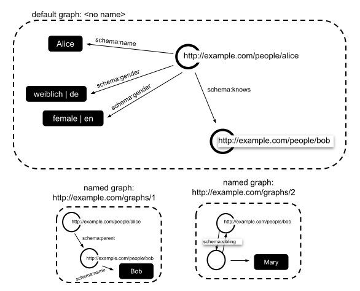

# Retained specification text (collector assembly)

> This consumer Markdown assembles the explicitly retained originals in declared order. Source labels, line anchors and local href rewrites are collector additions; HTML is represented as structural text with ordered table cells and preserved code, without running source scripts.

> Collector representation: declared cell spans are annotations, not an expanded table grid; code br line breaks and NBSP are retained, and image-label whitespace is normalized without dropping label words.

Original HTML: [specification.html](../source/specification.html#L1-L13368).

<a id="specification-L1"></a>
[](https://www.w3.org/)

<a id="specification-L1257"></a>
<a id="specification-title"></a>
# JSON-LD 1.1

<a id="specification-L1258"></a>
<a id="specification-subtitle"></a>
## A JSON-based Serialization for Linked Data

<a id="specification-L1259"></a>
## W3C Recommendation 16 July 2020
 

 

This version:


 [https://www.w3.org/TR/2020/REC-json-ld11-20200716/](https://www.w3.org/TR/2020/REC-json-ld11-20200716/) 


Latest published version:


 [https://www.w3.org/TR/json-ld11/](https://www.w3.org/TR/json-ld11/) 

 

Latest editor's draft:


[https://w3c.github.io/json-ld-syntax/](https://w3c.github.io/json-ld-syntax/)

 

Test suite:


[https://w3c.github.io/json-ld-api/tests/](https://w3c.github.io/json-ld-api/tests/)

 

Implementation report:


 [https://w3c.github.io/json-ld-api/reports/](https://w3c.github.io/json-ld-api/reports/) 

 

Previous version:


[https://www.w3.org/TR/2020/PR-json-ld11-20200507/](https://www.w3.org/TR/2020/PR-json-ld11-20200507/)

 

Previous Recommendation:


[https://www.w3.org/TR/2014/REC-json-ld-20140116/](https://www.w3.org/TR/2014/REC-json-ld-20140116/)

 

Editors:

 

[Gregg Kellogg](https://greggkellogg.net/) (v1.0 and v1.1)


[Pierre-Antoine Champin](http://champin.net/) ([LIRIS - Université de Lyon](https://liris.cnrs.fr/)) (v1.1)


[Dave Longley](https://digitalbazaar.com/author/dlongley/) ([Digital Bazaar](https://digitalbazaar.com/)) (v1.1)

 

 Former editors: 


[Manu Sporny](http://manu.sporny.org/) ([Digital Bazaar](https://digitalbazaar.com/)) (v1.0)


[Markus Lanthaler](https://www.markus-lanthaler.com/) ([Google](https://www.google.com/)) (v1.0)

 

 Authors: 


[Manu Sporny](http://manu.sporny.org/) ([Digital Bazaar](https://digitalbazaar.com/)) (v1.0)


[Dave Longley](https://digitalbazaar.com/author/dlongley/) ([Digital Bazaar](https://digitalbazaar.com/)) (v1.0 and v1.1)


[Gregg Kellogg](https://greggkellogg.net/) (v1.0 and v1.1)


[Markus Lanthaler](https://www.markus-lanthaler.com/) ([Google](https://www.google.com/)) (v1.0)


[Pierre-Antoine Champin](http://champin.net/) ([LIRIS - Université de Lyon](https://liris.cnrs.fr/)) (v1.1)


[Niklas Lindström](http://neverspace.net/) (v1.0)

 

Participate:


 [GitHub w3c/json-ld-syntax](https://github.com/w3c/json-ld-syntax/) 


 [File a bug](https://github.com/w3c/json-ld-syntax/issues/) 


 [Commit history](https://github.com/w3c/json-ld-syntax/commits/master) 


 [Pull requests](https://github.com/w3c/json-ld-syntax/pulls/) 

 

 

 Please check the [errata](https://w3c.github.io/json-ld-syntax/errata/) for any errors or issues reported since publication. 

 

 See also [translations](https://www.w3.org/2003/03/Translations/byTechnology?technology=json-ld11). 

 

 This document is also available in this non-normative format: [EPUB](https://www.w3.org/TR/2020/REC-json-ld11-20200716/json-ld11.epub) 

 

 [Copyright](https://www.w3.org/Consortium/Legal/ipr-notice#Copyright) © 2010-2020 [W3C](https://www.w3.org/)® ([MIT](https://www.csail.mit.edu/), [ERCIM](https://www.ercim.eu/), [Keio](https://www.keio.ac.jp/), [Beihang](https://ev.buaa.edu.cn/)). W3C [liability](https://www.w3.org/Consortium/Legal/ipr-notice#Legal_Disclaimer), [trademark](https://www.w3.org/Consortium/Legal/ipr-notice#W3C_Trademarks) and [permissive document license](https://www.w3.org/Consortium/Legal/2015/copyright-software-and-document) rules apply. 

  

 
<a id="specification-abstract"></a>

<a id="specification-L1339"></a>
## Abstract
 

JSON is a useful data serialization and messaging format. This specification defines JSON-LD 1.1, a JSON-based format to serialize Linked Data. The syntax is designed to easily integrate into deployed systems that already use JSON, and provides a smooth upgrade path from JSON to JSON-LD. It is primarily intended to be a way to use Linked Data in Web-based programming environments, to build interoperable Web services, and to store Linked Data in JSON-based storage engines.

 

This specification describes a superset of the features defined in [JSON-LD 1.0](https://www.w3.org/TR/2014/REC-json-ld-20140116/) [[JSON-LD10](#specification-bib-json-ld10)] and, except where noted, documents created using the 1.0 version of this specification remain compatible with JSON-LD 1.1.

 

 
<a id="specification-sotd"></a>

<a id="specification-L1355"></a>
## Status of This Document


This section describes the status of this document at the time of its publication. Other documents may supersede this document. A list of current W3C publications and the latest revision of this technical report can be found in the [W3C technical reports index](https://www.w3.org/TR/) at https://www.w3.org/TR/.

 

This document has been developed by the [JSON-LD Working Group](https://www.w3.org/2018/json-ld-wg/) and was derived from the [JSON-LD Community Group's](https://www.w3.org/community/json-ld/) [Final Report](https://www.w3.org/2018/jsonld-cg-reports/json-ld/).

 

There is a [live JSON-LD playground](https://json-ld.org/playground/) that is capable of demonstrating the features described in this document.

 

This specification is intended to [supersede](https://www.w3.org/2019/Process-20190301/#rec-rescind) the [JSON-LD 1.0](https://www.w3.org/TR/2014/REC-json-ld-20140116/) [[JSON-LD10](#specification-bib-json-ld10)] specification. 

 

 This document was published by the [JSON-LD Working Group](https://www.w3.org/2018/json-ld-wg/) as a Recommendation. 


 [GitHub Issues](https://github.com/w3c/json-ld-syntax/issues/) are preferred for discussion of this specification. Alternatively, you can send comments to our mailing list. Please send them to [public-json-ld-wg@w3.org](mailto:public-json-ld-wg@w3.org) ([archives](https://lists.w3.org/Archives/Public/public-json-ld-wg/)). 


 Please see the Working Group's [implementation report](https://w3c.github.io/json-ld-api/reports/). 


 This document has been reviewed by W3C Members, by software developers, and by other W3C groups and interested parties, and is endorsed by the Director as a W3C Recommendation. It is a stable document and may be used as reference material or cited from another document. W3C's role in making the Recommendation is to draw attention to the specification and to promote its widespread deployment. This enhances the functionality and interoperability of the Web. 


 This document was produced by a group operating under the [W3C Patent Policy](https://www.w3.org/Consortium/Patent-Policy/). W3C maintains a [public list of any patent disclosures](https://www.w3.org/2004/01/pp-impl/107714/status) made in connection with the deliverables of the group; that page also includes instructions for disclosing a patent. An individual who has actual knowledge of a patent which the individual believes contains [Essential Claim(s)](https://www.w3.org/Consortium/Patent-Policy/#def-essential) must disclose the information in accordance with [section 6 of the W3C Patent Policy](https://www.w3.org/Consortium/Patent-Policy/#sec-Disclosure). 


 This document is governed by the 
<a id="specification-w3c_process_revision"></a>
[1 March 2019 W3C Process Document](https://www.w3.org/2019/Process-20190301/).

<a id="specification-L1416"></a>
<a id="specification-set-of-documents"></a>
### Set of Documents[](#specification-set-of-documents)
 

This document is one of three JSON-LD 1.1 Recommendations produced by the [JSON-LD Working Group](https://www.w3.org/2018/json-ld-wg/):

 

 

- JSON-LD 1.1

 

- [JSON-LD 1.1 Processing Algorithms and API](https://www.w3.org/TR/json-ld11-api/)

 

- [JSON-LD 1.1 Framing](https://www.w3.org/TR/json-ld11-framing/)

 

 

 

 
<a id="specification-introduction"></a>

<a id="specification-L1433"></a>
<a id="specification-x1-introduction"></a>
## 1. Introduction[](#specification-introduction)


This section is non-normative.

 

Linked Data [[LINKED-DATA](#specification-bib-linked-data)] is a way to create a network of standards-based machine interpretable data across different documents and Web sites. It allows an application to start at one piece of Linked Data, and follow embedded links to other pieces of Linked Data that are hosted on different sites across the Web.

 

JSON-LD is a lightweight syntax to serialize Linked Data in JSON [[RFC8259](#specification-bib-rfc8259)]. Its design allows existing JSON to be interpreted as Linked Data with minimal changes. JSON-LD is primarily intended to be a way to use Linked Data in Web-based programming environments, to build interoperable Web services, and to store Linked Data in JSON-based storage engines. Since JSON-LD is 100% compatible with JSON, the large number of JSON parsers and libraries available today can be reused. In addition to all the features JSON provides, JSON-LD introduces:

 

 

- a universal identifier mechanism for [JSON objects](https://tools.ietf.org/html/rfc8259#section-4) via the use of [IRIs](https://tools.ietf.org/html/rfc3987#section-2),

 

- a way to disambiguate keys shared among different JSON documents by mapping them to [IRIs](https://tools.ietf.org/html/rfc3987#section-2) via a [context](#specification-dfn-context),

 

- a mechanism in which a value in a [JSON object](https://tools.ietf.org/html/rfc8259#section-4) may refer to a [resource](https://www.w3.org/TR/rdf11-concepts/#dfn-resource) on a different site on the Web,

 

- the ability to annotate [strings](https://infra.spec.whatwg.org/#javascript-string) with their language,

 

- a way to associate datatypes with values such as dates and times,

 

- and a facility to express one or more directed graphs, such as a social network, in a single document.

 

 

JSON-LD is designed to be usable directly as JSON, with no knowledge of RDF [[RDF11-CONCEPTS](#specification-bib-rdf11-concepts)]. It is also designed to be usable as RDF in conjunction with other Linked Data technologies like SPARQL [[SPARQL11-OVERVIEW](#specification-bib-sparql11-overview)]. Developers who require any of the facilities listed above or need to serialize an [RDF graph](https://www.w3.org/TR/rdf11-concepts/#dfn-rdf-graph) or [Dataset](https://www.w3.org/TR/rdf11-concepts/#dfn-rdf-dataset) in a JSON-based syntax will find JSON-LD of interest. People intending to use JSON-LD with RDF tools will find it can be used as another RDF syntax, as with [[Turtle](#specification-bib-turtle)] and [[TriG](#specification-bib-trig)]. Complete details of how JSON-LD relates to RDF are in section [§ 10. Relationship to RDF](#specification-relationship-to-rdf). 

 

The syntax is designed to not disturb already deployed systems running on JSON, but provide a smooth upgrade path from JSON to JSON-LD. Since the shape of such data varies wildly, JSON-LD features mechanisms to reshape documents into a deterministic structure which simplifies their processing.

 
<a id="specification-how-to-read-this-document"></a>

<a id="specification-L1481"></a>
<a id="specification-x1-1-how-to-read-this-document"></a>
### 1.1 How to Read this Document[](#specification-how-to-read-this-document)


This section is non-normative.

 

This document is a detailed specification for a serialization of Linked Data in JSON. The document is primarily intended for the following audiences:

 

 

- Software developers who want to encode Linked Data in a variety of programming languages that can use JSON

 

- Software developers who want to convert existing JSON to JSON-LD

 

- Software developers who want to understand the design decisions and language syntax for JSON-LD

 

- Software developers who want to implement processors and APIs for JSON-LD

 

- Software developers who want to generate or consume Linked Data, an [RDF graph](https://www.w3.org/TR/rdf11-concepts/#dfn-rdf-graph), or an [RDF Dataset](https://www.w3.org/TR/rdf11-concepts/#dfn-rdf-dataset) in a JSON syntax

 

 

A companion document, the JSON-LD 1.1 Processing Algorithms and API specification [[JSON-LD11-API](#specification-bib-json-ld11-api)], specifies how to work with JSON-LD at a higher level by providing a standard library interface for common JSON-LD operations.

 

To understand the basics in this specification you must first be familiar with [JSON](https://tools.ietf.org/html/rfc8259), which is detailed in [[RFC8259](#specification-bib-rfc8259)].

 

This document almost exclusively uses the term IRI ([Internationalized Resource Indicator](https://www.w3.org/TR/ld-glossary/#internationalized-resource-identifier)) when discussing hyperlinks. Many Web developers are more familiar with the URL ([Uniform Resource Locator](https://www.w3.org/TR/ld-glossary/#uniform-resource-locator)) terminology. The document also uses, albeit rarely, the URI ([Uniform Resource Indicator](https://www.w3.org/TR/ld-glossary/#uniform-resource-identifier)) terminology. While these terms are often used interchangeably among technical communities, they do have important distinctions from one another and the specification goes to great lengths to try and use the proper terminology at all times.

 

This document can highlight changes since the [JSON-LD 1.0](https://www.w3.org/TR/2014/REC-json-ld-20140116/) version. Select to  changes.

 

 
<a id="specification-contributing"></a>

<a id="specification-L1521"></a>
<a id="specification-x1-2-contributing"></a>
### 1.2 Contributing[](#specification-contributing)


This section is non-normative.

 

There are a number of ways that one may participate in the development of this specification:

 

 

- Technical discussion typically occurs on the working group mailing list: [public-json-ld-wg@w3.org](https://lists.w3.org/Archives/Public/public-json-ld-wg/)

 

- The working group uses [#json-ld](http://irc.w3.org/?channels=json-ld) IRC channel is available for real-time discussion on [irc.w3.org](http://irc.w3.org).

 

- The [#json-ld](https://webchat.freenode.net/?channels=json-ld) IRC channel is also available for real-time discussion on irc.freenode.net.

 

 

 
<a id="specification-typographical-conventions"></a>

<a id="specification-L1540"></a>
<a id="specification-x1-3-typographical-conventions"></a>
### 1.3 Typographical conventions[](#specification-typographical-conventions)


This section is non-normative.

 


The following typographic conventions are used in this specification:

 

 

`markup`


 Markup (elements, attributes, properties), machine processable values (string, characters, media types), property name, or a file name is in red-orange monospace font.

 

variable


 A variable in pseudo-code or in an algorithm description is in italics.

 


<a id="specification-dfn-definition"></a>
definition


 A definition of a term, to be used elsewhere in this or other specifications, is in bold and italics.

 

[definition reference](#specification-dfn-definition)


 A reference to a definition in this document is underlined and is also an active link to the definition itself. 

 

[`markup definition reference`](#specification-dfn-definition)


 A references to a definition in this document, when the reference itself is also a markup, is underlined, red-orange monospace font, and is also an active link to the definition itself.

 

external definition reference


 A reference to a definition in another document is underlined, in italics, and is also an active link to the definition itself.

 

` markup external definition reference`


 A reference to a definition in another document, when the reference itself is also a markup, is underlined, in italics red-orange monospace font, and is also an active link to the definition itself.

 

hyperlink


 A hyperlink is underlined and in blue.

 

[reference]


 A document reference (normative or informative) is enclosed in square brackets and links to the references section.

 

Changes from Recommendation


 Sections or phrases changed from the previous Recommendation may be highlighted using a control in [§ 1.1 How to Read this Document](#specification-how-to-read-this-document).

 

 
<a id="specification-issue-container-generatedID"></a>


<a id="specification-h-note"></a>


Note


Notes are in light green boxes with a green left border and with a "Note" header in green. Notes are always informative.


 
<a id="specification-example-1"></a>


 

 [Example 1](#specification-example-1) 

 

```
Examples are in light khaki boxes, with khaki left border,
and with a numbered "Example" header in khaki.
Examples are always informative. The content of the example is in monospace font and may be syntax colored.

Examples may have tabbed navigation buttons
to show the results of transforming an example into other representations.
```

 

 

 

 
<a id="specification-terminology"></a>

<a id="specification-L1597"></a>
<a id="specification-x1-4-terminology"></a>
### 1.4 Terminology[](#specification-terminology)


This section is non-normative.

 

This document uses the following terms as defined in external specifications and defines terms specific to JSON-LD.

<a id="specification-L1602"></a>
<a id="specification-terms-imported-from-other-specifications"></a>
#### Terms imported from Other Specifications[](#specification-terms-imported-from-other-specifications)
 

Terms imported from [ECMAScript Language Specification](https://tc39.es/ecma262/) [[ECMASCRIPT](#specification-bib-ecmascript)], [The JavaScript Object Notation (JSON) Data Interchange Format](https://tools.ietf.org/html/rfc8259) [[RFC8259](#specification-bib-rfc8259)], [Infra Standard](https://infra.spec.whatwg.org/) [[INFRA](#specification-bib-infra)], and [Web IDL](https://heycam.github.io/webidl/) [[WEBIDL](#specification-bib-webidl)]

 
<a id="specification-terms-0"></a>


<a id="specification-dfn-array"></a>
[array](https://infra.spec.whatwg.org/#list)


 In the JSON serialization, an [array](https://infra.spec.whatwg.org/#list) structure is represented as square brackets surrounding zero or more values. Values are separated by commas. In the [internal representation](https://www.w3.org/TR/json-ld11-api/#dfn-internal-representation), a [list](https://www.w3.org/TR/rdf-schema/#ch_collectionvocab) (also called an [array](https://infra.spec.whatwg.org/#list)) is an ordered collection of zero or more values. While JSON-LD uses the same array representation as JSON, the collection is unordered by default. While order is preserved in regular JSON arrays, it is not in regular JSON-LD arrays unless specifically defined (see the [Sets and Lists](#specification-sets-and-lists) section of JSON-LD 1.1.

 


<a id="specification-dfn-boolean"></a>
[boolean](https://infra.spec.whatwg.org/#boolean)


 The values `true` and `false` that are used to express one of two possible states.

 


<a id="specification-dfn-json-object"></a>
[JSON object](https://tools.ietf.org/html/rfc8259#section-4)


 In the JSON serialization, an [object](https://www.w3.org/TR/rdf11-concepts/#dfn-object) structure is represented as a pair of curly brackets surrounding zero or more name/value pairs (or members). A name is a [string](https://infra.spec.whatwg.org/#javascript-string). A single colon comes after each name, separating the name from the value. A single comma separates a value from a following name. In JSON-LD the names in an object must be unique. 

In the [internal representation](https://www.w3.org/TR/json-ld11-api/#dfn-internal-representation) a [JSON object](https://tools.ietf.org/html/rfc8259#section-4) is described as a 
<a id="specification-dfn-map"></a>
[map](https://infra.spec.whatwg.org/#ordered-map) (see [[INFRA](#specification-bib-infra)]), composed of 
<a id="specification-dfn-map-entry"></a>
[entries](https://infra.spec.whatwg.org/#map-entry) with key/value pairs.

 

In the [Application Programming Interface](https://www.w3.org/TR/json-ld11-api/#the-application-programming-interface), a [map](https://infra.spec.whatwg.org/#ordered-map) is described using a [[WEBIDL](#specification-bib-webidl)] [record](https://heycam.github.io/webidl/#idl-record).


 


<a id="specification-dfn-null"></a>
[null](https://infra.spec.whatwg.org/#nulls)


 The use of the [null](https://infra.spec.whatwg.org/#nulls) value within JSON-LD is used to ignore or reset values. A [map entry](https://infra.spec.whatwg.org/#map-entry) in the `@context` where the value, or the `@id` of the value, is `null`, explicitly decouples a term's association with an IRI. A [map entry](https://infra.spec.whatwg.org/#map-entry) in the body of a [JSON-LD document](#specification-dfn-json-ld-document) whose value is `null` has the same meaning as if the [map entry](https://infra.spec.whatwg.org/#map-entry) was not defined. If `@value`, `@list`, or `@set` is set to `null` in expanded form, then the entire [JSON object](https://tools.ietf.org/html/rfc8259#section-4) is ignored.

 


<a id="specification-dfn-number"></a>
[number](https://tc39.es/ecma262/#sec-terms-and-definitions-number-value)


 In the JSON serialization, a [number](https://tc39.es/ecma262/#sec-terms-and-definitions-number-value) is similar to that used in most programming languages, except that the octal and hexadecimal formats are not used and that leading zeros are not allowed. In the [internal representation](https://www.w3.org/TR/json-ld11-api/#dfn-internal-representation), a [number](https://tc39.es/ecma262/#sec-terms-and-definitions-number-value) is equivalent to either a 
<a id="specification-dfn-long"></a>
[long](https://heycam.github.io/webidl/#idl-long) or 
<a id="specification-dfn-double"></a>
[double](https://heycam.github.io/webidl/#idl-double), depending on if the number has a non-zero fractional part (see [[WEBIDL](#specification-bib-webidl)]).

 


<a id="specification-dfn-scalar"></a>
[scalar](https://infra.spec.whatwg.org/#primitive-data-types)


 A scalar is either a [string](https://infra.spec.whatwg.org/#javascript-string), [number](https://tc39.es/ecma262/#sec-terms-and-definitions-number-value), `true`, or `false`.

 


<a id="specification-dfn-string"></a>
[string](https://infra.spec.whatwg.org/#javascript-string)


 A [string](https://infra.spec.whatwg.org/#javascript-string) is a sequence of zero or more Unicode (UTF-8) characters, wrapped in double quotes, using backslash escapes (if necessary). A character is represented as a single character string.


 

Terms imported from [Internationalized Resource Identifiers (IRIs)](https://tools.ietf.org/html/rfc3987) [[RFC3987](#specification-bib-rfc3987)]

 


<a id="specification-dfn-internationalized-resource-identifier"></a>
[IRI](https://tools.ietf.org/html/rfc3987#section-2)


 The absolute form of an [IRI](https://tools.ietf.org/html/rfc3987#section-2) containing a scheme along with a path and optional query and fragment segments.

 


<a id="specification-dfn-iri-reference"></a>
[IRI reference](https://tools.ietf.org/html/rfc3987#section-1.3)


 Denotes the common usage of an [Internationalized Resource Identifier](https://tools.ietf.org/html/rfc3987#section-2). An [IRI reference](https://tools.ietf.org/html/rfc3987#section-1.3) may be absolute or [relative](https://tools.ietf.org/html/rfc3987#section-6.5). However, the "IRI" that results from such a reference only includes absolute [IRIs](https://tools.ietf.org/html/rfc3987#section-2); any [relative IRI references](https://tools.ietf.org/html/rfc3987#section-6.5) are resolved to their absolute form.

 


<a id="specification-dfn-relative-iri-reference"></a>
[relative IRI reference](https://tools.ietf.org/html/rfc3987#section-6.5)


 A relative IRI reference is an [IRI reference](https://tools.ietf.org/html/rfc3987#section-1.3) that is relative to some other [IRI](https://tools.ietf.org/html/rfc3987#section-2), typically the [base IRI](https://www.w3.org/TR/rdf11-concepts/#dfn-base-iri) of the document. Note that [properties](https://www.w3.org/TR/rdf11-concepts/#dfn-property), values of `@type`, and values of [terms](#specification-dfn-term) defined to be vocabulary relative are resolved relative to the [vocabulary mapping](#specification-dfn-vocabulary-mapping), not the [base IRI](https://www.w3.org/TR/rdf11-concepts/#dfn-base-iri).


 

Terms imported from [RDF 1.1 Concepts and Abstract Syntax](https://www.w3.org/TR/rdf11-concepts/) [[RDF11-CONCEPTS](#specification-bib-rdf11-concepts)], [RDF Schema 1.1](https://www.w3.org/TR/rdf-schema/) [[RDF-SCHEMA](#specification-bib-rdf-schema)], and [Linked Data Design Issues](https://www.w3.org/DesignIssues/LinkedData.html) [[LINKED-DATA](#specification-bib-linked-data)]

 


<a id="specification-dfn-base-iri"></a>
[base IRI](https://www.w3.org/TR/rdf11-concepts/#dfn-base-iri)


 The [base IRI](https://www.w3.org/TR/rdf11-concepts/#dfn-base-iri) is an [IRI](https://tools.ietf.org/html/rfc3987#section-2) established in the [context](#specification-dfn-context), or is based on the [JSON-LD document](#specification-dfn-json-ld-document) location. The [base IRI](https://www.w3.org/TR/rdf11-concepts/#dfn-base-iri) is used to turn [relative IRI references](https://tools.ietf.org/html/rfc3987#section-6.5) into [IRIs](https://tools.ietf.org/html/rfc3987#section-2).

 


<a id="specification-dfn-blank-node"></a>
[blank node](https://www.w3.org/TR/rdf11-concepts/#dfn-blank-node)


 A [node](https://www.w3.org/TR/rdf11-concepts/#dfn-node) in a [graph](https://www.w3.org/TR/rdf11-concepts/#dfn-rdf-graph) that is neither an [IRI](https://tools.ietf.org/html/rfc3987#section-2), nor a [literal](https://www.w3.org/TR/rdf11-concepts/#dfn-literal). A [blank node](https://www.w3.org/TR/rdf11-concepts/#dfn-blank-node) does not contain a de-referenceable identifier because it is either ephemeral in nature or does not contain information that needs to be linked to from outside of the [linked data graph](https://www.w3.org/TR/rdf11-concepts/#dfn-rdf-graph). In JSON-LD, a blank node is assigned an identifier starting with the prefix `_:`.

 


<a id="specification-dfn-blank-node-identifier"></a>
[blank node identifier](https://www.w3.org/TR/rdf11-concepts/#dfn-blank-node-identifier)


 A [blank node identifier](https://www.w3.org/TR/rdf11-concepts/#dfn-blank-node-identifier) is a string that can be used as an identifier for a [blank node](https://www.w3.org/TR/rdf11-concepts/#dfn-blank-node) within the scope of a JSON-LD document. Blank node identifiers begin with `_:`.

 


<a id="specification-dfn-rdf-dataset"></a>
[dataset](https://www.w3.org/TR/rdf11-concepts/#dfn-rdf-dataset)


 A [dataset](https://www.w3.org/TR/rdf11-concepts/#dfn-rdf-dataset) representing a collection of [RDF graphs](https://www.w3.org/TR/rdf11-concepts/#dfn-rdf-graph) including exactly one [default graph](https://www.w3.org/TR/rdf11-concepts/#dfn-default-graph) and zero or more [named graphs](https://www.w3.org/TR/rdf11-concepts/#dfn-named-graph).

 


<a id="specification-dfn-datatype-iri"></a>
[datatype IRI](https://www.w3.org/TR/rdf11-concepts/#dfn-datatype-iri)


 A [datatype IRI](https://www.w3.org/TR/rdf11-concepts/#dfn-datatype-iri) is an [IRI](https://tools.ietf.org/html/rfc3987#section-2) identifying a datatype that determines how the lexical form maps to a [literal value](https://www.w3.org/TR/rdf11-concepts/#dfn-literal-value).

 


<a id="specification-dfn-default-graph"></a>
[default graph](https://www.w3.org/TR/rdf11-concepts/#dfn-default-graph)


 The [default graph](https://www.w3.org/TR/rdf11-concepts/#dfn-default-graph) of a [dataset](https://www.w3.org/TR/rdf11-concepts/#dfn-rdf-dataset) is an [RDF graph](https://www.w3.org/TR/rdf11-concepts/#dfn-rdf-graph) having no [name](https://www.w3.org/TR/rdf11-concepts/#dfn-graph-name), which may be empty.

 


<a id="specification-dfn-graph-name"></a>
[graph name](https://www.w3.org/TR/rdf11-concepts/#dfn-graph-name)


 The [IRI](https://tools.ietf.org/html/rfc3987#section-2) or [blank node](https://www.w3.org/TR/rdf11-concepts/#dfn-blank-node) identifying a [named graph](https://www.w3.org/TR/rdf11-concepts/#dfn-named-graph).

 


<a id="specification-dfn-language-tagged-string"></a>
[language-tagged string](https://www.w3.org/TR/rdf11-concepts/#dfn-language-tagged-string)


 A [language-tagged string](https://www.w3.org/TR/rdf11-concepts/#dfn-language-tagged-string) consists of a string and a non-empty language tag as defined by [[BCP47](#specification-bib-bcp47)]. The 
<a id="specification-dfn-language-tag"></a>
[language tag](https://www.w3.org/TR/rdf11-concepts/#dfn-language-tag) must be well-formed according to [section 2.2.9 Classes of Conformance](https://tools.ietf.org/html/bcp47#section-2.2.9) of [[BCP47](#specification-bib-bcp47)]. Processors may normalize [language tags](https://www.w3.org/TR/rdf11-concepts/#dfn-language-tag) to lowercase. 

 


<a id="specification-dfn-linked-data"></a>
[Linked Data](https://www.w3.org/DesignIssues/LinkedData.html)


 A set of documents, each containing a representation of a [linked data graph](https://www.w3.org/TR/rdf11-concepts/#dfn-rdf-graph) or [dataset](https://www.w3.org/TR/rdf11-concepts/#dfn-rdf-dataset).

 


<a id="specification-dfn-collection"></a>
[list](https://www.w3.org/TR/rdf-schema/#ch_collectionvocab)


 A [list](https://www.w3.org/TR/rdf-schema/#ch_collectionvocab) is an ordered sequence of [IRIs](https://tools.ietf.org/html/rfc3987#section-2), [blank nodes](https://www.w3.org/TR/rdf11-concepts/#dfn-blank-node), and [literals](https://www.w3.org/TR/rdf11-concepts/#dfn-literal).

 


<a id="specification-dfn-rdf-literal"></a>
[literal](https://www.w3.org/TR/rdf11-concepts/#dfn-literal)


 An [object](https://www.w3.org/TR/rdf11-concepts/#dfn-object) expressed as a value such as a [string](https://infra.spec.whatwg.org/#javascript-string) or [number](https://tc39.es/ecma262/#sec-terms-and-definitions-number-value). Implicitly or explicitly includes a [datatype IRI](https://www.w3.org/TR/rdf11-concepts/#dfn-datatype-iri) and, if the datatype is `rdf:langString`, an optional [language tag](https://www.w3.org/TR/rdf11-concepts/#dfn-language-tag).

 


<a id="specification-dfn-named-graph"></a>
[named graph](https://www.w3.org/TR/rdf11-concepts/#dfn-named-graph)


 A [named graph](https://www.w3.org/TR/rdf11-concepts/#dfn-named-graph) is a [linked data graph](https://www.w3.org/TR/rdf11-concepts/#dfn-rdf-graph) that is identified by an [IRI](https://tools.ietf.org/html/rfc3987#section-2) or [blank node](https://www.w3.org/TR/rdf11-concepts/#dfn-blank-node).

 


<a id="specification-dfn-node"></a>
[node](https://www.w3.org/TR/rdf11-concepts/#dfn-node)


 A [node](https://www.w3.org/TR/rdf11-concepts/#dfn-node) in an [RDF graph](https://www.w3.org/TR/rdf11-concepts/#dfn-rdf-graph), either the [subject](https://www.w3.org/TR/rdf11-concepts/#dfn-subject) and [object](https://www.w3.org/TR/rdf11-concepts/#dfn-object) of at least one [triple](https://www.w3.org/TR/rdf11-concepts/#dfn-rdf-triple). Note that a [node](https://www.w3.org/TR/rdf11-concepts/#dfn-node) can play both roles ([subject](https://www.w3.org/TR/rdf11-concepts/#dfn-subject) and [object](https://www.w3.org/TR/rdf11-concepts/#dfn-object)) in a [graph](https://www.w3.org/TR/rdf11-concepts/#dfn-rdf-graph), even in the same [triple](https://www.w3.org/TR/rdf11-concepts/#dfn-rdf-triple).

 


<a id="specification-dfn-object"></a>
[object](https://www.w3.org/TR/rdf11-concepts/#dfn-object)


 An [object](https://www.w3.org/TR/rdf11-concepts/#dfn-object) is a [node](https://www.w3.org/TR/rdf11-concepts/#dfn-node) in a [linked data graph](https://www.w3.org/TR/rdf11-concepts/#dfn-rdf-graph) with at least one incoming edge.

 


<a id="specification-dfn-property"></a>
[property](https://www.w3.org/TR/rdf11-concepts/#dfn-property)


 The name of a directed-arc in a [linked data graph](https://www.w3.org/TR/rdf11-concepts/#dfn-rdf-graph). Every [property](https://www.w3.org/TR/rdf11-concepts/#dfn-property) is directional and is labeled with an [IRI](https://tools.ietf.org/html/rfc3987#section-2) or a [blank node identifier](https://www.w3.org/TR/rdf11-concepts/#dfn-blank-node-identifier). Whenever possible, a [property](https://www.w3.org/TR/rdf11-concepts/#dfn-property) should be labeled with an [IRI](https://tools.ietf.org/html/rfc3987#section-2). 
<a id="specification-issue-container-generatedID-0"></a>


<a id="specification-h-note-0"></a>


Note


The use of [blank node identifiers](https://www.w3.org/TR/rdf11-concepts/#dfn-blank-node-identifier) to label properties is obsolete, and may be removed in a future version of JSON-LD.


 Also, see 
<a id="specification-dfn-predicate"></a>
[predicate](https://www.w3.org/TR/rdf11-concepts/#dfn-predicate) in [[RDF11-CONCEPTS](#specification-bib-rdf11-concepts)].

 


<a id="specification-dfn-linked-data-graph"></a>
[RDF graph](https://www.w3.org/TR/rdf11-concepts/#dfn-rdf-graph)


 A labeled directed [graph](https://www.w3.org/TR/rdf11-concepts/#dfn-rdf-graph), i.e., a set of [nodes](https://www.w3.org/TR/rdf11-concepts/#dfn-node) connected by directed-arcs. Also called [linked data graph](https://www.w3.org/TR/rdf11-concepts/#dfn-rdf-graph). 

 


<a id="specification-dfn-resource"></a>
[resource](https://www.w3.org/TR/rdf11-concepts/#dfn-resource)


 A [resource](https://www.w3.org/TR/rdf11-concepts/#dfn-resource) denoted by an [IRI](https://tools.ietf.org/html/rfc3987#section-2), a [blank node](https://www.w3.org/TR/rdf11-concepts/#dfn-blank-node) or [literal](https://www.w3.org/TR/rdf11-concepts/#dfn-literal) representing something in the world (the "universe of discourse").

 


<a id="specification-dfn-subject"></a>
[subject](https://www.w3.org/TR/rdf11-concepts/#dfn-subject)


 A [subject](https://www.w3.org/TR/rdf11-concepts/#dfn-subject) is a [node](https://www.w3.org/TR/rdf11-concepts/#dfn-node) in a [linked data graph](https://www.w3.org/TR/rdf11-concepts/#dfn-rdf-graph) with at least one outgoing edge, related to an [object](https://www.w3.org/TR/rdf11-concepts/#dfn-object) node through a [property](https://www.w3.org/TR/rdf11-concepts/#dfn-property).


<a id="specification-dfn-triple"></a>
[triple](https://www.w3.org/TR/rdf11-concepts/#dfn-rdf-triple)


 A component of an [RDF graph](https://www.w3.org/TR/rdf11-concepts/#dfn-rdf-graph) including a [subject](https://www.w3.org/TR/rdf11-concepts/#dfn-subject), [predicate](https://www.w3.org/TR/rdf11-concepts/#dfn-predicate), and [object](https://www.w3.org/TR/rdf11-concepts/#dfn-object), which represents a node-arc-node segment of an [RDF graph](https://www.w3.org/TR/rdf11-concepts/#dfn-rdf-graph).

<a id="specification-L1754"></a>
<a id="specification-json-ld-specific-term-definitions"></a>
#### JSON-LD Specific Term Definitions[](#specification-json-ld-specific-term-definitions)
 


<a id="specification-dfn-active-context"></a>
active context


 A [context](#specification-dfn-context) that is used to resolve [terms](#specification-dfn-term) while the processing algorithm is running.

 


<a id="specification-dfn-base-direction"></a>
base direction


 The [base direction](#specification-dfn-base-direction) is the direction used when a string does not have a direction associated with it directly. It can be set in the [context](#specification-dfn-context) using the `@direction` key whose value must be one of the strings `"ltr"`, `"rtl"`, or `null`. See the [Context Definitions](#specification-context-definitions) section of JSON-LD 1.1 for a normative description. 

 


<a id="specification-dfn-compact-iri"></a>
compact IRI


 A compact IRI has the form of [prefix](#specification-dfn-prefix):suffix and is used as a way of expressing an [IRI](https://tools.ietf.org/html/rfc3987#section-2) without needing to define separate [term](#specification-dfn-term) definitions for each IRI contained within a common vocabulary identified by [prefix](#specification-dfn-prefix).

 


<a id="specification-dfn-context"></a>
context


 A set of rules for interpreting a [JSON-LD document](#specification-dfn-json-ld-document) as described in the [The Context](#specification-the-context) section of JSON-LD 1.1, and normatively specified in the [Context Definitions](#specification-context-definitions) section of JSON-LD 1.1. 

 


<a id="specification-dfn-default-language"></a>
default language


 The [default language](#specification-dfn-default-language) is the language used when a string does not have a language associated with it directly. It can be set in the [context](#specification-dfn-context) using the `@language` key whose value must be a [string](https://infra.spec.whatwg.org/#javascript-string) representing a [[BCP47](#specification-bib-bcp47)] language code or `null`. See the [Context Definitions](#specification-context-definitions) section of JSON-LD 1.1 for a normative description. 

 


<a id="specification-dfn-default-object"></a>
default object


 A [default object](#specification-dfn-default-object) is a [map](https://infra.spec.whatwg.org/#ordered-map) that has a `@default` key.

 


<a id="specification-dfn-embedded-context"></a>
embedded context


 An embedded [context](#specification-dfn-context) is a context which appears as the `@context` [entry](https://infra.spec.whatwg.org/#map-entry) of one of the following: a [node object](#specification-dfn-node-object), a [value object](#specification-dfn-value-object), a [graph object](#specification-dfn-graph-object), a [list object](#specification-dfn-list-object), a [set object](#specification-dfn-set-object), the value of a [nested properties](#specification-dfn-nested-property), or the value of an [expanded term definition](#specification-dfn-expanded-term-definition). Its value may be a [map](https://infra.spec.whatwg.org/#ordered-map) for a [context definition](#specification-dfn-context-definition), as an [IRI](https://tools.ietf.org/html/rfc3987#section-2), or as an [array](https://infra.spec.whatwg.org/#list) combining either of the above. 

 


<a id="specification-dfn-expanded-term-definition"></a>
expanded term definition


 An expanded term definition is a [term definition](#specification-dfn-term-definition) where the value is a [map](https://infra.spec.whatwg.org/#ordered-map) containing one or more [keyword](#specification-dfn-keyword) keys to define the associated [IRI](https://tools.ietf.org/html/rfc3987#section-2), if this is a reverse property, the type associated with string values, and a container mapping. See the [Expanded Term Definition](#specification-expanded-term-definition) section of JSON-LD 1.1 for a normative description. 

 


<a id="specification-dfn-frame"></a>
[frame](https://www.w3.org/TR/json-ld11-framing/#dfn-frame)


 A [JSON-LD document](#specification-dfn-json-ld-document), which describes the form for transforming another [JSON-LD document](#specification-dfn-json-ld-document) using matching and embedding rules. A frame document allows additional keywords and certain [map entries](https://infra.spec.whatwg.org/#map-entry) to describe the matching and transforming process.

 


<a id="specification-dfn-frame-object"></a>
[frame object](https://www.w3.org/TR/json-ld11-framing/#dfn-frame-object)


 A frame object is a [map](https://infra.spec.whatwg.org/#ordered-map) element within a [frame](https://www.w3.org/TR/json-ld11-framing/#dfn-frame) which represents a specific portion of the [frame](https://www.w3.org/TR/json-ld11-framing/#dfn-frame) matching either a [node object](#specification-dfn-node-object) or a [value object](#specification-dfn-value-object) in the input. See the [Frame Objects](#specification-frame-objects) section of JSON-LD 1.1 for a normative description. 

 


<a id="specification-dfn-graph-object"></a>
graph object


 A [graph object](#specification-dfn-graph-object) represents a [named graph](https://www.w3.org/TR/rdf11-concepts/#dfn-named-graph) as the value of a [map entry](https://infra.spec.whatwg.org/#map-entry) within a [node object](#specification-dfn-node-object). When expanded, a graph object must have an `@graph` [entry](https://infra.spec.whatwg.org/#map-entry), and may also have `@id`, and `@index` [entries](https://infra.spec.whatwg.org/#map-entry). A 
<a id="specification-dfn-simple-graph-object"></a>
simple graph object is a [graph object](#specification-dfn-graph-object) which does not have an `@id` [entry](https://infra.spec.whatwg.org/#map-entry). Note that [node objects](#specification-dfn-node-object) may have a `@graph` [entry](https://infra.spec.whatwg.org/#map-entry), but are not considered [graph objects](#specification-dfn-graph-object) if they include any other [entries](https://infra.spec.whatwg.org/#map-entry). A top-level object consisting of `@graph` is also not a [graph object](#specification-dfn-graph-object). Note that a [node object](#specification-dfn-node-object) may also represent a [named graph](https://www.w3.org/TR/rdf11-concepts/#dfn-named-graph) it it includes other properties. See the [Graph Objects](#specification-graph-objects) section of JSON-LD 1.1 for a normative description. 

 


<a id="specification-dfn-id-map"></a>
id map


 An [id map](#specification-dfn-id-map) is a [map](https://infra.spec.whatwg.org/#ordered-map) value of a [term](#specification-dfn-term) defined with `@container` set to `@id`. The values of the [id map](#specification-dfn-id-map) must be [node objects](#specification-dfn-node-object), and its keys are interpreted as [IRIs](https://tools.ietf.org/html/rfc3987#section-2) representing the `@id` of the associated [node object](#specification-dfn-node-object). If a value in the [id map](#specification-dfn-id-map) contains a key expanding to `@id`, its value must be equivalent to the referencing key in the [id map](#specification-dfn-id-map). See the [Id Maps](#specification-id-maps) section of JSON-LD 1.1 for a normative description. 

 


<a id="specification-dfn-implicitly-named-graph"></a>
implicitly named graph


 A [named graph](https://www.w3.org/TR/rdf11-concepts/#dfn-named-graph) created from the value of a [map entry](https://infra.spec.whatwg.org/#map-entry) having an [expanded term definition](#specification-dfn-expanded-term-definition) where `@container` is set to `@graph`.

 


<a id="specification-dfn-included-block"></a>
included block


 An [included block](#specification-dfn-included-block) is an [entry](https://infra.spec.whatwg.org/#map-entry) in a [node object](#specification-dfn-node-object) where the key is either `@included` or an alias of `@included` and the value is one or more [node objects](#specification-dfn-node-object). See the [Included Blocks](#specification-included-blocks) section of JSON-LD 1.1 for a normative description. 

 


<a id="specification-dfn-index-map"></a>
index map


 An [index map](#specification-dfn-index-map) is a [map](https://infra.spec.whatwg.org/#ordered-map) value of a [term](#specification-dfn-term) defined with `@container` set to `@index`, whose values must be any of the following types: [string](https://infra.spec.whatwg.org/#javascript-string), [number](https://tc39.es/ecma262/#sec-terms-and-definitions-number-value), `true`, `false`, [null](https://infra.spec.whatwg.org/#nulls), [node object](#specification-dfn-node-object), [value object](#specification-dfn-value-object), [list object](#specification-dfn-list-object), [set object](#specification-dfn-set-object), or an [array](https://infra.spec.whatwg.org/#list) of zero or more of the above possibilities. See the [Index Maps](#specification-index-maps) section in JSON-LD 1.1 for a formal description. 

 


<a id="specification-dfn-json-literal"></a>
JSON literal


 A [JSON literal](#specification-dfn-json-literal) is a [literal](https://www.w3.org/TR/rdf11-concepts/#dfn-literal) where the associated [datatype IRI](https://www.w3.org/TR/rdf11-concepts/#dfn-datatype-iri) is `rdf:JSON`. In the [value object](#specification-dfn-value-object) representation, the value of `@type` is `@json`. JSON literals represent values which are valid JSON [[RFC8259](#specification-bib-rfc8259)]. See the [The `rdf:JSON` Datatype](#specification-the-rdf-json-datatype) section in JSON-LD 1.1 for a normative description. 

 


<a id="specification-dfn-json-ld-document"></a>
JSON-LD document


 A [JSON-LD document](#specification-dfn-json-ld-document) is a serialization of an [RDF dataset](https://www.w3.org/TR/rdf11-concepts/#dfn-rdf-dataset). See the [JSON-LD Grammar](#specification-json-ld-grammar) section in JSON-LD 1.1 for a formal description. 

 


<a id="specification-dfn-internal-representation"></a>
[JSON-LD internal representation](https://www.w3.org/TR/json-ld11-api/#dfn-internal-representation)


 The JSON-LD internal representation is the result of transforming a JSON syntactic structure into the core data structures suitable for direct processing: [arrays](https://infra.spec.whatwg.org/#list), [maps](https://infra.spec.whatwg.org/#ordered-map), [strings](https://infra.spec.whatwg.org/#javascript-string), [numbers](https://tc39.es/ecma262/#sec-terms-and-definitions-number-value), [booleans](https://infra.spec.whatwg.org/#boolean), and [null](https://infra.spec.whatwg.org/#nulls).

 


<a id="specification-dfn-json-ld-processor"></a>
[JSON-LD Processor](https://www.w3.org/TR/json-ld11-api/#dfn-json-ld-processor)


 A [JSON-LD Processor](https://www.w3.org/TR/json-ld11-api/#dfn-json-ld-processor) is a system which can perform the algorithms defined in JSON-LD 1.1 Processing Algorithms and API. See the [Conformance](https://www.w3.org/TR/json-ld11-api/#conformance) section in JSON-LD 1.1 API for a formal description. 

 


<a id="specification-dfn-json-ld-value"></a>
JSON-LD value


 A [JSON-LD value](#specification-dfn-json-ld-value) is a [string](https://infra.spec.whatwg.org/#javascript-string), a [number](https://tc39.es/ecma262/#sec-terms-and-definitions-number-value), `true` or `false`, a [typed value](#specification-dfn-typed-value), or a [language-tagged string](https://www.w3.org/TR/rdf11-concepts/#dfn-language-tagged-string). It represents an [RDF literal](https://www.w3.org/TR/rdf11-concepts/#dfn-literal). 

 


<a id="specification-dfn-keyword"></a>
keyword


 A [string](https://infra.spec.whatwg.org/#javascript-string) that is specific to JSON-LD, described in the [Syntax Tokens and Keywords](#specification-syntax-tokens-and-keywords) section of JSON-LD 1.1, and normatively specified in the [Keywords](#specification-keywords) section of JSON-LD 1.1, 

 


<a id="specification-dfn-language-map"></a>
language map


 An [language map](#specification-dfn-language-map) is a [map](https://infra.spec.whatwg.org/#ordered-map) value of a [term](#specification-dfn-term) defined with `@container` set to `@language`, whose keys must be [strings](https://infra.spec.whatwg.org/#javascript-string) representing [[BCP47](#specification-bib-bcp47)] language codes and the values must be any of the following types: [null](https://infra.spec.whatwg.org/#nulls), [string](https://infra.spec.whatwg.org/#javascript-string), or an [array](https://infra.spec.whatwg.org/#list) of zero or more of the above possibilities. See the [Language Maps](#specification-language-maps) section of JSON-LD 1.1 for a normative description. 

 


<a id="specification-dfn-list-object"></a>
list object


 A [list object](#specification-dfn-list-object) is a [map](https://infra.spec.whatwg.org/#ordered-map) that has a `@list` key. It may also have an `@index` key, but no other [entries](https://infra.spec.whatwg.org/#map-entry). See the [Lists and Sets](#specification-lists-and-sets) section of JSON-LD 1.1 for a normative description. 

 


<a id="specification-dfn-local-context"></a>
local context


 A [context](#specification-dfn-context) that is specified with a [map](https://infra.spec.whatwg.org/#ordered-map), specified via the `@context` [keyword](#specification-dfn-keyword).

 


<a id="specification-dfn-nested-property"></a>
nested property


 A [nested property](#specification-dfn-nested-property) is a key in a [node object](#specification-dfn-node-object) whose value is a [map](https://infra.spec.whatwg.org/#ordered-map) containing [entries](https://infra.spec.whatwg.org/#map-entry) which are treated as if they were values of the [node object](#specification-dfn-node-object). The [nested property](#specification-dfn-nested-property) itself is semantically meaningless and used only to create a sub-structure within a [node object](#specification-dfn-node-object). See the [Property Nesting](#specification-property-nesting) section of JSON-LD 1.1 for a normative description. 

 


<a id="specification-dfn-node-object"></a>
node object


 A [node object](#specification-dfn-node-object) represents zero or more [properties](https://www.w3.org/TR/rdf11-concepts/#dfn-property) of a [node](https://www.w3.org/TR/rdf11-concepts/#dfn-node) in the [graph](https://www.w3.org/TR/rdf11-concepts/#dfn-rdf-graph) serialized by the [JSON-LD document](#specification-dfn-json-ld-document). A [map](https://infra.spec.whatwg.org/#ordered-map) is a [node object](#specification-dfn-node-object) if it exists outside of the JSON-LD [context](#specification-dfn-context) and: 

 

- it does not contain the `@value`, `@list`, or `@set` keywords, or

 

- it is not the top-most [map](https://infra.spec.whatwg.org/#ordered-map) in the JSON-LD document consisting of no other [entries](https://infra.spec.whatwg.org/#map-entry) than `@graph` and `@context`.

 

 The [entries](https://infra.spec.whatwg.org/#map-entry) of a [node object](#specification-dfn-node-object) whose keys are not keywords are also called [properties](https://www.w3.org/TR/rdf11-concepts/#dfn-property) of the [node object](#specification-dfn-node-object). See the [Node Objects](#specification-node-objects) section of JSON-LD 1.1 for a normative description. 

 


<a id="specification-dfn-node-reference"></a>
node reference


 A [node object](#specification-dfn-node-object) used to reference a node having only the `@id` key.

 


<a id="specification-dfn-prefix"></a>
prefix


 A [prefix](#specification-dfn-prefix) is the first component of a [compact IRI](#specification-dfn-compact-iri) which comes from a [term](#specification-dfn-term) that maps to a string that, when prepended to the suffix of the [compact IRI](#specification-dfn-compact-iri), results in an [IRI](https://tools.ietf.org/html/rfc3987#section-2).

 


<a id="specification-dfn-processing-mode"></a>
processing mode


 The [processing mode](#specification-dfn-processing-mode) defines how a [JSON-LD document](#specification-dfn-json-ld-document) is processed. By default, all documents are assumed to be conformant with this specification. By defining a different version using the `@version` [entry](https://infra.spec.whatwg.org/#map-entry) in a [context](#specification-dfn-context), publishers can ensure that processors conformant with [JSON-LD 1.0](https://www.w3.org/TR/2014/REC-json-ld-20140116/) [[JSON-LD10](#specification-bib-json-ld10)] will not accidentally process JSON-LD 1.1 documents, possibly creating a different output. The API provides an option for setting the [processing mode](#specification-dfn-processing-mode) to `json-ld-1.0`, which will prevent JSON-LD 1.1 features from being activated, or error if `@version` [entry](https://infra.spec.whatwg.org/#map-entry) in a [context](#specification-dfn-context) is explicitly set to `1.1`. This specification extends [JSON-LD 1.0](https://www.w3.org/TR/2014/REC-json-ld-20140116/) via the `json-ld-1.1` [processing mode](#specification-dfn-processing-mode).

 


<a id="specification-dfn-scoped-context"></a>
scoped context


 A [scoped context](#specification-dfn-scoped-context) is part of an [expanded term definition](#specification-dfn-expanded-term-definition) using the `@context` [entry](https://infra.spec.whatwg.org/#map-entry). It has the same form as an [embedded context](#specification-dfn-embedded-context). When the term is used as a type, it defines a 
<a id="specification-dfn-type-scoped-context"></a>
type-scoped context, when used as a property it defines a 
<a id="specification-dfn-property-scoped-context"></a>
property-scoped context. 

 


<a id="specification-dfn-set-object"></a>
set object


 A [set object](#specification-dfn-set-object) is a [map](https://infra.spec.whatwg.org/#ordered-map) that has an `@set` [entry](https://infra.spec.whatwg.org/#map-entry). It may also have an `@index` key, but no other [entries](https://infra.spec.whatwg.org/#map-entry). See the [Lists and Sets](#specification-lists-and-sets) section of JSON-LD 1.1 for a normative description. 

 


<a id="specification-dfn-term"></a>
term


 A [term](#specification-dfn-term) is a short word defined in a [context](#specification-dfn-context) that may be expanded to an [IRI](https://tools.ietf.org/html/rfc3987#section-2). See the [Terms](#specification-terms) section of JSON-LD 1.1 for a normative description. 

 


<a id="specification-dfn-term-definition"></a>
term definition


 A term definition is an entry in a [context](#specification-dfn-context), where the key defines a [term](#specification-dfn-term) which may be used within a [map](https://infra.spec.whatwg.org/#ordered-map) as a key, type, or elsewhere that a string is interpreted as a vocabulary item. Its value is either a string (
<a id="specification-dfn-simple-term-definition"></a>
simple term definition), expanding to an [IRI](https://tools.ietf.org/html/rfc3987#section-2), or a map ([expanded term definition](#specification-dfn-expanded-term-definition)). 

 


<a id="specification-dfn-type-map"></a>
type map


 A [type map](#specification-dfn-type-map) is a [map](https://infra.spec.whatwg.org/#ordered-map) value of a [term](#specification-dfn-term) defined with `@container` set to `@type`, whose keys are interpreted as [IRIs](https://tools.ietf.org/html/rfc3987#section-2) representing the `@type` of the associated [node object](#specification-dfn-node-object); the value must be a [node object](#specification-dfn-node-object), or [array](https://infra.spec.whatwg.org/#list) of node objects. If the value contains a [term](#specification-dfn-term) expanding to `@type`, its values are merged with the map value when expanding. See the [Type Maps](#specification-type-maps) section of JSON-LD 1.1 for a normative description. 

 


<a id="specification-dfn-typed-value"></a>
typed value


 A [typed value](#specification-dfn-typed-value) consists of a value, which is a [string](https://infra.spec.whatwg.org/#javascript-string), and a type, which is an [IRI](https://tools.ietf.org/html/rfc3987#section-2).

 


<a id="specification-dfn-value-object"></a>
value object


 A [value object](#specification-dfn-value-object) is a [map](https://infra.spec.whatwg.org/#ordered-map) that has an `@value` [entry](https://infra.spec.whatwg.org/#map-entry). See the [Value Objects](#specification-value-objects) section of JSON-LD 1.1 for a normative description.

 


<a id="specification-dfn-vocabulary-mapping"></a>
vocabulary mapping


 The vocabulary mapping is set in the [context](#specification-dfn-context) using the `@vocab` key whose value must be an [IRI](https://tools.ietf.org/html/rfc3987#section-2), a [compact IRI](#specification-dfn-compact-iri), a [term](#specification-dfn-term), or `null`. See the [Context Definitions](#specification-context-definitions) section of JSON-LD 1.1 for a normative description.


 

 

 

 
<a id="specification-design-goals-and-rationale"></a>

<a id="specification-L1999"></a>
<a id="specification-x1-5-design-goals-and-rationale"></a>
### 1.5 Design Goals and Rationale[](#specification-design-goals-and-rationale)


This section is non-normative.

 

JSON-LD satisfies the following design goals:

 

 

Simplicity

 

No extra processors or software libraries are necessary to use JSON-LD in its most basic form. The language provides developers with a very easy learning curve. Developers not concerned with Linked Data only need to understand JSON, and know to include but ignore the `@context` property, to use the basic functionality in JSON-LD.

 

Compatibility

 

A JSON-LD document is always a valid JSON document. This ensures that all of the standard JSON libraries work seamlessly with JSON-LD documents.

 

Expressiveness

 

The syntax serializes labeled directed graphs. This ensures that almost every real world data model can be expressed.

 

Terseness

 

The JSON-LD syntax is very terse and human readable, requiring as little effort as possible from the developer.

 

Zero Edits, most of the time

 

JSON-LD ensures a smooth and simple transition from existing JSON-based systems. In many cases, zero edits to the JSON document and the addition of one line to the HTTP response should suffice (see [§ 6.1 Interpreting JSON as JSON-LD](#specification-interpreting-json-as-json-ld)). This allows organizations that have already deployed large JSON-based infrastructure to use JSON-LD's features in a way that is not disruptive to their day-to-day operations and is transparent to their current customers. However, there are times where mapping JSON to a graph representation is a complex undertaking. In these instances, rather than extending JSON-LD to support esoteric use cases, we chose not to support the use case. While Zero Edits is a design goal, it is not always possible without adding great complexity to the language. JSON-LD focuses on simplicity when possible.

 

Usable as RDF

 

JSON-LD is usable by developers as idiomatic JSON, with no need to understand RDF [[RDF11-CONCEPTS](#specification-bib-rdf11-concepts)]. JSON-LD is also usable as RDF, so people intending to use JSON-LD with RDF tools will find it can be used like any other RDF syntax. Complete details of how JSON-LD relates to RDF are in section [§ 10. Relationship to RDF](#specification-relationship-to-rdf).

 

 

 
<a id="specification-data-model-overview"></a>

<a id="specification-L2045"></a>
<a id="specification-x1-6-data-model-overview"></a>
### 1.6 Data Model Overview[](#specification-data-model-overview)


This section is non-normative.

 

Generally speaking, the data model described by a [JSON-LD document](#specification-dfn-json-ld-document) is a labeled, directed [graph](https://www.w3.org/TR/rdf11-concepts/#dfn-rdf-graph). The graph contains [nodes](https://www.w3.org/TR/rdf11-concepts/#dfn-node), which are connected by directed-arcs. A node is either a [resource](https://www.w3.org/TR/rdf11-concepts/#dfn-resource) with [properties](https://www.w3.org/TR/rdf11-concepts/#dfn-property), or the data values of those properties including [strings](https://infra.spec.whatwg.org/#javascript-string), [numbers](https://tc39.es/ecma262/#sec-terms-and-definitions-number-value), [typed values](#specification-dfn-typed-value) (like dates and times) and [IRIs](https://tools.ietf.org/html/rfc3987#section-2).

 

Within a directed graph, nodes are [resources](https://www.w3.org/TR/rdf11-concepts/#dfn-resource), and may be unnamed, i.e., not identified by an [IRI](https://tools.ietf.org/html/rfc3987#section-2); which are called [blank nodes](https://www.w3.org/TR/rdf11-concepts/#dfn-blank-node), and may be identified using a [blank node identifier](https://www.w3.org/TR/rdf11-concepts/#dfn-blank-node-identifier). These identifiers may be required to represent a fully connected graph using a tree structure, such as JSON, but otherwise have no intrinsic meaning. Literal values, such as [strings](https://infra.spec.whatwg.org/#javascript-string) and [numbers](https://tc39.es/ecma262/#sec-terms-and-definitions-number-value), are also considered [resources](https://www.w3.org/TR/rdf11-concepts/#dfn-resource), and JSON-LD distinguishes between [node objects](#specification-dfn-node-object) and [value objects](#specification-dfn-value-object) to distinguish between the different kinds of [resource](https://www.w3.org/TR/rdf11-concepts/#dfn-resource).

 

This simple data model is incredibly flexible and powerful, capable of modeling almost any kind of data. For a deeper explanation of the data model, see section [§ 8. Data Model](#specification-data-model).

 

Developers who are familiar with Linked Data technologies will recognize the data model as the RDF Data Model. To dive deeper into how JSON-LD and RDF are related, see section [§ 10. Relationship to RDF](#specification-relationship-to-rdf).

 

At the surface level, a [JSON-LD document](#specification-dfn-json-ld-document) is simply [JSON](https://tools.ietf.org/html/rfc8259), detailed in [[RFC8259](#specification-bib-rfc8259)]. For the purpose of describing the core data structures, this is limited to [arrays](https://infra.spec.whatwg.org/#list), [maps](https://infra.spec.whatwg.org/#ordered-map) (the parsed version of a [JSON Object](https://tools.ietf.org/html/rfc8259#section-4)), [strings](https://infra.spec.whatwg.org/#javascript-string), [numbers](https://tc39.es/ecma262/#sec-terms-and-definitions-number-value), [booleans](https://infra.spec.whatwg.org/#boolean), and [null](https://infra.spec.whatwg.org/#nulls), called the [JSON-LD internal representation](https://www.w3.org/TR/json-ld11-api/#dfn-internal-representation). This allows surface syntaxes other than JSON to be manipulated using the same algorithms, when the syntax maps to equivalent core data structures.

 
<a id="specification-issue-container-generatedID-1"></a>


<a id="specification-h-note-1"></a>


Note


Although not discussed in this specification, parallel work using [YAML Ain’t Markup Language (YAML™) Version 1.2](http://yaml.org/spec/1.2/spec.html) [[YAML](#specification-bib-yaml)] and binary representations such as [Concise Binary Object Representation (CBOR)](https://tools.ietf.org/html/rfc7049) [[RFC7049](#specification-bib-rfc7049)] could be used to map into the [internal representation](https://www.w3.org/TR/json-ld11-api/#dfn-internal-representation), allowing the JSON-LD 1.1 API [[JSON-LD11-API](#specification-bib-json-ld11-api)] to operate as if the source was a JSON document.


 

 
<a id="specification-syntax-tokens-and-keywords"></a>

<a id="specification-L2089"></a>
<a id="specification-x1-7-syntax-tokens-and-keywords"></a>
### 1.7 Syntax Tokens and Keywords[](#specification-syntax-tokens-and-keywords)


This section is non-normative.

 

JSON-LD specifies a number of syntax tokens and [keywords](#specification-dfn-keyword) that are a core part of the language. A normative description of the [keywords](#specification-dfn-keyword) is given in [§ 9.16 Keywords](#specification-keywords). 

 


`:`


 The separator for JSON keys and values that use [compact IRIs](#specification-dfn-compact-iri).

 

`@base`

 

Used to set the [base IRI](https://www.w3.org/TR/rdf11-concepts/#dfn-base-iri) against which to resolve those [relative IRI references](https://tools.ietf.org/html/rfc3987#section-6.5) which are otherwise interpreted relative to the document. This keyword is described in [§ 4.1.3 Base IRI](#specification-base-iri).

 

`@container`

 

Used to set the default container type for a [term](#specification-dfn-term). This keyword is described in the following sections: 

 

- [§ 4.3 Value Ordering](#specification-sets-and-lists),

 

- [§ 4.6.1 Data Indexing](#specification-data-indexing),

 

- [§ 4.6.2 Language Indexing](#specification-language-indexing),

 

- [§ 4.6.3 Node Identifier Indexing](#specification-node-identifier-indexing),

 

- [§ 4.6.4 Node Type Indexing](#specification-node-type-indexing)

 

- [§ 4.9 Named Graphs](#specification-named-graphs),

 

- [§ 4.9.3 Named Graph Indexing](#specification-named-graph-indexing), and

 

- [§ 4.9.2 Named Graph Data Indexing](#specification-named-graph-data-indexing)

 


 

`@context`

 

Used to define the short-hand names that are used throughout a JSON-LD document. These short-hand names are called [terms](#specification-dfn-term) and help developers to express specific identifiers in a compact manner. The `@context` keyword is described in detail in [§ 3.1 The Context](#specification-the-context).

 

`@direction`

 

Used to set the [base direction](#specification-dfn-base-direction) of a [JSON-LD value](#specification-dfn-json-ld-value), which are not [typed values](#specification-dfn-typed-value) (e.g. [strings](https://infra.spec.whatwg.org/#javascript-string), or [language-tagged strings](https://www.w3.org/TR/rdf11-concepts/#dfn-language-tagged-string)). This keyword is described in [§ 4.2.4 String Internationalization](#specification-string-internationalization).

 

`@graph`


Used to express a [graph](https://www.w3.org/TR/rdf11-concepts/#dfn-rdf-graph). This keyword is described in [§ 4.9 Named Graphs](#specification-named-graphs).

 

`@id`

 

Used to uniquely identify [node objects](#specification-dfn-node-object) that are being described in the document with [IRIs](https://tools.ietf.org/html/rfc3987#section-2) or [blank node identifiers](https://www.w3.org/TR/rdf11-concepts/#dfn-blank-node-identifier). This keyword is described in [§ 3.3 Node Identifiers](#specification-node-identifiers). A [node reference](#specification-dfn-node-reference) is a [node object](#specification-dfn-node-object) containing only the `@id` property, which may represent a reference to a [node object](#specification-dfn-node-object) found elsewhere in the document.

 

`@import`


 Used in a [context definition](#specification-dfn-context-definition) to load an external context within which the containing [context definition](#specification-dfn-context-definition) is merged. This can be useful to add JSON-LD 1.1 features to JSON-LD 1.0 contexts.

 

`@included`


 Used in a top-level [node object](#specification-dfn-node-object) to define an [included block](#specification-dfn-included-block), for including secondary [node objects](#specification-dfn-node-object) within another [node object](#specification-dfn-node-object). 


`@index`

 

Used to specify that a container is used to index information and that processing should continue deeper into a JSON data structure. This keyword is described in [§ 4.6.1 Data Indexing](#specification-data-indexing).

 

`@json`


 Used as the `@type` value of a [JSON literal](#specification-dfn-json-literal). This keyword is described in [§ 4.2.2 JSON Literals](#specification-json-literals). 

 

`@language`

 

Used to specify the language for a particular string value or the default language of a JSON-LD document. This keyword is described in [§ 4.2.4 String Internationalization](#specification-string-internationalization).

 

`@list`

 

Used to express an ordered set of data. This keyword is described in [§ 4.3.1 Lists](#specification-lists).

 

`@nest`


Used to define a [property](https://www.w3.org/TR/rdf11-concepts/#dfn-property) of a [node object](#specification-dfn-node-object) that groups together properties of that node, but is not an edge in the graph.

 

`@none`


Used as an index value in an [index map](#specification-dfn-index-map), [id map](#specification-dfn-id-map), [language map](#specification-dfn-language-map), [type map](#specification-dfn-type-map), or elsewhere where a [map](https://infra.spec.whatwg.org/#ordered-map) is used to index into other values, when the indexed node does not have the feature being indexed.

 

`@prefix`


 With the value `true`, allows this [term](#specification-dfn-term) to be used to construct a [compact IRI](#specification-dfn-compact-iri) when compacting. With the value `false` prevents the term from being used to construct a [compact IRI](#specification-dfn-compact-iri). Also determines if the term will be considered when expanding [compact IRIs](#specification-dfn-compact-iri).

 

`@propagate`


 Used in a [context definition](#specification-dfn-context-definition) to change the scope of that context. By default, it is `true`, meaning that contexts propagate across [node objects](#specification-dfn-node-object) (other than for [type-scoped contexts](#specification-dfn-type-scoped-context), which default to `false`). Setting this to `false` causes term definitions created within that context to be removed when entering a new [node object](#specification-dfn-node-object).

 

`@protected`


 Used to prevent [term definitions](#specification-dfn-term-definition) of a context to be overridden by other contexts. This keyword is described in [§ 4.1.11 Protected Term Definitions](#specification-protected-term-definitions). 


`@reverse`

 

Used to express reverse properties. This keyword is described in [§ 4.8 Reverse Properties](#specification-reverse-properties).

 

`@set`

 

Used to express an unordered set of data and to ensure that values are always represented as arrays. This keyword is described in [§ 4.3.2 Sets](#specification-sets).

 

`@type`

 

Used to set the type of a [node](https://www.w3.org/TR/rdf11-concepts/#dfn-node) or the datatype of a [typed value](#specification-dfn-typed-value). This keyword is described further in [§ 3.5 Specifying the Type](#specification-specifying-the-type) and [§ 4.2.1 Typed Values](#specification-typed-values). 
<a id="specification-issue-container-generatedID-2"></a>


<a id="specification-h-note-2"></a>


Note


The use of `@type` to define a type for both [node objects](#specification-dfn-node-object) and [value objects](#specification-dfn-value-object) addresses the basic need to type data, be it a literal value or a more complicated resource. Experts may find the overloaded use of the `@type` keyword for both purposes concerning, but should note that Web developer usage of this feature over multiple years has not resulted in its misuse due to the far less frequent use of `@type` to express typed literal values. 


 

 

`@value`

 

Used to specify the data that is associated with a particular [property](https://www.w3.org/TR/rdf11-concepts/#dfn-property) in the graph. This keyword is described in [§ 4.2.4 String Internationalization](#specification-string-internationalization) and [§ 4.2.1 Typed Values](#specification-typed-values).

 

`@version`


 Used in a [context definition](#specification-dfn-context-definition) to set the [processing mode](#specification-dfn-processing-mode). New features since [JSON-LD 1.0](https://www.w3.org/TR/2014/REC-json-ld-20140116/) [[JSON-LD10](#specification-bib-json-ld10)] described in this specification are not available when [processing mode](#specification-dfn-processing-mode) has been explicitly set to `json-ld-1.0`. 
<a id="specification-issue-container-generatedID-3"></a>


<a id="specification-h-note-3"></a>


Note


Within a [context definition](#specification-dfn-context-definition) `@version` takes the specific value `1.1`, not `"json-ld-1.1"`, as a JSON-LD 1.0 processor may accept a string value for `@version`, but will reject a numeric value.


 
<a id="specification-issue-container-generatedID-4"></a>


<a id="specification-h-note-4"></a>


Note


The use of `1.1` for the value of `@version` is intended to cause a JSON-LD 1.0 processor to stop processing. Although it is clearly meant to be related to JSON-LD 1.1, it does not otherwise adhere to the requirements for [Semantic Versioning](https://semver.org/).


 

 

`@vocab`

 

Used to expand properties and values in `@type` with a common prefix [IRI](https://tools.ietf.org/html/rfc3987#section-2). This keyword is described in [§ 4.1.2 Default Vocabulary](#specification-default-vocabulary).

 

 

All keys, [keywords](#specification-dfn-keyword), and values in JSON-LD are case-sensitive.

 

 

 
<a id="specification-conformance"></a>

<a id="specification-L2223"></a>
<a id="specification-x2-conformance"></a>
## 2. Conformance[](#specification-conformance)


 As well as sections marked as non-normative, all authoring guidelines, diagrams, examples, and notes in this specification are non-normative. Everything else in this specification is normative. 


 The key words MAY, MUST, MUST NOT, RECOMMENDED, SHOULD, and SHOULD NOT in this document are to be interpreted as described in [BCP 14](https://tools.ietf.org/html/bcp14) [[RFC2119](#specification-bib-rfc2119)] [[RFC8174](#specification-bib-rfc8174)] when, and only when, they appear in all capitals, as shown here. 

 

A [JSON-LD document](#specification-dfn-json-ld-document) complies with this specification if it follows the normative statements in appendix [§ 9. JSON-LD Grammar](#specification-json-ld-grammar). JSON documents can be interpreted as JSON-LD by following the normative statements in [§ 6.1 Interpreting JSON as JSON-LD](#specification-interpreting-json-as-json-ld). For convenience, normative statements for documents are often phrased as statements on the properties of the document.

 

This specification makes use of the following namespace prefixes:

 

- Prefix | IRI
- dc11 | http://purl.org/dc/elements/1.1/
- dcterms | http://purl.org/dc/terms/
- cred | https://w3id.org/credentials#
- foaf | http://xmlns.com/foaf/0.1/
- geojson | https://purl.org/geojson/vocab#
- prov | http://www.w3.org/ns/prov#
- i18n | https://www.w3.org/ns/i18n#
- rdf | http://www.w3.org/1999/02/22-rdf-syntax-ns#
- schema | http://schema.org/
- skos | http://www.w3.org/2004/02/skos/core#
- xsd | http://www.w3.org/2001/XMLSchema#

 

These are used within this document as part of a [compact IRI](#specification-dfn-compact-iri) as a shorthand for the resulting [IRI](https://tools.ietf.org/html/rfc3987#section-2), such as `dcterms:title` used to represent `http://purl.org/dc/terms/title`.

 

 
<a id="specification-basic-concepts"></a>

<a id="specification-L2298"></a>
<a id="specification-x3-basic-concepts"></a>
## 3. Basic Concepts[](#specification-basic-concepts)


This section is non-normative.

 

JSON [[RFC8259](#specification-bib-rfc8259)] is a lightweight, language-independent data interchange format. It is easy to parse and easy to generate. However, it is difficult to integrate JSON from different sources as the data may contain keys that conflict with other data sources. Furthermore, JSON has no built-in support for hyperlinks, which are a fundamental building block on the Web. Let's start by looking at an example that we will be using for the rest of this section:

 
<a id="specification-example-2-sample-json-document"></a>


 

 [Example 2](#specification-example-2-sample-json-document): Sample JSON document 

 

```
{
  "name": "Manu Sporny",
  "homepage": "http://manu.sporny.org/",
  "image": "http://manu.sporny.org/images/manu.png"
}
```

 

 

It's obvious to humans that the data is about a person whose `name` is "Manu Sporny" and that the `homepage` property contains the URL of that person's homepage. A machine doesn't have such an intuitive understanding and sometimes, even for humans, it is difficult to resolve ambiguities in such representations. This problem can be solved by using unambiguous identifiers to denote the different concepts instead of tokens such as "name", "homepage", etc.

 

Linked Data, and the Web in general, uses [IRIs](https://tools.ietf.org/html/rfc3987#section-2) ([Internationalized Resource Identifiers](https://tools.ietf.org/html/rfc3987#section-2) as described in [[RFC3987](#specification-bib-rfc3987)]) for unambiguous identification. The idea is to use [IRIs](https://tools.ietf.org/html/rfc3987#section-2) to assign unambiguous identifiers to data that may be of use to other developers. It is useful for [terms](#specification-dfn-term), like `name` and `homepage`, to expand to [IRIs](https://tools.ietf.org/html/rfc3987#section-2) so that developers don't accidentally step on each other's terms. Furthermore, developers and machines are able to use this [IRI](https://tools.ietf.org/html/rfc3987#section-2) (by using a web browser, for instance) to go to the term and get a definition of what the term means. This process is known as [IRI](https://tools.ietf.org/html/rfc3987#section-2) dereferencing.

 

Leveraging the popular [schema.org vocabulary](http://schema.org/), the example above could be unambiguously expressed as follows:

 
<a id="specification-example-3-sample-json-ld-document-using-full-iris-instead-of-terms"></a>


 [Example 3](#specification-example-3-sample-json-ld-document-using-full-iris-instead-of-terms): Sample JSON-LD document using full IRIs instead of terms 

 

 Expanded (Input) Statements Turtle (Result) [Open in playground](https://json-ld.org/playground/#startTab=tab-expand&json-ld=%7B%0A%20%20%22http%3A%2F%2Fschema.org%2Fname%22%3A%20%22Manu%20Sporny%22%2C%0A%20%20%22http%3A%2F%2Fschema.org%2Furl%22%3A%20%7B%0A%20%20%20%20%22%40id%22%3A%20%22http%3A%2F%2Fmanu.sporny.org%2F%22%0A%20%20%20%20%0A%20%20%7D%2C%0A%20%20%22http%3A%2F%2Fschema.org%2Fimage%22%3A%20%7B%0A%20%20%20%20%22%40id%22%3A%20%22http%3A%2F%2Fmanu.sporny.org%2Fimages%2Fmanu.png%22%0A%20%20%7D%0A%7D) 

 

```
{
  "http://schema.org/name": "Manu Sporny",
  "http://schema.org/url": {
    "@id": "http://manu.sporny.org/"
    ↑ The '@id' keyword means 'This value is an identifier that is an IRI'
  },
  "http://schema.org/image": {
    "@id": "http://manu.sporny.org/images/manu.png"
  }
}
```

 

- Subject | Property | Value
- _:b0 | schema:image | http://manu.sporny.org/images/manu.png
- _:b0 | schema:name | Manu Sporny
- _:b0 | schema:url | http://manu.sporny.org/

 

```
@prefix schema: <http://schema.org/> .
@prefix xsd: <http://www.w3.org/2001/XMLSchema#> .

 [
   schema:image <http://manu.sporny.org/images/manu.png>;
   schema:name "Manu Sporny";
   schema:url <http://manu.sporny.org/>
 ] .
```

  

In the example above, every property is unambiguously identified by an [IRI](https://tools.ietf.org/html/rfc3987#section-2) and all values representing [IRIs](https://tools.ietf.org/html/rfc3987#section-2) are explicitly marked as such by the `@id` [keyword](#specification-dfn-keyword). While this is a valid JSON-LD document that is very specific about its data, the document is also overly verbose and difficult to work with for human developers. To address this issue, JSON-LD introduces the notion of a [context](#specification-dfn-context) as described in the next section.

 

This section only covers the most basic features of JSON-LD. More advanced features, including [typed values](#specification-dfn-typed-value), [indexed values](#specification-indexed-values), and [named graphs](https://www.w3.org/TR/rdf11-concepts/#dfn-named-graph), can be found in [§ 4. Advanced Concepts](#specification-advanced-concepts).

 
<a id="specification-the-context"></a>

<a id="specification-L2390"></a>
<a id="specification-x3-1-the-context"></a>
### 3.1 The Context[](#specification-the-context)


This section is non-normative.

 

When two people communicate with one another, the conversation takes place in a shared environment, typically called "the context of the conversation". This shared context allows the individuals to use shortcut terms, like the first name of a mutual friend, to communicate more quickly but without losing accuracy. A context in JSON-LD works in the same way. It allows two applications to use shortcut terms to communicate with one another more efficiently, but without losing accuracy.

 

Simply speaking, a [context](#specification-dfn-context) is used to map [terms](#specification-dfn-term) to [IRIs](https://tools.ietf.org/html/rfc3987#section-2). [Terms](#specification-dfn-term) are case sensitive and most valid [strings](https://infra.spec.whatwg.org/#javascript-string) that are not reserved JSON-LD [keywords](#specification-dfn-keyword) can be used as a [term](#specification-dfn-term). Exceptions are the empty string `""` and strings that have the form of a keyword (i.e., starting with `"@"` followed exclusively by one or more ALPHA characters (see [[RFC5234](#specification-bib-rfc5234)])), which must not be used as terms. Strings that have the form of an [IRI](https://tools.ietf.org/html/rfc3987#section-2) (e.g., containing a `":"`) should not be used as terms.

 

For the sample document in the previous section, a [context](#specification-dfn-context) would look something like this:

 
<a id="specification-example-4-context-for-the-sample-document-in-the-previous-section"></a>


 

 [Example 4](#specification-example-4-context-for-the-sample-document-in-the-previous-section): Context for the sample document in the previous section 

 

```
{
  "@context": {
    "name": "http://schema.org/name",
    ↑ This means that 'name' is shorthand for 'http://schema.org/name'
    "image": {
      "@id": "http://schema.org/image",
      ↑ This means that 'image' is shorthand for 'http://schema.org/image'
      "@type": "@id"
      ↑ This means that a string value associated with 'image'
        should be interpreted as an identifier that is an IRI
    },
    "homepage": {
      "@id": "http://schema.org/url",
      ↑ This means that 'homepage' is shorthand for 'http://schema.org/url'
      "@type": "@id"
      ↑ This means that a string value associated with 'homepage'
        should be interpreted as an identifier that is an IRI 
    }
  }
}
```

 

 

As the [context](#specification-dfn-context) above shows, the value of a [term definition](#specification-dfn-term-definition) can either be a simple string, mapping the [term](#specification-dfn-term) to an [IRI](https://tools.ietf.org/html/rfc3987#section-2), or a [map](https://infra.spec.whatwg.org/#ordered-map).

 

A [context](#specification-dfn-context) is introduced using an [entry](https://infra.spec.whatwg.org/#map-entry) with the key `@context` and may appear within a [node object](#specification-dfn-node-object) or a [value object](#specification-dfn-value-object).

 

When an [entry](https://infra.spec.whatwg.org/#map-entry) with a [term](#specification-dfn-term) key has a [map](https://infra.spec.whatwg.org/#ordered-map) value, the [map](https://infra.spec.whatwg.org/#ordered-map) is called an [expanded term definition](#specification-dfn-expanded-term-definition). The example above specifies that the values of `image` and `homepage`, if they are strings, are to be interpreted as [IRIs](https://tools.ietf.org/html/rfc3987#section-2). [Expanded term definitions](#specification-dfn-expanded-term-definition) also allow terms to be used for [index maps](#specification-data-indexing) and to specify whether [array](https://infra.spec.whatwg.org/#list) values are to be interpreted as [sets](#specification-sets) or [lists](#specification-lists). [Expanded term definitions](#specification-dfn-expanded-term-definition) may be defined using [IRIs](https://tools.ietf.org/html/rfc3987#section-2) or [compact IRIs](#specification-dfn-compact-iri) as keys, which is mainly used to associate type or language information with an [IRIs](https://tools.ietf.org/html/rfc3987#section-2) or [compact IRI](#specification-dfn-compact-iri).

 

[Contexts](#specification-dfn-context) can either be directly embedded into the document (an [embedded context](#specification-dfn-embedded-context)) or be referenced using a URL. Assuming the context document in the previous example can be retrieved at `https://json-ld.org/contexts/person.jsonld`, it can be referenced by adding a single line and allows a JSON-LD document to be expressed much more concisely as shown in the example below:

 
<a id="specification-example-5-referencing-a-json-ld-context"></a>


 [Example 5](#specification-example-5-referencing-a-json-ld-context): Referencing a JSON-LD context 

 

 Compacted (Input) Expanded (Result) Statements Turtle [Open in playground](https://json-ld.org/playground/#startTab=tab-expand&json-ld=%7B%0A%20%20%22%40context%22%3A%20%22https%3A%2F%2Fjson-ld.org%2Fcontexts%2Fperson.jsonld%22%2C%0A%20%20%22name%22%3A%20%22Manu%20Sporny%22%2C%0A%20%20%22homepage%22%3A%20%22http%3A%2F%2Fmanu.sporny.org%2F%22%2C%0A%20%20%22image%22%3A%20%22http%3A%2F%2Fmanu.sporny.org%2Fimages%2Fmanu.png%22%0A%7D) 

 

```
{
  "@context": "https://json-ld.org/contexts/person.jsonld",
  "name": "Manu Sporny",
  "homepage": "http://manu.sporny.org/",
  "image": "http://manu.sporny.org/images/manu.png"
}
```

 

```
[{
  "http://xmlns.com/foaf/0.1/name": [{"@value": "Manu Sporny"}],
  "http://xmlns.com/foaf/0.1/homepage": [{ "@id": "http://manu.sporny.org/" }],
  "http://xmlns.com/foaf/0.1/img": [{ "@id": "http://manu.sporny.org/images/manu.png" }]
}]
```

 

- Subject | Property | Value
- _:b0 | foaf:name | Manu Sporny
- _:b0 | foaf:homepage | http://manu.sporny.org/
- _:b0 | foaf:img | http://manu.sporny.org/images/manu.png

 

```
@prefix foaf: <http://xmlns.com/foaf/0.1/> .
@prefix xsd: <http://www.w3.org/2001/XMLSchema#> .

 [
   foaf:name "Manu Sporny";
   foaf:homepage <http://manu.sporny.org/>;
   foaf:img <http://manu.sporny.org/images/manu.png>
 ] .
```

  

The referenced context not only specifies how the terms map to [IRIs](https://tools.ietf.org/html/rfc3987#section-2) in the Schema.org vocabulary but also specifies that string values associated with the `homepage` and `image` property can be interpreted as an [IRI](https://tools.ietf.org/html/rfc3987#section-2) (`"@type": "@id"`, see [§ 3.2 IRIs](#specification-iris) for more details). This information allows developers to re-use each other's data without having to agree to how their data will interoperate on a site-by-site basis. External JSON-LD context documents may contain extra information located outside of the `@context` key, such as documentation about the [terms](#specification-dfn-term) declared in the document. Information contained outside of the `@context` value is ignored when the document is used as an external 
<a id="specification-dfn-context-document"></a>
JSON-LD context document.

 

A remote context may also be referenced using a relative URL, which is resolved relative to the location of the document containing the reference. For example, if a document were located at `http://example.org/document.jsonld` and contained a relative reference to `context.jsonld`, the referenced context document would be found relative at `http://example.org/context.jsonld`.

 
<a id="specification-example-6-loading-a-relative-context"></a>


 

 [Example 6](#specification-example-6-loading-a-relative-context): Loading a relative context 

 

```
{
  "@context": "context.jsonld",
  "name": "Manu Sporny",
  "homepage": "http://manu.sporny.org/",
  "image": "http://manu.sporny.org/images/manu.png"
}
```

 

 
<a id="specification-issue-container-generatedID-5"></a>


<a id="specification-h-note-5"></a>


Note


Resolution of relative references to context URLs also applies to remote context documents, as they may themselves contain references to other contexts.


 

JSON documents can be interpreted as JSON-LD without having to be modified by referencing a [context](#specification-dfn-context) via an [HTTP Link Header](https://tools.ietf.org/html/rfc8288#section-3) as described in [§ 6.1 Interpreting JSON as JSON-LD](#specification-interpreting-json-as-json-ld). It is also possible to apply a custom context using the JSON-LD 1.1 API [[JSON-LD11-API](#specification-bib-json-ld11-api)].

 

In [JSON-LD documents](#specification-dfn-json-ld-document), [contexts](#specification-dfn-context) may also be specified inline. This has the advantage that documents can be processed even in the absence of a connection to the Web. Ultimately, this is a modeling decision and different use cases may require different handling. See [Security Considerations](#specification-iana-security) in [§ C. IANA Considerations](#specification-iana-considerations) for a discussion on using remote contexts.

 
<a id="specification-example-7-in-line-context-definition"></a>


 [Example 7](#specification-example-7-in-line-context-definition): In-line context definition 

 

 Compacted (Input) Expanded (Result) Statements Turtle [Open in playground](https://json-ld.org/playground/#startTab=tab-expand&json-ld=%7B%0A%20%20%22%40context%22%3A%20%7B%0A%20%20%20%20%22name%22%3A%20%22http%3A%2F%2Fschema.org%2Fname%22%2C%0A%20%20%20%20%22image%22%3A%20%7B%0A%20%20%20%20%20%20%22%40id%22%3A%20%22http%3A%2F%2Fschema.org%2Fimage%22%2C%0A%20%20%20%20%20%20%22%40type%22%3A%20%22%40id%22%0A%20%20%20%20%7D%2C%0A%20%20%20%20%22homepage%22%3A%20%7B%0A%20%20%20%20%20%20%22%40id%22%3A%20%22http%3A%2F%2Fschema.org%2Furl%22%2C%0A%20%20%20%20%20%20%22%40type%22%3A%20%22%40id%22%0A%20%20%20%20%7D%0A%20%20%7D%2C%0A%20%20%22name%22%3A%20%22Manu%20Sporny%22%2C%0A%20%20%22homepage%22%3A%20%22http%3A%2F%2Fmanu.sporny.org%2F%22%2C%0A%20%20%22image%22%3A%20%22http%3A%2F%2Fmanu.sporny.org%2Fimages%2Fmanu.png%22%0A%7D) 

 

```
{
  "@context": {
    "name": "http://schema.org/name",
    "image": {
      "@id": "http://schema.org/image",
      "@type": "@id"
    },
    "homepage": {
      "@id": "http://schema.org/url",
      "@type": "@id"
    }
  },
  "name": "Manu Sporny",
  "homepage": "http://manu.sporny.org/",
  "image": "http://manu.sporny.org/images/manu.png"
}
```

 

```
[{
  "http://schema.org/name": [{"@value": "Manu Sporny"}],
  "http://schema.org/url": [{ "@id": "http://manu.sporny.org/" }],
  "http://schema.org/image": [{ "@id": "http://manu.sporny.org/images/manu.png" }]
}]
```

 

- Subject | Property | Value
- _:b0 | schema:image | http://manu.sporny.org/images/manu.png
- _:b0 | schema:name | Manu Sporny
- _:b0 | schema:url | http://manu.sporny.org/

 

```
@prefix schema: <http://schema.org/> .
@prefix xsd: <http://www.w3.org/2001/XMLSchema#> .

 [
   schema:image <http://manu.sporny.org/images/manu.png>;
   schema:name "Manu Sporny";
   schema:url <http://manu.sporny.org/>
 ] .
```

  

This section only covers the most basic features of the JSON-LD Context. The Context can also be used to help interpret other more complex JSON data structures, such as [indexed values](#specification-indexed-values), [ordered values](#specification-sets-and-lists), and [nested properties](#specification-nested-properties). More advanced features related to the JSON-LD Context are covered in [§ 4. Advanced Concepts](#specification-advanced-concepts).

 

 
<a id="specification-iris"></a>

<a id="specification-L2609"></a>
<a id="specification-x3-2-iris"></a>
### 3.2 IRIs[](#specification-iris)


This section is non-normative.

 

[IRIs](https://tools.ietf.org/html/rfc3987#section-2) ([Internationalized Resource Identifiers](https://tools.ietf.org/html/rfc3987#section-2) [[RFC3987](#specification-bib-rfc3987)]) are fundamental to Linked Data as that is how most [nodes](https://www.w3.org/TR/rdf11-concepts/#dfn-node) and [properties](https://www.w3.org/TR/rdf11-concepts/#dfn-property) are identified. In JSON-LD, IRIs may be represented as an [IRI reference](https://tools.ietf.org/html/rfc3987#section-1.3). An [IRI](https://tools.ietf.org/html/rfc3987#section-2) is defined in [[RFC3987](#specification-bib-rfc3987)] as containing a scheme along with path and optional query and fragment segments. A [relative IRI reference](https://tools.ietf.org/html/rfc3987#section-6.5) is an IRI that is relative to some other [IRI](https://tools.ietf.org/html/rfc3987#section-2). In JSON-LD, with exceptions that are as described below, all [relative IRI references](https://tools.ietf.org/html/rfc3987#section-6.5) are resolved relative to the [base IRI](https://www.w3.org/TR/rdf11-concepts/#dfn-base-iri).

 
<a id="specification-issue-container-generatedID-6"></a>


<a id="specification-h-note-6"></a>


Note


As noted in [§ 1.1 How to Read this Document](#specification-how-to-read-this-document), IRIs can often be confused with URLs ([Uniform Resource Locators](https://www.w3.org/TR/ld-glossary/#uniform-resource-locator)), the primary distinction is that a URL locates a resource on the web, an IRI identifies a resource. While it is a good practice for resource identifiers to be dereferenceable, sometimes this is not practical. In particular, note the [[URN](#specification-bib-urn)] scheme for Uniform Resource Names, such as [UUID](https://tools.ietf.org/html/rfc4122). An example UUID is `urn:uuid:f81d4fae-7dec-11d0-a765-00a0c91e6bf6`.


 
<a id="specification-issue-container-generatedID-7"></a>


<a id="specification-h-note-7"></a>


Note


[Properties](https://www.w3.org/TR/rdf11-concepts/#dfn-property), values of `@type`, and values of [properties](https://www.w3.org/TR/rdf11-concepts/#dfn-property) with a [term definition](#specification-dfn-term-definition) that defines them as being relative to the [vocabulary mapping](#specification-dfn-vocabulary-mapping), may have the form of a [relative IRI reference](https://tools.ietf.org/html/rfc3987#section-6.5), but are resolved using the [vocabulary mapping](#specification-dfn-vocabulary-mapping), and not the [base IRI](https://www.w3.org/TR/rdf11-concepts/#dfn-base-iri).


 

A [string](https://infra.spec.whatwg.org/#javascript-string) is interpreted as an [IRI](https://tools.ietf.org/html/rfc3987#section-2) when it is the value of a [map entry](https://infra.spec.whatwg.org/#map-entry) with the key `@id`:

 
<a id="specification-example-8-values-of-id-are-interpreted-as-iri"></a>


 

 [Example 8](#specification-example-8-values-of-id-are-interpreted-as-iri): Values of @id are interpreted as IRI 

 

```
{
  ...
  "homepage": { "@id": "http://example.com/" }
  ...
}
```

 

 

Values that are interpreted as [IRIs](https://tools.ietf.org/html/rfc3987#section-2), can also be expressed as [relative IRI references](https://tools.ietf.org/html/rfc3987#section-6.5). For example, assuming that the following document is located at `http://example.com/about/`, the [relative IRI reference](https://tools.ietf.org/html/rfc3987#section-6.5) `../` would expand to `http://example.com/` (for more information on where [relative IRI references](https://tools.ietf.org/html/rfc3987#section-6.5) can be used, please refer to section [§ 9. JSON-LD Grammar](#specification-json-ld-grammar)).

 
<a id="specification-example-9-iris-can-be-relative"></a>


 

 [Example 9](#specification-example-9-iris-can-be-relative): IRIs can be relative 

 

```
{
  ...
  "homepage": { "@id": "../" }
  ...
}
```

 

 

[IRIs](https://tools.ietf.org/html/rfc3987#section-2) can be expressed directly in the key position like so:

 
<a id="specification-example-10-iri-as-a-key"></a>


 

 [Example 10](#specification-example-10-iri-as-a-key): IRI as a key 

 

```
{
  ...
  "http://schema.org/name": "Manu Sporny",
  ...
}
```

 

 

In the example above, the key `http://schema.org/name` is interpreted as an [IRI](https://tools.ietf.org/html/rfc3987#section-2).

 

Term-to-IRI expansion occurs if the key matches a [term](#specification-dfn-term) defined within the [active context](#specification-dfn-active-context):

 
<a id="specification-example-11-term-expansion-from-context-definition"></a>


 [Example 11](#specification-example-11-term-expansion-from-context-definition): Term expansion from context definition 

 

 Compacted (Input) Expanded (Result) Statements Turtle [Open in playground](https://json-ld.org/playground/#startTab=tab-expand&json-ld=%7B%0A%20%20%22%40context%22%3A%20%7B%0A%20%20%20%20%22name%22%3A%20%22http%3A%2F%2Fschema.org%2Fname%22%0A%20%20%7D%2C%0A%20%20%22name%22%3A%20%22Manu%20Sporny%22%2C%0A%20%20%22status%22%3A%20%22trollin'%22%0A%7D) 

 

```
{
  "@context": {
    "name": "http://schema.org/name"
  },
  "name": "Manu Sporny",
  "status": "trollin'"
}
```

 

```
[{
  "http://schema.org/name": [{"@value": "Manu Sporny"}]
}]
```

 

- Subject | Property | Value
- _:b0 | schema:name | Manu Sporny

 

```
@prefix schema: <http://schema.org/> .
@prefix xsd: <http://www.w3.org/2001/XMLSchema#> .

 [
   schema:name "Manu Sporny"
 ] .
```

  

JSON keys that do not expand to an [IRI](https://tools.ietf.org/html/rfc3987#section-2), such as `status` in the example above, are not Linked Data and thus ignored when processed.

 

If type [coercion](#specification-dfn-coercion) rules are specified in the `@context` for a particular [term](#specification-dfn-term) or property IRI, an IRI is generated:

 
<a id="specification-example-12-type-coercion"></a>


 [Example 12](#specification-example-12-type-coercion): Type coercion 

 

 Compacted (Input) Expanded (Result) Statements Turtle [Open in playground](https://json-ld.org/playground/#startTab=tab-expand&json-ld=%7B%0A%20%20%22%40context%22%3A%20%7B%0A%20%20%20%20%0A%20%20%20%20%22homepage%22%3A%20%7B%0A%20%20%20%20%20%20%22%40id%22%3A%20%22http%3A%2F%2Fschema.org%2Furl%22%2C%0A%20%20%20%20%20%20%22%40type%22%3A%20%22%40id%22%0A%20%20%20%20%7D%0A%20%20%20%20%0A%20%20%7D%2C%0A%20%20%0A%20%20%22homepage%22%3A%20%22http%3A%2F%2Fmanu.sporny.org%2F%22%0A%20%20%0A%7D) 

 

```
{
  "@context": {
    ...
    "homepage": {
      "@id": "http://schema.org/url",
      "@type": "@id"
    }
    ...
  },
  ...
  "homepage": "http://manu.sporny.org/"
  ...
}
```

 

```
[{
  "http://schema.org/url": [{"@id": "http://manu.sporny.org/"}]
}]
```

 

- Subject | Property | Value
- _:b0 | schema:url | http://manu.sporny.org/

 

```
@prefix schema: <http://schema.org/> .
@prefix xsd: <http://www.w3.org/2001/XMLSchema#> .

 [
   schema:url <http://manu.sporny.org/>
 ] .
```

  

In the example above, since the value `http://manu.sporny.org/` is expressed as a JSON [string](https://infra.spec.whatwg.org/#javascript-string), the type [coercion](#specification-dfn-coercion) rules will transform the value into an IRI when processing the data. See [§ 4.2.3 Type Coercion](#specification-type-coercion) for more details about this feature.

 

In summary, [IRIs](https://tools.ietf.org/html/rfc3987#section-2) can be expressed in a variety of different ways in JSON-LD:

 

 

1. [Map entries](https://infra.spec.whatwg.org/#map-entry) that have a key mapping to a [term](#specification-dfn-term) in the [active context](#specification-dfn-active-context) expand to an [IRI](https://tools.ietf.org/html/rfc3987#section-2) (only applies outside of the [context definition](#specification-dfn-context-definition)).

 

2. An [IRI](https://tools.ietf.org/html/rfc3987#section-2) is generated for the [string](https://infra.spec.whatwg.org/#javascript-string) value specified using `@id` or `@type`.

 

3. An [IRI](https://tools.ietf.org/html/rfc3987#section-2) is generated for the [string](https://infra.spec.whatwg.org/#javascript-string) value of any key for which there are [coercion](#specification-dfn-coercion) rules that contain an `@type` key that is set to a value of `@id` or `@vocab`.

 

 

This section only covers the most basic features associated with IRIs in JSON-LD. More advanced features related to IRIs are covered in section [§ 4. Advanced Concepts](#specification-advanced-concepts). 

 

 
<a id="specification-node-identifiers"></a>

<a id="specification-L2794"></a>
<a id="specification-x3-3-node-identifiers"></a>
### 3.3 Node Identifiers[](#specification-node-identifiers)


This section is non-normative.

 

To be able to externally reference [nodes](https://www.w3.org/TR/rdf11-concepts/#dfn-node) in an [RDF graph](https://www.w3.org/TR/rdf11-concepts/#dfn-rdf-graph), it is important that [nodes](https://www.w3.org/TR/rdf11-concepts/#dfn-node) have an identifier. [IRIs](https://tools.ietf.org/html/rfc3987#section-2) are a fundamental concept of Linked Data, for [nodes](https://www.w3.org/TR/rdf11-concepts/#dfn-node) to be truly linked, dereferencing the identifier should result in a representation of that [node](https://www.w3.org/TR/rdf11-concepts/#dfn-node). This may allow an application to retrieve further information about a [node](https://www.w3.org/TR/rdf11-concepts/#dfn-node).

 

In JSON-LD, a [node](https://www.w3.org/TR/rdf11-concepts/#dfn-node) is identified using the `@id` [keyword](#specification-dfn-keyword):

 
<a id="specification-example-13-identifying-a-node"></a>


 [Example 13](#specification-example-13-identifying-a-node): Identifying a node 

 

 Compacted (Input) Expanded (Result) Statements Turtle [Open in playground](https://json-ld.org/playground/#startTab=tab-expand&json-ld=%7B%0A%20%20%22%40context%22%3A%20%7B%0A%20%20%20%20%0A%20%20%20%20%22name%22%3A%20%22http%3A%2F%2Fschema.org%2Fname%22%0A%20%20%7D%2C%0A%20%20%22%40id%22%3A%20%22http%3A%2F%2Fme.markus-lanthaler.com%2F%22%2C%0A%20%20%22name%22%3A%20%22Markus%20Lanthaler%22%0A%7D) 

 

```
{
  "@context": {
    ...
    "name": "http://schema.org/name"
  },
  "@id": "http://me.markus-lanthaler.com/",
  "name": "Markus Lanthaler",
  ...
}
```

 

```
[{
  "@id": "http://me.markus-lanthaler.com/",
  "http://schema.org/name": [{"@value": "Markus Lanthaler"}]
}]
```

 

- Subject | Property | Value
- http://me.markus-lanthaler.com/ | schema:name | Markus Lanthaler

 

```
@prefix schema: <http://schema.org/> .
@prefix xsd: <http://www.w3.org/2001/XMLSchema#> .

<http://me.markus-lanthaler.com/> schema:name "Markus Lanthaler" .
```

  

The example above contains a [node object](#specification-dfn-node-object) identified by the IRI `http://me.markus-lanthaler.com/`.

 

This section only covers the most basic features associated with node identifiers in JSON-LD. More advanced features related to node identifiers are covered in section [§ 4. Advanced Concepts](#specification-advanced-concepts). 

 

 
<a id="specification-uses-of-json-objects"></a>

<a id="specification-L2854"></a>
<a id="specification-x3-4-uses-of-json-objects"></a>
### 3.4 Uses of JSON Objects[](#specification-uses-of-json-objects)


This section is non-normative.

 

As a syntax, JSON has only a limited number of syntactic elements:

 

 

- [Numbers](https://tc39.es/ecma262/#sec-terms-and-definitions-number-value), which describe literal numeric values,

 

- [Strings](https://infra.spec.whatwg.org/#javascript-string), which may describe literal string values, or be used as the keys in a [JSON object](https://tools.ietf.org/html/rfc8259#section-4).

 

- [Boolean](https://infra.spec.whatwg.org/#boolean) `true` and `false`, which describe literal boolean values,

 

- `null`, which describes the absence of a value,

 

- [Arrays](https://infra.spec.whatwg.org/#list), which describe an ordered set of values of any type, and

 

- [JSON objects](https://tools.ietf.org/html/rfc8259#section-4), which provide a set of [map entries](https://infra.spec.whatwg.org/#map-entry), relating keys with values.

 

 

The JSON-LD data model allows for a richer set of resources, based on the RDF data model. The data model is described more fully in [§ 8. Data Model](#specification-data-model). JSON-LD uses JSON objects to describe various resources, along with the relationships between these resources:

 

 

[Node objects](#specification-dfn-node-object)


 Node objects are used to define nodes in the [linked data graph](https://www.w3.org/TR/rdf11-concepts/#dfn-rdf-graph) which may have both incoming and outgoing edges. Node objects are principle structure for defining [resources](https://www.w3.org/TR/rdf11-concepts/#dfn-resource) having [properties](https://www.w3.org/TR/rdf11-concepts/#dfn-property). See [§ 9.2 Node Objects](#specification-node-objects) for the normative definition. 

 

[Value objects](#specification-dfn-value-object)


 Value objects are used for describing literal nodes in a [linked data graph](https://www.w3.org/TR/rdf11-concepts/#dfn-rdf-graph) which may have only incoming edges. In JSON, some literal nodes may be described without the use of a [JSON object](https://tools.ietf.org/html/rfc8259#section-4) (e.g., [numbers](https://tc39.es/ecma262/#sec-terms-and-definitions-number-value), [strings](https://infra.spec.whatwg.org/#javascript-string), and [boolean](https://infra.spec.whatwg.org/#boolean) values), but in the [expanded form](https://www.w3.org/TR/json-ld11-api/#dfn-expanded), all literal nodes are described using [value objects](#specification-dfn-value-object). See [§ 4.2 Describing Values](#specification-describing-values) for more information, and [§ 9.5 Value Objects](#specification-value-objects) for the normative definition. 

 

[List Objects](#specification-dfn-list-object) and [Set objects](#specification-dfn-set-object)


 [List Objects](#specification-dfn-list-object) are a special kind of JSON-LD [maps](https://infra.spec.whatwg.org/#ordered-map), distinct from [node objects](#specification-dfn-node-object) and [value objects](#specification-dfn-value-object), used to express ordered values by wrapping an [array](https://infra.spec.whatwg.org/#list) in a [map](https://infra.spec.whatwg.org/#ordered-map) under the key `@list`. [Set Objects](#specification-dfn-set-object) exist for uniformity, and are equivalent to the array value of the `@set` key. See [§ 4.3.1 Lists](#specification-lists) and [§ 4.3.2 Sets](#specification-sets) for more detail. 

 

Map Objects


 JSON-LD uses various forms of [maps](https://infra.spec.whatwg.org/#ordered-map) as ways to more easily access values of a [property](https://www.w3.org/TR/rdf11-concepts/#dfn-property). 

 

[Language Maps](#specification-dfn-language-map)


 Allows multiple values differing in their associated language to be indexed by [language tag](https://www.w3.org/TR/rdf11-concepts/#dfn-language-tag). See [§ 4.6.2 Language Indexing](#specification-language-indexing) for more information, and [§ 9.8 Language Maps](#specification-language-maps) for the normative definition. 

 

[Index Maps](#specification-dfn-index-map)


 Allows multiple values ([node objects](#specification-dfn-node-object) or [value objects](#specification-dfn-value-object)) to be indexed by an associated `@index`. See [§ 4.6.1 Data Indexing](#specification-data-indexing) for more information, and [§ 9.9 Index Maps](#specification-index-maps) for the normative definition. 

 

[Id Maps](#specification-dfn-id-map)


 Allows multiple [node objects](#specification-dfn-node-object) to be indexed by an associated `@id`. See [§ 4.6.3 Node Identifier Indexing](#specification-node-identifier-indexing) for more information, and [§ 9.11 Id Maps](#specification-id-maps) for the normative definition. 

 

[Type Maps](#specification-dfn-type-map)


 Allows multiple [node objects](#specification-dfn-node-object) to be indexed by an associated `@type`. See [§ 4.6.4 Node Type Indexing](#specification-node-type-indexing) for more information, and [§ 9.12 Type Maps](#specification-type-maps) for the normative definition. 

 

[Named Graph](https://www.w3.org/TR/rdf11-concepts/#dfn-named-graph) Indexing


 Allows multiple [named graphs](https://www.w3.org/TR/rdf11-concepts/#dfn-named-graph) to be indexed by an associated [graph name](https://www.w3.org/TR/rdf11-concepts/#dfn-graph-name). See [§ 4.9.3 Named Graph Indexing](#specification-named-graph-indexing) for more information. 

 

 

 

[Graph objects](#specification-dfn-graph-object)


 A [graph object](#specification-dfn-graph-object) is much like a [node object](#specification-dfn-node-object), except that it defines a [named graph](https://www.w3.org/TR/rdf11-concepts/#dfn-named-graph). See [§ 4.9 Named Graphs](#specification-named-graphs) for more information, and [§ 9.4 Graph Objects](#specification-graph-objects) for the normative definition. A [node object](#specification-dfn-node-object) may also describe a [named graph](https://www.w3.org/TR/rdf11-concepts/#dfn-named-graph), in addition to other properties defined on the node. The notable difference is that a [graph object](#specification-dfn-graph-object) only describes a [named graph](https://www.w3.org/TR/rdf11-concepts/#dfn-named-graph). 

 

[Context Definitions](#specification-dfn-context-definition)


 A Context Definition uses the [JSON object](https://tools.ietf.org/html/rfc8259#section-4) form, but is not itself data in a [linked data graph](https://www.w3.org/TR/rdf11-concepts/#dfn-rdf-graph). A Context Definition also may contain expanded term definitions, which are also represented using JSON objects. See [§ 3.1 The Context](#specification-the-context), [§ 4.1 Advanced Context Usage](#specification-advanced-context-usage) for more information, and [§ 9.15 Context Definitions](#specification-context-definitions) for the normative definition. 

 

 

 
<a id="specification-specifying-the-type"></a>

<a id="specification-L2944"></a>
<a id="specification-x3-5-specifying-the-type"></a>
### 3.5 Specifying the Type[](#specification-specifying-the-type)


This section is non-normative.

 

In Linked Data, it is common to specify the type of a graph node; in many cases, this can be inferred based on the properties used within a given [node object](#specification-dfn-node-object), or the property for which a node is a value. For example, in the schema.org vocabulary, the givenName property is associated with a Person. Therefore, one may reason that if a [node object](#specification-dfn-node-object) contains the property givenName, that the type is a Person; making this explicit with `@type` helps to clarify the association.

 

The type of a particular [node](https://www.w3.org/TR/rdf11-concepts/#dfn-node) can be specified using the `@type` [keyword](#specification-dfn-keyword). In Linked Data, types are uniquely identified with an [IRI](https://tools.ietf.org/html/rfc3987#section-2).

 
<a id="specification-example-14-specifying-the-type-for-a-node"></a>


 [Example 14](#specification-example-14-specifying-the-type-for-a-node): Specifying the type for a node 

 

 Compacted (Input) Expanded (Result) Statements Turtle [Open in playground](https://json-ld.org/playground/#startTab=tab-expand&json-ld=%7B%0A%20%20%22%40context%22%3A%20%7B%0A%20%20%20%20%0A%20%20%20%20%22givenName%22%3A%20%22http%3A%2F%2Fschema.org%2FgivenName%22%2C%0A%20%20%20%20%22familyName%22%3A%20%22http%3A%2F%2Fschema.org%2FfamilyName%22%0A%20%20%7D%2C%0A%20%20%22%40id%22%3A%20%22http%3A%2F%2Fme.markus-lanthaler.com%2F%22%2C%0A%20%20%22%40type%22%3A%20%22http%3A%2F%2Fschema.org%2FPerson%22%2C%0A%20%20%22givenName%22%3A%20%22Markus%22%2C%0A%20%20%22familyName%22%3A%20%22Lanthaler%22%0A%7D) 

 

```
{
  "@context": {
    ...
    "givenName": "http://schema.org/givenName",
    "familyName": "http://schema.org/familyName"
  },
  "@id": "http://me.markus-lanthaler.com/",
  "@type": "http://schema.org/Person",
  "givenName": "Markus",
  "familyName": "Lanthaler",
  ...
}
```

 

```
[{
  "@id": "http://me.markus-lanthaler.com/",
  "@type": ["http://schema.org/Person"],
  "http://schema.org/givenName": [{"@value": "Markus"}],
  "http://schema.org/familyName": [{"@value": "Lanthaler"}]
}]
```

 

- Subject | Property | Value
- http://me.markus-lanthaler.com/ | rdf:type | schema:Person
- http://me.markus-lanthaler.com/ | schema:givenName | Markus
- http://me.markus-lanthaler.com/ | schema:familyName | Lanthaler

 

```
@prefix schema: <http://schema.org/> .
@prefix xsd: <http://www.w3.org/2001/XMLSchema#> .

<http://me.markus-lanthaler.com/> a schema:Person;
  schema:givenName "Markus";
  schema:familyName "Lanthaler" .
```

  

A node can be assigned more than one type by using an [array](https://infra.spec.whatwg.org/#list):

 
<a id="specification-example-15-specifying-multiple-types-for-a-node"></a>


 [Example 15](#specification-example-15-specifying-multiple-types-for-a-node): Specifying multiple types for a node 

 

 Compacted (Input) Expanded (Result) Statements Turtle [Open in playground](https://json-ld.org/playground/#startTab=tab-expand&json-ld=%7B%0A%20%20%0A%20%20%22%40id%22%3A%20%22http%3A%2F%2Fme.markus-lanthaler.com%2F%22%2C%0A%20%20%22%40type%22%3A%20%5B%0A%20%20%20%20%20%22http%3A%2F%2Fschema.org%2FPerson%22%2C%0A%20%20%20%20%20%22http%3A%2F%2Fxmlns.com%2Ffoaf%2F0.1%2FPerson%22%0A%20%20%20%20%5D%0A%7D) 

 

```
{
  ...
  "@id": "http://me.markus-lanthaler.com/",
  "@type": [
     "http://schema.org/Person",
     "http://xmlns.com/foaf/0.1/Person"
    ],
  ...
}
```

 

```
[{
  "@id": "http://me.markus-lanthaler.com/",
  "@type": ["http://schema.org/Person", "http://xmlns.com/foaf/0.1/Person"]
}]
```

 

- Subject | Property | Value
- http://me.markus-lanthaler.com/ | rdf:type | schema:Person
- http://me.markus-lanthaler.com/ | rdf:type | foaf:Person

 

```
@prefix schema: <http://schema.org/> .
@prefix foaf: <http://xmlns.com/foaf/0.1/> .
@prefix xsd: <http://www.w3.org/2001/XMLSchema#> .

<http://me.markus-lanthaler.com/> a schema:Person, foaf:Person.
```

  

The value of a `@type` key may also be a [term](#specification-dfn-term) defined in the [active context](#specification-dfn-active-context):

 
<a id="specification-example-16-using-a-term-to-specify-the-type"></a>


 [Example 16](#specification-example-16-using-a-term-to-specify-the-type): Using a term to specify the type 

 

 Compacted (Input) Expanded (Result) Statements Turtle [Open in playground](https://json-ld.org/playground/#startTab=tab-expand&json-ld=%7B%0A%20%20%22%40context%22%3A%20%7B%0A%20%20%20%20%0A%20%20%20%20%22Person%22%3A%20%22http%3A%2F%2Fschema.org%2FPerson%22%0A%20%20%7D%2C%0A%20%20%22%40id%22%3A%20%22http%3A%2F%2Fexample.org%2Fplaces%23BrewEats%22%2C%0A%20%20%22%40type%22%3A%20%22Person%22%0A%7D) 

 

```
{
  "@context": {
    ...
    "Person": "http://schema.org/Person"
  },
  "@id": "http://example.org/places#BrewEats",
  "@type": "Person",
  ...
}
```

 

```
[{
  "@id": "http://example.org/places#BrewEats",
  "@type": ["http://schema.org/Person"]
}]
```

 

- Subject | Property | Value
- http://example.org/places#BrewEats | rdf:type | schema:Person

 

```
@prefix schema: <http://schema.org/> .
@prefix xsd: <http://www.w3.org/2001/XMLSchema#> .

<http://example.org/places#BrewEats> a schema:Person.
```

  

In addition to setting the type of nodes, `@type` can also be used to set the type of a value to create a [typed value](#specification-dfn-typed-value). This use of `@type` is similar to that used to define the type of a [node object](#specification-dfn-node-object), but value objects are restricted to having just a single type. The use of `@type` to create typed values is discussed more fully in [§ 4.2.1 Typed Values](#specification-typed-values).

 

Typed values can also be defined implicitly, by specifying `@type` in an expanded term definition. This is covered more fully in [§ 4.2.3 Type Coercion](#specification-type-coercion).

 

 

 
<a id="specification-advanced-concepts"></a>

<a id="specification-L3093"></a>
<a id="specification-x4-advanced-concepts"></a>
## 4. Advanced Concepts[](#specification-advanced-concepts)


This section is non-normative.

 

JSON-LD has a number of features that provide functionality above and beyond the core functionality described above. JSON can be used to express data using such structures, and the features described in this section can be used to interpret a variety of different JSON structures as Linked Data. A JSON-LD processor will make use of provided and embedded contexts to interpret property values in a number of different idiomatic ways.

 

 

Describing values

 


One pattern in JSON is for the value of a property to be a string. Often times, this string actually represents some other typed value, for example an IRI, a date, or a string in some specific language. See [§ 4.2 Describing Values](#specification-describing-values) for details on how to describe such value typing.


 

Value ordering

 


In JSON, a property with an array value implies an implicit order; arrays in JSON-LD do not convey any ordering of the contained elements by default, unless defined using embedded structures or through a context definition. See [§ 4.3 Value Ordering](#specification-sets-and-lists) for a further discussion.


 

Property nesting

 


Another JSON idiom often found in APIs is to use an intermediate object to group together related properties of an object; in JSON-LD these are referred to as [nested properties](#specification-dfn-nested-property) and are described in [§ 4.4 Nested Properties](#specification-nested-properties).


 

Referencing objects

 

 

Linked Data is all about describing the relationships between different resources. Sometimes these relationships are between resources defined in different documents described on the web, sometimes the resources are described within the same document.

 
<a id="specification-example-17-referencing-objects-on-the-web"></a>


 [Example 17](#specification-example-17-referencing-objects-on-the-web): Referencing Objects on the Web 

 

 Compacted (Input) Expanded (Result) Statements Turtle [Open in playground](https://json-ld.org/playground/#startTab=tab-expand&json-ld=%7B%0A%20%20%22%40context%22%3A%20%7B%0A%20%20%20%20%22%40vocab%22%3A%20%22http%3A%2F%2Fxmlns.com%2Ffoaf%2F0.1%2F%22%2C%0A%20%20%20%20%22knows%22%3A%20%7B%22%40type%22%3A%20%22%40id%22%7D%0A%20%20%7D%2C%0A%20%20%22%40id%22%3A%20%22http%3A%2F%2Fmanu.sporny.org%2Fabout%23manu%22%2C%0A%20%20%22%40type%22%3A%20%22Person%22%2C%0A%20%20%22name%22%3A%20%22Manu%20Sporny%22%2C%0A%20%20%22knows%22%3A%20%22https%3A%2F%2Fgreggkellogg.net%2Ffoaf%23me%22%0A%7D) 

 

```
{
  "@context": {
    "@vocab": "http://xmlns.com/foaf/0.1/",
    "knows": {"@type": "@id"}
  },
  "@id": "http://manu.sporny.org/about#manu",
  "@type": "Person",
  "name": "Manu Sporny",
  "knows": "https://greggkellogg.net/foaf#me"
}
```

 

```
[{
  "@id": "http://manu.sporny.org/about#manu",
  "@type": ["http://xmlns.com/foaf/0.1/Person"],
  "http://xmlns.com/foaf/0.1/name": [{"@value": "Manu Sporny"}],
  "http://xmlns.com/foaf/0.1/knows": [{"@id": "https://greggkellogg.net/foaf#me"}]
}]
```

 

- Subject | Property | Value
- http://manu.sporny.org/about#manu | rdf:type | foaf:Person
- http://manu.sporny.org/about#manu | foaf:name | Manu Sporny
- http://manu.sporny.org/about#manu | foaf:knows | https://greggkellogg.net/foaf#me

 

```
@prefix foaf: <http://xmlns.com/foaf/0.1/> .
@prefix xsd: <http://www.w3.org/2001/XMLSchema#> .

<http://manu.sporny.org/about#manu> a foaf:Person;
  foaf:name "Manu Sporny";
  foaf:knows <https://greggkellogg.net/foaf#me> .
```

  

In this case, a document residing at `http://manu.sporny.org/about` may contain the example above, and reference another document at `https://greggkellogg.net/foaf` which could include a similar representation.

 

A common idiom found in JSON usage is objects being specified as the value of other objects, called object [embedding](#specification-dfn-embedding) in JSON-LD; for example, a friend specified as an object value of a Person:

 
<a id="specification-example-18-embedding-objects"></a>


 [Example 18](#specification-example-18-embedding-objects): Embedding Objects 

 

 Compacted (Input) Expanded (Result) Statements Turtle [Open in playground](https://json-ld.org/playground/#startTab=tab-expand&json-ld=%7B%0A%20%20%22%40context%22%3A%20%7B%0A%20%20%20%20%22%40vocab%22%3A%20%22http%3A%2F%2Fxmlns.com%2Ffoaf%2F0.1%2F%22%0A%20%20%7D%2C%0A%20%20%22%40id%22%3A%20%22http%3A%2F%2Fmanu.sporny.org%2Fabout%23manu%22%2C%0A%20%20%22%40type%22%3A%20%22Person%22%2C%0A%20%20%22name%22%3A%20%22Manu%20Sporny%22%2C%0A%20%20%22knows%22%3A%20%7B%0A%20%20%20%20%22%40id%22%3A%20%22https%3A%2F%2Fgreggkellogg.net%2Ffoaf%23me%22%2C%0A%20%20%20%20%22%40type%22%3A%20%22Person%22%2C%0A%20%20%20%20%22name%22%3A%20%22Gregg%20Kellogg%22%0A%20%20%7D%0A%7D) 

 

```
{
  "@context": {
    "@vocab": "http://xmlns.com/foaf/0.1/"
  },
  "@id": "http://manu.sporny.org/about#manu",
  "@type": "Person",
  "name": "Manu Sporny",
  "knows": {
    "@id": "https://greggkellogg.net/foaf#me",
    "@type": "Person",
    "name": "Gregg Kellogg"
  }
}
```

 

```
[{
  "@id": "http://manu.sporny.org/about#manu",
  "@type": ["http://xmlns.com/foaf/0.1/Person"],
  "http://xmlns.com/foaf/0.1/name": [{"@value": "Manu Sporny"}],
  "http://xmlns.com/foaf/0.1/knows": [{
    "@id": "https://greggkellogg.net/foaf#me",
    "@type": ["http://xmlns.com/foaf/0.1/Person"],
    "http://xmlns.com/foaf/0.1/name": [{"@value": "Gregg Kellogg"}]
  }]
}]
```

 

- Subject | Property | Value
- http://manu.sporny.org/about#manu | rdf:type | foaf:Person
- http://manu.sporny.org/about#manu | foaf:name | Manu Sporny
- https://greggkellogg.net/foaf#me | rdf:type | foaf:Person
- https://greggkellogg.net/foaf#me | foaf:name | Gregg Kellogg
- http://manu.sporny.org/about#manu | foaf:knows | https://greggkellogg.net/foaf#me

 

```
@prefix foaf: <http://xmlns.com/foaf/0.1/> .
@prefix xsd: <http://www.w3.org/2001/XMLSchema#> .

<http://manu.sporny.org/about#manu> a foaf:Person;
  foaf:name "Manu Sporny";
  foaf:knows <https://greggkellogg.net/foaf#me> .
<https://greggkellogg.net/foaf#me> a foaf:Person;
  foaf:name "Gregg Kellogg" .
```

  

See [§ 4.5 Embedding](#specification-embedding) details these relationships.

 

 

Indexed values

 


Another common idiom in JSON is to use an intermediate object to represent property values via indexing. JSON-LD allows data to be indexed in a number of different ways, as detailed in [§ 4.6 Indexed Values](#specification-indexed-values).


 

Reverse Properties

 


JSON-LD serializes directed [graphs](https://www.w3.org/TR/rdf11-concepts/#dfn-rdf-graph). That means that every [property](https://www.w3.org/TR/rdf11-concepts/#dfn-property) points from a [node](https://www.w3.org/TR/rdf11-concepts/#dfn-node) to another [node](https://www.w3.org/TR/rdf11-concepts/#dfn-node) or [value](#specification-dfn-json-ld-value). However, in some cases, it is desirable to serialize in the reverse direction, as detailed in [§ 4.8 Reverse Properties](#specification-reverse-properties).


 

 

The following sections describe such advanced functionality in more detail.

 
<a id="specification-advanced-context-usage"></a>

<a id="specification-L3246"></a>
<a id="specification-x4-1-advanced-context-usage"></a>
### 4.1 Advanced Context Usage[](#specification-advanced-context-usage)


This section is non-normative.

 

Section [§ 3.1 The Context](#specification-the-context) introduced the basics of what makes JSON-LD work. This section expands on the basic principles of the [context](#specification-dfn-context) and demonstrates how more advanced use cases can be achieved using JSON-LD.

 

In general, contexts may be used any time a [map](https://infra.spec.whatwg.org/#ordered-map) is defined. The only time that one cannot express a context is as a direct child of another context definition (other than as part of an [expanded term definition](#specification-dfn-expanded-term-definition)). For example, a [JSON-LD document](#specification-dfn-json-ld-document) may have the form of an [array](https://infra.spec.whatwg.org/#list) composed of one or more [node objects](#specification-dfn-node-object), which use a context definition in each top-level [node object](#specification-dfn-node-object):

 
<a id="specification-example-19-using-multiple-contexts"></a>


 [Example 19](#specification-example-19-using-multiple-contexts): Using multiple contexts 

 

 Compacted (Input) Expanded (Result) Statements Turtle [Open in playground](https://json-ld.org/playground/#startTab=tab-expand&json-ld=%5B%0A%20%20%7B%0A%20%20%20%20%22%40context%22%3A%20%22https%3A%2F%2Fjson-ld.org%2Fcontexts%2Fperson.jsonld%22%2C%0A%20%20%20%20%22name%22%3A%20%22Manu%20Sporny%22%2C%0A%20%20%20%20%22homepage%22%3A%20%22http%3A%2F%2Fmanu.sporny.org%2F%22%2C%0A%20%20%20%20%22depiction%22%3A%20%22http%3A%2F%2Ftwitter.com%2Faccount%2Fprofile_image%2Fmanusporny%22%0A%20%20%7D%2C%20%7B%0A%20%20%20%20%22%40context%22%3A%20%22https%3A%2F%2Fjson-ld.org%2Fcontexts%2Fplace.jsonld%22%2C%0A%20%20%20%20%22name%22%3A%20%22The%20Empire%20State%20Building%22%2C%0A%20%20%20%20%22description%22%3A%20%22The%20Empire%20State%20Building%20is%20a%20102-story%20landmark%20in%20New%20York%20City.%22%2C%0A%20%20%20%20%22geo%22%3A%20%7B%0A%20%20%20%20%20%20%22latitude%22%3A%20%2240.75%22%2C%0A%20%20%20%20%20%20%22longitude%22%3A%20%2273.98%22%0A%20%20%20%20%7D%0A%20%20%7D%0A%5D) 

 

```
[
  {
    "@context": "https://json-ld.org/contexts/person.jsonld",
    "name": "Manu Sporny",
    "homepage": "http://manu.sporny.org/",
    "depiction": "http://twitter.com/account/profile_image/manusporny"
  }, {
    "@context": "https://json-ld.org/contexts/place.jsonld",
    "name": "The Empire State Building",
    "description": "The Empire State Building is a 102-story landmark in New York City.",
    "geo": {
      "latitude": "40.75",
      "longitude": "73.98"
    }
  }
]
```

 

```
[{
  "http://xmlns.com/foaf/0.1/name": [{"@value": "Manu Sporny"}],
  "http://xmlns.com/foaf/0.1/homepage": [{"@id": "http://manu.sporny.org/"}],
  "http://xmlns.com/foaf/0.1/depiction": [{"@id": "http://twitter.com/account/profile_image/manusporny"}]
}, {
  "http://purl.org/dc/terms/title": [{"@value": "The Empire State Building"}],
  "http://purl.org/dc/terms/description": [{
    "@value": "The Empire State Building is a 102-story landmark in New York City."
  }],
  "http://schema.org/geo": [{
    "http://www.w3.org/2003/01/geo/wgs84_pos#lat": [{
      "@type": "http://www.w3.org/2001/XMLSchema#decimal",
      "@value": "40.75"
    }],
    "http://www.w3.org/2003/01/geo/wgs84_pos#long": [{
      "@type": "http://www.w3.org/2001/XMLSchema#decimal",
      "@value": "73.98"
    }]
  }]
}]
```

 

- Subject | Property | Value | Value Type
- _:b0 | foaf:name | Manu Sporny | 
- _:b0 | foaf:homepage | http://manu.sporny.org/ | 
- _:b0 | foaf:depiction | http://twitter.com/account/profile_image/manusporny | 
- _:b1 | dcterms:title | The Empire State Building | 
- _:b1 | dcterms:description | The Empire State Building is a 102-story landmark in New York City. | 
- _:b2 | geo:lat | 40.75 | xsd:decimal
- _:b2 | geo:long | 73.98 | xsd:decimal
- _:b1 | schema:geo | _:b2 | 

 

```
@prefix dcterms: <http://purl.org/dc/terms/> .
@prefix foaf: <http://xmlns.com/foaf/0.1/> .
@prefix geo: <http://www.w3.org/2003/01/geo/wgs84_pos#> .
@prefix schema: <http://schema.org/> .
@prefix xsd: <http://www.w3.org/2001/XMLSchema#> .

[
  foaf:name "Manu Sporny";
  foaf:homepage <http://manu.sporny.org/>;
  foaf:depiction <http://twitter.com/account/profile_image/manusporny>
] .

[
  dcterms:title "The Empire State Building";
  dcterms:description "The Empire State Building is a 102-story landmark in New York City.";
  schema:geo [
    geo:lat 40.75;
    geo:long 73.98
  ]
] .
```

  

The outer array is standard for a document in [expanded document form](#specification-dfn-expanded-document-form) and [flattened document form](#specification-dfn-flattened-document-form), and may be necessary when describing a disconnected graph, where nodes may not reference each other. In such cases, using a top-level [map](https://infra.spec.whatwg.org/#ordered-map) with a `@graph` property can be useful for saving the repetition of `@context`. See [§ 4.5 Embedding](#specification-embedding) for more.

 
<a id="specification-example-20-describing-disconnected-nodes-with-graph"></a>


 [Example 20](#specification-example-20-describing-disconnected-nodes-with-graph): Describing disconnected nodes with @graph 

 

 Compacted (Input) Expanded (Result) Statements Turtle [Open in playground](https://json-ld.org/playground/#startTab=tab-expand&json-ld=%7B%0A%20%20%22%40context%22%3A%20%5B%0A%20%20%20%20%22https%3A%2F%2Fjson-ld.org%2Fcontexts%2Fperson.jsonld%22%2C%0A%20%20%20%20%22https%3A%2F%2Fjson-ld.org%2Fcontexts%2Fplace.jsonld%22%2C%0A%20%20%20%20%7B%22title%22%3A%20%22http%3A%2F%2Fpurl.org%2Fdc%2Fterms%2Ftitle%22%7D%0A%20%20%5D%2C%0A%20%20%22%40graph%22%3A%20%5B%7B%0A%20%20%20%20%22http%3A%2F%2Fxmlns.com%2Ffoaf%2F0.1%2Fname%22%3A%20%22Manu%20Sporny%22%2C%0A%20%20%20%20%22homepage%22%3A%20%22http%3A%2F%2Fmanu.sporny.org%2F%22%2C%0A%20%20%20%20%22depiction%22%3A%20%22http%3A%2F%2Ftwitter.com%2Faccount%2Fprofile_image%2Fmanusporny%22%0A%20%20%7D%2C%20%7B%0A%20%20%20%20%22title%22%3A%20%22The%20Empire%20State%20Building%22%2C%0A%20%20%20%20%22description%22%3A%20%22The%20Empire%20State%20Building%20is%20a%20102-story%20landmark%20in%20New%20York%20City.%22%2C%0A%20%20%20%20%22geo%22%3A%20%7B%0A%20%20%20%20%20%20%22latitude%22%3A%20%2240.75%22%2C%0A%20%20%20%20%20%20%22longitude%22%3A%20%2273.98%22%0A%20%20%20%20%7D%0A%20%20%7D%5D%0A%7D) 

 

```
{
  "@context": [
    "https://json-ld.org/contexts/person.jsonld",
    "https://json-ld.org/contexts/place.jsonld",
    {"title": "http://purl.org/dc/terms/title"}
  ],
  "@graph": [{
    "http://xmlns.com/foaf/0.1/name": "Manu Sporny",
    "homepage": "http://manu.sporny.org/",
    "depiction": "http://twitter.com/account/profile_image/manusporny"
  }, {
    "title": "The Empire State Building",
    "description": "The Empire State Building is a 102-story landmark in New York City.",
    "geo": {
      "latitude": "40.75",
      "longitude": "73.98"
    }
  }]
}
```

 

```
[{
  "http://xmlns.com/foaf/0.1/name": [{"@value": "Manu Sporny"}],
  "http://xmlns.com/foaf/0.1/homepage": [{"@id": "http://manu.sporny.org/"}],
  "http://xmlns.com/foaf/0.1/depiction": [{"@id": "http://twitter.com/account/profile_image/manusporny"}]
}, {
  "http://purl.org/dc/terms/title": [{"@value": "The Empire State Building"}],
  "http://purl.org/dc/terms/description": [{
    "@value": "The Empire State Building is a 102-story landmark in New York City."
  }],
  "http://schema.org/geo": [{
    "http://www.w3.org/2003/01/geo/wgs84_pos#lat": [{
      "@type": "http://www.w3.org/2001/XMLSchema#decimal",
      "@value": "40.75"
    }],
    "http://www.w3.org/2003/01/geo/wgs84_pos#long": [{
      "@type": "http://www.w3.org/2001/XMLSchema#decimal",
      "@value": "73.98"
    }]
  }]
}]
```

 

- Subject | Property | Value | Value Type
- _:b0 | foaf:name | Manu Sporny | 
- _:b0 | foaf:homepage | http://manu.sporny.org/ | 
- _:b0 | foaf:depiction | http://twitter.com/account/profile_image/manusporny | 
- _:b1 | dcterms:title | The Empire State Building | 
- _:b1 | dcterms:description | The Empire State Building is a 102-story landmark in New York City. | 
- _:b2 | geo:lat | 40.75 | xsd:decimal
- _:b2 | geo:long | 73.98 | xsd:decimal
- _:b1 | schema:geo | _:b2 | 

 

```
@prefix dcterms: <http://purl.org/dc/terms/> .
@prefix foaf: <http://xmlns.com/foaf/0.1/> .
@prefix geo: <http://www.w3.org/2003/01/geo/wgs84_pos#> .
@prefix schema: <http://schema.org/> .
@prefix xsd: <http://www.w3.org/2001/XMLSchema#> .

[
  foaf:name "Manu Sporny";
  foaf:homepage <http://manu.sporny.org/>;
  foaf:depiction <http://twitter.com/account/profile_image/manusporny>
] .

[
  dcterms:title "The Empire State Building";
  dcterms:description "The Empire State Building is a 102-story landmark in New York City.";
  schema:geo [
    geo:lat 40.75;
    geo:long 73.98
  ]
] .
```

  

Duplicate context [terms](#specification-dfn-term) are overridden using a most-recently-defined-wins mechanism.

 
<a id="specification-example-21-embedded-contexts-within-node-objects"></a>


 [Example 21](#specification-example-21-embedded-contexts-within-node-objects): Embedded contexts within node objects 

 

 Compacted (Input) Expanded (Result) Statements Turtle [Open in playground](https://json-ld.org/playground/#startTab=tab-expand&json-ld=%7B%0A%20%20%22%40context%22%3A%20%7B%0A%20%20%20%20%22name%22%3A%20%22http%3A%2F%2Fexample.com%2Fperson%23name%22%2C%0A%20%20%20%20%22details%22%3A%20%22http%3A%2F%2Fexample.com%2Fperson%23details%22%0A%20%20%7D%2C%0A%20%20%22name%22%3A%20%22Markus%20Lanthaler%22%2C%0A%20%20%0A%20%20%22details%22%3A%20%7B%0A%20%20%20%20%22%40context%22%3A%20%7B%0A%20%20%20%20%20%20%22name%22%3A%20%22http%3A%2F%2Fexample.com%2Forganization%23name%22%0A%20%20%20%20%7D%2C%0A%20%20%20%20%22name%22%3A%20%22Graz%20University%20of%20Technology%22%0A%20%20%7D%0A%7D) 

 

```
{
  "@context": {
    "name": "http://example.com/person#name",
    "details": "http://example.com/person#details"
  },
  "name": "Markus Lanthaler",
  ...
  "details": {
    "@context": {
      "name": "http://example.com/organization#name"
    },
    "name": "Graz University of Technology"
  }
}
```

 

```
[{
  "http://example.com/person#details": [{
    "http://example.com/organization#name": [{
      "@value": "Graz University of Technology"
    }]
  }],
  "http://example.com/person#name": [{"@value": "Markus Lanthaler"}]
}]
```

 

- Subject | Property | Value
- _:b1 | http://example.com/organization#name | Graz University of Technology
- _:b0 | http://example.com/person#details | _:b1
- _:b0 | http://example.com/person#name | Markus Lanthaler

 

```
@prefix person: <http://example.com/person#> .
@prefix org: <http://example.com/organization#> .

[
  person:name "Markus Lanthaler";
  person:details [org:name "Graz University of Technology"]
] .
```

  

In the example above, the `name` [term](#specification-dfn-term) is overridden in the more deeply nested `details` structure, which uses its own [embedded context](#specification-dfn-embedded-context). Note that this is rarely a good authoring practice and is typically used when working with legacy applications that depend on a specific structure of the [map](https://infra.spec.whatwg.org/#ordered-map). If a [term](#specification-dfn-term) is redefined within a context, all previous rules associated with the previous definition are removed. If a [term](#specification-dfn-term) is redefined to `null`, the [term](#specification-dfn-term) is effectively removed from the list of [terms](#specification-dfn-term) defined in the [active context](#specification-dfn-active-context).

 

Multiple contexts may be combined using an [array](https://infra.spec.whatwg.org/#list), which is processed in order. The set of contexts defined within a specific [map](https://infra.spec.whatwg.org/#ordered-map) are referred to as [local contexts](#specification-dfn-local-context). The [active context](#specification-dfn-active-context) refers to the accumulation of [local contexts](#specification-dfn-local-context) that are in scope at a specific point within the document. Setting a [local context](#specification-dfn-local-context) to `null` effectively resets the [active context](#specification-dfn-active-context) to an empty context, without [term definitions](#specification-dfn-term-definition), [default language](#specification-dfn-default-language), or other things defined within previous contexts. The following example specifies an external context and then layers an [embedded context](#specification-dfn-embedded-context) on top of the external context:

 

In JSON-LD 1.1, there are other mechanisms for introducing contexts, including scoped contexts and imported contexts, and there are new ways of protecting term definitions, so there are cases where the last defined inline context is not necessarily one which defines the scope of terms. See [§ 4.1.8 Scoped Contexts](#specification-scoped-contexts), [§ 4.1.9 Context Propagation](#specification-context-propagation), [§ 4.1.10 Imported Contexts](#specification-imported-contexts), and [§ 4.1.11 Protected Term Definitions](#specification-protected-term-definitions) for further information.

 
<a id="specification-example-22-combining-external-and-local-contexts"></a>


 [Example 22](#specification-example-22-combining-external-and-local-contexts): Combining external and local contexts 

 

 Compacted (Input) Expanded (Result) Statements Turtle [Open in playground](https://json-ld.org/playground/#startTab=tab-expand&json-ld=%7B%0A%20%20%22%40context%22%3A%20%5B%0A%20%20%20%20%22https%3A%2F%2Fjson-ld.org%2Fcontexts%2Fperson.jsonld%22%2C%0A%20%20%20%20%7B%0A%20%20%20%20%20%20%22pic%22%3A%20%7B%0A%20%20%20%20%20%20%20%20%22%40id%22%3A%20%22http%3A%2F%2Fxmlns.com%2Ffoaf%2F0.1%2Fdepiction%22%2C%0A%20%20%20%20%20%20%20%20%22%40type%22%3A%20%22%40id%22%0A%20%20%20%20%20%20%7D%0A%20%20%20%20%7D%0A%20%20%5D%2C%0A%20%20%22name%22%3A%20%22Manu%20Sporny%22%2C%0A%20%20%22homepage%22%3A%20%22http%3A%2F%2Fmanu.sporny.org%2F%22%2C%0A%20%20%22pic%22%3A%20%22http%3A%2F%2Ftwitter.com%2Faccount%2Fprofile_image%2Fmanusporny%22%0A%7D) 

 

```
{
  "@context": [
    "https://json-ld.org/contexts/person.jsonld",
    {
      "pic": {
        "@id": "http://xmlns.com/foaf/0.1/depiction",
        "@type": "@id"
      }
    }
  ],
  "name": "Manu Sporny",
  "homepage": "http://manu.sporny.org/",
  "pic": "http://twitter.com/account/profile_image/manusporny"
}
```

 

```
[{
  "http://xmlns.com/foaf/0.1/name": [{"@value": "Manu Sporny"}],
  "http://xmlns.com/foaf/0.1/homepage": [{"@id": "http://manu.sporny.org/"}],
  "http://xmlns.com/foaf/0.1/depiction": [{
    "@id": "http://twitter.com/account/profile_image/manusporny"
  }]
}]
```

 

- Subject | Property | Value | Value Type
- _:b0 | foaf:name | Manu Sporny | 
- _:b0 | foaf:homepage | http://manu.sporny.org/ | [IRI](https://tools.ietf.org/html/rfc3987#section-2)
- _:b0 | foaf:depiction | http://twitter.com/account/profile_image/manusporny | IRI

 

```
@prefix foaf: <http://xmlns.com/foaf/0.1/> .

[
  foaf:name "Manu Sporny";
  foaf:homepage <http://manu.sporny.org/>;
  foaf:depiction <http://twitter.com/account/profile_image/manusporny>
] .
```

  
<a id="specification-issue-container-generatedID-8"></a>


<a id="specification-h-note-8"></a>


Note


When possible, the [context](#specification-dfn-context) definition should be put at the top of a JSON-LD document. This makes the document easier to read and might make streaming parsers more efficient. Documents that do not have the [context](#specification-dfn-context) at the top are still conformant JSON-LD.


 
<a id="specification-issue-container-generatedID-9"></a>


<a id="specification-h-note-9"></a>


Note


To avoid forward-compatibility issues, [terms](#specification-dfn-term) starting with an `@` character followed exclusively by one or more ALPHA characters (see [[RFC5234](#specification-bib-rfc5234)]) are to be avoided as they might be used as [keyword](#specification-dfn-keyword) in future versions of JSON-LD. Terms starting with an `@` character that are not [JSON-LD 1.1 keywords](#specification-dfn-keyword) are treated as any other term, i.e., they are ignored unless mapped to an [IRI](https://tools.ietf.org/html/rfc3987#section-2). Furthermore, the use of empty [terms](#specification-dfn-term) (`""`) is not allowed as not all programming languages are able to handle empty JSON keys.


 
<a id="specification-json-ld-1-1-processing-mode"></a>

<a id="specification-L3584"></a>
<a id="specification-x4-1-1-json-ld-1-1-processing-mode"></a>
#### 4.1.1 JSON-LD 1.1 Processing Mode[](#specification-json-ld-1-1-processing-mode)


This section is non-normative.

 

New features defined in JSON-LD 1.1 are available unless the [processing mode](#specification-dfn-processing-mode) is set to `json-ld-1.0`. This may be set through an API option. The [processing mode](#specification-dfn-processing-mode) may be explicitly set to `json-ld-1.1` using the `@version` [entry](https://infra.spec.whatwg.org/#map-entry) in a [context](#specification-dfn-context) set to the value `1.1` as a [number](https://tc39.es/ecma262/#sec-terms-and-definitions-number-value), or through an API option. Explicitly setting the [processing mode](#specification-dfn-processing-mode) to `json-ld-1.1` will prohibit JSON-LD 1.0 processors from incorrectly processing a JSON-LD 1.1 document.

 
<a id="specification-example-23-setting-version-in-context"></a>


 

 [Example 23](#specification-example-23-setting-version-in-context): Setting @version in context 

 

```
{
  "@context": {
    "@version": 1.1,
    ...
  },
  ...
}
```

 

 

The first `context` encountered when processing a document which contains `@version` determines the `processing mode`, unless it is defined explicitly through an API option. This means that if `"@version": 1.1` is encountered after processing a context without `@version`, the former will be interpreted as having had `"@version": 1.1` defined within it.

 
<a id="specification-issue-container-generatedID-10"></a>


<a id="specification-h-note-10"></a>


Note


Setting the [processing mode](#specification-dfn-processing-mode) explicitly to `json-ld-1.1` is RECOMMENDED to prevent a [JSON-LD 1.0](https://www.w3.org/TR/2014/REC-json-ld-20140116/) processor from incorrectly processing a JSON-LD 1.1 document and producing different results.


 

 
<a id="specification-default-vocabulary"></a>

<a id="specification-L3619"></a>
<a id="specification-x4-1-2-default-vocabulary"></a>
#### 4.1.2 Default Vocabulary[](#specification-default-vocabulary)


This section is non-normative.

 

At times, all properties and types may come from the same vocabulary. JSON-LD's `@vocab` keyword allows an author to set a common prefix which is used as the [vocabulary mapping](#specification-dfn-vocabulary-mapping) and is used for all properties and types that do not match a [term](#specification-dfn-term) and are neither an [IRI](https://tools.ietf.org/html/rfc3987#section-2) nor a [compact IRI](#specification-dfn-compact-iri) (i.e., they do not contain a colon).

 
<a id="specification-example-24-using-a-default-vocabulary"></a>


 [Example 24](#specification-example-24-using-a-default-vocabulary): Using a default vocabulary 

 

 Compacted (Input) Expanded (Result) Statements Turtle [Open in playground](https://json-ld.org/playground/#startTab=tab-expand&json-ld=%7B%0A%20%20%22%40context%22%3A%20%7B%0A%20%20%20%20%22%40vocab%22%3A%20%22http%3A%2F%2Fexample.com%2Fvocab%2F%22%0A%20%20%7D%2C%0A%20%20%22%40id%22%3A%20%22http%3A%2F%2Fexample.org%2Fplaces%23BrewEats%22%2C%0A%20%20%22%40type%22%3A%20%22Restaurant%22%2C%0A%20%20%22name%22%3A%20%22Brew%20Eats%22%0A%20%20%0A%7D) 

 

```
{
  "@context": {
    "@vocab": "http://example.com/vocab/"
  },
  "@id": "http://example.org/places#BrewEats",
  "@type": "Restaurant",
  "name": "Brew Eats"
  ...
}
```

 

```
[{
  "@id": "http://example.org/places#BrewEats",
  "@type": ["http://example.com/vocab/Restaurant"],
  "http://example.com/vocab/name": [{"@value": "Brew Eats"}]
}]
```

 

- Subject | Property | Value
- http://example.org/places#BrewEats | rdf:type | http://example.com/vocab/Restaurant
- http://example.org/places#BrewEats | http://example.com/vocab/name | Brew Eats

 

```
@prefix ex: <http://example.com/vocab/> .

<http://example.org/places#BrewEats> a ex:Restaurant;
  ex:name "Brew Eats" .
```

  

If `@vocab` is used but certain keys in an [map](https://infra.spec.whatwg.org/#ordered-map) should not be expanded using the vocabulary [IRI](https://tools.ietf.org/html/rfc3987#section-2), a [term](#specification-dfn-term) can be explicitly set to [null](https://infra.spec.whatwg.org/#nulls) in the [context](#specification-dfn-context). For instance, in the example below the `databaseId` [entry](https://infra.spec.whatwg.org/#map-entry) would not expand to an [IRI](https://tools.ietf.org/html/rfc3987#section-2) causing the property to be dropped when expanding.

 
<a id="specification-example-25-using-the-null-keyword-to-ignore-data"></a>


 [Example 25](#specification-example-25-using-the-null-keyword-to-ignore-data): Using the null keyword to ignore data 

 

 Compacted (Input) Expanded (Result) Statements Turtle [Open in playground](https://json-ld.org/playground/#startTab=tab-expand&json-ld=%7B%0A%20%20%22%40context%22%3A%20%7B%0A%20%20%20%20%20%22%40vocab%22%3A%20%22http%3A%2F%2Fexample.com%2Fvocab%2F%22%2C%0A%20%20%20%20%20%22databaseId%22%3A%20null%0A%20%20%7D%2C%0A%20%20%22%40id%22%3A%20%22http%3A%2F%2Fexample.org%2Fplaces%23BrewEats%22%2C%0A%20%20%22%40type%22%3A%20%22Restaurant%22%2C%0A%20%20%22name%22%3A%20%22Brew%20Eats%22%2C%0A%20%20%22databaseId%22%3A%20%2223987520%22%0A%7D) 

 

```
{
  "@context": {
     "@vocab": "http://example.com/vocab/",
     "databaseId": null
  },
  "@id": "http://example.org/places#BrewEats",
  "@type": "Restaurant",
  "name": "Brew Eats",
  "databaseId": "23987520"
}
```

 

```
[{
  "@id": "http://example.org/places#BrewEats",
  "@type": ["http://example.com/vocab/Restaurant"],
  "http://example.com/vocab/name": [{"@value": "Brew Eats"}]
}]
```

 

- Subject | Property | Value
- http://example.org/places#BrewEats | rdf:type | http://example.com/vocab/Restaurant
- http://example.org/places#BrewEats | http://example.com/vocab/name | Brew Eats

 

```
@prefix ex: <http://example.com/vocab/> .

<http://example.org/places#BrewEats> a ex:Restaurant;
  ex:name "Brew Eats" .
```

  

Since JSON-LD 1.1, the [vocabulary mapping](#specification-dfn-vocabulary-mapping) in a [local context](#specification-dfn-local-context) can be set to a [relative IRI reference](https://tools.ietf.org/html/rfc3987#section-6.5), which is concatenated to any [vocabulary mapping](#specification-dfn-vocabulary-mapping) in the [active context](#specification-dfn-active-context) (see [§ 4.1.4 Using the Document Base for the Default Vocabulary](#specification-document-relative-vocabulary-mapping) for how this applies if there is no [vocabulary mapping](#specification-dfn-vocabulary-mapping) in the [active context](#specification-dfn-active-context)).

 

The following example illustrates the affect of expanding a property using a [relative IRI reference](https://tools.ietf.org/html/rfc3987#section-6.5), which is shown in the Expanded (Result) tab below.

 
<a id="specification-example-26-using-a-default-vocabulary-relative-to-a-previous-default-vocabulary"></a>


 [Example 26](#specification-example-26-using-a-default-vocabulary-relative-to-a-previous-default-vocabulary): Using a default vocabulary relative to a previous default vocabulary 

 

 Compacted (Input) Expanded (Result) Statements Turtle [Open in playground](https://json-ld.org/playground/#startTab=tab-expand&json-ld=%7B%0A%20%20%22%40context%22%3A%20%5B%7B%0A%20%20%20%20%22%40vocab%22%3A%20%22http%3A%2F%2Fexample.com%2F%22%0A%20%20%7D%2C%20%7B%0A%20%20%20%20%22%40version%22%3A%201.1%2C%0A%20%20%20%20%22%40vocab%22%3A%20%22vocab%2F%22%0A%20%20%7D%5D%2C%0A%20%20%22%40id%22%3A%20%22http%3A%2F%2Fexample.org%2Fplaces%23BrewEats%22%2C%0A%20%20%22%40type%22%3A%20%22Restaurant%22%2C%0A%20%20%22name%22%3A%20%22Brew%20Eats%22%0A%20%20%0A%7D) 

 

```
{
  "@context": [{
    "@vocab": "http://example.com/"
  }, {
    "@version": 1.1,
    "@vocab": "vocab/"
  }],
  "@id": "http://example.org/places#BrewEats",
  "@type": "Restaurant",
  "name": "Brew Eats"
  ...
}
```

 

```
[{
  "@id": "http://example.org/places#BrewEats",
  "@type": ["http://example.com/vocab/Restaurant"],
  "http://example.com/vocab/name": [{"@value": "Brew Eats"}]
}]
```

 

- Subject | Property | Value
- http://example.org/places#BrewEats | rdf:type | http://example.com/vocab/Restaurant
- http://example.org/places#BrewEats | http://example.com/vocab/name | Brew Eats

 

```
@prefix ex: <http://example.com/vocab/> .

<http://example.org/places#BrewEats> a ex:Restaurant;
  ex:name "Brew Eats" .
```

  
<a id="specification-issue-container-generatedID-11"></a>


<a id="specification-h-note-11"></a>


Note


The grammar for `@vocab`, as defined in [§ 9.15 Context Definitions](#specification-context-definitions) allows the value to be a [term](#specification-dfn-term) or [compact IRI](#specification-dfn-compact-iri). Note that terms used in the value of `@vocab` must be in scope at the time the context is introduced, otherwise there would be a circular dependency between `@vocab` and other terms defined in the same context.


 

 
<a id="specification-base-iri"></a>

<a id="specification-L3766"></a>
<a id="specification-x4-1-3-base-iri"></a>
#### 4.1.3 Base IRI[](#specification-base-iri)


This section is non-normative.

 

JSON-LD allows [IRIs](https://tools.ietf.org/html/rfc3987#section-2) to be specified in a relative form which is resolved against the document base according [section 5.1 Establishing a Base URI](https://tools.ietf.org/html/rfc3986#section-5.1) of [[RFC3986](#specification-bib-rfc3986)]. The [base IRI](https://www.w3.org/TR/rdf11-concepts/#dfn-base-iri) may be explicitly set with a [context](#specification-dfn-context) using the `@base` keyword.

 

For example, if a JSON-LD document was retrieved from `http://example.com/document.jsonld`, [relative IRI references](https://tools.ietf.org/html/rfc3987#section-6.5) would resolve against that [IRI](https://tools.ietf.org/html/rfc3987#section-2):

 
<a id="specification-example-27-use-a-relative-iri-reference-as-node-identifier"></a>


 

 [Example 27](#specification-example-27-use-a-relative-iri-reference-as-node-identifier): Use a relative IRI reference as node identifier 

 

```
{
  "@context": {
    "label": "http://www.w3.org/2000/01/rdf-schema#label"
  },
  "@id": "",
  "label": "Just a simple document"
}
```

 

 

This document uses an empty `@id`, which resolves to the document base. However, if the document is moved to a different location, the [IRI](https://tools.ietf.org/html/rfc3987#section-2) would change. To prevent this without having to use an [IRI](https://tools.ietf.org/html/rfc3987#section-2), a [context](#specification-dfn-context) may define an `@base` mapping, to overwrite the [base IRI](https://www.w3.org/TR/rdf11-concepts/#dfn-base-iri) for the document.

 
<a id="specification-example-28-setting-the-document-base-in-a-document"></a>


 [Example 28](#specification-example-28-setting-the-document-base-in-a-document): Setting the document base in a document 

 

 Compacted (Input) Expanded (Result) Statements Turtle [Open in playground](https://json-ld.org/playground/#startTab=tab-expand&json-ld=%7B%0A%20%20%22%40context%22%3A%20%7B%0A%20%20%20%20%22%40base%22%3A%20%22http%3A%2F%2Fexample.com%2Fdocument.jsonld%22%2C%0A%20%20%20%20%22label%22%3A%20%22http%3A%2F%2Fwww.w3.org%2F2000%2F01%2Frdf-schema%23label%22%0A%20%20%7D%2C%0A%20%20%22%40id%22%3A%20%22%22%2C%0A%20%20%22label%22%3A%20%22Just%20a%20simple%20document%22%0A%7D) 

 

```
{
  "@context": {
    "@base": "http://example.com/document.jsonld",
    "label": "http://www.w3.org/2000/01/rdf-schema#label"
  },
  "@id": "",
  "label": "Just a simple document"
}
```

 

```
[{
  "@id": "http://example.com/document.jsonld",
  "http://www.w3.org/2000/01/rdf-schema#label": [{"@value": "Just a simple document"}]
}]
```

 

- Subject | Property | Value
- http://example.com/document.jsonld | rdfs:label | Just a simple document

 

```
@base <http://example.com/document.jsonld> .
@prefix rdfs: <http://www.w3.org/2000/01/rdf-schema#> .

<> rdfs:label "Just a simple document" .
```

  

Setting `@base` to [null](https://infra.spec.whatwg.org/#nulls) will prevent [relative IRI references](https://tools.ietf.org/html/rfc3987#section-6.5) from being expanded to [IRIs](https://tools.ietf.org/html/rfc3987#section-2).

 

Please note that the `@base` will be ignored if used in external contexts.

 

 
<a id="specification-document-relative-vocabulary-mapping"></a>

<a id="specification-L3838"></a>
<a id="specification-x4-1-4-using-the-document-base-for-the-default-vocabulary"></a>
#### 4.1.4 Using the Document Base for the Default Vocabulary[](#specification-document-relative-vocabulary-mapping)


This section is non-normative.

 

In some cases, vocabulary terms are defined directly within the document itself, rather than in an external vocabulary. Since JSON-LD 1.1, the [vocabulary mapping](#specification-dfn-vocabulary-mapping) in a [local context](#specification-dfn-local-context) can be set to a [relative IRI reference](https://tools.ietf.org/html/rfc3987#section-6.5), which is, if there is no vocabulary mapping in scope, resolved against the [base IRI](https://www.w3.org/TR/rdf11-concepts/#dfn-base-iri). This causes terms which are expanded relative to the vocabulary, such as the keys of [node objects](#specification-dfn-node-object), to be based on the [base IRI](https://www.w3.org/TR/rdf11-concepts/#dfn-base-iri) to create [IRIs](https://tools.ietf.org/html/rfc3987#section-2).

 
<a id="specification-example-29-using-as-the-vocabulary-mapping"></a>


 

 [Example 29](#specification-example-29-using-as-the-vocabulary-mapping): Using "#" as the vocabulary mapping 

 

```
{
  "@context": {
    "@version": 1.1,
    "@base": "http://example/document",
    "@vocab": "#"
  },
  "@id": "http://example.org/places#BrewEats",
  "@type": "Restaurant",
  "name": "Brew Eats"
  ...
}
```

 

 

If this document were located at `http://example/document`, it would expand as follows:

 
<a id="specification-example-30-using-as-the-vocabulary-mapping-expanded"></a>


 [Example 30](#specification-example-30-using-as-the-vocabulary-mapping-expanded): Using "#" as the vocabulary mapping (expanded) 

 

 Expanded (Result) Statements Turtle [Open in playground](https://json-ld.org/playground/#startTab=tab-expand&json-ld=%5B%7B%0A%20%20%22%40id%22%3A%20%22http%3A%2F%2Fexample.org%2Fplaces%23BrewEats%22%2C%0A%20%20%22%40type%22%3A%20%5B%22http%3A%2F%2Fexample%2Fdocument%23Restaurant%22%5D%2C%0A%20%20%22http%3A%2F%2Fexample%2Fdocument%23name%22%3A%20%5B%7B%22%40value%22%3A%20%22Brew%20Eats%22%7D%5D%0A%7D%5D) 

 

```
[{
  "@id": "http://example.org/places#BrewEats",
  "@type": ["http://example/document#Restaurant"],
  "http://example/document#name": [{"@value": "Brew Eats"}]
}]
```

 

- Subject | Property | Value
- http://example.org/places#BrewEats | rdf:type | http://example/document#Restaurant
- http://example.org/places#BrewEats | http://example/document#name | Brew Eats

 

```
<http://example.org/places#BrewEats> a <http://example/document#Restaurant>;
  <http://example/document#name> "Brew Eats" .
```

  

 
<a id="specification-compact-iris"></a>

<a id="specification-L3892"></a>
<a id="specification-x4-1-5-compact-iris"></a>
#### 4.1.5 Compact IRIs[](#specification-compact-iris)


This section is non-normative.

 

A [compact IRI](#specification-dfn-compact-iri) is a way of expressing an [IRI](https://tools.ietf.org/html/rfc3987#section-2) using a prefix and suffix separated by a colon (`:`). The [prefix](#specification-dfn-prefix) is a [term](#specification-dfn-term) taken from the [active context](#specification-dfn-active-context) and is a short string identifying a particular [IRI](https://tools.ietf.org/html/rfc3987#section-2) in a JSON-LD document. For example, the prefix `foaf` may be used as a shorthand for the Friend-of-a-Friend vocabulary, which is identified using the [IRI](https://tools.ietf.org/html/rfc3987#section-2) `http://xmlns.com/foaf/0.1/`. A developer may append any of the FOAF vocabulary terms to the end of the prefix to specify a short-hand version of the [IRI](https://tools.ietf.org/html/rfc3987#section-2) for the vocabulary term. For example, `foaf:name` would be expanded to the IRI `http://xmlns.com/foaf/0.1/name`.

 
<a id="specification-example-31-prefix-expansion"></a>


 [Example 31](#specification-example-31-prefix-expansion): Prefix expansion 

 

 Compacted (Input) Expanded (Result) Statements Turtle [Open in playground](https://json-ld.org/playground/#startTab=tab-expand&json-ld=%7B%0A%20%20%22%40context%22%3A%20%7B%0A%20%20%20%20%22foaf%22%3A%20%22http%3A%2F%2Fxmlns.com%2Ffoaf%2F0.1%2F%22%0A%20%20%20%20%0A%20%20%7D%2C%0A%20%20%22%40type%22%3A%20%22foaf%3APerson%22%2C%0A%20%20%22foaf%3Aname%22%3A%20%22Dave%20Longley%22%0A%7D) 

 

```
{
  "@context": {
    "foaf": "http://xmlns.com/foaf/0.1/"
    ...
  },
  "@type": "foaf:Person",
  "foaf:name": "Dave Longley",
  ...
}
```

 

```
[{
  "@type": ["http://xmlns.com/foaf/0.1/Person"],
  "http://xmlns.com/foaf/0.1/name": [{"@value": "Dave Longley"}]
}]
```

 

- Subject | Property | Value
- _:b0 | rdf:type | foaf:Person
- _:b0 | foaf:name | Dave Longley

 

```
@prefix foaf: <http://xmlns.com/foaf/0.1/> .
@prefix xsd: <http://www.w3.org/2001/XMLSchema#> .

 [
   a foaf:Person;
   foaf:name "Dave Longley"
 ] .
```

  

In the example above, `foaf:name` expands to the [IRI](https://tools.ietf.org/html/rfc3987#section-2) `http://xmlns.com/foaf/0.1/name` and `foaf:Person` expands to `http://xmlns.com/foaf/0.1/Person`.

 

[Prefixes](#specification-dfn-prefix) are expanded when the form of the value is a [compact IRI](#specification-dfn-compact-iri) represented as a `prefix:suffix` combination, the prefix matches a [term](#specification-dfn-term) defined within the [active context](#specification-dfn-active-context), and the suffix does not begin with two slashes (`//`). The [compact IRI](#specification-dfn-compact-iri) is expanded by concatenating the [IRI](https://tools.ietf.org/html/rfc3987#section-2) mapped to the prefix to the (possibly empty) suffix. If the prefix is not defined in the [active context](#specification-dfn-active-context), or the suffix begins with two slashes (such as in `http://example.com`), the value is interpreted as [IRI](https://tools.ietf.org/html/rfc3987#section-2) instead. If the prefix is an underscore (`_`), the value is interpreted as [blank node identifier](https://www.w3.org/TR/rdf11-concepts/#dfn-blank-node-identifier) instead.

 

It's also possible to use compact IRIs within the context as shown in the following example:

 
<a id="specification-example-32-using-vocabularies"></a>


 [Example 32](#specification-example-32-using-vocabularies): Using vocabularies 

 

 Compacted (Input) Expanded (Result) Statements Turtle [Open in playground](https://json-ld.org/playground/#startTab=tab-expand&json-ld=%7B%0A%20%20%22%40context%22%3A%20%7B%0A%20%20%20%20%22%40version%22%3A%201.1%2C%0A%20%20%20%20%22xsd%22%3A%20%22http%3A%2F%2Fwww.w3.org%2F2001%2FXMLSchema%23%22%2C%0A%20%20%20%20%22foaf%22%3A%20%22http%3A%2F%2Fxmlns.com%2Ffoaf%2F0.1%2F%22%2C%0A%20%20%20%20%22foaf%3Ahomepage%22%3A%20%7B%20%22%40type%22%3A%20%22%40id%22%20%7D%2C%0A%20%20%20%20%22picture%22%3A%20%7B%20%22%40id%22%3A%20%22foaf%3Adepiction%22%2C%20%22%40type%22%3A%20%22%40id%22%20%7D%0A%20%20%7D%2C%0A%20%20%22%40id%22%3A%20%22http%3A%2F%2Fme.markus-lanthaler.com%2F%22%2C%0A%20%20%22%40type%22%3A%20%22foaf%3APerson%22%2C%0A%20%20%22foaf%3Aname%22%3A%20%22Markus%20Lanthaler%22%2C%0A%20%20%22foaf%3Ahomepage%22%3A%20%22http%3A%2F%2Fwww.markus-lanthaler.com%2F%22%2C%0A%20%20%22picture%22%3A%20%22http%3A%2F%2Ftwitter.com%2Faccount%2Fprofile_image%2Fmarkuslanthaler%22%0A%7D) 

 

```
{
  "@context": {
    "@version": 1.1,
    "xsd": "http://www.w3.org/2001/XMLSchema#",
    "foaf": "http://xmlns.com/foaf/0.1/",
    "foaf:homepage": { "@type": "@id" },
    "picture": { "@id": "foaf:depiction", "@type": "@id" }
  },
  "@id": "http://me.markus-lanthaler.com/",
  "@type": "foaf:Person",
  "foaf:name": "Markus Lanthaler",
  "foaf:homepage": "http://www.markus-lanthaler.com/",
  "picture": "http://twitter.com/account/profile_image/markuslanthaler"
}
```

 

```
[{
  "@id": "http://me.markus-lanthaler.com/",
  "@type": ["http://xmlns.com/foaf/0.1/Person"],
  "http://xmlns.com/foaf/0.1/name": [{
    "@value": "Markus Lanthaler"
  }],
  "http://xmlns.com/foaf/0.1/homepage": [{
    "@id": "http://www.markus-lanthaler.com/"
  }],
  "http://xmlns.com/foaf/0.1/depiction": [{
    "@id": "http://twitter.com/account/profile_image/markuslanthaler"
  }]
}]
```

 

- Subject | Property | Value
- http://me.markus-lanthaler.com/ | rdf:type | foaf:Person
- http://me.markus-lanthaler.com/ | foaf:name | Markus Lanthaler
- http://me.markus-lanthaler.com/ | foaf:depiction | http://twitter.com/account/profile_image/markuslanthaler
- http://me.markus-lanthaler.com/ | foaf:homepage | http://www.markus-lanthaler.com/

 

```
@prefix foaf: <http://xmlns.com/foaf/0.1/> .
@prefix xsd: <http://www.w3.org/2001/XMLSchema#> .

<http://me.markus-lanthaler.com/> a foaf:Person;
  foaf:name "Markus Lanthaler";
  foaf:homepage <http://www.markus-lanthaler.com/>;
  foaf:depiction <http://twitter.com/account/profile_image/markuslanthaler> .
```

  

When operating explicitly with the [processing mode](#specification-dfn-processing-mode) for [JSON-LD 1.0](https://www.w3.org/TR/2014/REC-json-ld-20140116/) compatibility, terms may be chosen as [compact IRI](#specification-dfn-compact-iri) prefixes when compacting only if a [simple term definition](#specification-dfn-simple-term-definition) is used where the value ends with a URI [gen-delim](https://tools.ietf.org/html/rfc3986#section-2.2) character (e.g, `/`, `#` and others, see [[RFC3986](#specification-bib-rfc3986)]).

 

In JSON-LD 1.1, terms may be chosen as [compact IRI](#specification-dfn-compact-iri) prefixes when expanding or compacting only if a [simple term definition](#specification-dfn-simple-term-definition) is used where the value ends with a URI [gen-delim](https://tools.ietf.org/html/rfc3986#section-2.2) character, or if their [expanded term definition](#specification-dfn-expanded-term-definition) contains a `@prefix` [entry](https://infra.spec.whatwg.org/#map-entry) with the value `true`. If a [simple term definition](#specification-dfn-simple-term-definition) does not end with a URI [gen-delim](https://tools.ietf.org/html/rfc3986#section-2.2) character, or a [expanded term definition](#specification-dfn-expanded-term-definition) contains a `@prefix` [entry](https://infra.spec.whatwg.org/#map-entry) with the value `false`, the term will not be used for either expanding [compact IRIs](#specification-dfn-compact-iri) or compacting [IRIs](https://tools.ietf.org/html/rfc3987#section-2) to [compact IRIs](#specification-dfn-compact-iri).

 
<a id="specification-issue-container-generatedID-12"></a>


<a id="specification-h-note-12"></a>


Note


The term selection behavior for 1.0 processors was changed as a result of an errata against [JSON-LD 1.0](https://www.w3.org/TR/2014/REC-json-ld-20140116/) reported [here](https://lists.w3.org/Archives/Public/public-rdf-comments/2018Jan/0002.html). This does not affect the behavior of processing existing JSON-LD documents, but creates a slight change when compacting documents using [Compact IRIs](#specification-dfn-compact-iri).


 

The behavior when compacting can be illustrated by considering the following input document in expanded form:

 
<a id="specification-term-selection-example"></a>


 

 [Example 33](#specification-term-selection-example): Expanded document used to illustrate compact IRI creation 

 

```
[{
  "http://example.com/vocab/property": [{"@value": "property"}],
  "http://example.com/vocab/propertyOne": [{"@value": "propertyOne"}]
}]
```

 

 

Using the following context in the 1.0 [processing mode](#specification-dfn-processing-mode) will now select the term vocab rather than property, even though the IRI associated with property captures more of the original IRI.

 
<a id="specification-term-selection-context-0"></a>


 

 [Example 34](#specification-term-selection-context-0): Compact IRI generation context (1.0) 

 

```
{
  "@context": {
    "vocab": "http://example.com/vocab/",
    "property": "http://example.com/vocab/property"
  }
}
```

 

 

Compacting using the previous context with the above expanded input document results in the following compacted result:

 
<a id="specification-example-35-compact-iri-generation-term-selection-1-0"></a>


 [Example 35](#specification-example-35-compact-iri-generation-term-selection-1-0): Compact IRI generation term selection (1.0) 

 

 Compacted (Result) Statements Turtle [Open in playground](https://json-ld.org/playground/#startTab=tab-compacted&json-ld=%5B%7B%0A%20%20%22http%3A%2F%2Fexample.com%2Fvocab%2Fproperty%22%3A%20%5B%7B%22%40value%22%3A%20%22property%22%7D%5D%2C%0A%20%20%22http%3A%2F%2Fexample.com%2Fvocab%2FpropertyOne%22%3A%20%5B%7B%22%40value%22%3A%20%22propertyOne%22%7D%5D%0A%7D%5D&context=%7B%0A%20%20%22%40context%22%3A%20%7B%0A%20%20%20%20%22vocab%22%3A%20%22http%3A%2F%2Fexample.com%2Fvocab%2F%22%2C%0A%20%20%20%20%22property%22%3A%20%22http%3A%2F%2Fexample.com%2Fvocab%2Fproperty%22%0A%20%20%7D%0A%7D) 

 

```
{
  "@context": {
    "vocab": "http://example.com/vocab/",
    "property": "http://example.com/vocab/property"
  },
  "property": "property",
  "vocab:propertyOne": "propertyOne"
}
```

 

- Subject | Property | Value
- _:b0 | http://example.com/vocab/property | property
- _:b0 | http://example.com/vocab/propertyOne | propertyOne

 

```
@prefix vocab: <http://example.com/vocab/> .

[ vocab:property "property"; vocab:propertyOne "propertyOne"] .
```

  

In the original [[JSON-LD10](#specification-bib-json-ld10)], the term selection algorithm would have selected property, creating the Compact IRI property:One. The original behavior can be made explicit using `@prefix`:

 
<a id="specification-term-selection-context-1"></a>


 

 [Example 36](#specification-term-selection-context-1): Compact IRI generation context (1.1) 

 

```
{
  "@context": {
    "@version": 1.1,
    "vocab": "http://example.com/vocab/",
    "property": {
      "@id": "http://example.com/vocab/property",
      "@prefix": true
    }
  }
}
```

 

 
<a id="specification-example-37-compact-iri-generation-term-selection-1-1"></a>


 [Example 37](#specification-example-37-compact-iri-generation-term-selection-1-1): Compact IRI generation term selection (1.1) 

 

 Compacted (Input) Statements Turtle [Open in playground](https://json-ld.org/playground/#startTab=tab-compacted&json-ld=%5B%7B%0A%20%20%22http%3A%2F%2Fexample.com%2Fvocab%2Fproperty%22%3A%20%5B%7B%22%40value%22%3A%20%22property%22%7D%5D%2C%0A%20%20%22http%3A%2F%2Fexample.com%2Fvocab%2FpropertyOne%22%3A%20%5B%7B%22%40value%22%3A%20%22propertyOne%22%7D%5D%0A%7D%5D&context=%7B%0A%20%20%22%40context%22%3A%20%7B%0A%20%20%20%20%22%40version%22%3A%201.1%2C%0A%20%20%20%20%22vocab%22%3A%20%22http%3A%2F%2Fexample.com%2Fvocab%2F%22%2C%0A%20%20%20%20%22property%22%3A%20%7B%0A%20%20%20%20%20%20%22%40id%22%3A%20%22http%3A%2F%2Fexample.com%2Fvocab%2Fproperty%22%2C%0A%20%20%20%20%20%20%22%40prefix%22%3A%20true%0A%20%20%20%20%7D%0A%20%20%7D%0A%7D) 

 

```
{
  "@context": {
    "@version": 1.1,
    "vocab": "http://example.com/vocab/",
    "property": {
      "@id": "http://example.com/vocab/property",
      "@prefix": true
    }
  },
  "property": "property",
  "property:One": "propertyOne"
}
```

 

- Subject | Property | Value
- _:b0 | http://example.com/vocab/property | property
- _:b0 | http://example.com/vocab/propertyOne | propertyOne

 

```
@prefix vocab: <http://example.com/vocab/> .

[ vocab:property "property"; vocab:propertyOne "propertyOne"] .
```

  

In this case, the property term would not normally be usable as a prefix, both because it is defined with an [expanded term definition](#specification-dfn-expanded-term-definition), and because its `@id` does not end in a [gen-delim](https://tools.ietf.org/html/rfc3986#section-2.2) character. Adding `"@prefix": true` allows it to be used as the prefix portion of the [compact IRI](#specification-dfn-compact-iri) property:One.

 

 
<a id="specification-aliasing-keywords"></a>

<a id="specification-L4162"></a>
<a id="specification-x4-1-6-aliasing-keywords"></a>
#### 4.1.6 Aliasing Keywords[](#specification-aliasing-keywords)


This section is non-normative.

 

Each of the JSON-LD [keywords](#specification-dfn-keyword), except for `@context`, may be aliased to application-specific keywords. This feature allows legacy JSON content to be utilized by JSON-LD by re-using JSON keys that already exist in legacy documents. This feature also allows developers to design domain-specific implementations using only the JSON-LD [context](#specification-dfn-context).

 
<a id="specification-example-38-aliasing-keywords"></a>


 [Example 38](#specification-example-38-aliasing-keywords): Aliasing keywords 

 

 Compacted (Input) Expanded (Result) Statements Turtle [Open in playground](https://json-ld.org/playground/#startTab=tab-expand&json-ld=%7B%0A%20%20%22%40context%22%3A%20%7B%0A%20%20%20%20%22url%22%3A%20%22%40id%22%2C%0A%20%20%20%20%22a%22%3A%20%22%40type%22%2C%0A%20%20%20%20%22name%22%3A%20%22http%3A%2F%2Fxmlns.com%2Ffoaf%2F0.1%2Fname%22%0A%20%20%7D%2C%0A%20%20%22url%22%3A%20%22http%3A%2F%2Fexample.com%2Fabout%23gregg%22%2C%0A%20%20%22a%22%3A%20%22http%3A%2F%2Fxmlns.com%2Ffoaf%2F0.1%2FPerson%22%2C%0A%20%20%22name%22%3A%20%22Gregg%20Kellogg%22%0A%7D) 

 

```
{
  "@context": {
    "url": "@id",
    "a": "@type",
    "name": "http://xmlns.com/foaf/0.1/name"
  },
  "url": "http://example.com/about#gregg",
  "a": "http://xmlns.com/foaf/0.1/Person",
  "name": "Gregg Kellogg"
}
```

 

```
[{
  "@type": ["http://xmlns.com/foaf/0.1/Person"],
  "http://xmlns.com/foaf/0.1/name": [{"@value": "Gregg Kellogg"}],
  "@id": "http://example.com/about#gregg"
}]
```

 

- Subject | Property | Value
- http://example.com/about#gregg | rdf:type | foaf:Person
- http://example.com/about#gregg | foaf:name | Gregg Kellogg

 

```
@prefix foaf: <http://xmlns.com/foaf/0.1/> .

<http://example.com/about#gregg> a foaf:Person;
  foaf:name "Gregg Kellogg" .
```

  

In the example above, the `@id` and `@type` [keywords](#specification-dfn-keyword) have been given the aliases url and a, respectively.

 

Other than for `@type`, properties of [expanded term definitions](#specification-dfn-expanded-term-definition) where the term is a [keyword](#specification-dfn-keyword) result in an error. Unless the [processing mode](#specification-dfn-processing-mode) is set to `json-ld-1.0`, there is also an exception for `@type`; see [§ 4.3.3 Using `@set` with `@type`](#specification-using-set-with-type) for further details and usage examples.

 

Unless the [processing mode](#specification-dfn-processing-mode) is set to `json-ld-1.0`, aliases of [keywords](#specification-dfn-keyword) are either [simple term definitions](#specification-dfn-simple-term-definition), where the value is a [keyword](#specification-dfn-keyword), or a [expanded term definitions](#specification-dfn-expanded-term-definition) with an `@id` [entry](https://infra.spec.whatwg.org/#map-entry) and optionally an `@protected` [entry](https://infra.spec.whatwg.org/#map-entry); no other entries are allowed. There is also an exception for aliases of `@type`, as indicated above. See [§ 4.1.11 Protected Term Definitions](#specification-protected-term-definitions) for further details of using `@protected`.

 

Since keywords cannot be redefined, they can also not be aliased to other keywords.

 
<a id="specification-issue-container-generatedID-13"></a>


<a id="specification-h-note-13"></a>


Note


Aliased keywords may not be used within a [context](#specification-dfn-context), itself.


 

See [§ 9.16 Keywords](#specification-keywords) for a normative definition of all keywords.

 

 
<a id="specification-iri-expansion-within-a-context"></a>

<a id="specification-L4239"></a>
<a id="specification-x4-1-7-iri-expansion-within-a-context"></a>
#### 4.1.7 IRI Expansion within a Context[](#specification-iri-expansion-within-a-context)


This section is non-normative.

 

In general, normal IRI expansion rules apply anywhere an IRI is expected (see [§ 3.2 IRIs](#specification-iris)). Within a [context](#specification-dfn-context) definition, this can mean that terms defined within the context may also be used within that context as long as there are no circular dependencies. For example, it is common to use the `xsd` namespace when defining [typed values](#specification-dfn-typed-value):

 
<a id="specification-example-39-iri-expansion-within-a-context"></a>


 

 [Example 39](#specification-example-39-iri-expansion-within-a-context): IRI expansion within a context 

 

```
{
  "@context": {
    "xsd": "http://www.w3.org/2001/XMLSchema#",
    "name": "http://xmlns.com/foaf/0.1/name",
    "age": {
      "@id": "http://xmlns.com/foaf/0.1/age",
      "@type": "xsd:integer"
    },
    "homepage": {
      "@id": "http://xmlns.com/foaf/0.1/homepage",
      "@type": "@id"
    }
  },
  ...
}
```

 

 

In this example, the `xsd` [term](#specification-dfn-term) is defined and used as a [prefix](#specification-dfn-prefix) for the `@type` coercion of the `age` property.

 

[Terms](#specification-dfn-term) may also be used when defining the IRI of another [term](#specification-dfn-term):

 
<a id="specification-example-40-using-a-term-to-define-the-iri-of-another-term-within-a-context"></a>


 

 [Example 40](#specification-example-40-using-a-term-to-define-the-iri-of-another-term-within-a-context): Using a term to define the IRI of another term within a context 

 

```
{
  "@context": {
    "foaf": "http://xmlns.com/foaf/0.1/",
    "xsd": "http://www.w3.org/2001/XMLSchema#",
    "name": "foaf:name",
    "age": {
      "@id": "foaf:age",
      "@type": "xsd:integer"
    },
    "homepage": {
      "@id": "foaf:homepage",
      "@type": "@id"
    }
  },
  ...
}
```

 

 

[Compact IRIs](#specification-dfn-compact-iri) and [IRIs](https://tools.ietf.org/html/rfc3987#section-2) may be used on the left-hand side of a [term](#specification-dfn-term) definition.

 
<a id="specification-example-41-using-a-compact-iri-as-a-term"></a>


 

 [Example 41](#specification-example-41-using-a-compact-iri-as-a-term): Using a compact IRI as a term 

 

```
{
  "@context": {
    "foaf": "http://xmlns.com/foaf/0.1/",
    "xsd": "http://www.w3.org/2001/XMLSchema#",
    "name": "foaf:name",
    "foaf:age": {
      "@id": "http://xmlns.com/foaf/0.1/age",
      "@type": "xsd:integer"
    },
    "foaf:homepage": {
      "@type": "@id"
    }
  },
  ...
}
```

 

 

 In this example, the [compact IRI](#specification-dfn-compact-iri) form is used in two different ways. In the first approach, `foaf:age` declares both the [IRI](https://tools.ietf.org/html/rfc3987#section-2) for the [term](#specification-dfn-term) (using short-form) as well as the `@type` associated with the [term](#specification-dfn-term). In the second approach, only the `@type` associated with the [term](#specification-dfn-term) is specified. The full [IRI](https://tools.ietf.org/html/rfc3987#section-2) for `foaf:homepage` is determined by looking up the `foaf` [prefix](#specification-dfn-prefix) in the [context](#specification-dfn-context).

 
<a id="specification-issue-container-generatedID-14"></a>


<a id="specification-h-warning"></a>


Warning


If a [compact IRI](#specification-dfn-compact-iri) is used as a [term](#specification-dfn-term), it must expand to the value that [compact IRI](#specification-dfn-compact-iri) would have on its own when expanded. This represents a change to the original 1.0 algorithm to prevent terms from expanding to a different [IRI](https://tools.ietf.org/html/rfc3987#section-2), which could lead to undesired results.


 
<a id="specification-example-42-illegal-aliasing-of-a-compact-iri-to-a-different-iri"></a>


 

 [Example 42](#specification-example-42-illegal-aliasing-of-a-compact-iri-to-a-different-iri): Illegal Aliasing of a compact IRI to a different IRI 

 

```
{
  "@context": {
    "foaf": "http://xmlns.com/foaf/0.1/",
    "xsd": "http://www.w3.org/2001/XMLSchema#",
    "name": "foaf:name",
    "foaf:age": {
      "@id": "http://xmlns.com/foaf/0.1/age",
      "@type": "xsd:integer"
    },
    "foaf:homepage": {
     "@id": "http://schema.org/url",
     "@type": "@id"
    }
  },
  ...
}
```

 

 

[IRIs](https://tools.ietf.org/html/rfc3987#section-2) may also be used in the key position in a [context](#specification-dfn-context):

 
<a id="specification-example-43-associating-context-definitions-with-iris"></a>


 

 [Example 43](#specification-example-43-associating-context-definitions-with-iris): Associating context definitions with IRIs 

 

```
{
  "@context": {
    "foaf": "http://xmlns.com/foaf/0.1/",
    "xsd": "http://www.w3.org/2001/XMLSchema#",
    "name": "foaf:name",
    "foaf:age": {
      "@id": "http://xmlns.com/foaf/0.1/age",
      "@type": "xsd:integer"
    },
    "http://xmlns.com/foaf/0.1/homepage": {
      "@type": "@id"
    }
  },
  ...
}
```

 

 

In order for the [IRI](https://tools.ietf.org/html/rfc3987#section-2) to match above, the [IRI](https://tools.ietf.org/html/rfc3987#section-2) needs to be used in the [JSON-LD document](#specification-dfn-json-ld-document). Also note that `foaf:homepage` will not use the `{ "@type": "@id" }` declaration because `foaf:homepage` is not the same as `http://xmlns.com/foaf/0.1/homepage`. That is, [terms](#specification-dfn-term) are looked up in a [context](#specification-dfn-context) using direct string comparison before the [prefix](#specification-dfn-prefix) lookup mechanism is applied.

 
<a id="specification-issue-container-generatedID-15"></a>


<a id="specification-h-warning-0"></a>


Warning


Neither an [IRI reference](https://tools.ietf.org/html/rfc3987#section-1.3) nor a [compact IRI](#specification-dfn-compact-iri) may expand to some other unrelated [IRI](https://tools.ietf.org/html/rfc3987#section-2). This represents a change to the original 1.0 algorithm which allowed this behavior but discouraged it.


 

The only other exception for using terms in the [context](#specification-dfn-context) is that circular definitions are not allowed. That is, a definition of term1 cannot depend on the definition of term2 if term2 also depends on term1. For example, the following [context](#specification-dfn-context) definition is illegal:

 
<a id="specification-example-44-illegal-circular-definition-of-terms-within-a-context"></a>


 

 [Example 44](#specification-example-44-illegal-circular-definition-of-terms-within-a-context): Illegal circular definition of terms within a context 

 

```
{
  "@context": {
    "term1": "term2:foo",
    "term2": "term1:bar"
  },
  ...
}
```

 

 

 
<a id="specification-scoped-contexts"></a>

<a id="specification-L4408"></a>
<a id="specification-x4-1-8-scoped-contexts"></a>
#### 4.1.8 Scoped Contexts[](#specification-scoped-contexts)


This section is non-normative.

 

An [expanded term definition](#specification-dfn-expanded-term-definition) can include a `@context` property, which defines a [context](#specification-dfn-context) (a [scoped context](#specification-dfn-scoped-context)) for [values](#specification-dfn-json-ld-value) of properties defined using that [term](#specification-dfn-term). When used for a [property](https://www.w3.org/TR/rdf11-concepts/#dfn-property), this is called a [property-scoped context](#specification-dfn-property-scoped-context). This allows values to use [term definitions](#specification-dfn-term-definition), the [base IRI](https://www.w3.org/TR/rdf11-concepts/#dfn-base-iri), [vocabulary mappings](#specification-dfn-vocabulary-mapping) or the [default language](#specification-dfn-default-language) which are different from the [node object](#specification-dfn-node-object) they are contained in, as if the [context](#specification-dfn-context) was specified within the value itself.

 
<a id="specification-example-45-defining-an-context-within-a-term-definition"></a>


 [Example 45](#specification-example-45-defining-an-context-within-a-term-definition): Defining an @context within a term definition 

 

 Compacted (Input) Expanded (Result) Statements Turtle [Open in playground](https://json-ld.org/playground/#startTab=tab-expand&json-ld=%7B%0A%20%20%22%40context%22%3A%20%7B%0A%20%20%20%20%22%40version%22%3A%201.1%2C%0A%20%20%20%20%22name%22%3A%20%22http%3A%2F%2Fschema.org%2Fname%22%2C%0A%20%20%20%20%22interest%22%3A%20%7B%0A%20%20%20%20%20%20%22%40id%22%3A%20%22http%3A%2F%2Fxmlns.com%2Ffoaf%2F0.1%2Finterest%22%2C%0A%20%20%20%20%20%20%22%40context%22%3A%20%7B%22%40vocab%22%3A%20%22http%3A%2F%2Fxmlns.com%2Ffoaf%2F0.1%2F%22%7D%0A%20%20%20%20%7D%0A%20%20%7D%2C%0A%20%20%22name%22%3A%20%22Manu%20Sporny%22%2C%0A%20%20%22interest%22%3A%20%7B%0A%20%20%20%20%22%40id%22%3A%20%22https%3A%2F%2Fwww.w3.org%2FTR%2Fjson-ld11%2F%22%2C%0A%20%20%20%20%22name%22%3A%20%22JSON-LD%22%2C%0A%20%20%20%20%22topic%22%3A%20%22Linking%20Data%22%0A%20%20%7D%0A%7D) 

 

```
{
  "@context": {
    "@version": 1.1,
    "name": "http://schema.org/name",
    "interest": {
      "@id": "http://xmlns.com/foaf/0.1/interest",
      "@context": {"@vocab": "http://xmlns.com/foaf/0.1/"}
    }
  },
  "name": "Manu Sporny",
  "interest": {
    "@id": "https://www.w3.org/TR/json-ld11/",
    "name": "JSON-LD",
    "topic": "Linking Data"
  }
}
```

 

```
[{
  "http://xmlns.com/foaf/0.1/interest": [
    {
      "@id": "https://www.w3.org/TR/json-ld11/",
      "http://schema.org/name": [{"@value": "JSON-LD"}],
      "http://xmlns.com/foaf/0.1/topic": [{"@value": "Linking Data"}]
    }
  ],
  "http://schema.org/name": [{"@value": "Manu Sporny"}]
}]
```

 

- Subject | Property | Value
- https://www.w3.org/TR/json-ld11/ | schema:name | JSON-LD
- https://www.w3.org/TR/json-ld11/ | foaf:topic | Linking Data
- _:b0 | schema:name | Manu Sporny
- _:b0 | foaf:interest | https://www.w3.org/TR/json-ld11/

 

```
@prefix foaf: <http://xmlns.com/foaf/0.1/> .
@prefix schema: <http://schema.org/> .

[
  schema:name "Manu Sporny";
  foaf:interest <https://www.w3.org/TR/json-ld11/>
] .
<https://www.w3.org/TR/json-ld11/> schema:name "JSON-LD";
  foaf:topic "Linking Data" .
```

  

In this case, the social profile is defined using the schema.org vocabulary, but interest is imported from FOAF, and is used to define a node describing one of Manu's interests where those [properties](https://www.w3.org/TR/rdf11-concepts/#dfn-property) now come from the FOAF vocabulary.

 

Expanding this document, uses a combination of terms defined in the outer context, and those defined specifically for that term in a [property-scoped context](#specification-dfn-property-scoped-context).

 

Scoping can also be performed using a term used as a value of `@type`:

 
<a id="specification-example-46-defining-an-context-within-a-term-definition-used-on-type"></a>


 [Example 46](#specification-example-46-defining-an-context-within-a-term-definition-used-on-type): Defining an @context within a term definition used on @type 

 

 Compacted (Input) Expanded (Result) Statements Turtle [Open in playground](https://json-ld.org/playground/#startTab=tab-expand&json-ld=%7B%0A%20%20%22%40context%22%3A%20%7B%0A%20%20%20%20%22%40version%22%3A%201.1%2C%0A%20%20%20%20%22name%22%3A%20%22http%3A%2F%2Fschema.org%2Fname%22%2C%0A%20%20%20%20%22interest%22%3A%20%22http%3A%2F%2Fxmlns.com%2Ffoaf%2F0.1%2Finterest%22%2C%0A%20%20%20%20%22Person%22%3A%20%22http%3A%2F%2Fschema.org%2FPerson%22%2C%0A%20%20%20%20%22Document%22%3A%20%7B%0A%20%20%20%20%20%20%22%40id%22%3A%20%22http%3A%2F%2Fxmlns.com%2Ffoaf%2F0.1%2FDocument%22%2C%0A%20%20%20%20%20%20%22%40context%22%3A%20%7B%22%40vocab%22%3A%20%22http%3A%2F%2Fxmlns.com%2Ffoaf%2F0.1%2F%22%7D%0A%20%20%20%20%7D%0A%20%20%7D%2C%0A%20%20%22%40type%22%3A%20%22Person%22%2C%0A%20%20%22name%22%3A%20%22Manu%20Sporny%22%2C%0A%20%20%22interest%22%3A%20%7B%0A%20%20%20%20%22%40id%22%3A%20%22https%3A%2F%2Fwww.w3.org%2FTR%2Fjson-ld11%2F%22%2C%0A%20%20%20%20%22%40type%22%3A%20%22Document%22%2C%0A%20%20%20%20%22name%22%3A%20%22JSON-LD%22%2C%0A%20%20%20%20%22topic%22%3A%20%22Linking%20Data%22%0A%20%20%7D%0A%7D) 

 

```
{
  "@context": {
    "@version": 1.1,
    "name": "http://schema.org/name",
    "interest": "http://xmlns.com/foaf/0.1/interest",
    "Person": "http://schema.org/Person",
    "Document": {
      "@id": "http://xmlns.com/foaf/0.1/Document",
      "@context": {"@vocab": "http://xmlns.com/foaf/0.1/"}
    }
  },
  "@type": "Person",
  "name": "Manu Sporny",
  "interest": {
    "@id": "https://www.w3.org/TR/json-ld11/",
    "@type": "Document",
    "name": "JSON-LD",
    "topic": "Linking Data"
  }
}
```

 

```
[{
  "@type": ["http://schema.org/Person"],
  "http://xmlns.com/foaf/0.1/interest": [
    {
      "@id": "https://www.w3.org/TR/json-ld11/",
      "@type": ["http://xmlns.com/foaf/0.1/Document"],
      "http://schema.org/name": [{"@value": "JSON-LD"}],
      "http://xmlns.com/foaf/0.1/topic": [{"@value": "Linking Data"}]
    }
  ],
  "http://schema.org/name": [{"@value": "Manu Sporny"}]
}]
```

 

- Subject | Property | Value
- _:b0 | rdf:type | schema:Person
- https://www.w3.org/TR/json-ld11/ | rdf:type | foaf:Document
- https://www.w3.org/TR/json-ld11/ | schema:name | JSON-LD
- https://www.w3.org/TR/json-ld11/ | foaf:topic | Linking Data
- _:b0 | schema:name | Manu Sporny
- _:b0 | foaf:interest | https://www.w3.org/TR/json-ld11/

 

```
@prefix foaf: <http://xmlns.com/foaf/0.1/> .
@prefix schema: <http://schema.org/> .

[
  a schema:Person;
  schema:name "Manu Sporny";
  foaf:interest <https://www.w3.org/TR/json-ld11/>
] .
<https://www.w3.org/TR/json-ld11/> a foaf:Document;
  schema:name "JSON-LD";
  foaf:topic "Linking Data" .
```

  

Scoping on `@type` is useful when common properties are used to relate things of different types, where the vocabularies in use within different entities calls for different context scoping. For example, `hasPart`/`partOf` may be common terms used in a document, but mean different things depending on the context. A [type-scoped context](#specification-dfn-type-scoped-context) is only in effect for the [node object](#specification-dfn-node-object) on which the type is used; the previous in-scope [contexts](#specification-dfn-context) are placed back into effect when traversing into another [node object](#specification-dfn-node-object). As described further in [§ 4.1.9 Context Propagation](#specification-context-propagation), this may be controlled using the `@propagate` keyword.

 
<a id="specification-issue-container-generatedID-16"></a>


<a id="specification-h-note-14"></a>


Note


Any [property-scoped](#specification-dfn-property-scoped-context) or local [contexts](#specification-dfn-context) that were introduced in the [node object](#specification-dfn-node-object) would still be in effect when traversing into another [node object](#specification-dfn-node-object).


 

When expanding, each value of `@type` is considered (ordering them lexicographically) where that value is also a [term](#specification-dfn-term) in the [active context](#specification-dfn-active-context) having its own [type-scoped context](#specification-dfn-type-scoped-context). If so, that the [scoped context](#specification-dfn-scoped-context) is applied to the [active context](#specification-dfn-active-context).

 
<a id="specification-issue-container-generatedID-17"></a>


<a id="specification-h-note-15"></a>


Note


The values of `@type` are unordered, so if multiple types are listed, the order that [type-scoped contexts](#specification-dfn-type-scoped-context) are applied is based on lexicographical ordering.


 

For example, consider the following semantically equivalent examples. The first example, shows how properties and types can define their own scoped contexts, which are included when expanding.

 
<a id="specification-example-47-expansion-using-embedded-and-scoped-contexts"></a>


 

 [Example 47](#specification-example-47-expansion-using-embedded-and-scoped-contexts): Expansion using embedded and scoped contexts 

 

```
{
  "@context": {
    "@version": 1.1,
    "@vocab": "http://example.com/vocab/",
    "property": {
      "@id": "http://example.com/vocab/property",
      "@context": {
        "term1": "http://example.com/vocab/term1"
         ↑ Scoped context for "property" defines term1
      }
    },
    "Type1": {
      "@id": "http://example.com/vocab/Type1",
      "@context": {
        "term3": "http://example.com/vocab/term3"
         ↑ Scoped context for "Type1" defines term3
      }
    },
    "Type2": {
      "@id": "http://example.com/vocab/Type2",
      "@context": {
        "term4": "http://example.com/vocab/term4"
         ↑ Scoped context for "Type2" defines term4
      }
    }
  },
  "property": {
    "@context": {
      "term2": "http://example.com/vocab/term2"
         ↑ Embedded context defines term2
    },
    "@type": ["Type2", "Type1"],
    "term1": "a",
    "term2": "b",
    "term3": "c",
    "term4": "d"
  }
}
```

 

 

Contexts are processed depending on how they are defined. A [property-scoped context](#specification-dfn-property-scoped-context) is processed first, followed by any [embedded context](#specification-dfn-embedded-context), followed lastly by the [type-scoped contexts](#specification-dfn-type-scoped-context), in the appropriate order. The previous example is logically equivalent to the following:

 
<a id="specification-example-48-expansion-using-embedded-and-scoped-contexts-embedding-equivalent"></a>


 

 [Example 48](#specification-example-48-expansion-using-embedded-and-scoped-contexts-embedding-equivalent): Expansion using embedded and scoped contexts (embedding equivalent) 

 

```
{
  "@context": {
    "@vocab": "http://example.com/vocab/",
    "property": "http://example.com/vocab/property",
    "Type1": "http://example.com/vocab/Type1",
    "Type2": "http://example.com/vocab/Type2"
  },
  "property": {
    "@context": [{
        "term1": "http://example.com/vocab/term1"
         ↑ Previously scoped context for "property" defines term1
      }, {
        "term2": "http://example.com/vocab/term2"
         ↑ Embedded context defines term2
      }, {
        "term3": "http://example.com/vocab/term3"
         ↑ Previously scoped context for "Type1" defines term3
      }, {
      "term4": "http://example.com/vocab/term4"
         ↑ Previously scoped context for "Type2" defines term4
    }],
    "@type": ["Type2", "Type1"],
    "term1": "a",
    "term2": "b",
    "term3": "c",
    "term4": "d"
  }
}
```

 

 
<a id="specification-issue-container-generatedID-18"></a>


<a id="specification-h-note-16"></a>


Note


If a [term](#specification-dfn-term) defines a [scoped context](#specification-dfn-scoped-context), and then that term is later redefined, the association of the context defined in the earlier [expanded term definition](#specification-dfn-expanded-term-definition) is lost within the scope of that redefinition. This is consistent with [term definitions](#specification-dfn-term-definition) of a term overriding previous term definitions from earlier less deeply nested definitions, as discussed in [§ 4.1 Advanced Context Usage](#specification-advanced-context-usage).


 
<a id="specification-issue-container-generatedID-19"></a>


<a id="specification-h-note-17"></a>


Note


[Scoped Contexts](#specification-dfn-scoped-context) are a new feature in JSON-LD 1.1.


 

 
<a id="specification-context-propagation"></a>

<a id="specification-L4671"></a>
<a id="specification-x4-1-9-context-propagation"></a>
#### 4.1.9 Context Propagation[](#specification-context-propagation)


This section is non-normative.

 

Once introduced, [contexts](#specification-dfn-context) remain in effect until a subsequent [context](#specification-dfn-context) removes it by setting `@context` to `null`, or by redefining terms, with the exception of [type-scoped contexts](#specification-dfn-type-scoped-context), which limit the effect of that context until the next [node object](#specification-dfn-node-object) is entered. This behavior can be changed using the `@propagate` keyword.

 

The following example illustrates how terms defined in a context with `@propagate` set to `false` are effectively removed when descending into new [node object](#specification-dfn-node-object).

 
<a id="specification-example-49-marking-a-context-to-not-propagate"></a>


 [Example 49](#specification-example-49-marking-a-context-to-not-propagate): Marking a context to not propagate 

 

 Compacted (Input) Expanded (Result) Statements Turtle [Open in playground](https://json-ld.org/playground/#startTab=tab-expand&json-ld=%7B%0A%20%20%22%40context%22%3A%20%7B%0A%20%20%20%20%22%40version%22%3A%201.1%2C%0A%20%20%20%20%22term%22%3A%20%7B%0A%20%20%20%20%20%20%22%40id%22%3A%20%22http%3A%2F%2Fexample.org%2Foriginal%22%2C%0A%20%20%20%20%20%20%22%40context%22%3A%20%7B%0A%20%20%20%20%20%20%20%20%22%40propagate%22%3A%20false%2C%0A%20%20%20%20%20%20%20%20%0A%20%20%20%20%20%20%20%20%22term%22%3A%20%22http%3A%2F%2Fexample.org%2Fnon-propagated-term%22%0A%20%20%20%20%20%20%7D%0A%20%20%20%20%7D%0A%20%20%7D%2C%0A%20%20%22term%22%3A%20%7B%0A%20%20%0A%20%20%20%20%22term%22%3A%20%7B%0A%20%20%20%20%0A%20%20%20%20%20%20%22term%22%3A%20%22This%20term%20is%20from%20the%20first%20context%22%0A%20%20%20%20%20%20%0A%20%20%20%20%7D%0A%20%20%7D%0A%7D) 

 

```
{
  "@context": {
    "@version": 1.1,
    "term": {
      "@id": "http://example.org/original",
      "@context": {
        "@propagate": false,
         ↑ Scoped context only lasts in one node-object
        "term": "http://example.org/non-propagated-term"
      }
    }
  },
  "term": {
   ↑ This term is the original
    "term": {
     ↑ This term is from the scoped context
      "term": "This term is from the first context"
       ↑ This term is the original again
    }
  }
}
```

 

```
[{
  "http://example.org/original": [{
    "http://example.org/non-propagated-term": [{
      "http://example.org/original": [
        {"@value": "This term is from the first context"}
      ]
    }]
  }]
}]
```

 

- Subject | Property | Value
- _:b2 | http://example.org/original | This term is from the first context
- _:b1 | http://example.org/non-propagated-term | _:b2
- _:b0 | http://example.org/original | _:b1

 

```
@prefix ex: <http://example.org/> .
[
  ex:original [
    ex:non-propagated-term [
      ex:original "This term is from the first context"
    ]
  ]
] .
```

  
<a id="specification-issue-container-generatedID-20"></a>


<a id="specification-h-note-18"></a>


Note


Contexts included within an array must all have the same value for `@propagate` due to the way that rollback is defined in [JSON-LD 1.1 Processing Algorithms and API](https://www.w3.org/TR/json-ld11-api/).


 

 
<a id="specification-imported-contexts"></a>

<a id="specification-L4744"></a>
<a id="specification-x4-1-10-imported-contexts"></a>
#### 4.1.10 Imported Contexts[](#specification-imported-contexts)


This section is non-normative.

 

JSON-LD 1.0 included mechanisms for modifying the [context](#specification-dfn-context) that is in effect. This included the capability to load and process a remote [context](#specification-dfn-context) and then apply further changes to it via new [contexts](#specification-dfn-context). 

 

However, with the introduction of JSON-LD 1.1, it is also desirable to be able to load a remote [context](#specification-dfn-context), in particular an existing JSON-LD 1.0 [context](#specification-dfn-context), and apply JSON-LD 1.1 features to it prior to processing.

 

By using the `@import` keyword in a [context](#specification-dfn-context), another remote [context](#specification-dfn-context), referred to as an imported [context](#specification-dfn-context), can be loaded and modified prior to processing. The modifications are expressed in the [context](#specification-dfn-context) that includes the `@import` keyword, referred to as the wrapping [context](#specification-dfn-context). Once an imported [context](#specification-dfn-context) is loaded, the contents of the wrapping [context](#specification-dfn-context) are merged into it prior to processing. The merge operation will cause each key-value pair in the wrapping [context](#specification-dfn-context) to be added to the loaded imported [context](#specification-dfn-context), with the wrapping [context](#specification-dfn-context) key-value pairs taking precedence.

 

By enabling existing [contexts](#specification-dfn-context) to be reused and edited inline prior to processing, context-wide keywords can be applied to adjust all term definitions in the imported [context](#specification-dfn-context). Similarly, term definitions can be replaced prior to processing, enabling adjustments that, for instance, ensure term definitions match previously protected terms or that they include additional type coercion information.

 

The following examples illustrate how `@import` can be used to express a [type-scoped context](#specification-dfn-type-scoped-context) that loads an imported [context](#specification-dfn-context) and sets `@propagate` to `true`, as a technique for making other similar modifications.

 

Suppose there was a [context](#specification-dfn-context) that could be referenced remotely via the URL `https://json-ld.org/contexts/remote-context.jsonld`:

 
<a id="specification-example-50-a-remote-context-to-be-imported-in-a-type-scoped-context"></a>


 

 [Example 50](#specification-example-50-a-remote-context-to-be-imported-in-a-type-scoped-context): A remote context to be imported in a type-scoped context 

 

```
{
  "@context": {
    "Type1": "http://example.com/vocab/Type1",
    "Type2": "http://example.com/vocab/Type2",
    "term1": "http://example.com/vocab#term1",
    "term2": "http://example.com/vocab#term2",
    ...
  }
}
```

 

 

A wrapping [context](#specification-dfn-context) could be used to source it and modify it:

 
<a id="specification-example-51-sourcing-a-context-in-a-type-scoped-context-and-setting-it-to-propagate"></a>


 

 [Example 51](#specification-example-51-sourcing-a-context-in-a-type-scoped-context-and-setting-it-to-propagate): Sourcing a context in a type-scoped context and setting it to propagate 

 

```
{
  "@context": {
    "@version": 1.1,
    "MyType": {
      "@id": "http://example.com/vocab#MyType",
      "@context": {
        "@version": 1.1,
        "@import": "https://json-ld.org/contexts/remote-context.jsonld",
        "@propagate": true
      }
    }
  }
}
```

 

 

The effect would be the same as if the entire imported [context](#specification-dfn-context) had been copied into the [type-scoped context](#specification-dfn-type-scoped-context):

 
<a id="specification-example-52-result-of-sourcing-a-context-in-a-type-scoped-context-and-setting-it-to-propagate"></a>


 

 [Example 52](#specification-example-52-result-of-sourcing-a-context-in-a-type-scoped-context-and-setting-it-to-propagate): Result of sourcing a context in a type-scoped context and setting it to propagate 

 

```
{
  "@context": {
    "@version": 1.1,
    "MyType": {
      "@id": "http://example.com/vocab#MyType",
      "@context": {
        "@version": 1.1,
        "Type1": "http://example.com/vocab/Type1",
        "Type2": "http://example.com/vocab/Type2",
        "term1": "http://example.com/vocab#term1",
        "term2": "http://example.com/vocab#term2",
        ...
        "@propagate": true
      }
    }
  }
}
```

 

 

Similarly, the wrapping [context](#specification-dfn-context) may replace term definitions or set other context-wide keywords that may affect how the imported [context](#specification-dfn-context) term definitions will be processed:

 
<a id="specification-example-53-sourcing-a-context-to-modify-vocab-and-a-term-definition"></a>


 

 [Example 53](#specification-example-53-sourcing-a-context-to-modify-vocab-and-a-term-definition): Sourcing a context to modify @vocab and a term definition 

 

```
{
  "@context": {
    "@version": 1.1,
    "@import": "https://json-ld.org/contexts/remote-context.jsonld",
    "@vocab": "http://example.org/vocab#",
     ↑ This will replace any previous @vocab definition prior to processing it
    "term1": {
      "@id": "http://example.org/vocab#term1",
      "@type": "http://www.w3.org/2001/XMLSchema#integer"
    }
     ↑ This will replace the old term1 definition prior to processing it
  }
}
```

 

 

Again, the effect would be the same as if the entire imported [context](#specification-dfn-context) had been copied into the [context](#specification-dfn-context):

 
<a id="specification-example-54-result-of-sourcing-a-context-to-modify-vocab-and-a-term-definition"></a>


 

 [Example 54](#specification-example-54-result-of-sourcing-a-context-to-modify-vocab-and-a-term-definition): Result of sourcing a context to modify @vocab and a term definition 

 

```
{
  "@context": {
    "@version": 1.1,
    "Type1": "http://example.com/vocab/Type1",
    "Type2": "http://example.com/vocab/Type2",
    "term1": {
      "@id": "http://example.org/vocab#term1",
      "@type": "http://www.w3.org/2001/XMLSchema#integer"
    },
     ↑ Note term1 has been replaced prior to processing
    "term2": "http://example.com/vocab#term2",
    ...,
    "@vocab": "http://example.org/vocab#"
  }
}
```

 

 

The result of loading imported [contexts](#specification-dfn-context) must be [context definition](#specification-dfn-context-definition), not an [IRI](https://tools.ietf.org/html/rfc3987#section-2) or an [array](https://infra.spec.whatwg.org/#list). Additionally, the imported context cannot include an `@import` [entry](https://infra.spec.whatwg.org/#map-entry).

 

 
<a id="specification-protected-term-definitions"></a>

<a id="specification-L4888"></a>
<a id="specification-x4-1-11-protected-term-definitions"></a>
#### 4.1.11 Protected Term Definitions[](#specification-protected-term-definitions)


This section is non-normative.

 

JSON-LD is used in many specifications as the specified data format. However, there is also a desire to allow some JSON-LD contents to be processed as plain JSON, without using any of the JSON-LD algorithms. Because JSON-LD is very flexible, some terms from the original format may be locally overridden through the use of [embedded contexts](#specification-dfn-embedded-context), and take a different meaning for JSON-LD based implementations. On the other hand, "plain JSON" implementations may not be able to interpret these [embedded contexts](#specification-dfn-embedded-context), and hence will still interpret those terms with their original meaning. To prevent this divergence of interpretation, JSON-LD 1.1 allows term definitions to be protected. 

 

A 
<a id="specification-dfn-protected-term-definition"></a>
protected term definition is a term definition with an [entry](https://infra.spec.whatwg.org/#map-entry) `@protected` set to `true`. It generally prevents further contexts from overriding this term definition, either through a new definition of the same term, or through clearing the context with `"@context": null`. Such attempts will raise an error and abort the processing (except in some specific situations described [below](#specification-overriding-protected-terms)). 

 
<a id="specification-example-55-a-protected-term-definition-can-generally-not-be-overridden"></a>


 

 [Example 55](#specification-example-55-a-protected-term-definition-can-generally-not-be-overridden): A protected term definition can generally not be overridden 

 

```
{
  "@context": [
    {
      "@version": 1.1,
      "Person": "http://xmlns.com/foaf/0.1/Person",
      "knows": "http://xmlns.com/foaf/0.1/knows",
      "name": {
        "@id": "http://xmlns.com/foaf/0.1/name",
        "@protected": true
      }
    },
    {
      – this attempt will fail with an error
      "name": "http://schema.org/name"
    }
  ],
  "@type": "Person",
  "name": "Manu Sporny",
  "knows": {
    "@context": [
      – this attempt would also fail with an error
      null,
      "http://schema.org/"
    ],
    "name": "Gregg Kellogg"
  }
}
```

 

 

When all or most term definitions of a context need to be protected, it is possible to add an [entry](https://infra.spec.whatwg.org/#map-entry) `@protected` set to `true` to the context itself. It has the same effect as protecting each of its term definitions individually. Exceptions can be made by adding an [entry](https://infra.spec.whatwg.org/#map-entry) `@protected` set to `false` in some term definitions. 

 
<a id="specification-example-56-a-protected-context-with-an-exception"></a>


 [Example 56](#specification-example-56-a-protected-context-with-an-exception): A protected @context with an exception 

 

 Compacted (Input) Expanded (Result) Statements Turtle [Open in playground](https://json-ld.org/playground/#startTab=tab-expand&json-ld=%7B%0A%20%20%22%40context%22%3A%20%5B%0A%20%20%20%20%7B%0A%20%20%20%20%20%20%22%40version%22%3A%201.1%2C%0A%20%20%20%20%20%20%22%40protected%22%3A%20true%2C%0A%20%20%20%20%20%20%22name%22%3A%20%22http%3A%2F%2Fschema.org%2Fname%22%2C%0A%20%20%20%20%20%20%22member%22%3A%20%22http%3A%2F%2Fschema.org%2Fmember%22%2C%0A%20%20%20%20%20%20%22Person%22%3A%20%7B%0A%20%20%20%20%20%20%20%20%22%40id%22%3A%20%22http%3A%2F%2Fschema.org%2FPerson%22%2C%0A%20%20%20%20%20%20%20%20%22%40protected%22%3A%20false%0A%20%20%20%20%20%20%7D%0A%20%20%20%20%7D%0A%20%20%5D%2C%0A%20%20%22name%22%3A%20%22Digital%20Bazaar%22%2C%0A%20%20%22member%22%3A%20%7B%0A%20%20%20%20%22%40context%22%3A%20%7B%0A%20%20%20%20%20%20%0A%20%20%20%20%20%20%22Person%22%3A%20%22http%3A%2F%2Fxmlns.com%2Ffoaf%2F0.1%2FPerson%22%0A%20%20%20%20%7D%2C%0A%20%20%20%20%22%40type%22%3A%20%22Person%22%2C%0A%20%20%20%20%22name%22%3A%20%22Manu%20Sporny%22%0A%20%20%7D%0A%7D) 

 

```
{
  "@context": [
    {
      "@version": 1.1,
      "@protected": true,
      "name": "http://schema.org/name",
      "member": "http://schema.org/member",
      "Person": {
        "@id": "http://schema.org/Person",
        "@protected": false
      }
    }
  ],
  "name": "Digital Bazaar",
  "member": {
    "@context": {
      ­– name *is* protected, so the following would fail with an error
      –   "name": "http://xmlns.com/foaf/0.1/Person",
      ­– Person is *not* protected, and can be overridden 
      "Person": "http://xmlns.com/foaf/0.1/Person"
    },
    "@type": "Person",
    "name": "Manu Sporny"
  }
}
```

 

```
[{
  "http://schema.org/name": [{"@value": "Digital Bazaar"}],
  "http://schema.org/member": [
    {
      "@type": ["http://xmlns.com/foaf/0.1/Person"],
      "http://schema.org/name": [{"@value": "Manu Sporny"}]
    }
  ]
}]
```

 

- Subject | Property | Value
- _:b0 | schema:name | Digital Bazaar
- _:b0 | schema:member | _:b1
- _:b1 | rdf:type | foaf:Person
- _:b1 | schema:name | Manu Sporny

 

```
@prefix foaf: <http://xmlns.com/foaf/0.1/> .
@prefix schema: <http://schema.org/> .

[
  schema:name "Digital Bazaar";
  schema:member [
    a foaf:Person;
    schema:name "Manu Sporny"
  ]
] .
```

  
<a id="specification-overriding-protected-terms"></a>


 While protected terms can in general not be overridden, there are two exceptions to this rule. The first exception is that a context is allowed to redefine a protected term if the new definition is identical to the protected term definition (modulo the `@protected` flag). The rationale is that the new definition does not violate the protection, as it does not change the semantics of the protected term. This is useful for widespread term definitions, such as aliasing `@type` to `type`, which may occur (including in a protected form) in several contexts. 

 
<a id="specification-example-57-overriding-permitted-if-both-definitions-are-identical"></a>


 [Example 57](#specification-example-57-overriding-permitted-if-both-definitions-are-identical): Overriding permitted if both definitions are identical 

 

 Original Expanded Statements Turtle [Open in playground](https://json-ld.org/playground/#startTab=tab-expand&json-ld=%7B%0A%20%20%22%40context%22%3A%20%5B%0A%20%20%20%20%7B%0A%20%20%20%20%20%20%22%40version%22%3A%201.1%2C%0A%20%20%20%20%20%20%22%40protected%22%3A%20true%2C%0A%20%20%20%20%20%20%22id%22%3A%20%22%40id%22%2C%0A%20%20%20%20%20%20%22type%22%3A%20%22%40type%22%2C%0A%20%20%20%20%20%20%22Organization%22%3A%20%22http%3A%2F%2Fexample.org%2Forga%2FOrganization%22%2C%0A%20%20%20%20%20%20%22member%22%3A%20%7B%0A%20%20%20%20%20%20%20%20%22%40id%22%3A%20%22http%3A%2F%2Fexample.org%2Forga%2Fmember%22%2C%0A%20%20%20%20%20%20%20%20%22%40type%22%3A%20%22%40id%22%0A%20%20%20%20%20%20%7D%0A%20%20%20%20%7D%2C%0A%20%20%20%20%7B%0A%20%20%20%20%20%20%22id%22%3A%20%22%40id%22%2C%0A%20%20%20%20%20%20%22type%22%3A%20%22%40type%22%2C%0A%20%20%20%20%20%20%0A%20%20%20%20%20%20%22Person%22%3A%20%22http%3A%2F%2Fschema.org%2FPerson%22%2C%0A%20%20%20%20%20%20%22name%22%3A%20%22http%3A%2F%2Fschema.org%2Fname%22%0A%20%20%20%20%7D%0A%20%20%5D%2C%0A%20%20%22id%22%3A%20%22https%3A%2F%2Fdigitalbazaar.com%2F%22%2C%0A%20%20%22type%22%3A%20%22Organization%22%2C%0A%20%20%22member%22%20%3A%20%7B%0A%20%20%20%20%22id%22%3A%20%22http%3A%2F%2Fmanu.sporny.org%2Fabout%23manu%22%2C%0A%20%20%20%20%22type%22%3A%20%22Person%22%2C%0A%20%20%20%20%22name%22%3A%20%22Manu%20Sporny%22%0A%20%20%7D%0A%7D) 

 

```
{
  "@context": [
    {
      "@version": 1.1,
      "@protected": true,
      "id": "@id",
      "type": "@type",
      "Organization": "http://example.org/orga/Organization",
      "member": {
        "@id": "http://example.org/orga/member",
        "@type": "@id"
      }
    },
    {
      "id": "@id",
      "type": "@type",
      ­– Those "redefinitions" do not raise an error.
      ­– Note however that the terms are still protected 
      "Person": "http://schema.org/Person",
      "name": "http://schema.org/name"
    }
  ],
  "id": "https://digitalbazaar.com/",
  "type": "Organization",
  "member" : {
    "id": "http://manu.sporny.org/about#manu",
    "type": "Person",
    "name": "Manu Sporny"
  }
}
```

 

```
[{
  "@id": "https://digitalbazaar.com/",
  "@type": ["http://example.org/orga/Organization"],
  "http://example.org/orga/member": [
    {
      "@id": "http://manu.sporny.org/about#manu",
      "@type": ["http://schema.org/Person"],
      "http://schema.org/name": [{"@value": "Manu Sporny"}]
    }
  ]
}]
```

 

- Subject | Property | Value
- https://digitalbazaar.com/ | rdf:type | http://example.org/orga/Organization
- https://digitalbazaar.com/ | http://example.org/orga/member | http://manu.sporny.org/about#manu
- http://manu.sporny.org/about#manu | rdf:type | schema:Person
- http://manu.sporny.org/about#manu | schema:name | Manu Sporny

 

```
@prefix o: <http://example.org/orga/>.
@prefix schema: <http://schema.org/>.

<https://digitalbazaar.com/> a o:Organization ;
  o:member <http://manu.sporny.org/about#manu>.

<http://manu.sporny.org/about#manu> a schema:Person ;
  schema:name "Manu Sporny".
```

  

The second exception is that a [property-scoped context](#specification-dfn-property-scoped-context) is not affected by protection, and can therefore override protected terms, either with a new term definition, or by clearing the context with `"@context": null`. 

 

The rationale is that "plain JSON" implementations, relying on a given specification, will only traverse properties defined by that specification. [Scoped contexts](#specification-dfn-scoped-context) belonging to the specified properties are part of the specification, so the "plain JSON" implementations are expected to be aware of the change of semantics they induce. [Scoped contexts](#specification-dfn-scoped-context) belonging to other properties apply to parts of the document that "plain JSON" implementations will ignore. In both cases, there is therefore no risk of diverging interpretations between JSON-LD-aware implementations and "plain JSON" implementations, so overriding is permitted. 

 
<a id="specification-example-58-overriding-permitted-in-property-scoped-context"></a>


 [Example 58](#specification-example-58-overriding-permitted-in-property-scoped-context): overriding permitted in property scoped context 

 

 Compacted (Input) Expanded (Result) Statements Turtle [Open in playground](https://json-ld.org/playground/#startTab=tab-expand&json-ld=%7B%0A%20%20%22%40context%22%3A%20%5B%0A%20%20%20%20%7B%0A%20%20%20%20%20%20%0A%20%20%20%20%20%20%22%40version%22%3A%201.1%2C%0A%20%20%20%20%20%20%22%40protected%22%3A%20true%2C%0A%20%20%20%20%20%20%22Organization%22%3A%20%22http%3A%2F%2Fschema.org%2FOrganization%22%2C%0A%20%20%20%20%20%20%22name%22%3A%20%22http%3A%2F%2Fschema.org%2Fname%22%2C%0A%20%20%20%20%20%20%22employee%22%3A%20%7B%0A%20%20%20%20%20%20%20%20%22%40id%22%3A%20%22http%3A%2F%2Fschema.org%2Femployee%22%2C%0A%20%20%20%20%20%20%20%20%22%40context%22%3A%20%7B%0A%20%20%20%20%20%20%20%20%20%20%22%40protected%22%3A%20true%2C%0A%20%20%20%20%20%20%20%20%20%20%22name%22%3A%20%22http%3A%2F%2Fschema.org%2FfamilyName%22%0A%20%20%20%20%20%20%20%20%7D%0A%20%20%20%20%20%20%20%20%0A%20%20%20%20%20%20%7D%0A%20%20%20%20%7D%2C%0A%20%20%20%20%7B%0A%20%20%20%20%20%20%0A%20%20%20%20%20%20%22location%22%3A%20%7B%0A%20%20%20%20%20%20%20%20%22%40id%22%3A%20%22http%3A%2F%2Fxmlns.com%2Ffoaf%2F0.1%2Fbased_near%22%2C%0A%20%20%20%20%20%20%20%20%22%40context%22%3A%20%5B%0A%20%20%20%20%20%20%20%20%20%20null%2C%0A%20%20%20%20%20%20%20%20%20%20%0A%20%20%20%20%20%20%20%20%20%20%7B%20%22%40vocab%22%3A%20%22http%3A%2F%2Fxmlns.com%2Ffoaf%2F0.1%2F%22%20%7D%0A%20%20%20%20%20%20%20%20%5D%0A%20%20%20%20%20%20%7D%0A%20%20%20%20%7D%0A%20%20%5D%2C%0A%20%20%22%40type%22%3A%20%22Organization%22%2C%0A%20%20%22name%22%3A%20%22Digital%20Bazaar%22%2C%0A%20%20%22employee%22%20%3A%20%7B%0A%20%20%20%20%22name%22%3A%20%22Sporny%22%2C%0A%20%20%20%20%22location%22%3A%20%7B%22name%22%3A%20%22Blacksburg%2C%20Virginia%22%7D%0A%20%20%7D%0A%7D) 

 

```
{
  "@context": [
    {
      – This context reflects the specification used by "plain JSON" implementations
      "@version": 1.1,
      "@protected": true,
      "Organization": "http://schema.org/Organization",
      "name": "http://schema.org/name",
      "employee": {
        "@id": "http://schema.org/employee",
        "@context": {
          "@protected": true,
          "name": "http://schema.org/familyName"
        }
        ↑ overrides the definition of "name"
      }
    },
    {
      – This context extends the previous one,
      – only JSON-LD-aware implementations are expected to use it
      "location": {
        "@id": "http://xmlns.com/foaf/0.1/based_near",
        "@context": [
          null,
          ↑ clears the context entirely, including all protected terms
          { "@vocab": "http://xmlns.com/foaf/0.1/" }
        ]
      }
    }
  ],
  "@type": "Organization",
  "name": "Digital Bazaar",
  "employee" : {
    "name": "Sporny",
    "location": {"name": "Blacksburg, Virginia"}
  }
}
```

 

```
[{
  "@type": ["http://schema.org/Organization"],
  "http://schema.org/name": [{"@value": "Digital Bazaar"}],
  "http://schema.org/employee": [
    {
      "http://schema.org/familyName": [{"@value": "Sporny"}],
      "http://xmlns.com/foaf/0.1/based_near": [
        {
          "http://xmlns.com/foaf/0.1/name": [{"@value": "Blacksburg, Virginia"}]
        }
      ]
    }
  ]
}]
```

 

- Subject | Property | Value
- _:b0 | rdf:type | schema:Organization
- _:b0 | schema:name | Digital Bazaar
- _:b0 | schema:employee | _:b1
- _:b1 | schema:familyName | Sporny
- _:b1 | foaf:based_near | _:b2
- _:b2 | foaf:name | Blacksburg, Virginia

 

```
@prefix foaf: <http://xmlns.com/foaf/0.1/>.
@prefix schema: <http://schema.org/>.

[
  a schema:Organization;
  schema:name "Digital Bazaar";
  schema:employee [
    schema:familyName "Sporny";
    foaf:based_near [
      foaf:name "Blacksburg, Virginia"
    ];
  ];
] .
```

  
<a id="specification-issue-container-generatedID-21"></a>


<a id="specification-h-note-19"></a>


Note


By preventing terms from being overridden, protection also prevents any adaptation of a term (e.g., defining a more precise datatype, restricting the term's use to lists, etc.). This kind of adaptation is frequent with some general purpose contexts, for which protection would therefore hinder their usability. As a consequence, context publishers should use this feature with care. 


 
<a id="specification-issue-container-generatedID-22"></a>


<a id="specification-h-note-20"></a>


Note


Protected term definitions are a new feature in JSON-LD 1.1.


 

 

 
<a id="specification-describing-values"></a>

<a id="specification-L5212"></a>
<a id="specification-x4-2-describing-values"></a>
### 4.2 Describing Values[](#specification-describing-values)


This section is non-normative.

 

Values are leaf nodes in a graph associated with scalar values such as [strings](https://infra.spec.whatwg.org/#javascript-string), dates, times, and other such atomic values.

 
<a id="specification-typed-values"></a>

<a id="specification-L5216"></a>
<a id="specification-x4-2-1-typed-values"></a>
#### 4.2.1 Typed Values[](#specification-typed-values)


This section is non-normative.

 

A value with an associated type, also known as a [typed value](#specification-dfn-typed-value), is indicated by associating a value with an [IRI](https://tools.ietf.org/html/rfc3987#section-2) which indicates the value's type. Typed values may be expressed in JSON-LD in three ways:

 

 

1. By utilizing the `@type` [keyword](#specification-dfn-keyword) when defining a [term](#specification-dfn-term) within an `@context` section.

 

2. By utilizing a [value object](#specification-dfn-value-object).

 

3. By using a native JSON type such as [number](https://tc39.es/ecma262/#sec-terms-and-definitions-number-value), `true`, or `false`.

 

 

The first example uses the `@type` keyword to associate a type with a particular [term](#specification-dfn-term) in the `@context`:

 
<a id="specification-example-59-expanded-term-definition-with-type-coercion"></a>


 [Example 59](#specification-example-59-expanded-term-definition-with-type-coercion): Expanded term definition with type coercion 

 

 Compacted (Input) Expanded (Result) Statements Turtle [Open in playground](https://json-ld.org/playground/#startTab=tab-expand&json-ld=%7B%0A%20%20%22%40context%22%3A%20%7B%0A%20%20%20%20%22modified%22%3A%20%7B%0A%20%20%20%20%20%20%22%40id%22%3A%20%22http%3A%2F%2Fpurl.org%2Fdc%2Fterms%2Fmodified%22%2C%0A%20%20%20%20%20%20%22%40type%22%3A%20%22http%3A%2F%2Fwww.w3.org%2F2001%2FXMLSchema%23dateTime%22%0A%20%20%20%20%7D%0A%20%20%7D%2C%0A%20%20%0A%20%20%22%40id%22%3A%20%22http%3A%2F%2Fexample.com%2Fdocs%2F1%22%2C%0A%20%20%22modified%22%3A%20%222010-05-29T14%3A17%3A39%2B02%3A00%22%0A%7D) 

 

```
{
  "@context": {
    "modified": {
      "@id": "http://purl.org/dc/terms/modified",
      "@type": "http://www.w3.org/2001/XMLSchema#dateTime"
    }
  },
  ...
  "@id": "http://example.com/docs/1",
  "modified": "2010-05-29T14:17:39+02:00",
  ...
}
```

 

```
[{
  "@id": "http://example.com/docs/1",
  "http://purl.org/dc/terms/modified": [
    {
      "@type": "http://www.w3.org/2001/XMLSchema#dateTime",
      "@value": "2010-05-29T14:17:39+02:00"
    }
  ]
}]
```

 

- Subject | Property | Value | Value Type
- http://example.com/docs/1 | dcterms:modified | 2010-05-29T14:17:39+02:00 | xsd:dateTime

 

```
@prefix dcterms: <http://purl.org/dc/terms/> .
@prefix xsd: <http://www.w3.org/2001/XMLSchema#> .

<http://example.com/docs/1> dcterms:modified "2010-05-29T14:17:39+02:00"^^xsd:dateTime .
```

  

The modified key's value above is automatically interpreted as a dateTime value because of the information specified in the `@context`. The example tabs show how a [JSON-LD processor](https://www.w3.org/TR/json-ld11-api/#dfn-json-ld-processor) will interpret the data.

 

The second example uses the expanded form of setting the type information in the body of a JSON-LD document:

 
<a id="specification-example-60-expanded-value-with-type"></a>


 [Example 60](#specification-example-60-expanded-value-with-type): Expanded value with type 

 

 Compacted (Input) Expanded (Result) Statements Turtle [Open in playground](https://json-ld.org/playground/#startTab=tab-expand&json-ld=%7B%0A%20%20%22%40context%22%3A%20%7B%0A%20%20%20%20%22modified%22%3A%20%7B%0A%20%20%20%20%20%20%22%40id%22%3A%20%22http%3A%2F%2Fpurl.org%2Fdc%2Fterms%2Fmodified%22%0A%20%20%20%20%7D%0A%20%20%7D%2C%0A%20%20%0A%20%20%22modified%22%3A%20%7B%0A%20%20%20%20%22%40value%22%3A%20%222010-05-29T14%3A17%3A39%2B02%3A00%22%2C%0A%20%20%20%20%22%40type%22%3A%20%22http%3A%2F%2Fwww.w3.org%2F2001%2FXMLSchema%23dateTime%22%0A%20%20%7D%0A%20%20%0A%7D) 

 

```
{
  "@context": {
    "modified": {
      "@id": "http://purl.org/dc/terms/modified"
    }
  },
  ...
  "modified": {
    "@value": "2010-05-29T14:17:39+02:00",
    "@type": "http://www.w3.org/2001/XMLSchema#dateTime"
  }
  ...
}
```

 

```
[{
  "http://purl.org/dc/terms/modified": [
    {
      "@type": "http://www.w3.org/2001/XMLSchema#dateTime",
      "@value": "2010-05-29T14:17:39+02:00"
    }
  ]
}]
```

 

- Subject | Property | Value | Value Type
- _:b0 | dcterms:modified | 2010-05-29T14:17:39+02:00 | xsd:dateTime

 

```
@prefix dcterms: <http://purl.org/dc/terms/> .
@prefix xsd: <http://www.w3.org/2001/XMLSchema#> .

[ dcterms:modified "2010-05-29T14:17:39+02:00"^^xsd:dateTime ] .
```

  

Both examples above would generate the value `2010-05-29T14:17:39+02:00` with the type `http://www.w3.org/2001/XMLSchema#dateTime`. Note that it is also possible to use a [term](#specification-dfn-term) or a [compact IRI](#specification-dfn-compact-iri) to express the value of a type.

 
<a id="specification-issue-container-generatedID-23"></a>


<a id="specification-h-note-21"></a>


Note


The `@type` [keyword](#specification-dfn-keyword) is also used to associate a type with a [node](https://www.w3.org/TR/rdf11-concepts/#dfn-node). The concept of a [node type](#specification-dfn-node-type) and a [value type](#specification-dfn-value-type) are distinct. For more on adding types to [nodes](https://www.w3.org/TR/rdf11-concepts/#dfn-node), see [§ 3.5 Specifying the Type](#specification-specifying-the-type).


 
<a id="specification-issue-container-generatedID-24"></a>


<a id="specification-h-note-22"></a>


Note


When expanding, an `@type` defined within a [term definition](#specification-dfn-term-definition) can be associated with a [string](https://infra.spec.whatwg.org/#javascript-string) value to create an expanded [value object](#specification-dfn-value-object), which is described in [§ 4.2.3 Type Coercion](#specification-type-coercion). Type coercion only takes place on string values, not for values which are [maps](https://infra.spec.whatwg.org/#ordered-map), such as [node objects](#specification-dfn-node-object) and [value objects](#specification-dfn-value-object) in their expanded form.


 

A 
<a id="specification-dfn-node-type"></a>
node type specifies the type of thing that is being described, like a person, place, event, or web page. A 
<a id="specification-dfn-value-type"></a>
value type specifies the data type of a particular value, such as an integer, a floating point number, or a date.

 
<a id="specification-context-sensitivity-for-type"></a>


 

 [Example 61](#specification-context-sensitivity-for-type): Example demonstrating the context-sensitivity for @type 

 

```
{
  ...
  "@id": "http://example.org/posts#TripToWestVirginia",
  "@type": "http://schema.org/BlogPosting",  ← This is a node type
  "http://purl.org/dc/terms/modified": {
    "@value": "2010-05-29T14:17:39+02:00",
    "@type": "http://www.w3.org/2001/XMLSchema#dateTime"  ← This is a value type
  }
  ...
}
```

 

 

The first use of `@type` associates a [node type](#specification-dfn-node-type) (`http://schema.org/BlogPosting`) with the [node](https://www.w3.org/TR/rdf11-concepts/#dfn-node), which is expressed using the `@id` [keyword](#specification-dfn-keyword). The second use of `@type` associates a [value type](#specification-dfn-value-type) (`http://www.w3.org/2001/XMLSchema#dateTime`) with the value expressed using the `@value` [keyword](#specification-dfn-keyword). As a general rule, when `@value` and `@type` are used in the same [map](https://infra.spec.whatwg.org/#ordered-map), the `@type` [keyword](#specification-dfn-keyword) is expressing a [value type](#specification-dfn-value-type). Otherwise, the `@type` [keyword](#specification-dfn-keyword) is expressing a [node type](#specification-dfn-node-type). The example above expresses the following data:

 
<a id="specification-example-62-example-demonstrating-the-context-sensitivity-for-type-statements"></a>


 [Example 62](#specification-example-62-example-demonstrating-the-context-sensitivity-for-type-statements): Example demonstrating the context-sensitivity for @type (statements) 

 

 Compacted (Input) Turtle [Open in playground](https://json-ld.org/playground/#startTab=tab-expand&json-ld=%7B%0A%20%20%0A%20%20%22%40id%22%3A%20%22http%3A%2F%2Fexample.org%2Fposts%23TripToWestVirginia%22%2C%0A%20%20%22%40type%22%3A%20%22http%3A%2F%2Fschema.org%2FBlogPosting%22%2C%20%20%0A%20%20%22http%3A%2F%2Fpurl.org%2Fdc%2Fterms%2Fmodified%22%3A%20%7B%0A%20%20%20%20%22%40value%22%3A%20%222010-05-29T14%3A17%3A39%2B02%3A00%22%2C%0A%20%20%20%20%22%40type%22%3A%20%22http%3A%2F%2Fwww.w3.org%2F2001%2FXMLSchema%23dateTime%22%20%20%0A%20%20%7D%0A%20%20%0A%7D) 

 

- Subject | Property | Value | Value Type
- http://example.org/posts#TripToWestVirginia | rdf:type | schema:BlogPosting | 
- http://example.org/posts#TripToWestVirginia | dcterms:modified | 2010-05-29T14:17:39+02:00 | xsd:dateTime

 

```
@prefix dcterms: <http://purl.org/dc/terms/> .
@prefix schema: <http://schema.org/> .
@prefix xsd: <http://www.w3.org/2001/XMLSchema#> .

<http://example.org/posts#TripToWestVirginia> a schema:BlogPosting;
  dcterms:modified "2010-05-29T14:17:39+02:00"^^xsd:dateTime .
```

  

 
<a id="specification-json-literals"></a>

<a id="specification-L5414"></a>
<a id="specification-x4-2-2-json-literals"></a>
#### 4.2.2 JSON Literals[](#specification-json-literals)


This section is non-normative.

 

At times, it is useful to include JSON within JSON-LD that is not interpreted as JSON-LD. Generally, a JSON-LD processor will ignore properties which don't map to [IRIs](https://tools.ietf.org/html/rfc3987#section-2), but this causes them to be excluded when performing various algorithmic transformations. But, when the data that is being described is, itself, JSON, it's important that it survives algorithmic transformations.

 
<a id="specification-issue-container-generatedID-25"></a>


<a id="specification-h-warning-1"></a>


Warning


JSON-LD is intended to allow native JSON to be interpreted through the use of a [context](#specification-dfn-context). The use of [JSON literals](#specification-dfn-json-literal) creates blobs of data which are not available for interpretation. It is for use only in the rare cases that JSON cannot be represented as JSON-LD.


 

When a term is defined with `@type` set to `@json`, a JSON-LD processor will treat the value as a [JSON literal](#specification-dfn-json-literal), rather than interpreting it further as JSON-LD. In the [expanded document form](#specification-dfn-expanded-document-form), such JSON will become the value of `@value` within a [value object](#specification-dfn-value-object) having `"@type": "@json"`.

 

When transformed into RDF, the JSON literal will have a lexical form based on a specific serialization of the JSON, as described in [Compaction algorithm](https://www.w3.org/TR/json-ld11-api/#compaction-algorithm) of [[JSON-LD11-API](#specification-bib-json-ld11-api)] and [the JSON datatype](#specification-the-rdf-json-datatype).

 

The following example shows an example of a [JSON Literal](#specification-dfn-json-literal) contained as the value of a property. Note that the RDF results use a canonicalized form of the JSON to ensure interoperability between different processors. JSON canonicalization is described in [Data Round Tripping](https://www.w3.org/TR/json-ld11-api/#data-round-tripping) in [[JSON-LD11-API](#specification-bib-json-ld11-api)].

 
<a id="specification-example-63-json-literal"></a>


 [Example 63](#specification-example-63-json-literal): JSON Literal 

 

 Compacted (Input) Expanded (Result) Statements Turtle [Open in playground](https://json-ld.org/playground/#startTab=tab-expand&json-ld=%7B%0A%20%20%22%40context%22%3A%20%7B%0A%20%20%20%20%22%40version%22%3A%201.1%2C%0A%20%20%20%20%22e%22%3A%20%7B%22%40id%22%3A%20%22http%3A%2F%2Fexample.com%2Fvocab%2Fjson%22%2C%20%22%40type%22%3A%20%22%40json%22%7D%0A%20%20%7D%2C%0A%20%20%22e%22%3A%20%5B%0A%20%20%20%2056.0%2C%0A%20%20%20%20%7B%0A%20%20%20%20%20%20%22d%22%3A%20true%2C%0A%20%20%20%20%20%20%2210%22%3A%20null%2C%0A%20%20%20%20%20%20%221%22%3A%20%5B%20%5D%0A%20%20%20%20%7D%0A%20%20%5D%0A%7D) 

 

```
{
  "@context": {
    "@version": 1.1,
    "e": {"@id": "http://example.com/vocab/json", "@type": "@json"}
  },
  "e": [
    56.0,
    {
      "d": true,
      "10": null,
      "1": [ ]
    }
  ]
}
```

 

```
[{
  "http://example.com/vocab/json": [{
    "@value": [
      56.0,
      {
        "d": true,
        "10": null,
        "1": []
      }
    ],
    "@type": "@json"
  }]
}]
```

 

- Subject | Property | Value | Value Type
- _:b0 | http://example.com/vocab/json | [56,{"1":[],"10":null,"d":true}] | rdf:JSON

 

```
@prefix ex: <http://example.com/vocab/> .
@prefix rdf: <http://www.w3.org/1999/02/22-rdf-syntax-ns#> .
[ex:json """[56,{"1":[],"10":null,"d":true}]"""^^rdf:JSON] .
```

  
<a id="specification-issue-container-generatedID-26"></a>


<a id="specification-h-note-23"></a>


Note


Generally, when a JSON-LD processor encounters `null`, the associated [entry](https://infra.spec.whatwg.org/#map-entry) or value is removed. However, `null` is a valid JSON token; when used as the value of a [JSON literal](#specification-dfn-json-literal), a `null` value will be preserved.


 

 
<a id="specification-type-coercion"></a>

<a id="specification-L5506"></a>
<a id="specification-x4-2-3-type-coercion"></a>
#### 4.2.3 Type Coercion[](#specification-type-coercion)


This section is non-normative.

 

JSON-LD supports the coercion of [string](https://infra.spec.whatwg.org/#javascript-string) values to particular data types. Type 
<a id="specification-dfn-coercion"></a>
coercion allows someone deploying JSON-LD to use [string](https://infra.spec.whatwg.org/#javascript-string) property values and have those values be interpreted as [typed values](#specification-dfn-typed-value) by associating an [IRI](https://tools.ietf.org/html/rfc3987#section-2) with the value in the expanded [value object](#specification-dfn-value-object) representation. Using type coercion, [string](https://infra.spec.whatwg.org/#javascript-string) value representation can be used without requiring the data type to be specified explicitly with each piece of data.

 

Type coercion is specified within an [expanded term definition](#specification-dfn-expanded-term-definition) using the `@type` key. The value of this key expands to an [IRI](https://tools.ietf.org/html/rfc3987#section-2). Alternatively, the [keyword](#specification-dfn-keyword) `@id` or `@vocab` may be used as value to indicate that within the body of a JSON-LD document, a [string](https://infra.spec.whatwg.org/#javascript-string) value of a [term](#specification-dfn-term) coerced to `@id` or `@vocab` is to be interpreted as an [IRI](https://tools.ietf.org/html/rfc3987#section-2). The difference between `@id` and `@vocab` is how values are expanded to [IRIs](https://tools.ietf.org/html/rfc3987#section-2). `@vocab` first tries to expand the value by interpreting it as [term](#specification-dfn-term). If no matching [term](#specification-dfn-term) is found in the [active context](#specification-dfn-active-context), it tries to expand it as an [IRI](https://tools.ietf.org/html/rfc3987#section-2) or a [compact IRI](#specification-dfn-compact-iri) if there's a colon in the value; otherwise, it will expand the value using the [active context's](#specification-dfn-active-context) [vocabulary mapping](#specification-dfn-vocabulary-mapping), if present. Values coerced to `@id` in contrast are expanded as an [IRI](https://tools.ietf.org/html/rfc3987#section-2) or a [compact IRI](#specification-dfn-compact-iri) if a colon is present; otherwise, they are interpreted as [relative IRI references](https://tools.ietf.org/html/rfc3987#section-6.5).

 
<a id="specification-issue-container-generatedID-27"></a>


<a id="specification-h-note-24"></a>


Note


The ability to coerce a value using a [term definition](#specification-dfn-term-definition) is distinct from setting one or more types on a [node object](#specification-dfn-node-object), as the former does not result in new data being added to the graph, while the latter manages node types through adding additional relationships to the graph.


 

[Terms](#specification-dfn-term) or [compact IRIs](#specification-dfn-compact-iri) used as the value of a `@type` key may be defined within the same context. This means that one may specify a [term](#specification-dfn-term) like `xsd` and then use `xsd:integer` within the same context definition.

 

The example below demonstrates how a JSON-LD author can coerce values to [typed values](#specification-dfn-typed-value) and [IRIs](https://tools.ietf.org/html/rfc3987#section-2).

 
<a id="specification-example-64-expanded-term-definition-with-types"></a>


 [Example 64](#specification-example-64-expanded-term-definition-with-types): Expanded term definition with types 

 

 Compacted (Input) Expanded (Result) Statements Turtle [Open in playground](https://json-ld.org/playground/#startTab=tab-expand&json-ld=%7B%0A%20%20%22%40context%22%3A%20%7B%0A%20%20%20%20%22xsd%22%3A%20%22http%3A%2F%2Fwww.w3.org%2F2001%2FXMLSchema%23%22%2C%0A%20%20%20%20%22name%22%3A%20%22http%3A%2F%2Fxmlns.com%2Ffoaf%2F0.1%2Fname%22%2C%0A%20%20%20%20%22age%22%3A%20%7B%0A%20%20%20%20%20%20%22%40id%22%3A%20%22http%3A%2F%2Fxmlns.com%2Ffoaf%2F0.1%2Fage%22%2C%0A%20%20%20%20%20%20%22%40type%22%3A%20%22xsd%3Ainteger%22%0A%20%20%20%20%7D%2C%0A%20%20%20%20%22homepage%22%3A%20%7B%0A%20%20%20%20%20%20%22%40id%22%3A%20%22http%3A%2F%2Fxmlns.com%2Ffoaf%2F0.1%2Fhomepage%22%2C%0A%20%20%20%20%20%20%22%40type%22%3A%20%22%40id%22%0A%20%20%20%20%7D%0A%20%20%7D%2C%0A%20%20%22%40id%22%3A%20%22http%3A%2F%2Fexample.com%2Fpeople%23john%22%2C%0A%20%20%22name%22%3A%20%22John%20Smith%22%2C%0A%20%20%22age%22%3A%20%2241%22%2C%0A%20%20%22homepage%22%3A%20%5B%0A%20%20%20%20%22http%3A%2F%2Fpersonal.example.org%2F%22%2C%0A%20%20%20%20%22http%3A%2F%2Fwork.example.com%2Fjsmith%2F%22%0A%20%20%5D%0A%7D) 

 

```
{
  "@context": {
    "xsd": "http://www.w3.org/2001/XMLSchema#",
    "name": "http://xmlns.com/foaf/0.1/name",
    "age": {
      "@id": "http://xmlns.com/foaf/0.1/age",
      "@type": "xsd:integer"
    },
    "homepage": {
      "@id": "http://xmlns.com/foaf/0.1/homepage",
      "@type": "@id"
    }
  },
  "@id": "http://example.com/people#john",
  "name": "John Smith",
  "age": "41",
  "homepage": [
    "http://personal.example.org/",
    "http://work.example.com/jsmith/"
  ]
}
```

 

```
[{
  "@id": "http://example.com/people#john",
  "http://xmlns.com/foaf/0.1/name": [{"@value": "John Smith"}],
  "http://xmlns.com/foaf/0.1/age": [{
    "@value": "41",
    "@type": "http://www.w3.org/2001/XMLSchema#integer"
  }],
  "http://xmlns.com/foaf/0.1/homepage": [{
    "@id": "http://personal.example.org/"
  }, {
    "@id": "http://work.example.com/jsmith/"
  }]
}]
```

 

- Subject | Property | Value | Value Type
- http://example.com/people#john | foaf:name | John Smith | 
- http://example.com/people#john | foaf:age | 41 | xsd:integer
- http://example.com/people#john | foaf:homepage | http://personal.example.org/ | [IRI](https://tools.ietf.org/html/rfc3987#section-2)
- http://example.com/people#john | foaf:homepage | http://work.example.com/jsmith/ | [IRI](https://tools.ietf.org/html/rfc3987#section-2)

 

```
@prefix dcterms: <http://purl.org/dc/terms/> .
@prefix foaf: <http://xmlns.com/foaf/0.1/> .

<http://example.com/people#john> foaf:name "John Smith";
  foaf:age 41;
  foaf:homepage <http://personal.example.org/>,
    <http://work.example.com/jsmith/>
.
```

  

It is important to note that [terms](#specification-dfn-term) are only used in expansion for vocabulary-relative positions, such as for keys and values of [map entries](https://infra.spec.whatwg.org/#map-entry). Values of `@id` are considered to be document-relative, and do not use term definitions for expansion. For example, consider the following:

 
<a id="specification-example-65-term-expansion-for-values-not-identifiers"></a>


 [Example 65](#specification-example-65-term-expansion-for-values-not-identifiers): Term expansion for values, not identifiers 

 

 Compacted (Input) Expanded (Result) Statements Turtle [Open in playground](https://json-ld.org/playground/#startTab=tab-expand&json-ld=%7B%0A%20%20%22%40context%22%3A%20%7B%0A%20%20%20%20%22%40base%22%3A%20%22http%3A%2F%2Fexample1.com%2F%22%2C%0A%20%20%20%20%22%40vocab%22%3A%20%22http%3A%2F%2Fexample2.com%2F%22%2C%0A%20%20%20%20%22knows%22%3A%20%7B%22%40type%22%3A%20%22%40vocab%22%7D%0A%20%20%7D%2C%0A%20%20%22%40id%22%3A%20%22fred%22%2C%0A%20%20%22knows%22%3A%20%5B%0A%20%20%20%20%7B%22%40id%22%3A%20%22barney%22%2C%20%22mnemonic%22%3A%20%22the%20sidekick%22%7D%2C%0A%20%20%20%20%22barney%22%0A%20%20%5D%0A%7D) 

 

```
{
  "@context": {
    "@base": "http://example1.com/",
    "@vocab": "http://example2.com/",
    "knows": {"@type": "@vocab"}
  },
  "@id": "fred",
  "knows": [
    {"@id": "barney", "mnemonic": "the sidekick"},
    "barney"
  ]
}
```

 

```
[{
  "@id": "http://example1.com/fred",
  "http://example2.com/knows": [{
    "@id": "http://example1.com/barney",
    "http://example2.com/mnemonic": [{"@value": "the sidekick"}]
  }, {
    "@id": "http://example2.com/barney"
  }]
}]
```

 

- Subject | Property | Value
- http://example1.com/barney | http://example2.com/mnemonic | the sidekick
- http://example1.com/fred | http://example2.com/knows | http://example1.com/barney
- http://example1.com/fred | http://example2.com/knows | http://example2.com/barney

 

```
@prefix xsd: <http://www.w3.org/2001/XMLSchema#> .
@prefix ex1: <http://example1.com/> .
@prefix ex2: <http://example2.com/> .

ex1:barney ex2:mnemonic "the sidekick" .

ex1:fred ex2:knows ex1:barney, ex2:barney .
```

  

The unexpected result is that "barney" expands to both `http://example1.com/barney` and `http://example2.com/barney`, depending where it is encountered. String values interpreted as [IRIs](https://tools.ietf.org/html/rfc3987#section-2) because of the associated [term definitions](#specification-dfn-term-definition) are typically considered to be document-relative. In some cases, it makes sense to interpret these relative to the vocabulary, prescribed using `"@type": "@vocab"` in the [term definition](#specification-dfn-term-definition), though this can lead to unexpected consequences such as these.

 

In the previous example, "barney" appears twice, once as the value of `@id`, which is always interpreted as a document-relative IRI, and once as the value of "fred", which is defined to be vocabulary-relative, thus the different expanded values.

 

For more on this see [§ 4.1.2 Default Vocabulary](#specification-default-vocabulary).

 

A variation on the previous example using `"@type": "@id"` instead of `@vocab` illustrates the behavior of interpreting "barney" relative to the document:

 
<a id="specification-example-66-terms-not-expanded-when-document-relative"></a>


 [Example 66](#specification-example-66-terms-not-expanded-when-document-relative): Terms not expanded when document-relative 

 

 Compacted (Input) Expanded (Result) Statements Turtle [Open in playground](https://json-ld.org/playground/#startTab=tab-expand&json-ld=%7B%0A%20%20%22%40context%22%3A%20%7B%0A%20%20%20%20%22%40base%22%3A%20%22http%3A%2F%2Fexample1.com%2F%22%2C%0A%20%20%20%20%22%40vocab%22%3A%20%22http%3A%2F%2Fexample2.com%2F%22%2C%0A%20%20%20%20%22knows%22%3A%20%7B%22%40type%22%3A%20%22%40id%22%7D%0A%20%20%7D%2C%0A%20%20%22%40id%22%3A%20%22fred%22%2C%0A%20%20%22knows%22%3A%20%5B%0A%20%20%20%20%7B%22%40id%22%3A%20%22barney%22%2C%20%22mnemonic%22%3A%20%22the%20sidekick%22%7D%2C%0A%20%20%20%20%22barney%22%0A%20%20%5D%0A%7D) 

 

```
{
  "@context": {
    "@base": "http://example1.com/",
    "@vocab": "http://example2.com/",
    "knows": {"@type": "@id"}
  },
  "@id": "fred",
  "knows": [
    {"@id": "barney", "mnemonic": "the sidekick"},
    "barney"
  ]
}
```

 

```
[{
  "@id": "http://example1.com/fred",
  "http://example2.com/knows": [{
    "@id": "http://example1.com/barney",
    "http://example2.com/mnemonic": [{"@value": "the sidekick"}]
  }, {
    "@id": "http://example1.com/barney"
  }]
}]
```

 

```
@prefix xsd: <http://www.w3.org/2001/XMLSchema#> .
@prefix ex1: <http://example1.com/> .
@prefix ex2: <http://example2.com/> .

ex1:barney ex2:mnemonic "the sidekick" .

ex1:fred ex2:knows ex1:barney, ex1:barney .
```

  
<a id="specification-issue-container-generatedID-28"></a>


<a id="specification-h-note-25"></a>


Note


The triple `ex1:fred ex2:knows ex1:barney .` is emitted twice, but exists only once in an output dataset, as it is a duplicate triple.


 

Terms may also be defined using [IRIs](https://tools.ietf.org/html/rfc3987#section-2) or [compact IRIs](#specification-dfn-compact-iri). This allows coercion rules to be applied to keys which are not represented as a simple [term](#specification-dfn-term). For example:

 
<a id="specification-example-67-term-definitions-using-iris-and-compact-iris"></a>


 [Example 67](#specification-example-67-term-definitions-using-iris-and-compact-iris): Term definitions using IRIs and compact IRIs 

 

 Compacted (Input) Expanded (Result) Statements Turtle [Open in playground](https://json-ld.org/playground/#startTab=tab-expand&json-ld=%7B%0A%20%20%22%40context%22%3A%20%7B%0A%20%20%20%20%22xsd%22%3A%20%22http%3A%2F%2Fwww.w3.org%2F2001%2FXMLSchema%23%22%2C%0A%20%20%20%20%22foaf%22%3A%20%22http%3A%2F%2Fxmlns.com%2Ffoaf%2F0.1%2F%22%2C%0A%20%20%20%20%22foaf%3Aage%22%3A%20%7B%0A%20%20%20%20%20%20%22%40id%22%3A%20%22http%3A%2F%2Fxmlns.com%2Ffoaf%2F0.1%2Fage%22%2C%0A%20%20%20%20%20%20%22%40type%22%3A%20%22xsd%3Ainteger%22%0A%20%20%20%20%7D%2C%0A%20%20%20%20%22http%3A%2F%2Fxmlns.com%2Ffoaf%2F0.1%2Fhomepage%22%3A%20%7B%0A%20%20%20%20%20%20%22%40type%22%3A%20%22%40id%22%0A%20%20%20%20%7D%0A%20%20%7D%2C%0A%20%20%22foaf%3Aname%22%3A%20%22John%20Smith%22%2C%0A%20%20%22foaf%3Aage%22%3A%20%2241%22%2C%0A%20%20%22http%3A%2F%2Fxmlns.com%2Ffoaf%2F0.1%2Fhomepage%22%3A%20%5B%0A%20%20%20%20%22http%3A%2F%2Fpersonal.example.org%2F%22%2C%0A%20%20%20%20%22http%3A%2F%2Fwork.example.com%2Fjsmith%2F%22%0A%20%20%5D%0A%7D) 

 

```
{
  "@context": {
    "xsd": "http://www.w3.org/2001/XMLSchema#",
    "foaf": "http://xmlns.com/foaf/0.1/",
    "foaf:age": {
      "@id": "http://xmlns.com/foaf/0.1/age",
      "@type": "xsd:integer"
    },
    "http://xmlns.com/foaf/0.1/homepage": {
      "@type": "@id"
    }
  },
  "foaf:name": "John Smith",
  "foaf:age": "41",
  "http://xmlns.com/foaf/0.1/homepage": [
    "http://personal.example.org/",
    "http://work.example.com/jsmith/"
  ]
}
```

 

```
[{
  "http://xmlns.com/foaf/0.1/age": [{"@type": "http://www.w3.org/2001/XMLSchema#integer", "@value": "41"}],
  "http://xmlns.com/foaf/0.1/name": [{"@value": "John Smith"}],
  "http://xmlns.com/foaf/0.1/homepage": [
    {"@id": "http://personal.example.org/"},
    {"@id": "http://work.example.com/jsmith/"}
  ]
}
]
```

 

- Subject | Property | Value | Value Type
- _:b0 | foaf:age | 41 | xsd:integer
- _:b0 | foaf:name | John Smith | 
- _:b0 | foaf:homepage | http://personal.example.org/ | 
- _:b0 | foaf:homepage | http://work.example.com/jsmith/ | 

 

```
@prefix foaf: <http://xmlns.com/foaf/0.1/> .
@prefix xsd: <http://www.w3.org/2001/XMLSchema#> .

 [
   foaf:age 41;
   foaf:homepage <http://personal.example.org/>,
     <http://work.example.com/jsmith/>;
   foaf:name "John Smith"
] .
```

  

In this case the `@id` definition in the term definition is optional. If it does exist, the [IRI](https://tools.ietf.org/html/rfc3987#section-2) or [compact IRI](#specification-dfn-compact-iri) representing the term will always be expanded to [IRI](https://tools.ietf.org/html/rfc3987#section-2) defined by the `@id` key—regardless of whether a prefix is defined or not.

 

Type coercion is always performed using the unexpanded value of the key. In the example above, that means that type coercion is done looking for `foaf:age` in the [active context](#specification-dfn-active-context) and not for the corresponding, expanded [IRI](https://tools.ietf.org/html/rfc3987#section-2) `http://xmlns.com/foaf/0.1/age`.

 
<a id="specification-issue-container-generatedID-29"></a>


<a id="specification-h-note-26"></a>


Note


Keys in the context are treated as [terms](#specification-dfn-term) for the purpose of expansion and value coercion. At times, this may result in multiple representations for the same expanded IRI. For example, one could specify that `dog` and `cat` both expanded to `http://example.com/vocab#animal`. Doing this could be useful for establishing different type coercion or language specification rules.


 

 
<a id="specification-string-internationalization"></a>

<a id="specification-L5824"></a>
<a id="specification-x4-2-4-string-internationalization"></a>
#### 4.2.4 String Internationalization[](#specification-string-internationalization)


This section is non-normative.

 

At times, it is important to annotate a [string](https://infra.spec.whatwg.org/#javascript-string) with its language. In JSON-LD this is possible in a variety of ways. First, it is possible to define a [default language](#specification-dfn-default-language) for a JSON-LD document by setting the `@language` key in the [context](#specification-dfn-context):

 
<a id="specification-example-68-setting-the-default-language-of-a-json-ld-document"></a>


 [Example 68](#specification-example-68-setting-the-default-language-of-a-json-ld-document): Setting the default language of a JSON-LD document 

 

 Compacted (Input) Expanded (Result) Statements Turtle [Open in playground](https://json-ld.org/playground/#startTab=tab-expand&json-ld=%7B%0A%20%20%22%40context%22%3A%20%7B%0A%20%20%20%20%22name%22%3A%20%22http%3A%2F%2Fexample.org%2Fname%22%2C%0A%20%20%20%20%22occupation%22%3A%20%22http%3A%2F%2Fexample.org%2Foccupation%22%2C%0A%20%20%20%20%0A%20%20%20%20%22%40language%22%3A%20%22ja%22%0A%20%20%7D%2C%0A%20%20%22name%22%3A%20%22%E8%8A%B1%E6%BE%84%22%2C%0A%20%20%22occupation%22%3A%20%22%E7%A7%91%E5%AD%A6%E8%80%85%22%0A%7D) 

 

```
{
  "@context": {
    "name": "http://example.org/name",
    "occupation": "http://example.org/occupation",
    ...
    "@language": "ja"
  },
  "name": "花澄",
  "occupation": "科学者"
}
```

 

```
[{
  "http://example.org/name": [{"@value": "花澄", "@language": "ja"}],
  "http://example.org/occupation": [{"@value": "科学者", "@language": "ja"}]
}]
```

 

- Subject | Property | Value | Language
- _:b0 | http://example.org/name | 花澄 | ja
- _:b0 | http://example.org/occupation | 科学者 | ja

 

```
@prefix ex: <http://example.org/> .

[
  ex:name "花澄"@ja;
  ex:occupation "科学者"@ja
] .
```

  

The example above would associate the `ja` language tag with the two [strings](https://infra.spec.whatwg.org/#javascript-string) 花澄 and 科学者 [Languages tags](https://tools.ietf.org/html/bcp47#section-2) are defined in [[BCP47](#specification-bib-bcp47)]. The [default language](#specification-dfn-default-language) applies to all [string](https://infra.spec.whatwg.org/#javascript-string) values that are not [type coerced](#specification-type-coercion).

 

To clear the [default language](#specification-dfn-default-language) for a subtree, `@language` can be set to `null` in an intervening context, such as a [scoped context](#specification-dfn-scoped-context) as follows:

 
<a id="specification-example-69-clearing-default-language"></a>


 

 [Example 69](#specification-example-69-clearing-default-language): Clearing default language 

 

```
{
  "@context": {
    ...
    "@version": 1.1,
    "@vocab": "http://example.com/",
    "@language": "ja",
    "details": {
      "@context": {
        "@language": null
      }
    }
  },
  "name": "花澄",
  "details": {"occupation": "Ninja"}
}
```

 

 

Second, it is possible to associate a language with a specific [term](#specification-dfn-term) using an [expanded term definition](#specification-dfn-expanded-term-definition):

 
<a id="specification-example-70-expanded-term-definition-with-language"></a>


 

 [Example 70](#specification-example-70-expanded-term-definition-with-language): Expanded term definition with language 

 

```
{
  "@context": {
    ...
    "ex": "http://example.com/vocab/",
    "@language": "ja",
    "name": { "@id": "ex:name", "@language": null },
    "occupation": { "@id": "ex:occupation" },
    "occupation_en": { "@id": "ex:occupation", "@language": "en" },
    "occupation_cs": { "@id": "ex:occupation", "@language": "cs" }
  },
  "name": "Yagyū Muneyoshi",
  "occupation": "忍者",
  "occupation_en": "Ninja",
  "occupation_cs": "Nindža",
  ...
}
```

 

 

The example above would associate 忍者 with the specified default language tag `ja`, Ninja with the language tag `en`, and Nindža with the language tag `cs`. The value of `name`, Yagyū Muneyoshi wouldn't be associated with any language tag since `@language` was reset to [null](https://infra.spec.whatwg.org/#nulls) in the [expanded term definition](#specification-dfn-expanded-term-definition).

 
<a id="specification-issue-container-generatedID-30"></a>


<a id="specification-h-note-27"></a>


Note


Language associations are only applied to plain [strings](https://infra.spec.whatwg.org/#javascript-string). [Typed values](#specification-dfn-typed-value) or values that are subject to [type coercion](#specification-type-coercion) are not language tagged.


 

Just as in the example above, systems often need to express the value of a property in multiple languages. Typically, such systems also try to ensure that developers have a programmatically easy way to navigate the data structures for the language-specific data. In this case, [language maps](#specification-dfn-language-map) may be utilized.

 
<a id="specification-example-71-language-map-expressing-a-property-in-three-languages"></a>


 

 [Example 71](#specification-example-71-language-map-expressing-a-property-in-three-languages): Language map expressing a property in three languages 

 

```
{
  "@context": {
    ...
    "occupation": { "@id": "ex:occupation", "@container": "@language" }
  },
  "name": "Yagyū Muneyoshi",
  "occupation": {
    "ja": "忍者",
    "en": "Ninja",
    "cs": "Nindža"
  }
  ...
}
```

 

 

The example above expresses exactly the same information as the previous example but consolidates all values in a single property. To access the value in a specific language in a programming language supporting dot-notation accessors for object properties, a developer may use the `property.language` pattern (when languages are limited to the primary language sub-tag, and do not depend on other sub-tags, such as `"en-us"`). For example, to access the occupation in English, a developer would use the following code snippet: `obj.occupation.en`.

 

Third, it is possible to override the [default language](#specification-dfn-default-language) by using a [value object](#specification-dfn-value-object):

 
<a id="specification-example-72-overriding-default-language-using-an-expanded-value"></a>


 

 [Example 72](#specification-example-72-overriding-default-language-using-an-expanded-value): Overriding default language using an expanded value 

 

```
{
  "@context": {
    ...
    "@language": "ja"
  },
  "name": "花澄",
  "occupation": {
    "@value": "Scientist",
    "@language": "en"
  }
}
```

 

 

This makes it possible to specify a plain string by omitting the `@language` tag or setting it to `null` when expressing it using a [value object](#specification-dfn-value-object):

 
<a id="specification-example-73-removing-language-information-using-an-expanded-value"></a>


 

 [Example 73](#specification-example-73-removing-language-information-using-an-expanded-value): Removing language information using an expanded value 

 

```
{
  "@context": {
    ...
    "@language": "ja"
  },
  "name": {
    "@value": "Frank"
  },
  "occupation": {
    "@value": "Ninja",
    "@language": "en"
  },
  "speciality": "手裏剣"
}
```

 

 

See [§ 9.8 Language Maps](#specification-language-maps) for a description of using [language maps](#specification-dfn-language-map) to set the language of mapped values.

 
<a id="specification-base-direction"></a>

<a id="specification-L6014"></a>
<a id="specification-x4-2-4-1-base-direction"></a>
##### 4.2.4.1 Base Direction[](#specification-base-direction)


This section is non-normative.

 

It is also possible to annotate a [string](https://infra.spec.whatwg.org/#javascript-string), or [language-tagged string](https://www.w3.org/TR/rdf11-concepts/#dfn-language-tagged-string), with its [base direction](#specification-dfn-base-direction). As with language, it is possible to define a [default base direction](#specification-dfn-base-direction) for a JSON-LD document by setting the `@direction` key in the [context](#specification-dfn-context):

 
<a id="specification-example-74-setting-the-default-base-direction-of-a-json-ld-document"></a>


 [Example 74](#specification-example-74-setting-the-default-base-direction-of-a-json-ld-document): Setting the default base direction of a JSON-LD document 

 

 Compacted (Input) Expanded (Result) Statements Turtle (drops direction) Turtle (with datatype) Turtle (with bnode structure) [Open in playground](https://json-ld.org/playground/#startTab=tab-expand&json-ld=%7B%0A%20%20%22%40context%22%3A%20%7B%0A%20%20%20%20%22title%22%3A%20%22http%3A%2F%2Fexample.org%2Ftitle%22%2C%0A%20%20%20%20%22publisher%22%3A%20%22http%3A%2F%2Fexample.org%2Fpublisher%22%2C%0A%20%20%20%20%0A%20%20%20%20%22%40language%22%3A%20%22ar-EG%22%2C%0A%20%20%20%20%22%40direction%22%3A%20%22rtl%22%0A%20%20%7D%2C%0A%20%20%22title%22%3A%20%22HTML%20%D9%88%20CSS%3A%20%D8%AA%D8%B5%D9%85%D9%8A%D9%85%20%D9%88%20%D8%A5%D9%86%D8%B4%D8%A7%D8%A1%20%D9%85%D9%88%D8%A7%D9%82%D8%B9%20%D8%A7%D9%84%D9%88%D9%8A%D8%A8%22%2C%0A%20%20%22publisher%22%3A%20%22%D9%85%D9%83%D8%AA%D8%A8%D8%A9%22%0A%7D) 

 

```
{
  "@context": {
    "title": "http://example.org/title",
    "publisher": "http://example.org/publisher",
    ...
    "@language": "ar-EG",
    "@direction": "rtl"
  },
  "title": "HTML و CSS: تصميم و إنشاء مواقع الويب",
  "publisher": "مكتبة"
}
```

 

```
[{
  "http://example.org/title": [{"@value": "HTML و CSS: تصميم و إنشاء مواقع الويب", "@language": "ar-EG", "@direction": "rtl"}],
  "http://example.org/publisher": [{"@value": "مكتبة", "@language": "ar-EG", "@direction": "rtl"}]
}]
```

 

- Subject | Property | Value | Language | Direction
- _:b0 | http://example.org/title | HTML و CSS: تصميم و إنشاء مواقع الويب | ar-EG | rtl
- _:b0 | http://example.org/publisher | مكتبة | ar-EG | rtl

 

```
@prefix ex: <http://example.org/> .

# Note that this version drops the base direction.
[
  ex:title "HTML و CSS: تصميم و إنشاء مواقع الويب"@ar-EG;
  ex:publisher "مكتبة"@ar-EG
] .
```

 

```
@prefix ex: <http://example.org/> .
@prefix i18n: <https://www.w3.org/ns/i18n#> .

# Note that this version preserves the base direction using a datatype.
[
  ex:title "HTML و CSS: تصميم و إنشاء مواقع الويب"^^i18n:ar-EG_rtl;
  ex:publisher "مكتبة"^^i18n:ar-EG_rtl
] .
```

 

```
@prefix ex: <http://example.org/> .

# Note that this version preserves the base direction using a bnode structure.
[
  ex:title [
    rdf:value "HTML و CSS: تصميم و إنشاء مواقع الويب",
    rdf:language "ar-EG",
    rdf:direction "rtl"
  ];
  ex:publisher [
    rdf:value "مكتبة",
    rdf:language "ar-EG",
    rdf:direction "rtl"
  ]
] .
```

  

The example above would associate the `ar-EG` language tag and "rtl" base direction with the two [strings](https://infra.spec.whatwg.org/#javascript-string) HTML و CSS: تصميم و إنشاء مواقع الويب and مكتبة. The [default base direction](#specification-dfn-base-direction) applies to all [string](https://infra.spec.whatwg.org/#javascript-string) values that are not [type coerced](#specification-type-coercion).

 

To clear the [default base direction](#specification-dfn-base-direction) for a subtree, `@direction` can be set to `null` in an intervening context, such as a [scoped context](#specification-dfn-scoped-context) as follows:

 
<a id="specification-example-75-clearing-default-base-direction"></a>


 

 [Example 75](#specification-example-75-clearing-default-base-direction): Clearing default base direction 

 

```
{
  "@context": {
    ...
    "@version": 1.1,
    "@vocab": "http://example.com/",
    "@language": "ar-EG",
    "@direction": "rtl",
    "details": {
      "@context": {
        "@direction": null
      }
    }
  },
  "title": "HTML و CSS: تصميم و إنشاء مواقع الويب",
  "details": {"genre": "Technical Publication"}
}
```

 

 

Second, it is possible to associate a base direction with a specific [term](#specification-dfn-term) using an [expanded term definition](#specification-dfn-expanded-term-definition):

 
<a id="specification-example-76-expanded-term-definition-with-language-and-direction"></a>


 

 [Example 76](#specification-example-76-expanded-term-definition-with-language-and-direction): Expanded term definition with language and direction 

 

```
{
  "@context": {
    ...
    "@version": 1.1,
    "@language": "ar-EG",
    "@direction": "rtl",
    "ex": "http://example.com/vocab/",
    "publisher": { "@id": "ex:publisher", "@direction": null },
    "title": { "@id": "ex:title" },
    "title_en": { "@id": "ex:title", "@language": "en", "@direction": "ltr" }
  },
  "publisher": "مكتبة",
  "title": "HTML و CSS: تصميم و إنشاء مواقع الويب",
  "title_en": "HTML and CSS: Design and Build Websites",
  ...
}
```

 

 

The example above would create three properties:

 

- Subject | Property | Value | Language | Direction
- _:b0 | http://example.com/vocab/publisher | مكتبة | ar-EG | 
- _:b0 | http://example.com/vocab/title | HTML و CSS: تصميم و إنشاء مواقع الويب | ar-EG | `rtl`
- _:b0 | http://example.com/vocab/title | HTML and CSS: Design and Build Websites | en | `ltr`

 
<a id="specification-issue-container-generatedID-31"></a>


<a id="specification-h-note-28"></a>


Note


Base direction associations are only applied to plain [strings](https://infra.spec.whatwg.org/#javascript-string) and [language-tagged strings](https://www.w3.org/TR/rdf11-concepts/#dfn-language-tagged-string). [Typed values](#specification-dfn-typed-value) or values that are subject to [type coercion](#specification-type-coercion) are not given a base direction.


 

Third, it is possible to override the [default base direction](#specification-dfn-base-direction) by using a [value object](#specification-dfn-value-object):

 
<a id="specification-example-77-overriding-default-language-and-default-base-direction-using-an-expanded-value"></a>


 

 [Example 77](#specification-example-77-overriding-default-language-and-default-base-direction-using-an-expanded-value): Overriding default language and default base direction using an expanded value 

 

```
{
  "@context": {
    ...
    "@language": "ar-EG",
    "@direction": "rtl"
  },
  "title": "HTML و CSS: تصميم و إنشاء مواقع الويب",
  "author": {
    "@value": "Jon Duckett",
    "@language": "en",
    "@direction": null
  }
}
```

 

 

See [Strings on the Web: Language and Direction Metadata](https://www.w3.org/TR/string-meta/) [[string-meta](#specification-bib-string-meta)] for a deeper discussion of [base direction](#specification-dfn-base-direction).

 

 

 

 
<a id="specification-sets-and-lists"></a>

<a id="specification-L6183"></a>
<a id="specification-x4-3-value-ordering"></a>
### 4.3 Value Ordering[](#specification-sets-and-lists)


This section is non-normative.

 

A JSON-LD author can express multiple values in a compact way by using [arrays](https://infra.spec.whatwg.org/#list). Since graphs do not describe ordering for links between nodes, arrays in JSON-LD do not convey any ordering of the contained elements by default. This is exactly the opposite from regular JSON arrays, which are ordered by default. For example, consider the following simple document:

 
<a id="specification-example-78-multiple-values-with-no-inherent-order"></a>


 [Example 78](#specification-example-78-multiple-values-with-no-inherent-order): Multiple values with no inherent order 

 

 Compacted (Input) Expanded (Result) Statements Turtle [Open in playground](https://json-ld.org/playground/#startTab=tab-expand&json-ld=%7B%0A%20%20%22%40context%22%3A%20%7B%22foaf%22%3A%20%22http%3A%2F%2Fxmlns.com%2Ffoaf%2F0.1%2F%22%7D%2C%0A%20%20%0A%20%20%22%40id%22%3A%20%22http%3A%2F%2Fexample.org%2Fpeople%23joebob%22%2C%0A%20%20%22foaf%3Anick%22%3A%20%5B%20%22joe%22%2C%20%22bob%22%2C%20%22JB%22%20%5D%0A%7D) 

 

```
{
  "@context": {"foaf": "http://xmlns.com/foaf/0.1/"},
  ...
  "@id": "http://example.org/people#joebob",
  "foaf:nick": [ "joe", "bob", "JB" ],
  ...
}
```

 

```
[{
  "@id": "http://example.org/people#joebob",
  "http://xmlns.com/foaf/0.1/nick": [
    {"@value": "joe"},
    {"@value": "bob"},
    {"@value": "JB"}
  ]
}]
```

 

- Subject | Property | Value
- http://example.org/people#joebob | foaf:nick | joe
- http://example.org/people#joebob | foaf:nick | bob
- http://example.org/people#joebob | foaf:nick | JB

 

```
@prefix foaf: <http://xmlns.com/foaf/0.1/> .

<http://example.org/people#joebob> foaf:nick
  "joe", "bob", "JB" .
```

  

Multiple values may also be expressed using the expanded form:

 
<a id="specification-example-79-using-an-expanded-form-to-set-multiple-values"></a>


 [Example 79](#specification-example-79-using-an-expanded-form-to-set-multiple-values): Using an expanded form to set multiple values 

 

 Compacted (Input) Expanded (Result) Statements Turtle [Open in playground](https://json-ld.org/playground/#startTab=tab-expand&json-ld=%7B%0A%20%20%22%40context%22%3A%20%7B%22dcterms%22%3A%20%22http%3A%2F%2Fpurl.org%2Fdc%2Fterms%2F%22%7D%2C%0A%20%20%22%40id%22%3A%20%22http%3A%2F%2Fexample.org%2Farticles%2F8%22%2C%0A%20%20%22dcterms%3Atitle%22%3A%20%5B%0A%20%20%20%20%7B%0A%20%20%20%20%20%20%22%40value%22%3A%20%22Das%20Kapital%22%2C%0A%20%20%20%20%20%20%22%40language%22%3A%20%22de%22%0A%20%20%20%20%7D%2C%0A%20%20%20%20%7B%0A%20%20%20%20%20%20%22%40value%22%3A%20%22Capital%22%2C%0A%20%20%20%20%20%20%22%40language%22%3A%20%22en%22%0A%20%20%20%20%7D%0A%20%20%5D%0A%7D) 

 

```
{
  "@context": {"dcterms": "http://purl.org/dc/terms/"},
  "@id": "http://example.org/articles/8",
  "dcterms:title": [
    {
      "@value": "Das Kapital",
      "@language": "de"
    },
    {
      "@value": "Capital",
      "@language": "en"
    }
  ]
}
```

 

```
[{
  "@id": "http://example.org/articles/8",
  "http://purl.org/dc/terms/title": [
    {"@value": "Das Kapital", "@language": "de"},
    {"@value": "Capital", "@language": "en"}
  ]
}]
```

 

- Subject | Property | Value | Language
- http://example.org/articles/8 | dcterms:title | Das Kapital | de
- http://example.org/articles/8 | dcterms:title | Capital | en

 

```
@prefix dcterms: <http://purl.org/dc/terms/> .

<http://example.org/articles/8> dcterms:title
  "Das Kapital"@de, "Capital"@en .
```

  
<a id="specification-issue-container-generatedID-32"></a>


<a id="specification-h-note-29"></a>


Note


The example shown above would generates statement, again with no inherent order.


 

Although multiple values of a property are typically of the same type, JSON-LD places no restriction on this, and a property may have values of different types:

 
<a id="specification-example-80-multiple-array-values-of-different-types"></a>


 [Example 80](#specification-example-80-multiple-array-values-of-different-types): Multiple array values of different types 

 

 Compacted (Input) Expanded (Result) Statements Turtle [Open in playground](https://json-ld.org/playground/#startTab=tab-expand&json-ld=%7B%0A%20%20%22%40context%22%3A%20%7B%22ex%22%3A%20%22http%3A%2F%2Fexample.org%2F%22%7D%2C%0A%20%20%22%40id%22%3A%20%22http%3A%2F%2Fexample.org%2Fpeople%23michael%22%2C%0A%20%20%22ex%3Aname%22%3A%20%5B%0A%20%20%20%20%22Michael%22%2C%0A%20%20%20%20%7B%22%40value%22%3A%20%22Mike%22%7D%2C%0A%20%20%20%20%7B%22%40value%22%3A%20%22Miguel%22%2C%20%22%40language%22%3A%20%22es%22%7D%2C%0A%20%20%20%20%7B%20%22%40id%22%3A%20%22https%3A%2F%2Fwww.wikidata.org%2Fwiki%2FQ4927524%22%20%7D%2C%0A%20%20%20%2042%0A%20%20%5D%0A%7D) 

 

```
{
  "@context": {"ex": "http://example.org/"},
  "@id": "http://example.org/people#michael",
  "ex:name": [
    "Michael",
    {"@value": "Mike"},
    {"@value": "Miguel", "@language": "es"},
    { "@id": "https://www.wikidata.org/wiki/Q4927524" },
    42
  ]
}
```

 

```
[{
  "@id": "http://example.org/people#michael",
  "http://example.org/name": [
    {"@value": "Michael"},
    {"@value": "Mike"},
    {"@value": "Miguel", "@language": "es"},
    {"@id": "https://www.wikidata.org/wiki/Q4927524" },
    {"@value": 42}
  ]
}]
```

 

- Subject | Property | Value | Language | Value Type
- http://example.org/people#michael | http://example.org/name | Michael |  | 
- http://example.org/people#michael | http://example.org/name | Mike |  | 
- http://example.org/people#michael | http://example.org/name | Miguel | es | 
- http://example.org/people#michael | http://example.org/name | https://www.wikidata.org/wiki/Q4927524 |  | 
- http://example.org/people#michael | http://example.org/name | 42 |  | xsd:integer

 

```
@prefix ex: <http://example.org/> .

<http://example.org/people#michael> ex:name
  "Michael",
  "Mike",
  "Miguel"@es,
  <https://www.wikidata.org/wiki/Q4927524>,
  42 .
```

  
<a id="specification-issue-container-generatedID-33"></a>


<a id="specification-h-note-30"></a>


Note


When viewed as statements, the values have no inherent order.


 
<a id="specification-lists"></a>

<a id="specification-L6405"></a>
<a id="specification-x4-3-1-lists"></a>
#### 4.3.1 Lists[](#specification-lists)


This section is non-normative.

 

As the notion of ordered collections is rather important in data modeling, it is useful to have specific language support. In JSON-LD, a list may be represented using the `@list` [keyword](#specification-dfn-keyword) as follows:

 
<a id="specification-example-81-an-ordered-collection-of-values-in-json-ld"></a>


 [Example 81](#specification-example-81-an-ordered-collection-of-values-in-json-ld): An ordered collection of values in JSON-LD 

 

 Compacted (Input) Expanded (Result) Statements Turtle [Open in playground](https://json-ld.org/playground/#startTab=tab-expand&json-ld=%7B%0A%20%20%22%40context%22%3A%20%7B%22foaf%22%3A%20%22http%3A%2F%2Fxmlns.com%2Ffoaf%2F0.1%2F%22%7D%2C%0A%20%20%0A%20%20%22%40id%22%3A%20%22http%3A%2F%2Fexample.org%2Fpeople%23joebob%22%2C%0A%20%20%22foaf%3Anick%22%3A%20%7B%0A%20%20%20%20%22%40list%22%3A%20%5B%20%22joe%22%2C%20%22bob%22%2C%20%22jaybee%22%20%5D%0A%20%20%7D%0A%7D) 

 

```
{
  "@context": {"foaf": "http://xmlns.com/foaf/0.1/"},
  ...
  "@id": "http://example.org/people#joebob",
  "foaf:nick": {
    "@list": [ "joe", "bob", "jaybee" ]
  },
  ...
}
```

 

```
[{
  "@id": "http://example.org/people#joebob",
  "http://xmlns.com/foaf/0.1/nick": [{
    "@list": [
      {"@value": "joe"},
      {"@value": "bob"},
      {"@value": "jaybee"}
    ]
  }]
}]
```

 

- Subject | Property | Value
- http://example.org/people#joebob | foaf:nick | _:b0
- _:b0 | rdf:first | joe
- _:b0 | rdf:rest | _:b1
- _:b1 | rdf:first | bob
- _:b1 | rdf:rest | _:b2
- _:b2 | rdf:first | jaybee
- _:b2 | rdf:rest | rdf:nil

 

```
@prefix foaf: <http://xmlns.com/foaf/0.1/> .

<http://example.org/people#joebob> foaf:nick ("joe" "bob" "jaybee") .
```

  

This describes the use of this [array](https://infra.spec.whatwg.org/#list) as being ordered, and order is maintained when processing a document. If every use of a given multi-valued property is a list, this may be abbreviated by setting `@container` to `@list` in the [context](#specification-dfn-context):

 
<a id="specification-example-82-specifying-that-a-collection-is-ordered-in-the-context"></a>


 [Example 82](#specification-example-82-specifying-that-a-collection-is-ordered-in-the-context): Specifying that a collection is ordered in the context 

 

 Compacted (Input) Expanded (Result) Statements Turtle [Open in playground](https://json-ld.org/playground/#startTab=tab-expand&json-ld=%7B%0A%20%20%22%40context%22%3A%20%7B%0A%20%20%20%20%0A%20%20%20%20%22nick%22%3A%20%7B%0A%20%20%20%20%20%20%22%40id%22%3A%20%22http%3A%2F%2Fxmlns.com%2Ffoaf%2F0.1%2Fnick%22%2C%0A%20%20%20%20%20%20%22%40container%22%3A%20%22%40list%22%0A%20%20%20%20%7D%0A%20%20%7D%2C%0A%20%20%0A%20%20%22%40id%22%3A%20%22http%3A%2F%2Fexample.org%2Fpeople%23joebob%22%2C%0A%20%20%22nick%22%3A%20%5B%20%22joe%22%2C%20%22bob%22%2C%20%22jaybee%22%20%5D%0A%7D) 

 

```
{
  "@context": {
    ...
    "nick": {
      "@id": "http://xmlns.com/foaf/0.1/nick",
      "@container": "@list"
    }
  },
  ...
  "@id": "http://example.org/people#joebob",
  "nick": [ "joe", "bob", "jaybee" ],
  ...
}
```

 

```
[{
  "@id": "http://example.org/people#joebob",
  "http://xmlns.com/foaf/0.1/nick": [{
    "@list": [
      {"@value": "joe"},
      {"@value": "bob"},
      {"@value": "jaybee"}
    ]
  }]
}]
```

 

- Subject | Property | Value
- http://example.org/people#joebob | foaf:nick | _:b0
- _:b0 | rdf:first | joe
- _:b0 | rdf:rest | _:b1
- _:b1 | rdf:first | bob
- _:b1 | rdf:rest | _:b2
- _:b2 | rdf:first | jaybee
- _:b2 | rdf:rest | rdf:nil

 

```
@prefix foaf: <http://xmlns.com/foaf/0.1/> .

<http://example.org/people#joebob> foaf:nick ("joe" "bob" "jaybee") .
```

  

The implementation of [lists](https://www.w3.org/TR/rdf-schema/#ch_collectionvocab) in RDF depends on linking anonymous nodes together using the properties `rdf:first` and `rdf:rest`, with the end of the list defined as the resource `rdf:nil`, as the "statements" tab illustrates. This allows order to be represented within an unordered set of statements. 

 

Both JSON-LD and Turtle provide shortcuts for representing ordered lists.

 

In JSON-LD 1.1, lists of lists, where the value of a [list object](#specification-dfn-list-object), may itself be a [list object](#specification-dfn-list-object), are fully supported.

 

Note that the `"@container": "@list"` definition recursively describes array values of lists as being, themselves, lists. For example, in [The GeoJSON Format](https://tools.ietf.org/html/rfc7946) (see [[RFC7946](#specification-bib-rfc7946)]), coordinates are an ordered list of positions, which are represented as an array of two or more numbers:

 
<a id="specification-example-83-coordinates-expressed-in-geojson"></a>


 

 [Example 83](#specification-example-83-coordinates-expressed-in-geojson): Coordinates expressed in GeoJSON 

 

```
{
  "type": "Feature",
  "bbox": [-10.0, -10.0, 10.0, 10.0],
  "geometry": {
    "type": "Polygon",
    "coordinates": [
        [
            [-10.0, -10.0],
            [10.0, -10.0],
            [10.0, 10.0],
            [-10.0, -10.0]
        ]
    ]
  }
  //...
}
```

 

 

For these examples, it's important that values expressed within bbox and coordinates maintain their order, which requires the use of embedded list structures. In JSON-LD 1.1, we can express this using recursive lists, by simply adding the appropriate context definition:

 
<a id="specification-example-84-coordinates-expressed-in-json-ld"></a>


 [Example 84](#specification-example-84-coordinates-expressed-in-json-ld): Coordinates expressed in JSON-LD 

 

 Compacted (Input) Expanded (Result) Statements Turtle [Open in playground](https://json-ld.org/playground/#startTab=tab-expand&json-ld=%7B%0A%20%20%22%40context%22%3A%20%7B%0A%20%20%20%20%22%40vocab%22%3A%20%22https%3A%2F%2Fpurl.org%2Fgeojson%2Fvocab%23%22%2C%0A%20%20%20%20%22type%22%3A%20%22%40type%22%2C%0A%20%20%20%20%22bbox%22%3A%20%7B%22%40container%22%3A%20%22%40list%22%7D%2C%0A%20%20%20%20%22coordinates%22%3A%20%7B%22%40container%22%3A%20%22%40list%22%7D%0A%20%20%7D%2C%0A%20%20%22type%22%3A%20%22Feature%22%2C%0A%20%20%22bbox%22%3A%20%5B-10.0%2C%20-10.0%2C%2010.0%2C%2010.0%5D%2C%0A%20%20%22geometry%22%3A%20%7B%0A%20%20%20%20%22type%22%3A%20%22Polygon%22%2C%0A%20%20%20%20%22coordinates%22%3A%20%5B%0A%20%20%20%20%20%20%20%20%5B%0A%20%20%20%20%20%20%20%20%20%20%20%20%5B-10.0%2C%20-10.0%5D%2C%0A%20%20%20%20%20%20%20%20%20%20%20%20%5B10.0%2C%20-10.0%5D%2C%0A%20%20%20%20%20%20%20%20%20%20%20%20%5B10.0%2C%2010.0%5D%2C%0A%20%20%20%20%20%20%20%20%20%20%20%20%5B-10.0%2C%20-10.0%5D%0A%20%20%20%20%20%20%20%20%5D%0A%20%20%20%20%5D%0A%20%20%7D%0A%20%20%0A%7D) 

 

```
{
  "@context": {
    "@vocab": "https://purl.org/geojson/vocab#",
    "type": "@type",
    "bbox": {"@container": "@list"},
    "coordinates": {"@container": "@list"}
  },
  "type": "Feature",
  "bbox": [-10.0, -10.0, 10.0, 10.0],
  "geometry": {
    "type": "Polygon",
    "coordinates": [
        [
            [-10.0, -10.0],
            [10.0, -10.0],
            [10.0, 10.0],
            [-10.0, -10.0]
        ]
    ]
  }
  //...
}
```

 

```
[{
  "@type": ["https://purl.org/geojson/vocab#Feature"],
  "https://purl.org/geojson/vocab#bbox": [{
    "@list": [
      {"@value": -10.0},
      {"@value": -10.0},
      {"@value": 10.0},
      {"@value": 10.0}
    ]
  }],
  "https://purl.org/geojson/vocab#geometry": [{
    "@type": ["https://purl.org/geojson/vocab#Polygon"],
    "https://purl.org/geojson/vocab#coordinates": [{
      "@list": [{
        "@list": [
          {"@list": [{"@value": -10.0}, {"@value": -10.0}]},
          {"@list": [{"@value": 10.0}, {"@value": -10.0}]},
          {"@list": [{"@value": 10.0}, {"@value": 10.0}]},
          {"@list": [{"@value": -10.0}, {"@value": -10.0}]}
        ]
      }]
    }]
  }]
}]
```

 

- Subject | Property | Value | Value Type
- _:b0 | rdf:type | geojson:Feature | 
- _:b0 | geojson:bbox | _:b1 | 
- _:b0 | geojson:geometry | _:b5 | 
- _:b1 | rdf:first | -10 | xsd:integer
- _:b1 | rdf:rest | _:b2 | 
- _:b2 | rdf:first | -10 | xsd:integer
- _:b2 | rdf:rest | _:b3 | 
- _:b3 | rdf:first | 10 | xsd:integer
- _:b3 | rdf:rest | _:b4 | 
- _:b4 | rdf:first | 10 | xsd:integer
- _:b4 | rdf:rest | rdf:nil | 
- _:b5 | rdf:type | geojson:Polygon | 
- _:b5 | geojson:coordinates | _:b6 | 
- _:b6 | rdf:first | _:b7 | 
- _:b6 | rdf:rest | rdf:nil | 
- _:b7 | rdf:first | _:b8 | 
- _:b7 | rdf:rest | _:b10 | 
- _:b8 | rdf:first | -10 | xsd:integer
- _:b8 | rdf:rest | _:b9 | 
- _:b9 | rdf:first | -10 | xsd:integer
- _:b9 | rdf:rest | rdf:nil | 
- _:b10 | rdf:first | _:b11 | 
- _:b10 | rdf:rest | _:b13 | 
- _:b11 | rdf:first | 10 | xsd:integer
- _:b11 | rdf:rest | _:b12 | 
- _:b12 | rdf:first | -10 | xsd:integer
- _:b12 | rdf:rest | rdf:nil | 
- _:b13 | rdf:first | _:b14 | 
- _:b13 | rdf:rest | _:b16 | 
- _:b14 | rdf:first | 10 | xsd:integer
- _:b14 | rdf:rest | _:b15 | 
- _:b15 | rdf:first | 10 | xsd:integer
- _:b15 | rdf:rest | rdf:nil | 
- _:b16 | rdf:first | _:b17 | 
- _:b16 | rdf:rest | rdf:nil | 
- _:b17 | rdf:first | -10 | xsd:integer
- _:b17 | rdf:rest | _:b18 | 
- _:b18 | rdf:first | -10 | xsd:integer
- _:b18 | rdf:rest | rdf:nil | 

 

```
@prefix geojson: <https://purl.org/geojson/vocab#>.

[
  a geojson:Feature ;
  geojson:bbox (-10 -10 10 10) ;
  geojson:geometry [
    a geojson:Polygon ;
    geojson:coordinates (
      (
        (-10 -10)
        (10 -10)
        (10 10)
        (-10 -10)
      )
    )
  ]
] .
```

  

Note that coordinates includes three levels of lists.

 

Values of terms associated with an `@list` container are always represented in the form of an [array](https://infra.spec.whatwg.org/#list), even if there is just a single value or no value at all.

 

 
<a id="specification-sets"></a>

<a id="specification-L6691"></a>
<a id="specification-x4-3-2-sets"></a>
#### 4.3.2 Sets[](#specification-sets)


This section is non-normative.

 

While `@list` is used to describe ordered lists, the `@set` keyword is used to describe unordered sets. The use of `@set` in the body of a JSON-LD document is optimized away when processing the document, as it is just syntactic sugar. However, `@set` is helpful when used within the context of a document. Values of terms associated with an `@set` container are always represented in the form of an [array](https://infra.spec.whatwg.org/#list), even if there is just a single value that would otherwise be optimized to a non-array form in compact form (see [§ 5.2 Compacted Document Form](#specification-compacted-document-form)). This makes post-processing of JSON-LD documents easier as the data is always in array form, even if the array only contains a single value.

 
<a id="specification-example-85-an-unordered-collection-of-values-in-json-ld"></a>


 [Example 85](#specification-example-85-an-unordered-collection-of-values-in-json-ld): An unordered collection of values in JSON-LD 

 

 Compacted (Input) Expanded (Result) Statements Turtle [Open in playground](https://json-ld.org/playground/#startTab=tab-expand&json-ld=%7B%0A%20%20%22%40context%22%3A%20%7B%22foaf%22%3A%20%22http%3A%2F%2Fxmlns.com%2Ffoaf%2F0.1%2F%22%7D%2C%0A%20%20%0A%20%20%22%40id%22%3A%20%22http%3A%2F%2Fexample.org%2Fpeople%23joebob%22%2C%0A%20%20%22foaf%3Anick%22%3A%20%7B%0A%20%20%20%20%22%40set%22%3A%20%5B%20%22joe%22%2C%20%22bob%22%2C%20%22jaybee%22%20%5D%0A%20%20%7D%0A%7D) 

 

```
{
  "@context": {"foaf": "http://xmlns.com/foaf/0.1/"},
  ...
  "@id": "http://example.org/people#joebob",
  "foaf:nick": {
    "@set": [ "joe", "bob", "jaybee" ]
  },
  ...
}
```

 

```
[{
  "@id": "http://example.org/people#joebob",
  "http://xmlns.com/foaf/0.1/nick": [
    {"@value": "joe"},
    {"@value": "bob"},
    {"@value": "jaybee"}
  ]
}]
```

 

- Subject | Property | Value
- http://example.org/people#joebob | foaf:nick | joe
- http://example.org/people#joebob | foaf:nick | bob
- http://example.org/people#joebob | foaf:nick | jaybee

 

```
@prefix foaf: <http://xmlns.com/foaf/0.1/> .

<http://example.org/people#joebob> foaf:nick "joe", "bob", "jaybee" .
```

  

This describes the use of this [array](https://infra.spec.whatwg.org/#list) as being unordered, and order may change when processing a document. By default, arrays of values are unordered, but this may be made explicit by setting `@container` to `@set` in the [context](#specification-dfn-context): 


<a id="specification-example-86-specifying-that-a-collection-is-unordered-in-the-context"></a>


 [Example 86](#specification-example-86-specifying-that-a-collection-is-unordered-in-the-context): Specifying that a collection is unordered in the context 

 

 Compacted (Input) Expanded (Result) Statements Turtle [Open in playground](https://json-ld.org/playground/#startTab=tab-expand&json-ld=%7B%0A%20%20%22%40context%22%3A%20%7B%0A%20%20%20%20%0A%20%20%20%20%22nick%22%3A%20%7B%0A%20%20%20%20%20%20%22%40id%22%3A%20%22http%3A%2F%2Fxmlns.com%2Ffoaf%2F0.1%2Fnick%22%2C%0A%20%20%20%20%20%20%22%40container%22%3A%20%22%40set%22%0A%20%20%20%20%7D%0A%20%20%7D%2C%0A%20%20%0A%20%20%22%40id%22%3A%20%22http%3A%2F%2Fexample.org%2Fpeople%23joebob%22%2C%0A%20%20%22nick%22%3A%20%5B%20%22joe%22%2C%20%22bob%22%2C%20%22jaybee%22%20%5D%0A%7D) 

 

```
{
  "@context": {
    ...
    "nick": {
      "@id": "http://xmlns.com/foaf/0.1/nick",
      "@container": "@set"
    }
  },
  ...
  "@id": "http://example.org/people#joebob",
  "nick": [ "joe", "bob", "jaybee" ],
  ...
}
```

 

```
[{
  "@id": "http://example.org/people#joebob",
  "http://xmlns.com/foaf/0.1/nick": [
    {"@value": "joe"},
    {"@value": "bob"},
    {"@value": "jaybee"}
  ]
}]
```

 

- Subject | Property | Value
- http://example.org/people#joebob | foaf:nick | joe
- http://example.org/people#joebob | foaf:nick | bob
- http://example.org/people#joebob | foaf:nick | jaybee

 

```
@prefix foaf: <http://xmlns.com/foaf/0.1/> .

<http://example.org/people#joebob> foaf:nick "joe", "bob", "jaybee" .
```

  

Since JSON-LD 1.1, the `@set` keyword may be combined with other container specifications within an expanded term definition to similarly cause compacted values of indexes to be consistently represented using arrays. See [§ 4.6 Indexed Values](#specification-indexed-values) for a further discussion.

 

 
<a id="specification-using-set-with-type"></a>

<a id="specification-L6834"></a>
<a id="specification-x4-3-3-using-set-with-type"></a>
#### 4.3.3 Using `@set` with `@type`[](#specification-using-set-with-type)


This section is non-normative.

 

Unless the [processing mode](#specification-dfn-processing-mode) is set to `json-ld-1.0`, `@type` may be used with an [expanded term definition](#specification-dfn-expanded-term-definition) with `@container` set to `@set`; no other [entries](https://infra.spec.whatwg.org/#map-entry) may be set within such an [expanded term definition](#specification-dfn-expanded-term-definition). This is used by the [Compaction algorithm](https://www.w3.org/TR/json-ld11-api/#compaction-algorithm) to ensure that the values of `@type` (or an alias) are always represented in an [array](https://infra.spec.whatwg.org/#list).

 
<a id="specification-example-87-setting-container-set-on-type"></a>


 

 [Example 87](#specification-example-87-setting-container-set-on-type): Setting @container: @set on @type 

 

```
{
  "@context": {
    "@version": 1.1,
    "@type": {"@container": "@set"}
  },
  "@type": ["http:/example.org/type"]
}
```

 

 

 

 
<a id="specification-nested-properties"></a>

<a id="specification-L6857"></a>
<a id="specification-x4-4-nested-properties"></a>
### 4.4 Nested Properties[](#specification-nested-properties)


This section is non-normative.

 

Many JSON APIs separate properties from their entities using an intermediate object; in JSON-LD these are called [nested properties](#specification-dfn-nested-property). For example, a set of possible labels may be grouped under a common property:

 
<a id="specification-example-88-nested-properties"></a>


 [Example 88](#specification-example-88-nested-properties): Nested properties 

 

 Compacted (Input) Expanded (Result) Statements Turtle [Open in playground](https://json-ld.org/playground/#startTab=tab-expand&json-ld=%7B%0A%20%20%22%40context%22%3A%20%7B%0A%20%20%20%20%22%40version%22%3A%201.1%2C%0A%20%20%20%20%22skos%22%3A%20%22http%3A%2F%2Fwww.w3.org%2F2004%2F02%2Fskos%2Fcore%23%22%2C%0A%20%20%20%20%22labels%22%3A%20%22%40nest%22%2C%0A%20%20%20%20%22main_label%22%3A%20%7B%22%40id%22%3A%20%22skos%3AprefLabel%22%7D%2C%0A%20%20%20%20%22other_label%22%3A%20%7B%22%40id%22%3A%20%22skos%3AaltLabel%22%7D%2C%0A%20%20%20%20%22homepage%22%3A%20%7B%22%40id%22%3A%20%22http%3A%2F%2Fxmlns.com%2Ffoaf%2F0.1%2Fhomepage%22%2C%20%22%40type%22%3A%20%22%40id%22%7D%0A%20%20%7D%2C%0A%20%20%22%40id%22%3A%20%22http%3A%2F%2Fexample.org%2Fmyresource%22%2C%0A%20%20%22homepage%22%3A%20%22http%3A%2F%2Fexample.org%22%2C%0A%20%20%22labels%22%3A%20%7B%0A%20%20%20%20%20%22main_label%22%3A%20%22This%20is%20the%20main%20label%20for%20my%20resource%22%2C%0A%20%20%20%20%20%22other_label%22%3A%20%22This%20is%20the%20other%20label%22%0A%20%20%7D%0A%7D) 

 

```
{
  "@context": {
    "@version": 1.1,
    "skos": "http://www.w3.org/2004/02/skos/core#",
    "labels": "@nest",
    "main_label": {"@id": "skos:prefLabel"},
    "other_label": {"@id": "skos:altLabel"},
    "homepage": {"@id": "http://xmlns.com/foaf/0.1/homepage", "@type": "@id"}
  },
  "@id": "http://example.org/myresource",
  "homepage": "http://example.org",
  "labels": {
     "main_label": "This is the main label for my resource",
     "other_label": "This is the other label"
  }
}
```

 

```
[{
  "@id": "http://example.org/myresource",
  "http://xmlns.com/foaf/0.1/homepage": [
    {"@id": "http://example.org"}
  ],
  "http://www.w3.org/2004/02/skos/core#prefLabel": [
    {"@value": "This is the main label for my resource"}
  ],
  "http://www.w3.org/2004/02/skos/core#altLabel": [
    {"@value": "This is the other label"}
  ]
}]
```

 

- Subject | Property | Value
- http://example.org/myresource | foaf:homepage | http://example.org
- http://example.org/myresource | skos:prefLabel | This is the main label for my resource
- http://example.org/myresource | skos:altLabel | This is the other label

 

```
@prefix foaf: <http://xmlns.com/foaf/0.1/> .
@prefix skos: <http://www.w3.org/2004/02/skos/core#> .

<http://example.org/myresource>
  skos:prefLabel "This is the main label for my resource";
  skos:altLabel "This is the other label";
  foaf:homepage <http://example.org> .
```

  

By defining labels using the [keyword](#specification-dfn-keyword) `@nest`, a [JSON-LD processor](https://www.w3.org/TR/json-ld11-api/#dfn-json-ld-processor) will ignore the nesting created by using the labels property and process the contents as if it were declared directly within containing object. In this case, the labels property is semantically meaningless. Defining it as equivalent to `@nest` causes it to be ignored when expanding, making it equivalent to the following:

 
<a id="specification-example-89-nested-properties-folded-into-containing-object"></a>


 [Example 89](#specification-example-89-nested-properties-folded-into-containing-object): Nested properties folded into containing object 

 

 Compacted (Input) Expanded (Result) Statements Turtle [Open in playground](https://json-ld.org/playground/#startTab=tab-expand&json-ld=%7B%0A%20%20%22%40context%22%3A%20%7B%0A%20%20%20%20%22skos%22%3A%20%22http%3A%2F%2Fwww.w3.org%2F2004%2F02%2Fskos%2Fcore%23%22%2C%0A%20%20%20%20%22main_label%22%3A%20%7B%22%40id%22%3A%20%22skos%3AprefLabel%22%7D%2C%0A%20%20%20%20%22other_label%22%3A%20%7B%22%40id%22%3A%20%22skos%3AaltLabel%22%7D%2C%0A%20%20%20%20%22homepage%22%3A%20%7B%22%40id%22%3A%20%22http%3A%2F%2Fxmlns.com%2Ffoaf%2F0.1%2Fhomepage%22%2C%20%22%40type%22%3A%20%22%40id%22%7D%0A%20%20%7D%2C%0A%20%20%22%40id%22%3A%20%22http%3A%2F%2Fexample.org%2Fmyresource%22%2C%0A%20%20%22homepage%22%3A%20%22http%3A%2F%2Fexample.org%22%2C%0A%20%20%22main_label%22%3A%20%22This%20is%20the%20main%20label%20for%20my%20resource%22%2C%0A%20%20%22other_label%22%3A%20%22This%20is%20the%20other%20label%22%0A%7D) 

 

```
{
  "@context": {
    "skos": "http://www.w3.org/2004/02/skos/core#",
    "main_label": {"@id": "skos:prefLabel"},
    "other_label": {"@id": "skos:altLabel"},
    "homepage": {"@id": "http://xmlns.com/foaf/0.1/homepage", "@type": "@id"}
  },
  "@id": "http://example.org/myresource",
  "homepage": "http://example.org",
  "main_label": "This is the main label for my resource",
  "other_label": "This is the other label"
}
```

 

```
[{
  "@id": "http://example.org/myresource",
  "http://xmlns.com/foaf/0.1/homepage": [
    {"@id": "http://example.org"}
  ],
  "http://www.w3.org/2004/02/skos/core#prefLabel": [
    {"@value": "This is the main label for my resource"}
  ],
  "http://www.w3.org/2004/02/skos/core#altLabel": [
    {"@value": "This is the other label"}
  ]
}]
```

 

- Subject | Property | Value
- http://example.org/myresource | foaf:homepage | http://example.org
- http://example.org/myresource | skos:prefLabel | This is the main label for my resource
- http://example.org/myresource | skos:altLabel | This is the other label

 

```
@prefix foaf: <http://xmlns.com/foaf/0.1/> .
@prefix skos: <http://www.w3.org/2004/02/skos/core#> .

<http://example.org/myresource>
  skos:prefLabel "This is the main label for my resource";
  skos:altLabel "This is the other label";
  foaf:homepage <http://example.org> .
```

  

Similarly, [term definitions](#specification-dfn-term-definition) may contain a `@nest` property referencing a term aliased to `@nest` which will cause such properties to be nested under that aliased term when compacting. In the example below, both `main_label` and `other_label` are defined with `"@nest": "labels"`, which will cause them to be serialized under `labels` when compacting.

 
<a id="specification-defining-property-nesting-expanded"></a>


 

 [Example 90](#specification-defining-property-nesting-expanded): Defining property nesting - Expanded Input 

 

```
[{
  "@id": "http://example.org/myresource",
  "http://xmlns.com/foaf/0.1/homepage": [
    {"@id": "http://example.org"}
  ],
  "http://www.w3.org/2004/02/skos/core#prefLabel": [
    {"@value": "This is the main label for my resource"}
  ],
  "http://www.w3.org/2004/02/skos/core#altLabel": [
    {"@value": "This is the other label"}
  ]
}]
```

 

 
<a id="specification-defining-property-nesting-context"></a>


 

 [Example 91](#specification-defining-property-nesting-context): Defining property nesting - Context 

 

```
{
  "@context": {
    "@version": 1.1,
    "skos": "http://www.w3.org/2004/02/skos/core#",
    "labels": "@nest",
    "main_label": {"@id": "skos:prefLabel", "@nest": "labels"},
    "other_label": {"@id": "skos:altLabel", "@nest": "labels"},
    "homepage": {"@id": "http://xmlns.com/foaf/0.1/homepage", "@type": "@id"}
  }
}
```

 

 
<a id="specification-example-92-defining-property-nesting"></a>


 [Example 92](#specification-example-92-defining-property-nesting): Defining property nesting 

 

 Compacted (Result) Statements Turtle [Open in playground](https://json-ld.org/playground/#startTab=tab-compacted&json-ld=%5B%7B%0A%20%20%22%40id%22%3A%20%22http%3A%2F%2Fexample.org%2Fmyresource%22%2C%0A%20%20%22http%3A%2F%2Fxmlns.com%2Ffoaf%2F0.1%2Fhomepage%22%3A%20%5B%0A%20%20%20%20%7B%22%40id%22%3A%20%22http%3A%2F%2Fexample.org%22%7D%0A%20%20%5D%2C%0A%20%20%22http%3A%2F%2Fwww.w3.org%2F2004%2F02%2Fskos%2Fcore%23prefLabel%22%3A%20%5B%0A%20%20%20%20%7B%22%40value%22%3A%20%22This%20is%20the%20main%20label%20for%20my%20resource%22%7D%0A%20%20%5D%2C%0A%20%20%22http%3A%2F%2Fwww.w3.org%2F2004%2F02%2Fskos%2Fcore%23altLabel%22%3A%20%5B%0A%20%20%20%20%7B%22%40value%22%3A%20%22This%20is%20the%20other%20label%22%7D%0A%20%20%5D%0A%7D%5D&context=%7B%0A%20%20%22%40context%22%3A%20%7B%0A%20%20%20%20%22%40version%22%3A%201.1%2C%0A%20%20%20%20%22skos%22%3A%20%22http%3A%2F%2Fwww.w3.org%2F2004%2F02%2Fskos%2Fcore%23%22%2C%0A%20%20%20%20%22labels%22%3A%20%22%40nest%22%2C%0A%20%20%20%20%22main_label%22%3A%20%7B%22%40id%22%3A%20%22skos%3AprefLabel%22%2C%20%22%40nest%22%3A%20%22labels%22%7D%2C%0A%20%20%20%20%22other_label%22%3A%20%7B%22%40id%22%3A%20%22skos%3AaltLabel%22%2C%20%22%40nest%22%3A%20%22labels%22%7D%2C%0A%20%20%20%20%22homepage%22%3A%20%7B%22%40id%22%3A%20%22http%3A%2F%2Fxmlns.com%2Ffoaf%2F0.1%2Fhomepage%22%2C%20%22%40type%22%3A%20%22%40id%22%7D%0A%20%20%7D%0A%7D) 

 

```
{
  "@context": {
    "@version": 1.1,
    "skos": "http://www.w3.org/2004/02/skos/core#",
    "labels": "@nest",
    "main_label": {"@id": "skos:prefLabel", "@nest": "labels"},
    "other_label": {"@id": "skos:altLabel", "@nest": "labels"},
    "homepage": {"@id": "http://xmlns.com/foaf/0.1/homepage", "@type": "@id"}
  },
  "@id": "http://example.org/myresource",
  "homepage": "http://example.org",
  "labels": {
     "main_label": "This is the main label for my resource",
     "other_label": "This is the other label"
  }
}
```

 

- Subject | Property | Value
- http://example.org/myresource | foaf:homepage | http://example.org
- http://example.org/myresource | skos:prefLabel | This is the main label for my resource
- http://example.org/myresource | skos:altLabel | This is the other label

 

```
@prefix foaf: <http://xmlns.com/foaf/0.1/> .
@prefix skos: <http://www.w3.org/2004/02/skos/core#> .

<http://example.org/myresource>
  skos:prefLabel "This is the main label for my resource";
  skos:altLabel "This is the other label";
  foaf:homepage <http://example.org> .
```

  
<a id="specification-issue-container-generatedID-34"></a>


<a id="specification-h-note-31"></a>


Note


[Nested properties](#specification-dfn-nested-property) are a new feature in JSON-LD 1.1.


 

 
<a id="specification-embedding"></a>

<a id="specification-L7110"></a>
<a id="specification-x4-5-embedding"></a>
### 4.5 Embedding[](#specification-embedding)


This section is non-normative.

 


<a id="specification-dfn-embedding"></a>
Embedding is a JSON-LD feature that allows an author to use [node objects](#specification-dfn-node-object) as [property](https://www.w3.org/TR/rdf11-concepts/#dfn-property) values. This is a commonly used mechanism for creating a parent-child relationship between two [nodes](https://www.w3.org/TR/rdf11-concepts/#dfn-node).

 

Without embedding, [node objects](#specification-dfn-node-object) can be linked by referencing the identifier of another [node object](#specification-dfn-node-object). For example:

 
<a id="specification-example-93-referencing-node-objects"></a>


 [Example 93](#specification-example-93-referencing-node-objects): Referencing node objects 

 

 Compacted (Input) Expanded (Result) Statements Turtle [Open in playground](https://json-ld.org/playground/#startTab=tab-expand&json-ld=%7B%0A%20%20%22%40context%22%3A%20%7B%0A%20%20%20%20%22%40vocab%22%3A%20%22http%3A%2F%2Fxmlns.com%2Ffoaf%2F0.1%2F%22%2C%0A%20%20%20%20%22knows%22%3A%20%7B%22%40type%22%3A%20%22%40id%22%7D%0A%20%20%7D%2C%0A%20%20%22%40graph%22%3A%20%5B%7B%0A%20%20%20%20%22name%22%3A%20%22Manu%20Sporny%22%2C%0A%20%20%20%20%22%40type%22%3A%20%22Person%22%2C%0A%20%20%20%20%22knows%22%3A%20%22https%3A%2F%2Fgreggkellogg.net%2Ffoaf%23me%22%0A%20%20%7D%2C%20%7B%0A%20%20%20%20%22%40id%22%3A%20%22https%3A%2F%2Fgreggkellogg.net%2Ffoaf%23me%22%2C%0A%20%20%20%20%22%40type%22%3A%20%22Person%22%2C%0A%20%20%20%20%22name%22%3A%20%22Gregg%20Kellogg%22%0A%20%20%7D%5D%0A%7D) 

 

```
{
  "@context": {
    "@vocab": "http://xmlns.com/foaf/0.1/",
    "knows": {"@type": "@id"}
  },
  "@graph": [{
    "name": "Manu Sporny",
    "@type": "Person",
    "knows": "https://greggkellogg.net/foaf#me"
  }, {
    "@id": "https://greggkellogg.net/foaf#me",
    "@type": "Person",
    "name": "Gregg Kellogg"
  }]
}
```

 

```
[{
  "@type": ["http://xmlns.com/foaf/0.1/Person"],
  "http://xmlns.com/foaf/0.1/knows": [
    {"@id": "https://greggkellogg.net/foaf#me"}
  ],
  "http://xmlns.com/foaf/0.1/name": [
    {"@value": "Manu Sporny"}
  ]
}, {
  "@id": "https://greggkellogg.net/foaf#me",
  "@type": ["http://xmlns.com/foaf/0.1/Person"],
  "http://xmlns.com/foaf/0.1/name": [
    {"@value": "Gregg Kellogg"}
  ]
}]
```

 

- Subject | Property | Value
- _:b0 | rdf:type | foaf:Person
- _:b0 | foaf:name | Manu Sporny
- _:b0 | foaf:knows | https://greggkellogg.net/foaf#me
- https://greggkellogg.net/foaf#me | rdf:type | foaf:Person
- https://greggkellogg.net/foaf#me | foaf:name | Gregg Kellogg

 

```
@prefix foaf: <http://xmlns.com/foaf/0.1/> .

[
  a foaf:Person;
  foaf:name "Manu Sporny";
  foaf:knows <https://greggkellogg.net/foaf#me>
] .

<https://greggkellogg.net/foaf#me> a foaf:Person;
  foaf:name "Gregg Kellogg" .
```

  

The previous example describes two [node objects](#specification-dfn-node-object), for Manu and Gregg, with the `knows` property defined to treat string values as identifiers. [Embedding](#specification-dfn-embedding) allows the [node object](#specification-dfn-node-object) for Gregg to be embedded as a value of the `knows` property:

 
<a id="specification-example-94-embedding-a-node-object-as-property-value-of-another-node-object"></a>


 [Example 94](#specification-example-94-embedding-a-node-object-as-property-value-of-another-node-object): Embedding a node object as property value of another node object 

 

 Compacted (Input) Expanded (Result) Statements Turtle [Open in playground](https://json-ld.org/playground/#startTab=tab-expand&json-ld=%7B%0A%20%20%22%40context%22%3A%20%7B%0A%20%20%20%20%22%40vocab%22%3A%20%22http%3A%2F%2Fxmlns.com%2Ffoaf%2F0.1%2F%22%0A%20%20%7D%2C%0A%20%20%22%40type%22%3A%20%22Person%22%2C%0A%20%20%22name%22%3A%20%22Manu%20Sporny%22%2C%0A%20%20%22knows%22%3A%20%7B%0A%20%20%20%20%22%40id%22%3A%20%22https%3A%2F%2Fgreggkellogg.net%2Ffoaf%23me%22%2C%0A%20%20%20%20%22%40type%22%3A%20%22Person%22%2C%0A%20%20%20%20%22name%22%3A%20%22Gregg%20Kellogg%22%0A%20%20%7D%0A%7D) 

 

```
{
  "@context": {
    "@vocab": "http://xmlns.com/foaf/0.1/"
  },
  "@type": "Person",
  "name": "Manu Sporny",
  "knows": {
    "@id": "https://greggkellogg.net/foaf#me",
    "@type": "Person",
    "name": "Gregg Kellogg"
  }
}
```

 

```
[{
  "@type": ["http://xmlns.com/foaf/0.1/Person"],
  "http://xmlns.com/foaf/0.1/knows": [{
    "@id": "https://greggkellogg.net/foaf#me",
    "@type": ["http://xmlns.com/foaf/0.1/Person"],
    "http://xmlns.com/foaf/0.1/name": [
      {"@value": "Gregg Kellogg"}
    ]
  }],
  "http://xmlns.com/foaf/0.1/name": [
    {"@value": "Manu Sporny"}
  ]
}]
```

 

- Subject | Property | Value
- _:b0 | rdf:type | foaf:Person
- _:b0 | foaf:name | Manu Sporny
- _:b0 | foaf:knows | https://greggkellogg.net/foaf#me
- https://greggkellogg.net/foaf#me | rdf:type | foaf:Person
- https://greggkellogg.net/foaf#me | foaf:name | Gregg Kellogg

 

```
@prefix foaf: <http://xmlns.com/foaf/0.1/> .

[
  a foaf:Person;
  foaf:name "Manu Sporny";
  foaf:knows <https://greggkellogg.net/foaf#me>
] .

<https://greggkellogg.net/foaf#me> a foaf:Person;
  foaf:name "Gregg Kellogg" .
```

  

A [node object](#specification-dfn-node-object), like the one used above, may be used in any value position in the body of a JSON-LD document.

 

While it is considered a best practice to identify nodes in a graph, at times this is impractical. In the data model, nodes without an explicit identifier are called [blank nodes](https://www.w3.org/TR/rdf11-concepts/#dfn-blank-node), which can be represented in a serialization such as JSON-LD using a [blank node identifier](https://www.w3.org/TR/rdf11-concepts/#dfn-blank-node-identifier). In the previous example, the top-level node for Manu does not have an identifier, and does not need one to describe it within the data model. However, if we were to want to describe a knows relationship from Gregg to Manu, we would need to introduce a [blank node identifier](https://www.w3.org/TR/rdf11-concepts/#dfn-blank-node-identifier) (here `_:b0`).

 
<a id="specification-example-95-referencing-an-unidentified-node"></a>


 [Example 95](#specification-example-95-referencing-an-unidentified-node): Referencing an unidentified node 

 

 Compacted (Input) Expanded (Result) Statements Turtle [Open in playground](https://json-ld.org/playground/#startTab=tab-expand&json-ld=%7B%0A%20%20%22%40context%22%3A%20%7B%0A%20%20%20%20%22%40vocab%22%3A%20%22http%3A%2F%2Fxmlns.com%2Ffoaf%2F0.1%2F%22%0A%20%20%7D%2C%0A%20%20%22%40id%22%3A%20%22_%3Ab0%22%2C%0A%20%20%22%40type%22%3A%20%22Person%22%2C%0A%20%20%22name%22%3A%20%22Manu%20Sporny%22%2C%0A%20%20%22knows%22%3A%20%7B%0A%20%20%20%20%22%40id%22%3A%20%22https%3A%2F%2Fgreggkellogg.net%2Ffoaf%23me%22%2C%0A%20%20%20%20%22%40type%22%3A%20%22Person%22%2C%0A%20%20%20%20%22name%22%3A%20%22Gregg%20Kellogg%22%2C%0A%20%20%20%20%22knows%22%3A%20%7B%22%40id%22%3A%20%22_%3Ab0%22%7D%0A%20%20%7D%0A%7D) 

 

```
{
  "@context": {
    "@vocab": "http://xmlns.com/foaf/0.1/"
  },
  "@id": "_:b0",
  "@type": "Person",
  "name": "Manu Sporny",
  "knows": {
    "@id": "https://greggkellogg.net/foaf#me",
    "@type": "Person",
    "name": "Gregg Kellogg",
    "knows": {"@id": "_:b0"}
  }
}
```

 

```
[{
  "@id": "_:b0",
  "@type": ["http://xmlns.com/foaf/0.1/Person"],
  "http://xmlns.com/foaf/0.1/knows": [{
    "@id": "https://greggkellogg.net/foaf#me",
    "@type": ["http://xmlns.com/foaf/0.1/Person"],
    "http://xmlns.com/foaf/0.1/name": [
      {"@value": "Gregg Kellogg"}
    ],
    "http://xmlns.com/foaf/0.1/knows": [
      {"@id": "_:b0"}
    ]
  }],
  "http://xmlns.com/foaf/0.1/name": [
    {"@value": "Manu Sporny"}
  ]
}]
```

 

- Subject | Property | Value
- _:b0 | rdf:type | foaf:Person
- _:b0 | foaf:name | Manu Sporny
- _:b0 | foaf:knows | https://greggkellogg.net/foaf#me
- https://greggkellogg.net/foaf#me | rdf:type | foaf:Person
- https://greggkellogg.net/foaf#me | foaf:name | Gregg Kellogg
- https://greggkellogg.net/foaf#me | foaf:knows | _:b0

 

```
@prefix foaf: <http://xmlns.com/foaf/0.1/> .

_:b0 a foaf:Person;
  foaf:name "Manu Sporny";
  foaf:knows <https://greggkellogg.net/foaf#me> .

<https://greggkellogg.net/foaf#me> a foaf:Person;
  foaf:name "Gregg Kellogg";
  foaf:knows _:b0 .
```

  

[Blank node identifiers](https://www.w3.org/TR/rdf11-concepts/#dfn-blank-node-identifier) may be automatically introduced by algorithms such as [flattening](https://www.w3.org/TR/json-ld11-api/#dfn-flattened), but they are also useful for authors to describe such relationships directly.

 
<a id="specification-identifying-blank-nodes"></a>

<a id="specification-L7398"></a>
<a id="specification-x4-5-1-identifying-blank-nodes"></a>
#### 4.5.1 Identifying Blank Nodes[](#specification-identifying-blank-nodes)


This section is non-normative.

 

At times, it becomes necessary to be able to express information without being able to uniquely identify the [node](https://www.w3.org/TR/rdf11-concepts/#dfn-node) with an [IRI](https://tools.ietf.org/html/rfc3987#section-2). This type of node is called a [blank node](https://www.w3.org/TR/rdf11-concepts/#dfn-blank-node). JSON-LD does not require all nodes to be identified using `@id`. However, some graph topologies may require identifiers to be serializable. Graphs containing loops, e.g., cannot be serialized using [embedding](#specification-dfn-embedding) alone, `@id` must be used to connect the nodes. In these situations, one can use [blank node identifiers](https://www.w3.org/TR/rdf11-concepts/#dfn-blank-node-identifier), which look like [IRIs](https://tools.ietf.org/html/rfc3987#section-2) using an underscore (`_`) as scheme. This allows one to reference the node locally within the document, but makes it impossible to reference the node from an external document. The [blank node identifier](https://www.w3.org/TR/rdf11-concepts/#dfn-blank-node-identifier) is scoped to the document in which it is used.

 
<a id="specification-example-96-specifying-a-local-blank-node-identifier"></a>


 [Example 96](#specification-example-96-specifying-a-local-blank-node-identifier): Specifying a local blank node identifier 

 

 Compacted (Input) Expanded (Result) Statements Turtle [Open in playground](https://json-ld.org/playground/#startTab=tab-expand&json-ld=%7B%0A%20%20%22%40context%22%3A%20%22http%3A%2F%2Fschema.org%2F%22%2C%0A%20%20%20%0A%20%20%20%22%40id%22%3A%20%22_%3An1%22%2C%0A%20%20%20%22name%22%3A%20%22Secret%20Agent%201%22%2C%0A%20%20%20%22knows%22%3A%20%7B%0A%20%20%20%20%20%22name%22%3A%20%22Secret%20Agent%202%22%2C%0A%20%20%20%20%20%22knows%22%3A%20%7B%20%22%40id%22%3A%20%22_%3An1%22%20%7D%0A%20%20%20%7D%0A%7D) 

 

```
{
  "@context": "http://schema.org/",
   ...
   "@id": "_:n1",
   "name": "Secret Agent 1",
   "knows": {
     "name": "Secret Agent 2",
     "knows": { "@id": "_:n1" }
   }
}
```

 

```
[{
  "@id": "_:n1",
  "http://schema.org/name": [{"@value": "Secret Agent 1"}],
  "http://schema.org/knows": [{
    "http://schema.org/name": [{"@value": "Secret Agent 2"}],
    "http://schema.org/knows": [{"@id": "_:n1"}]
  }]
}]
```

 

- Subject | Property | Value
- _:b0 | schema:name | Secret Agent 1
- _:b0 | schema:knows | _:b1
- _:b1 | schema:name | Secret Agent 2
- _:b1 | schema:knows | _:b0

 

```
@prefix schema: <http://schema.org/> .

_:b0 schema:name "Secret Agent 1";
  schema:knows _:b1 .

_:b1 schema:name "Secret Agent 2";
  schema:knows _:b0 .
```

  

The example above contains information about two secret agents that cannot be identified with an [IRI](https://tools.ietf.org/html/rfc3987#section-2). While expressing that agent 1 knows agent 2 is possible without using [blank node identifiers](https://www.w3.org/TR/rdf11-concepts/#dfn-blank-node-identifier), it is necessary to assign agent 1 an identifier so that it can be referenced from agent 2.

 

It is worth noting that blank node identifiers may be relabeled during processing. If a developer finds that they refer to the [blank node](https://www.w3.org/TR/rdf11-concepts/#dfn-blank-node) more than once, they should consider naming the node using a dereferenceable [IRI](https://tools.ietf.org/html/rfc3987#section-2) so that it can also be referenced from other documents.

 

 

 
<a id="specification-indexed-values"></a>

<a id="specification-L7490"></a>
<a id="specification-x4-6-indexed-values"></a>
### 4.6 Indexed Values[](#specification-indexed-values)


This section is non-normative.

 

Sometimes multiple property values need to be accessed in a more direct fashion than iterating though multiple array values. JSON-LD provides an indexing mechanism to allow the use of an intermediate [map](https://infra.spec.whatwg.org/#ordered-map) to associate specific indexes with associated values.

 

 

Data Indexing


As described in [§ 4.6.1 Data Indexing](#specification-data-indexing), data indexing allows an arbitrary key to reference a [node](https://www.w3.org/TR/rdf11-concepts/#dfn-node) or value.

 

Language Indexing


As described in [§ 4.6.2 Language Indexing](#specification-language-indexing), language indexing allows a language to reference a [string](https://infra.spec.whatwg.org/#javascript-string) and be interpreted as the language associated with that string.

 

Node Identifier Indexing


As described in [§ 4.6.3 Node Identifier Indexing](#specification-node-identifier-indexing), node identifier indexing allows an [IRI](https://tools.ietf.org/html/rfc3987#section-2) to reference a [node](https://www.w3.org/TR/rdf11-concepts/#dfn-node) and be interpreted as the identifier of that [node](https://www.w3.org/TR/rdf11-concepts/#dfn-node).

 

Node Type Indexing


As described in [§ 4.6.4 Node Type Indexing](#specification-node-type-indexing), node type indexing allows an [IRI](https://tools.ietf.org/html/rfc3987#section-2) to reference a [node](https://www.w3.org/TR/rdf11-concepts/#dfn-node) and be interpreted as a type of that [node](https://www.w3.org/TR/rdf11-concepts/#dfn-node).

 

 

See [§ 4.9 Named Graphs](#specification-named-graphs) for other uses of indexing in JSON-LD.

 
<a id="specification-data-indexing"></a>

<a id="specification-L7513"></a>
<a id="specification-x4-6-1-data-indexing"></a>
#### 4.6.1 Data Indexing[](#specification-data-indexing)


This section is non-normative.

 

Databases are typically used to make access to data more efficient. Developers often extend this sort of functionality into their application data to deliver similar performance gains. This data may have no meaning from a Linked Data standpoint, but is still useful for an application.

 

JSON-LD introduces the notion of [index maps](#specification-dfn-index-map) that can be used to structure data into a form that is more efficient to access. The data indexing feature allows an author to structure data using a simple key-value map where the keys do not map to [IRIs](https://tools.ietf.org/html/rfc3987#section-2). This enables direct access to data instead of having to scan an array in search of a specific item. In JSON-LD such data can be specified by associating the `@index` [keyword](#specification-dfn-keyword) with a `@container` declaration in the context:

 
<a id="specification-example-97-indexing-data-in-json-ld"></a>


 [Example 97](#specification-example-97-indexing-data-in-json-ld): Indexing data in JSON-LD 

 

 Compacted (Input) Expanded (Result) Statements Turtle [Open in playground](https://json-ld.org/playground/#startTab=tab-expand&json-ld=%7B%0A%20%20%22%40context%22%3A%20%7B%0A%20%20%20%20%22schema%22%3A%20%22http%3A%2F%2Fschema.org%2F%22%2C%0A%20%20%20%20%22name%22%3A%20%22schema%3Aname%22%2C%0A%20%20%20%20%22body%22%3A%20%22schema%3AarticleBody%22%2C%0A%20%20%20%20%22athletes%22%3A%20%7B%0A%20%20%20%20%20%20%22%40id%22%3A%20%22schema%3Aathlete%22%2C%0A%20%20%20%20%20%20%22%40container%22%3A%20%22%40index%22%0A%20%20%20%20%7D%2C%0A%20%20%20%20%22position%22%3A%20%22schema%3AjobTitle%22%0A%20%20%7D%2C%0A%20%20%22%40id%22%3A%20%22http%3A%2F%2Fexample.com%2F%22%2C%0A%20%20%22%40type%22%3A%20%22schema%3ASportsTeam%22%2C%0A%20%20%22name%22%3A%20%22San%20Francisco%20Giants%22%2C%0A%20%20%22athletes%22%3A%20%7B%0A%20%20%20%20%22catcher%22%3A%20%7B%0A%20%20%20%20%20%20%22%40type%22%3A%20%22schema%3APerson%22%2C%0A%20%20%20%20%20%20%22name%22%3A%20%22Buster%20Posey%22%2C%0A%20%20%20%20%20%20%22position%22%3A%20%22Catcher%22%0A%20%20%20%20%7D%2C%0A%20%20%20%20%22pitcher%22%3A%20%7B%0A%20%20%20%20%20%20%22%40type%22%3A%20%22schema%3APerson%22%2C%0A%20%20%20%20%20%20%22name%22%3A%20%22Madison%20Bumgarner%22%2C%0A%20%20%20%20%20%20%22position%22%3A%20%22Starting%20Pitcher%22%0A%20%20%20%20%7D%0A%20%20%7D%0A%7D) 

 

```
{
  "@context": {
    "schema": "http://schema.org/",
    "name": "schema:name",
    "body": "schema:articleBody",
    "athletes": {
      "@id": "schema:athlete",
      "@container": "@index"
    },
    "position": "schema:jobTitle"
  },
  "@id": "http://example.com/",
  "@type": "schema:SportsTeam",
  "name": "San Francisco Giants",
  "athletes": {
    "catcher": {
      "@type": "schema:Person",
      "name": "Buster Posey",
      "position": "Catcher"
    },
    "pitcher": {
      "@type": "schema:Person",
      "name": "Madison Bumgarner",
      "position": "Starting Pitcher"
    },
    ....
  }
}
```

 

```
[{
  "@id": "http://example.com/",
  "@type": ["http://schema.org/SportsTeam"],
  "http://schema.org/name": [{"@value": "San Francisco Giants"}],
  "http://schema.org/athlete": [{
    "@type": ["http://schema.org/Person"],
    "http://schema.org/name": [{"@value": "Buster Posey"}],
    "http://schema.org/jobTitle": [{"@value": "Catcher"}],
    "@index": "catcher"
  }, {
    "@type": ["http://schema.org/Person"],
    "http://schema.org/name": [{"@value": "Madison Bumgarner"}],
    "http://schema.org/jobTitle": [{"@value": "Starting Pitcher"}],
    "@index": "pitcher"
  },
  ....
  ]
}]
```

 

- Subject | Property | Value
- http://example.com/ | rdf:type | schema:SportsTeam
- http://example.com/ | schema:name | San Francisco Giants
- _:b0 | rdf:type | schema:Person
- _:b0 | schema:name | Buster Posey
- _:b0 | schema:jobTitle | Catcher
- http://example.com/ | schema:athlete | _:b0
- _:b1 | rdf:type | schema:Person
- _:b1 | schema:name | Madison Bumgarner
- _:b1 | schema:jobTitle | Starting Pitcher
- http://example.com/ | schema:athlete | _:b1

 

```
@prefix schema: <http://schema.org/> .

<http://example.com/> a schema:SportsTeam;
  schema:name "San Francisco Giants";
  schema:athlete [
    a schema:Person;
    schema:jobTitle "Catcher";
    schema:name "Buster Posey"
  ], [
    a schema:Person;
    schema:jobTitle "Starting Pitcher";
    schema:name "Madison Bumgarner"
  ],
  ....
  .
```

  

In the example above, the athletes [term](#specification-dfn-term) has been marked as an [index map](#specification-dfn-index-map). The catcher and pitcher keys will be ignored semantically, but preserved syntactically, by the [JSON-LD Processor](https://www.w3.org/TR/json-ld11-api/#dfn-json-ld-processor). If used in JavaScript, this can allow a developer to access a particular athlete using the following code snippet: `obj.athletes.pitcher`.

 

The interpretation of the data is expressed in the statements table. Note how the index keys do not appear in the statements, but would continue to exist if the document were compacted or expanded (see [§ 5.2 Compacted Document Form](#specification-compacted-document-form) and [§ 5.1 Expanded Document Form](#specification-expanded-document-form)) using a [JSON-LD processor](https://www.w3.org/TR/json-ld11-api/#dfn-json-ld-processor).

 
<a id="specification-issue-container-generatedID-35"></a>


<a id="specification-h-warning-2"></a>


Warning


As data indexes are not preserved when round-tripping to RDF; this feature should be used judiciously. Often, other indexing mechanisms, which are preserved, are more appropriate.


 

The value of `@container` can also be an array containing both `@index` and `@set`. When compacting, this ensures that a [JSON-LD Processor](https://www.w3.org/TR/json-ld11-api/#dfn-json-ld-processor) will use the [array](https://infra.spec.whatwg.org/#list) form for all values of indexes.

 

Unless the [processing mode](#specification-dfn-processing-mode) is set to `json-ld-1.0`, the special index `@none` is used for indexing data which does not have an associated index, which is useful to maintain a normalized representation.

 
<a id="specification-example-98-indexing-data-using-none"></a>


 [Example 98](#specification-example-98-indexing-data-using-none): Indexing data using @none 

 

 Compacted (Input) Expanded (Result) Statements Turtle [Open in playground](https://json-ld.org/playground/#startTab=tab-expand&json-ld=%7B%0A%20%20%22%40context%22%3A%20%7B%0A%20%20%20%20%20%22%40version%22%3A%201.1%2C%0A%20%20%20%20%22schema%22%3A%20%22http%3A%2F%2Fschema.org%2F%22%2C%0A%20%20%20%20%22name%22%3A%20%22schema%3Aname%22%2C%0A%20%20%20%20%22body%22%3A%20%22schema%3AarticleBody%22%2C%0A%20%20%20%20%22athletes%22%3A%20%7B%0A%20%20%20%20%20%20%22%40id%22%3A%20%22schema%3Aathlete%22%2C%0A%20%20%20%20%20%20%22%40container%22%3A%20%22%40index%22%0A%20%20%20%20%7D%2C%0A%20%20%20%20%22position%22%3A%20%22schema%3AjobTitle%22%0A%20%20%7D%2C%0A%20%20%22%40id%22%3A%20%22http%3A%2F%2Fexample.com%2F%22%2C%0A%20%20%22%40type%22%3A%20%22schema%3ASportsTeam%22%2C%0A%20%20%22name%22%3A%20%22San%20Francisco%20Giants%22%2C%0A%20%20%22athletes%22%3A%20%7B%0A%20%20%20%20%22catcher%22%3A%20%7B%0A%20%20%20%20%20%20%22%40type%22%3A%20%22schema%3APerson%22%2C%0A%20%20%20%20%20%20%22name%22%3A%20%22Buster%20Posey%22%2C%0A%20%20%20%20%20%20%22position%22%3A%20%22Catcher%22%0A%20%20%20%20%7D%2C%0A%20%20%20%20%22pitcher%22%3A%20%7B%0A%20%20%20%20%20%20%22%40type%22%3A%20%22schema%3APerson%22%2C%0A%20%20%20%20%20%20%22name%22%3A%20%22Madison%20Bumgarner%22%2C%0A%20%20%20%20%20%20%22position%22%3A%20%22Starting%20Pitcher%22%0A%20%20%20%20%7D%2C%0A%20%20%20%20%22%40none%22%3A%20%7B%0A%20%20%20%20%20%20%22name%22%3A%20%22Lou%20Seal%22%2C%0A%20%20%20%20%20%20%22position%22%3A%20%22Mascot%22%0A%20%20%20%20%7D%0A%20%20%7D%0A%7D) 

 

```
{
  "@context": {
     "@version": 1.1,
    "schema": "http://schema.org/",
    "name": "schema:name",
    "body": "schema:articleBody",
    "athletes": {
      "@id": "schema:athlete",
      "@container": "@index"
    },
    "position": "schema:jobTitle"
  },
  "@id": "http://example.com/",
  "@type": "schema:SportsTeam",
  "name": "San Francisco Giants",
  "athletes": {
    "catcher": {
      "@type": "schema:Person",
      "name": "Buster Posey",
      "position": "Catcher"
    },
    "pitcher": {
      "@type": "schema:Person",
      "name": "Madison Bumgarner",
      "position": "Starting Pitcher"
    },
    "@none": {
      "name": "Lou Seal",
      "position": "Mascot"
    },
    ....
  }
}
```

 

```
[{
  "@id": "http://example.com/",
  "@type": ["http://schema.org/SportsTeam"],
  "http://schema.org/name": [{"@value": "San Francisco Giants"}],
  "http://schema.org/athlete": [{
    "@type": ["http://schema.org/Person"],
    "http://schema.org/name": [{"@value": "Buster Posey"}],
    "http://schema.org/jobTitle": [{"@value": "Catcher"}],
    "@index": "catcher"
  }, {
    "@type": ["http://schema.org/Person"],
    "http://schema.org/name": [{"@value": "Madison Bumgarner"}],
    "http://schema.org/jobTitle": [{"@value": "Starting Pitcher"}],
    "@index": "pitcher"
  }, {
    "http://schema.org/name": [{"@value": "Lou Seal"}],
    "http://schema.org/jobTitle": [{"@value": "Mascot"}]
  },
  ....
  ]
}]
```

 

- Subject | Property | Value
- http://example.com/ | rdf:type | schema:SportsTeam
- http://example.com/ | schema:name | San Francisco Giants
- _:b0 | rdf:type | schema:Person
- _:b0 | schema:name | Buster Posey
- _:b0 | schema:jobTitle | Catcher
- http://example.com/ | schema:athlete | _:b0
- _:b1 | rdf:type | schema:Person
- _:b1 | schema:name | Madison Bumgarner
- _:b1 | schema:jobTitle | Starting Pitcher
- http://example.com/ | schema:athlete | _:b1
- _:b2 | schema:name | Lou Seal
- _:b2 | schema:jobTitle | Mascot
- http://example.com/ | schema:athlete | _:b2

 

```
@prefix schema: <http://schema.org/> .

<http://example.com/> a schema:SportsTeam;
  schema:name "San Francisco Giants";
  schema:athlete [
    a schema:Person;
    schema:jobTitle "Catcher";
    schema:name "Buster Posey"
  ], [
    a schema:Person;
    schema:jobTitle "Starting Pitcher";
    schema:name "Madison Bumgarner"
  ], [
    schema:jobTitle "Mascot";
    schema:name "Lou Seal"
  ],
  ....
  .
```

  
<a id="specification-property-based-data-indexing"></a>

<a id="specification-L7756"></a>
<a id="specification-x4-6-1-1-property-based-data-indexing"></a>
##### 4.6.1.1 Property-based data indexing[](#specification-property-based-data-indexing)


This section is non-normative.

 

In its simplest form (as in the examples above), data indexing assigns no semantics to the keys of an [index map](#specification-dfn-index-map). However, in some situations, the keys used to index objects are semantically linked to these objects, and should be preserved not only syntactically, but also semantically. 

 

Unless the [processing mode](#specification-dfn-processing-mode) is set to `json-ld-1.0`, `"@container": "@index"` in a term description can be accompanied with an `"@index"` key. The value of that key must map to an [IRI](https://tools.ietf.org/html/rfc3987#section-2), which identifies the semantic property linking each object to its key. 

 
<a id="specification-example-99-property-based-data-indexing"></a>


 [Example 99](#specification-example-99-property-based-data-indexing): Property-based data indexing 

 

 Compacted (Input) Expanded (Result) Statements Turtle [Open in playground](https://json-ld.org/playground/#startTab=tab-expand&json-ld=%7B%0A%20%20%22%40context%22%3A%20%7B%0A%20%20%20%20%22%40version%22%3A%201.1%2C%0A%20%20%20%20%22schema%22%3A%20%22http%3A%2F%2Fschema.org%2F%22%2C%0A%20%20%20%20%22name%22%3A%20%22schema%3Aname%22%2C%0A%20%20%20%20%22body%22%3A%20%22schema%3AarticleBody%22%2C%0A%20%20%20%20%22athletes%22%3A%20%7B%0A%20%20%20%20%20%20%22%40id%22%3A%20%22schema%3Aathlete%22%2C%0A%20%20%20%20%20%20%22%40container%22%3A%20%22%40index%22%2C%0A%20%20%20%20%20%20%22%40index%22%3A%20%22schema%3AjobTitle%22%0A%20%20%20%20%7D%0A%20%20%7D%2C%0A%20%20%22%40id%22%3A%20%22http%3A%2F%2Fexample.com%2F%22%2C%0A%20%20%22%40type%22%3A%20%22schema%3ASportsTeam%22%2C%0A%20%20%22name%22%3A%20%22San%20Francisco%20Giants%22%2C%0A%20%20%22athletes%22%3A%20%7B%0A%20%20%20%20%22Catcher%22%3A%20%7B%0A%20%20%20%20%20%20%0A%20%20%20%20%20%20%22%40type%22%3A%20%22schema%3APerson%22%2C%0A%20%20%20%20%20%20%22name%22%3A%20%22Buster%20Posey%22%0A%20%20%20%20%7D%2C%0A%20%20%20%20%22Starting%20Pitcher%22%3A%20%7B%0A%20%20%20%20%20%20%22%40type%22%3A%20%22schema%3APerson%22%2C%0A%20%20%20%20%20%20%22name%22%3A%20%22Madison%20Bumgarner%22%0A%20%20%20%20%7D%0A%20%20%7D%0A%7D) 

 

```
{
  "@context": {
    "@version": 1.1,
    "schema": "http://schema.org/",
    "name": "schema:name",
    "body": "schema:articleBody",
    "athletes": {
      "@id": "schema:athlete",
      "@container": "@index",
      "@index": "schema:jobTitle"
    }
  },
  "@id": "http://example.com/",
  "@type": "schema:SportsTeam",
  "name": "San Francisco Giants",
  "athletes": {
    "Catcher": {
      ↑ "Catcher" will add `"schema:jobTitle": "Catcher"` when expanded
      "@type": "schema:Person",
      "name": "Buster Posey"
    },
    "Starting Pitcher": {
      "@type": "schema:Person",
      "name": "Madison Bumgarner"
    },
    ....
  }
}
```

 

```
[{
  "@id": "http://example.com/",
  "@type": ["http://schema.org/SportsTeam"],
  "http://schema.org/name": [{"@value": "San Francisco Giants"}],
  "http://schema.org/athlete": [{
    "@type": ["http://schema.org/Person"],
    "http://schema.org/name": [{"@value": "Buster Posey"}],
    "http://schema.org/jobTitle": [{"@value": "Catcher"}]
  }, {
    "@type": ["http://schema.org/Person"],
    "http://schema.org/name": [{"@value": "Madison Bumgarner"}],
    "http://schema.org/jobTitle": [{"@value": "Starting Pitcher"}]
  },
  ....
  ]
}]
```

 

- Subject | Property | Value
- http://example.com/ | rdf:type | schema:SportsTeam
- http://example.com/ | schema:name | San Francisco Giants
- _:b0 | rdf:type | schema:Person
- _:b0 | schema:name | Buster Posey
- _:b0 | schema:jobTitle | Catcher
- http://example.com/ | schema:athlete | _:b0
- _:b1 | rdf:type | schema:Person
- _:b1 | schema:name | Madison Bumgarner
- _:b1 | schema:jobTitle | Starting Pitcher
- http://example.com/ | schema:athlete | _:b1

 

```
@prefix schema: <http://schema.org/> .

<http://example.com/> a schema:SportsTeam;
  schema:name "San Francisco Giants";
  schema:athlete [
    a schema:Person;
    schema:jobTitle "Catcher";
    schema:name "Buster Posey"
  ], [
    a schema:Person;
    schema:jobTitle "Starting Pitcher";
    schema:name "Madison Bumgarner"
  ],
  ....
  .
```

  
<a id="specification-issue-container-generatedID-36"></a>


<a id="specification-h-note-32"></a>


Note


When using property-based data indexing, [index maps](#specification-dfn-index-map) can only be used on [node objects](#specification-dfn-node-object), not [value objects](#specification-dfn-value-object) or [graph objects](#specification-dfn-graph-object). [Value objects](#specification-dfn-value-object) are restricted to have only certain keys and do not support arbitrary properties.


 

 

 
<a id="specification-language-indexing"></a>

<a id="specification-L7865"></a>
<a id="specification-x4-6-2-language-indexing"></a>
#### 4.6.2 Language Indexing[](#specification-language-indexing)


This section is non-normative.

 

JSON which includes string values in multiple languages may be represented using a [language map](#specification-dfn-language-map) to allow for easily indexing property values by [language tag](https://www.w3.org/TR/rdf11-concepts/#dfn-language-tag). This enables direct access to language values instead of having to scan an array in search of a specific item. In JSON-LD such data can be specified by associating the `@language` [keyword](#specification-dfn-keyword) with a `@container` declaration in the context:

 
<a id="specification-example-100-indexing-languaged-tagged-strings-in-json-ld"></a>


 [Example 100](#specification-example-100-indexing-languaged-tagged-strings-in-json-ld): Indexing languaged-tagged strings in JSON-LD 

 

 Compacted (Input) Expanded (Result) Statements Turtle [Open in playground](https://json-ld.org/playground/#startTab=tab-expand&json-ld=%7B%0A%20%20%22%40context%22%3A%20%7B%0A%20%20%20%20%22vocab%22%3A%20%22http%3A%2F%2Fexample.com%2Fvocab%2F%22%2C%0A%20%20%20%20%22label%22%3A%20%7B%0A%20%20%20%20%20%20%22%40id%22%3A%20%22vocab%3Alabel%22%2C%0A%20%20%20%20%20%20%22%40container%22%3A%20%22%40language%22%0A%20%20%20%20%7D%0A%20%20%7D%2C%0A%20%20%22%40id%22%3A%20%22http%3A%2F%2Fexample.com%2Fqueen%22%2C%0A%20%20%22label%22%3A%20%7B%0A%20%20%20%20%22en%22%3A%20%22The%20Queen%22%2C%0A%20%20%20%20%22de%22%3A%20%5B%20%22Die%20K%C3%B6nigin%22%2C%20%22Ihre%20Majest%C3%A4t%22%20%5D%0A%20%20%7D%0A%7D) 

 

```
{
  "@context": {
    "vocab": "http://example.com/vocab/",
    "label": {
      "@id": "vocab:label",
      "@container": "@language"
    }
  },
  "@id": "http://example.com/queen",
  "label": {
    "en": "The Queen",
    "de": [ "Die Königin", "Ihre Majestät" ]
  }
}
```

 

```
[{
  "@id": "http://example.com/queen",
  "http://example.com/vocab/label": [
    {"@value": "The Queen", "@language": "en"},
    {"@value": "Die Königin", "@language": "de"},
    {"@value": "Ihre Majestät", "@language": "de"}
  ]
}]
```

 

- Subject | Property | Value | Language
- http://example.com/queen | http://example.com/vocab/label | The Queen | en
- http://example.com/queen | http://example.com/vocab/label | Die Königin | de
- http://example.com/queen | http://example.com/vocab/label | Ihre Majestät | de

 

```
@prefix rdf: <http://www.w3.org/1999/02/22-rdf-syntax-ns#> .

<http://example.com/queen> <http://example.com/vocab/label>
     "Ihre Majestät"@de,
     "Die Königin"@de,
     "The Queen"@en .
```

  

In the example above, the label [term](#specification-dfn-term) has been marked as a [language map](#specification-dfn-language-map). The en and de keys are implicitly associated with their respective values by the [JSON-LD Processor](https://www.w3.org/TR/json-ld11-api/#dfn-json-ld-processor). This allows a developer to access the German version of the label using the following code snippet: `obj.label.de`, which, again, is only appropriate when languages are limited to the primary language sub-tag and do not depend on other sub-tags, such as `"de-at"`.

 

The value of `@container` can also be an array containing both `@language` and `@set`. When compacting, this ensures that a [JSON-LD Processor](https://www.w3.org/TR/json-ld11-api/#dfn-json-ld-processor) will use the [array](https://infra.spec.whatwg.org/#list) form for all values of language tags.

 
<a id="specification-example-101-indexing-languaged-tagged-strings-in-json-ld-with-set-representation"></a>


 [Example 101](#specification-example-101-indexing-languaged-tagged-strings-in-json-ld-with-set-representation): Indexing languaged-tagged strings in JSON-LD with @set representation 

 

 Compacted (Input) Expanded (Result) Statements Turtle [Open in playground](https://json-ld.org/playground/#startTab=tab-expand&json-ld=%7B%0A%20%20%22%40context%22%3A%20%7B%0A%20%20%20%20%22%40version%22%3A%201.1%2C%0A%20%20%20%20%22vocab%22%3A%20%22http%3A%2F%2Fexample.com%2Fvocab%2F%22%2C%0A%20%20%20%20%22label%22%3A%20%7B%0A%20%20%20%20%20%20%22%40id%22%3A%20%22vocab%3Alabel%22%2C%0A%20%20%20%20%20%20%22%40container%22%3A%20%5B%22%40language%22%2C%20%22%40set%22%5D%0A%20%20%20%20%7D%0A%20%20%7D%2C%0A%20%20%22%40id%22%3A%20%22http%3A%2F%2Fexample.com%2Fqueen%22%2C%0A%20%20%22label%22%3A%20%7B%0A%20%20%20%20%22en%22%3A%20%5B%22The%20Queen%22%5D%2C%0A%20%20%20%20%22de%22%3A%20%5B%20%22Die%20K%C3%B6nigin%22%2C%20%22Ihre%20Majest%C3%A4t%22%20%5D%0A%20%20%7D%0A%7D) 

 

```
{
  "@context": {
    "@version": 1.1,
    "vocab": "http://example.com/vocab/",
    "label": {
      "@id": "vocab:label",
      "@container": ["@language", "@set"]
    }
  },
  "@id": "http://example.com/queen",
  "label": {
    "en": ["The Queen"],
    "de": [ "Die Königin", "Ihre Majestät" ]
  }
}
```

 

```
[{
  "@id": "http://example.com/queen",
  "http://example.com/vocab/label": [
    {"@value": "The Queen", "@language": "en"},
    {"@value": "Die Königin", "@language": "de"},
    {"@value": "Ihre Majestät", "@language": "de"}
  ]
}]
```

 

- Subject | Property | Value | Language
- http://example.com/queen | http://example.com/vocab/label | The Queen | en
- http://example.com/queen | http://example.com/vocab/label | Die Königin | de
- http://example.com/queen | http://example.com/vocab/label | Ihre Majestät | de

 

```
@prefix rdf: <http://www.w3.org/1999/02/22-rdf-syntax-ns#> .

<http://example.com/queen> <http://example.com/vocab/label>
     "Ihre Majestät"@de,
     "Die Königin"@de,
     "The Queen"@en .
```

  

Unless the [processing mode](#specification-dfn-processing-mode) is set to `json-ld-1.0`, the special index `@none` is used for indexing strings which do not have a language; this is useful to maintain a normalized representation for string values not having a datatype.

 
<a id="specification-example-102-indexing-languaged-tagged-strings-using-none-for-no-language"></a>


 [Example 102](#specification-example-102-indexing-languaged-tagged-strings-using-none-for-no-language): Indexing languaged-tagged strings using @none for no language 

 

 Compacted (Input) Expanded (Result) Statements Turtle [Open in playground](https://json-ld.org/playground/#startTab=tab-expand&json-ld=%7B%0A%20%20%22%40context%22%3A%20%7B%0A%20%20%20%20%22vocab%22%3A%20%22http%3A%2F%2Fexample.com%2Fvocab%2F%22%2C%0A%20%20%20%20%22label%22%3A%20%7B%0A%20%20%20%20%20%20%22%40id%22%3A%20%22vocab%3Alabel%22%2C%0A%20%20%20%20%20%20%22%40container%22%3A%20%22%40language%22%0A%20%20%20%20%7D%0A%20%20%7D%2C%0A%20%20%22%40id%22%3A%20%22http%3A%2F%2Fexample.com%2Fqueen%22%2C%0A%20%20%22label%22%3A%20%7B%0A%20%20%20%20%22en%22%3A%20%22The%20Queen%22%2C%0A%20%20%20%20%22de%22%3A%20%5B%20%22Die%20K%C3%B6nigin%22%2C%20%22Ihre%20Majest%C3%A4t%22%20%5D%2C%0A%20%20%20%20%22%40none%22%3A%20%22The%20Queen%22%0A%20%20%7D%0A%7D) 

 

```
{
  "@context": {
    "vocab": "http://example.com/vocab/",
    "label": {
      "@id": "vocab:label",
      "@container": "@language"
    }
  },
  "@id": "http://example.com/queen",
  "label": {
    "en": "The Queen",
    "de": [ "Die Königin", "Ihre Majestät" ],
    "@none": "The Queen"
  }
}
```

 

```
[{
  "@id": "http://example.com/queen",
  "http://example.com/vocab/label": [
    {"@value": "The Queen", "@language": "en"},
    {"@value": "Die Königin", "@language": "de"},
    {"@value": "Ihre Majestät", "@language": "de"},
    {"@value": "The Queen"}
  ]
}]
```

 

- Subject | Property | Value | Language
- http://example.com/queen | http://example.com/vocab/label | The Queen | en
- http://example.com/queen | http://example.com/vocab/label | Die Königin | de
- http://example.com/queen | http://example.com/vocab/label | Ihre Majestät | de
- http://example.com/queen | http://example.com/vocab/label | The Queen | 

 

```
@prefix rdf: <http://www.w3.org/1999/02/22-rdf-syntax-ns#> .

<http://example.com/queen> <http://example.com/vocab/label>
     "Ihre Majestät"@de,
     "Die Königin"@de,
     "The Queen"@en,
     "The Queen" .
```

  

 
<a id="specification-node-identifier-indexing"></a>

<a id="specification-L8043"></a>
<a id="specification-x4-6-3-node-identifier-indexing"></a>
#### 4.6.3 Node Identifier Indexing[](#specification-node-identifier-indexing)


This section is non-normative.

 

In addition to [index maps](#specification-dfn-index-map), JSON-LD introduces the notion of [id maps](#specification-dfn-id-map) for structuring data. The id indexing feature allows an author to structure data using a simple key-value map where the keys map to [IRIs](https://tools.ietf.org/html/rfc3987#section-2). This enables direct access to associated [node objects](#specification-dfn-node-object) instead of having to scan an array in search of a specific item. In JSON-LD such data can be specified by associating the `@id` [keyword](#specification-dfn-keyword) with a `@container` declaration in the context:

 
<a id="specification-example-103-indexing-data-in-json-ld-by-node-identifiers"></a>


 [Example 103](#specification-example-103-indexing-data-in-json-ld-by-node-identifiers): Indexing data in JSON-LD by node identifiers 

 

 Compacted (Input) Expanded (Result) Statements Turtle [Open in playground](https://json-ld.org/playground/#startTab=tab-expand&json-ld=%7B%0A%20%20%22%40context%22%3A%20%7B%0A%20%20%20%20%22%40version%22%3A%201.1%2C%0A%20%20%20%20%22schema%22%3A%20%22http%3A%2F%2Fschema.org%2F%22%2C%0A%20%20%20%20%22name%22%3A%20%22schema%3Aname%22%2C%0A%20%20%20%20%22body%22%3A%20%22schema%3AarticleBody%22%2C%0A%20%20%20%20%22words%22%3A%20%22schema%3AwordCount%22%2C%0A%20%20%20%20%22post%22%3A%20%7B%0A%20%20%20%20%20%20%22%40id%22%3A%20%22schema%3AblogPost%22%2C%0A%20%20%20%20%20%20%22%40container%22%3A%20%22%40id%22%2C%0A%20%20%20%20%20%20%22%40context%22%3A%20%7B%0A%20%20%20%20%20%20%20%20%22%40base%22%3A%20%22http%3A%2F%2Fexample.com%2Fposts%2F%22%0A%20%20%20%20%20%20%7D%0A%20%20%20%20%7D%0A%20%20%7D%2C%0A%20%20%22%40id%22%3A%20%22http%3A%2F%2Fexample.com%2F%22%2C%0A%20%20%22%40type%22%3A%20%22schema%3ABlog%22%2C%0A%20%20%22name%22%3A%20%22World%20Financial%20News%22%2C%0A%20%20%22post%22%3A%20%7B%0A%20%20%20%20%221%2Fen%22%3A%20%7B%0A%20%20%20%20%20%20%22body%22%3A%20%22World%20commodities%20were%20up%20today%20with%20heavy%20trading%20of%20crude%20oil...%22%2C%0A%20%20%20%20%20%20%22words%22%3A%201539%0A%20%20%20%20%7D%2C%0A%20%20%20%20%221%2Fde%22%3A%20%7B%0A%20%20%20%20%20%20%22body%22%3A%20%22Die%20Werte%20an%20Warenb%C3%B6rsen%20stiegen%20im%20Sog%20eines%20starken%20Handels%20von%20Roh%C3%B6l...%22%2C%0A%20%20%20%20%20%20%22words%22%3A%201204%0A%20%20%20%20%7D%0A%20%20%7D%0A%7D) 

 

```
{
  "@context": {
    "@version": 1.1,
    "schema": "http://schema.org/",
    "name": "schema:name",
    "body": "schema:articleBody",
    "words": "schema:wordCount",
    "post": {
      "@id": "schema:blogPost",
      "@container": "@id",
      "@context": {
        "@base": "http://example.com/posts/"
      }
    }
  },
  "@id": "http://example.com/",
  "@type": "schema:Blog",
  "name": "World Financial News",
  "post": {
    "1/en": {
      "body": "World commodities were up today with heavy trading of crude oil...",
      "words": 1539
    },
    "1/de": {
      "body": "Die Werte an Warenbörsen stiegen im Sog eines starken Handels von Rohöl...",
      "words": 1204
    }
  }
}
```

 

```
[{
  "@id": "http://example.com/",
  "@type": ["http://schema.org/Blog"],
  "http://schema.org/name": [{"@value": "World Financial News"}],
  "http://schema.org/blogPost": [{
    "@id": "http://example.com/posts/1/en",
    "http://schema.org/articleBody": [
      {"@value": "World commodities were up today with heavy trading of crude oil..."}
    ],
    "http://schema.org/wordCount": [{"@value": 1539}]
  }, {
    "@id": "http://example.com/posts/1/de",
    "http://schema.org/articleBody": [
      {"@value": "Die Werte an Warenbörsen stiegen im Sog eines starken Handels von Rohöl..."}
    ],
    "http://schema.org/wordCount": [{"@value": 1204}]
  }]
}]
```

 

- Subject | Property | Value | Value Type
- http://example.com/ | rdf:type | schema:Blog | 
- http://example.com/ | schema:name | World Financial News | 
- http://example.com/ | schema:blogPost | http://example.com/posts/1/de | 
- http://example.com/ | schema:blogPost | http://example.com/posts/1/en | 
- http://example.com/posts/1/de | schema:articleBody | Die Werte an Warenbörsen stiegen im Sog eines starken Handels von Rohöl... | 
- http://example.com/posts/1/de | schema:wordCount | 1204 | xsd:integer
- http://example.com/posts/1/en | schema:articleBody | World commodities were up today with heavy trading of crude oil... | 
- http://example.com/posts/1/en | schema:wordCount | 1539 | xsd:integer

 

```
@prefix rdf: <http://www.w3.org/1999/02/22-rdf-syntax-ns#> .
@prefix schema: <http://schema.org/> .
@prefix xsd: <http://www.w3.org/2001/XMLSchema#> .

<http://example.com/> a schema:Blog;
   schema:blogPost <http://example.com/posts/1/en>,
     <http://example.com/posts/1/de>;
   schema:name "World Financial News" .

<http://example.com/posts/1/de> schema:articleBody
    "Die Werte an Warenbörsen stiegen im Sog eines starken Handels von Rohöl...";
   schema:wordCount 1204 .

<http://example.com/posts/1/en> schema:articleBody
    "World commodities were up today with heavy trading of crude oil...";
   schema:wordCount 1539 .
```

  

In the example above, the `post` [term](#specification-dfn-term) has been marked as an [id map](#specification-dfn-id-map). The `http://example.com/posts/1/en` and `http://example.com/posts/1/de` keys will be interpreted as the `@id` property of the [node object](#specification-dfn-node-object) value.

 

The interpretation of the data above is exactly the same as that in [§ 4.6.1 Data Indexing](#specification-data-indexing) using a [JSON-LD processor](https://www.w3.org/TR/json-ld11-api/#dfn-json-ld-processor).

 

The value of `@container` can also be an array containing both `@id` and `@set`. When compacting, this ensures that a [JSON-LD processor](https://www.w3.org/TR/json-ld11-api/#dfn-json-ld-processor) will use the [array](https://infra.spec.whatwg.org/#list) form for all values of node identifiers.

 
<a id="specification-example-104-indexing-data-in-json-ld-by-node-identifiers-with-set-representation"></a>


 [Example 104](#specification-example-104-indexing-data-in-json-ld-by-node-identifiers-with-set-representation): Indexing data in JSON-LD by node identifiers with @set representation 

 

 Compacted (Input) Expanded (Result) Statements Turtle [Open in playground](https://json-ld.org/playground/#startTab=tab-expand&json-ld=%7B%0A%20%20%22%40context%22%3A%20%7B%0A%20%20%20%20%22%40version%22%3A%201.1%2C%0A%20%20%20%20%22schema%22%3A%20%22http%3A%2F%2Fschema.org%2F%22%2C%0A%20%20%20%20%22name%22%3A%20%22schema%3Aname%22%2C%0A%20%20%20%20%22body%22%3A%20%22schema%3AarticleBody%22%2C%0A%20%20%20%20%22words%22%3A%20%22schema%3AwordCount%22%2C%0A%20%20%20%20%22post%22%3A%20%7B%0A%20%20%20%20%20%20%22%40id%22%3A%20%22schema%3AblogPost%22%2C%0A%20%20%20%20%20%20%22%40container%22%3A%20%5B%22%40id%22%2C%20%22%40set%22%5D%0A%20%20%20%20%7D%0A%20%20%7D%2C%0A%20%20%22%40id%22%3A%20%22http%3A%2F%2Fexample.com%2F%22%2C%0A%20%20%22%40type%22%3A%20%22schema%3ABlog%22%2C%0A%20%20%22name%22%3A%20%22World%20Financial%20News%22%2C%0A%20%20%22post%22%3A%20%7B%0A%20%20%20%20%22http%3A%2F%2Fexample.com%2Fposts%2F1%2Fen%22%3A%20%5B%7B%0A%20%20%20%20%20%20%22body%22%3A%20%22World%20commodities%20were%20up%20today%20with%20heavy%20trading%20of%20crude%20oil...%22%2C%0A%20%20%20%20%20%20%22words%22%3A%201539%0A%20%20%20%20%7D%5D%2C%0A%20%20%20%20%22http%3A%2F%2Fexample.com%2Fposts%2F1%2Fde%22%3A%20%5B%7B%0A%20%20%20%20%20%20%22body%22%3A%20%22Die%20Werte%20an%20Warenb%C3%B6rsen%20stiegen%20im%20Sog%20eines%20starken%20Handels%20von%20Roh%C3%B6l...%22%2C%0A%20%20%20%20%20%20%22words%22%3A%201204%0A%20%20%20%20%7D%5D%0A%20%20%7D%0A%7D) 

 

```
{
  "@context": {
    "@version": 1.1,
    "schema": "http://schema.org/",
    "name": "schema:name",
    "body": "schema:articleBody",
    "words": "schema:wordCount",
    "post": {
      "@id": "schema:blogPost",
      "@container": ["@id", "@set"]
    }
  },
  "@id": "http://example.com/",
  "@type": "schema:Blog",
  "name": "World Financial News",
  "post": {
    "http://example.com/posts/1/en": [{
      "body": "World commodities were up today with heavy trading of crude oil...",
      "words": 1539
    }],
    "http://example.com/posts/1/de": [{
      "body": "Die Werte an Warenbörsen stiegen im Sog eines starken Handels von Rohöl...",
      "words": 1204
    }]
  }
}
```

 

```
[{
  "@id": "http://example.com/",
  "@type": ["http://schema.org/Blog"],
  "http://schema.org/name": [{"@value": "World Financial News"}],
  "http://schema.org/blogPost": [{
    "@id": "http://example.com/posts/1/en",
    "http://schema.org/articleBody": [
      {"@value": "World commodities were up today with heavy trading of crude oil..."}
    ],
    "http://schema.org/wordCount": [{"@value": 1539}]
  }, {
    "@id": "http://example.com/posts/1/de",
    "http://schema.org/articleBody": [
      {"@value": "Die Werte an Warenbörsen stiegen im Sog eines starken Handels von Rohöl..."}
    ],
    "http://schema.org/wordCount": [{"@value": 1204}]
  }]
}]
```

 

- Subject | Property | Value | Value Type
- http://example.com/ | rdf:type | schema:Blog | 
- http://example.com/ | schema:name | World Financial News | 
- http://example.com/ | schema:blogPost | http://example.com/posts/1/de | 
- http://example.com/ | schema:blogPost | http://example.com/posts/1/en | 
- http://example.com/posts/1/de | schema:articleBody | Die Werte an Warenbörsen stiegen im Sog eines starken Handels von Rohöl... | 
- http://example.com/posts/1/de | schema:wordCount | 1204 | xsd:integer
- http://example.com/posts/1/en | schema:articleBody | World commodities were up today with heavy trading of crude oil... | 
- http://example.com/posts/1/en | schema:wordCount | 1539 | xsd:integer

 

```
@prefix rdf: <http://www.w3.org/1999/02/22-rdf-syntax-ns#> .
@prefix schema: <http://schema.org/> .
@prefix xsd: <http://www.w3.org/2001/XMLSchema#> .

<http://example.com/> a schema:Blog;
   schema:blogPost <http://example.com/posts/1/en>,
     <http://example.com/posts/1/de>;
   schema:name "World Financial News" .

<http://example.com/posts/1/de> schema:articleBody
    "Die Werte an Warenbörsen stiegen im Sog eines starken Handels von Rohöl...";
   schema:wordCount 1204 .

<http://example.com/posts/1/en> schema:articleBody
    "World commodities were up today with heavy trading of crude oil...";
   schema:wordCount 1539 .
```

  

The special index `@none` is used for indexing [node objects](#specification-dfn-node-object) which do not have an `@id`, which is useful to maintain a normalized representation. The `@none` index may also be a term which expands to `@none`, such as the term none used in the example below.

 
<a id="specification-example-105-indexing-data-in-json-ld-by-node-identifiers-using-none"></a>


 [Example 105](#specification-example-105-indexing-data-in-json-ld-by-node-identifiers-using-none): Indexing data in JSON-LD by node identifiers using @none 

 

 Compacted (Input) Expanded (Result) Statements Turtle [Open in playground](https://json-ld.org/playground/#startTab=tab-expand&json-ld=%7B%0A%20%20%22%40context%22%3A%20%7B%0A%20%20%20%20%22%40version%22%3A%201.1%2C%0A%20%20%20%20%22schema%22%3A%20%22http%3A%2F%2Fschema.org%2F%22%2C%0A%20%20%20%20%22name%22%3A%20%22schema%3Aname%22%2C%0A%20%20%20%20%22body%22%3A%20%22schema%3AarticleBody%22%2C%0A%20%20%20%20%22words%22%3A%20%22schema%3AwordCount%22%2C%0A%20%20%20%20%22post%22%3A%20%7B%0A%20%20%20%20%20%20%22%40id%22%3A%20%22schema%3AblogPost%22%2C%0A%20%20%20%20%20%20%22%40container%22%3A%20%22%40id%22%0A%20%20%20%20%7D%2C%0A%20%20%20%20%22none%22%3A%20%22%40none%22%0A%20%20%7D%2C%0A%20%20%22%40id%22%3A%20%22http%3A%2F%2Fexample.com%2F%22%2C%0A%20%20%22%40type%22%3A%20%22schema%3ABlog%22%2C%0A%20%20%22name%22%3A%20%22World%20Financial%20News%22%2C%0A%20%20%22post%22%3A%20%7B%0A%20%20%20%20%22http%3A%2F%2Fexample.com%2Fposts%2F1%2Fen%22%3A%20%7B%0A%20%20%20%20%20%20%22body%22%3A%20%22World%20commodities%20were%20up%20today%20with%20heavy%20trading%20of%20crude%20oil...%22%2C%0A%20%20%20%20%20%20%22words%22%3A%201539%0A%20%20%20%20%7D%2C%0A%20%20%20%20%22http%3A%2F%2Fexample.com%2Fposts%2F1%2Fde%22%3A%20%7B%0A%20%20%20%20%20%20%22body%22%3A%20%22Die%20Werte%20an%20Warenb%C3%B6rsen%20stiegen%20im%20Sog%20eines%20starken%20Handels%20von%20Roh%C3%B6l...%22%2C%0A%20%20%20%20%20%20%22words%22%3A%201204%0A%20%20%20%20%7D%2C%0A%20%20%20%20%22none%22%3A%20%7B%0A%20%20%20%20%20%20%22body%22%3A%20%22Description%20for%20object%20without%20an%20%40id%22%2C%0A%20%20%20%20%20%20%22words%22%3A%2020%0A%20%20%20%20%7D%0A%20%20%7D%0A%7D) 

 

```
{
  "@context": {
    "@version": 1.1,
    "schema": "http://schema.org/",
    "name": "schema:name",
    "body": "schema:articleBody",
    "words": "schema:wordCount",
    "post": {
      "@id": "schema:blogPost",
      "@container": "@id"
    },
    "none": "@none"
  },
  "@id": "http://example.com/",
  "@type": "schema:Blog",
  "name": "World Financial News",
  "post": {
    "http://example.com/posts/1/en": {
      "body": "World commodities were up today with heavy trading of crude oil...",
      "words": 1539
    },
    "http://example.com/posts/1/de": {
      "body": "Die Werte an Warenbörsen stiegen im Sog eines starken Handels von Rohöl...",
      "words": 1204
    },
    "none": {
      "body": "Description for object without an @id",
      "words": 20
    }
  }
}
```

 

```
[{
  "@id": "http://example.com/",
  "@type": ["http://schema.org/Blog"],
  "http://schema.org/name": [{"@value": "World Financial News"}],
  "http://schema.org/blogPost": [{
    "@id": "http://example.com/posts/1/en",
    "http://schema.org/articleBody": [
      {"@value": "World commodities were up today with heavy trading of crude oil..."}
    ],
    "http://schema.org/wordCount": [{"@value": 1539}]
  }, {
    "@id": "http://example.com/posts/1/de",
    "http://schema.org/articleBody": [
      {"@value": "Die Werte an Warenbörsen stiegen im Sog eines starken Handels von Rohöl..."}
    ],
    "http://schema.org/wordCount": [{"@value": 1204}]
  }, {
    "http://schema.org/articleBody": [
      {"@value": "Description for object without an @id"}
    ],
    "http://schema.org/wordCount": [{"@value": 20}]
  }]
}]
```

 

- Subject | Property | Value | Value Type
- http://example.com/ | rdf:type | schema:Blog | 
- http://example.com/ | schema:name | World Financial News | 
- http://example.com/ | schema:blogPost | http://example.com/posts/1/de | 
- http://example.com/ | schema:blogPost | http://example.com/posts/1/en | 
- http://example.com/ | schema:blogPost | _:b0 | 
- http://example.com/posts/1/de | schema:articleBody | Die Werte an Warenbörsen stiegen im Sog eines starken Handels von Rohöl... | 
- http://example.com/posts/1/de | schema:wordCount | 1204 | xsd:integer
- http://example.com/posts/1/en | schema:articleBody | World commodities were up today with heavy trading of crude oil... | 
- http://example.com/posts/1/en | schema:wordCount | 1539 | xsd:integer
- _:b0 | schema:articleBody | Description for object without an @id | 
- _:b0 | schema:wordCount | 20 | xsd:integer

 

```
@prefix rdf: <http://www.w3.org/1999/02/22-rdf-syntax-ns#> .
@prefix schema: <http://schema.org/> .
@prefix xsd: <http://www.w3.org/2001/XMLSchema#> .

<http://example.com/> a schema:Blog;
   schema:blogPost <http://example.com/posts/1/en>,
     <http://example.com/posts/1/de>, [
        schema:articleBody "Description for object without an @id";
        schema:wordCount 20
     ];
   schema:name "World Financial News" .

<http://example.com/posts/1/de> schema:articleBody
    "Die Werte an Warenbörsen stiegen im Sog eines starken Handels von Rohöl...";
   schema:wordCount 1204 .

<http://example.com/posts/1/en> schema:articleBody
    "World commodities were up today with heavy trading of crude oil...";
   schema:wordCount 1539 .
```

  
<a id="specification-issue-container-generatedID-37"></a>


<a id="specification-h-note-33"></a>


Note


[Id maps](#specification-dfn-id-map) are a new feature in JSON-LD 1.1.


 

 
<a id="specification-node-type-indexing"></a>

<a id="specification-L8350"></a>
<a id="specification-x4-6-4-node-type-indexing"></a>
#### 4.6.4 Node Type Indexing[](#specification-node-type-indexing)


This section is non-normative.

 

In addition to [id](#specification-dfn-id-map) and [index maps](#specification-dfn-index-map), JSON-LD introduces the notion of [type maps](#specification-dfn-type-map) for structuring data. The type indexing feature allows an author to structure data using a simple key-value map where the keys map to [IRIs](https://tools.ietf.org/html/rfc3987#section-2). This enables data to be structured based on the `@type` of specific [node objects](#specification-dfn-node-object). In JSON-LD such data can be specified by associating the `@type` [keyword](#specification-dfn-keyword) with a `@container` declaration in the context:

 
<a id="specification-example-106-indexing-data-in-json-ld-by-type"></a>


 [Example 106](#specification-example-106-indexing-data-in-json-ld-by-type): Indexing data in JSON-LD by type 

 

 Compacted (Input) Expanded (Result) Statements Turtle [Open in playground](https://json-ld.org/playground/#startTab=tab-expand&json-ld=%7B%0A%20%20%22%40context%22%3A%20%7B%0A%20%20%20%20%22%40version%22%3A%201.1%2C%0A%20%20%20%20%22schema%22%3A%20%22http%3A%2F%2Fschema.org%2F%22%2C%0A%20%20%20%20%22name%22%3A%20%22schema%3Aname%22%2C%0A%20%20%20%20%22affiliation%22%3A%20%7B%0A%20%20%20%20%20%20%22%40id%22%3A%20%22schema%3Aaffiliation%22%2C%0A%20%20%20%20%20%20%22%40container%22%3A%20%22%40type%22%0A%20%20%20%20%7D%0A%20%20%7D%2C%0A%20%20%22name%22%3A%20%22Manu%20Sporny%22%2C%0A%20%20%22affiliation%22%3A%20%7B%0A%20%20%20%20%22schema%3ACorporation%22%3A%20%7B%0A%20%20%20%20%20%20%22%40id%22%3A%20%22https%3A%2F%2Fdigitalbazaar.com%2F%22%2C%0A%20%20%20%20%20%20%22name%22%3A%20%22Digital%20Bazaar%22%0A%20%20%20%20%7D%2C%0A%20%20%20%20%22schema%3AProfessionalService%22%3A%20%7B%0A%20%20%20%20%20%20%22%40id%22%3A%20%22https%3A%2F%2Fspec-ops.io%22%2C%0A%20%20%20%20%20%20%22name%22%3A%20%22Spec-Ops%22%0A%20%20%20%20%7D%0A%20%20%7D%0A%7D) 

 

```
{
  "@context": {
    "@version": 1.1,
    "schema": "http://schema.org/",
    "name": "schema:name",
    "affiliation": {
      "@id": "schema:affiliation",
      "@container": "@type"
    }
  },
  "name": "Manu Sporny",
  "affiliation": {
    "schema:Corporation": {
      "@id": "https://digitalbazaar.com/",
      "name": "Digital Bazaar"
    },
    "schema:ProfessionalService": {
      "@id": "https://spec-ops.io",
      "name": "Spec-Ops"
    }
  }
}
```

 

```
[{
  "http://schema.org/name": [{"@value": "Manu Sporny"}],
  "http://schema.org/affiliation": [
    {
      "@id": "https://digitalbazaar.com/",
      "@type": ["http://schema.org/Corporation"],
      "http://schema.org/name": [{"@value": "Digital Bazaar"}]
    }, {
      "@id": "https://spec-ops.io",
      "@type": ["http://schema.org/ProfessionalService"],
      "http://schema.org/name": [{"@value": "Spec-Ops"}]
    }
  ]
}]
```

 

- Subject | Property | Value
- https://digitalbazaar.com/ | rdf:type | schema:Corporation
- https://digitalbazaar.com/ | schema:name | Digital Bazaar
- https://spec-ops.io | rdf:type | schema:ProfessionalService
- https://spec-ops.io | schema:name | Spec-Ops
- _:b0 | schema:name | Manu Sporny
- _:b0 | schema:affiliation | https://digitalbazaar.com/
- _:b0 | schema:affiliation | https://spec-ops.io

 

```
@prefix rdf: <http://www.w3.org/1999/02/22-rdf-syntax-ns#> .
@prefix schema: <http://schema.org/> .
@prefix xsd: <http://www.w3.org/2001/XMLSchema#> .

<https://digitalbazaar.com/> a schema:Corporation;
   schema:name "Digital Bazaar" .

<https://spec-ops.io> a schema:ProfessionalService;
   schema:name "Spec-Ops" .

[
   schema:affiliation <https://digitalbazaar.com/>, <https://spec-ops.io>;
   schema:name "Manu Sporny"
] .
```

  

In the example above, the `affiliation` [term](#specification-dfn-term) has been marked as a [type map](#specification-dfn-type-map). The `schema:Corporation` and `schema:ProfessionalService` keys will be interpreted as the `@type` property of the [node object](#specification-dfn-node-object) value.

 

The value of `@container` can also be an array containing both `@type` and `@set`. When compacting, this ensures that a [JSON-LD processor](https://www.w3.org/TR/json-ld11-api/#dfn-json-ld-processor) will use the [array](https://infra.spec.whatwg.org/#list) form for all values of types.

 
<a id="specification-example-107-indexing-data-in-json-ld-by-type-with-set-representation"></a>


 [Example 107](#specification-example-107-indexing-data-in-json-ld-by-type-with-set-representation): Indexing data in JSON-LD by type with @set representation 

 

 Compacted (Input) Expanded (Result) Statements Turtle [Open in playground](https://json-ld.org/playground/#startTab=tab-expand&json-ld=%7B%0A%20%20%22%40context%22%3A%20%7B%0A%20%20%20%20%22%40version%22%3A%201.1%2C%0A%20%20%20%20%22schema%22%3A%20%22http%3A%2F%2Fschema.org%2F%22%2C%0A%20%20%20%20%22name%22%3A%20%22schema%3Aname%22%2C%0A%20%20%20%20%22affiliation%22%3A%20%7B%0A%20%20%20%20%20%20%22%40id%22%3A%20%22schema%3Aaffiliation%22%2C%0A%20%20%20%20%20%20%22%40container%22%3A%20%5B%22%40type%22%2C%20%22%40set%22%5D%0A%20%20%20%20%7D%0A%20%20%7D%2C%0A%20%20%22name%22%3A%20%22Manu%20Sporny%22%2C%0A%20%20%22affiliation%22%3A%20%7B%0A%20%20%20%20%22schema%3ACorporation%22%3A%20%5B%7B%0A%20%20%20%20%20%20%22%40id%22%3A%20%22https%3A%2F%2Fdigitalbazaar.com%2F%22%2C%0A%20%20%20%20%20%20%22name%22%3A%20%22Digital%20Bazaar%22%0A%20%20%20%20%7D%5D%2C%0A%20%20%20%20%22schema%3AProfessionalService%22%3A%20%5B%7B%0A%20%20%20%20%20%20%22%40id%22%3A%20%22https%3A%2F%2Fspec-ops.io%22%2C%0A%20%20%20%20%20%20%22name%22%3A%20%22Spec-Ops%22%0A%20%20%20%20%7D%5D%0A%20%20%7D%0A%7D) 

 

```
{
  "@context": {
    "@version": 1.1,
    "schema": "http://schema.org/",
    "name": "schema:name",
    "affiliation": {
      "@id": "schema:affiliation",
      "@container": ["@type", "@set"]
    }
  },
  "name": "Manu Sporny",
  "affiliation": {
    "schema:Corporation": [{
      "@id": "https://digitalbazaar.com/",
      "name": "Digital Bazaar"
    }],
    "schema:ProfessionalService": [{
      "@id": "https://spec-ops.io",
      "name": "Spec-Ops"
    }]
  }
}
```

 

```
[{
  "http://schema.org/name": [{"@value": "Manu Sporny"}],
  "http://schema.org/affiliation": [
    {
      "@id": "https://digitalbazaar.com/",
      "@type": ["http://schema.org/Corporation"],
      "http://schema.org/name": [{"@value": "Digital Bazaar"}]
    }, {
      "@id": "https://spec-ops.io",
      "@type": ["http://schema.org/ProfessionalService"],
      "http://schema.org/name": [{"@value": "Spec-Ops"}]
    }
  ]
}]
```

 

- Subject | Property | Value
- https://digitalbazaar.com/ | rdf:type | schema:Corporation
- https://digitalbazaar.com/ | schema:name | Digital Bazaar
- https://spec-ops.io | rdf:type | schema:ProfessionalService
- https://spec-ops.io | schema:name | Spec-Ops
- _:b0 | schema:name | Manu Sporny
- _:b0 | schema:affiliation | https://digitalbazaar.com/
- _:b0 | schema:affiliation | https://spec-ops.io

 

```
@prefix rdf: <http://www.w3.org/1999/02/22-rdf-syntax-ns#> .
@prefix schema: <http://schema.org/> .
@prefix xsd: <http://www.w3.org/2001/XMLSchema#> .

<https://digitalbazaar.com/> a schema:Corporation;
   schema:name "Digital Bazaar" .

<https://spec-ops.io> a schema:ProfessionalService;
   schema:name "Spec-Ops" .

[
   schema:affiliation <https://digitalbazaar.com/>, <https://spec-ops.io>;
   schema:name "Manu Sporny"
] .
```

  

The special index `@none` is used for indexing [node objects](#specification-dfn-node-object) which do not have an `@type`, which is useful to maintain a normalized representation. The `@none` index may also be a term which expands to `@none`, such as the term none used in the example below.

 
<a id="specification-example-108-indexing-data-in-json-ld-by-type-using-none"></a>


 [Example 108](#specification-example-108-indexing-data-in-json-ld-by-type-using-none): Indexing data in JSON-LD by type using @none 

 

 Compacted (Input) Expanded (Result) Statements Turtle [Open in playground](https://json-ld.org/playground/#startTab=tab-expand&json-ld=%7B%0A%20%20%22%40context%22%3A%20%7B%0A%20%20%20%20%22%40version%22%3A%201.1%2C%0A%20%20%20%20%22schema%22%3A%20%22http%3A%2F%2Fschema.org%2F%22%2C%0A%20%20%20%20%22name%22%3A%20%22schema%3Aname%22%2C%0A%20%20%20%20%22affiliation%22%3A%20%7B%0A%20%20%20%20%20%20%22%40id%22%3A%20%22schema%3Aaffiliation%22%2C%0A%20%20%20%20%20%20%22%40container%22%3A%20%22%40type%22%0A%20%20%20%20%7D%2C%0A%20%20%20%20%22none%22%3A%20%22%40none%22%0A%20%20%7D%2C%0A%20%20%22name%22%3A%20%22Manu%20Sporny%22%2C%0A%20%20%22affiliation%22%3A%20%7B%0A%20%20%20%20%22schema%3ACorporation%22%3A%20%7B%0A%20%20%20%20%20%20%22%40id%22%3A%20%22https%3A%2F%2Fdigitalbazaar.com%2F%22%2C%0A%20%20%20%20%20%20%22name%22%3A%20%22Digital%20Bazaar%22%0A%20%20%20%20%7D%2C%0A%20%20%20%20%22schema%3AProfessionalService%22%3A%20%7B%0A%20%20%20%20%20%20%22%40id%22%3A%20%22https%3A%2F%2Fspec-ops.io%22%2C%0A%20%20%20%20%20%20%22name%22%3A%20%22Spec-Ops%22%0A%20%20%20%20%7D%2C%0A%20%20%20%20%22none%22%3A%20%7B%0A%20%20%20%20%20%20%22%40id%22%3A%20%22https%3A%2F%2Fgreggkellogg.net%2F%22%2C%0A%20%20%20%20%20%20%22name%22%3A%20%22Gregg%20Kellogg%22%0A%20%20%20%20%7D%0A%20%20%7D%0A%7D) 

 

```
{
  "@context": {
    "@version": 1.1,
    "schema": "http://schema.org/",
    "name": "schema:name",
    "affiliation": {
      "@id": "schema:affiliation",
      "@container": "@type"
    },
    "none": "@none"
  },
  "name": "Manu Sporny",
  "affiliation": {
    "schema:Corporation": {
      "@id": "https://digitalbazaar.com/",
      "name": "Digital Bazaar"
    },
    "schema:ProfessionalService": {
      "@id": "https://spec-ops.io",
      "name": "Spec-Ops"
    },
    "none": {
      "@id": "https://greggkellogg.net/",
      "name": "Gregg Kellogg"
    }
  }
}
```

 

```
[{
  "http://schema.org/name": [{"@value": "Manu Sporny"}],
  "http://schema.org/affiliation": [
    {
      "@id": "https://digitalbazaar.com/",
      "@type": ["http://schema.org/Corporation"],
      "http://schema.org/name": [{"@value": "Digital Bazaar"}]
    },
    {
      "@id": "https://spec-ops.io",
      "@type": ["http://schema.org/ProfessionalService"],
      "http://schema.org/name": [{"@value": "Spec-Ops"}]
    },
    {
      "@id": "https://greggkellogg.net/",
      "http://schema.org/name": [{"@value": "Gregg Kellogg"}]
    }
  ]
}]
```

 

- Subject | Property | Value
- https://digitalbazaar.com/ | rdf:type | schema:Corporation
- https://digitalbazaar.com/ | schema:name | Digital Bazaar
- https://spec-ops.io | rdf:type | schema:ProfessionalService
- https://spec-ops.io | schema:name | Spec-Ops
- https://greggkellogg.net/ | schema:name | Gregg Kellogg
- _:b0 | schema:name | Manu Sporny
- _:b0 | schema:affiliation | https://digitalbazaar.com/
- _:b0 | schema:affiliation | https://spec-ops.io
- _:b0 | schema:affiliation | https://greggkellogg.net/

 

```
@prefix rdf: <http://www.w3.org/1999/02/22-rdf-syntax-ns#> .
@prefix schema: <http://schema.org/> .
@prefix xsd: <http://www.w3.org/2001/XMLSchema#> .

<https://digitalbazaar.com/> a schema:Corporation;
   schema:name "Digital Bazaar" .

<https://spec-ops.io> a schema:ProfessionalService;
   schema:name "Spec-Ops" .

<https://greggkellogg.net/> schema:name "Gregg Kellogg" .

[
   schema:affiliation
      <https://digitalbazaar.com/>,
      <https://spec-ops.io>,
      <https://greggkellogg.net/>;
   schema:name "Manu Sporny"
] .
```

  

As with [id maps](#specification-dfn-id-map), when used with `@type`, a container may also include `@set` to ensure that key values are always contained in an array.

 
<a id="specification-issue-container-generatedID-38"></a>


<a id="specification-h-note-34"></a>


Note


[Type maps](#specification-dfn-type-map) are a new feature in JSON-LD 1.1.


 

 

 
<a id="specification-included-nodes"></a>

<a id="specification-L8623"></a>
<a id="specification-x4-7-included-nodes"></a>
### 4.7 Included Nodes[](#specification-included-nodes)


This section is non-normative.

 

Sometimes it is also useful to list node objects as part of another node object. For instance, to represent a set of resources which are used by some other resource. [Included blocks](#specification-dfn-included-block) may be also be used to collect such secondary [node objects](#specification-dfn-node-object) which can be referenced from a primary [node object](#specification-dfn-node-object). For an example, consider a node object containing a list of different items, some of which share some common elements:

 
<a id="specification-included-blocks-to-be-flattened"></a>


 

 [Example 109](#specification-included-blocks-to-be-flattened): Included Blocks 

 

```
{
  "@context": {
    "@version": 1.1,
    "@vocab": "http://example.org/",
    "classification": {"@type": "@vocab"}
  },
  "@id": "http://example.org/org-1",
  "members": [{
    "@id":"http://example.org/person-1",
    "name": "Manu Sporny",
    "classification": "employee"
  }, {
    "@id":"http://example.org/person-2",
    "name": "Dave Longley",
    "classification": "employee"
  }, {
    "@id": "http://example.org/person-3",
    "name": "Gregg Kellogg",
    "classification": "contractor"
  }],
  "@included": [{
    "@id": "http://example.org/employee",
    "label": "An Employee"
  }, {
    "@id": "http://example.org/contractor",
    "label": "A Contractor"
  }]
}
```

 

 

When [flattened](https://www.w3.org/TR/json-ld11-api/#dfn-flattened), this will move the `employee` and `contractor` elements from the [included block](#specification-dfn-included-block) into the outer [array](https://infra.spec.whatwg.org/#list).

 
<a id="specification-example-110-flattened-form-for-included-blocks"></a>


 [Example 110](#specification-example-110-flattened-form-for-included-blocks): Flattened form for included blocks 

 

 Flattened (Result) Statements Turtle [Open in playground](https://json-ld.org/playground/#startTab=tab-expand&json-ld=%7B%0A%20%20%22%40context%22%3A%20%7B%0A%20%20%20%20%22%40version%22%3A%201.1%2C%0A%20%20%20%20%22%40vocab%22%3A%20%22http%3A%2F%2Fexample.org%2F%22%2C%0A%20%20%20%20%22classification%22%3A%20%7B%22%40type%22%3A%20%22%40vocab%22%7D%0A%20%20%7D%2C%0A%20%20%22%40id%22%3A%20%22http%3A%2F%2Fexample.org%2Forg-1%22%2C%0A%20%20%22members%22%3A%20%5B%7B%0A%20%20%20%20%22%40id%22%3A%22http%3A%2F%2Fexample.org%2Fperson-1%22%2C%0A%20%20%20%20%22name%22%3A%20%22Manu%20Sporny%22%2C%0A%20%20%20%20%22classification%22%3A%20%22employee%22%0A%20%20%7D%2C%20%7B%0A%20%20%20%20%22%40id%22%3A%22http%3A%2F%2Fexample.org%2Fperson-2%22%2C%0A%20%20%20%20%22name%22%3A%20%22Dave%20Longley%22%2C%0A%20%20%20%20%22classification%22%3A%20%22employee%22%0A%20%20%7D%2C%20%7B%0A%20%20%20%20%22%40id%22%3A%20%22http%3A%2F%2Fexample.org%2Fperson-3%22%2C%0A%20%20%20%20%22name%22%3A%20%22Gregg%20Kellogg%22%2C%0A%20%20%20%20%22classification%22%3A%20%22contractor%22%0A%20%20%7D%5D%2C%0A%20%20%22%40included%22%3A%20%5B%7B%0A%20%20%20%20%22%40id%22%3A%20%22http%3A%2F%2Fexample.org%2Femployee%22%2C%0A%20%20%20%20%22label%22%3A%20%22An%20Employee%22%0A%20%20%7D%2C%20%7B%0A%20%20%20%20%22%40id%22%3A%20%22http%3A%2F%2Fexample.org%2Fcontractor%22%2C%0A%20%20%20%20%22label%22%3A%20%22A%20Contractor%22%0A%20%20%7D%5D%0A%7D) 

 

```
  [{
    "@id": "http://example.org/org-1",
    "http://example.org/members": [
      {"@id": "http://example.org/person-1"},
      {"@id": "http://example.org/person-2"},
      {"@id": "http://example.org/person-3"}
    ]
  }, {
    "@id": "http://example.org/employee",
    "http://example.org/label": [{"@value": "An Employee"}]
  }, {
    "@id": "http://example.org/contractor",
    "http://example.org/label": [{"@value": "A Contractor"}]
  }, {
    "@id": "http://example.org/person-1",
    "http://example.org/name": [{"@value": "Manu Sporny"}],
    "http://example.org/classification": [
      {"@id": "http://example.org/employee"}
    ]
  }, {
    "@id": "http://example.org/person-2",
    "http://example.org/name": [{"@value": "Dave Longley"}],
    "http://example.org/classification": [
      {"@id": "http://example.org/employee"}
    ]
  }, {
    "@id": "http://example.org/person-3",
    "http://example.org/name": [{"@value": "Gregg Kellogg"}],
    "http://example.org/classification": [
      {"@id": "http://example.org/contractor"}
    ]
  }
]
```

 

- Subject | Property | Value
- http://example.org/org-1 | http://example.org/members | http://example.org/person-1
- http://example.org/org-1 | http://example.org/members | http://example.org/person-2
- http://example.org/org-1 | http://example.org/members | http://example.org/person-3
- http://example.org/employee | http://example.org/label | An Employee
- http://example.org/contractor | http://example.org/label | A Contractor
- http://example.org/person-1 | http://example.org/name | Manu Sporny
- http://example.org/person-1 | http://example.org/classification | http://example.org/employee
- http://example.org/person-2 | http://example.org/name | Dave Longley
- http://example.org/person-2 | http://example.org/classification | http://example.org/employee
- http://example.org/person-3 | http://example.org/name | Gregg Kellogg
- http://example.org/person-3 | http://example.org/classification | http://example.org/contractor

 

```
@prefix ex: <http://example.org/> .

ex:org-1 ex:members ex:person-3,
    ex:person-1,
    ex:person-2 .

ex:person-1 ex:classification ex:employee;
  ex:name "Manu Sporny" .

ex:person-2 ex:classification ex:employee;
  ex:name "Dave Longley" .

ex:person-3 ex:classification ex:contractor;
  ex:name "Gregg Kellogg" .

ex:employee ex:label "An Employee" .
ex:contractor ex:label "A Contractor" .
```

  

Included resources are described in [Inclusion of Related Resources](https://jsonapi.org/format/#fetching-includes) of [JSON API](https://jsonapi.org/format/) [[JSON.API](#specification-bib-json.api)] as a way to include related resources associated with some primary resource; `@included` provides an analogous possibility in JSON-LD.

 

As a by product of the use of `@included` within [node objects](#specification-dfn-node-object), a [map](https://infra.spec.whatwg.org/#ordered-map) may contain only `@included`, to provide a feature similar to that described in [§ 4.1 Advanced Context Usage](#specification-advanced-context-usage), where `@graph` is used to described disconnected [nodes](https://www.w3.org/TR/rdf11-concepts/#dfn-node).

 
<a id="specification-example-111-describing-disconnected-nodes-with-included"></a>


 [Example 111](#specification-example-111-describing-disconnected-nodes-with-included): Describing disconnected nodes with @included 

 

 Compacted (Input) Expanded (Result) Flattened Statements Turtle [Open in playground](https://json-ld.org/playground/#startTab=tab-expand&json-ld=%7B%0A%20%20%22%40context%22%3A%20%7B%0A%20%20%20%20%22Person%22%3A%20%22http%3A%2F%2Fxmlns.com%2Ffoaf%2F0.1%2FPerson%22%2C%0A%20%20%20%20%22name%22%3A%20%22http%3A%2F%2Fxmlns.com%2Ffoaf%2F0.1%2Fname%22%2C%0A%20%20%20%20%22knows%22%3A%20%7B%22%40id%22%3A%20%22http%3A%2F%2Fxmlns.com%2Ffoaf%2F0.1%2Fknows%22%2C%20%22%40type%22%3A%20%22%40id%22%7D%0A%20%20%7D%2C%0A%20%20%22%40included%22%3A%20%5B%7B%0A%20%20%20%20%22%40id%22%3A%20%22http%3A%2F%2Fmanu.sporny.org%2Fabout%23manu%22%2C%0A%20%20%20%20%22%40type%22%3A%20%22Person%22%2C%0A%20%20%20%20%22name%22%3A%20%22Manu%20Sporny%22%2C%0A%20%20%20%20%22knows%22%3A%20%22https%3A%2F%2Fgreggkellogg.net%2Ffoaf%23me%22%0A%20%20%7D%2C%20%7B%0A%20%20%20%20%22%40id%22%3A%20%22https%3A%2F%2Fgreggkellogg.net%2Ffoaf%23me%22%2C%0A%20%20%20%20%22%40type%22%3A%20%22Person%22%2C%0A%20%20%20%20%22name%22%3A%20%22Gregg%20Kellogg%22%2C%0A%20%20%20%20%22knows%22%3A%20%22http%3A%2F%2Fmanu.sporny.org%2Fabout%23manu%22%0A%20%20%7D%5D%0A%7D) 

 

```
{
  "@context": {
    "Person": "http://xmlns.com/foaf/0.1/Person",
    "name": "http://xmlns.com/foaf/0.1/name",
    "knows": {"@id": "http://xmlns.com/foaf/0.1/knows", "@type": "@id"}
  },
  "@included": [{
    "@id": "http://manu.sporny.org/about#manu",
    "@type": "Person",
    "name": "Manu Sporny",
    "knows": "https://greggkellogg.net/foaf#me"
  }, {
    "@id": "https://greggkellogg.net/foaf#me",
    "@type": "Person",
    "name": "Gregg Kellogg",
    "knows": "http://manu.sporny.org/about#manu"
  }]
}
```

 

```
[{
  "@included": [{
    "@id": "http://manu.sporny.org/about#manu",
    "@type": ["http://xmlns.com/foaf/0.1/Person"],
    "http://xmlns.com/foaf/0.1/name": [{"@value": "Manu Sporny"}],
    "http://xmlns.com/foaf/0.1/knows": [
      {"@id": "https://greggkellogg.net/foaf#me"}
    ]
  }, {
    "@id": "https://greggkellogg.net/foaf#me",
    "@type": ["http://xmlns.com/foaf/0.1/Person"],
    "http://xmlns.com/foaf/0.1/name": [{"@value": "Gregg Kellogg"}],
    "http://xmlns.com/foaf/0.1/knows": [
      {"@id": "http://manu.sporny.org/about#manu"}
    ]
  }]
}]
```

 

```
[{
  "@id": "http://manu.sporny.org/about#manu",
  "@type": ["http://xmlns.com/foaf/0.1/Person"],
  "http://xmlns.com/foaf/0.1/name": [{"@value": "Manu Sporny"}],
  "http://xmlns.com/foaf/0.1/knows": [
    {"@id": "https://greggkellogg.net/foaf#me"}
  ]
}, {
  "@id": "https://greggkellogg.net/foaf#me",
  "@type": ["http://xmlns.com/foaf/0.1/Person"],
  "http://xmlns.com/foaf/0.1/name": [{"@value": "Gregg Kellogg"}],
  "http://xmlns.com/foaf/0.1/knows": [
    {"@id": "http://manu.sporny.org/about#manu"}
  ]
}]
```

 

- Subject | Property | Value | Value Type
- http://manu.sporny.org/about#manu | rdf:type | foaf:Person | 
- http://manu.sporny.org/about#manu | foaf:name | Manu Sporny | 
- http://manu.sporny.org/about#manu | foaf:knows | https://greggkellogg.net/foaf#me | 
- https://greggkellogg.net/foaf#me | rdf:type | foaf:Person | 
- https://greggkellogg.net/foaf#me | foaf:name | Gregg Kellogg | 
- https://greggkellogg.net/foaf#me | foaf:knows | http://manu.sporny.org/about#manu | 

 

```
@prefix foaf: <http://xmlns.com/foaf/0.1/> .

<http://manu.sporny.org/about#manu> a foaf:Person;
  foaf:name "Manu Sporny";
  foaf:knows <https://greggkellogg.net/foaf#me> .

<https://greggkellogg.net/foaf#me> a foaf:Person;
  foaf:name "Gregg Kellogg";
  foaf:knows <http://manu.sporny.org/about#manu> .
```

  

However, in contrast to `@graph`, `@included` does not interact with other [properties](https://www.w3.org/TR/rdf11-concepts/#dfn-property) contained within the same [map](https://infra.spec.whatwg.org/#ordered-map), a feature discussed further in [§ 4.9 Named Graphs](#specification-named-graphs).

 

 
<a id="specification-reverse-properties"></a>

<a id="specification-L8840"></a>
<a id="specification-x4-8-reverse-properties"></a>
### 4.8 Reverse Properties[](#specification-reverse-properties)


This section is non-normative.

 

JSON-LD serializes directed [graphs](https://www.w3.org/TR/rdf11-concepts/#dfn-rdf-graph). That means that every [property](https://www.w3.org/TR/rdf11-concepts/#dfn-property) points from a [node](https://www.w3.org/TR/rdf11-concepts/#dfn-node) to another [node](https://www.w3.org/TR/rdf11-concepts/#dfn-node) or [value](#specification-dfn-json-ld-value). However, in some cases, it is desirable to serialize in the reverse direction. Consider for example the case where a person and its children should be described in a document. If the used vocabulary does not provide a children [property](https://www.w3.org/TR/rdf11-concepts/#dfn-property) but just a parent [property](https://www.w3.org/TR/rdf11-concepts/#dfn-property), every [node](https://www.w3.org/TR/rdf11-concepts/#dfn-node) representing a child would have to be expressed with a [property](https://www.w3.org/TR/rdf11-concepts/#dfn-property) pointing to the parent as in the following example.

 
<a id="specification-example-112-a-document-with-children-linking-to-their-parent"></a>


 [Example 112](#specification-example-112-a-document-with-children-linking-to-their-parent): A document with children linking to their parent 

 

 Compacted (Input) Expanded (Result) Statements Turtle [Open in playground](https://json-ld.org/playground/#startTab=tab-expand&json-ld=%5B%0A%20%20%7B%0A%20%20%20%20%22%40id%22%3A%20%22%23homer%22%2C%0A%20%20%20%20%22http%3A%2F%2Fexample.com%2Fvocab%23name%22%3A%20%22Homer%22%0A%20%20%7D%2C%20%7B%0A%20%20%20%20%22%40id%22%3A%20%22%23bart%22%2C%0A%20%20%20%20%22http%3A%2F%2Fexample.com%2Fvocab%23name%22%3A%20%22Bart%22%2C%0A%20%20%20%20%22http%3A%2F%2Fexample.com%2Fvocab%23parent%22%3A%20%7B%20%22%40id%22%3A%20%22%23homer%22%20%7D%0A%20%20%7D%2C%20%7B%0A%20%20%20%20%22%40id%22%3A%20%22%23lisa%22%2C%0A%20%20%20%20%22http%3A%2F%2Fexample.com%2Fvocab%23name%22%3A%20%22Lisa%22%2C%0A%20%20%20%20%22http%3A%2F%2Fexample.com%2Fvocab%23parent%22%3A%20%7B%20%22%40id%22%3A%20%22%23homer%22%20%7D%0A%20%20%7D%0A%5D) 

 

```
[
  {
    "@id": "#homer",
    "http://example.com/vocab#name": "Homer"
  }, {
    "@id": "#bart",
    "http://example.com/vocab#name": "Bart",
    "http://example.com/vocab#parent": { "@id": "#homer" }
  }, {
    "@id": "#lisa",
    "http://example.com/vocab#name": "Lisa",
    "http://example.com/vocab#parent": { "@id": "#homer" }
  }
]
```

 

```
[{
  "@id": "http://example.org/#homer",
  "http://example.com/vocab#name": [{"@value": "Homer"}]
}, {
  "@id": "http://example.org/#bart",
  "http://example.com/vocab#name": [{"@value": "Bart"}],
  "http://example.com/vocab#parent": [{"@id": "http://example.org/#homer"}]
}, {
  "@id": "http://example.org/#lisa",
  "http://example.com/vocab#name": [{"@value": "Lisa"}],
  "http://example.com/vocab#parent": [{"@id": "http://example.org/#homer"}
  ]
}]
```

 

- Subject | Property | Value
- http://example.org/#homer | http://example.com/vocab#name | Homer
- http://example.org/#bart | http://example.com/vocab#name | Bart
- http://example.org/#bart | http://example.com/vocab#parent | http://example.org/#homer
- http://example.org/#lisa | http://example.com/vocab#name | Lisa
- http://example.org/#lisa | http://example.com/vocab#parent | http://example.org/#homer

 

```
@base <http://example.org/> .
<#homer> <http://example.com/vocab#name> "Homer" .

<#bart> <http://example.com/vocab#name> "Bart";
   <http://example.com/vocab#parent> <#homer> .

<#lisa> <http://example.com/vocab#name> "Lisa";
   <http://example.com/vocab#parent> <#homer> .
```

  

Expressing such data is much simpler by using JSON-LD's `@reverse` [keyword](#specification-dfn-keyword):

 
<a id="specification-example-113-a-person-and-its-children-using-a-reverse-property"></a>


 [Example 113](#specification-example-113-a-person-and-its-children-using-a-reverse-property): A person and its children using a reverse property 

 

 Compacted (Input) Expanded (Result) Flattened Statements Turtle [Open in playground](https://json-ld.org/playground/#startTab=tab-expand&json-ld=%7B%0A%20%20%22%40id%22%3A%20%22%23homer%22%2C%0A%20%20%22http%3A%2F%2Fexample.com%2Fvocab%23name%22%3A%20%22Homer%22%2C%0A%20%20%22%40reverse%22%3A%20%7B%0A%20%20%20%20%22http%3A%2F%2Fexample.com%2Fvocab%23parent%22%3A%20%5B%0A%20%20%20%20%20%20%7B%0A%20%20%20%20%20%20%20%20%22%40id%22%3A%20%22%23bart%22%2C%0A%20%20%20%20%20%20%20%20%22http%3A%2F%2Fexample.com%2Fvocab%23name%22%3A%20%22Bart%22%0A%20%20%20%20%20%20%7D%2C%20%7B%0A%20%20%20%20%20%20%20%20%22%40id%22%3A%20%22%23lisa%22%2C%0A%20%20%20%20%20%20%20%20%22http%3A%2F%2Fexample.com%2Fvocab%23name%22%3A%20%22Lisa%22%0A%20%20%20%20%20%20%7D%0A%20%20%20%20%5D%0A%20%20%7D%0A%7D) 

 

```
{
  "@id": "#homer",
  "http://example.com/vocab#name": "Homer",
  "@reverse": {
    "http://example.com/vocab#parent": [
      {
        "@id": "#bart",
        "http://example.com/vocab#name": "Bart"
      }, {
        "@id": "#lisa",
        "http://example.com/vocab#name": "Lisa"
      }
    ]
  }
}
```

 

```
[{
  "@id": "http://example.org/#homer",
  "http://example.com/vocab#name": [{"@value": "Homer"}],
  "@reverse": {
    "http://example.com/vocab#parent": [{
      "@id": "http://example.org/#bart",
      "http://example.com/vocab#name": [{"@value": "Bart"}]
    }, {
      "@id": "http://example.org/#lisa",
      "http://example.com/vocab#name": [{"@value": "Lisa"}]
    }]
  }
}]
```

 

```
[{
  "@id": "http://example.org/#homer",
  "http://example.com/vocab#name": [{"@value": "Homer"}]
}, {
  "@id": "http://example.org/#bart",
  "http://example.com/vocab#name": [{"@value": "Bart"}],
  "http://example.com/vocab#parent": [{"@id": "http://example.org/#homer"}]
}, {
  "@id": "http://example.org/#lisa",
  "http://example.com/vocab#name": [{"@value": "Lisa"}],
  "http://example.com/vocab#parent": [{"@id": "http://example.org/#homer"}
  ]
}]
```

 

- Subject | Property | Value
- http://example.org/#homer | http://example.com/vocab#name | Homer
- http://example.org/#bart | http://example.com/vocab#name | Bart
- http://example.org/#bart | http://example.com/vocab#parent | http://example.org/#homer
- http://example.org/#lisa | http://example.com/vocab#name | Lisa
- http://example.org/#lisa | http://example.com/vocab#parent | http://example.org/#homer

 

```
@base <http://example.org/> .
<#homer> <http://example.com/vocab#name> "Homer" .

<#bart> <http://example.com/vocab#name> "Bart";
   <http://example.com/vocab#parent> <#homer> .

<#lisa> <http://example.com/vocab#name> "Lisa";
   <http://example.com/vocab#parent> <#homer> .
```

  

The `@reverse` [keyword](#specification-dfn-keyword) can also be used in [expanded term definitions](#specification-dfn-expanded-term-definition) to create reverse properties as shown in the following example:

 
<a id="specification-example-114-using-reverse-to-define-reverse-properties"></a>


 [Example 114](#specification-example-114-using-reverse-to-define-reverse-properties): Using @reverse to define reverse properties 

 

 Compacted (Input) Expanded (Result) Flattened Statements Turtle [Open in playground](https://json-ld.org/playground/#startTab=tab-expand&json-ld=%7B%0A%20%20%22%40context%22%3A%20%7B%20%22name%22%3A%20%22http%3A%2F%2Fexample.com%2Fvocab%23name%22%2C%0A%20%20%20%20%22children%22%3A%20%7B%20%22%40reverse%22%3A%20%22http%3A%2F%2Fexample.com%2Fvocab%23parent%22%20%7D%0A%20%20%7D%2C%0A%20%20%22%40id%22%3A%20%22%23homer%22%2C%0A%20%20%22name%22%3A%20%22Homer%22%2C%0A%20%20%22children%22%3A%20%5B%0A%20%20%20%20%7B%0A%20%20%20%20%20%20%22%40id%22%3A%20%22%23bart%22%2C%0A%20%20%20%20%20%20%22name%22%3A%20%22Bart%22%0A%20%20%20%20%7D%2C%20%7B%0A%20%20%20%20%20%20%22%40id%22%3A%20%22%23lisa%22%2C%0A%20%20%20%20%20%20%22name%22%3A%20%22Lisa%22%0A%20%20%20%20%7D%0A%20%20%5D%0A%7D) 

 

```
{
  "@context": { "name": "http://example.com/vocab#name",
    "children": { "@reverse": "http://example.com/vocab#parent" }
  },
  "@id": "#homer",
  "name": "Homer",
  "children": [
    {
      "@id": "#bart",
      "name": "Bart"
    }, {
      "@id": "#lisa",
      "name": "Lisa"
    }
  ]
}
```

 

```
[{
  "@id": "http://example.org/#homer",
  "http://example.com/vocab#name": [{"@value": "Homer"}],
  "@reverse": {
    "http://example.com/vocab#parent": [{
      "@id": "http://example.org/#bart",
      "http://example.com/vocab#name": [{"@value": "Bart"}]
    }, {
      "@id": "http://example.org/#lisa",
      "http://example.com/vocab#name": [{"@value": "Lisa"}]
    }]
  }
}]
```

 

```
[{
  "@id": "http://example.org/#homer",
  "http://example.com/vocab#name": [{"@value": "Homer"}]
}, {
  "@id": "http://example.org/#bart",
  "http://example.com/vocab#name": [{"@value": "Bart"}],
  "http://example.com/vocab#parent": [{"@id": "http://example.org/#homer"}]
}, {
  "@id": "http://example.org/#lisa",
  "http://example.com/vocab#name": [{"@value": "Lisa"}],
  "http://example.com/vocab#parent": [{"@id": "http://example.org/#homer"}
  ]
}]
```

 

- Subject | Property | Value
- http://example.org/#homer | http://example.com/vocab#name | Homer
- http://example.org/#bart | http://example.com/vocab#name | Bart
- http://example.org/#bart | http://example.com/vocab#parent | http://example.org/#homer
- http://example.org/#lisa | http://example.com/vocab#name | Lisa
- http://example.org/#lisa | http://example.com/vocab#parent | http://example.org/#homer

 

```
@base <http://example.org/> .
<#homer> <http://example.com/vocab#name> "Homer" .

<#bart> <http://example.com/vocab#name> "Bart";
   <http://example.com/vocab#parent> <#homer> .

<#lisa> <http://example.com/vocab#name> "Lisa";
   <http://example.com/vocab#parent> <#homer> .
```

  

 
<a id="specification-named-graphs"></a>

<a id="specification-L9062"></a>
<a id="specification-x4-9-named-graphs"></a>
### 4.9 Named Graphs[](#specification-named-graphs)


This section is non-normative.

 

At times, it is necessary to make statements about a [graph](https://www.w3.org/TR/rdf11-concepts/#dfn-rdf-graph) itself, rather than just a single [node](https://www.w3.org/TR/rdf11-concepts/#dfn-node). This can be done by grouping a set of [nodes](https://www.w3.org/TR/rdf11-concepts/#dfn-node) using the `@graph` [keyword](#specification-dfn-keyword). A developer may also name data expressed using the `@graph` [keyword](#specification-dfn-keyword) by pairing it with an `@id` [keyword](#specification-dfn-keyword) as shown in the following example:

 
<a id="specification-example-115-identifying-and-making-statements-about-a-graph"></a>


 [Example 115](#specification-example-115-identifying-and-making-statements-about-a-graph): Identifying and making statements about a graph 

 

 Compacted (Input) Expanded (Result) Statements TriG [Open in playground](https://json-ld.org/playground/#startTab=tab-expand&json-ld=%7B%0A%20%20%22%40context%22%3A%20%7B%0A%20%20%20%20%22generatedAt%22%3A%20%7B%0A%20%20%20%20%20%20%22%40id%22%3A%20%22http%3A%2F%2Fwww.w3.org%2Fns%2Fprov%23generatedAtTime%22%2C%0A%20%20%20%20%20%20%22%40type%22%3A%20%22http%3A%2F%2Fwww.w3.org%2F2001%2FXMLSchema%23dateTime%22%0A%20%20%20%20%7D%2C%0A%20%20%20%20%22Person%22%3A%20%22http%3A%2F%2Fxmlns.com%2Ffoaf%2F0.1%2FPerson%22%2C%0A%20%20%20%20%22name%22%3A%20%22http%3A%2F%2Fxmlns.com%2Ffoaf%2F0.1%2Fname%22%2C%0A%20%20%20%20%22knows%22%3A%20%7B%22%40id%22%3A%20%22http%3A%2F%2Fxmlns.com%2Ffoaf%2F0.1%2Fknows%22%2C%20%22%40type%22%3A%20%22%40id%22%7D%0A%20%20%7D%2C%0A%20%20%22%40id%22%3A%20%22http%3A%2F%2Fexample.org%2Ffoaf-graph%22%2C%0A%20%20%22generatedAt%22%3A%20%222012-04-09T00%3A00%3A00%22%2C%0A%20%20%22%40graph%22%3A%20%5B%0A%20%20%20%20%7B%0A%20%20%20%20%20%20%22%40id%22%3A%20%22http%3A%2F%2Fmanu.sporny.org%2Fabout%23manu%22%2C%0A%20%20%20%20%20%20%22%40type%22%3A%20%22Person%22%2C%0A%20%20%20%20%20%20%22name%22%3A%20%22Manu%20Sporny%22%2C%0A%20%20%20%20%20%20%22knows%22%3A%20%22https%3A%2F%2Fgreggkellogg.net%2Ffoaf%23me%22%0A%20%20%20%20%7D%2C%20%7B%0A%20%20%20%20%20%20%22%40id%22%3A%20%22https%3A%2F%2Fgreggkellogg.net%2Ffoaf%23me%22%2C%0A%20%20%20%20%20%20%22%40type%22%3A%20%22Person%22%2C%0A%20%20%20%20%20%20%22name%22%3A%20%22Gregg%20Kellogg%22%2C%0A%20%20%20%20%20%20%22knows%22%3A%20%22http%3A%2F%2Fmanu.sporny.org%2Fabout%23manu%22%0A%20%20%20%20%7D%0A%20%20%5D%0A%7D) 

 

```
{
  "@context": {
    "generatedAt": {
      "@id": "http://www.w3.org/ns/prov#generatedAtTime",
      "@type": "http://www.w3.org/2001/XMLSchema#dateTime"
    },
    "Person": "http://xmlns.com/foaf/0.1/Person",
    "name": "http://xmlns.com/foaf/0.1/name",
    "knows": {"@id": "http://xmlns.com/foaf/0.1/knows", "@type": "@id"}
  },
  "@id": "http://example.org/foaf-graph",
  "generatedAt": "2012-04-09T00:00:00",
  "@graph": [
    {
      "@id": "http://manu.sporny.org/about#manu",
      "@type": "Person",
      "name": "Manu Sporny",
      "knows": "https://greggkellogg.net/foaf#me"
    }, {
      "@id": "https://greggkellogg.net/foaf#me",
      "@type": "Person",
      "name": "Gregg Kellogg",
      "knows": "http://manu.sporny.org/about#manu"
    }
  ]
}
```

 

```
[{
  "@id": "http://example.org/foaf-graph",
  "http://www.w3.org/ns/prov#generatedAtTime": [{
    "@value": "2012-04-09T00:00:00",
    "@type": "http://www.w3.org/2001/XMLSchema#dateTime"
  }],
  "@graph": [{
    "@id": "http://manu.sporny.org/about#manu",
    "@type": ["http://xmlns.com/foaf/0.1/Person"],
    "http://xmlns.com/foaf/0.1/name": [{"@value": "Manu Sporny"}],
    "http://xmlns.com/foaf/0.1/knows": [
      {"@id": "https://greggkellogg.net/foaf#me"}
    ]
  }, {
    "@id": "https://greggkellogg.net/foaf#me",
    "@type": ["http://xmlns.com/foaf/0.1/Person"],
    "http://xmlns.com/foaf/0.1/name": [{"@value": "Gregg Kellogg"}],
    "http://xmlns.com/foaf/0.1/knows": [
      {"@id": "http://manu.sporny.org/about#manu"}
    ]
  }]
}]
```

 

- Graph | Subject | Property | Value | Value Type
-  | http://example.org/foaf-graph | prov:generatedAtTime | 2012-04-09T00:00:00 | xsd:dateTime
- http://example.org/foaf-graph | http://manu.sporny.org/about#manu | rdf:type | foaf:Person | 
- http://example.org/foaf-graph | http://manu.sporny.org/about#manu | foaf:name | Manu Sporny | 
- http://example.org/foaf-graph | http://manu.sporny.org/about#manu | foaf:knows | https://greggkellogg.net/foaf#me | 
- http://example.org/foaf-graph | https://greggkellogg.net/foaf#me | rdf:type | foaf:Person | 
- http://example.org/foaf-graph | https://greggkellogg.net/foaf#me | foaf:name | Gregg Kellogg | 
- http://example.org/foaf-graph | https://greggkellogg.net/foaf#me | foaf:knows | http://manu.sporny.org/about#manu | 

 

```
@prefix foaf: <http://xmlns.com/foaf/0.1/> .
@prefix prov: <http://www.w3.org/ns/prov#> .
@prefix rdf: <http://www.w3.org/1999/02/22-rdf-syntax-ns#> .
@prefix xsd: <http://www.w3.org/2001/XMLSchema#> .

<http://example.org/foaf-graph> prov:generatedAtTime "2012-04-09T00:00:00"^^xsd:dateTime .

<http://example.org/foaf-graph> {
  <http://manu.sporny.org/about#manu> a foaf:Person;
     foaf:name "Manu Sporny";
     foaf:knows <https://greggkellogg.net/foaf#me> .

  <https://greggkellogg.net/foaf#me> a foaf:Person;
     foaf:name "Gregg Kellogg";
     foaf:knows <http://manu.sporny.org/about#manu> .
}
```

  

The example above expresses a [named graph](https://www.w3.org/TR/rdf11-concepts/#dfn-named-graph) that is identified by the [IRI](https://tools.ietf.org/html/rfc3987#section-2) `http://example.org/foaf-graph`. That graph is composed of the statements about Manu and Gregg. Metadata about the graph itself is expressed via the `generatedAt` property, which specifies when the graph was generated.

 

When a JSON-LD document's top-level structure is a [map](https://infra.spec.whatwg.org/#ordered-map) that contains no other keys than `@graph` and optionally `@context` (properties that are not mapped to an [IRI](https://tools.ietf.org/html/rfc3987#section-2) or a [keyword](#specification-dfn-keyword) are ignored), `@graph` is considered to express the otherwise implicit [default graph](https://www.w3.org/TR/rdf11-concepts/#dfn-default-graph). This mechanism can be useful when a number of [nodes](https://www.w3.org/TR/rdf11-concepts/#dfn-node) exist at the document's top level that share the same [context](#specification-dfn-context), which is, e.g., the case when a document is [flattened](#specification-flattened-document-form). The `@graph` keyword collects such nodes in an [array](https://infra.spec.whatwg.org/#list) and allows the use of a shared context.

 
<a id="specification-example-116-using-graph-to-explicitly-express-the-default-graph"></a>


 [Example 116](#specification-example-116-using-graph-to-explicitly-express-the-default-graph): Using @graph to explicitly express the default graph 

 

 Compacted (Input) Expanded (Result) Statements TriG [Open in playground](https://json-ld.org/playground/#startTab=tab-expand&json-ld=%7B%0A%20%20%22%40context%22%3A%20%7B%0A%20%20%20%20%22%40vocab%22%3A%20%22http%3A%2F%2Fxmlns.com%2Ffoaf%2F0.1%2F%22%0A%20%20%7D%2C%0A%20%20%22%40graph%22%3A%20%5B%0A%20%20%20%20%7B%0A%20%20%20%20%20%20%22%40id%22%3A%20%22http%3A%2F%2Fmanu.sporny.org%2Fabout%23manu%22%2C%0A%20%20%20%20%20%20%22%40type%22%3A%20%22Person%22%2C%0A%20%20%20%20%20%20%22name%22%3A%20%22Manu%20Sporny%22%0A%20%20%20%20%7D%2C%20%7B%0A%20%20%20%20%20%20%22%40id%22%3A%20%22https%3A%2F%2Fgreggkellogg.net%2Ffoaf%23me%22%2C%0A%20%20%20%20%20%20%22%40type%22%3A%20%22Person%22%2C%0A%20%20%20%20%20%20%22name%22%3A%20%22Gregg%20Kellogg%22%0A%20%20%20%20%7D%0A%20%20%5D%0A%7D) 

 

```
{
  "@context": {
    "@vocab": "http://xmlns.com/foaf/0.1/"
  },
  "@graph": [
    {
      "@id": "http://manu.sporny.org/about#manu",
      "@type": "Person",
      "name": "Manu Sporny"
    }, {
      "@id": "https://greggkellogg.net/foaf#me",
      "@type": "Person",
      "name": "Gregg Kellogg"
    }
  ]
}
```

 

```
[{
  "@id": "http://manu.sporny.org/about#manu",
  "@type": ["http://xmlns.com/foaf/0.1/Person"],
  "http://xmlns.com/foaf/0.1/name": [{"@value": "Manu Sporny"}]
},
{
  "@id": "https://greggkellogg.net/foaf#me",
  "@type": ["http://xmlns.com/foaf/0.1/Person"],
  "http://xmlns.com/foaf/0.1/name": [{"@value": "Gregg Kellogg"}]
}]
```

 

- Subject | Property | Value
- http://manu.sporny.org/about#manu | rdf:type | foaf:Person
- http://manu.sporny.org/about#manu | foaf:name | Manu Sporny
- https://greggkellogg.net/foaf#me | rdf:type | foaf:Person
- https://greggkellogg.net/foaf#me | foaf:name | Gregg Kellogg

 

```
@prefix foaf: <http://xmlns.com/foaf/0.1/> .

<https://greggkellogg.net/foaf#me> a foaf:Person;
   foaf:name "Gregg Kellogg" .

<http://manu.sporny.org/about#manu> a foaf:Person;
   foaf:name "Manu Sporny" .
```

  

In this case, [embedding](#specification-dfn-embedding) can not be used as the graph contains unrelated nodes. This is equivalent to using multiple [node objects](#specification-dfn-node-object) in array and defining the `@context` within each [node object](#specification-dfn-node-object):

 
<a id="specification-example-117-context-needs-to-be-duplicated-if-graph-is-not-used"></a>


 [Example 117](#specification-example-117-context-needs-to-be-duplicated-if-graph-is-not-used): Context needs to be duplicated if @graph is not used 

 

 Compacted (Input) Expanded (Result) Statements TriG [Open in playground](https://json-ld.org/playground/#startTab=tab-expand&json-ld=%5B%0A%20%20%7B%0A%20%20%20%20%22%40context%22%3A%20%7B%0A%20%20%20%20%20%20%22%40vocab%22%3A%20%22http%3A%2F%2Fxmlns.com%2Ffoaf%2F0.1%2F%22%2C%0A%20%20%20%20%20%20%22knows%22%3A%20%7B%22%40type%22%3A%20%22%40id%22%7D%0A%20%20%20%20%7D%2C%0A%20%20%20%20%22%40id%22%3A%20%22http%3A%2F%2Fmanu.sporny.org%2Fabout%23manu%22%2C%0A%20%20%20%20%22%40type%22%3A%20%22Person%22%2C%0A%20%20%20%20%22name%22%3A%20%22Manu%20Sporny%22%2C%0A%20%20%20%20%22knows%22%3A%20%22https%3A%2F%2Fgreggkellogg.net%2Ffoaf%23me%22%0A%20%20%7D%2C%0A%20%20%7B%0A%20%20%20%20%22%40context%22%3A%20%7B%0A%20%20%20%20%20%20%22%40vocab%22%3A%20%22http%3A%2F%2Fxmlns.com%2Ffoaf%2F0.1%2F%22%2C%0A%20%20%20%20%20%20%22knows%22%3A%20%7B%22%40type%22%3A%20%22%40id%22%7D%0A%20%20%20%20%7D%2C%0A%20%20%20%20%22%40id%22%3A%20%22https%3A%2F%2Fgreggkellogg.net%2Ffoaf%23me%22%2C%0A%20%20%20%20%22%40type%22%3A%20%22Person%22%2C%0A%20%20%20%20%22name%22%3A%20%22Gregg%20Kellogg%22%2C%0A%20%20%20%20%22knows%22%3A%20%22http%3A%2F%2Fmanu.sporny.org%2Fabout%23manu%22%0A%20%20%7D%0A%5D) 

 

```
[
  {
    "@context": {
      "@vocab": "http://xmlns.com/foaf/0.1/",
      "knows": {"@type": "@id"}
    },
    "@id": "http://manu.sporny.org/about#manu",
    "@type": "Person",
    "name": "Manu Sporny",
    "knows": "https://greggkellogg.net/foaf#me"
  },
  {
    "@context": {
      "@vocab": "http://xmlns.com/foaf/0.1/",
      "knows": {"@type": "@id"}
    },
    "@id": "https://greggkellogg.net/foaf#me",
    "@type": "Person",
    "name": "Gregg Kellogg",
    "knows": "http://manu.sporny.org/about#manu"
  }
]
```

 

```
[{
  "@id": "http://manu.sporny.org/about#manu",
  "@type": ["http://xmlns.com/foaf/0.1/Person"],
  "http://xmlns.com/foaf/0.1/name": [{"@value": "Manu Sporny"}],
  "http://xmlns.com/foaf/0.1/knows": [
    {"@id": "https://greggkellogg.net/foaf#me"}
  ]
},
{
  "@id": "https://greggkellogg.net/foaf#me",
  "@type": ["http://xmlns.com/foaf/0.1/Person"],
  "http://xmlns.com/foaf/0.1/name": [{"@value": "Gregg Kellogg"}],
  "http://xmlns.com/foaf/0.1/knows": [
    {"@id": "http://manu.sporny.org/about#manu"}
  ]
}]
```

 

- Subject | Property | Value
- http://manu.sporny.org/about#manu | rdf:type | foaf:Person
- http://manu.sporny.org/about#manu | foaf:name | Manu Sporny
- http://manu.sporny.org/about#manu | foaf:knows | https://greggkellogg.net/foaf#me
- https://greggkellogg.net/foaf#me | rdf:type | foaf:Person
- https://greggkellogg.net/foaf#me | foaf:name | Gregg Kellogg
- https://greggkellogg.net/foaf#me | foaf:knows | http://manu.sporny.org/about#manu

 

```
@prefix foaf: <http://xmlns.com/foaf/0.1/> .

<https://greggkellogg.net/foaf#me> a foaf:Person;
   foaf:knows <http://manu.sporny.org/about#manu>;
   foaf:name "Gregg Kellogg" .

<http://manu.sporny.org/about#manu> a foaf:Person;
   foaf:knows <https://greggkellogg.net/foaf#me>;
   foaf:name "Manu Sporny" .
```

  
<a id="specification-graph-containers"></a>

<a id="specification-L9309"></a>
<a id="specification-x4-9-1-graph-containers"></a>
#### 4.9.1 Graph Containers[](#specification-graph-containers)


This section is non-normative.

 

In some cases, it is useful to logically partition data into separate graphs, without making this explicit within the JSON expression. For example, a JSON document may contain data against which other metadata is asserted and it is useful to separate this data in the data model using the notion of [named graphs](https://www.w3.org/TR/rdf11-concepts/#dfn-named-graph), without the syntactic overhead associated with the `@graph` keyword.

 

An [expanded term definition](#specification-dfn-expanded-term-definition) can use `@graph` as the value of `@container`. This indicates that values of this [term](#specification-dfn-term) should be considered to be [named graphs](https://www.w3.org/TR/rdf11-concepts/#dfn-named-graph), where the [graph name](https://www.w3.org/TR/rdf11-concepts/#dfn-graph-name) is an automatically assigned [blank node identifier](https://www.w3.org/TR/rdf11-concepts/#dfn-blank-node-identifier) creating an [implicitly named graph](#specification-dfn-implicitly-named-graph). When expanded, these become [simple graph objects](#specification-dfn-simple-graph-object).

 

A different example uses an anonymously [named graph](https://www.w3.org/TR/rdf11-concepts/#dfn-named-graph) as follows:

 
<a id="specification-example-118-implicitly-named-graph"></a>


 [Example 118](#specification-example-118-implicitly-named-graph): Implicitly named graph 

 

 Compacted (Input) Expanded (Result) Statements TriG [Open in playground](https://json-ld.org/playground/#startTab=tab-expand&json-ld=%7B%0A%20%20%22%40context%22%3A%20%7B%0A%20%20%20%20%22%40version%22%3A%201.1%2C%0A%20%20%20%20%22%40base%22%3A%20%22http%3A%2F%2Fdbpedia.org%2Fresource%2F%22%2C%0A%20%20%20%20%22said%22%3A%20%22http%3A%2F%2Fexample.com%2Fsaid%22%2C%0A%20%20%20%20%22wrote%22%3A%20%7B%22%40id%22%3A%20%22http%3A%2F%2Fexample.com%2Fwrote%22%2C%20%22%40container%22%3A%20%22%40graph%22%7D%0A%20%20%7D%2C%0A%20%20%22%40id%22%3A%20%22William_Shakespeare%22%2C%0A%20%20%22wrote%22%3A%20%7B%0A%20%20%20%20%22%40id%22%3A%20%22Richard_III_of_England%22%2C%0A%20%20%20%20%22said%22%3A%20%22My%20kingdom%20for%20a%20horse%22%0A%20%20%7D%0A%7D) 

 

```
{
  "@context": {
    "@version": 1.1,
    "@base": "http://dbpedia.org/resource/",
    "said": "http://example.com/said",
    "wrote": {"@id": "http://example.com/wrote", "@container": "@graph"}
  },
  "@id": "William_Shakespeare",
  "wrote": {
    "@id": "Richard_III_of_England",
    "said": "My kingdom for a horse"
  }
}
```

 

```
[{
  "@id": "http://dbpedia.org/resource/William_Shakespeare",
  "http://example.com/wrote": [{
    "@graph": [{
      "@id": "http://dbpedia.org/resource/Richard_III_of_England",
      "http://example.com/said": [{"@value": "My kingdom for a horse"}]
    }]
  }]
}]
```

 

- Graph | Subject | Property | Value
- _:b0 | http://dbpedia.org/resource/Richard_III_of_England | http://example.com/said | My kingdom for a horse
-  | http://dbpedia.org/resource/William_Shakespeare | http://example.com/wrote | _:b0

 

```
@prefix dbp: <http://dbpedia.org/resource/> .
@prefix ex:  <http://example.com/> .

dbp:William_Shakespeare ex:wrote _:b0 .

_:b0 {
  dbp:Richard_III_of_England ex:said "My kingdom for a horse" .
}
```

  

The example above expresses an anonymously [named graph](https://www.w3.org/TR/rdf11-concepts/#dfn-named-graph) making a statement. The [default graph](https://www.w3.org/TR/rdf11-concepts/#dfn-default-graph) includes a statement saying that the [subject](https://www.w3.org/TR/rdf11-concepts/#dfn-subject) wrote that statement. This is an example of separating statements into a [named graph](https://www.w3.org/TR/rdf11-concepts/#dfn-named-graph), and then making assertions about the statements contained within that [named graph](https://www.w3.org/TR/rdf11-concepts/#dfn-named-graph).

 
<a id="specification-issue-container-generatedID-39"></a>


<a id="specification-h-note-35"></a>


Note


Strictly speaking, the value of such a [term](#specification-dfn-term) is not a [named graph](https://www.w3.org/TR/rdf11-concepts/#dfn-named-graph), rather it is the [graph name](https://www.w3.org/TR/rdf11-concepts/#dfn-graph-name) associated with the [named graph](https://www.w3.org/TR/rdf11-concepts/#dfn-named-graph), which exists separately within the [dataset](https://www.w3.org/TR/rdf11-concepts/#dfn-rdf-dataset).


 
<a id="specification-issue-container-generatedID-40"></a>


<a id="specification-h-note-36"></a>


Note


Graph Containers are a new feature in JSON-LD 1.1.


 

 
<a id="specification-named-graph-data-indexing"></a>

<a id="specification-L9389"></a>
<a id="specification-x4-9-2-named-graph-data-indexing"></a>
#### 4.9.2 Named Graph Data Indexing[](#specification-named-graph-data-indexing)


This section is non-normative.

 

In addition to indexing [node objects](#specification-dfn-node-object) by index, [graph objects](#specification-dfn-graph-object) may also be indexed by an index. By using the `@graph` container type, introduced in [§ 4.9.1 Graph Containers](#specification-graph-containers) in addition to `@index`, an object value of such a property is treated as a key-value map where the keys do not map to [IRIs](https://tools.ietf.org/html/rfc3987#section-2), but are taken from an `@index` property associated with [named graphs](https://www.w3.org/TR/rdf11-concepts/#dfn-named-graph) which are their values. When expanded, these must be [simple graph objects](#specification-dfn-simple-graph-object)

 

The following example describes a [default graph](https://www.w3.org/TR/rdf11-concepts/#dfn-default-graph) referencing multiple named graphs using an [index map](#specification-dfn-index-map).

 
<a id="specification-example-119-indexing-graph-data-in-json-ld"></a>


 [Example 119](#specification-example-119-indexing-graph-data-in-json-ld): Indexing graph data in JSON-LD 

 

 Compacted (Input) Expanded (Result) Statements TriG [Open in playground](https://json-ld.org/playground/#startTab=tab-expand&json-ld=%7B%0A%20%20%22%40context%22%3A%20%7B%0A%20%20%20%20%20%22%40version%22%3A%201.1%2C%0A%20%20%20%20%20%22schema%22%3A%20%22http%3A%2F%2Fschema.org%2F%22%2C%0A%20%20%20%20%20%22name%22%3A%20%22schema%3Aname%22%2C%0A%20%20%20%20%20%22body%22%3A%20%22schema%3AarticleBody%22%2C%0A%20%20%20%20%20%22words%22%3A%20%22schema%3AwordCount%22%2C%0A%20%20%20%20%20%22post%22%3A%20%7B%0A%20%20%20%20%20%20%20%22%40id%22%3A%20%22schema%3AblogPost%22%2C%0A%20%20%20%20%20%20%20%22%40container%22%3A%20%5B%22%40graph%22%2C%20%22%40index%22%5D%0A%20%20%20%20%20%7D%0A%20%20%7D%2C%0A%20%20%22%40id%22%3A%20%22http%3A%2F%2Fexample.com%2F%22%2C%0A%20%20%22%40type%22%3A%20%22schema%3ABlog%22%2C%0A%20%20%22name%22%3A%20%22World%20Financial%20News%22%2C%0A%20%20%22post%22%3A%20%7B%0A%20%20%20%20%20%22en%22%3A%20%7B%0A%20%20%20%20%20%20%20%22%40id%22%3A%20%22http%3A%2F%2Fexample.com%2Fposts%2F1%2Fen%22%2C%0A%20%20%20%20%20%20%20%22body%22%3A%20%22World%20commodities%20were%20up%20today%20with%20heavy%20trading%20of%20crude%20oil...%22%2C%0A%20%20%20%20%20%20%20%22words%22%3A%201539%0A%20%20%20%20%20%7D%2C%0A%20%20%20%20%20%22de%22%3A%20%7B%0A%20%20%20%20%20%20%20%22%40id%22%3A%20%22http%3A%2F%2Fexample.com%2Fposts%2F1%2Fde%22%2C%0A%20%20%20%20%20%20%20%22body%22%3A%20%22Die%20Werte%20an%20Warenb%C3%B6rsen%20stiegen%20im%20Sog%20eines%20starken%20Handels%20von%20Roh%C3%B6l...%22%2C%0A%20%20%20%20%20%20%20%22words%22%3A%201204%0A%20%20%20%20%20%7D%0A%20%20%7D%0A%7D) 

 

```
{
  "@context": {
     "@version": 1.1,
     "schema": "http://schema.org/",
     "name": "schema:name",
     "body": "schema:articleBody",
     "words": "schema:wordCount",
     "post": {
       "@id": "schema:blogPost",
       "@container": ["@graph", "@index"]
     }
  },
  "@id": "http://example.com/",
  "@type": "schema:Blog",
  "name": "World Financial News",
  "post": {
     "en": {
       "@id": "http://example.com/posts/1/en",
       "body": "World commodities were up today with heavy trading of crude oil...",
       "words": 1539
     },
     "de": {
       "@id": "http://example.com/posts/1/de",
       "body": "Die Werte an Warenbörsen stiegen im Sog eines starken Handels von Rohöl...",
       "words": 1204
     }
  }
}
```

 

```
[{
  "@id": "http://example.com/",
  "@type": ["http://schema.org/Blog"],
  "http://schema.org/name": [{"@value": "World Financial News"}],
  "http://schema.org/blogPost": [{
    "@graph": [{
      "@id": "http://example.com/posts/1/en",
      "http://schema.org/articleBody": [{
        "@value": "World commodities were up today with heavy trading of crude oil..."
      }],
      "http://schema.org/wordCount": [{"@value": 1539}]
    }],
    "@index": "en"
  }, {
    "@graph": [{
      "@id": "http://example.com/posts/1/de",
      "http://schema.org/articleBody": [{
        "@value": "Die Werte an Warenbörsen stiegen im Sog eines starken Handels von Rohöl..."
      }],
      "http://schema.org/wordCount": [{"@value": 1204}]
    }],
    "@index": "de"
  }]
}]
```

 

- Graph | Subject | Property | Value | Value Type
-  | http://example.com/ | rdf:type | schema:Blog | 
-  | http://example.com/ | schema:name | World Financial News | 
-  | http://example.com/ | schema:blogPost | _:b1 | 
-  | http://example.com/ | schema:blogPost | _:b2 | 
- _:b1 | http://example.com/posts/1/de | schema:articleBody | Die Werte an Warenbörsen stiegen im Sog eines starken Handels von Rohöl... | 
- _:b1 | http://example.com/posts/1/de | schema:wordCount | 1204 | xsd:integer
- _:b2 | http://example.com/posts/1/en | schema:articleBody | World commodities were up today with heavy trading of crude oil... | 
- _:b2 | http://example.com/posts/1/en | schema:wordCount | 1539 | xsd:integer

 

```
@prefix rdf: <http://www.w3.org/1999/02/22-rdf-syntax-ns#> .
@prefix schema: <http://schema.org/> .
@prefix xsd: <http://www.w3.org/2001/XMLSchema#> .

<http://example.com/> a schema:Blog;
   schema:name "World Financial News";
   schema:blogPost _:b0,  _:b1 .

_:b0 {
  <http://example.com/posts/1/en>
     schema:articleBody
      "World commodities were up today with heavy trading of crude oil...";
     schema:wordCount 1539 .
}

_:b1 {
  <http://example.com/posts/1/de>
     schema:articleBody
      "Die Werte an Warenbörsen stiegen im Sog eines starken Handels von Rohöl...";
     schema:wordCount 1204 .
}
```

  

As with [index maps](#specification-dfn-index-map), when used with `@graph`, a container may also include `@set` to ensure that key values are always contained in an array.

 

The special index `@none` is used for indexing graphs which do not have an `@index` key, which is useful to maintain a normalized representation. Note, however, that compacting a document where multiple unidentified named graphs are compacted using the `@none` index will result in the content of those graphs being merged. To prevent this, give each graph a distinct `@index` key.

 
<a id="specification-example-120-indexing-graphs-using-none-for-no-index"></a>


 [Example 120](#specification-example-120-indexing-graphs-using-none-for-no-index): Indexing graphs using @none for no index 

 

 Compacted (Input) Expanded (Result) Statements TriG [Open in playground](https://json-ld.org/playground/#startTab=tab-expand&json-ld=%7B%0A%20%20%22%40context%22%3A%20%7B%0A%20%20%20%20%20%22%40version%22%3A%201.1%2C%0A%20%20%20%20%20%22schema%22%3A%20%22http%3A%2F%2Fschema.org%2F%22%2C%0A%20%20%20%20%20%22name%22%3A%20%22schema%3Aname%22%2C%0A%20%20%20%20%20%22body%22%3A%20%22schema%3AarticleBody%22%2C%0A%20%20%20%20%20%22words%22%3A%20%22schema%3AwordCount%22%2C%0A%20%20%20%20%20%22post%22%3A%20%7B%0A%20%20%20%20%20%20%20%22%40id%22%3A%20%22schema%3AblogPost%22%2C%0A%20%20%20%20%20%20%20%22%40container%22%3A%20%5B%22%40graph%22%2C%20%22%40index%22%5D%0A%20%20%20%20%20%7D%0A%20%20%7D%2C%0A%20%20%22%40id%22%3A%20%22http%3A%2F%2Fexample.com%2F%22%2C%0A%20%20%22%40type%22%3A%20%22schema%3ABlog%22%2C%0A%20%20%22name%22%3A%20%22World%20Financial%20News%22%2C%0A%20%20%22post%22%3A%20%7B%0A%20%20%20%20%20%22en%22%3A%20%7B%0A%20%20%20%20%20%20%20%22%40id%22%3A%20%22http%3A%2F%2Fexample.com%2Fposts%2F1%2Fen%22%2C%0A%20%20%20%20%20%20%20%22body%22%3A%20%22World%20commodities%20were%20up%20today%20with%20heavy%20trading%20of%20crude%20oil...%22%2C%0A%20%20%20%20%20%20%20%22words%22%3A%201539%0A%20%20%20%20%20%7D%2C%0A%20%20%20%20%20%22%40none%22%3A%20%7B%0A%20%20%20%20%20%20%20%22%40id%22%3A%20%22http%3A%2F%2Fexample.com%2Fposts%2F1%2Fno-language%22%2C%0A%20%20%20%20%20%20%20%22body%22%3A%20%22Die%20Werte%20an%20Warenb%C3%B6rsen%20stiegen%20im%20Sog%20eines%20starken%20Handels%20von%20Roh%C3%B6l...%22%2C%0A%20%20%20%20%20%20%20%22words%22%3A%201204%0A%20%20%20%20%20%7D%0A%20%20%7D%0A%7D) 

 

```
{
  "@context": {
     "@version": 1.1,
     "schema": "http://schema.org/",
     "name": "schema:name",
     "body": "schema:articleBody",
     "words": "schema:wordCount",
     "post": {
       "@id": "schema:blogPost",
       "@container": ["@graph", "@index"]
     }
  },
  "@id": "http://example.com/",
  "@type": "schema:Blog",
  "name": "World Financial News",
  "post": {
     "en": {
       "@id": "http://example.com/posts/1/en",
       "body": "World commodities were up today with heavy trading of crude oil...",
       "words": 1539
     },
     "@none": {
       "@id": "http://example.com/posts/1/no-language",
       "body": "Die Werte an Warenbörsen stiegen im Sog eines starken Handels von Rohöl...",
       "words": 1204
     }
  }
}
```

 

```
[{
  "@id": "http://example.com/",
  "@type": ["http://schema.org/Blog"],
  "http://schema.org/name": [{"@value": "World Financial News"}],
  "http://schema.org/blogPost": [{
    "@graph": [{
      "@id": "http://example.com/posts/1/en",
      "http://schema.org/articleBody": [{
        "@value": "World commodities were up today with heavy trading of crude oil..."
      }],
      "http://schema.org/wordCount": [{"@value": 1539}]
    }],
    "@index": "en"
  }, {
    "@graph": [{
      "@id": "http://example.com/posts/1/no-language",
      "http://schema.org/articleBody": [{
        "@value": "Die Werte an Warenbörsen stiegen im Sog eines starken Handels von Rohöl..."
      }],
      "http://schema.org/wordCount": [{"@value": 1204}]
    }]
  }]
}]
```

 

- Graph | Subject | Property | Value | Value Type
-  | http://example.com/ | rdf:type | schema:Blog | 
-  | http://example.com/ | schema:name | World Financial News | 
-  | http://example.com/ | schema:blogPost | _:b0 | 
-  | http://example.com/ | schema:blogPost | _:b1 | 
- _:b0 | http://example.com/posts/1/en | schema:articleBody | World commodities were up today with heavy trading of crude oil... | 
- _:b0 | http://example.com/posts/1/en | schema:wordCount | 1539 | xsd:integer
- _:b1 | http://example.com/posts/1/no-language | schema:articleBody | Die Werte an Warenbörsen stiegen im Sog eines starken Handels von Rohöl... | 
- _:b1 | http://example.com/posts/1/no-language | schema:wordCount | 1204 | xsd:integer

 

```
@prefix rdf: <http://www.w3.org/1999/02/22-rdf-syntax-ns#> .
@prefix schema: <http://schema.org/> .
@prefix xsd: <http://www.w3.org/2001/XMLSchema#> .

<http://example.com/> a schema:Blog;
   schema:blogPost _:b0,  _:b1;
   schema:name "World Financial News" .

_:b0 {
  <http://example.com/posts/1/en>
     schema:articleBody
       "World commodities were up today with heavy trading of crude oil...";
     schema:wordCount 1539 .
}

_:b1 {
  <http://example.com/posts/1/no-language>
     schema:articleBody
       "Die Werte an Warenbörsen stiegen im Sog eines starken Handels von Rohöl...";
     schema:wordCount 1204 .
}
```

  
<a id="specification-issue-container-generatedID-41"></a>


<a id="specification-h-note-37"></a>


Note


Named Graph Data Indexing is a new feature in JSON-LD 1.1.


 

 
<a id="specification-named-graph-indexing"></a>

<a id="specification-L9610"></a>
<a id="specification-x4-9-3-named-graph-indexing"></a>
#### 4.9.3 Named Graph Indexing[](#specification-named-graph-indexing)


This section is non-normative.

 

In addition to indexing [node objects](#specification-dfn-node-object) by identifier, [graph objects](#specification-dfn-graph-object) may also be indexed by their [graph name](https://www.w3.org/TR/rdf11-concepts/#dfn-graph-name). By using the `@graph` container type, introduced in [§ 4.9.1 Graph Containers](#specification-graph-containers) in addition to `@id`, an object value of such a property is treated as a key-value map where the keys represent the identifiers of [named graphs](https://www.w3.org/TR/rdf11-concepts/#dfn-named-graph) which are their values.

 

The following example describes a [default graph](https://www.w3.org/TR/rdf11-concepts/#dfn-default-graph) referencing multiple named graphs using an [id map](#specification-dfn-id-map).

 
<a id="specification-example-121-referencing-named-graphs-using-an-id-map"></a>


 [Example 121](#specification-example-121-referencing-named-graphs-using-an-id-map): Referencing named graphs using an id map 

 

 Compacted (Input) Expanded (Result) Statements TriG [Open in playground](https://json-ld.org/playground/#startTab=tab-expand&json-ld=%7B%0A%20%20%22%40context%22%3A%20%7B%0A%20%20%20%20%22%40version%22%3A%201.1%2C%0A%20%20%20%20%22generatedAt%22%3A%20%7B%0A%20%20%20%20%20%20%22%40id%22%3A%20%22http%3A%2F%2Fwww.w3.org%2Fns%2Fprov%23generatedAtTime%22%2C%0A%20%20%20%20%20%20%22%40type%22%3A%20%22http%3A%2F%2Fwww.w3.org%2F2001%2FXMLSchema%23dateTime%22%0A%20%20%20%20%7D%2C%0A%20%20%20%20%22Person%22%3A%20%22http%3A%2F%2Fxmlns.com%2Ffoaf%2F0.1%2FPerson%22%2C%0A%20%20%20%20%22name%22%3A%20%22http%3A%2F%2Fxmlns.com%2Ffoaf%2F0.1%2Fname%22%2C%0A%20%20%20%20%22knows%22%3A%20%7B%0A%20%20%20%20%20%20%22%40id%22%3A%20%22http%3A%2F%2Fxmlns.com%2Ffoaf%2F0.1%2Fknows%22%2C%0A%20%20%20%20%20%20%22%40type%22%3A%20%22%40id%22%0A%20%20%20%20%7D%2C%0A%20%20%20%20%22graphMap%22%3A%20%7B%0A%20%20%20%20%20%20%22%40id%22%3A%20%22http%3A%2F%2Fexample.org%2FgraphMap%22%2C%0A%20%20%20%20%20%20%22%40container%22%3A%20%5B%22%40graph%22%2C%20%22%40id%22%5D%0A%20%20%20%20%7D%0A%20%20%7D%2C%0A%20%20%22%40id%22%3A%20%22http%3A%2F%2Fexample.org%2Ffoaf-graph%22%2C%0A%20%20%22generatedAt%22%3A%20%222012-04-09T00%3A00%3A00%22%2C%0A%20%20%22graphMap%22%3A%20%7B%0A%20%20%20%20%22http%3A%2F%2Fmanu.sporny.org%2Fabout%22%3A%20%7B%0A%20%20%20%20%20%20%22%40id%22%3A%20%22http%3A%2F%2Fmanu.sporny.org%2Fabout%23manu%22%2C%0A%20%20%20%20%20%20%22%40type%22%3A%20%22Person%22%2C%0A%20%20%20%20%20%20%22name%22%3A%20%22Manu%20Sporny%22%2C%0A%20%20%20%20%20%20%22knows%22%3A%20%22https%3A%2F%2Fgreggkellogg.net%2Ffoaf%23me%22%0A%20%20%20%20%7D%2C%0A%20%20%20%20%22https%3A%2F%2Fgreggkellogg.net%2Ffoaf%22%3A%20%7B%0A%20%20%20%20%20%20%22%40id%22%3A%20%22https%3A%2F%2Fgreggkellogg.net%2Ffoaf%23me%22%2C%0A%20%20%20%20%20%20%22%40type%22%3A%20%22Person%22%2C%0A%20%20%20%20%20%20%22name%22%3A%20%22Gregg%20Kellogg%22%2C%0A%20%20%20%20%20%20%22knows%22%3A%20%22http%3A%2F%2Fmanu.sporny.org%2Fabout%23manu%22%0A%20%20%20%20%7D%0A%20%20%7D%0A%7D) 

 

```
{
  "@context": {
    "@version": 1.1,
    "generatedAt": {
      "@id": "http://www.w3.org/ns/prov#generatedAtTime",
      "@type": "http://www.w3.org/2001/XMLSchema#dateTime"
    },
    "Person": "http://xmlns.com/foaf/0.1/Person",
    "name": "http://xmlns.com/foaf/0.1/name",
    "knows": {
      "@id": "http://xmlns.com/foaf/0.1/knows",
      "@type": "@id"
    },
    "graphMap": {
      "@id": "http://example.org/graphMap",
      "@container": ["@graph", "@id"]
    }
  },
  "@id": "http://example.org/foaf-graph",
  "generatedAt": "2012-04-09T00:00:00",
  "graphMap": {
    "http://manu.sporny.org/about": {
      "@id": "http://manu.sporny.org/about#manu",
      "@type": "Person",
      "name": "Manu Sporny",
      "knows": "https://greggkellogg.net/foaf#me"
    },
    "https://greggkellogg.net/foaf": {
      "@id": "https://greggkellogg.net/foaf#me",
      "@type": "Person",
      "name": "Gregg Kellogg",
      "knows": "http://manu.sporny.org/about#manu"
    }
  }
}
```

 

```
[{
  "@id": "http://example.org/foaf-graph",
  "http://www.w3.org/ns/prov#generatedAtTime": [{
    "@value": "2012-04-09T00:00:00",
    "@type": "http://www.w3.org/2001/XMLSchema#dateTime"
  }],
  "http://example.org/graphMap": [{
    "@graph": [{
      "@id": "http://manu.sporny.org/about#manu",
      "@type": ["http://xmlns.com/foaf/0.1/Person"],
      "http://xmlns.com/foaf/0.1/knows": [
        {"@id": "https://greggkellogg.net/foaf#me"}
      ],
      "http://xmlns.com/foaf/0.1/name": [
        {"@value": "Manu Sporny"}
      ]
    }],
    "@id": "http://manu.sporny.org/about"
  }, {
    "@graph": [{
      "@id": "https://greggkellogg.net/foaf#me",
      "@type": ["http://xmlns.com/foaf/0.1/Person"],
      "http://xmlns.com/foaf/0.1/knows": [
        {"@id": "http://manu.sporny.org/about#manu"}
      ],
      "http://xmlns.com/foaf/0.1/name": [
        {"@value": "Gregg Kellogg"}
      ]
    }],
    "@id": "https://greggkellogg.net/foaf"
  }]
}]
```

 

- Graph | Subject | Property | Value | Value Type
-  | http://example.org/foaf-graph | http://example.org/graphMap | https://greggkellogg.net/foaf | 
-  | http://example.org/foaf-graph | http://example.org/graphMap | http://manu.sporny.org/about | 
-  | http://example.org/foaf-graph | prov:generatedAtTime | 2012-04-09T00:00:00 | xsd:dateTime
- https://greggkellogg.net/foaf | https://greggkellogg.net/foaf#me | rdf:type | foaf:Person | 
- https://greggkellogg.net/foaf | https://greggkellogg.net/foaf#me | foaf:name | Gregg Kellogg | 
- https://greggkellogg.net/foaf | https://greggkellogg.net/foaf#me | foaf:knows | http://manu.sporny.org/about#manu | 
- http://manu.sporny.org/about | http://manu.sporny.org/about#manu | rdf:type | foaf:Person | 
- http://manu.sporny.org/about | http://manu.sporny.org/about#manu | foaf:name | Manu Sporny | 
- http://manu.sporny.org/about | http://manu.sporny.org/about#manu | foaf:knows | https://greggkellogg.net/foaf#me | 

 

```
@prefix foaf: <http://xmlns.com/foaf/0.1/> .
@prefix prov: <http://www.w3.org/ns/prov#> .
@prefix rdf: <http://www.w3.org/1999/02/22-rdf-syntax-ns#> .
@prefix xsd: <http://www.w3.org/2001/XMLSchema#> .

<http://example.org/foaf-graph>
  <http://example.org/graphMap>
    <http://manu.sporny.org/about>,
    <https://greggkellogg.net/foaf>;
  prov:generatedAtTime "2012-04-09T00:00:00"^^xsd:dateTime .

<https://greggkellogg.net/foaf> {
  <https://greggkellogg.net/foaf#me> a foaf:Person;
     foaf:knows <http://manu.sporny.org/about#manu>;
     foaf:name "Gregg Kellogg" .
}

<http://manu.sporny.org/about> {
  <http://manu.sporny.org/about#manu> a foaf:Person;
     foaf:knows <https://greggkellogg.net/foaf#me>;
     foaf:name "Manu Sporny" .
}
```

  

As with [id maps](#specification-dfn-id-map), when used with `@graph`, a container may also include `@set` to ensure that key values are always contained in an array.

 

As with [id maps](#specification-dfn-id-map), the special index `@none` is used for indexing [named graphs](https://www.w3.org/TR/rdf11-concepts/#dfn-named-graph) which do not have an `@id`, which is useful to maintain a normalized representation. The `@none` index may also be a term which expands to `@none`. Note, however, that if multiple graphs are represented without an `@id`, they will be merged on expansion. To prevent this, use `@none` judiciously, and consider giving graphs their own distinct identifier.

 
<a id="specification-example-122-referencing-named-graphs-using-an-id-map-with-none"></a>


 [Example 122](#specification-example-122-referencing-named-graphs-using-an-id-map-with-none): Referencing named graphs using an id map with @none 

 

 Compacted (Input) Expanded (Result) Statements TriG [Open in playground](https://json-ld.org/playground/#startTab=tab-expand&json-ld=%7B%0A%20%20%22%40context%22%3A%20%7B%0A%20%20%20%20%22%40version%22%3A%201.1%2C%0A%20%20%20%20%22generatedAt%22%3A%20%7B%0A%20%20%20%20%20%20%22%40id%22%3A%20%22http%3A%2F%2Fwww.w3.org%2Fns%2Fprov%23generatedAtTime%22%2C%0A%20%20%20%20%20%20%22%40type%22%3A%20%22http%3A%2F%2Fwww.w3.org%2F2001%2FXMLSchema%23dateTime%22%0A%20%20%20%20%7D%2C%0A%20%20%20%20%22Person%22%3A%20%22http%3A%2F%2Fxmlns.com%2Ffoaf%2F0.1%2FPerson%22%2C%0A%20%20%20%20%22name%22%3A%20%22http%3A%2F%2Fxmlns.com%2Ffoaf%2F0.1%2Fname%22%2C%0A%20%20%20%20%22knows%22%3A%20%7B%22%40id%22%3A%20%22http%3A%2F%2Fxmlns.com%2Ffoaf%2F0.1%2Fknows%22%2C%20%22%40type%22%3A%20%22%40id%22%7D%2C%0A%20%20%20%20%22graphMap%22%3A%20%7B%0A%20%20%20%20%20%20%22%40id%22%3A%20%22http%3A%2F%2Fexample.org%2FgraphMap%22%2C%0A%20%20%20%20%20%20%22%40container%22%3A%20%5B%22%40graph%22%2C%20%22%40id%22%5D%0A%20%20%20%20%7D%0A%20%20%7D%2C%0A%20%20%22%40id%22%3A%20%22http%3A%2F%2Fexample.org%2Ffoaf-graph%22%2C%0A%20%20%22generatedAt%22%3A%20%222012-04-09T00%3A00%3A00%22%2C%0A%20%20%22graphMap%22%3A%20%7B%0A%20%20%20%20%22%40none%22%3A%20%5B%7B%0A%20%20%20%20%20%20%22%40id%22%3A%20%22http%3A%2F%2Fmanu.sporny.org%2Fabout%23manu%22%2C%0A%20%20%20%20%20%20%22%40type%22%3A%20%22Person%22%2C%0A%20%20%20%20%20%20%22name%22%3A%20%22Manu%20Sporny%22%2C%0A%20%20%20%20%20%20%22knows%22%3A%20%22https%3A%2F%2Fgreggkellogg.net%2Ffoaf%23me%22%0A%20%20%20%20%7D%2C%20%7B%0A%20%20%20%20%20%20%22%40id%22%3A%20%22https%3A%2F%2Fgreggkellogg.net%2Ffoaf%23me%22%2C%0A%20%20%20%20%20%20%22%40type%22%3A%20%22Person%22%2C%0A%20%20%20%20%20%20%22name%22%3A%20%22Gregg%20Kellogg%22%2C%0A%20%20%20%20%20%20%22knows%22%3A%20%22http%3A%2F%2Fmanu.sporny.org%2Fabout%23manu%22%0A%20%20%20%20%7D%5D%0A%20%20%7D%0A%7D) 

 

```
{
  "@context": {
    "@version": 1.1,
    "generatedAt": {
      "@id": "http://www.w3.org/ns/prov#generatedAtTime",
      "@type": "http://www.w3.org/2001/XMLSchema#dateTime"
    },
    "Person": "http://xmlns.com/foaf/0.1/Person",
    "name": "http://xmlns.com/foaf/0.1/name",
    "knows": {"@id": "http://xmlns.com/foaf/0.1/knows", "@type": "@id"},
    "graphMap": {
      "@id": "http://example.org/graphMap",
      "@container": ["@graph", "@id"]
    }
  },
  "@id": "http://example.org/foaf-graph",
  "generatedAt": "2012-04-09T00:00:00",
  "graphMap": {
    "@none": [{
      "@id": "http://manu.sporny.org/about#manu",
      "@type": "Person",
      "name": "Manu Sporny",
      "knows": "https://greggkellogg.net/foaf#me"
    }, {
      "@id": "https://greggkellogg.net/foaf#me",
      "@type": "Person",
      "name": "Gregg Kellogg",
      "knows": "http://manu.sporny.org/about#manu"
    }]
  }
}
```

 

```
[{
  "@id": "http://example.org/foaf-graph",
  "http://www.w3.org/ns/prov#generatedAtTime": [{
    "@value": "2012-04-09T00:00:00",
    "@type": "http://www.w3.org/2001/XMLSchema#dateTime"
  }],
  "http://example.org/graphMap": [{
    "@graph": [{
      "@id": "http://manu.sporny.org/about#manu",
      "@type": ["http://xmlns.com/foaf/0.1/Person"],
      "http://xmlns.com/foaf/0.1/name": [{"@value": "Manu Sporny"}],
      "http://xmlns.com/foaf/0.1/knows": [
        {"@id": "https://greggkellogg.net/foaf#me"}
      ]
    }]
  },
  {
    "@graph": [{
      "@id": "https://greggkellogg.net/foaf#me",
      "@type": ["http://xmlns.com/foaf/0.1/Person"],
      "http://xmlns.com/foaf/0.1/name": [{"@value": "Gregg Kellogg"}],
      "http://xmlns.com/foaf/0.1/knows": [
        {"@id": "http://manu.sporny.org/about#manu"}
      ]
    }]
  }]
}]
```

 

- Graph | Subject | Property | Value | Value Type
-  | http://example.org/foaf-graph | prov:generatedAtTime | 2012-04-09T00:00:00 | xsd:dateTime
-  | http://example.org/foaf-graph | http://example.org/graphMap | _:b0 | 
-  | http://example.org/foaf-graph | http://example.org/graphMap | _:b1 | 
- _:b0 | http://manu.sporny.org/about#manu | rdf:type | foaf:Person | 
- _:b0 | http://manu.sporny.org/about#manu | foaf:name | Manu Sporny | 
- _:b0 | http://manu.sporny.org/about#manu | foaf:knows | https://greggkellogg.net/foaf#me | 
- _:b1 | https://greggkellogg.net/foaf#me | rdf:type | foaf:Person | 
- _:b1 | https://greggkellogg.net/foaf#me | foaf:name | Gregg Kellogg | 
- _:b1 | https://greggkellogg.net/foaf#me | foaf:knows | http://manu.sporny.org/about#manu | 

 

```
@prefix foaf: <http://xmlns.com/foaf/0.1/> .
@prefix prov: <http://www.w3.org/ns/prov#> .
@prefix rdf: <http://www.w3.org/1999/02/22-rdf-syntax-ns#> .
@prefix xsd: <http://www.w3.org/2001/XMLSchema#> .

<http://example.org/foaf-graph> <http://example.org/graphMap> _:b0,  _:b1;
   prov:generatedAtTime "2012-04-09T00:00:00"^^xsd:dateTime .

_:b0 {
  <http://manu.sporny.org/about#manu> a foaf:Person;
     foaf:name "Manu Sporny";
     foaf:knows <https://greggkellogg.net/foaf#me> .
}

_:b1 {
  <https://greggkellogg.net/foaf#me> a foaf:Person;
     foaf:name "Gregg Kellogg";
     foaf:knows <http://manu.sporny.org/about#manu> .
}
```

  
<a id="specification-issue-container-generatedID-42"></a>


<a id="specification-h-note-38"></a>


Note


Graph Containers are a new feature in JSON-LD 1.1.


 

 

 
<a id="specification-loading-documents"></a>

<a id="specification-L9856"></a>
<a id="specification-x4-10-loading-documents"></a>
### 4.10 Loading Documents[](#specification-loading-documents)


This section is non-normative.

 

The JSON-LD 1.1 Processing Algorithms and API specification [[JSON-LD11-API](#specification-bib-json-ld11-api)] defines the interface to a [JSON-LD Processor](https://www.w3.org/TR/json-ld11-api/#dfn-json-ld-processor) and includes a number of methods used for manipulating different forms of JSON-LD (see [§ 5. Forms of JSON-LD](#specification-forms-of-json-ld)). This includes a general mechanism for loading remote documents, including referenced JSON-LD documents and remote contexts, and potentially extracting embedded JSON-LD from other formats such as [[HTML](#specification-bib-html)]. This is more fully described in [Remote Document and Context Retrieval](https://www.w3.org/TR/json-ld11-api/#remote-document-and-context-retrieval) in [[JSON-LD11-API](#specification-bib-json-ld11-api)].

 

A 
<a id="specification-dfn-documentloader"></a>
[documentLoader](https://www.w3.org/TR/json-ld11-api/#dom-jsonldoptions-documentloader) can be useful in a number of contexts where loading remote documents can be problematic:

 

 

- Remote context documents should be cached to prevent overloading the location of the remote context for each request. Normally, an HTTP caching infrastructure might be expected to handle this, but in some contexts this might not be feasible. A [documentLoader](https://www.w3.org/TR/json-ld11-api/#dom-jsonldoptions-documentloader) implementation might provide separate logic for performing such caching.

 

- Non-standard URL schemes may not be widely implemented, or may have behavior specific to a given application domain. A [documentLoader](https://www.w3.org/TR/json-ld11-api/#dom-jsonldoptions-documentloader) can be defined to implement document retrieval semantics.

 

- Certain well-known contexts may be statically cached within a [documentLoader](https://www.w3.org/TR/json-ld11-api/#dom-jsonldoptions-documentloader) implementation. This might be particularly useful in embedded applications, where it is not feasible, or even possible, to access remote documents.

 

- For security purposes, the act of remotely retrieving a document may provide a signal of application behavior. The judicious use of a [documentLoader](https://www.w3.org/TR/json-ld11-api/#dom-jsonldoptions-documentloader) can isolate the application and reduce its online fingerprint.

 

 

 

 
<a id="specification-forms-of-json-ld"></a>

<a id="specification-L9889"></a>
<a id="specification-x5-forms-of-json-ld"></a>
## 5. Forms of JSON-LD[](#specification-forms-of-json-ld)


This section is non-normative.

 

As with many data formats, there is no single correct way to describe data in JSON-LD. However, as JSON-LD is used for describing graphs, certain transformations can be used to change the shape of the data, without changing its meaning as Linked Data.

 

 

Expanded Document Form

 

[Expansion](https://www.w3.org/TR/json-ld11-api/#dfn-expanded) is the process of taking a JSON-LD document and applying a [context](#specification-dfn-context) so that the `@context` is no longer necessary. This process is described further in [§ 5.1 Expanded Document Form](#specification-expanded-document-form).

 

Compacted Document Form

 

[Compaction](https://www.w3.org/TR/json-ld11-api/#dfn-compact) is the process of applying a provided [context](#specification-dfn-context) to an existing JSON-LD document. This process is described further in [§ 5.2 Compacted Document Form](#specification-compacted-document-form).

 

Flattened Document Form

 

[Flattening](https://www.w3.org/TR/json-ld11-api/#dfn-flattened) is the process of extracting embedded nodes to the top level of the JSON tree, and replacing the embedded node with a reference, creating blank node identifiers as necessary. This process is described further in [§ 5.3 Flattened Document Form](#specification-flattened-document-form).

 

Framed Document Form

 

[Framing](https://www.w3.org/TR/json-ld11-framing/#dfn-framing) is used to shape the data in a JSON-LD document, using an example [frame](https://www.w3.org/TR/json-ld11-framing/#dfn-frame) document which is used to both match the [flattened](https://www.w3.org/TR/json-ld11-api/#dfn-flattened) data and show an example of how the resulting data should be shaped. This process is described further in [§ 5.4 Framed Document Form](#specification-framed-document-form).

 

 
<a id="specification-expanded-document-form"></a>

<a id="specification-L9916"></a>
<a id="specification-x5-1-expanded-document-form"></a>
### 5.1 Expanded Document Form[](#specification-expanded-document-form)


This section is non-normative.

 

The JSON-LD 1.1 Processing Algorithms and API specification [[JSON-LD11-API](#specification-bib-json-ld11-api)] defines a method for expanding a JSON-LD document. 
<a id="specification-dfn-expansion"></a>
[Expansion](https://www.w3.org/TR/json-ld11-api/#dfn-expanded) is the process of taking a JSON-LD document and applying a [context](#specification-dfn-context) such that all IRIs, types, and values are expanded so that the `@context` is no longer necessary.

 

For example, assume the following JSON-LD input document:

 
<a id="specification-sample-json-ld-document-to-be-expanded"></a>


 

 [Example 123](#specification-sample-json-ld-document-to-be-expanded): Sample JSON-LD document to be expanded 

 

```
{
   "@context": {
      "name": "http://xmlns.com/foaf/0.1/name",
      "homepage": {
        "@id": "http://xmlns.com/foaf/0.1/homepage",
        "@type": "@id"
      }
   },
   "name": "Manu Sporny",
   "homepage": "http://manu.sporny.org/"
}
```

 

 

Running the JSON-LD [Expansion algorithm](https://www.w3.org/TR/json-ld11-api/#expansion-algorithm) against the JSON-LD input document provided above would result in the following output:

 
<a id="specification-example-124-expanded-form-for-the-previous-example"></a>


 [Example 124](#specification-example-124-expanded-form-for-the-previous-example): Expanded form for the previous example 

 

 Expanded (Result) Statements Turtle [Open in playground](https://json-ld.org/playground/#startTab=tab-expand&json-ld=%7B%0A%20%20%20%22%40context%22%3A%20%7B%0A%20%20%20%20%20%20%22name%22%3A%20%22http%3A%2F%2Fxmlns.com%2Ffoaf%2F0.1%2Fname%22%2C%0A%20%20%20%20%20%20%22homepage%22%3A%20%7B%0A%20%20%20%20%20%20%20%20%22%40id%22%3A%20%22http%3A%2F%2Fxmlns.com%2Ffoaf%2F0.1%2Fhomepage%22%2C%0A%20%20%20%20%20%20%20%20%22%40type%22%3A%20%22%40id%22%0A%20%20%20%20%20%20%7D%0A%20%20%20%7D%2C%0A%20%20%20%22name%22%3A%20%22Manu%20Sporny%22%2C%0A%20%20%20%22homepage%22%3A%20%22http%3A%2F%2Fmanu.sporny.org%2F%22%0A%7D) 

 

```
[
  {
    "http://xmlns.com/foaf/0.1/name": [
      { "@value": "Manu Sporny" }
    ],
    "http://xmlns.com/foaf/0.1/homepage": [
      { "@id": "http://manu.sporny.org/" }
    ]
  }
]
```

 

- Subject | Property | Value
- _:b0 | foaf:name | Manu Sporny
- _:b0 | foaf:homepage | http://manu.sporny.org/

 

```
@prefix foaf: <http://xmlns.com/foaf/0.1/> .

[
  foaf:name "Manu Sporny";
  foaf:homepage <http://manu.sporny.org/>
] .
```

  

[JSON-LD's media type](#specification-application-ld-json) defines a `profile` parameter which can be used to signal or request 
<a id="specification-dfn-expanded-document-form"></a>
expanded document form. The profile URI identifying [expanded document form](#specification-dfn-expanded-document-form) is `http://www.w3.org/ns/json-ld#expanded`.

 

 
<a id="specification-compacted-document-form"></a>

<a id="specification-L9985"></a>
<a id="specification-x5-2-compacted-document-form"></a>
### 5.2 Compacted Document Form[](#specification-compacted-document-form)


This section is non-normative.

 

The JSON-LD 1.1 Processing Algorithms and API specification [[JSON-LD11-API](#specification-bib-json-ld11-api)] defines a method for compacting a JSON-LD document. 
<a id="specification-dfn-compaction"></a>
[Compaction](https://www.w3.org/TR/json-ld11-api/#dfn-compact) is the process of applying a developer-supplied [context](#specification-dfn-context) to shorten [IRIs](https://tools.ietf.org/html/rfc3987#section-2) to [terms](#specification-dfn-term) or [compact IRIs](#specification-dfn-compact-iri) and JSON-LD values expressed in expanded form to simple values such as [strings](https://infra.spec.whatwg.org/#javascript-string) or [numbers](https://tc39.es/ecma262/#sec-terms-and-definitions-number-value). Often this makes it simpler to work with document as the data is expressed in application-specific terms. Compacted documents are also typically easier to read for humans.

 

For example, assume the following JSON-LD input document:

 
<a id="specification-sample-expanded-json-ld-document"></a>


 

 [Example 125](#specification-sample-expanded-json-ld-document): Sample expanded JSON-LD document 

 

```
[
  {
    "http://xmlns.com/foaf/0.1/name": [ "Manu Sporny" ],
    "http://xmlns.com/foaf/0.1/homepage": [
      {
       "@id": "http://manu.sporny.org/"
      }
    ]
  }
]
```

 

 

Additionally, assume the following developer-supplied JSON-LD context:

 
<a id="specification-sample-context"></a>


 

 [Example 126](#specification-sample-context): Sample context 

 

```
{
  "@context": {
    "name": "http://xmlns.com/foaf/0.1/name",
    "homepage": {
      "@id": "http://xmlns.com/foaf/0.1/homepage",
      "@type": "@id"
    }
  }
}
```

 

 

Running the JSON-LD [Compaction algorithm](https://www.w3.org/TR/json-ld11-api/#compaction-algorithm) given the [context](#specification-dfn-context) supplied above against the JSON-LD input document provided above would result in the following output:

 
<a id="specification-example-127-compact-form-of-the-sample-document-once-sample-context-has-been-applied"></a>


 [Example 127](#specification-example-127-compact-form-of-the-sample-document-once-sample-context-has-been-applied): Compact form of the sample document once sample context has been applied 

 

 

 

```
{
  "@context": {
    "name": "http://xmlns.com/foaf/0.1/name",
    "homepage": {
      "@id": "http://xmlns.com/foaf/0.1/homepage",
      "@type": "@id"
    }
  },
  "name": "Manu Sporny",
  "homepage": "http://manu.sporny.org/"
}
```

  

[JSON-LD's media type](#specification-application-ld-json) defines a `profile` parameter which can be used to signal or request 
<a id="specification-dfn-compacted-document-form"></a>
compacted document form. The profile URI identifying [compacted document form](#specification-dfn-compacted-document-form) is `http://www.w3.org/ns/json-ld#compacted`.

 

The details of Compaction are described in the [Compaction algorithm](https://www.w3.org/TR/json-ld11-api/#compaction-algorithm) in [[JSON-LD11-API](#specification-bib-json-ld11-api)]. This section provides a short description of how the algorithm operates as a guide to authors creating [contexts](#specification-dfn-context) to be used for compacting JSON-LD documents.

 

The purpose of compaction is to apply the [term definitions](#specification-dfn-term-definition), [vocabulary mapping](#specification-dfn-vocabulary-mapping), [default language](#specification-dfn-default-language), and [base IRI](https://www.w3.org/TR/rdf11-concepts/#dfn-base-iri) to an existing JSON-LD document to cause it to be represented in a form that is tailored to the use of the JSON-LD document directly as JSON. This includes representing values as [strings](https://infra.spec.whatwg.org/#javascript-string), rather than [value objects](#specification-dfn-value-object), where possible, shortening the use of [list objects](#specification-dfn-list-object) into simple [arrays](https://infra.spec.whatwg.org/#list), reversing the relationship between [nodes](https://www.w3.org/TR/rdf11-concepts/#dfn-node), and using data maps to index into multiple values instead of representing them as an array of values.

 
<a id="specification-shortening-iris"></a>

<a id="specification-L10070"></a>
<a id="specification-x5-2-1-shortening-iris"></a>
#### 5.2.1 Shortening IRIs[](#specification-shortening-iris)


This section is non-normative.

 

In an expanded JSON-LD document, [IRIs](https://tools.ietf.org/html/rfc3987#section-2) are always represented as absolute [IRIs](https://tools.ietf.org/html/rfc3987#section-2). In many cases, it is preferable to use a shorter version, either a [relative IRI reference](https://tools.ietf.org/html/rfc3987#section-6.5), [compact IRI](#specification-dfn-compact-iri), or [term](#specification-dfn-term). Compaction uses a combination of elements in a context to create a shorter form of these IRIs. See [§ 4.1.2 Default Vocabulary](#specification-default-vocabulary), [§ 4.1.3 Base IRI](#specification-base-iri), and [§ 4.1.5 Compact IRIs](#specification-compact-iris) for more details.

 

The [vocabulary mapping](#specification-dfn-vocabulary-mapping) can be used to shorten IRIs that may be vocabulary relative by removing the IRI prefix that matches the [vocabulary mapping](#specification-dfn-vocabulary-mapping). This is done whenever an IRI is determined to be vocabulary relative, i.e., used as a [property](https://www.w3.org/TR/rdf11-concepts/#dfn-property), or a value of `@type`, or as the value of a [term](#specification-dfn-term) described as `"@type": "@vocab"`.

 
<a id="specification-example-128-compacting-using-a-default-vocabulary"></a>


 [Example 128](#specification-example-128-compacting-using-a-default-vocabulary): Compacting using a default vocabulary 

 

Given the following expanded document:

 
<a id="specification-compacting-default-expanded"></a>


```
[{
  "@id": "http://example.org/places#BrewEats",
  "@type": ["http://example.org/Restaurant"],
  "http://example.org/name": [{"@value": "Brew Eats"}]
}]
```

 

And the following context:

 
<a id="specification-compacting-default-context"></a>


```
{
  "@context": {
    "@vocab": "http://example.org/"
  }
}
```

 

The compaction algorithm will shorten all vocabulary-relative IRIs that begin with `http://xmlns.com/foaf/0.1/`:

 

```
{
  "@context": {
    "@vocab": "http://example.org/"
  },
  "@id": "http://example.org/places#BrewEats",
  "@type": "Restaurant",
  "name": "Brew Eats"
}
```

 

Note that two IRIs were shortened, unnecessary arrays are removed, and simple string values are replaced with the string.

 

See [Security Considerations](#specification-iana-security) in [§ C. IANA Considerations](#specification-iana-considerations) for a discussion on how string vocabulary-relative IRI resolution via concatenation.

  
<a id="specification-example-129-compacting-using-a-base-iri"></a>


 [Example 129](#specification-example-129-compacting-using-a-base-iri): Compacting using a base IRI 

 

Given the following expanded document:

 

```
[{
  "@id": "http://example.com/document.jsonld",
  "http://www.w3.org/2000/01/rdf-schema#label": [{"@value": "Just a simple document"}]
}]
```

 

And the following context:

 

```
{
  "@context": {
    "@base": "http://example.com/",
    "label": "http://www.w3.org/2000/01/rdf-schema#label"
  }
}
```

 

The compaction algorithm will shorten all document-relative IRIs that begin with `http://example.com/`:

 

```
{
  "@context": {
    "@base": "http://example.com/",
    "label": "http://www.w3.org/2000/01/rdf-schema#label"
  },
  "@id": "document.jsonld",
  "label": "Just a simple document"
}
```

  

 
<a id="specification-representing-values-as-strings"></a>

<a id="specification-L10143"></a>
<a id="specification-x5-2-2-representing-values-as-strings"></a>
#### 5.2.2 Representing Values as Strings[](#specification-representing-values-as-strings)


This section is non-normative.

 

To be unambiguous, the [expanded document form](#specification-dfn-expanded-document-form) always represents [nodes](https://www.w3.org/TR/rdf11-concepts/#dfn-node) and values using [node objects](#specification-dfn-node-object) and [value objects](#specification-dfn-value-object). Moreover, property values are always contained within an array, even when there is only one value. Sometimes this is useful to maintain a uniformity of access, but most JSON data use the simplest possible representation, meaning that [properties](https://www.w3.org/TR/rdf11-concepts/#dfn-property) have single values, which are represented as [strings](https://infra.spec.whatwg.org/#javascript-string) or as structured values such as [node objects](#specification-dfn-node-object). By default, [compaction](https://www.w3.org/TR/json-ld11-api/#dfn-compact) will represent values which are simple strings as [strings](https://infra.spec.whatwg.org/#javascript-string), but sometimes a value is an [IRI](https://tools.ietf.org/html/rfc3987#section-2), a date, or some other [typed value](#specification-dfn-typed-value) for which a simple string representation would loose information. By specifying this within a [term definition](#specification-dfn-term-definition), the semantics of a string value can be inferred from the definition of the [term](#specification-dfn-term) used as a [property](https://www.w3.org/TR/rdf11-concepts/#dfn-property). See [§ 4.2 Describing Values](#specification-describing-values) for more details.

 
<a id="specification-example-130-coercing-values-to-strings"></a>


 [Example 130](#specification-example-130-coercing-values-to-strings): Coercing Values to Strings 

 

Given the following expanded document:

 

```
[{
  "http://example.com/plain": [
    {"@value": "string"},
    {"@value": true},
    {"@value": 1}
  ],
  "http://example.com/date": [
    {
      "@value": "2018-02-16",
      "@type": "http://www.w3.org/2001/XMLSchema#date"
    }
  ],
  "http://example.com/en": [
    {"@value": "English", "@language": "en"}
  ],
  "http://example.com/iri": [
    {"@id": "http://example.com/some-location"}
  ]
}]
```

 

And the following context:

 

```
{
  "@context": {
    "@vocab": "http://example.com/",
    "date": {"@type": "http://www.w3.org/2001/XMLSchema#date"},
    "en":   {"@language": "en"},
    "iri": {"@type": "@id"}
  }
}
```

 

The compacted version will use string values for the defined terms when the values match the [term definition](#specification-dfn-term-definition). Note that there is no term defined for "plain", that is created automatically using the [vocabulary mapping](#specification-dfn-vocabulary-mapping). Also, the other native values, `1` and `true`, can be represented without defining a specific type mapping.

 

```
{
  "@context": {
    "@vocab": "http://example.com/",
    "date": {"@type": "http://www.w3.org/2001/XMLSchema#date"},
    "en":   {"@language": "en"},
    "iri": {"@type": "@id"}
  },
  "plain": ["string", true, 1],
  "date": "2018-02-16",
  "en": "English",
  "iri": "http://example.com/some-location"
}
```

  

 
<a id="specification-representing-lists-as-arrays"></a>

<a id="specification-L10213"></a>
<a id="specification-x5-2-3-representing-lists-as-arrays"></a>
#### 5.2.3 Representing Lists as Arrays[](#specification-representing-lists-as-arrays)


This section is non-normative.

 

As described in [§ 4.3.1 Lists](#specification-lists), JSON-LD has an expanded syntax for representing ordered values, using the `@list` keyword. To simplify the representation in JSON-LD, a term can be defined with `"@container": "@list"` which causes all values of a property using such a term to be considered ordered.

 
<a id="specification-example-131-using-arrays-for-lists"></a>


 [Example 131](#specification-example-131-using-arrays-for-lists): Using Arrays for Lists 

 

Given the following expanded document:

 

```
[{
  "http://xmlns.com/foaf/0.1/nick": [{
    "@list": [
      {"@value": "joe"},
      {"@value": "bob"},
      {"@value": "jaybee"}
    ]
  }]
}]
```

 

And the following context:

 

```
{
  "@context": {
    "nick": {
      "@id": "http://xmlns.com/foaf/0.1/nick",
      "@container": "@list"
    }
  }
}
```

 

The compacted version eliminates the explicit [list object](#specification-dfn-list-object).

 

```
{
  "@context": {
    "nick": {
      "@id": "http://xmlns.com/foaf/0.1/nick",
      "@container": "@list"
    }
  },
  "nick": [ "joe", "bob", "jaybee" ]
}
```

  

 
<a id="specification-reversing-node-relationships"></a>

<a id="specification-L10256"></a>
<a id="specification-x5-2-4-reversing-node-relationships"></a>
#### 5.2.4 Reversing Node Relationships[](#specification-reversing-node-relationships)


This section is non-normative.

 

In some cases, the property used to relate two nodes may be better expressed if the nodes have a reverse direction, for example, when describing a relationship between two people and a common parent. See [§ 4.8 Reverse Properties](#specification-reverse-properties) for more details.

 
<a id="specification-example-132-reversing-node-relationships"></a>


 [Example 132](#specification-example-132-reversing-node-relationships): Reversing Node Relationships 

 

Given the following expanded document:

 

```
[{
  "@id": "http://example.org/#homer",
  "http://example.com/vocab#name": [{"@value": "Homer"}],
  "@reverse": {
    "http://example.com/vocab#parent": [{
      "@id": "http://example.org/#bart",
      "http://example.com/vocab#name": [{"@value": "Bart"}]
    }, {
      "@id": "http://example.org/#lisa",
      "http://example.com/vocab#name": [{"@value": "Lisa"}]
    }]
  }
}]
```

 

And the following context:

 

```
{
  "@context": {
    "name": "http://example.com/vocab#name",
    "children": { "@reverse": "http://example.com/vocab#parent" }
  }
}
```

 

The compacted version eliminates the `@reverse` property by describing "children" as the reverse of "parent".

 

```
{
  "@context": {
    "name": "http://example.com/vocab#name",
    "children": { "@reverse": "http://example.com/vocab#parent" }
  },
  "@id": "#homer",
  "name": "Homer",
  "children": [
    { "@id": "#bart", "name": "Bart"},
    { "@id": "#lisa", "name": "Lisa"}
  ]
}
```

  

Reverse properties can be even more useful when combined with [framing](https://www.w3.org/TR/json-ld11-framing/#dfn-framing), which can actually make [node objects](#specification-dfn-node-object) defined at the top-level of a document to become embedded nodes. JSON-LD provides a means to index such values, by defining an appropriate @container definition within a term definition.

 

 
<a id="specification-indexing-values"></a>

<a id="specification-L10310"></a>
<a id="specification-x5-2-5-indexing-values"></a>
#### 5.2.5 Indexing Values[](#specification-indexing-values)


This section is non-normative.

 

Properties with multiple values are typically represented using an unordered [array](https://infra.spec.whatwg.org/#list). This means that an application working on an internalized representation of that JSON would need to iterate through the values of the array to find a value matching a particular pattern, such as a [language-tagged string](https://www.w3.org/TR/rdf11-concepts/#dfn-language-tagged-string) using the language `en`.

 
<a id="specification-example-133-indexing-language-tagged-strings"></a>


 [Example 133](#specification-example-133-indexing-language-tagged-strings): Indexing language-tagged strings 

 

Given the following expanded document:

 

```
[{
  "@id": "http://example.com/queen",
  "http://example.com/vocab/label": [
    {"@value": "The Queen", "@language": "en"},
    {"@value": "Die Königin", "@language": "de"},
    {"@value": "Ihre Majestät", "@language": "de"}
  ]
}]
```

 

And the following context:

 

```
{
  "@context": {
    "vocab": "http://example.com/vocab/",
    "label": {
      "@id": "vocab:label",
      "@container": "@language"
    }
  }
}
```

 

The compacted version uses a [map](https://infra.spec.whatwg.org/#ordered-map) value for "label", with the keys representing the [language tag](https://www.w3.org/TR/rdf11-concepts/#dfn-language-tag) and the values are the [strings](https://infra.spec.whatwg.org/#javascript-string) associated with the relevant [language tag](https://www.w3.org/TR/rdf11-concepts/#dfn-language-tag).

 

```
{
  "@context": {
    "vocab": "http://example.com/vocab/",
    "label": {
      "@id": "vocab:label",
      "@container": "@language"
    }
  },
  "@id": "http://example.com/queen",
  "label": {
    "en": "The Queen",
    "de": [ "Die Königin", "Ihre Majestät" ]
  }
}
```

  

Data can be indexed on a number of different keys, including @id, @type, @language, @index and more. See [§ 4.6 Indexed Values](#specification-indexed-values) and [§ 4.9 Named Graphs](#specification-named-graphs) for more details.

 

 
<a id="specification-normalizing-values-as-objects"></a>

<a id="specification-L10365"></a>
<a id="specification-x5-2-6-normalizing-values-as-objects"></a>
#### 5.2.6 Normalizing Values as Objects[](#specification-normalizing-values-as-objects)


This section is non-normative.

 

Sometimes it's useful to compact a document, but keep the node object and value object representations. For this, a term definition can set `"@type": "@none"`. This causes the [Value Compaction](https://www.w3.org/TR/json-ld11-api/#value-compaction) algorithm to always use the object form of values, although components of that value may be compacted.

 
<a id="specification-example-134-forcing-object-values"></a>


 [Example 134](#specification-example-134-forcing-object-values): Forcing Object Values 

 

Given the following expanded document:

 

```
[{
  "http://example.com/notype": [
    {"@value": "string"},
    {"@value": true},
    {"@value": false},
    {"@value": 1},
    {"@value": 10.0},
    {"@value": "plain"},
    {"@value": "false", "@type": "http://www.w3.org/2001/XMLSchema#boolean"},
    {"@value": "english", "@language": "en"},
    {"@value": "2018-02-17", "@type": "http://www.w3.org/2001/XMLSchema#date"},
    {"@id": "http://example.com/iri"}
  ]
}]
```

 

And the following context:

 

```
{
  "@context": {
    "@version": 1.1,
    "xsd": "http://www.w3.org/2001/XMLSchema#",
    "notype": {"@id": "http://example.com/notype", "@type": "@none"}
  }
}
```

 

The compacted version will use string values for the defined terms when the values match the [term definition](#specification-dfn-term-definition). Also, the other native values, `1` and `true`, can be represented without defining a specific type mapping.

 

```
{
  "@context": {
    "@version": 1.1,
    "xsd": "http://www.w3.org/2001/XMLSchema#",
    "notype": {"@id": "http://example.com/notype", "@type": "@none"}
  },
  "notype": [
    {"@value": "string"},
    {"@value": true},
    {"@value": false},
    {"@value": 1},
    {"@value": 10.0},
    {"@value": "plain"},
    {"@value": "false", "@type": "xsd:boolean"},
    {"@value": "english", "@language": "en"},
    {"@value": "2018-02-17", "@type": "xsd:date"},
    {"@id": "http://example.com/iri"}
  ]
}
```

  

 
<a id="specification-representing-singular-values-as-arrays"></a>

<a id="specification-L10425"></a>
<a id="specification-x5-2-7-representing-singular-values-as-arrays"></a>
#### 5.2.7 Representing Singular Values as Arrays[](#specification-representing-singular-values-as-arrays)


This section is non-normative.

 

Generally, when compacting, properties having only one value are represented as strings or [maps](https://infra.spec.whatwg.org/#ordered-map), while properties having multiple values are represented as an array of strings or [maps](https://infra.spec.whatwg.org/#ordered-map). This means that applications accessing such properties need to be prepared to accept either representation. To force all values to be represented using an array, a term definition can set `"@container": "@set"`. Moreover, `@set` can be used in combination with other container settings, for example looking at our language-map example from [§ 5.2.5 Indexing Values](#specification-indexing-values):

 
<a id="specification-example-135-indexing-language-tagged-strings-and-set"></a>


 [Example 135](#specification-example-135-indexing-language-tagged-strings-and-set): Indexing language-tagged strings and @set 

 

Given the following expanded document:

 

```
[{
  "@id": "http://example.com/queen",
  "http://example.com/vocab/label": [
    {"@value": "The Queen", "@language": "en"},
    {"@value": "Die Königin", "@language": "de"},
    {"@value": "Ihre Majestät", "@language": "de"}
  ]
}]
```

 

And the following context:

 

```
{
  "@context": {
    "@version": 1.1,
    "@vocab": "http://example.com/vocab/",
    "label": {
      "@container": ["@language", "@set"]
    }
  }
}
```

 

The compacted version uses a [map](https://infra.spec.whatwg.org/#ordered-map) value for "label" as before, and the values are the relevant [strings](https://infra.spec.whatwg.org/#javascript-string) but always represented using an [array](https://infra.spec.whatwg.org/#list).

 

```
{
  "@context": {
    "@version": 1.1,
    "@vocab": "http://example.com/vocab/",
    "label": {
      "@container": ["@language", "@set"]
    }
  },
  "@id": "http://example.com/queen",
  "label": {
    "en": ["The Queen"],
    "de": [ "Die Königin", "Ihre Majestät" ]
  }
}
```

  

 
<a id="specification-term-selection"></a>

<a id="specification-L10477"></a>
<a id="specification-x5-2-8-term-selection"></a>
#### 5.2.8 Term Selection[](#specification-term-selection)


This section is non-normative.

 

When compacting, the [Compaction algorithm](https://www.w3.org/TR/json-ld11-api/#compaction-algorithm) will compact using a term for a property only when the values of that property match the `@container`, `@type`, and `@language` specifications for that [term definition](#specification-dfn-term-definition). This can actually split values between different properties, all of which have the same [IRI](https://tools.ietf.org/html/rfc3987#section-2). In case there is no matching [term definition](#specification-dfn-term-definition), the compaction algorithm will compact using the absolute [IRI](https://tools.ietf.org/html/rfc3987#section-2) of the property.

 
<a id="specification-example-136-term-selection"></a>


 [Example 136](#specification-example-136-term-selection): Term Selection 

 

Given the following expanded document:

 

```
[{
  "http://example.com/vocab/property": [
    {"@value": "string"},
    {"@value": true},
    {"@value": 1},
    {"@value": "false", "@type": "http://www.w3.org/2001/XMLSchema#boolean"},
    {"@value": "10", "@type": "http://www.w3.org/2001/XMLSchema#integer"},
    {"@value": "english", "@language": "en"},
    {"@value": "2018-02-17", "@type": "http://www.w3.org/2001/XMLSchema#date"},
    {"@id": "http://example.com/some-location"}
  ]
}]
```

 

And the following context:

 

```
{
  "@context": {
    "vocab":   "http://example.com/vocab/",
    "xsd":     "http://www.w3.org/2001/XMLSchema#",
    "integer": {"@id": "vocab:property", "@type": "xsd:integer"},
    "date":    {"@id": "vocab:property", "@type": "xsd:date"},
    "english": {"@id": "vocab:property", "@language": "en"},
    "list":    {"@id": "vocab:property", "@container": "@list"},
    "iri":     {"@id": "vocab:property", "@type": "@id"}
  }
}
```

 

Note that the values that match the "integer", "english", "date", and "iri" terms are properly matched, and that everything that does not explicitly match is added to a property created using a [compact IRI](#specification-dfn-compact-iri).

 

```
{
  "@context": {
    "vocab":   "http://example.com/vocab/",
    "xsd":     "http://www.w3.org/2001/XMLSchema#",
    "integer": {"@id": "vocab:property", "@type": "xsd:integer"},
    "date":    {"@id": "vocab:property", "@type": "xsd:date"},
    "english": {"@id": "vocab:property", "@language": "en"},
    "list":    {"@id": "vocab:property", "@container": "@list"},
    "iri":     {"@id": "vocab:property", "@type": "@id"}
  },
  "vocab:property": [
    "string", true, 1,
    {"@value": "false", "@type": "xsd:boolean"}
  ],
  "integer": "10",
  "english": "english",
  "date": "2018-02-17",
  "iri": "http://example.com/some-location"
}
```

  

 

 
<a id="specification-flattened-document-form"></a>

<a id="specification-L10539"></a>
<a id="specification-x5-3-flattened-document-form"></a>
### 5.3 Flattened Document Form[](#specification-flattened-document-form)


This section is non-normative.

 

The JSON-LD 1.1 Processing Algorithms and API specification [[JSON-LD11-API](#specification-bib-json-ld11-api)] defines a method for flattening a JSON-LD document. 
<a id="specification-dfn-flattened"></a>
[Flattening](https://www.w3.org/TR/json-ld11-api/#dfn-flattened) collects all properties of a [node](https://www.w3.org/TR/rdf11-concepts/#dfn-node) in a single [map](https://infra.spec.whatwg.org/#ordered-map) and labels all [blank nodes](https://www.w3.org/TR/rdf11-concepts/#dfn-blank-node) with [blank node identifiers](https://www.w3.org/TR/rdf11-concepts/#dfn-blank-node-identifier). This ensures a shape of the data and consequently may drastically simplify the code required to process JSON-LD in certain applications.

 

For example, assume the following JSON-LD input document:

 
<a id="specification-sample-expanded-json-ld-document-to-be-flattened"></a>


 

 [Example 137](#specification-sample-expanded-json-ld-document-to-be-flattened): Sample JSON-LD document to be flattened 

 

```
{
  "@context": {
    "name": "http://xmlns.com/foaf/0.1/name",
    "knows": "http://xmlns.com/foaf/0.1/knows"
  },
  "@id": "http://me.markus-lanthaler.com/",
  "name": "Markus Lanthaler",
  "knows": [
    {
      "@id": "http://manu.sporny.org/about#manu",
      "name": "Manu Sporny"
    }, {
      "name": "Dave Longley"
    }
  ]
}
```

 

 

Running the JSON-LD [Flattening algorithm](https://www.w3.org/TR/json-ld11-api/#flattening-algorithm) against the JSON-LD input document in the example above and using the same context would result in the following output:

 
<a id="specification-example-138-flattened-and-compacted-form-for-the-previous-example"></a>


 [Example 138](#specification-example-138-flattened-and-compacted-form-for-the-previous-example): Flattened and compacted form for the previous example 

 

 [Open in playground](https://json-ld.org/playground/#startTab=tab-flattened&json-ld=%7B%0A%20%20%22%40context%22%3A%20%7B%0A%20%20%20%20%22name%22%3A%20%22http%3A%2F%2Fxmlns.com%2Ffoaf%2F0.1%2Fname%22%2C%0A%20%20%20%20%22knows%22%3A%20%22http%3A%2F%2Fxmlns.com%2Ffoaf%2F0.1%2Fknows%22%0A%20%20%7D%2C%0A%20%20%22%40id%22%3A%20%22http%3A%2F%2Fme.markus-lanthaler.com%2F%22%2C%0A%20%20%22name%22%3A%20%22Markus%20Lanthaler%22%2C%0A%20%20%22knows%22%3A%20%5B%0A%20%20%20%20%7B%0A%20%20%20%20%20%20%22%40id%22%3A%20%22http%3A%2F%2Fmanu.sporny.org%2Fabout%23manu%22%2C%0A%20%20%20%20%20%20%22name%22%3A%20%22Manu%20Sporny%22%0A%20%20%20%20%7D%2C%20%7B%0A%20%20%20%20%20%20%22name%22%3A%20%22Dave%20Longley%22%0A%20%20%20%20%7D%0A%20%20%5D%0A%7D&context=%7B%0A%20%20%22%40context%22%3A%20%7B%0A%20%20%20%20%22name%22%3A%20%22http%3A%2F%2Fxmlns.com%2Ffoaf%2F0.1%2Fname%22%2C%0A%20%20%20%20%22knows%22%3A%20%22http%3A%2F%2Fxmlns.com%2Ffoaf%2F0.1%2Fknows%22%0A%20%20%7D%2C%0A%20%20%22%40id%22%3A%20%22http%3A%2F%2Fme.markus-lanthaler.com%2F%22%2C%0A%20%20%22name%22%3A%20%22Markus%20Lanthaler%22%2C%0A%20%20%22knows%22%3A%20%5B%0A%20%20%20%20%7B%0A%20%20%20%20%20%20%22%40id%22%3A%20%22http%3A%2F%2Fmanu.sporny.org%2Fabout%23manu%22%2C%0A%20%20%20%20%20%20%22name%22%3A%20%22Manu%20Sporny%22%0A%20%20%20%20%7D%2C%20%7B%0A%20%20%20%20%20%20%22name%22%3A%20%22Dave%20Longley%22%0A%20%20%20%20%7D%0A%20%20%5D%0A%7D) 

 

```
{
  "@context": {
    "name": "http://xmlns.com/foaf/0.1/name",
    "knows": "http://xmlns.com/foaf/0.1/knows"
  },
  "@graph": [{
    "@id": "http://me.markus-lanthaler.com/",
    "name": "Markus Lanthaler",
    "knows": [
      { "@id": "http://manu.sporny.org/about#manu" },
      { "@id": "_:b0" }
    ]
  }, {
    "@id": "http://manu.sporny.org/about#manu",
    "name": "Manu Sporny"
  }, {
    "@id": "_:b0",
    "name": "Dave Longley"
  }]
}
```

  

[JSON-LD's media type](#specification-application-ld-json) defines a `profile` parameter which can be used to signal or request 
<a id="specification-dfn-flattened-document-form"></a>
flattened document form. The profile URI identifying [flattened document form](#specification-dfn-flattened-document-form) is `http://www.w3.org/ns/json-ld#flattened`. It can be combined with the profile URI identifying [expanded document form](#specification-dfn-expanded-document-form) or [compacted document form](#specification-dfn-compacted-document-form).

 

 
<a id="specification-framed-document-form"></a>

<a id="specification-L10614"></a>
<a id="specification-x5-4-framed-document-form"></a>
### 5.4 Framed Document Form[](#specification-framed-document-form)


This section is non-normative.

 

The JSON-LD 1.1 Framing specification [[JSON-LD11-FRAMING](#specification-bib-json-ld11-framing)] defines a method for framing a JSON-LD document. 
<a id="specification-dfn-framing"></a>
[Framing](https://www.w3.org/TR/json-ld11-framing/#dfn-framing) is used to shape the data in a JSON-LD document, using an example [frame](https://www.w3.org/TR/json-ld11-framing/#dfn-frame) document which is used to both match the [flattened](https://www.w3.org/TR/json-ld11-api/#dfn-flattened) data and show an example of how the resulting data should be shaped.

 

For example, assume the following JSON-LD frame:

 
<a id="specification-sample-library-frame"></a>


 

 [Example 139](#specification-sample-library-frame): Sample library frame 

 

```
{
  "@context": {
    "@version": 1.1,
    "@vocab": "http://example.org/"
  },
  "@type": "Library",
  "contains": {
    "@type": "Book",
    "contains": {
      "@type": "Chapter"
    }
  }
}
```

 

 

This [frame](https://www.w3.org/TR/json-ld11-framing/#dfn-frame) document describes an embedding structure that would place objects with type Library at the top, with objects of type Book that were linked to the library object using the contains property embedded as property values. It also places objects of type Chapter within the referencing Book object as embedded values of the Book object.

 

When using a flattened set of objects that match the frame components:

 
<a id="specification-sample-flattened-library-objects"></a>


 

 [Example 140](#specification-sample-flattened-library-objects): Flattened library objects 

 

```
{
  "@context": {
    "@vocab": "http://example.org/",
    "contains": {"@type": "@id"}
  },
  "@graph": [{
    "@id": "http://example.org/library",
    "@type": "Library",
    "contains": "http://example.org/library/the-republic"
  }, {
    "@id": "http://example.org/library/the-republic",
    "@type": "Book",
    "creator": "Plato",
    "title": "The Republic",
    "contains": "http://example.org/library/the-republic#introduction"
  }, {
    "@id": "http://example.org/library/the-republic#introduction",
    "@type": "Chapter",
    "description": "An introductory chapter on The Republic.",
    "title": "The Introduction"
  }]
}
```

 

 

The Frame Algorithm can create a new document which follows the structure of the frame:

 
<a id="specification-example-141-framed-library-objects"></a>


 [Example 141](#specification-example-141-framed-library-objects): Framed library objects 

 

 [Open in playground](https://json-ld.org/playground/#startTab=tab-framed&json-ld=%7B%0A%20%20%22%40context%22%3A%20%7B%0A%20%20%20%20%22%40vocab%22%3A%20%22http%3A%2F%2Fexample.org%2F%22%2C%0A%20%20%20%20%22contains%22%3A%20%7B%22%40type%22%3A%20%22%40id%22%7D%0A%20%20%7D%2C%0A%20%20%22%40graph%22%3A%20%5B%7B%0A%20%20%20%20%22%40id%22%3A%20%22http%3A%2F%2Fexample.org%2Flibrary%22%2C%0A%20%20%20%20%22%40type%22%3A%20%22Library%22%2C%0A%20%20%20%20%22contains%22%3A%20%22http%3A%2F%2Fexample.org%2Flibrary%2Fthe-republic%22%0A%20%20%7D%2C%20%7B%0A%20%20%20%20%22%40id%22%3A%20%22http%3A%2F%2Fexample.org%2Flibrary%2Fthe-republic%22%2C%0A%20%20%20%20%22%40type%22%3A%20%22Book%22%2C%0A%20%20%20%20%22creator%22%3A%20%22Plato%22%2C%0A%20%20%20%20%22title%22%3A%20%22The%20Republic%22%2C%0A%20%20%20%20%22contains%22%3A%20%22http%3A%2F%2Fexample.org%2Flibrary%2Fthe-republic%23introduction%22%0A%20%20%7D%2C%20%7B%0A%20%20%20%20%22%40id%22%3A%20%22http%3A%2F%2Fexample.org%2Flibrary%2Fthe-republic%23introduction%22%2C%0A%20%20%20%20%22%40type%22%3A%20%22Chapter%22%2C%0A%20%20%20%20%22description%22%3A%20%22An%20introductory%20chapter%20on%20The%20Republic.%22%2C%0A%20%20%20%20%22title%22%3A%20%22The%20Introduction%22%0A%20%20%7D%5D%0A%7D&context=%7B%7D&frame=%7B%0A%20%20%22%40context%22%3A%20%7B%0A%20%20%20%20%22%40version%22%3A%201.1%2C%0A%20%20%20%20%22%40vocab%22%3A%20%22http%3A%2F%2Fexample.org%2F%22%0A%20%20%7D%2C%0A%20%20%22%40type%22%3A%20%22Library%22%2C%0A%20%20%22contains%22%3A%20%7B%0A%20%20%20%20%22%40type%22%3A%20%22Book%22%2C%0A%20%20%20%20%22contains%22%3A%20%7B%0A%20%20%20%20%20%20%22%40type%22%3A%20%22Chapter%22%0A%20%20%20%20%7D%0A%20%20%7D%0A%7D) 

 

```
{
  "@context": {
    "@version": 1.1,
    "@vocab": "http://example.org/"
  },
  "@id": "http://example.org/library",
  "@type": "Library",
  "contains": {
    "@id": "http://example.org/library/the-republic",
    "@type": "Book",
    "contains": {
      "@id": "http://example.org/library/the-republic#introduction",
      "@type": "Chapter",
      "description": "An introductory chapter on The Republic.",
      "title": "The Introduction"
    },
    "creator": "Plato",
    "title": "The Republic"
  }
}
```

  

[JSON-LD's media type](#specification-application-ld-json) defines a `profile` parameter which can be used to signal or request 
<a id="specification-dfn-framed-document-form"></a>
framed document form. The profile URI identifying [framed document form](#specification-dfn-framed-document-form) is `http://www.w3.org/ns/json-ld#framed`.

 

[JSON-LD's media type](#specification-application-ld-json) also defines a `profile` parameter which can be used to identify a [script element](https://html.spec.whatwg.org/multipage/scripting.html#the-script-element) in an HTML document containing a frame. The first [script element](https://html.spec.whatwg.org/multipage/scripting.html#the-script-element) of type `application/ld+json;profile=http://www.w3.org/ns/json-ld#frame` will be used to find a [frame](https://www.w3.org/TR/json-ld11-framing/#dfn-frame)..

 

 

 
<a id="specification-modifying-behavior-with-link-relationships"></a>

<a id="specification-L10723"></a>
<a id="specification-x6-modifying-behavior-with-link-relationships"></a>
## 6. Modifying Behavior with Link Relationships[](#specification-modifying-behavior-with-link-relationships)
 

Certain aspects of JSON-LD processing can be modified using 
<a id="specification-dfn-http-link-headers"></a>
[HTTP Link Headers](https://tools.ietf.org/html/rfc8288#section-3) [[RFC8288](#specification-bib-rfc8288)]. These can be used when retrieving resources that are not, themselves, JSON-LD, but can be interpreted as JSON-LD by using information in a [Link Relation](https://en.wikipedia.org/wiki/Link_relation).

 

When processing normal JSON documents, a link relation can be specified using the [HTTP Link Header](https://tools.ietf.org/html/rfc8288#section-3) returned when fetching a remote document, as described in [§ 6.1 Interpreting JSON as JSON-LD](#specification-interpreting-json-as-json-ld).

 

In other cases, a resource may be returned using a representation that cannot easily be interpreted as JSON-LD. Normally, [HTTP content negotiation](https://en.wikipedia.org/wiki/Content_negotiation) would be used to allow a client to specify a preference for JSON-LD over another representation, but in certain situations, it is not possible or practical for a server to respond appropriately to such requests. For this, an [HTTP Link Header](https://tools.ietf.org/html/rfc8288#section-3) can be used to provide an alternate location for a document to be used in place of the originally requested resource, as described in [§ 6.2 Alternate Document Location](#specification-alternate-document-location).

 
<a id="specification-interpreting-json-as-json-ld"></a>

<a id="specification-L10742"></a>
<a id="specification-x6-1-interpreting-json-as-json-ld"></a>
### 6.1 Interpreting JSON as JSON-LD[](#specification-interpreting-json-as-json-ld)
 

Ordinary JSON documents can be interpreted as JSON-LD by providing an explicit JSON-LD [context](#specification-dfn-context) document. One way to provide this is by using referencing a JSON-LD [context](#specification-dfn-context) document in an [HTTP Link Header](https://tools.ietf.org/html/rfc8288#section-3). Doing so allows JSON to be unambiguously machine-readable without requiring developers to drastically change their documents and provides an upgrade path for existing infrastructure without breaking existing clients that rely on the `application/json` media type or a media type with a `+json` suffix as defined in [[RFC6839](#specification-bib-rfc6839)].

 

In order to use an external context with an ordinary JSON document, when retrieving an ordinary JSON document via HTTP, processors MUST attempt to retrieve any [JSON-LD document](#specification-dfn-json-ld-document) referenced by a [Link Header](https://tools.ietf.org/html/rfc8288#section-3) with:

 

 

- `rel="http://www.w3.org/ns/json-ld#context"`, and

 

- `type="application/ld+json"`.

 

 

The referenced document MUST have a top-level [JSON object](https://tools.ietf.org/html/rfc8259#section-4). The `@context` [entry](https://infra.spec.whatwg.org/#map-entry) within that object is added to the top-level [JSON object](https://tools.ietf.org/html/rfc8259#section-4) of the referencing document. If an [array](https://infra.spec.whatwg.org/#list) is at the top-level of the referencing document and its items are [JSON objects](https://tools.ietf.org/html/rfc8259#section-4), the `@context` subtree is added to all [array](https://infra.spec.whatwg.org/#list) items. All extra information located outside of the `@context` subtree in the referenced document MUST be discarded. Effectively this means that the [active context](#specification-dfn-active-context) is initialized with the referenced external [context](#specification-dfn-context). A response MUST NOT contain more than one [HTTP Link Header](https://tools.ietf.org/html/rfc8288#section-3) using the `http://www.w3.org/ns/json-ld#context` link relation.

 

Other mechanisms for providing a JSON-LD Context MAY be described for other URI schemes.

 

The JSON-LD 1.1 Processing Algorithms and API specification [[JSON-LD11-API](#specification-bib-json-ld11-api)] provides for an [expandContext](https://www.w3.org/TR/json-ld11-api/#dom-jsonldoptions-expandcontext) option for specifying a [context](#specification-dfn-context) to use when expanding JSON documents programmatically.

 

The following example demonstrates the use of an external context with an ordinary JSON document over HTTP:

 
<a id="specification-example-142-referencing-a-json-ld-context-from-a-json-document-via-an-http-link-header"></a>


 

 [Example 142](#specification-example-142-referencing-a-json-ld-context-from-a-json-document-via-an-http-link-header): Referencing a JSON-LD context from a JSON document via an HTTP Link Header 

 

```
GET /ordinary-json-document.json HTTP/1.1
Host: example.com
Accept: application/ld+json,application/json,*/*;q=0.1

====================================

HTTP/1.1 200 OK
...
Content-Type: application/json
Link: <https://json-ld.org/contexts/person.jsonld>; rel="http://www.w3.org/ns/json-ld#context"; type="application/ld+json"

{
  "name": "Markus Lanthaler",
  "homepage": "http://www.markus-lanthaler.com/",
  "image": "http://twitter.com/account/profile_image/markuslanthaler"
}
```

 

 

Please note that [JSON-LD documents](#specification-dfn-json-ld-document) served with the `application/ld+json` media type MUST have all context information, including references to external contexts, within the body of the document. Contexts linked via a `http://www.w3.org/ns/json-ld#context` [HTTP Link Header](https://tools.ietf.org/html/rfc8288#section-3) MUST be ignored for such documents.

 

 
<a id="specification-alternate-document-location"></a>

<a id="specification-L10815"></a>
<a id="specification-x6-2-alternate-document-location"></a>
### 6.2 Alternate Document Location[](#specification-alternate-document-location)
 

Documents which can't be directly interpreted as JSON-LD can provide an alternate location containing JSON-LD. One way to provide this is by referencing a JSON-LD document in an [HTTP Link Header](https://tools.ietf.org/html/rfc8288#section-3). This might be useful, for example, when the URL associated with a namespace naturally contains an HTML document, but the JSON-LD context associated with that URL is located elsewhere.

 

To specify an alternate location, a non-JSON resource (i.e., one using a media type other than `application/json` or a derivative) can return the alternate location using a [Link Header](https://tools.ietf.org/html/rfc8288#section-3) with:

 

 

- `rel="alternate"`, and

 

- `type="application/ld+json"`.

 

 

A response MUST NOT contain more than one [HTTP Link Header](https://tools.ietf.org/html/rfc8288#section-3) using the `alternate` link relation with `type="application/ld+json"` .

 

Other mechanisms for providing an alternate location MAY be described for other URI schemes.

 

The following example demonstrates the use of an alternate location with an ordinary HTTP document over HTTP:

 
<a id="specification-example-143-specifying-an-alternate-location-via-an-http-link-header"></a>


 

 [Example 143](#specification-example-143-specifying-an-alternate-location-via-an-http-link-header): Specifying an alternate location via an HTTP Link Header 

 

```
GET /index.html HTTP/1.1
Host: example.com
Accept: application/ld+json,application/json,*/*;q=0.1

====================================

HTTP/1.1 200 OK
...
Content-Type: text/html
Link: <alternate.jsonld>; rel="alternate"; type="application/ld+json"

<html>
  <head>
    <title>Primary Entrypoint</title>
  </head>
  <body>
    <p>This is the primary entrypoint for a vocabulary</p>
  </body>
</html>
```

 

 

A processor seeing a non-JSON result will note the presence of the link header and load that document instead.

 

 

 
<a id="specification-embedding-json-ld-in-html-documents"></a>

<a id="specification-L10869"></a>
<a id="specification-x7-embedding-json-ld-in-html-documents"></a>
## 7. Embedding JSON-LD in HTML Documents[](#specification-embedding-json-ld-in-html-documents)
 
<a id="specification-issue-container-generatedID-43"></a>


<a id="specification-h-note-39"></a>


Note


This section describes features available with a [documentLoader](https://www.w3.org/TR/json-ld11-api/#dom-jsonldoptions-documentloader) supporting [HTML script extraction](https://www.w3.org/TR/json-ld11-api/#extract-script-content). See [Remote Document and Context Retrieval](https://www.w3.org/TR/json-ld11-api/#remote-document-and-context-retrieval) for more information.


 

 JSON-LD content can be easily embedded in HTML [[HTML](#specification-bib-html)] by placing it in a [script element](https://html.spec.whatwg.org/multipage/scripting.html#the-script-element) with the `type` attribute set to `application/ld+json`. Doing so creates a [data block](https://html.spec.whatwg.org/multipage/scripting.html#data-block).

 
<a id="specification-example-144-embedding-json-ld-in-html"></a>


 [Example 144](#specification-example-144-embedding-json-ld-in-html): Embedding JSON-LD in HTML 

 

 Compacted (Input) Expanded (Result) Statements Turtle 

 

```
<script type="application/ld+json">
{
  "@context": "https://json-ld.org/contexts/person.jsonld",
  "@id": "http://dbpedia.org/resource/John_Lennon",
  "name": "John Lennon",
  "born": "1940-10-09",
  "spouse": "http://dbpedia.org/resource/Cynthia_Lennon"
}
</script>
```

 

```
[{
  "@id": "http://dbpedia.org/resource/John_Lennon",
  "http://xmlns.com/foaf/0.1/name": [{"@value": "John Lennon"}],
  "http://schema.org/birthDate": [
    {"@value": "1940-10-09", "@type": "http://www.w3.org/2001/XMLSchema#date"}
  ],
  "http://schema.org/spouse": [
    {"@id": "http://dbpedia.org/resource/Cynthia_Lennon"}
  ]
}]
```

 

- Subject | Property | Value | Value Type
- http://dbpedia.org/resource/John_Lennon | foaf:name | John Lennon | 
- http://dbpedia.org/resource/John_Lennon | schema:birthDate | 1940-10-09 | xsd:date
- http://dbpedia.org/resource/John_Lennon | schema:spouse | http://dbpedia.org/resource/Cynthia_Lennon | 

 

```
@prefix foaf: <http://xmlns.com/foaf/0.1/> .
@prefix schema: <http://schema.org/> .
@prefix xsd: <http://www.w3.org/2001/XMLSchema#> .

<http://dbpedia.org/resource/John_Lennon> foaf:name "John Lennon";
   schema:birthDate "1940-10-09"^^xsd:date;
   schema:spouse <http://dbpedia.org/resource/Cynthia_Lennon> .
```

  

Defining how such data may be used is beyond the scope of this specification. The embedded JSON-LD document might be extracted as is or, e.g., be interpreted as RDF.

 

If JSON-LD content is extracted as RDF [[RDF11-CONCEPTS](#specification-bib-rdf11-concepts)], it MUST be expanded into an [RDF Dataset](https://www.w3.org/TR/rdf11-concepts/#dfn-rdf-dataset) using the [Deserialize JSON-LD to RDF Algorithm](https://www.w3.org/TR/json-ld11-api/#deserialize-json-ld-to-rdf-algorithm) [[JSON-LD11-API](#specification-bib-json-ld11-api)]. Unless a specific script is targeted (see [§ 7.3 Locating a Specific JSON-LD Script Element](#specification-locating-a-specific-json-ld-script-element)), all [script elements](https://html.spec.whatwg.org/multipage/scripting.html#the-script-element) with `type` `application/ld+json` MUST be processed and merged into a single [dataset](https://www.w3.org/TR/rdf11-concepts/#dfn-rdf-dataset) with equivalent [blank node identifiers](https://www.w3.org/TR/rdf11-concepts/#dfn-blank-node-identifier) contained in separate script elements treated as if they were in a single document (i.e., blank nodes are shared between different JSON-LD script elements).

 
<a id="specification-example-145-combining-multiple-json-ld-script-elements-into-a-single-dataset"></a>


 [Example 145](#specification-example-145-combining-multiple-json-ld-script-elements-into-a-single-dataset): Combining multiple JSON-LD script elements into a single dataset 

 

 HTML Embedded (Input) Statements Turtle (Result) 

 

```
<p>Data describing Dave</p>
<script type="application/ld+json">
{
  "@context": "http://schema.org/",
  "@id": "https://digitalbazaar.com/author/dlongley/",
  "@type": "Person",
  "name": "Dave Longley"
}
</script>

<p>Data describing Gregg</p>
<script type="application/ld+json">
{
  "@context": "http://schema.org/",
  "@id": "https://greggkellogg.net/foaf#me",
  "@type": "Person",
  "name": "Gregg Kellogg"
}
</script>
```

 

- Subject | Property | Value
- https://digitalbazaar.com/author/dlongley/ | rdf:type | schema:Person
- https://digitalbazaar.com/author/dlongley/ | schema:name | Dave Longley
- https://greggkellogg.net/foaf#me | rdf:type | schema:Person
- https://greggkellogg.net/foaf#me | schema:name | Gregg Kellogg

 

```
@prefix schema: <http://schema.org/> .

<https://digitalbazaar.com/author/dlongley/> a schema:Person;
   schema:name "Dave Longley" .

<https://greggkellogg.net/foaf#me> a schema:Person;
   schema:name "Gregg Kellogg" .
```

  
<a id="specification-inheriting-base-iri-from-html-s-base-element"></a>

<a id="specification-L10987"></a>
<a id="specification-x7-1-inheriting-base-iri-from-html-s-base-element"></a>
### 7.1 Inheriting base IRI from HTML's `base` element[](#specification-inheriting-base-iri-from-html-s-base-element)
 

When processing a JSON-LD [script element](https://html.spec.whatwg.org/multipage/scripting.html#the-script-element), the [Document Base URL](https://html.spec.whatwg.org/multipage/urls-and-fetching.html#document-base-url) of the containing HTML document, as defined in [[HTML](#specification-bib-html)], is used to establish the default [base IRI](https://www.w3.org/TR/rdf11-concepts/#dfn-base-iri) of the enclosed JSON-LD content.

 
<a id="specification-example-146-using-the-document-base-url-to-establish-the-default-base-iri"></a>


 [Example 146](#specification-example-146-using-the-document-base-url-to-establish-the-default-base-iri): Using the document base URL to establish the default base IRI 

 

 Compacted (Input) Expanded (Result) Statements Turtle 

 

```
<html>
  <head>
    <base href="http://dbpedia.org/resource/"/>
    <script type="application/ld+json">
    {
      "@context": "https://json-ld.org/contexts/person.jsonld",
      "@id": "John_Lennon",
      "name": "John Lennon",
      "born": "1940-10-09",
      "spouse": "Cynthia_Lennon"
    }
    </script>
  </head>
</html>
```

 

```
[{
  "@id": "http://dbpedia.org/resource/John_Lennon",
  "http://xmlns.com/foaf/0.1/name": [{"@value": "John Lennon"}],
  "http://schema.org/birthDate": [
    {"@value": "1940-10-09", "@type": "http://www.w3.org/2001/XMLSchema#date"}
  ],
  "http://schema.org/spouse": [
    {"@id": "http://dbpedia.org/resource/Cynthia_Lennon"}
  ]
}]
```

 

- Subject | Property | Value | Value Type
- http://dbpedia.org/resource/John_Lennon | foaf:name | John Lennon | 
- http://dbpedia.org/resource/John_Lennon | schema:birthDate | 1940-10-09 | xsd:date
- http://dbpedia.org/resource/John_Lennon | schema:spouse | http://dbpedia.org/resource/Cynthia_Lennon | 

 

```
@base <http://dbpedia.org/resource/> .
@prefix foaf: <http://xmlns.com/foaf/0.1/> .
@prefix schema: <http://schema.org/> .
@prefix xsd: <http://www.w3.org/2001/XMLSchema#> .

<John_Lennon> foaf:name "John Lennon";
   schema:birthDate "1940-10-09"^^xsd:date;
   schema:spouse <Cynthia_Lennon> .
```

  

HTML allows for [Dynamic changes to base URLs](https://html.spec.whatwg.org/multipage/urls-and-fetching.html#dynamic-changes-to-base-urls). This specification does not require any specific behavior, and to ensure that all systems process the [base IRI](https://www.w3.org/TR/rdf11-concepts/#dfn-base-iri) equivalently, authors SHOULD either use [IRIs](https://tools.ietf.org/html/rfc3987#section-2), or explicitly as defined in [§ 4.1.3 Base IRI](#specification-base-iri). Implementations (particularly those natively operating in the [[DOM](#specification-bib-dom)]) MAY take into consideration [Dynamic changes to base URLs](https://html.spec.whatwg.org/multipage/urls-and-fetching.html#dynamic-changes-to-base-urls).

 

 
<a id="specification-restrictions-for-contents-of-json-ld-script-elements"></a>

<a id="specification-L11055"></a>
<a id="specification-x7-2-restrictions-for-contents-of-json-ld-script-elements"></a>
### 7.2 Restrictions for contents of JSON-LD `script` elements[](#specification-restrictions-for-contents-of-json-ld-script-elements)


This section is non-normative.

 

Due to the HTML [Restrictions for contents of `<script>` elements](https://html.spec.whatwg.org/multipage/scripting.html#restrictions-for-contents-of-script-elements) additional encoding restrictions are placed on JSON-LD data contained in [script elements](https://html.spec.whatwg.org/multipage/scripting.html#the-script-element).

 

Authors should avoid using character sequences in scripts embedded in HTML which may be confused with a comment-open, script-open, comment-close, or script-close.

 
<a id="specification-issue-container-generatedID-44"></a>


<a id="specification-h-note-40"></a>


Note


Such content should be escaped as indicated below, however the content will remain escaped after processing through the JSON-LD API [[JSON-LD11-API](#specification-bib-json-ld11-api)]. 

 

- `&amp;` → & ([ampersand](https://en.wikipedia.org/wiki/Ampersand), U+0026)

 

- `&lt;` → < (less-than sign, U+003C)

 

- `&gt;` → > (greater-than sign, U+003E)

 

- `&quot;` → " (quotation mark, U+0022)

 

- `&apos;` → ' (apostrophe, U+0027)

 

 


 
<a id="specification-example-147-embedding-json-ld-containing-html-in-html"></a>


 [Example 147](#specification-example-147-embedding-json-ld-containing-html-in-html): Embedding JSON-LD containing HTML in HTML 

 

 Compacted (Input) Expanded (Result) Turtle 

 

```
<script type="application/ld+json">
{
  "@context": "http://schema.org/",
  "@type": "WebPageElement",
  "name": "Encoding Issues",
  "description": "Issues list such as unescaped &lt;/script&gt; or --&gt;"
}
</script>
```

 

```
[{
  "@type": ["http://schema.org/WebPageElement"],
  "http://schema.org/name": [{"@value": "Encoding Issues"}],
  "http://schema.org/description": [
    {"@value": "Issues list such as unescaped &lt;/script&gt; or --&gt;"}
  ]
}]
```

 

```
@prefix schema: <http://schema.org/> .

[ a schema:WebPageElement;
  schema:name "Encoding Issues";
  schema:description "Issues list such as unescaped &lt;/script&gt; or --&gt;"
] .
```

  

 
<a id="specification-locating-a-specific-json-ld-script-element"></a>

<a id="specification-L11106"></a>
<a id="specification-x7-3-locating-a-specific-json-ld-script-element"></a>
### 7.3 Locating a Specific JSON-LD Script Element[](#specification-locating-a-specific-json-ld-script-element)
 

A specific [script element](https://html.spec.whatwg.org/multipage/scripting.html#the-script-element) within an HTML document may be located using a fragment identifier matching the [unique identifier](https://dom.spec.whatwg.org/#concept-id) of the script element within the HTML document located by a URL (see [[DOM](#specification-bib-dom)]). A [JSON-LD processor](https://www.w3.org/TR/json-ld11-api/#dfn-json-ld-processor) MUST extract only the specified data block's contents parsing it as a standalone [JSON-LD document](#specification-dfn-json-ld-document) and MUST NOT merge the result with any other markup from the same HTML document.

 

For example, given an HTML document located at `http://example.com/document`, a script element identified by "dave" can be targeted using the URL `http://example.com/document#dave`.

 
<a id="specification-example-148-targeting-a-specific-script-element-by-id"></a>


 [Example 148](#specification-example-148-targeting-a-specific-script-element-by-id): Targeting a specific script element by id 

 

 Compacted (Input) Statements Turtle 

 

Targeting a script element with id "gregg"

 

```
<p>Data describing Dave</p>
<script id="dave" type="application/ld+json">
{
  "@context": "http://schema.org/",
  "@id": "https://digitalbazaar.com/author/dlongley/",
  "@type": "Person",
  "name": "Dave Longley"
}
</script>

<p>Data describing Gregg</p>
<script id="gregg" type="application/ld+json">
{
  "@context": "http://schema.org/",
  "@id": "https://greggkellogg.net/foaf#me",
  "@type": "Person",
  "name": "Gregg Kellogg"
}
</script>
```

 

- Subject | Property | Value
- https://greggkellogg.net/foaf#me | rdf:type | schema:Person
- https://greggkellogg.net/foaf#me | schema:name | Gregg Kellogg

 

```
@prefix schema: <http://schema.org/> .

<https://greggkellogg.net/foaf#me> a schema:Person;
   schema:name "Gregg Kellogg" .
```

  

 

 
<a id="specification-data-model"></a>

<a id="specification-L11164"></a>
<a id="specification-x8-data-model"></a>
## 8. Data Model[](#specification-data-model)
 

JSON-LD is a serialization format for Linked Data based on JSON. It is therefore important to distinguish between the syntax, which is defined by JSON in [[RFC8259](#specification-bib-rfc8259)], and the 
<a id="specification-dfn-data-model"></a>
data model which is an extension of the [RDF data model](https://www.w3.org/TR/rdf11-concepts/#data-model) [[RDF11-CONCEPTS](#specification-bib-rdf11-concepts)]. The precise details of how JSON-LD relates to the RDF data model are given in [§ 10. Relationship to RDF](#specification-relationship-to-rdf).

 

To ease understanding for developers unfamiliar with the RDF model, the following summary is provided:

 

 

- A [JSON-LD document](#specification-dfn-json-ld-document) serializes a [RDF Dataset](https://www.w3.org/TR/rdf11-concepts/#dfn-rdf-dataset) [[RDF11-CONCEPTS](#specification-bib-rdf11-concepts)], which is a collection of [graphs](https://www.w3.org/TR/rdf11-concepts/#dfn-rdf-graph) that comprises exactly one [default graph](https://www.w3.org/TR/rdf11-concepts/#dfn-default-graph) and zero or more [named graphs](https://www.w3.org/TR/rdf11-concepts/#dfn-named-graph). 

 

- The [default graph](https://www.w3.org/TR/rdf11-concepts/#dfn-default-graph) does not have a name and MAY be empty.

 

- Each [named graph](https://www.w3.org/TR/rdf11-concepts/#dfn-named-graph) is a pair consisting of an [IRI](https://tools.ietf.org/html/rfc3987#section-2) or [blank node identifier](https://www.w3.org/TR/rdf11-concepts/#dfn-blank-node-identifier) (the [graph name](https://www.w3.org/TR/rdf11-concepts/#dfn-graph-name)) and a [graph](https://www.w3.org/TR/rdf11-concepts/#dfn-rdf-graph). Whenever practical, the [graph name](https://www.w3.org/TR/rdf11-concepts/#dfn-graph-name) SHOULD be an [IRI](https://tools.ietf.org/html/rfc3987#section-2).

 

- A [graph](https://www.w3.org/TR/rdf11-concepts/#dfn-rdf-graph) is a labeled directed graph, i.e., a set of [nodes](https://www.w3.org/TR/rdf11-concepts/#dfn-node) connected by directed-arcs.

 

- Every directed-arc is labeled with an [IRI](https://tools.ietf.org/html/rfc3987#section-2) or a [blank node identifier](https://www.w3.org/TR/rdf11-concepts/#dfn-blank-node-identifier). Within the JSON-LD syntax these arc labels are called [properties](https://www.w3.org/TR/rdf11-concepts/#dfn-property). Whenever practical, a directed-arc SHOULD be labeled with an [IRI](https://tools.ietf.org/html/rfc3987#section-2). 
<a id="specification-issue-container-generatedID-45"></a>


<a id="specification-h-note-41"></a>


Note


The use of [blank node identifiers](https://www.w3.org/TR/rdf11-concepts/#dfn-blank-node-identifier) to label properties is obsolete, and may be removed in a future version of JSON-LD. Consider using a document-relative IRI, instead, such as `#`.


 

 

- Every [node](https://www.w3.org/TR/rdf11-concepts/#dfn-node) is an [IRI](https://tools.ietf.org/html/rfc3987#section-2), a [blank node](https://www.w3.org/TR/rdf11-concepts/#dfn-blank-node), or a [literal](https://www.w3.org/TR/rdf11-concepts/#dfn-literal), although syntactically [lists](https://www.w3.org/TR/rdf-schema/#ch_collectionvocab) and native JSON values may be represented directly.

 

- A [node](https://www.w3.org/TR/rdf11-concepts/#dfn-node) having an outgoing edge MUST be an [IRI](https://tools.ietf.org/html/rfc3987#section-2) or a [blank node](https://www.w3.org/TR/rdf11-concepts/#dfn-blank-node).

 

- A [graph](https://www.w3.org/TR/rdf11-concepts/#dfn-rdf-graph) MUST NOT contain unconnected [nodes](https://www.w3.org/TR/rdf11-concepts/#dfn-node), i.e., nodes which are not connected by an [property](https://www.w3.org/TR/rdf11-concepts/#dfn-property) to any other [node](https://www.w3.org/TR/rdf11-concepts/#dfn-node). 
<a id="specification-example-149-illegal-unconnected-node"></a>


 

 [Example 149](#specification-example-149-illegal-unconnected-node): Illegal Unconnected Node 

 

```
{
  "@id": "http://example.org/1"
}
```

 

 
<a id="specification-issue-container-generatedID-46"></a>


<a id="specification-h-note-42"></a>


Note


 This effectively just prohibits unnested, empty [node objects](#specification-dfn-node-object) and unnested [node objects](#specification-dfn-node-object) that contain only an `@id`. A document may have [nodes](https://www.w3.org/TR/rdf11-concepts/#dfn-node) which are unrelated, as long as one or more properties are defined, or the [node](https://www.w3.org/TR/rdf11-concepts/#dfn-node) is referenced from another [node object](#specification-dfn-node-object). 


 

 

- An [IRI](https://tools.ietf.org/html/rfc3987#section-2) (Internationalized Resource Identifier) is a string that conforms to the syntax defined in [[RFC3987](#specification-bib-rfc3987)]. [IRIs](https://tools.ietf.org/html/rfc3987#section-2) used within a [graph](https://www.w3.org/TR/rdf11-concepts/#dfn-rdf-graph) SHOULD return a Linked Data document describing the resource denoted by that [IRI](https://tools.ietf.org/html/rfc3987#section-2) when being dereferenced.

 

- A [blank node](https://www.w3.org/TR/rdf11-concepts/#dfn-blank-node) is a [node](https://www.w3.org/TR/rdf11-concepts/#dfn-node) which is neither an [IRI](https://tools.ietf.org/html/rfc3987#section-2), nor a [JSON-LD value](#specification-dfn-json-ld-value), nor a [list](https://www.w3.org/TR/rdf-schema/#ch_collectionvocab). A blank node is identified using a [blank node identifier](https://www.w3.org/TR/rdf11-concepts/#dfn-blank-node-identifier).

 

- A [blank node identifier](https://www.w3.org/TR/rdf11-concepts/#dfn-blank-node-identifier) is a string that can be used as an identifier for a [blank node](https://www.w3.org/TR/rdf11-concepts/#dfn-blank-node) within the scope of a [JSON-LD document](#specification-dfn-json-ld-document). Blank node identifiers begin with `_:`.

 

- A [JSON-LD value](#specification-dfn-json-ld-value) is a [typed value](#specification-dfn-typed-value), a [string](https://infra.spec.whatwg.org/#javascript-string) (which is interpreted as a [typed value](#specification-dfn-typed-value) with type `xsd:string`), a [number](https://tc39.es/ecma262/#sec-terms-and-definitions-number-value) ([numbers](https://tc39.es/ecma262/#sec-terms-and-definitions-number-value) with a non-zero fractional part, i.e., the result of a modulo‑1 operation, or which are too large to represent as integers (see [Data Round Tripping](https://www.w3.org/TR/json-ld11-api/#data-round-tripping)) in [[JSON-LD11-API](#specification-bib-json-ld11-api)]), are interpreted as [typed values](#specification-dfn-typed-value) with type `xsd:double`, all other [numbers](https://tc39.es/ecma262/#sec-terms-and-definitions-number-value) are interpreted as [typed values](#specification-dfn-typed-value) with type `xsd:integer`), `true` or `false` (which are interpreted as [typed values](#specification-dfn-typed-value) with type `xsd:boolean`), or a [language-tagged string](https://www.w3.org/TR/rdf11-concepts/#dfn-language-tagged-string).

 

- A [typed value](#specification-dfn-typed-value) consists of a value, which is a string, and a type, which is an [IRI](https://tools.ietf.org/html/rfc3987#section-2).

 

- A [language-tagged string](https://www.w3.org/TR/rdf11-concepts/#dfn-language-tagged-string) consists of a string and a non-empty [language tag](https://www.w3.org/TR/rdf11-concepts/#dfn-language-tag) as defined by [[BCP47](#specification-bib-bcp47)]. The language tag MUST be well-formed according to section [2.2.9 Classes of Conformance](https://tools.ietf.org/html/bcp47#section-2.2.9) of [[BCP47](#specification-bib-bcp47)]. Processors MAY normalize [language tags](https://www.w3.org/TR/rdf11-concepts/#dfn-language-tag) to lowercase. 

 

- Either [strings](https://infra.spec.whatwg.org/#javascript-string), or [language-tagged strings](https://www.w3.org/TR/rdf11-concepts/#dfn-language-tagged-string) may include a [base direction](#specification-dfn-base-direction), which represents an extension to the underlying [RDF data model](https://www.w3.org/TR/rdf11-concepts/#data-model).

 

- A [list](https://www.w3.org/TR/rdf-schema/#ch_collectionvocab) is a sequence of zero or more [IRIs](https://tools.ietf.org/html/rfc3987#section-2), [blank nodes](https://www.w3.org/TR/rdf11-concepts/#dfn-blank-node), and [JSON-LD values](#specification-dfn-json-ld-value). [Lists](https://www.w3.org/TR/rdf-schema/#ch_collectionvocab) are interpreted as 
<a id="specification-dfn-rdf-list-structures"></a>
[RDF list structures](https://www.w3.org/TR/rdf11-mt/#rdf-collections) [[RDF11-MT](#specification-bib-rdf11-mt)].

 

 

[JSON-LD documents](#specification-dfn-json-ld-document) MAY contain data that cannot be represented by the [data model](#specification-dfn-data-model) defined above. Unless otherwise specified, such data is ignored when a [JSON-LD document](#specification-dfn-json-ld-document) is being processed. One result of this rule is that properties which are not mapped to an [IRI](https://tools.ietf.org/html/rfc3987#section-2), a [blank node](https://www.w3.org/TR/rdf11-concepts/#dfn-blank-node), or [keyword](#specification-dfn-keyword) will be ignored.

 

Additionally, the JSON serialization format is internally represented using the [JSON-LD internal representation](https://www.w3.org/TR/json-ld11-api/#dfn-internal-representation), which uses the generic concepts of [lists](https://www.w3.org/TR/rdf-schema/#ch_collectionvocab), [maps](https://infra.spec.whatwg.org/#ordered-map), [strings](https://infra.spec.whatwg.org/#javascript-string), [numbers](https://tc39.es/ecma262/#sec-terms-and-definitions-number-value), [booleans](https://infra.spec.whatwg.org/#boolean), and [null](https://infra.spec.whatwg.org/#nulls) to describe the data represented by a JSON document.

 
<a id="specification-fig-linked-data-graph"></a>


 



[aria-describedby: fig-linked-data-graph-alt](#specification-fig-linked-data-graph-alt)

 
<a id="specification-fig-linked-data-graph-alt"></a>
The image depicts a linked data dataset with a default graph and two named graphs.  

Figure 1 An illustration of a linked data dataset.
 A [description of the linked data dataset diagram](#specification-fig-linked-data-graph-descr) is available in the Appendix. Image available in [SVG](../source/linked-data-graph.svg) and [PNG](https://www.w3.org/TR/2020/REC-json-ld11-20200716/linked-data-graph.png) formats.

 

 

The dataset described in this figure can be represented as follows:

 
<a id="specification-example-150-linked-data-dataset"></a>


 [Example 150](#specification-example-150-linked-data-dataset): Linked Data Dataset 

 

 Compacted (Input) Expanded (Result) Statements TriG 

 

```
{
  "@context": [
    "http://schema.org/",
    {"@base": "http://example.com/"}
  ],
  "@graph": [{
    "@id": "people/alice",
    "gender": [
      {"@value": "weiblich", "@language": "de"},
      {"@value": "female",   "@language": "en"}
    ],
    "knows": {"@id": "people/bob"},
    "name": "Alice"
  }, {
    "@id": "graphs/1",
    "@graph": {
      "@id": "people/alice",
      "parent": {
        "@id": "people/bob",
        "name": "Bob"
      }
    }
  }, {
    "@id": "graphs/2",
    "@graph": {
      "@id": "people/bob",
      "sibling": {
        "name": "Mary",
        "sibling": {"@id": "people/bob"}
      }
    }
  }]
}
```

 

```
[{
  "@id": "http://example.com/people/alice",
  "http://schema.org/name": [{"@value": "Alice"}],
  "http://schema.org/gender": [
    {"@value": "weiblich","@language": "de"},
    {"@value": "female","@language": "en"}
  ],
  "http://schema.org/knows": [
    {"@id": "http://example.com/people/bob"}
  ]
}, {
  "@id": "http://example.com/graphs/1",
  "@graph": [{
    "@id": "http://example.com/people/alice",
    "http://schema.org/parent": [{
      "@id": "http://example.com/people/bob",
      "http://schema.org/name": [{"@value": "Bob"}]
    }]
  }]
}, {
  "@id": "http://example.com/graphs/2",
  "@graph": [{
    "@id": "http://example.com/people/bob",
    "http://schema.org/sibling": [{
      "http://schema.org/name": [{"@value": "Mary"}],
      "http://schema.org/sibling": [
        {"@id": "http://example.com/people/bob"}
      ]
    }]
  }]
}]
```

 

- Graph | Subject | Property | Value | Language
-  | http://example.com/people/alice | schema:name | Alice | 
-  | http://example.com/people/alice | schema:gender | weiblich | de
-  | http://example.com/people/alice | schema:gender | female | en
-  | http://example.com/people/alice | schema:knows | http://example.com/people/bob | 
- http://example.com/graphs/1 | http://example.com/people/bob | schema:name | Bob | 
- http://example.com/graphs/1 | http://example.com/people/alice | schema:parent | http://example.com/people/bob | 
- http://example.com/graphs/2 | http://example.com/people/bob | schema:sibling | _:b0 | 
- http://example.com/graphs/2 | _:b0 | schema:name | Mary | 
- http://example.com/graphs/2 | _:b0 | schema:sibling | http://example.com/people/bob | 

 

```
@prefix schema: <http://schema.org/> .

<http://example.com/people/alice> schema:knows <http://example.com/people/bob>;
  schema:name "Alice";
  schema:gender "weiblich"@de, "female"@en .

<http://example.com/graphs/1> {
  <http://example.com/people/alice> schema:parent <http://example.com/people/bob> .
  <http://example.com/people/bob> schema:name "Bob" .
}

<http://example.com/graphs/2> {
  <http://example.com/people/bob> schema:sibling [
    schema:name "Mary";
    schema:sibling <http://example.com/people/bob>
  ] .
}
```

  
<a id="specification-issue-container-generatedID-47"></a>


<a id="specification-h-note-43"></a>


Note


Note the use of `@graph` at the outer-most level to describe three top-level resources (two of them [named graphs](https://www.w3.org/TR/rdf11-concepts/#dfn-named-graph)). The named graphs use `@graph` in addition to `@id` to provide the name for each graph.


 

 
<a id="specification-json-ld-grammar"></a>

<a id="specification-L11404"></a>
<a id="specification-x9-json-ld-grammar"></a>
## 9. JSON-LD Grammar[](#specification-json-ld-grammar)
 

This section restates the syntactic conventions described in the previous sections more formally.

 

A [JSON-LD document](#specification-dfn-json-ld-document) MUST be valid [JSON text](https://tools.ietf.org/html/rfc8259#section-2) as described in [[RFC8259](#specification-bib-rfc8259)], or some format that can be represented in the [JSON-LD internal representation](https://www.w3.org/TR/json-ld11-api/#dfn-internal-representation) that is equivalent to valid [JSON text](https://tools.ietf.org/html/rfc8259#section-2).

 

A [JSON-LD document](#specification-dfn-json-ld-document) MUST be a single [node object](#specification-dfn-node-object), a [map](https://infra.spec.whatwg.org/#ordered-map) consisting of only the [entries](https://infra.spec.whatwg.org/#map-entry) `@context` and/or `@graph`, or an [array](https://infra.spec.whatwg.org/#list) of zero or more [node objects](#specification-dfn-node-object).

 

In contrast to JSON, in JSON-LD the keys in [objects](https://tools.ietf.org/html/rfc8259#section-4) MUST be unique.

 

Whenever a [keyword](#specification-dfn-keyword) is discussed in this grammar, the statements also apply to an alias for that [keyword](#specification-dfn-keyword).

 
<a id="specification-issue-container-generatedID-48"></a>


<a id="specification-h-note-44"></a>


Note


JSON-LD allows [keywords](#specification-dfn-keyword) to be aliased (see [§ 4.1.6 Aliasing Keywords](#specification-aliasing-keywords) for details). For example, if the [active context](#specification-dfn-active-context) defines the [term](#specification-dfn-term) `id` as an alias for `@id`, that alias may be legitimately used as a substitution for `@id`. Note that [keyword](#specification-dfn-keyword) aliases are not expanded during context processing.


 
<a id="specification-terms"></a>

<a id="specification-L11433"></a>
<a id="specification-x9-1-terms"></a>
### 9.1 Terms[](#specification-terms)
 

A [term](#specification-dfn-term) is a short-hand [string](https://infra.spec.whatwg.org/#javascript-string) that expands to an [IRI](https://tools.ietf.org/html/rfc3987#section-2), [blank node identifier](https://www.w3.org/TR/rdf11-concepts/#dfn-blank-node-identifier), or [keyword](#specification-dfn-keyword).

 

A [term](#specification-dfn-term) MUST NOT equal any of the JSON-LD [keywords](#specification-dfn-keyword), other than `@type`.

 

When used as the [prefix](#specification-dfn-prefix) in a [Compact IRI](#specification-dfn-compact-iri), to avoid the potential ambiguity of a [prefix](#specification-dfn-prefix) being confused with an IRI scheme, [terms](#specification-dfn-term) SHOULD NOT come from the list of URI schemes as defined in [[IANA-URI-SCHEMES](#specification-bib-iana-uri-schemes)]. Similarly, to avoid confusion between a [Compact IRI](#specification-dfn-compact-iri) and a [term](#specification-dfn-term), terms SHOULD NOT include a colon (`:`) and SHOULD be restricted to the form of `isegment-nz-nc` as defined in [[RFC3987](#specification-bib-rfc3987)].

 

To avoid forward-compatibility issues, a [term](#specification-dfn-term) SHOULD NOT start with an `@` character followed exclusively by one or more ALPHA characters (see [[RFC5234](#specification-bib-rfc5234)]) as future versions of JSON-LD may introduce additional [keywords](#specification-dfn-keyword). Furthermore, the term MUST NOT be an empty [string](https://infra.spec.whatwg.org/#javascript-string) (`""`) as not all programming languages are able to handle empty JSON keys.

 

See [§ 3.1 The Context](#specification-the-context) and [§ 3.2 IRIs](#specification-iris) for further discussion on mapping [terms](#specification-dfn-term) to [IRIs](https://tools.ietf.org/html/rfc3987#section-2).

 

 
<a id="specification-node-objects"></a>

<a id="specification-L11464"></a>
<a id="specification-x9-2-node-objects"></a>
### 9.2 Node Objects[](#specification-node-objects)
 

A [node object](#specification-dfn-node-object) represents zero or more properties of a [node](https://www.w3.org/TR/rdf11-concepts/#dfn-node) in the [graph](https://www.w3.org/TR/rdf11-concepts/#dfn-rdf-graph) serialized by the [JSON-LD document](#specification-dfn-json-ld-document). A [map](https://infra.spec.whatwg.org/#ordered-map) is a [node object](#specification-dfn-node-object) if it exists outside of a JSON-LD [context](#specification-dfn-context) and:

 

 

- it is not the top-most [map](https://infra.spec.whatwg.org/#ordered-map) in the JSON-LD document consisting of no other [entries](https://infra.spec.whatwg.org/#map-entry) than `@graph` and `@context`,

 

- it does not contain the `@value`, `@list`, or `@set` keywords, and

 

- it is not a [graph object](#specification-dfn-graph-object).

 

 

The [properties](https://www.w3.org/TR/rdf11-concepts/#dfn-property) of a [node](https://www.w3.org/TR/rdf11-concepts/#dfn-node) in a [graph](https://www.w3.org/TR/rdf11-concepts/#dfn-rdf-graph) may be spread among different [node objects](#specification-dfn-node-object) within a document. When that happens, the keys of the different [node objects](#specification-dfn-node-object) need to be merged to create the properties of the resulting [node](https://www.w3.org/TR/rdf11-concepts/#dfn-node).

 

A [node object](#specification-dfn-node-object) MUST be a [map](https://infra.spec.whatwg.org/#ordered-map). All keys which are not [IRIs](https://tools.ietf.org/html/rfc3987#section-2), [compact IRIs](#specification-dfn-compact-iri), [terms](#specification-dfn-term) valid in the [active context](#specification-dfn-active-context), or one of the following [keywords](#specification-dfn-keyword) (or alias of such a keyword) MUST be ignored when processed:

 

 

- `@context`,

 

- `@id`,

 

- `@included`,

 

- `@graph`,

 

- `@nest`,

 

- `@type`,

 

- `@reverse`, or

 

- `@index`

 

 

If the [node object](#specification-dfn-node-object) contains the `@context` key, its value MUST be [null](https://infra.spec.whatwg.org/#nulls), an [IRI reference](https://tools.ietf.org/html/rfc3987#section-1.3), a [context definition](#specification-dfn-context-definition), or an [array](https://infra.spec.whatwg.org/#list) composed of any of these.

 

If the [node object](#specification-dfn-node-object) contains the `@id` key, its value MUST be an [IRI reference](https://tools.ietf.org/html/rfc3987#section-1.3), or a [compact IRI](#specification-dfn-compact-iri) (including [blank node identifiers](https://www.w3.org/TR/rdf11-concepts/#dfn-blank-node-identifier)). See [§ 3.3 Node Identifiers](#specification-node-identifiers), [§ 4.1.5 Compact IRIs](#specification-compact-iris), and [§ 4.5.1 Identifying Blank Nodes](#specification-identifying-blank-nodes) for further discussion on `@id` values.

 

If the [node object](#specification-dfn-node-object) contains the `@graph` key, its value MUST be a [node object](#specification-dfn-node-object) or an [array](https://infra.spec.whatwg.org/#list) of zero or more [node objects](#specification-dfn-node-object). If the [node object](#specification-dfn-node-object) also contains an `@id` keyword, its value is used as the [graph name](https://www.w3.org/TR/rdf11-concepts/#dfn-graph-name) of a [named graph](https://www.w3.org/TR/rdf11-concepts/#dfn-named-graph). See [§ 4.9 Named Graphs](#specification-named-graphs) for further discussion on `@graph` values. As a special case, if a [map](https://infra.spec.whatwg.org/#ordered-map) contains no keys other than `@graph` and `@context`, and the [map](https://infra.spec.whatwg.org/#ordered-map) is the root of the JSON-LD document, the [map](https://infra.spec.whatwg.org/#ordered-map) is not treated as a [node object](#specification-dfn-node-object); this is used as a way of defining [node objects](#specification-dfn-node-object) that may not form a connected graph. This allows a [context](#specification-dfn-context) to be defined which is shared by all of the constituent [node objects](#specification-dfn-node-object).

 

If the [node object](#specification-dfn-node-object) contains the `@type` key, its value MUST be either an [IRI reference](https://tools.ietf.org/html/rfc3987#section-1.3), a [compact IRI](#specification-dfn-compact-iri) (including [blank node identifiers](https://www.w3.org/TR/rdf11-concepts/#dfn-blank-node-identifier)), a [term](#specification-dfn-term) defined in the [active context](#specification-dfn-active-context) expanding into an [IRI](https://tools.ietf.org/html/rfc3987#section-2), or an [array](https://infra.spec.whatwg.org/#list) of any of these. See [§ 3.5 Specifying the Type](#specification-specifying-the-type) for further discussion on `@type` values.

 

If the [node object](#specification-dfn-node-object) contains the `@reverse` key, its value MUST be a [map](https://infra.spec.whatwg.org/#ordered-map) containing [entries](https://infra.spec.whatwg.org/#map-entry) representing reverse properties. Each value of such a reverse property MUST be an [IRI reference](https://tools.ietf.org/html/rfc3987#section-1.3), a [compact IRI](#specification-dfn-compact-iri), a [blank node identifier](https://www.w3.org/TR/rdf11-concepts/#dfn-blank-node-identifier), a [node object](#specification-dfn-node-object) or an [array](https://infra.spec.whatwg.org/#list) containing a combination of these.

 

If the [node object](#specification-dfn-node-object) contains the `@included` key, its value MUST be an [included block](#specification-dfn-included-block). See [§ 9.13 Included Blocks](#specification-included-blocks) for further discussion on [included blocks](#specification-dfn-included-block).

 

If the [node object](#specification-dfn-node-object) contains the `@index` key, its value MUST be a [string](https://infra.spec.whatwg.org/#javascript-string). See [§ 4.6.1 Data Indexing](#specification-data-indexing) for further discussion on `@index` values.

 

If the [node object](#specification-dfn-node-object) contains the `@nest` key, its value MUST be a [map](https://infra.spec.whatwg.org/#ordered-map) or an [array](https://infra.spec.whatwg.org/#list) of [map](https://infra.spec.whatwg.org/#ordered-map) which MUST NOT include a [value object](#specification-dfn-value-object). See [§ 9.14 Property Nesting](#specification-property-nesting) for further discussion on `@nest` values.

 

Keys in a [node object](#specification-dfn-node-object) that are not [keywords](#specification-dfn-keyword) MAY expand to an [IRI](https://tools.ietf.org/html/rfc3987#section-2) using the [active context](#specification-dfn-active-context). The values associated with keys that expand to an [IRI](https://tools.ietf.org/html/rfc3987#section-2) MUST be one of the following:

 

 

- [string](https://infra.spec.whatwg.org/#javascript-string),

 

- [number](https://tc39.es/ecma262/#sec-terms-and-definitions-number-value),

 

- `true`,

 

- `false`,

 

- [null](https://infra.spec.whatwg.org/#nulls),

 

- [node object](#specification-dfn-node-object),

 

- [graph object](#specification-dfn-graph-object),

 

- [value object](#specification-dfn-value-object),

 

- [list object](#specification-dfn-list-object),

 

- [set object](#specification-dfn-set-object),

 

- an [array](https://infra.spec.whatwg.org/#list) of zero or more of any of the possibilities above,

 

- a [language map](#specification-dfn-language-map),

 

- an [index map](#specification-dfn-index-map),

 

- an [included block](#specification-dfn-included-block)

 

- an [id map](#specification-dfn-id-map), or

 

- a [type map](#specification-dfn-type-map)

 

 

 
<a id="specification-frame-objects"></a>

<a id="specification-L11589"></a>
<a id="specification-x9-3-frame-objects"></a>
### 9.3 Frame Objects[](#specification-frame-objects)
 

When [framing](https://www.w3.org/TR/json-ld11-framing/#dfn-framing), a [frame object](https://www.w3.org/TR/json-ld11-framing/#dfn-frame-object) extends a [node object](#specification-dfn-node-object) to allow [entries](https://infra.spec.whatwg.org/#map-entry) used specifically for [framing](https://www.w3.org/TR/json-ld11-framing/#dfn-framing).

 

 

- A [frame object](https://www.w3.org/TR/json-ld11-framing/#dfn-frame-object) MAY include a [default object](#specification-dfn-default-object) as the value of any key which is not a [keyword](#specification-dfn-keyword). Values of `@default` MAY include the value `@null`, or an [array](https://infra.spec.whatwg.org/#list) containing only `@null`, in addition to other values allowed in the grammar for values of [entry](https://infra.spec.whatwg.org/#map-entry) keys expanding to [IRIs](https://tools.ietf.org/html/rfc3987#section-2).

 

- The values of `@id` and `@type` MAY additionally be an empty [map](https://infra.spec.whatwg.org/#ordered-map) ([wildcard](https://www.w3.org/TR/json-ld11-framing/#dfn-wildcard)), an [array](https://infra.spec.whatwg.org/#list) containing only an empty [map](https://infra.spec.whatwg.org/#ordered-map), an empty [array](https://infra.spec.whatwg.org/#list) ([match none](https://www.w3.org/TR/json-ld11-framing/#dfn-match-none)) an [array](https://infra.spec.whatwg.org/#list) of [IRIs](https://tools.ietf.org/html/rfc3987#section-2).

 

- A [frame object](https://www.w3.org/TR/json-ld11-framing/#dfn-frame-object) MAY include an [entry](https://infra.spec.whatwg.org/#map-entry) with the key `@embed` with any value from `@always`, `@once`, and `@never`.

 

- A [frame object](https://www.w3.org/TR/json-ld11-framing/#dfn-frame-object) MAY include [entries](https://infra.spec.whatwg.org/#map-entry) with the boolean valued keys `@explicit`, `@omitDefault`, or `@requireAll`

 

- In addition to other property values, a property of a [frame object](https://www.w3.org/TR/json-ld11-framing/#dfn-frame-object) MAY include a [value pattern](https://www.w3.org/TR/json-ld11-framing/#dfn-value-pattern) (See [§ 9.6 Value Patterns](#specification-value-patterns)).

 

 

See [[JSON-LD11-FRAMING](#specification-bib-json-ld11-framing)] for a description of how [frame objects](https://www.w3.org/TR/json-ld11-framing/#dfn-frame-object) are used.

 

 
<a id="specification-graph-objects"></a>

<a id="specification-L11615"></a>
<a id="specification-x9-4-graph-objects"></a>
### 9.4 Graph Objects[](#specification-graph-objects)
 

A [graph object](#specification-dfn-graph-object) represents a [named graph](https://www.w3.org/TR/rdf11-concepts/#dfn-named-graph), which MAY include an explicit [graph name](https://www.w3.org/TR/rdf11-concepts/#dfn-graph-name). A [map](https://infra.spec.whatwg.org/#ordered-map) is a [graph object](#specification-dfn-graph-object) if it exists outside of a JSON-LD [context](#specification-dfn-context), it contains an `@graph` [entry](https://infra.spec.whatwg.org/#map-entry) (or an alias of that [keyword](#specification-dfn-keyword)), it is not the top-most [map](https://infra.spec.whatwg.org/#ordered-map) in the JSON-LD document, and it consists of no [entries](https://infra.spec.whatwg.org/#map-entry) other than `@graph`, `@index`, `@id` and `@context`, or an alias of one of these [keywords](#specification-dfn-keyword).

 

If the [graph object](#specification-dfn-graph-object) contains the `@context` key, its value MUST be [null](https://infra.spec.whatwg.org/#nulls), an [IRI reference](https://tools.ietf.org/html/rfc3987#section-1.3), a [context definition](#specification-dfn-context-definition), or an [array](https://infra.spec.whatwg.org/#list) composed of any of these.

 

If the [graph object](#specification-dfn-graph-object) contains the `@id` key, its value is used as the identifier ([graph name](https://www.w3.org/TR/rdf11-concepts/#dfn-graph-name)) of a [named graph](https://www.w3.org/TR/rdf11-concepts/#dfn-named-graph), and MUST be an [IRI reference](https://tools.ietf.org/html/rfc3987#section-1.3), or a [compact IRI](#specification-dfn-compact-iri) (including [blank node identifiers](https://www.w3.org/TR/rdf11-concepts/#dfn-blank-node-identifier)). See [§ 3.3 Node Identifiers](#specification-node-identifiers), [§ 4.1.5 Compact IRIs](#specification-compact-iris), and [§ 4.5.1 Identifying Blank Nodes](#specification-identifying-blank-nodes) for further discussion on `@id` values.

 

A [graph object](#specification-dfn-graph-object) without an `@id` [entry](https://infra.spec.whatwg.org/#map-entry) is also a [simple graph object](#specification-dfn-simple-graph-object) and represents a [named graph](https://www.w3.org/TR/rdf11-concepts/#dfn-named-graph) without an explicit identifier, although in the data model it still has a [graph name](https://www.w3.org/TR/rdf11-concepts/#dfn-graph-name), which is an implicitly allocated [blank node identifier](https://www.w3.org/TR/rdf11-concepts/#dfn-blank-node-identifier).

 

The value of the `@graph` key MUST be a [node object](#specification-dfn-node-object) or an [array](https://infra.spec.whatwg.org/#list) of zero or more [node objects](#specification-dfn-node-object). See [§ 4.9 Named Graphs](#specification-named-graphs) for further discussion on `@graph` values..

 

 
<a id="specification-value-objects"></a>

<a id="specification-L11655"></a>
<a id="specification-x9-5-value-objects"></a>
### 9.5 Value Objects[](#specification-value-objects)
 

A [value object](#specification-dfn-value-object) is used to explicitly associate a type or a language with a value to create a [typed value](#specification-dfn-typed-value) or a [language-tagged string](https://www.w3.org/TR/rdf11-concepts/#dfn-language-tagged-string) and possibly associate a [base direction](#specification-dfn-base-direction).

 

A [value object](#specification-dfn-value-object) MUST be a [map](https://infra.spec.whatwg.org/#ordered-map) containing the `@value` key. It MAY also contain an `@type`, an `@language`, an `@direction`, an `@index`, or an `@context` key but MUST NOT contain both an `@type` and either `@language` or `@direction` keys at the same time. A [value object](#specification-dfn-value-object) MUST NOT contain any other keys that expand to an [IRI](https://tools.ietf.org/html/rfc3987#section-2) or [keyword](#specification-dfn-keyword).

 

The value associated with the `@value` key MUST be either a [string](https://infra.spec.whatwg.org/#javascript-string), a [number](https://tc39.es/ecma262/#sec-terms-and-definitions-number-value), `true`, `false` or [null](https://infra.spec.whatwg.org/#nulls). If the value associated with the `@type` key is `@json`, the value MAY be either an [array](https://infra.spec.whatwg.org/#list) or an [object](https://www.w3.org/TR/rdf11-concepts/#dfn-object).

 

The value associated with the `@type` key MUST be a [term](#specification-dfn-term), an [IRI](https://tools.ietf.org/html/rfc3987#section-2), a [compact IRI](#specification-dfn-compact-iri), a string which can be turned into an [IRI](https://tools.ietf.org/html/rfc3987#section-2) using the [vocabulary mapping](#specification-dfn-vocabulary-mapping), `@json`, or [null](https://infra.spec.whatwg.org/#nulls).

 

The value associated with the `@language` key MUST have the [lexical form](https://tools.ietf.org/html/bcp47#section-2.1.1) described in [[BCP47](#specification-bib-bcp47)], or be [null](https://infra.spec.whatwg.org/#nulls).

 

The value associated with the `@direction` key MUST be one of `"ltr"` or `"rtl"`, or be [null](https://infra.spec.whatwg.org/#nulls).

 

The value associated with the `@index` key MUST be a [string](https://infra.spec.whatwg.org/#javascript-string).

 

See [§ 4.2.1 Typed Values](#specification-typed-values) and [§ 4.2.4 String Internationalization](#specification-string-internationalization) for more information on [value objects](#specification-dfn-value-object).

 

 
<a id="specification-value-patterns"></a>

<a id="specification-L11701"></a>
<a id="specification-x9-6-value-patterns"></a>
### 9.6 Value Patterns[](#specification-value-patterns)
 

When [framing](https://www.w3.org/TR/json-ld11-framing/#dfn-framing), a [value pattern](https://www.w3.org/TR/json-ld11-framing/#dfn-value-pattern) extends a [value object](#specification-dfn-value-object) to allow [entries](https://infra.spec.whatwg.org/#map-entry) used specifically for [framing](https://www.w3.org/TR/json-ld11-framing/#dfn-framing).

 

 

- The values of `@value`, `@language`, `@direction` and `@type` MAY additionally be an empty [map](https://infra.spec.whatwg.org/#ordered-map) ([wildcard](https://www.w3.org/TR/json-ld11-framing/#dfn-wildcard)), an [array](https://infra.spec.whatwg.org/#list) containing only an empty [map](https://infra.spec.whatwg.org/#ordered-map), an empty [array](https://infra.spec.whatwg.org/#list) ([match none](https://www.w3.org/TR/json-ld11-framing/#dfn-match-none)), an [array](https://infra.spec.whatwg.org/#list) of [strings](https://infra.spec.whatwg.org/#javascript-string).

 

 

 
<a id="specification-lists-and-sets"></a>

<a id="specification-L11721"></a>
<a id="specification-x9-7-lists-and-sets"></a>
### 9.7 Lists and Sets[](#specification-lists-and-sets)
 

A [list](https://www.w3.org/TR/rdf-schema/#ch_collectionvocab) represents an ordered set of values. A set represents an unordered set of values. Unless otherwise specified, [arrays](https://infra.spec.whatwg.org/#list) are unordered in JSON-LD. As such, the `@set` keyword, when used in the body of a JSON-LD document, represents just syntactic sugar which is optimized away when processing the document. However, it is very helpful when used within the context of a document. Values of terms associated with an `@set` or `@list` container will always be represented in the form of an [array](https://infra.spec.whatwg.org/#list) when a document is processed—even if there is just a single value that would otherwise be optimized to a non-array form in [compacted document form](#specification-dfn-compacted-document-form). This simplifies post-processing of the data as the data is always in a deterministic form.

 

A [list object](#specification-dfn-list-object) MUST be a [map](https://infra.spec.whatwg.org/#ordered-map) that contains no keys that expand to an [IRI](https://tools.ietf.org/html/rfc3987#section-2) or [keyword](#specification-dfn-keyword) other than `@list` and `@index`.

 

A [set object](#specification-dfn-set-object) MUST be a [map](https://infra.spec.whatwg.org/#ordered-map) that contains no keys that expand to an [IRI](https://tools.ietf.org/html/rfc3987#section-2) or [keyword](#specification-dfn-keyword) other than `@set` and `@index`. Please note that the `@index` key will be ignored when being processed.

 

In both cases, the value associated with the keys `@list` and `@set` MUST be one of the following types:

 

 

- [string](https://infra.spec.whatwg.org/#javascript-string),

 

- [number](https://tc39.es/ecma262/#sec-terms-and-definitions-number-value),

 

- `true`,

 

- `false`,

 

- [null](https://infra.spec.whatwg.org/#nulls),

 

- [node object](#specification-dfn-node-object),

 

- [value object](#specification-dfn-value-object), or

 

- an [array](https://infra.spec.whatwg.org/#list) of zero or more of the above possibilities

 

 

See [§ 4.3 Value Ordering](#specification-sets-and-lists) for further discussion on sets and lists.

 

 
<a id="specification-language-maps"></a>

<a id="specification-L11762"></a>
<a id="specification-x9-8-language-maps"></a>
### 9.8 Language Maps[](#specification-language-maps)
 

A [language map](#specification-dfn-language-map) is used to associate a language with a value in a way that allows easy programmatic access. A [language map](#specification-dfn-language-map) may be used as a term value within a [node object](#specification-dfn-node-object) if the [term](#specification-dfn-term) is defined with `@container` set to `@language`,  or an array containing both `@language` and `@set` . The keys of a [language map](#specification-dfn-language-map) MUST be [strings](https://infra.spec.whatwg.org/#javascript-string) representing [[BCP47](#specification-bib-bcp47)] language tags, the [keyword](#specification-dfn-keyword) `@none`, or a [term](#specification-dfn-term) which expands to `@none`, and the values MUST be any of the following types:

 

 

- [null](https://infra.spec.whatwg.org/#nulls),

 

- [string](https://infra.spec.whatwg.org/#javascript-string), or

 

- an [array](https://infra.spec.whatwg.org/#list) of zero or more of the [strings](https://infra.spec.whatwg.org/#javascript-string)

 

 

See [§ 4.2.4 String Internationalization](#specification-string-internationalization) for further discussion on language maps.

 

 
<a id="specification-index-maps"></a>

<a id="specification-L11787"></a>
<a id="specification-x9-9-index-maps"></a>
### 9.9 Index Maps[](#specification-index-maps)
 

An [index map](#specification-dfn-index-map) allows keys that have no semantic meaning, but should be preserved regardless, to be used in JSON-LD documents. An [index map](#specification-dfn-index-map) may be used as a [term](#specification-dfn-term) value within a [node object](#specification-dfn-node-object) if the term is defined with `@container` set to `@index`,  or an array containing both `@index` and `@set` . The values of the [entries](https://infra.spec.whatwg.org/#map-entry) of an [index map](#specification-dfn-index-map) MUST be one of the following types:

 

 

- [string](https://infra.spec.whatwg.org/#javascript-string),

 

- [number](https://tc39.es/ecma262/#sec-terms-and-definitions-number-value),

 

- `true`,

 

- `false`,

 

- [null](https://infra.spec.whatwg.org/#nulls),

 

- [node object](#specification-dfn-node-object),

 

- [value object](#specification-dfn-value-object),

 

- [list object](#specification-dfn-list-object),

 

- [set object](#specification-dfn-set-object),

 

- an [array](https://infra.spec.whatwg.org/#list) of zero or more of the above possibilities

 

 

See [§ 4.6.1 Data Indexing](#specification-data-indexing) for further information on this topic.

 

[Index Maps](#specification-dfn-index-map) may also be used to map indexes to associated [named graphs](https://www.w3.org/TR/rdf11-concepts/#dfn-named-graph), if the term is defined with `@container` set to an array containing both `@graph` and `@index`, and optionally including `@set`. The value consists of the [node objects](#specification-dfn-node-object) contained within the [named graph](https://www.w3.org/TR/rdf11-concepts/#dfn-named-graph) which is indexed using the referencing key, which can be represented as a [simple graph object](#specification-dfn-simple-graph-object) if the value does not include `@id`, or a [named graph](https://www.w3.org/TR/rdf11-concepts/#dfn-named-graph) if it includes `@id`.

 

 
<a id="specification-property-based-index-maps"></a>

<a id="specification-L11826"></a>
<a id="specification-x9-10-property-based-index-maps"></a>
### 9.10 Property-based Index Maps[](#specification-property-based-index-maps)
 

A property-based [index map](#specification-dfn-index-map) is a variant of [index map](#specification-dfn-index-map) were indexes are semantically preserved in the graph as property values. A property-based [index map](#specification-dfn-index-map) may be used as a term value within a [node object](#specification-dfn-node-object) if the [term](#specification-dfn-term) is defined with `@container` set to `@index`, or an array containing both `@index` and `@set`, and with `@index` set to a [string](https://infra.spec.whatwg.org/#javascript-string). The values of a property-based [index map](#specification-dfn-index-map) MUST be [node objects](#specification-dfn-node-object) or [strings](https://infra.spec.whatwg.org/#javascript-string) which expand to [node objects](#specification-dfn-node-object).

 

When expanding, if the [active context](#specification-dfn-active-context) contains a [term definition](#specification-dfn-term-definition) for the value of `@index`, this [term definition](#specification-dfn-term-definition) will be used to expand the keys of the [index map](#specification-dfn-index-map). Otherwise, the keys will be expanded as simple [value objects](#specification-dfn-value-object). Each [node object](#specification-dfn-node-object) in the expanded values of the [index map](#specification-dfn-index-map) will be added an additional property value, where the property is the expanded value of `@index`, and the value is the expanded referencing key. 

 

See [§ 4.6.1.1 Property-based data indexing](#specification-property-based-data-indexing) for further information on this topic.

 

 
<a id="specification-id-maps"></a>

<a id="specification-L11852"></a>
<a id="specification-x9-11-id-maps"></a>
### 9.11 Id Maps[](#specification-id-maps)
 

An [id map](#specification-dfn-id-map) is used to associate an [IRI](https://tools.ietf.org/html/rfc3987#section-2) with a value that allows easy programmatic access. An [id map](#specification-dfn-id-map) may be used as a term value within a [node object](#specification-dfn-node-object) if the [term](#specification-dfn-term) is defined with `@container` set to `@id`, or an array containing both `@id` and `@set`. The keys of an [id map](#specification-dfn-id-map) MUST be [IRIs](https://tools.ietf.org/html/rfc3987#section-2) ([IRI references](https://tools.ietf.org/html/rfc3987#section-1.3) or [compact IRIs](#specification-dfn-compact-iri) (including [blank node identifiers](https://www.w3.org/TR/rdf11-concepts/#dfn-blank-node-identifier))), the [keyword](#specification-dfn-keyword) `@none`, or a [term](#specification-dfn-term) which expands to `@none`, and the values MUST be [node objects](#specification-dfn-node-object).

 

If the value contains a property expanding to `@id`, its value MUST be equivalent to the referencing key. Otherwise, the property from the value is used as the `@id` of the [node object](#specification-dfn-node-object) value when expanding.

 

[Id Maps](#specification-dfn-id-map) may also be used to map [graph names](https://www.w3.org/TR/rdf11-concepts/#dfn-graph-name) to their [named graphs](https://www.w3.org/TR/rdf11-concepts/#dfn-named-graph), if the term is defined with `@container` set to an array containing both `@graph` and `@id`, and optionally including `@set`. The value consists of the [node objects](#specification-dfn-node-object) contained within the [named graph](https://www.w3.org/TR/rdf11-concepts/#dfn-named-graph) which is named using the referencing key.

 

 
<a id="specification-type-maps"></a>

<a id="specification-L11877"></a>
<a id="specification-x9-12-type-maps"></a>
### 9.12 Type Maps[](#specification-type-maps)
 

A [type map](#specification-dfn-type-map) is used to associate an [IRI](https://tools.ietf.org/html/rfc3987#section-2) with a value that allows easy programmatic access. A [type map](#specification-dfn-type-map) may be used as a term value within a [node object](#specification-dfn-node-object) if the [term](#specification-dfn-term) is defined with `@container` set to `@type`, or an array containing both `@type` and `@set`. The keys of a [type map](#specification-dfn-type-map) MUST be [IRIs](https://tools.ietf.org/html/rfc3987#section-2) ([IRI references](https://tools.ietf.org/html/rfc3987#section-1.3) or [compact IRI](#specification-dfn-compact-iri) (including [blank node identifiers](https://www.w3.org/TR/rdf11-concepts/#dfn-blank-node-identifier))), [terms](#specification-dfn-term), or the [keyword](#specification-dfn-keyword) `@none`, and the values MUST be [node objects](#specification-dfn-node-object) or [strings](https://infra.spec.whatwg.org/#javascript-string) which expand to [node objects](#specification-dfn-node-object).

 

If the value contains a property expanding to `@type`, and its value is contains the referencing key after suitable expansion of both the referencing key and the value, then the [node object](#specification-dfn-node-object) already contains the type. Otherwise, the property from the value is added as a `@type` of the [node object](#specification-dfn-node-object) value when expanding.

 

 
<a id="specification-included-blocks"></a>

<a id="specification-L11897"></a>
<a id="specification-x9-13-included-blocks"></a>
### 9.13 Included Blocks[](#specification-included-blocks)
 

An [included block](#specification-dfn-included-block) is used to provide a set of [node objects](#specification-dfn-node-object). An [included block](#specification-dfn-included-block) MAY appear as the value of a member of a node object with either the key of `@included` or an alias of `@included`. An [included block](#specification-dfn-included-block) is either a [node object](#specification-dfn-node-object) or an array of [node objects](#specification-dfn-node-object).

 

When [expanding](https://www.w3.org/TR/json-ld11-api/#dfn-expanded), multiple [included blocks](#specification-dfn-included-block) will be coalesced into a single [included block](#specification-dfn-included-block).

 

 
<a id="specification-property-nesting"></a>

<a id="specification-L11907"></a>
<a id="specification-x9-14-property-nesting"></a>
### 9.14 Property Nesting[](#specification-property-nesting)
 

A [nested property](#specification-dfn-nested-property) is used to gather [properties](https://www.w3.org/TR/rdf11-concepts/#dfn-property) of a [node object](#specification-dfn-node-object) in a separate [map](https://infra.spec.whatwg.org/#ordered-map), or [array](https://infra.spec.whatwg.org/#list) of [maps](https://infra.spec.whatwg.org/#ordered-map) which are not [value objects](#specification-dfn-value-object). It is semantically transparent and is removed during the process of [expansion](https://www.w3.org/TR/json-ld11-api/#dfn-expanded). Property nesting is recursive, and collections of nested properties may contain further nesting.

 

Semantically, nesting is treated as if the properties and values were declared directly within the containing [node object](#specification-dfn-node-object).

 

 
<a id="specification-context-definitions"></a>

<a id="specification-L11920"></a>
<a id="specification-x9-15-context-definitions"></a>
### 9.15 Context Definitions[](#specification-context-definitions)
 

A 
<a id="specification-dfn-context-definition"></a>
context definition defines a [local context](#specification-dfn-local-context) in a [node object](#specification-dfn-node-object).

 

A [context definition](#specification-dfn-context-definition) MUST be a [map](https://infra.spec.whatwg.org/#ordered-map) whose keys MUST be either [terms](#specification-dfn-term), [compact IRIs](#specification-dfn-compact-iri), [IRIs](https://tools.ietf.org/html/rfc3987#section-2), or one of the [keywords](#specification-dfn-keyword) `@base`, `@import`, `@language`, `@propagate`, `@protected`, `@type`, `@version`, or `@vocab`. 

 

If the [context definition](#specification-dfn-context-definition) has an `@base` key, its value MUST be an [IRI reference](https://tools.ietf.org/html/rfc3987#section-1.3), or [null](https://infra.spec.whatwg.org/#nulls).

 

If the [context definition](#specification-dfn-context-definition) has an `@direction` key, its value MUST be one of `"ltr"` or `"rtl"`, or be [null](https://infra.spec.whatwg.org/#nulls).

 

If the [context definition](#specification-dfn-context-definition) contains the `@import` [keyword](#specification-dfn-keyword), its value MUST be an [IRI reference](https://tools.ietf.org/html/rfc3987#section-1.3). When used as a reference from an `@import`, the referenced [context definition](#specification-dfn-context-definition) MUST NOT include an `@import` key, itself.

 

If the [context definition](#specification-dfn-context-definition) has an `@language` key, its value MUST have the [lexical form](https://tools.ietf.org/html/bcp47#section-2.1.1) described in [[BCP47](#specification-bib-bcp47)] or be [null](https://infra.spec.whatwg.org/#nulls).

 

If the [context definition](#specification-dfn-context-definition) has an `@propagate` key, its value MUST be `true` or `false`.

 

If the [context definition](#specification-dfn-context-definition) has an `@protected` key, its value MUST be `true` or `false`.

 

If the [context definition](#specification-dfn-context-definition) has an `@type` key, its value MUST be a [map](https://infra.spec.whatwg.org/#ordered-map) with only the [entry](https://infra.spec.whatwg.org/#map-entry) `@container` set to `@set`, and optionally an entry `@protected`.

 

If the [context definition](#specification-dfn-context-definition) has an `@version` key, its value MUST be a [number](https://tc39.es/ecma262/#sec-terms-and-definitions-number-value) with the value `1.1`.

 

If the [context definition](#specification-dfn-context-definition) has an `@vocab` key, its value MUST be an [IRI reference](https://tools.ietf.org/html/rfc3987#section-1.3), a [compact IRI](#specification-dfn-compact-iri), a [blank node identifier](https://www.w3.org/TR/rdf11-concepts/#dfn-blank-node-identifier), a [term](#specification-dfn-term), or [null](https://infra.spec.whatwg.org/#nulls).

 

The value of keys that are not [keywords](#specification-dfn-keyword) MUST be either an [IRI](https://tools.ietf.org/html/rfc3987#section-2), a [compact IRI](#specification-dfn-compact-iri), a [term](#specification-dfn-term), a [blank node identifier](https://www.w3.org/TR/rdf11-concepts/#dfn-blank-node-identifier), a [keyword](#specification-dfn-keyword), [null](https://infra.spec.whatwg.org/#nulls), or an [expanded term definition](#specification-dfn-expanded-term-definition).

 
<a id="specification-expanded-term-definition"></a>

<a id="specification-L11977"></a>
<a id="specification-x9-15-1-expanded-term-definition"></a>
#### 9.15.1 Expanded term definition[](#specification-expanded-term-definition)
 

An [expanded term definition](#specification-dfn-expanded-term-definition) is used to describe the mapping between a [term](#specification-dfn-term) and its expanded identifier, as well as other properties of the value associated with the [term](#specification-dfn-term) when it is used as key in a [node object](#specification-dfn-node-object).

 

An [expanded term definition](#specification-dfn-expanded-term-definition) MUST be a [map](https://infra.spec.whatwg.org/#ordered-map) composed of zero or more keys from `@id`, `@reverse`, `@type`, `@language`, `@container`, `@context`, `@prefix`, `@propagate`, or `@protected`. An [expanded term definition](#specification-dfn-expanded-term-definition) SHOULD NOT contain any other keys.

 

When the associated term is `@type`, the [expanded term definition](#specification-dfn-expanded-term-definition) MUST NOT contain keys other than `@container` and `@protected`. The value of `@container` is limited to the single value `@set`.

 

If the term being defined is not an [IRI](https://tools.ietf.org/html/rfc3987#section-2) or a [compact IRI](#specification-dfn-compact-iri) and the [active context](#specification-dfn-active-context) does not have an `@vocab` mapping, the [expanded term definition](#specification-dfn-expanded-term-definition) MUST include the `@id` key.

 

[Term definitions](#specification-dfn-term-definition) with keys which are of the form of an [IRI](https://tools.ietf.org/html/rfc3987#section-2) or a [compact IRI](#specification-dfn-compact-iri) MUST NOT expand to an [IRI](https://tools.ietf.org/html/rfc3987#section-2) other than the expansion of the key itself.

 

If the [expanded term definition](#specification-dfn-expanded-term-definition) contains the `@id` [keyword](#specification-dfn-keyword), its value MUST be [null](https://infra.spec.whatwg.org/#nulls), an [IRI](https://tools.ietf.org/html/rfc3987#section-2), a [blank node identifier](https://www.w3.org/TR/rdf11-concepts/#dfn-blank-node-identifier), a [compact IRI](#specification-dfn-compact-iri), a [term](#specification-dfn-term), or a [keyword](#specification-dfn-keyword).

 

If an [expanded term definition](#specification-dfn-expanded-term-definition) has an `@reverse` [entry](https://infra.spec.whatwg.org/#map-entry), it MUST NOT have `@id` or `@nest` [entries](https://infra.spec.whatwg.org/#map-entry) at the same time, its value MUST be an [IRI](https://tools.ietf.org/html/rfc3987#section-2), a [blank node identifier](https://www.w3.org/TR/rdf11-concepts/#dfn-blank-node-identifier), a [compact IRI](#specification-dfn-compact-iri), or a [term](#specification-dfn-term). If an `@container` [entry](https://infra.spec.whatwg.org/#map-entry) exists, its value MUST be [null](https://infra.spec.whatwg.org/#nulls), `@set`, or `@index`.

 

If the [expanded term definition](#specification-dfn-expanded-term-definition) contains the `@type` [keyword](#specification-dfn-keyword), its value MUST be an [IRI](https://tools.ietf.org/html/rfc3987#section-2), a [compact IRI](#specification-dfn-compact-iri), a [term](#specification-dfn-term), [null](https://infra.spec.whatwg.org/#nulls), or one of the [keywords](#specification-dfn-keyword) `@id`, `@json`, `@none`, or `@vocab`.

 

If the [expanded term definition](#specification-dfn-expanded-term-definition) contains the `@language` [keyword](#specification-dfn-keyword), its value MUST have the [lexical form](https://tools.ietf.org/html/bcp47#section-2.1.1) described in [[BCP47](#specification-bib-bcp47)] or be [null](https://infra.spec.whatwg.org/#nulls).

 

If the [expanded term definition](#specification-dfn-expanded-term-definition) contains the `@index` [keyword](#specification-dfn-keyword), its value MUST be an [IRI](https://tools.ietf.org/html/rfc3987#section-2), a [compact IRI](#specification-dfn-compact-iri), or a [term](#specification-dfn-term).

 

If the [expanded term definition](#specification-dfn-expanded-term-definition) contains the `@container` [keyword](#specification-dfn-keyword), its value MUST be either `@list`, `@set`, `@language`, `@index`, `@id`, `@graph`, `@type`, or be [null](https://infra.spec.whatwg.org/#nulls)  or an [array](https://infra.spec.whatwg.org/#list) containing exactly any one of those keywords, or a combination of `@set` and any of `@index`, `@id`, `@graph`, `@type`, `@language` in any order . `@container` may also be an array containing `@graph` along with either `@id` or `@index` and also optionally including `@set`. If the value is `@language`, when the [term](#specification-dfn-term) is used outside of the `@context`, the associated value MUST be a [language map](#specification-dfn-language-map). If the value is `@index`, when the [term](#specification-dfn-term) is used outside of the `@context`, the associated value MUST be an [index map](#specification-dfn-index-map).

 

If an [expanded term definition](#specification-dfn-expanded-term-definition) has an `@context` [entry](https://infra.spec.whatwg.org/#map-entry), it MUST be a valid `context definition`.

 

If the [expanded term definition](#specification-dfn-expanded-term-definition) contains the `@nest` [keyword](#specification-dfn-keyword), its value MUST be either `@nest`, or a term which expands to `@nest`.

 

If the [expanded term definition](#specification-dfn-expanded-term-definition) contains the `@prefix` [keyword](#specification-dfn-keyword), its value MUST be `true` or `false`.

 

If the [expanded term definition](#specification-dfn-expanded-term-definition) contains the `@propagate` [keyword](#specification-dfn-keyword), its value MUST be `true` or `false`.

 

If the [expanded term definition](#specification-dfn-expanded-term-definition) contains the `@protected` [keyword](#specification-dfn-keyword), its value MUST be `true` or `false`.

 

[Terms](#specification-dfn-term) MUST NOT be used in a circular manner. That is, the definition of a term cannot depend on the definition of another term if that other term also depends on the first term.

 

 

See [§ 3.1 The Context](#specification-the-context) for further discussion on [contexts](#specification-dfn-context).

 

 
<a id="specification-keywords"></a>

<a id="specification-L12084"></a>
<a id="specification-x9-16-keywords"></a>
### 9.16 Keywords[](#specification-keywords)
 

JSON-LD [keywords](#specification-dfn-keyword) are described in [§ 1.7 Syntax Tokens and Keywords](#specification-syntax-tokens-and-keywords), this section describes where each [keyword](#specification-dfn-keyword) may appear within different JSON-LD structures.

 

Within [node objects](#specification-dfn-node-object), [value objects](#specification-dfn-value-object), [graph objects](#specification-dfn-graph-object), [list objects](#specification-dfn-list-object), [set objects](#specification-dfn-set-object), and [nested properties](#specification-dfn-nested-property) [keyword](#specification-dfn-keyword) aliases MAY be used instead of the corresponding [keyword](#specification-dfn-keyword), except for `@context`. The `@context` [keyword](#specification-dfn-keyword) MUST NOT be aliased. Within [local contexts](#specification-dfn-local-context) and [expanded term definitions](#specification-dfn-expanded-term-definition), [keyword](#specification-dfn-keyword) aliases MAY NOT used.

 


`@base`


 The unaliased `@base` keyword MAY be used as a key in a [context definition](#specification-dfn-context-definition). Its value MUST be an [IRI reference](https://tools.ietf.org/html/rfc3987#section-1.3), or [null](https://infra.spec.whatwg.org/#nulls). 

 

`@container`


 The unaliased `@container` keyword MAY be used as a key in an [expanded term definition](#specification-dfn-expanded-term-definition). Its value MUST be either `@list`, `@set`, `@language`, `@index`, `@id`, `@graph`, `@type`, or be [null](https://infra.spec.whatwg.org/#nulls), or an [array](https://infra.spec.whatwg.org/#list) containing exactly any one of those keywords, or a combination of `@set` and any of `@index`, `@id`, `@graph`, `@type`, `@language` in any order. The value may also be an array containing `@graph` along with either `@id` or `@index` and also optionally including `@set`. 

 

`@context`


 The `@context` keyword MUST NOT be aliased, and MAY be used as a key in the following objects: 

 

- [node objects](#specification-dfn-node-object) (see [§ 9.2 Node Objects](#specification-node-objects)),

 

- [value objects](#specification-dfn-value-object) (see [§ 9.5 Value Objects](#specification-value-objects)),

 

- [graph objects](#specification-dfn-graph-object) (see [§ 9.4 Graph Objects](#specification-graph-objects)),

 

- [list objects](#specification-dfn-list-object) (see [§ 9.7 Lists and Sets](#specification-lists-and-sets)),

 

- [set objects](#specification-dfn-set-object) (see [§ 9.7 Lists and Sets](#specification-lists-and-sets)),

 

- [nested properties](#specification-dfn-nested-property) (see [§ 9.14 Property Nesting](#specification-property-nesting)), and

 

- [expanded term definitions](#specification-dfn-expanded-term-definition) (see [§ 9.15 Context Definitions](#specification-context-definitions)).

 

 The value of `@context` MUST be [null](https://infra.spec.whatwg.org/#nulls), an [IRI reference](https://tools.ietf.org/html/rfc3987#section-1.3), a [context definition](#specification-dfn-context-definition), or an [array](https://infra.spec.whatwg.org/#list) composed of any of these. 

 

`@direction`


 The `@direction` keyword MAY be aliased and MAY be used as a key in a [value object](#specification-dfn-value-object). Its value MUST be one of `"ltr"` or `"rtl"`, or be [null](https://infra.spec.whatwg.org/#nulls). 

The unaliased `@direction` MAY be used as a key in a [context definition](#specification-dfn-context-definition).

 

See [§ 4.2.4.1 Base Direction](#specification-base-direction) for a further discussion.

 

 

`@graph`


 The `@graph` keyword MAY be aliased and MAY be used as a key in a [node object](#specification-dfn-node-object) or a [graph object](#specification-dfn-graph-object), where its value MUST be a [value object](#specification-dfn-value-object), [node object](#specification-dfn-node-object), or an array of either [value objects](#specification-dfn-value-object) or [node objects](#specification-dfn-node-object). 

The unaliased `@graph` MAY be used as the value of the `@container` key within an [expanded term definition](#specification-dfn-expanded-term-definition).

 

See [§ 4.9 Named Graphs](#specification-named-graphs).

 

 

`@id`


 The `@id` keyword MAY be aliased and MAY be used as a key in a [node object](#specification-dfn-node-object) or a [graph object](#specification-dfn-graph-object). 

The unaliased `@id` MAY be used as a key in an [expanded term definition](#specification-dfn-expanded-term-definition), or as the value of the `@container` key within an [expanded term definition](#specification-dfn-expanded-term-definition).

 

The value of the `@id` key MUST be an [IRI reference](https://tools.ietf.org/html/rfc3987#section-1.3), or a [compact IRI](#specification-dfn-compact-iri) (including [blank node identifiers](https://www.w3.org/TR/rdf11-concepts/#dfn-blank-node-identifier)).

 

See [§ 3.3 Node Identifiers](#specification-node-identifiers), [§ 4.1.5 Compact IRIs](#specification-compact-iris), and [§ 4.5.1 Identifying Blank Nodes](#specification-identifying-blank-nodes) for further discussion on `@id` values.

 

 

`@import`


 The unaliased `@import` keyword MAY be used in a [context definition](#specification-dfn-context-definition). Its value MUST be an [IRI reference](https://tools.ietf.org/html/rfc3987#section-1.3). See [§ 4.1.10 Imported Contexts](#specification-imported-contexts) for a further discussion. 

 

`@included`


 The `@included` keyword MAY be aliased and its value MUST be an [included block](#specification-dfn-included-block). This keyword is described further in [§ 4.7 Included Nodes](#specification-included-nodes), and [§ 9.13 Included Blocks](#specification-included-blocks). 

 

`@index`


 The `@index` keyword MAY be aliased and MAY be used as a key in a [node object](#specification-dfn-node-object), [value object](#specification-dfn-value-object), [graph object](#specification-dfn-graph-object), [set object](#specification-dfn-set-object), or [list object](#specification-dfn-list-object). Its value MUST be a [string](https://infra.spec.whatwg.org/#javascript-string). 

The unaliased `@index` MAY be used as the value of the `@container` key within an [expanded term definition](#specification-dfn-expanded-term-definition) and as an entry in a [expanded term definition](#specification-dfn-expanded-term-definition), where the value an [IRI](https://tools.ietf.org/html/rfc3987#section-2), a [compact IRI](#specification-dfn-compact-iri), or a [term](#specification-dfn-term).

 

See [§ 9.9 Index Maps](#specification-index-maps), and [§ 4.6.1.1 Property-based data indexing](#specification-property-based-data-indexing) for a further discussion.

 

 

`@json`


 The `@json` keyword MAY be aliased and MAY be used as the value of the `@type` key within a [value object](#specification-dfn-value-object) or an [expanded term definition](#specification-dfn-expanded-term-definition). 

See [§ 4.2.2 JSON Literals](#specification-json-literals).

 


`@language`


 The `@language` keyword MAY be aliased and MAY be used as a key in a [value object](#specification-dfn-value-object). Its value MUST be a [string](https://infra.spec.whatwg.org/#javascript-string) with the [lexical form](https://tools.ietf.org/html/bcp47#section-2.1.1) described in [[BCP47](#specification-bib-bcp47)] or be [null](https://infra.spec.whatwg.org/#nulls). 

The unaliased `@language` MAY be used as a key in a [context definition](#specification-dfn-context-definition), or as the value of the `@container` key within an [expanded term definition](#specification-dfn-expanded-term-definition).

 

See [§ 4.2.4 String Internationalization](#specification-string-internationalization), [§ 9.8 Language Maps](#specification-language-maps).

 

 

`@list`


 The `@list` keyword MAY be aliased and MUST be used as a key in a [list object](#specification-dfn-list-object). The unaliased `@list` MAY be used as the value of the `@container` key within an [expanded term definition](#specification-dfn-expanded-term-definition). Its value MUST be one of the following: 

 

- [string](https://infra.spec.whatwg.org/#javascript-string),

 

- [number](https://tc39.es/ecma262/#sec-terms-and-definitions-number-value),

 

- `true`,

 

- `false`,

 

- [null](https://infra.spec.whatwg.org/#nulls),

 

- [node object](#specification-dfn-node-object),

 

- [value object](#specification-dfn-value-object), or

 

- an [array](https://infra.spec.whatwg.org/#list) of zero or more of the above possibilities

 

 

See [§ 4.3 Value Ordering](#specification-sets-and-lists) for further discussion on sets and lists.

 

 

`@nest`


 The `@nest` keyword MAY be aliased and MAY be used as a key in a [node object](#specification-dfn-node-object), where its value must be a [map](https://infra.spec.whatwg.org/#ordered-map). 

The unaliased `@nest` MAY be used as the value of a [simple term definition](#specification-dfn-simple-term-definition), or as a key in an [expanded term definition](#specification-dfn-expanded-term-definition), where its value MUST be a string expanding to `@nest`.

 

See [§ 9.14 Property Nesting](#specification-property-nesting) for a further discussion.

 

 

`@none`


 The `@none` keyword MAY be aliased and MAY be used as a key in an [index map](#specification-dfn-index-map), [id map](#specification-dfn-id-map), [language map](#specification-dfn-language-map), [type map](#specification-dfn-type-map). See [§ 4.6.1 Data Indexing](#specification-data-indexing), [§ 4.6.2 Language Indexing](#specification-language-indexing), [§ 4.6.3 Node Identifier Indexing](#specification-node-identifier-indexing), [§ 4.6.4 Node Type Indexing](#specification-node-type-indexing), [§ 4.9.3 Named Graph Indexing](#specification-named-graph-indexing), or [§ 4.9.2 Named Graph Data Indexing](#specification-named-graph-data-indexing) for a further discussion.

 

`@prefix`


 The unaliased `@prefix` keyword MAY be used as a key in an [expanded term definition](#specification-dfn-expanded-term-definition). Its value MUST be `true` or `false`. See [§ 4.1.5 Compact IRIs](#specification-compact-iris) and [§ 9.15 Context Definitions](#specification-context-definitions) for a further discussion. 

 

`@propagate`


 The unaliased `@propagate` keyword MAY be used in a [context definition](#specification-dfn-context-definition). Its value MUST be `true` or `false`. See [§ 4.1.9 Context Propagation](#specification-context-propagation) for a further discussion. 

 

`@protected`


 The unaliased `@protected` keyword MAY be used in a [context definition](#specification-dfn-context-definition), or an [expanded term definition](#specification-dfn-expanded-term-definition). Its value MUST be `true` or `false`. See [§ 4.1.11 Protected Term Definitions](#specification-protected-term-definitions) for a further discussion. 

 

`@reverse`


 The `@reverse` keyword MAY be aliased and MAY be used as a key in a [node object](#specification-dfn-node-object). 

The unaliased `@reverse` MAY be used as a key in an [expanded term definition](#specification-dfn-expanded-term-definition).

 

The value of the `@reverse` key MUST be an [IRI reference](https://tools.ietf.org/html/rfc3987#section-1.3), or a [compact IRI](#specification-dfn-compact-iri) (including [blank node identifiers](https://www.w3.org/TR/rdf11-concepts/#dfn-blank-node-identifier)).

 

See [§ 4.8 Reverse Properties](#specification-reverse-properties) and [§ 9.15 Context Definitions](#specification-context-definitions) for further discussion.

 

 

`@set`


 The `@set` keyword MAY be aliased and MUST be used as a key in a [set object](#specification-dfn-set-object). Its value MUST be one of the following: 

 

- [string](https://infra.spec.whatwg.org/#javascript-string),

 

- [number](https://tc39.es/ecma262/#sec-terms-and-definitions-number-value),

 

- `true`,

 

- `false`,

 

- [null](https://infra.spec.whatwg.org/#nulls),

 

- [node object](#specification-dfn-node-object),

 

- [value object](#specification-dfn-value-object), or

 

- an [array](https://infra.spec.whatwg.org/#list) of zero or more of the above possibilities

 

 

The unaliased `@set` MAY be used as the value of the `@container` key within an [expanded term definition](#specification-dfn-expanded-term-definition).

 

See [§ 4.3 Value Ordering](#specification-sets-and-lists) for further discussion on sets and lists.

 

 

`@type`


 The `@type` keyword MAY be aliased and MAY be used as a key in a [node object](#specification-dfn-node-object) or a [value object](#specification-dfn-value-object), where its value MUST be a [term](#specification-dfn-term), [IRI reference](https://tools.ietf.org/html/rfc3987#section-1.3), or a [compact IRI](#specification-dfn-compact-iri) (including [blank node identifiers](https://www.w3.org/TR/rdf11-concepts/#dfn-blank-node-identifier)). 

The unaliased `@type` MAY be used as a key in an [expanded term definition](#specification-dfn-expanded-term-definition), where its value may also be either `@id` or `@vocab`, or as the value of the `@container` key within an [expanded term definition](#specification-dfn-expanded-term-definition).

 

Within a context, `@type` may be used as the key for an [expanded term definition](#specification-dfn-expanded-term-definition), whose entries are limited to `@container` and `@protected`.

 

This keyword is described further in [§ 3.5 Specifying the Type](#specification-specifying-the-type) and [§ 4.2.1 Typed Values](#specification-typed-values).

 

 

`@value`


 The `@value` keyword MAY be aliased and MUST be used as a key in a [value object](#specification-dfn-value-object). Its value key MUST be either a [string](https://infra.spec.whatwg.org/#javascript-string), a [number](https://tc39.es/ecma262/#sec-terms-and-definitions-number-value), `true`, `false` or [null](https://infra.spec.whatwg.org/#nulls). This keyword is described further in [§ 9.5 Value Objects](#specification-value-objects). 

 

`@version`


 The unaliased `@version` keyword MAY be used as a key in a [context definition](#specification-dfn-context-definition). Its value MUST be a [number](https://tc39.es/ecma262/#sec-terms-and-definitions-number-value) with the value `1.1`. This keyword is described further in [§ 9.15 Context Definitions](#specification-context-definitions). 

 

`@vocab`


 The unaliased `@vocab` keyword MAY be used as a key in a [context definition](#specification-dfn-context-definition) or as the value of `@type` in an [expanded term definition](#specification-dfn-expanded-term-definition). Its value MUST be an [IRI reference](https://tools.ietf.org/html/rfc3987#section-1.3), a [compact IRI](#specification-dfn-compact-iri), a [blank node identifier](https://www.w3.org/TR/rdf11-concepts/#dfn-blank-node-identifier), a [term](#specification-dfn-term), or [null](https://infra.spec.whatwg.org/#nulls). This keyword is described further in [§ 9.15 Context Definitions](#specification-context-definitions), and [§ 4.1.2 Default Vocabulary](#specification-default-vocabulary). 

 

 

 

 
<a id="specification-relationship-to-rdf"></a>

<a id="specification-L12309"></a>
<a id="specification-x10-relationship-to-rdf"></a>
## 10. Relationship to RDF[](#specification-relationship-to-rdf)
 

JSON-LD is a 
<a id="specification-dfn-concrete-rdf-syntax"></a>
[concrete RDF syntax](https://www.w3.org/TR/rdf11-concepts/#dfn-concrete-rdf-syntax) as described in [[RDF11-CONCEPTS](#specification-bib-rdf11-concepts)]. Hence, a JSON-LD document is both an RDF document and a JSON document and correspondingly represents an instance of an [RDF data model](https://www.w3.org/TR/rdf11-concepts/#data-model). However, JSON-LD also extends the RDF data model to optionally allow JSON-LD to serialize 
<a id="specification-dfn-generalized-rdf-dataset"></a>
[generalized RDF Datasets](https://www.w3.org/TR/rdf11-concepts/#dfn-generalized-rdf-dataset). The JSON-LD extensions to the RDF data model are:

 

 

- In JSON-LD [properties](https://www.w3.org/TR/rdf11-concepts/#dfn-property) can be [IRIs](https://tools.ietf.org/html/rfc3987#section-2) or [blank nodes](https://www.w3.org/TR/rdf11-concepts/#dfn-blank-node) whereas in RDF properties ([predicates](https://www.w3.org/TR/rdf11-concepts/#dfn-predicate)) have to be [IRIs](https://tools.ietf.org/html/rfc3987#section-2). This means that JSON-LD serializes [generalized RDF Datasets](https://www.w3.org/TR/rdf11-concepts/#dfn-generalized-rdf-dataset).

 

- In JSON-LD [lists](https://www.w3.org/TR/rdf-schema/#ch_collectionvocab) use native JSON syntax, either contained in a list object, or described as such within a context. Consequently, developers using the JSON representation can access list elements directly rather than using the vocabulary for collections described in [[RDF-SCHEMA](#specification-bib-rdf-schema)].

 

- RDF values are either typed literals ([typed values](#specification-dfn-typed-value)) or [language-tagged strings](https://www.w3.org/TR/rdf11-concepts/#dfn-language-tagged-string) whereas JSON-LD also supports JSON's native data types, i.e., [number](https://tc39.es/ecma262/#sec-terms-and-definitions-number-value), [strings](https://infra.spec.whatwg.org/#javascript-string), and the boolean values `true` and `false`. The JSON-LD 1.1 Processing Algorithms and API specification [[JSON-LD11-API](#specification-bib-json-ld11-api)] defines the [conversion rules](https://www.w3.org/TR/json-ld11-api/#data-round-tripping) between JSON's native data types and RDF's counterparts to allow round-tripping.

 

- As an extension to the [RDF data model](https://www.w3.org/TR/rdf11-concepts/#data-model), literals without an explicit datatype MAY include a [base direction](#specification-dfn-base-direction). As there is currently no standardized mechanism for representing the [base direction](#specification-dfn-base-direction) of [RDF literals](https://www.w3.org/TR/rdf11-concepts/#dfn-literal), the JSON-LD to standard RDF transformation loses the base direction. However, the [Deserialize JSON-LD to RDF Algorithm](https://www.w3.org/TR/json-ld11-api/#deserialize-json-ld-to-rdf-algorithm) provides a means of representing [base direction](#specification-dfn-base-direction) using mechanisms which will preserve round-tripping through non-standard RDF.

 

 
<a id="specification-issue-container-generatedID-49"></a>


<a id="specification-h-note-45"></a>


Note


The use of [blank node identifiers](https://www.w3.org/TR/rdf11-concepts/#dfn-blank-node-identifier) to label properties is obsolete, and may be removed in a future version of JSON-LD, as is the support for [generalized RDF Datasets](https://www.w3.org/TR/rdf11-concepts/#dfn-generalized-rdf-dataset).


 

Summarized, these differences mean that JSON-LD is capable of serializing any RDF [graph](https://www.w3.org/TR/rdf11-concepts/#dfn-rdf-graph) or [dataset](https://www.w3.org/TR/rdf11-concepts/#dfn-rdf-dataset) and most, but not all, JSON-LD documents can be directly interpreted as RDF as described in RDF 1.1 Concepts [[RDF11-CONCEPTS](#specification-bib-rdf11-concepts)].

 

Authors are strongly encouraged to avoid labeling properties using [blank node identifiers](https://www.w3.org/TR/rdf11-concepts/#dfn-blank-node-identifier), instead, consider one of the following mechanisms:

 

 

- a [relative IRI reference](https://tools.ietf.org/html/rfc3987#section-6.5), either relative to the document or the vocabulary (see [§ 4.1.4 Using the Document Base for the Default Vocabulary](#specification-document-relative-vocabulary-mapping) for a discussion on using the document base as part of the [vocabulary mapping](#specification-dfn-vocabulary-mapping)),

 

- a URN such as `urn:example:1`, see [[URN](#specification-bib-urn)], or

 

- a "Skolem IRI" as per [Replacing Blank Nodes with IRIs](https://www.w3.org/TR/rdf11-concepts/#section-skolemization) of [[RDF11-CONCEPTS](#specification-bib-rdf11-concepts)].

 

 

The normative algorithms for interpreting JSON-LD as RDF and serializing RDF as JSON-LD are specified in the JSON-LD 1.1 Processing Algorithms and API specification [[JSON-LD11-API](#specification-bib-json-ld11-api)].

 

Even though JSON-LD serializes [RDF Datasets](https://www.w3.org/TR/rdf11-concepts/#dfn-rdf-dataset), it can also be used as a 
<a id="specification-dfn-graph-source"></a>
[graph source](https://www.w3.org/TR/rdf11-concepts/#dfn-rdf-source). In that case, a consumer MUST only use the [default graph](https://www.w3.org/TR/rdf11-concepts/#dfn-default-graph) and ignore all [named graphs](https://www.w3.org/TR/rdf11-concepts/#dfn-named-graph). This allows servers to expose data in languages such as Turtle and JSON-LD using [HTTP content negotiation](https://en.wikipedia.org/wiki/Content_negotiation).

 
<a id="specification-issue-container-generatedID-50"></a>


<a id="specification-h-note-46"></a>


Note


Publishers supporting both [dataset](https://www.w3.org/TR/rdf11-concepts/#dfn-rdf-dataset) and [graph](https://www.w3.org/TR/rdf11-concepts/#dfn-rdf-graph) syntaxes have to ensure that the primary data is stored in the [default graph](https://www.w3.org/TR/rdf11-concepts/#dfn-default-graph) to enable consumers that do not support [datasets](https://www.w3.org/TR/rdf11-concepts/#dfn-rdf-dataset) to process the information.


 
<a id="specification-serializing-deserializing-rdf"></a>

<a id="specification-L12382"></a>
<a id="specification-x10-1-serializing-deserializing-rdf"></a>
### 10.1 Serializing/Deserializing RDF[](#specification-serializing-deserializing-rdf)


This section is non-normative.

 

The process of serializing RDF as JSON-LD and deserializing JSON-LD to RDF depends on executing the algorithms defined in [RDF Serialization-Deserialization Algorithms](https://www.w3.org/TR/json-ld11-api/#rdf-serialization-deserialization-algorithms) in the JSON-LD 1.1 Processing Algorithms and API specification [[JSON-LD11-API](#specification-bib-json-ld11-api)]. It is beyond the scope of this document to detail these algorithms any further, but a summary of the necessary operations is provided to illustrate the process.

 

The procedure to deserialize a JSON-LD document to RDF involves the following steps:

 

 

1. Expand the JSON-LD document, removing any context; this ensures that properties, types, and values are given their full representation as [IRIs](https://tools.ietf.org/html/rfc3987#section-2) and expanded values. [Expansion](https://www.w3.org/TR/json-ld11-api/#dfn-expanded) is discussed further in [§ 5.1 Expanded Document Form](#specification-expanded-document-form).

 

2. Flatten the document, which turns the document into an array of [node objects](#specification-dfn-node-object). Flattening is discussed further in [§ 5.3 Flattened Document Form](#specification-flattened-document-form).

 

3. Turn each [node object](#specification-dfn-node-object) into a series of [triples](https://www.w3.org/TR/rdf11-concepts/#dfn-rdf-triple).

 

 

For example, consider the following JSON-LD document in compact form:

 
<a id="specification-example-151-sample-json-ld-document"></a>


 

 [Example 151](#specification-example-151-sample-json-ld-document): Sample JSON-LD document 

 

```
{
  "@context": {
    "name": "http://xmlns.com/foaf/0.1/name",
    "knows": "http://xmlns.com/foaf/0.1/knows"
  },
  "@id": "http://me.markus-lanthaler.com/",
  "name": "Markus Lanthaler",
  "knows": [
    {
      "@id": "http://manu.sporny.org/about#manu",
      "name": "Manu Sporny"
    }, {
      "name": "Dave Longley"
    }
  ]
}
```

 

 

Running the JSON-LD [Expansion](https://www.w3.org/TR/json-ld11-api/#expansion-algorithm) and [Flattening](https://www.w3.org/TR/json-ld11-api/#flattening-algorithm) algorithms against the JSON-LD input document in the example above would result in the following output:

 
<a id="specification-example-152-flattened-and-expanded-form-for-the-previous-example"></a>


 

 [Example 152](#specification-example-152-flattened-and-expanded-form-for-the-previous-example): Flattened and expanded form for the previous example 

 

```
[
  {
    "@id": "_:b0",
    "http://xmlns.com/foaf/0.1/name": "Dave Longley"
  }, {
    "@id": "http://manu.sporny.org/about#manu",
    "http://xmlns.com/foaf/0.1/name": "Manu Sporny"
  }, {
    "@id": "http://me.markus-lanthaler.com/",
    "http://xmlns.com/foaf/0.1/name": "Markus Lanthaler",
    "http://xmlns.com/foaf/0.1/knows": [
      { "@id": "http://manu.sporny.org/about#manu" },
      { "@id": "_:b0" }
    ]
  }
]
```

 

 

Deserializing this to RDF now is a straightforward process of turning each [node object](#specification-dfn-node-object) into one or more [triples](https://www.w3.org/TR/rdf11-concepts/#dfn-rdf-triple). This can be expressed in Turtle as follows:

 
<a id="specification-example-153-turtle-representation-of-expanded-flattened-document"></a>


 

 [Example 153](#specification-example-153-turtle-representation-of-expanded-flattened-document): Turtle representation of expanded/flattened document 

 

```
@prefix foaf: <http://xmlns.com/foaf/0.1/> .

_:b0 foaf:name "Dave Longley" .

<http://manu.sporny.org/about#manu> foaf:name "Manu Sporny" .

<http://me.markus-lanthaler.com/> foaf:name "Markus Lanthaler" ;
    foaf:knows <http://manu.sporny.org/about#manu>, _:b0 .
```

 

 

The process of serializing RDF as JSON-LD can be thought of as the inverse of this last step, creating an expanded JSON-LD document closely matching the triples from RDF, using a single [node object](#specification-dfn-node-object) for all triples having a common subject, and a single [property](https://www.w3.org/TR/rdf11-concepts/#dfn-property) for those triples also having a common [predicate](https://www.w3.org/TR/rdf11-concepts/#dfn-predicate). The result may then be framed by using the [Framing Algorithm](https://www.w3.org/TR/json-ld11-framing/#framing-algorithm) described in [[JSON-LD11-FRAMING](#specification-bib-json-ld11-framing)] to create the desired object embedding.

 

 
<a id="specification-the-rdf-json-datatype"></a>

<a id="specification-L12480"></a>
<a id="specification-x10-2-the-rdf-json-datatype"></a>
### 10.2 The `rdf:JSON` Datatype[](#specification-the-rdf-json-datatype)
 

RDF provides for JSON content as a possible [literal value](https://www.w3.org/TR/rdf11-concepts/#dfn-literal). This allows markup in literal values. Such content is indicated in a [graph](https://www.w3.org/TR/rdf11-concepts/#dfn-rdf-graph) using a [literal](https://www.w3.org/TR/rdf11-concepts/#dfn-literal) whose datatype is set to `rdf:JSON`.

 

The `rdf:JSON` datatype is defined as follows:

 

 

The IRI denoting this datatype

 

is `http://www.w3.org/1999/02/22-rdf-syntax-ns#JSON`.

 

The lexical space

 

is the set of UNICODE [[UNICODE](#specification-bib-unicode)] strings which conform to the [JSON Grammar](https://tools.ietf.org/html/rfc4627#section-2) as described in [Section 2 JSON Grammar](https://tools.ietf.org/html/rfc8259#section-2) of [[RFC8259](#specification-bib-rfc8259)].

 

The value space

 

is the set of UNICODE [[UNICODE](#specification-bib-unicode)] strings which conform to the [JSON Grammar](https://tools.ietf.org/html/rfc4627#section-2) as described in [Section 2 JSON Grammar](https://tools.ietf.org/html/rfc8259#section-2) of [[RFC8259](#specification-bib-rfc8259)], and furthermore comply with the following constraints: 

 

- It MUST NOT contain any unnecessary whitespace,

 

- Keys in objects MUST be ordered lexicographically,

 

- Native Numeric values MUST be serialized according to [Section 7.1.12.1](https://tc39.es/ecma262/#sec-tostring-applied-to-the-number-type) of [[ECMASCRIPT](#specification-bib-ecmascript)],

 

- Strings MUST be serialized with Unicode codepoints from `U+0000` through `U+001F` using lower case hexadecimal Unicode notation (`\uhhhh`) unless in the set of predefined JSON control characters `U+0008`, `U+0009`, `U+000A`, `U+000C` or `U+000D` which SHOULD be serialized as `\b`, `\t`, `\n`, `\f` and `\r` respectively. All other Unicode characters SHOULD be serialized "as is", other than `U+005C` (`\`) and `U+0022` (`"`) which SHOULD be serialized as `\\` and `\"` respectively.

 

 
<a id="specification-issue-container-generatedID-51"></a>


<a id="specification-h-issue"></a>


Issue


The JSON Canonicalization Scheme (JCS) [[RFC8785](#specification-bib-rfc8785)] is an emerging standard for JSON canonicalization. This specification will likely be updated to require such a canonical representation. Users are cautioned from depending on the [JSON literal](#specification-dfn-json-literal) lexical representation as an [RDF literal](https://www.w3.org/TR/rdf11-concepts/#dfn-literal), as the specifics of serialization may change in a future revision of this document.


 Despite being defined as a set of strings, this value space is considered distinct from the value space of `xsd:string`, in order to avoid side effects with existing specifications. 

 

The lexical-to-value mapping

 

maps any element of the lexical space to the result of 

 

1. parsing it into an internal representation consistent with [[ECMASCRIPT](#specification-bib-ecmascript)] representation created by using the `JSON.parse` function as defined in [Section 24.5 The JSON Object](https://tc39.es/ecma262/#sec-json-object) of [[ECMASCRIPT](#specification-bib-ecmascript)],

 

2. then serializing it in the JSON format [[RFC8259](#specification-bib-rfc8259)] in compliance with the constraints of the value space described above. 

 

 

 

The canonical mapping

 

maps any element of the value space to the identical string in the lexical space.

 

 

 
<a id="specification-the-i18n-namespace"></a>

<a id="specification-L12538"></a>
<a id="specification-x10-3-the-i18n-namespace"></a>
### 10.3 The `i18n` Namespace[](#specification-the-i18n-namespace)


This section is non-normative.

 

The `i18n` namespace is used for describing combinations of [language tag](https://www.w3.org/TR/rdf11-concepts/#dfn-language-tag) and [base direction](#specification-dfn-base-direction) in [RDF literals](https://www.w3.org/TR/rdf11-concepts/#dfn-literal). It is used as an alternative mechanism for describing the [[BCP47](#specification-bib-bcp47)] [language tag](https://www.w3.org/TR/rdf11-concepts/#dfn-language-tag) and [base direction](#specification-dfn-base-direction) of [RDF literals](https://www.w3.org/TR/rdf11-concepts/#dfn-literal) that would otherwise use the `xsd:string` or `rdf:langString` datatypes.

 

Datatypes based on this namespace allow round-tripping of JSON-LD documents using base direction, although the mechanism is not otherwise standardized.

 

The [Deserialize JSON-LD to RDF Algorithm](https://www.w3.org/TR/json-ld11-api/#deserialize-json-ld-to-rdf-algorithm) can be used with the 
<a id="specification-dfn-rdfdirection"></a>
[rdfDirection](https://www.w3.org/TR/json-ld11-api/#dom-jsonldoptions-rdfdirection) option set to `i18n-datatype` to generate [RDF literals](https://www.w3.org/TR/rdf11-concepts/#dfn-literal) using the `i18n` base to create an IRI encoding the [base direction](#specification-dfn-base-direction) along with optional [language tag](https://www.w3.org/TR/rdf11-concepts/#dfn-language-tag) (normalized to lower case) from value objects containing `@direction` by appending to `https://www.w3.org/ns/i18n#` the value of `@language`, if any, followed by an underscore (`"_"`) followed by the value of `@direction`.

 

For improved interoperability, the [language tag](https://www.w3.org/TR/rdf11-concepts/#dfn-language-tag) is normalized to lower case when creating the datatype IRI.

 

The following example shows two statements with literal values of `i18n:ar-EG_rtl`, which encodes the language tag `ar-EG` and the base direction `rtl`.

 

```
@prefix ex: <http://example.org/> .
@prefix i18n: <https://www.w3.org/ns/i18n#> .

# Note that this version preserves the base direction using a non-standard datatype.
[
  ex:title "HTML و CSS: تصميم و إنشاء مواقع الويب"^^i18n:ar-eg_rtl;
  ex:publisher "مكتبة"^^i18n:ar-eg_rtl
] .
```

 

See [§ 4.2.4.1 Base Direction](#specification-base-direction) for more details on using [base direction](#specification-dfn-base-direction) for strings.

 

 
<a id="specification-the-rdf-compoundliteral-class-and-the-rdf-language-and-rdf-direction-properties"></a>

<a id="specification-L12569"></a>
<a id="specification-x10-4-the-rdf-compoundliteral-class-and-the-rdf-language-and-rdf-direction-properties"></a>
### 10.4 The `rdf:CompoundLiteral` class and the `rdf:language` and `rdf:direction` properties[](#specification-the-rdf-compoundliteral-class-and-the-rdf-language-and-rdf-direction-properties)


This section is non-normative.

 

This specification defines the `rdf:CompoundLiteral` class, which is in the domain of `rdf:language` and `rdf:direction` to be used for describing RDF literal values containing base direction and a possible language tag to be associated with the string value of `rdf:value` on the same subject.

 

 

`rdf:CompoundLiteral`

 

A class representing a compound literal.

 

`rdf:language`

 

An RDF [property](https://www.w3.org/TR/rdf11-concepts/#dfn-property). The range of the property is an `rdfs:Literal`, whose value MUST be a well-formed [[BCP47](#specification-bib-bcp47)] [language tag](https://www.w3.org/TR/rdf11-concepts/#dfn-language-tag). The domain of the property is `rdf:CompoundLiteral`.

 

`rdf:direction`

 

An RDF [property](https://www.w3.org/TR/rdf11-concepts/#dfn-property). The range of the property is an `rdfs:Literal`, whose value MUST be either `"ltr"` or `"rtl"`. The domain of the property is `rdf:CompoundLiteral`.

 

 

The [Deserialize JSON-LD to RDF Algorithm](https://www.w3.org/TR/json-ld11-api/#deserialize-json-ld-to-rdf-algorithm) can be used with the [rdfDirection](https://www.w3.org/TR/json-ld11-api/#dom-jsonldoptions-rdfdirection) option set to `compound-literal` to generate [RDF literals](https://www.w3.org/TR/rdf11-concepts/#dfn-literal) using these properties to describe the [base direction](#specification-dfn-base-direction) and optional [language tag](https://www.w3.org/TR/rdf11-concepts/#dfn-language-tag) (normalized to lower case) from value objects containing `@direction` and optionally `@language`.

 

For improved interoperability, the [language tag](https://www.w3.org/TR/rdf11-concepts/#dfn-language-tag) is normalized to lower case when creating the datatype IRI.

 

The following example shows two statements with compound literals representing strings with the [language tag](https://www.w3.org/TR/rdf11-concepts/#dfn-language-tag) `ar-EG` and [base direction](#specification-dfn-base-direction) `rtl`.

 

```
@prefix ex: <http://example.org/> .

# Note that this version preserves the base direction using a bnode structure.
[
  ex:title [
    rdf:value "HTML و CSS: تصميم و إنشاء مواقع الويب",
    rdf:language "ar-eg",
    rdf:direction "rtl"
  ];
  ex:publisher [
    rdf:value "مكتبة",
    rdf:language "ar-eg",
    rdf:direction "rtl"
  ]
] .
```

 

See [§ 4.2.4.1 Base Direction](#specification-base-direction) for more details on using [base direction](#specification-dfn-base-direction) for strings.

 

 

 
<a id="specification-security"></a>

<a id="specification-L12620"></a>
<a id="specification-x11-security-considerations"></a>
## 11. Security Considerations[](#specification-security)
 

See, [Security Considerations](#specification-iana-security) in [§ C. IANA Considerations](#specification-iana-considerations).

 
<a id="specification-issue-container-generatedID-52"></a>


<a id="specification-h-note-47"></a>


Note


Future versions of this specification may incorporate subresource integrity [[SRI](#specification-bib-sri)] as a means of ensuring that cached and retrieved content matches data retrieved from remote servers; see [issue 86](https://github.com/w3c/json-ld-syntax/issues/86).


 

 
<a id="specification-privacy"></a>

<a id="specification-L12629"></a>
<a id="specification-x12-privacy-considerations"></a>
## 12. Privacy Considerations[](#specification-privacy)
 

The retrieval of external contexts can expose the operation of a JSON-LD processor, allow intermediate nodes to fingerprint the client application through introspection of retrieved resources (see [[fingerprinting-guidance](#specification-bib-fingerprinting-guidance)]), and provide an opportunity for a man-in-the-middle attack. To protect against this, publishers should consider caching remote contexts for future use, or use the [documentLoader](https://www.w3.org/TR/json-ld11-api/#dom-jsonldoptions-documentloader) to maintain a local version of such contexts.

 

 
<a id="specification-internationalization"></a>

<a id="specification-L12640"></a>
<a id="specification-x13-internationalization-considerations"></a>
## 13. Internationalization Considerations[](#specification-internationalization)
 

As JSON-LD uses the RDF data model, it is restricted by design in its ability to properly record [JSON-LD Values](#specification-dfn-json-ld-value) which are [strings](https://infra.spec.whatwg.org/#javascript-string) with left-to-right or right-to-left direction indicators. Both JSON-LD and RDF provide a mechanism for specifying the language associated with a string ([language-tagged string](https://www.w3.org/TR/rdf11-concepts/#dfn-language-tagged-string)), but do not provide a means of indicating the [base direction](#specification-dfn-base-direction) of the string.

 

Unicode provides a mechanism for signaling direction within a string (see [Unicode Bidirectional Algorithm](https://www.unicode.org/reports/tr9/tr9-42.html) [[UAX9](#specification-bib-uax9)]), however, when a string has an overall [base direction](#specification-dfn-base-direction) which cannot be determined by the beginning of the string, an external indicator is required, such as the [[HTML](#specification-bib-html)] [dir attribute](https://html.spec.whatwg.org/multipage/dom.html#the-dir-attribute), which currently has no counterpart for [RDF literals](https://www.w3.org/TR/rdf11-concepts/#dfn-literal).

 

The issue of properly representing [base direction](#specification-dfn-base-direction) in RDF is not something that this Working Group can handle, as it is a limitation or the core RDF data model. This Working Group expects that a future RDF Working Group will consider the matter and add the ability to specify the base direction of [language-tagged strings](https://www.w3.org/TR/rdf11-concepts/#dfn-language-tagged-string).

 

Until a more comprehensive solution can be addressed in a future version of this specification, publishers should consider this issue when representing strings where the [base direction](#specification-dfn-base-direction) of the string cannot otherwise be correctly inferred based on the content of the string. See [[string-meta](#specification-bib-string-meta)] for a discussion best practices for identifying language and base direction for strings used on the Web.

 

 
<a id="specification-image-descriptions"></a>

<a id="specification-L12667"></a>
<a id="specification-a-image-descriptions"></a>
## A. Image Descriptions[](#specification-image-descriptions)


This section is non-normative.

 
<a id="specification-fig-linked-data-graph-descr"></a>

<a id="specification-L12668"></a>
<a id="specification-a-1-linked-data-dataset"></a>
### A.1 Linked Data Dataset[](#specification-fig-linked-data-graph-descr)


This section is non-normative.

 

This section describes the [Linked Data Dataset figure](#specification-fig-linked-data-graph) in [§ 8. Data Model](#specification-data-model).

 

The image consists of three dashed boxes, each describing a different [linked data graph](https://www.w3.org/TR/rdf11-concepts/#dfn-rdf-graph). Each box consists of shapes linked with arrows describing the linked data relationships.

 

The first box is titled "default graph: <no name>" describes two resources: `http://example.com/people/alice` and `http://example.com/people/bob` (denoting "Alice" and "Bob" respectively), which are connected by an arrow labeled `schema:knows` which describes the knows relationship between the two resources. Additionally, the "Alice" resource is related to three different literals:

 

 

Alice

 

an RDF literal with no datatype or language.

 

weiblich | de

 

an language-tagged string with the value "weiblich" and [language tag](https://www.w3.org/TR/rdf11-concepts/#dfn-language-tag) "de".

 

female | en

 

an language-tagged string with the value "female" and [language tag](https://www.w3.org/TR/rdf11-concepts/#dfn-language-tag) "en".

 

 

The second and third boxes describe two [named graphs](https://www.w3.org/TR/rdf11-concepts/#dfn-named-graph), with the graph names "http://example.com/graphs/1" and "http://example.com/graphs/1", respectively.

 

The second box consists of two resources: `http://example.com/people/alice` and `http://example.com/people/bob` related by the `schema:parent` relationship, and names the `http://example.com/people/bob` "Bob".

 

The third box consists of two resources, one named `http://example.com/people/bob` and the other unnamed. The two resources related to each other using `schema:sibling` relationship with the second named "Mary".

 

 

 
<a id="specification-relationship-to-other-linked-data-formats"></a>

<a id="specification-L12702"></a>
<a id="specification-b-relationship-to-other-linked-data-formats"></a>
## B. Relationship to Other Linked Data Formats[](#specification-relationship-to-other-linked-data-formats)


This section is non-normative.

 

The JSON-LD examples below demonstrate how JSON-LD can be used to express semantic data marked up in other linked data formats such as Turtle, RDFa, and Microdata. These sections are merely provided as evidence that JSON-LD is very flexible in what it can express across different Linked Data approaches.

 
<a id="specification-turtle"></a>

<a id="specification-L12711"></a>
<a id="specification-b-1-turtle"></a>
### B.1 Turtle[](#specification-turtle)


This section is non-normative.

 

The following are examples of transforming RDF expressed in [[Turtle](#specification-bib-turtle)] into JSON-LD.

 
<a id="specification-prefix-definitions"></a>

<a id="specification-L12717"></a>
<a id="specification-b-1-1-prefix-definitions"></a>
#### B.1.1 Prefix definitions[](#specification-prefix-definitions)
 

The JSON-LD context has direct equivalents for the Turtle `@prefix` declaration:

 
<a id="specification-example-154-a-set-of-statements-serialized-in-turtle"></a>


 

 [Example 154](#specification-example-154-a-set-of-statements-serialized-in-turtle): A set of statements serialized in Turtle 

 

```
@prefix foaf: <http://xmlns.com/foaf/0.1/> .

<http://manu.sporny.org/about#manu> a foaf:Person;
  foaf:name "Manu Sporny";
  foaf:homepage <http://manu.sporny.org/> .
```

 

 
<a id="specification-example-155-the-same-set-of-statements-serialized-in-json-ld"></a>


 

 [Example 155](#specification-example-155-the-same-set-of-statements-serialized-in-json-ld): The same set of statements serialized in JSON-LD 

 

```
{
  "@context": {
    "foaf": "http://xmlns.com/foaf/0.1/"
  },
  "@id": "http://manu.sporny.org/about#manu",
  "@type": "foaf:Person",
  "foaf:name": "Manu Sporny",
  "foaf:homepage": { "@id": "http://manu.sporny.org/" }
}
```

 

 

 
<a id="specification-embedding-0"></a>

<a id="specification-L12748"></a>
<a id="specification-b-1-2-embedding"></a>
#### B.1.2 Embedding[](#specification-embedding-0)
 

Both [[Turtle](#specification-bib-turtle)] and JSON-LD allow embedding, although [[Turtle](#specification-bib-turtle)] only allows embedding of [blank nodes](https://www.w3.org/TR/rdf11-concepts/#dfn-blank-node).

 
<a id="specification-example-156-embedding-in-turtle"></a>


 

 [Example 156](#specification-example-156-embedding-in-turtle): Embedding in Turtle 

 

```
@prefix foaf: <http://xmlns.com/foaf/0.1/> .

<http://manu.sporny.org/about#manu>
  a foaf:Person;
  foaf:name "Manu Sporny";
  foaf:knows [ a foaf:Person; foaf:name "Gregg Kellogg" ] .
```

 

 
<a id="specification-example-157-same-embedding-example-in-json-ld"></a>


 

 [Example 157](#specification-example-157-same-embedding-example-in-json-ld): Same embedding example in JSON-LD 

 

```
{
  "@context": {
    "foaf": "http://xmlns.com/foaf/0.1/"
  },
  "@id": "http://manu.sporny.org/about#manu",
  "@type": "foaf:Person",
  "foaf:name": "Manu Sporny",
  "foaf:knows": {
    "@type": "foaf:Person",
    "foaf:name": "Gregg Kellogg"
  }
}
```

 

 

 
<a id="specification-conversion-of-native-data-types"></a>

<a id="specification-L12783"></a>
<a id="specification-b-1-3-conversion-of-native-data-types"></a>
#### B.1.3 Conversion of native data types[](#specification-conversion-of-native-data-types)
 

In JSON-LD numbers and boolean values are native data types. While [[Turtle](#specification-bib-turtle)] has a shorthand syntax to express such values, RDF's abstract syntax requires that numbers and boolean values are represented as typed literals. Thus, to allow full round-tripping, the JSON-LD 1.1 Processing Algorithms and API specification [[JSON-LD11-API](#specification-bib-json-ld11-api)] defines conversion rules between JSON-LD's native data types and RDF's counterparts. [Numbers](https://tc39.es/ecma262/#sec-terms-and-definitions-number-value) without fractions are converted to `xsd:integer`-typed literals, numbers with fractions to `xsd:double`-typed literals and the two boolean values `true` and `false` to a `xsd:boolean`-typed literal. All typed literals are in canonical lexical form.

 
<a id="specification-example-158-json-ld-using-native-data-types-for-numbers-and-boolean-values"></a>


 

 [Example 158](#specification-example-158-json-ld-using-native-data-types-for-numbers-and-boolean-values): JSON-LD using native data types for numbers and boolean values 

 

```
{
  "@context": {
    "ex": "http://example.com/vocab#"
  },
  "@id": "http://example.com/",
  "ex:numbers": [ 14, 2.78 ],
  "ex:booleans": [ true, false ]
}
```

 

 
<a id="specification-example-159-same-example-in-turtle-using-typed-literals"></a>


 

 [Example 159](#specification-example-159-same-example-in-turtle-using-typed-literals): Same example in Turtle using typed literals 

 

```
@prefix ex: <http://example.com/vocab#> .
@prefix xsd: <http://www.w3.org/2001/XMLSchema#> .

<http://example.com/>
  ex:numbers "14"^^xsd:integer, "2.78E0"^^xsd:double ;
  ex:booleans "true"^^xsd:boolean, "false"^^xsd:boolean .
```

 

 
<a id="specification-issue318"></a>


<a id="specification-h-note-48"></a>


Note


Note that this interpretation differs from [[Turtle](#specification-bib-turtle)], in which the literal `2.78` translates to an `xsd:decimal`. The rationale is that most JSON tools parse numbers with fractions as floating point numbers, so `xsd:double` is the most appropriate datatype to render them back in RDF. 


 

 
<a id="specification-lists-0"></a>

<a id="specification-L12830"></a>
<a id="specification-b-1-4-lists"></a>
#### B.1.4 Lists[](#specification-lists-0)
 

Both JSON-LD and [[Turtle](#specification-bib-turtle)] can represent sequential lists of values.

 
<a id="specification-example-160-a-list-of-values-in-turtle"></a>


 

 [Example 160](#specification-example-160-a-list-of-values-in-turtle): A list of values in Turtle 

 

```
@prefix foaf: <http://xmlns.com/foaf/0.1/> .

<http://example.org/people#joebob> a foaf:Person;
  foaf:name "Joe Bob";
  foaf:nick ( "joe" "bob" "jaybee" ) .
```

 

 
<a id="specification-example-161-same-example-with-a-list-of-values-in-json-ld"></a>


 

 [Example 161](#specification-example-161-same-example-with-a-list-of-values-in-json-ld): Same example with a list of values in JSON-LD 

 

```
{
  "@context": {
    "foaf": "http://xmlns.com/foaf/0.1/"
  },
  "@id": "http://example.org/people#joebob",
  "@type": "foaf:Person",
  "foaf:name": "Joe Bob",
  "foaf:nick": {
    "@list": [ "joe", "bob", "jaybee" ]
  }
}
```

 

 

 

 
<a id="specification-rdfa"></a>

<a id="specification-L12862"></a>
<a id="specification-b-2-rdfa"></a>
### B.2 RDFa[](#specification-rdfa)


This section is non-normative.

 

The following example describes three people with their respective names and homepages in RDFa [[RDFA-CORE](#specification-bib-rdfa-core)].

 
<a id="specification-example-162-rdfa-fragment-that-describes-three-people"></a>


 

 [Example 162](#specification-example-162-rdfa-fragment-that-describes-three-people): RDFa fragment that describes three people 

 

```
<div prefix="foaf: http://xmlns.com/foaf/0.1/">
   <ul>
      <li typeof="foaf:Person">
        <a property="foaf:homepage" href="http://example.com/bob/">
          <span property="foaf:name">Bob</span>
        </a>
      </li>
      <li typeof="foaf:Person">
        <a property="foaf:homepage" href="http://example.com/eve/">
         <span property="foaf:name">Eve</span>
        </a>
      </li>
      <li typeof="foaf:Person">
        <a property="foaf:homepage" href="http://example.com/manu/">
          <span property="foaf:name">Manu</span>
        </a>
      </li>
   </ul>
</div>
```

 

 

An example JSON-LD implementation using a single [context](#specification-dfn-context) is described below.

 
<a id="specification-example-163-same-description-in-json-ld-context-shared-among-node-objects"></a>


 

 [Example 163](#specification-example-163-same-description-in-json-ld-context-shared-among-node-objects): Same description in JSON-LD (context shared among node objects) 

 

```
{
  "@context": {
    "foaf": "http://xmlns.com/foaf/0.1/",
    "foaf:homepage": {"@type": "@id"}
  },
  "@graph": [
    {
      "@type": "foaf:Person",
      "foaf:homepage": "http://example.com/bob/",
      "foaf:name": "Bob"
    }, {
      "@type": "foaf:Person",
      "foaf:homepage": "http://example.com/eve/",
      "foaf:name": "Eve"
    }, {
      "@type": "foaf:Person",
      "foaf:homepage": "http://example.com/manu/",
      "foaf:name": "Manu"
    }
  ]
}
```

 

 

 
<a id="specification-microdata"></a>

<a id="specification-L12922"></a>
<a id="specification-b-3-microdata"></a>
### B.3 Microdata[](#specification-microdata)


This section is non-normative.

 

The HTML Microdata [[MICRODATA](#specification-bib-microdata)] example below expresses book information as a Microdata Work item.

 
<a id="specification-example-164-html-that-describes-a-book-using-microdata"></a>


 

 [Example 164](#specification-example-164-html-that-describes-a-book-using-microdata): HTML that describes a book using microdata 

 

```
<dl itemscope
    itemtype="http://purl.org/vocab/frbr/core#Work"
    itemid="http://purl.oreilly.com/works/45U8QJGZSQKDH8N">
 <dt>Title</dt>
 <dd><cite itemprop="http://purl.org/dc/elements/1.1/title">Just a Geek</cite></dd>
 <dt>By</dt>
 <dd><span itemprop="http://purl.org/dc/elements/1.1/creator">Wil Wheaton</span></dd>
 <dt>Format</dt>
 <dd itemprop="http://purl.org/vocab/frbr/core#realization"
     itemscope
     itemtype="http://purl.org/vocab/frbr/core#Expression"
     itemid="http://purl.oreilly.com/products/9780596007683.BOOK">
  <link itemprop="http://purl.org/dc/elements/1.1/type" href="http://purl.oreilly.com/product-types/BOOK">
  Print
 </dd>
 <dd itemprop="http://purl.org/vocab/frbr/core#realization"
     itemscope
     itemtype="http://purl.org/vocab/frbr/core#Expression"
     itemid="http://purl.oreilly.com/products/9780596802189.EBOOK">
  <link itemprop="http://purl.org/dc/elements/1.1/type" href="http://purl.oreilly.com/product-types/EBOOK">
  Ebook
 </dd>
</dl>
```

 

 

Note that the JSON-LD representation of the Microdata information stays true to the desires of the Microdata community to avoid contexts and instead refer to items by their full [IRI](https://tools.ietf.org/html/rfc3987#section-2).

 
<a id="specification-example-165-same-book-description-in-json-ld-avoiding-contexts"></a>


 

 [Example 165](#specification-example-165-same-book-description-in-json-ld-avoiding-contexts): Same book description in JSON-LD (avoiding contexts) 

 

```
[
  {
    "@id": "http://purl.oreilly.com/works/45U8QJGZSQKDH8N",
    "@type": "http://purl.org/vocab/frbr/core#Work",
    "http://purl.org/dc/elements/1.1/title": "Just a Geek",
    "http://purl.org/dc/elements/1.1/creator": "Wil Wheaton",
    "http://purl.org/vocab/frbr/core#realization":
    [
      {"@id": "http://purl.oreilly.com/products/9780596007683.BOOK"},
      {"@id": "http://purl.oreilly.com/products/9780596802189.EBOOK"}
    ]
  }, {
    "@id": "http://purl.oreilly.com/products/9780596007683.BOOK",
    "@type": "http://purl.org/vocab/frbr/core#Expression",
    "http://purl.org/dc/elements/1.1/type": {"@id": "http://purl.oreilly.com/product-types/BOOK"}
  }, {
    "@id": "http://purl.oreilly.com/products/9780596802189.EBOOK",
    "@type": "http://purl.org/vocab/frbr/core#Expression",
    "http://purl.org/dc/elements/1.1/type": {"@id": "http://purl.oreilly.com/product-types/EBOOK"}
  }
]
```

 

 

 

 
<a id="specification-iana-considerations"></a>

<a id="specification-L12988"></a>
<a id="specification-c-iana-considerations"></a>
## C. IANA Considerations[](#specification-iana-considerations)
 

This section has been submitted to the Internet Engineering Steering Group (IESG) for review, approval, and registration with IANA.

<a id="specification-L12993"></a>
<a id="specification-application-ld-json"></a>
### application/ld+json[](#specification-iana-considerations)
 

 

Type name:

 

application

 

Subtype name:

 

ld+json

 

Required parameters:

 

N/A

 

Optional parameters:

 

 

 

`profile`

 

 

A non-empty list of space-separated URIs identifying specific constraints or conventions that apply to a JSON-LD document according to [[RFC6906](#specification-bib-rfc6906)]. A profile does not change the semantics of the resource representation when processed without profile knowledge, so that clients both with and without knowledge of a profiled resource can safely use the same representation. The `profile` parameter MAY be used by clients to express their preferences in the content negotiation process. If the profile parameter is given, a server SHOULD return a document that honors the profiles in the list which it recognizes, and MUST ignore the profiles in the list which it does not recognize. It is RECOMMENDED that profile URIs are dereferenceable and provide useful documentation at that URI. For more information and background please refer to [[RFC6906](#specification-bib-rfc6906)].

 

This specification defines six values for the `profile` parameter.

 

 

`http://www.w3.org/ns/json-ld#expanded`

 

To request or specify [expanded JSON-LD document form](#specification-dfn-expanded-document-form).

 

`http://www.w3.org/ns/json-ld#compacted`

 

To request or specify [compacted JSON-LD document form](#specification-dfn-compacted-document-form).

 

`http://www.w3.org/ns/json-ld#context`

 

To request or specify a [JSON-LD context document](#specification-dfn-context-document).

 

`http://www.w3.org/ns/json-ld#flattened`

 

To request or specify [flattened JSON-LD document form](#specification-dfn-flattened-document-form).

 

`http://www.w3.org/ns/json-ld#frame`

 

To request or specify a [JSON-LD frame document](https://www.w3.org/TR/json-ld11-framing/#dfn-frame).

 

`http://www.w3.org/ns/json-ld#framed`

 

To request or specify [framed JSON-LD document form](#specification-dfn-framed-document-form).

 

 

All other URIs starting with `http://www.w3.org/ns/json-ld` are reserved for future use by JSON-LD specifications.

 

Other specifications may publish additional `profile` parameter URIs with their own defined semantics. This includes the ability to associate a file extension with a `profile` parameter.

 

 When used as a [media type parameter](https://tools.ietf.org/html/rfc4288#section-4.3) [[RFC4288](#specification-bib-rfc4288)] in an [HTTP Accept header](https://httpwg.org/specs/rfc7231.html#rfc.section.5.3.2) [[RFC7231](#specification-bib-rfc7231)], the value of the `profile` parameter MUST be enclosed in quotes (`"`) if it contains special characters such as whitespace, which is required when multiple profile URIs are combined.

 

When processing the "profile" media type parameter, it is important to note that its value contains one or more URIs and not IRIs. In some cases it might therefore be necessary to convert between IRIs and URIs as specified in [section 3 Relationship between IRIs and URIs](https://tools.ietf.org/html/rfc3986#section-5.1) of [[RFC3987](#specification-bib-rfc3987)].

 

 

 

 

Encoding considerations:

 

See [RFC 8259, section 11](https://tools.ietf.org/html/rfc8259#section-11).

 
<a id="specification-iana-security"></a>


Security considerations:

 

See [RFC 8259, section 12](https://tools.ietf.org/html/rfc8259#section-12) [[RFC8259](#specification-bib-rfc8259)] 

Since JSON-LD is intended to be a pure data exchange format for directed graphs, the serialization SHOULD NOT be passed through a code execution mechanism such as JavaScript's `eval()` function to be parsed. An (invalid) document may contain code that, when executed, could lead to unexpected side effects compromising the security of a system.

 

When processing JSON-LD documents, links to remote contexts and frames are typically followed automatically, resulting in the transfer of files without the explicit request of the user for each one. If remote contexts are served by third parties, it may allow them to gather usage patterns or similar information leading to privacy concerns. Specific implementations, such as the API defined in the JSON-LD 1.1 Processing Algorithms and API specification [[JSON-LD11-API](#specification-bib-json-ld11-api)], may provide fine-grained mechanisms to control this behavior.

 

JSON-LD contexts that are loaded from the Web over non-secure connections, such as HTTP, run the risk of being altered by an attacker such that they may modify the JSON-LD [active context](#specification-dfn-active-context) in a way that could compromise security. It is advised that any application that depends on a remote context for mission critical purposes vet and cache the remote context before allowing the system to use it.

 

Given that JSON-LD allows the substitution of long IRIs with short terms, JSON-LD documents may expand considerably when processed and, in the worst case, the resulting data might consume all of the recipient's resources. Applications should treat any data with due skepticism.

 

As JSON-LD places no limits on the IRI schemes that may be used, and vocabulary-relative IRIs use string concatenation rather than IRI resolution, it is possible to construct IRIs that may be used maliciously, if dereferenced.

 

 

Interoperability considerations:

 

Not Applicable

 

Published specification:

 

http://www.w3.org/TR/json-ld

 

Applications that use this media type:

 

Any programming environment that requires the exchange of directed graphs. Implementations of JSON-LD have been created for JavaScript, Python, Ruby, PHP, and C++. 

 

Additional information:

 

 

 

Magic number(s):

 

Not Applicable

 

File extension(s):

 

.jsonld

 

Macintosh file type code(s):

 

TEXT

 

 

 

Person & email address to contact for further information:

 

Ivan Herman <ivan@w3.org>

 

Intended usage:

 

Common

 

Restrictions on usage:

 

N/A

 

Author(s):

 

Manu Sporny, Dave Longley, Gregg Kellogg, Markus Lanthaler, Niklas Lindström

 

Change controller:

 

W3C

 

 

Fragment identifiers used with [application/ld+json](#specification-application-ld-json) are treated as in RDF syntaxes, as per [RDF 1.1 Concepts and Abstract Syntax](https://www.w3.org/TR/rdf11-concepts/#section-fragID) [[RDF11-CONCEPTS](#specification-bib-rdf11-concepts)].

 

This registration is an update to the original definition for [application/ld+json](https://www.w3.org/TR/2014/REC-json-ld-20140116/#application-ld-json) in [[JSON-LD10](#specification-bib-json-ld10)].

 
<a id="specification-iana-examples"></a>

<a id="specification-L13128"></a>
<a id="specification-c-1-examples"></a>
### C.1 Examples[](#specification-iana-examples)


This section is non-normative.

 

The following examples illustrate different ways in which the profile parameter may be used to describe different acceptable responses.

 
<a id="specification-example-166-http-request-with-profile-requesting-an-expanded-document"></a>


 

 [Example 166](#specification-example-166-http-request-with-profile-requesting-an-expanded-document): HTTP Request with profile requesting an expanded document 

 

```
GET /ordinary-json-document.json HTTP/1.1
Host: example.com
Accept: application/ld+json;profile=http://www.w3.org/ns/json-ld#expanded
```

 

 

Requests the server to return the requested resource as JSON-LD in [expanded document form](#specification-dfn-expanded-document-form).

 
<a id="specification-example-167-http-request-with-profile-requesting-a-compacted-document"></a>


 

 [Example 167](#specification-example-167-http-request-with-profile-requesting-a-compacted-document): HTTP Request with profile requesting a compacted document 

 

```
GET /ordinary-json-document.json HTTP/1.1
Host: example.com
Accept: application/ld+json;profile=http://www.w3.org/ns/json-ld#compacted
```

 

 

Requests the server to return the requested resource as JSON-LD in [compacted document form](#specification-dfn-compacted-document-form). As no explicit context resource is specified, the server compacts using an application-specific default context.

 
<a id="specification-example-168-http-request-with-profile-requesting-a-compacted-document-with-a-reference-to-a-compaction-context"></a>


 

 [Example 168](#specification-example-168-http-request-with-profile-requesting-a-compacted-document-with-a-reference-to-a-compaction-context): HTTP Request with profile requesting a compacted document with a reference to a compaction context 

 

```
GET /ordinary-json-document.json HTTP/1.1
Host: example.com
Accept: application/ld+json;profile="http://www.w3.org/ns/json-ld#flattened http://www.w3.org/ns/json-ld#compacted"
```

 

 

Requests the server to return the requested resource as JSON-LD in both [compacted document form](#specification-dfn-compacted-document-form) and [flattened document form](#specification-dfn-flattened-document-form). Note that as whitespace is used to separate the two URIs, they are enclosed in double quotes (`"`).

 

 

 
<a id="specification-open-issues"></a>

<a id="specification-L13170"></a>
<a id="specification-d-open-issues"></a>
## D. Open Issues[](#specification-open-issues)


This section is non-normative.

 

The following is a list of issues open at the time of publication.

 
<a id="specification-issue-container-number-108"></a>


<a id="specification-h-issue-0"></a>


[Issue 108](https://github.com/w3c/json-ld-syntax/issues/108): Consider context by reference with metadata [defer-future-version](https://github.com/w3c/json-ld-syntax/issues/?q=is%3Aissue+is%3Aopen+label%3A%22defer-future-version%22)[privacy-tracker](https://github.com/w3c/json-ld-syntax/issues/?q=is%3Aissue+is%3Aopen+label%3A%22privacy-tracker%22)[security-tracker](https://github.com/w3c/json-ld-syntax/issues/?q=is%3Aissue+is%3Aopen+label%3A%22security-tracker%22)


Consider context by reference with metadata.


 
<a id="specification-issue-container-number-191"></a>


<a id="specification-h-issue-1"></a>


[Issue 191](https://github.com/w3c/json-ld-syntax/issues/191): Compact IRI expansion support for non-trivial prefix term definitions [defer-future-version](https://github.com/w3c/json-ld-syntax/issues/?q=is%3Aissue+is%3Aopen+label%3A%22defer-future-version%22)[spec:enhancement](https://github.com/w3c/json-ld-syntax/issues/?q=is%3Aissue+is%3Aopen+label%3A%22spec%3Aenhancement%22)


Compact IRI expansion support for non-trivial prefix term definitions.


 
<a id="specification-issue-container-number-280"></a>


<a id="specification-h-issue-2"></a>


[Issue 280](https://github.com/w3c/json-ld-syntax/issues/280): language-maps don't allow separate base direction [defer-future-version](https://github.com/w3c/json-ld-syntax/issues/?q=is%3Aissue+is%3Aopen+label%3A%22defer-future-version%22)


Language-maps don't allow separate base direction.


 
<a id="specification-issue-container-number-328"></a>


<a id="specification-h-issue-3"></a>


[Issue 328](https://github.com/w3c/json-ld-syntax/issues/328): @default in @context in JSON-LD core syntax [defer-future-version](https://github.com/w3c/json-ld-syntax/issues/?q=is%3Aissue+is%3Aopen+label%3A%22defer-future-version%22)


`@default` in `@context` in JSON-LD core syntax.


 
<a id="specification-issue-container-number-329"></a>


<a id="specification-h-issue-4"></a>


[Issue 329](https://github.com/w3c/json-ld-syntax/issues/329): Suggestion about `@prefix` [defer-future-version](https://github.com/w3c/json-ld-syntax/issues/?q=is%3Aissue+is%3Aopen+label%3A%22defer-future-version%22)


Suggestion about `@prefix`.


 
<a id="specification-issue-container-number-335"></a>


<a id="specification-h-issue-5"></a>


[Issue 335](https://github.com/w3c/json-ld-syntax/issues/335): Type Coercion / Node Conversion: @coerce keyword or similar [defer-future-version](https://github.com/w3c/json-ld-syntax/issues/?q=is%3Aissue+is%3Aopen+label%3A%22defer-future-version%22)


Type Coercion / Node Conversion: @coerce keyword or similar.


 

 
<a id="specification-changes-from-10"></a>

<a id="specification-L13181"></a>
<a id="specification-e-changes-since-1-0-recommendation-of-16-january-2014"></a>
## E. Changes since 1.0 Recommendation of 16 January 2014[](#specification-changes-from-10)


This section is non-normative.

 

 

- A context may contain a `@version` [entry](https://infra.spec.whatwg.org/#map-entry) which is used to set the [processing mode](#specification-dfn-processing-mode).

 

- An [expanded term definition](#specification-dfn-expanded-term-definition) can now have an `@context` property, which defines a [context](#specification-dfn-context) used for values of a [property](https://www.w3.org/TR/rdf11-concepts/#dfn-property) identified with such a [term](#specification-dfn-term).

 

- `@container` values within an [expanded term definition](#specification-dfn-expanded-term-definition) may now include `@id`, `@graph` and `@type`, corresponding to [id maps](#specification-dfn-id-map) and [type maps](#specification-dfn-type-map).

 

- An [expanded term definition](#specification-dfn-expanded-term-definition) can now have an `@nest` property, which identifies a term expanding to `@nest` which is used for containing properties using the same `@nest` mapping. When expanding, the values of a property expanding to `@nest` are treated as if they were contained within the enclosing [node object](#specification-dfn-node-object) directly.

 

- The JSON syntax has been abstracted into an [internal representation](https://www.w3.org/TR/json-ld11-api/#dfn-internal-representation) to allow for other serializations that are functionally equivalent to JSON.

 

- Added [§ 4.6.3 Node Identifier Indexing](#specification-node-identifier-indexing) and [§ 4.6.4 Node Type Indexing](#specification-node-type-indexing).

 

- Both [language maps](#specification-dfn-language-map) and [index maps](#specification-dfn-index-map) may legitimately have an `@none` key, but [JSON-LD 1.0](https://www.w3.org/TR/2014/REC-json-ld-20140116/) only allowed [string](https://infra.spec.whatwg.org/#javascript-string) keys. This has been updated to allow `@none` keys.

 

- The value for `@container` in an [expanded term definition](#specification-dfn-expanded-term-definition) can also be an [array](https://infra.spec.whatwg.org/#list) containing any appropriate container keyword along with `@set` (other than `@list`). This allows a way to ensure that such property values will always be expressed in [array](https://infra.spec.whatwg.org/#list) form.

 

- In JSON-LD 1.1, terms will be chosen as [compact IRI](#specification-dfn-compact-iri) prefixes when compacting only if a [simple term definition](#specification-dfn-simple-term-definition) is used where the value ends with a URI [gen-delim](https://tools.ietf.org/html/rfc3986#section-2.2) character, or if their [expanded term definition](#specification-dfn-expanded-term-definition) contains a `@prefix` [entry](https://infra.spec.whatwg.org/#map-entry) with the value `true`. The 1.0 algorithm has been updated to only consider terms that map to a value that ends with a URI [gen-delim](https://tools.ietf.org/html/rfc3986#section-2.2) character.

 

- Values of properties where the associated [term definition](#specification-dfn-term-definition) has `@container` set to `@graph` are interpreted as [implicitly named graphs](#specification-dfn-implicitly-named-graph), where the associated graph name is assigned from a new [blank node identifier](https://www.w3.org/TR/rdf11-concepts/#dfn-blank-node-identifier). Other combinations include `["@container", "@id"]`, `["@container", "@index"]` each also may include `"@set"`, which create maps from the graph identifier or index value similar to [index maps](#specification-dfn-index-map) and [id maps](#specification-dfn-id-map).

 

 

Additionally, see [§ F. Changes since JSON-LD Community Group Final Report](#specification-changes-from-cg).

 

 
<a id="specification-changes-from-cg"></a>

<a id="specification-L13227"></a>
<a id="specification-f-changes-since-json-ld-community-group-final-report"></a>
## F. Changes since JSON-LD Community Group Final Report[](#specification-changes-from-cg)


This section is non-normative.

 

 

- [Lists](https://www.w3.org/TR/rdf-schema/#ch_collectionvocab) may now have items which are themselves [lists](https://www.w3.org/TR/rdf-schema/#ch_collectionvocab).

 

- Values of `@type`, or an alias of `@type`, may now have their `@container` set to `@set` to ensure that `@type` [entries](https://infra.spec.whatwg.org/#map-entry) are always represented as an array. This also allows a term to be defined for `@type`, where the value MUST be a [map](https://infra.spec.whatwg.org/#ordered-map) with `@container` set to `@set`.

 

- The use of [blank node identifiers](https://www.w3.org/TR/rdf11-concepts/#dfn-blank-node-identifier) to label properties is obsolete, and may be removed in a future version of JSON-LD, as is the support for [generalized RDF Datasets](https://www.w3.org/TR/rdf11-concepts/#dfn-generalized-rdf-dataset).

 

- The [vocabulary mapping](#specification-dfn-vocabulary-mapping) can be a [relative IRI reference](https://tools.ietf.org/html/rfc3987#section-6.5), which is evaluated either against an existing default vocabulary, or against the document base. This allows vocabulary-relative IRIs, such as the keys of [node objects](#specification-dfn-node-object), are expanded or compacted relative to the document base. (See [Security Considerations](#specification-iana-security) in [§ C. IANA Considerations](#specification-iana-considerations) for a discussion on how string vocabulary-relative IRI resolution via concatenation. )

 

- Added support for `"@type": "@none"` in a [term definition](#specification-dfn-term-definition) to prevent value compaction. Define the `rdf:JSON` datatype.

 

- [Term definitions](#specification-dfn-term-definition) with keys which are of the form of an [IRI reference](https://tools.ietf.org/html/rfc3987#section-1.3) or a [compact IRI](#specification-dfn-compact-iri) MUST NOT expand to an [IRI](https://tools.ietf.org/html/rfc3987#section-2) other than the expansion of the key itself.

 

- A [frame](https://www.w3.org/TR/json-ld11-framing/#dfn-frame) may also be located within an HTML document, identified using type `application/ld+json;profile=http://www.w3.org/ns/json-ld#frame`.

 

- Term definitions can now be [protected](#specification-protected-term-definitions), to limit the ability of other contexts to override them.

 

- A [context](#specification-dfn-context) defined in an [expanded term definition](#specification-dfn-expanded-term-definition) may also be used for values of `@type`, which defines a [context](#specification-dfn-context) to use for [node objects](#specification-dfn-node-object) including the associated type.

 

- By default, all contexts are propagated when traversing [node objects](#specification-dfn-node-object), other than [type-scoped contexts](#specification-dfn-type-scoped-context). This can be controlled using the `@propagate` [entry](https://infra.spec.whatwg.org/#map-entry) in a [local context](#specification-dfn-local-context).

 

- A context may contain an `@import` [entry](https://infra.spec.whatwg.org/#map-entry) used to reference a remote context within a context, allowing `JSON-LD 1.1` features to be added to contexts originally authored for `JSON-LD 1.0`.

 

- A [node object](#specification-dfn-node-object) may include an [included block](#specification-dfn-included-block), which is used to contain a set of [node objects](#specification-dfn-node-object) which are treated exactly as if they were [node objects](#specification-dfn-node-object) defined in an [array](https://infra.spec.whatwg.org/#list) including the containing [node object](#specification-dfn-node-object). This allows the use of the object form of a JSON-LD document when there is more than one [node object](#specification-dfn-node-object) being defined, and where those [node objects](#specification-dfn-node-object) are not embedded as values of the containing [node object](#specification-dfn-node-object).

 

- The `alternate` link relation can be used to supply an alternate location for retrieving a JSON-LD document when the returned document is not JSON.

 

- [Value objects](#specification-dfn-value-object), and associated [context](#specification-dfn-context) and [term definitions](#specification-dfn-term-definition) have been updated to support `@direction` for setting the [base direction](#specification-dfn-base-direction) of strings.

 

- The [processing mode](#specification-dfn-processing-mode) is now implicitly `json-ld-1.1`, unless set explicitly to `json-ld-1.0`.

 

- Improve notation using [IRI](https://tools.ietf.org/html/rfc3987#section-2), [IRI reference](https://tools.ietf.org/html/rfc3987#section-1.3), and [relative IRI reference](https://tools.ietf.org/html/rfc3987#section-6.5).

 

- Warn about forward-compatibility issues for terms of the form (`"@"1*ALPHA`).

 

- When creating an `i18n` datatype or `rdf:CompoundLiteral`, [language tags](https://www.w3.org/TR/rdf11-concepts/#dfn-language-tag) are normalized to lower case to improve interoperability between implementations.

 

 

 
<a id="specification-changes-from-cr"></a>

<a id="specification-L13281"></a>
<a id="specification-g-changes-since-candidate-release-of-12-december-2019"></a>
## G. Changes since Candidate Release of 12 December 2019[](#specification-changes-from-cr)


This section is non-normative.

 

 

- Expand [§ 4.1.5 Compact IRIs](#specification-compact-iris) to describe the behavior of `"@prefix": false` for [compact IRIs](#specification-dfn-compact-iri), and to note that this affects both expansion of [compact IRIs](#specification-dfn-compact-iri) and compaction of [IRIs](https://tools.ietf.org/html/rfc3987#section-2) to [compact IRIs](#specification-dfn-compact-iri).

 

- Adding a missing normative definition of the `@index` keyword used within an [expanded term definition](#specification-dfn-expanded-term-definition) to [§ 9.15.1 Expanded term definition](#specification-expanded-term-definition).

 

- Changed normative definition of the `rdf:JSON` datatype in [§ 10.2 The `rdf:JSON` Datatype](#specification-the-rdf-json-datatype) to describe a normative canonicalization. This is in response to [Issue 323](https://github.com/w3c/json-ld-syntax/issues/323).

 

- Updated the non-normative definitions of the `i18n` based datatype in [§ 10.3 The `i18n` Namespace](#specification-the-i18n-namespace) and `rdf:CompoundLiteral` class in [§ 10.4 The `rdf:CompoundLiteral` class and the `rdf:language` and `rdf:direction` properties](#specification-the-rdf-compoundliteral-class-and-the-rdf-language-and-rdf-direction-properties) to normalize language tags to lowercase when generating RDF.

 

 

 
<a id="specification-changes-from-pr"></a>

<a id="specification-L13297"></a>
<a id="specification-h-changes-since-proposed-recommendation-release-of-7-may-2020"></a>
## H. Changes since Proposed Recommendation Release of 7 May 2020[](#specification-changes-from-pr)


This section is non-normative.

 

 

- Removed remaining "at-risk" notes.

 

- Update bibliographic reference for JCS to [[RFC8785](#specification-bib-rfc8785)].

 

- Fixed typo in [§ 9.3 Frame Objects](#specification-frame-objects), which was unintentionally diverging from the normative description of the `@embed` keyword in [JSON-LD 1.1 Framing](https://www.w3.org/TR/json-ld11-framing/). This is in response to [Issue 358](https://github.com/w3c/json-ld-syntax/issues/358).

 

 

 
<a id="specification-ack"></a>

<a id="specification-L13308"></a>
<a id="specification-i-acknowledgements"></a>
## I. Acknowledgements[](#specification-ack)


This section is non-normative.

 

 The editors would like to specially thank the following individuals for making significant contributions to the authoring and editing of this specification: 

 

 

- Timothy Cole (University of Illinois at Urbana-Champaign)

 

- Gregory Todd Williams (J. Paul Getty Trust)

 

- Ivan Herman (W3C Staff)

 

- Jeff Mixter (OCLC (Online Computer Library Center, Inc.))

 

- David Lehn (Digital Bazaar)

 

- David Newbury (J. Paul Getty Trust)

 

- Robert Sanderson (J. Paul Getty Trust, chair)

 

- Harold Solbrig (Johns Hopkins Institute for Clinical and Translational Research)

 

- Simon Steyskal (WU (Wirschaftsuniversität Wien) - Vienna University of Economics and Business)

 

- A Soroka (Apache Software Foundation)

 

- Ruben Taelman (Imec vzw)

 

- Benjamin Young (Wiley, chair)

 

 

Additionally, the following people were members of the Working Group at the time of publication:

 

 

- Steve Blackmon (Apache Software Foundation)

 

- Dan Brickley (Google, Inc.)

 

- Newton Calegari (NIC.br - Brazilian Network Information Center)

 

- Victor Charpenay (Siemens AG)

 

- Sebastian Käbisch (Siemens AG)

 

- Axel Polleres (WU (Wirschaftsuniversität Wien) - Vienna University of Economics and Business)

 

- Leonard Rosenthol (Adobe)

 

- Jean-Yves ROSSI (CANTON CONSULTING)

 

- Antoine Roulin (CANTON CONSULTING)

 

- Manu Sporny (Digital Bazaar)

 

- Clément Warnier de Wailly (CANTON CONSULTING)

 

 

 A large amount of thanks goes out to the [JSON-LD Community Group](https://www.w3.org/community/json-ld/) participants who worked through many of the technical issues on the mailing list and the weekly telecons: Chris Webber, David Wood, Drummond Reed, Eleanor Joslin, Fabien Gandon, Herm Fisher, Jamie Pitts, Kim Hamilton Duffy, Niklas Lindström, Paolo Ciccarese, Paul Frazze, Paul Warren, Reto Gmür, Rob Trainer, Ted Thibodeau Jr., and Victor Charpenay. 

 

 
<a id="specification-references"></a>

<a id="specification-L13354"></a>
<a id="specification-j-references"></a>
## J. References[](#specification-references)

<a id="specification-normative-references"></a>

<a id="specification-L13355"></a>
<a id="specification-j-1-normative-references"></a>
### J.1  Normative references [](#specification-normative-references)
 

 
<a id="specification-bib-bcp47"></a>


[BCP47]


[Tags for Identifying Languages](https://tools.ietf.org/html/bcp47). A. Phillips; M. Davis. IETF. September 2009. IETF Best Current Practice. URL: [https://tools.ietf.org/html/bcp47](https://tools.ietf.org/html/bcp47)


<a id="specification-bib-dom"></a>


[DOM]


[DOM Standard](https://dom.spec.whatwg.org/). Anne van Kesteren. WHATWG. Living Standard. URL: [https://dom.spec.whatwg.org/](https://dom.spec.whatwg.org/)


<a id="specification-bib-ecmascript"></a>


[ECMASCRIPT]


[ECMAScript Language Specification](https://tc39.es/ecma262/). Ecma International. URL: [https://tc39.es/ecma262/](https://tc39.es/ecma262/)


<a id="specification-bib-html"></a>


[HTML]


[HTML Standard](https://html.spec.whatwg.org/multipage/). Anne van Kesteren; Domenic Denicola; Ian Hickson; Philip Jägenstedt; Simon Pieters. WHATWG. Living Standard. URL: [https://html.spec.whatwg.org/multipage/](https://html.spec.whatwg.org/multipage/)


<a id="specification-bib-iana-uri-schemes"></a>


[IANA-URI-SCHEMES]


[Uniform Resource Identifier (URI) Schemes](https://www.iana.org/assignments/uri-schemes/uri-schemes.xhtml). IANA. URL: [https://www.iana.org/assignments/uri-schemes/uri-schemes.xhtml](https://www.iana.org/assignments/uri-schemes/uri-schemes.xhtml)


<a id="specification-bib-json"></a>


[JSON]


[The application/json Media Type for JavaScript Object Notation (JSON)](https://tools.ietf.org/html/rfc4627). D. Crockford. IETF. July 2006. Informational. URL: [https://tools.ietf.org/html/rfc4627](https://tools.ietf.org/html/rfc4627)


<a id="specification-bib-json-ld10"></a>


[JSON-LD10]


[JSON-LD 1.0](https://www.w3.org/TR/2014/REC-json-ld-20140116/). Manu Sporny; Gregg Kellogg; Marcus Langhaler. W3C. 16 January 2014. W3C Recommendation. URL: [https://www.w3.org/TR/2014/REC-json-ld-20140116/](https://www.w3.org/TR/2014/REC-json-ld-20140116/)


<a id="specification-bib-json-ld11-api"></a>


[JSON-LD11-API]


[JSON-LD 1.1 Processing Algorithms and API](https://www.w3.org/TR/json-ld11-api/). Gregg Kellogg; Dave Longley; Pierre-Antoine Champin. W3C. 7 May 2020. W3C Proposed Recommendation. URL: [https://www.w3.org/TR/json-ld11-api/](https://www.w3.org/TR/json-ld11-api/)


<a id="specification-bib-json-ld11-framing"></a>


[JSON-LD11-FRAMING]


[JSON-LD 1.1 Framing](https://www.w3.org/TR/json-ld11-framing/). Dave Longley; Gregg Kellogg; Pierre-Antoine Champin. W3C. 7 May 2020. W3C Proposed Recommendation. URL: [https://www.w3.org/TR/json-ld11-framing/](https://www.w3.org/TR/json-ld11-framing/)


<a id="specification-bib-rdf-schema"></a>


[RDF-SCHEMA]


[RDF Schema 1.1](https://www.w3.org/TR/rdf-schema/). Dan Brickley; Ramanathan Guha. W3C. 25 February 2014. W3C Recommendation. URL: [https://www.w3.org/TR/rdf-schema/](https://www.w3.org/TR/rdf-schema/)


<a id="specification-bib-rdf11-concepts"></a>


[RDF11-CONCEPTS]


[RDF 1.1 Concepts and Abstract Syntax](https://www.w3.org/TR/rdf11-concepts/). Richard Cyganiak; David Wood; Markus Lanthaler. W3C. 25 February 2014. W3C Recommendation. URL: [https://www.w3.org/TR/rdf11-concepts/](https://www.w3.org/TR/rdf11-concepts/)


<a id="specification-bib-rdf11-mt"></a>


[RDF11-MT]


[RDF 1.1 Semantics](https://www.w3.org/TR/rdf11-mt/). Patrick Hayes; Peter Patel-Schneider. W3C. 25 February 2014. W3C Recommendation. URL: [https://www.w3.org/TR/rdf11-mt/](https://www.w3.org/TR/rdf11-mt/)


<a id="specification-bib-rfc2119"></a>


[RFC2119]


[Key words for use in RFCs to Indicate Requirement Levels](https://tools.ietf.org/html/rfc2119). S. Bradner. IETF. March 1997. Best Current Practice. URL: [https://tools.ietf.org/html/rfc2119](https://tools.ietf.org/html/rfc2119)


<a id="specification-bib-rfc3986"></a>


[RFC3986]


[Uniform Resource Identifier (URI): Generic Syntax](https://tools.ietf.org/html/rfc3986). T. Berners-Lee; R. Fielding; L. Masinter. IETF. January 2005. Internet Standard. URL: [https://tools.ietf.org/html/rfc3986](https://tools.ietf.org/html/rfc3986)


<a id="specification-bib-rfc3987"></a>


[RFC3987]


[Internationalized Resource Identifiers (IRIs)](https://tools.ietf.org/html/rfc3987). M. Duerst; M. Suignard. IETF. January 2005. Proposed Standard. URL: [https://tools.ietf.org/html/rfc3987](https://tools.ietf.org/html/rfc3987)


<a id="specification-bib-rfc4288"></a>


[RFC4288]


[Media Type Specifications and Registration Procedures](https://tools.ietf.org/html/rfc4288). N. Freed; J. Klensin. IETF. December 2005. Best Current Practice. URL: [https://tools.ietf.org/html/rfc4288](https://tools.ietf.org/html/rfc4288)


<a id="specification-bib-rfc5234"></a>


[RFC5234]


[Augmented BNF for Syntax Specifications: ABNF](https://tools.ietf.org/html/rfc5234). D. Crocker, Ed.; P. Overell. IETF. January 2008. Internet Standard. URL: [https://tools.ietf.org/html/rfc5234](https://tools.ietf.org/html/rfc5234)


<a id="specification-bib-rfc6839"></a>


[RFC6839]


[Additional Media Type Structured Syntax Suffixes](https://tools.ietf.org/html/rfc6839). T. Hansen; A. Melnikov. IETF. January 2013. Informational. URL: [https://tools.ietf.org/html/rfc6839](https://tools.ietf.org/html/rfc6839)


<a id="specification-bib-rfc6906"></a>


[RFC6906]


[The 'profile' Link Relation Type](https://tools.ietf.org/html/rfc6906). E. Wilde. IETF. March 2013. Informational. URL: [https://tools.ietf.org/html/rfc6906](https://tools.ietf.org/html/rfc6906)


<a id="specification-bib-rfc7231"></a>


[RFC7231]


[Hypertext Transfer Protocol (HTTP/1.1): Semantics and Content](https://tools.ietf.org/html/rfc7231). R. Fielding, Ed.; J. Reschke, Ed. June 2014. Proposed Standard. URL: [https://tools.ietf.org/html/rfc7231](https://tools.ietf.org/html/rfc7231)


<a id="specification-bib-rfc8174"></a>


[RFC8174]


[Ambiguity of Uppercase vs Lowercase in RFC 2119 Key Words](https://tools.ietf.org/html/rfc8174). B. Leiba. IETF. May 2017. Best Current Practice. URL: [https://tools.ietf.org/html/rfc8174](https://tools.ietf.org/html/rfc8174)


<a id="specification-bib-rfc8259"></a>


[RFC8259]


[The JavaScript Object Notation (JSON) Data Interchange Format](https://tools.ietf.org/html/rfc8259). T. Bray, Ed.. IETF. December 2017. Internet Standard. URL: [https://tools.ietf.org/html/rfc8259](https://tools.ietf.org/html/rfc8259)


<a id="specification-bib-rfc8288"></a>


[RFC8288]


[Web Linking](https://tools.ietf.org/html/rfc8288). M. Nottingham. October 2017. Proposed Standard. URL: [https://tools.ietf.org/html/rfc8288](https://tools.ietf.org/html/rfc8288)


<a id="specification-bib-uax9"></a>


[UAX9]


[Unicode Bidirectional Algorithm](https://www.unicode.org/reports/tr9/tr9-42.html). Mark Davis; Aharon Lanin; Andrew Glass. Unicode Consortium. 12 February 2020. Unicode Standard Annex #9. URL: [https://www.unicode.org/reports/tr9/tr9-42.html](https://www.unicode.org/reports/tr9/tr9-42.html)


<a id="specification-bib-unicode"></a>


[UNICODE]


[The Unicode Standard](https://www.unicode.org/versions/latest/). Unicode Consortium. URL: [https://www.unicode.org/versions/latest/](https://www.unicode.org/versions/latest/)

 


<a id="specification-informative-references"></a>

<a id="specification-L13361"></a>
<a id="specification-j-2-informative-references"></a>
### J.2  Informative references [](#specification-informative-references)
 

 
<a id="specification-bib-fingerprinting-guidance"></a>


[fingerprinting-guidance]


[Mitigating Browser Fingerprinting in Web Specifications](https://www.w3.org/TR/fingerprinting-guidance/). Nick Doty. W3C. 28 March 2019. W3C Note. URL: [https://www.w3.org/TR/fingerprinting-guidance/](https://www.w3.org/TR/fingerprinting-guidance/)


<a id="specification-bib-infra"></a>


[INFRA]


[Infra Standard](https://infra.spec.whatwg.org/). Anne van Kesteren; Domenic Denicola. WHATWG. Living Standard. URL: [https://infra.spec.whatwg.org/](https://infra.spec.whatwg.org/)


<a id="specification-bib-json.api"></a>


[JSON.API]


[JSON API](https://jsonapi.org/format/). Steve Klabnik; Yehuda Katz; Dan Gebhardt; Tyler Kellen; Ethan Resnick. 29 May 2015. unofficial. URL: [https://jsonapi.org/format/](https://jsonapi.org/format/)


<a id="specification-bib-ld-glossary"></a>


[ld-glossary]


[Linked Data Glossary](https://www.w3.org/TR/ld-glossary/). Bernadette Hyland; Ghislain Auguste Atemezing; Michael Pendleton; Biplav Srivastava. W3C. 27 June 2013. W3C Note. URL: [https://www.w3.org/TR/ld-glossary/](https://www.w3.org/TR/ld-glossary/)


<a id="specification-bib-linked-data"></a>


[LINKED-DATA]


[Linked Data Design Issues](https://www.w3.org/DesignIssues/LinkedData.html). Tim Berners-Lee. W3C. 27 July 2006. W3C-Internal Document. URL: [https://www.w3.org/DesignIssues/LinkedData.html](https://www.w3.org/DesignIssues/LinkedData.html)


<a id="specification-bib-microdata"></a>


[MICRODATA]


[HTML Microdata](https://www.w3.org/TR/microdata/). Charles 'chaals' (McCathie) Nevile; Dan Brickley; Ian Hickson. W3C. 26 April 2018. W3C Working Draft. URL: [https://www.w3.org/TR/microdata/](https://www.w3.org/TR/microdata/)


<a id="specification-bib-rdfa-core"></a>


[RDFA-CORE]


[RDFa Core 1.1 - Third Edition](https://www.w3.org/TR/rdfa-core/). Ben Adida; Mark Birbeck; Shane McCarron; Ivan Herman et al. W3C. 17 March 2015. W3C Recommendation. URL: [https://www.w3.org/TR/rdfa-core/](https://www.w3.org/TR/rdfa-core/)


<a id="specification-bib-rfc4122"></a>


[rfc4122]


[A Universally Unique IDentifier (UUID) URN Namespace](https://tools.ietf.org/html/rfc4122). P. Leach; M. Mealling; R. Salz. IETF. July 2005. Proposed Standard. URL: [https://tools.ietf.org/html/rfc4122](https://tools.ietf.org/html/rfc4122)


<a id="specification-bib-rfc7049"></a>


[RFC7049]


[Concise Binary Object Representation (CBOR)](https://tools.ietf.org/html/rfc7049). C. Bormann; P. Hoffman. IETF. October 2013. Proposed Standard. URL: [https://tools.ietf.org/html/rfc7049](https://tools.ietf.org/html/rfc7049)


<a id="specification-bib-rfc7946"></a>


[RFC7946]


[The GeoJSON Format](https://tools.ietf.org/html/rfc7946). H. Butler; M. Daly; A. Doyle; S. Gillies; S. Hagen; T. Schaub. IETF. August 2016. Proposed Standard. URL: [https://tools.ietf.org/html/rfc7946](https://tools.ietf.org/html/rfc7946)


<a id="specification-bib-rfc8785"></a>


[RFC8785]


[JSON Canonicalization Scheme (JCS)](https://www.rfc-editor.org/rfc/rfc8785). A. Rundgren; B. Jordan; S. Erdtman. Network Working Group. June 2020. Informational. URL: [https://www.rfc-editor.org/rfc/rfc8785](https://www.rfc-editor.org/rfc/rfc8785)


<a id="specification-bib-sparql11-overview"></a>


[SPARQL11-OVERVIEW]


[SPARQL 1.1 Overview](https://www.w3.org/TR/sparql11-overview/). The W3C SPARQL Working Group. W3C. 21 March 2013. W3C Recommendation. URL: [https://www.w3.org/TR/sparql11-overview/](https://www.w3.org/TR/sparql11-overview/)


<a id="specification-bib-sri"></a>


[SRI]


[Subresource Integrity](https://www.w3.org/TR/SRI/). Devdatta Akhawe; Frederik Braun; Francois Marier; Joel Weinberger. W3C. 23 June 2016. W3C Recommendation. URL: [https://www.w3.org/TR/SRI/](https://www.w3.org/TR/SRI/)


<a id="specification-bib-string-meta"></a>


[string-meta]


[Strings on the Web: Language and Direction Metadata](https://www.w3.org/TR/string-meta/). Addison Phillips; Richard Ishida. W3C. 11 June 2019. W3C Working Draft. URL: [https://www.w3.org/TR/string-meta/](https://www.w3.org/TR/string-meta/)


<a id="specification-bib-trig"></a>


[TriG]


[RDF 1.1 TriG](https://www.w3.org/TR/trig/). Gavin Carothers; Andy Seaborne. W3C. 25 February 2014. W3C Recommendation. URL: [https://www.w3.org/TR/trig/](https://www.w3.org/TR/trig/)


<a id="specification-bib-turtle"></a>


[Turtle]


[RDF 1.1 Turtle](https://www.w3.org/TR/turtle/). Eric Prud'hommeaux; Gavin Carothers. W3C. 25 February 2014. W3C Recommendation. URL: [https://www.w3.org/TR/turtle/](https://www.w3.org/TR/turtle/)


<a id="specification-bib-urn"></a>


[URN]


[URN Syntax](https://tools.ietf.org/html/rfc2141). R. Moats. IETF. May 1997. Proposed Standard. URL: [https://tools.ietf.org/html/rfc2141](https://tools.ietf.org/html/rfc2141)


<a id="specification-bib-webidl"></a>


[WEBIDL]


[Web IDL](https://heycam.github.io/webidl/). Boris Zbarsky. W3C. 15 December 2016. W3C Editor's Draft. URL: [https://heycam.github.io/webidl/](https://heycam.github.io/webidl/)


<a id="specification-bib-yaml"></a>


[YAML]


[YAML Ain’t Markup Language (YAML™) Version 1.2](http://yaml.org/spec/1.2/spec.html). Oren Ben-Kiki; Clark Evans; Ingy döt Net. 1 October 2009. URL: [http://yaml.org/spec/1.2/spec.html](http://yaml.org/spec/1.2/spec.html)


<!-- materialization-redistribution-notice -->
## Redistribution notice

This document includes material copied from or derived from "JSON-LD 1.1", https://www.w3.org/TR/2020/REC-json-ld11-20200716/. Copyright © 2010-2020 W3C® (MIT, ERCIM, Keio, Beihang). https://www.w3.org/copyright/software-license-2015/

Changes: Original dated HTML and the explicitly listed scientific assets are retained byte-for-byte. Collector additions: structural Markdown, source-line anchors, local href routes and selector sidecar; ordered table cells with declared span annotations, separate dt/dd blocks and pre/code characters (including br line breaks and NBSP) are retained without executing source scripts. Only the per-source declared navigation/definition panels and head logo/icon nodes are excluded from the derived DOM; original identity, copyright, status, authors, acknowledgements, references and source-native discrepancies are preserved. Legacy root document.md and selectors.jsonl are unchanged.

Scope: 仅覆盖本轮列定固定 HTML 原响应、1件在该作品正文中实际引用且经实物信用审阅准入的科学图，以及由其生成的结构文字/新 selector sidecar；旧根文字/旧 selectors 的历史 text-only grant 另保留，不倒写旧获取。不授权未保留的 logo/ORCID、独立替代格式、外链作品/ontology/RDF/数据/代码、商标、专利或权利人无权许可的第三方内容。

Full license and original rights links: [NOTICE.md](../NOTICE.md).
