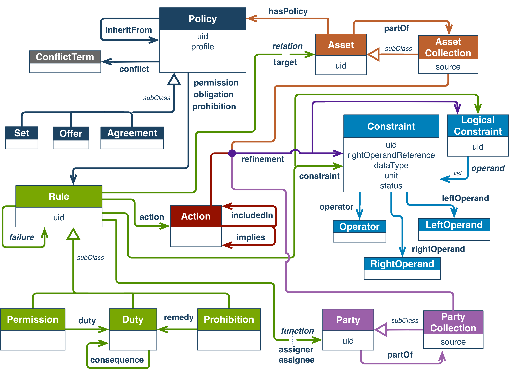
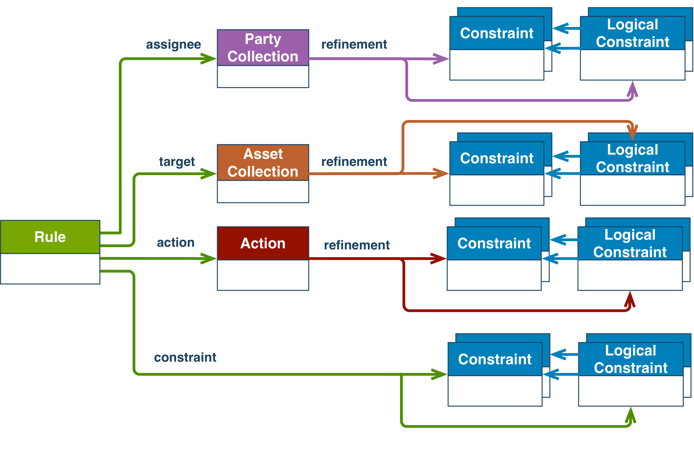
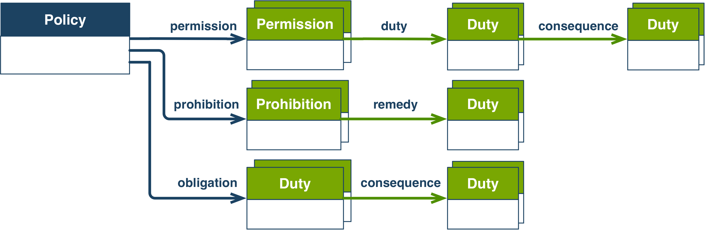
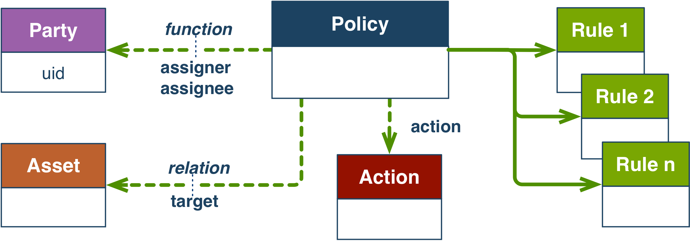

# Retained specification text (collector assembly)

> This consumer Markdown assembles the explicitly retained originals in declared order. Source labels, line anchors and local href rewrites are collector additions; HTML is represented as structural text with ordered table cells and preserved code, without running source scripts.

> Collector representation: declared cell spans are annotations, not an expanded table grid; code br line breaks and NBSP are retained, and image-label whitespace is normalized without dropping label words.

Original HTML: [specification.html](../source/specification.html#L1-L2487).

<a id="specification-L1"></a>
[](https://www.w3.org/)

<a id="specification-L440"></a>
<a id="specification-title"></a>
# ODRL Information Model 2.2

<a id="specification-L441"></a>
<a id="specification-w3c-recommendation-15-february-2018"></a>
## W3C Recommendation 15 February 2018
 

 

This version:

 

[https://www.w3.org/TR/2018/REC-odrl-model-20180215/](https://www.w3.org/TR/2018/REC-odrl-model-20180215/)

 

Latest published version:

 

[https://www.w3.org/TR/odrl-model/](https://www.w3.org/TR/odrl-model/)

 

Latest editor's draft:

 

[https://w3c.github.io/poe/model/](https://w3c.github.io/poe/model/)

 

Implementation report:

 

[https://w3c.github.io/poe/test/implementors](https://w3c.github.io/poe/test/implementors)

 

Previous version:

 

[https://www.w3.org/TR/2018/PR-odrl-model-20180104/](https://www.w3.org/TR/2018/PR-odrl-model-20180104/)

 

Editors:

 

[Renato Iannella](https://au.linkedin.com/in/riannella), [Monegraph](http://www.monegraph.com/), [r@iannel.la](mailto:r@iannel.la)

 

[Serena Villata](https://www.linkedin.com/in/serenavillata), [INRIA](http://www.inria.fr/en/), [serena.villata@inria.fr](mailto:serena.villata@inria.fr)

 

Issue list:

 

 [Github Repository](https://github.com/w3c/poe/issues) 

 

 

 Please check the [errata](https://www.w3.org/2016/poe/errata/) for any errors or issues reported since publication. 

 

 See also [translations](https://www.w3.org/2003/03/Translations/byTechnology?technology=odrl-model). 

 

 [Copyright](https://www.w3.org/Consortium/Legal/ipr-notice#Copyright) © 2018 [W3C](https://www.w3.org/)® ([MIT](https://www.csail.mit.edu/), [ERCIM](https://www.ercim.eu/), [Keio](https://www.keio.ac.jp/), [Beihang](http://ev.buaa.edu.cn/)). W3C [liability](https://www.w3.org/Consortium/Legal/ipr-notice#Legal_Disclaimer), [trademark](https://www.w3.org/Consortium/Legal/ipr-notice#W3C_Trademarks) and [permissive document license](https://www.w3.org/Consortium/Legal/2015/copyright-software-and-document) rules apply. 

  

 
<a id="specification-abstract"></a>

<a id="specification-L489"></a>
<a id="specification-abstract-0"></a>
## Abstract
 

The Open Digital Rights Language (ODRL) is a policy expression language that provides a flexible and interoperable information model, vocabulary, and encoding mechanisms for representing statements about the usage of content and services. The ODRL Information Model describes the underlying concepts, entities, and relationships that form the foundational basis for the semantics of the ODRL policies. 

 

Policies are used to represent permitted and prohibited actions over a certain asset, as well as the obligations required to be meet by stakeholders. In addition, policies may be limited by constraints (e.g., temporal or spatial constraints) and duties (e.g. payments) may be imposed on permissions. 

 

 
<a id="specification-sotd"></a>

<a id="specification-L497"></a>
<a id="specification-status-of-this-document"></a>
## Status of This Document
 

 This section describes the status of this document at the time of its publication. Other documents may supersede this document. A list of current W3C publications and the latest revision of this technical report can be found in the [W3C technical reports index](https://www.w3.org/TR/) at https://www.w3.org/TR/. 

 

 This document was published by the [Permissions & Obligations Expression Working Group](https://www.w3.org/2016/poe/) as a Recommendation. Comments regarding this document are welcome. Please send them to [public-poe-comments@w3.org](mailto:public-poe-comments@w3.org) ([subscribe](mailto:public-poe-comments-request@w3.org?subject=subscribe), [archives](https://lists.w3.org/Archives/Public/public-poe-comments/)). 

 

 Please see the Working Group's [implementation report](https://w3c.github.io/poe/test/implementors). 

 

 This document has been reviewed by W3C Members, by software developers, and by other W3C groups and interested parties, and is endorsed by the Director as a W3C Recommendation. It is a stable document and may be used as reference material or cited from another document. W3C's role in making the Recommendation is to draw attention to the specification and to promote its widespread deployment. This enhances the functionality and interoperability of the Web. 

 

 This document was produced by a group operating under the [W3C Patent Policy](https://www.w3.org/Consortium/Patent-Policy/). W3C maintains a [public list of any patent disclosures](https://www.w3.org/2004/01/pp-impl/87755/status) made in connection with the deliverables of the group; that page also includes instructions for disclosing a patent. An individual who has actual knowledge of a patent which the individual believes contains [Essential Claim(s)](https://www.w3.org/Consortium/Patent-Policy/#def-essential) must disclose the information in accordance with [section 6 of the W3C Patent Policy](https://www.w3.org/Consortium/Patent-Policy/#sec-Disclosure). 

 

This document is governed by the 
<a id="specification-w3c_process_revision"></a>
[1 February 2018 W3C Process Document](https://www.w3.org/2018/Process-20180201/). 

 

 
<a id="specification-intro"></a>

<a id="specification-L546"></a>
<a id="specification-x1-introduction"></a>
## 1. Introduction


This section is non-normative.

 

Several business scenarios require expressing what are the permitted and prohibited actions over resources. These permitted/prohibited actions are usually expressed under the form of policies, i.e., expressions that indicate those uses and re-uses of the content which are conformant with existing regulations or to the constraints assigned by the owner. Policies may also be enriched with additional information, i.e., who are the entities in charge of the definition of such Policy and those who are required to conform to it, what are the additional constrains to be associated with the Permissions, Prohibitions and Duties expressed by the Policy. The ability to express these concepts and relationships is important both for the producers of content, i.e., they may state in a clear way what are the permitted and the prohibited actions to prevent misuse, and for the consumers, i.e., they may know precisely what resources they are allowed to use and re-use to avoid breaking any rules, laws or the owner's constraints. This specification describes a common approach to expressing these policy concepts.

 

The ODRL Information Model defines the underlying semantic model for permission, prohibition, and obligation statements describing content usage. The information model covers the core concepts, entities and relationships that provide the foundational model for content usage statements. These machine-readable policies may be linked directly with the content they are associated to with the aim to allow consumers to easily retrieve this information.

 
<a id="specification-aimsModel"></a>

<a id="specification-L552"></a>
<a id="specification-x1-1-aims-of-the-model"></a>
### 1.1 Aims of the Model
 

The primary aim of the ODRL Information Model is to provide a standard description model and format to express permission, prohibition, and obligation statements to be associated to content in general. These statements are employed to describe the terms of use and reuse of resources. The model should cover as many permission, prohibition, and obligation use cases as possible, while keeping the policy modelling easy even when dealing with complex cases.

 

The ODRL Information Model is a single, consistent model that can be used by all interested parties. A single method of fulfilling a use case is strongly preferred over multiple methods, unless there are existing standards that need to be accommodated or there is a significant cost associated with using only a single method. While the ODRL Information Model is built using Linked Data principles, the design is intended to allow non-graph-based implementations. 

 

 
<a id="specification-conformance"></a>

<a id="specification-L562"></a>
<a id="specification-x1-2-conformance"></a>
### 1.2 Conformance
 

 As well as sections marked as non-normative, all authoring guidelines, diagrams, examples, and notes in this specification are non-normative. Everything else in this specification is normative. 

 
<a id="specification-respecRFC2119"></a>


The key words MAY, MUST, MUST NOT, RECOMMENDED, SHOULD, and SHOULD NOT are to be interpreted as described in [[RFC2119](#specification-bib-RFC2119)]. 

 

The examples throughout the document are serialized as [[json-ld](#specification-bib-json-ld)]. For normative serialisations, including the JSON context, please refer to the ODRL Vocabulary and Expression [[odrl-vocab](#specification-bib-odrl-vocab)].

 

 
<a id="specification-terminology"></a>

<a id="specification-L578"></a>
<a id="specification-x1-3-terminology"></a>
### 1.3 Terminology
 

 


<a id="specification-dfn-policy"></a>
Policy

 

A group of one or more Rules

 


<a id="specification-dfn-rule"></a>
Rule

 

An abstract concept that represents the common characteristics of Permissions, Prohibitions, and Duties.

 


<a id="specification-dfn-action"></a>
Action

 

An operation on an Asset

 


<a id="specification-dfn-permission"></a>
Permission

 

The ability to exercise an Action over an Asset

 


<a id="specification-dfn-prohibition"></a>
Prohibition

 

The inability to exercise an Action over an Asset

 


<a id="specification-dfn-duty"></a>
Duty

 

The obligation to exercise an agreed Action.

 


<a id="specification-dfn-asset"></a>
Asset

 

A resource or a collection of resources that are the subject of a Rule

 


<a id="specification-dfn-party"></a>
Party

 

An entity or a collection of entities that undertake Roles in a Rule

 


<a id="specification-dfn-constraint"></a>
Constraint

 

A boolean/logical expression that refines an Action and Party/Asset collection or the conditions applicable to a Rule.

 


<a id="specification-dfn-odrl-validator"></a>
ODRL Validator

 

A system that checks the conformance of ODRL Policy expressions, including the cardinality of properties and if they are related to types of values as defined by the ODRL Information Model, and the Information Model's validation requirements.

 


<a id="specification-dfn-odrl-evaluator"></a>
ODRL Evaluator

 

A system that determines whether the Rules of an ODRL Policy expression have meet their intended action performance.

 


<a id="specification-dfn-odrl-core-vocabulary"></a>
ODRL Core Vocabulary

 

The set of terms that are represented by the ODRL Information Model.

 


<a id="specification-dfn-odrl-profile"></a>
ODRL Profile

 

A community or sector specific vocabulary that extends the ODRL Core Vocabulary with new terms to express Policies

 


<a id="specification-dfn-odrl-common-vocabulary"></a>
ODRL Common Vocabulary

 

A set of generic terms that may be re-used by ODRL Profiles.

 

 

 

 
<a id="specification-infoModel"></a>

<a id="specification-L617"></a>
<a id="specification-x2-odrl-information-model"></a>
## 2. ODRL Information Model
 

The ODRL Information Model represents Policies that express Permissions, Prohibitions and Duties related to the usage of Asset resources. The Information Model explicitly expresses what is allowed and what is not allowed by the Policy, as well as other terms, requirements, and parties involved. The aim of the ODRL Information Model is to enable flexible Policy expressions by allowing the policy author to include as much, or as little, detail in the Policies.

 

The figure below shows the ODRL Information Model.

 
<a id="specification-fig-odrl-information-model-also-available-in-svg-format"></a>


  

Figure 1 ODRL Information Model (Also available in [SVG format](https://www.w3.org/TR/2018/REC-odrl-model-20180215/00Model.svg))

 

 

The ODRL Information Model has the following classes: 


 

- `Policy` - A non-empty group of Permissions (via the permission property) and/or Prohibitions (via the prohibition property) and/or Duties (via the obligation property). The Policy class is the parent class to the Set, Offer, and Agreement subclasses: 

 

  - `Set` - a subclass of Policy that supports expressing generic Rules.

 

  - `Offer` - a subclass of Policy that supports offerings of Rules from assigner Parties.

 

  - `Agreement` - a subclass of Policy that supports granting of Rules from assigner to assignee Parties. 

 

 

 

- `Asset` - A resource or a collection of resources that are the subject of a Rule (via the abstract relation property). The Asset class is the parent class to: 

 

  - `AssetCollection` - a subclass of Asset that identifies a collection of resources.

 

 

 

- `Party` - An entity or a collection of entities that undertake Roles in a Rule (via the abstract function property). The Party class is the parent class to: 

 

  - `PartyCollection` - a subclass of Party that identifies a collection of entities.

 

 

 

- `Action` - An operation on an Asset.

 

- `Rule` - An abstract concept that represents the common characteristics of Permissions, Prohibitions, and Duties. 

 

  - `Permission` - The ability to exercise an Action over an Asset. The Permission MAY also have the duty property that expresses an agreed Action that MUST be exercised (as a pre-condition to be granted the Permission).

 

  - `Prohibition` - The inability to exercise an Action over an Asset.

 

  - `Duty` - The obligation to exercise an Action.

 

 

 

- `Constraint/LogicalConstraint` - A boolean/logical expression that refines an Action and Party/Asset collection or the conditions applicable to a Rule.

 

 

The ODRL Information Model includes property relationships between the classes. Most are explicitly named properties and some are abstract properties (specifically, relation, function, operand, and failure). The abstract properties are generic parent properties that are designed to be represented by child properties (sub-types) with explicit semantics. 

 

For example, the two properties relation and function in Figure 1 are designed to represent the conceptual relation between the Rule and the Asset and Party classes. The figure shows the relation property with subtype `target` to express that the Asset is the primary subject of the Rule. The function property has subtype `assigner` to express the Party issuing the Rule, and subtype `assignee` to express the recipient Party of the Rule. 

 


<a id="specification-h-note"></a>


Note


 

The ODRL Information Model provides a logical view of the components of the Policy model. The implementable view of the ODRL Information Model is provided by various encoding serialisations as normatively described in the ODRL Vocabulary & Expression document [[odrl-vocab](#specification-bib-odrl-vocab)]. The mapping of the logical Information Model components to the implementable serialisations may require some trade-offs and/or differences depending on the features supported by the serialisation language.

 


 

The following sections provide further details on the ODRL Information Model. 

 
<a id="specification-policy"></a>

<a id="specification-L675"></a>
<a id="specification-x2-1-policy-class"></a>
### 2.1 Policy Class
 

The Policy class has the following properties:

 

 

- A Policy MUST have one `uid` property value (of type IRI [[rfc3987](#specification-bib-rfc3987)]) to identify the Policy.

 

- A Policy MUST have at least one `permission`, `prohibition`, or `obligation` property values of type Rule. (See the [Permission](#specification-permission), [Prohibition](#specification-prohibition), and [Obligation](#specification-duty-policy) sections for more details.)

 

- A Policy MAY have none, one, or many `profile` property values (of type IRI [[rfc3987](#specification-bib-rfc3987)]) to identify the ODRL Profile that this Policy conforms to. (See the [ODRL Profiles](#specification-profile) section for more details.)

 

- A Policy MAY have none, one, or many `inheritFrom` property values (of type IRI [[rfc3987](#specification-bib-rfc3987)]) to identify the parent Policy from which this child Policy inherits from. (See the [ODRL Inheritance](#specification-inheritance) section for more details.) 

 

- A Policy MAY have none or one `conflict` property values (of type ConflictTerm) for Conflict Strategy Preferences indicating how to handle Policy conflicts.(See the [Policy Conflict Strategy](#specification-conflict) section for more details.)

 

 

 An ODRL Policy MAY also declare properties which are shared and common to all its Rules. Specifically; `action` properties, sub-properties of `relation` (such as `target`), and sub-properties of `function` (such as `assigner` and `assignee`). See section [Compact Policy](#specification-composition-compact) for validation requirements on these shared properties. 

 

An ODRL Policy must either:

 

 

- Only use terms defined in the ODRL Core Vocabulary [[odrl-vocab](#specification-bib-odrl-vocab)], or

 

- Use an ODRL Profile that declares the supported vocabulary used by expressions in the Policy.

 

 

In the latter case, the profile property MUST be used to indicate the IRIs of the ODRL Profile(s). See the [ODRL Profiles](#specification-profile) section for more details on mechanisms to define ODRL Profiles and conformance requirements. (The Examples in this document will use ODRL Profile identifiers for illustrative purposes only.) 

 

An ODRL Policy MAY be subclassed to more precisely describe the context of use of the Policy that MAY include additional constraints that ODRL processors MUST understand. Additional Policy subclasses MAY be documented in the ODRL Common Vocabulary [[odrl-vocab](#specification-bib-odrl-vocab)] or in ODRL Profiles. A Policy class MUST be disjoint will all Policy subclasses (except for Set). 


<a id="specification-policy-set"></a>

<a id="specification-L710"></a>
<a id="specification-x2-1-1-set-class"></a>
#### 2.1.1 Set Class
 

An ODRL Policy of subclass `Set` represents any combination of Rules. The `Set` Policy subclass is also the default subclass of Policy (if none is specified).

 

 

Example Use Case: The below `Set` Policy shows the Permission to `use` the target Asset `http//example.com/asset:9898.movie`.

 

 


Example 1


<a id="specification-eg1"></a>


```
{
    "@context": "http://www.w3.org/ns/odrl.jsonld",
    "@type": "Set",
    "uid": "http://example.com/policy:1010",
    "permission": [{
        "target": "http://example.com/asset:9898.movie",
        "action": "use"
    }]
}
```


 


<a id="specification-h-note-0"></a>


Note


 

For the examples in this document, the ODRL Policy subclasses are mapped to the JSON-LD `@type` tokens. The above example could have also used `Policy` type instead of `Set` type (as they are equivalent).

 

The above example does not use the `profile` property as all the terms are defined by the ODRL Core Vocabulary [[odrl-vocab](#specification-bib-odrl-vocab)]. 

 


 

 
<a id="specification-policy-offer"></a>

<a id="specification-L737"></a>
<a id="specification-x2-1-2-offer-class"></a>
#### 2.1.2 Offer Class
 

An ODRL Policy of subclass `Offer` represents Rules that are being offered from assigner Parties. An `Offer` is typically used to make available Policies to a wider audience, but does not grant any Rules.

 

An ODRL Policy of subclass `Offer`:

 

 

- MUST have one `assigner` property value (of type Party) to indicate the functional role in the same Rules.

 

 

Note: See the [Function Property](#specification-function) section for details on the functional roles.

 

Note: The above property cardinalities reflect the normative ODRL Information Model. In some cases, repeat occurrences of some properties are also supported (as described in [Policy Rule Composition](#specification-composition) and [Compact Policy](#specification-composition-compact)) but the normative atomic Policy is consistent with the above property cardinalities.

 

 

Example Use Case: The below `Offer` Policy (based on the previous example) shows the Permission to `play` the target Asset `http//example.com/asset:9898.movie` from the assigner Party `http://example.com/party:org:abc`.

 

 


Example 2


<a id="specification-eg2"></a>


```
{
    "@context": "http://www.w3.org/ns/odrl.jsonld",
    "@type": "Offer",
    "uid": "http://example.com/policy:1011",
    "profile": "http://example.com/odrl:profile:01",
    "permission": [{
        "target": "http://example.com/asset:9898.movie",
        "assigner": "http://example.com/party:org:abc",
        "action": "play"
    }]
}
```


 


<a id="specification-h-note-1"></a>


Note


 

The above example uses the `profile` property to indicate that the terms used are defined by the ODRL Profile identified by `http://example.com/odrl:profile:01`. See the [ODRL Profiles](#specification-profile) section for more details.

 


 

 
<a id="specification-policy-agreement"></a>

<a id="specification-L774"></a>
<a id="specification-x2-1-3-agreement-class"></a>
#### 2.1.3 Agreement Class
 

An ODRL Policy of subclass `Agreement` represents Rules that have been granted from assigner to assignee Parties. An `Agreement` is typically used to grant the terms of the Rules between the Parties.

 

An ODRL Policy of subclass `Agreement`:

 

 

- MUST have one `assigner` property value (of type Party) to indicate the functional role in the same Rules.

 

- MUST have one `assignee` property value (of type Party) to indicate the functional role in the same Rules.

 

 

Note: See the [Function Property](#specification-function) section for details on the functional roles.

 

Note: The above property cardinalities reflect the normative ODRL Information Model. In some cases, repeat occurrences of some properties are also supported (as described in [Policy Rule Composition](#specification-composition) and [Compact Policy](#specification-composition-compact)) but the normative atomic Policy is consistent with the above property cardinalities.

 

 

Example Use Case: The below `Agreement` Policy (based on the previous example) shows granting the Permission to `play` the target Asset `http//example.com/asset:9898.movie` from the assigner Party `http://example.com/party:org:abc` for the assignee Party `http://example.com/party:person:billie`.

 

 


Example 3


<a id="specification-eg3"></a>


```
{
    "@context": "http://www.w3.org/ns/odrl.jsonld",
    "@type": "Agreement",
    "uid": "http://example.com/policy:1012",
    "profile": "http://example.com/odrl:profile:01",
    "permission": [{
        "target": "http://example.com/asset:9898.movie",
        "assigner": "http://example.com/party:org:abc",
        "assignee": "http://example.com/party:person:billie",
        "action": "play"
    }]
}
```


 

 

 
<a id="specification-asset"></a>

<a id="specification-L810"></a>
<a id="specification-x2-2-asset-class"></a>
### 2.2 Asset Class
 

An Asset class is a resource or a collection of resources that are the subject of a Rule. The Asset can be any form of identifiable resource, such as data/information, content/media, applications, services, or physical artefacts. Furthermore, it can be used to represent other `Asset` classes that are needed to undertake the Policy expression, such as with a Duty. An Asset is referred to by the Permission and/or Prohibition, and also by the Duty.

 

The Asset class has the following properties:

 

 

- An Asset SHOULD have one `uid` property value (of type IRI [[rfc3987](#specification-bib-rfc3987)]) to identify the Asset.

 

- An Asset MAY have none, one, or many `partOf` property values (of type AssetCollection) to identify the AssetCollection that this Asset is in a collection of.

 

 


<a id="specification-h-note-2"></a>


Note


If an Asset does not assert an identifier using the `uid` property, then the full implications must be understood, such as the impact on ODRL Validators and Evaluators of ODRL Policies.


 

The Asset class has the following subclass:

 

 

- `AssetCollection` - an Asset that is a single resource representing a set of member resources. This indicates that all the members of the set will be the subject of the Rule.

 

 

An AssetCollection class has the following properties:

 

 

- An AssetCollection MAY have one `source` property value (of type IRI [[rfc3987](#specification-bib-rfc3987)]) to reference the AssetCollection.

 

- An AssetCollection MAY have none, one, or many `refinement` property values of type Constraint. See [Refinement property with an Asset Collection](#specification-constraint-asset) for more details.

 

 

Since ODRL Policies could deal with any kind of Asset, the ODRL Information Model does not provide additional metadata to describe Assets of particular media types. It is recommended to use existing metadata standards, such as [Dublin Core Metadata Terms](http://dublincore.org/documents/dcmi-terms/) that are appropriate to the Asset type or purpose.

 
<a id="specification-relation"></a>

<a id="specification-L844"></a>
<a id="specification-x2-2-1-relation-property"></a>
#### 2.2.1 Relation Property
 

The abstract `relation` property is used to create an explicit link between an Action and an Asset, indicating how the Asset MUST be utilised in respect to the Rule that links to it.

 

An ODRL validator MUST support the following sub-properties of `relation`:

 

 

- `target`: indicates that the Asset is the primary subject to which the Rule action directly applies.

 

 

Additional `relation` subtype properties MAY be defined in the ODRL Common Vocabulary [[odrl-vocab](#specification-bib-odrl-vocab)] and ODRL Profiles.

 

 

Example Use Case: The assigner Party `http//example.com/party:0001` offers to display the `target` Asset `http://example.com/asset:3333`.

 

 


Example 4


<a id="specification-eg4"></a>


```
{
   "@context": "http://www.w3.org/ns/odrl.jsonld",
   "@type": "Offer",
   "uid": "http://example.com/policy:3333",
   "profile": "http://example.com/odrl:profile:02",
   "permission": [{
       "target": "http://example.com/asset:3333",
       "action": "display",
       "assigner": "http://example.com/party:0001"
   }]
}
```


 


<a id="specification-h-note-3"></a>


Note


 

In the above example, the JSON-LD representation for the `relation` property directly uses `target` as the token, as this has been defined as a subtype of the parent `relation` property.

 


 

 

Example Use Case: The below Policy shows the `index` action Permission on the target Asset `http://example.com/archive1011`. The target asset is also declared as an `AssetCollection` to indicate the resource is a collection of resources. An additional Asset relation `summary` indicates the Asset `http://example.com/x/database` that the indexing output should be stored in. The ODRL Profile `ttp://example.com/odrl:profile:03` defines this new sub-property of relation.

 

 


Example 5


<a id="specification-eg5"></a>


```
{
   "@context": "http://www.w3.org/ns/odrl.jsonld",
   "@type": "Policy",
   "uid": "http://example.com/policy:1011",
   "profile": "http://example.com/odrl:profile:03",
   "permission": [{
       "target": {
           "@type": "AssetCollection",
           "uid":  "http://example.com/archive1011" },
       "action": "index",
       "summary": "http://example.com/x/database"
   }]
}
```


 

 
<a id="specification-asset-partof"></a>

<a id="specification-L896"></a>
<a id="specification-x2-2-2-part-of-property"></a>
#### 2.2.2 Part Of Property
 

The `partOf` property is used to identify an AssetCollection that an Asset resource is a member of. The purpose is to explicitly express membership relationships between Assets and AssetCollections. This enables a Rule that is related to an AssetCollection to understand which individual Assets the Rule may apply to. In addition, the Asset/AssetCollection membership relationships may potentially detect conflicts in Rules.

 

 

Example Use Case: The below snippet shows some Dublin Core metadata describing a document. The `odrl:partOf` property asserts that the Asset `http://example.com/asset:111.doc` is a member of the `http://example.com/archive1011` AssetCollection which is used in the Policy in the example above. This means that `http://example.com/asset:111.doc` is one of the target Assets in the Policy and can my indexed.

 

 


Example 6


<a id="specification-eg6"></a>


```
{
   "@type": "dc:Document",
   "@id": "http://example.com/asset:111.doc",
   "dc:title": "Annual Report",
   ...
   "odrl:partOf": "http://example.com/archive1011",
   ...
}
```


 

 
<a id="specification-policy-has"></a>

<a id="specification-L915"></a>
<a id="specification-x2-2-3-target-policy-property"></a>
#### 2.2.3 Target Policy Property
 

An ODRL Policy class MAY also be referenced by the `hasPolicy` property. This supports ODRL Policy Rules being the object of external metadata expressions (that identifies an Asset). When `hasPolicy` has been asserted between a metadata expression and an ODRL Policy, the Asset being identified MUST be inferred to be the `target` Asset of all the Rules of that Policy. If there are multiple Rules in the Policy, then the inferred Asset will be the target Asset to every Rule in the Policy.

 

 

Example Use Case: The below snippet shows some Dublin Core metadata describing a movie Asset. The `odrl:hasPolicy` property links to the ODRL Policy `http://example.com/policy:1010` (this is the Set Policy described above). In this case, the Asset `http://example.com/asset:9999.movie` is now also the target Asset for the Permission in Policy `http://example.com/policy:1010`. If there were additional Rules in this Policy, then the same Asset would be the target Asset to each Rule.

 

 


Example 7


<a id="specification-eg7"></a>


```
{
   "@type": "dc:MovingImage",
   "@id": "http://example.com/asset:9999.movie",
   "dc:publisher": "ABC Pictures",
   "dc:creator": "Allen, Woody",
   "dc:issued": "2017",
   "dc:subject": "Musical Comedy",
   ...
   "odrl:hasPolicy": "http://example.com/policy:1010",
   ...
}
```


 

 

 
<a id="specification-party"></a>

<a id="specification-L942"></a>
<a id="specification-x2-3-party-class"></a>
### 2.3 Party Class
 

A Party Class is an entity or a collection of entities that undertake functional roles in a Rule, such as a person, collection of people, organisation, or agent. An agent is a person or thing that takes an active role or produces a specified effect. The Party performs (or does not perform) Actions or has a function in a Duty (i.e., assigns the Party to the Rule by associating it with the function it plays in the Rule).

 

The Party class has the following properties:

 

 

- A Party SHOULD have one `uid` property value (of type IRI [[rfc3987](#specification-bib-rfc3987)]) to identify the Party.

 

- A Party MAY have none, one, or many `partOf` property values (of type PartyCollection) to identify the PartyCollection that this Party is a member of.

 

 


<a id="specification-h-note-4"></a>


Note


If a Party does not assert an identifier using the `uid` property, then the full implications must be understood, such as the impact on ODRL Validators and Evaluators of ODRL Policies.


 

The Party class has the following subclass:

 

 

- `PartyCollection` - a Party that is a single entity representing a set of member entities. This indicates that all the members of the set will undertake the same functional role in the Rule.

 

 

The PartyCollection class has the following properties:

 

 

- A PartyCollection MAY have one `source` property value (of type IRI [[rfc3987](#specification-bib-rfc3987)]) to reference the PartyCollection.

 

- A PartyCollection MAY have none, one, or many `refinement` property values of type Constraint. See [Refinement property with a Party Collection](#specification-constraint-party) for more details.

 

 

The ODRL Information Model does not provide additional metadata for the Party class. It is recommended to use existing metadata standards, such as the W3C vCard Ontology [[vcard-rdf](#specification-bib-vcard-rdf)] or FOAF Vocabulary [[foaf](#specification-bib-foaf)].

 
<a id="specification-function"></a>

<a id="specification-L979"></a>
<a id="specification-x2-3-1-function-property"></a>
#### 2.3.1 Function Property
 

A `function` property is used to link a Rule to a Party, indicating the function undertaken by the Party in respect to the Rule that links to it. The `function` property itself is abstract; sub-properties represent explicit semantics of the functional role between the Party and the Rule.

 

An ODRL validator MUST support the following sub-properties of `function`:

 

 

- `assigner`: indicates the Party that is issuing the Rule. For example, the Party granting a Permission or requiring an agreed Duty to be fulfilled.

 

- `assignee`: indicates that the Party that is the recipient the of Rule. For example, the Party being granted a Permission or required to fulfil an agreed Duty.

 

 

Additional `function` subtype properties MAY be defined in the ODRL Common Vocabulary [[odrl-vocab](#specification-bib-odrl-vocab)] and ODRL Profiles.

 

 

Example Use Case: The Policy shows an Agreement with two Parties with the functional roles of the `assigner` and the `assignee`. The `assigner` grants the `assignee` the play action over the target asset.

 

 


Example 8


<a id="specification-eg8"></a>


```
{
    "@context": "http://www.w3.org/ns/odrl.jsonld",
    "@type": "Agreement",
    "uid": "http://example.com/policy:8888",
    "profile": "http://example.com/odrl:profile:04",
    "permission": [{
        "target": "http://example.com/music/1999.mp3",
        "assigner": "http://example.com/org/sony-music",
        "assignee": "http://example.com/people/billie",
        "action": "play"
    }]
}  
```


 


<a id="specification-h-note-5"></a>


Note


 

In the above example, the JSON-LD representation for `function` directly uses `assigner` and `assignee` as the token, as this has been defined as sub-properties of the parent `function` property.

 


 

 

Example Use Case: The Policy shows an Agreement with two Parties with the functional roles of the `assigner` and the `assignee`. The `assigner` grants the `assignee` the use of the target asset. In this case, the `assigner` is explicitly declared as a `Party` as well as a vcard:Organisation and some additional external properties. The `assignee` is explicitly declared as a `PartyCollection` as well as a vcard:Group and some additional external properties. This implies that all the entities that are identified as `http://example.com/team/A` will each have the same granted action

 

 


Example 9


<a id="specification-eg9"></a>


```
{
    "@context": [
        "http://www.w3.org/ns/odrl.jsonld",
        { "vcard": "http://www.w3.org/2006/vcard/ns#" }
    ],
    "@type": "Agreement",
    "uid": "http://example.com/policy:777",
    "profile": "http://example.com/odrl:profile:05",
    "permission": [{
        "target": "http://example.com/looking-glass.ebook",
        "assigner": {
            "@type": [ "Party", "vcard:Organization" ],
            "uid":  "http://example.com/org/sony-books",
            "vcard:fn": "Sony Books LCC",
            "vcard:hasEmail": "sony-contact@example.com" },
        "assignee": {
            "@type": [ "PartyCollection", "vcard:Group" ],
            "uid":  "http://example.com/team/A",
            "vcard:fn": "Team A",
            "vcard:hasEmail": "teamA@example.com"},
        "action": "use"
    }]
}  
```


 

 
<a id="specification-party-partof"></a>

<a id="specification-L1047"></a>
<a id="specification-x2-3-2-part-of-property"></a>
#### 2.3.2 Part Of Property
 

The `partOf` property is used to identify a PartyCollection that a Party entity is a member of. The purpose is to explicitly express membership relationships between Parties and PartyCollections. This enables a Rule that relates to a PartyCollection to understand which individual Parties the Rule may apply to. In addition, the Party/PartyCollection membership relationships may potentially detect conflicts in Rules.

 

 

Example Use Case: The below snippet shows some vCard metadata describing a Party. The `odrl:partOf` property asserts that the Party `http://example.com/person/murphy` is a member of the `http://example.com/team/A` PartyCollection which is used in the Policy in the example above. This means that `http://example.com/person/murphy` is an assignee and can use the target asset in the Policy. 

 

 


Example 10


<a id="specification-eg10"></a>


```
{
   "@type": "vcard:Individual",
   "@id": "http://example.com/person/murphy",
   "vcard:fn": "Murphy",
   "vcard:hasEmail": "murphy@example.com",
   ...
   "odrl:partOf": "http://example.com/team/A",
   ...
}
```


 

 
<a id="specification-policy-assigned"></a>

<a id="specification-L1068"></a>
<a id="specification-x2-3-3-assigned-policy-properties"></a>
#### 2.3.3 Assigned Policy Properties
 

An ODRL Policy class MAY also be referenced by the `assignerOf` and `assigneeOf` properties. This supports ODRL Policy Rules being the object of external metadata expressions (that identifies a Party). When `assignerOf` has been asserted between a metadata expression and an ODRL Policy, the Party being identified MUST be inferred to undertake the `assigner` functional role of all the Rules of that Policy. When `assigneeOf` has been asserted between a metadata expression and an ODRL Policy, the Party being identified MUST be inferred to undertake the `assignee` functional role of all the Rules of that Policy. If there are multiple Rules in the Policy, then the inferred Party will undertake the functional role to every Rule in the Policy.

 

 

Example Use Case: The below snippet shows some vCard metadata describing an individual Party. The `odrl:assigneeOf` property links to the ODRL Policy `http://example.com/policy:1011` (this is the Offer Policy described above). In this case, the Party `http://example.com/person/billie` is now also the assignee of the Permission in Policy `http://example.com/policy:1011`. If there were additional Rules in this Policy, then the same Party would be the assignee for each Rule.

 

 


Example 11


<a id="specification-eg11"></a>


```
{
   "@type": "vcard:Individual",
   "@id": "http://example.com/person/billie",
   "vcard:fn": "Billie",
   "vcard:hasEmail": "billie@example.com",
   ...
   "odrl:assigneeOf": "http://example.com/policy:1011",
   ...
}
```


 

 

 
<a id="specification-action"></a>

<a id="specification-L1096"></a>
<a id="specification-x2-4-action-class"></a>
### 2.4 Action Class
 

An Action class indicates an operation that can be exercised on an Asset. An Action is associated with the Asset via the action property in a Rule.

 

The Rule provides the specific interpretations of the Action. For example; an Action is permitted to be exercised on the target Asset when related to a Permission. When related to a Prohibition, the Action indicates the operation that is prohibited to be exercised on the target Asset. When related to a Duty, the Action indicates the agreed operation that is obligatory to be fulfilled by a Party

 

The ODRL Information Model defines the following top-level Actions:

 

 

- `use` - actions that involve general usage by parties. 

 

- `transfer` - actions that involve in the transfer of ownership to third parties.

 

 

The Action class has the following properties:

 

 

- An Action MAY have none, one or more `refinement` property values (of type Constraint) that refine the semantics of the Action operation. See [Constraints](#specification-constraint) section for more details.

 

- An Action (except for use and transfer) MUST have one `includedIn` property value (of type Action) to transitively assert this Action that encompasses its operational semantics.

 

- An Action MAY have none, one or more `implies` property values (of type Action) to assert this Action is not prohibited to enable its operational semantics.

 

 

 Action terms MUST be defined using the `includedIn` property referring to an encompassing Action and either `use` or `transfer` as the top-level parent term by transitive means. The purpose of the `includedIn` property is to explicitly assert that the semantics of the referenced instance of an other Action encompasses (includes) the semantics of this instance of Action. The `includedIn` property is transitive, and as such, the Actions form ancestor relationships. 

 

The implication of the `includedIn` property is that a Permission or Prohibition of an encompassing Action is inherited by all Actions with an `includedIn` relationship. For example, if the `play` Action is defined as `includedIn` with `use` then if `play` is permitted in a Policy and `use` is prohibited in the same Policy - and both Actions apply to the same target Asset - then because of this asserted relationship between the two, there is conflict in the Policy. (See [Policy Conflict Strategy](#specification-conflict) for more details.)

 

 The `implies` property asserts that an instance of Action entails that the other instance of Action is not prohibited. The `implies` property can establish such an assertion between two Action instances if they don't have an `includedIn` relationship. For example, if a `share` Action implies explicitly the `distribute` Action, then if `share` is permitted in a Policy and `distribute` is prohibited in the same Policy - and both Actions apply to the same target Asset - this would cause a conflict in the Policy. If an implied other action is not prohibited then this will not cause a conflict. (See [Policy Conflict Strategy](#specification-conflict) for more details.) 


See [ODRL Profiles](#specification-profile) for usage details on the `includedIn` and `implies` properties. 

 

The ODRL Common Vocabulary [[odrl-vocab](#specification-bib-odrl-vocab)] defines a standard set of generic Actions that MAY be adopted by ODRL Profiles.

 

 

Example Use Case: The Policy expresses an Offer for the target Asset `http://example.com/music:1012` with the Action to `play` the Asset (`play` is defined as an `includedIn` term of `use`).

 

 


Example 12


<a id="specification-eg12"></a>


```
{
    "@context": "http://www.w3.org/ns/odrl.jsonld",
    "@type": "Offer",
    "uid": "http://example.com/policy:1012",
    "profile": "http://example.com/odrl:profile:06",
    "permission": [{
            "target": "http://example.com/music:1012",
            "assigner": "http://example.com/org:abc",
            "action": "play"
     }]
}
```


 

 
<a id="specification-constraint"></a>

<a id="specification-L1159"></a>
<a id="specification-x2-5-constraints"></a>
### 2.5 Constraints
 

Constraints are boolean/logical expressions that can be used to refine the semantics of an Action and Party/Asset Collection or declare the conditions applicable to a Rule. Constraints can be represented as a  Constraint class or Logical Constraint class. A Logical Constraint will refer to existing Constraints as its operands. When multiple Constraints apply to the same Rule, Action, Party/Asset Collection, then they are interpreted as conjunction and all MUST be satisfied.

 

The Constraint and Logical Constraint classes form semantic and conditional relationships with the Party Collection, Asset Collection, Action, and Rule classes. The property relationships are summarised in the figure below.

 
<a id="specification-fig-odrl-constraint-relationships-also-available-in-svg-format"></a>


  

Figure 2 ODRL Constraint Relationships (Also available in [SVG format](https://www.w3.org/TR/2018/REC-odrl-model-20180215/01Constraint.svg))

 

 
<a id="specification-constraint-class"></a>

<a id="specification-L1174"></a>
<a id="specification-x2-5-1-constraint-class"></a>
#### 2.5.1 Constraint Class
 

A Constraint class is used for expressions which compare two operands (which are not Constraints) by one relational operator. If the comparison returns a match the Constraint is satisfied, otherwise it is not satisfied. The Constraint class formulates a comparison expression, such as, the number of usages (the `leftOperand`) must be smaller than (the `operator`) the number 10 (the `rightOperand`). 

 

The Constraint class has the following properties:

 

 

- A Constraint MAY have none or one `uid` property value (of type IRI [[rfc3987](#specification-bib-rfc3987)]) to identify the Constraint.

 

- A Constraint MUST have one `leftOperand` property value of type LeftOperand.

 

- A Constraint MUST have one `operator` property value of type Operator.

 

- A Constraint MUST have either: 

 

  - one `rightOperand` property value of type: 

 

    - literal, or IRI [[rfc3987](#specification-bib-rfc3987)], or RightOperand; or

 

    - for set-based operators; list of literals, or list of IRIs [[rfc3987](#specification-bib-rfc3987)], or list of RightOperands;

 

 

 

  - one `rightOperandReference` property value of type: 

 

    - IRI [[rfc3987](#specification-bib-rfc3987)]; or

 

    - for set-based operators; list of IRIs [[rfc3987](#specification-bib-rfc3987)];

 

 for a reference to a right operand value.

 

 


- A Constraint MAY have none or one `dataType` property value for the data type of the rightOperand/Reference.

 

- A Constraint MAY have none or one `unit` property value (of type IRI [[rfc3987](#specification-bib-rfc3987)]) to set the unit used for the value of the rightOperand/Reference.

 

- A Constraint MAY have none or one `status` property value for a value generated from the leftOperand action or for a value related to the leftOperand set as the reference for the comparison.

 

 

The `leftOperand` property values are defined as instances of the LeftOperand class. The `leftOperand` instances MUST clearly be defined to indicate the semantics of the Constraint, and MAY declare how the value for comparison has to be retrieved or generated. The ODRL Common Vocabulary [[odrl-vocab](#specification-bib-odrl-vocab)] defines `leftOperand`'s that MAY be used by ODRL Profiles.

 

The `operator` property values are defined as instances of the Operator class. The `operator` instances identify the relational operation such as “greater than” or “equal to” between the left and right operands.

 

The `rightOperand` property values are defined as instances of the RightOperand class, or IRIs, or Literal values. The `rightOperand` is the value of the Constraint that is to be compared to the `leftOperand`. The `rightOperandReference` represents an IRI that MUST be de-referenced first to obtain the actual value of the `rightOperand`. A `rightOperandReference` is used in cases where the value of the `rightOperand` MUST be obtained from dereferencing an IRI first. Only one of `rightOperand` or `rightOperandReference` MUST appear in the Constraint.

 

 The `rightOperand` represents a value and the `rightOperandReference` represents an IRI that must be de-referenced to obtain the value. If the `rightOperand` was `http://example.com/c100` then that is interpreted as the value to be compared in the expression. If the `rightOperandReference` was the same value of `http://example.com/c100`, then that IRI must be de-referenced first and the data returned must be interpreted as the value to be compared in the expression. 

 

The `dataType` indicates the type of the `rightOperand/Reference`, such as `xsd:decimal` or `xsd:datetime` and the `unit` indicates the unit value of the `rightOperand/Reference`, such as “EU currency”.

 

The `status` provides a value generated from the `leftOperand` action that MUST be used in the comparison expression. For example, a `count` constraint could have a `rightOperand` value of 10, and the `status` of 5. This means that the action has already been exercised 5 times and the comparison must compare the current action to the status value.

 

 
<a id="specification-constraint-logical"></a>

<a id="specification-L1225"></a>
<a id="specification-x2-5-2-logical-constraint-class"></a>
#### 2.5.2 Logical Constraint Class
 

 A Logical Constraint class is used for expressions which compare two or more operands which are existing Constraints by one logical operator. If the comparison returns a logical match, then the Logical Constraint is satisfied, otherwise it is not satisfied. For example, three Constraints could be logically and-ed indicating that all three must be true for the Logical Constraint to be satisfied.

 

The Logical Constraint class has the following properties:

 

 

- A Logical Constraint MAY have none or one `uid` property value (of type IRI [[rfc3987](#specification-bib-rfc3987)]) to identify the Logical Constraint.

 

- A Logical Constraint MUST have one `operand` sub-property indicating the logical relationship of the compared existing constraints; its value is a list of the existing Constraint instances.

 

 

An ODRL evaluator MUST support the following sub-properties of `operand`:

 

 

- `or` - at least one of the Constraints MUST be satisfied

 

- `xone` - only one, and not more, of the Constraints MUST be satisfied

 

- `and` - all of the Constraints MUST be satisfied

 

- `andSequence` - all of the Constraints - in sequence - MUST be satisfied

 

 

Additional `operand` sub-properties MAY be defined by ODRL Profiles.

 

The ODRL validation requirements for Logical Constraints includes:

 

 

1. The `operand` MUST only be of the sub-properties; `or`, `xone`, `and`, `andSequence`. Additional sub-properties of `operand` MAY be defined by ODRL Profiles exclusively for the use of Logical Constraints.

 

2. All of the operand values MUST be unique Constraint instances.

 

 

The Constraint instances MUST be evaluated and the outcomes used to determine if the logical relationship is satisfied (based on the semantics of the `operand` sub-property).

 


<a id="specification-h-note-6"></a>


Note


 When using a logical operand that needs to be evaluated in sequence, such as `andSequence`, the serialisations MUST preserve the order of the members of the list. In JSON-LD, the `@list` keyword MUST be used to represent an ordered collection. 


 

 
<a id="specification-constraint-rule"></a>

<a id="specification-L1266"></a>
<a id="specification-x2-5-3-constraint-property-with-a-rule"></a>
#### 2.5.3 Constraint property with a Rule
 

An Rule (such as a Permission, Prohibition, or Duty) MAY include the `constraint` property to indicate a condition on the Rule. To meet this condition, all of the the Constraints/Logical Constraints referenced by the `constraint` property MUST be satisfied. 

 

 

Example Use Case: In the Policy Offer example below, the permission allows the target asset to be `distribute`d, and includes a constraint of a `dateTime` condition that the permission can only be exercised until 2018-01-01.

 

 


Example 13


<a id="specification-eg1799"></a>


```
{
    "@context": "http://www.w3.org/ns/odrl.jsonld",
    "@type": "Offer",
    "uid": "http://example.com/policy:6163",
    "profile": "http://example.com/odrl:profile:10",
    "permission": [{
       "target": "http://example.com/document:1234",
       "assigner": "http://example.com/org:616",
       "action": "distribute",
       "constraint": [{
           "leftOperand": "dateTime",
           "operator": "lt",
           "rightOperand":  { "@value": "2018-01-01", "@type": "xsd:date" }
       }]
   }]
}
```


 

 
<a id="specification-constraint-action"></a>

<a id="specification-L1298"></a>
<a id="specification-x2-5-4-refinement-property-with-an-action"></a>
#### 2.5.4 Refinement property with an Action
 

An Action MAY include the `refinement` property to indicate a Constraint/Logical Constraint that narrows the semantics of the Action operation directly. To meet this condition of narrower semantics for the Action, all of the Constraints/Logical Constraints referenced by the `refinement` property MUST be used as generating a satisfied state. 

 

Note: The outcome of applying refinements to an Action SHOULD NOT result in a null operation.

 

 

Example Use Case: In the Policy Offer example below, the permission allows the target asset to be `print`ed, and also include a refinement Constraint of less than or equal to 1200 dpi resolution. The refinement is a more narrower semantic of printing, in this case, printing at a specific maximum resolution level.

 

 


Example 14


<a id="specification-eg179"></a>


```
{
    "@context": "http://www.w3.org/ns/odrl.jsonld",
    "@type": "Offer",
    "uid": "http://example.com/policy:6161",
    "profile": "http://example.com/odrl:profile:10",
    "permission": [{
       "target": "http://example.com/document:1234",
       "assigner": "http://example.com/org:616",
       "action": [{
          "rdf:value": { "@id": "odrl:print" },
          "refinement": [{
             "leftOperand": "resolution",
             "operator": "lteq",
             "rightOperand": { "@value": "1200", "@type": "xsd:integer" },
             "unit": "http://dbpedia.org/resource/Dots_per_inch"
          }]
      }]
   }]
}
```


 

 

Example Use Case:The Policy below shows a permission to reproduce the target asset either via online media or print media but not both. This is expressed as a Logical Constraint (with the `xone` operand) referring to two existing Constraints declared elsewhere. 

 

 


Example 15


<a id="specification-eg19"></a>


```
{
    "@context": "http://www.w3.org/ns/odrl.jsonld",
    "@type": "Offer",
    "uid": "http://example.com/policy:88",
    "profile": "http://example.com/odrl:profile:10",
    "permission": [{
        "target": "http://example.com/book/1999",
        "assigner": "http://example.com/org/paisley-park",
        "action": [{
           "rdf:value": { "@id": "odrl:reproduce" },
           "refinement": {
               "xone": { 
	           "@list": [ 
		       { "@id": "http://example.com/p:88/C1" },
                       { "@id": "http://example.com/p:88/C2" } 
		   ]
	       }
            }
        }]
    }]
}
 
{
   "@context": "http://www.w3.org/ns/odrl.jsonld",
   "@type": "Constraint",
   "uid": "http://example.com/p:88/C1",
   "leftOperand": "media",
   "operator": "eq",
   "rightOperand": { "@value": "online", "@type": "xsd:string" }
}
 
{
   "@context": "http://www.w3.org/ns/odrl.jsonld",
   "@type": "Constraint",
   "uid": "http://example.com/p:88/C2",
   "leftOperand": "media",
   "operator": "eq",
   "rightOperand": { "@value": "print", "@type": "xsd:string" }
}
```


 


<a id="specification-h-note-7"></a>


Note


 When using the `refinement` property with an Action, the `rdf:value` property is used to represent the instance of the Action which MUST use its namespace identifier (eg `odrl`), and assert it is an `@id` key. In addition, identifiers of Constraint instances (for logical constraint operands) must assert them as an `@id` key. 


 

 
<a id="specification-constraint-asset"></a>

<a id="specification-L1386"></a>
<a id="specification-x2-5-5-refinement-property-with-an-asset-collection"></a>
#### 2.5.5 Refinement property with an Asset Collection
 

 An `AssetCollection` MAY include a `refinement` property to indicate the refinement context under which to identify individual Asset(s) of the complete collection. The `refinement` property applies to the characteristics of each member of the collection (and not the resource as a whole). To meet this condition of identifying individual Asset(s) of the complete `AssetCollection`, all of the Constraints/Logical Constraints referenced by the `refinement` property MUST be satisfied. 

 

Note: The outcome of applying refinements to an AssetCollection SHOULD NOT result in a null set.

 

Note that when using the `refinement` property, the `uid` property MUST NOT be used to identify the `AssetCollection`. Instead, the `source` property MUST be used to reference the `AssetCollection`. 

 

 

Example Use Case: The Policy defines a target source `http://example.com/media-catalogue` that is an AssetCollection of multimedia videos. The target also has a refinement that specifies the characteristics of the AssetCollection members. In this case, the target subset of Assets will be those that have a running time of less than 60 minutes, and each of those may be played. Note that the `runningTime` leftOperand is defined in the ODRL Profile `http://example.com/odrl:profile:11` together with the `play` action. 

 

 


Example 16


<a id="specification-eg21"></a>


```
{
  "@context": "http://www.w3.org/ns/odrl.jsonld",
  "@type": "Offer",
  "uid": "http://example.com/policy:4444",
  "profile": "http://example.com/odrl:profile:11",
  "permission": [{
    "assigner": "http://example.com/org88",
    "target": {
      "@type": "AssetCollection",
      "source":  "http://example.com/media-catalogue",
      "refinement": [{
        "leftOperand": "runningTime",
        "operator": "lt",
        "rightOperand": { "@value": "60", "@type": "xsd:integer" },
        "unit": "http://qudt.org/vocab/unit/MinuteTime"
      }]
    },
    "action": "play"
  }]
}
```


 

 
<a id="specification-constraint-party"></a>

<a id="specification-L1428"></a>
<a id="specification-x2-5-6-refinement-property-with-a-party-collection"></a>
#### 2.5.6 Refinement property with a Party Collection
 

 A `PartyCollection` MAY include a `refinement` property to indicate the refinement context under which to identify individual Party(ies) of the complete collection. The `refinement` property applies to the characteristics of each member of the collection (and not the resource as a whole). To meet this condition of identifying individual Party(ies) of the complete `PartyCollection`, all of the Constraints/Logical Constraints referenced by the `refinement` property MUST be satisfied. 

 

Note: The outcome of applying refinements to a PartyCollection SHOULD NOT result in a null set.

 

Note that when using the `refinement` property, the `uid` property MUST NOT be used to identify the `PartyCollection`. Instead, the `source` property MUST be used to reference the `PartyCollection`. 

 

 

Example Use Case: The target Asset `http://example.com/myPhotos:BdayParty` is a set of photos posted to a social network site by the assigner of the photos `http://example.com/user44`. The assignee source is a PartyCollection `http://example.com/user44/friends` and represents all the friends of the assigner. The assignee also has a refinement that indicates only members of the collection over the `foaf:age` of 18 will be assigned the `ex:view` permission (defined by the Profile). 

 

 


Example 17


<a id="specification-eg22"></a>


```
{
  "@context": "http://www.w3.org/ns/odrl.jsonld",
  "@type": "Agreement",
  "uid": "http://example.com/policy:4444",
  "profile": "http://example.com/odrl:profile:12",
  "permission": [{
    "target": "http://example.com/myPhotos:BdayParty",
    "assigner": "http://example.com/user44",
    "assignee": {
      "@type": "PartyCollection",
      "source":  "http://example.com/user44/friends",
      "refinement": [{
        "leftOperand": "foaf:age",
        "operator": "gt",
        "rightOperand": { "@value": "17", "@type": "xsd:integer" }
      }]
    },
    "action": { "@id": "ex:view" }
  }]
}
```


 

 

 
<a id="specification-rule"></a>

<a id="specification-L1474"></a>
<a id="specification-x2-6-rule-class"></a>
### 2.6 Rule Class
 

The Rule class is the parent of the Permission, Prohibition, and Duty classes. The Rule class represents the common characteristics of these three classes. A Rule class MUST be disjoint with all other Rule subclasses. 

 

The Rule class has the following properties:

 

 

- A Rule MUST have one `action` property value of type Action.

 

- A Rule MAY have none or one `relation` sub-property values of type Asset.

 

- A Rule MAY have none, one or many `function` sub-property values of type Party.

 

- A Rule MAY have none, one or many `failure` sub-property values of type Rule.

 

- A Rule MAY have none, one or many `constraint` property values of type Constraint/LogicalConstraint.

 

- A Rule MAY have none or one `uid` property values (of type IRI [[rfc3987](#specification-bib-rfc3987)]) to identify the Rule so it MAY be referenced by other Rules.

 

 

Note: The above property cardinalities reflect the normative ODRL Information Model. In some cases, repeat occurrences of some properties are also supported (as described in [Policy Rule Composition](#specification-composition) and [Compact Policy](#specification-composition-compact)) but the normative atomic Policy is consistent with the above property cardinalities.

 

Explicit sub-properties of the abstract `relation`, `relation` and `failure` properties must be used, the choice depending on the subclass of Rule in question.

 

The three classes of Rules also form important relationships with the Duty Rule. The property relationships are summarised in the figure below.

 
<a id="specification-fig-odrl-rule-relationships-also-available-in-svg-format"></a>


  

Figure 3 ODRL Rule Relationships (Also available in [SVG format](https://www.w3.org/TR/2018/REC-odrl-model-20180215/02Rule.svg))

 

 
<a id="specification-permission"></a>

<a id="specification-L1503"></a>
<a id="specification-x2-6-1-permission-class"></a>
#### 2.6.1 Permission Class
 

A Permission allows an action, with all refinements satisfied, to be exercised on an Asset if all constraints are satisfied and if all duties are fulfilled.

 

The Permission class is a subclass of, and inherits all the properties from, the Rule class - and has the following additional property semantics:

 

 

- A Permission MUST have one `target` property value of type Asset. (Other `relation` sub-properties MAY be used.)

 

- A Permission MAY have none or one `assigner` and/or `assignee` property values (of type Party) for functional roles. (Other `function` sub-properties MAY be used.)

 

- A Permission MAY have none, one, or more `duty` property values of type Duty.

 

 

Note: The above property cardinalities reflect the normative ODRL Information Model. In some cases, repeat occurrences of some properties are also supported (as described in [Policy Rule Composition](#specification-composition) and [Compact Policy](#specification-composition-compact)) but the normative atomic Policy is consistent with the above property cardinalities.

 

The duty property expresses an agreed obligation that MUST be fulfilled. That is, the duty property asserts a pre-condition between the Permission and the Duty. See the [Duty with a Permission](#specification-duty-perm) section for more details.

 

 

Example Use Case: The Policy `Offer` from assigner `http://example.com/org:xyz` expresses the play action for the target Asset `http//example.com/game:9090` and the permission is valid until the end of the year 2017.

 

 


Example 18


<a id="specification-eg13"></a>


```
{
   "@context": "http://www.w3.org/ns/odrl.jsonld",
   "@type": "Offer",
   "uid": "http://example.com/policy:9090",
   "profile": "http://example.com/odrl:profile:07",
   "permission": [{
       "target": "http://example.com/game:9090",
       "assigner": "http://example.com/org:xyz",
       "action": "play",
       "constraint": [{
           "leftOperand": "dateTime",
           "operator": "lteq",
           "rightOperand": { "@value": "2017-12-31", "@type": "xsd:date" }
       }]
   }]
}
```


 

 
<a id="specification-prohibition"></a>

<a id="specification-L1544"></a>
<a id="specification-x2-6-2-prohibition-class"></a>
#### 2.6.2 Prohibition Class
 

A Prohibition disallows an action, with all refinements satisfied, to be exercised on an Asset if all constraints are satisfied. If the Prohibition has been infringed by the action being exercised, then all of the remedies MUST be fulfilled to set the state of the Prohibition to not infringed. 

 

The Prohibition class is a subclass of, and inherits all the properties from, the Rule class - and has the following additional property semantics:

 

 

- A Prohibition MUST have one `target` property value of type Asset. (Other `relation` sub-properties MAY be used.)

 

- A Prohibition MAY have none or one `assigner` and/or `assignee` property values (of type Party) for functional roles. (Other `function` sub-properties MAY be used.)

 

- A Prohibition MAY have none, one, or more `remedy` property values of type Duty.

 

 

Note: The above property cardinalities reflect the normative ODRL Information Model. In some cases, repeat occurrences of some properties are also supported (as described in [Policy Rule Composition](#specification-composition) and [Compact Policy](#specification-composition-compact)) but the normative atomic Policy is consistent with the above property cardinalities.

 

The `remedy` property (a sub-property of the `failure` property) expresses an agreed obligation that MUST be fulfilled in the case that the Prohibition has been infringed. That is, the remedy property asserts a Duty that must be fulfilled if the action of the Prohibition is exercised. See the [Remedy with a Prohibition](#specification-duty-prohib) section for more details.

 

 

Example Use Case: The assigner of a target Asset `http://example.com/photoAlbum:55` expresses an Agreement Policy with both a Permission and a Prohibition. The assigner Party `http://example.com/MyPix:55` assigns the Permission `display` to the assignee Party `http://example.com/assignee:55` at the same time a Prohibition to `archive` the target Asset. Additionally, in case of any conflicts in the Policy (e.g., between Permissions and Prohibitions), the `conflict` property of the `Policy` is set to `perm` indicating that the Permissions will take precedence.

 

 


Example 19


<a id="specification-eg14"></a>


```
{
    "@context": "http://www.w3.org/ns/odrl.jsonld",
    "@type": "Agreement",
    "uid": "http://example.com/policy:5555",
    "profile": "http://example.com/odrl:profile:08",
    "conflict": "perm",
    "permission": [{
        "target": "http://example.com/photoAlbum:55",
        "action": "display",
        "assigner": "http://example.com/MyPix:55",
        "assignee": "http://example.com/assignee:55"
    }],
    "prohibition": [{
        "target": "http://example.com/photoAlbum:55",
        "action": "archive",
        "assigner": "http://example.com/MyPix:55",
        "assignee": "http://example.com/assignee:55"
    }]
}
```


 

 
<a id="specification-duty"></a>

<a id="specification-L1589"></a>
<a id="specification-x2-6-3-duty-class"></a>
#### 2.6.3 Duty Class
 

A Duty is the obligation to exercise an action, with all refinements satisfied. A Duty is fulfilled if all constraints are satisfied and if its action, with all refinements satisfied, has been exercised. If its action has not been exercised, then all `consequence`s must also be fulfilled to fulfil the Duty. That is, consequences are additional Duties that must also be fulfilled. (Note: only Duties referenced by duty or obligation properties may use consequence properties.) 

 

The Duty class is a subclass of, and inherits all the properties from, the Rule class - and has the following additional property semantics:

 

 

- A Duty MAY have none or one `target` property values (of type Asset) to indicate the Asset that is the primary subject to which the Duty directly applies. (Other `relation` sub-properties MAY be used.)

 

- A Duty MAY have none or one `assigner` and/or `assignee` property values (of type Party) for functional roles. (Other `function` sub-properties MAY be used.)

 

- A Duty MAY have none, one or many `consequence` property values of type Duty only when the Duty is referenced by a Rule with the duty or obligation properties.

 

 

Note: The above property cardinalities reflect the normative ODRL Information Model. In some cases, repeat occurrences of some properties are also supported (as described in [Policy Rule Composition](#specification-composition) and [Compact Policy](#specification-composition-compact)) but the normative atomic Policy is consistent with the above property cardinalities.

 

The Duty class also has these additional requirements:

 

 

- The Party obligated to perform the duty MUST have the ability to exercise the Duty Action.

 

- The Party obligated to perform the duty MUST satisfy the Duty.

 

 

The `consequence` property (a sub-property of the `failure` property) is utilised to express the repercussions of not fulfilling an agreed Policy obligation or duty for a Permission. If either of these fails to be fulfilled, then this will result in the consequence Duties also becoming new requirements, meaning that the original obligation or duty, as well as the consequence Duties MUST all be fulfilled. 

 


<a id="specification-h-note-8"></a>


Note


 

In some cases, to fulfil the original duty/obligation that triggered a consequence, some constraints and/or refinements on the original duty/obligation MAY be required to be relaxed if they are no longer able to be satisfied.

 

For example, if an obligation to provide data by a fixed date is not fulfilled, then a consequence of a $100 fine is payable as well. If the date has passed, then the original duty is technically not able to be fulfilled (as the date constraint cannot be satisfied). 


In such cases, ODRL implementations SHOULD provide mechanisms to allow the original duty/obligation to be satisfiable post triggering a consequence.

 


 

Note that the consequence property MUST NOT be used on a Duty that is already a consequence for a Permission duty or Policy obligation.

 

 
<a id="specification-duty-policy"></a>

<a id="specification-L1628"></a>
<a id="specification-x2-6-4-obligation-property-with-a-policy"></a>
#### 2.6.4 Obligation property with a Policy
 

A Policy MAY include an obligation to fulfil a Duty. The obligation is fulfilled if all constraints are satisfied and if its action, with all refinements satisfied, has been exercised. 

 

 

Example Use Case: The below Agreement includes an obligation from assigner `http://example.com/org:43` to assignee `http://example.com/person:44` to compensate the assigner for a payment amount of EU500.00.

 

 


Example 20


<a id="specification-eg16bc"></a>


```
{
  "@context": "http://www.w3.org/ns/odrl.jsonld",
  "@type": "Agreement",
  "uid": "http://example.com/policy:42",
  "profile": "http://example.com/odrl:profile:09",
  "obligation": [{
      "assigner": "http://example.com/org:43",
      "assignee": "http://example.com/person:44",
      "action": [{
          "rdf:value": {
            "@id": "odrl:compensate"
          },
          "refinement": [
            {
              "leftOperand": "payAmount",
              "operator": "eq",
              "rightOperand": { "@value": "500.00", "@type": "xsd:decimal" },
              "unit": "http://dbpedia.org/resource/Euro"
            }]
        }]
    }]
}
```


 

A Policy MAY also include a consequence of not fulfilling an obligation.

 

 

Example Use Case: The below Agreement includes an obligation from assigner `http://example.com/org:43` to assignee `http://example.com/person:44` to delete the target Asset. If the obligation is not fulfilled, then a consequence is that the assigner MUST now also compensate the nominated charity with a payment of EU10.00 (as well as the fulfill the obligation Duty).

 

 


Example 21


<a id="specification-eg169b"></a>


```
{
    "@context": "http://www.w3.org/ns/odrl.jsonld",
    "@type": "Agreement",
    "uid": "http://example.com/policy:42B",
    "profile": "http://example.com/odrl:profile:09",
    "assigner": "http://example.com/org:43",
    "assignee": "http://example.com/person:44",
    "obligation": [{
	   "action": "delete",
	   "target": "http://example.com/document:XZY",
	   "consequence": [{
	   	 "action": [{
	   	     "rdf:value": { "@id": "odrl:compensate" },
	   	     "refinement": [{
	   	        "leftOperand": "payAmount",
	   	        "operator": "eq",
	   	        "rightOperand": { "@value": "10.00", "@type": "xsd:decimal" },
	   	        "unit": "http://dbpedia.org/resource/Euro"
	   	     }]
	   	 }],
	   	 "compensatedParty": "http://wwf.org"
         }]
    }]
}
```


 

 
<a id="specification-duty-perm"></a>

<a id="specification-L1696"></a>
<a id="specification-x2-6-5-duty-property-with-a-permission"></a>
#### 2.6.5 Duty property with a Permission
 

A Duty MAY be specified as a pre-condition that requires fulfillment using the duty property relationship from the Permission to the Duty.

 

If a Permission has several Duties then all of the Duties MUST be agreed to be fulfilled. If several Permissions refer to the same Duty (via its `uid` property), then the Duty only has to be fulfilled once.

 

If there are no `function` sub-properties declared in the Duty, then these functional roles will be the same as those declared in the referring Permission.

 

 

Example Use Case: The Party `http://example.com/assigner:sony` makes an Offer to play the target asset `http://example.com/music/1999.mp3`. The permission includes a duty for the `compensate` action that has a refinement of `payAmount` of $EU5.00. The duty also has a constraint of `event` is less than `policyUsage`, meaning the duty rule must be exercised (ie the compensation) before the permission rule can be exercised. 

 

 


Example 22


<a id="specification-eg15"></a>


```
{
    "@context": "http://www.w3.org/ns/odrl.jsonld",
    "@type": "Offer",
    "uid": "http://example.com/policy:88",
    "profile": "http://example.com/odrl:profile:09",
    "permission": [{
        "assigner": "http://example.com/assigner:sony",
        "target": "http://example.com/music/1999.mp3",
        "action": "play",
        "duty": [{
           "action": [{
              "rdf:value": { "@id": "odrl:compensate" },
              "refinement": [{
                 "leftOperand": "payAmount",
                 "operator": "eq",
                 "rightOperand": { "@value": "5.00", "@type": "xsd:decimal" },
                 "unit": "http://dbpedia.org/resource/Euro"
              }]
            }],
            "constraint": [{
                "leftOperand": "event",
                "operator": "lt",
                "rightOperand": { "@id": "odrl:policyUsage" }
            }]
        }]
    }]
}  
```


 

 
<a id="specification-duty-conseq"></a>

<a id="specification-L1742"></a>
<a id="specification-x2-6-6-consequence-property-with-a-permission-obligation-duty"></a>
#### 2.6.6 Consequence property with a Permission/Obligation Duty
 

A duty of a Permission, and obligation of a Policy, MAY include a `consequence` Duty of not fulfilling that duty or obligation. In this case, all consequence Duties MUST also be fulfilled to set the final state of the Permission/Obligation Duty to fulfilled.

 

The `consequence` property is a sub-property of the `failure` property. See the [Duty Class](#specification-duty) section for more about the consequence property.

 

 

Example Use Case: The below Agreement between assigner `http://example.com/org:99` and assignee `http://example.com/person:88` allows the assignee to distribute the Asset `http://example.com/data:77` under the pre-condition they attribute the asset to Party `http://australia.gov.au/`. If the assignee does not fulfil the duty, or distributes the asset without fulfilling the duty, then the consequence will be that they will also be tracked by `http://example.com/dept:100`.

 

 


Example 23


<a id="specification-eg16712"></a>


```
{
    "@context": "http://www.w3.org/ns/odrl.jsonld",
    "@type": "Agreement",
    "uid": "http://example.com/policy:66",
    "profile": "http://example.com/odrl:profile:09",
    "permission": [{
        "target": "http://example.com/data:77",
        "assigner": "http://example.com/org:99",
        "assignee": "http://example.com/person:88",
        "action": "distribute",
        "duty": [{
            "action": "attribute",
            "attributedParty": "http://australia.gov.au/",
            "consequence": [{
               "action": "acceptTracking",
               "trackingParty": "http://example.com/dept:100"
            }]
        }]
    }]
}
```


 

 
<a id="specification-duty-prohib"></a>

<a id="specification-L1780"></a>
<a id="specification-x2-6-7-remedy-property-with-a-prohibition"></a>
#### 2.6.7 Remedy property with a Prohibition
 

The `remedy` property expresses an agreed Duty that MUST be fulfilled in case that a Prohibition has been infringed by being exercised. If the Prohibition action is exercised, then all remedy Duties MUST be fulfilled to address the infringement of the Prohibition and set it to the state not infringed. The `remedy` property is a sub-property of the `failure` property.

 

A remedy MUST NOT refer to a Duty that includes a consequence Duty.

 

 

Example Use Case: The below Agreement between assigner `http://example.com/person:88` and assignee `http://example.com/org:99` prohibits the assignee to index the Asset `http://example.com/data:77`. If the assignee does actually index the target asset, then the remedy will be that they MUST anonymize the target asset `http://example.com/data:77`.

 

 


Example 24


<a id="specification-eg1969"></a>


```
{
    "@context": "http://www.w3.org/ns/odrl.jsonld",
    "@type": "Agreement",
    "uid": "http://example.com/policy:33CC",
    "profile": "http://example.com/odrl:profile:09",
    "prohibition": [{
        "target": "http://example.com/data:77",
        "assigner": "http://example.com/person:88",
        "assignee": "http://example.com/org:99",
        "action": "index",
        "remedy": [{
            "action": "anonymize",
            "target": "http://example.com/data:77"
        }]
    }]
}
```


 

 

 
<a id="specification-composition"></a>

<a id="specification-L1817"></a>
<a id="specification-x2-7-policy-rule-composition"></a>
### 2.7 Policy Rule Composition
 

The ODRL Information Model provides the normative cardinalities for property relationships to Rules. At the core level, an ODRL Rule would be related to one Asset, one or more Party functional roles, one Action (and potentially to Constraints and/or Duties)

 

The Policy Rules Composition permits each Rule to extend the cardinality requirements of the ODRL Information Model to support a Rule being related to multiple Assets, Parties, and Actions. The purpose is to combine common properties (in a single Rule) to express a more compound Policy. The Policy SHOULD then be processed into its normative atomic equivalent.

 

 

 The example below shows the atomic level of a Policy where it is an irreducible Rule (that is, not able to be reduced or further simplified).

 

 


Example 25


<a id="specification-eg23"></a>


```
{
  "@context": "http://www.w3.org/ns/odrl.jsonld",
  "@type": "Policy",
  "uid": "http://example.com/policy:7777",
  "profile": "http://example.com/odrl:profile:20",
  "permission": [{
    "target": "http://example.com/music/1999.mp3",
    "assigner": "http://example.com/org/sony-music",
    "action": "play"
  }]
} 
```


 

 

The below example Policy includes two target Assets and two actions in the same permission Rule.

 

 


Example 26


<a id="specification-id24"></a>


```
{
    "@context": "http://www.w3.org/ns/odrl.jsonld",
    "@type": "Policy",
    "uid": "http://example.com/policy:8888",
    "profile": "http://example.com/odrl:profile:20",
    "permission": [{
        "target": [ "http://example.com/music/1999.mp3",
                    "http://example.com/music/PurpleRain.mp3" ],
        "assigner": "http://example.com/org/sony-music",
        "action": [ "play", "stream" ]
    }]
}
```


 

 

The above example can then be reduced to four atomic permission Rules. Each permission Rule will include a single target and a single action.

 

 


Example 27


<a id="specification-eg25"></a>


```
{
    "@context": "http://www.w3.org/ns/odrl.jsonld",
    "@type": "Policy",
    "uid": "http://example.com/policy:8888",
    "profile": "http://example.com/odrl:profile:20",
    "permission": [{
        "target": "http://example.com/music/1999.mp3",
        "assigner": "http://example.com/org/sony-music",
        "action": "play"
    },
    {
        "target": "http://example.com/music/1999.mp3",
        "assigner": "http://example.com/org/sony-music",
        "action": "stream"
    },
	{
        "target": "http://example.com/music/PurpleRain.mp3",
        "assigner": "http://example.com/org/sony-music",
        "action": "play"
    },
	{
        "target": "http://example.com/music/PurpleRain.mp3",
        "assigner": "http://example.com/org/sony-music",
        "action": "stream"
    }]
}
```


 

In order to create the atomic Rules in a Policy, the ODRL validation requirements for Rules with multiple Assets, Parties, and Actions includes:

 

 

1. Where there are multiple Assets (with the same relation), then replace the existing Rule by newly created Rules (one for each of these Assets) and include only one Asset relation, and include all other (non-Asset) properties, in each Rule

 

2. Where there are multiple Parties (with the same function), then replace the existing Rule by newly created Rules (one for each of these Parties) and include only one Party function, and include all other (non-Party) properties, in each Rule.

 

3. Where there are multiple Actions, then replace the existing Rule by newly created Rules (one for each of these Actions) and include only one Action, and include all other (non-Action) properties, in each Rule.

 

 
<a id="specification-composition-compact"></a>

<a id="specification-L1891"></a>
<a id="specification-x2-7-1-compact-policy"></a>
#### 2.7.1 Compact Policy
 

An ODRL Policy MAY hold properties, declared at the Policy-level, which are shared and common to all its Rules. This is aimed only as a short-cut method to support more compact serialisations. These shared properties MUST NOT be interpreted as Policy-level properties (such as those defined in the [Policy Class](#specification-policy) section). 


Properties that MAY be shared (as shown in the figure below) include:

 

 

- One or many `action` properties.

 

- One or many sub-properties of `relation` (such as `target`). 

 

- One or many sub-properties of `function` (such as `assigner` and `assignee`).

 

 
<a id="specification-fig-odrl-shared-properties-also-available-in-svg-format"></a>


  

Figure 4 ODRL Shared Properties (Also available in [SVG format](https://www.w3.org/TR/2018/REC-odrl-model-20180215/03Shared.svg))

 

 

The ODRL validation requirements for expanding short-cuts in a Policy is:

 

 

1. For each Rule in the Policy: 

 

  - Verify any relevant shared properties (at the Policy-level).

 

  - Replicate these properties in the Rule.

 

 

 

2. Remove the shared properties declared at the Policy-level

 

 

Further, follow the ODRL validation requirements to create atomic Rules in the Policy (defined in the previous section).

 

It is RECOMMENDED that compact ODRL Policies be expanded to atomic Policies when being processed for conformance.

 

The example below shows such shared common properties applied to a Policy:

 


Example 28


<a id="specification-eg26"></a>


```
{
    "@context": "http://www.w3.org/ns/odrl.jsonld",
    "@type": "Policy",
    "uid": "http://example.com/policy:8888",
    "profile": "http://example.com/odrl:profile:21",
    "target": "http://example.com/music/1999.mp3",
    "assigner": "http://example.com/org/sony-music",
    "action": "play",
    "permission": [{
        "assignee": "http://example.com/people/billie"
        },
        {
        "assignee": "http://example.com/people/murphy"
        }]
}  
```


 

The example below shows how these shared properties are expanded to the Permissions of the Policy following the ODRL validation requirements above.

 


Example 29


<a id="specification-eg27"></a>


```
{
    "@context": "http://www.w3.org/ns/odrl.jsonld",
    "@type": "Policy",
    "uid": "http://example.com/policy:8888",
    "profile": "http://example.com/odrl:profile:21",
    "permission": [{
        "assignee": "http://example.com/people/billie",
        "target": "http://example.com/music/1999.mp3",
        "assigner": "http://example.com/org/sony-music",
        "action": "play"
        },
        {
        "assignee": "http://example.com/people/murphy",
        "target": "http://example.com/music/1999.mp3",
        "assigner": "http://example.com/org/sony-music",
        "action": "play",
        }]
}  
```


 

 

 
<a id="specification-metadata"></a>

<a id="specification-L1970"></a>
<a id="specification-x2-8-policy-metadata"></a>
### 2.8 Policy Metadata
 

Additional metadata properties MAY be added to a Policy to support further authenticity, and integrity purposes from external vocabularies. The ODRL Information Model recommends the use of Dublin Core Metadata Terms [[dcterms](#specification-bib-dcterms)] for ODRL Policies.

 

The following Dublin Core Metadata Terms [[dcterms](#specification-bib-dcterms)] properties SHOULD be used:

 

 

- none, one, or many `dc:creator` property values - the individual, agent, or organisation that authored the Policy.

 

- none, one, or many `dc:description` property values - a human-readable representation or summary of the Policy.

 

- none or one `dc:issued` property values - the date (and time) the Policy was first issued.

 

- none or one `dc:modified` property values - the date (and time) the Policy was updated.

 

- none, one, or many `dc:coverage` property values - the jurisdiction under which the Policy is relevant.

 

- none or one `dc:replaces` property values (of type Policy) - the identifier of a Policy that this Policy supersedes.

 

- none or one `dc:isReplacedBy` property values (of type Policy) - the identifier of a Policy that supersedes this Policy.

 

 

The ODRL validation requirements for Policies with the above metadata properties include:

 

 

1. If a Policy has the `dc:isReplacedBy` property, then a processor MUST consider the first Policy void and MUST retrieve and process the identified Policy.

 

 

 

Example Use Case: The below example shows metadata properties that indicate who created the Policy, a description, when the Policy was issued, which jurisdiction (an identifier of Queensland, Australia) the Policy applies to, and an identifier of an older version of the Policy it replaces.

 

 


Example 30


<a id="specification-eg28"></a>


```
{
    "@context": [
        "http://www.w3.org/ns/odrl.jsonld",
        { "dc": "http://purl.org/dc/terms/" }
    ],
    "@type": "Policy",
    "uid": "http://example.com/policy:8888",
    "profile": "http://example.com/odrl:profile:22",
    "dc:creator": "Billie Enterprises LLC",
    "dc:description": "This policy covers...",
    "dc:issued": "2017-01-01T12:00",
    "dc:coverage": { "@id": "https://www.iso.org/obp/ui/#iso:code:3166:AU-QLD" },
    "dc:replaces": { "@id": "http://example.com/policy:8887" },
    "permission": [ { } ]
}  
```


 

Note: The string values used in the Dublin Core metadata properties are not designed for comparison of Policy metadata, as they may not be normalised.

 

 
<a id="specification-inheritance"></a>

<a id="specification-L2016"></a>
<a id="specification-x2-9-policy-inheritance"></a>
### 2.9 Policy Inheritance
 

ODRL supports an inheritance mechanism in which a (child) Policy may inherit all the atomic Rules of one or more (parent) Policies. The `inheritFrom` property MUST be used in a child Policy that is inheriting from a parent Policy and MAY include multiple identifiers of parent Policies.

 

The following apply when using inheritance:

 

 

- Inheritance can be to any depth. (Multiple levels of children Policies.)

 

- Inheritance MUST NOT be circular.

 

- No constraint `status` information is transferred from the parent Policy to the child Policy. That is, if the parent Policy had `status` properties with values, then these values would be nulled.

 

 

 

Example Use Case: Consider the (parent) Policy `http://example.com/policy:default` below. It includes a (policy-level) assigner and an Obligation to review the target asset policy document.

 

 


Example 31


<a id="specification-eg29"></a>


```
{
    "@context": "http://www.w3.org/ns/odrl.jsonld",
    "@type": "Policy",
    "uid": "http://example.com/policy:default",
    "profile": "http://example.com/odrl:profile:30",
    "assigner": "http://example.com/org-01",
    "obligation": [{
        "target": "http://example.com/asset:terms-and-conditions",
        "action": "reviewPolicy"
    }]
}  
```


 

The child `Agreement`Policy `http://example.com/policy:4444` below shows the `inheritFrom` property pointing to the parent Policy `http://example.com/policy:default` (above). The child Policy shows the target Asset, the actions (to display the Asset) and the assignee Party for the Agreement.

 


Example 32


<a id="specification-eg30"></a>


```
{
    "@context": "http://www.w3.org/ns/odrl.jsonld",
    "@type": "Agreement",
    "uid": "http://example.com/policy:4444",
    "profile": "http://example.com/odrl:profile:30",
    "inheritFrom": "http://example.com/policy:default",
    "assignee": "http://example.com/user:0001",
    "permission": [{
        "target": "http://example.com/asset:5555",
        "action":  "display"
    }]
}  
```


 

After the inheritance is performed - where the parent Policy Rules and Policy-level properties are added to the child Policy - and the Rules are made atomic - the resulting Policy is shown below. The original child Permission rule now includes the (policy-level) assigner from the parent Policy. The parent Obligation rule now appears in the updated child policy with the original child (policy-level) assignee.

 


Example 33


<a id="specification-eg31"></a>


```
{
    "@context": "http://www.w3.org/ns/odrl.jsonld",
    "@type": "Agreement",
    "uid": "http://example.com/policy:4444",
    "profile": "http://example.com/odrl:profile:30",
    "inheritFrom": "http://example.com/policy:default",
    "permission": [{
        "target": "http://example.com/asset:5555",
        "action": "display",
        "assigner": "http://example.com/org-01",
        "assignee": "http://example.com/user:0001"
    }],
    "obligation": [{
        "target": "http://example.com/asset:terms-and-conditions",
        "action": "reviewPolicy",
        "assigner": "http://example.com/org-01",
        "assignee": "http://example.com/user:0001"
    }]
}
```


 

The ODRL validation requirements for ODRL Policy Inheritance includes:

 

 

1. The child Policy MUST access the parent Policy and replicate the following in the updated child Policy: 

 

  - All policy-level Assets, Parties, Actions from the parent Policy.

 

  - All profile identifiers.

 

  - Any conflict properties

 

  - All Rules from the parent Policy.

 

 

 

2. Repeat the above for each identified parent Policy.

 

3. The final updated child Policy MAY then be further expanded (into atomic Rules) by following the ODRL validation requirements defined in the [Policy Composition](#specification-composition) section.

 

 

 
<a id="specification-conflict"></a>

<a id="specification-L2104"></a>
<a id="specification-x2-10-policy-conflict-strategy"></a>
### 2.10 Policy Conflict Strategy
 

The `conflict` property is used to establish strategies to resolve conflicts that arise from the merging of Policies or conflicts between Permissions and Prohibitions in the same Policy. Conflicts may arise when merging Policies as a result of [Policy Inheritance](#specification-inheritance) and the resultant Rules are inconsistent.

 

The `conflict` property SHOULD take one of the following Conflict Strategy Preference values (instance of the ConflictTerm class):

 

 

- `perm`: the Permissions MUST override the Prohibitions

 

- `prohibit`: the Prohibitions MUST override the Permissions

 

- `invalid`: the entire Policy MUST be void if any conflict is detected

 

 

If the `conflict` property is not explicitly set, the default of `invalid` will be used. 


Additional `conflict` property values MAY be defined by ODRL Profiles.

 

The Conflict Strategy requirements include:

 

 

1. If a Policy has the `conflict` property of `perm` then any conflicting Permission Rule MUST override the Prohibition Rule.

 

2. If a Policy has the `conflict` property of `prohibit` then any conflicting Prohibition Rule MUST override the Permission Rule.

 

3. If a Policy has the `conflict` property of `invalid` then any conflicting Rules MUST void the entire Policy.

 

4. If a Policy has multiple `conflict` property values (for example, after a Policy merge or inheritance) and there are conflicting Rules then the entire Policy MUST be void.

 

 

 

Example Use Case: Two Policies are associated to the same target Asset `http://example.com/asset:1212`. The first Policy `http://example.com/policy:0001` allows to `use` the Asset. The second Policy `http://example.com/policy:0002` allows for the display of the Asset, but it prohibits `print`. Both policies explicitly state how to deal with conflicts through the `conflict` property being set to `perm`. Hence the Permissions will always override any Prohibitions. In this use case, since the `print` Action is a specialisation of the `use` Action, there could be a conflict. However, the `perm` conflict strategy means that the `use` Permission will override the `print` Prohibition.

 

 


Example 34


<a id="specification-eg32"></a>


```
{
    "@context": "http://www.w3.org/ns/odrl.jsonld",
    "@type": "Policy",
    "uid": "http://example.com/policy:0001",
    "profile": "http://example.com/odrl:profile:40",
    "conflict": "perm",
    "permission": [{
        "target": "http://example.com/asset:1212",
        "action": "use",
        "assigner": "http://example.com/owner:181"
    }]
}
```


 


Example 35


<a id="specification-eg33"></a>


```
{
    "@context": "http://www.w3.org/ns/odrl.jsonld",
    "@type": "Policy",
    "uid": "http://example.com/policy:0002",
    "profile": "http://example.com/odrl:profile:40",
    "conflict": "perm",
    "permission": [{
        "target": "http://example.com/asset:1212",
        "action": "display",
        "assigner": "http://example.com/owner:182"
    }],
    "prohibition": [{
        "target": "http://example.com/asset:1212",
        "action": "print"
    }]
}
```


 

In the above use case, if the second Policy had the conflict value of `prohibit`, then the outcome would be a direct contradiction, and the result will be an void Policy.

 

 

 
<a id="specification-profile"></a>

<a id="specification-L2172"></a>
<a id="specification-x3-odrl-profiles"></a>
## 3. ODRL Profiles
 
<a id="specification-profile-motivation"></a>

<a id="specification-L2175"></a>
<a id="specification-x3-1-odrl-profile-purpose"></a>
### 3.1 ODRL Profile Purpose
 

The ODRL Information Model serves as the core framework and vocabulary to express policies. The ODRL Core Vocabulary [[odrl-vocab](#specification-bib-odrl-vocab)] articulates this set of vocabulary terms. An ODRL policy may be expressed using the ODRL Core Vocabulary, and this represents the minimally supported policy expression.

 

An ODRL Profile MUST be defined to provide vocabulary terms (as scoped in the [ODRL Profile Mechanism](#specification-profile-mechanism) section) that can be used in ODRL policies requiring additional semantics. An ODRL Profile explicitly serves community needs by specifying the vocabulary terms they require to be supported in ODRL policy expressions. These terms may be defined explicitly or may be adopted from the ODRL Common Vocabulary.

 

The ODRL Common Vocabulary [[odrl-vocab](#specification-bib-odrl-vocab)] provides a generic range of common actions for Permissions, Prohibition, and Duties as well as Policy subclasses, Constraint left operands and operators, Asset relations, and Party functions.

 

 
<a id="specification-profile-conformance"></a>

<a id="specification-L2187"></a>
<a id="specification-x3-2-odrl-profile-conformance"></a>
### 3.2 ODRL Profile Conformance
 

 If an ODRL Policy conforms to an ODRL Profile, then the `profile` property MUST be specified to indicate the identifier (IRI) of the ODRL Profile. There MAY be multiple identifiers used to indicate that an ODRL Policy conforms to multiple ODRL Profiles.

 

When an ODRL Profile(s) is used in an ODRL Policy, an ODRL Processing system MUST understand the semantics of the identified ODRL Profile(s). If the ODRL Processing system does not recognise the ODRL Profile identifier(s) then it MUST stop processing the policy. 

 

 
<a id="specification-profile-mechanism"></a>

<a id="specification-L2196"></a>
<a id="specification-x3-3-odrl-profile-mechanism"></a>
### 3.3 ODRL Profile Mechanism
 

 To create an ODRL Profile, direct extensions to the ODRL Core Vocabulary classes, properties, and instances are defined in the following way: 

 

- ODRL Profile Definition | Example
- Additional Policy Subclasses:
Create a subclass of the ODRL Policy class and define it as disjoint with all other Policy subclasses (except Set). | `ex:myPolicyType rdfs:subClassOf odrl:Policy .`
 `owl:disjointWith :Agreement :Offer, :Privacy, :Request, :Ticket, :Assertion .`
- Additional Asset Relationships:
Create a sub-property of the abstract relation property. | `ex:myRelation rdfs:subPropertyOf odrl:relation .`
- Additional Party Functional roles:
Create a sub-property of the abstract function property. | `ex:myFunctionRole rdfs:subPropertyOf odrl:function .`
- Additional Actions for Rules:
 Create an instance of an Action and define its includedIn parent Action.
 The new Action MAY be defined as includedIn to any existing Action. 
 If the new Action forms a dependency with another new or existing Action, then define the two actions with the implies property. | `ex:myAction a odrl:Action .`
 `ex:myAction odrl:includedIn odrl:use .` 


 `ex:myAction odrl:implies odrl:distribute .`
- Additional Constraint left operands:
Create an instance of the LeftOperand class. | `ex:myLeftOperand a odrl:LeftOperand .`
- Additional Constraint right operands:
 Create an instance of the RightOperand class. | `ex:myRightOperand a odrl:RightOperand .`
- Additional Constraint relational operators:
Create an instance of the Operator class. | `ex:myOperator a odrl:Operator .`
- Additional Logical Constraint operands:
Create a sub-property of the abstract operand property. | `ex:myLogicalOp rdfs:subPropertyOf odrl:operand .`
- Additional Policy Conflict strategies:
Create an instance of the ConflictTerm class. | `ex:myStrategy a odrl:ConflictTerm .`
- Additional Rule class:
Create a subclass of the Rule class and define it as disjoint with all other Rule subclasses. | `ex:myRule	rdfs:subClassOf odrl:Rule ;`
 `owl:disjointWith odrl:Prohibition, odrl:Duty, odrl:Permission . `

 

All new classes (`rdfs:Class`, `owl:Class`), properties (`rdf:Property`, `owl:ObjectProperty`), and instances (`owl:NamedIndividual`) must also be defined as a `skos:Concept`. Appropriate `rdfs:domain` and `rdfs:range` should also be defined for classes.

 

Human-readable documentation is also recommended for each new term using `rdfs:label` for the name, `skos:definition` for the formal definition, and `skos:note` for additional comments on its use.

 

 
<a id="specification-profile-core"></a>

<a id="specification-L2270"></a>
<a id="specification-x3-4-odrl-core-profile"></a>
### 3.4 ODRL Core Profile
 

 In circumstances that require the ODRL Core Profile to be identified, that is the Policy only conforms to the ODRL Core Vocabulary, then the following identifier MAY be used for the Core Profile: `http://www.w3.org/ns/odrl/2/core` 

 

 

 
<a id="specification-privacyConsiderations"></a>

<a id="specification-L2282"></a>
<a id="specification-x4-privacy-considerations"></a>
## 4. Privacy Considerations


This section is non-normative.

 

 The ODRL Information Model does not directly express sensitive personal information such as the identity of the existence of Assets containing such data related to Parties. However, ODRL vocabularies (such as the ODRL Common Vocabulary [[odrl-vocab](#specification-bib-odrl-vocab)] and ODRL Profiles) may define terms that may relate to personal information. These specifications should inform implementations that produce or consume such ODRL expressions to take steps to communicate to all relevant users the manner in which the policy is being used, the identity of any other party with whom that policy is being shared, and the reason the policy is being shared with other parties. 

 

 
<a id="specification-acknowledgements"></a>

<a id="specification-L2290"></a>
<a id="specification-a-acknowledgements"></a>
## A. Acknowledgements
 

The POE Working Group gratefully acknowledges the contributions of the [ODRL Community Group](https://www.w3.org/community/odrl/) and the earlier [ODRL Initiative](https://www.w3.org/2012/09/odrl/archive/odrl.net/index.html). In particular the editors would like to thank Susanne Guth, Daniel Paehler, and Andreas Kasten for their past editorial contributions.

 

 
<a id="specification-cr-exit"></a>

<a id="specification-L2296"></a>
<a id="specification-b-candidate-recommendation-exit-criteria"></a>
## B. Candidate Recommendation Exit Criteria
 

For this specification to be advanced to Proposed Recommendation, there must be at least two independent implementations of each feature described below. Each feature may be implemented by a different set of products, and there is no requirement that any single product implement every feature.

 Features 

 For the purposes of evaluating exit criteria, the following are considered as features: 

 

 

- A Set/Offer/Agreement Policy type with required properties

 

- A Policy that utilises an ODRL Profile

 

- A Policy with an Asset Collection, including parts

 

- A Policy with a Party Collection, including parts

 

- A Policy with a Rule including a constraint property

 

- A Policy with a Permission including a duty property

 

- A Policy with a Permission including a duty and a consequence property

 

- A Policy with a Prohibition

 

- A Policy with a Prohibition including a remedy property

 

- A Policy with an Obligation

 

- A Policy with a refinement property on an Action, Asset and Party Collection

 

- A Policy with a Logical Constraint

 

- A Compact Policy that requires translation into an Atomic Policy

 

- A Policy containing metadata

 

- A Policy that includes Policy inheritance

 

- A Policy that includes a Conflict Strategy

 

 

 Software that does not alter its behavior in the presence or lack of a given feature is not deemed to implement that feature for the purposes of exiting the Candidate recommendation phase. 

 

 
<a id="specification-cgrel"></a>

<a id="specification-L2336"></a>
<a id="specification-c-relationship-to-the-w3c-odrl-community-group-reports"></a>
## C. Relationship to the W3C ODRL Community Group Reports
 

The basis for the deliverables for the Permissions & Obligations Expression Working Group are the reports created by the [W3C ODRL Community Group](https://www.w3.org/community/odrl/). The ODRL Community Group has developed a family of specifications to support innovative expression of asset usage for the publication, distribution and consumption of content services. The final outputs of the ODRL Community Group were the ODRL Version 2.1 specifications that were a major update for ODRL and superseded the original ODRL Version 1.1 [[odrl](#specification-bib-odrl)] (published as a W3C NOTE).

 

The following documents are part of the ODRL Community Group report series:

 

 

- ODRL V2 Requirements [[odrl2-req](#specification-bib-odrl2-req)]

 

- ODRL V2.1 Core Model [[odrl21-model](#specification-bib-odrl21-model)]

 

- ODRL V2.1 Common Vocabulary [[odrl21-vocab](#specification-bib-odrl21-vocab)]

 

- ODRL V2.1 XML Encoding [[odrl21-xml](#specification-bib-odrl21-xml)]

 

- ODRL V2.1 Ontology [[odrl21-onto](#specification-bib-odrl21-onto)]

 

- ODRL V2.1 JSON Encoding [[odrl21-json](#specification-bib-odrl21-json)]

 

 

 The ODRL Information Model was derived from the ODRL V2.1 Core Model Community Group report. Details of the differences between the W3C Working Group deliverables and the ODRL Community Group Reports are maintained in the [Appendix](#specification-changes). All new ODRL implementations are expected to use the deliverables of the Permissions & Obligations Expression Working Group. 

 

 
<a id="specification-changes"></a>

<a id="specification-L2361"></a>
<a id="specification-d-changes-from-previous-versions"></a>
## D. Changes from Previous Versions
 

Changes from the [First Public Working Draft 21 July 2016](https://www.w3.org/TR/2016/WD-odrl-model-20160721/):

 

 

- Added abstract Rule class to the Information Model [(Issue#24)](https://github.com/w3c/poe/issues/24)

 

- Clarified Permission cardinality [(Issue#17)](https://github.com/w3c/poe/issues/17)

 

- Clarified Duty obligations [(Issue#18)](https://github.com/w3c/poe/issues/18)

 

- Clarified Duty only applicable to Permission [(Issue#19)](https://github.com/w3c/poe/issues/19)

 

- Clarified conflict of Permissions/Prohibitions may arise also within the same policy [(Issue#20)](https://github.com/w3c/poe/issues/20)

 

- Clarified Party definition and its relation with role [(Issue#23)](https://github.com/w3c/poe/issues/23)

 

- Additional description on the purpose and use of ODRL Profiles.[(Issue#49)](https://github.com/w3c/poe/issues/49)

 

- Modified UML model to have Inheritance as separate association class.[(Issue#51)](https://github.com/w3c/poe/issues/51)

 

- Added example use cases through-out the Model sections and have removed the Scenarios sections (as they are covered in the examples).[(Issue#50)](https://github.com/w3c/poe/issues/50)

 

- Updated the Scope for Parties (and new for Assets) to allow any URI to scope the characteristics of the entity. [(Issue#59)](https://github.com/w3c/poe/issues/59)

 

- Added rightOperandReference to Constraint. [(Issue#56)](https://github.com/w3c/poe/issues/56)

 

- Clarified Constraint related definitions. [(Issue#81)](https://github.com/w3c/poe/issues/81)

 

- Support multiple Assets, Parties, and Actions. [(Issue#73)](https://github.com/w3c/poe/issues/73)

 

- Support Policy-level Assets, Parties, and Actions. [(Issue#82)](https://github.com/w3c/poe/issues/82)

 

- Clarified and simplified Policy Inheritance.[(Issue#22)](https://github.com/w3c/poe/issues/22)

 

- Added Policy Provenance section. [(Issue#48)](https://github.com/w3c/poe/issues/48)

 

- Added Extended Relations to Constraints. [(Issue#63)](https://github.com/w3c/poe/issues/63)

 

- Added Constraint on Constraint support. [(Issue#62)](https://github.com/w3c/poe/issues/62)

 

 

Changes from the [Working Draft 23 February 2017](https://www.w3.org/TR/2017/WD-odrl-model-20170223/):

 

 

- Removed inheritRelation attribute. [(Issue#22)](https://github.com/w3c/poe/issues/22)

 

- Replaced URI with IRI for I18N [(Issue#133)](https://github.com/w3c/poe/issues/133)

 

- Updated Information Model to be based on Class/Property concepts and removed UML requirements. [(Issue#128)](https://github.com/w3c/poe/issues/128)

 

- Removed the type property and replaced with subclasses of Policy. Added Set/Offer/Agreement to the IM. Set is now default for Policy. [(Issue#154)](https://github.com/w3c/poe/issues/154)

 

- Removed (deprecated) the Undefined Actions section. [(Issue#139)](https://github.com/w3c/poe/issues/139)

 

- Removed Scopes and replaced with Constraints on Asset and Party. [(Issue#183)](https://github.com/w3c/poe/issues/183)

 

- More clearly defined the scope of ODRL Profiles (addition only) and added how to create them. [(Issue#173)](https://github.com/w3c/poe/issues/173)

 

- Added use and transfer as the top-level actions [(Issue#140)](https://github.com/w3c/poe/issues/140)

 

- Added hasPolicy property [(Issue#184)](https://github.com/w3c/poe/issues/184)

 

- Added includedIn and implies properties for Action. Added partOf property for Asset and Party [(Issue#160)](https://github.com/w3c/poe/issues/160)

 

- Added assignerOf/assigneeOf properties [(Issue#190)](https://github.com/w3c/poe/issues/190)

 

- Added source property for Asset/PartyColection [(Issue#164)](https://github.com/w3c/poe/issues/164)

 

- Removed inheritAllowed property and support multiple inheritance [(Issue#204)](https://github.com/w3c/poe/issues/204)

 

- Updated constraint Model to support Logical Constraints with typed operands [(Issue#206)](https://github.com/w3c/poe/issues/206)

 

- Added support for Duty at Policy-level using new obligation property [(Issue#191)](https://github.com/w3c/poe/issues/191)

 

- Added Consequence, Remedy, and Failure properties [(Issue#209)](https://github.com/w3c/poe/issues/209)

 

- Added mandatory use of ODRL Profiles [(Issue#210)](https://github.com/w3c/poe/issues/210)

 

- Added Refinement property [(Issue#211)](https://github.com/w3c/poe/issues/211)

 

 

Changes from the [Candidate Recommendation 26 September 2017](https://www.w3.org/TR/2017/CR-odrl-model-20170926/):

 

 

- Added explanation on satisfying duties that have triggered a consequence [(Issue#267)](https://github.com/w3c/poe/issues/267) [(Issue#275)](https://github.com/w3c/poe/issues/275) 

 

- Added missing uid property for Constraint/Logical Constraint [(Issue#278)](https://github.com/w3c/poe/issues/278)

 

- Clarified the assignee party for Duties [(Issue#269)](https://github.com/w3c/poe/issues/268)

 

- Clarified the processing rules for conflicting Rules [(Issue#270)](https://github.com/w3c/poe/issues/270)

 

- Added disjoint class rules for Policy subclasses [(Issue#271)](https://github.com/w3c/poe/issues/271)

 

- Clarified use of ODRL Core Profile URI [(Issue#272)](https://github.com/w3c/poe/issues/272)

 

- Clarified disjoint Policies and Rules. [(Issue#280)](https://github.com/w3c/poe/issues/280)

 

- Added version "2.2" to the document title to make it clear the provenance of the specification. [(Issue#283)](https://github.com/w3c/poe/issues/283)

 

- Clarified refinement property satisfaction [(Issue#282)](https://github.com/w3c/poe/issues/282)

 

 

Changes from the [Proposed Recommendation 04 January 2018](https://www.w3.org/TR/2018/PR-odrl-model-20180104/):

 

 

- No significant changes.

 

 

 
<a id="specification-references"></a>

<a id="specification-L2473"></a>
<a id="specification-e-references"></a>
## E. References

<a id="specification-normative-references"></a>

<a id="specification-L2473"></a>
<a id="specification-e-1-normative-references"></a>
### E.1 Normative references


<a id="specification-bib-odrl-vocab"></a>


[odrl-vocab]


[ODRL Vocabulary & Expression 2.2](https://www.w3.org/TR/odrl-vocab/). Renato Iannella; Michael Steidl; Stuart Myles; Víctor Rodríguez-Doncel. W3C. 15 February 2018. W3C Recommendation. URL: [https://www.w3.org/TR/odrl-vocab/](https://www.w3.org/TR/odrl-vocab/) 


<a id="specification-bib-RFC2119"></a>


[RFC2119]


[Key words for use in RFCs to Indicate Requirement Levels](https://tools.ietf.org/html/rfc2119). S. Bradner. IETF. March 1997. Best Current Practice. URL: [https://tools.ietf.org/html/rfc2119](https://tools.ietf.org/html/rfc2119) 


<a id="specification-bib-rfc3987"></a>


[rfc3987]


[Internationalized Resource Identifiers (IRIs)](https://tools.ietf.org/html/rfc3987). M. Duerst; M. Suignard. IETF. January 2005. Proposed Standard. URL: [https://tools.ietf.org/html/rfc3987](https://tools.ietf.org/html/rfc3987) 


<a id="specification-informative-references"></a>

<a id="specification-L2476"></a>
<a id="specification-e-2-informative-references"></a>
### E.2 Informative references


<a id="specification-bib-dcterms"></a>


[dcterms]


[DCMI Metadata Terms](http://dublincore.org/documents/dcmi-terms/). Dublin Core metadata initiative.14 June 2012. DCMI Recommendation. URL: [http://dublincore.org/documents/dcmi-terms/](http://dublincore.org/documents/dcmi-terms/) 


<a id="specification-bib-foaf"></a>


[foaf]


[FOAF Vocabulary Specification 0.99 (Paddington Edition)](http://xmlns.com/foaf/spec). Dan Brickley; Libby Miller. FOAF project. 14 January 2014. URL: [http://xmlns.com/foaf/spec](http://xmlns.com/foaf/spec) 


<a id="specification-bib-json-ld"></a>


[json-ld]


[JSON-LD 1.0](https://www.w3.org/TR/json-ld/). Manu Sporny; Gregg Kellogg; Markus Lanthaler. W3C. 16 January 2014. W3C Recommendation. URL: [https://www.w3.org/TR/json-ld/](https://www.w3.org/TR/json-ld/) 


<a id="specification-bib-odrl"></a>


[odrl]


[Open Digital Rights Language (ODRL) Version 1.1](https://www.w3.org/TR/odrl). Renato Iannella. W3C. 19 September 2002. W3C Note. URL: [https://www.w3.org/TR/odrl](https://www.w3.org/TR/odrl) 


<a id="specification-bib-odrl2-req"></a>


[odrl2-req]


[ODRL Version 2 Requirements](https://www.w3.org/2012/09/odrl/archive/odrl.net/2.0/v2req.html). Susanne Guth; Renato Iannella. ODRL Initiative. 13 February 2005. Working Draft. URL: [https://www.w3.org/2012/09/odrl/archive/odrl.net/2.0/v2req.html](https://www.w3.org/2012/09/odrl/archive/odrl.net/2.0/v2req.html) 


<a id="specification-bib-odrl21-json"></a>


[odrl21-json]


[ODRL Version 2.1 JSON Encoding](https://www.w3.org/community/odrl/json/2.1/). Jonas Öberg; Stuart Myles; Lu Ai. W3C. 5 March 2015. W3C Community Group Final Specification. URL: [https://www.w3.org/community/odrl/json/2.1/](https://www.w3.org/community/odrl/json/2.1/) 


<a id="specification-bib-odrl21-model"></a>


[odrl21-model]


[ODRL Version 2.1 Core Model](https://www.w3.org/community/odrl/model/2.1/). Renato Iannella; Susanne Guth; Daniel Paehler; Andreas Kasten. W3C. 5 March 2015. W3C Community Group Final Specification. URL: [https://www.w3.org/community/odrl/model/2.1/](https://www.w3.org/community/odrl/model/2.1/) 


<a id="specification-bib-odrl21-onto"></a>


[odrl21-onto]


[ODRL Version 2.1 Ontology](https://www.w3.org/ns/odrl/2/ODRL21). Mo McRoberts; Víctor Rodríguez Doncel. W3C. 5 March 2015. W3C Community Group Final Specification. URL: [https://www.w3.org/ns/odrl/2/ODRL21](https://www.w3.org/ns/odrl/2/ODRL21) 


<a id="specification-bib-odrl21-vocab"></a>


[odrl21-vocab]


[ODRL Version 2.1 Common Vocabulary](https://www.w3.org/community/odrl/vocab/2.1/). Renato Iannella; Michael Steidl; Susanne Guth. W3C. 5 March 2015. W3C Community Group Final Specification. URL: [https://www.w3.org/community/odrl/vocab/2.1/](https://www.w3.org/community/odrl/vocab/2.1/) 


<a id="specification-bib-odrl21-xml"></a>


[odrl21-xml]


[ODRL Version 2.1 XML Encoding](https://www.w3.org/community/odrl/xml/2.1/). Renato Iannella. W3C. 5 March 2015. W3C Community Group Final Specification. URL: [https://www.w3.org/community/odrl/xml/2.1/](https://www.w3.org/community/odrl/xml/2.1/) 


<a id="specification-bib-vcard-rdf"></a>


[vcard-rdf]


[vCard Ontology - for describing People and Organizations](https://www.w3.org/TR/vcard-rdf/). Renato Iannella; James McKinney. W3C. 22 May 2014. W3C Note. URL: [https://www.w3.org/TR/vcard-rdf/](https://www.w3.org/TR/vcard-rdf/)


<!-- materialization-redistribution-notice -->
## Redistribution notice

This document includes material copied from or derived from "ODRL Information Model 2.2", https://www.w3.org/TR/2018/REC-odrl-model-20180215/. Copyright © 2018 W3C® (MIT, ERCIM, Keio, Beihang). https://www.w3.org/copyright/software-license-2015/

Changes: Original dated HTML and the explicitly listed scientific assets are retained byte-for-byte. Collector additions: structural Markdown, source-line anchors, local href routes and selector sidecar; ordered table cells with declared span annotations, separate dt/dd blocks and pre/code characters (including br line breaks and NBSP) are retained without executing source scripts. Only the per-source declared navigation/definition panels and head logo/icon nodes are excluded from the derived DOM; original identity, copyright, status, authors, acknowledgements, references and source-native discrepancies are preserved. Legacy root document.md and selectors.jsonl are unchanged.

Scope: 仅覆盖本轮列定固定 HTML 原响应、4件在该作品正文中实际引用且经实物信用审阅准入的科学图，以及由其生成的结构文字/新 selector sidecar；旧根文字/旧 selectors 的历史 text-only grant 另保留，不倒写旧获取。不授权未保留的 logo/ORCID、独立替代格式、外链作品/ontology/RDF/数据/代码、商标、专利或权利人无权许可的第三方内容。

Full license and original rights links: [NOTICE.md](../NOTICE.md).
