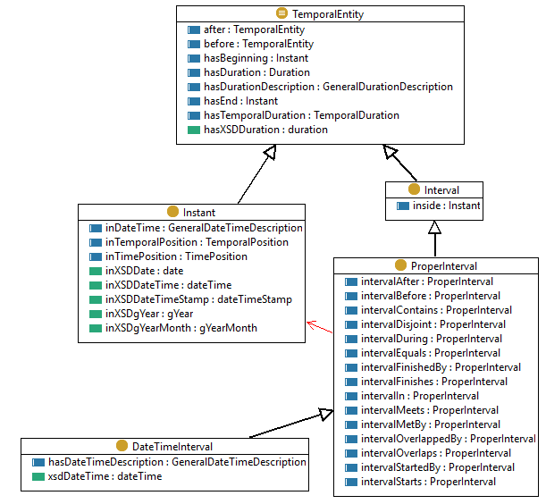
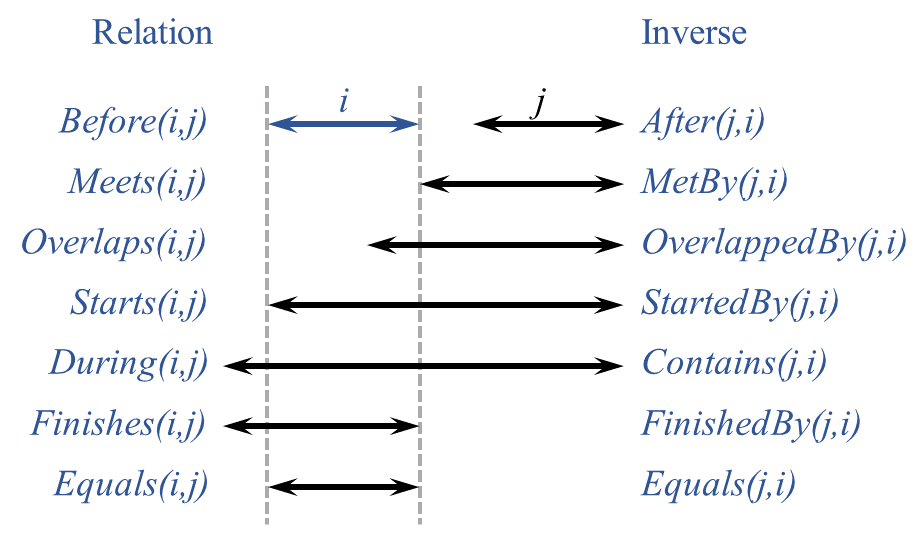
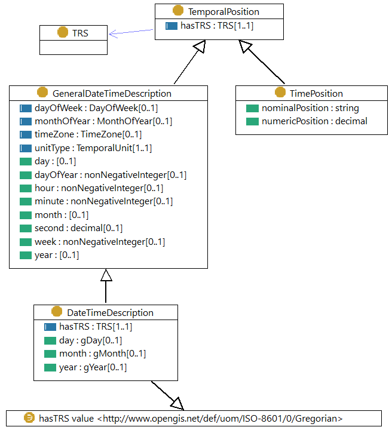
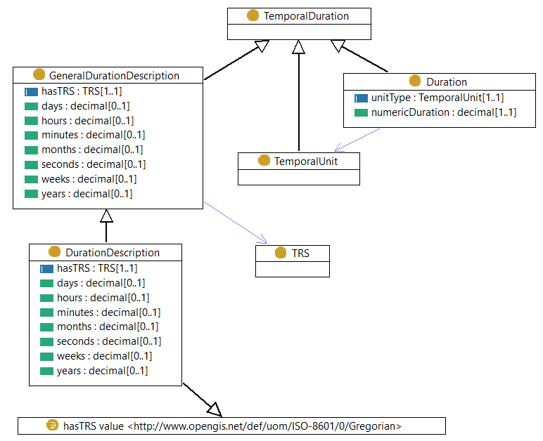
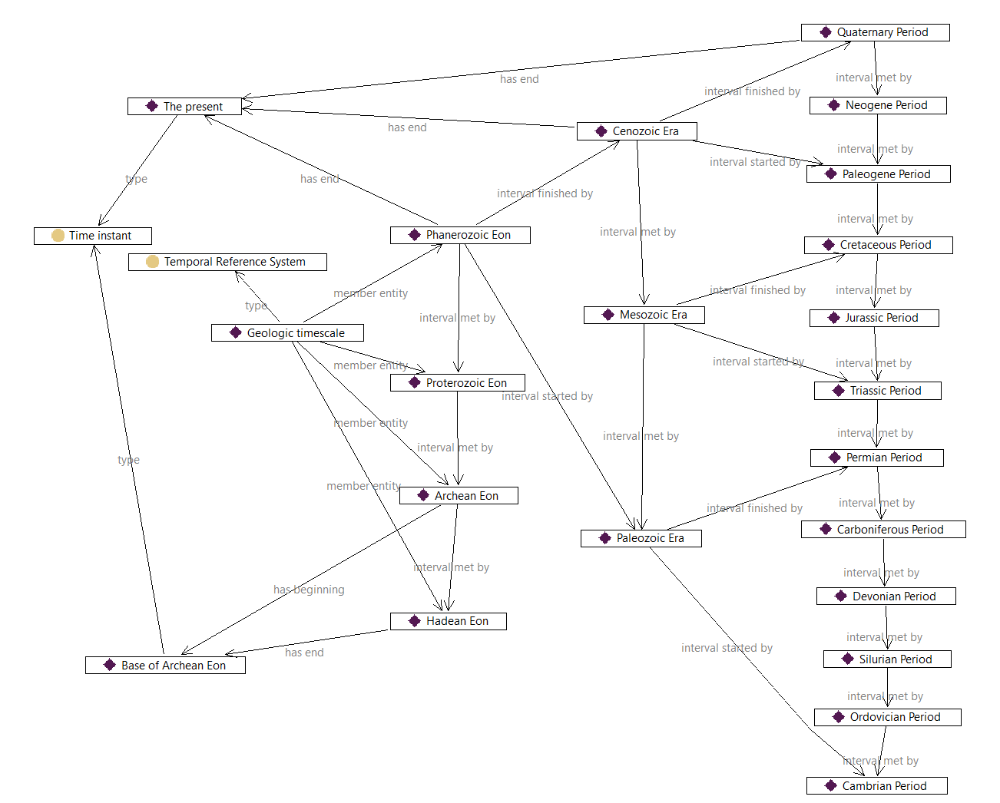

# Retained specification text (collector assembly)

> This consumer Markdown assembles the explicitly retained originals in declared order. Source labels, line anchors and local href rewrites are collector additions; HTML is represented as structural text with ordered table cells and preserved code, without running source scripts.

> Collector representation: declared cell spans are annotations, not an expanded table grid; code br line breaks and NBSP are retained, and image-label whitespace is normalized without dropping label words.

Original HTML: [specification.html](../source/specification.html#L1-L4846).

<a id="specification-L1"></a>
[](https://www.w3.org/)[](http://www.opengeospatial.org/)

<a id="specification-L432"></a>
<a id="specification-title"></a>
# Time Ontology in OWL
 
<a id="specification-w3c-state"></a>


[W3C Candidate Recommendation Draft](https://www.w3.org/standards/types#CRD) 15 November 2022

  More details about this document 

 

This version:


 [https://www.w3.org/TR/2022/CRD-owl-time-20221115/](https://www.w3.org/TR/2022/CRD-owl-time-20221115/) 

 

Latest published version:


 [https://www.w3.org/TR/owl-time/](https://www.w3.org/TR/owl-time/) 

 

Latest editor's draft:


[https://w3c.github.io/sdw/time/](https://w3c.github.io/sdw/time/)

 

History:


 [https://www.w3.org/standards/history/owl-time](https://www.w3.org/standards/history/owl-time) 


 [Commit history](https://github.com/w3c/sdw/commits/) 

 

Implementation report:


 [https://www.w3.org/2015/spatial/wiki/OWL_Time_Ontology_adoption](https://www.w3.org/2015/spatial/wiki/OWL_Time_Ontology_adoption) 

 

Editors:


 [Simon Cox](http://people.csiro.au/Simon-Cox)[](https://orcid.org/0000-0002-3884-3420) ([CSIRO](https://www.csiro.au/)) 


 Chris Little[](https://orcid.org/0000-0002-1442-3712) ([Met Office](http://www.metoffice.gov.uk/)) 

 

Feedback:


 [GitHub w3c/sdw](https://github.com/w3c/sdw/) ([pull requests](https://github.com/w3c/sdw/pulls/), [new issue](https://github.com/w3c/sdw/issues/new/choose), [open issues](https://github.com/w3c/sdw/issues/)) 


[public-sdw-comments@w3.org](mailto:public-sdw-comments@w3.org?subject=%5Bowl-time%5D%20YOUR%20TOPIC%20HERE) with subject line [owl-time] … message topic … ([archives](https://lists.w3.org/Archives/Public/public-sdw-comments))

 

Editors of 2006 Working Draft


 Jerry R. Hobbs 


 Feng Pan 


OGC Document Number


 OGC 16-071r3 

 

  

 [Copyright](https://www.w3.org/Consortium/Legal/ipr-notice#Copyright) © 2022 [W3C](https://www.w3.org/)® ([MIT](https://www.csail.mit.edu/), [ERCIM](https://www.ercim.eu/), [Keio](https://www.keio.ac.jp/), [Beihang](https://ev.buaa.edu.cn/)). W3C [liability](https://www.w3.org/Consortium/Legal/ipr-notice#Legal_Disclaimer), [trademark](https://www.w3.org/Consortium/Legal/ipr-notice#W3C_Trademarks) and [permissive document license](https://www.w3.org/Consortium/Legal/2015/copyright-software-and-document) rules apply. 

  

 
<a id="specification-abstract"></a>

<a id="specification-L516"></a>
## Abstract
 

OWL-Time is an OWL-2 DL ontology of temporal concepts, for describing the temporal properties of resources in the world or described in Web pages. The ontology provides a vocabulary for expressing facts about topological (ordering) relations among instants and intervals, together with information about durations, and about temporal position including date-time information. Time positions and durations may be expressed using either the conventional (Gregorian) calendar and clock, or using another temporal reference system such as Unix-time, geologic time, or different calendars.

 

The namespace for OWL-Time terms is `http://www.w3.org/2006/time#`

 

The suggested prefix for the OWL-Time namespace is `time`

 

The OWL-Time ontology is available [here](https://raw.githubusercontent.com/w3c/sdw/gh-pages/time/rdf/time.ttl).

 

An ontology of individuals for the Gregorian calendar (months) is available [here](https://raw.githubusercontent.com/w3c/sdw/gh-pages/time/rdf/time-gregorian.ttl).

 

 
<a id="specification-sotd"></a>

<a id="specification-L527"></a>
## Status of This Document


This section describes the status of this document at the time of its publication. A list of current W3C publications and the latest revision of this technical report can be found in the [W3C technical reports index](https://www.w3.org/TR/) at https://www.w3.org/TR/.

 

For OGC - This is a Public Draft of a document prepared by the Spatial Data on the Web Working Group ([SDWWG](https://www.w3.org/2021/sdw/)) — a joint W3C-OGC project (see [charter](https://www.w3.org/2021/10/sdw-charter.html)). The document is prepared following W3C conventions. Comments regarding this document are welcome - please submit them in the [issue tracker](https://github.com/w3c/sdw/issues). Recipients of this document are invited to submit, with their comments, notification of any relevant patent rights of which they are aware and to provide supporting documentation. 

 

New classes and properties are introduced in this revision of OWL-Time. The new elements primarily relate to relaxing the limitation that time position uses only the Gregorian Calendar, and are placed in a logical hierarchy in relation to the original elements. While there is less implementation evidence for these than the elements from the 2006 version, the new elements are essential to satisfying key requirements in the revision. 

 

However, a small number of other new elements merit additional explanation: 

 

 

1. `:hasXSDDuration` allows use of the compact xsd:duration element to describe the extent of a temporal entity. This complements existing predicates used with XSD datatypes, and was an inexplicable omission from the original ontology. 

 

2. `:MonthOfYear` and `:monthOfYear` complement :DayOfWeek and :dayOfWeek to support vernacular names for months as well as days. 

 

3. `:hasTime` is a completely generic predicate for associating a temporal entity with anything. A number of generic predicates suitable for use directly in applications were requested, but in general were deemed undesirable in an ontology dealing with the description of time elements rather than their use. This one only was included for users unwilling or unable to define their own semantics. 

 

 

 This document was published by the [Spatial Data on the Web Working Group](https://www.w3.org/groups/wg/sdw) as a Candidate Recommendation Draft using the [Recommendation track](https://www.w3.org/2021/Process-20211102/#recs-and-notes). 


Publication as a Candidate Recommendation does not imply endorsement by W3C and its Members. A Candidate Recommendation Draft integrates changes from the previous Candidate Recommendation that the Working Group intends to include in a subsequent Candidate Recommendation Snapshot.


 This is a draft document and may be updated, replaced or obsoleted by other documents at any time. It is inappropriate to cite this document as other than work in progress. 


 This document was produced by a group operating under the [W3C Patent Policy](https://www.w3.org/Consortium/Patent-Policy/). W3C maintains a [public list of any patent disclosures](https://www.w3.org/groups/wg/sdw/ipr) made in connection with the deliverables of the group; that page also includes instructions for disclosing a patent. An individual who has actual knowledge of a patent which the individual believes contains [Essential Claim(s)](https://www.w3.org/Consortium/Patent-Policy/#def-essential) must disclose the information in accordance with [section 6 of the W3C Patent Policy](https://www.w3.org/Consortium/Patent-Policy/#sec-Disclosure). 


 This document is governed by the 
<a id="specification-w3c_process_revision"></a>
[2 November 2021 W3C Process Document](https://www.w3.org/2021/Process-20211102/). 


 
<a id="specification-motivation"></a>

<a id="specification-L579"></a>
<a id="specification-x1-motivation-and-background"></a>
## 1. Motivation and background
[](#specification-motivation)


This section is non-normative.

 

Temporal information is important in most real world applications. For example, the date is always part of an online order. When you rent a car it is for specific dates. Events in the world occur at specific times and usually have a finite duration. Transactions occur in a sequence, with the current state of a system depending on the exact history of all the transactions. Knowledge of the temporal relationships between transactions, events, travel and orders is often critical. OWL-Time has been developed in response to this need, for describing the temporal properties of any resource denoted using a web identifier (URI), including web-pages and real-world things if desired. OWL-Time focusses particularly on temporal ordering relationships. While these are implicit in all temporal descriptions, OWL-Time provides specific predicates to support, or to make explicit the results of, reasoning over the order or sequence of temporal entities. 

 

There is a great deal of relevant existing work, some very closely related. ISO 8601 [[iso8601](#specification-bib-iso8601)] provides a basis for encoding time position and extent in a character string, using the most common modern calendar-clock system. Datatypes in XML Schema [[xmlschema11-2](#specification-bib-xmlschema11-2)] use a subset of the ISO 8601 format in order to pack multi-element values into a compact literal. Functions and operators on durations, and on dates and times, encoded in these ways are available in XPath and XQuery [[xpath-functions-31](#specification-bib-xpath-functions-31)]. XSLT [[xslt20](#specification-bib-xslt20)] also provides formatting functions for times and dates, with [explicit support for the specified language, calendar and country](https://www.w3.org/TR/xslt20/#format-date). Some of the XML Schema datatypes are [built-in to OWL2](https://www.w3.org/TR/owl2-quick-reference/#Built-in_Datatypes) [[owl2-quick-reference](#specification-bib-owl2-quick-reference)], so the XPath and XQuery functions may be used on basic OWL data. 

 

OWL-Time makes use of these encodings, but also provides representations in which the elements of a date and time are put into separately addressable resources, which can help with queries and reasoning applications. OWL-Time also supports other representations of temporal position and duration, including temporal coordinates (scaled position on a continuous temporal axis) and ordinal times (named positions or periods). This includes relaxing the expectation from the original version that dates must use the Gregorian calendar. However, OWL-Time has a particular focus on ordering relations ("temporal topology"), which is not supported explicitly in any of the date-time encodings. 

 

A first-order logic axiomatization of the core of this ontology is available in [[hp-04](#specification-bib-hp-04)]. This document presents the OWL encodings of the ontology, with some additions. 

 

This version of OWL-Time was developed in the Spatial Data on the Web Working Group (a joint activity involving W3C and the Open Geospatial Consortium). The ontology is based on the draft by Hobbs and Pan [[owl-time-20060927](#specification-bib-owl-time-20060927)], incorporating modifications proposed by Cox [[co-15](#specification-bib-co-15)] to support more general temporal positions, along with other minor improvements. The substantial changes are listed in the [change-log](#specification-changes). The specification document has been completely re-written. 

 

 
<a id="specification-namespaces"></a>

<a id="specification-L611"></a>
<a id="specification-x2-notation-and-namespaces"></a>
## 2. Notation and namespaces
[](#specification-namespaces)

 

Classes and properties from the Time Ontology are denoted in this specification using [Compact URIs](https://www.w3.org/TR/curie/) [[curie](#specification-bib-curie)]. 

 

The namespace for OWL-Time is [`http://www.w3.org/2006/time#`](https://www.w3.org/2006/time#). RDF representations of OWL-Time in various serializations are available at the namespace URI. OWL-Time does not re-use elements from any other vocabularies, but does use some built-in datatypes from OWL and some additional types from XML Schema Part 2.

 

The table below indicates the full list of namespaces and prefixes used in this document.

 
<a id="specification-namespacesTable"></a>


- Prefix | Namespace
- `ex` | `http://example.org/time/`
- `geol` | `http://example.org/geologic/`
- `greg` | `http://www.w3.org/ns/time/gregorian#`
- `owl` | `http://www.w3.org/2002/07/owl#`
- `prov` | `http://www.w3.org/ns/prov#`
- `rdf` | `http://www.w3.org/1999/02/22-rdf-syntax-ns#`
- `rdfs` | `http://www.w3.org/2000/01/rdf-schema#`
- `time` or 
 `no prefix` | `http://www.w3.org/2006/time#`
- `xsd` | `http://www.w3.org/2001/XMLSchema#`

 

Where class descriptions include local restrictions on properties, these are described using the [OWL 2 Manchester Syntax](https://www.w3.org/TR/owl2-manchester-syntax/#Descriptions) [[owl2-manchester-syntax](#specification-bib-owl2-manchester-syntax)]. 

 

Examples and other code fragments are serialized using [RDF 1.1 Turtle](https://www.w3.org/TR/turtle/) notation [[turtle](#specification-bib-turtle)].

 

 
<a id="specification-overview"></a>

<a id="specification-L670"></a>
<a id="specification-x3-principles-and-vocabulary-overview"></a>
## 3. Principles and vocabulary overview
[](#specification-overview)


This section is non-normative.

 
<a id="specification-topology"></a>

<a id="specification-L673"></a>
<a id="specification-x3-1-topological-temporal-relations"></a>
### 3.1 Topological Temporal Relations
[](#specification-topology)

 

The basic structure of the ontology is based on an algebra of binary relations on intervals (e.g., meets, overlaps, during) developed by Allen [[al-84](#specification-bib-al-84)], [[af-97](#specification-bib-af-97)] for representing qualitative temporal information, and to address the problem of reasoning about such information. 

 

The ontology starts with a class `:TemporalEntity` with properties `:hasBeginning` and `:hasEnd` that link to the temporal instants that define its limits, and `:hasTemporalDuration` to describe its extent. There are two subclasses: `:Interval` and `:Instant`, and they are the only two subclasses of `:TemporalEntity`. Intervals are things with extent. Instants are point-like in that they have no interior points, but it is generally safe to think of an instant as an interval with zero length, where the beginning and end are the same. 

 

This idea - that time intervals are the more general case and time instants are just a limited specialization - is the first key contribution of Allen's analysis. 

 

The class `:Interval` has one subclass `:ProperInterval`, which corresponds with the common understanding of intervals, in that the beginning and end are distinct, and whose membership is therefore disjoint from `:Instant`. 

 
<a id="specification-fig-core-model-of-temporal-entities"></a>


  

Figure 1 Core model of temporal entities.

 

 

The class `:ProperInterval` also has one subclass, `:DateTimeInterval`. The position and extent of a `:DateTimeInterval` is an element in a `:GeneralDateTimeDescription`. 

 

Relations between intervals are the critical logic provided by Allen's analysis, and implemented in the ontology. Relations between intervals can be defined in a relatively straightforward fashion in terms of `:before` and identity on the beginning and end points. The thirteen elementary relations shown below are the second key contribution of Allen's analysis. These support unambiguous expression of all possible relations between temporal entities, which allows the computation of any relative position or sequence. Note that the standard interval calculus assumes all intervals are proper, so their beginning and end are different. 

 
<a id="specification-fig-thirteen-elementary-possible-relations-between-time-periods-af-97"></a>


  

Figure 2 Thirteen elementary possible relations between time periods [[af-97](#specification-bib-af-97)]. 

 

 

Two additional relations: `In` (the union of `During`, `Starts` and `Finishes`) and `Disjoint` (the union of `Before` and `After`) are not shown in the figure but are included in the ontology. 

 

The properties `:hasTemporalDuration`, `:hasBeginning` and `:hasEnd`, together with a fourth generic property `:hasTime`, support the association of temporal information with any temporal entity, such as an activity or event, or other entity. These provide a standard way to attach time information to things, which may be used directly in applications if suitable, or specialized if needed. 

 

 
<a id="specification-trs-clock-calendar"></a>

<a id="specification-L712"></a>
<a id="specification-x3-2-temporal-reference-systems-clocks-calendars"></a>
### 3.2 Temporal reference systems, clocks, calendars
[](#specification-trs-clock-calendar)

 

The duration of a TemporalEntity may be given using the datatype `xsd:duration` and the position of an Instant may be given using the datatype `xsd:dateTimeStamp`, which is built in to OWL 2 [[owl2-syntax](#specification-bib-owl2-syntax)]. These both use the conventional notions of temporal periods (years, months, weeks ... seconds), the Gregorian calendar, and the 24-hour clock. The lexical representations use [[iso8601](#specification-bib-iso8601)] style notation, but ignoring leap seconds, which are explicitly mandated by the international standard. 

 

While this satisfies most web applications, many other calendars and temporal reference systems are used in particular cultural and scholarly contexts. For example, the Julian calendar was used throughout Europe until the 16th century, and is still used for computing key dates in some orthodox Christian communities. Lunisolar (e.g. Hebrew) and lunar (e.g. Islamic) calendars are currently in use in some communities, and many similar have been used historically. Ancient Chinese calendars as well as the French revolutionary calendar used 10-day weeks. In scientific and technical applications, Julian date counts the number of days since the beginning of 4713 BCE, and Loran-C, Unix and GPS time are based on seconds counted from a specified origin in 1958, 1970 and 1980, respectively, with GPS time represented using a pair of numbers for week number plus seconds into week. Archaeological and geological applications use chronometric scales based on years counted backwards from ‘the present’ (defined as 1950 for radiocarbon dating [[rc-14](#specification-bib-rc-14)]), or using named periods associated with specified correlation markers ([[cr-05](#specification-bib-cr-05)], [[cr-14](#specification-bib-cr-14)], [[mf-13](#specification-bib-mf-13)]). Dynastic calendars (counting years within eras defined by the reign of a monarch or dynasty) were used in many cultures. In order to support these more general applications, the representation of temporal position and duration must be flexible, and annotated with the temporal reference system in use. 

 

A set of ordered intervals (e.g. named dynasties, geological periods, geomagnetic reversals, tree rings) can make a simple form of temporal reference system that supports logical reasoning, known as an ordinal temporal reference system  [[iso19108](#specification-bib-iso19108)]. 

 

Measurement of duration needs a clock. In its most general form a clock is just a regularly repeating physical event ('tick') and a counting mechanism for the 'ticks'. These counts may be used to logically relate two events and to calculate a duration between the events.

 

A calendar is a set of algorithms that enables clock counts to be converted into practical everyday dates and times related to the movement of astronomical bodies (day, month, year). 

 
<a id="specification-issue-container-generatedID"></a>


<a id="specification-h-note"></a>


Note


As astronomically based calendars try to fit inconvenient durations into a usable regular system of counting cycles, 'intercalations' are often used to re-align the calendar's repeating patterns with astronomical events. These intercalations may be of different durations depending on the calendar, such as leap seconds, leap days, or even a group of days. Leap days are explicit and leap seconds implicit in the Gregorian calendar, which underlies the model used in several classes in OWL-Time. A general treatment of intercalations is beyond the scope of this ontology. 


 

For many purposes it is convenient to make temporal calculations in terms of clock durations that exceed everyday units such as days, weeks, months and years, using a representation of temporal position in a temporal coordinate system [[iso19108](#specification-bib-iso19108)], or temporal coordinate reference system [[iso-19111-2019](#specification-bib-iso-19111-2019)], [[ogc-topic-2](#specification-bib-ogc-topic-2)], i.e. on a number line with a specified origin, such as Julian date, or Unix time. This may be converted to calendar units when necessary for human consumption. 

 

Nevertheless, in practice much temporal information is not well-defined, in that there may be no clear statement about the assumed underlying calendar and clock. 

 

 
<a id="specification-time-position"></a>

<a id="specification-L744"></a>
<a id="specification-x3-3-time-position"></a>
### 3.3 Time position
[](#specification-time-position)

 

OWL 2 has two built-in datatypes relating to time: `xsd:dateTime` and `xsd:dateTimeStamp` [[owl2-syntax](#specification-bib-owl2-syntax)]. Other XSD types such as `xsd:date`, `xsd:gYear` and `xsd:gYearMonth` [[xmlschema11-2](#specification-bib-xmlschema11-2)] are also commonly used in OWL applications. These provide for a compact representation of time positions using the conventional Gregorian calendar and 24-hour clock, with timezone offset from UTC.

 

Four classes in the ontology support an explicit description of temporal position. `:TemporalPosition` is the common super-class, with a property `:hasTRS` to indicate the temporal reference system in use. `:TimePosition` has properties to alternatively describe the position using a number (i.e. a temporal coordinate), or a nominal value (e.g. geologic time period, dynastic name, archeological era). `:GeneralDateTimeDescription` has a set of properties to specify a date-time using calendar and clock elements. Its subclass `:DateTimeDescription` fixes the temporal reference system to the Gregorian calendar. 

 
<a id="specification-fig-classes-for-temporal-position"></a>


  

Figure 3 Classes for temporal position.

 

 

Following Allen's first key idea described above, even a time position has a finite extent, corresponding to the precision or temporal unit used. Thus, a `:GeneralDateTimeDescription` or `:DateTimeDescription` has a duration corresponding to the value of its `:unitType`.

 

 
<a id="specification-duration"></a>

<a id="specification-L763"></a>
<a id="specification-x3-4-duration"></a>
### 3.4 Duration
[](#specification-duration)

 

The duration of an interval (or temporal sequence) can have many different descriptions. An interval can be 1 day 2 hours, or 26 hours, or 1560 minutes, and so on. It is useful to be able to talk about these descriptions in a convenient way as independent objects, and to talk about their equivalences. The extent of an interval can be given using multiple duration descriptions or individual durations (e.g., 2 days, 48 hours) , but these must all describe the same amount of time. 

 

Four classes support the description of the duration of an entity. `:TemporalDuration` is the common super-class. `:Duration` has properties to describe the duration using a scaled number (i.e. a temporal quantity). `:GeneralDurationDescription` has a set of properties to specify a duration using calendar and clock elements, the definitions of which are given in the associated TRS description. Its subclass `:DurationDescription` fixes the temporal reference system to the Gregorian calendar, so the `:hasTRS` property may be omitted on individuals from this class. 

 

`:TemporalUnit` is a standard duration which is used to scale a length of time, and to capture its granularity or precision. 

 
<a id="specification-fig-classes-for-temporal-duration"></a>


  

Figure 4 Classes for temporal duration.

 

 

We use two different sets of properties for `:GeneralDateTimeDescription` or `:DateTimeDescription`, and `:GeneralDurationDescription` or `:DurationDescription`, because their ranges are different. For example, `:year` (in `:DateTimeDescription`) has a range of `xsd:gYear` which is a position in the Gregorian calendar, while `:years` (in `:DurationDescription`) has a range of `xsd:decimal` so that you can say "duration of 2.5 years".

 

 

 
<a id="specification-vocabulary"></a>

<a id="specification-L789"></a>
<a id="specification-x4-vocabulary-specification"></a>
## 4. Vocabulary specification
[](#specification-vocabulary)

 

In this vocabulary specification, Manchester syntax [[owl2-manchester-syntax](#specification-bib-owl2-manchester-syntax)] is used where the value of a field is not a simple term denoted by a URI or cURI.

 

RDF representations of OWL-Time are available at the vocabulary namespace URI - see [Notation and namespaces](#specification-namespaces).

 
<a id="specification-classes"></a>

<a id="specification-L795"></a>
<a id="specification-x4-1-classes"></a>
### 4.1 Classes
[](#specification-classes)

 

 `:DateTimeDescription` | `:DateTimeInterval` | `:DayOfWeek` | `:Duration` | `:DurationDescription` | `:GeneralDateTimeDescription` | `:GeneralDurationDescription` | `:Instant` | `:Interval` | `:MonthOfYear` | `:ProperInterval` | `:TemporalDuration` | `:TemporalEntity` | `:TemporalPosition` | `:TemporalUnit` | `:TimePosition` | `:TimeZone` | `:TRS` 

 
<a id="specification-date-time-description"></a>

<a id="specification-L819"></a>
<a id="specification-time:DateTimeDescription"></a>
#### 4.1.1 Date-time description
[](#specification-time:DateTimeDescription)

 

- Class: | `time:DateTimeDescription`
- Definition: | Description of date and time structured with separate values for the various elements of a calendar-clock system. The temporal reference system is fixed to Gregorian Calendar, and the range of year, month, day properties restricted to corresponding XML Schema types xsd:gYear, xsd:gMonth and xsd:gDay, respectively.
- Subclass of: | `time:GeneralDateTimeDescription`
- Subclass of: | `time:hasTRS value <http://www.opengis.net/def/uom/ISO-8601/0/Gregorian>`
- Subclass of: | `time:year only xsd:gYear`
- Subclass of: | `time:month only xsd:gMonth`
- Subclass of: | `time:day only xsd:gDay`

 

Other datetime concepts can be defined by specialization of `:GeneralDateTimeDescription` or `:DateTimeDescription` - see [examples below](#specification-temporal-precision).

 

 
<a id="specification-date-time-interval"></a>

<a id="specification-L859"></a>
<a id="specification-time:DateTimeInterval"></a>
#### 4.1.2 Date-time interval
[](#specification-time:DateTimeInterval)

 

- Class: | `time:DateTimeInterval`
- Definition: | `time:DateTimeInterval` is a subclass of `time:ProperInterval`, defined using the multi-element `time:DateTimeDescription`.
- Subclass of: | `time:ProperInterval`

 

The class `:DateTimeInterval` is a subclass of `:ProperInterval`. It enables compact representation of an interval corresponding to a single element in a date-time description (i.e. a specified year, month, week, day, hour, minute, second). The property `:hasDateTimeDescription` describes the interval.

 
<a id="specification-issue-container-generatedID-0"></a>


<a id="specification-h-note-0"></a>


Note


`:DateTimeInterval` can only be used for an interval whose limits coincide with a date-time element aligned to the calendar and timezone indicated. For example, while both have a duration of one day, the 24-hour interval beginning at midnight at the beginning of 8 May in Central Europe can be expressed as a `:DateTimeInterval`, but the 24-hour interval starting at 1:30pm cannot. 


 

 
<a id="specification-day-of-week"></a>

<a id="specification-L885"></a>
<a id="specification-time:DayOfWeek"></a>
#### 4.1.3 Day of week
[](#specification-time:DayOfWeek)

 

- Class: | `time:DayOfWeek`
- Definition: | The day of week
- Instance of: | `owl:Class`

 

Seven individual members of `:DayOfWeek` are included in the ontology, corresponding to the seven days used in the Gregorian calendar, and using the English names `:Sunday`, `:Monday`, `:Tuesday`, `:Wednesday`, `:Thursday`, `:Friday`, `:Saturday`.

 
<a id="specification-issue-container-generatedID-1"></a>


<a id="specification-h-note-1"></a>


Note


Membership of the class `:DayOfWeek` is open, to allow for alternative week lengths and different day names. 


 

 
<a id="specification-duration-0"></a>

<a id="specification-L909"></a>
<a id="specification-time:Duration"></a>
#### 4.1.4 Duration
[](#specification-time:Duration)

 

- Class: | `time:Duration`
- Definition: | Duration of a temporal extent expressed as a decimal number scaled by a temporal unit
- Subclass of: | `:TemporalDuration`
- Subclass of: | `time:numericDuration exactly 1`
- Subclass of: | `time:unitType exactly 1`

 

 
<a id="specification-duration-description"></a>

<a id="specification-L937"></a>
<a id="specification-time:DurationDescription"></a>
#### 4.1.5 Duration description
[](#specification-time:DurationDescription)

 

- Class: | `time:DurationDescription`
- Definition: | Description of temporal extent structured with separate values for the various elements of a calendar-clock system. The temporal reference system is fixed to Gregorian Calendar, and the range of each of the numeric properties is restricted to [xsd:decimal](https://www.w3.org/TR/xmlschema11-2/#decimal)
- Subclass of: | `time:GeneralDurationDescription`
- Subclass of: | `time:hasTRS value <http://www.opengis.net/def/uom/ISO-8601/0/Gregorian>`
- Subclass of: | `time:years only xsd:decimal`
- Subclass of: | `time:months only xsd:decimal`
- Subclass of: | `time:weeks only xsd:decimal`
- Subclass of: | `time:days only xsd:decimal`
- Subclass of: | `time:hours only xsd:decimal`
- Subclass of: | `time:minutes only xsd:decimal`
- Subclass of: | `time:seconds only xsd:decimal`

 
<a id="specification-issue-container-generatedID-2"></a>


<a id="specification-h-note-2"></a>


Note


In the Gregorian calendar the length of the month is not fixed. Therefore, a value like "2.5 months" cannot be exactly compared with a similar duration expressed in terms of weeks or days.


 

 
<a id="specification-generalized-date-time-description"></a>

<a id="specification-L992"></a>
<a id="specification-time:GeneralDateTimeDescription"></a>
#### 4.1.6 Generalized date-time description
[](#specification-time:GeneralDateTimeDescription)

 

- Class: | `time:GeneralDateTimeDescription`
- Definition: | Description of date and time structured with separate values for the various elements of a calendar-clock system
- Subclass of: | `:TemporalPosition`
- Subclass of: | `time:timeZone max 1`
- Subclass of: | `time:unitType exactly 1`
- Subclass of: | `time:year max 1`
- Subclass of: | `time:month max 1`
- Subclass of: | `time:day max 1`
- Subclass of: | `time:hour max 1`
- Subclass of: | `time:minute max 1`
- Subclass of: | `time:second max 1`
- Subclass of: | `time:week max 1`
- Subclass of: | `time:dayOfYear max 1`
- Subclass of: | `time:dayOfWeek max 1`
- Subclass of: | `time:monthOfYear max 1`

 

Two properties `:timeZone`, and `:unitType`, along with `:hasTRS` provide for reference information concerning the reference system and precision of temporal position values. 

 

Six datatype properties `:year`, `:month`, `:day`, `:hour`, `:minute`, `:second`, together with `:timeZone` support the description of components of a temporal position in a calendar-clock system. These correspond with the 'seven property model' described in ISO 8601 [[iso8601](#specification-bib-iso8601)] and XML Schema Definition Language Part 2: Datatypes [[xmlschema11-2](#specification-bib-xmlschema11-2)], except that the calendar is not specified in advance, but is provided through the value of the `:hasTRS` property (defined above). 

 

Some combinations of properties are redundant. For example, within a specified :year if `:dayOfYear` is provided then `:day` and `:month` can be computed, and vice versa. Individual values SHOULD be consistent with each other and the calendar, indicated through the value of the `:hasTRS` property.

 

Two additional properties `:week` and `:dayOfYear` allow for the numeric value of the week or day relative to the year. The property `:dayOfWeek` provides the name of the day, and the property `:monthOfYear` provides the name of the month. 

 

 
<a id="specification-generalized-duration-description"></a>

<a id="specification-L1072"></a>
<a id="specification-time:GeneralDurationDescription"></a>
#### 4.1.7 Generalized duration description
[](#specification-time:GeneralDurationDescription)

 

- Class: | `time:GeneralDurationDescription`
- Definition: | Description of temporal extent structured with separate values for the various elements of a calendar-clock system.
- Subclass of: | `:TemporalDuration`
- Subclass of: | `time:hasTRS exactly 1`
- Subclass of: | `time:years max 1`
- Subclass of: | `time:months max 1`
- Subclass of: | `time:weeks max 1`
- Subclass of: | `time:days max 1`
- Subclass of: | `time:hours max 1`
- Subclass of: | `time:minutes max 1`
- Subclass of: | `time:seconds max 1`

 

Seven datatype properties `:years`, `:months`, `:weeks`, `:days`, `:hours`, `:minutes`, and `:seconds` support the description of components of a temporal extent in a calendar-clock system. 

 

The property `time:hasTRS` indicates the temporal reference system applicable for the duration components. 

 
<a id="specification-issue-container-generatedID-3"></a>


<a id="specification-h-note-3"></a>


Note


The extent of a time duration expressed as a GeneralDurationDescription depends on the Temporal Reference System. In some calendars the length of the week or month is not constant within the year. Therefore, a value like "2.5 months" may not necessarily be exactly compared with a similar duration expressed in terms of weeks or days. When non-earth-based calendars are considered even more care must be taken in comparing durations.


 

 
<a id="specification-time-instant"></a>

<a id="specification-L1128"></a>
<a id="specification-time:Instant"></a>
#### 4.1.8 Time instant
[](#specification-time:Instant)

 

- Class: | `time:Instant`
- Definition: | A temporal entity with zero extent or duration
- Subclass of: | `time:TemporalEntity`

 

Seven properties, `:inXSDDate`, `:inXSDDateTime` (deprecated), `:inXSDDateTimeStamp`, `:inXSDgYear`, `:inXSDgYearMonth`, `:inTimePosition`, and `:inDateTime` provide alternative ways to describe the temporal position of an `:Instant`. 

 

 
<a id="specification-time-interval"></a>

<a id="specification-L1150"></a>
<a id="specification-time:Interval"></a>
#### 4.1.9 Time interval
[](#specification-time:Interval)

 

- Class: | `time:Interval`
- Definition: | A temporal entity with an extent or duration
- Subclass of: | `time:TemporalEntity`

 

One property `:inside` links to an `:Instant` that falls inside the `:Interval`.

 

 
<a id="specification-month-of-year"></a>

<a id="specification-L1171"></a>
<a id="specification-time:MonthOfYear"></a>
#### 4.1.10 Month of year
[](#specification-time:MonthOfYear)

 

- Class: | `time:MonthOfYear`
- Definition: | The month of the year
- Subclass of: | `time:DateTimeDescription`
- Subclass of: | `time:year exactly 0`
- Subclass of: | `time:month exactly 1`
- Subclass of: | `time:week exactly 0`
- Subclass of: | `time:day exactly 0`
- Subclass of: | `time:hour exactly 0`
- Subclass of: | `time:minute exactly 0`
- Subclass of: | `time:second exactly 0`
- Subclass of: | `time:unitType value time:unitMonth`

 

Twelve individual members of `:MonthOfYear` are provided in a [separate namespace](https://www.w3.org/ns/time/gregorian), corresponding to the twelve months used in the Gregorian calendar `greg:January`, `greg:February`, `greg:March`, `greg:April`, `greg:May`, `greg:June`, `greg:July`, `greg:August`, `greg:September`, `greg:October`, `greg:November`, `greg:December`. Each month is defined by setting the value of `time:month` to the corresponding value.

 
<a id="specification-issue-container-generatedID-4"></a>


<a id="specification-h-note-4"></a>


Note


Membership of the class `:MonthOfYear` is open, to allow for alternative annual calendars and different month names. 


 

 
<a id="specification-proper-interval"></a>

<a id="specification-L1238"></a>
<a id="specification-time:ProperInterval"></a>
#### 4.1.11 Proper interval
[](#specification-time:ProperInterval)

 

- Class: | `time:ProperInterval`
- Definition: | A temporal entity with non-zero extent or duration, i.e. for which the value of the beginning and end are different
- Subclass of: | `time:Interval`
- Disjoint with: | `time:Instant`

 

Fifteen properties `:intervalBefore`, `:intervalAfter`, `:intervalMeets`, `:intervalMetBy`, `:intervalOverlaps`, `:intervalOverlappedBy`, `:intervalStarts`, `:intervalStartedBy`, `:intervalDuring`, `:intervalContains`, `:intervalFinishes`, `:intervalFinishedBy`, `:intervalEquals` `:intervalDisjoint` `:intervalIn` support the set of interval relations defined by Allen [[al-84](#specification-bib-al-84)] and Allen and Ferguson [[af-97](#specification-bib-af-97)].

 

 
<a id="specification-temporal-duration"></a>

<a id="specification-L1274"></a>
<a id="specification-time:TemporalDuration"></a>
#### 4.1.12 Temporal duration
[](#specification-time:TemporalDuration)

 

- Class: | `time:TemporalDuration`
- Definition: | Time extent; duration of a time interval separate from its particular start position
- Instance of: | `owl:Class`

 

 
<a id="specification-temporal-entity"></a>

<a id="specification-L1296"></a>
<a id="specification-time:TemporalEntity"></a>
#### 4.1.13 Temporal entity
[](#specification-time:TemporalEntity)

 

- Class: | `time:TemporalEntity`
- Definition: | A temporal interval or instant.
- Instance of: | `owl:Class`
- Union of: | `time:Instant , time:Interval`

 

Two properties, `:before`, `:after`, support ordering relationships between two `:TemporalEntity`s.

 

The properties `:hasBeginning`, `:hasEnd` and `:hasTemporalDuration` (or its sub-properties), support the description of the bounds and extent of a `:TemporalEntity`.

 

 
<a id="specification-temporal-position"></a>

<a id="specification-L1324"></a>
<a id="specification-time:TemporalPosition"></a>
#### 4.1.14 Temporal position
[](#specification-time:TemporalPosition)

 

- Class: | `time:TemporalPosition`
- Definition: | A position on a time-line
- Instance of: | `owl:Class`
- Subclass of: | `time:hasTRS exactly 1`

 

The property `time:hasTRS` indicates the temporal reference system. 

 

 
<a id="specification-temporal-unit"></a>

<a id="specification-L1351"></a>
<a id="specification-time:TemporalUnit"></a>
#### 4.1.15 Temporal unit
[](#specification-time:TemporalUnit)

 

- Class: | `time:TemporalUnit`
- Definition: | A standard duration, which provides the scale factor for a time extent, or the granularity or precision for a time position.
- Subclass of: | `time:TemporalDuration`

 

Ten individual members of `:TemporalUnit` are included in the ontology, corresponding to the elements of the standard calendar-clock: `:unitYear`, `:unitMonth`, `:unitWeek`, `:unitDay`, `:unitHour`, `:unitMinute` and `:unitSecond`, as well as `:unitDecade`, `:unitCentury` and `:unitMillenium` to support historical and archeological applications. 

 
<a id="specification-issue-container-generatedID-5"></a>


<a id="specification-h-note-5"></a>


Note


Membership of the class TemporalUnit is open, to allow for other temporal units used in some technical applications (e.g. millions of years, Baha'i month). 


 

 
<a id="specification-time-position-0"></a>

<a id="specification-L1376"></a>
<a id="specification-time:TimePosition"></a>
#### 4.1.16 Time position
[](#specification-time:TimePosition)

 

- Class: | `time:TimePosition`
- Definition: | A temporal position described using either a (nominal) value from an ordinal reference system, or a (numeric) value in a temporal coordinate system.
- Subclass of: | `:TemporalPosition`
- Subclass of: | `( time:numericPosition exactly 1 ) or ( time:nominalPosition exactly 1 )`

 

Two properties `:nominalPosition` and `:numericPosition` support the alternative descriptions of position or extent. One of these is expected to be present. 

 

The temporal ordinal reference system should be provided as the value of the `:hasTRS` property

 

The temporal coordinate system should be provided as the value of the `:hasTRS` property

 

 
<a id="specification-time-zone"></a>

<a id="specification-L1405"></a>
<a id="specification-time:TimeZone"></a>
#### 4.1.17 Time-zone
[](#specification-time:TimeZone)

 

- Class: | `time:TimeZone`
- Definition: | A Time Zone specifies the amount by which the local time is offset from UTC. A time zone is usually denoted geographically (e.g. Australian Eastern Daylight Time), with a constant value in a given region. The region where it applies and the offset from UTC are specified by a locally recognised governing authority.
- Instance of: | `owl:Class`

 

No specific properties are provided for the class `:TimeZone`, the definition of which is beyond the scope of this ontology. The class specified here is a stub, effectively the superclass of all time zone classes. 

 
<a id="specification-issue-container-generatedID-6"></a>


<a id="specification-h-note-6"></a>


Note


 

An ontology for time zone descriptions was described in [[owl-time-20060927](#specification-bib-owl-time-20060927)] and provided as RDF in a separate namespace `tzont:`. However, that ontology was incomplete in scope, and the example datasets were selective. Furthermore, since the use of a class from an external ontology as the range of an `ObjectProperty` in OWL-Time creates a dependency, reference to the time zone class has been replaced with the 'stub' class in the normative part of this version of OWL-Time.

 


 
<a id="specification-issue-container-generatedID-7"></a>


<a id="specification-h-note-7"></a>


Note


 

A designated timezone is associated with a geographic region. However, for a particular region the offset from UTC often varies seasonally, and the dates of the changes may vary from year to year. The timezone designation usually changes for the different seasons (e.g. Australian Eastern Standard Time vs. Australian Eastern Daylight Time). Furthermore, the offset for a timezone may change over longer timescales, though its designation might not. 

 

Detailed guidance about working with time zones is given in [[timezone](#specification-bib-timezone)].

 


 

 
<a id="specification-temporal-reference-system"></a>

<a id="specification-L1437"></a>
<a id="specification-time:TRS"></a>
#### 4.1.18 Temporal reference system
[](#specification-time:TRS)

 

- Class: | `time:TRS`
- Definition: | A temporal reference system, such as a temporal coordinate reference system (with an origin, direction, and scale), a calendar-clock combination, or a (possibly hierarchical) ordinal system.
- Instance of: | `owl:Class`

 

No specific properties are provided for the class `:TRS`, the definition of which is beyond the scope of this ontology. The class specified here is a stub, effectively the superclass of all temporal reference system types. 

 

Note that an ordinal temporal reference system, such as the geologic timescale, may be represented directly, using this ontology, as a set of `:ProperInterval`s, along with enough inter-relationships to support the necessary ordering relationships. See example below of [Geologic Timescale](#specification-geologictimescale). 

 
<a id="specification-issue-container-generatedID-8"></a>


<a id="specification-h-note-8"></a>


Note


 

A taxonomy of temporal reference systems is provided in ISO 19108:2002 [[iso19108](#specification-bib-iso19108)], including (a) calendar + clock systems; (b) temporal coordinate systems (i.e. numeric offset from an epoch); (c) temporal ordinal reference systems (i.e. ordered sequence of named intervals, not necessarily of equal duration). 

 

 ISO 19111:2019 [[iso-19111-2019](#specification-bib-iso-19111-2019)] (also published as OGC Abstract Specification Topic 2 [[ogc-topic-2](#specification-bib-ogc-topic-2)]) provides a data model structure for temporal coordinate reference systems, conceptually equivalent to the temporal coordinate system of ISO 19108, in which the offset may be expressed as a dateTime, an integer or a real number. Annex D in that document provides examples of definitive and ambiguous calendar arithmetic. 

 


 

 

 
<a id="specification-properties"></a>

<a id="specification-L1474"></a>
<a id="specification-x4-2-properties"></a>
### 4.2 Properties
[](#specification-properties)

 

 `:after` | `:before` | `:day` | `:dayOfWeek` | `:dayOfYear` | `:days` | `:hasBeginning` | `:hasDateTimeDescription` | `:hasDuration` | `:hasDurationDescription` | `:hasEnd` | `:hasTemporalDuration` | `:hasTime` | `:hasTRS` | `:hasXSDDuration` | `:hour` | `:hours` | `:inDateTime` | `:inside` | `:inTemporalPosition` | `:intervalAfter` | `:intervalBefore` | `:intervalContains` | `:intervalDisjoint` | `:intervalDuring` | `:intervalEquals` | `:intervalFinishedBy` | `:intervalFinishes` | `:intervalIn` | `:intervalMeets` | `:intervalMetBy` | `:intervalOverlappedBy` | `:intervalOverlaps` | `:intervalStartedBy` | `:intervalStarts` | `:inTimePosition` | `:inXSDDate` | `:inXSDDateTime` | `:inXSDDateTimeStamp` | `:inXSDgYear` | `:inXSDgYearMonth` | `:minute` | `:minutes` | `:month` | `:monthOfYear` | `:months` | `:nominalPosition` | `:numericDuration` | `:numericPosition` | `:second` | `:seconds` | `:timeZone` | `:unitType` | `:week` | `:weeks` | `:xsdDateTime` | `:year` | `:years` 

 
<a id="specification-is-after"></a>

<a id="specification-L1538"></a>
<a id="specification-time:after"></a>
#### 4.2.1 is after
[](#specification-time:after)

 

- Property: | `time:after`
- Definition: | The subject is a temporal entity that occurs after the object. If a temporal entity T1 is after another temporal entity T2, then the beginning of T1 is after the end of T2.
- Instance of: | `owl:ObjectProperty`
- Domain: | `time:TemporalEntity`
- Range: | `time:TemporalEntity`
- Inverse Property: | `time:before`

 

 
<a id="specification-is-before"></a>

<a id="specification-L1573"></a>
<a id="specification-time:before"></a>
#### 4.2.2 is before
[](#specification-time:before)

 

- Property: | `time:before`
- Definition: | The subject is a temporal entity that occurs before the object. If a temporal entity T1 is before another temporal entity T2, then the end of T1 is before the beginning of T2. Thus, before can be considered to be basic to instants and derived for intervals.
- Instance of: | `owl:ObjectProperty`
- Domain: | `time:TemporalEntity`
- Range: | `time:TemporalEntity`
- Inverse Property: | `time:after`

 

 
<a id="specification-day"></a>

<a id="specification-L1609"></a>
<a id="specification-time:day"></a>
#### 4.2.3 day
[](#specification-time:day)

 

- Property: | `time:day`
- Definition: | Day position in a calendar-clock system. The range of this property is not specified, so can be replaced by any specific representation of a calendar day from any calendar.
- Instance of: | `owl:DatatypeProperty`
- Domain: | `time:GeneralDateTimeDescription`

 

 
<a id="specification-day-of-week-0"></a>

<a id="specification-L1635"></a>
<a id="specification-time:dayOfWeek"></a>
#### 4.2.4 day of week
[](#specification-time:dayOfWeek)

 

- Property: | `time:dayOfWeek`
- Definition: | The day of week, whose value is a member of the class `time:DayOfWeek`
- Instance of: | `owl:ObjectProperty`
- Domain: | `time:GeneralDateTimeDescription`
- Range: | `time:DayOfWeek`

 

 
<a id="specification-day-of-year"></a>

<a id="specification-L1663"></a>
<a id="specification-time:dayOfYear"></a>
#### 4.2.5 day of year
[](#specification-time:dayOfYear)

 

- Property: | `time:dayOfYear`
- Definition: | The number of the day within the year
- Instance of: | `owl:DatatypeProperty`
- Domain: | `time:GeneralDateTimeDescription`
- Range: | `xsd:nonNegativeInteger`

 

 
<a id="specification-days-duration"></a>

<a id="specification-L1691"></a>
<a id="specification-time:days"></a>
#### 4.2.6 days duration
[](#specification-time:days)

 

- Property: | `time:days`
- Definition: | length of, or element of the length of, a temporal extent expressed in days
- Instance of: | `owl:DatatypeProperty`
- Domain: | `time:GeneralDurationDescription`
- Range: | `xsd:decimal`

 

 
<a id="specification-has-beginning"></a>

<a id="specification-L1719"></a>
<a id="specification-time:hasBeginning"></a>
#### 4.2.7 has beginning
[](#specification-time:hasBeginning)

 

- Property: | `time:hasBeginning`
- Definition: | Beginning of a temporal entity.
- Instance of: | `owl:ObjectProperty`
- Domain: | `time:TemporalEntity`
- Range: | `time:Instant`

 

 
<a id="specification-has-date-time-description"></a>

<a id="specification-L1747"></a>
<a id="specification-time:hasDateTimeDescription"></a>
#### 4.2.8 has date-time description
[](#specification-time:hasDateTimeDescription)

 

- Property: | `time:hasDateTimeDescription`
- Definition: | Position and extent of `time:DateTimeInterval` expressed as a structured value. The beginning and end of the interval coincide with the limits of the shortest element in the description.
- Instance of: | `owl:ObjectProperty`
- Domain: | `time:DateTimeInterval`
- Range: | `time:GeneralDateTimeDescription`

 

 
<a id="specification-has-duration"></a>

<a id="specification-L1776"></a>
<a id="specification-time:hasDuration"></a>
#### 4.2.9 has duration
[](#specification-time:hasDuration)

 

- Property: | `time:hasDuration`
- Definition: | Duration of a temporal entity, expressed as a scaled value or nominal value
- Instance of: | `owl:ObjectProperty`
- Subproperty of: | `time:hasTemporalDuration`
- Range: | `time:Duration`

 

 
<a id="specification-has-duration-description"></a>

<a id="specification-L1804"></a>
<a id="specification-time:hasDurationDescription"></a>
#### 4.2.10 has duration description
[](#specification-time:hasDurationDescription)

 

- Property: | `time:hasDurationDescription`
- Definition: | Duration of a temporal entity, expressed using a structured description
- Instance of: | `owl:ObjectProperty`
- Subproperty of: | `time:hasTemporalDuration`
- Range: | `time:DurationDescription`

 

 
<a id="specification-has-end"></a>

<a id="specification-L1832"></a>
<a id="specification-time:hasEnd"></a>
#### 4.2.11 has end
[](#specification-time:hasEnd)

 

- Property: | `time:hasEnd`
- Definition: | End of a temporal entity.
- Instance of: | `owl:ObjectProperty`
- Domain: | `time:TemporalEntity`
- Range: | `time:Instant`

 

 
<a id="specification-has-temporal-duration"></a>

<a id="specification-L1860"></a>
<a id="specification-time:hasTemporalDuration"></a>
#### 4.2.12 has temporal duration
[](#specification-time:hasTemporalDuration)

 

- Property: | `time:hasTemporalDuration`
- Definition: | Duration of a temporal entity
- Instance of: | `owl:ObjectProperty`
- Domain: | `time:TemporalEntity`
- Range: | `time:TemporalDuration`

 

 
<a id="specification-has-time"></a>

<a id="specification-L1888"></a>
<a id="specification-time:hasTime"></a>
#### 4.2.13 has time
[](#specification-time:hasTime)

 

- Property: | `time:hasTime`
- Definition: | Supports the association of a temporal entity (instant or interval) to any thing.
- Instance of: | `owl:ObjectProperty`
- Range: | `time:TemporalEntity`

 

 
<a id="specification-temporal-reference-system-used"></a>

<a id="specification-L1914"></a>
<a id="specification-time:hasTRS"></a>
#### 4.2.14 temporal reference system used
[](#specification-time:hasTRS)

 

- Property: | `time:hasTRS`
- Definition: | The temporal reference system used by a temporal position or extent description.
- Instance of: | `owl:ObjectProperty`
- Instance of: | `owl:FunctionalProperty`
- Domain: | `time:TemporalPosition or time:GeneralDurationDescription`
- Range: | `time:TRS`

 

 
<a id="specification-has-xsd-duration"></a>

<a id="specification-L1946"></a>
<a id="specification-time:hasXSDDuration"></a>
#### 4.2.15 has XSD duration
[](#specification-time:hasXSDDuration)

 

- Property: | `time:hasXSDDuration`
- Definition: | Extent of a temporal entity, expressed using `xsd:duration`
- Instance of: | `owl:DatatypeProperty`
- Domain: | `time:TemporalEntity`
- Range: | `xsd:duration`

 

 
<a id="specification-hour"></a>

<a id="specification-L1974"></a>
<a id="specification-time:hour"></a>
#### 4.2.16 hour
[](#specification-time:hour)

 

- Property: | `time:hour`
- Definition: | Hour position in a calendar-clock system
- Instance of: | `owl:DatatypeProperty`
- Domain: | `time:GeneralDateTimeDescription`
- Range: | `xsd:nonNegativeInteger`

 

 
<a id="specification-hours-duration"></a>

<a id="specification-L2002"></a>
<a id="specification-time:hours"></a>
#### 4.2.17 hours duration
[](#specification-time:hours)

 

- Property: | `time:hours`
- Definition: | length of, or element of the length of, a temporal extent expressed in hours
- Instance of: | `owl:DatatypeProperty`
- Domain: | `time:GeneralDurationDescription`
- Range: | `xsd:decimal`

 

 
<a id="specification-in-date-time-description"></a>

<a id="specification-L2030"></a>
<a id="specification-time:inDateTime"></a>
#### 4.2.18 in date-time description
[](#specification-time:inDateTime)

 

- Property: | `time:inDateTime`
- Definition: | Position of an instant, expressed using a structured description
- Instance of: | `owl:ObjectProperty`
- Subproperty of: | `time:inTemporalPosition`
- Domain: | `time:Instant`
- Range: | `time:GeneralDateTimeDescription`

 

 
<a id="specification-has-time-instant-inside"></a>

<a id="specification-L2062"></a>
<a id="specification-time:inside"></a>
#### 4.2.19 has time instant inside
[](#specification-time:inside)

 

- Property: | `time:inside`
- Definition: | An instant that falls inside the interval. It is not intended to include beginnings and ends of intervals.
- Instance of: | `owl:ObjectProperty`
- Domain: | `time:Interval`
- Range: | `time:Instant`

 

 
<a id="specification-temporal-position-0"></a>

<a id="specification-L2091"></a>
<a id="specification-time:inTemporalPosition"></a>
#### 4.2.20 temporal position
[](#specification-time:inTemporalPosition)

 

- Property: | `time:inTemporalPosition`
- Definition: | Position of a time instant
- Instance of: | `owl:ObjectProperty`
- Domain: | `time:Instant`
- Range: | `time:TemporalPosition`

 

 
<a id="specification-interval-after"></a>

<a id="specification-L2119"></a>
<a id="specification-time:intervalAfter"></a>
#### 4.2.21 interval after
[](#specification-time:intervalAfter)

 

- Property: | `time:intervalAfter`
- Definition: | If a proper interval T1 is intervalAfter another proper interval T2, then the beginning of T1 is after the end of T2.
- Instance of: | `owl:ObjectProperty`
- Domain: | `time:ProperInterval`
- Range: | `time:ProperInterval`
- SubProperty of: | `time:after`
- SubProperty of: | `time:intervalDisjoint`
- Inverse of: | `time:intervalBefore`

 

 
<a id="specification-interval-before"></a>

<a id="specification-L2160"></a>
<a id="specification-time:intervalBefore"></a>
#### 4.2.22 interval before
[](#specification-time:intervalBefore)

 

- Property: | `time:intervalBefore`
- Definition: | If a proper interval T1 is intervalBefore another proper interval T2, then the end of T1 is before the beginning of T2.
- Instance of: | `owl:ObjectProperty`
- Domain: | `time:ProperInterval`
- Range: | `time:ProperInterval`
- SubProperty of: | `time:before`
- SubProperty of: | `time:intervalDisjoint`
- Inverse of: | `time:intervalAfter`

 

 
<a id="specification-interval-contains"></a>

<a id="specification-L2201"></a>
<a id="specification-time:intervalContains"></a>
#### 4.2.23 interval contains
[](#specification-time:intervalContains)

 

- Property: | `time:intervalContains`
- Definition: | If a proper interval T1 is intervalContains another proper interval T2, then the beginning of T1 is before the beginning of T2, and the end of T1 is after the end of T2.
- Instance of: | `owl:ObjectProperty`
- Domain: | `time:ProperInterval`
- Range: | `time:ProperInterval`
- Inverse of: | `time:intervalDuring`

 

 
<a id="specification-interval-disjoint"></a>

<a id="specification-L2235"></a>
<a id="specification-time:intervalDisjoint"></a>
#### 4.2.24 interval disjoint
[](#specification-time:intervalDisjoint)

 

- Property: | `time:intervalDisjoint`
- Definition: | If a proper interval T1 is intervalDisjoint another proper interval T2, then the beginning of T1 is after the end of T2, or the end of T1 is before the beginning of T2, i.e. the intervals do not overlap in any way, but their ordering relationship is not known.
- Instance of: | `owl:ObjectProperty`
- Domain: | `time:ProperInterval`
- Range: | `time:ProperInterval`

 

 
<a id="specification-interval-during"></a>

<a id="specification-L2265"></a>
<a id="specification-time:intervalDuring"></a>
#### 4.2.25 interval during
[](#specification-time:intervalDuring)

 

- Property: | `time:intervalDuring`
- Definition: | If a proper interval T1 is intervalDuring another proper interval T2, then the beginning of T1 is after the beginning of T2, and the end of T1 is before the end of T2.
- Instance of: | `owl:ObjectProperty`
- Domain: | `time:ProperInterval`
- Range: | `time:ProperInterval`
- Inverse of: | `time:intervalContains`

 

 
<a id="specification-interval-equals"></a>

<a id="specification-L2299"></a>
<a id="specification-time:intervalEquals"></a>
#### 4.2.26 interval equals
[](#specification-time:intervalEquals)

 

- Property: | `time:intervalEquals`
- Definition: | If a proper interval T1 is intervalEquals another proper interval T2, then the beginning of T1 is coincident with the beginning of T2, and the end of T1 is coincident with the end of T2.
- Instance of: | `owl:ObjectProperty`
- Domain: | `time:ProperInterval`
- Range: | `time:ProperInterval`
- Disjoint with: | `time:intervalIn`

 

 
<a id="specification-interval-finished-by"></a>

<a id="specification-L2333"></a>
<a id="specification-time:intervalFinishedBy"></a>
#### 4.2.27 interval finished by
[](#specification-time:intervalFinishedBy)

 

- Property: | `time:intervalFinishedBy`
- Definition: | If a proper interval T1 is intervalFinishedBy another proper interval T2, then the beginning of T1 is before the beginning of T2, and the end of T1 is coincident with the end of T2.
- Instance of: | `owl:ObjectProperty`
- Domain: | `time:ProperInterval`
- Range: | `time:ProperInterval`
- Inverse of: | `time:intervalFinishes`

 

 
<a id="specification-interval-finishes"></a>

<a id="specification-L2367"></a>
<a id="specification-time:intervalFinishes"></a>
#### 4.2.28 interval finishes
[](#specification-time:intervalFinishes)

 

- Property: | `time:intervalFinishes`
- Definition: | If a proper interval T1 is intervalFinishes another proper interval T2, then the beginning of T1 is after the beginning of T2, and the end of T1 is coincident with the end of T2.
- Instance of: | `owl:ObjectProperty`
- Domain: | `time:ProperInterval`
- Range: | `time:ProperInterval`
- SubProperty of: | `time:intervalIn`
- Inverse of: | `time:intervalFinishedBy`

 

 
<a id="specification-interval-in"></a>

<a id="specification-L2405"></a>
<a id="specification-time:intervalIn"></a>
#### 4.2.29 interval in
[](#specification-time:intervalIn)

 

- Property: | `time:intervalIn`
- Definition: | If a proper interval T1 is intervalIn another proper interval T2, then the beginning of T1 is after the beginning of T2 or is coincident with the beginning of T2, and the end of T1 is before the end of T2 or is coincident with the end of T2, except that end of T1 may not be coincident with the end of T2 if the beginning of T1 is coincident with the beginning of T2.
- Instance of: | `owl:ObjectProperty`
- Domain: | `time:ProperInterval`
- Range: | `time:ProperInterval`
- Disjoint with: | `time:intervalEquals`

 

 
<a id="specification-interval-meets"></a>

<a id="specification-L2437"></a>
<a id="specification-time:intervalMeets"></a>
#### 4.2.30 interval meets
[](#specification-time:intervalMeets)

 

- Property: | `time:intervalMeets`
- Definition: | If a proper interval T1 is intervalMeets another proper interval T2, then the end of T1 is coincident with the beginning of T2.
- Instance of: | `owl:ObjectProperty`
- Domain: | `time:ProperInterval`
- Range: | `time:ProperInterval`
- Inverse of: | `time:intervalMetBy`

 

 
<a id="specification-interval-met-by"></a>

<a id="specification-L2470"></a>
<a id="specification-time:intervalMetBy"></a>
#### 4.2.31 interval met by
[](#specification-time:intervalMetBy)

 

- Property: | `time:intervalMetBy`
- Definition: | If a proper interval T1 is intervalMetBy another proper interval T2, then the beginning of T1 is coincident with the end of T2.
- Instance of: | `owl:ObjectProperty`
- Domain: | `time:ProperInterval`
- Range: | `time:ProperInterval`
- Inverse of: | `time:intervalMeets`

 

 
<a id="specification-interval-overlapped-by"></a>

<a id="specification-L2503"></a>
<a id="specification-time:intervalOverlappedBy"></a>
#### 4.2.32 interval overlapped by
[](#specification-time:intervalOverlappedBy)

 

- Property: | `time:intervalOverlappedBy`
- Definition: | If a proper interval T1 is intervalOverlappedBy another proper interval T2, then the beginning of T1 is after the beginning of T2, the beginning of T1 is before the end of T2, and the end of T1 is after the end of T2.
- Instance of: | `owl:ObjectProperty`
- Domain: | `time:ProperInterval`
- Range: | `time:ProperInterval`
- Inverse of: | `time:intervalOverlaps`

 

 
<a id="specification-interval-overlaps"></a>

<a id="specification-L2537"></a>
<a id="specification-time:intervalOverlaps"></a>
#### 4.2.33 interval overlaps
[](#specification-time:intervalOverlaps)

 

- Property: | `time:intervalOverlaps`
- Definition: | If a proper interval T1 is intervalOverlaps another proper interval T2, then the beginning of T1 is before the beginning of T2, the end of T1 is after the beginning of T2, and the end of T1 is before the end of T2.
- Instance of: | `owl:ObjectProperty`
- Domain: | `time:ProperInterval`
- Range: | `time:ProperInterval`
- Inverse of: | `time:intervalOverlappedBy`

 

 
<a id="specification-interval-started-by"></a>

<a id="specification-L2571"></a>
<a id="specification-time:intervalStartedBy"></a>
#### 4.2.34 interval started by
[](#specification-time:intervalStartedBy)

 

- Property: | `time:intervalStartedBy`
- Definition: | If a proper interval T1 is intervalStartedBy another proper interval T2, then the beginning of T1 is coincident with the beginning of T2, and the end of T1 is after the end of T2.
- Instance of: | `owl:ObjectProperty`
- Domain: | `time:ProperInterval`
- Range: | `time:ProperInterval`
- Inverse of: | `time:intervalStarts`

 

 
<a id="specification-interval-starts"></a>

<a id="specification-L2605"></a>
<a id="specification-time:intervalStarts"></a>
#### 4.2.35 interval starts
[](#specification-time:intervalStarts)

 

- Property: | `time:intervalStarts`
- Definition: | If a proper interval T1 is intervalStarts another proper interval T2, then the beginning of T1 is coincident with the beginning of T2, and the end of T1 is before the end of T2.
- Instance of: | `owl:ObjectProperty`
- Domain: | `time:ProperInterval`
- Range: | `time:ProperInterval`
- SubProperty of: | `time:intervalIn`
- Inverse of: | `time:intervalStartedBy`

 

 
<a id="specification-time-position-1"></a>

<a id="specification-L2643"></a>
<a id="specification-time:inTimePosition"></a>
#### 4.2.36 time position
[](#specification-time:inTimePosition)

 

- Property: | `time:inTimePosition`
- Definition: | Position of an instant, expressed as a temporal coordinate or nominal value
- Instance of: | `owl:ObjectProperty`
- Domain: | `time:Instant`
- Range: | `time:TimePosition`
- Subproperty of: | `time:inTemporalPosition`

 

 
<a id="specification-in-xsd-date"></a>

<a id="specification-L2675"></a>
<a id="specification-time:inXSDDate"></a>
#### 4.2.37 in XSD date
[](#specification-time:inXSDDate)

 

- Property: | `time:inXSDDate`
- Definition: | Position of an instant, expressed using xsd:date
- Instance of: | `owl:DatatypeProperty`
- Domain: | `time:Instant`
- Range: | `xsd:date`

 

 
<a id="specification-in-xsd-date-time"></a>

<a id="specification-L2703"></a>
<a id="specification-time:inXSDDateTime"></a>
#### 4.2.38 in XSD date-time
[](#specification-time:inXSDDateTime)

 

- Property: | `time:inXSDDateTime`
- Definition: | Position of an instant, expressed using `xsd:dateTime`
- Instance of: | `owl:DatatypeProperty`
- Instance of: | `owl:DeprecatedProperty`
- Domain: | `time:Instant`
- Range: | `xsd:dateTime`
- Deprecated: | `true`

 
<a id="specification-issue-container-generatedID-9"></a>


<a id="specification-h-note-9"></a>


Note


The property `:inXSDDateTime` is replaced by `:inXSDDateTimeStamp` which makes the time-zone field mandatory. 


 

 
<a id="specification-in-xsd-date-time-stamp"></a>

<a id="specification-L2741"></a>
<a id="specification-time:inXSDDateTimeStamp"></a>
#### 4.2.39 in XSD date-time-stamp
[](#specification-time:inXSDDateTimeStamp)

 

- Property: | `time:inXSDDateTimeStamp`
- Definition: | Position of an instant, expressed using `xsd:dateTimeStamp`, in which the time-zone field is mandatory
- Instance of: | `owl:DatatypeProperty`
- Domain: | `time:Instant`
- Range: | `xsd:dateTimeStamp`

 

 
<a id="specification-in-xsd-gyear"></a>

<a id="specification-L2769"></a>
<a id="specification-time:inXSDgYear"></a>
#### 4.2.40 in XSD gYear
[](#specification-time:inXSDgYear)

 

- Property: | `time:inXSDgYear`
- Definition: | Position of an instant, expressed using xsd:gYear
- Instance of: | `owl:DatatypeProperty`
- Domain: | `time:Instant`
- Range: | `xsd:gYear`

 

 
<a id="specification-in-xsd-gyearmonth"></a>

<a id="specification-L2797"></a>
<a id="specification-time:inXSDgYearMonth"></a>
#### 4.2.41 in XSD gYearMonth
[](#specification-time:inXSDgYearMonth)

 

- Property: | `time:inXSDgYearMonth`
- Definition: | Position of an instant, expressed using xsd:gYearMonth
- Instance of: | `owl:DatatypeProperty`
- Domain: | `time:Instant`
- Range: | `xsd:gYearMonth`

 

 
<a id="specification-minute"></a>

<a id="specification-L2825"></a>
<a id="specification-time:minute"></a>
#### 4.2.42 minute
[](#specification-time:minute)

 

- Property: | `time:minute`
- Definition: | Minute position in a calendar-clock system
- Instance of: | `owl:DatatypeProperty`
- Domain: | `time:GeneralDateTimeDescription`
- Range: | `xsd:nonNegativeInteger`

 

 
<a id="specification-minutes-duration"></a>

<a id="specification-L2853"></a>
<a id="specification-time:minutes"></a>
#### 4.2.43 minutes duration
[](#specification-time:minutes)

 

- Property: | `time:minutes`
- Definition: | length of, or element of the length of, a temporal extent expressed in minutes
- Instance of: | `owl:DatatypeProperty`
- Domain: | `time:GeneralDurationDescription`
- Range: | `xsd:decimal`

 

 
<a id="specification-month"></a>

<a id="specification-L2881"></a>
<a id="specification-time:month"></a>
#### 4.2.44 month
[](#specification-time:month)

 

- Property: | `time:month`
- Definition: | Month position in a calendar-clock system. The range of this property is not specified, so can be replaced by any specific representation of a calendar month from any calendar.
- Instance of: | `owl:DatatypeProperty`
- Domain: | `time:GeneralDateTimeDescription`

 

 
<a id="specification-month-of-year-0"></a>

<a id="specification-L2907"></a>
<a id="specification-time:monthOfYear"></a>
#### 4.2.45 month of year
[](#specification-time:monthOfYear)

 

- Property: | `time:monthOfYear`
- Definition: | The month of the year, whose value is a member of the class `time:MonthOfYear`
- Instance of: | `owl:ObjectProperty`
- Domain: | `time:GeneralDateTimeDescription`
- Range: | `time:MonthOfYear`

 

 
<a id="specification-months-duration"></a>

<a id="specification-L2935"></a>
<a id="specification-time:months"></a>
#### 4.2.46 months duration
[](#specification-time:months)

 

- Property: | `time:months`
- Definition: | length of, or element of the length of, a temporal extent expressed in months
- Instance of: | `owl:DatatypeProperty`
- Domain: | `time:GeneralDurationDescription`
- Range: | `xsd:decimal`

 

 
<a id="specification-name-of-temporal-position"></a>

<a id="specification-L2963"></a>
<a id="specification-time:nominalPosition"></a>
#### 4.2.47 name of temporal position
[](#specification-time:nominalPosition)

 

- Property: | `time:nominalPosition`
- Definition: | The (nominal) value indicating temporal position in an ordinal reference system
- Instance of: | `owl:DatatypeProperty`
- Domain: | `time:TimePosition`
- Range: | `xsd:string`

 

 
<a id="specification-numeric-value-of-temporal-duration"></a>

<a id="specification-L2991"></a>
<a id="specification-time:numericDuration"></a>
#### 4.2.48 numeric value of temporal duration
[](#specification-time:numericDuration)

 

- Property: | `time:numericDuration`
- Definition: | Value of a temporal extent expressed as a number scaled by a temporal unit
- Instance of: | `owl:DatatypeProperty`
- Domain: | `time:Duration`
- Range: | `xsd:decimal`

 

 
<a id="specification-numeric-value-of-temporal-position"></a>

<a id="specification-L3019"></a>
<a id="specification-time:numericPosition"></a>
#### 4.2.49 numeric value of temporal position
[](#specification-time:numericPosition)

 

- Property: | `time:numericPosition`
- Definition: | The (numeric) value indicating position within a temporal coordinate system
- Instance of: | `owl:DatatypeProperty`
- Domain: | `time:TimePosition`
- Range: | `xsd:decimal`

 

 
<a id="specification-second"></a>

<a id="specification-L3047"></a>
<a id="specification-time:second"></a>
#### 4.2.50 second
[](#specification-time:second)

 

- Property: | `time:second`
- Definition: | Second position in a calendar-clock system.
- Instance of: | `owl:DatatypeProperty`
- Domain: | `time:GeneralDateTimeDescription`
- Range: | `xsd:decimal`

 

 
<a id="specification-seconds-duration"></a>

<a id="specification-L3075"></a>
<a id="specification-time:seconds"></a>
#### 4.2.51 seconds duration
[](#specification-time:seconds)

 

- Property: | `time:seconds`
- Definition: | length of, or element of the length of, a temporal extent expressed in seconds
- Instance of: | `owl:DatatypeProperty`
- Domain: | `time:GeneralDurationDescription`
- Range: | `xsd:decimal`

 

 
<a id="specification-in-time-zone"></a>

<a id="specification-L3103"></a>
<a id="specification-time:timeZone"></a>
#### 4.2.52 in time zone
[](#specification-time:timeZone)

 

- Property: | `time:timeZone`
- Definition: | The time zone for clock elements in the temporal position
- Instance of: | `owl:ObjectProperty`
- Domain: | `time:GeneralDateTimeDescription`
- Range: | `time:TimeZone`

 
<a id="specification-issue-container-generatedID-10"></a>


<a id="specification-h-note-10"></a>


Note


 

IANA maintains a [database of timezones](http://www.iana.org/time-zones). These are well maintained and generally considered authoritative, but individual items are not available at individual URIs, so cannot be used directly within data expressed using OWL-Time. 

 

DBPedia provides a [set of resources corresponding to the IANA timezones](https://en.wikipedia.org/wiki/List_of_tz_database_time_zones), with a URI for each (e.g. [http://dbpedia.org/resource/Australia/Eucla](http://dbpedia.org/resource/Australia/Eucla)). The World Clock service also provides a [list of time zones](https://www.timeanddate.com/time/zones/) with the description of each available as an individual webpage with a convenient individual URI (e.g. [https://www.timeanddate.com/time/zones/acwst](https://www.timeanddate.com/time/zones/acwst)). These or other, similar, resources might be used as a value of the `time:timeZone` property. 

 


 

 
<a id="specification-temporal-unit-type"></a>

<a id="specification-L3135"></a>
<a id="specification-time:unitType"></a>
#### 4.2.53 temporal unit type
[](#specification-time:unitType)

 

- Property: | `time:unitType`
- Definition: | The temporal unit which provides the precision of a date-time value or scale of a temporal extent
- Instance of: | `owl:ObjectProperty`
- Domain: | `time:GeneralDateTimeDescription or time:Duration`
- Range: | `time:TemporalUnit`

 

 
<a id="specification-week"></a>

<a id="specification-L3163"></a>
<a id="specification-time:week"></a>
#### 4.2.54 week
[](#specification-time:week)

 

- Property: | `time:week`
- Definition: | Week number within the year.
- Instance of: | `owl:DatatypeProperty`
- Domain: | `time:GeneralDateTimeDescription`
- Range: | `xsd:nonNegativeInteger`

 
<a id="specification-issue-container-generatedID-11"></a>


<a id="specification-h-note-11"></a>


Note


 

Weeks are numbered differently depending on the calendar in use and the local language or cultural conventions (locale). ISO-8601 specifies that the first week of the year includes at least four days, and that Monday is the first day of the week. In that system, week 1 is the week that contains the first Thursday in the year.

 


 

 
<a id="specification-weeks-duration"></a>

<a id="specification-L3196"></a>
<a id="specification-time:weeks"></a>
#### 4.2.55 weeks duration
[](#specification-time:weeks)

 

- Property: | `:weeks`
- Definition: | length of, or element of the length of, a temporal extent expressed in weeks
- Instance of: | `owl:DatatypeProperty`
- Domain: | `time:GeneralDurationDescription`
- Range: | `xsd:decimal`

 

 
<a id="specification-has-xsd-date-time"></a>

<a id="specification-L3224"></a>
<a id="specification-time:xsdDateTime"></a>
#### 4.2.56 has XSD date-time
[](#specification-time:xsdDateTime)

 

- Property: | `time:xsdDateTime`
- Definition: | Value of `time:DateTimeInterval` expressed as a compact value. The beginning and end of the interval coincide with the limits of the smallest non-zero element of the value.
- Instance of: | `owl:DatatypeProperty`
- Instance of: | `owl:DeprecatedProperty`
- Domain: | `time:DateTimeInterval`
- Range: | `xsd:dateTime`
- Deprecated: | `true`

 
<a id="specification-issue-container-generatedID-12"></a>


<a id="specification-h-note-12"></a>


Note


Using `xsd:dateTime` in this place means that the duration of the interval is implicit: it corresponds to the length of the smallest non-zero element of the date-time literal. However, this rule cannot be used for intervals whose duration is more than one rank smaller than the starting time - e.g. the first minute or second of a day, the first hour of a month, or the first day of a year. In these cases the desired interval cannot be distinguished from the interval corresponding to the next rank up. Because of this essential ambiguity, use of this property is not recommended and it is deprecated. 


 

 
<a id="specification-year"></a>

<a id="specification-L3261"></a>
<a id="specification-time:year"></a>
#### 4.2.57 year
[](#specification-time:year)

 

- Property: | `time:year`
- Definition: | Year position in a calendar-clock system. The range of this property is not specified, so can be replaced by any specific representation of a calendar year from any calendar.
- Instance of: | `owl:DatatypeProperty`
- Domain: | `time:GeneralDateTimeDescription`

 

 
<a id="specification-years-duration"></a>

<a id="specification-L3287"></a>
<a id="specification-time:years"></a>
#### 4.2.58 years duration
[](#specification-time:years)

 

- Property: | `time:years`
- Definition: | length of, or element of the length of, a temporal extent expressed in years
- Instance of: | `owl:DatatypeProperty`
- Domain: | `time:GeneralDurationDescription`
- Range: | `xsd:decimal`

 

 

 
<a id="specification-Datatypes"></a>

<a id="specification-L3317"></a>
<a id="specification-x4-3-datatypes"></a>
### 4.3 Datatypes
[](#specification-Datatypes)

 

 `:generalDay` | `:generalMonth` | `:generalYear` 

 
<a id="specification-generalday"></a>

<a id="specification-L3326"></a>
<a id="specification-time:generalDay"></a>
#### 4.3.1 generalDay
[](#specification-time:generalDay)

 

- Class: | `time:generalDay`
- Definition: | Day of month - formulated as a text string with a pattern constraint to reproduce the [same lexical form as `xsd:gDay`](https://www.w3.org/TR/xmlschema11-2/#nt-gDayRep), except that values up to 99 are permitted, in order to support calendars with more than 31 days in a month. Note that the value-space is not defined, so a generic OWL2 processor cannot compute ordering relationships of values of this type.
- Instance of: | `rdfs:Datatype`

> Collector table row: cell blocks remain in original order.

> Collector cell 1 of 2:

Subclass of:

> Collector cell 2 of 2:

```
owl:onDatatype xsd:string ;
  owl:withRestrictions (
    [
      xsd:pattern "---(0[1-9]|[1-9][0-9])(Z|(\\+|-)((0[0-9]|1[0-3]):[0-5][0-9]|14:00))?"^^xsd:string ;
    ]
  )
```


 

 
<a id="specification-generalmonth"></a>

<a id="specification-L3357"></a>
<a id="specification-time:generalMonth"></a>
#### 4.3.2 generalMonth
[](#specification-time:generalMonth)

 

- Class: | `time:generalMonth`
- Definition: | Month of year - formulated as a text string with a pattern constraint to reproduce the [same lexical form as `xsd:gMonth`](https://www.w3.org/TR/xmlschema11-2/#nt-gMonthRep), except that values up to 20 are permitted, in order to support calendars with more than 12 months in the year. Note that the value-space is not defined, so a generic OWL2 processor cannot compute ordering relationships of values of this type.
- Instance of: | `rdfs:Datatype`

> Collector table row: cell blocks remain in original order.

> Collector cell 1 of 2:

Subclass of:

> Collector cell 2 of 2:

```
owl:onDatatype xsd:string ;
  owl:withRestrictions (
    [
      xsd:pattern "--(0[1-9]|1[0-9]|20)(Z|(\\+|-)((0[0-9]|1[0-3]):[0-5][0-9]|14:00))?"^^xsd:string ;
    ]
  )
```


 

 
<a id="specification-generalyear"></a>

<a id="specification-L3388"></a>
<a id="specification-time:generalYear"></a>
#### 4.3.3 generalYear
[](#specification-time:generalYear)

 

- Class: | `time:generalYear`
- Definition: | Year number - formulated as a text string with a pattern constraint to reproduce the [same lexical form as `xsd:gYear`](https://www.w3.org/TR/xmlschema11-2/#nt-gYearRep), but not restricted to values from the Gregorian calendar. Note that the value-space is not defined, so a generic OWL2 processor cannot compute ordering relationships of values of this type.
- Instance of: | `rdfs:Datatype`

> Collector table row: cell blocks remain in original order.

> Collector cell 1 of 2:

Subclass of:

> Collector cell 2 of 2:

```
owl:onDatatype xsd:string ;
  owl:withRestrictions (
    [
      xsd:pattern "-?([1-9][0-9]{3,}|0[0-9]{3})(Z|(\\+|-)((0[0-9]|1[0-3]):[0-5][0-9]|14:00))?"^^xsd:string ;
    ]
  )
```


 

 

 
<a id="specification-Individuals"></a>

<a id="specification-L3420"></a>
<a id="specification-x4-4-individuals"></a>
### 4.4 Individuals
[](#specification-Individuals)

 

 `:Friday` | `:Monday` | `:Saturday` | `:Sunday` | `:Thursday` | `:Tuesday` | `:Wednesday` | `:unitCentury` | `:unitDay` | `:unitDecade` | `:unitHour` | `:unitMillenium` | `:unitMinute` | `:unitMonth` | `:unitSecond` | `:unitWeek` | `:unitYear` | `greg:April` | `greg:August` | `greg:December` | `greg:February` | `greg:January` | `greg:July` | `greg:June` | `greg:March` | `greg:May` | `greg:November` | `greg:October` | `greg:September` 

 

- Class | Individual
- 
<a id="specification-time:Friday"></a>
 | `time:DayOfWeek` [rowspan=7] | `time:Friday`
- 
<a id="specification-time:Monday"></a>
 | `time:Monday`
- 
<a id="specification-time:Saturday"></a>
 | `time:Saturday`
- 
<a id="specification-time:Sunday"></a>
 | `time:Sunday`
- 
<a id="specification-time:Thursday"></a>
 | `time:Thursday`
- 
<a id="specification-time:Tuesday"></a>
 | `time:Tuesday`
- 
<a id="specification-time:Wednesday"></a>
 | `time:Wednesday`
- 
<a id="specification-greg:April"></a>
 | `time:MonthOfYear` [rowspan=12] | `greg:April`
- 
<a id="specification-greg:August"></a>
 | `greg:August`
- 
<a id="specification-greg:December"></a>
 | `greg:December`
- 
<a id="specification-greg:February"></a>
 | `greg:February`
- 
<a id="specification-greg:January"></a>
 | `greg:January`
- 
<a id="specification-greg:July"></a>
 | `greg:July`
- 
<a id="specification-greg:June"></a>
 | `greg:June`
- 
<a id="specification-greg:March"></a>
 | `greg:March`
- 
<a id="specification-greg:May"></a>
 | `greg:May`
- 
<a id="specification-greg:November"></a>
 | `greg:November`
- 
<a id="specification-greg:October"></a>
 | `greg:October`
- 
<a id="specification-greg:September"></a>
 | `greg:September`
- 
<a id="specification-time:unitCentury"></a>
 | `time:TemporalUnit` [rowspan=10] | `time:unitCentury`
- 
<a id="specification-time:unitDay"></a>
 | `time:unitDay`
- 
<a id="specification-time:unitDecade"></a>
 | `time:unitDecade`
- 
<a id="specification-time:unitHour"></a>
 | `time:unitHour`
- 
<a id="specification-time:unitMillenium"></a>
 | `time:unitMillenium`
- 
<a id="specification-time:unitMinute"></a>
 | `time:unitMinute`
- 
<a id="specification-time:unitMonth"></a>
 | `time:unitMonth`
- 
<a id="specification-time:unitSecond"></a>
 | `time:unitSecond`
- 
<a id="specification-time:unitWeek"></a>
 | `time:unitWeek`
- 
<a id="specification-time:unitYear"></a>
 | `time:unitYear`

 

 

 
<a id="specification-examples"></a>

<a id="specification-L3560"></a>
<a id="specification-x5-examples"></a>
## 5. Examples
[](#specification-examples)


This section is non-normative.

 
<a id="specification-dtd-vs-dt"></a>

<a id="specification-L3563"></a>
<a id="specification-x5-1-datetimedescription-vs-datetime"></a>
### 5.1 DateTimeDescription vs dateTime
[](#specification-dtd-vs-dt)

 

The following example illustrates the difference between using `:DateTimeDescription` and using the XML datatype `xsd:dateTimeStamp`. An instant that represents the start of a meeting, called `ex:meetingStart`, happens at 10:30am AEST on 12 Apr 2017 can be expressed using both `:inXSDDateTimeStamp` and `:inDateTime` in OWL as:

 

```
ex:meetingStart
  a                    :Instant ;
  :inDateTime          ex:meetingStartDescription ;
  :inXSDDateTimeStamp  2017-04-12T10:30:00+10:00 .

ex:meetingStartDescription
  a             :DateTimeDescription ;
  :unitType     :unitMinute ;
  :minute       30 ;
  :hour         10 ;
  :day          "---12"^^xsd:gDay ;
  :dayOfWeek    :Wednesday ;
  :dayOfYear    102 ;
  :week         15 ;
  :month        "--04"^^xsd:gMonth ;
  :monthOfYear  greg:April ;
  :timeZone     <https://www.timeanddate.com/time/zones/aest> ;
  :year         "2017"^^xsd:gYear .
```

 

It is much more concise to use the XML Schema datatype `xsd:dateTimeStamp`. However, using `:DateTimeDescription` more information can be included directly in a message, such as the "week", "day of week" and "day of year". In the example we can also see that 12/04/2017 is a Wednesday, the month is April, it is the 102nd day of the year, and in the 15th week of the year. Since each field of `:DateTimeDescription` is separate no computation is required to get the values of these fields for use in reasoning. However, since some calendars, such as religious observationally-based ones, cannot be algorithmically calculated explicit assertion of values for elements of the calendar is required.

 

The `:timeZone` property points to a definition of Australian Eastern Standard Time. 

 

 
<a id="specification-different-TRS"></a>

<a id="specification-L3596"></a>
<a id="specification-x5-2-use-of-temporal-reference-systems"></a>
### 5.2 Use of temporal reference systems
[](#specification-different-TRS)

 

The use of different temporal reference systems for the same absolute time is illustrated in the following examples. Abby's birthday is an `:Instant` whose position may be expressed using the conventional XSD `xsd:dateTimeStamp` type as `2001-05-23T08:20:00+08:00`:

 

```
ex:AbbyBirthday
  a               :Instant ;
  :inDateTime     ex:AbbyBirthdayHebrew ;
  :inTimePosition ex:AbbyBirthdayUnix ;
  rdfs:label      "Abby's birthdate"^^xsd:string ;
  :inDateTime     ex:AbbyBirthdayGregorian ;
  :inXSDDateTimeStamp  "2001-05-23T08:20:00+08:00"^^xsd:dateTimeStamp ;
.
```

 

Using the `:DateTimeDescription` class, the elements of the date and time using the Gregorian Calendar are split out into separate properties: 

 

```
ex:AbbyBirthdayGregorian
  a           	:DateTimeDescription ;
  :day        	"---23"^^xsd:gDay ;
  :dayOfWeek  	:Wednesday ;
  :dayOfYear 	"143"^^xsd:nonNegativeInteger ;
  :hour       	"8"^^xsd:nonNegativeInteger ;
  :minute     	"20"^^xsd:nonNegativeInteger ;
  :month      	"--05"^^xsd:gMonth ;
  :monthOfYear 	greg:May ;
  :timeZone   	<https://www.timeanddate.com/time/zones/awst> ;
  :unitType   	:unitMinute ;
  :year       	"2001"^^xsd:gYear ;
.
```

 

The `:GeneralDateTimeDescription` class may be used to express the same date using the Hebrew calendar: 

 

```
ex:AbbyBirthdayHebrew
  a         	:GeneralDateTimeDescription ;
  :day      	"---01"^^:generalDay ;
  :hasTRS   	<http://dbpedia.org/resource/Hebrew_calendar> ;
  :month    	"--03"^^:generalMonth ;
  :monthOfYear 	ex:Sivan ;
  :year     	"5761"^^:generalYear ;
  :unitType 	:unitDay ;
.
```

 

The `:TimePosition` class may be used to express the same position in Unix time (also known as Posix time or Epoch time) (i.e. the number of seconds since the beginning of 1st January 1970): 

 

```
ex:AbbyBirthdayUnix
  a                 :TimePosition ;
  :hasTRS           <http://dbpedia.org/resource/Unix_time> ;
  :numericPosition  990577200 ;
  rdfs:label        "Abby's birthdate in Unix time"^^xsd:string ;
.
```

 

Each of these examples refers to either a temporal reference system or time zone described externally, using its URI. RDF representations are available from DBPedia (e.g. [http://dbpedia.org/resource/Unix_time](http://dbpedia.org/data/Unix_time.n3)) though these do not have specific time semantics. 

 

Similar to the way that `:DateTimeDescription` is a derived from `:GeneralDateTimeDescription` by fixing the `:TRS` to the Gregorian system, a specialized class `UnixTime` may be derived from `:TimePosition` by fixing the value of its reference system to the Unix time system:

 

```
ex:UnixTime
  rdfs:subClassOf time:TimePosition ;
  rdfs:subClassOf [
      rdf:type owl:Restriction ;
      owl:hasValue <http://dbpedia.org/resource/Unix_time> ;
      owl:onProperty time:hasTRS ;
    ] ;
.
```

 

The RDF representation of this example is available [here](https://raw.githubusercontent.com/w3c/sdw/gh-pages/time/rdf/OWL-Time-examples.ttl).

 

 
<a id="specification-temporal-precision"></a>

<a id="specification-L3656"></a>
<a id="specification-x5-3-temporal-precision"></a>
### 5.3 Temporal precision
[](#specification-temporal-precision)

 

For the purposes of radiocarbon dating (which is the technique used in geological age determination for materials up to around 60,000 years old) 'the Present' is conventionally fixed at 1950 [[rc-14](#specification-bib-rc-14)]. This can be described as an individual `:Instant`, with its position expressed using any of the three alternatives: 

 

```
geol:Present
  a :Instant ;
  :inDateTime [
    a :DateTimeDescription ;
    :unitType :unitYear ;
    :year "1950"^^xsd:gYear ;
  ] ;
  :inTimePosition [
    a :TimePosition ;
    :hasTRS <http://www.opengis.net/def/crs/OGC/0/ChronometricGeologicTime> ;
    :numericPosition 0.0 ;
  ] ;
  :inXSDDateTimeStamp "1950-01-01T00:00:00Z"^^xsd:dateTimeStamp ;
  rdfs:label "The present"^^xsd:string ;
.
```

 

Expressed using `:DateTimeDescription` the `:unitType` - which determines the precision - is set to `:unitYear`, and only the `:year` element is provided in the value. The TRS value is not provided explicitly, as it is fixed in the ontology description to [http://www.opengis.net/def/uom/ISO-8601/0/Gregorian](http://www.opengis.net/def/uom/ISO-8601/0/Gregorian). In the `:TimePosition` variant, the TRS is given as [http://www.opengis.net/def/crs/OGC/0/ChronometricGeologicTime](http://www.opengis.net/def/crs/OGC/0/ChronometricGeologicTime) which has units of millions of years, starting from the present, positive backwards. For the value expressed using `xsd:dateTimeStamp` the position within the year is set arbitrarily to midnight at the beginning of 1st January. This level of precision in this case is spurious, but is required to satisfy the lexical pattern of the datatype.

 

Since the `:numericPosition`, `:second` properties have the datatype of `xsd:decimal`, the position of a `:Instant` or the duration of a `:TemporalEntity` may be represented with a precision of fractions of seconds if required. For example, a database timestamp with a precision of milliseconds can be expressed as follows: 

 

```
ex:DatabaseTimeStamp
  a :Instant ;
  :inXSDDateTimeStamp "2015-11-01T17:58:16.102Z"^^xsd:dateTimeStamp ;
  :inDateTime [
      a :DateTimeDescription ;
      :day "---01"^^xsd:gDay ;
      :hour "17"^^xsd:nonNegativeInteger ;
      :minute "58"^^xsd:nonNegativeInteger ;
      :month "--11"^^xsd:gMonth ;
      :second 16.102 ;
      :timeZone <http://dbpedia.org/page/Coordinated_Universal_Time> ;
      :year "2015"^^xsd:gYear ;
    ] ;
  :inDateTime [
      a ex:GPSTime ;
      :second 64696.102 ;
      :week "1834"^^xsd:nonNegativeInteger ;
    ] ;
.
```

 

where `ex:GPSTime` specializes `:GeneralDateTimeDescription` by setting the `:unitType` to `:unitSecond`, the `:hasTRS` to the GPS timekeeping system, and suppressing all other properties except for `:week` and `:second`:

 

```
ex:GPSTime
  rdf:type owl:Class ;
  rdfs:comment "GPS Time is the number of seconds since an epoch in 1980, encoded as the number of weeks + seconds into the week" ;
  rdfs:subClassOf time:GeneralDateTimeDescription ;
  rdfs:subClassOf [ a owl:Restriction ; 
 	owl:cardinality "0"^^xsd:nonNegativeInteger ; 
 	owl:onProperty :day ; ] ;
  rdfs:subClassOf [ a owl:Restriction ; 
 	owl:cardinality "0"^^xsd:nonNegativeInteger ; 
 	owl:onProperty :dayOfWeek ; ] ;
  rdfs:subClassOf [ a owl:Restriction ; 
 	owl:cardinality "0"^^xsd:nonNegativeInteger ; 
 	owl:onProperty :dayOfYear ; ] ;
  rdfs:subClassOf [ a owl:Restriction ; 
 	owl:cardinality "0"^^xsd:nonNegativeInteger ; 
 	owl:onProperty :hour ; ] ;
  rdfs:subClassOf [ a owl:Restriction ; 
 	owl:cardinality "0"^^xsd:nonNegativeInteger ; 
 	owl:onProperty :minute ; ] ;
  rdfs:subClassOf [ a owl:Restriction ; 
 	owl:cardinality "0"^^xsd:nonNegativeInteger ; 
 	owl:onProperty :month ; ] ;
  rdfs:subClassOf [ a owl:Restriction ; 
 	owl:cardinality "0"^^xsd:nonNegativeInteger ; 
 	owl:onProperty :monthOfYear ; ] ;
  rdfs:subClassOf [ a owl:Restriction ; 
 	owl:cardinality "0"^^xsd:nonNegativeInteger ; 
 	owl:onProperty :timeZone ; ] ;
  rdfs:subClassOf [ a owl:Restriction ; 
 	owl:cardinality "0"^^xsd:nonNegativeInteger ; 
 	owl:onProperty :year ; ] ;
  rdfs:subClassOf [ a owl:Restriction ; 
 	owl:cardinality "1"^^xsd:nonNegativeInteger ; 
 	owl:onProperty :second ; ] ;
  rdfs:subClassOf [ a owl:Restriction ; 
 	owl:cardinality "1"^^xsd:nonNegativeInteger ; 
 	owl:onProperty :week ; ] ;
  rdfs:subClassOf [ a owl:Restriction ; 
 	owl:hasValue :unitSecond ; 
 	owl:onProperty :unitType ; ] ;
  rdfs:subClassOf [ a owl:Restriction ; 
 	owl:hasValue <https://en.wikipedia.org/wiki/Global_Positioning_System#Timekeeping> ; 
 	owl:onProperty :hasTRS ; ] ;
.
```

 

 
<a id="specification-iCal"></a>

<a id="specification-L3758"></a>
<a id="specification-x5-4-icalendar"></a>
### 5.4 iCalendar
[](#specification-iCal)

 

iCalendar [[rfc5545](#specification-bib-rfc5545)] is a widely supported standard for personal data interchange. It provides the definition of a common format for openly exchanging calendaring and scheduling information across the Internet. The representation of temporal concepts in this time ontology can be straightforwardly mapped to iCalendar. For example, duration of 15 days, 5 hours and 20 seconds is represented in iCalendar as P15DT5H0M20S, which can be represented in the time ontology as:

 

```
:hasDurationDescription
  a         :DurationDescription ;
  :seconds  20 ;
  :hours    5 ;
  :days     15 .
```

 

The [iCalendar homepage](https://icalendar.org/) features the example of Abraham Lincoln's birthday as celebrated in 2008. This may be represented in multiple ways using OWL-Time, including the following.

 

As a `:DateTimeInterval` using the `:DateTimeDescription` form:

 

```
_:DTI-1
  rdf:type :DateTimeInterval ;
  dc:coverage """LOCATION:Hodgenville, Kentucky
    GEO:37.5739497;-85.7399606""" ;
  dc:date "2015-04-21T14:14:03.00"^^xsd:dateTimeStamp ;
  dc:description """Born February 12\\, 1809\\nSixteenth President (1861-1865)
    http://AmericanHistoryCalendar.com""" ;
  dc:subject "Civil War People" ;
  dc:subject "U.S. Presidents" ;
  rdfs:label "Abraham Lincoln" ;
  skos:closeMatch <2008-04-28-04-15-56-62-@americanhistorycalendar.com> ;
  :hasDateTimeDescription [
    rdf:type :DateTimeDescription ;
    :day "---12"^^xsd:gDay ;
    :hasTRS <http://www.opengis.net/def/uom/ISO-8601/0/Gregorian> ;
    :month "--02"^^xsd:gMonth ;
    :unitType :unitDay ;
    :year "2008"^^xsd:gYear ;
  ] ;
.
```

 

The boundaries of the interval are implicitly the beginning and end of the day specified in the `:DateTimeDescription`. 


As a `:TemporalEntity` using the `:TimePosition` to define the beginning and end:

 

```
_:TE-2
  rdf:type :TemporalEntity ;
  rdfs:label "Abraham Lincoln" ;
  :hasBeginning [
    rdf:type :Instant ;
    :inTimePosition [
      rdf:type :TimePosition ;
      :hasTRS <http://dbpedia.org/resource/Unix_time> ;
      :numericPosition "1202752800"^^xsd:decimal ;
    ] ;
  ] ;
  :hasDuration [
    rdf:type :Duration ;
    :numericDuration "1"^^xsd:decimal ;
    :unitType :unitDay ;
  ] ;
  :hasEnd [
    rdf:type :Instant ;
    :inTimePosition [
      rdf:type :TimePosition ;
      :hasTRS <http://dbpedia.org/resource/Unix_time> ;
      :numericPosition "1202839200"^^xsd:decimal ;
    ] ;
  ] ;
.
```

 

In this formulation, the length of the entity is explicit, as the value of the `:hasDuration` property. 


Several other formulations are possible, some of which are shown in the RDF representation is available [here](https://raw.githubusercontent.com/w3c/sdw/gh-pages/time/rdf/abraham-lincoln.ttl). 


 
<a id="specification-geologictimescale"></a>

<a id="specification-L3825"></a>
<a id="specification-x5-5-geologic-timescale"></a>
### 5.5 Geologic timescale
[](#specification-geologictimescale)

 

The geologic timescale is defined as a set of named intervals arranged in a hierarchy, such that there is only one subdivision of the intervals of each rank (e.g. 'Era') by a set of intervals of the next rank (in this case 'Period') [[cr-05](#specification-bib-cr-05)]. Since the relative ordering is well-defined this graph can therefore serve as an ordinal temporal reference system. Fig. 5 shows how the geologic timescale can be expressed as a set of `:ProperInterval`s related to each other using only `:intervalMetBy`, `:intervalStartedBy`, `:intervalFinishedBy`. Many other interval relationships follow logically from the ones shown (for example 'Neogene Period' `:intervalDuring` 'Cenozoic Era') but the ones shown are sufficient to describe the full topology. 

 
<a id="specification-fig-part-of-the-geologic-timescale-formalized-as-properintervals-with-ordering-relationships-described-using-the-predicates-defined-in-this-ontology"></a>


  

Figure 5 Part of the geologic timescale formalized as ProperIntervals, with ordering relationships described using the predicates defined in this ontology.

 

 

 For example, the 'Archean Eon' is a `:ProperInterval` described as follows:

 

```
geol:Archean
  rdf:type            :ProperInterval ;
  :hasBeginning       geol:BaseArchean ;
  :hasEnd             geol:BaseProterozoic ;
  :intervalMeets      geol:Proterozoic ;
  :intervalMetBy      geol:Hadean ;
  rdfs:label          "Archean Eon"^^xsd:string ;
.
```

 

The beginning of the Archean Eon is an `:Instant`, described as follows:

 

```
geol:BaseArchean
  rdf:type :Instant ;
  :inTimePosition [
    rdf:type          :TimePosition ;
    :hasTRS           <http://www.opengis.net/def/crs/OGC/0/ChronometricGeologicTime> ;
    :numericPosition  "4000"^^xsd:decimal ;
  ] ;
  rdfs:label "Base of Archean Eon"^^xsd:string ;
.
```

 

Note that the position of this `:Instant` is specified using a `:TimePosition`, which is a numeric value relative to the temporal coordinate system indicated as the value of the `:hasTRS` property. 

 

The RDF representation of this example is available [here](https://raw.githubusercontent.com/w3c/sdw/gh-pages/time/rdf/geologicTimeScale.ttl). The complete [(2016) International Chronostratigraphic Chart](https://doi.org/10.4225/08/5914ef9e2c6b5) encoded using OWL-Time is available. 

 

 
<a id="specification-scheduling"></a>

<a id="specification-L3864"></a>
<a id="specification-x5-6-a-use-case-for-scheduling"></a>
### 5.6 A Use Case for Scheduling
[](#specification-scheduling)

 
<a id="specification-examples0"></a>


Suppose someone has a telecon scheduled for 6:00pm EST on November 5, 2006. You would like to make an appointment with him for 2:00pm PST on the same day, and expect the meeting to last 45 minutes. Will there be an overlap? 

 

In this use case we can specify the facts about the telecon and the meeting using our ontology in OWL that will allow a temporal reasoner to determine whether there is a conflict:

 

```
ex:telecon
  a             :Interval ;
  :hasBeginning ex:teleconStart .

ex:meeting
  a                       :Interval ;
  :hasBeginning           ex:meetingStart ;
  :hasDurationDescription ex:meetingDuration .

ex:teleconStart
  a               :Instant ;
  :inXSDDateTimeStamp  "2006-11-05T18:00:00-5:00"^^xsd:dateTimeStamp .

ex:meetingStart
  a               :Instant ;
  :inXSDDateTimeStamp  "2006-11-05T14:00:00-8:00"^^xsd:dateTimeStamp .

ex:meetingDuration
  a         :DurationDescription ;
  :minutes  45 .
```

 

The telecon and the meeting are defined as intervals. `:hasBeginning` is used for specifying the start times of the meetings. The datetimes are specified using `:inXSDDateTimeStamp`. The duration of the meeting is specified using the `:DurationDescription` class.

 

 
<a id="specification-time-prov"></a>

<a id="specification-L3897"></a>
<a id="specification-x5-7-alignment-of-prov-o-with-owl-time"></a>
### 5.7 Alignment of PROV-O with OWL-Time
[](#specification-time-prov)

 

[PROV](https://www.w3.org/TR/prov-dm/) is a process-flow model. The base class [Activity](https://www.w3.org/TR/prov-o/#Activity) denotes things that occur over a period of time, and act upon or with entities. Activities are ordered within a provenance trace. Thus, an alignment with OWL-Time is natural. 

 

The PROV-O classes `prov:Activity` and `prov:InstantaneousEvent` may be conceived as sub-classes of `:TemporalEntity` and `:Instant` respectively.

 

```
prov:Activity           rdfs:subClassOf    time:TemporalEntity .
prov:InstantaneousEvent rdfs:subClassOf    time:Instant .
```

 

The `prov:atTime` property of an `prov:InstantaneousEvent` is directly related to `:inXSDDateTime`.

 

```
prov:atTime             rdfs:subPropertyOf time:inXSDDateTime .
```

 

However, the Activity start and end properties require a property chain axiom, because the beginning and end of a `:TemporalEntity` are `:Instants` rather than compact `xsd:dateTimes`.

 

```
prov:endedAtTime   owl:propertyChainAxiom (
      time:hasEnd
      time:inXSDDateTime
    ) ;
.
prov:startedAtTime owl:propertyChainAxiom (
      time:hasBeginning
      time:inXSDDateTime
    ) ;
.
```

 

 

 
<a id="specification-iana-links"></a>

<a id="specification-L3932"></a>
<a id="specification-x6-iana-considerations"></a>
## 6. IANA Considerations
[](#specification-iana-links)

 

The link relation types below have been registered by IANA per Section 6.2.1 of [[RFC8288](#specification-bib-rfc8288)]:

 
<a id="specification-link-interval-after"></a>

<a id="specification-L3937"></a>
<a id="specification-x6-1-intervalafter-link-relation-type"></a>
### 6.1 intervalAfter Link Relation Type
[](#specification-link-interval-after)

 

 

Relation name

 

intervalAfter

 

Description

 

refers to a resource associated with a time interval that ends before the beginning of the time interval associated with the context resource

 

Reference

 

[W3C OWL-Time recommendation, section 4.2.21](#specification-time:intervalAfter)

 

 

 
<a id="specification-link-interval-before"></a>

<a id="specification-L3949"></a>
<a id="specification-x6-2-intervalbefore-link-relation-type"></a>
### 6.2 intervalBefore Link Relation Type
[](#specification-link-interval-before)

 

 

Relation name

 

intervalBefore

 

Description

 

refers to a resource associated with a time interval that begins after the end of the time interval associated with the context resource

 

Reference

 

[W3C OWL-Time recommendation, section 4.2.22](#specification-time:intervalBefore)

 

 

 
<a id="specification-link-interval-contains"></a>

<a id="specification-L3961"></a>
<a id="specification-x6-3-intervalcontains-link-relation-type"></a>
### 6.3 intervalContains Link Relation Type
[](#specification-link-interval-contains)

 

 

Relation name

 

intervalContains

 

Description

 

refers to a resource associated with a time interval that begins after the beginning of the time interval associated with the context resource, and ends before the end of the time interval associated with the context resource

 

Reference

 

[W3C OWL-Time recommendation, section 4.2.23](#specification-time:intervalContains)

 

 

 
<a id="specification-link-interval-disjoint"></a>

<a id="specification-L3973"></a>
<a id="specification-x6-4-intervaldisjoint-link-relation-type"></a>
### 6.4 intervalDisjoint Link Relation Type
[](#specification-link-interval-disjoint)

 

 

Relation name

 

intervalDisjoint

 

Description

 

refers to a resource associated with a time interval that begins after the end of the time interval associated with the context resource, or ends before the beginning of the time interval associated with the context resource

 

Reference

 

[W3C OWL-Time recommendation, section 4.2.24](#specification-time:intervalDisjoint)

 

 

 
<a id="specification-link-interval-during"></a>

<a id="specification-L3985"></a>
<a id="specification-x6-5-intervalduring-link-relation-type"></a>
### 6.5 intervalDuring Link Relation Type
[](#specification-link-interval-during)

 

 

Relation name

 

intervalDuring

 

Description

 

refers to a resource associated with a time interval that begins before the beginning of the time interval associated with the context resource, and ends after the end of the time interval associated with the context resource

 

Reference

 

[W3C OWL-Time recommendation, section 4.2.25](#specification-time:intervalDuring)

 

 

 
<a id="specification-link-interval-equals"></a>

<a id="specification-L3997"></a>
<a id="specification-x6-6-intervalequals-link-relation-type"></a>
### 6.6 intervalEquals Link Relation Type
[](#specification-link-interval-equals)

 

 

Relation name

 

intervalEquals

 

Description

 

refers to a resource associated with a time interval whose beginning coincides with the beginning of the time interval associated with the context resource, and whose end coincides with the end of the time interval associated with the context resource

 

Reference

 

[W3C OWL-Time recommendation, section 4.2.26](#specification-time:intervalEquals)

 

 

 
<a id="specification-link-interval-finishedBy"></a>

<a id="specification-L4009"></a>
<a id="specification-x6-7-intervalfinishedby-link-relation-type"></a>
### 6.7 intervalFinishedBy Link Relation Type
[](#specification-link-interval-finishedBy)

 

 

Relation name

 

intervalFinishedBy

 

Description

 

refers to a resource associated with a time interval that begins after the beginning of the time interval associated with the context resource, and whose end coincides with the end of the time interval associated with the context resource

 

Reference

 

[W3C OWL-Time recommendation, section 4.2.27](#specification-time:intervalFinishedBy)

 

 

 
<a id="specification-link-interval-finishes"></a>

<a id="specification-L4021"></a>
<a id="specification-x6-8-intervalfinishes-link-relation-type"></a>
### 6.8 intervalFinishes Link Relation Type
[](#specification-link-interval-finishes)

 

 

Relation name

 

intervalFinishes

 

Description

 

refers to a resource associated with a time interval that begins before the beginning of the time interval associated with the context resource, and whose end coincides with the end of the time interval associated with the context resource

 

Reference

 

[W3C OWL-Time recommendation, section 4.2.28](#specification-time:intervalFinishes)

 

 

 
<a id="specification-link-interval-in"></a>

<a id="specification-L4033"></a>
<a id="specification-x6-9-intervalin-link-relation-type"></a>
### 6.9 intervalIn Link Relation Type
[](#specification-link-interval-in)

 

 

Relation name

 

intervalIn

 

Description

 

refers to a resource associated with a time interval that begins before or is coincident with the beginning of the time interval associated with the context resource, and ends after or is coincident with the end of the time interval associated with the context resource

 

Reference

 

[W3C OWL-Time recommendation, section 4.2.29](#specification-time:intervalIn)

 

 

 
<a id="specification-link-interval-meets"></a>

<a id="specification-L4045"></a>
<a id="specification-x6-10-intervalmeets-link-relation-type"></a>
### 6.10 intervalMeets Link Relation Type
[](#specification-link-interval-meets)

 

 

Relation name

 

intervalMeets

 

Description

 

refers to a resource associated with a time interval whose beginning coincides with the end of the time interval associated with the context resource

 

Reference

 

[W3C OWL-Time recommendation, section 4.2.30](#specification-time:intervalMeets)

 

 

 
<a id="specification-link-interval-metBy"></a>

<a id="specification-L4057"></a>
<a id="specification-x6-11-intervalmetby-link-relation-type"></a>
### 6.11 intervalMetBy Link Relation Type
[](#specification-link-interval-metBy)

 

 

Relation name

 

intervalMetBy

 

Description

 

refers to a resource associated with a time interval whose end coincides with the beginning of the time interval associated with the context resource

 

Reference

 

[W3C OWL-Time recommendation, section 4.2.31](#specification-time:intervalMetBy)

 

 

 
<a id="specification-link-interval-overlappedBy"></a>

<a id="specification-L4069"></a>
<a id="specification-x6-12-intervaloverlappedby-link-relation-type"></a>
### 6.12 intervalOverlappedBy Link Relation Type
[](#specification-link-interval-overlappedBy)

 

 

Relation name

 

intervalOverlappedBy

 

Description

 

refers to a resource associated with a time interval that begins before the beginning of the time interval associated with the context resource, and ends after the beginning of the time interval associated with the context resource

 

Reference

 

[W3C OWL-Time recommendation, section 4.2.32](#specification-time:intervalOverlappedBy)

 

 

 
<a id="specification-link-interval-overlaps"></a>

<a id="specification-L4081"></a>
<a id="specification-x6-13-intervaloverlaps-link-relation-type"></a>
### 6.13 intervalOverlaps Link Relation Type
[](#specification-link-interval-overlaps)

 

 

Relation name

 

intervalOverlaps

 

Description

 

refers to a resource associated with a time interval that begins before the end of the time interval associated with the context resource, and ends after the end of the time interval associated with the context resource

 

Reference

 

[W3C OWL-Time recommendation, section 4.2.33](#specification-time:intervalOverlaps)

 

 

 
<a id="specification-link-interval-startedBy"></a>

<a id="specification-L4093"></a>
<a id="specification-x6-14-intervalstartedby-link-relation-type"></a>
### 6.14 intervalStartedBy Link Relation Type
[](#specification-link-interval-startedBy)

 

 

Relation name

 

intervalStartedBy

 

Description

 

refers to a resource associated with a time interval whose beginning coincides with the beginning of the time interval associated with the context resource, and ends before the end of the time interval associated with the context resource

 

Reference

 

[W3C OWL-Time recommendation, section 4.2.34](#specification-time:intervalStartedBy)

 

 

 
<a id="specification-link-interval-starts"></a>

<a id="specification-L4105"></a>
<a id="specification-x6-15-intervalstarts-link-relation-type"></a>
### 6.15 intervalStarts Link Relation Type
[](#specification-link-interval-starts)

 

 

Relation name

 

intervalStarts

 

Description

 

refers to a resource associated with a time interval whose beginning coincides with the beginning of the time interval associated with the context resource, and ends after the end of the time interval associated with the context resource

 

Reference

 

[W3C OWL-Time recommendation, section 4.2.35](#specification-time:intervalStarts)

 

 

 

 
<a id="specification-security_and_privacy"></a>

<a id="specification-L4119"></a>
<a id="specification-x7-security-and-privacy"></a>
## 7. Security and Privacy
[](#specification-security_and_privacy)

 

 OWL-Time supports the representation of temporal entities and relations within applications that require these concepts. Implementations that produce, maintain, publish or consume temporal information using OWL-Time must take steps to ensure security and privacy considerations are addressed at the application level. 

 

  
<a id="specification-summary"></a>

<a id="specification-L4129"></a>
<a id="specification-a-summary-of-classes-and-properties-in-the-time-ontology"></a>
## A. Summary of Classes and Properties in the Time Ontology
[](#specification-summary)

 

Items in italics were added in the 2017 revision of OWL-Time and are not yet widely used. These may be considered features at risk. 

 
<a id="specification-summary-classes"></a>

<a id="specification-L4134"></a>
<a id="specification-a-1-classes-subclass-relations"></a>
### A.1 Classes (subclass relations)
[](#specification-summary-classes)

 

 

- `:TemporalEntity` 

 

  - `:Instant`

 

  - `:Interval` 

 

    - `:ProperInterval` 

 

      - `:DateTimeInterval`

 

 

 

 

 

 

 

- `:TemporalPosition` 

 

  - `:TimePosition`

 

  - `:GeneralDateTimeDescription` 

 

    - `:DateTimeDescription` 

 

      - `:MonthOfYear`

 

 

 

 

 

 

 

- `:TemporalDuration` 

 

  - `:Duration`

 

  - `:GeneralDurationDescription` 

 

    - `:DurationDescription`

 

 

 

  - `:TemporalUnit` 

 

 

 

- `:TRS`

 

- `:TimeZone`

 

- `:DayOfWeek`

 

 

 
<a id="specification-summary-properties"></a>

<a id="specification-L4182"></a>
<a id="specification-a-2-properties-sorted-by-domain-value"></a>
### A.2 Properties (sorted by domain value)
[](#specification-summary-properties)

 
<a id="specification-table1"></a>


- Property Name | Domain | Range
- `:hasTime` |  | `:TemporalEntity`
- `:hasBeginning` | `:TemporalEntity` | `:Instant`
- `:hasEnd` | `:TemporalEntity` | `:Instant`
- `:hasTemporalDuration` | `:TemporalEntity` | `:TemporalDuration`
- `:hasDuration` | `:TemporalEntity` | `:Duration`
- `:hasDurationDescription` | `:TemporalEntity` | `:GeneralDurationDescription`
- `:hasXSDDuration` | `:TemporalEntity` | `xsd:duration`
- `:before` | `:TemporalEntity` | `:TemporalEntity`
- `:after` | `:TemporalEntity` | `:TemporalEntity`
- `:inside` | `:Interval` | `:Instant`
- `:intervalEquals` | `:ProperInterval` | `:ProperInterval`
- `:intervalDisjoint` | `:ProperInterval` | `:ProperInterval`
- `:intervalAfter` | `:ProperInterval` | `:ProperInterval`
- `:intervalBefore` | `:ProperInterval` | `:ProperInterval`
- `:intervalMeets` | `:ProperInterval` | `:ProperInterval`
- `:intervalMetBy` | `:ProperInterval` | `:ProperInterval`
- `:intervalOverlaps` | `:ProperInterval` | `:ProperInterval`
- `:intervalOverlappedBy` | `:ProperInterval` | `:ProperInterval`
- `:intervalStarts` | `:ProperInterval` | `:ProperInterval`
- `:intervalStartedBy` | `:ProperInterval` | `:ProperInterval`
- `:intervalFinishes` | `:ProperInterval` | `:ProperInterval`
- `:intervalFinishedBy` | `:ProperInterval` | `:ProperInterval`
- `:intervalContains` | `:ProperInterval` | `:ProperInterval`
- `:intervalDuring` | `:ProperInterval` | `:ProperInterval`
- `:intervalIn` | `:ProperInterval` | `:ProperInterval`
- `:hasDateTimeDescription` | `:DateTimeInterval` | `:GeneralDateTimeDescription`
- `:xsdDateTime` (deprecated) | `:DateTimeInterval` | `xsd:dateTime`
- `:inTemporalPosition` | `:Instant` | `:TemporalPosition`
- `:inTimePosition` | `:Instant` | `:TimePosition`
- `:inDateTime` | `:Instant` | `:GeneralDateTimeDescription`
- `:inXSDDate` | `:Instant` | `xsd:date`
- `:inXSDDateTime` (deprecated) | `:Instant` | `xsd:dateTime`
- `:inXSDDateTimeStamp` | `:Instant` | `xsd:dateTimeStamp`
- `:inXSDgYearMonth` | `:Instant` | `xsd:gYearMonth`
- `:inXSDgYear` | `:Instant` | `xsd:gYear`
- `:numericDuration` | `:Duration` | `xsd:decimal`
- `:unitType` | `:Duration or :GeneralDateTimeDescription` | `:TemporalUnit`
- `:years` | `:GeneralDurationDescription` | `xsd:decimal`
- `:months` | `:GeneralDurationDescription` | `xsd:decimal`
- `:weeks` | `:GeneralDurationDescription` | `xsd:decimal`
- `:days` | `:GeneralDurationDescription` | `xsd:decimal`
- `:hours` | `:GeneralDurationDescription` | `xsd:decimal`
- `:minutes` | `:GeneralDurationDescription` | `xsd:decimal`
- `:seconds` | `:GeneralDurationDescription` | `xsd:decimal`
- `:numericPosition` | `:TimePosition` | `xsd:decimal`
- `:nominalPosition` | `:TimePosition` | `xsd:string`
- `:timeZone` | `:GeneralDateTimeDescription` | `:TimeZone`
- `:year` | `:GeneralDateTimeDescription` | 
- `:month` | `:GeneralDateTimeDescription` | 
- `:day` | `:GeneralDateTimeDescription` | 
- `:hour` | `:GeneralDateTimeDescription` | `xsd:nonNegativeInteger`
- `:minute` | `:GeneralDateTimeDescription` | `xsd:nonNegativeInteger`
- `:second` | `:GeneralDateTimeDescription` | `xsd:decimal`
- `:week` | `:GeneralDateTimeDescription` | `xsd:nonNegativeInteger`
- `:dayOfYear` | `:GeneralDateTimeDescription` | `xsd:nonNegativeInteger`
- `:dayOfWeek` | `:GeneralDateTimeDescription` | `:DayOfWeek`
- `:monthOfYear` | `:GeneralDateTimeDescription` | `:MonthOfYear`
- `:hasTRS` | `:TemporalPosition or :GeneralDurationDescription` | `:TRS`

 

 
<a id="specification-summary-datatypes"></a>

<a id="specification-L4485"></a>
<a id="specification-a-3-datatypes"></a>
### A.3 Datatypes
[](#specification-summary-datatypes)

 

 

- `:generalDay`

 

- `:generalMonth`

 

- `:generalYear`

 

 

 

 
<a id="specification-implementation"></a>

<a id="specification-L4496"></a>
<a id="specification-b-implementation-report"></a>
## B. Implementation report
[](#specification-implementation)

 

OWL-Time has been put into use in a large number of applications. Some of these are [summarized here](https://www.w3.org/2015/spatial/wiki/OWL_Time_Ontology_adoption).

 

 
<a id="specification-changes"></a>

<a id="specification-L4501"></a>
<a id="specification-c-changes-from-previous-versions"></a>
## C. Changes from previous versions
[](#specification-changes)

 

This version of OWL-Time was developed in the Spatial Data on the Web Working Group (a joint activity involving W3C and the Open Geospatial Consortium). The Ontology is derived from the one described in the 2006 Draft [[owl-time-20060927](#specification-bib-owl-time-20060927)] though the document has been completely re-written. 


<a id="specification-x2021-update"></a>

<a id="specification-L4506"></a>
<a id="specification-c-1-2021-update"></a>
### C.1 2021 update
[](#specification-x2021-update)

 

 

- clarifications to the textual definitions of `:after` and `:before`

 

- add temporal units `:unitCentury`, `:unitDecade`, `:unitMillenium`

 

- addition of [IANA Considerations](#specification-iana-links) to support registration of link relations

 

 


<a id="specification-x2017-version"></a>

<a id="specification-L4512"></a>
<a id="specification-c-2-2017-version"></a>
### C.2 2017 version
[](#specification-x2017-version)

 The principal technical changes are as follows: 


 

 

- `:GeneralDateTimeDescription` and `:GeneralDurationDescription` are generalizations of the corresponding classes from the 2006 draft, for cases which the temporal reference system is not fixed to the Gregorian Calendar in advance

 

- the property `:hasTRS` enables time values to be associated with a temporal reference system, represented by a new ('stub') class `:TRS`

 

- `:TimePosition` and `:Duration` are new classes to enable position or duration to be described using a number or nominal value 

 

- the (super-)classes `:TemporalPosition` and `:TemporalDuration` are introduced as roots of the position and duration class hierarchies

 

- `:TemporalUnit` is a subclass of `:TemporalDuration`

 

- `:inXSDDateTimeStamp` added, and `:inXSDDateTime` deprecated

 

- `:intervalIn` and `:intervalDisjoint` relations added

 

- introduce predicate `:hasTime` to enable a `:TemporalEntity` to be associated with anything 

 

- deprecate the property `:xsdDateTime` deprecated as used on `:DateTimeInterval` - difficult/ambiguous encoding

 

- `:Year` deprecated

 

- `:January` deprecated

 

- `:MonthOfYear` class and `:monthOfYear` property added. greg:January-greg:December instances added in a separate graph and namespace.

 

- the time-zone ontology presented in the 2006 draft has been removed. A new class `:TimeZone` in the main namespace is used instead. The new class is a 'stub' with no properties, to serve as a superclass for any implementation

 

- added data-type property `time:hasXSDDuration` with domain `:TemporalEntity` and range `xsd:duration` 

 

 


 
<a id="specification-wide-review"></a>

<a id="specification-L4532"></a>
<a id="specification-d-wide-review"></a>
## D. Wide review
[](#specification-wide-review)

 

Results of wide review of OWL-Time is [summarized here](https://www.w3.org/2015/spatial/wiki/Wide_Review#OWL_Time).

 

 
<a id="specification-requirements"></a>

<a id="specification-L4538"></a>
<a id="specification-e-response-to-requirements-identified-in-working-group-analysis"></a>
## E. Response to Requirements identified in working group analysis
[](#specification-requirements)

 

A number of requirements relating to Time were identified in the [Spatial Data on the Web Use Cases & Requirements](https://www.w3.org/TR/sdw-ucr/#arTimeOntologyInOWL) [[sdw-ucr](#specification-bib-sdw-ucr)]. This section provides brief descriptions of how these requirements have been resolved. 

 

 

- [5.7 Date, time and duration](https://www.w3.org/TR/sdw-ucr/#DateTimeDuration): see [overview](#specification-overview), `time:TemporalEntity`, `time:TemporalPosition`, `time:TemporalDuration`

 

- [5.53 Update datatypes in OWL Time](https://www.w3.org/TR/sdw-ucr/#UpdateDatatypes): see `time:inXSDDateTimeStamp` and [Datatypes](#specification-Datatypes)

 

- [5.9 Different time models](https://www.w3.org/TR/sdw-ucr/#DifferentTimeModels): see [trs-clock-calendar](#specification-trs-clock-calendar), `time:TRS`, `time:hasTRS`

 

- [5.48 Temporal reference system](https://www.w3.org/TR/sdw-ucr/#TemporalReferenceSystem): see `trs-clock-calendar`, `time:TRS`, `time:hasTRS`

 

- [5.28 Nominal temporal references](https://www.w3.org/TR/sdw-ucr/#NominalTemporalReferences): see `time:TimePosition`, `time:nominalPosition`

 

- [5.56 Valid time](https://www.w3.org/TR/sdw-ucr/#ValidTime): not resolved explicitly. A specialization of `time:hasTime` can be used

 

- [5.49 Temporal vagueness](https://www.w3.org/TR/sdw-ucr/#TemporalVagueness): not addressed explicitly, but [interval relations](#specification-topology) single-ended intervals may be used for some cases

 

- [5.51 Time series](https://www.w3.org/TR/sdw-ucr/#TimeSeries): out of scope for OWL-Time which is concerned with the representation of the temporal aspects only. [Coverages in Linked Data](https://www.w3.org/2015/spatial/wiki/Coverages_in_Linked_Data) provides some support

 

- [5.39 Space-time multi-scale](https://www.w3.org/TR/sdw-ucr/#SpaceTimeMultiScale): OWL-Time supports the representation of the temporal properties of things, so may be used as a component of an integrated solution, but the latter is out of scope for this document. 

 

- [5.22 4D model of space-time](https://www.w3.org/TR/sdw-ucr/#4DModelSpaceTime): OWL-Time supports the representation of time that may be used in 4D applications. In particular the classes `time:Duration` and `time:TimePosition` support descriptions of time duration as a scaled number, and time position as a time coordinate. 

 

- [5.32 Provenance](https://www.w3.org/TR/sdw-ucr/#Provenance): individuals from classes in the `time:TemporalEntity` hierarchy may be used in the description of activities involved in provenance traces. `prov:Activity` could itself be modelled as an `rdfs:subClassOf` of `time:TemporalEntity`. Allen's interval algebra described in [topology](#specification-topology) can support the description of temporal relationships between activities in a provenance trace. However, these applications have not been explicitly modelled in this document.

 

- [5.25 Multilingual support](https://www.w3.org/TR/sdw-ucr/#MultilingualSupport): all labels and other annotations in the ontology have correct language tags. Individuals from the classes `time:DayOfWeek` and `time:MonthOfYear` have labels in several languages in the RDF artefacts. 

 

 

 
<a id="specification-ack"></a>

<a id="specification-L4559"></a>
<a id="specification-f-acknowledgements"></a>
## F. Acknowledgements
[](#specification-ack)

 

The editors would like to thank the [members of the W3C/OGC Spatial Data on the Web Working Group](https://www.w3.org/2000/09/dbwg/details?group=75471) for their contributions during the development of this document. 

 

 
<a id="specification-references"></a>

<a id="specification-L4566"></a>
<a id="specification-g-references"></a>
## G. References
[](#specification-references)


<a id="specification-normative-references"></a>

<a id="specification-L4566"></a>
<a id="specification-g-1-normative-references"></a>
### G.1 Normative references
[](#specification-normative-references)

 


<a id="specification-bib-curie"></a>


[curie]


 [CURIE Syntax 1.0](https://www.w3.org/TR/curie/). Mark Birbeck; Shane McCarron. W3C. 16 December 2010. W3C Working Group Note. URL: [https://www.w3.org/TR/curie/](https://www.w3.org/TR/curie/) 


<a id="specification-bib-iso8601"></a>


[iso8601]


 [Representation of dates and times. ISO 8601:2004.](http://www.iso.org/iso/catalogue_detail?csnumber=40874). International Organization for Standardization (ISO). 2004. ISO 8601:2004. URL: [http://www.iso.org/iso/catalogue_detail?csnumber=40874](http://www.iso.org/iso/catalogue_detail?csnumber=40874) 


<a id="specification-bib-owl2-manchester-syntax"></a>


[owl2-manchester-syntax]


 [OWL 2 Web Ontology Language Manchester Syntax (Second Edition)](https://www.w3.org/TR/owl2-manchester-syntax/). Matthew Horridge; Peter Patel-Schneider. W3C. 11 December 2012. W3C Working Group Note. URL: [https://www.w3.org/TR/owl2-manchester-syntax/](https://www.w3.org/TR/owl2-manchester-syntax/) 


<a id="specification-bib-rfc8288"></a>


[RFC8288]


 [Web Linking](https://httpwg.org/specs/rfc8288.html). M. Nottingham. IETF. October 2017. Proposed Standard. URL: [https://httpwg.org/specs/rfc8288.html](https://httpwg.org/specs/rfc8288.html) 


<a id="specification-bib-turtle"></a>


[turtle]


 [RDF 1.1 Turtle](https://www.w3.org/TR/turtle/). Eric Prud'hommeaux; Gavin Carothers. W3C. 25 February 2014. W3C Recommendation. URL: [https://www.w3.org/TR/turtle/](https://www.w3.org/TR/turtle/) 


<a id="specification-bib-xmlschema11-2"></a>


[xmlschema11-2]


 [W3C XML Schema Definition Language (XSD) 1.1 Part 2: Datatypes](https://www.w3.org/TR/xmlschema11-2/). David Peterson; Sandy Gao; Ashok Malhotra; Michael Sperberg-McQueen; Henry Thompson; Paul V. Biron et al. W3C. 5 April 2012. W3C Recommendation. URL: [https://www.w3.org/TR/xmlschema11-2/](https://www.w3.org/TR/xmlschema11-2/) 


 


<a id="specification-informative-references"></a>

<a id="specification-L4581"></a>
<a id="specification-g-2-informative-references"></a>
### G.2 Informative references
[](#specification-informative-references)

 


<a id="specification-bib-af-97"></a>


[af-97]


 [Actions and events in interval temporal logic In: Spatial and Temporal Reasoning. O. Stock, ed., Kluwer, Dordrecht, Netherlands, pp. 205-245.](https://dx.doi.org/10.1007/978-0-585-28322-7_7). J.F. Allen; G. Ferguson. 1997. URL: [http://dx.doi.org/10.1007/978-0-585-28322-7_7](https://dx.doi.org/10.1007/978-0-585-28322-7_7) 


<a id="specification-bib-al-84"></a>


[al-84]


 [Towards a general theory of action and time. Artificial Intelligence 23, pp. 123-154.](https://dx.doi.org/10.1016/0004-3702%2884%2990008-0). J.F. Allen. 1984. URL: [http://dx.doi.org/10.1016/0004-3702%2884%2990008-0](https://dx.doi.org/10.1016/0004-3702%2884%2990008-0) 


<a id="specification-bib-co-15"></a>


[co-15]


 [Time Ontology Extended for Non-Gregorian Calendar Applications. Semantic Web Journal 7, pp. 201-209](https://dx.doi.org/10.3233/SW-150187). S.J.D. Cox. 2015. URL: [http://dx.doi.org/10.3233/SW-150187](https://dx.doi.org/10.3233/SW-150187) 


<a id="specification-bib-cr-05"></a>


[cr-05]


 [A formal model for the geologic time scale and global stratotype section and point, compatible with geospatial information transfer standards. Geosphere 1 119.](https://dx.doi.org/10.1130/GES00022.1). S.J.D. Cox; S.M. Richard. 2005. URL: [http://dx.doi.org/10.1130/GES00022.1](https://dx.doi.org/10.1130/GES00022.1) 


<a id="specification-bib-cr-14"></a>


[cr-14]


 [A geologic timescale ontology and service. Earth Sci. Informatics.. 8 5–19.](https://doi.org/10.1007/s12145-014-0170-6). S.J.D. Cox; S.M. Richard. 2014. URL: [http://doi.org/10.1007/s12145-014-0170-6](https://doi.org/10.1007/s12145-014-0170-6) 


<a id="specification-bib-hp-04"></a>


[hp-04]


 [An Ontology of Time for the Semantic Web. ACM Transactions on Asian Language Processing (TALIP): Special issue on Temporal Information Processing, 3, No. 1, March 2004, pp. 66-85.](https://dx.doi.org/10.1145/1017068.1017073). J. R. Hobbs; F. Pan. 2004. URL: [http://dx.doi.org/10.1145/1017068.1017073](https://dx.doi.org/10.1145/1017068.1017073) 


<a id="specification-bib-iso-19111-2019"></a>


[iso-19111-2019]


 [Geographic information -- Referencing by coordinates](https://www.iso.org/standard/74039.html). ISO/TC 211. ISO. 2019. International Standard. URL: [https://www.iso.org/standard/74039.html](https://www.iso.org/standard/74039.html) 


<a id="specification-bib-iso19108"></a>


[iso19108]


 [ISO 19108:2002 Geographic information -- Temporal schema.](https://www.iso.org/standard/26013.html). 2002. URL: [https://www.iso.org/standard/26013.html](https://www.iso.org/standard/26013.html) 


<a id="specification-bib-mf-13"></a>


[mf-13]


 [Recent progress on geologic time ontologies and considerations for future works, Earth Sci. Informatics. 6 31–46.](https://dx.doi.org/10.1007/s12145-013-0110-x). X. Ma; P. Fox. 2013. URL: [http://dx.doi.org/10.1007/s12145-013-0110-x](https://dx.doi.org/10.1007/s12145-013-0110-x) 


<a id="specification-bib-ogc-topic-2"></a>


[ogc-topic-2]


 [OGC Abstract Specification Topic 2 - Geographic information - Referencing by coordinates](http://docs.opengeospatial.org/as/18-005r4/18-005r4.html). Roger Lott. 2019. URL: [http://docs.opengeospatial.org/as/18-005r4/18-005r4.html](http://docs.opengeospatial.org/as/18-005r4/18-005r4.html) 


<a id="specification-bib-owl-time-20060927"></a>


[owl-time-20060927]


 [Time Ontology in OWL](https://www.w3.org/TR/2006/WD-owl-time-20060927/). Jerry Hobbs; Feng Pan. W3C. 27 September 2006. W3C Candidate Recommendation. URL: [https://www.w3.org/TR/2006/WD-owl-time-20060927/](https://www.w3.org/TR/2006/WD-owl-time-20060927/) 


<a id="specification-bib-owl2-quick-reference"></a>


[owl2-quick-reference]


 [OWL 2 Web Ontology Language Quick Reference Guide (Second Edition)](https://www.w3.org/TR/owl2-quick-reference/). Jie Bao; Elisa Kendall; Deborah McGuinness; Peter Patel-Schneider. W3C. 11 December 2012. W3C Recommendation. URL: [https://www.w3.org/TR/owl2-quick-reference/](https://www.w3.org/TR/owl2-quick-reference/) 


<a id="specification-bib-owl2-syntax"></a>


[owl2-syntax]


 [OWL 2 Web Ontology Language Structural Specification and Functional-Style Syntax (Second Edition)](https://www.w3.org/TR/owl2-syntax/). Boris Motik; Peter Patel-Schneider; Bijan Parsia. W3C. 11 December 2012. W3C Recommendation. URL: [https://www.w3.org/TR/owl2-syntax/](https://www.w3.org/TR/owl2-syntax/) 


<a id="specification-bib-rc-14"></a>


[rc-14]


 [The Remarkable Metrological History of Radiocarbon Dating [II]](http://nvlpubs.nist.gov/nistpubs/jres/109/2/j92cur.pdf). Journal of Research of the National Institute of Standards and Technology. March-April 2004. URL: [http://nvlpubs.nist.gov/nistpubs/jres/109/2/j92cur.pdf](http://nvlpubs.nist.gov/nistpubs/jres/109/2/j92cur.pdf) 


<a id="specification-bib-rfc5545"></a>


[rfc5545]


 [Internet Calendaring and Scheduling Core Object Specification (iCalendar)](https://www.rfc-editor.org/rfc/rfc5545). B. Desruisseaux, Ed.. IETF. September 2009. Proposed Standard. URL: [https://www.rfc-editor.org/rfc/rfc5545](https://www.rfc-editor.org/rfc/rfc5545) 


<a id="specification-bib-sdw-ucr"></a>


[sdw-ucr]


 [Spatial Data on the Web Use Cases & Requirements](https://www.w3.org/TR/sdw-ucr/). Frans Knibbe; Alejandro Llaves. W3C. 25 October 2016. W3C Working Group Note. URL: [https://www.w3.org/TR/sdw-ucr/](https://www.w3.org/TR/sdw-ucr/) 


<a id="specification-bib-timezone"></a>


[timezone]


 [Working with Time Zones](https://www.w3.org/TR/timezone/). Addison Phillips et al. W3C. 5 July 2011. W3C Working Group Note. URL: [https://www.w3.org/TR/timezone/](https://www.w3.org/TR/timezone/) 


<a id="specification-bib-xpath-functions-31"></a>


[xpath-functions-31]


 [XPath and XQuery Functions and Operators 3.1](https://www.w3.org/TR/xpath-functions-31/). Michael Kay. W3C. 21 March 2017. W3C Recommendation. URL: [https://www.w3.org/TR/xpath-functions-31/](https://www.w3.org/TR/xpath-functions-31/) 


<a id="specification-bib-xslt20"></a>


[xslt20]


 [XSL Transformations (XSLT) Version 2.0 (Second Edition)](https://www.w3.org/TR/xslt20/). Michael Kay. W3C. 30 March 2021. W3C Recommendation. URL: [https://www.w3.org/TR/xslt20/](https://www.w3.org/TR/xslt20/)


<!-- materialization-redistribution-notice -->
## Redistribution notice

This document includes material copied from or derived from "Time Ontology in OWL", https://www.w3.org/TR/2022/CRD-owl-time-20221115/. Copyright © 2022 W3C® (MIT, ERCIM, Keio, Beihang). This source is a Candidate Recommendation Draft prepared by the Spatial Data on the Web Working Group, a joint W3C–OGC project; publication does not imply endorsement by W3C and its Members. https://www.w3.org/copyright/software-license-2015/

Changes: Original dated HTML and the explicitly listed scientific assets are retained byte-for-byte. Collector additions: structural Markdown, source-line anchors, local href routes and selector sidecar; ordered table cells with declared span annotations, separate dt/dd blocks and pre/code characters (including br line breaks and NBSP) are retained without executing source scripts. Only the per-source declared navigation/definition panels and head logo/icon nodes are excluded from the derived DOM; original identity, copyright, status, authors, acknowledgements, references and source-native discrepancies are preserved. Legacy root document.md and selectors.jsonl are unchanged.

Scope: 仅覆盖本轮列定固定 HTML 原响应、5件在该作品正文中实际引用且经实物信用审阅准入的科学图，以及由其生成的结构文字/新 selector sidecar；旧根文字/旧 selectors 的历史 text-only grant 另保留，不倒写旧获取。不授权未保留的 logo/ORCID、独立替代格式、外链作品/ontology/RDF/数据/代码、商标、专利或权利人无权许可的第三方内容。

Full license and original rights links: [NOTICE.md](../NOTICE.md).
