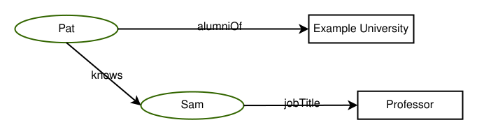
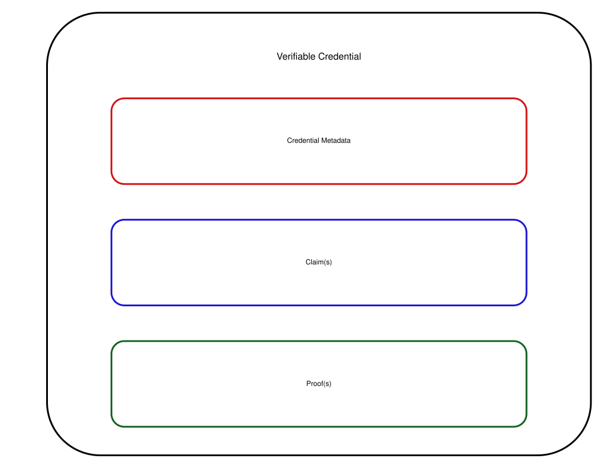

# Retained specification text (collector assembly)

> This consumer Markdown assembles the explicitly retained originals in declared order. Source labels, line anchors and local href rewrites are collector additions; HTML is represented as structural text with ordered table cells and preserved code, without running source scripts.

> Collector representation: declared cell spans are annotations, not an expanded table grid; code br line breaks and NBSP are retained, and image-label whitespace is normalized without dropping label words.

Original HTML: [specification.html](../source/specification.html#L1-L13131).

<a id="specification-L1"></a>
[](https://www.w3.org/)

<a id="specification-L1546"></a>
<a id="specification-title"></a>
# Verifiable Credentials Data Model v2.0
 
<a id="specification-w3c-state"></a>


[W3C Recommendation](https://www.w3.org/standards/types#REC) 15 May 2025

  More details about this document 

 

This version:


 [https://www.w3.org/TR/2025/REC-vc-data-model-2.0-20250515/](https://www.w3.org/TR/2025/REC-vc-data-model-2.0-20250515/) 

 

Latest published version:


 [https://www.w3.org/TR/vc-data-model-2.0/](https://www.w3.org/TR/vc-data-model-2.0/) 

 

Latest editor's draft:


[https://w3c.github.io/vc-data-model/](https://w3c.github.io/vc-data-model/)

 

History:


 [https://www.w3.org/standards/history/vc-data-model-2.0/](https://www.w3.org/standards/history/vc-data-model-2.0/) 


 [Commit history](https://github.com/w3c/vc-data-model/commits/) 

 

Implementation report:


 [https://w3c.github.io/vc-data-model-2.0-test-suite/](https://w3c.github.io/vc-data-model-2.0-test-suite/) 

 

Editors:


 [Manu Sporny](https://www.linkedin.com/in/manusporny/) ([Digital Bazaar](https://digitalbazaar.com/)) (v1.0, v1.1, v2.0) 


 [Ted Thibodeau Jr](https://github.com/TallTed) ([OpenLink Software](https://www.openlinksw.com/)) (v2.0) 


 [Ivan Herman](https://www.w3.org/People/Ivan/)[](https://orcid.org/0000-0003-0782-2704) ([W3C](https://www.w3.org)) (v2.0) 


 [Gabe Cohen](https://github.com/decentralgabe) ([Block](https://block.xyz/)) (v2.0) 


 [Michael B. Jones](https://self-issued.info/) (Invited Expert) (v2.0) 

 

 Former editors: 


 [Grant Noble](https://www.linkedin.com/in/grant-noble-8253994a/) ([ConsenSys](https://consensys.net/)) (v1.0) 


 [Dave Longley](https://github.com/dlongley) ([Digital Bazaar](https://digitalbazaar.com/)) (v1.0) 


 [Daniel C. Burnett](https://www.linkedin.com/in/daburnett/) ([ConsenSys](https://consensys.net/)) (v1.0) 


 [Brent Zundel](https://www.linkedin.com/in/bzundel/) ([Evernym](https://www.evernym.com/)) (v1.0) 


 [Kyle Den Hartog](https://www.linkedin.com/in/kyledenhartog/) ([MATTR](https://mattr.global/)) (v1.1) 

 

Authors:


 [Manu Sporny](https://digitalbazaar.com/) ([Digital Bazaar](https://digitalbazaar.com/)) (v1.0, v1.1, v2.0) 


 [Dave Longley](https://digitalbazaar.com/) ([Digital Bazaar](https://digitalbazaar.com/)) (v1.0, v1.1, v2.0) 


 [David Chadwick](https://www.linkedin.com/in/davidwchadwick/) (Invited Expert) (v1.0, v1.1, v2.0) 


 [Ivan Herman](https://www.w3.org/People/Ivan/)[](https://orcid.org/0000-0003-0782-2704) ([W3C](https://www.w3.org)) (v2.0) 

 

Feedback:


 [GitHub w3c/vc-data-model](https://github.com/w3c/vc-data-model/) ([pull requests](https://github.com/w3c/vc-data-model/pulls/), [new issue](https://github.com/w3c/vc-data-model/issues/new/choose), [open issues](https://github.com/w3c/vc-data-model/issues/)) 

 

Errata:


[Errata exists](https://w3c.github.io/vc-data-model/errata.html).

 

  

 See also [translations](https://www.w3.org/Translations/?technology=vc-data-model-2.0). 

 

 [Copyright](https://www.w3.org/policies/#copyright) © 2025 [World Wide Web Consortium](https://www.w3.org/). W3C® [liability](https://www.w3.org/policies/#Legal_Disclaimer), [trademark](https://www.w3.org/policies/#W3C_Trademarks) and [permissive document license](https://www.w3.org/copyright/software-license-2023/) rules apply. 

  

 
<a id="specification-abstract"></a>

<a id="specification-L1652"></a>
## Abstract
 

 A 
<a id="specification-ref-for-dfn-verifiable-credential-1"></a>
[verifiable credential](#specification-dfn-verifiable-credential) is a specific way to express a set of 
<a id="specification-ref-for-dfn-claims-1"></a>
[claims](#specification-dfn-claims) made by an 
<a id="specification-ref-for-dfn-issuers-1"></a>
[issuer](#specification-dfn-issuers), such as a driver's license or an education certificate. This specification describes the extensible data model for 
<a id="specification-ref-for-dfn-verifiable-credential-2"></a>
[verifiable credentials](#specification-dfn-verifiable-credential), how they can be secured from tampering, and a three-party ecosystem for the exchange of these credentials that is composed of 
<a id="specification-ref-for-dfn-issuers-2"></a>
[issuers](#specification-dfn-issuers), 
<a id="specification-ref-for-dfn-holders-1"></a>
[holders](#specification-dfn-holders), and 
<a id="specification-ref-for-dfn-verifier-1"></a>
[verifiers](#specification-dfn-verifier). This document also covers a variety of security, privacy, internationalization, and accessibility considerations for ecosystems that use the technologies described in this specification. 

 

 
<a id="specification-sotd"></a>

<a id="specification-L1665"></a>
## Status of This Document


This section describes the status of this document at the time of its publication. A list of current W3C publications and the latest revision of this technical report can be found in the [W3C standards and drafts index](https://www.w3.org/TR/) at https://www.w3.org/TR/.

 

 Comments regarding this specification are welcome at any time. Please file issues directly on [GitHub](https://github.com/w3c/vc-data-model/issues/), or send them to [public-vc-comments@w3.org](mailto:public-vc-comments@w3.org) if that is not possible. ([subscribe](mailto:public-vc-comments-request@w3.org?subject=subscribe), [archives](https://lists.w3.org/Archives/Public/public-vc-comments/)). 

 

 This document was published by the [Verifiable Credentials Working Group](https://www.w3.org/groups/wg/vc) as a Recommendation using the [Recommendation track](https://www.w3.org/policies/process/20231103/#recs-and-notes). 


 W3C recommends the wide deployment of this specification as a standard for the Web. 


 A W3C Recommendation is a specification that, after extensive consensus-building, is endorsed by W3C and its Members, and has commitments from Working Group members to [royalty-free licensing](https://www.w3.org/policies/patent-policy/#sec-Requirements) for implementations. 


 This document was produced by a group operating under the [W3C Patent Policy](https://www.w3.org/policies/patent-policy/). W3C maintains a [public list of any patent disclosures](https://www.w3.org/groups/wg/vc/ipr) made in connection with the deliverables of the group; that page also includes instructions for disclosing a patent. An individual who has actual knowledge of a patent which the individual believes contains [Essential Claim(s)](https://www.w3.org/policies/patent-policy/#def-essential) must disclose the information in accordance with [section 6 of the W3C Patent Policy](https://www.w3.org/policies/patent-policy/#sec-Disclosure). 


 This document is governed by the 
<a id="specification-w3c_process_revision"></a>
[03 November 2023 W3C Process Document](https://www.w3.org/policies/process/20231103/). 


 
<a id="specification-introduction"></a>

<a id="specification-L1719"></a>
<a id="specification-x1-introduction"></a>
## 1. Introduction
[](#specification-introduction)


This section is non-normative.

 

 
<a id="specification-ref-for-dfn-credential-1"></a>
[Credentials](#specification-dfn-credential) are integral to our daily lives: driver's licenses confirm our capability to operate motor vehicles; university degrees assert our level of education; and government-issued passports attest to our citizenship when traveling between countries. This specification provides a mechanism for expressing these sorts of 
<a id="specification-ref-for-dfn-credential-2"></a>
[credentials](#specification-dfn-credential) on the Web in a way that is cryptographically secure, privacy respecting, and machine verifiable. These 
<a id="specification-ref-for-dfn-credential-3"></a>
[credentials](#specification-dfn-credential) provide benefits to us when used in the physical world, but their use on the Web continues to be elusive. 

 

 It is currently difficult to express educational qualifications, healthcare data, financial account details, and other third-party-
<a id="specification-ref-for-dfn-verify-1"></a>
[verified](#specification-dfn-verify) personal information in a machine readable way on the Web. The challenge of expressing digital 
<a id="specification-ref-for-dfn-credential-4"></a>
[credentials](#specification-dfn-credential) on the Web hinders our ability to receive the same benefits from them that physical 
<a id="specification-ref-for-dfn-credential-5"></a>
[credentials](#specification-dfn-credential) provide in the real world. 

 

 For those unfamiliar with the concepts related to 
<a id="specification-ref-for-dfn-verifiable-credential-3"></a>
[verifiable credentials](#specification-dfn-verifiable-credential), the following sections provide an overview of: 

 

 

-  The components that constitute a 
<a id="specification-ref-for-dfn-verifiable-credential-4"></a>
[verifiable credential](#specification-dfn-verifiable-credential) 

 

-  The components that constitute a 
<a id="specification-ref-for-dfn-verifiable-presentation-1"></a>
[verifiable presentation](#specification-dfn-verifiable-presentation) 

 

-  An ecosystem where 
<a id="specification-ref-for-dfn-verifiable-credential-5"></a>
[verifiable credentials](#specification-dfn-verifiable-credential) and 
<a id="specification-ref-for-dfn-verifiable-presentation-2"></a>
[verifiable presentations](#specification-dfn-verifiable-presentation) are useful 

 

 

 The use cases and requirements that informed this specification can be found in [Verifiable Credentials Use Cases](https://www.w3.org/TR/vc-use-cases/) [[VC-USE-CASES](#specification-bib-vc-use-cases)]. 

 
<a id="specification-what-is-a-verifiable-credential"></a>

<a id="specification-L1763"></a>
<a id="specification-x1-1-what-is-a-verifiable-credential"></a>
### 1.1 What is a Verifiable Credential?
[](#specification-what-is-a-verifiable-credential)


This section is non-normative.

 

 In the physical world, a 
<a id="specification-ref-for-dfn-credential-6"></a>
[credential](#specification-dfn-credential) might consist of: 

 

 

-  Information related to identifying the 
<a id="specification-ref-for-dfn-subjects-1"></a>
[subject](#specification-dfn-subjects) of the 
<a id="specification-ref-for-dfn-credential-7"></a>
[credential](#specification-dfn-credential) (for example, a photo, name, or identification number) 

 

-  Information related to the issuing authority (for example, a city government, national agency, or certification body) 

 

-  Information related to the type of 
<a id="specification-ref-for-dfn-credential-8"></a>
[credential](#specification-dfn-credential) (for example, a Dutch passport, an American driving license, or a health insurance card) 

 

-  Information related to specific properties asserted by the issuing authority about the 
<a id="specification-ref-for-dfn-subjects-2"></a>
[subject](#specification-dfn-subjects) (for example, nationality, date of birth, or the classes of vehicle they're qualified to drive) 

 

-  Evidence by which a 
<a id="specification-ref-for-dfn-subjects-3"></a>
[subject](#specification-dfn-subjects) was demonstrated to have satisfied the qualifications required for issuance of the 
<a id="specification-ref-for-dfn-credential-9"></a>
[credential](#specification-dfn-credential) (for example, a measurement, proof of citizenship, or test result) 

 

-  Information related to constraints on the credential (for example, validity period, or terms of use). 

 

 

 A 
<a id="specification-ref-for-dfn-verifiable-credential-6"></a>
[verifiable credential](#specification-dfn-verifiable-credential) can represent all the same information that a physical 
<a id="specification-ref-for-dfn-credential-10"></a>
[credential](#specification-dfn-credential) represents. Adding technologies such as digital signatures can make 
<a id="specification-ref-for-dfn-verifiable-credential-7"></a>
[verifiable credentials](#specification-dfn-verifiable-credential) more tamper-evident and trustworthy than their physical counterparts. 

 

 
<a id="specification-ref-for-dfn-holders-2"></a>
[Holders](#specification-dfn-holders) of 
<a id="specification-ref-for-dfn-verifiable-credential-8"></a>
[verifiable credentials](#specification-dfn-verifiable-credential) can generate 
<a id="specification-ref-for-dfn-verifiable-presentation-3"></a>
[verifiable presentations](#specification-dfn-verifiable-presentation) and then share these 
<a id="specification-ref-for-dfn-verifiable-presentation-4"></a>
[verifiable presentations](#specification-dfn-verifiable-presentation) with 
<a id="specification-ref-for-dfn-verifier-2"></a>
[verifiers](#specification-dfn-verifier) to prove they possess 
<a id="specification-ref-for-dfn-verifiable-credential-9"></a>
[verifiable credentials](#specification-dfn-verifiable-credential) with specific characteristics. 

 

 Both 
<a id="specification-ref-for-dfn-verifiable-credential-10"></a>
[verifiable credentials](#specification-dfn-verifiable-credential) and 
<a id="specification-ref-for-dfn-verifiable-presentation-5"></a>
[verifiable presentations](#specification-dfn-verifiable-presentation) can be transmitted rapidly, making them more convenient than their physical counterparts when establishing trust at a distance. 

 

 While this specification attempts to improve the ease of expressing digital 
<a id="specification-ref-for-dfn-credential-11"></a>
[credentials](#specification-dfn-credential), it also aims to balance this goal with several privacy-preserving goals. The persistence of digital information, and the ease with which disparate sources of digital data can be collected and correlated, comprise a privacy concern that the use of 
<a id="specification-ref-for-dfn-verify-2"></a>
[verifiable](#specification-dfn-verify) and easily machine-readable 
<a id="specification-ref-for-dfn-credential-12"></a>
[credentials](#specification-dfn-credential) threatens to make worse. This document outlines and attempts to address several of these issues in Section [8. Privacy Considerations](#specification-privacy-considerations). Examples of how to use this data model using privacy-enhancing technologies, such as zero-knowledge proofs, are also provided throughout this document. 

 

 The word "verifiable" in the terms 
<a id="specification-ref-for-dfn-verifiable-credential-11"></a>
[verifiable credential](#specification-dfn-verifiable-credential) and 
<a id="specification-ref-for-dfn-verifiable-presentation-6"></a>
[verifiable presentation](#specification-dfn-verifiable-presentation) refers to the characteristic of a 
<a id="specification-ref-for-dfn-credential-13"></a>
[credential](#specification-dfn-credential) or 
<a id="specification-ref-for-dfn-presentation-1"></a>
[presentation](#specification-dfn-presentation) as being able to be 
<a id="specification-ref-for-dfn-verify-3"></a>
[verified](#specification-dfn-verify) by a 
<a id="specification-ref-for-dfn-verifier-3"></a>
[verifier](#specification-dfn-verifier), as defined in this document. Verifiability of a credential does not imply the truth of 
<a id="specification-ref-for-dfn-claims-2"></a>
[claims](#specification-dfn-claims) encoded therein. Instead, upon establishing the authenticity and currency of a 
<a id="specification-ref-for-dfn-verifiable-credential-12"></a>
[verifiable credential](#specification-dfn-verifiable-credential) or 
<a id="specification-ref-for-dfn-verifiable-presentation-7"></a>
[verifiable presentation](#specification-dfn-verifiable-presentation), a 
<a id="specification-ref-for-dfn-verifier-4"></a>
[verifier](#specification-dfn-verifier) validates the included 
<a id="specification-ref-for-dfn-claims-3"></a>
[claims](#specification-dfn-claims) using their own business rules before relying on them. Such reliance only occurs after evaluating the issuer, the proof, the subject, and the claims against one or more verifier policies. 

 

 
<a id="specification-ecosystem-overview"></a>

<a id="specification-L1846"></a>
<a id="specification-x1-2-ecosystem-overview"></a>
### 1.2 Ecosystem Overview
[](#specification-ecosystem-overview)


This section is non-normative.

 

 This section describes the roles of the core actors and the relationships between them in an ecosystem where one expects 
<a id="specification-ref-for-dfn-verifiable-credential-13"></a>
[verifiable credentials](#specification-dfn-verifiable-credential) to be useful. A role is an abstraction that might be implemented in many different ways. The separation of roles suggests likely interfaces and protocols for standardization. This specification introduces the following roles: 

 

 


<a id="specification-ref-for-dfn-holders-3"></a>
[holder](#specification-dfn-holders)

 

 A role an 
<a id="specification-ref-for-dfn-entities-1"></a>
[entity](#specification-dfn-entities) might perform by possessing one or more 
<a id="specification-ref-for-dfn-verifiable-credential-14"></a>
[verifiable credentials](#specification-dfn-verifiable-credential) and generating 
<a id="specification-ref-for-dfn-verifiable-presentation-8"></a>
[verifiable presentations](#specification-dfn-verifiable-presentation) from them. A holder is often, but not always, a 
<a id="specification-ref-for-dfn-subjects-4"></a>
[subject](#specification-dfn-subjects) of the 
<a id="specification-ref-for-dfn-verifiable-credential-15"></a>
[verifiable credentials](#specification-dfn-verifiable-credential) they are holding. Holders store their 
<a id="specification-ref-for-dfn-credential-14"></a>
[credentials](#specification-dfn-credential) in 
<a id="specification-ref-for-dfn-credential-repositories-1"></a>
[credential repositories](#specification-dfn-credential-repositories). Example holders include students, employees, and customers. 

 


<a id="specification-ref-for-dfn-issuers-3"></a>
[issuer](#specification-dfn-issuers)

 

 A role an 
<a id="specification-ref-for-dfn-entities-2"></a>
[entity](#specification-dfn-entities) can perform by asserting 
<a id="specification-ref-for-dfn-claims-4"></a>
[claims](#specification-dfn-claims) about one or more 
<a id="specification-ref-for-dfn-subjects-5"></a>
[subjects](#specification-dfn-subjects), creating a 
<a id="specification-ref-for-dfn-verifiable-credential-16"></a>
[verifiable credential](#specification-dfn-verifiable-credential) from these 
<a id="specification-ref-for-dfn-claims-5"></a>
[claims](#specification-dfn-claims), and transmitting the 
<a id="specification-ref-for-dfn-verifiable-credential-17"></a>
[verifiable credential](#specification-dfn-verifiable-credential) to a 
<a id="specification-ref-for-dfn-holders-4"></a>
[holder](#specification-dfn-holders). For example, issuers include corporations, non-profit organizations, trade associations, governments, and individuals. 

 


<a id="specification-ref-for-dfn-subjects-6"></a>
[subject](#specification-dfn-subjects)

 

 A thing about which 
<a id="specification-ref-for-dfn-claims-6"></a>
[claims](#specification-dfn-claims) are made. Example subjects include human beings, animals, and things. 

 


<a id="specification-ref-for-dfn-verifier-5"></a>
[verifier](#specification-dfn-verifier)

 

 A role an 
<a id="specification-ref-for-dfn-entities-3"></a>
[entity](#specification-dfn-entities) performs by receiving one or more 
<a id="specification-ref-for-dfn-verifiable-credential-18"></a>
[verifiable credentials](#specification-dfn-verifiable-credential), optionally inside a 
<a id="specification-ref-for-dfn-verifiable-presentation-9"></a>
[verifiable presentation](#specification-dfn-verifiable-presentation) for processing. Example verifiers include employers, security personnel, and websites. 

 


<a id="specification-ref-for-dfn-verifiable-data-registries-1"></a>
[verifiable data registry](#specification-dfn-verifiable-data-registries)

 

 A role a system might perform by mediating the creation and 
<a id="specification-ref-for-dfn-verify-4"></a>
[verification](#specification-dfn-verify) of identifiers, 
<a id="specification-ref-for-dfn-verification-material-1"></a>
[verification material](#specification-dfn-verification-material), and other relevant data, such as 
<a id="specification-ref-for-dfn-verifiable-credential-19"></a>
[verifiable credential](#specification-dfn-verifiable-credential) schemas, revocation registries, and so on, which might require using 
<a id="specification-ref-for-dfn-verifiable-credential-20"></a>
[verifiable credentials](#specification-dfn-verifiable-credential). Some configurations might require correlatable identifiers for 
<a id="specification-ref-for-dfn-subjects-7"></a>
[subjects](#specification-dfn-subjects). Some registries, such as ones for UUIDs and 
<a id="specification-ref-for-dfn-verification-material-2"></a>
[verification material](#specification-dfn-verification-material), might just act as namespaces for identifiers. Examples of verifiable data registries include trusted databases, decentralized databases, government ID databases, and distributed ledgers. Often, more than one type of verifiable data registry used in an ecosystem. 

 

 
<a id="specification-roles"></a>


  

[Figure 1](#specification-roles)  The roles and information flows forming the basis for this specification. 

 

 
<a id="specification-issue-container-generatedID"></a>


<a id="specification-h-note"></a>


Note: Other types of ecosystems exist


 [Figure 1](#specification-roles) above provides an example ecosystem to ground the rest of the concepts in this specification. Other ecosystems exist, such as protected environments or proprietary systems, where 
<a id="specification-ref-for-dfn-verifiable-credential-21"></a>
[verifiable credentials](#specification-dfn-verifiable-credential) also provide benefits. 


 

 This ecosystem contrasts with the typical two-party or federated identity provider models. An identity provider, sometimes abbreviated as IdP, is a system for creating, maintaining, and managing identity information for 
<a id="specification-ref-for-dfn-holders-5"></a>
[holders](#specification-dfn-holders) while providing authentication services to 
<a id="specification-ref-for-dfn-relying-parties-1"></a>
[relying party](#specification-dfn-relying-parties) applications within a federation or distributed network. In a federated identity model, the 
<a id="specification-ref-for-dfn-holders-6"></a>
[holder](#specification-dfn-holders) is tightly bound to the identity provider. This specification avoids using "identity provider," "federated identity," or "relying party" terminology, except when comparing or mapping these concepts to other specifications. This specification decouples the identity provider concept into two distinct concepts: the 
<a id="specification-ref-for-dfn-issuers-4"></a>
[issuer](#specification-dfn-issuers) and the 
<a id="specification-ref-for-dfn-holders-7"></a>
[holder](#specification-dfn-holders). 

 
<a id="specification-issue-container-generatedID-0"></a>


<a id="specification-h-note-0"></a>


Note: Subjects are not always Holders


 In many cases, the 
<a id="specification-ref-for-dfn-holders-8"></a>
[holder](#specification-dfn-holders) of a 
<a id="specification-ref-for-dfn-verifiable-credential-22"></a>
[verifiable credential](#specification-dfn-verifiable-credential) is the subject, but in some instances it is not. For example, a parent (the 
<a id="specification-ref-for-dfn-holders-9"></a>
[holder](#specification-dfn-holders)) might hold the 
<a id="specification-ref-for-dfn-verifiable-credential-23"></a>
[verifiable credentials](#specification-dfn-verifiable-credential) of a child (the 
<a id="specification-ref-for-dfn-subjects-8"></a>
[subject](#specification-dfn-subjects)), or a pet owner (the 
<a id="specification-ref-for-dfn-holders-10"></a>
[holder](#specification-dfn-holders)) might hold the 
<a id="specification-ref-for-dfn-verifiable-credential-24"></a>
[verifiable credentials](#specification-dfn-verifiable-credential) of their pet (the 
<a id="specification-ref-for-dfn-subjects-9"></a>
[subject](#specification-dfn-subjects)). For more information about these exceptional cases, see the [Subject-Holder Relationships](https://w3c.github.io/vc-imp-guide/#subject-holder-relationships) section in the [Verifiable Credentials Implementation Guidelines 1.0](https://www.w3.org/TR/vc-imp-guide/). 


 

 For a deeper exploration of the 
<a id="specification-ref-for-dfn-verifiable-credential-25"></a>
[verifiable credentials](#specification-dfn-verifiable-credential) ecosystem and a concrete lifecycle example, please refer to [Verifiable Credentials Overview](https://www.w3.org/TR/vc-overview/) [[VC-OVERVIEW](#specification-bib-vc-overview)]. 

 

 
<a id="specification-conformance"></a>

<a id="specification-L1946"></a>
<a id="specification-x1-3-conformance"></a>
### 1.3 Conformance
[](#specification-conformance)


As well as sections marked as non-normative, all authoring guidelines, diagrams, examples, and notes in this specification are non-normative. Everything else in this specification is normative.


 The key words MAY, MUST, MUST NOT, OPTIONAL, RECOMMENDED, REQUIRED, SHOULD, and SHOULD NOT in this document are to be interpreted as described in [BCP 14](https://www.rfc-editor.org/info/bcp14) [[RFC2119](#specification-bib-rfc2119)] [[RFC8174](#specification-bib-rfc8174)] when, and only when, they appear in all capitals, as shown here. 

 

 A 
<a id="specification-dfn-conforming-document"></a>
conforming document is a [compacted](https://www.w3.org/TR/json-ld11-api/#compaction-algorithms) JSON-LD document that complies with all of the relevant "MUST" statements in this specification. Specifically, the relevant normative "MUST" statements in Sections [4. Basic Concepts](#specification-basic-concepts), [5. Advanced Concepts](#specification-advanced-concepts), and [6. Syntaxes](#specification-syntaxes) of this document MUST be enforced. A conforming document MUST be either a 
<a id="specification-ref-for-dfn-verifiable-credential-26"></a>
[verifiable credential](#specification-dfn-verifiable-credential) with a media type of `application/vc` or a 
<a id="specification-ref-for-dfn-verifiable-presentation-10"></a>
[verifiable presentation](#specification-dfn-verifiable-presentation) with a media type of `application/vp`. A conforming document MUST be secured by at least one securing mechanism as described in Section [4.12 Securing Mechanisms](#specification-securing-mechanisms). 

 

 A 
<a id="specification-dfn-conforming-issuer-implementation"></a>
conforming issuer implementation produces 
<a id="specification-ref-for-dfn-conforming-document-1"></a>
[conforming documents](#specification-dfn-conforming-document), MUST include all required properties in the 
<a id="specification-ref-for-dfn-conforming-document-2"></a>
[conforming documents](#specification-dfn-conforming-document) it produces, and MUST secure the 
<a id="specification-ref-for-dfn-conforming-document-3"></a>
[conforming documents](#specification-dfn-conforming-document) it produces using a securing mechanism described in Section [4.12 Securing Mechanisms](#specification-securing-mechanisms). 

 

 A 
<a id="specification-dfn-conforming-verifier-implementation"></a>
conforming verifier implementation consumes 
<a id="specification-ref-for-dfn-conforming-document-4"></a>
[conforming documents](#specification-dfn-conforming-document), MUST perform 
<a id="specification-ref-for-dfn-verify-5"></a>
[verification](#specification-dfn-verify) on a 
<a id="specification-ref-for-dfn-conforming-document-5"></a>
[conforming document](#specification-dfn-conforming-document) as described in Section [4.12 Securing Mechanisms](#specification-securing-mechanisms), MUST check that each required property satisfies the normative requirements for that property, and MUST produce errors when non-
<a id="specification-ref-for-dfn-conforming-document-6"></a>
[conforming documents](#specification-dfn-conforming-document) are detected. 

 

 This specification includes both required and optional properties. Optional properties MAY be ignored by 
<a id="specification-ref-for-dfn-conforming-issuer-implementation-1"></a>
[conforming issuer implementations](#specification-dfn-conforming-issuer-implementation) and 
<a id="specification-ref-for-dfn-conforming-verifier-implementation-1"></a>
[conforming verifier implementations](#specification-dfn-conforming-verifier-implementation). 

 

 This document also contains examples that contain characters that are invalid JSON, such as inline comments (`//`) and the use of ellipsis (`...`) to denote information that adds little value to the example. Implementers are cautioned to remove this content if they desire to use the information as a valid document. 

 
<a id="specification-issue-container-generatedID-1"></a>


<a id="specification-h-note-1"></a>


Note: Human-readable texts in English are illustrative


 Examples provided throughout this document include descriptive properties, such as `name` and `description`, with values in English to simplify the concepts in each example of the specification. These examples do not necessarily reflect the data structures needed for international use, described in more detail in Section [11. Internationalization Considerations](#specification-internationalization-considerations). 


 

 

 
<a id="specification-terminology"></a>

<a id="specification-L2010"></a>
<a id="specification-x2-terminology"></a>
## 2. Terminology
[](#specification-terminology)

 

 The following terms are used to describe concepts in this specification. 

 

 


<a id="specification-dfn-claims"></a>
claim

 

 An assertion made about a 
<a id="specification-ref-for-dfn-subjects-10"></a>
[subject](#specification-dfn-subjects). 

 


<a id="specification-dfn-credential"></a>
credential

 

 A set of one or more 
<a id="specification-ref-for-dfn-claims-7"></a>
[claims](#specification-dfn-claims) made by an 
<a id="specification-ref-for-dfn-issuers-5"></a>
[issuer](#specification-dfn-issuers). The 
<a id="specification-ref-for-dfn-claims-8"></a>
[claims](#specification-dfn-claims) in a credential can be about different 
<a id="specification-ref-for-dfn-subjects-11"></a>
[subjects](#specification-dfn-subjects). The definition of credential used in this specification differs from, [NIST's definitions of credential](https://csrc.nist.gov/glossary/term/credential). 

 


<a id="specification-dfn-decentralized-identifiers"></a>
decentralized identifier

 

 A portable URL-based identifier, also known as a DID, is associated with an 
<a id="specification-ref-for-dfn-entities-4"></a>
[entity](#specification-dfn-entities). These identifiers are most often used in a 
<a id="specification-ref-for-dfn-verifiable-credential-27"></a>
[verifiable credential](#specification-dfn-verifiable-credential) and are associated with 
<a id="specification-ref-for-dfn-subjects-12"></a>
[subjects](#specification-dfn-subjects) such that a 
<a id="specification-ref-for-dfn-verifiable-credential-28"></a>
[verifiable credential](#specification-dfn-verifiable-credential) can be easily ported from one 
<a id="specification-ref-for-dfn-credential-repositories-2"></a>
[credential repository](#specification-dfn-credential-repositories) to another without reissuing the 
<a id="specification-ref-for-dfn-credential-15"></a>
[credential](#specification-dfn-credential). An example of a DID is `did:example:123456abcdef`. See the [Decentralized Identifiers (DIDs) v1.0](https://www.w3.org/TR/did-core/) specification for further details. 

 


<a id="specification-dfn-default-graph"></a>
default graph

 

 The 
<a id="specification-ref-for-dfn-graphs-1"></a>
[graph](#specification-dfn-graphs) containing all 
<a id="specification-ref-for-dfn-claims-9"></a>
[claims](#specification-dfn-claims) that are not explicitly part of a 
<a id="specification-ref-for-dfn-named-graphs-1"></a>
[named graph](#specification-dfn-named-graphs). 

 


<a id="specification-dfn-entities"></a>
entity

 

 Anything that can be referenced in statements as an abstract or concrete noun. Entities include but are not limited to people, organizations, physical things, documents, abstract concepts, fictional characters, and arbitrary text. Any entity might perform roles in the ecosystem, if it can do so. Note that some entities fundamentally cannot take actions, for example, the string "abc" cannot issue credentials. 

 


<a id="specification-dfn-graphs"></a>
graph

 

 A set of claims, forming a network of information composed of 
<a id="specification-ref-for-dfn-subjects-13"></a>
[subjects](#specification-dfn-subjects) and their relationship to other 
<a id="specification-ref-for-dfn-subjects-14"></a>
[subjects](#specification-dfn-subjects) or data. Each 
<a id="specification-ref-for-dfn-claims-10"></a>
[claim](#specification-dfn-claims) is part of a graph; either explicit in the case of 
<a id="specification-ref-for-dfn-named-graphs-2"></a>
[named graphs](#specification-dfn-named-graphs), or implicit for the 
<a id="specification-ref-for-dfn-default-graph-1"></a>
[default graph](#specification-dfn-default-graph). 

 


<a id="specification-dfn-holders"></a>
holder

 

 A role an 
<a id="specification-ref-for-dfn-entities-5"></a>
[entity](#specification-dfn-entities) might perform by possessing one or more 
<a id="specification-ref-for-dfn-verifiable-credential-29"></a>
[verifiable credentials](#specification-dfn-verifiable-credential) and generating 
<a id="specification-ref-for-dfn-verifiable-presentation-11"></a>
[verifiable presentations](#specification-dfn-verifiable-presentation) from them. A holder is often, but not always, a 
<a id="specification-ref-for-dfn-subjects-15"></a>
[subject](#specification-dfn-subjects) of the 
<a id="specification-ref-for-dfn-verifiable-credential-30"></a>
[verifiable credentials](#specification-dfn-verifiable-credential) they are holding. Holders store their 
<a id="specification-ref-for-dfn-credential-16"></a>
[credentials](#specification-dfn-credential) in 
<a id="specification-ref-for-dfn-credential-repositories-4"></a>
[credential repositories](#specification-dfn-credential-repositories). 

 


<a id="specification-dfn-issuers"></a>
issuer

 

 A role an 
<a id="specification-ref-for-dfn-entities-6"></a>
[entity](#specification-dfn-entities) can perform by asserting 
<a id="specification-ref-for-dfn-claims-11"></a>
[claims](#specification-dfn-claims) about one or more 
<a id="specification-ref-for-dfn-subjects-16"></a>
[subjects](#specification-dfn-subjects), creating a 
<a id="specification-ref-for-dfn-verifiable-credential-31"></a>
[verifiable credential](#specification-dfn-verifiable-credential) from these 
<a id="specification-ref-for-dfn-claims-12"></a>
[claims](#specification-dfn-claims), and transmitting the 
<a id="specification-ref-for-dfn-verifiable-credential-32"></a>
[verifiable credential](#specification-dfn-verifiable-credential) to a 
<a id="specification-ref-for-dfn-holders-11"></a>
[holder](#specification-dfn-holders). 

 


<a id="specification-dfn-named-graphs"></a>
named graph

 

 A 
<a id="specification-ref-for-dfn-graphs-2"></a>
[graph](#specification-dfn-graphs) associated with specific properties, such as `verifiableCredential`. These properties result in separate 
<a id="specification-ref-for-dfn-graphs-3"></a>
[graphs](#specification-dfn-graphs) that contain all 
<a id="specification-ref-for-dfn-claims-13"></a>
[claims](#specification-dfn-claims) defined in the corresponding JSON objects. 

 


<a id="specification-dfn-presentation"></a>
presentation

 

 Data derived from one or more 
<a id="specification-ref-for-dfn-verifiable-credential-33"></a>
[verifiable credentials](#specification-dfn-verifiable-credential) issued by one or more 
<a id="specification-ref-for-dfn-issuers-6"></a>
[issuers](#specification-dfn-issuers) that is shared with a specific 
<a id="specification-ref-for-dfn-verifier-6"></a>
[verifier](#specification-dfn-verifier). 

 


<a id="specification-dfn-credential-repositories"></a>
credential repository

 

 Software, such as a file system, storage vault, or personal 
<a id="specification-ref-for-dfn-verifiable-credential-34"></a>
[verifiable credential](#specification-dfn-verifiable-credential) wallet, that stores and protects access to 
<a id="specification-ref-for-dfn-holders-12"></a>
[holders'](#specification-dfn-holders) 
<a id="specification-ref-for-dfn-verifiable-credential-35"></a>
[verifiable credentials](#specification-dfn-verifiable-credential). 

 


<a id="specification-dfn-selective-disclosure"></a>
selective disclosure

 

 The ability of a 
<a id="specification-ref-for-dfn-holders-13"></a>
[holder](#specification-dfn-holders) to make fine-grained decisions about what information to share. 

 


<a id="specification-dfn-unlinkable-disclosure"></a>
unlinkable disclosure

 

 A type of 
<a id="specification-ref-for-dfn-selective-disclosure-1"></a>
[selective disclosure](#specification-dfn-selective-disclosure) where 
<a id="specification-ref-for-dfn-presentation-2"></a>
[presentations](#specification-dfn-presentation) cannot be correlated between 
<a id="specification-ref-for-dfn-verifier-7"></a>
[verifiers](#specification-dfn-verifier). 

 


<a id="specification-dfn-subjects"></a>
subject

 

 A thing about which 
<a id="specification-ref-for-dfn-claims-14"></a>
[claims](#specification-dfn-claims) are made. 

 


<a id="specification-dfn-claim-validation"></a>
validation

 

 The assurance that a 
<a id="specification-ref-for-dfn-claims-15"></a>
[claim](#specification-dfn-claims) from a specific 
<a id="specification-ref-for-dfn-issuers-8"></a>
[issuer](#specification-dfn-issuers) satisfies the business requirements of a 
<a id="specification-ref-for-dfn-verifier-9"></a>
[verifier](#specification-dfn-verifier) for a particular use. This specification defines how verifiers verify 
<a id="specification-ref-for-dfn-verifiable-credential-36"></a>
[verifiable credentials](#specification-dfn-verifiable-credential) and 
<a id="specification-ref-for-dfn-verifiable-presentation-12"></a>
[verifiable presentations](#specification-dfn-verifiable-presentation). It also specifies that 
<a id="specification-ref-for-dfn-verifier-10"></a>
[verifiers](#specification-dfn-verifier) validate claims in 
<a id="specification-ref-for-dfn-verifiable-credential-37"></a>
[verifiable credentials](#specification-dfn-verifiable-credential) before relying on them. However, the means for such validation vary widely and are outside the scope of this specification. 
<a id="specification-ref-for-dfn-verifier-11"></a>
[Verifiers](#specification-dfn-verifier) trust certain 
<a id="specification-ref-for-dfn-issuers-9"></a>
[issuers](#specification-dfn-issuers) for certain claims and apply their own rules to determine which claims in which 
<a id="specification-ref-for-dfn-credential-17"></a>
[credentials](#specification-dfn-credential) are suitable for use by their systems. 

 


<a id="specification-dfn-verifiable-credential"></a>
verifiable credential

 

 A tamper-evident 
<a id="specification-ref-for-dfn-credential-18"></a>
[credential](#specification-dfn-credential) whose authorship can be cryptographically verified. Verifiable credentials can be used to build 
<a id="specification-ref-for-dfn-verifiable-presentation-13"></a>
[verifiable presentations](#specification-dfn-verifiable-presentation), which can also be cryptographically verifiable. 

 


<a id="specification-dfn-verifiable-data-registries"></a>
verifiable data registry

 

 A role a system might perform by mediating the creation and 
<a id="specification-ref-for-dfn-verify-6"></a>
[verification](#specification-dfn-verify) of identifiers, 
<a id="specification-ref-for-dfn-verification-material-4"></a>
[verification material](#specification-dfn-verification-material), and other relevant data, such as 
<a id="specification-ref-for-dfn-verifiable-credential-38"></a>
[verifiable credential](#specification-dfn-verifiable-credential) schemas, revocation registries, and so on, which might require using 
<a id="specification-ref-for-dfn-verifiable-credential-39"></a>
[verifiable credentials](#specification-dfn-verifiable-credential). Some configurations might require correlatable identifiers for 
<a id="specification-ref-for-dfn-subjects-17"></a>
[subjects](#specification-dfn-subjects). Some registries, such as ones for UUIDs and 
<a id="specification-ref-for-dfn-verification-material-5"></a>
[verification material](#specification-dfn-verification-material), might act as namespaces for identifiers. 

 


<a id="specification-dfn-verifiable-presentation"></a>
verifiable presentation

 

 A tamper-evident presentation of information encoded in such a way that authorship of the data can be trusted after a process of cryptographic verification. Certain types of verifiable presentations might contain data that is synthesized from, but does not contain, the original 
<a id="specification-ref-for-dfn-verifiable-credential-40"></a>
[verifiable credentials](#specification-dfn-verifiable-credential) (for example, zero-knowledge proofs). 

 


<a id="specification-dfn-verify"></a>
verification

 

 The evaluation of whether a 
<a id="specification-ref-for-dfn-verifiable-credential-41"></a>
[verifiable credential](#specification-dfn-verifiable-credential) or 
<a id="specification-ref-for-dfn-verifiable-presentation-14"></a>
[verifiable presentation](#specification-dfn-verifiable-presentation) is an authentic and current statement of the issuer or presenter, respectively. This includes checking that the credential or presentation conforms to the specification, the securing mechanism is satisfied, and, if present, the status check succeeds. Verification of a credential does not imply evaluation of the truth of 
<a id="specification-ref-for-dfn-claims-16"></a>
[claims](#specification-dfn-claims) encoded in the credential. 

 


<a id="specification-dfn-verifier"></a>
verifier

 

 A role an 
<a id="specification-ref-for-dfn-entities-7"></a>
[entity](#specification-dfn-entities) performs by receiving one or more 
<a id="specification-ref-for-dfn-verifiable-credential-42"></a>
[verifiable credentials](#specification-dfn-verifiable-credential), optionally inside a 
<a id="specification-ref-for-dfn-verifiable-presentation-15"></a>
[verifiable presentation](#specification-dfn-verifiable-presentation) for processing. Other specifications might refer to this concept as a 
<a id="specification-dfn-relying-parties"></a>
relying party. 

 


<a id="specification-dfn-verification-material"></a>
verification material

 

 Information that is used to verify the security of cryptographically protected information. For example, a cryptographic public key is used to verify a digital signature associated with a 
<a id="specification-ref-for-dfn-verifiable-credential-43"></a>
[verifiable credential](#specification-dfn-verifiable-credential). 

 


<a id="specification-dfn-url"></a>
URL

 

 A Uniform Resource Locator, as defined by the [URL Standard](https://url.spec.whatwg.org/). URLs can be dereferenced to result in a resource, such as a document. The rules for dereferencing, or fetching, a URL are defined by the URL [scheme](https://url.spec.whatwg.org/#concept-url-scheme). This specification does not use the term URI or IRI because those terms have been deemed to be confusing to Web developers. 

 

 

 
<a id="specification-core-data-model"></a>

<a id="specification-L2180"></a>
<a id="specification-x3-core-data-model"></a>
## 3. Core Data Model
[](#specification-core-data-model)


This section is non-normative.

 

 The following sections outline core data model concepts, such as 
<a id="specification-ref-for-dfn-claims-17"></a>
[claims](#specification-dfn-claims), 
<a id="specification-ref-for-dfn-credential-19"></a>
[credentials](#specification-dfn-credential), 
<a id="specification-ref-for-dfn-presentation-3"></a>
[presentations](#specification-dfn-presentation), 
<a id="specification-ref-for-dfn-verifiable-credential-44"></a>
[verifiable credentials](#specification-dfn-verifiable-credential), and 
<a id="specification-ref-for-dfn-verifiable-presentation-16"></a>
[verifiable presentations](#specification-dfn-verifiable-presentation), which form the foundation of this specification. 

 
<a id="specification-issue-container-generatedID-2"></a>


<a id="specification-h-note-2"></a>


Note: The difference between a credential and a verifiable credential


 Readers might note that some concepts described in this section, such as 
<a id="specification-ref-for-dfn-credential-20"></a>
[credentials](#specification-dfn-credential) and 
<a id="specification-ref-for-dfn-presentation-4"></a>
[presentations](#specification-dfn-presentation), do not have media types defined by this specification. However, the concepts of a 
<a id="specification-ref-for-dfn-verifiable-credential-45"></a>
[verifiable credential](#specification-dfn-verifiable-credential) or a 
<a id="specification-ref-for-dfn-verifiable-presentation-17"></a>
[verifiable presentation](#specification-dfn-verifiable-presentation) are defined as 
<a id="specification-ref-for-dfn-conforming-document-7"></a>
[conforming documents](#specification-dfn-conforming-document) and have associated media types. The concrete difference between these concepts — between 
<a id="specification-ref-for-dfn-credential-21"></a>
[credential](#specification-dfn-credential) and 
<a id="specification-ref-for-dfn-presentation-5"></a>
[presentation](#specification-dfn-presentation) vs. 
<a id="specification-ref-for-dfn-verifiable-credential-46"></a>
[verifiable credential](#specification-dfn-verifiable-credential) and 
<a id="specification-ref-for-dfn-verifiable-presentation-18"></a>
[verifiable presentation](#specification-dfn-verifiable-presentation) — is simply the fact that the "verifiable" objects are secured in a cryptographic way, and the others are not. For more details, see Section [4.12 Securing Mechanisms](#specification-securing-mechanisms). 


 
<a id="specification-claims"></a>

<a id="specification-L2202"></a>
<a id="specification-x3-1-claims"></a>
### 3.1 Claims
[](#specification-claims)


This section is non-normative.

 

 A 
<a id="specification-ref-for-dfn-claims-18"></a>
[claim](#specification-dfn-claims) is a statement about a 
<a id="specification-ref-for-dfn-subjects-18"></a>
[subject](#specification-dfn-subjects). A 
<a id="specification-ref-for-dfn-subjects-19"></a>
[subject](#specification-dfn-subjects) is a thing about which 
<a id="specification-ref-for-dfn-claims-19"></a>
[claims](#specification-dfn-claims) can be made. 
<a id="specification-ref-for-dfn-claims-20"></a>
[Claims](#specification-dfn-claims) are expressed using subject-
<a id="specification-dfn-property"></a>
 property-
<a id="specification-dfn-value"></a>
value relationships. 

 
<a id="specification-basic-structure"></a>


  

[Figure 2](#specification-basic-structure)  The basic structure of a claim. 

 

 

 The data model for 
<a id="specification-ref-for-dfn-claims-21"></a>
[claims](#specification-dfn-claims), illustrated in [Figure 2](#specification-basic-structure) above, is powerful and can be used to express a large variety of statements. For example, whether someone graduated from a particular university can be expressed as shown in [Figure 3](#specification-basic-example) below. 

 
<a id="specification-basic-example"></a>


  

[Figure 3](#specification-basic-example)  A basic claim expressing that Pat is an alum of "Example University". 

 

 

 Individual 
<a id="specification-ref-for-dfn-claims-22"></a>
[claims](#specification-dfn-claims) can be merged together to express a 
<a id="specification-ref-for-dfn-graphs-4"></a>
[graph](#specification-dfn-graphs) of information about a 
<a id="specification-ref-for-dfn-subjects-20"></a>
[subject](#specification-dfn-subjects). The example shown in [Figure 4](#specification-multiple-claims) below extends the previous 
<a id="specification-ref-for-dfn-claims-23"></a>
[claim](#specification-dfn-claims) by adding the 
<a id="specification-ref-for-dfn-claims-24"></a>
[claims](#specification-dfn-claims) that Pat knows Sam and that Sam is employed as a professor. 

 
<a id="specification-multiple-claims"></a>


  

[Figure 4](#specification-multiple-claims)  Multiple claims can be combined to express a graph of information. 

 

 

 To this point, the concepts of a 
<a id="specification-ref-for-dfn-claims-25"></a>
[claim](#specification-dfn-claims) and a 
<a id="specification-ref-for-dfn-graphs-5"></a>
[graph](#specification-dfn-graphs) of information are introduced. More information is expected to be added to the graph in order to be able to trust 
<a id="specification-ref-for-dfn-claims-26"></a>
[claims](#specification-dfn-claims), more information is expected to be added to the graph. 

 

 
<a id="specification-credentials"></a>

<a id="specification-L2260"></a>
<a id="specification-x3-2-credentials"></a>
### 3.2 Credentials
[](#specification-credentials)


This section is non-normative.

 

 A 
<a id="specification-ref-for-dfn-credential-22"></a>
[credential](#specification-dfn-credential) is a set of one or more 
<a id="specification-ref-for-dfn-claims-27"></a>
[claims](#specification-dfn-claims) made by the same 
<a id="specification-ref-for-dfn-entities-8"></a>
[entity](#specification-dfn-entities). 
<a id="specification-ref-for-dfn-credential-23"></a>
[Credentials](#specification-dfn-credential) might also include an identifier and metadata to describe properties of the 
<a id="specification-ref-for-dfn-credential-24"></a>
[credential](#specification-dfn-credential), such as the 
<a id="specification-ref-for-dfn-issuers-10"></a>
[issuer](#specification-dfn-issuers), the validity date and time period, a representative image, 
<a id="specification-ref-for-dfn-verification-material-6"></a>
[verification material](#specification-dfn-verification-material), status information, and so on. A 
<a id="specification-ref-for-dfn-verifiable-credential-47"></a>
[verifiable credential](#specification-dfn-verifiable-credential) is a set of tamper-evident 
<a id="specification-ref-for-dfn-claims-28"></a>
[claims](#specification-dfn-claims) and metadata that cryptographically prove who issued it. Examples of 
<a id="specification-ref-for-dfn-verifiable-credential-48"></a>
[verifiable credentials](#specification-dfn-verifiable-credential) include, but are not limited to, digital employee identification cards, digital driver's licenses, and digital educational certificates. 

 
<a id="specification-basic-vc"></a>


  

[Figure 5](#specification-basic-vc)  Basic components of a verifiable credential. 

 

 

 [Figure 5](#specification-basic-vc) above shows the basic components of a 
<a id="specification-ref-for-dfn-verifiable-credential-49"></a>
[verifiable credential](#specification-dfn-verifiable-credential), but abstracts the details about how 
<a id="specification-ref-for-dfn-claims-29"></a>
[claims](#specification-dfn-claims) are organized into information 
<a id="specification-ref-for-dfn-graphs-6"></a>
[graphs](#specification-dfn-graphs), which are then organized into 
<a id="specification-ref-for-dfn-verifiable-credential-50"></a>
[verifiable credentials](#specification-dfn-verifiable-credential). 

 

 [Figure 6](#specification-info-graph-vc) below shows a more complete depiction of a 
<a id="specification-ref-for-dfn-verifiable-credential-51"></a>
[verifiable credential](#specification-dfn-verifiable-credential) using an 
<a id="specification-ref-for-dfn-embedded-proof-1"></a>
[embedded proof](#specification-dfn-embedded-proof) based on [Verifiable Credential Data Integrity 1.0](https://www.w3.org/TR/vc-data-integrity/). It is composed of at least two information 
<a id="specification-ref-for-dfn-graphs-7"></a>
[graphs](#specification-dfn-graphs). The first of these information 
<a id="specification-ref-for-dfn-graphs-8"></a>
[graphs](#specification-dfn-graphs), the 
<a id="specification-ref-for-dfn-verifiable-credential-graph-1"></a>
[verifiable credential graph](#specification-dfn-verifiable-credential-graph) (the 
<a id="specification-ref-for-dfn-default-graph-2"></a>
[default graph](#specification-dfn-default-graph)), expresses the 
<a id="specification-ref-for-dfn-verifiable-credential-52"></a>
[verifiable credential](#specification-dfn-verifiable-credential) itself through 
<a id="specification-ref-for-dfn-credential-25"></a>
[credential](#specification-dfn-credential) metadata and other 
<a id="specification-ref-for-dfn-claims-30"></a>
[claims](#specification-dfn-claims). The second information 
<a id="specification-ref-for-dfn-graphs-9"></a>
[graph](#specification-dfn-graphs), referred to by the `proof` property, is the 
<a id="specification-dfn-proof-graph"></a>
proof graph of the 
<a id="specification-ref-for-dfn-verifiable-credential-53"></a>
[verifiable credential](#specification-dfn-verifiable-credential) and is a separate 
<a id="specification-ref-for-dfn-named-graphs-3"></a>
[named graph](#specification-dfn-named-graphs). The 
<a id="specification-ref-for-dfn-proof-graph-1"></a>
[proof graph](#specification-dfn-proof-graph) expresses the digital proof, which, in this case, is a digital signature. Readers who are interested in the need for multiple information graphs can refer to Section [5.12 Verifiable Credential Graphs](#specification-verifiable-credential-graphs). 

 
<a id="specification-info-graph-vc"></a>


 ![Diagram with a collections of claims for a 'verifiable credential graph' on top connected via a proof property (or predicate) to a 'verifiable credential proof graph' on the bottom. The claims for a verifiable credential include 'Credential 123' as a subject with 4 properties: 'type' of value ExampleAlumniCredential, 'issuer' of Example University, 'validFrom' of 2010-01-01T19:23:24Z, and credentialSubject of Pat, who also has an alumniOf property with value of Example University. The verifiable credential proof graph has an object 'Signature 456' subject with 5 properties: 'type' of DataIntegrityProof, 'verificationMethod' of Example University Public Key 7, 'created' of 2017-06-18T21:19:10Z, a 'nonce' of 34dj239dsj328, and 'proofValue' of 'zBavE110…3JT2pq'. The verifiable credential graph is also annotated with the parenthetical remark '(the default graph)', the verifiable credential proof graph is annotated with the parenthetical remark '(a named graph)'.](../source/diagrams/vc-graph.svg) 

[Figure 6](#specification-info-graph-vc)  Information graphs associated with a basic verifiable credential, using an 
<a id="specification-ref-for-dfn-embedded-proof-2"></a>
[embedded proof](#specification-dfn-embedded-proof) based on [Verifiable Credential Data Integrity 1.0](https://www.w3.org/TR/vc-data-integrity/) [[VC-DATA-INTEGRITY](#specification-bib-vc-data-integrity)]. 

 

 

 [Figure 7](#specification-info-graph-vc-jwt) below shows the same 
<a id="specification-ref-for-dfn-verifiable-credential-54"></a>
[verifiable credential](#specification-dfn-verifiable-credential) as [Figure 6](#specification-info-graph-vc), but secured using JOSE [[VC-JOSE-COSE](#specification-bib-vc-jose-cose)]. The payload contains a single information graph, which is the 
<a id="specification-ref-for-dfn-verifiable-credential-graph-2"></a>
[verifiable credential graph](#specification-dfn-verifiable-credential-graph) containing 
<a id="specification-ref-for-dfn-credential-26"></a>
[credential](#specification-dfn-credential) metadata and other 
<a id="specification-ref-for-dfn-claims-31"></a>
[claims](#specification-dfn-claims). 

 
<a id="specification-info-graph-vc-jwt"></a>


 ![Diagram with, on the left, a box, labeled as 'SD-JWT (Decoded)', and with three textual labels stacked vertically, namely 'Header', 'Payload', and 'Signature'. The 'Header' label is connected, with an arrow, to a separate rectangle on the right hand side containing six text fields: 'kid: aB8J-_Z', 'alg: ES384', and 'cty: vc', 'iss: https://example.com', 'iat: 1704690029', and 'typ: vc+sd-jwt'. The 'Payload' label on the left side is connected, with an arrow, to a separate rectangle, containing a single graph. The rectangle has a label: 'verifiable credential graph (serialized in JSON)' The claims in the graph include 'Credential 123' as a subject with 4 properties: 'type' with value 'ExampleAlumniCredential', 'issuer' with value 'Example University', 'validFrom' with value '2010-01-01T19:23:24Z', and 'credentialSubject' with value 'Pat', who also has an 'alumniOf' property with value 'Example University'. Finally, the 'Signature' label on the left side is connected, with an arrow, to a separate rectangle, containing a single text field: 'DtEhU3ljbEg8L38VWAfUA...'.](../source/diagrams/vc-jwt.svg) 

[Figure 7](#specification-info-graph-vc-jwt)  Information graphs associated with a basic verifiable credential, using an 
<a id="specification-ref-for-dfn-enveloping-proof-1"></a>
[enveloping proof](#specification-dfn-enveloping-proof) based on [Securing Verifiable Credentials using JOSE and COSE](https://www.w3.org/TR/vc-jose-cose/) [[VC-JOSE-COSE](#specification-bib-vc-jose-cose)]. 

 

 

 
<a id="specification-presentations"></a>

<a id="specification-L2359"></a>
<a id="specification-x3-3-presentations"></a>
### 3.3 Presentations
[](#specification-presentations)


This section is non-normative.

 

 Enhancing privacy is a key design feature of this specification. Therefore, it is crucial for 
<a id="specification-ref-for-dfn-entities-9"></a>
[entities](#specification-dfn-entities) using this technology to express only the portions of their personas that are appropriate for given situations. The expression of a subset of one's persona is called a 
<a id="specification-ref-for-dfn-verifiable-presentation-19"></a>
[verifiable presentation](#specification-dfn-verifiable-presentation). Examples of different personas include a person's professional persona, online gaming persona, family persona, or incognito persona. 

 

 A 
<a id="specification-ref-for-dfn-verifiable-presentation-20"></a>
[verifiable presentation](#specification-dfn-verifiable-presentation) is 
<a id="specification-dfn-created"></a>
created by a 
<a id="specification-ref-for-dfn-holders-15"></a>
[holder](#specification-dfn-holders), can express data from multiple 
<a id="specification-ref-for-dfn-verifiable-credential-55"></a>
[verifiable credentials](#specification-dfn-verifiable-credential), and can contain arbitrary additional data. They are used to present 
<a id="specification-ref-for-dfn-claims-32"></a>
[claims](#specification-dfn-claims) to a 
<a id="specification-ref-for-dfn-verifier-12"></a>
[verifier](#specification-dfn-verifier). It is also possible to present 
<a id="specification-ref-for-dfn-verifiable-credential-56"></a>
[verifiable credentials](#specification-dfn-verifiable-credential) directly. 

 

 The data in a 
<a id="specification-ref-for-dfn-presentation-6"></a>
[presentation](#specification-dfn-presentation) is often about the same 
<a id="specification-ref-for-dfn-subjects-21"></a>
[subject](#specification-dfn-subjects) but might have been issued by multiple 
<a id="specification-ref-for-dfn-issuers-11"></a>
[issuers](#specification-dfn-issuers). The aggregation of this information expresses an aspect of a person, organization, or 
<a id="specification-ref-for-dfn-entities-10"></a>
[entity](#specification-dfn-entities). 

 
<a id="specification-basic-vp"></a>


  

[Figure 8](#specification-basic-vp)  Basic components of a verifiable presentation. 

 

 

 [Figure 8](#specification-basic-vp) above shows the components of a 
<a id="specification-ref-for-dfn-verifiable-presentation-21"></a>
[verifiable presentation](#specification-dfn-verifiable-presentation) but abstracts the details about how 
<a id="specification-ref-for-dfn-verifiable-credential-57"></a>
[verifiable credentials](#specification-dfn-verifiable-credential) are organized into information 
<a id="specification-ref-for-dfn-graphs-10"></a>
[graphs](#specification-dfn-graphs), which are then organized into 
<a id="specification-ref-for-dfn-verifiable-presentation-22"></a>
[verifiable presentations](#specification-dfn-verifiable-presentation). 

 
<a id="specification-info-graph-vp-explanation"></a>


 [Figure 9](#specification-info-graph-vp) below shows a more complete depiction of a 
<a id="specification-ref-for-dfn-verifiable-presentation-23"></a>
[verifiable presentation](#specification-dfn-verifiable-presentation) using an 
<a id="specification-ref-for-dfn-embedded-proof-3"></a>
[embedded proof](#specification-dfn-embedded-proof) based on [Verifiable Credential Data Integrity 1.0](https://www.w3.org/TR/vc-data-integrity/). It is composed of at least four information 
<a id="specification-ref-for-dfn-graphs-11"></a>
[graphs](#specification-dfn-graphs). The first of these information 
<a id="specification-ref-for-dfn-graphs-12"></a>
[graphs](#specification-dfn-graphs), the 
<a id="specification-ref-for-dfn-verifiable-presentation-graph-1"></a>
[verifiable presentation graph](#specification-dfn-verifiable-presentation-graph) (the 
<a id="specification-ref-for-dfn-default-graph-3"></a>
[default graph](#specification-dfn-default-graph)), expresses the 
<a id="specification-ref-for-dfn-verifiable-presentation-24"></a>
[verifiable presentation](#specification-dfn-verifiable-presentation) itself through 
<a id="specification-ref-for-dfn-presentation-7"></a>
[presentation](#specification-dfn-presentation) metadata. The 
<a id="specification-ref-for-dfn-verifiable-presentation-25"></a>
[verifiable presentation](#specification-dfn-verifiable-presentation) refers, via the `verifiableCredential` property, to a 
<a id="specification-ref-for-dfn-verifiable-credential-58"></a>
[verifiable credential](#specification-dfn-verifiable-credential). This 
<a id="specification-ref-for-dfn-credential-27"></a>
[credential](#specification-dfn-credential) is a self-contained 
<a id="specification-ref-for-dfn-verifiable-credential-graph-3"></a>
[verifiable credential graph](#specification-dfn-verifiable-credential-graph) containing 
<a id="specification-ref-for-dfn-credential-28"></a>
[credential](#specification-dfn-credential) metadata and other 
<a id="specification-ref-for-dfn-claims-33"></a>
[claims](#specification-dfn-claims). This 
<a id="specification-ref-for-dfn-credential-29"></a>
[credential](#specification-dfn-credential) refers to a 
<a id="specification-ref-for-dfn-verifiable-credential-59"></a>
[verifiable credential](#specification-dfn-verifiable-credential) 
<a id="specification-ref-for-dfn-proof-graph-2"></a>
[proof graph](#specification-dfn-proof-graph) via a `proof` property, expressing the proof (usually a digital signature) of the 
<a id="specification-ref-for-dfn-credential-30"></a>
[credential](#specification-dfn-credential). This 
<a id="specification-ref-for-dfn-verifiable-credential-graph-4"></a>
[verifiable credential graph](#specification-dfn-verifiable-credential-graph) and its linked 
<a id="specification-ref-for-dfn-proof-graph-3"></a>
[proof graph](#specification-dfn-proof-graph) constitute the second and third information 
<a id="specification-ref-for-dfn-graphs-13"></a>
[graphs](#specification-dfn-graphs), respectively, and each is a separate 
<a id="specification-ref-for-dfn-named-graphs-4"></a>
[named graph](#specification-dfn-named-graphs). The 
<a id="specification-ref-for-dfn-presentation-8"></a>
[presentation](#specification-dfn-presentation) also refers, via the `proof` property, to the 
<a id="specification-ref-for-dfn-presentation-9"></a>
[presentation](#specification-dfn-presentation)'s 
<a id="specification-ref-for-dfn-proof-graph-4"></a>
[proof graph](#specification-dfn-proof-graph), the fourth information 
<a id="specification-ref-for-dfn-graphs-14"></a>
[graph](#specification-dfn-graphs) (another 
<a id="specification-ref-for-dfn-named-graphs-5"></a>
[named graph](#specification-dfn-named-graphs)). This 
<a id="specification-ref-for-dfn-presentation-10"></a>
[presentation](#specification-dfn-presentation) 
<a id="specification-ref-for-dfn-proof-graph-5"></a>
[proof graph](#specification-dfn-proof-graph) represents the digital signature of the 
<a id="specification-ref-for-dfn-verifiable-presentation-graph-2"></a>
[verifiable presentation graph](#specification-dfn-verifiable-presentation-graph), the 
<a id="specification-ref-for-dfn-verifiable-credential-graph-5"></a>
[verifiable credential graph](#specification-dfn-verifiable-credential-graph), and the 
<a id="specification-ref-for-dfn-proof-graph-6"></a>
[proof graph](#specification-dfn-proof-graph) linked from the 
<a id="specification-ref-for-dfn-verifiable-credential-graph-6"></a>
[verifiable credential graph](#specification-dfn-verifiable-credential-graph). 

 
<a id="specification-info-graph-vp"></a>


 ![Diagram with a 'verifiable presentation graph' on top connected via a 'proof' to a 'verifiable presentation proof graph on the bottom. The verifiable presentation graph has and object 'Presentation ABC' with 3 properties: 'type' of value VerifiablePresentation, 'termsOfUse' of value 'Do Not Archive'. The graph is annotated with the parenthetical remark '(the default graph)'. This graph is connected, through 'verifiableCredential', to the part of the figure which is identical to Figure 6, except that the verifiable credential graph is annotated to be a named graph instead of a default graph. The verifiable presentation proof graph has an object with 'Signature 8910' with 5 properties: 'type' with value 'DataIntegrityProof'; 'verificationMethod' with value 'Example Presenter Public Key 11'; 'created' with value '2018-01-15T12:43:56Z'; 'nonce' with value 'd28348djsj3239'; and 'proofValue' with value 'zp2KaZ...8Fj3K='. This graph is annotated with the parenthetical remark '(a named graph)'](../source/diagrams/vp-graph.svg) 

[Figure 9](#specification-info-graph-vp)  Information 
<a id="specification-ref-for-dfn-graphs-15"></a>
[graphs](#specification-dfn-graphs) associated with a basic 
<a id="specification-ref-for-dfn-verifiable-presentation-26"></a>
[verifiable presentation](#specification-dfn-verifiable-presentation) that uses an 
<a id="specification-ref-for-dfn-embedded-proof-4"></a>
[embedded proof](#specification-dfn-embedded-proof) based on [Verifiable Credential Data Integrity 1.0](https://www.w3.org/TR/vc-data-integrity/). 

 

 

 [Figure 10](#specification-info-graph-vp-jwt) below shows the same 
<a id="specification-ref-for-dfn-verifiable-presentation-27"></a>
[verifiable presentation](#specification-dfn-verifiable-presentation) as [Figure 9](#specification-info-graph-vp), but using an 
<a id="specification-ref-for-dfn-enveloping-proof-2"></a>
[enveloping proof](#specification-dfn-enveloping-proof) based on [[VC-JOSE-COSE](#specification-bib-vc-jose-cose)]. The payload contains only two information graphs: the 
<a id="specification-ref-for-dfn-verifiable-presentation-graph-3"></a>
[verifiable presentation graph](#specification-dfn-verifiable-presentation-graph) expressing the 
<a id="specification-ref-for-dfn-verifiable-presentation-28"></a>
[verifiable presentation](#specification-dfn-verifiable-presentation) through presentation metadata and the corresponding 
<a id="specification-ref-for-dfn-verifiable-credential-graph-7"></a>
[verifiable credential graph](#specification-dfn-verifiable-credential-graph), referred to by the `verifiableCredential` property. The 
<a id="specification-ref-for-dfn-verifiable-credential-graph-8"></a>
[verifiable credential graph](#specification-dfn-verifiable-credential-graph) contains a single [`EnvelopedVerifiableCredential`](#specification-defn-EnvelopedVerifiableCredential) instance referring, via a `data:` URL [[RFC2397](#specification-bib-rfc2397)], to the verifiable credential secured via an 
<a id="specification-ref-for-dfn-enveloping-proof-3"></a>
[enveloping proof](#specification-dfn-enveloping-proof) shown in [Figure 7](#specification-info-graph-vc-jwt). 

 
<a id="specification-info-graph-vp-jwt"></a>


 ![Diagram with, on the left, a box, labeled as 'JWT (Decoded)', and with three textual labels stacked vertically, namely 'Header', 'Payload', and 'Signature'. The 'Header' label is connected, with an arrow, to a separate rectangle on the right hand side containing six text fields: 'kid: aB8J-_Z', 'alg: ES384', and 'cty: vc', 'iss: https://example.com', 'iat: 1704690029', and 'typ: vp+sd-jwt'. The 'Payload' label of the left side is connected, with an arrow, to a separate rectangle, consisting of two related graphs (stacked vertically) connected by a an arrow labeled 'verifiableCredential'. The two graphs have each a label 'verifiable presentation graph (serialized in JSON)' and 'verifiable credential graph (serialized in JSON)', respectively. The top graph in the rectangle has and object 'Presentation ABC' with 3 properties: 'type' of value VerifiablePresentation, 'termsOfUse' of value 'Do Not Archive'. The bottom graph includes 'data:application/vc+sd-jwt,QzVjV...RMjU' as a subject with a single property: 'type' of value `EnvelopedVerifiableCredential`. Finally, the 'Signature' label on the left side is connected, with an arrow, to a separate rectangle, containing a single text field: 'XaOOh4ljklxH7L99RTVSfOl...'.](../source/diagrams/vp-jwt.svg) 

[Figure 10](#specification-info-graph-vp-jwt)  Information graphs associated with a basic 
<a id="specification-ref-for-dfn-verifiable-presentation-29"></a>
[verifiable presentation](#specification-dfn-verifiable-presentation) that is using an 
<a id="specification-ref-for-dfn-enveloping-proof-4"></a>
[enveloping proof](#specification-dfn-enveloping-proof) based on [Securing Verifiable Credentials using JOSE and COSE](https://www.w3.org/TR/vc-jose-cose/). The `data:` URL refers to the 
<a id="specification-ref-for-dfn-verifiable-credential-60"></a>
[verifiable credential](#specification-dfn-verifiable-credential) shown in [Figure 7](#specification-info-graph-vc-jwt). 

 

 
<a id="specification-issue-container-generatedID-3"></a>


<a id="specification-h-note-3"></a>


Note: Presentations can contain multiple verifiable credentials


 It is possible to have a 
<a id="specification-ref-for-dfn-presentation-11"></a>
[presentation](#specification-dfn-presentation), such as a collection of university credentials, which draws on multiple 
<a id="specification-ref-for-dfn-credential-31"></a>
[credentials](#specification-dfn-credential) about different 
<a id="specification-ref-for-dfn-subjects-22"></a>
[subjects](#specification-dfn-subjects) that are often, but not required to be, related. This is achieved by using the `verifiableCredential` property to refer to multiple 
<a id="specification-ref-for-dfn-verifiable-credential-61"></a>
[verifiable credentials](#specification-dfn-verifiable-credential). See Appendix [D. Additional Diagrams for Verifiable Presentations](#specification-additional-diagrams-for-verifiable-presentations) for more details. 


 
<a id="specification-issue-container-generatedID-4"></a>


<a id="specification-h-note-4"></a>


Note: Presentations can be presented by issuers and verifiers


 As described in Section [1.2 Ecosystem Overview](#specification-ecosystem-overview), an 
<a id="specification-ref-for-dfn-entities-11"></a>
[entity](#specification-dfn-entities) can take on one or more roles as they enter a particular credential exchange. While a 
<a id="specification-ref-for-dfn-holders-16"></a>
[holder](#specification-dfn-holders) is typically expected to generate 
<a id="specification-ref-for-dfn-presentation-12"></a>
[presentations](#specification-dfn-presentation), an 
<a id="specification-ref-for-dfn-issuers-12"></a>
[issuer](#specification-dfn-issuers) or 
<a id="specification-ref-for-dfn-verifier-13"></a>
[verifier](#specification-dfn-verifier) might generate a presentation to identify itself to a 
<a id="specification-ref-for-dfn-holders-17"></a>
[holder](#specification-dfn-holders). This might occur if the 
<a id="specification-ref-for-dfn-holders-18"></a>
[holder](#specification-dfn-holders) needs higher assurance from the 
<a id="specification-ref-for-dfn-issuers-13"></a>
[issuer](#specification-dfn-issuers) or 
<a id="specification-ref-for-dfn-verifier-14"></a>
[verifier](#specification-dfn-verifier) before handing over sensitive information as part of a 
<a id="specification-ref-for-dfn-verifiable-presentation-30"></a>
[verifiable presentation](#specification-dfn-verifiable-presentation). 


 

 

 
<a id="specification-basic-concepts"></a>

<a id="specification-L2510"></a>
<a id="specification-x4-basic-concepts"></a>
## 4. Basic Concepts
[](#specification-basic-concepts)

 

 This section introduces some basic concepts for the specification in preparation for Section [5. Advanced Concepts](#specification-advanced-concepts) later in the document. 

 
<a id="specification-getting-started"></a>

<a id="specification-L2519"></a>
<a id="specification-x4-1-getting-started"></a>
### 4.1 Getting Started
[](#specification-getting-started)


This section is non-normative.

 

 This specification is designed to ease the prototyping of new types of 
<a id="specification-ref-for-dfn-verifiable-credential-62"></a>
[verifiable credentials](#specification-dfn-verifiable-credential). Developers can copy the template below and paste it into common 
<a id="specification-ref-for-dfn-verifiable-credential-63"></a>
[verifiable credential](#specification-dfn-verifiable-credential) tooling to start issuing, holding, and verifying prototype credentials. 

 

 A developer will change `MyPrototypeCredential` below to the type of credential they would like to create. Since 
<a id="specification-ref-for-dfn-verifiable-credential-64"></a>
[verifiable credentials](#specification-dfn-verifiable-credential) talk about subjects, each property-value pair in the `credentialSubject` object expresses a particular property of the credential subject. Once a developer has added a number of these property-value combinations, the modified object can be sent to a 
<a id="specification-ref-for-dfn-conforming-issuer-implementation-2"></a>
[conforming issuer implementation](#specification-dfn-conforming-issuer-implementation), and a 
<a id="specification-ref-for-dfn-verifiable-credential-65"></a>
[verifiable credential](#specification-dfn-verifiable-credential) will be created for the developer. From a prototyping standpoint, that is all a developer needs to do. 

 
<a id="specification-example-a-template-for-creating-prototype-verifiable-credentials"></a>


 

 [Example 1](#specification-example-a-template-for-creating-prototype-verifiable-credentials): A template for creating prototype verifiable credentials 

 

```
{
  "@context": [
    "https://www.w3.org/ns/credentials/v2",
    "https://www.w3.org/ns/credentials/examples/v2"
  ],
  "type": ["VerifiableCredential", "MyPrototypeCredential"],
  "credentialSubject": {
    "mySubjectProperty": "mySubjectValue"
  }
}
```

 

 

 After stabilizing all credential properties, developers are advised to generate and publish vocabulary and context files at stable URLs to facilitate interoperability with other developers. The `https://www.w3.org/ns/credentials/examples/v2` URL above would then be replaced with the URL of a use-case-specific context. This process is covered in Section [5.2 Extensibility](#specification-extensibility). Alternatively, developers can reuse existing vocabulary and context files that happen to fit their use case. They can explore the [Verifiable Credential Extensions](https://w3c.github.io/vc-extensions/) for reusable resources. 

 

 
<a id="specification-verifiable-credentials"></a>

<a id="specification-L2569"></a>
<a id="specification-x4-2-verifiable-credentials"></a>
### 4.2 Verifiable Credentials
[](#specification-verifiable-credentials)

 

 
<a id="specification-ref-for-dfn-verifiable-credential-66"></a>
[Verifiable credentials](#specification-dfn-verifiable-credential) are used to express properties of one or more 
<a id="specification-ref-for-dfn-subjects-23"></a>
[subjects](#specification-dfn-subjects) as well as properties of the 
<a id="specification-ref-for-dfn-credential-32"></a>
[credential](#specification-dfn-credential) itself. The following properties are defined in this specification for a 
<a id="specification-ref-for-dfn-verifiable-credential-67"></a>
[verifiable credential](#specification-dfn-verifiable-credential): 

 

 

@context

 

 Defined in Section [4.3 Contexts](#specification-contexts). 

 

id

 

 Defined in Section [4.4 Identifiers](#specification-identifiers). 

 

type

 

 Defined in Section [4.5 Types](#specification-types). 

 

name

 

 Defined in Section [4.6 Names and Descriptions](#specification-names-and-descriptions). 

 

description

 

 Defined in Section [4.6 Names and Descriptions](#specification-names-and-descriptions). 

 

issuer

 

 Defined in Section [4.7 Issuer](#specification-issuer). 

 

credentialSubject

 

 Defined in Section [4.8 Credential Subject](#specification-credential-subject). 

 

validFrom

 

 Defined in Section [4.9 Validity Period](#specification-validity-period). 

 

validUntil

 

 Defined in Section [4.9 Validity Period](#specification-validity-period). 

 

status

 

 Defined in Section [4.10 Status](#specification-status). 

 

credentialSchema

 

 Defined in Section [4.11 Data Schemas](#specification-data-schemas). 

 

refreshService

 

 Defined in Section [5.4 Refreshing](#specification-refreshing). 

 

termsOfUse

 

 Defined in Section [5.5 Terms of Use](#specification-terms-of-use). 

 

evidence

 

 Defined in Section [5.6 Evidence](#specification-evidence). 

 

 

 A 
<a id="specification-ref-for-dfn-verifiable-credential-68"></a>
[verifiable credential](#specification-dfn-verifiable-credential) can be extended to have additional properties through the extension mechanism defined in Section [5.2 Extensibility](#specification-extensibility). 

 

 
<a id="specification-contexts"></a>

<a id="specification-L2644"></a>
<a id="specification-x4-3-contexts"></a>
### 4.3 Contexts
[](#specification-contexts)

 

 When two software systems need to exchange data, they need to use terminology that both systems understand. Consider how two people communicate effectively by using the same language, where the words they use, such as "name" and "website," mean the same thing to each individual. This is sometimes referred to as the context of a conversation. This specification uses a similar concept to achieve similar results for software systems by establishing a context in which to communicate. 

 

 Software systems that process 
<a id="specification-ref-for-dfn-verifiable-credential-69"></a>
[verifiable credentials](#specification-dfn-verifiable-credential) and 
<a id="specification-ref-for-dfn-verifiable-presentation-31"></a>
[verifiable presentations](#specification-dfn-verifiable-presentation) identify terminology by using 
<a id="specification-ref-for-dfn-url-1"></a>
[URLs](#specification-dfn-url) for each term. However, those 
<a id="specification-ref-for-dfn-url-2"></a>
[URLs](#specification-dfn-url) can be long and not very human-friendly, while short-form, human-friendly aliases can be more helpful. This specification uses the `@context` 
<a id="specification-ref-for-dfn-property-1"></a>
[property](#specification-dfn-property) to map short-form aliases to the 
<a id="specification-ref-for-dfn-url-3"></a>
[URLs](#specification-dfn-url). 

 

 
<a id="specification-ref-for-dfn-verifiable-credential-70"></a>
[Verifiable credentials](#specification-dfn-verifiable-credential) and 
<a id="specification-ref-for-dfn-verifiable-presentation-32"></a>
[verifiable presentations](#specification-dfn-verifiable-presentation) MUST include a `@context` 
<a id="specification-ref-for-dfn-property-2"></a>
[property](#specification-dfn-property). Application developers MUST understand every JSON-LD context used by their application, at least to the extent that it affects the meaning of the terms used by their application. One mechanism for doing so is described in the Section on [Validating Contexts](https://www.w3.org/TR/vc-data-integrity/#validating-contexts) in the [Verifiable Credential Data Integrity 1.0](https://www.w3.org/TR/vc-data-integrity/) specification. Other specifications that build upon this specification MAY require that JSON-LD contexts be integrity protected by using the `relatedResource` feature described in Section [5.3 Integrity of Related Resources](#specification-integrity-of-related-resources) or any effectively equivalent mechanism. 

 

 


<a id="specification-dfn-context"></a>
@context

 

 The value of the `@context` 
<a id="specification-ref-for-dfn-property-3"></a>
[property](#specification-dfn-property) MUST be an [ordered set](https://infra.spec.whatwg.org/#ordered-set) where the first item is a 
<a id="specification-ref-for-dfn-url-4"></a>
[URL](#specification-dfn-url) with the value `https://www.w3.org/ns/credentials/v2`. Subsequent items in the [ordered set](https://infra.spec.whatwg.org/#ordered-set) MUST be composed of any combination of 
<a id="specification-ref-for-dfn-url-5"></a>
[URLs](#specification-dfn-url) and objects, where each is processable as a [JSON-LD Context](https://www.w3.org/TR/json-ld11/#the-context). 

 

 
<a id="specification-example-use-of-the-context-property"></a>


 

 [Example 2](#specification-example-use-of-the-context-property): Use of the @context property 

 

```
{
  "@context": [
    "https://www.w3.org/ns/credentials/v2",
    "https://www.w3.org/ns/credentials/examples/v2"
  ],
  "id": "http://university.example/credentials/58473",
  "type": ["VerifiableCredential", "ExampleAlumniCredential"],
  "issuer": "did:example:2g55q912ec3476eba2l9812ecbfe",
  "validFrom": "2010-01-01T00:00:00Z",
  "credentialSubject": {
    "id": "did:example:ebfeb1f712ebc6f1c276e12ec21",
    "alumniOf": {
      "id": "did:example:c276e12ec21ebfeb1f712ebc6f1",
      "name": "Example University"
    }
  }
}
```

 

 

 The example above uses the base context 
<a id="specification-ref-for-dfn-url-6"></a>
[URL](#specification-dfn-url) (`https://www.w3.org/ns/credentials/v2`) to establish that the data exchange is about a 
<a id="specification-ref-for-dfn-verifiable-credential-71"></a>
[verifiable credential](#specification-dfn-verifiable-credential). This concept is further detailed in Section [5.2 Extensibility](#specification-extensibility). The data available at `https://www.w3.org/ns/credentials/v2` is a permanently cacheable static document with instructions for processing it provided in Appendix [B.1 Base Context](#specification-base-context). The associated human-readable vocabulary document for the Verifiable Credentials Data Model is available at [https://www.w3.org/2018/credentials/](https://www.w3.org/2018/credentials/). 

 

 The second 
<a id="specification-ref-for-dfn-url-7"></a>
[URL](#specification-dfn-url) (`https://www.w3.org/ns/credentials/examples/v2`) is used to demonstrate examples. Implementations are expected to not use this 
<a id="specification-ref-for-dfn-url-8"></a>
[URL](#specification-dfn-url) for any other purpose, such as in pilot or production systems. 

 
<a id="specification-issue-container-generatedID-5"></a>


<a id="specification-h-note-5"></a>


Note: See JSON-LD for more information about @context.


 The `@context` 
<a id="specification-ref-for-dfn-property-4"></a>
[property](#specification-dfn-property) is further elaborated upon in [Section 3.1: The Context](https://www.w3.org/TR/json-ld11/#the-context) of the [JSON-LD 1.1](https://www.w3.org/TR/json-ld11/) specification. 


 

 
<a id="specification-identifiers"></a>

<a id="specification-L2735"></a>
<a id="specification-x4-4-identifiers"></a>
### 4.4 Identifiers
[](#specification-identifiers)

 

 When expressing statements about a specific thing, such as a person, product, or organization, using a globally unique identifier for that thing can be useful. Globally unique identifiers enable others to express statements about the same thing. This specification defines the optional `id` 
<a id="specification-ref-for-dfn-property-5"></a>
[property](#specification-dfn-property) for such identifiers. The `id` 
<a id="specification-ref-for-dfn-property-6"></a>
[property](#specification-dfn-property) allows for expressing statements about specific things in the 
<a id="specification-ref-for-dfn-verifiable-credential-72"></a>
[verifiable credential](#specification-dfn-verifiable-credential) and is set by an 
<a id="specification-ref-for-dfn-issuers-14"></a>
[issuer](#specification-dfn-issuers) when expressing objects in a 
<a id="specification-ref-for-dfn-verifiable-credential-73"></a>
[verifiable credential](#specification-dfn-verifiable-credential) or a 
<a id="specification-ref-for-dfn-holders-19"></a>
[holder](#specification-dfn-holders) when expressing objects in a 
<a id="specification-ref-for-dfn-verifiable-presentation-33"></a>
[verifiable presentation](#specification-dfn-verifiable-presentation). The `id` 
<a id="specification-ref-for-dfn-property-7"></a>
[property](#specification-dfn-property) expresses an identifier that others are expected to use when expressing statements about the specific thing identified by that identifier. Example `id` values include UUIDs (`urn:uuid:0c07c1ce-57cb-41af-bef2-1b932b986873`), HTTP URLs (`https://id.example/things#123`), and DIDs (`did:example:1234abcd`). 

 
<a id="specification-issue-container-generatedID-6"></a>


<a id="specification-h-note-6"></a>


Note: Identifiers of any kind increase correlatability


 Developers are reminded that identifiers might be harmful when pseudonymity is required. When considering such scenarios, developers are encouraged to read Section [8.4 Identifier-Based Correlation](#specification-identifier-based-correlation) carefully There are also other types of access and correlation mechanisms documented in Section [8. Privacy Considerations](#specification-privacy-considerations) that create privacy concerns. Where privacy is a vital consideration, it is permissible to omit the `id` 
<a id="specification-ref-for-dfn-property-8"></a>
[property](#specification-dfn-property). Some use cases do not need or explicitly need to omit, the `id` 
<a id="specification-ref-for-dfn-property-9"></a>
[property](#specification-dfn-property). Similarly, special attention is to be given to the choice between publicly resolvable URLs and other forms of identifiers. Publicly resolvable URLs can facilitate ease of verification and interoperability, yet they might also inadvertently grant access to potentially sensitive information if not used judiciously. 


 

 


<a id="specification-dfn-id"></a>
id

 

 The `id` 
<a id="specification-ref-for-dfn-property-10"></a>
[property](#specification-dfn-property) is OPTIONAL. If present, `id` 
<a id="specification-ref-for-dfn-property-11"></a>
[property](#specification-dfn-property)'s value MUST be a single 
<a id="specification-ref-for-dfn-url-9"></a>
[URL](#specification-dfn-url), which MAY be dereferenceable. It is RECOMMENDED that the 
<a id="specification-ref-for-dfn-url-10"></a>
[URL](#specification-dfn-url) in the `id` be one which, if dereferenceable, results in a document containing machine-readable information about the `id`. 

 

 
<a id="specification-example-use-of-the-id-property"></a>


 

 [Example 3](#specification-example-use-of-the-id-property): Use of the id property 

 


<a id="specification-vc-tab1unsigned"></a>

<a id="specification-vc-tab1ecdsa-rdfc-2019"></a>

<a id="specification-vc-tab1ecdsa-sd-2023"></a>

<a id="specification-vc-tab1bbs-2023"></a>

<a id="specification-vc-tab1jose"></a>

<a id="specification-vc-tab1cose"></a>

<a id="specification-vc-tab1sd-jwt"></a>


- Credential


- ecdsa


- ecdsa-sd


- bbs


- jose


- cose


- sd-jwt


```
{
  "@context": [
    "https://www.w3.org/ns/credentials/v2",
    "https://www.w3.org/ns/credentials/examples/v2"
  ],
  "id": "http://university.example/credentials/3732",
  "type": ["VerifiableCredential", "ExampleDegreeCredential"],
  "issuer": "https://university.example/issuers/565049",
  "validFrom": "2010-01-01T00:00:00Z",
  "credentialSubject": {
    "id": "did:example:ebfeb1f712ebc6f1c276e12ec21",
    "degree": {
      "type": "ExampleBachelorDegree",
      "name": "Bachelor of Science and Arts"
    }
  }
}
```


application/vc 

```
{
  "@context": [
    "https://www.w3.org/ns/credentials/v2",
    "https://www.w3.org/ns/credentials/examples/v2"
  ],
  "id": "http://university.example/credentials/3732",
  "type": [
    "VerifiableCredential",
    "ExampleDegreeCredential"
  ],
  "issuer": "https://university.example/issuers/565049",
  "validFrom": "2010-01-01T00:00:00Z",
  "credentialSubject": {
    "id": "did:example:ebfeb1f712ebc6f1c276e12ec21",
    "degree": {
      "type": "ExampleBachelorDegree",
      "name": "Bachelor of Science and Arts"
    }
  },
  "proof": {
    "type": "DataIntegrityProof",
    "created": "2025-04-27T17:58:33Z",
    "verificationMethod": "did:key:zDnaebSRtPnW6YCpxAhR5JPxJqt9UunCsBPhLEtUokUvp87nQ",
    "cryptosuite": "ecdsa-rdfc-2019",
    "proofPurpose": "assertionMethod",
    "proofValue": "z5WHRyhjLd2H5RFcSqW3bss39zFBvVrVuXUovBpbGX2ATL8vSxwoeoiZFb1eibsdjRQK5GS1nr76RZRKBj7iH9roE"
  }
}
```


application/vc 

```
{
  "@context": [
    "https://www.w3.org/ns/credentials/v2",
    "https://www.w3.org/ns/credentials/examples/v2"
  ],
  "id": "http://university.example/credentials/3732",
  "type": [
    "VerifiableCredential",
    "ExampleDegreeCredential"
  ],
  "issuer": "https://university.example/issuers/565049",
  "validFrom": "2010-01-01T00:00:00Z",
  "credentialSubject": {
    "id": "did:example:ebfeb1f712ebc6f1c276e12ec21",
    "degree": {
      "type": "ExampleBachelorDegree",
      "name": "Bachelor of Science and Arts"
    }
  },
  "proof": {
    "type": "DataIntegrityProof",
    "created": "2025-04-27T17:58:33Z",
    "verificationMethod": "did:key:zDnaerJh8WwyBVVGcZKKkqRKK9iezje8ut6t9bnNChtxcWwNv",
    "cryptosuite": "ecdsa-sd-2023",
    "proofPurpose": "assertionMethod",
    "proofValue": "u2V0AhVhAfojGD02jMuCezr87Ra8dvWa9ruscwcjDo2jYpvNEzxQthrKO3csDTuvk2A278uD7Cot6fgfm4YXddQ3eKnF91VgjgCQCpvhiT83vvn-T-PFVSUfoo51-s11TfQ39hmlIC61wy2hYINWUMbNH3sN80JcCKn-4fcaBDpSGT7KgsL07bUWUlHrJhVhAG4V_V2OV_xGWDfKU1CH_D53kF5Hy8RBi4S0551TkpUKvouKF5s5a-b1qDh2iNK1RXQyF6vdhbt4Kjo0RfnSYplhAvBoxWd2Xmpe8ERCoO3qs3el64rEmsYuPOgMyQTacrl2tuFLs3ui23JdtCnOSxmcRzVC27r4HIpubjSug4NE261hAcb7bwdJUpxP6Bqp7hiD8O_nFIMxLdzErfU522ZVy4CqLOiEERGMT2jFlgDcxlpkk5ZrMJOl9QfQSLPtjolWIy1hAbOzFKnJtBhSu3lfzmSftTWl1-FLtWu3Lt7ePxpGPbMjr6DVfS3sZL8E6M4uETdce15BsDkThGi_1ZjJ7YG9GLFhADav02TPSZdSV73AqOyZ6ryfuz3Y7pKKuu67dnqNzzXS-H-8-39I1rA759bba_lkqeo8F0lPtT_3liNamnCd-CoFnL2lzc3Vlcg"
  }
}
```


application/vc 

```
{
  "@context": [
    "https://www.w3.org/ns/credentials/v2",
    "https://www.w3.org/ns/credentials/examples/v2"
  ],
  "id": "http://university.example/credentials/3732",
  "type": [
    "VerifiableCredential",
    "ExampleDegreeCredential"
  ],
  "issuer": "https://university.example/issuers/565049",
  "validFrom": "2010-01-01T00:00:00Z",
  "credentialSubject": {
    "id": "did:example:ebfeb1f712ebc6f1c276e12ec21",
    "degree": {
      "type": "ExampleBachelorDegree",
      "name": "Bachelor of Science and Arts"
    }
  },
  "proof": {
    "type": "DataIntegrityProof",
    "verificationMethod": "did:key:zUC78GzFRA4TWh2mqRiKro1wwRb5KDaMJ3M1AD3qGtgEbFrwWGvWbnCzArkeTZCyzBz4Panr2hLaZxsXHiBQCwBc3fRPH6xY4u5v8ZAd3dPW1aw89Rra86CVwXr3DczANggYbMD",
    "cryptosuite": "bbs-2023",
    "proofPurpose": "assertionMethod",
    "proofValue": "u2V0ChVhQkkdBby2GbmvVh66cM6TNzNfh0hR9ePeG7dWYbHfDxK6CcA_rVoxxsRGIoWX5Gs6ZGgQNPTBeehiEHT_cj-5fjZ6ArTluARHPbaXQzWyXKrVYQGd_DaMQQsoaryttl5TvxnFT-Vm4SkVx03K9qNJ4jhArS1r7HKFDPyyrvPGqNF8bjgNELvoomOjpbD9JEvaGI1pYYJVTGbTfcflzyx41E-f9kSqmf10xYzxJrGfC7b7GPY8X7VjMT__ZKSuwdH-5jak-5gkjocsHI6oxIKlLrhW1Wh5yrDCH-QC823TS8NE9VGBzIFAfUt5qazGEcJ8CxeSPxFgg1LgUmXHTRjMrLAeoNgJipw-F81uEwauN0JK-WcohpmWBZy9pc3N1ZXI"
  }
}
```


 

 

 Protected Headers 

```
{
  "kid": "ExHkBMW9fmbkvV266mRpuP2sUY_N_EWIN1lapUzO8ro",
  "alg": "ES256"
}
```

 application/vc 

```
{
  "@context": [
    "https://www.w3.org/ns/credentials/v2",
    "https://www.w3.org/ns/credentials/examples/v2"
  ],
  "id": "http://university.example/credentials/3732",
  "type": [
    "VerifiableCredential",
    "ExampleDegreeCredential"
  ],
  "issuer": "https://university.example/issuers/565049",
  "validFrom": "2010-01-01T00:00:00Z",
  "credentialSubject": {
    "id": "did:example:ebfeb1f712ebc6f1c276e12ec21",
    "degree": {
      "type": "ExampleBachelorDegree",
      "name": "Bachelor of Science and Arts"
    }
  }
}
```

 application/vc+jwt 

 

 eyJraWQiOiJFeEhrQk1XOWZtYmt2VjI2Nm1ScHVQMnNVWV9OX0VXSU4xbGFwVXpPOHJvIiwiYWxnIjoiRVMyNTYifQ .eyJAY29udGV4dCI6WyJodHRwczovL3d3dy53My5vcmcvbnMvY3JlZGVudGlhbHMvdjIiLCJodHRwczovL3d3dy53My5vcmcvbnMvY3JlZGVudGlhbHMvZXhhbXBsZXMvdjIiXSwiaWQiOiJodHRwOi8vdW5pdmVyc2l0eS5leGFtcGxlL2NyZWRlbnRpYWxzLzM3MzIiLCJ0eXBlIjpbIlZlcmlmaWFibGVDcmVkZW50aWFsIiwiRXhhbXBsZURlZ3JlZUNyZWRlbnRpYWwiXSwiaXNzdWVyIjoiaHR0cHM6Ly91bml2ZXJzaXR5LmV4YW1wbGUvaXNzdWVycy81NjUwNDkiLCJ2YWxpZEZyb20iOiIyMDEwLTAxLTAxVDAwOjAwOjAwWiIsImNyZWRlbnRpYWxTdWJqZWN0Ijp7ImlkIjoiZGlkOmV4YW1wbGU6ZWJmZWIxZjcxMmViYzZmMWMyNzZlMTJlYzIxIiwiZGVncmVlIjp7InR5cGUiOiJFeGFtcGxlQmFjaGVsb3JEZWdyZWUiLCJuYW1lIjoiQmFjaGVsb3Igb2YgU2NpZW5jZSBhbmQgQXJ0cyJ9fX0 .YEsG9at9Hnt_j-UykCrnl494fcYMTjzpgvlK0KzzjvfmZmSg-sNVJqMZWizYhWv_eRUvAoZohvSJWeagwj_Ajw 

 

 

 


 

 

 application/vc 

```
{
  "@context": [
    "https://www.w3.org/ns/credentials/v2",
    "https://www.w3.org/ns/credentials/examples/v2"
  ],
  "id": "http://university.example/credentials/3732",
  "type": [
    "VerifiableCredential",
    "ExampleDegreeCredential"
  ],
  "issuer": "https://university.example/issuers/565049",
  "validFrom": "2010-01-01T00:00:00Z",
  "credentialSubject": {
    "id": "did:example:ebfeb1f712ebc6f1c276e12ec21",
    "degree": {
      "type": "ExampleBachelorDegree",
      "name": "Bachelor of Science and Arts"
    }
  }
}
```

 application/vc+cose 

 d28443a10128a05901be7b2240636f6e74657874223a5b2268747470733a2f2f7777772e77332e6f72672f6e732f63726564656e7469616c732f7632222c2268747470733a2f2f7777772e77332e6f72672f6e732f63726564656e7469616c732f6578616d706c65732f7632225d2c226964223a22687474703a2f2f756e69766572736974792e6578616d706c652f63726564656e7469616c732f33373332222c2274797065223a5b2256657269666961626c6543726564656e7469616c222c224578616d706c6544656772656543726564656e7469616c225d2c22697373756572223a2268747470733a2f2f756e69766572736974792e6578616d706c652f697373756572732f353635303439222c2276616c696446726f6d223a22323031302d30312d30315430303a30303a30305a222c2263726564656e7469616c5375626a656374223a7b226964223a226469643a6578616d706c653a656266656231663731326562633666316332373665313265633231222c22646567726565223a7b2274797065223a224578616d706c6542616368656c6f72446567726565222c226e616d65223a2242616368656c6f72206f6620536369656e636520616e642041727473227d7d7d584013d7bfd4a7f3c0296d67f24157e4ba5a5fedafc688c5e01bd72f23e1d419d558ec05cddf9ac477fdc9fc7a8b1325dc80968a1bbc95d2c601753693290cbff553 

 

 


 

 
<a id="specification-sd-jwt-1-9eme3qr-encoded"></a>
 
<a id="specification-sd-jwt-1-9eme3qr-decoded"></a>
 
<a id="specification-sd-jwt-1-9eme3qr-disclosures"></a>
 

 

-  Encoded 

 

-  Decoded 

 

-  Issuer Disclosures 

 

 
<a id="specification-sd-jwt-1-9eme3qr-content-encoded"></a>


 

 eyJraWQiOiJFeEhrQk1XOWZtYmt2VjI2Nm1ScHVQMnNVWV9OX0VXSU4xbGFwVXpPOHJvIiwiYWxnIjoiRVMyNTYifQ .eyJpYXQiOjE3NDU3NzY3MTMsImV4cCI6MTc0Njk4NjMxMywiX3NkX2FsZyI6InNoYS0yNTYiLCJAY29udGV4dCI6WyJodHRwczovL3d3dy53My5vcmcvbnMvY3JlZGVudGlhbHMvdjIiLCJodHRwczovL3d3dy53My5vcmcvbnMvY3JlZGVudGlhbHMvZXhhbXBsZXMvdjIiXSwiaXNzdWVyIjoiaHR0cHM6Ly91bml2ZXJzaXR5LmV4YW1wbGUvaXNzdWVycy81NjUwNDkiLCJ2YWxpZEZyb20iOiIyMDEwLTAxLTAxVDAwOjAwOjAwWiIsImNyZWRlbnRpYWxTdWJqZWN0Ijp7ImRlZ3JlZSI6eyJuYW1lIjoiQmFjaGVsb3Igb2YgU2NpZW5jZSBhbmQgQXJ0cyIsIl9zZCI6WyJhbDRaR3cxellsZU1BMTA2SXpiLVhlc0pBbldDZ1NpNW5QbjFKRVYxamo4Il19LCJfc2QiOlsiOC1vWU9FU1JrNjBpbVozblgzY2E5RGxIeXFJcTk4RnQzX19HMUFsYU90MCJdfSwiX3NkIjpbIk9EUGNVWENXbGQtSGlxQ1h5NEhuY1Mxb3hqaURpRE9wMTJ4YlVveEZvU2MiLCJVaGtGbUw3cXc0UVlLWDJjVDNMWFAwcDZ5VHc1UmlIRG5xWGxfMFZLZnhBIl19 .YASiTse77TXvt7jYyChZOd6x0TbbBeEVZ14pekiOWw6G6N40a3evbWFBAkuPcStVFZPshFy1GFECySRVAhcD5A ~WyIzQkdhQ3BfaTZIV0hEMm5GekZ2blN3IiwgImlkIiwgImh0dHA6Ly91bml2ZXJzaXR5LmV4YW1wbGUvY3JlZGVudGlhbHMvMzczMiJd~WyJld1p0bUpDZHA2VWFWcEVhTXZ0V0FRIiwgInR5cGUiLCBbIlZlcmlmaWFibGVDcmVkZW50aWFsIiwgIkV4YW1wbGVEZWdyZWVDcmVkZW50aWFsIl1d~WyJIdThleHpqLTBySDg0aEtwenhnS0VnIiwgImlkIiwgImRpZDpleGFtcGxlOmViZmViMWY3MTJlYmM2ZjFjMjc2ZTEyZWMyMSJd~WyJVczR2ekVuVWJuSU96OC1VVDd2OHN3IiwgInR5cGUiLCAiRXhhbXBsZUJhY2hlbG9yRGVncmVlIl0~ 

 

 
<a id="specification-sd-jwt-1-9eme3qr-content-decoded"></a>


 

```
{
  "kid": "ExHkBMW9fmbkvV266mRpuP2sUY_N_EWIN1lapUzO8ro",
  "alg": "ES256"
}
```

 

```
{
  "iat": 1745776713,
  "exp": 1746986313,
  "_sd_alg": "sha-256",
  "@context": [
    "https://www.w3.org/ns/credentials/v2",
    "https://www.w3.org/ns/credentials/examples/v2"
  ],
  "issuer": "https://university.example/issuers/565049",
  "validFrom": "2010-01-01T00:00:00Z",
  "credentialSubject": {
    "degree": {
      "name": "Bachelor of Science and Arts",
      "_sd": [
        "al4ZGw1zYleMA106Izb-XesJAnWCgSi5nPn1JEV1jj8"
      ]
    },
    "_sd": [
      "8-oYOESRk60imZ3nX3ca9DlHyqIq98Ft3__G1AlaOt0"
    ]
  },
  "_sd": [
    "ODPcUXCWld-HiqCXy4HncS1oxjiDiDOp12xbUoxFoSc",
    "UhkFmL7qw4QYKX2cT3LXP0p6yTw5RiHDnqXl_0VKfxA"
  ]
}
```

 

 
<a id="specification-sd-jwt-1-9eme3qr-content-disclosures"></a>

<a id="specification-L2984"></a>
<a id="specification-sd-jwt-claim-ODPcUXCWld-HiqCXy4HncS1oxjiDiDOp12xbUoxFoSc"></a>
### Claim: id
 

SHA-256 Hash: ODPcUXCWld-HiqCXy4HncS1oxjiDiDOp12xbUoxFoSc

 

Disclosure(s): WyIzQkdhQ3BfaTZIV0hEMm5GekZ2blN3IiwgImlkIiwgImh0dHA6Ly91bml2ZXJzaXR5LmV4YW1wbGUvY3JlZGVudGlhbHMvMzczMiJd

 

Contents: [
  "3BGaCp_i6HWHD2nFzFvnSw",
  "id",
  "http://university.example/credentials/3732"
]

<a id="specification-L2992"></a>
<a id="specification-sd-jwt-claim-UhkFmL7qw4QYKX2cT3LXP0p6yTw5RiHDnqXl_0VKfxA"></a>
### Claim: type
 

SHA-256 Hash: UhkFmL7qw4QYKX2cT3LXP0p6yTw5RiHDnqXl_0VKfxA

 

Disclosure(s): WyJld1p0bUpDZHA2VWFWcEVhTXZ0V0FRIiwgInR5cGUiLCBbIlZlcmlmaWFibGVDcmVkZW50aWFsIiwgIkV4YW1wbGVEZWdyZWVDcmVkZW50aWFsIl1d

 

Contents: [
  "ewZtmJCdp6UaVpEaMvtWAQ",
  "type",
  [
    "VerifiableCredential",
    "ExampleDegreeCredential"
  ]
]

<a id="specification-L3000"></a>
<a id="specification-sd-jwt-claim-8-oYOESRk60imZ3nX3ca9DlHyqIq98Ft3__G1AlaOt0"></a>
### Claim: id
 

SHA-256 Hash: 8-oYOESRk60imZ3nX3ca9DlHyqIq98Ft3__G1AlaOt0

 

Disclosure(s): WyJIdThleHpqLTBySDg0aEtwenhnS0VnIiwgImlkIiwgImRpZDpleGFtcGxlOmViZmViMWY3MTJlYmM2ZjFjMjc2ZTEyZWMyMSJd

 

Contents: [
  "Hu8exzj-0rH84hKpzxgKEg",
  "id",
  "did:example:ebfeb1f712ebc6f1c276e12ec21"
]

<a id="specification-L3008"></a>
<a id="specification-sd-jwt-claim-al4ZGw1zYleMA106Izb-XesJAnWCgSi5nPn1JEV1jj8"></a>
### Claim: type
 

SHA-256 Hash: al4ZGw1zYleMA106Izb-XesJAnWCgSi5nPn1JEV1jj8

 

Disclosure(s): WyJVczR2ekVuVWJuSU96OC1VVDd2OHN3IiwgInR5cGUiLCAiRXhhbXBsZUJhY2hlbG9yRGVncmVlIl0

 

Contents: [
  "Us4vzEnUbnIOz8-UT7v8sw",
  "type",
  "ExampleBachelorDegree"
]

 

 

 

 

 


 

 The example above uses two types of identifiers. The first identifier is for the 
<a id="specification-ref-for-dfn-verifiable-credential-74"></a>
[verifiable credential](#specification-dfn-verifiable-credential) and uses an HTTP-based URL. The second identifier is for the 
<a id="specification-ref-for-dfn-subjects-24"></a>
[subject](#specification-dfn-subjects) of the 
<a id="specification-ref-for-dfn-verifiable-credential-75"></a>
[verifiable credential](#specification-dfn-verifiable-credential) (the thing the 
<a id="specification-ref-for-dfn-claims-34"></a>
[claims](#specification-dfn-claims) are about) and uses a 
<a id="specification-ref-for-dfn-decentralized-identifiers-2"></a>
[decentralized identifier](#specification-dfn-decentralized-identifiers), also known as a 
<a id="specification-ref-for-dfn-decentralized-identifiers-3"></a>
[DID](#specification-dfn-decentralized-identifiers). 

 
<a id="specification-issue-container-generatedID-7"></a>


<a id="specification-h-note-7"></a>


Note: Decentralized Identifiers are optional


 
<a id="specification-ref-for-dfn-decentralized-identifiers-4"></a>
[DIDs](#specification-dfn-decentralized-identifiers) are a type of identifier which are not necessary for 
<a id="specification-ref-for-dfn-verifiable-credential-76"></a>
[verifiable credentials](#specification-dfn-verifiable-credential) to be useful. Specifically, 
<a id="specification-ref-for-dfn-verifiable-credential-77"></a>
[verifiable credentials](#specification-dfn-verifiable-credential) do not depend on 
<a id="specification-ref-for-dfn-decentralized-identifiers-5"></a>
[DIDs](#specification-dfn-decentralized-identifiers) and 
<a id="specification-ref-for-dfn-decentralized-identifiers-6"></a>
[DIDs](#specification-dfn-decentralized-identifiers) do not depend on 
<a id="specification-ref-for-dfn-verifiable-credential-78"></a>
[verifiable credentials](#specification-dfn-verifiable-credential). However, many 
<a id="specification-ref-for-dfn-verifiable-credential-79"></a>
[verifiable credentials](#specification-dfn-verifiable-credential) will use 
<a id="specification-ref-for-dfn-decentralized-identifiers-7"></a>
[DIDs](#specification-dfn-decentralized-identifiers), and software libraries implementing this specification will need to resolve 
<a id="specification-ref-for-dfn-decentralized-identifiers-8"></a>
[DIDs](#specification-dfn-decentralized-identifiers). 
<a id="specification-ref-for-dfn-decentralized-identifiers-9"></a>
[DID](#specification-dfn-decentralized-identifiers)-based URLs are used to express identifiers associated with 
<a id="specification-ref-for-dfn-subjects-25"></a>
[subjects](#specification-dfn-subjects), 
<a id="specification-ref-for-dfn-issuers-15"></a>
[issuers](#specification-dfn-issuers), 
<a id="specification-ref-for-dfn-holders-20"></a>
[holders](#specification-dfn-holders), credential status lists, cryptographic keys, and other machine-readable information associated with a 
<a id="specification-ref-for-dfn-verifiable-credential-80"></a>
[verifiable credential](#specification-dfn-verifiable-credential). 


 

 
<a id="specification-types"></a>

<a id="specification-L3038"></a>
<a id="specification-x4-5-types"></a>
### 4.5 Types
[](#specification-types)

 

 Software systems that process the kinds of objects specified in this document use type information to determine whether or not a provided 
<a id="specification-ref-for-dfn-verifiable-credential-81"></a>
[verifiable credential](#specification-dfn-verifiable-credential) or 
<a id="specification-ref-for-dfn-verifiable-presentation-34"></a>
[verifiable presentation](#specification-dfn-verifiable-presentation) is appropriate for the intended use-case. This specification defines a `type` 
<a id="specification-ref-for-dfn-property-12"></a>
[property](#specification-dfn-property) for expressing object type information. This type information can be used during 
<a id="specification-ref-for-dfn-claim-validation-1"></a>
[validation](#specification-dfn-claim-validation) processes, as described in Appendix [A. Validation](#specification-validation). 

 

 
<a id="specification-ref-for-dfn-verifiable-credential-82"></a>
[Verifiable credentials](#specification-dfn-verifiable-credential) and 
<a id="specification-ref-for-dfn-verifiable-presentation-35"></a>
[verifiable presentations](#specification-dfn-verifiable-presentation) MUST contain a `type` 
<a id="specification-ref-for-dfn-property-13"></a>
[property](#specification-dfn-property) with an associated value. 

 

 


<a id="specification-dfn-type"></a>
type

 

 The value of the `type` 
<a id="specification-ref-for-dfn-property-14"></a>
[property](#specification-dfn-property) MUST be one or more [terms](https://www.w3.org/TR/json-ld11/#dfn-term) and [absolute URL strings](https://url.spec.whatwg.org/#absolute-url-string). If more than one value is provided, the order does not matter. 

 

 
<a id="specification-example-use-of-the-type-property"></a>


 

 [Example 4](#specification-example-use-of-the-type-property): Use of the type property 

 


<a id="specification-vc-tab2unsigned"></a>

<a id="specification-vc-tab2ecdsa-rdfc-2019"></a>

<a id="specification-vc-tab2ecdsa-sd-2023"></a>

<a id="specification-vc-tab2bbs-2023"></a>

<a id="specification-vc-tab2jose"></a>

<a id="specification-vc-tab2cose"></a>

<a id="specification-vc-tab2sd-jwt"></a>


- Credential


- ecdsa


- ecdsa-sd


- bbs


- jose


- cose


- sd-jwt


```
{
  "@context": [
    "https://www.w3.org/ns/credentials/v2",
    "https://www.w3.org/ns/credentials/examples/v2"
  ],
  "id": "http://university.example/credentials/3732",
  "type": ["VerifiableCredential", "ExampleDegreeCredential"],
  "issuer": "https://university.example/issuers/565049",
  "validFrom": "2010-01-01T00:00:00Z",
  "credentialSubject": {
    "id": "did:example:ebfeb1f712ebc6f1c276e12ec21",
    "degree": {
      "type": "ExampleBachelorDegree",
      "name": "Bachelor of Science and Arts"
    }
  }
}
```


application/vc 

```
{
  "@context": [
    "https://www.w3.org/ns/credentials/v2",
    "https://www.w3.org/ns/credentials/examples/v2"
  ],
  "id": "http://university.example/credentials/3732",
  "type": [
    "VerifiableCredential",
    "ExampleDegreeCredential"
  ],
  "issuer": "https://university.example/issuers/565049",
  "validFrom": "2010-01-01T00:00:00Z",
  "credentialSubject": {
    "id": "did:example:ebfeb1f712ebc6f1c276e12ec21",
    "degree": {
      "type": "ExampleBachelorDegree",
      "name": "Bachelor of Science and Arts"
    }
  },
  "proof": {
    "type": "DataIntegrityProof",
    "created": "2025-04-27T17:58:33Z",
    "verificationMethod": "did:key:zDnaebSRtPnW6YCpxAhR5JPxJqt9UunCsBPhLEtUokUvp87nQ",
    "cryptosuite": "ecdsa-rdfc-2019",
    "proofPurpose": "assertionMethod",
    "proofValue": "z2F16goBUjRsg2ieNiojpaz313CN98DU4APFiokAUkUvEYESSDmokg1omwvcK7EFqLgYpdyekEoxnVHwuxt8Webwa"
  }
}
```


application/vc 

```
{
  "@context": [
    "https://www.w3.org/ns/credentials/v2",
    "https://www.w3.org/ns/credentials/examples/v2"
  ],
  "id": "http://university.example/credentials/3732",
  "type": [
    "VerifiableCredential",
    "ExampleDegreeCredential"
  ],
  "issuer": "https://university.example/issuers/565049",
  "validFrom": "2010-01-01T00:00:00Z",
  "credentialSubject": {
    "id": "did:example:ebfeb1f712ebc6f1c276e12ec21",
    "degree": {
      "type": "ExampleBachelorDegree",
      "name": "Bachelor of Science and Arts"
    }
  },
  "proof": {
    "type": "DataIntegrityProof",
    "created": "2025-04-27T17:58:33Z",
    "verificationMethod": "did:key:zDnaerJh8WwyBVVGcZKKkqRKK9iezje8ut6t9bnNChtxcWwNv",
    "cryptosuite": "ecdsa-sd-2023",
    "proofPurpose": "assertionMethod",
    "proofValue": "u2V0AhVhAIC9hFSOtM2k0lFFuKclfp_cYTO5YWhZIYaMEPMcz1jloqTS0Zkww-Lc1U6FP15vJBaIa5ICMknDv16H8r0eh8VgjgCQDJUVkvejrCod7srzLsvKZEVUqzPULOZlb5-cwYdz0K8NYIJNls-gfevdbPuoczDW5TuctpSXJ7V9anf9MrkmJYP7ehVhARNoIdk_H3oT_8HxLP5Fo38e9blzlzSBmFswtxQUPzERVBXcgCU9k6c8pJz_RmjL0Y1eaW50Gl_qs_olK0u7NKlhAD3n7fkV5E-YF4KlodM7PhHP8_kB9you9XtTDVif3tyYsfWewmRysEN0A-EdLZ0WRwSwyJGBaBgGPb5erVUT-ElhAmLyoxIvE3GPC9rTc8tpfNEmTvcwBlpDGMlYkKb52XQeQeQFQwzgCPhpJowOomdMfPUq_xsHih8NsnDN0LXJtVFhArdqKKbPA-tMtA0mMQn1vIZ6mVjeTeJTsdxwZze2EspERwrMcgS25V-fVtjdEXCmNKyL7giUGy4eixjRGYowzpFhADobyi3ucf61IGgBM8_Vy1b8JkaiISFoy_i8ZldQfiqIoG00zU4-jEFuLWvsW7FGfPo0jq-2ZZBvS5H4SjaETJIFnL2lzc3Vlcg"
  }
}
```


application/vc 

```
{
  "@context": [
    "https://www.w3.org/ns/credentials/v2",
    "https://www.w3.org/ns/credentials/examples/v2"
  ],
  "id": "http://university.example/credentials/3732",
  "type": [
    "VerifiableCredential",
    "ExampleDegreeCredential"
  ],
  "issuer": "https://university.example/issuers/565049",
  "validFrom": "2010-01-01T00:00:00Z",
  "credentialSubject": {
    "id": "did:example:ebfeb1f712ebc6f1c276e12ec21",
    "degree": {
      "type": "ExampleBachelorDegree",
      "name": "Bachelor of Science and Arts"
    }
  },
  "proof": {
    "type": "DataIntegrityProof",
    "verificationMethod": "did:key:zUC78GzFRA4TWh2mqRiKro1wwRb5KDaMJ3M1AD3qGtgEbFrwWGvWbnCzArkeTZCyzBz4Panr2hLaZxsXHiBQCwBc3fRPH6xY4u5v8ZAd3dPW1aw89Rra86CVwXr3DczANggYbMD",
    "cryptosuite": "bbs-2023",
    "proofPurpose": "assertionMethod",
    "proofValue": "u2V0ChVhQkkdBby2GbmvVh66cM6TNzNfh0hR9ePeG7dWYbHfDxK6CcA_rVoxxsRGIoWX5Gs6ZGgQNPTBeehiEHT_cj-5fjZ6ArTluARHPbaXQzWyXKrVYQGd_DaMQQsoaryttl5TvxnFT-Vm4SkVx03K9qNJ4jhArS1r7HKFDPyyrvPGqNF8bjgNELvoomOjpbD9JEvaGI1pYYJVTGbTfcflzyx41E-f9kSqmf10xYzxJrGfC7b7GPY8X7VjMT__ZKSuwdH-5jak-5gkjocsHI6oxIKlLrhW1Wh5yrDCH-QC823TS8NE9VGBzIFAfUt5qazGEcJ8CxeSPxFgg_vwNGMCz741AWQhjph2NJJcybTTnmtmN1AZd15PefM6BZy9pc3N1ZXI"
  }
}
```


 

 

 Protected Headers 

```
{
  "kid": "ExHkBMW9fmbkvV266mRpuP2sUY_N_EWIN1lapUzO8ro",
  "alg": "ES256"
}
```

 application/vc 

```
{
  "@context": [
    "https://www.w3.org/ns/credentials/v2",
    "https://www.w3.org/ns/credentials/examples/v2"
  ],
  "id": "http://university.example/credentials/3732",
  "type": [
    "VerifiableCredential",
    "ExampleDegreeCredential"
  ],
  "issuer": "https://university.example/issuers/565049",
  "validFrom": "2010-01-01T00:00:00Z",
  "credentialSubject": {
    "id": "did:example:ebfeb1f712ebc6f1c276e12ec21",
    "degree": {
      "type": "ExampleBachelorDegree",
      "name": "Bachelor of Science and Arts"
    }
  }
}
```

 application/vc+jwt 

 

 eyJraWQiOiJFeEhrQk1XOWZtYmt2VjI2Nm1ScHVQMnNVWV9OX0VXSU4xbGFwVXpPOHJvIiwiYWxnIjoiRVMyNTYifQ .eyJAY29udGV4dCI6WyJodHRwczovL3d3dy53My5vcmcvbnMvY3JlZGVudGlhbHMvdjIiLCJodHRwczovL3d3dy53My5vcmcvbnMvY3JlZGVudGlhbHMvZXhhbXBsZXMvdjIiXSwiaWQiOiJodHRwOi8vdW5pdmVyc2l0eS5leGFtcGxlL2NyZWRlbnRpYWxzLzM3MzIiLCJ0eXBlIjpbIlZlcmlmaWFibGVDcmVkZW50aWFsIiwiRXhhbXBsZURlZ3JlZUNyZWRlbnRpYWwiXSwiaXNzdWVyIjoiaHR0cHM6Ly91bml2ZXJzaXR5LmV4YW1wbGUvaXNzdWVycy81NjUwNDkiLCJ2YWxpZEZyb20iOiIyMDEwLTAxLTAxVDAwOjAwOjAwWiIsImNyZWRlbnRpYWxTdWJqZWN0Ijp7ImlkIjoiZGlkOmV4YW1wbGU6ZWJmZWIxZjcxMmViYzZmMWMyNzZlMTJlYzIxIiwiZGVncmVlIjp7InR5cGUiOiJFeGFtcGxlQmFjaGVsb3JEZWdyZWUiLCJuYW1lIjoiQmFjaGVsb3Igb2YgU2NpZW5jZSBhbmQgQXJ0cyJ9fX0 .yLIZkNIu3N3b2JNM69FVtAD9C5iaw7qMRc5TG6Yl8yWUu9ql9cO2sUBzNSSSz7MfqW_PMXxpbqplMKsuheroaA 

 

 

 


 

 

 application/vc 

```
{
  "@context": [
    "https://www.w3.org/ns/credentials/v2",
    "https://www.w3.org/ns/credentials/examples/v2"
  ],
  "id": "http://university.example/credentials/3732",
  "type": [
    "VerifiableCredential",
    "ExampleDegreeCredential"
  ],
  "issuer": "https://university.example/issuers/565049",
  "validFrom": "2010-01-01T00:00:00Z",
  "credentialSubject": {
    "id": "did:example:ebfeb1f712ebc6f1c276e12ec21",
    "degree": {
      "type": "ExampleBachelorDegree",
      "name": "Bachelor of Science and Arts"
    }
  }
}
```

 application/vc+cose 

 d28443a10128a05901be7b2240636f6e74657874223a5b2268747470733a2f2f7777772e77332e6f72672f6e732f63726564656e7469616c732f7632222c2268747470733a2f2f7777772e77332e6f72672f6e732f63726564656e7469616c732f6578616d706c65732f7632225d2c226964223a22687474703a2f2f756e69766572736974792e6578616d706c652f63726564656e7469616c732f33373332222c2274797065223a5b2256657269666961626c6543726564656e7469616c222c224578616d706c6544656772656543726564656e7469616c225d2c22697373756572223a2268747470733a2f2f756e69766572736974792e6578616d706c652f697373756572732f353635303439222c2276616c696446726f6d223a22323031302d30312d30315430303a30303a30305a222c2263726564656e7469616c5375626a656374223a7b226964223a226469643a6578616d706c653a656266656231663731326562633666316332373665313265633231222c22646567726565223a7b2274797065223a224578616d706c6542616368656c6f72446567726565222c226e616d65223a2242616368656c6f72206f6620536369656e636520616e642041727473227d7d7d58402c8dcd949c0418cf1b489b94632ccaea624331ad4881b15e5c3fddb34d86a5128f5442cd5603f3a0a8d8282ac7b13090c79249b048e3433e9eebfed1d0407adf 

 

 


 

 
<a id="specification-sd-jwt-2-4ahagdb-encoded"></a>
 
<a id="specification-sd-jwt-2-4ahagdb-decoded"></a>
 
<a id="specification-sd-jwt-2-4ahagdb-disclosures"></a>
 

 

-  Encoded 

 

-  Decoded 

 

-  Issuer Disclosures 

 

 
<a id="specification-sd-jwt-2-4ahagdb-content-encoded"></a>


 

 eyJraWQiOiJFeEhrQk1XOWZtYmt2VjI2Nm1ScHVQMnNVWV9OX0VXSU4xbGFwVXpPOHJvIiwiYWxnIjoiRVMyNTYifQ .eyJpYXQiOjE3NDU3NzY3MTMsImV4cCI6MTc0Njk4NjMxMywiX3NkX2FsZyI6InNoYS0yNTYiLCJAY29udGV4dCI6WyJodHRwczovL3d3dy53My5vcmcvbnMvY3JlZGVudGlhbHMvdjIiLCJodHRwczovL3d3dy53My5vcmcvbnMvY3JlZGVudGlhbHMvZXhhbXBsZXMvdjIiXSwiaXNzdWVyIjoiaHR0cHM6Ly91bml2ZXJzaXR5LmV4YW1wbGUvaXNzdWVycy81NjUwNDkiLCJ2YWxpZEZyb20iOiIyMDEwLTAxLTAxVDAwOjAwOjAwWiIsImNyZWRlbnRpYWxTdWJqZWN0Ijp7ImRlZ3JlZSI6eyJuYW1lIjoiQmFjaGVsb3Igb2YgU2NpZW5jZSBhbmQgQXJ0cyIsIl9zZCI6WyJEUkg1aWVsZHdHNXJPMlVQNXlYYlBXWHNTaFFNSmxESlJfZlFVbmhZVDNFIl19LCJfc2QiOlsiUzRvTGpDb0dNckpuMnFFR2lXY1JNNmdFNGZ6cVVFcVIzNC1FOWdjZzIyWSJdfSwiX3NkIjpbIlZtWnFMMkpKUFB0RDk2TmxwNE43TzFRMXhFRmNMZ1hCVzVfQWFGQXp4Sm8iLCJaYTdxRkpZSnRSTExSOFNRT1VUYUxwaDZBY21QSGlYVkc5Ni03Wnp3MEtJIl19 .ypl46Q1EqUERV-IUUS_-qGoAESfv_WdXwtHOk2vX7QTZNFf0NNfg-w2OR8JPRe97kZBDQLuBZKPJhBXdFjbSwg ~WyIxeDVielRkZXhsLW4zWVVIQXF5ZUxBIiwgImlkIiwgImh0dHA6Ly91bml2ZXJzaXR5LmV4YW1wbGUvY3JlZGVudGlhbHMvMzczMiJd~WyJablVReVZXRmo0UlFfTHFmOVBkbmN3IiwgInR5cGUiLCBbIlZlcmlmaWFibGVDcmVkZW50aWFsIiwgIkV4YW1wbGVEZWdyZWVDcmVkZW50aWFsIl1d~WyI5TG1nOHhaUVJxWEZZaVRlV0hRZjV3IiwgImlkIiwgImRpZDpleGFtcGxlOmViZmViMWY3MTJlYmM2ZjFjMjc2ZTEyZWMyMSJd~WyJZMVBDaVA3YnJ3TjFHMEVMWmJXRlZRIiwgInR5cGUiLCAiRXhhbXBsZUJhY2hlbG9yRGVncmVlIl0~ 

 

 
<a id="specification-sd-jwt-2-4ahagdb-content-decoded"></a>


 

```
{
  "kid": "ExHkBMW9fmbkvV266mRpuP2sUY_N_EWIN1lapUzO8ro",
  "alg": "ES256"
}
```

 

```
{
  "iat": 1745776713,
  "exp": 1746986313,
  "_sd_alg": "sha-256",
  "@context": [
    "https://www.w3.org/ns/credentials/v2",
    "https://www.w3.org/ns/credentials/examples/v2"
  ],
  "issuer": "https://university.example/issuers/565049",
  "validFrom": "2010-01-01T00:00:00Z",
  "credentialSubject": {
    "degree": {
      "name": "Bachelor of Science and Arts",
      "_sd": [
        "DRH5ieldwG5rO2UP5yXbPWXsShQMJlDJR_fQUnhYT3E"
      ]
    },
    "_sd": [
      "S4oLjCoGMrJn2qEGiWcRM6gE4fzqUEqR34-E9gcg22Y"
    ]
  },
  "_sd": [
    "VmZqL2JJPPtD96Nlp4N7O1Q1xEFcLgXBW5_AaFAzxJo",
    "Za7qFJYJtRLLR8SQOUTaLph6AcmPHiXVG96-7Zzw0KI"
  ]
}
```

 

 
<a id="specification-sd-jwt-2-4ahagdb-content-disclosures"></a>

<a id="specification-L3272"></a>
<a id="specification-sd-jwt-claim-VmZqL2JJPPtD96Nlp4N7O1Q1xEFcLgXBW5_AaFAzxJo"></a>
### Claim: id
 

SHA-256 Hash: VmZqL2JJPPtD96Nlp4N7O1Q1xEFcLgXBW5_AaFAzxJo

 

Disclosure(s): WyIxeDVielRkZXhsLW4zWVVIQXF5ZUxBIiwgImlkIiwgImh0dHA6Ly91bml2ZXJzaXR5LmV4YW1wbGUvY3JlZGVudGlhbHMvMzczMiJd

 

Contents: [
  "1x5bzTdexl-n3YUHAqyeLA",
  "id",
  "http://university.example/credentials/3732"
]

<a id="specification-L3280"></a>
<a id="specification-sd-jwt-claim-Za7qFJYJtRLLR8SQOUTaLph6AcmPHiXVG96-7Zzw0KI"></a>
### Claim: type
 

SHA-256 Hash: Za7qFJYJtRLLR8SQOUTaLph6AcmPHiXVG96-7Zzw0KI

 

Disclosure(s): WyJablVReVZXRmo0UlFfTHFmOVBkbmN3IiwgInR5cGUiLCBbIlZlcmlmaWFibGVDcmVkZW50aWFsIiwgIkV4YW1wbGVEZWdyZWVDcmVkZW50aWFsIl1d

 

Contents: [
  "ZnUQyVWFj4RQ_Lqf9Pdncw",
  "type",
  [
    "VerifiableCredential",
    "ExampleDegreeCredential"
  ]
]

<a id="specification-L3288"></a>
<a id="specification-sd-jwt-claim-S4oLjCoGMrJn2qEGiWcRM6gE4fzqUEqR34-E9gcg22Y"></a>
### Claim: id
 

SHA-256 Hash: S4oLjCoGMrJn2qEGiWcRM6gE4fzqUEqR34-E9gcg22Y

 

Disclosure(s): WyI5TG1nOHhaUVJxWEZZaVRlV0hRZjV3IiwgImlkIiwgImRpZDpleGFtcGxlOmViZmViMWY3MTJlYmM2ZjFjMjc2ZTEyZWMyMSJd

 

Contents: [
  "9Lmg8xZQRqXFYiTeWHQf5w",
  "id",
  "did:example:ebfeb1f712ebc6f1c276e12ec21"
]

<a id="specification-L3296"></a>
<a id="specification-sd-jwt-claim-DRH5ieldwG5rO2UP5yXbPWXsShQMJlDJR_fQUnhYT3E"></a>
### Claim: type
 

SHA-256 Hash: DRH5ieldwG5rO2UP5yXbPWXsShQMJlDJR_fQUnhYT3E

 

Disclosure(s): WyJZMVBDaVA3YnJ3TjFHMEVMWmJXRlZRIiwgInR5cGUiLCAiRXhhbXBsZUJhY2hlbG9yRGVncmVlIl0

 

Contents: [
  "Y1PCiP7brwN1G0ELZbWFVQ",
  "type",
  "ExampleBachelorDegree"
]

 

 

 

 

 


 

 Concerning this specification, the following table lists the objects that MUST have a 
<a id="specification-ref-for-dfn-type-1"></a>
[type](#specification-dfn-type) specified. 

 

- Object | Type
- <a id="specification-ref-for-dfn-verifiable-credential-83"></a>
[Verifiable credential](#specification-dfn-verifiable-credential) object | `VerifiableCredential` and, optionally, a more specific 
<a id="specification-ref-for-dfn-verifiable-credential-84"></a>
[verifiable credential](#specification-dfn-verifiable-credential) 
<a id="specification-ref-for-dfn-type-2"></a>
[type](#specification-dfn-type). For example,
 `"type": ["VerifiableCredential", "OpenBadgeCredential"]`
- <a id="specification-ref-for-dfn-verifiable-presentation-36"></a>
[Verifiable presentation](#specification-dfn-verifiable-presentation) object | `VerifiablePresentation` and, optionally, a more specific 
<a id="specification-ref-for-dfn-verifiable-presentation-37"></a>
[verifiable presentation](#specification-dfn-verifiable-presentation) 
<a id="specification-ref-for-dfn-type-3"></a>
[type](#specification-dfn-type). For example,
 `"type": "VerifiablePresentation"`
- [credentialStatus](#specification-status) object | A valid 
<a id="specification-ref-for-dfn-credential-33"></a>
[credential](#specification-dfn-credential) status 
<a id="specification-ref-for-dfn-type-4"></a>
[type](#specification-dfn-type). For example,
 `"type": "BitstringStatusListEntry"`
- [termsOfUse](#specification-terms-of-use) object | A valid terms of use 
<a id="specification-ref-for-dfn-type-5"></a>
[type](#specification-dfn-type). For example,
 `"type": "TrustFrameworkPolicy"`
- [evidence](#specification-evidence) object | A valid evidence 
<a id="specification-ref-for-dfn-type-6"></a>
[type](#specification-dfn-type). For example,
 `"type": "Evidence"`
- [refreshService](#specification-refreshing) object | A valid refreshService 
<a id="specification-ref-for-dfn-type-7"></a>
[type](#specification-dfn-type). For example,
 `"type": "VerifiableCredentialRefreshService2021"`
- [credentialSchema](#specification-data-schemas) object | A valid credentialSchema 
<a id="specification-ref-for-dfn-type-8"></a>
[type](#specification-dfn-type). For example,
 `"type": "JsonSchema"`

 
<a id="specification-issue-container-generatedID-8"></a>


<a id="specification-h-note-8"></a>


Note: The Verifiable Credentials Data Model is based on JSON-LD


 The 
<a id="specification-ref-for-dfn-type-9"></a>
[type](#specification-dfn-type) system for the Verifiable Credentials Data Model is the same as for [JSON-LD 1.1](https://www.w3.org/TR/json-ld11/) and is detailed in [Section 3.5: Specifying the Type](https://www.w3.org/TR/json-ld/#specifying-the-type) and [Section 9: JSON-LD Grammar](https://www.w3.org/TR/json-ld/#json-ld-grammar). When using a JSON-LD context (see Section [5.2 Extensibility](#specification-extensibility)), this specification aliases the `@type` keyword to `type` to make the JSON-LD documents more easily understood. While application developers and document authors do not need to understand the specifics of the JSON-LD type system, implementers of this specification who want to support interoperable extensibility do. 


 

 All 
<a id="specification-ref-for-dfn-credential-34"></a>
[credentials](#specification-dfn-credential), 
<a id="specification-ref-for-dfn-presentation-13"></a>
[presentations](#specification-dfn-presentation), and encapsulated objects SHOULD specify, or be associated with, additional, more narrow 
<a id="specification-ref-for-dfn-type-10"></a>
[types](#specification-dfn-type) (like `ExampleDegreeCredential`, for example) so software systems can more easily detect and process this additional information. 

 

 When processing encapsulated objects defined in this specification, such as objects associated with the `credentialSubject` object or deeply nested therein, software systems SHOULD use the 
<a id="specification-ref-for-dfn-type-11"></a>
[type](#specification-dfn-type) information specified in encapsulating objects higher in the hierarchy. Specifically, an encapsulating object, such as a 
<a id="specification-ref-for-dfn-credential-35"></a>
[credential](#specification-dfn-credential), SHOULD convey the associated object 
<a id="specification-ref-for-dfn-type-12"></a>
[types](#specification-dfn-type) so that 
<a id="specification-ref-for-dfn-verifier-15"></a>
[verifiers](#specification-dfn-verifier) can quickly determine the contents of an associated object based on the encapsulating object 
<a id="specification-ref-for-dfn-type-13"></a>
[type](#specification-dfn-type). 

 

 For example, a 
<a id="specification-ref-for-dfn-credential-36"></a>
[credential](#specification-dfn-credential) object with the `type` of `ExampleDegreeCredential`, signals to a 
<a id="specification-ref-for-dfn-verifier-16"></a>
[verifier](#specification-dfn-verifier) that the object associated with the `credentialSubject` property contains the identifier for the: 

 

 

-  
<a id="specification-ref-for-dfn-subjects-26"></a>
[Subject](#specification-dfn-subjects) in the `id` property. 

 

-  Type of degree in the `type` property. 

 

-  Title of the degree in the `name` property. 

 

 

 This enables implementers to rely on values associated with the `type` property for 
<a id="specification-ref-for-dfn-verify-7"></a>
[verification](#specification-dfn-verify). Object types and their associated values are expected to be documented in at least a human-readable specification that can be found at the 
<a id="specification-ref-for-dfn-url-11"></a>
[URL](#specification-dfn-url) for the type. For example, the human-readable definition for the `BitstringStatusList` type can be found at [https://www.w3.org/ns/credentials/status/#BitstringStatusList](https://www.w3.org/ns/credentials/status/#BitstringStatusList). It is also suggested that a [machine-readable version](https://www.w3.org/ns/credentials/status/v1) be provided through HTTP content negotiation at the same URL. 

 
<a id="specification-issue-container-generatedID-9"></a>


<a id="specification-h-note-9"></a>


Note: See the Implementation Guide for creating new credential types


 Explaining how to create a new type of 
<a id="specification-ref-for-dfn-verifiable-credential-85"></a>
[verifiable credential](#specification-dfn-verifiable-credential) is beyond the scope of this specification. Readers interested in doing so are advised to read the [Creating New Credential Types](https://www.w3.org/TR/vc-imp-guide/#creating-new-credential-types) section in the [Verifiable Credentials Implementation Guidelines 1.0](https://www.w3.org/TR/vc-imp-guide/). 


 

 
<a id="specification-names-and-descriptions"></a>

<a id="specification-L3470"></a>
<a id="specification-x4-6-names-and-descriptions"></a>
### 4.6 Names and Descriptions
[](#specification-names-and-descriptions)

 

 When displaying a 
<a id="specification-ref-for-dfn-credential-37"></a>
[credential](#specification-dfn-credential), it can be helpful to have text provided by the 
<a id="specification-ref-for-dfn-issuers-16"></a>
[issuer](#specification-dfn-issuers) that furnishes the 
<a id="specification-ref-for-dfn-credential-38"></a>
[credential](#specification-dfn-credential) with a name and a short description of its purpose. The `name` and `description` 
<a id="specification-ref-for-dfn-property-15"></a>
[properties](#specification-dfn-property) serve these purposes. 

 

 


<a id="specification-dfn-name"></a>
name

 

 An OPTIONAL property that expresses the name of the 
<a id="specification-ref-for-dfn-credential-39"></a>
[credential](#specification-dfn-credential). If present, the value of the `name` 
<a id="specification-ref-for-dfn-property-16"></a>
[property](#specification-dfn-property) MUST be a string or a language value object as described in [11.1 Language and Base Direction](#specification-language-and-base-direction). Ideally, the name of a 
<a id="specification-ref-for-dfn-credential-40"></a>
[credential](#specification-dfn-credential) is concise, human-readable, and could enable an individual to quickly differentiate one 
<a id="specification-ref-for-dfn-credential-41"></a>
[credential](#specification-dfn-credential) from any other 
<a id="specification-ref-for-dfn-credential-42"></a>
[credentials](#specification-dfn-credential) they might hold. 

 


<a id="specification-dfn-description"></a>
description

 

 An OPTIONAL property that conveys specific details about a 
<a id="specification-ref-for-dfn-credential-43"></a>
[credential](#specification-dfn-credential). If present, the value of the `description` 
<a id="specification-ref-for-dfn-property-17"></a>
[property](#specification-dfn-property) MUST be a string or a language value object as described in [11.1 Language and Base Direction](#specification-language-and-base-direction). Ideally, the description of a 
<a id="specification-ref-for-dfn-credential-44"></a>
[credential](#specification-dfn-credential) is no more than a few sentences in length and conveys enough information about the 
<a id="specification-ref-for-dfn-credential-45"></a>
[credential](#specification-dfn-credential) to remind an individual of its contents without having to look through the entirety of the 
<a id="specification-ref-for-dfn-claims-35"></a>
[claims](#specification-dfn-claims). 

 

 
<a id="specification-example-use-of-the-name-and-description-properties"></a>


 

 [Example 5](#specification-example-use-of-the-name-and-description-properties): Use of the name and description properties 

 


<a id="specification-vc-tab3unsigned"></a>

<a id="specification-vc-tab3ecdsa-rdfc-2019"></a>

<a id="specification-vc-tab3ecdsa-sd-2023"></a>

<a id="specification-vc-tab3bbs-2023"></a>

<a id="specification-vc-tab3jose"></a>

<a id="specification-vc-tab3cose"></a>

<a id="specification-vc-tab3sd-jwt"></a>


- Credential


- ecdsa


- ecdsa-sd


- bbs


- jose


- cose


- sd-jwt


```
{
  "@context": [
    "https://www.w3.org/ns/credentials/v2",
    "https://www.w3.org/ns/credentials/examples/v2"
  ],
  "id": "http://university.example/credentials/3732",
  "type": ["VerifiableCredential", "ExampleDegreeCredential"],
  "issuer": {
    "id": "https://university.example/issuers/565049",
    "name": "Example University",
    "description": "A public university focusing on teaching examples."
  },
  "validFrom": "2015-05-10T12:30:00Z",
  "name": "Example University Degree",
  "description": "2015 Bachelor of Science and Arts Degree",
  "credentialSubject": {
    "id": "did:example:ebfeb1f712ebc6f1c276e12ec21",
    "degree": {
      "type": "ExampleBachelorDegree",
      "name": "Bachelor of Science and Arts"
    }
  }
}
```


application/vc 

```
{
  "@context": [
    "https://www.w3.org/ns/credentials/v2",
    "https://www.w3.org/ns/credentials/examples/v2"
  ],
  "id": "http://university.example/credentials/3732",
  "type": [
    "VerifiableCredential",
    "ExampleDegreeCredential"
  ],
  "issuer": {
    "id": "https://university.example/issuers/565049",
    "name": "Example University",
    "description": "A public university focusing on teaching examples."
  },
  "validFrom": "2015-05-10T12:30:00Z",
  "name": "Example University Degree",
  "description": "2015 Bachelor of Science and Arts Degree",
  "credentialSubject": {
    "id": "did:example:ebfeb1f712ebc6f1c276e12ec21",
    "degree": {
      "type": "ExampleBachelorDegree",
      "name": "Bachelor of Science and Arts"
    }
  },
  "proof": {
    "type": "DataIntegrityProof",
    "created": "2025-04-27T17:58:33Z",
    "verificationMethod": "did:key:zDnaebSRtPnW6YCpxAhR5JPxJqt9UunCsBPhLEtUokUvp87nQ",
    "cryptosuite": "ecdsa-rdfc-2019",
    "proofPurpose": "assertionMethod",
    "proofValue": "z2LeuoNi3yR1b6c3fkRsEvXJ5ex8X4RdutyK7L6HAo2bJQwr21w85Y5KWy3DptXR8ke52Assqik6wKTy9DKqkEZ2r"
  }
}
```


application/vc 

```
{
  "@context": [
    "https://www.w3.org/ns/credentials/v2",
    "https://www.w3.org/ns/credentials/examples/v2"
  ],
  "id": "http://university.example/credentials/3732",
  "type": [
    "VerifiableCredential",
    "ExampleDegreeCredential"
  ],
  "issuer": {
    "id": "https://university.example/issuers/565049",
    "name": "Example University",
    "description": "A public university focusing on teaching examples."
  },
  "validFrom": "2015-05-10T12:30:00Z",
  "name": "Example University Degree",
  "description": "2015 Bachelor of Science and Arts Degree",
  "credentialSubject": {
    "id": "did:example:ebfeb1f712ebc6f1c276e12ec21",
    "degree": {
      "type": "ExampleBachelorDegree",
      "name": "Bachelor of Science and Arts"
    }
  },
  "proof": {
    "type": "DataIntegrityProof",
    "created": "2025-04-27T17:58:33Z",
    "verificationMethod": "did:key:zDnaerJh8WwyBVVGcZKKkqRKK9iezje8ut6t9bnNChtxcWwNv",
    "cryptosuite": "ecdsa-sd-2023",
    "proofPurpose": "assertionMethod",
    "proofValue": "u2V0AhVhA5A-VvZ6RF2KlLjsYsx1DosYuzhbD7hn6N6gTF5yv22oTPKcqHyElGQn3TcerwktEbNrRiuWMvmfuw1XmwhCk-lgjgCQCHC44msX1XnfID2VfkUX1j1PHUzfjdORSePcGUhVB3KxYIBeo1lJt0Rp-So7_Ch6hiCE36oR-r6WyVaT6r-o0Nf1nh1hATMKDPXogkIVw6n-pqlDoJMti8cCVJvle_IWSAqv5vShtqt5E6NEJ3PTiK7NwSMSGMVE0XdJXZlEj3xck6UL0vlhAa7ltjeSjPD1TD52OkPPjuQrhADwoTsDXERr-UCuNICq-uxKiFsxebXjys1SeHIFzT0TQA5TlTl-J55vFL90q-lhAi8EKNrgQiKdl_EAlgv3aS15FLuIpUmfROB6srPRpHI4cz-kC8xlarcp9XMqHIpL5hncUJd2EoGTmMpm3nzs3PVhAr4sC2Lin-35yxMSvWXrq7cEGw4IomJnayfWsxmXencGOmXQzZxJbsUHmLCAprm51apFj19BZED6G-82Ilx0ZvlhADRiBGvSKeF3hYkihvS7kkZDnySRU4Q4yfNm_Hwe6kysHhtP5rnbu3LYfU-hI_0P6FbZJrPQ7uifIMg2QMHxARFhAxjQMayCxmcOVGlo5ICU5zQxx6qTgjgpNl1GC1dGjnA1J3xhFALceL5DHxJbSvcRsRVwRjBybMkZurUWhPgzpwVhAhbwrQWJSLLhyXqFcQef_-eKnNE3F5oBq2phORFJ16m3uRU-R-vSoXJlSpyLBZrNGU7gwCHVv0b_e2ZC13MiFR4FnL2lzc3Vlcg"
  }
}
```


application/vc 

```
{
  "@context": [
    "https://www.w3.org/ns/credentials/v2",
    "https://www.w3.org/ns/credentials/examples/v2"
  ],
  "id": "http://university.example/credentials/3732",
  "type": [
    "VerifiableCredential",
    "ExampleDegreeCredential"
  ],
  "issuer": {
    "id": "https://university.example/issuers/565049",
    "name": "Example University",
    "description": "A public university focusing on teaching examples."
  },
  "validFrom": "2015-05-10T12:30:00Z",
  "name": "Example University Degree",
  "description": "2015 Bachelor of Science and Arts Degree",
  "credentialSubject": {
    "id": "did:example:ebfeb1f712ebc6f1c276e12ec21",
    "degree": {
      "type": "ExampleBachelorDegree",
      "name": "Bachelor of Science and Arts"
    }
  },
  "proof": {
    "type": "DataIntegrityProof",
    "verificationMethod": "did:key:zUC78GzFRA4TWh2mqRiKro1wwRb5KDaMJ3M1AD3qGtgEbFrwWGvWbnCzArkeTZCyzBz4Panr2hLaZxsXHiBQCwBc3fRPH6xY4u5v8ZAd3dPW1aw89Rra86CVwXr3DczANggYbMD",
    "cryptosuite": "bbs-2023",
    "proofPurpose": "assertionMethod",
    "proofValue": "u2V0ChVhQkS0mcHTu9KLuuY8_DlU_2lj8Su_EXxWyY0xMPZuCGQMRzah3DFaerG-CRDFWR1KBWkYUpPizkPDULYOU8XsXoC3a8_00GgHfKuoiNCLnSNBYQGd_DaMQQsoaryttl5TvxnFT-Vm4SkVx03K9qNJ4jhArXFDE8ZX70eeJX1DawHuw0sW9CBV3sa68IaRGcnZiiQpYYJVTGbTfcflzyx41E-f9kSqmf10xYzxJrGfC7b7GPY8X7VjMT__ZKSuwdH-5jak-5gkjocsHI6oxIKlLrhW1Wh5yrDCH-QC823TS8NE9VGBzIFAfUt5qazGEcJ8CxeSPxFggbCn9jbv1yUPTocre_YTgvXiebb8lJMqxhmAnw4MiFbWBZy9pc3N1ZXI"
  }
}
```


 

 

 Protected Headers 

```
{
  "kid": "ExHkBMW9fmbkvV266mRpuP2sUY_N_EWIN1lapUzO8ro",
  "alg": "ES256"
}
```

 application/vc 

```
{
  "@context": [
    "https://www.w3.org/ns/credentials/v2",
    "https://www.w3.org/ns/credentials/examples/v2"
  ],
  "id": "http://university.example/credentials/3732",
  "type": [
    "VerifiableCredential",
    "ExampleDegreeCredential"
  ],
  "issuer": {
    "id": "https://university.example/issuers/565049",
    "name": "Example University",
    "description": "A public university focusing on teaching examples."
  },
  "validFrom": "2015-05-10T12:30:00Z",
  "name": "Example University Degree",
  "description": "2015 Bachelor of Science and Arts Degree",
  "credentialSubject": {
    "id": "did:example:ebfeb1f712ebc6f1c276e12ec21",
    "degree": {
      "type": "ExampleBachelorDegree",
      "name": "Bachelor of Science and Arts"
    }
  }
}
```

 application/vc+jwt 

 

 eyJraWQiOiJFeEhrQk1XOWZtYmt2VjI2Nm1ScHVQMnNVWV9OX0VXSU4xbGFwVXpPOHJvIiwiYWxnIjoiRVMyNTYifQ .eyJAY29udGV4dCI6WyJodHRwczovL3d3dy53My5vcmcvbnMvY3JlZGVudGlhbHMvdjIiLCJodHRwczovL3d3dy53My5vcmcvbnMvY3JlZGVudGlhbHMvZXhhbXBsZXMvdjIiXSwiaWQiOiJodHRwOi8vdW5pdmVyc2l0eS5leGFtcGxlL2NyZWRlbnRpYWxzLzM3MzIiLCJ0eXBlIjpbIlZlcmlmaWFibGVDcmVkZW50aWFsIiwiRXhhbXBsZURlZ3JlZUNyZWRlbnRpYWwiXSwiaXNzdWVyIjp7ImlkIjoiaHR0cHM6Ly91bml2ZXJzaXR5LmV4YW1wbGUvaXNzdWVycy81NjUwNDkiLCJuYW1lIjoiRXhhbXBsZSBVbml2ZXJzaXR5IiwiZGVzY3JpcHRpb24iOiJBIHB1YmxpYyB1bml2ZXJzaXR5IGZvY3VzaW5nIG9uIHRlYWNoaW5nIGV4YW1wbGVzLiJ9LCJ2YWxpZEZyb20iOiIyMDE1LTA1LTEwVDEyOjMwOjAwWiIsIm5hbWUiOiJFeGFtcGxlIFVuaXZlcnNpdHkgRGVncmVlIiwiZGVzY3JpcHRpb24iOiIyMDE1IEJhY2hlbG9yIG9mIFNjaWVuY2UgYW5kIEFydHMgRGVncmVlIiwiY3JlZGVudGlhbFN1YmplY3QiOnsiaWQiOiJkaWQ6ZXhhbXBsZTplYmZlYjFmNzEyZWJjNmYxYzI3NmUxMmVjMjEiLCJkZWdyZWUiOnsidHlwZSI6IkV4YW1wbGVCYWNoZWxvckRlZ3JlZSIsIm5hbWUiOiJCYWNoZWxvciBvZiBTY2llbmNlIGFuZCBBcnRzIn19fQ .x5OQX2cmaXVU-UxScJ1KlOgR9nwpLvFO4s-fWuHvb58DDEb-xVxS8hqPIpLiNK0F3eedtoHeJ2gJ2RHVnGVSNQ 

 

 

 


 

 

 application/vc 

```
{
  "@context": [
    "https://www.w3.org/ns/credentials/v2",
    "https://www.w3.org/ns/credentials/examples/v2"
  ],
  "id": "http://university.example/credentials/3732",
  "type": [
    "VerifiableCredential",
    "ExampleDegreeCredential"
  ],
  "issuer": {
    "id": "https://university.example/issuers/565049",
    "name": "Example University",
    "description": "A public university focusing on teaching examples."
  },
  "validFrom": "2015-05-10T12:30:00Z",
  "name": "Example University Degree",
  "description": "2015 Bachelor of Science and Arts Degree",
  "credentialSubject": {
    "id": "did:example:ebfeb1f712ebc6f1c276e12ec21",
    "degree": {
      "type": "ExampleBachelorDegree",
      "name": "Bachelor of Science and Arts"
    }
  }
}
```

 application/vc+cose 

 d28443a10128a05902807b2240636f6e74657874223a5b2268747470733a2f2f7777772e77332e6f72672f6e732f63726564656e7469616c732f7632222c2268747470733a2f2f7777772e77332e6f72672f6e732f63726564656e7469616c732f6578616d706c65732f7632225d2c226964223a22687474703a2f2f756e69766572736974792e6578616d706c652f63726564656e7469616c732f33373332222c2274797065223a5b2256657269666961626c6543726564656e7469616c222c224578616d706c6544656772656543726564656e7469616c225d2c22697373756572223a7b226964223a2268747470733a2f2f756e69766572736974792e6578616d706c652f697373756572732f353635303439222c226e616d65223a224578616d706c6520556e6976657273697479222c226465736372697074696f6e223a2241207075626c696320756e697665727369747920666f637573696e67206f6e207465616368696e67206578616d706c65732e227d2c2276616c696446726f6d223a22323031352d30352d31305431323a33303a30305a222c226e616d65223a224578616d706c6520556e697665727369747920446567726565222c226465736372697074696f6e223a22323031352042616368656c6f72206f6620536369656e636520616e64204172747320446567726565222c2263726564656e7469616c5375626a656374223a7b226964223a226469643a6578616d706c653a656266656231663731326562633666316332373665313265633231222c22646567726565223a7b2274797065223a224578616d706c6542616368656c6f72446567726565222c226e616d65223a2242616368656c6f72206f6620536369656e636520616e642041727473227d7d7d5840e49e36b7cb7a12d81900a6ba0bdd26084dcb33baaf759a3a7b3eacff8af566291f6ae573ba6707b231de6f70372e4b8da88e9be12b0f7dd168d5b6f0f0044770 

 

 


 

 
<a id="specification-sd-jwt-3-13i5m6m-encoded"></a>
 
<a id="specification-sd-jwt-3-13i5m6m-decoded"></a>
 
<a id="specification-sd-jwt-3-13i5m6m-disclosures"></a>
 

 

-  Encoded 

 

-  Decoded 

 

-  Issuer Disclosures 

 

 
<a id="specification-sd-jwt-3-13i5m6m-content-encoded"></a>


 

 eyJraWQiOiJFeEhrQk1XOWZtYmt2VjI2Nm1ScHVQMnNVWV9OX0VXSU4xbGFwVXpPOHJvIiwiYWxnIjoiRVMyNTYifQ .eyJpYXQiOjE3NDU3NzY3MTMsImV4cCI6MTc0Njk4NjMxMywiX3NkX2FsZyI6InNoYS0yNTYiLCJAY29udGV4dCI6WyJodHRwczovL3d3dy53My5vcmcvbnMvY3JlZGVudGlhbHMvdjIiLCJodHRwczovL3d3dy53My5vcmcvbnMvY3JlZGVudGlhbHMvZXhhbXBsZXMvdjIiXSwiaXNzdWVyIjp7Im5hbWUiOiJFeGFtcGxlIFVuaXZlcnNpdHkiLCJkZXNjcmlwdGlvbiI6IkEgcHVibGljIHVuaXZlcnNpdHkgZm9jdXNpbmcgb24gdGVhY2hpbmcgZXhhbXBsZXMuIiwiX3NkIjpbIjN5U2k5WkUtdWp0RDQ4NDRacGY4V2NMY3EwQWlyajVqbFJmLTNSQVJPcmsiXX0sInZhbGlkRnJvbSI6IjIwMTUtMDUtMTBUMTI6MzA6MDBaIiwibmFtZSI6IkV4YW1wbGUgVW5pdmVyc2l0eSBEZWdyZWUiLCJkZXNjcmlwdGlvbiI6IjIwMTUgQmFjaGVsb3Igb2YgU2NpZW5jZSBhbmQgQXJ0cyBEZWdyZWUiLCJjcmVkZW50aWFsU3ViamVjdCI6eyJkZWdyZWUiOnsibmFtZSI6IkJhY2hlbG9yIG9mIFNjaWVuY2UgYW5kIEFydHMiLCJfc2QiOlsiZnRIMUtTRTVzNmZKd1cyMWY2STBlUmNtYW9SX2s5YTVBS2lTMnFidFVTNCJdfSwiX3NkIjpbIkNJaDBOYWN4ME5IWUJ5QTFoZ1NlWDdoMXF0amNvUGRIODR1NTN0a2t6R3ciXX0sIl9zZCI6WyI2UFk1X1dKU1pUaWszdG9rOHg0eEF0TWstOGpqWnpzZnV6dXhUX2JvY0wwIiwiVE9XWGhJS1dPeHBZbHgtUmtoal9kVTh3Sml2cmRuOUNrbm9fcXVvNng4YyJdfQ .FzX3Ke7i888rlwj2XY-Xmd73hKH4oGaIp68z2xqPS1Bv17BKSaKQwfxgf22iNAguzVvlIQVXjRqpg0G-S46xDA ~WyI5MGlaMEp1a2lCUlpoa0pnajhyRDN3IiwgImlkIiwgImh0dHA6Ly91bml2ZXJzaXR5LmV4YW1wbGUvY3JlZGVudGlhbHMvMzczMiJd~WyJpbU94UllGWWVSM2VHWGdJOTUxcHVnIiwgInR5cGUiLCBbIlZlcmlmaWFibGVDcmVkZW50aWFsIiwgIkV4YW1wbGVEZWdyZWVDcmVkZW50aWFsIl1d~WyJlemF5RzgwVG1hRVhhSjRwNHlpY2xnIiwgImlkIiwgImh0dHBzOi8vdW5pdmVyc2l0eS5leGFtcGxlL2lzc3VlcnMvNTY1MDQ5Il0~WyJXT1lvak0yb2dad3pXQjJOa3FELWNBIiwgImlkIiwgImRpZDpleGFtcGxlOmViZmViMWY3MTJlYmM2ZjFjMjc2ZTEyZWMyMSJd~WyJuUG1kWEk5YWtEakd4Mk0wRTVhWUtBIiwgInR5cGUiLCAiRXhhbXBsZUJhY2hlbG9yRGVncmVlIl0~ 

 

 
<a id="specification-sd-jwt-3-13i5m6m-content-decoded"></a>


 

```
{
  "kid": "ExHkBMW9fmbkvV266mRpuP2sUY_N_EWIN1lapUzO8ro",
  "alg": "ES256"
}
```

 

```
{
  "iat": 1745776713,
  "exp": 1746986313,
  "_sd_alg": "sha-256",
  "@context": [
    "https://www.w3.org/ns/credentials/v2",
    "https://www.w3.org/ns/credentials/examples/v2"
  ],
  "issuer": {
    "name": "Example University",
    "description": "A public university focusing on teaching examples.",
    "_sd": [
      "3ySi9ZE-ujtD4844Zpf8WcLcq0Airj5jlRf-3RAROrk"
    ]
  },
  "validFrom": "2015-05-10T12:30:00Z",
  "name": "Example University Degree",
  "description": "2015 Bachelor of Science and Arts Degree",
  "credentialSubject": {
    "degree": {
      "name": "Bachelor of Science and Arts",
      "_sd": [
        "ftH1KSE5s6fJwW21f6I0eRcmaoR_k9a5AKiS2qbtUS4"
      ]
    },
    "_sd": [
      "CIh0Nacx0NHYByA1hgSeX7h1qtjcoPdH84u53tkkzGw"
    ]
  },
  "_sd": [
    "6PY5_WJSZTik3tok8x4xAtMk-8jjZzsfuzuxT_bocL0",
    "TOWXhIKWOxpYlx-Rkhj_dU8wJivrdn9Ckno_quo6x8c"
  ]
}
```

 

 
<a id="specification-sd-jwt-3-13i5m6m-content-disclosures"></a>

<a id="specification-L3746"></a>
<a id="specification-sd-jwt-claim-TOWXhIKWOxpYlx-Rkhj_dU8wJivrdn9Ckno_quo6x8c"></a>
### Claim: id
 

SHA-256 Hash: TOWXhIKWOxpYlx-Rkhj_dU8wJivrdn9Ckno_quo6x8c

 

Disclosure(s): WyI5MGlaMEp1a2lCUlpoa0pnajhyRDN3IiwgImlkIiwgImh0dHA6Ly91bml2ZXJzaXR5LmV4YW1wbGUvY3JlZGVudGlhbHMvMzczMiJd

 

Contents: [
  "90iZ0JukiBRZhkJgj8rD3w",
  "id",
  "http://university.example/credentials/3732"
]

<a id="specification-L3754"></a>
<a id="specification-sd-jwt-claim-6PY5_WJSZTik3tok8x4xAtMk-8jjZzsfuzuxT_bocL0"></a>
### Claim: type
 

SHA-256 Hash: 6PY5_WJSZTik3tok8x4xAtMk-8jjZzsfuzuxT_bocL0

 

Disclosure(s): WyJpbU94UllGWWVSM2VHWGdJOTUxcHVnIiwgInR5cGUiLCBbIlZlcmlmaWFibGVDcmVkZW50aWFsIiwgIkV4YW1wbGVEZWdyZWVDcmVkZW50aWFsIl1d

 

Contents: [
  "imOxRYFYeR3eGXgI951pug",
  "type",
  [
    "VerifiableCredential",
    "ExampleDegreeCredential"
  ]
]

<a id="specification-L3762"></a>
<a id="specification-sd-jwt-claim-3ySi9ZE-ujtD4844Zpf8WcLcq0Airj5jlRf-3RAROrk"></a>
### Claim: id
 

SHA-256 Hash: 3ySi9ZE-ujtD4844Zpf8WcLcq0Airj5jlRf-3RAROrk

 

Disclosure(s): WyJlemF5RzgwVG1hRVhhSjRwNHlpY2xnIiwgImlkIiwgImh0dHBzOi8vdW5pdmVyc2l0eS5leGFtcGxlL2lzc3VlcnMvNTY1MDQ5Il0

 

Contents: [
  "ezayG80TmaEXaJ4p4yiclg",
  "id",
  "https://university.example/issuers/565049"
]

<a id="specification-L3770"></a>
<a id="specification-sd-jwt-claim-CIh0Nacx0NHYByA1hgSeX7h1qtjcoPdH84u53tkkzGw"></a>
### Claim: id
 

SHA-256 Hash: CIh0Nacx0NHYByA1hgSeX7h1qtjcoPdH84u53tkkzGw

 

Disclosure(s): WyJXT1lvak0yb2dad3pXQjJOa3FELWNBIiwgImlkIiwgImRpZDpleGFtcGxlOmViZmViMWY3MTJlYmM2ZjFjMjc2ZTEyZWMyMSJd

 

Contents: [
  "WOYojM2ogZwzWB2NkqD-cA",
  "id",
  "did:example:ebfeb1f712ebc6f1c276e12ec21"
]

<a id="specification-L3778"></a>
<a id="specification-sd-jwt-claim-ftH1KSE5s6fJwW21f6I0eRcmaoR_k9a5AKiS2qbtUS4"></a>
### Claim: type
 

SHA-256 Hash: ftH1KSE5s6fJwW21f6I0eRcmaoR_k9a5AKiS2qbtUS4

 

Disclosure(s): WyJuUG1kWEk5YWtEakd4Mk0wRTVhWUtBIiwgInR5cGUiLCAiRXhhbXBsZUJhY2hlbG9yRGVncmVlIl0

 

Contents: [
  "nPmdXI9akDjGx2M0E5aYKA",
  "type",
  "ExampleBachelorDegree"
]

 

 

 

 

 


 

 Names and descriptions also support expressing content in different languages. To express a string with language and [base direction](https://www.w3.org/TR/i18n-glossary/#dfn-base-direction) information, one can use an object that contains the `@value`, `@language`, and `@direction` properties to express the text value, language tag, and base direction, respectively. See [11.1 Language and Base Direction](#specification-language-and-base-direction) for further information. 

 
<a id="specification-issue-container-generatedID-10"></a>


<a id="specification-h-note-10"></a>


Note: @direction is not required for single-language strings


 The `@direction` property in the examples below is not required for the associated single-language strings, as their default directions are the same as those set by the `@direction` value. We include the `@direction` property here for clarity of demonstration and to make copy+paste+edit deliver functional results. Implementers are encouraged to read the section on [String Internationalization](https://www.w3.org/TR/json-ld11/#string-internationalization) in the [JSON-LD 1.1](https://www.w3.org/TR/json-ld11/) specification. 


 
<a id="specification-example-use-of-the-name-and-description-properties-0"></a>


 

 [Example 6](#specification-example-use-of-the-name-and-description-properties-0): Use of the name and description properties 

 

```
{
  "@context": [
    "https://www.w3.org/ns/credentials/v2",
    "https://www.w3.org/ns/credentials/examples/v2"
  ],
  "id": "http://university.example/credentials/3732",
  "type": ["VerifiableCredential", "ExampleDegreeCredential"],
  "issuer": {
    "id": "https://university.example/issuers/565049",
    "name": [{
      "@value": "Example University",
      "@language": "en"
    }, {
      "@value": "Université Exemple",
      "@language": "fr"
    }, {
      "@value": "جامعة المثال",
      "@language": "ar",
      "@direction": "rtl"
    }],
    "description": [{
      "@value": "A public university focusing on teaching examples.",
      "@language": "en"
    }, {
      "@value": "Une université publique axée sur l'enseignement d'exemples.",
      "@language": "fr"
    }, {
      "@value": ".جامعة عامة تركز على أمثلة التدريس",
      "@language": "ar",
      "@direction": "rtl"
    }]
  },
  "validFrom": "2015-05-10T12:30:00Z",
  "name": [{
    "@value": "Example University Degree",
    "@language": "en"
  }, {
    "@value": "Exemple de Diplôme Universitaire",
    "@language": "fr"
  }, {
    "@value": "مثال الشهادة الجامعية",
    "@language": "ar",
    "@direction": "rtl"
  }],
  "description": [{
    "@value": "2015 Bachelor of Science and Arts Degree",
    "@language": "en"
  }, {
    "@value": "2015 Licence de Sciences et d'Arts",
    "@language": "fr"
  }, {
    "@value": "2015 بكالوريوس العلوم والآداب",
    "@language": "ar",
    "@direction": "rtl"
  }],
  "credentialSubject": {
    "id": "did:example:ebfeb1f712ebc6f1c276e12ec21",
    "degree": {
      "type": "ExampleBachelorDegree",
      "name": [{
        "@value": "Bachelor of Science and Arts Degree",
        "@language": "en"
      }, {
        "@value": "Licence de Sciences et d'Arts",
        "@language": "fr"
      }, {
        "@value": "بكالوريوس العلوم والآداب",
        "@language": "ar",
        "@direction": "rtl"
      }]
    }
  }
}
```

 

 

 
<a id="specification-issuer"></a>

<a id="specification-L3887"></a>
<a id="specification-x4-7-issuer"></a>
### 4.7 Issuer
[](#specification-issuer)

 

 This specification defines a property for expressing the 
<a id="specification-ref-for-dfn-issuers-17"></a>
[issuer](#specification-dfn-issuers) of a 
<a id="specification-ref-for-dfn-verifiable-credential-86"></a>
[verifiable credential](#specification-dfn-verifiable-credential). 

 

 A 
<a id="specification-ref-for-dfn-verifiable-credential-87"></a>
[verifiable credential](#specification-dfn-verifiable-credential) MUST have an `issuer` 
<a id="specification-ref-for-dfn-property-18"></a>
[property](#specification-dfn-property). 

 

 


<a id="specification-defn-issuer"></a>
issuer

 

 The value of the `issuer` 
<a id="specification-ref-for-dfn-property-19"></a>
[property](#specification-dfn-property) MUST be either a 
<a id="specification-ref-for-dfn-url-12"></a>
[URL](#specification-dfn-url) or an object containing an `id` 
<a id="specification-ref-for-dfn-property-20"></a>
[property](#specification-dfn-property) whose value is a 
<a id="specification-ref-for-dfn-url-13"></a>
[URL](#specification-dfn-url); in either case, the issuer selects this 
<a id="specification-ref-for-dfn-url-14"></a>
[URL](#specification-dfn-url) to identify itself in a globally unambiguous way. It is RECOMMENDED that the 
<a id="specification-ref-for-dfn-url-15"></a>
[URL](#specification-dfn-url) be one which, if dereferenced, results in a controlled identifier document, as defined in the [Controlled Identifiers v1.0](https://www.w3.org/TR/cid-1.0/) specification, about the 
<a id="specification-ref-for-dfn-issuers-18"></a>
[issuer](#specification-dfn-issuers) that can be used to 
<a id="specification-ref-for-dfn-verify-8"></a>
[verify](#specification-dfn-verify) the information expressed in the 
<a id="specification-ref-for-dfn-credential-46"></a>
[credential](#specification-dfn-credential). 

 

 
<a id="specification-example-use-of-the-issuer-property"></a>


 

 [Example 7](#specification-example-use-of-the-issuer-property): Use of the issuer property 

 


<a id="specification-vc-tab4unsigned"></a>

<a id="specification-vc-tab4ecdsa-rdfc-2019"></a>

<a id="specification-vc-tab4ecdsa-sd-2023"></a>

<a id="specification-vc-tab4bbs-2023"></a>

<a id="specification-vc-tab4jose"></a>

<a id="specification-vc-tab4cose"></a>

<a id="specification-vc-tab4sd-jwt"></a>


- Credential


- ecdsa


- ecdsa-sd


- bbs


- jose


- cose


- sd-jwt


```
{
  "@context": [
    "https://www.w3.org/ns/credentials/v2",
    "https://www.w3.org/ns/credentials/examples/v2"
  ],
  "id": "http://university.example/credentials/3732",
  "type": ["VerifiableCredential", "ExampleDegreeCredential"],
  "issuer": "https://university.example/issuers/14",
  "validFrom": "2010-01-01T19:23:24Z",
  "credentialSubject": {
    "id": "did:example:ebfeb1f712ebc6f1c276e12ec21",
    "degree": {
      "type": "ExampleBachelorDegree",
      "name": "Bachelor of Science and Arts"
    }
  }
}
```


application/vc 

```
{
  "@context": [
    "https://www.w3.org/ns/credentials/v2",
    "https://www.w3.org/ns/credentials/examples/v2"
  ],
  "id": "http://university.example/credentials/3732",
  "type": [
    "VerifiableCredential",
    "ExampleDegreeCredential"
  ],
  "issuer": "https://university.example/issuers/14",
  "validFrom": "2010-01-01T19:23:24Z",
  "credentialSubject": {
    "id": "did:example:ebfeb1f712ebc6f1c276e12ec21",
    "degree": {
      "type": "ExampleBachelorDegree",
      "name": "Bachelor of Science and Arts"
    }
  },
  "proof": {
    "type": "DataIntegrityProof",
    "created": "2025-04-27T17:58:33Z",
    "verificationMethod": "did:key:zDnaebSRtPnW6YCpxAhR5JPxJqt9UunCsBPhLEtUokUvp87nQ",
    "cryptosuite": "ecdsa-rdfc-2019",
    "proofPurpose": "assertionMethod",
    "proofValue": "z3sXkg3PHbK2YpbhQajunUvReW3Qn66mPsQQKvn4hwEG1DohgUqvXBF2oKT5Qb8tKSKjewNhsJCCcBoY6Rfye4ipw"
  }
}
```


application/vc 

```
{
  "@context": [
    "https://www.w3.org/ns/credentials/v2",
    "https://www.w3.org/ns/credentials/examples/v2"
  ],
  "id": "http://university.example/credentials/3732",
  "type": [
    "VerifiableCredential",
    "ExampleDegreeCredential"
  ],
  "issuer": "https://university.example/issuers/14",
  "validFrom": "2010-01-01T19:23:24Z",
  "credentialSubject": {
    "id": "did:example:ebfeb1f712ebc6f1c276e12ec21",
    "degree": {
      "type": "ExampleBachelorDegree",
      "name": "Bachelor of Science and Arts"
    }
  },
  "proof": {
    "type": "DataIntegrityProof",
    "created": "2025-04-27T17:58:33Z",
    "verificationMethod": "did:key:zDnaerJh8WwyBVVGcZKKkqRKK9iezje8ut6t9bnNChtxcWwNv",
    "cryptosuite": "ecdsa-sd-2023",
    "proofPurpose": "assertionMethod",
    "proofValue": "u2V0AhVhA91jcz-MSzf_Z-fw6VM-YN1ijTr26VBTz9H14dMiv6t5vRaGC1IKHvDtY0ZJup1pnliukZBHEXgM46Bf4EjdyIFgjgCQDMIFZRjI7aJUGGsbDYML33eEwJuub6dIF5agqeB4sTdJYIAhgKXoAudJOwmVRpO2Ab5sNIirjQdArIjp8ygMx2S5ihVhASWfZk4fYqoICvoaokYzsABtmDzpgTe8ZkI2z4MDKt1wcp0T9tBx30mk1V20Qhy2PT15nrPygrxpn8_h2Z1Jo7FhAXNmEd28tsb_VkmqckvjVBet7p8Hhq7d8DziDldJRri8-cygIdcaX0MsitDRMsclHCsO25UKSjCX96dSto_Y3FVhAeYhHIz52Lw3Fd8tO7rdPOjILauPLHFkRnmHbd8ixxKwb62gTqchavN3rv8GtKxQL9o-cLCKFm-mpQDUABuYxMVhA-vKFPcx_bNem4ufrFDr-cyjUa3r-zjLJwp9xss7XZikI3PLiiMGIBnhhGs3zCsQXvSZMX6ScPOpog6Kzl-YSj1hA7xtSv3lNDKhPKKQ-7F4WHhmfwj0F1PN_mj5jDkJcdw19eYTux4wRXgehBXRtvkuMw9iG6UFyurMFeyb-EkmQPIFnL2lzc3Vlcg"
  }
}
```


application/vc 

```
{
  "@context": [
    "https://www.w3.org/ns/credentials/v2",
    "https://www.w3.org/ns/credentials/examples/v2"
  ],
  "id": "http://university.example/credentials/3732",
  "type": [
    "VerifiableCredential",
    "ExampleDegreeCredential"
  ],
  "issuer": "https://university.example/issuers/14",
  "validFrom": "2010-01-01T19:23:24Z",
  "credentialSubject": {
    "id": "did:example:ebfeb1f712ebc6f1c276e12ec21",
    "degree": {
      "type": "ExampleBachelorDegree",
      "name": "Bachelor of Science and Arts"
    }
  },
  "proof": {
    "type": "DataIntegrityProof",
    "verificationMethod": "did:key:zUC78GzFRA4TWh2mqRiKro1wwRb5KDaMJ3M1AD3qGtgEbFrwWGvWbnCzArkeTZCyzBz4Panr2hLaZxsXHiBQCwBc3fRPH6xY4u5v8ZAd3dPW1aw89Rra86CVwXr3DczANggYbMD",
    "cryptosuite": "bbs-2023",
    "proofPurpose": "assertionMethod",
    "proofValue": "u2V0ChVhQs4LnYe9N1n9fBW8t7tgXy8gZA1WksN76TfdxHLUW0cJlImiaNZZbbNwAaL86-8xnTgMJgpwaMchm_8VepMSYZKjfQReWnOfwRfwz8grbaNNYQGd_DaMQQsoaryttl5TvxnFT-Vm4SkVx03K9qNJ4jhArKnv3N5iX7nvZR0OCXS-uXH4QQ9mW65QM5qlHOfE4GQVYYJVTGbTfcflzyx41E-f9kSqmf10xYzxJrGfC7b7GPY8X7VjMT__ZKSuwdH-5jak-5gkjocsHI6oxIKlLrhW1Wh5yrDCH-QC823TS8NE9VGBzIFAfUt5qazGEcJ8CxeSPxFggO3rpYlZcra0jsUsWXIoCAXrkmj3mb1o1k8CYE2Wx9d6BZy9pc3N1ZXI"
  }
}
```


 

 

 Protected Headers 

```
{
  "kid": "ExHkBMW9fmbkvV266mRpuP2sUY_N_EWIN1lapUzO8ro",
  "alg": "ES256"
}
```

 application/vc 

```
{
  "@context": [
    "https://www.w3.org/ns/credentials/v2",
    "https://www.w3.org/ns/credentials/examples/v2"
  ],
  "id": "http://university.example/credentials/3732",
  "type": [
    "VerifiableCredential",
    "ExampleDegreeCredential"
  ],
  "issuer": "https://university.example/issuers/14",
  "validFrom": "2010-01-01T19:23:24Z",
  "credentialSubject": {
    "id": "did:example:ebfeb1f712ebc6f1c276e12ec21",
    "degree": {
      "type": "ExampleBachelorDegree",
      "name": "Bachelor of Science and Arts"
    }
  }
}
```

 application/vc+jwt 

 

 eyJraWQiOiJFeEhrQk1XOWZtYmt2VjI2Nm1ScHVQMnNVWV9OX0VXSU4xbGFwVXpPOHJvIiwiYWxnIjoiRVMyNTYifQ .eyJAY29udGV4dCI6WyJodHRwczovL3d3dy53My5vcmcvbnMvY3JlZGVudGlhbHMvdjIiLCJodHRwczovL3d3dy53My5vcmcvbnMvY3JlZGVudGlhbHMvZXhhbXBsZXMvdjIiXSwiaWQiOiJodHRwOi8vdW5pdmVyc2l0eS5leGFtcGxlL2NyZWRlbnRpYWxzLzM3MzIiLCJ0eXBlIjpbIlZlcmlmaWFibGVDcmVkZW50aWFsIiwiRXhhbXBsZURlZ3JlZUNyZWRlbnRpYWwiXSwiaXNzdWVyIjoiaHR0cHM6Ly91bml2ZXJzaXR5LmV4YW1wbGUvaXNzdWVycy8xNCIsInZhbGlkRnJvbSI6IjIwMTAtMDEtMDFUMTk6MjM6MjRaIiwiY3JlZGVudGlhbFN1YmplY3QiOnsiaWQiOiJkaWQ6ZXhhbXBsZTplYmZlYjFmNzEyZWJjNmYxYzI3NmUxMmVjMjEiLCJkZWdyZWUiOnsidHlwZSI6IkV4YW1wbGVCYWNoZWxvckRlZ3JlZSIsIm5hbWUiOiJCYWNoZWxvciBvZiBTY2llbmNlIGFuZCBBcnRzIn19fQ .lTz4nWXqYIiQ0bm_t26FD3GHibp2HVinvyPI6wezRaPURX2KaGSas2v4yaRFhpEyni3hLFc_L2ZhWJXcDWnyUQ 

 

 

 


 

 

 application/vc 

```
{
  "@context": [
    "https://www.w3.org/ns/credentials/v2",
    "https://www.w3.org/ns/credentials/examples/v2"
  ],
  "id": "http://university.example/credentials/3732",
  "type": [
    "VerifiableCredential",
    "ExampleDegreeCredential"
  ],
  "issuer": "https://university.example/issuers/14",
  "validFrom": "2010-01-01T19:23:24Z",
  "credentialSubject": {
    "id": "did:example:ebfeb1f712ebc6f1c276e12ec21",
    "degree": {
      "type": "ExampleBachelorDegree",
      "name": "Bachelor of Science and Arts"
    }
  }
}
```

 application/vc+cose 

 d28443a10128a05901ba7b2240636f6e74657874223a5b2268747470733a2f2f7777772e77332e6f72672f6e732f63726564656e7469616c732f7632222c2268747470733a2f2f7777772e77332e6f72672f6e732f63726564656e7469616c732f6578616d706c65732f7632225d2c226964223a22687474703a2f2f756e69766572736974792e6578616d706c652f63726564656e7469616c732f33373332222c2274797065223a5b2256657269666961626c6543726564656e7469616c222c224578616d706c6544656772656543726564656e7469616c225d2c22697373756572223a2268747470733a2f2f756e69766572736974792e6578616d706c652f697373756572732f3134222c2276616c696446726f6d223a22323031302d30312d30315431393a32333a32345a222c2263726564656e7469616c5375626a656374223a7b226964223a226469643a6578616d706c653a656266656231663731326562633666316332373665313265633231222c22646567726565223a7b2274797065223a224578616d706c6542616368656c6f72446567726565222c226e616d65223a2242616368656c6f72206f6620536369656e636520616e642041727473227d7d7d58405ecf7be0f23f3ed8bf173e4895c70f7dad9fb36628730d78a37aa499cbf1ef8263a4def9303e5de3783c7ae69884fcdafc924ee676ec232d8f51488fee4cdbc5 

 

 


 

 
<a id="specification-sd-jwt-4-bgm76up-encoded"></a>
 
<a id="specification-sd-jwt-4-bgm76up-decoded"></a>
 
<a id="specification-sd-jwt-4-bgm76up-disclosures"></a>
 

 

-  Encoded 

 

-  Decoded 

 

-  Issuer Disclosures 

 

 
<a id="specification-sd-jwt-4-bgm76up-content-encoded"></a>


 

 eyJraWQiOiJFeEhrQk1XOWZtYmt2VjI2Nm1ScHVQMnNVWV9OX0VXSU4xbGFwVXpPOHJvIiwiYWxnIjoiRVMyNTYifQ .eyJpYXQiOjE3NDU3NzY3MTMsImV4cCI6MTc0Njk4NjMxMywiX3NkX2FsZyI6InNoYS0yNTYiLCJAY29udGV4dCI6WyJodHRwczovL3d3dy53My5vcmcvbnMvY3JlZGVudGlhbHMvdjIiLCJodHRwczovL3d3dy53My5vcmcvbnMvY3JlZGVudGlhbHMvZXhhbXBsZXMvdjIiXSwiaXNzdWVyIjoiaHR0cHM6Ly91bml2ZXJzaXR5LmV4YW1wbGUvaXNzdWVycy8xNCIsInZhbGlkRnJvbSI6IjIwMTAtMDEtMDFUMTk6MjM6MjRaIiwiY3JlZGVudGlhbFN1YmplY3QiOnsiZGVncmVlIjp7Im5hbWUiOiJCYWNoZWxvciBvZiBTY2llbmNlIGFuZCBBcnRzIiwiX3NkIjpbImN4X0JsU2pRSVp6bjN5aFRhc0pEeGhLZVlrcndLc25fLXc1RGFKVVdNYmMiXX0sIl9zZCI6WyJOcm96NFFQRHFTOGZkdVI0bDFQaFZwS3l6aFJzN2xha3VlQUZDMmhNa2hzIl19LCJfc2QiOlsiSk84RmdIYmVuLVdlOHJvUDBiM09uV1hrVHZSMlYzOXRTSllzdmpiTy12cyIsImhvckxSUTVqbHpNcFktWDdKMXA1Wmh4UXNNNmMyaHhoZXNjUnF0RnRQSDgiXX0 .DVnk8KsBnPp-Z9vnpReTasbST4ENcNjOwn9qxCgDx7H33VsJaFi0DyCa2auVKb1oSL0IilelgxsEVs27fMClSA ~WyJoSEtXaHpnQ1k0VUJ0Z1F1V2ZWQjNBIiwgImlkIiwgImh0dHA6Ly91bml2ZXJzaXR5LmV4YW1wbGUvY3JlZGVudGlhbHMvMzczMiJd~WyJUeHZFNURzNU5OT190S0VnMUsyZnlBIiwgInR5cGUiLCBbIlZlcmlmaWFibGVDcmVkZW50aWFsIiwgIkV4YW1wbGVEZWdyZWVDcmVkZW50aWFsIl1d~WyJlUkpwYkw3WHZ2SVVwVnVGLWlLUWNnIiwgImlkIiwgImRpZDpleGFtcGxlOmViZmViMWY3MTJlYmM2ZjFjMjc2ZTEyZWMyMSJd~WyJwb2o5UDctRG5MYzF3VVBSbHpkXy1nIiwgInR5cGUiLCAiRXhhbXBsZUJhY2hlbG9yRGVncmVlIl0~ 

 

 
<a id="specification-sd-jwt-4-bgm76up-content-decoded"></a>


 

```
{
  "kid": "ExHkBMW9fmbkvV266mRpuP2sUY_N_EWIN1lapUzO8ro",
  "alg": "ES256"
}
```

 

```
{
  "iat": 1745776713,
  "exp": 1746986313,
  "_sd_alg": "sha-256",
  "@context": [
    "https://www.w3.org/ns/credentials/v2",
    "https://www.w3.org/ns/credentials/examples/v2"
  ],
  "issuer": "https://university.example/issuers/14",
  "validFrom": "2010-01-01T19:23:24Z",
  "credentialSubject": {
    "degree": {
      "name": "Bachelor of Science and Arts",
      "_sd": [
        "cx_BlSjQIZzn3yhTasJDxhKeYkrwKsn_-w5DaJUWMbc"
      ]
    },
    "_sd": [
      "Nroz4QPDqS8fduR4l1PhVpKyzhRs7lakueAFC2hMkhs"
    ]
  },
  "_sd": [
    "JO8FgHben-We8roP0b3OnWXkTvR2V39tSJYsvjbO-vs",
    "horLRQ5jlzMpY-X7J1p5ZhxQsM6c2hxhescRqtFtPH8"
  ]
}
```

 

 
<a id="specification-sd-jwt-4-bgm76up-content-disclosures"></a>

<a id="specification-L4118"></a>
<a id="specification-sd-jwt-claim-JO8FgHben-We8roP0b3OnWXkTvR2V39tSJYsvjbO-vs"></a>
### Claim: id
 

SHA-256 Hash: JO8FgHben-We8roP0b3OnWXkTvR2V39tSJYsvjbO-vs

 

Disclosure(s): WyJoSEtXaHpnQ1k0VUJ0Z1F1V2ZWQjNBIiwgImlkIiwgImh0dHA6Ly91bml2ZXJzaXR5LmV4YW1wbGUvY3JlZGVudGlhbHMvMzczMiJd

 

Contents: [
  "hHKWhzgCY4UBtgQuWfVB3A",
  "id",
  "http://university.example/credentials/3732"
]

<a id="specification-L4126"></a>
<a id="specification-sd-jwt-claim-horLRQ5jlzMpY-X7J1p5ZhxQsM6c2hxhescRqtFtPH8"></a>
### Claim: type
 

SHA-256 Hash: horLRQ5jlzMpY-X7J1p5ZhxQsM6c2hxhescRqtFtPH8

 

Disclosure(s): WyJUeHZFNURzNU5OT190S0VnMUsyZnlBIiwgInR5cGUiLCBbIlZlcmlmaWFibGVDcmVkZW50aWFsIiwgIkV4YW1wbGVEZWdyZWVDcmVkZW50aWFsIl1d

 

Contents: [
  "TxvE5Ds5NNO_tKEg1K2fyA",
  "type",
  [
    "VerifiableCredential",
    "ExampleDegreeCredential"
  ]
]

<a id="specification-L4134"></a>
<a id="specification-sd-jwt-claim-Nroz4QPDqS8fduR4l1PhVpKyzhRs7lakueAFC2hMkhs"></a>
### Claim: id
 

SHA-256 Hash: Nroz4QPDqS8fduR4l1PhVpKyzhRs7lakueAFC2hMkhs

 

Disclosure(s): WyJlUkpwYkw3WHZ2SVVwVnVGLWlLUWNnIiwgImlkIiwgImRpZDpleGFtcGxlOmViZmViMWY3MTJlYmM2ZjFjMjc2ZTEyZWMyMSJd

 

Contents: [
  "eRJpbL7XvvIUpVuF-iKQcg",
  "id",
  "did:example:ebfeb1f712ebc6f1c276e12ec21"
]

<a id="specification-L4142"></a>
<a id="specification-sd-jwt-claim-cx_BlSjQIZzn3yhTasJDxhKeYkrwKsn_-w5DaJUWMbc"></a>
### Claim: type
 

SHA-256 Hash: cx_BlSjQIZzn3yhTasJDxhKeYkrwKsn_-w5DaJUWMbc

 

Disclosure(s): WyJwb2o5UDctRG5MYzF3VVBSbHpkXy1nIiwgInR5cGUiLCAiRXhhbXBsZUJhY2hlbG9yRGVncmVlIl0

 

Contents: [
  "poj9P7-DnLc1wUPRlzd_-g",
  "type",
  "ExampleBachelorDegree"
]

 

 

 

 

 


 

 It is also possible to express additional information about the issuer by associating an object with the issuer property: 

 
<a id="specification-example-expanded-use-of-the-issuer-property"></a>


 

 [Example 8](#specification-example-expanded-use-of-the-issuer-property): Expanded use of the issuer property 

 


<a id="specification-vc-tab5unsigned"></a>

<a id="specification-vc-tab5ecdsa-rdfc-2019"></a>

<a id="specification-vc-tab5ecdsa-sd-2023"></a>

<a id="specification-vc-tab5bbs-2023"></a>

<a id="specification-vc-tab5jose"></a>

<a id="specification-vc-tab5cose"></a>

<a id="specification-vc-tab5sd-jwt"></a>


- Credential


- ecdsa


- ecdsa-sd


- bbs


- jose


- cose


- sd-jwt


```
{
  "@context": [
    "https://www.w3.org/ns/credentials/v2",
    "https://www.w3.org/ns/credentials/examples/v2"
  ],
  "id": "http://university.example/credentials/3732",
  "type": ["VerifiableCredential", "ExampleDegreeCredential"],
  "issuer": {
    "id": "did:example:76e12ec712ebc6f1c221ebfeb1f",
    "name": "Example University"
  },
  "validFrom": "2010-01-01T19:23:24Z",
  "credentialSubject": {
    "id": "did:example:ebfeb1f712ebc6f1c276e12ec21",
    "degree": {
      "type": "ExampleBachelorDegree",
      "name": "Bachelor of Science and Arts"
    }
  }
}
```


application/vc 

```
{
  "@context": [
    "https://www.w3.org/ns/credentials/v2",
    "https://www.w3.org/ns/credentials/examples/v2"
  ],
  "id": "http://university.example/credentials/3732",
  "type": [
    "VerifiableCredential",
    "ExampleDegreeCredential"
  ],
  "issuer": {
    "id": "did:example:76e12ec712ebc6f1c221ebfeb1f",
    "name": "Example University"
  },
  "validFrom": "2010-01-01T19:23:24Z",
  "credentialSubject": {
    "id": "did:example:ebfeb1f712ebc6f1c276e12ec21",
    "degree": {
      "type": "ExampleBachelorDegree",
      "name": "Bachelor of Science and Arts"
    }
  },
  "proof": {
    "type": "DataIntegrityProof",
    "created": "2025-04-27T17:58:33Z",
    "verificationMethod": "did:key:zDnaebSRtPnW6YCpxAhR5JPxJqt9UunCsBPhLEtUokUvp87nQ",
    "cryptosuite": "ecdsa-rdfc-2019",
    "proofPurpose": "assertionMethod",
    "proofValue": "z35CwmxThsUQ4t79JfacmMcw4y1kCqtD4rKqUooKM2NyKwdF5jmXMRo9oGnzHerf8hfQiWkEReycSXC2NtRrdMZN4"
  }
}
```


application/vc 

```
{
  "@context": [
    "https://www.w3.org/ns/credentials/v2",
    "https://www.w3.org/ns/credentials/examples/v2"
  ],
  "id": "http://university.example/credentials/3732",
  "type": [
    "VerifiableCredential",
    "ExampleDegreeCredential"
  ],
  "issuer": {
    "id": "did:example:76e12ec712ebc6f1c221ebfeb1f",
    "name": "Example University"
  },
  "validFrom": "2010-01-01T19:23:24Z",
  "credentialSubject": {
    "id": "did:example:ebfeb1f712ebc6f1c276e12ec21",
    "degree": {
      "type": "ExampleBachelorDegree",
      "name": "Bachelor of Science and Arts"
    }
  },
  "proof": {
    "type": "DataIntegrityProof",
    "created": "2025-04-27T17:58:33Z",
    "verificationMethod": "did:key:zDnaerJh8WwyBVVGcZKKkqRKK9iezje8ut6t9bnNChtxcWwNv",
    "cryptosuite": "ecdsa-sd-2023",
    "proofPurpose": "assertionMethod",
    "proofValue": "u2V0AhVhA48RQ19Db04U8uJwipJ51iqZLecmjhiPb4k2BXLdHox9KdauSf3Mt6Zhit65HQD3NfKoUBNIhx6u6SkQ_LRN_dlgjgCQCXiUMNh-iT7uOyLhwa_0Ol1mfx4Fhph-wJC4AzOYD8ElYIMaU9eu-pg75GhG_-_CuhoikWj9gtS-qUp4qfdnYI6XAhVhAVag3KzxQuRrStNecEjh3TVoc3hj38x-dqllLiAdbQc_9tlnMJaYIm0HzLXuvqwc7DlSTC7w5D0NX6D2M8NaNqVhAr6tGfnfX0hTJ3a-okEoAyiGTla9x_irE24vYRdi6vlLc-xz5LGVFA5Tyht7GiZaT4kqC3od7Nx57CiHakPBw4VhAGzegEDf5moH7kOGp68C6QQR3TmmVMsFSpU41XLR3-BLBLfuS1gWDQlyAJJDRh_leTFoqkDaxdkcli3NpowghY1hA4WGxUt2yMzqAreubYrAzNKMEQcQts-C0O4y3ErKH9R9UZMnBPY2FslOyagtRB5xE5keh3GGCa9TGNCypiNXVXFhAm-bNAdG37FTLQWR1bVnzRMPaTRr5iWWDMtGoFg78B0v43fkN0r4pPVOj9YcCEFxjS_eCbh9HSnDfHsMRIjnG-oFnL2lzc3Vlcg"
  }
}
```


application/vc 

```
{
  "@context": [
    "https://www.w3.org/ns/credentials/v2",
    "https://www.w3.org/ns/credentials/examples/v2"
  ],
  "id": "http://university.example/credentials/3732",
  "type": [
    "VerifiableCredential",
    "ExampleDegreeCredential"
  ],
  "issuer": {
    "id": "did:example:76e12ec712ebc6f1c221ebfeb1f",
    "name": "Example University"
  },
  "validFrom": "2010-01-01T19:23:24Z",
  "credentialSubject": {
    "id": "did:example:ebfeb1f712ebc6f1c276e12ec21",
    "degree": {
      "type": "ExampleBachelorDegree",
      "name": "Bachelor of Science and Arts"
    }
  },
  "proof": {
    "type": "DataIntegrityProof",
    "verificationMethod": "did:key:zUC78GzFRA4TWh2mqRiKro1wwRb5KDaMJ3M1AD3qGtgEbFrwWGvWbnCzArkeTZCyzBz4Panr2hLaZxsXHiBQCwBc3fRPH6xY4u5v8ZAd3dPW1aw89Rra86CVwXr3DczANggYbMD",
    "cryptosuite": "bbs-2023",
    "proofPurpose": "assertionMethod",
    "proofValue": "u2V0ChVhQswmfQ8aSdnXIildKfGdJUPQ-iT1HwBf8bShxHigrMTIGPA_mbb58NHo_tUU7P6a5AlwACoQDdbgQXIoeIZPmKu7snk3tUbaLIpfacByowWNYQGd_DaMQQsoaryttl5TvxnFT-Vm4SkVx03K9qNJ4jhArQAGpGXTZS6rwOppAPreXlDb3xQb46PJ_xcVri0glVYJYYJVTGbTfcflzyx41E-f9kSqmf10xYzxJrGfC7b7GPY8X7VjMT__ZKSuwdH-5jak-5gkjocsHI6oxIKlLrhW1Wh5yrDCH-QC823TS8NE9VGBzIFAfUt5qazGEcJ8CxeSPxFggxWA747M_eHOtg3OYnWQ7wgc8QZ4KHhjtZYNM8ac6ldiBZy9pc3N1ZXI"
  }
}
```


 

 

 Protected Headers 

```
{
  "kid": "ExHkBMW9fmbkvV266mRpuP2sUY_N_EWIN1lapUzO8ro",
  "alg": "ES256"
}
```

 application/vc 

```
{
  "@context": [
    "https://www.w3.org/ns/credentials/v2",
    "https://www.w3.org/ns/credentials/examples/v2"
  ],
  "id": "http://university.example/credentials/3732",
  "type": [
    "VerifiableCredential",
    "ExampleDegreeCredential"
  ],
  "issuer": {
    "id": "did:example:76e12ec712ebc6f1c221ebfeb1f",
    "name": "Example University"
  },
  "validFrom": "2010-01-01T19:23:24Z",
  "credentialSubject": {
    "id": "did:example:ebfeb1f712ebc6f1c276e12ec21",
    "degree": {
      "type": "ExampleBachelorDegree",
      "name": "Bachelor of Science and Arts"
    }
  }
}
```

 application/vc+jwt 

 

 eyJraWQiOiJFeEhrQk1XOWZtYmt2VjI2Nm1ScHVQMnNVWV9OX0VXSU4xbGFwVXpPOHJvIiwiYWxnIjoiRVMyNTYifQ .eyJAY29udGV4dCI6WyJodHRwczovL3d3dy53My5vcmcvbnMvY3JlZGVudGlhbHMvdjIiLCJodHRwczovL3d3dy53My5vcmcvbnMvY3JlZGVudGlhbHMvZXhhbXBsZXMvdjIiXSwiaWQiOiJodHRwOi8vdW5pdmVyc2l0eS5leGFtcGxlL2NyZWRlbnRpYWxzLzM3MzIiLCJ0eXBlIjpbIlZlcmlmaWFibGVDcmVkZW50aWFsIiwiRXhhbXBsZURlZ3JlZUNyZWRlbnRpYWwiXSwiaXNzdWVyIjp7ImlkIjoiZGlkOmV4YW1wbGU6NzZlMTJlYzcxMmViYzZmMWMyMjFlYmZlYjFmIiwibmFtZSI6IkV4YW1wbGUgVW5pdmVyc2l0eSJ9LCJ2YWxpZEZyb20iOiIyMDEwLTAxLTAxVDE5OjIzOjI0WiIsImNyZWRlbnRpYWxTdWJqZWN0Ijp7ImlkIjoiZGlkOmV4YW1wbGU6ZWJmZWIxZjcxMmViYzZmMWMyNzZlMTJlYzIxIiwiZGVncmVlIjp7InR5cGUiOiJFeGFtcGxlQmFjaGVsb3JEZWdyZWUiLCJuYW1lIjoiQmFjaGVsb3Igb2YgU2NpZW5jZSBhbmQgQXJ0cyJ9fX0 .iiZQBWDlb2o6AxplaJib4C_XeoftdnSFyrT7X1WBfekQDm1_Vu3JUp1fpQWz4RI7HREkI-4mawO6YUkSG9isHQ 

 

 

 


 

 

 application/vc 

```
{
  "@context": [
    "https://www.w3.org/ns/credentials/v2",
    "https://www.w3.org/ns/credentials/examples/v2"
  ],
  "id": "http://university.example/credentials/3732",
  "type": [
    "VerifiableCredential",
    "ExampleDegreeCredential"
  ],
  "issuer": {
    "id": "did:example:76e12ec712ebc6f1c221ebfeb1f",
    "name": "Example University"
  },
  "validFrom": "2010-01-01T19:23:24Z",
  "credentialSubject": {
    "id": "did:example:ebfeb1f712ebc6f1c276e12ec21",
    "degree": {
      "type": "ExampleBachelorDegree",
      "name": "Bachelor of Science and Arts"
    }
  }
}
```

 application/vc+cose 

 d28443a10128a05901df7b2240636f6e74657874223a5b2268747470733a2f2f7777772e77332e6f72672f6e732f63726564656e7469616c732f7632222c2268747470733a2f2f7777772e77332e6f72672f6e732f63726564656e7469616c732f6578616d706c65732f7632225d2c226964223a22687474703a2f2f756e69766572736974792e6578616d706c652f63726564656e7469616c732f33373332222c2274797065223a5b2256657269666961626c6543726564656e7469616c222c224578616d706c6544656772656543726564656e7469616c225d2c22697373756572223a7b226964223a226469643a6578616d706c653a373665313265633731326562633666316332323165626665623166222c226e616d65223a224578616d706c6520556e6976657273697479227d2c2276616c696446726f6d223a22323031302d30312d30315431393a32333a32345a222c2263726564656e7469616c5375626a656374223a7b226964223a226469643a6578616d706c653a656266656231663731326562633666316332373665313265633231222c22646567726565223a7b2274797065223a224578616d706c6542616368656c6f72446567726565222c226e616d65223a2242616368656c6f72206f6620536369656e636520616e642041727473227d7d7d584080831b3012ddc56c1a9d0d8366bb309b8551e8996fdb77ffc08387ef3feba387d0472fdf2805a00aca9ab9dd28958fde6893a024874ff9151f8dacca5595bbed 

 

 


 

 
<a id="specification-sd-jwt-5-f9se35k-encoded"></a>
 
<a id="specification-sd-jwt-5-f9se35k-decoded"></a>
 
<a id="specification-sd-jwt-5-f9se35k-disclosures"></a>
 

 

-  Encoded 

 

-  Decoded 

 

-  Issuer Disclosures 

 

 
<a id="specification-sd-jwt-5-f9se35k-content-encoded"></a>


 

 eyJraWQiOiJFeEhrQk1XOWZtYmt2VjI2Nm1ScHVQMnNVWV9OX0VXSU4xbGFwVXpPOHJvIiwiYWxnIjoiRVMyNTYifQ .eyJpYXQiOjE3NDU3NzY3MTQsImV4cCI6MTc0Njk4NjMxNCwiX3NkX2FsZyI6InNoYS0yNTYiLCJAY29udGV4dCI6WyJodHRwczovL3d3dy53My5vcmcvbnMvY3JlZGVudGlhbHMvdjIiLCJodHRwczovL3d3dy53My5vcmcvbnMvY3JlZGVudGlhbHMvZXhhbXBsZXMvdjIiXSwiaXNzdWVyIjp7Im5hbWUiOiJFeGFtcGxlIFVuaXZlcnNpdHkiLCJfc2QiOlsiYTQ0Y2M5VHU1eGd1N3hCTHlMaTdwVUoxTHFpdHlPVDZqMWxMNF9xZW04SSJdfSwidmFsaWRGcm9tIjoiMjAxMC0wMS0wMVQxOToyMzoyNFoiLCJjcmVkZW50aWFsU3ViamVjdCI6eyJkZWdyZWUiOnsibmFtZSI6IkJhY2hlbG9yIG9mIFNjaWVuY2UgYW5kIEFydHMiLCJfc2QiOlsiRHViUDR4bXg4dk5FNFBuYUUzYjlzRGpKWUhIaHpETVFxUVdnUlg2d2ZzWSJdfSwiX3NkIjpbIkJaa0tyVXpjbFhWcHZEUzRFWUh1YkZZa0w3am9lTXlJUFluVlhoS3dBaDQiXX0sIl9zZCI6WyJDT3F6UUNsT2ZTNzc2dXBmaENuVmRyYjdsWWhHY0lBZlRCWDVWeTB3V1E4IiwiS0t0QnoydUxOZzVrd1ZyNHkzWGhHWkhXRXI3aTc3WGFHOVhHbldPV0ZCbyJdfQ .-JMxTewqTy__6Dh_WAXAS6_TqnXHV66JpBSzVZ61NCP6DdYAAIwgGCo5gbF6HyAerxUjSmCfe9vmUTIgtZ_U3g ~WyJvX1lOb0F1S0pqNTNFWlg0S1ZzVmV3IiwgImlkIiwgImh0dHA6Ly91bml2ZXJzaXR5LmV4YW1wbGUvY3JlZGVudGlhbHMvMzczMiJd~WyJBVUVzVi1LTnh4eU1WWnBuZWxXT0p3IiwgInR5cGUiLCBbIlZlcmlmaWFibGVDcmVkZW50aWFsIiwgIkV4YW1wbGVEZWdyZWVDcmVkZW50aWFsIl1d~WyIwMkdFZW1rVjhzR3hzOWY4b21PbUxBIiwgImlkIiwgImRpZDpleGFtcGxlOjc2ZTEyZWM3MTJlYmM2ZjFjMjIxZWJmZWIxZiJd~WyJPNnpIek5ERjF2ZVFleVpEb1JBR1VRIiwgImlkIiwgImRpZDpleGFtcGxlOmViZmViMWY3MTJlYmM2ZjFjMjc2ZTEyZWMyMSJd~WyIzdm1kU29mcW5MVkprRVozVUZnLWNnIiwgInR5cGUiLCAiRXhhbXBsZUJhY2hlbG9yRGVncmVlIl0~ 

 

 
<a id="specification-sd-jwt-5-f9se35k-content-decoded"></a>


 

```
{
  "kid": "ExHkBMW9fmbkvV266mRpuP2sUY_N_EWIN1lapUzO8ro",
  "alg": "ES256"
}
```

 

```
{
  "iat": 1745776714,
  "exp": 1746986314,
  "_sd_alg": "sha-256",
  "@context": [
    "https://www.w3.org/ns/credentials/v2",
    "https://www.w3.org/ns/credentials/examples/v2"
  ],
  "issuer": {
    "name": "Example University",
    "_sd": [
      "a44cc9Tu5xgu7xBLyLi7pUJ1LqityOT6j1lL4_qem8I"
    ]
  },
  "validFrom": "2010-01-01T19:23:24Z",
  "credentialSubject": {
    "degree": {
      "name": "Bachelor of Science and Arts",
      "_sd": [
        "DubP4xmx8vNE4PnaE3b9sDjJYHHhzDMQqQWgRX6wfsY"
      ]
    },
    "_sd": [
      "BZkKrUzclXVpvDS4EYHubFYkL7joeMyIPYnVXhKwAh4"
    ]
  },
  "_sd": [
    "COqzQClOfS776upfhCnVdrb7lYhGcIAfTBX5Vy0wWQ8",
    "KKtBz2uLNg5kwVr4y3XhGZHWEr7i77XaG9XGnWOWFBo"
  ]
}
```

 

 
<a id="specification-sd-jwt-5-f9se35k-content-disclosures"></a>

<a id="specification-L4382"></a>
<a id="specification-sd-jwt-claim-KKtBz2uLNg5kwVr4y3XhGZHWEr7i77XaG9XGnWOWFBo"></a>
### Claim: id
 

SHA-256 Hash: KKtBz2uLNg5kwVr4y3XhGZHWEr7i77XaG9XGnWOWFBo

 

Disclosure(s): WyJvX1lOb0F1S0pqNTNFWlg0S1ZzVmV3IiwgImlkIiwgImh0dHA6Ly91bml2ZXJzaXR5LmV4YW1wbGUvY3JlZGVudGlhbHMvMzczMiJd

 

Contents: [
  "o_YNoAuKJj53EZX4KVsVew",
  "id",
  "http://university.example/credentials/3732"
]

<a id="specification-L4390"></a>
<a id="specification-sd-jwt-claim-COqzQClOfS776upfhCnVdrb7lYhGcIAfTBX5Vy0wWQ8"></a>
### Claim: type
 

SHA-256 Hash: COqzQClOfS776upfhCnVdrb7lYhGcIAfTBX5Vy0wWQ8

 

Disclosure(s): WyJBVUVzVi1LTnh4eU1WWnBuZWxXT0p3IiwgInR5cGUiLCBbIlZlcmlmaWFibGVDcmVkZW50aWFsIiwgIkV4YW1wbGVEZWdyZWVDcmVkZW50aWFsIl1d

 

Contents: [
  "AUEsV-KNxxyMVZpnelWOJw",
  "type",
  [
    "VerifiableCredential",
    "ExampleDegreeCredential"
  ]
]

<a id="specification-L4398"></a>
<a id="specification-sd-jwt-claim-a44cc9Tu5xgu7xBLyLi7pUJ1LqityOT6j1lL4_qem8I"></a>
### Claim: id
 

SHA-256 Hash: a44cc9Tu5xgu7xBLyLi7pUJ1LqityOT6j1lL4_qem8I

 

Disclosure(s): WyIwMkdFZW1rVjhzR3hzOWY4b21PbUxBIiwgImlkIiwgImRpZDpleGFtcGxlOjc2ZTEyZWM3MTJlYmM2ZjFjMjIxZWJmZWIxZiJd

 

Contents: [
  "02GEemkV8sGxs9f8omOmLA",
  "id",
  "did:example:76e12ec712ebc6f1c221ebfeb1f"
]

<a id="specification-L4406"></a>
<a id="specification-sd-jwt-claim-BZkKrUzclXVpvDS4EYHubFYkL7joeMyIPYnVXhKwAh4"></a>
### Claim: id
 

SHA-256 Hash: BZkKrUzclXVpvDS4EYHubFYkL7joeMyIPYnVXhKwAh4

 

Disclosure(s): WyJPNnpIek5ERjF2ZVFleVpEb1JBR1VRIiwgImlkIiwgImRpZDpleGFtcGxlOmViZmViMWY3MTJlYmM2ZjFjMjc2ZTEyZWMyMSJd

 

Contents: [
  "O6zHzNDF1veQeyZDoRAGUQ",
  "id",
  "did:example:ebfeb1f712ebc6f1c276e12ec21"
]

<a id="specification-L4414"></a>
<a id="specification-sd-jwt-claim-DubP4xmx8vNE4PnaE3b9sDjJYHHhzDMQqQWgRX6wfsY"></a>
### Claim: type
 

SHA-256 Hash: DubP4xmx8vNE4PnaE3b9sDjJYHHhzDMQqQWgRX6wfsY

 

Disclosure(s): WyIzdm1kU29mcW5MVkprRVozVUZnLWNnIiwgInR5cGUiLCAiRXhhbXBsZUJhY2hlbG9yRGVncmVlIl0

 

Contents: [
  "3vmdSofqnLVJkEZ3UFg-cg",
  "type",
  "ExampleBachelorDegree"
]

 

 

 

 

 


 
<a id="specification-issue-container-generatedID-11"></a>


<a id="specification-h-note-11"></a>


Note: The identifier for an issuer can be any URL


 The value of the `issuer` 
<a id="specification-ref-for-dfn-property-21"></a>
[property](#specification-dfn-property) can also be a JWK (for example, `"https://jwk.example/keys/foo.jwk"`) or a 
<a id="specification-ref-for-dfn-decentralized-identifiers-10"></a>
[DID](#specification-dfn-decentralized-identifiers) (for example, `"did:example:abfe13f712120431c276e12ecab"`). 


 

 
<a id="specification-credential-subject"></a>

<a id="specification-L4433"></a>
<a id="specification-x4-8-credential-subject"></a>
### 4.8 Credential Subject
[](#specification-credential-subject)

 

 A 
<a id="specification-ref-for-dfn-verifiable-credential-88"></a>
[verifiable credential](#specification-dfn-verifiable-credential) contains 
<a id="specification-ref-for-dfn-claims-36"></a>
[claims](#specification-dfn-claims) about one or more 
<a id="specification-ref-for-dfn-subjects-27"></a>
[subjects](#specification-dfn-subjects). This specification defines a `credentialSubject` 
<a id="specification-ref-for-dfn-property-22"></a>
[property](#specification-dfn-property) for the expression of 
<a id="specification-ref-for-dfn-claims-37"></a>
[claims](#specification-dfn-claims) about one or more 
<a id="specification-ref-for-dfn-subjects-28"></a>
[subjects](#specification-dfn-subjects). 

 

 A 
<a id="specification-ref-for-dfn-verifiable-credential-89"></a>
[verifiable credential](#specification-dfn-verifiable-credential) MUST contain a `credentialSubject` 
<a id="specification-ref-for-dfn-property-23"></a>
[property](#specification-dfn-property). 

 

 


<a id="specification-defn-credentialSubject"></a>
credentialSubject

 

 The value of the `credentialSubject` 
<a id="specification-ref-for-dfn-property-24"></a>
[property](#specification-dfn-property) is a set of objects where each object MUST be the 
<a id="specification-ref-for-dfn-subjects-29"></a>
[subject](#specification-dfn-subjects) of one or more 
<a id="specification-ref-for-dfn-claims-38"></a>
[claims](#specification-dfn-claims), which MUST be serialized inside the `credentialSubject` 
<a id="specification-ref-for-dfn-property-25"></a>
[property](#specification-dfn-property). Each object MAY also contain an `id` 
<a id="specification-ref-for-dfn-property-26"></a>
[property](#specification-dfn-property) to identify the 
<a id="specification-ref-for-dfn-subjects-30"></a>
[subject](#specification-dfn-subjects), as described in Section [4.4 Identifiers](#specification-identifiers). 

 

 
<a id="specification-example-use-of-the-credentialsubject-property"></a>


 

 [Example 9](#specification-example-use-of-the-credentialsubject-property): Use of the credentialSubject property 

 


<a id="specification-vc-tab6unsigned"></a>

<a id="specification-vc-tab6ecdsa-rdfc-2019"></a>

<a id="specification-vc-tab6ecdsa-sd-2023"></a>

<a id="specification-vc-tab6bbs-2023"></a>

<a id="specification-vc-tab6jose"></a>

<a id="specification-vc-tab6cose"></a>

<a id="specification-vc-tab6sd-jwt"></a>


- Credential


- ecdsa


- ecdsa-sd


- bbs


- jose


- cose


- sd-jwt


```
{
  "@context": [
    "https://www.w3.org/ns/credentials/v2",
    "https://www.w3.org/ns/credentials/examples/v2"
  ],
  "id": "http://university.example/credentials/3732",
  "type": ["VerifiableCredential", "ExampleDegreeCredential"],
  "issuer": "https://university.example/issuers/565049",
  "validFrom": "2010-01-01T00:00:00Z",
  "credentialSubject": {
    "id": "did:example:ebfeb1f712ebc6f1c276e12ec21",
    "degree": {
      "type": "ExampleBachelorDegree",
      "name": "Bachelor of Science and Arts"
    }
  }
}
```


application/vc 

```
{
  "@context": [
    "https://www.w3.org/ns/credentials/v2",
    "https://www.w3.org/ns/credentials/examples/v2"
  ],
  "id": "http://university.example/credentials/3732",
  "type": [
    "VerifiableCredential",
    "ExampleDegreeCredential"
  ],
  "issuer": "https://university.example/issuers/565049",
  "validFrom": "2010-01-01T00:00:00Z",
  "credentialSubject": {
    "id": "did:example:ebfeb1f712ebc6f1c276e12ec21",
    "degree": {
      "type": "ExampleBachelorDegree",
      "name": "Bachelor of Science and Arts"
    }
  },
  "proof": {
    "type": "DataIntegrityProof",
    "created": "2025-04-27T17:58:34Z",
    "verificationMethod": "did:key:zDnaebSRtPnW6YCpxAhR5JPxJqt9UunCsBPhLEtUokUvp87nQ",
    "cryptosuite": "ecdsa-rdfc-2019",
    "proofPurpose": "assertionMethod",
    "proofValue": "z36CTYymphefPFDdFakYBe7EHHX7Upev5vtRhxG3ZtKiUPXFKknW9ZTds3wxDhTz1WFCGzFUUv6DC5vifg3VCCSFL"
  }
}
```


application/vc 

```
{
  "@context": [
    "https://www.w3.org/ns/credentials/v2",
    "https://www.w3.org/ns/credentials/examples/v2"
  ],
  "id": "http://university.example/credentials/3732",
  "type": [
    "VerifiableCredential",
    "ExampleDegreeCredential"
  ],
  "issuer": "https://university.example/issuers/565049",
  "validFrom": "2010-01-01T00:00:00Z",
  "credentialSubject": {
    "id": "did:example:ebfeb1f712ebc6f1c276e12ec21",
    "degree": {
      "type": "ExampleBachelorDegree",
      "name": "Bachelor of Science and Arts"
    }
  },
  "proof": {
    "type": "DataIntegrityProof",
    "created": "2025-04-27T17:58:34Z",
    "verificationMethod": "did:key:zDnaerJh8WwyBVVGcZKKkqRKK9iezje8ut6t9bnNChtxcWwNv",
    "cryptosuite": "ecdsa-sd-2023",
    "proofPurpose": "assertionMethod",
    "proofValue": "u2V0AhVhAFPsovbuHDInv8ft0M6jMPGrLrNs9j_sEfn1gdDCxFOmyjYDyblufuagmARZj9RabxfO0SkbpUi_m6dQdXIyoklgjgCQC78Ayc-2ykLAZ_NJzb5-S8dtSenHeKEHHGy469czIbhtYILJ97_OhxkzZccWMaUgCAXRO5ZCyoagriazYdV2ViFsuhVhAvGcG2tqQoB5VaC-x652sos00_94wzBOZg9wGR2mytwn_alXEbksbCMUC2lmiU_FrcFzEEAZrAdcsAfoE0J_KRlhAc71QXbdP2iKlqmgocH4qvDcv_3PT_VmSFGWISFdrQPkmv2lb2r9Mb02yZYilf20oMzCPCRsqYP--0g8ysm9doVhAIqwWkfg1pXXKaxx4_5_QpmoOoXjLPNhJ-14QSHUyxTKKCTarm33OdaIhhCjm5_e7MUCYHvA89vCSvSHMrKvKclhASFp1GivaJXYrbBcM6xNFNsXW7xBg7cZXfBeGOwcXf7fXg1GwMJILZBimOaEM5Eay38F8T6HwbeuMvBQ7b05gbFhAkLeI8-tdeQQzX6ik0xDSM4yLsHPmhG47Tu5Hm25ujoo9iVsLzskiGcIsQLsqvRK5238FvPQAeOpK04R7F2aK9IFnL2lzc3Vlcg"
  }
}
```


application/vc 

```
{
  "@context": [
    "https://www.w3.org/ns/credentials/v2",
    "https://www.w3.org/ns/credentials/examples/v2"
  ],
  "id": "http://university.example/credentials/3732",
  "type": [
    "VerifiableCredential",
    "ExampleDegreeCredential"
  ],
  "issuer": "https://university.example/issuers/565049",
  "validFrom": "2010-01-01T00:00:00Z",
  "credentialSubject": {
    "id": "did:example:ebfeb1f712ebc6f1c276e12ec21",
    "degree": {
      "type": "ExampleBachelorDegree",
      "name": "Bachelor of Science and Arts"
    }
  },
  "proof": {
    "type": "DataIntegrityProof",
    "verificationMethod": "did:key:zUC78GzFRA4TWh2mqRiKro1wwRb5KDaMJ3M1AD3qGtgEbFrwWGvWbnCzArkeTZCyzBz4Panr2hLaZxsXHiBQCwBc3fRPH6xY4u5v8ZAd3dPW1aw89Rra86CVwXr3DczANggYbMD",
    "cryptosuite": "bbs-2023",
    "proofPurpose": "assertionMethod",
    "proofValue": "u2V0ChVhQkkdBby2GbmvVh66cM6TNzNfh0hR9ePeG7dWYbHfDxK6CcA_rVoxxsRGIoWX5Gs6ZGgQNPTBeehiEHT_cj-5fjZ6ArTluARHPbaXQzWyXKrVYQGd_DaMQQsoaryttl5TvxnFT-Vm4SkVx03K9qNJ4jhArS1r7HKFDPyyrvPGqNF8bjgNELvoomOjpbD9JEvaGI1pYYJVTGbTfcflzyx41E-f9kSqmf10xYzxJrGfC7b7GPY8X7VjMT__ZKSuwdH-5jak-5gkjocsHI6oxIKlLrhW1Wh5yrDCH-QC823TS8NE9VGBzIFAfUt5qazGEcJ8CxeSPxFggUfIz7Xi8QhNU6pC7qIkL0HkvpKYuV2rzBuKizKrBhU6BZy9pc3N1ZXI"
  }
}
```


 

 

 Protected Headers 

```
{
  "kid": "ExHkBMW9fmbkvV266mRpuP2sUY_N_EWIN1lapUzO8ro",
  "alg": "ES256"
}
```

 application/vc 

```
{
  "@context": [
    "https://www.w3.org/ns/credentials/v2",
    "https://www.w3.org/ns/credentials/examples/v2"
  ],
  "id": "http://university.example/credentials/3732",
  "type": [
    "VerifiableCredential",
    "ExampleDegreeCredential"
  ],
  "issuer": "https://university.example/issuers/565049",
  "validFrom": "2010-01-01T00:00:00Z",
  "credentialSubject": {
    "id": "did:example:ebfeb1f712ebc6f1c276e12ec21",
    "degree": {
      "type": "ExampleBachelorDegree",
      "name": "Bachelor of Science and Arts"
    }
  }
}
```

 application/vc+jwt 

 

 eyJraWQiOiJFeEhrQk1XOWZtYmt2VjI2Nm1ScHVQMnNVWV9OX0VXSU4xbGFwVXpPOHJvIiwiYWxnIjoiRVMyNTYifQ .eyJAY29udGV4dCI6WyJodHRwczovL3d3dy53My5vcmcvbnMvY3JlZGVudGlhbHMvdjIiLCJodHRwczovL3d3dy53My5vcmcvbnMvY3JlZGVudGlhbHMvZXhhbXBsZXMvdjIiXSwiaWQiOiJodHRwOi8vdW5pdmVyc2l0eS5leGFtcGxlL2NyZWRlbnRpYWxzLzM3MzIiLCJ0eXBlIjpbIlZlcmlmaWFibGVDcmVkZW50aWFsIiwiRXhhbXBsZURlZ3JlZUNyZWRlbnRpYWwiXSwiaXNzdWVyIjoiaHR0cHM6Ly91bml2ZXJzaXR5LmV4YW1wbGUvaXNzdWVycy81NjUwNDkiLCJ2YWxpZEZyb20iOiIyMDEwLTAxLTAxVDAwOjAwOjAwWiIsImNyZWRlbnRpYWxTdWJqZWN0Ijp7ImlkIjoiZGlkOmV4YW1wbGU6ZWJmZWIxZjcxMmViYzZmMWMyNzZlMTJlYzIxIiwiZGVncmVlIjp7InR5cGUiOiJFeGFtcGxlQmFjaGVsb3JEZWdyZWUiLCJuYW1lIjoiQmFjaGVsb3Igb2YgU2NpZW5jZSBhbmQgQXJ0cyJ9fX0 .KJnv5DRpXi0xZ6SUSXsu30Xs5OBk8HlunnpkAitIS677TBPhwX1cgbUj9nTuLfNeLlRZnsCyua_yZZ5SooTKSw 

 

 

 


 

 

 application/vc 

```
{
  "@context": [
    "https://www.w3.org/ns/credentials/v2",
    "https://www.w3.org/ns/credentials/examples/v2"
  ],
  "id": "http://university.example/credentials/3732",
  "type": [
    "VerifiableCredential",
    "ExampleDegreeCredential"
  ],
  "issuer": "https://university.example/issuers/565049",
  "validFrom": "2010-01-01T00:00:00Z",
  "credentialSubject": {
    "id": "did:example:ebfeb1f712ebc6f1c276e12ec21",
    "degree": {
      "type": "ExampleBachelorDegree",
      "name": "Bachelor of Science and Arts"
    }
  }
}
```

 application/vc+cose 

 d28443a10128a05901be7b2240636f6e74657874223a5b2268747470733a2f2f7777772e77332e6f72672f6e732f63726564656e7469616c732f7632222c2268747470733a2f2f7777772e77332e6f72672f6e732f63726564656e7469616c732f6578616d706c65732f7632225d2c226964223a22687474703a2f2f756e69766572736974792e6578616d706c652f63726564656e7469616c732f33373332222c2274797065223a5b2256657269666961626c6543726564656e7469616c222c224578616d706c6544656772656543726564656e7469616c225d2c22697373756572223a2268747470733a2f2f756e69766572736974792e6578616d706c652f697373756572732f353635303439222c2276616c696446726f6d223a22323031302d30312d30315430303a30303a30305a222c2263726564656e7469616c5375626a656374223a7b226964223a226469643a6578616d706c653a656266656231663731326562633666316332373665313265633231222c22646567726565223a7b2274797065223a224578616d706c6542616368656c6f72446567726565222c226e616d65223a2242616368656c6f72206f6620536369656e636520616e642041727473227d7d7d5840b1ddb83d2cc91513a6a44ae62b8c622918c9b78d1c6492afcec241b39a23cbd6f1c6efbdeeaa94e0c765b7c8b9284e2c930ae859aa0a2defc8b4d9fba132d23d 

 

 


 

 
<a id="specification-sd-jwt-6-4zp036g-encoded"></a>
 
<a id="specification-sd-jwt-6-4zp036g-decoded"></a>
 
<a id="specification-sd-jwt-6-4zp036g-disclosures"></a>
 

 

-  Encoded 

 

-  Decoded 

 

-  Issuer Disclosures 

 

 
<a id="specification-sd-jwt-6-4zp036g-content-encoded"></a>


 

 eyJraWQiOiJFeEhrQk1XOWZtYmt2VjI2Nm1ScHVQMnNVWV9OX0VXSU4xbGFwVXpPOHJvIiwiYWxnIjoiRVMyNTYifQ .eyJpYXQiOjE3NDU3NzY3MTQsImV4cCI6MTc0Njk4NjMxNCwiX3NkX2FsZyI6InNoYS0yNTYiLCJAY29udGV4dCI6WyJodHRwczovL3d3dy53My5vcmcvbnMvY3JlZGVudGlhbHMvdjIiLCJodHRwczovL3d3dy53My5vcmcvbnMvY3JlZGVudGlhbHMvZXhhbXBsZXMvdjIiXSwiaXNzdWVyIjoiaHR0cHM6Ly91bml2ZXJzaXR5LmV4YW1wbGUvaXNzdWVycy81NjUwNDkiLCJ2YWxpZEZyb20iOiIyMDEwLTAxLTAxVDAwOjAwOjAwWiIsImNyZWRlbnRpYWxTdWJqZWN0Ijp7ImRlZ3JlZSI6eyJuYW1lIjoiQmFjaGVsb3Igb2YgU2NpZW5jZSBhbmQgQXJ0cyIsIl9zZCI6WyJlU3NEMXVhcVNuZUdIVEVjTWxlM1ZzWlJwOHRNbmo1Q0dyN1EzandzdkZrIl19LCJfc2QiOlsiYU5MMTNnNnUtenN2VG1YVkFfOVRYdXlrSVdpRzd0djVvbExzdHNieDlkayJdfSwiX3NkIjpbIkRsMHp6eHZJcXA1TVdBNWEzSTJQRDFNQXJ3NlZBNFFMeWRscVNsSkVCeVkiLCJqVmtSaTdLMGUySTFkbFJURXREdlFVTEIxcWZaZ3NNcGlCdjVQYWsyMXlzIl19 .Yh2d9J3y-SKxa16vZzRVQKaya0V66OPIar-C9PGVzOu2Q7_0IbsYqTJxtNYsQ39fk64p1-QEgCmWPWHFRAD_qw ~WyIxTGVERC1tNlRQdlFXX1R4MU9MQVVnIiwgImlkIiwgImh0dHA6Ly91bml2ZXJzaXR5LmV4YW1wbGUvY3JlZGVudGlhbHMvMzczMiJd~WyJiU1ljSjZNVXdGZlhleWRGSl84dHlnIiwgInR5cGUiLCBbIlZlcmlmaWFibGVDcmVkZW50aWFsIiwgIkV4YW1wbGVEZWdyZWVDcmVkZW50aWFsIl1d~WyJpUGx3eUs1c01BY1BzbzZQbW1DNWl3IiwgImlkIiwgImRpZDpleGFtcGxlOmViZmViMWY3MTJlYmM2ZjFjMjc2ZTEyZWMyMSJd~WyJFaEt5VDV6ZjJuSGZUNHFnaWZtczVBIiwgInR5cGUiLCAiRXhhbXBsZUJhY2hlbG9yRGVncmVlIl0~ 

 

 
<a id="specification-sd-jwt-6-4zp036g-content-decoded"></a>


 

```
{
  "kid": "ExHkBMW9fmbkvV266mRpuP2sUY_N_EWIN1lapUzO8ro",
  "alg": "ES256"
}
```

 

```
{
  "iat": 1745776714,
  "exp": 1746986314,
  "_sd_alg": "sha-256",
  "@context": [
    "https://www.w3.org/ns/credentials/v2",
    "https://www.w3.org/ns/credentials/examples/v2"
  ],
  "issuer": "https://university.example/issuers/565049",
  "validFrom": "2010-01-01T00:00:00Z",
  "credentialSubject": {
    "degree": {
      "name": "Bachelor of Science and Arts",
      "_sd": [
        "eSsD1uaqSneGHTEcMle3VsZRp8tMnj5CGr7Q3jwsvFk"
      ]
    },
    "_sd": [
      "aNL13g6u-zsvTmXVA_9TXuykIWiG7tv5olLstsbx9dk"
    ]
  },
  "_sd": [
    "Dl0zzxvIqp5MWA5a3I2PD1MArw6VA4QLydlqSlJEByY",
    "jVkRi7K0e2I1dlRTEtDvQULB1qfZgsMpiBv5Pak21ys"
  ]
}
```

 

 
<a id="specification-sd-jwt-6-4zp036g-content-disclosures"></a>

<a id="specification-L4663"></a>
<a id="specification-sd-jwt-claim-Dl0zzxvIqp5MWA5a3I2PD1MArw6VA4QLydlqSlJEByY"></a>
### Claim: id
 

SHA-256 Hash: Dl0zzxvIqp5MWA5a3I2PD1MArw6VA4QLydlqSlJEByY

 

Disclosure(s): WyIxTGVERC1tNlRQdlFXX1R4MU9MQVVnIiwgImlkIiwgImh0dHA6Ly91bml2ZXJzaXR5LmV4YW1wbGUvY3JlZGVudGlhbHMvMzczMiJd

 

Contents: [
  "1LeDD-m6TPvQW_Tx1OLAUg",
  "id",
  "http://university.example/credentials/3732"
]

<a id="specification-L4671"></a>
<a id="specification-sd-jwt-claim-jVkRi7K0e2I1dlRTEtDvQULB1qfZgsMpiBv5Pak21ys"></a>
### Claim: type
 

SHA-256 Hash: jVkRi7K0e2I1dlRTEtDvQULB1qfZgsMpiBv5Pak21ys

 

Disclosure(s): WyJiU1ljSjZNVXdGZlhleWRGSl84dHlnIiwgInR5cGUiLCBbIlZlcmlmaWFibGVDcmVkZW50aWFsIiwgIkV4YW1wbGVEZWdyZWVDcmVkZW50aWFsIl1d

 

Contents: [
  "bSYcJ6MUwFfXeydFJ_8tyg",
  "type",
  [
    "VerifiableCredential",
    "ExampleDegreeCredential"
  ]
]

<a id="specification-L4679"></a>
<a id="specification-sd-jwt-claim-aNL13g6u-zsvTmXVA_9TXuykIWiG7tv5olLstsbx9dk"></a>
### Claim: id
 

SHA-256 Hash: aNL13g6u-zsvTmXVA_9TXuykIWiG7tv5olLstsbx9dk

 

Disclosure(s): WyJpUGx3eUs1c01BY1BzbzZQbW1DNWl3IiwgImlkIiwgImRpZDpleGFtcGxlOmViZmViMWY3MTJlYmM2ZjFjMjc2ZTEyZWMyMSJd

 

Contents: [
  "iPlwyK5sMAcPso6PmmC5iw",
  "id",
  "did:example:ebfeb1f712ebc6f1c276e12ec21"
]

<a id="specification-L4687"></a>
<a id="specification-sd-jwt-claim-eSsD1uaqSneGHTEcMle3VsZRp8tMnj5CGr7Q3jwsvFk"></a>
### Claim: type
 

SHA-256 Hash: eSsD1uaqSneGHTEcMle3VsZRp8tMnj5CGr7Q3jwsvFk

 

Disclosure(s): WyJFaEt5VDV6ZjJuSGZUNHFnaWZtczVBIiwgInR5cGUiLCAiRXhhbXBsZUJhY2hlbG9yRGVncmVlIl0

 

Contents: [
  "EhKyT5zf2nHfT4qgifms5A",
  "type",
  "ExampleBachelorDegree"
]

 

 

 

 

 


 

 Expressing information related to multiple 
<a id="specification-ref-for-dfn-subjects-31"></a>
[subjects](#specification-dfn-subjects) in a 
<a id="specification-ref-for-dfn-verifiable-credential-90"></a>
[verifiable credential](#specification-dfn-verifiable-credential) is possible. The example below specifies two 
<a id="specification-ref-for-dfn-subjects-32"></a>
[subjects](#specification-dfn-subjects) who are spouses. Note the use of array notation to associate multiple 
<a id="specification-ref-for-dfn-subjects-33"></a>
[subjects](#specification-dfn-subjects) with the `credentialSubject` property. 

 
<a id="specification-example-specifying-multiple-subjects-in-a-verifiable-credential"></a>


 

 [Example 10](#specification-example-specifying-multiple-subjects-in-a-verifiable-credential): Specifying multiple subjects in a verifiable credential 

 

```
{
  "@context": [
    "https://www.w3.org/ns/credentials/v2",
    "https://www.w3.org/ns/credentials/examples/v2"
  ],
  "id": "http://university.example/credentials/3732",
  "type": ["VerifiableCredential", "RelationshipCredential"],
  "issuer": "https://issuer.example/issuer/123",
  "validFrom": "2010-01-01T00:00:00Z",
  "credentialSubject": [{
    "id": "did:example:ebfeb1f712ebc6f1c276e12ec21",
    "name": "Jayden Doe",
    "spouse": "did:example:c276e12ec21ebfeb1f712ebc6f1"
  }, {
    "id": "https://subject.example/subject/8675",
    "name": "Morgan Doe",
    "spouse": "https://subject.example/subject/7421"
  }]
}
```

 

 

 
<a id="specification-validity-period"></a>

<a id="specification-L4731"></a>
<a id="specification-x4-9-validity-period"></a>
### 4.9 Validity Period
[](#specification-validity-period)

 

 This specification defines the `validFrom` 
<a id="specification-ref-for-dfn-property-27"></a>
[property](#specification-dfn-property) to help an issuer to express the date and time when a 
<a id="specification-ref-for-dfn-credential-47"></a>
[credential](#specification-dfn-credential) becomes valid and the `validUntil` 
<a id="specification-ref-for-dfn-property-28"></a>
[property](#specification-dfn-property) to express the date and time when a 
<a id="specification-ref-for-dfn-credential-48"></a>
[credential](#specification-dfn-credential) ceases to be valid. 

 

 When comparing dates and times, the calculation is done "temporally", meaning that the string value is converted to a "temporal value" which exists as a point on a timeline. Temporal comparisons are then performed by checking to see where the date and time being compared are in relation to a particular point on the timeline. 

 

 


<a id="specification-defn-validFrom"></a>
validFrom

 

 If present, the value of the `validFrom` 
<a id="specification-ref-for-dfn-property-29"></a>
[property](#specification-dfn-property) MUST be a [[XMLSCHEMA11-2](https://www.w3.org/TR/xmlschema11-2/#dateTime)] `dateTimeStamp` string value representing the date and time the 
<a id="specification-ref-for-dfn-credential-49"></a>
[credential](#specification-dfn-credential) becomes valid, which could be a date and time in the future or the past. Note that this value represents the earliest point in time at which the information associated with the `credentialSubject` 
<a id="specification-ref-for-dfn-property-30"></a>
[property](#specification-dfn-property) becomes valid. If a `validUntil` value also exists, the `validFrom` value MUST express a point in time that is temporally the same or earlier than the point in time expressed by the `validUntil` value. 

 


<a id="specification-defn-validUntil"></a>
validUntil

 

 If present, the value of the `validUntil` 
<a id="specification-ref-for-dfn-property-31"></a>
[property](#specification-dfn-property) MUST be a [[XMLSCHEMA11-2](https://www.w3.org/TR/xmlschema11-2/#dateTimeStamp)] `dateTimeStamp` string value representing the date and time the 
<a id="specification-ref-for-dfn-credential-50"></a>
[credential](#specification-dfn-credential) ceases to be valid, which could be a date and time in the past or the future. Note that this value represents the latest point in time at which the information associated with the `credentialSubject` 
<a id="specification-ref-for-dfn-property-32"></a>
[property](#specification-dfn-property) is valid. If a `validFrom` value also exists, the `validUntil` value MUST express a point in time that is temporally the same or later than the point in time expressed by the `validFrom` value. 

 

 
<a id="specification-example-use-of-the-validfrom-and-validuntil-properties"></a>


 

 [Example 11](#specification-example-use-of-the-validfrom-and-validuntil-properties): Use of the validFrom and validUntil properties 

 


<a id="specification-vc-tab7unsigned"></a>

<a id="specification-vc-tab7ecdsa-rdfc-2019"></a>

<a id="specification-vc-tab7ecdsa-sd-2023"></a>

<a id="specification-vc-tab7bbs-2023"></a>

<a id="specification-vc-tab7jose"></a>

<a id="specification-vc-tab7cose"></a>

<a id="specification-vc-tab7sd-jwt"></a>


- Credential


- ecdsa


- ecdsa-sd


- bbs


- jose


- cose


- sd-jwt


```
{
  "@context": [
    "https://www.w3.org/ns/credentials/v2",
    "https://www.w3.org/ns/credentials/examples/v2"
  ],
  "id": "http://university.example/credentials/3732",
  "type": ["VerifiableCredential", "ExampleDegreeCredential"],
  "issuer": "https://university.example/issuers/14",
  "validFrom": "2010-01-01T19:23:24Z",
  "validUntil": "2020-01-01T19:23:24Z",
  "credentialSubject": {
    "id": "did:example:ebfeb1f712ebc6f1c276e12ec21",
    "degree": {
      "type": "ExampleBachelorDegree",
      "name": "Bachelor of Science and Arts"
    }
  }
}
```


application/vc 

```
{
  "@context": [
    "https://www.w3.org/ns/credentials/v2",
    "https://www.w3.org/ns/credentials/examples/v2"
  ],
  "id": "http://university.example/credentials/3732",
  "type": [
    "VerifiableCredential",
    "ExampleDegreeCredential"
  ],
  "issuer": "https://university.example/issuers/14",
  "validFrom": "2010-01-01T19:23:24Z",
  "validUntil": "2020-01-01T19:23:24Z",
  "credentialSubject": {
    "id": "did:example:ebfeb1f712ebc6f1c276e12ec21",
    "degree": {
      "type": "ExampleBachelorDegree",
      "name": "Bachelor of Science and Arts"
    }
  },
  "proof": {
    "type": "DataIntegrityProof",
    "created": "2025-04-27T17:58:34Z",
    "verificationMethod": "did:key:zDnaebSRtPnW6YCpxAhR5JPxJqt9UunCsBPhLEtUokUvp87nQ",
    "cryptosuite": "ecdsa-rdfc-2019",
    "proofPurpose": "assertionMethod",
    "proofValue": "z65sN9W58eruTDUUXYxxwhG4cQ73zQkQuhMYvUVipeM4oEUBPbCxd3oTQTJhnfHN9juyZSzYpERYFjZcfpb2xgeto"
  }
}
```


application/vc 

```
{
  "@context": [
    "https://www.w3.org/ns/credentials/v2",
    "https://www.w3.org/ns/credentials/examples/v2"
  ],
  "id": "http://university.example/credentials/3732",
  "type": [
    "VerifiableCredential",
    "ExampleDegreeCredential"
  ],
  "issuer": "https://university.example/issuers/14",
  "validFrom": "2010-01-01T19:23:24Z",
  "validUntil": "2020-01-01T19:23:24Z",
  "credentialSubject": {
    "id": "did:example:ebfeb1f712ebc6f1c276e12ec21",
    "degree": {
      "type": "ExampleBachelorDegree",
      "name": "Bachelor of Science and Arts"
    }
  },
  "proof": {
    "type": "DataIntegrityProof",
    "created": "2025-04-27T17:58:34Z",
    "verificationMethod": "did:key:zDnaerJh8WwyBVVGcZKKkqRKK9iezje8ut6t9bnNChtxcWwNv",
    "cryptosuite": "ecdsa-sd-2023",
    "proofPurpose": "assertionMethod",
    "proofValue": "u2V0AhVhAxWvPP0HD9usaRDFthqpz1zXbWtTpNr_1pRFMKY9wbt7RAh0kwkoqR9cFHY0PdBj0cPo9BXd_54Z9iLl7GsmAjlgjgCQCJ0FUx3YRbBxybCrTEtFINFNKD7UC2j8tjmvYa6EQKlNYIL-KVtIrAWQi98Ng86FB4giy2xKCqn_kNOmO75D7AQfEhlhA5pKNMOahYQbk8obEMFyLgAsmd3FGqf3FoDTojybRWUPf7F3A22Kl1822zW093-XtKum7Nfe3q16norHXUnhkWVhAvNR9By8I5ISJtylSp1fkzurbIvSXVhkaj4wsUpbTy1GnYHzeS7qhAyUoO4GkIMUfP3yLS0BIGBbJR7de1s5G4lhATnwFdztYAEXk6z93jJot3TPhlnOYk10G0e7u3uyJJF-ZrAsctOYbjF3ZcNZu3UXJZRe4_ytxr5OqwIVLnUfDqFhAkff2_b4hqpz0uK0kDHjkpMun4mAhuxVCjcmyIlJnaaTdFc2RovLnKiPx4Xnd9P_lOd3ZQoz5ThPWzMS7r_43M1hAmVVtNJ7-lpJdlc9tg5e3GpAhnXzYHpiv3WRRT3F4tH8B_zkHnyeNBT61d16TTnvlFn5mFXJ99FD4abIcQkyP_lhA8IS9pAGKqVgTDzxXSvGcGWMXQ4LEy3jfywyDpdiZodvttNhuZVBMkGKhNBo94oGjIHRfoeAFvQfZQo8_ENtBEYFnL2lzc3Vlcg"
  }
}
```


application/vc 

```
{
  "@context": [
    "https://www.w3.org/ns/credentials/v2",
    "https://www.w3.org/ns/credentials/examples/v2"
  ],
  "id": "http://university.example/credentials/3732",
  "type": [
    "VerifiableCredential",
    "ExampleDegreeCredential"
  ],
  "issuer": "https://university.example/issuers/14",
  "validFrom": "2010-01-01T19:23:24Z",
  "validUntil": "2020-01-01T19:23:24Z",
  "credentialSubject": {
    "id": "did:example:ebfeb1f712ebc6f1c276e12ec21",
    "degree": {
      "type": "ExampleBachelorDegree",
      "name": "Bachelor of Science and Arts"
    }
  },
  "proof": {
    "type": "DataIntegrityProof",
    "verificationMethod": "did:key:zUC78GzFRA4TWh2mqRiKro1wwRb5KDaMJ3M1AD3qGtgEbFrwWGvWbnCzArkeTZCyzBz4Panr2hLaZxsXHiBQCwBc3fRPH6xY4u5v8ZAd3dPW1aw89Rra86CVwXr3DczANggYbMD",
    "cryptosuite": "bbs-2023",
    "proofPurpose": "assertionMethod",
    "proofValue": "u2V0ChVhQjBPG4AXIRGKu6h5awRiAZHSrx5gfUdbWc2rAxdsfIzSIywzsphRnlb5rPDWwdJlBF5krx4JRYNtT7exHHAw_aZtO6AARXGfbz0eHNrcTKL5YQGd_DaMQQsoaryttl5TvxnFT-Vm4SkVx03K9qNJ4jhArKnv3N5iX7nvZR0OCXS-uXH4QQ9mW65QM5qlHOfE4GQVYYJVTGbTfcflzyx41E-f9kSqmf10xYzxJrGfC7b7GPY8X7VjMT__ZKSuwdH-5jak-5gkjocsHI6oxIKlLrhW1Wh5yrDCH-QC823TS8NE9VGBzIFAfUt5qazGEcJ8CxeSPxFggWjulaLj5whA4VZOvBqHQbwhSW7Ph0eZ2bxz7ota_qnCBZy9pc3N1ZXI"
  }
}
```


 

 

 Protected Headers 

```
{
  "kid": "ExHkBMW9fmbkvV266mRpuP2sUY_N_EWIN1lapUzO8ro",
  "alg": "ES256"
}
```

 application/vc 

```
{
  "@context": [
    "https://www.w3.org/ns/credentials/v2",
    "https://www.w3.org/ns/credentials/examples/v2"
  ],
  "id": "http://university.example/credentials/3732",
  "type": [
    "VerifiableCredential",
    "ExampleDegreeCredential"
  ],
  "issuer": "https://university.example/issuers/14",
  "validFrom": "2010-01-01T19:23:24Z",
  "validUntil": "2020-01-01T19:23:24Z",
  "credentialSubject": {
    "id": "did:example:ebfeb1f712ebc6f1c276e12ec21",
    "degree": {
      "type": "ExampleBachelorDegree",
      "name": "Bachelor of Science and Arts"
    }
  }
}
```

 application/vc+jwt 

 

 eyJraWQiOiJFeEhrQk1XOWZtYmt2VjI2Nm1ScHVQMnNVWV9OX0VXSU4xbGFwVXpPOHJvIiwiYWxnIjoiRVMyNTYifQ .eyJAY29udGV4dCI6WyJodHRwczovL3d3dy53My5vcmcvbnMvY3JlZGVudGlhbHMvdjIiLCJodHRwczovL3d3dy53My5vcmcvbnMvY3JlZGVudGlhbHMvZXhhbXBsZXMvdjIiXSwiaWQiOiJodHRwOi8vdW5pdmVyc2l0eS5leGFtcGxlL2NyZWRlbnRpYWxzLzM3MzIiLCJ0eXBlIjpbIlZlcmlmaWFibGVDcmVkZW50aWFsIiwiRXhhbXBsZURlZ3JlZUNyZWRlbnRpYWwiXSwiaXNzdWVyIjoiaHR0cHM6Ly91bml2ZXJzaXR5LmV4YW1wbGUvaXNzdWVycy8xNCIsInZhbGlkRnJvbSI6IjIwMTAtMDEtMDFUMTk6MjM6MjRaIiwidmFsaWRVbnRpbCI6IjIwMjAtMDEtMDFUMTk6MjM6MjRaIiwiY3JlZGVudGlhbFN1YmplY3QiOnsiaWQiOiJkaWQ6ZXhhbXBsZTplYmZlYjFmNzEyZWJjNmYxYzI3NmUxMmVjMjEiLCJkZWdyZWUiOnsidHlwZSI6IkV4YW1wbGVCYWNoZWxvckRlZ3JlZSIsIm5hbWUiOiJCYWNoZWxvciBvZiBTY2llbmNlIGFuZCBBcnRzIn19fQ .UGJHic3E0XIwnJnzsQPF49ZMJsJtVhQSYTk7m8uvpbQWQPIttHiQo8k2qVhNZiRtMDLuIYAdTjim8rhGZbCJ2A 

 

 

 


 

 

 application/vc 

```
{
  "@context": [
    "https://www.w3.org/ns/credentials/v2",
    "https://www.w3.org/ns/credentials/examples/v2"
  ],
  "id": "http://university.example/credentials/3732",
  "type": [
    "VerifiableCredential",
    "ExampleDegreeCredential"
  ],
  "issuer": "https://university.example/issuers/14",
  "validFrom": "2010-01-01T19:23:24Z",
  "validUntil": "2020-01-01T19:23:24Z",
  "credentialSubject": {
    "id": "did:example:ebfeb1f712ebc6f1c276e12ec21",
    "degree": {
      "type": "ExampleBachelorDegree",
      "name": "Bachelor of Science and Arts"
    }
  }
}
```

 application/vc+cose 

 d28443a10128a05901de7b2240636f6e74657874223a5b2268747470733a2f2f7777772e77332e6f72672f6e732f63726564656e7469616c732f7632222c2268747470733a2f2f7777772e77332e6f72672f6e732f63726564656e7469616c732f6578616d706c65732f7632225d2c226964223a22687474703a2f2f756e69766572736974792e6578616d706c652f63726564656e7469616c732f33373332222c2274797065223a5b2256657269666961626c6543726564656e7469616c222c224578616d706c6544656772656543726564656e7469616c225d2c22697373756572223a2268747470733a2f2f756e69766572736974792e6578616d706c652f697373756572732f3134222c2276616c696446726f6d223a22323031302d30312d30315431393a32333a32345a222c2276616c6964556e74696c223a22323032302d30312d30315431393a32333a32345a222c2263726564656e7469616c5375626a656374223a7b226964223a226469643a6578616d706c653a656266656231663731326562633666316332373665313265633231222c22646567726565223a7b2274797065223a224578616d706c6542616368656c6f72446567726565222c226e616d65223a2242616368656c6f72206f6620536369656e636520616e642041727473227d7d7d584076a5f6a774019f85df7b204233f02dcd34fcaa896191e0c41cc6e78f2c4c7d9456daf472970ee8bd3993474bc31f975df3278e844ed6707486b77e928fbd7231 

 

 


 

 
<a id="specification-sd-jwt-7-4s1l61g-encoded"></a>
 
<a id="specification-sd-jwt-7-4s1l61g-decoded"></a>
 
<a id="specification-sd-jwt-7-4s1l61g-disclosures"></a>
 

 

-  Encoded 

 

-  Decoded 

 

-  Issuer Disclosures 

 

 
<a id="specification-sd-jwt-7-4s1l61g-content-encoded"></a>


 

 eyJraWQiOiJFeEhrQk1XOWZtYmt2VjI2Nm1ScHVQMnNVWV9OX0VXSU4xbGFwVXpPOHJvIiwiYWxnIjoiRVMyNTYifQ .eyJpYXQiOjE3NDU3NzY3MTQsImV4cCI6MTc0Njk4NjMxNCwiX3NkX2FsZyI6InNoYS0yNTYiLCJAY29udGV4dCI6WyJodHRwczovL3d3dy53My5vcmcvbnMvY3JlZGVudGlhbHMvdjIiLCJodHRwczovL3d3dy53My5vcmcvbnMvY3JlZGVudGlhbHMvZXhhbXBsZXMvdjIiXSwiaXNzdWVyIjoiaHR0cHM6Ly91bml2ZXJzaXR5LmV4YW1wbGUvaXNzdWVycy8xNCIsInZhbGlkRnJvbSI6IjIwMTAtMDEtMDFUMTk6MjM6MjRaIiwidmFsaWRVbnRpbCI6IjIwMjAtMDEtMDFUMTk6MjM6MjRaIiwiY3JlZGVudGlhbFN1YmplY3QiOnsiZGVncmVlIjp7Im5hbWUiOiJCYWNoZWxvciBvZiBTY2llbmNlIGFuZCBBcnRzIiwiX3NkIjpbInRreDZVVzN3VF9OcVRpeHZWR2tzd2RaRi1rQkE0TmhBV1pHSmxhUURpREkiXX0sIl9zZCI6WyJmTmpEU0RIbDNIQkNTQ1hSRzh0OWJud1RIMUpTT0JQOE0wWmFaQlpQTmNJIl19LCJfc2QiOlsiUHhTdmNMelpvam1Lck5qMWVKWDNxVjZKcVoxdFBVV1dYMFo5Q2dLRTlEVSIsInRTSThIellYN2RYdHhpMVc3UHUxckg4S3ZFNUxBRkNEVVNxcHpsbmdzRDgiXX0 .4gc3oF3a-OHOSwVC1eiCZP-ureWU-bdPdjBlL-xBjUsE5qL2sBQbg5PP_CO6JgZiBONpr3iU6cL0MF9iPpu9Eg ~WyJ3SzVZQTBEZzRoc18wdmtFZk1ENG93IiwgImlkIiwgImh0dHA6Ly91bml2ZXJzaXR5LmV4YW1wbGUvY3JlZGVudGlhbHMvMzczMiJd~WyJ1T0podHZvMEJ0cm1YbWxIeUVKUTdRIiwgInR5cGUiLCBbIlZlcmlmaWFibGVDcmVkZW50aWFsIiwgIkV4YW1wbGVEZWdyZWVDcmVkZW50aWFsIl1d~WyJjTzBQZjZxM1MweHp2dmRwS25aWlpnIiwgImlkIiwgImRpZDpleGFtcGxlOmViZmViMWY3MTJlYmM2ZjFjMjc2ZTEyZWMyMSJd~WyI0N0FDOWhlLTRCNW4xV1N0dFJRYXRBIiwgInR5cGUiLCAiRXhhbXBsZUJhY2hlbG9yRGVncmVlIl0~ 

 

 
<a id="specification-sd-jwt-7-4s1l61g-content-decoded"></a>


 

```
{
  "kid": "ExHkBMW9fmbkvV266mRpuP2sUY_N_EWIN1lapUzO8ro",
  "alg": "ES256"
}
```

 

```
{
  "iat": 1745776714,
  "exp": 1746986314,
  "_sd_alg": "sha-256",
  "@context": [
    "https://www.w3.org/ns/credentials/v2",
    "https://www.w3.org/ns/credentials/examples/v2"
  ],
  "issuer": "https://university.example/issuers/14",
  "validFrom": "2010-01-01T19:23:24Z",
  "validUntil": "2020-01-01T19:23:24Z",
  "credentialSubject": {
    "degree": {
      "name": "Bachelor of Science and Arts",
      "_sd": [
        "tkx6UW3wT_NqTixvVGkswdZF-kBA4NhAWZGJlaQDiDI"
      ]
    },
    "_sd": [
      "fNjDSDHl3HBCSCXRG8t9bnwTH1JSOBP8M0ZaZBZPNcI"
    ]
  },
  "_sd": [
    "PxSvcLzZojmKrNj1eJX3qV6JqZ1tPUWWX0Z9CgKE9DU",
    "tSI8HzYX7dXtxi1W7Pu1rH8KvE5LAFCDUSqpzlngsD8"
  ]
}
```

 

 
<a id="specification-sd-jwt-7-4s1l61g-content-disclosures"></a>

<a id="specification-L4988"></a>
<a id="specification-sd-jwt-claim-PxSvcLzZojmKrNj1eJX3qV6JqZ1tPUWWX0Z9CgKE9DU"></a>
### Claim: id
 

SHA-256 Hash: PxSvcLzZojmKrNj1eJX3qV6JqZ1tPUWWX0Z9CgKE9DU

 

Disclosure(s): WyJ3SzVZQTBEZzRoc18wdmtFZk1ENG93IiwgImlkIiwgImh0dHA6Ly91bml2ZXJzaXR5LmV4YW1wbGUvY3JlZGVudGlhbHMvMzczMiJd

 

Contents: [
  "wK5YA0Dg4hs_0vkEfMD4ow",
  "id",
  "http://university.example/credentials/3732"
]

<a id="specification-L4996"></a>
<a id="specification-sd-jwt-claim-tSI8HzYX7dXtxi1W7Pu1rH8KvE5LAFCDUSqpzlngsD8"></a>
### Claim: type
 

SHA-256 Hash: tSI8HzYX7dXtxi1W7Pu1rH8KvE5LAFCDUSqpzlngsD8

 

Disclosure(s): WyJ1T0podHZvMEJ0cm1YbWxIeUVKUTdRIiwgInR5cGUiLCBbIlZlcmlmaWFibGVDcmVkZW50aWFsIiwgIkV4YW1wbGVEZWdyZWVDcmVkZW50aWFsIl1d

 

Contents: [
  "uOJhtvo0BtrmXmlHyEJQ7Q",
  "type",
  [
    "VerifiableCredential",
    "ExampleDegreeCredential"
  ]
]

<a id="specification-L5004"></a>
<a id="specification-sd-jwt-claim-fNjDSDHl3HBCSCXRG8t9bnwTH1JSOBP8M0ZaZBZPNcI"></a>
### Claim: id
 

SHA-256 Hash: fNjDSDHl3HBCSCXRG8t9bnwTH1JSOBP8M0ZaZBZPNcI

 

Disclosure(s): WyJjTzBQZjZxM1MweHp2dmRwS25aWlpnIiwgImlkIiwgImRpZDpleGFtcGxlOmViZmViMWY3MTJlYmM2ZjFjMjc2ZTEyZWMyMSJd

 

Contents: [
  "cO0Pf6q3S0xzvvdpKnZZZg",
  "id",
  "did:example:ebfeb1f712ebc6f1c276e12ec21"
]

<a id="specification-L5012"></a>
<a id="specification-sd-jwt-claim-tkx6UW3wT_NqTixvVGkswdZF-kBA4NhAWZGJlaQDiDI"></a>
### Claim: type
 

SHA-256 Hash: tkx6UW3wT_NqTixvVGkswdZF-kBA4NhAWZGJlaQDiDI

 

Disclosure(s): WyI0N0FDOWhlLTRCNW4xV1N0dFJRYXRBIiwgInR5cGUiLCAiRXhhbXBsZUJhY2hlbG9yRGVncmVlIl0

 

Contents: [
  "47AC9he-4B5n1WSttRQatA",
  "type",
  "ExampleBachelorDegree"
]

 

 

 

 

 


 
<a id="specification-issue-container-generatedID-12"></a>


<a id="specification-h-note-12"></a>


Note: Validity start period for Verifiable Credentials


 If `validFrom` and `validUntil` are not present, the 
<a id="specification-ref-for-dfn-verifiable-credential-91"></a>
[verifiable credential](#specification-dfn-verifiable-credential) validity period is considered valid indefinitely. In such cases, the 
<a id="specification-ref-for-dfn-verifiable-credential-92"></a>
[verifiable credential](#specification-dfn-verifiable-credential) is assumed to be valid from the time the `verifiable credential` was created. 


 

 
<a id="specification-status"></a>

<a id="specification-L5032"></a>
<a id="specification-x4-10-status"></a>
### 4.10 Status
[](#specification-status)

 

 This specification defines the 
<a id="specification-defn-credentialStatus"></a>
credentialStatus 
<a id="specification-ref-for-dfn-property-33"></a>
[property](#specification-dfn-property) for discovering information related to the status of a 
<a id="specification-ref-for-dfn-verifiable-credential-93"></a>
[verifiable credential](#specification-dfn-verifiable-credential), such as whether it is suspended or revoked. 

 

 If present, the value associated with the `credentialStatus` 
<a id="specification-ref-for-dfn-property-34"></a>
[property](#specification-dfn-property) is a single object or a set of one or more objects. The following 
<a id="specification-ref-for-dfn-property-35"></a>
[properties](#specification-dfn-property) are defined for every object: 

 

 

id

 

 The `id` 
<a id="specification-ref-for-dfn-property-36"></a>
[property](#specification-dfn-property) is OPTIONAL. It MAY be used to provide a unique identifier for the credential status object. If present, the normative guidance in Section [4.4 Identifiers](#specification-identifiers) MUST be followed. 

 

type

 

 The `type` 
<a id="specification-ref-for-dfn-property-37"></a>
[property](#specification-dfn-property) is REQUIRED. It is used to express the type of status information expressed by the object. The related normative guidance in Section [4.5 Types](#specification-types) MUST be followed. 

 

 

 The precise content of the 
<a id="specification-ref-for-dfn-credential-51"></a>
[credential](#specification-dfn-credential) status information is determined by the specific `credentialStatus` 
<a id="specification-ref-for-dfn-type-14"></a>
[type](#specification-dfn-type) definition and varies depending on factors such as whether it is simple to implement or if it is privacy-enhancing. The value will provide enough information to determine the current status of the 
<a id="specification-ref-for-dfn-credential-52"></a>
[credential](#specification-dfn-credential) and whether machine-readable information will be retrievable from the URL. For example, the object could contain a link to an external document that notes whether the 
<a id="specification-ref-for-dfn-credential-53"></a>
[credential](#specification-dfn-credential) is suspended or revoked. 

 
<a id="specification-example-use-of-the-status-property"></a>


 

 [Example 12](#specification-example-use-of-the-status-property): Use of the status property 

 

```
{
  "@context": [
    "https://www.w3.org/ns/credentials/v2",
    "https://www.w3.org/ns/credentials/examples/v2"
  ],
  "id": "http://university.example/credentials/3732",
  "type": ["VerifiableCredential", "ExampleDegreeCredential"],
  "issuer": "https://university.example/issuers/14",
  "validFrom": "2010-01-01T19:23:24Z",
  "credentialSubject": {
    "id": "did:example:ebfeb1f712ebc6f1c276e12ec21",
    "degree": {
      "type": "ExampleBachelorDegree",
      "name": "Bachelor of Science and Arts"
    }
  },
  "credentialStatus": {
    "id": "https://university.example/credentials/status/3#94567",
    "type": "BitstringStatusListEntry",
    "statusPurpose": "revocation",
    "statusListIndex": "94567",
    "statusListCredential": "https://university.example/credentials/status/3"
  }
}
```

 

 

 A 
<a id="specification-ref-for-dfn-credential-54"></a>
[credential](#specification-dfn-credential) can have more than one status associated with it, such as whether it has been revoked or suspended. 

 
<a id="specification-example-use-of-multiple-entries-for-the-status-property"></a>


 

 [Example 13](#specification-example-use-of-multiple-entries-for-the-status-property): Use of multiple entries for the status property 

 

```
{
  "@context": [
    "https://www.w3.org/ns/credentials/v2",
    "https://www.w3.org/ns/credentials/examples/v2"
  ],
  "id": "http://license.example/credentials/9837",
  "type": ["VerifiableCredential", "ExampleDrivingLicenseCredential"],
  "issuer": "https://license.example/issuers/48",
  "validFrom": "2020-03-14T12:10:42Z",
  "credentialSubject": {
    "id": "did:example:f1c276e12ec21ebfeb1f712ebc6",
    "license": {
      "type": "ExampleDrivingLicense",
      "name": "License to Drive a Car"
    }
  },
  "credentialStatus": [{
    "id": "https://license.example/credentials/status/84#14278",
    "type": "BitstringStatusListEntry",
    "statusPurpose": "revocation",
    "statusListIndex": "14278",
    "statusListCredential": "https://license.example/credentials/status/84"
  }, {
    "id": "https://license.example/credentials/status/84#82938",
    "type": "BitstringStatusListEntry",
    "statusPurpose": "suspension",
    "statusListIndex": "82938",
    "statusListCredential": "https://license.example/credentials/status/84"
  }]
}
```

 

 

 Implementers are cautioned that 
<a id="specification-ref-for-dfn-credential-55"></a>
[credentials](#specification-dfn-credential) with multiple status entries might contain conflicting information. Reconciling such conflicts is a part of the 
<a id="specification-ref-for-dfn-claim-validation-2"></a>
[validation](#specification-dfn-claim-validation) process, hence part of the verifier's business logic, and therefore out of scope for this specification. 

 

 Defining the data model, formats, and protocols for status schemes is out of the scope of this specification. The [Verifiable Credential Extensions](https://w3c.github.io/vc-extensions/) document contains available status schemes for implementers who want to implement 
<a id="specification-ref-for-dfn-verifiable-credential-94"></a>
[verifiable credential](#specification-dfn-verifiable-credential) status checking. 

 

 Credential status specifications MUST NOT enable tracking of individuals, such as an 
<a id="specification-ref-for-dfn-issuers-19"></a>
[issuer](#specification-dfn-issuers) being notified (either directly or indirectly) when a 
<a id="specification-ref-for-dfn-verifier-17"></a>
[verifier](#specification-dfn-verifier) is interested in a specific 
<a id="specification-ref-for-dfn-holders-21"></a>
[holder](#specification-dfn-holders) or 
<a id="specification-ref-for-dfn-subjects-34"></a>
[subject](#specification-dfn-subjects). Unacceptable approaches include "phoning home," such that every use of a credential contacts the 
<a id="specification-ref-for-dfn-issuers-20"></a>
[issuer](#specification-dfn-issuers) of the credential to check the status for a specific individual, or "pseudonymity reduction," such that every use of the credential causes a request for information from the 
<a id="specification-ref-for-dfn-issuers-21"></a>
[issuer](#specification-dfn-issuers) that the 
<a id="specification-ref-for-dfn-issuers-22"></a>
[issuer](#specification-dfn-issuers) can use to deduce 
<a id="specification-ref-for-dfn-verifier-18"></a>
[verifier](#specification-dfn-verifier) interest in a specific individual. 

 

 
<a id="specification-data-schemas"></a>

<a id="specification-L5167"></a>
<a id="specification-x4-11-data-schemas"></a>
### 4.11 Data Schemas
[](#specification-data-schemas)

 

 Data schemas are useful when enforcing a specific structure on a given data collection. There are at least two types of data schemas that this specification considers: 

 

 

-  Data verification schemas, which are used to establish that the structure and contents of a 
<a id="specification-ref-for-dfn-credential-56"></a>
[credential](#specification-dfn-credential) or 
<a id="specification-ref-for-dfn-verifiable-credential-95"></a>
[verifiable credential](#specification-dfn-verifiable-credential) conform to a published schema. 

 

-  Data encoding schemas, which are used to map the contents of a 
<a id="specification-ref-for-dfn-verifiable-credential-96"></a>
[verifiable credential](#specification-dfn-verifiable-credential) to an alternative representation format, such as a format used in a zero-knowledge proof. 

 

 

 It is important to understand that data schemas serve a different purpose from the `@context` property, which neither enforces data structure or data syntax nor enables the definition of arbitrary encodings to alternate representation formats. 

 

 This specification defines the following 
<a id="specification-ref-for-dfn-property-38"></a>
[property](#specification-dfn-property) for expressing a data schema, which an 
<a id="specification-ref-for-dfn-issuers-23"></a>
[issuer](#specification-dfn-issuers) can include in the 
<a id="specification-ref-for-dfn-verifiable-credential-97"></a>
[verifiable credentials](#specification-dfn-verifiable-credential) that it issues: 

 

 


<a id="specification-defn-credentialSchema"></a>
credentialSchema

 

 

 The value of the `credentialSchema` 
<a id="specification-ref-for-dfn-property-39"></a>
[property](#specification-dfn-property) MUST be one or more data schemas that provide 
<a id="specification-ref-for-dfn-verifier-19"></a>
[verifiers](#specification-dfn-verifier) with enough information to determine whether the provided data conforms to the provided schema(s). Each `credentialSchema` MUST specify its `type` (for example, `JsonSchema`) and an `id` 
<a id="specification-ref-for-dfn-property-40"></a>
[property](#specification-dfn-property) that MUST be a 
<a id="specification-ref-for-dfn-url-16"></a>
[URL](#specification-dfn-url) identifying the schema file. The specific type definition determines the precise contents of each data schema. 

 

 If multiple schemas are present, validity is determined according to the processing rules outlined by each associated `type` property. 

 

 

 
<a id="specification-issue-container-generatedID-13"></a>


<a id="specification-h-note-13"></a>


Note: Credential type-specific syntax checking is possible


 The `credentialSchema` 
<a id="specification-ref-for-dfn-property-41"></a>
[property](#specification-dfn-property) allows one to annotate type definitions or lock them to specific versions of the vocabulary. Authors of 
<a id="specification-ref-for-dfn-verifiable-credential-98"></a>
[verifiable credentials](#specification-dfn-verifiable-credential) can include a static version of their vocabulary using `credentialSchema` that is secured by some content integrity protection mechanism. The `credentialSchema` 
<a id="specification-ref-for-dfn-property-42"></a>
[property](#specification-dfn-property) also makes it possible to perform syntactic checking on the 
<a id="specification-ref-for-dfn-credential-57"></a>
[credential](#specification-dfn-credential) and to use 
<a id="specification-ref-for-dfn-verify-9"></a>
[verification](#specification-dfn-verify) mechanisms such as JSON Schema [[VC-JSON-SCHEMA](#specification-bib-vc-json-schema)] validation. 


 
<a id="specification-example-using-the-credentialschema-property-to-perform-json-schema-validation"></a>


 

 [Example 14](#specification-example-using-the-credentialschema-property-to-perform-json-schema-validation): Using the credentialSchema property to perform JSON schema validation 

 

```
{
  "@context": [
    "https://www.w3.org/ns/credentials/v2",
    "https://www.w3.org/ns/credentials/examples/v2"
  ],
  "id": "http://university.example/credentials/3732",
  "type": ["VerifiableCredential", "ExampleDegreeCredential", "ExamplePersonCredential"],
  "issuer": "https://university.example/issuers/14",
  "validFrom": "2010-01-01T19:23:24Z",
  "credentialSubject": {
    "id": "did:example:ebfeb1f712ebc6f1c276e12ec21",
    "degree": {
      "type": "ExampleBachelorDegree",
      "name": "Bachelor of Science and Arts"
    },
    "alumniOf": {
      "name": "Example University"
    }
  },
  "credentialSchema": [{
    "id": "https://example.org/examples/degree.json",
    "type": "JsonSchema"
  },
  {
    "id": "https://example.org/examples/alumni.json",
    "type": "JsonSchema"
  }]
}
```

 

 

 In the example above, the 
<a id="specification-ref-for-dfn-issuers-24"></a>
[issuer](#specification-dfn-issuers) is specifying two `credentialSchema` objects, each of which point to a JSON Schema [[VC-JSON-SCHEMA](#specification-bib-vc-json-schema)] file that a 
<a id="specification-ref-for-dfn-verifier-20"></a>
[verifier](#specification-dfn-verifier) can use to determine whether the 
<a id="specification-ref-for-dfn-verifiable-credential-99"></a>
[verifiable credential](#specification-dfn-verifiable-credential) is well-formed. 

 

 
<a id="specification-securing-mechanisms"></a>

<a id="specification-L5273"></a>
<a id="specification-x4-12-securing-mechanisms"></a>
### 4.12 Securing Mechanisms
[](#specification-securing-mechanisms)

 

 This specification recognizes two classes of 
<a id="specification-dfn-securing-mechanism"></a>
securing mechanisms: those that use enveloping proofs and those that use embedded proofs. 

 

 An 
<a id="specification-dfn-enveloping-proof"></a>
enveloping proof wraps a serialization of this data model. One such RECOMMENDED enveloping proof mechanism is defined in [Securing Verifiable Credentials using JOSE and COSE](https://www.w3.org/TR/vc-jose-cose/) [[VC-JOSE-COSE](#specification-bib-vc-jose-cose)]. 

 

 An 
<a id="specification-dfn-embedded-proof"></a>
embedded proof is a mechanism where the proof is included in the serialization of the data model. One such RECOMMENDED embedded proof mechanism is defined in [Verifiable Credential Data Integrity 1.0](https://www.w3.org/TR/vc-data-integrity/) [[VC-DATA-INTEGRITY](#specification-bib-vc-data-integrity)]. 

 

 These two classes of securing mechanisms are not mutually exclusive. Additional securing mechanism specifications might also be defined according to the rules in Section [5.13 Securing Mechanism Specifications](#specification-securing-mechanism-specifications). 

 
<a id="specification-example-a-verifiable-credential-using-an-embedded-proof"></a>


 

 [Example 15](#specification-example-a-verifiable-credential-using-an-embedded-proof): A verifiable credential using an embedded proof 

 

```
{
  "@context": [
    "https://www.w3.org/ns/credentials/v2",
    "https://www.w3.org/ns/credentials/examples/v2"
  ],
  "id": "http://example.gov/credentials/3732",
  "type": ["VerifiableCredential", "ExampleDegreeCredential"],
  "issuer": "did:example:6fb1f712ebe12c27cc26eebfe11",
  "validFrom": "2010-01-01T19:23:24Z",
  "credentialSubject": {
    "id": "https://subject.example/subject/3921",
    "degree": {
      "type": "ExampleBachelorDegree",
      "name": "Bachelor of Science and Arts"
    }
  },
  "proof": {
    "type": "DataIntegrityProof",
    "cryptosuite": "eddsa-rdfc-2022",
    "created": "2021-11-13T18:19:39Z",
    "verificationMethod": "https://university.example/issuers/14#key-1",
    "proofPurpose": "assertionMethod",
    "proofValue": "z58DAdFfa9SkqZMVPxAQp...jQCrfFPP2oumHKtz"
  }
}
```

 

 

 The 
<a id="specification-ref-for-dfn-embedded-proof-5"></a>
[embedded proof](#specification-dfn-embedded-proof) above secures the original 
<a id="specification-ref-for-dfn-credential-58"></a>
[credential](#specification-dfn-credential) by decorating the original data with a digital signature via the `proof` property. This results in a 
<a id="specification-ref-for-dfn-verifiable-credential-100"></a>
[verifiable credential](#specification-dfn-verifiable-credential) that is easy to manage in modern programming environments and database systems. 

 
<a id="specification-example-a-verifiable-credential-that-uses-an-enveloping-proof-in-sd-jwt-format"></a>


 

 [Example 16](#specification-example-a-verifiable-credential-that-uses-an-enveloping-proof-in-sd-jwt-format): A verifiable credential that uses an enveloping proof in SD-JWT format 

 

```
eyJhbGciOiJFUzM4NCIsImtpZCI6IkdOV2FBTDJQVlVVMkpJVDg5bTZxMGM3U3ZjNDBTLWJ2UjFTT0
Q3REZCb1UiLCJ0eXAiOiJ2YytsZCtqc29uK3NkLWp3dCIsImN0eSI6InZjK2xkK2pzb24ifQ
.
eyJAY29udGV4dCI6WyJodHRwczovL3d3dy53My5vcmcvbnMvY3JlZGVudGlhbHMvdjIiLCJodHRwcz
ovL3d3dy53My5vcmcvbnMvY3JlZGVudGlhbHMvZXhhbXBsZXMvdjIiXSwiaXNzdWVyIjoiaHR0cHM6
Ly91bml2ZXJzaXR5LmV4YW1wbGUvaXNzdWVycy81NjUwNDkiLCJ2YWxpZEZyb20iOiIyMDEwLTAxLT
AxVDE5OjIzOjI0WiIsImNyZWRlbnRpYWxTY2hlbWEiOnsiX3NkIjpbIlNFOHp4bmduZTNNbWEwLUNm
S2dlYW1rNUVqU1NfOXRaNlN5NDdBdTdxRWMiLCJjT3lySEVrSlZwdEtSdURtNkNZVTREajJvRkExd0
JQRjFHcTJnWEo1NXpzIl19LCJjcmVkZW50aWFsU3ViamVjdCI6eyJkZWdyZWUiOnsibmFtZSI6IkJh
Y2hlbG9yIG9mIFNjaWVuY2UgYW5kIEFydHMiLCJfc2QiOlsibVNfSVBMa0JHcTIxbVA3Z0VRaHhOck
E0ZXNMc1ZKQ1E5QUpZNDFLLVRQSSJdfSwiX3NkIjpbIlhTSG9iU05Md01PVl9QNkhQMHNvMnZ1clNy
VXZ3UURYREJHQWtyTXk3TjgiXX0sIl9zZCI6WyJQNE5qWHFXa2JOc1NfRzdvdmlLdm1NOG0yckhDTm
5XVVV2SXZBbW9jb2RZIiwieFNvSHBKUXlCNGV1dmg4SkFJdDFCd1pjNFVEOHY5S3ZOTmVLMk9OSjFC
QSJdLCJfc2RfYWxnIjoic2hhLTI1NiIsImlzcyI6Imh0dHBzOi8vdW5pdmVyc2l0eS5leGFtcGxlL2
lzc3VlcnMvNTY1MDQ5IiwiaWF0IjoxNzAzNjI1OTAxLCJleHAiOjE3MzUyNDgzMDEsImNuZiI6eyJq
d2siOnsia3R5IjoiRUMiLCJjcnYiOiJQLTM4NCIsImFsZyI6IkVTMzg0IiwieCI6Inl1Zlo1SFUzcU
NfOTRMbkI3Zklzd0hmT0swQlJra0Z5bzVhd1QyX21ld0tJWUpLMVNfR0QySVB3UjRYUTZpdFEiLCJ5
IjoiRmEtV2pOd2NLQ1RWWHVDU2tCY3RkdHJOYzh6bXdBTTZWOWxudmxxd1QyQnRlQ0ZHNmR6ZDJoMF
VjeXluTDg0dCJ9fX0
.
M7BFJB9LEV_xEylSJpP00fd_4WjrOlXshh0dUv3QgOzw2MEGIfSfi9PoCkHJH7TI0InsqkD6XZVz38
MpeDKekgBW-RoDdJmxnifYOEJhKpJ5EN9PvA007UPi9QCaiEzX
~
WyJFX3F2V09NWVQ1Z3JNTkprOHNXN3BBIiwgImlkIiwgImh0dHA6Ly91bml2ZXJzaXR5LmV4YW1wbG
UvY3JlZGVudGlhbHMvMTg3MiJd
~
WyJTSEc4WnpfRDVRbFMwU0ZrZFUzNXlRIiwgInR5cGUiLCBbIlZlcmlmaWFibGVDcmVkZW50aWFsIi
wgIkV4YW1wbGVBbHVtbmlDcmVkZW50aWFsIl1d
~
WyJqZzJLRno5bTFVaGFiUGtIaHV4cXRRIiwgImlkIiwgImh0dHBzOi8vZXhhbXBsZS5vcmcvZXhhbX
BsZXMvZGVncmVlLmpzb24iXQ
~
WyItQmhzaE10UnlNNUVFbGt4WGVXVm5nIiwgInR5cGUiLCAiSnNvblNjaGVtYSJd~WyJ0SEFxMEUwN
nY2ckRuUlNtSjlSUWRBIiwgImlkIiwgImRpZDpleGFtcGxlOjEyMyJd
~
WyJ1Ynd6bi1kS19tMzRSMGI0SG84QTBBIiwgInR5cGUiLCAiQmFjaGVsb3JEZWdyZWUiXQ
```

 

 

 The 
<a id="specification-ref-for-dfn-enveloping-proof-5"></a>
[enveloping proof](#specification-dfn-enveloping-proof) above secures the original 
<a id="specification-ref-for-dfn-credential-59"></a>
[credential](#specification-dfn-credential) by encapsulating the original data in a digital signature envelope, resulting in a 
<a id="specification-ref-for-dfn-verifiable-credential-101"></a>
[verifiable credential](#specification-dfn-verifiable-credential) that can be processed using tooling that understands the SD-JWT format. 

 

 
<a id="specification-verifiable-presentations"></a>

<a id="specification-L5387"></a>
<a id="specification-x4-13-verifiable-presentations"></a>
### 4.13 Verifiable Presentations
[](#specification-verifiable-presentations)

 

 
<a id="specification-ref-for-dfn-verifiable-presentation-38"></a>
[Verifiable presentations](#specification-dfn-verifiable-presentation) MAY be used to aggregate information from multiple 
<a id="specification-ref-for-dfn-verifiable-credential-102"></a>
[verifiable credentials](#specification-dfn-verifiable-credential). 

 

 
<a id="specification-ref-for-dfn-verifiable-presentation-39"></a>
[Verifiable presentations](#specification-dfn-verifiable-presentation) SHOULD be extremely short-lived and bound to a challenge provided by a 
<a id="specification-ref-for-dfn-verifier-21"></a>
[verifier](#specification-dfn-verifier). Details for accomplishing this depend on the securing mechanism, the transport protocol, and 
<a id="specification-ref-for-dfn-verifier-22"></a>
[verifier](#specification-dfn-verifier) policies. Unless additional requirements are defined by the particular securing mechanism or embedding protocol, a 
<a id="specification-ref-for-dfn-verifier-23"></a>
[verifier](#specification-dfn-verifier) cannot generally assume that the 
<a id="specification-ref-for-dfn-verifiable-presentation-40"></a>
[verifiable presentation](#specification-dfn-verifiable-presentation) correlates with the presented 
<a id="specification-ref-for-dfn-verifiable-credential-103"></a>
[verifiable credentials](#specification-dfn-verifiable-credential). 

 

 The 
<a id="specification-ref-for-dfn-default-graph-4"></a>
[default graph](#specification-dfn-default-graph) of a 
<a id="specification-ref-for-dfn-verifiable-presentation-41"></a>
[verifiable presentation](#specification-dfn-verifiable-presentation) is also referred to as the 
<a id="specification-dfn-verifiable-presentation-graph"></a>
verifiable presentation graph. 

 

 The following properties are defined for a 
<a id="specification-ref-for-dfn-verifiable-presentation-42"></a>
[verifiable presentation](#specification-dfn-verifiable-presentation): 

 

 

id

 

 The `id` 
<a id="specification-ref-for-dfn-property-43"></a>
[property](#specification-dfn-property) is optional. It MAY be used to provide a unique identifier for the 
<a id="specification-ref-for-dfn-verifiable-presentation-43"></a>
[verifiable presentation](#specification-dfn-verifiable-presentation). If present, the normative guidance in Section [4.4 Identifiers](#specification-identifiers) MUST be followed. 

 

type

 

 The `type` 
<a id="specification-ref-for-dfn-property-44"></a>
[property](#specification-dfn-property) MUST be present. It is used to express the type of 
<a id="specification-ref-for-dfn-verifiable-presentation-44"></a>
[verifiable presentation](#specification-dfn-verifiable-presentation). One value of this property MUST be `VerifiablePresentation`, but additional types MAY be included. The related normative guidance in Section [4.5 Types](#specification-types) MUST be followed. 

 


<a id="specification-defn-verifiableCredential"></a>
verifiableCredential

 

 The `verifiableCredential` 
<a id="specification-ref-for-dfn-property-45"></a>
[property](#specification-dfn-property) MAY be present. The value MUST be one or more 
<a id="specification-ref-for-dfn-verifiable-credential-104"></a>
[verifiable credential](#specification-dfn-verifiable-credential) and/or [enveloped verifiable credential](#specification-enveloped-verifiable-credentials) objects (the values MUST NOT be non-object values such as numbers, strings, or URLs). These objects are called [verifiable credential graphs](#specification-verifiable-credential-graphs) and MUST express information that is secured using a [securing mechanism](#specification-securing-mechanisms). See Section [5.12 Verifiable Credential Graphs](#specification-verifiable-credential-graphs) for further details. 

 


<a id="specification-defn-holder"></a>
holder

 

 The 
<a id="specification-ref-for-dfn-verifiable-presentation-45"></a>
[verifiable presentation](#specification-dfn-verifiable-presentation) MAY include a `holder` 
<a id="specification-ref-for-dfn-property-46"></a>
[property](#specification-dfn-property). If present, the value MUST be either a 
<a id="specification-ref-for-dfn-url-17"></a>
[URL](#specification-dfn-url) or an object containing an `id` 
<a id="specification-ref-for-dfn-property-47"></a>
[property](#specification-dfn-property). It is RECOMMENDED that the 
<a id="specification-ref-for-dfn-url-18"></a>
[URL](#specification-dfn-url) in the `holder` or its `id` be one which, if dereferenced, results in a document containing machine-readable information about the 
<a id="specification-ref-for-dfn-holders-22"></a>
[holder](#specification-dfn-holders) that can be used to 
<a id="specification-ref-for-dfn-verify-10"></a>
[verify](#specification-dfn-verify) the information expressed in the 
<a id="specification-ref-for-dfn-verifiable-presentation-46"></a>
[verifiable presentation](#specification-dfn-verifiable-presentation). If the `holder` 
<a id="specification-ref-for-dfn-property-48"></a>
[property](#specification-dfn-property) is absent, information about the 
<a id="specification-ref-for-dfn-holders-23"></a>
[holder](#specification-dfn-holders) is obtained either via the securing mechanism or does not pertain to the 
<a id="specification-ref-for-dfn-claim-validation-3"></a>
[validation](#specification-dfn-claim-validation) of the 
<a id="specification-ref-for-dfn-verifiable-presentation-47"></a>
[verifiable presentation](#specification-dfn-verifiable-presentation). 

 

 

 The example below shows a 
<a id="specification-ref-for-dfn-verifiable-presentation-48"></a>
[verifiable presentation](#specification-dfn-verifiable-presentation): 

 
<a id="specification-example-basic-structure-of-a-presentation"></a>


 

 [Example 17](#specification-example-basic-structure-of-a-presentation): Basic structure of a presentation 

 

```
{
  "@context": [
    "https://www.w3.org/ns/credentials/v2",
    "https://www.w3.org/ns/credentials/examples/v2"
  ],
  "id": "urn:uuid:3978344f-8596-4c3a-a978-8fcaba3903c5",
  "type": ["VerifiablePresentation", "ExamplePresentation"],
  "verifiableCredential": [{ ... }]
}
```

 

 

 The contents of the `verifiableCredential` 
<a id="specification-ref-for-dfn-property-49"></a>
[property](#specification-dfn-property) shown above are [verifiable credential graphs](#specification-verifiable-credential-graphs), as described by this specification.

<a id="specification-L5479"></a>
<a id="specification-enveloped-verifiable-credentials"></a>
#### Enveloped Verifiable Credentials
[](#specification-enveloped-verifiable-credentials)

 

 It is possible for a 
<a id="specification-ref-for-dfn-verifiable-presentation-49"></a>
[verifiable presentation](#specification-dfn-verifiable-presentation) to include one or more 
<a id="specification-ref-for-dfn-verifiable-credential-105"></a>
[verifiable credentials](#specification-dfn-verifiable-credential) that have been secured using a securing mechanism that "envelopes" the payload, such as [Securing Verifiable Credentials using JOSE and COSE](https://www.w3.org/TR/vc-jose-cose/) [[VC-JOSE-COSE](#specification-bib-vc-jose-cose)]. This can be accomplished by associating the `verifiableCredential` property with an object that has a `type` of `EnvelopedVerifiableCredential`. 

 

 
<a id="specification-defn-EnvelopedVerifiableCredential"></a>


EnvelopedVerifiableCredential

 

 They are used to associate an object containing an enveloped 
<a id="specification-ref-for-dfn-verifiable-credential-106"></a>
[verifiable credential](#specification-dfn-verifiable-credential) with the `verifiableCredential` property in a 
<a id="specification-ref-for-dfn-verifiable-presentation-50"></a>
[verifiable presentation](#specification-dfn-verifiable-presentation). The `@context` property of the object MUST be present and include a context, such as the [base context for this specification](#specification-base-context), that defines at least the `id`, `type`, and `EnvelopedVerifiableCredential` terms as defined by the base context provided by this specification. The `id` value of the object MUST be a `data:` URL [[RFC2397](#specification-bib-rfc2397)] that expresses a secured 
<a id="specification-ref-for-dfn-verifiable-credential-107"></a>
[verifiable credential](#specification-dfn-verifiable-credential) using an 
<a id="specification-ref-for-dfn-enveloping-proof-6"></a>
[enveloping](#specification-dfn-enveloping-proof) security scheme, such as [Securing Verifiable Credentials using JOSE and COSE](https://www.w3.org/TR/vc-jose-cose/) [[VC-JOSE-COSE](#specification-bib-vc-jose-cose)]. The `type` value of the object MUST be `EnvelopedVerifiableCredential`. 

 

 

 The example below shows a 
<a id="specification-ref-for-dfn-verifiable-presentation-51"></a>
[verifiable presentation](#specification-dfn-verifiable-presentation) that contains an enveloped 
<a id="specification-ref-for-dfn-verifiable-credential-108"></a>
[verifiable credential](#specification-dfn-verifiable-credential): 

 
<a id="specification-example-basic-structure-of-a-presentation-0"></a>


 

 [Example 18](#specification-example-basic-structure-of-a-presentation-0): Basic structure of a presentation 

 

```
{
  "@context": [
    "https://www.w3.org/ns/credentials/v2",
    "https://www.w3.org/ns/credentials/examples/v2"
  ],
  "type": ["VerifiablePresentation", "ExamplePresentation"],
  "verifiableCredential": [{
    "@context": "https://www.w3.org/ns/credentials/v2",
    "id": "data:application/vc+sd-jwt,QzVjV...RMjU",
    "type": "EnvelopedVerifiableCredential"
  }]
}
```

 

 
<a id="specification-issue-container-generatedID-14"></a>


<a id="specification-h-note-14"></a>


Note: Processing enveloped content as RDF


 It is possible that an implementer might want to process the object described in this section and the enveloped presentation expressed by the `id` value in an RDF environment and create linkages between the objects that are relevant to RDF. The desire and mechanisms for doing so are use case dependent and will, thus, be implementation dependent.

<a id="specification-L5539"></a>
<a id="specification-enveloped-verifiable-presentations"></a>
#### Enveloped Verifiable Presentations
[](#specification-enveloped-verifiable-presentations)

 

 It is possible to express a 
<a id="specification-ref-for-dfn-verifiable-presentation-52"></a>
[verifiable presentation](#specification-dfn-verifiable-presentation) that has been secured using a mechanism that "envelops" the payload, such as [Securing Verifiable Credentials using JOSE and COSE](https://www.w3.org/TR/vc-jose-cose/) [[VC-JOSE-COSE](#specification-bib-vc-jose-cose)]. This can be accomplished by using an object that has a `type` of `EnvelopedVerifiablePresentation`. 

 

 
<a id="specification-defn-EnvelopedVerifiablePresentation"></a>


EnvelopedVerifiablePresentation

 

 Used to express an enveloped 
<a id="specification-ref-for-dfn-verifiable-presentation-53"></a>
[verifiable presentation](#specification-dfn-verifiable-presentation). The `@context` property of the object MUST be present and include a context, such as the [base context for this specification](#specification-base-context), that defines at least the `id`, `type`, and `EnvelopedVerifiablePresentation` terms as defined by the base context provided by this specification. The `id` value of the object MUST be a `data:` URL [[RFC2397](#specification-bib-rfc2397)] that expresses a secured 
<a id="specification-ref-for-dfn-verifiable-presentation-54"></a>
[verifiable presentation](#specification-dfn-verifiable-presentation) using an 
<a id="specification-ref-for-dfn-enveloping-proof-7"></a>
[enveloping](#specification-dfn-enveloping-proof) securing mechanism, such as [Securing Verifiable Credentials using JOSE and COSE](https://www.w3.org/TR/vc-jose-cose/) [[VC-JOSE-COSE](#specification-bib-vc-jose-cose)]. The `type` value of the object MUST be `EnvelopedVerifiablePresentation`. 

 

 

 The example below shows an enveloped 
<a id="specification-ref-for-dfn-verifiable-presentation-55"></a>
[verifiable presentation](#specification-dfn-verifiable-presentation): 

 
<a id="specification-example-basic-structure-of-an-enveloped-verifiable-presentation"></a>


 

 [Example 19](#specification-example-basic-structure-of-an-enveloped-verifiable-presentation): Basic structure of an enveloped verifiable presentation 

 

```
{
  "@context": "https://www.w3.org/ns/credentials/v2",
  "id": "data:application/vp+jwt,eyJraWQiO...zhwGfQ",
  "type": "EnvelopedVerifiablePresentation"
}
```

<a id="specification-L5581"></a>
<a id="specification-presentations-using-derived-credentials"></a>
#### Presentations Using Derived Credentials
[](#specification-presentations-using-derived-credentials)

 

 Some zero-knowledge cryptography schemes might enable 
<a id="specification-ref-for-dfn-holders-24"></a>
[holders](#specification-dfn-holders) to indirectly prove they hold 
<a id="specification-ref-for-dfn-claims-39"></a>
[claims](#specification-dfn-claims) from a 
<a id="specification-ref-for-dfn-verifiable-credential-109"></a>
[verifiable credential](#specification-dfn-verifiable-credential) without revealing all claims in that 
<a id="specification-ref-for-dfn-verifiable-credential-110"></a>
[verifiable credential](#specification-dfn-verifiable-credential). In these schemes, a 
<a id="specification-ref-for-dfn-verifiable-credential-111"></a>
[verifiable credential](#specification-dfn-verifiable-credential) might be used to derive presentable data, which is cryptographically asserted such that a 
<a id="specification-ref-for-dfn-verifier-24"></a>
[verifier](#specification-dfn-verifier) can trust the value if they trust the 
<a id="specification-ref-for-dfn-issuers-25"></a>
[issuer](#specification-dfn-issuers). 

 

 Some selective disclosure schemes can share a subset of 
<a id="specification-ref-for-dfn-claims-40"></a>
[claims](#specification-dfn-claims) derived from a 
<a id="specification-ref-for-dfn-verifiable-credential-112"></a>
[verifiable credential](#specification-dfn-verifiable-credential). 

 
<a id="specification-issue-container-generatedID-15"></a>


<a id="specification-h-note-15"></a>


Note: Presentations using Zero-Knowledge Proofs are possible


 For an example of a ZKP-style 
<a id="specification-ref-for-dfn-verifiable-presentation-56"></a>
[verifiable presentation](#specification-dfn-verifiable-presentation) containing derived data instead of directly embedded 
<a id="specification-ref-for-dfn-verifiable-credential-113"></a>
[verifiable credentials](#specification-dfn-verifiable-credential), see Section [5.7 Zero-Knowledge Proofs](#specification-zero-knowledge-proofs). 


 
<a id="specification-fig-a-basic-claim-expressing-that-pat-is-over-the-age-of-21"></a>


  

[Figure 11](#specification-fig-a-basic-claim-expressing-that-pat-is-over-the-age-of-21)  A basic claim expressing that Pat is over the age of 21.

<a id="specification-L5611"></a>
<a id="specification-presentations-including-holder-claims"></a>
#### Presentations Including Holder Claims
[](#specification-presentations-including-holder-claims)

 

 A 
<a id="specification-ref-for-dfn-holders-25"></a>
[holder](#specification-dfn-holders) MAY use the `verifiableCredential` 
<a id="specification-ref-for-dfn-property-50"></a>
[property](#specification-dfn-property) in a 
<a id="specification-ref-for-dfn-verifiable-presentation-57"></a>
[verifiable presentation](#specification-dfn-verifiable-presentation) to include 
<a id="specification-ref-for-dfn-verifiable-credential-114"></a>
[verifiable credentials](#specification-dfn-verifiable-credential) from any 
<a id="specification-ref-for-dfn-issuers-26"></a>
[issuer](#specification-dfn-issuers), including themselves. When the 
<a id="specification-ref-for-dfn-issuers-27"></a>
[issuer](#specification-dfn-issuers) of a 
<a id="specification-ref-for-dfn-verifiable-credential-115"></a>
[verifiable credential](#specification-dfn-verifiable-credential) is the 
<a id="specification-ref-for-dfn-holders-26"></a>
[holder](#specification-dfn-holders), the 
<a id="specification-ref-for-dfn-claims-41"></a>
[claims](#specification-dfn-claims) in that 
<a id="specification-ref-for-dfn-verifiable-credential-116"></a>
[verifiable credential](#specification-dfn-verifiable-credential) are considered self-asserted. Such self-asserted claims can be secured by the same mechanism that secures the 
<a id="specification-ref-for-dfn-verifiable-presentation-58"></a>
[verifiable presentation](#specification-dfn-verifiable-presentation) in which they are included or by any mechanism usable for other 
<a id="specification-ref-for-dfn-verifiable-credential-117"></a>
[verifiable credentials](#specification-dfn-verifiable-credential). 

 

 The 
<a id="specification-ref-for-dfn-subjects-35"></a>
[subject(s)](#specification-dfn-subjects) of these self-asserted 
<a id="specification-ref-for-dfn-claims-42"></a>
[claims](#specification-dfn-claims) are not limited, so these 
<a id="specification-ref-for-dfn-claims-43"></a>
[claims](#specification-dfn-claims) can include statements about the 
<a id="specification-ref-for-dfn-holders-27"></a>
[holder](#specification-dfn-holders), one of the other included 
<a id="specification-ref-for-dfn-verifiable-credential-118"></a>
[verifiable credentials](#specification-dfn-verifiable-credential) or even the 
<a id="specification-ref-for-dfn-verifiable-presentation-59"></a>
[verifiable presentation](#specification-dfn-verifiable-presentation) in which the self-asserted 
<a id="specification-ref-for-dfn-verifiable-credential-119"></a>
[verifiable credential](#specification-dfn-verifiable-credential) is included. In each case, the `id` 
<a id="specification-ref-for-dfn-property-51"></a>
[property](#specification-dfn-property) is used to identify the specific 
<a id="specification-ref-for-dfn-subjects-36"></a>
[subject](#specification-dfn-subjects), in the object where the 
<a id="specification-ref-for-dfn-claims-44"></a>
[claims](#specification-dfn-claims) about it are made, just as it is done in 
<a id="specification-ref-for-dfn-verifiable-credential-120"></a>
[verifiable credentials](#specification-dfn-verifiable-credential) that are not self-asserted. 

 

 A 
<a id="specification-ref-for-dfn-verifiable-presentation-60"></a>
[verifiable presentation](#specification-dfn-verifiable-presentation) that includes a self-asserted 
<a id="specification-ref-for-dfn-verifiable-credential-121"></a>
[verifiable credential](#specification-dfn-verifiable-credential), which is secured only using the same mechanism as the 
<a id="specification-ref-for-dfn-verifiable-presentation-61"></a>
[verifiable presentation](#specification-dfn-verifiable-presentation), MUST include a `holder` 
<a id="specification-ref-for-dfn-property-52"></a>
[property](#specification-dfn-property). 

 

 All of the normative requirements defined for 
<a id="specification-ref-for-dfn-verifiable-credential-122"></a>
[verifiable credentials](#specification-dfn-verifiable-credential) apply to self-asserted 
<a id="specification-ref-for-dfn-verifiable-credential-123"></a>
[verifiable credentials](#specification-dfn-verifiable-credential). 

 

 A 
<a id="specification-ref-for-dfn-verifiable-credential-124"></a>
[verifiable credential](#specification-dfn-verifiable-credential) in a 
<a id="specification-ref-for-dfn-verifiable-presentation-62"></a>
[verifiable presentation](#specification-dfn-verifiable-presentation) is considered self-asserted when the value of the `issuer` 
<a id="specification-ref-for-dfn-property-53"></a>
[property](#specification-dfn-property) of the 
<a id="specification-ref-for-dfn-verifiable-credential-125"></a>
[verifiable credential](#specification-dfn-verifiable-credential) is identical to the value of the `holder` 
<a id="specification-ref-for-dfn-property-54"></a>
[property](#specification-dfn-property) of the 
<a id="specification-ref-for-dfn-verifiable-presentation-63"></a>
[verifiable presentation](#specification-dfn-verifiable-presentation). 

 

 The example below shows a 
<a id="specification-ref-for-dfn-verifiable-presentation-64"></a>
[verifiable presentation](#specification-dfn-verifiable-presentation) that embeds a self-asserted 
<a id="specification-ref-for-dfn-verifiable-credential-126"></a>
[verifiable credential](#specification-dfn-verifiable-credential) that is secured using the same mechanism as the 
<a id="specification-ref-for-dfn-verifiable-presentation-65"></a>
[verifiable presentation](#specification-dfn-verifiable-presentation). 

 
<a id="specification-example-a-verifiable-presentation-secured-with-an-embedded-data-integrity-proof-with-a-self-asserted-verifiable-credential"></a>


 

 [Example 20](#specification-example-a-verifiable-presentation-secured-with-an-embedded-data-integrity-proof-with-a-self-asserted-verifiable-credential): A verifiable presentation, secured with an embedded Data Integrity proof, with a self-asserted verifiable credential 

 

```
{
  "@context": [
    "https://www.w3.org/ns/credentials/v2",
    "https://www.w3.org/ns/credentials/examples/v2"
  ],
  "type": ["VerifiablePresentation", "ExamplePresentation"],
  "holder": "did:example:12345678",
  "verifiableCredential": [{
    "@context": [
      "https://www.w3.org/ns/credentials/v2",
      "https://www.w3.org/ns/credentials/examples/v2"
    ],
    "type": ["VerifiableCredential", "ExampleFoodPreferenceCredential"],
    "issuer": "did:example:12345678",
    "credentialSubject": {
      "favoriteCheese": "Gouda"
    },
    { ... }
  }],
  "proof": [{ ... }]
}
```

 

 

 The example below shows a 
<a id="specification-ref-for-dfn-verifiable-presentation-66"></a>
[verifiable presentation](#specification-dfn-verifiable-presentation) that embeds a self-asserted 
<a id="specification-ref-for-dfn-verifiable-credential-127"></a>
[verifiable credential](#specification-dfn-verifiable-credential) holding 
<a id="specification-ref-for-dfn-claims-45"></a>
[claims](#specification-dfn-claims) about the 
<a id="specification-ref-for-dfn-verifiable-presentation-67"></a>
[verifiable presentation](#specification-dfn-verifiable-presentation). It is secured using the same mechanism as the 
<a id="specification-ref-for-dfn-verifiable-presentation-68"></a>
[verifiable presentation](#specification-dfn-verifiable-presentation). 

 
<a id="specification-example-a-verifiable-presentation-secured-with-an-embedded-data-integrity-proof-with-a-self-asserted-verifiable-credential-about-the-verifiable-presentation"></a>


 

 [Example 21](#specification-example-a-verifiable-presentation-secured-with-an-embedded-data-integrity-proof-with-a-self-asserted-verifiable-credential-about-the-verifiable-presentation): A verifiable presentation, secured with an embedded Data Integrity proof, with a self-asserted verifiable credential about the verifiable presentation 

 

```
{
  "@context": [
    "https://www.w3.org/ns/credentials/v2",
    "https://www.w3.org/ns/credentials/examples/v2"
  ],
  "type": ["VerifiablePresentation", "ExamplePresentation"],
  "id": "urn:uuid:313801ba-24b7-11ee-be02-ff560265cf9b",
  "holder": "did:example:12345678",
  "verifiableCredential": [{
    "@context": [
      "https://www.w3.org/ns/credentials/v2",
      "https://www.w3.org/ns/credentials/examples/v2"
    ],
    "type": ["VerifiableCredential", "ExampleAssertCredential"],
    "issuer": "did:example:12345678",
    "credentialSubject": {
      "id": "urn:uuid:313801ba-24b7-11ee-be02-ff560265cf9b",
      "assertion": "This VP is submitted by the subject as evidence of a legal right to drive"
    },
    "proof": { ... }
  }],
  "proof": { ... }
}
```

 

 

 

 

 
<a id="specification-advanced-concepts"></a>

<a id="specification-L5718"></a>
<a id="specification-x5-advanced-concepts"></a>
## 5. Advanced Concepts
[](#specification-advanced-concepts)

 

 Building on the concepts introduced in Section [4. Basic Concepts](#specification-basic-concepts), this section explores more complex topics about 
<a id="specification-ref-for-dfn-verifiable-credential-128"></a>
[verifiable credentials](#specification-dfn-verifiable-credential). 

 
<a id="specification-trust-model"></a>

<a id="specification-L5726"></a>
<a id="specification-x5-1-trust-model"></a>
### 5.1 Trust Model
[](#specification-trust-model)


This section is non-normative.

 

 The 
<a id="specification-ref-for-dfn-verifiable-credential-129"></a>
[verifiable credentials](#specification-dfn-verifiable-credential) trust model is based on the following expectations: 

 

 

-  The 
<a id="specification-ref-for-dfn-verifier-25"></a>
[verifier](#specification-dfn-verifier) expects the 
<a id="specification-ref-for-dfn-issuers-28"></a>
[issuer](#specification-dfn-issuers) to verifiably issue the 
<a id="specification-ref-for-dfn-credential-60"></a>
[credential](#specification-dfn-credential) that it receives. This can be established by satisfying either of the following: 

 

  -  An 
<a id="specification-ref-for-dfn-issuers-29"></a>
[issuer](#specification-dfn-issuers) secures a 
<a id="specification-ref-for-dfn-credential-61"></a>
[credential](#specification-dfn-credential) with a [securing mechanism](#specification-securing-mechanisms) which establishes that the 
<a id="specification-ref-for-dfn-issuers-30"></a>
[issuer](#specification-dfn-issuers) generated the 
<a id="specification-ref-for-dfn-credential-62"></a>
[credential](#specification-dfn-credential). In other words, an 
<a id="specification-ref-for-dfn-issuers-31"></a>
[issuer](#specification-dfn-issuers) issues a 
<a id="specification-ref-for-dfn-verifiable-credential-130"></a>
[verifiable credential](#specification-dfn-verifiable-credential). 

 

  -  A 
<a id="specification-ref-for-dfn-credential-63"></a>
[credential](#specification-dfn-credential) is transmitted in a way that clearly establishes that the 
<a id="specification-ref-for-dfn-issuers-32"></a>
[issuer](#specification-dfn-issuers) generated the 
<a id="specification-ref-for-dfn-credential-64"></a>
[credential](#specification-dfn-credential), and that the 
<a id="specification-ref-for-dfn-credential-65"></a>
[credential](#specification-dfn-credential) was not tampered with in transit nor storage. This expectation could be weakened, depending on the risk assessment by the 
<a id="specification-ref-for-dfn-verifier-26"></a>
[verifier](#specification-dfn-verifier). 

 

 

 

-  All 
<a id="specification-ref-for-dfn-entities-12"></a>
[entities](#specification-dfn-entities) expect the 
<a id="specification-ref-for-dfn-verifiable-data-registries-3"></a>
[verifiable data registry](#specification-dfn-verifiable-data-registries) to be tamper-evident and to be a correct record of which data is controlled by which 
<a id="specification-ref-for-dfn-entities-13"></a>
[entities](#specification-dfn-entities). This is typically achieved by the method of its publication. This could be via a peer-to-peer protocol from a trusted publisher, a publicly accessible and well known web site (with a content hash), a blockchain, etc. When entities publish metadata about themselves, the publication can be integrity-protected by being secured using with the entity's private key. 

 

-  The 
<a id="specification-ref-for-dfn-holders-28"></a>
[holder](#specification-dfn-holders) and 
<a id="specification-ref-for-dfn-verifier-27"></a>
[verifier](#specification-dfn-verifier) expect the 
<a id="specification-ref-for-dfn-issuers-33"></a>
[issuer](#specification-dfn-issuers) to stand by 
<a id="specification-ref-for-dfn-claims-46"></a>
[claims](#specification-dfn-claims) it makes in 
<a id="specification-ref-for-dfn-credential-66"></a>
[credentials](#specification-dfn-credential) about the 
<a id="specification-ref-for-dfn-subjects-37"></a>
[subject](#specification-dfn-subjects), and to revoke 
<a id="specification-ref-for-dfn-credential-67"></a>
[credentials](#specification-dfn-credential) quickly if and when they no longer stand by those 
<a id="specification-ref-for-dfn-claims-47"></a>
[claims](#specification-dfn-claims). 

 

-  The 
<a id="specification-ref-for-dfn-holders-29"></a>
[holder](#specification-dfn-holders) might trust the 
<a id="specification-ref-for-dfn-issuers-34"></a>
[issuer's](#specification-dfn-issuers) 
<a id="specification-ref-for-dfn-claims-48"></a>
[claims](#specification-dfn-claims) because the 
<a id="specification-ref-for-dfn-holders-30"></a>
[holder](#specification-dfn-holders) has a pre-existing trust relationship with the 
<a id="specification-ref-for-dfn-issuers-35"></a>
[issuer](#specification-dfn-issuers). For example, an employer might provide an employee with an employment 
<a id="specification-ref-for-dfn-verifiable-credential-131"></a>
[verifiable credential](#specification-dfn-verifiable-credential), or a government might issue an electronic passport to a citizen. 

 Where no pre-existing trust relationship exists, the 
<a id="specification-ref-for-dfn-holders-31"></a>
[holder](#specification-dfn-holders) might have some out-of-band means of determining whether the 
<a id="specification-ref-for-dfn-issuers-36"></a>
[issuer](#specification-dfn-issuers) is qualified to issue the 
<a id="specification-ref-for-dfn-verifiable-credential-132"></a>
[verifiable credential](#specification-dfn-verifiable-credential) being provided. 

 

 Note: It is not always necessary for the 
<a id="specification-ref-for-dfn-holders-32"></a>
[holder](#specification-dfn-holders) to trust the 
<a id="specification-ref-for-dfn-issuers-37"></a>
[issuer](#specification-dfn-issuers), since the issued 
<a id="specification-ref-for-dfn-verifiable-credential-133"></a>
[verifiable credential](#specification-dfn-verifiable-credential) might be an assertion about a 
<a id="specification-ref-for-dfn-subjects-38"></a>
[subject](#specification-dfn-subjects) who is not the 
<a id="specification-ref-for-dfn-holders-33"></a>
[holder](#specification-dfn-holders), or about no-one, and the 
<a id="specification-ref-for-dfn-holders-34"></a>
[holder](#specification-dfn-holders) might be willing to relay this information to a 
<a id="specification-ref-for-dfn-verifier-28"></a>
[verifier](#specification-dfn-verifier) without being held accountable for its veracity. 

 

 

-  The 
<a id="specification-ref-for-dfn-holders-35"></a>
[holder](#specification-dfn-holders) expects the 
<a id="specification-ref-for-dfn-credential-repositories-5"></a>
[credential repository](#specification-dfn-credential-repositories) to store 
<a id="specification-ref-for-dfn-credential-68"></a>
[credentials](#specification-dfn-credential) securely, to not release 
<a id="specification-ref-for-dfn-credential-69"></a>
[credentials](#specification-dfn-credential) to anyone other than the 
<a id="specification-ref-for-dfn-holders-36"></a>
[holder](#specification-dfn-holders) (which may subsequently present them to a 
<a id="specification-ref-for-dfn-verifier-29"></a>
[verifier](#specification-dfn-verifier)), and to not corrupt nor lose 
<a id="specification-ref-for-dfn-credential-70"></a>
[credentials](#specification-dfn-credential) while they are in its care. 

 

 

 This trust model differentiates itself from other trust models by ensuring the following: 

 

 

-  The 
<a id="specification-ref-for-dfn-issuers-38"></a>
[issuer](#specification-dfn-issuers) and 
<a id="specification-ref-for-dfn-verifier-30"></a>
[verifier](#specification-dfn-verifier) do not need to know anything about the 
<a id="specification-ref-for-dfn-credential-repositories-6"></a>
[credential repository](#specification-dfn-credential-repositories). 

 

-  The 
<a id="specification-ref-for-dfn-issuers-39"></a>
[issuer](#specification-dfn-issuers) does not need to know anything about the 
<a id="specification-ref-for-dfn-verifier-31"></a>
[verifier](#specification-dfn-verifier). 

 

 

 How 
<a id="specification-ref-for-dfn-verifier-32"></a>
[verifiers](#specification-dfn-verifier) decide which 
<a id="specification-ref-for-dfn-issuers-40"></a>
[issuers](#specification-dfn-issuers) to trust, and for what data or purposes, is out of scope for this recommendation. Some 
<a id="specification-ref-for-dfn-issuers-41"></a>
[issuers](#specification-dfn-issuers), such as well-known organizations, might be trusted by many 
<a id="specification-ref-for-dfn-verifier-33"></a>
[verifiers](#specification-dfn-verifier) simply because of their reputation. Some 
<a id="specification-ref-for-dfn-issuers-42"></a>
[issuers](#specification-dfn-issuers) and 
<a id="specification-ref-for-dfn-verifier-34"></a>
[verifiers](#specification-dfn-verifier) might be members of a community in which all members trust each other due to the rules of membership. Some 
<a id="specification-ref-for-dfn-verifier-35"></a>
[verifiers](#specification-dfn-verifier) might trust a specific trust-service provider whose responsibility is to vet 
<a id="specification-ref-for-dfn-issuers-43"></a>
[issuers](#specification-dfn-issuers) and list them in a trust list such as those specified in [Electronic Signatures and Infrastructures (ESI); Trusted Lists](https://www.etsi.org/deliver/etsi_ts/119600_119699/119612/02.01.01_60/ts_119612v020101p.pdf) [[ETSI-TRUST-LISTS](#specification-bib-etsi-trust-lists)] or the [Adobe Approved Trust List](https://helpx.adobe.com/acrobat/kb/approved-trust-list1.html). 

 

 By decoupling the expectations between the 
<a id="specification-ref-for-dfn-issuers-44"></a>
[issuer](#specification-dfn-issuers) and the 
<a id="specification-ref-for-dfn-verifier-36"></a>
[verifier](#specification-dfn-verifier), a more flexible and dynamic trust model is created, such that market competition and customer choice is increased. 

 

 For more information about how this trust model interacts with various threat models studied by the Working Group, see the [Verifiable Credentials Use Cases](https://www.w3.org/TR/vc-use-cases/) [[VC-USE-CASES](#specification-bib-vc-use-cases)]. 

 
<a id="specification-issue-container-generatedID-16"></a>


<a id="specification-h-note-16"></a>


Note: Trust model differs from the traditional Certificate Authority system


 The data model detailed in this specification does not imply a transitive trust model, such as that provided by more traditional Certificate Authority trust models. In the Verifiable Credentials Data Model, a 
<a id="specification-ref-for-dfn-verifier-37"></a>
[verifier](#specification-dfn-verifier) either directly trusts or does not trust an 
<a id="specification-ref-for-dfn-issuers-45"></a>
[issuer](#specification-dfn-issuers). While it is possible to build transitive trust models using the Verifiable Credentials Data Model, implementers are urged to [learn about the security weaknesses](https://datatracker.ietf.org/doc/draft-iab-web-pki-problems/) introduced by [broadly delegating trust](https://www.usenix.org/conference/imc-05/perils-transitive-trust-domain-name-system) in the manner adopted by Certificate Authority systems. 


 

 
<a id="specification-extensibility"></a>

<a id="specification-L5848"></a>
<a id="specification-x5-2-extensibility"></a>
### 5.2 Extensibility
[](#specification-extensibility)

 

 One of the goals of the Verifiable Credentials Data Model is to enable permissionless innovation. To achieve this, the data model needs to be extensible in a number of different ways. The data model is required to: 

 

 

-  Model complex multi-entity relationships through the use of a 
<a id="specification-ref-for-dfn-graphs-16"></a>
[graph](#specification-dfn-graphs)-based data model. 

 

-  Extend the machine-readable vocabularies used to describe information in the data model, without the use of a centralized system for doing so, through the use of Linked Data [[LINKED-DATA](#specification-bib-linked-data)]. 

 

-  Support multiple types of cryptographic proof formats through the use of [Securing Verifiable Credentials using JOSE and COSE](https://www.w3.org/TR/vc-jose-cose/), [Verifiable Credential Data Integrity 1.0](https://www.w3.org/TR/vc-data-integrity/), and a variety of cryptographic suites listed in the [Verifiable Credential Extensions](https://w3c.github.io/vc-extensions/) document. 

 

-  Provide all of the extensibility mechanisms outlined above in a data format that is popular with software developers and web page authors, and is enabled through the use of [JSON-LD 1.1](https://www.w3.org/TR/json-ld11/). 

 

 

 This approach to data modeling is often called an open world assumption, meaning that any entity can say anything about any other entity. While this approach seems to conflict with building simple and predictable software systems, balancing extensibility with program correctness is always more challenging with an open world assumption than with closed software systems. 

 

 The rest of this section describes, through a series of examples, how both extensibility and program correctness are achieved. 

 

 Let us assume we start with the 
<a id="specification-ref-for-dfn-credential-71"></a>
[credential](#specification-dfn-credential) shown below. 

 
<a id="specification-example-a-simple-credential"></a>


 

 [Example 22](#specification-example-a-simple-credential): A simple credential 

 


<a id="specification-vc-tab8unsigned"></a>

<a id="specification-vc-tab8ecdsa-rdfc-2019"></a>

<a id="specification-vc-tab8ecdsa-sd-2023"></a>

<a id="specification-vc-tab8bbs-2023"></a>

<a id="specification-vc-tab8jose"></a>

<a id="specification-vc-tab8cose"></a>

<a id="specification-vc-tab8sd-jwt"></a>


- Credential


- ecdsa


- ecdsa-sd


- bbs


- jose


- cose


- sd-jwt


```
{
  "@context": [
    "https://www.w3.org/ns/credentials/v2",
    "https://www.w3.org/ns/credentials/examples/v2"
  ],
  "id": "http://vc.example/credentials/4643",
  "type": ["VerifiableCredential"],
  "issuer": "https://issuer.example/issuers/14",
  "validFrom": "2018-02-24T05:28:04Z",
  "credentialSubject": {
    "id": "did:example:abcdef1234567",
    "name": "Jane Doe"
  }
}
```


application/vc 

```
{
  "@context": [
    "https://www.w3.org/ns/credentials/v2",
    "https://www.w3.org/ns/credentials/examples/v2"
  ],
  "id": "http://vc.example/credentials/4643",
  "type": [
    "VerifiableCredential"
  ],
  "issuer": "https://issuer.example/issuers/14",
  "validFrom": "2018-02-24T05:28:04Z",
  "credentialSubject": {
    "id": "did:example:abcdef1234567",
    "name": "Jane Doe"
  },
  "proof": {
    "type": "DataIntegrityProof",
    "created": "2025-04-27T17:58:34Z",
    "verificationMethod": "did:key:zDnaebSRtPnW6YCpxAhR5JPxJqt9UunCsBPhLEtUokUvp87nQ",
    "cryptosuite": "ecdsa-rdfc-2019",
    "proofPurpose": "assertionMethod",
    "proofValue": "z3FfiNeGUGhy8ApiRsv42y5VUPFgbieFbUJebkKhkZ6tNASNv6MkiJwNGWczfmrdYdmLZa6r3rtJ4BSF9BjnwrSo8"
  }
}
```


application/vc 

```
{
  "@context": [
    "https://www.w3.org/ns/credentials/v2",
    "https://www.w3.org/ns/credentials/examples/v2"
  ],
  "id": "http://vc.example/credentials/4643",
  "type": [
    "VerifiableCredential"
  ],
  "issuer": "https://issuer.example/issuers/14",
  "validFrom": "2018-02-24T05:28:04Z",
  "credentialSubject": {
    "id": "did:example:abcdef1234567",
    "name": "Jane Doe"
  },
  "proof": {
    "type": "DataIntegrityProof",
    "created": "2025-04-27T17:58:34Z",
    "verificationMethod": "did:key:zDnaerJh8WwyBVVGcZKKkqRKK9iezje8ut6t9bnNChtxcWwNv",
    "cryptosuite": "ecdsa-sd-2023",
    "proofPurpose": "assertionMethod",
    "proofValue": "u2V0AhVhA8DUmqMDGQOAZ8hIuyi_X-LbT_fD_guDAKeRkRbAwk8aXyQeTRQErpRbOMQiYhWHKelW9XSZSIU3_dk8s-SLLIVgjgCQCEJqTiBGYPxkutgRjtMH-_iViqDBvJl4I9XVBXrsRRBhYIC2fjWyVwswq0oXkkyYFTxwdT5k-XZWMJx7JdwFPfALfg1hApuvVmqTlFFKpI79s8M8CND3arkiGE6talSgE8n2iT9NxbWYgiqH0s3Zxo_eXGCbBoxibB3_VMt9huvsz51yhxVhAj55Js6Ka1i7-mfjrszFmD1W0Lc81XKCtAqHvF-qY2XWd6cpHIwWlSvU3NxSoYpcAdxUrgAu17iEmHMLvpdyllFhAo4kADpzjQ_AeB0nvp-IzeawelLeusg8t2M2yZLPzcN3R4alEKnbWofwSflHD2Yx_QQW3U9Ck9YALaKZbO_KIRYFnL2lzc3Vlcg"
  }
}
```


application/vc 

```
{
  "@context": [
    "https://www.w3.org/ns/credentials/v2",
    "https://www.w3.org/ns/credentials/examples/v2"
  ],
  "id": "http://vc.example/credentials/4643",
  "type": [
    "VerifiableCredential"
  ],
  "issuer": "https://issuer.example/issuers/14",
  "validFrom": "2018-02-24T05:28:04Z",
  "credentialSubject": {
    "id": "did:example:abcdef1234567",
    "name": "Jane Doe"
  },
  "proof": {
    "type": "DataIntegrityProof",
    "verificationMethod": "did:key:zUC78GzFRA4TWh2mqRiKro1wwRb5KDaMJ3M1AD3qGtgEbFrwWGvWbnCzArkeTZCyzBz4Panr2hLaZxsXHiBQCwBc3fRPH6xY4u5v8ZAd3dPW1aw89Rra86CVwXr3DczANggYbMD",
    "cryptosuite": "bbs-2023",
    "proofPurpose": "assertionMethod",
    "proofValue": "u2V0ChVhQtDW_taTeCBSwoqWX3rzUAFmrR8_TAfE8027nlDX8x4Eiquv_i6S7XU_4mnGV-ODaZYnVuh47RBcLtkevGmEDr_0aXc7ujmM6icKfQgg88cRYQGd_DaMQQsoaryttl5TvxnFT-Vm4SkVx03K9qNJ4jhArvqENcCm8D2khyMGr7-FGFdx818_ufbFmo8hKn_2FgMpYYJVTGbTfcflzyx41E-f9kSqmf10xYzxJrGfC7b7GPY8X7VjMT__ZKSuwdH-5jak-5gkjocsHI6oxIKlLrhW1Wh5yrDCH-QC823TS8NE9VGBzIFAfUt5qazGEcJ8CxeSPxFggPmXI3YCyx-_cwMML4xSJvv9xy0Xvrw9Qb6s21_i5rHiBZy9pc3N1ZXI"
  }
}
```


 

 

 Protected Headers 

```
{
  "kid": "ExHkBMW9fmbkvV266mRpuP2sUY_N_EWIN1lapUzO8ro",
  "alg": "ES256"
}
```

 application/vc 

```
{
  "@context": [
    "https://www.w3.org/ns/credentials/v2",
    "https://www.w3.org/ns/credentials/examples/v2"
  ],
  "id": "http://vc.example/credentials/4643",
  "type": [
    "VerifiableCredential"
  ],
  "issuer": "https://issuer.example/issuers/14",
  "validFrom": "2018-02-24T05:28:04Z",
  "credentialSubject": {
    "id": "did:example:abcdef1234567",
    "name": "Jane Doe"
  }
}
```

 application/vc+jwt 

 

 eyJraWQiOiJFeEhrQk1XOWZtYmt2VjI2Nm1ScHVQMnNVWV9OX0VXSU4xbGFwVXpPOHJvIiwiYWxnIjoiRVMyNTYifQ .eyJAY29udGV4dCI6WyJodHRwczovL3d3dy53My5vcmcvbnMvY3JlZGVudGlhbHMvdjIiLCJodHRwczovL3d3dy53My5vcmcvbnMvY3JlZGVudGlhbHMvZXhhbXBsZXMvdjIiXSwiaWQiOiJodHRwOi8vdmMuZXhhbXBsZS9jcmVkZW50aWFscy80NjQzIiwidHlwZSI6WyJWZXJpZmlhYmxlQ3JlZGVudGlhbCJdLCJpc3N1ZXIiOiJodHRwczovL2lzc3Vlci5leGFtcGxlL2lzc3VlcnMvMTQiLCJ2YWxpZEZyb20iOiIyMDE4LTAyLTI0VDA1OjI4OjA0WiIsImNyZWRlbnRpYWxTdWJqZWN0Ijp7ImlkIjoiZGlkOmV4YW1wbGU6YWJjZGVmMTIzNDU2NyIsIm5hbWUiOiJKYW5lIERvZSJ9fQ .p2BTVD1miV8CyTx1ivkbBmBo_LzoMNyQbDPP1_bxRMov_umGGpsw9ngQ5bF245MAbtH-yJw7L0wx14KKQC1gvw 

 

 

 


 

 

 application/vc 

```
{
  "@context": [
    "https://www.w3.org/ns/credentials/v2",
    "https://www.w3.org/ns/credentials/examples/v2"
  ],
  "id": "http://vc.example/credentials/4643",
  "type": [
    "VerifiableCredential"
  ],
  "issuer": "https://issuer.example/issuers/14",
  "validFrom": "2018-02-24T05:28:04Z",
  "credentialSubject": {
    "id": "did:example:abcdef1234567",
    "name": "Jane Doe"
  }
}
```

 application/vc+cose 

 d28443a10128a05901487b2240636f6e74657874223a5b2268747470733a2f2f7777772e77332e6f72672f6e732f63726564656e7469616c732f7632222c2268747470733a2f2f7777772e77332e6f72672f6e732f63726564656e7469616c732f6578616d706c65732f7632225d2c226964223a22687474703a2f2f76632e6578616d706c652f63726564656e7469616c732f34363433222c2274797065223a5b2256657269666961626c6543726564656e7469616c225d2c22697373756572223a2268747470733a2f2f6973737565722e6578616d706c652f697373756572732f3134222c2276616c696446726f6d223a22323031382d30322d32345430353a32383a30345a222c2263726564656e7469616c5375626a656374223a7b226964223a226469643a6578616d706c653a61626364656631323334353637222c226e616d65223a224a616e6520446f65227d7d5840eeb9cf85c67689580f3f73aef32e28e495412ab15f694bec8522b52153966a32c16dace5627374f50fef36b7df36415b2a79e652fa87598940e83d0ff972a167 

 

 


 

 
<a id="specification-sd-jwt-8-j9r6zob-encoded"></a>
 
<a id="specification-sd-jwt-8-j9r6zob-decoded"></a>
 
<a id="specification-sd-jwt-8-j9r6zob-disclosures"></a>
 

 

-  Encoded 

 

-  Decoded 

 

-  Issuer Disclosures 

 

 
<a id="specification-sd-jwt-8-j9r6zob-content-encoded"></a>


 

 eyJraWQiOiJFeEhrQk1XOWZtYmt2VjI2Nm1ScHVQMnNVWV9OX0VXSU4xbGFwVXpPOHJvIiwiYWxnIjoiRVMyNTYifQ .eyJpYXQiOjE3NDU3NzY3MTQsImV4cCI6MTc0Njk4NjMxNCwiX3NkX2FsZyI6InNoYS0yNTYiLCJAY29udGV4dCI6WyJodHRwczovL3d3dy53My5vcmcvbnMvY3JlZGVudGlhbHMvdjIiLCJodHRwczovL3d3dy53My5vcmcvbnMvY3JlZGVudGlhbHMvZXhhbXBsZXMvdjIiXSwiaXNzdWVyIjoiaHR0cHM6Ly9pc3N1ZXIuZXhhbXBsZS9pc3N1ZXJzLzE0IiwidmFsaWRGcm9tIjoiMjAxOC0wMi0yNFQwNToyODowNFoiLCJjcmVkZW50aWFsU3ViamVjdCI6eyJuYW1lIjoiSmFuZSBEb2UiLCJfc2QiOlsidVE2NkFmZXF3dWY0Y2s5NXI2cTFWZVZEM3FVYjU0VTJtUmdZdGRWQVpkbyJdfSwiX3NkIjpbIktwdURNMGVHaWtoNXBiVjhUR1lrYjZTdDNaLUZadkNtWmxkeGl1NmwydzgiLCJiUzFQMVNOc2tUb2h1QlRCeE8tNHF4bThRT21sQmlDTXhnVXJnYkNpWHM4Il19 .NUK9XkgPZ46Zc_3urENrSvkN0RRkNUw31ki9YFAJVhggzxBJhYHNBWK1NtFhu6cQU1o0XqKjaYVMXHsCB4SGGQ ~WyJTZDNNNUZ1LTl3dnRaZU85RTE2dEx3IiwgImlkIiwgImh0dHA6Ly92Yy5leGFtcGxlL2NyZWRlbnRpYWxzLzQ2NDMiXQ~WyJKeHpWdGlUWjE3UVBpRDZpdVJIZDh3IiwgInR5cGUiLCBbIlZlcmlmaWFibGVDcmVkZW50aWFsIl1d~WyJwUEY1VG95bFhTa19FeU8zUmhJT2RRIiwgImlkIiwgImRpZDpleGFtcGxlOmFiY2RlZjEyMzQ1NjciXQ~ 

 

 
<a id="specification-sd-jwt-8-j9r6zob-content-decoded"></a>


 

```
{
  "kid": "ExHkBMW9fmbkvV266mRpuP2sUY_N_EWIN1lapUzO8ro",
  "alg": "ES256"
}
```

 

```
{
  "iat": 1745776714,
  "exp": 1746986314,
  "_sd_alg": "sha-256",
  "@context": [
    "https://www.w3.org/ns/credentials/v2",
    "https://www.w3.org/ns/credentials/examples/v2"
  ],
  "issuer": "https://issuer.example/issuers/14",
  "validFrom": "2018-02-24T05:28:04Z",
  "credentialSubject": {
    "name": "Jane Doe",
    "_sd": [
      "uQ66Afeqwuf4ck95r6q1VeVD3qUb54U2mRgYtdVAZdo"
    ]
  },
  "_sd": [
    "KpuDM0eGikh5pbV8TGYkb6St3Z-FZvCmZldxiu6l2w8",
    "bS1P1SNskTohuBTBxO-4qxm8QOmlBiCMxgUrgbCiXs8"
  ]
}
```

 

 
<a id="specification-sd-jwt-8-j9r6zob-content-disclosures"></a>

<a id="specification-L6080"></a>
<a id="specification-sd-jwt-claim-KpuDM0eGikh5pbV8TGYkb6St3Z-FZvCmZldxiu6l2w8"></a>
### Claim: id
 

SHA-256 Hash: KpuDM0eGikh5pbV8TGYkb6St3Z-FZvCmZldxiu6l2w8

 

Disclosure(s): WyJTZDNNNUZ1LTl3dnRaZU85RTE2dEx3IiwgImlkIiwgImh0dHA6Ly92Yy5leGFtcGxlL2NyZWRlbnRpYWxzLzQ2NDMiXQ

 

Contents: [
  "Sd3M5Fu-9wvtZeO9E16tLw",
  "id",
  "http://vc.example/credentials/4643"
]

<a id="specification-L6088"></a>
<a id="specification-sd-jwt-claim-bS1P1SNskTohuBTBxO-4qxm8QOmlBiCMxgUrgbCiXs8"></a>
### Claim: type
 

SHA-256 Hash: bS1P1SNskTohuBTBxO-4qxm8QOmlBiCMxgUrgbCiXs8

 

Disclosure(s): WyJKeHpWdGlUWjE3UVBpRDZpdVJIZDh3IiwgInR5cGUiLCBbIlZlcmlmaWFibGVDcmVkZW50aWFsIl1d

 

Contents: [
  "JxzVtiTZ17QPiD6iuRHd8w",
  "type",
  [
    "VerifiableCredential"
  ]
]

<a id="specification-L6096"></a>
<a id="specification-sd-jwt-claim-uQ66Afeqwuf4ck95r6q1VeVD3qUb54U2mRgYtdVAZdo"></a>
### Claim: id
 

SHA-256 Hash: uQ66Afeqwuf4ck95r6q1VeVD3qUb54U2mRgYtdVAZdo

 

Disclosure(s): WyJwUEY1VG95bFhTa19FeU8zUmhJT2RRIiwgImlkIiwgImRpZDpleGFtcGxlOmFiY2RlZjEyMzQ1NjciXQ

 

Contents: [
  "pPF5ToylXSk_EyO3RhIOdQ",
  "id",
  "did:example:abcdef1234567"
]

 

 

 

 

 


 

 This 
<a id="specification-ref-for-dfn-verifiable-credential-134"></a>
[verifiable credential](#specification-dfn-verifiable-credential) states that the 
<a id="specification-ref-for-dfn-entities-14"></a>
[entity](#specification-dfn-entities) associated with `did:example:abcdef1234567` has a `name` with a value of `Jane Doe`. 

 

 Now let us assume a developer wants to extend the 
<a id="specification-ref-for-dfn-verifiable-credential-135"></a>
[verifiable credential](#specification-dfn-verifiable-credential) to store two additional pieces of information: an internal corporate reference number, and Jane's favorite food. 

 

 The first thing to do is to create a JSON-LD context containing two new terms, as shown below. 

 
<a id="specification-example-a-json-ld-context"></a>


 

 [Example 23](#specification-example-a-json-ld-context): A JSON-LD context 

 

```
{
  "@context": {
    "referenceNumber": "https://extension.example/vocab#referenceNumber",
    "favoriteFood": "https://extension.example/vocab#favoriteFood"
  }
}
```

 

 

 After this JSON-LD context is created, the developer publishes it somewhere so it is accessible to 
<a id="specification-ref-for-dfn-verifier-38"></a>
[verifiers](#specification-dfn-verifier) who will be processing the 
<a id="specification-ref-for-dfn-verifiable-credential-136"></a>
[verifiable credential](#specification-dfn-verifiable-credential). Assuming the above JSON-LD context is published at `https://extension.example/my-contexts/v1`, we can extend this example by including the context and adding the new 
<a id="specification-ref-for-dfn-property-55"></a>
[properties](#specification-dfn-property) and 
<a id="specification-ref-for-dfn-credential-72"></a>
[credential](#specification-dfn-credential) 
<a id="specification-ref-for-dfn-type-15"></a>
[type](#specification-dfn-type) to the 
<a id="specification-ref-for-dfn-verifiable-credential-137"></a>
[verifiable credential](#specification-dfn-verifiable-credential). 

 
<a id="specification-example-a-verifiable-credential-with-a-custom-extension"></a>


 

 [Example 24](#specification-example-a-verifiable-credential-with-a-custom-extension): A verifiable credential with a custom extension 

 

```
{
  "@context": [
    "https://www.w3.org/ns/credentials/v2",
    "https://www.w3.org/ns/credentials/examples/v2",
    "https://extension.example/my-contexts/v1"
  ],
  "id": "http://vc.example/credentials/4643",
  "type": ["VerifiableCredential", "CustomExt12"],
  "issuer": "https://issuer.example/issuers/14",
  "validFrom": "2018-02-24T05:28:04Z",
  "referenceNumber": 83294847,
  "credentialSubject": {
    "id": "did:example:abcdef1234567",
    "name": "Jane Doe",
    "favoriteFood": "Papaya"
  }
}
```

 

 

 This example demonstrates extending the Verifiable Credentials Data Model in a permissionless and decentralized way. The mechanism shown also ensures that 
<a id="specification-ref-for-dfn-verifiable-credential-138"></a>
[verifiable credentials](#specification-dfn-verifiable-credential) created in this way provide a way to prevent namespace conflicts and semantic ambiguity. 

 

 A dynamic extensibility model such as this does increase the implementation burden. Software written for such a system has to determine whether 
<a id="specification-ref-for-dfn-verifiable-credential-139"></a>
[verifiable credentials](#specification-dfn-verifiable-credential) with extensions are acceptable based on the risk profile of the application. Some applications might accept only certain extensions while highly secure environments might not accept any extensions. These decisions are up to the developers of these applications and are specifically not the domain of this specification. 

 

 Extension specification authors are urged to ensure that their documents, such as JSON-LD Contexts, are highly available. Developers using these documents might use software that produces errors when these documents cannot be retrieved. Strategies for ensuring that extension JSON-LD contexts are always available include bundling these documents with implementations, content distribution networks with long caching timeframes, or using content-addressed URLs for contexts. These approaches are covered in further detail in Appendix [B. Contexts, Vocabularies, Types, and Credential Schemas](#specification-contexts-vocabularies-types-and-credential-schemas). 

 

 Implementers are advised to pay close attention to the extension points in this specification, such as in Sections [4.10 Status](#specification-status), [4.11 Data Schemas](#specification-data-schemas), [4.12 Securing Mechanisms](#specification-securing-mechanisms), [5.4 Refreshing](#specification-refreshing), [5.5 Terms of Use](#specification-terms-of-use), and [5.6 Evidence](#specification-evidence). While this specification does not define concrete implementations for those extension points, the [Verifiable Credential Extensions](https://w3c.github.io/vc-extensions/) document provides an unofficial, curated list of extensions that developers can use from these extension points.

<a id="specification-L6205"></a>
<a id="specification-semantic-interoperability"></a>
#### Semantic Interoperability
[](#specification-semantic-interoperability)

 

 When defining new terms in an application-specific vocabulary, vocabulary authors SHOULD follow the [detailed checklist](https://www.w3.org/TR/ld-bp/#vocabulary-checklist) in [Best Practices for Publishing Linked Data](https://www.w3.org/TR/ld-bp/). Specifically, the following guidance is of particular importance: 

 

 

-  Whenever possible, it is RECOMMENDED to re-use terms — and their corresponding URLs — defined by well-known, public vocabularies, such as [Schema.org](https://schema.org/). 

 

-  New terms MUST define a new URL for each term. When doing so, the general guidelines for [[LINKED-DATA](#specification-bib-linked-data)] are expected to be followed, in particular: 

 

  -  Human-readable documentation MUST be published, describing the semantics of and the constraints on the use of each term. 

 

  -  It is RECOMMENDED to also publish the collection of all new terms as a machine-readable vocabulary using [RDF Schema 1.1](https://www.w3.org/TR/rdf-schema/). 

 

  -  It SHOULD be possible to dereference the URL of a term, resulting in its description and/or formal definition. 

 

 

 

 

 Furthermore, a machine-readable description (that is, a [JSON-LD Context document](https://www.w3.org/TR/json-ld11/#dfn-context)) MUST be published at the URL specified in the `@context` 
<a id="specification-ref-for-dfn-property-56"></a>
[property](#specification-dfn-property) for the vocabulary. This context MUST map each term to its corresponding URL, possibly accompanied by further constraints like the type of the property value. A human-readable document describing the expected order of values for the `@context` 
<a id="specification-ref-for-dfn-property-57"></a>
[property](#specification-dfn-property) is also expected to be published by any implementer seeking interoperability. 

 
<a id="specification-issue-container-generatedID-17"></a>


<a id="specification-h-note-17"></a>


Note: Term redefinition is not allowed


 When processing the [active context](https://www.w3.org/TR/json-ld11/#dfn-active-context) defined by the base JSON-LD Context document [defined in this specification](#specification-base-context), compliant JSON-LD-based processors produce an error when a JSON-LD context redefines any term. The only way to change the definition of existing terms is to introduce a new term that clears the active context within the scope of that new term. Authors that are interested in this feature should read about the [@protected keyword](https://www.w3.org/TR/json-ld11/#protected-term-definitions) in the JSON-LD 1.1 specification. 


 

 A 
<a id="specification-ref-for-dfn-conforming-document-8"></a>
[conforming document](#specification-dfn-conforming-document) SHOULD NOT use the [`@vocab`](https://www.w3.org/TR/json-ld11/#default-vocabulary) feature in production as it can lead to JSON term clashes, resulting in semantic ambiguities with other applications. Instead, to achieve proper interoperability, a 
<a id="specification-ref-for-dfn-conforming-document-9"></a>
[conforming document](#specification-dfn-conforming-document) SHOULD use JSON-LD Contexts that define all terms used by their applications, as described earlier in Section [5.2 Extensibility](#specification-extensibility). If a 
<a id="specification-ref-for-dfn-conforming-document-10"></a>
[conforming document](#specification-dfn-conforming-document) does not use JSON-LD Contexts that define all terms used, it MUST include the `https://www.w3.org/ns/credentials/undefined-terms/v2` as the last value in the `@context` property. 

 

 

 
<a id="specification-integrity-of-related-resources"></a>

<a id="specification-L6276"></a>
<a id="specification-x5-3-integrity-of-related-resources"></a>
### 5.3 Integrity of Related Resources
[](#specification-integrity-of-related-resources)

 

 When including a link to an external resource in a 
<a id="specification-ref-for-dfn-verifiable-credential-140"></a>
[verifiable credential](#specification-dfn-verifiable-credential), it is desirable to know whether the resource has been modified since the 
<a id="specification-ref-for-dfn-verifiable-credential-141"></a>
[verifiable credential](#specification-dfn-verifiable-credential) was issued. This applies to cases where there is an external resource that is remotely retrieved, as well as to cases where the 
<a id="specification-ref-for-dfn-issuers-46"></a>
[issuer](#specification-dfn-issuers) and/or 
<a id="specification-ref-for-dfn-verifier-39"></a>
[verifier](#specification-dfn-verifier) might have locally cached copies of a resource. It can also be desirable to know that the contents of the JSON-LD context(s) used in the 
<a id="specification-ref-for-dfn-verifiable-credential-142"></a>
[verifiable credential](#specification-dfn-verifiable-credential) are the same when used by the 
<a id="specification-ref-for-dfn-verifier-40"></a>
[verifier](#specification-dfn-verifier) as they were when used by the 
<a id="specification-ref-for-dfn-issuers-47"></a>
[issuer](#specification-dfn-issuers). 

 

 To extend integrity protection to a related resource, an 
<a id="specification-ref-for-dfn-issuers-48"></a>
[issuer](#specification-dfn-issuers) of a 
<a id="specification-ref-for-dfn-verifiable-credential-143"></a>
[verifiable credential](#specification-dfn-verifiable-credential) MAY include the `relatedResource` property: 

 

 
<a id="specification-defn-relatedResource"></a>


relatedResource

 

 The value of the `relatedResource` property MUST be one or more objects of the following form: 

- Property | Description
- `id` | The identifier for the resource is REQUIRED and conforms to the format defined in Section [4.4 Identifiers](#specification-identifiers). The value MUST be unique among the list of related resource objects.
- `mediaType` | An OPTIONAL valid media type as listed in the [IANA Media Types](https://www.iana.org/assignments/media-types/media-types.xhtml) registry.
- `digestSRI` | One or more cryptographic digests, as defined by the `hash-expression` ABNF grammar defined in the [Subresource Integrity](https://www.w3.org/TR/SRI/) specification, [Section 3.5: The `integrity` attribute](https://www.w3.org/TR/SRI/#the-integrity-attribute).
- `digestMultibase` | One or more cryptographic digests, as defined by the `digestMultibase` property in the [Verifiable Credential Data Integrity 1.0](https://www.w3.org/TR/vc-data-integrity/) specification, [Section 2.6: Resource Integrity](https://www.w3.org/TR/vc-data-integrity/#resource-integrity).

 Each object associated with `relatedResource` MUST contain at least a `digestSRI` or a `digestMultibase` value. 

 

 

 If a `mediaType` is listed, implementations that retrieve the resource identified by the `id` property using [HTTP Semantics](https://httpwg.org/specs/rfc9110.html) SHOULD: 

 

 

-  use the media type in the `Accept` HTTP Header, and 

 

-  reject the response if it includes a `Content-Type` HTTP Header with a different media type. 

 

 

 Any object in the 
<a id="specification-ref-for-dfn-verifiable-credential-144"></a>
[verifiable credential](#specification-dfn-verifiable-credential) that contains an `id` property MAY be annotated with integrity information by adding either the `digestSRI` or `digestMultibase` property, either of which MAY be accompanied by the additionally optional `mediaType` property. 

 

 Any objects for which selective disclosure or unlinkable disclosure is desired SHOULD NOT be included as an object in the `relatedResource` array. 

 

 A 
<a id="specification-ref-for-dfn-conforming-verifier-implementation-2"></a>
[conforming verifier implementation](#specification-dfn-conforming-verifier-implementation) that makes use of a resource based on the `id` of a `relatedResource` object inside a 
<a id="specification-ref-for-dfn-conforming-document-11"></a>
[conforming document](#specification-dfn-conforming-document) with a corresponding cryptographic digest appearing in a `relatedResource` object value MUST compute the digest of the retrieved resource. If the digest provided by the 
<a id="specification-ref-for-dfn-issuers-49"></a>
[issuer](#specification-dfn-issuers) does not match the digest computed for the retrieved resource, the 
<a id="specification-ref-for-dfn-conforming-verifier-implementation-3"></a>
[conforming verifier implementation](#specification-dfn-conforming-verifier-implementation) MUST produce an error. 

 

 Implementers are urged to consult appropriate sources, such as the [FIPS 180-4 Secure Hash Standard](https://nvlpubs.nist.gov/nistpubs/FIPS/NIST.FIPS.180-4.pdf) and the [Commercial National Security Algorithm Suite 2.0](https://en.wikipedia.org/wiki/Commercial_National_Security_Algorithm_Suite) to ensure that they are choosing a current and reliable hash algorithm. At the time of this writing `sha384` SHOULD be considered the minimum strength hash algorithm for use by implementers. 

 

 An example of a related resource integrity object referencing JSON-LD contexts. 

 
<a id="specification-example-use-of-the-digestsri-property-base64-encoded-sha2-384"></a>


 

 [Example 25](#specification-example-use-of-the-digestsri-property-base64-encoded-sha2-384): Use of the digestSRI property (base64-encoded SHA2-384) 

 

```
"relatedResource": [{
  "id": "https://www.w3.org/ns/credentials/v2",
  "digestSRI":
    "sha384-Ml/HrjlBCNWyAX91hr6LFV2Y3heB5Tcr6IeE4/Tje8YyzYBM8IhqjHWiWpr8+ZbYU"
},{
  "id": "https://www.w3.org/ns/credentials/examples/v2",
  "digestSRI":
    "sha384-MzNNbQTWCSUSi0bbz7dbua+RcENv7C6FvlmYJ1Y+I727HsPOHdzwELMYO9Mz68M26"
}]
```

 

 
<a id="specification-example-use-of-the-digestmultibase-property-base64-url-nopad-encoded-sha2-256"></a>


 

 [Example 26](#specification-example-use-of-the-digestmultibase-property-base64-url-nopad-encoded-sha2-256): Use of the digestMultibase property (base64-url-nopad-encoded SHA2-256) 

 

```
"relatedResource": [{
  "id": "https://www.w3.org/ns/credentials/v2",
  "digestMultibase": "uEiBZlVztZpfWHgPyslVv6-UwirFoQoRvW1htfx963sknNA"
},{
  "id": "https://www.w3.org/ns/credentials/examples/v2",
  "digestMultibase": "uEiBXOT-8adbvubm13Jy2uYgLCUQ2Cr_i6vRZyeWM8iedfA"
}]
```

 

 

 
<a id="specification-refreshing"></a>

<a id="specification-L6424"></a>
<a id="specification-x5-4-refreshing"></a>
### 5.4 Refreshing
[](#specification-refreshing)

 

 It is useful for systems to enable the manual or automatic refresh of an expired 
<a id="specification-ref-for-dfn-verifiable-credential-145"></a>
[verifiable credential](#specification-dfn-verifiable-credential). For more information about validity periods for 
<a id="specification-ref-for-dfn-verifiable-credential-146"></a>
[verifiable credentials](#specification-dfn-verifiable-credential), see Section [A.7 Validity Periods](#specification-validity-periods). This specification defines a `refreshService` 
<a id="specification-ref-for-dfn-property-58"></a>
[property](#specification-dfn-property), which enables an 
<a id="specification-ref-for-dfn-issuers-50"></a>
[issuer](#specification-dfn-issuers) to include a link to a refresh service. 

 

 The 
<a id="specification-ref-for-dfn-issuers-51"></a>
[issuer](#specification-dfn-issuers) can include the refresh service as an element inside the 
<a id="specification-ref-for-dfn-verifiable-credential-147"></a>
[verifiable credential](#specification-dfn-verifiable-credential) if it is intended for either the 
<a id="specification-ref-for-dfn-verifier-41"></a>
[verifier](#specification-dfn-verifier) or the 
<a id="specification-ref-for-dfn-holders-37"></a>
[holder](#specification-dfn-holders) (or both), or inside the 
<a id="specification-ref-for-dfn-verifiable-presentation-69"></a>
[verifiable presentation](#specification-dfn-verifiable-presentation) if it is intended for the 
<a id="specification-ref-for-dfn-holders-38"></a>
[holder](#specification-dfn-holders) only. In the latter case, this enables the 
<a id="specification-ref-for-dfn-holders-39"></a>
[holder](#specification-dfn-holders) to refresh the 
<a id="specification-ref-for-dfn-verifiable-credential-148"></a>
[verifiable credential](#specification-dfn-verifiable-credential) before creating a 
<a id="specification-ref-for-dfn-verifiable-presentation-70"></a>
[verifiable presentation](#specification-dfn-verifiable-presentation) to share with a 
<a id="specification-ref-for-dfn-verifier-42"></a>
[verifier](#specification-dfn-verifier). In the former case, including the refresh service inside the 
<a id="specification-ref-for-dfn-verifiable-credential-149"></a>
[verifiable credential](#specification-dfn-verifiable-credential) enables either the 
<a id="specification-ref-for-dfn-holders-40"></a>
[holder](#specification-dfn-holders) or the 
<a id="specification-ref-for-dfn-verifier-43"></a>
[verifier](#specification-dfn-verifier) to perform future updates of the 
<a id="specification-ref-for-dfn-credential-73"></a>
[credential](#specification-dfn-credential). 

 

 The refresh service is only expected to be used when either the 
<a id="specification-ref-for-dfn-credential-74"></a>
[credential](#specification-dfn-credential) has expired or the 
<a id="specification-ref-for-dfn-issuers-52"></a>
[issuer](#specification-dfn-issuers) does not publish 
<a id="specification-ref-for-dfn-credential-75"></a>
[credential](#specification-dfn-credential) status information. 
<a id="specification-ref-for-dfn-issuers-53"></a>
[Issuers](#specification-dfn-issuers) are advised not to put the `refreshService` 
<a id="specification-ref-for-dfn-property-59"></a>
[property](#specification-dfn-property) in a 
<a id="specification-ref-for-dfn-verifiable-credential-150"></a>
[verifiable credential](#specification-dfn-verifiable-credential) that does not contain public information or whose refresh service is not protected in some way. 

 

 


<a id="specification-defn-refreshService"></a>
refreshService

 

 The value of the `refreshService` 
<a id="specification-ref-for-dfn-property-60"></a>
[property](#specification-dfn-property) MUST be one or more refresh services that provides enough information to the recipient's software such that the recipient can refresh the 
<a id="specification-ref-for-dfn-verifiable-credential-151"></a>
[verifiable credential](#specification-dfn-verifiable-credential). Each `refreshService` value MUST specify its `type`. The precise content of each refresh service is determined by the specific `refreshService` 
<a id="specification-ref-for-dfn-type-16"></a>
[type](#specification-dfn-type) definition. 

 

 
<a id="specification-example-use-of-the-refreshservice-property-by-an-issuer"></a>


 

 [Example 27](#specification-example-use-of-the-refreshservice-property-by-an-issuer): Use of the refreshService property by an issuer 

 

```
{
  "@context": [
    "https://www.w3.org/ns/credentials/v2",
    "https://w3id.org/age/v1"
  ],
  "type": ["VerifiableCredential", "AgeVerificationCredential"],
  "issuer": "did:key:z6MksFxi8wnHkNq4zgEskSZF45SuWQ4HndWSAVYRRGe9qDks",
  "validFrom": "2024-04-03T00:00:00.000Z",
  "validUntil": "2024-12-15T00:00:00.000Z",
  "name": "Age Verification Credential",
  "credentialSubject": {
    "overAge": 21
  },
  "refreshService": {
    "type": "VerifiableCredentialRefreshService2021",
    "url": "https://registration.provider.example/flows/reissue-age-token",
    "refreshToken": "z2BJYfNtmWRiouWhDrbDQmC2zicUPBxsPg"
  }
}
```

 

 

 In the example above, the 
<a id="specification-ref-for-dfn-issuers-54"></a>
[issuer](#specification-dfn-issuers) specifies an automatic `refreshService` that can be used by POSTing the 
<a id="specification-ref-for-dfn-verifiable-credential-152"></a>
[verifiable credential](#specification-dfn-verifiable-credential) to the refresh service `url`. Note that this particular verifiable credential is not intended to be shared with anyone except for the original issuer. 

 
<a id="specification-issue-container-generatedID-18"></a>


<a id="specification-h-note-18"></a>


Note: Non-authenticated credential refresh


 Placing a `refreshService` 
<a id="specification-ref-for-dfn-property-61"></a>
[property](#specification-dfn-property) in a 
<a id="specification-ref-for-dfn-verifiable-credential-153"></a>
[verifiable credential](#specification-dfn-verifiable-credential) so that it is available to 
<a id="specification-ref-for-dfn-verifier-44"></a>
[verifiers](#specification-dfn-verifier) can remove control and consent from the 
<a id="specification-ref-for-dfn-holders-41"></a>
[holder](#specification-dfn-holders) and allow the 
<a id="specification-ref-for-dfn-verifiable-credential-154"></a>
[verifiable credential](#specification-dfn-verifiable-credential) to be issued directly to the 
<a id="specification-ref-for-dfn-verifier-45"></a>
[verifier](#specification-dfn-verifier), thereby bypassing the 
<a id="specification-ref-for-dfn-holders-42"></a>
[holder](#specification-dfn-holders). 


 

 
<a id="specification-terms-of-use"></a>

<a id="specification-L6507"></a>
<a id="specification-x5-5-terms-of-use"></a>
### 5.5 Terms of Use
[](#specification-terms-of-use)

 

 Terms of use can be used by an 
<a id="specification-ref-for-dfn-issuers-55"></a>
[issuer](#specification-dfn-issuers) or a 
<a id="specification-ref-for-dfn-holders-43"></a>
[holder](#specification-dfn-holders) to communicate the terms under which a 
<a id="specification-ref-for-dfn-verifiable-credential-155"></a>
[verifiable credential](#specification-dfn-verifiable-credential) or 
<a id="specification-ref-for-dfn-verifiable-presentation-71"></a>
[verifiable presentation](#specification-dfn-verifiable-presentation) was issued. The 
<a id="specification-ref-for-dfn-issuers-56"></a>
[issuer](#specification-dfn-issuers) places their terms of use inside the 
<a id="specification-ref-for-dfn-verifiable-credential-156"></a>
[verifiable credential](#specification-dfn-verifiable-credential). The 
<a id="specification-ref-for-dfn-holders-44"></a>
[holder](#specification-dfn-holders) places their terms of use inside a 
<a id="specification-ref-for-dfn-verifiable-presentation-72"></a>
[verifiable presentation](#specification-dfn-verifiable-presentation). This specification defines a `termsOfUse` 
<a id="specification-ref-for-dfn-property-62"></a>
[property](#specification-dfn-property) for expressing terms of use information. 

 

 The value of the `termsOfUse` 
<a id="specification-ref-for-dfn-property-63"></a>
[property](#specification-dfn-property) might be used to tell the 
<a id="specification-ref-for-dfn-verifier-46"></a>
[verifier](#specification-dfn-verifier) any or all of the following, among other things: 

 

 

-  the procedures or policies that were used in issuing the 
<a id="specification-ref-for-dfn-verifiable-credential-157"></a>
[verifiable credential](#specification-dfn-verifiable-credential), by providing, for example, a pointer to a public location (to avoid "phone home" privacy issues) where these procedures or policies can be found, or the name of the standard that defines them 

 

-  the rules and policies of the 
<a id="specification-ref-for-dfn-issuers-57"></a>
[issuer](#specification-dfn-issuers) that apply to the presentation of this 
<a id="specification-ref-for-dfn-verifiable-credential-158"></a>
[verifiable credential](#specification-dfn-verifiable-credential) to a 
<a id="specification-ref-for-dfn-verifier-47"></a>
[verifier](#specification-dfn-verifier), by providing, for example, a pointer to a public location (to avoid "phone home" privacy issues) where these rules or policies can be found 

 

-  the identity of the entity under whose authority the 
<a id="specification-ref-for-dfn-issuers-58"></a>
[issuer](#specification-dfn-issuers) issued this particular 
<a id="specification-ref-for-dfn-verifiable-credential-159"></a>
[verifiable credential](#specification-dfn-verifiable-credential) 

 

 

 


<a id="specification-defn-termsOfUse"></a>
termsOfUse

 

 The value of the `termsOfUse` 
<a id="specification-ref-for-dfn-property-64"></a>
[property](#specification-dfn-property) MUST specify one or more terms of use policies under which the creator issued the 
<a id="specification-ref-for-dfn-credential-76"></a>
[credential](#specification-dfn-credential) or 
<a id="specification-ref-for-dfn-presentation-14"></a>
[presentation](#specification-dfn-presentation). If the recipient (a 
<a id="specification-ref-for-dfn-holders-45"></a>
[holder](#specification-dfn-holders) or 
<a id="specification-ref-for-dfn-verifier-48"></a>
[verifier](#specification-dfn-verifier)) is not willing to adhere to the specified terms of use, then they do so on their own responsibility and might incur legal liability if they violate the stated terms of use. Each `termsOfUse` value MUST specify its 
<a id="specification-ref-for-dfn-type-17"></a>
[type](#specification-dfn-type), for example, `TrustFrameworkPolicy`, and MAY specify its instance `id`. The precise contents of each term of use is determined by the specific `termsOfUse` 
<a id="specification-ref-for-dfn-type-18"></a>
[type](#specification-dfn-type) definition. 

 

 
<a id="specification-example-use-of-the-termsofuse-property-by-an-issuer"></a>


 

 [Example 28](#specification-example-use-of-the-termsofuse-property-by-an-issuer): Use of the termsOfUse property by an issuer 

 

```
{
  {
    "@context": [
      "https://www.w3.org/ns/credentials/v2",
      "https://www.w3.org/ns/credentials/undefined-terms/v2"
    ],
    "id": "urn:uuid:08e26d22-8dca-4558-9c14-6e7aa7275b9b",
    "type": [
      "VerifiableCredential",
      "VerifiableAttestation",
      "VerifiableTrustModel",
      "VerifiableAuthorisationForTrustChain"
    ],
    "issuer": "did:ebsi:zZeKyEJfUTGwajhNyNX928z",
    "validFrom": "2021-11-01T00:00:00Z",
    "validUntil": "2024-06-22T14:11:44Z",
    "credentialSubject": {
      "id": "did:ebsi:zvHWX359A3CvfJnCYaAiAde",
      "reservedAttributeId": "60ae46e4fe9adffe0bc83c5e5be825aafe6b5246676398cd1ac36b8999e088a8",
      "permissionFor": [{
        "schemaId": "https://api-test.ebsi.eu/trusted-schemas-registry/v3/schemas/zHgbyz9ajVuSProgyMhsiwpcp8g8aVLFRNARm51yyYZp6",
        "types": [
          "VerifiableCredential",
          "VerifiableAttestation",
          "WorkCertificate"
        ],
        "jurisdiction": "https://publications.europa.eu/resource/authority/atu/EUR"
      }]
    },
    "termsOfUse": {
      "type": "TrustFrameworkPolicy",
      "trustFramework": "Employment&Life",
      "policyId": "https://policy.example/policies/125",
      "legalBasis": "professional qualifications directive"
    },
    "credentialStatus": {
      "id": "https://api-test.ebsi.eu/trusted-issuers-registry/v5/issuers/did:ebsi:zvHWX359A3CvfJnCYaAiAde/attributes/60ae46e4fe9adffe0bc83c5e5be825aafe6b5246676398cd1ac36b8999e088a8",
      "type": "EbsiAccreditationEntry"
    },
    "credentialSchema": {
      "id": "https://api-test.ebsi.eu/trusted-schemas-registry/v3/schemas/zCSHSDwrkkd32eNjQsMCc1h8cnFaxyTXP5ByozyVQXZoH",
      "type": "JsonSchema"
    }
  }
}
```

 

 

 In the example above, the 
<a id="specification-ref-for-dfn-issuers-59"></a>
[issuer](#specification-dfn-issuers) is asserting that the legal basis under which the 
<a id="specification-ref-for-dfn-verifiable-credential-160"></a>
[verifiable credential](#specification-dfn-verifiable-credential) has been issued is the "professional qualifications directive" using the "Employment&Life" trust framework, with a specific link to the policy. 

 

 This feature is expected to be used by government-issued 
<a id="specification-ref-for-dfn-verifiable-credential-161"></a>
[verifiable credentials](#specification-dfn-verifiable-credential) to instruct digital wallets to limit their use to similar government organizations in an attempt to protect citizens from unexpected use of sensitive data. Similarly, some 
<a id="specification-ref-for-dfn-verifiable-credential-162"></a>
[verifiable credentials](#specification-dfn-verifiable-credential) issued by private industry are expected to limit use to within departments inside the organization, or during business hours. Implementers are urged to read more about this evolving feature in the appropriate section of the Verifiable Credentials Implementation Guidelines [[VC-IMP-GUIDE](#specification-bib-vc-imp-guide)] document. 

 

 
<a id="specification-evidence"></a>

<a id="specification-L6627"></a>
<a id="specification-x5-6-evidence"></a>
### 5.6 Evidence
[](#specification-evidence)

 

 Evidence can be included by an 
<a id="specification-ref-for-dfn-issuers-60"></a>
[issuer](#specification-dfn-issuers) to provide the 
<a id="specification-ref-for-dfn-verifier-49"></a>
[verifier](#specification-dfn-verifier) with additional supporting information in a 
<a id="specification-ref-for-dfn-verifiable-credential-163"></a>
[verifiable credential](#specification-dfn-verifiable-credential). This could be used by the 
<a id="specification-ref-for-dfn-verifier-50"></a>
[verifier](#specification-dfn-verifier) to establish the confidence with which it relies on the claims in the 
<a id="specification-ref-for-dfn-verifiable-credential-164"></a>
[verifiable credential](#specification-dfn-verifiable-credential). For example, an 
<a id="specification-ref-for-dfn-issuers-61"></a>
[issuer](#specification-dfn-issuers) could check physical documentation provided by the 
<a id="specification-ref-for-dfn-subjects-39"></a>
[subject](#specification-dfn-subjects) or perform a set of background checks before issuing the 
<a id="specification-ref-for-dfn-credential-77"></a>
[credential](#specification-dfn-credential). In certain scenarios, this information is useful to the 
<a id="specification-ref-for-dfn-verifier-51"></a>
[verifier](#specification-dfn-verifier) when determining the risk associated with relying on a given 
<a id="specification-ref-for-dfn-credential-78"></a>
[credential](#specification-dfn-credential). 

 

 This specification defines the `evidence` 
<a id="specification-ref-for-dfn-property-65"></a>
[property](#specification-dfn-property) for expressing evidence information. 

 

 


<a id="specification-defn-evidence"></a>
evidence

 

 If present, the value of the `evidence` 
<a id="specification-ref-for-dfn-property-66"></a>
[property](#specification-dfn-property) MUST be either a single object or a set of one or more objects. The following 
<a id="specification-ref-for-dfn-property-67"></a>
[properties](#specification-dfn-property) are defined for every evidence object: 

 

id

 

 The `id` 
<a id="specification-ref-for-dfn-property-68"></a>
[property](#specification-dfn-property) is OPTIONAL. It MAY be used to provide a unique identifier for the evidence object. If present, the normative guidance in Section [4.4 Identifiers](#specification-identifiers) MUST be followed. 

 

type

 

 The `type` 
<a id="specification-ref-for-dfn-property-69"></a>
[property](#specification-dfn-property) is REQUIRED. It is used to express the type of evidence information expressed by the object. The related normative guidance in Section [4.5 Types](#specification-types) MUST be followed. 

 

 

 

 
<a id="specification-issue-container-generatedID-19"></a>


<a id="specification-h-note-19"></a>


Note: See Implementation Guide for strategies for providing evidence


 For information about how attachments and references to 
<a id="specification-ref-for-dfn-credential-79"></a>
[credentials](#specification-dfn-credential) and non-credential data might be supported by the specification, see Section [5.3 Integrity of Related Resources](#specification-integrity-of-related-resources). 


 
<a id="specification-example-example-of-evidence-supporting-a-skill-achievement-credential"></a>


 

 [Example 29](#specification-example-example-of-evidence-supporting-a-skill-achievement-credential): Example of evidence supporting a skill achievement credential 

 

```
{
  "@context": [
    "https://www.w3.org/ns/credentials/v2",
    "https://purl.imsglobal.org/spec/ob/v3p0/context-3.0.3.json"
  ],
  "id": "http://1edtech.edu/credentials/3732",
  "type": [
    "VerifiableCredential",
    "OpenBadgeCredential"
  ],
  "issuer": {
    "id": "https://1edtech.edu/issuers/565049",
    "type": "Profile"
  },
  "credentialSubject": {
    "id": "did:example:ebfeb1f712ebc6f1c276e12ec21",
    "type": "AchievementSubject",
    "name": "Alice Smith",
    "activityEndDate": "2023-12-02T00:00:00Z",
    "activityStartDate": "2023-12-01T00:00:00Z",
    "awardedDate": "2024-01-01T00:00:00Z",
    "achievement": [{
      "id": "urn:uuid:d46e8ef1-c647-419b-be18-5e045d1c4e64",
      "type": ["Achievement"],
      "name": "Basic Barista Training",
      "criteria": {
        "narrative": "Team members are nominated for this badge by their supervisors, after passing the Basic Barista Training course."
      },
      "description": "This achievement certifies that the bearer is proficient in basic barista skills."
    }]
  },
  "evidence": [{
      // url to an externally hosted evidence file/artifact
      "id": "https://videos.example/training/alice-espresso.mp4",
      "type": ["Evidence"],
      "name": "Talk-aloud video of double espresso preparation",
      "description": "This is a talk-aloud video of Alice demonstrating preparation of a double espresso drink.",
      // digest hash of the mp4 video file
      "digestMultibase": "uELq9FnJ5YLa5iAszyJ518bXcnlc5P7xp1u-5uJRDYKvc"
    }
  ]
}
```

 

 

 In the `evidence` example above, the 
<a id="specification-ref-for-dfn-issuers-62"></a>
[issuer](#specification-dfn-issuers) is asserting that they have video of the 
<a id="specification-ref-for-dfn-subjects-40"></a>
[subject](#specification-dfn-subjects) of the 
<a id="specification-ref-for-dfn-credential-80"></a>
[credential](#specification-dfn-credential) demonstrating the achievement. 

 
<a id="specification-issue-container-generatedID-20"></a>


<a id="specification-h-note-20"></a>


Note: Evidence has a different purpose from securing mechanisms


 The `evidence` 
<a id="specification-ref-for-dfn-property-70"></a>
[property](#specification-dfn-property) provides information that is different from and information to the securing mechanism used. The `evidence` 
<a id="specification-ref-for-dfn-property-71"></a>
[property](#specification-dfn-property) is used to express supporting information, such as documentary evidence, related to the 
<a id="specification-ref-for-dfn-verifiable-credential-165"></a>
[verifiable credential](#specification-dfn-verifiable-credential). In contrast, the securing mechanism is used to express machine-verifiable mathematical proofs related to the authenticity of the 
<a id="specification-ref-for-dfn-issuers-63"></a>
[issuer](#specification-dfn-issuers) and integrity of the 
<a id="specification-ref-for-dfn-verifiable-credential-166"></a>
[verifiable credential](#specification-dfn-verifiable-credential). For more information about securing mechanisms, see Section [4.12 Securing Mechanisms](#specification-securing-mechanisms). 


 

 
<a id="specification-zero-knowledge-proofs"></a>

<a id="specification-L6738"></a>
<a id="specification-x5-7-zero-knowledge-proofs"></a>
### 5.7 Zero-Knowledge Proofs
[](#specification-zero-knowledge-proofs)

 

 Zero-knowledge proofs are [securing mechanisms](#specification-securing-mechanisms) which enable a 
<a id="specification-ref-for-dfn-holders-46"></a>
[holder](#specification-dfn-holders) to prove that they hold a 
<a id="specification-ref-for-dfn-verifiable-credential-167"></a>
[verifiable credential](#specification-dfn-verifiable-credential) containing a value without disclosing the actual value such as being able to prove that an individual is over the age of 25 without revealing their birthday. This data model supports being secured using zero-knowledge proofs. 

 

 Some capabilities that are compatible with 
<a id="specification-ref-for-dfn-verifiable-credential-168"></a>
[verifiable credentials](#specification-dfn-verifiable-credential) which are made possible by zero-knowledge proof mechanisms include: 

 

 

-  
<a id="specification-ref-for-dfn-selective-disclosure-2"></a>
[Selective disclosure](#specification-dfn-selective-disclosure) of the properties in a 
<a id="specification-ref-for-dfn-verifiable-credential-169"></a>
[verifiable credential](#specification-dfn-verifiable-credential) by the 
<a id="specification-ref-for-dfn-holders-47"></a>
[holder](#specification-dfn-holders) to a 
<a id="specification-ref-for-dfn-verifier-52"></a>
[verifier](#specification-dfn-verifier). This allows a 
<a id="specification-ref-for-dfn-holders-48"></a>
[holder](#specification-dfn-holders) to provide a 
<a id="specification-ref-for-dfn-verifier-53"></a>
[verifier](#specification-dfn-verifier) with precisely the information they need and nothing more. This also enables the production of a derived 
<a id="specification-ref-for-dfn-verifiable-credential-170"></a>
[verifiable credential](#specification-dfn-verifiable-credential) that is formatted according to the 
<a id="specification-ref-for-dfn-verifier-54"></a>
[verifier's](#specification-dfn-verifier) data schema without needing to involve the 
<a id="specification-ref-for-dfn-issuers-64"></a>
[issuer](#specification-dfn-issuers) during presentation. This provides a great deal of flexibility for 
<a id="specification-ref-for-dfn-holders-49"></a>
[holders](#specification-dfn-holders) to use their issued 
<a id="specification-ref-for-dfn-verifiable-credential-171"></a>
[verifiable credentials](#specification-dfn-verifiable-credential). 

 

-  
<a id="specification-ref-for-dfn-unlinkable-disclosure-1"></a>
[Unlinkable disclosure](#specification-dfn-unlinkable-disclosure) of the properties in a 
<a id="specification-ref-for-dfn-verifiable-credential-172"></a>
[verifiable credential](#specification-dfn-verifiable-credential) by the 
<a id="specification-ref-for-dfn-holders-50"></a>
[holder](#specification-dfn-holders) to a 
<a id="specification-ref-for-dfn-verifier-55"></a>
[verifier](#specification-dfn-verifier). Blinded signatures allow for 
<a id="specification-ref-for-dfn-unlinkable-disclosure-2"></a>
[unlinkable disclosure](#specification-dfn-unlinkable-disclosure), which remove a common source of 
<a id="specification-ref-for-dfn-holders-51"></a>
[holder](#specification-dfn-holders) correlation during multiple presentations to one or more 
<a id="specification-ref-for-dfn-verifier-56"></a>
[verifiers](#specification-dfn-verifier). This allows a 
<a id="specification-ref-for-dfn-holders-52"></a>
[holder](#specification-dfn-holders) to share a different signature value with each presentation, which in turn reduces the amount of data shared. 

 

-  Non-correlatable identification of the 
<a id="specification-ref-for-dfn-holders-53"></a>
[holder](#specification-dfn-holders) and/or 
<a id="specification-ref-for-dfn-subjects-41"></a>
[subject](#specification-dfn-subjects). This allows a 
<a id="specification-ref-for-dfn-holders-54"></a>
[holder](#specification-dfn-holders) to prove that a 
<a id="specification-ref-for-dfn-credential-81"></a>
[credential](#specification-dfn-credential) was issued to them, or a 
<a id="specification-ref-for-dfn-subjects-42"></a>
[subject](#specification-dfn-subjects) to prove that a 
<a id="specification-ref-for-dfn-credential-82"></a>
[credential](#specification-dfn-credential) was issued about them, without sharing a correlatable identifier. This also reduces the amount of data necessary to be shared. This capability can also be used to combine multiple 
<a id="specification-ref-for-dfn-verifiable-credential-173"></a>
[verifiable credentials](#specification-dfn-verifiable-credential) from multiple 
<a id="specification-ref-for-dfn-issuers-65"></a>
[issuers](#specification-dfn-issuers) into a single 
<a id="specification-ref-for-dfn-verifiable-presentation-73"></a>
[verifiable presentation](#specification-dfn-verifiable-presentation) without revealing 
<a id="specification-ref-for-dfn-verifiable-credential-174"></a>
[verifiable credential](#specification-dfn-verifiable-credential) or 
<a id="specification-ref-for-dfn-subjects-43"></a>
[subject](#specification-dfn-subjects) identifiers to the 
<a id="specification-ref-for-dfn-verifier-57"></a>
[verifier](#specification-dfn-verifier). 

 

 

 Specification authors that create [securing mechanisms](#specification-securing-mechanisms) MUST NOT design them in such a way that they leak information that would enable the 
<a id="specification-ref-for-dfn-verifier-58"></a>
[verifier](#specification-dfn-verifier) to correlate a 
<a id="specification-ref-for-dfn-holders-55"></a>
[holder](#specification-dfn-holders) across multiple 
<a id="specification-ref-for-dfn-verifiable-presentation-74"></a>
[verifiable presentations](#specification-dfn-verifiable-presentation) to different 
<a id="specification-ref-for-dfn-verifier-59"></a>
[verifiers](#specification-dfn-verifier). 

 

 Not all capabilities are supported in all zero-knowledge proof mechanisms. Specific details about the capabilities and techniques provided by a particular zero knowledge proof mechanism, along with any normative requirements for using them with 
<a id="specification-ref-for-dfn-verifiable-credential-175"></a>
[verifiable credentials](#specification-dfn-verifiable-credential), would be found in a specification for securing 
<a id="specification-ref-for-dfn-verifiable-credential-176"></a>
[verifiable credentials](#specification-dfn-verifiable-credential) with that zero-knowledge proof mechanism. For an example of such a specification, refer to the [Data Integrity BBS Cryptosuites v1.0](https://www.w3.org/TR/vc-di-bbs/). 

 

 We note that in most instances, for the 
<a id="specification-ref-for-dfn-holders-56"></a>
[holder](#specification-dfn-holders) to make use of zero knowledge mechanisms with 
<a id="specification-ref-for-dfn-verifiable-credential-177"></a>
[verifiable credentials](#specification-dfn-verifiable-credential), the 
<a id="specification-ref-for-dfn-issuers-66"></a>
[issuer](#specification-dfn-issuers) is required to secure the 
<a id="specification-ref-for-dfn-verifiable-credential-178"></a>
[verifiable credential](#specification-dfn-verifiable-credential) in a manner that supports these capabilities. 

 

 The diagram below highlights how the data model might be used to issue and present 
<a id="specification-ref-for-dfn-verifiable-credential-179"></a>
[verifiable credentials](#specification-dfn-verifiable-credential) in zero-knowledge. 

 
<a id="specification-fig-a-visual-example-of-the-relationship-between-credentials-and-derived-credentials-in-a-zkp-presentation"></a>


 ![Verifiable Credential 1 and Verifiable Credential 2 on the left map to Derived Credential 1 and Derived Credential 2 inside a Presentation on the right. Verifiable Credential 1 contains Context, Type, ID, Issuer, Issue Date, Expiration Date, CredentialSubject, and Proof, where CredentialSubject contains GivenName, FamilyName, and Birthdate and Proof contains Signature, Proof of Correctness, and Attributes. Verifiable Credential 2 contains Context, Type, ID, Issuer, Issue Date, Expiration Date, CredentialSubject, and Proof, where CredentialSubject contains University, which contains Department, which contains DegreeAwarded, and Proof contains Signature, Proof of Correctness, and Attributes. The Presentation diagram on the right contains Context, Type, ID, VerifiableCredential, and Proof, where VerifiableCredential contains Derived Credential 1 and Derived Credential 2 and Proof contains Common Link Secret. Derived Credential 1 contains Context, Type, ID, Issuer, Issue Date, CredentialSubject, and Proof, where CredentialSubject contains AgeOver18 and Proof contains Knowledge of Signature. Derived Credential 2 contains Context, Type, ID, Issuer, Issue Date, CredentialSubject, and Proof, where CredentialSubject contains Degree and Proof contains Knowledge of Signature. A line links Birthdate in Verifiable Credential 1 to AgeOver18 in Derived Credential 1. A line links DegreeAwarded in Verifiable Credential 2 to Degree in Derived Credential 2.](../source/diagrams/zkp-cred-pres.svg) 

[Figure 12](#specification-fig-a-visual-example-of-the-relationship-between-credentials-and-derived-credentials-in-a-zkp-presentation)  A visual example of the relationship between credentials and derived credentials in a ZKP 
<a id="specification-ref-for-dfn-presentation-15"></a>
[presentation](#specification-dfn-presentation). 

 

 

 An example of a 
<a id="specification-ref-for-dfn-verifiable-credential-180"></a>
[verifiable credential](#specification-dfn-verifiable-credential) and a 
<a id="specification-ref-for-dfn-verifiable-presentation-75"></a>
[verifiable presentation](#specification-dfn-verifiable-presentation) using the [Data Integrity BBS Cryptosuites v1.0](https://www.w3.org/TR/vc-di-bbs/) unlinkable selective disclosure securing mechanism is shown below. 

 
<a id="specification-example-verifiable-credential-using-the-data-integrity-bbs-cryptosuite-with-a-base-proof"></a>


 

 [Example 30](#specification-example-verifiable-credential-using-the-data-integrity-bbs-cryptosuite-with-a-base-proof): Verifiable credential using the Data Integrity BBS Cryptosuite with a Base Proof 

 

```
{
  "@context": [
    "https://www.w3.org/ns/credentials/v2",
    "https://w3id.org/citizenship/v3"
  ],
  "type": ["VerifiableCredential", "PermanentResidentCard"],
  "issuer": {
    "id": "did:web:credentials.utopia.example",
    "image": "data:image/png;base64,iVBORw0KGgo...YII="
  },
  "identifier": "83627465",
  "name": "Permanent Resident Card",
  "description": "Government of Utopia Permanent Resident Card.",
  "validFrom": "2024-08-01T00:00:00Z",
  "validUntil": "2029-12-01T00:00:00Z",
  "credentialSubject": {
    "type": ["PermanentResident", "Person"],
    "givenName": "JANE",
    "familyName": "SMITH",
    "gender": "Female",
    "image": "data:image/png;base64,iVBORw0KGgoAA...Jggg==",
    "residentSince": "2015-01-01",
    "lprCategory": "C09",
    "lprNumber": "999-999-999",
    "commuterClassification": "C1",
    "birthCountry": "Arcadia",
    "birthDate": "1978-07-17"
  },
  "proof": {
    "type": "DataIntegrityProof",
    "verificationMethod": "did:web:playground.alpha.chapi.io#zUC75LjjCLGKRxSissX1nAebRDmY4Bv4T6MAbzgaap9Q8rAGf6SEjc2Hf4nH6bUPDwky3GWoYcUjMCcEqRRQfXEiNwfeDwNYLoeqk1J1W2Ye8vCdwv4fSd8AZ1yS6UoNzcsQoPS",
    "cryptosuite": "bbs-2023",
    "proofPurpose": "assertionMethod",
    "proofValue": "u2V0ChVhQjYs9O7wUb3KRSMaIRX7jmafVHYDPYBLD4ta85_qmuXTBU_t2Ir7pNujwRE6fERsBUEZRSjJjtI-hqOqDs3VvBvH6gd3o2KeUS2V_zpuphPpYQEkapOeQgRTak9lHKSTqEQqa4j2lyHqekEeGvzPlqcHQGFccGifvLUXtP59jCuGJ86HDA9HL5kDzUT6n4Gi50HlYYIzNqhbjIxlqOuxO2IgIppSTWjQGeer34-PmKnOzKX8m_9DHPhif7TUf5uTV4OQWdhb0SxHnJ-CPu_z9FJ5ACekBQhz6YWS0_CY6j_ibucXzeVfZwLv1W47pjbt-l1Vl5VggSn2xVt69Q0GD9mPKpOhkKV_hyOL7i6haf7bq-gOKAwWDZy9pc3N1ZXJtL2lzc3VhbmNlRGF0ZW8vZXhwaXJhdGlvbkRhdGU"
  }
}
```

 

 

 The example above is a 
<a id="specification-ref-for-dfn-verifiable-credential-181"></a>
[verifiable credential](#specification-dfn-verifiable-credential) where the 
<a id="specification-ref-for-dfn-issuers-67"></a>
[issuer](#specification-dfn-issuers) has enabled a BBS-based unlinkable disclosure scheme to create a base proof that can then be used by the 
<a id="specification-ref-for-dfn-holders-57"></a>
[holder](#specification-dfn-holders) to create a derived proof that reveals only particular pieces of information from the original 
<a id="specification-ref-for-dfn-verifiable-credential-182"></a>
[verifiable credential](#specification-dfn-verifiable-credential). 

 
<a id="specification-example-verifiable-presentation-using-the-data-integrity-bbs-cryptosuite-with-a-derived-credential-and-proof"></a>


 

 [Example 31](#specification-example-verifiable-presentation-using-the-data-integrity-bbs-cryptosuite-with-a-derived-credential-and-proof): Verifiable presentation using the Data Integrity BBS Cryptosuite with a derived credential and proof 

 

```
{
  @context: "https://www.w3.org/ns/credentials/v2"
  type: "VerifiablePresentation",
  verifiableCredential: {
    "@context": [
      "https://www.w3.org/ns/credentials/v2",
      "https://w3id.org/citizenship/v3"
    ],
    "type": ["VerifiableCredential", "PermanentResidentCard"],
    "issuer": {
      "id": "did:web:issuer.utopia.example",
      "image": "data:image/png;base64,iVBORw0KGgo...YII="
    },
    "name": "Permanent Resident Card",
    "description": "Government of Utopia Permanent Resident Card.",
    "validFrom": "2024-08-01T00:00:00Z",
    "validUntil": "2029-12-01T00:00:00Z",
    "credentialSubject": {
      "type": ["PermanentResident", "Person"],
      "birthCountry": "Arcadia"
    },
    "proof": {
      type: "DataIntegrityProof",
      verificationMethod: "did:web:issuer.utopia.example#zUC75LjjCLGKRxSissX1nAebRDmY4Bv4T6MAbzgaap9Q8rAGf6SEjc2Hf4nH6bUPDwky3GWoYcUjMCcEqRRQfXEiNwfeDwNYLoeqk1J1W2Ye8vCdwv4fSd8AZ1yS6UoNzcsQoPS",
      cryptosuite: "bbs-2023",
      proofPurpose: "assertionMethod",
      proofValue: "u2V0DhVkCkLdnshxHtgeHJBBUGPBqcEooPp9ahgqs08RsoqW5EJFmsi70jqf2X368VcmfdJdYcYJwObPIg5dlyaoBm34N9BqcZ4RlTZvgwX79ivGnqLALC0EqKn2wOj5hRO76xUakfLGIcT4mE-G7CxA1FTs8sRCWy5p6FozelBYiZU2YlhUpJ7pBwelZ9wnlcbj4q-KyxAj5GU2iWp7-FxU-E624DmdT-yvCkAGRRrYej6lMwg7jB9uCHypOXXH2dVZ-jpf74YBaE4rMTxPFh60GN4o3S65F1fMsJbEMLdrXa8Vs6ZSlmveUcY1X7oPr1UIxo17ehVTCjOxWunYqrtLi9cVkYOD2s9XMk1oFVWBB3UY29axXQQXlZVfvTIUsfVc667mnlYbF7a-ko_SUfeY2n3s1DOAap5keeNU0v2KVPCbxA2WGz7UJy4xJv2a8olMOWPKjAEUruCx_dsbyicd-9KGwhYoUEO3HoAzmtI6qXVhMbJKxPrhtcp8hOdD9izVS5ed4CxHNaDGPSopF_MBwjxwPcpUufNNNdQwesrbtFJo0-P-1CrX_jSxKFMle2b3t24UbHRbZw7QnX4OG-SSVucem5jpMXTDFZ8PLFCqXX0zncJ_MQ-_u-liE-MwJu3ZemsXBp1JoB2twS0TqDVzSWR7bpFZKI9_07fKUAmQNSV_no9iAgYRLuPrnnsW1gQgCV-nNqzbcCOpzkHdCqro6nPSATq5Od3Einfc683gm5VGWxIldM0aBPytOymNz7PIZ6wkgcMABMe5Vw46B54ftW-TN5YZPDmCJ_kt7Mturn0OeQr9KJCu7S0I-SN14mL9KtGE1XDnIeR-C_YZhSA3vX4923v1l3vNFsKasqy9iEPHKM0hcogABAQCGAAECBAUGhAMJCgtYUnsiY2hhbGxlbmdlIjoiNGd2OFJyaERPdi1OSHByYlZNQlM1IiwiZG9tYWluIjoiaHR0cHM6Ly9wbGF5Z3JvdW5kLmFscGhhLmNoYXBpLmlvIn0"
    }
  }
}
```

 

 

 The 
<a id="specification-ref-for-dfn-verifiable-presentation-76"></a>
[verifiable presentation](#specification-dfn-verifiable-presentation) above includes a 
<a id="specification-ref-for-dfn-verifiable-credential-183"></a>
[verifiable credential](#specification-dfn-verifiable-credential) that contains an unlinkable subset of the information from the previous example and a derived proof that the 
<a id="specification-ref-for-dfn-verifier-60"></a>
[verifier](#specification-dfn-verifier) can use to verify that the information originated from the expected 
<a id="specification-ref-for-dfn-issuers-68"></a>
[issuer](#specification-dfn-issuers) and is bound to this particular exchange of information. 

 

 
<a id="specification-representing-time"></a>

<a id="specification-L6938"></a>
<a id="specification-x5-8-representing-time"></a>
### 5.8 Representing Time
[](#specification-representing-time)

 

 Implementers are urged to understand that representing and processing time values is not as straight-forward as it might seem and have a variety of idiosyncrasies that are not immediately obvious nor uniformly observed in different regions of the world. For example: 

 

 

-  Calendaring systems other than the Gregorian calendar are actively used by various regions. 

 

-  When processing Daylight Saving/Summer Time, it is important to understand that 1) it is not observed in all regions, 2) it does not necessarily begin or end on the same day or at the same time of day, and 3) the amount or direction of the adjustment does not always match other similar regions. 

 

-  Leap seconds might not be taken into account in all software systems, especially for dates and times that precede the introduction of the leap second. Leap seconds can affect highly sensitive systems that depend on the exact millisecond offset from the epoch. However, note that for most applications the only moment in time that is affected is the one second period of the leap second itself. That is, the moment after the most recent leap second can always be represented as the first moment of the next day (for example, `2023-01-01T00:00:00Z`), regardless of whether the system in question understands leap seconds. 

 

 

 These are just a few examples that illustrate that the actual time of day, as would be seen on a clock on the wall, can exist in one region but not exist in another region. For this reason, implementers are urged to use time values that are more universal, such as values anchored to the `Z` time zone over values that are affected by Daylight Saving/Summer Time. 

 

 This specification attempts to increase the number of universally recognized combinations of dates and times, and reduce the potential for misinterpretation of time values, by using the `dateTimeStamp` construction first established by the [[XMLSCHEMA11-2](https://www.w3.org/TR/xmlschema11-2/#dateTimeStamp)] specification. In order to reduce misinterpretations between different time zones, all time values expressed in 
<a id="specification-ref-for-dfn-conforming-document-12"></a>
[conforming documents](#specification-dfn-conforming-document) SHOULD be specified in `dateTimeStamp` format, either in Universal Coordinated Time (UTC), denoted by a `Z` at the end of the value, or with a time zone offset relative to UTC. Time values that are incorrectly serialized without an offset MUST be interpreted as UTC. Examples of valid time zone offsets relative to UTC include `Z`, `+01:00`, `-08:00`, and `+14:00`. See the regular expression at the end of this section for a formal definition of all acceptable values. 

 

 Time zone definitions are occasionally changed by their governing body. When replacing or issuing new 
<a id="specification-ref-for-dfn-verifiable-credential-184"></a>
[verifiable credentials](#specification-dfn-verifiable-credential), implementers are advised to ensure that changes to local time zone rules do not result in unexpected gaps in validity. For example, consider the zone `America/Los_Angeles`, which has a raw offset of UTC-8 and had voted to stop observing daylight savings time in the year 2024. A given 
<a id="specification-ref-for-dfn-verifiable-credential-185"></a>
[verifiable credential](#specification-dfn-verifiable-credential) that had a `validUtil` value of `2024-07-12T12:00:00-07:00`, might be re-issued to have a `validFrom` value of `2024-07-12T12:00:00-08:00`, which would create a gap of an hour where the 
<a id="specification-ref-for-dfn-verifiable-credential-186"></a>
[verifiable credential](#specification-dfn-verifiable-credential) would not be valid. 

 

 Implementers that desire to check `dateTimeStamp` values for validity can use the regular expression provided below, which is reproduced from the [[XMLSCHEMA11-2](https://www.w3.org/TR/xmlschema11-2/#dateTimeStamp)] specification for convenience. To avoid doubt, the regular expression in [[XMLSCHEMA11-2](#specification-bib-xmlschema11-2)] is the normative definition. Implementers are advised that not all `dateTimeStamp` values that pass the regular expression below are valid moments in time. For example, the regular expression below allows for 31 days in every month, which allows for leap years, and leap seconds, as well as days in places where they do not exist. That said, modern system libraries that generate `dateTimeStamp` values are often error-free in their generation of valid `dateTimeStamp` values. The regular expression shown below (minus the whitespace included here for readability), is often adequate when processing library-generated dates and times on modern systems. 

 
<a id="specification-example-regular-expression-to-detect-a-valid-xml-schema-1-1-part-2-datetimestamp"></a>


 

 [Example 32](#specification-example-regular-expression-to-detect-a-valid-xml-schema-1-1-part-2-datetimestamp): Regular expression to detect a valid XML Schema 1.1: Part 2 dateTimeStamp 

 

```
-?([1-9][0-9]{3,}|0[0-9]{3})
-(0[1-9]|1[0-2])
-(0[1-9]|[12][0-9]|3[01])
T(([01][0-9]|2[0-3]):[0-5][0-9]:[0-5][0-9](\.[0-9]+)?|(24:00:00(\.0+)?))
(Z|(\+|-)((0[0-9]|1[0-3]):[0-5][0-9]|14:00))
```

 

 

 
<a id="specification-authorization"></a>

<a id="specification-L7035"></a>
<a id="specification-x5-9-authorization"></a>
### 5.9 Authorization
[](#specification-authorization)


This section is non-normative.

 

 
<a id="specification-ref-for-dfn-verifiable-credential-187"></a>
[Verifiable credentials](#specification-dfn-verifiable-credential) are intended as a means of reliably identifying 
<a id="specification-ref-for-dfn-subjects-44"></a>
[subjects](#specification-dfn-subjects). While it is recognized that Role Based Access Controls (RBACs) and Attribute Based Access Controls (ABACs) rely on this identification as a means of authorizing 
<a id="specification-ref-for-dfn-subjects-45"></a>
[subjects](#specification-dfn-subjects) to access resources, this specification does not provide a complete solution for RBAC or ABAC. Authorization is not an appropriate use for this specification without an accompanying authorization framework. 

 

 The Working Group did consider authorization use cases during the creation of this specification and is pursuing that work as an architectural layer built on top of this specification. 

 

 
<a id="specification-reserved-extension-points"></a>

<a id="specification-L7055"></a>
<a id="specification-x5-10-reserved-extension-points"></a>
### 5.10 Reserved Extension Points
[](#specification-reserved-extension-points)

 

 This specification reserves a number of 
<a id="specification-ref-for-dfn-property-72"></a>
[properties](#specification-dfn-property) to serve as possible extension points. While some implementers signaled interest in these properties, their inclusion in this specification was considered to be premature. It is important to note that none of these properties are defined by this specification. Consequently, implementers are cautioned that use of these properties is considered experimental. 

 

 Implementers MAY use these properties, but SHOULD expect them and/or their meanings to change during the process of normatively specifying them. Implementers SHOULD NOT use these properties without a publicly disclosed specification describing their implementation. 

 

 In order to avoid collisions regarding how the following properties are used, implementations MUST specify a `type` property in the value associated with the reserved property. For more information related to adding `type` information, see Section [4.5 Types](#specification-types). 

 

- Reserved Property | Description
- `confidenceMethod` | A property used for specifying one or more methods that a verifier might use to increase their confidence that the value of a property in or of a verifiable credential or verifiable presentation is accurate. The associated vocabulary URL MUST be `https://www.w3.org/2018/credentials#confidenceMethod`.
- `renderMethod` | A property used for specifying one or more methods to render a credential into a visual, auditory, haptic, or other format. The associated vocabulary URL MUST be `https://www.w3.org/2018/credentials#renderMethod`.

 

 An unofficial list of specifications that are associated with the extension points defined in this specification, as well as the reserved extension points defined in this section, can be found in the [Verifiable Credential Extensions](https://w3c.github.io/vc-extensions/). Items in the directory that refer to reserved extension points SHOULD be treated as experimental. 

 

 
<a id="specification-ecosystem-compatibility"></a>

<a id="specification-L7120"></a>
<a id="specification-x5-11-ecosystem-compatibility"></a>
### 5.11 Ecosystem Compatibility
[](#specification-ecosystem-compatibility)

 

 There are a number of digital credential formats that do not natively use the data model provided in this document, but are aligned with a number of concepts in this specification. At the time of publication, examples of these digital credential formats include [JSON Web Tokens](https://www.rfc-editor.org/rfc/rfc7519.html) (JWTs), [CBOR Web Tokens](https://www.rfc-editor.org/rfc/rfc8392.html) (CWTs), [JSON Advanced Electronic Signature](https://www.etsi.org/deliver/etsi_ts/119100_119199/11918201/01.01.01_60/ts_11918201v010101p.pdf) (JAdES), [ISO-18013-5:2021](https://www.iso.org/standard/69084.html) (mDLs), [AnonCreds](https://hyperledger.github.io/anoncreds-spec/), [Gordian Envelopes](https://datatracker.ietf.org/doc/draft-mcnally-envelope/), and [Authentic Chained Data Containers](https://datatracker.ietf.org/doc/draft-ssmith-acdc/) (ACDCs). 

 

 If conceptually aligned digital credential formats can be transformed into a 
<a id="specification-ref-for-dfn-conforming-document-13"></a>
[conforming document](#specification-dfn-conforming-document) according to the rules provided in this section, they are considered "compatible with the W3C Verifiable Credentials ecosystem". Specification authors are advised to adhere to the following rules when documenting transformations that enable compatibility with the Verifiable Credentials ecosystem. The transformation specification — 

 

 

-  MUST identify whether the transformation to this data model is one-way-only or round-trippable. 

 

-  MUST preserve the `@context` values when performing round-trippable transformation. 

 

-  MUST result in a 
<a id="specification-ref-for-dfn-conforming-document-14"></a>
[conforming document](#specification-dfn-conforming-document) when transforming to the data model described by this specification. 

 

-  MUST specify a registered media type for the input document. 

 

-  SHOULD provide a test suite that demonstrates that the specified transformation algorithm to the data model in this specification results in a 
<a id="specification-ref-for-dfn-conforming-document-15"></a>
[conforming document](#specification-dfn-conforming-document). 

 

-  SHOULD ensure that all semantics used in the transformed 
<a id="specification-ref-for-dfn-conforming-document-16"></a>
[conforming document](#specification-dfn-conforming-document) follow best practices for Linked Data. See Section [4.1 Getting Started](#specification-getting-started), Section [5.2 Extensibility](#specification-extensibility), and Linked Data Best Practices [[LD-BP](#specification-bib-ld-bp)] for additional guidance. 

 

 
<a id="specification-issue-container-generatedID-21"></a>


<a id="specification-h-note-21"></a>


Note: What constitutes a verifiable credential?


 Readers are advised that a digital credential is only considered compatible with the W3C Verifiable Credentials ecosystem if it is a 
<a id="specification-ref-for-dfn-conforming-document-17"></a>
[conforming document](#specification-dfn-conforming-document) and it uses at least one securing mechanism, as described by their respective requirements in this specification. While some communities might call some digital credential formats that are not 
<a id="specification-ref-for-dfn-conforming-document-18"></a>
[conforming documents](#specification-dfn-conforming-document) "verifiable credentials", doing so does NOT make that digital credential compliant to this specification. 


 

 
<a id="specification-verifiable-credential-graphs"></a>

<a id="specification-L7195"></a>
<a id="specification-x5-12-verifiable-credential-graphs"></a>
### 5.12 Verifiable Credential Graphs
[](#specification-verifiable-credential-graphs)

 

 When expressing 
<a id="specification-ref-for-dfn-verifiable-credential-188"></a>
[verifiable credentials](#specification-dfn-verifiable-credential) (for example in a 
<a id="specification-ref-for-dfn-presentation-16"></a>
[presentation](#specification-dfn-presentation)), it is important to ensure that data in one 
<a id="specification-ref-for-dfn-verifiable-credential-189"></a>
[verifiable credential](#specification-dfn-verifiable-credential) is not mistaken to be the same data in another 
<a id="specification-ref-for-dfn-verifiable-credential-190"></a>
[verifiable credential](#specification-dfn-verifiable-credential). For example, if one has two 
<a id="specification-ref-for-dfn-verifiable-credential-191"></a>
[verifiable credentials](#specification-dfn-verifiable-credential), each containing an object of the following form: `{"type": "Person", "name": "Jane
Doe"}`, it is not possible to tell if one object is describing the same person as the other object. In other words, merging data between two 
<a id="specification-ref-for-dfn-verifiable-credential-192"></a>
[verifiable credentials](#specification-dfn-verifiable-credential) without confirming that they are discussing the same entities and/or properties, can lead to a corrupted data set. 

 

 To ensure that data from different 
<a id="specification-ref-for-dfn-verifiable-credential-193"></a>
[verifiable credentials](#specification-dfn-verifiable-credential) are not accidentally co-mingled, the concept of a 
<a id="specification-dfn-verifiable-credential-graph"></a>
verifiable credential graph is used to encapsulate each 
<a id="specification-ref-for-dfn-verifiable-credential-194"></a>
[verifiable credential](#specification-dfn-verifiable-credential). For simple 
<a id="specification-ref-for-dfn-verifiable-credential-195"></a>
[verifiable credentials](#specification-dfn-verifiable-credential), that is, when the JSON-LD document contains a single credential with, possibly, associated proofs, this graph is the 
<a id="specification-ref-for-dfn-default-graph-5"></a>
[default graph](#specification-dfn-default-graph). For 
<a id="specification-ref-for-dfn-presentation-17"></a>
[presentations](#specification-dfn-presentation), each value associated with the `verifiableCredential` property of the 
<a id="specification-ref-for-dfn-presentation-18"></a>
[presentation](#specification-dfn-presentation) is a separate 
<a id="specification-ref-for-dfn-named-graphs-6"></a>
[named graph](#specification-dfn-named-graphs) of type 
<a id="specification-dfn-verifiablecredentialgraph"></a>
VerifiableCredentialGraph which contains a single 
<a id="specification-ref-for-dfn-verifiable-credential-196"></a>
[verifiable credential](#specification-dfn-verifiable-credential) or an [enveloped verifiable credential](#specification-enveloped-verifiable-credentials). 

 

 Using these 
<a id="specification-ref-for-dfn-graphs-17"></a>
[graphs](#specification-dfn-graphs) has a concrete effect when performing JSON-LD processing, which properly separates graph node identifiers in one graph from those in another graph. Implementers that limit their inputs to application-specific JSON-LD documents will also need to keep this in mind if they merge data from one 
<a id="specification-ref-for-dfn-verifiable-credential-197"></a>
[verifiable credential](#specification-dfn-verifiable-credential) with data from another, such as when the `credentialSubject.id` is the same in both 
<a id="specification-ref-for-dfn-verifiable-credential-198"></a>
[verifiable credentials](#specification-dfn-verifiable-credential), but the object might contain objects of the "Jane Doe" form described in the previous paragraph. It is important to not merge objects that seem to have similar properties but do not contain an `id` property that uses a global identifier, such as a URL. 

 

 
<a id="specification-securing-mechanism-specifications"></a>

<a id="specification-L7232"></a>
<a id="specification-x5-13-securing-mechanism-specifications"></a>
### 5.13 Securing Mechanism Specifications
[](#specification-securing-mechanism-specifications)

 

 As described in Section [4.12 Securing Mechanisms](#specification-securing-mechanisms), there are multiple strategies that an implementer can use when securing a 
<a id="specification-ref-for-dfn-conforming-document-19"></a>
[conforming document](#specification-dfn-conforming-document). In order to maximize utility and interoperability, specification authors that desire to author new ways of securing 
<a id="specification-ref-for-dfn-conforming-document-20"></a>
[conforming documents](#specification-dfn-conforming-document) are provided with the guidance in this section. 

 

 Securing mechanism specifications MUST document normative algorithms that provide content integrity protection for 
<a id="specification-ref-for-dfn-conforming-document-21"></a>
[conforming documents](#specification-dfn-conforming-document). The algorithms MAY be general in nature and MAY be used to secure data other than 
<a id="specification-ref-for-dfn-conforming-document-22"></a>
[conforming documents](#specification-dfn-conforming-document). 

 

 Securing mechanism specifications MUST provide a verification algorithm that returns the information in the 
<a id="specification-ref-for-dfn-conforming-document-23"></a>
[conforming document](#specification-dfn-conforming-document) that has been secured, in isolation, without including any securing mechanism information, such as `proof` or JOSE/COSE header parameters and signatures. Verification algorithms MAY return additional information that might be helpful (for example, during validation or for debugging purposes), such as details of the securing mechanism. A verification algorithm MUST provide an interface that receives a media type ([string](https://infra.spec.whatwg.org/#string) inputMediaType) and input data ([byte sequence](https://infra.spec.whatwg.org/#byte-sequence) or [map](https://infra.spec.whatwg.org/#ordered-map) inputData). Securing mechanism specifications MAY provide algorithms and interfaces in addition to the ones specified in this document. The verification algorithm returns a verification result with at least the following [items](https://infra.spec.whatwg.org/#struct-item): 

 

 

[boolean](https://infra.spec.whatwg.org/#boolean) verified

 

 A verification status whose value is `true` if the verification succeeded and `false` if it did not. 

 

[map](https://infra.spec.whatwg.org/#ordered-map) verifiedDocument

 

 A document that only contains information that was successfully secured. 

 

[string](https://infra.spec.whatwg.org/#string) mediaType

 

 A media type as defined in [[RFC6838](#specification-bib-rfc6838)]. 

 

 

 Securing mechanism specifications SHOULD provide integrity protection for any information referenced by a URL that is critical to validation. Mechanisms that can achieve this protection are discussed in Section [5.3 Integrity of Related Resources](#specification-integrity-of-related-resources) and Section [B.1 Base Context](#specification-base-context). 

 

 A securing mechanism specification that creates a new type of 
<a id="specification-ref-for-dfn-embedded-proof-6"></a>
[embedded proof](#specification-dfn-embedded-proof) MUST specify a 
<a id="specification-ref-for-dfn-property-73"></a>
[property](#specification-dfn-property) that relates the 
<a id="specification-ref-for-dfn-verifiable-credential-199"></a>
[verifiable credential](#specification-dfn-verifiable-credential) or 
<a id="specification-ref-for-dfn-verifiable-presentation-77"></a>
[verifiable presentation](#specification-dfn-verifiable-presentation) to a 
<a id="specification-ref-for-dfn-proof-graph-7"></a>
[proof graph](#specification-dfn-proof-graph). The requirements on the securing mechanism are as follow: 

 

 

-  The securing mechanism MUST define all terms used by the 
<a id="specification-ref-for-dfn-proof-graph-8"></a>
[proof graph](#specification-dfn-proof-graph). For example, the mechanism could define vocabulary specifications and `@context` files in the same manner as they are used by this specification. 

 

-  The securing mechanism MUST secure all graphs in the 
<a id="specification-ref-for-dfn-verifiable-credential-200"></a>
[verifiable credential](#specification-dfn-verifiable-credential) or the 
<a id="specification-ref-for-dfn-verifiable-presentation-78"></a>
[verifiable presentation](#specification-dfn-verifiable-presentation), except for any 
<a id="specification-ref-for-dfn-proof-graph-9"></a>
[proof graphs](#specification-dfn-proof-graph) securing the 
<a id="specification-ref-for-dfn-verifiable-credential-201"></a>
[verifiable credential](#specification-dfn-verifiable-credential) or the 
<a id="specification-ref-for-dfn-verifiable-presentation-79"></a>
[verifiable presentation](#specification-dfn-verifiable-presentation) itself. 

 

 
<a id="specification-issue-container-generatedID-22"></a>


<a id="specification-h-note-22"></a>


Note


 The last requirement means that the securing mechanism secures the 
<a id="specification-ref-for-dfn-default-graph-6"></a>
[default graph](#specification-dfn-default-graph) and, for 
<a id="specification-ref-for-dfn-verifiable-presentation-80"></a>
[verifiable presentations](#specification-dfn-verifiable-presentation), each 
<a id="specification-ref-for-dfn-verifiable-credential-202"></a>
[verifiable credential](#specification-dfn-verifiable-credential) of the presentation, together with their respective 
<a id="specification-ref-for-dfn-proof-graph-10"></a>
[proof graphs](#specification-dfn-proof-graph). See also [Figure 9](#specification-info-graph-vp) or [Figure 14](#specification-info-graph-vp-mult-creds). 


 

 The `proof` property as defined in [[VC-DATA-INTEGRITY](#specification-bib-vc-data-integrity)] MAY be used by the embedded securing mechanism. 

 

 Securing mechanism specifications SHOULD register the securing mechanism in the [Securing Mechanisms](https://w3c.github.io/vc-extensions/#securing-mechanisms) section of the [Verifiable Credential Extensions](https://w3c.github.io/vc-extensions/) document. 

 
<a id="specification-issue-container-generatedID-23"></a>


<a id="specification-h-note-23"></a>


Note: Choice of securing mechanism is use-case dependent


 There are multiple acceptable securing mechanisms, and this specification does not mandate any particular securing mechanism for use with 
<a id="specification-ref-for-dfn-verifiable-credential-203"></a>
[verifiable credentials](#specification-dfn-verifiable-credential) or 
<a id="specification-ref-for-dfn-verifiable-presentation-81"></a>
[verifiable presentations](#specification-dfn-verifiable-presentation). The Working Group that produced this specification did standardize two securing mechanism options, which are: [Verifiable Credential Data Integrity 1.0](https://www.w3.org/TR/vc-data-integrity/) [[VC-DATA-INTEGRITY](#specification-bib-vc-data-integrity)] and [Securing Verifiable Credentials using JOSE and COSE](https://www.w3.org/TR/vc-jose-cose/) [[VC-JOSE-COSE](#specification-bib-vc-jose-cose)]. Other securing mechanisms that are known to the community can be found in the [Securing Mechanisms](https://w3c.github.io/vc-extensions/#securing-mechanisms) section of the [Verifiable Credential Extensions](https://w3c.github.io/vc-extensions/) document. 


 

 

 
<a id="specification-syntaxes"></a>

<a id="specification-L7342"></a>
<a id="specification-x6-syntaxes"></a>
## 6. Syntaxes
[](#specification-syntaxes)

 

 The data model as described in Sections [3. Core Data Model](#specification-core-data-model), [4. Basic Concepts](#specification-basic-concepts), and [5. Advanced Concepts](#specification-advanced-concepts) is the canonical structural representation of a 
<a id="specification-ref-for-dfn-verifiable-credential-204"></a>
[verifiable credential](#specification-dfn-verifiable-credential) or 
<a id="specification-ref-for-dfn-verifiable-presentation-82"></a>
[verifiable presentation](#specification-dfn-verifiable-presentation). All syntaxes are representations of that data model in a specific format. This section specifies how the data model is serialized in JSON-LD for `application/vc` and `application/vp`, the base media types for 
<a id="specification-ref-for-dfn-verifiable-credential-205"></a>
[verifiable credentials](#specification-dfn-verifiable-credential) and 
<a id="specification-ref-for-dfn-verifiable-presentation-83"></a>
[verifiable presentations](#specification-dfn-verifiable-presentation), respectively. Although syntactic mappings are only provided for JSON-LD, applications and services can use any other data representation syntax (such as XML, YAML, or CBOR) that is capable of being mapped back to `application/vc` or `application/vp`. As the 
<a id="specification-ref-for-dfn-verify-11"></a>
[verification](#specification-dfn-verify) and 
<a id="specification-ref-for-dfn-claim-validation-4"></a>
[validation](#specification-dfn-claim-validation) requirements are defined in terms of the data model, all serialization syntaxes have to be deterministically translated to the data model for processing, 
<a id="specification-ref-for-dfn-claim-validation-5"></a>
[validation](#specification-dfn-claim-validation), or comparison. 

 

 The expected arity of the property values in this specification, and the resulting datatype which holds those values, can vary depending on the property. If present, the following properties are represented as a single value: `id` (Section [4.4 Identifiers](#specification-identifiers)), `issuer` (Section [4.7 Issuer](#specification-issuer)), and `validFrom`/`validUntil` (Section [4.9 Validity Period](#specification-validity-period)). All other properties, if present, are represented as either a single value or an array of values. 

 
<a id="specification-json-ld"></a>

<a id="specification-L7369"></a>
<a id="specification-x6-1-json-ld"></a>
### 6.1 JSON-LD
[](#specification-json-ld)

 

 This specification uses [JSON-LD 1.1](https://www.w3.org/TR/json-ld11/) to serialize the data model described in this specification. JSON-LD is useful because it enables the expression of the [graph-based data model](#specification-core-data-model) on which 
<a id="specification-ref-for-dfn-verifiable-credential-206"></a>
[verifiable credentials](#specification-dfn-verifiable-credential) are based, [machine-readable semantics](https://en.wikipedia.org/wiki/Semantic_technology), and is also useful when extending the data model (see Sections [3. Core Data Model](#specification-core-data-model) and [5.2 Extensibility](#specification-extensibility)). 

 

 JSON-LD is a JSON-based format used to serialize [Linked Data](https://www.w3.org/TR/ld-glossary/#linked-data). Linked Data is modeled using Resource Description Framework (RDF) [[RDF11-CONCEPTS](#specification-bib-rdf11-concepts)]. RDF is a technology for modeling graphs of statements. Each statement is a single subject→property→value (also known as entity→attribute→value) relationship, which is referred to as a 
<a id="specification-ref-for-dfn-claims-49"></a>
[claim](#specification-dfn-claims) in this specification. JSON-LD is a technology that enables the expression of RDF using idiomatic JSON, enabling developers familiar with JSON to write applications that consume RDF as JSON. See [Relationship of JSON-LD to RDF](https://www.w3.org/TR/json-ld11/#relationship-to-rdf) for more details.

<a id="specification-L7395"></a>
<a id="specification-notable-json-ld-features"></a>
#### Notable JSON-LD Features
[](#specification-notable-json-ld-features)

 

 In general, the data model and syntax described in this document enables developers to largely treat 
<a id="specification-ref-for-dfn-verifiable-credential-207"></a>
[verifiable credentials](#specification-dfn-verifiable-credential) as JSON documents, allowing them to copy and paste examples, with minor modification, into their software systems. The design goal of this approach is to provide a low barrier to entry while still ensuring global interoperability between a heterogeneous set of software systems. This section describes some of the JSON-LD features that are used to make this possible, which will likely go unnoticed by most developers, but whose details might be of interest to implementers. The most noteworthy features in [JSON-LD 1.1](https://www.w3.org/TR/json-ld11/) used by this specification include: 

 

 

-  The `@id` and `@type` keywords are aliased to `id` and `type` respectively, enabling developers to use this specification as idiomatic JSON. 

 

-  Data types, such as integers, dates, units of measure, and URLs, are automatically typed to provide stronger type guarantees for use cases that require them. 

 

-  The `verifiableCredential` 
<a id="specification-ref-for-dfn-property-74"></a>
[property](#specification-dfn-property) is defined as a [JSON-LD 1.1 graph container](https://www.w3.org/TR/json-ld11/#graph-containers). This requires the creation of 
<a id="specification-ref-for-dfn-named-graphs-7"></a>
[named graphs](#specification-dfn-named-graphs), used to isolate sets of data asserted by different entities. This ensures, for example, proper cryptographic separation between the data graph provided by each 
<a id="specification-ref-for-dfn-issuers-69"></a>
[issuer](#specification-dfn-issuers) and the one provided by the 
<a id="specification-ref-for-dfn-holders-58"></a>
[holder](#specification-dfn-holders) presenting the 
<a id="specification-ref-for-dfn-verifiable-credential-208"></a>
[verifiable credential](#specification-dfn-verifiable-credential) to ensure the provenance of the information for each graph is preserved. 

 

-  The `@protected` properties feature of [JSON-LD 1.1](https://www.w3.org/TR/json-ld11/) is used to ensure that terms defined by this specification cannot be overridden. This means that as long as the same `@context` declaration is made at the top of a 
<a id="specification-ref-for-dfn-verifiable-credential-209"></a>
[verifiable credential](#specification-dfn-verifiable-credential) or 
<a id="specification-ref-for-dfn-verifiable-presentation-84"></a>
[verifiable presentation](#specification-dfn-verifiable-presentation), interoperability is guaranteed for all terms understood by users of the data model whether or not they use a [JSON-LD 1.1](https://www.w3.org/TR/json-ld11/) processor.

<a id="specification-L7441"></a>
<a id="specification-restrictions-on-json-ld"></a>
#### Restrictions on JSON-LD
[](#specification-restrictions-on-json-ld)

 

 In order to increase interoperability, this specification restricts the use of JSON-LD representations of the data model. JSON-LD [compacted document form](https://www.w3.org/TR/json-ld/#compacted-document-form) MUST be used for all representations of the data model using the `application/vc` or `application/vp` media type. 

 

 As elaborated upon in Section [6.3 Type-Specific Credential Processing](#specification-type-specific-credential-processing), some software applications might not perform generalized JSON-LD processing. Authors of 
<a id="specification-ref-for-dfn-conforming-document-24"></a>
[conforming documents](#specification-dfn-conforming-document) are advised that interoperability might be reduced if JSON-LD keywords in the `@context` value are used to globally affect values in a 
<a id="specification-ref-for-dfn-verifiable-credential-210"></a>
[verifiable credential](#specification-dfn-verifiable-credential) or 
<a id="specification-ref-for-dfn-verifiable-presentation-85"></a>
[verifiable presentation](#specification-dfn-verifiable-presentation), such as by setting either or both of the `@base` or `@vocab` keywords. For example, setting these values might trigger a failure in a mis-implemented JSON Schema test of the `@context` value in an implementation that is performing 
<a id="specification-ref-for-dfn-type-specific-credential-processing-1"></a>
[type-specific credential processing](#specification-dfn-type-specific-credential-processing) and not expecting the `@base` and/or `@vocab` value to be expressed in the `@context` value. 

 

 In order to increase interoperability, 
<a id="specification-ref-for-dfn-conforming-document-25"></a>
[conforming document](#specification-dfn-conforming-document) authors are urged to not use JSON-LD features that are not easily detected when performing 
<a id="specification-ref-for-dfn-type-specific-credential-processing-2"></a>
[type-specific credential processing](#specification-dfn-type-specific-credential-processing). These features include: 

 

 

-  In-line declaration of JSON-LD keywords in the `@context` value that globally modify document term and value processing, such as setting `@base` or `@vocab` 

 

-  Use of JSON-LD contexts that override declarations in previous contexts, such as resetting `@vocab` 

 

-  In-line declaration of JSON-LD contexts in the `@context` property 

 

-  Use of full URLs for JSON-LD terms and types (for example, `https://www.w3.org/2018/credentials#VerifiableCredential` or `https://vocab.example/myvocab#SomeNewType`) instead of the short forms of any such values (for example, `VerifiableCredential` or `SomeNewType`) that are explicitly defined in JSON-LD `@context` mappings (for example, in `https://www.w3.org/ns/credentials/v2`) 

 

 

 While this specification cautions against the use of `@vocab`, there are legitimate uses of the feature, such as to ease experimentation, development, and localized deployment. If an application developer wants to use `@vocab` in production, which is advised against to reduce term collisions and leverage the benefits of semantic interoperability, they are urged to understand that any use of `@vocab` will disable reporting of "undefined term" errors, and later use(s) will override any previous `@vocab` declaration(s). Different values of `@vocab` can change the semantics of the information contained in the document, so it is important to understand whether and how these changes will affect the application being developed.

<a id="specification-L7506"></a>
<a id="specification-lists-and-arrays"></a>
#### Lists and Arrays
[](#specification-lists-and-arrays)

 

 Lists, arrays, and even lists of lists, are possible when using [JSON-LD 1.1](https://www.w3.org/TR/json-ld11/). We encourage those who want RDF semantics in use cases requiring lists and arrays to follow the guidance on [lists in JSON-LD 1.1](https://www.w3.org/TR/json-ld11/#lists). 

 

 In general, a JSON array is ordered, while a JSON-LD array is not ordered unless that array uses the `@list` keyword. 

 
<a id="specification-issue-container-generatedID-24"></a>


<a id="specification-h-note-24"></a>


Note: Array order might not matter


 While it is possible to use this data model by performing 
<a id="specification-ref-for-dfn-type-specific-credential-processing-3"></a>
[type-specific credential processing](#specification-dfn-type-specific-credential-processing), those who do so and make use of arrays need to be aware that unless the above guidance is followed, the order of items in an array are not guaranteed in JSON-LD. This might lead to unexpected behavior. 


 

 If JSON structure or ordering is important to your application, we recommend you mark such elements as `@json` via an `@context` that is specific to your use case. An example of such a declaration is shown below. 

 
<a id="specification-example-a-context-file-that-defines-a-matrix-as-an-embedded-json-data-structure"></a>


 

 [Example 33](#specification-example-a-context-file-that-defines-a-matrix-as-an-embedded-json-data-structure): A @context file that defines a matrix as an embedded JSON data structure 

 

```
{
  "@context":
    {
      "matrix": {
        "@id": "https://website.example/vocabulary#matrix",
        "@type": "@json"
      }
    }
}
```

 

 

 When the context shown above is used in the example below, by including the `https://website.example/matrix/v1` context in the `@context` property, the value in `credentialSubject.matrix` retains its JSON semantics; the exact order of all elements in the two dimensional matrix is preserved. 

 
<a id="specification-example-a-verifiable-credential-with-an-embedded-json-data-structure"></a>


 

 [Example 34](#specification-example-a-verifiable-credential-with-an-embedded-json-data-structure): A verifiable credential with an embedded JSON data structure 

 

```
{
  "@context": [
    "https://www.w3.org/ns/credentials/v2",
    "https://www.w3.org/ns/credentials/examples/v2",
    "https://website.example/matrix/v1"
  ],
  "id": "http://university.example/credentials/1872",
  "type": [
    "VerifiableCredential",
    "ExampleMatrixCredential"
  ],
  "issuer": "https://university.example/issuers/565049",
  "validFrom": "2010-01-01T19:23:24Z",
  "credentialSubject": {
    "id": "did:example:ebfeb1f712ebc6f1c276e12ec21",
    "matrix": [
      [1,2,3,4,5,6,7,8,9,10,11,12],
      [1,1,1,1,1,1,1,1,0,0,0,0],
      [0,0,1,1,1,1,1,1,1,0,0,0]
    ]
  }
}
```

 

 

 

 
<a id="specification-media-types"></a>

<a id="specification-L7577"></a>
<a id="specification-x6-2-media-types"></a>
### 6.2 Media Types
[](#specification-media-types)

 

 Media types, as defined in [[RFC6838](#specification-bib-rfc6838)], identify the syntax used to express a 
<a id="specification-ref-for-dfn-verifiable-credential-211"></a>
[verifiable credential](#specification-dfn-verifiable-credential) as well as other useful processing guidelines. 

 

 Syntaxes used to express the data model in this specification SHOULD be identified by a media type, and conventions outlined in this section SHOULD be followed when defining or using media types with 
<a id="specification-ref-for-dfn-verifiable-credential-212"></a>
[verifiable credentials](#specification-dfn-verifiable-credential). 

 

 There are two media types associated with the core data model, which are listed in the Section [C. IANA Considerations](#specification-iana-considerations): `application/vc` and `application/vp`. 

 

 The `application/vc` and `application/vp` media types do not imply any particular securing mechanism, but are intended to be used in conjunction with securing mechanisms. A securing mechanism needs to be applied to protect the integrity of these media types. Do not assume security of content regardless of the media type used to communicate it.

<a id="specification-L7602"></a>
<a id="specification-media-type-precision"></a>
#### Media Type Precision
[](#specification-media-type-precision)


This section is non-normative.

 

 At times, developers or systems might use lower precision media types to convey 
<a id="specification-ref-for-dfn-verifiable-credential-213"></a>
[verifiable credentials](#specification-dfn-verifiable-credential) or 
<a id="specification-ref-for-dfn-verifiable-presentation-86"></a>
[verifiable presentations](#specification-dfn-verifiable-presentation). Some of the reasons for use of lower precision media types include: 

 

 

-  A web server defaults to `text/plain` or `application/octet-stream` when a file extension is not available and it cannot determine the media type. 

 

-  A developer adds a file extension that leads to a media type that is less specific than the content of the file. For example, `.json` could result in a media type of `application/json` and `.jsonld` might result in a media type of `application/ld+json`. 

 

-  A protocol requires a less precise media type for a particular transaction; for example, `application/json` instead of `application/vp`, 

 

 

 Implementers are urged to not raise errors when it is possible to determine the intended media type from a payload, provided that the media type used is acceptable in the given protocol. For example, if an application only accepts payloads that conform to the rules associated with the `application/vc` media type, but the payload is tagged with `application/json` or `application/ld+json` instead, the application might perform the following steps to determine whether the payload also conforms to the higher precision media type: 

 

 

1.  Parse the payload as a JSON document. 

 

2.  Ensure that the first element of the `@context` property matches `https://www.w3.org/ns/credentials/v2`. 

 

3.  Assume an `application/vp` media type if the JSON document contains a top-level `type` property containing a `VerifiablePresentation` element. Additional subsequent checks are still expected to be performed (according to this specification) to ensure the payload expresses a conformant 
<a id="specification-ref-for-dfn-verifiable-presentation-87"></a>
[verifiable presentation](#specification-dfn-verifiable-presentation). 

 

4.  Assume an `application/vc` media type if the JSON document contains a top-level `type` property containing a `VerifiableCredential` element. Additional subsequent checks are still expected to be performed (according to this specification) to ensure the payload expresses a conformant 
<a id="specification-ref-for-dfn-verifiable-credential-214"></a>
[verifiable credential](#specification-dfn-verifiable-credential). 

 

 

 Whenever possible, implementers are advised to use the most precise (the highest precision) media type for all payloads defined by this specification. Implementers are also advised to recognize that a payload tagged with a lower precision media type does not mean that the payload does not meet the rules necessary to tag it with a higher precision type. Similarly, a payload tagged with a higher precision media type does not mean that the payload will meet the requirements associated with the media type. Receivers of payloads, regardless of their associated media type, are expected to perform appropriate checks to ensure that payloads conform with the requirements for their use in a given system. 

 

 HTTP clients and servers use media types associated with 
<a id="specification-ref-for-dfn-verifiable-credential-215"></a>
[verifiable credentials](#specification-dfn-verifiable-credential) and 
<a id="specification-ref-for-dfn-verifiable-presentation-88"></a>
[verifiable presentations](#specification-dfn-verifiable-presentation) in accept headers and when indicating content types. Implementers are warned that HTTP servers might ignore the accept header and return another content type, or return an error code such as [`415 Unsupported Media Type`](https://httpwg.org/specs/rfc7231.html#rfc.section.6.5.13). 

 

 

 
<a id="specification-type-specific-credential-processing"></a>

<a id="specification-L7683"></a>
<a id="specification-x6-3-type-specific-credential-processing"></a>
### 6.3 Type-Specific Credential Processing
[](#specification-type-specific-credential-processing)


This section is non-normative.

 

 As JSON can be used to express different kinds of information, a consumer of a particular JSON document can only properly interpret the author's intent if they possess information that contextualizes and disambiguates it from other possible expressions. Information to assist with this interpretation can either be wholly external to the JSON document or linked from within it. Compacted JSON-LD documents include a `@context` property that internally expresses or links to contextual information to express 
<a id="specification-ref-for-dfn-claims-50"></a>
[claims](#specification-dfn-claims). These features enable generalized processors to be written to convert JSON-LD documents from one context to another, but this is not needed when consumers receive JSON-LD documents that already use the context and shape that they expect. Authors of JSON-LD documents, such as 
<a id="specification-ref-for-dfn-issuers-70"></a>
[issuers](#specification-dfn-issuers) of 
<a id="specification-ref-for-dfn-verifiable-credential-216"></a>
[verifiable credentials](#specification-dfn-verifiable-credential), are required to provide proper JSON-LD contexts and follow these rules in order to facilitate interoperability. 

 

 The text below helps consumers understand how to ensure a JSON-LD document is expressed in a context and shape that their application already understands such that they do not need to transform it in order to consume its contents. Notably, this does not mean that consumers do not need to understand any context at all; rather, consuming applications only need to understand a chosen set of contexts and document shapes to work with and not others. Issuers can publish contexts and information about their 
<a id="specification-ref-for-dfn-verifiable-credential-217"></a>
[verifiable credentials](#specification-dfn-verifiable-credential) to aid consumers who do not use generalized processors, just as can be done with any other JSON-formatted data. 

 

 
<a id="specification-dfn-general-json-ld-processing"></a>
General JSON-LD processing is defined as a mechanism that uses a JSON-LD software library to process a 
<a id="specification-ref-for-dfn-conforming-document-26"></a>
[conforming document](#specification-dfn-conforming-document) by performing various [transformations](https://www.w3.org/TR/json-ld11/#forms-of-json-ld). 
<a id="specification-dfn-type-specific-credential-processing"></a>
Type-specific credential processing is defined as a lighter-weight mechanism for processing 
<a id="specification-ref-for-dfn-conforming-document-27"></a>
[conforming documents](#specification-dfn-conforming-document), that doesn't require a JSON-LD software library. Some consumers of 
<a id="specification-ref-for-dfn-verifiable-credential-218"></a>
[verifiable credentials](#specification-dfn-verifiable-credential) only need to consume credentials with specific types. These consumers can use type-specific credential processing instead of generalized processing. Scenarios where type-specific credential processing can be desirable include, but are not limited to, the following: 

 

 

-  Before applying a securing mechanism to a 
<a id="specification-ref-for-dfn-conforming-document-28"></a>
[conforming document](#specification-dfn-conforming-document), or after verifying a 
<a id="specification-ref-for-dfn-conforming-document-29"></a>
[conforming document](#specification-dfn-conforming-document) protected by a securing mechanism, to ensure [data integrity](https://csrc.nist.gov/glossary/term/data_integrity). 

 

-  When performing JSON Schema validation, as described in Section [4.11 Data Schemas](#specification-data-schemas). 

 

-  When serializing or deserializing 
<a id="specification-ref-for-dfn-verifiable-credential-219"></a>
[verifiable credentials](#specification-dfn-verifiable-credential) or 
<a id="specification-ref-for-dfn-verifiable-presentation-89"></a>
[verifiable presentations](#specification-dfn-verifiable-presentation) into systems that store or index their contents. 

 

-  When operating on 
<a id="specification-ref-for-dfn-verifiable-credential-220"></a>
[verifiable credentials](#specification-dfn-verifiable-credential) or 
<a id="specification-ref-for-dfn-verifiable-presentation-90"></a>
[verifiable presentations](#specification-dfn-verifiable-presentation) in a software application, after verification or validation is performed for securing mechanisms that require 
<a id="specification-ref-for-dfn-general-json-ld-processing-1"></a>
[general JSON-LD processing](#specification-dfn-general-json-ld-processing). 

 

-  When an application chooses to process the media type using the `+json` structured media type suffix. 

 

 

 That is, 
<a id="specification-ref-for-dfn-type-specific-credential-processing-4"></a>
[type-specific credential processing](#specification-dfn-type-specific-credential-processing) is allowed as long as the document being consumed or produced is a 
<a id="specification-ref-for-dfn-conforming-document-30"></a>
[conforming document](#specification-dfn-conforming-document). 

 

 If 
<a id="specification-ref-for-dfn-type-specific-credential-processing-5"></a>
[type-specific credential processing](#specification-dfn-type-specific-credential-processing) is desired, an implementer is advised to follow this rule: 

 Ensure that all values associated with a `@context` property are in the expected order, the contents of the context files match known good cryptographic hashes for each file, and domain experts have deemed that the contents are appropriate for the intended use case. 

 

 Using static context files with a JSON Schema is one acceptable approach to implementing the rule above. This can ensure proper term identification, typing, and order, when performing 
<a id="specification-ref-for-dfn-type-specific-credential-processing-6"></a>
[type-specific credential processing](#specification-dfn-type-specific-credential-processing). 

 

 The rule above guarantees semantic interoperability between the two processing mechanisms for mapping literal JSON keys to URIs via the `@context` mechanism. While 
<a id="specification-ref-for-dfn-general-json-ld-processing-2"></a>
[general JSON-LD processing](#specification-dfn-general-json-ld-processing) can use previously unseen `@context` values provided in its algorithms to verify that all terms are correctly specified, implementations that perform 
<a id="specification-ref-for-dfn-type-specific-credential-processing-7"></a>
[type-specific credential processing](#specification-dfn-type-specific-credential-processing) only accept specific `@context` values which the implementation is engineered ahead of time to understand, resulting in the same semantics without invoking any JSON-LD APIs. In other words, the context in which the data exchange happens is explicitly stated for both processing mechanisms by using `@context` in a way that leads to the same 
<a id="specification-ref-for-dfn-conforming-document-31"></a>
[conforming document](#specification-dfn-conforming-document) semantics. 

 

 

 
<a id="specification-algorithms"></a>

<a id="specification-L7790"></a>
<a id="specification-x7-algorithms"></a>
## 7. Algorithms
[](#specification-algorithms)

 

 This section contains algorithms that can be used by implementations to perform common operations, such as 
<a id="specification-ref-for-dfn-verify-12"></a>
[verification](#specification-dfn-verify). Conformance requirements phrased as algorithms use normative concepts from the [Infra Standard](https://infra.spec.whatwg.org/) [[INFRA](#specification-bib-infra)]. See the section on [Algorithm Conformance](https://infra.spec.whatwg.org/#algorithm-conformance) in the [Infra Standard](https://infra.spec.whatwg.org/) for more guidance on implementation requirements. 

 
<a id="specification-issue-container-generatedID-25"></a>


<a id="specification-h-note-25"></a>


Note: Implementers can include additional checks, warnings, and errors.


 Implementers are advised that the algorithms in this section contain the bare minimum set of checks used by implementations to test conformance to this specification. Implementations are expected to provide additional checks that report helpful warnings for developers to help debug potential issues. Similarly, implementations are likely to provide additional checks that could result in new types of errors being reported in order to stop harmful content. Any of these additional checks might be integrated into future versions of this specification. 


 
<a id="specification-verification"></a>

<a id="specification-L7812"></a>
<a id="specification-x7-1-verification"></a>
### 7.1 Verification
[](#specification-verification)

 

 This section contains an algorithm that 
<a id="specification-ref-for-dfn-conforming-verifier-implementation-4"></a>
[conforming verifier implementations](#specification-dfn-conforming-verifier-implementation) MUST run when verifying a 
<a id="specification-ref-for-dfn-verifiable-credential-221"></a>
[verifiable credential](#specification-dfn-verifiable-credential) or a 
<a id="specification-ref-for-dfn-verifiable-presentation-91"></a>
[verifiable presentation](#specification-dfn-verifiable-presentation). This algorithm takes a media type ([string](https://infra.spec.whatwg.org/#string) inputMediaType) and secured data ([byte sequence](https://infra.spec.whatwg.org/#byte-sequence) inputData) and returns a [map](https://infra.spec.whatwg.org/#ordered-map) that contains the following: 

 

 

-  a status ([boolean](https://infra.spec.whatwg.org/#boolean) status) 

 

-  a 
<a id="specification-ref-for-dfn-conforming-document-32"></a>
[conforming document](#specification-dfn-conforming-document) ([map](https://infra.spec.whatwg.org/#ordered-map) document) 

 

-  a media type ([string](https://infra.spec.whatwg.org/#string) mediaType) 

 

-  a controller of the verification method associated with the securing mechanism ([string](https://infra.spec.whatwg.org/#string) controller) 

 

-  a controlled identifier document that is associated with the verification method used to verify the securing mechanism ([map](https://infra.spec.whatwg.org/#ordered-map) controlledIdentifierDocument) 

 

-  zero or more warnings ([list](https://infra.spec.whatwg.org/#list) of 
<a id="specification-ref-for-dfn-problemdetails-1"></a>
[ProblemDetails](#specification-dfn-problemdetails) warnings) 

 

-  zero or more errors ([list](https://infra.spec.whatwg.org/#list) of 
<a id="specification-ref-for-dfn-problemdetails-2"></a>
[ProblemDetails](#specification-dfn-problemdetails) errors) 

 

 

 The verification algorithm is as follows: 

 

 

1.  Ensure that the securing mechanism has properly protected the 
<a id="specification-ref-for-dfn-conforming-document-33"></a>
[conforming document](#specification-dfn-conforming-document) by performing the following steps: 

 

  1.  Set the verifyProof function by using the inputMediaType and the [Securing Mechanisms](https://w3c.github.io/vc-extensions/#securing-mechanisms) section of the [Verifiable Credential Extensions](https://w3c.github.io/vc-extensions/) document, or other mechanisms known to the implementation, to determine the cryptographic suite to use when verifying the securing mechanism. The verifyProof function MUST implement the interface described in [5.13 Securing Mechanism Specifications](#specification-securing-mechanism-specifications). 

 

  2.  If the verifyProof function expects a [byte sequence](https://infra.spec.whatwg.org/#byte-sequence), provide inputMediaType and inputData to the algorithm. If the verifyProof function expects a [map](https://infra.spec.whatwg.org/#ordered-map), provide inputMediaType and the result of [parse JSON bytes to an Infra value](https://infra.spec.whatwg.org/#parse-json-bytes-to-an-infra-value) given inputData. Set result to the result of the call to the verifyProof function. If the call was successful, result will contain the status, document, mediaType, controller, controlledIdentifierDocument, warnings, and errors properties. 

 

  3.  If result.status is set to `false`, add a [CRYPTOGRAPHIC_SECURITY_ERROR](#specification-CRYPTOGRAPHIC_SECURITY_ERROR) to result.errors. 

 

 

 

2.  If result.status is set to `true`, ensure that result.document is a 
<a id="specification-ref-for-dfn-conforming-document-34"></a>
[conforming document](#specification-dfn-conforming-document). If it is not, set result.status to `false`, remove the document property from result, and add at least one [MALFORMED_VALUE_ERROR](#specification-MALFORMED_VALUE_ERROR) to result.errors. Other warnings and errors MAY be included to aid any debugging process. 

 

3.  Return result. 

 

 

 The steps for verifying the state of the securing mechanism and verifying that the input document is a 
<a id="specification-ref-for-dfn-conforming-document-35"></a>
[conforming document](#specification-dfn-conforming-document) MAY be performed in a different order than that provided above as long as the implementation returns errors for the same invalid inputs. Implementations MAY produce different errors than described above. 

 

 
<a id="specification-problem-details"></a>

<a id="specification-L7904"></a>
<a id="specification-x7-2-problem-details"></a>
### 7.2 Problem Details
[](#specification-problem-details)

 

 When an implementation detects an anomaly while processing a document, a 
<a id="specification-dfn-problemdetails"></a>
ProblemDetails object can be used to report the issue to other software systems. The interface for these objects follow [[RFC9457](#specification-bib-rfc9457)] to encode the data. A 
<a id="specification-ref-for-dfn-problemdetails-3"></a>
[ProblemDetails](#specification-dfn-problemdetails) object consists of the following properties: 

 

 

type

 

 The `type` 
<a id="specification-ref-for-dfn-property-75"></a>
[property](#specification-dfn-property) MUST be present and its value MUST be a 
<a id="specification-ref-for-dfn-url-19"></a>
[URL](#specification-dfn-url) identifying the type of problem. 

 

title

 

 The `title` 
<a id="specification-ref-for-dfn-property-76"></a>
[property](#specification-dfn-property) SHOULD provide a short but specific human-readable string for the problem. 

 

detail

 

 The `detail` 
<a id="specification-ref-for-dfn-property-77"></a>
[property](#specification-dfn-property) SHOULD provide a longer human-readable string for the problem. 

 

 

 The following problem description types are defined by this specification: 

 

 
<a id="specification-PARSING_ERROR"></a>


 https://www.w3.org/TR/vc-data-model#PARSING_ERROR 

 

 There was an error while parsing input. 

 
<a id="specification-CRYPTOGRAPHIC_SECURITY_ERROR"></a>


 https://www.w3.org/TR/vc-data-model#CRYPTOGRAPHIC_SECURITY_ERROR 

 

 The securing mechanism for the document has detected a modification in the contents of the document since it was created; potential tampering detected. See Section [7.1 Verification](#specification-verification). 

 
<a id="specification-MALFORMED_VALUE_ERROR"></a>


 https://www.w3.org/TR/vc-data-model#MALFORMED_VALUE_ERROR 

 

 The value associated with a particular 
<a id="specification-ref-for-dfn-property-78"></a>
[property](#specification-dfn-property) is malformed. The name of the 
<a id="specification-ref-for-dfn-property-79"></a>
[property](#specification-dfn-property) and the path to the property SHOULD be provided in the 
<a id="specification-ref-for-dfn-problemdetails-4"></a>
[ProblemDetails](#specification-dfn-problemdetails) object. See Section [7.1 Verification](#specification-verification). 

 
<a id="specification-RANGE_ERROR"></a>


 https://www.w3.org/TR/vc-data-model#RANGE_ERROR 

 

 A provided value is outside of the expected range of an associated value, such as a given index value for an array being larger than the current size of the array. 

 

 

 Implementations MAY extend the 
<a id="specification-ref-for-dfn-problemdetails-5"></a>
[ProblemDetails](#specification-dfn-problemdetails) object by specifying additional types or properties. See the [Extension Member](https://www.rfc-editor.org/rfc/rfc9457#name-extension-members) section in [[RFC9457](#specification-bib-rfc9457)] for further guidance on using this mechanism. 

 

 

 
<a id="specification-privacy-considerations"></a>

<a id="specification-L7983"></a>
<a id="specification-x8-privacy-considerations"></a>
## 8. Privacy Considerations
[](#specification-privacy-considerations)


This section is non-normative.

 

 This section details the general privacy considerations and specific privacy implications of deploying the Verifiable Credentials Data Model into production environments. 

 
<a id="specification-spectrum-of-privacy"></a>

<a id="specification-L7992"></a>
<a id="specification-x8-1-spectrum-of-privacy"></a>
### 8.1 Spectrum of Privacy
[](#specification-spectrum-of-privacy)


This section is non-normative.

 

 It is important to recognize there is a spectrum of privacy ranging from pseudonymous to strongly identified. Depending on the use case, people have different comfort levels about the information they are willing to provide and the information that can be derived from it. 

 
<a id="specification-fig-privacy-spectrum-ranging-from-pseudonymous-to-fully-identified"></a>


  

[Figure 13](#specification-fig-privacy-spectrum-ranging-from-pseudonymous-to-fully-identified)  Privacy spectrum ranging from pseudonymous to fully identified. 

 

 

 Privacy solutions are use case specific. For example, many people would prefer to remain anonymous when purchasing alcohol because the regulation is only to verify whether a purchaser is above a specific age. In contrast, when filling prescriptions written by a medical professional for a patient, the pharmacy is legally required to more strongly identify both the prescriber and the patient. No single approach to privacy works for all use cases. 

 
<a id="specification-issue-container-generatedID-26"></a>


<a id="specification-h-note-26"></a>


Note: Proof of age might be insufficient for some use cases


 Even those who want to remain anonymous when purchasing alcohol might need to provide photo identification to appropriately assure the merchant. The merchant might not need to know your name or any details other than that you are over a specific age, but in many cases, simple proof of age might be insufficient to meet regulations. 


 

 The Verifiable Credentials Data Model strives to support the full privacy spectrum and does not take philosophical positions on the correct level of anonymity for any specific transaction. The following sections will guide implementers who want to avoid specific scenarios that are hostile to privacy. 

 

 
<a id="specification-software-trust-boundaries"></a>

<a id="specification-L8043"></a>
<a id="specification-x8-2-software-trust-boundaries"></a>
### 8.2 Software Trust Boundaries
[](#specification-software-trust-boundaries)


This section is non-normative.

 

 A variety of trust relationships exist in the [ecosystem described by this specification](#specification-ecosystem-overview). An individual using a web browser trusts the web browser, also known as a [user agent](https://www.w3.org/TR/UAAG20/#def-user-agent), to preserve that trust by not uploading their personal information to a data broker; similarly, entities filling the roles in the ecosystem described by this specification trust the software that operates on behalf of each of those roles. Examples include the following: 

 

 

-  An 
<a id="specification-ref-for-dfn-issuers-71"></a>
[issuer's](#specification-dfn-issuers) [user agent](https://www.w3.org/TR/UAAG20/#def-user-agent) (issuer software), such as an online education platform, is expected to issue 
<a id="specification-ref-for-dfn-verifiable-credential-222"></a>
[verifiable credentials](#specification-dfn-verifiable-credential) only to individuals that the issuer asserts have completed their educational program. 

 

-  A 
<a id="specification-ref-for-dfn-verifier-61"></a>
[verifier's](#specification-dfn-verifier) [user agent](https://www.w3.org/TR/UAAG20/#def-user-agent) (verification software), such as a hiring website, is expected to only allow access to individuals with a valid verification status for 
<a id="specification-ref-for-dfn-verifiable-credential-223"></a>
[verifiable credentials](#specification-dfn-verifiable-credential) and 
<a id="specification-ref-for-dfn-verifiable-presentation-92"></a>
[verifiable presentations](#specification-dfn-verifiable-presentation) provided to the platform by such individuals. 

 

-  A 
<a id="specification-ref-for-dfn-holders-59"></a>
[holder's](#specification-dfn-holders) [user agent](https://www.w3.org/TR/UAAG20/#def-user-agent) (holder software), such as a digital wallet, is expected to only divulge information to a 
<a id="specification-ref-for-dfn-verifier-62"></a>
[verifier](#specification-dfn-verifier) when the 
<a id="specification-ref-for-dfn-holders-60"></a>
[holder](#specification-dfn-holders) consents to releasing that information. 

 

 

 The examples above are not exhaustive, and the users in these roles can also expect various other things from the software they use to achieve their goals. In short, the user expects the software to operate in the user's best interests; any violations of this expectation breach trust and can lead to the software's replacement with a more trustworthy alternative. Implementers are strongly encouraged to create software that preserves user trust. Additionally, they are encouraged to include auditing features that enable users or trusted third parties to verify that the software is operating in alignment with their best interests. 

 

 Readers are advised that some software, like a website providing services to a single 
<a id="specification-ref-for-dfn-verifier-63"></a>
[verifier](#specification-dfn-verifier) and multiple 
<a id="specification-ref-for-dfn-holders-61"></a>
[holders](#specification-dfn-holders), might operate as a [user agent](https://www.w3.org/TR/UAAG20/#def-user-agent) to both roles but might not always be able to operate simultaneously in the best interests of all parties. For example, suppose a website detects an attempt at fraudulent 
<a id="specification-ref-for-dfn-verifiable-credential-224"></a>
[verifiable credential](#specification-dfn-verifiable-credential) use among multiple 
<a id="specification-ref-for-dfn-holders-62"></a>
[holders](#specification-dfn-holders). In that case, it might report such an anomaly to the 
<a id="specification-ref-for-dfn-verifier-64"></a>
[verifier](#specification-dfn-verifier), which might be considered not to be in all 
<a id="specification-ref-for-dfn-holders-63"></a>
[holders'](#specification-dfn-holders) best interest, but would be in the best interest of the 
<a id="specification-ref-for-dfn-verifier-65"></a>
[verifier](#specification-dfn-verifier) and any 
<a id="specification-ref-for-dfn-holders-64"></a>
[holders](#specification-dfn-holders) not committing such a violation. It is imperative that when software operates in this manner, it is made clear in whose best interest(s) the software is operating, through mechanisms such as a website use policy. 

 

 
<a id="specification-personally-identifiable-information"></a>

<a id="specification-L8109"></a>
<a id="specification-x8-3-personally-identifiable-information"></a>
### 8.3 Personally Identifiable Information
[](#specification-personally-identifiable-information)


This section is non-normative.

 

 Data associated with 
<a id="specification-ref-for-dfn-verifiable-credential-225"></a>
[verifiable credentials](#specification-dfn-verifiable-credential) stored in the `credential.credentialSubject` property is susceptible to privacy violations when shared with 
<a id="specification-ref-for-dfn-verifier-66"></a>
[verifiers](#specification-dfn-verifier). Personally identifying data, such as a government-issued identifier, shipping address, or full name, can be easily used to determine, track, and correlate an 
<a id="specification-ref-for-dfn-entities-15"></a>
[entity](#specification-dfn-entities). Even information that does not seem personally identifiable, such as the combination of a birthdate and a postal code, has powerful correlation and de-anonymization capabilities. 

 

 Implementers of software used by 
<a id="specification-ref-for-dfn-holders-65"></a>
[holders](#specification-dfn-holders) are strongly advised to warn 
<a id="specification-ref-for-dfn-holders-66"></a>
[holders](#specification-dfn-holders) when they share data with these kinds of characteristics. 
<a id="specification-ref-for-dfn-issuers-72"></a>
[Issuers](#specification-dfn-issuers) are strongly advised to provide privacy-protecting 
<a id="specification-ref-for-dfn-verifiable-credential-226"></a>
[verifiable credentials](#specification-dfn-verifiable-credential) when possible — for example, by issuing `ageOver` 
<a id="specification-ref-for-dfn-verifiable-credential-227"></a>
[verifiable credentials](#specification-dfn-verifiable-credential) instead of `dateOfBirth` 
<a id="specification-ref-for-dfn-verifiable-credential-228"></a>
[verifiable credentials](#specification-dfn-verifiable-credential) for use when a 
<a id="specification-ref-for-dfn-verifier-67"></a>
[verifier](#specification-dfn-verifier) wants to determine whether an 
<a id="specification-ref-for-dfn-entities-16"></a>
[entity](#specification-dfn-entities) is at least 18 years of age. 

 

 Because a 
<a id="specification-ref-for-dfn-verifiable-credential-229"></a>
[verifiable credential](#specification-dfn-verifiable-credential) often contains personally identifiable information (PII), implementers are strongly advised to use mechanisms while storing and transporting 
<a id="specification-ref-for-dfn-verifiable-credential-230"></a>
[verifiable credentials](#specification-dfn-verifiable-credential) that protect the data from those who ought not have access to it. Mechanisms that could be considered include Transport Layer Security (TLS) or other means of encrypting the data while in transit, as well as encryption or access control mechanisms to protect the data in a 
<a id="specification-ref-for-dfn-verifiable-credential-231"></a>
[verifiable credential](#specification-dfn-verifiable-credential) when at rest. 

 

 Generally, individuals are advised to assume that a 
<a id="specification-ref-for-dfn-verifiable-credential-232"></a>
[verifiable credential](#specification-dfn-verifiable-credential), like most physical credentials, will leak personally identifiable information when shared. To combat such leakage, 
<a id="specification-ref-for-dfn-verifiable-credential-233"></a>
[verifiable credentials](#specification-dfn-verifiable-credential) and their securing mechanisms need to be carefully designed to prevent correlation. 
<a id="specification-ref-for-dfn-verifiable-credential-234"></a>
[Verifiable credentials](#specification-dfn-verifiable-credential) specifically designed to protect against leakage of personally identifiable information are available. Individuals and implementers are encouraged to choose these credential types over those not designed to protect personally identifiable information. 

 

 
<a id="specification-identifier-based-correlation"></a>

<a id="specification-L8152"></a>
<a id="specification-x8-4-identifier-based-correlation"></a>
### 8.4 Identifier-Based Correlation
[](#specification-identifier-based-correlation)


This section is non-normative.

 

 
<a id="specification-ref-for-dfn-verifiable-credential-235"></a>
[Verifiable credentials](#specification-dfn-verifiable-credential) might contain long-lived identifiers that could be used to correlate individuals. These identifiers include 
<a id="specification-ref-for-dfn-subjects-46"></a>
[subject](#specification-dfn-subjects) identifiers, email addresses, government-issued identifiers, organization-issued identifiers, addresses, healthcare vitals, and many other long-lived identifiers. Implementers of software for 
<a id="specification-ref-for-dfn-holders-67"></a>
[holders](#specification-dfn-holders) are encouraged to detect identifiers in 
<a id="specification-ref-for-dfn-verifiable-credential-236"></a>
[verifiable credentials](#specification-dfn-verifiable-credential) that could be used to correlate individuals and to warn 
<a id="specification-ref-for-dfn-holders-68"></a>
[holders](#specification-dfn-holders) before they share this information. The rest of this section elaborates on guidance related to using long-lived identifiers. 

 

 
<a id="specification-ref-for-dfn-subjects-47"></a>
[Subjects](#specification-dfn-subjects) of 
<a id="specification-ref-for-dfn-verifiable-credential-237"></a>
[verifiable credentials](#specification-dfn-verifiable-credential) are identified using the `id` property, as defined in Section [4.4 Identifiers](#specification-identifiers) and used in places such as the `credentialSubject.id` property. The identifiers used to identify a 
<a id="specification-ref-for-dfn-subjects-48"></a>
[subject](#specification-dfn-subjects) create a greater correlation risk when the identifiers are long-lived or used across more than one web domain. Other types of identifiers that fall into this category are email addresses, government-issued identifiers, and organization-issued identifiers. 

 

 Similarly, disclosing the 
<a id="specification-ref-for-dfn-credential-83"></a>
[credential](#specification-dfn-credential) identifier (as in [Example 3](#specification-example-use-of-the-id-property)) can lead to situations where multiple 
<a id="specification-ref-for-dfn-verifier-68"></a>
[verifiers](#specification-dfn-verifier), or an 
<a id="specification-ref-for-dfn-issuers-73"></a>
[issuer](#specification-dfn-issuers) and a 
<a id="specification-ref-for-dfn-verifier-69"></a>
[verifier](#specification-dfn-verifier), can collude to correlate the 
<a id="specification-ref-for-dfn-holders-69"></a>
[holder](#specification-dfn-holders). 

 

 
<a id="specification-ref-for-dfn-holders-70"></a>
[Holders](#specification-dfn-holders) aiming to reduce correlation are encouraged to use 
<a id="specification-ref-for-dfn-verifiable-credential-238"></a>
[verifiable credentials](#specification-dfn-verifiable-credential) from 
<a id="specification-ref-for-dfn-issuers-74"></a>
[issuers](#specification-dfn-issuers) that support selectively disclosing correlating identifiers in a 
<a id="specification-ref-for-dfn-verifiable-presentation-93"></a>
[verifiable presentation](#specification-dfn-verifiable-presentation). Such approaches expect the 
<a id="specification-ref-for-dfn-holders-71"></a>
[holder](#specification-dfn-holders) to generate the identifier and might even allow hiding the identifier from the 
<a id="specification-ref-for-dfn-issuers-75"></a>
[issuer](#specification-dfn-issuers) through techniques like [blind signatures](https://en.wikipedia.org/wiki/Blind_signature), while still keeping the identifier embedded and signed in the 
<a id="specification-ref-for-dfn-verifiable-credential-239"></a>
[verifiable credential](#specification-dfn-verifiable-credential). 

 

 
<a id="specification-ref-for-dfn-securing-mechanism-1"></a>
[Securing mechanism](#specification-dfn-securing-mechanism) specification authors are advised to avoid enabling identifier-based correlation by designing their technologies to avoid the use of correlating identifiers that cannot be selectively disclosed. 

 

 If strong anti-correlation properties are required in a 
<a id="specification-ref-for-dfn-verifiable-credential-240"></a>
[verifiable credentials](#specification-dfn-verifiable-credential) system, it is essential that identifiers meet one or more of the following criteria: 

 

 

-  Selectively disclosable 

 

-  Bound to a single origin 

 

-  Single-use 

 

-  Not used and instead replaced by short-lived, single-use bearer tokens. 

 

 

 
<a id="specification-signature-based-correlation"></a>

<a id="specification-L8220"></a>
<a id="specification-x8-5-signature-based-correlation"></a>
### 8.5 Signature-Based Correlation
[](#specification-signature-based-correlation)


This section is non-normative.

 

 The contents of a 
<a id="specification-ref-for-dfn-verifiable-credential-241"></a>
[verifiable credential](#specification-dfn-verifiable-credential) are secured using a 
<a id="specification-ref-for-dfn-securing-mechanism-2"></a>
[securing mechanism](#specification-dfn-securing-mechanism). Values representing the securing mechanism pose a greater risk of correlation when they remain the same across multiple sessions or domains. Examples of these include the following values: 

 

 

-  the binary value of the digital signature 

 

-  timestamp information associated with the creation of the digital signature 

 

-  cryptographic material associated with the digital signature, such as a public key identifier 

 

 

 When strong anti-correlation properties are required, 
<a id="specification-ref-for-dfn-issuers-76"></a>
[issuers](#specification-dfn-issuers) are encouraged to produce 
<a id="specification-ref-for-dfn-verifiable-credential-242"></a>
[verifiable credentials](#specification-dfn-verifiable-credential) where signature values and metadata can be regenerated for each 
<a id="specification-ref-for-dfn-verifiable-presentation-94"></a>
[verifiable presentation](#specification-dfn-verifiable-presentation). This can be achieved using technologies that support unlinkable disclosure, such as the [Data Integrity BBS Cryptosuites v1.0](https://www.w3.org/TR/vc-di-bbs/) specification. When possible, 
<a id="specification-ref-for-dfn-verifier-70"></a>
[verifiers](#specification-dfn-verifier) are encouraged to prefer 
<a id="specification-ref-for-dfn-verifiable-presentation-95"></a>
[verifiable presentations](#specification-dfn-verifiable-presentation) that use this technology in order to enhance privacy for 
<a id="specification-ref-for-dfn-holders-72"></a>
[holders](#specification-dfn-holders) and 
<a id="specification-ref-for-dfn-subjects-49"></a>
[subjects](#specification-dfn-subjects). 

 
<a id="specification-issue-container-generatedID-27"></a>


<a id="specification-h-note-27"></a>


Note: Unlinkability is not a complete solution


 Even with unlinkable signatures, a 
<a id="specification-ref-for-dfn-verifiable-credential-243"></a>
[verifiable credential](#specification-dfn-verifiable-credential) might contain other information that undermines the anti-correlation properties of the cryptography used. See Sections [8.3 Personally Identifiable Information](#specification-personally-identifiable-information), [8.4 Identifier-Based Correlation](#specification-identifier-based-correlation), [8.6 Metadata-based Correlation](#specification-metadata-based-correlation), [8.11 Correlation During Validation](#specification-correlation-during-validation), and most other subsections of Section [8. Privacy Considerations](#specification-privacy-considerations). 


 

 
<a id="specification-metadata-based-correlation"></a>

<a id="specification-L8262"></a>
<a id="specification-x8-6-metadata-based-correlation"></a>
### 8.6 Metadata-based Correlation
[](#specification-metadata-based-correlation)


This section is non-normative.

 

 Different extension points, such as those described in Section [4. Basic Concepts](#specification-basic-concepts) and Section [5. Advanced Concepts](#specification-advanced-concepts), can unintentionally or undesirably serve as a correlation mechanism, if relatively few 
<a id="specification-ref-for-dfn-issuers-77"></a>
[issuers](#specification-dfn-issuers) use a specific extension type or combination of types. For example, using certain cryptographic methods unique to particular nation-states, revocation formats specific to certain jurisdictions, or credential types employed by specific localities, can serve as mechanisms that reduce the pseudonymity a 
<a id="specification-ref-for-dfn-holders-73"></a>
[holder](#specification-dfn-holders) might expect when selectively disclosing information to a 
<a id="specification-ref-for-dfn-verifier-71"></a>
[verifier](#specification-dfn-verifier). 

 

 
<a id="specification-ref-for-dfn-issuers-78"></a>
[Issuers](#specification-dfn-issuers) are encouraged to minimize metadata-based correlation risks when issuing 
<a id="specification-ref-for-dfn-verifiable-credential-244"></a>
[verifiable credentials](#specification-dfn-verifiable-credential) intended for pseudonymous use by limiting the types of extensions that could reduce the 
<a id="specification-ref-for-dfn-holders-74"></a>
[holder's](#specification-dfn-holders) pseudonymity. Credential types, extensions, and technology profiles with global adoption are most preferable, followed by those with national use; those with only local use are least preferable. 

 

 
<a id="specification-device-tracking-and-fingerprinting"></a>

<a id="specification-L8287"></a>
<a id="specification-x8-7-device-tracking-and-fingerprinting"></a>
### 8.7 Device Tracking and Fingerprinting
[](#specification-device-tracking-and-fingerprinting)


This section is non-normative.

 

 There are mechanisms external to 
<a id="specification-ref-for-dfn-verifiable-credential-245"></a>
[verifiable credentials](#specification-dfn-verifiable-credential) that track and correlate individuals on the Internet and the Web. These mechanisms include Internet protocol (IP) address tracking, web browser fingerprinting, evercookies, advertising network trackers, mobile network position information, and in-application Global Positioning System (GPS) APIs. Using 
<a id="specification-ref-for-dfn-verifiable-credential-246"></a>
[verifiable credentials](#specification-dfn-verifiable-credential) cannot prevent the use of these other tracking technologies; rather, using these technologies alongside 
<a id="specification-ref-for-dfn-verifiable-credential-247"></a>
[verifiable credentials](#specification-dfn-verifiable-credential) can reveal new correlatable information. For instance, a birthdate combined with a GPS position can strongly correlate an individual across multiple websites. 

 

 Privacy-respecting systems ought to aim to prevent the combination of other tracking technologies with 
<a id="specification-ref-for-dfn-verifiable-credential-248"></a>
[verifiable credentials](#specification-dfn-verifiable-credential). In some instances, tracking technologies might need to be disabled on devices that transmit 
<a id="specification-ref-for-dfn-verifiable-credential-249"></a>
[verifiable credentials](#specification-dfn-verifiable-credential) on behalf of a 
<a id="specification-ref-for-dfn-holders-75"></a>
[holder](#specification-dfn-holders). 

 

 The Oblivious HTTP protocol [[RFC9458](#specification-bib-rfc9458)] is one mechanism implementers might consider using when fetching external resources associated with a 
<a id="specification-ref-for-dfn-verifiable-credential-250"></a>
[verifiable credential](#specification-dfn-verifiable-credential) or a 
<a id="specification-ref-for-dfn-verifiable-presentation-96"></a>
[verifiable presentation](#specification-dfn-verifiable-presentation). Oblivious HTTP allows a client to make multiple requests to an origin server without that server being able to link those requests to that client or even to identify those requests as having come from a single client, while placing only limited trust in the nodes used to forward the messages. Oblivious HTTP is one privacy-preserving mechanism that can reduce the possibility of device tracking and fingerprinting. Below are some concrete examples of ways that Oblivious HTTP can benefit ecosystem participants. 

 

 

-  A 
<a id="specification-ref-for-dfn-holders-76"></a>
[holder](#specification-dfn-holders) using a digital wallet can reduce the chances that they will be tracked by a 3rd party when accessing external links within a 
<a id="specification-ref-for-dfn-verifiable-credential-251"></a>
[verifiable credential](#specification-dfn-verifiable-credential) stored in their digital wallet. For example, a digital wallet might fetch and render linked images, or it might check the validity of a 
<a id="specification-ref-for-dfn-verifiable-credential-252"></a>
[verifiable credential](#specification-dfn-verifiable-credential) by fetching an externally linked revocation list. 

 

-  A 
<a id="specification-ref-for-dfn-verifier-72"></a>
[verifier](#specification-dfn-verifier) can reduce its likelihood of signaling to an 
<a id="specification-ref-for-dfn-issuers-79"></a>
[issuer](#specification-dfn-issuers) that the 
<a id="specification-ref-for-dfn-verifier-73"></a>
[verifier](#specification-dfn-verifier) has received a specific 
<a id="specification-ref-for-dfn-verifiable-credential-253"></a>
[verifiable credential](#specification-dfn-verifiable-credential). For example, a 
<a id="specification-ref-for-dfn-verifier-74"></a>
[verifier](#specification-dfn-verifier) might fetch an externally linked revocation list while performing status checks on a 
<a id="specification-ref-for-dfn-verifiable-credential-254"></a>
[verifiable credential](#specification-dfn-verifiable-credential). 

 

 

 
<a id="specification-favor-abstract-claims"></a>

<a id="specification-L8341"></a>
<a id="specification-x8-8-favor-abstract-claims"></a>
### 8.8 Favor Abstract Claims
[](#specification-favor-abstract-claims)


This section is non-normative.

 

 
<a id="specification-ref-for-dfn-issuers-80"></a>
[Issuers](#specification-dfn-issuers) are encouraged to limit the information included in a 
<a id="specification-ref-for-dfn-verifiable-credential-255"></a>
[verifiable credential](#specification-dfn-verifiable-credential) to the smallest set required for the intended purposes, so as to allow recipients to use them in various situations without disclosing more personally identifiable information (PII) than necessary. One way to avoid placing PII in a 
<a id="specification-ref-for-dfn-verifiable-credential-256"></a>
[verifiable credential](#specification-dfn-verifiable-credential) is to use an abstract 
<a id="specification-ref-for-dfn-property-80"></a>
[property](#specification-dfn-property) that meets the needs of 
<a id="specification-ref-for-dfn-verifier-75"></a>
[verifiers](#specification-dfn-verifier) without providing overly specific information about a 
<a id="specification-ref-for-dfn-subjects-50"></a>
[subject](#specification-dfn-subjects). 

 

 For example, this document uses the `ageOver` 
<a id="specification-ref-for-dfn-property-81"></a>
[property](#specification-dfn-property) instead of a specific birthdate, which would represent more sensitive PII. If retailers in a particular market commonly require purchasers to be older than a certain age, an 
<a id="specification-ref-for-dfn-issuers-81"></a>
[issuer](#specification-dfn-issuers) trusted in that market might choose to offer 
<a id="specification-ref-for-dfn-verifiable-credential-257"></a>
[verifiable credentials](#specification-dfn-verifiable-credential) that claim that 
<a id="specification-ref-for-dfn-subjects-51"></a>
[subjects](#specification-dfn-subjects) have met that requirement rather than offering 
<a id="specification-ref-for-dfn-verifiable-credential-258"></a>
[verifiable credentials](#specification-dfn-verifiable-credential) that contain 
<a id="specification-ref-for-dfn-claims-51"></a>
[claims](#specification-dfn-claims) about the customers' birthdays. This practice enables individual customers to make purchases without disclosing more PII than necessary. 

 

 
<a id="specification-the-principle-of-data-minimization"></a>

<a id="specification-L8364"></a>
<a id="specification-x8-9-the-principle-of-data-minimization"></a>
### 8.9 The Principle of Data Minimization
[](#specification-the-principle-of-data-minimization)


This section is non-normative.

 

 Privacy violations occur when information divulged in one context leaks into another. One accepted best practice for preventing such a violation is for 
<a id="specification-ref-for-dfn-verifier-76"></a>
[verifiers](#specification-dfn-verifier) to limit the information requested and received, to the absolute minimum necessary for a particular transaction. Regulations in multiple jurisdictions, including the Health Insurance Portability and Accountability Act (HIPAA) in the United States and the General Data Protection Regulation (GDPR) in the European Union, mandate this data minimization approach. 

 

 With 
<a id="specification-ref-for-dfn-verifiable-credential-259"></a>
[verifiable credentials](#specification-dfn-verifiable-credential), data minimization for 
<a id="specification-ref-for-dfn-issuers-82"></a>
[issuers](#specification-dfn-issuers) means limiting the content of a 
<a id="specification-ref-for-dfn-verifiable-credential-260"></a>
[verifiable credential](#specification-dfn-verifiable-credential) to the minimum required by potential 
<a id="specification-ref-for-dfn-verifier-77"></a>
[verifiers](#specification-dfn-verifier) for expected use. For 
<a id="specification-ref-for-dfn-verifier-78"></a>
[verifiers](#specification-dfn-verifier), data minimization means restricting the scope of information requested or required for accessing services. 

 

 For example, a driver's license containing a driver's ID number, height, weight, birthday, and home address expressed as a 
<a id="specification-ref-for-dfn-verifiable-credential-261"></a>
[verifiable credential](#specification-dfn-verifiable-credential) contains more information than is necessary to establish that the person is above a certain age. 

 

 It is considered best practice for 
<a id="specification-ref-for-dfn-issuers-83"></a>
[issuers](#specification-dfn-issuers) to atomize information or use a securing mechanism that allows for 
<a id="specification-ref-for-dfn-selective-disclosure-3"></a>
[selective disclosure](#specification-dfn-selective-disclosure). For example, an 
<a id="specification-ref-for-dfn-issuers-84"></a>
[issuer](#specification-dfn-issuers) of driver's licenses could issue a 
<a id="specification-ref-for-dfn-verifiable-credential-262"></a>
[verifiable credential](#specification-dfn-verifiable-credential) containing every property that appears on a driver's license, and allow the 
<a id="specification-ref-for-dfn-holders-77"></a>
[holder](#specification-dfn-holders) to disclose each property selectively. It could also issue more abstract 
<a id="specification-ref-for-dfn-verifiable-credential-263"></a>
[verifiable credentials](#specification-dfn-verifiable-credential) (for example, a 
<a id="specification-ref-for-dfn-verifiable-credential-264"></a>
[verifiable credential](#specification-dfn-verifiable-credential) containing only an `ageOver` property). One possible adaptation would be for 
<a id="specification-ref-for-dfn-issuers-85"></a>
[issuers](#specification-dfn-issuers) to provide secure HTTP endpoints for retrieving single-use 
<a id="specification-ref-for-dfn-bearer-credentials-1"></a>
[bearer credentials](#specification-dfn-bearer-credentials) that promote the pseudonymous use of 
<a id="specification-ref-for-dfn-verifiable-credential-265"></a>
[verifiable credentials](#specification-dfn-verifiable-credential). Implementers that find this impractical or unsafe might consider using 
<a id="specification-ref-for-dfn-selective-disclosure-4"></a>
[selective disclosure](#specification-dfn-selective-disclosure) schemes that eliminate dependence on 
<a id="specification-ref-for-dfn-issuers-86"></a>
[issuers](#specification-dfn-issuers) at proving time and reduce the risk of temporal correlation by 
<a id="specification-ref-for-dfn-issuers-87"></a>
[issuers](#specification-dfn-issuers). 

 

 
<a id="specification-ref-for-dfn-verifier-79"></a>
[Verifiers](#specification-dfn-verifier) are urged to only request information that is strictly necessary for a specific transaction to occur. This is important for at least two reasons: 

 

 

-  It reduces the liability on the 
<a id="specification-ref-for-dfn-verifier-80"></a>
[verifier](#specification-dfn-verifier) for handling highly sensitive information that it does not need to handle. 

 

-  It enhances the 
<a id="specification-ref-for-dfn-subjects-52"></a>
[subject's](#specification-dfn-subjects) and/or 
<a id="specification-ref-for-dfn-holders-78"></a>
[holder's](#specification-dfn-holders) privacy by only asking for information that is necessary for a specific transaction. 

 

 

 Implementers of software used by 
<a id="specification-ref-for-dfn-holders-79"></a>
[holders](#specification-dfn-holders) are encouraged to disclose the information being requested by a 
<a id="specification-ref-for-dfn-verifier-81"></a>
[verifier](#specification-dfn-verifier), allowing the 
<a id="specification-ref-for-dfn-holders-80"></a>
[holder](#specification-dfn-holders) to decline to share specific information that is unnecessary for the transaction. Implementers of software used by 
<a id="specification-ref-for-dfn-holders-81"></a>
[holders](#specification-dfn-holders) are also advised to give 
<a id="specification-ref-for-dfn-holders-82"></a>
[holders](#specification-dfn-holders) access to logs of information shared with 
<a id="specification-ref-for-dfn-verifier-82"></a>
[verifiers](#specification-dfn-verifier), enabling the 
<a id="specification-ref-for-dfn-holders-83"></a>
[holders](#specification-dfn-holders) to provide this information to authorities if they believe that they have been subjected to information overreach or coerced to share more information than necessary for a particular transaction. 

 
<a id="specification-issue-container-generatedID-28"></a>


<a id="specification-h-note-28"></a>


Note: Minimum disclosure can still lead to unique identification


 While it is possible to practice the principle of minimum disclosure, it might be impossible to avoid the strong identification of an individual for specific use cases during a single session or over multiple sessions. The authors of this document cannot stress how difficult it is to meet this principle in real-world scenarios. 


 

 
<a id="specification-bearer-credentials"></a>

<a id="specification-L8441"></a>
<a id="specification-x8-10-bearer-credentials"></a>
### 8.10 Bearer Credentials
[](#specification-bearer-credentials)


This section is non-normative.

 

 A 
<a id="specification-dfn-bearer-credentials"></a>
bearer credential is a privacy-enhancing piece of information, such as a concert ticket, that entitles its 
<a id="specification-ref-for-dfn-holders-84"></a>
[holder](#specification-dfn-holders) to a specific resource without requiring the 
<a id="specification-ref-for-dfn-holders-85"></a>
[holder](#specification-dfn-holders) to divulge sensitive information. In low-risk scenarios, entities often use bearer credentials where multiple 
<a id="specification-ref-for-dfn-holders-86"></a>
[holders](#specification-dfn-holders) presenting the same 
<a id="specification-ref-for-dfn-verifiable-credential-266"></a>
[verifiable credential](#specification-dfn-verifiable-credential) is not a concern or would not result in large economic or reputational losses. 

 

 
<a id="specification-ref-for-dfn-verifiable-credential-267"></a>
[Verifiable credentials](#specification-dfn-verifiable-credential) that are 
<a id="specification-ref-for-dfn-bearer-credentials-2"></a>
[bearer credentials](#specification-dfn-bearer-credentials) are made possible by not specifying the 
<a id="specification-ref-for-dfn-subjects-53"></a>
[subject](#specification-dfn-subjects) identifier, expressed using the `id` 
<a id="specification-ref-for-dfn-property-82"></a>
[property](#specification-dfn-property), which is nested in the `credentialSubject` 
<a id="specification-ref-for-dfn-property-83"></a>
[property](#specification-dfn-property). For example, the following 
<a id="specification-ref-for-dfn-verifiable-credential-268"></a>
[verifiable credential](#specification-dfn-verifiable-credential) is a 
<a id="specification-ref-for-dfn-bearer-credentials-3"></a>
[bearer credential](#specification-dfn-bearer-credentials): 

 
<a id="specification-example-use-of-issuer-properties"></a>


 

 [Example 35](#specification-example-use-of-issuer-properties): Use of issuer properties 

 


<a id="specification-vc-tab9unsigned"></a>

<a id="specification-vc-tab9ecdsa-rdfc-2019"></a>

<a id="specification-vc-tab9ecdsa-sd-2023"></a>

<a id="specification-vc-tab9bbs-2023"></a>

<a id="specification-vc-tab9jose"></a>

<a id="specification-vc-tab9cose"></a>

<a id="specification-vc-tab9sd-jwt"></a>


- Credential


- ecdsa


- ecdsa-sd


- bbs


- jose


- cose


- sd-jwt


```
{
  "@context": [
    "https://www.w3.org/ns/credentials/v2",
    "https://www.w3.org/ns/credentials/examples/v2"
  ],
  "id": "http://university.example/credentials/temporary/28934792387492384",
  "type": ["VerifiableCredential", "ExampleDegreeCredential"],
  "issuer": "https://university.example/issuers/14",
  "validFrom": "2017-10-22T12:23:48Z",
  "credentialSubject": {
    // note that the 'id' property is not specified for bearer credentials
    "degree": {
      "type": "ExampleBachelorDegree",
      "name": "Bachelor of Science and Arts"
    }
  }
}
```


application/vc 

```
{
  "@context": [
    "https://www.w3.org/ns/credentials/v2",
    "https://www.w3.org/ns/credentials/examples/v2"
  ],
  "id": "http://university.example/credentials/temporary/28934792387492384",
  "type": [
    "VerifiableCredential",
    "ExampleDegreeCredential"
  ],
  "issuer": "https://university.example/issuers/14",
  "validFrom": "2017-10-22T12:23:48Z",
  "credentialSubject": {
    "degree": {
      "type": "ExampleBachelorDegree",
      "name": "Bachelor of Science and Arts"
    }
  },
  "proof": {
    "type": "DataIntegrityProof",
    "created": "2025-04-27T17:58:34Z",
    "verificationMethod": "did:key:zDnaebSRtPnW6YCpxAhR5JPxJqt9UunCsBPhLEtUokUvp87nQ",
    "cryptosuite": "ecdsa-rdfc-2019",
    "proofPurpose": "assertionMethod",
    "proofValue": "z5gCBzvpHbsJoeuuy5Z54rKQwkGzBZkmapRZZAKKW4ervhBGGTaygnh4sBG6vV8MHGD8eKhXEmkXr487JwVhZ2WHQ"
  }
}
```


application/vc 

```
{
  "@context": [
    "https://www.w3.org/ns/credentials/v2",
    "https://www.w3.org/ns/credentials/examples/v2"
  ],
  "id": "http://university.example/credentials/temporary/28934792387492384",
  "type": [
    "VerifiableCredential",
    "ExampleDegreeCredential"
  ],
  "issuer": "https://university.example/issuers/14",
  "validFrom": "2017-10-22T12:23:48Z",
  "credentialSubject": {
    "degree": {
      "type": "ExampleBachelorDegree",
      "name": "Bachelor of Science and Arts"
    }
  },
  "proof": {
    "type": "DataIntegrityProof",
    "created": "2025-04-27T17:58:34Z",
    "verificationMethod": "did:key:zDnaerJh8WwyBVVGcZKKkqRKK9iezje8ut6t9bnNChtxcWwNv",
    "cryptosuite": "ecdsa-sd-2023",
    "proofPurpose": "assertionMethod",
    "proofValue": "u2V0AhVhAOEMucTcwHIY19VxghifeZjhZGFI9buw5OmEiWzSpbStoG5arWcYX6NB2-ftSiNc_CMh-CemG3peCu8ZOrSCHVFgjgCQC1zlBPjThDb-LSIbpc3uzcrjmKdC3xyuQAM8DoT5zv3FYIP13m1SOplZJx47EsonA19WEGnwABCA4hlMlQS96LIQMhVhADxlyJM3iqf_jn__vvJ0KgjL5uKLmVSsOxTFUsIHJ82mS8DAo_WZUmDxMnCAjrrxPQXLaNdfcmqehQOLT4_oiiVhA74UxSBi3EedkNnN5F2WV_Hd1Pr1vPWA_Qx52meKAa0_FhKu-Gm8uk2fFxK28flIbUv5HVQgGT0nrSuSprE4JslhAGl8hwCBGr5KxrUVAcMZE3vW26KrrI6jMTDLPGb81b9-ILrXLIJKb_ZOcmLggwzgbyxE_hUDLL9b88aZ7tE4dOVhACerSusVIq25s-hjms5Ws4Uw3wmgRQp1lp228deojpcavN-n3FNe3AIBgHFbpK2SzdOzvraj-HVkMpQptXrGEhVhAujmfdq6faQbfYn4LUQCy_sDUr1WNbklcyg2XTDQKscMF0VAUU38d50UrmprSKbhrnZpgWMBFg4ibUco_HO4UToFnL2lzc3Vlcg"
  }
}
```


application/vc 

```
{
  "@context": [
    "https://www.w3.org/ns/credentials/v2",
    "https://www.w3.org/ns/credentials/examples/v2"
  ],
  "id": "http://university.example/credentials/temporary/28934792387492384",
  "type": [
    "VerifiableCredential",
    "ExampleDegreeCredential"
  ],
  "issuer": "https://university.example/issuers/14",
  "validFrom": "2017-10-22T12:23:48Z",
  "credentialSubject": {
    "degree": {
      "type": "ExampleBachelorDegree",
      "name": "Bachelor of Science and Arts"
    }
  },
  "proof": {
    "type": "DataIntegrityProof",
    "verificationMethod": "did:key:zUC78GzFRA4TWh2mqRiKro1wwRb5KDaMJ3M1AD3qGtgEbFrwWGvWbnCzArkeTZCyzBz4Panr2hLaZxsXHiBQCwBc3fRPH6xY4u5v8ZAd3dPW1aw89Rra86CVwXr3DczANggYbMD",
    "cryptosuite": "bbs-2023",
    "proofPurpose": "assertionMethod",
    "proofValue": "u2V0ChVhQhlm-IXSzQAaXH0xW-NU1t3ikH2xt--sFY-DtoL44DiWf3qv-nuhCc36deovk3t1GLy9JeN-vdeth8XWKMGUcyA4eWD21lxYdvK5Qdzw07ytYQGd_DaMQQsoaryttl5TvxnFT-Vm4SkVx03K9qNJ4jhArdrHmhnEXifHmmlKM3zCnc0pq4l3ZkBkIESZ4DrQomVNYYJVTGbTfcflzyx41E-f9kSqmf10xYzxJrGfC7b7GPY8X7VjMT__ZKSuwdH-5jak-5gkjocsHI6oxIKlLrhW1Wh5yrDCH-QC823TS8NE9VGBzIFAfUt5qazGEcJ8CxeSPxFggOkuR5x7VvZAB-RbcqkcwxkQ7or0tsVOUTPlebfxRUQCBZy9pc3N1ZXI"
  }
}
```


 

 

 Protected Headers 

```
{
  "kid": "ExHkBMW9fmbkvV266mRpuP2sUY_N_EWIN1lapUzO8ro",
  "alg": "ES256"
}
```

 application/vc 

```
{
  "@context": [
    "https://www.w3.org/ns/credentials/v2",
    "https://www.w3.org/ns/credentials/examples/v2"
  ],
  "id": "http://university.example/credentials/temporary/28934792387492384",
  "type": [
    "VerifiableCredential",
    "ExampleDegreeCredential"
  ],
  "issuer": "https://university.example/issuers/14",
  "validFrom": "2017-10-22T12:23:48Z",
  "credentialSubject": {
    "degree": {
      "type": "ExampleBachelorDegree",
      "name": "Bachelor of Science and Arts"
    }
  }
}
```

 application/vc+jwt 

 

 eyJraWQiOiJFeEhrQk1XOWZtYmt2VjI2Nm1ScHVQMnNVWV9OX0VXSU4xbGFwVXpPOHJvIiwiYWxnIjoiRVMyNTYifQ .eyJAY29udGV4dCI6WyJodHRwczovL3d3dy53My5vcmcvbnMvY3JlZGVudGlhbHMvdjIiLCJodHRwczovL3d3dy53My5vcmcvbnMvY3JlZGVudGlhbHMvZXhhbXBsZXMvdjIiXSwiaWQiOiJodHRwOi8vdW5pdmVyc2l0eS5leGFtcGxlL2NyZWRlbnRpYWxzL3RlbXBvcmFyeS8yODkzNDc5MjM4NzQ5MjM4NCIsInR5cGUiOlsiVmVyaWZpYWJsZUNyZWRlbnRpYWwiLCJFeGFtcGxlRGVncmVlQ3JlZGVudGlhbCJdLCJpc3N1ZXIiOiJodHRwczovL3VuaXZlcnNpdHkuZXhhbXBsZS9pc3N1ZXJzLzE0IiwidmFsaWRGcm9tIjoiMjAxNy0xMC0yMlQxMjoyMzo0OFoiLCJjcmVkZW50aWFsU3ViamVjdCI6eyJkZWdyZWUiOnsidHlwZSI6IkV4YW1wbGVCYWNoZWxvckRlZ3JlZSIsIm5hbWUiOiJCYWNoZWxvciBvZiBTY2llbmNlIGFuZCBBcnRzIn19fQ .6xC1cZL-ht0EvN7nz2Zs81htECRBp_87csS2IRyRG41wp-4zW0US8rth2KZjQMhsuPy7s0yjVIRWFGb6TQRCdg 

 

 

 


 

 

 application/vc 

```
{
  "@context": [
    "https://www.w3.org/ns/credentials/v2",
    "https://www.w3.org/ns/credentials/examples/v2"
  ],
  "id": "http://university.example/credentials/temporary/28934792387492384",
  "type": [
    "VerifiableCredential",
    "ExampleDegreeCredential"
  ],
  "issuer": "https://university.example/issuers/14",
  "validFrom": "2017-10-22T12:23:48Z",
  "credentialSubject": {
    "degree": {
      "type": "ExampleBachelorDegree",
      "name": "Bachelor of Science and Arts"
    }
  }
}
```

 application/vc+cose 

 d28443a10128a05901a27b2240636f6e74657874223a5b2268747470733a2f2f7777772e77332e6f72672f6e732f63726564656e7469616c732f7632222c2268747470733a2f2f7777772e77332e6f72672f6e732f63726564656e7469616c732f6578616d706c65732f7632225d2c226964223a22687474703a2f2f756e69766572736974792e6578616d706c652f63726564656e7469616c732f74656d706f726172792f3238393334373932333837343932333834222c2274797065223a5b2256657269666961626c6543726564656e7469616c222c224578616d706c6544656772656543726564656e7469616c225d2c22697373756572223a2268747470733a2f2f756e69766572736974792e6578616d706c652f697373756572732f3134222c2276616c696446726f6d223a22323031372d31302d32325431323a32333a34385a222c2263726564656e7469616c5375626a656374223a7b22646567726565223a7b2274797065223a224578616d706c6542616368656c6f72446567726565222c226e616d65223a2242616368656c6f72206f6620536369656e636520616e642041727473227d7d7d58409ec236d42a81339288605ac9a750f8632dadc2d44bcaae49b2d1431f9d98fded1c01772494c84a0aab75b9ec527ce6dc3fbd4d7f913f6963549cb19c091be521 

 

 


 

 
<a id="specification-sd-jwt-9-krv47ya-encoded"></a>
 
<a id="specification-sd-jwt-9-krv47ya-decoded"></a>
 
<a id="specification-sd-jwt-9-krv47ya-disclosures"></a>
 

 

-  Encoded 

 

-  Decoded 

 

-  Issuer Disclosures 

 

 
<a id="specification-sd-jwt-9-krv47ya-content-encoded"></a>


 

 eyJraWQiOiJFeEhrQk1XOWZtYmt2VjI2Nm1ScHVQMnNVWV9OX0VXSU4xbGFwVXpPOHJvIiwiYWxnIjoiRVMyNTYifQ .eyJpYXQiOjE3NDU3NzY3MTQsImV4cCI6MTc0Njk4NjMxNCwiX3NkX2FsZyI6InNoYS0yNTYiLCJAY29udGV4dCI6WyJodHRwczovL3d3dy53My5vcmcvbnMvY3JlZGVudGlhbHMvdjIiLCJodHRwczovL3d3dy53My5vcmcvbnMvY3JlZGVudGlhbHMvZXhhbXBsZXMvdjIiXSwiaXNzdWVyIjoiaHR0cHM6Ly91bml2ZXJzaXR5LmV4YW1wbGUvaXNzdWVycy8xNCIsInZhbGlkRnJvbSI6IjIwMTctMTAtMjJUMTI6MjM6NDhaIiwiY3JlZGVudGlhbFN1YmplY3QiOnsiZGVncmVlIjp7Im5hbWUiOiJCYWNoZWxvciBvZiBTY2llbmNlIGFuZCBBcnRzIiwiX3NkIjpbIl9BT1Y2UkQwSmFobzVaaUgxSUxNd0pXSlE3cS1ueWVveVhIQWoyeVdtUlkiXX19LCJfc2QiOlsiUG9aeVBTUGtzd1AyODdsRU5ZMDJHdzg1Q2NzMjYyWU5fVkZLSEFpOGZ3byIsIlY0Y0k4aDQ5VUt6em5UdGpMQV9NZ3hBblFoeWR0ME45OWVVdjBTZXJibDQiXX0 .71495BlH0xrBlHTp-Y2JqwvTx1u3nu8dS8eiXwxSF-TukGYmbZ0y74RxVQCZ046h7YK2OZ-FZjlVUAcTN0vLvQ ~WyJqVThiaS1zWHk1dzVKNUYtdlhNaUZ3IiwgImlkIiwgImh0dHA6Ly91bml2ZXJzaXR5LmV4YW1wbGUvY3JlZGVudGlhbHMvdGVtcG9yYXJ5LzI4OTM0NzkyMzg3NDkyMzg0Il0~WyJlbXBLOFdGNDhHcW56ekVudTJNblV3IiwgInR5cGUiLCBbIlZlcmlmaWFibGVDcmVkZW50aWFsIiwgIkV4YW1wbGVEZWdyZWVDcmVkZW50aWFsIl1d~WyJnTnRsVmhfeVZyWm5aeEVXQUpyaFhRIiwgInR5cGUiLCAiRXhhbXBsZUJhY2hlbG9yRGVncmVlIl0~ 

 

 
<a id="specification-sd-jwt-9-krv47ya-content-decoded"></a>


 

```
{
  "kid": "ExHkBMW9fmbkvV266mRpuP2sUY_N_EWIN1lapUzO8ro",
  "alg": "ES256"
}
```

 

```
{
  "iat": 1745776714,
  "exp": 1746986314,
  "_sd_alg": "sha-256",
  "@context": [
    "https://www.w3.org/ns/credentials/v2",
    "https://www.w3.org/ns/credentials/examples/v2"
  ],
  "issuer": "https://university.example/issuers/14",
  "validFrom": "2017-10-22T12:23:48Z",
  "credentialSubject": {
    "degree": {
      "name": "Bachelor of Science and Arts",
      "_sd": [
        "_AOV6RD0Jaho5ZiH1ILMwJWJQ7q-nyeoyXHAj2yWmRY"
      ]
    }
  },
  "_sd": [
    "PoZyPSPkswP287lENY02Gw85Ccs262YN_VFKHAi8fwo",
    "V4cI8h49UKzznTtjLA_MgxAnQhydt0N99eUv0Serbl4"
  ]
}
```

 

 
<a id="specification-sd-jwt-9-krv47ya-content-disclosures"></a>

<a id="specification-L8662"></a>
<a id="specification-sd-jwt-claim-PoZyPSPkswP287lENY02Gw85Ccs262YN_VFKHAi8fwo"></a>
### Claim: id
 

SHA-256 Hash: PoZyPSPkswP287lENY02Gw85Ccs262YN_VFKHAi8fwo

 

Disclosure(s): WyJqVThiaS1zWHk1dzVKNUYtdlhNaUZ3IiwgImlkIiwgImh0dHA6Ly91bml2ZXJzaXR5LmV4YW1wbGUvY3JlZGVudGlhbHMvdGVtcG9yYXJ5LzI4OTM0NzkyMzg3NDkyMzg0Il0

 

Contents: [
  "jU8bi-sXy5w5J5F-vXMiFw",
  "id",
  "http://university.example/credentials/temporary/28934792387492384"
]

<a id="specification-L8670"></a>
<a id="specification-sd-jwt-claim-V4cI8h49UKzznTtjLA_MgxAnQhydt0N99eUv0Serbl4"></a>
### Claim: type
 

SHA-256 Hash: V4cI8h49UKzznTtjLA_MgxAnQhydt0N99eUv0Serbl4

 

Disclosure(s): WyJlbXBLOFdGNDhHcW56ekVudTJNblV3IiwgInR5cGUiLCBbIlZlcmlmaWFibGVDcmVkZW50aWFsIiwgIkV4YW1wbGVEZWdyZWVDcmVkZW50aWFsIl1d

 

Contents: [
  "empK8WF48GqnzzEnu2MnUw",
  "type",
  [
    "VerifiableCredential",
    "ExampleDegreeCredential"
  ]
]

<a id="specification-L8678"></a>
<a id="specification-sd-jwt-claim-_AOV6RD0Jaho5ZiH1ILMwJWJQ7q-nyeoyXHAj2yWmRY"></a>
### Claim: type
 

SHA-256 Hash: _AOV6RD0Jaho5ZiH1ILMwJWJQ7q-nyeoyXHAj2yWmRY

 

Disclosure(s): WyJnTnRsVmhfeVZyWm5aeEVXQUpyaFhRIiwgInR5cGUiLCAiRXhhbXBsZUJhY2hlbG9yRGVncmVlIl0

 

Contents: [
  "gNtlVh_yVrZnZxEWAJrhXQ",
  "type",
  "ExampleBachelorDegree"
]

 

 

 

 

 


 

 While 
<a id="specification-ref-for-dfn-bearer-credentials-4"></a>
[bearer credentials](#specification-dfn-bearer-credentials) are privacy-enhancing, 
<a id="specification-ref-for-dfn-issuers-88"></a>
[issuers](#specification-dfn-issuers) still need to take care in their design to avoid unintentionally divulging more information than the 
<a id="specification-ref-for-dfn-holders-87"></a>
[holder](#specification-dfn-holders) of the 
<a id="specification-ref-for-dfn-bearer-credentials-5"></a>
[bearer credential](#specification-dfn-bearer-credentials) expects. For example, repeated use of the same 
<a id="specification-ref-for-dfn-bearer-credentials-6"></a>
[bearer credential](#specification-dfn-bearer-credentials) across multiple sites can enable these sites to collude in illicitly tracking or correlating the 
<a id="specification-ref-for-dfn-holders-88"></a>
[holder](#specification-dfn-holders). Similarly, information that might seem non-identifying, such as a birthdate and postal code, can be used together to statistically identify an individual when used in the same 
<a id="specification-ref-for-dfn-bearer-credentials-7"></a>
[bearer credential](#specification-dfn-bearer-credentials) or session. 

 

 
<a id="specification-ref-for-dfn-issuers-89"></a>
[Issuers](#specification-dfn-issuers) of 
<a id="specification-ref-for-dfn-bearer-credentials-8"></a>
[bearer credentials](#specification-dfn-bearer-credentials) should ensure that the 
<a id="specification-ref-for-dfn-bearer-credentials-9"></a>
[bearer credentials](#specification-dfn-bearer-credentials) provide privacy-enhancing benefits that: 

 

 

-  Are single-use, where possible. 

 

-  Do not contain personally identifying information. 

 

-  Are not unduly correlatable. 

 

 

 
<a id="specification-ref-for-dfn-holders-89"></a>
[Holders](#specification-dfn-holders) ought to be warned by their software if it detects that 
<a id="specification-ref-for-dfn-bearer-credentials-10"></a>
[bearer credentials](#specification-dfn-bearer-credentials) containing sensitive information have been issued or requested, or that a correlation risk is posed by the combination of two or more 
<a id="specification-ref-for-dfn-bearer-credentials-11"></a>
[bearer credentials](#specification-dfn-bearer-credentials) across one or more sessions. While detecting all correlation risks might be impossible, some might certainly be detectable. 

 

 
<a id="specification-ref-for-dfn-verifier-83"></a>
[Verifiers](#specification-dfn-verifier) ought not request 
<a id="specification-ref-for-dfn-bearer-credentials-12"></a>
[bearer credentials](#specification-dfn-bearer-credentials) known to carry information which can be used to illicitly correlate the 
<a id="specification-ref-for-dfn-holders-90"></a>
[holder](#specification-dfn-holders). 

 

 
<a id="specification-correlation-during-validation"></a>

<a id="specification-L8732"></a>
<a id="specification-x8-11-correlation-during-validation"></a>
### 8.11 Correlation During Validation
[](#specification-correlation-during-validation)


This section is non-normative.

 

 When processing 
<a id="specification-ref-for-dfn-verifiable-credential-269"></a>
[verifiable credentials](#specification-dfn-verifiable-credential), 
<a id="specification-ref-for-dfn-verifier-84"></a>
[verifiers](#specification-dfn-verifier) evaluate relevant 
<a id="specification-ref-for-dfn-claims-52"></a>
[claims](#specification-dfn-claims) before relying upon them. This evaluation might be done in any manner desired as long as it satisfies the requirements of the 
<a id="specification-ref-for-dfn-verifier-85"></a>
[verifier](#specification-dfn-verifier) doing the validation. Many verifiers will perform the checks listed in Appendix [A. Validation](#specification-validation) as well as a variety of specific business process checks such as: 

 

 

-  The professional licensure status of the 
<a id="specification-ref-for-dfn-holders-91"></a>
[holder](#specification-dfn-holders). 

 

-  A date of license renewal or revocation. 

 

-  The sub-qualifications of an individual. 

 

-  If a relationship exists between the 
<a id="specification-ref-for-dfn-holders-92"></a>
[holder](#specification-dfn-holders) and the 
<a id="specification-ref-for-dfn-entities-17"></a>
[entity](#specification-dfn-entities) with whom the 
<a id="specification-ref-for-dfn-holders-93"></a>
[holder](#specification-dfn-holders) is attempting to interact. 

 

-  The geolocation information associated with the 
<a id="specification-ref-for-dfn-holders-94"></a>
[holder](#specification-dfn-holders). 

 

 

 The process of performing these checks might result in information leakage that leads to a privacy violation of the 
<a id="specification-ref-for-dfn-holders-95"></a>
[holder](#specification-dfn-holders). For example, a simple operation, such as checking an improperly configured revocation list, can notify the 
<a id="specification-ref-for-dfn-issuers-90"></a>
[issuer](#specification-dfn-issuers) that a specific business is likely interacting with the 
<a id="specification-ref-for-dfn-holders-96"></a>
[holder](#specification-dfn-holders). This could enable 
<a id="specification-ref-for-dfn-issuers-91"></a>
[issuers](#specification-dfn-issuers) to collude to correlate individuals without their knowledge. 

 

 
<a id="specification-ref-for-dfn-issuers-92"></a>
[Issuers](#specification-dfn-issuers) are urged to not use mechanisms, such as 
<a id="specification-ref-for-dfn-credential-84"></a>
[credential](#specification-dfn-credential) revocation lists that are unique per 
<a id="specification-ref-for-dfn-credential-85"></a>
[credential](#specification-dfn-credential), during the 
<a id="specification-ref-for-dfn-verify-13"></a>
[verification](#specification-dfn-verify) process, which could lead to privacy violations. Organizations providing software to 
<a id="specification-ref-for-dfn-holders-97"></a>
[holders](#specification-dfn-holders) ought to warn when 
<a id="specification-ref-for-dfn-credential-86"></a>
[credentials](#specification-dfn-credential) include information that could lead to privacy violations during the verification process. 
<a id="specification-ref-for-dfn-verifier-86"></a>
[Verifiers](#specification-dfn-verifier) are urged to consider rejecting 
<a id="specification-ref-for-dfn-credential-87"></a>
[credentials](#specification-dfn-credential) that produce privacy violations or that enable substandard privacy practices. 

 

 
<a id="specification-storage-providers-and-data-mining"></a>

<a id="specification-L8784"></a>
<a id="specification-x8-12-storage-providers-and-data-mining"></a>
### 8.12 Storage Providers and Data Mining
[](#specification-storage-providers-and-data-mining)


This section is non-normative.

 

 When a 
<a id="specification-ref-for-dfn-holders-98"></a>
[holder](#specification-dfn-holders) receives a 
<a id="specification-ref-for-dfn-verifiable-credential-270"></a>
[verifiable credential](#specification-dfn-verifiable-credential) from an 
<a id="specification-ref-for-dfn-issuers-93"></a>
[issuer](#specification-dfn-issuers), the 
<a id="specification-ref-for-dfn-verifiable-credential-271"></a>
[verifiable credential](#specification-dfn-verifiable-credential) needs to be stored somewhere (for example, in a 
<a id="specification-ref-for-dfn-credential-repositories-7"></a>
[credential repository](#specification-dfn-credential-repositories)). 
<a id="specification-ref-for-dfn-holders-99"></a>
[Holders](#specification-dfn-holders) need to be aware that the information in a 
<a id="specification-ref-for-dfn-verifiable-credential-272"></a>
[verifiable credential](#specification-dfn-verifiable-credential) can be sensitive and highly individualized, making it a prime target for data mining. Services offering "free of charge" storage of 
<a id="specification-ref-for-dfn-verifiable-credential-273"></a>
[verifiable credentials](#specification-dfn-verifiable-credential) might mine personal data and sell it to organizations interesting in building individualized profiles on people and organizations. 

 

 
<a id="specification-ref-for-dfn-holders-100"></a>
[Holders](#specification-dfn-holders) need to be aware of the terms of service for their 
<a id="specification-ref-for-dfn-credential-repositories-8"></a>
[credential repository](#specification-dfn-credential-repositories), specifically the correlation and data mining protections in place for those who store their 
<a id="specification-ref-for-dfn-verifiable-credential-274"></a>
[verifiable credentials](#specification-dfn-verifiable-credential) with the service provider. 

 

 Some effective mitigations for data mining and profiling include using: 

 

 

-  Service providers that do not sell your information to third parties. 

 

-  Software that encrypts 
<a id="specification-ref-for-dfn-verifiable-credential-275"></a>
[verifiable credentials](#specification-dfn-verifiable-credential) such that a service provider cannot view the contents of the 
<a id="specification-ref-for-dfn-credential-88"></a>
[credential](#specification-dfn-credential). 

 

-  Software that stores 
<a id="specification-ref-for-dfn-verifiable-credential-276"></a>
[verifiable credentials](#specification-dfn-verifiable-credential) locally on a device that you control and that does not upload or analyze your information beyond your expectations. 

 

 

 In addition to the mitigations above, civil society and regulatory participation in vendor analysis and auditing can help ensure that legal protections are enacted and enforced for individuals affected by practices that are not aligned with their best interests. 

 

 
<a id="specification-aggregation-of-credentials"></a>

<a id="specification-L8830"></a>
<a id="specification-x8-13-aggregation-of-credentials"></a>
### 8.13 Aggregation of Credentials
[](#specification-aggregation-of-credentials)


This section is non-normative.

 

 Having two pieces of information about the same 
<a id="specification-ref-for-dfn-subjects-54"></a>
[subject](#specification-dfn-subjects) often reveals more about the 
<a id="specification-ref-for-dfn-subjects-55"></a>
[subject](#specification-dfn-subjects) than the combination of those two pieces, even when the pieces are delivered through different channels. Aggregating 
<a id="specification-ref-for-dfn-verifiable-credential-277"></a>
[verifiable credentials](#specification-dfn-verifiable-credential) poses a privacy risk, and all participants in the ecosystem need to be aware of the risks of data aggregation. 

 

 For example, suppose two 
<a id="specification-ref-for-dfn-bearer-credentials-13"></a>
[bearer credentials](#specification-dfn-bearer-credentials), one for an email address and one stating the 
<a id="specification-ref-for-dfn-holders-101"></a>
[holder](#specification-dfn-holders) is over 21, are provided to the same 
<a id="specification-ref-for-dfn-verifier-87"></a>
[verifier](#specification-dfn-verifier) across multiple sessions. The 
<a id="specification-ref-for-dfn-verifier-88"></a>
[verifier](#specification-dfn-verifier) of the information now has a unique identifier (the email address) along with age-related ("over 21") information for that individual. It is now easy to create a profile for the 
<a id="specification-ref-for-dfn-holders-102"></a>
[holder](#specification-dfn-holders), building it by adding more and more information as it leaks over time. Aggregation of such 
<a id="specification-ref-for-dfn-credential-89"></a>
[credentials](#specification-dfn-credential) can also be performed by multiple sites in collusion with each other, leading to privacy violations. 

 

 From a technological perspective, preventing information aggregation is a challenging privacy problem. While new cryptographic techniques, such as zero-knowledge proofs, are being proposed as solutions to aggregation and correlation issues, the existence of long-lived identifiers and browser-tracking techniques defeats even the most modern cryptographic techniques. 

 

 The solution to the privacy implications of correlation or aggregation tends not to be technological in nature, but policy-driven instead. Therefore, if a 
<a id="specification-ref-for-dfn-holders-103"></a>
[holder](#specification-dfn-holders) wishes to avoid the aggregation of their information, they need to express this in the 
<a id="specification-ref-for-dfn-verifiable-presentation-97"></a>
[verifiable presentations](#specification-dfn-verifiable-presentation) they transmit, and by the 
<a id="specification-ref-for-dfn-holders-104"></a>
[holders](#specification-dfn-holders) and 
<a id="specification-ref-for-dfn-verifier-89"></a>
[verifiers](#specification-dfn-verifier) to whom they transmit their 
<a id="specification-ref-for-dfn-verifiable-presentation-98"></a>
[verifiable presentations](#specification-dfn-verifiable-presentation). 

 

 
<a id="specification-patterns-of-use"></a>

<a id="specification-L8871"></a>
<a id="specification-x8-14-patterns-of-use"></a>
### 8.14 Patterns of Use
[](#specification-patterns-of-use)


This section is non-normative.

 

 Despite best efforts by all involved to assure privacy, using 
<a id="specification-ref-for-dfn-verifiable-credential-278"></a>
[verifiable credentials](#specification-dfn-verifiable-credential) can potentially lead to de-anonymization and a loss of privacy. This correlation can occur when any of the following occurs: 

 

 

-  The same 
<a id="specification-ref-for-dfn-verifiable-credential-279"></a>
[verifiable credential](#specification-dfn-verifiable-credential) is presented to the same 
<a id="specification-ref-for-dfn-verifier-90"></a>
[verifier](#specification-dfn-verifier) more than once. The 
<a id="specification-ref-for-dfn-verifier-91"></a>
[verifier](#specification-dfn-verifier) could infer that the 
<a id="specification-ref-for-dfn-holders-105"></a>
[holder](#specification-dfn-holders) is the same individual. 

 

-  The same 
<a id="specification-ref-for-dfn-verifiable-credential-280"></a>
[verifiable credential](#specification-dfn-verifiable-credential) is presented to different 
<a id="specification-ref-for-dfn-verifier-92"></a>
[verifiers](#specification-dfn-verifier), and either those 
<a id="specification-ref-for-dfn-verifier-93"></a>
[verifiers](#specification-dfn-verifier) collude, or a third party has access to transaction records from both 
<a id="specification-ref-for-dfn-verifier-94"></a>
[verifiers](#specification-dfn-verifier). An observant party could infer that the individual presenting the 
<a id="specification-ref-for-dfn-verifiable-credential-281"></a>
[verifiable credential](#specification-dfn-verifiable-credential) is the same person at both services. That is, the same person controls both accounts. 

 

-  A 
<a id="specification-ref-for-dfn-subjects-56"></a>
[subject](#specification-dfn-subjects) identifier of a 
<a id="specification-ref-for-dfn-credential-90"></a>
[credential](#specification-dfn-credential) refers to the same 
<a id="specification-ref-for-dfn-subjects-57"></a>
[subject](#specification-dfn-subjects) across multiple 
<a id="specification-ref-for-dfn-presentation-19"></a>
[presentations](#specification-dfn-presentation) or 
<a id="specification-ref-for-dfn-verifier-95"></a>
[verifiers](#specification-dfn-verifier). Even when different 
<a id="specification-ref-for-dfn-credential-91"></a>
[credentials](#specification-dfn-credential) are presented, if the 
<a id="specification-ref-for-dfn-subjects-58"></a>
[subject](#specification-dfn-subjects) identifier is the same, 
<a id="specification-ref-for-dfn-verifier-96"></a>
[verifiers](#specification-dfn-verifier) (and those with access to 
<a id="specification-ref-for-dfn-verifier-97"></a>
[verifier](#specification-dfn-verifier) logs) could infer that the 
<a id="specification-ref-for-dfn-credential-92"></a>
[credentials](#specification-dfn-credential)' 
<a id="specification-ref-for-dfn-subjects-59"></a>
[subjects](#specification-dfn-subjects) are the same entity. 

 

-  The underlying information in a 
<a id="specification-ref-for-dfn-credential-93"></a>
[credential](#specification-dfn-credential) can be used to identify an individual across services. In this case, using information from other sources (including information provided directly by the 
<a id="specification-ref-for-dfn-holders-106"></a>
[holder](#specification-dfn-holders)), 
<a id="specification-ref-for-dfn-verifier-98"></a>
[verifiers](#specification-dfn-verifier) can use information inside the 
<a id="specification-ref-for-dfn-credential-94"></a>
[credential](#specification-dfn-credential) to correlate the individual with an existing profile. For example, if a 
<a id="specification-ref-for-dfn-holders-107"></a>
[holder](#specification-dfn-holders) presents 
<a id="specification-ref-for-dfn-credential-95"></a>
[credentials](#specification-dfn-credential) that include postal code, age, and gender, a 
<a id="specification-ref-for-dfn-verifier-99"></a>
[verifier](#specification-dfn-verifier) can potentially correlate the 
<a id="specification-ref-for-dfn-subjects-60"></a>
[subject](#specification-dfn-subjects) of that 
<a id="specification-ref-for-dfn-credential-96"></a>
[credential](#specification-dfn-credential) with an established profile. For more information, see [[DEMOGRAPHICS](#specification-bib-demographics)]. 

 

-  Passing the identifier of a 
<a id="specification-ref-for-dfn-credential-97"></a>
[credential](#specification-dfn-credential) to a centralized revocation server. The centralized server can correlate uses of the 
<a id="specification-ref-for-dfn-credential-98"></a>
[credential](#specification-dfn-credential) across interactions. For example, if a 
<a id="specification-ref-for-dfn-credential-99"></a>
[credential](#specification-dfn-credential) is used to prove age in this manner, the centralized service could know everywhere that 
<a id="specification-ref-for-dfn-credential-100"></a>
[credential](#specification-dfn-credential) was presented (all liquor stores, bars, adult stores, lottery sellers, and so on). 

 

 

 In part, it is possible to mitigate this de-anonymization and loss of privacy by: 

 

 

-  The 
<a id="specification-ref-for-dfn-holders-108"></a>
[holder](#specification-dfn-holders) software providing a globally-unique identifier as the 
<a id="specification-ref-for-dfn-subjects-61"></a>
[subject](#specification-dfn-subjects) for any given 
<a id="specification-ref-for-dfn-verifiable-credential-282"></a>
[verifiable credential](#specification-dfn-verifiable-credential) and never reusing that 
<a id="specification-ref-for-dfn-verifiable-credential-283"></a>
[verifiable credential](#specification-dfn-verifiable-credential). 

 

-  The 
<a id="specification-ref-for-dfn-issuers-94"></a>
[issuer](#specification-dfn-issuers) using a globally-distributed service for revocation such that it is not contacted when revocation checks are performed. 

 

-  Specification authors designing revocation mechanisms that do not depend on submitting a unique identifier for a 
<a id="specification-ref-for-dfn-verifiable-credential-284"></a>
[verifiable credential](#specification-dfn-verifiable-credential) to a query API, and instead use, for example, a privacy-preserving revocation list. 

 

-  
<a id="specification-ref-for-dfn-issuers-95"></a>
[Issuers](#specification-dfn-issuers) avoiding the association of personally identifiable information with any specific long-lived 
<a id="specification-ref-for-dfn-subjects-62"></a>
[subject](#specification-dfn-subjects) identifier. 

 

 

 Unfortunately, these mitigation techniques are only sometimes practical or even compatible with necessary use. Sometimes, correlation is a requirement. 

 

 For example, in some prescription drug monitoring programs, monitoring prescription use is a requirement. Enforcement entities need to be able to confirm that individuals are not cheating the system to get multiple prescriptions for controlled substances. This statutory or regulatory need to correlate prescription use overrides individual privacy concerns. 

 

 
<a id="specification-ref-for-dfn-verifiable-credential-285"></a>
[Verifiable credentials](#specification-dfn-verifiable-credential) will also be used to intentionally correlate individuals across services. For example, when using a common persona to log in to multiple services, all activity on each of those services is intentionally linked to the same individual. This is not a privacy issue as long as each of those services uses the correlation in the expected manner. 

 

 Privacy violations related to the use of 
<a id="specification-ref-for-dfn-verifiable-credential-286"></a>
[verifiable credentials](#specification-dfn-verifiable-credential) occur when unintended or unexpected correlation arises from the presentation of those 
<a id="specification-ref-for-dfn-verifiable-credential-287"></a>
[verifiable credentials](#specification-dfn-verifiable-credential). 

 

 
<a id="specification-legal-processes"></a>

<a id="specification-L8974"></a>
<a id="specification-x8-15-legal-processes"></a>
### 8.15 Legal Processes
[](#specification-legal-processes)


This section is non-normative.

 

 Legal processes can compel 
<a id="specification-ref-for-dfn-issuers-96"></a>
[issuers](#specification-dfn-issuers), 
<a id="specification-ref-for-dfn-holders-109"></a>
[holders](#specification-dfn-holders), and 
<a id="specification-ref-for-dfn-verifier-100"></a>
[verifiers](#specification-dfn-verifier) to disclose private information to authorities, such as law enforcement. It is also possible for the same private information to be accidentally disclosed to an unauthorized party through a software bug or security failure. Authors of legal processes and compliance regimes are advised to draft guidelines that require notifying the 
<a id="specification-ref-for-dfn-subjects-63"></a>
[subjects](#specification-dfn-subjects) involved when their private information is intentionally or accidentally disclosed to a third party. Providers of software services are advised to be transparent about known circumstances that might cause such private information to be shared with a third party, as well as the identity of any such third party. 

 

 
<a id="specification-sharing-information-with-the-wrong-party"></a>

<a id="specification-L8991"></a>
<a id="specification-x8-16-sharing-information-with-the-wrong-party"></a>
### 8.16 Sharing Information with the Wrong Party
[](#specification-sharing-information-with-the-wrong-party)


This section is non-normative.

 

 When a 
<a id="specification-ref-for-dfn-holders-110"></a>
[holder](#specification-dfn-holders) chooses to share information with a 
<a id="specification-ref-for-dfn-verifier-101"></a>
[verifier](#specification-dfn-verifier), it might be the case that the 
<a id="specification-ref-for-dfn-verifier-102"></a>
[verifier](#specification-dfn-verifier) is acting in bad faith and requests information that could harm the 
<a id="specification-ref-for-dfn-holders-111"></a>
[holder](#specification-dfn-holders). For example, a 
<a id="specification-ref-for-dfn-verifier-103"></a>
[verifier](#specification-dfn-verifier) might ask for a bank account number, which could then be used with other information to defraud the 
<a id="specification-ref-for-dfn-holders-112"></a>
[holder](#specification-dfn-holders) or the bank. 

 

 
<a id="specification-ref-for-dfn-issuers-97"></a>
[Issuers](#specification-dfn-issuers) ought to strive to tokenize as much information as possible so that if a 
<a id="specification-ref-for-dfn-holders-113"></a>
[holder](#specification-dfn-holders) accidentally transmits 
<a id="specification-ref-for-dfn-credential-101"></a>
[credentials](#specification-dfn-credential) to the wrong 
<a id="specification-ref-for-dfn-verifier-104"></a>
[verifier](#specification-dfn-verifier), the situation is not catastrophic. 

 

 For example, instead of including a bank account number to check an individual's bank balance, provide a token that enables the 
<a id="specification-ref-for-dfn-verifier-105"></a>
[verifier](#specification-dfn-verifier) to check if the balance is above a certain amount. In this case, the bank could issue a 
<a id="specification-ref-for-dfn-verifiable-credential-288"></a>
[verifiable credential](#specification-dfn-verifiable-credential) containing a balance checking token to a 
<a id="specification-ref-for-dfn-holders-114"></a>
[holder](#specification-dfn-holders). The 
<a id="specification-ref-for-dfn-holders-115"></a>
[holder](#specification-dfn-holders) would then include the 
<a id="specification-ref-for-dfn-verifiable-credential-289"></a>
[verifiable credential](#specification-dfn-verifiable-credential) in a 
<a id="specification-ref-for-dfn-verifiable-presentation-99"></a>
[verifiable presentation](#specification-dfn-verifiable-presentation) and bind the token to a credit checking agency using a digital signature. The 
<a id="specification-ref-for-dfn-verifier-106"></a>
[verifier](#specification-dfn-verifier) could then wrap the 
<a id="specification-ref-for-dfn-verifiable-presentation-100"></a>
[verifiable presentation](#specification-dfn-verifiable-presentation) in their digital signature and hand it back to the issuer to check the account balance dynamically. 

 

 Using this approach, even if a 
<a id="specification-ref-for-dfn-holders-116"></a>
[holder](#specification-dfn-holders) shares the account balance token with the wrong party, an attacker cannot discover the bank account number or the exact value of the account. Also, given the validity period of the counter-signature, the attacker gains access to the token for only a few minutes. 

 

 
<a id="specification-data-theft"></a>

<a id="specification-L9030"></a>
<a id="specification-x8-17-data-theft"></a>
### 8.17 Data Theft
[](#specification-data-theft)


This section is non-normative.

 

 The data expressed in 
<a id="specification-ref-for-dfn-verifiable-credential-290"></a>
[verifiable credentials](#specification-dfn-verifiable-credential) and 
<a id="specification-ref-for-dfn-verifiable-presentation-101"></a>
[verifiable presentations](#specification-dfn-verifiable-presentation) are valuable since they contain authentic statements made by trusted third parties (such as 
<a id="specification-ref-for-dfn-issuers-98"></a>
[issuers](#specification-dfn-issuers)) or individuals (such as 
<a id="specification-ref-for-dfn-holders-117"></a>
[holders](#specification-dfn-holders) or 
<a id="specification-ref-for-dfn-subjects-64"></a>
[subjects](#specification-dfn-subjects)). The storage and accessibility of this data can inadvertently create honeypots of sensitive data for malicious actors. These adversaries often seek to exploit such reservoirs of sensitive information, aiming to acquire and exchange that data for financial gain. 

 

 
<a id="specification-ref-for-dfn-issuers-99"></a>
[Issuers](#specification-dfn-issuers) are advised to retain the minimum amount of data necessary to issue 
<a id="specification-ref-for-dfn-verifiable-credential-291"></a>
[verifiable credentials](#specification-dfn-verifiable-credential) to 
<a id="specification-ref-for-dfn-holders-118"></a>
[holders](#specification-dfn-holders) and to manage the status and revocation of those credentials. Similarly, 
<a id="specification-ref-for-dfn-issuers-100"></a>
[issuers](#specification-dfn-issuers) are advised to avoid creating publicly accessible credentials that include personally identifiable information (PII) or other sensitive data. Software implementers are advised to safeguard 
<a id="specification-ref-for-dfn-verifiable-credential-292"></a>
[verifiable credentials](#specification-dfn-verifiable-credential) using robust consent and access control measures, ensuring that they remain inaccessible to unauthorized entities. 

 

 
<a id="specification-ref-for-dfn-holders-119"></a>
[Holders](#specification-dfn-holders) are advised to use implementations that appropriately encrypt their data in transit and at rest and protect sensitive material (such as cryptographic secrets) in ways that cannot be easily extracted from hardware or other devices. It is further suggested that 
<a id="specification-ref-for-dfn-holders-120"></a>
[holders](#specification-dfn-holders) store and manipulate their data only on devices they control, away from centralized systems, to reduce the likelihood of an attack on their data or inclusion in a large-scale theft if an attack is successful. Furthermore, 
<a id="specification-ref-for-dfn-holders-121"></a>
[holders](#specification-dfn-holders) are encouraged to rigorously control access to their credentials and presentations, allowing access only to those with explicit authorization. 

 

 
<a id="specification-ref-for-dfn-verifier-107"></a>
[Verifiers](#specification-dfn-verifier) are advised to ask only for data necessary for a particular transaction and to retain no data beyond the needs of any particular transaction. 

 

 Regulators are advised to reconsider existing audit requirements such that mechanisms that better preserve privacy can be used to achieve similar enforcement and audit capabilities. For example, audit-focused regulations that insist on the collection and long-term retention of personally identifiable information can cause harm to individuals and organizations if that same information is later compromised and accessed by an attacker. The technologies described by this specification enable 
<a id="specification-ref-for-dfn-holders-122"></a>
[holders](#specification-dfn-holders) to prove properties about themselves and others more readily, reducing the need for long-term data retention by 
<a id="specification-ref-for-dfn-verifier-108"></a>
[verifiers](#specification-dfn-verifier). Alternatives include keeping logs that the information was collected and checked, as well as random tests to ensure that compliance regimes are operating as expected. 

 

 
<a id="specification-frequency-of-claim-issuance"></a>

<a id="specification-L9086"></a>
<a id="specification-x8-18-frequency-of-claim-issuance"></a>
### 8.18 Frequency of Claim Issuance
[](#specification-frequency-of-claim-issuance)


This section is non-normative.

 

 As detailed in Section [8.14 Patterns of Use](#specification-patterns-of-use), patterns of use can be correlated with certain types of behavior. This correlation is partially mitigated when a 
<a id="specification-ref-for-dfn-holders-123"></a>
[holder](#specification-dfn-holders) uses a 
<a id="specification-ref-for-dfn-verifiable-credential-293"></a>
[verifiable credential](#specification-dfn-verifiable-credential) without the knowledge of the 
<a id="specification-ref-for-dfn-issuers-101"></a>
[issuer](#specification-dfn-issuers). 
<a id="specification-ref-for-dfn-issuers-102"></a>
[Issuers](#specification-dfn-issuers) can defeat this protection however, by making their 
<a id="specification-ref-for-dfn-verifiable-credential-294"></a>
[verifiable credentials](#specification-dfn-verifiable-credential) short lived and renewal automatic. 

 

 For example, an `ageOver` 
<a id="specification-ref-for-dfn-verifiable-credential-295"></a>
[verifiable credential](#specification-dfn-verifiable-credential) is helpful in gaining access to a bar. If an 
<a id="specification-ref-for-dfn-issuers-103"></a>
[issuer](#specification-dfn-issuers) issues such a 
<a id="specification-ref-for-dfn-verifiable-credential-296"></a>
[verifiable credential](#specification-dfn-verifiable-credential) with a very short validity period and an automatic renewal mechanism, then the 
<a id="specification-ref-for-dfn-issuers-104"></a>
[issuer](#specification-dfn-issuers) could correlate the 
<a id="specification-ref-for-dfn-holders-124"></a>
[holder's](#specification-dfn-holders) behavior in a way that negatively impacts the 
<a id="specification-ref-for-dfn-holders-125"></a>
[holder](#specification-dfn-holders). 

 

 Organizations providing software to 
<a id="specification-ref-for-dfn-holders-126"></a>
[holders](#specification-dfn-holders) ought to warn them if they repeatedly use 
<a id="specification-ref-for-dfn-credential-102"></a>
[credentials](#specification-dfn-credential) with short lifespans, which could result in behavior correlation. 
<a id="specification-ref-for-dfn-issuers-105"></a>
[Issuers](#specification-dfn-issuers) ought to avoid issuing 
<a id="specification-ref-for-dfn-credential-103"></a>
[credentials](#specification-dfn-credential) that enable them to correlate patterns of use. 

 

 
<a id="specification-prefer-single-use-credentials"></a>

<a id="specification-L9114"></a>
<a id="specification-x8-19-prefer-single-use-credentials"></a>
### 8.19 Prefer Single-Use Credentials
[](#specification-prefer-single-use-credentials)


This section is non-normative.

 

 An ideal privacy-respecting system would require only the information necessary for interaction with the 
<a id="specification-ref-for-dfn-verifier-109"></a>
[verifier](#specification-dfn-verifier) to be disclosed by the 
<a id="specification-ref-for-dfn-holders-127"></a>
[holder](#specification-dfn-holders). The 
<a id="specification-ref-for-dfn-verifier-110"></a>
[verifier](#specification-dfn-verifier) then records that the disclosure requirement has been met and discards any sensitive information disclosed. In many cases, competing priorities, such as regulatory burden, prevent this ideal system from being employed. In other instances, long-lived identifiers prevent single use. The designer of any 
<a id="specification-ref-for-dfn-verifiable-credential-297"></a>
[verifiable credentials](#specification-dfn-verifiable-credential) ecosystem ought to strive to make it as privacy-respecting as possible by preferring single-use 
<a id="specification-ref-for-dfn-verifiable-credential-298"></a>
[verifiable credentials](#specification-dfn-verifiable-credential) whenever possible. 

 

 Using single-use 
<a id="specification-ref-for-dfn-verifiable-credential-299"></a>
[verifiable credentials](#specification-dfn-verifiable-credential) provides several benefits. The first benefit is to 
<a id="specification-ref-for-dfn-verifier-111"></a>
[verifiers](#specification-dfn-verifier) who can be sure that the data in a 
<a id="specification-ref-for-dfn-verifiable-credential-300"></a>
[verifiable credential](#specification-dfn-verifiable-credential) is fresh. The second benefit is to 
<a id="specification-ref-for-dfn-holders-128"></a>
[holders](#specification-dfn-holders), who know that if there are no long-lived identifiers in the 
<a id="specification-ref-for-dfn-verifiable-credential-301"></a>
[verifiable credential](#specification-dfn-verifiable-credential), the 
<a id="specification-ref-for-dfn-verifiable-credential-302"></a>
[verifiable credential](#specification-dfn-verifiable-credential) itself cannot be used to track or correlate them online. Finally, there is nothing for attackers to steal, making the entire ecosystem safer to operate within. 

 

 
<a id="specification-private-browsing"></a>

<a id="specification-L9140"></a>
<a id="specification-x8-20-private-browsing"></a>
### 8.20 Private Browsing
[](#specification-private-browsing)


This section is non-normative.

 

 In an ideal private browsing scenario, no PII will be revealed. Because many 
<a id="specification-ref-for-dfn-credential-104"></a>
[credentials](#specification-dfn-credential) include PII, organizations providing software to 
<a id="specification-ref-for-dfn-holders-129"></a>
[holders](#specification-dfn-holders) ought to warn them about the possibility of this information being revealed if they use 
<a id="specification-ref-for-dfn-credential-105"></a>
[credentials](#specification-dfn-credential) and 
<a id="specification-ref-for-dfn-presentation-20"></a>
[presentations](#specification-dfn-presentation) while in private browsing mode. As each browser vendor handles private browsing differently, and some browsers might not have this feature, it is important that implementers not depend on private browsing mode to provide any privacy protections. Instead, implementers are advised to rely on tooling that directly usable by their software to provide privacy guarantees. 

 

 
<a id="specification-issuer-cooperation-impacts-on-privacy"></a>

<a id="specification-L9157"></a>
<a id="specification-x8-21-issuer-cooperation-impacts-on-privacy"></a>
### 8.21 Issuer Cooperation Impacts on Privacy
[](#specification-issuer-cooperation-impacts-on-privacy)


This section is non-normative.

 

 
<a id="specification-ref-for-dfn-verifiable-credential-303"></a>
[Verifiable credentials](#specification-dfn-verifiable-credential) rely on a high degree of trust in 
<a id="specification-ref-for-dfn-issuers-106"></a>
[issuers](#specification-dfn-issuers). The degree to which a 
<a id="specification-ref-for-dfn-holders-130"></a>
[holder](#specification-dfn-holders) might take advantage of possible privacy protections often depends strongly on the support an 
<a id="specification-ref-for-dfn-issuers-107"></a>
[issuer](#specification-dfn-issuers) provides for such features. In many cases, privacy protections which make use of zero-knowledge proofs, data minimization techniques, bearer credentials, abstract claims, and protections against signature-based correlation require active support by the 
<a id="specification-ref-for-dfn-issuers-108"></a>
[issuer](#specification-dfn-issuers), who need to incorporate those capabilities into the 
<a id="specification-ref-for-dfn-verifiable-credential-304"></a>
[verifiable credentials](#specification-dfn-verifiable-credential) they issue. 

 

 It is crucial to note that 
<a id="specification-ref-for-dfn-holders-131"></a>
[holders](#specification-dfn-holders) not only depend on 
<a id="specification-ref-for-dfn-issuers-109"></a>
[issuer](#specification-dfn-issuers) participation to provide 
<a id="specification-ref-for-dfn-verifiable-credential-305"></a>
[verifiable credential](#specification-dfn-verifiable-credential) capabilities that help preserve 
<a id="specification-ref-for-dfn-holders-132"></a>
[holder](#specification-dfn-holders) and 
<a id="specification-ref-for-dfn-subjects-65"></a>
[subject](#specification-dfn-subjects) privacy, but also rely on 
<a id="specification-ref-for-dfn-issuers-110"></a>
[issuers](#specification-dfn-issuers) to not deliberately subvert these privacy protections. For example, an 
<a id="specification-ref-for-dfn-issuers-111"></a>
[issuer](#specification-dfn-issuers) might sign 
<a id="specification-ref-for-dfn-verifiable-credential-306"></a>
[verifiable credentials](#specification-dfn-verifiable-credential) using a signature scheme that protects against signature-based correlation. This would protect the 
<a id="specification-ref-for-dfn-holders-133"></a>
[holder](#specification-dfn-holders) from being correlated by the signature value as it is shared among 
<a id="specification-ref-for-dfn-verifier-112"></a>
[verifiers](#specification-dfn-verifier). However, if the 
<a id="specification-ref-for-dfn-issuers-112"></a>
[issuer](#specification-dfn-issuers) creates a unique key for each issued 
<a id="specification-ref-for-dfn-credential-106"></a>
[credential](#specification-dfn-credential), it might be possible for the 
<a id="specification-ref-for-dfn-issuers-113"></a>
[issuer](#specification-dfn-issuers) to track 
<a id="specification-ref-for-dfn-presentation-21"></a>
[presentations](#specification-dfn-presentation) of the 
<a id="specification-ref-for-dfn-credential-107"></a>
[credential](#specification-dfn-credential), regardless of a 
<a id="specification-ref-for-dfn-verifier-113"></a>
[verifier's](#specification-dfn-verifier) inability to do so. 

 

 In addition to previously described privacy protections an 
<a id="specification-ref-for-dfn-issuers-114"></a>
[issuer](#specification-dfn-issuers) might offer, 
<a id="specification-ref-for-dfn-issuers-115"></a>
[issuers](#specification-dfn-issuers) need to be aware of data they leak that is associated with identifiers and claim types they use when issuing 
<a id="specification-ref-for-dfn-credential-108"></a>
[credentials](#specification-dfn-credential). One example of this would be an 
<a id="specification-ref-for-dfn-issuers-116"></a>
[issuer](#specification-dfn-issuers) issuing driver's licenses which reveal both the location(s) in which they have jurisdiction and the location of the 
<a id="specification-ref-for-dfn-subjects-66"></a>
[subject's](#specification-dfn-subjects) residence. 
<a id="specification-ref-for-dfn-verifier-114"></a>
[Verifiers](#specification-dfn-verifier) might take advantage of this by requesting a 
<a id="specification-ref-for-dfn-credential-109"></a>
[credential](#specification-dfn-credential) to check that the 
<a id="specification-ref-for-dfn-subjects-67"></a>
[subject](#specification-dfn-subjects) is licensed to drive when, in fact, they are interested in metadata about the credential, such as which 
<a id="specification-ref-for-dfn-issuers-117"></a>
[issuer](#specification-dfn-issuers) issued the credential, and tangential information that might have been leaked by the 
<a id="specification-ref-for-dfn-issuers-118"></a>
[issuer](#specification-dfn-issuers), such as the 
<a id="specification-ref-for-dfn-subjects-68"></a>
[subject's](#specification-dfn-subjects) home address. To mitigate such leakage, 
<a id="specification-ref-for-dfn-issuers-119"></a>
[issuers](#specification-dfn-issuers) might use common identifiers to mask specific location information or other sensitive metadata; for example, a shared 
<a id="specification-ref-for-dfn-issuers-120"></a>
[issuer](#specification-dfn-issuers) identifier at a state or national level instead of at the level of a county, city, town, or other smaller municipality. Further, 
<a id="specification-ref-for-dfn-verifier-115"></a>
[verifiers](#specification-dfn-verifier) can use 
<a id="specification-ref-for-dfn-holders-134"></a>
[holder](#specification-dfn-holders) attestation mechanisms to preserve privacy, by providing proof that an 
<a id="specification-ref-for-dfn-issuers-121"></a>
[issuer](#specification-dfn-issuers) exists in a set of trusted entities without needing to disclose the exact 
<a id="specification-ref-for-dfn-issuers-122"></a>
[issuer](#specification-dfn-issuers). 

 

 

 
<a id="specification-security-considerations"></a>

<a id="specification-L9205"></a>
<a id="specification-x9-security-considerations"></a>
## 9. Security Considerations
[](#specification-security-considerations)


This section is non-normative.

 

 
<a id="specification-ref-for-dfn-issuers-123"></a>
[Issuers](#specification-dfn-issuers), 
<a id="specification-ref-for-dfn-holders-135"></a>
[holders](#specification-dfn-holders), and 
<a id="specification-ref-for-dfn-verifier-116"></a>
[verifiers](#specification-dfn-verifier) should be aware of a number of security considerations when processing data described by this specification. Ignoring or not understanding the implications of this section can result in security vulnerabilities. 

 

 While this section highlights a broad set of security considerations, it is a partial list. Implementers of mission-critical systems using the technology described in this specification are strongly encouraged to consult security and cryptography professionals for comprehensive guidance. 

 
<a id="specification-cryptography-suites-and-libraries"></a>

<a id="specification-L9222"></a>
<a id="specification-x9-1-cryptography-suites-and-libraries"></a>
### 9.1 Cryptography Suites and Libraries
[](#specification-cryptography-suites-and-libraries)


This section is non-normative.

 

 Cryptography can protect some aspects of the data model described in this specification. It is important for implementers to understand the cryptography suites and libraries used to create and process 
<a id="specification-ref-for-dfn-credential-110"></a>
[credentials](#specification-dfn-credential) and 
<a id="specification-ref-for-dfn-presentation-22"></a>
[presentations](#specification-dfn-presentation). Implementing and auditing cryptography systems generally requires substantial experience. Effective [red teaming](https://en.wikipedia.org/wiki/Red_team) can also help remove bias from security reviews. 

 

 Cryptography suites and libraries have a shelf life and eventually succumb to new attacks and technological advances. Production quality systems need to take this into account and ensure mechanisms exist to easily and proactively upgrade expired or broken cryptography suites and libraries, and to invalidate and replace existing 
<a id="specification-ref-for-dfn-credential-111"></a>
[credentials](#specification-dfn-credential). Regular monitoring is important to ensure the long term viability of systems processing 
<a id="specification-ref-for-dfn-credential-112"></a>
[credentials](#specification-dfn-credential). 

 

 
<a id="specification-key-management"></a>

<a id="specification-L9245"></a>
<a id="specification-x9-2-key-management"></a>
### 9.2 Key Management
[](#specification-key-management)


This section is non-normative.

 

 The security of most digital signature algorithms, used to secure 
<a id="specification-ref-for-dfn-verifiable-credential-307"></a>
[verifiable credentials](#specification-dfn-verifiable-credential) and 
<a id="specification-ref-for-dfn-verifiable-presentation-102"></a>
[verifiable presentations](#specification-dfn-verifiable-presentation), depends on the quality and protection of their private signing keys. The management of cryptographic keys encompasses a vast and complex field. For comprehensive recommendations and in-depth discussion, readers are directed to [[NIST-SP-800-57-Part-1](#specification-bib-nist-sp-800-57-part-1)]. As strongly recommended in both [[FIPS-186-5](#specification-bib-fips-186-5)] and [[NIST-SP-800-57-Part-1](#specification-bib-nist-sp-800-57-part-1)], a private signing key is not to be used for multiple purposes; for example, a private signing key is not to be used for encryption as well as signing. 

 

 [[NIST-SP-800-57-Part-1](#specification-bib-nist-sp-800-57-part-1)] strongly advises that private signing keys and public verification keys have limited cryptoperiods, where a cryptoperiod is "the time span during which a specific key is authorized for use by legitimate entities or the keys for a given system will remain in effect." [[NIST-SP-800-57-Part-1](#specification-bib-nist-sp-800-57-part-1)] gives extensive guidance on cryptoperiods for different key types under various conditions and recommends a one to three year cryptoperiod for a private signing key. 

 

 To deal with potential private key compromises, [[NIST-SP-800-57-Part-1](#specification-bib-nist-sp-800-57-part-1)] provides recommendations for protective measures, harm reduction, and revocation. Although this section focuses primarily on the security of the private signing key, [[NIST-SP-800-57-Part-1](#specification-bib-nist-sp-800-57-part-1)] also highly recommends confirmation of the validity of all 
<a id="specification-ref-for-dfn-verification-material-7"></a>
[verification material](#specification-dfn-verification-material) before using it. 

 

 
<a id="specification-content-integrity-protection"></a>

<a id="specification-L9275"></a>
<a id="specification-x9-3-content-integrity-protection"></a>
### 9.3 Content Integrity Protection
[](#specification-content-integrity-protection)


This section is non-normative.

 

 
<a id="specification-ref-for-dfn-verifiable-credential-308"></a>
[Verifiable credentials](#specification-dfn-verifiable-credential) often contain URLs to data that resides outside the 
<a id="specification-ref-for-dfn-verifiable-credential-309"></a>
[verifiable credential](#specification-dfn-verifiable-credential). Linked content that exists outside a 
<a id="specification-ref-for-dfn-verifiable-credential-310"></a>
[verifiable credential](#specification-dfn-verifiable-credential) — such as images, JSON-LD extension contexts, JSON Schemas, and other machine-readable data — is not protected against tampering because the data resides outside of the protection of the [securing mechanism](#specification-securing-mechanisms) on the 
<a id="specification-ref-for-dfn-verifiable-credential-311"></a>
[verifiable credential](#specification-dfn-verifiable-credential). 

 

 Section [5.3 Integrity of Related Resources](#specification-integrity-of-related-resources) of this specification provides an optional mechanism for ensuring the integrity of the content of external resources. This mechanism is not necessary for external resources that do not impact the 
<a id="specification-ref-for-dfn-verifiable-credential-312"></a>
[verifiable credential](#specification-dfn-verifiable-credential)'s security. However, its implementation is crucial for external resources where content changes could potentially introduce security vulnerabilities. 

 

 Implementers need to recognize the potential security risks associated with unprotected URLs of external machine-readable content. Such vulnerabilities could lead to successful attacks on their applications. Where changes to external resources might compromise security, implementers will benefit by employing the content integrity protection mechanism outlined in this specification. 

 

 
<a id="specification-unsigned-claims"></a>

<a id="specification-L9308"></a>
<a id="specification-x9-4-unsigned-claims"></a>
### 9.4 Unsigned Claims
[](#specification-unsigned-claims)


This section is non-normative.

 

 This specification enables the creation of 
<a id="specification-ref-for-dfn-credential-113"></a>
[credentials](#specification-dfn-credential) without signatures or proofs. These 
<a id="specification-ref-for-dfn-credential-114"></a>
[credential](#specification-dfn-credential) classes are often useful for intermediate storage or self-asserted information, analogous to filling out a form on a web page. Implementers ought to be aware that these 
<a id="specification-ref-for-dfn-credential-115"></a>
[credential](#specification-dfn-credential) types are not 
<a id="specification-ref-for-dfn-verify-14"></a>
[verifiable](#specification-dfn-verify) because the authorship either is unknown or cannot be trusted. 

 

 
<a id="specification-man-in-the-middle-mitm-replay-and-cloning-attacks"></a>

<a id="specification-L9320"></a>
<a id="specification-x9-5-man-in-the-middle-mitm-replay-and-cloning-attacks"></a>
### 9.5 Man-in-the-Middle (MITM), Replay, and Cloning Attacks
[](#specification-man-in-the-middle-mitm-replay-and-cloning-attacks)


This section is non-normative.

 

 The data model does not inherently prevent [Man-in-the-Middle (MITM)](https://en.wikipedia.org/wiki/Man-in-the-middle_attack), [replay](https://en.wikipedia.org/wiki/Replay_attack), and [spoofing](https://en.wikipedia.org/wiki/Spoofing_attack) attacks. Both online and offline use cases might be susceptible to these attacks, where an adversary intercepts, modifies, re-uses, and/or replicates the 
<a id="specification-ref-for-dfn-verifiable-credential-313"></a>
[verifiable credential](#specification-dfn-verifiable-credential) data during transmission or storage. 

 
<a id="specification-man-in-the-middle-mitm-attack"></a>

<a id="specification-L9331"></a>
<a id="specification-x9-5-1-man-in-the-middle-mitm-attack"></a>
#### 9.5.1 Man-in-the-Middle (MITM) Attack
[](#specification-man-in-the-middle-mitm-attack)

 

 A 
<a id="specification-ref-for-dfn-verifier-117"></a>
[verifier](#specification-dfn-verifier) might need to ensure it is the intended recipient of a 
<a id="specification-ref-for-dfn-verifiable-presentation-103"></a>
[verifiable presentation](#specification-dfn-verifiable-presentation) and not the target of a [man-in-the-middle attack](https://en.wikipedia.org/wiki/Man-in-the-middle_attack). Some [securing mechanisms](#specification-securing-mechanisms), like [Securing Verifiable Credentials using JOSE and COSE](https://www.w3.org/TR/vc-jose-cose/) [[VC-JOSE-COSE](#specification-bib-vc-jose-cose)] and [Verifiable Credential Data Integrity 1.0](https://www.w3.org/TR/vc-data-integrity/) [[VC-DATA-INTEGRITY](#specification-bib-vc-data-integrity)], provide an option to specify a 
<a id="specification-ref-for-dfn-presentation-23"></a>
[presentation](#specification-dfn-presentation)'s intended audience or domain, which can help reduce this risk. 

 

 Other approaches, such as token binding [[RFC8471](#specification-bib-rfc8471)], which ties the request for a 
<a id="specification-ref-for-dfn-verifiable-presentation-104"></a>
[verifiable presentation](#specification-dfn-verifiable-presentation) to the response, can help secure the protocol. Any unsecured protocol is susceptible to man-in-the-middle attacks. 

 


<a id="specification-replay-attack"></a>

<a id="specification-L9348"></a>
<a id="specification-x9-5-2-replay-attack"></a>
#### 9.5.2 Replay Attack
[](#specification-replay-attack)

 

 A 
<a id="specification-ref-for-dfn-verifier-118"></a>
[verifier](#specification-dfn-verifier) might wish to limit the number of times that 
<a id="specification-ref-for-dfn-verifiable-presentation-105"></a>
[verifiable presentation](#specification-dfn-verifiable-presentation) can be used. For example, multiple individuals presenting the same 
<a id="specification-ref-for-dfn-verifiable-credential-314"></a>
[verifiable credential](#specification-dfn-verifiable-credential) representing an event ticket might be granted entry to the event, undermining the purpose of the ticket from the perspective of its 
<a id="specification-ref-for-dfn-issuers-124"></a>
[issuer](#specification-dfn-issuers). To prevent such replay attacks, 
<a id="specification-ref-for-dfn-verifier-119"></a>
[verifiers](#specification-dfn-verifier) require 
<a id="specification-ref-for-dfn-holders-136"></a>
[holders](#specification-dfn-holders) to include additional security measures in their 
<a id="specification-ref-for-dfn-verifiable-presentation-106"></a>
[verifiable presentations](#specification-dfn-verifiable-presentation). Examples include the following: 


 

-  A [challenge](https://en.wikipedia.org/wiki/Challenge%E2%80%93response_authentication) provided by the 
<a id="specification-ref-for-dfn-verifier-120"></a>
[verifier](#specification-dfn-verifier), which the 
<a id="specification-ref-for-dfn-holders-137"></a>
[holder](#specification-dfn-holders) incorporates into a 
<a id="specification-ref-for-dfn-verifiable-presentation-107"></a>
[verifiable presentation](#specification-dfn-verifiable-presentation). The 
<a id="specification-ref-for-dfn-verifier-121"></a>
[verifier](#specification-dfn-verifier) enforces challenge uniqueness to prevent replay attacks. 

 

-  A [validity period](#specification-validity-period), limiting the window during which the 
<a id="specification-ref-for-dfn-verifiable-presentation-108"></a>
[verifiable presentation](#specification-dfn-verifiable-presentation) is valid. 

 

 


 


<a id="specification-spoofing-attack"></a>

<a id="specification-L9371"></a>
<a id="specification-x9-5-3-spoofing-attack"></a>
#### 9.5.3 Spoofing Attack
[](#specification-spoofing-attack)

 

 
<a id="specification-ref-for-dfn-verifier-122"></a>
[Verifiers](#specification-dfn-verifier) might have a vested interest in knowing that a 
<a id="specification-ref-for-dfn-holders-138"></a>
[holder](#specification-dfn-holders) is authorized to present the 
<a id="specification-ref-for-dfn-claims-53"></a>
[claims](#specification-dfn-claims) inside of a 
<a id="specification-ref-for-dfn-verifiable-presentation-109"></a>
[verifiable presentation](#specification-dfn-verifiable-presentation). While the data model outlines the structure and data elements necessary for a 
<a id="specification-ref-for-dfn-verifiable-credential-315"></a>
[verifiable credential](#specification-dfn-verifiable-credential), it does not include a mechanism to ascertain the authorization of presented 
<a id="specification-ref-for-dfn-credential-116"></a>
[credentials](#specification-dfn-credential). To address this concern, implementers might need to explore supplementary methods, such as binding 
<a id="specification-ref-for-dfn-verifiable-credential-316"></a>
[verifiable credentials](#specification-dfn-verifiable-credential) to strong authentication mechanisms or using additional properties in 
<a id="specification-ref-for-dfn-verifiable-presentation-110"></a>
[verifiable presentations](#specification-dfn-verifiable-presentation) to enable proof of control. 

 


 
<a id="specification-bundling-dependent-claims"></a>

<a id="specification-L9385"></a>
<a id="specification-x9-6-bundling-dependent-claims"></a>
### 9.6 Bundling Dependent Claims
[](#specification-bundling-dependent-claims)


This section is non-normative.

 

 It is considered best practice for 
<a id="specification-ref-for-dfn-issuers-125"></a>
[issuers](#specification-dfn-issuers) to atomize information in a 
<a id="specification-ref-for-dfn-credential-117"></a>
[credential](#specification-dfn-credential) or use a signature scheme that allows for selective disclosure. When atomizing information, if it is not done securely by the 
<a id="specification-ref-for-dfn-issuers-126"></a>
[issuers](#specification-dfn-issuers), the 
<a id="specification-ref-for-dfn-holders-139"></a>
[holders](#specification-dfn-holders) might bundle together 
<a id="specification-ref-for-dfn-claims-54"></a>
[claims](#specification-dfn-claims) from different 
<a id="specification-ref-for-dfn-credential-118"></a>
[credentials](#specification-dfn-credential) in ways that the 
<a id="specification-ref-for-dfn-issuers-127"></a>
[issuers](#specification-dfn-issuers) did not intend. 

 

 Consider a university issuing two 
<a id="specification-ref-for-dfn-verifiable-credential-317"></a>
[verifiable credentials](#specification-dfn-verifiable-credential) to an individual. Each 
<a id="specification-ref-for-dfn-credential-119"></a>
[credential](#specification-dfn-credential) contains two properties that, when combined, indicate the person's "role" in a specific "department." For instance, one 
<a id="specification-ref-for-dfn-credential-120"></a>
[credential](#specification-dfn-credential) pair might designate "Staff Member" in the "Department of Computing," while another could signify "Post Graduate Student" in the "Department of Economics." Atomizing these 
<a id="specification-ref-for-dfn-verifiable-credential-318"></a>
[verifiable credentials](#specification-dfn-verifiable-credential) results in the university issuing four separate 
<a id="specification-ref-for-dfn-credential-121"></a>
[credentials](#specification-dfn-credential) to the individual. Each 
<a id="specification-ref-for-dfn-credential-122"></a>
[credential](#specification-dfn-credential) contains a single designation: "Staff Member", "Post Graduate Student", "Department of Computing", or "Department of Economics". The 
<a id="specification-ref-for-dfn-holders-140"></a>
[holder](#specification-dfn-holders) might then present the "Staff Member" and "Department of Economics" 
<a id="specification-ref-for-dfn-verifiable-credential-319"></a>
[verifiable credentials](#specification-dfn-verifiable-credential) to a 
<a id="specification-ref-for-dfn-verifier-123"></a>
[verifier](#specification-dfn-verifier), which, together, would comprise a false 
<a id="specification-ref-for-dfn-claims-55"></a>
[claim](#specification-dfn-claims). 

 

 
<a id="specification-highly-dynamic-information"></a>

<a id="specification-L9411"></a>
<a id="specification-x9-7-highly-dynamic-information"></a>
### 9.7 Highly Dynamic Information
[](#specification-highly-dynamic-information)


This section is non-normative.

 

 When 
<a id="specification-ref-for-dfn-verifiable-credential-320"></a>
[verifiable credentials](#specification-dfn-verifiable-credential) contain highly dynamic information, careful consideration of validity periods becomes crucial. Issuing 
<a id="specification-ref-for-dfn-verifiable-credential-321"></a>
[verifiable credentials](#specification-dfn-verifiable-credential) with validity periods that extend beyond their intended use creates potential security vulnerabilities that malicious actors could exploit. Validity periods shorter than the timeframe where the information expressed by the 
<a id="specification-ref-for-dfn-verifiable-credential-322"></a>
[verifiable credential](#specification-dfn-verifiable-credential) is expected to be used creates a burden on 
<a id="specification-ref-for-dfn-holders-141"></a>
[holders](#specification-dfn-holders) and 
<a id="specification-ref-for-dfn-verifier-124"></a>
[verifiers](#specification-dfn-verifier). It is, therefore, important to set validity periods for 
<a id="specification-ref-for-dfn-verifiable-credential-323"></a>
[verifiable credentials](#specification-dfn-verifiable-credential) appropriate to the use case and the expected lifetime of the information contained in the 
<a id="specification-ref-for-dfn-verifiable-credential-324"></a>
[verifiable credential](#specification-dfn-verifiable-credential). 

 

 
<a id="specification-device-theft-and-impersonation"></a>

<a id="specification-L9426"></a>
<a id="specification-x9-8-device-theft-and-impersonation"></a>
### 9.8 Device Theft and Impersonation
[](#specification-device-theft-and-impersonation)


This section is non-normative.

 

 Storing 
<a id="specification-ref-for-dfn-verifiable-credential-325"></a>
[verifiable credentials](#specification-dfn-verifiable-credential) on a device poses risks if the device is lost or stolen. An attacker gaining possession of such a device potentially acquires unauthorized access to systems using the victim's 
<a id="specification-ref-for-dfn-verifiable-credential-326"></a>
[verifiable credentials](#specification-dfn-verifiable-credential). Ways to mitigate this type of attack include: 

 

 

-  Enabling password, pin, pattern, or biometric screen unlock protection on the device. 

 

-  Enabling password, biometric, or multi-factor authentication for the 
<a id="specification-ref-for-dfn-credential-repositories-9"></a>
[credential repository](#specification-dfn-credential-repositories). 

 

-  Enabling password, biometric, or multi-factor authentication when accessing cryptographic keys. 

 

-  Using a separate hardware-based signature device. 

 

-  All or any combination of the above. 

 

 

 Furthermore, instances of impersonation can manifest in various forms, including situations where an 
<a id="specification-ref-for-dfn-entities-18"></a>
[entity](#specification-dfn-entities) attempts to disavow its actions. Elevating trust and security within the realm of 
<a id="specification-ref-for-dfn-verifiable-credential-327"></a>
[verifiable credentials](#specification-dfn-verifiable-credential) entails more than averting impersonation; it also involves implementing non-repudiation mechanisms. These mechanisms solidify an 
<a id="specification-ref-for-dfn-entities-19"></a>
[entity's](#specification-dfn-entities) responsibility for its actions or transactions, reinforcing accountability and deterring malicious behavior. Attainment of non-repudiation is a multifaceted endeavor, encompassing an array of techniques including [securing mechanisms](#specification-securing-mechanisms), proofs of possession, and authentication schemes in various protocols designed to foster trust and reliability. 

 

 
<a id="specification-acceptable-use"></a>

<a id="specification-L9470"></a>
<a id="specification-x9-9-acceptable-use"></a>
### 9.9 Acceptable Use
[](#specification-acceptable-use)


This section is non-normative.

 

 Ensuring alignment between an 
<a id="specification-ref-for-dfn-entities-20"></a>
[entity's](#specification-dfn-entities) actions — such as 
<a id="specification-ref-for-dfn-presentation-24"></a>
[presentation](#specification-dfn-presentation), and the intended purpose of those actions — is essential. It involves having the authorization to use 
<a id="specification-ref-for-dfn-verifiable-credential-328"></a>
[verifiable credentials](#specification-dfn-verifiable-credential) and using 
<a id="specification-ref-for-dfn-credential-123"></a>
[credentials](#specification-dfn-credential) in a manner that adheres to their designated scope(s) and objective(s). Two critical aspects in this context are Unauthorized Use and Inappropriate Use. 

 
<a id="specification-unauthorized-use"></a>

<a id="specification-L9480"></a>
<a id="specification-x9-9-1-unauthorized-use"></a>
#### 9.9.1 Unauthorized Use
[](#specification-unauthorized-use)

 

 Entities using 
<a id="specification-ref-for-dfn-verifiable-credential-329"></a>
[verifiable credentials](#specification-dfn-verifiable-credential) and 
<a id="specification-ref-for-dfn-verifiable-presentation-111"></a>
[verifiable presentations](#specification-dfn-verifiable-presentation) beyond their intended purpose are engaging in unauthorized activity. One class of unauthorized use is a confidentiality violation. Consider a 
<a id="specification-ref-for-dfn-holders-142"></a>
[holder](#specification-dfn-holders) that shares a 
<a id="specification-ref-for-dfn-verifiable-presentation-112"></a>
[verifiable presentation](#specification-dfn-verifiable-presentation) with a 
<a id="specification-ref-for-dfn-verifier-125"></a>
[verifier](#specification-dfn-verifier) to establish their age and residency status. If the 
<a id="specification-ref-for-dfn-verifier-126"></a>
[verifier](#specification-dfn-verifier) then proceeds to employ the 
<a id="specification-ref-for-dfn-holders-143"></a>
[holder's](#specification-dfn-holders) data without proper consent, such as by selling the data to a data broker, that would constitute an unauthorized use of the data, violating an expectation of privacy that the 
<a id="specification-ref-for-dfn-holders-144"></a>
[holder](#specification-dfn-holders) might have in the transaction. 

 

 Similarly, an 
<a id="specification-ref-for-dfn-issuers-128"></a>
[issuer](#specification-dfn-issuers) can employ a [termsOfUse](#specification-terms-of-use) property to specify how and when a 
<a id="specification-ref-for-dfn-holders-145"></a>
[holder](#specification-dfn-holders) might be permitted and expected to use a 
<a id="specification-ref-for-dfn-credential-124"></a>
[credential](#specification-dfn-credential). A 
<a id="specification-ref-for-dfn-holders-146"></a>
[holder](#specification-dfn-holders) using 
<a id="specification-ref-for-dfn-credential-125"></a>
[credentials](#specification-dfn-credential) outside of the scope(s) defined in the `termsOfUse` would be considered to be unauthorized. 

 
<a id="specification-issue-container-generatedID-29"></a>


<a id="specification-h-note-29"></a>


Note: Digital Rights Management is out of scope


 Further study is required to determine how a 
<a id="specification-ref-for-dfn-holders-147"></a>
[holder](#specification-dfn-holders) can assert and enforce authorized use of their data after 
<a id="specification-ref-for-dfn-presentation-25"></a>
[presentation](#specification-dfn-presentation). 


 


<a id="specification-inappropriate-use"></a>

<a id="specification-L9502"></a>
<a id="specification-x9-9-2-inappropriate-use"></a>
#### 9.9.2 Inappropriate Use
[](#specification-inappropriate-use)

 

 While valid cryptographic signatures and successful status checks signify the reliability of 
<a id="specification-ref-for-dfn-credential-126"></a>
[credentials](#specification-dfn-credential), they do not signify that all 
<a id="specification-ref-for-dfn-credential-127"></a>
[credentials](#specification-dfn-credential) are interchangeable for all contexts. It is crucial that 
<a id="specification-ref-for-dfn-verifier-127"></a>
[verifiers](#specification-dfn-verifier) also [validate](#specification-validation) any relevant 
<a id="specification-ref-for-dfn-claims-56"></a>
[claims](#specification-dfn-claims), considering the source and nature of the 
<a id="specification-ref-for-dfn-claims-57"></a>
[claim](#specification-dfn-claims) alongside the purpose for which the 
<a id="specification-ref-for-dfn-holders-148"></a>
[holder](#specification-dfn-holders) presents the 
<a id="specification-ref-for-dfn-credential-128"></a>
[credential](#specification-dfn-credential). 

 

 For instance, in scenarios where a certified medical diagnosis is required, a self-asserted 
<a id="specification-ref-for-dfn-credential-129"></a>
[credential](#specification-dfn-credential) carrying the necessary data might not suffice because it lacks validity from an authoritative medical source. To ensure proper 
<a id="specification-ref-for-dfn-credential-130"></a>
[credential](#specification-dfn-credential) use, stakeholders need to assess the 
<a id="specification-ref-for-dfn-credential-131"></a>
[credential's](#specification-dfn-credential) relevance and authority within the specific context of their intended application. 

 


 
<a id="specification-code-injection"></a>

<a id="specification-L9521"></a>
<a id="specification-x9-10-code-injection"></a>
### 9.10 Code Injection
[](#specification-code-injection)


This section is non-normative.

 

 Data in 
<a id="specification-ref-for-dfn-verifiable-credential-330"></a>
[verifiable credentials](#specification-dfn-verifiable-credential) can include injectable code or code from scripting languages. Authors of 
<a id="specification-ref-for-dfn-verifiable-credential-331"></a>
[verifiable credentials](#specification-dfn-verifiable-credential) benefit from avoiding such inclusions unless necessary and only after mitigating associated risks to the fullest extent possible. 

 

 For example, a single natural language string containing multiple languages or annotations often requires additional structure or markup for correct presentation. Markup languages, such as HTML, can label text spans in different languages or supply string-internal markup needed to display [bidirectional text](https://www.w3.org/TR/i18n-glossary/#dfn-bidirectional-text) properly. It is also possible to use the `rdf:HTML` datatype to encode such values accurately in JSON-LD. 

 

 Despite the ability to encode information as HTML, implementers are strongly discouraged from doing so for the following reasons: 

 

 

-  It requires some version of an HTML processor, which increases the burden of processing language and base direction information. 

 

-  It increases the security attack surface when using this data model, because naively processing HTML could result in the execution of a `script` tag that an attacker injected at some point during the data production process. 

 

 

 If implementers feel they need to use HTML, or other markup languages capable of containing executable scripts, to address a specific use case, they are advised to analyze how an attacker could use the markup to mount injection attacks against a consumer of the markup. This analysis should be followed by the proactive deployment of mitigations against the identified attacks, such as running the HTML rendering engine in a sandbox with no ability to access the network. 

 

 

 
<a id="specification-accessibility-considerations"></a>

<a id="specification-L9570"></a>
<a id="specification-x10-accessibility-considerations"></a>
## 10. Accessibility Considerations
[](#specification-accessibility-considerations)


This section is non-normative.

 

 There are a number of accessibility considerations implementers should be aware of when processing data described in this specification. As with implementation of any web standard or protocol, ignoring accessibility issues makes this information unusable by a large subset of the population. It is important to follow accessibility guidelines and standards, such as [[WCAG21](#specification-bib-wcag21)], to ensure that all people, regardless of ability, can make use of this data. This is especially important when establishing systems using cryptography, which have historically created problems for assistive technologies. 

 

 This section details the general accessibility considerations to take into account when using this data model. 

 
<a id="specification-data-first-approaches"></a>

<a id="specification-L9589"></a>
<a id="specification-x10-1-data-first-approaches"></a>
### 10.1 Data First Approaches
[](#specification-data-first-approaches)


This section is non-normative.

 

 Many physical 
<a id="specification-ref-for-dfn-credential-132"></a>
[credentials](#specification-dfn-credential) in use today, such as government identification cards, have poor accessibility characteristics, including, but not limited to, small print, reliance on small and high-resolution images, and no affordances for people with vision impairments. 

 

 When using this data model to create 
<a id="specification-ref-for-dfn-verifiable-credential-332"></a>
[verifiable credentials](#specification-dfn-verifiable-credential), it is suggested that data model designers use a data first approach. For example, given the choice of using data or a graphical image to depict a 
<a id="specification-ref-for-dfn-credential-133"></a>
[credential](#specification-dfn-credential), designers should express every element of the image, such as the name of an institution or the professional 
<a id="specification-ref-for-dfn-credential-134"></a>
[credential](#specification-dfn-credential), in a machine-readable way instead of relying on a viewer's interpretation of the image to convey this information. Using a data first approach is preferred because it provides the foundational elements of building different interfaces for people with varying abilities. 

 

 

 
<a id="specification-internationalization-considerations"></a>

<a id="specification-L9613"></a>
<a id="specification-x11-internationalization-considerations"></a>
## 11. Internationalization Considerations
[](#specification-internationalization-considerations)


This section is non-normative.

 

 Implementers are advised to be aware of a number of internationalization considerations when publishing data described in this specification. As with any web standards or protocols implementation, ignoring internationalization makes it difficult for data to be produced and consumed across a disparate set of languages and societies, which limits the applicability of the specification and significantly diminishes its value as a standard. 

 

 Implementers are strongly advised to read the Strings on the Web: Language and Direction Metadata document [[STRING-META](#specification-bib-string-meta)], published by the W3C Internationalization Activity, which elaborates on the need to provide reliable metadata about text to support internationalization. For the latest information on internationalization considerations, implementers are also urged to read the Verifiable Credentials Implementation Guidelines [[VC-IMP-GUIDE](#specification-bib-vc-imp-guide)] document. 

 

 This section outlines general internationalization considerations to take into account when using this data model and is intended to highlight specific parts of the Strings on the Web: Language and Direction Metadata document [[STRING-META](#specification-bib-string-meta)] that implementers might be interested in reading. 

 
<a id="specification-language-and-base-direction"></a>

<a id="specification-L9643"></a>
<a id="specification-x11-1-language-and-base-direction"></a>
### 11.1 Language and Base Direction
[](#specification-language-and-base-direction)

 

 Data publishers are strongly encouraged to read the section on Cross-Syntax Expression in the Strings on the Web: Language and Direction Metadata document [[STRING-META](#specification-bib-string-meta)] to ensure that expressing language and 
<a id="specification-dfn-base-direction"></a>
[base direction](https://www.w3.org/TR/i18n-glossary/#dfn-base-direction) information is possible across multiple expression syntaxes, such as [[JSON-LD11](#specification-bib-json-ld11)], [[JSON](#specification-bib-json)], and CBOR [[RFC7049](#specification-bib-rfc7049)]. 

 

 The general design pattern is to use the following markup template when expressing a text string that is tagged with a language and, optionally, a specific base direction. 

 
<a id="specification-example-design-pattern-for-natural-language-strings"></a>


 

 [Example 36](#specification-example-design-pattern-for-natural-language-strings): Design pattern for natural language strings 

 

```
"myProperty": {
  "@value": "The string value",
  "@language": "LANGUAGE"
  "@direction": "DIRECTION"
}
```

 

 

 When the language value object is used in place of a string value, the object MUST contain a `@value` property whose value is a string, and SHOULD contain a `@language` property whose value is a string containing a well-formed `Language-Tag` as defined by [[BCP47](#specification-bib-bcp47)], and MAY contain a `@direction` property whose value is a [base direction](https://www.w3.org/TR/i18n-glossary/#dfn-base-direction) string defined by the `@direction` property in [[JSON-LD11](#specification-bib-json-ld11)]. The language value object MUST NOT include any other keys beyond `@value`, `@language`, and `@direction`. 

 

 Using the design pattern above, the following example expresses the title of a book in the English language without specifying a text direction. 

 
<a id="specification-example-expressing-natural-language-text-as-english"></a>


 

 [Example 37](#specification-example-expressing-natural-language-text-as-english): Expressing natural language text as English 

 

```
"title": {
  "@value": "HTML and CSS: Designing and Creating Websites",
  "@language": "en"
}
```

 

 

 The next example uses a similar title expressed in the Arabic language with a base direction of right-to-left. 

 
<a id="specification-example-arabic-text-with-a-base-direction-of-right-to-left"></a>


 

 [Example 38](#specification-example-arabic-text-with-a-base-direction-of-right-to-left): Arabic text with a base direction of right-to-left 

 

```
"title": {
  "@value": "HTML و CSS: تصميم و إنشاء مواقع الويب",
  "@language": "ar",
  "@direction": "rtl"
}
```

 

 
<a id="specification-issue-container-generatedID-30"></a>


<a id="specification-h-note-30"></a>


Note: Properly rendering internationalized text is challenging


 The text above would most likely be rendered incorrectly as left-to-right without the explicit expression of language and direction because many systems use the first character of a text string to determine its [base direction](https://www.w3.org/TR/i18n-glossary/#dfn-base-direction). 


 

 Multiple language value objects MAY be provided as an array value for the property: 

 
<a id="specification-example-multiple-language-texts-provided-for-title"></a>


 

 [Example 39](#specification-example-multiple-language-texts-provided-for-title): Multiple language texts provided for title 

 

```
"title": [
  {
    "@value": "HTML and CSS: Designing and Creating Websites",
    "@language": "en"
  },
  {
    "@value": "HTML و CSS: تصميم و إنشاء مواقع الويب",
    "@language": "ar",
    "@direction": "rtl"
  }
]
```

 

 
<a id="specification-example-example-dual-language-credential"></a>


 

 [Example 40](#specification-example-example-dual-language-credential): Example dual language credential 

 

```
{
  "@context": [
    "https://www.w3.org/ns/credentials/v2",
    "https://achievement.example/multilingual/v2"
  ],
  "type": [ "VerifiableCredential", "ExampleAchievementCredential" ],
  "issuer": {
    "id": "did:example:2g55q912ec3476eba2l9812ecbfe",
    "type": "Profile"
  },
  "validFrom": "2024-03-14T22:32:52Z",
  "validUntil": "2025-01-01T00:00:00Z",

  "credentialSubject": {
    "type": [ "AchievementSubject" ],
    "achievement": {
      "id": "urn:uuid:9a652678-4616-475d-af12-aca21cfbe06d",
      "type": [ "Achievement" ],
      "name": {
        "en": "Successful installation of the Example application",
        "es": "Instalación exitosa de la aplicación Example"
      },
      "criteria": {
        "narrative": {
          "es": "Instaló exitosamente de la aplicación Example.",
          "en": "Successfully installed the Example application."
        }
      }
    }
  }
}
```

 

 

 
<a id="specification-providing-default-language-and-direction"></a>

<a id="specification-L9774"></a>
<a id="specification-x11-2-providing-default-language-and-direction"></a>
### 11.2 Providing Default Language and Direction
[](#specification-providing-default-language-and-direction)

 

 The language and base direction of each natural language string property value SHOULD be provided, either via the language value structure for each property value, or via a default language and base direction for all values in the entire credential. Using the per-value language value structure is preferred, because using document defaults can result in a requirement that downstream processors perform JSON-LD expansion-based transformation which is otherwise optional. See the [String Internationalization](https://www.w3.org/TR/json-ld11/#string-internationalization) section of the [[JSON-LD11](#specification-bib-json-ld11)] specification for more information. Natural language string values that do not have a language associated with them SHOULD be treated as if the language value is `undefined` (language tag "`und`"). Natural language string values that do not have a base direction associated with them SHOULD be treated as if the direction value is "`auto`". 

 

 

 
<a id="specification-validation"></a>

<a id="specification-L9796"></a>
<a id="specification-a-validation"></a>
## A. Validation
[](#specification-validation)


This section is non-normative.

 

 While this specification does not provide conformance criteria for the process of the 
<a id="specification-ref-for-dfn-claim-validation-6"></a>
[validation](#specification-dfn-claim-validation) of 
<a id="specification-ref-for-dfn-verifiable-credential-333"></a>
[verifiable credentials](#specification-dfn-verifiable-credential) or 
<a id="specification-ref-for-dfn-verifiable-presentation-113"></a>
[verifiable presentations](#specification-dfn-verifiable-presentation), readers might be curious about how the information in this data model is expected to be used by 
<a id="specification-ref-for-dfn-verifier-128"></a>
[verifiers](#specification-dfn-verifier) during the process of 
<a id="specification-ref-for-dfn-claim-validation-7"></a>
[validation](#specification-dfn-claim-validation). This section captures a selection of conversations held by the Working Group related to the expected use of the properties in this specification by 
<a id="specification-ref-for-dfn-verifier-129"></a>
[verifiers](#specification-dfn-verifier). 

 
<a id="specification-credential-type"></a>

<a id="specification-L9809"></a>
<a id="specification-a-1-credential-type"></a>
### A.1 Credential Type
[](#specification-credential-type)


This section is non-normative.

 

 When a 
<a id="specification-ref-for-dfn-verifier-130"></a>
[verifier](#specification-dfn-verifier) requests one or more 
<a id="specification-ref-for-dfn-verifiable-credential-334"></a>
[verifiable credentials](#specification-dfn-verifiable-credential) from a 
<a id="specification-ref-for-dfn-holders-149"></a>
[holder](#specification-dfn-holders), they can specify the [type](#specification-types) of credential(s) that they would like to receive. Credential types, as well as validation schemas for each type and each of their 
<a id="specification-ref-for-dfn-claims-58"></a>
[claims](#specification-dfn-claims), are defined by specification authors and are published in places like the [Verifiable Credential Extensions](https://w3c.github.io/vc-extensions/). 

 

 The type of a credential is expressed via the [type](#specification-types) property. A 
<a id="specification-ref-for-dfn-verifiable-credential-335"></a>
[verifiable credential](#specification-dfn-verifiable-credential) of a specific type contains specific 
<a id="specification-ref-for-dfn-property-84"></a>
[properties](#specification-dfn-property) (which might be deeply nested) that can be used to determine whether or not the 
<a id="specification-ref-for-dfn-presentation-26"></a>
[presentation](#specification-dfn-presentation) satisfies a set of processing rules that the 
<a id="specification-ref-for-dfn-verifier-131"></a>
[verifier](#specification-dfn-verifier) executes. By requesting 
<a id="specification-ref-for-dfn-verifiable-credential-336"></a>
[verifiable credentials](#specification-dfn-verifiable-credential) of a particular `type`, the 
<a id="specification-ref-for-dfn-verifier-132"></a>
[verifier](#specification-dfn-verifier) is able to gather specific information from the 
<a id="specification-ref-for-dfn-holders-150"></a>
[holder](#specification-dfn-holders), which originated with the 
<a id="specification-ref-for-dfn-issuers-129"></a>
[issuer](#specification-dfn-issuers) of each 
<a id="specification-ref-for-dfn-verifiable-credential-337"></a>
[verifiable credential](#specification-dfn-verifiable-credential), that will enable the 
<a id="specification-ref-for-dfn-verifier-133"></a>
[verifier](#specification-dfn-verifier) to determine the next stage of an interaction with a 
<a id="specification-ref-for-dfn-holders-151"></a>
[holder](#specification-dfn-holders). 

 

 When a 
<a id="specification-ref-for-dfn-verifier-134"></a>
[verifier](#specification-dfn-verifier) requests a 
<a id="specification-ref-for-dfn-verifiable-credential-338"></a>
[verifiable credential](#specification-dfn-verifiable-credential) of a specific type, there will be a set of mandatory and optional 
<a id="specification-ref-for-dfn-claims-59"></a>
[claims](#specification-dfn-claims) that are associated with that type. A 
<a id="specification-ref-for-dfn-verifier-135"></a>
[verifier's](#specification-dfn-verifier) validation of a 
<a id="specification-ref-for-dfn-verifiable-credential-339"></a>
[verifiable credential](#specification-dfn-verifiable-credential) will fail when mandatory 
<a id="specification-ref-for-dfn-claims-60"></a>
[claims](#specification-dfn-claims) are not included, and any 
<a id="specification-ref-for-dfn-claims-61"></a>
[claim](#specification-dfn-claims) that is not associated with the specific type will be ignored. In other words, a 
<a id="specification-ref-for-dfn-verifier-136"></a>
[verifier](#specification-dfn-verifier) will perform input validation on the 
<a id="specification-ref-for-dfn-verifiable-credential-340"></a>
[verifiable credential](#specification-dfn-verifiable-credential) it receives and will reject malformed input based on the credential type specification. 

 

 
<a id="specification-credential-subject-0"></a>

<a id="specification-L9844"></a>
<a id="specification-a-2-credential-subject"></a>
### A.2 Credential Subject
[](#specification-credential-subject-0)


This section is non-normative.

 

 In the 
<a id="specification-ref-for-dfn-verifiable-credential-341"></a>
[verifiable credentials](#specification-dfn-verifiable-credential) presented by a 
<a id="specification-ref-for-dfn-holders-152"></a>
[holder](#specification-dfn-holders), the value associated with the `id` 
<a id="specification-ref-for-dfn-property-85"></a>
[property](#specification-dfn-property) for each `credentialSubject` identifies a 
<a id="specification-ref-for-dfn-subjects-69"></a>
[subject](#specification-dfn-subjects) to the 
<a id="specification-ref-for-dfn-verifier-137"></a>
[verifier](#specification-dfn-verifier). If the 
<a id="specification-ref-for-dfn-holders-153"></a>
[holder](#specification-dfn-holders) is also the 
<a id="specification-ref-for-dfn-subjects-70"></a>
[subject](#specification-dfn-subjects), then the 
<a id="specification-ref-for-dfn-verifier-138"></a>
[verifier](#specification-dfn-verifier) could authenticate the 
<a id="specification-ref-for-dfn-holders-154"></a>
[holder](#specification-dfn-holders) if they have 
<a id="specification-ref-for-dfn-verify-15"></a>
[verification](#specification-dfn-verify) metadata related to the 
<a id="specification-ref-for-dfn-holders-155"></a>
[holder](#specification-dfn-holders). The 
<a id="specification-ref-for-dfn-verifier-139"></a>
[verifier](#specification-dfn-verifier) could then authenticate the 
<a id="specification-ref-for-dfn-holders-156"></a>
[holder](#specification-dfn-holders) using a signature generated by the 
<a id="specification-ref-for-dfn-holders-157"></a>
[holder](#specification-dfn-holders) contained in the 
<a id="specification-ref-for-dfn-verifiable-presentation-114"></a>
[verifiable presentation](#specification-dfn-verifiable-presentation). The `id` 
<a id="specification-ref-for-dfn-property-86"></a>
[property](#specification-dfn-property) is optional. 
<a id="specification-ref-for-dfn-verifier-140"></a>
[Verifiers](#specification-dfn-verifier) could use other 
<a id="specification-ref-for-dfn-property-87"></a>
[properties](#specification-dfn-property) in a 
<a id="specification-ref-for-dfn-verifiable-credential-342"></a>
[verifiable credential](#specification-dfn-verifiable-credential) to uniquely identify a 
<a id="specification-ref-for-dfn-subjects-71"></a>
[subject](#specification-dfn-subjects). 

 
<a id="specification-issue-container-generatedID-31"></a>


<a id="specification-h-note-31"></a>


Note: Authentication is out of scope


 For information on how authentication and WebAuthn might work with 
<a id="specification-ref-for-dfn-verifiable-credential-343"></a>
[verifiable credentials](#specification-dfn-verifiable-credential), see the [Verifiable Credentials Implementation Guidelines 1.0](https://www.w3.org/TR/vc-imp-guide/) document. 


 

 
<a id="specification-issuer-0"></a>

<a id="specification-L9866"></a>
<a id="specification-a-3-issuer"></a>
### A.3 Issuer
[](#specification-issuer-0)


This section is non-normative.

 

 The value associated with the `issuer` 
<a id="specification-ref-for-dfn-property-88"></a>
[property](#specification-dfn-property) identifies an 
<a id="specification-ref-for-dfn-issuers-130"></a>
[issuer](#specification-dfn-issuers) to the 
<a id="specification-ref-for-dfn-verifier-141"></a>
[verifier](#specification-dfn-verifier). 

 

 Metadata related to the `issuer` 
<a id="specification-ref-for-dfn-property-89"></a>
[property](#specification-dfn-property) is available to the 
<a id="specification-ref-for-dfn-verifier-142"></a>
[verifier](#specification-dfn-verifier) through the [verification algorithm](#specification-verification) as defined in Section [7.1 Verification](#specification-verification). This metadata includes identification of the verified controller of the verification method used by the securing mechanism to secure each 
<a id="specification-ref-for-dfn-verifiable-credential-344"></a>
[verifiable credential](#specification-dfn-verifiable-credential) or 
<a id="specification-ref-for-dfn-verifiable-presentation-115"></a>
[verifiable presentation](#specification-dfn-verifiable-presentation), of which the controller is typically the respective `issuer` or `holder`. 

 

 Some ecosystems might have more complex relationships between 
<a id="specification-ref-for-dfn-issuers-131"></a>
[issuers](#specification-dfn-issuers) and controllers of verification methods and might use lists of verified issuers in addition to, or instead of, the mapping described above. 

 

 
<a id="specification-holder"></a>

<a id="specification-L9890"></a>
<a id="specification-a-4-holder"></a>
### A.4 Holder
[](#specification-holder)


This section is non-normative.

 

 The value associated with the `holder` 
<a id="specification-ref-for-dfn-property-90"></a>
[property](#specification-dfn-property) is used to identify the 
<a id="specification-ref-for-dfn-holders-158"></a>
[holder](#specification-dfn-holders) to the 
<a id="specification-ref-for-dfn-verifier-143"></a>
[verifier](#specification-dfn-verifier). 

 

 Often relevant metadata about the 
<a id="specification-ref-for-dfn-holders-159"></a>
[holder](#specification-dfn-holders), as identified by the value of the `holder` 
<a id="specification-ref-for-dfn-property-91"></a>
[property](#specification-dfn-property), is available to, or retrievable by, the 
<a id="specification-ref-for-dfn-verifier-144"></a>
[verifier](#specification-dfn-verifier). For example, a 
<a id="specification-ref-for-dfn-holders-160"></a>
[holder](#specification-dfn-holders) can publish information containing the 
<a id="specification-ref-for-dfn-verification-material-8"></a>
[verification material](#specification-dfn-verification-material) used to secure 
<a id="specification-ref-for-dfn-verifiable-presentation-116"></a>
[verifiable presentations](#specification-dfn-verifiable-presentation). This metadata is used when checking proofs on 
<a id="specification-ref-for-dfn-verifiable-presentation-117"></a>
[verifiable presentations](#specification-dfn-verifiable-presentation). Some cryptographic identifiers contain all necessary metadata in the identifier itself. In those cases, no additional metadata is required. Other identifiers use verifiable data registries where such metadata is automatically published for use by 
<a id="specification-ref-for-dfn-verifier-145"></a>
[verifiers](#specification-dfn-verifier), without any additional action by the 
<a id="specification-ref-for-dfn-holders-161"></a>
[holder](#specification-dfn-holders). 

 

 See the [Verifiable Credentials Implementation Guidelines 1.0](https://www.w3.org/TR/vc-imp-guide/#subject-holder-relationships) and [Verifiable Credentials Use Cases](https://www.w3.org/TR/vc-use-cases/#user-tasks) for additional examples related to 
<a id="specification-ref-for-dfn-subjects-72"></a>
[subject](#specification-dfn-subjects) and 
<a id="specification-ref-for-dfn-holders-162"></a>
[holder](#specification-dfn-holders). 

 
<a id="specification-issue-container-generatedID-32"></a>


<a id="specification-h-note-32"></a>


Note: Validation is the process of applying business rules


 Validation is the process by which verifiers apply business rules to evaluate the propriety of a particular use of a 
<a id="specification-ref-for-dfn-verifiable-credential-345"></a>
[verifiable credential](#specification-dfn-verifiable-credential). 


 

 A 
<a id="specification-ref-for-dfn-verifier-146"></a>
[verifier](#specification-dfn-verifier) might need to validate a given 
<a id="specification-ref-for-dfn-verifiable-presentation-118"></a>
[verifiable presentation](#specification-dfn-verifiable-presentation) against complex business rules; for example, the verifier might need confidence that the 
<a id="specification-ref-for-dfn-holders-163"></a>
[holder](#specification-dfn-holders) is the same entity as a 
<a id="specification-ref-for-dfn-subjects-73"></a>
[subject](#specification-dfn-subjects) of a 
<a id="specification-ref-for-dfn-verifiable-credential-346"></a>
[verifiable credential](#specification-dfn-verifiable-credential). In such a situation, the following factors can provide a 
<a id="specification-ref-for-dfn-verifier-147"></a>
[verifier](#specification-dfn-verifier) with reasonable confidence that the claims expressed regarding that identifier, in included 
<a id="specification-ref-for-dfn-verifiable-credential-347"></a>
[verifiable credentials](#specification-dfn-verifiable-credential), are, in fact, about the current presenter: 

 

 

-  The 
<a id="specification-ref-for-dfn-verifiable-presentation-119"></a>
[verifiable presentation](#specification-dfn-verifiable-presentation) is secured, using a mechanism the 
<a id="specification-ref-for-dfn-verifier-148"></a>
[verifier](#specification-dfn-verifier) trusts to protect the integrity of the content. 

 

-  The 
<a id="specification-ref-for-dfn-verifiable-presentation-120"></a>
[verifiable presentation](#specification-dfn-verifiable-presentation) includes one or more 
<a id="specification-ref-for-dfn-verifiable-credential-348"></a>
[verifiable credentials](#specification-dfn-verifiable-credential) that are secured, using a mechanism the 
<a id="specification-ref-for-dfn-verifier-149"></a>
[verifier](#specification-dfn-verifier) trusts to protect the integrity of the content. 

 

-  The identifier in the `holder` property of the 
<a id="specification-ref-for-dfn-verifiable-presentation-121"></a>
[verifiable presentation](#specification-dfn-verifiable-presentation) and at least one identifier property of at least one object in the `credentialSubject` array are the same. 

 

-  That common identifier can be used to discover or derive the verification material used to verify the integrity of that 
<a id="specification-ref-for-dfn-verifiable-presentation-122"></a>
[verifiable presentation](#specification-dfn-verifiable-presentation). 

 

 

 
<a id="specification-issuance-date"></a>

<a id="specification-L9946"></a>
<a id="specification-a-5-issuance-date"></a>
### A.5 Issuance Date
[](#specification-issuance-date)


This section is non-normative.

 

 The `validFrom` is expected to be within an expected range for the 
<a id="specification-ref-for-dfn-verifier-150"></a>
[verifier](#specification-dfn-verifier). For example, a 
<a id="specification-ref-for-dfn-verifier-151"></a>
[verifier](#specification-dfn-verifier) can check that the start of the validity period for a 
<a id="specification-ref-for-dfn-verifiable-credential-349"></a>
[verifiable credential](#specification-dfn-verifiable-credential) is not in the future. 

 

 
<a id="specification-proofs-signatures"></a>

<a id="specification-L9956"></a>
<a id="specification-a-6-proofs-signatures"></a>
### A.6 Proofs (Signatures)
[](#specification-proofs-signatures)


This section is non-normative.

 

 The securing mechanism used to prove that the information in a 
<a id="specification-ref-for-dfn-verifiable-credential-350"></a>
[verifiable credential](#specification-dfn-verifiable-credential) or 
<a id="specification-ref-for-dfn-verifiable-presentation-123"></a>
[verifiable presentation](#specification-dfn-verifiable-presentation) was not tampered with is called a cryptographic proof. There are many types of cryptographic proofs including, but not limited to, digital signatures and zero-knowledge proofs. In general, when verifying cryptographic proofs, implementations are expected to ensure: 

 

 

-  The cryptographic proof is available in a form defined by a known cryptographic suite. 

 

-  All required cryptographic proof 
<a id="specification-ref-for-dfn-property-92"></a>
[properties](#specification-dfn-property) are present. 

 

-  The cryptographic proof 
<a id="specification-ref-for-dfn-verify-16"></a>
[verification](#specification-dfn-verify) algorithm, when applied to the data, results in an accepted cryptographic proof. 

 

 

 In general, when verifying digital signatures, implementations are expected to ensure: 

 

 

-  Acceptably recent metadata regarding the 
<a id="specification-ref-for-dfn-verification-material-9"></a>
[verification material](#specification-dfn-verification-material) associated with the signature is available. For example, if the 
<a id="specification-ref-for-dfn-verification-material-10"></a>
[verification material](#specification-dfn-verification-material) is a cryptographic public key, the metadata might include 
<a id="specification-ref-for-dfn-property-93"></a>
[properties](#specification-dfn-property) related to the validity period, the controller, or the authorized purpose, such as authentication or encryption, of the cryptographic public key. 

 

-  The public key is not suspended, revoked, or expired. 

 

-  The digital signature verifies. 

 

-  Any additional requirements defined by the securing mechanism are satisfied. 

 

 

 
<a id="specification-validity-periods"></a>

<a id="specification-L10007"></a>
<a id="specification-a-7-validity-periods"></a>
### A.7 Validity Periods
[](#specification-validity-periods)


This section is non-normative.

 

 The 
<a id="specification-ref-for-dfn-verifier-152"></a>
[verifier](#specification-dfn-verifier) expects that the `validFrom` and `validUntil` properties will be within a certain range. For example, a 
<a id="specification-ref-for-dfn-verifier-153"></a>
[verifier](#specification-dfn-verifier) can check that the end of the validity period of a 
<a id="specification-ref-for-dfn-verifiable-credential-351"></a>
[verifiable credential](#specification-dfn-verifiable-credential) is not in the past. Because some credentials can be useful for secondary purposes even if their original validity period has expired, validity period, as expressed using the `validFrom` and `validUntil` properties, is always considered a component of validation, which is performed after verification. 

 

 
<a id="specification-status-0"></a>

<a id="specification-L10022"></a>
<a id="specification-a-8-status"></a>
### A.8 Status
[](#specification-status-0)


This section is non-normative.

 

 If the `credentialStatus` property is available, the status of a 
<a id="specification-ref-for-dfn-verifiable-credential-352"></a>
[verifiable credential](#specification-dfn-verifiable-credential) is expected to be evaluated by the 
<a id="specification-ref-for-dfn-verifier-154"></a>
[verifier](#specification-dfn-verifier) according to the `credentialStatus` 
<a id="specification-ref-for-dfn-type-19"></a>
[type](#specification-dfn-type) definition for the 
<a id="specification-ref-for-dfn-verifiable-credential-353"></a>
[verifiable credential](#specification-dfn-verifiable-credential) and the 
<a id="specification-ref-for-dfn-verifier-155"></a>
[verifier's](#specification-dfn-verifier) own status evaluation criteria. For example, a 
<a id="specification-ref-for-dfn-verifier-156"></a>
[verifier](#specification-dfn-verifier) can ensure the status of the 
<a id="specification-ref-for-dfn-verifiable-credential-354"></a>
[verifiable credential](#specification-dfn-verifiable-credential) is not "withdrawn for cause by the 
<a id="specification-ref-for-dfn-issuers-132"></a>
[issuer](#specification-dfn-issuers)". 

 

 
<a id="specification-schema"></a>

<a id="specification-L10035"></a>
<a id="specification-a-9-schema"></a>
### A.9 Schema
[](#specification-schema)


This section is non-normative.

 

 If the `credentialSchema` property is available, the schema of a 
<a id="specification-ref-for-dfn-verifiable-credential-355"></a>
[verifiable credential](#specification-dfn-verifiable-credential) is expected to be evaluated by the 
<a id="specification-ref-for-dfn-verifier-157"></a>
[verifier](#specification-dfn-verifier) according to the `credentialSchema` 
<a id="specification-ref-for-dfn-type-20"></a>
[type](#specification-dfn-type) definition for the 
<a id="specification-ref-for-dfn-verifiable-credential-356"></a>
[verifiable credential](#specification-dfn-verifiable-credential) and the 
<a id="specification-ref-for-dfn-verifier-158"></a>
[verifier's](#specification-dfn-verifier) own schema evaluation criteria. For example, if the `credentialSchema`'s `type` value is [[VC-JSON-SCHEMA](#specification-bib-vc-json-schema)], then a 
<a id="specification-ref-for-dfn-verifier-159"></a>
[verifier](#specification-dfn-verifier) can ensure a credential's data is valid against the given JSON Schema. 

 

 
<a id="specification-fitness-for-purpose"></a>

<a id="specification-L10049"></a>
<a id="specification-a-10-fitness-for-purpose"></a>
### A.10 Fitness for Purpose
[](#specification-fitness-for-purpose)


This section is non-normative.

 

 Fitness for purpose is about whether the custom 
<a id="specification-ref-for-dfn-property-94"></a>
[properties](#specification-dfn-property) in the 
<a id="specification-ref-for-dfn-verifiable-credential-357"></a>
[verifiable credential](#specification-dfn-verifiable-credential) are appropriate for the 
<a id="specification-ref-for-dfn-verifier-160"></a>
[verifier's](#specification-dfn-verifier) purpose. For example, if a 
<a id="specification-ref-for-dfn-verifier-161"></a>
[verifier](#specification-dfn-verifier) needs to determine whether a 
<a id="specification-ref-for-dfn-subjects-74"></a>
[subject](#specification-dfn-subjects) is older than 21 years of age, they might rely on a specific `birthdate` 
<a id="specification-ref-for-dfn-property-95"></a>
[property](#specification-dfn-property), or on more abstract 
<a id="specification-ref-for-dfn-property-96"></a>
[properties](#specification-dfn-property), such as `ageOver`. 

 

 The 
<a id="specification-ref-for-dfn-issuers-133"></a>
[issuer](#specification-dfn-issuers) is trusted by the 
<a id="specification-ref-for-dfn-verifier-162"></a>
[verifier](#specification-dfn-verifier) to make the 
<a id="specification-ref-for-dfn-claims-62"></a>
[claims](#specification-dfn-claims) at hand. For example, a franchised fast food restaurant location trusts the discount coupon 
<a id="specification-ref-for-dfn-claims-63"></a>
[claims](#specification-dfn-claims) made by the corporate headquarters of the franchise. Policy information expressed by the 
<a id="specification-ref-for-dfn-issuers-134"></a>
[issuer](#specification-dfn-issuers) in the 
<a id="specification-ref-for-dfn-verifiable-credential-358"></a>
[verifiable credential](#specification-dfn-verifiable-credential) should be respected by 
<a id="specification-ref-for-dfn-holders-164"></a>
[holders](#specification-dfn-holders) and 
<a id="specification-ref-for-dfn-verifier-163"></a>
[verifiers](#specification-dfn-verifier) unless they accept the liability of ignoring the policy. 

 

 
<a id="specification-artificial-intelligence-and-machine-learning"></a>

<a id="specification-L10071"></a>
<a id="specification-a-11-artificial-intelligence-and-machine-learning"></a>
### A.11 "Artificial Intelligence" and "Machine Learning"
[](#specification-artificial-intelligence-and-machine-learning)


This section is non-normative.

 

 Systems using what is today commonly referred to as "artificial intelligence" and/or "machine learning" might be capable of performing complex tasks at a level that meets or exceeds human performance. This might include tasks such as the acquisition and use of 
<a id="specification-ref-for-dfn-verifiable-credential-359"></a>
[verifiable credentials](#specification-dfn-verifiable-credential). Using such tasks to distinguish between human and automated "bot" activity, as is commonly done today with a [CAPTCHA](https://en.wikipedia.org/wiki/CAPTCHA), for instance, might thereby cease to provide adequate or acceptable protection. 

 

 Implementers of security architectures that use 
<a id="specification-ref-for-dfn-verifiable-credential-360"></a>
[verifiable credentials](#specification-dfn-verifiable-credential) and/or perform validation on their content are urged to consider the existence of machine-based actors, such as those which are today commonly referred to as "artificial intelligence", that might legitimately hold 
<a id="specification-ref-for-dfn-verifiable-credential-361"></a>
[verifiable credentials](#specification-dfn-verifiable-credential) for use in interactions with other systems. Implementers might also consider how threat actors could couple such "artificial intelligence" systems with 
<a id="specification-ref-for-dfn-verifiable-credential-362"></a>
[verifiable credentials](#specification-dfn-verifiable-credential) to pose as humans when interacting with their systems. Such systems might include, but not be limited to, global infrastructure such as social media, election, energy distribution, supply chain, and autonomous vehicle systems. 

 

 

 
<a id="specification-contexts-vocabularies-types-and-credential-schemas"></a>

<a id="specification-L10100"></a>
<a id="specification-b-contexts-vocabularies-types-and-credential-schemas"></a>
## B. Contexts, Vocabularies, Types, and Credential Schemas
[](#specification-contexts-vocabularies-types-and-credential-schemas)

 
<a id="specification-base-context"></a>

<a id="specification-L10103"></a>
<a id="specification-b-1-base-context"></a>
### B.1 Base Context
[](#specification-base-context)

 

 Implementations MUST treat the base context value, located at `https://www.w3.org/ns/credentials/v2`, as already retrieved; the following value is the hexadecimal encoded SHA2-256 digest value of the base context file: `59955ced6697d61e03f2b2556febe5308ab16842846f5b586d7f1f7adec92734`. It is possible to confirm the cryptographic digest above by running the following command from a modern Unix command interface line: `curl -s https://www.w3.org/ns/credentials/v2 | openssl dgst -sha256`. 

 

 It is strongly advised that all JSON-LD Context URLs used by an application use the same mechanism, or a functionally equivalent mechanism, to ensure end-to-end security. Implementations are expected to throw errors if a cryptographic hash value for a resource does not match the expected hash value. 

 

 Implementations that apply the base context above, as well as other contexts and values in any `@context` property, during operations such as [JSON-LD Expansion](https://www.w3.org/TR/json-ld11-api/#expansion-algorithm) or [transformation to RDF](https://www.w3.org/TR/json-ld11/#serializing-deserializing-rdf), are expected to do so without experiencing any errors. If such operations are performed and result in an error, the 
<a id="specification-ref-for-dfn-verifiable-credential-363"></a>
[verifiable credential](#specification-dfn-verifiable-credential) or 
<a id="specification-ref-for-dfn-verifiable-presentation-124"></a>
[verifiable presentation](#specification-dfn-verifiable-presentation) MUST result in a verification failure. 

 
<a id="specification-issue-container-generatedID-33"></a>


<a id="specification-h-note-33"></a>


Note: See errata if hash value changes are detected


 It is extremely unlikely that the files that have associated cryptographic hash values in this specification will change. However, if critical errata are found in the specification and corrections are required to ensure ecosystem stability, the cryptographic hash values might change. As such, the HTTP cache times for the files are not set to infinity and implementers are advised to check for errata if a cryptographic hash value change is detected. 


 

 This section serves as a reminder of the importance of ensuring that, when verifying 
<a id="specification-ref-for-dfn-verifiable-credential-364"></a>
[verifiable credentials](#specification-dfn-verifiable-credential) and 
<a id="specification-ref-for-dfn-verifiable-presentation-125"></a>
[verifiable presentations](#specification-dfn-verifiable-presentation), the 
<a id="specification-ref-for-dfn-verifier-164"></a>
[verifier](#specification-dfn-verifier) has information that is consistent with what the 
<a id="specification-ref-for-dfn-issuers-135"></a>
[issuer](#specification-dfn-issuers) or 
<a id="specification-ref-for-dfn-holders-165"></a>
[holder](#specification-dfn-holders) had when securing the 
<a id="specification-ref-for-dfn-credential-135"></a>
[credential](#specification-dfn-credential) or 
<a id="specification-ref-for-dfn-presentation-27"></a>
[presentation](#specification-dfn-presentation). This information might include at least: 

 

 

1.  The contents of the credential itself, which are secured in 
<a id="specification-ref-for-dfn-verifiable-credential-365"></a>
[verifiable credentials](#specification-dfn-verifiable-credential) and 
<a id="specification-ref-for-dfn-verifiable-presentation-126"></a>
[verifiable presentations](#specification-dfn-verifiable-presentation) by using securing mechanisms. See Section [4.12 Securing Mechanisms](#specification-securing-mechanisms) for further information. 

 

2.  The content in a credential whose meaning depends on a link to an external URL, such as a JSON-LD Context, which can be secured by using a local static copy or a cryptographic digest of the file. See Section [5.3 Integrity of Related Resources](#specification-integrity-of-related-resources) for more details. 

 

 

 
<a id="specification-ref-for-dfn-verifier-165"></a>
[Verifiers](#specification-dfn-verifier) are warned that other data that is referenced from within a 
<a id="specification-ref-for-dfn-credential-136"></a>
[credential](#specification-dfn-credential), such as resources that are linked to via URLs, are not cryptographically protected by default. It is considered a best practice to ensure that the same sorts of protections are provided for any URL that is critical to the security of the 
<a id="specification-ref-for-dfn-verifiable-credential-366"></a>
[verifiable credential](#specification-dfn-verifiable-credential) through the use of permanently cached files and/or cryptographic hashes. Ultimately, knowing the cryptographic digest of any linked external content enables a 
<a id="specification-ref-for-dfn-verifier-166"></a>
[verifier](#specification-dfn-verifier) to confirm that the content is the same as what the 
<a id="specification-ref-for-dfn-issuers-136"></a>
[issuer](#specification-dfn-issuers) or 
<a id="specification-ref-for-dfn-holders-166"></a>
[holder](#specification-dfn-holders) intended. 

 

 
<a id="specification-vocabularies"></a>

<a id="specification-L10175"></a>
<a id="specification-b-2-vocabularies"></a>
### B.2 Vocabularies
[](#specification-vocabularies)

 

 Implementations that depend on RDF vocabulary processing MUST ensure that the following vocabulary URLs used in the base context ultimately resolve to the following files when loading the JSON-LD serializations, which are normative. Other semantically equivalent serializations of the vocabulary files MAY be used by implementations. A cryptographic hash is provided for each JSON-LD document to ensure that developers can verify that the content of each file is correct. 

 

- JSON-LD Documents and Hashes
- URL: https://www.w3.org/2018/credentials#
 Resolved Document: https://www.w3.org/2018/credentials/index.jsonld
 SHA2-256 Digest: `9db03c54d69a8ec3944f10770e342b33e58a79045c957c35d51285976fc467c4`
- URL: https://w3id.org/security#
 Resolved Document: https://w3c.github.io/vc-data-integrity/vocab/security/vocabulary.jsonld
 SHA2-256 Digest: `689af6f393b55c9b35c37cfad59d13cc421e0c89ce97cf0e8234f9b4a3074104`

 

 It is possible to confirm the cryptographic digests listed above by running a command like the following, replacing `<DOCUMENT_URL>` with the appropriate value, through a modern UNIX-like OS command line interface: `curl -sL -H "Accept: application/ld+json" <DOCUMENT_URL> | openssl dgst -sha256` 

 
<a id="specification-issue-container-generatedID-34"></a>


<a id="specification-h-note-34"></a>


Note: schema.org changes regularly, but is considered stable


 Implementers and document authors might note that cryptographic digests for `schema.org` are not provided. This is because the `schema.org` vocabulary undergoes regular changes; any digest provided would be out of date within weeks of publication. The Working Group discussed this concern and concluded that the vocabulary terms from `schema.org`, that are used by this specification, have been stable for years and are highly unlikely to change in their semantic meaning. 


 

 The following base classes are defined in this specification for processors and other specifications that benefit from such definitions: 

 

- Base Class | Purpose
- 
<a id="specification-bc-credential-evidence"></a>
 | `CredentialEvidence` | Serves as a superclass for specific evidence types that are placed into the [evidence](#specification-evidence) property.
- 
<a id="specification-bc-credential-schema"></a>
 | `CredentialSchema` | Serves as a superclass for specific schema types that are placed into the [credentialSchema](#specification-data-schemas) property.
- 
<a id="specification-bc-credential-status"></a>
 | `CredentialStatus` | Serves as a superclass for specific credential status types that are placed into the [credentialStatus](#specification-status) property.
- 
<a id="specification-bc-confidence-method"></a>
 | `ConfidenceMethod` | Serves as a superclass for specific confidence method types that are placed into the `confidenceMethod` property.
- 
<a id="specification-bc-refresh-service"></a>
 | `RefreshService` | Serves as a superclass for specific refresh service types that are placed into the [credentialRefresh](#specification-refreshing) property.
- 
<a id="specification-bc-render-method"></a>
 | `RenderMethod` | Serves as a superclass for specific render method types that are placed into the `renderMethod` property.
- 
<a id="specification-bc-terms-of-use"></a>
 | `TermsOfUse` | Serves as a superclass for specific terms of use types that are placed into the [termsOfUse](#specification-terms-of-use) property.

 

 
<a id="specification-datatypes"></a>

<a id="specification-L10309"></a>
<a id="specification-b-3-datatypes"></a>
### B.3 Datatypes
[](#specification-datatypes)

 

 This section defines datatypes that are used by this specification. 

 
<a id="specification-the-sristring-datatype"></a>

<a id="specification-L10315"></a>
<a id="specification-b-3-1-the-sristring-datatype"></a>
#### B.3.1 The `sriString` Datatype
[](#specification-the-sristring-datatype)

 

 The `sriString` datatype is associated with a value to provide the integrity information for a resource using the method specified in the [Subresource Integrity](https://www.w3.org/TR/SRI/) specification. The `sriString` datatype is defined as follows: 

 

 

The URL denoting this datatype

 

`https://www.w3.org/2018/credentials#sriString`

 

The lexical space

 

 See the [ABNF grammar](https://www.w3.org/TR/SRI/#the-integrity-attribute), defining the `integrity` attribute in the [[SRI](#specification-bib-sri)] specification, for the restrictions on the string format. 

 

The value space

 

 A (possibly empty) list of (alg,val) pairs, where alg identifies a hash function, and val is an integer as a standard mathematical concept. 

 

The lexical-to-value mapping

 

 Any element of the lexical space is mapped to the value space by following the [parse metadata algorithm](https://www.w3.org/TR/SRI/#parse-metadata) based on the [ABNF grammar](https://www.w3.org/TR/SRI/#the-integrity-attribute) in the [[SRI](#specification-bib-sri)] specification. 

 

The canonical mapping

 

 The canonical mapping consists of the lexical-to-value mapping. 

 

 

 

 
<a id="specification-differences-between-contexts-types-and-credentialschemas"></a>

<a id="specification-L10355"></a>
<a id="specification-b-4-differences-between-contexts-types-and-credentialschemas"></a>
### B.4 Differences between Contexts, Types, and CredentialSchemas
[](#specification-differences-between-contexts-types-and-credentialschemas)


This section is non-normative.

 

 The 
<a id="specification-ref-for-dfn-verifiable-credential-367"></a>
[verifiable credential](#specification-dfn-verifiable-credential) and 
<a id="specification-ref-for-dfn-verifiable-presentation-127"></a>
[verifiable presentation](#specification-dfn-verifiable-presentation) data models leverage a variety of underlying technologies including [[JSON-LD11](#specification-bib-json-ld11)] and [[VC-JSON-SCHEMA](#specification-bib-vc-json-schema)]. This section will provide a comparison of the `@context`, `type`, and `credentialSchema` properties, and cover some of the more specific use cases where it is possible to use these features of the data model. 

 

 The `type` property is used to uniquely identify the type of the 
<a id="specification-ref-for-dfn-verifiable-credential-368"></a>
[verifiable credential](#specification-dfn-verifiable-credential) in which it appears, that is, to indicate which set of claims the 
<a id="specification-ref-for-dfn-verifiable-credential-369"></a>
[verifiable credential](#specification-dfn-verifiable-credential) contains. This property, and the value `VerifiableCredential` within the set of its values, are mandatory. Whilst it is good practice to include one additional value depicting the unique subtype of this 
<a id="specification-ref-for-dfn-verifiable-credential-370"></a>
[verifiable credential](#specification-dfn-verifiable-credential), it is permitted to either omit or include additional type values in the array. Many verifiers will request a 
<a id="specification-ref-for-dfn-verifiable-credential-371"></a>
[verifiable credential](#specification-dfn-verifiable-credential) of a specific subtype, then omitting the subtype value could make it more difficult for verifiers to inform the holder which 
<a id="specification-ref-for-dfn-verifiable-credential-372"></a>
[verifiable credential](#specification-dfn-verifiable-credential) they require. When a 
<a id="specification-ref-for-dfn-verifiable-credential-373"></a>
[verifiable credential](#specification-dfn-verifiable-credential) has multiple subtypes, listing all of them in the `type` property is sensible. The use of the `type` property in a [[JSON-LD11](#specification-bib-json-ld11)] representation of a 
<a id="specification-ref-for-dfn-verifiable-credential-374"></a>
[verifiable credential](#specification-dfn-verifiable-credential) enables to enforce the semantics of the 
<a id="specification-ref-for-dfn-verifiable-credential-375"></a>
[verifiable credential](#specification-dfn-verifiable-credential) because the machine is able to check the semantics. With [[JSON-LD11](#specification-bib-json-ld11)], the technology is not only describing the categorization of the set of claims, the technology is also conveying the structure and semantics of the sub-graph of the properties in the graph. In [[JSON-LD11](#specification-bib-json-ld11)], this represents the type of the node in the graph which is why some [[JSON-LD11](#specification-bib-json-ld11)] representations of a 
<a id="specification-ref-for-dfn-verifiable-credential-376"></a>
[verifiable credential](#specification-dfn-verifiable-credential) will use the `type` property on many objects in the 
<a id="specification-ref-for-dfn-verifiable-credential-377"></a>
[verifiable credential](#specification-dfn-verifiable-credential). 

 

 The primary purpose of the `@context` property, from a [[JSON-LD11](#specification-bib-json-ld11)] perspective, is to convey the meaning of the data and term definitions of the data in a 
<a id="specification-ref-for-dfn-verifiable-credential-378"></a>
[verifiable credential](#specification-dfn-verifiable-credential), in a machine-readable way. The `@context` property is used to map the globally unique URLs for properties in 
<a id="specification-ref-for-dfn-verifiable-credential-379"></a>
[verifiable credentials](#specification-dfn-verifiable-credential) and 
<a id="specification-ref-for-dfn-verifiable-presentation-128"></a>
[verifiable presentations](#specification-dfn-verifiable-presentation) into short-form alias names, making [[JSON-LD11](#specification-bib-json-ld11)] representations more human-friendly to read. From a [[JSON-LD11](#specification-bib-json-ld11)] perspective, this mapping also allows the data in a 
<a id="specification-ref-for-dfn-credential-137"></a>
[credential](#specification-dfn-credential) to be modeled in a network of machine-readable data, by enhancing how the data in the 
<a id="specification-ref-for-dfn-verifiable-credential-380"></a>
[verifiable credential](#specification-dfn-verifiable-credential) or 
<a id="specification-ref-for-dfn-verifiable-presentation-129"></a>
[verifiable presentation](#specification-dfn-verifiable-presentation) relates to a larger machine-readable data graph. This is useful for telling machines how to relate the meaning of data to other data in an ecosystem where parties are unable to coordinate. This property, with the first value in the set being `https://www.w3.org/ns/credentials/v2`, is mandatory. 

 

 Since the `@context` property is used to map data to a graph data model, and the `type` property in [[JSON-LD11](#specification-bib-json-ld11)] is used to describe nodes within the graph, the `type` property becomes even more important when using the two properties in combination. For example, if the `type` property is not included within the resolved `@context` resource using [[JSON-LD11](#specification-bib-json-ld11)], it could lead to claims being dropped and/or their integrity no longer being protected during production and consumption of the 
<a id="specification-ref-for-dfn-verifiable-credential-381"></a>
[verifiable credential](#specification-dfn-verifiable-credential). Alternatively, it could lead to errors being raised during production or consumption of a 
<a id="specification-ref-for-dfn-verifiable-credential-382"></a>
[verifiable credential](#specification-dfn-verifiable-credential). This will depend on the design choices of the implementation and both paths are used in implementations today, so it's important to pay attention to these properties when using a [[JSON-LD11](#specification-bib-json-ld11)] representation of a 
<a id="specification-ref-for-dfn-verifiable-credential-383"></a>
[verifiable credential](#specification-dfn-verifiable-credential) or 
<a id="specification-ref-for-dfn-verifiable-presentation-130"></a>
[verifiable presentation](#specification-dfn-verifiable-presentation). 

 

 The primary purpose of the `credentialSchema` property is to define the structure of the 
<a id="specification-ref-for-dfn-verifiable-credential-384"></a>
[verifiable credential](#specification-dfn-verifiable-credential), and the datatypes for the values of each property that appears. A `credentialSchema` is useful for defining the contents and structure of a set of claims in a 
<a id="specification-ref-for-dfn-verifiable-credential-385"></a>
[verifiable credential](#specification-dfn-verifiable-credential), whereas [[JSON-LD11](#specification-bib-json-ld11)] and a `@context` in a 
<a id="specification-ref-for-dfn-verifiable-credential-386"></a>
[verifiable credential](#specification-dfn-verifiable-credential) are best used only for conveying the semantics and term definitions of the data, and can be used to define the structure of the 
<a id="specification-ref-for-dfn-verifiable-credential-387"></a>
[verifiable credential](#specification-dfn-verifiable-credential) as well. 

 

 While it is possible to use some [[JSON-LD11](#specification-bib-json-ld11)] features to allude to the contents of the 
<a id="specification-ref-for-dfn-verifiable-credential-388"></a>
[verifiable credential](#specification-dfn-verifiable-credential), it's not generally suggested to use `@context` to constrain the data types of the data model. For example, `"@type": "@json"` is useful for leaving the semantics open-ended and not strictly defined. This can be dangerous if the implementer is looking to constrain the data type of the claims in the 
<a id="specification-ref-for-dfn-credential-138"></a>
[credential](#specification-dfn-credential), and is expected not to be used. 

 

 When the `credentialSchema` and `@context` properties are used in combination, both producers and consumers can be more confident about the expected contents and data types of the 
<a id="specification-ref-for-dfn-verifiable-credential-389"></a>
[verifiable credential](#specification-dfn-verifiable-credential) and 
<a id="specification-ref-for-dfn-verifiable-presentation-131"></a>
[verifiable presentation](#specification-dfn-verifiable-presentation). 

 

 

 
<a id="specification-iana-considerations"></a>

<a id="specification-L10450"></a>
<a id="specification-c-iana-considerations"></a>
## C. IANA Considerations
[](#specification-iana-considerations)


This section is non-normative.

 

 This section will be submitted to the Internet Engineering Steering Group (IESG) for review, approval, and registration with IANA. 

 
<a id="specification-vc-ld-media-type"></a>

<a id="specification-L10458"></a>
<a id="specification-c-1-application-vc"></a>
### C.1 application/vc
[](#specification-vc-ld-media-type)

 

 This specification registers the `application/vc` media type specifically for identifying documents conforming to the 
<a id="specification-ref-for-dfn-verifiable-credential-390"></a>
[verifiable credentials](#specification-dfn-verifiable-credential) format. 

 

- Type name: | application
- Subtype name: | vc
- Required parameters: | None
- Encoding considerations: | Resources that use the `application/vc` media type are required to conform to all of the requirements for the `application/ld+json` media type and are therefore subject to the same encoding considerations specified in Section 11 of [The JavaScript Object Notation (JSON) Data Interchange Format](https://www.rfc-editor.org/rfc/rfc7159).
- Security considerations: | As defined in the [Verifiable Credentials Data Model v2.0](https://www.w3.org/TR/vc-data-model-2.0/).
- Contact: | W3C Verifiable Credentials Working Group [public-vc-wg@w3.org](mailto:public-vc-wg@w3.org)

 

 Note that while the 
<a id="specification-ref-for-dfn-verifiable-credential-391"></a>
[verifiable credentials](#specification-dfn-verifiable-credential) format uses JSON-LD conventions, there are a number of constraints and additional requirements for 
<a id="specification-ref-for-dfn-verifiable-credential-392"></a>
[verifiable credential](#specification-dfn-verifiable-credential) implementations that justify the use of a specific media type. 

 

 This media type can be used in an 
<a id="specification-ref-for-dfn-enveloping-proof-8"></a>
[enveloping proof](#specification-dfn-enveloping-proof) to denote the enveloped payload. 

 

 The credential is expected to be a valid [JSON-LD document](https://www.w3.org/TR/json-ld11/#dfn-json-ld-document). 
<a id="specification-ref-for-dfn-verifiable-credential-393"></a>
[Verifiable credentials](#specification-dfn-verifiable-credential) served with the `application/vc` media type are expected to have all [JSON-LD 1.1](https://www.w3.org/TR/json-ld11/) context information, including references to external contexts, within the body of the document. Contexts linked via a `http://www.w3.org/ns/json-ld#context` HTTP Link Header (see [Section 6.1](https://www.w3.org/TR/json-ld11/#interpreting-json-as-json-ld) of [JSON-LD 1.1](https://www.w3.org/TR/json-ld11/)) are ignored. 

 

 
<a id="specification-vp-ld-media-type"></a>

<a id="specification-L10521"></a>
<a id="specification-c-2-application-vp"></a>
### C.2 application/vp
[](#specification-vp-ld-media-type)

 

 This specification registers the `application/vp` media type specifically for identifying documents conforming to the 
<a id="specification-ref-for-dfn-verifiable-presentation-132"></a>
[verifiable presentations](#specification-dfn-verifiable-presentation) format. 

 

- Type name: | application
- Subtype name: | vp
- Required parameters: | None
- Encoding considerations: | Resources that use the `application/vp` media type are required to conform to all of the requirements for the `application/ld+json` media type and are therefore subject to the same encoding considerations specified in Section 11 of [The JavaScript Object Notation (JSON) Data Interchange Format](https://www.rfc-editor.org/rfc/rfc7159).
- Security considerations: | As defined in [Verifiable Credentials Data Model v2.0](https://www.w3.org/TR/vc-data-model-2.0/).
- Contact: | W3C Verifiable Credentials Working Group [public-vc-wg@w3.org](mailto:public-vc-wg@w3.org)

 

 Note that while the 
<a id="specification-ref-for-dfn-verifiable-presentation-133"></a>
[verifiable presentations](#specification-dfn-verifiable-presentation) format uses JSON-LD conventions, there are a number of constraints and additional requirements for 
<a id="specification-ref-for-dfn-verifiable-presentation-134"></a>
[verifiable presentation](#specification-dfn-verifiable-presentation) implementations that justify the use of a specific media type. 

 

 This media type can be used in an 
<a id="specification-ref-for-dfn-enveloping-proof-9"></a>
[enveloping proof](#specification-dfn-enveloping-proof) to denote the enveloped payload. 

 

 The presentation is expected to be a valid [JSON-LD document](https://www.w3.org/TR/json-ld11/#dfn-json-ld-document). 
<a id="specification-ref-for-dfn-verifiable-presentation-135"></a>
[Verifiable presentations](#specification-dfn-verifiable-presentation) served with the `application/vp` media type are expected to have all [JSON-LD 1.1](https://www.w3.org/TR/json-ld11/) context information, including references to external contexts, within the body of the document. Contexts linked via a `http://www.w3.org/ns/json-ld#context` HTTP Link Header (see [Section 6.1](https://www.w3.org/TR/json-ld11/#interpreting-json-as-json-ld) of [[JSON-LD11](#specification-bib-json-ld11)]) are ignored. 

 

 

 
<a id="specification-additional-diagrams-for-verifiable-presentations"></a>

<a id="specification-L10585"></a>
<a id="specification-d-additional-diagrams-for-verifiable-presentations"></a>
## D. Additional Diagrams for Verifiable Presentations
[](#specification-additional-diagrams-for-verifiable-presentations)


This section is non-normative.

 

 [Figure 14](#specification-info-graph-vp-mult-creds) below is a variant of [Figure 9](#specification-info-graph-vp): a 
<a id="specification-ref-for-dfn-verifiable-presentation-136"></a>
[verifiable presentation](#specification-dfn-verifiable-presentation) referring to two 
<a id="specification-ref-for-dfn-verifiable-credential-394"></a>
[verifiable credentials](#specification-dfn-verifiable-credential), and using 
<a id="specification-ref-for-dfn-embedded-proof-7"></a>
[embedded proofs](#specification-dfn-embedded-proof) based on [[VC-DATA-INTEGRITY](#specification-bib-vc-data-integrity)]. Each 
<a id="specification-ref-for-dfn-verifiable-credential-graph-9"></a>
[verifiable credential graph](#specification-dfn-verifiable-credential-graph) is connected to its own separate 
<a id="specification-ref-for-dfn-proof-graph-11"></a>
[proof graph](#specification-dfn-proof-graph); the `verifiableCredential` property is used to connect the 
<a id="specification-ref-for-dfn-verifiable-presentation-137"></a>
[verifiable presentation](#specification-dfn-verifiable-presentation) to the 
<a id="specification-ref-for-dfn-verifiable-credential-graph-10"></a>
[verifiable credential graphs](#specification-dfn-verifiable-credential-graph). The 
<a id="specification-ref-for-dfn-presentation-28"></a>
[presentation](#specification-dfn-presentation) 
<a id="specification-ref-for-dfn-proof-graph-12"></a>
[proof graph](#specification-dfn-proof-graph) represents the digital signature of the 
<a id="specification-ref-for-dfn-verifiable-presentation-graph-4"></a>
[verifiable presentation graph](#specification-dfn-verifiable-presentation-graph), both 
<a id="specification-ref-for-dfn-verifiable-credential-graph-11"></a>
[verifiable credential graphs](#specification-dfn-verifiable-credential-graph), and the 
<a id="specification-ref-for-dfn-proof-graph-13"></a>
[proof graphs](#specification-dfn-proof-graph) linked from the 
<a id="specification-ref-for-dfn-verifiable-credential-graph-12"></a>
[verifiable credential graphs](#specification-dfn-verifiable-credential-graph). The complete 
<a id="specification-ref-for-dfn-verifiable-presentation-138"></a>
[verifiable presentation](#specification-dfn-verifiable-presentation) consists, in this case, of six information 
<a id="specification-ref-for-dfn-graphs-18"></a>
[graphs](#specification-dfn-graphs). 

 
<a id="specification-info-graph-vp-mult-creds"></a>


 ![Diagram with a 'verifiable presentation graph' on top, connected via a 'proof' to a 'verifiable presentation proof graph' on the bottom. The verifiable presentation graph has an object, 'Presentation ABC', with 3 properties: 'type' with value 'VerifiablePresentation'; 'termsOfUse' with value 'Do Not Archive'; and two instances of 'verifiableCredential', detailed below. This graph is annotated with a parenthetical remark, '(the default graph)'. This graph is connected, through 'verifiableCredential', to the part of the figure that consists two variants of Figure 6 (one is identical; the other has minor differences in the labels referring to validity dates, the name of the person, and the values for the nonce and the signature), except that these verifiable credential graphs are annotated to be named graphs instead of a default graph. The verifiable presentation proof graph has an object labeled 'Signature 8920' with 5 properties: 'type' with value 'DataIntegrityProof'; 'verificationMethod' with value 'Example Presenter Public Key 11'; 'created' with value '2024-01-02T12:43:56Z'; 'nonce' with value 'hasdkyruod87j'; and 'proofValue' with value 'zpewJHoan87='. This graph is annotated with the parenthetical remark '(a named graph)'](../source/diagrams/vp-graph-mult-creds.svg) 

[Figure 14](#specification-info-graph-vp-mult-creds)  A variant of [Figure 9](#specification-info-graph-vp): information 
<a id="specification-ref-for-dfn-graphs-19"></a>
[graphs](#specification-dfn-graphs) associated with a 
<a id="specification-ref-for-dfn-verifiable-presentation-139"></a>
[verifiable presentation](#specification-dfn-verifiable-presentation) referring to two verifiable credentials, using an 
<a id="specification-ref-for-dfn-embedded-proof-8"></a>
[embedded proof](#specification-dfn-embedded-proof) based on [Verifiable Credential Data Integrity 1.0](https://www.w3.org/TR/vc-data-integrity/) [[VC-DATA-INTEGRITY](#specification-bib-vc-data-integrity)]. 

 

 

 [Figure 15](#specification-info-graph-vp-jwt-mult-creds) below shows the same 
<a id="specification-ref-for-dfn-verifiable-presentation-140"></a>
[verifiable presentation](#specification-dfn-verifiable-presentation) as [Figure 14](#specification-info-graph-vp-mult-creds), but using an 
<a id="specification-ref-for-dfn-enveloping-proof-10"></a>
[enveloping proof](#specification-dfn-enveloping-proof) based on [[VC-JOSE-COSE](#specification-bib-vc-jose-cose)]. Each 
<a id="specification-ref-for-dfn-verifiable-credential-graph-13"></a>
[verifiable credential graph](#specification-dfn-verifiable-credential-graph) contains a single [`EnvelopedVerifiableCredential`](#specification-defn-EnvelopedVerifiableCredential) instance, referring, via a `data:` URL [[RFC2397](#specification-bib-rfc2397)], to a verifiable credential secured via an 
<a id="specification-ref-for-dfn-enveloping-proof-11"></a>
[enveloping proof](#specification-dfn-enveloping-proof). 

 
<a id="specification-info-graph-vp-jwt-mult-creds"></a>


 ![Diagram with, on the left, a box, labeled as 'JWT (Decoded)', and with three textual labels stacked vertically, namely 'Header', 'Payload', and 'Signature'. The 'Header' label is connected, with an arrow, to a separate rectangle on the right hand side containing six text fields: 'kid: aB8J-_Z', 'alg: ES384', 'cty: vc', 'iss: https://example.com', 'iat: 1704690029', and 'typ: vp+sd-jwt'. The 'Payload' label of the left side is connected, with an arrow, to a separate rectangle, consisting of three related graphs (stacked vertically) connected by two arrows labeled 'verifiableCredential' starting from the top graph and connecting it to the two other graphs, respectively. The top graph has a label 'verifiable presentation graph (serialized in JSON)'; the other two are both labeled by 'verifiable credential graph (serialized in JSON)'. The top graph in the rectangle has and object 'Presentation ABC' with 3 properties: 'type' of value VerifiablePresentation, 'termsOfUse' of value 'Do Not Archive'. One of the the bottom graphs includes 'data:application/vc+sd-jwt,QzVjV...RMjU' as a subject with a single property: 'type' of value `EnvelopedVerifiableCredential`. The last bottom graph is identical other, except for the subject which is labeled as 'data:application/vc+sd-jwt,RkOyT...KjOl'. Finally, the 'Signature' label on the left side is connected, with an arrow, to a separate rectangle, containing a single text field: 'cYjaSdfIoJH45NIqw3MYnasGIba...'.](../source/diagrams/vp-jwt-mult-creds.svg) 

[Figure 15](#specification-info-graph-vp-jwt-mult-creds)  A variant of [Figure 10](#specification-info-graph-vp-jwt): information 
<a id="specification-ref-for-dfn-graphs-20"></a>
[graphs](#specification-dfn-graphs) associated with a 
<a id="specification-ref-for-dfn-verifiable-presentation-141"></a>
[verifiable presentation](#specification-dfn-verifiable-presentation) referring to two verifiable credentials using 
<a id="specification-ref-for-dfn-enveloping-proof-12"></a>
[enveloping proofs](#specification-dfn-enveloping-proof) based on JOSE [[VC-JOSE-COSE](#specification-bib-vc-jose-cose)]. 

 

 

 
<a id="specification-revision-history"></a>

<a id="specification-L10674"></a>
<a id="specification-e-revision-history"></a>
## E. Revision History
[](#specification-revision-history)

 

 This section contains the substantive changes that have been made to this specification over time. 

 

 Changes since the [v2.0 Second Candidate Recommendation](https://www.w3.org/TR/2024/CR-vc-data-model-2.0-20241219/): 

 

 

-  Editorial updates to clarify grammar, flow, and understanding of the specification contents. 

 

-  Align required error condition fields between Working Group specifications. 

 

-  Clarify requirements around self-asserted 
<a id="specification-ref-for-dfn-verifiable-credential-395"></a>
[verifiable credentials](#specification-dfn-verifiable-credential). 

 

 

 Changes since the [v2.0 First Candidate Recommendation](https://www.w3.org/TR/2024/CR-vc-data-model-2.0-20240201/): 

 

 

-  Many editorial updates to clarify grammar, flow, and understanding of the specification contents. 

 

-  Required that the verifier check digest values if they are provided by the issuer. 

 

-  Removed the ProblemDetail integer error codes. 

 

-  Removed `@vocab` from the base context and added warnings about its use in application-specific context files. 

 

-  Added support for two digest formats for resource integrity. 

 

-  Finalized media types for `application/vc` and `application/vp`. 

 

-  Updates to the v2 JSON-LD Context to match new additions. 

 

-  Added a section on enveloped verifiable presentations. 

 

 

 Changes since the [v1.1 Recommendation](https://www.w3.org/TR/2022/REC-vc-data-model-20220303/): 

 

 

-  Many editorial updates and fixes to modernize the specification and make it easier to understand particular concepts. 

 

-  Remove duplicated statements regarding `proof` between Data Integrity and this specification. 

 

-  Clarify how issuer validation occurs. 

 

-  Clarify requirements for securing mechanism extension points. 

 

-  Add dependency on [[INFRA](#specification-bib-infra)] for algorithm section. 

 

-  Add requirements for securing mechanism specifications. 

 

-  Clarify how to perform type-specific credential processing. 

 

-  Add mechanism to embed enveloped verifiable credentials in verifiable presentations. 

 

-  Add verification algorithm, interface to securing mechanisms, and ProblemDetails objects. 

 

-  Fine tune allowable values for `issuer` property. 

 

-  Provide more concrete guidance on how to express language information as well as default language and direction. 

 

-  Add new conformance classes for issuer and verifier implementations. 

 

-  Add new Security Considerations regarding key management. 

 

-  Add new Privacy Considerations for trust boundaries, metadata-based correlation, data theft, and use of Oblivious HTTP. 

 

-  Formally define base classes and properties for vocabulary. 

 

-  Provide warnings around not using advanced JSON-LD features in order to maximize interoperability. 

 

-  Provide more explicit guidance around sets and arrays. 

 

-  Add support for `name` and `description` properties for issuers and credentials. 

 

-  Add security considerations around interception, replay, and spoofing attacks. 

 

-  Add JWT and SD-JWT claims to base JSON-LD Context. 

 

-  Clarify the difference between a "credential" and a "verifiable credential". 

 

-  Add section on how to ensure ecosystem compatibility. 

 

-  Add section on type-specific credential processing. 

 

-  Add section on validation and relevance to holders. 

 

-  Add section on media type precision and interpretation. 

 

-  Ensure that `dateTimeStamp` is used for time values. Provide further guidance on proper use of time values and timezones. 

 

-  Make `validFrom` optional. 

 

-  Add `relatedResource` feature. 

 

-  Make base context and vocabularies normative and provide cryptographic hashes for their content. 

 

-  Add `renderMethod` and `confidenceMethod` to list of reserved properties. 

 

-  Modernize examples in the specification. 

 

-  Add "Getting Started" section. 

 

-  Add table of reserved properties for properties that are not yet standardized or are at risk for removal. 

 

-  Restrict data model serialization to JSON-LD in compacted document form. 

 

-  Update ZKP section to remove older content. 

 

-  Add `termsOfUse` to presentations in v2 context. 

 

-  Add default vocabulary for undefined terms to v2 context. 

 

-  Add media types for `application/vc` and `application/vp`. 

 

-  Provide guidance on converting to and from conforming documents from other digital credential formats. 

 

-  Change reference to URI/IRI to use WHATWG URL specification. 

 

-  Add normative dependency on Data Integrity and JOSE/COSE securing mechanisms. 

 

-  Rename `issuanceDate`/`expirationDate` to `validFrom`/`validUntil`. 

 

-  Add JSON Schema support and update examples to use new format. 

 

-  Clarify that `credentialSubject` values cannot be strings. 

 

-  Create more formal vocabulary document that refers to this specification. 

 

-  Define v2.0 JSON-LD Context. 

 

-  Migrate VC-JWT section to separate securing specification. 

 

-  Move Subject-Holder relationships to Verifiable Credential implementation guide. 

 

-  Increment version number to v2.0 and remove prior REC-track comments. 

 

-  Add normative dependency on Verifiable Credential Data Integrity specification [[VC-DATA-INTEGRITY](#specification-bib-vc-data-integrity)]. 

 

-  The section on [Disputes](https://www.w3.org/TR/2022/REC-vc-data-model-20220303/#disputes) was removed due to lack of implementations in v1.0 and v1.1. 

 

 

 Changes since the [v1.0 Recommendation](https://www.w3.org/TR/2019/REC-vc-data-model-20191119/): 

 

 

-  Add this revision history section. 

 

-  Update previous normative references that pointed to RFC3339 for date-time details to now normatively reference the date-time details described in XMLSCHEMA11-2 which more accurately reflect date-time use in examples and libraries. 

 

-  Loosen the requirement to allow 
<a id="specification-ref-for-dfn-url-20"></a>
[URLs](#specification-dfn-url) that cannot be dereferenced in the `id` property of the `credentialStatus` and `refreshService` sections of the data model. 

 

-  Loosen normative statements in the zero-knowledge proofs section to enable compliance of new zero-knowledge proof schemes, such as BBS+, that have been created since the v1.0 specification was published as a Recommendation. 

 

-  Update all references to point to the latest version of the referenced specifications. Fix broken links to papers that have become unavailable to updated locations where the papers are available. 

 

-  Increase accessibility of SVG diagrams. 

 

-  Fix editorial bugs in a few examples related to `issuer`, `issuanceDate`, `credentialStatus`, dates, dead links, and minor syntax errors. 

 

-  Move acknowledgements from Status of the Document section into the Acknowledgements appendix. 

 

 

 
<a id="specification-acknowledgements"></a>

<a id="specification-L10961"></a>
<a id="specification-f-acknowledgements"></a>
## F. Acknowledgements
[](#specification-acknowledgements)


This section is non-normative.

 

 The Working Group thanks the following individuals not only for their contributions toward the content of this document, but also for yeoman's work in this standards community that drove changes, discussion, and consensus among a sea of varied opinions: David Chadwick, Dave Longley, Ted Thibodeau Jr., Brent Zundel, Ivan Herman, Joe Andrieu, and Gabe Cohen. 

 

 Work on this specification has been supported by the Rebooting the Web of Trust community facilitated by Christopher Allen, Shannon Appelcline, Kiara Robles, Brian Weller, Betty Dhamers, Kaliya Young, Manu Sporny, Drummond Reed, Joe Andrieu, Heather Vescent, Kim Hamilton Duffy, Samantha Chase, Andrew Hughes, Will Abramson, Erica Connell, Eric Schuh, Zaïda Rivai, and Shigeya Suzuki. The participants in the Internet Identity Workshop, facilitated by Phil Windley, Kaliya Young, Doc Searls, and Heidi Nobantu Saul, also supported the refinement of this work through numerous working sessions designed to educate about, debate on, and improve this specification. 

 

 The Working Group also thanks our Working Group Chairs, Dan Burnett, Matt Stone, Brent Zundel, Wayne Chang, and Kristina Yasuda, as well as our W3C Staff Contacts, Kazuyuki Ashimura and Ivan Herman, for their expert management and steady guidance of the group through multiple W3C standardization cycles. We also thank the Chairs of the W3C Credentials Community Group, Christopher Allen, Joe Andrieu, Kim Hamilton Duffy, Heather Vescent, Wayne Chang, Mike Prorock, Harrison Tang, Kimberly Wilson Linson, and Will Abramson, who oversaw the incubation of a number of work items that were incorporated into this specification. 

 

 Portions of the work on this specification have been funded by the United States Department of Homeland Security's Science and Technology Directorate under contracts HSHQDC-17-C-00019, 70RSAT20T00000010/P00001, 70RSAT20T00000029, 70RSAT21T00000016/P00001, 70RSAT23T00000005, 70RSAT23C00000030, 70RSAT23R00000006, 70RSAT24T00000014, 70RSAT22T00000001, and the National Science Foundation under NSF 22-572. The content of this specification does not necessarily reflect the position or the policy of the U.S. Government and no official endorsement should be inferred. 

 

 The Working Group would like to thank the following individuals for reviewing and providing feedback on the specification (in alphabetical order by first name or their Github handle if a name was not provided): 

 

 Abhishek Mahadevan Raju, Adam C. Migus, Addison Phillips, Adrian Gropper, [Aisp-GitHub](https://github.com/Aisp-GitHub), Alen Horvat, Alexander Mühle, [AlexAndrei98](https://github.com/AlexAndrei98), Allen Brown, Amy Guy, Andor Kesselman, Andres Paglayan, Andres Uribe, Andrew Hughes, Andrew Jones, Andrew Whitehead, Andy Miller, Anil John, Anthony Camilleri, Anthony Nadalin, Benjamin Collins, Benjamin Goering, Benjamin Young, Bert Van Nuffelen, Bohdan Andriyiv, Brent Zundel, Brian Richter, Bruno Zimmermann, [caribouW3](https://github.com/caribouW3), [cdr](https://github.com/cdr), [Chaoxinhu](https://github.com/Chaoxinhu), Charles "Chaals" McCathieNevile, Charles E. Lehner, Chris Abernethy, Chris Buchanan, Christian Lundkvist, Christine Lemmer-Webber, Christoph Lange, Christopher Allen, Christopher Lemmer Webber, [ckennedy422](https://github.com/ckennedy422), Clare Nelson, [confiks](https://github.com/confiks), Dan Brickley, Daniel Buchner, Daniel Burnett, Daniel Hardman, Darrell O'Donnell, Dave Longley, David Ammouial, David Chadwick, David Ezell, David Hyland-Wood, David I. Lehn, David Janes, David Waite, Denis Ah-Kang, [Denisthemalice](https://github.com/Denisthemalice), Devin Rousso, Dmitri Zagidulin, Dominique Hazael-Massieux, Drummond Reed, [Emmanuel](https://github.com/Emmanuel), [enuoCM](https://github.com/enuoCM), Eric Elliott, Eric Korb, Eric Prud'hommeaux, [etaleo](https://github.com/etaleo), Evstifeev Roman, Fabricio Gregorio, Filip Kolarik, Gabe Cohen, Ganesh Annan, George Aristy, [glauserr](https://github.com/glauserr), Golda Velez, Grace Huang, Grant Noble, Greg Bernstein, Gregg Kellogg, Heather Vescent, Henry Andrews, Henry Story, Ian B. Jacobs, [Ilan](https://github.com/Ilan), Isaac Henderson, [isaackps](https://github.com/isaackps), [Iso5786](https://github.com/Iso5786), Ivan Herman, Jace Hensley, Jack Tanner, James Schoening, Janina Sajka, Jan Forster Cognizone, Jeff Burdges, Jeffrey Yasskin, Jim Masloski, Jim St.Clair, Joe Andrieu, Joel Gustafson, Joel Thorstensson, John Tibbetts, Jonathan Holt, José San Juan, Juan Caballero, Julien Fraichot, Justin Richer, Kaan Uzdoğan, Kaliya Young, Kazuyuki Ashimura, Ken Ebert, Kendall Weihe, Kerri Lemoie, Kevin Dean, Kevin Griffin, Kim Hamilton Duffy, Konstantin Tsabolov, Kristijan Sedlak, Kristina Yasuda, Kyle Den Hartog, Lal Chandran, [Lance](https://github.com/Lance), Lautaro Dragan, Leonard Rosenthol, Liam Missin, Liam Quin, Line Kofoed, Lionel Wolberger, Logan Porter, Lovesh Harchandani, Lukas J. Han, Mahmoud Alkhraishi, Maik Riechert, Manu Sporny, Marcel Jackisch, Mark Foster, Mark Harrison, Mark Moir, Markus Sabadello, Martin Thomson, Marty Reed, Matt Peterson, Matt Stone, Matthew Peterson, Matthieu Bosquet, Matti Taimela, Melvin Carvalho, Michael B. Jones, Michael Herman, Michael Lodder, Michael Richardson, Mike Prorock, Mike Varley, Mircea Nistor, MIZUKI Sonoko / Igarashi, [nage](https://github.com/nage), Nate Otto, Nathan George, Niclas Mietz, Niko Lockenvitz, Nikos Fotiou, Nis Jespersen, Oliver Terbu, Pat McBennett, Patrick St-Louis, Paul Bastian, Paul F. Dietrich, Paulo Jorge Q. Ferreira, Pelle Braendgaard, Pete Rowley, Phil Archer, Phillip Long, Pierre-Antoine Champin, Rajesh Rathnam, Ralph Swick, Renato Iannella, Reto Gmür, Reza Soltani, Richard Bergquist, Richard Ishida, Richard Varn, Rieks Joosten, [RorschachRev](https://github.com/RorschachRev), Ryan Grant, Samuel Müller, Samuel Smith, Sarven Capadisli, Sebastian Crane, Sebastian Elfors, Shawn Butterfield, Shigeya Suzuki, Sho Nakatani, Shuji Kamitsuna, Snorre Lothar von Gohren Edwin, Sten Reijers, Stephen Curran, Steve Huguenin, Steve McCown, Steven Rowat, [Taro](https://github.com/Taro), [tcibm](https://github.com/tcibm), Ted Thibodeau Jr., Tim Bouma, Timo Glastra, Tobias Käfer, Tobias Looker, Tom Jones, Torsten Lodderstedt, Tzviya Siegman, Victor Dods, Vincent Kelleher, Vladimir Alexiev, Víctor Herraiz Posada, Wayne Chang, [whatisthejava](https://github.com/whatisthejava), Will Abramson, William Entriken, and Yancy Ribbens. 

 

 
<a id="specification-references"></a>

<a id="specification-L11236"></a>
<a id="specification-g-references"></a>
## G. References
[](#specification-references)


<a id="specification-normative-references"></a>

<a id="specification-L11236"></a>
<a id="specification-g-1-normative-references"></a>
### G.1 Normative references
[](#specification-normative-references)

 


<a id="specification-bib-i18n-glossary"></a>


[i18n-glossary]


 [Internationalization Glossary](https://www.w3.org/TR/i18n-glossary/). Richard Ishida; Addison Phillips. W3C. 17 October 2024. W3C Working Group Note. URL: [https://www.w3.org/TR/i18n-glossary/](https://www.w3.org/TR/i18n-glossary/) 


<a id="specification-bib-infra"></a>


[INFRA]


 [Infra Standard](https://infra.spec.whatwg.org/). Anne van Kesteren; Domenic Denicola. WHATWG. Living Standard. URL: [https://infra.spec.whatwg.org/](https://infra.spec.whatwg.org/) 


<a id="specification-bib-json-ld11"></a>


[JSON-LD11]


 [JSON-LD 1.1](https://www.w3.org/TR/json-ld11/). Gregg Kellogg; Pierre-Antoine Champin; Dave Longley. W3C. 16 July 2020. W3C Recommendation. URL: [https://www.w3.org/TR/json-ld11/](https://www.w3.org/TR/json-ld11/) 


<a id="specification-bib-json-ld11-api"></a>


[JSON-LD11-API]


 [JSON-LD 1.1 Processing Algorithms and API](https://www.w3.org/TR/json-ld11-api/). Gregg Kellogg; Dave Longley; Pierre-Antoine Champin. W3C. 16 July 2020. W3C Recommendation. URL: [https://www.w3.org/TR/json-ld11-api/](https://www.w3.org/TR/json-ld11-api/) 


<a id="specification-bib-rfc2119"></a>


[RFC2119]


 [Key words for use in RFCs to Indicate Requirement Levels](https://www.rfc-editor.org/rfc/rfc2119). S. Bradner. IETF. March 1997. Best Current Practice. URL: [https://www.rfc-editor.org/rfc/rfc2119](https://www.rfc-editor.org/rfc/rfc2119) 


<a id="specification-bib-rfc2397"></a>


[RFC2397]


 [The "data" URL scheme](https://www.rfc-editor.org/rfc/rfc2397). L. Masinter. IETF. August 1998. Proposed Standard. URL: [https://www.rfc-editor.org/rfc/rfc2397](https://www.rfc-editor.org/rfc/rfc2397) 


<a id="specification-bib-rfc6838"></a>


[RFC6838]


 [Media Type Specifications and Registration Procedures](https://www.rfc-editor.org/rfc/rfc6838). N. Freed; J. Klensin; T. Hansen. IETF. January 2013. Best Current Practice. URL: [https://www.rfc-editor.org/rfc/rfc6838](https://www.rfc-editor.org/rfc/rfc6838) 


<a id="specification-bib-rfc8174"></a>


[RFC8174]


 [Ambiguity of Uppercase vs Lowercase in RFC 2119 Key Words](https://www.rfc-editor.org/rfc/rfc8174). B. Leiba. IETF. May 2017. Best Current Practice. URL: [https://www.rfc-editor.org/rfc/rfc8174](https://www.rfc-editor.org/rfc/rfc8174) 


<a id="specification-bib-rfc9457"></a>


[RFC9457]


 [Problem Details for HTTP APIs](https://www.rfc-editor.org/rfc/rfc9457). M. Nottingham; E. Wilde; S. Dalal. IETF. July 2023. Proposed Standard. URL: [https://www.rfc-editor.org/rfc/rfc9457](https://www.rfc-editor.org/rfc/rfc9457) 


<a id="specification-bib-sri"></a>


[SRI]


 [Subresource Integrity](https://www.w3.org/TR/SRI/). Devdatta Akhawe; Frederik Braun; Francois Marier; Joel Weinberger. W3C. 23 June 2016. W3C Recommendation. URL: [https://www.w3.org/TR/SRI/](https://www.w3.org/TR/SRI/) 


<a id="specification-bib-url"></a>


[URL]


 [URL Standard](https://url.spec.whatwg.org/). Anne van Kesteren. WHATWG. Living Standard. URL: [https://url.spec.whatwg.org/](https://url.spec.whatwg.org/) 


<a id="specification-bib-vc-data-integrity"></a>


[VC-DATA-INTEGRITY]


 [Verifiable Credential Data Integrity 1.0](https://www.w3.org/TR/vc-data-integrity/). Ivan Herman; Manu Sporny; Ted Thibodeau Jr; Dave Longley; Greg Bernstein. W3C. 15 May 2025. W3C Recommendation. URL: [https://www.w3.org/TR/vc-data-integrity/](https://www.w3.org/TR/vc-data-integrity/) 


<a id="specification-bib-vc-jose-cose"></a>


[VC-JOSE-COSE]


 [Securing Verifiable Credentials using JOSE and COSE](https://www.w3.org/TR/vc-jose-cose/). Michael Jones; Gabe Cohen; Michael Prorock. W3C. 15 May 2025. W3C Recommendation. URL: [https://www.w3.org/TR/vc-jose-cose/](https://www.w3.org/TR/vc-jose-cose/) 


<a id="specification-bib-xmlschema11-2"></a>


[XMLSCHEMA11-2]


 [W3C XML Schema Definition Language (XSD) 1.1 Part 2: Datatypes](https://www.w3.org/TR/xmlschema11-2/). David Peterson; Sandy Gao; Ashok Malhotra; Michael Sperberg-McQueen; Henry Thompson; Paul V. Biron et al. W3C. 5 April 2012. W3C Recommendation. URL: [https://www.w3.org/TR/xmlschema11-2/](https://www.w3.org/TR/xmlschema11-2/) 


 


<a id="specification-informative-references"></a>

<a id="specification-L11267"></a>
<a id="specification-g-2-informative-references"></a>
### G.2 Informative references
[](#specification-informative-references)

 


<a id="specification-bib-bcp47"></a>


[BCP47]


 [Tags for Identifying Languages](https://www.rfc-editor.org/rfc/rfc5646). A. Phillips, Ed.; M. Davis, Ed. IETF. September 2009. Best Current Practice. URL: [https://www.rfc-editor.org/rfc/rfc5646](https://www.rfc-editor.org/rfc/rfc5646) 


<a id="specification-bib-cid"></a>


[CID]


 [Controlled Identifiers v1.0](https://www.w3.org/TR/cid-1.0/). Michael Jones; Manu Sporny. W3C. 15 May 2025. W3C Recommendation. URL: [https://www.w3.org/TR/cid-1.0/](https://www.w3.org/TR/cid-1.0/) 


<a id="specification-bib-demographics"></a>


[DEMOGRAPHICS]


 [Simple Demographics Often Identify People Uniquely](https://dataprivacylab.org/projects/identifiability/paper1.pdf). Latanya Sweeney. Data Privacy Lab. URL: [https://dataprivacylab.org/projects/identifiability/paper1.pdf](https://dataprivacylab.org/projects/identifiability/paper1.pdf) 


<a id="specification-bib-did"></a>


[DID]


 [Decentralized Identifiers (DIDs) v1.0](https://www.w3.org/TR/did-core/). Manu Sporny; Amy Guy; Markus Sabadello; Drummond Reed. W3C. 19 July 2022. W3C Recommendation. URL: [https://www.w3.org/TR/did-core/](https://www.w3.org/TR/did-core/) 


<a id="specification-bib-etsi-trust-lists"></a>


[ETSI-TRUST-LISTS]


 [Electronic Signatures and Infrastructures (ESI); Trusted Lists](https://www.etsi.org/deliver/etsi_ts/119600_119699/119612/02.01.01_60/ts_119612v020101p.pdf). ETSI. ETSI. ETSI Standard TS 119 612 V2.1.1 (2015-07). URL: [https://www.etsi.org/deliver/etsi_ts/119600_119699/119612/02.01.01_60/ts_119612v020101p.pdf](https://www.etsi.org/deliver/etsi_ts/119600_119699/119612/02.01.01_60/ts_119612v020101p.pdf) 


<a id="specification-bib-fips-186-5"></a>


[FIPS-186-5]


 [FIPS PUB 186-5: Digital Signature Standard (DSS)](https://nvlpubs.nist.gov/nistpubs/FIPS/NIST.FIPS.186-5.pdf). U.S. Department of Commerce/National Institute of Standards and Technology. 3 February 2023. National Standard. URL: [https://nvlpubs.nist.gov/nistpubs/FIPS/NIST.FIPS.186-5.pdf](https://nvlpubs.nist.gov/nistpubs/FIPS/NIST.FIPS.186-5.pdf) 


<a id="specification-bib-json"></a>


[JSON]


 [The JavaScript Object Notation (JSON) Data Interchange Format](https://www.rfc-editor.org/rfc/rfc8259). T. Bray, Ed. IETF. December 2017. Internet Standard. URL: [https://www.rfc-editor.org/rfc/rfc8259](https://www.rfc-editor.org/rfc/rfc8259) 


<a id="specification-bib-ld-bp"></a>


[LD-BP]


 [Best Practices for Publishing Linked Data](https://www.w3.org/TR/ld-bp/). Bernadette Hyland; Ghislain Auguste Atemezing; Boris Villazón-Terrazas. W3C. 9 January 2014. W3C Working Group Note. URL: [https://www.w3.org/TR/ld-bp/](https://www.w3.org/TR/ld-bp/) 


<a id="specification-bib-linked-data"></a>


[LINKED-DATA]


 [Linked Data Design Issues](https://www.w3.org/DesignIssues/LinkedData.html). Tim Berners-Lee. W3C. 27 July 2006. W3C-Internal Document. URL: [https://www.w3.org/DesignIssues/LinkedData.html](https://www.w3.org/DesignIssues/LinkedData.html) 


<a id="specification-bib-nist-sp-800-57-part-1"></a>


[NIST-SP-800-57-Part-1]


 [Recommendation for Key Management: Part 1 – General](https://doi.org/10.6028/NIST.SP.800-57pt1r5). Elaine Barker. National Institute of Standards and Technology. May 2020. URL: [https://doi.org/10.6028/NIST.SP.800-57pt1r5](https://doi.org/10.6028/NIST.SP.800-57pt1r5) 


<a id="specification-bib-rdf-schema"></a>


[RDF-SCHEMA]


 [RDF Schema 1.1](https://www.w3.org/TR/rdf-schema/). Dan Brickley; Ramanathan Guha. W3C. 25 February 2014. W3C Recommendation. URL: [https://www.w3.org/TR/rdf-schema/](https://www.w3.org/TR/rdf-schema/) 


<a id="specification-bib-rdf11-concepts"></a>


[RDF11-CONCEPTS]


 [RDF 1.1 Concepts and Abstract Syntax](https://www.w3.org/TR/rdf11-concepts/). Richard Cyganiak; David Wood; Markus Lanthaler. W3C. 25 February 2014. W3C Recommendation. URL: [https://www.w3.org/TR/rdf11-concepts/](https://www.w3.org/TR/rdf11-concepts/) 


<a id="specification-bib-rfc7049"></a>


[RFC7049]


 [Concise Binary Object Representation (CBOR)](https://www.rfc-editor.org/rfc/rfc7049). C. Bormann; P. Hoffman. IETF. October 2013. Proposed Standard. URL: [https://www.rfc-editor.org/rfc/rfc7049](https://www.rfc-editor.org/rfc/rfc7049) 


<a id="specification-bib-rfc7159"></a>


[RFC7159]


 [The JavaScript Object Notation (JSON) Data Interchange Format](https://www.rfc-editor.org/rfc/rfc7159). T. Bray, Ed. IETF. March 2014. Proposed Standard. URL: [https://www.rfc-editor.org/rfc/rfc7159](https://www.rfc-editor.org/rfc/rfc7159) 


<a id="specification-bib-rfc7231"></a>


[RFC7231]


 [Hypertext Transfer Protocol (HTTP/1.1): Semantics and Content](https://httpwg.org/specs/rfc7231.html). R. Fielding, Ed.; J. Reschke, Ed. IETF. June 2014. Proposed Standard. URL: [https://httpwg.org/specs/rfc7231.html](https://httpwg.org/specs/rfc7231.html) 


<a id="specification-bib-rfc8471"></a>


[RFC8471]


 [The Token Binding Protocol Version 1.0](https://www.rfc-editor.org/rfc/rfc8471). A. Popov, Ed.; M. Nystroem; D. Balfanz; J. Hodges. IETF. October 2018. Proposed Standard. URL: [https://www.rfc-editor.org/rfc/rfc8471](https://www.rfc-editor.org/rfc/rfc8471) 


<a id="specification-bib-rfc9110"></a>


[RFC9110]


 [HTTP Semantics](https://httpwg.org/specs/rfc9110.html). R. Fielding, Ed.; M. Nottingham, Ed.; J. Reschke, Ed. IETF. June 2022. Internet Standard. URL: [https://httpwg.org/specs/rfc9110.html](https://httpwg.org/specs/rfc9110.html) 


<a id="specification-bib-rfc9458"></a>


[RFC9458]


 [Oblivious HTTP](https://www.rfc-editor.org/rfc/rfc9458). M. Thomson; C. A. Wood. IETF. January 2024. Proposed Standard. URL: [https://www.rfc-editor.org/rfc/rfc9458](https://www.rfc-editor.org/rfc/rfc9458) 


<a id="specification-bib-schema-org"></a>


[SCHEMA-ORG]


 [Schema.org](https://schema.org/). W3C Schema.org Community Group. W3C. 6.0. URL: [https://schema.org/](https://schema.org/) 


<a id="specification-bib-string-meta"></a>


[STRING-META]


 [Strings on the Web: Language and Direction Metadata](https://www.w3.org/TR/string-meta/). Richard Ishida; Addison Phillips. W3C. 17 October 2024. W3C Working Group Note. URL: [https://www.w3.org/TR/string-meta/](https://www.w3.org/TR/string-meta/) 


<a id="specification-bib-vc-data-model-2.0"></a>


[VC-DATA-MODEL-2.0]


 [Verifiable Credentials Data Model v2.0](https://www.w3.org/TR/vc-data-model-2.0/). Ivan Herman; Michael Jones; Manu Sporny; Ted Thibodeau Jr; Gabe Cohen. W3C. 15 May 2025. W3C Recommendation. URL: [https://www.w3.org/TR/vc-data-model-2.0/](https://www.w3.org/TR/vc-data-model-2.0/) 


<a id="specification-bib-vc-di-bbs"></a>


[VC-DI-BBS]


 [Data Integrity BBS Cryptosuites v1.0](https://www.w3.org/TR/vc-di-bbs/). Greg Bernstein; Manu Sporny. W3C. 3 April 2025. CRD. URL: [https://www.w3.org/TR/vc-di-bbs/](https://www.w3.org/TR/vc-di-bbs/) 


<a id="specification-bib-vc-extensions"></a>


[VC-EXTENSIONS]


 [Verifiable Credential Extensions](https://w3c.github.io/vc-extensions/). Manu Sporny. W3C Verifiable Credentials Working Group. W3C Editor's Draft. URL: [https://w3c.github.io/vc-extensions/](https://w3c.github.io/vc-extensions/) 


<a id="specification-bib-vc-imp-guide"></a>


[VC-IMP-GUIDE]


 [Verifiable Credentials Implementation Guidelines 1.0](https://www.w3.org/TR/vc-imp-guide/). Andrei Sambra. W3C. 24 September 2019. W3C Working Group Note. URL: [https://www.w3.org/TR/vc-imp-guide/](https://www.w3.org/TR/vc-imp-guide/) 


<a id="specification-bib-vc-json-schema"></a>


[VC-JSON-SCHEMA]


 [Verifiable Credentials JSON Schema Specification](https://www.w3.org/TR/vc-json-schema/). Gabe Cohen; Orie Steele. W3C Verifiable Credentials Working Group. FPWD. URL: [https://www.w3.org/TR/vc-json-schema/](https://www.w3.org/TR/vc-json-schema/) 


<a id="specification-bib-vc-overview"></a>


[VC-OVERVIEW]


 [Verifiable Credentials Overview](https://www.w3.org/TR/vc-overview/). Ivan Herman. W3C. 12 February 2025. W3C Working Group Note. URL: [https://www.w3.org/TR/vc-overview/](https://www.w3.org/TR/vc-overview/) 


<a id="specification-bib-vc-use-cases"></a>


[VC-USE-CASES]


 [Verifiable Credentials Use Cases](https://www.w3.org/TR/vc-use-cases/). Shane McCarron; Joe Andrieu; Matt Stone; Tzviya Siegman; Gregg Kellogg; Ted Thibodeau Jr. W3C. 24 September 2019. W3C Working Group Note. URL: [https://www.w3.org/TR/vc-use-cases/](https://www.w3.org/TR/vc-use-cases/) 


<a id="specification-bib-wcag21"></a>


[WCAG21]


 [Web Content Accessibility Guidelines (WCAG) 2.1](https://www.w3.org/TR/WCAG21/). Michael Cooper; Andrew Kirkpatrick; Joshue O'Connor; Alastair Campbell. W3C. 12 December 2024. W3C Recommendation. URL: [https://www.w3.org/TR/WCAG21/](https://www.w3.org/TR/WCAG21/)


<!-- materialization-redistribution-notice -->
## Redistribution notice

This document includes material copied from or derived from "Verifiable Credentials Data Model v2.0", https://www.w3.org/TR/2025/REC-vc-data-model-2.0-20250515/. Copyright © 2025 World Wide Web Consortium. https://www.w3.org/copyright/software-license-2023/

Changes: Original dated HTML and the explicitly listed scientific assets are retained byte-for-byte. Collector additions: structural Markdown, source-line anchors, local href routes and selector sidecar; ordered table cells with declared span annotations, separate dt/dd blocks and pre/code characters (including br line breaks and NBSP) are retained without executing source scripts. Only the per-source declared navigation/definition panels and head logo/icon nodes are excluded from the derived DOM; original identity, copyright, status, authors, acknowledgements, references and source-native discrepancies are preserved. Legacy root document.md and selectors.jsonl are unchanged.

Scope: 仅覆盖本轮列定固定 HTML 原响应、15件在该作品正文中实际引用且经实物信用审阅准入的科学图，以及由其生成的结构文字/新 selector sidecar；旧根文字/旧 selectors 的历史 text-only grant 另保留，不倒写旧获取。不授权未保留的 logo/ORCID、独立替代格式、外链作品/ontology/RDF/数据/代码、商标、专利或权利人无权许可的第三方内容。

Full license and original rights links: [NOTICE.md](../NOTICE.md).
